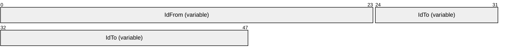
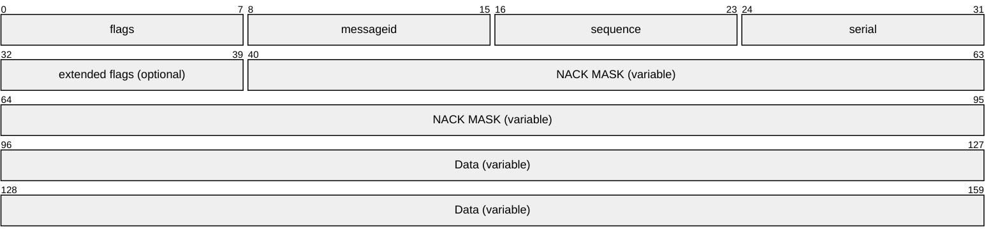
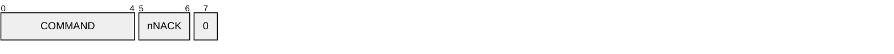
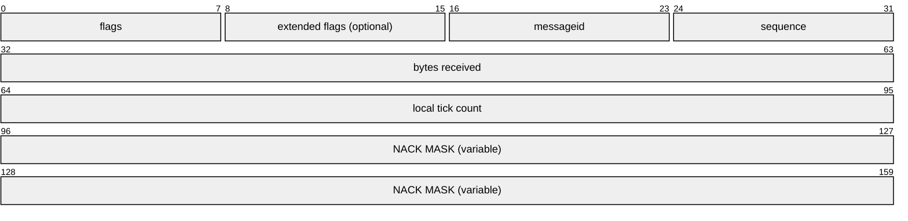
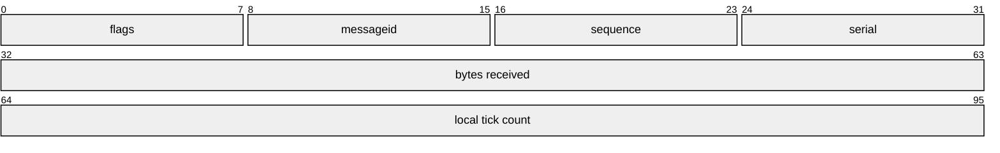

# [MC-DPL4R]: DirectPlay 4 Protocol: Reliable

Table of Contents

1 Introduction

- [1 Introduction](#Section_1)
  - [1.1 Glossary](#Section_1.1)
  - [1.2 References](#Section_1.2)
    - [1.2.1 Normative References](#Section_1.2.1)
    - [1.2.2 Informative References](#Section_1.2.2)
  - [1.3 Overview](#Section_1.3)
  - [1.4 Relationship to Other Protocols](#Section_1.4)
  - [1.5 Prerequisites/Preconditions](#Section_1.5)
  - [1.6 Applicability Statement](#Section_1.6)
  - [1.7 Versioning and Capability Negotiation](#Section_1.7)
  - [1.8 Vendor-Extensible Fields](#Section_1.8)
  - [1.9 Standards Assignments](#Section_1.9)

2 Messages

- [2 Messages](#Section_2)
  - [2.1 Transport](#Section_2.1)
  - [2.2 Message Syntax](#Section_2.2)
    - [2.2.1 Frame Format, Player Indexes Header](#Section_2.2.1)
    - [2.2.2 Frame Format, Data Frame](#Section_2.2.2)
    - [2.2.3 Frame Format, NACK Frame](#Section_2.2.3)
    - [2.2.4 Frame Format, ACK Frame](#Section_2.2.4)

3 Protocol Details

- [3 Protocol Details](#Section_3)
  - [3.1 Common Details](#Section_3.1)
    - [3.1.1 Abstract Data Model](#Section_3.1.1)
    - [3.1.2 Timers](#Section_3.1.2)
    - [3.1.3 Initialization](#Section_3.1.3)
    - [3.1.4 Higher-Layer Triggered Events](#Section_3.1.4)
    - [3.1.5 Processing Events and Sequencing Rules](#Section_3.1.5)
      - [3.1.5.1 Player Indexes Header Processing](#Section_3.1.5.1)
      - [3.1.5.2 Data Frame Processing](#Section_3.1.5.2)
      - [3.1.5.3 ACK and NACK Processing](#Section_3.1.5.3)
      - [3.1.5.4 Bytes Received Processing](#Section_3.1.5.4)
    - [3.1.6 Timer Events](#Section_3.1.6)
    - [3.1.7 Other Local Events](#Section_3.1.7)

4 Protocol Examples

- [4 Protocol Examples](#Section_4)
  - [4.1 One-Way Traffic Between Node A and Node B](#Section_4.1)
    - [4.1.1 Message 1](#Section_4.1.1)
    - [4.1.2 Message 2](#Section_4.1.2)
    - [4.1.3 Message 3](#Section_4.1.3)
    - [4.1.4 Message 4](#Section_4.1.4)

5 Security

- [5 Security](#Section_5)
  - [5.1 Security Considerations for Implementers](#Section_5.1)
  - [5.2 Index of Security Parameters](#Section_5.2)

6 Appendix A: Product Behavior

- [6 Appendix A: Product Behavior](#Section_6)

7 Change Tracking

- [7 Change Tracking](#Section_7)

For the legal notice and IP terms, see [LEGAL.md](../LEGAL.md).
Last updated: 4/23/2024.
See [Revision History](#revision-history) for full version history.

# 1 Introduction

This specification pertains to the DirectPlay 4 Protocol and describes functionality related to the reliable delivery of DirectPlay 4 messages. The DirectPlay 4 Protocol guarantees message delivery and provides [**throttling**](#gt_throttling) for applications that use DirectPlay 4.

Sections 1.5, 1.8, 1.9, 2, and 3 of this specification are normative. All other sections and examples in this specification are informative.

## 1.1 Glossary

This document uses the following terms:

**acknowledgment (ACK)**: A signal passed between communicating processes or computers to signify successful receipt of a transmission as part of a communications protocol.

**DirectPlay**: A network communication library included with the Microsoft DirectX application programming interfaces. [**DirectPlay**](#gt_directplay) is a high-level software interface between applications and communication services that makes it easy to connect games over the Internet, a modem link, or a network.

**DirectPlay 4**: A programming library that implements the IDirectPlay4 programming interface. [**DirectPlay 4**](#gt_directplay-4) provides peer-to-peer session-layer services to applications, including session lifetime management, data management, and media abstraction. [**DirectPlay 4**](#gt_directplay-4) first shipped with the DirectX 6 multimedia toolkit. Later versions continued to ship up to, and including, DirectX 9. [**DirectPlay 4**](#gt_directplay-4) was subsequently deprecated. The [**DirectPlay 4**](#gt_directplay-4) DLL continues to ship in current versions of Windows operating systems, but the development library is no longer shipping in Microsoft development tools and software development kits (SDKs).

**DirectX runtime**: A set of libraries created for the family of Windows operating systems that provide interfaces to ease the development of video games.

**DirectX Software Development Kit (DirectX SDK)**: A set of libraries, called the [**DirectX runtime**](#gt_directx-runtime), and supporting infrastructure for building applications for those libraries.

**game**: An application that uses a [**DirectPlay**](#gt_directplay) protocol to communicate between computers.

**game session**: The metadata associated with the collection of computers participating in a single instance of a computer [**game**](#gt_game).

**host**: In [**DirectPlay**](#gt_directplay), the computer responsible for responding to [**DirectPlay**](#gt_directplay) game session enumeration requests and maintaining the master copy of all the [**player**](#gt_player) and group lists for the game. One computer is designated as the [**host**](#gt_host) of the [**DirectPlay**](#gt_directplay) game session. All other participants in the [**DirectPlay**](#gt_directplay) game session are called [**peers**](#gt_peer). However, in peer-to-peer mode the name table entry representing the [**host**](#gt_host) of the session is also marked as a [**peer**](#gt_peer).

**Internetwork Packet Exchange (IPX)**: A protocol that provides connectionless datagram delivery of messages. See [[IPX]](https://go.microsoft.com/fwlink/?LinkId=89914).

**maximum transmission unit (MTU)**: The size, in bytes, of the largest packet that a given layer of a communications protocol can pass onward.

**payload**: The data that is transported to and from the application that is using either the DirectPlay 4 protocol or DirectPlay 8 protocol.

**peer**: In [**DirectPlay**](#gt_directplay), a player within a DirectPlay game session that has an established connection with every other peer in the game session, and which is not performing game session management duties. The participant that is managing the game session is called the host.

**peer-to-peer**: A server-less networking technology that allows several participating network devices to share resources and communicate directly with each other.

**player**: A person who is playing a computer game. There can be multiple players on a computer participating in any given game session. See also name table.

**player ID**: A 32-bit integer that uniquely represents a [**player**](#gt_player).

**round-trip**: A process that imports data and then exports that data without data loss.

**sequence ID**: A monotonically increasing 8-bit identifier for packets. This is typically represented as a field named bSeq in packet structures.

**serial link (or serial transport)**: Running the DXDiag application over a null modem cable connecting two computers. See also modem link.

**service provider**: A module that abstracts details of underlying transports for generic [**DirectPlay**](#gt_directplay) message transmission. Each [**DirectPlay**](#gt_directplay) message is transmitted by a [**DirectPlay**](#gt_directplay) [**service provider**](#gt_service-provider). The [**service providers**](#gt_service-provider) that shipped with [**DirectPlay 4**](#gt_directplay-4) are modem, serial, IPX, and TCP/IP.

**session layer**: The fifth layer in the Open Systems Interconnect (OSI) architectural model as defined by the International Organization for Standardization (ISO). The [**session layer**](#gt_session-layer) is used for establishing a communication session, implementing security, and performing authentication. The [**session layer**](#gt_session-layer) responds to service requests from the presentation layer and issues service requests to the transport layer.

**throttling**: The reduction in the rate of sending data when a network link saturation condition is detected.

**tick count**: In [**DirectPlay**](#gt_directplay), the count from when the system was booted, in milliseconds.

**Transmission Control Protocol (TCP)**: A protocol used with the Internet Protocol (IP) to send data in the form of message units between computers over the Internet. TCP handles keeping track of the individual units of data (called packets) that a message is divided into for efficient routing through the Internet.

**User Datagram Protocol (UDP)**: The connectionless protocol within TCP/IP that corresponds to the transport layer in the ISO/OSI reference model.

**user message**: A message that is sent between instances of an application using the DirectPlay network library as a transport.

**MAY, SHOULD, MUST, SHOULD NOT, MUST NOT:** These terms (in all caps) are used as defined in [[RFC2119]](https://go.microsoft.com/fwlink/?LinkId=90317). All statements of optional behavior use either MAY, SHOULD, or SHOULD NOT.

## 1.2 References

Links to a document in the Microsoft Open Specifications library point to the correct section in the most recently published version of the referenced document. However, because individual documents in the library are not updated at the same time, the section numbers in the documents may not match. You can confirm the correct section numbering by checking the [Errata](https://go.microsoft.com/fwlink/?linkid=850906).

### 1.2.1 Normative References

We conduct frequent surveys of the normative references to assure their continued availability. If you have any issue with finding a normative reference, please contact [dochelp@microsoft.com](mailto:dochelp@microsoft.com). We will assist you in finding the relevant information.

[MC-DPL4CS] Microsoft Corporation, "[DirectPlay 4 Protocol: Core and Service Providers](../MC-DPL4CS/MC-DPL4CS.md)".

[MS-DTYP] Microsoft Corporation, "[Windows Data Types](../MS-DTYP/MS-DTYP.md)".

[RFC2119] Bradner, S., "Key words for use in RFCs to Indicate Requirement Levels", BCP 14, RFC 2119, March 1997, [https://www.rfc-editor.org/info/rfc2119](https://go.microsoft.com/fwlink/?LinkId=90317)

[USPATENT6438603 B1] Ogus, A.W., "Methods and Protocol for Simultaneous Tuning of Reliable and Non-Reliable Channels of a Single Network Communication Link", 2002 Ogus, [https://patft.uspto.gov/netacgi/nph-Parser?Sect1=PTO1&Sect2=HITOFF&d=PALL&p=1&u=%2Fnetahtml%2FPTO%2Fsrchnum.htm&r=1&f=G&l=50&s1=6438603.PN.&OS=PN/6438603&RS=PN/6438603](https://go.microsoft.com/fwlink/?LinkId=95481)

### 1.2.2 Informative References

None.

## 1.3 Overview

This specification describes the reliable transport mechanism that can be used with the DirectPlay 4 Protocol. This mechanism provides for reliable delivery of messages, message [**throttling**](#gt_throttling) , and for applications written for the IDirectPlay4 interface. Early implementations of [**DirectPlay 4**](#gt_directplay-4) did not provide reliable delivery and throttling. As a result, in some scenarios, no reliable delivery services were available. The reliable transport mechanism combines the reliable and unreliable delivery of messages into a single channel of data. This facilitates a single set of flow control logic that provides both reliable and unreliable data delivery services, as specified in [[USPATENT6438603 B1]](https://go.microsoft.com/fwlink/?LinkId=95481).

The reliable transport mechanism used by the DirectPlay 4 Protocol is an envelope that encapsulates all messages sent between connected [**peers**](#gt_peer) when active. That is, the mechanism becomes active when the normal DirectPlay 4 connection process has completed. All messages sent to the [**host**](#gt_host) during the connection process do not use the reliable transport mechanism.

The application determines whether the reliable transport mechanism is activated. Use of reliable transport is exclusive of the use of some of the normally available security functionality in DirectPlay 4. However, when reliable transport is activated, user-level security is not available.

## 1.4 Relationship to Other Protocols

The DirectPlay 4 Protocol is an envelope that wraps both operating system messages and [**user messages**](#gt_user-message). This protocol is media-independent because it resides in the [**session layer**](#gt_session-layer) of the protocol stack. [**DirectPlay**](#gt_directplay) typically can be run using [**service providers**](#gt_service-provider) for [**TCP**](#gt_transmission-control-protocol-tcp)/IP, [**Internetwork Package Exchange (IPX)**](#gt_f4b3465a-8dcb-4e48-b4e9-1369bb1fe7af), modem, and [**serial links**](#gt_d3177233-a206-4a1c-9991-6288323da6a8). From the perspective of service providers, this is an application-layer protocol. From the perspective of applications, the DirectPlay 4 Protocol is a session-layer protocol.

The DirectPlay 4 Protocol is transmitted via the TCP and [**User Datagram Protocol (UDP)**](#gt_user-datagram-protocol-udp) protocols, as specified in the DirectPlay 4 Protocol: Core and Service Providers Specification [MC-DPL4CS](../MC-DPL4CS/MC-DPL4CS.md). At the discretion of the [**game**](#gt_game), all of the messages listed in [MC-DPL4CS] can be transmitted via the DirectPlay 4 Protocol, as described in this specification [MC-DPL4R].

## 1.5 Prerequisites/Preconditions

The DirectPlay 4 Protocol requires the [**DirectX 6 Runtime**](#gt_directx-runtime).<1>

## 1.6 Applicability Statement

The DirectPlay 4 Protocol is activated only at the request of an application that is written for the IDirectPlay4 interface and written with the [**DirectX 6 Software Development Kit**](#gt_3f00b39b-e70d-496a-9f3b-15c4fa803c97) or a later version of the DirectX Software Development Kit (DirectX SDK). All of the functionality present in the DirectPlay 4 Protocol has been superseded by the **DirectPlay 8 Protocol** and, as such, the DirectPlay 4 Protocol is only to be used when the game has a requirement to interoperate with other DirectPlay 4 games.

## 1.7 Versioning and Capability Negotiation

There is only one version of the DirectPlay 4 Protocol. It is activated at the request of the application. It is assumed that the application has taken measures to ensure that the appropriate version of the [**DirectX Runtime**](#gt_directx-runtime) has been installed on all [**peers**](#gt_peer) involved in a [**DirectPlay**](#gt_directplay) [**game session**](#gt_game-session).

If the versions of DirectPlay on all computing systems do not support the DirectPlay 4 Protocol, and the application has requested that the DirectPlay 4 Protocol be used, the connection process between peers fails gracefully. That is, a node with a version of the DirectX Runtime earlier than version 5 that is attempting to join a DirectPlay game session that has the DirectPlay 4 Protocol activated will be rejected during its join attempt.

For version negotiation between versions of DirectPlay, see [MC-DPL4CS](../MC-DPL4CS/MC-DPL4CS.md).

## 1.8 Vendor-Extensible Fields

None.

## 1.9 Standards Assignments

None.

# 2 Messages

In the DirectPlay 4 Protocol, the terms "frame" and "packet" are used interchangeably. Frames and packets refer to a single [**payload**](#gt_payload) that is passed to a lower-layer transport, which is typically constrained by the [**maximum transmission unit (MTU)**](#gt_maximum-transmission-unit-mtu) size of the network. Messages are higher-layer payloads that might be fragmented. Messages that do not fit in a single frame can span multiple frames.

The DirectPlay 4 Protocol supports three types of frames: Data, acknowledgment (ACK), and NACK.<2> The frame type is determined by the settings for the **ACK** (ACKNOWLEDGE) and **EXT** (EXTENSION) bits of the **flags** field, and the **nNACK** bits of the **extended flags** field in the packet.

| Bit Range | Field | Description |
| --- | --- | --- |
| Variable | **Data Frame** (section [2.2.2](#Section_2.2.2)) | Not Set Not Set Not present |
| Variable | **ACK Frame** (section [2.2.4](#Section_2.2.4)) | Set Not Set Not present |
| Variable | **NACK Frame** (section [2.2.3](#Section_2.2.3)) | Set Set Non-zero |

This protocol references commonly used data types as defined in [MS-DTYP](../MS-DTYP/MS-DTYP.md).

## 2.1 Transport

Messages are transported over DirectPlay [**service providers**](#gt_service-provider). They can use [**UDP**](#gt_user-datagram-protocol-udp), IPX, serial, and modem, or a third-party service provider.

## 2.2 Message Syntax

### 2.2.1 Frame Format, Player Indexes Header

All DirectPlay 4 Protocol frames begin with source and destination [**player**](#gt_player) indexes. A player index value is the raw index assigned to the player as specified in [MC-DPL4CS](../MC-DPL4CS/MC-DPL4CS.md) section 3.2.5.4. The index value is the same as the [**player ID**](#gt_player-id) except that the index does not have the XOR mask applied to achieve uniqueness, as defined in [MC-DPL4CS] section 3.2.5.4.

Each player index is encoded in a sequence that is one to three bytes in length. The sequence is based on how many bytes it takes to represent the unsigned 0-0xFFFF ID index value by using 7-bit chunks, ordered from least to most significant. The most significant bit in each byte indicates whether another byte follows in the sequence. Depending on the index value, the bytes are populated by using the following formatting rules:

- If the index value is less than 128 (seven bits), the player index is encoded by using a single byte and the most significant bit is not set. For larger values, the least significant seven bits are stored in the first byte and the high bit is set to indicate that another byte follows in the sequence.
- If the index value is less than 16,384, the second byte contains the most significant seven bits and the high bit is not set.
- If the index value is greater than 16,384, the second byte contains the next most significant seven bits and the high bit is set to indicate that another byte follows in the sequence.
- When the third byte is present, it contains the most significant bits of the player index, but only the lowest two bits are set. The high bit MUST NOT be set to indicate additional bytes in the sequence, and the decoded index value MUST NOT be larger than 0xFFFF.
For example, a player index value of 0x01 is encoded by using a single byte (0x01), and a player index value of 0xFFFE is encoded by using three bytes (0xFE, 0xFF, 0x03).

**IdFrom (variable):** The player index of the source encoded by using one to three bytes according to the formatting rules described in this section.

**IdTo (variable):** The player index of the destination encoded by using one to three bytes according to the formatting rules described in this section.

### 2.2.2 Frame Format, Data Frame

Data frames are messages that deliver user-specified data. The Data frames format specifies message boundaries and sequencing. Each message is identified by a **messageid** and each part of the message is identified by a sequence number. Each unique instance of a piece of a message is uniquely identified by a serial number. Message serial numbers help statistics-gathering mechanisms to differentiate between original instances of a message fragment and their retries.

**flags (1 byte):** A bitmask that contains values from the following table that are combined using the bitwise OR operation.

**Note** For a description of how these flags determine the frame type, see section [2](#Section_2).

| Value | Meaning |
| --- | --- |
| 0x80 | (EXT or EXTENSION) Indicates that the extended flags field is present. |
| 0x40 | (BIG) Indicates that big frame formatted is used. This value MUST be 0 because the big frame format was never implemented. |
| 0x20 | (CMD or COMMAND) Indicates that this is a Data Frame. This bit MUST be set for Data Frames. If the EXT bit is also set, the packet MUST be ignored. |
| 0x10 | (STA or START) Indicates the start of a message that can span multiple protocol frames. |
| 0x08 | (EOM or END OF MESSAGE) Indicates the end of a message that can span multiple protocol frames. |
| 0x04 | (SAK or SEND ACKNOWLEDGE) Specifies a request for immediate [**acknowledgment (ACK)**](#gt_acknowledgment-ack) after this frame is received. |
| 0x02 | (ACK or ACKNOWLEDGE) Acknowledges receipt of some frames or the nonreceipt of frames if the extended flags are present. This bit MUST NOT be set for Data Frame messages. |
| 0x01 | (RLY or RELIABLE, ~UNRELIABLE) Indicates the message is reliable if set and unreliable if not set. |

**messageid (1 byte):** A sequentially assigned value, starting at 1. The first message sent MUST be **messageid** 1. The second message sent is **messageid** 2, and so on. There MUST NOT be more than 24 outstanding **messageid**(s) on any link.

**sequence (1 byte):** The sequence number uniquely identifies the packet. It specifies the sequence space in which ACKs and NACKs are made.

**serial (1 byte):** For messages that do not span multiple packets and that set both the STA and EOM flags, the value of the serial field is the count of times this packet has been sent. If the value of serial is 0, this is the first instance of the packet. If the value of serial is 1, this is the first retry of this packet. For messages that span multiple packets, the value of serial begins at 0 for the first instance of the first packet in the message and is incremented for each additional packet in the message, as well as any retries of any of those packets.

**extended flags (1 byte):** This field is optional. It is present if the EXT bit is set in the **flags** field.<3>

**COMMAND (5 bits):** MUST be 0.

**nNACK (2 bits):** The size, in bytes, of the **NACK MASK**.

| Value | Meaning |
| --- | --- |
| 0x00 | There is no **NACK MASK** present. |
| 0x01 | There is 1 byte of **NACK MASK** present. |
| 0x02 | There are 2 bytes of **NACK MASK** present. |
| 0x03 | There are 3 bytes of **NACK MASK** present. |

**0 (1 bit):** MUST be 0.

**NACK MASK (variable):** A **NACK MASK** is sent in any message header when packets expected to be in the message stream are not received. The mask of bits specifies which packets have not been received by the receiver.

Creation of the mask is based on the sequence number in the NACK packet, which identifies the first packet that was not received. The bits in the **NACK MASK** bitmask specify which other packets relative to that sequence number have also not been received. For example, if the sequence number is 7 and the **NACK MASK** is 0x03, then packets with sequence numbers 7, 8, and 9 have not been received at the receiving end of the link.

The size of the **NACK MASK** is specified in the **nNACK** bits of the **extended flags** field, if that field is present. When **nNACK** is greater than 0, there is a **NACK MASK**. When the **extended flags** field is not present, there is no **NACK MASK** field.

The **NACK MASK** field is optional.<4>

**Data (variable):** The higher-layer data [**payload**](#gt_payload). The length of this field MUST be inferred from the remaining size of the packet reported by the lower-level transport. The size is the total number of bytes in the packet minus the 4–8 bytes of previous Data frame fields.

### 2.2.3 Frame Format, NACK Frame

NACK, or Negative [**Acknowledge**](#gt_acknowledgment-ack), frames specify which data frames were expected but were not received by the receiving end of the link. Messages that are not sent reliably MUST NOT generate a NACK.

**flags (1 byte):** A bitmask that contains values from the following table that are combined using the bitwise OR operation.

**Note** For a description of how these flags determine the frame type, see section [2](#Section_2).

| Value | Meaning |
| --- | --- |
| 0x80 | (EXT or EXTENSION) Indicates that the extended flags field is present. |
| 0x40 | (BIG) Indicates that big frame format is used. This value MUST be 0 because the big frame format was never implemented. |
| 0x20 | (CMD or COMMAND) Indicates that this is a Data Frame. This bit MUST be set for [Data Frames](#Section_2.2.2). If the EXT bit is also set, the packet MUST be ignored. |
| 0x10 | (STA or START) Indicates the start of a message that can span multiple protocol frames. |
| 0x08 | (EOM or END OF MESSAGE) Indicates the end of a message that can span multiple protocol frames. |
| 0x04 | (SAK or SEND ACKNOWLEDGE) Specifies a request for immediate acknowledgment after this frame is received. |
| 0x02 | (ACK or ACKNOWLEDGE) Acknowledges receipt of some frames; might specify the nonreceipt of frames if the extended flags are present. |
| 0x01 | (RLY or RELIABLE, ~UNRELIABLE) Indicates that the message is reliable if set and unreliable if not set. |

**extended flags (1 byte):** This field is optional. It is present if the EXT bit is set in the **flags** field.<5>

**COMMAND (5 bits):** MUST be 0x00.

**nNACK (2 bits):** The size, in bytes, of the **NACK MASK**.

| Value | Meaning |
| --- | --- |
| 0x00 | There is no **NACK MASK** present. |
| 0x01 | There is 1 byte of **NACK MASK** present. |
| 0x02 | There are 2 bytes of **NACK MASK** present. |
| 0x03 | There are 3 bytes of **NACK MASK** present. |

**0 (1 bit):** MUST be 0.

**messageid (1 byte):** The **messageid** from the sent data frame.

**sequence (1 byte):** The [**sequence ID**](#gt_sequence-id) from the sent data frame. The sequence uniquely identifies which is the first nonreceived frame.

**bytes received (4 bytes):** Specifies the total number of bytes received on the link at the time that this NACK frame was sent.

**local tick count (4 bytes):** Specifies the [**tick count**](#gt_tick-count) on the local tick clock when the NACK frame was sent.

**NACK MASK (variable):** A **NACK MASK** is sent in any message header when packets expected to be in the message stream are not received. The mask of bits specifies which packets have not been received by the receiver.

Creation of the mask is based on the sequence number in the NACK packet, which identifies the first packet that was not received. The bits in the **NACK MASK** bitmask specify which other packets relative to that sequence number have also not been received. For example, if the sequence number is 7 and the **NACK MASK** is 0x03, then packets with sequence numbers 7, 8, and 9 have not been received at the receiving end of the link.

The size of the **NACK MASK** is specified in the **nNACK** bits of the **extended flags** field, if that field is present. When **nNACK** is greater than 0, there is a **NACK MASK**. When the **extended flags** field is not present, there is no **NACK MASK** field.

The **NACK MASK** field is optional.<6>

### 2.2.4 Frame Format, ACK Frame

[**Acknowledgment (ACK)**](#gt_acknowledgment-ack) frames specify which data frames have successfully arrived at the receiving end of the link.

**flags (1 byte):** A bitmask that contains values from the following table that are combined using the bitwise OR operation.

**Note** For a description of how these flags determine the frame type, see section [2](#Section_2).

| Value | Meaning |
| --- | --- |
| 0x80 | (EXT or EXTENSION) This value MUST be set to 0. |
| 0x40 | (BIG) Indicates that big frame format is used. This value MUST be 0 because the big frame format was never implemented. |
| 0x20 | (CMD or COMMAND) Indicates that this is a Data Frame. This bit MUST be set for [Data Frames](#Section_2.2.2). If the EXT bit is also set, the packet MUST be ignored. |
| 0x10 | (STA or START) Indicates the start of a message that can span multiple protocol frames. |
| 0x08 | (EOM or END OF MESSAGE) Indicates the end of a message that can span multiple protocol frames. |
| 0x04 | (SAK or SEND ACKNOWLEDGE) Specifies a request for immediate acknowledgment after this frame is received. |
| 0x02 | (ACK or ACKNOWLEDGE) Acknowledges receipt of some frames; might specify the nonreceipt of frames if the extended flags are present. |
| 0x01 | (RLY or RELIABLE, ~UNRELIABLE) Indicates that the message is reliable if set and unreliable if not set. |

**messageid (1 byte):** The **messageid** from the sent data frame.

**sequence (1 byte):** The [**sequence ID**](#gt_sequence-id) from the sent data frame. The sequence uniquely identifies which is the last successfully received frame. Acknowledgment of a particular sequence also acknowledges receipt of all prior unacknowledged sequence numbers.

**serial (1 byte):** The number of times this packet has been sent. If the serial number is 0, this is the first instance of the packet. If the serial number is 1, this is the first retry of this packet.

**bytes received (4 bytes):** Specifies the total number of bytes received on the link at the time this ACK frame was sent.

**local tick count (4 bytes):** Specifies the [**tick count**](#gt_tick-count) on the local tick clock when the ACK frame was sent.

# 3 Protocol Details

The DirectPlay 4 Protocol is inherently [**peer-to-peer**](#gt_peer-to-peer). It was also designed to ride on top of existing connection and [**game session**](#gt_game-session) logic of the existing [**DirectPlay 4**](#gt_directplay-4) implementation. Therefore, it needs no explicit connection logic or game session management logic because that is handled by the DirectPlay 4 core, as specified in [MC-DPL4CS](../MC-DPL4CS/MC-DPL4CS.md).

## 3.1 Common Details

### 3.1.1 Abstract Data Model

**First Message**: The **messageid** of the first reliable outstanding message on the outbound link. A message is outstanding if it has been transmitted but not acknowledged.

**Last Message**: The **messageid** of the last reliable outstanding message on the outbound link.

**Outstanding Message Mask**: A mask of bits that specifies those messages between First Message and Last Message that have not been acknowledged.

**First Unreliable Message**: The **messageid** of the first outstanding message on the outbound link that is not marked as reliable.

**Last Unreliable Message**: The **messageid** of the last outstanding message on the outbound link that is not marked as reliable.

**Unreliable Outstanding Message Mask**: A mask of bits that specifies those messages between First Unreliable Message and Last Unreliable Message that have not been acknowledged.

**Unreliable Receive Queue**: A queue for assembling parts of unreliable messages before they are finally assembled and indicated.

**Reliable Receive Queue**: A queue for assembling reliable messages and maintaining their order for indication.

**First Reliable Receive**: The first **messageid** in the reliable receive queue.

**Last Reliable Receive**: The last **messageid** in the reliable receive queue.

**Reliable Receive Mask**: A mask of bits that indicates which **messageid**s relative to First Reliable Receive are reliable.

**Bytes Received**: Count of bytes received on this link.

**Average Latency**: Average latency of messages sent on this link.

### 3.1.2 Timers

The DirectPlay 4 Protocol utilizes the computing system specified in [[USPATENT6438603 B1]](https://go.microsoft.com/fwlink/?LinkId=95481) for estimating available bandwidth and tuning the link appropriately. However, using the scheme described in the patent is not required to achieve interoperability.

Timers for retries can be set according to the expected delivery time and acknowledge time, plus some amount of extra time to allow for inconsistencies in link operation.

The current implementation sets the retry time-out to the average [**round-trip**](#gt_round-trip) plus three standard deviations in the average round-trip. A simpler method can also be used, such as the average round-trip plus an extra percentage, such as 20%. When no messages have previously been sent, the initial starting value can be set to 1 second.

### 3.1.3 Initialization

All sequence numbers MUST start at 1. All serial numbers MUST start at 0.

The count of bytes received SHOULD correspond as closely as possible to the total bytes received from the sender on the receiver's link, and SHOULD include the duplicate (retransmitted) packets.

The [**tick count**](#gt_tick-count) is a 32-bit value counting 1/1000ths of a second of elapsed time. It can start at any value but MUST increase at the specified rate.

NACKs are not triggered, but only occur when missing frames are detected.

**Note** However, an implementation can attempt to trigger NACKs using a timer-based algorithm approach.

[**ACKs**](#gt_acknowledgment-ack) are triggered by either the SAK bit in the message header or by the end of the message.

ACKs MAY wait for a timer before sending, unless the SAK bit has been specified by the sender.

### 3.1.4 Higher-Layer Triggered Events

None.

### 3.1.5 Processing Events and Sequencing Rules

#### 3.1.5.1 Player Indexes Header Processing

When any frame arrives, the player indexes header specified in section [2.2.1](#Section_2.2.1) MUST be evaluated to ensure that the source and destination player indexes represent valid [**players**](#gt_player) participating in the [**game session**](#gt_game-session), as specified in [MC-DPL4CS](../MC-DPL4CS/MC-DPL4CS.md). When delivering data frame [**payloads**](#gt_payload) to the higher layer, these indexes SHOULD be provided.

#### 3.1.5.2 Data Frame Processing

When a [Data frame (section 2.2.2)](#Section_2.2.2) arrives, the value of its **messageid** field MUST be compared to the list of receiving messages using 8-bit unsigned integer math, and according to the following rules:

**Note** When processing Data frames, the receiver MUST keep track of the last **messageid** that was received reliably.

- If there are no ongoing receives or completed receives, then this **messageid** MUST become the first ongoing receive.
- If the value of the **messageid** field is outside the range of the **messageid** of the earliest ongoing or completed receive (and that **messageid**+23), the Data frame MUST be ignored.
- If no message with the **messageid** value is currently being received, the **messageid** of this message MUST be added to the list of receiving messages.
The only exception to this rule is when a reliable Data frame is received and the value of its **messageid** is the same as the last reliable message received. In this case, an [**acknowledgment (ACK)**](#gt_acknowledgment-ack) message MUST be sent back to the sender. This exception handles the situation where an ACK that was sent for a previously received message was lost. Because a message that was previously received is now being received again, it is possible that the ACK that was previously sent was lost and needs to be retransmitted.

When the **messageid** of a message is initially added to the list of receiving messages, a new message buffer MAY be allocated for the message. This buffer is used for assembling the message according to the sequence numbers associated with the **messageid** as necessary. When all of the following Data frames have been received, the Data (variable) areas of those messages are concatenated in sequence order to make up the receive data for that message:

- A Data frame with a particular **messageid**, a starting sequence, and a STA bit set.
- A Data frame with the same **messageid**, an ending sequence, and an EOM set.
- All Data frames with the same **messageid** in the contiguous intervening sequence space.
**Note** Using 8-bit unsigned integer math, if a message is not received reliably and not all parts of the message have been received, and the currently receiving **messageid** is equal to the **messageid**+24 of this unreliable message, then the unreliable message SHOULD be discarded.

During assembly of the receive data, a NACK or ACK MUST be sent in the following circumstances:

- If the sequence number is not the current expected sequence number, a NACK packet MUST be sent back to the sender. It is at the discretion of the implementation to send the NACK immediately or to wait for more time or more receive data before sending the NACK.<7> Delaying the NACK might result in efficiency gains.
- If the Data frame has its SAK bit set, an ACK or NACK MUST be sent back to the sender without waiting for more time to elapse or more data to be received.<8>
- When the final part in a multipart message is received, an ACK MUST be sent back to the sender without waiting for more time to elapse or more data to be received.
After the receive data is fully assembled, the data is indicated to the higher layers, and the **messageid** of the message MUST be removed from the list of receiving messages.

#### 3.1.5.3 ACK and NACK Processing

When an [ACK frame (section 2.2.4)](#Section_2.2.4) arrives, the data associated with the **messageid** in the [**acknowledgment (ACK)**](#gt_acknowledgment-ack) message and any earlier **messageids** MAY be discarded.

When a [NACK frame (section 2.2.3)](#Section_2.2.3) arrives, the data associated with the **messageid**-1 in the NACK frame (section 2.2.3) MAY be discarded. Any other data is indicated as received, but the presence of a 0 bit in the NACK mask can also be discarded. Any other data MUST be retransmitted.

#### 3.1.5.4 Bytes Received Processing

Any time that data arrives from a remote sender, the size of the entire [Data Frame (section 2.2.2)](#Section_2.2.2), not including the player indexes header (section [2.2.1](#Section_2.2.1)), is accumulated in a per-link value called bytes received. This value is included in any [**acknowledgment (ACK)**](#gt_acknowledgment-ack) or NACK message on that link.

### 3.1.6 Timer Events

Timers are recommended as specified in [[USPATENT6438603 B1]](https://go.microsoft.com/fwlink/?LinkId=95481). However, this scheme is not required to achieve interoperability.

### 3.1.7 Other Local Events

None.

# 4 Protocol Examples

## 4.1 One-Way Traffic Between Node A and Node B

In the following examples, one-way traffic between Node A and Node B is covered. Node A sends four messages to Node B:

- Message 1: Three Data frames (section [2.2.2](#Section_2.2.2)) in length, marked as reliable.
- Message 2: One Data frame in length, not marked as reliable.
- Message 3: One Data frame in length, marked as reliable, will drop in first transmission.
- Message 4: Two Data frames in length, not marked as reliable.

### 4.1.1 Message 1

Node A sends Message 1 to the receiver, Node B. This message is three [Data frames (section 2.2.2)](#Section_2.2.2) in length and is marked as reliable.

Message 1: DATA FRAME: 1

Flags: STA, RLY messageid: 0, sequence: 0, serial: 0

Message 1: DATA FRAME: 2

Flags: RLY messageid: 0, sequence: 1, serial: 1

Message 1: DATA FRAME: 3

Flags: EOM, RLY messageid: 0, sequence: 2, serial: 2

All three Data frames arrive on the receiver, Node B, and the receiver indicates this to the higher layers.

The receiver sends back an [ACK](#Section_3.1.5.3) frame to the sender, Node A.

Flags: ACK messageid: 0, sequence: 2, bytes received: 4500

### 4.1.2 Message 2

Node A sends Message 2 to the receiver, Node B. This message is one [Data frame (section 2.2.2)](#Section_2.2.2) in length and is not marked as reliable.

Message 2: DATA FRAME

Flags: STA, EOM messageid: 1, sequence: 3, serial: 0

It is possible that there can be an [**ACK**](#gt_acknowledgment-ack) by the receiver for a frame that is not marked as reliable; this is at the discretion of the implementation. However, sending an ACK allows the sender, Node A, to manage resources more efficiently.

### 4.1.3 Message 3

Node A sends Message 3 to the receiver, Node B. This message is one [Data frame (section 2.2.2)](#Section_2.2.2) in length, is marked as reliable, and will drop the first transmission.

Message 3: DATA FRAME

Flags: STA, EOM, RLY messageid: 2, sequence: 4, serial:0

If Message 3 is dropped, but the sender, Node A, still sends Message 4 (section [4.1.4)](#Section_1a592f09063043808f07e486a67e8a65) to the receiver, Node B, this would result in the following.

Message 4: DATA FRAME: 1

Flags: STA messageid: 3, sequence: 5, serial: 0

Message 4: DATA FRAME: 2

Flags: EOM messageid: 3, sequence: 6, serial: 1

This can trigger a NACK on the receiver, Node B.

The receiver, Node B, sends back a NACK to the sender, Node A.

Flags: NACK messageid: 2, sequence: 4,

nNACK: 0, no NACK mask present, bytes received 8954

In response to the NACK, the sender, Node A, attempts a retransmission of Message 3 to Node B.

Message 3: DATA FRAME (retry)

Flags: STA, EOM, RLY messageid: 2, sequence: 4, serial: 1

### 4.1.4 Message 4

The sender, Node A, sends Message 4 to the receiver, Node B. This message is two [Data frames (section 2.2.2)](#Section_2.2.2) in length and is not marked as reliable.

Message 4: DATA FRAME: 1

Flags: STA messageid: 3, sequence: 5, serial: 0

Message 4: DATA FRAME: 2

Flags: EOM messageid: 3, sequence: 6, serial: 0

This can trigger a NACK on the receiver. For more information, see section [4.1.3](#Section_4.1.3).

# 5 Security

## 5.1 Security Considerations for Implementers

None.

## 5.2 Index of Security Parameters

None.

# 6 Appendix A: Product Behavior

The information in this specification is applicable to the following Microsoft products or supplemental software. References to product versions include updates to those products.

- Windows NT operating system
- Windows 2000 operating system
- Windows XP operating system
- Windows Server 2003 operating system
- Windows Vista operating system
- Windows Server 2008 operating system
- Windows 7 operating system
- Windows Server 2008 R2 operating system
- Windows 8 operating system
- Windows Server 2012 operating system
- Windows 8.1 operating system
- Windows Server 2012 R2 operating system
- Windows 10 operating system
- Windows Server 2016 operating system
- Windows Server 2019 operating system
- Windows Server 2022 operating system
- Windows 11 operating system
- Windows Server 2025 operating system
Exceptions, if any, are noted in this section. If an update version, service pack or Knowledge Base (KB) number appears with a product name, the behavior changed in that update. The new behavior also applies to subsequent updates unless otherwise specified. If a product edition appears with the product version, behavior is different in that product edition.

Unless otherwise specified, any statement of optional behavior in this specification that is prescribed using the terms "SHOULD" or "SHOULD NOT" implies product behavior in accordance with the SHOULD or SHOULD NOT prescription. Unless otherwise specified, the term "MAY" implies that the product does not follow the prescription.

<1> Section 1.5: The DirectPlay 4 Protocol is available only in Windows operating systems that have the [**DirectX 6 runtime**](#gt_directx-runtime) (from the [**DirectX 6 Software Development Kit (DirectX SDK)**](#gt_3f00b39b-e70d-496a-9f3b-15c4fa803c97)) or a later version of the runtime installed. All Microsoft products listed above meet this requirement.

<2> Section 2: NACK frames are not implemented in Windows [**DirectPlay 4**](#gt_directplay-4) implementation.

<3> Section 2.2.2: The Windows DirectPlay 4 implementation does not support extended flags and therefore does not set or expect to receive messages with the EXT bit set.

<4> Section 2.2.2: Because the extended flags field is not supported by Windows implementations, the **NACK MASK** field is also not supported

<5> Section 2.2.3: The Windows DirectPlay 4 implementation does not support extended flags and therefore does not set or expect to receive messages with the EXT bit set.

<6> Section 2.2.3: Because the extended flags field is not supported by Windows implementations, the **NACK MASK** field is also not supported.

<7> Section 3.1.5.2: The Windows DirectPlay 4 implementation sends NACKs without waiting for more time to elapse or more data to be received.

<8> Section 3.1.5.2: The Windows DirectPlay 4 implementation sets the SAK bit when any one of the following applies:

- The EOM bit is not set or the higher layer requested the message to be sent using reliable delivery, and the time since the last SAK request is greater than 50 milliseconds and greater than one quarter of the estimated [**round-trip**](#gt_round-trip) latency of the connection.
- The packet is being retransmitted.
- There have been 24 packets since the last packet was sent with the SAK bit set.

# 7 Change Tracking

This section identifies changes that were made to this document since the last release. Changes are classified as Major, Minor, or None.

The revision class **Major** means that the technical content in the document was significantly revised. Major changes affect protocol interoperability or implementation. Examples of major changes are:

- A document revision that incorporates changes to interoperability requirements.
- A document revision that captures changes to protocol functionality.
The revision class **Minor** means that the meaning of the technical content was clarified. Minor changes do not affect protocol interoperability or implementation. Examples of minor changes are updates to clarify ambiguity at the sentence, paragraph, or table level.

The revision class **None** means that no new technical changes were introduced. Minor editorial and formatting changes may have been made, but the relevant technical content is identical to the last released version.

The changes made to this document are listed in the following table. For more information, please contact [dochelp@microsoft.com](mailto:dochelp@microsoft.com).

| Section | Description | Revision class |
| --- | --- | --- |
| [6](#Section_6) Appendix A: Product Behavior | Added Windows Server 2025 to the list of applicable products. | Major |

## Revision History

| Date | Version | Revision Class | Comments |
| --- | --- | --- | --- |
| 8/10/2007 | 0.1 | Major | Initial Availability |
| 9/28/2007 | 0.2 | Minor | Clarified the meaning of the technical content. |
| 10/23/2007 | 0.2.1 | Editorial | Changed language and formatting in the technical content. |
| 11/30/2007 | 1.0 | Major | Updated and revised the technical content. |
| 1/25/2008 | 2.0 | Major | Updated and revised the technical content. |
| 3/14/2008 | 3.0 | Major | Updated and revised the technical content. |
| 5/16/2008 | 3.0.1 | Editorial | Changed language and formatting in the technical content. |
| 6/20/2008 | 3.1 | Minor | Clarified the meaning of the technical content. |
| 7/25/2008 | 3.1.1 | Editorial | Changed language and formatting in the technical content. |
| 8/29/2008 | 3.1.2 | Editorial | Changed language and formatting in the technical content. |
| 10/24/2008 | 3.2 | Minor | Clarified the meaning of the technical content. |
| 12/5/2008 | 3.2.1 | Editorial | Editorial Update. |
| 1/16/2009 | 3.2.2 | Editorial | Changed language and formatting in the technical content. |
| 2/27/2009 | 4.0 | Major | Updated and revised the technical content. |
| 4/10/2009 | 4.0.1 | Editorial | Changed language and formatting in the technical content. |
| 5/22/2009 | 4.1 | Minor | Clarified the meaning of the technical content. |
| 7/2/2009 | 4.1.1 | Editorial | Changed language and formatting in the technical content. |
| 8/14/2009 | 4.1.2 | Editorial | Changed language and formatting in the technical content. |
| 9/25/2009 | 4.2 | Minor | Clarified the meaning of the technical content. |
| 11/6/2009 | 4.2.1 | Editorial | Changed language and formatting in the technical content. |
| 12/18/2009 | 4.2.2 | Editorial | Changed language and formatting in the technical content. |
| 1/29/2010 | 5.0 | Major | Updated and revised the technical content. |
| 3/12/2010 | 5.0.1 | Editorial | Changed language and formatting in the technical content. |
| 4/23/2010 | 5.0.2 | Editorial | Changed language and formatting in the technical content. |
| 6/4/2010 | 6.0 | Major | Updated and revised the technical content. |
| 7/16/2010 | 7.0 | Major | Updated and revised the technical content. |
| 8/27/2010 | 7.1 | Minor | Clarified the meaning of the technical content. |
| 10/8/2010 | 7.1 | None | No changes to the meaning, language, or formatting of the technical content. |
| 11/19/2010 | 7.1 | None | No changes to the meaning, language, or formatting of the technical content. |
| 1/7/2011 | 7.1 | None | No changes to the meaning, language, or formatting of the technical content. |
| 2/11/2011 | 7.1 | None | No changes to the meaning, language, or formatting of the technical content. |
| 3/25/2011 | 7.1 | None | No changes to the meaning, language, or formatting of the technical content. |
| 5/6/2011 | 7.1 | None | No changes to the meaning, language, or formatting of the technical content. |
| 6/17/2011 | 7.2 | Minor | Clarified the meaning of the technical content. |
| 9/23/2011 | 7.2 | None | No changes to the meaning, language, or formatting of the technical content. |
| 12/16/2011 | 8.0 | Major | Updated and revised the technical content. |
| 3/30/2012 | 8.0 | None | No changes to the meaning, language, or formatting of the technical content. |
| 7/12/2012 | 8.0 | None | No changes to the meaning, language, or formatting of the technical content. |
| 10/25/2012 | 8.0 | None | No changes to the meaning, language, or formatting of the technical content. |
| 1/31/2013 | 8.0 | None | No changes to the meaning, language, or formatting of the technical content. |
| 8/8/2013 | 9.0 | Major | Updated and revised the technical content. |
| 11/14/2013 | 9.0 | None | No changes to the meaning, language, or formatting of the technical content. |
| 2/13/2014 | 9.0 | None | No changes to the meaning, language, or formatting of the technical content. |
| 5/15/2014 | 9.0 | None | No changes to the meaning, language, or formatting of the technical content. |
| 6/30/2015 | 10.0 | Major | Significantly changed the technical content. |
| 10/16/2015 | 10.0 | None | No changes to the meaning, language, or formatting of the technical content. |
| 7/14/2016 | 10.0 | None | No changes to the meaning, language, or formatting of the technical content. |
| 6/1/2017 | 10.0 | None | No changes to the meaning, language, or formatting of the technical content. |
| 9/15/2017 | 11.0 | Major | Significantly changed the technical content. |
| 9/12/2018 | 12.0 | Major | Significantly changed the technical content. |
| 4/7/2021 | 13.0 | Major | Significantly changed the technical content. |
| 6/25/2021 | 14.0 | Major | Significantly changed the technical content. |
| 4/23/2024 | 15.0 | Major | Significantly changed the technical content. |
