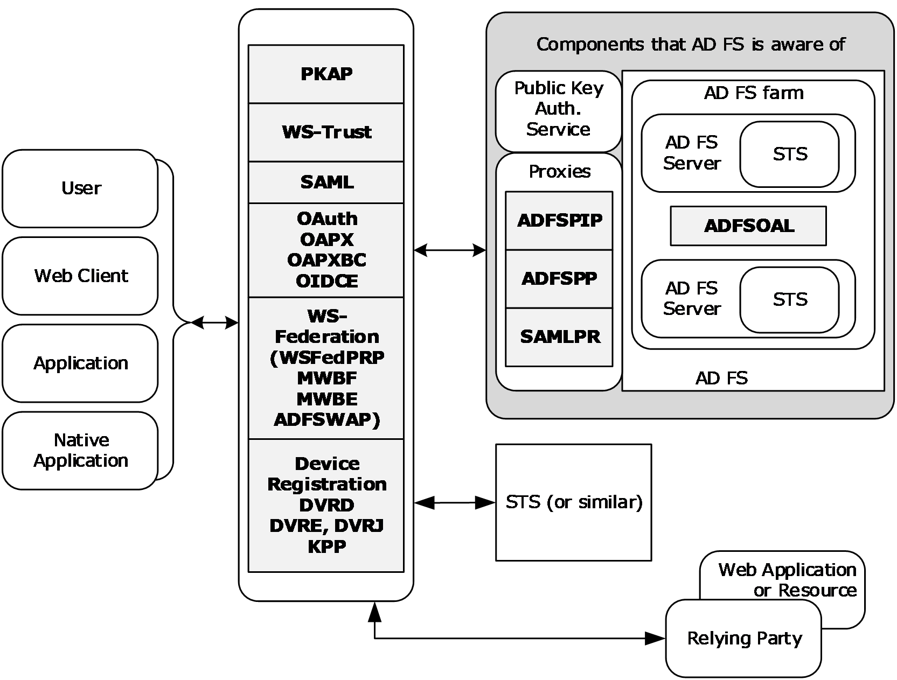
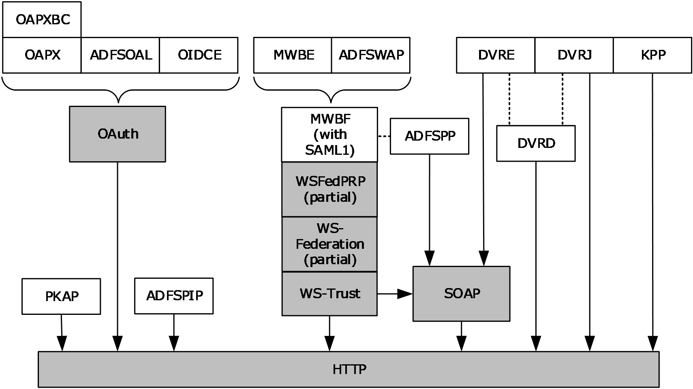
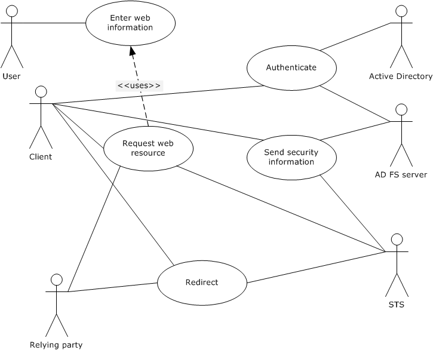
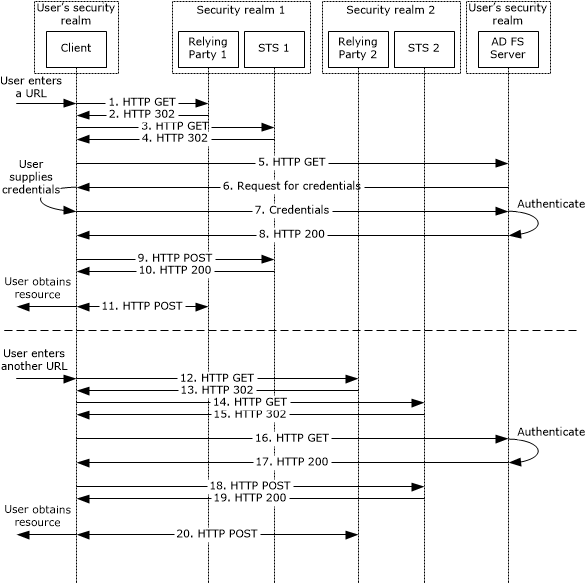
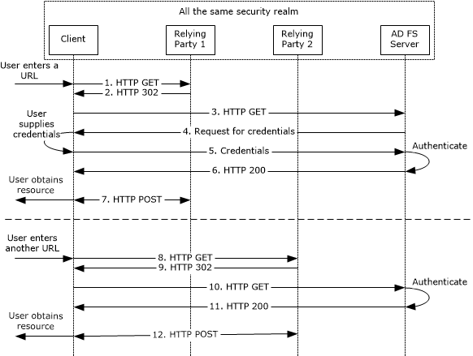

# [MS-ADFSOD]: Active Directory Federation Services (AD FS) Protocols Overview

Table of Contents

1 Introduction

- [1 Introduction](#Section_1)
  - [1.1 Glossary](#Section_1.1)
  - [1.2 References](#Section_1.2)
  - [1.3 Overview](#Section_1.3)
  - [1.4 Prerequisites/Preconditions](#Section_1.4)

2 Functional Description

- [2 Functional Description](#Section_2)
  - [2.1 Summary of Protocols](#Section_2.1)
  - [2.2 Components and Capabilities](#Section_2.2)
    - [2.2.1 STS Token Generation](#Section_2.2.1)
      - [2.2.1.1 WS-Federation](#Section_2.2.1.1)
      - [2.2.1.2 WS-Trust](#Section_2.2.1.2)
      - [2.2.1.3 OAuth and OpenID Connect](#Section_2.2.1.3)
      - [2.2.1.4 SAML](#Section_2.2.1.4)
    - [2.2.2 STS Deployed on the Edge](#Section_2.2.2)
    - [2.2.3 Device Registration](#Section_2.2.3)
    - [2.2.4 Authentication Using JSON Web Tokens](#Section_2.2.4)
  - [2.3 Protocol Relationships](#Section_2.3)
  - [2.4 Coherency Requirements](#Section_2.4)
  - [2.5 Security](#Section_2.5)
  - [2.6 Additional Considerations](#Section_2.6)

3 Use Cases

- [3 Use Cases](#Section_3)
  - [3.1 Single Sign-on Using a Security Token Service and WS-Federation](#Section_3.1)
    - [3.1.1 Success Cases](#Section_3.1.1)
      - [3.1.1.1 User and Relying Party in Different Realms Example](#Section_3.1.1.1)
      - [3.1.1.2 User and Relying Party in Same Realm Example](#Section_3.1.1.2)

4 Appendix A: Product Behavior

- [4 Appendix A: Product Behavior](#Section_4)

5 Change Tracking

- [5 Change Tracking](#Section_5)

For the legal notice and IP terms, see [LEGAL.md](../LEGAL.md).
Last updated: 10/26/2021.
See [Revision History](#revision-history) for full version history.

# 1 Introduction

This document provides an overview of the protocols that support [**Active Directory Federation Services (AD FS)**](#gt_active-directory-federation-services-ad-fs).

## 1.1 Glossary

This document uses the following terms:

**Active Directory**: The Windows implementation of a general-purpose directory service, which uses LDAP as its primary access protocol. [**Active Directory**](#gt_active-directory) stores information about a variety of objects in the network such as user accounts, computer accounts, groups, and all related credential information used by Kerberos [MS-KILE](../MS-KILE/MS-KILE.md). [**Active Directory**](#gt_active-directory) is either deployed as [**Active Directory Domain Services (AD DS)**](#gt_active-directory-domain-services-ad-ds) or Active Directory Lightweight Directory Services (AD LDS), which are both described in [MS-ADOD](../MS-ADOD/MS-ADOD.md): Active Directory Protocols Overview.

**Active Directory Domain Services (AD DS)**: A directory service (DS) implemented by a domain controller (DC). The DS provides a data store for objects that is distributed across multiple DCs. The DCs interoperate as peers to ensure that a local change to an object replicates correctly across DCs. AD DS is a deployment of [**Active Directory**](#gt_active-directory) [MS-ADTS](../MS-ADTS/MS-ADTS.md).

**Active Directory Federation Services (AD FS)**: A Microsoft implementation of a federation services provider, which provides a security token service (STS) that can issue security tokens to a caller using various protocols such as WS-Trust, WS-Federation, and Security Assertion Markup Language (SAML) version 2.0.

**Active Directory Federation Services (AD FS) farm**: A collection of AD FS servers that is typically maintained by an enterprise to obtain greater redundancy and offer more reliable service than a single standalone AD FS server.

**ADFSOAL**: The Active Directory Federation Services OAuth Authorization Code Lookup Protocol [MS-ADFSOAL](../MS-ADFSOAL/MS-ADFSOAL.md).

**ADFSPIP**: The Active Directory Federation Services and Proxy Integration Protocol [MS-ADFSPIP](../MS-ADFSPIP/MS-ADFSPIP.md).

**ADFSPP**: Active Directory Federation Service (AD FS) Proxy Protocol [MS-ADFSPP](../MS-ADFSPP/MS-ADFSPP.md)

**ADFSWAP**: Active Directory Federation Service (AD FS) Web Agent Protocol [MS-ADFSWAP](../MS-ADFSWAP/MS-ADFSWAP.md).

**authorization code**: An authorization code as defined in [[RFC6749]](https://go.microsoft.com/fwlink/?LinkId=301486) section 1.3.1.

**certificate**: When referring to X.509v3 certificates, that information consists of a public key, a distinguished name (DN) of some entity assumed to have control over the private key corresponding to the public key in the certificate, and some number of other attributes and extensions assumed to relate to the entity thus referenced. Other forms of certificates can bind other pieces of information.

**claim**: A declaration made by an entity (for example, name, identity, key, group, privilege, and capability). For more information, see [[WSFederation1.2]](https://go.microsoft.com/fwlink/?LinkId=306270).

**federation**: A collection of security realms that have established trust.

**Hypertext Transfer Protocol (HTTP)**: An application-level protocol for distributed, collaborative, hypermedia information systems (text, graphic images, sound, video, and other multimedia files) on the World Wide Web.

**JavaScript Object Notation (JSON)**: A text-based, data interchange format that is used to transmit structured data, typically in Asynchronous JavaScript + XML (AJAX) web applications, as described in [[RFC7159]](https://go.microsoft.com/fwlink/?linkid=842522). The JSON format is based on the structure of ECMAScript (Jscript, JavaScript) objects.

**JSON Web Token (JWT)**: A type of token that includes a set of claims encoded as a JSON object. For more information, see [[RFC7519]](https://go.microsoft.com/fwlink/?LinkId=824833).

**locally unique identifier (LUID)**: A 64-bit value guaranteed to be unique within the scope of a single machine.

**MWBE**: Microsoft Web Browser Federated Sign-On Protocol Extensions [MS-MWBE](../MS-MWBE/MS-MWBE.md).

**MWBF**: Microsoft Web Browser Federated Sign-On Protocol [MS-MWBF](../MS-MWBF/MS-MWBF.md).

**OAPX**: OAuth 2.0 Protocol Extensions [MS-OAPX](../MS-OAPX/MS-OAPX.md).

**OAuth**: The OAuth 2.0 authorization framework [RFC6749].

**pre-authentication**: In [**Active Directory Federation Services (AD FS)**](#gt_active-directory-federation-services-ad-fs), the act of enforcing authentication of a user on the edge of a protected network boundary.

**realm**: An administrative boundary that uses one set of authentication servers to manage and deploy a single set of unique identifiers. A realm is a unique logon space.

**relying party (RP)**: A web application or service that consumes [**security tokens**](#gt_security-token) issued by a [**security token service (STS)**](#gt_security-token-service-sts).

**Representational State Transfer (REST)**: A class of web services that is used to transfer domain-specific data by using [**HTTP**](#gt_hypertext-transfer-protocol-http), without additional messaging layers or session tracking, and returns textual data, such as XML.

**SAML1**: The Security Assertion Markup Language (SAML) 1.1 [[SAMLCore]](https://go.microsoft.com/fwlink/?LinkId=90508).

**SAML2**: The Security Assertion Markup Language (SAML) 2.0 [[SAMLCore2]](https://go.microsoft.com/fwlink/?LinkId=216915).

**SAMLPR**: Security Assertion Markup Language (SAML) Proxy Request Signing Protocol [MS-SAMLPR](../MS-SAMLPR/MS-SAMLPR.md).

**Secure Sockets Layer (SSL)**: A security protocol that supports confidentiality and integrity of messages in client and server applications that communicate over open networks. SSL supports server and, optionally, client authentication using [**X.509**](#gt_x509) [**certificates**](#gt_certificate) [[X509]](https://go.microsoft.com/fwlink/?LinkId=90590) and [[RFC5280]](https://go.microsoft.com/fwlink/?LinkId=131034). SSL is superseded by [**Transport Layer Security (TLS)**](#gt_transport-layer-security-tls). TLS version 1.0 is based on SSL version 3.0 [[SSL3]](https://go.microsoft.com/fwlink/?LinkId=90534).

**security identifier (SID)**: An identifier for security principals that is used to identify an account or a group. Conceptually, the [**SID**](#gt_security-identifier-sid) is composed of an account authority portion (typically a domain) and a smaller integer representing an identity relative to the account authority, termed the relative identifier (RID). The [**SID**](#gt_security-identifier-sid) format is specified in [MS-DTYP](../MS-DTYP/MS-DTYP.md) section 2.4.2; a string representation of [**SIDs**](#gt_security-identifier-sid) is specified in [MS-DTYP] section 2.4.2 and [MS-AZOD](../MS-AZOD/MS-AZOD.md) section 1.1.1.2.

**security token**: A collection of one or more [**claims**](#gt_claim). Specifically in the case of mobile devices, a [**security token**](#gt_security-token) represents a previously authenticated user as defined in the Mobile Device Enrollment Protocol [MS-MDE](../MS-MDE/MS-MDE.md).

**security token service (STS)**: A web service that issues [**security tokens**](#gt_security-token). That is, it makes assertions based on evidence that it trusts; these assertions are for consumption by whoever trusts it.

**single sign-on (SSO)**: An authentication and authorization scheme in which a user needs only one set of credentials in order to access unrelated network resources.

**SOAP**: A lightweight protocol for exchanging structured information in a decentralized, distributed environment. [**SOAP**](#gt_soap) uses XML technologies to define an extensible messaging framework, which provides a message construct that can be exchanged over a variety of underlying protocols. The framework has been designed to be independent of any particular programming model and other implementation-specific semantics. SOAP 1.2 supersedes SOAP 1.1. See [[SOAP1.2-1/2003]](https://go.microsoft.com/fwlink/?LinkId=90521).

**Transport Layer Security (TLS)**: A security protocol that supports confidentiality and integrity of messages in client and server applications communicating over open networks. TLS supports server and, optionally, client authentication by using X.509 certificates (as specified in [X509]). TLS is standardized in the IETF TLS working group.

**user principal name (UPN)**: A user account name (sometimes referred to as the user logon name) and a domain name that identifies the domain in which the user account is located. This is the standard usage for logging on to a Windows domain. The format is: someone@example.com (in the form of an email address). In [**Active Directory**](#gt_active-directory), the userPrincipalName attribute of the account object, as described in [MS-ADTS].

**web service (WS) resource**: A destination HTTP 1.1 web application or an HTTP 1.1 resource serviced by the application. In the context of this protocol, it refers to the application or manager of the resource that receives identity information and assertions issued by an IP/STS using this protocol. The [**WS resource**](#gt_28fd7066-2fd2-45d7-8f92-5b7c3dceebcc) is a [**relying party**](#gt_relying-party-rp) in the context of this protocol. For more information, see [WSFederation1.2].

**WS-Federation**: The Web Services Federation Language [[WSFederation]](https://go.microsoft.com/fwlink/?LinkId=90581).

**WSFedPRP**: The WS-Federation: Passive Requestor Profile [WSFederation1.2].

**WS-Trust**: The Web Services Trust Language [[WSTrust]](https://go.microsoft.com/fwlink/?LinkId=90584).

**X.509**: An ITU-T standard for public key infrastructure subsequently adapted by the IETF, as specified in [[RFC3280]](https://go.microsoft.com/fwlink/?LinkId=90414).

## 1.2 References

Links to a document in the Microsoft Open Specifications library point to the correct section in the most recently published version of the referenced document. However, because individual documents in the library are not updated at the same time, the section numbers in the documents may not match. You can confirm the correct section numbering by checking the [Errata](https://go.microsoft.com/fwlink/?linkid=850906).

[MS-ADFSOAL] Microsoft Corporation, "[Active Directory Federation Services OAuth Authorization Code Lookup Protocol](../MS-ADFSOAL/MS-ADFSOAL.md)".

[MS-ADFSPIP] Microsoft Corporation, "[Active Directory Federation Services and Proxy Integration Protocol](../MS-ADFSPIP/MS-ADFSPIP.md)".

[MS-ADFSPP] Microsoft Corporation, "[Active Directory Federation Service (AD FS) Proxy Protocol](../MS-ADFSPP/MS-ADFSPP.md)".

[MS-ADFSWAP] Microsoft Corporation, "[Active Directory Federation Service (AD FS) Web Agent Protocol](../MS-ADFSWAP/MS-ADFSWAP.md)".

[MS-DVRD] Microsoft Corporation, "[Device Registration Discovery Protocol](../MS-DVRD/MS-DVRD.md)".

[MS-DVRE] Microsoft Corporation, "[Device Registration Enrollment Protocol](../MS-DVRE/MS-DVRE.md)".

[MS-DVRJ] Microsoft Corporation, "[Device Registration Join Protocol](../MS-DVRJ/MS-DVRJ.md)".

[MS-KPP] Microsoft Corporation, "[Key Provisioning Protocol](../MS-KPP/MS-KPP.md)".

[MS-MWBE] Microsoft Corporation, "[Microsoft Web Browser Federated Sign-On Protocol Extensions](../MS-MWBE/MS-MWBE.md)".

[MS-MWBF] Microsoft Corporation, "[Microsoft Web Browser Federated Sign-On Protocol](../MS-MWBF/MS-MWBF.md)".

[MS-OAPXBC] Microsoft Corporation, "[OAuth 2.0 Protocol Extensions for Broker Clients](../MS-OAPXBC/MS-OAPXBC.md)".

[MS-OAPX] Microsoft Corporation, "[OAuth 2.0 Protocol Extensions](../MS-OAPX/MS-OAPX.md)".

[MS-OIDCE] Microsoft Corporation, "[OpenID Connect 1.0 Protocol Extensions](../MS-OIDCE/MS-OIDCE.md)".

[MS-PKAP] Microsoft Corporation, "[Public Key Authentication Protocol](../MS-PKAP/MS-PKAP.md)".

[MS-SAMLPR] Microsoft Corporation, "[Security Assertion Markup Language (SAML) Proxy Request Signing Protocol](../MS-SAMLPR/MS-SAMLPR.md)".

[MSFT-ADFS-DeepDive] Gregory, David, "ADFS Deep-Dive: Comparing WS-Fed, SAML, and OAuth", [https://techcommunity.microsoft.com/t5/core-infrastructure-and-security/adfs-deep-dive-comparing-ws-fed-saml-and-oauth/ba-p/257584](https://go.microsoft.com/fwlink/?linkid=2152864)

[MSFT-ADFS2SEC] Microsoft Corporation, "Active Directory Federation Services 2.0 Security Target", March 2012, [https://www.commoncriteriaportal.org/files/epfiles/ADFS_ST.pdf](https://go.microsoft.com/fwlink/?LinkId=620785)

[MSFT-ADFSOV2] Microsoft Corporation, "Active Directory Federation Services Overview", [http://technet.microsoft.com/en-in/library/hh831502.aspx](https://go.microsoft.com/fwlink/?LinkId=620788)

[MSFT-ADFSOV] Microsoft Corporation, "Active Directory Federation Services (AD FS) Overview", [http://social.technet.microsoft.com/wiki/contents/articles/1011.active-directory-federation-services-ad-fs-overview.aspx](https://go.microsoft.com/fwlink/?LinkId=620787)

[OIDCCore] Sakimura, N., Bradley, J., Jones, M., de Medeiros, B., and Mortimore, C., "OpenID Connect Core 1.0 incorporating errata set 1", November 2014, [http://openid.net/specs/openid-connect-core-1_0.html](https://go.microsoft.com/fwlink/?LinkId=523840)

[OIDCDiscovery] Sakimura, N., Bradley, J., Jones, M., and Jay, Edmund, "OpenID Connect Discovery 1.0 incorporating errata set 1", November 2014, [http://openid.net/specs/openid-connect-discovery-1_0.html](https://go.microsoft.com/fwlink/?LinkId=529548)

[RFC2616] Fielding, R., Gettys, J., Mogul, J., et al., "Hypertext Transfer Protocol -- HTTP/1.1", RFC 2616, June 1999, [http://www.rfc-editor.org/rfc/rfc2616.txt](https://go.microsoft.com/fwlink/?LinkId=90372)

[RFC2818] Rescorla, E., "HTTP Over TLS", RFC 2818, May 2000, [http://www.rfc-editor.org/rfc/rfc2818.txt](https://go.microsoft.com/fwlink/?LinkId=90383)

[RFC2965] Kristol, D. and Montulli, L., "HTTP State Management Mechanism", RFC 2965, October 2000, [http://www.ietf.org/rfc/rfc2965.txt](https://go.microsoft.com/fwlink/?LinkId=90399)

[RFC6749] Hardt, D., Ed., "The OAuth 2.0 Authorization Framework", RFC 6749, October 2012, [http://www.rfc-editor.org/rfc/rfc6749.txt](https://go.microsoft.com/fwlink/?LinkId=301486)

[SAMLCore2] Cantor, S., Kemp, J., Philpott, R., and Maler, E., Eds., "Assertions and Protocol for the OASIS Security Assertion Markup Language (SAML) V2.0", March 2005, [http://docs.oasis-open.org/security/saml/v2.0/saml-core-2.0-os.pdf](https://go.microsoft.com/fwlink/?LinkId=216915)

[SAMLCore] Maler, E., Mishra, P., Philpott, R., et al., "Assertions and Protocol for the OASIS Security Assertion Markup Language (SAML) V1.1", September 2003, [http://www.oasis-open.org/committees/download.php/3406/oasis-sstc-saml-core-1.1.pdf](https://go.microsoft.com/fwlink/?LinkId=90508)

[WSFederation1.2] Kaler, C., McIntosh, M., "Web Services Federation Language (WS-Federation)", Version 1.2, May 2009, [http://docs.oasis-open.org/wsfed/federation/v1.2/os/ws-federation-1.2-spec-os.html](https://go.microsoft.com/fwlink/?LinkId=306270)

[WSFederation] Kaler, C., Nadalin, A., Bajaj, S., et al., "Web Services Federation Language (WS-Federation)", Version 1.1, December 2006, [http://specs.xmlsoap.org/ws/2006/12/federation/ws-federation.pdf](https://go.microsoft.com/fwlink/?LinkId=90581)

[WSTrust] IBM, Microsoft, Nortel, VeriSign, "WS-Trust V1.0", February 2005, [http://specs.xmlsoap.org/ws/2005/02/trust/WS-Trust.pdf](https://go.microsoft.com/fwlink/?LinkId=90584)

[X509] ITU-T, "Information Technology - Open Systems Interconnection - The Directory: Public-Key and Attribute Certificate Frameworks", Recommendation X.509, August 2005, [http://www.itu.int/rec/T-REC-X.509/en](https://go.microsoft.com/fwlink/?LinkId=90590)

## 1.3 Overview

[**Active Directory Federation Services (AD FS)**](#gt_active-directory-federation-services-ad-fs) provides a means for distributed identification, authentication, and authorization across organizational and platform boundaries. Put another way, AD FS, and [**federation**](#gt_federation) in general, decouples the function of identity provider from the function of resource provider.

This decoupling, and its natural extension in [**single sign-on (SSO)**](#gt_single-sign-on-sso) functionality, is normally available only within a single security or enterprise boundary; AD FS extends this ability to Internet-facing applications. This extension gives customers, partners, and suppliers a streamlined user experience while accessing the web-based applications of an organization.

In its most general use, AD FS is about relationships between organizations, although variations on that theme are becoming more common. In this most common scenario, high-level AD FS behavior appears to enable the sharing of identity, authentication, and authorization information between organizations. More accurately, AD FS allows the creation of trust between two organizations: the organization with resources or services that are being accessed, known as the *resource partner*, and the organization that holds the accounts of the clients that are accessing the resources, known as the *account partner*. Once that trust is established, the resource partner does not need to maintain identity information about external clients that are accessing internal resources. Rather, it can depend on the account partner to apply appropriate security policies to the client accounts being held by the account partner.

A major component of AD FS is the [**security token service (STS)**](#gt_security-token-service-sts). The STS generates and issues [**security tokens**](#gt_security-token), which are used by the account partner to prove the authentication of a client and to express the client's authorization. When a client that is signed into the account partner requests access to a resource or service at the resource partner, the resource partner can expect the account partner to pass on the security token about the client that proves to the resource partner that the client is legitimate. The resource partner then uses the security token to determine whether the client is authorized to access the requested resource or service.

A more complete understanding of AD FS can be gained from the following resources: [[MSFT-ADFS2SEC]](https://go.microsoft.com/fwlink/?LinkId=620785), [[MSFT-ADFSOV]](https://go.microsoft.com/fwlink/?LinkId=620787), [[MSFT-ADFSOV2]](https://go.microsoft.com/fwlink/?LinkId=620788), and [[MSFT-ADFS-DeepDive]](https://go.microsoft.com/fwlink/?linkid=2152864).

The AD FS protocols that are described in this document provide functionality to support AD FS in a variety of areas. These areas include obtaining security tokens for users from an STS, sharing of [**authorization code**](#gt_authorization-code) among groups of AD FS servers, and integrating AD FS with [**pre-authentication**](#gt_pre-authentication) proxies. For more details on the AD FS protocols and how they support AD FS, see section [2](#Section_2).

## 1.4 Prerequisites/Preconditions

The protocols described in this document are relevant only if AD FS (or an equivalent implementation) is installed on the servers and the servers are configured to hold a [**federation**](#gt_federation) role.

For authentication, AD FS requires the use of [**Active Directory Domain Services**](#gt_active-directory-domain-services-ad-ds) (hereafter called simply "Active Directory").

# 2 Functional Description

The AD FS protocols that are described in this document provide the following functionality to support AD FS:

- Obtain [**security tokens**](#gt_security-token) for users from a [**security token service (STS)**](#gt_security-token-service-sts).
- Refine the standard handling of [**authorization codes**](#gt_authorization-code) and share authorization codes among groups of AD FS servers.
- Integrate AD FS with [**pre-authentication**](#gt_pre-authentication) proxies.
Some of the protocols are used between network clients and AD FS servers or between network clients and AD FS proxies. Other protocols are used between AD FS proxies and AD FS servers or among AD FS servers. Details for these protocols and the scenarios and use cases in which they are used are described below and in the sections that follow.

The following diagram shows the fundamental AD FS architecture and how the protocols described in this document fit into that architecture. Note that the diagram purposely shows only general placement of components and protocols, but does not show specific interaction and message flow. These details are included in subsequent sections.

Figure 1: Overview of the AD FS architecture

The following blocks from the diagram are peripheral to AD FS. Note that the entities represented by these blocks are not necessarily even aware that they are interacting specifically with AD FS, but only that they are interacting with a standards compliant identity provider or resource provider.

**User, Web Client, Application, Native Application:** These are the entities that require use of the protected resource or service.

**Web Application, Relying Party:** The entity that owns (or at least grants access to) the protected resource or service and that relies on AD FS for proper handling of security requests.

**STS (or similar):** The entity that takes on the opposite role of AD FS in a security interaction, either identity provider or resource provider.

The following blocks from the diagram make up the relevant parts of AD FS.

**AD FS Server:** The server on which the AD FS service is running. As shown in the diagram, multiple AD FS servers can be configured to work in an [**AD FS farm**](#gt_3f0970e9-ce9e-4870-b112-ec0096345442). In this case, some type of load balancer is typically required and the AD FS farm as a whole becomes the identity provider.

**STS:** The security token service (STS) is responsible for the generation, issuance, and maintenance of the security tokens that are used to authenticate and authorize the web clients.

**Note** The diagram implies that an instantiation of AD FS is either the identity provider or the resource provider. There are network configurations, however, in which AD FS is both the identity provider and the resource provider for the same security exchange. In these cases, the apparent flow of messages and security data can appear to be different from cases where AD FS takes on only one of the roles. Details regarding these differences are detailed in later sections when appropriate.

The remaining blocks from the diagram represent the protocols that are described in this document. The blocks for [**WS-Trust**](#gt_ws-trust), SAML, [**OAuth**](#gt_oauth), and [**WS-Federation**](#gt_ws-federation) in particular symbolize a sort of separation between AD FS and the other entities in a security exchange, and how AD FS interacts with those entities.

**Note** The STS is at the heart of AD FS and, as such, is the component that is used as the central focus of the descriptions and explanations in this document. See section [2.2](#Section_2.2) for the details of the protocols described in this document in terms of the STS.

## 2.1 Summary of Protocols

The following table provides a list of protocols, algorithms, and structures,<1> grouped according to their primary purpose.

| Applicability | Name | Description | Reference |
| --- | --- | --- | --- |
| [**Security token**](#gt_security-token) generation | Microsoft Web Browser Federated Sign-On Protocol | Provides for the communication of a requestor's identity and attributes for the purpose of enabling access to a protected [**Hypertext Transfer Protocol (HTTP)**](#gt_hypertext-transfer-protocol-http) [[RFC2616]](https://go.microsoft.com/fwlink/?LinkId=90372) web application or its resources. | [MS-MWBF](../MS-MWBF/MS-MWBF.md) |
| Security token generation | Microsoft Web Browser Federated Sign-On Protocol Extensions | Extends [**MWBF**](#gt_mwbf) (introduced above) to support scripting for automated form submittal and to enable the passing of [**security identifiers (SIDs)**](#gt_security-identifier-sid) in Security Assertion Markup Language (SAML) 1.1 assertions [[SAMLCore]](https://go.microsoft.com/fwlink/?LinkId=90508). | [MS-MWBE](../MS-MWBE/MS-MWBE.md) |
| Security token generation | Security Assertion Markup Language (SAML) 1.1 and Security Assertion Markup Language (SAML) 2.0 | A language that defines XML-encoded assertions (also known as security tokens) about authentication and authorization. | [SAMLCore] and [[SAMLCore2]](https://go.microsoft.com/fwlink/?LinkId=216915) |
| Security token generation | The Web Services Trust Language | A language to help create security tokens and build trust relationships. | [[WSTrust]](https://go.microsoft.com/fwlink/?LinkId=90584) |
| Security token generation | [**Active Directory**](#gt_active-directory) Federation Service (AD FS) Proxy Protocol | Provides a means for a proxy located outside a protected network to communicate with an [**STS**](#gt_security-token-service-sts) located inside the protected network. | [MS-ADFSPP](../MS-ADFSPP/MS-ADFSPP.md) |
| Security token generation | Security Assertion Markup Language (SAML) Proxy Request Signing Protocol | Used by a proxy located outside a protected network to communicate with an STS located inside the protected network. | [MS-SAMLPR](../MS-SAMLPR/MS-SAMLPR.md) |
| Security token generation | Active Directory Federation Service (AD FS) Web Agent Protocol | Enables a [**web service (WS) resource**](#gt_web-service-ws-resource) to obtain information about an STS. | [MS-ADFSWAP](../MS-ADFSWAP/MS-ADFSWAP.md) |
| [**OAuth**](#gt_oauth) [**authorization code**](#gt_authorization-code) processing | The OAuth 2.0 Authorization Framework | Allows the owner of a protected resource or service to grant access to that resource or service. | [[RFC6749]](https://go.microsoft.com/fwlink/?LinkId=301486) |
| OAuth authorization code processing | Active Directory Federation Services OAuth Authorization Code Lookup Protocol | Allows AD FS servers that are deployed in an [**AD FS farm**](#gt_3f0970e9-ce9e-4870-b112-ec0096345442) configuration to share OAuth authorization codes. | [MS-ADFSOAL](../MS-ADFSOAL/MS-ADFSOAL.md) |
| OAuth authorization code processing | OAuth 2.0 Protocol Extensions and OAuth 2.0 Protocol Extensions for Broker Clients | Specifies mandatory extensions to [RFC6749] (the OAuth 2.0 Authorization Framework). | [MS-OAPX](../MS-OAPX/MS-OAPX.md) and [MS-OAPXBC](../MS-OAPXBC/MS-OAPXBC.md) |
| OAuth authorization code processing | OpenID Connect and OpenID Connect 1.0 Protocol Extensions | Enhances the OAuth 2.0 protocol by providing a means for clients to verify end-user identities. | [[OIDCCore]](https://go.microsoft.com/fwlink/?LinkId=523840), [[OIDCDiscovery]](https://go.microsoft.com/fwlink/?LinkId=529548), and [MS-OIDCE](../MS-OIDCE/MS-OIDCE.md) |
| Integration of AD FS with [**pre-authentication**](#gt_pre-authentication) proxies | Active Directory Federation Services and Proxy Integration Protocol | Implements a proxy that publishes application services that are located inside the boundaries of a corporate network and orchestrates authentication for clients that are outside that boundary (that is, pre-authentication). | [MS-ADFSPIP](../MS-ADFSPIP/MS-ADFSPIP.md) |
| [**single sign-on (SSO)**](#gt_single-sign-on-sso) | The Web Services Federation Language | Mechanisms to allow [**federation**](#gt_federation) of disparate security [**realms**](#gt_realm) so that existing authentication and authorization information can be leveraged. | [[WSFederation]](https://go.microsoft.com/fwlink/?LinkId=90581) |
| single sign-on | The Web Services Federation Language Version 1.2 | A profile to describe how passive requestors such as web browsers can use [**WS-Federation**](#gt_ws-federation) mechanisms. | [[WSFederation1.2]](https://go.microsoft.com/fwlink/?LinkId=306270) section 13. |
| Device Registration | Device Registration Discovery Protocol, Device Registration Enrollment Protocol, Device Registration Join Protocol, and Key Provisioning Protocol | Provides for discovery and utilization of information that is needed to register personal or corporate-owned devices with a workplace. | [MS-DVRD](../MS-DVRD/MS-DVRD.md), [MS-DVRE](../MS-DVRE/MS-DVRE.md), [MS-DVRJ](../MS-DVRJ/MS-DVRJ.md), and [MS-KPP](../MS-KPP/MS-KPP.md) |
| Public Key Authentication | Public Key Authentication Protocol | Allows HTTP clients to prove possession of a private key without having to rely on typical client authentication support from the underlying platform. | [MS-PKAP](../MS-PKAP/MS-PKAP.md) |

## 2.2 Components and Capabilities

The primary purpose of this overview document is to describe the protocols that support AD FS. These protocols are useful only within an AD FS environment. The environment is primarily (either directly or indirectly) one in which a [**security token service (STS)**](#gt_security-token-service-sts) is running in order to handle [**security token**](#gt_security-token) concerns. In these cases, the AD FS protocols are best described in terms of an STS, as is done in some of the sections that follow. The AD FS environment might also be called upon to handle [**JSON Web Tokens (JWTs)**](#gt_json-web-token-jwt) for public-key authentication. This scenario is described in the sections that follow in terms of authentication using JWTs.

### 2.2.1 STS Token Generation

The primary purpose of the [**security token service (STS)**](#gt_security-token-service-sts) is to generate and issue [**security tokens**](#gt_security-token). Because there are multiple ideas of [**federation**](#gt_federation) and of what a security token is and how it is consumed, AD FS (and its core STS) has to be aware of the most prevalent of those ideas so that it can handle the greatest number of request types that it encounters. As such, AD FS implements several federation frameworks and protocols, all of which are described in the sections that follow.

#### 2.2.1.1 WS-Federation

A user will often need to use several resources or services that are available through the Internet, potentially in different security [**realms**](#gt_realm), in the course of a task or a day. One method to obtain access to these resources and services is for the user to sign in to each of the resource and service providers separately, but in doing so, the user is exposing himself or herself to increased security risks, to say nothing of fatigue and irritation. To help alleviate the potential security problems and to provide the user with a more convenient environment, [**security token services (STSs)**](#gt_security-token-service-sts) can be implemented and deployed such that the user needs to sign in only once, after which all authentication and authorization is taken care of automatically.

- [**WS-Federation**](#gt_ws-federation) (Web Services Federation Language) and [**WSFedPRP**](#gt_wsfedprp) (WS-Federation: Passive Requestor Profile)
WS-Federation provides the general language and mechanism to connect users and resources across security boundaries, typically in disparate security realms, thereby providing for the creation of a [**federation**](#gt_federation) of security realms.

Whereas the specification at [[WSFederation]](https://go.microsoft.com/fwlink/?LinkId=90581) provides for federation language and mechanisms in a broad variety of scenarios, the specification for WS-Federation: Passive Requestor Profile ([[WSFederation1.2]](https://go.microsoft.com/fwlink/?LinkId=306270) section 13) provides more specific details for the scenario in which the requester of security services is passive; that is, the requester is not actively aware of the federation processes that occur. The passive requester is typically a web browser.

- [**MWBF**](#gt_mwbf) (Microsoft Web Browser Federated Sign-On Protocol)
The STS is described in [WSFederation] and [WSFederation1.2], but considerations to make the STS more interoperable are implemented in the Microsoft Web Browser Federated Sign-On Protocol, which is described in [MS-MWBF](../MS-MWBF/MS-MWBF.md) and its companion documents: [MS-MWBE](../MS-MWBE/MS-MWBE.md) and [MS-ADFSWAP](../MS-ADFSWAP/MS-ADFSWAP.md). This increased interoperability is gained by restricting the protocol options and the variations of [**security tokens**](#gt_security-token) that would otherwise be allowed under WSFedPRP.

- [**MWBE**](#gt_mwbe) (Microsoft Web Browser Federated Sign-On Protocol Extensions)
A fundamental requirement for WS-Federation-style [**single sign-on (SSO)**](#gt_single-sign-on-sso) that is defined in [WSFederation1.2] section 13 and [MS-MWBF] is for the passive requestor, that is, the web browser, to be able to run scripts for form submittal during an HTTP POST (see section [3.1](#Section_3.1)). However, not all web browsers support this scripting. The extensions defined in [MS-MWBE] accommodate older web browsers by providing a means to substitute a single HTTP POST message (as is used in MWBF) with a series of HTTP GET messages with query string parameters.

In addition to support for nonscripting web browsers, the extensions defined in [MS-MWBE] provide an extension to the SAML 1.1 language that allows [**security identifiers (SIDs)**](#gt_security-identifier-sid) to be passed in SAML 1.1 assertions [[SAMLCore]](https://go.microsoft.com/fwlink/?LinkId=90508). By enabling this behavior, applications that require SIDs for full authorization can be accommodated.

- [**ADFSWAP**](#gt_adfswap) (Active Directory Federation Service (AD FS) Web Agent Protocol)
The Microsoft Web Browser Federated Sign-On Protocol, given in [MS-MWBF], defines a highly-interoperable form of single sign-on based on WS-Federation. If order for [**relying parties**](#gt_relying-party-rp) to participate in the MWBF protocol, they need to have additional information about an STS such as URL endpoints, X.509 certificates for security token validation, identifiers for the STS, the security realms that an STS operates in, and the types of [**claims**](#gt_claim) that an STS can emit. The Active Directory Federation Service (AD FS) Web Agent Protocol defined in [MS-ADFSWAP] allows relying parties to obtain this information.

#### 2.2.1.2 WS-Trust

[**WS-Federation**](#gt_ws-federation) (section [2.2.1.1](#Section_2.2.1.1)) operates directly on top of the [**HTTP**](#gt_hypertext-transfer-protocol-http) protocol [[RFC2616]](https://go.microsoft.com/fwlink/?LinkId=90372) and, specifically for AD FS, only with passive requesters, that is, web browsers. There is a class of applications that is not covered in the WS-Federation scenarios as implemented in AD FS, namely [**SOAP**](#gt_soap)-based applications. These applications can also benefit from [**federation**](#gt_federation) and the use of [**security tokens**](#gt_security-token) for purposes that are similar to those for WS-Federation.

The Web Services Trust Language [[WSTrust]](https://go.microsoft.com/fwlink/?LinkId=90584) is available in AD FS to accommodate SOAP-based applications.

#### 2.2.1.3 OAuth and OpenID Connect

**Note** When this overview document references [**OAuth**](#gt_oauth), it is referring to the OAuth 2.0 Authorization Framework (as opposed to the OAuth 1.0 protocol, which has been deprecated and is not implemented in AD FS).

OAuth is a framework for authorization that is suited to a situation where a user, or *resource owner* in OAuth terms ([[RFC6749]](https://go.microsoft.com/fwlink/?LinkId=301486) section 1.1), owns resources (or data) that are kept on a remote server, or *resource server*, and where the resource owner needs actions to be performed on that data by a client.

**Note** In OAuth terms, the client is an application or device that is performing actions on the data on behalf of the resource owner.

Traditionally in this type of situation, when the resource owner needed some action to be performed on data that resided on a remote server, the resource owner's credentials (for example, username and password) would need to be passed through the client that would be performing the action. This presented a potential security flaw in that the client now had access to the resource owner's credentials and would need to take certain steps to ensure the integrity and secrecy of those credentials. From the resource owner's perspective, this is a chancy situation. If the resource owner uses only a few clients, the problem of securing credentials and keeping them up-to-date can potentially be managed manually. This solution does not scale, however, in a more realistic scenario where the resource owner makes use of many different clients.

Using OAuth, the resource owner can authenticate with one authoritative source, an *authorization server* in OAuth terms ([RFC6749] section 1.1), and can then refer the client to the authorization server. The authorization server provides to the client the security materials that it needs in order to access the resource owner's data. In this way, the resource owner's credentials are known to only the authorization server, never to the clients. This is a more defensible position for resource owners and a simpler position for clients where they do not need to take on additional responsibility.

There are a number of ways in which OAuth can be implemented to provide the security advantages described above, as described in [RFC6749] section 1.3. AD FS supports the [**authorization code**](#gt_authorization-code) grant described in [RFC6749] section 1.3 and 4.1.

While it is true that an implementation of OAuth provides the security advantages described above, OAuth itself does not enable a relying party to verify the identity of the end user who can authorize the client to access protected resources, the *resource owner* in OAuth terms. For this, AD FS implements two parts of OpenID Connect: OIDC Discovery [[OIDCDiscovery]](https://go.microsoft.com/fwlink/?LinkId=529548) and OIDC Core [[OIDCCore]](https://go.microsoft.com/fwlink/?LinkId=523840). Using OIDC Discovery, the relying party can discover the OpenID Connect services that need to be used for a particular end user. Given successful discovery of the relevant OpenID Connect services, the relying party then uses OIDC Core to verify the identity of the end user and obtain additional information about the end user.

An [**STS**](#gt_security-token-service-sts) in AD FS acts as an authorization server. See [RFC6749] section 1.1 for a definition of this role.

- [**OAPX**](#gt_oapx) (OAuth 2.0 Protocol Extensions)
When an OAuth 2.0 client [RFC6749] requests authorization from a resource owner, it is advantageous to include a reference to the actual resource that is needed. In this way, authorization requests can be processed more efficiently. This additional information is specified in the OAuth 2.0 Protocol Extensions [MS-OAPX](../MS-OAPX/MS-OAPX.md).

The primary entities that are affected by these extensions are the OAuth 2.0 client that is requesting access to protected resources and the AD FS server.

- **OAPXBC** (OAuth 2.0 Protocol Extensions for Broker Clients)
As an extension to the OAuth 2.0 protocol [RFC6749], a special OAuth client can be implemented that is able to retrieve tokens from an authorization server on behalf of other clients. This special client is called a *broker client*. The definition and mechanism of an OAuth broker client is specified in [MS-OAPXBC](../MS-OAPXBC/MS-OAPXBC.md).

The primary participants in this protocol are the broker client and the authorization server.

- [**ADFSOAL**](#gt_adfsoal) (Active Directory Federation Services OAuth Authorization Code Lookup Protocol)
An AD FS deployment can consist of just one AD FS server. In larger scenarios, however, it is more likely to have multiple AD FS servers, configured as an [**AD FS farm**](#gt_3f0970e9-ce9e-4870-b112-ec0096345442), that share the burden and that are placed behind some kind of load balancer.

In these scenarios, it cannot be assumed that the AD FS server that issues an authorization code to an OAuth 2.0 client [RFC6749] will be the same AD FS server that redeems that code for an access token. As such, a mechanism to communicate information about authorization codes is required among the servers in the AD FS farm. This mechanism is defined in the Active Directory Federation Services OAuth Authorization Code Lookup Protocol [MS-ADFSOAL](../MS-ADFSOAL/MS-ADFSOAL.md).

The primary participants in this protocol are the AD FS servers that are part of an AD FS farm.

- **OIDCE** (OpenID Connect 1.0 Protocol Extensions)
OpenID Connect provides for an identity layer on top of OAuth. This identity layer allows clients to verify end-user identity through an authorization server. OIDCE [MS-OIDCE](../MS-OIDCE/MS-OIDCE.md) defines extensions to select parts of OpenID Connect. The extensions specified in OIDCE define additional [**claims**](#gt_claim) to carry information about the end user, including the [**user principal name (UPN)**](#gt_user-principal-name-upn), a [**locally unique identifier**](#gt_locally-unique-identifier-luid), a time for password expiration, and a URL for password change. These extensions also define additional provider metadata that enable the discovery of the issuer of access tokens and give additional information about provider capabilities.

#### 2.2.1.4 SAML

Security Assertion Markup Language (SAML) is an XML-based language that provides a means for security entities to communicate security information about a client that is requesting access to protected resources or services. In general, one of the security entities provides a login for the client, typically called the *identity provider* in SAML terms, and the other protects the resource or service, often called the *service provider*. When a request has been received for a resource or service at the service provider, the service provider and identity provider exchange requests for and provisions of security assertions. When the service provider has the security information about the client that it needs, it can make authentication and authorization decisions. See [[SAMLCore]](https://go.microsoft.com/fwlink/?LinkId=90508) and [[SAMLCore2]](https://go.microsoft.com/fwlink/?LinkId=216915).

In AD FS, the [**STS**](#gt_security-token-service-sts) can take on either or both security-entity roles.

- [**SAML1**](#gt_saml1) (Security Assertion Markup Language version 1.1)
SAML1 was the first SAML specification that was supported by AD FS. AD FS supported only SAML assertions ([SAMLCore] section 2), more generally known as [**security tokens**](#gt_security-token) in this overview document, but not the SAML protocol.

- [**SAML2**](#gt_saml2) (Security Assertion Markup Language version 2.0)
SAML2 is supported more fully in AD FS than SAML1. AD FS supports both the SAML assertions and the SAML protocol of SAML2 ([SAMLCore2] sections 2 and 3).

### 2.2.2 STS Deployed on the Edge

For security and privacy reasons, a [**security token service (STS)**](#gt_security-token-service-sts), which is a core part of AD FS, is often deployed behind a firewall. In this scenario, some type of proxy is placed between the STS and the external network from which the requests for resources, services, or authentication will come. A proxy such as this is configured to interact securely with both the requestor (on the outside) and AD FS (on the inside).

- [**ADFSPP**](#gt_adfspp) (Active Directory Federation Services Proxy Protocol)
The Active Directory Federation Services (AD FS) Proxy Protocol [MS-ADFSPP](../MS-ADFSPP/MS-ADFSPP.md) defines a means for AD FS to communicate with an STS proxy that is on the edge of a protected corporate network. Primarily, ADFSPP is used by the STS proxy to communicate the credentials of a user to the STS inside the protected network for the purpose of generating a [**security token**](#gt_security-token) when that user is participating in [**WS-Federation**](#gt_ws-federation)-style [**single sign-on (SSO)**](#gt_single-sign-on-sso) activity, specifically using the [**MWBF**](#gt_mwbf) Protocol.

ADFSPP also provides a means for the STS proxy to obtain configuration data from the STS inside the protected network. This configuration data is useful for users when selecting an acceptable security [**realm**](#gt_realm) from which to obtain a security token.

- [**SAMLPR**](#gt_samlpr) (SAML Proxy Request Signing Protocol)
The Security Assertion Markup Language (SAML) Proxy Request Signing Protocol provides a means for proxy servers to contact an STS server to request SAML signature operations upon messages that are being sent as well as related tasks. This protocol is used when the proxy server needs to perform operations that require knowledge of configured keys and other state information about federated sites known by the STS server.

- [**ADFSPIP**](#gt_adfspip) (Active Directory Federation Services and Proxy Integration Protocol)
Rather than allowing a web client to have access into the network behind a firewall to discover services and authenticate for their use, a proxy can be placed outside the firewall. This proxy can then be used to publish the services that are available behind the firewall and also to forward authentication requests to the AD FS server, that is, the STS, that is also behind the firewall. To be successful, the proxy has to have a trust relationship with AD FS and the services behind the firewall, and have access to information about what services are available. The Active Directory Federation Services and Proxy Integration Protocol [MS-ADFSPIP](../MS-ADFSPIP/MS-ADFSPIP.md) establishes this trust and access.

The primary participants in this protocol are the Web Application Proxy (WAP) that is outside the firewall and the AD FS server or servers that are behind the firewall.

### 2.2.3 Device Registration

Mobile devices such as smart phones and tablets have become a platform that people use to perform some or much of their day-to-day work. In order to take on this role, these devices often need to be registered and connected to workplace networks and resources. The device registration protocols provide a way for devices to discover registration services and then to use these services to register personal or corporate-owned devices with a workplace.

- DVRD (Device Registration Discovery Protocol)
The Device Registration Discovery Protocol [MS-DVRD](../MS-DVRD/MS-DVRD.md) defines a mechanism for the discovery of information needed to register devices using the Device Registration Enrollment Protocol [MS-DVRE](../MS-DVRE/MS-DVRE.md).

- DVRE (Device Registration Enrollment Protocol)
The Device Registration Enrollment Protocol [MS-DVRE] defines a lightweight mechanism for registering personal or corporate-owned devices with a workplace. It provides for issuance of X.509v3 digital certificates, and is intended for use as a device registration server. The server is known in [**WS-Trust**](#gt_ws-trust) terminology as an [**STS**](#gt_security-token-service-sts).

- DVRJ (Device Registration Join Protocol)
The Device Registration Join Protocol [MS-DVRJ](../MS-DVRJ/MS-DVRJ.md) defines a lightweight mechanism for registering personal or corporate-owned devices with a workplace. It provides for issuance of X.509v3 digital certificates, and is intended for use as a device registration server. It provides a single [**REST**](#gt_representational-state-transfer-rest)-based endpoint that returns [**JavaScript Object Notation (JSON)**](#gt_javascript-object-notation-json)–formatted data in the response message. Note that DVRJ is preferred over DVRE for device registration.

- KPP (Key Provisioning Protocol)
The Key Provisioning Protocol [MS-KPP](../MS-KPP/MS-KPP.md) defines a mechanism for a client to register a set of cryptographic keys on a user and device pair. It provides a single REST-based endpoint that returns JSON–formatted data in the response message.

### 2.2.4 Authentication Using JSON Web Tokens

The most common method to validate proof of possession of a secret, Secure Sockets Layer (SSL)/Transport Layer Security (TLS) client authentication, is not supported on many HTTP client implementations. In addition, some server implementations do not support dynamic renegotiation of certificates if the client is in possession of multiple keys. The Public Key Authentication Protocol (PKAP) [MS-PKAP](../MS-PKAP/MS-PKAP.md) provides a way for client applications written on any HTTP client stack to participate in a message-based protocol. A client application uses this protocol at the application layer along with [**JSON Web Tokens (JWTs)**](#gt_json-web-token-jwt) to prove that its possession of private keys of [**X.509**](#gt_x509) [**certificates**](#gt_certificate) [[X509]](https://go.microsoft.com/fwlink/?LinkId=90590) fits the criteria configured on the server.

## 2.3 Protocol Relationships

The following diagram shows the dependencies and relationships of the AD FS protocols to each other and to industry standards.

Figure 2: Protocol relationships

## 2.4 Coherency Requirements

This group of protocols has no special coherency requirements.

## 2.5 Security

This group of protocols has no security considerations outside the security considerations of the individual protocols and extensions.

## 2.6 Additional Considerations

There are no additional considerations.

# 3 Use Cases

## 3.1 Single Sign-on Using a Security Token Service and WS-Federation

Figure 3: Use case diagram for single sign-on with WS-Federation

**Goal**

To obtain a [**security token**](#gt_security-token) for use when signing on to web resources without requiring user intervention.

**Context of Use**

A user wishes to use a number of resources that are accessible through the Internet, but does not wish to log on to each resource separately. Alternatively, the user wishes to use one resource multiple times, but does not wish to log on to the resource each time it is used. See [[WSFederation]](https://go.microsoft.com/fwlink/?LinkId=90581), [[WSFederation1.2]](https://go.microsoft.com/fwlink/?LinkId=306270), and, more specifically, the Microsoft Web Browser Federated Sign-On Protocol [MS-MWBF](../MS-MWBF/MS-MWBF.md) for reference.

**Actors**

- **User**: The person who wishes to use a web resource, which is controlled by the [**relying party**](#gt_relying-party-rp) (defined following).
- **Client**: The network entity that the user uses to request the web resource. In the case of [**WS-Federation**](#gt_ws-federation), specifically [MS-MWBF], this is a web browser.
- **Relying Party**: The relying party (RP) is the network entity that controls access to the web resource, and is typically some type of resource server. It relies on AD FS for security tokens that it can use to make security decisions about the user or client.
- **STS**: For the purpose of this use case, the [**security token service (STS)**](#gt_security-token-service-sts) handles authentication for the RP.
- **AD FS Server**: The AD FS server authenticates the user and provides security tokens to the RP (possibly through the STS that authenticates for the RP) so that the RP can make security decisions about the user or client.
**Note** The AD FS server is itself an STS, and in some cases, the AD FS server provides authentication for the RP and also authenticates the user.

- **Active Directory**: [**Active Directory**](#gt_active-directory) is the identity store that the AD FS server contacts for authentication information about the user.
**Preconditions**

A web resource exists that is needed by a user. The resource is protected by an entity, the RP that relies on AD FS (directly or indirectly) for authentication of the user.

**Main success scenario**

- **Trigger**: The user interacts with the client (that is, a web browser) to connect with a web resource.
- The client sends a request for the web resource to the appropriate address.
- The RP redirects the client to the STS that it uses for authentication.
**Note** In this scenario, the user and the RP are in different security [**realms**](#gt_realm). The STSs in the security realms have established a [**federation**](#gt_federation) partnership.

- The STS that authenticates for the RP redirects the client to the STS that authenticates the user, that is, the AD FS server.
- The AD FS server authenticates the user, either for the first time by querying the user, or for subsequent times by using information that is stored on the client and at the AD FS server. Active Directory supports the AD FS server for this task as needed.
- The AD FS server creates the security information needed by the STS that authenticates for the RP and sends the information to the client.
- The client sends the security information on to the STS that authenticates for the RP.
- The STS that authenticates for the RP creates the security information needed by the RP, for example, the security token, and sends the information to the client.
- The client reconnects with the web resource, and includes the security information that was created by the STS that authenticates for the RP.
**Post condition**

The user has obtained appropriate access to the web resource.

**Variation: Single security realm**

In this variation, the user and RP are in the same security realm.

1-3. Same as the main success scenario except that the user and RP are in the same security realm; the STS that authenticates for the RP is also the AD FS server.

4. The AD FS server authenticates the user, either for the first time by querying the user, or for subsequent times by using information that is stored on the client and at the AD FS server. Active Directory supports the AD FS server for this task as needed.

5. The AD FS server creates the security information needed by the RP, for example, the security token, and sends the information to the client.

6. The client reconnects with the web resource, and includes the security information that was created by the AD FS server.

### 3.1.1 Success Cases

#### 3.1.1.1 User and Relying Party in Different Realms Example

For this example of [**single sign-on (SSO)**](#gt_single-sign-on-sso) using a [**security token service (STS)**](#gt_security-token-service-sts) and [**WS-Federation**](#gt_ws-federation), the environment is configured as for the main success scenario in section [3.1](#Section_3.1) and the user has not yet accessed the web resource in question. The following diagram shows the network entities involved and the sequence of messages that flow between those entities.

Figure 4: Sequence diagram for user and relying party in different realms

- When the user requests, via a web browser (see [[WSFederation1.2]](https://go.microsoft.com/fwlink/?LinkId=306270) section 13 and [MS-MWBF](../MS-MWBF/MS-MWBF.md)), access to a web resource, the client sends an HTTP GET to the address of the web resource.
- The resource server, that is, the [**relying party (RP)**](#gt_relying-party-rp), upon ascertaining that the requested resource requires appropriate authentication and authorization, responds to the client with an HTTP 302 response (redirect). The redirect response contains the address of the STS that the RP relies on for secure access to the web resource, along with other information that is needed by the STS for a wsignin1.0 message.
See [MS-MWBF] section 4.1, step 2, and [MS-MWBF] section 4.3.2 for examples of the redirect response.

- The client appends the information from the RP to an HTTP GET as a query string. The client looks into its cookie cache [[RFC2965]](https://go.microsoft.com/fwlink/?LinkId=90399) to determine whether it has any cookies from this particular STS; for this stage in this example, the client does not have any cookies from this particular STS. The client then sends the GET to the STS given by the RP.
- The STS that authenticates for the RP responds to the client with another HTTP 302 response (redirect). The redirect response contains the address of the STS that authenticates the user, in the case of this example, an AD FS server, along with other information that is needed by the AD FS server for a wsignin1.0 message.
See [MS-MWBF] section 4.1, step 4, and [MS-MWBF] section 4.3.4 for examples of the redirect response.

- The client appends the information from the STS to an HTTP GET as a query string. The client looks into its cookie cache [RFC2965] to determine whether it has any cookies from the AD FS server; for this stage in this example, the client does not have any cookies from the AD FS server. The client then sends the GET to the AD FS server.
- The AD FS server receives the HTTP GET from the client with the query string from the STS that authenticates for the RP.
The AD FS server sends messages to the client to interact with the user or the client in order to obtain (either manually or automatically) credential information from the user. In the case of this example, the server sends a forms page to the client so that the user can enter user credentials.

**Note** The details of this interaction between the server and client are outside the scope of this document, but typically involve standard GET and POST HTTP communication [[RFC2616]](https://go.microsoft.com/fwlink/?LinkId=90372) and HTTP over [**Secure Sockets Layer (SSL)**](#gt_secure-sockets-layer-ssl) and [**Transport Layer Security (TLS)**](#gt_transport-layer-security-tls) [[RFC2818]](https://go.microsoft.com/fwlink/?LinkId=90383), as well as others. In addition, there are other types of interaction that might occur between the AD FS server and the client at this point in the message flow instead of what is described above; for example, a Kerberos request to automatically obtain user credentials might be sent to the client instead of a forms page.

- The user supplies the required credential information and the client sends the response to the AD FS server.
- The AD FS server authenticates the user, in the case of this example, by contacting Active Directory. The AD FS server then generates the security material that is passed on to the STS that authenticates for the RP and also constructs a cookie that contains information about the user authentication that has occurred. This data is sent to the client along with hidden JavaScript code in an HTTP 200 response.
See [MS-MWBF] section 4.1, step 6, and [MS-MWBF] section 4.3.6 for examples of the HTTP 200 response.

- The client executes the hidden JavaScript code, which causes it to send an HTTP POST to the STS that authenticates for the RP. The POST includes the security material generated by the AD FS server. In addition, the client stores the cookie in its cookie cache.
- The STS receives the HTTP POST and creates the [**security token**](#gt_security-token) needed by the RP. This is sent to the client along with hidden JavaScript code in an HTTP 200 response.
See [MS-MWBF] section 4.1, step 8, and [MS-MWBF] section 4.3.8 for examples of the HTTP 200 response.

- The client executes the hidden JavaScript code, which causes it to send an HTTP POST to the web resource. The POST includes the security token given by the STS. At this time, the user is able to access the web resource.
- Sometime in the future, the user sends an HTTP GET, via the client, to another web resource. The RP for this other web resource relies on a different STS for secure access to its web resource.
- As in step 2 above, a redirect is sent from this new RP to the client with the address of the STS that it relies on for authentication.
- As in step 3 above, the client sends an HTTP POST to this new STS.
- Step 4 from above is repeated (with data that is relevant for this new STS).
- Step 5 from above is repeated with the appropriate data. This time, however, when the client sends the HTTP GET to the AD FS server with the query string from the new STS, it also includes the cookie that the AD FS server sent to it when sending the security token in step 8.
- Having received the HTTP GET, the AD FS server has also received the cookie information that it stored in the client earlier. Having this cookie information, the server is not required to query for user credentials again, but can immediately begin to create the security material as in step 8 above. The generated security information is sent to the client as hidden JavaScript, as described previously.
- (through 20) The rest of the message flow happens exactly as it did in steps 9 through 11 above, but with the appropriate data for the new STS and RP. At this time, the user is able to access the second web resource without having to log on a second time.

#### 3.1.1.2 User and Relying Party in Same Realm Example

For this example of [**single sign-on (SSO)**](#gt_single-sign-on-sso) using a [**security token service (STS)**](#gt_security-token-service-sts) and [**WS-Federation**](#gt_ws-federation), the environment is configured as for the variation scenario in section [3.1](#Section_3.1) and the user has not yet accessed the web resource in question. The following diagram shows the network entities involved and the sequence of messages that flow between those entities.

Figure 5: Sequence diagram for user and relying party in same realm

- When the user requests, via a web browser (see [[WSFederation1.2]](https://go.microsoft.com/fwlink/?LinkId=306270) section 13 and [MS-MWBF](../MS-MWBF/MS-MWBF.md)), access to a Web resource, the client sends an HTTP GET to the address of the web resource.
- The resource server, that is, the [**relying party (RP)**](#gt_relying-party-rp), upon ascertaining that the requested resource requires appropriate authentication and authorization, responds to the client with an HTTP 302 response (redirect). The redirect response contains the address of the STS that the RP relies on for secure access to the Web resource, along with other information that is needed by the STS for a wsignin1.0 message. In the case of this example, the aforementioned STS is also the AD FS server that authenticates the user.
See [MS-MWBF] section 4.1, step 2, and [MS-MWBF] section 4.3.2 for examples of the redirect response.

- The client appends the information from the RP to an HTTP GET as a query string. The client looks into its cookie cache [[RFC2965]](https://go.microsoft.com/fwlink/?LinkId=90399) to determine whether it has any cookies from the AD FS server; for this stage in this example, the client does not have any cookies from the AD FS server. The client then sends the GET to the AD FS server.
- The AD FS server receives the HTTP GET from the client with the query string from the RP.
The AD FS server sends messages to the client to interact with the user or the client in order to obtain (either manually or automatically) credential information from the user. In the case of this example, the server sends a forms page to the client so that the user can enter user credentials.

**Note** The details of this interaction between the server and client are outside the scope of this document, but typically involve standard GET and POST HTTP communication [[RFC2616]](https://go.microsoft.com/fwlink/?LinkId=90372) and HTTP over Secure Sockets Layer (SSL) and Transport Layer Security (TLS) [[RFC2818]](https://go.microsoft.com/fwlink/?LinkId=90383), as well as others. In addition, there are other types of interaction that might occur between the AD FS server and the client at this point in the message flow instead of what is described above; for example, a Kerberos request to automatically obtain user credentials might be sent to the client instead of a forms page.

- The user supplies the required credential information and the client sends the response to the AD FS server.
- The AD FS server authenticates the user, in the case of this example, by contacting Active Directory. The AD FS server then generates the security token needed by the RP, and also constructs a cookie that contains information about the user authentication that has occurred. This data is sent to the client along with hidden JavaScript code in an HTTP 200 response.
- The client executes the hidden JavaScript code, which causes it to send an HTTP POST to the web resource. The POST includes the security token given by the AD FS server. In addition, the client stores the cookie in its cookie cache.
At this time, the user is able to access the web resource.

- Sometime in the future, the user sends an HTTP GET, via the client, to another web resource. The RP for this other web resource relies on the same STS, that is, the AD FS server, for secure access to its web resource.
- As in step 2 above, a redirect is sent from this new RP to the client with the address of the AD FS server.
- Step 3 from above is repeated with the appropriate data. This time, however, when the client sends the HTTP GET to the AD FS server with the query string from the new RP, it also includes the cookie that the AD FS server sent to it when sending the security token in step 6.
- Having received the HTTP GET, the AD FS server has also received the cookie information that it stored in the client earlier. Having this cookie information, the server is not required to request user credentials again, but can immediately begin to create the security material as in step 6 above. The generated security information is sent to the client as hidden JavaScript, as described previously.
- The client executes the hidden JavaScript code as it did in step 7 above. At this time, the user is able to access the second web resource without having to log on a second time.

# 4 Appendix A: Product Behavior

The information in this document is applicable to the following Microsoft products or supplemental software. References to product versions include released service packs.

- Windows 2000 operating system
- Windows XP operating system
- Windows Server 2003 R2 operating system
- Windows Vista operating system
- Windows Server 2008 operating system
- Windows 7 operating system
- Windows Server 2008 R2 operating system
- Windows 8 operating system
- Windows Server 2012 operating system
- Windows 8.1 operating system
- Windows Server 2012 R2 operating system
- Windows 10 operating system
- Windows Server 2016 operating system
- Windows Server operating system
- Windows Server 2019 operating system
- Windows Server 2022 operating system
- Windows 11 operating system
<1> Section 2.1: The following table shows the availability of each of the AD FS protocols in various versions of Windows, including when the protocol was first included and, if applicable, when the protocol was last available. If the table does not show a Windows version in which it was last available, the protocol continues to be available in the latest version of Windows according to the applicability list at the beginning of this section.

| Protocol | First included in: | Last available in: |
| --- | --- | --- |
| [**ADFSOAL**](#gt_adfsoal) | Windows Server 2012 R2 | -- |
| [**ADFSPIP**](#gt_adfspip) | Windows Server 2012 R2 | -- |
| [**ADFSPP**](#gt_adfspp) | Windows Server 2003 R2 | Windows Server 2012 |
| [**ADFSWAP**](#gt_adfswap) | Windows Server 2003 R2 | -- |
| DVRD and DVRE | Windows Server 2012 R2 | -- |
| DVRJ | Windows Server 2016 | -- |
| KPP | Windows Server 2016 | -- |
| [**MWBE**](#gt_mwbe) | Windows Server 2003 R2 | Windows Server 2012 |
| [**MWBF**](#gt_mwbf) | Windows Server 2003 R2 | -- |
| [**OAPX**](#gt_oapx) | Windows Server 2012 R2 | -- |
| OAPXBC | Windows Server 2016 | -- |
| [**OAuth**](#gt_oauth) | Windows Server 2012 R2 | -- |
| OIDCE | Windows Server 2016 | -- |
| PKAP | Windows Server 2016 | -- |
| [**SAML1**](#gt_saml1) | Windows 2000 | -- |
| [**SAML2**](#gt_saml2) | Windows Server 2008 R2 operating system | -- |
| [**SAMLPR**](#gt_samlpr) | Windows Server 2003 R2 | Windows Server 2012 |
| [**WS-Federation**](#gt_ws-federation) and [**WSFedPRP**](#gt_wsfedprp) | Windows 2000 | -- |
| [**WS-Trust**](#gt_ws-trust) | Windows 2000 | -- |

# 5 Change Tracking

This section identifies changes that were made to this document since the last release. Changes are classified as Major, Minor, or None.

The revision class **Major** means that the technical content in the document was significantly revised. Major changes affect protocol interoperability or implementation. Examples of major changes are:

- A document revision that incorporates changes to interoperability requirements.
- A document revision that captures changes to protocol functionality.
The revision class **Minor** means that the meaning of the technical content was clarified. Minor changes do not affect protocol interoperability or implementation. Examples of minor changes are updates to clarify ambiguity at the sentence, paragraph, or table level.

The revision class **None** means that no new technical changes were introduced. Minor editorial and formatting changes may have been made, but the relevant technical content is identical to the last released version.

The changes made to this document are listed in the following table. For more information, please contact [dochelp@microsoft.com](mailto:dochelp@microsoft.com).

| Section | Description | Revision class |
| --- | --- | --- |
| [4](#Section_4) Appendix A: Product Behavior | Added Windows 11 operating system to the Windows product applicability list. | Major |

## Revision History

| Date | Version | Revision Class | Comments |
| --- | --- | --- | --- |
| 2/13/2014 | 1.0 | New | Released new document. |
| 5/15/2014 | 1.0 | None | No changes to the meaning, language, or formatting of the technical content. |
| 6/30/2015 | 2.0 | Major | Significantly changed the technical content. |
| 9/24/2015 | 3.0 | Major | Significantly changed the technical content. |
| 10/16/2015 | 3.0 | None | No changes to the meaning, language, or formatting of the technical content. |
| 9/26/2016 | 4.0 | Major | Significantly changed the technical content. |
| 6/1/2017 | 5.0 | Major | Significantly changed the technical content. |
| 12/15/2017 | 6.0 | Major | Significantly changed the technical content. |
| 11/5/2018 | 7.0 | Major | Significantly changed the technical content. |
| 6/3/2021 | 8.0 | Major | Significantly changed the technical content. |
| 10/26/2021 | 9.0 | Major | Significantly changed the technical content. |
