# [MS-AIPS]: Authenticated Internet Protocol

Table of Contents

1 Introduction

- [1 Introduction](#Section_1)
  - [1.1 Glossary](#Section_1.1)
  - [1.2 References](#Section_1.2)
    - [1.2.1 Normative References](#Section_1.2.1)
    - [1.2.2 Informative References](#Section_1.2.2)
  - [1.3 Overview](#Section_1.3)
  - [1.4 Relationship to Other Protocols](#Section_1.4)
  - [1.5 Prerequisites/Preconditions](#Section_1.5)
  - [1.6 Applicability Statement](#Section_1.6)
  - [1.7 Versioning and Capability Negotiation](#Section_1.7)
  - [1.8 Vendor-Extensible Fields](#Section_1.8)
  - [1.9 Standards Assignments](#Section_1.9)

2 Messages

- [2 Messages](#Section_2)
  - [2.1 Transport](#Section_2.1)
  - [2.2 Message Syntax](#Section_2.2)
    - [2.2.1 ISAKMP Header Format Packet](#Section_2.2.1)
    - [2.2.2 Generic Payload Header Packet](#Section_2.2.2)
    - [2.2.3 Payload Types](#Section_2.2.3)
      - [2.2.3.1 GSS-API Payload (Payload Type 0x81) Packet](#Section_2.2.3.1)
      - [2.2.3.2 Crypto Payload (Payload Type 0x85) Packet](#Section_2.2.3.2)
        - [2.2.3.2.1 Crypto Payload 0x85 Encryption Flag Set](#Section_2.2.3.2.1)
        - [2.2.3.2.2 Crypto Payload 0x85 Encryption Flag Not Set](#Section_2.2.3.2.2)
        - [2.2.3.2.3 Format of the Generic Payload Header for the Crypto Payload](#Section_2.2.3.2.3)
      - [2.2.3.3 GSS_ID 0x86 Payload Packet](#Section_2.2.3.3)
      - [2.2.3.4 Auth Payload (Payload Type 0x87) Packet](#Section_2.2.3.4)
      - [2.2.3.5 Notify Payload (Payload Type 0x0B) Packet](#Section_2.2.3.5)
      - [2.2.3.6 Notify Payload (Payload Type 0x0B) Notify Acquire Packet](#Section_2.2.3.6)
      - [2.2.3.7 Key Dictation Payload (Payload Type 0x88)](#Section_2.2.3.7)
      - [2.2.3.8 Key Dictation Weight Payload (Payload Type 0x89)](#Section_2.2.3.8)

3 Protocol Details

- [3 Protocol Details](#Section_3)
  - [3.1 Common Details](#Section_3.1)
    - [3.1.1 Abstract Data Model](#Section_3.1.1)
    - [3.1.2 Timers](#Section_3.1.2)
    - [3.1.3 Initialization](#Section_3.1.3)
    - [3.1.4 Higher-Layer Triggered Events](#Section_3.1.4)
      - [3.1.4.1 IP Traffic Match SPD Protect-using-IPsec Rule](#Section_3.1.4.1)
      - [3.1.4.2 Explicit IPsec Negotiation Request](#Section_3.1.4.2)
    - [3.1.5 Processing Events and Sequencing Rules](#Section_3.1.5)
      - [3.1.5.1 Receiving a Reliable Notify Message](#Section_3.1.5.1)
      - [3.1.5.2 Receiving an Unreliable Notify Message](#Section_3.1.5.2)
      - [3.1.5.3 Receiving a Reliable Notify Acknowledgement](#Section_3.1.5.3)
    - [3.1.6 Timer Events](#Section_3.1.6)
      - [3.1.6.1 Negotiation Retransmission Timer](#Section_3.1.6.1)
      - [3.1.6.2 Notify Retransmission Timer](#Section_3.1.6.2)
      - [3.1.6.3 Responder Time-Out Timer](#Section_3.1.6.3)
      - [3.1.6.4 MM SA Lifetime](#Section_3.1.6.4)
      - [3.1.6.5 QM Rekey Timer](#Section_3.1.6.5)
      - [3.1.6.6 Connection State Timer Events](#Section_3.1.6.6)
    - [3.1.7 Other Local Events](#Section_3.1.7)
      - [3.1.7.1 IP Address Deletion](#Section_3.1.7.1)
      - [3.1.7.2 AuthIP Shutdown](#Section_3.1.7.2)
      - [3.1.7.3 IPSec Policy Change](#Section_3.1.7.3)
      - [3.1.7.4 AuthIP Key Material Generation](#Section_3.1.7.4)
      - [3.1.7.5 Sending QM Notify Messages](#Section_3.1.7.5)
      - [3.1.7.6 Enter DoS Protection Mode](#Section_3.1.7.6)
      - [3.1.7.7 New Connection Initiation](#Section_3.1.7.7)
  - [3.2 AuthIP Main Mode Initiator Role](#Section_3.2)
    - [3.2.1 Abstract Data Model](#Section_3.2.1)
    - [3.2.2 Timers](#Section_3.2.2)
    - [3.2.3 Initialization](#Section_3.2.3)
    - [3.2.4 Higher-Layer Triggered Events](#Section_3.2.4)
    - [3.2.5 Processing Events and Sequencing Rules](#Section_3.2.5)
      - [3.2.5.1 Received Generalized Main Mode First Exchange Response](#Section_3.2.5.1)
    - [3.2.6 Timer Events](#Section_3.2.6)
    - [3.2.7 Other Local Events](#Section_3.2.7)
  - [3.3 AuthIP Main Mode Responder Role](#Section_3.3)
    - [3.3.1 Abstract Data Model](#Section_3.3.1)
    - [3.3.2 Timers](#Section_3.3.2)
    - [3.3.3 Initialization](#Section_3.3.3)
    - [3.3.4 Higher-Layer Triggered Events](#Section_3.3.4)
    - [3.3.5 Processing Events and Sequencing Rules](#Section_3.3.5)
      - [3.3.5.1 Received Generalize Main Mode First Exchange Response](#Section_3.3.5.1)
      - [3.3.5.2 Received IKEv1 Packet](#Section_3.3.5.2)
      - [3.3.5.3 Invalid Message Received](#Section_3.3.5.3)
    - [3.3.6 Timer Events](#Section_3.3.6)
    - [3.3.7 Other Local Events](#Section_3.3.7)
      - [3.3.7.1 Limits on New Negotiations from Peer Reached](#Section_3.3.7.1)
  - [3.4 AuthIP Quick Mode Initiator Role](#Section_3.4)
    - [3.4.1 Abstract Data Model](#Section_3.4.1)
    - [3.4.2 Timers](#Section_3.4.2)
      - [3.4.2.1 QM SA Time Lifetime Expiration](#Section_3.4.2.1)
    - [3.4.3 Initialization](#Section_3.4.3)
    - [3.4.4 Higher-Layer Triggered Events](#Section_3.4.4)
    - [3.4.5 Processing Events and Sequencing Rules](#Section_3.4.5)
      - [3.4.5.1 Quick Mode First Exchange Response](#Section_3.4.5.1)
      - [3.4.5.2 Quick Mode Second Exchange Response](#Section_3.4.5.2)
      - [3.4.5.3 QM Rekey Acquire Notification Received](#Section_3.4.5.3)
      - [3.4.5.4 Error Notify Received](#Section_3.4.5.4)
    - [3.4.6 Timer Events](#Section_3.4.6)
      - [3.4.6.1 QM SA Lifetime Timer Expiration](#Section_3.4.6.1)
    - [3.4.7 Other Local Events](#Section_3.4.7)
      - [3.4.7.1 Invalid Message Received](#Section_3.4.7.1)
      - [3.4.7.2 QM SA Byte Lifetime Expiration](#Section_3.4.7.2)
      - [3.4.7.3 Transition to Main Mode Initiator First Exchange Done](#Section_3.4.7.3)
      - [3.4.7.4 Transition to QM Rekey Requested State](#Section_3.4.7.4)
  - [3.5 AuthIP Quick Mode Responder Role](#Section_3.5)
    - [3.5.1 Abstract Data Model](#Section_3.5.1)
    - [3.5.2 Timers](#Section_3.5.2)
    - [3.5.3 Initialization](#Section_3.5.3)
    - [3.5.4 Higher Layer Triggered Events](#Section_3.5.4)
    - [3.5.5 Processing Events and Sequencing Rules](#Section_3.5.5)
      - [3.5.5.1 Received Quick Mode First Exchange Request](#Section_3.5.5.1)
      - [3.5.5.2 Received Quick Mode Second Exchange Request](#Section_3.5.5.2)
    - [3.5.6 Timer Events](#Section_3.5.6)
    - [3.5.7 Other Local Events](#Section_3.5.7)
      - [3.5.7.1 Invalid Message Received](#Section_3.5.7.1)
  - [3.6 AuthIP Extended Mode Initiator Role](#Section_3.6)
    - [3.6.1 Abstract Data Model](#Section_3.6.1)
    - [3.6.2 Timers](#Section_3.6.2)
    - [3.6.3 Initialization](#Section_3.6.3)
    - [3.6.4 Higher Layer Triggered Events](#Section_3.6.4)
    - [3.6.5 Processing Events and Sequencing Rules](#Section_3.6.5)
      - [3.6.5.1 Received Extended Mode First Exchange Response](#Section_3.6.5.1)
      - [3.6.5.2 Received Extended Mode Final Exchange Response](#Section_3.6.5.2)
      - [3.6.5.3 Invalid Message Received](#Section_3.6.5.3)
    - [3.6.6 Timer Events](#Section_3.6.6)
    - [3.6.7 Other Local Events](#Section_3.6.7)
      - [3.6.7.1 Transition Quick Mode Initiator Done](#Section_3.6.7.1)
      - [3.6.7.2 Extended Mode Initiator GSS Exchange Success](#Section_3.6.7.2)
  - [3.7 AuthIP Extended Mode Responder Role](#Section_3.7)
    - [3.7.1 Abstract Data Model](#Section_3.7.1)
    - [3.7.2 Timers](#Section_3.7.2)
    - [3.7.3 Initialization](#Section_3.7.3)
    - [3.7.4 Higher-Layer Triggered Events](#Section_3.7.4)
    - [3.7.5 Processing Events and Sequencing Rules](#Section_3.7.5)
      - [3.7.5.1 Received Extended Mode First Exchange Request](#Section_3.7.5.1)
      - [3.7.5.2 Received Extended Mode Final Exchange Request](#Section_3.7.5.2)
    - [3.7.6 Timer Events](#Section_3.7.6)
    - [3.7.7 Other Local Events](#Section_3.7.7)
      - [3.7.7.1 Invalid Message Received](#Section_3.7.7.1)
  - [3.8 Generalized AuthIP GSS-API Initiator Role](#Section_3.8)
    - [3.8.1 Abstract Data Model](#Section_3.8.1)
    - [3.8.2 Timers](#Section_3.8.2)
    - [3.8.3 Initialization](#Section_3.8.3)
    - [3.8.4 Higher-Layer Triggered Events](#Section_3.8.4)
    - [3.8.5 Processing Events and Sequencing Rules](#Section_3.8.5)
      - [3.8.5.1 GSS-API Response Received](#Section_3.8.5.1)
    - [3.8.6 Timer Events](#Section_3.8.6)
    - [3.8.7 Other Local Events](#Section_3.8.7)
      - [3.8.7.1 GSS-API Start](#Section_3.8.7.1)
  - [3.9 Generalized AuthIP GSS-API Responder Role](#Section_3.9)
    - [3.9.1 Abstract Data Model](#Section_3.9.1)
    - [3.9.2 Timers](#Section_3.9.2)
    - [3.9.3 Initialization](#Section_3.9.3)
    - [3.9.4 Higher-Layer Triggered Events](#Section_3.9.4)
    - [3.9.5 Processing Events and Sequencing Rules](#Section_3.9.5)
      - [3.9.5.1 GSS-API Request Received](#Section_3.9.5.1)
    - [3.9.6 Timer Events](#Section_3.9.6)
    - [3.9.7 Other Local Events](#Section_3.9.7)
      - [3.9.7.1 Invalid Message Received](#Section_3.9.7.1)
  - [3.10 Authenticated Firewall Mode](#Section_3.10)
    - [3.10.1 Abstract Data Model](#Section_3.10.1)
    - [3.10.2 Timers](#Section_3.10.2)
    - [3.10.3 Initialization](#Section_3.10.3)
    - [3.10.4 Higher-Layer Triggered Events](#Section_3.10.4)
      - [3.10.4.1 New Connection Initiated](#Section_3.10.4.1)
      - [3.10.4.2 Negotiation of Authenticated Firewall Encapsulation](#Section_3.10.4.2)
      - [3.10.4.3 Sending a Packet on an Existing Connection](#Section_3.10.4.3)
    - [3.10.5 Message Processing Rules](#Section_3.10.5)
      - [3.10.5.1 Responder Receiving an Encapsulated Authenticated Firewall Connection Packet](#Section_3.10.5.1)
      - [3.10.5.2 Responder Receiving a Plaintext Authenticated Firewall Connection Packet](#Section_3.10.5.2)
      - [3.10.5.3 Initiator Receiving a Plaintext Authenticated Firewall Connection Packet](#Section_3.10.5.3)
      - [3.10.5.4 Receiving an ICMP Packet](#Section_3.10.5.4)
  - [3.11 Impersonated SA lookup](#Section_3.11)
    - [3.11.1 Abstract Data Model](#Section_3.11.1)
    - [3.11.2 Timers](#Section_3.11.2)
    - [3.11.3 Initialization](#Section_3.11.3)
    - [3.11.4 Higher-Layer Triggered Events](#Section_3.11.4)
      - [3.11.4.1 New Connection Initiated](#Section_3.11.4.1)
      - [3.11.4.2 Sending a Packet on an Existing Connection](#Section_3.11.4.2)
    - [3.11.5 Message Processing Rules](#Section_3.11.5)
      - [3.11.5.1 Responder Receiving a Packet on an SA](#Section_3.11.5.1)

4 Protocol Examples

- [4 Protocol Examples](#Section_4)
  - [4.1 Main Mode - No Extended Mode](#Section_4.1)
  - [4.2 Kerberos Extended Mode](#Section_4.2)
  - [4.3 Extended Mode Authentication Retry](#Section_4.3)

5 Security

- [5 Security](#Section_5)
  - [5.1 Security Considerations for Implementers](#Section_5.1)
    - [5.1.1 Policy Construction](#Section_5.1.1)
    - [5.1.2 Credential/Identity Protection](#Section_5.1.2)
  - [5.2 Index of Security Parameters](#Section_5.2)

6 Appendix A: Product Behavior

- [6 Appendix A: Product Behavior](#Section_6)

7 Change Tracking

- [7 Change Tracking](#Section_7)

For the legal notice and IP terms, see [LEGAL.md](../LEGAL.md).
Last updated: 9/16/2024.
See [Revision History](#revision-history) for full version history.

# 1 Introduction

The Authenticated Internet Protocol (AuthIP) is derived from the Internet Key Exchange (IKE) Protocol. AuthIP enables computers using IP security (IPsec) to authenticate each other and to establish a security association to allow protected communication between them. It fulfills a similar purpose to the Internet Key Exchange (IKE) or the Internet Key Exchange version 2 (IKEv2). AuthIP supports a more generalized authentication exchange than IKE. This protocol also supports optimizations in key exchange and policy discoverability.

Sections 1.5, 1.8, 1.9, 2, and 3 of this specification are normative. All other sections and examples in this specification are informative.

## 1.1 Glossary

This document uses the following terms:

**anonymous authentication**: An [**authentication mode**](#gt_authentication-mode) in which neither party verifies the identity of the other party.

**Authenticated Firewall (authFW)**: A mode of operation for [**IPsec**](#gt_internet-protocol-security-ipsec) and AuthIP in which [**SAs**](#gt_security-association-sa) are negotiated as specified in section 3.1, but with all traffic on the [**SA**](#gt_security-association-sa) sent in cleartext, except the first packet which is sent both in cleartext and with encapsulation, as specified in section 3.10.4.2. The encapsulated packet serves as an authenticated signal to the remote host to accept packets from the sending IP address and port. This mode of operation allows [**IPsec**](#gt_internet-protocol-security-ipsec) to be used strictly for host access control, based on the policies defined in the PAD (See [[RFC4301]](https://go.microsoft.com/fwlink/?LinkId=90465), section 4.4.3), rather than for in-transit data protection. See section 3.10 for more details.

**Authenticated IP (AuthIP)**: An [**Internet Key Exchange (IKE)**](#gt_internet-key-exchange-ike) protocol extension, as specified in [MS-AIPS](#Section_eee3de6438474451978e9513ff187d30).

**authentication header (AH)**: An [**Internet Protocol Security (IPsec)**](#gt_internet-protocol-security-ipsec) encapsulation mode that provides authentication and message integrity. For more information, see [[RFC4302]](https://go.microsoft.com/fwlink/?LinkId=90466) section 1.

**authentication mode**: One of several modes in which an authentication exchange can be performed.

**domain of interpretation (DOI)**: A domain that defines the manner in which a group of protocols uses the [**ISAKMP**](#gt_internet-security-association-and-key-management-protocol-isakmp) (as specified in[[RFC2408]](https://go.microsoft.com/fwlink/?LinkId=90348)) framework to negotiate [**security associations (SAs)**](#gt_security-association-sa) (for example, identifiers for cryptographic algorithms, interpretation of payload contents, and so on). For example, the Internet Protocol security (IPsec) [**DOI**](#gt_domain-of-interpretation-doi) (as specified in [[RFC2407]](https://go.microsoft.com/fwlink/?LinkId=90347)) defines the use of the [**ISAKMP**](#gt_internet-security-association-and-key-management-protocol-isakmp) framework for protocols that negotiate [**main mode (MM)**](#gt_main-mode-mm) and [**quick mode**](#gt_quick-mode) [**security associations (SAs)**](#gt_security-association-sa). Both [**Internet Key Exchange (IKE)**](#gt_internet-key-exchange-ike) and [**AuthIP**](#gt_authenticated-ip-authip) fall under the IPsec [**DOI**](#gt_domain-of-interpretation-doi).

**Encapsulating Security Payload (ESP)**: An [**Internet Protocol security (IPsec)**](#gt_internet-protocol-security-ipsec) encapsulation mode that provides authentication, data confidentiality, and message integrity. For more information, see [[RFC4303]](https://go.microsoft.com/fwlink/?LinkId=90467) section 1.

**exchange**: A pair of messages, consisting of a request and a response.

**exchange type**: A specification of the format and number of messages in each phase of the [**Internet Key Exchange (IKE)**](#gt_internet-key-exchange-ike) protocol.

**explicit credentials**: User credentials that are passed as input to the GSS-API [[GSS]](https://go.microsoft.com/fwlink/?LinkId=89876).

**extended mode (EM)**: An optional phase of [**AuthIP**](#gt_authenticated-ip-authip) negotiation during which the peers perform a second round of authentication. This phase does not exist in the [**Internet Key Exchange (IKE)**](#gt_internet-key-exchange-ike) protocol.

**flow**: A TCP session or [**User Datagram Protocol (UDP)**](#gt_user-datagram-protocol-udp) pseudo session, identified by a 5-tuple (source and destination IP and ports, and protocol). By extension, a request/response Internet Control Message Protocol (ICMP) exchange (for example, ICMP echo) is also a [**flow**](#gt_flow).

**Generic Security Services (GSS)**: An Internet standard, as described in [[RFC2743]](https://go.microsoft.com/fwlink/?LinkId=90378), for providing security services to applications. It consists of an application programming interface (GSS-API) set, as well as standards that describe the structure of the security data.

**Hash-based Message Authentication Code (HMAC)**: A mechanism for message authentication using cryptographic hash functions. HMAC can be used with any iterative cryptographic hash function (for example, MD5 and SHA-1) in combination with a secret shared key. The cryptographic strength of HMAC depends on the properties of the underlying hash function.

**initiator**: The party that sends the first message of an [**Internet Key Exchange (IKE)**](#gt_internet-key-exchange-ike).

**Internet Key Exchange (IKE)**: The protocol that is used to negotiate and provide authenticated keying material for [**security associations (SAs)**](#gt_security-association-sa) in a protected manner. For more information, see [[RFC2409]](https://go.microsoft.com/fwlink/?LinkId=90349).

**Internet Key Exchange (IKEv2)**: The protocol that is used to negotiate and provide authenticated keying material for security associations (SA) in a protected manner. For more information, see [[RFC4306]](https://go.microsoft.com/fwlink/?LinkId=90469).

**Internet Protocol security (IPsec)**: A framework of open standards for ensuring private, secure communications over Internet Protocol (IP) networks through the use of cryptographic security services. IPsec supports network-level peer authentication, data origin authentication, data integrity, data confidentiality (encryption), and replay protection.

**Internet Protocol version 4 (IPv4)**: An Internet protocol that has 32-bit source and destination addresses. IPv4 is the predecessor of IPv6.

**Internet Protocol version 6 (IPv6)**: A revised version of the Internet Protocol (IP) designed to address growth on the Internet. Improvements include a 128-bit IP address size, expanded routing capabilities, and support for authentication and privacy.

**Internet Security Association and Key Management Protocol (ISAKMP)**: A cryptographic protocol specified in [RFC2408] that defines procedures and packet formats to establish, negotiate, modify and delete [**security associations (SAs)**](#gt_security-association-sa). It forms the basis of the [**Internet Key Exchange (IKE)**](#gt_internet-key-exchange-ike) protocol, as specified in [RFC2409].

**key exchange**: A synonym for key establishment. The procedure that results in shared secret keying material among different parties. Key agreement and key transport are two forms of [**key exchange**](#gt_key-exchange). For more information, see [[CRYPTO]](https://go.microsoft.com/fwlink/?LinkId=89841) section 1.11, [[SP800-56A]](https://go.microsoft.com/fwlink/?LinkId=90525) section 3.1, and [[IEEE1363]](https://go.microsoft.com/fwlink/?LinkId=89899) section 3.

**keying material**: The data from which the [**main mode (MM)**](#gt_main-mode-mm) and [**quick mode**](#gt_quick-mode) [**security association (SA)**](#gt_security-association-sa) authentication and encryption keys are generated.

**main mode (MM)**: The first phase of an [**Internet Key Exchange (IKE)**](#gt_internet-key-exchange-ike) negotiation that performs authentication and negotiates a [**main mode security association (MM SA)**](#gt_main-mode-security-association-mm-sa) between the peers. For more information, see [RFC2409] section 5.

**main mode security association (MM SA)**: A security association that is used to protect [**Internet Key Exchange (IKE)**](#gt_internet-key-exchange-ike) traffic between two peers. For more information, see [RFC2408] section 2.

**main mode security association database (MMSAD)**: A database that contains operational state for each [**main mode (MM)**](#gt_main-mode-mm) [**security association (SA)**](#gt_security-association-sa). For more information, see [MS-AIPS] section 3.1.1 and [MS-IKEE] section 3.1.1.

**mutual authentication**: A mode in which each party verifies the identity of the other party, as described in [[RFC3748]](https://go.microsoft.com/fwlink/?LinkId=90444) section 7.2.1.

**negotiation**: A series of exchanges. The successful outcome of a [**negotiation**](#gt_negotiation) is the establishment of one or more [**security associations (SAs)**](#gt_security-association-sa). For more information, see [RFC2408] section 2.

**negotiation discovery**: An [**Internet Key Exchange (IKE)**](#gt_internet-key-exchange-ike) extension that improves interoperation between [**Internet Protocol security (IPsec)**](#gt_internet-protocol-security-ipsec) and non-IPsec-aware hosts. Detecting that the peer host is not capable of [**IPsec**](#gt_internet-protocol-security-ipsec) usually involves waiting for the [**IKE**](#gt_internet-key-exchange-ike) negotiation to time out, then sending traffic in the clear. With [**negotiation discovery**](#gt_negotiation-discovery), the host starts the [**IKE**](#gt_internet-key-exchange-ike) negotiation and sends clear text traffic in parallel. If the [**IKE**](#gt_internet-key-exchange-ike) negotiation succeeds and [**security associations (SAs)**](#gt_security-association-sa) are established, further traffic is secured.

**network address translation (NAT)**: The process of converting between IP addresses used within an intranet, or other private network, and Internet IP addresses.

**nonce**: A number that is used only once. This is typically implemented as a random number large enough that the probability of number reuse is extremely small. A nonce is used in authentication protocols to prevent replay attacks. For more information, see [[RFC2617]](https://go.microsoft.com/fwlink/?LinkId=90373).

**NT LAN Manager (NTLM) Authentication Protocol**: A protocol using a challenge-response mechanism for authentication in which clients are able to verify their identities without sending a password to the server. It consists of three messages, commonly referred to as Type 1 (negotiation), Type 2 (challenge) and Type 3 (authentication).

**one-way authentication**: An authentication mode in which only one party verifies the identity of the other party.

**perfect forward secrecy (PFS)**: A property of key exchange protocols, which holds when session keys from previous communications are not compromised by the disclosure of longer-term keying material. In the context of [**Internet Protocol security (IPsec)**](#gt_internet-protocol-security-ipsec), [**PFS**](#gt_perfect-forward-secrecy-pfs) requires a Diffie-Hellman exchange to generate the keys for each [**quick mode**](#gt_quick-mode) [**security association (SA)**](#gt_security-association-sa).

**phase**: A series of exchanges that provide a particular set of security services (for example, authentication or creation of [**security associations (SAs)**](#gt_security-association-sa)).

**quick mode**: The second phase of an [**Internet Key Exchange (IKE)**](#gt_internet-key-exchange-ike) negotiation, during which the peers negotiate [**quick mode security associations (QM SAs)**](#gt_quick-mode-security-association-qm-sa). For more information, see [RFC2409] section 5.5.

**quick mode security association (QM SA)**: A [**security association (SA)**](#gt_security-association-sa) that is used to protect IP packets between peers (the [**Internet Key Exchange (IKE)**](#gt_internet-key-exchange-ike) traffic is protected by the [**main mode security association (MM SA)**](#gt_main-mode-security-association-mm-sa)). For more information, see [RFC2409] section 5.5.

**responder**: The party that responds to the first message of an AuthIP exchange.

**security association (SA)**: A simplex "connection" that provides security services to the traffic carried by it. See [RFC4301] for more information.

**security association database (SAD)**: A database that contains parameters that are associated with each established (keyed) [**security association**](#gt_security-association-sa).

**security policy database (SPD)**: A database that specifies the policies that determine the disposition of all IP traffic inbound or outbound from a host or security gateway.

**security principal name (SPN)**: The name that identifies a security principal (for example, machinename$@domainname for a machine joined to a domain or username@domainname for a user). Domainname is resolved using the Domain Name System (DNS).

**Security Support Provider Interface (SSPI)**: An API that allows connected applications to call one of several security providers to establish authenticated connections and to exchange data securely over those connections. It is equivalent to Generic Security Services (GSS)-API, and the two are on-the-wire compatible.

**Simple and Protected GSS-API Negotiation Mechanism (SPNEGO)**: An authentication mechanism that allows [**Generic Security Services (GSS)**](#gt_generic-security-services-gss) peers to determine whether their credentials support a common set of GSS-API security mechanisms, to negotiate different options within a given security mechanism or different options from several security mechanisms, to select a service, and to establish a security context among themselves using that service. [**SPNEGO**](#gt_simple-and-protected-gss-api-negotiation-mechanism-spnego) is specified in [[RFC4178]](https://go.microsoft.com/fwlink/?LinkId=90461).

**Transport Layer Security (TLS)**: A security protocol that supports confidentiality and integrity of messages in client and server applications communicating over open networks. TLS supports server and, optionally, client authentication by using X.509 certificates (as specified in [[X509]](https://go.microsoft.com/fwlink/?LinkId=90590)). TLS is standardized in the IETF TLS working group.

**transport mode**: An IP encapsulation mechanism, as specified in [RFC4301], that provides [**Internet Protocol security (IPsec)**](#gt_internet-protocol-security-ipsec) security for host-to-host communication.

**tunnel mode**: An IP encapsulation mechanism, as specified in [RFC4301], that provides Internet Protocol security (IPsec) security to tunneled IP packets. IPsec processing is performed by the tunnel endpoints, which can be (but are typically not) the end hosts.

**Unicode string**: A Unicode 8-bit string is an ordered sequence of 8-bit units, a Unicode 16-bit string is an ordered sequence of 16-bit code units, and a Unicode 32-bit string is an ordered sequence of 32-bit code units. In some cases, it could be acceptable not to terminate with a terminating null character. Unless otherwise specified, all [**Unicode strings**](#gt_unicode-string) follow the UTF-16LE encoding scheme with no Byte Order Mark (BOM).

**unique identifier (UID)**: A pair consisting of a GUID and a version sequence number to identify each resource uniquely. The UID is used to track the object for its entire lifetime through any number of times that the object is modified or renamed.

**User Datagram Protocol (UDP)**: The connectionless protocol within TCP/IP that corresponds to the transport layer in the ISO/OSI reference model.

**vendor ID payload**: A particular type of ISAKMP payload that contains a vendor-defined constant. The constant is used by vendors to identify and recognize remote instances of their implementations. This mechanism allows a vendor to experiment with new features while maintaining backward compatibility. For more information, see [RFC2408] section 3.16.

**MAY, SHOULD, MUST, SHOULD NOT, MUST NOT:** These terms (in all caps) are used as defined in [[RFC2119]](https://go.microsoft.com/fwlink/?LinkId=90317). All statements of optional behavior use either MAY, SHOULD, or SHOULD NOT.

## 1.2 References

Links to a document in the Microsoft Open Specifications library point to the correct section in the most recently published version of the referenced document. However, because individual documents in the library are not updated at the same time, the section numbers in the documents may not match. You can confirm the correct section numbering by checking the [Errata](https://go.microsoft.com/fwlink/?linkid=850906).

### 1.2.1 Normative References

We conduct frequent surveys of the normative references to assure their continued availability. If you have any issue with finding a normative reference, please contact [dochelp@microsoft.com](mailto:dochelp@microsoft.com). We will assist you in finding the relevant information.

[GSS] Piper, D., and Swander, B., "A GSS-API Authentication Method for IKE", Internet Draft, July 2001, [http://tools.ietf.org/html/draft-ietf-ipsec-isakmp-gss-auth-07](https://go.microsoft.com/fwlink/?LinkId=89876)

[IANAISAKMP] IANA, "'Magic Numbers' for ISAKMP Protocol", October 2006, [http://www.iana.org/assignments/isakmp-registry](https://go.microsoft.com/fwlink/?LinkId=89886)

[MS-ERREF] Microsoft Corporation, "[Windows Error Codes](../MS-ERREF/MS-ERREF.md)".

[MS-IKEE] Microsoft Corporation, "[Internet Key Exchange Protocol Extensions](../MS-IKEE/MS-IKEE.md)".

[MS-KILE] Microsoft Corporation, "[Kerberos Protocol Extensions](../MS-KILE/MS-KILE.md)".

[MS-NLMP] Microsoft Corporation, "[NT LAN Manager (NTLM) Authentication Protocol](../MS-NLMP/MS-NLMP.md)".

[RFC1122] Braden, R., Ed., "Requirements for Internet Hosts -- Communication Layers", STD 3, RFC 1122, October 1989, [https://www.rfc-editor.org/rfc/rfc1122](https://go.microsoft.com/fwlink/?LinkId=112180)

[RFC1812] Baker, F., Ed., "Requirements for IP Version 4 Routers", RFC 1812, June 1995, [https://www.rfc-editor.org/info/rfc1812](https://go.microsoft.com/fwlink/?LinkId=90293)

[RFC1964] Linn, J., "The Kerberos Version 5 GSS-API Mechanism", RFC 1964, June 1996, [https://www.rfc-editor.org/info/rfc1964](https://go.microsoft.com/fwlink/?LinkId=90304)

[RFC2119] Bradner, S., "Key words for use in RFCs to Indicate Requirement Levels", BCP 14, RFC 2119, March 1997, [https://www.rfc-editor.org/info/rfc2119](https://go.microsoft.com/fwlink/?LinkId=90317)

[RFC2402] Kent, S. and Atkinson, R., "IP Authentication Header", RFC 2402, November 1998, [https://www.rfc-editor.org/info/rfc2402](https://go.microsoft.com/fwlink/?LinkId=90342)

[RFC2405] Madson, C. and Doraswamy, N., "The ESP DES-CBC Cipher Algorithm With Explicit IV", RFC 2405, November 1998, [https://www.rfc-editor.org/info/rfc2405](https://go.microsoft.com/fwlink/?LinkId=90345)

[RFC2406] Kent, S. and Atkinson, R., "IP Encapsulating Security Payload (ESP)", RFC 2406, November 1998, [https://www.rfc-editor.org/info/rfc2406](https://go.microsoft.com/fwlink/?LinkId=90346)

[RFC2407] Piper, D., "The Internet IP Security Domain of Interpretation for ISAKMP", RFC 2407, November 1998, [https://www.rfc-editor.org/info/rfc2407](https://go.microsoft.com/fwlink/?LinkId=90347)

[RFC2408] Maughan, D., Schertler, M., Schneider, M., and Turner, J., "Internet Security Association and Key Management Protocol (ISAKMP)", RFC 2408, November 1998, [https://www.rfc-editor.org/info/rfc2408](https://go.microsoft.com/fwlink/?LinkId=90348)

[RFC2409] Harkins, D. and Carrel, D., "The Internet Key Exchange (IKE)", RFC 2409, November 1998, [https://www.rfc-editor.org/info/rfc2409](https://go.microsoft.com/fwlink/?LinkId=90349)

[RFC2410] Glenn, R. and Kent, S., "The NULL Encryption Algorithm and Its Use With IPsec", RFC 2410, November 1998, [https://www.rfc-editor.org/info/rfc2409](https://go.microsoft.com/fwlink/?LinkId=90350)

[RFC2451] Pereira, R. and Adams, R., "The ESP CBC-Mode Cipher Algorithms", RFC 2451, November 1998, [https://www.rfc-editor.org/info/rfc2451](https://go.microsoft.com/fwlink/?LinkId=90355)

[RFC3546] Blake-Wilson, S., Nystrom, M., Hopwood, D., Mikkelsen, J., and Wright, T., "Transport Layer Security (TLS) Extensions", RFC 3546, June 2003, [https://www.rfc-editor.org/info/rfc3546](https://go.microsoft.com/fwlink/?LinkId=90431)

[RFC3602] Frankel, S., Glenn, R., and Kelly, S., "The AES-CBC Cipher Algorithm and Its Use with IPsec", RFC 3602, September 2003, [https://www.rfc-editor.org/info/rfc3602](https://go.microsoft.com/fwlink/?LinkId=90436)

[RFC3947] Kivinen, T., Swander, B., Huttunen, A., and Volpe, V., "Negotiation of NAT-Traversal in the IKE", RFC 3947, January 2005, [https://www.rfc-editor.org/info/rfc3947](https://go.microsoft.com/fwlink/?LinkId=90448)

[RFC3948] Huttunen, A., Swander, B., Volpe, V., DiBurro, L., and Stenberg, M., "UDP Encapsulation of IPsec ESP Packets", RFC 3948, January 2005, [https://www.rfc-editor.org/info/rfc3948](https://go.microsoft.com/fwlink/?LinkId=90449)

[RFC4301] Kent, S. and Seo, K., "Security Architecture for the Internet Protocol", RFC 4301, December 2005, [https://www.rfc-editor.org/info/rfc4301](https://go.microsoft.com/fwlink/?LinkId=90465)

[RFC4303] Kent, S., "IP Encapsulating Security Payload (ESP)", RFC 4303, December 2005, [https://www.rfc-editor.org/info/rfc4303](https://go.microsoft.com/fwlink/?LinkId=90467)

[RFC4868] Kelly, S., and Frankel, S., "Using HMAC-SHA-256, HMAC-SHA-384, and HMAC-SHA-512 with IPsec", RFC 4868, May 2007, [https://www.rfc-editor.org/info/rfc4868](https://go.microsoft.com/fwlink/?LinkId=140657)

[RFC5246] Dierks, T., and Rescorla, E., "The Transport Layer Security (TLS) Protocol Version 1.2", RFC 5246, August 2008, [https://www.rfc-editor.org/info/rfc5246](https://go.microsoft.com/fwlink/?LinkId=129803)

[RFC792] Postel, J., "Internet Control Message Protocol", RFC 792, September 1981, [https://www.rfc-editor.org/info/rfc792](https://go.microsoft.com/fwlink/?LinkId=90492)

[RFC793] Postel, J., Ed., "Transmission Control Protocol: DARPA Internet Program Protocol Specification", RFC 793, September 1981, [https://www.rfc-editor.org/info/rfc793](https://go.microsoft.com/fwlink/?LinkId=150872)

[SHA256] National Institute of Standards and Technology, "FIPS 180-2, Secure Hash Standard (SHS)", August 2002, [http://csrc.nist.gov/publications/fips/fips180-2/fips180-2withchangenotice.pdf](https://go.microsoft.com/fwlink/?LinkId=90514)

[SP800-56A] NIST, "Recommendation for Pair-Wise Key Establishment Schemes Using Discrete Logarithm Cryptography", March 2006, [http://csrc.nist.gov/groups/ST/toolkit/documents/SP800-56Arev1_3-8-07.pdf](https://go.microsoft.com/fwlink/?LinkId=90525)

### 1.2.2 Informative References

[ECP] Fu, D. and Solinas, J., "ECP Groups For IKE and IKEv2", September 2005, [http://tools.ietf.org/id/draft-ietf-ipsec-ike-ecp-groups-02.txt](https://go.microsoft.com/fwlink/?LinkId=89857)

[FIPS140] FIPS PUBS, "Security Requirements for Cryptographic Modules", FIPS PUB 140-2, May 2001, [https://csrc.nist.gov/csrc/media/publications/fips/140/2/final/documents/fips1402.pdf](https://go.microsoft.com/fwlink/?LinkId=89866)

[FIPS180] FIPS PUBS, "Secure Hash Standard", FIPS PUB 180-1, April 1995, [https://www.niatec.iri.isu.edu/GetFile.aspx?pid=63](https://go.microsoft.com/fwlink/?LinkId=89867)

[IANAIPSEC] IANA, "Internet Key Exchange (IKE) Attributes", November 2006, [http://www.iana.org/assignments/ipsec-registry](https://go.microsoft.com/fwlink/?LinkId=89885)

[MS-AUTHSOD] Microsoft Corporation, "[Authentication Services Protocols Overview](../MS-AUTHSOD/MS-AUTHSOD.md)".

[MS-GPFAS] Microsoft Corporation, "[Group Policy: Firewall and Advanced Security Data Structure](../MS-GPFAS/MS-GPFAS.md)".

[MS-GPIPSEC] Microsoft Corporation, "[Group Policy: IP Security (IPsec) Protocol Extension](../MS-GPIPSEC/MS-GPIPSEC.md)".

[MS-WPO] Microsoft Corporation, "[Windows Protocols Overview](../MS-WPO/MS-WPO.md)".

[MSKB-3023555] Microsoft Corporation, "A short delay is experienced in IPsec connections if RSS feeds are enabled on a computer that is running Windows Server 2012 R2", March 2015, [http://support.microsoft.com/kb/3023555](https://go.microsoft.com/fwlink/?LinkId=528997)

[RFC2104] Krawczyk, H., Bellare, M., and Canetti, R., "HMAC: Keyed-Hashing for Message Authentication", RFC 2104, February 1997, [https://www.rfc-editor.org/info/rfc2104](https://go.microsoft.com/fwlink/?LinkId=90314)

[RFC2403] Madson, C. and Glenn, R., "The Use of HMAC-MD5-96 Within ESP and AH", RFC 2403, November 1998, [https://www.rfc-editor.org/info/rfc2403](https://go.microsoft.com/fwlink/?LinkId=90343)

[RFC2404] Madson, C. and Glenn, R., "The Use of HMAC-SHA-1-96 Within ESP and AH", RFC 2404, November 1998, [http://www.ietf.org/rfc/rfc2404.txt](https://go.microsoft.com/fwlink/?LinkId=90344)

[RFC2743] Linn, J., "Generic Security Service Application Program Interface Version 2, Update 1", RFC 2743, January 2000, [https://www.rfc-editor.org/info/rfc2743](https://go.microsoft.com/fwlink/?LinkId=90378)

[RFC3526] Kivinen, T. and Kojo, M., "More Modular Exponential (MODP) Diffie-Hellman Groups for Internet Key Exchange (IKE)", RFC 3526, May 2003, [https://www.rfc-editor.org/info/rfc3526](https://go.microsoft.com/fwlink/?LinkId=90429)

[RFC4106] Viega, J. and McGrew, D., "The Use of Galois/Counter Mode (GCM) in IPsec Encapsulating Security Payload (ESP)", RFC 4106, June 2005, [http://www.ietf.org/rfc/rfc4106.txt](https://go.microsoft.com/fwlink/?LinkId=90457)

[RFC4120] Neuman, C., Yu, T., Hartman, S., and Raeburn, K., "The Kerberos Network Authentication Service (V5)", RFC 4120, July 2005, [https://www.rfc-editor.org/rfc/rfc4120](https://go.microsoft.com/fwlink/?LinkId=90458)

[RFC4302] Kent, S., "IP Authentication Header", RFC 4302, December 2005, [https://www.rfc-editor.org/info/rfc4302](https://go.microsoft.com/fwlink/?LinkId=90466)

[RFC4306] Kaufman, C., "Internet Key Exchange (IKEv2) Protocol", RFC 4306, December 2005, [https://www.rfc-editor.org/info/rfc4306](https://go.microsoft.com/fwlink/?LinkId=90469)

[RFC4543] McGrew, D., and Viega, J., "The Use of Galois Message Authentication Code (GMAC) in IPsec ESP and AH", RFC 4543, May 2006, [https://www.rfc-editor.org/info/rfc4555](https://go.microsoft.com/fwlink/?LinkId=90481)

[RFC768] Postel, J., "User Datagram Protocol", STD 6, RFC 768, August 1980, [https://www.rfc-editor.org/info/rfc768](https://go.microsoft.com/fwlink/?LinkId=90490)

## 1.3 Overview

The Authenticated Internet Protocol ([**AuthIP**](#gt_authenticated-ip-authip)) is a keying protocol that is similar to [**Internet Key Exchange (IKE)**](#gt_internet-key-exchange-ike) version 1 (IKEv1) described in [[RFC2409]](https://go.microsoft.com/fwlink/?LinkId=90349) and [**Internet Key Exchange (IKEv2)**](#gt_internet-key-exchange-ikev2) as specified in [[RFC4306]](https://go.microsoft.com/fwlink/?LinkId=90469). The Authenticated Internet Protocol uses the same basic protocol constructs and message formats as IKEv1 and IKEv2 and serves the same purpose: peer authentication and keying of [**authentication header (AH)**](#gt_authentication-header-ah) [[RFC4302]](https://go.microsoft.com/fwlink/?LinkId=90466) and [**Encapsulating Security Payload (ESP)**](#gt_encapsulating-security-payload-esp) [[RFC4303]](https://go.microsoft.com/fwlink/?LinkId=90467) [**security associations (SAs)**](#gt_security-association-sa).

The Authenticated Internet Protocol does not interoperate with IKEv1 or IKEv2. The main differences between the Authenticated Internet Protocol, and IKEv1 and IKEv2 are:

- Two rounds of authentication: The Authenticated Internet Protocol adds an [**extended mode (EM)**](#gt_extended-mode-em) [**exchange**](#gt_exchange) to IKE during which a second set of credentials (for example, user credentials) can be negotiated. IKEv1 allows only a single round of authentication. IKEv2 can support multiple rounds of authentication by using the Extensible Authentication Protocol (EAP) described in [RFC4306] section 3.16.
- Credentials are negotiated per [**flow**](#gt_flow): The Authenticated Internet Protocol allows credentials to be negotiated on a per-flow basis. IKEv1 and IKEv2 allow only a single set of credentials for all flows between two peers.
- Authentication method retry: All the mutually acceptable authentication methods are tried in sequence until one succeeds or all fail. In IKEv1, the first authentication failure causes the entire [**negotiation**](#gt_negotiation) to fail. IKEv2 has the same behavior for the non-EAP methods. Authentication retry for EAP is implementation dependent.
- One-way trust: The Authenticated Internet Protocol allows one-way trust between peers. IKEv1 always requires [**mutual authentication**](#gt_mutual-authentication). IKEv2 can support [**one-way authentication**](#gt_one-way-authentication) by using EAP methods that support one-way authentication.
- Optimized exchanges: The [**quick mode**](#gt_quick-mode) exchange can overlap with the end of the [**main mode (MM)**](#gt_main-mode-mm) exchange. In the optimal configuration, two roundtrips are sufficient to establish quick mode security associations (SAs). IKEv1 requires three roundtrips for the same negotiation. IKEv2 requires only two roundtrips in the optimal configuration.
- NAT traversal: The Authenticated Internet Protocol uses [[RFC3947]](https://go.microsoft.com/fwlink/?LinkId=90448) when operating over Internet Protocol (IP) v4 and when one or both peers are behind a [**network address translation (NAT)**](#gt_network-address-translation-nat).
In both the Authenticated Internet Protocol and IKE, each negotiation is composed of a series of one or more exchanges. An exchange consists of one request from the [**initiator**](#gt_initiator), followed by one response from the [**responder**](#gt_responder). The initiator starts all exchanges. The roles do not reverse during a negotiation. The initiator and responder go through successive exchanges until the protocol successfully terminates (and [**quick mode security associations**](#gt_quick-mode-security-association-qm-sa) are created); or until the protocol fails (and all corresponding states are deleted). During [**phase**](#gt_phase) 1, as specified in the Internet Key Exchange of the protocol, a [**main mode security association (MM SA)**](#gt_main-mode-security-association-mm-sa) is established. The MM SA is used to encrypt additional Authenticated Internet Protocol and IKE traffic. Multiple negotiations can occur over the lifetime of an MM SA.

In both the Authenticated Internet Protocol and IKE, the initiator and responder roles are dynamically determined based on higher-layer events and local policy. After an MM SA is established between peers, either peer can function as the initiator or the responder in subsequent negotiations over the lifetime of the MM SA. Unlike IKE, the Authenticated Internet Protocol maintains the initial initiator or responder relationship over an MM SA lifetime. This is required when AuthIP performs user authentication.

An Authenticated Internet Protocol implementation can support the Internet Key Exchange Protocol Extensions: IKE fragmentation, fast failover, [**negotiation discovery**](#gt_negotiation-discovery), dead peer detection, and denial of service protection described in [MS-IKEE](../MS-IKEE/MS-IKEE.md).<1>

## 1.4 Relationship to Other Protocols

The Authenticated Internet Protocol operates on top of the [**User Datagram Protocol (UDP)**](#gt_user-datagram-protocol-udp) ([[RFC768]](https://go.microsoft.com/fwlink/?LinkId=90490)). This protocol extends the [**Internet Key Exchange**](#gt_internet-key-exchange-ike) version 1 (IKEv1) and retains most IKEv1 structure and message formats. Authenticated Internet Protocol semantics can be used instead of or in cooperation with IKEv1 and/or IKEv2 between peers when keying [**authentication header (AH)**](#gt_authentication-header-ah) and [**Encapsulating Security Payload (ESP)**](#gt_encapsulating-security-payload-esp) [**security associations (SAs)**](#gt_security-association-sa).

For authentication purposes, the Authenticated Internet Protocol depends on [**Generic Security Services (GSS)**](#gt_generic-security-services-gss) API ([MS-AUTHSOD](../MS-AUTHSOD/MS-AUTHSOD.md), [[RFC2743]](https://go.microsoft.com/fwlink/?LinkId=90378), [[GSS]](https://go.microsoft.com/fwlink/?LinkId=89876)) see section [2.2.3.1](#Section_2.2.3.1). The authentication methods that are used can introduce dependencies on other protocols, such as Kerberos, [**Transport Layer Security (TLS)**](#gt_transport-layer-security-tls), and [**NT LAN Manager Protocol (NTLM)**](#gt_fff710f9-e3d1-4991-99a2-009768d57585). See [[RFC4120]](https://go.microsoft.com/fwlink/?LinkId=90458), [[RFC1964]](https://go.microsoft.com/fwlink/?LinkId=90304), [[RFC3546]](https://go.microsoft.com/fwlink/?LinkId=90431), and [MS-NLMP](../MS-NLMP/MS-NLMP.md).

The GSS-API implementation is in [MS-AUTHSOD] section 2.2.3.1.

The relationship between the Authenticated Internet Protocol and the Group Policy: IP Security (IPSec) Protocol Extension [MS-GPIPSEC](../MS-GPIPSEC/MS-GPIPSEC.md) and Group Policy: Firewall and Advanced Security Data Structure [MS-GPFAS](../MS-GPFAS/MS-GPFAS.md) is described in [MS-WPO](../MS-WPO/MS-WPO.md) section 7.5.

## 1.5 Prerequisites/Preconditions

The Authenticated Internet Protocol assumes that both the [**initiator**](#gt_initiator) and the [**responder**](#gt_responder) have an IP address and have UDP connectivity. The Authenticated Internet Protocol also assumes that the initiator possesses the IP address of the responder.

## 1.6 Applicability Statement

The Authenticated Internet Protocol extends [**IKEv1**](#gt_internet-key-exchange-ike) and can be enabled for negotiating any [**Internet Protocol security (IPsec)**](#gt_internet-protocol-security-ipsec) [**transport mode**](#gt_transport-mode) or [**tunnel mode**](#gt_tunnel-mode) [**security associations (SAs)**](#gt_security-association-sa).

Credentials that are negotiated on a per-[**flow**](#gt_flow) basis can be used to implement fine-grained access control on the [**responder**](#gt_responder), for example, per connection/per user. This fine-grained access control is not possible in IKEv1 or IKEv2.

## 1.7 Versioning and Capability Negotiation

This document covers versioning in the following areas:

- Protocol versions: The protocol version is part of the [**Internet Security Association and Key Management Protocol (ISAKMP)**](#gt_internet-security-association-and-key-management-protocol-isakmp) header ([[RFC2408]](https://go.microsoft.com/fwlink/?LinkId=90348) section 3.1). Both [**IKE**](#gt_internet-key-exchange-ike) and the Authenticated Internet Protocol (AuthIP) use version 1.0.
- [**Exchange**](#gt_exchange) modes and authentication: The Authenticated Internet Protocol supports the following varieties of [**anonymous**](#gt_anonymous-authentication), [**one-way**](#gt_one-way-authentication), and mutual authentications, which depend on the exchange mode that is in use (either [**main mode**](#gt_main-mode-mm) or [**extended mode**](#gt_extended-mode-em)).
| Exchange mode | Authentication modes |
| --- | --- |
| Main mode (MM) | Anonymous, one-way, and mutual |
| Extended mode (EM) | One-way and mutual |

Extended mode (EM) does not support an anonymous authentication option because an anonymous authentication in EM would be the same as EM authentication not performing at all. In MM, anonymous authentication mode is accompanied by a Diffie-Hellman exchange.

The following authentication methods are supported. See section [2.2.3.4](#Section_2.2.3.4) for information on the corresponding values for each authentication method.

| Authentication method | Options |
| --- | --- |
| Anonymous | No authentication. |
| Kerberos [[RFC4120]](https://go.microsoft.com/fwlink/?LinkId=90458) | [**Mutual authentication**](#gt_mutual-authentication) only. |
| NTLM [MS-NLMP](../MS-NLMP/MS-NLMP.md) | One-way authentication only (client authentication). |
| TLS [[RFC3546]](https://go.microsoft.com/fwlink/?LinkId=90431) | One-way or mutual authentication. If one-way, always server authentication. |

- Cryptographic parameters: These parameters are negotiated in different [**phases**](#gt_phase) of the protocol (main mode and [**quick mode**](#gt_quick-mode)). The algorithm and parameter numbers are described in [[IANAIPSEC]](https://go.microsoft.com/fwlink/?LinkId=89885) and [[IANAISAKMP]](https://go.microsoft.com/fwlink/?LinkId=89886). The vendor can implement any cryptographic algorithms.<2>
- Capability [**negotiation**](#gt_negotiation): Similar to IKE, AuthIP can advertise specific capabilities through [**Vendor ID payloads**](#gt_vendor-id-payload) ([RFC2408] section 3.16).<3>
Vendors can create unique vendor IDs for their specific implementation.<4>

- IKEv1 coexistence: When the [**initiator**](#gt_initiator) supports both IKEv1 and the Authenticated Internet Protocol, the initiator determines which protocol to use in negotiating [**SAs**](#gt_security-association-sa) that are based on the capabilities of its remote peer. See section [3.2](#Section_3.2) for more information.

## 1.8 Vendor-Extensible Fields

The Authenticated Internet Protocol (AuthIP) inherits the extensibility features of the [**Internet Security Association and Key Management Protocol (ISAKMP)**](#gt_internet-security-association-and-key-management-protocol-isakmp): private [**exchange types**](#gt_exchange-type), private payload types, [**Vendor ID payloads**](#gt_vendor-id-payload), and encryption and authentication algorithms. These extensibility mechanisms ([[RFC2408]](https://go.microsoft.com/fwlink/?LinkId=90348) section 3). This protocol does not add any new extensibility mechanisms to ISAKMP or [**IKEv1**](#gt_internet-key-exchange-ike). Vendors MAY extend the Authenticated Internet Protocol by using the mechanisms that are provided by ISAKMP and IKEv1.

The Authenticated Internet Protocol uses [**GSS**](#gt_generic-security-services-gss)-API [**exchanges**](#gt_exchange) for authentication ([[RFC2743]](https://go.microsoft.com/fwlink/?LinkId=90378) section 2), but non-extensibly, supporting only a fixed set of security services.

## 1.9 Standards Assignments

The Authenticated Internet Protocol uses the assigned numbers from the Internet Assigned Numbers Authority (IANA), IPsec Registry (IANAIPSEC), and [**ISAKMP**](#gt_internet-security-association-and-key-management-protocol-isakmp) Registry (IANAISAKMP). All the new values that are used in the Authenticated Internet Protocol are in the private range as described in [[IANAIPSEC]](https://go.microsoft.com/fwlink/?LinkId=89885) and [[IANAISAKMP]](https://go.microsoft.com/fwlink/?LinkId=89886). Standard assignments have not been received for this protocol.

# 2 Messages

## 2.1 Transport

Authenticated Internet Protocol messages are transported over the [**Internet Security Association and Key Management Protocol (ISAKMP)**](#gt_internet-security-association-and-key-management-protocol-isakmp) as specified in [[RFC2408]](https://go.microsoft.com/fwlink/?LinkId=90348), which by default, uses UDP port 500. If a [**NAT**](#gt_network-address-translation-nat) has been detected, the Authenticated Internet Protocol runs over ports 500 and 4500, as specified in [[RFC3947]](https://go.microsoft.com/fwlink/?LinkId=90448) section 4.<5> However, the Authenticated Internet Protocol MAY run over a different set of ports that are mutually agreed upon by the peers.

The Authenticated Internet Protocol payload formats are specified in [RFC2408], with additions defined in section [2.2](#Section_2.2) of this document. Authenticated Internet Protocol messages have a header with a fixed format, followed by a variable number of payloads. The protocol uses the ISAKMP header format as specified in [RFC2408] section 3.1.

Unless otherwise specified, all fields are sent and encoded in network byte order.

## 2.2 Message Syntax

### 2.2.1 ISAKMP Header Format Packet

The Authenticated Internet Protocol messages are [**Internet Security Association and Key Management Protocol (ISAKMP)**](#gt_internet-security-association-and-key-management-protocol-isakmp) messages, as specified in [[RFC2408]](https://go.microsoft.com/fwlink/?LinkId=90348) section 3, and [[RFC3947]](https://go.microsoft.com/fwlink/?LinkId=90448) sections 3.2 and 5.2. Except where otherwise specified, each Authenticated Internet Protocol message consists of an ISAKMP header and a single Crypto payload that encapsulates a sequence of Authenticated Internet Protocol payloads. The payloads that are encapsulated by the Crypto payload are encrypted when the [**MM**](#gt_main-mode-mm) session keys are available. Prior to encryption, the Crypto payload is in clear text.

This protocol defines additional values for the **Exchange_Type** field of an ISAKMP message.

The ISAKMP message packet is used in the establishment, [**negotiation**](#gt_negotiation), modification, and deletion of [**security associations (SAs)**](#gt_security-association-sa).

The following diagram shows the format of an ISAKMP message.

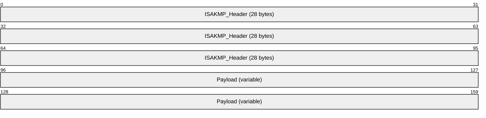

**ISAKMP_Header (28 bytes):** Contains the information that is required by the protocol to maintain state, process payloads, and possibly prevent denial-of-service or replay attacks. This is the standard ISAKMP header. For more details about the ISAKMP header, see [RFC2408].

The following diagram shows the subfields that are contained in the **ISAKMP_Header**.

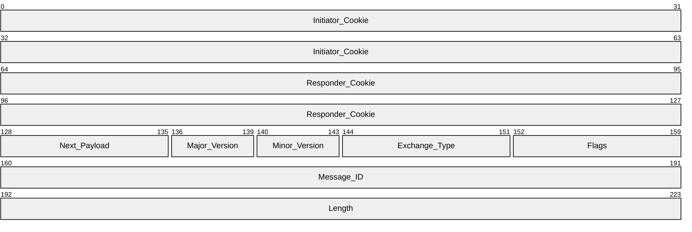

**Initiator_Cookie (8 bytes):** The cookie of entity that initiated security association (SA) establishment, SA notification, or SA deletion. This is identical to those cookies specified in [RFC2408] section 3.1.

**Responder_Cookie (8 bytes):** The cookie of entity that is responding to an SA establishment request, SA notification, or SA deletion. On the first message, the [**responder**](#gt_responder) cookie is zero. This is identical to those cookies specified in [RFC2408] section 3.1. Each [**AuthIP**](#gt_authenticated-ip-authip) negotiation is uniquely identified by the pair of [**initiator**](#gt_initiator) and responder cookies (plus UDP port and IP address).

**Next_Payload (1 byte):** Indicates the payload type of the first payload in the message. This is identical to the payload types specified in [RFC2408] section 3.1. The Authenticated Internet Protocol uses additional payloads in the PrivateUse range. The additional payloads are described in section [2.2.3](#Section_2.2.3).

| ISAKMP payload type | Value |
| --- | --- |
| None | 0x00 |
| SecurityAssociation | 0x01 |
| Proposal | 0x02 |
| Transform | 0x03 |
| KeyExchange | 0x04 |
| Identification | 0x05 |
| Certificate | 0x06 |
| CertificateRequest | 0x07 |
| Hash | 0x08 |
| Signature | 0x09 |
| Nonce | 0x0A |
| Notification | 0x0B |
| Delete | 0x0C |
| VendorID | 0x0D |
| NAT Discovery Payload | 0x14 |
| NAT Original Address Payload | 0x15 |
| Reserved 0x0E  0x7F | - |
| PrivateUse 0x80  0xFF | - |

**Major_Version (4 bits):** Indicates the major version of the ISAKMP protocol in use. Implementations MUST set the major version to >= 1.

**Minor_Version (4 bits):** Indicates the minor version of the ISAKMP protocol in use. Implementations SHOULD set the minor version to 0. Packets that have a minor version number that is larger than 0 MUST be accepted.

**Exchange_Type (1 byte):** The Authenticated Internet Protocol [**exchange types**](#gt_exchange-type) are in the private use range, as specified in [RFC2408] section 3.1.

The Authenticated Internet Protocol main mode (MM) [**exchange**](#gt_exchange) corresponds to the [**IKEv1**](#gt_internet-key-exchange-ike) identity protection exchange, as specified in [RFC2408] section 4.5.

The Authenticated Internet Protocol [**quick mode**](#gt_quick-mode) exchange corresponds to the IKEv1 quick mode exchange (as specified in [[RFC2409]](https://go.microsoft.com/fwlink/?LinkId=90349) section 5.5).

The Authenticated Internet Protocol [**extended mode (EM)**](#gt_extended-mode-em) exchange corresponds to the identity protection exchange, as specified in section [3.7](#Section_3.7).

The Authenticated Internet Protocol notify exchange corresponds to the IKEv1 informational exchange, as specified in [RFC2408] section 4.8.

This protocol defines the exchange types that are shown in the following table.

| Value | Meaning |
| --- | --- |
| 0xF3 | MM exchange type |
| 0xF4 | QM exchange type |
| 0xF5 | EM exchange type |
| 0xF6 | Notify exchange type |

**Flags (1 byte):** Identical to those specified in [RFC2408] section 3.1. Only the E(encryption) flag is used. Use of the encryption flag is the same as [RFC2408]. The encryption flag MUST be set as specified in [RFC2408], section 3.1. The encryption flag MUST be set whenever an encrypted payload is sent. Encrypted payloads are denoted as HDR* in the diagrams in this specification. All other flags MUST be set to 0. In particular, there is no C(Commit) bit functionality as defined in [RFC2408], section 3.1.

**Message_ID (4 bytes):** The unique message identifier that is used to demultiplex messages from concurrent quick mode negotiations. This field MUST be set to 0 during main mode negotiations and MUST be set to 1 during Extended Mode negotiations. This value is generated by the initiator of the quick mode negotiation. This is identical to those specified in [RFC2408] section 3.1. This is set from the **Current state** field in the SA. See section [3.1.1](#Section_3.1.1) for details.

**Length (4 bytes):** The length, in bytes, of the total message (header + payloads). This is identical to those specified in [RFC2408] section 3.1.

**Payload (variable):** MUST contain a valid ISAKMP payload. The payload is used to transfer information such as SA data, or key generation and authentication data.

### 2.2.2 Generic Payload Header Packet

Each payload in Authenticated Internet Protocol messages starts with the Generic payload header, as specified in [[RFC2408]](https://go.microsoft.com/fwlink/?LinkId=90348) section 3.2.

The following diagram shows the Generic payload header packet structure.

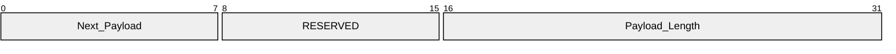

**Next_Payload (1 byte):** Indicates the payload type of the next payload in the message. If the current payload is the last in the message, this field MUST be 0.

**RESERVED (1 byte):** Unused. This field MUST be set to 0. The [**responder**](#gt_responder) MUST ignore this field.

**Payload_Length (2 bytes):** The length, in bytes, of this payload, including the Generic payload header.

### 2.2.3 Payload Types

The Authenticated Internet Protocol reuses the following payload types from [[RFC2408]](https://go.microsoft.com/fwlink/?LinkId=90348) section 3.1.

| RFC 2408 payload types | Value |
| --- | --- |
| NONE | 0x00 |
| [**Security association (SA)**](#gt_security-association-sa) | 0x01 |
| Proposal (P) | 0x02 |
| Transform (T) | 0x03 |
| [**Key exchange (KE)**](#gt_key-exchange) | 0x04 |
| Identification (ID) | 0x05 |
| Hash (HASH) | 0x08 |
| Nonce (NONCE) | 0x0A |
| Notification (N) | 0x0B |
| Vendor ID | 0x0D |

The Certificate, Certificate Request, Signature, and Delete payload types are not used by the Authenticated Internet Protocol. Certificate-based authentication is performed in this protocol through [**GSS**](#gt_generic-security-services-gss)-API, as described in [MS-AUTHSOD](../MS-AUTHSOD/MS-AUTHSOD.md).

This protocol also defines the following additional payload types. The payload types are allocated from the private use range as defined in [RFC2408] section 3.1.

| AuthIP payload types | Value |
| --- | --- |
| [**Security Support Provider Interface**](#gt_security-support-provider-interface-sspi) Token (GSS-API) as defined in [[GSS]](https://go.microsoft.com/fwlink/?LinkId=89876) | 0x81 |
| Crypto payload (CRYPTO) | 0x85 |
| GSS-API Endpoint Name (GSS_ID) | 0x86 |
| Authentication (Auth) | 0x87 |

Implementers can add additional payload types for their own purposes.

#### 2.2.3.1 GSS-API Payload (Payload Type 0x81) Packet

This is the [**GSS**](#gt_generic-security-services-gss)-API payload (as specified in [[GSS]](https://go.microsoft.com/fwlink/?LinkId=89876) section 3.3.3) without the vendor-encoding field and with additional status and flag fields.

The following diagram shows the GSS-API Payload 0x81 packet structure.

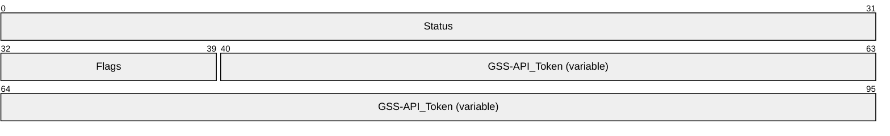

**Status (4 bytes):** On failure, a 4-byte error code is returned by GSS-API. This value MUST be 0x00000000 on success. Error logging SHOULD<6> be implemented.

**Flags (1 byte):** The following table shows the possible flag values.

| Value | Meaning |
| --- | --- |
| 0x01 | GSS_NEW_GSS_EXCHANGE This flag indicates the start of a new authentication [**exchange**](#gt_exchange). It is only valid on messages sent by an [**initiator**](#gt_initiator). |
| 0x02 | GSS_IMPERSONATION_ACTIVE This flag indicates that the GSS-API [**security principal name**](#gt_security-principal-name-spn) for this exchange is to be interpreted as a user security principal name. It is only valid on messages sent by an initiator. When this flag is set, the corresponding [**security association**](#gt_security-association-sa) (Main mode or Extended mode) MUST have the Impersonation active flag set to TRUE (see section [3.1.1](#Section_3.1.1)). |
| 0x04 | GSS_RETRY_CURRENT_AUTHENTICATION This flag is set by the initiator or the [**responder**](#gt_responder) to indicate the retry of the current authentication exchange with different credentials. It is valid on messages sent by an initiator or a responder. |
| 0x08 | GSS_EXPLICIT_CREDENTIALS This flag indicates that [**explicit credentials**](#gt_explicit-credentials) are being used for this GSS-API exchange. It is only valid on messages sent by an initiator. When this flag is set, the corresponding security association ([**main mode**](#gt_main-mode-mm) or extended mode) MUST have the explicit credentials flag set to TRUE (see section 3.1.1). |
| 0x10 | GSS_RESPONDER_AUTH_COMPLETE This flag is set by the responder to indicate that the authentication has completed successfully. It is only valid on messages sent by a responder. |

All other flag fields MUST be set to 0 on the initiator and ignored on the responder. For more details on flag semantics, see section 3.1.1.

**GSS-API_Token (variable):** As specified in [GSS] section 3.3. For [**anonymous authentication**](#gt_anonymous-authentication), the GSS-API data field has a zero length. This token is obtained from the GSS subsystem as described in [GSS] section 3, with the following differences. The **conf_req_flag** MUST always be specified. When using Kerberos authentication, the **mutual_req_flag** MUST always be specified. When using Kerberos via proxy authentication, the **mutual_req_flag** and the UseKerberosProxyURL string (as defined in section 3.1.1) SHOULD<7> be specified. When using NTLM, the **mutual_req_flag** MUST NOT be specified. Because TLS allows both mutual as well as [**one-way authentication**](#gt_one-way-authentication), the **mutual_req_flag** reflects the [**authentication mode**](#gt_authentication-mode) as follows: when using [**mutual authentication**](#gt_mutual-authentication) in TLS, the **mutual_req_flag** MUST be specified, and when using one-way authentication in TLS, the **mutual_req_flag** MUST NOT be specified.

If the [GSS] subsystem on the responder has successfully completed but the [GSS] subsystem does not return GSS-API_Token data to send back to the initiator, the responder MUST send a 0-byte GSS-API_Token payload with a 0-byte GSS-API_Token.

For Kerberos, the GSS-API_Token is as specified in [[RFC1964]](https://go.microsoft.com/fwlink/?LinkId=90304) section 1. For NTLM, the GSS-API_Token is in the format specified in [MS-NLMP](../MS-NLMP/MS-NLMP.md), section 3.1.5.2.1 for initiator tokens, and section 3.2.5.2.1 and section 3.2.5.2.2 for responder tokens. There is no additional GSS encapsulation over what is specified in [MS-NLMP] for the tokens. For TLS, the GSS-API_Token is as specified in [[RFC5246]](https://go.microsoft.com/fwlink/?LinkId=129803) section 7.3. The initiator tokens are the client messages, and the responder tokens are the server messages as defined in [RFC5246] section 7.3. As with NTLM, there is no additional GSS encapsulation. For anonymous, the GSS-API_Token must be 0 bytes. No additional GSS methods are supported.

[**Simple and Protected GSS-API Negotiation Mechanism (SPNEGO)**](#gt_simple-and-protected-gss-api-negotiation-mechanism-spnego) is not supported in [**AuthIP**](#gt_authenticated-ip-authip). See section [2.2.3.4](#Section_2.2.3.4) for specific GSS method [**negotiation**](#gt_negotiation).

#### 2.2.3.2 Crypto Payload (Payload Type 0x85) Packet

The Crypto payload is used to encrypt other payloads. On the wire, Authenticated Internet Protocol messages MUST contain one and only one Crypto payload, which MUST follow and be adjacent to the [**Internet Security Association and Key Management Protocol (ISAKMP)**](#gt_internet-security-association-and-key-management-protocol-isakmp) header. The only exception is the message that contains the Notify payload with a NOTIFY_DOS_COOKIE notify message type, as specified in [MS-IKEE](../MS-IKEE/MS-IKEE.md) section 2.2.6. This message MUST NOT contain the Crypto payload and MUST contain only a Notify payload.

The format of the Crypto payload differs based on whether the encryption flag is set in the flags field of the ISAKMP header, as specified in [[RFC2408]](https://go.microsoft.com/fwlink/?LinkId=90348) section 3.1.

If the encryption flag is set, all other payloads MUST be embedded within the Crypto payload. If the encryption flag is not set, an empty Crypto payload MUST be inserted in front of all the other payloads.

The encryption flag MUST be set on any payload indicated with a HDR* in the payload [**exchanges**](#gt_exchange). See the figure in section [3.4.7.3](#Section_3.4.7.3) for an example. If the payloads are denoted HDR* in the payload exchanges, then the receiver MUST verify that the encryption flag is set.

##### 2.2.3.2.1 Crypto Payload 0x85 Encryption Flag Set

The Crypto payload is constructed in a similar manner as [**ESP**](#gt_encapsulating-security-payload-esp) (see [[RFC4303]](https://go.microsoft.com/fwlink/?LinkId=90467) section 2) minus the SPI field.

The Crypto payload type 0x85 with the encryption flag set format is structured as follows.

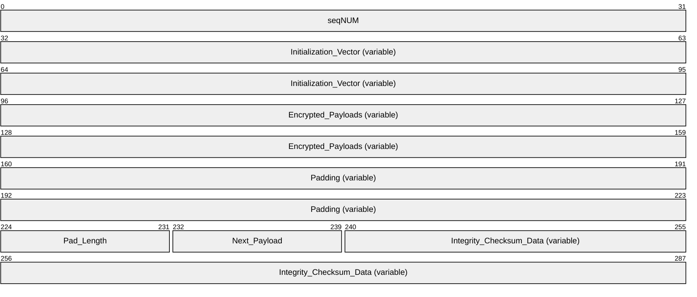

**seqNUM (4 bytes):** The **seqNUM** field is a sequence number for the next expected packet number. Sequence number generation is described in section [3.1.1](#Section_3.1.1).

**Initialization_Vector (variable):** The length of the **Initialization_Vector** (IV) field MUST equal the block size that is used by the encryption algorithm as specified in [[RFC3602]](https://go.microsoft.com/fwlink/?LinkId=90436) section 2.4 and [[RFC2451]](https://go.microsoft.com/fwlink/?LinkId=90355) section 2.4. The presence and content of the **Initialization_Vector** depends on the encryption and authentication algorithms used, as specified in [RFC4303] section 2.2. Encryption begins immediately after the **Initialization_Vector** and encrypts up to the beginning of the integrity checksum data.

**Encrypted_Payloads (variable):** A variable-length sequence of encrypted Authenticated Internet Protocol payloads, each payload starting with the generic payload header. The entire payload sequence, including the generic payload headers, MUST be encrypted. This is identical to [RFC4303] section 2.3. The **Padding**, **Pad_Length**, and **Next_Payload** are also encrypted, and are therefore conceptually included in the **Encrypted_Payloads**.

**Padding (variable):** 0 to 255 bytes of padding as required by the encryption algorithm.

**Pad_Length (1 byte):** The length of the preceding padding. The **Pad_Length** field is located after the variable-length padding; hence, the payload MUST be decoded starting from the end. ESP uses an identical technique for encoding the pad length, as specified in [RFC4303] sections 2.4 and 2.5.

**Next_Payload (1 byte):** The payload type of the first payload in the Encrypted payload sequence that is carried by this Crypto payload.

**Integrity_Checksum_Data (variable):** As required by the negotiated integrity algorithm (see [RFC4303] section 2.8). The integrity checksum data covers the [**ISAKMP**](#gt_internet-security-association-and-key-management-protocol-isakmp) header to the beginning of the integrity checksum data. To compute the checksum successfully, the ISAKMP header length MUST be set to zero.

If one of the following vendor IDs is received, the integrity checksum data size of 12 bytes MUST be used for all algorithms.

Vendor IDs that require 12-byte integrity checksum data:

1E 2B 51 69 05 99 1C 7D 7C 96 FC BF B5 87 E4 61 00 00 00 05

1E 2B 51 69 05 99 1C 7D 7C 96 FC BF B5 87 E4 61 00 00 00 06

1E 2B 51 69 05 99 1C 7D 7C 96 FC BF B5 87 E4 61 00 00 00 07

Otherwise, the size of the integrity checksum data depends on the negotiated integrity algorithm. The algorithm itself is denoted "hash" in section [3.1](#Section_3.1) and is stored in the [**security association database (SAD)**](#gt_security-association-database-sad), as described in [[RFC4301]](https://go.microsoft.com/fwlink/?LinkId=90465) section 4.4.2. For the negotiated integrity algorithms HMAC-MD5 and HMAC-SHA-1, the integrity checksum data size is 12 bytes. For all other integrity algorithms, the integrity checksum data size is specified in [[RFC4868]](https://go.microsoft.com/fwlink/?LinkId=140657) section 2.3.

##### 2.2.3.2.2 Crypto Payload 0x85 Encryption Flag Not Set

If the encryption flag is not set in the flags field of the [**ISAKMP**](#gt_internet-security-association-and-key-management-protocol-isakmp) header, the format is as follows.

The following diagram shows the format of the Crypto Payload 0x85 Encryption Flag Not Set.

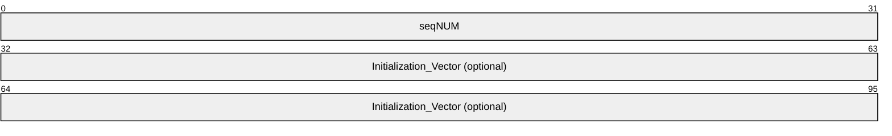

**seqNUM (4 bytes):** The **seqNUM** field is a sequence number for the next expected packet number. Sequence number generation is specified in section [3.1.1](#Section_3.1.1).

**Initialization_Vector (8 bytes):** The **Initialization_Vector** field is an optional field that SHOULD<8> be present. The presence of the **Initialization_Vector** is indicated by the length of the Crypto payload (greater than 8 bytes if the **Initialization_Vector** is present; otherwise, 8 bytes).

**Note** The Crypto payload with the encryption flag not set MUST be followed by a variable-length sequence of unencrypted Authenticated Internet Protocol payloads, each starting with the Generic payload header. In addition, the next payload field of the Generic payload header of the Crypto payload MUST be set to the payload type of the first payload in the clear-text payload sequence that is carried by the Crypto payload.

##### 2.2.3.2.3 Format of the Generic Payload Header for the Crypto Payload

The following diagram shows the format of the Generic payload header for the Crypto payload.

**Next_Payload (1 byte):** 0 if the encrypted flag is set; otherwise, the next payload.

**RESERVED (1 byte):** MUST be set to 0. The [**responder**](#gt_responder) MUST ignore this field.

**Payload_Length (2 bytes):** The value of the payload length is computed as:

4 (the header) + 4 (the sequence number) + the length of the IV in bytes.

#### 2.2.3.3 GSS_ID 0x86 Payload Packet

In [**IKEv1**](#gt_internet-key-exchange-ike), the identity information is passed between peers as an attribute of the [**security association (SA)**](#gt_security-association-sa) in the form of an identity payload, as specified in [[RFC2408]](https://go.microsoft.com/fwlink/?LinkId=90348) section 3.8. In the Authenticated Internet Protocol, a separate payload is used to convey identity information in the form of a [**security principal name**](#gt_security-principal-name-spn).

The following diagram shows the GSS_ID 0x86 payload packet structure.

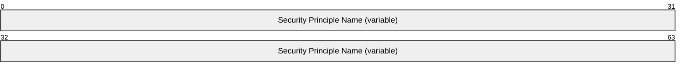

**Security Principle Name (variable):** The [**GSS**](#gt_generic-security-services-gss)-API representation of a security principal name, as specified in [MS-KILE](../MS-KILE/MS-KILE.md) section 3.1.5.11. The security principal name sent MUST be a [**Unicode string**](#gt_unicode-string). The security principal name MUST NOT contain the NULL string terminator. All authentication mechanisms MUST use this representation of the security principal name.

#### 2.2.3.4 Auth Payload (Payload Type 0x87) Packet

The authenticated payload is used to convey a list of authentication methods to the [**responder**](#gt_responder). The number of authentication methods MUST be computed from the payload size in the generic header when decoding the Auth payload. When constructing the Auth payload, the payload size MUST be computed from the number of authentication methods.

The following diagram shows the Auth payload 0x87 packet structure.

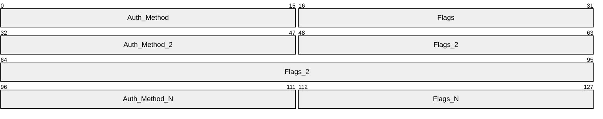

**Auth_Method (2 bytes):** Indicates the proposed authentication method. The following table shows the allowed values.

| Value | Meaning |
| --- | --- |
| 0x0002 | Kerberos [[RFC1964]](https://go.microsoft.com/fwlink/?LinkId=90304) |
| 0x0003 | Anonymous |
| 0x0004 | TLS [[RFC3546]](https://go.microsoft.com/fwlink/?LinkId=90431) |
| 0x0005 | NTLM [MS-NLMP](../MS-NLMP/MS-NLMP.md) |

**Flags (2 bytes):** This field is currently unused. It MUST be set to 0 by the [**initiator**](#gt_initiator) and ignored by the responder.

#### 2.2.3.5 Notify Payload (Payload Type 0x0B) Packet

The notify payload is similar to the [**IKEv1**](#gt_internet-key-exchange-ike) notification payload, as specified in [[RFC2408]](https://go.microsoft.com/fwlink/?LinkId=90348) section 3.14. However, the field that is referred to as **spiSize** in IKEv1 is referred to as Flags in the Authenticated Internet Protocol; also, the SPI field is absent. The receiver MUST interpret the **spiSize** field as a Flags field if the [**exchange type**](#gt_exchange-type) for the message is an Authenticated Internet Protocol private exchange type, as specified in section [2.2.1](#Section_2.2.1).

The following diagram shows the Notify payload 0x0B packet structure.

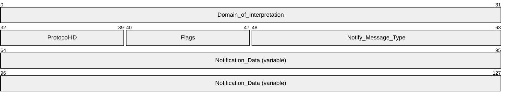

**Domain_of_Interpretation (4 bytes):** This field, which specifies the [**domain of interpretation (DOI)**](#gt_domain-of-interpretation-doi), MUST be set to 1 (IPSEC_DOI) as specified in [RFC2408] section A.2.

**Protocol-ID (1 byte):** This field indicates the exchange type to which this notification applies. It MUST be one of the following values.

| Value | Meaning |
| --- | --- |
| 0x01 | [**MM**](#gt_main-mode-mm)/[**EM**](#gt_extended-mode-em) notification |
| 0x02 | QM notification |

**Flags (1 byte):** This flag indicates a reliable notify message, which MUST be acknowledged by the peer. If this flag is not set, the recipient MUST NOT acknowledge the notify message. See section [3.1.5.1](#Section_3.1.5.1) for additional information. The following table shows the only allowed Flags field.

| Value | Meaning |
| --- | --- |
| 0x01 | RELIABLE_NOTIFY_FLAG Reliable notification |

All other flags MUST be set to zero by the sender and MUST be ignored by the recipient.

**Notify_Message_Type (2 bytes):** The Notify_Message_Type identifies the type of notification that is sent with this message. The notify message types are from the private range, as specified in [RFC2408] section 3.14.1.

| Value | Meaning |
| --- | --- |
| 0x9C45 | EXCHANGE_INFO This notify message type is used by the [**negotiation discovery**](#gt_negotiation-discovery) IKE protocol extension, as specified in [MS-IKEE](../MS-IKEE/MS-IKEE.md) section 3.7. |
| 0x9C54 | NOTIFY_STATUS This notify message type is used to request the peer to delete its state for the corresponding [**security association (SA)**](#gt_security-association-sa), as specified in [MS-IKEE] section 3.8. |
| 0x9C55 | NOTIFY_DOS_COOKIE This notify message type is used by the [**responder**](#gt_responder) under the denial of service protection mode, as specified in [MS-IKEE] section 3.9. |
| 0x9C56 | NOTIFY_ACK This notify message type is used to acknowledge a reliable notify message. |
| 0x9C57 | NOTIFY_QM_SYNCHRONIZE This notify message type is used to signal the end of the [**quick mode**](#gt_quick-mode) [**phase**](#gt_phase). |
| 0x9C58 | NOTIFY_ACQUIRE This notify message type is used to instruct the peer to negotiate a new [**main mode security association (MM SA)**](#gt_main-mode-security-association-mm-sa). |

**Notification_Data (variable):** The contents of this field depend on the **Notify_Message_Type** field. The following list describes the field contents for various notify message types:

- NOTIFY_QM_SYNCHRONIZE (0 bytes): No notification data.
- NOTIFY_STATUS (4 bytes): An error code that indicates the type of failure that is triggering the SA deletion notification. The values that are transmitted as error codes are implementation-specific.<9>
- NOTIFY_ACK (4 bytes): The sequence number of the Crypto payload that carried the Notify payload that is being acknowledged.
- NOTIFY_ACQUIRE: (See section [2.2.3.6](#Section_2.2.3.6))
A Notify payload of type NOTIFY_ACQUIRE MUST be followed by two phase-2 Identification payloads, as specified in [[RFC2407]](https://go.microsoft.com/fwlink/?LinkId=90347) section 4.6.2. Each of these phase-2 Identification payloads MUST have the Generic payload header and MUST follow and be adjacent to the Notify payload. The first Identification payload MUST be the [**initiator**](#gt_initiator) Identification payload. The second payload MUST be the peer Identification payload. If any of these conditions is not met, the responder MUST silently discard the packet.

- NOTIFY_DOS_COOKIE (8 bytes): The responder cookie value.
When the NOTIFY_DOS_COOKIE notify message type is used, it MUST be the only payload in the message, and it MUST NOT be within a Crypto payload.

- EXCHANGE_INFO (4 bytes): Flags. The following table describes the flag values.
| Value | Meaning |
| --- | --- |
| 0x00000001 | IKE_EXCHANGE_INFO_ND_BOUNDARY This flag is used by the negotiation discovery IKE protocol extension, as specified in [MS-IKEE] section 2.2.6. |
| 0x00000002 | IKE_EXCHANGE_INFO_GUARANTEE_ENCRYPTION This flag is used by the negotiation discovery IKE protocol extension, as specified in [MS-IKEE] section 2.2.6. |

These flags can be set independently. All other flags MUST be set to zero by the sender and MUST be ignored by the recipient.

#### 2.2.3.6 Notify Payload (Payload Type 0x0B) Notify Acquire Packet

The following diagram shows the Notify Acquire packet structure.

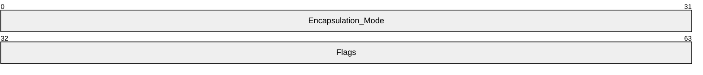

**Encapsulation_Mode (4 bytes):** This is an encapsulation mode as specified in [[IANAISAKMP]](https://go.microsoft.com/fwlink/?LinkId=89886).

**Flags (4 bytes):** The following table describes the value of the Flags field.

| Value | Meaning |
| --- | --- |
| 0x00000002 | IKE_EXCHANGE_INFO_GUARANTEE_ENCRYPTION This flag is used by the [**negotiation discovery**](#gt_negotiation-discovery) [**Internet Key Exchange (IKE)**](#gt_internet-key-exchange-ike) protocol extension, as specified in [MS-IKEE](../MS-IKEE/MS-IKEE.md) section 2.2.6. |

All other flags MUST be set to zero by the sender and MUST be ignored by the recipient.

#### 2.2.3.7 Key Dictation Payload (Payload Type 0x88)

The Key Dictation payload is used by an [**AuthIP**](#gt_authenticated-ip-authip) node to explicitly supply [**quick mode**](#gt_quick-mode) keys to the peer node. The payload carries keys for a unidirectional [**SA**](#gt_security-association-sa). Inbound and outbound keys need separate payloads.

The Key Dictation payload is constructed in a manner similar to the [Crypto payload](#Section_2.2.3.2) minus the **Sequence Number**.

The payload is structured as follows.

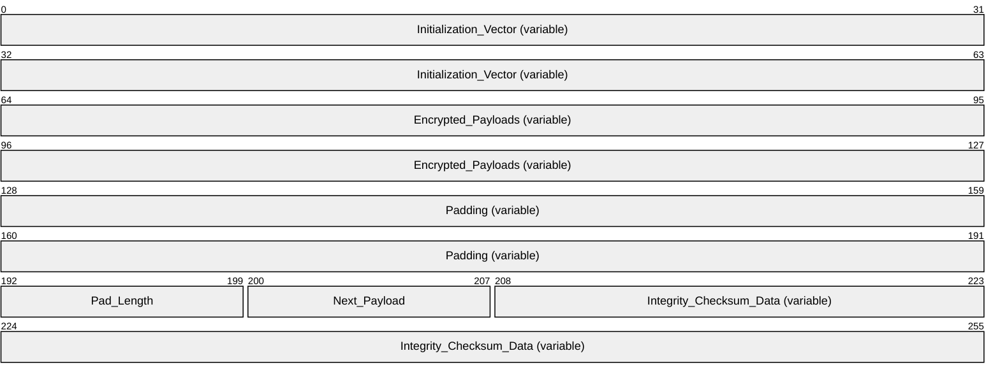

**Initialization_Vector (variable):** The length of the **Initialization_Vector** field MUST equal the length of the **Initialization_Vector** field used by the Crypto payload (section 2.2.3.2.1).

**Encrypted_Payloads (variable):** A variable-length sequence of encrypted plain-text quick mode keys. Use the same encryption algorithm as the Crypto payload (section 2.2.3.2.1).

**Padding (variable):** 0 to 255 bytes of padding as required by the encryption algorithm.

**Pad_Length (1 byte):** The length of the preceding padding. The **Pad_Length** field is located after the variable-length padding; hence, the payload MUST be decoded starting from the end. [**ESP**](#gt_encapsulating-security-payload-esp) uses an identical technique for encoding the pad length, as specified in [[RFC4303]](https://go.microsoft.com/fwlink/?LinkId=90467) sections 2.4 and 2.5.

**Next_Payload (1 byte):** The payload type of the first payload in the Encrypted payload sequence that is carried by this Crypto payload. Setting this is optional since the generic payload header already has this information.

**Integrity_Checksum_Data (variable):** Use the same encryption algorithm as the Crypto payload (section 2.2.3.2.1). The integrity checksum data covers the encrypted portion of the payload.

#### 2.2.3.8 Key Dictation Weight Payload (Payload Type 0x89)

The Key Dictation Weight Payload is used by an [**AuthIP**](#gt_authenticated-ip-authip) node to dictate the [**quick mode**](#gt_quick-mode) keys to its peer. If both peers want to dictate keys, then the end with the higher weight wins.

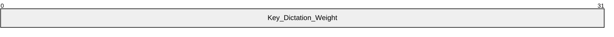

**Key_Dictation_Weight (4 bytes):** A 32-bit number used to express the weight used for Key Dictation negotiation

# 3 Protocol Details

## 3.1 Common Details

This section specifies details common to all roles in [**AuthIP**](#gt_authenticated-ip-authip).

**Exchange State Machine**

The state diagrams for a single [**exchange**](#gt_exchange) in a [**negotiation**](#gt_negotiation) with the [**initiator**](#gt_initiator) and the [**responder**](#gt_responder) are shown in the following figure.

Figure 1: Single exchange state

The initiator MUST start a retransmission timer when it sends the first packet of an exchange. If the timer expires before a response is received, the initiator retransmits the message and restarts the timer. After a predefined number of retransmissions, the exchange is aborted. See section [3.1.2](#Section_3.1.2) for more information on retransmission timers.

**Authentication Retry State Machine**

The logic for authentication retry is triggered within a negotiation when the current authentication method fails and there are remaining authentication methods (or remaining authentication parameters for the current methods) that can be tried before failing the negotiation. Authenticated Internet Protocol implementations MUST support authentication retry.

The state diagrams for authentication retry for the initiator and responder are shown in the following figure.

Figure 2: Authentication retry state (initiator and responder)

In processing the protocol error transition, the peer encountering the error MUST send a notify message of type NOTIFY_STATUS containing the error code corresponding to the error to the peer. See section [2.2.3.5](#Section_2.2.3.5) for details.

Figure 3: Authentication retry state (negotiation)

Analyze the figure "Authentication retry state (negotiation)" in combination with the figure "Authentication retry state (initiator and responder)". The "Local first failure", "GSS-API started", and "Responder complete" states in the figure "Authentication retry state (negotiation)" correspond to the "Wait for response" state in the figure "Authentication retry state (initiator and responder)". In processing the "send next GSS-API payload", AuthIP sends a message with a [**GSS**](#gt_generic-security-services-gss)-API payload as specified in sections [2.2.3.1](#Section_2.2.3.1) and [3.8](#Section_3.8).

As specified in [[RFC3546]](https://go.microsoft.com/fwlink/?LinkId=90431), TLS performs certificate-based authentication. The TLS protocol can be used by the Authenticated Internet Protocol as an authentication method, in which case the TLS packets are wrapped within GSS-API packets. The local certificate to use for the exchange is a parameter to TLS. When multiple certificates and certification authorities are available to be matched in order to get a successful authentication, each Authenticated Internet Protocol peer MUST retry all its applicable credentials (for example, certificates) before failing the TLS negotiation and moving to the next authentication method. The authentication retry is controlled by flags on the GSS-API payload.

The rules for setting the GSS-API payload flags are as follows:

- The GSS-API flags (GSS_RETRY_CURRENT_AUTHENTICATION and GSS_NEW_GSS_EXCHANGE, as specified in section 2.2.3.1) MUST be set by the initiator to signal that it is retrying the TLS negotiation.
- The GSS-API flag GSS_NEW_GSS_EXCHANGE MUST be set by the initiator when TLS negotiation has failed, to advance to the next authentication method.
- The **Status** field in the GSS-API payload MUST be set to a nonzero value by the responder if no other TLS credentials are acceptable. When this field is set, the initiator MUST advance to the next authentication method.
- The **Status** field in the GSS-API payload MUST be set to a nonzero value and the GSS_RETRY_CURRENT_AUTHENTICATION flag MUST be set by the responder to instruct the initiator that it MUST retry TLS with a different credential, if available. When the initiator retries TLS with a different credential, it MUST set the **Status** field by using the nonzero value that is received from the responder in the GSS-API payload.
**Notation used to describe common details and specific roles in the remainder of section 3**

This specification uses the same notation that is specified in [[RFC2409]](https://go.microsoft.com/fwlink/?LinkId=90349) section 3.2, with a few additions that are noted as "additional notation" in this topic:

- HDR: An [**ISAKMP**](#gt_internet-security-association-and-key-management-protocol-isakmp) header whose [**exchange type**](#gt_exchange-type) is the method. When written as HDR*, it indicates payload encryption.
- [**Security Association (SA)**](#gt_security-association-sa): An SA negotiation payload that embeds one or more Proposal and Transform payloads. See [RFC2409] section 3.4.
- CKY-I and CKY-R: The initiator cookie and responder cookie, respectively, from the ISAKMP header. These are used together with initiator and responder IP addresses as a unique key for looking up each session.
- g^xy: The Diffie-Hellman shared secret.
- g(qm)^xy (additional notation): The Diffie-Hellman secret in the [**quick mode**](#gt_quick-mode) negotiation [**phase**](#gt_phase).
- [**KE**](#gt_key-exchange): The Key Exchange payload that contains the public information that is exchanged in a Diffie-Hellman exchange.
- Nx: The Nonce payload. x can be "I" or "r" for the ISAKMP initiator and responder, respectively. x(qm) is the quick-mode [**nonce**](#gt_nonce).
- IDx: The Identity payload for "X". x can be: "I" or "r" for the ISAKMP initiator and responder, respectively. The Identity payload format for the Internet [**DOI**](#gt_domain-of-interpretation-doi) is specified in [[RFC2407]](https://go.microsoft.com/fwlink/?LinkId=90347) section 4.6.2.
- hash(msg) (additional notation): The negotiated hash algorithm for the [**main mode security association (MM SA)**](#gt_main-mode-security-association-mm-sa). Msg is the quantity to hash.
- sha1 (additional notation): The SHA-1 hash function, as specified in [[FIPS180]](https://go.microsoft.com/fwlink/?LinkId=89867). [[SHA256]](https://go.microsoft.com/fwlink/?LinkId=90514) is used until the hash function has been negotiated.
- prf(key, msg): The keyed pseudorandom function (PRF) that is used to generate a deterministic output that appears pseudorandom. PRF is used both for key derivations and for authentication (for example, as a keyed MAC). PRF is implemented as an [**HMAC**](#gt_hash-based-message-authentication-code-hmac) of the negotiated hash algorithm, as defined in [[RFC2104]](https://go.microsoft.com/fwlink/?LinkId=90314).
- SKEYID: A string that is derived from a secret that is known only to the active players in the exchange.
- SKEYID_e: The [**keying material**](#gt_keying-material) that is used by the ISAKMP SA to protect its messages.
- SKEYID_a: The keying material that is used by the ISAKMP SA to authenticate its messages.
- SKEYID_d: The keying material that is used to derive keys for non-ISAKMP SAs.
- SKEYID_em: The keying material that is used by AuthIP to authenticate [**extended mode**](#gt_extended-mode-em) negotiation messages.
- Notify (additional notation): The ISAKMP Notify payload as specified in [[RFC2408]](https://go.microsoft.com/fwlink/?LinkId=90348) section 3.14.
- Authx (additional notation): The authentication proof for x, where x is either the first or second authentication and has a value of 1 to 4. It is embedded in a Hash payload.
- Auth payload (auth): The payload that is constructed by looking up the peer authentication database (PAD) and the [**security policy database (SPD)**](#gt_security-policy-database-spd). The Auth payload contains the authentication methods that are valid for this negotiation.
- VID (additional notation): The [**Vendor ID payload**](#gt_vendor-id-payload).
- KeyDict (In): [Key Dictation payload](#Section_2.2.3.7) used for supplying dictator's inbound [**QM SA**](#gt_quick-mode-security-association-qm-sa) keys.
- KeyDict (Out): Key Dictation payload used for supplying dictator's outbound QM SA keys.
- SKWt : Key Dictation/Weight payload used for negotiating key dictation, that is, negotiating which end, if any, will supply the key.
- A-KDF(Z, OtherInfo, keydatalen) (additional notation): Invoke the Key Derivation Function (KDF), as specified in [[SP800-56A]](https://go.microsoft.com/fwlink/?LinkId=90525). The Key Derivation Function uses the negotiated [**main mode**](#gt_main-mode-mm) hash function as its hash function.
- Crypto-ID (additional notation): A 16-bit number that corresponds to the negotiated main mode encryption algorithm. The table that maps the algorithm identifiers to the corresponding numbers is defined in [RFC2409] Appendix A.
- GSS-APIsecret, GSS-APIsecret_em (additional notation): The session key that is obtained from a successful GSS-API exchange in main mode (MM) and extended mode (EM), respectively, as specified in [[GSS]](https://go.microsoft.com/fwlink/?LinkId=89876).
- hashLength, cryptLength (additional notation): The length, in bytes, of the key for the negotiated MM SA authentication and encryption algorithms.<10>
- ipsechashLength, ipseccryptLength (additional notation): The length, in bytes, of the key for the QM SA authentication and encryption algorithms.
- #n (additional notation): Numbers the packet within a series of exchanges for reference. This information is not on the wire.
- [ x ]: Indicates that x is optional.

### 3.1.1 Abstract Data Model

This section describes a conceptual model of possible data organization that an implementation maintains to participate in this protocol. The described organization is provided to facilitate the explanation of how the protocol behaves. This document does not mandate that implementations adhere to this model as long as their external behavior is consistent with the behavior that is described in this document.

The flags bit semantics used by this document are as follows: For a flag, its "value" signifies a mask which, when its bitwise logical AND with the flags field is computed, yields either a zero value (all zero bits) if the flag is unset (set to FALSE), and a nonzero value otherwise. For example, a flag mask/value of 0x01 signifies that the bitwise logical AND of a single-byte flag field with 0x01 is zero if and only if the flag is set to FALSE. Assuming no other flag masks/values for this field, then, both 0x00 and 0x01 are valid values for this single-byte flag field--the former corresponding to the flag being unset, and the latter to the flag being set.

The main data elements that are required by any implementation are:

- [**Main mode security association (MM SA)**](#gt_main-mode-security-association-mm-sa) database: A database that contains the operational state for each MM SA. The entry for each MM SA contains the following data elements:
- Current role: type: flag. Used to store the current role ([**initiator**](#gt_initiator) or [**responder**](#gt_responder)) for use in a key generation algorithm as described in [3.1.7.4](#Section_3.1.7.4).
- Current state: type: DWORD. Stores the current message number within a [**negotiation**](#gt_negotiation), for use in header construction as described in [2.2.1](#Section_2.2.1).
- Per-negotiation timers: type: System timer. Authentication protocol timers as described in [3.1.2](#Section_3.1.2).
- Sequence numbers: type: DWORD. Stores sequence numbers for [**main mode (MM)**](#gt_main-mode-mm), [**quick mode**](#gt_quick-mode), [**extended mode (EM)**](#gt_extended-mode-em), and notification [**exchange types**](#gt_exchange-type). The sequence numbers MUST start at zero and MUST be incremented for each [**exchange**](#gt_exchange). The sequence number is used as the **seqNUM** field of the Crypto payload.
- Cryptographic parameters: type: array of {Authentication attribute (type: DWORD)}. Stores Cryptographic parameters for the MM SA as described in the attribute class table in [[RFC2409]](https://go.microsoft.com/fwlink/?LinkId=90349) appendix A. The attributes used are: encryption algorithm, hash algorithm, group description, life type, and life duration. In addition, a set of one or more authentication methods (defined as in the same table) is included.
- Auth methods: type: array of {AuthMethodType (type: DWORD)}. A set of one or more authentication methods (as defined in [RFC2409] Appendix A and section [1.7](#Section_1.7)) for main mode (MM).
- Auth methods (EM): type: array of {AuthMethodType (type: DWORD)}. A set of one or more authentication methods (as defined in [RFC2409] Appendix A and section 1.7) for extended mode (EM).
- Quick mode Pointers: type: array of indexes into the [**SAD**](#gt_security-association-database-sad) described below. A list of indexes for SAD entries corresponding to [**QM SAs**](#gt_quick-mode-security-association-qm-sa) established under the protection of the MM SA.
- [**NAT**](#gt_network-address-translation-nat) traversal state. See [[RFC3947]](https://go.microsoft.com/fwlink/?LinkId=90448) section 3.2. The state contains a BOOLEAN: *isNatPresent*. This MUST be initialized to FALSE. It is set to true if NAT is detected as described in [RFC3947] section 3.2.
- Negotiation retransmission timer context: This timer context keeps track of the packet being retransmitted, and how many retransmissions have currently been sent.
- Request Non-notify Message pending Queue: When there is an outstanding notify request any non-notify request generated will be queued here until an ACK arrives (see section [3.1.7.5](#Section_3.1.7.5)).
- DoS protection mode bit: A BOOLEAN value indicating whether the host is in DoS protection mode (see section [3.1.7.6](#Section_3.1.7.6)).
- Explicit credentials MM: A BOOLEAN value indicating whether [**explicit credentials**](#gt_explicit-credentials) were used in the MM negotiation (see section [3.8.7.1](#Section_3.8.7.1)).
- Explicit credentials EM: A BOOLEAN value indicating whether explicit credentials were used in the EM negotiation (see section 3.8.7.1).
- Impersonation active MM: A BOOLEAN value indicating whether Impersonation is enabled in the MM negotiation (see section [2.2.3.1](#Section_2.2.3.1)).
- Impersonation active EM: A BOOLEAN value indicating whether Impersonation is enabled in the EM negotiation (see section 2.2.3.1).
- ImpersonationHandle: A handle {DWORD} that represents the user corresponding to this MM SA.
- Connection state table: Stores a set of connection entries. This table manages the connection state necessary to perform an [**authFW**](#gt_authenticated-firewall-authfw) mode. These connection entries correspond to active TCP/UDP/ICMP, or protocol-only connections.
The possible connection entries are:

- V4 TCP/UDP state entry: {[**IPv4**](#gt_internet-protocol-version-4-ipv4) source address {DWORD}, IPv4 destination address {DWORD}, IP protocol {DWORD}, source port {DWORD}, destination port {DWORD}.
- V6 TCP/UDP state entry: {[**IPv6**](#gt_internet-protocol-version-6-ipv6) source address {16 bytes}, IPv6 destination address {16 bytes}, IP protocol {DWORD}, source port {DWORD}, destination port {DWORD}.
- V4 ICMP state entry: {IPv4 source address {DWORD}, IPv4 destination address {DWORD}, IP protocol {DWORD}, ICMP type {DWORD}, ICMP code {DWORD}} [[RFC792]](https://go.microsoft.com/fwlink/?LinkId=90492).
- V6 ICMP state entry: {IPv6 source address {16 bytes}, IPv6 destination address {16 bytes}, IP protocol {DWORD}, ICMP type {DWORD}, ICMP code {DWORD}} [RFC792].
- V4 protocol-only state entry: {IPv4 source address {DWORD}, IPv4 destination address {DWORD}, IP protocol {DWORD}}.
- V6 protocol-only state entry: {IPv6 source address {16 bytes}, IPv6 destination address {16 bytes}, IP protocol {DWORD}.
Every connection state entry also includes:

- *IsAuthenticatedFirewallConnection* Type: BOOLEAN. Indicates whether the connection uses [Authenticated Firewall Mode(section3.10)](#Section_3.10).
- *AuthFWAuthorized* Type: BOOLEAN. In the case of an Authenticated Firewall Mode connection, indicates whether an authenticated packet has been received (see section [3.10.5.1](#Section_3.10.5.1)).
- *PeerIsNegotiationDiscoveryCapable*: Type: BOOLEAN. Indicates whether the peer associated with the connection has indicated support for Negotiation Discovery (See [MS-IKEE](../MS-IKEE/MS-IKEE.md), section 3.7).
- *ImpersonationHandle*: Type {DWORD} A handle that represents the user corresponding to the MM SA associated with the connection.
- *IsImpersonationConnection*: Type: BOOLEAN. Indicates whether impersonation was used in the EM negotiation for the MM SA associated with the connection.
The MM SA is indexed by the local and peer IP address and the initiator and responder cookies that are found in the [**ISAKMP**](#gt_internet-security-association-and-key-management-protocol-isakmp) header, as in [**IKEv1**](#gt_internet-key-exchange-ike).

- [**Security policy database (SPD)**](#gt_security-policy-database-spd): The SPD and its management operations are specified in [[RFC4301]](https://go.microsoft.com/fwlink/?LinkId=90465) section 4.4.1. The SPD that is referred to in this specification contains rules that describe whether and how [**IPsec**](#gt_internet-protocol-security-ipsec) protection is applied to inbound or outbound IP traffic. The SPD is looked up by using tuples that contain [**flow**](#gt_flow) information for the packet. The encapsulation type is already a part of the SPD. This specification adds two new encapsulation values to the encapsulation type. See section [3.10.4.2](#Section_3.10.4.2).
This specification also adds a policy option to enable impersonation, which is configurable per-SPD entry. The corresponding state consists of two Boolean values: RequireImpersonationMM and RequireImpersonationEM. It also adds a BOOLEAN LocalKeyDictationAttempt, which indicates whether the local end is attempting to be the key dictator. When set, an additional DWORD KeyDictationWeight stores the local weight used to negotiate the key dictator with the peer.

This specification adds a policy option that SHOULD<11> enable Kerberos authentication via proxy, which is configurable per SPD entry. The corresponding option consists of a STRING value: UseKerberosProxyURL.

- The EM authentication SPD adds local and remote ports to the SPD selector. See [RFC4301], section 4.4.1.1. Associated with each selector are the EM Auth methods. These are an array of {AuthMethodType (type: DWORD)}, which is a set of one or more authentication methods (as defined in [RFC2409] Appendix A and section 1.7) for extended mode (EM). Each authentication method's specific configuration is specified in that authentication method's documentation. For instance, 1-way certificate authentication versus mutual certificate authentication configuration is covered in [[RFC5246]](https://go.microsoft.com/fwlink/?LinkId=129803).
- Peer authentication database (PAD): The PAD and its management operations are specified in [RFC4301] section 4.4.3. The PAD that is referred to in this specification contains rules that describe whether and how the Authenticated Internet Protocol negotiates [**SAs**](#gt_security-association-sa) with a remote peer. The PAD is looked up by using tuples that are composed of local and remote IP addresses.
This specification adds:

- Allow Explicit credentials MM: Type: BOOLEAN. Indicates whether the use of explicit credentials is permitted during main mode security association (MM SA) negotiation.
- Allow Explicit credentials EM: Type: BOOLEAN. Indicates whether the use of explicit credentials is permitted during extended mode (EM) SA negotiation.
- Security association database (SAD): The SAD contains the parameters of each QM SA. The SAD and its management operations are specified in [RFC4301] section 4.4.2.
This specification adds:

- *IsAuthenticatedFWSA*: Type: BOOLEAN. This flag, when set, indicates that the SA is an authFW mode SA.
- *ImpersonationHandle*: Type: DWORD. A handle to the impersonated identity associated with the selector of each SAD entry. See [RFC4301] section 4.4.1.1.
- The NAT traversal state in the MM SA is propagated from the MM SA to all SAD entries established using that MM SA.
- KeyDictationWtLocal: Type: DWORD Set if the local end wants to dictate quick mode keys to peer.
- KeyDictationWtRemote: Type: DWORD Set if, during negotiation, it is discovered that the peer end wants to dictate quick mode keys to peer.
- LocalEndWantsToDictateKey: Type: BOOLEAN Set if, during negotiation, it is discovered that the local end wants to dictate the key. The KeyDictationWtLocal value is valid only when this is set.
- KeyDictationLocalWinner: Type: BOOLEAN Set if, during negotiation, it is discovered that the local end has a higher **Key Dictation Weight**.
- KeyDictationRemoteWinner: Type: BOOLEAN Set if, during negotiation, it is discovered that the remote end has a higher **Key Dictation Weight**.

### 3.1.2 Timers

The following timers are used by the Authenticated Internet Protocol:<12>

- [**Negotiation**](#gt_negotiation) retransmission timer (for each [**main mode security association**](#gt_main-mode-security-association-mm-sa)): Triggers a message retransmission by the [**initiator**](#gt_initiator).
- Notify retransmission timer (for each MM SA): Triggers a Notification payload retransmission.
- Authentication retry timer (for each MM SA): Triggers the authentication retry.
- [**Responder**](#gt_responder) time-out timer (for each MM SA): Controls how long the responder waits for a message from the initiator.
- MM SA lifetime (for each MM SA): The MM SA lifetime is negotiated between the peers.
- NAT-T keep-alive timer (for each MM SA): This timer doesn't affect any MM SA state. This timer only controls sending the NAT-T keep alive packet, as specified in [[RFC3948]](https://go.microsoft.com/fwlink/?LinkId=90449) section 4.
- [**Quick mode**](#gt_quick-mode) rekey timer (for each MM SA): This timer is used during quick mode rekey.
- [**Quick mode security association (QM SA)**](#gt_quick-mode-security-association-qm-sa) lifetime (for each QM SA): The lifetime for QM SAs is specified in bytes or seconds. After the lifetime of bytes or seconds expires, the [**Ipsec**](#gt_internet-protocol-security-ipsec) implementation MUST start a new quick mode [**exchange**](#gt_exchange). The Authenticated Internet Protocol then acts as the initiator for the rekey.
- Per-Connection state entry timer: All entries in the connection state table (except the TCP state entries) each have their own timer. This timer triggers connection entry state deletion.

### 3.1.3 Initialization

The following flags MUST be initialized to FALSE in the [**MM SA**](#gt_main-mode-security-association-mm-sa) database:

- Explicit credentials [**MM**](#gt_main-mode-mm)
- Explicit credentials [**EM**](#gt_extended-mode-em)
- Impersonation active MM
- Impersonation active EM
The ImpersonationHandle MUST be set to 0.

For each [**QM SA**](#gt_quick-mode-security-association-qm-sa):

- LocalEndWantsToDictateKey: Initialized to the **LocalKeyDictationAttempt** field of the [**SPD**](#gt_security-policy-database-spd).
- KeyDictationWtLocal: Initialized to the **KeyDictationWeight** field of the SPD.
- KeyDictationWtRemote: Initialized to zero.

### 3.1.4 Higher-Layer Triggered Events

#### 3.1.4.1 IP Traffic Match SPD Protect-using-IPsec Rule

When inbound or outbound packets trigger [**AuthIP**](#gt_authenticated-ip-authip) [**negotiation**](#gt_negotiation) based on standard [**Ipsec**](#gt_internet-protocol-security-ipsec) processing rules ([[RFC4301]](https://go.microsoft.com/fwlink/?LinkId=90465) section 5), the protocol acts as the [**initiator**](#gt_initiator) for this negotiation and sends message #1 of the first [**main mode (MM)**](#gt_main-mode-mm) [**exchange**](#gt_exchange) (section [3.2.4](#Section_3.2.4)). The initiator MUST create a [**main mode security association (MM SA)**](#gt_main-mode-security-association-mm-sa) entry in its [**main mode security association database (MMSAD)**](#gt_main-mode-security-association-database-mmsad) containing encryption algorithm, hash algorithm, group description, life type, and life duration values before sending message #1.

In the new MMSAD entry, the initiator MUST also copy the values "Require Impersonation MM" and "Require Impersonation EM" from the [**SPD**](#gt_security-policy-database-spd) to the Impersonation active MM and Impersonation active [**EM**](#gt_extended-mode-em) flags, and copy the ImpersonationHandle value representing the user that generated the traffic to ImpersonationHandle.

#### 3.1.4.2 Explicit IPsec Negotiation Request

The Authenticated Internet Protocol [**negotiation**](#gt_negotiation) can be explicitly triggered by the user or administrator prior to packets being sent or received. The protocol then acts as the [**initiator**](#gt_initiator) for this negotiation. This trigger is a local higher layer triggering event and does not otherwise affect [**SA**](#gt_security-association-sa) negotiation. When triggered this way, the initiator MUST create a [**main mode security association (MM SA)**](#gt_main-mode-security-association-mm-sa) entry in the [**main mode security association database (MMSAD)**](#gt_main-mode-security-association-database-mmsad) containing encryption algorithm, hash algorithm, group description, life type, and life duration values before sending message #1 (section [3.2.4](#Section_3.2.4)).

### 3.1.5 Processing Events and Sequencing Rules

Authenticated Internet Protocol [**negotiations**](#gt_negotiation) are tracked according to the same rules that are specified for [**IKE**](#gt_internet-key-exchange-ike) negotiations, as specified in [[RFC2409]](https://go.microsoft.com/fwlink/?LinkId=90349). Each Authenticated Internet Protocol negotiation is uniquely identified by the pair of the [**initiator**](#gt_initiator) cookie and [**responder**](#gt_responder) cookie (plus UDP ports and IP addresses of each peer). The cookies are transmitted in the [**ISAKMP**](#gt_internet-security-association-and-key-management-protocol-isakmp) header, which begins every message.

Within an Authenticated Internet Protocol negotiation, [**quick mode**](#gt_quick-mode) [**exchanges**](#gt_exchange) are demultiplexed by using the **message ID** field of the IKE header. The **message ID** field MUST be zero during [**main mode (MM)**](#gt_main-mode-mm) and MUST be one during [**extended mode (EM)**](#gt_extended-mode-em).

All Authenticated Internet Protocol exchanges follow the retransmission state transitions that are presented in section [3.1](#Section_3.1).

#### 3.1.5.1 Receiving a Reliable Notify Message

When an Authenticated Internet Protocol peer receives a Notify message with RELIABLE_NOTIFY_FLAG set (as specified in section [2.2.3.5](#Section_2.2.3.5)), it MUST send an acknowledgment consisting of a Notify message of type NOTIFY_ACK. The data of the Notify message is initialized to contain the sequence number from the Crypto header of the message being acknowledged.

After processing and acknowledging the notify, the recipient of the notify MUST NOT delete the [**MM SA**](#gt_main-mode-security-association-mm-sa) until [**quick mode**](#gt_quick-mode) delete processing has been completed for all quick modes formed on this MM SA. The MM SA MUST NOT be used to establish any new [**QM SAs**](#gt_quick-mode-security-association-qm-sa). Moreover, the QM SAs associated with the MM SA MUST NOT be deleted until deletion is triggered by other protocol events, as specified in [[RFC2409]](https://go.microsoft.com/fwlink/?LinkId=90349) section 5.5. Once all the QM SAs associated with the MM SA have been deleted, the MM SA MUST be deleted.

#### 3.1.5.2 Receiving an Unreliable Notify Message

When an Authenticated Internet Protocol peer receives a Notify message with RELIABLE_NOTIFY_FLAG not set (as specified in section [2.2.3.5](#Section_2.2.3.5)) then it MUST handle it exactly like a reliable notify (section [3.1.5.1](#Section_3.1.5.1)) except for not sending back an acknowledgment.

#### 3.1.5.3 Receiving a Reliable Notify Acknowledgement

When an Authenticated Internet Protocol peer receives a Notify message of type NOTIFY_ACK (see section [2.2.3.5](#Section_2.2.3.5) for verification details), it MUST check to see if any Notify messages are queued waiting for the notify ACK to arrive. If so, the first non-Notify message in the Request Non-notify Message pending Queue is sent at this time (section [3.1.7.5](#Section_3.1.7.5)).

### 3.1.6 Timer Events

#### 3.1.6.1 Negotiation Retransmission Timer

The [**negotiation**](#gt_negotiation) retransmission timer is started by the [**initiator**](#gt_initiator) when it sends a message. Upon expiration of this timer, the initiator MUST retransmit the message and increment the retransmission counter. After seven retransmissions (tracked by the Retransmission timer context of the [**MM SA**](#gt_main-mode-security-association-mm-sa) (section [3.1.1](#Section_3.1.1)), the initiator MUST delete the state for the corresponding MM SA.

#### 3.1.6.2 Notify Retransmission Timer

The notify retransmission timer is started by the [**initiator**](#gt_initiator) or the [**responder**](#gt_responder) when it sends a Notify payload within a message. Upon expiration of this timer, the initiator MUST retransmit the Notify payload and increment the retransmission counter. After 7 retransmissions, the initiator MUST delete the state for the corresponding [**main mode security association (MM SA)**](#gt_main-mode-security-association-mm-sa). During [**AuthIP**](#gt_authenticated-ip-authip) shutdown, however, the delete notification messages (section [3.1.7.3](#Section_3.1.7.3)) are retransmitted at most once if not acknowledged.

#### 3.1.6.3 Responder Time-Out Timer

This timer MUST be started by the [**responder**](#gt_responder) upon receipt of a message from the [**initiator**](#gt_initiator) if the responder expects a subsequent message from the initiator. Upon expiration of this timer, the responder MUST delete the corresponding [**main mode security association (MM SA)**](#gt_main-mode-security-association-mm-sa).

#### 3.1.6.4 MM SA Lifetime

The [**main mode security association (MM SA)**](#gt_main-mode-security-association-mm-sa) lifetime is negotiated between peers. Upon expiration of this timer, the [**initiator**](#gt_initiator) or [**responder**](#gt_responder) MUST delete the corresponding MM SA.

#### 3.1.6.5 QM Rekey Timer

This timer starts at the beginning of a [**quick mode**](#gt_quick-mode) rekey. Upon expiration, any other [**quick mode security associations (QM SAs)**](#gt_quick-mode-security-association-qm-sa) MUST be deleted.

#### 3.1.6.6 Connection State Timer Events

On per-connection timer expiry, the connection state for the timer's associated connection MUST be deleted from the connection state table.

TCP connection state maintenance is described in [[RFC793]](https://go.microsoft.com/fwlink/?LinkId=150872) section 3.4.

### 3.1.7 Other Local Events

#### 3.1.7.1 IP Address Deletion

The Authenticated Internet Protocol reacts to IP address Plug and Play notifications. If an IP address on the system is deleted, the Authenticated Internet Protocol MUST delete all corresponding [**SAs**](#gt_security-association-sa) and send a Notify payload of Notify type NOTIFY_STATUS ([2.2.3.5](#Section_2.2.3.5)) to the peer for each deleted SA. This packet MUST be constructed as follows:

- **HDR**: The [**ISAKMP**](#gt_internet-security-association-and-key-management-protocol-isakmp) header MUST be identical to the [**IKE**](#gt_internet-key-exchange-ike) Informational packet, as specified in [[RFC2409]](https://go.microsoft.com/fwlink/?LinkId=90349) section 5.7, and the [**exchange type**](#gt_exchange-type) MUST be 246 (NOTIFY exchange type).
- **Notify (Status)**: This notify MUST have the RELIABLE_NOTIFY_FLAG, as specified in section 2.2.3.5, set to TRUE.

#### 3.1.7.2 AuthIP Shutdown

Upon shutdown of the [**AuthIP**](#gt_authenticated-ip-authip) protocol implementation, the Authenticated Internet Protocol MUST send delete notification messages (Notify payload of Notify type NOTIFY_STATUS) for all [**SAs**](#gt_security-association-sa) (section [2.2.3.5](#Section_2.2.3.5)) and starts a retransmission timer (section [3.1.6.2](#Section_3.1.6.2))

This packet MUST be constructed as follows:

- **HDR**: The [**ISAKMP**](#gt_internet-security-association-and-key-management-protocol-isakmp) header MUST be identical to the [**IKE**](#gt_internet-key-exchange-ike) Informational packet, as specified in [[RFC2409]](https://go.microsoft.com/fwlink/?LinkId=90349) section 5.7, and the [**exchange type**](#gt_exchange-type) MUST be 246 (NOTIFY exchange type).
- **Notify (Status)**: This notify MUST have the RELIABLE_NOTIFY_FLAG, as specified in section 2.2.3.5, set to TRUE.

#### 3.1.7.3 IPSec Policy Change

Upon policy change, the Authenticated Internet Protocol MUST revalidate all [**SAs**](#gt_security-association-sa) against the new policy, delete SAs that do not match the new policy, and send a delete notification to the peer for each such SA (section [2.2.3.5](#Section_2.2.3.5)).

This delete notification packet MUST be constructed as follows:

- **HDR**: The [**ISAKMP**](#gt_internet-security-association-and-key-management-protocol-isakmp) header MUST be identical to the [**IKE**](#gt_internet-key-exchange-ike) Informational packet, as specified in [[RFC2409]](https://go.microsoft.com/fwlink/?LinkId=90349) section 5.7, and the [**exchange type**](#gt_exchange-type) MUST be 246 (NOTIFY exchange type).
- **Notify (Status**): This notify MUST have the RELIABLE_NOTIFY_FLAG, as specified in section 2.2.3.5, set to TRUE.

#### 3.1.7.4 AuthIP Key Material Generation

A number of Authenticated Internet Protocol [**exchanges**](#gt_exchange) involve the generation of [**keying material**](#gt_keying-material). Each [**AuthIP**](#gt_authenticated-ip-authip) peer MUST generate keying material as follows.

Notation:

This specification uses SKEYID_d, SKEYID_a, and SKEYID in the same manner as described in [[RFC2409]](https://go.microsoft.com/fwlink/?LinkId=90349) section 5.

A-KDF refers to the key derivation function specified in [[SP800-56A]](https://go.microsoft.com/fwlink/?LinkId=90525). The output of the [SP800-56A] KDF is the bit string DerivedKeyingMaterial of length ByteLength bytes.

"|" signifies concatenation of information. For example, X | Y is the concatenation of X with Y, as specified in [RFC2409].

Define Function: OtherInfo (pubInof, privInfo) as: AlgorithmID|PartyUInfo|PartyVInfo|pubInfo|privInfo

The function **OtherInfo** takes as input (pubInfo, privInfo), and performs the given concatenation. *AlgorithmID*, *PartyInfo*, and *PartyVInfo* are known externally as defined below, and hence not passed directly to the function. For instance, when run for SKEYID:

{} indicates function invocation.

COMPUTE SKEYID as A-KDF

(Z, {OtherInfo} (SuppPubInfo-SKEYID, SuppPrivInfo-SKEYID),

hashLength)

This substitutes SuppPubInfo-SKEYID into pubInfo and SuppPrivInfo-SKEYID into privInfo, and then executes the **OtherInfo** concatenation. Hence the variables *pubInfo* and *privInfo* themselves are function parameters, whose values are filled in by the caller.

Set AlgorithmID to Crypto-ID

Set PartyUInfo to CKY-I

Set PartyVInfo to CKY-R

SuppPubInfo-SKEYID = Ni|Nr

SuppPubInfo-SKEYID_d = Ni|Nr|0x00

SuppPubInfo-SKEYID_a = Ni|Nr|0x01

SuppPubInfo-SKEYID_e = Ni|Nr|0x02

Set SuppPrivInfo-SKEYID to GSS-APIsecret

Set SuppPrivInfo-SKEYID_em to GSS-APIsecret_em

Set SuppPrivInfo-SKEYID_d to SKEYID

SuppPrivInfo-SKEYID_a = SKEYID_d|SKEYID

SuppPrivInfo-SKEYID_e = SKEYID_a|SKEYID

If DH is used then

set Z to g^xy

Else

set Z to a zero-length byte string

END IF

COMPUTE SKEYID_d as A-KDF (Z, {OtherInfo} (SuppPubInfo-SKEYID_d,

SuppPrivInfo-SKEYID_d), hashLength)

COMPUTE SKEYID_a as A-KDF (Z, {OtherInfo} (SuppPubInfo-SKEYID_a,

SuppPrivInfo- SKEYID_a), hashLength)

COMPUTE SKEYID_e as A-KDF (Z, {OtherInfo} (SuppPubInfo-SKEYID_e,

SuppPrivInfo-SKEYID_e), max(hashLength, cryptLength))

COMPUTE SKEYID_em as A-KDF (Z, {OtherInfo} (SuppPubInfo-SKEYID,

SuppPrivInfo-SKEYID_em), hashLength)

SuppPubInfo-IpsecEncryptKey = MessageId|SPI|Ni(qm)|Nr(qm)|SKEYID_d

if EM exchanges THEN

SuppPrivInfo-IpsecEncryptKey = Ni(mm)|Nr(mm)|SKEYID_em

ELSE

Set SuppPrivInfo-IpsecEncryptKey = zero-length byte string

END IF

COMPUTE IPSecEncryptKey as A-KDF (Z(qm),

OtherInfo(SuppPubInfo-IpsecEncryptKey,

SuppPrivInfo-IpsecEncryptKey), ipsechashLength+ipseccryptLength)

COMPUTE Auth1 as prf(SKEYID,

hash(#4|(#3|sha256(#2|sha256(#1))))|0x01)

COMPUTE Auth2 as prf(SKEYID, hash(#4|hash(#3|sha256(#2|sha256(#1))))|0x02)

For the first two payloads, the cumulative hash for Auth1 MUST start with a hard-coded sha256 (as specified in [[SHA256]](https://go.microsoft.com/fwlink/?LinkId=90514)) because a hash method has not yet been negotiated between the peers. Starting with payload #3, the peers MUST use the negotiated hash algorithm.

[**Extended mode (EM)**](#gt_extended-mode-em) also uses the following hashes.

COMPUTE Auth3 as prf(SKEYID_em, hash(#12|hash(#11|hash(#10|

hash(#9|hash(#8|hash(#7))))))|Auth1

COMPUTE Auth4 as prf(SKEYID_em, hash(#12|hash(#11|hash(#10|hash(#9|hash(#8|hash(#7))))))|Auth2

The length of the hash chains for computing Auth3 and Auth4 depends on the number of messages in the exchange. Each peer MUST hash all the [**IKE**](#gt_internet-key-exchange-ike) payloads as plaintext, for example, unencrypted.

The [**quick mode security association (QM SA)**](#gt_quick-mode-security-association-qm-sa) encryption key MUST be set to the first part of IPsecEncryptKey (up to ipseccryptLength bytes). The [**quick mode**](#gt_quick-mode) authentication key MUST be set to the remainder of IPsecEncryptKey.

DES-CBC [[RFC2405]](https://go.microsoft.com/fwlink/?LinkId=90345) and TripleDES-CBC [[RFC2451]](https://go.microsoft.com/fwlink/?LinkId=90355) require the parity and weak key checks. This formatting MUST be applied to SKEYID_e when using these algorithms.

For DES-CBC and TripleDES-CBC, the key MUST be computed in the following way:

- Truncate the key to 8 bytes (DES-CBC) or 24 bytes (TripleDES-CBC).
- For each byte, if the number of bits set to one in the byte is even, adjust the least significant bit so that the number of bits set to one is odd.

#### 3.1.7.5 Sending QM Notify Messages

Each Authenticated Internet Protocol peer MUST allow only one outstanding Notify message affiliated with a [**QM SA**](#gt_quick-mode-security-association-qm-sa) (section [2.2.3.5](#Section_2.2.3.5)) at a time. The [**initiator**](#gt_initiator) MUST NOT send a Notify message until it has received a response to all previous messages. This behavior does not apply to Notify messages that do not have the Reliable message flag set, but MUST include Notify messages that have the Reliable message flag set.

If the sender of a Notify message generates one or multiple Notify messages while it waits for a response to a previously sent message, each message MUST be queued in the Request Non-notify Message pending Queue (section [3.1.1](#Section_3.1.1)) until all preceding Notify messages are acknowledged (section [3.1.5.3](#Section_3.1.5.3)). If there are no outstanding notifies the packet MUST be sent immediately.

#### 3.1.7.6 Enter DoS Protection Mode

When the number of [**SAs**](#gt_security-association-sa) in a state other than Quick Mode Initiator Done or Quick Mode Responder Done states is at least 500, the host MUST enter DoS protection mode. This mode is used by the [**responder**](#gt_responder) to handle denial of service protection attacks. While the host is in DoS protection mode, it MUST behave as specified in [MS-IKEE](../MS-IKEE/MS-IKEE.md) section 3.9.

#### 3.1.7.7 New Connection Initiation

Whenever a new connection is initiated, a new entry MUST first be created and stored in the connection state table (see section [3.1.1](#Section_3.1.1)). The **IsAuthenticatedFirewallConnection** and **AuthFWAuthorized** flags MUST be set to FALSE. The type of the new entry MUST match the IP version ([**IPv4**](#gt_internet-protocol-version-4-ipv4) or [**IPv6**](#gt_internet-protocol-version-6-ipv6)) and the protocol (TCP/UDP, ICMP, or protocol-only) of the new connection. When an entry is created for a non-TCP connection, a per-connection timer MUST be set, as specified in section [3.10.4](#Section_3.10.4). The IsImpersonatedConnection flag MUST be set to FALSE. ImpersonationHandle MUST be set to a locally unique ID value that represents the user who initiated the connection. This ID value MUST stay constant for the given user for each new connection initiated by the user.

The host determines which [**SA**](#gt_security-association-sa) to use to secure the traffic as specified in [[RFC4301]](https://go.microsoft.com/fwlink/?LinkId=90465) section 4.4.2.2. If the SA is an [**authFW**](#gt_authenticated-firewall-authfw) SA (that is, if IsAuthenticatedFWSA is set to TRUE for the SA), then the **IsAuthenticatedFirewallConnection** and **AuthFWAuthorized** flags MUST be set to TRUE.

The connection state tracking timer for the connection MUST be reset back to its default time every time a packet is sent or received on that connection.

## 3.2 AuthIP Main Mode Initiator Role

### 3.2.1 Abstract Data Model

See section [3.1.1](#Section_3.1.1).

### 3.2.2 Timers

On receiving the new [**MM**](#gt_main-mode-mm) request, the [**responder**](#gt_responder) MUST set the Current role to responder. See sections [3.1.1](#Section_3.1.1) and [3.1.2](#Section_3.1.2).

### 3.2.3 Initialization

See section [3.2.4](#Section_3.2.4).

### 3.2.4 Higher-Layer Triggered Events

When the higher level event described in section [3.1.4](#Section_3.1.4) is triggered, it MUST create a [**main mode security association (MM SA)**](#gt_main-mode-security-association-mm-sa) in its [**main mode security association database (MMSAD)**](#gt_main-mode-security-association-database-mmsad) containing encryption algorithm, hash algorithm, group description, life type, and life duration values and send the first [**main mode**](#gt_main-mode-mm) [**exchange**](#gt_exchange) packet with the following form:

Figure 4: Main Mode First Exchange Packet

The packet MUST be constructed as follows:

- HDR: The [**ISAKMP**](#gt_internet-security-association-and-key-management-protocol-isakmp) header MUST be identical to the first [**IKE**](#gt_internet-key-exchange-ike) [**phase**](#gt_phase) 1 [**initiator**](#gt_initiator) header (see section [2.2.1](#Section_2.2.1)), except that the [**exchange type**](#gt_exchange-type) MUST be 243 (main mode exchange type). The Encrypted flag SHOULD NOT be set.
- The remaining payloads MUST follow a non-encrypted Crypto payload. If an error has occurred at this stage or before, the [**responder**](#gt_responder) MUST silently discard the message.
- [**Security association (SA)**](#gt_security-association-sa): The SA payload MUST be determined by looking up the PAD and the [**SPD**](#gt_security-policy-database-spd), and constructed in an identical way to the IKE SA payload, as specified in [[RFC2408]](https://go.microsoft.com/fwlink/?LinkId=90348) section 3.4. If a Diffie-Hellman exchange is required by the authentication method (for example, the authentication method is [**anonymous**](#gt_anonymous-authentication) or the NTLM authentication protocol), the Diffie-Hellman group MUST be the same for all proposals in the SA payload. If a Diffie-Hellman exchange is not required, then the DH attribute in the SA (see [[RFC2409]](https://go.microsoft.com/fwlink/?LinkId=90349) Appendix A, attribute classes) MUST be 0, and the [**KE**](#gt_key-exchange) payload MUST NOT be present.
- Auth payload (auth): The Auth payload MUST be constructed by looking up the PAD and the SPD to determine the list of authentication methods that are valid for this [**negotiation**](#gt_negotiation), and including exactly this list of methods.
- Ni: The initiator Nonce payload MUST be constructed as specified in [RFC2408] section 3.13. [**Nonces**](#gt_nonce) MUST be cryptographically strong random numbers generated by using a [[FIPS140]](https://go.microsoft.com/fwlink/?LinkId=89866)-compliant random-number generator.
- VID: A sequence of [**Vendor ID payloads**](#gt_vendor-id-payload) that indicate the capabilities supported. These payloads MUST be constructed as specified in [RFC2408] section 3.16.
- NATD: Nat discovery payloads. If the IP addresses of the [**AuthIP**](#gt_authenticated-ip-authip) peers are [**IPv4**](#gt_internet-protocol-version-4-ipv4) addresses, these payloads SHOULD be constructed as specified in [[RFC3947]](https://go.microsoft.com/fwlink/?LinkId=90448) section 3.2 and included. If the IP addresses of the AuthIP peers are [**IPv6**](#gt_internet-protocol-version-6-ipv6) addresses, then these payloads SHOULD NOT be included.
- GSS-API: The [**GSS**](#gt_generic-security-services-gss)-API payload is optional. If the initiator already possesses the peer [**security principal name**](#gt_security-principal-name-spn) (for example, by locating it in the [**SAD**](#gt_security-association-database-sad)), the initiator MUST use the peer security principal name to construct the GSS-API payload as specified in [[GSS]](https://go.microsoft.com/fwlink/?LinkId=89876) and section [2.2.3.1](#Section_2.2.3.1). If on the other hand the initiator does not have the peer security principal name, this payload MUST NOT be sent.
- [KE]: The GSS-API payload is optional. The KE payload, if included, MUST be identical to the one specified in [RFC2409] section 5. The KE payload MUST be included if the authentication method is anonymous or NTLM. Otherwise, it MUST NOT be included.
After sending the packet, the main mode initiator MUST transition to the Main Mode First Generalized Packet Sent state.

In addition to the message specified above, the initiator MUST also send the first message sent by an IKEv1 initiator, as specified in [RFC2409] section 5. This message SHOULD<13> contain the "MS-MamieExists" IKE Vendor ID payload.

The initiator MUST also set the negotiation retransmission timer for each of these messages (section [3.1.2](#Section_3.1.2)).

### 3.2.5 Processing Events and Sequencing Rules

#### 3.2.5.1 Received Generalized Main Mode First Exchange Response

When the [**initiator**](#gt_initiator) receives a response:

Figure 5: Main Mode First Exchange Response packet

On receiving a packet when initiator is in the Main Mode First Generalized Packet Sent state, the initiator MUST verify that the [**exchange type**](#gt_exchange-type) in the [**ISAKMP**](#gt_internet-security-association-and-key-management-protocol-isakmp) header of the response indicates that the [**responder**](#gt_responder) supports the Authenticated Internet Protocol.

If so, the initiator MUST transition to the Main Mode Initiator First [**exchange**](#gt_exchange) Done state.

The initiator MUST also verify that the message is constructed as follows:

- HDR: The ISAKMP header MUST be identical to the first [**IKE**](#gt_internet-key-exchange-ike) [**phase**](#gt_phase) 1 initiator header (see section [2.2.1](#Section_2.2.1)), except that the exchange type MUST be 243 ([**main mode**](#gt_main-mode-mm) exchange type). The Encrypted flag SHOULD NOT be set.
- The initiator MUST verify that the encrypted flag is set to zero.
- The initiator MAY<14> verify that the **message ID** field is zero.
- The remaining payloads MUST follow an unencrypted Crypto payload.
- [**Security association (SA)**](#gt_security-association-sa): The SA payload MUST be verified by looking up the PAD and the [**SPD**](#gt_security-policy-database-spd) and checking if the proposed transforms are acceptable, as specified in [[RFC2408]](https://go.microsoft.com/fwlink/?LinkId=90348) section 5.4.
- Auth payload (auth): The Auth payload MUST be verified by looking up the PAD and the SPD and confirming that the chosen authentication method by peer is acceptable as specified in [RFC2408] section 5.4.
If the NATD payloads are present, they MUST be processed as specified in [[RFC3947]](https://go.microsoft.com/fwlink/?LinkId=90448) section 3.2. If the presence of a [**NAT**](#gt_network-address-translation-nat) is detected ([RFC3947] section 3.2), then the isNatPresent setting MUST be set to TRUE (see section [3.1.1](#Section_3.1.1)).

The same Vendor ID interpretation rules as specified in [MS-IKEE](../MS-IKEE/MS-IKEE.md) section 3.7.5.1 MUST be used to determine whether to mark the peer as Negotiation Discovery capable (by setting the PeerIsNegotiationDiscoveryCapable flag) in the [**MMSAD**](#gt_main-mode-security-association-database-mmsad). If the cryptographic parameters in the MMSAD entry for this main mode SA indicate that the initiator was using Diffie Hellman [**key exchange**](#gt_key-exchange), then the initiator MUST additionally verify the presence of a KE payload in the received message and calculate the DH shared secret g^xy (section [3.1.7.4](#Section_3.1.7.4)).

If the peer [**security principal name**](#gt_security-principal-name-spn) isn't stored in the MMSAD for this main mode SA, then the initiator MUST additionally verify the presence of a GSS_ID payload in the received message and update the Peer security principal name in main mode SA with the ID stored in the payload.

If the initiator is not in Main Mode First Generalized Packet Sent state when it receives this packet, it MUST tear down the corresponding main mode SA if it can match the packet to one, or silently discard the packet otherwise.

### 3.2.6 Timer Events

See section [3.1.6](#Section_3.1.6).

### 3.2.7 Other Local Events

None.

## 3.3 AuthIP Main Mode Responder Role

### 3.3.1 Abstract Data Model

See section [3.1.1](#Section_3.1.1).

### 3.3.2 Timers

See section [3.1.2](#Section_3.1.2).

### 3.3.3 Initialization

None.

### 3.3.4 Higher-Layer Triggered Events

None.

### 3.3.5 Processing Events and Sequencing Rules

#### 3.3.5.1 Received Generalize Main Mode First Exchange Response

If the [**responder**](#gt_responder) is not in Start state, when it receives the above packet it MUST tear down the corresponding [**main mode**](#gt_main-mode-mm) [**SA**](#gt_security-association-sa) if it can match the packet to an existing main mode, or silently discard the packet otherwise.

Figure 6: Main Mode First Exchange packet

On receiving a packet in Start state the responder MUST verify that message #1 is formatted as specified in the preceding diagram, and constructed as follows:

- HDR: The [**ISAKMP**](#gt_internet-security-association-and-key-management-protocol-isakmp) header MUST be identical to the first [**IKE**](#gt_internet-key-exchange-ike) [**phase**](#gt_phase) 1 [**initiator**](#gt_initiator) header (see section [2.2.1](#Section_2.2.1)), except that the [**exchange type**](#gt_exchange-type) MUST be 243 (main mode exchange type). The Encrypted flag SHOULD NOT be set.
- The initiator MUST set the encrypted flag to zero.
- The responder MUST ignore the encrypted flag.
- The responder MAY<15> verify that the **message ID** field is zero.
If a receiver encounters any errors in the processing of a message it MUST be treated as an Invalid Message event. See section [3.3.7.1](#Section_3.3.7.1).

Upon receipt, the responder MUST look up its [**SAD**](#gt_security-association-database-sad) and [**SPD**](#gt_security-policy-database-spd) to determine whether one of the proposals in the SA payload is acceptable. If more than one acceptable proposal is received, then the responder MUST construct the list of (all acceptable) proposals that it would send to this peer if the responder were the initiator, and accept the first proposal on this constructed list that is also in the received SA payload. The responder MUST choose one proposal or none.

If the NATD payloads are present, they MUST be processed as specified in [[RFC3947]](https://go.microsoft.com/fwlink/?LinkId=90448) section 3.2. If the presence of a [**NAT**](#gt_network-address-translation-nat) is detected ([RFC3947] section 3.2), then the isNatPresent setting MUST be set to TRUE (see section [3.1.1](#Section_3.1.1)).

If the responder encounters no errors in processing message #1, the responder MUST create an [**MM SA**](#gt_main-mode-security-association-mm-sa) in its [**MMSAD**](#gt_main-mode-security-association-database-mmsad). The responder MUST update the encryption algorithm, hash algorithm, group description, life type, and life duration values in the MMSAD from the SA payload, and the set of authentication methods in the same MMSAD from the auth payload.

If the "Impersonation Active MM" flag on the MM SA is TRUE, then the responder MUST set the ImpersonationHandle to a locally [**unique identifier (UID)**](#gt_unique-identifier-uid) value that uniquely represents the incoming user.

The responder MUST then transition to Main Mode Responder First Exchange Done state and send a packet out formatted as specified in the following diagram.

Figure 7: Main Mode First Exchange Response packet

The responder MUST construct this message as follows:

- HDR: The ISAKMP header MUST be identical to the first IKE phase 1 responder packet, except that the exchange type MUST be 243 (MM exchange type). The Encrypted flag MUST not be set.
- The responder MUST set the message ID value to zero in message #2 (in MM [**exchange**](#gt_exchange)).
- The remaining payloads MUST follow a nonencrypted Crypto payload.
- SA: The SA payload MUST contain the accepted proposal, as specified in [[RFC2408]](https://go.microsoft.com/fwlink/?LinkId=90348) section 5.4.
- Auth: The responder MUST determine which set of the proposed authentication methods is acceptable (by comparing the proposals with the PAD's IKE Peer Authentication Data (see [[RFC4301]](https://go.microsoft.com/fwlink/?LinkId=90465) section 4.4.3.2) and MUST respond with at least one method from that set. To allow for Auth retry, the responder MUST respond with all valid authentication methods. When responding with multiple authentication methods, the responder MUST put the methods in its Auth payload in the same order as they were in the initiator payload.
- Nr, Nr(qm): The responder [**nonce**](#gt_nonce) and the [**quick mode**](#gt_quick-mode) responder Nonce payloads. The nonce value generation MUST be performed as specified in [RFC2408] section 3.13.
- VID: A sequence of [**Vendor ID payloads**](#gt_vendor-id-payload) that indicate the capabilities supported. See IKE [RFC2408] section 3.16.
- NATD: NAT discovery payloads. If the IP addresses of the [**AuthIP**](#gt_authenticated-ip-authip) peers are [**IPv4**](#gt_internet-protocol-version-4-ipv4) addresses, these payloads SHOULD be constructed as specified in [RFC3947] section 3.2 and included. If the IP addresses of the AuthIP peers are [**IPv6**](#gt_internet-protocol-version-6-ipv6) addresses, then these payloads SHOULD NOT be included.
- GSS-API: If the [**GSS**](#gt_generic-security-services-gss)-API payload was provided in message #1, the responder MUST generate the response GSS_API payload as defined in [[GSS]](https://go.microsoft.com/fwlink/?LinkId=89876)and in section [2.2.3.1](#Section_2.2.3.1). If the GSS_API payload was not provided in message #1, the responder MUST send its [**security principal name**](#gt_security-principal-name-spn) in a GSS_ID payload.
- GSS_ID: The responder security principal name, if a GSS-API payload was not present in message #1.
- [**KE**](#gt_key-exchange): The KE payload, if requested by the initiator. The KE payload MUST be constructed as specified in IKE [RFC2408] section 3.13.

#### 3.3.5.2 Received IKEv1 Packet

If a [**responder**](#gt_responder) supports the Authenticated Internet Protocol and receives an [**IKEv1**](#gt_internet-key-exchange-ike) [**initiator**](#gt_initiator) packet, the responder MUST silently discard the packet. (See [MS-IKEE](../MS-IKEE/MS-IKEE.md) section 3 for details on the IKEv1 initiator packet).

#### 3.3.5.3 Invalid Message Received

If the [**main mode**](#gt_main-mode-mm) [**responder**](#gt_responder) encounters any errors in the processing of a message after the Crypto payload has been processed, it MUST handle them by returning a Notify message with a Notify type NOTIFY_STATUS and an error code, as specified by the "protocol error transition" on the state machine from section [3.1](#Section_3.1). This behavior applies to every message received, as well as to messages received out of order. The only exception is the DoS protection mode, as specified in [MS-IKEE](../MS-IKEE/MS-IKEE.md) section 3.9.

### 3.3.6 Timer Events

See section [3.1.6](#Section_3.1.6).

### 3.3.7 Other Local Events

#### 3.3.7.1 Limits on New Negotiations from Peer Reached

When processing an incoming Main Mode First Exchange Request packet (section [3.3.5.1](#Section_3.3.5.1)), the receiver silently drops incoming new [**negotiation**](#gt_negotiation) requests from a peer if any of the following conditions are met:

- More than 20 [**MM SAs**](#gt_main-mode-security-association-mm-sa) already exist in the [**MMSAD**](#gt_main-mode-security-association-database-mmsad) with the same peer.
- More than 35 in-progress negotiations exist in the MMSAD with the same peer.

## 3.4 AuthIP Quick Mode Initiator Role

### 3.4.1 Abstract Data Model

See section [3.1.1](#Section_3.1.1).

### 3.4.2 Timers

#### 3.4.2.1 QM SA Time Lifetime Expiration

This timer is started when a [**QM SA**](#gt_quick-mode-security-association-qm-sa) is negotiated. Its duration is the lifetime of the QM SA, as specified in the [**SAD**](#gt_security-association-database-sad).

### 3.4.3 Initialization

Initial state for this role is captured in section [3.2.5.1](#Section_3.2.5.1).

### 3.4.4 Higher-Layer Triggered Events

None.

### 3.4.5 Processing Events and Sequencing Rules

#### 3.4.5.1 Quick Mode First Exchange Response

Figure 8: Quick Mode First Exchange Response packet

If the [**initiator**](#gt_initiator) is not in Quick Mode Initiator First Packet Sent state, when the [**responder**](#gt_responder) receives the above packet it MUST tear down the corresponding [**main mode security association (MM SA)**](#gt_main-mode-security-association-mm-sa) if it can match the packet to an existing one, or silently discard the packet otherwise.

On receiving this packet when the initiator is in Quick Mode Initiator First Packet Sent state (see section [3.4.7.3](#Section_3.4.7.3)), the initiator MUST verify that message is constructed as follows:

- HDR: The [ISAKMP](#Section_2.2.1) header MUST be identical in format to the first [**IKE**](#gt_internet-key-exchange-ike) [**phase**](#gt_phase) 2 initiator packet, as specified in [[RFC2409]](https://go.microsoft.com/fwlink/?LinkId=90349) section 5.5, with this exception: the [**exchange type**](#gt_exchange-type) MUST be 243 ([**MM**](#gt_main-mode-mm) exchange type) for the first [**quick mode**](#gt_quick-mode) [**exchange**](#gt_exchange) under this main mode or 244 (quick mode exchange type) for any subsequent quick mode exchange. The Encrypted flag MUST be set.
- The following payloads MUST be encapsulated in an encrypted Crypto payload. The Crypto payload MUST be verified to have been constructed in the following way:
- The **seqNUM** field MUST be set to the current value of the [**main mode security association database (MMSAD)**](#gt_main-mode-security-association-database-mmsad) sequence number for the current exchange type, as specified in section [3.1.4](#Section_3.1.4).
- The **Initialization_Vector** and **Encrypted** payload fields MUST be computed as specified in [[RFC4303]](https://go.microsoft.com/fwlink/?LinkId=90467) section 2.3.
- The **Padding** field MUST be computed as specified in [RFC4303] section 2.4.
- The **Integrity Checksum Data** field MUST be computed as specified in [RFC4303] section 2.8, and MUST cover the ISAKMP header to the beginning of the **Integrity Checksum Data**. It MUST be computed using the [**HMAC**](#gt_hash-based-message-authentication-code-hmac) of the hash algorithm that is negotiated in main mode. The default mechanism specified in [RFC4303] MUST be used to generate the pad contents.
- HAuth2: The [**ISAKMP**](#gt_internet-security-association-and-key-management-protocol-isakmp) Hash payload that contains Auth2. Auth2 MUST be computed as specified in section [3.1.7.4](#Section_3.1.7.4).
- IDi, IDr, SA, Ni(qm), [**KE**](#gt_key-exchange): These payloads MUST be identical to the corresponding IKE payloads ([[RFC2408]](https://go.microsoft.com/fwlink/?LinkId=90348) sections 3.8, 3.4, and 3.13). The [**SA**](#gt_security-association-sa), IDi, and IDr payloads MUST be constructed by looking up the PAD Entry IDs ([[RFC4301]](https://go.microsoft.com/fwlink/?LinkId=90465) section 4.4.3.1). The key exchange (KE) payload MUST be sent if quick mode [**perfect forward secrecy**](#gt_perfect-forward-secrecy-pfs) is required by the [**SPD**](#gt_security-policy-database-spd).
- Notify (exchange_info): The EXCHANGE_INFO Notify payload indicates to the peer that either guaranteed encryption is active, or that the sender uses [**negotiation discovery**](#gt_negotiation-discovery). A precondition for sending this notify is that the MM SA MUST have the PeerIsNegotiationDiscoveryCapable flag set (section [3.2.5.1](#Section_3.2.5.1)). These two policy options are specified in [MS-IKEE](../MS-IKEE/MS-IKEE.md) section 3.7.4.
- SKWt: The responder SHOULD<16> optionally send a [Key Dictation Weight](#Section_2.2.3.8) payload if it is evaluating the dictating keys. This payload MUST update the KeyDictationWtRemote field with the contents of the packet per [**QM SA**](#gt_quick-mode-security-association-qm-sa).
- If LocalEndWantsToDictateKey is set, then if KeyDictationWtLocal > KeyDictationWtRemote, set KeyDictationLocalWinner to TRUE, else set KeyDictationRemoteWinner to TRUE.
- If LocalEndWantsToDictateKey is not set, then, irrespective of the KeyDictationWtRemote value, set KeyDictationRemoteWinner to TRUE.
- KeyDict(In) and KeyDict(Out): Since the responder already has the initiator's Key_Dictation_Weight value, it could potentially have won the [**negotiation**](#gt_negotiation). If this is true and there is no Extended Mode, then the responder MUST have sent the Key Dictation payloads for the initiator to use as quick mode keys.
If the initiator encounters any errors in the processing of the received message, it MUST be treated as an Invalid Message event as specified in section [3.4.7.1](#Section_3.4.7.1).

Otherwise, it MUST add inbound QM SA to [**SAD**](#gt_security-association-database-sad) and send the second quick mode exchange request specified in the following diagram, and transition to Quick Mode Initiator Second Packet Sent state.

If the QM SA is added and if either the ImpersonationActiveMM or ImpersonationActive [**EM**](#gt_extended-mode-em) flag is TRUE for the MM SA corresponding to the QM SA, then the value of ImpersonationHandle from the MM SA MUST be copied over to the QM SA.

This packet MUST contain only:

- A Notify payload of Notify type NOTIFY_QM_SYNCHRONIZE. See section [2.2.3.5](#Section_2.2.3.5).
- KeyDict(In) and KeyDict(Out): If the initiator won the Key_Dictation_Weight negotiation (that is, KeyDictationLocalWinner is set) and there is no Extended Mode in effect, then the initiator can dictate the quick mode keys to the responder by constructing these payloads.

Figure 9: Quick Mode Synchronize Notify packet

#### 3.4.5.2 Quick Mode Second Exchange Response

Figure 10: Quick Mode Second Exchange Response packet

If the [**initiator**](#gt_initiator) is not in Quick Mode Initiator Second Packet Sent state when it receives the above packet, it MUST tear down the corresponding [**main mode security association (MM SA)**](#gt_main-mode-security-association-mm-sa) if it can match the packet to an existing [**main mode**](#gt_main-mode-mm), or silently discard the packet otherwise.

If the initiator is in state Quick Mode Initiator Second Packet Sent state, it MUST transition to Quick Mode Initiator Done state.

The [**QM SA**](#gt_quick-mode-security-association-qm-sa) keys MUST be computed at this stage by using the key material generation algorithm from section [3.1](#Section_3.1). The first ipsechashLength bytes of IPSecEncryptKey MUST be used as the QM SA authentication key and the last ipseccryptLength bytes MUST be used as the QM SA encryption key.

If either the ImpersonationActiveMM or ImpersonationActive [**EM**](#gt_extended-mode-em) flag is TRUE, for the MM SA corresponding to the QM SA, then the ImpersonationHandle from the MM SA MUST be copied over to the QM SA.

If the [**SAD**](#gt_security-association-database-sad) indicates that an extended mode (EM) [**exchange**](#gt_exchange) is not expected to follow the just-completed [**quick mode**](#gt_quick-mode) exchange, the outbound QM SA MUST be added to the SAD after processing the incoming message.

If the initiator encounters any errors in the processing of a message, it MUST be treated as an Invalid Message event. See section [3.4.7.1](#Section_3.4.7.1).

The initiator MUST start an EM exchange, as specified in section [3.6.7.2](#Section_3.6.7.2), if the PAD requires it.

#### 3.4.5.3 QM Rekey Acquire Notification Received

Figure 11: Quick Mode Rekey Acquire Notification packet

On receiving this packet in any state, the [**responder**](#gt_responder) MUST verify that the message is constructed as follows:

- HDR: The [ISAKMP](#Section_2.2.1) header [**exchange**](#gt_exchange) type MUST be 246 (Notify [**exchange type**](#gt_exchange-type)). The Encrypted flag MUST be set.
- Notify (Acquire): The ACQUIRE Notify payload MUST be included and have the RELIABLE_NOTIFY_FLAG set (section [2.2.3.5](#Section_2.2.3.5)).
On verification, the responder MUST send back a NOTIFY ACK message formatted as specified in the following diagram.

Figure 12: Quick Mode Rekey ACK notify packet

The message MUST be constructed as follows:

- HDR: ISAKMP header MUST be identical to the [**IKE**](#gt_internet-key-exchange-ike) Informational packet, as specified in [[RFC2409]](https://go.microsoft.com/fwlink/?LinkId=90349) section 5.7, and the exchange type MUST be 246 (NOTIFY exchange type).
- Notify (Status): This notify MUST have the RELIABLE_NOTIFY_FLAG, as specified in section 2.2.3.5, set to FALSE.
After sending this packet, the responder MUST transition to Quick Mode Rekey Requested State and proceed as specified in section [3.4.7.4](#Section_3.4.7.4).

#### 3.4.5.4 Error Notify Received

Upon receipt of this message, the [**initiator**](#gt_initiator) MUST delete its state for its corresponding [**MM SA**](#gt_main-mode-security-association-mm-sa).

### 3.4.6 Timer Events

#### 3.4.6.1 QM SA Lifetime Timer Expiration

When the [**QM SA**](#gt_quick-mode-security-association-qm-sa) lifetime expiration timer (see section [3.4.2.1](#Section_3.4.2.1)) fires, the [**initiator**](#gt_initiator) or [**responder**](#gt_responder) MUST enter the Quick Mode Rekey Requested State.

### 3.4.7 Other Local Events

#### 3.4.7.1 Invalid Message Received

If an invalid message is received, the [**initiator**](#gt_initiator) MUST send a NOTIFY_STATUS Notify payload and delete its [**SA**](#gt_security-association-sa) state for this [**negotiation**](#gt_negotiation).

The message MUST be constructed as follows:

- HDR: The [ISAKMP](#Section_2.2.1) header MUST be identical to the [**IKE**](#gt_internet-key-exchange-ike) Informational packet, as specified in [[RFC2409]](https://go.microsoft.com/fwlink/?LinkId=90349) section 5.7, and the [**exchange type**](#gt_exchange-type) MUST be 246 (NOTIFY exchange type).
- Notify (Status): This notify MUST have the RELIABLE_NOTIFY_FLAG, as specified in section [2.2.3.5](#Section_2.2.3.5), set to TRUE.

#### 3.4.7.2 QM SA Byte Lifetime Expiration

When the number of bytes transmitted over the [**SA**](#gt_security-association-sa) exceeds the byte lifetime of the [**QM SA**](#gt_quick-mode-security-association-qm-sa), as specified in the [**SAD**](#gt_security-association-database-sad), the [**initiator**](#gt_initiator) or [**responder**](#gt_responder) MUST transition into Quick Mode Rekey Requested state.

#### 3.4.7.3 Transition to Main Mode Initiator First Exchange Done

When the [**main mode**](#gt_main-mode-mm) [**initiator**](#gt_initiator) enters Main Mode Initiator First Exchange Done state, it MUST proceed to Quick Mode Initiator First Packet Sent state after sending a packet formatted as specified in the following diagram.

Figure 13: Quick Mode First Exchange packet

The Authenticated Internet Protocol supports two types of [**quick mode**](#gt_quick-mode) [**exchanges**](#gt_exchange):

- Normal (two exchanges)
- Fast (one exchange)
The initiator can use fast quick mode if its [**SPD**](#gt_security-policy-database-spd) lookup returns a single quick mode proposal and if quick mode [**perfect forward secrecy**](#gt_perfect-forward-secrecy-pfs) is not required by the SPD. Fast quick mode is optional and implementation-specific.

The first quick mode exchange (normal or fast) MUST be performed within the MM exchange, that is, using the MM [**exchange type**](#gt_exchange-type) instead of the quick mode exchange type.

The message MUST be constructed as follows:

- HDR: The [ISAKMP](#Section_2.2.1) header MUST be identical to the first [**IKE**](#gt_internet-key-exchange-ike) [**phase**](#gt_phase) 2 initiator packet, as specified in [[RFC2409]](https://go.microsoft.com/fwlink/?LinkId=90349) section 5.5, with this exception: the exchange type MUST be 243 (MM exchange type) for the first quick mode exchange under this main mode or 244 (quick mode exchange type) for any subsequent quick mode exchange. The Encrypted flag MUST be set.
- The following payloads MUST be encapsulated in an encrypted Crypto payload. The Crypto payload MUST be constructed in the following way:
- The **seqNUM** field MUST be set to the current value of the [**main mode security association database (MMSAD)**](#gt_main-mode-security-association-database-mmsad) sequence number for the current exchange type, as specified in section [3.1.4](#Section_3.1.4).
- The **Initialization_Vector** and **Encrypted** payload fields MUST be computed as specified in [[RFC4303]](https://go.microsoft.com/fwlink/?LinkId=90467) section 2.3.
- The **Padding** field MUST be computed as specified in [RFC4303] section 2.4.
- The **Integrity Checksum Data** field MUST be computed as specified in [RFC4303] section 2.8, and MUST cover the ISAKMP header to the beginning of the Integrity Checksum Data. It MUST be computed using the [**HMAC**](#gt_hash-based-message-authentication-code-hmac) of the hash algorithm that is negotiated in main mode. The default mechanism specified in [RFC4303] MUST be used to generate the pad contents.
- H: The [**ISAKMP**](#gt_internet-security-association-and-key-management-protocol-isakmp) Hash payload that contains Auth1. Auth1 MUST be computed as defined in section [3.1.7.4](#Section_3.1.7.4).
- IDi, IDr, SA, Ni(qm), [**KE**](#gt_key-exchange): These payloads MUST be identical to the corresponding IKE payloads, as specified in [[RFC2408]](https://go.microsoft.com/fwlink/?LinkId=90348) sections 3.8, 3.4 and 3.13. The [**SA**](#gt_security-association-sa), IDi, and IDr payloads MUST be constructed by looking up the PAD Entry IDs (see [[RFC4301]](https://go.microsoft.com/fwlink/?LinkId=90465) section 4.4.3.1). The key exchange (KE) payload MUST be sent if quick mode perfect forward secrecy is required according to the policy stored in the SPD.
- Notify(exchange_info): The EXCHANGE_INFO Notify payload MUST be included if the SPD indicates either that guaranteed encryption is active, or the sender uses [**negotiation discovery**](#gt_negotiation-discovery) (based on SPD lookup). A precondition for sending this notify is that the [**MM SA**](#gt_main-mode-security-association-mm-sa) MUST have the PeerIsNegotiationDiscoveryCapable bit set in the MMSAD (see section [3.2.5.1](#Section_3.2.5.1)). These two policy options MUST be implemented as specified in [MS-IKEE](../MS-IKEE/MS-IKEE.md) section 3.7.4.
- SkWt: If the node indicates that it will dictate keys (that is, LocalEndWantsToDictateKey is set), then it can optionally construct the [Key Dictation Weight payload](#Section_2.2.3.8) using the per [**QM SA**](#gt_quick-mode-security-association-qm-sa) state **KeyDictationWtLocal** field to negotiate Key Dictation with the peer.

#### 3.4.7.4 Transition to QM Rekey Requested State

When [**initiator**](#gt_initiator) enters Quick Mode Rekey Requested state (see sections [3.4.5.3](#Section_3.4.5.3) and 3.4.7.4), it MUST check whether all the following conditions are met:

- The maximum number of [**quick modes**](#gt_quick-mode) for this [**main mode security association (MM SA)**](#gt_main-mode-security-association-mm-sa) has been reached, or the lifetime of the [**MM**](#gt_main-mode-mm) has expired.
- [**One-way authentication**](#gt_one-way-authentication) is used to establish the MM. This information is included in the [**IKE**](#gt_internet-key-exchange-ike) Peer Authentication Data stored in the PAD (see [[RFC4301]](https://go.microsoft.com/fwlink/?LinkId=90465) section 4.4.3.2).
If not all these conditions are met, the initiator MUST proceed to Quick Mode Initiator First Packet Sent state as specified in section [3.4.7.3](#Section_3.4.7.3).

Otherwise, the initiator MUST proceed to Quick Mode Notify Acquire Sent state after sending a packet formatted as specified in the following diagram:

Figure 14: Quick Mode Acquire Notify packet

The message MUST be constructed as follows:

- HDR: The [ISAKMP](#Section_2.2.1) header MUST be identical to the first IKE [**phase**](#gt_phase) 2 initiator packet, as specified in [[RFC2409]](https://go.microsoft.com/fwlink/?LinkId=90349) section 5.5, with this exception: the [**exchange type**](#gt_exchange-type) MUST be 246 (Notify exchange type). The Encrypted flag MUST be set.
- Notify (Acquire): The ACQUIRE Notify payload MUST be included, be constructed as specified in section [2.2.3.5](#Section_2.2.3.5), and have the RELIABLE_NOTIFY_FLAG set.

## 3.5 AuthIP Quick Mode Responder Role

### 3.5.1 Abstract Data Model

See section [3.1.1](#Section_3.1.1).

### 3.5.2 Timers

See section [3.1.2](#Section_3.1.2).

### 3.5.3 Initialization

Initial state for this role is captured in section [3.3.5.1](#Section_3.3.5.1).

### 3.5.4 Higher Layer Triggered Events

None.

### 3.5.5 Processing Events and Sequencing Rules

#### 3.5.5.1 Received Quick Mode First Exchange Request

Figure 15: Quick Mode First Exchange packet

If the [**responder**](#gt_responder) is not in Main Mode Responder First Exchange Done state, when it receives the above packet it MUST tear down the corresponding [**main mode (MM)**](#gt_main-mode-mm) if it can match the packet to an existing main mode, and silently discard the packet otherwise.

If the responder encounters any errors in the processing of a message it MUST be treated as an Invalid Message event. See section [3.5.7.1](#Section_3.5.7.1).

Upon receipt of message #5 (as labeled in the previous diagram), the responder MUST:

- Decrypt the Crypto payload.
- Compute Auth1 as specified in section [3.1.7.4](#Section_3.1.7.4).
- Verify that the HAuth1 payload contains the computed Auth1 value.
- Consult the [**SPD**](#gt_security-policy-database-spd) to select a proposal from the [**SA**](#gt_security-association-sa), IDi, and IDr payloads, and generate the [**KE**](#gt_key-exchange) by using Diffie-Hellman, as specified in [[RFC2408]](https://go.microsoft.com/fwlink/?LinkId=90348) section 3.7.
- Store the peer's **Key Dictation Weight** in the per [**QM SA**](#gt_quick-mode-security-association-qm-sa) **KeyDictationWtRemote** field. If the LocalEndWantsToDictateKey is set, compare it with its own **KeyDictationWtRemote** stored in the per QM SA KeyDictationWtLocal field, if any. The end with the higher weight wins (that is, either KeyDictationLocalWinner or KeyDictationRemoteWinner is set). However, if LocalEndWantsToDictateKey is not set, then set KeyDictationRemoteWinner, irrespective of the peer's weight.
If the responder encounters no errors while it processes message #5 and at least one of the [**initiator**](#gt_initiator) proposals is acceptable (under the criteria specified in [**IKEv1**](#gt_internet-key-exchange-ike); for more information, see [RFC2408] section 5.4), it MUST construct message #6 in response as follows:

- HDR: The [ISAKMP](#Section_2.2.1) header MUST be identical to the first IKE [**phase**](#gt_phase) 2 initiator packet (as specified in [[RFC2409]](https://go.microsoft.com/fwlink/?LinkId=90349) section 5.5), except that the [**exchange type**](#gt_exchange-type) MUST be 243 (MM exchange type) for the first [**quick mode**](#gt_quick-mode) [**exchange**](#gt_exchange) under this main mode or 244 (quick mode exchange type) for any subsequent quick mode exchange. The Encrypted flag MUST be set.
- The payloads that remain MUST be encapsulated in a Crypto payload.
- HAuth2: The [**ISAKMP**](#gt_internet-security-association-and-key-management-protocol-isakmp) Hash payload MUST contain the field Auth2 computed as defined in section 3.1.7.4.
- IDi, IDr, SA, KE: These payloads MUST be identical to the corresponding IKE payloads specified in [RFC2408] sections 3.8, 3.4, and 3.13.
- Notify(exchange_info): If either guaranteed encryption is active or the sender uses [**negotiation discovery**](#gt_negotiation-discovery), the EXCHANGE_INFO Notify payload MUST be used to indicate this information to the peer. A precondition for sending this notify is that the [**MM SA**](#gt_main-mode-security-association-mm-sa) MUST have its PeerIsNegotiationDiscoveryCapable flag set in the [**MMSAD**](#gt_main-mode-security-association-database-mmsad) (see section [3.2.5.1](#Section_3.2.5.1)). These two policy options are specified in [MS-IKEE](../MS-IKEE/MS-IKEE.md), section 3.7.4.
- SKWt: If dictating keys (that is, **LocalEndWantsToDictateKey** is set), then the [Key Dictation Weight payload](#Section_2.2.3.8) MUST contain the weight stored in the per QM SA **KeyDictationWtLocal** field to communicate the intent to a peer.
- KeyDict(In) and KeyDict(Out): The responder already knows the Key Dictation weights of the local and remote ends, if any, stored in the per QM SA **KeyDictationWtLocal** and **KeyDictationWtRemote** fields, respectively. If the responder has the higher weight and there is no Extended Mode to follow, then it constructs the [Key Dictation payloads](#Section_2.2.3.7) for inbound and outbound quick mode keys with the dictated keys (see section 2.2.3.7).

Figure 16: Quick Mode Exchange Info notify packet

If no proposal is acceptable (as determined by the procedure specified in [RFC2408] section 5.4), the responder MUST send a Notification NO-PROPOSAL-CHOSEN payload (section [2.2.3.5](#Section_2.2.3.5)) with RELIABLE_NOTIFY_FLAG set to indicate that no proposal was chosen. The payload MUST be formatted as specified in [RFC2408] section 5.4.

#### 3.5.5.2 Received Quick Mode Second Exchange Request

Figure 17: Quick Mode Synchronize Notify packet

If the [**responder**](#gt_responder) is not in Quick Mode Responder First Exchange Done state, when the responder receives the above packet it MUST tear down the corresponding [**main mode**](#gt_main-mode-mm) if it can match the packet to an existing main mode, and silently discard the packet otherwise.

On receiving the above packet in Quick Mode Responder First Exchange Done state, the responder MUST verify the packet, and if it is valid, send out the response specified by the following diagram, and transition to Quick Mode Responder Done state.

To verify the incoming packet, the responder MUST do the following:

- HDR: Verify that the [ISAKMP](#Section_2.2.1) header is identical to the first [**IKE**](#gt_internet-key-exchange-ike) [**phase**](#gt_phase) 2 [**initiator**](#gt_initiator) packet (as specified in [[RFC2409]](https://go.microsoft.com/fwlink/?LinkId=90349) section 5.5), except that the [**exchange type**](#gt_exchange-type) MUST be 244 ([**quick mode**](#gt_quick-mode) exchange type)
- Decrypt the Crypto payload to obtain the rest of the payloads and verify the [**AuthIP**](#gt_authenticated-ip-authip) packet integrity check. The decryption and integrity verification procedure is specified in [[RFC4303]](https://go.microsoft.com/fwlink/?LinkId=90467) section 3.4.
- Verify that the decrypted packet contains only a single payload, which MUST be a Notify payload of Notify type NOTIFY_QM_SYNCHRONIZE (see section [2.2.3.5](#Section_2.2.3.5)).
- If the initiator won the Key Dictation Weight [**negotiation**](#gt_negotiation) (that is, KeyDictationLocalWinner is set), then the responder MUST consume the quick mode keys supplied in the KeyDict(in) and KeyDict(out) payloads.
If the responder encounters any errors in verifying the packet, it MUST be treated as an Invalid Message event. See section [3.5.7.1](#Section_3.5.7.1).

The [**QM SA**](#gt_quick-mode-security-association-qm-sa) keys MUST be computed using the key material generation algorithm from section [3.1](#Section_3.1). The first ipsechashLength bytes of IPSecEncryptKey MUST be used for the QM SA authentication key and the last ipseccryptLength bytes MUST be used for the QM SA encryption key.

Figure 18: Quick Mode Synchronize Notify Response packet

If either the ImpersonationActiveMM or ImpersonationActive [**EM**](#gt_extended-mode-em) flag is TRUE for the [**MM SA**](#gt_main-mode-security-association-mm-sa) corresponding to the QM SA, then the ImpersonationHandle value from the MM SA MUST be copied over to the QM SA.

The inbound/outbound QM SAs MUST also be added to the [**SAD**](#gt_security-association-database-sad) prior to sending this packet.

### 3.5.6 Timer Events

See section [3.1.6](#Section_3.1.6).

### 3.5.7 Other Local Events

#### 3.5.7.1 Invalid Message Received

If the [**AuthIP**](#gt_authenticated-ip-authip) [**responder**](#gt_responder) experiences a failure in processing a packet, the responder MUST send the [**initiator**](#gt_initiator) a Notify message with a Notify type of NOTIFY_STATUS and tear down the corresponding [**quick mode**](#gt_quick-mode) state.

## 3.6 AuthIP Extended Mode Initiator Role

### 3.6.1 Abstract Data Model

See section [3.1.1](#Section_3.1.1).

### 3.6.2 Timers

See section [3.1.2](#Section_3.1.2).

### 3.6.3 Initialization

Initial State for this role is captured in section [3.4.5.2](#Section_3.4.5.2).

### 3.6.4 Higher Layer Triggered Events

None.

### 3.6.5 Processing Events and Sequencing Rules

#### 3.6.5.1 Received Extended Mode First Exchange Response

Figure 19: Extended Mode First Exchange Response packet

If the [**initiator**](#gt_initiator) is not in Extended Mode First Request Sent State (see section [3.6.7.1](#Section_3.6.7.1)), when the initiator receives the above packet it MUST tear down the corresponding [**main mode (MM)**](#gt_main-mode-mm) if it can match the packet to an existing main mode, or silently discard the packet otherwise.

If the initiator encounters any errors in the processing of this message, it MUST be treated as an Invalid Message event. See section [3.6.5.3](#Section_3.6.5.3).

On receiving the above packet in Extended Mode First Request Sent State (see section 3.6.7.1), the initiator MUST verify that message #3 (in the diagram above) is constructed as follows:

- HDR: The [ISAKMP](#Section_2.2.1) header MUST be identical to the first [**IKE**](#gt_internet-key-exchange-ike) [**phase**](#gt_phase) 2 initiator packet, as specified in [[RFC2409]](https://go.microsoft.com/fwlink/?LinkId=90349) section 5.5, except that the [**exchange type**](#gt_exchange-type) MUST be 243 (MM exchange type). The Encrypted flag SHOULD NOT be set.<17>
- The remaining payloads MUST follow a non-encrypted Crypto payload.
- GSS-API: This payload MUST be constructed as specified in [[GSS]](https://go.microsoft.com/fwlink/?LinkId=89876) and section [2.2.3.1](#Section_2.2.3.1).
If the initiator encounters no errors in processing this message, it MUST start a [**GSS**](#gt_generic-security-services-gss)-API [**exchange**](#gt_exchange) by transitioning to the GSS_API Start state (see the GSS state machine in section [3.8](#Section_3.8)).

#### 3.6.5.2 Received Extended Mode Final Exchange Response

Figure 20: Extended Mode Final Exchange Response packet

If the [**initiator**](#gt_initiator) is not in Extended Mode Initiator Final Exchange Request Sent state (see section [3.6.7.2](#Section_3.6.7.2)) when it receives this packet, it MUST tear down the corresponding [**main mode (MM)**](#gt_main-mode-mm) if it can match the packet to an existing main mode, or silently discard the packet otherwise.

On receiving the Extended Mode Final Exchange Response packet in Extended Mode Initiator Final Exchange Request Sent state (see section 3.6.7.2), the initiator MUST:

- Decrypt the Crypto payload.
- Compute Auth4, as specified in section [3.1.7.4](#Section_3.1.7.4).
- Verify that the HAuth4 payload contains the computed Auth4 value.
If either the ImpersonationActiveMM or ImpersonationActive [**EM**](#gt_extended-mode-em) flag value is TRUE for the [**MM SA**](#gt_main-mode-security-association-mm-sa) corresponding to the [**QM SA**](#gt_quick-mode-security-association-qm-sa), then the ImpersonationHandle value from the MM SA MUST be copied over to the QM SA.

- Add the outbound QM SA to the [**SAD**](#gt_security-association-database-sad) after it verifies Auth4 (message #14) as valid.
- Transition to Extended Mode Complete state.
If the initiator encounters any errors in the processing of this message, it MUST be treated as an Invalid Message event. See section [3.6.7.1](#Section_3.6.7.1).

#### 3.6.5.3 Invalid Message Received

If the AuthIP Extended Mode [**initiator**](#gt_initiator) receives an invalid packet that causes an error in response processing, the initiator MUST tear down the corresponding [**main mode**](#gt_main-mode-mm) and [**quick mode**](#gt_quick-mode) states.

### 3.6.6 Timer Events

See section [3.1.6](#Section_3.1.6).

### 3.6.7 Other Local Events

#### 3.6.7.1 Transition Quick Mode Initiator Done

On reaching the Quick Mode Initiator Done state, the [**initiator**](#gt_initiator) MUST automatically proceed to Extended Mode, if required by policy, by sending the packet specified in the following diagram, and transitioning to Extended Mode First Request Sent state. If no Extended Mode is required, the [**SA**](#gt_security-association-sa) [**negotiation**](#gt_negotiation) is already complete and MUST NOT proceed further.

Figure 21: Transition to Extended Mode Initiator packet

The initiator MUST construct the message as follows:

- HDR: The [ISAKMP](#Section_2.2.1) header MUST be constructed identically to the first [**IKE**](#gt_internet-key-exchange-ike) [**phase**](#gt_phase) 2 initiator packet, as specified in [[RFC2409]](https://go.microsoft.com/fwlink/?LinkId=90349) section 5.5, except that the [**exchange type**](#gt_exchange-type) MUST be 245 ([**EM**](#gt_extended-mode-em) exchange type). The Encrypted flag MUST be set.
- The payloads that remain MUST be encapsulated in a Crypto payload.
- Auth: The proposed authentication methods for Extended Mode round of authentication MUST be constructed by looking up the PAD's Peer Authentication Data (see [[RFC4301]](https://go.microsoft.com/fwlink/?LinkId=90465) section 4.4.3.2).

#### 3.6.7.2 Extended Mode Initiator GSS Exchange Success

On successfully completing the [**GSS**](#gt_generic-security-services-gss) [**exchange**](#gt_exchange) within Extended mode (that is, reaching GSS_API_Done state in the GSS state machine, as in section [3.8.5.1](#Section_3.8.5.1)), the [**initiator**](#gt_initiator) MUST add the inbound [**QM SA**](#gt_quick-mode-security-association-qm-sa) to the [**SAD**](#gt_security-association-database-sad) and send a packet constructed as specified in the following diagram, then transition to Extended Mode Initiator Final Exchange Request Sent state.

Figure 22: Extended Mode Initiator final exchange packet

The initiator MUST construct the packet as follows:

- HDR: The [ISAKMP](#Section_2.2.1) header MUST be identical to the first [**Internet Key Exchange (IKE)**](#gt_internet-key-exchange-ike) [**phase**](#gt_phase) 2 initiator packet (as specified in [[RFC2409]](https://go.microsoft.com/fwlink/?LinkId=90349) section 5.5), except that the [**exchange type**](#gt_exchange-type) MUST be 245 ([**EM**](#gt_extended-mode-em) exchange type). The Encrypted flag MUST be set.
- The remaining payloads MUST be encapsulated in a Crypto payload. The Crypto payload MUST be constructed as specified in section [3.4.7.3](#Section_3.4.7.3).
- HAuth3: The [**ISAKMP**](#gt_internet-security-association-and-key-management-protocol-isakmp) Hash payload, as specified in [[RFC2408]](https://go.microsoft.com/fwlink/?LinkId=90348) section 12. It MUST contain Auth3, computed as specified in section [3.1.7.4](#Section_3.1.7.4).
- KeyDict(In) and KeyDict(Out): If the initiator won the Key Dictation Weight [**negotiation**](#gt_negotiation) (that is, KeyDictationLocalWinner is set) and Extended Mode was used, then at this time the initiator can construct the [Key Dictation payload](#Section_2.2.3.7) to supply [**quick mode**](#gt_quick-mode) keys to a peer.

## 3.7 AuthIP Extended Mode Responder Role

### 3.7.1 Abstract Data Model

See section [3.1.1](#Section_3.1.1).

### 3.7.2 Timers

See section [3.1.2](#Section_3.1.2).

### 3.7.3 Initialization

The initial state for this role is captured in section [3.5.5.2](#Section_3.5.5.2).

### 3.7.4 Higher-Layer Triggered Events

None.

### 3.7.5 Processing Events and Sequencing Rules

#### 3.7.5.1 Received Extended Mode First Exchange Request

Figure 23: Transition to Extended Mode Initiator packet

If the [**responder**](#gt_responder) is not in Quick Mode Responder Done state when it receives the above packet, the responder MUST tear down the corresponding [**main mode (MM)**](#gt_main-mode-mm) if it can match the packet to an existing main mode, or silently discard it otherwise.

On receiving the above packet in Quick Mode Responder Done state, the responder MUST verify that message #7 is constructed as follows:

- HDR: The [**ISAKMP**](#gt_internet-security-association-and-key-management-protocol-isakmp) header MUST have a format identical to the first [**IKE**](#gt_internet-key-exchange-ike) [**phase**](#gt_phase) 2 [**initiator**](#gt_initiator) packet, as specified in [[RFC2409]](https://go.microsoft.com/fwlink/?LinkId=90349) section 5.5, except that the [**exchange type**](#gt_exchange-type) MUST be 245 ([**EM**](#gt_extended-mode-em) exchange type). The Encrypted flag MUST be set. The responder SHOULD<18> also verify that the message ID field value is set to one.
- The payloads that remain MUST be encapsulated in a Crypto payload. If an error occurs at this stage or before, the responder MUST silently discard the message. The Crypto payload MUST be constructed as specified in section [3.3.5.1](#Section_3.3.5.1).
- Auth: The proposed authentication methods. This payload MUST be processed identically to the Auth payload in the MM [**exchange**](#gt_exchange) (see section 3.3.5.1), except that all operations on the [**MMSAD**](#gt_main-mode-security-association-database-mmsad) are on the EM Auth method state.
If the responder encounters no errors while it processes message #7, the responder MUST construct message #8 in response, formatted as specified in the following diagram and constructed as follows:

- HDR: The ISAKMP header MUST have an identical format to the first IKE phase 2 initiator packet, as specified in [RFC2409] section 5.5, except that the exchange type MUST be 245 (EM exchange type). The Encrypted flag MUST be set. The responder MUST also set the message ID value to zero.
- The payloads that remain MUST be encapsulated in a Crypto payload. The Crypto payload MUST be constructed as specified in section 3.3.5.1.
- Auth: The responder MUST determine which set of the proposed authentication methods is acceptable (by comparing the proposals with the PAD's IKE Peer Authentication Data (see [[RFC4301]](https://go.microsoft.com/fwlink/?LinkId=90465) section 4.4.3.2) and MUST respond with at least one method of that set. To allow for Auth retry, the responder MUST respond with all valid authentication methods. When responding with multiple authentication methods, the responder MUST put the methods in its Auth payload in the same order as they were in the initiator payload.
- GSS_ID: This payload MUST have identical format to the GSS_ID payload sent as part of the MM exchange (see section 3.3.5.1).
After sending this response, the Responder MUST transition to the Extended Mode Responder first exchange done state.

Figure 24: Quick Mode Synchronize Notify packet

If the responder encounters any errors in the processing of this message, it MUST be treated as an [Invalid Message Received(section3.7.7.1)](#Section_3.7.7.1) event.

#### 3.7.5.2 Received Extended Mode Final Exchange Request

Figure 25: Extended Mode Final Exchange packet

If the Extended Mode [**responder**](#gt_responder) has finished [**GSS**](#gt_generic-security-services-gss)-API [**negotiation**](#gt_negotiation) successfully, that is, it is in the GSS_API Done state and receives the above packet, then the responder MUST:

- Decrypt the Crypto payload.
- Compute Auth3, as specified in section [3.1.7.4](#Section_3.1.7.4).
- Verify that the HAuth3 payload contains the computed Auth3 value.
If the responder is not in GSS_API_Done state when it receives the above packet, it MUST tear down the corresponding [**main mode**](#gt_main-mode-mm) if it can match the packet to an existing main mode, or silently discard it otherwise.

- If the "Impersonation Active EM" flag on the [**MM SA**](#gt_main-mode-security-association-mm-sa) is true, then the responder MUST set the ImpersonationHandle to a locally unique value that represents the incoming user.
- If the [**initiator**](#gt_initiator) won the Key Dictation Weight negotiation (that is, KeyDictationLocalWinner is set), then the responder MUST consume the KeyDict(in) and KeyDict(out) payloads and use the [**quick mode**](#gt_quick-mode) keys supplied by the initiator.
If the responder encounters no errors while it processes this packet, the responder MUST send a message formatted as specified in the following diagram in response.

Figure 26: Extended Mode Final Exchange Response packet

The responder MUST construct the response message as follows:

- HDR: The [**ISAKMP**](#gt_internet-security-association-and-key-management-protocol-isakmp) header MUST have identical format to the first [**IKE**](#gt_internet-key-exchange-ike) [**phase**](#gt_phase) 2 initiator packet (as specified in [[RFC2409]](https://go.microsoft.com/fwlink/?LinkId=90349) section 5.5), except that the [**exchange type**](#gt_exchange-type) MUST be 245 ([**EM**](#gt_extended-mode-em) exchange type). The Encrypted flag MUST be set.
- The remaining payload MUST be encapsulated in a Crypto payload. The Crypto payload MUST be constructed as specified in section [3.5.5](#Section_3.5.5).
- HAuth4: The ISAKMP Hash payload that contains Auth4 MUST be computed as specified in section [3.1](#Section_3.1).
Before it sends the above response, the responder MUST add both [**QM SAs**](#gt_quick-mode-security-association-qm-sa) to the [**SAD**](#gt_security-association-database-sad) and transition to Extended Mode Complete state and MUST enforce the rules defined in the PAD including the policy for use of Explicit Credentials in EM (see section [3.1.1](#Section_3.1.1)), as follows: If Allow Explicit Credentials in EM is FALSE but Explicit Credentials EM is TRUE, then the responder MUST fail the connection. See section [3.7.7.1](#Section_3.7.7.1).

If the responder encounters any errors in the processing of this message. it MUST be treated as an Invalid Message Received(section3.7.7.1) event.

### 3.7.6 Timer Events

See section [3.1.6](#Section_3.1.6).

### 3.7.7 Other Local Events

#### 3.7.7.1 Invalid Message Received

If the AuthIP Extended mode [**responder**](#gt_responder) receives an invalid packet that causes an error in request processing, it MUST tear down the corresponding [**main mode**](#gt_main-mode-mm) and [**quick mode**](#gt_quick-mode) state.

## 3.8 Generalized AuthIP GSS-API Initiator Role

### 3.8.1 Abstract Data Model

See section [3.1.1](#Section_3.1.1).

### 3.8.2 Timers

See section [3.1.2](#Section_3.1.2).

### 3.8.3 Initialization

The initial state for this role is captured in section [3.6.5.1](#Section_3.6.5.1).

### 3.8.4 Higher-Layer Triggered Events

None.

### 3.8.5 Processing Events and Sequencing Rules

#### 3.8.5.1 GSS-API Response Received

To understand how the [**initiator**](#gt_initiator) can get to GSS-API Request Sent state, see section [3.8.7.1](#Section_3.8.7.1).

Figure 27: GSS-API Response packet

If the [**responder**](#gt_responder) is not in GSS-API Request Sent state when it receives the above packet, it MUST tear down the corresponding main if it can match the packet to an existing [**main mode**](#gt_main-mode-mm), or silently discard the packet otherwise.

On receiving the above packet in GSS-API Request Sent state, if the initiator is successfully done (as defined in [[GSS]](https://go.microsoft.com/fwlink/?LinkId=89876) and section [2.2.3.1](#Section_2.2.3.1)), it MUST transition to GSS_API Done state. Otherwise, the packet MUST be passed to the [**GSS**](#gt_generic-security-services-gss)-API layer for processing. If an error results from this processing, the responder MUST silently discard the packet. Otherwise, the initiator MUST send another GSS-API request formatted as specified below, and return to GSS-API Request Sent state.

In the latter case, the initiator MUST send a message #3 constructed as follows:

- HDR: The [**ISAKMP**](#gt_internet-security-association-and-key-management-protocol-isakmp) header MUST have identical format to the first [**IKE**](#gt_internet-key-exchange-ike) [**phase**](#gt_phase) 2 initiator packet (as specified in [[RFC2409]](https://go.microsoft.com/fwlink/?LinkId=90349) section 5.5), except that the [**exchange type**](#gt_exchange-type) MUST be 243 (MM exchange type). The Encrypted flag SHOULD NOT be set.<19>
- The remaining payloads MUST follow a non-encrypted Crypto payload.
- GSS-API: MUST be constructed as specified in [GSS] and section 2.2.3.1.

### 3.8.6 Timer Events

See section [3.1.6](#Section_3.1.6).

### 3.8.7 Other Local Events

#### 3.8.7.1 GSS-API Start

When the [**initiator**](#gt_initiator) starts a [**GSS**](#gt_generic-security-services-gss)-API [**exchange**](#gt_exchange), it MUST begin by sending a packet formatted as specified in the following diagram, and transition into the GSS-API Request Sent state.

Figure 28: GSS-API initial exchange packet

The initiator MUST start the GSS handshake by using the first GSS-API type that is returned in the Auth payload of the [**responder**](#gt_responder) (see section [3.2.5.1](#Section_3.2.5.1) for Main Mode, or section [3.7.5.1](#Section_3.7.5.1) for Extended Mode).

The message MUST be constructed as follows:

- HDR: The [**ISAKMP**](#gt_internet-security-association-and-key-management-protocol-isakmp) header MUST have identical format to the first [**IKE**](#gt_internet-key-exchange-ike) [**phase**](#gt_phase) 2 initiator packet (as specified in [[RFC2409]](https://go.microsoft.com/fwlink/?LinkId=90349) section 5.5), except that the [**exchange type**](#gt_exchange-type) MUST be 243 ([**MM**](#gt_main-mode-mm) exchange type). The Encrypted flag SHOULD NOT be set.<20>
- The remaining payloads MUST follow a non-encrypted Crypto payload.
- GSS-API: As specified in [[GSS]](https://go.microsoft.com/fwlink/?LinkId=89876) and section [2.2.3.1](#Section_2.2.3.1). If the initiator is using [**explicit credentials**](#gt_explicit-credentials), it MUST set the GSS_EXPLICIT_CREDENTIALS in the Flags field of the GSS-API payload to "1" (see section 2.2.3.1).

## 3.9 Generalized AuthIP GSS-API Responder Role

### 3.9.1 Abstract Data Model

See section [3.1.1](#Section_3.1.1).

### 3.9.2 Timers

See section [3.1.2](#Section_3.1.2).

### 3.9.3 Initialization

The initial state for this role is captured in sections [3.3.5.1](#Section_3.3.5.1) and [3.7.5.1](#Section_3.7.5.1).

### 3.9.4 Higher-Layer Triggered Events

None.

### 3.9.5 Processing Events and Sequencing Rules

#### 3.9.5.1 GSS-API Request Received

Figure 29: GSS-API initial exchange packet

If the [**responder**](#gt_responder) is not in either Main Mode First Exchange Done state or Extended Mode Responder First Exchange Done state when it receives the above packet, the responder MUST tear down the corresponding [**main mode**](#gt_main-mode-mm) if it can match the packet to an existing main mode, or silently discard the packet otherwise.

When either in Main Mode First Exchange Done state or Extended Mode Responder First Exchange Done state, the responder receives a packet formatted as specified in the above diagram. It MUST verify that message #3 is constructed as follows:

- HDR: The [**ISAKMP**](#gt_internet-security-association-and-key-management-protocol-isakmp) header MUST have identical format to the first [**IKE**](#gt_internet-key-exchange-ike) [**phase**](#gt_phase) 2 [**initiator**](#gt_initiator) packet (as specified in [[RFC2409]](https://go.microsoft.com/fwlink/?LinkId=90349) section 5.5), except that the [**exchange type**](#gt_exchange-type) MUST be 243 (MM exchange type). The Encrypted flag MUST NOT be set.
- The remaining payloads MUST follow a non-encrypted Crypto payload.
- [**GSS**](#gt_generic-security-services-gss)-API: MUST be constructed as specified in [[GSS]](https://go.microsoft.com/fwlink/?LinkId=89876) and section [2.2.3.1](#Section_2.2.3.1).
On successful completion of the [**quick mode**](#gt_quick-mode) [**exchange**](#gt_exchange), both initiator and responder MUST update the quick mode pointers (see section [3.1.1](#Section_3.1.1)) to associate this quick mode with the main mode that carried it.

If the responder encounters any errors in the processing of this message, it MUST be treated as an Invalid Message Received event (see section [3.9.7.1](#Section_3.9.7.1)).

If the responder encounters no errors in processing message #3, it MUST construct message #4 in response, as follows:

- HDR: The ISAKMP header MUST have identical format to the first IKE phase 2 initiator packet (as specified in [RFC2409] section 5.5), except that the exchange type MUST be 243 (MM exchange type). The Encrypted flag MUST NOT be set.
- The remaining payloads MUST follow a non-encrypted Crypto payload.
- GSS-API: MUST be constructed as specified in [GSS] and section 2.2.3.1.

Figure 30: GSS-API Response packet

### 3.9.6 Timer Events

See section [3.1.6](#Section_3.1.6).

### 3.9.7 Other Local Events

#### 3.9.7.1 Invalid Message Received

If the AuthIP GSS_API [**exchange**](#gt_exchange) [**responder**](#gt_responder) receives an invalid packet that causes an error in request processing, it MUST tear down the corresponding [**main mode**](#gt_main-mode-mm) state (and [**quick mode**](#gt_quick-mode) state if present).

## 3.10 Authenticated Firewall Mode

### 3.10.1 Abstract Data Model

All necessary state information is described in section [3.1.1](#Section_3.1.1).

### 3.10.2 Timers

None.

### 3.10.3 Initialization

None.

### 3.10.4 Higher-Layer Triggered Events

#### 3.10.4.1 New Connection Initiated

If the *IsAuthenticatedFirewallConnection* flag is set to TRUE in the connection state table entry corresponding to the connection, the first packet of every new connection (that is, the first packet sent by the connection [**initiator**](#gt_initiator) after creating the new entry in the connection state table) MUST be sent twice: initially with [**IPSec**](#gt_internet-protocol-security-ipsec) encapsulation and then again without IPSec encapsulation. These messages are known as the *ESP SYN* and *cleartext SYN* messages, respectively.<21>

Whenever a non-cleartext packet is sent using [**Authenticated Firewall (authFW)**](#gt_authenticated-firewall-authfw) mode, the format MUST be as follows:

- If the selected encapsulation in the [**SAD**](#gt_security-association-database-sad) (section [3.1.1](#Section_3.1.1)) for the [**SA**](#gt_security-association-sa) associated with the connection ([[RFC4301]](https://go.microsoft.com/fwlink/?LinkId=90465) section 4.4.2.2) is IPSEC_TRANSPORT_AUTH_FW, then the encapsulation format MUST be the standard IPSec [**ESP**](#gt_encapsulating-security-payload-esp) transport encapsulation of the original packet, as specified in [[RFC2406]](https://go.microsoft.com/fwlink/?LinkId=90346).
- If the selected encapsulation in the SAD (section 3.1.1) for the SA associated with the connection ([RFC4301] section 4.4.2.2) is IPSEC_TRANSPORT_UDP_AUTH_FW, then the encapsulation format MUST be the standard IPSec UDP ESP transport encapsulation of the packet, as specified in [[RFC3948]](https://go.microsoft.com/fwlink/?LinkId=90449).

#### 3.10.4.2 Negotiation of Authenticated Firewall Encapsulation

To negotiate Authenticated Firewall encapsulation, the [**initiator**](#gt_initiator) MUST include one of the two encapsulation attributes listed below in the [**SA**](#gt_security-association-sa) payload of [**quick mode**](#gt_quick-mode) (see section [3.4.7.3](#Section_3.4.7.3)). The negotiation MUST then proceed as specified in [[RFC2407]](https://go.microsoft.com/fwlink/?LinkId=90347) section 4.5.

The authenticated firewall encapsulation uses these two values for the encapsulation mode attribute:

IPSEC_TRANSPORT_AUTH_FW: 62000

IPSEC_TRANSPORT_UDP_AUTH_FW: 62001

The former signals [**Authenticated Firewall (authFW)**](#gt_authenticated-firewall-authfw) mode with [**ESP**](#gt_encapsulating-security-payload-esp) encapsulation. The latter signals Authenticated Firewall (authFW) mode with UDP-encapsulated. If a [**NAT**](#gt_network-address-translation-nat) was detected, then the latter attribute MUST be used; otherwise, the former attribute MUST be used

On negotiating an authFW SA, both peers MUST set the *IsAuthenticatedFWSA* attribute of the SA to TRUE.

#### 3.10.4.3 Sending a Packet on an Existing Connection

If *IsAuthenticatedFirewallConnection* is set to TRUE for this connection, then the packet MUST be sent in the clear with no [**IPSec**](#gt_internet-protocol-security-ipsec) encapsulation applied, unless exception conditions where IPSec encapsulation is used as specified in section [3.1.7.7](#Section_3.1.7.7) are met. This specifies the sending of data packets by both the [**initiator**](#gt_initiator) and the [**responder**](#gt_responder) once the connection has been flagged *IsAuthenticatedFirewallConnection* as specified in section 3.1.7.7.

### 3.10.5 Message Processing Rules

#### 3.10.5.1 Responder Receiving an Encapsulated Authenticated Firewall Connection Packet

On receiving an [**IPSec**](#gt_internet-protocol-security-ipsec) encapsulation packet, the [**responder**](#gt_responder) processes the packet as defined in [[RFC2402]](https://go.microsoft.com/fwlink/?LinkId=90342) or [[RFC2406]](https://go.microsoft.com/fwlink/?LinkId=90346) for [**AH**](#gt_authentication-header-ah) or [**ESP**](#gt_encapsulating-security-payload-esp) encapsulation, respectively. If the packet IPSec processing succeeded, and *IsAuthenticatedFWSA* is set to TRUE for the [**SA**](#gt_security-association-sa) that secured that packet (section [3.1.1](#Section_3.1.1)), then the responder MUST set the *authFWAuthorized* flag in the corresponding entry for this connection in the connection state table to TRUE, and the responder MUST drop this packet.

#### 3.10.5.2 Responder Receiving a Plaintext Authenticated Firewall Connection Packet

When the [**responder**](#gt_responder) receives any plaintext packet, the responder MUST look up the [**SA**](#gt_security-association-sa) that would secure that packet, as specified in [[RFC4301]](https://go.microsoft.com/fwlink/?LinkId=90465) section 4.4.2.2. If this packet is a non-TCP packet that doesn't match any connection state, it MUST request that the next packet for a given connection be sent doubled. To do this, the responder generates an Internet Control Message Protocol (ICMP) packet as defined in [[RFC792]](https://go.microsoft.com/fwlink/?LinkId=90492) and [[RFC1122]](https://go.microsoft.com/fwlink/?LinkId=112180) section 3.2.2.1. This ICMP packet MUST have the type field set to Destination Unreachable (value 3). The ICMP packet MUST have the code field set to Communication Administratively Prohibited (value 13) as specified in [[RFC1812]](https://go.microsoft.com/fwlink/?LinkId=90293) section 5.2.7.1. All other fields MUST be set as specified in [RFC792] and [RFC1122] section 3.2.2.

If the cleartext packet matches an [**authFW**](#gt_authenticated-firewall-authfw) mode SA, and the connection state table entry for the connection has its *authFWAuthorized* flag set to TRUE, then the packet MUST be accepted as valid, and further [**IPSec**](#gt_internet-protocol-security-ipsec) processing MUST NOT be performed on that packet.

On receiving a non-TCP packet, if there is a connection state entry that matches that packet, the per-connection timer MUST be reset to 60 seconds.

#### 3.10.5.3 Initiator Receiving a Plaintext Authenticated Firewall Connection Packet

When the [**initiator**](#gt_initiator) receives any plaintext packet, the initiator MUST look up the [**SA**](#gt_security-association-sa) that would secure that packet, as described in [[RFC4301]](https://go.microsoft.com/fwlink/?LinkId=90465) section 4.4.2.2. If the cleartext packet matches an [**authFW**](#gt_authenticated-firewall-authfw) mode SA, then the packet MUST be accepted as valid and further [**IPSec**](#gt_internet-protocol-security-ipsec) processing MUST NOT be performed on that packet.

#### 3.10.5.4 Receiving an ICMP Packet

After receiving an ICMP packet and processing it as specified in [[RFC792]](https://go.microsoft.com/fwlink/?LinkId=90492) and [[RFC1122]](https://go.microsoft.com/fwlink/?LinkId=112180), if the traffic description that is embedded in the ICMP packet matches a connection state table entry for which *IsAuthenticatedFirewallConnection* is set to TRUE, the receiver of the ICMP packet MUST send the next packet on the connection doubled as specified in section [3.10.4.2](#Section_3.10.4.2).

## 3.11 Impersonated SA lookup

### 3.11.1 Abstract Data Model

All necessary state information is specified in section [3.1.1](#Section_3.1.1).

### 3.11.2 Timers

None.

### 3.11.3 Initialization

None.

### 3.11.4 Higher-Layer Triggered Events

#### 3.11.4.1 New Connection Initiated

When a new connection is initiated, the [**initiator**](#gt_initiator) MUST use the ImpersonationHandle from the connection's Connection State Table entry to look up the corresponding [**SA**](#gt_security-association-sa) in the [**SAD**](#gt_security-association-database-sad), as specified in [[RFC4301]](https://go.microsoft.com/fwlink/?LinkId=90465), section 4.4.2.2. If a corresponding SA is found in the SAD, the IsImpersonatedConnection flag MUST be set to TRUE. Otherwise,

- If the IsImpersonatedConnection flag is already set to TRUE, then the SA MUST be negotiated as specified in [RFC4301], section 4.5.2.
- If the IsImpersonatedConnection flag is set to FALSE, the initiator MUST retry the SA lookup without specifying any ImpersonationHandle, and perform the lookup as specified in [RFC4301], section 4.2.
When the correct SA is found, the initiator MUST process the packet as specified in [RFC4301], section 5.1.

#### 3.11.4.2 Sending a Packet on an Existing Connection

If the IsImpersonatedConnection flag is TRUE in the connection state table entry corresponding to the connection, the ImpersonationHandle from the connection MUST be used to look up the correct [**SA**](#gt_security-association-sa) for the packet in the [**SAD**](#gt_security-association-database-sad). See [[RFC4301]](https://go.microsoft.com/fwlink/?LinkId=90465), section 4.4.2.2.

### 3.11.5 Message Processing Rules

#### 3.11.5.1 Responder Receiving a Packet on an SA

On receiving an [**IPsec**](#gt_internet-protocol-security-ipsec) encapsulation packet, the [**responder**](#gt_responder) MUST process the packet as specified in [[RFC4301]](https://go.microsoft.com/fwlink/?LinkId=90465), section 5.2. If this processing succeeds, and the ImpersonationHandle on the [**SA**](#gt_security-association-sa) is not zero, the responder MUST set IsImpersonationConnection to TRUE on the connection entry for this connection.

# 4 Protocol Examples

## 4.1 Main Mode - No Extended Mode

The following figure details a [**main mode (MM)**](#gt_main-mode-mm) [**exchange**](#gt_exchange) without a Diffie-Hellman exchange where the GSS-API secret is used to generate the [**keying material**](#gt_keying-material).

The exchanges are as shown in the following figure.

Figure 31: Main mode - no extended mode exchange

Message #1: The [**initiator**](#gt_initiator) sends [**security association (SA)**](#gt_security-association-sa) proposals (Kerberos or TLS), the MM crypto options, and a [**nonce**](#gt_nonce). Diffie-Hellman is not required, and the initiator does not send a [**key exchange (KE)**](#gt_key-exchange) payload.

Message #2: The [**responder**](#gt_responder) looks up the policy based on IP addresses only. It chooses an SA proposal, such as Kerberos with 3DES. The responder also sends its [**security principal name**](#gt_security-principal-name-spn), the MM nonce, and the [**quick mode**](#gt_quick-mode) nonce.

Message #3: The initiator calls [**GSS**](#gt_generic-security-services-gss)-API to get a token for the peer security principal name. This token is sent unmodified.

Message #4: The responder calls GSS-API on the initiator token. This generates a new token, which the responder sends back. In this example, only one exchange is needed. The responder's GSS-API exchange is done, and a GSS-API cryptographic context is available.

Message #5: The initiator calls GSS-API on the responder token. This succeeds, and the initiator now has a cryptographic context. All the previous payloads are hashed and then signed with the key that is generated by the GSS-API exchange. This is the HAuth1 payload. The initiator includes the traffic selectors (IDi, IDr) for the traffic to be secure on the wire, proposals for encryption or integrity in the [**QM SA**](#gt_quick-mode-security-association-qm-sa) payload, and a nonce.

Message #6: The responder verifies HAuth1 and generates a similar HAuth2. The responder looks up its policy based on the traffic selectors. The responder sends back the traffic selectors and SA proposals that it has chosen. The responder then adds the QM SAs.

When the initiator receives the last packet, it validates HAuth2 and adds its QM SAs. If the last packet that is sent by the responder is lost, the initiator retransmits its last packet. Upon receiving it, the responder resends its last Authenticated Internet Protocol packet.

## 4.2 Kerberos Extended Mode

The following example shows a Kerberos authentication in [**extended mode (EM)**](#gt_extended-mode-em).

Figure 32: Kerberos extended mode authentication

Message numbering starts on top of the base-mode numbering. This is an example of the extended authentication [**exchanges**](#gt_exchange) between the [**initiator**](#gt_initiator) (section [3.6](#Section_3.6)) and [**responder**](#gt_responder) (section [3.7](#Section_3.7)).

The following [**security association (SA)**](#gt_security-association-sa) addition rules apply to the initiator and responder.

Initiator:

- The inbound SA is added prior to sending #9.
- The outbound SA is added after processing #10.
Responder:

- The inbound/outbound SAs are added prior to sending #10.

## 4.3 Extended Mode Authentication Retry

In [**extended mode (EM)**](#gt_extended-mode-em), failures are handled by retrying the authentication, if possible. The following example shows an authentication retry.

Figure 33: Extended mode authentication retry

In message #7, the [**initiator**](#gt_initiator) proposes TLS, Kerberos, and NTLM authentication protocols. In message #8, the [**responder**](#gt_responder) accepts only TLS and Kerberos. The initiator begins the TLS [**exchange**](#gt_exchange) in message #9. Failures, if any, that occur during TLS in messages #9 and #10, cause empty [**GSS**](#gt_generic-security-services-gss)-API payloads to be sent. When the initiator constructs message #11, it attempts the next agreed upon authentication method, which is Kerberos. Whenever the initiator begins a new GSS-API exchange, it sets the GSS_NEW_GSS_EXCHANGE bit in the **Flags** field of the GSS-API payload. Only the initiator can begin a new GSS-API exchange. If the responder fails and wants to initiate a new GSS-API exchange, it sets the status field to a nonzero value that corresponds to the error code<22> in the next GSS-API payload. This signals the initiator to retry.

# 5 Security

## 5.1 Security Considerations for Implementers

The security considerations that are listed for [**IKEv1**](#gt_internet-key-exchange-ike) in the relevant RFCs apply to the Authenticated Internet Protocol. In addition, protocol-specific security considerations might apply.

### 5.1.1 Policy Construction

The Authenticated Internet Protocol supports different authentication methods that do not necessarily offer the same strength. These differences should be taken into account when designing Authenticated Internet Protocol policies in order to minimize the risk of downgrade attacks.

### 5.1.2 Credential/Identity Protection

When the Authenticated Internet Protocol performs an authentication, it might be necessary for one party to reveal information about its identity to the other party in order to perform the authentication. The type of information that is leaked depends on the authentication method that is used, as described below. Therefore, the choice of supported authentication methods affects the privacy of the authenticating parties.

Kerberos authentication

In a Kerberos authentication [**exchange**](#gt_exchange), the [**initiator**](#gt_initiator) never has to leak its identity and only members of the trusted domain are able to access the ticket that is sent, assuming the integrity of the Kerberos protocol. The Kerberos [**responder**](#gt_responder) needs to provide information to the initiator about its identity so that the Kerberos token can be validated; to do this, the responder puts its [**security principal name**](#gt_security-principal-name-spn) in the Principal Name field of the GSS_ID payload.

Certificates

As part of a TLS exchange, the responder might pass a list of trusted roots in the clear so that the initiator can select a certificate that is trusted by the responder.

## 5.2 Index of Security Parameters

| Security parameter | Section |
| --- | --- |
| Authentication method | [1.7](#Section_1.7) |
| Encryption/authentication algorithms | 1.7 |
| Diffie-Hellman | 1.7 |
| Target principal name | [2.2.2](#Section_2.2.2) |
| Key derivation function | [3.1](#Section_3.1) |

# 6 Appendix A: Product Behavior

The information in this specification is applicable to the following Microsoft products or supplemental software. References to product versions include updates to those products.

The terms "earlier" and "later", when used with a product version, refer to either all preceding versions or all subsequent versions, respectively. The term "through" refers to the inclusive range of versions. Applicable Microsoft products are listed chronologically in this section.

The following tables show the relationships between Microsoft product versions or supplemental software and the roles they perform.

| Windows Client Releases | All Initiator Roles | All Responder Roles |
| --- | --- | --- |
| Windows Vista operating system | Yes | Yes |
| Windows 7 operating system | Yes | Yes |
| Windows 8 operating system | Yes | Yes |
| Windows 8.1 operating system | Yes | Yes |
| Windows 10 operating system | Yes | Yes |
| Windows 11 operating system | Yes | Yes |

| Windows Server Releases | All Initiator Roles | All Responder Roles |
| --- | --- | --- |
| Windows Server 2008 operating system | Yes | Yes |
| Windows Server 2008 R2 operating system | Yes | Yes |
| Windows Server 2012 operating system | Yes | Yes |
| Windows Server 2012 R2 operating system | Yes | Yes |
| Windows Server 2016 operating system | Yes | Yes |
| Windows Server operating system | Yes | Yes |
| Windows Server 2019 operating system | Yes | Yes |
| Windows Server 2022 operating system | Yes | Yes |
| Windows Server 2025 operating system | Yes | Yes |

Exceptions, if any, are noted in this section. If an update version, service pack or Knowledge Base (KB) number appears with a product name, the behavior changed in that update. The new behavior also applies to subsequent updates unless otherwise specified. If a product edition appears with the product version, behavior is different in that product edition.

Unless otherwise specified, any statement of optional behavior in this specification that is prescribed using the terms "SHOULD" or "SHOULD NOT" implies product behavior in accordance with the SHOULD or SHOULD NOT prescription. Unless otherwise specified, the term "MAY" implies that the product does not follow the prescription.

<1> Section 1.3: The following Internet Key Exchange Protocol Extensions ([MS-IKEE](../MS-IKEE/MS-IKEE.md)) are supported in Windows releases:

- [**IKE**](#gt_internet-key-exchange-ike) fragmentation
- Fast failover
- [**Negotiation discovery**](#gt_negotiation-discovery)
- Denial of service protection
<2> Section 1.7: Windows releases support the following message authentication algorithms.

- NULL [[RFC2410]](https://go.microsoft.com/fwlink/?LinkId=90350)
- HMAC-SHA1-96 [[RFC2404]](https://go.microsoft.com/fwlink/?LinkId=90344)
- HMAC-MD5-96 [[RFC2403]](https://go.microsoft.com/fwlink/?LinkId=90343)
- AES-GMAC [[RFC4543]](https://go.microsoft.com/fwlink/?LinkId=90481) (not supported in Windows Vista)
- SHA-256 [[SHA256]](https://go.microsoft.com/fwlink/?LinkId=90514) (not supported in Windows Vista)
Windows releases support the following encryption algorithms:

- NULL [RFC2410]
- DES-CBC [[RFC2405]](https://go.microsoft.com/fwlink/?LinkId=90345)
- Triple DES-CBC [[RFC2451]](https://go.microsoft.com/fwlink/?LinkId=90355)
- AES-CBC with key sizes of 128, 192, and 256 bits [[RFC3602]](https://go.microsoft.com/fwlink/?LinkId=90436)
- AES-GCM with key sizes of 128, 192, and 256 bits [[RFC4106]](https://go.microsoft.com/fwlink/?LinkId=90457) (not supported in Windows Vista)
Windows releases support the following Diffie-Hellman algorithms:

- The default 768-bit modular exponential (MODP) group [[RFC2409]](https://go.microsoft.com/fwlink/?LinkId=90349)
- The alternate 1024-bit MODP group [RFC2409]
- The 2048-bit MODP group [[RFC3526]](https://go.microsoft.com/fwlink/?LinkId=90429)
- ECP_256 and ECP 384 [[ECP]](https://go.microsoft.com/fwlink/?LinkId=89857)
<3> Section 1.7: The following vendor IDs are supported by the Windows implementation of the Authenticated Internet Protocol.

| Bit Range | Field | Description |
| --- | --- | --- |
| Variable | Windows Vista | 00 00 00 05 |
| Variable | Windows Server 2008 | 00 00 00 06 |
| Variable | Windows 7 | 00 00 00 07 |
| Variable | Windows Server 2008 R2 | 00 00 00 08 |
| Variable | Windows 8 and later | 00 00 00 09 |
| Variable | Windows Server 2012 and later | 00 00 00 09 |

| Common name | String representation | Wire representation (MD5 hash of string) |
| --- | --- | --- |
| Microsoft implementation Windows Vista | "MS NT5 ISAKMPOAKLEY" +version number 5 | 1E 2B 51 69 05 99 1C 7D 7C 96 FC BF B5 87 E4 61 00 00 00 05 |
| Microsoft implementation Windows Vista operating system with Service Pack 1 (SP1), Windows Server 2008 | "MS NT5 ISAKMPOAKLEY" +version number 6 | 1E 2B 51 69 05 99 1C 7D 7C 96 FC BF B5 87 E4 61 00 00 00 06 |
| Microsoft implementation Windows 7 | "MS NT5 ISAKMPOAKLEY" +version number 7 | 1E 2B 51 69 05 99 1C 7D 7C 96 FC BF B5 87 E4 61 00 00 00 07 |
| Microsoft implementation Windows Server 2008 R2 | "MS NT5 ISAKMPOAKLEY" +version number 8 | 1E 2B 51 69 05 99 1C 7D 7C 96 FC BF B5 87 E4 61 00 00 00 08 |
| Microsoft implementation Windows 8 and later clients | "MS NT5 ISAKMPOAKLEY" +version number 9 | 1E 2B 51 69 05 99 1C 7D 7C 96 FC BF B5 87 E4 61 00 00 00 09 |
| Microsoft implementation Windows Server 2012 and later servers | "MS NT5 ISAKMPOAKLEY" +version number 9 | 1E 2B 51 69 05 99 1C 7D 7C 96 FC BF B5 87 E4 61 00 00 00 09 |
| Kerberos authentication supported [[GSS]](https://go.microsoft.com/fwlink/?LinkId=89876) | "GSSAPI" | 62 1B 04 BB 09 88 2A C1 E1 59 35 FE FA 24 AE EE |
| NLB/MSCS fast failover supported [MS-IKEE] | "Vid-Initial-Contact" | 26 24 4D 38 ED DB 61 B3 17 2A 36 E3 D0 CF B8 19 |
| NLB/MSCS fast failover supported [MS-IKEE] | "NLBS_PRESENT" | 72 87 2B 95 FC DA 2E B7 08 EF E3 22 11 9B 49 71 |
| Fragmentation avoidance supported [MS-IKEE] | "FRAGMENTATION" | 40 48 B7 D5 6E BC E8 85 25 E7 DE 7F 00 D6 C2 D3 |
| NAT-T supported [MS-IKEE] | "RFC 3947" | 4A 13 1C 81 07 03 58 45 5C 57 28 F2 0E 95 45 2F |
| Negotiation discovery supported [MS-IKEE] | "MS-Negotiation Discovery Capable" | FB 1D E3 CD F3 41 B7 EA 16 B7 E5 BE 08 55 F1 20 |

<4> Section 1.7: The following Vendor ID is sent by the Windows IKEv1 implementation when the [**initiator**](#gt_initiator) or [**responder**](#gt_responder) supports both IKEv1 and the Authenticated Internet Protocol.

| Common name | String representation | Wire representation (MD5 hash of string) |
| --- | --- | --- |
| Authenticated Internet Protocol supported | MS-MamieExists | 21 4C A4 FA FF A7 F3 2D 67 48 E5 30 33 95 AE 83 |

<5> Section 2.1: The UDP ports are not configurable.

<6> Section 2.2.3.1: The Authenticated Internet Protocol logs the failure to the Security Event Log; it does not report the error to the application whose network activity triggered the Authenticated Internet Protocol [**exchange**](#gt_exchange). For more information about these codes, see [MS-ERREF](../MS-ERREF/MS-ERREF.md).

<7> Section 2.2.3.1: Kerberos via proxy authentication is not supported in Windows Vista, Windows Server 2008, Windows 7, and Windows Server 2008 R2.

<8> Section 2.2.3.2.2: In Windows implementations, the responder adds 8 bytes of **Initialization_Vector** after the **seqNUM** field if the [**GSS**](#gt_generic-security-services-gss)-API exchange has completed. The presence of the **Initialization_Vector** is indicated by the length of the Crypto payload (16 bytes if the **Initialization_Vector** is present; otherwise, 8bytes).

<9> Section 2.2.3.5: This field can take on any Windows error-code value. For more information about these codes, see [MS-ERREF].

<10> Section 3.1: Cryptographic parameters. Windows releases implement the following algorithms.

| Bit Range | Field | Description |
| --- | --- | --- |
| Variable | NULL [RFC2410] | N/A |
| HMAC-SHA1-96 [RFC2404] | 20 | - |
| HMAC-MD5-96 [RFC2403] | 16 | - |
| Variable | AES-GMAC with key sizes of 128, 192, and 256 bits [RFC4543] | 16, 24, and 32 |
| Variable | SHA-256 [SHA256] (Not implemented in Windows Vista) | 32 |

| Bit Range | Field | Description |
| --- | --- | --- |
| Variable | NULL [RFC2410] | N/A |
| Variable | DES-CBC [RFC2405] | 8 |
| Variable | Triple DES-CBC [RFC2451] | 24 |
| Variable | AES-CBC with key sizes of 128, 192, and 256 bits [RFC3602] | 16, 24, and 32 |
| Variable | AES-GCM with key sizes of 128, 192, and 256 bits [RFC4106] (Not implemented in Windows Vista) | 16, 24, and 32 |

| Diffie-Hellman |
| --- |
| Default 768-bit MODP group [RFC2409] |
| Alternate 1024-bit MODP group [RFC2409] |
| 2048-bit MODP group [RFC3526] |
| ECP_256 [ECP] |
| ECP_384 [ECP] |

<11> Section 3.1.1: Kerberos via proxy authentication is not supported in Windows Vista, Windows Server 2008, Windows 7, or Windows Server 2008 R2.

<12> Section 3.1.2: **Negotiation** retransmission timer: The first retransmission occurs after two seconds. The time-out is doubled for each subsequent retransmission up to a maximum of four retransmissions. In the shutdown [**phase**](#gt_phase), one retransmission, at most, is performed as described in section [3.1.7](#Section_3.1.7).

In Windows 7 and later and in Windows Server 2008 R2 and later, the number of retransmissions of the first negotiation packet sent by the initiator is reduced to 3. Additionally, if in co-existence mode (section [1.7](#Section_1.7)), and the IKEv1 negotiation gets a valid response to its first packet, then [**AuthIP**](#gt_authenticated-ip-authip) stops its retransmission timer. If in negotiation discovery mode (see [MS-IKEE] section 1.3.5), and the responder replies with cleartext (TCP or UDP for example), then AuthIP stops its retransmission timer on receiving cleartext for the same connection that caused the initial the AuthIP negotiation.

Notify retransmission timer: The first retransmission occurs after two seconds. The time-out is doubled for each subsequent retransmission up to a maximum of four retransmissions. In the shutdown phase, one retransmission, at most, is performed as described in section 3.1.7.

Authentication retry timer: The first authentication retry is triggered within a negotiation when the current authentication method fails and there are remaining authentication methods (or remaining authentication parameters for the current methods) that can be tried before failing the negotiation. The retry timer expires when all existing authentication methods (and all authentication parameters for each configured authentication method) are exhausted. The timers mentioned in the retry state (section [3.1](#Section_3.1)) are explicitly the negotiation retransmission timer on initiator and the responder time-out timer on responder.

Responder time-out timer: The responder deletes its state if it does not receive a message from the initiator within 60 seconds. The responder sends a NOTIFY_STATUS notify payload.

NAT-T keep-alive timer: The timer expires after 20 seconds.

[**quick mode**](#gt_quick-mode) rekey timer: The timer expires after 60 seconds and all old [**QM SAs**](#gt_quick-mode-security-association-qm-sa) are deleted. The responder sends a NOTIFY_STATUS notify payload.

<13> Section 3.2.4: The following Vendor ID is sent by the Microsoft IKEv1 implementation when the initiator or responder supports both IKEv1 and the Authenticated Internet Protocol.

| Common name | String representation | Wire representation (MD5 hash of string) |
| --- | --- | --- |
| Authenticated Internet Protocol supported | MS-MamieExists | 21 4C A4 FA FF A7 F3 2D 67 48 E5 30 33 95 AE 83 |

<14> Section 3.2.5.1: Windows releases do not verify that the **message ID** field is zero.

<15> Section 3.3.5.1: Windows releases do not verify that the **message ID** field is zero.

<16> Section 3.4.5.1: KeyDictationWt is not supported in Windows Vista, Windows Server 2008, Windows 7, and Windows Server 2008 R2.

<17> Section 3.6.5.1: Windows implementations do not verify that the encrypted flag is not set for payloads denoted as HDR in the payload exchange.

<18> Section 3.7.5.1: Windows Vista does not verify that the message ID field is set to one.

<19> Section 3.8.5.1: Windows implementations do not verify that the encrypted flag is not set for payloads denoted as HDR in the payload exchange.

<20> Section 3.8.7.1: Windows implementations do not verify that the encrypted flag is not set for payloads denoted as HDR in the payload exchange.

<21> Section 3.10.4.1: It is possible for the cleartext SYN message to be received before the [**ESP**](#gt_encapsulating-security-payload-esp) SYN message. If this scenario occurs, a common practice for the server is to drop both messages, after which the client attempts to reconnect. This reconnection attempt will delay a connection by approximately three seconds. For inbound TCP connections where NAT-T is not enabled, Windows can be configured to decrypt the ESP SYN message and send it up the stack as if it were the cleartext SYN message. By taking this action, the client is not required to reconnect. This behavior is supported by Windows 8.1 with [[MSKB-3023555]](https://go.microsoft.com/fwlink/?LinkId=528997) and by later clients, in addition to Windows Server 2012 R2 with [MSKB-3023555] and by later servers.

<22> Section 4.3: The Authenticated Internet Protocol logs the failure to the Security Event Log. For more information about these codes, see [MS-ERREF].

# 7 Change Tracking

No table of changes is available. The document is either new or has had no changes since its last release.

## Revision History

| Date | Version | Revision Class | Comments |
| --- | --- | --- | --- |
| 10/22/2006 | 0.01 | New | Version 0.01 release |
| 1/19/2007 | 1.0 | Major | Version 1.0 release |
| 3/2/2007 | 1.1 | Minor | Version 1.1 release |
| 4/3/2007 | 1.2 | Minor | Version 1.2 release |
| 5/11/2007 | 1.3 | Minor | Version 1.3 release |
| 6/1/2007 | 1.3.1 | Editorial | Changed language and formatting in the technical content. |
| 7/3/2007 | 2.0 | Major | Updated and revised the technical content. |
| 7/20/2007 | 3.0 | Major | Revised according to Test Suite feedback |
| 8/10/2007 | 4.0 | Major | Revised packet names. |
| 9/28/2007 | 5.0 | Major | Updated and revised the technical content. |
| 10/23/2007 | 6.0 | Major | Updated and revised the technical content. |
| 11/30/2007 | 6.0.1 | Editorial | Changed language and formatting in the technical content. |
| 1/25/2008 | 7.0 | Major | Updated and revised the technical content. |
| 3/14/2008 | 8.0 | Major | Technical and editorial changes based on feedback. |
| 5/16/2008 | 9.0 | Major | Updated and revised the technical content. |
| 6/20/2008 | 10.0 | Major | Updated and revised the technical content. |
| 7/25/2008 | 10.0.1 | Editorial | Changed language and formatting in the technical content. |
| 8/29/2008 | 10.1 | Minor | Clarified the meaning of the technical content. |
| 10/24/2008 | 10.1.1 | Editorial | Changed language and formatting in the technical content. |
| 12/5/2008 | 11.0 | Major | Updated and revised the technical content. |
| 1/16/2009 | 11.0.1 | Editorial | Changed language and formatting in the technical content. |
| 2/27/2009 | 12.0 | Major | Updated and revised the technical content. |
| 4/10/2009 | 13.0 | Major | Updated and revised the technical content. |
| 5/22/2009 | 14.0 | Major | Updated and revised the technical content. |
| 7/2/2009 | 14.1 | Minor | Clarified the meaning of the technical content. |
| 8/14/2009 | 15.0 | Major | Updated and revised the technical content. |
| 9/25/2009 | 16.0 | Major | Updated and revised the technical content. |
| 11/6/2009 | 16.1 | Minor | Clarified the meaning of the technical content. |
| 12/18/2009 | 16.2 | Minor | Clarified the meaning of the technical content. |
| 1/29/2010 | 16.3 | Minor | Clarified the meaning of the technical content. |
| 3/12/2010 | 17.0 | Major | Updated and revised the technical content. |
| 4/23/2010 | 18.0 | Major | Updated and revised the technical content. |
| 6/4/2010 | 19.0 | Major | Updated and revised the technical content. |
| 7/16/2010 | 20.0 | Major | Updated and revised the technical content. |
| 8/27/2010 | 20.0 | None | No changes to the meaning, language, or formatting of the technical content. |
| 10/8/2010 | 21.0 | Major | Updated and revised the technical content. |
| 11/19/2010 | 22.0 | Major | Updated and revised the technical content. |
| 1/7/2011 | 22.0 | None | No changes to the meaning, language, or formatting of the technical content. |
| 2/11/2011 | 22.0 | None | No changes to the meaning, language, or formatting of the technical content. |
| 3/25/2011 | 22.0 | None | No changes to the meaning, language, or formatting of the technical content. |
| 5/6/2011 | 22.0 | None | No changes to the meaning, language, or formatting of the technical content. |
| 6/17/2011 | 22.1 | Minor | Clarified the meaning of the technical content. |
| 9/23/2011 | 22.2 | Minor | Clarified the meaning of the technical content. |
| 12/16/2011 | 23.0 | Major | Updated and revised the technical content. |
| 3/30/2012 | 23.0 | None | No changes to the meaning, language, or formatting of the technical content. |
| 7/12/2012 | 23.0 | None | No changes to the meaning, language, or formatting of the technical content. |
| 10/25/2012 | 23.1 | Minor | Clarified the meaning of the technical content. |
| 1/31/2013 | 23.1 | None | No changes to the meaning, language, or formatting of the technical content. |
| 8/8/2013 | 24.0 | Major | Updated and revised the technical content. |
| 11/14/2013 | 24.0 | None | No changes to the meaning, language, or formatting of the technical content. |
| 2/13/2014 | 24.0 | None | No changes to the meaning, language, or formatting of the technical content. |
| 5/15/2014 | 24.0 | None | No changes to the meaning, language, or formatting of the technical content. |
| 6/30/2015 | 25.0 | Major | Significantly changed the technical content. |
| 10/16/2015 | 25.0 | None | No changes to the meaning, language, or formatting of the technical content. |
| 7/14/2016 | 26.0 | Major | Significantly changed the technical content. |
| 6/1/2017 | 26.1 | Minor | Clarified the meaning of the technical content. |
| 9/15/2017 | 27.0 | Major | Significantly changed the technical content. |
| 9/12/2018 | 28.0 | Major | Significantly changed the technical content. |
| 4/7/2021 | 29.0 | Major | Significantly changed the technical content. |
| 6/25/2021 | 30.0 | Major | Significantly changed the technical content. |
| 4/23/2024 | 31.0 | Major | Significantly changed the technical content. |
| 9/16/2024 | 31.0 | None | No changes to the meaning, language, or formatting of the technical content. |
