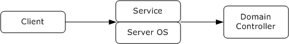
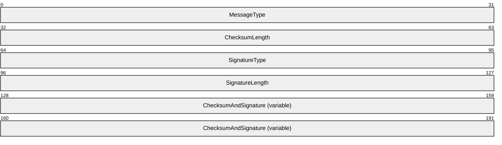
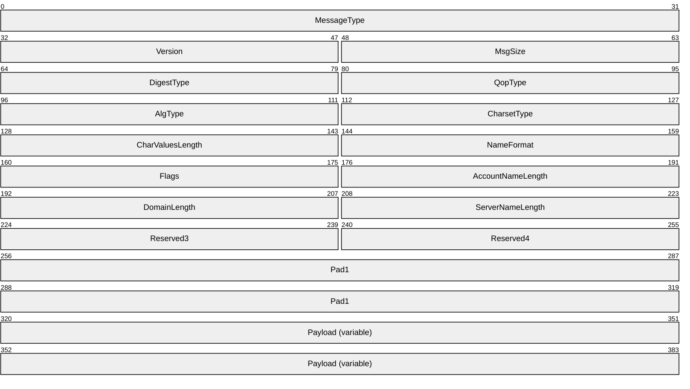
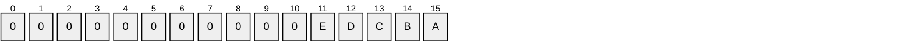
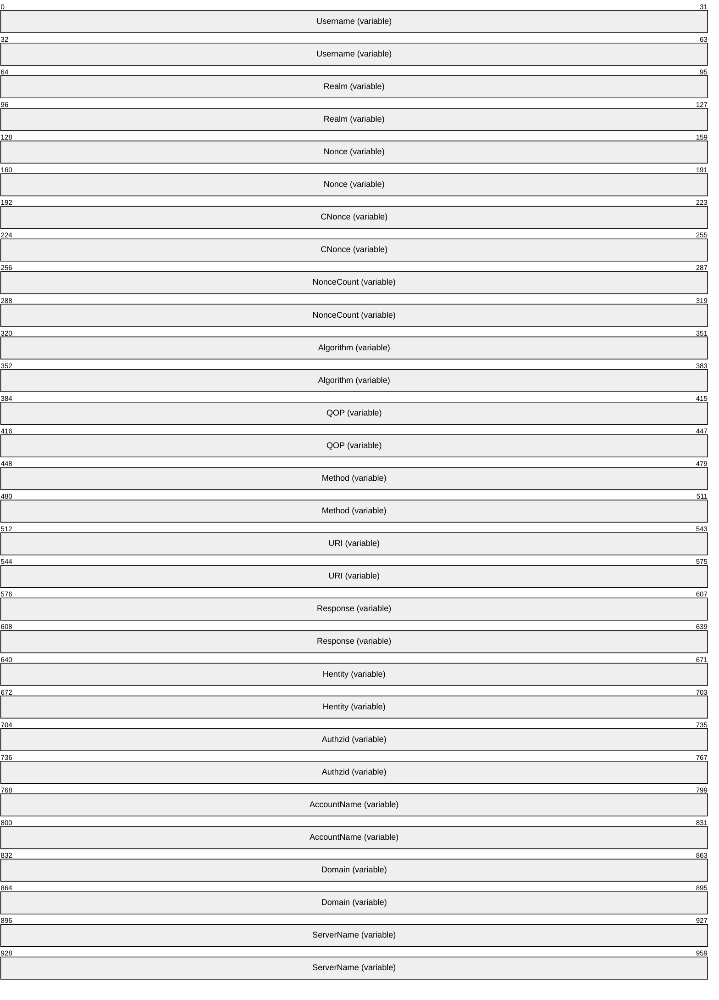
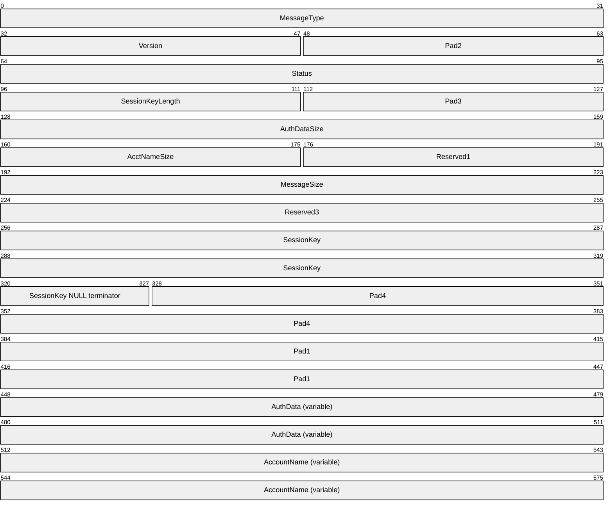
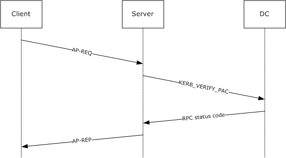

# [MS-APDS]: Authentication Protocol Domain Support

Table of Contents

1 Introduction

- [1 Introduction](#Section_1)
  - [1.1 Glossary](#Section_1.1)
  - [1.2 References](#Section_1.2)
    - [1.2.1 Normative References](#Section_1.2.1)
    - [1.2.2 Informative References](#Section_1.2.2)
  - [1.3 Overview](#Section_1.3)
  - [1.4 Relationship to Other Protocols](#Section_1.4)
    - [1.4.1 NTLM Logon](#Section_1.4.1)
    - [1.4.2 Kerberos PAC Validation](#Section_1.4.2)
    - [1.4.3 Digest Validation Protocol](#Section_1.4.3)
  - [1.5 Prerequisites/Preconditions](#Section_1.5)
    - [1.5.1 NTLM Logon](#Section_1.5.1)
    - [1.5.2 Kerberos PAC Validation](#Section_1.5.2)
    - [1.5.3 Digest Validation Protocol](#Section_1.5.3)
  - [1.6 Applicability Statement](#Section_1.6)
    - [1.6.1 NTLM Logon](#Section_1.6.1)
    - [1.6.2 Kerberos PAC Validation](#Section_1.6.2)
    - [1.6.3 Digest Validation Protocol](#Section_1.6.3)
  - [1.7 Versioning and Capability Negotiation](#Section_1.7)
    - [1.7.1 NTLM Logon](#Section_1.7.1)
    - [1.7.2 Kerberos PAC Validation](#Section_1.7.2)
    - [1.7.3 Digest Validation Protocol](#Section_1.7.3)
  - [1.8 Vendor-Extensible Fields](#Section_1.8)
    - [1.8.1 NTLM Logon](#Section_1.8.1)
    - [1.8.2 Kerberos PAC Validation](#Section_1.8.2)
    - [1.8.3 Digest Validation Protocol](#Section_1.8.3)
  - [1.9 Standards Assignments](#Section_1.9)

2 Messages

- [2 Messages](#Section_2)
  - [2.1 Transport](#Section_2.1)
  - [2.2 Message Syntax](#Section_2.2)
    - [2.2.1 NTLM Logon Message Syntax](#Section_2.2.1)
    - [2.2.2 Kerberos Ticket Validation Message Syntax](#Section_2.2.2)
    - [2.2.3 Kerberos Ticket Validation Response Message Syntax](#Section_2.2.3)
    - [2.2.4 Kerberos PAC Validation Message Syntax](#Section_2.2.4)
      - [2.2.4.1 KERB_VERIFY_PAC_REQUEST Message](#Section_2.2.4.1)
    - [2.2.5 Digest Validation Message Syntax](#Section_2.2.5)
      - [2.2.5.1 DIGEST_VALIDATION_REQ Message](#Section_2.2.5.1)
      - [2.2.5.2 DIGEST_VALIDATION_RESP Message](#Section_2.2.5.2)

3 Protocol Details

- [3 Protocol Details](#Section_3)
  - [3.1 NTLM Logon Details](#Section_3.1)
    - [3.1.1 Abstract Data Model](#Section_3.1.1)
    - [3.1.2 Timers](#Section_3.1.2)
    - [3.1.3 Initialization](#Section_3.1.3)
    - [3.1.4 Higher-Layer Triggered Events](#Section_3.1.4)
    - [3.1.5 Message Processing Events and Sequencing Rules](#Section_3.1.5)
      - [3.1.5.1 NTLM Interactive Logon](#Section_3.1.5.1)
      - [3.1.5.2 NTLM Network Logon](#Section_3.1.5.2)
        - [3.1.5.2.1 Verifying Responses with Sub-Authentication Packages](#Section_3.1.5.2.1)
    - [3.1.6 Timer Events](#Section_3.1.6)
    - [3.1.7 Other Local Events](#Section_3.1.7)
  - [3.2 Kerberos PAC Validation Details](#Section_3.2)
    - [3.2.1 Abstract Data Model](#Section_3.2.1)
    - [3.2.2 Timers](#Section_3.2.2)
    - [3.2.3 Initialization](#Section_3.2.3)
    - [3.2.4 Higher-Layer Triggered Events](#Section_3.2.4)
    - [3.2.5 Message Processing Events and Sequencing Rules](#Section_3.2.5)
      - [3.2.5.1 Generating a NETLOGON_TICKET_LOGON_INFO Message](#Section_3.2.5.1)
      - [3.2.5.2 Kerberos Client Prepares Request](#Section_3.2.5.2)
      - [3.2.5.3 Processing a NETLOGON_TICKET_LOGON_INFO Message](#Section_3.2.5.3)
      - [3.2.5.4 Kerberos Client Receives Reply](#Section_3.2.5.4)
      - [3.2.5.5 Generating a KERB_VERIFY_PAC_REQUEST Message](#Section_3.2.5.5)
      - [3.2.5.6 Processing a KERB_VERIFY_PAC_REQUEST Message](#Section_3.2.5.6)
    - [3.2.6 Timer Events](#Section_3.2.6)
    - [3.2.7 Other Local Events](#Section_3.2.7)
  - [3.3 Digest Validation Details](#Section_3.3)
    - [3.3.1 Abstract Data Model](#Section_3.3.1)
    - [3.3.2 Timers](#Section_3.3.2)
    - [3.3.3 Initialization](#Section_3.3.3)
    - [3.3.4 Higher-Layer Triggered Events](#Section_3.3.4)
    - [3.3.5 Message Processing Events and Sequencing Rules](#Section_3.3.5)
      - [3.3.5.1 Generating the DIGEST_VALIDATION_REQ Message](#Section_3.3.5.1)
      - [3.3.5.2 Request Processing and Generating DIGEST_VALIDATION_RESP Message](#Section_3.3.5.2)
    - [3.3.6 Timer Events](#Section_3.3.6)
    - [3.3.7 Other Local Events](#Section_3.3.7)

4 Protocol Examples

- [4 Protocol Examples](#Section_4)
  - [4.1 NTLM Pass-Through Authentication](#Section_4.1)
  - [4.2 Kerberos PAC Validation](#Section_4.2)
  - [4.3 Digest Validation Protocol](#Section_4.3)

5 Security

- [5 Security](#Section_5)
  - [5.1 Security Considerations for Implementers](#Section_5.1)
  - [5.2 Index of Security Parameters](#Section_5.2)

6 Appendix A: Product Behavior

- [6 Appendix A: Product Behavior](#Section_6)

7 Change Tracking

- [7 Change Tracking](#Section_7)

For the legal notice and IP terms, see [LEGAL.md](../LEGAL.md).
Last updated: 1/13/2025.
See [Revision History](#revision-history) for full version history.

# 1 Introduction

Authentication Protocol Domain Support (APDS) specifies the required communication between a server and a domain controller (DC) that uses Netlogon interfaces to complete an authentication sequence.

An operating system can support several authentication protocols, such as NT LAN Manager (NTLM) Authentication Protocol, Kerberos, Secure Sockets Layer (SSL)/Transport Layer Security (TLS), and Digest authentication. APDS is used by NT LAN Manager (NTLM) and the Digest validation protocol to validate the user's credentials at the domain controller. The Kerberos protocol uses APDS to perform the required communication for privilege attribute certificate (PAC) validation.

All these protocols can be supported by any server and rely only on a local user account database except for Kerberos that relies on a mutually trusted third-party called Key Distribution Center (KDC) [MS-KILE](../MS-KILE/MS-KILE.md). Therefore, specifications for these protocols can stand entirely on their own. However, in a domain context, when the server is a member of a domain and relies on the domain account database, the domain controller contributes to the authentication and authorization processes. Domain members use the Netlogon Remote Protocol [MS-NRPC](../MS-NRPC/MS-NRPC.md) to communicate with the domain controller for purposes of authentication and authorization.

The implementations of these authentication protocols use a variety of methods to communicate with the domain controller in the course of their executions. These methods, collectively referred to as Authentication Protocol Domain Support, are specified in this document.

Sections 1.5, 1.8, 1.9, 2, and 3 of this specification are normative. All other sections and examples in this specification are informative.

## 1.1 Glossary

This document uses the following terms:

**Active Directory**: The Windows implementation of a general-purpose directory service, which uses LDAP as its primary access protocol. Active Directory stores information about a variety of objects in the network such as user accounts, computer accounts, groups, and all related credential information used by [**Kerberos**](#gt_kerberos) [MS-KILE](../MS-KILE/MS-KILE.md). Active Directory is either deployed as Active Directory Domain Services (AD DS) or Active Directory Lightweight Directory Services (AD LDS), which are both described in [MS-ADOD](../MS-ADOD/MS-ADOD.md): Active Directory Protocols Overview.

**APDS server**: The server side of Authentication Protocol Domain Support [MS-APDS](#Section_dd444344fd7e430eb3137e95ab9c338e), otherwise known as a [**domain controller**](#gt_domain-controller-dc) in authentication protocols that use Authentication Protocol Domain Support.

**application server**: The server side of Kerberos Network Authentication Service (V5) Extensions [MS-KILE].

**Digest authentication**: A protocol that uses a challenge-response mechanism for authentication in which clients are able to verify their identities without sending an in-the-clear password to the server. For more information, see [[RFC2617]](https://go.microsoft.com/fwlink/?LinkId=90373) and [[RFC2831]](https://go.microsoft.com/fwlink/?LinkId=90387).

**Digest client**: The Digest Access Authentication: Microsoft Extensions [MS-DPSP](../MS-DPSP/MS-DPSP.md) client.

**Digest server**: The server side of Digest Access Authentication: Microsoft Extensions [MS-DPSP].

**Digest validation**: A protocol to verify the [**Digest authentication**](#gt_digest-authentication) challenge-response from a client to a server for a specified [**domain**](#gt_domain) account.

**directory**: The database that stores information about objects such as users, groups, computers, printers, and the directory service that makes this information available to users and applications.

**domain**: A set of users and computers sharing a common namespace and management infrastructure. At least one computer member of the set has to act as a [**domain controller (DC)**](#gt_domain-controller-dc) and host a member list that identifies all members of the domain, as well as optionally hosting the [**Active Directory**](#gt_active-directory) service. The domain controller provides authentication of members, creating a unit of trust for its members. Each domain has an identifier that is shared among its members. For more information, see [MS-AUTHSOD](../MS-AUTHSOD/MS-AUTHSOD.md) section 1.1.1.5 and [MS-ADTS](../MS-ADTS/MS-ADTS.md).

**domain account**: A stored set of attributes representing a principal used to authenticate a user or machine to an [**Active Directory**](#gt_active-directory) domain.

**domain controller (DC)**: The service, running on a server, that implements [**Active Directory**](#gt_active-directory), or the server hosting this service. The service hosts the data store for objects and interoperates with other [**DCs**](#gt_domain-controller-dc) to ensure that a local change to an object replicates correctly across all [**DCs**](#gt_domain-controller-dc). When [**Active Directory**](#gt_active-directory) is operating as Active Directory Domain Services (AD DS), the [**DC**](#gt_domain-controller-dc) contains full NC replicas of the configuration naming context (config NC), schema naming context (schema NC), and one of the domain NCs in its forest. If the AD DS [**DC**](#gt_domain-controller-dc) is a global catalog server (GC server), it contains partial NC replicas of the remaining domain NCs in its forest. For more information, see [MS-AUTHSOD] section 1.1.1.5.2 and [MS-ADTS]. When [**Active Directory**](#gt_active-directory) is operating as Active Directory Lightweight Directory Services (AD LDS), several AD LDS [**DCs**](#gt_domain-controller-dc) can run on one server. When [**Active Directory**](#gt_active-directory) is operating as AD DS, only one AD DS [**DC**](#gt_domain-controller-dc) can run on one server. However, several AD LDS [**DCs**](#gt_domain-controller-dc) can coexist with one AD DS [**DC**](#gt_domain-controller-dc) on one server. The AD LDS [**DC**](#gt_domain-controller-dc) contains full NC replicas of the config NC and the schema NC in its forest. The domain controller is the server side of Authentication Protocol Domain Support [MS-APDS].

**interactive logon**: A software method in which the account information and credentials input by the user interactively are authenticated by a server or [**domain controller (DC)**](#gt_domain-controller-dc).

**Kerberos**: An authentication system that enables two parties to exchange private information across an otherwise open network by assigning a unique key (called a ticket) to each user that logs on to the network and then embedding these tickets into messages sent by the users. For more information, see [MS-KILE].

**Key Distribution Center (KDC)**: The [**Kerberos**](#gt_kerberos) service that implements the authentication and ticket granting services specified in the Kerberos protocol. The service runs on computers selected by the administrator of the [**realm**](#gt_realm) or domain; it is not present on every machine on the network. It has to have access to an account database for the realm that it serves. KDCs are integrated into the [**domain controller**](#gt_domain-controller-dc) role. It is a network service that supplies tickets to clients for use in authenticating to services.

**little-endian**: Multiple-byte values that are byte-ordered with the least significant byte stored in the memory location with the lowest address.

**machine account**: An account that is associated with individual client or server machines in an [**Active Directory**](#gt_active-directory) domain.

**NetBIOS**: A particular network transport that is part of the LAN Manager protocol suite. [**NetBIOS**](#gt_netbios) uses a broadcast communication style that was applicable to early segmented local area networks. A protocol family including name resolution, datagram, and connection services. For more information, see [[RFC1001]](https://go.microsoft.com/fwlink/?LinkId=90260) and [[RFC1002]](https://go.microsoft.com/fwlink/?LinkId=90261).

**network logon**: A software method in which the account information and credentials previously supplied by the user as part of an interactive logon are used again to log the user onto another network resource.

**NT LAN Manager (NTLM) Authentication Protocol**: A protocol using a challenge-response mechanism for authentication in which clients are able to verify their identities without sending a password to the server. It consists of three messages, commonly referred to as Type 1 (negotiation), Type 2 (challenge) and Type 3 (authentication).

**NTLM client**: The NT LAN Manager (NTLM) Authentication Protocol [MS-NLMP](../MS-NLMP/MS-NLMP.md) client.

**NTLM server**: The server side of NT LAN Manager (NTLM) Authentication Protocol [MS-NLMP].

**NTOWF**: In the context of an NTLM authentication, a NT LAN Manager (NT) one-way function (OWF) used to create a hash based on the user's password to generate a principal's secret key. The NTLM hash superseded the LAN Manager (LM) hash.

**principal**: A unique entity identifiable by a security identifier (SID) that is typically the requester of access to securable objects or resources. It often corresponds to a human user but can also be a computer or service. It is sometimes referred to as a security principal.

**privilege attribute certificate (PAC)**: A Microsoft-specific authorization data present in the authorization data field of a ticket. The [**PAC**](#gt_privilege-attribute-certificate-pac) contains several logical components, including group membership data for authorization, alternate credentials for non-Kerberos authentication protocols, and policy control information for supporting interactive logon.

**realm**: An administrative boundary that uses one set of authentication servers to manage and deploy a single set of unique identifiers. A realm is a unique logon space.

**remote procedure call (RPC)**: A communication protocol used primarily between client and server. The term has three definitions that are often used interchangeably: a runtime environment providing for communication facilities between computers (the RPC runtime); a set of request-and-response message exchanges between computers (the RPC exchange); and the single message from an RPC exchange (the RPC message). For more information, see [[C706]](https://go.microsoft.com/fwlink/?LinkId=89824).

**RPC transport**: The underlying network services used by the remote procedure call (RPC) runtime for communications between network nodes. For more information, see [C706] section 2.

**Secure Sockets Layer (SSL)**: A security protocol that supports confidentiality and integrity of messages in client and server applications that communicate over open networks. SSL supports server and, optionally, client authentication using X.509 certificates [[X509]](https://go.microsoft.com/fwlink/?LinkId=90590) and [[RFC5280]](https://go.microsoft.com/fwlink/?LinkId=131034). SSL is superseded by [**Transport Layer Security (TLS)**](#gt_transport-layer-security-tls). TLS version 1.0 is based on SSL version 3.0 [[SSL3]](https://go.microsoft.com/fwlink/?LinkId=90534).

**server computer**: The server role in the network topology of client/server/domain controller.

**service**: A process or agent that is available on the network, offering resources or services for clients. Examples of services include file servers, web servers, and so on.

**Transport Layer Security (TLS)**: A security protocol that supports confidentiality and integrity of messages in client and server applications communicating over open networks. TLS supports server and, optionally, client authentication by using X.509 certificates (as specified in [X509]). TLS is standardized in the IETF TLS working group.

**Unicode**: A character encoding standard developed by the Unicode Consortium that represents almost all of the written languages of the world. The [**Unicode**](#gt_unicode) standard [[UNICODE5.0.0/2007]](https://go.microsoft.com/fwlink/?LinkId=154659) provides three forms (UTF-8, UTF-16, and UTF-32) and seven schemes (UTF-8, UTF-16, UTF-16 BE, UTF-16 LE, UTF-32, UTF-32 LE, and UTF-32 BE).

**user principal name (UPN)**: A user account name (sometimes referred to as the user logon name) and a domain name that identifies the domain in which the user account is located. This is the standard usage for logging on to a Windows domain. The format is: someone@example.com (in the form of an email address). In [**Active Directory**](#gt_active-directory), the userPrincipalName attribute of the account object, as described in [MS-ADTS].

**MAY, SHOULD, MUST, SHOULD NOT, MUST NOT:** These terms (in all caps) are used as defined in [[RFC2119]](https://go.microsoft.com/fwlink/?LinkId=90317). All statements of optional behavior use either MAY, SHOULD, or SHOULD NOT.

## 1.2 References

Links to a document in the Microsoft Open Specifications library point to the correct section in the most recently published version of the referenced document. However, because individual documents in the library are not updated at the same time, the section numbers in the documents may not match. You can confirm the correct section numbering by checking the [Errata](https://go.microsoft.com/fwlink/?linkid=850906).

### 1.2.1 Normative References

We conduct frequent surveys of the normative references to assure their continued availability. If you have any issue with finding a normative reference, please contact [dochelp@microsoft.com](mailto:dochelp@microsoft.com). We will assist you in finding the relevant information.

[ISO/IEC-8859-1] International Organization for Standardization, "Information Technology -- 8-Bit Single-Byte Coded Graphic Character Sets -- Part 1: Latin Alphabet No. 1", ISO/IEC 8859-1, 1998, [http://www.iso.org/iso/home/store/catalogue_tc/catalogue_detail.htm?csnumber=28245](https://go.microsoft.com/fwlink/?LinkId=90689)

**Note** There is a charge to download the specification.

[MS-ADA1] Microsoft Corporation, "[Active Directory Schema Attributes A-L](../MS-ADA1/MS-ADA1.md)".

[MS-ADA2] Microsoft Corporation, "[Active Directory Schema Attributes M](../MS-ADA2/MS-ADA2.md)".

[MS-ADA3] Microsoft Corporation, "[Active Directory Schema Attributes N-Z](../MS-ADA3/MS-ADA3.md)".

[MS-ADTS] Microsoft Corporation, "[Active Directory Technical Specification](../MS-ADTS/MS-ADTS.md)".

[MS-DPSP] Microsoft Corporation, "[Digest Protocol Extensions](../MS-DPSP/MS-DPSP.md)".

[MS-DTYP] Microsoft Corporation, "[Windows Data Types](../MS-DTYP/MS-DTYP.md)".

[MS-ERREF] Microsoft Corporation, "[Windows Error Codes](../MS-ERREF/MS-ERREF.md)".

[MS-KILE] Microsoft Corporation, "[Kerberos Protocol Extensions](../MS-KILE/MS-KILE.md)".

[MS-LSAD] Microsoft Corporation, "[Local Security Authority (Domain Policy) Remote Protocol](../MS-LSAD/MS-LSAD.md)".

[MS-NLMP] Microsoft Corporation, "[NT LAN Manager (NTLM) Authentication Protocol](../MS-NLMP/MS-NLMP.md)".

[MS-NRPC] Microsoft Corporation, "[Netlogon Remote Protocol](../MS-NRPC/MS-NRPC.md)".

[MS-PAC] Microsoft Corporation, "[Privilege Attribute Certificate Data Structure](../MS-PAC/MS-PAC.md)".

[MS-RPCE] Microsoft Corporation, "[Remote Procedure Call Protocol Extensions](../MS-RPCE/MS-RPCE.md)".

[MS-SAMR] Microsoft Corporation, "[Security Account Manager (SAM) Remote Protocol (Client-to-Server)](../MS-SAMR/MS-SAMR.md)".

[RFC2119] Bradner, S., "Key words for use in RFCs to Indicate Requirement Levels", BCP 14, RFC 2119, March 1997, [https://www.rfc-editor.org/info/rfc2119](https://go.microsoft.com/fwlink/?LinkId=90317)

[RFC2617] Franks, J., Hallam-Baker, P., Hostetler, J., et al., "HTTP Authentication: Basic and Digest Access Authentication", RFC 2617, June 1999, [https://www.rfc-editor.org/info/rfc2617](https://go.microsoft.com/fwlink/?LinkId=90373)

[RFC2831] Leach, P. and Newman, C., "Using Digest Authentication as a SASL Mechanism", RFC 2831, May 2000, [https://www.rfc-editor.org/info/rfc2831](https://go.microsoft.com/fwlink/?LinkId=90387)

[RFC4120] Neuman, C., Yu, T., Hartman, S., and Raeburn, K., "The Kerberos Network Authentication Service (V5)", RFC 4120, July 2005, [https://www.rfc-editor.org/rfc/rfc4120](https://go.microsoft.com/fwlink/?LinkId=90458)

[RFC4757] Jaganathan, K., Zhu, L., and Brezak, J., "The RC4-HMAC Kerberos Encryption Types Used by Microsoft Windows", RFC 4757, December 2006, [https://www.rfc-editor.org/info/rfc4757](https://go.microsoft.com/fwlink/?LinkId=90488)

### 1.2.2 Informative References

[MS-RCMP] Microsoft Corporation, "[Remote Certificate Mapping Protocol](../MS-RCMP/MS-RCMP.md)".

[MSDN-0SUBAUTHROUTINE9] Microsoft Corporation, "Msv1_0SubAuthenticationRoutine function (subauth.h)", 9 Parameters, Security, [https://learn.microsoft.com/en-us/windows/win32/api/subauth/nf-subauth-msv1_0subauthenticationroutine](https://go.microsoft.com/fwlink/?LinkId=91841)

[RFC1994] Simpson, W, "PPP Challenge Handshake Authentication Protocol (CHAP)", RFC 1994, August 1996, [https://www.rfc-editor.org/info/rfc1994](https://go.microsoft.com/fwlink/?LinkId=90305)

[RFC2069] Franks, J., et al., "An Extension to HTTP: Digest Access Authentication", RFC 2069, January 1997, [http://www.ietf.org/rfc/rfc2069.txt](https://go.microsoft.com/fwlink/?LinkId=90311)

[X509] ITU-T, "Information Technology - Open Systems Interconnection - The Directory: Public-Key and Attribute Certificate Frameworks", Recommendation X.509, August 2005, [http://www.itu.int/rec/T-REC-X.509/en](https://go.microsoft.com/fwlink/?LinkId=90590)

## 1.3 Overview

Authentication protocols such as NT LAN Manager (NTLM), [**Kerberos**](#gt_kerberos), [**Secure Sockets Layer (SSL)**](#gt_secure-sockets-layer-ssl)/[**Transport Layer Security (TLS)**](#gt_transport-layer-security-tls), and [**Digest authentication**](#gt_digest-authentication) are used by a variety of higher-layer protocols to provide security [**services**](#gt_service).

The Authentication Protocol Domain Support Protocol specifies the communication between the server and the [**domain controller**](#gt_domain-controller-dc) for each of the protocols.

Each of the protocols has a specific exchange with the domain controller (DC) as follows:

- Authenticate the client: [**NTLM**](#gt_nt-lan-manager-ntlm-authentication-protocol) and digest.
- Obtain authorization information, such as group memberships: NTLM, digest, and SSL/TLS.
- Verify the authorization information: The server operating system for Kerberos [**privilege attribute certificate (PAC)**](#gt_privilege-attribute-certificate-pac) [MS-PAC](../MS-PAC/MS-PAC.md).
All these back-end, server-to-server protocols in turn use the Netlogon Remote Protocol [MS-NRPC](../MS-NRPC/MS-NRPC.md) for their transport to the DC. Specifically, the protocols behave as follows:

- The NT LAN Manager (NTLM) Authentication Protocol [MS-NLMP](../MS-NLMP/MS-NLMP.md) uses the Netlogon Remote Protocol [MS-NRPC] to communicate with the DC to complete the authentication of a [**domain account**](#gt_domain-account) during an [**interactive logon**](#gt_interactive-logon) or [**network logon**](#gt_network-logon). As user account information is maintained by the DC, only the DC can validate user credentials and complete the authentication sequence. The server then uses the authorization information returned by the DC to make authorization decisions.
- The server operating system uses Netlogon generic pass-through ([MS-NRPC] section 3.2) to validate the PAC that it receives in the ticket from the client. Because PAC information can be altered by the server, the operating system might contact the DC to validate the PAC and ensure its integrity.
- The Digest Protocol Extensions [MS-DPSP](../MS-DPSP/MS-DPSP.md) is used by deployments in which users are authenticated based on user name and password by using the Digest authentication mechanism. The Digest authentication mechanism itself defines how the client authenticates the user to the server (by proving knowledge of the password), and optionally provides integrity and confidentiality of subsequent messages exchanged between the client and the server. [**Digest validation**](#gt_digest-validation) is performed between the server and the DC during the initial client/server Digest–based authentication as follows:
- The server which does not have access to the user's password sends a Digest validation request message (section [2.2.5.1](#Section_2.2.5.1)) to the domain controller by using the generic pass-through capability of the Netlogon Remote Protocol.
- The DC looks up the user's password and uses it to verify the validity of the digest input. The digest input is originally generated by the [**Digest client**](#gt_digest-client) using the user's password, as specified in [[RFC2617]](https://go.microsoft.com/fwlink/?LinkId=90373) and [[RFC2831]](https://go.microsoft.com/fwlink/?LinkId=90387)).
- On successful validation, the domain controller returns the PAC in the [DIGEST_VALIDATION_RESP](#Section_2.2.5.2) message. The PAC represents the user's identity and group memberships, suitable for making authorization decisions.
- SSL/TLS and other protocols that authenticate users via the X.509 certificates [[X509]](https://go.microsoft.com/fwlink/?LinkId=90590) can use the Remote Certificate Mapping Protocol [MS-RCMP](../MS-RCMP/MS-RCMP.md), which relies on the generic pass-through capability of Netlogon to retrieve authorization information associated with users.

## 1.4 Relationship to Other Protocols

Each of the following protocols relies on the Netlogon Remote Protocol ([MS-NRPC](../MS-NRPC/MS-NRPC.md)) to complete the authentication sequence and retrieve or validate authorization information associated with a user. All higher-layer protocols that use one of the protocols specified in this document (for example, [**NT LAN Manager (NTLM) Authentication Protocol**](#gt_nt-lan-manager-ntlm-authentication-protocol) [MS-NLMP](../MS-NLMP/MS-NLMP.md)) leverage the functionality specified here when in a [**domain**](#gt_domain) environment.

### 1.4.1 NTLM Logon

[**NTLM**](#gt_nt-lan-manager-ntlm-authentication-protocol) authentication ([MS-NLMP](../MS-NLMP/MS-NLMP.md)) uses the Netlogon pass-through authentication ([MS-NRPC](../MS-NRPC/MS-NRPC.md) section 3.2) to authenticate the user in the [**domain**](#gt_domain) with the [**domain controller**](#gt_domain-controller-dc) during an [**interactive logon**](#gt_interactive-logon) or a [**network logon**](#gt_network-logon).

### 1.4.2 Kerberos PAC Validation

The server operating system uses the Netlogon generic pass-through ([MS-NRPC](../MS-NRPC/MS-NRPC.md) section 3.2.4.1) to validate the [**privilege attribute certificate (PAC)**](#gt_privilege-attribute-certificate-pac) with the [**domain controller**](#gt_domain-controller-dc), when required.

### 1.4.3 Digest Validation Protocol

The [**Digest validation**](#gt_digest-validation) defined in this document relies on the generic pass-through capability of the Netlogon Remote Protocol ([MS-NRPC](../MS-NRPC/MS-NRPC.md) section 3.2.4.1) as a transport for the [DIGEST_VALIDATION_REQ (section 2.2.5.1)](#Section_2.2.5.1) and [DIGEST_VALIDATION_RESP (section 2.2.5.2)](#Section_2.2.5.2) messages.

## 1.5 Prerequisites/Preconditions

Each of the protocols in this specification relies on the Netlogon Remote Protocol [MS-NRPC](../MS-NRPC/MS-NRPC.md). [MS-NRPC] assumes that the following prerequisites are met:

- The server has a [**machine account**](#gt_machine-account) in the [**domain**](#gt_domain).
- The server has established a secure connection with the [**domain controller (DC)**](#gt_domain-controller-dc).

### 1.5.1 NTLM Logon

[**NTLM**](#gt_nt-lan-manager-ntlm-authentication-protocol) [**interactive logon**](#gt_interactive-logon) and NTLM [**network logon**](#gt_network-logon) have all of the prerequisites and preconditions that are defined in the NT LAN Manager (NTLM) Authentication Protocol [MS-NLMP](../MS-NLMP/MS-NLMP.md).

### 1.5.2 Kerberos PAC Validation

Kerberos PAC validation assumes that the server operating system has a [**PAC**](#gt_privilege-attribute-certificate-pac) that has been received in a ticket from the client to the [**application server**](#gt_application-server). It is possible for a server operating system to require PAC validation (section [1.6.2](#Section_1.6.2)).

### 1.5.3 Digest Validation Protocol

The Digest validation protocol assumes the following:

- The [**DC**](#gt_domain-controller-dc) server has access to the user's password.
- The [**Digest client**](#gt_digest-client) possesses the digest-response message ([[RFC2617]](https://go.microsoft.com/fwlink/?LinkId=90373) section 3.2.2) and the initial digest-challenge message ([RFC2617] section 3.2.1) used in the [**Digest authentication**](#gt_digest-authentication) protocol.

## 1.6 Applicability Statement

All protocol support for [**domains**](#gt_domain) requires a domain authority to process the requests. These protocols are not applicable to any stand-alone machine that is not associated with a domain. Each protocol has additional applicability constraints.

### 1.6.1 NTLM Logon

[**NTLM**](#gt_nt-lan-manager-ntlm-authentication-protocol) ([MS-NLMP](../MS-NLMP/MS-NLMP.md) section 1.6) also applies when the [**NTLM server**](#gt_ntlm-server) performing the NTLM authentication is a member of a [**domain**](#gt_domain). Both NTLM for [**interactive logon**](#gt_interactive-logon) and NTLM for [**network logon**](#gt_network-logon) can be performed by using a [**domain controller (DC)**](#gt_domain-controller-dc).

Network logon using NTLM is applicable under any one of the following situations:

- Client or application is explicitly configured to use NTLM.
- Client or application uses an invalid target name (the server's [**principal**](#gt_principal) name) and cannot log on by using [**Kerberos**](#gt_kerberos).
Client or application specifies a target name that cannot be resolved and, therefore, cannot log on by using Kerberos.

### 1.6.2 Kerberos PAC Validation

Figure 1: Kerberos PAC validation

Before Kerberos PAC validation occurs, the client has sent the [**privilege attribute certificate (PAC)**](#gt_privilege-attribute-certificate-pac) to the [**service**](#gt_service) as a part of the Kerberos Protocol Extensions described in [MS-KILE](../MS-KILE/MS-KILE.md). The operating system on which the service runs validates the PAC to prevent PAC tampering by the service. PAC tampering can result in inappropriate elevation of privileges.

PAC validation is applicable for [**Kerberos**](#gt_kerberos) applications that process and interpret the PAC and present that authorization data to additional services. It is optional for a self-contained application because the security threat that the protocol addresses is not relevant for self-contained applications.

### 1.6.3 Digest Validation Protocol

The Digest validation protocol is appropriate for servers that are implementing [**Digest authentication**](#gt_digest-authentication) and are acting as members in an [**Active Directory**](#gt_active-directory)–compatible [**domain**](#gt_domain).

## 1.7 Versioning and Capability Negotiation

### 1.7.1 NTLM Logon

[**NTLM**](#gt_nt-lan-manager-ntlm-authentication-protocol) [**interactive logon**](#gt_interactive-logon) and [**network logon**](#gt_network-logon) do not have any versioning or capability negotiation.

### 1.7.2 Kerberos PAC Validation

Kerberos PAC validation does not have any versioning or capability negotiation.

### 1.7.3 Digest Validation Protocol

The [DIGEST_VALIDATION_REQ](#Section_2.2.5.1) and [DIGEST_VALIDATION_RESP](#Section_2.2.5.2) messages have a dedicated version number field. This document defines version 1 of the [**Digest validation**](#gt_digest-validation) protocol. The Digest validation protocol does not support any capability negotiation.

## 1.8 Vendor-Extensible Fields

### 1.8.1 NTLM Logon

[**NTLM**](#gt_nt-lan-manager-ntlm-authentication-protocol) [**interactive logon**](#gt_interactive-logon) and [**network logon**](#gt_network-logon) do not have any vendor-extensible fields.

### 1.8.2 Kerberos PAC Validation

Kerberos PAC validation does not have any vendor-extensible fields.

### 1.8.3 Digest Validation Protocol

The Digest validation protocol does not have any vendor-extensible fields. Note that the [**Digest validation**](#gt_digest-validation) protocol has reserved fields for future use, but these fields are not intended to carry opaque or vendor-defined data.

## 1.9 Standards Assignments

None.

# 2 Messages

## 2.1 Transport

[**Domain**](#gt_domain) support for the Authentication Protocol Domain Support protocol SHOULD use Netlogon [**remote procedure call (RPC)**](#gt_remote-procedure-call-rpc) messages in the logon interface. The Netlogon [**RPC transport**](#gt_rpc-transport) is specified in [MS-NRPC](../MS-NRPC/MS-NRPC.md).

## 2.2 Message Syntax

For [**domain**](#gt_domain) support, authentication protocols MUST use an NRPC pass-through authentication ([MS-NRPC](../MS-NRPC/MS-NRPC.md) section 3.2) method with parameters determined by the authentication protocol being used.

Interactive and [**network logon**](#gt_network-logon) information, passed through the *LogonInformation* parameter, is used when calling the NetrLogonSamLogonEx method ([MS-NRPC] section 3.5.4.5.1). [**Domain controller**](#gt_domain-controller-dc) [**Kerberos**](#gt_kerberos) [**PAC**](#gt_privilege-attribute-certificate-pac) validation and digest messages MUST be encoded as opaque blobs and transported by the generic pass-through capability of Netlogon ([MS-NRPC] section 3.2.4.1).

All message fields, including bit flags, are in the following sections in [**little-endian**](#gt_little-endian) format. These data structures MUST be built as if they are on a little-endian machine before transmission. On reception, the messages MUST be interpreted as little-endian and transformed into the native endianness of the implementation.

The following table shows a few of the main status codes returned by these protocols. For a complete list of status codes, see [MS-ERREF](../MS-ERREF/MS-ERREF.md).

| Symbolic name | Value | Meaning |
| --- | --- | --- |
| STATUS_SUCCESS | 0x00000000 | Requested operation succeeded. |
| STATUS_LOGON_FAILURE | 0xC000006D | Authentication failed. |
| STATUS_NO_SUCH_USER | 0xC0000064 | Specified account does not exist. |
| STATUS_NO_LOGON_SERVERS | 0xC000005E | None of the domain controllers are reachable to service the request. |

### 2.2.1 NTLM Logon Message Syntax

The specific message syntax for [**NTLM**](#gt_nt-lan-manager-ntlm-authentication-protocol) [**interactive logon**](#gt_interactive-logon) or [**network logon**](#gt_network-logon) is part of the NRPC pass-through authentication ([MS-NRPC](../MS-NRPC/MS-NRPC.md) section 3.2).<1> The [**domain**](#gt_domain) support for NTLM logon is invoked by calling an NRPC pass-through authentication method.

### 2.2.2 Kerberos Ticket Validation Message Syntax

The Netlogon Ticket Logon Info validation request message, NETLOGON_TICKET_LOGON_INFO ([MS-NRPC](../MS-NRPC/MS-NRPC.md) section 2.2.1.4.19), MUST be encoded as a contiguous buffer. The encoded data SHOULD be sent by using the generic pass-through mechanism ([MS-NRPC] section 3.2.4.1).

### 2.2.3 Kerberos Ticket Validation Response Message Syntax

The Netlogon Ticket Logon Info validation response message, NETLOGON_VALIDATION_TICKET_LOGON ([MS-NRPC](../MS-NRPC/MS-NRPC.md) section 2.2.1.4.20), MUST be encoded as a contiguous buffer. The encoded data SHOULD be sent by using the generic pass-through mechanism ([MS-NRPC] section 3.2.4.1).

### 2.2.4 Kerberos PAC Validation Message Syntax

The [**privilege attribute certificate (PAC)**](#gt_privilege-attribute-certificate-pac) validation request message, KERB_VERIFY_PAC_REQUEST (section [2.2.4.1](#Section_2.2.4.1)), MUST be encoded as a contiguous buffer. The encoded data SHOULD<2> be sent by using the generic pass-through mechanism ([MS-NRPC](../MS-NRPC/MS-NRPC.md) section 3.2.4.1). The encoding of the KERB_VERIFY_PAC_REQUEST is specified in section 2.2.4.1.

#### 2.2.4.1 KERB_VERIFY_PAC_REQUEST Message

The KERB_VERIFY_PAC_REQUEST Message used for [**PAC**](#gt_privilege-attribute-certificate-pac) validation is defined as follows.

**MessageType (4 bytes):** An unsigned 32-bit value describing the message type. This member MUST be set to 0x00000003.

**ChecksumLength (4 bytes):** An unsigned 32-bit value that MUST contain the signature length of the **PAC_SIGNATURE_DATA Signature** value ([MS-PAC](../MS-PAC/MS-PAC.md) section 2.8) for the Server Signature ([MS-PAC] section 2.8.4) in the privilege attribute certificate (PAC).

**SignatureType (4 bytes):** An unsigned 32-bit value that MUST contain the **PAC_SIGNATURE_DATA SignatureType** value for the [**Key Distribution Center (KDC)**](#gt_key-distribution-center-kdc) Signature ([MS-PAC] section 2.8.4) in the PAC.

**SignatureLength (4 bytes):** An unsigned 32-bit value that MUST contain the signature length of the PAC_SIGNATURE_DATA Signature value in the KDC Signature in the PAC.

**ChecksumAndSignature (variable):** The **PAC_SIGNATURE_DATA Signature** value for the Server Signature in the PAC. It MUST be followed by the **PAC_SIGNATURE_DATA Signature** value for the KDC Signature in the PAC.

### 2.2.5 Digest Validation Message Syntax

The [**Digest validation**](#gt_digest-validation) protocol uses fields extracted from the digest-challenge and digest-response messages ([[RFC2617]](https://go.microsoft.com/fwlink/?LinkId=90373) section 3.2 and [[RFC2831]](https://go.microsoft.com/fwlink/?LinkId=90387) section 2.1) to verify the validity of the user signature (this is a hash performed with the user's password) and to retrieve the [**PAC**](#gt_privilege-attribute-certificate-pac) for the user's account.

#### 2.2.5.1 DIGEST_VALIDATION_REQ Message

The **DIGEST_VALIDATION_REQ** message defines a request to validate the input from the Digest Protocol Extensions [MS-DPSP](../MS-DPSP/MS-DPSP.md) and retrieve user authorization information.

**MessageType (4 bytes):** A 32-bit unsigned integer that defines the [**Digest validation**](#gt_digest-validation) message type. This member MUST be set to 0x0000001A.

**Version (2 bytes):** A 16-bit unsigned integer that defines the version of the Digest validation protocol. The protocol version defined in this document is 1 (the value of this member MUST be 0x0001).

**MsgSize (2 bytes):** A 16-bit unsigned integer that MUST specify the total number of bytes in the **DIGEST_VALIDATION_REQ** message.

**DigestType (2 bytes):** A 16-bit unsigned integer that specifies the Digest protocol used, which MUST be one of the following:

| Value | Meaning |
| --- | --- |
| 0x0003 | Using the [**Digest authentication**](#gt_digest-authentication) mechanism [[RFC2617]](https://go.microsoft.com/fwlink/?LinkId=90373) for the HTTP/1.1 Protocol. |
| 0x0004 | Using Digest authentication as a Simple Authentication and Security Layer (SASL) mechanism [[RFC2831]](https://go.microsoft.com/fwlink/?LinkId=90387). |

**QopType (2 bytes):** A 16-bit unsigned integer specifying the Quality of Protection (QoP) requested by the [**Digest client**](#gt_digest-client) ([RFC2617] section 3.2.1 and [RFC2831] section 2.1.2.1) that MUST be one of the following:

| Value | Meaning |
| --- | --- |
| 0x0001 | The Digest client did not specify a QoP. For backward compatibility with Digest Access authentication [[RFC2069]](https://go.microsoft.com/fwlink/?LinkId=90311), Digest authentication made the QoP optional. |
| 0x0002 | Authentication only. Represents auth. |
| 0x0003 | Authentication and integrity protection. Represents auth-int. |
| 0x0004 | Authentication with integrity protection and encryption. Represents auth-conf. |

**AlgType (2 bytes):** A 16-bit unsigned integer specifying the algorithm value specified by the Digest client in the digest-challenge message ([RFC2617] section 3.2.1 and [RFC2831]) that MUST be one of the following values:

| Value | Meaning |
| --- | --- |
| 0x0001 | MD5 assumed; the algorithm was not present. |
| 0x0002 | MD5 value to produce the digest and checksum. |
| 0x0003 | MD5-sess value to produce the digest and checksum |

**CharsetType (2 bytes):** A 16-bit unsigned integer specifying the type of encoding used for **username** and **password** fields that MUST be one of the following (as specified in [RFC2831] section 2.1.1 and [MS-DPSP] section 2.2):

| Value | Meaning |
| --- | --- |
| 0x0001 | ISO8859-1 encoding is used for **username** and **password** fields. |
| 0x0002 | UTF-8 encoding is used for **username** and **password** fields. |

**CharValuesLength (2 bytes):** A 16-bit unsigned integer that MUST specify the number of bytes in the **Payload** field of the **DIGEST_VALIDATION_REQ** message and MUST NOT exceed the total size in MsgSize.

**NameFormat (2 bytes):** A 16-bit unsigned integer specifying the format of the user **AccountName** field and MUST be one of the following (:

| Value | Meaning |
| --- | --- |
| 0x0000 | [**Digest server**](#gt_digest-server) cannot determine the format of the user's **AccountName**. |
| 0x0001 | A format determined to be the SAM account name ([MS-ADA3](../MS-ADA3/MS-ADA3.md) 2.222). |
| 0x0002 | A format determined to be the [**user principal name (UPN)**](#gt_user-principal-name-upn) for the account ([MS-ADA3] 2.222). |
| 0x0003 | A format determined to be [**NetBIOS**](#gt_netbios) ([MS-ADA3] 2.4). |

**Flags (2 bytes):** A two-byte set of bit flags providing additional instructions for processing the **DIGEST_VALIDATION_REQ** message by the [**DC**](#gt_domain-controller-dc). The **Flags** field is constructed from one or more bit flags from the following table, with the exception of the constraint on bit C.

**Note** All other bits MUST be set to zero and MUST be ignored upon receipt.

**A (1 bit):** The format of **Username** and **Realm** (carried in the **Payload** field of **DIGEST_VALIDATION_REQ**) MUST be determined by the DC.

**B (1 bit):** The optional **Authzid** field ([RFC2831] section 2.1.2) is set and carried in the Payload buffer in the **DIGEST_VALIDATION_REQ** message.

**C (1 bit):** Indicates that this request is from a server, so group memberships are to be expanded for the Account's [**PAC**](#gt_privilege-attribute-certificate-pac). This bit MUST NOT be set if this request is forwarded from a server's [**domain**](#gt_domain) to user account's domain.

**D (1 bit):** Indicates if a single backslash is found in the username value ([RFC2617] section 3.2.2).

**E (1 bit):** Indicates the DC will attempt to validate the request with an un-escaped backslash ([MS-DPSP] section 2.2).

**AccountNameLength (2 bytes):** A 16-bit unsigned integer that MUST specify the length of the **AccountName** field in the Payload buffer.

**DomainLength (2 bytes):** A 16-bit unsigned integer that MUST specify the length of the Domain field in the Payload buffer.

**ServerNameLength (2 bytes):** A 16-bit unsigned integer that MUST specify the length of the **ServerName** field in the Payload buffer.

**Reserved3 (2 bytes):** A 16-bit unsigned integer field reserved for future use. MUST be set to zero when sent and MUST be ignored on receipt.

**Reserved4 (2 bytes):** A 16-bit unsigned integer field reserved for future use. MUST be set to zero when sent and MUST be ignored on receipt.

**Pad1 (8 bytes):** An unused, 64-bit unsigned integer. MUST be set to zero when sent and MUST be ignored on receipt.

**Payload (variable):** A byte array that MUST contain the following strings in the following order. All strings are the unquoted directive value. All strings MUST be null-terminated; strings MUST be encoded by using [[ISO/IEC-8859-1]](https://go.microsoft.com/fwlink/?LinkId=90689), unless specified as [**Unicode**](#gt_unicode). Each of the strings MUST be included. If the string value is empty, then a terminating null character MUST be used for the value. Remember that the last three strings are Unicode strings, so they have a Unicode terminating null character.

**Username (variable):** The user name value from the digest-response message. MUST be as specified in [RFC2617] section 3.2.2.

**Realm (variable):** The [**realm**](#gt_realm) value. MUST be as specified in [RFC2617] section 3.2.1.

**Nonce (variable):** The nonce value from the digest-challenge message. MUST be as specified in [RFC2617] section 3.2.1.

**CNonce (variable):** The cnonce value from the digest-response message. MUST be as specified in [RFC2617] section 3.2.2.

**NonceCount (variable):** The nc-value from the digest-response message. MUST be as specified in [RFC2617], section 3.2.2.

**Algorithm (variable):** The algorithm value from the digest-response message. MUST be as specified in [RFC2617] section 3.2.1.

**QOP (variable):** The QOP value from the digest-response message. MUST be as specified in [RFC2617] section 3.2.2.

**Method (variable):** Method by which Digest authentication information MUST be transmitted as part of the HTTP1.1 protocol. The string value is GET or PUT if Digest authentication is used for the HTTP1.1 protocol. The string value is AUTHENTICATE if Digest authentication is used as an SASL mechanism [RFC2617].

**URI (variable):** The digest-URI value from the digest-response message. MUST be as specified in [RFC2617] section 3.2.2.

**Response (variable):** The response value from the digest-response message. MUST be as specified in [RFC2617] section 3.2.2.

**Hentity (variable):** The H (entity-body) value. MUST be as specified in [RFC2617] section 3.2.2.3.

**Authzid (variable):** The Authzid value from the digest-response message. MUST be as specified in [RFC2831] section 2.1.2.

**AccountName (variable):** A Unicode string that MUST specify the user account name.

**Domain (variable):** A Unicode string that MUST specify the domain to which the user account belongs.

**ServerName (variable):** A Unicode string that MUST specify the NetBIOS name of the server that sent the DIGEST_VALIDATION_REQ message.

#### 2.2.5.2 DIGEST_VALIDATION_RESP Message

The **DIGEST_VALIDATION_RESP** message is a response to a DIGEST_VALIDATION_REQ message (section [2.2.5.1](#Section_2.2.5.1)).

**MessageType (4 bytes):** A 32-bit unsigned integer that MUST specify the [**Digest validation**](#gt_digest-validation) message type. This member MUST be 0x0000000A.

**Version (2 bytes):** A 16-bit unsigned integer that MUST specify the version of the Digest validation protocol. The protocol version defined in this document is 1. The value of this member MUST be 0x0001.

**Pad2 (2 bytes):** An unused 16-bit unsigned integer. MUST be set to zero when sent and MUST be ignored on receipt.

**Status (4 bytes):** A 32-bit unsigned integer that specifies if the [**Digest authentication**](#gt_digest-authentication) data sent in the DIGEST_VALIDATION_REQ (section 2.2.5.1) was successfully verified by the [**domain controller**](#gt_domain-controller-dc). On successful validation, the **Status** field MUST be set to STATUS_SUCCESS. On failure, it MUST be set to STATUS_LOGON_FAILURE as specified in [MS-ERREF](../MS-ERREF/MS-ERREF.md) section 2.3.

**SessionKeyLength (2 bytes):** A 16-bit unsigned integer that MUST specify the number of bytes of the **SessionKey** field in the DIGEST_VALIDATION_RESP message plus a terminating null character. It MUST be equal to 33.

**Pad3 (2 bytes):** An unused 16-bit unsigned integer. MUST be set to zero when sent and MUST be ignored on receipt.

**AuthDataSize (4 bytes):** A 32-bit unsigned integer that MUST specify the number of bytes of the **AuthData** field in the DIGEST_VALIDATION_RESP message.

**AcctNameSize (2 bytes):** A 16-bit unsigned integer that MUST specify the number of bytes of the **AccountName** field in the DIGEST_VALIDATION_RESP message.

**Reserved1 (2 bytes):** A 16-bit unsigned integer field reserved for future use. MUST be set to zero when sent and MUST be ignored on receipt.

**MessageSize (4 bytes):** A 32-bit unsigned integer that MUST specify the number of bytes in the entire DIGEST_VALIDATION_RESP message.

**Reserved3 (4 bytes):** A 32-bit unsigned integer field reserved for future use. MUST be set to zero when sent and MUST be ignored on receipt.

**SessionKey (32 bytes):** A 32-byte buffer that MUST contain the Digest SessionKey ([[RFC2617]](https://go.microsoft.com/fwlink/?LinkId=90373) section 3.2.2.2).

**SessionKey NULL terminator (1 byte):** A single byte to terminate the SessionKey. MUST be set to zero.

**Pad4 (7 bytes):** An unused 7-byte padding. The value of each byte MUST be set to zero when sent and MUST be ignored on receipt.

**Pad1 (8 bytes):** An unused 64-bit unsigned integer. MUST be set to zero when sent and MUST be ignored on receipt.

**AuthData (variable):** This field MUST contain a **PACTYPE** structure ([MS-PAC](../MS-PAC/MS-PAC.md) section 2.3). The length of the **PACTYPE** structure MUST be specified by the **AuthDataSize** field. The length of this field MUST be 0 if the value of the **Status** field is STATUS_LOGON_FAILURE.

**AccountName (variable):** This field MUST contain the [**NetBIOS**](#gt_netbios) name of the user's account. Its length MUST be specified in the **AcctNameSize** field.

# 3 Protocol Details

Authentication Protocol Domain Support (specified for each of the protocols in the following sections) uses NRPC [MS-NRPC](../MS-NRPC/MS-NRPC.md) for transport. Each of the following protocols is a simple request-response exchange over this transport. The security assurances provided by the underlying Netlogon and [**RPC**](#gt_remote-procedure-call-rpc) protocols are common to all of these protocols. All of these exchanges require that a remote procedure call (RPC) connection through the Netlogon secure channel MUST be established with a [**domain controller (DC)**](#gt_domain-controller-dc) for the [**domain**](#gt_domain) to which the server belongs (section [1.5](#Section_1.5)).

## 3.1 NTLM Logon Details

NT LAN Manager (NTLM) [**interactive logon**](#gt_interactive-logon) and [**network logon**](#gt_network-logon) MUST complete the authentication sequence by contacting the [**DC**](#gt_domain-controller-dc) using an NRPC pass-through authentication ([MS-NRPC](../MS-NRPC/MS-NRPC.md) section 3.2) method, with parameters as specified in section [3.1.5](#Section_3.1.5).

The NETLOGON_NETWORK_INFO and NETLOGON_VALIDATION_SAM_INFO4 data structures SHOULD be exchanged ([MS-NRPC] sections 2.2.1.4.5 and 2.2.1.4.13). The DC MUST populate the NETLOGON_VALIDATION_SAM_INFO4 with the information for the user logging on and return the SessionBaseKey ([MS-NLMP](../MS-NLMP/MS-NLMP.md) section 3.3.1 and 3.3.2) in the **UserSessionKey** field in NETLOGON_VALIDATION_SAM_INFO4, and MUST send it back to the [**NTLM server**](#gt_ntlm-server). If no matching account is found, an error STATUS_NO_SUCH_USER (section [2.2](#Section_2.2)) MUST be returned to the NTLM server, resulting in a logon failure.

### 3.1.1 Abstract Data Model

This section describes a conceptual model of possible data organization that an implementation maintains to participate in this protocol. The described organization is provided to facilitate the explanation of how the protocol behaves. This document does not mandate that implementations adhere to this model as long as their external behavior is consistent with that described in this document.

The protocol requires that the [**DC**](#gt_domain-controller-dc) MUST have a database or [**directory**](#gt_directory) of accounts with authorization information available to it.

The [**NTLM**](#gt_nt-lan-manager-ntlm-authentication-protocol) abstract data model is specified in [MS-NLMP](../MS-NLMP/MS-NLMP.md) section 3.1.1. The Netlogon abstract data model is specified in [MS-NRPC](../MS-NRPC/MS-NRPC.md) section 3.1.1.

The [**NTLM server**](#gt_ntlm-server) uses the following configuration values:

**LogonAttempts:** A 32-bit unsigned integer that contains the total number of logon attempts since the last restart.

**NTLMServerDomainBlocked:** A Boolean setting that SHOULD<3> control the NTLM server that is responding to NTLM authentication requests. When set to TRUE, this setting disables the NTLM server from sending NTLM pass-through authentication messages (section [3.1.5](#Section_3.1.5)) to any DC.

For NTLM server implementations that use an authorization model that is based on a security identifier (SID), the server maintains the following parameter for each security context:

**ImpersonationAccessToken (Public):** A Token/Authorization Context (see [MS-DTYP](../MS-DTYP/MS-DTYP.md) section 2.5.2).

The DC SHOULD<4> use the following configuration values:

**AccountDCBlocked:** A Boolean setting that controls the DC responding to NTLM authentication requests. When set to TRUE, this setting disables the account [**domain**](#gt_domain) DC from responding to NTLM pass-through authentication messages (section 3.1.5).

**ResourceDCBlocked:** A Boolean setting that controls the DC responding to NTLM authentication requests. When set to TRUE, this setting disables the resource domain DC from sending NTLM pass-through authentication messages (section 3.1.5).

**DCBlockExceptions:** A list of server names that can use NTLM authentication.

The NTLM server MAY<5> use the following configuration value:

**AllowComputerLogon:** A Boolean setting that indicates that the caller wants to authenticate a computer. Setting this flag results in the **K** bit being set in **LogonInformation.LogonNetwork.Identity.ParameterControl.**

### 3.1.2 Timers

None.

### 3.1.3 Initialization

The **LogonAttempts** field SHOULD be initialized to zero on startup.

### 3.1.4 Higher-Layer Triggered Events

The [**NTLM**](#gt_nt-lan-manager-ntlm-authentication-protocol) logon message exchange MUST be triggered by a server requesting user authentication via the Netlogon [**remote procedure call (RPC)**](#gt_remote-procedure-call-rpc) mechanism to the [**domain controller (DC)**](#gt_domain-controller-dc).

### 3.1.5 Message Processing Events and Sequencing Rules

[**NTLM**](#gt_nt-lan-manager-ntlm-authentication-protocol) logon is a stateless protocol with request-response semantics.

The [**NTLM server**](#gt_ntlm-server) MAY<6> call the **NetrLogonSamLogonEx** method ([MS-NRPC](../MS-NRPC/MS-NRPC.md) section 3.5.4.5.1) with the parameters defined in the following sections. Based on the account name supplied, a [**domain controller (DC)**](#gt_domain-controller-dc) for the [**domain**](#gt_domain) MUST be located ([MS-ADTS](../MS-ADTS/MS-ADTS.md) section 6.3.6). The NTLM server MUST establish a connection with the DC ([MS-NRPC] section 3.1.4.6). The NTLM server SHOULD invoke the NetrLogonSamLogonEx method ([MS-NRPC] section 3.5.4.5.1).

If **NTLMServerDomainBlocked** == TRUE, the NTLM server SHOULD<7> return STATUS_NTLM_BLOCKED to the [**NTLM client**](#gt_ntlm-client).

If the DC is of the resource domain:

- If **ResourceDCBlocked** == TRUE, and the NTLM server's name is not equal to any of the **DCBlockExceptions** server names, the DC SHOULD<8> return STATUS_NTLM_BLOCKED.
If the DC is of the account domain:

- If **AccountDCBlocked** == TRUE, the [**APDS server**](#gt_apds-server) SHOULD<9> return STATUS_NTLM_BLOCKED.
- If the **domainControllerFunctionality** attribute ([MS-ADTS] section 3.1.1.3.2.25) returns a value that is >= 6, the account is not also the NTLM server's account, and the APDS server determines that an authentication policy setting ([MS-KILE](../MS-KILE/MS-KILE.md) section 3.3.5.5) applies, then:
- If **AllowedToAuthenticateTo** is not NULL, an access check SHOULD<10> be performed to determine whether the user has the ACL granting ACTRL_DS_CONTROL_ACCESS ([MS-SAMR](../MS-SAMR/MS-SAMR.md) section 2.2.1.17). If the access check fails, APDS MUST return STATUS_AUTHENTICATION_FIREWALL_FAILED.
The DC MUST verify the account access status. If the account is not valid for logon, the APDS server returns one of the following errors:

- If the **userAccountControl** attribute ([MS-ADTS] section 2.2.16) **D** flag is set to TRUE, the APDS server returns STATUS_ACCOUNT_DISABLED.
- If the **AccountExpires** attribute ([MS-ADA1](../MS-ADA1/MS-ADA1.md) section 2.1) is set to a value that is in the past, the APDS server returns STATUS_ACCOUNT_EXPIRED.
- If the **userAccountControl** attribute ([MS-ADTS] section 2.2.16) **L** flag is set to TRUE, the APDS server returns STATUS_ACCOUNT_LOCKED_OUT.
- If the current time is not within **logonHours** attribute ([MS-ADA1] section 2.376), the APDS server returns STATUS_INVALID_LOGON_HOURS.
- If **PasswordMustChange**, which is generated with the same method as specified in [MS-SAMR] section 3.1.5.14.4, is set to a value that is in the past, the APDS server returns STATUS_PASSWORD_EXPIRED.
- If **PasswordMustChange**, ([MS-SAMR] section 3.1.5.14.4), is zero, the APDS server returns STATUS_PASSWORD_MUST_CHANGE.
- If the **userAccountControl** attribute ([MS-ADTS] section 2.2.16) **SR** flag is set to TRUE, because this is a password-based logon, the APDS server returns STATUS_SMARTCARD_LOGON_REQUIRED.
- If the **userAccountControl** attribute ([MS-ADTS] section 2.2.16) **ID** flag is set to TRUE, the APDS server returns STATUS_NOLOGON_INTERDOMAIN_TRUST_ACCOUNT.
- If the **userAccountControl** attribute ([MS-ADTS] section 2.2.16) **WT** flag is set to TRUE, the APDS server returns STATUS_NOLOGON_WORKSTATION_TRUST_ACCOUNT.
- If the **userAccountControl** attribute ([MS-ADTS] section 2.2.16) **ST** flag is set to TRUE, the APDS server returns STATUS_NOLOGON_SERVER_TRUST_ACCOUNT.
An APDS server implementation can choose to send more descriptive error codes (as in the case above). However, the NTLM server MUST treat any error returned by the DC as a logon failure.

The DC attempts to validate the request, increment **LogonAttempts**, and if successful, authenticate the user. If validation is unsuccessful, the DC MUST return an error. The role of the DC in the NTLM authentication sequence is specified in [MS-NLMP](../MS-NLMP/MS-NLMP.md) section 3.3.

Upon successful validation:

- If the **domainControllerFunctionality** attribute ([MS-ADTS] section 3.1.1.3.2.25) returns a value that is >= 6 and the user is a member of PROTECTED_USERS ([MS-DTYP](../MS-DTYP/MS-DTYP.md) section 2.4.2.4), APDS SHOULD<11> return STATUS_ACCOUNT_RESTRICTION.
- Otherwise, the user account's DC MUST send the domain global groups and universal groups (that the user is a member of) to the server's DC, and MUST follow the trust path that was used to contact the user's account DC ([MS-NRPC] section 3.5.4.5.1).
When the trust crossed in the trust path has the TRUST_ATTRIBUTE_CROSS_ORGANIZATION ([MS-LSAD](../MS-LSAD/MS-LSAD.md) section 2.2.7.9) set, the DC MUST add the OTHER_ORGANIZATION SID ([MS-DTYP] section 2.4.2.4) to the user's groups.

When a user has the OTHER_ORGANIZATION SID, the server domain DC MUST perform an access check where:

- The security descriptor MUST contain the ACL granting the client user ACTRL_DS_CONTROL_ACCESS ([MS-SAMR] section 2.2.1.17) to the [**server computer's**](#gt_e830f00c-47d7-43a7-8d83-59d0c807b502) AD account object.
If the access check fails, the DC MUST reject the authentication request and return STATUS_AUTHENTICATION_FIREWALL_FAILED. The server domain DC also MUST add the domain local groups, and then send the entire list of groups to the NTLM server to be used for authorization decisions.

For NTLM server implementations that use an authorization model that is based on a security identifier (SID), the server SHOULD populate the User SID and Security Group SIDs in the **ImpersonationAccessToken** (section [3.1.1](#Section_3.1.1)) as follows:

- Concatenate **LogonDomainId** ([MS-NRPC] sections 2.2.1.4.11, 2.2.1.4.12, and 2.2.1.4.13) and **UserId** ([MS-NRPC] sections 2.2.1.4.11, 2.2.1.4.12, and 2.2.1.4.13), add the result to the **ImpersonationAccessToken.Sids** array, and set the **ImpersonationAccessToken.UserIndex** field to this index.
- Concatenate **LogonDomainId** ([MS-NRPC] sections 2.2.1.4.11, 2.2.1.4.12, and 2.2.1.4.13) and **PrimaryGroupId** ([MS-NRPC] sections 2.2.1.4.11, 2.2.1.4.12, and 2.2.1.4.13), add the result to the **ImpersonationAccessToken.Sids** array, and set the **ImpersonationAccessToken.PrimaryGroup** field to this index.
- For each **GroupIds** ([MS-NRPC] sections 2.2.1.4.11, 2.2.1.4.12, and 2.2.1.4.13), concatenate **LogonDomainId** ([MS-NRPC] sections 2.2.1.4.11, 2.2.1.4.12, and 2.2.1.4.13) and **GroupIds.RelativeID** ([MS-NRPC] sections 2.2.1.4.11, 2.2.1.4.12, and 2.2.1.4.13), and add the result to the **ImpersonationAccessToken.Sids** array.
- For each **ExtraSids** ([MS-NRPC] sections 2.2.1.4.12 and 2.2.1.4.13), add the **ExtraSids.Sid** ([MS-NRPC] sections 2.2.1.4.12 and 2.2.1.4.13) to the **ImpersonationAccessToken.Sids** array.
The server calls GatherGroupMembershipForSystem ([MS-DTYP] section 2.5.2.1.1), where **InitialMembership** contains the **ImpersonationAccessToken.Sids** array, and set the **ImpersonationAccessToken.Sids** array to **FinalMembership**.

The server calls AddPrivilegesToToken ([MS-DTYP] section 2.5.2.1.2), where **Token** contains **ImpersonationAccessToken**.

Other SID structures can be added to **ImpersonationAccessToken** following authentication (see [MS-DTYP] section 2.7.1).

#### 3.1.5.1 NTLM Interactive Logon

If the **domainControllerFunctionality** attribute ([MS-ADTS](../MS-ADTS/MS-ADTS.md) section 3.1.1.3.2.25) returns a value that is >= 6, the account is not also the NTLM server's account, and the APDS server determines that an authentication policy setting ([MS-KILE](../MS-KILE/MS-KILE.md) section 3.3.5.5) applies:

- If the account is:
- A user account object, and the corresponding **msDS-UserAllowedToAuthenticateFrom** attribute ([MS-ADA2](../MS-ADA2/MS-ADA2.md) section 2.500) is populated, APDS SHOULD<12> return STATUS_ACCOUNT_RESTRICTION.
- A managed Service account object, and the corresponding **msDS-ServiceAllowedToAuthenticateFrom** ([MS-ADA2] section 2.465) is populated, APDS SHOULD<13> return STATUS_ACCOUNT_RESTRICTION.
For [**NTLM**](#gt_nt-lan-manager-ntlm-authentication-protocol) [**interactive logons**](#gt_interactive-logon), the [**NTLM server**](#gt_ntlm-server) MAY<14> call NetrLogonSamLogonEx ([MS-NRPC](../MS-NRPC/MS-NRPC.md) section 3.5.4.5.1) with the following parameters (set as specified):

- **LogonLevel** MUST be **NetlogonInteractiveInformation**.
- IF the **G** flag in *NegotiateFlags* ([MS-NRPC] section 3.1.4.2) is set to FALSE, the *ValidationLevel* MUST be NetlogonValidationSamInfo ([MS-NRPC] section 2.2.1.4.17).
ELSE IF the **Y** or **T** flags are set to FALSE in *NegotiateFlags* ([MS-NRPC] section 3.1.4.2), the *ValidationLevel* MUST be NetlogonValidationSamInfo2 ([MS-NRPC] section 2.2.1.4.17).

ENDIF.

- IF SealSecureChannel ([MS-NRPC] section 3.1.1) is set to FALSE, the *ValidationLevel* MUST be NetlogonValidationSamInfo2 ([MS-NRPC] section 2.2.1.4.17).
ELSE the *ValidationLevel* SHOULD<15> be NetlogonValidationSamInfo4 ([MS-NRPC] section 2.2.1.4.17).

ENDIF.

- *LogonInformation* MUST contain a reference to NETLOGON_INTERACTIVE_INFO ([MS-NRPC] section 2.2.1.4.3).
The logon request MUST be sent to the [**domain controller**](#gt_domain-controller-dc) of the user account [**domain**](#gt_domain) that has been located.

If the domain controller for the user account is not reachable, but the user domain is one of the trusted domains, the logon MUST fail. If the user domain is not one of the trusted domains, the NTLM server's local account database MUST be used to authenticate the user.

The request that is sent to the user account domain controller MUST contain the [**NTOWF**](#gt_ntowf) of the user's password.

The domain controller MUST verify the response to the challenge ([MS-NLMP](../MS-NLMP/MS-NLMP.md) section 3.3). If there is a successful match, the domain controller MUST return data with *ValidationInformation* containing a reference to:

- NETLOGON_VALIDATION_SAM_INFO4 ([MS-NRPC] section 2.2.1.4.13), if the *ValidationLevel* in the request is **NetlogonValidationSamInfo4**.
- NETLOGON_VALIDATION_SAM_INFO2 ([MS-NRPC] section 2.2.1.4.12), if the ValidationLevel in the request is **NetlogonValidationSamInfo2**.
- NETLOGON_VALIDATION_SAM_INFO ([MS-NRPC] section 2.2.1.4.11), if the ValidationLevel in the request is **NetlogonValidationSamInfo**.
If there is not a match, the DC SHOULD<16> return the failure error code STATUS_WRONG_PASSWORD (section [2.2](#Section_2.2)) with no response data.

#### 3.1.5.2 NTLM Network Logon

If the domainControllerFunctionality attribute ([MS-ADTS](../MS-ADTS/MS-ADTS.md) section 3.1.1.3.2.25) returns a value that is >= 6, the account is not also the NTLM server's account, and the APDS server determines that an authentication policy setting ([MS-KILE](../MS-KILE/MS-KILE.md) section 3.3.5.5) applies:

- If the **domainControllerFunctionality** attribute ([MS-ADTS] section 3.1.1.3.2.25) returns a value that is < 7, the **msDS-UserAllowedNTLMNetworkAuthentication** and **msDS-ServiceAllowedNTLMNetworkAuthentication** attributes ([MS-ADA2](../MS-ADA2/MS-ADA2.md) section 2.499 and [MS-ADA2] section 2.464, respectively) SHOULD<17> be treated as set to FALSE.
- If a user account object, and if the corresponding **msDS-UserAllowedToAuthenticateFrom** ([MS-ADA2] section 2.500) is populated and **msDS-UserAllowedNTLMNetworkAuthentication** is set to FALSE, APDS MUST return STATUS_ACCOUNT_RESTRICTION.
- If a managed Service account object, and if the corresponding **msDS-ServiceAllowedToAuthenticateFrom** ([MS-ADA2] section 2.465) is populated and **msDS-ServiceAllowedNTLMNetworkAuthentication** is set to FALSE, APDS MUST return STATUS_ACCOUNT_RESTRICTION.
For [**NTLM**](#gt_nt-lan-manager-ntlm-authentication-protocol) [**network logons**](#gt_network-logon), the [**NTLM server**](#gt_ntlm-server) MAY<18> call **NetrLogonSamLogonEx** ([MS-NRPC](../MS-NRPC/MS-NRPC.md) section 3.5.4.5.1) with the following parameters (set as specified):

- **LogonLevel** MUST be **NetlogonNetworkInformation**.
- IF the **G** flag in *NegotiateFlags* ([MS-NRPC] section 3.1.4.2) is set to FALSE, the *ValidationLevel* MUST be NetlogonValidationSamInfo ([MS-NRPC] section 2.2.1.4.17).
ELSE IF the **Y** or **T** flags in *NegotiateFlags* ([MS-NRPC] section 3.1.4.2) are set to FALSE, the *ValidationLevel* MUST be NetlogonValidationSamInfo2 ([MS-NRPC] section 2.2.1.4.17).

ENDIF.

- IF SealSecureChannel ([MS-NRPC] section 3.1.1) is set to FALSE, the *ValidationLevel* MUST be NetlogonValidationSamInfo2 ([MS-NRPC] section 2.2.1.4.17).
ELSE the *ValidationLevel* SHOULD<19> be NetlogonValidationSamInfo4 ([MS-NRPC] section 2.2.1.4.17).

ENDIF.

- *LogonInformation* MUST contain a reference to NETLOGON_NETWORK_INFO ([MS-NRPC] section 2.2.1.4.5).
- Set the **E** and **K** bits of **LogonInformation.LogonNetwork.Identity.ParameterControl**.<20>
- The following algorithm is used for authentication from the server to the [**DC**](#gt_domain-controller-dc):
IF (NTLMSSP_NEGOTIATE_ENHANCED_SESSION_SECURITY and NtResponseLength == 24 and LmResponseLength >= 8)

- NetlogonNetworkInformation.LmChallenge = MD5(Concatenate(ChallengeToClient, LmResponse[0..7]))[0..7]
ELSE

- NetlogonNetworkInformation.LmChallenge = ChallengeToClient
END

The DC of the server's [**domain**](#gt_domain) MUST be located ([MS-NRPC] section 3.5.4.3) and the request sent to it. This request MUST contain the NTLM challenge-response pair that was exchanged between the NTLM server and the client ([MS-NLMP](../MS-NLMP/MS-NLMP.md) sections 2.2.1.2 and 2.2.1.3).

The DC verifies the response to the challenge either as defined in [MS-NLMP] section 3.3 or by using a subauthentication package (section [3.1.5.2.1](#Section_3.1.5.2.1)).

If the account is a computer account, the subauthentication package is not verified, and the **K** bit of **LogonInformation.LogonNetwork.Identity.ParameterControl** is not set, then return STATUS_NOLOGON_WORKSTATION_TRUST_ACCOUNT.<21>

If the account is a domain controller computer account, the subauthentication package is not verified, and the E bit of **LogonInformation.LogonNetwork.Identity.ParameterControl** is not set, return STATUS_NOLOGON_SERVER_TRUST_ACCOUNT.

If the account has the **userWorkstations** attribute populated ([MS-ADA3](../MS-ADA3/MS-ADA3.md) section 2.353), the DC MUST verify that the workstation name in the NTLM header ([MS-NLMP] section 2.2.1.3) matches one of the workstations listed in the attribute. If not, the DC MUST deny the authentication and return STATUS_INVALID_WORKSTATION. If the **userWorkstations** attribute is not populated, the DC ignores this check.

For NTLMv2 authentication [MS-NLMP], the DC MUST verify that the request originated from the NTLM server that generated the challenge:

- The DC extracts the MsvAvNbComputerName and MsvAvNbDomainName AV pairs ([MS-NLMP] section 2.2.2.1) from the NTLMv2_CLIENT_CHALLENGE ([MS-NLMP] section 2.2.2.7) of the AUTHENTICATE_MESSAGE ([MS-NLMP] section 2.2.1.3).
- If MsvAvNbDomainName does not match the [**NetBIOS**](#gt_netbios) name of the DC's domain, then return STATUS_LOGON_FAILURE (section [2.2](#Section_2.2)).
- If MsvAvNbComputerName does not match the NetBIOS name of the server that established the secure channel ([MS-NRPC] section 3.5.4.4.2), then return STATUS_LOGON_FAILURE.
If there is a match, the DC MUST return data with ValidationInformation containing a reference to NETLOGON_VALIDATION_SAM_INFO4 ([MS-NRPC] section 2.2.1.4.13, if the ValidationLevel in the request is NetlogonValidationSamInfo4) or a reference to NETLOGON_VALIDATION_SAM_INFO2 ([MS-NRPC] section 2.2.1.4.12, if the ValidationLevel in the request is NetlogonValidationSamInfo2) or a reference to NETLOGON_VALIDATION_SAM_INFO ([MS-NRPC] section 2.2.1.4.11, if the ValidationLevel in the request is NetlogonValidationSamInfo). If there is not a match, the DC MUST return a failure error code STATUS_LOGON_FAILURE with no response data.<22>

##### 3.1.5.2.1 Verifying Responses with Sub-Authentication Packages

The request to verify by a subauthentication package SHOULD<23> be indicated by the **ParameterControl** field of the *LogonInformation* parameter. The **ParameterControl** field, defined in [MS-NRPC](../MS-NRPC/MS-NRPC.md) section 2.2.1.4.15, provides an extensibility point for software providers.

An example of subauthentication package usage occurs with remote access authentications using the CHAP ([[RFC1994]](https://go.microsoft.com/fwlink/?LinkId=90305)) method. In such cases, response computation of a MD5 hash value ([RFC1994]) is used instead of [**NTOWF**](#gt_ntowf).

Using the NRPC generic pass-through ([MS-NRPC] section 3.2.4.1) can result in invoking a custom subauthentication package at the [**DC**](#gt_domain-controller-dc), per the indication of the **ParameterControl** field of the *LogonInformation* parameter. In this case, such a subauthentication package MUST serve as a custom response verification instead of using the method specified by section 3.3 of [MS-NLMP](../MS-NLMP/MS-NLMP.md). For more information about this subauthentication package, see [[MSDN-0SUBAUTHROUTINE9]](https://go.microsoft.com/fwlink/?LinkId=91841).

### 3.1.6 Timer Events

There are no timer events for [**NTLM**](#gt_nt-lan-manager-ntlm-authentication-protocol) logon. All associated timer events are specified in the Netlogon Remote Protocol ([MS-NRPC](../MS-NRPC/MS-NRPC.md)) that serves as the transport.

### 3.1.7 Other Local Events

None.

## 3.2 Kerberos PAC Validation Details

Kerberos [**PAC**](#gt_privilege-attribute-certificate-pac) validation SHOULD use the generic pass-through mechanism ([MS-NRPC](../MS-NRPC/MS-NRPC.md) section 3.2.4.1). The NETLOGON_TICKET_LOGON_INFO message ([MS-NRPC] section 2.2.1.4.19) MUST be sent to the [**domain controller (DC)**](#gt_domain-controller-dc) for privilege attribute certificate (PAC) verification. The ticket verification algorithm MUST occur (section 3.2.5).

### 3.2.1 Abstract Data Model

This section describes a conceptual model of possible data organization that an implementation maintains to participate in this protocol. The described organization is provided to facilitate the explanation of how the protocol behaves. This document does not mandate that implementations adhere to this model as long as their external behavior is consistent with that described in this document.

The protocol requires that the [**DC**](#gt_domain-controller-dc) MUST have a database or [**directory**](#gt_directory) of accounts with [**Kerberos**](#gt_kerberos) keys ([MS-KILE](../MS-KILE/MS-KILE.md) section 3.1.1.2) available to it.

The server operating system MUST have the [**PAC**](#gt_privilege-attribute-certificate-pac).

The Netlogon abstract data model is specified in [MS-NRPC](../MS-NRPC/MS-NRPC.md) section 3.2.1.

### 3.2.2 Timers

None.

### 3.2.3 Initialization

None.

### 3.2.4 Higher-Layer Triggered Events

For information on higher-layer triggered events, see section [1.6.2](#Section_1.6.2).

### 3.2.5 Message Processing Events and Sequencing Rules

[**Kerberos**](#gt_kerberos) [**PAC**](#gt_privilege-attribute-certificate-pac) validation is a stateless protocol with request-response semantics.

#### 3.2.5.1 Generating a NETLOGON_TICKET_LOGON_INFO Message

The server operating system MUST first assemble the **NETLOGON_TICKET_LOGON_INFO** structure ([MS-NRPC](../MS-NRPC/MS-NRPC.md) section 2.2.1.4.19) by copying the service Ticket that the server operating system is to verify. The message type field MUST be set to 0x00000026 to make the server operating system ready to contact the [**DC**](#gt_domain-controller-dc).

This exchange MUST be layered on top of the Netlogon generic pass-through ([MS-NRPC] section 3.2.4.1). The server operating system MUST supply a **NETLOGON_TICKET_LOGON_INFO** structure, packed as a single buffer, as the **LogonData** field. The **PackageName** field MUST be set to a UNICODE_STRING with a buffer of [**Kerberos**](#gt_kerberos).

If the DC cannot be reached, Netlogon ([MS-NRPC] section 3) MUST return the error STATUS_NO_LOGON_SERVERS (section [2.2](#Section_2.2)). The server operating system SHOULD fail the authentication attempt.

#### 3.2.5.2 Kerberos Client Prepares Request

To make the request, the client prepares a **NETLOGON_LOGON_IDENTITY_INFO** ([MS-NRPC](../MS-NRPC/MS-NRPC.md) section 2.2.1.4.15). This is placed in the **ServiceTicket** field of a **NETLOGON_TICKET_LOGON_INFO** ([MS-NRPC] section 2.2.1.4.19) which is then sent over the secure channel the client has with the domain controller.

The values of fields are set as follows:

- In **NETLOGON_LOGON_IDENTITY_INFO**, the **UserName** is set to the identity of the service receiving the ticket, **LogonDomainName** is set to the name of the realm that issued the service ticket (service domain), and **Workstation** is set to the name of the client computer.
- The **ServiceTicket** field and its length (**ServiceTicketLength**) are always present in **NETLOGON_TICKET_LOGON_INFO**.
- If the service ticket is user-to-user (that is, the AP request has the **enc-tkt-in-skey** flag set, as specified in [[RFC4120]](https://go.microsoft.com/fwlink/?LinkId=90458) section 2.9.2, then the service’s ticket-granting ticket (TGT) used for decryption is placed in the **AdditionalTicket** field.
- Request options in **NETLOGON_TICKET_LOGON_INFO** are set to zero except for the following which are set to 1:
- **SkipResourceGroups**
- **SkipA2AChecks**
- **NoAuthorizationData** is set to 1 only if the user being authenticated is from the same domain as the computer
The computer uses its secure channel to send the request to its domain controller using **NetrLogonSamLogonEx** ([MS-NRPC] section 3.5.4.5.1 and section 3.4.5.3.2). The logon level is **NetlogonTicketLogonInformation** and the validation level is **NetlogonValidationTicketLogon**.

#### 3.2.5.3 Processing a NETLOGON_TICKET_LOGON_INFO Message

The processing steps followed by the key distribution center (KDC) are detailed in [MS-KILE](../MS-KILE/MS-KILE.md) sections 3.3.5 and following. The KDC returns validation information in the form of a NETLOGON_VALIDATION_TICKET_LOGON message (see [MS-NRPC](../MS-NRPC/MS-NRPC.md) section 2.2.1.4.20).

When the key distribution center (KDC) receives the request, it must decrypt the service ticket. If present, the additional ticket is decrypted first to find the session key needed to decrypt the service ticket. If the KDC is able to attempt decryption (that is, the issue is not something like running out of memory), but the decryption fails then the call to the KDC returns success and passes ticket validation information back to the caller. The validation information has the bits **LogonFailed** and **TicketDecryptionFailed** set to true. The **KerberosStatus** field is set either to STATUS_WRONG_PASSWORD if the decryption key fails or STATUS_NO_SECRETS if this is a read-only domain controller (RODC) and the request needs to be forwarded to a hub DC.

If the request does not contain the flag **SkipPacSignatures** then the KDC will verify all the signatures in the decrypted ticket. These are the server signature, KDC countersignature, ticket signature, and the KDC full PAC signatures. If any of the signatures fail to verify then the KDC returns validation information where **LogonFailed** and **PacValidationFailed** are both set to TRUE and where **KerberosStatus** is set to STATUS_WRONG_PASSWORD. If the validation succeeded and the privilege attribute certificate (PAC) contained the KDC full PAC signature, then the KDC sets the **FullSignaturePresent** flag to true in the validation information.

If the request has **NoAuthorizationData** set, then the KDC is done and returns the validation information as-is (with at most the **FullSignaturePresent** bit set). Otherwise, the KDC proceeds to extract the validation information from the PAC.

Tickets must always have at least user groups. User groups are re-encoded into a **NETLOGON_VALIDATION_SAM_INFO4** structure (see [MS-NRPC] section 2.2.1.4.13) and put in the **UserInformation** field of the validation information, NETLOGON_VALIDATION_TICKET_LOGON (see [MS-NRPC] section 2.2.1.4.20).

If the PAC has user claims then the KDC must check the user SIDs for the claims sentinel SID. Only if present will the KDC copy them into the **UserClaims** field of the validation information and set the **SourceUserClaims** bit.

If the PAC contains device groups, then the KDC must check the user groups for the compound sentinel SID. Only if it is present will the KDC encode the device information as a **NETLOGON_VALIDATION_SAM_INFO4** structure (see [MS-NRPC] section 2.2.1.4.13) in the **DeviceInformation** field of the validation info and set the **CompoundSource** bit in NETLOGON_VALIDATION_TICKET_LOGON.

If the PAC device groups are included and there are device claims, then the KDC must check the device groups for the claims sentinel SID. Only if it is present will the KDC copy the device claims to the **DeviceClaims** field of the validation information and set the **SourceDeviceClaims** to true.

Finally, the KDC checks if the request contains the **RemoveResourceGroups** flag. If so, the KDC filters the **UserInformation** and **DeviceInformation** (if present) in the validation information to remove all groups with the **SE_GROUP_RESOURCE** attribute. Once done, the KDC sets the **ResourceGroupsRemoved** bit in the validation information.

#### 3.2.5.4 Kerberos Client Receives Reply

When the client receives the ticket validation information from its domain controller, it processes the response.

If **KerberosStatus** or **NetlogonStatus** values are not success codes, then the client fails its logon with the indicated error.

The client checks all the mandatory response bits to ensure that it’s capable of interpreting the results.

If the client asked for logon information, that is it did not set the **NoAuthorizationData** bit in the request, then it uses the data from the response to build the token for the user.

#### 3.2.5.5 Generating a KERB_VERIFY_PAC_REQUEST Message

The server operating system MUST first assemble the KERB_VERIFY_PAC_REQUEST (section [2.2.4.1](#Section_2.2.4.1)) message structure by copying the signature values out of the [**privilege attribute certificate (PAC)**](#gt_privilege-attribute-certificate-pac) ([MS-PAC](../MS-PAC/MS-PAC.md) section 2.8) that the server operating system is verifying. The message type field MUST be set to 0x00000003 to make the server operating system ready to contact the [**DC**](#gt_domain-controller-dc).

This exchange MUST be layered on top of the Netlogon generic pass-through ([MS-NRPC](../MS-NRPC/MS-NRPC.md) section 3.2.4.1). The server operating system MUST supply a **KERB_VERIFY_PAC_REQUEST** structure, packed as a single buffer, as the **LogonData** field. The **PackageName** field MUST be set to a UNICODE_STRING with a buffer of [**Kerberos**](#gt_kerberos).

If the DC cannot be reached, Netlogon ([MS-NRPC] section 3) MUST return the error STATUS_NO_LOGON_SERVERS (section [2.2](#Section_2.2)). The server operating system SHOULD fail the authentication attempt.

#### 3.2.5.6 Processing a KERB_VERIFY_PAC_REQUEST Message

On receipt of the message, the [**DC**](#gt_domain-controller-dc) MUST decode the KERB_VERIFY_PAC_REQUEST (section [2.2.4.1](#Section_2.2.4.1)) message to locate the server checksum and the [**Key Distribution Center (KDC)**](#gt_key-distribution-center-kdc) checksum values. The DC MUST verify the KDC checksum, which is a keyed hash [[RFC4757]](https://go.microsoft.com/fwlink/?LinkId=90488) over the server checksum passed in the request. If the checksum verification fails, the DC MUST return an error code, STATUS_LOGON_FAILURE (section [2.2](#Section_2.2)) as the return value to the Netlogon Generic Pass-through method. If the checksum is verified, the DC MUST return STATUS_SUCCESS. There is no return message.

When the method completes, the server operating system MUST examine the return code to determine if the [**PAC**](#gt_privilege-attribute-certificate-pac) contents has been altered. Any nonzero return code MUST be treated by the server operating system as a failure.

### 3.2.6 Timer Events

There are no timer events for [**Kerberos**](#gt_kerberos) [**PAC**](#gt_privilege-attribute-certificate-pac) validation. All associated timer events are specified in the Netlogon Remote Protocol [MS-NRPC](../MS-NRPC/MS-NRPC.md) that serves as the transport for Kerberos PAC validation messages.

### 3.2.7 Other Local Events

There are no other local events that impact the operation of this protocol.

## 3.3 Digest Validation Details

The [**Digest validation**](#gt_digest-validation) protocol SHOULD<24> use the generic pass-through mechanism ([MS-NRPC](../MS-NRPC/MS-NRPC.md) section 3.2.4.1). The exchanged messages are [DIGEST_VALIDATION_REQ (section 2.2.5.1)](#Section_2.2.5.1) and [DIGEST_VALIDATION_RESP (section 2.2.5.2)](#Section_2.2.5.2). The DIGEST_VALIDATION_RESP message MUST contain the status of authentication validation and, on success, MUST also contain the user's authorization information.

### 3.3.1 Abstract Data Model

This section describes a conceptual model of possible data organization that an implementation maintains to participate in this protocol. The described organization is provided to facilitate the explanation of how the protocol behaves. This document does not mandate that implementations adhere to this model as long as their external behavior is consistent with that described in this document.

The protocol requires that the [**DC**](#gt_domain-controller-dc) MUST have a database or directory of accounts with authentication and authorization information available to it. All state information, specifically the nonce challenge that foils replay attacks ([MS-DPSP](../MS-DPSP/MS-DPSP.md) section 3.2.1) MUST be handled by the participants of the [**Digest authentication**](#gt_digest-authentication) protocol [[RFC2617]](https://go.microsoft.com/fwlink/?LinkId=90373) [[RFC2831]](https://go.microsoft.com/fwlink/?LinkId=90387) and MUST be sent as part of the DIGEST_VALIDATION_REQ message (section [2.2.5.1](#Section_2.2.5.1)).

### 3.3.2 Timers

None.

### 3.3.3 Initialization

None.

### 3.3.4 Higher-Layer Triggered Events

The [**Digest validation**](#gt_digest-validation) message exchange is triggered by a server that is configured to authenticate users by using the [**Digest authentication**](#gt_digest-authentication). During the Digest authentication exchange (as specified in [[RFC2617]](https://go.microsoft.com/fwlink/?LinkId=90373) and [[RFC2831]](https://go.microsoft.com/fwlink/?LinkId=90387)), the [**Digest server**](#gt_digest-server) initiates the Digest validation exchange with the [**DC**](#gt_domain-controller-dc). This transaction does not have direct access to the user's password and relies on the DC to validate the digest input data sent by the client.

### 3.3.5 Message Processing Events and Sequencing Rules

[**Digest validation**](#gt_digest-validation) is a stateless protocol with request-response semantics. The general model is as follows:

- After the [**Digest server**](#gt_digest-server) sends the [DIGEST_VALIDATION_REQ (section 2.2.5.1)](#Section_2.2.5.1) message, it MUST receive either a [DIGEST_VALIDATION_RESP (section 2.2.5.2)](#Section_2.2.5.2) message from the [**DC**](#gt_domain-controller-dc) or an error status in the Netlogon generic pass-through function ([MS-NRPC](../MS-NRPC/MS-NRPC.md) section 3.2.4.1).
- Upon receiving the DIGEST_VALIDATION_REQ message, the DC MUST verify the keyed hash contained in the Payload buffer's **Response** field, and then send the DIGEST_VALIDATION_RESP message to the Digest server.

#### 3.3.5.1 Generating the DIGEST_VALIDATION_REQ Message

The [**Digest server**](#gt_digest-server) MUST construct the [DIGEST_VALIDATION_REQ (section 2.2.5.1)](#Section_2.2.5.1) message by using fields extracted from the digest-challenge and digest-response messages ([[RFC2617]](https://go.microsoft.com/fwlink/?LinkId=90373) section 3.2 and [[RFC2831]](https://go.microsoft.com/fwlink/?LinkId=90387) section 2.1). This message MUST be sent to the [**DC**](#gt_domain-controller-dc) to verify the validity of the user's signature (keyed hash performed with the user's password) and to retrieve the [**privilege attribute certificate (PAC)**](#gt_privilege-attribute-certificate-pac) for the user's account. If the DC cannot be contacted for any reason, the Digest server fails the authentication attempt.

The DIGEST_VALIDATION_REQ message MUST be packed as a contiguous buffer, and the encoded data sent by using the generic pass-through mechanism ([MS-NRPC](../MS-NRPC/MS-NRPC.md) section 3.2.4.1). The encoding of the DIGEST_VALIDATION_REQ is as specified in section 2.2.5.1. The PackageName ([MS-NRPC] section 3.2.4.1) in the NETLOGON_GENERIC_INFO structure ([MS-NRPC] section 2.2.1.4.2) MUST be WDigest. The **AlgType** field of the DIGEST_VALIDATION_REQ (section 2.2.5.1) message SHOULD<25> be set to 0x03.

#### 3.3.5.2 Request Processing and Generating DIGEST_VALIDATION_RESP Message

If the **AlgType** field of the [DIGEST_VALIDATION_REQ (section 2.2.5.1)](#Section_2.2.5.1) is not set to 0x03, the [**DC**](#gt_domain-controller-dc) SHOULD<26> return SEC_E_QOP_NOT_SUPPORTED.

Using the **Username** field in the **Payload** field of the DIGEST_VALIDATION_REQ (section 2.2.5.1) message, the DC MUST look up the user's password. If the account is not found and Bit A of the **Flags** field of the DIGEST_VALIDATION_REQ message is set to:

**0:** The DC SHOULD return STATUS_NO_SUCH_USER.

**1:** If the domain name in the **Realm** field matches the DC's domain name, then fail with STATUS_LOGON_FAILURE. Otherwise, using the **Realm** field in the **Payload** field of the DIGEST_VALIDATION_REQ message to determine the [**domain**](#gt_domain), the DC SHOULD send the DIGEST_VALIDATION_REQ message to a DC in that domain.

The DC MUST verify the keyed hash contained in the Payload buffer's **Response** field of the DIGEST_VALIDATION_REQ (section 2.2.5.1) message. The algorithm to perform this validation MUST be as specified in [[RFC2617]](https://go.microsoft.com/fwlink/?LinkId=90373) section 3.2.2.1 and [[RFC2831]](https://go.microsoft.com/fwlink/?LinkId=90387) section 2.1.2.1.

If validation is successful, a [DIGEST_VALIDATION_RESP (section 2.2.5.2)](#Section_2.2.5.2) message with Status [MS-ERREF](../MS-ERREF/MS-ERREF.md) indicating successful authentication (that is, STATUS_SUCCESS) and authorization information for the user's account (the [**PAC**](#gt_privilege-attribute-certificate-pac)) MUST be sent back to the [**Digest server**](#gt_digest-server). If unsuccessful, the DC MUST return an error code as an error status in NRPC API. It MUST NOT send back the DIGEST_VALIDATION_RESP message.

The [**Digest validation**](#gt_digest-validation) response message DIGEST_VALIDATION_RESP MUST be packed as a contiguous buffer, and the encoded data SHOULD be sent by using the generic pass-through mechanism ([MS-NRPC](../MS-NRPC/MS-NRPC.md) section 3.2.4.1). The encoding of DIGEST_VALIDATION_RESP is as specified in section 2.2.5.2. The Digest validation response message is sent by using the generic pass-through mechanism, as specified in [MS-NRPC] section 3.2.4.1.

### 3.3.6 Timer Events

There are no timer events for the [**Digest validation**](#gt_digest-validation) protocol. All associated timer events are specified in the Netlogon Remote Protocol ([MS-NRPC](../MS-NRPC/MS-NRPC.md)) that serves as the transport for Digest validation messages.

### 3.3.7 Other Local Events

There are no other local events that impact the operation of this protocol.

# 4 Protocol Examples

## 4.1 NTLM Pass-Through Authentication

Figure 2: NTLM pass-through authentication

- The user logs on to the computer desktop (labeled Client) by typing in the user name and password. Client sends an [**NTLM**](#gt_nt-lan-manager-ntlm-authentication-protocol) NEGOTIATE_MESSAGE ([MS-NLMP](../MS-NLMP/MS-NLMP.md) section 2.2.1.1) to request authentication to the server.
- The server sends an NTLM CHALLENGE_MESSAGE ([MS-NLMP] section 2.2.1.2) to the client.
- The client responds to the challenge by signing it with its key and sending the response in an NTLM AUTHENTICATE_MESSAGE ([MS-NLMP] section 2.2.1.3) to the server.
- The server forwards the client's response to the [**domain controller**](#gt_domain-controller-dc) in a NETLOGON_NETWORK_INFO message.
- The domain controller verifies the signature on the response, and returns the result to the server in a NETLOGON_VALIDATION_SAM_INFO4 message. If the verification is successful, the message contains the user's [**PAC**](#gt_privilege-attribute-certificate-pac) with the authorization data. If the verification is unsuccessful, logon is denied.

## 4.2 Kerberos PAC Validation

Figure 3: PAC validation

- The client tries to access a resource requiring [**Kerberos**](#gt_kerberos) authentication. The client sends an AP-REQ message to request authentication from the server.
- The server passes the [**PAC**](#gt_privilege-attribute-certificate-pac) to the operating system to receive an access token. The server operating system forwards the PAC signature in the AP-REQ to the [**domain controller**](#gt_domain-controller-dc) for verification in a KERB_VERIFY_PAC message.
- The domain controller verifies the signature on the response and returns the result to the server. The error is returned as the appropriate [**RPC**](#gt_remote-procedure-call-rpc) status code.
- The server verifies the AP-REQ, and sends an AP-REP if the verification is successful.

## 4.3 Digest Validation Protocol

Figure 4: Digest validation protocol

- The web server is configured to require [**Digest authentication**](#gt_digest-authentication) to gain access to certain documents. A user attempts to gain access to the protected document by using a web browser. The web server returns the Digest-Challenge message, as specified in [[RFC2617]](https://go.microsoft.com/fwlink/?LinkId=90373) section 3.3. This challenge message includes a randomly generated nonce intended to foil replay attacks.
- The web browser obtains the user name and password for the user and constructs a response to the server's challenge. In the Digest-Response, the client proves knowledge of the user's password by performing a keyed hash over the user name, nonce, and other fields (the password is fed into the hash).
- To validate the Digest-Response message, the web server constructs the [DIGEST_VALIDATION_REQ (section 2.2.5.1)](#Section_2.2.5.1) message and sends it to the [**DC**](#gt_domain-controller-dc). The DIGEST_VALIDATION_REQ includes the nonce and the keyed hash value from the Digest-Response message. On receiving the DIGEST_VALIDATION_REQ message, the DC validates the message by performing the following steps:
- Looks up the user's password by using the user name.
- Recomputes the keyed hash over the clear-text fields from the Digest-Response message.
- Compares the resulting value to the value sent by the client.
- If the DC's computed hash and the hash sent by the client match, the DC creates and sends back the [DIGEST_VALIDATION_RESP (section 2.2.5.2)](#Section_2.2.5.2) message with Status indicating successful authentication (that is, STATUS_SEVERITY_SUCCESS), as specified in [MS-ERREF](../MS-ERREF/MS-ERREF.md) section 2.3, and authorization information for the user's account (the [**PAC**](#gt_privilege-attribute-certificate-pac)). Otherwise, the DC returns an error code as an error status in NRPC API. It does not send back the DIGEST_VALIDATION_RESP message.
- For mutual authentication, the server has the option to send a keyed hash over the URI that the client requested, and return it to the client in the Response-Auth message. Note that sending the Response-Auth message applies only to Digest authentication when used as a Simple Authentication and Security Layer (SASL) mechanism, as specified in [[RFC2831]](https://go.microsoft.com/fwlink/?LinkId=90387) section 2.1.3.

# 5 Security

## 5.1 Security Considerations for Implementers

Authentication Protocol Domain Support does not have any built-in security mechanisms to provide authentication or to ensure confidentiality and integrity. Instead, it relies on security mechanisms that are specified in [MS-RPCE](../MS-RPCE/MS-RPCE.md) section 5 to protect Netlogon [**RPC**](#gt_remote-procedure-call-rpc) [MS-NRPC](../MS-NRPC/MS-NRPC.md), which serves as the transport for the protocols defined in this document.

The [**Digest authentication**](#gt_digest-authentication) protocol itself offers some level of protection (that is, it does not send the user's password in the clear) but is considered weaker than [**Kerberos**](#gt_kerberos) [MS-KILE](../MS-KILE/MS-KILE.md) and public key–based authentication (for example, client-side authentication). Consequently, the Digest Protocol Extensions are used only in environments in which these stronger mechanisms are unavailable.

## 5.2 Index of Security Parameters

There are no security parameters for Authentication Protocol Domain Support. All associated security parameters are specified in the Netlogon Remote Protocol [MS-NRPC](../MS-NRPC/MS-NRPC.md), which provides all security for Authentication Protocol Domain Support messages.

# 6 Appendix A: Product Behavior

The information in this specification is applicable to the following Microsoft products or supplemental software. References to product versions include updates to those products.

The terms "earlier" and "later", when used with a product version, refer to either all preceding versions or all subsequent versions, respectively. The term "through" refers to the inclusive range of versions. Applicable Microsoft products are listed chronologically in this section.

**Windows Client**

- Windows NT operating system
- Windows 2000 Professional operating system
- Windows XP operating system
- Windows Vista operating system
- Windows 7 operating system
- Windows 8 operating system
- Windows 8.1 operating system
- Windows 10 operating system
- Windows 11 operating system
**Windows Server**

- Windows 2000 Server operating system
- Windows Server 2003 operating system
- Windows Server 2008 operating system
- Windows Server 2008 R2 operating system
- Windows Server 2012 operating system
- Windows Server 2012 R2 operating system
- Windows Server 2016 operating system
- Windows Server operating system
- Windows Server 2019 operating system
- Windows Server 2022 operating system
- Windows Server 2025 operating system
Exceptions, if any, are noted in this section. If an update version, service pack or Knowledge Base (KB) number appears with a product name, the behavior changed in that update. The new behavior also applies to subsequent updates unless otherwise specified. If a product edition appears with the product version, behavior is different in that product edition.

Unless otherwise specified, any statement of optional behavior in this specification that is prescribed using the terms "SHOULD" or "SHOULD NOT" implies product behavior in accordance with the SHOULD or SHOULD NOT prescription. Unless otherwise specified, the term "MAY" implies that the product does not follow the prescription.

<1> Section 2.2.1: Although the Kerberos protocol is preferred for [**interactive logon**](#gt_interactive-logon), the [**NTLM**](#gt_nt-lan-manager-ntlm-authentication-protocol) protocol is always used for interactive logon when the [**domain controller**](#gt_domain-controller-dc) is running Windows NT Server 4.0 operating system.

<2> Section 2.2.4: The following list details differences in [**PAC**](#gt_privilege-attribute-certificate-pac) validation in Windows.

- Windows 2000 Server and Windows XP do not validate the PAC when the [**application server**](#gt_application-server) is running under the local system context or has SeTcbPrivilege, as specified in [MS-LSAD](../MS-LSAD/MS-LSAD.md) section 3.1.1.2.1. Otherwise, Windows 2000 Server and Windows XP use [**Kerberos**](#gt_kerberos) PAC validation.
- Windows Server 2003 does not validate the PAC when the application server is running under the local system context, the network [**service**](#gt_service) context or has SeTcbPrivilege. Otherwise, Windows Server 2003 uses Kerberos PAC validation.
- Windows Server 2003 operating system with Service Pack 1 (SP1) and later Windows operating systems do not validate the PAC when the application server is under the local system context, the network service context, the local service context, or has SeTcbPrivilege privilege. Otherwise, Windows Server 2003 with SP1 and future service packs or later Windows operating systems use Kerberos PAC validation.
- Only Windows 2000 Server, Windows XP, and Windows Server 2003 validate the PAC by default for services. Windows still validates the PAC for processes that are not running as services. PAC validation can be enabled when the application server is not running in the context of local system, network service, or local service; or when it does not have SeTcbPrivilege, as specified in [MS-LSAD] section 3.1.1.2.1.
<3> Section 3.1.1: **NTLMServerDomainBlocked** is not supported on Windows NT, Windows 2000 Server, Windows Server 2003, or Windows Server 2008. Where supported, the default is FALSE.

<4> Section 3.1.1: These configuration values are not supported on Windows 2000 Server, Windows Server 2003, or Windows Server 2008. Where they are supported, the default value for **AccountDCBlocked** and **ResourceDCBlocked** is FALSE. The default value of **DCBlockExceptions**, where supported, is NULL.

<5> Section 3.1.1: In Windows 2000 Server, **AllowComputerLogon** is provided by the application to the [**NTLM server**](#gt_ntlm-server). This value can influence various protocol-defined flags. For example, if **AllowComputerLogon** is not set, then the **K** bit of **LogonInformation.LogonNetwork.Identity.ParameterControl** (section [3.1.5.2](#Section_3.1.5.2)) is not set.

<6> Section 3.1.5: Windows does not use the NetrLogonSamLogonEx method. Windows uses NetrLogonSamLogonWithFlags (Opnum 45).

<7> Section 3.1.5: **NTLMServerDomainBlocked** is not supported on Windows NT, Windows 2000 Server, Windows Server 2003, or Windows Server 2008.

<8> Section 3.1.5: **ResourceDCBlocked** is not supported on Windows 2000 Server, Windows Server 2003, or Windows Server 2008.

<9> Section 3.1.5: **AccountDCBlocked** is not supported on Windows 2000 Server, Windows Server 2003, or Windows Server 2008.

<10> Section 3.1.5: **AllowedToAuthenticateTo** is not supported by Windows 2000 Server, Windows Server 2003, Windows Server 2008, Windows Server 2008 R2, or Windows Server 2012 DCs.

<11> Section 3.1.5: PROTECTED_USERS is not supported by Windows 2000 Server, Windows Server 2003, Windows Server 2008, Windows Server 2008 R2, or Windows Server 2012.

<12> Section 3.1.5.1: **msDS-UserAllowedToAuthenticateFrom** is not supported by Windows 2000 Server, Windows Server 2003, Windows Server 2008, Windows Server 2008 R2, or Windows Server 2012.

<13> Section 3.1.5.1: **msDS-ServiceAllowedToAuthenticateFrom** is not supported by Windows 2000 Server, Windows Server 2003, Windows Server 2008, Windows Server 2008 R2, or Windows Server 2012.

<14> Section 3.1.5.1: Windows does not use the NetrLogonSamLogonEx method. Windows uses **NetrLogonSamLogonWithFlags (Opnum 45)**.

<15> Section 3.1.5.1: In Windows NT 4.0 operating system and Windows 2000 Server, the *ValidationLevel* is NETLOGON_VALIDATION_SAM_INFO2.

<16> Section 3.1.5.1: If the DC returns a failure code, Windows fails the logon attempt. Other failure codes are also returned based on the policy (for a list of error codes, see [MS-ERREF](../MS-ERREF/MS-ERREF.md)), and all of them result in logon failure.

When a Windows XP NETLOGON client talks with a Windows 2000 Server DC, Netlogon is responsible for negotiating the minimal *ValidationLevel* that is supported. This negotiated *ValidationLevel* is used, and the corresponding validation information is returned, as specified in [MS-NRPC](../MS-NRPC/MS-NRPC.md) section 3.5.4.5.1. Note that the NETLOGON_VALIDATION_SAM_INFO4 structure is a superset of the NETLOGON_VALIDATION_SAM_INFO2 structure.

<17> Section 3.1.5.2: msDS-UserAllowedNTLMNetworkAuthentication and msDS-ServiceAllowedNTLMNetworkAuthentication are not supported by Windows 2000 Server, Windows Server 2003, Windows Server 2008, Windows Server 2008 R2, Windows Server 2012, or Windows Server 2012 R2.

<18> Section 3.1.5.2: Windows does not use the NetrLogonSamLogonEx method. Windows uses **NetrLogonSamLogonWithFlags (Opnum 45)** instead.

<19> Section 3.1.5.2: In Windows NT and Windows 2000 Server, the default *ValidationLevel* is NETLOGON_VALIDATION_SAM_INFO2.

<20> Section 3.1.5.2: In Windows 2000 Server, if **AllowComputerLogon** is not set, the **K** bit of **LogonInformation.LogonNetwork.Identity.ParameterControl** is not set. In Windows NT, NTLM servers never set the **K** bit.

<21> Section 3.1.5.2: In Windows NT, the DC cannot authenticate computer accounts.

<22> Section 3.1.5.2: When a Windows XP NETLOGON client talks with a Windows 2000 Server DC, Netlogon is responsible for negotiating the minimal ValidationLevel that is supported. This negotiated ValidationLevel is used, and the corresponding validation information is returned, as specified in [MS-NRPC] section 2.2.1.4.17. Note that the NETLOGON_VALIDATION_SAM_INFO4 structure is a superset of the NETLOGON_VALIDATION_SAM_INFO2 structure.

Except for Windows NT, the user information contained in the NETLOGON_VALIDATION_SAM_INFO4 structure is obtained by querying [**Active Directory**](#gt_active-directory).

<23> Section 3.1.5.2.1: On Windows 2000 operating system, subauthentication packages are installed by default.

<24> Section 3.3: The validation protocol uses the generic pass-through mechanism, as specified in [MS-NRPC] section 3.2.4.1. The [**Digest validation**](#gt_digest-validation) server is always a domain controller, and the [**Digest authentication**](#gt_digest-authentication) client can be a member server of a [**domain**](#gt_domain) or another DC in the same forest. The DC can also contact another DC in the same forest by using the DIGEST_VALIDATION_REQ (section [2.2.5.1](#Section_2.2.5.1)) and DIGEST_VALIDATION_RESP (section [2.2.5.2](#Section_2.2.5.2)) exchange, if the user's account is located in a different domain than that of the DC that receives the request. Windows clients do not support digest in this manner.

<25> Section 3.3.5.1: Windows 2000 Server can send other **AlgType** values.

<26> Section 3.3.5.2: Windows 2000 Server will not fail the DIGEST_VALIDATION_REQ request.

# 7 Change Tracking

This section identifies changes that were made to this document since the last release. Changes are classified as Major, Minor, or None.

The revision class **Major** means that the technical content in the document was significantly revised. Major changes affect protocol interoperability or implementation. Examples of major changes are:

- A document revision that incorporates changes to interoperability requirements.
- A document revision that captures changes to protocol functionality.
The revision class **Minor** means that the meaning of the technical content was clarified. Minor changes do not affect protocol interoperability or implementation. Examples of minor changes are updates to clarify ambiguity at the sentence, paragraph, or table level.

The revision class **None** means that no new technical changes were introduced. Minor editorial and formatting changes may have been made, but the relevant technical content is identical to the last released version.

The changes made to this document are listed in the following table. For more information, please contact [dochelp@microsoft.com](mailto:dochelp@microsoft.com).

| Section | Description | Revision class |
| --- | --- | --- |
| [3.1.5.2](#Section_3.1.5.2) NTLM Network Logon | 11843 : Added information about checks performed if the userWorkstations AD attribute is populated. | Major |
| [3.2.5.3](#Section_3.2.5.3) Processing a NETLOGON_TICKET_LOGON_INFO Message | Revised section to provide more information about how the ticket is processed. | Major |
| [3.2.5.4](#Section_3.2.5.4) Kerberos Client Receives Reply | New section describing client processing the Kerberos response. | Major |

## Revision History

| Date | Version | Revision Class | Comments |
| --- | --- | --- | --- |
| 2/22/2007 | 0.1 | New | Version 0.1 release |
| 6/1/2007 | 2.0 | Major | Updated and revised the technical content. |
| 7/3/2007 | 3.0 | Major | Added new protocol. |
| 7/20/2007 | 3.0.1 | Editorial | Changed language and formatting in the technical content. |
| 8/10/2007 | 3.0.2 | Editorial | Changed language and formatting in the technical content. |
| 9/28/2007 | 4.0 | Major | Updated and revised the technical content. |
| 10/23/2007 | 4.0.1 | Editorial | Changed language and formatting in the technical content. |
| 11/30/2007 | 4.0.2 | Editorial | Changed language and formatting in the technical content. |
| 1/25/2008 | 4.0.3 | Editorial | Changed language and formatting in the technical content. |
| 3/14/2008 | 5.0 | Major | Updated and revised the technical content. |
| 5/16/2008 | 5.0.1 | Editorial | Changed language and formatting in the technical content. |
| 6/20/2008 | 6.0 | Major | Updated and revised the technical content. |
| 7/25/2008 | 7.0 | Major | Updated and revised the technical content. |
| 8/29/2008 | 7.0.1 | Editorial | Changed language and formatting in the technical content. |
| 10/24/2008 | 7.0.2 | Editorial | Changed language and formatting in the technical content. |
| 12/5/2008 | 8.0 | Major | Updated and revised the technical content. |
| 1/16/2009 | 9.0 | Major | Updated and revised the technical content. |
| 2/27/2009 | 9.1 | Minor | Clarified the meaning of the technical content. |
| 4/10/2009 | 10.0 | Major | Updated and revised the technical content. |
| 5/22/2009 | 11.0 | Major | Updated and revised the technical content. |
| 7/2/2009 | 12.0 | Major | Updated and revised the technical content. |
| 8/14/2009 | 13.0 | Major | Updated and revised the technical content. |
| 9/25/2009 | 14.0 | Major | Updated and revised the technical content. |
| 11/6/2009 | 15.0 | Major | Updated and revised the technical content. |
| 12/18/2009 | 16.0 | Major | Updated and revised the technical content. |
| 1/29/2010 | 17.0 | Major | Updated and revised the technical content. |
| 3/12/2010 | 17.0.1 | Editorial | Changed language and formatting in the technical content. |
| 4/23/2010 | 18.0 | Major | Updated and revised the technical content. |
| 6/4/2010 | 19.0 | Major | Updated and revised the technical content. |
| 7/16/2010 | 20.0 | Major | Updated and revised the technical content. |
| 8/27/2010 | 20.0 | None | No changes to the meaning, language, or formatting of the technical content. |
| 10/8/2010 | 21.0 | Major | Updated and revised the technical content. |
| 11/19/2010 | 21.1 | Minor | Clarified the meaning of the technical content. |
| 1/7/2011 | 21.1 | None | No changes to the meaning, language, or formatting of the technical content. |
| 2/11/2011 | 22.0 | Major | Updated and revised the technical content. |
| 3/25/2011 | 22.0 | None | No changes to the meaning, language, or formatting of the technical content. |
| 5/6/2011 | 23.0 | Major | Updated and revised the technical content. |
| 6/17/2011 | 23.1 | Minor | Clarified the meaning of the technical content. |
| 9/23/2011 | 23.1 | None | No changes to the meaning, language, or formatting of the technical content. |
| 12/16/2011 | 24.0 | Major | Updated and revised the technical content. |
| 3/30/2012 | 24.0 | None | No changes to the meaning, language, or formatting of the technical content. |
| 7/12/2012 | 24.0 | None | No changes to the meaning, language, or formatting of the technical content. |
| 10/25/2012 | 25.0 | Major | Updated and revised the technical content. |
| 1/31/2013 | 25.1 | Minor | Clarified the meaning of the technical content. |
| 8/8/2013 | 26.0 | Major | Updated and revised the technical content. |
| 11/14/2013 | 26.1 | Minor | Clarified the meaning of the technical content. |
| 2/13/2014 | 27.0 | Major | Updated and revised the technical content. |
| 5/15/2014 | 28.0 | Major | Updated and revised the technical content. |
| 6/30/2015 | 29.0 | Major | Significantly changed the technical content. |
| 10/16/2015 | 30.0 | Major | Significantly changed the technical content. |
| 7/14/2016 | 31.0 | Major | Significantly changed the technical content. |
| 6/1/2017 | 31.0 | None | No changes to the meaning, language, or formatting of the technical content. |
| 9/15/2017 | 32.0 | Major | Significantly changed the technical content. |
| 9/12/2018 | 33.0 | Major | Significantly changed the technical content. |
| 4/7/2021 | 34.0 | Major | Significantly changed the technical content. |
| 6/25/2021 | 35.0 | Major | Significantly changed the technical content. |
| 4/9/2024 | 36.0 | Major | Significantly changed the technical content. |
| 1/13/2025 | 37.0 | Major | Significantly changed the technical content. |
