# [MS-CDP]: Connected Devices Platform Protocol Version 3

Table of Contents

<details>
<summary>1 Introduction</summary>

- [1 Introduction](#Section_1)
  - [1.1 Glossary](#Section_1.1)
  - [1.2 References](#Section_1.2)
    - [1.2.1 Normative References](#Section_1.2.1)
    - [1.2.2 Informative References](#Section_1.2.2)
  - [1.3 Overview](#Section_1.3)
    - [1.3.1 Setup](#Section_1.3.1)
    - [1.3.2 Discovery](#Section_1.3.2)
    - [1.3.3 Connection](#Section_1.3.3)
  - [1.4 Relationship to Other Protocols](#Section_1.4)
  - [1.5 Prerequisites/Preconditions](#Section_1.5)
  - [1.6 Applicability Statement](#Section_1.6)
  - [1.7 Versioning and Capability Negotiation](#Section_1.7)
  - [1.8 Vendor-Extensible Fields](#Section_1.8)
  - [1.9 Standards Assignments](#Section_1.9)
</details>

<details>
<summary>2 Messages</summary>

- [2 Messages](#Section_2)
  - [2.1 Transport](#Section_2.1)
  - [2.2 Message Syntax](#Section_2.2)
    - [2.2.1 Namespaces](#Section_2.2.1)
    - [2.2.2 Common Data Types](#Section_2.2.2)
      - [2.2.2.1 Headers](#Section_2.2.2.1)
        - [2.2.2.1.1 Common Header](#Section_2.2.2.1.1)
      - [2.2.2.2 Discovery Messages](#Section_2.2.2.2)
        - [2.2.2.2.1 UDP: Presence Request](#Section_2.2.2.2.1)
        - [2.2.2.2.2 UDP: Presence Response](#Section_2.2.2.2.2)
        - [2.2.2.2.3 Bluetooth: Advertising Beacon](#Section_2.2.2.2.3)
      - [2.2.2.3 Connection Messages](#Section_2.2.2.3)
        - [2.2.2.3.1 Connection Header](#Section_2.2.2.3.1)
        - [2.2.2.3.2 Connection Request](#Section_2.2.2.3.2)
        - [2.2.2.3.3 Connection Response](#Section_2.2.2.3.3)
        - [2.2.2.3.4 Device Authentication Request](#Section_2.2.2.3.4)
        - [2.2.2.3.5 Device Authentication Response](#Section_2.2.2.3.5)
        - [2.2.2.3.6 User-Device Authentication Request](#Section_2.2.2.3.6)
        - [2.2.2.3.7 User-Device Authentication Response](#Section_2.2.2.3.7)
        - [2.2.2.3.8 Authentication Done Request](#Section_2.2.2.3.8)
        - [2.2.2.3.9 Authentication Done Response](#Section_2.2.2.3.9)
        - [2.2.2.3.10 Authentication Failure](#Section_2.2.2.3.10)
        - [2.2.2.3.11 Upgrade Request](#Section_2.2.2.3.11)
        - [2.2.2.3.12 Upgrade Response](#Section_2.2.2.3.12)
        - [2.2.2.3.13 Upgrade Finalization](#Section_2.2.2.3.13)
        - [2.2.2.3.14 Upgrade Finalization Response](#Section_2.2.2.3.14)
        - [2.2.2.3.15 Transport Request](#Section_2.2.2.3.15)
        - [2.2.2.3.16 Transport Confirmation](#Section_2.2.2.3.16)
        - [2.2.2.3.17 Upgrade Failure](#Section_2.2.2.3.17)
        - [2.2.2.3.18 Device Info Message](#Section_2.2.2.3.18)
        - [2.2.2.3.19 Device Info Response Message](#Section_2.2.2.3.19)
      - [2.2.2.4 Session Messages](#Section_2.2.2.4)
        - [2.2.2.4.1 Ack Messages](#Section_2.2.2.4.1)
        - [2.2.2.4.2 App Control Messages](#Section_2.2.2.4.2)
          - [2.2.2.4.2.1 Launch Uri Messages](#Section_2.2.2.4.2.1)
          - [2.2.2.4.2.2 Launch Uri for Target Messages](#Section_2.2.2.4.2.2)
          - [2.2.2.4.2.3 Launch Uri Result](#Section_2.2.2.4.2.3)
          - [2.2.2.4.2.4 App Service Messages](#Section_2.2.2.4.2.4)
          - [2.2.2.4.2.5 App Services Result](#Section_2.2.2.4.2.5)
          - [2.2.2.4.2.6 Get Resource](#Section_2.2.2.4.2.6)
          - [2.2.2.4.2.7 Get Resource Response](#Section_2.2.2.4.2.7)
          - [2.2.2.4.2.8 Set Resource](#Section_2.2.2.4.2.8)
          - [2.2.2.4.2.9 Set Resource Response](#Section_2.2.2.4.2.9)
      - [2.2.2.5 Disconnect Message](#Section_2.2.2.5)
</details>

<details>
<summary>3 Protocol Details</summary>

- [3 Protocol Details](#Section_3)
  - [3.1 Peer Details](#Section_3.1)
    - [3.1.1 Abstract Data Model](#Section_3.1.1)
      - [3.1.1.1 CDP Service](#Section_3.1.1.1)
      - [3.1.1.2 Discovery Object](#Section_3.1.1.2)
      - [3.1.1.3 Connection Manager Object](#Section_3.1.1.3)
      - [3.1.1.4 Session Object](#Section_3.1.1.4)
    - [3.1.2 Timers](#Section_3.1.2)
    - [3.1.3 Initialization](#Section_3.1.3)
      - [3.1.3.1 Encryption](#Section_3.1.3.1)
        - [3.1.3.1.1 Encryption Example](#Section_3.1.3.1.1)
    - [3.1.4 Higher-Layer Triggered Events](#Section_3.1.4)
    - [3.1.5 Message Processing Events and Sequencing Rules](#Section_3.1.5)
      - [3.1.5.1 Discovery](#Section_3.1.5.1)
      - [3.1.5.2 Connection](#Section_3.1.5.2)
      - [3.1.5.3 Session](#Section_3.1.5.3)
    - [3.1.6 Timer Events](#Section_3.1.6)
    - [3.1.7 Other Local Events](#Section_3.1.7)
</details>

<details>
<summary>4 Protocol Examples</summary>

- [4 Protocol Examples](#Section_4)
  - [4.1 Discovery](#Section_4.1)
    - [4.1.1 Discovery Presence Request](#Section_4.1.1)
    - [4.1.2 Discovery Presence Response](#Section_4.1.2)
  - [4.2 Connection](#Section_4.2)
    - [4.2.1 Connection Request](#Section_4.2.1)
    - [4.2.2 Connection Response](#Section_4.2.2)
    - [4.2.3 Device Authentication Request](#Section_4.2.3)
    - [4.2.4 Device Authentication Response](#Section_4.2.4)
    - [4.2.5 User Device Authentication Request](#Section_4.2.5)
    - [4.2.6 User Device Authentication Response](#Section_4.2.6)
    - [4.2.7 Authentication Done Request](#Section_4.2.7)
    - [4.2.8 Authentication Done Response](#Section_4.2.8)
</details>

<details>
<summary>5 Security</summary>

- [5 Security](#Section_5)
  - [5.1 Security Considerations for Implementers](#Section_5.1)
  - [5.2 Index of Security Parameters](#Section_5.2)
</details>

<details>
<summary>6 Appendix A: Product Behavior</summary>

- [6 Appendix A: Product Behavior](#Section_6)
</details>

<details>
<summary>7 Change Tracking</summary>

- [7 Change Tracking](#Section_7)
</details>

For the legal notice and IP terms, see [LEGAL.md](../LEGAL.md).
Last updated: 10/9/2023.
See [Revision History](#revision-history) for full version history.

<a id="Section_1"></a>
# 1 Introduction

The Connected Devices Platform Service Protocol provides a way for devices such as PC's and smartphones to discover and send messages between each other. It provides a transport-agnostic means of building connections among all of a user's devices and allows them to communicate over a secure protocol. There are multiple ways for users to authenticate and when authentication is successful, the two devices can communicate over any available transport.

Sections 1.5, 1.8, 1.9, 2, and 3 of this specification are normative. All other sections and examples in this specification are informative.

<a id="Section_1.1"></a>
## 1.1 Glossary

This document uses the following terms:

<a id="gt_advanced-encryption-standard-aes"></a>
**Advanced Encryption Standard (AES)**: A block cipher that supersedes the Data Encryption Standard (DES). AES can be used to protect electronic data. The AES algorithm can be used to encrypt (encipher) and decrypt (decipher) information. [**Encryption**](#gt_encryption) converts data to an unintelligible form called ciphertext; decrypting the ciphertext converts the data back into its original form, called plaintext. AES is used in symmetric-key cryptography, meaning that the same [**key**](#gt_key) is used for the [**encryption**](#gt_encryption) and decryption operations. It is also a block cipher, meaning that it operates on fixed-size blocks of plaintext and ciphertext, and requires the size of the plaintext as well as the ciphertext to be an exact multiple of this block size. AES is also known as the Rijndael symmetric encryption algorithm [[FIPS197]](https://go.microsoft.com/fwlink/?LinkId=89870).

<a id="gt_authentication"></a>
**authentication**: The ability of one entity to determine the identity of another entity.

<a id="gt_base64-encoding"></a>
**base64 encoding**: A binary-to-text encoding scheme whereby an arbitrary sequence of bytes is converted to a sequence of printable ASCII characters, as described in [[RFC4648]](https://go.microsoft.com/fwlink/?LinkId=90487).

<a id="gt_beacon"></a>
**Beacon**: A management frame that contains all of the information required to connect to a network. In a WLAN, Beacon frames are periodically transmitted to announce the presence of the network.

<a id="gt_big-endian"></a>
**big-endian**: Multiple-byte values that are byte-ordered with the most significant byte stored in the memory location with the lowest address.

<a id="gt_bluetooth-bt"></a>
**Bluetooth (BT)**: A wireless technology standard which is managed by the Bluetooth Special Interest Group and that is used for exchanging data over short distances between mobile and fixed devices.

<a id="gt_bluetooth-low-energy-ble"></a>
**Bluetooth Low Energy (BLE)**: A low energy version of Bluetooth that was added with Bluetooth 4.0 to enable short burst, short range communication that preserves power but allows proximal devices to communicate.

<a id="gt_cipher-block-chaining-cbc"></a>
**cipher block chaining (CBC)**: A method of encrypting multiple blocks of plaintext with a block cipher such that each ciphertext block is dependent on all previously processed plaintext blocks. In the [**CBC**](#gt_cipher-block-chaining-cbc) mode of operation, the first block of plaintext is XOR'd with an Initialization Vector (IV). Each subsequent block of plaintext is XOR'd with the previously generated ciphertext block before encryption with the underlying block cipher. To prevent certain attacks, the IV must be unpredictable, and no IV should be used more than once with the same key. [**CBC**](#gt_cipher-block-chaining-cbc) is specified in [[SP800-38A]](https://go.microsoft.com/fwlink/?LinkId=128809) section 6.2.

<a id="gt_encryption"></a>
**encryption**: In cryptography, the process of obscuring information to make it unreadable without special knowledge.

<a id="gt_hash-based-message-authentication-code-hmac"></a>
**Hash-based Message Authentication Code (HMAC)**: A mechanism for message authentication using cryptographic hash functions. HMAC can be used with any iterative cryptographic hash function (for example, MD5 and SHA-1) in combination with a secret shared key. The cryptographic strength of HMAC depends on the properties of the underlying hash function.

<a id="gt_initialization-vector"></a>
**initialization vector**: A data block that some modes of the AES cipher block operation require as an additional initial data input. For more information, see [SP800-38A].

<a id="gt_key"></a>
**key**: In cryptography, a generic term used to refer to cryptographic data that is used to initialize a cryptographic algorithm. [**Keys**](#gt_key) are also sometimes referred to as keying material.

<a id="gt_media-access-control-mac-address"></a>
**Media Access Control (MAC) address**: A hardware address provided by the network interface vendor that uniquely identifies each interface on a physical network for communication with other interfaces, as specified in [[IEEE802.3]](https://go.microsoft.com/fwlink/?LinkId=89911). It is used by the media access control sublayer of the data link layer of a network connection.

<a id="gt_microsoft-account"></a>
**Microsoft Account**: A credential for Windows devices and Microsoft services used to sign in users and connect all of their Microsoft-related products.

<a id="gt_private-key"></a>
**private key**: One of a pair of keys used in public-key cryptography. The private key is kept secret and is used to decrypt data that has been encrypted with the corresponding public key. For an introduction to this concept, see [[CRYPTO]](https://go.microsoft.com/fwlink/?LinkId=89841) section 1.8 and [[IEEE1363]](https://go.microsoft.com/fwlink/?LinkId=89899) section 3.1.

<a id="gt_public-key"></a>
**public key**: One of a pair of keys used in public-key cryptography. The public key is distributed freely and published as part of a digital certificate. For an introduction to this concept, see [CRYPTO] section 1.8 and [IEEE1363] section 3.1.

<a id="gt_salt"></a>
**salt**: An additional random quantity, specified as input to an encryption function that is used to increase the strength of the encryption.

<a id="gt_session-key"></a>
**session key**: A relatively short-lived symmetric key (a cryptographic key negotiated by the client and the server based on a shared secret). A [**session key's**](#gt_session-key) lifespan is bounded by the session to which it is associated. A [**session key**](#gt_session-key) has to be strong enough to withstand cryptanalysis for the lifespan of the session.

<a id="gt_sha-256"></a>
**SHA-256**: An algorithm that generates a 256-bit hash value from an arbitrary amount of input data.

<a id="gt_tcpip"></a>
**TCP/IP**: A set of networking protocols that is widely used on the Internet and provides communications across interconnected networks of computers with diverse hardware architectures and various operating systems. It includes standards for how computers communicate and conventions for connecting networks and routing traffic.

<a id="gt_thumbprint"></a>
**thumbprint**: A hash value computed over a datum.

<a id="gt_uniform-resource-identifier-uri"></a>
**Uniform Resource Identifier (URI)**: A string that identifies a resource. The URI is an addressing mechanism defined in Internet Engineering Task Force (IETF) Uniform Resource Identifier (URI): Generic Syntax [[RFC3986]](https://go.microsoft.com/fwlink/?LinkId=90453).

<a id="gt_user-datagram-protocol-udp"></a>
**User Datagram Protocol (UDP)**: The connectionless protocol within TCP/IP that corresponds to the transport layer in the ISO/OSI reference model.

<a id="gt_utf-8"></a>
**UTF-8**: A byte-oriented standard for encoding Unicode characters, defined in the Unicode standard. Unless specified otherwise, this term refers to the UTF-8 encoding form specified in [[UNICODE5.0.0/2007]](https://go.microsoft.com/fwlink/?LinkId=154659) section 3.9.

<a id="gt_web-service"></a>
**web service**: A service offered by a server to other devices, to allow communication over the web.

<a id="gt_wi-fi-direct"></a>
**Wi-Fi Direct**: A peer-to-peer device connectivity technology that enables high-bandwidth sharing of media and content between devices without requiring an Internet connection or wireless router. Wi-Fi Direct provides essentially the same service to end users that Bluetooth does, but it is faster and allows devices to be farther apart when communicating.

**MAY, SHOULD, MUST, SHOULD NOT, MUST NOT:** These terms (in all caps) are used as defined in [[RFC2119]](https://go.microsoft.com/fwlink/?LinkId=90317). All statements of optional behavior use either MAY, SHOULD, or SHOULD NOT.

<a id="Section_1.2"></a>
## 1.2 References

Links to a document in the Microsoft Open Specifications library point to the correct section in the most recently published version of the referenced document. However, because individual documents in the library are not updated at the same time, the section numbers in the documents may not match. You can confirm the correct section numbering by checking the [Errata](https://go.microsoft.com/fwlink/?linkid=850906).

<a id="Section_1.2.1"></a>
### 1.2.1 Normative References

We conduct frequent surveys of the normative references to assure their continued availability. If you have any issue with finding a normative reference, please contact [dochelp@microsoft.com](mailto:dochelp@microsoft.com). We will assist you in finding the relevant information.

[MS-DTYP] Microsoft Corporation, "[Windows Data Types](../MS-DTYP/MS-DTYP.md)".

[RFC2119] Bradner, S., "Key words for use in RFCs to Indicate Requirement Levels", BCP 14, RFC 2119, March 1997, [https://www.rfc-editor.org/info/rfc2119](https://go.microsoft.com/fwlink/?LinkId=90317)

<a id="Section_1.2.2"></a>
### 1.2.2 Informative References

None.

<a id="Section_1.3"></a>
## 1.3 Overview

The Connected Devices Platform V3 service has multiple possible transports. The protocol defines the discovery system to [**authenticate**](#gt_authentication) and verify users and devices as well as the message exchange between two devices. There will be user-intent to initiate discovery, where a device will listen to broadcasts and authorize device. This device becomes a client in our architecture and the discovered device becomes the host. When a connection is authorized, a transport channel is created between the client and host so that clients can start exchanging messages with the host.

Clients can launch [**URIs**](#gt_uniform-resource-identifier-uri) and build app services connections between hosts. The following diagram provides an overview of the app communication channels between two devices running the Connected Apps & Devices Platform.

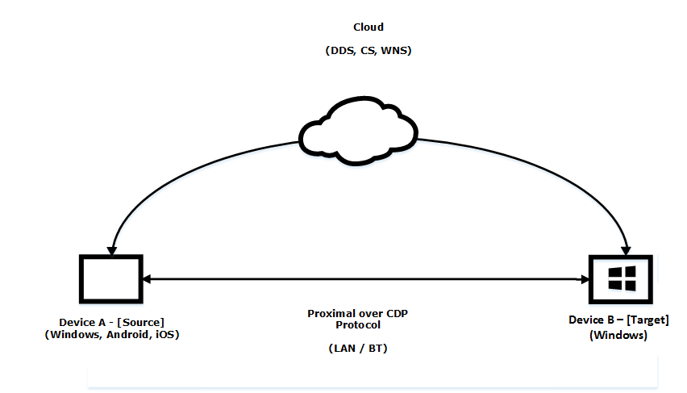

Figure 1: Proximal Communication over CDP Protocol

Launch and Messaging between two devices can occur over proximal connections. Device B (target) acts as the host for the Launch or App Service which can accept incoming client connections from Windows, Android, or iOS devices (source).

<a id="Section_1.3.1"></a>
### 1.3.1 Setup

Prior to CDP being used, each device sets up a key-pair to secure communications. A key-pair is the association of a [**public key**](#gt_public-key) and its corresponding [**private key**](#gt_private-key) when used in cryptography.

<a id="Section_1.3.2"></a>
### 1.3.2 Discovery

As described earlier, a client first sends a presence request to the network via broadcast and multicast and starts listening over [**Bluetooth Low Energy (BLE)**](#gt_bluetooth-low-energy-ble). This can include parameters and properties to any host that receives the broadcast, which the host can use to evaluate whether to respond. The client then receives unicast responses and can generate the list of available devices. In terms of BLE, devices are constantly advertising a thumbprint that a listener can understand.

<a id="Section_1.3.3"></a>
### 1.3.3 Connection

After a device is discovered, the client sends a protocol message to verify that the protocol is supported between both devices. The client derives a [**session key**](#gt_session-key) and a [**public key**](#gt_public-key) and sends a connection request. The host receives this request and derives the session key before responding. Finally, the client initiates authorization– the server provides authorization schemes and the client constructs the payload and completes the challenge. The server returns the pairing state and then devices are connected for launch and message exchange.

<a id="Section_1.4"></a>
## 1.4 Relationship to Other Protocols

None.

<a id="Section_1.5"></a>
## 1.5 Prerequisites/Preconditions

Peers have to be able to communicate with one of our [**web services**](#gt_web-service) in order to obtain information about other devices singed in with the same [**Microsoft Account**](#gt_microsoft-account). In order to fully establish a channel with this protocol, two devices have to be signed-in with the same Microsoft Account. This is a restriction that can be later loosened within the protocol’s implementation.

<a id="Section_1.6"></a>
## 1.6 Applicability Statement

The Connected Devices Platform Service Protocol provides a way for devices such as PCs and smartphones to discover and send messages between each other. It provides a transport-agnostic means of building connections among all of a user's devices, whether available through available transports.

<a id="Section_1.7"></a>
## 1.7 Versioning and Capability Negotiation

This document is focused on the third version of the protocol (V3)—the protocol version is contained in the header of the messages.

<a id="Section_1.8"></a>
## 1.8 Vendor-Extensible Fields

None.

<a id="Section_1.9"></a>
## 1.9 Standards Assignments

None

<a id="Section_2"></a>
# 2 Messages

<a id="Section_2.1"></a>
## 2.1 Transport

As stated earlier in this document, this protocol can be used for multiple transports. A specific transport is not defined for these messages. [**Bluetooth Low Energy (BLE)**](#gt_bluetooth-low-energy-ble), [**Bluetooth**](#gt_bluetooth-bt), LAN, and [**Wi-Fi Direct**](#gt_wi-fi-direct) are all currently supported.

However, the general requirements for a transport are as follows:

- The transport MUST be able to provide the size of each message, independently of its payload, to the component that implements the protocol. Messages are sent and received over the transport on ports that are analogous to ports in [**TCP/IP**](#gt_tcpip). Well-known ports allow two peers to establish initial communication.
<a id="Section_2.2"></a>
## 2.2 Message Syntax

<a id="Section_2.2.1"></a>
### 2.2.1 Namespaces

None.

<a id="Section_2.2.2"></a>
### 2.2.2 Common Data Types

The data types in the following sections are as specified in [MS-DTYP](../MS-DTYP/MS-DTYP.md).

<a id="Section_2.2.2.1"></a>
#### 2.2.2.1 Headers

The methods in this protocol use the following headers as part of the information exchanged, prior to any requests or responses that are included in the exchange.

<a id="Section_2.2.2.1.1"></a>
##### 2.2.2.1.1 Common Header

The Common Header is used as part of the information exchanged prior to any requests or responses that are included in the exchange. Each channel is responsible for defining its own inner protocol and message types.

Message deserialization is split into two phases. The first phase consists of parsing the header, validating authenticity, deduping, and decryption. In the second part of the deserialization the Payload field is sent to the owner to manage.

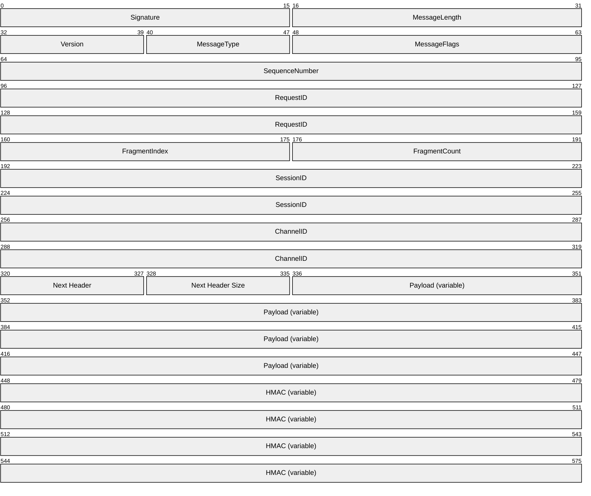

**Signature (2 bytes):** Fixed signature, which is always 0x3030 (0011 0000 0011 0000 binary).

**MessageLength (2 bytes):** Entire message length in bytes including signature.

**Version (1 byte):** Protocol version the sender is using. For this protocol the version is always 3. Lower values indicate older versions of the protocol that are not covered by this document.

**MessageType (1 byte):** Indicates current message type.

| **Value** | **Meaning** |
| --- | --- |
| 0 | None |
| 1 | Discovery |
| 2 | Connect |
| 3 | Control |
| 4 | Session |
| 5 | Ack |
| 7 | Disconnect |

**MessageFlags (2 bytes):** A value describing the message properties.

| **Value** | **Meaning** |
| --- | --- |
| ShouldAck 0x0001 | The caller expects ACK to be sent back to confirm that the message has been received. |
| HasHMAC 0x0002 | The message contains a hashed message authentication code which will be validated by the receiver. If not set, the HMAC field is not present. See “HMAC” below. |
| SessionEncrypted 0x0004 | If true, indicates that the message is encrypted at the session level. This is false for non-session messages (which don’t require encryption/decryption). |
| WakeTarget 0x0008 | If true, indicates whether the remote application should be woken up.<1> |

**SequenceNumber (4 bytes):** Current message number for this session.

**RequestID (8 bytes):** A monotonically increasing number, generated on the sending side, that uniquely identifies the message. It can then be used to correlate response messages to their corresponding request messages.

**FragmentIndex (2 bytes):** Current fragment for current message.

**FragmentCount (2 bytes):** Number of total fragments for current message.

**SessionID (8 bytes):** ID representing the session.

**ChannelID (8 bytes):** Zero if the **SessionID** is zero.

**Next Header (1 byte):** If an additional header record is included, this value indicates the type. Some values are implementation-specific. <2>

| **Value** | **Meaning** |
| --- | --- |
| 0 | No more headers. |
| 1 | ReplyToID. If included, the payload would contain a Next Header Size-sized ID of the message to which this message responds. |
| 2 | Correlation vector. A uniquely identifiable payload meant to identify communication over devices. |
| 3 | Watermark ID. Identifies the last seen message that both participants can agree upon. |

**Next Header Size (1 byte):** Amount of data in the next header record (so clients can skip).

**Payload (variable):** The encrypted payload.

**HMAC (variable):** Not present if MessageFlags::HasHMAC is not set. Only required for Control and Session messages.

Each channel is responsible for defining its own inner protocol and message types.

Message deserialization will therefore be split into two phases. With the first phase consisting of the parsing header, validating authenticity, deduping, and decryption. The Payload field will be passed up to the owner to manage the second part of the deserialization.

<a id="Section_2.2.2.2"></a>
#### 2.2.2.2 Discovery Messages

Discovery messages are used for [**User Datagram Protocol (UDP)**](#gt_user-datagram-protocol-udp), in which a device sends out a presence request and a second device responds with presence response message. For [**Bluetooth**](#gt_bluetooth-bt), devices advertise over a [**beacon**](#gt_beacon), which does not require discovery.

<a id="Section_2.2.2.2.1"></a>
##### 2.2.2.2.1 UDP: Presence Request

The [**UDP**](#gt_user-datagram-protocol-udp) presence request message is one that any device can subscribe to and respond to for participation in the Connected Devices Protocol message exchange.


**MessageType (1 byte):** Indicates current message type, in this case, Discovery, with a value of 1, as specified in the Common Header, section [2.2.2.1.1](#Section_2.2.2.1.1).

**DiscoveryType (1 byte):** Indicates type of discovery message, in this case, Presence Request.

| **Value** | **Meaning** |
| --- | --- |
| 0 | Presence Request |
| 1 | Presence Response |

<a id="Section_2.2.2.2.2"></a>
##### 2.2.2.2.2 UDP: Presence Response

The UDP presence response message is used when a device receives a presence request. The device responds with a presence response message to notify that it is available.

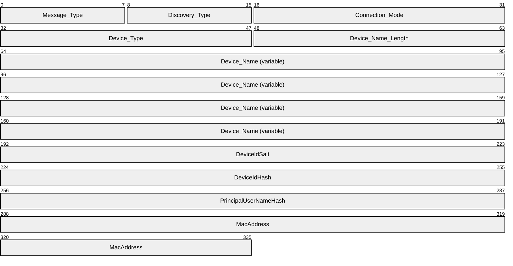

**Message_Type (1 byte):** Indicates current message type, in this case, Discovery (1).

**Discovery_Type (1 byte):** Indicates type of discovery message, in this case, Presence Response (1).

**Connection_Mode (2 bytes):** Displays types of available connections, which can be one of the following values.

| **Value** | **Meaning** |
| --- | --- |
| 0 | None |
| 1 | Proximal |
| 2 | Legacy |

**Device_Type (2 bytes):** SKU of the device, which can be one of the following values.

| **Value** | **Meaning** |
| --- | --- |
| 1 | Xbox One |
| 6 | Apple iPhone |
| 7 | Apple iPad |
| 8 | Android device |
| 9 | Windows 10 Desktop |
| 11 | Windows 10 Phone |
| 12 | Linux device |
| 13 | Windows IoT |
| 14 | Surface Hub |
| 15 | Windows laptop |
| 16 | Windows tablet |

**Device_Name_Length (2 bytes):** Length of the machine name of the device.

**Device_Name (variable):** This is character representation of the name of the device. The size of the list is bounded by the previous message.

**DeviceIdSalt (4 bytes):** A randomly generated [**salt**](#gt_salt).

**DeviceIdHash (4 bytes):** Salted [**SHA-256**](#gt_sha-256) hash of the internal CDP device ID. This is used to correlate the advertising device to a list of known devices without advertising the full device ID.

**PrincipalUserNameHash (4 bytes):** Salted SHA-256 Hash of the logged on user's account email. Calculated by using the **DeviceIdSalt**. and **PrincipalUserNameHash**.<3>

**MacAddress (6 bytes):** A Bluetooth [**MAC address**](#gt_5f9ccdf4-2607-4855-9a72-2010aa3300bf) used to de-duplicate devices.<4>

<a id="Section_2.2.2.2.3"></a>
##### 2.2.2.2.3 Bluetooth: Advertising Beacon

Bluetooth devices advertise over a [**beacon**](#gt_beacon). This is the basic beacon structure:

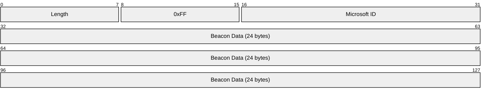

**Length (1 byte):** Set to 30 (0x1E).

**0xFF (1 byte):** Fixed value 0xFF.

**Microsoft ID (2 bytes):** Set to 0006

**Beacon Data (24 bytes):** The beacon data section is further broken down. Note that the Scenario and Subtype Specific Data section requirements will differ based on the Scenario and Subtype.

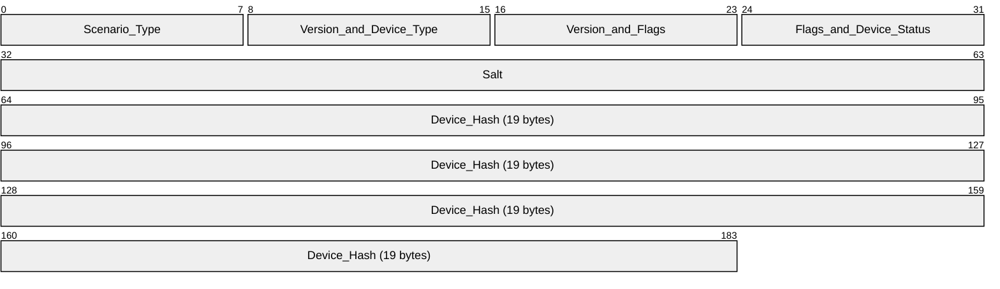

**Scenario_Type (1 byte):** Set to (1) Bluetooth scenario.

**Version_and_Device_Type (1 byte):** The high three bits are set to 001 for the version number; the lower 5 bits are set to Device Type SKU values as follows, as defined in section [2.2.2.2.2](#Section_2.2.2.2.2).

| **Value** | **Meaning** |
| --- | --- |
| 1 | Xbox One |
| 6 | Apple iPhone |
| 7 | Apple iPad |
| 8 | Android device |
| 9 | Windows 10 Desktop |
| 11 | Windows 10 Phone |
| 12 | Linux device |
| 13 | Windows IoT |
| 14 | Surface Hub |
| 15 | Windows laptop |
| 16 | Windows tablet |

**Version_and_Flags (1 byte):** The high 3 bits are set to 001; the lower 5 bits are set to 00000 or 00001. Setting the lower 5 bits to 00001 indicates that the NearBy share setting is everyone rather than only my devices.

**Flags_and_Device_Status (1 byte):** The field has the following structure.


**A (2 bits):** Unused.

**B - Bluetooth_Address_As_Device_ID (1 bit):** When set, indicates that the Bluetooth address can be used as the device ID.

**C (1 bit):** Unused.

**D - ExtendedDeviceStatus (4 bits):** One of the values in the following table. Values may be ORed.

| **Value** | **Meaning** |
| --- | --- |
| None 0x00 | None. |
| RemoteSessionsHosted 0x01 | Hosted by remote session. |
| RemoteSessionsNotHosted 0x02 | Indicates the device does not have session hosting status available.<5> |
| NearShareAuthPolicySameUser 0x04 | Indicates the device supports NearShare if the user is the same for the other device. |
| NearShareAuthPolicyPermissive 0x08 | Indicates the device supports NearShare.<6> |

**Salt (4 bytes):** Four random bytes.

**Device_Hash (19 bytes):** SHA256 Hash of Salt plus Device Thumbprint.

<a id="Section_2.2.2.3"></a>
#### 2.2.2.3 Connection Messages

These are the connection messages used when a device is discovered during [**authentication**](#gt_authentication) for a connection.

<a id="Section_2.2.2.3.1"></a>
##### 2.2.2.3.1 Connection Header

The Connection Header message is common for all Connection Messages.


**ConnectMessageType (1 byte):** Indicates the current connection type, which can be one of the following values.

| **Value** | **ConnectionType** | **Meaning** |
| --- | --- | --- |
| 0 | ConnectRequest | Device issued connection request |
| 1 | ConnectResponse | Response to connection request |
| 2 | DeviceAuthRequest | Initial authentication (Device Level) |
| 3 | DeviceAuthResponse | Response to initial authentication |
| 4 | UserDeviceAuthRequest | Authentication of user and device combination (depending on authentication model) |
| 5 | UserDeviceAuthResponse | Response to authentication of a user and device combination (depending on authentication model) |
| 6 | AuthDoneRequest | Authentication completed message |
| 7 | AuthDoneRespone | Authentication completed response |
| 8 | ConnectFailure | Connection failed message |
| 9 | Upgrade Request | Transport upgrade request message |
| 10 | Upgrade Response | Transport upgrade response message |
| 11 | Upgrade Finalization | Transport upgrade finalization request message |
| 12 | Upgrade Finalization Response | Transport upgrade finalization response message |
| 13 | Transport Request | Transport details request message |
| 14 | Transport Confirmation | Transport details response message |
| 15 | Upgrade Failure | Transport upgrade failed message |
| 16 | DeviceInfoMessage | Device information request message |
| 17 | DeviceInfoResponseMessage | Device information response message |

**ConnectionMode (1 byte):** Displays the types of available connections, which can be one of the following values.

| **Value** | **Meaning** |
| --- | --- |
| 0 | None |
| 1 | Proximal |
| 2 | Legacy |

<a id="Section_2.2.2.3.2"></a>
##### 2.2.2.3.2 Connection Request

The Connection Request message is used when the client initiates a connection request with a host device.

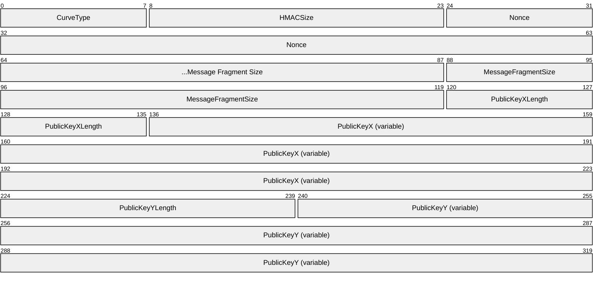

**CurveType (1 byte):** The type of elliptical curve used, which can be the following value.

| **Value** | **Meaning** |
| --- | --- |
| 0 | CT_NIST_P256_KDF_SHA512 |

**HMACSize (2 bytes):** The expected size of HMAC (see Encryption section [3.1.3.1](#Section_3.1.3.1) for details).

**Nonce (8 bytes):** Random values (see Encryption section 3.1.3.1 for details).

**MessageFragmentSize (4 bytes):** The maximum size of a single message fragment (Fixed Value of 16384).

**PublicKeyXLength (2 bytes):** The length of **PublicKeyX**.

**PublicKeyX (variable):** A fixed-length key that is based on **PublicKeyXLength**.

**PublicKeyYLength (2 bytes):** The length of **PublicKeyY**.

**PublicKeyY (variable):** A fixed-length key that is based on **PublicKeyYLength**.

<a id="Section_2.2.2.3.3"></a>
##### 2.2.2.3.3 Connection Response

The Connection Response message is used for the host to respond with a connection response message that includes device information. Only the Result is sent if the Result is anything other than PENDING.

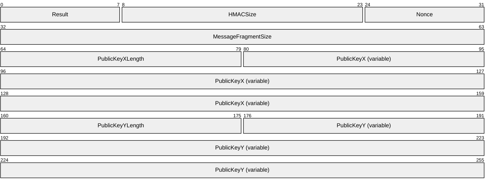

**Result (1 byte):** The result of the connection request, which can be one of the following values.

| **Value** | **Meaning** |
| --- | --- |
| 0 | Success |
| 1 | Pending |
| 2 | Failure_Authentication |
| 3 | Failure_NotAllowed |

**HMACSize (2 bytes):** The expected size of HMAC (see Encryption section [3.1.3.1](#Section_3.1.3.1) for details).

**Nonce (8 bytes):** Random values (see section 3.1.3.1 Encryption for details).

**MessageFragmentSize (4 bytes):** The maximum size of a single message fragment (Fixed Value of 16384 (bits)).

**PublicKeyXLength (2 bytes):** The length of **PublicKeyX**, which is sent only if the connection is successful.

**PublicKeyX (variable):** A fixed-length key that is based on the curve type from connect request, which is sent only if the connection is successful. This is the X component of the key.

**PublicKeyYLength (2 bytes):** The length of **PublicKeyY**, which is sent only if the connection is successful.

**PublicKeyY (variable):** A fixed-length key that is based on the curve type from connect request, which is sent only if the connection is successful. This is the Y component of the key.

<a id="Section_2.2.2.3.4"></a>
##### 2.2.2.3.4 Device Authentication Request

The Device Authentication Request message is used for all authentication in which client devices send their self-signed device certificate.

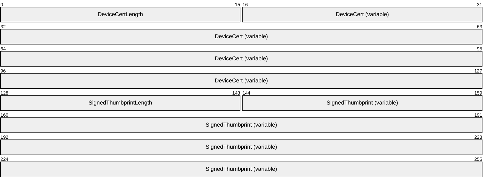

**DeviceCertLength (2 bytes):** The length of **DeviceCert**

**DeviceCert (variable):** A device certificate.

**SignedThumbprintLength (2 bytes):** The length of **SignedThumbprint**.

**SignedThumbprint (variable):** A device certificate [**thumbprint**](#gt_thumbprint).

<a id="Section_2.2.2.3.5"></a>
##### 2.2.2.3.5 Device Authentication Response

The Device Authentication Response message is used for all authentication in which hosts send their device certificate which is self-signed.

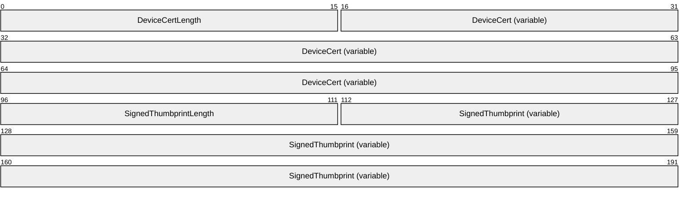

**DeviceCertLength (2 bytes):** The length of **DeviceCert**.

**DeviceCert (variable):** A device certificate.

**SignedThumbprintLength (2 bytes):** The length of **SignedThumbprint**.

**SignedThumbprint (variable):** A signed **DeviceCer**t thumbprint.

<a id="Section_2.2.2.3.6"></a>
##### 2.2.2.3.6 User-Device Authentication Request

The User-Device Authentication Request message is used if authentication policy requires user-device authentication. The user-device certificate is sent with the request.


**DeviceCertLength (2 bytes):** The length of **DeviceCert**.

**DeviceCert (variable):** A User-Device Certificate.

**SignedThumbprintLength (2 bytes):** The length of **SignedThumbprint**.

**SignedThumbprint (variable):** A signed User-Device Cert Thumbprint.

<a id="Section_2.2.2.3.7"></a>
##### 2.2.2.3.7 User-Device Authentication Response

The ser-Device Authentication Response message is used if authentication policy requires user-device authentication. The user-device certificate is sent with the request.


**DeviceCertLength (2 bytes):** The length of **DeviceCert**.

**DeviceCert (variable):** A User-Device Certificate.

**SignedThumbprintLength (2 bytes):** The length of **Thumbprint**.

**SignedThumbprint (variable):** A signed User-Device Cert Thumbprint.

<a id="Section_2.2.2.3.8"></a>
##### 2.2.2.3.8 Authentication Done Request

Message to acknowledge that Authentication was completed.

Empty Payload.

<a id="Section_2.2.2.3.9"></a>
##### 2.2.2.3.9 Authentication Done Response

The Authentication Done Request message is used to respond with the status of authentication at the completion of the authentication process to indicate the type of failure encountered, if any.


**Status (1 byte):** Indicates the status of authentication, which can be one of the following values.

| **Value** | **Meaning** |
| --- | --- |
| 0 | Success |
| 1 | Pending |
| 2 | Failure_Authentication |
| 3 | Failure_NotAllowed |
| 4 | Failure_Unknown |

<a id="Section_2.2.2.3.10"></a>
##### 2.2.2.3.10 Authentication Failure

The Authentication Failure message is used if the authentication process itself fails to complete, then an empty payload is returned.

<a id="Section_2.2.2.3.11"></a>
##### 2.2.2.3.11 Upgrade Request

The Upgrade Request message transports an upgrade request.

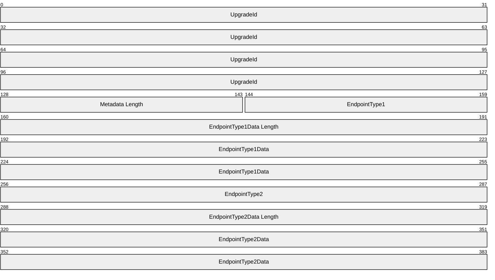

**UpgradeId (16 bytes):** A random GUID identifying this upgrade process across transports.

**Metadata**: Transport-defined data that is size-prefixed for each transport endpoint type (see the following table) available on the device. The overall section is also prefixed with the two-byte Metadata Length field to indicate how many such endpoint type-to-data mappings are present.

**Metadata Length (2 bytes):** Section prefix that indicates how many endpoint type-to-data mappings are present.

Each transport endpoint type available on the device has the following data set.

**EndpointType(n) (2 bytes):** An enumeration that defines the type of endpoint defined in the following table.

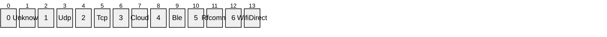

**EndpointType(n)Data Length (4 bytes):** The length of **EndpointType(n)Data**.

**EndpointType(n)Data (8 bytes):** The Endpoint Type data.

If the network type of the device is "Public", CDP will use TTK (Trust Tuple Keyword) field "WFDCDPSvc" from the firewall rule "Connected Devices Platform - Wi-Fi Direct Transport (TCP-In)" to allow traffic over network using TCP protocol.

<a id="Section_2.2.2.3.12"></a>
##### 2.2.2.3.12 Upgrade Response

The Upgrade Response message transports an upgrade response.

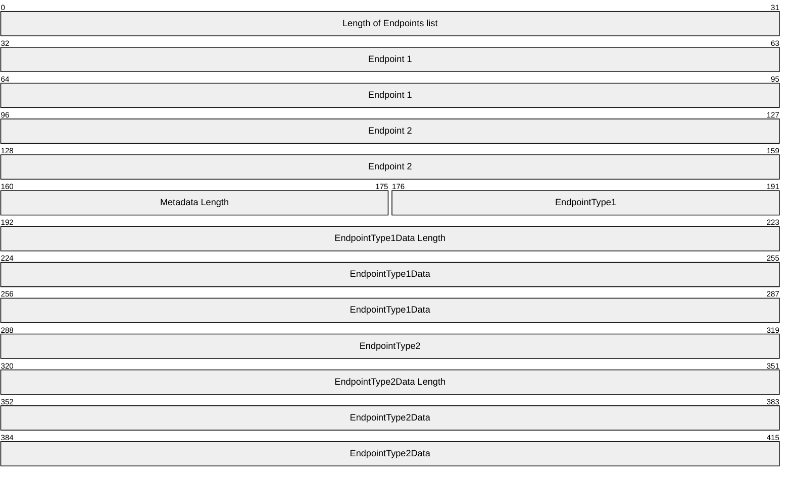

**HostEndpoints**: A length-prefixed list of endpoint structures (see following) that are provided by each transport on the host device.

**Length of Endpoints list (2 bytes):** Contains the number of endpoints in the list.

**Endpoint n (8 bytes):** An Endpoint structure in the list.

The Endpoint structures are as follows.

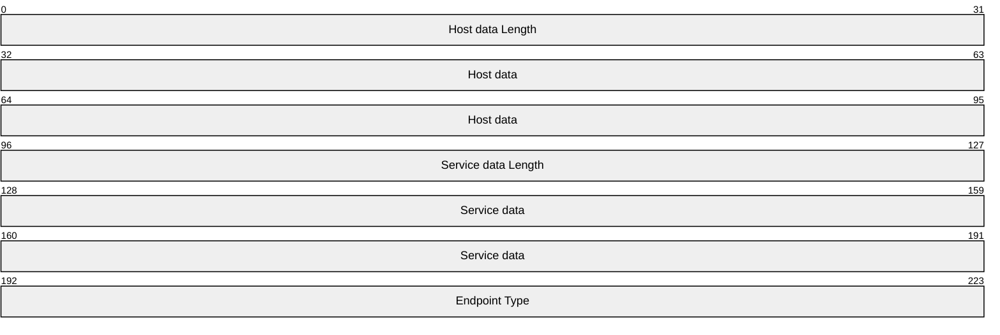

**Host data Length (4 bytes):** The length of the Host data.

**Host data (8 bytes):** Data that defines the name of the host.

**Service data Length (4 bytes):** The length of the Service data.

**Service data (8 bytes):** Data that defines the name of the service on the host.

**EndpointType (2 bytes)**: An enumeration that defines the type of endpoint. See section [2.2.2.3.11](#Section_2.2.2.3.11) for values.

**Metadata**: The overall section is also prefixed with the size to indicate how many such endpoint type-to-data mappings are present. Transport defined data that is size prefixed for each transport endpoint type available on the device.

**Metadata Length (2 bytes):** Section prefix that indicates how many endpoint type-to-data mappings are present.

Each transport endpoint type available on the device has the following data set:

**EndpointType(n) (2 bytes):** An enumeration that defines the type of endpoint defined in section 2.2.2.3.11.

**EndpointType(n)Data Length (4 bytes)**: The length of the Endpoint Type data.

**EndpointType(n)Data (8 bytes):** The Endpoint Type data.

If the network type of the device is "Public", CDP will use TTK (Trust Tuple Keyword) field "WFDCDPSvc" from the firewall rule "Connected Devices Platform - Wi-Fi Direct Transport (TCP-In)" to allow traffic over network using TCP protocol.

<a id="Section_2.2.2.3.13"></a>
##### 2.2.2.3.13 Upgrade Finalization

The Upgrade Finalization message transports an upgrade finalization request.

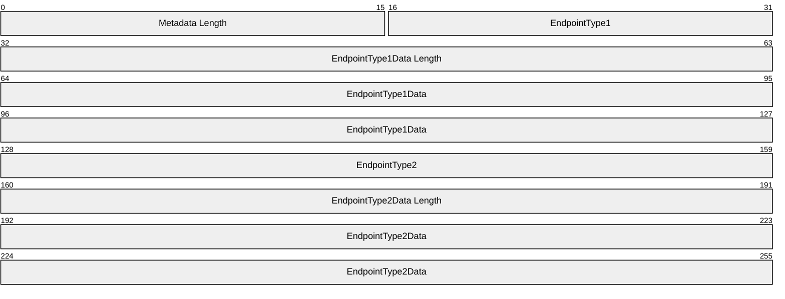

**Metadata**: The overall section is also prefixed with the size to indicate how many such endpoint type-to-data mappings are present. Transport defined data that is size prefixed for each transport endpoint type available on the device.

**Metadata Length (2 bytes):** Section prefix that indicates how many endpoint type-to-data mappings are present.

Each transport endpoint type available on the device has the following data set:

**EndpointType(n) (2 bytes):** An enumeration that defines the type of endpoint defined in section [2.2.2.3.11](#Section_2.2.2.3.11).

**EndpointType(n)Data Length (4 bytes)**: The length of the Endpoint Type data.

**EndpointType(n)Data (8 bytes):** The Endpoint Type data.

<a id="Section_2.2.2.3.14"></a>
##### 2.2.2.3.14 Upgrade Finalization Response

This message acknowledges that the transport upgrade was completed. It contains an empty payload.

<a id="Section_2.2.2.3.15"></a>
##### 2.2.2.3.15 Transport Request

The Transport Request message transports the details of an upgrade.

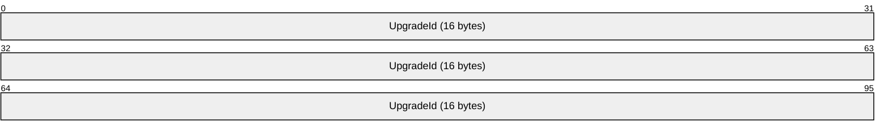

**UpgradeId (16 bytes):** A random GUID identifying this upgrade process across this transport.

<a id="Section_2.2.2.3.16"></a>
##### 2.2.2.3.16 Transport Confirmation

The Transport Confirmation response message confirms the details of an upgrade.

```mermaid
packet-beta
  0-95: "UpgradeId (16 bytes)"
```

**UpgradeId (16 bytes):** A random GUID identifying this upgrade process across this transport.

<a id="Section_2.2.2.3.17"></a>
##### 2.2.2.3.17 Upgrade Failure

The Upgrade Failure message indicates that an transport upgrade failed. It contains either an empty payload or a single implementation-specific field.

```mermaid
packet-beta
  0-31: "FailureReason"
```

**FailureReason (4 bytes):** An implementation-specific<7> field containing the HRESULT returned following the upgrade. A value of zero indicates success.

<a id="Section_2.2.2.3.18"></a>
##### 2.2.2.3.18 Device Info Message

The Device Info message requests information from the device.

```mermaid
packet-beta
  0-63: "DeviceInfo (variable)"
```

**DeviceInfo (variable)**: A variable length payload to specify information about the source device.

<a id="Section_2.2.2.3.19"></a>
##### 2.2.2.3.19 Device Info Response Message

The Device Info Response message is used to acknowledge that the device information message was received. It contains an empty payload.

<a id="Section_2.2.2.4"></a>
#### 2.2.2.4 Session Messages

The Session messages are sent across during an active session between two connected and authenticated devices.

<a id="Section_2.2.2.4.1"></a>
##### 2.2.2.4.1 Ack Messages

The ack messages acknowledge receipt of a message**.**

```mermaid
packet-beta
  0-31: "LowWatermark"
  32-47: "ProcessedCount"
  48-127: "Processed (variable)"
  128-143: "RejectedCount"
  144-255: "Rejected (variable)"
```

**LowWatermark (4 bytes):** The sequence number of the latest acknowledged message.

**ProcessedCount (2 bytes):** Number of entries in the processed list.

**Processed (variable, 4 bytes per list item):** The sequence numbers of messages that were processed.

**RejectedCount (2 bytes):** Number of entries in the rejected list.

**Rejected (variable, 4 bytes per list item):** The sequence numbers of messages that were rejected.

<a id="Section_2.2.2.4.2"></a>
##### 2.2.2.4.2 App Control Messages

There are nine types of app control messages that are used.

```mermaid
packet-beta
  0-7: "Message Type"
```

**Message Type (1 byte):** Indicates the type of app control message, which can be one of the following values.

| **Value** | **Meaning** |
| --- | --- |
| 0 | Launch Uri |
| 1 | Launch Uri Result |
| 2 | Launch Uri For Target |
| 6 | Call App Service |
| 7 | CallAppServiceResponse |
| 8 | Get Resource |
| 9 | Get Resource Response |
| 10 | Set Resource |
| 11 | Set Resource Response |

<a id="Section_2.2.2.4.2.1"></a>
###### 2.2.2.4.2.1 Launch Uri Messages

The Launch Uri messages allow you to launch apps on CDP-enabled devices. This simply launches using the LaunchURIAsync API.

```mermaid
packet-beta
  0-15: "UriLength"
  16-95: "Uri (variable)"
  96-111: "LaunchLocation"
  112-175: "RequestID"
  176-191: "InputDataLength"
  192-207: "InputDataLength"
  208-287: "InputData(variable)"
```

**UriLength (2 bytes):** Length of the Uri, not including the null terminator of the string.

**Uri (variable):** Uri to launch on remote device.

**LaunchLocation (2 bytes):** A launch title location that can be one of the following values.

| Value | Meaning |
| --- | --- |
| Full 0 | The launched title occupies the full screen. |
| Fill 1 | The launched title occupies most of the screen, sharing it with a snapped-location title. |
| Snapped 2 | The launched title occupies a small column on the left or right of the screen. |
| StartView 3 | The launched title is in the start view. |
| SystemUI 4 | The launched title is the system UI. |
| Default 5 | The active title is in its default location. |

**RequestID (8 bytes):** A 64-bit arbitrary number identifying the request. The response ID in the response payload can then be used to correlate responses to requests.

**InputDataLength (4 bytes):** Length, in bytes, of the **InputData**.

**InputData (variable):** Optional. BOND.NET serialized data that is passed as a value set to the app launched by the call.

<a id="Section_2.2.2.4.2.2"></a>
###### 2.2.2.4.2.2 Launch Uri for Target Messages

The Launch Uri for Target messages allow you to launch apps on targeted CDP-enabled devices.

```mermaid
packet-beta
  0-15: "UriLength"
  16-127: "Uri (variable)"
  128-143: "LaunchLocation"
  144-207: "RequestID"
  208-223: "PackageIdLength"
  224-351: "PackageId (variable)"
  352-367: "InstanceId"
  368-383: "AlternateIdLength"
  384-511: "AlternateId (variable)"
  512-543: "TitleId"
  544-559: "FacadeNameLength"
  560-671: "FacadeName (variable)"
  672-703: "InputDataLength"
  704-831: "InputData (variable)"
```

**UriLength (2 bytes):** Length of the Uri, not including the null terminator of the string.

**Uri (variable):** Uri to launch on remote device.

**LaunchLocation (2 bytes):** A launch title location that can be one of the following values.

| Value | Meaning |
| --- | --- |
| Full 0 | The launched title occupies the full screen. |
| Fill 1 | The launched title occupies most of the screen, sharing it with a snapped-location title. |
| Snapped 2 | The launched title occupies a small column on the left or right of the screen. |
| StartView 3 | The launched title is in the start view. |
| SystemUI 4 | The launched title is the system UI. |
| Default 5 | The active title is in its default location. |

**RequestID (8 bytes):** A 64-bit arbitrary number identifying the request. The response ID in the response payload can then be used to correlate responses to requests.

**PackageIdLength (2 bytes):** Length, in bytes of the **PackageId**, not including the null terminator of the string.

**PackageId (variable):** The ID of the package of the app that hosts the app service.

**InstanceId (2 bytes):** The ID of the instance.

**AlternateIdLength (2 bytes):** Length, in bytes of the alternate ID for the package, not including the null terminator of the string.

**AlternateId (variable):** The alternate ID of the package of the app that hosts the app service.

**TitleId (4 bytes):** The ID of the Title.

**FacadeNameLength (2 bytes):** Length, in bytes of the **FacadeName**, not including the null terminator of the string.

**FacadeName (variable):** The name of the **Facade**.

**InputDataLength (4 bytes):** Length, in bytes, of **InputData**.

**InputData (variable):** Optional. BOND.NET serialized data that is passed as a value set to the app launched by the call.

<a id="Section_2.2.2.4.2.3"></a>
###### 2.2.2.4.2.3 Launch Uri Result

The Launch Uri Result message returns the result of the LaunchUriAsync API call on the second device.

```mermaid
packet-beta
  0-31: "LaunchUriResult"
  32-95: "ResponseID"
  96-127: "InputDataLength"
  128-255: "InputData (variable)"
```

**LaunchUriResult (4 bytes):** The HRESULT returned by the call, zero (0x00000000) if successful.

**ResponseID (8 bytes):** Number corresponding to the request ID from the Launch URI message that resulted in this response. This is used to correlate requests and responses.

**InputDataLength (4 bytes):** Length, in bytes, of **InputData**.

**InputData (variable):** Optional. BOND.NET serialized data that is passed as a value set from the app launched by the call.

<a id="Section_2.2.2.4.2.4"></a>
###### 2.2.2.4.2.4 App Service Messages

The App Service messages allow background invocation of background services within apps.

```mermaid
packet-beta
  0-15: "PackageNameLength"
  16-127: "PackageName (variable)"
  128-143: "AppServiceNameLength"
  144-255: "AppServiceName (variable)"
  256-287: "InputDataLength"
  288-415: "InputData (variable)"
  416-423: "InputMessageFormat"
```

**PackageNameLength (2 bytes):** The length of **PackageName**, not including the null terminator of the string.

**PackageName (variable):** The package name, in chars, of the app that hosts the app service.

**AppServiceNameLength (2 bytes):** The length of **AppServiceName**, not including the null terminator of the string.

**AppServiceName (variable):** The name, in chars, of the app service.

**InputDataLength (4 bytes):** The length of the **InputData** field.

**InputData (variable):** The list of parameters that is sent to the app service for execution.

**InputMessageFormat (1 byte):** An implementation-specific<8> field containing one of the following values:

| **Value** | **Meaning** |
| --- | --- |
| JSON 0 | The input data for the app service is in JSON format. |
| ValueSet 1 | BOND.NET serialized data. |

<a id="Section_2.2.2.4.2.5"></a>
###### 2.2.2.4.2.5 App Services Result

The App Services Result message returns the result of the App Services API call from the second device.

```mermaid
packet-beta
  0-31: "AppServicesResult"
  32-63: "ReturnDataSize"
  64-127: "ReturnData (variable)"
```

**AppServicesResult (4 bytes):** The HRESULT returned by the call, zero (0x00000000) if successful.

**ReturnDataSize (4 bytes):** The size, in bytes, of the **ReturnData** field, not including the null terminator of the string.

**ReturnData (variable):** The [**UTF-8**](#gt_utf-8)-encoded response returned from the application app service.

<a id="Section_2.2.2.4.2.6"></a>
###### 2.2.2.4.2.6 Get Resource

The Get Resource message requests a resource using the resource URL.

```mermaid
packet-beta
  0-31: "ResourceUrlSize"
  32-95: "ResourceUrl (variable)"
```

**ResourceUrlSize (2 bytes):** The size, in bytes, of the **ResourceUrl** field.

**ResourceUrl (variable):** The [**UTF-8**](#gt_utf-8)-encoded URL that represents the application instance ID and the resource ID. Conforms to <app id>/<resource id>.

<a id="Section_2.2.2.4.2.7"></a>
###### 2.2.2.4.2.7 Get Resource Response

The Get Resource Response message returns the response from the service.

```mermaid
packet-beta
  0-31: "Result"
  32-63: "ResourceDataSize"
  64-127: "ResourceData (variable)"
```

**Result (4 bytes):** An HRESULT, where zero (0x00000000) is returned if successful in returning the resource data.

**ResourceDataSize (4 bytes):** The size, in bytes, of the **ResourceData** field.

**ResourceData (variable):** The [**UTF-8**](#gt_utf-8)-encoded response returned from the application app service.

<a id="Section_2.2.2.4.2.8"></a>
###### 2.2.2.4.2.8 Set Resource

The Set Resource message transports resource data to be set on the service.

```mermaid
packet-beta
  0-31: "ResourceUrlSize"
  32-95: "ResourceUrl (variable)"
  96-127: "ResourceDataSize"
  128-191: "ResourceData (variable)"
```

**ResourceUrlSize (2 bytes):** The size, in bytes. of the **ResourceUrl** field.

**ResourceUrl (variable):** The [**UTF-8**](#gt_utf-8)-encoded URL that represents the application instance ID and the resource ID. Conforms to <app id>/<resource id>.

**ResourceDataSize (4 bytes):** The size, in bytes, of the **ResourceData** field.

**ResourceData (variable):** The UTF-8-encoded resource data to be set on the application app service.

<a id="Section_2.2.2.4.2.9"></a>
###### 2.2.2.4.2.9 Set Resource Response

The Set Resource Response message returns an HRESULT with the status of the set-resource request.

```mermaid
packet-beta
  0-31: "Result"
  32-63: "ResourceDataSize"
  64-191: "ResourceData (variable)"
```

**Result (4 bytes):** An HRESULT, where zero (0x00000000) is returned for successfully setting the resource data for the specific resource ID on the application app service.

**ResourceDataSize (4 bytes):** The size, in bytes, of the **ResourceData** field.

**ResourceData (variable):** An implementation-specific optional serialized BOND.NET response for the set resource request.<9>

<a id="Section_2.2.2.5"></a>
#### 2.2.2.5 Disconnect Message

The Disconnect message is an optional message sent by a client or host used to inform the other device to disconnect the connected session. The **SessionId** is sent to identify the session to be disconnected.

```mermaid
packet-beta
  0-31: "SessionId"
```

**SessionId (8 bytes):** ID representing the session.

<a id="Section_3"></a>
# 3 Protocol Details

<a id="Section_3.1"></a>
## 3.1 Peer Details

This section defines peer roles in the Connected Devices Platform V3 Service Protocol.

In a socket-based connection between two peer applications, one peer has the role of client, and the other peer has the role of host. The roles are distinguished as follows:

- The device that performs discovery (and initiates connection) is the client. For UDP, this device sends the **Presence Request** message as well as the **Connection Request** message. For [**Bluetooth Low Energy (BLE)**](#gt_bluetooth-low-energy-ble), this device scans for beacons.
- The host is the peer that is discovered (and is the connection target). For UDP, this device receives the **Presence Request** message and sends back a **Presence Response** message. It also receives the **Connection Request** message and responds. For BLE, this is the device that advertises its beacon.
During a connection, these two devices communicate by sending messages back and forth and requesting/requiring **Ack** messages when necessary. All messages during a connection are contained in **Session Messages**.

<a id="Section_3.1.1"></a>
### 3.1.1 Abstract Data Model

This section describes a conceptual model of possible data organization that an implementation maintains to participate in this protocol. The described organization is provided to facilitate the explanation of how the protocol behaves. This document does not mandate that implementations adhere to this model as long as their external behavior is consistent with that described in this document.

The abstract data model defines the **peers**, **client** and **host**, as well as the **session** (connections between a **client** and **host**), and **connections**. When one device discovers another, the device can trigger a **connection**. If the connection is successful, based on authentication, each peer creates a **session**. At this point, the objects act more as **peers** than **clients** and **hosts**.

<a id="Section_3.1.1.1"></a>
#### 3.1.1.1 CDP Service

The Connected Devices Platform service, **CDPService**, contains the entire state of the protocol described in this object.

<a id="Section_3.1.1.2"></a>
#### 3.1.1.2 Discovery Object

The **Discovery** object encapsulates the state for the discovery of one peer from another. Again, the discovering peer is the client and the discovered peer is the host.

**Roles**: One peer is the client and the other peer is the host.

- The client is the peer that sends the **Presence Reques**t message and waits for the **Presence Response Message**.
- The host is the peer that receives the **Presence Request** message and sends the **Presence Response Message**.
**Client State:** The current role of the **Discovery** object. For the client, the state can be one of the following values:

| Value | Meaning |
| --- | --- |
| Waiting for Presence Response | The object has published the **Presence Request** message (section [2.2.2.2.1](#Section_2.2.2.2.1)) and is waiting to receive the **Presence Response** message (section [2.2.2.2.2](#Section_2.2.2.2.2)). |
| Ready | The object has received the **Presence Response** message and has the basic information it needs to request a connection with the other peer. |

**Host State:** The current role of the **Discovery** object. For the host, the state can be one of the following values:

| Value | Meaning |
| --- | --- |
| Waiting for Presence Request | The object is waiting to receive the **Presence Response** message (section 2.2.2.2.2). |
| Ready | The object has sent the **Presence Response** message and has sent the basic information it to facilitate a connection request. |

<a id="Section_3.1.1.3"></a>
#### 3.1.1.3 Connection Manager Object

The **Connection Manager** object encapsulates the state for the connection between one peer and another. Again, the connecting peer is the client and the peer hosting the connection is the host.

**Roles:** One peer is the client and the other peer is the host.

- The client is the peer that sends the **Connection Request** message and waits for the **Connection Response Message**.
- The host is the peer that receives the **Connection Request** message and sends the **Connection Response Message**.
**Client State:** The current role of the **Connection Manager** object. For the client, the state can be one of the following values:

| Value | Meaning |
| --- | --- |
| Waiting for Connection Response | The object has published the **Connection Request** message (section [2.2.2.3.2](#Section_2.2.2.3.2)) and is waiting to receive the **Connection Response** message (section [2.2.2.3.3](#Section_2.2.2.3.3)). |
| Connection Failed | The connection has failed – either the **Connection Request** message (section 2.2.2.3.2) has timed out or **Authentication** has failed. |
| Waiting for Authentication Response | The object has received the **Connection Response** message (section 2.2.2.3.3) and has published the **Authentication Request** message |
| Ready | The object has received the **Authentication Response** message and is ready to initiate the session with the peer. |

**Host State:** The current role of the **Connection Manager** object. For the host, the state can be one of the following values:

| Value | Meaning |
| --- | --- |
| Waiting for Connection Request | The object has published the **Presence Response** message (section [2.2.2.2.2](#Section_2.2.2.2.2)) and is waiting to receive the **Connection Request** message (section 2.2.2.3.2). |
| Waiting for Authentication Request | The object has received the **Connection Request** message and has published the **Connection Response** message – which contains an **Authentication Challenge.** It’s waiting for an **Authentication Request**. |
| Connection Failed | The object has received the **Authentication Request** and the connecting device has failed authentication. |
| Ready | The object has published the **Authentication Response** message and is ready to engage in a session with the peer. |

<a id="Section_3.1.1.4"></a>
#### 3.1.1.4 Session Object

A **Session** object encapsulates the state for a socket-based connection between two peer applications.

**Role:** The role of the **Session** object. Both peers essentially play the same role since either can initiate or receive a message.

**State:** The current state of the **Session** object. The state can be one of the following.

| Value | Meaning |
| --- | --- |
| WaitingForAck | A **Session** object transitions to this state immediately prior to publishing a **Session** message. This is not always required for each type of message. |
| WaitingForTransmit | A **Session** object transitions to this state when beginning to publish the **Session ACK** message. |
| Ready | The **Session** object is ready to be used by an application for peer-to-peer communication. A client **Session** object transitions to this state after receiving the **Session ACK** message. A server **Session** object transitions to this state after successfully transmitting the **Session ACK** message. |
| Terminated | The **Session** object has been terminated by the application, or it timed out. |

<a id="Section_3.1.2"></a>
### 3.1.2 Timers

**Heartbeat timer:** The heartbeat timer is used to track whether a **session** is still alive. If two peers are not actively sending or receiving messages, heartbeat timers verify the connection between the two peers is still alive.

**Message Timer:** A timeout indicating that we have not received the requested ACK for a particular message. While sending a message, an ACK can be requested – if it is, the service starts a timer to verify that a response is received in time.

<a id="Section_3.1.3"></a>
### 3.1.3 Initialization

The **CDPService** MUST be initialized prior to being useful for any discovery, connection, or sessions; initializing at system startup and signing in with a user account is sufficient. On initialization:

- Generation of Device Certificate (on system boot) – this certificate is used as part of authentication between two devices.
- Generation of User-Device Certificate (on system sign-in) – this certificate is used as part of authentication between two devices with the same user.
<a id="Section_3.1.3.1"></a>
#### 3.1.3.1 Encryption

During connection establishment, the first connect message from each side is used to trade, amongst other things, random 64-bit nonces. The initiator of the connection is referred to as the client, and his nonce is referred to as the clientNonce. The target of the connection is referred to as the host, and his nonce is referred to as the hostNonce.

The signed thumbprint (from the certificates setup during initialization) that is sent is a [**SHA-256**](#gt_sha-256) hash of (hostNonce | clientNonce | cert), where | is the append operator.

Also after the first connection messages are exchanged, an ephemeral Diffie-Hellman secret is created. This secret is then passed into a standard HKDF algorithm to obtain a cryptographically random buffer of 64 bytes. The first 16 bytes are used to create an [**encryption**](#gt_encryption) [**key**](#gt_key), the next 16 bytes are used to create an [**initialization vector**](#gt_initialization-vector) (IV) key (both are [**Advanced Encryption Standard (AES)**](#gt_advanced-encryption-standard-aes) 128-bit in [**cipher block chaining (CBC)**](#gt_cipher-block-chaining-cbc) mode), and the final 32 bytes are used to create a hash (SHA-256) with a shared secret that is meant to be used for message authentication ([**Hash-based Message Authentication Code (HMAC)**](#gt_hash-based-message-authentication-code-hmac)). All messages after the initial connection message exchange are encrypted and verified using a combination of these objects.

The examples in section [4](#Section_4) are unencrypted payloads. Described here is the transformation each message goes through to becoming encrypted.

The payload of each message is considered to be the content beyond the "EndAdditionalHeaders" marker. The payload is prepended with the total size of the payload as an unsigned 4-byte integer. This modified payload's length is then rounded up to a multiple of the encryption algorithm's block length (16 bytes) and is referred to as the to-be-encrypted payload length. The difference between the to-be-encrypted payload length and the modified payload length is referred to as the padding length. The modified payload is then padded to the to-be-encrypted payload length by appending the padding length repeatedly in the remaining space.

The initialization vector for a message is created by encrypting with the IV key the 16-byte payload of the message's session ID, sequence number, fragment number, and fragment count, each in [**big-endian**](#gt_big-endian) format. This initialization vector is then used with the encryption key as the two parts of the AES-128 CBC algorithm to encrypt the aforementioned to-be-encrypted payload. This payload is the encrypted payload and is of the same length as the to-be-encrypted payload. Once this is completed, the message flag field is binary **OR'd** with the hexadecimal number 0x4 to indicate that it contains an encrypted payload.

The unencrypted header and the entire encrypted message is then hashed with the HMAC algorithm and appended onto the final message. The message flag field is binary **OR'd** with the hexadecimal number 0x2 to indicate that it has a HMAC and should be verified.

The message size field is then set to the sum of the length of the message header (everything before the payload), the encrypted payload length, and the hash length.

<a id="Section_3.1.3.1.1"></a>
##### 3.1.3.1.1 Encryption Example

The following is an example of the process to convert an unencrypted message to an encrypted message.

**Unencrypted Message**

```mermaid
packet-beta
  0-15: "Signature = 0x30, 0x30"
  16-31: "MessageLength = 45 bytes0x00, 0x2D"
  32-39: "Version = 0x03"
  40-47: "MessageType = Connect0x02"
  48-63: "MessageFlags = None0x00, 0x00"
  64-95: "SequenceNumber = 00x00, 0x00, 0x00, 0x00"
  96-127: "RequestID = 0 0x00, 0x00, 0x00, 0x000x00, 0x00, 0x00, 0x00"
  128-143: "FragmentIndex = 00x00, 0x00"
  144-159: "FragmentCount = 10x00, 0x01"
  160-191: "SessionID=0x00, 0x00, 0x00, 0x010x00, 0x00, 0x00, 0x01"
  192-223: "ChannelID = 00x00, 0x00, 0x00, 0x000x00, 0x00, 0x00, 0x00"
  224-239: "EndAdditionalHeaders = 0x00, 0x00"
  240-255: "ConnectionMode = Proximal0x00, 0x01"
  256-263: "MessageType = AuthDoneRequest0x06"
```

Encrypt, using [**AES**](#gt_advanced-encryption-standard-aes) 128-bit algorithm in [**CBC**](#gt_cipher-block-chaining-cbc) mode with the IV key as described above, the concatenated values of the SessionID, SequenceNumber, FragmentIndex, and FragmentCount.

```mermaid
packet-beta
  0-31: "SessionID =0x00, 0x00, 0x00, 0x010x00, 0x00, 0x00, 0x01"
  32-63: "SequenceNumber = 00x00, 0x00, 0x00, 0x00"
  64-79: "FragmentIndex = 00x00, 0x00"
  80-95: "FragmentCount = 10x00, 0x01"
```

The output of this encryption will be referred to as the initialization vector.

Before encrypting the message payload, the unencrypted payload size is prepended to the payload, and then padded to a length that is a multiple of AES 128-bit CBC's block size (16 bytes). The padding is appended to the new payload and padding value is the difference between the intermediate payload size and the final payload size. Changes from the previous message are marked with **bold**.

```mermaid
packet-beta
  0-15: "Signature = 0x30, 0x30"
  16-31: "MessageLength = 58 bytes0x00, 0x3A"
  32-39: "Version = 0x03"
  40-47: "MessageType = Connect0x02"
  48-63: "MessageFlags = None0x00, 0x00"
  64-95: "SequenceNumber = 00x00, 0x00, 0x00, 0x00"
  96-127: "RequestID = 00x00, 0x00, 0x00, 0x000x00, 0x00, 0x00, 0x00"
  128-143: "FragmentIndex = 00x00, 0x00"
  144-159: "FragmentCount = 10x00, 0x01"
  160-191: "SessionID =0x00, 0x00, 0x00, 0x010x00, 0x00, 0x00, 0x01"
  192-223: "ChannelID = 00x00, 0x00, 0x00, 0x000x00, 0x00, 0x00, 0x00"
  224-255: "EndAdditionalHeaders = 0x00, 0x00"
  256-287: "PayloadSize =0x00, 0x00, 0x00, 0x03"
  288-303: "ConnectionMode = Proximal0x00, 0x01"
  304-311: "MessageType = AuthDoneRequest"
  312-319: "Padding = 70x07"
  320-327: "Padding = 70x07"
  328-335: "Padding = 70x07"
  336-343: "Padding = 70x07"
  344-351: "Padding = 70x07"
  352-359: "Padding = 70x07"
  360-367: "Padding = 70x07"
```

This new payload is then encrypted by using AES 128-bit CBC using the encryption key and the aforementioned initialization vector (an input of the algorithm). The changes are in **bold**.

**Encrypted Message**

```mermaid
packet-beta
  0-15: "Signature = 0x30, 0x30"
  16-31: "MessageLength = 58 bytes0x00, 0x3A"
  32-39: "Version = 0x03"
  40-47: "MessageType = Connect 0x02"
  48-63: "MessageFlags = None0x00, 0x00"
  64-95: "SequenceNumber = 00x00, 0x00, 0x00, 0x00"
  96-127: "RequestID = 00x00, 0x00, 0x00, 0x000x00, 0x00, 0x00, 0x00"
  128-143: "FragmentIndex = 00x00, 0x00"
  144-159: "FragmentCount = 10x00, 0x01"
  160-191: "SessionID =0x00, 0x00, 0x00, 0x010x00, 0x00, 0x00, 0x01"
  192-223: "ChannelID = 00x00, 0x00, 0x00, 0x000x00, 0x00, 0x00, 0x00"
  224-255: "EndAdditionalHeaders = 0x00, 0x00"
  256-263: "Encrypted"
  264-271: "Encrypted"
  272-279: "Encrypted"
  280-287: "Encrypted"
  288-295: "Encrypted"
  296-303: "Encrypted"
  304-311: "Encrypted"
  312-319: "Encrypted"
  320-327: "Encrypted"
  328-335: "Encrypted"
  336-343: "Encrypted"
  344-351: "Encrypted"
  352-359: "Encrypted"
  360-367: "Encrypted"
```

Finally, the entire message is hashed with a [**SHA-256**](#gt_sha-256) HMAC algorithm, where the secret key comes from the aforementioned secret exchange. This hash is then appended to the message and the message size is updated accordingly. The changes are in **bold**.

```mermaid
packet-beta
  0-15: "Signature = 0x30, 0x30"
  16-31: "MessageLength = 90 bytes0x00, 0x5A"
  32-39: "Version = 0x03"
  40-47: "MessageType = Connect0x02"
  48-63: "MessageFlags = None0x00, 0x00"
  64-95: "SequenceNumber = 00x00, 0x00, 0x00, 0x00"
  96-127: "RequestID = 00x00, 0x00, 0x00, 0x000x00, 0x00, 0x00, 0x00"
  128-143: "FragmentIndex = 00x00, 0x00"
  144-159: "FragmentCount = 10x00, 0x01"
  160-191: "SessionID =0x00, 0x00, 0x00, 0x010x00, 0x00, 0x00, 0x01"
  192-223: "ChannelID = 00x00, 0x00, 0x00, 0x000x00, 0x00, 0x00, 0x00"
  224-255: "EndAdditionalHeaders = 0x00, 0x00"
  256-263: "Encrypted"
  264-271: "Encrypted"
  272-279: "Encrypted"
  280-287: "Encrypted"
  288-295: "Encrypted"
  296-303: "Encrypted"
  304-311: "Encrypted"
  312-319: "Encrypted"
  320-327: "Encrypted"
  328-335: "Encrypted"
  336-343: "Encrypted"
  344-351: "Encrypted"
  352-359: "Encrypted"
  360-383: "Encrypted"
  384-415: "SHA 256 Hash (32 bytes)"
```

<a id="Section_3.1.4"></a>
### 3.1.4 Higher-Layer Triggered Events

When **CDPService** is inactive for a specific duration (defined by the idle timer), it automatically shuts down to save the system resources. The service wakes up again when there’s traffic detected on a specific port or when it’s activated through some other means.

<a id="Section_3.1.5"></a>
### 3.1.5 Message Processing Events and Sequencing Rules

When a message is received, the type of message is handled and disambiguated at the first level – the three primary message types are Discovery, Connect, and Session respectively. Session messages have to be preceded by Discovery and/or Connect message. If the device is already known (by IP or other means), a discovery message may not be necessary. Message processing is different from the client and host. Each message is verified to make sure the message is of valid format and used sequence numbers are thrown away to prevent handling the same messages twice.

<a id="Section_3.1.5.1"></a>
#### 3.1.5.1 Discovery

If the message is a discovery message, the service will do the following, depending on if it is client and host. A client initiates this segment by sending a Presence Request message.

- **Client**
- Send a Presence Request to the original device.
**Host**

- Verifies the message is a CDP message of type Presence Request.
- Send a PresenceResponse back to the original device.
<a id="Section_3.1.5.2"></a>
#### 3.1.5.2 Connection

If the message is a discovery message, the service will do the following, depending on if it is client and host. A client initiates this segment by sending a ConnectionRequest message. The client either needs to discover or already know the endpoint that it is attempting to start a connection with.

**Host**

- Verify the message is a Connection message.
- Determine Session ID for the connection.
- Determine type of connection (legacy).
- Determine type of connection message. These MUST flow in order from ConnectionRequest -> DeviceAuthenticationRequest -> UserDeviceAuthenticationRequest (if necessary) -> Authentication Done Request. The host will send back appropriate Response messages for each type of message. If anything fails, the connection is dropped.
- Establish a session when Authentication completes successfully with the given Session ID.
**Client**

- Verify the message is a Connection Response message.
- Read Response results to verify the Response has a successful status and then send the next Request message. This again flows in the order above: ConnectionRequest -> DeviceAuthenticationRequest -> UserDeviceAuthenticationRequest (if necessary) -> Authentication Done Request.
<a id="Section_3.1.5.3"></a>
#### 3.1.5.3 Session

**Host**

- Retrieve session ID and verify the session ID has a matching session.
- Reset heartbeat timer as a result of receiving a message, which verifies the connection still exists.
- The message is processed and the corresponding API is called (LaunchUriAsync, AppServices, etc.). At this point, a host implementation can take any action on the host device as a result of the message.
**Client**

- Wait for messages responses from Host device and optionally request Ack’s to determine whether message gets acknowledged.
- Reset heartbeat timer as a result of receiving a message, which verifies the connection still exists.
<a id="Section_3.1.6"></a>
### 3.1.6 Timer Events

The following timer events are associated with the timers defined by this protocol (section [3.1.2](#Section_3.1.2)).

**Heartbeat timer:** The heartbeat timer is used to track whether a **session** is still alive. If the heartbeat timer fires during a session, the session is ended.

**Message Timer:** A timeout indicating that we have not received the requested ACK for a particular message. If this timer fires, the message is resent.

<a id="Section_3.1.7"></a>
### 3.1.7 Other Local Events

None.

<a id="Section_4"></a>
# 4 Protocol Examples

The following scenario shows a successful connection established between two peers, Peer A and Peer B.

In the following examples, the hostname of Peer A is "devicers1 -2" and the hostname of Peer B is "devicers1 -1".

Peer A has a 32-byte device ID that has a [**base64 encoding**](#gt_base64-encoding) representation of "D3kXI3RR9kYneA2AQuqEgjmeJ21uyCvAAJ5kNjyJx+c=".

Peer B has a 32-byte device ID that has a base64 encoding representation of "l6+4vOa41cFV+CvBEbJtoY5xRfqDoo63l90QGa+HAUw=".

<a id="Section_4.1"></a>
## 4.1 Discovery

<a id="Section_4.1.1"></a>
### 4.1.1 Discovery Presence Request

When discovery on Peer A is activated, it sends the following message, a **Discovery Presence Request**, on all available transports. On IP networks, it chooses to send to the well-defined port 5050. MessageLength = 43 bytes.

```mermaid
packet-beta
  0-15: "Signature = 0x30, 0x30"
  16-31: "MessageLength = 43 bytes 0x00, 0x2B"
  32-39: "Version = 0x03"
  40-47: "MessageType = Discovery 0x01"
  48-63: "MessageFlags = None 0x00, 0x00"
  64-95: "SequenceNumber = 0 0x00, 0x00, 0x00, 0x00"
  96-127: "RequestID = 0 0x00, 0x00, 0x00, 0x00, 0x00, 0x00, 0x00, 0x00"
  128-143: "FragmentIndex = 0 0x00, 0x00"
  144-159: "FragmentCount = 1 0x00, 0x01"
  160-191: "SessionID = 0x00, 0x00, 0x00, 0x00, 0x00, 0x00, 0x00, 0x00"
  192-223: "ChannelID = 0 0x00, 0x00, 0x00, 0x00, 0x00, 0x00, 0x00, 0x00"
  224-239: "EndAdditionalHeaders = 0x00, 0x00"
  240-247: "DiscoveryType = Presence Request 0x00"
```

<a id="Section_4.1.2"></a>
### 4.1.2 Discovery Presence Response

When Peer B receives the Discovery Presence Request from Peer A, it proceeds to respond with a **Discovery Presence Response**. On IP networks, this is sent from the well-defined port 5050. MessageLength = 97 bytes.

```mermaid
packet-beta
  0-15: "Signature = 0x30, 0x30"
  16-31: "MessageLength = 97 bytes 0x00, 0x61"
  32-39: "Version = 0x03"
  40-47: "MessageType = Discovery 0x01"
  48-63: "MessageFlags = None 0x00, 0x00"
  64-95: "SequenceNumber = 0 0x00, 0x00, 0x00, 0x00"
  96-127: "RequestID = 0 0x00, 0x00, 0x00, 0x00, 0x00, 0x00, 0x00, 0x00"
  128-143: "FragmentIndex = 0 0x00, 0x00"
  144-159: "FragmentCount = 1 0x00, 0x01"
  160-191: "SessionID = 0x00, 0x00, 0x00, 0x00, 0x00, 0x00, 0x00, 0x00"
  192-223: "ChannelID = 0 0x00, 0x00, 0x00, 0x00, 0x00, 0x00, 0x00, 0x00"
  224-239: "EndAdditionalHeaders = 0x00, 0x00"
  240-255: "DiscoveryType = PresenceResponse 0x01"
  256-271: "ConnectionMode = Proximal 0x00, 0x01"
  272-287: "DeviceType = Windows10Desktop 0x00, 0x09"
  288-319: "DeviceNameLength = 11 bytes 0x00, 0x0B"
  320-383: "DeviceName = "devicers1-1" (null-terminated) 0x64, 0x65, 0x76, 0x69, 0x63, 0x65, 0x72, 0x73"
  384-415: "DeviceIdSalt = 0xD6, 0xE7, 0x60, 0x2D"
  416-447: "DeviceIdHash = SHA256 hash of device id, salted, 32-bytes 0x11, 0x16, 0x6D, 0x8B, 0x4C, 0x02, 0x7A, 0x54"
```

<a id="Section_4.2"></a>
## 4.2 Connection

<a id="Section_4.2.1"></a>
### 4.2.1 Connection Request

MessageLength = 128 bytes.

```mermaid
packet-beta
  0-15: "Signature = 0x30, 0x30"
  16-31: "MessageLength = 128 bytes 0x00, 0x80"
  32-39: "Version = 0x03"
  40-47: "MessageType = Connect 0x02"
  48-63: "MessageFlags = None 0x00, 0x00"
  64-95: "SequenceNumber = 0 0x00, 0x00, 0x00, 0x00"
  96-127: "RequestID = 0 0x00, 0x00, 0x00, 0x00, 0x00, 0x00, 0x00, 0x00"
  128-143: "FragmentIndex = 0 0x00, 0x00"
  144-159: "FragmentCount = 1 0x00, 0x01"
  160-191: "SessionID = 0x00, 0x00, 0x00, 0x00, 0x00, 0x00, 0x00, 0x01"
  192-223: "ChannelID = 0 0x00, 0x00, 0x00, 0x00, 0x00, 0x00, 0x00, 0x00"
  224-239: "EndAdditionalHeaders = 0x00, 0x00"
  240-255: "ConnectionMode = Proximal 0x00, 0x01"
  256-263: "MessageType = ConnectionRequest 0x00"
  264-271: "CurveType = CT NIST P256 KDF SHA512 0x00"
  272-287: "HMACSize = 32 0x00, 0x20"
  288-319: "Nonce = 0x99, 0x1A, 0xF3, 0xCC, 0x7D, 0xE3, 0x41, 0x82"
  320-351: "MessageFragmentSize = 16384 0x00, 0x00, 0x40, 0x00"
  352-383: "PublicKeyXLength = 32 0x00, 0x20"
  384-447: "PublicKeyX = 0x83, 0xB5, 0x2D, 0xA8, 0xF5, 0x06, 0xD3, 0x01"
  448-479: "PublicKeyYLength = 32 0x00, 0x20"
  480-543: "PublicKeyY = 0xA5, 0x63, 0xF5, 0x10, 0x30, 0xE1, 0x5E, 0xB9"
```

<a id="Section_4.2.2"></a>
### 4.2.2 Connection Response

MessageLength = 114 bytes.

```mermaid
packet-beta
  0-15: "Signature = 0x30, 0x30"
  16-31: "MessageLength = 114 bytes 0x00, 0x80"
  32-39: "Version = 0x03"
  40-47: "MessageType = Connect 0x02"
  48-63: "MessageFlags = None 0x00, 0x00"
  64-95: "SequenceNumber = 0 0x00, 0x00, 0x00, 0x00"
  96-127: "RequestID = 0 0x00, 0x00, 0x00, 0x00, 0x00, 0x00, 0x00, 0x00"
  128-143: "FragmentIndex = 0 0x00, 0x00"
  144-159: "FragmentCount = 1 0x00, 0x01"
  160-191: "SessionID = 0x00, 0x00, 0x00, 0x01, 0x80, 0x00, 0x00, 0x01"
  192-223: "ChannelID = 0 0x00, 0x00, 0x00, 0x00, 0x00, 0x00, 0x00, 0x00"
  224-239: "EndAdditionalHeaders = 0x00, 0x00"
  240-255: "ConnectionMode = Proximal 0x00, 0x01"
  256-263: "MessageType = ConnectResponse 0x01"
  264-271: "Status= Pending 0x01"
  272-287: "HMACSize = 32 0x00, 0x20"
  288-319: "Nonce = 0x18, 0x8A, 0xCB, 0xE0, 0x9F, 0x20, 0x3B, 0x71"
  320-351: "MessageFragmentSize = 16384 0x00, 0x00, 0x40, 0x00"
  352-383: "PublicKeyXLength = 32 0x00, 0x20"
  384-447: "PublicKeyX = 0x66, 0xD5, 0x2E, 0x11, 0x99, 0xB2, 0xA4, 0x91"
  448-479: "PublicKeyYLength = 32 0x00, 0x20"
  480-543: "PublicKeyY = 0xB4, 0x13, 0xFA, 0xAA, 0x67, 0x1E, 0xE5, 0x92"
```

<a id="Section_4.2.3"></a>
### 4.2.3 Device Authentication Request

MessageLength = 500 bytes.

```mermaid
packet-beta
  0-15: "Signature = 0x30, 0x30"
  16-31: "MessageLength = 500 bytes 0x01, 0xF4"
  32-39: "Version = 0x03"
  40-47: "MessageType = Connect 0x02"
  48-63: "MessageFlags = None 0x00, 0x00"
  64-95: "SequenceNumber = 0 0x00, 0x00, 0x00, 0x00"
  96-127: "RequestID = 0 0x00, 0x00, 0x00, 0x00, 0x00, 0x00, 0x00, 0x00"
  128-143: "FragmentIndex = 0 0x00, 0x00"
  144-159: "FragmentCount = 1 0x00, 0x01"
  160-191: "SessionID = 0x00, 0x00, 0x00, 0x01, 0x80, 0x00, 0x00, 0x01"
  192-223: "ChannelID = 0 0x00, 0x00, 0x00, 0x00, 0x00, 0x00, 0x00, 0x00"
  224-239: "EndAdditionalHeaders = 0x00, 0x00"
  240-255: "ConnectionMode = Proximal 0x00, 0x01"
  256-263: "MessageType = DeviceAuthRequest 0x02"
  264-287: "DeviceCertLength = 387 0x01, 0x83"
  288-351: "DeviceCert = 0x30, 0x82, 0x01, 0x7F, 0x30, 0x82, 0x01, 0x26"
  352-383: "SignedThumbprintLength = 64 0x00, 0x40"
  384-447: "SignedThumbprint = 0x1D, 0xDE, 0x16, 0xE0, 0x40, 0xBC, 0x5C, 0xBC"
```

<a id="Section_4.2.4"></a>
### 4.2.4 Device Authentication Response

MessageLength = 501 bytes.

```mermaid
packet-beta
  0-15: "Signature = 0x30, 0x30"
  16-31: "MessageLength = 501 bytes 0x01, 0xF5"
  32-39: "Version = 0x03"
  40-47: "MessageType = Connect 0x02"
  48-63: "MessageFlags = None 0x00, 0x00"
  64-95: "SequenceNumber = 0 0x00, 0x00, 0x00, 0x00"
  96-127: "RequestID = 0 0x00, 0x00, 0x00, 0x00, 0x00, 0x00, 0x00, 0x00"
  128-143: "FragmentIndex = 0 0x00, 0x00"
  144-159: "FragmentCount = 1 0x00, 0x01"
  160-191: "SessionID = 0x00, 0x00, 0x00, 0x01, 0x80, 0x00, 0x00, 0x01"
  192-223: "ChannelID = 0 0x00, 0x00, 0x00, 0x00, 0x00, 0x00, 0x00, 0x00"
  224-239: "EndAdditionalHeaders = 0x00, 0x00"
  240-255: "ConnectionMode = Proximal 0x00, 0x01"
  256-263: "MessageType = DeviceAuthResponse 0x02"
  264-287: "DeviceCertLength = 388 0x01, 0x84"
  288-351: "DeviceCert = 0x30, 0x82, 0x01, 0x80, 0x30, 0x82, 0x01, 0x26"
  352-383: "SignedThumbprintLength = 64 0x00, 0x40"
  384-447: "SignedThumbprint = 0xC9, 0x5B, 0x87, 0x28, 0xDB, 0x23, 0xF4, 0x23"
```

<a id="Section_4.2.5"></a>
### 4.2.5 User Device Authentication Request

MessageLength = 422 bytes

```mermaid
packet-beta
  0-15: "Signature = 0x30, 0x30"
  16-31: "MessageLength = 422 bytes 0x01, 0xA6"
  32-39: "Version = 0x03"
  40-47: "MessageType = Connect 0x02"
  48-63: "MessageFlags = None 0x00, 0x00"
  64-95: "SequenceNumber = 0 0x00, 0x00, 0x00, 0x00"
  96-127: "RequestID = 0 0x00, 0x00, 0x00, 0x00, 0x00, 0x00, 0x00, 0x00"
  128-143: "FragmentIndex = 0 0x00, 0x00"
  144-159: "FragmentCount = 1 0x00, 0x01"
  160-191: "SessionID = 0x00, 0x00, 0x00, 0x01, 0x00, 0x00, 0x00, 0x01"
  192-223: "ChannelID = 0 0x00, 0x00, 0x00, 0x00, 0x00, 0x00, 0x00, 0x00"
  224-239: "EndAdditionalHeaders = 0x00, 0x00"
  240-255: "ConnectionMode = Proximal 0x00, 0x01"
  256-263: "MessageType = UserDeviceAuthRequest 0x04"
  264-287: "DeviceCertLength = 309 0x01, 0x35"
  288-351: "DeviceCert = 0x30, 0x82, 0x01, 0x31, 0x30, 0x81, 0xD8, 0xA0"
  352-383: "SignedThumbprintLength = 64 0x00, 0x40"
  384-447: "SignedThumbprint = 0xC9, 0x5B, 0x87, 0x28, 0xDB, 0x23, 0xF4, 0x23"
```

<a id="Section_4.2.6"></a>
### 4.2.6 User Device Authentication Response

MessageLength = 421 bytes

```mermaid
packet-beta
  0-15: "Signature = 0x30, 0x30"
  16-31: "MessageLength = 421 bytes 0x01, 0xA5"
  32-39: "Version = 0x03"
  40-47: "MessageType = Connect   0x02"
  48-63: "MessageFlags = None 0x00, 0x00"
  64-95: "SequenceNumber = 0 0x00, 0x00, 0x00, 0x00"
  96-127: "RequestID = 0 0x00, 0x00, 0x00, 0x00, 0x00, 0x00, 0x00, 0x00"
  128-143: "FragmentIndex = 0  0x00, 0x00"
  144-159: "FragmentCount = 10x00, 0x01"
  160-191: "SessionID = 0x00, 0x00, 0x00, 0x01, 0x00, 0x00, 0x00, 0x01"
  192-223: "ChannelID = 00x00, 0x00, 0x00, 0x00, 0x00, 0x00, 0x00, 0x00"
  224-239: "EndAdditionalHeaders = 0x00, 0x00"
  240-255: "ConnectionMode = Proximal 0x00, 0x01"
  256-263: "MessageType = UserDeviceAuthResponse 0x05"
  264-287: "DeviceCertLength = 308 0x01, 0x34"
  288-351: "DeviceCert = 0x30, 0x82, 0x01, 0x30, 0x30, 0x81, 0xD8, 0xA0"
  352-383: "SignedThumbprintLength = 64 0x00, 0x40"
  384-447: "SignedThumbprint = 0x38, 0x61, 0xE3, 0xCC, 0x24, 0x82, 0x02, 0xCA"
```

<a id="Section_4.2.7"></a>
### 4.2.7 Authentication Done Request

MessageLength = 45 bytes.

```mermaid
packet-beta
  0-15: "Signature = 0x30, 0x30"
  16-31: "MessageLength = 45 bytes 0x00, 0x2D"
  32-39: "Version = 0x03"
  40-47: "MessageType = Connect 0x02"
  48-63: "MessageFlags = None 0x00, 0x00"
  64-95: "SequenceNumber = 0 0x00, 0x00, 0x00, 0x00"
  96-127: "RequestID = 0 0x00, 0x00, 0x00, 0x00, 0x00, 0x00, 0x00, 0x00"
  128-143: "FragmentIndex = 0 0x00, 0x00"
  144-159: "FragmentCount = 1 0x00, 0x01"
  160-191: "SessionID = 0x00, 0x00, 0x00, 0x01, 0x00, 0x00, 0x00, 0x01"
  192-223: "ChannelID = 0 0x00, 0x00, 0x00, 0x00, 0x00, 0x00, 0x00, 0x00"
  224-239: "EndAdditionalHeaders = 0x00, 0x00"
  240-255: "ConnectionMode = Proximal 0x00, 0x01"
  256-263: "MessageType = AuthDoneRequest 0x06"
```

<a id="Section_4.2.8"></a>
### 4.2.8 Authentication Done Response

MessageLength = 46 bytes.

```mermaid
packet-beta
  0-15: "Signature = 0x30, 0x30"
  16-31: "MessageLength = 46 bytes 0x00, 0x2E"
  32-39: "Version = 0x03"
  40-47: "MessageType = Connect 0x02"
  48-63: "MessageFlags = None 0x00, 0x00"
  64-95: "SequenceNumber = 0 0x00, 0x00, 0x00, 0x00"
  96-127: "RequestID = 0 0x00, 0x00, 0x00, 0x00, 0x00, 0x00, 0x00, 0x00"
  128-143: "FragmentIndex = 0 0x00, 0x00"
  144-159: "FragmentCount = 1 0x00, 0x01"
  160-191: "SessionID = 0x00, 0x00, 0x00, 0x01, 0x80, 0x00, 0x00, 0x01"
  192-223: "ChannelID = 0 0x00, 0x00, 0x00, 0x00, 0x00, 0x00, 0x00, 0x00"
  224-239: "EndAdditionalHeaders = 0x00, 0x00"
  240-255: "ConnectionMode = Proximal 0x00, 0x01"
  256-263: "MessageType = AuthDoneResponse 0x07"
  264-271: "Status = Success 0x00"
```

<a id="Section_5"></a>
# 5 Security

<a id="Section_5.1"></a>
## 5.1 Security Considerations for Implementers

None.

<a id="Section_5.2"></a>
## 5.2 Index of Security Parameters

None.

<a id="Section_6"></a>
# 6 Appendix A: Product Behavior

The information in this specification is applicable to the following Microsoft products or supplemental software. References to product versions include updates to those products.

The terms "earlier" and "later", when used with a product version, refer to either all preceding versions or all subsequent versions, respectively. The term "through" refers to the inclusive range of versions. Applicable Microsoft products are listed chronologically in this section.

**Windows Client**

- Windows 10 v1607 operating system
- Windows 11 operating system
**Windows Server**

- Windows Server 2016 operating system
Exceptions, if any, are noted in this section. If an update version, service pack or Knowledge Base (KB) number appears with a product name, the behavior changed in that update. The new behavior also applies to subsequent updates unless otherwise specified. If a product edition appears with the product version, behavior is different in that product edition.

Unless otherwise specified, any statement of optional behavior in this specification that is prescribed using the terms "SHOULD" or "SHOULD NOT" implies product behavior in accordance with the SHOULD or SHOULD NOT prescription. Unless otherwise specified, the term "MAY" implies that the product does not follow the prescription.

<1> Section 2.2.2.1.1: Not supported in client versions earlier than Windows 10 v1809 operating system, or in Windows Server 2016.

<2> Section 2.2.2.1.1: In Windows 10 v1607 the only valid values are: 0 (No more headers) and 1 (ReplyToID).

<3> Section 2.2.2.2.2: The **PrincipalUserNameHash** field is available only on Windows 11, version 22H2 operating system and later.

<4> Section 2.2.2.2.2: Available in Windows 11 v22H2 and later.

<5> Section 2.2.2.2.3: Windows devices prior to Windows 10 v1803 operating system and Windows Server v1803 operating system do not provide session hosting status.

<6> Section 2.2.2.2.3: Windows devices prior to Windows 10 v1803 and Windows Server v1803 do not support NearShare.

<7> Section 2.2.2.3.17: Not supported in client versions earlier than Windows 10 v1809, or in Windows Server 2016.

<8> Section 2.2.2.4.2.4: Not supported in client versions earlier than Windows 10 v1809, or in Windows Server 2016.

<9> Section 2.2.2.4.2.9: Not supported in client versions earlier than Windows 10 v1809, or in Windows Server 2016.

<a id="Section_7"></a>
# 7 Change Tracking

This section identifies changes that were made to this document since the last release. Changes are classified as Major, Minor, or None.

The revision class **Major** means that the technical content in the document was significantly revised. Major changes affect protocol interoperability or implementation. Examples of major changes are:

- A document revision that incorporates changes to interoperability requirements.
- A document revision that captures changes to protocol functionality.
The revision class **Minor** means that the meaning of the technical content was clarified. Minor changes do not affect protocol interoperability or implementation. Examples of minor changes are updates to clarify ambiguity at the sentence, paragraph, or table level.

The revision class **None** means that no new technical changes were introduced. Minor editorial and formatting changes may have been made, but the relevant technical content is identical to the last released version.

The changes made to this document are listed in the following table. For more information, please contact [dochelp@microsoft.com](mailto:dochelp@microsoft.com).

| Section | Description | Revision class |
| --- | --- | --- |
| [2.2.2.1.1](#Section_2.2.2.1.1) Common Header | Added MessageType 7 Disconnect. | Major |
| [2.2.2.3.11](#Section_2.2.2.3.11) Upgrade Request | Added processing for if the type of the device is Public to allow traffic over TCP. | Major |
| [2.2.2.3.12](#Section_2.2.2.3.12) Upgrade Response | Added processing for if the type of the device is Public to allow traffic over TCP. | Major |
| [2.2.2.5](#Section_2.2.2.5) Disconnect Message | Added new section for an optional message used to inform the other device to disconnect the connected session. | Major |

<a id="revision-history"></a>

## Revision History

| Date | Version | Revision Class | Comments |
| --- | --- | --- | --- |
| 7/14/2016 | 1.0 | New | Released new document. |
| 3/16/2017 | 2.0 | Major | Significantly changed the technical content. |
| 6/1/2017 | 3.0 | Major | Significantly changed the technical content. |
| 9/12/2018 | 4.0 | Major | Significantly changed the technical content. |
| 6/25/2021 | 5.0 | Major | Significantly changed the technical content. |
| 4/29/2022 | 6.0 | Major | Significantly changed the technical content. |
| 10/3/2022 | 7.0 | Major | Significantly changed the technical content. |
| 9/13/2023 | 8.0 | Major | Significantly changed the technical content. |
| 10/9/2023 | 9.0 | Major | Significantly changed the technical content. |
