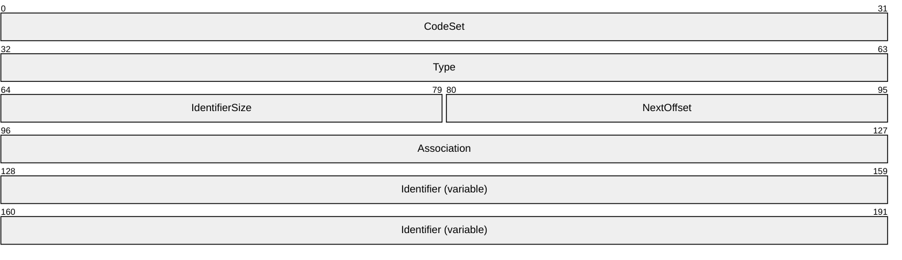
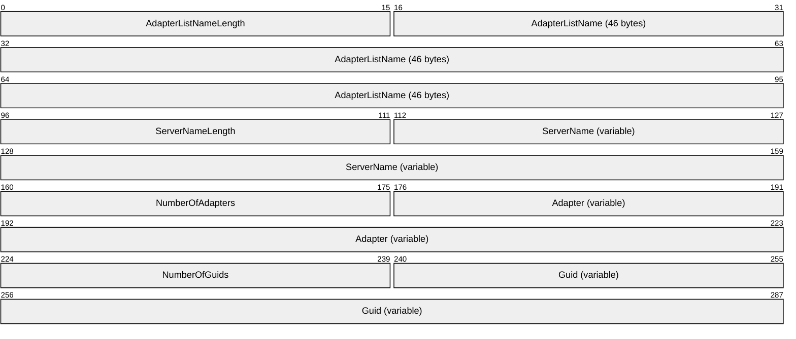
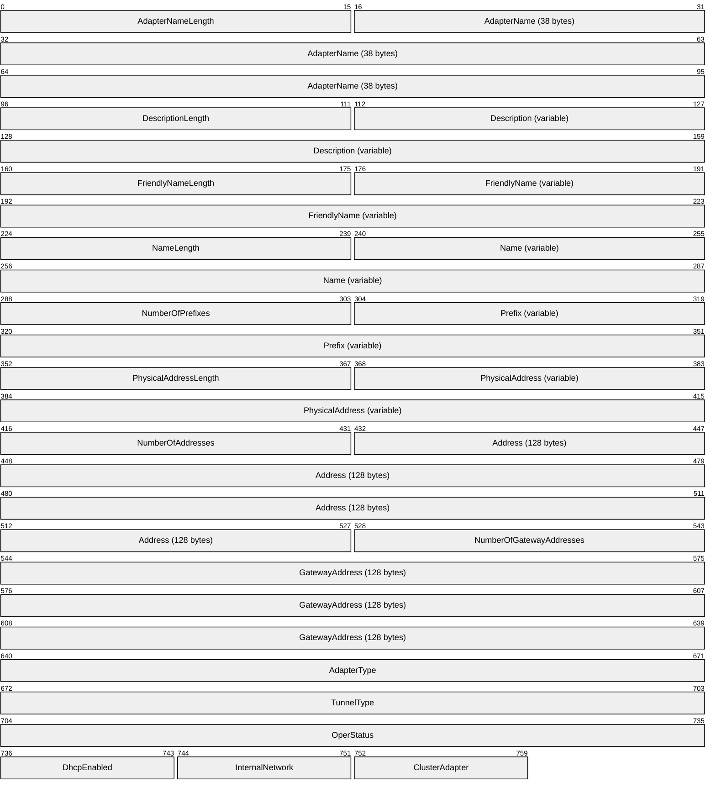
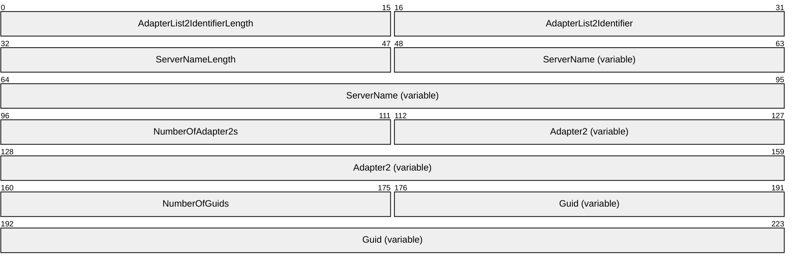
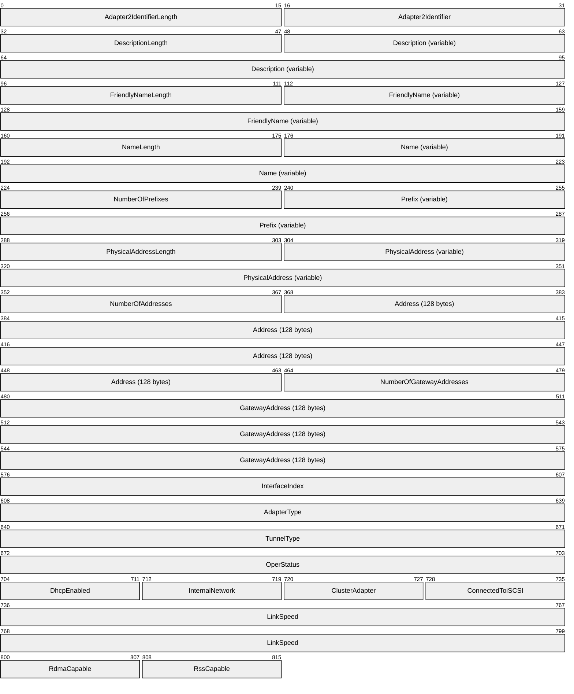
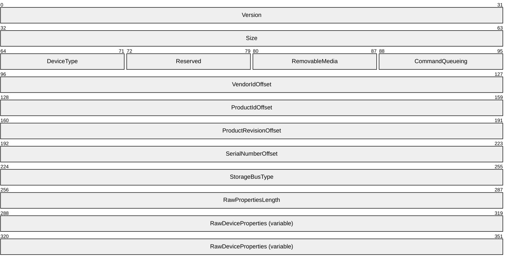

# [MS-CSVP]: Failover Cluster: Setup and Validation Protocol (ClusPrep)

Table of Contents

1 Introduction

- [1 Introduction](#Section_1)
  - [1.1 Glossary](#Section_1.1)
  - [1.2 References](#Section_1.2)
    - [1.2.1 Normative References](#Section_1.2.1)
    - [1.2.2 Informative References](#Section_1.2.2)
  - [1.3 Overview](#Section_1.3)
  - [1.4 Relationship to Other Protocols](#Section_1.4)
  - [1.5 Prerequisites/Preconditions](#Section_1.5)
  - [1.6 Applicability Statement](#Section_1.6)
  - [1.7 Versioning and Capability Negotiation](#Section_1.7)
  - [1.8 Vendor-Extensible Fields](#Section_1.8)
  - [1.9 Standards Assignments](#Section_1.9)

2 Messages

- [2 Messages](#Section_2)
  - [2.1 Transport](#Section_2.1)
  - [2.2 Common Data Types](#Section_2.2)
    - [2.2.1 CPREP_DISKID_ENUM](#Section_2.2.1)
    - [2.2.2 CPREP_DISKID](#Section_2.2.2)
    - [2.2.3 DiskStackType](#Section_2.2.3)
    - [2.2.4 CPREP_SCSI_ADDRESS](#Section_2.2.4)
    - [2.2.5 DISK_PROPS](#Section_2.2.5)
    - [2.2.6 DISK_PROPS_EX](#Section_2.2.6)
    - [2.2.7 REGISTERED_DSM](#Section_2.2.7)
    - [2.2.8 REGISTERED_DSMS](#Section_2.2.8)
    - [2.2.9 STORAGE_DEVICE_ID_DESCRIPTOR](#Section_2.2.9)
    - [2.2.10 STORAGE_IDENTIFIER](#Section_2.2.10)
    - [2.2.11 ADAPTERLIST](#Section_2.2.11)
    - [2.2.12 SERIALIZEDGUID](#Section_2.2.12)
    - [2.2.13 ADAPTER](#Section_2.2.13)
    - [2.2.14 IPPREFIX](#Section_2.2.14)
    - [2.2.15 CLUSTER_NETWORK_PROFILE](#Section_2.2.15)
    - [2.2.16 ADAPTERLIST2](#Section_2.2.16)
    - [2.2.17 ADAPTER2](#Section_2.2.17)
    - [2.2.18 NODE_ROUTE_INFO](#Section_2.2.18)
    - [2.2.19 ADD_ROUTES_REQUEST](#Section_2.2.19)
    - [2.2.20 ROUTE_STATUS](#Section_2.2.20)
    - [2.2.21 ROUTE_LOSS_AND_STATE](#Section_2.2.21)
    - [2.2.22 ADD_ROUTES_REPLY](#Section_2.2.22)
    - [2.2.23 CLUSTER_CERT](#Section_2.2.23)
    - [2.2.24 DiskMediaType](#Section_2.2.24)
    - [2.2.25 ClusterLogExFlag](#Section_2.2.25)
    - [2.2.26 CLUSTER_CERTTYPE](#Section_2.2.26)
    - [2.2.27 STORAGE_DEVICE_DESCRIPTOR](#Section_2.2.27)
    - [2.2.28 ClusterLogType](#Section_2.2.28)

3 Protocol Details

- [3 Protocol Details](#Section_3)
  - [3.1 Common Client Details](#Section_3.1)
    - [3.1.1 Abstract Data Model](#Section_3.1.1)
    - [3.1.2 Timers](#Section_3.1.2)
    - [3.1.3 Initialization](#Section_3.1.3)
    - [3.1.4 Message Processing Events and Sequencing Rules](#Section_3.1.4)
    - [3.1.5 Timer Events](#Section_3.1.5)
    - [3.1.6 Other Local Events](#Section_3.1.6)
  - [3.2 IClusterStorage2 Server Details](#Section_3.2)
    - [3.2.1 Abstract Data Model](#Section_3.2.1)
    - [3.2.2 Timers](#Section_3.2.2)
    - [3.2.3 Initialization](#Section_3.2.3)
    - [3.2.4 Message Processing Events and Sequencing Rules](#Section_3.2.4)
      - [3.2.4.1 CprepDiskRawRead (Opnum 3)](#Section_3.2.4.1)
      - [3.2.4.2 CprepDiskRawWrite (Opnum 4)](#Section_3.2.4.2)
      - [3.2.4.3 CprepPrepareNode (Opnum 5)](#Section_3.2.4.3)
      - [3.2.4.4 CprepPrepareNodePhase2 (Opnum 6)](#Section_3.2.4.4)
      - [3.2.4.5 CprepDiskGetProps (Opnum 7)](#Section_3.2.4.5)
      - [3.2.4.6 CprepDiskStopDefense (Opnum 12)](#Section_3.2.4.6)
      - [3.2.4.7 CprepDiskOnline (Opnum 13)](#Section_3.2.4.7)
      - [3.2.4.8 CprepDiskVerifyUnique (Opnum 14)](#Section_3.2.4.8)
      - [3.2.4.9 CprepDiskWriteFileData (Opnum 17)](#Section_3.2.4.9)
      - [3.2.4.10 CprepDiskVerifyFileData (Opnum 18)](#Section_3.2.4.10)
      - [3.2.4.11 CprepDiskDeleteFile (Opnum 19)](#Section_3.2.4.11)
      - [3.2.4.12 CprepDiskOffline (Opnum 20)](#Section_3.2.4.12)
      - [3.2.4.13 CprepDiskGetUniqueIds (Opnum 22)](#Section_3.2.4.13)
      - [3.2.4.14 CprepDiskAttach (Opnum 23)](#Section_3.2.4.14)
      - [3.2.4.15 CprepDiskPRArbitrate (Opnum 24)](#Section_3.2.4.15)
      - [3.2.4.16 CprepDiskPRRegister (Opnum 25)](#Section_3.2.4.16)
      - [3.2.4.17 CprepDiskPRUnRegister (Opnum 26)](#Section_3.2.4.17)
      - [3.2.4.18 CprepDiskPRReserve (Opnum 27)](#Section_3.2.4.18)
      - [3.2.4.19 CprepDiskPRRelease (Opnum 28)](#Section_3.2.4.19)
      - [3.2.4.20 CprepDiskDiskPartitionIsNtfs (Opnum 29)](#Section_3.2.4.20)
      - [3.2.4.21 CprepDiskGetArbSectors (Opnum 30)](#Section_3.2.4.21)
      - [3.2.4.22 CprepDiskIsPRPresent (Opnum 31)](#Section_3.2.4.22)
      - [3.2.4.23 CprepDiskPRPreempt (Opnum 32)](#Section_3.2.4.23)
      - [3.2.4.24 CprepDiskPRClear (Opnum 33)](#Section_3.2.4.24)
      - [3.2.4.25 CprepDiskIsOnline (Opnum 34)](#Section_3.2.4.25)
      - [3.2.4.26 CprepDiskSetOnline (Opnum 35)](#Section_3.2.4.26)
      - [3.2.4.27 CprepDiskGetFSName (Opnum 36)](#Section_3.2.4.27)
      - [3.2.4.28 CprepDiskIsReadable (Opnum 37)](#Section_3.2.4.28)
      - [3.2.4.29 CprepDiskGetDsms (Opnum 38)](#Section_3.2.4.29)
    - [3.2.5 Timer Events](#Section_3.2.5)
    - [3.2.6 Other Local Events](#Section_3.2.6)
      - [3.2.6.1 Establish Ownership of a Disk](#Section_3.2.6.1)
      - [3.2.6.2 Relinquish Ownership of a Disk](#Section_3.2.6.2)
  - [3.3 IClusterStorage2 Client Details](#Section_3.3)
    - [3.3.1 Abstract Data Model](#Section_3.3.1)
    - [3.3.2 Timers](#Section_3.3.2)
    - [3.3.3 Initialization](#Section_3.3.3)
    - [3.3.4 Message Processing Events and Sequencing Rules](#Section_3.3.4)
      - [3.3.4.1 Preparing a Server](#Section_3.3.4.1)
      - [3.3.4.2 Attaching CPrepDisks](#Section_3.3.4.2)
      - [3.3.4.3 Querying Disk Sectors](#Section_3.3.4.3)
      - [3.3.4.4 Querying Disk Partitions](#Section_3.3.4.4)
      - [3.3.4.5 Accessing a Partition File System](#Section_3.3.4.5)
      - [3.3.4.6 SCSI-3 Persistent Reservations](#Section_3.3.4.6)
    - [3.3.5 Timer Events](#Section_3.3.5)
    - [3.3.6 Other Local Events](#Section_3.3.6)
  - [3.4 IClusterStorage3 Server Details](#Section_3.4)
    - [3.4.1 Abstract Data Model](#Section_3.4.1)
    - [3.4.2 Timers](#Section_3.4.2)
    - [3.4.3 Initialization](#Section_3.4.3)
    - [3.4.4 Message Processing Events and Sequencing Rules](#Section_3.4.4)
      - [3.4.4.1 CprepDiskGetUniqueIds3 (Opnum 3)](#Section_3.4.4.1)
      - [3.4.4.2 CprepCheckNetFtBindings3 (Opnum 4)](#Section_3.4.4.2)
      - [3.4.4.3 CprepCsvTestSetup3 (Opnum 5)](#Section_3.4.4.3)
      - [3.4.4.4 CprepIsNodeClustered3 (Opnum 6)](#Section_3.4.4.4)
      - [3.4.4.5 CprepCreateNewSmbShares3 (Opnum 7)](#Section_3.4.4.5)
      - [3.4.4.6 CprepConnectToNewSmbShares3 (Opnum 8)](#Section_3.4.4.6)
      - [3.4.4.7 CprepDiskGetProps3 (Opnum 9)](#Section_3.4.4.7)
      - [3.4.4.8 CprepDiskIsReadOnly3 (Opnum 10)](#Section_3.4.4.8)
      - [3.4.4.9 CprepDiskPRRegister3 (Opnum 11)](#Section_3.4.4.9)
      - [3.4.4.10 CprepDiskFindKey3 (Opnum 12)](#Section_3.4.4.10)
      - [3.4.4.11 CprepDiskPRPreempt3 (Opnum 13)](#Section_3.4.4.11)
      - [3.4.4.12 CprepDiskPRReserve3 (Opnum 14)](#Section_3.4.4.12)
      - [3.4.4.13 CprepDiskIsPRPresent3 (Opnum 15)](#Section_3.4.4.13)
      - [3.4.4.14 CprepDiskPRRelease3 (Opnum 16)](#Section_3.4.4.14)
      - [3.4.4.15 CprepDiskPRClear3 (Opnum 17)](#Section_3.4.4.15)
    - [3.4.5 Timer Events](#Section_3.4.5)
    - [3.4.6 Other Local Events](#Section_3.4.6)
  - [3.5 IClusterStorage3 Client Details](#Section_3.5)
    - [3.5.1 Abstract Data Model](#Section_3.5.1)
    - [3.5.2 Timers](#Section_3.5.2)
    - [3.5.3 Initialization](#Section_3.5.3)
    - [3.5.4 Message Processing Events and Sequencing Rules](#Section_3.5.4)
      - [3.5.4.1 Preparing a Server](#Section_3.5.4.1)
      - [3.5.4.2 Attaching CPrepDisks](#Section_3.5.4.2)
      - [3.5.4.3 Querying Disk Sectors](#Section_3.5.4.3)
      - [3.5.4.4 Querying Disk Partitions](#Section_3.5.4.4)
      - [3.5.4.5 Accessing a Partition File System](#Section_3.5.4.5)
      - [3.5.4.6 SCSI-3 Persistent Reservations](#Section_3.5.4.6)
      - [3.5.4.7 Accessing a Share](#Section_3.5.4.7)
    - [3.5.5 Timer Events](#Section_3.5.5)
    - [3.5.6 Other Local Events](#Section_3.5.6)
  - [3.6 IClusterNetwork2 Server Details](#Section_3.6)
    - [3.6.1 Abstract Data Model](#Section_3.6.1)
    - [3.6.2 Timers](#Section_3.6.2)
      - [3.6.2.1 Round-Trip Message Timer](#Section_3.6.2.1)
    - [3.6.3 Initialization](#Section_3.6.3)
    - [3.6.4 Message Processing Events and Sequencing Rules](#Section_3.6.4)
      - [3.6.4.1 InitializeNode (Opnum 4)](#Section_3.6.4.1)
      - [3.6.4.2 SendRTMessage (Opnum 3)](#Section_3.6.4.2)
      - [3.6.4.3 GetIpConfigSerialized (Opnum 5)](#Section_3.6.4.3)
      - [3.6.4.4 CleanupNode (Opnum 6)](#Section_3.6.4.4)
      - [3.6.4.5 QueryFirewallConfiguration (Opnum 7)](#Section_3.6.4.5)
      - [3.6.4.6 ProcessAddRoutes (Opnum 8)](#Section_3.6.4.6)
      - [3.6.4.7 GetAddRoutesStatus (Opnum 9)](#Section_3.6.4.7)
      - [3.6.4.8 CancelAddRoutesRequest (Opnum 11)](#Section_3.6.4.8)
    - [3.6.5 Timer Events](#Section_3.6.5)
    - [3.6.6 Other Local Events](#Section_3.6.6)
  - [3.7 IClusterNetwork2 Client Details](#Section_3.7)
    - [3.7.1 Abstract Data Model](#Section_3.7.1)
    - [3.7.2 Timers](#Section_3.7.2)
    - [3.7.3 Initialization](#Section_3.7.3)
    - [3.7.4 Message Processing Events and Sequencing Rules](#Section_3.7.4)
    - [3.7.5 Timer Events](#Section_3.7.5)
    - [3.7.6 Other Local Events](#Section_3.7.6)
  - [3.8 IClusterCleanup Server Details](#Section_3.8)
    - [3.8.1 Abstract Data Model](#Section_3.8.1)
    - [3.8.2 Timers](#Section_3.8.2)
      - [3.8.2.1 Delay Cleanup Timer](#Section_3.8.2.1)
      - [3.8.2.2 Cleanup Timer](#Section_3.8.2.2)
    - [3.8.3 Initialization](#Section_3.8.3)
    - [3.8.4 Message Processing Events and Sequencing Rules](#Section_3.8.4)
      - [3.8.4.1 CleanUpEvictedNode (Opnum 3)](#Section_3.8.4.1)
      - [3.8.4.2 ClearPR (Opnum 4)](#Section_3.8.4.2)
    - [3.8.5 Timer Events](#Section_3.8.5)
    - [3.8.6 Other Local Events](#Section_3.8.6)
  - [3.9 IClusterCleanup Client Details](#Section_3.9)
    - [3.9.1 Abstract Data Model](#Section_3.9.1)
    - [3.9.2 Timers](#Section_3.9.2)
    - [3.9.3 Initialization](#Section_3.9.3)
    - [3.9.4 Message Processing Events and Sequencing Rules](#Section_3.9.4)
    - [3.9.5 Timer Events](#Section_3.9.5)
    - [3.9.6 Other Local Events](#Section_3.9.6)
  - [3.10 IClusterSetup Server Details](#Section_3.10)
    - [3.10.1 Abstract Data Model](#Section_3.10.1)
    - [3.10.2 Timers](#Section_3.10.2)
    - [3.10.3 Initialization](#Section_3.10.3)
    - [3.10.4 Message Processing Events and Sequencing Rules](#Section_3.10.4)
      - [3.10.4.1 ConfigSvcSecret (Opnum 3)](#Section_3.10.4.1)
      - [3.10.4.2 RetrieveSvcSecret (Opnum 4)](#Section_3.10.4.2)
      - [3.10.4.3 RetrieveHostLabel (Opnum 5)](#Section_3.10.4.3)
      - [3.10.4.4 GetFunctionalLevel (Opnum 6)](#Section_3.10.4.4)
      - [3.10.4.5 ConfigClusterCert (Opnum 9)](#Section_3.10.4.5)
      - [3.10.4.6 RetrieveClusterCert (Opnum 10)](#Section_3.10.4.6)
      - [3.10.4.7 GenerateClusterCert (Opnum 11)](#Section_3.10.4.7)
      - [3.10.4.8 GetUpgradeVersion (Opnum 12)](#Section_3.10.4.8)
      - [3.10.4.9 ConfigClusterCertV2 (Opnum 14)](#Section_3.10.4.9)
      - [3.10.4.10 RetrieveClusterCertV2 (Opnum 15)](#Section_3.10.4.10)
      - [3.10.4.11 GenerateClusterCertV2 (Opnum 16)](#Section_3.10.4.11)
    - [3.10.5 Timer Events](#Section_3.10.5)
    - [3.10.6 Other Local Events](#Section_3.10.6)
  - [3.11 IClusterSetup Client Details](#Section_3.11)
    - [3.11.1 Abstract Data Model](#Section_3.11.1)
    - [3.11.2 Timers](#Section_3.11.2)
    - [3.11.3 Initialization](#Section_3.11.3)
    - [3.11.4 Message Processing Events and Sequencing Rules](#Section_3.11.4)
    - [3.11.5 Timer Events](#Section_3.11.5)
    - [3.11.6 Other Local Events](#Section_3.11.6)
  - [3.12 IClusterLog Server Details](#Section_3.12)
    - [3.12.1 Abstract Data Model](#Section_3.12.1)
    - [3.12.2 Timers](#Section_3.12.2)
    - [3.12.3 Initialization](#Section_3.12.3)
    - [3.12.4 Message Processing Events and Sequencing Rules](#Section_3.12.4)
      - [3.12.4.1 GenerateClusterLog (Opnum 3)](#Section_3.12.4.1)
      - [3.12.4.2 GenerateTimeSpanLog (Opnum 4)](#Section_3.12.4.2)
      - [3.12.4.3 GenerateClusterLogInLocalTime (Opnum 5)](#Section_3.12.4.3)
      - [3.12.4.4 GenerateTimeSpanLogInLocalTime (Opnum 6)](#Section_3.12.4.4)
    - [3.12.5 Timer Events](#Section_3.12.5)
    - [3.12.6 Other Local Events](#Section_3.12.6)
  - [3.13 IClusterLog Client Details](#Section_3.13)
    - [3.13.1 Abstract Data Model](#Section_3.13.1)
    - [3.13.2 Timers](#Section_3.13.2)
    - [3.13.3 Initialization](#Section_3.13.3)
    - [3.13.4 Message Processing Events and Sequencing Rules](#Section_3.13.4)
    - [3.13.5 Timer Events](#Section_3.13.5)
    - [3.13.6 Other Local Events](#Section_3.13.6)
  - [3.14 IClusterFirewall Server Details](#Section_3.14)
    - [3.14.1 Abstract Data Model](#Section_3.14.1)
    - [3.14.2 Timers](#Section_3.14.2)
    - [3.14.3 Initialization](#Section_3.14.3)
    - [3.14.4 Message Processing Events and Sequencing Rules](#Section_3.14.4)
      - [3.14.4.1 InitializeAdapterConfiguration (Opnum 3)](#Section_3.14.4.1)
      - [3.14.4.2 GetNextAdapterFirewallConfiguration (Opnum 4)](#Section_3.14.4.2)
    - [3.14.5 Timer Events](#Section_3.14.5)
    - [3.14.6 Other Local Events](#Section_3.14.6)
  - [3.15 IClusterFirewall Client Details](#Section_3.15)
    - [3.15.1 Abstract Data Model](#Section_3.15.1)
    - [3.15.2 Timers](#Section_3.15.2)
    - [3.15.3 Initialization](#Section_3.15.3)
    - [3.15.4 Message Processing Events and Sequencing Rules](#Section_3.15.4)
    - [3.15.5 Timer Events](#Section_3.15.5)
    - [3.15.6 Other Local Events](#Section_3.15.6)
  - [3.16 IClusterUpdate Server Details](#Section_3.16)
    - [3.16.1 Abstract Data Model](#Section_3.16.1)
    - [3.16.2 Timers](#Section_3.16.2)
    - [3.16.3 Initialization](#Section_3.16.3)
    - [3.16.4 Message Processing Events and Sequencing Rules](#Section_3.16.4)
      - [3.16.4.1 IClusterUpdate::GetUpdates (Opnum 3)](#Section_3.16.4.1)
      - [3.16.4.2 IClusterUpdate::Count (Opnum 4)](#Section_3.16.4.2)
    - [3.16.5 Timer Events](#Section_3.16.5)
    - [3.16.6 Other Local Events](#Section_3.16.6)
  - [3.17 IClusterUpdate Client Details](#Section_3.17)
    - [3.17.1 Abstract Data Model](#Section_3.17.1)
    - [3.17.2 Timers](#Section_3.17.2)
    - [3.17.3 Initialization](#Section_3.17.3)
    - [3.17.4 Message Processing Events and Sequencing Rules](#Section_3.17.4)
    - [3.17.5 Timer Events](#Section_3.17.5)
    - [3.17.6 Other Local Events](#Section_3.17.6)
  - [3.18 IClusterLogEx Server Details](#Section_3.18)
    - [3.18.1 Abstract Data Model](#Section_3.18.1)
    - [3.18.2 Timers](#Section_3.18.2)
    - [3.18.3 Initialization](#Section_3.18.3)
    - [3.18.4 Message Processing Events and Sequencing Rules](#Section_3.18.4)
      - [3.18.4.1 GenerateClusterLog (Opnum 3)](#Section_3.18.4.1)
      - [3.18.4.2 GenerateClusterHealthLog (Opnum 4)](#Section_3.18.4.2)
      - [3.18.4.3 GenerateClusterSetLog (Opnum 5)](#Section_3.18.4.3)
      - [3.18.4.4 GenerateClusterNetworkLog (Opnum 6)](#Section_3.18.4.4)
      - [3.18.4.5 ExportClusterPerformanceHistory (Opnum 7)](#Section_3.18.4.5)
      - [3.18.4.6 GenerateNetftLog (Opnum 8)](#Section_3.18.4.6)
    - [3.18.5 Timer Events](#Section_3.18.5)
    - [3.18.6 Other Local Events](#Section_3.18.6)
  - [3.19 IClusterLogEx2 Server Details](#Section_3.19)
    - [3.19.1 Abstract Data Model](#Section_3.19.1)
    - [3.19.2 Timers](#Section_3.19.2)
    - [3.19.3 Initialization](#Section_3.19.3)
    - [3.19.4 Message Processing Events and Sequencing Rules](#Section_3.19.4)
      - [3.19.4.1 GenerateLogEx (Opnum 9)](#Section_3.19.4.1)
      - [3.19.4.2 GetCountLogs (Opnum 10)](#Section_3.19.4.2)
      - [3.19.4.3 GetLogFilePath (Opnum 11)](#Section_3.19.4.3)
    - [3.19.5 Timer Events](#Section_3.19.5)
    - [3.19.6 Other Local Events](#Section_3.19.6)
  - [3.20 IClusterLogEx3 Server Details](#Section_3.20)
    - [3.20.1 Abstract Data Model](#Section_3.20.1)
    - [3.20.2 Timers](#Section_3.20.2)
    - [3.20.3 Initialization](#Section_3.20.3)
    - [3.20.4 Message Processing Events and Sequencing Rules](#Section_3.20.4)
      - [3.20.4.1 GenerateLogEx2 (Opnum 17)](#Section_3.20.4.1)
    - [3.20.5 Timer Events](#Section_3.20.5)
    - [3.20.6 Other Local Events](#Section_3.20.6)

4 Protocol Examples

- [4 Protocol Examples](#Section_4)
  - [4.1 A Shared Disk Online](#Section_4.1)
  - [4.2 Validate Network Configuration](#Section_4.2)
  - [4.3 Cluster Setup](#Section_4.3)

5 Security

- [5 Security](#Section_5)
  - [5.1 Security Considerations for Implementers](#Section_5.1)
  - [5.2 Index of Security Parameters](#Section_5.2)

6 Appendix A: Full IDL

- [6 Appendix A: Full IDL](#Section_6)

7 Appendix B: Product Behavior

- [7 Appendix B: Product Behavior](#Section_7)

8 Change Tracking

- [8 Change Tracking](#Section_8)

For the legal notice and IP terms, see [LEGAL.md](../LEGAL.md).
Last updated: 11/21/2025.
See [Revision History](#revision-history) for full version history.

# 1 Introduction

The Failover Cluster: Setup and Validation Protocol (ClusPrep) consists of DCOM interfaces, as specified in [MS-DCOM](../MS-DCOM/MS-DCOM.md), that are used for remotely configuring cluster nodes cleaning up cluster nodes and validating that hardware and software settings are compatible with use in a failover cluster.

Sections 1.5, 1.8, 1.9, 2, and 3 of this specification are normative. All other sections and examples in this specification are informative.

## 1.1 Glossary

This document uses the following terms:

**authentication level**: A numeric value indicating the level of authentication or message protection that [**remote procedure call (RPC)**](#gt_remote-procedure-call-rpc) will apply to a specific message exchange. For more information, see [[C706]](https://go.microsoft.com/fwlink/?LinkId=89824) section 13.1.2.1 and [MS-RPCE](../MS-RPCE/MS-RPCE.md).

**basic volume**: A [**partition**](#gt_partition) on a basic disk.

**binary large object (BLOB)**: A discrete packet of data that is stored in a database and is treated as a sequence of uninterpreted bytes.

**class identifier (CLSID)**: A [**GUID**](#gt_globally-unique-identifier-guid) that identifies a software component; for instance, a DCOM object class or a COM class.

**cluster secret**: A value unique to an instance of a cluster and known to all [**nodes**](#gt_node) configured in the cluster. The [**cluster secret**](#gt_cluster-secret) is used in implementation-specific server-to-server protocols that enable a [**node**](#gt_node) to actively participate in a cluster.

**device**: Any peripheral or part of a computer system that can send or receive data.

**Device-Specific Module (DSM)**: A hardware-specific driver that has passed the Microsoft Multipath I/O (MPIO) test and submission process. For further information, see [[MSFT-MPIO]](https://go.microsoft.com/fwlink/?LinkId=108350).

**disk**: A persistent storage device that can include physical hard disks, removable disk units, optical drive units, and [**logical unit numbers (LUNs)**](#gt_logical-unit-number-lun) unmasked to the system.

**disk signature**: A unique identifier for a disk. For a [**master boot record (MBR)**](#gt_master-boot-record-mbr)-formatted disk, this identifier is a 4-byte value stored at the end of the [**MBR**](#gt_master-boot-record-mbr), which is located in sector 0 on the disk. For a [**GUID partitioning table (GPT)**](#gt_guid-partition-table-gpt)-formatted disk, this value is a [**GUID**](#gt_globally-unique-identifier-guid) stored in the [**GPT**](#gt_guid-partition-table-gpt) disk header at the beginning of the disk.

**Distributed Component Object Model (DCOM)**: The Microsoft Component Object Model (COM) specification that defines how components communicate over networks, as specified in [MS-DCOM](../MS-DCOM/MS-DCOM.md).

**Dynamic Host Configuration Protocol (DHCP)**: A protocol that provides a framework for passing configuration information to hosts on a TCP/IP network, as described in [[RFC2131]](https://go.microsoft.com/fwlink/?LinkId=90318).

**dynamic volume**: A volume on a dynamic disk.

**endpoint**: A client that is on a network and is requesting access to a network access server (NAS).

**failover cluster**: A set of independent computers that work together to increase the availability of services and applications. The term cluster is sometimes used as shorthand for [**failover cluster**](#gt_failover-cluster).

**firewall rule**: A group of settings that specify which connections are allowed into and out of a client computer.

**fully qualified domain name (FQDN)**: An unambiguous domain name that gives an absolute location in the Domain Name System's (DNS) hierarchy tree, as defined in [[RFC1035]](https://go.microsoft.com/fwlink/?LinkId=90264) section 3.1 and [[RFC2181]](https://go.microsoft.com/fwlink/?LinkId=127732) section 11.

**globally unique identifier (GUID)**: A term used interchangeably with [**universally unique identifier (UUID)**](#gt_universally-unique-identifier-uuid) in Microsoft protocol technical documents (TDs). Interchanging the usage of these terms does not imply or require a specific algorithm or mechanism to generate the value. Specifically, the use of this term does not imply or require that the algorithms described in [[RFC4122]](https://go.microsoft.com/fwlink/?LinkId=90460) or [C706] have to be used for generating the GUID. See also universally unique identifier (UUID).

**GUID partition table (GPT)**: A disk-partitioning scheme that is used by the Extensible Firmware Interface (EFI). [**GPT**](#gt_guid-partition-table-gpt) offers more advantages than [**master boot record (MBR)**](#gt_master-boot-record-mbr) partitioning because it allows up to 128 [**partitions**](#gt_partition) per disk, provides support for [**volumes**](#gt_volume) up to 18 exabytes in size, allows primary and backup partition tables for redundancy, and supports unique disk and partition IDs through the use of [**globally unique identifiers (GUIDs)**](#gt_globally-unique-identifier-guid). Disks with [**GPT**](#gt_guid-partition-table-gpt) schemes are referred to as [**GPT**](#gt_guid-partition-table-gpt) disks.

**interface**: A specification in a Component Object Model (COM) server that describes how to access the methods of a class. For more information, see [MS-DCOM].

**Interface Definition Language (IDL)**: The International Standards Organization (ISO) standard language for specifying the [**interface**](#gt_interface) for remote procedure calls. For more information, see [C706] section 4.

**Internet Protocol version 4 (IPv4)**: An Internet protocol that has 32-bit source and destination addresses. IPv4 is the predecessor of IPv6.

**Internet Protocol version 6 (IPv6)**: A revised version of the Internet Protocol (IP) designed to address growth on the Internet. Improvements include a 128-bit IP address size, expanded routing capabilities, and support for authentication and privacy.

**logical unit number (LUN)**: A number that is used to identify a disk on a given disk controller.

**master boot record (MBR)**: Metadata such as the partition table, the disk signature, and the executable code for initiating the operating system boot process that is located on the first sector of a disk. Disks that have [**MBRs**](#gt_master-boot-record-mbr) are referred to as [**MBR**](#gt_master-boot-record-mbr) disks. [**GUID partitioning table (GPT)**](#gt_guid-partition-table-gpt) disks, instead, have unused dummy data in the first sector where the [**MBR**](#gt_master-boot-record-mbr) would normally be.

**Network Data Representation (NDR)**: A specification that defines a mapping from [**Interface Definition Language (IDL)**](#gt_interface-definition-language-idl) data types onto octet streams. [**NDR**](#gt_network-data-representation-ndr) also refers to the runtime environment that implements the mapping facilities (for example, data provided to [**NDR**](#gt_network-data-representation-ndr)). For more information, see [MS-RPCE] and [C706] section 14.

**node**: A computer system that is configured as a member of a cluster. That is, the computer has the necessary software installed and configured to participate in the cluster, and the cluster configuration includes this computer as a member.

**offline**: An operational state applicable to [**volumes**](#gt_volume) and disks. In the offline state, the [**volume**](#gt_volume) or disk is unavailable for data input/output (I/O) or configuration.

**online**: An operational state applicable to [**volumes**](#gt_volume) and disks. In the online state, the volume or disk is available for data input/output (I/O) or configuration.

**opnum**: An operation number or numeric identifier that is used to identify a specific [**remote procedure call (RPC)**](#gt_remote-procedure-call-rpc) method or a method in an interface. For more information, see [C706] section 12.5.2.12 or [MS-RPCE].

**partition**: In the context of hard disks, a logical region of a hard disk. A hard disk can be subdivided into one or more partitions.

**QFE number**: The unique number associated with a QFE that is used to easily identify a QFE.

**registry**: A local system-defined database in which applications and system components store and retrieve configuration data. It is a hierarchical data store with lightly typed elements that are logically stored in tree format. Applications use the registry API to retrieve, modify, or delete registry data. The data stored in the registry varies according to the version of the operating system.

**remote procedure call (RPC)**: A communication protocol used primarily between client and server. The term has three definitions that are often used interchangeably: a runtime environment providing for communication facilities between computers (the RPC runtime); a set of request-and-response message exchanges between computers (the RPC exchange); and the single message from an RPC exchange (the RPC message). For more information, see [C706].

**RPC dynamic endpoint**: A network-specific server address that is requested and assigned at run time, as described in [C706].

**RPC protocol sequence**: A character string that represents a valid combination of a [**remote procedure call (RPC)**](#gt_remote-procedure-call-rpc) protocol, a network layer protocol, and a transport layer protocol, as described in [C706] and [MS-RPCE].

**SCSI protocol**: An architecture for [**SCSI**](#gt_small-computer-system-interface-scsi), consisting of a group of standards created and maintained by the Technical Committee (T10) of the InterNational Committee on Information Technology Standards (INCITS).

**sector**: The smallest addressable unit of a disk.

**share**: A resource offered by a Common Internet File System (CIFS) server for access by CIFS clients over the network. A share typically represents a directory tree and its included files (referred to commonly as a "disk share" or "file share") or a printer (a "print share"). If the information about the share is saved in persistent store (for example, Windows registry) and reloaded when a file server is restarted, then the share is referred to as a "sticky share". Some share names are reserved for specific functions and are referred to as special shares: IPC$, reserved for interprocess communication, ADMIN$, reserved for remote administration, and A$, B$, C$ (and other local disk names followed by a dollar sign), assigned to local disk devices.

**small computer system interface (SCSI)**: A set of standards for physically connecting and transferring data between computers and peripheral devices.

**storage pool**: A group of disks where all of the storage space on all of the disks is aggregated and managed as a single unit.

**strict NDR/NDR64 data consistency check**: A set of related rules for data validation during processing of an octet stream.

**thin-provisioned**: A method for optimal allocation of storage. Blocks are allocated on demand.

**time source**: A component that possesses a clock and that makes the clock's time available to other components for synchronization. For more information, see "reference source" in [[RFC1305]](https://go.microsoft.com/fwlink/?LinkId=90272).

**UncPath**: The location of a file in a network of computers, as specified in Universal Naming Convention (UNC) syntax.

**universally unique identifier (UUID)**: A 128-bit value. UUIDs can be used for multiple purposes, from tagging objects with an extremely short lifetime, to reliably identifying very persistent objects in cross-process communication such as client and server interfaces, manager entry-point vectors, and [**RPC**](#gt_remote-procedure-call-rpc) objects. UUIDs are highly likely to be unique. UUIDs are also known as [**globally unique identifiers (GUIDs)**](#gt_globally-unique-identifier-guid) and these terms are used interchangeably in the Microsoft protocol technical documents (TDs). Interchanging the usage of these terms does not imply or require a specific algorithm or mechanism to generate the UUID. Specifically, the use of this term does not imply or require that the algorithms described in [RFC4122] or [C706] has to be used for generating the UUID.

**volume**: A group of one or more partitions that forms a logical region of storage and the basis for a file system. A [**volume**](#gt_volume) is an area on a storage device that is managed by the file system as a discrete logical storage unit. A partition contains at least one [**volume**](#gt_volume), and a volume can exist on one or more partitions.

**VPD**: Vital product data. See [[SPC-3]](https://go.microsoft.com/fwlink/?LinkId=90528) section 7.6.

**well-known endpoint**: A preassigned, network-specific, stable address for a particular client/server instance. For more information, see [C706].

**MAY, SHOULD, MUST, SHOULD NOT, MUST NOT:** These terms (in all caps) are used as defined in [[RFC2119]](https://go.microsoft.com/fwlink/?LinkId=90317). All statements of optional behavior use either MAY, SHOULD, or SHOULD NOT.

## 1.2 References

Links to a document in the Microsoft Open Specifications library point to the correct section in the most recently published version of the referenced document. However, because individual documents in the library are not updated at the same time, the section numbers in the documents may not match. You can confirm the correct section numbering by checking the [Errata](https://go.microsoft.com/fwlink/?linkid=850906).

### 1.2.1 Normative References

We conduct frequent surveys of the normative references to assure their continued availability. If you have any issue with finding a normative reference, please contact [dochelp@microsoft.com](mailto:dochelp@microsoft.com). We will assist you in finding the relevant information.

[C706] The Open Group, "DCE 1.1: Remote Procedure Call", C706, August 1997, [https://publications.opengroup.org/c706](https://go.microsoft.com/fwlink/?LinkId=89824)

**Note** Registration is required to download the document.

[IANAifType] IANA, "IANAifType-MIB Definitions", January 2007, [http://www.iana.org/assignments/ianaiftype-mib](https://go.microsoft.com/fwlink/?LinkId=89884)

[MS-CMRP] Microsoft Corporation, "[Failover Cluster: Management API (ClusAPI) Protocol](../MS-CMRP/MS-CMRP.md)".

[MS-DCOM] Microsoft Corporation, "[Distributed Component Object Model (DCOM) Remote Protocol](../MS-DCOM/MS-DCOM.md)".

[MS-DTYP] Microsoft Corporation, "[Windows Data Types](../MS-DTYP/MS-DTYP.md)".

[MS-ERREF] Microsoft Corporation, "[Windows Error Codes](../MS-ERREF/MS-ERREF.md)".

[MS-FASP] Microsoft Corporation, "[Firewall and Advanced Security Protocol](../MS-FASP/MS-FASP.md)".

[MS-OAUT] Microsoft Corporation, "[OLE Automation Protocol](../MS-OAUT/MS-OAUT.md)".

[MS-RPCE] Microsoft Corporation, "[Remote Procedure Call Protocol Extensions](../MS-RPCE/MS-RPCE.md)".

[MS-SMB2] Microsoft Corporation, "[Server Message Block (SMB) Protocol Versions 2 and 3](../MS-SMB2/MS-SMB2.md)".

[RFC1924] Elz, R., "A Compact Representation of IPv6 Addresses", RFC 1924, April 1996, [https://www.rfc-editor.org/info/rfc1924](https://go.microsoft.com/fwlink/?LinkId=108348)

[RFC2119] Bradner, S., "Key words for use in RFCs to Indicate Requirement Levels", BCP 14, RFC 2119, March 1997, [https://www.rfc-editor.org/info/rfc2119](https://go.microsoft.com/fwlink/?LinkId=90317)

[RFC2553] Gilligan, R., Thomson, S., Bound, J., and Stevens, W., "Basic Socket Interface Extensions for IPv6", RFC 2553, March 1999, [https://www.rfc-editor.org/info/rfc2553](https://go.microsoft.com/fwlink/?LinkId=90367)

[RFC2863] McCloghrie, K., and Kastenholz, F., "The Interfaces Group MIB", RFC 2863, June 2000, [https://www.rfc-editor.org/info/rfc2863](https://go.microsoft.com/fwlink/?LinkID=111187)

[SPC-3] International Committee on Information Technology Standards, "SCSI Primary Commands - 3 (SPC-3)", Project T10/1416-D, May 2005, [http://www.t10.org/cgi-bin/ac.pl?t=f&f=/spc3r23.pdf](https://go.microsoft.com/fwlink/?LinkId=90528)

**Note** Fill out guest access form, sign in, or purchase the standard to access the file.

### 1.2.2 Informative References

[MS-UAMG] Microsoft Corporation, "[Update Agent Management Protocol](../MS-UAMG/MS-UAMG.md)".

## 1.3 Overview

The Failover Cluster: Setup and Validation Protocol (ClusPrep) is a COM/DCOM protocol to setup, cleanup, and validate a set of machines for failover cluster capability. The setup of state includes pushing to a new server the state required to participate in the failover cluster. Validation of state includes retrieving failover cluster state from a server to validate the state and directing the server to perform specific tasks and report status to validate it is functioning correctly. Cleanup of state includes removing restrictions on accessing shared disks and deletion of cluster state from the server.

The ClusPrep Protocol provides [**DCOM**](#gt_distributed-component-object-model-dcom) [**interfaces**](#gt_interface) that enable a client to:

- Validate the server configuration so as to make it eligible to become a [**node**](#gt_node) in a [**failover cluster**](#gt_failover-cluster).
- Configure a server to no longer be a node in a failover cluster.
- Retrieve log information from a node in a failover cluster.
- Determine whether the hardware/software settings of a server meet the requirements to be part of a failover cluster.

## 1.4 Relationship to Other Protocols

The Failover Cluster: Setup and Validation Protocol (ClusPrep) relies on the Distributed Component Object Model (DCOM) Remote Protocol, which uses [**remote procedure call (RPC)**](#gt_remote-procedure-call-rpc) as a transport, as specified in [MS-DCOM](../MS-DCOM/MS-DCOM.md).

The Failover Cluster: Setup and Validation Protocol (ClusPrep) creates a file containing diagnostic data, as specified in section [3.12.4](#Section_3.12.4). The server makes this file available to clients via a file [**share**](#gt_share). Protocol clients can access this file using the Server Message Block (SMB) Version 2 Protocol, as specified in [MS-SMB2](../MS-SMB2/MS-SMB2.md).

The Failover Cluster: Cluster Management Remote Protocol (ClusAPI) ([MS-CMRP](../MS-CMRP/MS-CMRP.md)) clients can use the ClusPrep Protocol in conjunction with the ClusAPI Protocol when removing a [**node**](#gt_node) from a cluster, as specified in section [3.8.4.1](#Section_3.8.4.1).

## 1.5 Prerequisites/Preconditions

This protocol is implemented over [**DCOM**](#gt_distributed-component-object-model-dcom) and [**RPC**](#gt_remote-procedure-call-rpc) and, as a result, has the prerequisites identified in [MS-DCOM](../MS-DCOM/MS-DCOM.md) and [MS-RPCE](../MS-RPCE/MS-RPCE.md) as being common to DCOM and RPC interfaces.

## 1.6 Applicability Statement

The ClusPrep Protocol is specific to a [**failover cluster**](#gt_failover-cluster). As such, the protocol is applicable to a server that will be, is, or was a [**node**](#gt_node) in a failover cluster.

## 1.7 Versioning and Capability Negotiation

This document covers versioning issues in the following areas:

- **Supported Transports:** This protocol uses the [**DCOM**](#gt_distributed-component-object-model-dcom) Remote Protocol and multiple [**RPC protocol sequences**](#gt_rpc-protocol-sequence) as specified in section [2.1](#Section_2.1).
- **Protocol Versions:** This protocol has multiple [**interfaces**](#gt_interface), as defined in section 2.1.
- **Security and Authentication Methods:** Authentication and security are provided as specified in [MS-DCOM](../MS-DCOM/MS-DCOM.md) and [MS-RPCE](../MS-RPCE/MS-RPCE.md).
- **Capability Negotiation:** This protocol does not support negotiation of the interface version to use. Instead, this protocol uses only the interface version number specified in the [**Interface Definition Language (IDL)**](#gt_interface-definition-language-idl) for versioning and capability negotiation.

## 1.8 Vendor-Extensible Fields

This protocol does not define any vendor-extensible fields.

This protocol uses HRESULT values as defined in [MS-ERREF](../MS-ERREF/MS-ERREF.md) section 2.1. Vendors can define their own HRESULT values provided that they set the C bit (0x20000000) for each vendor-defined value to indicate that the value is a customer code.

## 1.9 Standards Assignments

| Parameter | Value | Reference |
| --- | --- | --- |
| [**RPC**](#gt_remote-procedure-call-rpc) Interface [**UUID**](#gt_universally-unique-identifier-uuid) for IClusterStorage2 | 12108A88-6858-4467-B92F-E6CF4568DFB6 | None |
| RPC Interface UUID for IClusterStorage3 | 11942D87-A1DE-4E7F-83FB-A840D9C5928D | None |
| RPC Interface UUID for IClusterNetwork2 | 2931C32C-F731-4c56-9FEB-3D5F1C5E72BF | None |
| RPC Interface UUID for IClusterCleanup | D6105110-8917-41A5-AA32-8E0AA2933DC9 | None |
| RPC Interface UUID for IClusterSetup | 491260B5-05C9-40D9-B7F2-1F7BDAE0927F | None |
| RPC Interface UUID for IClusterLog | 85923CA7-1B6B-4E83-A2E4-F5BA3BFBB8A3 | None |
| RPC Interface UUID for IClusterFirewall | F1D6C29C-8FBE-4691-8724-F6D8DEAEAFC8 | None |
| RPC Interface UUID for IClusterUpdate | E3C9B851-C442-432B-8FC6-A7FAAFC09D3B | None |
| RPC Interface UUID for IClusterLogEx | BD7C23C2-C805-457C-8F86-D17FE6B9D19F | None |
| RPC Interface UUID for IClusterLogEx2 | 2510EA7D-C355-40C9-852C-E3B1B1338D67 | None |
| RPC Interface UUID for IClusterLogEx3 | E6D3C166-560F-4B58-B31A-FDEA05FB606F | None |
| [**CLSID**](#gt_class-identifier-clsid) for ClusterStorage2 | C72B09DB-4D53-4f41-8DCC-2D752AB56F7C | None |
| CLSID for ClusterNetwork2 | E1568352-586D-43e4-933F-8E6DC4DE317A | None |
| CLSID for ClusterCleanup | A6D3E32B-9814-4409-8DE3-CFA673E6D3DE | None |
| CLSID for ClusterSetup | 04D55210-B6AC-4248-9E69-2A569D1D2AB6 | None |
| CLSID for ClusterLog | 88E7AC6D-C561-4F03-9A60-39DD768F867D | None |
| CLSID for ClusterFirewall | 3CFEE98C-FB4B-44C6-BD98-A1DB14ABCA3F | None |
| CLSID for ClusterUpdate | 4142DD5D-3472-4370-8641-DE7856431FB0 | None |

# 2 Messages

This protocol references commonly used data types as defined in [MS-DTYP](../MS-DTYP/MS-DTYP.md).

## 2.1 Transport

This protocol uses the [**DCOM**](#gt_distributed-component-object-model-dcom) Remote Protocol, as specified in [MS-DCOM](../MS-DCOM/MS-DCOM.md), as its transport. On its behalf, the DCOM Remote Protocol uses the following [**RPC protocol sequence**](#gt_rpc-protocol-sequence): [**RPC**](#gt_remote-procedure-call-rpc) over TCP, as specified in [MS-RPCE](../MS-RPCE/MS-RPCE.md). This protocol uses [**RPC dynamic endpoints**](#gt_rpc-dynamic-endpoint), as specified in [[C706]](https://go.microsoft.com/fwlink/?LinkId=89824) section 4. The server MUST require an RPC [**authentication level**](#gt_authentication-level) that is not less than RPC_C_AUTHN_LEVEL_PKT_PRIVACY, also specified in [MS-RPCE].

This protocol MUST use the following [**universally unique identifiers (UUIDs)**](#gt_universally-unique-identifier-uuid):

- **IClusterStorage2**: 12108A88-6858-4467-B92F-E6CF4568DFB6
- **IClusterStorage3**: 11942D87-A1DE-4E7F-83FB-A840D9C5928D
- **IClusterNetwork2**: 2931C32C-F731-4c56-9FEB-3D5F1C5E72BF
- **IClusterCleanup**: D6105110-8917-41A5-AA32-8E0AA2933DC9
- **IClusterSetup**: 491260B5-05C9-40D9-B7F2-1F7BDAE0927F
- **IClusterLog**: 85923CA7-1B6B-4E83-A2E4-F5BA3BFBB8A3
- **IClusterFirewall**: F1D6C29C-8FBE-4691-8724-F6D8DEAEAFC8
- **IClusterUpdate**: E3C9B851-C442-432B-8FC6-A7FAAFC09D3B
- **IClusterLogEx**: BD7C23C2-C805-457C-8F86-D17FE6B9D19F
- **IClusterLogEx2**: 2510EA7D-C355-40C9-852C-E3B1B1338D67
- **IClusterLogEx3**: E6D3C166-560F-4B58-B31A-FDEA05FB606F
The protocol MUST use the following [**class identifiers (CLSIDs)**](#gt_class-identifier-clsid):

- C72B09DB-4D53-4f41-8DCC-2D752AB56F7C for the class that implements IClusterStorage2
- E1568352-586D-43e4-933F-8E6DC4DE317A for the class that implements IClusterNetwork2
- A6D3E32B-9814-4409-8DE3-CFA673E6D3DE for the class that implements IClusterCleanup
- 04D55210-B6AC-4248-9E69-2A569D1D2AB6 for the class that implements IClusterSetup
- 88E7AC6D-C561-4F03-9A60-39DD768F867D for the class that implements IClusterLog
- 3CFEE98C-FB4B-44C6-BD98-A1DB14ABCA3F for the class that implements IClusterFirewall
The following CLSID MUST be used when **IClusterStorage3** is supported:

- C72B09DB-4D53-4f41-8DCC-2D752AB56F7C for the class that implements **IClusterStorage3**
The following CLSID MUST be used when **IClusterUpdate** is supported:

- 4142DD5D-3472-4370-8641-DE7856431FB0 for the class that implements **IClusterUpdate**

## 2.2 Common Data Types

In addition to the [**RPC**](#gt_remote-procedure-call-rpc) base types and definitions specified in [[C706]](https://go.microsoft.com/fwlink/?LinkId=89824) and [MS-RPCE](../MS-RPCE/MS-RPCE.md), additional data types are defined in this section.

The following list summarizes the types that are defined in this specification:

- [CPREP_DISKID_ENUM](#Section_2.2.1)
- [CPREP_DISKID](#Section_2.2.2)
- [DiskStackType](#Section_2.2.3)
- [CPREP_SCSI_ADDRESS](#Section_2.2.4)
- [DISK_PROPS](#Section_2.2.5)
- [DISK_PROPS_EX](#Section_2.2.6)
- [REGISTERED_DSM](#Section_2.2.7)
- [REGISTERED_DSMS](#Section_2.2.8)
- [STORAGE_DEVICE_ID_DESCRIPTOR](#Section_2.2.9)
- [STORAGE_IDENTIFIER](#Section_2.2.10)
- [ADAPTERLIST](#Section_2.2.11)
- [ADAPTERLIST2](#Section_2.2.16)
- [SERIALIZEDGUID](#Section_2.2.12)
- [ADAPTER](#Section_2.2.13)
- [ADAPTER2](#Section_2.2.17)
- [IPPREFIX](#Section_2.2.14)
- [CLUSTER_NETWORK_PROFILE](#Section_2.2.15)
- [NODE_ROUTE_INFO](#Section_2.2.18)
- [ADD_ROUTES_REQUEST](#Section_2.2.19)
- [ROUTE_STATUS](#Section_2.2.20)
- [ROUTE_LOSS_AND_STATE](#Section_2.2.21)
- [ADD_ROUTES_REPLY](#Section_2.2.22)

### 2.2.1 CPREP_DISKID_ENUM

The **CPREP_DISKID_ENUM** enumeration defines possible kinds of [**disk**](#gt_disk) identifiers.

typedef enum _CPREP_DISKID_ENUM

{

CprepIdSignature = 0x00000000,

CprepIdGuid = 0x00000001,

CprepIdNumber = 0x00000fa0,

CprepIdUnknown = 0x00001388

} CPREP_DISKID_ENUM,

*PCPREP_DISKID_ENUM;

**CprepIdSignature:** A [**small computer system interface (SCSI)**](#gt_small-computer-system-interface-scsi) signature that is 4 bytes in length. Used to identify [**master boot record (MBR)**](#gt_master-boot-record-mbr) disks.

**CprepIdGuid:** A signature of a [**GUID partitioning table (GPT)**](#gt_guid-partition-table-gpt) disk, which is a [**GUID**](#gt_globally-unique-identifier-guid). A GUID, also known as a [**UUID**](#gt_universally-unique-identifier-uuid), is a 16-byte structure, intended to serve as a unique identifier for an object.

**CprepIdNumber:** The number by which the disk is identified.

**CprepIdUnknown:** Used for disks that are not identified via one of the previously described ways.

### 2.2.2 CPREP_DISKID

The **CPREP_DISKID** structure identifies an operating system disk and typically corresponds to a [**LUN**](#gt_logical-unit-number-lun). This structure holds either the operating system disk number (not the **BIOS** disk number) or the [**disk signature**](#gt_disk-signature) .

typedef struct _CPREP_DISKID {

CPREP_DISKID_ENUM DiskIdType;

[switch_is(DiskIdType), switch_type(CPREP_DISKID_ENUM)] union DiskId {

[case(CprepIdSignature)]

unsigned long DiskSignature;

[case(CprepIdGuid)]

GUID DiskGuid;

[case(CprepIdNumber)]

unsigned long DeviceNumber;

[case(CprepIdUnknown)]

unsigned long Junk;

}DiskId;

} CPREP_DISKID,

*PCPREP_DISKID;

**DiskIdType:** This MUST be one of the valid [CPREP_DISKID_ENUM](#Section_2.2.1) values.

**DiskSignature:** This field is valid only if **DiskIdType** is CprepIdSignature. It MUST contain the 4-byte signature of the disk. How the disk signature is assigned is implementation-specific.

**DiskGuid:** This field is valid only if **DiskIdType** is CprepIdGuid. It MUST contain the GUID that identifies the disk. How the disk GUID is assigned is implementation-specific.

**DeviceNumber:** This field is valid only if **DiskIdType** is CprepIdNumber. It MUST contain the operating system disk number, not the **BIOS** disk number. The [**device**](#gt_device) number ranges from zero to the number of disks accessible by the server minus one. How the device number is assigned is implementation-specific.

**Junk:** This field is valid only if **DiskIdType** is CprepIdUnknown. The value of this field is not used.

### 2.2.3 DiskStackType

The **DiskStackType** enumeration defines valid driver types that a disk driver is implemented as.

typedef enum _DiskStackType

{

DiskStackScsiPort = 0x00000000,

DiskStackStorPort = 0x00000001,

DiskStackFullPort = 0x00000002

} DiskStackType;

**DiskStackScsiPort:** The driver is a SCSIPort driver.

**DiskStackStorPort:** The driver is a StorPort driver.

**DiskStackFullPort:** The driver is a monolithic driver and does not conform to any storage driver submodel.

### 2.2.4 CPREP_SCSI_ADDRESS

The **CPREP_SCSI_ADDRESS** structure holds information to identify a disk via the [**SCSI protocol**](#gt_scsi-protocol). The structure is included in this document because it is referenced by the [DISK_PROPS](#Section_2.2.5) structure; however, the values in this structure are never read by the client.

typedef struct _CPREP_SCSI_ADDRESS {

unsigned long Length;

unsigned char PortNumber;

unsigned char PathId;

unsigned char TargetId;

unsigned char Lun;

} CPREP_SCSI_ADDRESS,

*PCPREP_SCSI_ADDRESS;

**Length:** Contains the length of this structure in bytes.

**PortNumber:** Contains the number of the [**SCSI**](#gt_small-computer-system-interface-scsi) adapter.

**PathId:** Contains the number of the bus.

**TargetId:** Contains the number of the target [**device**](#gt_device).

**Lun:** Contains the [**logical unit number**](#gt_logical-unit-number-lun).

### 2.2.5 DISK_PROPS

The **DISK_PROPS** structure holds information about a single disk.<1>

typedef struct _DISK_PROPS {

unsigned long DiskNumber;

CPREP_DISKID DiskId;

unsigned long DiskBusType;

DiskStackType StackType;

CPREP_SCSI_ADDRESS ScsiAddress;

long DiskIsClusterable;

wchar_t AdapterDesc[260];

unsigned long NumPaths;

unsigned long Flags;

} DISK_PROPS,

*PDISK_PROPS;

**DiskNumber:** The zero-based device number assigned to the disk by the operating system.

**DiskId:** A valid [CPREP_DISKID](#Section_2.2.2) structure with the correct identifier for the disk.

**DiskBusType:** The type of bus to which the disk is attached. It MAY<2> be one of the following values.

| Value | Meaning |
| --- | --- |
| BusTypeUnknown 0x00000000 | The bus type is not one of those that follows. |
| BusTypeScsi 0x00000001 | The bus type is [**SCSI**](#gt_small-computer-system-interface-scsi). |
| BusTypeAtapi 0x00000002 | The bus type is AT attachment packet interface (ATAPI). |
| BusTypeAta 0x00000003 | The bus type is advanced technology attachment (ATA). |
| BusType1394 0x00000004 | The bus type is IEEE 1394. |
| BusTypeSsa 0x00000005 | The bus type is serial storage architecture (SSA). |
| BusTypeFibre 0x00000006 | The bus type is Fibre Channel. |
| BusTypeUsb 0x00000007 | The bus type is universal serial bus (USB). |
| BusTypeRAID 0x00000008 | The bus type is redundant array of independent disks (RAID). |
| BusTypeiScsi 0x00000009 | The bus type is iSCSI. |
| BusTypeSas 0x0000000A | The bus type is Serial Attached SCSI (SAS). |
| BusTypeSata 0x0000000B | The bus type is Serial ATA (SATA). |
| BusTypeSd 0x0000000C | The bus type is Sd. |
| BusTypeMmc 0x0000000D | The bus type is Mmc. |
| BusTypeVirtual 0x0000000E | The bus type is Virtual. |
| BusTypeFileBackedVirtual 0x0000000F | The bus type is File Backed Virtual. |
| BusTypeSpaces 0x00000010 | The bus is type Spaces. |

**StackType:** The driver subtype of the device driver. It MUST be one of the valid values for [DiskStackType](#Section_2.2.3).

**ScsiAddress:** The SCSI address of the disk. It MUST be a valid [CPREP_SCSI_ADDRESS](#Section_2.2.4).

**DiskIsClusterable:** A Boolean flag that indicates whether the disk can be represented by a storage class resource in a [**failover cluster**](#gt_failover-cluster), as specified in [MS-CMRP](../MS-CMRP/MS-CMRP.md). A value of TRUE or 1 indicates that the disk can be represented by a storage class resource. A value of FALSE or 0 indicates that the disk cannot be represented by a storage class resource. The value of the **DiskIsClusterable** member can be determined in an implementation-specific way.

**AdapterDesc:** A user-friendly description of the adapter to which the disk is connected.

**NumPaths:** The number of IO paths to the disk. A Multipath I/O (MPIO) disk has a number greater than 1.

**Flags:** Information about the disk. It MAY<3> be one or more of the following values bitwise OR'd together.

| Value | Meaning |
| --- | --- |
| DISK_BOOT 0x00000001 | The disk is the boot device. |
| DISK_SYSTEM 0x00000002 | The disk contains the operating system. |
| DISK_PAGEFILE 0x00000004 | The disk contains an operating system pagefile. |
| DISK_HIBERNATE 0x00000008 | The disk will be used to store system hibernation data. |
| DISK_CRASHDUMP 0x00000010 | The disk will be used to store system crash dump data. |
| DISK_REMOVABLE 0x00000020 | The disk is on removable media. |
| DISK_CLUSTERNOSUPP 0x00000040 | The disk is not supported by the cluster implementation. The criteria for support are implementation-specific. |
| DISK_BUSNOSUPP 0x00000100 | The disk is on a bus not supported by the cluster implementation. The criteria for support are implementation-specific. |
| DISK_SYSTEMBUS 0x00000200 | The disk is on the same bus as the disk containing the operating system. |
| DISK_ALREADY_CLUSTERED 0x00000400 | The disk is already controlled by the cluster. |
| DISK_SYTLE_MBR 0x00001000 | The disk is [**MBR**](#gt_master-boot-record-mbr). |
| DISK_STYLE_GPT 0x00002000 | The disk is [**GPT**](#gt_guid-partition-table-gpt). |
| DISK_STYLE_RAW 0x00004000 | The disk is neither MBR nor GPT. |
| DISK_PART_BASIC 0x00008000 | The disk is configured with [**basic volumes**](#gt_basic-volume). |
| DISK_PART_DYNAMIC 0x00010000 | The disk is configured with [**dynamic volumes**](#gt_dynamic-volume). |
| DISK_CLUSTERED_ONLINE 0x00020000 | The disk is controlled by the cluster and is [**online**](#gt_online). |
| DISK_UNREADABLE 0x00040000 | The disk cannot be read. |
| DISK_MPIO 0x00080000 | The disk is controlled by MPIO. |
| DISK_CLUSTERED_OTHER 0x00100000 | The disk is controlled by cluster software other than the failover cluster implementation. |
| DISK_MISSING 0x00200000 | The disk could not be found. |
| DISK_REDUNDANT 0x00400000 | The disk is exposed to the operating system multiple times through redundant paths. |
| DISK_SNAPSHOT 0x00800000 | The disk is a snapshot disk. |
| DISK_FAILING_IO 0x02000000 | The disk is unable to gather disk information. |
| DISK_NO_PAGE83 0x04000000 | The disk does not have a **Device Identification VPD page** (see [[SPC-3]](https://go.microsoft.com/fwlink/?LinkId=90528) section 7.6.3) with **PAGE CODE** (see [SPC-3] table 294) set to `83h`, a device **ASSOCIATION** (see [SPC-3] table 297), and **IDENTIFIER TYPE** (see [SPC-3] table 298) of **Type 8**, **Type 3**, or **Type 2**. |
| DISK_COLLISION 0x08000000 | The disk's signature collides with the signature on another disk visible to this server, and [**disk signature**](#gt_disk-signature) collision resolution is disabled. |
| DISK_OUTOFSPACE 0x10000000 | The disk is a [**thin-provisioned**](#gt_thin-provisioned) [**LUN**](#gt_logical-unit-number-lun) that has no free space. |
| DISK_POOL_DRIVE 0x20000000 | The disk is a member of a [**storage pool**](#gt_storage-pool). |
| DISK_POOL_DRIVE_NOT_TESTABLE 0x40000000 | The disk is a member of a storage pool and cannot be tested because the storage pool is in use. |
| DISK_POOL_CLUSTERED 0x80000000 | The disk is member of a storage pool and the storage pool to which it belongs is a cluster resource. |

### 2.2.6 DISK_PROPS_EX

The **DISK_PROPS_EX** structure holds information about a single disk. This structure SHOULD<4> be supported and is required for the [IClusterStorage3](#Section_3.4) [**interface**](#gt_interface).

typedef struct _DISK_PROPS_EX {

ULONG DiskNumber;

CPREP_DISKID DiskId;

ULONG DiskBusType;

DiskStackType StackType;

CPREP_SCSI_ADDRESS ScsiAddress;

BOOL DiskIsClusterable;

wchar_t AdapterDesc[260];

[string] LPWSTR pwszFriendlyName;

unsigned long NumPaths;

unsigned long Flags;

unsigned long ExtendedFlags;

[string] LPWSTR pwszPoolName;

[string] LPWSTR pwszPage83Id;

[string] LPWSTR pwszSerialNumber;

GUID guidPoolId;

} DISK_PROPS_EX,

*PDISK_PROPS_EX;

**DiskNumber:** The zero-based [**device**](#gt_device) number assigned to the disk by the operating system.

**DiskId:** A valid [CPREP_DISKID](#Section_2.2.2) structure with the correct identifier for the disk.

**DiskBusType:** The type of bus to which the disk is attached. It contains one of the following values.

| Value | Meaning |
| --- | --- |
| BusTypeUnknown 0x00000000 | The bus type is not one of those that follow. |
| BusTypeScsi 0x00000001 | The bus type is [**SCSI**](#gt_small-computer-system-interface-scsi). |
| BusTypeAtapi 0x00000002 | The bus type is AT attachment packet interface (ATAPI). |
| BusTypeAta 0x00000003 | The bus type is advanced technology attachment (ATA). |
| BusType1394 0x00000004 | The bus type is IEEE 1394. |
| BusTypeSsa 0x00000005 | The bus type is serial storage architecture (SSA). |
| BusTypeFibre 0x00000006 | The bus type is Fibre Channel. |
| BusTypeUsb 0x00000007 | The bus type is universal serial bus (USB). |
| BusTypeRAID 0x00000008 | The bus type is redundant array of independent disks (RAID). |
| BusTypeiScsi 0x00000009 | The bus type is iSCSI. |
| BusTypeSas 0x0000000A | The bus type is Serial Attached SCSI (SAS). |
| BusTypeSata 0x0000000B | The bus type is Serial ATA (SATA). |
| BusTypeSd 0x0000000C | The bus type is Sd. |
| BusTypeMmc 0x0000000D | The bus type is Mmc. |
| BusTypeVirtual 0x0000000E | The bus type is Virtual. |
| BusTypeFileBackedVirtual 0x0000000F | The bus type is File Backed Virtual. |
| BusTypeSpaces 0x00000010 | The bus type is Spaces. |

**StackType:** The driver subtype of the device driver. It MUST be one of the valid values for [DiskStackType](#Section_2.2.3).

**ScsiAddress:** The SCSI address of the disk. It MUST be a valid [CPREP_SCSI_ADDRESS](#Section_2.2.4).

**DiskIsClusterable:** A Boolean flag that indicates whether the disk can be clustered. A value of TRUE or 1 indicates that the disk can be clustered. A value of FALSE or 0 indicates that the disk cannot be clustered. The value of the **DiskIsClusterable** member can be determined in an implementation-specific way.

**AdapterDesc:** A user-friendly description of the adapter to which the disk is connected.

**pwszFriendlyName:** A null-terminated string containing a user-friendly description of the disk. Memory for this string is allocated by the server and MUST be freed by the client.

**NumPaths:** The number of IO paths to the disk. A Multipath I/O (MPIO) disk has a number greater than 1.

**Flags:** Information about the disk. It contains one or more of the following values bitwise OR'd together.

| Value | Meaning |
| --- | --- |
| DISK_BOOT 0x00000001 | The disk is the boot device. |
| DISK_SYSTEM 0x00000002 | The disk contains the operating system. |
| DISK_PAGEFILE 0x00000004 | The disk contains an operating system pagefile. |
| DISK_HIBERNATE 0x00000008 | The disk will be used to store system hibernation data. |
| DISK_CRASHDUMP 0x00000010 | The disk will be used to store system crash dump data. |
| DISK_REMOVABLE 0x00000020 | The disk is on removable media. |
| DISK_CLUSTERNOSUPP 0x00000040 | The disk is not supported by the cluster implementation. The criteria for support are implementation-specific. |
| DISK_BUSNOSUPP 0x00000100 | The disk is on a bus not supported by the cluster implementation. The criteria for support are implementation-specific. |
| DISK_SYSTEMBUS 0x00000200 | The disk is on the same bus as the disk containing the operating system. |
| DISK_ALREADY_CLUSTERED 0x00000400 | The disk is already controlled by the cluster. |
| DISK_SYTLE_MBR 0x00001000 | The disk is [**MBR**](#gt_master-boot-record-mbr). |
| DISK_STYLE_GPT 0x00002000 | The disk is [**GPT**](#gt_guid-partition-table-gpt). |
| DISK_STYLE_RAW 0x00004000 | The disk is neither MBR nor GPT. |
| DISK_PART_BASIC 0x00008000 | The disk is configured with [**basic volumes**](#gt_basic-volume). |
| DISK_PART_DYNAMIC 0x00010000 | The disk is configured with [**dynamic volumes**](#gt_dynamic-volume). |
| DISK_CLUSTERED_ONLINE 0x00020000 | The disk is controlled by the cluster and is [**online**](#gt_online). |
| DISK_UNREADABLE 0x00040000 | The disk cannot be read. |
| DISK_MPIO 0x00080000 | The disk is controlled by MPIO. |
| DISK_CLUSTERED_OTHER 0x00100000 | The disk is controlled by cluster software other than the [**failover cluster**](#gt_failover-cluster) implementation. |
| DISK_MISSING 0x00200000 | The disk could not be found. |
| DISK_REDUNDANT 0x00400000 | The disk is exposed to the operating system more than once through redundant paths. |
| DISK_SNAPSHOT 0x00800000 | The disk is a snapshot disk. |
| DISK_FAILING_IO 0x02000000 | The disk is unable to gather disk information. |
| DISK_NO_PAGE83 0x04000000 | The disk does not have a **Device Identification VPD page** (see [[SPC-3]](https://go.microsoft.com/fwlink/?LinkId=90528) section 7.6.3) with **PAGE CODE** (see [SPC-3] table 294) set to `83h`, a device **ASSOCIATION** (see [SPC-3] table 297), and **IDENTIFIER TYPE** (see [SPC-3] table 298) of **Type 8**, **Type 3**, or **Type 2**. |
| DISK_COLLISION 0x08000000 | The disk's signature collides with the signature of another disk visible to this server, and [**disk signature**](#gt_disk-signature) collision resolution is disabled. |
| DISK_OUTOFSPACE 0x10000000 | The disk is a **thin-provisioned LUN** that has no free space. |
| DISK_POOL_DRIVE 0x20000000 | The disk is a member of a [**storage pool**](#gt_storage-pool). |
| DISK_POOL_DRIVE_NOT_TESTABLE 0x40000000 | The disk is a member of a storage pool but does not meet implementation-specific criteria for testing. |
| DISK_POOL_CLUSTERED 0x80000000 | The disk is a member of a storage pool, and the storage pool to which it belongs is a cluster resource. |

**ExtendedFlags:** Additional information about the disk. It contains one or more of the following values bitwise OR'd together.

| Value | Meaning |
| --- | --- |
| DISK_EX_SPLITPOOLCONFIG 0x00000001 | The storage pool drive is configured for both pool and non-pool data. |
| DISK_EX_POOL_NOT_CLUSTERABLE 0x00000002 | The storage pool drive is part of a pool that is not suitable for failover clustering. |

**pwszPoolName:** A null-terminated string indicating the name of the storage pool that the disk is a member of. If the disk is not a member of a storage pool, this field MUST be initialized to NULL.

Memory is allocated by the server and MUST be freed by the client.

**pwszPage83Id:** A null-terminated string containing a [**VPD**](#gt_vpd) `83h` identifier (see [SPC-3] section 7.6.3) associated with the addressed [**logical unit number**](#gt_logical-unit-number-lun). The VPD `83h` **ASSOCIATION** field (see [SPC-3] table 297) has the value `00bh`, and **IDENTIFIER TYPE** (see [SPC-3] table 298) equal to **SCSI name string** (`8h`), **NAA** (`3h`), or **EUI-64 based** (`2h`).

The order of precedence when choosing a VPD `83h` identifier to return is: **SCSI name string** type has precedence over **NAA** or **EUI-64 based**, and **NAA** has precedence over **EUI-64 based**.

Memory is allocated by the server and MUST be freed by the client.

**pwszSerialNumber:** A null-terminated string containing the VPD page `80h` (**Unit Serial Number** see [SPC-3]section 7.6.10). This field is optional, as defined in [SPC-3] (it can be all spaces). Memory for this string is allocated by the server and MUST be freed by the client.

**guidPoolId:** The identifier of the storage pool that the disk is a member of. If the disk is not a member of a storage pool, this field MUST be initialized to zero.

### 2.2.7 REGISTERED_DSM

The **REGISTERED_DSM** packet contains information about a single [**Device-Specific Module (DSM)**](#gt_device-specific-module-dsm).

**DsmName (128 bytes):** The name of the DSM.

**MajorVersion (4 bytes):** The major version of the driver.

**MinorVersion (4 bytes):** The minor version of the driver.

**ProductBuild (4 bytes):** The build number of the driver.

**QfeNumber (4 bytes):** The [**QFE number**](#gt_qfe-number) of the driver.

### 2.2.8 REGISTERED_DSMS

The **REGISTERED_DSMS** packet contains a list of [**REGISTERED_DSM**](#Section_2.2.7) structures and their count.

**NumDsms (4 bytes):** The number of **REGISTERED_DSM** structures that directly follow this field.

**Dms (variable):** An array of valid **REGISTERED_DSM** structures.

### 2.2.9 STORAGE_DEVICE_ID_DESCRIPTOR

The **STORAGE_DEVICE_ID_DESCRIPTOR** structure contains identifiers for a given storage device.

**Version (4 bytes):** This field MUST be set to 13, indicating the size of this structure through the first byte of the **Identifiers** field.

**Size (4 bytes):** The size of the structure, in bytes, including the **Identifiers** field.

**NumberOfIdentifiers (4 bytes):** The number of identifiers in the **Identifiers** field of the structure.

**Identifiers (variable):** A set of [STORAGE_IDENTIFIER](#Section_2.2.10) structures. The first structure starts at the start of this field.

### 2.2.10 STORAGE_IDENTIFIER

The **STORAGE_IDENTIFIER** structure contains an identifier for a storage device.

**CodeSet (4 bytes):** This field has the same meaning and possible values as the **CODE SET** field defined in [[SPC-3]](https://go.microsoft.com/fwlink/?LinkId=90528) section 7.6.3.1.

**Type (4 bytes):** This field has the same meaning and possible values as the **IDENTIFIER TYPE** field defined in [SPC-3] section 7.6.3.1.

**IdentifierSize (2 bytes):** The length, in bytes, of the **Identifier** field.

**NextOffset (2 bytes):** The offset, in bytes, from the start of this structure to the next **STORAGE_IDENTIFIER** structure.

**Association (4 bytes):** This field has the same meaning and possible values as the **ASSOCIATION** field defined in [SPC-3] section 7.6.3.1.

**Identifier (variable):** This field has the same meaning as the **IDENTIFIER** field defined in [SPC-3] section 7.6.3.1.

### 2.2.11 ADAPTERLIST

An **ADAPTERLIST** contains a list of information about the network adapters on a given system.

**AdapterListNameLength (2 bytes):** An unsigned short that MUST contain the value 0x002E.

**AdapterListName (46 bytes):** MUST be the UNICODE string "class mscs::AdapterList" without a terminating null character.

**ServerNameLength (2 bytes):** An unsigned short that MUST contain the size in bytes of the **ServerName** field.

**ServerName (variable):** MUST be the [**fully qualified domain name (FQDN)**](#gt_fully-qualified-domain-name-fqdn) of the server as a Unicode string without a terminating null character.

**NumberOfAdapters (2 bytes):** An unsigned short that MUST contain the number of **Adapter** items that follow it.

**Adapter (variable):** MUST be a valid [ADAPTER](#Section_2.2.13) structure.

**NumberOfGuids (2 bytes):** An unsigned short that MUST contain the number of **Guid** items that follow it.

**Guid (variable):** MUST be a valid [SERIALIZEDGUID](#Section_2.2.12) structure. The number of **Guids** MUST be greater than or equal to 2 multiplied by the value of **NumberOfAdapters**.

### 2.2.12 SERIALIZEDGUID

The **SERIALIZEDGUID** contains a [**GUID**](#gt_globally-unique-identifier-guid) in string format.

**GuidLength (2 bytes):** An unsigned short that MUST be 0x0048.

**Guid (72 bytes):** MUST be the Unicode string [**UUID**](#gt_universally-unique-identifier-uuid) as defined in [[C706]](https://go.microsoft.com/fwlink/?LinkId=89824).

### 2.2.13 ADAPTER

The **ADAPTER** structure contains information about a single network adapter on the system.

**AdapterNameLength (2 bytes):** An unsigned short that MUST be the value 0x0026.

**AdapterName (38 bytes):** MUST be the Unicode string "class mscs::Adapter" without a terminating null character.

**DescriptionLength (2 bytes):** An unsigned short that MUST contain the size, in bytes, of the **Description** field.

**Description (variable):** A user-friendly description of the adapter, the value of which is implementation-specific. The string SHOULD be unique for ADAPTERs in an [ADAPTERLIST](#Section_2.2.11). MUST be a Unicode string without a terminating null character.

**FriendlyNameLength (2 bytes):** An unsigned short that MUST contain the size, in bytes, of the **FriendlyName** field.

**FriendlyName (variable):** A user-friendly name to identify the adapter, the value of which is implementation-specific. The string MUST be unique for ADAPTERs in an ADAPTERLIST. MUST be a Unicode string without a terminating null character.

**NameLength (2 bytes):** An unsigned short that MUST contain the size, in bytes, of the **Name** field.

**Name (variable):** The name that the adapter identifies itself as, the value of which is implementation-specific. The string MUST be unique for ADAPTERs in an ADAPTERLIST. MUST be a Unicode string without a terminating null character.

**NumberOfPrefixes (2 bytes):** An unsigned short that MUST be the number of following **Prefix** elements.

**Prefix (variable):** MUST be a valid [IPPREFIX](#Section_2.2.14) structure. Contains the associated prefix lengths for the addresses of the adapter listed in the **Address** field.

**PhysicalAddressLength (2 bytes):** An unsigned short that MUST contain the size, in bytes, of the **PhysicalAddress** field.

**PhysicalAddress (variable):** MUST be a Unicode string without a terminating null character. The value of the string is the string representation in hexadecimal of the Media Access Control (MAC) address of the adapter. If the **AdapterType** field is IF_TYPE_ETHERNET_CSMACD (0x00000006), this string MUST be in the form "AA-BB-CC-DD-EE-FF", where AA is the 2-byte hexadecimal representation of the first byte of the MAC address, BB is the 2-byte representation of the second byte of the MAC address, etc., to FF, the 2-byte representation of the sixth byte of the MAC address. Alphabetic characters (A–F) in the hexadecimal representations MUST be capitalized. If the **AdapterType** field is some value other than IF_TYPE_ETHERNET_CSMACD, then the same form is used. If the MAC address has fewer than 8 bytes, the server SHOULD set characters beyond the length of the MAC address to 0x00.

**NumberOfAddresses (2 bytes):** An unsigned short that MUST be the number of following **Address** elements.

**Address (128 bytes):** The addresses of the adapter. MUST be laid out as a sockaddr_in or sockaddr_in6 structure as specified in [[RFC2553]](https://go.microsoft.com/fwlink/?LinkId=90367). The remaining bytes SHOULD be set to 0x00.

**NumberOfGatewayAddresses (2 bytes):** An unsigned short that MUST be the number of following **GatewayAddress** structures.

**GatewayAddress (128 bytes):** The addresses of the network gateway. MUST be laid out as a sockaddr_in or sockaddr_in6 structure defined in [RFC2553]. The remaining bytes SHOULD be set to 0x00.

**AdapterType (4 bytes):** A constant that describes the adapter type. MUST be one of the values defined by the Internet Assigned Numbers Authority (IANA) [[IANAifType]](https://go.microsoft.com/fwlink/?LinkId=89884).

**TunnelType (4 bytes):** A constant that describes the type of tunnel protocol that the adapter supports. MUST be one of the values defined by the IANA [IANAifType] or 0.

| Value | Meaning |
| --- | --- |
| 1 — 15 | A tunnel type defined by the IANA [IANAifType]. |
| TUNNEL_TYPE_NONE 0 | A tunnel type was not specified. |

**OperStatus (4 bytes):** A number representing the status of the adapter. MUST be one of the values defined in [[RFC2863]](https://go.microsoft.com/fwlink/?LinkID=111187).

**DhcpEnabled (1 byte):** MUST be set to 0x01 if the adapter is enabled for [**Dynamic Host Configuration Protocol (DHCP)**](#gt_dynamic-host-configuration-protocol-dhcp); otherwise, the value MUST be 0x00.

| Value | Meaning |
| --- | --- |
| 0x01 | The adapter is enabled for DHCP. |
| 0x00 | The adapter is not enabled for DHCP. |

**InternalNetwork (1 byte):** MUST be set to 0x01 if the adapter is recommended by the implementation to be suitable as a private network; otherwise, the value MUST be set to 0x00. A private network is defined in [MS-CMRP](../MS-CMRP/MS-CMRP.md) section 3.1.1.7. The algorithm to determine private network suitability is implementation-specific.

| Value | Meaning |
| --- | --- |
| 0x01 | The adapter is recommended by the implementation to be suitable as a private network. |
| 0x00 | The adapter is not recommended by the implementation to be suitable as a private network. |

**ClusterAdapter (1 byte):** MUST be set to 0x01 if the adapter is determined to be a cluster adapter; otherwise, the value MUST be set to 0x00. A cluster adapter is a virtual adapter managed by the cluster software but is not a cluster network interface as defined in [MS-CMRP]. In a given ADAPTERLIST, there SHOULD be exactly one ADAPTER with **ClusterAdapter** set to 1.

| Value | Meaning |
| --- | --- |
| 0x01 | The adapter is a cluster adapter. |
| 0x00 | The adapter is not a cluster adapter. |

### 2.2.14 IPPREFIX

The **IPPREFIX** structure contains an IP address and the prefix length of its associated network.

**Endpoint (128 bytes):** MUST be laid out as a sockaddr_in or sockaddr_in6 structure as specified in [[RFC2553]](https://go.microsoft.com/fwlink/?LinkId=90367). The remaining bytes SHOULD be set to 0x00.

**PrefixLength (4 bytes):** The prefix length of the associated network of the IP address in **Endpoint**.

### 2.2.15 CLUSTER_NETWORK_PROFILE

The **CLUSTER_NETWORK_PROFILE** enumeration defines the valid values for network adapter firewall profiles. When the server firewall enforces policies specified in [MS-FASP](../MS-FASP/MS-FASP.md), the server SHOULD determine the network adapter firewall profile by querying the server firewall for the network adapter profile and mapping that value as specified below.

typedef enum _CLUSTER_NETWORK_PROFILE

{

ClusterNetworkProfilePublic = 0x00,

ClusterNetworkProfilePrivate = 0x01,

ClusterNetworkProfileDomainAuthenticated = 0x02

} CLUSTER_NETWORK_PROFILE,

*PCLUSTER_NETWORK_PROFILE;

**ClusterNetworkProfilePublic:** See **FW_PROFILE_TYPE_PUBLIC** in [MS-FASP] section 2.2.2.

**ClusterNetworkProfilePrivate:** See **FW_PROFILE_TYPE_PRIVATE** in **[MS-FASP]** section 2.2.2.

**ClusterNetworkProfileDomainAuthenticated:** See **FW_PROFILE_TYPE_DOMAIN** in **[MS-FASP]** section 2.2.2.

### 2.2.16 ADAPTERLIST2

An ADAPTERLIST2 contains a list of information about the network adapters on a given system.

**AdapterList2IdentifierLength (2 bytes):** An unsigned short that MUST contain the value 0x0002.

**AdapterList2Identifier (2 bytes):** An unsigned short that MUST contain the value 0x227A.

**ServerNameLength (2 bytes):** An unsigned short that MUST contain the size, in bytes, of the **ServerName** field.

**ServerName (variable):** This field MUST be the [**fully qualified domain name (FQDN)**](#gt_fully-qualified-domain-name-fqdn) of the server represented as a Unicode string without a terminating null character.

**NumberOfAdapter2s (2 bytes):** An unsigned short that MUST contain the number of **Adapter** items that follow it.

**Adapter2 (variable):** This field MUST be a valid [ADAPTER2](#Section_2.2.17) structure.

**NumberOfGuids (2 bytes):** An unsigned short that MUST contain the number of **Guid** items that follow it.

**Guid (variable):** This field MUST be a valid [SERIALIZEDGUID](#Section_2.2.12) structure. The number of **Guids** MUST be greater than or equal to 2 multiplied by the value of **NumberOfAdapters**.

### 2.2.17 ADAPTER2

The **ADAPTER2** structure contains information about a single network adapter on the system.

**Adapter2IdentifierLength (2 bytes):** An unsigned short that MUST be the value 0x0002.

**Adapter2Identifier (2 bytes):** An unsigned short that MUST be the value 0x227B.

**DescriptionLength (2 bytes):** An unsigned short that MUST contain the size, in bytes, of the **Description** field.

**Description (variable):** A user-friendly description of the adapter, the value of which is implementation-specific. The string SHOULD be unique within the set of ADAPTER2s in an [ADAPTERLIST2](#Section_2.2.16). This field MUST be a Unicode string without a terminating null character.

**FriendlyNameLength (2 bytes):** An unsigned short that MUST contain the size, in bytes, of the **FriendlyName** field.

**FriendlyName (variable):** A user-friendly name to identify the adapter, the value of which is implementation-specific. The string MUST be unique within the set of ADAPTER2s in an ADAPTERLIST2. This field MUST be a Unicode string without a terminating null character.

**NameLength (2 bytes):** An unsigned short that MUST contain the size, in bytes, of the **Name** field.

**Name (variable):** The name that the adapter identifies itself as, the value of which is implementation-specific. The string MUST be unique within the set of ADAPTER2s in an ADAPTERLIST2. This field MUST be a Unicode string without a terminating null character.

**NumberOfPrefixes (2 bytes):** An unsigned short that MUST be the number of elements in the **Prefix** field.

**Prefix (variable):** This field MUST be a valid [IPPREFIX](#Section_2.2.14) structure. Contains the associated prefix lengths for the addresses of the adapter listed in the **Address** field.

**PhysicalAddressLength (2 bytes):** An unsigned short that MUST contain the size, in bytes, of the **PhysicalAddress** field.

**PhysicalAddress (variable):** This field MUST be a Unicode string without a terminating null character. The value of the string is the string representation in hexadecimal of the Media Access Control (MAC) address of the adapter. If the **AdapterType** field is IF_TYPE_ETHERNET_CSMACD (0x00000006), this string MUST be in the form "AA-BB-CC-DD-EE-FF", where AA is the 2-byte hexadecimal representation of the first byte of the MAC address, BB is the 2-byte representation of the second byte of the MAC address, and continuing in like fashion to the end of the string, where FF is the 2-byte representation of the sixth byte of the MAC address. Alphabetic characters (A–F) in the hexadecimal representations MUST be capitalized. If the **AdapterType** field is some value other than IF_TYPE_ETHERNET_CSMACD, then the same form is used. If the MAC address has fewer than 8 bytes, the server SHOULD treat bytes beyond the length of the MAC address as 0x00.

**NumberOfAddresses (2 bytes):** An unsigned short that MUST be the number of elements in the **Address** field.

**Address (128 bytes):** The addresses of the adapter. This field MUST be laid out as a sockaddr_in or sockaddr_in6 structure as specified in [[RFC2553]](https://go.microsoft.com/fwlink/?LinkId=90367). The remaining bytes SHOULD be set to 0x00.

**NumberOfGatewayAddresses (2 bytes):** An unsigned short that MUST be the number of elements in the **GatewayAddress** field.

**GatewayAddress (128 bytes):** The addresses of the network gateway. This field MUST be laid out as a sockaddr_in or sockaddr_in6 structure as specified in [RFC2553]. The remaining bytes SHOULD be set to 0x00.

**InterfaceIndex (4 bytes):** The client MUST ignore this value.

**AdapterType (4 bytes):** A constant that describes the adapter type. This field MUST be one of the values specified by the Internet Assigned Numbers Authority (IANA) [[IANAifType]](https://go.microsoft.com/fwlink/?LinkId=89884).

**TunnelType (4 bytes):** A constant that describes the type of tunnel protocol that the adapter supports. This field MUST be one of the values defined by the IANA [IANAifType] or 0.

| Value | Meaning |
| --- | --- |
| 1 — 15 | A tunnel type defined by IANA [IANAifType]. |
| TUNNEL_TYPE_NONE 0 | A tunnel type was not specified. |

**OperStatus (4 bytes):** A number representing the status of the adapter. MUST be one of the values defined in [[RFC2863]](https://go.microsoft.com/fwlink/?LinkID=111187).

**DhcpEnabled (1 byte):** This field MUST be set to 0x01 if the adapter is enabled for [**Dynamic Host Configuration Protocol (DHCP)**](#gt_dynamic-host-configuration-protocol-dhcp); otherwise, the value MUST be 0x00.

| Value | Meaning |
| --- | --- |
| 0x01 | The adapter is enabled for DHCP. |
| 0x00 | The adapter is not enabled for DHCP. |

**InternalNetwork (1 byte):** This field MUST be set to 0x01 if the adapter is recommended by the implementation to be suitable as a private network; otherwise, the value MUST be set to 0x00. A private network is specified in [MS-CMRP](../MS-CMRP/MS-CMRP.md) section 3.1.1.7. The algorithm to determine private network suitability is implementation-specific.

| Value | Meaning |
| --- | --- |
| 0x01 | The adapter is recommended by the implementation to be suitable as a private network. |
| 0x00 | The adapter is not recommended by the implementation to be suitable as a private network. |

**ClusterAdapter (1 byte):** This field MUST be set to 0x01 if the adapter is determined to be a cluster adapter; otherwise, the value MUST be set to 0x00. A cluster adapter is a virtual adapter managed by the cluster software but is not a cluster network interface as specified in [MS-CMRP]. In a given ADAPTERLIST2, there SHOULD be exactly one ADAPTER2 with **ClusterAdapter** set to 0x01.

| Value | Meaning |
| --- | --- |
| 0x01 | The adapter is a cluster adapter. |
| 0x00 | The adapter is not a cluster adapter. |

**ConnectedToiSCSI (1 byte):** This field MUST be set to 0x01 if the server is configured to use the adapter to fulfill the Initiator role in the iSCSI protocol.

| Value | Meaning |
| --- | --- |
| 0x01 | The server is configured to use the adapter to fulfill the Initiator role in the iSCSI protocol. |
| 0x00 | The server is not configured to use the adapter to fulfill the Initiator role in the iSCSI protocol. |

**LinkSpeed (8 bytes):** This field MUST be set to the number of bytes per second the server can transmit and receive using the adapter.

**RdmaCapable (1 byte):** This field MUST be set to 0x01 if the adapter is recommended by the implementation for efficiency in transfer of large data payloads, such as for Remote Direct Memory Access. The algorithm by which a server implementation determines whether an adapter is recommended for efficiency in transfer of large data payloads is implementation-specific.

| Value | Meaning |
| --- | --- |
| 0x01 | The adapter is recommended by the implementation for efficiency in transfer of large data payloads. |
| 0x00 | The adapter is not recommended by the implementation for efficiency in transfer of large data payloads. |

**RssCapable (1 byte):** This field MUST be set to 0x01 if the adapter is recommended by the implementation for efficiency in processing received data across multiple processors. The algorithm by which a server implementation determines whether an adapter is recommended for efficiency in processing received data across multiple processors is implementation-specific.

| Value | Meaning |
| --- | --- |
| 0x01 | The adapter is recommended by the implementation for efficiency in processing received data across multiple processors. |
| 0x00 | The adapter is not recommended by the implementation for efficiency in processing received data across multiple processors. |

### 2.2.18 NODE_ROUTE_INFO

A client uses a **NODE_ROUTE_INFO** structure<5> to add routes that [**share**](#gt_share) the same remoteVirtualIP IP address field.

The IP addresses in the **remoteVirtualIP** field and the elements of the **localUnicastIPs** array and the **remoteUnicastIPs** array can be either [**IPv4**](#gt_internet-protocol-version-4-ipv4) or [**IPv6**](#gt_internet-protocol-version-6-ipv6) and are contained in Unicode strings. IPv4 addresses MUST be represented in dotted decimal notation. IPv6 addresses MUST be represented in the form specified by [[RFC1924]](https://go.microsoft.com/fwlink/?LinkId=108348).

typedef struct NODE_ROUTE_INFO {

BSTR remoteVirtualIP;

SAFEARRAY(BSTR) localUnicastIPs;

SAFEARRAY(BSTR) remoteUnicastIPs;

SAFEARRAY(ULONG) indices;

} NODE_ROUTE_INFO;

**remoteVirtualIP:** An IP address that is common to all routes designated by the **NODE_ROUTE_INFO** data structure. A client uses a **remoteVirtualIP** as the common identifier for all communication routes to a remote host.

**localUnicastIPs:** An array of IP addresses. A client sets the elements of **localUnicastIPs** to the IP addresses from which the server can send network traffic to a remote host.

**remoteUnicastIPs:** An array of IP addresses. A client sets the elements of **remoteUnicastIPs** to the IP address to which network traffic can be sent on a remote host.

**indices:** An array of unsigned integers that MUST be unique among all indices specified in all **NODE_ROUTE_INFO** structures contained in an **ADD_ROUTES_REQUEST** structure.

### 2.2.19 ADD_ROUTES_REQUEST

The **ADD_ROUTES_REQUEST** structure<6> designates a collection of communication routes to monitor for status and packet loss. The manifestation of a communication route is implementation-specific. A communication route includes network [**endpoints**](#gt_endpoint), identified by IP addresses, between which packets can be sent and received.

typedef struct ADD_ROUTES_REQUEST {

BSTR localVirtualIP;

SAFEARRAY(NODE_ROUTE_INFO) nodeRouteInfos;

} ADD_ROUTES_REQUEST;

**localVirtualIP:** The IP address that is common to all routes initiated from a server. Typically a client uses an arbitrary **localVirtualIP** as the common identifier for all communication routes from the server to any remote host. The IP address is represented as a Unicode string and can be either [**IPv4**](#gt_internet-protocol-version-4-ipv4) or [**IPv6**](#gt_internet-protocol-version-6-ipv6). IPv4 addresses MUST be represented in dotted decimal notation. IPv6 addresses MUST be represented in the form specified by [[RFC1924]](https://go.microsoft.com/fwlink/?LinkId=108348).

**nodeRouteInfos:** An array of [NODE_ROUTE_INFO](#Section_2.2.18) objects.

### 2.2.20 ROUTE_STATUS

The **ROUTE_STATUS** enumeration<7> defines the possible states of a communication route.

typedef enum ROUTE_STATUS

{

DOWN,

UP,

UP_DOWN

} ROUTE_STATUS;

**DOWN:** Using implementation-specific mechanisms, the server deemed the route unsuitable for communication to the remote host.

**UP:** Using implementation-specific mechanisms, the server deemed the route suitable for communication to the remote host.

**UP_DOWN:** Using implementation-specific mechanisms, the server deemed the route neither consistently suitable nor consistently unsuitable for communication to the remote host.

### 2.2.21 ROUTE_LOSS_AND_STATE

The **ROUTE_LOSS_AND_STATE** structure<8> contains information about a route’s packet loss and its status.

typedef struct ROUTE_LOSS_AND_STATE {

ULONG packetLoss;

ROUTE_STATUS status;

} ROUTE_LOSS_AND_STATE;

**packetLoss:** A value between 0x00000000 and 0x00000064. Designates the reliability of communication on the route measured by the server using implementation-specific mechanisms. A value of 0x00000000 represents most reliable, and 0x00000064 designates least reliable. A server sends a collection of network packets to the remote host and measures the number of packets that are successfully delivered.

**status:** The status of the communication route.

### 2.2.22 ADD_ROUTES_REPLY

The **ADD_ROUTES_REPLY** structure<9> contains information about packet loss and route status for routes previously added by the client.

typedef struct ADD_ROUTES_REPLY {

SAFEARRAY(ULONG) indices;

SAFEARRAY(ROUTE_LOSS_AND_STATE) replies;

BOOLEAN routeUnavailable;

} ADD_ROUTES_REPLY;

**indices:** An array of unsigned integers matching the indices previously designated by the client in an [ADD_ROUTES_REQUEST](#Section_2.2.19) data structure.

**replies:** An array of [ROUTE_LOSS_AND_STATE (section 2.2.21)](#Section_2.2.21) objects representing the communication data collected by the server using implementation-specific mechanisms.

**routeUnavailable:** A value of TRUE indicates that the server was not in the correct state to set the remaining fields of the ROUTE_LOSS_AND_STATE data structure. In this case, the **indices** and **replies** fields MUST be ignored.

### 2.2.23 CLUSTER_CERT

The CLUSTER_CERT structure contains certificate information and the [**cluster secret**](#gt_cluster-secret) that is distributed by the client to all [**nodes**](#gt_node) in the cluster.

typedef struct _CLUSTER_CERT {

ULONG CbCertData;

ULONG CbKeyData;

BYTE CertData[1024 * 5];

BYTE KeyData[1024 * 10];

WCHAR ClusterSecret[32 + 1];

} CLUSTER_CERT;

**CbCertData**: Length of the **CertData** field.

**CbKeyData**: Length of the **KeyData** field.

**CertData**: Exported certificate [**blob**](#gt_binary-large-object-blob) from the certificate store.

**KeyData**: Exported private key blob from the crypto container that matches the certificate.

**ClusterSecret**: Cluster secret data as defined in section [3.10.1](#Section_3.10.1).

### 2.2.24 DiskMediaType

The **DiskMediaType** enumeration defines a valid type of media for a disk.

typedef enum DiskMediaType

{

DiskMediaTypeUnknown = 0x00000000,

DiskMediaTypeHDD = 0x00000001,

DiskMediaTypeSSD = 0x00000002,

DiskMediaTypeSCM = 0x00000003

} DiskMediaType;

**DiskMediaTypeUnknown:** Disk media type is unknown.

**DiskMediaTypeHDD:** Disk media type is hard disk drive.

**DiskMediaTypeSSD:** Disk media type is solid-state disk.

**DiskMediaTypeSCM:** Disk media type is storage-class memory.

### 2.2.25 ClusterLogExFlag

The **ClusterLogExFlag** enumeration defines the flags used in processing cluster logs.

typedef enum ClusterLogExFlag

{

ClusterLogFlagNone = 0x00000000,

ClusterLogFlagLocalTime = 0x00000001,

ClusterLogFlagSkipClusterState = 0x00000002

} ClusterLogExFlag;

**ClusterLogFlagNone:** Indicates that no flags are used in processing cluster logs.

**ClusterLogFlagLocalTime:** Indicates to the server to use local time in processing cluster logs.

**ClusterLogSkipClusterState:** Indicates to the server to skip the cluster state in processing cluster logs.

### 2.2.26 CLUSTER_CERTTYPE

The **CLUSTER_CERTTYPE** enumeration defines the certificate type used by the client to communicate with the [**nodes**](#gt_node) in the cluster.

typedef enum CLUSTER_CERTTYPE

{

Cluster_SChannel = 0,

ClusterSet_SChannel = 1,

Cluster_PKU2U = 2,

ClusterSet_PKU2U = 3

} CLUSTER_CERTTYPE;

**Cluster_SChannel:** Indicates the certificate type used for the cluster is SChannel.

**ClusterSet_SChannel:** Indicates the certificate type used for the cluster set is SChannel.

**Cluster_PKU2U:** Indicates the certificate type used for the cluster is PKU2U.

**ClusterSet_PKU2U:** Indicates the certificate type used for the cluster set is PKU2U.

### 2.2.27 STORAGE_DEVICE_DESCRIPTOR

The STORAGE_DEVICE_DESCRIPTOR structure contains storage device descriptor data for a device.

**Version (4 bytes):** This field MUST be set to 37, indicating the size of this structure through the first byte of the **RawDeviceProperties** field.

**Size (4 bytes):** Contains size in bytes, of the structure including length of the vendor ID specified at **VendorIdOffset,** length of the product ID specified at **ProductIdOffset**, length of the product revision specified at **ProductRevisionOffset** and length of the serial number specified at **SerialNumberOffset**.

**DeviceType (1 byte):** Specifies the device type as defined by PERIPHERAL DEVICE TYPE field in [[SPC-3]](https://go.microsoft.com/fwlink/?LinkId=90528) section 6.4.2.

**Reserved (1 byte):** This field SHOULD be set to zero and MUST ignore it on receipt.

**RemovableMedia (1 byte):** A Boolean value, where zero represents FALSE and nonzero represents TRUE. Indicates when TRUE that the device's media (if any) is removable. If the device has no media, this member MUST be ignored. When FALSE the device's media is not removable.

**CommandQueueing (1 byte):** A Boolean value, where zero represents FALSE and nonzero represents TRUE. Indicates when TRUE that the device supports multiple outstanding commands (SCSI tagged queuing or equivalent). When FALSE, the device does not support SCSI-tagged queuing or the equivalent.

**VendorIdOffset (4 bytes):** Specifies the byte offset from the beginning of the structure to a null-terminated ASCII string that contains the device's vendor ID within the **RawDeviceProperties** field. If the device has no vendor ID, this member is zero.

**ProductIdOffset (4 bytes):** Specifies the byte offset from the beginning of the structure to a null-terminated ASCII string that contains the device's product ID within the **RawDeviceProperties** field. If the device has no product ID, this member is zero.

**ProductRevisionOffset (4 bytes):** Specifies the byte offset from the beginning of the structure to a null-terminated ASCII string that contains the device's product revision string within the **RawDeviceProperties** field. If the device has no product revision string, this member is zero.

**SerialNumberOffset (4 bytes):** Specifies the byte offset from the beginning of the structure to a null-terminated ASCII string that contains the device's serial number within the **RawDeviceProperties** field. If the device has no serial number, this member is zero.

**StorageBusType (4 bytes):** Indicates the type of bus, as specified in **DiskBusType** in section [2.2.5](#Section_2.2.5).

**RawPropertiesLength (4 bytes):** Indicates the number of bytes of bus-specific data contained in **RawDeviceProperties**.

**RawDeviceProperties (variable):** Contains implementation-specific bus specific property data.

### 2.2.28 ClusterLogType

The **ClusterLogType** enumeration defines the type of log when processing cluster logs.

typedef enum _ClusterLogType

{

ClusterLogTypeCluster = 0x00000000,

ClusterLogTypeHealth = 0x00000001,

ClusterLogTypeClusterSet = 0x00000002,

ClusterLogTypeNetwork = 0x00000003,

ClusterLogTypeNetft = 0x00000004,

} ClusterLogType;

# 3 Protocol Details

The client side of this protocol is simply a pass-through. That is, no additional timer or other state is required on the client side of this protocol. Calls made by the higher-layer protocol or application are passed directly to the transport, and the results returned by the transport are passed directly back to the higher-layer protocol or application.

## 3.1 Common Client Details

The client side of the Failover Cluster: Setup and Validation Protocol (ClusPrep) is implemented by all client [**interfaces**](#gt_interface) on a per configuration basis.

### 3.1.1 Abstract Data Model

None.

### 3.1.2 Timers

None.

### 3.1.3 Initialization

None.

### 3.1.4 Message Processing Events and Sequencing Rules

None.

### 3.1.5 Timer Events

None.

### 3.1.6 Other Local Events

None.

## 3.2 IClusterStorage2 Server Details

### 3.2.1 Abstract Data Model

This section describes a conceptual model of possible data organization that an implementation maintains to participate in this protocol. The described organization is provided to facilitate the explanation of how the protocol behaves. This document does not mandate that implementations adhere to this model as long as their external behavior is consistent with that described in this document.

The server MUST implement the following elements:

**ClusPrepDisk:** A **ClusPrepDisk** is an object that is associated with a [**disk**](#gt_disk) that is accessible to the server and implements the target role in the SCSI-3 protocol [[SPC-3]](https://go.microsoft.com/fwlink/?LinkId=90528) with the server fulfilling the role of initiator. A disk associated with a **ClusPrepDisk** is typically a storage [**device**](#gt_device).

**ClusPrepDisk.CPrep_DiskId:** A **ClusPrepDisk** has identification properties as specified in the [CPREP_DISKID (section 2.2.2)](#Section_2.2.2) structure.

**ClusPrepDisk.DiskProps:** A **ClusPrepDisk** has configuration properties as specified in the [DISK_PROPS (section 2.2.5)](#Section_2.2.5) or the [DISK_PROPS_EX (section 2.2.6)](#Section_2.2.6) structure.

**ClusPrepDisk.AttachedState:** A **ClusPrepDisk** has an attach state that is either Attached or Not Attached as specified in [CprepDiskAttach (section 3.2.4.14)](#Section_3.2.4.14).

**ClusPrepDisk.OwnedState:** A **ClusPrepDisk** has an owned state that is NotOwned, OwnedButNotByThisServer, or OwnedByThisServer. **ClusPrepDisk.OwnedState** transitions between NotOwned and OwnedByThisServer as specified in [CprepDiskPRArbitrate (section 3.2.4.15)](#Section_3.2.4.15) and [CprepDiskStopDefense (section 3.2.4.6)](#Section_3.2.4.6).

**ClusPrepDisk.OnlineState:** A **ClusPrepDisk** has an [**online**](#gt_online) state that is either Online or Not Online as specified in [CprepDiskOnline (section 3.2.4.7)](#Section_3.2.4.7) and [CprepDiskSetOnline (section 3.2.4.26)](#Section_3.2.4.26).

The disk associated with a **ClusPrepDisk** can have one or more [**partitions**](#gt_partition). Partitions are numbered from zero to the number of partitions on that disk minus one.

Partitions are associated with [**volumes**](#gt_volume) that can have a file system. Partitions and volumes are accessible when **ClusPrepDisk.OnlineState** is equal to Online. How partitions and volumes are manipulated and associated with each other with respect to a disk is implementation-specific.

**ClusPrepDiskList:** A ClusPrepDiskList is an unordered list of ClusPrepDisks.

See [CprepPrepareNodePhase2 (section 3.2.4.4)](#Section_3.2.4.4) for more information on how the **ClusPrepDiskList** is constructed.

**Prepare State:** A server maintains its prepare state, which indicates whether it is capable of handling all of the methods in the [**interface**](#gt_interface). Possible values can be Initial, Preparing, or Online.

**Latency Time Source:** A server maintains a [**time source**](#gt_time-source) that can be used to measure the latency of an operation in millisecond granularity. For example, a server typically has a local time source that reports the time of day or that reports the elapsed time since the server computer booted.

### 3.2.2 Timers

No protocol timers are required beyond those used internally by [**RPC**](#gt_remote-procedure-call-rpc) to implement resiliency to network outages, as specified in [MS-RPCE](../MS-RPCE/MS-RPCE.md) section 3.2.3.2.1.

### 3.2.3 Initialization

The Failover Cluster: Setup and Validation IClusterStorage2 Remote Protocol server MUST be initialized by registering the [**RPC**](#gt_remote-procedure-call-rpc) [**interface**](#gt_interface) and listening on the RPC [**well-known endpoint**](#gt_well-known-endpoint), as specified in section [2.1](#Section_2.1). The server MUST then wait for Failover Cluster: Setup and Validation IClusterStorage2 Remote Protocol clients to establish connections.

The **Prepare State** is initialized to Initial.

The **ClusPrepDiskList** is initialized to an empty list.

### 3.2.4 Message Processing Events and Sequencing Rules

This protocol MUST indicate to the [**RPC**](#gt_remote-procedure-call-rpc) runtime that it is to perform a strict [**Network Data Representation (NDR)**](#gt_network-data-representation-ndr) data consistency check at target level 6.0, as specified in section 3 of [MS-RPCE](../MS-RPCE/MS-RPCE.md).

This protocol MUST indicate to the RPC runtime that it is to reject a NULL unique or full pointer with nonzero conformant value, as specified in section 3 of [MS-RPCE].

The server MUST fail a method with error 0x80070548 (ERROR_INVALID_SERVER_STATE) if the server's **Prepare State** ([3.2.1](#Section_3.2.1)) is not correct for that method. The required **Prepare State** is as follows:

- [CprepPrepareNode (section 3.2.4.3)](#Section_3.2.4.3) requires **Prepare State** Initial.
- [CprepPrepareNodePhase2 (section 3.2.4.4)](#Section_3.2.4.4) requires **Prepare State** Preparing.
- All other methods require **Prepare State** Online.
Once the server's **Prepare State** is Online, it remains Online until the [**DCOM**](#gt_distributed-component-object-model-dcom) object exporter removes the application-specific state associated with the [IClusterStorage2](#Section_3.2) [**interface**](#gt_interface), as specified in [MS-DCOM](../MS-DCOM/MS-DCOM.md) section 1.3.6.

A **ClusPrepDisk** object has three state variables, as specified in section 3.2.1: **ClusPrepDisk.AttachedState**, **ClusPrepDisk.OwnedState**, and **ClusPrepDisk.OnlineState**. These states are related as follows:

- **ClusPrepDisk.AttachedState** MUST be Attached in order for **ClusPrepDisk.OwnedState** to be OwnedByThisServer.
- **ClusPrepDisk.OwnedState** MUST be OwnedByThisServer in order for **ClusPrepDisk.OnlineState** to be Online.
Methods in the protocol that take a [CPREP_DISKID (section 2.2.2)](#Section_2.2.2) as an input parameter have requirements on the values of **ClusPrepDisk.AttachedState**, **ClusPrepDisk.OwnedState**, and **ClusPrepDisk.OnlineState**. The server MUST accept the following methods regardless of the values of **ClusPrepDisk.AttachedState**, **ClusPrepDisk.OwnedState**, and **ClusPrepDisk.OnlineState**:

- [CprepDiskGetProps (section 3.2.4.5)](#Section_3.2.4.5)
- [CprepDiskGetUniqueIds (section 3.2.4.13)](#Section_3.2.4.13)
- [CprepDiskAttach (section 3.2.4.14)](#Section_3.2.4.14)
- [CprepDiskGetUniqueIds3 (section 3.4.4.1)](#Section_3.4.4.1)
For the following methods, the server MUST require that the value of **ClusPrepDisk.AttachedState** is equal to Attached:

- [CprepDiskRawRead (section 3.2.4.1)](#Section_3.2.4.1)
- [CprepDiskRawWrite (section 3.2.4.2)](#Section_3.2.4.2)
- [CprepDiskVerifyUnique (section 3.2.4.8)](#Section_3.2.4.8)
- [CprepDiskPRArbitrate (section 3.2.4.15)](#Section_3.2.4.15)
- [CprepDiskPRRegister (section 3.2.4.16)](#Section_3.2.4.16)
- [CprepDiskPRUnRegister (section 3.2.4.17)](#Section_3.2.4.17)
- [CprepDiskPRReserve (section 3.2.4.18)](#Section_3.2.4.18)
- [CprepDiskPRRelease (section 3.2.4.19)](#Section_3.2.4.19)
- [CprepDiskGetArbSectors (section 3.2.4.21)](#Section_3.2.4.21)
- [CprepDiskIsPRPresent (section 3.2.4.22)](#Section_3.2.4.22)
- [CprepDiskPRPreempt (section 3.2.4.23)](#Section_3.2.4.23)
- [CprepDiskPRClear (section 3.2.4.24)](#Section_3.2.4.24)
- [CprepDiskIsOnline (section 3.2.4.25)](#Section_3.2.4.25)
- [CprepDiskIsReadable (section 3.2.4.28)](#Section_3.2.4.28)
- [CprepDiskPRRegister3 (section 3.4.4.9)](#Section_3.4.4.9)
- [CprepDiskFindKey3 (section 3.4.4.10)](#Section_3.4.4.10)
- [CprepDiskPRPreempt3 (section 3.4.4.11)](#Section_3.4.4.11)
- [CprepDiskPRReserve3 (section 3.4.4.12)](#Section_3.4.4.12)
- [CprepDiskIsPRPresent3 (section 3.4.4.13)](#Section_3.4.4.13)
- [CprepDiskPRRelease3 (section 3.4.4.14)](#Section_3.4.4.14)
- [CprepDiskPRClear3 (section 3.4.4.15)](#Section_3.4.4.15)
For the following methods, the server MUST additionally require that the value of **ClusPrepDisk.OwnedState** is equal to OwnedByThisServer:

- [CprepDiskStopDefense (section 3.2.4.6)](#Section_3.2.4.6)
- [CprepDiskOnline (section 3.2.4.7)](#Section_3.2.4.7)
- [CprepDiskSetOnline (section 3.2.4.26)](#Section_3.2.4.26)
For the following methods, the server MUST additionally require that the value of **ClusPrepDisk.OnlineState** is equal to Online:

- [CprepDiskWriteFileData (section 3.2.4.9)](#Section_3.2.4.9)
- [CprepDiskVerifyFileData (section 3.2.4.10)](#Section_3.2.4.10)
- [CprepDiskDeleteFile (section 3.2.4.11)](#Section_3.2.4.11)
- [CprepDiskOffline (section 3.2.4.12)](#Section_3.2.4.12)
- [CprepDiskDiskPartitionIsNtfs (section 3.2.4.20)](#Section_3.2.4.20)
- [CprepDiskGetFSName (section 3.2.4.27)](#Section_3.2.4.27)
For methods that take a CPREP_DISKID (section 2.2.2) as an input parameter, the server MUST look in the **ClusPrepDiskList** for a **ClusPrepDisk** object that matches the CPREP_DISKID input parameter. If no such object is found, the server SHOULD<10> return 0x80070002 (ERROR_FILE_NOT_FOUND). If the CPREP_DISKID provided by the client matches more than one **ClusPrepDisk** in the server's **ClusPrepDiskList**, then the server SHOULD execute the method for one of the matching **ClusPrepDisk** objects. The matching **ClusPrepDisk** that the server chooses is arbitrary and implementation-specific.

For those methods listed previously that take a CPREP_DISKID as an input parameter and require that **ClusPrepDisk.AttachedState** is equal to Attached (or that **ClusPrepDisk.OwnedState** is equal to OwnedByThisServer or that **ClusPrepDisk.OnlineState** is equal to Online), the server SHOULD<11> fail the method with 0x8007139F (ERROR_INVALID_STATE) if the matching **ClusPrepDisk.AttachedState** is not equal to Attached.

For those methods listed previously that take a CPREP_DISKID as an input parameter and require that **ClusPrepDisk.OwnedState** is equal to OwnedByThisServer (or that **ClusPrepDisk.OnlineState** is equal to Online), the server MUST fail with error 0x8007139F (ERROR_INVALID_STATE) if the matching **ClusPrepDisk.OwnedState** is not equal to OwnedByThisServer.

For those methods listed previously that take a CPREP_DISKID as an input parameter and require that **ClusPrepDisk.OnlineState** is equal to Online, the server MUST fail with error 0x8007139F (ERROR_INVALID_STATE) if the matching **ClusPrepDisk.OnlineState** is not equal to Online.

For those methods that take a *ulPartition* as the [**partition**](#gt_partition) number, the server MUST use an implementation-specific mechanism to map the partition identified by *ulPartition* to a [**volume**](#gt_volume). If *ulPartition* cannot be mapped to a volume, then the server MUST return ERROR_FILE_NOT_FOUND.

For those methods that access a volume through a file system, the server MUST use an implementation-specific mechanism to verify that the volume contains a file system. If the volume does not contain a file system, then the server MUST return ERROR_UNRECOGNIZED_VOLUME.

All methods MUST NOT throw exceptions.

This DCOM interface inherits the IUnknown interface. Method [**opnum**](#gt_opnum) field values start with 3; opnum values 0 through 2 represent the **IUnknown::QueryInterface**, **IUnknown::AddRef**, and **IUnknown::Release** methods, respectively, as specified in [MS-DCOM] section 3.1.1.5.8.

Methods in RPC Opnum Order

| Method | Description |
| --- | --- |
| CprepDiskRawRead | Reads a given [**sector**](#gt_sector) on a [**disk**](#gt_disk). Opnum: 3 |
| CprepDiskRawWrite | Writes to a given sector on a disk. Opnum: 4 |
| CprepPrepareNode | A setup method called before other methods. Opnum: 5 |
| CprepPrepareNodePhase2 | Determines the number of disks that are accessible to the server and implement the target role in the [**SCSI**](#gt_small-computer-system-interface-scsi)-3 protocol [[SPC-3]](https://go.microsoft.com/fwlink/?LinkId=90528) on the system. Opnum: 6 |
| CprepDiskGetProps | Gets the properties about a given **ClusPrepDisk**. Opnum: 7 |
| Opnum8NotUsedOnWire | This method is not called. Opnum: 8 |
| Opnum9NotUsedOnWire | This method is not called. Opnum: 9 |
| Opnum10NotUsedOnWire | This method is not called. Opnum: 10 |
| Opnum11NotUsedOnWire | This method is not called. Opnum: 11 |
| CprepDiskStopDefense | Stops any ownership defense started by CprepDiskPRArbitrate for a disk. Opnum: 12 |
| CprepDiskOnline | Performs the process of transitioning **ClusPrepDisk.OnlineState** to Online. This method waits for the process of transitioning to be completed and the file systems to be mounted. Opnum: 13 |
| CprepDiskVerifyUnique | Determines whether multiple **ClusPrepDisks** have the same signature. Opnum: 14 |
| Opnum15NotUsedOnWire | This method is not called. Opnum: 15 |
| Opnum16NotUsedOnWire | This method is not called. Opnum: 16 |
| CprepDiskWriteFileData | Writes to a given file on a given partition on a given disk. Opnum: 17 |
| CprepDiskVerifyFileData | Verifies the contents of a given file on a given partition on a given disk. Opnum: 18 |
| CprepDiskDeleteFile | Deletes a given file on a given partition on a given disk. Opnum: 19 |
| CprepDiskOffline | Performs the process of transitioning a **ClusPrepDisk.OnlineState** to a value of Not Online. Opnum: 20 |
| Opnum21NotUsedOnWire | This method is not called. Opnum: 21 |
| CprepDiskGetUniqueIds | Retrieves SCSI page 83h data for a given disk. Opnum: 22 |
| CprepDiskAttach | Performs specific setup for the **ClusPrepDisk** before executing other methods. If setup is successful, the **ClusPrepDisk.AttachedState** transitions to Attached. Opnum: 23 |
| CprepDiskPRArbitrate | Attempts to take ownership of a disk and starts the process to maintain ownership. Opnum: 24 |
| CprepDiskPRRegister | Adds a SCSI-3 persistent reservation registration to a disk. Opnum: 25 |
| CprepDiskPRUnRegister | Removes a SCSI-3 persistent reservation registration from a disk. Opnum: 26 |
| CprepDiskPRReserve | Performs a SCSI-3 persistent reservation reserve to disk. Opnum: 27 |
| CprepDiskPRRelease | Performs a SCSI-3 persistent reservation release to disk. Opnum: 28 |
| CprepDiskDiskPartitionIsNtfs | Determines whether a given partition on a given disk has the NT file system (NTFS) file system. Opnum: 29 |
| CprepDiskGetArbSectors | Gets two free sectors on a given disk for read/write access. Opnum: 30 |
| CprepDiskIsPRPresent | Determines whether a SCSI-3 persistent reservation is present on a disk. Opnum: 31 |
| CprepDiskPRPreempt | Performs a SCSI-3 persistent reservation preempt to a disk. Opnum: 32 |
| CprepDiskPRClear | Performs a SCSI-3 persistent reservation clear on a disk. Opnum: 33 |
| CprepDiskIsOnline | Determines whether a **ClusPrepDisk.OnlineState** is equal to Online. Opnum: 34 |
| CprepDiskSetOnline | Begins the process of transitioning **ClusPrepDisk.OnlineState** to Online. This method does not wait for the process of transitioning to be completed and for the file systems to be mounted. Opnum: 35 |
| CprepDiskGetFSName | Returns the name of the file system on a given partition on a given disk. Opnum: 36 |
| CprepDiskIsReadable | Determines whether the disk can be read. Opnum: 37 |
| [CprepDiskGetDsms](#Section_3.2.4.29) | Gets MPIO device driver information. Opnum: 38 |

#### 3.2.4.1 CprepDiskRawRead (Opnum 3)

The **CprepDiskRawRead** method reads information directly from a single 512 byte sector on a given disk.

HRESULT CprepDiskRawRead(

[in] CPREP_DISKID DiskId,

[in] unsigned long ulSector,

[in] unsigned long cbData,

[out, size_is(cbData), length_is(*pcbDataRead)]

byte* pbData,

[out] unsigned long* pcbDataRead,

[out] unsigned long* ulLatency

);

**DiskId:** The identifier of the **ClusPrepDisk** representing the disk that holds the sector from which to read.

**ulSector:** The sector number to read from.

**cbData:** The size, in bytes, of the buffer *pbData*.

**pbData:** The data to read from the disk.

**pcbDataRead:** On successful completion, the server MUST set this to *cbData*. Otherwise the client MUST ignore this value.

**ulLatency:** The time, in milliseconds, that the read took to be performed.

**Return Values:** A signed 32-bit value that indicates return status. If the method returns a negative value, it has failed. Zero or positive values indicate success, with the lower 16 bits in positive nonzero values containing warnings or flags defined in the method implementation. For more information about Win32 error codes and HRESULT values, see [MS-ERREF](../MS-ERREF/MS-ERREF.md) sections 2.2 and 2.1.

| Return value/code | Description |
| --- | --- |
| 0x00000000 S_OK | The call was successful. |
| 0x80070002 ERROR_FILE_NOT_FOUND | The disk was not found. |
| 0x8007001E ERROR_READ_FAULT | An attempt to read a buffer size larger than 512 was performed. |
| 0x80070548 ERROR_INVALID_SERVER_STATE | The server's **Prepare State** is not Online. |

For any other condition, this method MUST return a value that is not one of the values listed in the preceding table. The client MUST behave in one consistent, identical manner for all values that are not listed in the preceding table.

Exceptions Thrown: No exceptions are thrown beyond those thrown by the underlying RPC protocol [MS-RPCE](../MS-RPCE/MS-RPCE.md).

The opnum field value for this method is 3.

When processing this call, the server MUST do the following:

- Obtain the **ClusPrepDisk** identified by the *DiskId* parameter as specified in section [3.2.4](#Section_3.2.4).
- If *cbData* is larger than 512, then return ERROR_READ_FAULT.
- Read a 512 byte sector from the disk at the correct sector and place the first *cbData* bytes from this data into the *pbData* buffer.
**Note** While performing the read operation, use the **Latency Time Source** ADM element in an implementation-specific manner to determine the elapsed time. For example, prior to initiating the read operation, observe the current time of day in millisecond granularity. Upon completion of the read, again observe the current time of day. The elapsed time can be calculated by subtracting the first observed value from the second.

- Set *pcbDataRead* to *cbData*.
- Set *ulLatency* to the time, in milliseconds, that the read operation took to complete.
The server returns the following information to the client:

- The data read
- How long the read took to complete

#### 3.2.4.2 CprepDiskRawWrite (Opnum 4)

The **CprepDiskRawWrite** method writes information directly to a single 512 byte sector on a given disk.

HRESULT CprepDiskRawWrite(

[in] CPREP_DISKID DiskId,

[in] unsigned long ulSector,

[in] unsigned long cbData,

[in, size_is(cbData)] byte* pbData,

[out] unsigned long* pcbDataWritten,

[out] unsigned long* ulLatency

);

**DiskId:** The identifier of the **ClusPrepDisk** representing the disk that holds the sector to which to write.

**ulSector:** The sector number to write to.

**cbData:** The size, in bytes of the buffer *pbData*.

**pbData:** The data to write to the disk.

**pcbDataWritten:** If the CprepDiskRawWrite method is successful, the server MUST set this value to 512. If an error occurs, the server MUST set **pcbDataWritten** to zero.

**ulLatency:** The time, in milliseconds, that the write took to be performed.

**Return Values:** A signed, 32-bit value that indicates return status. If the method returns a negative value, it has failed. Zero or positive values indicate success, with the lower 16 bits in positive nonzero values containing warnings or flags defined in the method implementation. For more information about Win32 error codes and HRESULT values, see [MS-ERREF](../MS-ERREF/MS-ERREF.md) sections 2.2 and 2.1.

| Return value/code | Description |
| --- | --- |
| 0x00000000 S_OK | The call was successful. |
| 0x80070002 ERROR_FILE_NOT_FOUND | The disk was not found. |
| 0x8007001D ERROR_WRITE_FAULT | The size of the passed buffer was larger than 512 bytes. |
| 0x80070548 ERROR_INVALID_SERVER_STATE | The server's **Prepare State** is not Online. |

For any other condition, this method MUST return a value that is not one of the values listed in the preceding table. The client MUST behave in one consistent, identical manner for all values that are not listed in the preceding table.

Exceptions Thrown: No exceptions are thrown beyond those thrown by the underlying [**RPC**](#gt_remote-procedure-call-rpc) protocol [MS-RPCE](../MS-RPCE/MS-RPCE.md).

The opnum field value for this method is 4.

When processing this call, the server MUST do the following:

- Obtain the **ClusPrepDisk** identified by the *DiskId* parameter as specified in section [3.2.4](#Section_3.2.4).
- If the passed *cbData* is greater than 512, then return ERROR_WRITE_FAULT.
- Write a single sector of 512 bytes from *pbData* to the disk at the correct sector. If the size of *cbData* is less than 512 bytes, then *pbData* is padded to 512 bytes with arbitrary data.
**Note** While performing the write operation, use the **Latency Time Source** ADM element in an implementation-specific manner to determine the elapsed time. For example, prior to initiating the write operation, observe the current time of day in millisecond granularity. Upon completion of the write, again observe the current time of day. The elapsed time can be calculated by subtracting the first observed value from the second.

- Set *pcbDataWritten* to 512.
- Set *ulLatency* to the time, in milliseconds, that the write operation took to complete.
The server returns the following information to the client:

- The amount of data written (512 bytes).
- How long the write took.

#### 3.2.4.3 CprepPrepareNode (Opnum 5)

The **CprepPrepareNode** method prepares the server in an implementation-specific way to execute the other methods in the interface. It also informs the client about version information.

This method is called before any other.

HRESULT CprepPrepareNode(

[out] unsigned long* pulMajorVersion,

[out] unsigned long* pulMinorVersion,

[out] unsigned long* pdwCPrepVersion

);

**pulMajorVersion:** The server MUST set this to the operating system major version.

**pulMinorVersion:** The server MUST set this to the operating system minor version.

**pdwCPrepVersion:** The client MUST ignore this value.

**Return Values:** A signed 32-bit value that indicates return status. If the method returns a negative value, it has failed. Zero or positive values indicate success, with the lower 16 bits in positive nonzero values containing warnings or flags defined in the method implementation. For more information about Win32 error codes and HRESULT values, see [MS-ERREF](../MS-ERREF/MS-ERREF.md) sections 2.2 and 2.1.

| Return value/code | Description |
| --- | --- |
| 0x00000000 S_OK | The call was successful. |

For any other condition, this method MUST return a value that is not one of the values listed in the preceding table. The client MUST behave in one consistent, identical manner for all values that are not listed in the preceding table.

Exceptions Thrown: No exceptions are thrown beyond those thrown by the underlying RPC protocol [MS-RPCE](../MS-RPCE/MS-RPCE.md).

The opnum field value for this method is 5.

When processing this call the server MUST do the following:

- Set *pulMajorVersion* as discussed earlier in this section.
- Set *pulMinorVersion* as discussed earlier in this section.
- Set the server **Prepare State** to Preparing.
The server returns the following information to the client:

- The *pulMajorVersion* and *pulMinorVersion* output parameters set to the appropriate values. The *pdwCPrepVersion* value is set arbitrarily by the server and MUST be ignored by the client.

#### 3.2.4.4 CprepPrepareNodePhase2 (Opnum 6)

The **CprepPrepareNodePhase2** method determines the number of disks accessible to the system.

HRESULT CprepPrepareNodePhase2(

[in] unsigned long Flags,

[out] unsigned long* pulNumDisks

);

**Flags:** The client SHOULD<12> pass in one of the following values:

| Value | Meaning |
| --- | --- |
| ForceOfflineNonClusteredDisks 0x00000001 | When set, the spaces on the nonclustered pool are force detached. |
| SkipNonClusteredPools 0x00000002 | When set, the nonclustered pools are skipped. |

**pulNumDisks:** The number of disks accessible to the system.

**Return Values:** A signed 32-bit value that indicates return status. If the method returns a negative value, it has failed. Zero or positive values indicate success, with the lower 16 bits in positive nonzero values containing warnings or flags defined in the method implementation. For more information about Win32 error codes and HRESULT values, see [MS-ERREF](../MS-ERREF/MS-ERREF.md) sections 2.2 and 2.1.

| Return value/code | Description |
| --- | --- |
| 0x00000000 S_OK | The call was successful. |
| 0x80070548 ERROR_INVALID_SERVER_STATE | The server's **Prepare State** is not Online. |

For any other condition, this method MUST return a value that is not one of the values listed in the preceding table. The client MUST behave in one consistent, identical manner for all values that are not listed in the preceding table.

Exceptions Thrown: No exceptions are thrown beyond those thrown by the underlying RPC protocol [MS-RPCE](../MS-RPCE/MS-RPCE.md).

The opnum field value for this method is 6.

When processing this call, the server MUST do the following:

- Determine the number of disks accessible to the system in an implementation-specific way.
- If the *Flags* field includes ForceOfflineNonClusteredDisks but does not include SkipNonClusteredPools, detach spaces using nonclustered pools before including them in disks eligible for validation.
- If the *Flags* field includes SkipNonClusteredPools, and the server supports SkipNonClusteredPools flag, skip nonclustered pools for validation.
- For any other Flags field combination, skip nonclustered pools with attached spaces for validation.
- For each disk:
- Create a **ClusPrepDisk** object.
- Initialize **ClusPrepDisk.AttachedState** to Not Attached.
- Initialize **ClusPrepDisk.OnlineState** to Not Online.
- Initialize **ClusPrepDisk.OwnedState** to Not Owned.
- Add the disk to **ClusPrepDiskList**.
- Set *pulNumDisks* to the number of disks in **ClusPrepDiskList**.
- Set the server **Prepare State** to Online.
The server returns the following information to the client:

- *pulNumDisks*

#### 3.2.4.5 CprepDiskGetProps (Opnum 7)

The **CprepDiskGetProps** method retrieves information about the configuration and status of a given disk.

HRESULT CprepDiskGetProps(

[in] CPREP_DISKID DiskId,

[out] DISK_PROPS* DiskProps

);

**DiskId:** The identifier of the **ClusPrepDisk** for which to get the disk properties.

**DiskProps:** The properties of the selected **ClusPrepDisk**.

**Return Values:** A signed 32-bit value that indicates return status. If the method returns a negative value, it has failed. Zero or positive values indicate success, with the lower 16 bits in positive nonzero values containing warnings or flags defined in the method implementation. For more information about Win32 error codes and HRESULT values, see [MS-ERREF](../MS-ERREF/MS-ERREF.md) sections 2.2 and 2.1.

| Return value/code | Description |
| --- | --- |
| 0x00000000 S_OK | The call was successful. |
| 0x80070002 ERROR_FILE_NOT_FOUND | The disk was not found. |
| 0x80070548 ERROR_INVALID_SERVER_STATE | The server's **Prepare State** is not Online. |

For any other condition, this method MUST return a value that is not one of the values listed in the preceding table. The client MUST behave in one consistent, identical manner for all values that are not listed in the preceding table.

Exceptions Thrown: No exceptions are thrown beyond those thrown by the underlying RPC protocol [MS-RPCE](../MS-RPCE/MS-RPCE.md).

The opnum field value for this method is 7.

When processing this call, the server MUST do the following:

- Obtain the **ClusPrepDisk** identified by the *DiskId* parameter as specified in section [3.2.4](#Section_3.2.4).
- Gather the information about the given disk.
- Populate a valid [DISK_PROPS](#Section_2.2.5) structure with the information.
The server returns the following information to the client:

- The properties of the selected disk.

#### 3.2.4.6 CprepDiskStopDefense (Opnum 12)

The **CprepDiskStopDefense** method stops any implementation-specific method of maintaining ownership of a disk.

In order to perform a "stop defense", the following conditions MUST be met:

- The Ownership value of the designated disk MUST be OwnedByThisServer, as a result of a previous successful [CprepDiskPRArbitrate (section 3.2.4.15)](#Section_3.2.4.15) call.
- The affected **ClusPrepDisk.OnlineState** has to be equal to Not Online.
- Both the CprepDiskPRArbitrate and [CprepDiskOffline (section 3.2.4.12)](#Section_3.2.4.12) methods MUST be called before CprepDiskStopDefense.
HRESULT CprepDiskStopDefense(

[in] CPREP_DISKID DiskId

);

**DiskId:** The identifier of the **ClusPrepDisk** representing the disk.

**Return Values:** A signed 32-bit value that indicates return status. If the method returns a negative value, it has failed. Zero or positive values indicate success, with the lower 16 bits in positive nonzero values containing warnings or flags defined in the method implementation. For more information about Win32 error codes and HRESULT values, see [MS-ERREF](../MS-ERREF/MS-ERREF.md) sections 2.2 and 2.1.

| Return value/code | Description |
| --- | --- |
| 0x00000000 S_OK | The call was successful. |
| 0x80070002 ERROR_FILE_NOT_FOUND | The disk was not found. |
| 0x8007139F ERROR_INVALID_STATE | The value of **ClusPrepDisk.OwnedState** is not equal to OwnedByThisServer. |
| 0x80070548 ERROR_INVALID_SERVER_STATE | The server's **Prepare State** is not Online. |
| 0x8007139F ERROR_INVALID_STATE | The value of **ClusPrepDisk.AttachedState** is not equal to Attached. |

For any other condition, this method MUST return a value that is not one of the values listed in the preceding table. The client MUST behave in one consistent, identical manner for all values that are not listed in the preceding table.

Exceptions Thrown: No exceptions are thrown beyond those thrown by the underlying RPC protocol [MS-RPCE](../MS-RPCE/MS-RPCE.md).

The opnum field value for this method is 12.

When processing this call, the server MUST do the following:

- Obtain the **ClusPrepDisk** identified by the *DiskId* parameter as specified in section [3.2.4](#Section_3.2.4).
- Relinquish ownership of the disk associated with the **ClusPrepDisk** object, as specified in section [3.2.6.2](#Section_3.2.6.2).
- Set the **ClusPrepDisk.OwnedState** value to NotOwned.

#### 3.2.4.7 CprepDiskOnline (Opnum 13)

The **CprepDiskOnline** method begins the transition of a **ClusPrepDisk.OnlineState** to Online and then waits for the transition to complete.

HRESULT CprepDiskOnline(

[in] CPREP_DISKID DiskId,

[out] unsigned long* MaxPartitionNumber

);

**DiskId:** The identifier of the **ClusPrepDisk** representing the disk whose associated volumes will become [**online**](#gt_online).

**MaxPartitionNumber:** The number of partitions on the disk.

**Return Values:** A signed 32-bit value that indicates return status. If the method returns a negative value, it has failed. Zero or positive values indicate success, with the lower 16 bits in positive nonzero values containing warnings or flags defined in the method implementation. For more information about Win32 error codes and HRESULT values, see [MS-ERREF](../MS-ERREF/MS-ERREF.md) sections 2.2 and 2.1.

| Return value/code | Description |
| --- | --- |
| 0x00000000 S_OK | The call was successful. |
| 0x80070002 ERROR_FILE_NOT_FOUND | The disk was not found. |
| 0x8007139F ERROR_INVALID_STATE | The value of **ClusPrepDisk.OwnedState** is not equal to OwnedByThisServer. |
| 0x80070548 ERROR_INVALID_SERVER_STATE | The server's **Prepare State** is not Online. |

For any other condition, this method MUST return a value that is not one of the values listed in the preceding table. The client MUST behave in one consistent, identical manner for all values that are not listed in the preceding table.

Exceptions Thrown: No exceptions are thrown beyond those thrown by the underlying [**RPC**](#gt_remote-procedure-call-rpc) protocol [MS-RPCE](../MS-RPCE/MS-RPCE.md).

The opnum field value for this method is 13.

When processing this call, the server MUST do the following:

- Obtain the **ClusPrepDisk** identified by the *DiskId* parameter as specified in section [3.2.4](#Section_3.2.4).
- Start the online process in the same way that [CprepDiskSetOnline](#Section_3.2.4.26) does.
- Wait for the implementation-specific process where volumes on the disk become online, to complete.
- If the online process is successful, then count the number of partitions on the disk.
- Set **ClusPrepDisk.OnlineState** to Online.
The server returns the following information to the client:

- The number of partitions on the disk
If the **ClusPrepDisk.OnlineState** was already Online, then the online process is not performed and the method returns S_OK.

#### 3.2.4.8 CprepDiskVerifyUnique (Opnum 14)

The **CprepDiskVerifyUnique** method determines whether the same disk identifier is assigned to more than one **ClusPrepDisk** in the attached state.

HRESULT CprepDiskVerifyUnique(

[in] CPREP_DISKID DiskId

);

**DiskId:** The identifier of the **ClusPrepDisk** representing the disk.

**Return Values:** A signed 32-bit value that indicates return status. If the method returns a negative value, it has failed. Zero or positive values indicate success, with the lower 16 bits in positive nonzero values containing warnings or flags defined in the method implementation. For more information about Win32 error codes and HRESULT values, see [MS-ERREF](../MS-ERREF/MS-ERREF.md) sections 2.2 and 2.1.

| Return value/code | Description |
| --- | --- |
| 0x00000000 S_OK | The call was successful and only one **ClusPrepDisk** has the ID. |
| 0x800707DE ERROR_DUPLICATE_TAG | There is more than one **ClusPrepDisk** with the given ID. |
| 0x80070002 ERROR_FILE_NOT_FOUND | The disk was not found. |
| 0x80070548 ERROR_INVALID_SERVER_STATE | The server's **Prepare State** is not Online. |

For any other condition, this method MUST return a value that is not one of the values listed in the preceding table. The client MUST behave in one consistent, identical manner for all values that are not listed in the preceding table.

Exceptions Thrown: No exceptions are thrown beyond those thrown by the underlying RPC protocol [MS-RPCE](../MS-RPCE/MS-RPCE.md).

The opnum field value for this method is 14.

When processing this call, the server MUST do the following:

- Obtain the **ClusPrepDisk** identified by the *DiskId* parameter as specified in section [3.2.4](#Section_3.2.4).
- Determine whether any other **ClusPrepDisk** objects in **ClusPrepDiskList** also match the *DiskId* parameter and have the **ClusPrepDisk.AttachedState** value set equal to Attached.

#### 3.2.4.9 CprepDiskWriteFileData (Opnum 17)

The **CprepDiskWriteFileData** method writes information to a file on a given partition on a given disk.

HRESULT CprepDiskWriteFileData(

[in] CPREP_DISKID DiskId,

[in] unsigned long ulPartition,

[in, string] wchar_t* FileName,

[in] unsigned long cbDataIn,

[in, size_is(cbDataIn)] byte* DataIn

);

**DiskId:** The identifier of the **ClusPrepDisk** representing the disk that holds the file to write to.

**ulPartition:** The partition number of the partition associated with the volume on the disk that holds the file to write to.

**FileName:** The path and name of the file to write to.

**cbDataIn:** The size, in bytes, of the buffer *DataIn*.

**DataIn:** The data to write to the file.

**Return Values:** A signed 32-bit value that indicates return status. If the method returns a negative value, it has failed. Zero or positive values indicate success, with the lower 16 bits in positive nonzero values containing warnings or flags defined in the method implementation. For more information about Win32 error codes and HRESULT values, see [MS-ERREF](../MS-ERREF/MS-ERREF.md) sections 2.2 and 2.1.

| Return value/code | Description |
| --- | --- |
| 0x00000000 S_OK | The call was successful. |
| 0x8007139F ERROR_INVALID_STATE | The **ClusPrepDisk.OnlineState** is not equal to Online. |
| 0x80070002 ERROR_FILE_NOT_FOUND | The disk was not found or *ulPartition* cannot be mapped to a volume. |
| 0x800703ED ERROR_UNRECOGNIZED_VOLUME | The volume does not contain a file system. |
| 0x80070548 ERROR_INVALID_SERVER_STATE | The server's **Prepare State** is not Online. |

For any other condition, this method MUST return a value that is not one of the values listed in the preceding table. The client MUST behave in one consistent, identical manner for all values that are not listed in the preceding table.

Exceptions Thrown: No exceptions are thrown beyond those thrown by the underlying RPC protocol [MS-RPCE](../MS-RPCE/MS-RPCE.md).

The opnum field value for this method is 17.

When processing this call, the server MUST do the following as specified in section [3.2.4](#Section_3.2.4):

- Obtain the **ClusPrepDisk** identified by the *DiskId* parameter.
- Verify that the **ClusPrepDisk.OnlineState** is Online.
- Map *ulPartition* to the corresponding volume.
- Verify that the volume contains a file system.
- Create the file if it does not exist.
- Write the contents of buffer *DataIn* to the file, starting at offset 0.
- Truncate the file length to *cbDataIn* bytes if its current length is greater than *cbDataIn* bytes.

#### 3.2.4.10 CprepDiskVerifyFileData (Opnum 18)

The **CprepDiskVerifyFileData** method verifies that the data in the file matches the data passed to the method.

HRESULT CprepDiskVerifyFileData(

[in] CPREP_DISKID DiskId,

[in] unsigned long ulPartition,

[in, string] wchar_t* FileName,

[in] unsigned long cbDataIn,

[in, size_is(cbDataIn)] byte* DataIn

);

**DiskId:** The identifier of the **ClusPrepDisk** representing the disk that holds the file to verify.

**ulPartition:** The partition number of the partition associated with the volume on the disk that holds the file to verify from.

**FileName:** The path and name of the file to verify from.

**cbDataIn:** The size, in bytes, of the buffer *DataIn*.

**DataIn:** The data to verify against the file.

**Return Values:** A signed 32-bit value that indicates return status. If the method returns a negative value, it has failed. Zero or positive values indicate success, with the lower 16 bits in positive nonzero values containing warnings or flags defined in the method implementation. For more information about Win32 error codes and HRESULT values, see [MS-ERREF](../MS-ERREF/MS-ERREF.md) sections 2.2 and 2.1.

| Return value/code | Description |
| --- | --- |
| 0x00000000 S_OK | The call was successful. |
| 0x8007139F ERROR_INVALID_STATE | The **ClusPrepDisk.OnlineState** is not equal to Online. |
| 0x80070002 ERROR_FILE_NOT_FOUND | The disk was not found or *ulPartition* cannot be mapped to a volume. The file does not exist. |
| 0x800703ED ERROR_UNRECOGNIZED_VOLUME | The volume does not contain a file system. |
| 0x80070548 ERROR_INVALID_SERVER_STATE | The server's **Prepare State** is not Online. |

For any other condition, this method MUST return a value that is not one of the values listed in the preceding table. The client MUST behave in one consistent, identical manner for all values that are not listed in the preceding table.

Exceptions Thrown: No exceptions are thrown beyond those thrown by the underlying RPC protocol [MS-RPCE](../MS-RPCE/MS-RPCE.md).

The opnum field value for this method is 18.

When processing this call, the server MUST do the following as specified in section [3.2.4](#Section_3.2.4):

- Obtain the **ClusPrepDisk** identified by the *DiskId* parameter.
- Verify that the **ClusPrepDisk.OnlineState** is Online.
- Map *ulPartition* to the corresponding volume.
- Verify that the volume contains a file system.
- If the file does not exist, return ERROR_FILE_NOT_FOUND.
- Starting at offset 0, verify that the contents of the file match the number of *cbDataIn* bytes and the contents of *DataIn*. Verification is performed by a byte for byte comparison of the two sets of data.

#### 3.2.4.11 CprepDiskDeleteFile (Opnum 19)

The **CprepDiskDeleteFile** method deletes a file on a given partition on a given disk.

HRESULT CprepDiskDeleteFile(

[in] CPREP_DISKID DiskId,

[in] unsigned long ulPartition,

[in, string] wchar_t* FileName

);

**DiskId:** The identifier of the **ClusPrepDisk** representing the disk that holds the file to be deleted.

**ulPartition:** The partition number of the partition associated with the volume on the disk that holds the file to be deleted.

**FileName:** The path and name of the file to delete.

**Return Values:** A signed 32-bit value that indicates return status. If the method returns a negative value, it has failed. Zero or positive values indicate success, with the lower 16 bits in positive nonzero values containing warnings or flags defined in the method implementation. For more information about Win32 error codes and HRESULT values, see [MS-ERREF](../MS-ERREF/MS-ERREF.md) sections 2.2 and 2.1.

| Return value/code | Description |
| --- | --- |
| 0x00000000 S_OK | The call was successful. |
| 0x8007139F ERROR_INVALID_STATE | The **ClusPrepDisk.OnlineState** is not equal to Online. |
| 0x80070002 ERROR_FILE_NOT_FOUND | The disk was not found or *ulPartition* cannot be mapped to a volume. |
| 0x800703ED ERROR_UNRECOGNIZED_VOLUME | The volume does not contain a file system. |
| 0x80070548 ERROR_INVALID_SERVER_STATE | The server's **Prepare State** is not Online. |

For any other condition, this method MUST return a value that is not one of the values listed in the preceding table. The client MUST behave in one consistent, identical manner for all values that are not listed in the preceding table.

Exceptions Thrown: No exceptions are thrown beyond those thrown by the underlying RPC protocol [MS-RPCE](../MS-RPCE/MS-RPCE.md).

The opnum field value for this method is 19.

When processing this call, the server MUST do the following as specified in section [3.2.4](#Section_3.2.4):

- Obtain the **ClusPrepDisk** identified by the *DiskId* parameter.
- Verify that the **ClusPrepDisk.OnlineState** is Online.
- Map *ulPartition* to the corresponding volume.
- Verify that the volume contains a file system.
- Delete the file specified in an implementation-specific manner.

#### 3.2.4.12 CprepDiskOffline (Opnum 20)

The **CprepDiskOffline** method begins the transition of a **ClusPrepDisk.OnlineState** to Not Online and then waits for the transition to complete.

HRESULT CprepDiskOffline(

[in] CPREP_DISKID DiskId

);

**DiskId:** The identifier of the **ClusPrepDisk** representing the disk whose associated volumes will become Offline.

**Return Values:** A signed 32-bit value that indicates return status. If the method returns a negative value, it has failed. Zero or positive values indicate success, with the lower 16 bits in positive nonzero values containing warnings or flags defined in the method implementation. For more information about Win32 error codes and HRESULT values, see [MS-ERREF](../MS-ERREF/MS-ERREF.md) sections 2.2 and 2.1.

| Return value/code | Description |
| --- | --- |
| 0x00000000 S_OK | The call was successful. |
| 0x80070002 ERROR_FILE_NOT_FOUND | The disk was not found. |
| 0x8007139F ERROR_INVALID_STATE | The value of **ClusPrepDisk.OnlineState** is not equal to Online. |
| 0x80070548 ERROR_INVALID_SERVER_STATE | The server's **Prepare State** is not Online. |

For any other condition, this method MUST return a value that is not one of the values listed in the preceding table. The client MUST behave in one consistent, identical manner for all values that are not listed in the preceding table.

Exceptions Thrown: No exceptions are thrown beyond those thrown by the underlying RPC protocol [MS-RPCE](../MS-RPCE/MS-RPCE.md).

The opnum field value for this method is 20.

When processing this call, the server MUST do the following:

- Obtain the **ClusPrepDisk** identified by the *DiskId* parameter as described in section [3.2.4](#Section_3.2.4).
- Flush all unwritten data to the disk.
- Invalidate all handles to files on the disk.
- Dismount all file systems on the disk.
- Block read/write access to the disk.
- Perform implementation-specific processing to make the volumes associated with the disk [**offline**](#gt_offline).
- Set **ClusPrepDisk.OnlineState** to Not Online.

#### 3.2.4.13 CprepDiskGetUniqueIds (Opnum 22)

The **CprepDiskGetUniqueIds** method returns device ID data about the **ClusPrepDisk**.

HRESULT CprepDiskGetUniqueIds(

[in] CPREP_DISKID DiskId,

[in] unsigned long cbData,

[out, size_is(cbData), length_is(*pcbDataOut)]

byte* pbData,

[out] unsigned long* pcbDataOut,

[out] unsigned long* pcbNeeded

);

**DiskId:** The identifier representing the **ClusPrepDisk** for which to retrieve the device ID data.

**cbData:** The size, in bytes, of the *pbData* buffer passed to the server.

**pbData:** The output buffer for the device ID data.

**pcbDataOut:** The size, in bytes, of the amount of data written to *pbData* on a successful return.

**pcbNeeded:** If ERROR_INSUFFICIENT_BUFFER is returned, then this parameter contains the size, in bytes, of the buffer required for a successful call.

**Return Values:** A signed 32-bit value that indicates return status. If the method returns a negative value, it has failed. Zero or positive values indicate success, with the lower 16 bits in positive nonzero values containing warnings or flags defined in the method implementation. For more information about Win32 error codes and HRESULT values, see [MS-ERREF](../MS-ERREF/MS-ERREF.md) sections 2.2 and 2.1.

| Return value/code | Description |
| --- | --- |
| 0x00000000 S_OK | The call was successful. |
| 0x8007007A ERROR_INSUFFICIENT_BUFFER | *pbData* is not large enough. |
| 0x80070032 ERROR_NOT_SUPPORTED | The disk does not support device ID data. |
| 0x80070548 ERROR_INVALID_SERVER_STATE | The server's **Prepare State** is not Online. |

For any other condition, this method MUST return a value that is not one of the values listed in the preceding table. The client MUST behave in one consistent, identical manner for all values that are not listed in the preceding table.

Exceptions Thrown: No exceptions are thrown beyond those thrown by the underlying RPC protocol [MS-RPCE](../MS-RPCE/MS-RPCE.md).

The opnum field value for this method is 22.

When processing this call, the server MUST do the following:

- Obtain the **ClusPrepDisk** identified by the *DiskId* parameter as described in section [3.2.4](#Section_3.2.4).
- Retrieve the page 83h [**SCSI**](#gt_small-computer-system-interface-scsi) data defined in [[SPC-3]](https://go.microsoft.com/fwlink/?LinkId=90528) section 7.6.3.1 in an implementation-specific way for the given disk.
- If the retrieved 83h SCSI data does not contain at least one identifier of the type **SCSI name string**, **EUI-64 based** or **NAA** as defined in **[SPC-3]** section 7.6.3.1, then return ERROR_NOT_SUPPORTED.
- If the data buffer *pbData* with size *cbData* is not large enough to store the SCSI page 83 data formatted as a [**STORAGE_DEVICE_ID_DESCRIPTOR**](#Section_2.2.9) structure, then return ERROR_INSUFFICIENT_BUFFER.
- Pack the data *pbData* formatted as a **STORAGE_DEVICE_ID_DESCRIPTOR** structure.
The server returns the following data to the client:

- A **STORAGE_DEVICE_ID_DESCRIPTOR** with SCSI page 83h data for the [**disk**](#gt_disk)

#### 3.2.4.14 CprepDiskAttach (Opnum 23)

The **CprepDiskAttach** method offers implementations an opportunity to do disk-specific setup before processing is done on a disk.

HRESULT CprepDiskAttach(

[in] CPREP_DISKID DiskId

);

**DiskId:** The identifier of the **ClusPrepDisk** representing the disk.

**Return Values:** A signed 32-bit value that indicates return status. If the method returns a negative value, it has failed. Zero or positive values indicate success, with the lower 16 bits in positive nonzero values containing warnings or flags defined in the method implementation. For more information about Win32 error codes and HRESULT values, see [MS-ERREF](../MS-ERREF/MS-ERREF.md) sections 2.2 and 2.1.

| Return value/code | Description |
| --- | --- |
| 0x00000000 S_OK | The call was successful. |
| 0x80070490 ERROR_NOT_FOUND | The disk was not found. |
| 0x80070548 ERROR_INVALID_SERVER_STATE | The server's **Prepare State** is not Online. |

For any other condition, this method MUST return a value that is not one of the values listed in the preceding table. The client MUST behave in one consistent, identical manner for all values that are not listed in the preceding table.

Exceptions Thrown: No exceptions are thrown beyond those thrown by the underlying RPC protocol [MS-RPCE](../MS-RPCE/MS-RPCE.md).

The opnum field value for this method is 23.

When processing this call, the server MUST:

- Obtain the **ClusPrepDisk** identified by the *DiskId* parameter as described in section [3.2.4](#Section_3.2.4).
- Perform any implementation-specific processing needed to support the successful operation of the other methods that require a **ClusPrepDisk.AttachedState** to be Attached.
- Set the attach state of the designated **ClusPrepDisk.AttachedState** to Attached.
If the **ClusPrepDisk.AttachedState** was already equal to Attached, then the attach process is not performed and the method returns S_OK.

#### 3.2.4.15 CprepDiskPRArbitrate (Opnum 24)

The **CprepDiskPRArbitrate** method establishes ownership of a **ClusPrepDisk**.

HRESULT CprepDiskPRArbitrate(

[in] CPREP_DISKID DiskId

);

**DiskId:** The identifier of the **ClusPrepDisk** representing the disk.

**Return Values:** A signed 32-bit value that indicates return status. If the method returns a negative value, it has failed. Zero or positive values indicate success, with the lower 16 bits in positive nonzero values containing warnings or flags defined in the method implementation. For more information about Win32 error codes and HRESULT values, see [MS-ERREF](../MS-ERREF/MS-ERREF.md) sections 2.2 and 2.1.

| Return value/code | Description |
| --- | --- |
| 0x00000000 S_OK | The call was successful. |
| 0x80070002 ERROR_FILE_NOT_FOUND | The disk was not found. |
| 0x80070548 ERROR_INVALID_SERVER_STATE | The server's **Prepare State** is not Online. |

For any other condition, this method MUST return a value that is not one of the values listed in the preceding table. The client MUST behave in one consistent, identical manner for all values that are not listed in the preceding table.

Exceptions Thrown: No exceptions are thrown beyond those thrown by the underlying RPC protocol [MS-RPCE](../MS-RPCE/MS-RPCE.md).

The opnum field value for this method is 24.

When processing this call, the server MUST do the following:

- Obtain the **ClusPrepDisk** identified by the *DiskId* parameter as described in section [3.2.4](#Section_3.2.4).
- Establish ownership of the disk associated with the **ClusPrepDisk** object, as specified in section [3.2.6.1](#Section_3.2.6.1).
- If the result of establishing ownership indicates that the disk is owned by a different server, set **ClusPrepDisk.OwnedState** to OwnedButNotByThisServer and return a nonzero error code.
- Otherwise, set the **ClusPrepDisk.OwnedState** value to OwnedByThisServer.

#### 3.2.4.16 CprepDiskPRRegister (Opnum 25)

The **CprepDiskPRRegister** method performs a [**SCSI**](#gt_small-computer-system-interface-scsi) PERSISTENT RESERVE OUT command (see [[SPC-3]](https://go.microsoft.com/fwlink/?LinkId=90528) section 6.12) with a REGISTER AND IGNORE EXISTING KEY action.

HRESULT CprepDiskPRRegister(

[in] CPREP_DISKID DiskId

);

**DiskId:** The identifier of the **ClusPrepDisk** representing the disk.

**Return Values:** A signed 32-bit value that indicates return status. If the method returns a negative value, it has failed. Zero or positive values indicate success, with the lower 16 bits in positive nonzero values containing warnings or flags defined in the method implementation. For more information about Win32 error codes and HRESULT values, see [MS-ERREF](../MS-ERREF/MS-ERREF.md) sections 2.2 and 2.1.

| Return value/code | Description |
| --- | --- |
| 0x00000000 S_OK | The call was successful. |
| 0x80070002 ERROR_FILE_NOT_FOUND | The disk was not found. |
| 0x80070548 ERROR_INVALID_SERVER_STATE | The server's **Prepare State** is not Online. |
| 0x8007139F ERROR_INVALID_STATE | The value of **ClusPrepDisk.AttachedState** is not equal to Attached. |

For any other condition, this method MUST return a value that is not one of the values listed in the preceding table. The client MUST behave in one consistent, identical manner for all values that are not listed in the preceding table.

Exceptions Thrown: No exceptions are thrown beyond those thrown by the underlying RPC protocol [MS-RPCE](../MS-RPCE/MS-RPCE.md).

The opnum field value for this method is 25.

When processing this call, the server MUST do the following:

- Obtain the **ClusPrepDisk** identified by the *DiskId* parameter as described in section [3.2.4](#Section_3.2.4).
- Generate an arbitrary non-zero key using an implementation-specific method suitable for the PERSISTENT RESERVE OUT command with a REGISTER AND IGNORE EXISTING KEY action as specified in [SPC-3] section 6.12.
- Issue a PERSISTENT RESERVE OUT command with a REGISTER AND IGNORE EXISTING KEY action as specified in [SPC-3] section 6.12, using the key generated in the previous step.

#### 3.2.4.17 CprepDiskPRUnRegister (Opnum 26)

The **CprepDiskPRUnRegister** method performs a [**SCSI**](#gt_small-computer-system-interface-scsi) PERSISTENT RESERVE OUT command (see [[SPC-3]](https://go.microsoft.com/fwlink/?LinkId=90528) section 6.12) with a REGISTER AND IGNORE EXISTING KEY action with a key of 0.

HRESULT CprepDiskPRUnRegister(

[in] CPREP_DISKID DiskId

);

**DiskId:** The identifier of the **ClusPrepDisk** representing the disk.

**Return Values:** A signed 32-bit value that indicates return status. If the method returns a negative value, it has failed. Zero or positive values indicate success, with the lower 16 bits in positive nonzero values containing warnings or flags defined in the method implementation. For more information about Win32 error codes and HRESULT values, see [MS-ERREF](../MS-ERREF/MS-ERREF.md) sections 2.2 and 2.1.

| Return value/code | Description |
| --- | --- |
| 0x00000000 S_OK | The call was successful. |
| 0x80070002 ERROR_FILE_NOT_FOUND | The disk was not found. |
| 0x80070548 ERROR_INVALID_SERVER_STATE | The server's **Prepare State** is not Online. |
| 0x8007139F ERROR_INVALID_STATE | The value of **ClusPrepDisk.AttachedState** is not equal to Attached. |

For any other condition, this method MUST return a value that is not one of the values listed in the preceding table. The client MUST behave in one consistent, identical manner for all values that are not listed in the preceding table.

Exceptions Thrown: No exceptions are thrown beyond those thrown by the underlying RPC protocol [MS-RPCE](../MS-RPCE/MS-RPCE.md).

The opnum field value for this method is 26.

When processing this call, the server MUST do the following:

- Obtain the **ClusPrepDisk** identified by the *DiskId* parameter as specified in section [3.2.4](#Section_3.2.4).
- Issue a PERSISTENT RESERVE OUT command with a REGISTER AND IGNORE EXISTING KEY action as specified in [SPC-3] section 6.12. The key value MUST be zero.

#### 3.2.4.18 CprepDiskPRReserve (Opnum 27)

The **CprepDiskPRReserve** method performs a [**SCSI**](#gt_small-computer-system-interface-scsi) PERSISTENT RESERVE OUT command (see [[SPC-3]](https://go.microsoft.com/fwlink/?LinkId=90528) section 6.12) with a RESERVE action.

HRESULT CprepDiskPRReserve(

[in] CPREP_DISKID DiskId

);

**DiskId:** The identifier of the **ClusPrepDisk** representing the disk.

**Return Values:** A signed 32-bit value that indicates return status. If the method returns a negative value, it has failed. Zero or positive values indicate success, with the lower 16 bits in positive nonzero values containing warnings or flags defined in the method implementation. For more information about Win32 error codes and HRESULT values, see [MS-ERREF](../MS-ERREF/MS-ERREF.md) sections 2.2 and 2.1.

| Return value/code | Description |
| --- | --- |
| 0x00000000 S_OK | The call was successful. |
| 0x80070002 ERROR_FILE_NOT_FOUND | The disk was not found. |
| 0x80070548 ERROR_INVALID_SERVER_STATE | The server's **Prepare State** is not Online. |
| 0x8007139F ERROR_INVALID_STATE | The value of **ClusPrepDisk.AttachedState** is not equal to Attached. |

For any other condition, this method MUST return a value that is not one of the values listed in the preceding table. The client MUST behave in one consistent, identical manner for all values that are not listed in the preceding table.

Exceptions Thrown: No exceptions are thrown beyond those thrown by the underlying RPC protocol [MS-RPCE](../MS-RPCE/MS-RPCE.md).

The opnum field value for this method is 27.

When processing this call, the server MUST do the following:

- Obtain the **ClusPrepDisk** identified by the *DiskId* parameter as specified in section [3.2.4](#Section_3.2.4).
- Issue a PERSISTENT RESERVE OUT command with a RESERVE action as specified in [SPC-3] section 6.12.

#### 3.2.4.19 CprepDiskPRRelease (Opnum 28)

The **CprepDiskPRRelease** method performs a [**SCSI**](#gt_small-computer-system-interface-scsi) PERSISTENT RESERVE OUT command (see [[SPC-3]](https://go.microsoft.com/fwlink/?LinkId=90528) section 6.12) with a RELEASE action.

HRESULT CprepDiskPRRelease(

[in] CPREP_DISKID DiskId

);

**DiskId:** The identifier of the **ClusPrepDisk** representing the disk.

**Return Values:** A signed 32-bit value that indicates return status. If the method returns a negative value, it has failed. Zero or positive values indicate success, with the lower 16 bits in positive nonzero values containing warnings or flags defined in the method implementation. For more information about Win32 error codes and HRESULT values, see [MS-ERREF](../MS-ERREF/MS-ERREF.md) sections 2.2 and 2.1.

| Return value/code | Description |
| --- | --- |
| 0x00000000 S_OK | The call was successful. |
| 0x80070002 ERROR_FILE_NOT_FOUND | The disk was not found. |
| 0x80070548 ERROR_INVALID_SERVER_STATE | The server's **Prepare State** is not Online. |
| 0x8007139F ERROR_INVALID_STATE | The value of **ClusPrepDisk.AttachedState** is not equal to Attached. |

For any other condition, this method MUST return a value that is not one of the values listed in the preceding table. The client MUST behave in one consistent, identical manner for all values that are not listed in the preceding table.

Exceptions Thrown: No exceptions are thrown beyond those thrown by the underlying RPC protocol [MS-RPCE](../MS-RPCE/MS-RPCE.md).

The opnum field value for this method is 28.

When processing this call, the server MUST do the following:

- Obtain the **ClusPrepDisk** identified by the *DiskId* parameter as specified in section [3.2.4](#Section_3.2.4).
- Issue a PERSISTENT RESERVE OUT command with a RELEASE action as specified in [SPC-3] section 6.12.

#### 3.2.4.20 CprepDiskDiskPartitionIsNtfs (Opnum 29)

The **CprepDiskDiskPartitionIsNtfs** method determines whether the file system on a given partition on a given disk is NTFS.

HRESULT CprepDiskDiskPartitionIsNtfs(

[in] CPREP_DISKID DiskId,

[in] unsigned long ulPartition

);

**DiskId:** The identifier of the **ClusPrepDisk** representing the disk.

**ulPartition:** The partition number of the partition associated with the volume to query for file system information.

**Return Values:** A signed 32-bit value that indicates return status. If the method returns a negative value, it has failed. Zero or positive values indicate success, with the lower 16 bits in positive nonzero values containing warnings or flags defined in the method implementation. For more information about Win32 error codes and HRESULT values, see [MS-ERREF](../MS-ERREF/MS-ERREF.md) sections 2.2 and 2.1.

| Return value/code | Description |
| --- | --- |
| 0x00000000 S_OK | The call was successful. |
| 0x80070022 ERROR_WRONG_DISK | The partition on the disk has a file system other than NTFS. |
| 0x8007139F ERROR_INVALID_STATE | The **ClusPrepDisk.OnlineState** value is not equal to Online. |
| 0x80070002 ERROR_FILE_NOT_FOUND | The disk was not found or *ulPartition* cannot be mapped to a volume. |
| 0x80070548 ERROR_INVALID_SERVER_STATE | The server's **Prepare State** is not Online. |

For any other condition, this method MUST return a value that is not one of the values listed in the preceding table. The client MUST behave in one consistent, identical manner for all values that are not listed in the preceding table.

Exceptions Thrown: No exceptions are thrown beyond those thrown by the underlying RPC protocol [MS-RPCE](../MS-RPCE/MS-RPCE.md).

The opnum field value for this method is 29.

When processing this call, the server MUST do the following:

- Obtain the **ClusPrepDisk** identified by the *DiskId* parameter as specified in section [3.2.4](#Section_3.2.4).
- Verify that the **ClusPrepDisk.OnlineState** is Online as specified in section 3.2.4.
- Map *ulPartition* to the corresponding volume as specified in section 3.2.4.
- Return ERROR_WRONG_DISK if [CprepDiskGetFSName](#Section_3.2.4.27) would return any file system name other than "NTFS".
- Return S_OK if CprepDiskGetFSName would return "NTFS".

#### 3.2.4.21 CprepDiskGetArbSectors (Opnum 30)

The **CprepDiskGetArbSectors** method returns two [**sectors**](#gt_sector) on the disk that can be used as a "scratch pad" for raw reads/writes.

HRESULT CprepDiskGetArbSectors(

[in] CPREP_DISKID DiskId,

[out] unsigned long* SectorX,

[out] unsigned long* SectorY

);

**DiskId:** The identifier of the **ClusPrepDisk** representing the disk.

**SectorX:** The first sector number that is available.

**SectorY:** The second sector number that is available.

**Return Values:** A signed 32-bit value that indicates return status. If the method returns a negative value, it has failed. Zero or positive values indicate success, with the lower 16 bits in positive nonzero values containing warnings or flags defined in the method implementation. For more information about Win32 error codes and HRESULT values, see [MS-ERREF](../MS-ERREF/MS-ERREF.md) sections 2.2 and 2.1.

| Return value/code | Description |
| --- | --- |
| 0x00000000 S_OK | The call was successful. |
| 0x80070002 ERROR_FILE_NOT_FOUND | The disk was not found. |
| 0x80070548 ERROR_INVALID_SERVER_STATE | The server's **Prepare State** is not Online. |

For any other condition, this method MUST return a value that is not one of the values listed in the preceding table. The client MUST behave in one consistent, identical manner for all values that are not listed in the preceding table.

Exceptions Thrown: No exceptions are thrown beyond those thrown by the underlying RPC protocol [MS-RPCE](../MS-RPCE/MS-RPCE.md).

The opnum field value for this method is 30.

When processing this call, the server MUST do the following:

- Obtain the **ClusPrepDisk** identified by the *DiskId* parameter as specified in section [3.2.4](#Section_3.2.4).
- In an implementation-specific way, identify the two sectors on the disk, which are pre-allocated for raw read/write, without disturbing any data that resides on the disk.
The server returns the following information to the client:

- The numbers of the two available sectors

#### 3.2.4.22 CprepDiskIsPRPresent (Opnum 31)

The CprepDiskIsPRPresent method determines whether there are any PERSISTENT RESERVE reservations on the [**disk**](#gt_disk).

HRESULT CprepDiskIsPRPresent(

[in] CPREP_DISKID DiskId,

[out] unsigned long* Present

);

**DiskId:** The identifier of the **ClusPrepDisk** representing the disk.

**Present:** MUST be 0x00000000 if no reserves are present. MUST be 0x00000001 or 0x00000002 if reserves are present.

| Value | Meaning |
| --- | --- |
| 0x00000000 | No reserves are present. |
| 0x00000001 | A persistent reservation is present and is not held by the local server. |
| 0x00000002 | A persistent reservation is present and is held by the local server.<13> |

**Return Values:** A signed 32-bit value that indicates return status. If the method returns a negative value, it has failed. Zero or positive values indicate success, with the lower 16 bits in positive nonzero values containing warnings or flags defined in the method implementation. For more information about Win32 error codes and HRESULT values, see [MS-ERREF](../MS-ERREF/MS-ERREF.md) sections 2.2 and 2.1.

| Return value/code | Description |
| --- | --- |
| 0x00000000 S_OK | The call was successful. |
| 0x80070002 ERROR_FILE_NOT_FOUND | The disk was not found. |
| 0x80070548 ERROR_INVALID_SERVER_STATE | The server's **Prepare State** is not Online. |

For any other condition, this method MUST return a value that is not one of the values listed in the preceding table. The client MUST behave in one consistent, identical manner for all values that are not listed in the preceding table.

Exceptions Thrown: No exceptions are thrown beyond those thrown by the underlying [**RPC**](#gt_remote-procedure-call-rpc) protocol [MS-RPCE](../MS-RPCE/MS-RPCE.md).

The [**opnum**](#gt_opnum) field value for this method is 31.

When processing this call, the server MUST do the following:

- Obtain the **ClusPrepDisk** identified by the *DiskId* parameter as described in section [3.2.4](#Section_3.2.4).
- Issue a PERSISTENT RESERVE IN command with a READ RESERVATION action, as specified in [[SPC-3]](https://go.microsoft.com/fwlink/?LinkId=90528) section 6.11.
- Set the *Present* parameter correctly, depending on the results.
Upon successful completion, the server returns the following data to the client:

- A value indicating whether persistent reserves are present on the disk

#### 3.2.4.23 CprepDiskPRPreempt (Opnum 32)

The **CprepDiskPRPreempt** method performs a [**SCSI**](#gt_small-computer-system-interface-scsi) PERSISTENT RESERVE OUT command (see [[SPC-3]](https://go.microsoft.com/fwlink/?LinkId=90528) section 6.12) with a PREEMPT action.

HRESULT CprepDiskPRPreempt(

[in] CPREP_DISKID DiskId

);

**DiskId:** The identifier of the **ClusPrepDisk** representing the disk.

**Return Values:** A signed 32-bit value that indicates return status. If the method returns a negative value, it has failed. Zero or positive values indicate success, with the lower 16 bits in positive nonzero values containing warnings or flags defined in the method implementation. For more information about Win32 error codes and HRESULT values, see [MS-ERREF](../MS-ERREF/MS-ERREF.md) sections 2.2 and 2.1.

| Return value/code | Description |
| --- | --- |
| 0x00000000 S_OK | The call was successful. |
| 0x80070002 ERROR_FILE_NOT_FOUND | The disk was not found. |
| 0x80070548 ERROR_INVALID_SERVER_STATE | The server's **Prepare State** is not Online. |

For any other condition, this method MUST return a value that is not one of the values listed in the preceding table. The client MUST behave in one consistent, identical manner for all values that are not listed in the preceding table.

Exceptions Thrown: No exceptions are thrown beyond those thrown by the underlying RPC protocol [MS-RPCE](../MS-RPCE/MS-RPCE.md).

The opnum field value for this method is 32.

When processing this call, the server MUST do the following:

- Obtain the **ClusPrepDisk** identified by the *DiskId* parameter as specified in section [3.2.4](#Section_3.2.4).
- Issue a PERSISTENT RESERVE OUT command with a PREEMPT action as specified in [SPC-3] section 6.12.

#### 3.2.4.24 CprepDiskPRClear (Opnum 33)

The **CprepDiskPRClear** method performs a [**SCSI**](#gt_small-computer-system-interface-scsi) PERSISTENT RESERVE OUT command (see [[SPC-3]](https://go.microsoft.com/fwlink/?LinkId=90528) section 6.12) with a CLEAR action.

HRESULT CprepDiskPRClear(

[in] CPREP_DISKID DiskId

);

**DiskId:** The identifier of the **ClusPrepDisk** representing the disk.

**Return Values:** A signed 32-bit value that indicates return status. If the method returns a negative value, it has failed. Zero or positive values indicate success, with the lower 16 bits in positive nonzero values containing warnings or flags defined in the method implementation. For more information about Win32 error codes and HRESULT values, see [MS-ERREF](../MS-ERREF/MS-ERREF.md) sections 2.2 and 2.1.

| Return value/code | Description |
| --- | --- |
| 0x00000000 S_OK | The call was successful. |
| 0x80070002 ERROR_FILE_NOT_FOUND | The disk was not found. |
| 0x80070548 ERROR_INVALID_SERVER_STATE | The server's **Prepare State** is not Online. |

For any other condition, this method MUST return a value that is not one of the values listed in the preceding table. The client MUST behave in one consistent, identical manner for all values that are not listed in the preceding table.

Exceptions Thrown: No exceptions are thrown beyond those thrown by the underlying RPC protocol [MS-RPCE](../MS-RPCE/MS-RPCE.md).

The opnum field value for this method is 33.

When processing this call, the server MUST do the following:

- Obtain the **ClusPrepDisk** identified by the *DiskId* parameter as specified in section [3.2.4](#Section_3.2.4).
- Issue a PERSISTENT RESERVE OUT command with a CLEAR action as specified in [SPC-3] section 6.12.

#### 3.2.4.25 CprepDiskIsOnline (Opnum 34)

The **CprepDiskIsOnline** method reports whether the **ClusPrepDisk**, identified by the *DiskId* parameter, has **ClusPrepDisk.OnlineState** equal to Online.

HRESULT CprepDiskIsOnline(

[in] CPREP_DISKID DiskId

);

**DiskId:** The identifier representing the **ClusPrepDisk**.

**Return Values:** A signed 32-bit value that indicates return status. If the method returns a negative value, it has failed. Zero or positive values indicate success, with the lower 16 bits in positive nonzero values containing warnings or flags defined in the method implementation. For more information about Win32 error codes and HRESULT values, see [MS-ERREF](../MS-ERREF/MS-ERREF.md) sections 2.2 and 2.1.

| Return value/code | Description |
| --- | --- |
| 0x00000000 S_OK | The call was successful and **ClusPrepDisk.OnlineState** is equal to Online. |
| 0x80070015 ERROR_NOT_READY | **ClusPrepDisk.OnlineState** is not equal to Online. |
| 0x80070548 ERROR_INVALID_SERVER_STATE | The server's **Prepare State** is not Online. |

For any other condition, this method MUST return a value that is not one of the values listed in the preceding table. The client MUST behave in one consistent, identical manner for all values that are not listed in the preceding table.

Exceptions Thrown: No exceptions are thrown beyond those thrown by the underlying RPC protocol [MS-RPCE](../MS-RPCE/MS-RPCE.md).

The opnum field value for this method is 34.

When processing this call, the server MUST do the following:

- Obtain the **ClusPrepDisk** identified by the *DiskId* parameter as specified in section [3.2.4](#Section_3.2.4).
- Return S_OK if the **ClusPrepDisk.OnlineState** is Online or ERROR_NOT_READY if the **ClusPrepDisk.OnlineState** is Not Online state.

#### 3.2.4.26 CprepDiskSetOnline (Opnum 35)

The **CprepDiskSetOnline** method starts the process of transitioning **ClusPrepDisk.OnlineState** to the Online state.

HRESULT CprepDiskSetOnline(

[in] CPREP_DISKID DiskId

);

**DiskId:** The identifier representing the **ClusPrepDisk**.

**Return Values:** A signed 32-bit value that indicates return status. If the method returns a negative value, it has failed. Zero or positive values indicate success, with the lower 16 bits in positive nonzero values containing warnings or flags defined in the method implementation. For more information about Win32 error codes and HRESULT values, see [MS-ERREF](../MS-ERREF/MS-ERREF.md) sections 2.2 and 2.1.

| Return value/code | Description |
| --- | --- |
| 0x00000000 S_OK | The call was successful. |
| 0x8007139F ERROR_INVALID_STATE | The value of **ClusPrepDisk.OwnedState** is not equal to OwnedByThisServer. |
| 0x80070548 ERROR_INVALID_SERVER_STATE | The server's **Prepare State** is not Online. |

For any other condition, this method MUST return a value that is not one of the values listed in the preceding table. The client MUST behave in one consistent, identical manner for all values that are not listed in the preceding table.

Exceptions Thrown: No exceptions are thrown beyond those thrown by the underlying RPC protocol [MS-RPCE](../MS-RPCE/MS-RPCE.md).

The opnum field value for this method is 35.

When processing this call, the server MUST do the following:

- Obtain the **ClusPrepDisk** identified by the *DiskId* parameter as specified in section [3.2.4](#Section_3.2.4).
- Start the process for transitioning the **ClusPrepDisk.OnlineState** to Online. This process is done via an implementation-specific mechanism that causes the volumes on the disk to become [**online**](#gt_online).
If the **ClusPrepDisk.OnlineState** is already in the Online state, then the online process is repeated.

#### 3.2.4.27 CprepDiskGetFSName (Opnum 36)

The **CprepDiskGetFSName** method returns the name of the file system on a given partition on a given disk.

HRESULT CprepDiskGetFSName(

[in] CPREP_DISKID DiskId,

[in] unsigned long Partition,

[out] wchar_t FsName[100]

);

**DiskId:** The identifier of the **ClusPrepDisk** representing the disk.

**Partition:** The partition number of the partition associated with the volume to query for file system information.

**FsName:** A null-terminated output string that contains the name of the file system. The value MUST be "NTFS" if the partition has the NTFS file system. The value MUST be "FAT" for the file allocation table (FAT) file system. No file system and unrecognized file systems MUST be "RAW". Other values can be used for file systems not specified here.

| Value | Meaning |
| --- | --- |
| "NTFS" | The partition file system is NTFS. |
| "FAT" | The partition file system is FAT. |
| "RAW" | There is no partition file system, or it is unrecognized. |

**Return Values:** A signed 32-bit value that indicates return status. If the method returns a negative value, it has failed. Zero or positive values indicate success, with the lower 16 bits in positive nonzero values containing warnings or flags defined in the method implementation. For more information about Win32 error codes and HRESULT values, see [MS-ERREF](../MS-ERREF/MS-ERREF.md) sections 2.2 and 2.1.

| Return value/code | Description |
| --- | --- |
| 0x00000000 S_OK | The call was successful. |
| 0x80070002 ERROR_FILE_NOT_FOUND | The disk was not found or *ulPartition* cannot be mapped to a volume. |
| 0x8007139F ERROR_INVALID_STATE | The **ClusPrepDisk.OnlineState** is not equal to Online. |
| 0x80070548 ERROR_INVALID_SERVER_STATE | The server's **Prepare State** is not Online. |

For any other condition, this method MUST return a value that is not one of the values listed in the preceding table. The client MUST behave in one consistent, identical manner for all values that are not listed in the preceding table.

Exceptions Thrown: No exceptions are thrown beyond those thrown by the underlying RPC protocol [MS-RPCE](../MS-RPCE/MS-RPCE.md).

The opnum field value for this method is 36.

When processing this call, the server MUST do the following:

- Obtain the **ClusPrepDisk** identified by the *DiskId* parameter as specified in section [3.2.4](#Section_3.2.4).
- Verify that the **ClusPrepDisk.OnlineState** is Online as specified in section 3.2.4.
- Map *ulPartition* to the corresponding volume as specified in section 3.2.4.
- Determine the file system on the given partition on the given disk.
- Place the name of the file system in the *FsName* buffer.
The server returns the following information to the client:

- The name of the file system.

#### 3.2.4.28 CprepDiskIsReadable (Opnum 37)

The **CprepDiskIsReadable** method determines whether the disk data on the disk can be successfully read.

HRESULT CprepDiskIsReadable(

[in] CPREP_DISKID DiskId

);

**DiskId:** The identifier of the **ClusPrepDisk** representing the disk.

**Return Values:** A signed 32-bit value that indicates return status. If the method returns a negative value, it has failed. Zero or positive values indicate success, with the lower 16 bits in positive nonzero values containing warnings or flags defined in the method implementation. For more information about Win32 error codes and HRESULT values, see [MS-ERREF](../MS-ERREF/MS-ERREF.md) sections 2.2 and 2.1.

| Return value/code | Description |
| --- | --- |
| 0x00000000 S_OK | The call was successful. |
| 0x80070002 ERROR_FILE_NOT_FOUND | The disk was not found. |
| 0x80070548 ERROR_INVALID_SERVER_STATE | The server's **Prepare State** is not Online. |

For any other condition, this method MUST return a value that is not one of the values listed in the preceding table. The client MUST behave in one consistent, identical manner for all values that are not listed in the preceding table.

Exceptions Thrown: No exceptions are thrown beyond those thrown by the underlying RPC protocol [MS-RPCE](../MS-RPCE/MS-RPCE.md).

The opnum field value for this method is 37.

When processing this call, the server MUST do the following:

- Obtain the **ClusPrepDisk** identified by the *DiskId* parameter as specified in section [3.2.4](#Section_3.2.4).
- Via an implementation-specific means, attempt to read from the disk and if successful, then conclude that the disk supports being read from. If unsuccessful, then conclude that the disk does not support being read from.

#### 3.2.4.29 CprepDiskGetDsms (Opnum 38)

The **CprepDiskGetDsms** method returns the [**DSMs**](#gt_device-specific-module-dsm) installed on the system.

HRESULT CprepDiskGetDsms(

[in] unsigned long Size,

[out] unsigned long* pReserved,

[out, size_is(Size), length_is(*pReserved)]

byte* RegisteredDsms

);

**Size:** The size, in bytes, of the *RegisteredDsms* parameter.

**pReserved:** After completion of the method, the client MUST ignore this value.

**RegisteredDsms:** The buffer that holds the DSM data. The format of the buffer is a [REGISTERED_DSMS](#Section_2.2.8) structure.

**Return Values:** A signed 32-bit value that indicates return status. If the method returns a negative value, it has failed. Zero or positive values indicate success, with the lower 16 bits in positive nonzero values containing warnings or flags defined in the method implementation. For more information about Win32 error codes and HRESULT values, see [MS-ERREF](../MS-ERREF/MS-ERREF.md) sections 2.2 and 2.1.

| Return value/code | Description |
| --- | --- |
| 0x00000000 S_OK | The call was successful. |
| 0x800700EA ERROR_MORE_DATA | *RegisteredDsms* was not large enough to hold all the data. |

For any other condition, this method MUST return a value that is not one of the values listed in the preceding table. The client MUST behave in one consistent, identical manner for all values that are not listed in the preceding table.

Exceptions Thrown: No exceptions are thrown beyond those thrown by the underlying RPC protocol [MS-RPCE](../MS-RPCE/MS-RPCE.md).

The opnum field value for this method is 38.

When processing this call, the server MUST do the following:

- Using an implementation-specific process, determine the set of DSMs on the system.
- Populate the *RegisteredDsms* parameter with DSM data in the format of a REGISTERED_DSMS structure.
The server returns the following information to the client:

- If the number of bytes required to return all DSMs in the *RegisteredDsms* parameter is larger than the size of *RegisteredDsms*, then return ERROR_MORE_DATA.
- The DSMs used by the system.

### 3.2.5 Timer Events

No protocol timer events are required on the server beyond the timers required in the underlying [**RPC**](#gt_remote-procedure-call-rpc) protocol.

### 3.2.6 Other Local Events

Except as specified in the following subsections, no additional local events are used on the server beyond the events maintained in the underlying [**RPC**](#gt_remote-procedure-call-rpc) protocol.

#### 3.2.6.1 Establish Ownership of a Disk

The server has a mechanism to establish ownership of the disk associated with a **ClusPrepDisk** object. This event is invoked within the IClusterStorage2 server and is not exposed externally.

The caller provides the following:

- CPREP_DISKID: Identifies the disk of which ownership is to be established
The server SHOULD first determine whether the designated disk is owned by a different server. If so, the server SHOULD return a result to the caller indicating that the disk is owned by a different server.

If the disk is not owned by a different server, the server SHOULD establish itself as the owner of the disk. The server SHOULD maintain ownership of the disk until a subsequent call to relinquish ownership of the disk, as specified in section [3.2.6.2](#Section_3.2.6.2). The server SHOULD return a result to the caller indicating that ownership of the disk was established successfully.

How the server determines whether the designated disk is owned by a different server, how the server establishes itself as owner of the disk, and how the server maintains ownership of the disk are all implementation-specific.

#### 3.2.6.2 Relinquish Ownership of a Disk

The server has a mechanism to relinquish ownership of the disk associated with a **ClusPrepDisk** object. This event is invoked within the IClusterStorage2 server and is not exposed externally.

The caller provides the following:

- CPREP_DISKID: Identifies the disk of which ownership is to be relinquished.
The server SHOULD stop maintaining ownership of the disk and remove itself as the owner of the disk, such that the disk has no owner.

No information is returned to the caller from this event.

How the server stops maintaining ownership of the disk and how the server removes itself as owner of the disk are implementation-specific.

## 3.3 IClusterStorage2 Client Details

### 3.3.1 Abstract Data Model

None.

### 3.3.2 Timers

No protocol timers are required beyond those used internally by [**RPC**](#gt_remote-procedure-call-rpc) to implement resiliency to network outages, as specified in [MS-RPCE](../MS-RPCE/MS-RPCE.md) section 3.2.3.2.1.

### 3.3.3 Initialization

The client application initiates the conversation with the server by performing [**DCOM**](#gt_distributed-component-object-model-dcom) activation ([MS-DCOM](../MS-DCOM/MS-DCOM.md) section 3.2.4.1.1) of the [**CLSID**](#gt_class-identifier-clsid) ([MS-DCOM] section 2.2.7) specified in section [1.9](#Section_1.9). After delivering the [**interface**](#gt_interface) pointer to the DCOM object as a result of the activation, the client application works with the object by making calls on the DCOM interface that it supports. After the conversation with the server completes, the client application performs a release on the interface pointer.

### 3.3.4 Message Processing Events and Sequencing Rules

This protocol MUST indicate to the [**RPC**](#gt_remote-procedure-call-rpc) runtime that it is to perform a [**strict NDR/NDR64 data consistency check**](#gt_strict-ndrndr64-data-consistency-check) at target level 6.0, as specified in section 3 of [MS-RPCE](../MS-RPCE/MS-RPCE.md).

This protocol MUST indicate to the RPC runtime that it is to reject a NULL unique or full pointer with nonzero conformant value, as specified in section 3 of [MS-RPCE].

Clients MAY invoke protocol methods in any order, unless otherwise noted in the following subsections, and except where ordering is determined by server **Prepare State** requirements, server **ClusPrepDisk.AttachedState** requirements, or server **ClusPrepDisk.OnlineState** requirements (as specified in section [3.2](#Section_3.2)).

#### 3.3.4.1 Preparing a Server

Because the server's initial **Prepare State** ([3.2.1](#Section_3.2.1)) restricts the methods that can be called, the client MUST call [CprepPrepareNode](#Section_3.2.4.3) before any other methods in the interface. Then, before calling any further methods in the interface, the client MUST call [CprepPrepareNodePhase2](#Section_3.2.4.4).

#### 3.3.4.2 Attaching CPrepDisks

Because the **ClusPrepDisk.AttachedState** (section [3.2.1](#Section_3.2.1)) restricts the methods that can be called for a **ClusPrepDisk**, the client MUST call [CprepDiskAttach (section 3.2.4.14)](#Section_3.2.4.14) before calling any other method with a [CPREP_DISKID](#Section_2.2.2) input parameter, except for [CprepDiskGetProps (section 3.2.4.5)](#Section_3.2.4.5), [CprepDiskGetProps3 (section 3.4.4.7)](#Section_3.4.4.7), [CprepDiskGetUniqueIds (section 3.2.4.13)](#Section_3.2.4.13), and [CprepDiskGetUniqueIds3 (section 3.4.4.1)](#Section_3.4.4.1).

#### 3.3.4.3 Querying Disk Sectors

Prior to calling any method that designates a sector for reading or writing ([CprepDiskRawRead](#Section_3.2.4.1) and [CprepDiskRawWrite](#Section_3.2.4.2)), a client SHOULD call [CprepDiskGetArbSectors](#Section_3.2.4.21) to determine the sector numbers to use.

#### 3.3.4.4 Querying Disk Partitions

Prior to any method that references a partition ([CprepDiskWriteFileData](#Section_3.2.4.9), [CprepDiskVerifyFileData](#Section_3.2.4.10), [CprepDiskDeleteFile](#Section_3.2.4.11), [CprepDiskDiskPartitionIsNtfs](#Section_3.2.4.20), and [CprepDiskGetFSName](#Section_3.2.4.27)), a client MUST call [CprepDiskOnline](#Section_3.2.4.7) to transition the **ClusPrepDisk.OnlineState** to Online. In subsequent methods that reference a partition, the client SHOULD NOT designate a partition number outside of the integer range of 1 to the number of partitions returned by CprepDiskOnline.

#### 3.3.4.5 Accessing a Partition File System

A client SHOULD NOT call methods that access a [**disk**](#gt_disk) file system ([CprepDiskWriteFileData](#Section_3.2.4.9), [CprepDiskVerifyFileData](#Section_3.2.4.10), and [CprepDiskDeleteFile](#Section_3.2.4.11)) unless the client first identifies the partition as an NTFS partition, either by calling [CprepDiskDiskPartitionIsNtfs](#Section_3.2.4.20) or [CprepDiskGetFSName](#Section_3.2.4.27).

#### 3.3.4.6 SCSI-3 Persistent Reservations

Certain methods in the interface require the server and a disk to fulfill the [**SCSI**](#gt_small-computer-system-interface-scsi)-3 protocol [[SPC-3]](https://go.microsoft.com/fwlink/?LinkId=90528), particularly with respect to persistent reservations. As such, for a successful outcome to these methods, it is necessary that method ordering requirements of the SCSI-3 protocol be followed.

For a particular disk, assuming that the server behaves correctly as an initiator and the disk behaves correctly as a target, a client SHOULD adhere to the following sequencing for successful execution of methods:

- [CprepDiskPRRegister](#Section_3.2.4.16) SHOULD be called before [CprepDiskPRUnRegister](#Section_3.2.4.17).
- CprepDiskPRRegister SHOULD be called before [CprepDiskPRReserve](#Section_3.2.4.18).
- CprepDiskPRReserve SHOULD be called before [CprepDiskPRPreempt](#Section_3.2.4.23).
- [CprepDiskPRArbitrate](#Section_3.2.4.15) and [CprepDiskOffline](#Section_3.2.4.12) MUST be called before [CprepDiskStopDefense](#Section_3.2.4.6).
- [CprepDiskPRClear](#Section_3.2.4.24) SHOULD be called before CprepDiskPRRegister, when used as part of a persistent reservation sequence as follows:
- CprepDiskPRClear
- CprepDiskPRRegister
- CprepDiskPRReserve
- CprepDiskPRReserve SHOULD be called before [CprepDiskPRRelease](#Section_3.2.4.19).

### 3.3.5 Timer Events

No protocol timer events are required on the client beyond the timers required in the underlying RPC protocol.

### 3.3.6 Other Local Events

A client's invocation of each method is typically the result of local application activity. The local application on the client computer specifies values for all input parameters. No other higher-layer triggered events are processed. The values specified for input parameters are described in section [2](#Section_2).

No additional local events are used on the client beyond the events maintained in the underlying RPC protocol.

## 3.4 IClusterStorage3 Server Details

### 3.4.1 Abstract Data Model

This section describes a conceptual model of possible data organization that an implementation maintains to participate in this protocol. The described organization is provided to facilitate the explanation of how the protocol behaves. This document does not mandate that implementations adhere to this model as long as their external behavior is consistent with that described in this document.

The server MUST implement the following elements:

**ClusPrepDisk:** A **ClusPrepDisk** is an object that is associated with a [**disk**](#gt_disk) that is accessible to the server and implements the target role in the [**SCSI**](#gt_small-computer-system-interface-scsi)-3 protocol [[SPC-3]](https://go.microsoft.com/fwlink/?LinkId=90528) with the server fulfilling the role of initiator. A disk associated with a **ClusPrepDisk** is typically a storage [**device**](#gt_device).

**ClusPrepDisk.CPrep_DiskId:** A **ClusPrepDisk** has identification properties as specified in the CPREP_DISKID (section [2.2.2](#Section_2.2.2)) structure.

**ClusPrepDisk.DiskProps:** A **ClusPrepDisk** has configuration properties as specified in the DISK_PROPS (section [2.2.5](#Section_2.2.5)) or the DISK_PROPS_EX (section [2.2.6](#Section_2.2.6)) structure.

**ClusPrepDisk.AttachedState:** A **ClusPrepDisk** has an attach state that is either Attached or Not Attached as specified in [CprepDiskAttach (section 3.2.4.14)](#Section_3.2.4.14).

**ClusPrepDisk.OwnedState:** A **ClusPrepDisk** has an owned state that is NotOwned, OwnedButNotByThisServer, or OwnedByThisServer. **ClusPrepDisk.OwnedState** transitions between NotOwned and OwnedByThisServer as specified in [CprepDiskPRArbitrate (section 3.2.4.15)](#Section_3.2.4.15) and [CprepDiskStopDefense (section 3.2.4.6)](#Section_3.2.4.6).

**ClusPrepDisk.OnlineState:** A **ClusPrepDisk** has an [**online**](#gt_online) state that is either Online or Not Online as specified in [CprepDiskOnline (section 3.2.4.7)](#Section_3.2.4.7) and [CprepDiskSetOnline (section 3.2.4.26)](#Section_3.2.4.26).

The disk associated with a **ClusPrepDisk** can have one or more [**partitions**](#gt_partition). Partitions are numbered from zero to the number of partitions on that disk minus one.

Partitions are associated with [**volumes**](#gt_volume) that can have a file system. Partitions and volumes are accessible when **ClusPrepDisk.OnlineState** is equal to Online. How partitions and volumes are manipulated and associated with each other with respect to a disk is implementation-specific.

**ClusPrepDiskList:** A ClusPrepDiskList is an unordered list of ClusPrepDisks.

See [CprepPrepareNodePhase2 (section 3.2.4.4)](#Section_3.2.4.4) for more information on how the **ClusPrepDiskList** is constructed.

**Prepare State:** A server maintains its prepare state, which indicates whether it is capable of handling all of the methods in the [**interface**](#gt_interface). Possible values can be Initial, Preparing, or Online.

**Latency Time Source:** A server maintains a [**time source**](#gt_time-source) that can be used to measure the latency of an operation in millisecond granularity. For example, a server typically has a local time source that reports the time of day or that reports the elapsed time since the server computer booted.

**ClusterFileShareTestSetupState:** A server maintains a state that indicates whether the cluster file [**share**](#gt_share) tests are set up. The **ClusterFileShareTestSetupState** is **ClusterFileShareTestSetup** if the tests are set up, or **ClusterFileShareTestNotSetup** if the tests are not set up.

**ClusPrepShare:** A share that is available on one server in the set of servers being validated to be connected to by another server in the set.

**ClusPrepShareList:** A list of **ClusPrepShare** on a specific [**node**](#gt_node).

### 3.4.2 Timers

No protocol timers are required beyond those used internally by RPC to implement resiliency to network outages, as specified in [MS-RPCE](../MS-RPCE/MS-RPCE.md) section 3.2.3.2.1.

### 3.4.3 Initialization

The Failover Cluster: Setup and Validation IClusterStorage3 Remote Protocol server MUST be initialized by registering the [**RPC**](#gt_remote-procedure-call-rpc) [**interface**](#gt_interface) and listening on the RPC [**well-known endpoint**](#gt_well-known-endpoint), as specified in section [2.1](#Section_2.1). The server MUST then wait for Failover Cluster: Setup and Validation IClusterStorage3 Remote Protocol clients to establish connections.

- The **Prepare State** is initialized to Initial.
- The **ClusPrepDiskList** is initialized to an empty list.
- **ClusterFileShareTestSetupState** is initialized to **ClusterFileShareTestNotSetup**.
- **ClusPrepShareList** is initialized to an empty list.

### 3.4.4 Message Processing Events and Sequencing Rules

This protocol MUST indicate to the [**RPC**](#gt_remote-procedure-call-rpc) runtime that it is to perform a strict [**Network Data Representation (NDR)**](#gt_network-data-representation-ndr) data consistency check at target level 6.0, as specified in [MS-RPCE](../MS-RPCE/MS-RPCE.md) section 3.

This protocol MUST indicate to the RPC runtime that it is to reject a NULL unique or full pointer with nonzero conformant value, as specified in [MS-RPCE] section 3.

This interface SHOULD<14> be supported.

The server MUST fail a method with error 0x80070548 (ERROR_INVALID_SERVER_STATE) if the server's **Prepare State** ([3.2.1](#Section_3.2.1)) is not correct for that method. The required **Prepare State** is as follows:

- [CprepPrepareNode (section 3.2.4.3)](#Section_3.2.4.3) requires **Prepare State** Initial.
- [CprepPrepareNodePhase2 (section 3.2.4.4)](#Section_3.2.4.4) requires **Prepare State** Preparing.
- All other methods require **Prepare State** Online.
Once the server's **Prepare State** is Online, it remains Online until the [**DCOM**](#gt_distributed-component-object-model-dcom) object exporter removes the application-specific state associated with the [IClusterStorage2](#Section_3.2) interface, as defined in [MS-DCOM](../MS-DCOM/MS-DCOM.md) section 1.3.6.

A **ClusPrepDisk** object has three state variables, as specified in section 3.2.1: **ClusPrepDisk.AttachedState**, **ClusPrepDisk.OwnedState**, and **ClusPrepDisk.OnlineState**. These states are related as follows:

- **ClusPrepDisk.AttachedState** MUST be Attached for **ClusPrepDisk.OwnedState** to be OwnedByThisServer.
- **ClusPrepDisk.OwnedState** MUST be OwnedByThisServer for **ClusPrepDisk.OnlineState** to be Online.
Methods in the protocol that take a [CPREP_DISKID (section 2.2.2)](#Section_2.2.2) as an input parameter have requirements on the values of **ClusPrepDisk.AttachedState**, **ClusPrepDisk.OwnedState**, and **ClusPrepDisk.OnlineState**. The server MUST accept the following methods regardless of the values of **ClusPrepDisk.AttachedState**, **ClusPrepDisk.OwnedState**, and **ClusPrepDisk.OnlineState**:

- [CprepDiskGetProps (section 3.2.4.5)](#Section_3.2.4.5)
- [CprepDiskGetProps3 (section 3.4.4.7)](#Section_3.4.4.7)
- [CprepDiskGetUniqueIds (section 3.2.4.13)](#Section_3.2.4.13)
- [CprepDiskGetUniqueIds3 (section 3.4.4.1)](#Section_3.4.4.1)
- [CprepDiskAttach (section 3.2.4.14)](#Section_3.2.4.14)
For the following methods, the server MUST require the value of **ClusPrepDisk.AttachedState** to be equal to Attached:

- [CprepDiskRawRead (section 3.2.4.1)](#Section_3.2.4.1)
- [CprepDiskRawWrite (section 3.2.4.2)](#Section_3.2.4.2)
- [CprepDiskVerifyUnique (section 3.2.4.8)](#Section_3.2.4.8)
- [CprepDiskPRArbitrate (section 3.2.4.15)](#Section_3.2.4.15)
- [CprepDiskPRRegister (section 3.2.4.16)](#Section_3.2.4.16)
- [CprepDiskPRUnRegister (section 3.2.4.17)](#Section_3.2.4.17)
- [CprepDiskPRReserve (section 3.2.4.18)](#Section_3.2.4.18)
- [CprepDiskPRRelease (section 3.2.4.19)](#Section_3.2.4.19)
- [CprepDiskGetArbSectors (section 3.2.4.21)](#Section_3.2.4.21)
- [CprepDiskIsPRPresent (section 3.2.4.22)](#Section_3.2.4.22)
- [CprepDiskPRPreempt (section 3.2.4.23)](#Section_3.2.4.23)
- [CprepDiskPRClear (section 3.2.4.24)](#Section_3.2.4.24)
- [CprepDiskIsOnline (section 3.2.4.25)](#Section_3.2.4.25)
- [CprepDiskIsReadable (section 3.2.4.28)](#Section_3.2.4.28)
- [CprepDiskIsReadOnly3 (section 3.4.4.8)](#Section_3.4.4.8)
For the following methods, the server MUST additionally require the value of **ClusPrepDisk.OwnedState** to be equal to OwnedByThisServer:

- [CprepDiskStopDefense (section 3.2.4.6)](#Section_3.2.4.6)
- [CprepDiskOnline (section 3.2.4.7)](#Section_3.2.4.7)
- [CprepDiskSetOnline (section 3.2.4.26)](#Section_3.2.4.26)
- [CprepConnectToNewSmbShares3 (section 3.4.4.6)](#Section_3.4.4.6)
- [CprepCsvTestSetup3 (section 3.4.4.3)](#Section_3.4.4.3)
For the following methods, the server MUST additionally require the value of **ClusPrepDisk.OnlineState** to be equal to Online:

- [CprepDiskWriteFileData (section 3.2.4.9)](#Section_3.2.4.9)
- [CprepDiskVerifyFileData (section 3.2.4.10)](#Section_3.2.4.10)
- [CprepDiskDeleteFile (section 3.2.4.11)](#Section_3.2.4.11)
- [CprepDiskOffline (section 3.2.4.12)](#Section_3.2.4.12)
- [CprepDiskDiskPartitionIsNtfs (section 3.2.4.20)](#Section_3.2.4.20)
- [CprepDiskGetFSName (section 3.2.4.27)](#Section_3.2.4.27)
- CprepConnectToNewSmbShares3
- CprepCsvTestSetup3
For methods that take a CPREP_DISKID (section 2.2.2) as an input parameter, the server MUST look in the **ClusPrepDiskList** for a **ClusPrepDisk** object that matches the CPREP_DISKID input parameter. If no such object is found, the server SHOULD<15> return 0x80070002 (ERROR_FILE_NOT_FOUND). If the CPREP_DISKID provided by the client matches more than one **ClusPrepDisk** in the server's **ClusPrepDiskList**, the server SHOULD execute the method for one of the matching **ClusPrepDisk** objects. The matching **ClusPrepDisk** that the server chooses is arbitrary and implementation-specific.

For those methods listed previously that take a CPREP_DISKID as an input parameter and require **ClusPrepDisk.AttachedState** to be equal to Attached (or **ClusPrepDisk.OwnedState** to be equal to OwnedByThisServer or **ClusPrepDisk.OnlineState** to be equal to Online), the server SHOULD<16> fail the method with 0x80070002 (ERROR_FILE_NOT_FOUND) if the matching **ClusPrepDisk.AttachedState** is not equal to Attached.

For those methods listed previously that take a *CPREP_DISKID* as an input parameter and require **ClusPrepDisk.OwnedState** to be equal to OwnedByThisServer (or **ClusPrepDisk.OnlineState** to be equal to Online), the server MUST fail with error 0x8007139F (ERROR_INVALID_STATE) if the matching **ClusPrepDisk.OwnedState** is not equal to OwnedByThisServer.

For those methods listed previously that take a *CPREP_DISKID* as an input parameter and require **ClusPrepDisk.OnlineState** to be equal to Online, the server MUST fail with error 0x8007139F (ERROR_INVALID_STATE) if the matching **ClusPrepDisk.OnlineState** is not equal to Online.

For those methods that take a *ulPartition* as the partition number, the server MUST use an implementation-specific mechanism to map the partition identified by *ulPartition* to a volume. If *ulPartition* cannot be mapped to a volume, the server MUST return ERROR_FILE_NOT_FOUND.

For those methods that access a volume through a file system, the server MUST use an implementation-specific mechanism to verify that the volume contains a file system. If the volume does not contain a file system, the server MUST return ERROR_UNRECOGNIZED_VOLUME.

All methods MUST NOT throw exceptions.

This **DCOM** interface inherits the **IUnknown** interface. Method opnum field values start with 3; opnum values 0 through 2 represent the **IUnknown::QueryInterface**, **IUnknown::AddRef**, and **IUnknown::Release** methods, respectively, as specified in [MS-DCOM] section 3.1.1.5.8.

Methods in RPC Opnum Order

| Method | Description |
| --- | --- |
| CprepDiskGetUniqueIds3 | Retrieves [**SCSI**](#gt_small-computer-system-interface-scsi) page `80h` and `83h` data for a given disk. Opnum: 3 |
| [CprepCheckNetFtBindings3](#Section_3.4.4.2) | Verifies that an implementation-specific file and print sharing mechanism is enabled. Opnum: 4 |
| CprepCsvTestSetup3 | A test setup method called before other methods. Changes the server **ClusterFileShareTestSetupState** to **ClusterFileShareTestSetup**. Opnum: 5 |
| [CprepIsNodeClustered3](#Section_3.4.4.4) | Returns values indicating whether the server is part of a cluster. Opnum: 6 |
| [CprepCreateNewSmbShares3](#Section_3.4.4.5) | A server returns a list of [**shares**](#gt_share) available via an implementation-specific mechanism Opnum: 7 |
| CprepConnectToNewSmbShares3 | A target server attempts to connect to a list of shares via an implementation-specific mechanism. Opnum: 8 |
| CprepDiskGetProps3 | Gets the properties about a given **ClusPrepDisk**. Opnum: 9 |
| CprepDiskIsReadOnly3 | Returns the state of the [**LUN**](#gt_logical-unit-number-lun) underlying the disk, if the disk is backed by a LUN. Opnum: 10 |

#### 3.4.4.1 CprepDiskGetUniqueIds3 (Opnum 3)

The **CprepDiskGetUniqueIds3** method returns [**device**](#gt_device) ID data about the **ClusPrepDisk**.

HRESULT CprepDiskGetUniqueIds3(

[in] CPREP_DISKID DiskId,

[out, size_is(,*pcbDihSize)] BYTE** ppbDeviceIdHeader,

[out] ULONG* pcbDihSize,

[out, size_is(,* pcbDdSize)] BYTE** ppDeviceDescriptor,

[out] ULONG* pcbDdSize

);

**DiskId:** The identifier representing the **ClusPrepDisk** for which to retrieve the device ID data.

**ppbDeviceIdHeader:** On successful return, the address of a pointer to a **pcbDihSize*-sized block of BYTEs. The server allocates and initializes the returned buffer. Callers MUST free this memory when they are finished with it. On unsuccessful return, the client MUST ignore this value.

**pcbDihSize:** On successful return, the number of BYTEs returned in *ppbDeviceIdHeader*. On unsuccessful return, the client MUST ignore this value.

**ppDeviceDescriptor:** On successful return, the address of a pointer to a **pcbDdSize*-sized block of BYTEs. The server allocates and initializes the returned buffer. Callers MUST free this memory when they are finished with it. On unsuccessful return, the client MUST ignore this value.

**pcbDdSize:** On successful return, the number of BYTEs returned in *ppDeviceDescriptor*. On unsuccessful return, the client MUST ignore this value.

**Return Values:** A signed 32-bit value that indicates return status. If the method returns a negative value, it has failed. Zero or positive values indicate success, with the lower 16 bits in positive nonzero values containing warnings or flags defined in the method implementation. For more information about Win32 error codes and HRESULT values, see [MS-ERREF](../MS-ERREF/MS-ERREF.md) sections 2.2 and 2.1.

| Return value/code | Description |
| --- | --- |
| 0x00000000 S_OK | The call was successful. |
| 0x80070057 E_INVALIDARG | One or more arguments are invalid. |
| 0x80070032 ERROR_NOT_SUPPORTED | The disk does not support device ID data. |

For any other condition, this method MUST return a value that is not one of the values listed in the preceding table. The client MUST behave in one consistent, identical manner for all values that are not listed in the preceding table.

Exceptions Thrown: No exceptions are thrown beyond those thrown by the underlying [**RPC**](#gt_remote-procedure-call-rpc) protocol [MS-RPCE](../MS-RPCE/MS-RPCE.md).

The [**opnum**](#gt_opnum) field value for this method is 3.

When processing this call, the server MUST do the following:

- Obtain the **ClusPrepDisk** identified by the *DiskId* parameter as described in section [3.2.4](#Section_3.2.4).
- Retrieve the page 83h [**SCSI**](#gt_small-computer-system-interface-scsi) data described in [[SPC-3]](https://go.microsoft.com/fwlink/?LinkId=90528) section 7.6.3.1 in an implementation-specific way for the given disk.
- If the retrieved 83h SCSI data does not contain at least one identifier of the types SCSI name string, EUI-64 based, or NAA as described in [SPC-3] section 7.6.3.1, with device-specific association, return ERROR_NOT_SUPPORTED.
- Allocate a block of **BYTE**s large enough to store the SCSI page 83h data formatted as a [STORAGE_DEVICE_ID_DESCRIPTOR](#Section_2.2.8) structure.
- Copy the data formatted as a [STORAGE_DEVICE_ID_DESCRIPTOR](#Section_2.2.9) structure into the *ppbDeviceIdHeader* buffer.
- Initialize **pcbDihSize* to the number of **BYTE**s being returned.
When processing this call, the server MAY do the following:

- Retrieve the **SCSI page 80h Unit Serial Number**, as described in [SPC-3], in an implementation-specific way for the given disk.
- If the retrieved **80h Unit Serial Number** is available, allocate a block of BYTEs large enough to store the **SCSI page 80h Unit Serial Number**, formatted as a **STORAGE_DEVICE_DESCRIPTOR** structure (as specified in section [2.2.27](#Section_2.2.27)).
- Copy the data formatted as a **STORAGE_DEVICE_DESCRIPTOR** structure into the *ppDeviceDescriptor* buffer.
- Initialize **pcbDdSize* to the number of **BYTE**s being returned.
If no **SCSI page 80h Unit Serial Number** is available, the server MUST initialize **pcbDdSize* to zero, and **ppDeviceDescriptor* to **NULL**.

The server returns the following data to the client:

- A STORAGE_DEVICE_ID_DESCRIPTOR with SCSI page `80h` serial number for the disk.
- A **STORAGE_DEVICE_DESCRIPTOR** with SCSI page `80h` serial number for the disk.
The client is responsible for freeing the returned memory allocation.

#### 3.4.4.2 CprepCheckNetFtBindings3 (Opnum 4)

The **CprepCheckNetFtBindings3** method verifies that an implementation-specific mechanism is available for use as a network file sharing protocol.

HRESULT CprepCheckNetFtBindings3(

void

);

**Return Values:** A signed 32-bit value that indicates return status. If the method returns a negative value, it has failed. Zero or positive values indicate success, with the lower 16 bits in positive nonzero values containing warnings or flags defined in the method implementation. For more information about Win32 error codes and HRESULT values, see [MS-ERREF](../MS-ERREF/MS-ERREF.md) sections 2.2 and 2.1.

| Return value/code | Description |
| --- | --- |
| 0x00000000 S_OK | The call was successful. |

For any other condition, this method MUST return a value that is not one of the values listed in the preceding table. The client MUST behave in one consistent, identical manner for all values that are not listed in the preceding table.

Exceptions Thrown: No exceptions are thrown beyond those thrown by the underlying [**RPC**](#gt_remote-procedure-call-rpc) protocol [MS-RPCE](../MS-RPCE/MS-RPCE.md).

The [**opnum**](#gt_opnum) field value for this method is 4.

When processing this call, the server MUST do the following:

- Verify that an implementation-specific mechanism that allows shared access to files on networked servers is available.

#### 3.4.4.3 CprepCsvTestSetup3 (Opnum 5)

**ClusterFileShareTestSetupState** transitions to **ClusterFileShareTestSetup**.

The CprepCsvTestSetup3 method can be used to set up in advance any constructs necessary to support calls to **IClusterStorage3::CprepCreateNewSmbShares3** or **IClusterStorage3::CprepConnectToNewSmbShares3**.

HRESULT CprepCsvTestSetup3(

[in] GUID TestShareGuid,

[in, string] LPWSTR Reserved

);

**TestShareGuid:** The client generates a [**GUID**](#gt_globally-unique-identifier-guid) and passes it to all [**nodes**](#gt_node). The GUID can be used to form a unique [**share**](#gt_share) name and create the **ClusPrepShareList**.

**Reserved:** A string generated on the client and passed to the server. The string MAY be used to supply a user password.

**Return Values:** A signed 32-bit value that indicates return status. If the method returns a negative value, it has failed. Zero or positive values indicate success, with the lower 16 bits in positive nonzero values containing warnings or flags defined in the method implementation. For more information about Win32 error codes and HRESULT values, see [MS-ERREF](../MS-ERREF/MS-ERREF.md) sections 2.2 and 2.1.

| Return value/code | Description |
| --- | --- |
| 0x00000000 S_OK | The call was successful. |

For any other condition, this method MUST return a value that is not one of the values listed in the preceding table. The client MUST behave in one consistent, identical manner for all values that are not listed in the preceding table.

Exceptions Thrown: No exceptions are thrown beyond those thrown by the underlying [**RPC**](#gt_remote-procedure-call-rpc) protocol [MS-RPCE](../MS-RPCE/MS-RPCE.md).

The [**opnum**](#gt_opnum) field value for this method is 5.

When processing this call, the server MUST do the following:

- Set up any constructs necessary to support proper processing of calls to **IClusterStorage3::CprepCreateNewSmbShares3**. Note that any constructs created in this call SHOULD be cleaned up during the final release on the **IClusterStorage3** [**interface**](#gt_interface).
- Create a set of **ClusPrepShares** and place them in a **ClusPrepShareList** that represents shares accessible via an implementation-specific mechanism from other servers.
- Change the state of **ClusterFileShareTestSetupState** to **ClusterFileShareTestSetup**.

#### 3.4.4.4 CprepIsNodeClustered3 (Opnum 6)

The CprepIsNodeClustered3 method determines whether the server is a [**node**](#gt_node) within a cluster.

HRESULT CprepIsNodeClustered3(

[out] BOOLEAN* pbIsClusterNode

);

**pbIsClusterNode:** The address of a pointer to a BOOLEAN value. Returns TRUE if the server is a node within a cluster.

**Return Values:** A signed 32-bit value that indicates return status. If the method returns a negative value, it has failed. Zero or positive values indicate success, with the lower 16 bits in positive nonzero values containing warnings or flags defined in the method implementation. For more information about Win32 error codes and HRESULT values, see [MS-ERREF](../MS-ERREF/MS-ERREF.md) sections 2.2 and 2.1.

| Return value/code | Description |
| --- | --- |
| 0x00000000 S_OK | The call was successful. |
| 0x80070057 E_INVALIDARG | One or more arguments are invalid. |

For any other condition, this method MUST return a value that is not one of the values listed in the preceding table. The client MUST behave in one consistent, identical manner for all values that are not listed in the preceding table.

Exceptions Thrown: No exceptions are thrown beyond those thrown by the underlying [**RPC**](#gt_remote-procedure-call-rpc) protocol [MS-RPCE](../MS-RPCE/MS-RPCE.md).

The [**opnum**](#gt_opnum) field value for this method is 6.

When processing this call, the server MUST do the following:

- Determine whether the server is a node within a cluster. Initialize **pbIsClusterNode* to TRUE if this is the case; otherwise initialize `*pbIsClusterNode` to FALSE.

#### 3.4.4.5 CprepCreateNewSmbShares3 (Opnum 7)

The CprepCreateNewSmbShares3 method retrieves the list of IP addresses, with `\\` prepended. This method can be used to access a [**share**](#gt_share) via an implementation-specific mechanism.

The output strings have the form

- `\\<IPv4 address>`
or

- `\\[<IPv6 address>]`.
HRESULT CprepCreateNewSmbShares3(

[out, string, size_is(,*pdwNumberOfPaths)]

LPWSTR** ppwszSharePaths,

[out] DWORD* pdwNumberOfPaths

);

**ppwszSharePaths:** On successful return, specifies the address of a pointer to a **pdwNumberOfPaths*-sized block of LPWSTRs. The server allocates and initializes the returned buffer. Callers MUST free this memory when they are finished with it.

**pdwNumberOfPaths:** The number of file share path names returned in *ppwszSharePaths*.

**Return Values:** A signed 32-bit value that indicates return status. If the method returns a negative value, it has failed. Zero or positive values indicate success, with the lower 16 bits in positive nonzero values containing warnings or flags defined in the method implementation. For more information about *Win32* error codes and HRESULT values, see [MS-ERREF](../MS-ERREF/MS-ERREF.md) sections 2.2 and 2.1.

| Return value/code | Description |
| --- | --- |
| 0x00000000 S_OK | The call was successful. |
| 0x80070057 E_INVALIDARG | One or more arguments are invalid. |

For any other condition, this method MUST return a value that is not one of the values listed in the preceding table. The client MUST behave in one consistent, identical manner for all values that are not listed in the preceding table.

Exceptions Thrown: No exceptions are thrown beyond those thrown by the underlying [**RPC**](#gt_remote-procedure-call-rpc) protocol [MS-RPCE](../MS-RPCE/MS-RPCE.md).

The [**opnum**](#gt_opnum) field value for this method is 7.

When processing this call, the server MUST do the following:

- Construct or retrieve one or more IP addresses that are prepended with `\\`, for the server, that allow access to shares on that server represented by **ClusPrepShares** in the **ClusPrepShareList**, via an implementation-specific mechanism.
- Allocate a buffer, and copy the list of IP address strings to the buffer. Each IP address string MUST have at least one NULL terminator character appended to the file share path name string.
- Initialize *pdwNumberOfPaths* to the number of BYTEs being returned.
The client is responsible for freeing the returned memory allocation.

#### 3.4.4.6 CprepConnectToNewSmbShares3 (Opnum 8)

The CprepConnectToNewSmbShares3 method attempts to connect to shares represented by **ClusPrepShares** in the **ClusprepShareList** at the given list of IP address strings.

HRESULT CprepConnectToNewSmbShares3(

[in, string, size_is(dwNumberOfPaths,)]

LPWSTR* ppwszSharePaths,

[in] DWORD dwNumberOfPaths

);

**ppwszSharePaths:** Specifies the address of a *dwNumberOfPaths*-sized block of LPWSTRs.

**Return Values:** A signed 32-bit value that indicates return status. If the method returns a negative value, it has failed. Zero or positive values indicate success, with the lower 16 bits in positive nonzero values containing warnings or flags defined in the method implementation. For more information about Win32 error codes and HRESULT values, see [MS-ERREF](../MS-ERREF/MS-ERREF.md) sections 2.2 and 2.1.

| Return value/code | Description |
| --- | --- |
| 0x00000000 S_OK | The call was successful. The connection used at least one of the file [**shares**](#gt_share) specified in *ppwszSharePaths*. |
| 0x80070057 E_INVALIDARG | One or more arguments are invalid. |

For any other condition, this method MUST return a value that is not one of the values listed in the preceding table. The client MUST behave in one consistent, identical manner for all values that are not listed in the preceding table.

Exceptions Thrown: No exceptions are thrown beyond those thrown by the underlying [**RPC**](#gt_remote-procedure-call-rpc) protocol [MS-RPCE](../MS-RPCE/MS-RPCE.md).

The [**opnum**](#gt_opnum) field value for this method is 8.

When processing this call, the server MUST do the following:

- Via an implementation-specific mechanism, connect to the shares represented by **ClusPrepShares** in the **ClusprepShareList**, using one or more of the IP addresses passed.

#### 3.4.4.7 CprepDiskGetProps3 (Opnum 9)

The CprepDiskGetProps3 method retrieves information about the configuration and status of a given disk.

HRESULT CprepDiskGetProps3(

[in] CPREP_DISKID DiskId,

[out] DISK_PROPS_EX* pDiskProps

);

**DiskId:** The identifier of the **ClusPrepDisk** for which to get the disk properties.

**pDiskProps:** The properties of the selected **ClusPrepDisk**.

**Return Values:** A signed 32-bit value that indicates return status. If the method returns a negative value, it has failed. Zero or positive values indicate success, with the lower 16 bits in positive nonzero values containing warnings or flags defined in the method implementation. For more information about Win32 error codes and HRESULT values, see [MS-ERREF](../MS-ERREF/MS-ERREF.md) sections 2.2 and 2.1.

| Return value/code | Description |
| --- | --- |
| 0x00000000 S_OK | The call was successful. |
| 0x80070002 ERROR_FILE_NOT_FOUND | The disk was not found. |

For any other condition, this method MUST return a value that is not one of the values listed in the preceding table. The client MUST behave in one consistent, identical manner for all values that are not listed in the preceding table.

Exceptions Thrown: No exceptions are thrown beyond those thrown by the underlying [**RPC**](#gt_remote-procedure-call-rpc) protocol [MS-RPCE](../MS-RPCE/MS-RPCE.md).

The [**opnum**](#gt_opnum) field value for this method is 9.

When processing this call, the server MUST do the following:

- Obtain the **ClusPrepDisk** identified by the *DiskId* parameter as described in section [3.2.4](#Section_3.2.4).
- Gather the information about the given disk.
- Populate a valid [DISK_PROPS_EX](#Section_2.2.6) structure with the information.
The server returns the following information to the client:

- The properties of the selected [**disk**](#gt_disk).

#### 3.4.4.8 CprepDiskIsReadOnly3 (Opnum 10)

The CprepDiskIsReadOnly3 method returns a Boolean value indicating whether the [**LUN**](#gt_logical-unit-number-lun) underlying the operating system [**disk**](#gt_disk) is writable.

HRESULT CprepDiskIsReadOnly3(

[in] CPREP_DISKID DiskId,

[out] BOOLEAN* pbReadOnly

);

**DiskId:** The identifier of the [ClusPrepDisk](#Section_3.2.1) for which to return the disk writable status.

**pbReadOnly:** Returns a nonzero value if the LUN underlying the operating system disk identified by ClusPrepDisk is not writable.

**Return Values:** A signed 32-bit value that indicates return status. If the method returns a negative value, it has failed. Zero or positive values indicate success, with the lower 16 bits in positive nonzero values containing warnings or flags defined in the method implementation. For more information about **Win32** error codes and HRESULT values, see [MS-ERREF](../MS-ERREF/MS-ERREF.md) sections 2.2 and 2.1.

| Return value/code | Description |
| --- | --- |
| 0x00000000 S_OK | The call was successful. |
| 0x80070002 ERROR_FILE_NOT_FOUND | The disk was not found. |
| 0x80070548 ERROR_INVALID_SERVER_STATE | The server's **Prepare State** is not Online. |

For any other condition, this method MUST return a value that is not one of the values listed in the preceding table. The client MUST behave in one consistent, identical manner for all values that are not listed in the preceding table.

Exceptions Thrown: No exceptions are thrown beyond those thrown by the underlying [**RPC**](#gt_remote-procedure-call-rpc) protocol [MS-RPCE](../MS-RPCE/MS-RPCE.md).

The [**opnum**](#gt_opnum) field value for this method is 10.

When processing this call, the server MUST do the following:

- Obtain the **ClusPrepDisk** identified by the *DiskId* parameter, as described in section [3.2.4](#Section_3.2.4).
- Determine whether the LUN underlying the operating system disk is writable.
- Return a Boolean value indicating whether or not the LUN underlying the operating system disk is writable. If the operating system disk is not backed by a LUN, this method will return FALSE in pbReadOnly.
The server returns the following information to the client:

- A Boolean value set to TRUE if the disk is not writable.

#### 3.4.4.9 CprepDiskPRRegister3 (Opnum 11)

The CprepDiskPRRegister3 method performs a [**SCSI**](#gt_small-computer-system-interface-scsi) PERSISTENT RESERVE OUT command (see [[SPC-3]](https://go.microsoft.com/fwlink/?LinkId=90528) section 6.12) with a REGISTER or REGISTER_IGNORE_EXISTING action.

HRESULT CprepDiskPRRegister3(

[in] CPREP_DISKID DiskId,

[in] ULONGLONG OldPrKey,

[in] ULONGLONG NewPrKey

);

**DiskId:** The identifier of the [ClusPrepDisk](#Section_3.2.1) representing the disk.

**OldPrKey:** The key used in the **Reservation Key** field of the SCSI PERSISTENT RESERVE OUT command. If the value of *OldPrKey* is zero, the REGISTER_IGNORE_EXISTING action is used. Otherwise, the REGISTER action is used.

**NewPrKey:** The key used in the **Service Action Reservation Key** field of the SCSI PERSISTENT RESERVE OUT command.

**Return Values:** A signed 32-bit value that indicates return status. If the method returns a negative value, it has failed. Non-negative values indicate success, with the lower 16 bits of the value containing warnings or flags defined in the method implementation. For more information about **Win32** error codes and HRESULT values, see [MS-ERREF](../MS-ERREF/MS-ERREF.md) sections 2.2 and 2.1.

| Return value/code | Description |
| --- | --- |
| 0x00000000 S_OK | The call was successful. |
| 0x80070002 ERROR_FILE_NOT_FOUND | The disk was not found. |
| 0x00000057 ERROR_INVALID_PARAMETER | An internal error occurred. |
| 0x80070548 ERROR_INVALID_SERVER_STATE | The server's **Prepare State** is not Online. |
| 0x8007139F ERROR_INVALID_STATE | The value of **ClusPrepDisk.AttachedState** is not Attached. |

For any other condition, this method MUST return a value that is not one of the values listed in the preceding table. The client MUST behave in one consistent, identical manner for all values that are not listed in the preceding table.

Exceptions Thrown: No exceptions are thrown beyond those thrown by the underlying [**RPC**](#gt_remote-procedure-call-rpc) protocol (see [MS-RPCE](../MS-RPCE/MS-RPCE.md)).

The [**opnum**](#gt_opnum) field value for this method is 11.

When processing this call, the server MUST do the following:

- Obtain the ClusPrepDisk identified by the DiskId parameter, as described in section [3.2.4](#Section_3.2.4).
- Issue a PERSISTENT RESERVE OUT command with a REGISTER or REGISTER_IGNORE_EXISTING action as specified in [SPC-3] section 6.12.

#### 3.4.4.10 CprepDiskFindKey3 (Opnum 12)

The CprepDiskFindKey3 method queries the [**SCSI**](#gt_small-computer-system-interface-scsi) Persistent Reserve registration table for the disk and determines if the specified key is listed in the table.

The user supplies a key and this method returns a BOOLEAN indicating whether the key is found in the registration table.

HRESULT CprepDiskFindKey3(

[in] CPREP_DISKID DiskId,

[in] ULONGLONG Key,

[out] BOOLEAN* pbFound

);

**DiskId:** The identifier of the [ClusPrepDisk](#Section_3.2.1) representing the disk.

**Key:** The registration key to search for in the SCSI Persistent Reserve registration table for the [**LUN**](#gt_logical-unit-number-lun) underlying the operating system disk identified by the *DiskId* parameter. A value of zero for this parameter indicates that the caller is querying to discover whether any keys are registered.

**pbFound:** Returns a nonzero value if the registration key is found in the SCSI Persistent Reserve registration table for the LUN underlying the operating system disk identified by the *DiskId* parameter.

**Return Values:** A signed 32-bit value that indicates return status. If the method returns a negative value, it has failed. Non-negative values indicate success, with the lower 16 bits of the value containing warnings or flags defined in the method implementation. For more information about **Win32** error codes and HRESULT values, see [MS-ERREF](../MS-ERREF/MS-ERREF.md) sections 2.2 and 2.1.

| Return value/code | Description |
| --- | --- |
| 0x00000000 S_OK | The call was successful. |
| 0x80070002 ERROR_FILE_NOT_FOUND | The disk was not found. |
| 0x00000057 ERROR_INVALID_PARAMETER | An internal error occurred. |
| 0x80070548 ERROR_INVALID_SERVER_STATE | The server's **Prepare State** is not Online. |
| 0x8007139F ERROR_INVALID_STATE | The value of **ClusPrepDisk.AttachedState** is not Attached. |

For any other condition, this method MUST return a value that is not one of the values listed in the preceding table. The client MUST behave in one consistent, identical manner for all values that are not listed in the preceding table.

Exceptions Thrown: No exceptions are thrown beyond those thrown by the underlying [**RPC**](#gt_remote-procedure-call-rpc) protocol (see [MS-RPCE](../MS-RPCE/MS-RPCE.md)).

The opnum field value for this method is 12.

When processing this call, the server MUST do the following:

- Obtain the ClusPrepDisk identified by the DiskId parameter, as described in section [3.2.4](#Section_3.2.4).
- If the *Key* parameter is not zero, search for that key in the SCSI Persistent Reserve registration table for the LUN underlying the operating system disk identified by the *DiskId* parameter, as specified in [[SPC-3]](https://go.microsoft.com/fwlink/?LinkId=90528) section 6.12 and return TRUE in the *pbFound* parameter if the key is found.
- If the *Key* parameter is zero, return TRUE in the *pbFound* parameter if at least one key is present in the SCSI Persistent Reserve registration table for the LUN underlying the operating system disk identified by the *DiskId* parameter.

#### 3.4.4.11 CprepDiskPRPreempt3 (Opnum 13)

The CprepDiskPRPreempt3 method performs a [**SCSI**](#gt_small-computer-system-interface-scsi) PERSISTENT RESERVE OUT command (see [[SPC-3]](https://go.microsoft.com/fwlink/?LinkId=90528) section 6.12) with a PREEMPT action.

HRESULT CprepDiskPRPreempt3(

[in] CPREP_DISKID DiskId,

[in] ULONGLONG OwnerKey,

[in] ULONGLONG NewKey

);

**DiskId:** The identifier of the [ClusPrepDisk](#Section_3.2.1) representing the disk.

**OwnerKey:** The key used in the **Service Action Reservation Key** field of the SCSI PERSISTENT RESERVE OUT command.

**NewKey:** The key used in the **Reservation Key** field of the SCSI PERSISTENT RESERVE OUT command.

**Return Values:** A signed 32-bit value that indicates return status. If the method returns a negative value, it has failed. Non-negative values indicate success, with the lower 16 bits of the value containing warnings or flags defined in the method implementation. For more information about **Win32** error codes and HRESULT values, see [MS-ERREF](../MS-ERREF/MS-ERREF.md) sections 2.2 and 2.1.

| Return value/code | Description |
| --- | --- |
| 0x00000000 S_OK | The call was successful. |
| 0x80070002 ERROR_FILE_NOT_FOUND | The disk was not found. |
| 0x00000057 ERROR_INVALID_PARAMETER | An internal error occurred. |
| 0x80070548 ERROR_INVALID_SERVER_STATE | The server's **Prepare State** is not Online. |
| 0x8007139F ERROR_INVALID_STATE | The value of **ClusPrepDisk.AttachedState** is not Attached. |

For any other condition, this method MUST return a value that is not one of the values listed in the preceding table. The client MUST behave in one consistent, identical manner for all values that are not listed in the preceding table.

Exceptions Thrown: No exceptions are thrown beyond those thrown by the underlying [**RPC**](#gt_remote-procedure-call-rpc) protocol (see [MS-RPCE](../MS-RPCE/MS-RPCE.md)).

The [**opnum**](#gt_opnum) field value for this method is 13.

When processing this call, the server MUST do the following:

- Obtain the ClusPrepDisk identified by the DiskId parameter, as described in section [3.2.4](#Section_3.2.4).
- Issue a PERSISTENT RESERVE OUT command with a PREEMPT action as specified in [SPC-3] section 6.12.

#### 3.4.4.12 CprepDiskPRReserve3 (Opnum 14)

The CprepDiskPRReserve3 method performs a [**SCSI**](#gt_small-computer-system-interface-scsi) PERSISTENT RESERVE OUT command (see [[SPC-3]](https://go.microsoft.com/fwlink/?LinkId=90528) section 6.12) with a RESERVE action.

HRESULT CprepDiskPRReserve3(

[in] CPREP_DISKID DiskId,

[in] ULONGLONG Key

);

**DiskId:** The identifier of the [ClusPrepDisk](#Section_3.2.1) representing the disk.

**Key:** The key used in the **Reservation Key** field of the SCSI PERSISTENT RESERVE OUT command.

**Return Values:** A signed 32-bit value that indicates return status. If the method returns a negative value, it has failed. Non-negative values indicate success, with the lower 16 bits of the value containing warnings or flags defined in the method implementation. For more information about **Win32** error codes and HRESULT values, see [MS-ERREF](../MS-ERREF/MS-ERREF.md) sections 2.2 and 2.1.

| Return value/code | Description |
| --- | --- |
| 0x00000000 S_OK | The call was successful. |
| 0x80070002 ERROR_FILE_NOT_FOUND | The disk was not found. |
| 0x00000057 ERROR_INVALID_PARAMETER | An internal error occurred. |
| 0x80070548 ERROR_INVALID_SERVER_STATE | The server's **Prepare State** is not Online. |
| 0x8007139F ERROR_INVALID_STATE | The value of **ClusPrepDisk.AttachedState** is not Attached. |

For any other condition, this method MUST return a value that is not one of the values listed in the preceding table. The client MUST behave in one consistent, identical manner for all values that are not listed in the preceding table.

Exceptions Thrown: No exceptions are thrown beyond those thrown by the underlying [**RPC**](#gt_remote-procedure-call-rpc) protocol (see [MS-RPCE](../MS-RPCE/MS-RPCE.md)).

The [**opnum**](#gt_opnum) field value for this method is 14.

When processing this call, the server MUST do the following:

- Obtain the ClusPrepDisk identified by the DiskId parameter, as described in section [3.2.4](#Section_3.2.4).
- Issue a PERSISTENT RESERVE OUT command with a RESERVE action as specified in [SPC-3] section 6.12.

#### 3.4.4.13 CprepDiskIsPRPresent3 (Opnum 15)

The CprepDiskIsPRPresent3 method queries the [**SCSI**](#gt_small-computer-system-interface-scsi) Persistent Reserve reservation table for the disk and determines if the specified key is listed in the table.

HRESULT CprepDiskIsPRPresent3(

[in] CPREP_DISKID DiskId,

[in] ULONGLONG Key

);

**DiskId:** The identifier of the [ClusPrepDisk](#Section_3.2.1) representing the disk.

**Key:** The reservation key to search for in the SCSI Persistent Reserve reservation table for the [**LUN**](#gt_logical-unit-number-lun) underlying the operating system disk identified by the *DiskId* parameter.

**Return Values:** A signed 32-bit value that indicates return status. If the method returns a negative value, it has failed. Non-negative values indicate success, with the lower 16 bits of the value containing warnings or flags defined in the method implementation. For more information about **Win32** error codes and HRESULT values, see [MS-ERREF](../MS-ERREF/MS-ERREF.md) sections 2.2 and 2.1.

| Return value/code | Description |
| --- | --- |
| 0x00000000 S_OK | The call was successful. |
| 0x80070490 ERROR_NOT_FOUND | The key was not found in the reservation table. |
| 0x80070002 ERROR_FILE_NOT_FOUND | The disk was not found. |
| 0x00000057 ERROR_INVALID_PARAMETER | An internal error occurred. |
| 0x80070548 ERROR_INVALID_SERVER_STATE | The server's **Prepare State** is not Online. |
| 0x8007139F ERROR_INVALID_STATE | The value of **ClusPrepDisk.AttachedState** is not Attached. |

For any other condition, this method MUST return a value that is not one of the values listed in the preceding table. The client MUST behave in one consistent, identical manner for all values that are not listed in the preceding table.

Exceptions Thrown: No exceptions are thrown beyond those thrown by the underlying [**RPC**](#gt_remote-procedure-call-rpc) protocol (see [MS-RPCE](../MS-RPCE/MS-RPCE.md)).

The [**opnum**](#gt_opnum) field value for this method is 15.

When processing this call, the server MUST do the following:

- Obtain the ClusPrepDisk identified by the DiskId parameter, as described in section [3.2.4](#Section_3.2.4).
- Search the SCSI Persistent Reserve reservation table as specified in [[SPC-3]](https://go.microsoft.com/fwlink/?LinkId=90528) section 6.12.

#### 3.4.4.14 CprepDiskPRRelease3 (Opnum 16)

The CprepDiskPRRelease3 method performs a [**SCSI**](#gt_small-computer-system-interface-scsi) PERSISTENT RESERVE OUT command (see [[SPC-3]](https://go.microsoft.com/fwlink/?LinkId=90528) section 6.12) with a RELEASE action.

HRESULT CprepDiskPRRelease3(

[in] CPREP_DISKID DiskId,

[in] ULONGLONG Key

);

**DiskId:** The identifier of the [ClusPrepDisk](#Section_3.2.1) representing the disk.

**Key:** The key used in the **Reservation Key** field of the SCSI PERSISTENT RESERVE OUT command.

**Return Values:** A signed 32-bit value that indicates return status. If the method returns a negative value, it has failed. Non-negative values indicate success, with the lower 16 bits of the value containing warnings or flags defined in the method implementation. For more information about **Win32** error codes and HRESULT values, see [MS-ERREF](../MS-ERREF/MS-ERREF.md) sections 2.2 and 2.1.

| Return value/code | Description |
| --- | --- |
| 0x00000000 S_OK | The call was successful. |
| 0x80070002 ERROR_FILE_NOT_FOUND | The disk was not found. |
| 0x00000057 ERROR_INVALID_PARAMETER | An internal error occurred. |
| 0x80070548 ERROR_INVALID_SERVER_STATE | The server's **Prepare State** is not Online. |
| 0x8007139F ERROR_INVALID_STATE | The value of **ClusPrepDisk.AttachedState** is not Attached. |

For any other condition, this method MUST return a value that is not one of the values listed in the preceding table. The client MUST behave in one consistent, identical manner for all values that are not listed in the preceding table.

Exceptions Thrown: No exceptions are thrown beyond those thrown by the underlying [**RPC**](#gt_remote-procedure-call-rpc) protocol (see [MS-RPCE](../MS-RPCE/MS-RPCE.md)).

The [**opnum**](#gt_opnum) field value for this method is 16.

When processing this call, the server MUST do the following:

- Obtain the ClusPrepDisk identified by the DiskId parameter, as described in section [3.2.4](#Section_3.2.4).
- Issue a PERSISTENT RESERVE OUT command with a RELEASE action as specified in [SPC-3] section 6.12.

#### 3.4.4.15 CprepDiskPRClear3 (Opnum 17)

The CprepDiskPRClear3 method performs a [**SCSI**](#gt_small-computer-system-interface-scsi) PERSISTENT RESERVE OUT command (see [[SPC-3]](https://go.microsoft.com/fwlink/?LinkId=90528) section 6.12) with a CLEAR action.

HRESULT CprepDiskPRClear3(

[in] CPREP_DISKID DiskId,

[in] ULONGLONG Key

);

**DiskId:** The identifier of the [ClusPrepDisk](#Section_3.2.1) representing the disk.

**Key:** The key used in the **Reservation Key** field of the SCSI PERSISTENT RESERVE OUT command.

**Return Values:** A signed 32-bit value that indicates return status. If the method returns a negative value, it has failed. Non-negative values indicate success, with the lower 16 bits of the value containing warnings or flags defined in the method implementation. For more information about **Win32** error codes and HRESULT values, see [MS-ERREF](../MS-ERREF/MS-ERREF.md) sections 2.2 and 2.1.

| Return value/code | Description |
| --- | --- |
| 0x00000000 S_OK | The call was successful. |
| 0x80070002 ERROR_FILE_NOT_FOUND | The disk was not found. |
| 0x00000057 ERROR_INVALID_PARAMETER | An internal error occurred. |
| 0x80070548 ERROR_INVALID_SERVER_STATE | The server's **Prepare State** is not Online. |
| 0x8007139F ERROR_INVALID_STATE | The value of **ClusPrepDisk.AttachedState** is not Attached. |

For any other condition, this method MUST return a value that is not one of the values listed in the preceding table. The client MUST behave in one consistent, identical manner for all values that are not listed in the preceding table.

Exceptions Thrown: No exceptions are thrown beyond those thrown by the underlying [**RPC**](#gt_remote-procedure-call-rpc) protocol (see [MS-RPCE](../MS-RPCE/MS-RPCE.md)).

The [**opnum**](#gt_opnum) field value for this method is 17.

When processing this call, the server MUST do the following:

- Obtain the ClusPrepDisk identified by the DiskId parameter, as described in section [3.2.4](#Section_3.2.4).
- Issue a PERSISTENT RESERVE OUT command with a CLEAR action as specified in [SPC-3] section 6.12.

### 3.4.5 Timer Events

No protocol timer events are required on the server beyond the timers required in the underlying [**RPC**](#gt_remote-procedure-call-rpc) protocol.

### 3.4.6 Other Local Events

Except as specified in the following subsections, no additional local events are used on the server beyond the events maintained in the underlying [**RPC**](#gt_remote-procedure-call-rpc) protocol.

## 3.5 IClusterStorage3 Client Details

This [**interface**](#gt_interface) SHOULD<17> be supported.

### 3.5.1 Abstract Data Model

None.

### 3.5.2 Timers

No protocol timers are required beyond those used internally by [**RPC**](#gt_remote-procedure-call-rpc) to implement resiliency to network outages, as specified in [MS-RPCE](../MS-RPCE/MS-RPCE.md) section 3.2.3.2.1.

### 3.5.3 Initialization

The client application initiates the conversation with the server by performing [**DCOM**](#gt_distributed-component-object-model-dcom) activation ([MS-DCOM](../MS-DCOM/MS-DCOM.md) section 3.2.4.1.1) of the [**CLSID**](#gt_class-identifier-clsid) ([MS-DCOM] section 2.2.7) specified in section [1.9](#Section_1.9). After delivering the [**interface**](#gt_interface) pointer to the DCOM object as a result of the activation, the client application works with the object by making calls on the DCOM interface that it supports. After the conversation with the server completes, the client application performs a release on the interface pointer.

### 3.5.4 Message Processing Events and Sequencing Rules

None.

#### 3.5.4.1 Preparing a Server

Because the server's initial **Prepare State** (section [3.2.1](#Section_3.2.1)) restricts the methods that can be called, the client MUST call [CprepPrepareNode](#Section_3.2.4.3) before any other methods in the [**interface**](#gt_interface). Then, before calling any further methods in the interface, the client MUST call [CprepPrepareNodePhase2](#Section_3.2.4.4).

#### 3.5.4.2 Attaching CPrepDisks

Because **ClusPrepDisk.AttachedState** (section [3.2.1](#Section_3.2.1)) restricts the methods that can be called for a **ClusPrepDisk**, the client MUST call [CprepDiskAttach (section 3.2.4.14)](#Section_3.2.4.14) before calling any other method with a [CPREP_DISKID](#Section_2.2.2) input parameter except for [CprepDiskGetProps (section 3.2.4.5)](#Section_3.2.4.5), [CprepDiskGetProps3 (section 3.4.4.7)](#Section_3.4.4.7), [CprepDiskGetUniqueIds (section 3.2.4.13)](#Section_3.2.4.13), and [CprepDiskGetUniqueIds3 (section 3.4.4.1)](#Section_3.4.4.1).

#### 3.5.4.3 Querying Disk Sectors

Prior to calling any method that designates a [**sector**](#gt_sector) for reading or writing ([CprepDiskRawRead](#Section_3.2.4.1) and [CprepDiskRawWrite](#Section_3.2.4.2)), a client SHOULD call [CprepDiskGetArbSectors](#Section_3.2.4.21) to determine the sector numbers to use.

#### 3.5.4.4 Querying Disk Partitions

Prior to any method that references a partition ([CprepDiskWriteFileData](#Section_3.2.4.9), [CprepDiskVerifyFileData](#Section_3.2.4.10), [CprepDiskDeleteFile](#Section_3.2.4.11), [CprepDiskDiskPartitionIsNtfs](#Section_3.2.4.20), and [CprepDiskGetFSName](#Section_3.2.4.27)), a client MUST call [CprepDiskOnline](#Section_3.2.4.7) to transition the **ClusPrepDisk.OnlineState** to Online. In subsequent methods that reference a [**partition**](#gt_partition), the client SHOULD NOT designate a partition number outside the integer range of 1 to the number of partitions returned by CprepDiskOnline.

#### 3.5.4.5 Accessing a Partition File System

A client SHOULD NOT call methods that access a [**disk**](#gt_disk) file system ([CprepDiskWriteFileData](#Section_3.2.4.9), [CprepDiskVerifyFileData](#Section_3.2.4.10), and [CprepDiskDeleteFile](#Section_3.2.4.11)) unless the client first identifies the [**partition**](#gt_partition) as an NTFS partition by calling either [CprepDiskDiskPartitionIsNtfs](#Section_3.2.4.20) or [CprepDiskGetFSName](#Section_3.2.4.27).

#### 3.5.4.6 SCSI-3 Persistent Reservations

Certain methods in the [**interface**](#gt_interface) require the server and a [**disk**](#gt_disk) to fulfill the [**SCSI**](#gt_small-computer-system-interface-scsi)-3 protocol [[SPC-3]](https://go.microsoft.com/fwlink/?LinkId=90528), particularly with respect to persistent reservations. Therefore, for a successful outcome to these methods, it is necessary that method-ordering requirements of the SCSI-3 protocol [SPC-3] be followed.

For a particular disk, assuming that the server behaves correctly as an initiator and the disk behaves correctly as a target, a client SHOULD adhere to the following sequencing for successful execution of methods:

- [CprepDiskPRRegister](#Section_3.2.4.16) SHOULD be called before [CprepDiskPRUnRegister](#Section_3.2.4.17).
- CprepDiskPRRegister SHOULD be called before [CprepDiskPRReserve](#Section_3.2.4.18).
- CprepDiskPRReserve SHOULD be called before [CprepDiskPRPreempt](#Section_3.2.4.23).
- [CprepDiskPRArbitrate](#Section_3.2.4.15) and [CprepDiskOffline](#Section_3.2.4.12) MUST be called before [CprepDiskStopDefense](#Section_3.2.4.6).
- [CprepDiskPRClear](#Section_3.2.4.24) SHOULD be called before CprepDiskPRRegister when used as part of a persistent reservation sequence as follows:
- CprepDiskPRClear
- CprepDiskPRRegister
- CprepDiskPRReserve
- CprepDiskPRReserve SHOULD be called before [CprepDiskPRRelease](#Section_3.2.4.19).
- [CprepDiskPRRegister3](#Section_3.4.4.9) SHOULD be called before [CprepDiskPRReserve3](#Section_3.4.4.12) and [CprepDiskFindKey3](#Section_3.4.4.10).
- CprepDiskPRReserve3 SHOULD be called before [CprepDiskIsPRPresent3](#Section_3.4.4.13), [CprepDiskPRPreempt3](#Section_3.4.4.11), and [CprepDiskPRRelease3](#Section_3.4.4.14).
- [CprepDiskPRClear3](#Section_3.4.4.15) SHOULD be called before CprepDiskPRRegister3 when used as part of a persistent reservation sequence as follows:
- CprepDiskPRClear3
- CprepDiskPRRegister3
- CprepDiskPRReserve3
- CprepDiskPRPreempt3

#### 3.5.4.7 Accessing a Share

The [CprepCreateNewSmbShares3](#Section_3.4.4.5) method connects to one or more [**shares**](#gt_share), one for each IP address that can be used to identify the server on the network. Each of the shares MUST allow access by other servers that are being validated. A client will call this method on one server, for example, to get a list of IP address strings. The client will then pass the list of IP address strings to another server in the set of servers that is being validated using the [CprepConnectToNewSmbShares3](#Section_3.4.4.6) method. The second server will use the IP address strings to connect via an implementation-specific mechanism to shares on the first server, in order to verify share access between the two servers.

- **IClusterStorage3::CprepCreateNewSmbShares3** SHOULD be called before **IClusterStorage3::CprepConnectToNewSmbShares3**.

### 3.5.5 Timer Events

No protocol timer events are required on the client beyond the timers required in the underlying [**RPC**](#gt_remote-procedure-call-rpc) protocol.

### 3.5.6 Other Local Events

A client's invocation of each method is typically the result of local application activity. The local application on the client computer specifies values for all input parameters. No other higher-layer triggered events are processed. The values specified for input parameters are described in section [2](#Section_2).

No additional local events are used on the client beyond the events maintained in the underlying [**RPC**](#gt_remote-procedure-call-rpc) protocol.

## 3.6 IClusterNetwork2 Server Details

### 3.6.1 Abstract Data Model

This section describes a conceptual model of possible data organization that an implementation maintains to participate in this protocol. The described organization is provided to facilitate the explanation of how the protocol behaves. This document does not mandate that implementations adhere to this model as long as their external behavior is consistent with that described in this document.

**Firewall State:** The set of [**firewall rules**](#gt_firewall-rule) currently configured and enabled on the server. A firewall rule can be associated with a group of firewall rules that is identifiable by name. There can be multiple groups of firewall rules configured in the Firewall State of a server. A firewall rule is also associated with a network adapter such that for each network adapter on the server, it can be determined which firewall rules and/or groups of firewall rules are associated with that adapter. The data type of a firewall rule and the initialization of a firewall rule are implementation-specific. A server typically defines and initializes a firewall rule as specified for FW_RULE in [MS-FASP](../MS-FASP/MS-FASP.md).

**Network Adapter Configuration:** Information about the set of network adapters on the server and their associated settings and configuration. In this protocol, the **Network Adapter Configuration** is defined as the data type [ADAPTERLIST2 (section 2.2.16)](#Section_2.2.16) <18>. The initialization and manipulation of **Network Adapter Configuration** is implementation-specific.

**Initialization State:** Indicates whether the server has been initialized and can fulfill methods in the [**interface**](#gt_interface). The value can be set to either TRUE or FALSE and is initially set to False.

**Route:** A **Route**<19> represents a potential communication path from the server to a different network host. How the communication is manifested in actual network traffic is implementation-specific. A **Route** contains of the following data elements:

**LocalVirtualIP:** Corresponds to the **localVirtualIP** field of an **ADD_ROUTES_REQUEST** structure as specified in section [2.2.19](#Section_2.2.19).

**RemoteVirtualIP:** Corresponds to the **remoteVirtualIP** field of a [NODE_ROUTE_INFO (section 2.2.18)](#Section_2.2.18) structure as specified in section 2.2.18.

**LocalUnicastIP:** Corresponds to a single element of the **localUnicastIPs** field of a NODE_ROUTE_INFO structure.

**RemoteUnicastIP:** Corresponds to a single element of the **remoteUnicastIPs** field of a NODE_ROUTE_INFO structure.

**LossAndState:** A **ROUTE_LOSS_AND_STATE** data structure, as specified in section [2.2.21](#Section_2.2.21).

**Index:** Corresponds to a single element of the **indices** field of a NODE_ROUTE_INFO structure.

**Route Collection:** A collection of **Routes**. The initial contents of Route Collection is empty.

**Route Monitoring State:** Indicates whether the server is monitoring Route elements in Route Collection.

### 3.6.2 Timers

No protocol timers are required except those listed in the following subsections and those used internally by [**RPC**](#gt_remote-procedure-call-rpc) to implement resiliency to network outages, as specified in [MS-RPCE](../MS-RPCE/MS-RPCE.md) section 3.2.3.2.1.

#### 3.6.2.1 Round-Trip Message Timer

This timer controls the amount of time the server waits for completion of round-trip communication, as specified in section [3.6.4.2](#Section_3.6.4.2).

### 3.6.3 Initialization

The Failover Cluster Setup and Validation IClusterNetwork2 Remote Protocol server MUST be initialized by registering the [**RPC**](#gt_remote-procedure-call-rpc) [**interface**](#gt_interface) and listening on the RPC [**well-known endpoint**](#gt_well-known-endpoint), as specified in section [2.1](#Section_2.1). The server MUST then wait for Failover Cluster Setup and Validation IClusterNetwork2 Remote Protocol clients to establish connections.

### 3.6.4 Message Processing Events and Sequencing Rules

This protocol MUST indicate to the [**RPC**](#gt_remote-procedure-call-rpc) runtime that it is to perform a [**strict NDR/NDR64 data consistency check**](#gt_strict-ndrndr64-data-consistency-check) at target level 6.0, as specified in [MS-RPCE](../MS-RPCE/MS-RPCE.md) section 3.

This protocol MUST indicate to the RPC runtime that it is to reject a NULL unique or full pointer with nonzero conformant value, as specified in [MS-RPCE] section 3.

The InitializeNode (Opnum 4) method SHOULD be called before other methods described in section 3.6.4.

All methods MUST NOT throw exceptions.

This [**DCOM**](#gt_distributed-component-object-model-dcom) [**interface**](#gt_interface) inherits the IUnknown interface. Method [**opnum**](#gt_opnum) field values start with 3; opnum values 0 through 2 represent the **IUnknown::QueryInterface**, **IUnknown::AddRef**, and **IUnknown::Release** methods, respectively, as specified in [MS-DCOM](../MS-DCOM/MS-DCOM.md) section 3.1.1.5.8.

Methods in RPC Opnum Order

| Method | Description |
| --- | --- |
| [SendRTMessage](#Section_3.6.4.2) | Sends a message from the server to another server, to which the other server responds. Opnum: 3 |
| [InitializeNode](#Section_3.6.4.1) | Performs server setup required to successfully implement the other methods. Opnum: 4 |
| [GetIpConfigSerialized](#Section_3.6.4.3) | Returns information about the network interfaces attached to the system. Opnum: 5 |
| [CleanupNode](#Section_3.6.4.4) | Restores the server to its pre-InitializeNode state. Opnum: 6 |
| [QueryFirewallConfiguration](#Section_3.6.4.5) | Determines whether the server's firewall configuration is set appropriately for cluster operation. Opnum: 7 |
| [ProcessAddRoutes](#Section_3.6.4.6) | Adds routes for monitoring. Opnum: 8 |
| [GetAddRoutesStatus](#Section_3.6.4.7) | Retrieves data for routes being monitored and stops monitoring. Opnum: 9 |
| Reserved | Reserved. Opnum: 10 |
| [CancelAddRoutesRequest](#Section_3.6.4.8) | Cancels monitoring of routes without retrieving data. Opnum: 11 |

#### 3.6.4.1 InitializeNode (Opnum 4)

The InitializeNode method prepares the server in an implementation-specific way to execute the other methods in the [**interface**](#gt_interface). It also informs the client about what port will be used and version information.

HRESULT InitializeNode(

[in] unsigned short RequestUDPPort,

[out] unsigned short* BoundUDPPort,

[out] unsigned long* NodeMajorVersion,

[out] unsigned long* NodeMinorVersion,

[out] unsigned long* ClusprepVersion

);

**RequestUDPPort:** A value that the client provides that affects the value of *BoundUDPPort*.

**BoundUDPPort:** This parameter is currently not used by the protocol.

**NodeMajorVersion:** The server’s operating system major version value.

**NodeMinorVersion:** The server’s operating system minor version value.

**ClusprepVersion:** The cluster prepare version.

**Return Values:** A signed 32-bit value that indicates return status. If the method returns a negative value, it has failed. Zero or positive values indicate success, with the lower 16 bits in positive nonzero values containing warnings or flags defined in the method implementation. For more information about Win32 error codes and HRESULT values, see [MS-ERREF](../MS-ERREF/MS-ERREF.md) sections 2.2 and 2.1.

| Return value/code | Description |
| --- | --- |
| 0x00000000 S_OK | The call was successful. |

For any other condition, this method MUST return a value that is not one of the values listed in the preceding table. The client MUST behave in one consistent, identical manner for all values that are not listed in the preceding table.

Exceptions Thrown: No exceptions are thrown beyond those thrown by the underlying [**RPC**](#gt_remote-procedure-call-rpc) protocol [MS-RPCE](../MS-RPCE/MS-RPCE.md).

The [**opnum**](#gt_opnum) field value for this method is 4.

When processing this call the server MUST do the following:

- Set the server **Initialization State** to TRUE. The initialized state remains TRUE until either the [CleanupNode (section 3.6.4.4)](#Section_3.6.4.4) method is called or the [**DCOM**](#gt_distributed-component-object-model-dcom) object exporter removes the application-specific state associated with the [IClusterNetwork2](#Section_3.6) interface, as defined in [MS-DCOM](../MS-DCOM/MS-DCOM.md) section 1.3.6.
- Set *NodeMajorVersion* to an implementation-specific value.<20>
- Set *NodeMinorVersion* to an implementation-specific value.<21>
- Set *ClusprepVersion* to an implementation-specific value.<22>
- If *RequestUDPPort* is nonzero, set *BoundUDPPort* to *RequestUDPPort*; else set *BoundUDPPort* to 3343.
The server returns the following information to the client:

- The output parameters set to the values specified previously

#### 3.6.4.2 SendRTMessage (Opnum 3)

The SendRTMessage method determines whether roundtrip communication works between two network addresses.

The server SHOULD fail this method if the server **Initialization State** is FALSE.

HRESULT SendRTMessage(

[in] BSTR SourceIPAddress,

[in] BSTR DestIPAddress,

[in] unsigned short DestPort,

[in] unsigned short AddressFamily,

[in] unsigned long MessageSize,

[in] unsigned long Timeout,

[out] unsigned long* RTElapsedTime

);

**SourceIPAddress:** The address from which to send the network request. [**IPv4**](#gt_internet-protocol-version-4-ipv4) addresses MUST be represented in dotted decimal notation. [**IPv6**](#gt_internet-protocol-version-6-ipv6) addresses MUST be represented in the form specified by [[RFC1924]](https://go.microsoft.com/fwlink/?LinkId=108348).<23>

**DestIPAddress:** The address to which to send the network request. The address is in the same representation as *SourceIPAddress*.

**DestPort:** This server MUST ignore this value.

**AddressFamily:** The address type of the *SourceIPAddress* and *DestIPAddress* parameters.

| Value | Meaning |
| --- | --- |
| AF_INET 0x0002 | The addresses are in IPv4 format. |
| AF_INET6 0x0017 | The addresses are in IPv6 format. |

**MessageSize:** The server MUST ignore this value.

**Timeout:** An implementation-specific value<24> indicating the maximum amount of time to wait for a response from the destination address.

**RTElapsedTime:** The elapsed time (in milliseconds) between when the server sends the message from the *SourceIPAddress* to *DestIPAddress* and when it receives a reply from the destination address.

**Return Values:** A signed 32-bit value that indicates return status. If the method returns a negative value, it has failed. Zero or positive values indicate success, with the lower 16 bits in positive nonzero values containing warnings or flags defined in the method implementation. For more information about Win32 error codes and HRESULT values, see [MS-ERREF](../MS-ERREF/MS-ERREF.md) sections 2.2 and 2.1.

| Return value/code | Description |
| --- | --- |
| 0x00000000 S_OK | The call was successful. |

For any other condition, this method MUST return a value that is not one of the values listed in the preceding table. The client MUST behave in one consistent, identical manner for all values that are not listed in the preceding table.

Exceptions Thrown: No exceptions are thrown beyond those thrown by the underlying [**RPC**](#gt_remote-procedure-call-rpc) protocol [MS-RPCE](../MS-RPCE/MS-RPCE.md).

The [**opnum**](#gt_opnum) field value for this method is 3.

When processing this call, the server MUST do the following:

- Initialize the Round-Trip Message Timer to 1000 milliseconds.
- Use an implementation-specific mechanism to send a network message from *SourceIPAddress* to *DestIPAddress*, such that a reply message is sent back from *DestIPAddress* to the *SourceIPAddress*.
**Note** While performing the round-trip message operation, use an implementation-specific mechanism to determine the elapsed time. For example, prior to sending the message, observe the current time of day in millisecond granularity. Upon receipt of the reply, again observe the current time of day. The elapsed time can be calculated by subtracting the first observed value from the second.

- If the [Round-Trip Message Timer (section 3.6.2.1)](#Section_3.6.2.1) expires before receiving the reply, the server MUST return an error code.
Return the following information to the client:

- The elapsed time (in milliseconds) between when the server sends the message from the *SourceIPAddress* to *DestIPAddress* and when it receives a reply from the destination address.

#### 3.6.4.3 GetIpConfigSerialized (Opnum 5)

The GetIpConfigSerialized method queries the [network adapter configuration](#Section_3.6.1) and returns select information about the adapters.

The server SHOULD support this method even if the server **Initialization State** is FALSE.

HRESULT GetIpConfigSerialized(

[in] BOOLEAN ApplyClusterFilter,

[out] SAFEARRAY( byte )* Data,

[out] int* pcbOut

);

**ApplyClusterFilter:** A flag that indicates which adapters to return. If FALSE, then all adapters MUST be returned. If TRUE, then all nonfiltered adapters MUST be returned. Adapters that MUST be filtered are cluster adapters (as specified in the **ClusterAdapter** field of the [ADAPTER2](#Section_2.2.17) <25> structure), loopback adapters, and tunnel adapters.

| Value | Meaning |
| --- | --- |
| TRUE -128 — -1 | Return all nonfiltered adapters. |
| FALSE 0 | Return all adapters. |
| TRUE 1 — 128 | Return all nonfiltered adapters. |

**Data:** A buffer that, on success, SHOULD<26> contain a valid [ADAPTERLIST2](#Section_2.2.16) structure. The client MUST ignore all **Guid** items in the ADAPTERLIST2 structure except for those **Guid** items ranging from the first item through the count of 2 multiplied by the value of **NumberOfAdapters**.

**pcbOut:** MUST be the size of the *Data* buffer, in bytes.

**Return Values:** A signed 32-bit value that indicates return status. If the method returns a negative value, it has failed. Zero or positive values indicate success, with the lower 16 bits in positive nonzero values containing warnings or flags defined in the method implementation. For more information about Win32 error codes and HRESULT values, see [MS-ERREF](../MS-ERREF/MS-ERREF.md) sections 2.2 and 2.1.

| Return value/code | Description |
| --- | --- |
| 0x00000000 S_OK | The call was successful. |

For any other condition, this method MUST return a value that is not one of the values listed in the preceding table. The client MUST behave in one consistent, identical manner for all values that are not listed in the preceding table.

Exceptions Thrown: No exceptions are thrown beyond those thrown by the underlying [**RPC**](#gt_remote-procedure-call-rpc) protocol [MS-RPCE](../MS-RPCE/MS-RPCE.md).

The [**opnum**](#gt_opnum) field value for this method is 5.

When processing this call, the server MUST do the following:

- Query the network adapter configuration using an implementation-specific method.
- Filter out adapters as required by the *ApplyClusterFilter* parameter.
- Format the data as an ADAPTERLIST2 structure.
Return the following information to the client:

- Return the adapter data via the *Data* parameter.
- Return the size, in bytes, of *Data* via the *pcbOut* parameter.

#### 3.6.4.4 CleanupNode (Opnum 6)

The CleanupNode method cleans up any state initialized by [InitializeNode](#Section_3.6.4.1).

The server SHOULD fail this method if the server **Initialization State** is FALSE.

HRESULT CleanupNode();

This method has no parameters.

**Return Values:** A signed 32-bit value that indicates return status. If the method returns a negative value, it has failed. Zero or positive values indicate success, with the lower 16 bits in positive nonzero values containing warnings or flags defined in the method implementation. For more information about Win32 error codes and HRESULT values, see [MS-ERREF](../MS-ERREF/MS-ERREF.md) sections 2.2 and 2.1.

| Return value/code | Description |
| --- | --- |
| 0x00000000 S_OK | The call was successful. |

For any other condition, this method MUST return a value that is not one of the values listed in the preceding table. The client MUST behave in one consistent, identical manner for all values that are not listed in the preceding table.

Exceptions Thrown: No exceptions are thrown beyond those thrown by the underlying [**RPC**](#gt_remote-procedure-call-rpc) protocol [MS-RPCE](../MS-RPCE/MS-RPCE.md).

The [**opnum**](#gt_opnum) field value for this method is 6.

When processing this call, the server MUST do the following:

- Perform implementation-specific cleanup to reverse any state setup by InitializeNode.
- Set the server **Initialization State** ADM element to FALSE.

#### 3.6.4.5 QueryFirewallConfiguration (Opnum 7)

The QueryFirewallConfiguration method determines whether the [firewall state](#Section_3.6.1) of the server is compatible with use in a [**failover cluster**](#gt_failover-cluster). The firewall settings that constitute failover cluster compatibility are implementation-specific. When the server firewall enforces policies specified in [MS-FASP](../MS-FASP/MS-FASP.md), the server SHOULD determine the firewall state according to how the group of rules is enabled, as specified later in this section.

The server SHOULD support this method even if the server **Initialization State** is FALSE.

HRESULT QueryFirewallConfiguration(

[out] BOOLEAN* serverRulesEnabled,

[out] BOOLEAN* mgmtRulesEnabled

);

**serverRulesEnabled:** An output parameter that MUST be set on a successful return. The value MUST be TRUE if firewall settings are compatible with server-to-server communication in a failover cluster. When the server firewall enforces policies specified in [MS-FASP], the server SHOULD set this value to TRUE if the group of rules with the localized name "Failover Clusters" is enabled.

| Value | Meaning |
| --- | --- |
| TRUE -128 — -1 | Firewall settings allow the traffic specified previously. |
| FALSE 0 | Firewall settings do not allow the traffic specified previously. |
| TRUE 1 — 128 | Firewall settings allow the traffic specified previously. |

**mgmtRulesEnabled:** An output parameter that MUST be set on a successful return. The value MUST be TRUE if firewall settings are compatible with failover cluster management components. When the server firewall enforces policies specified in [MS-FASP], the server SHOULD set this value to TRUE if the group of rules with the localized name "Failover Cluster Manager"<27> is enabled.

| Value | Meaning |
| --- | --- |
| TRUE -128 — -1 | Firewall settings allow the traffic specified previously. |
| FALSE 0 | Firewall settings do not allow the traffic specified previously. |
| TRUE 1 — 128 | Firewall settings allow the traffic specified previously. |

**Return Values:** A signed 32-bit value that indicates return status. If the method returns a negative value, it has failed. Zero or positive values indicate success, with the lower 16 bits in positive nonzero values containing warnings or flags defined in the method implementation. For more information about Win32 error codes and HRESULT values, see [MS-ERREF](../MS-ERREF/MS-ERREF.md) sections 2.2 and 2.1.

| Return value/code | Description |
| --- | --- |
| 0x00000000 S_OK | The call was successful. |

For any other condition, this method MUST return a value that is not one of the values listed in the preceding table. The client MUST behave in one consistent, identical manner for all values that are not listed in the preceding table.

Exceptions Thrown: No exceptions are thrown beyond those thrown by the underlying [**RPC**](#gt_remote-procedure-call-rpc) protocol [MS-RPCE](../MS-RPCE/MS-RPCE.md).

The [**opnum**](#gt_opnum) field value for this method is 7.

When processing this call the server MUST do the following:

- Query the firewall state for the server to determine whether the [**Firewall Rules**](#gt_firewall-rule) that meet the *serverRulesEnabled* category are present and enabled.
- Query the firewall state for the server to determine whether the Firewall Rules that meet the *mgmtRulesEnabled* category are present and enabled.
Return the following information to the client:

- *serverRulesEnabled* and *mgmtRulesEnabled* set as described previously.

#### 3.6.4.6 ProcessAddRoutes (Opnum 8)

The ProcessAddRoutes method<28> adds **Route** elements to a **Route Collection** and initiates monitoring of these routes for packet loss and status data.

HRESULT ProcessAddRoutes(

[in] const ADD_ROUTES_REQUEST* request

);

**request:** Designates **Route** elements to be added to **Route Collection**.

**Return Values:** A signed 32-bit value that indicates return status. If the method returns a negative value, it has failed. Zero or positive values indicate success, with the lower 16 bits in positive nonzero values containing warnings or flags defined in the method implementation. For more information about Win32 error codes and HRESULT values, see [MS-ERREF](../MS-ERREF/MS-ERREF.md) sections 2.1 and 2.2.

| Return value/code | Description |
| --- | --- |
| 0x00000000 S_OK | The call was successful. |
| 0x80004005 E_FAIL | Route Monitoring State is TRUE. |

For any other condition, this method MUST return a value that is not one of the values listed in the preceding table. The client MUST behave in one consistent, identical manner for all values that are not listed in the preceding table.

Exceptions Thrown: No exceptions are thrown beyond those thrown by the underlying [**RPC**](#gt_remote-procedure-call-rpc) protocol specified in [MS-RPCE](../MS-RPCE/MS-RPCE.md).

The [**opnum**](#gt_opnum) field value for this method is 8.

When processing this call the server MUST do the following:

- Fail the request with error 0x80004005 (E_FAIL) if **Route Monitoring State** is TRUE.
- For each [NODE_ROUTE_INFO](#Section_2.2.18) element nri in the request.nodeRouteInfos:
- For unsigned integer k, from 0 to the number of elements in request.nri.indices:
- Construct a **Route** element newRoute as follows:
- Set newRoute.LocalVirtualIP to request.localVirtualIP.
- Set newRoute.RemoteVirtualIP to request.nri.remoteVirtualIP.
- Set newRoute.LocalUnicastIP to request.nri.localUnicastIPs[k].
- Set newRoute.RemoteUnicastIP to request.nri.remoteUnicastIPs[k].
- Set newRoute.LossAndState.packetLoss to 0x00000000.
- Set newRoute.LossAndState.status to DOWN.
- Set newRoute.Index to request.nri.indices[k].
- Add newRoute to Route Collection.
- In an implementation-specific way, begin monitoring status and packet loss for Route elements added to Route Collection as a result of this method.
- Set **Route Monitoring State** to TRUE.

#### 3.6.4.7 GetAddRoutesStatus (Opnum 9)

The GetAddRoutesStatus method<29> retrieves packet loss information and status for the **Route** elements in the **Route Collection** previously added with the [ProcessAddRoutes](#Section_3.6.4.6) method.

HRESULT GetAddRoutesStatus (

[out] ADD_ROUTES_REPLY* reply

);

**reply:** Contains packet loss information and status for **Route** elements.

**Return Values:** A signed 32-bit value that indicates return status. If the method returns a negative value, it has failed. Zero or positive values indicate success, with the lower 16 bits in positive nonzero values containing warnings or flags defined in the method implementation. For more information about Win32 error codes and HRESULT values, see [MS-ERREF](../MS-ERREF/MS-ERREF.md) sections 2.1 and 2.2.

| Return value/code | Description |
| --- | --- |
| 0x00000000 S_OK | The call was successful. |

For any other condition, this method MUST return a value that is not one of the values listed in the preceding table. The client MUST behave in one consistent, identical manner for all values that are not listed in the preceding table.

Exceptions Thrown: No exceptions are thrown beyond those thrown by the underlying [**RPC**](#gt_remote-procedure-call-rpc) protocol specified in [MS-RPCE](../MS-RPCE/MS-RPCE.md).

The [**opnum**](#gt_opnum) field value for this method is 9.

When processing this call the server MUST do the following:

- If **Route Monitoring State** is FALSE, set the **routeUnavailable** field of the **reply** data structure to TRUE and return. Otherwise, set the **routeUnavailable** field of the reply data structure to FALSE.
- Count the Route elements in Route Collection. Allocate the [ADD_ROUTES_REPLY](#Section_2.2.22) reply data structure such that both the reply.indices and reply.replies arrays contain this many elements. For integer k from 0 to the number of these elements:
- Locate a **Route** element r in **Route Collection**.
- In an implementation-specific manner, update r.LossAndState.
- Set reply.indices[k] to r.Index.
- Set reply.replies[k] to r.LossAndState.
- Remove element r from **Route Collection**.
- Set the **Route Monitoring State** to FALSE.
Return the following information to the client:

- The reply data structure.

#### 3.6.4.8 CancelAddRoutesRequest (Opnum 11)

The CancelAddRoutesRequest method<30> stops packet loss and status monitoring for **Route** elements previously added in a [ProcessAddRoutes (section 3.6.4.6)](#Section_3.6.4.6) invocation and removes these routes from **Route Collection**.

HRESULT CancelAddRoutesRequest();

This method has no parameters.

**Return Values:** A signed 32-bit value that indicates return status. If the method returns a negative value, it has failed. Zero or positive values indicate success, with the lower 16 bits in positive nonzero values containing warnings or flags defined in the method implementation. For more information about Win32 error codes and HRESULT values, see [MS-ERREF](../MS-ERREF/MS-ERREF.md) sections 2.1 and 2.2.

| Return value/code | Description |
| --- | --- |
| 0x00000000 S_OK | The call was successful. |
| 0x80004005 E_FAIL | **Route Monitoring State** is FALSE. |

For any other condition, this method MUST return a value that is not one of the values listed in the preceding table. The client MUST behave in one consistent, identical manner for all values that are not listed in the preceding table.

Exceptions Thrown: No exceptions are thrown beyond those thrown by the underlying [**RPC**](#gt_remote-procedure-call-rpc) protocol specified in [MS-RPCE](../MS-RPCE/MS-RPCE.md).

The [**opnum**](#gt_opnum) field value for this method is 11.

When processing this call the server MUST do the following:

- Fail the method with error 0x80004005 (E_FAIL) if **Route Monitoring State** is FALSE.
- For each Route element in Route Collection, remove the Route from Route Collection and stop any implementation-specific monitoring of packet loss and status that was initiated with a previous ProcessAddRoutes method.
- Set **Route Monitoring State** to FALSE.

### 3.6.5 Timer Events

No protocol timer events are required on the server beyond the timers required in the underlying [**RPC**](#gt_remote-procedure-call-rpc) protocol.

### 3.6.6 Other Local Events

No additional local events are used on the server beyond the events maintained in the underlying [**RPC**](#gt_remote-procedure-call-rpc) protocol.

## 3.7 IClusterNetwork2 Client Details

### 3.7.1 Abstract Data Model

None.

### 3.7.2 Timers

No protocol timers are required beyond those used internally by [**RPC**](#gt_remote-procedure-call-rpc) to implement resiliency to network outages, as specified in [MS-RPCE](../MS-RPCE/MS-RPCE.md) section 3.2.3.2.1.

### 3.7.3 Initialization

The client application initiates the conversation with the server by performing [**DCOM**](#gt_distributed-component-object-model-dcom) activation (as specified in [MS-DCOM](../MS-DCOM/MS-DCOM.md) section 3.2.4.1.1) of the CLSID, as specified in section [1.9](#Section_1.9). After getting the [**interface**](#gt_interface) pointer to the DCOM object as a result of the activation, the client application works with the object by making calls on the DCOM interface that it supports. After the conversation with the server completes, the client application performs a release on the interface pointer.

### 3.7.4 Message Processing Events and Sequencing Rules

This protocol MUST indicate to the [**RPC**](#gt_remote-procedure-call-rpc) runtime that it is to perform a [**strict NDR/NDR64 data consistency check**](#gt_strict-ndrndr64-data-consistency-check) at target level 6.0, as specified in section 3 of [MS-RPCE](../MS-RPCE/MS-RPCE.md).

This protocol MUST indicate to the RPC runtime that it is to reject a NULL unique or full pointer with nonzero-conformant value, as specified in section 3 of [MS-RPCE].

The client MUST successfully call [InitializeNode (section 3.6.4.1)](#Section_3.6.4.1) before calling any other method in the [**interface**](#gt_interface).

The client SHOULD call [CleanupNode (section 3.6.4.4)](#Section_3.6.4.4) after it is finished calling all other methods in the interface.

### 3.7.5 Timer Events

No protocol timer events are required on the client beyond the timers required in the underlying [**RPC**](#gt_remote-procedure-call-rpc) protocol.

### 3.7.6 Other Local Events

A client's invocation of each method is typically the result of local application activity. The local application on the client computer specifies values for all input parameters. No other higher-layer triggered events are processed. The values for input parameters are specified in section [2](#Section_2).

No additional local events are used on the client beyond the events maintained in the underlying [**RPC**](#gt_remote-procedure-call-rpc) protocol.

## 3.8 IClusterCleanup Server Details

The ClusPrep server provides a method to allow a client to restore a server which was formerly a [**node**](#gt_node) in a cluster but was evicted from that cluster to its precluster installation state. Evicting a node from a cluster is specified in [MS-CMRP](../MS-CMRP/MS-CMRP.md) section 3.1.1.6.

### 3.8.1 Abstract Data Model

This section describes a conceptual model of possible data organization that an implementation maintains to participate in this protocol. The described organization is provided to facilitate the explanation of how the protocol behaves. This document does not mandate that implementations adhere to this model as long as their external behavior is consistent with that described in this document.

A server that implements this protocol was potentially configured as a [**node**](#gt_node) in a [**failover cluster**](#gt_failover-cluster). As such, the configuration operation can have left various executable and data files on the server as well as other persisted data, such as data that can be stored in a [**registry**](#gt_registry).

Configuration of a server as a node of a cluster is done by using implementation-specific methods between servers.

### 3.8.2 Timers

No protocol timers are required except those listed in the following subsections and those used internally by [**RPC**](#gt_remote-procedure-call-rpc) to implement resiliency to network outages, as specified in [MS-RPCE](../MS-RPCE/MS-RPCE.md) section 3.2.3.2.1.

#### 3.8.2.1 Delay Cleanup Timer

This timer controls the amount of time the server waits before initiating cleanup, as specified in section [3.8.4.1](#Section_3.8.4.1).

#### 3.8.2.2 Cleanup Timer

This timer controls the amount of time the server waits for cleanup to complete, as specified in section [3.8.4.1](#Section_3.8.4.1).

### 3.8.3 Initialization

The Failover Cluster Setup and Validation IClusterCleanup Remote Protocol server MUST be initialized by registering the [**RPC**](#gt_remote-procedure-call-rpc) [**interface**](#gt_interface) and listening on the RPC [**well-known endpoint**](#gt_well-known-endpoint), as specified in section [2.1](#Section_2.1). The server MUST then wait for Failover Cluster Setup and Validation IClusterCleanup Remote Protocol clients to establish connections.

### 3.8.4 Message Processing Events and Sequencing Rules

This protocol MUST indicate to the [**RPC**](#gt_remote-procedure-call-rpc) runtime that it is to perform a [**strict NDR/NDR64 data consistency check**](#gt_strict-ndrndr64-data-consistency-check) at target level 6.0, as specified in section 3 of [MS-RPCE](../MS-RPCE/MS-RPCE.md).

This protocol MUST indicate to the RPC runtime that it is to reject a NULL unique or full pointer with nonzero conformant value, as specified in section 3 of [MS-RPCE].

The [IClusterCleanup](#Section_3.8) [**interface**](#gt_interface) methods do not have any dependencies, including:

- CleanUpEvictedNode (Opnum 3)
- ClearPR (Opnum 4)
All methods MUST NOT throw exceptions.

This [**DCOM**](#gt_distributed-component-object-model-dcom) interface inherits the IUnknown interface. Method opnum field values start with 3; opnum values 0 through 2 represent the **IUnknown::QueryInterface**, **IUnknown::AddRef**, and **IUnknown::Release** methods, respectively, as specified in [MS-DCOM](../MS-DCOM/MS-DCOM.md) section 3.1.1.5.8.

Methods in RPC Opnum Order

| Method | Description |
| --- | --- |
| [CleanUpEvictedNode](#Section_3.8.4.1) | Restores the server to its precluster installation state. Opnum: 3 |
| [ClearPR](#Section_3.8.4.2) | Removes SCSI-3 persistent reservations on the disk. Opnum: 4 |

#### 3.8.4.1 CleanUpEvictedNode (Opnum 3)

The CleanUpEvictedNode method removes all persistent artifacts that exist on the server after it is evicted from a cluster.

This method is idempotent. After it is invoked, the target server can no longer be a server for the Failover Cluster: Cluster Management Remote Protocol (ClusAPI) ([MS-CMRP](../MS-CMRP/MS-CMRP.md)) until the server is reconfigured as a member of a cluster by using implementation-specific methods between servers.

HRESULT CleanUpEvictedNode(

[in] unsigned long DelayBeforeCleanup,

[in] unsigned long TimeOut,

[in] unsigned long Flags

);

**DelayBeforeCleanup:** The number of milliseconds that the server MUST delay before cleanup is started on the target server. If this value is zero, the server is cleaned up immediately.

**TimeOut:** The number of milliseconds that the server MUST wait for cleanup to complete. This time-out is independent of the preceding delay; therefore, if *DelayBeforeCleanup* is greater than *TimeOut*, this method will time out. However, after cleanup is initiated, cleanup will run to completion regardless of the method waiting.

**Flags:** A set of bit flags specifying the requested actions to be taken during cleanup. This parameter MUST be set to at least one of the following values.

| Value | Meaning |
| --- | --- |
| CLUSTERCLEANUP_STOP_CLUSTER_SERVICE 0x00000000 | Issue a stop command to the cluster service and wait for it to stop. |
| CLUSTERCLEANUP_DONT_STOP_CLUSTER_SERVICE 0x00000001 | Do not issue a stop command to the cluster service. |
| CLUSTERCLEANUP_DONT_WAIT_CLUSTER_SERVICE_STOP 0x00000002 | Do not wait for the cluster service to stop. |

**Return Values:** A signed 32-bit value that indicates return status. If the method returns a negative value, it has failed. Zero or positive values indicate success, with the lower 16 bits in positive nonzero values containing warnings or flags defined in the method implementation. For more information about Win32 error codes and HRESULT values, see [MS-ERREF](../MS-ERREF/MS-ERREF.md) sections 2.2 and 2.1.

| Return value/code | Description |
| --- | --- |
| 0x00000000 S_OK | The call was successful. |
| 0x80070102 WAIT_TIMEOUT | The [Cleanup Timer (section 3.8.2.2)](#Section_3.8.2.2) expired before cleanup was completed. |

For any other condition, this method MUST return a value that is not one of the values listed in the preceding table. The client MUST behave in one consistent, identical manner for all values that are not listed in the preceding table.

Exceptions Thrown: No exceptions are thrown beyond those thrown by the underlying [**RPC**](#gt_remote-procedure-call-rpc) protocol [MS-RPCE](../MS-RPCE/MS-RPCE.md).

The [**opnum**](#gt_opnum) field value for this method is 3.

When processing this call the server MUST do the following:

- Initialize the Cleanup Timer to the value specified in the *Timeout* parameter.
- Initialize the [Delay Cleanup Timer (section 3.8.2.1)](#Section_3.8.2.1) to the value specified in the *DelayBeforeCleanup* parameter.
- Wait for the Delay Cleanup Timer to expire.
- Remove all artifacts on the server that make it part of a cluster.
- At any time during execution of the previous steps, if the Cleanup Timer expires, the server MUST complete the method, even though cleanup operations continue.

#### 3.8.4.2 ClearPR (Opnum 4)

The ClearPR method performs a [**SCSI**](#gt_small-computer-system-interface-scsi) PERSISTENT RESERVE OUT command (see [[SPC-3]](https://go.microsoft.com/fwlink/?LinkId=90528) section 6.12) with a REGISTER AND IGNORE EXISTING KEY action, followed by a CLEAR action.

HRESULT ClearPR(

[in] unsigned long DeviceNumber

);

**DeviceNumber:** The number of the [**disk**](#gt_disk) to act on.

**Return Values:** A signed 32-bit value that indicates return status. If the method returns a negative value, it has failed. Zero or positive values indicate success, with the lower 16 bits in positive nonzero values containing warnings or flags defined in the method implementation. For more information about Win32 error codes and HRESULT values, see [MS-ERREF](../MS-ERREF/MS-ERREF.md) sections 2.2 and 2.1.

| Return value/code | Description |
| --- | --- |
| 0x00000000 S_OK | The call was successful. |
| 0x80070002 ERROR_FILE_NOT_FOUND | The disk was not found. |

For any other condition, this method MUST return a value that is not one of the values listed in the preceding table. The client MUST behave in one consistent, identical manner for all values that are not listed in the preceding table.

Exceptions Thrown: No exceptions are thrown beyond those thrown by the underlying [**RPC**](#gt_remote-procedure-call-rpc) protocol [MS-RPCE](../MS-RPCE/MS-RPCE.md).

The [**opnum**](#gt_opnum) field value for this method is 4.

When processing this call, the server MUST do the following:

- Determine the list of disks accessible to the system and for each disk, create an entry in a list that stores the [**device**](#gt_device) number in an implementation-specific way. Device numbers are assigned incrementally starting from zero to the number of disks minus one. The mapping between device number and actual device is implementation-specific and is established prior to the method call.
- Find the disk corresponding to the value passed in the *DeviceNumber* parameter. If the disk is not found, return ERROR_FILE_NOT_FOUND.
- Issue a PERSISTENT RESERVE OUT command REGISTER AND IGNORE EXISTING KEY action as specified in [SPC-3] section 6.12.
- Issue a PERSISTENT RESERVE OUT command CLEAR action as specified in [SPC-3] section 6.12.
- Destroy the list of disks accessible to the system created as part of this method.

### 3.8.5 Timer Events

No protocol timer events are required on the server beyond the timers required in the underlying [**RPC**](#gt_remote-procedure-call-rpc) protocol.

### 3.8.6 Other Local Events

No additional local events are used on the server beyond the events maintained in the underlying [**RPC**](#gt_remote-procedure-call-rpc) protocol.

## 3.9 IClusterCleanup Client Details

### 3.9.1 Abstract Data Model

None.

### 3.9.2 Timers

No protocol timers are required beyond those used internally by [**RPC**](#gt_remote-procedure-call-rpc) to implement resiliency to network outages, as specified in [MS-RPCE](../MS-RPCE/MS-RPCE.md) section 3.2.3.2.1.

### 3.9.3 Initialization

The client application initiates the conversation with the server by performing [**DCOM**](#gt_distributed-component-object-model-dcom) activation (as specified in [MS-DCOM](../MS-DCOM/MS-DCOM.md) section 3.2.4.1.1) of the CLSID specified in section [1.9](#Section_1.9). After getting the [**interface**](#gt_interface) pointer to the DCOM object as a result of the activation, the client application works with the object by making calls on the DCOM interface that it supports. After the conversation with the server completes, the client application performs a release on the interface pointer.

### 3.9.4 Message Processing Events and Sequencing Rules

This protocol MUST indicate to the [**RPC**](#gt_remote-procedure-call-rpc) runtime that it is to perform a [**strict NDR/NDR64 data consistency check**](#gt_strict-ndrndr64-data-consistency-check) at target level 6.0, as specified in section 3 of [MS-RPCE](../MS-RPCE/MS-RPCE.md).

This protocol MUST indicate to the RPC runtime that it is to reject a NULL unique or full pointer with nonzero conformant value, as specified in section 3 of [MS-RPCE].

### 3.9.5 Timer Events

No protocol timer events are required on the client beyond the timers required in the underlying [**RPC**](#gt_remote-procedure-call-rpc) protocol.

### 3.9.6 Other Local Events

A client's invocation of each method is typically the result of local application activity. The local application on the client computer specifies values for all input parameters. No other higher-layer triggered events are processed. The values for input parameters are specified in section [2](#Section_2).

No additional local events are used on the client beyond the events maintained in the underlying [**RPC**](#gt_remote-procedure-call-rpc) protocol.

## 3.10 IClusterSetup Server Details

### 3.10.1 Abstract Data Model

This section describes a conceptual model of possible data organization that an implementation maintains to participate in this protocol. The described organization is provided to facilitate the explanation of how the protocol behaves. This document does not mandate that implementations adhere to this model as long as their external behavior is consistent with that described in this document.

The following information MUST be maintained by the server for use in responding to client queries and commands:

**cluster secret:** Of type BSTR (section 2.2.5), as specified in [MS-DTYP](../MS-DTYP/MS-DTYP.md) section 2.2.5. The size of the [**cluster secret**](#gt_cluster-secret) is not bounded by this protocol.

**Fully qualified domain name (FQDN):** Corresponds to the [**fully qualified domain name (FQDN)**](#gt_fully-qualified-domain-name-fqdn) of the server.

### 3.10.2 Timers

No protocol timers are required beyond those used internally by [**RPC**](#gt_remote-procedure-call-rpc) to implement resiliency to network outages, as specified in [MS-RPCE](../MS-RPCE/MS-RPCE.md) section 3.2.3.2.1.

### 3.10.3 Initialization

The Failover Cluster Setup and Validation [IClusterSetup](#Section_3.10) Remote Protocol server MUST be initialized by registering the [**RPC**](#gt_remote-procedure-call-rpc) [**interface**](#gt_interface) and listening on the RPC [**well-known endpoint**](#gt_well-known-endpoint), as specified in section [2.1](#Section_2.1). The server MUST then wait for Failover Cluster Setup and Validation IClusterSetup Remote Protocol clients to establish connections.

The server initializes the **cluster secret** ADM element to the last value that was set by a client using the [ConfigSvcSecret (section 3.10.4.1)](#Section_3.10.4.1) method in a previous activation of the IClusterSetup interface. If ConfigSvcSecret has not successfully executed on this server in a previous activation of the IClusterSetup interface, the server initializes the **cluster secret** to an empty string.

The server initializes the [**fully qualified domain name (FQDN)**](#gt_fully-qualified-domain-name-fqdn) ADM element with the fully qualified domain name (FQDN) of the server.

### 3.10.4 Message Processing Events and Sequencing Rules

This protocol MUST indicate to the [**RPC**](#gt_remote-procedure-call-rpc) runtime that it is to perform a [**strict NDR/NDR64 data consistency check**](#gt_strict-ndrndr64-data-consistency-check) at target level 6.0, as specified in section 3 of [MS-RPCE](../MS-RPCE/MS-RPCE.md).

This protocol MUST indicate to the RPC runtime that it is to reject a NULL unique or full pointer with a nonzero conformant value, as specified in section 3 of [MS-RPCE].

The order in which [IClusterSetup](#Section_3.10) [**interface**](#gt_interface) methods are invoked becomes a precondition for subsequent methods. Preconditions include the following:

- The ConfigSvcSecret (Opnum 3) method MUST be called before the RetrieveSvcSecret (Opnum 4) method is called; however, the [ConfigSvcSecret](#Section_3.10.4.1) call MAY be from a previous activation of the IClusterSetup interface.
- The RetrieveHostLabel (Opnum 5) method has no dependencies.
All methods MUST NOT throw exceptions.

This [**DCOM**](#gt_distributed-component-object-model-dcom) interface inherits the IUnknown interface. Method [**opnum**](#gt_opnum) field values start with 3; opnum values 0 through 2 represent the **IUnknown::QueryInterface**, **IUnknown::AddRef**, and **IUnknown::Release** methods, respectively, as specified in [MS-DCOM](../MS-DCOM/MS-DCOM.md) section 3.1.1.5.8.

Methods in RPC Opnum Order

| Method | Description |
| --- | --- |
| ConfigSvcSecret | Instructs the server to store the [**cluster secret**](#gt_cluster-secret) locally. Opnum: 3 |
| [RetrieveSvcSecret](#Section_3.10.4.2) | Retrieves the cluster secret from the server. Opnum: 4 |
| [RetrieveHostLabel](#Section_3.10.4.3) | Retrieves the [**fully qualified domain name (FQDN)**](#gt_fully-qualified-domain-name-fqdn) of the server. Opnum: 5 |
| [GetFunctionalLevel](#Section_3.10.4.4) | Returns the maximum functional level of the cluster supported by this server. Opnum: 6 |
| Opnum7NotUsedOnWire | Reserved for local use. Opnum: 7 |
| Opnum8NotUsedOnWire | Reserved for local use. Opnum: 8 |
| [ConfigClusterCert](#Section_3.10.4.5) | Stores the certificate and cluster secret in an implementation-specific manner on the server. Opnum: 9 |
| [RetrieveClusterCert](#Section_3.10.4.6) | Returns the certificate and cluster secret stored on this server. Opnum: 10 |
| [GenerateClusterCert](#Section_3.10.4.7) | Generates and returns a new certificate. Opnum: 11 |
| [GetUpgradeVersion](#Section_3.10.4.8) | Returns the maximum upgrade version of the cluster supported by this server. Opnum: 12 |
| Opnum13NotUsedOnWire | Reserved for local use. Opnum: 13 |
| [ConfigClusterCertV2](#Section_3.10.4.9) | Stores the certificate and cluster secret in an implementation-specific manner on the server. Opnum: 14 |
| [RetrieveClusterCertV2](#Section_3.10.4.10) | Returns the certificate and cluster secret stored on this server. Opnum: 15 |
| [GenerateClusterCertV2](#Section_3.10.4.11) | Generates and returns a new certificate. Opnum :16 |

#### 3.10.4.1 ConfigSvcSecret (Opnum 3)

The **ConfigSvcSecret** method stores the [**cluster secret**](#gt_cluster-secret) in an implementation-specific manner on the server.

HRESULT ConfigSvcSecret(

[in] BSTR SecretBLOB

);

**SecretBLOB:** The cluster secret for the cluster in which this server is or will be a node.

**Return Values:** A signed 32-bit value that indicates return status. If the method returns a negative value, it has failed. Zero or positive values indicate success, with the lower 16 bits in positive nonzero values containing warnings or flags defined in the method implementation. For more information about Win32 error codes and HRESULT values, see [MS-ERREF](../MS-ERREF/MS-ERREF.md) sections 2.2 and 2.1.

| Return value/code | Description |
| --- | --- |
| 0x00000000 S_OK | The call was successful. |

For any other condition, this method MUST return a value that is not one of the values listed in the preceding table. The client MUST behave in one consistent, identical manner for all values that are not listed in the preceding table.

Exceptions Thrown: No exceptions are thrown beyond those thrown by the underlying RPC protocol [MS-RPCE](../MS-RPCE/MS-RPCE.md).

The opnum field value for this method is 3.

When processing this call the server MUST store the cluster secret such that it persists across reboots and does not change except as part of processing a subsequent ConfigSvcSecret method call. The server MUST overwrite any previous value of the cluster secret. The server SHOULD store the cluster secret in a secure way.

#### 3.10.4.2 RetrieveSvcSecret (Opnum 4)

The **RetrieveSvcSecret** method returns the [**cluster secret**](#gt_cluster-secret) stored on this server.

HRESULT RetrieveSvcSecret(

[out] BSTR* SecretBLOB

);

**SecretBLOB:** The value of the cluster secret as stored on this server.

**Return Values:** A signed 32-bit value that indicates return status. If the method returns a negative value, it has failed. Zero or positive values indicate success, with the lower 16 bits in positive nonzero values containing warnings or flags defined in the method implementation. For more information about Win32 error codes and HRESULT values, see [MS-ERREF](../MS-ERREF/MS-ERREF.md) sections 2.2 and 2.1.

| Return value/code | Description |
| --- | --- |
| 0x00000000 S_OK | The call was successful. |
| 0x80070002 ERROR_FILE_NOT_FOUND | The cluster secret has not yet been configured by a previous call to [ConfigSvcSecret](#Section_3.10.4.1). |

For any other condition, this method MUST return a value that is not one of the values listed in the preceding table. The client MUST behave in one consistent, identical manner for all values that are not listed in the preceding table.

Exceptions Thrown: No exceptions are thrown beyond those thrown by the underlying RPC protocol [MS-RPCE](../MS-RPCE/MS-RPCE.md).

The opnum field value for this method is 4.

When processing this call the server MUST do the following:

- Retrieve the cluster secret from its storage in an implementation-specific manner.
- If the cluster secret was not previously set by a call to ConfigSvcSecret, the server MUST return 0x80070002 (ERROR_FILE_NOT_FOUND) error code.
The server returns the following information to the client:

- The cluster secret.

#### 3.10.4.3 RetrieveHostLabel (Opnum 5)

The **RetrieveHostLabel** method returns the [**fully qualified domain name (FQDN)**](#gt_fully-qualified-domain-name-fqdn) of the server.

HRESULT RetrieveHostLabel(

[out] BSTR* HostLabel

);

**HostLabel:** The host name of the server. This is the first part of the FQDN.

**Return Values:** A signed 32-bit value that indicates return status. If the method returns a negative value, it has failed. Zero or positive values indicate success, with the lower 16 bits in positive nonzero values containing warnings or flags defined in the method implementation. For more information about Win32 error codes and HRESULT values, see [MS-ERREF](../MS-ERREF/MS-ERREF.md) sections 2.2 and 2.1.

| Return value/code | Description |
| --- | --- |
| 0x00000000 S_OK | The call was successful. |

For any other condition, this method MUST return a value that is not one of the values listed in the preceding table. The client MUST behave in one consistent, identical manner for all values that are not listed in the preceding table.

Exceptions Thrown: No exceptions are thrown beyond those thrown by the underlying RPC protocol [MS-RPCE](../MS-RPCE/MS-RPCE.md).

The opnum field value for this method is 5.

When processing this call, the server MUST do the following:

- Retrieve the server hostname via an implementation-specific method.
Return the following information to the client:

- The server hostname

#### 3.10.4.4 GetFunctionalLevel (Opnum 6)

The **GetFunctionalLevel** method SHOULD<31> return the maximum functional level of the cluster supported by this server.

HRESULT GetFunctionalLevel(

[out] WORD* FunctionalLevel

);

**FunctionalLevel**: The cluster functional level.

**Return Values**: A signed 32-bit value that indicates the return status. If the method returns a negative value, it has failed. Zero or positive values indicate success, with the lower 16 bits in positive nonzero values containing warnings or flags defined in the method implementation. For more information about Win32 error codes and HRESULT values, see [MS-ERREF](../MS-ERREF/MS-ERREF.md) section 2.1 and section 2.2.

| Return value/code | Description |
| --- | --- |
| 0x00000000 S_OK | The call was successful. |

For any other condition, this method MUST return a value that is not one of the values listed in the preceding table. The client MUST behave in one consistent, identical manner for all values that are not listed in the preceding table.

Exceptions Thrown: No exceptions are thrown beyond those thrown by the underlying [**RPC**](#gt_remote-procedure-call-rpc) protocol [MS-RPCE](../MS-RPCE/MS-RPCE.md).

The opnum field value for this method is 6.

When processing this call, the server MUST retrieve the cluster functional level using an implementation-specific method.

The server MUST return the cluster functional level to the client.

#### 3.10.4.5 ConfigClusterCert (Opnum 9)

The **ConfigClusterCert** method SHOULD<32> store the certificate and [**cluster secret**](#gt_cluster-secret) in an implementation-specific manner on the server.

HRESULT ConfigClusterCert(

[in] CLUSTER_CERT * ClusterCert

);

**ClusterCert**: The certificate and cluster secret for the cluster in which this server is or will be a node. The **CLUSTER_CERT** structure is defined in section [2.2.23](#Section_2.2.23).

**Return Values**: A signed 32-bit value that indicates return status. If the method returns a negative value, it has failed. Zero or positive values indicate success, with the lower 16 bits in positive nonzero values containing warnings or flags defined in the method implementation. For more information about Win32 error codes and HRESULT values, see [MS-ERREF](../MS-ERREF/MS-ERREF.md) section 2.1 and section 2.2.

| Return value/code | Description |
| --- | --- |
| 0x00000000 S_OK | The call was successful. |

For any other condition, this method MUST return a value that is not one of the values listed in the preceding table. The client MUST behave in one consistent, identical manner for all values that are not listed in the preceding table.

Exceptions Thrown: No exceptions are thrown beyond those thrown by the underlying RPC protocol [MS-RPCE](../MS-RPCE/MS-RPCE.md).

The opnum field value for this method is 9.

When processing this call, the server MUST store the certificate and cluster secret such that it persists across reboots and does not change, except as part of processing a subsequent **ConfigClusterCert** method call. The server MUST overwrite any previous value of the certificate and cluster secret. The server SHOULD store the private key of the certificate and cluster secret in a secure way.

#### 3.10.4.6 RetrieveClusterCert (Opnum 10)

The **RetrieveClusterCert** method SHOULD<33> return the certificate and [**cluster secret**](#gt_cluster-secret) stored on the server.

HRESULT RetrieveClusterCert(

[out] CLUSTER_CERT * ClusterCert

);

**ClusterCert**: The certificate and cluster secret for the cluster that is stored in the node. The **CLUSTER_CERT** structure is defined in section [2.2.23](#Section_2.2.23).

**Return Values**: A signed 32-bit value that indicates return status. If the method returns a negative value, it has failed. Zero or positive values indicate success, with the lower 16 bits in positive nonzero values containing warnings or flags defined in the method implementation. For more information about Win32 error codes and HRESULT values, see [MS-ERREF](../MS-ERREF/MS-ERREF.md) section 2.1 and section 2.2.

| Return value/code | Description |
| --- | --- |
| 0x00000000 S_OK | The call was successful. |
| 0x80070002 ERROR_FILE_NOT_FOUND | The certificate or cluster secret has not yet been configured by a previous call to **RetrieveClusterCert**. |

For any other condition, this method MUST return a value that is not one of the values listed in the preceding table. The client MUST behave in a consistent, identical manner for all values that are not listed in the preceding table.

Exceptions Thrown: No exceptions are thrown beyond those thrown by the underlying RPC protocol [MS-RPCE](../MS-RPCE/MS-RPCE.md).

The opnum field value for this method is 10.

When processing this call the server MUST do the following:

- Retrieve the certificate and cluster secret from storage in an implementation-specific manner.
- If the certificate or cluster secret was not previously set by a call to ConfigClusterCert, the server MUST return 0x80070002 (ERROR_FILE_NOT_FOUND).
The server returns the certificate and cluster secret to the client.

#### 3.10.4.7 GenerateClusterCert (Opnum 11)

The **GenerateClusterCert** method SHOULD<34> generate and return a new certificate.

HRESULT GenerateClusterCert(

[in,out] CLUSTER_CERT * ClusterCert

);

**ClusterCert**: The new certificate for the cluster. The **CLUSTER_CERT** structure is defined in section [2.2.23](#Section_2.2.23).

**Return Values**: A signed 32-bit value that indicates return status. If the method returns a negative value, it has failed. Zero or positive values indicate success, with the lower 16 bits in positive nonzero values containing warnings or flags defined in the method implementation. For more information about Win32 error codes and HRESULT values, see [MS-ERREF](../MS-ERREF/MS-ERREF.md) section 2.1 and section 2.2.

| Return value/code | Description |
| --- | --- |
| 0x00000000 S_OK | The call was successful. |

For any other condition, this method MUST return a value that is not one of the values listed in the preceding table. The client MUST behave in one consistent, identical manner for all values that are not listed in the preceding table.

Exceptions Thrown: No exceptions are thrown beyond those thrown by the underlying RPC protocol [MS-RPCE](../MS-RPCE/MS-RPCE.md).

The opnum field value for this method is 11.

When processing this call the server MUST generate the new certificate.

The server returns the certificate to the client.

#### 3.10.4.8 GetUpgradeVersion (Opnum 12)

The **GetUpgradeVersion** method SHOULD<35> return the maximum upgrade version of the cluster supported by this server.

HRESULT GetUpgradeVersion(

[out] WORD* UpgradeVersion

);

**UpgradeVersion**: An integer value representing the upgrade version.

**Return Values**: A signed 32-bit value that indicates the return status. If the method returns a negative value, it has failed. Zero or positive values indicate success, with the lower 16 bits in positive nonzero values containing warnings or flags defined in the method implementation. For more information about Win32 error codes and HRESULT values, see [MS-ERREF](../MS-ERREF/MS-ERREF.md) section 2.1 and section 2.2.

| Return value/code | Description |
| --- | --- |
| 0x00000000 S_OK | The call was successful. |

For any other condition, this method MUST return a value that is not one of the values listed in the preceding table. The client MUST behave in one consistent, identical manner for all values that are not listed in the preceding table.

Exceptions Thrown: No exceptions are thrown beyond those thrown by the underlying RPC protocol [MS-RPCE](../MS-RPCE/MS-RPCE.md).

The opnum field value for this method is 12.

When processing this call, the server MUST retrieve the upgrade version using an implementation-specific method.

The server MUST return the upgrade version to the client.

#### 3.10.4.9 ConfigClusterCertV2 (Opnum 14)

The **ConfigClusterCertV2** method<36> SHOULD store the certificate and [**cluster secret**](#gt_cluster-secret) in an implementation-specific manner on the server.

HRESULT ConfigClusterCertV2 {

[ in ] CLUSTER_CERT = CLusterCert,

[ in ] CLUSTER_CERTTYPE certType

};

**ClusterCert:** The certificate and cluster secret for the cluster in which this server is or will be a node. The **CLUSTER_CERT** structure is defined in section [2.2.23](#Section_2.2.23).

**CertType:** Type of certificate used by the cluster as specified in section [2.2.26](#Section_2.2.26).

**Return Values:** A signed 32-bit value that indicates return status. If the method returns a negative value, it has failed. Zero or positive values indicate success, with the lower 16 bits in positive nonzero values containing warnings or flags defined in the method implementation. For more information about Win32 error codes and HRESULT values, see [MS-ERREF](../MS-ERREF/MS-ERREF.md) sections 2.1 and 2.2.

| Return value/code | Description |
| --- | --- |
| 0x00000000 S_OK | The call was successful. |

For any other condition, this method MUST return a value that is not one of the values listed in the preceding table. The client MUST behave in one consistent, identical manner for all values that are not listed in the preceding table.

Exceptions Thrown: No exceptions are thrown beyond those thrown by the underlying RPC protocol [MS-RPCE](../MS-RPCE/MS-RPCE.md).

The opnum field value for this method is 14.

When processing this call, if *CertType* is Cluster_SChannel or ClusterSet_SChannel, the server MUST store the certificate and cluster secret such that it persists across reboots and does not change except as part of processing a subsequent **ConfigClusterCertV2** method call. If *CertType* is Cluster_PKU2U or ClusterSet_PKU2U, the server MUST store the certificate in the PKU2U local root store. The server SHOULD store the private key of the certificate and cluster secret in a secure way.

#### 3.10.4.10 RetrieveClusterCertV2 (Opnum 15)

The **RetrieveClusterCertV2** method<37> SHOULD return the certificate and [**cluster secret**](#gt_cluster-secret) stored on the server.

HRESULT RetrieveClusterCertV2 {

[ out ] CLUSTER_CERT* ClusterCert,

[ in ] CLUSTER_CERTTYPE certType

};

**ClusterCert:** The certificate and cluster secret for the cluster that is stored in the node. The **CLUSTER_CERT** structure is defined in section [2.2.23](#Section_2.2.23).

**CertType:** Type of certificate used by the cluster, as specified in section [2.2.26](#Section_2.2.26).

**Return Values:** A signed 32-bit value that indicates return status. If the method returns a negative value, it has failed. Zero or positive values indicate success, with the lower 16 bits in positive nonzero values containing warnings or flags defined in the method implementation. For more information about Win32 error codes and HRESULT values, see [MS-ERREF](../MS-ERREF/MS-ERREF.md) sections 2.1 and 2.2.

| Return value/code | Description |
| --- | --- |
| 0x00000000 S_OK | The call was successful. |
| 0x80070002 ERROR_FILE_NOT_FOUND | The certificate or cluster secret has not yet been configured by a previous call to **ConfigClusterCertV2**. |

For any other condition, this method MUST return a value that is not one of the values listed in the preceding table. The client MUST behave in one consistent, identical manner for all values that are not listed in the preceding table.

Exceptions Thrown: No exceptions are thrown beyond those thrown by the underlying RPC protocol [MS-RPCE](../MS-RPCE/MS-RPCE.md).

The opnum field value for this method is 15.

When processing this call, the server MUST do the following:

- If *certType* is Cluster_SChannel or ClusterSet_SChannel, retrieve the certificate and cluster secret from storage in an implementation-specific manner.
- If *certType* is Cluster_PKU2U or ClusterSet_PKU2U, retrieve the certificate and cluster secret from the PKU2U local root store in an implementation-specific manner.
- If the certificate or cluster secret was not previously set by a call to **ConfigClusterCertV2**, the server MUST return 0x80070002 (ERROR_FILE_NOT_FOUND).
The server returns the certificate and cluster secret to the client.

#### 3.10.4.11 GenerateClusterCertV2 (Opnum 16)

The **GenerateClusterCertV2** method<38> SHOULD generate and return a new certificate.

HRESULT GenerateClusterCertV2 {

[ in, out ] CLUSTER_CERT *ClusterCert,

[ in ] CLUSTER_CERTTYPE certType

};

**ClusterCert:** The new certificate for the cluster. The **CLUSTER_CERT** structure is defined in section [2.2.23](#Section_2.2.23).

**CertType:** Type of certificate used by the cluster, as specified in section [2.2.26](#Section_2.2.26).

**Return Values:** A signed 32-bit value that indicates return status. If the method returns a negative value, it has failed. Zero or positive values indicate success, with the lower 16 bits in positive nonzero values containing warnings or flags defined in the method implementation. For more information about Win32 error codes and HRESULT values, see [MS-ERREF](../MS-ERREF/MS-ERREF.md) sections 2.1 and 2.2.

| Return value/code | Description |
| --- | --- |
| 0x00000000 S_OK | The call was successful. |

For any other condition, this method MUST return a value that is not one of the values listed in the preceding table. The client MUST behave in one consistent, identical manner for all values that are not listed in the preceding table.

Exceptions Thrown: No exceptions are thrown beyond those thrown by the underlying RPC protocol [MS-RPCE](../MS-RPCE/MS-RPCE.md).

The opnum field value for this method is 16.

When processing this call, the server MUST generate a new certificate with certificate name set as follows:

- If *certType* is Cluster_PKU2U, the certificate name MUST be set to CLIUSR.
- If *certType* is ClusterSet_PKU2U, the certificate name MUST be set to CSUSR.
The server returns the certificate to the client.

### 3.10.5 Timer Events

No protocol timer events are required on the server beyond the timers required in the underlying RPC protocol.

### 3.10.6 Other Local Events

No additional local events are used on the server beyond the events maintained in the underlying RPC protocol.

## 3.11 IClusterSetup Client Details

### 3.11.1 Abstract Data Model

None.

### 3.11.2 Timers

No protocol timers are required beyond those used internally by RPC to implement resiliency to network outages, as specified in [MS-RPCE](../MS-RPCE/MS-RPCE.md) section 3.2.3.2.1.

### 3.11.3 Initialization

The client application initiates the conversation with the server by performing [**DCOM**](#gt_distributed-component-object-model-dcom) activation (as specified in [MS-DCOM](../MS-DCOM/MS-DCOM.md) section 3.2.4.1.1) of the CLSID specified in section [1.9](#Section_1.9). After getting the [**interface**](#gt_interface) pointer to the DCOM object as a result of the activation, the client application works with the object by making calls on the DCOM interface that it supports. After the conversation with the server completes, the client application performs a release on the interface pointer.

### 3.11.4 Message Processing Events and Sequencing Rules

This protocol MUST indicate to the [**RPC**](#gt_remote-procedure-call-rpc) runtime that it is to perform a [**strict NDR/NDR64 data consistency check**](#gt_strict-ndrndr64-data-consistency-check) at target level 6.0, as specified in section 3 of [MS-RPCE](../MS-RPCE/MS-RPCE.md).

This protocol MUST indicate to the RPC runtime that it is to reject a NULL unique or full pointer with a nonzero conformant value, as specified in section 3 of [MS-RPCE].

The client MUST have previously called [ConfigSvcSecret](#Section_3.10.4.1) before calling [RetrieveSvcSecret](#Section_3.10.4.2); however, the ConfigSvcSecret call MAY be from a previous activation of the [IClusterSetup](#Section_3.10) [**interface**](#gt_interface).

### 3.11.5 Timer Events

No protocol timer events are required on the client beyond the timers required in the underlying [**RPC**](#gt_remote-procedure-call-rpc) protocol.

### 3.11.6 Other Local Events

A client's invocation of each method is typically the result of local application activity. The local application on the client computer specifies values for all input parameters. No other higher-layer triggered events are processed. The values for input parameters are specified in section [2](#Section_2).

No additional local events are used on the client beyond the events maintained in the underlying [**RPC**](#gt_remote-procedure-call-rpc) protocol.

## 3.12 IClusterLog Server Details

### 3.12.1 Abstract Data Model

None.

### 3.12.2 Timers

No protocol timers are required beyond those used internally by [**RPC**](#gt_remote-procedure-call-rpc) to implement resiliency to network outages, as specified in [MS-RPCE](../MS-RPCE/MS-RPCE.md) section 3.2.3.2.1.

### 3.12.3 Initialization

The Failover Cluster Setup and Validation [IClusterLog](#Section_3.12.4) Remote Protocol server MUST be initialized by registering the [**RPC**](#gt_remote-procedure-call-rpc) [**interface**](#gt_interface) and listening on the RPC [**well-known endpoint**](#gt_well-known-endpoint), as specified in section [2.1](#Section_2.1). The server MUST then wait for Failover Cluster Setup and Validation IClusterLog Remote Protocol clients to establish connections.

### 3.12.4 Message Processing Events and Sequencing Rules

This protocol MUST indicate to the [**RPC**](#gt_remote-procedure-call-rpc) runtime that it is to perform a [**strict NDR/NDR64 data consistency check**](#gt_strict-ndrndr64-data-consistency-check) at target level 6.0, as specified in section 3 of [MS-RPCE](../MS-RPCE/MS-RPCE.md).

This protocol MUST indicate to the RPC runtime that it is to reject a NULL unique or full pointer with nonzero conformant value, as specified in section 3 of [MS-RPCE].

The [IClusterLog](#Section_3.12) [**interface**](#gt_interface) methods do not have any dependencies, including:

- **GenerateClusterLog** (Opnum 3)
- **GenerateTimeSpanLog** (Opnum 4)
- **GenerateClusterLogInLocalTime** (Opnum 5)
- **GenerateTimeSpanLogInLocalTime** (Opnum 6)
All methods MUST NOT throw exceptions.

This [**DCOM**](#gt_distributed-component-object-model-dcom) interface inherits the IUnknown interface. Method [**opnum**](#gt_opnum) field values start with 3; opnum values 0 through 2 represent the **IUnknown::QueryInterface**, **IUnknown::AddRef**, and **IUnknown::Release** methods, respectively, as specified in [MS-DCOM](../MS-DCOM/MS-DCOM.md) section 3.1.1.5.8.

Methods in RPC Opnum Order

| Method | Description |
| --- | --- |
| [GenerateClusterLog](#Section_3.12.4.1) | Creates a file with log entries. Opnum: 3 |
| [GenerateTimeSpanLog](#Section_3.12.4.2) | Creates a file with log entries that date back only for the specified number of minutes. Opnum: 4 |
| [GenerateClusterLogInLocalTime](#Section_3.12.4.3) | Creates a file with log entries using local time instead of GMT. Opnum: 5 |
| [GeneratetimeSpanLogInLocalTime](#Section_3.12.4.4) | Creates a file with log entries that date back only for the specified number of minutes. Uses local time instead of GMT. Opnum: 6 |

#### 3.12.4.1 GenerateClusterLog (Opnum 3)

The GenerateClusterLog method writes a file that contains diagnostic information about [**failover clusters**](#gt_failover-cluster) for the server on which it executes. The content and format of the file are implementation-specific, but SHOULD contain diagnostic information.

HRESULT GenerateClusterLog(

[out] BSTR* LogFilePath

);

**LogFilePath:** Upon successful completion of this method, the server MUST set this parameter to the location where the server has exposed a file containing the diagnostic log data. The path is relative to the machine and starts with a [**share**](#gt_share) name. The format is "<share>\<filename>" where <share> is a share name, and <filename> is the name of the file or [**device**](#gt_device). The *LogFilePath* parameter MUST form a valid [**UncPath**](#gt_uncpath) if "\\<servername>\" is prepended to its contents. On unsuccessful completion of this method, the client MUST ignore this value.

**Return Values:** A signed 32-bit value that indicates return status. If the method returns a negative value, it has failed. Zero or positive values indicate success, with the lower 16 bits in positive nonzero values containing warnings or flags defined in the method implementation. For more information about Win32 error codes and HRESULT values, see [MS-ERREF](../MS-ERREF/MS-ERREF.md) sections 2.2 and 2.1.

| Return value/code | Description |
| --- | --- |
| 0x00000000 S_OK | The call was successful. |

For any other condition, this method MUST return a value that is not one of the values listed in the preceding table. The client MUST behave in one consistent, identical manner for all values that are not listed in the preceding table.

Exceptions Thrown: No exceptions are thrown beyond those thrown by the underlying [**RPC**](#gt_remote-procedure-call-rpc) protocol [MS-RPCE](../MS-RPCE/MS-RPCE.md).

The [**opnum**](#gt_opnum) field value for this method is 3.

When processing this call, the server MUST do the following:

- Place a file in a shared location on the machine.
- Generate the server-relative path to the file.
The server returns the following information to the client:

- The server-relative path to the file

#### 3.12.4.2 GenerateTimeSpanLog (Opnum 4)

The GenerateTimeSpanLog method writes a file that contains diagnostic information about [**failover clusters**](#gt_failover-cluster) for the server on which it executes. The log entries in the file date back only for the specified number of minutes. The content and format of the file is implementation-specific, but SHOULD contain diagnostic information.

HRESULT GenerateTimeSpanLog(

[in] unsigned long SpanMinutes,

[out] BSTR* LogFilePath

);

**SpanMinutes:** A value, in minutes, that indicates those values that SHOULD be in the log. Events that occurred in the range of **Now** to (**Now** - *SpanMinutes*) MUST be in the log and no others. **Now** is the GMT on the server.

**LogFilePath:** Has the same meaning as parameter *LogFilePath* for the [GenerateClusterLog](#Section_3.12.4.1) method specified in section 3.12.4.1.

**Return Values:** Return values are the same as the return values for the GenerateClusterLog method specified in section 3.12.4.1.

| Return value/code | Description |
| --- | --- |
| 0x00000000 S_OK | The call was successful. |

For any other condition, this method MUST return a value that is not one of the values listed in the preceding table. The client MUST behave in a consistent, identical manner for all values that are not listed in the preceding table.

Exceptions Thrown: No exceptions are thrown beyond those thrown by the underlying [**RPC**](#gt_remote-procedure-call-rpc) protocol [MS-RPCE](../MS-RPCE/MS-RPCE.md).

The [**opnum**](#gt_opnum) field value for this method is 4.

When processing this call, the server MUST do the following:

- Generate the file with the correct data, honoring the *SpanMinutes* parameter.
- Place the file in a valid *LogFilePath* on the machine, as specified in section 3.12.4.1.
- Generate the server-relative path to the file.
Return the following information to the client:

- The server-relative path to the file.

#### 3.12.4.3 GenerateClusterLogInLocalTime (Opnum 5)

The **GenerateClusterLogInLocalTime** method<39> writes a file that contains diagnostic information about [**failover clusters**](#gt_failover-cluster) for the server on which it executes. The file uses local time instead of GMT. The content and format of the file are implementation-specific but SHOULD contain diagnostic information.

HRESULT GenerateClusterLogInLocalTime {

[ out ] BSTR* LogFilePath

};

**LogFilePath:** Upon successful completion of this method, the server MUST set this parameter to the location where the server has exposed a file containing the diagnostic log data. The path is relative to the machine and starts with a [**share**](#gt_share) name. The format is "<share>\<filename>" where <share> is a share name and <filename> is the name of the file or [**device**](#gt_device). The *LogFilePath* parameter MUST form a valid [**UncPath**](#gt_uncpath) if \\<servername>\ is prepended to its contents. On unsuccessful completion of this method, the client MUST ignore this value.

**Return Values:** A signed 32-bit value that indicates return status. If the method returns a negative value, it has failed. Zero or positive values indicate success, with the lower 16 bits in positive nonzero values containing warnings or flags defined in the method implementation. For more information about Win32 error codes and HRESULT values, see [MS-ERREF](../MS-ERREF/MS-ERREF.md) sections 2.2 and 2.1.

| Return value/code | Description |
| --- | --- |
| 0x00000000 S_OK | The call was successful. |

For any other condition, this method MUST return a value that is not one of the values listed in the preceding table. The client MUST behave in a consistent, identical manner for all values that are not listed in the preceding table.

Exceptions Thrown: No exceptions are thrown beyond those thrown by the underlying [**RPC**](#gt_remote-procedure-call-rpc) protocol [MS-RPCE](../MS-RPCE/MS-RPCE.md).

The [**opnum**](#gt_opnum) field value for this method is 5.

When processing this call, the server MUST do the following:

- Place a file in a shared location on the machine.
- Generate the server-relative path to the file.
The server returns the following information to the client:

- The server-relative path to the file.

#### 3.12.4.4 GenerateTimeSpanLogInLocalTime (Opnum 6)

The **GenerateTimeSpanLogInLocalTime** method<40> writes a file that contains diagnostic information about [**failover clusters**](#gt_failover-cluster) for the server on which it executes. The log entries in the file date back only for the specified number of minutes. The file uses local time instead of GMT. The content and format of the file is implementation-specific but SHOULD contain diagnostic information.

HRESULT GenerateTimeSpanLogInLocalTime {

[ in ] unsigned long SpanMinutes,

[ out ] BSTR* LogFilePath

};

**SpanMinutes:** A value, in minutes, that indicates those values that SHOULD be in the log. Events that occurred in the range of **Now** to (**Now** - *SpanMinutes*) MUST be in the log and no others. **Now** is the local time on the server.

**LogFilePath:** Has the same meaning as parameter *LogFilePath* for the **GenerateClusterLog** method specified in section [3.12.4.1](#Section_3.12.4.1).

**Return Values:** Return values are the same as the return values for the **GenerateClusterLog** method specified in section 3.12.4.1.

| Return value/code | Description |
| --- | --- |
| 0x00000000 S_OK | The call was successful. |

For any other condition, this method MUST return a value that is not one of the values listed in the preceding table. The client MUST behave in a consistent, identical manner for all values that are not listed in the preceding table.

Exceptions Thrown: No exceptions are thrown beyond those thrown by the underlying [**RPC**](#gt_remote-procedure-call-rpc) protocol [MS-RPCE](../MS-RPCE/MS-RPCE.md).

The [**opnum**](#gt_opnum) field value for this method is 6.

When processing this call, the server MUST do the following:

- Generate the file with the correct data, honoring the *SpanMinute*s parameter.
- Place the file in a valid *LogFilePath* on the machine, as specified in section 3.12.4.1.
- Generate the server-relative path to the file.
Return the following information to the client:

- The server-relative path to the file.

### 3.12.5 Timer Events

No protocol timer events are required on the server beyond the timers required in the underlying [**RPC**](#gt_remote-procedure-call-rpc) protocol.

### 3.12.6 Other Local Events

No additional local events are used on the server beyond the events maintained in the underlying [**RPC**](#gt_remote-procedure-call-rpc) protocol.

## 3.13 IClusterLog Client Details

### 3.13.1 Abstract Data Model

The client can use the abstract data model defined by the server; see section [3.12.1](#Section_3.12.1).

### 3.13.2 Timers

No protocol timers are required beyond those used internally by [**RPC**](#gt_remote-procedure-call-rpc) to implement resiliency to network outages, as specified in [MS-RPCE](../MS-RPCE/MS-RPCE.md) section 3.2.3.2.1.

### 3.13.3 Initialization

The client application initiates the conversation with the server by performing [**DCOM**](#gt_distributed-component-object-model-dcom) activation ([MS-DCOM](../MS-DCOM/MS-DCOM.md) section 3.2.4.1.1) of the CLSID specified in section [1.9](#Section_1.9). After getting the [**interface**](#gt_interface) pointer to the DCOM object as a result of the activation, the client application works with the object by making calls on the DCOM interface that it supports. After the conversation with the server completes, the client application performs a release on the interface pointer.

### 3.13.4 Message Processing Events and Sequencing Rules

This protocol MUST indicate to the [**RPC**](#gt_remote-procedure-call-rpc) runtime that it is to perform a [**strict NDR/NDR64 data consistency check**](#gt_strict-ndrndr64-data-consistency-check) at target level 6.0, as specified in section 3 of [MS-RPCE](../MS-RPCE/MS-RPCE.md).

This protocol MUST indicate to the RPC runtime that it is to reject a NULL unique or full pointer with a nonzero conformant value, as specified in section 3 of [MS-RPCE].

### 3.13.5 Timer Events

No protocol timer events are required on the client beyond the timers required in the underlying [**RPC**](#gt_remote-procedure-call-rpc) protocol.

### 3.13.6 Other Local Events

A client's invocation of each method is typically the result of local application activity. The local application on the client computer specifies values for all input parameters. No other higher-layer triggered events are processed. The values for input parameters are specified in section [2](#Section_2).

No additional local events are used on the client beyond the events maintained in the underlying [**RPC**](#gt_remote-procedure-call-rpc) protocol.

## 3.14 IClusterFirewall Server Details

The server SHOULD<41> support the IClusterFirewall [**DCOM**](#gt_distributed-component-object-model-dcom) [**interface**](#gt_interface).

### 3.14.1 Abstract Data Model

The abstract data model for [IClusterFirewall](#Section_3.14) is the same as the abstract data model for [IClusterNetwork2](#Section_3.6) in section [3.6.1](#Section_3.6.1).

### 3.14.2 Timers

No protocol timers are required beyond those used internally by [**RPC**](#gt_remote-procedure-call-rpc) to implement resiliency to network outages, as specified in [MS-RPCE](../MS-RPCE/MS-RPCE.md) section 3.2.3.2.1.

### 3.14.3 Initialization

The Failover Cluster Setup and Validation IClusterFirewall Remote Protocol server MUST be initialized by registering the [**RPC**](#gt_remote-procedure-call-rpc) [**interface**](#gt_interface) and listening on the RPC [**well-known endpoint**](#gt_well-known-endpoint), as specified in section [2.1](#Section_2.1). The server MUST then wait for Failover Cluster Setup and Validation IClusterFirewall Remote Protocol clients to establish connections.

### 3.14.4 Message Processing Events and Sequencing Rules

This protocol MUST indicate to the [**RPC**](#gt_remote-procedure-call-rpc) runtime that it is to perform a [**strict NDR/NDR64 data consistency check**](#gt_strict-ndrndr64-data-consistency-check) at target level 6.0, as specified in [MS-RPCE](../MS-RPCE/MS-RPCE.md) section 3.

This protocol MUST indicate to the RPC runtime that it is to reject a NULL unique or full pointer with nonzero conformant value, as specified in [MS-RPCE] section 3.

The order in which [IClusterFirewall](#Section_3.14) [**interface**](#gt_interface) methods are invoked becomes a precondition for subsequent methods. Preconditions include the following:

- The InitializeAdapterConfiguration (Opnum 3) method MUST be called before other methods defined in section 3.14.
All methods MUST NOT throw exceptions.

This [**DCOM**](#gt_distributed-component-object-model-dcom) interface inherits the IUnknown interface. Method [**opnum**](#gt_opnum) field values start with 3; opnum values 0 through 2 represent the **IUnknown::QueryInterface**, **IUnknown::AddRef**, and **IUnknown::Release** methods, respectively, as specified in [MS-DCOM](../MS-DCOM/MS-DCOM.md) section 3.1.1.5.8.

Methods in RPC Opnum Order

| Method | Description |
| --- | --- |
| [InitializeAdapterConfiguration](#Section_3.14.4.1) | Performs server setup required to successfully implement the other methods. Opnum: 3 |
| [GetNextAdapterFirewallConfiguration](#Section_3.14.4.2) | Returns information about a network interface attached to the system. Opnum: 4 |

#### 3.14.4.1 InitializeAdapterConfiguration (Opnum 3)

The **InitializeAdapterConfiguration** method initializes the server **Firewall State** to process subsequent calls of [GetNextAdapterFirewallConfiguration](#Section_3.14.4.2).

This method is called at least once before GetNextAdapterFirewallConfiguration.

HRESULT InitializeAdapterConfiguration(

[out] unsigned long* cRetAdapters

);

**cRetAdapters:** A pointer to an unsigned 32-bit integer indicating the number of adapters in the network adapter index of the **Firewall State**. Upon successful completion of this method, the server MUST set this value. If the method fails, the client MUST ignore this value.

**Return Values:** A signed 32-bit value that indicates return status. If the method returns a negative value, it has failed. Zero or positive values indicate success, with the lower 16 bits in positive nonzero values containing warnings or flags defined in the method implementation. For more information about Win32 error codes and HRESULT values, see [MS-ERREF](../MS-ERREF/MS-ERREF.md) sections 2.2 and 2.1.

| Return value/code | Description |
| --- | --- |
| 0x00000000 S_OK | The call was successful. |

Exceptions Thrown: No exceptions are thrown beyond those thrown by the underlying [**RPC**](#gt_remote-procedure-call-rpc) protocol [MS-RPCE](../MS-RPCE/MS-RPCE.md).

The [**opnum**](#gt_opnum) field value for this method is 3.

When processing this call, the server MUST initialize the **Firewall State**. The server MUST retain the **Firewall State** until either the protocol session terminates or this method is called again (in which case the server MUST reinitialize the **Firewall State**).

The server returns the following information to the client:

- The output parameters set to the values specified previously.

#### 3.14.4.2 GetNextAdapterFirewallConfiguration (Opnum 4)

The GetNextAdapterFirewallConfiguration method returns information about a specific network adapter attached to the system.

HRESULT GetNextAdapterFirewallConfiguration(

[in] unsigned long idx,

[out] GUID* adapterId,

[out] CLUSTER_NETWORK_PROFILE* adapterProfile,

[out] BOOLEAN* serverRulesEnabled,

[out] BOOLEAN* managementRulesEnabled,

[out] BOOLEAN* commonRulesEnabled

);

**idx:** A 32-bit unsigned integer that indicates the index of the adapter information to retrieve. The server MUST fail this method with error 0x80070057 **(E_INVALIDARG)** if *idx* is greater than or equal to the *cRetAdapters* value returned by the previous call to InitializeAdapterConfiguration (Opnum 3).

**adapterId:** A [**GUID**](#gt_globally-unique-identifier-guid) that uniquely identifies the network adapter on the system. Upon successful completion of this method, the server MUST set this value. If the method fails, the client MUST ignore this value.

**adapterProfile:** The firewall profile assigned to the network adapter. Upon successful completion of this method, the server MUST set this value to one of the specified values of [CLUSTER_NETWORK_PROFILE](#Section_2.2.15). If the method fails, the client MUST ignore this value.

**serverRulesEnabled:** An output parameter that indicates whether the server is suitable for server-to-server [**failover cluster**](#gt_failover-cluster) communication. Upon successful completion of this method, the server MUST set this value to TRUE if the server is suitable or to FALSE if the server is not suitable. When the server firewall enforces policies specified in [MS-FASP](../MS-FASP/MS-FASP.md), the server sets this value to TRUE if the group of rules with the localized name "Failover Clusters" is enabled. If the method fails, the client MUST ignore this value.

| Value | Meaning |
| --- | --- |
| TRUE -128 — -1 | Firewall settings allow the traffic specified previously. |
| FALSE 0 | Firewall settings do not allow the traffic specified previously. |
| TRUE 1 — 128 | Firewall settings allow the traffic specified previously. |

**managementRulesEnabled:** An output parameter that indicates whether the server is compatible with the failover cluster management components. Upon successful completion of this method, the server MUST set this value to TRUE if the server is compatible or to FALSE if the server is not compatible. When the server firewall enforces policies specified in [MS-FASP], the server SHOULD set this value to TRUE if the group of rules with the localized name "Failover Cluster Manager" is enabled. If the method fails, the client MUST ignore this value.

| Value | Meaning |
| --- | --- |
| TRUE -128 — -1 | Firewall settings allow the traffic specified previously. |
| FALSE 0 | Firewall settings do not allow the traffic specified previously. |
| TRUE 1 — 128 | Firewall settings allow the traffic specified previously. |

**commonRulesEnabled:** An output parameter that indicates whether the server is compatible with the failover cluster components common to failover cluster management and server-to-server failover cluster communications. Upon successful completion of this method, the server MUST set this value to TRUE if the server is compatible or to FALSE if the server is not compatible. When the server firewall enforces policies specified in [MS-FASP], the server SHOULD set this value to TRUE if the group of rules with the localized name "Failover Cluster Common" is enabled. If the method fails, the client MUST ignore this value.

| Value | Meaning |
| --- | --- |
| TRUE -128 — -1 | Firewall settings allow the traffic specified previously. |
| FALSE 0 | Firewall settings do not allow the traffic specified previously. |
| TRUE 1 — 128 | Firewall settings allow the traffic specified previously. |

**Return Values:** A signed 32-bit value that indicates return status. If the method returns a negative value, it has failed. Zero or positive values indicate success, with the lower 16 bits in positive nonzero values containing warnings or flags defined in the method implementation. For more information about Win32 error codes and HRESULT values, see [MS-ERREF](../MS-ERREF/MS-ERREF.md) sections 2.2 and 2.1.

| Return value/code | Description |
| --- | --- |
| 0x00000000 S_OK | The call was successful. |
| 0x80070057 E_INVALIDARG | The value the client specified in *idx* is greater than or equal to the *cRetAdapters* value returned by the previous call to [InitializeAdapterConfiguration](#Section_3.14.4.1). |
| 0x8000FFFF E_UNEXPECTED | InitializeAdapterConfiguration has not yet been called. |

Exceptions Thrown: No exceptions are thrown beyond those thrown by the underlying [**RPC**](#gt_remote-procedure-call-rpc) protocol [MS-RPCE](../MS-RPCE/MS-RPCE.md).

The [**opnum**](#gt_opnum) field value for this method is 4.

The server returns the following information to the client:

- The output parameters set to the values specified previously.

### 3.14.5 Timer Events

None.

### 3.14.6 Other Local Events

None.

## 3.15 IClusterFirewall Client Details

The client SHOULD<42> support the [IClusterFirewall](#Section_3.14) [**DCOM**](#gt_distributed-component-object-model-dcom) [**interface**](#gt_interface).

### 3.15.1 Abstract Data Model

The client can use the abstract data model defined by the server; see section [3.14.1](#Section_3.14.1).

### 3.15.2 Timers

No protocol timers are required beyond those used internally by [**RPC**](#gt_remote-procedure-call-rpc) to implement resiliency to network outages, as specified in [MS-RPCE](../MS-RPCE/MS-RPCE.md) section 3.2.3.2.1.

### 3.15.3 Initialization

The client application initiates the conversation with the server by performing [**DCOM**](#gt_distributed-component-object-model-dcom) activation (as specified in [MS-DCOM](../MS-DCOM/MS-DCOM.md) section 3.2.4.1.1) of the CLSID as specified in section 1.9. After getting the [**interface**](#gt_interface) pointer to the DCOM object as a result of the activation, the client application works with the object by making calls on the DCOM interface that it supports. After the conversation with the server completes, the client application performs a release on the interface pointer.

### 3.15.4 Message Processing Events and Sequencing Rules

This protocol MUST indicate to the [**RPC**](#gt_remote-procedure-call-rpc) runtime that it is to perform a [**strict NDR/NDR64 data consistency check**](#gt_strict-ndrndr64-data-consistency-check) at target level 6.0, as specified in [MS-RPCE](../MS-RPCE/MS-RPCE.md) section 3.

This protocol MUST indicate to the RPC runtime that it is to reject a NULL unique or full pointer with nonzero conformant value, as specified in [MS-RPCE] section 3.

### 3.15.5 Timer Events

No protocol timer events are required on the client beyond the timers required in the underlying [**RPC**](#gt_remote-procedure-call-rpc) protocol.

### 3.15.6 Other Local Events

A client's invocation of each method typically is the result of local application activity. The local application on the client computer specifies values for all input parameters. No other higher-layer triggered events are processed. The values for input parameters are specified in section [2](#Section_2).

No additional local events are used on the client beyond the events maintained in the underlying [**RPC**](#gt_remote-procedure-call-rpc) protocol.

## 3.16 IClusterUpdate Server Details

### 3.16.1 Abstract Data Model

This section describes a conceptual model of possible data organization that an implementation maintains to participate in this protocol. The described organization is provided to facilitate the explanation of how the protocol behaves. This document does not mandate that implementations adhere to this model as long as their external behavior is consistent with that described in this document.

**ClusterUpdates**: A set of **ClusterUpdate** data structures representing the updates that have been installed on the server.

**ClusterUpdate**: A data structure representing an update that includes the following elements:

- **ClusterUpdate.Id**: A string containing the ID of the update, for example, the string that would be returned by the IUpdateIdentity::UpdateId method described in [MS-UAMG](../MS-UAMG/MS-UAMG.md) (section 3.36.4.2).
- **ClusterUpdate.Title**: A string containing the title of the update, for example, the string that would be returned by the IUpdate::Title method described in [MS-UAMG] (section 3.20.4.1).
- **ClusterUpdate.Description**: A string containing the description of the update, for example, the string that would be returned by the IUpdate::Description method described in [MS-UAMG] (section 3.20.4.9).
- **ClusterUpdate.SupportUrl**: A string containing the support URL of the update, for example, the string that would be returned by the IUpdate::SupportUrl method described in [MS-UAMG] (section 3.20.4.34).
- **ClusterUpdate.ArticleIds**: A collection of strings, each containing the ID of a Knowledge Base article for the update, for example, the strings that would be returned by the IUPdate::KBArticleIDs method described in [MS-UAMG] (section 3.20.4.39).
- **ClusterUpdate.BulletinIds**: A collection of strings, each containing the ID of a security bulletin associated with the update, for example, the strings that would be returned by the IUpdate::SecurityBulletinIDs method described in [MS-UAMG] (section 3.20.4.32).
- **ClusterUpdate.UpdateIds**: A collection of strings, each containing the ID of an update superseded by this update, for example, the strings that would be returned by the IUpdate::SupersededUpdateIDs method described in [MS-UAMG] (section 3.20.4.33).

### 3.16.2 Timers

None.

### 3.16.3 Initialization

Servers implementing **IClusterUpdate** MUST be initialized by registering the [**RPC**](#gt_remote-procedure-call-rpc) [**interface**](#gt_interface) and listening on the RPC [**well-known endpoint**](#gt_well-known-endpoint), as specified in section [2.1](#Section_2.1). The server MUST then wait for clients to establish connections.

### 3.16.4 Message Processing Events and Sequencing Rules

This protocol MUST indicate to the [**RPC**](#gt_remote-procedure-call-rpc) runtime that it is to perform a [**strict NDR/NDR64 data consistency check**](#gt_strict-ndrndr64-data-consistency-check) at target level 6.0, as specified in [MS-RPCE](../MS-RPCE/MS-RPCE.md) (section 3). This protocol MUST indicate to the RPC runtime that it is to reject a NULL unique or full pointer with nonzero conformant value, as specified in [MS-RPCE] (section 3).

The **IClusterUpdate** [**interface**](#gt_interface) methods do not have any dependencies. This interface SHOULD<43> be supported.

All methods in this interface MUST NOT throw exceptions.

This [**DCOM**](#gt_distributed-component-object-model-dcom) interface inherits the **IUnknown** interface. Method [**opnum**](#gt_opnum) field values for the **IClusterUpdate** methods start with 3. Opnum values 0, 1, and 2 represent the IUnknown::QueryInterface, IUnknown::AddRef, and IUnknown::Release methods, respectively, as specified in [MS-DCOM](../MS-DCOM/MS-DCOM.md) (section 3.1.1.5.8).

Methods in RPC Opnum Order

| Method | Description |
| --- | --- |
| [GetUpdates](#Section_3.16.4.1) | Returns an XML string describing the updates installed on the server Opnum: 3 |
| [Count](#Section_3.16.4.2) | Returns the number of updates installed on the server. Opnum: 4 |

#### 3.16.4.1 IClusterUpdate::GetUpdates (Opnum 3)

The GetUpdates method queries the local server for all of the updates that are installed on the local server.

HRESULT GetUpdates(

[out] ULONG* UpdateCount,

[out] BSTR* updates

);

**UpdateCount:** Upon successful completion of the method, the server MUST set this parameter to the number of updates in the **ClusterUpdates** collection.

**updates:** Upon successful completion of this method, the server MUST set this parameter to a null-terminated Unicode string containing XML representing the contents of the **ClusterUpdates** collection. The XML is formatted as follows:

The XML string starts with an XML tag with the name "updates" that has an attribute with the name "version" with a value set to 1.0.

<updates version="1.0">

Next, for each **ClusterUpdate** entry in the **ClusterUpdates** collection, there is an XML element with the name "update". These elements MUST contain the following child elements:

- "id", with text containing the value of **ClusterUpdate.Id**.
- "title", with text containing the value of **ClusterUpdate.Title**.
- "description", with text containing the value of **ClusterUpdate.Description**.
- "supportUrl", with text containing the value of **ClusterUpdate.SupportUrl**.
- "knowledgebase", with a child "articleId" XML element for each entry in the **ClusterUpdate.ArticleIds** collection. If the **ClusterUpdate.ArticleIds** collection is empty, then the "knowledgebase" element MUST be an empty XML element. Otherwise, the child XML elements are as follows:
- "articleId", with text containing the value of one entry from the **ClusterUpdate.ArticleIds** collection.
- "securityBulletin", with a child XML element for each entry in the **ClusterUpdate.SecurityBulletins** collection. If the **ClusterUpdate.SecurityBulletins** collection is empty, then the "securityBulletin" element MUST be an empty XML element. Otherwise, the child XML elements are as follows:
- "bulletinId", with text containing the value of one entry from the **ClusterUpdate.SecurityBulletins** collection.
- "superseded", with a child XML element for each entry in the **ClusterUpdate.UpdateIds** collection. If the **ClusterUpdate.UpdateIds** collection is empty, then the "superseded" element MUST be an empty XML element. Otherwise, the child XML elements are as follows:
- "updateId", with text containing the value of one entry from the **ClusterUpdate.UpdateIds** collection.
The XML string concludes with an XML close tag with the name "updates".

**Return Values:** A signed 32-bit value that indicates return status. If the method returns a negative value, it has failed. Zero or positive values indicate success, with the lower 16 bits in positive nonzero values containing warnings or flags defined in the method implementation. For more information about Win32 error codes and HRESULT values, see [MS-ERREF](../MS-ERREF/MS-ERREF.md) sections 2.2 and 2.1.

| Return value/code | Description |
| --- | --- |
| 0x00000000 S_OK | The call was successful. |

For any other condition, this method MUST return a value that is not one of the values listed in the preceding table. The client MUST behave in an identical manner for all return values not listed in the preceding table.

Exceptions Thrown: No exceptions are thrown beyond those thrown by the underlying [**RPC**](#gt_remote-procedure-call-rpc) protocol [MS-RPCE](../MS-RPCE/MS-RPCE.md).

The [**opnum**](#gt_opnum) field value for this method is 3.

When processing this call, the server MUST do the following:

- Construct the **ClusterUpdates** collection consisting of the list of software updates installed on the local server, using an implementation-specific mechanism.
The server returns the following information to the client:

- The XML string that describes the updates installed on the local server.

#### 3.16.4.2 IClusterUpdate::Count (Opnum 4)

The Count method returns the number of updates that are installed on the local server.

HRESULT Count(

[out] LONG* Count

);

**Count:** A value indicating the number of updates installed on the local server.

**Return Values:** A signed 32-bit value that indicates return status. If the method returns a negative value, it has failed. Zero or positive values indicate success, with the lower 16 bits in positive nonzero values containing warnings or flags defined in the method implementation. For more information about Win32 error codes and HRESULT values, see [MS-ERREF](../MS-ERREF/MS-ERREF.md) sections 2.2 and 2.1.

| Return value/code | Description |
| --- | --- |
| 0x00000000 S_OK | The call was successful. |

For any other condition, this method MUST return a value that is not one of the values listed in the preceding table. The client MUST behave in an identical manner for all return values not listed in the preceding table.

Exceptions Thrown: No exceptions are thrown beyond those thrown by the underlying [**RPC**](#gt_remote-procedure-call-rpc) protocol [MS-RPCE](../MS-RPCE/MS-RPCE.md).

The [**opnum**](#gt_opnum) field value for this method is 4.

When processing this call, the server MUST do the following:

- Construct the **ClusterUpdates** collection consisting of the list of software updates installed on the local server, using an implementation-specific mechanism.
The server returns the following information to the client:

- The number of updates in the ClusterUpdates collection.

### 3.16.5 Timer Events

No protocol timer events are required on the server beyond the timers required in the underlying RPC protocol.

### 3.16.6 Other Local Events

No additional local events are used on the server beyond the events maintained in the underlying RPC protocol.

## 3.17 IClusterUpdate Client Details

### 3.17.1 Abstract Data Model

None.

### 3.17.2 Timers

No protocol timers are required beyond those used internally by the [**RPC**](#gt_remote-procedure-call-rpc) protocol to implement resiliency to network outages, as specified in [MS-RPCE](../MS-RPCE/MS-RPCE.md) (section 3.2.3.2.1).

### 3.17.3 Initialization

The client application initiates the conversation with the server by performing [**DCOM**](#gt_distributed-component-object-model-dcom) activation, as specified in [MS-DCOM](../MS-DCOM/MS-DCOM.md) (section 3.2.4.1.1), of the [**CLSID**](#gt_class-identifier-clsid) specified in section [1.9](#Section_1.9). After obtaining an interface pointer to the DCOM object as a result of the activation, the client application works with the object by making calls on the DCOM interface that it supports. After the conversation with the server completes, the client application releases the interface pointer.

### 3.17.4 Message Processing Events and Sequencing Rules

This protocol MUST indicate to the [**RPC**](#gt_remote-procedure-call-rpc) runtime that it is to perform a [**strict NDR/NDR64 data consistency check**](#gt_strict-ndrndr64-data-consistency-check) at target level 6.0, as specified in [MS-RPCE](../MS-RPCE/MS-RPCE.md) (section 3). This protocol MUST indicate to the RPC runtime that it is to reject a NULL unique or full pointer with nonzero conformant value, as specified in [MS-RPCE] (section 3).

### 3.17.5 Timer Events

No protocol timer events are required on the client beyond the timers required in the underlying RPC protocol.

### 3.17.6 Other Local Events

A client's invocation of each method is typically the result of local application activity. The local application on the client computer specifies values for all input parameters. No other higher-layer triggered events are processed. The values for input parameters are specified in section [2](#Section_2).

No additional local events are used on the client beyond the events maintained in the underlying RPC protocol.

## 3.18 IClusterLogEx Server Details

### 3.18.1 Abstract Data Model

None.

### 3.18.2 Timers

No protocol timers are required beyond those used internally by RPC to implement resiliency to network outages, as specified in [MS-RPCE](../MS-RPCE/MS-RPCE.md) section 3.2.3.2.1.

### 3.18.3 Initialization

The Failover Cluster Setup and Validation IClusterLogEx Remote Protocol server<44> MUST be initialized by registering the [**RPC**](#gt_remote-procedure-call-rpc) [**interface**](#gt_interface) and listening on the RPC [**well-known endpoint**](#gt_well-known-endpoint), as specified in section [2.1](#Section_2.1). The server MUST then wait for Failover Cluster Setup and Validation IClusterLogEx Remote Protocol clients to establish connections.

### 3.18.4 Message Processing Events and Sequencing Rules

This protocol MUST indicate to the [**RPC**](#gt_remote-procedure-call-rpc) runtime that it is to perform a [**strict NDR/NDR64 data consistency check**](#gt_strict-ndrndr64-data-consistency-check) at target level 6.0, as specified in section 3 of [MS-RPCE](../MS-RPCE/MS-RPCE.md).

The IClusterLogEx interface methods do not have any dependencies, including:

- **GenerateClusterLog** (Opnum 3)
- **GenerateClusterHealthLog** (Opnum 4)
- **GenerateClusterSetLog** (Opnum 5)
- **GenerateClusterNetworkLog** (Opnum 6)
- **ExportClusterPerformanceHistory** (Opnum 7)
- **GenerateNetftLog** (Opnum 8)
All methods MUST NOT throw exceptions.

This [**DCOM**](#gt_distributed-component-object-model-dcom) interface inherits the IUnknown interface. Method opnum field values start with 3; opnum values 0 through 2 represent the IUnknown::QueryInterface, IUnknown::AddRef, and IUnknown::Release methods, respectively, as specified in [MS-DCOM](../MS-DCOM/MS-DCOM.md) section 3.1.1.5.8.

Methods in RPC Opnum Order

| Method | Description |
| --- | --- |
| [GenerateClusterLog](#Section_3.16.4.1) | Creates a file with log entries. Opnum: 3 |
| [GenerateClusterHealthLog](#Section_3.16.4.2) | Creates a file with health log entries. Opnum: 4 |
| [GenerateClusterSetLog](#Section_3.18.4.3) | Creates a file with cluster set log entries. Opnum: 5 |
| [GenerateClusterNetworkLog](#Section_3.18.4.4) | Creates a file with cluster network log entries. Opnum: 6 |
| [ExportClusterPerfomanceHistory](#Section_3.18.4.5) | Creates a file with the cluster performance history. Opnum: 7 |
| [GEnerateNetftLog](#Section_3.18.4.6) | Creates a file with Netft log entries. Opnum: 8 |

#### 3.18.4.1 GenerateClusterLog (Opnum 3)

The **GenerateClusterLog** method<45> writes a file that contains diagnostic information about [**failover clusters**](#gt_failover-cluster) for the server on which it executes. The content and format of the file are implementation-specific but contain diagnostic information.

HRESULT GenerateClusterLog {

[ in ] ULONG SpanMinutes,

[ in ] ClusterLogExFlag flags,

[ out ] BSTR* LongFilePath

};

**SpanMinutes:** A value, in minutes, that indicates those values that SHOULD be in the log. Events that occurred in the range of **Now** to (**Now** – SpanMinutes) MUST be in the log and no others. **Now** is the GMT on the server.

**Flags:** Is of type **ClusterLogExFlag** enum as specified in section [2.2.25](#Section_2.2.25).

**LogFilePath:** Upon successful completion of this method, the server MUST set this parameter to the location where the server has exposed a file containing the diagnostic log data. The path is relative to the machine and starts with a [**share**](#gt_share) name. The format is "<share>\<filename>" where <share> is a share name, and <filename> is the name of the file or [**device**](#gt_device). The *LogFilePath* parameter MUST form a valid [**UncPath**](#gt_uncpath) if \\servername>\ is prepended to its contents. On unsuccessful completion of this method, the client MUST ignore this value.

**Return Values:** A signed 32-bit value that indicates return status. If the method returns a negative value, it has failed. Zero or positive values indicate success, with the lower 16 bits in positive nonzero values containing warnings or flags defined in the method implementation. For more information about Win32 error codes and HRESULT values, see [MS-ERREF](../MS-ERREF/MS-ERREF.md) sections 2.2 and 2.1.

| Return value/code | Description |
| --- | --- |
| 0x00000000 S_OK | The call was successful. |

For any other condition, this method MUST return a value that is not one of the values listed in the preceding table. The client MUST behave in an identical manner for all return values not listed in the preceding table.

Exceptions Thrown: No exceptions are thrown beyond those thrown by the underlying RPC protocol [MS-RPCE](../MS-RPCE/MS-RPCE.md).

The opnum field value for this method is 3.

When processing this call, the server MUST do the following:

- If ClusterLogFlagLocalTime is set in Flags field, use local time on the server.
- If ClusterLogFlagSkipClusterState is set in the Flags field, the server MUST skip including the cluster state in the log.
- Generate the file with the correct data, honoring the *SpanMinutes* parameter.
- Place the file in a valid *LogFilePath* on the machine, as specified in section 3.18.4.1.
- Generate the server-relative path to the file.
Return the following information to the client:

- The server-relative path to the file.

#### 3.18.4.2 GenerateClusterHealthLog (Opnum 4)

The **GenerateClusterHealthLog** method<46> generates the health log file on cluster nodes. The content and format of the file is implementation-specific but SHOULD contain diagnostic information.

HRESULT GenerateClusterHealthLog {

[ in ] unsigned long SpanMinutes,

[ in ] ClusterLogExFlag flags,

[ out ] BSTR* LogFilePath

};

**SpanMinutes:** A value, in minutes, that indicates those values that SHOULD be in the log. Events that occurred in the range of **Now** to (**Now** – SpanMinutes) MUST be in the log and no others. If ClusterLogFlagLocalTime is set in the Flags field, **Now** is the GMT on the server; otherwise, it is the local time on the server.

**Flags:** Is the type **ClusterLogExFlag** enum as specified in section [2.2.25](#Section_2.2.25).

**LogFilePath:** Has the same meaning as parameter *LogFilePath* for the **GenerateClusterLog** method specified in section [3.12.4.1](#Section_3.12.4.1).

**Return Values:** Return values are the same as the return values for the **GenerateClusterLog** method specified in section 3.12.4.1.

| Return value/code | Description |
| --- | --- |
| 0x00000000 S_OK | The call was successful. |

For any other condition, this method MUST return a value that is not one of the values listed in the preceding table. The client MUST behave in an identical manner for all return values not listed in the preceding table.

Exceptions Thrown: No exceptions are thrown beyond those thrown by the underlying RPC protocol [MS-RPCE](../MS-RPCE/MS-RPCE.md).

The opnum field value for this method is 4.

When processing this call, the server MUST do the following:

- If ClusterLogFlagLocalTime is set in the Flags field, use local time on the server.
- Generate the health log file with the correct data, honoring the *SpanMinutes* parameter.
- Place the file in a valid *LogFilePath* on the machine, as specified in section [3.18.4.1](#Section_3.18.4.1).
- Generate the server-relative path to the file.
Return the following information to the client:

- The server-relative path to the file.

#### 3.18.4.3 GenerateClusterSetLog (Opnum 5)

The **GenerateClusterSetLog** method<47> generates the cluster set log file on cluster nodes. The content and format of the file is implementation-specific but SHOULD contain diagnostic information.

HRESULT GenerateClusterSetLog {

[ in ] unsigned long SpanMinutes,

[ in ] ClusterLogExFlag flags,

[ out ] BSTR* LogFilePath

};

**SpanMinutes**: A value, in minutes, that indicates those values that SHOULD be in the log. Events that occurred in the range of **Now** to (**Now** – SpanMinutes) MUST be in the log and no others. If ClusterLogFlagLocalTime is set in the Flags field, **Now** is the GMT on the server; otherwise, it is the local time on the server.

**Flags**: Is the type **ClusterLogExFlag** enum as specified in section [2.2.25](#Section_2.2.25).

**LogFilePath**: Has the same meaning as parameter *LogFilePath* for the **GenerateClusterLog** method specified in section [3.12.4.1](#Section_3.12.4.1).

**Return Values**: Return values are the same as the return values for the **GenerateClusterLog** method specified in section 3.12.4.1.

| Return value/code | Description |
| --- | --- |
| 0x00000000 S_OK | The call was successful. |

For any other condition, this method MUST return a value that is not one of the values listed in the preceding table. The client MUST behave in an identical manner for all return values not listed in the preceding table.

Exceptions Thrown: No exceptions are thrown beyond those thrown by the underlying RPC protocol [MS-RPCE](../MS-RPCE/MS-RPCE.md).

The opnum field value for this method is 5.

When processing this call, the server MUST do the following:

- If ClusterLogFlagLocalTime is set in the Flags field, use local time on the server.
- Generate the health log file with the correct data, honoring the *SpanMinutes* parameter.
- Place the file in a valid *LogFilePath* on the machine, as specified in section [3.18.4.1](#Section_3.18.4.1).
- Generate the server-relative path to the file.
Return the following information to the client:

- The server-relative path to the file.

#### 3.18.4.4 GenerateClusterNetworkLog (Opnum 6)

The **GenerateClusterNetworkLog** method<48> generates the cluster network log file on cluster **nodes**. The content and format of the file is implementation-specific but SHOULD contain diagnostic information.

HRESULT GenerateClusterNetworkLog {

[ in ] unsigned long SpanMinutes,

[ in ] ClusterLogExFlag flags,

[ out ] BSTR* LogFilePath

};

**SpanMinutes**: A value, in minutes, that indicates those values that SHOULD be in the log. Events that occurred in the range of **Now** to (**Now** – SpanMinutes) MUST be in the log and no others. If ClusterLogFlagLocalTime is set in the Flags field, **Now** is the GMT on the server; otherwise, it is the local time on the server.

**Flags**: Is the type **ClusterLogExFlag** enum as specified in section [2.2.25](#Section_2.2.25).

**LogFilePath**: Has the same meaning as parameter *LogFilePath* for the **GenerateClusterLog** method specified in section [3.12.4.1](#Section_3.12.4.1).

**Return Values**: Return values are the same as the return values for the **GenerateClusterLog** method specified in section 3.12.4.1.

| Return value/code | Description |
| --- | --- |
| 0x00000000 S_OK | The call was successful. |

For any other condition, this method MUST return a value that is not one of the values listed in the preceding table. The client MUST behave in an identical manner for all return values not listed in the preceding table.

Exceptions Thrown: No exceptions are thrown beyond those thrown by the underlying RPC protocol [MS-RPCE](../MS-RPCE/MS-RPCE.md).

The opnum field value for this method is 6.

When processing this call, the server MUST do the following:

- If ClusterLogFlagLocalTime is set in the Flags field, use local time on the server.
- Generate the health log file with the correct data, honoring the *SpanMinutes* parameter.
- Place the file in a valid *LogFilePath* on the machine, as specified in section [3.18.4.1](#Section_3.18.4.1).
- Generate the server-relative path to the file.
Return the following information to the client:

- The server-relative path to the file.

#### 3.18.4.5 ExportClusterPerformanceHistory (Opnum 7)

The **ExportClusterPerformanceHistroy** method<49> generates the health log file on cluster nodes. The content and format of the file is implementation-specific but SHOULD contain diagnostic information.

HRESULT ExportClusterPerformanceHistory {

[ in ] BSTR Pattern,

[ in ] BSTR StreamName,

[ in ] ClusterLogExFlag flags,

[ out ] BSTR* LogFilePath

};

**Pattern**: This parameter MUST be ignored.

**StreamName**: The name of the performance history stream to be exported.

**Flags**: Is the type **ClusterLogExFlag** enum as specified in section [2.2.25](#Section_2.2.25).

**LogFilePath**: Has the same meaning as parameter *LogFilePath* for the **GenerateClusterLog** method specified in section [3.12.4.1](#Section_3.12.4.1).

**Return Values**: Return values are the same as the return values for the **GenerateClusterLog** method specified in section 3.12.4.1.

| Return value/code | Description |
| --- | --- |
| 0x00000000 S_OK | The call was successful. |

For any other condition, this method MUST return a value that is not one of the values listed in the preceding table. The client MUST behave in an identical manner for all return values not listed in the preceding table.

Exceptions Thrown: No exceptions are thrown beyond those thrown by the underlying RPC protocol [MS-RPCE](../MS-RPCE/MS-RPCE.md).

The opnum field value for this method is 7.

When processing this call, the server MUST do the following:

- If ClusterLogFlagLocalTime is set in the Flags field, use local time on the server.
- Generate the performance history log file from the correct stream.
- Place the file in a valid *LogFilePath* on the machine, as specified in section [3.18.4.1](#Section_3.18.4.1).
- Generate the server-relative path to the file.
Return the following information to the client:

- The server-relative path to the file.

#### 3.18.4.6 GenerateNetftLog (Opnum 8)

The **GenerateNetftLog** method<50> generates the Netft log file on cluster nodes. The content and format of the file is implementation-specific but SHOULD contain diagnostic information.

HRESULT GenerateNeftLog {

[ in ] unsigned long SpanMinutes,

[ in ] ClusterLogExFlag flags,

[ out ] BSTR* LogFilePath

};

**SpanMinutes**: A value, in minutes, that indicates those values that SHOULD be in the log. Events that occurred in the range of **Now** to (**Now** – SpanMinutes) MUST be in the log and no others. If ClusterLogFlagLocalTime is set in the Flags field, **Now** is the GMT on the server; otherwise, it is the local time on the server.

**Flags**: Is the type **ClusterLogExFlag** enum as specified in section [2.2.25](#Section_2.2.25).

**LogFilePath**: Has the same meaning as parameter *LogFilePath* for the **GenerateClusterLog** method specified in section [3.12.4.1](#Section_3.12.4.1).

**Return Values**: Return values are the same as the return values for the **GenerateClusterLog** method specified in section 3.12.4.1.

| Return value/code | Description |
| --- | --- |
| 0x00000000 S_OK | The call was successful. |

For any other condition, this method MUST return a value that is not one of the values listed in the preceding table. The client MUST behave in an identical manner for all return values not listed in the preceding table.

Exceptions Thrown: No exceptions are thrown beyond those thrown by the underlying RPC protocol [MS-RPCE](../MS-RPCE/MS-RPCE.md).

The opnum field value for this method is 8.

When processing this call, the server MUST do the following:

- If ClusterLogFlagLocalTime is set in the Flags field, use local time on the server.
- Generate the health log file with the correct data, honoring the *SpanMinutes* parameter.
- Place the file in a valid *LogFilePath* on the machine, as specified in section [3.18.4.1](#Section_3.18.4.1).
- Generate the server-relative path to the file.
Return the following information to the client:

- The server-relative path to the file.

### 3.18.5 Timer Events

No protocol timer events are required on the server beyond the timers required in the underlying RPC protocol.

### 3.18.6 Other Local Events

No additional local events are used on the server beyond the events maintained in the underlying RPC protocol.

## 3.19 IClusterLogEx2 Server Details

### 3.19.1 Abstract Data Model

None.

### 3.19.2 Timers

No protocol timers are required beyond those used internally by RPC to implement resiliency to network outages, as specified in [MS-RPCE](../MS-RPCE/MS-RPCE.md) section 3.2.3.2.1.

### 3.19.3 Initialization

The Failover Cluster Setup and Validation IClusterLogEx2 Remote Protocol server<51> MUST be initialized by registering the RPC interface and listening on the RPC [**well-known endpoint**](#gt_well-known-endpoint), as specified in section [2.1](#Section_2.1). The server MUST then wait for Failover Cluster Setup and Validation IClusterLogEx2 Remote Protocol clients to establish connections.

### 3.19.4 Message Processing Events and Sequencing Rules

This protocol MUST indicate to the [**RPC**](#gt_remote-procedure-call-rpc) runtime that it is to perform a [**strict NDR/NDR64 data consistency check**](#gt_strict-ndrndr64-data-consistency-check) at target level 6.0, as specified in [MS-RPCE](../MS-RPCE/MS-RPCE.md) section 3.

The IClusterLogEx2 interface methods do not have any dependencies, including:

- **GenerateLogEx** (Opnum 9)
- **GetCountLogs** (Opnum 10)
- **GetLogFilePath** (Opnum 11)

#### 3.19.4.1 GenerateLogEx (Opnum 9)

The **GenerateLogEx** method<52> writes a file that contains diagnostic information about [**failover clusters**](#gt_failover-cluster) for the server on which it executes. The content and format of the file are implementation-specific but SHOULD contain diagnostic information.

HRESULT GenerateLogEx {

[ in ] ClusterLogType Type,

[ in ] ULONG SpanMinutes,

[ in ] ClusterLogExFlag flags,

[ out ] BSTR* LongFilePath,

[ in ] BOOL NoCollate

};

**Type**: Is of type **ClusterLogType** enum as specified in section [2.2.28](#Section_2.2.28).

**SpanMinutes**: A value, in minutes, that indicates those values that SHOULD be in the log. Events that occurred in the range of **Now** to (**Now** – SpanMinutes) MUST be in the log and no others. **Now** is the GMT on the server.

**Flags**: Is of type **ClusterLogExFlag** enum as specified in section [2.2.25](#Section_2.2.25).

**LogFilePath**: Upon successful completion of this method, the server MUST set this parameter to the location where the server has exposed a file containing the diagnostic log data. The path is relative to the machine and starts with a [**share**](#gt_share) name. The format is "<share>\<filename>" where <share> is a share name, and <filename> is the name of the file or [**device**](#gt_device). The LogFilePath parameter MUST form a valid [**UncPath**](#gt_uncpath) if \\servername>\ is prepended to its contents. On unsuccessful completion of this method, the client MUST ignore this value.

**NoCollate**: If TRUE and if the generated cluster log would consist of multiple sections, individual sections of the log file SHOULD<53> be generated into separate files in **LogFilePath**.

**Return Values**: A signed 32-bit value that indicates return status. If the method returns a negative value, it has failed. Zero or positive values indicate success, with the lower 16 bits in positive nonzero values containing warnings or flags defined in the method implementation. For more information about Microsoft Win32 error codes and HRESULT values, see [MS-ERREF](../MS-ERREF/MS-ERREF.md) sections 2.2 and 2.1.

| Return value/code | Description |
| --- | --- |
| 0x00000000 S_OK | The call was successful. |

For any other condition, this method MUST return a value that is not one of the values listed in the preceding table. The client MUST behave in an identical manner for all return values not listed in the preceding table.

Exceptions Thrown: No exceptions are thrown beyond those thrown by the underlying RPC protocol [MS-RPCE](../MS-RPCE/MS-RPCE.md).

The opnum field value for this method is 9.

When processing this call, the server MUST do the following:

- If ClusterLogFlagLocalTime is set in Flags field, use local time on the server.
- If ClusterLogFlagSkipClusterState is set in the Flags field, the server MUST skip including the cluster state in the log.
- Generate the file with the correct data, honoring the *SpanMinutes* parameter.
- Place the file in a valid *LogFilePath* on the machine, as specified in section [3.18.4.1](#Section_3.18.4.1).
- Generate the server-relative path to the file.
Return the following information to the client:

- The server-relative path to the file.

#### 3.19.4.2 GetCountLogs (Opnum 10)

The **GetCountLogs** method<54> returns the number of log files that were generated by a preceding call to the **GenerateLogEx** method (section [3.19.4.1](#Section_3.19.4.1)).

HRESULT GetCountLogs {

[ out ] ULONG* Count

};

**Count**: The number of log files generated by a preceding call to **GenerateLogEx** (section 3.19.4.1).

**Return Values**: A signed 32-bit value that indicates return status. If the method returns a negative value, it has failed. Zero or positive values indicate success, with the lower 16 bits in positive nonzero values containing warnings or flags defined in the method implementation. For more information about Win32 error codes and HRESULT values, see [MS-ERREF](../MS-ERREF/MS-ERREF.md) sections 2.2 and 2.1.

| Return value/code | Description |
| --- | --- |
| 0x00000000 S_OK | The call was successful. |

For any other condition, this method MUST return a value that is not one of the values listed in the preceding table. The client MUST behave in an identical manner for all return values not listed in the preceding table.

Exceptions Thrown: No exceptions are thrown beyond those thrown by the underlying RPC protocol [MS-RPCE](../MS-RPCE/MS-RPCE.md).

The opnum field value for this method is 10.

When processing this call, the server MUST do the following:

- If a preceding call to **GenerateLogEx** successfully generated logs, **Count** MUST be set to the number of logs files generated.
- Otherwise, **Count** MUST be set to 0.
Return the following information to the client:

- The value of **Count**

#### 3.19.4.3 GetLogFilePath (Opnum 11)

The **GetLogFilePath** method<55> returns the server-relative path of a log file that was generated by a preceding call to the **GenerateLogEx** method (section [3.19.4.1](#Section_3.19.4.1)).

HRESULT GetLogFilePath {

[ in ] ULONG Index,

[ out ] BSTR* LogFilePath

};

**Index**: The index of the log file generated by a preceding call to **GenerateLogEx** (section 3.19.4.1).

**LogFilePath**: Upon successful completion of this method, the server MUST set this parameter to the location where the server has exposed a file containing the requested diagnostic log data. The path is relative to the machine and starts with a [**share**](#gt_share) name. The format is "<share>\<filename>" where <share> is a share name, and <filename> is the name of the file or [**device**](#gt_device). The *LogFilePath* parameter MUST form a valid [**UncPath**](#gt_uncpath) if \\servername>\ is prepended to its contents. On unsuccessful completion of this method, the client MUST ignore this value.

**Return Values**: A signed 32-bit value that indicates return status. If the method returns a negative value, it has failed. Zero or positive values indicate success, with the lower 16 bits in positive nonzero values containing warnings or flags defined in the method implementation. For more information about Win32 error codes and HRESULT values, see [MS-ERREF](../MS-ERREF/MS-ERREF.md) section 2.2 and 2.1.

| Return value/code | Description |
| --- | --- |
| 0x00000000 S_OK | The call was successful. |
| 0x8007000E E_OUTOFMEMORY | **Index** is out of range for the list of available logs. |

For any other condition, this method MUST return a value that is not one of the values listed in the preceding table. The client MUST behave in an identical manner for all return values not listed in the preceding table.

Exceptions Thrown: No exceptions are thrown beyond those thrown by the underlying RPC protocol [MS-RPCE](../MS-RPCE/MS-RPCE.md)

The opnum field value for this method is 11.

When processing this call, the server MUST do the following:

- If **Index** is greater than the count of logs generated by a preceding call to **GenerateLogEx**, return **E_OUTOFMEMORY.**
- Otherwise, generate the server-relative path to the file referenced by the **Index** parameter.
Return the following information to the client:

- The server-relative path to the file.

### 3.19.5 Timer Events

No protocol timer events are required on the server beyond the timers required in the underlying RPC protocol.

### 3.19.6 Other Local Events

No additional local events are used on the server beyond the events maintained in the underlying RPC protocol.

## 3.20 IClusterLogEx3 Server Details

### 3.20.1 Abstract Data Model

None.

### 3.20.2 Timers

No protocol timers are required beyond those used internally by RPC to implement resiliency to network outages, as specified in [MS-RPCE](../MS-RPCE/MS-RPCE.md) section 3.2.3.2.1.

### 3.20.3 Initialization

The Failover Cluster Setup and Validation IClusterLogEx3 Remote Protocol server<56> MUST be initialized by registering the RPC interface and listening on the RPC [**well-known endpoint**](#gt_well-known-endpoint), as specified in section [2.1](#Section_2.1). The server MUST then wait for Failover Cluster Setup and Validation IClusterLogEx3 Remote Protocol clients to establish connections.

### 3.20.4 Message Processing Events and Sequencing Rules

This protocol MUST indicate to the RPC runtime that it is to perform a [**strict NDR/NDR64 data consistency check**](#gt_strict-ndrndr64-data-consistency-check) at target level 6.0, as specified in [MS-RPCE](../MS-RPCE/MS-RPCE.md) section 3.

The IClusterLogEx3 interface methods do not have any dependencies, including:

**GenerateLogEx2 (Opnum 17)**

#### 3.20.4.1 GenerateLogEx2 (Opnum 17)

The **GenerateLogEx2** method<57> writes a file that contains diagnostic information about failover clusters for the server on which it executes. The content and format of the file are implementation-specific but SHOULD contain diagnostic information.

HRESULT GenerateLogEx2 (

[ in ] ClusterLogType Type,

[ in ] ULONG SpanMinutes,

[ in ] ClusterLogExFlag flags,

[ out ] BSTR* LongFilePath,

[ in ] BOOL NoCollate,

[ out ] BSTR* SemicolonSeperatedLogFilesPath

);

**Type:** Is of type **ClusterLogType** enum as specified in section [2.2.28](#Section_2.2.28).

**SpanMinutes:** A value, in minutes, that indicates those values that SHOULD be in the log. Events that occurred in the range of **Now** to (**Now** – SpanMinutes) MUST be in the log and no others. **Now** is the GMT on the server.

**Flags:** Is of type **ClusterLogExFlag** enum as specified in section [2.2.25](#Section_2.2.25).

**LogFilePath:** Upon successful completion of this method, the server MUST set this parameter to the location where the server has exposed a file containing the diagnostic log data. The path is relative to the machine and starts with a **share** name. The format is "<share>\<filename>" where <share> is a share name, and <filename> is the name of the file or device. The LogFilePath parameter MUST form a valid [**UncPath**](#gt_uncpath) if \\servername>\ is prepended to its contents. On unsuccessful completion of this method, the client MUST ignore this value.

**NoCollate:** If TRUE and if the generated cluster log would consist of multiple sections, individual sections of the log file SHOULD<58> be generated into separate files in **LogFilePath**.

**SemicolonSeperatedLogFilesPath:** Upon successful completion of this method, the server MUST set this parameter to a semicolon-delimited list of all the files generated into the path specified by **LogFilePath**. On unsuccessful completion of this method, the client MUST ignore this value.

**Return Values:** A signed 32-bit value that indicates return status. If the method returns a negative value, it has failed. Zero or positive values indicate success, with the lower 16 bits in positive nonzero values containing warnings or flags defined in the method implementation. For more information about Win32 error codes and HRESULT values, see [MS-ERREF](../MS-ERREF/MS-ERREF.md) section 2.2 and 2.1.

| Return value/code | Description |
| --- | --- |
| 0x00000000 S_OK | The call was successful. |

For any other condition, this method MUST return a value that is not one of the values listed in the preceding table. The client MUST behave in an identical manner for all return values not listed in the preceding table.

Exceptions Thrown: No exceptions are thrown beyond those thrown by the underlying RPC protocol [MS-RPCE](../MS-RPCE/MS-RPCE.md).

The opnum field value for this method is 9.

When processing this call, the server MUST do the following:

- If ClusterLogFlagLocalTime is set in Flags field, use local time on the server.
- If ClusterLogFlagSkipClusterState is set in the Flags field, the server MUST skip including the cluster state in the log.
- Generate the file with the correct data, honoring the *SpanMinutes* parameter.
- Place the file in a valid *LogFilePath* on the machine, as specified in section [3.18.4.1](#Section_3.18.4.1).
- Generate the server-relative path to the file.
Return the following information to the client:

- The server-relative path to the file.

### 3.20.5 Timer Events

No protocol timer events are required on the server beyond the timers required in the underlying RPC protocol.

### 3.20.6 Other Local Events

No local events are used on the server beyond the events maintained in the underlying RPC protocol.

# 4 Protocol Examples

## 4.1 A Shared Disk Online

The following example illustrates how a protocol client brings a disk that is shared by multiple servers online. Assume that only one disk will be brought online and that the disk is currently not owned by any server.

The following diagram is a depiction of the message flow.

Figure 1: Message flow: Bringing a shared Disk online

- The client initializes an RPC connection for the correct interface as specified in section [3.3.3](#Section_3.3.3). The client knows the names of the server.
- The client issues a [CprepPrepareNode](#Section_3.2.4.3) request.
- The client issues a [CprepPrepareNodePhase2](#Section_3.2.4.4) request. This returns the number of disks attached to the system.
- The client picks a disk number for a shared disk and issues a [CprepDiskGetProps](#Section_3.2.4.5) request. This returns, among other things, the [CPREP_DISKID](#Section_2.2.2) structure to use to represent the **ClusPrepDisk**.
- The client uses the CPREP_DISKID from the previous call and issues a [CprepDiskAttach](#Section_3.2.4.14) call. This allows the server-side implementation to do any preprocessing needed to support further operations on the disk.
- The client issues a [CprepDiskPRArbitrate](#Section_3.2.4.15) request, again using the CPREP_DISKID for the disk. This establishes ownership of the disk, which is required to bring the disk online.
- The client uses the CPREP_DISKID for the **ClusPrepDisk** and calls [CprepDiskOnline](#Section_3.2.4.7), which brings the **ClusPrepDisk** to an online state.

## 4.2 Validate Network Configuration

The following example illustrates how a protocol client validates network communication to and from the protocol server.

Figure 2: Message flow: Validating the network configuration

- The client initializes an RPC connection for the correct interface as specified in section [3.6.3](#Section_3.6.3). The client recognizes the names of the server.
- The client issues an [InitializeNode](#Section_3.6.4.1) method request. This prepares the server for further communication with the client.
- The client issues a [SendRTMessage](#Section_3.6.4.2) method request. This verifies that the networking communication channel is functional.
- The client uses the [QueryFirewallConfiguration](#Section_3.6.4.5) method to determine whether the firewall state of the server is compatible with use in a [**failover cluster**](#gt_failover-cluster).
- The client uses the [CleanupNode](#Section_3.6.4.4) method to remove any state initialized by InitializeNode.

## 4.3 Cluster Setup

The following example illustrates how a protocol client sets up a cluster to and from the protocol server.

Figure 3: Message flow: Setting up a cluster

- The client initializes an RPC connection for the correct interface as specified in section [3.10.3](#Section_3.10.3). The client recognizes the names of the server.
- The client uses the [ConfigSvcSecret](#Section_3.10.4.1) method to store the [**cluster secret**](#gt_cluster-secret) in an implementation-specific manner on the server.
- The client uses the [RetrieveSvcSecret](#Section_3.10.4.2) method to retrieve the cluster secret stored on this server.
- The client uses the [RetrieveHostLabel](#Section_3.10.4.3) method to obtain the [**fully qualified domain name (FQDN)**](#gt_fully-qualified-domain-name-fqdn) of the server.

# 5 Security

## 5.1 Security Considerations for Implementers

None.

## 5.2 Index of Security Parameters

None.

# 6 Appendix A: Full IDL

For ease of implementation, the full IDL follows, where "ms-oaut.idl" refers to the IDL found in [MS-OAUT](../MS-OAUT/MS-OAUT.md) Appendix A. The syntax uses the IDL syntax extensions defined in [MS-RPCE](../MS-RPCE/MS-RPCE.md) sections 2.2.4 and 3.1.1.5.1. For example, as noted in [MS-RPCE] section 2.2.4.9, a pointer_default declaration is not required and pointer_default(unique) is assumed.

This IDL imports the IDL from the OLE Automation Protocol [MS-OAUT] section 6, to provide support for the SAFEARRAY type definition.

import "ms-oaut.idl";

#define SAFEARRAY(type) SAFEARRAY

typedef enum _CPREP_DISKID_ENUM {

CprepIdSignature = 0x00000000,

CprepIdGuid = 0x00000001,

CprepIdNumber = 0x00000fa0,

CprepIdUnknown = 0x00001388

} CPREP_DISKID_ENUM, *PCPREP_DISKID_ENUM;

typedef struct _CPREP_DISKID {

CPREP_DISKID_ENUM DiskIdType;

[switch_is(DiskIdType), switch_type(CPREP_DISKID_ENUM)] union DiskId {

[case(CprepIdSignature)] unsigned long DiskSignature;

[case(CprepIdGuid)] GUID DiskGuid;

[case(CprepIdNumber)] unsigned long DeviceNumber;

[case(CprepIdUnknown)] unsigned long Junk;

}DiskId;

} CPREP_DISKID, *PCPREP_DISKID;

typedef enum _DiskStackType {

DiskStackScsiPort = 0x00000000,

DiskStackStorPort = 0x00000001,

DiskStackFullPort = 0x00000002

} DiskStackType;

typedef struct _CPREP_SCSI_ADDRESS {

unsigned long Length;

unsigned char PortNumber;

unsigned char PathId;

unsigned char TargetId;

unsigned char Lun;

} CPREP_SCSI_ADDRESS, *PCPREP_SCSI_ADDRESS;

typedef struct _DISK_PROPS {

unsigned long DiskNumber;

CPREP_DISKID DiskId;

unsigned long DiskBusType;

DiskStackType StackType;

CPREP_SCSI_ADDRESS ScsiAddress;

long DiskIsClusterable;

wchar_t AdapterDesc[260];

unsigned long NumPaths;

unsigned long Flags;

} DISK_PROPS, * PDISK_PROPS;

typedef struct _DISK_PROPS_EX {

ULONG DiskNumber;

CPREP_DISKID DiskId;

ULONG DiskBusType;

DiskStackType StackType;

CPREP_SCSI_ADDRESS ScsiAddress;

BOOL DiskIsClusterable;

wchar_t AdapterDesc[260];

[string] LPWSTR pwszFriendlyName;

unsigned long NumPaths;

unsigned long Flags;

unsigned long ExtendedFlags;

[string] LPWSTR pwszPoolName;

[string] LPWSTR pwszPage83Id;

[string] LPWSTR pwszSerialNumber;

GUID guidPoolId;

} DISK_PROPS_EX, * PDISK_PROPS_EX;

typedef enum _CLUSTER_NETWORK_PROFILE {

ClusterNetworkProfilePublic = 0x00,

ClusterNetworkProfilePrivate = 0x01,

ClusterNetworkProfileDomainAuthenticated = 0x02

} CLUSTER_NETWORK_PROFILE, *PCLUSTER_NETWORK_PROFILE;

[

object,

uuid(12108A88-6858-4467-B92F-E6CF4568DFB6),

pointer_default(unique)

]

interface IClusterStorage2 : IUnknown

{

HRESULT CprepDiskRawRead(

[in] CPREP_DISKID DiskId,

[in] unsigned long ulSector,

[in] unsigned long cbData,

[out, size_is(cbData), length_is(*pcbDataRead)] byte *pbData,

[out] unsigned long *pcbDataRead,

[out] unsigned long *ulLatency

);

HRESULT CprepDiskRawWrite(

[in] CPREP_DISKID DiskId,

[in] unsigned long ulSector,

[in] unsigned long cbData,

[in, size_is(cbData)] byte* pbData,

[out] unsigned long* pcbDataWritten,

[out] unsigned long *ulLatency

);

HRESULT CprepPrepareNode(

[out] unsigned long* pulMajorVersion,

[out] unsigned long* pulMinorVersion,

[out] unsigned long* pdwCPrepVersion

);

HRESULT CprepPrepareNodePhase2(

[in] unsigned long Flags,

[out] unsigned long* pulNumDisks

);

HRESULT CprepDiskGetProps(

[in] CPREP_DISKID DiskId,

[out] DISK_PROPS * DiskProps

);

HRESULT Opnum8NotUsedOnWire();

HRESULT Opnum9NotUsedOnWire();

HRESULT Opnum10NotUsedOnWire();

HRESULT Opnum11NotUsedOnWire();

HRESULT CprepDiskStopDefense(

[in] CPREP_DISKID DiskId

);

HRESULT CprepDiskOnline(

[in] CPREP_DISKID DiskId,

[out] unsigned long* MaxPartitionNumber

);

HRESULT CprepDiskVerifyUnique(

[in] CPREP_DISKID DiskId

);

HRESULT Opnum15NotUsedOnWire();

HRESULT Opnum16NotUsedOnWire();

HRESULT CprepDiskWriteFileData(

[in] CPREP_DISKID DiskId,

[in] unsigned long ulPartition,

[in, string] wchar_t* FileName,

[in] unsigned long cbDataIn,

[in, size_is(cbDataIn)] byte* DataIn

);

HRESULT CprepDiskVerifyFileData(

[in] CPREP_DISKID DiskId,

[in] unsigned long ulPartition,

[in, string] wchar_t* FileName,

[in] unsigned long cbDataIn,

[in, size_is(cbDataIn)] byte* DataIn

);

HRESULT CprepDiskDeleteFile(

[in] CPREP_DISKID DiskId,

[in] unsigned long ulPartition,

[in, string] wchar_t* FileName

);

HRESULT CprepDiskOffline(

[in] CPREP_DISKID DiskId

);

HRESULT Opnum21NotUsedOnWire();

HRESULT CprepDiskGetUniqueIds(

[in] CPREP_DISKID DiskId,

[in] unsigned long cbData,

[out, size_is(cbData), length_is(*pcbDataOut)] byte* pbData,

[out] unsigned long *pcbDataOut,

[out] unsigned long *pcbNeeded

);

HRESULT CprepDiskAttach(

[in] CPREP_DISKID DiskId

);

HRESULT CprepDiskPRArbitrate(

[in] CPREP_DISKID DiskId

);

HRESULT CprepDiskPRRegister(

[in] CPREP_DISKID DiskId

);

HRESULT CprepDiskPRUnRegister(

[in] CPREP_DISKID DiskId

);

HRESULT CprepDiskPRReserve(

[in] CPREP_DISKID DiskId

);

HRESULT CprepDiskPRRelease(

[in] CPREP_DISKID DiskId

);

HRESULT CprepDiskDiskPartitionIsNtfs(

[in] CPREP_DISKID DiskId,

[in] unsigned long ulPartition

);

HRESULT CprepDiskGetArbSectors(

[in] CPREP_DISKID DiskId,

[out] unsigned long *SectorX,

[out] unsigned long *SectorY

);

HRESULT CprepDiskIsPRPresent(

[in] CPREP_DISKID DiskId,

[out] unsigned long *Present

);

HRESULT CprepDiskPRPreempt(

[in] CPREP_DISKID DiskId

);

HRESULT CprepDiskPRClear(

[in] CPREP_DISKID DiskId

);

HRESULT CprepDiskIsOnline(

[in] CPREP_DISKID DiskId

);

HRESULT CprepDiskSetOnline(

[in] CPREP_DISKID DiskId

);

HRESULT CprepDiskGetFSName(

[in] CPREP_DISKID DiskId,

[in] unsigned long Partition,

[out] wchar_t FsName[100]

);

HRESULT CprepDiskIsReadable(

[in] CPREP_DISKID DiskId

);

HRESULT CprepDiskGetDsms(

[in] unsigned long Size,

[out] unsigned long *pReserved,

[out, size_is(Size), length_is(*pReserved)] byte *RegisteredDsms

);

};

[

object,

uuid(11942D87-A1DE-4E7F-83FB-A840D9C5928D),

helpstring("IClusterStorage3 Interface"),

pointer_default(unique)

]

interface IClusterStorage3 : IUnknown{

[helpstring("method DiskGetUniqueIds3")]

HRESULT CprepDiskGetUniqueIds3(

[in] CPREP_DISKID DiskId,

[out, size_is( ,*pcbDihSize)] BYTE **ppbDeviceIdHeader,

[out] ULONG *pcbDihSize,

[out, size_is( ,*pcbDdSize)] BYTE **ppDeviceDescriptor,

[out] ULONG *pcbDdSize

);

[helpstring("method CprepCheckNetFtBindings3")]

HRESULT CprepCheckNetFtBindings3(

void

);

[helpstring("method CprepCsvTestSetup3")]

HRESULT CprepCsvTestSetup3(

[in] GUID TestShareGuid,

[in, string] LPWSTR Reserved

);

[helpstring("method CprepIsNodeClustered3")]

HRESULT CprepIsNodeClustered3(

[out] BOOLEAN *pbIsClusterNode

);

[helpstring("method CprepCreateNewSmbShares3")]

HRESULT CprepCreateNewSmbShares3(

[out, string, size_is(,*pdwNumberOfPaths)] LPWSTR **ppwszSharePaths,

[out] DWORD *pdwNumberOfPaths

);

[helpstring("method CprepConnectToNewSmbShares3")]

HRESULT CprepConnectToNewSmbShares3(

[in, string, size_is(dwNumberOfPaths,)] LPWSTR *ppwszSharePaths,

[in] DWORD dwNumberOfPaths

);

[helpstring("method CprepDiskGetProps3")]

HRESULT CprepDiskGetProps3(

[in] CPREP_DISKID DiskId,

[out] DISK_PROPS_EX *pDiskProps

);

[helpstring("method CprepDiskIsReadOnly3")]

HRESULT CprepDiskIsReadOnly3(

[in] CPREP_DISKID DiskId,

[out] BOOLEAN *pbReadOnly

);

[helpstring("method CprepDiskPRRegister3")]

HRESULT CprepDiskPRRegister3(

[in] CPREP_DISKID DiskId,

[in] ULONGLONG OldPrKey,

[in] ULONGLONG NewPrKey

);

[helpstring("method CprepDiskFindKey3")]

HRESULT CprepDiskFindKey3(

[in] CPREP_DISKID DiskId,

[in] ULONGLONG Key,

[out] BOOLEAN *pbFound

);

[helpstring("method CprepDiskPRPreempt3")]

HRESULT CprepDiskPRPreempt3(

[in] CPREP_DISKID DiskId,

[in] ULONGLONG OwnerKey,

[in] ULONGLONG NewKey

);

[helpstring("method CprepDiskPRReserve3")]

HRESULT CprepDiskPRReserve3(

[in] CPREP_DISKID DiskId,

[in] ULONGLONG Key

);

[helpstring("method CprepDiskIsPRPresent3")]

HRESULT CprepDiskIsPRPresent3(

[in] CPREP_DISKID DiskId,

[in] ULONGLONG Key

);

[helpstring("method CprepDiskPRRelease3")]

HRESULT CprepDiskPRRelease3(

[in] CPREP_DISKID DiskId,

[in] ULONGLONG Key

);

[helpstring("method CprepDiskPRClear3")]

HRESULT CprepDiskPRClear3(

[in] CPREP_DISKID DiskId,

[in] ULONGLONG Key

);

};

typedef struct NODE_ROUTE_INFO {

BSTR remoteVirtualIP;

SAFEARRAY(BSTR) localUnicastIPs;

SAFEARRAY(BSTR) remoteUnicastIPs;

SAFEARRAY(ULONG) indices;

} NODE_ROUTE_INFO;

typedef struct ADD_ROUTES_REQUEST {

BSTR localVirtualIP;

SAFEARRAY(NODE_ROUTE_INFO) nodeRouteInfos;

} ADD_ROUTES_REQUEST;

typedef enum ROUTE_STATUS {

DOWN,

UP,

UP_DOWN

} ROUTE_STATUS;

typedef struct ROUTE_LOSS_AND_STATE {

ULONG packetLoss;

ROUTE_STATUS status;

} ROUTE_LOSS_AND_STATE;

typedef struct ADD_ROUTES_REPLY {

SAFEARRAY(ULONG) indices;

SAFEARRAY(ROUTE_LOSS_AND_STATE) replies;

BOOLEAN routeUnavailable;

} ADD_ROUTES_REPLY;

- typedef enum DiskMediaType {
- DiskMediaTypeUnknown = 0x00000000,
- DiskMediaTypeHDD = 0x00000001,
- DiskMediaTypeSSD = 0x00000002,
- DiskMediaTypeSCM = 0x00000003
} DiskMediaType;

typedef enum _ClusterLogExFlag {

ClusterLogFlagNone = 0,

ClusterLogFlagLocalTime = 1,

ClusterLogFlagSkipClusterState = 2,

} ClusterLogExFlag;

typedef enum _ClusterLogType {

ClusterLogTypeCluster = 0,

ClusterLogTypeHealth = 1,

ClusterLogTypeClusterSet = 2,

ClusterLogTypeNetwork = 3,

ClusterLogTypeNetft = 4

- } ClusterLogType;

typedef enum CLUSTER_CERTTYPE {

Cluster_SChannel = 0,

ClusterSet_SChannel = 1,

Cluster_PKU2U = 2,

ClusterSet_PKU2U = 3

} CLUSTER_CERTTYPE;

typedef struct _CLUSTER_CERT {

ULONG CbCertData;

ULONG CbKeyData;

BYTE CertData[1024 * 5];

BYTE KeyData[1024 * 10];

WCHAR ClusterSecret[32 + 1];

} CLUSTER_CERT;

[

object,

uuid(2931C32C-F731-4c56-9FEB-3D5F1C5E72BF),

pointer_default(unique)

]

interface IClusterNetwork2 : IUnknown

{

HRESULT SendRTMessage(

[in] BSTR SourceIPAddress,

[in] BSTR DestIPAddress,

[in] unsigned short DestPort,

[in] unsigned short AddressFamily,

[in] unsigned long MessageSize,

[in] unsigned long Timeout,

[out] unsigned long* RTElapsedTime

);

HRESULT InitializeNode(

[in] unsigned short RequestUDPPort,

[out] unsigned short *BoundUDPPort,

[out] unsigned long* NodeMajorVersion,

[out] unsigned long* NodeMinorVersion,

[out] unsigned long* ClusprepVersion

);

HRESULT GetIpConfigSerialized(

[in] BOOLEAN ApplyClusterFilter,

[out] SAFEARRAY(byte) * Data,

[out] int* pcbOut

);

HRESULT CleanupNode ();

HRESULT QueryFirewallConfiguration(

[out] BOOLEAN* serverRulesEnabled,

[out] BOOLEAN* mgmtRulesEnabled

);

HRESULT ProcessAddRoutes(

[in] const ADD_ROUTES_REQUEST* request

);

HRESULT GetAddRoutesStatus(

[out] ADD_ROUTES_REPLY* reply

);

HRESULT Opnum10Reserved();

HRESULT CancelAddRoutesRequest();

};

[

object,

uuid(D6105110-8917-41A5-AA32-8E0AA2933DC9),

pointer_default(unique)

]

interface IClusterCleanup : IUnknown

{

HRESULT CleanUpEvictedNode(

[in] unsigned long DelayBeforeCleanup,

[in] unsigned long TimeOut,

[in] unsigned long Flags

);

HRESULT ClearPR(

[in] unsigned long DeviceNumber

);

};

[

object,

uuid(491260B5-05C9-40D9-B7F2-1F7BDAE0927F),

pointer_default(unique)

]

interface IClusterSetup : IUnknown

{

HRESULT ConfigSvcSecret(

[in] BSTR SecretBLOB

);

HRESULT RetrieveSvcSecret(

[out] BSTR* SecretBLOB

);

HRESULT RetrieveHostLabel(

[out] BSTR* HostLabel

);

HRESULT GetFunctionalLevel(

[out] WORD* FunctionalLevel

);

HRESULT Opnum7Reserved();

HRESULT Opnum8Reserved();

HRESULT ConfigClusterCert(

[in] CLUSTER_CERT * ClusterCert

);

HRESULT RetrieveClusterCert(

[out] CLUSTER_CERT * ClusterCert

);

HRESULT GenerateClusterCert(

[in,out] CLUSTER_CERT * ClusterCert

);

HRESULT GetUpgradeVersion(

[out] WORD* UpgradeVersion

);

HRESULT Opnum13Reserved();

HRESULT ConfigClusterCerV2(

[in] CLUSTER_CERT * ClusterCert,

[in] CLUSTER_CERTTYPE certType

);

HRESULT RetrieveClusterCertV2(

[in] CLUSTER_CERT * ClusterCert,

[out] CLUSTER_CERTTYPE *certType

);

HRESULT GenerateClusterCertV2(

[in, out] CLUSTER_CERT * ClusterCert,

[in] CLUSTER_CERTTYPE certType

);

};

[

object,

uuid(85923CA7-1B6B-4E83-A2E4-F5BA3BFBB8A3),

pointer_default(unique)

]

interface IClusterLog : IUnknown

{

HRESULT GenerateClusterLog(

[out] BSTR* LogFilePath

);

HRESULT GenerateTimeSpanLog(

[in] unsigned long SpanMinutes,

[out] BSTR* LogFilePath

);

HRESULT GenerateClusterLogInLocalTime(

[out] BSTR* LogFilePath

);

HRESULT GenerateTimeSpanLogInLocalTime(

[in] ULONG SpanMinutes,

[out] BSTR* LogFilePath

);

};

[

object,

uuid (BD7C23C2-C805-457C-8F86-D17FE6B9D19F),

pointer_default(unique)

]

interface IClusterLogEx : IUnknown{

HRESULT GenerateClusterLog(

[in] ULONG SpanMinutes,

[in] ClusterLogExFlag flags,

[out] BSTR* LogFilePath

);

HRESULT GenerateClusterHealthLog(

[in] ULONG SpanMinutes,

[in] ClusterLogExFlag flags,

[out] BSTR* LogFilePath

);

HRESULT GenerateClusterSetLog(

[in] ULONG SpanMinutes,

[in] ClusterLogExFlag flags,

[out] BSTR* LogFilePath

);

HRESULT GenerateClusterNetworkhLog(

[in] ULONG SpanMinutes,

[in] int NetworkDiagnosticsLevel,

[in] ClusterLogExFlag flags,

[out] BSTR* LogFilePath

);

HRESULT ExportClusterPerformanceHistory(

[in] BSTR Pattern,

[in] BSTR StreamName,

[in] ClusterLogExFlag flags,

[out] BSTR* LogFilePath

);

HRESULT GenerateNetftLog(

[in] ULONG SpanMinutes,

[in] ClusterLogExFlag flags,

[out] BSTR* LogFilePath

);

};

[

object,

uuid(2510EA7D-C355-40C9-852C-E3B1B1338D67),

pointer_default(unique)

]

interface IClusterLogEx2 : IClusterLogEx{

HRESULT GenerateLogEx(

[in] ClusterLogType Type,

[in] ULONG SpanMinutes,

[in] ClusterLogExFlag flags,

[out] BSTR* LogFilePath,

[in] BOOL NoCollate

);

HRESULT GetCountLogs(

[out] ULONG* Count

);

HRESULT GetLogFilePath(

[in] ULONG Index,

[out] BSTR* LogFilePath

);

};

[

object,

uuid(E6D3C166-560F-4B58-B31A-FDEA05FB606F),

pointer_default(unique)

]

interface IClusterLogEx3 : IClusterLogEx2{

HRESULT GenerateLogEx2 (

[ in ] ClusterLogType Type,

[ in ] ULONG SpanMinutes,

[ in ] ClusterLogExFlag flags,

[ out ] BSTR* LongFilePath,

[ in ] BOOL NoCollate,

[ out ] BSTR* SemicolonSeperatedLogFilesPath

);

};

[

object,

uuid(F1D6C29C-8FBE-4691-8724-F6D8DEAEAFC8),

pointer_default(unique)

]

interface IClusterFirewall : IUnknown{

HRESULT InitializeAdapterConfiguration (

[out] unsigned long* cRetAdapters

);

HRESULT GetNextAdapterFirewallConfiguration (

[in] unsigned long idx,

[out] GUID * adapterId,

[out] CLUSTER_NETWORK_PROFILE * adapterProfile,

[out] BOOLEAN* serverRulesEnabled,

[out] BOOLEAN* managementRulesEnabled,

[out] BOOLEAN* commonRulesEnabled

);

};

[

object,

uuid(E3C9B851-C442-432B-8FC6-A7FAAFC09D3B),

pointer_default(unique)

]

interface IClusterUpdate : IUnknown {

HRESULT GetUpdates(

[out] ULONG* UpdateCount,

[out] BSTR* updates

);

HRESULT Count(

[out] LONG* Count

);

};

[

uuid(C72B09DB-4D53-4f41-8DCC-2D752AB56F7C),

]

coclass ClusterStorage2

{

[default] interface IClusterStorage2;

};

[

uuid(E1568352-586D-43e4-933F-8E6DC4DE317A),

]

coclass ClusterNetwork2

{

[default] interface IClusterNetwork2;

};

[

uuid(A6D3E32B-9814-4409-8DE3-CFA673E6D3DE),

]

coclass ClusterCleanup

{

[default] interface IClusterCleanup;

};

[

uuid(04D55210-B6AC-4248-9E69-2A569D1D2AB6),

]

coclass ClusterSetup

{

[default] interface IClusterSetup;

};

[

uuid(88E7AC6D-C561-4F03-9A60-39DD768F867D),

]

coclass ClusterLog

{

[default] interface IClusterLog;

};

[

uuid(3CFEE98C-FB4B-44C6-BD98-A1DB14ABCA3F),

]

coclass ClusterFirewall

{

[default] interface IClusterFirewall;

};

[

uuid(4142DD5D-3472-4370-8641-DE7856431FB0),

]

coclass ClusterUpdate

{

[default] interface IClusterUpdate;

};

# 7 Appendix B: Product Behavior

The information in this specification is applicable to the following Microsoft products or supplemental software. References to product versions include updates to those products.

The terms "earlier" and "later", when used with a product version, refer to either all preceding versions or all subsequent versions, respectively. The term "through" refers to the inclusive range of versions. Applicable Microsoft products are listed chronologically in this section.

**Windows Client**

- Windows Vista operating system with Service Pack 1 (SP1)
- Windows 7 operating system
- Windows 8 operating system
- Windows 8.1 operating system
- Windows 10 operating system
- Windows 11 operating system
**Windows Server**

- Windows Server 2008 operating system
- Windows Server 2008 R2 operating system
- Windows Server 2012 operating system
- Windows Server 2012 R2 operating system
- Windows Server 2016 operating system
- Windows Server 2019 operating system
- Windows Server 2022 operating system
- Windows Server 2025 operating system
Exceptions, if any, are noted in this section. If an update version, service pack or Knowledge Base (KB) number appears with a product name, the behavior changed in that update. The new behavior also applies to subsequent updates unless otherwise specified. If a product edition appears with the product version, behavior is different in that product edition.

Unless otherwise specified, any statement of optional behavior in this specification that is prescribed using the terms "SHOULD" or "SHOULD NOT" implies product behavior in accordance with the SHOULD or SHOULD NOT prescription. Unless otherwise specified, the term "MAY" implies that the product does not follow the prescription.

<1> Section 2.2.5: This structure is not implemented in Windows Vista SP1.

<2> Section 2.2.5: BusTypeUnknown, BusTypeScsi, BusTypeAtapi, BusTypeAta, BusType1394, BusTypeSsa, BusTypeFibre, BusTypeUsb, BusTypeRAID, BusTypeiScsi, BusTypeSas, BusTypeSata, BusTypeSd, BusTypeMmc, and BusTypeMmc are not valid in Windows 7 and later.

BusTypeVirtual and BusTypeFileBackedVirtual are not valid in Windows Vista SP1, Windows Server 2008, Windows 7, Windows 8.1, and Windows 10.

BusTypeSpaces is not valid in Windows Vista SP1, Windows Server 2008, Windows 7, Windows Server 2008 R2, Windows 8, and Windows 8.1.

<3> Section 2.2.5: DISK_FAILING_IO, DISK_NO_PAGE83, DISK_COLLISION, DISK_OUTOFSPACE, DISK_POOL_DRIVE, DISK_POOL_DRIVE_NOT_TESTABLE, and DISK_POOL_CLUSTERED are not used in Windows Vista SP1, Windows Server 2008, Windows 7, Windows Server 2008 R2, Windows 8, Windows 8.1, Windows 10, and Windows 11 .

<4> Section 2.2.6: This structure is not implemented in Windows Vista SP1, Windows Server 2008, and Windows Server 2008 R2 operating system.

<5> Section 2.2.18: This structure is not implemented in Windows Vista SP1, Windows Server 2008, and Windows Server 2008 R2.

<6> Section 2.2.19: This structure is not implemented in Windows Vista SP1, Windows Server 2008, and Windows Server 2008 R2.

<7> Section 2.2.20: This structure is not implemented in Windows Vista SP1, Windows Server 2008, and Windows Server 2008 R2.

<8> Section 2.2.21: This structure is not implemented in Windows Vista SP1, Windows Server 2008, and Windows Server 2008 R2.

<9> Section 2.2.22: This structure is not implemented in Windows Vista SP1, Windows Server 2008, and Windows Server 2008 R2.

<10> Section 3.2.4: For [CprepDiskAttach](#Section_3.2.4.14), ERROR_NOT_FOUND is returned.

<11> Section 3.2.4: CprepDiskIsOnline (section 3.2.4.25) and [CprepDiskSetOnline (section 3.2.4.26)](#Section_3.2.4.26) return 0x80070490 (ERROR_NOT_FOUND) if the **ClusPrepDisk** designated by the [CPREP_DISKID](#Section_2.2.2) parameter is not in the Attached state.

<12> Section 3.2.4.4: The **SkipNonClusteredPools** value is not supported in Windows Server 2019 and earlier.

<13> Section 3.2.4.22: This structure is not implemented in Windows Vista SP1, Windows Server 2008, and Windows Server 2008 R2.

<14> Section 3.4.4: The following versions of Windows do not support the [IClusterStorage3](#Section_3.4) interface: Windows Vista SP1, Windows Server 2008, and Windows Server 2008 R2.

<15> Section 3.4.4: For CprepDiskAttach, ERROR_NOT_FOUND is returned.

<16> Section 3.4.4: CprepDiskIsOnline (section 3.2.4.25) and CprepDiskSetOnline (section 3.2.4.26) return 0x80070490 (ERROR_NOT_FOUND) if the **ClusPrepDisk** designated by the CPREP_DISKID parameter is not in the Attached state.

<17> Section 3.5: The following versions of Windows do not support the IClusterStorage3 [**interface**](#gt_interface): Windows Vista SP1, Windows Server 2008, and Windows Server 2008 R2.

<18> Section 3.6.1: In Windows Server 2008 and Windows Server 2008 R2, the Network Adapter Configuration is defined as the data type [ADAPTERLIST](#Section_2.2.11).

<19> Section 3.6.1: Routes are not implemented in Windows Vista SP1, Windows Server 2008, and Windows Server 2008 R2.

<20> Section 3.6.4.1: In Windows Server 2008 this value is set to 100.

<21> Section 3.6.4.1: In Windows Server 2008 this value is set to 200.

<22> Section 3.6.4.1: In Windows Server 2008 this value is set to 2. In Windows Server 2008 R2 and Windows Server 2012 this value is set to 3. In Windows Server 2012 R2 this value is set to 4. In Windows Server 2016 and later this value is set to 5.

<23> Section 3.6.4.2: The *SourceIPAddress* parameter currently serves only as a placeholder that is used to enable future modifications to the method of network verification.

<24> Section 3.6.4.2: In Windows Server 2008 R2 and later, the maximum value for the **Timeout** field is 1,000 milliseconds. In Windows Server 2008, the value is unused, and the server MUST ignore it.

<25> Section 3.6.4.3: For Windows Server 2008 and Windows Server 2008 R2, cluster adapters are identified by the **ClusterAdapter** field in the [ADAPTER](#Section_2.2.13) structure.

<26> Section 3.6.4.3: Windows Server 2008 and Windows Server 2008 R2 set the Data parameter to a buffer that contains a valid ADAPTERLIST structure, as specified in section 2.2.11.

<27> Section 3.6.4.5: Windows Server 2008 sets this value to TRUE if the group of rules with the localized name "Failover Cluster Management" is enabled.

<28> Section 3.6.4.6: The **ProcessAddRoutes** method is not available in Windows 8.1 and earlier.

<29> Section 3.6.4.7: The **GetAddRoutesStatus** method is not available in Windows 8.1 and earlier.

<30> Section 3.6.4.8: The **CancelAddRoutesRequest** method is not available in Windows 8.1 and earlier.

<31> Section 3.10.4.4: The **GetFunctionalLevel** method is implemented in Windows Server 2016 and later.

The functional level is set based on the following table.

| Operating system | Cluster functional level |
| --- | --- |
| Windows Server 2025 | 12 |
| Windows Server 2022, 23H2 operating system | 12 |
| Windows Server 2022 Windows Server v20H2 operating system Windows Server v2004 operating system Windows Server v1909 operating system Windows Server v1903 operating system | 11 |
| Windows Server 2019 | 10 |
| Windows Server v1809 operating system Windows Server v1803 operating system Windows Server v1709 operating system | 10 |
| Windows Server 2016 | 9 |

<32> Section 3.10.4.5: The **ConfigClusterCert** method is implemented in Windows Server 2016 and later.

<33> Section 3.10.4.6: The **RetrieveClusterCert** method is implemented in Windows Server 2016 and later.

<34> Section 3.10.4.7: The **GenerateClusterCert** method is implemented in Windows Server 2016 and later.

<35> Section 3.10.4.8: The **GetUpgradeVersion** method is implemented in Windows Server 2016 and later.

The upgrade version is set based on the following table.

| Operating system | Cluster upgrade level |
| --- | --- |
| Windows Server 2025 | 4 |
| Windows Server 2022 | 4 |
| Windows Server v20H2 | 3 |
| Windows Server v2004 Windows Server v1909 | 2 |
| Windows Server v1903 | 1 |
| Windows Server 2019 | 3 |
| Windows Server v1809 | 3 |
| Windows Server v1803 | 2 |
| Windows Server v1709 | 1 |
| Windows Server 2016 | 8 |

<36> Section 3.10.4.9: The **ConfigClusterCertV2** method is implemented in Windows Server v1803 and later.

<37> Section 3.10.4.10: The **RetrieveClusterCertV2** method is implemented in Windows Server v1803 and later.

<38> Section 3.10.4.11: The **GenerateClusterCertV2** method is implemented in Windows Server v1803 and later.

<39> Section 3.12.4.3: The **GenerateClusterLogInLocalTime** method is implemented in Windows Server v1709 and later.

<40> Section 3.12.4.4: The **GenerateTimeSpanLogInLocalTime** method is implemented in Windows Server v1709 and later.

<41> Section 3.14: Windows Server 2008 operating system does not support the [IClusterFirewall](#Section_3.14) [**DCOM**](#gt_distributed-component-object-model-dcom) interface.

<42> Section 3.15: Windows Server 2008 and Windows Vista SP1 do not support the IClusterFirewall DCOM interface.

<43> Section 3.16.4: Windows Server 2008 and Windows Vista SP1 do not support the IClusterUpdate DCOM interface.

<44> Section 3.18.3: The Failover Cluster Setup and Validation IClusterLogEx Remote Protocol server is implemented in Windows Server 2022, 23H2 and later.

<45> Section 3.18.4.1: The **GenerateClusterLog** method is implemented in Windows Server 2022, 23H2 and later.

<46> Section 3.18.4.2: The **GenerateClusterHealthLog** method is implemented in Windows Server 2022, 23H2 and later.

<47> Section 3.18.4.3: The **GenerateClusterSetLog** method is implemented in Windows Server 2022, 23H2 and later.

<48> Section 3.18.4.4: The **GenerateClusterNetworkLog** method is implemented in Windows Server 2022, 23H2 and later.

<49> Section 3.18.4.5: The **ExportClusterPerformanceHistroy** method is implemented in Windows Server 2022, 23H2 and later.

<50> Section 3.18.4.6: The **GenerateNetftLog** method is implemented in Windows Server 2022, 23H2 and later.

<51> Section 3.19.3: The Failover Cluster Setup and Validation IClusterLogEx2 Remote Protocol server is implemented in Windows Server 2022, 23H2 and later.

<52> Section 3.19.4.1: The **GenerateLogEx** method is implemented in Windows Server 2022, 23H2 and later.

<53> Section 3.19.4.1: The *NoCollate* parameter is implemented in Windows Server 2022, 23H2 and later.

<54> Section 3.19.4.2: The **GetCountLogs** method is implemented in Windows Server 2022, 23H2 and later.

<55> Section 3.19.4.3: The **GetLogFilePath** method is implemented in Windows Server 2022, 23H2 and later.

<56> Section 3.20.3: The Failover Cluster Setup and Validation IClusterLogEx3 Remote Protocol server is implemented in Windows Server 2025 and later.

<57> Section 3.20.4.1: The **GenerateLogEx2** method is implemented in Windows Server 2025 and later.

<58> Section 3.20.4.1: The *NoCollate* parameter is implemented in Windows Server 2022, 23H2 and later.

# 8 Change Tracking

No table of changes is available. The document is either new or has had no changes since its last release.

## Revision History

| Date | Version | Revision Class | Comments |
| --- | --- | --- | --- |
| 1/25/2008 | 0.1 | Major | MCPP Milestone RSAT Initial Availability |
| 3/14/2008 | 0.1.1 | Editorial | Changed language and formatting in the technical content. |
| 5/16/2008 | 0.1.2 | Editorial | Changed language and formatting in the technical content. |
| 6/20/2008 | 1.0 | Major | Updated and revised the technical content. |
| 7/25/2008 | 1.0.1 | Editorial | Changed language and formatting in the technical content. |
| 8/29/2008 | 1.0.2 | Editorial | Changed language and formatting in the technical content. |
| 10/24/2008 | 1.1 | Minor | Clarified the meaning of the technical content. |
| 12/5/2008 | 2.0 | Major | Updated and revised the technical content. |
| 1/16/2009 | 2.0.1 | Editorial | Changed language and formatting in the technical content. |
| 2/27/2009 | 3.0 | Major | Updated and revised the technical content. |
| 4/10/2009 | 4.0 | Major | Updated and revised the technical content. |
| 5/22/2009 | 5.0 | Major | Updated and revised the technical content. |
| 7/2/2009 | 6.0 | Major | Updated and revised the technical content. |
| 8/14/2009 | 6.0.1 | Editorial | Changed language and formatting in the technical content. |
| 9/25/2009 | 6.1 | Minor | Clarified the meaning of the technical content. |
| 11/6/2009 | 7.0 | Major | Updated and revised the technical content. |
| 12/18/2009 | 8.0 | Major | Updated and revised the technical content. |
| 1/29/2010 | 9.0 | Major | Updated and revised the technical content. |
| 3/12/2010 | 10.0 | Major | Updated and revised the technical content. |
| 4/23/2010 | 10.0.1 | Editorial | Changed language and formatting in the technical content. |
| 6/4/2010 | 11.0 | Major | Updated and revised the technical content. |
| 7/16/2010 | 11.0 | None | No changes to the meaning, language, or formatting of the technical content. |
| 8/27/2010 | 11.0 | None | No changes to the meaning, language, or formatting of the technical content. |
| 10/8/2010 | 11.0 | None | No changes to the meaning, language, or formatting of the technical content. |
| 11/19/2010 | 11.0 | None | No changes to the meaning, language, or formatting of the technical content. |
| 1/7/2011 | 11.0 | None | No changes to the meaning, language, or formatting of the technical content. |
| 2/11/2011 | 12.0 | Major | Updated and revised the technical content. |
| 3/25/2011 | 13.0 | Major | Updated and revised the technical content. |
| 5/6/2011 | 13.0 | None | No changes to the meaning, language, or formatting of the technical content. |
| 6/17/2011 | 13.1 | Minor | Clarified the meaning of the technical content. |
| 9/23/2011 | 14.0 | Major | Updated and revised the technical content. |
| 12/16/2011 | 15.0 | Major | Updated and revised the technical content. |
| 3/30/2012 | 16.0 | Major | Updated and revised the technical content. |
| 7/12/2012 | 17.0 | Major | Updated and revised the technical content. |
| 10/25/2012 | 18.0 | Major | Updated and revised the technical content. |
| 1/31/2013 | 18.0 | None | No changes to the meaning, language, or formatting of the technical content. |
| 8/8/2013 | 19.0 | Major | Updated and revised the technical content. |
| 11/14/2013 | 20.0 | Major | Updated and revised the technical content. |
| 2/13/2014 | 20.0 | None | No changes to the meaning, language, or formatting of the technical content. |
| 5/15/2014 | 20.0 | None | No changes to the meaning, language, or formatting of the technical content. |
| 6/30/2015 | 21.0 | Major | Significantly changed the technical content. |
| 10/16/2015 | 22.0 | Major | Significantly changed the technical content. |
| 7/14/2016 | 23.0 | Major | Significantly changed the technical content. |
| 6/1/2017 | 24.0 | Major | Significantly changed the technical content. |
| 9/15/2017 | 25.0 | Major | Significantly changed the technical content. |
| 12/1/2017 | 25.0 | None | No changes to the meaning, language, or formatting of the technical content. |
| 9/12/2018 | 26.0 | Major | Significantly changed the technical content. |
| 3/13/2019 | 27.0 | Major | Significantly changed the technical content. |
| 8/26/2020 | 28.0 | Major | Significantly changed the technical content. |
| 4/7/2021 | 29.0 | Major | Significantly changed the technical content. |
| 6/25/2021 | 30.0 | Major | Significantly changed the technical content. |
| 9/20/2023 | 31.0 | Major | Significantly changed the technical content. |
| 4/23/2024 | 32.0 | Major | Significantly changed the technical content. |
| 8/12/2024 | 33.0 | Major | Significantly changed the technical content. |
| 9/16/2024 | 33.0 | None | No changes to the meaning, language, or formatting of the technical content. |
| 9/9/2025 | 34.0 | Major | Significantly changed the technical content. |
| 11/21/2025 | 34.0 | None | No changes to the meaning, language, or formatting of the technical content. |
