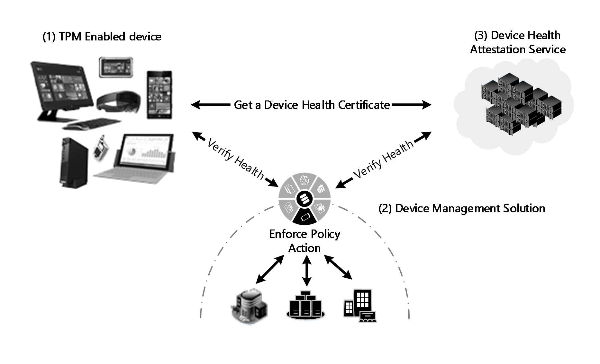
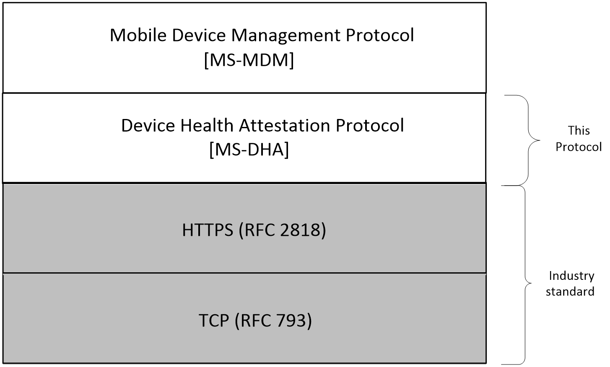
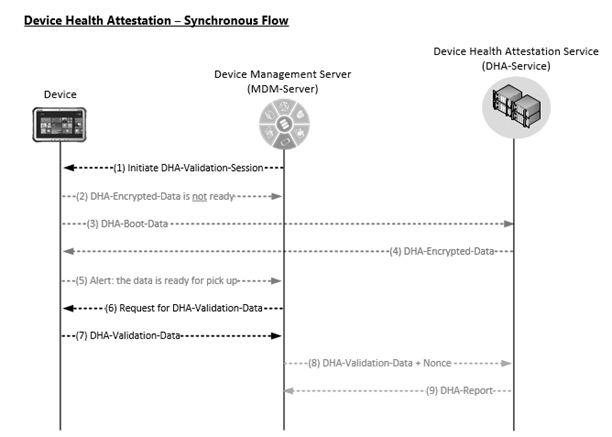

# [MS-DHA]: Device Health Attestation Protocol

Table of Contents

1 Introduction

- [1 Introduction](#Section_1)
  - [1.1 Glossary](#Section_1.1)
  - [1.2 References](#Section_1.2)
    - [1.2.1 Normative References](#Section_1.2.1)
    - [1.2.2 Informative References](#Section_1.2.2)
  - [1.3 Overview](#Section_1.3)
  - [1.4 Relationship to Other Protocols](#Section_1.4)
  - [1.5 Prerequisites/Preconditions](#Section_1.5)
  - [1.6 Applicability Statement](#Section_1.6)
  - [1.7 Versioning and Capability Negotiation](#Section_1.7)
  - [1.8 Vendor-Extensible Fields](#Section_1.8)
  - [1.9 Standards Assignments](#Section_1.9)

2 Messages

- [2 Messages](#Section_2)
  - [2.1 Transport](#Section_2.1)
  - [2.2 Common Data Types](#Section_2.2)
    - [2.2.1 Namespaces](#Section_2.2.1)
    - [2.2.2 HTTP Methods](#Section_2.2.2)
    - [2.2.3 HTTP Headers](#Section_2.2.3)
    - [2.2.4 XML Elements](#Section_2.2.4)
      - [2.2.4.1 Claims](#Section_2.2.4.1)
      - [2.2.4.2 HealthCertificateBlob](#Section_2.2.4.2)
    - [2.2.5 Simple Types](#Section_2.2.5)
      - [2.2.5.1 Boolean_T](#Section_2.2.5.1)
    - [2.2.6 Attributes](#Section_2.2.6)
      - [2.2.6.1 ErrorCode](#Section_2.2.6.1)
      - [2.2.6.2 ErrorMessage](#Section_2.2.6.2)
    - [2.2.7 Common Data Structures](#Section_2.2.7)

3 Protocol Details

- [3 Protocol Details](#Section_3)
  - [3.1 DHA-Enabled Client Details](#Section_3.1)
    - [3.1.1 Abstract Data Model](#Section_3.1.1)
    - [3.1.2 Timers](#Section_3.1.2)
    - [3.1.3 Initialization](#Section_3.1.3)
    - [3.1.4 Higher-Layer Triggered Events](#Section_3.1.4)
    - [3.1.5 Message Processing Events and Sequencing Rules](#Section_3.1.5)
      - [3.1.5.1 DHA-Boot-Data](#Section_3.1.5.1)
        - [3.1.5.1.1 POST](#Section_3.1.5.1.1)
          - [3.1.5.1.1.1 Request Body](#Section_3.1.5.1.1.1)
          - [3.1.5.1.1.2 Response Body](#Section_3.1.5.1.1.2)
          - [3.1.5.1.1.3 Processing Details](#Section_3.1.5.1.1.3)
    - [3.1.6 Timer Events](#Section_3.1.6)
    - [3.1.7 Other Local Events](#Section_3.1.7)
  - [3.2 DHA-Service Details](#Section_3.2)
    - [3.2.1 Abstract Data Model](#Section_3.2.1)
    - [3.2.2 Timers](#Section_3.2.2)
    - [3.2.3 Initialization](#Section_3.2.3)
    - [3.2.4 Higher-Layer Triggered Events](#Section_3.2.4)
    - [3.2.5 Message Processing Events and Sequencing Rules](#Section_3.2.5)
      - [3.2.5.1 DHA-Encrypted-Data](#Section_3.2.5.1)
        - [3.2.5.1.1 POST](#Section_3.2.5.1.1)
          - [3.2.5.1.1.1 Request Body](#Section_3.2.5.1.1.1)
          - [3.2.5.1.1.2 Response Body](#Section_3.2.5.1.1.2)
          - [3.2.5.1.1.3 Processing Details](#Section_3.2.5.1.1.3)
    - [3.2.6 Timer Events](#Section_3.2.6)
    - [3.2.7 Other Local Events](#Section_3.2.7)

4 Protocol Examples

- [4 Protocol Examples](#Section_4)

5 Security

- [5 Security](#Section_5)
  - [5.1 Security Considerations for Implementers](#Section_5.1)
  - [5.2 Index of Security Parameters](#Section_5.2)

6 Appendix A: Full XML Schema

- [6 Appendix A: Full XML Schema](#Section_6)
  - [6.1 Health CertificateRequestV1 Schema](#Section_6.1)
  - [6.2 Health CertificateRequestV3 Schema](#Section_6.2)
  - [6.3 Health CertificateRequestV4 Schema](#Section_6.3)
  - [6.4 HealthCertificateResponseV1 Schema](#Section_6.4)
  - [6.5 HealthCertificateResponseV3 Schema](#Section_6.5)
  - [6.6 HealthCertificateResponseV4 Schema](#Section_6.6)
  - [6.7 HealthCertificateValidationRequestV1 Schema](#Section_6.7)
  - [6.8 HealthCertificateValidationRequestV3 Schema](#Section_6.8)
  - [6.9 HealthCertificateValidationRequestV4 Schema](#Section_6.9)
  - [6.10 HealthCertificateValidationResponseV1 Schema](#Section_6.10)
  - [6.11 HealthCertificateValidationResponseV3 Schema](#Section_6.11)
  - [6.12 HealthCertificateValidationResponseV4 Schema](#Section_6.12)

7 Appendix B: Product Behavior

- [7 Appendix B: Product Behavior](#Section_7)

8 Change Tracking

- [8 Change Tracking](#Section_8)

For the legal notice and IP terms, see [LEGAL.md](../LEGAL.md).
Last updated: 4/23/2024.
See [Revision History](#revision-history) for full version history.

# 1 Introduction

This document specifies the Device Health Attestation (DHA) Protocol.

The DHA protocol enables devices: to submit information about the code/programs that were loaded & executed during boot (the state the device is booted to) to a remote reporting service called Device Health Attestation Service (DHA-Service), and get an encrypted [**BLOB**](#gt_binary-large-object-blob) back that is cached on the device or made available to a MDM service provider.

Sections 1.5, 1.8, 1.9, 2, and 3 of this specification are normative. All other sections and examples in this specification are informative.

## 1.1 Glossary

This document uses the following terms:

**attestation**: A process of establishing some property of a computer platform or of a [**trusted platform module (TPM)**](#gt_trusted-platform-module-tpm) key, in part through TPM cryptographic operations.

**attestation certificate (AIKCert)**: An X.509 certificate, issued by a Privacy-CA ([TCG-Cred] section 2.6), that contains the public portion of an [**Attestation Identity Key**](#gt_attestation-identity-key-aik) signed by a Privacy-CA. It states that the public key is associated with a valid TPM. See [TCG-Cred] section 3.4 for more information.

**Attestation Identity Key (AIK)**: An asymmetric (public/private) key pair that can substitute for the Endorsement Key (EK) as an identity for the [**trusted platform module (TPM)**](#gt_trusted-platform-module-tpm). The private portion of an AIK can never be revealed or used outside the TPM and can only be used inside the TPM for a limited set of operations. Furthermore, it can only be used for signing, and only for limited, TPM-defined operations.

**binary large object (BLOB)**: A discrete packet of data that is stored in a database and is treated as a sequence of uninterpreted bytes.

**endorsement certificate (EKCert)**: An X.509 certificate issued by a platform manufacturer indicating that the [**trusted platform module (TPM)**](#gt_trusted-platform-module-tpm) with the specified endorsement key was built into a specified computer platform. See [[TCG-Cred]](https://go.microsoft.com/fwlink/?LinkId=301945) section 3.2 for more information.

**endorsement key (EK)**: A Rivest-Shamir-Adleman (RSA) public and private key pair, which is created randomly on the [**trusted platform module (TPM)**](#gt_trusted-platform-module-tpm) at manufacture time and cannot be changed. The private key never leaves the TPM, while the public key is used for [**attestation**](#gt_attestation) and for encryption of sensitive data sent to the TPM. See [TCG-Cred] section 2.4 for more information.

**Hypertext Transfer Protocol (HTTP)**: An application-level protocol for distributed, collaborative, hypermedia information systems (text, graphic images, sound, video, and other multimedia files) on the World Wide Web.

**Hypertext Transfer Protocol Secure (HTTPS)**: An extension of HTTP that securely encrypts and decrypts web page requests. In some older protocols, "Hypertext Transfer Protocol over Secure Sockets Layer" is still used (Secure Sockets Layer has been deprecated). For more information, see [[SSL3]](https://go.microsoft.com/fwlink/?LinkId=90534) and [[RFC5246]](https://go.microsoft.com/fwlink/?LinkId=129803).

**Secure Sockets Layer (SSL)**: A security protocol that supports confidentiality and integrity of messages in client and server applications that communicate over open networks. SSL supports server and, optionally, client authentication using X.509 certificates [[X509]](https://go.microsoft.com/fwlink/?LinkId=90590) and [[RFC5280]](https://go.microsoft.com/fwlink/?LinkId=131034). SSL is superseded by [**Transport Layer Security (TLS)**](#gt_transport-layer-security-tls). TLS version 1.0 is based on SSL version 3.0 [SSL3].

**simple type**: An element that can contain only text and appears as <simpleType> in an XML document or any attribute of an element. Attributes are considered simple types because they contain only text. See also complex type.

**TCP/IP**: A set of networking protocols that is widely used on the Internet and provides communications across interconnected networks of computers with diverse hardware architectures and various operating systems. It includes standards for how computers communicate and conventions for connecting networks and routing traffic.

**Transport Layer Security (TLS)**: A security protocol that supports confidentiality and integrity of messages in client and server applications communicating over open networks. TLS supports server and, optionally, client authentication by using X.509 certificates (as specified in [X509]). TLS is standardized in the IETF TLS working group.

**trusted platform module (TPM)**: A component of a trusted computing platform. The TPM stores keys, passwords, and digital certificates. See [[TCG-Architect]](https://go.microsoft.com/fwlink/?LinkId=301944) for more information.

**XML namespace**: A collection of names that is used to identify elements, types, and attributes in XML documents identified in a URI reference [[RFC3986]](https://go.microsoft.com/fwlink/?LinkId=90453). A combination of XML namespace and local name allows XML documents to use elements, types, and attributes that have the same names but come from different sources. For more information, see [[XMLNS-2ED]](https://go.microsoft.com/fwlink/?LinkId=90602).

**XML namespace prefix**: An abbreviated form of an [**XML namespace**](#gt_xml-namespace), as described in [[XML]](https://go.microsoft.com/fwlink/?LinkId=90598).

**XML schema**: A description of a type of XML document that is typically expressed in terms of constraints on the structure and content of documents of that type, in addition to the basic syntax constraints that are imposed by XML itself. An XML schema provides a view of a document type at a relatively high level of abstraction.

**MAY, SHOULD, MUST, SHOULD NOT, MUST NOT:** These terms (in all caps) are used as defined in [[RFC2119]](https://go.microsoft.com/fwlink/?LinkId=90317). All statements of optional behavior use either MAY, SHOULD, or SHOULD NOT.

## 1.2 References

Links to a document in the Microsoft Open Specifications library point to the correct section in the most recently published version of the referenced document. However, because individual documents in the library are not updated at the same time, the section numbers in the documents may not match. You can confirm the correct section numbering by checking the [Errata](https://go.microsoft.com/fwlink/?linkid=850906).

### 1.2.1 Normative References

We conduct frequent surveys of the normative references to assure their continued availability. If you have any issue with finding a normative reference, please contact [dochelp@microsoft.com](mailto:dochelp@microsoft.com). We will assist you in finding the relevant information.

[MS-MDM] Microsoft Corporation, "[Mobile Device Management Protocol](../MS-MDM/MS-MDM.md)".

[RFC2119] Bradner, S., "Key words for use in RFCs to Indicate Requirement Levels", BCP 14, RFC 2119, March 1997, [https://www.rfc-editor.org/info/rfc2119](https://go.microsoft.com/fwlink/?LinkId=90317)

[RFC2818] Rescorla, E., "HTTP Over TLS", RFC 2818, May 2000, [https://www.rfc-editor.org/info/rfc2818](https://go.microsoft.com/fwlink/?LinkId=90383)

[TCG-Cred] Trusted Computing Group, "TCG Credential Profiles", Specification Version 1.1, Revision 1.014, May 2007, [http://www.trustedcomputinggroup.org/wp-content/uploads/IWG-Credential_Profiles_V1_R1_14.pdf](https://go.microsoft.com/fwlink/?LinkId=301945)

[X509] ITU-T, "Information Technology - Open Systems Interconnection - The Directory: Public-Key and Attribute Certificate Frameworks", Recommendation X.509, August 2005, [http://www.itu.int/rec/T-REC-X.509/en](https://go.microsoft.com/fwlink/?LinkId=90590)

[XMLNS] Bray, T., Hollander, D., Layman, A., et al., Eds., "Namespaces in XML 1.0 (Third Edition)", W3C Recommendation, December 2009, [https://www.w3.org/TR/2009/REC-xml-names-20091208/](https://go.microsoft.com/fwlink/?LinkId=191840)

[XMLSCHEMA1] Thompson, H., Beech, D., Maloney, M., and Mendelsohn, N., Eds., "XML Schema Part 1: Structures", W3C Recommendation, May 2001, [https://www.w3.org/TR/2001/REC-xmlschema-1-20010502/](https://go.microsoft.com/fwlink/?LinkId=90608)

### 1.2.2 Informative References

[TPM] Trusted Computing Group, "TPM Work Group", [https://www.trustedcomputinggroup.org/groups/tpm/](https://go.microsoft.com/fwlink/?LinkId=90547)

## 1.3 Overview

Many enterprises check software state and policy compliance before allowing computers to access corporate network resources. The goal of these checks is to ensure that the operating system (OS) is properly updated, the OS configuration meets company policy, and that antivirus software is up-to-date.

The Device Health Attestation (DHA) protocol provides a way for a device to submit its policy compliance status and software status in a tamper-resistant way to a Device Health Attestation Service (DHA-Service) such that its state can later evaluated by an entity such as an MDM (mobile device management) to determine compliance status.

The following diagram describes the three components that interact in a Device Health Attestation communications.

- **DHA-Enabled Device:** that supports Trusted Platform Module (TPM) in Firmware or Discreet format.
- **Device Management Server (MDM):** initiates the Device Health Attestation flow, reviews the Device Health Attestation Report (DHA-Report), and evaluates whether the reported state is equivalent to compliance status.
- **DHA-Service**: a component that processes Device Health Attestation data, produces DHA-Report.
This document discusses only the interaction between the client and the DHA-Service.

Figure 1: Device health attestation

The following is a sequence diagram that describes how the three components interact, during a Device Health Attestation session.

Figure 2: Device, DHA-service communication

## 1.4 Relationship to Other Protocols

The following figure illustrates the relationship of this protocol to industry-standard protocols.

The Device Health Attestation Protocol depends upon [**HTTPS**](#gt_hypertext-transfer-protocol-secure-https) [[RFC2818]](https://go.microsoft.com/fwlink/?LinkId=90383) and can be used only with [MS-MDM](../MS-MDM/MS-MDM.md).

Figure 3: Relationship of DHA protocol to industry-standard protocols

## 1.5 Prerequisites/Preconditions

The DHA protocol assumes the availability of the following resources:

- An HTTPS channel [[RFC2818]](https://go.microsoft.com/fwlink/?LinkId=90383).
- A mobile device management service.
- Devices MUST support a Trusted Module Platform (TPM) that is designed based on standards specified in [[TPM]](https://go.microsoft.com/fwlink/?LinkId=90547) .

## 1.6 Applicability Statement

The DHA protocol is applicable for monitoring/assessing the state into which a device is booted, and to monitor/verify if the device is booted to a secure/compliant state.

## 1.7 Versioning and Capability Negotiation

This document covers versioning issues in the following areas:

- Supported Transports: This protocol can be implemented on top of [**TLS**](#gt_transport-layer-security-tls)/[**SSL**](#gt_secure-sockets-layer-ssl) and [**HTTPS**](#gt_hypertext-transfer-protocol-secure-https) as discussed in section [2.1](#Section_2.1).
- Protocol Versions: This is version 4.0 of the DHA protocol. It is also compatible with [**TPM**](#gt_trusted-platform-module-tpm)-devices that have standardized around versions 1.2 and 2.0 of the TPM specification. The server implementation of the Device Health Attestation Protocol supports the following client versions:
- Version 1.0: The first release of the protocol.
- Version 2.0: An update to support a Security Version Number in the Health report.
- Version 3.0: An update to support TPM 1.2 devices (which results in a TPMVersion node being added to the Health report).
- Version 4.0: An update to add support for additional security measures.

## 1.8 Vendor-Extensible Fields

None.

## 1.9 Standards Assignments

None.

# 2 Messages

## 2.1 Transport

DHA is a client-to-server protocol that consists of an [**HTTP**](#gt_hypertext-transfer-protocol-http)- -based Web service. It supports [**TLS**](#gt_transport-layer-security-tls) over [**HTTPS**](#gt_hypertext-transfer-protocol-secure-https) over [**TCP/IP**](#gt_tcpip) [[RFC2818]](https://go.microsoft.com/fwlink/?LinkId=90383), using the following implementation-specific<1> endpoints:

**GET**: `devicehealthattestation/gethealthcertificate/v1 devicehealthattestation/gethealthcertificate/v3 devicehealthattestation/gethealthcertificate/v4`

**VALIDATE**: `devicehealthattestation/validatehealthcertificate/v1 devicehealthattestation/validatehealthcertificate/v3 devicehealthattestation/validatehealthcertificate/v4`

The [**TPM**](#gt_trusted-platform-module-tpm)-compatible device and the DHA-Service communicate via a TLS/[**SSL**](#gt_secure-sockets-layer-ssl) protected communication channel in following format.

- Device Requests use TLS/SSL for forwarding DHA-Boot-Data to DHA-Service
- The DHA-Service Responses use TLS/SSL to forward an encrypted [**BLOB**](#gt_binary-large-object-blob) to the Device

## 2.2 Common Data Types

[**XML schema**](#gt_xml-schema) element definitions that are specific to a particular request/response body are described within the corresponding sections.

### 2.2.1 Namespaces

This specification defines and references various [**XML namespaces**](#gt_xml-namespace) that use the mechanisms specified in [[XMLNS]](https://go.microsoft.com/fwlink/?LinkId=191840). Although this specification associates a specific [**XML namespace prefix**](#gt_xml-namespace-prefix) with each XML namespace that is used, the choice of any particular XML namespace prefix is implementation-specific and not significant for interoperability.

Prefixes and XML namespaces used in this specification are as follows.

| Prefix | Namespace URI | Reference |
| --- | --- | --- |
| xsd | http://www.w3.org/2001/XMLSchema | [[XMLSCHEMA1]](https://go.microsoft.com/fwlink/?LinkId=90608) |
| xmlns | http://schemas.microsoft.com/windows/security/healthcertificate/request/v1 | This specification |
| xmlns | http://schemas.microsoft.com/windows/security/healthcertificate/request/v3 | This specification |
| xmlns | http://schemas.microsoft.com/windows/security/healthcertificate/request/v4 | This specification |
| xmlns | http://schemas.microsoft.com/windows/security/healthcertificate/response/v1 | This specification |
| xmlns | http://schemas.microsoft.com/windows/security/healthcertificate/response/v3 | This specification |
| xmlns | http://schemas.microsoft.com/windows/security/healthcertificate/validation/request/v1 | This specification |
| xmlns | http://schemas.microsoft.com/windows/security/healthcertificate/validation/request/v3 | This specification |
| xmlns | http://schemas.microsoft.com/windows/security/healthcertificate/validation/request/v4 | This specification |
| xmlns | http://schemas.microsoft.com/windows/security/healthcertificate/validation/response/v1 | This specification |
| xmlns | http://schemas.microsoft.com/windows/security/healthcertificate/ validation/response/v3 | This specification |
| xmlns | http://schemas.microsoft.com/windows/security/healthcertificate/ validation/response/v4 | This specification |

### 2.2.2 HTTP Methods

This protocol uses the existing set of standard HTTP methods.

### 2.2.3 HTTP Headers

None.

### 2.2.4 XML Elements

#### 2.2.4.1 Claims

<*Claims*> contain Base64 opaque information that is gathered from the client and returned to the server, upon which the basis of health attestation is established. In the case of HealthCertificateRequest, <*Claims*> will also contain the TCG (boot) log from the client.

#### 2.2.4.2 HealthCertificateBlob

An encrypted [**BLOB**](#gt_binary-large-object-blob) containing the Health Certificate.

### 2.2.5 Simple Types

The following table summarizes the set of custom [**simple type**](#gt_simple-type) definitions that are included in this specification.

| Simple type | Section | Description |
| --- | --- | --- |
| Boolean_T | section [2.2.5.1](#Section_2.2.5.1) | The contents are either true or false. |

#### 2.2.5.1 Boolean_T

<xs:simpleType name="Boolean_T">:

<xs:restriction base="xs:boolean">:

<xs:pattern value="true|false"/>:

</xs:restriction>:

</xs:simpleType>

### 2.2.6 Attributes

The following table summarizes the set of common [**XML schema**](#gt_xml-schema) attribute definitions that are included in this specification.

| Attribute | Section | Description |
| --- | --- | --- |
| ErrorCode | section [2.2.6.1](#Section_2.2.6.1) | Contains the code that is associated with the error. |
| ErrorMessage | section [2.2.6.2](#Section_2.2.6.2) | Contains a description of the error. |

#### 2.2.6.1 ErrorCode

Contains the code that is associated with the error.

#### 2.2.6.2 ErrorMessage

Contains a description of the error.

### 2.2.7 Common Data Structures

None.

# 3 Protocol Details

## 3.1 DHA-Enabled Client Details

The DHA protocol enables Mobile Device Management (MDM) solutions to get a Device Health Report (DHA-Report) from devices that meet the following requirements.

- Support Trusted Module Platform ([**TPM**](#gt_trusted-platform-module-tpm)) version 1.xx or 2.xx in the following formats.
- Firmware (i.e. Windows phone)
- Discrete (i.e. PC devices that have a physical TPM chip)
The [**EK**](#gt_endorsement-key-ek), [**EKCert**](#gt_endorsement-certificate-ekcert) and Windows [**Attestation Identity Key (AIK)**](#gt_attestation-identity-key-aik) and Windows [**Attestation Certificate (AIKCert)**](#gt_attestation-certificate-aikcert), as specified in [[TCG-Cred]](https://go.microsoft.com/fwlink/?LinkId=301945), MUST be provisioned previous to initiating the [**attestation**](#gt_attestation) protocol. The health attestation protocol can be initiated asynchronously after boot once the TPM has been provisioned (i.e. EK, EK Cert, AIK, AIK Cert are created) or it can be initiated as a part of a service request by mobile device management server. For more information about the AIK enrollment process, see [[X509]](https://go.microsoft.com/fwlink/?LinkId=90590).

The Device Health Report (DHA-Report) is device bound and is valid only for the current boot cycle. It will also have a time bounded lifetime to force an attestation check for long-running devices.

Following is a brief overview of the Device Health Attestation, asynchronous processing flow:

- Upon Boot the device sends information about its boot state (DHA-Boot-Data) to Device Health Attestation Service (DHA-Service)
- DHA-Service replies back with an encrypted data [**BLOB**](#gt_binary-large-object-blob) (DHA-Encrypted-Data)
- When a Device Management Server (MDM-Server) needs to get a Device Health Report (DHA-Report), it sends a request to the TPM-compatible device (that is enrolled to - managed by the MDM-Server), initiates the DHA data validation session
- The TPM-compatible device sends an alert to the Device Management Server, informs that the Device Health Validation Data (DHA-Validation-Data) is ready for pickup
- The Device Management Server sends a request to the TPM-compatible device to get the DHA-Validation-Data
- The TPM-compatible device sends the DHA-Validation-Data to Device Management Server (MDM-Server)
- The Device Management Server (MDM-Server) adds a "Nonce" to the payload, forwards the DHA-Validation-Data to DHA-Service
- The DHA-Service review the data, sends a report (DHA-Report) to the Device Management Server (MDM-Server)

Figure 4: Device health attestation asynchronous processing flow

Following is a brief overview of the Device Health Attestation, synchronous processing flow:

- The Device Management Server (MDM-Server) sends a request to the TPM-compatible device to initiate the DHA data validation session
- The TPM-compatible device sends an alert to the Device Management Server (MDM-Server), informs that the data is not ready for pickup
- The TPM-compatible sends its boot data (DHA-Boot-Data) to the DHA-Service
- The DHA-Service sends an encrypted BLOB back to the TPM-compatible device
- The TPM-compatible device sends an alert to the Device Management Server (MDM-Server) informs that DHA data is ready for pickup
- The Device Management Server sends a request to the TPM-compatible device to get the DHA-Validation-Data
- The TPM-compatible device sends the DHA-Validation-Data to Device Management Server (MDM-Server)
- The Device Management Server (MDM-Server) adds a "Nonce" to the payload, forwards the DHA-Validation-Data to DHA-Service
- The DHA-Service review the data, sends a report (DHA-Report) to the Device Management Server (MDM-Server)

Figure 5: Device health attestation synchronous processing flow

The DHA-enabled client is a computing device that supports TPM in firmware or discrete format, and is enrolled/managed by a Device Management Server (MDM-Server). The following state diagram shows an exchange in a negotiation between the TPM-compatible device and the Device Health Attestation Service (DHA-Service).

Figure 6: Device Health Attestation

The Device Management Server (MDM-Server) can initiate a request for DHA Data as needed. When the Device Management Server (MDM-Server) sends this request: the TPM-compatible device prepares DHA-Validation-Data, forward it to Device Management Server (MDM-Server)

Figure 7: Device to MDM-Server communication

### 3.1.1 Abstract Data Model

None.

### 3.1.2 Timers

None.

### 3.1.3 Initialization

The Device health attestation flow is triggered on a [**TPM**](#gt_trusted-platform-module-tpm)-compatible device under the following conditions.

- When the device boots.
- When the device reboots.

### 3.1.4 Higher-Layer Triggered Events

The device receives a mobile device management request for device health verification.

### 3.1.5 Message Processing Events and Sequencing Rules

The following HTTP methods can be performed on this resource.

| HTTP method | **Section** | Description |
| --- | --- | --- |
| POST | section [3.1.5.1.1](#Section_3.1.5.1.1) | Send DHA-Boot-Data to DHA-Service |

The responses to all the resources can result in the following status codes.

| Status code | Reason phrase | Description |
| --- | --- | --- |
| 200 | HTTP OK | Successful request |
| 400 | Bad Request | The server cannot or will not process the request due to something that is perceived to be a client error (e.g., malformed request syntax, invalid request message framing, request mismatch or deceptive request routing, invalid [**BLOB**](#gt_binary-large-object-blob) ) |
| 500 | Internal Server Error | A generic error message, given when an unexpected condition was encountered and no more specific message is suitable. An issue is preventing the service from issuing certificates |

#### 3.1.5.1 DHA-Boot-Data

The [**TPM**](#gt_trusted-platform-module-tpm)-compatible client sends DHA-Boot-Data (i.e. TCG logs, PC measurements, a signed certificate) to the DHA-Service (DHA-Service) - receives an Encrypted [**BLOB**](#gt_binary-large-object-blob) from the DHA-Service Provider (DHA-EB).

##### 3.1.5.1.1 POST

This method sends information from the [**TPM**](#gt_trusted-platform-module-tpm)-compatible device to the DHA-Service.

###### 3.1.5.1.1.1 Request Body

The request body from the [**TPM**](#gt_trusted-platform-module-tpm)-compatible device to the DHA-Service is an encrypted [**BLOB**](#gt_binary-large-object-blob). It resembles the following.

<HealthCertificateRequest ProtocolVersion='4' xmlns='http://schemas.microsoft.com/windows/security/healthcertificate/request/v4'>

<Claims>AQAAAAQAAABlAAAABgEAAAAAAAAUqQAA/1RDR4AYACIACzrZO1nPbX4MkSK7O8Tam7UYSUM6q5lmumDTW/9KKir8AAAAAAAAAALEZshCdiDh7rYJANltqkYJzMLfAAAAAQALA////wAUQ3lelGTYuKMMGHqqWhQhOCq+TmQAFAAEAQBpl8y38myfaPpJJ1PlY+bfckDowdGVcjAyYFRF8AJuRdP+cv7UpMxE+JnNRseYWYjVXiwqkeQ81ctjKLx/oIFdL2m/s7mRroCj4C7dUWWeqnHiboAgT3+9UF1dgUacBq5Tt/ /BAUwAwEB/zAfBgNVHSMEGDAWgBTV9lbLj+ /1erYd/uoZnT3FYEiIEIiLOi+9UcQDOUDVYdpUI7mqxogHVAgMBAAGjggF2MIIBcjASBgkrBgEEAYI3FQEEBQIDAQABMCMGCSsGAQQBgjcVAgQWBBT4wWu3f3dTSvMlNx1OoSZ7DyBwgDAdBgNVHQ4EFgQUE62/Qwm9gnCcjNVPMW7VIpiKG9QwGQYJKwYBBAGCNxQCBAweCgBTAHUAYgBDAEEwCwYDVR0PBAQDAgGGMA8GA1UdEwEB/wQFMAMBAf8wHwYDVR0jBBgwFoAURWZSQ+F+WBG/1k6eI1UIOzoiaqgwXAYDVR0fBFUwUzBRoE+

.

.

.

.neJUBAAAAFdCQ0wFAAAABwAAgAEAAAALANgEPWt7ha01jrO2rmqHOrfvI6JjUsXcT6pa7trPXrQbHQAAAEV4aXQgQm9vdCBTZXJ2aWNlcyBJbnZvY2F0aW9uBQAAAAcAAIABAAAACwC1T3VCy9hyqBqdneqDmyuNdHx+vV6mYVxA9C9EptvroCgAAABFeGl0IEJvb3QgU2VydmljZXMgUmV0dXJuZWQgd2l0aCBTdWNjZXNz</Claims>

<AIKPublic>UlNBMQAIAAADAAAAAAEAAAAAAAAAAAAAAQAByw9/R0sYTf0SYzKFm7gy2aASjwB/S6L3ztZ+FjEaLifQJ077/wVIVLbzI2gB9tVPL5G8q+…………………………/xtRyILLzYSXMDx0mwysTwHhbB3zUxlj51mlI0tuAhRtBbccHlaYW0DjCFJMFNPZvCBpa29O2E+23zWHz01hqw==</AIKPublic>

</HealthCertificateRequest>

###### 3.1.5.1.1.2 Response Body

The response body from the DHA-Service to the [**TPM**](#gt_trusted-platform-module-tpm)-compatible device is an encrypted [**BLOB**](#gt_binary-large-object-blob) (DHA-Encrypted-Data).

###### 3.1.5.1.1.3 Processing Details

The encrypted [**BLOB**](#gt_binary-large-object-blob) is cached on the client in encrypted format.

### 3.1.6 Timer Events

None.

### 3.1.7 Other Local Events

When the [**TPM**](#gt_trusted-platform-module-tpm)-compatible device is booted or rebooted, it triggers an event that sends the DHA-Boot-Data to the DHA-Service over [**TLS**](#gt_transport-layer-security-tls)/[**SSL**](#gt_secure-sockets-layer-ssl) protected communication channel.

## 3.2 DHA-Service Details

The DHA-Service consists of two major communication paths:

- The path between the [**TPM**](#gt_trusted-platform-module-tpm)-compatible device and the DHA-Service
- The path between the DHA-Service and the MDM-Server
The following state diagram shows the exchange between the DHA-Service and the TPM-compatible client.

Figure 8: Device to DHA-Service communication

### 3.2.1 Abstract Data Model

None.

### 3.2.2 Timers

None.

### 3.2.3 Initialization

None.

### 3.2.4 Higher-Layer Triggered Events

None.

### 3.2.5 Message Processing Events and Sequencing Rules

The following HTTP methods can be performed on this resource.

| HTTP method | **Section** | Description |
| --- | --- | --- |
| POST | section [3.2.5.1.1](#Section_3.2.5.1.1) | Sends an encrypted [**BLOB**](#gt_binary-large-object-blob) (DHA-Encrypted-Data to [**TPM**](#gt_trusted-platform-module-tpm)-compatible device upon request |

The responses to all the resources can result in the following status codes.

| Status code | Reason phrase | Description |
| --- | --- | --- |
| 200 | HTTP OK | Successful request |
| 400 | Bad Request | The server cannot or will not process the request due to something that is perceived to be a client error (e.g., malformed request syntax, invalid request message framing, request mismatch or deceptive request routing, invalid BLOB) |
| 500 | Internal Server Error | A generic error message, given when an unexpected condition was encountered and no more specific message is suitable. An issue is preventing the service from issuing certificates |

#### 3.2.5.1 DHA-Encrypted-Data

The DHA-Service receives the DHA-Boot-Data from the [**TPM**](#gt_trusted-platform-module-tpm)-compatible device. The DHA-Service reviews the data, creates an Encrypted [**BLOB**](#gt_binary-large-object-blob) (DHA-Encrypted-Data), and sends it to the TPM-compatible device. When the TPM-compatible device receives the DHA-Encrypted-Data, it caches the data in its local storage.

##### 3.2.5.1.1 POST

This method sends information from the DHA-Service to the [**TPM**](#gt_trusted-platform-module-tpm)-compatible device.

###### 3.2.5.1.1.1 Request Body

The health certificate validation request body is specified in section [3.1.5.1.1.1](#Section_3.1.5.1.1.1), Boot Data POST Request body.

<HealthCertificateValidationRequest ProtocolVersion='4' xmlns='http://schemas

.microsoft.com/windows/security/healthcertificate/validation/request/v4'>:

<Claims>

AQAAAAQAAAB1AAAABgEAAAAAAAD/VENHgBgAIgALOtk7Wc9tfgyRIrs7xNqbtRhJQzqrmWa6Y

NNb/0oqKvwAEAECAwQFBgcICQoLDA0ODxAAAAAAAALIqchCdiDh7rYJANltqkYJzMLfAAAAAQ

ALA////wAUQ3lelGTYuKMMGHqqWhQhOCq+TmQAFAAEAQBwMAodpzmbxpw2kdqfsVF15u4y+9S

65aq6a5LbL8E3DLVaA2FFGXmDS0/vy3XNmu8q3UfPNZ99TR+ff7g/IhDLjInGzCEQ04YTP6/V

L+1Fgt9dJvTe8Cm5BRu4QwdM9g+cGGWu3eeTghRAdsG4OdNknMP2IuAihKJF5xrymWw5TtVpn

Fc/MjCzrMqAcQmH3GEBMZRstjr0yTcqZaXsca4Ydn7kCAk8HLuV7GVkcuF9s7C8mlKEfqQMXs

LAF/oyDYWl4QGc4l66+anFOFHpnvfA5hYUtBMctOvi0LqCML6yAIJuZnNxI3MdIkVLWAnnOYe

k/YQ//OKtF9Bitz2pGF0A

</Claims>:

<HealthCertificateBlob>

77u/PD94bWwgdmVyc2lvbj0iMS4wIiBlbmNvZGluZz0idXRmLTgiPz48T3BhcXVlSGVhbHRoQ

2VydGlmaWNhdGUgeG1sbnM6eHNkPSJodHRwOi8vd3d3LnczLm9yZy8yMDAxL1hNTFNjaGVtYS

IgeG1sbnM6eHNpPSJodHRwOi8vd3d3LnczLm9yZy8yMDAxL1hNTFNThrdFNVMFRWYi9KdWlyO

FFySjgvNWs4dU9ibm5DUWVERVhnbC9qVHVXeHJYUTVFESUVobHBISis2WStNVEpBMElvZUwxQ

k9sSktZNGxqSDAvOXZvdnppU0pUZXNLaUI3OGV4RHpHRmtBYjZHb3duWWZxSHBaZWZTd2g3Tn

FpZmJPRUhOSVpOZll4NmhFLytxMk52cllUUWgvNW9yK3Vvd3RKMDkwWjRiVytMQT09PC9DZXJ

0aWZpY2F0ZUtleT48SVY+Z3Mr………………………5SjhQQk9oOUhHNDUxQTFRWmMrNVJTUjVVSUxTNF

EvNktyV1VJNlh6RTU0U0R5cXpST2pXTDdXNVVPb1BNbnJCV0ozWVRQS0VKY250ekRmN1BRTEd

JVmg4dkxqWitadmRBZVZML0tRdHBza0k2NGttZHRMd3BVdkIyb0xMTjVIaVBRTGFkMGVmOXc5

Ty9sQW9qTXYwV1VQLzJLRjk1bkdvTFNUY1Z6QUw3WmNkSENkQWt4MGh4bkFicUh5ZmowTGJoT

FFWNzhNWit2QldJdzNxVXBCZEJxUHl6aWJzREpoSW9uQTRRYkN2OExnaUpxMzlzZk5tejk3OU

ovblkxOVVvTjNJbUFDdHRJb1hEMmF2V3NaQlFFaXJQZjZqMTM4c0l4eXdQa1FMRnlnajJMeUJ

jUVlWQT09PC9TaWduYXR1cmU+PC9PcGFxdWVIZWFsdGhDZXJ0aWZpY2F0ZT4=

</HealthCertificateBlob>:

</HealthCertificateValidationRequest>

###### 3.2.5.1.1.2 Response Body

Response (DHA-Service->MDM-Server): DHA-Service reviews the data, creates a report (DHA-Report), and forwards the report to MDM-Server.

The response body from the DHA-Service to the MDM-Server is an encrypted [**BLOB**](#gt_binary-large-object-blob). It resembles the following.

<?xml version="1.0" encoding="utf-8"?>

<HealthCertificateValidationResponse xmlns:xsd="http://www.w3.org/2001/XMLSchema" xmlns:xsi="http://www.w3.org/2001/XMLSchema-instance" ErrorCode="0" ErrorMessage="DHA validation report was generated successfully." ProtocolVersion="4" xmlns="http://schemas.microsoft.com/windows/security/healthcertificate/validation/response/v4">

<HealthCertificateProperties>

<Issued>2017-07-11T22:11:44.6953646Z</Issued>

<AIKPresent>true</AIKPresent>

<AttestationMethod>EK Certificate</AttestationMethod>

<BitlockerEnabledAtBoot>false</BitlockerEnabledAtBoot>

<BitlockerProtector>

<UnlockType>None</UnlockType>

</BitlockerProtector>

<BootAppSVN>1</BootAppSVN>

<BootDebuggingDisabled>true</BootDebuggingDisabled>

<BootManagerSVN>1</BootManagerSVN>

<BootRevListInfo>005D447A7CC6D101200000000B00CBB56E8B19267E24A2986C4A616CCB58B4D53F6020AC8FD5FC205C20F2AB00BC</BootRevListInfo>

<CodeIntegrityEnabled>true</CodeIntegrityEnabled>

<CodeIntegrityPolicy>00000000000001002C000B0020000000550070006400610074006500520076006B005300690050006F006C006900630079002E007000370062000000B3A95AD6A26B2AA407C92BCD3B84E112D141589D3E0E3981D51594FEBD72DFDC</CodeIntegrityPolicy>

<CrashDumpEncryptionEnabled>false</CrashDumpEncryptionEnabled>

<CredentialGuardEnabled>false</CredentialGuardEnabled>

<DataExecutionPreventionPolicy>0</DataExecutionPreventionPolicy>

<ELAMDriverHash>B4CA876CD2DCAB929A5B54016C703D026CB22EAA54E8B8C99DA61A1D53F244BF</ELAMDriverHash>

<ELAMDriverLoaded>true</ELAMDriverLoaded>

<ELAMDriverName>\WINDOWS\system32\drivers\WdBoot.sys</ELAMDriverName>

<ELAMSignerName>Microsoft Windows Early Launch Anti-malware Publisher</ELAMSignerName>

<FlightSigningNotEnabled>false</FlightSigningNotEnabled>

<MemoryScrubbingProtectionEnabled>false</MemoryScrubbingProtectionEnabled>

<NoSecureBootCustomPolicy>true</NoSecureBootCustomPolicy>

<NotBootedIntoSafeMode>true</NotBootedIntoSafeMode>

<NotBootedIntoWinPE>true</NotBootedIntoWinPE>

<OSKernelDebuggingDisabled>true</OSKernelDebuggingDisabled>

<OSRevListInfo>8073EEA7F8FAD001200000000B00A8285B04DE618ACF4174C59F07AECC002D11DD7D97FA5D464F190C9D9E3479BA</OSRevListInfo>

<PageFileEncryptionEnabled>false</PageFileEncryptionEnabled>

<PCRS hashAlgorithm="SHA1">

<PCR n="0">7714E74524EBFBF671A485D3813A1926A34AB768</PCR>

<PCR n="1">C7070A78B978C8B6E5E35DCBB1C98B87F7444EBE</PCR>

<PCR n="2">B2A83B0EBF2F8374299A5B2BDFC31EA955AD7236</PCR>

<PCR n="3">B2A83B0EBF2F8374299A5B2BDFC31EA955AD7236</PCR>

<PCR n="4">DF5A11CF11030E2D9FA4E9BAB4BB7AF608B96EA3</PCR>

<PCR n="5">7699BEA5781384130D674525E2B223D832922A01</PCR>

<PCR n="6">B2A83B0EBF2F8374299A5B2BDFC31EA955AD7236</PCR>

<PCR n="7">DF1F73DC71C6E4B054CCBB2A9BE0768978A7E1E3</PCR>

<PCR n="8">0000000000000000000000000000000000000000</PCR>

<PCR n="9">0000000000000000000000000000000000000000</PCR>

<PCR n="10">0000000000000000000000000000000000000000</PCR>

<PCR n="11">EBB98DF76613280F20DC38221143A9E727399486</PCR>

<PCR n="12">FA38CE6A9101EF44002A5A89AFC3D094963976AC</PCR>

<PCR n="13">24FED52A0787AFE466CF4008B2815A6E3822C511</PCR>

<PCR n="14">D2366C862C4CB94577FA277F024C14AE149A3512</PCR>

<PCR n="15">0000000000000000000000000000000000000000</PCR>

<PCR n="16">0000000000000000000000000000000000000000</PCR>

<PCR n="17">FFFFFFFFFFFFFFFFFFFFFFFFFFFFFFFFFFFFFFFF</PCR>

<PCR n="18">FFFFFFFFFFFFFFFFFFFFFFFFFFFFFFFFFFFFFFFF</PCR>

<PCR n="19">FFFFFFFFFFFFFFFFFFFFFFFFFFFFFFFFFFFFFFFF</PCR>

<PCR n="20">FFFFFFFFFFFFFFFFFFFFFFFFFFFFFFFFFFFFFFFF</PCR>

<PCR n="21">FFFFFFFFFFFFFFFFFFFFFFFFFFFFFFFFFFFFFFFF</PCR>

<PCR n="22">FFFFFFFFFFFFFFFFFFFFFFFFFFFFFFFFFFFFFFFF</PCR>

<PCR n="23">0000000000000000000000000000000000000000</PCR>

</PCRS>

<ProductionSignedBootManager>false</ProductionSignedBootManager>

<PublicAIK>

<Modulus>C6A0F391172685AA295410DE040E117B59611BC01B099914137097C02D11F30606E4375C2826260749D0845074DB902250E5BD3CB7080AE52615FEAEF6C146EFBE35B807EFC2CE767DA2BFE2043B70C3B4297C2B7C116A527BAB3A446B2F7C462DEA6C2F9CC4959F88DF465F94BE224066460CC6CA09CC7D9470195287BC11C8A9AD4007BD3C191D87C7A52C99749D31FBB36A400E1BF7508FB11B3F82944E13644CF1E5539C47A8C8A8D72A4D6F11CD98C58CEE03A951B6407F7CDC088959B2DAA14C1655D7D8827B2EC45535D1764D3BBFDAAFA32435ECCADDBCA2975C4DDBD1B2E40EF196EC0F551A79089F33392AC803915B0E05E181AAFBBC80F973CD9F</Modulus>

<Exponent>010001</Exponent>

</PublicAIK>

<PublicEK>

<Modulus>F1000C75A4B88005728CF2CFD1846612333AA1B437843AA6DCE542B5507998F2EED883F2DCC2F2E106592B77E12FA57EE5EE60D1F51164425480C4E565355F63B1420B7BE6B8D8FBD3EFFDB47AAE4C3ACA1FF077DBC3418F4C60E1A4C39836D799EA13E3F1EB67853D707E23FBC195C3F688210E697F5F02D5D3C8BD6D4FD7AA51F3380477026F0AE14AA8B7C576997F5BC72B2A106972A4B732FA8CC6DEB7EBDFF2C067237B66FC4AAE9CC42B636034B3B696CE1AB029950764CD0FFBDF421CE36D55697F28F3D3D1944888B3C0E71BCF79C4EF598DD7217D5783B8552B833E4997187B03FC09516C274CBE6830EBB400E8B43FF6934C175286EE0EB5A7277D</Modulus>

<Exponent>010001</Exponent>

</PublicEK>

<ResetCount>3815208462</ResetCount>

<RestartCount>426123972</RestartCount>

<SecureBootCustomPolicyHash />

<SecureBootEnabled>false</SecureBootEnabled>

<TestSigningDisabled>true</TestSigningDisabled>

<TpmVersion>2.0</TpmVersion>

<UefiSignersUsedDuringBoot hashAlgorithm="SHA256" />

<VBSDecryptionPublicKey>

<Modulus>B2D860A22DAB2F8EF9D3725B6621193FC86D0E1AF13D45DB74DE080A344F91B9241B69E445CFCEB7CDE37BD42325D981E006517253C7EB71618145D281C3220E44D1FC7203FA25E9FE8839FB9B5380FA01B863911EF7B4E50D8E30593B3D34A4980887946F7084C3D55930540F6B1EAAADD8BEA14ED14745203F05CA902712B8AF6F0B15A2F89AC1DBD204B46335E8B35BD36CBB97725F1DDF9DEF87A0A6E447CA73DA1C8176ED87DBCCC51BF1B338E537EB6A7B2ECA64C46A62605BC067289DD696819AD7E37B8F43DC36EAD3244B24737B0E3E3FD83EBD78DDEE6CB3A85E7B072D48257433915CD7B313793E56A24E6AC9A256BE1BCCEDBE1A64437EAD3AC3</Modulus>

<Exponent>010001</Exponent>

</VBSDecryptionPublicKey>

<VBSIOMMUEnabled>false</VBSIOMMUEnabled>

<VBSMemoryScrubbingProtectionEnabled>false</VBSMemoryScrubbingProtectionEnabled>

<VBSSigningPublicKey>

<Modulus>F37D9E557BD9BD566E0B9F8AF40C08E7C425D531823876406F3063BDA0EC5C69DF85ED207B7E07DA47456E85D4588B865A7EDD75A9D6C5A765B0600001D8C3AE928453FFFE8D6E7B0614617BF5D3047156CF9CACE9457BA4A5CCAADC999FF86D991B77C32AF24032AB7BEBE23B08BD6EBDF351DCC9365BCD919A8A97DC5610B1B596969196D1838772DF882E557DDEA7A72ED5F0CD1F8A3D0D5FEA124C1CDAD90337C324382E7AFBE62B5E361D852E1AD04D0F93C0FCB5918C39C08586C5883075AA2F7AA6EF62E4197C5073D86A50E605586CAC3F7CC823CEF23C6F58E6BEE6C144F817A7F3A5B0989175F0FA10452C4644B2DBC7DE63648048FFC655B4D771</Modulus>

<Exponent>010001</Exponent>

</VBSSigningPublicKey>

<VirtualizationBasedSecurityEnabled>true</VirtualizationBasedSecurityEnabled>

<WindowsBootManagerHash>1C44308B27F5184D8BF42944FC4E10588B7EFBD4D188A01A2F03ECCEDCC02429</WindowsBootManagerHash>

<WindowsOSLoaderHash>6F9F505E5B913A32DC9BA6053F5C64EC1003E84C63D6E3A26A252674BBF9BCF7</WindowsOSLoaderHash>

<SystemProperties>

<SystemProperty name="IntelAMTNotProvisioned">true</SystemProperty>

<SystemProperty name="IntelMEFirmwareVersion">9.1.41.3024</SystemProperty>

<SystemProperty name="IntelSA00075Unaffected">true</SystemProperty>

</SystemProperties>

</HealthCertificateProperties>

</HealthCertificateValidationResponse> >

###### 3.2.5.1.1.3 Processing Details

The Device Management Server (MDM-Server) adds a "Nonce" to the payload, and forwards the DHA-Validation-Data to DHA-Service. The TCG log that contains health measurements is validated against the Platform Configuration Registers in the [**TPM**](#gt_trusted-platform-module-tpm) (PCR) table. A report is created.

### 3.2.6 Timer Events

None.

### 3.2.7 Other Local Events

None.

# 4 Protocol Examples

# 5 Security

## 5.1 Security Considerations for Implementers

None.

## 5.2 Index of Security Parameters

None.

# 6 Appendix A: Full XML Schema

For ease of implementation, the following are the XML schemas for this protocol.

## 6.1 Health CertificateRequestV1 Schema

<?xml version="1.0" encoding="UTF-8"?>

<xs:schema id="HealthCertificateRequest"

xmlns:xs="http://www.w3.org/2001/XMLSchema"

xmlns="http://schemas.microsoft.com/windows/security/healthcertificate/request/v1"

targetNamespace="http://schemas.microsoft.com/windows/security/healthcertificate/request/v1"

elementFormDefault="qualified">

<xs:element name="HealthCertificateRequest" type="HealthCertificateRequest_T"/>

<xs:complexType name="HealthCertificateRequest_T">

<xs:annotation>

<xs:documentation>A request for a Health Certificate </xs:documentation>

</xs:annotation>

<xs:sequence>

<xs:element name="Claims" type="NonEmptyBase64Binary"/>

<!-- AIKCertificate and RSASigningKey are mutually exclussive -->

<xs:element name="AIKCertificate" type="NonEmptyBase64Binary" minOccurs="0" maxOccurs="1"/>

<xs:element name="RSASigningKey" type="NonEmptyBase64Binary" minOccurs="0" maxOccurs="1"/>

</xs:sequence>

<xs:attribute name="ProtocolVersion" use="required">

<xs:simpleType>

<xs:restriction base="xs:int">

<xs:minInclusive value="1"/>

</xs:restriction>

</xs:simpleType>

</xs:attribute>

</xs:complexType>

<xs:simpleType name="NonEmptyBase64Binary">

<xs:restriction base="xs:base64Binary">

<xs:minLength value="1"/>

</xs:restriction>

</xs:simpleType>

</xs:schema>

## 6.2 Health CertificateRequestV3 Schema

- <?xml version="1.0" encoding="UTF-8"?>
- <xs:schema id="HealthCertificateRequest"
- xmlns:xs="http://www.w3.org/2001/XMLSchema"
- xmlns="http://schemas.microsoft.com/windows/security/healthcertificate/request/v3"
- targetNamespace="http://schemas.microsoft.com/windows/security/healthcertificate/request/v3"
- elementFormDefault="qualified">

- <xs:element name="HealthCertificateRequest" type="HealthCertificateRequest_T"/>

- <xs:complexType name="HealthCertificateRequest_T">
- <xs:annotation>
- <xs:documentation>
- A request for a Health Certificate.
- AIKCertificate, RSASigningKey and EKCertificates are mutually exclusive.
- Each represents one of the three supported ways of obtaining a Health Certificate
- </xs:documentation>
- </xs:annotation>
- <xs:sequence>
- <xs:element name="Claims" type="NonEmptyBase64Binary"/>

- <xs:element name="AIKCertificate" type="NonEmptyBase64Binary" minOccurs="0" maxOccurs="1"/>
- <xs:element name="AIKPublic" type="NonEmptyBase64Binary" minOccurs="0" maxOccurs="1"/>
- <xs:element name="EKCertificates" type="EKCertificates_T" minOccurs="0" maxOccurs="1"/>
- </xs:sequence>
- <xs:attribute name="ProtocolVersion" use="required">
- <xs:simpleType>
- <xs:restriction base="xs:int">
- <xs:minInclusive value="3"/>
- </xs:restriction>
- </xs:simpleType>
- </xs:attribute>
- </xs:complexType>

- <xs:complexType name="EKCertificates_T">
- <xs:annotation>
- <xs:documentation>
- A set of EK certificates (leaf and intermediates) as retrieved from the client TPM.
- </xs:documentation>
- </xs:annotation>
- <xs:sequence>
- <xs:element name="EKCertificate" type="NonEmptyBase64Binary" minOccurs="1" maxOccurs="1"/>
- <xs:element name="EKIntermediateCA" type="NonEmptyBase64Binary" minOccurs="0" maxOccurs="10"/>
- </xs:sequence>
- <xs:attribute name="KAClaim" use="required">
- <xs:simpleType>
- <xs:restriction base="NonEmptyBase64Binary"/>
- </xs:simpleType>
- </xs:attribute>
- <xs:attribute name="AIKPublic" use="required">
- <xs:simpleType>
- <xs:restriction base="NonEmptyBase64Binary"/>
- </xs:simpleType>
- </xs:attribute>
- </xs:complexType>

- <xs:simpleType name="NonEmptyBase64Binary">
- <xs:restriction base="xs:base64Binary">
- <xs:minLength value="1"/>
- </xs:restriction>
- </xs:simpleType>

- </xs:schema>

## 6.3 Health CertificateRequestV4 Schema

<?xml version="1.0" encoding="UTF-8"?>

<xs:schema id="HealthCertificateRequest"

xmlns:xs="http://www.w3.org/2001/XMLSchema"

xmlns="http://schemas.microsoft.com/windows/security/healthcertificate/request/v4"

targetNamespace="http://schemas.microsoft.com/windows/security/healthcertificate/request/v4"

elementFormDefault="qualified">

<xs:element name="HealthCertificateRequest" type="HealthCertificateRequest_T"/>

<xs:complexType name="HealthCertificateRequest_T">

<xs:annotation>

<xs:documentation>

A request for a Health Certificate.

AIKCertificate, RSASigningKey and EKCertificates are mutually exclusive.

Each represents one of the three supported ways of obtaining a Health Certificate

</xs:documentation>

</xs:annotation>

<xs:sequence>

<xs:element name="Claims" type="NonEmptyBase64Binary"/>

<xs:element name="AIKCertificate" type="NonEmptyBase64Binary" minOccurs="0" maxOccurs="1"/>

<xs:element name="AIKPublic" type="NonEmptyBase64Binary" minOccurs="0" maxOccurs="1"/>

<xs:element name="EKCertificates" type="EKCertificates_T" minOccurs="0" maxOccurs="1"/>

<xs:element name="TCGLogs" type="TCGLogs_T"/>

<xs:element name="SystemProperties" type="SystemProperties_T"/>

</xs:sequence>

<xs:attribute name="ProtocolVersion" use="required">

<xs:simpleType>

<xs:restriction base="xs:int">

<xs:minInclusive value="4"/>

</xs:restriction>

</xs:simpleType>

</xs:attribute>

</xs:complexType>

<xs:complexType name="SystemProperties_T">

<xs:annotation>

<xs:documentation>

A nested structure to allow you to create a series of system properties. This is currently used

to support non attestable Intel-SA-00075 Vulnerability Detection.

</xs:documentation>

</xs:annotation>

<xs:sequence>

<xs:element name="SystemProperty" minOccurs="0" maxOccurs="unbounded">

<xs:complexType>

<xs:simpleContent>

<xs:extension base="xs:string">

<xs:attribute name="name" type="xs:string" use="required"/>

</xs:extension>

</xs:simpleContent>

</xs:complexType>

</xs:element>

</xs:sequence>

</xs:complexType>

<xs:complexType name="TCGLogs_T">

<xs:annotation>

<xs:documentation>

A nested structure to allow you to create a series of TCG logs under a parent log with a unique name.

</xs:documentation>

</xs:annotation>

<xs:sequence>

<xs:element name="Log" minOccurs="1" maxOccurs="unbounded">

<xs:complexType>

<xs:simpleContent>

<xs:extension base="NonEmptyBase64Binary">

<xs:attribute name="type" type="xs:string" use="required"/>

<xs:attribute name="state" type="xs:string" use="required"/>

</xs:extension>

</xs:simpleContent>

</xs:complexType>

</xs:element>

</xs:sequence>

</xs:complexType>

<xs:complexType name="EKCertificates_T">

<xs:annotation>

<xs:documentation>

A set of EK certificates (leaf and intermediates) as retrieved from the client TPM.

</xs:documentation>

</xs:annotation>

<xs:sequence>

<xs:element name="EKCertificate" type="NonEmptyBase64Binary" minOccurs="1" maxOccurs="1"/>

<xs:element name="EKIntermediateCA" type="NonEmptyBase64Binary" minOccurs="0" maxOccurs="10"/>

</xs:sequence>

<xs:attribute name="KAClaim" use="required">

<xs:simpleType>

<xs:restriction base="NonEmptyBase64Binary"/>

</xs:simpleType>

</xs:attribute>

<xs:attribute name="AIKPublic" use="required">

<xs:simpleType>

<xs:restriction base="NonEmptyBase64Binary"/>

</xs:simpleType>

</xs:attribute>

</xs:complexType>

<xs:simpleType name="NonEmptyBase64Binary">

<xs:restriction base="xs:base64Binary">

<xs:minLength value="1"/>

</xs:restriction>

</xs:simpleType>

</xs:schema>

## 6.4 HealthCertificateResponseV1 Schema

<?xml version="1.0" encoding="UTF-8"?>

<xs:schema id="HealthCertificateResponse"

xmlns="http://schemas.microsoft.com/windows/security/healthcertificate/response/v1"

xmlns:xs="http://www.w3.org/2001/XMLSchema"

targetNamespace="http://schemas.microsoft.com/windows/security/healthcertificate/response/v1"

elementFormDefault="qualified">

<xs:element name="HealthCertificateResponse" type="HealthCertificateResponse_T"/>

<xs:complexType name="ResponseCommon_T">

<xs:attribute name="ErrorCode" type="xs:int" use="required"/>

<xs:attribute name="ErrorMessage" type="xs:string" use="required"/>

</xs:complexType>

<xs:group name="HealthCertificateResponseData">

<xs:annotation>

<xs:documentation>Health certificate response data</xs:documentation>

</xs:annotation>

<xs:sequence>

<xs:element name="HealthCertificateBlob" minOccurs="1" maxOccurs="1">

<xs:annotation>

<xs:documentation>

The base 64 encoded Health Certificate blob. The Health Certificate

blob represents a UTF16 XML string of type OpaqueHealthCertificate_T

defined in OpaqueHealthCertificate.xsd. We do not expose the

OpaqueHealthCertificate_T explicitly to simplify things for the client.

</xs:documentation>

</xs:annotation>

<xs:simpleType>

<xs:restriction base="NonEmptyBase64Binary">

<xs:minLength value="1"/>

</xs:restriction>

</xs:simpleType>

</xs:element>

</xs:sequence>

</xs:group>

<xs:complexType name="HealthCertificateResponse_T" >

<xs:complexContent>

<xs:extension base="ResponseCommon_T">

<xs:group ref="HealthCertificateResponseData" minOccurs="0"/>

</xs:extension>

</xs:complexContent>

</xs:complexType>

<xs:simpleType name="NonEmptyBase64Binary">

<xs:restriction base="xs:base64Binary">

<xs:minLength value="1"/>

</xs:restriction>

</xs:simpleType>

</xs:schema>

## 6.5 HealthCertificateResponseV3 Schema

- <?xml version="1.0" encoding="UTF-8"?>
- <xs:schema id="HealthCertificateResponse"
- xmlns="http://schemas.microsoft.com/windows/security/healthcertificate/response/v3"
- xmlns:xs="http://www.w3.org/2001/XMLSchema"
- targetNamespace="http://schemas.microsoft.com/windows/security/healthcertificate/response/v3"
- elementFormDefault="qualified">

- <xs:element name="HealthCertificateResponse" type="HealthCertificateResponse_T"/>

- <xs:complexType name="ResponseCommon_T">
- <xs:attribute name="ErrorCode" type="xs:int" use="required"/>
- <xs:attribute name="ErrorMessage" type="xs:string" use="required"/>
- <xs:attribute name="ProtocolVersion" use="required">
- <xs:simpleType>
- <xs:restriction base="xs:int">
- <xs:minInclusive value="3"/>
- </xs:restriction>
- </xs:simpleType>
- </xs:attribute>
- </xs:complexType>

- <xs:group name="HealthCertificateResponseData">
- <xs:annotation>
- <xs:documentation>Health certificate response data</xs:documentation>
- </xs:annotation>
- <xs:sequence>
- <xs:element name="HealthCertificateBlob" type ="HealthCertificateBlob_T" minOccurs="1" maxOccurs="1"/>
- </xs:sequence>
- </xs:group>

- <xs:complexType name="HealthCertificateResponse_T" >
- <xs:complexContent>
- <xs:extension base="ResponseCommon_T">
- <xs:group ref="HealthCertificateResponseData" minOccurs="0"/>
- </xs:extension>
- </xs:complexContent>
- </xs:complexType>

- <xs:complexType name="HealthCertificateBlob_T" >
- <xs:simpleContent>
- <xs:extension base="NonEmptyBase64Binary">
- <xs:attribute name="IV" type ="NonEmptyBase64Binary" use="optional"/>
- <xs:attribute name="EKChallenge" type ="NonEmptyBase64Binary" use="optional"/>
- </xs:extension>
- </xs:simpleContent>
- </xs:complexType>

- <xs:simpleType name="NonEmptyBase64Binary">
- <xs:restriction base="xs:base64Binary">
- <xs:minLength value="1"/>
- </xs:restriction>
- </xs:simpleType>

- </xs:schema>

## 6.6 HealthCertificateResponseV4 Schema

The is no new schema for the v4 response. It is the same as the schema for v3.

## 6.7 HealthCertificateValidationRequestV1 Schema

<?xml version="1.0" encoding="UTF-8"?>

<xs:schema xmlns:xs="http://www.w3.org/2001/XMLSchema"

xmlns="http://schemas.microsoft.com/windows/security/healthcertificate/validation/request/v1"

targetNamespace="http://schemas.microsoft.com/windows/security/healthcertificate/validation/request/v1"

elementFormDefault="qualified"

attributeFormDefault="unqualified">

<xs:element name="HealthCertificateValidationRequest" type="HealthCertificateValidationRequest_T"/>

<xs:complexType name="HealthCertificateValidationRequest_T">

<xs:annotation>

<xs:documentation>A request for Health Certificate validation </xs:documentation>

</xs:annotation>

<xs:sequence>

<xs:element name="Nonce" type="xs:hexBinary"/>

<xs:element name="Claims" type="NonEmptyBase64Binary"/>

<xs:element name="HealthCertificateBlob" type="NonEmptyBase64Binary"/>

</xs:sequence>

<xs:attribute name="ProtocolVersion" use="required">

<xs:simpleType>

<xs:restriction base="xs:int">

<xs:minInclusive value="1"/>

</xs:restriction>

</xs:simpleType>

</xs:attribute>

</xs:complexType>

<xs:simpleType name="NonEmptyBase64Binary">

<xs:restriction base="xs:base64Binary">

<xs:minLength value="1"/>

</xs:restriction>

</xs:simpleType>

</xs:schema>

## 6.8 HealthCertificateValidationRequestV3 Schema

- <?xml version="1.0" encoding="UTF-8"?>
- <xs:schema xmlns:xs="http://www.w3.org/2001/XMLSchema"
- xmlns="http://schemas.microsoft.com/windows/security/healthcertificate/validation/request/v3"
- targetNamespace="http://schemas.microsoft.com/windows/security/healthcertificate/validation/request/v3"
- elementFormDefault="qualified"
- attributeFormDefault="unqualified">

- <xs:element name="HealthCertificateValidationRequest" type="HealthCertificateValidationRequest_T"/>

- <xs:complexType name="HealthCertificateValidationRequest_T">
- <xs:annotation>
- <xs:documentation>A request for Health Certificate validation </xs:documentation>
- </xs:annotation>
- <xs:sequence>
- <xs:element name="Nonce" type="xs:hexBinary"/>
- <xs:element name="Claims" type="NonEmptyBase64Binary"/>
- <xs:element name="HealthCertificateBlob" type="NonEmptyBase64Binary"/>
- </xs:sequence>
- <xs:attribute name="ProtocolVersion" use="required">
- <xs:simpleType>
- <xs:restriction base="xs:int">
- <xs:minInclusive value="3"/>
- </xs:restriction>
- </xs:simpleType>
- </xs:attribute>
- </xs:complexType>

- <xs:simpleType name="NonEmptyBase64Binary">
- <xs:restriction base="xs:base64Binary">
- <xs:minLength value="1"/>
- </xs:restriction>
- </xs:simpleType>

- </xs:schema>

## 6.9 HealthCertificateValidationRequestV4 Schema

<?xml version="1.0" encoding="UTF-8"?> <xs:schema xmlns:xs="http://www.w3.org/2001/XMLSchema" xmlns="http://schemas.microsoft.com/windows/security/healthcertificate/validation/request/v4" targetNamespace="http://schemas.microsoft.com/windows/security/healthcertificate/validation/request/v4" elementFormDefault="qualified" attributeFormDefault="unqualified"> <xs:element name="HealthCertificateValidationRequest" type="HealthCertificateValidationRequest_T"/> <xs:complexType name="HealthCertificateValidationRequest_T"> <xs:annotation> <xs:documentation>A request for Health Certificate validation </xs:documentation> </xs:annotation> <xs:sequence> <xs:element name="Nonce" type="xs:hexBinary" minOccurs ="0" maxOccurs ="1"/> <xs:element name="Claims" type="NonEmptyBase64Binary"/> <xs:element name="HealthCertificateBlob" type="NonEmptyBase64Binary"/> </xs:sequence> <xs:attribute name="ProtocolVersion" use="required"> <xs:simpleType> <xs:restriction base="xs:int"> <xs:minInclusive value="4"/> </xs:restriction> </xs:simpleType> </xs:attribute> </xs:complexType> <xs:simpleType name="NonEmptyBase64Binary"> <xs:restriction base="xs:base64Binary"> <xs:minLength value="1"/> </xs:restriction> </xs:simpleType> </xs:schema>

## 6.10 HealthCertificateValidationResponseV1 Schema

<?xml version="1.0" encoding="UTF-8"?>

<xs:schema xmlns:xs="http://www.w3.org/2001/XMLSchema"

xmlns="http://schemas.microsoft.com/windows/security/healthcertificate/validation/request/v1"

targetNamespace="http://schemas.microsoft.com/windows/security/healthcertificate/validation/request/v1"

elementFormDefault="qualified"

attributeFormDefault="unqualified">

<xs:element name="HealthCertificateValidationRequest" type="HealthCertificateValidationRequest_T"/>

<xs:complexType name="HealthCertificateValidationRequest_T">

<xs:annotation>

<xs:documentation>A request for Health Certificate validation </xs:documentation>

</xs:annotation>

<xs:sequence>

<xs:element name="Nonce" type="xs:hexBinary"/>

<xs:element name="Claims" type="NonEmptyBase64Binary"/>

<xs:element name="HealthCertificateBlob" type="NonEmptyBase64Binary"/>

</xs:sequence>

<xs:attribute name="ProtocolVersion" use="required">

<xs:simpleType>

<xs:restriction base="xs:int">

<xs:minInclusive value="1"/>

</xs:restriction>

</xs:simpleType>

</xs:attribute>

</xs:complexType>

<xs:simpleType name="NonEmptyBase64Binary">

<xs:restriction base="xs:base64Binary">

<xs:minLength value="1"/>

</xs:restriction>

</xs:simpleType>

</xs:schema>

## 6.11 HealthCertificateValidationResponseV3 Schema

- <?xml version="1.0" encoding="UTF-8"?>
- <xs:schema xmlns:xs="http://www.w3.org/2001/XMLSchema"
- xmlns="http://schemas.microsoft.com/windows/security/healthcertificate/validation/response/v3"
- targetNamespace="http://schemas.microsoft.com/windows/security/healthcertificate/validation/response/v3"
- elementFormDefault="qualified">

- <xs:element name="HealthCertificateValidationResponse" type="HealthCertificateValidationResponse_T"/>

- <xs:complexType name="ResponseCommon_T">
- <xs:attribute name="ErrorCode" type="xs:int" use="required"/>
- <xs:attribute name="ErrorMessage" type="xs:string" use="required"/>
- <xs:attribute name="ProtocolVersion" use="required">
- <xs:simpleType>
- <xs:restriction base="xs:int">
- <xs:minInclusive value="3"/>
- </xs:restriction>
- </xs:simpleType>
- </xs:attribute>
- </xs:complexType>

- <xs:complexType name="HealthCertificatePublicProperties_T">
- <xs:annotation>
- <xs:documentation>Health certificate non machine identifiable properties </xs:documentation>
- </xs:annotation>
- <xs:sequence>
- <xs:element name="Issued" type="xs:dateTime"/>
- <xs:element name="AIKPresent" type="Boolean_T" />
- <xs:element name="ResetCount" type="xs:unsignedInt"/>
- <xs:element name="RestartCount" type="xs:unsignedInt"/>
- <xs:element name="DEPPolicy" type="xs:unsignedInt"/>
- <xs:element name="BitlockerStatus" type="xs:unsignedInt"/>
- <xs:element name="BootManagerRevListVersion" type="xs:unsignedInt"/>
- <xs:element name="CodeIntegrityRevListVersion" type="xs:unsignedInt"/>
- <xs:element name="SecureBootEnabled" type="Boolean_T"/>
- <xs:element name="BootDebuggingEnabled" type="Boolean_T"/>
- <xs:element name="OSKernelDebuggingEnabled" type="Boolean_T"/>
- <xs:element name="CodeIntegrityEnabled" type="Boolean_T"/>
- <xs:element name="TestSigningEnabled" type="Boolean_T"/>
- <xs:element name="SafeMode" type="Boolean_T"/>
- <xs:element name="WinPE" type="Boolean_T"/>
- <xs:element name="ELAMDriverLoaded" type="Boolean_T"/>
- <xs:element name="VSMEnabled" type="Boolean_T"/>
- <xs:element name="PCRHashAlgorithmID" type="xs:unsignedInt"/>
- <xs:element name="BootAppSVN" type="xs:unsignedInt"/>
- <xs:element name="BootManagerSVN" type="xs:unsignedInt"/>
- <xs:element name="TpmVersion" type="xs:unsignedInt"/>
- <xs:element name="PCR0" type="xs:hexBinary"/>
- <xs:element name="CIPolicy" type="xs:hexBinary" minOccurs ="0" maxOccurs ="1"/>
- <xs:element name="SBCPHash" type="xs:hexBinary" minOccurs ="0" maxOccurs ="1"/>
- <xs:element name="BootRevListInfo" type="xs:hexBinary" minOccurs ="0" maxOccurs ="1"/>
- <xs:element name="OSRevListInfo" type="xs:hexBinary" minOccurs ="0" maxOccurs ="1"/>

- <!--
- PCR related values are not sent, per design
- <xs:element name="PCRCount" type="xs:unsignedInt"/>
- <xs:element name="PCRSize" type="xs:unsignedShort"/>
- <xs:element name="PCRHashAlgorithmID" type="xs:unsignedShort"/>

- <xs:element name="PCR" type="xs:hexBinary"/>
- -->
- </xs:sequence>
- </xs:complexType>

- <xs:complexType name="HealthStatusMismatchFlags_T">
- <xs:annotation>
- <xs:documentation>If there's a status mismatch, these flags will be set</xs:documentation>
- </xs:annotation>
- <xs:sequence>
- <!-- Hibernate/Resume count -->
- <xs:element name="ResumeCount" type="Boolean_T"/>
- <!-- Reboot count -->
- <xs:element name="RebootCount" type="Boolean_T"/>
- <xs:element name="PCR" type="Boolean_T"/>

- <xs:element name="BootAppSVN" type="Boolean_T"/>
- <xs:element name="BootManagerSVNChain" type="Boolean_T"/>
- <xs:element name="BootAppSVNChain" type="Boolean_T"/>

- </xs:sequence>
- </xs:complexType>

- <xs:complexType name="HealthCertificateValidationResponse_T" >
- <xs:annotation>
- <xs:documentation>Health certificate validation response </xs:documentation>
- </xs:annotation>
- <xs:complexContent>
- <xs:extension base="ResponseCommon_T">
- <xs:sequence>
- <!--Optional element, present only when the certificate can be verified and decrypted-->
- <xs:element name="HealthCertificateProperties" type="HealthCertificatePublicProperties_T" minOccurs="0"/>
- <!--Optional element, present only when the reason for a validation failure is a mismatch between the
- current health state and the certificate health state-->
- <xs:element name="HealthStatusMismatchFlags" type="HealthStatusMismatchFlags_T" minOccurs="0"/>
- </xs:sequence>
- </xs:extension>
- </xs:complexContent>
- </xs:complexType>

- <xs:simpleType name="Boolean_T">
- <xs:restriction base="xs:boolean">
- <xs:pattern value="true|false"/>
- </xs:restriction>
- </xs:simpleType>
- </xs:schema>

## 6.12 HealthCertificateValidationResponseV4 Schema

<?xml version="1.0" encoding="UTF-8"?> <xs:schema xmlns:xs="http://www.w3.org/2001/XMLSchema" xmlns="http://schemas.microsoft.com/windows/security/healthcertificate/validation/response/v4" targetNamespace="http://schemas.microsoft.com/windows/security/healthcertificate/validation/response/v4" elementFormDefault="qualified"> <xs:element name="HealthCertificateValidationResponse" type="HealthCertificateValidationResponse_T"/> <xs:complexType name="ResponseCommon_T"> <xs:attribute name="ErrorCode" type="xs:int" use="required"/> <xs:attribute name="ErrorMessage" type="xs:string" use="required"/> <xs:attribute name="ProtocolVersion" use="required"> <xs:simpleType> <xs:restriction base="xs:int"> <xs:minInclusive value="4"/> </xs:restriction> </xs:simpleType> </xs:attribute> </xs:complexType> <xs:complexType name="HealthCertificatePublicProperties_T"> <xs:annotation> <xs:documentation>Health certificate non machine identifiable properties.</xs:documentation> </xs:annotation> <xs:sequence> <xs:element name="Issued" type="xs:dateTime"/> <xs:element name="AIKPresent" type="Boolean_T"/> <xs:element name="AttestationMethod" type="xs:string"/> <xs:element name="BitlockerEnabledAtBoot" type="Boolean_T"/> <xs:element name="BitlockerProtector" type="BitlockerUnlockFlags_T"/> <xs:element name="BootAppSVN" type="xs:unsignedInt"/> <xs:element name="BootDebuggingDisabled" type="Boolean_T"/> <xs:element name="BootManagerSVN" type="xs:unsignedInt"/> <xs:element name="BootRevListInfo" type="xs:hexBinary"/> <xs:element name="CodeIntegrityEnabled" type="Boolean_T"/> <xs:element name="CodeIntegrityPolicy" type="xs:hexBinary"/> <xs:element name="CrashDumpEncryptionEnabled" type="Boolean_T"/> <xs:element name="CredentialGuardEnabled" type="Boolean_T"/> <xs:element name="DataExecutionPreventionPolicy" type="xs:unsignedInt"/> <xs:element name="ELAMDriverHash" type="xs:hexBinary"/> <xs:element name="ELAMDriverLoaded" type="Boolean_T"/> <xs:element name="ELAMDriverName" type="xs:string"/> <xs:element name="ELAMSignerName" type="xs:string"/> <xs:element name="FlightSigningNotEnabled" type="Boolean_T"/> <xs:element name="MemoryScrubbingProtectionEnabled" type="Boolean_T"/> <xs:element name="NoSecureBootCustomPolicy" type="Boolean_T"/> <xs:element name="NotBootedIntoSafeMode" type="Boolean_T"/> <xs:element name="NotBootedIntoWinPE" type="Boolean_T"/> <xs:element name="OSKernelDebuggingDisabled" type="Boolean_T"/> <xs:element name="OSRevListInfo" type="xs:hexBinary"/> <xs:element name="PageFileEncryptionEnabled" type="Boolean_T"/> <xs:element name="PCRS" type="PCRS_T"/> <xs:element name="ProductionSignedBootManager" type="Boolean_T"/> <xs:element name="PublicAIK" type="PubKeyInfo_T"/> <xs:element name="PublicEK" type="PubKeyInfo_T"/> <xs:element name="ResetCount" type="xs:unsignedInt"/> <xs:element name="RestartCount" type="xs:unsignedInt"/> <xs:element name="SecureBootCustomPolicyHash" type="xs:hexBinary"/> <xs:element name="SecureBootEnabled" type="Boolean_T"/> <xs:element name="TestSigningDisabled" type="Boolean_T"/> <xs:element name="TpmVersion" type="xs:string"/> <xs:element name="UefiSignersUsedDuringBoot" type="SignerThumbprintList_T"/> <xs:element name="VBSDecryptionPublicKey" type="PubKeyInfo_T"/> <xs:element name="VBSIOMMUEnabled" type="Boolean_T"/> <xs:element name="VBSMemoryScrubbingProtectionEnabled" type="Boolean_T"/> <xs:element name="VBSSigningPublicKey" type="PubKeyInfo_T"/> <xs:element name="VirtualizationBasedSecurityEnabled" type="Boolean_T"/> <xs:element name="WindowsBootManagerHash" type="xs:hexBinary"/> <xs:element name="WindowsOSLoaderHash" type="xs:hexBinary"/> <xs:element name="SystemProperties" type="SystemProperties_T"/> <xs:element name="HealthProperty" type="HealthProperty_T" minOccurs="0" maxOccurs="unbounded"/> </xs:sequence> </xs:complexType> <xs:complexType name="PubKeyInfo_T"> <xs:sequence> <xs:element name="Modulus" type="xs:hexBinary" /> <xs:element name="Exponent" type="xs:hexBinary"/> </xs:sequence> </xs:complexType> <xs:complexType name="SystemProperties_T"> <xs:annotation> <xs:documentation> A nested structure to allow you to create a series of system properties. This is currently used to support non attestable Intel-SA-00075 Vulnerability Detection. </xs:documentation> </xs:annotation> <xs:sequence> <xs:element name="SystemProperty" minOccurs="0" maxOccurs="unbounded"> <xs:complexType> <xs:simpleContent> <xs:extension base="xs:string"> <xs:attribute name="name" type="xs:string" use="required"/> </xs:extension> </xs:simpleContent> </xs:complexType> </xs:element> </xs:sequence> </xs:complexType> <xs:complexType name="BitlockerUnlockFlags_T"> <xs:annotation> <xs:documentation> Bitlocker unlock supports various mechanisms for unlocking the system drive these include, none, cached, media, tpm, nkp, pin, external, recovery, passphrase and nbp. These flags may be extended into the future. This structure allows an extensible way to show these types. </xs:documentation> </xs:annotation> <xs:sequence> <xs:element name="UnlockType" type="xs:string" minOccurs="0" maxOccurs="unbounded"/> </xs:sequence> </xs:complexType> <xs:complexType name="SignerThumbprintList_T"> <xs:annotation> <xs:documentation> A signer thumbprint list is a named list of signer owners and the SHA256 hash of their provided X509 Certificate. These X509 certificates are the chosen entries from the UEFI db used to boot the system. </xs:documentation> </xs:annotation> <xs:sequence> <xs:element name="SignerThumbprint" minOccurs="0" maxOccurs="unbounded"> <xs:complexType> <xs:simpleContent> <xs:extension base="xs:hexBinary"> <xs:attribute name="name" type="xs:string" use="required"/> <xs:attribute name="owner" type="xs:string" use="required"/> </xs:extension> </xs:simpleContent> </xs:complexType> </xs:element> </xs:sequence> <xs:attribute name="hashAlgorithm" type="xs:string" use="required"/> </xs:complexType> <xs:complexType name="PCRS_T"> <xs:annotation> <xs:documentation> A nested structure that contains all of the PCRs in the system the nested type itself has its own attribute name. </xs:documentation> </xs:annotation> <xs:sequence> <xs:element name="PCR" minOccurs="0" maxOccurs="unbounded"> <xs:complexType> <xs:simpleContent> <xs:extension base="xs:hexBinary"> <xs:attribute name="n" type="xs:unsignedInt" use="required"/> </xs:extension> </xs:simpleContent> </xs:complexType> </xs:element> </xs:sequence> <xs:attribute name="hashAlgorithm" type="xs:string" use="required"/> </xs:complexType> <xs:complexType name="HealthStatusMismatchFlags_T"> <xs:annotation> <xs:documentation>If there's a status mismatch, these flags will be set</xs:documentation> </xs:annotation> <xs:sequence> <xs:element name="ResumeCount" type="Boolean_T"/> <xs:element name="RebootCount" type="Boolean_T"/> <xs:element name="PCR" type="Boolean_T"/> <xs:element name="BootAppSVN" type="Boolean_T"/> <xs:element name="BootManagerSVNChain" type="Boolean_T"/> <xs:element name="BootAppSVNChain" type="Boolean_T"/> </xs:sequence> </xs:complexType> <xs:complexType name="HealthCertificateValidationResponse_T" > <xs:annotation> <xs:documentation>Health certificate validation response </xs:documentation> </xs:annotation> <xs:complexContent> <xs:extension base="ResponseCommon_T"> <xs:sequence> <!--Optional element, present only when the certificate can be verified and decrypted--> <xs:element name="HealthCertificateProperties" type="HealthCertificatePublicProperties_T" minOccurs="0"/> <!--Optional element, present only when the reason for a validation failure is a mismatch between the current health state and the certificate health state--> <xs:element name="HealthStatusMismatchFlags" type="HealthStatusMismatchFlags_T" minOccurs="0"/> </xs:sequence> </xs:extension> </xs:complexContent> </xs:complexType> <xs:simpleType name="Boolean_T"> <xs:restriction base="xs:boolean"> <xs:pattern value="true|false"/> </xs:restriction> </xs:simpleType> <xs:complexType name="HealthProperty_T"> <xs:annotation> <xs:documentation>Generic health properties strings can be added to this with unique names.</xs:documentation> </xs:annotation> <xs:simpleContent> <xs:extension base="xs:string"> <xs:attribute name="Name" type="xs:string" use="required"/> </xs:extension> </xs:simpleContent> </xs:complexType> <xs:simpleType name="NonEmptyBase64Binary"> <xs:restriction base="xs:base64Binary"> <xs:minLength value="1"/> </xs:restriction> </xs:simpleType> </xs:schema>

# 7 Appendix B: Product Behavior

The information in this specification is applicable to the following Microsoft products or supplemental software. References to product versions include updates to those products.

The terms "earlier" and "later", when used with a product version, refer to either all preceding versions or all subsequent versions, respectively. The term "through" refers to the inclusive range of versions. Applicable Microsoft products are listed chronologically in this section.

**Windows Client**

- Windows 10 operating system
- Windows 11 operating system
**Windows Server**

- Windows Server 2016 operating system
- Windows Server operating system
- Windows Server 2019 operating system
- Windows Server 2022 operating system
- Windows Server 2025 operating system
Exceptions, if any, are noted in this section. If an update version, service pack or Knowledge Base (KB) number appears with a product name, the behavior changed in that update. The new behavior also applies to subsequent updates unless otherwise specified. If a product edition appears with the product version, behavior is different in that product edition.

Unless otherwise specified, any statement of optional behavior in this specification that is prescribed using the terms "SHOULD" or "SHOULD NOT" implies product behavior in accordance with the SHOULD or SHOULD NOT prescription. Unless otherwise specified, the term "MAY" implies that the product does not follow the prescription.

<1> Section 2.1: Version 4 (v4) is not supported in Windows 10 v1703 operating system or earlier client implementations, or in Windows Server 2016.

# 8 Change Tracking

This section identifies changes that were made to this document since the last release. Changes are classified as Major, Minor, or None.

The revision class **Major** means that the technical content in the document was significantly revised. Major changes affect protocol interoperability or implementation. Examples of major changes are:

- A document revision that incorporates changes to interoperability requirements.
- A document revision that captures changes to protocol functionality.
The revision class **Minor** means that the meaning of the technical content was clarified. Minor changes do not affect protocol interoperability or implementation. Examples of minor changes are updates to clarify ambiguity at the sentence, paragraph, or table level.

The revision class **None** means that no new technical changes were introduced. Minor editorial and formatting changes may have been made, but the relevant technical content is identical to the last released version.

The changes made to this document are listed in the following table. For more information, please contact [dochelp@microsoft.com](mailto:dochelp@microsoft.com).

| Section | Description | Revision class |
| --- | --- | --- |
| [7](#Section_7) Appendix B: Product Behavior | Added Windows Server 2025 to the list of applicable products. | Major |

## Revision History

| Date | Version | Revision Class | Comments |
| --- | --- | --- | --- |
| 7/14/2016 | 1.0 | New | Released new document. |
| 3/16/2017 | 2.0 | Major | Significantly changed the technical content. |
| 6/1/2017 | 2.0 | None | No changes to the meaning, language, or formatting of the technical content. |
| 9/15/2017 | 3.0 | Major | Significantly changed the technical content. |
| 9/12/2018 | 4.0 | Major | Significantly changed the technical content. |
| 4/7/2021 | 5.0 | Major | Significantly changed the technical content. |
| 6/25/2021 | 6.0 | Major | Significantly changed the technical content. |
| 4/23/2024 | 7.0 | Major | Significantly changed the technical content. |
