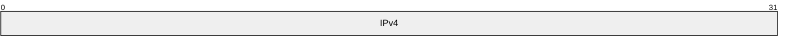

# [MS-DHCPM]: Microsoft Dynamic Host Configuration Protocol (DHCP) Server Management Protocol

Table of Contents

1 Introduction

- [1 Introduction](#Section_1)
  - [1.1 Glossary](#Section_1.1)
  - [1.2 References](#Section_1.2)
    - [1.2.1 Normative References](#Section_1.2.1)
    - [1.2.2 Informative References](#Section_1.2.2)
  - [1.3 Overview](#Section_1.3)
  - [1.4 Relationship to Other Protocols](#Section_1.4)
  - [1.5 Prerequisites/Preconditions](#Section_1.5)
  - [1.6 Applicability Statement](#Section_1.6)
  - [1.7 Versioning and Capability Negotiation](#Section_1.7)
  - [1.8 Vendor-Extensible Fields](#Section_1.8)
  - [1.9 Standards Assignments](#Section_1.9)

2 Messages

- [2 Messages](#Section_2)
  - [2.1 Transport](#Section_2.1)
    - [2.1.1 Server Security Settings](#Section_2.1.1)
    - [2.1.2 DHCPM Client Security Settings](#Section_2.1.2)
  - [2.2 Common Data Types](#Section_2.2)
    - [2.2.1 DHCP RPC Common Messages](#Section_2.2.1)
      - [2.2.1.1 Datatypes, Enumerations, and Constants](#Section_2.2.1.1)
        - [2.2.1.1.1 DHCP_ATTRIB_ID](#Section_2.2.1.1.1)
        - [2.2.1.1.2 DHCP_SUBNET_STATE](#Section_2.2.1.1.2)
        - [2.2.1.1.3 DHCP_SEARCH_INFO_TYPE](#Section_2.2.1.1.3)
        - [2.2.1.1.4 DHCP_OPTION_SCOPE_TYPE](#Section_2.2.1.1.4)
        - [2.2.1.1.5 DHCP_OPTION_SCOPE_TYPE6](#Section_2.2.1.1.5)
        - [2.2.1.1.6 DHCP_OPTION_TYPE](#Section_2.2.1.1.6)
        - [2.2.1.1.7 DHCP_SUBNET_ELEMENT_TYPE](#Section_2.2.1.1.7)
        - [2.2.1.1.8 DHCP_SUBNET_ELEMENT_TYPE_V6](#Section_2.2.1.1.8)
        - [2.2.1.1.9 DHCP_FORCE_FLAG](#Section_2.2.1.1.9)
        - [2.2.1.1.10 DHCP_OPTION_DATA_TYPE](#Section_2.2.1.1.10)
        - [2.2.1.1.11 QuarantineStatus](#Section_2.2.1.1.11)
        - [2.2.1.1.12 DHCP_SEARCH_INFO_TYPE_V6](#Section_2.2.1.1.12)
        - [2.2.1.1.13 DHCP_SCAN_FLAG](#Section_2.2.1.1.13)
        - [2.2.1.1.14 DHCP_RESUME_IPV6_HANDLE](#Section_2.2.1.1.14)
        - [2.2.1.1.15 LPWSTR](#Section_2.2.1.1.15)
        - [2.2.1.1.16 LPWSTR_RPC_STRING](#Section_2.2.1.1.16)
        - [2.2.1.1.17 DHCP_FILTER_LIST_TYPE](#Section_2.2.1.1.17)
        - [2.2.1.1.18 DHCP_FAILOVER_MODE](#Section_2.2.1.1.18)
        - [2.2.1.1.19 DHCP_FAILOVER_SERVER](#Section_2.2.1.1.19)
        - [2.2.1.1.20 FSM_STATE](#Section_2.2.1.1.20)
        - [2.2.1.1.21 DHCP_POLICY_FIELDS_TO_UPDATE](#Section_2.2.1.1.21)
        - [2.2.1.1.22 DHCP_POL_COMPARATOR](#Section_2.2.1.1.22)
        - [2.2.1.1.23 DHCP_POL_ATTR_TYPE](#Section_2.2.1.1.23)
        - [2.2.1.1.24 DHCP_POL_LOGIC_OPER](#Section_2.2.1.1.24)
        - [2.2.1.1.25 DHCP_MAX_FREE_ADDRESSES_REQUESTED](#Section_2.2.1.1.25)
        - [2.2.1.1.26 DHCP_PROPERTY_TYPE](#Section_2.2.1.1.26)
        - [2.2.1.1.27 DHCP_PROPERTY_ID](#Section_2.2.1.1.27)
        - [2.2.1.1.28 Constants Used in Method Definitions](#Section_2.2.1.1.28)
      - [2.2.1.2 Structures](#Section_2.2.1.2)
        - [2.2.1.2.1 DHCP_IP_ADDRESS](#Section_2.2.1.2.1)
        - [2.2.1.2.2 DHCP_IP_MASK](#Section_2.2.1.2.2)
        - [2.2.1.2.3 DHCP_OPTION_ID](#Section_2.2.1.2.3)
        - [2.2.1.2.4 DHCP_SRV_HANDLE](#Section_2.2.1.2.4)
        - [2.2.1.2.5 DHCP_CLIENT_UID](#Section_2.2.1.2.5)
          - [2.2.1.2.5.1 Representing a DHCPv4 Client-Identifier](#Section_2.2.1.2.5.1)
          - [2.2.1.2.5.2 Representing a DHCPv4 Client Unique ID](#Section_2.2.1.2.5.2)
          - [2.2.1.2.5.3 Representing a DHCPv6 Client-Identifier](#Section_2.2.1.2.5.3)
          - [2.2.1.2.5.4 Representing a MADCAP Lease Identifier](#Section_2.2.1.2.5.4)
        - [2.2.1.2.6 DHCP_RESUME_HANDLE](#Section_2.2.1.2.6)
        - [2.2.1.2.7 DHCP_HOST_INFO](#Section_2.2.1.2.7)
        - [2.2.1.2.8 DHCP_SUBNET_INFO](#Section_2.2.1.2.8)
        - [2.2.1.2.9 DHCP_BINARY_DATA](#Section_2.2.1.2.9)
        - [2.2.1.2.10 DHCP_IP_RESERVATION](#Section_2.2.1.2.10)
        - [2.2.1.2.11 DATE_TIME](#Section_2.2.1.2.11)
        - [2.2.1.2.12 DHCP_CLIENT_INFO](#Section_2.2.1.2.12)
        - [2.2.1.2.13 DHCP_CLIENT_INFO_ARRAY](#Section_2.2.1.2.13)
        - [2.2.1.2.14 DHCP_CLIENT_INFO_V4](#Section_2.2.1.2.14)
        - [2.2.1.2.15 DHCP_CLIENT_INFO_ARRAY_V4](#Section_2.2.1.2.15)
        - [2.2.1.2.16 DHCP_CLIENT_INFO_V5](#Section_2.2.1.2.16)
        - [2.2.1.2.17 DHCP_CLIENT_INFO_ARRAY_V5](#Section_2.2.1.2.17)
        - [2.2.1.2.18 DHCP_SEARCH_INFO](#Section_2.2.1.2.18)
        - [2.2.1.2.19 DHCP_CLIENT_INFO_VQ](#Section_2.2.1.2.19)
        - [2.2.1.2.20 DHCP_CLIENT_INFO_ARRAY_VQ](#Section_2.2.1.2.20)
        - [2.2.1.2.21 DHCP_MCLIENT_INFO](#Section_2.2.1.2.21)
        - [2.2.1.2.22 DWORD_DWORD](#Section_2.2.1.2.22)
        - [2.2.1.2.23 DHCP_OPTION_DATA_ELEMENT](#Section_2.2.1.2.23)
        - [2.2.1.2.24 DHCP_OPTION_DATA](#Section_2.2.1.2.24)
        - [2.2.1.2.25 DHCP_OPTION](#Section_2.2.1.2.25)
        - [2.2.1.2.26 DHCP_OPTION_ARRAY](#Section_2.2.1.2.26)
        - [2.2.1.2.27 DHCP_ALL_OPTIONS](#Section_2.2.1.2.27)
        - [2.2.1.2.28 DHCP_IPV6_ADDRESS](#Section_2.2.1.2.28)
        - [2.2.1.2.29 DHCP_RESERVED_SCOPE6](#Section_2.2.1.2.29)
        - [2.2.1.2.30 DHCP_OPTION_SCOPE_INFO6](#Section_2.2.1.2.30)
        - [2.2.1.2.31 DHCP_IP_RANGE](#Section_2.2.1.2.31)
        - [2.2.1.2.32 DHCP_IP_RESERVATION_V4](#Section_2.2.1.2.32)
        - [2.2.1.2.33 DHCP_SUBNET_ELEMENT_DATA](#Section_2.2.1.2.33)
        - [2.2.1.2.34 DHCP_SUBNET_ELEMENT_INFO_ARRAY](#Section_2.2.1.2.34)
        - [2.2.1.2.35 DHCP_SUBNET_ELEMENT_DATA_V4](#Section_2.2.1.2.35)
        - [2.2.1.2.36 DHCP_SUBNET_ELEMENT_INFO_ARRAY_V4](#Section_2.2.1.2.36)
        - [2.2.1.2.37 DHCP_BOOTP_IP_RANGE](#Section_2.2.1.2.37)
        - [2.2.1.2.38 DHCP_SUBNET_ELEMENT_DATA_V5](#Section_2.2.1.2.38)
        - [2.2.1.2.39 DHCP_SUBNET_ELEMENT_INFO_ARRAY_V5](#Section_2.2.1.2.39)
        - [2.2.1.2.40 DHCP_RESERVED_SCOPE](#Section_2.2.1.2.40)
        - [2.2.1.2.41 DHCP_OPTION_SCOPE_INFO](#Section_2.2.1.2.41)
        - [2.2.1.2.42 DHCP_OPTION_VALUE](#Section_2.2.1.2.42)
        - [2.2.1.2.43 DHCP_OPTION_VALUE_ARRAY](#Section_2.2.1.2.43)
        - [2.2.1.2.44 DHCP_ALL_OPTION_VALUES](#Section_2.2.1.2.44)
        - [2.2.1.2.45 DHCP_SUBNET_INFO_VQ](#Section_2.2.1.2.45)
        - [2.2.1.2.46 DHCP_IP_ARRAY](#Section_2.2.1.2.46)
        - [2.2.1.2.47 SCOPE_MIB_INFO](#Section_2.2.1.2.47)
        - [2.2.1.2.48 DHCP_MIB_INFO](#Section_2.2.1.2.48)
        - [2.2.1.2.49 SCOPE_MIB_INFO_VQ](#Section_2.2.1.2.49)
        - [2.2.1.2.50 DHCP_MIB_INFO_VQ](#Section_2.2.1.2.50)
        - [2.2.1.2.51 MSCOPE_MIB_INFO](#Section_2.2.1.2.51)
        - [2.2.1.2.52 DHCP_MCAST_MIB_INFO](#Section_2.2.1.2.52)
        - [2.2.1.2.53 DHCP_SERVER_CONFIG_INFO](#Section_2.2.1.2.53)
        - [2.2.1.2.54 DHCP_SERVER_CONFIG_INFO_V4](#Section_2.2.1.2.54)
        - [2.2.1.2.55 DHCP_SERVER_CONFIG_INFO_VQ](#Section_2.2.1.2.55)
        - [2.2.1.2.56 DHCP_SUBNET_INFO_V6](#Section_2.2.1.2.56)
        - [2.2.1.2.57 DHCPV6_IP_ARRAY](#Section_2.2.1.2.57)
        - [2.2.1.2.58 DHCP_IP_RESERVATION_V6](#Section_2.2.1.2.58)
        - [2.2.1.2.59 DHCP_IP_RANGE_V6](#Section_2.2.1.2.59)
        - [2.2.1.2.60 DHCP_SUBNET_ELEMENT_DATA_V6](#Section_2.2.1.2.60)
        - [2.2.1.2.61 DHCP_SUBNET_ELEMENT_INFO_ARRAY_V6](#Section_2.2.1.2.61)
        - [2.2.1.2.62 DHCP_SERVER_CONFIG_INFO_V6](#Section_2.2.1.2.62)
        - [2.2.1.2.63 DHCP_HOST_INFO_V6](#Section_2.2.1.2.63)
        - [2.2.1.2.64 DHCP_CLIENT_INFO_V6](#Section_2.2.1.2.64)
        - [2.2.1.2.65 DHCP_CLIENT_INFO_ARRAY_V6](#Section_2.2.1.2.65)
        - [2.2.1.2.66 DHCP_OPTION_LIST](#Section_2.2.1.2.66)
        - [2.2.1.2.67 SCOPE_MIB_INFO_V6](#Section_2.2.1.2.67)
        - [2.2.1.2.68 DHCP_MIB_INFO_V6](#Section_2.2.1.2.68)
        - [2.2.1.2.69 DHCP_SEARCH_INFO_V6](#Section_2.2.1.2.69)
        - [2.2.1.2.70 DHCP_CLASS_INFO_V6](#Section_2.2.1.2.70)
        - [2.2.1.2.71 DHCP_MSCOPE_INFO](#Section_2.2.1.2.71)
        - [2.2.1.2.72 DHCP_MSCOPE_TABLE](#Section_2.2.1.2.72)
        - [2.2.1.2.73 DHCP_SCAN_ITEM](#Section_2.2.1.2.73)
        - [2.2.1.2.74 DHCP_SCAN_LIST](#Section_2.2.1.2.74)
        - [2.2.1.2.75 DHCP_CLASS_INFO](#Section_2.2.1.2.75)
        - [2.2.1.2.76 DHCP_CLASS_INFO_ARRAY](#Section_2.2.1.2.76)
        - [2.2.1.2.77 DHCP_SERVER_SPECIFIC_STRINGS](#Section_2.2.1.2.77)
        - [2.2.1.2.78 DHCP_ATTRIB](#Section_2.2.1.2.78)
        - [2.2.1.2.79 DHCP_ATTRIB_ARRAY](#Section_2.2.1.2.79)
        - [2.2.1.2.80 DHCP_BIND_ELEMENT](#Section_2.2.1.2.80)
        - [2.2.1.2.81 DHCP_BIND_ELEMENT_ARRAY](#Section_2.2.1.2.81)
        - [2.2.1.2.82 DHCPV6_BIND_ELEMENT](#Section_2.2.1.2.82)
        - [2.2.1.2.83 DHCPV6_BIND_ELEMENT_ARRAY](#Section_2.2.1.2.83)
        - [2.2.1.2.84 DHCP_MCLIENT_INFO_ARRAY](#Section_2.2.1.2.84)
        - [2.2.1.2.85 DHCP_SUPER_SCOPE_TABLE_ENTRY](#Section_2.2.1.2.85)
        - [2.2.1.2.86 DHCP_SUPER_SCOPE_TABLE](#Section_2.2.1.2.86)
        - [2.2.1.2.87 DHCP_CLASS_INFO_ARRAY_V6](#Section_2.2.1.2.87)
        - [2.2.1.2.88 DHCP_IP_CLUSTER](#Section_2.2.1.2.88)
        - [2.2.1.2.89 DHCP_ADDR_PATTERN](#Section_2.2.1.2.89)
        - [2.2.1.2.90 DHCP_FILTER_ADD_INFO](#Section_2.2.1.2.90)
        - [2.2.1.2.91 DHCP_FILTER_GLOBAL_INFO](#Section_2.2.1.2.91)
        - [2.2.1.2.92 DHCP_FILTER_RECORD](#Section_2.2.1.2.92)
        - [2.2.1.2.93 DHCP_FILTER_ENUM_INFO](#Section_2.2.1.2.93)
        - [2.2.1.2.94 SCOPE_MIB_INFO_V5](#Section_2.2.1.2.94)
        - [2.2.1.2.95 DHCP_MIB_INFO_V5](#Section_2.2.1.2.95)
        - [2.2.1.2.96 DHCP_CLIENT_FILTER_STATUS_INFO](#Section_2.2.1.2.96)
        - [2.2.1.2.97 DHCP_CLIENT_FILTER_STATUS_INFO_ARRAY](#Section_2.2.1.2.97)
        - [2.2.1.2.98 DHCP_FAILOVER_RELATIONSHIP](#Section_2.2.1.2.98)
        - [2.2.1.2.99 DHCP_FAILOVER_RELATIONSHIP_ARRAY](#Section_2.2.1.2.99)
        - [2.2.1.2.100 DHCP_FAILOVER_STATISTICS](#Section_2.2.1.2.100)
        - [2.2.1.2.101 DHCPV4_FAILOVER_CLIENT_INFO](#Section_2.2.1.2.101)
        - [2.2.1.2.102 DHCP_IP_RESERVATION_INFO](#Section_2.2.1.2.102)
        - [2.2.1.2.103 DHCP_RESERVATION_INFO_ARRAY](#Section_2.2.1.2.103)
        - [2.2.1.2.104 DHCP_IP_RANGE_ARRAY](#Section_2.2.1.2.104)
        - [2.2.1.2.105 DHCP_POL_COND](#Section_2.2.1.2.105)
        - [2.2.1.2.106 DHCP_POL_COND_ARRAY](#Section_2.2.1.2.106)
        - [2.2.1.2.107 DHCP_POL_EXPR](#Section_2.2.1.2.107)
        - [2.2.1.2.108 DHCP_POL_EXPR_ARRAY](#Section_2.2.1.2.108)
        - [2.2.1.2.109 DHCP_ALL_OPTION_VALUES_PB](#Section_2.2.1.2.109)
        - [2.2.1.2.110 DHCP_POLICY](#Section_2.2.1.2.110)
        - [2.2.1.2.111 DHCP_POLICY_ARRAY](#Section_2.2.1.2.111)
        - [2.2.1.2.112 DHCPV6_STATELESS_PARAMS](#Section_2.2.1.2.112)
        - [2.2.1.2.113 DHCPV6_STATELESS_SCOPE_STATS](#Section_2.2.1.2.113)
        - [2.2.1.2.114 DHCPV6_STATELESS_STATS](#Section_2.2.1.2.114)
        - [2.2.1.2.115 DHCP_CLIENT_INFO_PB](#Section_2.2.1.2.115)
        - [2.2.1.2.116 DHCP_CLIENT_INFO_PB_ARRAY](#Section_2.2.1.2.116)
        - [2.2.1.2.117 DHCP_PROPERTY](#Section_2.2.1.2.117)
        - [2.2.1.2.118 DHCP_PROPERTY_ARRAY](#Section_2.2.1.2.118)
        - [2.2.1.2.119 DHCP_CLIENT_INFO_EX](#Section_2.2.1.2.119)
        - [2.2.1.2.120 DHCP_CLIENT_INFO_EX_ARRAY](#Section_2.2.1.2.120)
        - [2.2.1.2.121 DHCP_POLICY_EX](#Section_2.2.1.2.121)
        - [2.2.1.2.122 DHCP_POLICY_EX_ARRAY](#Section_2.2.1.2.122)

3 Protocol Details

- [3 Protocol Details](#Section_3)
  - [3.1 dhcpsrv Server Details](#Section_3.1)
    - [3.1.1 Abstract Data Model](#Section_3.1.1)
      - [3.1.1.1 Global Variables](#Section_3.1.1.1)
      - [3.1.1.2 Per DHCPv4Scope (Public)](#Section_3.1.1.2)
      - [3.1.1.3 Per DHCPv4SuperScope (Public)](#Section_3.1.1.3)
      - [3.1.1.4 DHCPv4IpRange (Public)](#Section_3.1.1.4)
      - [3.1.1.5 DHCPv4ExclusionRange (Public)](#Section_3.1.1.5)
      - [3.1.1.6 DHCPv4Reservation (Public)](#Section_3.1.1.6)
      - [3.1.1.7 DHCPv4Client (Public)](#Section_3.1.1.7)
      - [3.1.1.8 DHCPv4ClassDef (Public)](#Section_3.1.1.8)
      - [3.1.1.9 Per DHCPv4OptionDef](#Section_3.1.1.9)
      - [3.1.1.10 DHCPv4ClassedOptDef](#Section_3.1.1.10)
      - [3.1.1.11 Per DHCPv4OptionValue (Public)](#Section_3.1.1.11)
      - [3.1.1.12 DHCPv4ClassedOptValue (Public)](#Section_3.1.1.12)
      - [3.1.1.13 Per DHCPv4MScope](#Section_3.1.1.13)
      - [3.1.1.14 Per DHCPv6Scope (Public)](#Section_3.1.1.14)
      - [3.1.1.15 DHCPv6ExclusionRange (Public)](#Section_3.1.1.15)
      - [3.1.1.16 Per DHCPv6Reservation (Public)](#Section_3.1.1.16)
      - [3.1.1.17 Per DHCPv6ClassedOptValue (Public)](#Section_3.1.1.17)
      - [3.1.1.18 DHCPv6ClientInfo (Public)](#Section_3.1.1.18)
      - [3.1.1.19 DHCPv6ClassDef (Public)](#Section_3.1.1.19)
      - [3.1.1.20 Per DHCPv6ClassedOptionDef](#Section_3.1.1.20)
      - [3.1.1.21 Per DHCPv6OptionValue (Public)](#Section_3.1.1.21)
      - [3.1.1.22 DHCPv6OptionDef](#Section_3.1.1.22)
      - [3.1.1.23 DHCPv6UserClass (Public)](#Section_3.1.1.23)
      - [3.1.1.24 DHCPv6VendorClass (Public)](#Section_3.1.1.24)
      - [3.1.1.25 Per DHCPv4AuditLogParams](#Section_3.1.1.25)
      - [3.1.1.26 Per DHCPv4ServerAttributes](#Section_3.1.1.26)
      - [3.1.1.27 Per DHCPServerDnsRegCredentials](#Section_3.1.1.27)
      - [3.1.1.28 DHCPv4ServerBindingInfo](#Section_3.1.1.28)
      - [3.1.1.29 DHCPv6ServerBindingInfo](#Section_3.1.1.29)
      - [3.1.1.30 DHCPv4Filter (Public)](#Section_3.1.1.30)
      - [3.1.1.31 DHCPv4MClient](#Section_3.1.1.31)
      - [3.1.1.32 DHCPv6ClientInfoAddressState](#Section_3.1.1.32)
      - [3.1.1.33 DHCPv4FailoverRelationship](#Section_3.1.1.33)
      - [3.1.1.34 DHCPv4FailoverStatistics](#Section_3.1.1.34)
      - [3.1.1.35 DHCPv4Policy](#Section_3.1.1.35)
      - [3.1.1.36 Per DHCPv4PolicyOptionValue](#Section_3.1.1.36)
    - [3.1.2 Timers](#Section_3.1.2)
    - [3.1.3 Initialization](#Section_3.1.3)
    - [3.1.4 Message Processing Events and Sequencing Rules](#Section_3.1.4)
      - [3.1.4.1 R_DhcpCreateSubnet (Opnum 0)](#Section_3.1.4.1)
      - [3.1.4.2 R_DhcpSetSubnetInfo (Opnum 1)](#Section_3.1.4.2)
      - [3.1.4.3 R_DhcpGetSubnetInfo (Opnum 2)](#Section_3.1.4.3)
      - [3.1.4.4 R_DhcpEnumSubnets (Opnum 3)](#Section_3.1.4.4)
      - [3.1.4.5 R_DhcpAddSubnetElement (Opnum 4)](#Section_3.1.4.5)
      - [3.1.4.6 R_DhcpEnumSubnetElements (Opnum 5)](#Section_3.1.4.6)
      - [3.1.4.7 R_DhcpRemoveSubnetElement (Opnum 6)](#Section_3.1.4.7)
      - [3.1.4.8 R_DhcpDeleteSubnet (Opnum 7)](#Section_3.1.4.8)
      - [3.1.4.9 R_DhcpCreateOption (Opnum 8)](#Section_3.1.4.9)
      - [3.1.4.10 R_DhcpSetOptionInfo (Opnum 9)](#Section_3.1.4.10)
      - [3.1.4.11 R_DhcpGetOptionInfo (Opnum 10)](#Section_3.1.4.11)
      - [3.1.4.12 R_DhcpRemoveOption (Opnum 11)](#Section_3.1.4.12)
      - [3.1.4.13 R_DhcpSetOptionValue (Opnum 12)](#Section_3.1.4.13)
      - [3.1.4.14 R_DhcpGetOptionValue (Opnum 13)](#Section_3.1.4.14)
      - [3.1.4.15 R_DhcpEnumOptionValues (Opnum 14)](#Section_3.1.4.15)
      - [3.1.4.16 R_DhcpRemoveOptionValue (Opnum 15)](#Section_3.1.4.16)
      - [3.1.4.17 R_DhcpCreateClientInfo (Opnum 16)](#Section_3.1.4.17)
      - [3.1.4.18 R_DhcpSetClientInfo (Opnum 17)](#Section_3.1.4.18)
      - [3.1.4.19 R_DhcpGetClientInfo (Opnum 18)](#Section_3.1.4.19)
      - [3.1.4.20 R_DhcpDeleteClientInfo (Opnum 19)](#Section_3.1.4.20)
      - [3.1.4.21 R_DhcpEnumSubnetClients (Opnum 20)](#Section_3.1.4.21)
      - [3.1.4.22 R_DhcpGetClientOptions (Opnum 21)](#Section_3.1.4.22)
      - [3.1.4.23 R_DhcpGetMibInfo (Opnum 22)](#Section_3.1.4.23)
      - [3.1.4.24 R_DhcpEnumOptions (Opnum 23)](#Section_3.1.4.24)
      - [3.1.4.25 R_DhcpSetOptionValues (Opnum 24)](#Section_3.1.4.25)
      - [3.1.4.26 R_DhcpServerSetConfig (Opnum 25)](#Section_3.1.4.26)
      - [3.1.4.27 R_DhcpServerGetConfig (Opnum 26)](#Section_3.1.4.27)
      - [3.1.4.28 R_DhcpScanDatabase (Opnum 27)](#Section_3.1.4.28)
      - [3.1.4.29 R_DhcpGetVersion (Opnum 28)](#Section_3.1.4.29)
      - [3.1.4.30 R_DhcpAddSubnetElementV4 (Opnum 29)](#Section_3.1.4.30)
      - [3.1.4.31 R_DhcpEnumSubnetElementsV4 (Opnum 30)](#Section_3.1.4.31)
      - [3.1.4.32 R_DhcpRemoveSubnetElementV4 (Opnum 31)](#Section_3.1.4.32)
      - [3.1.4.33 R_DhcpCreateClientInfoV4 (Opnum 32)](#Section_3.1.4.33)
      - [3.1.4.34 R_DhcpSetClientInfoV4 (Opnum 33)](#Section_3.1.4.34)
      - [3.1.4.35 R_DhcpGetClientInfoV4 (Opnum 34)](#Section_3.1.4.35)
      - [3.1.4.36 R_DhcpEnumSubnetClientsV4 (Opnum 35)](#Section_3.1.4.36)
      - [3.1.4.37 R_DhcpSetSuperScopeV4 (Opnum 36)](#Section_3.1.4.37)
      - [3.1.4.38 R_DhcpGetSuperScopeInfoV4 (Opnum 37)](#Section_3.1.4.38)
      - [3.1.4.39 R_DhcpDeleteSuperScopeV4 (Opnum 38)](#Section_3.1.4.39)
      - [3.1.4.40 R_DhcpServerSetConfigV4 (Opnum 39)](#Section_3.1.4.40)
      - [3.1.4.41 R_DhcpServerGetConfigV4 (Opnum 40)](#Section_3.1.4.41)
      - [3.1.4.42 R_DhcpServerSetConfigVQ (Opnum 41)](#Section_3.1.4.42)
      - [3.1.4.43 R_DhcpServerGetConfigVQ (Opnum 42)](#Section_3.1.4.43)
      - [3.1.4.44 R_DhcpGetMibInfoVQ (Opnum 43)](#Section_3.1.4.44)
      - [3.1.4.45 R_DhcpCreateClientInfoVQ (Opnum 44)](#Section_3.1.4.45)
      - [3.1.4.46 R_DhcpSetClientInfoVQ (Opnum 45)](#Section_3.1.4.46)
      - [3.1.4.47 R_DhcpGetClientInfoVQ (Opnum 46)](#Section_3.1.4.47)
      - [3.1.4.48 R_DhcpEnumSubnetClientsVQ (Opnum 47)](#Section_3.1.4.48)
      - [3.1.4.49 R_DhcpCreateSubnetVQ (Opnum 48)](#Section_3.1.4.49)
      - [3.1.4.50 R_DhcpGetSubnetInfoVQ (Opnum 49)](#Section_3.1.4.50)
      - [3.1.4.51 R_DhcpSetSubnetInfoVQ (Opnum 50)](#Section_3.1.4.51)
    - [3.1.5 Timer Events](#Section_3.1.5)
    - [3.1.6 Other Local Events](#Section_3.1.6)
  - [3.2 dhcpsrv2 Server Details](#Section_3.2)
    - [3.2.1 Abstract Data Model](#Section_3.2.1)
    - [3.2.2 Timers](#Section_3.2.2)
    - [3.2.3 Initialization](#Section_3.2.3)
    - [3.2.4 Message Processing Events and Sequencing Rules](#Section_3.2.4)
      - [3.2.4.1 R_DhcpEnumSubnetClientsV5 (Opnum 0)](#Section_3.2.4.1)
      - [3.2.4.2 R_DhcpSetMScopeInfo (Opnum 1)](#Section_3.2.4.2)
      - [3.2.4.3 R_DhcpGetMScopeInfo (Opnum 2)](#Section_3.2.4.3)
      - [3.2.4.4 R_DhcpEnumMScopes (Opnum 3)](#Section_3.2.4.4)
      - [3.2.4.5 R_DhcpAddMScopeElement (Opnum 4)](#Section_3.2.4.5)
      - [3.2.4.6 R_DhcpEnumMScopeElements (Opnum 5)](#Section_3.2.4.6)
      - [3.2.4.7 R_DhcpRemoveMScopeElement (Opnum 6)](#Section_3.2.4.7)
      - [3.2.4.8 R_DhcpDeleteMScope (Opnum 7)](#Section_3.2.4.8)
      - [3.2.4.9 R_DhcpScanMDatabase (Opnum 8)](#Section_3.2.4.9)
      - [3.2.4.10 R_DhcpCreateMClientInfo (Opnum 9)](#Section_3.2.4.10)
      - [3.2.4.11 R_DhcpSetMClientInfo (Opnum 10)](#Section_3.2.4.11)
      - [3.2.4.12 R_DhcpGetMClientInfo (Opnum 11)](#Section_3.2.4.12)
      - [3.2.4.13 R_DhcpDeleteMClientInfo (Opnum 12)](#Section_3.2.4.13)
      - [3.2.4.14 R_DhcpEnumMScopeClients (Opnum 13)](#Section_3.2.4.14)
      - [3.2.4.15 R_DhcpCreateOptionV5 (Opnum 14)](#Section_3.2.4.15)
      - [3.2.4.16 R_DhcpSetOptionInfoV5 (Opnum 15)](#Section_3.2.4.16)
      - [3.2.4.17 R_DhcpGetOptionInfoV5 (Opnum 16)](#Section_3.2.4.17)
      - [3.2.4.18 R_DhcpEnumOptionsV5 (Opnum 17)](#Section_3.2.4.18)
      - [3.2.4.19 R_DhcpRemoveOptionV5 (Opnum 18)](#Section_3.2.4.19)
      - [3.2.4.20 R_DhcpSetOptionValueV5 (Opnum 19)](#Section_3.2.4.20)
      - [3.2.4.21 R_DhcpSetOptionValuesV5 (Opnum 20)](#Section_3.2.4.21)
      - [3.2.4.22 R_DhcpGetOptionValueV5 (Opnum 21)](#Section_3.2.4.22)
      - [3.2.4.23 R_DhcpEnumOptionValuesV5 (Opnum 22)](#Section_3.2.4.23)
      - [3.2.4.24 R_DhcpRemoveOptionValueV5 (Opnum 23)](#Section_3.2.4.24)
      - [3.2.4.25 R_DhcpCreateClass (Opnum 24)](#Section_3.2.4.25)
      - [3.2.4.26 R_DhcpModifyClass (Opnum 25)](#Section_3.2.4.26)
      - [3.2.4.27 R_DhcpDeleteClass (Opnum 26)](#Section_3.2.4.27)
      - [3.2.4.28 R_DhcpGetClassInfo (Opnum 27)](#Section_3.2.4.28)
      - [3.2.4.29 R_DhcpEnumClasses (Opnum 28)](#Section_3.2.4.29)
      - [3.2.4.30 R_DhcpGetAllOptions (Opnum 29)](#Section_3.2.4.30)
      - [3.2.4.31 R_DhcpGetAllOptionValues (Opnum 30)](#Section_3.2.4.31)
      - [3.2.4.32 R_DhcpGetMCastMibInfo (Opnum 31)](#Section_3.2.4.32)
      - [3.2.4.33 R_DhcpAuditLogSetParams (Opnum 32)](#Section_3.2.4.33)
      - [3.2.4.34 R_DhcpAuditLogGetParams (Opnum 33)](#Section_3.2.4.34)
      - [3.2.4.35 R_DhcpServerQueryAttribute (Opnum 34)](#Section_3.2.4.35)
      - [3.2.4.36 R_DhcpServerQueryAttributes (Opnum 35)](#Section_3.2.4.36)
      - [3.2.4.37 R_DhcpServerRedoAuthorization (Opnum 36)](#Section_3.2.4.37)
      - [3.2.4.38 R_DhcpAddSubnetElementV5 (Opnum 37)](#Section_3.2.4.38)
      - [3.2.4.39 R_DhcpEnumSubnetElementsV5 (Opnum 38)](#Section_3.2.4.39)
      - [3.2.4.40 R_DhcpRemoveSubnetElementV5 (Opnum 39)](#Section_3.2.4.40)
      - [3.2.4.41 R_DhcpGetServerBindingInfo (Opnum 40)](#Section_3.2.4.41)
      - [3.2.4.42 R_DhcpSetServerBindingInfo (Opnum 41)](#Section_3.2.4.42)
      - [3.2.4.43 R_DhcpQueryDnsRegCredentials (Opnum 42)](#Section_3.2.4.43)
      - [3.2.4.44 R_DhcpSetDnsRegCredentials (Opnum 43)](#Section_3.2.4.44)
      - [3.2.4.45 R_DhcpBackupDatabase (Opnum 44)](#Section_3.2.4.45)
      - [3.2.4.46 R_DhcpRestoreDatabase (Opnum 45)](#Section_3.2.4.46)
      - [3.2.4.47 R_DhcpGetServerSpecificStrings (Opnum 46)](#Section_3.2.4.47)
      - [3.2.4.48 R_DhcpCreateOptionV6 (Opnum 47)](#Section_3.2.4.48)
      - [3.2.4.49 R_DhcpSetOptionInfoV6 (Opnum 48)](#Section_3.2.4.49)
      - [3.2.4.50 R_DhcpGetOptionInfoV6 (Opnum 49)](#Section_3.2.4.50)
      - [3.2.4.51 R_DhcpEnumOptionsV6 (Opnum 50)](#Section_3.2.4.51)
      - [3.2.4.52 R_DhcpRemoveOptionV6 (Opnum 51)](#Section_3.2.4.52)
      - [3.2.4.53 R_DhcpSetOptionValueV6 (Opnum 52)](#Section_3.2.4.53)
      - [3.2.4.54 R_DhcpEnumOptionValuesV6 (Opnum 53)](#Section_3.2.4.54)
      - [3.2.4.55 R_DhcpRemoveOptionValueV6 (Opnum 54)](#Section_3.2.4.55)
      - [3.2.4.56 R_DhcpGetAllOptionsV6 (Opnum 55)](#Section_3.2.4.56)
      - [3.2.4.57 R_DhcpGetAllOptionValuesV6 (Opnum 56)](#Section_3.2.4.57)
      - [3.2.4.58 R_DhcpCreateSubnetV6 (Opnum 57)](#Section_3.2.4.58)
      - [3.2.4.59 R_DhcpEnumSubnetsV6 (Opnum 58)](#Section_3.2.4.59)
      - [3.2.4.60 R_DhcpAddSubnetElementV6 (Opnum 59)](#Section_3.2.4.60)
      - [3.2.4.61 R_DhcpEnumSubnetElementsV6 (Opnum 60)](#Section_3.2.4.61)
      - [3.2.4.62 R_DhcpRemoveSubnetElementV6 (Opnum 61)](#Section_3.2.4.62)
      - [3.2.4.63 R_DhcpDeleteSubnetV6 (Opnum 62)](#Section_3.2.4.63)
      - [3.2.4.64 R_DhcpGetSubnetInfoV6 (Opnum 63)](#Section_3.2.4.64)
      - [3.2.4.65 R_DhcpEnumSubnetClientsV6 (Opnum 64)](#Section_3.2.4.65)
      - [3.2.4.66 R_DhcpServerSetConfigV6 (Opnum 65)](#Section_3.2.4.66)
      - [3.2.4.67 R_DhcpServerGetConfigV6 (Opnum 66)](#Section_3.2.4.67)
      - [3.2.4.68 R_DhcpSetSubnetInfoV6 (Opnum 67)](#Section_3.2.4.68)
      - [3.2.4.69 R_DhcpGetMibInfoV6 (Opnum 68)](#Section_3.2.4.69)
      - [3.2.4.70 R_DhcpGetServerBindingInfoV6 (Opnum 69)](#Section_3.2.4.70)
      - [3.2.4.71 R_DhcpSetServerBindingInfoV6 (Opnum 70)](#Section_3.2.4.71)
      - [3.2.4.72 R_DhcpSetClientInfoV6 (Opnum 71)](#Section_3.2.4.72)
      - [3.2.4.73 R_DhcpGetClientInfoV6 (Opnum 72)](#Section_3.2.4.73)
      - [3.2.4.74 R_DhcpDeleteClientInfoV6 (Opnum 73)](#Section_3.2.4.74)
      - [3.2.4.75 R_DhcpCreateClassV6 (Opnum 74)](#Section_3.2.4.75)
      - [3.2.4.76 R_DhcpModifyClassV6 (Opnum 75)](#Section_3.2.4.76)
      - [3.2.4.77 R_DhcpDeleteClassV6 (Opnum 76)](#Section_3.2.4.77)
      - [3.2.4.78 R_DhcpEnumClassesV6 (Opnum 77)](#Section_3.2.4.78)
      - [3.2.4.79 R_DhcpGetOptionValueV6 (Opnum 78)](#Section_3.2.4.79)
      - [3.2.4.80 R_DhcpSetSubnetDelayOffer (Opnum 79)](#Section_3.2.4.80)
      - [3.2.4.81 R_DhcpGetSubnetDelayOffer (Opnum 80)](#Section_3.2.4.81)
      - [3.2.4.82 R_DhcpGetMibInfoV5 (Opnum 81)](#Section_3.2.4.82)
      - [3.2.4.83 R_DhcpAddFilterV4 (Opnum 82)](#Section_3.2.4.83)
      - [3.2.4.84 R_DhcpDeleteFilterV4 (Opnum 83)](#Section_3.2.4.84)
      - [3.2.4.85 R_DhcpSetFilterV4 (Opnum 84)](#Section_3.2.4.85)
      - [3.2.4.86 R_DhcpGetFilterV4 (Opnum 85)](#Section_3.2.4.86)
      - [3.2.4.87 R_DhcpEnumFilterV4 (Opnum 86)](#Section_3.2.4.87)
      - [3.2.4.88 R_DhcpSetDnsRegCredentialsV5 (Opnum 87)](#Section_3.2.4.88)
      - [3.2.4.89 R_DhcpEnumSubnetClientsFilterStatusInfo (Opnum 88)](#Section_3.2.4.89)
      - [3.2.4.90 R_DhcpV4FailoverCreateRelationship (Opnum 89)](#Section_3.2.4.90)
      - [3.2.4.91 R_DhcpV4FailoverSetRelationship (Opnum 90)](#Section_3.2.4.91)
      - [3.2.4.92 R_DhcpV4FailoverDeleteRelationship (Opnum 91)](#Section_3.2.4.92)
      - [3.2.4.93 R_DhcpV4FailoverGetRelationship (Opnum 92)](#Section_3.2.4.93)
      - [3.2.4.94 R_DhcpV4FailoverEnumRelationship (Opnum 93)](#Section_3.2.4.94)
      - [3.2.4.95 R_DhcpV4FailoverAddScopeToRelationship (Opnum 94)](#Section_3.2.4.95)
      - [3.2.4.96 R_DhcpV4FailoverDeleteScopeFromRelationship (Opnum 95)](#Section_3.2.4.96)
      - [3.2.4.97 R_DhcpV4FailoverGetScopeRelationship (Opnum 96)](#Section_3.2.4.97)
      - [3.2.4.98 R_DhcpV4FailoverGetScopeStatistics (Opnum 97)](#Section_3.2.4.98)
      - [3.2.4.99 R_DhcpV4FailoverGetClientInfo (Opnum 98)](#Section_3.2.4.99)
      - [3.2.4.100 R_DhcpV4FailoverGetSystemTime (Opnum 99)](#Section_3.2.4.100)
      - [3.2.4.101 R_DhcpV4FailoverTriggerAddrAllocation (Opnum 100)](#Section_3.2.4.101)
      - [3.2.4.102 R_DhcpV4SetOptionValue (Opnum 101)](#Section_3.2.4.102)
      - [3.2.4.103 R_DhcpV4SetOptionValues (Opnum 102)](#Section_3.2.4.103)
      - [3.2.4.104 R_DhcpV4GetOptionValue (Opnum 103)](#Section_3.2.4.104)
      - [3.2.4.105 R_DhcpV4RemoveOptionValue (Opnum 104)](#Section_3.2.4.105)
      - [3.2.4.106 R_DhcpV4GetAllOptionValues (Opnum 105)](#Section_3.2.4.106)
      - [3.2.4.107 R_DhcpV4QueryPolicyEnforcement (Opnum 106)](#Section_3.2.4.107)
      - [3.2.4.108 R_DhcpV4SetPolicyEnforcement (Opnum 107)](#Section_3.2.4.108)
      - [3.2.4.109 R_DhcpV4CreatePolicy (Opnum 108)](#Section_3.2.4.109)
      - [3.2.4.110 R_DhcpV4GetPolicy (Opnum 109)](#Section_3.2.4.110)
      - [3.2.4.111 R_DhcpV4SetPolicy (Opnum 110)](#Section_3.2.4.111)
      - [3.2.4.112 R_DhcpV4DeletePolicy (Opnum 111)](#Section_3.2.4.112)
      - [3.2.4.113 R_DhcpV4EnumPolicies (Opnum 112)](#Section_3.2.4.113)
      - [3.2.4.114 R_DhcpV4AddPolicyRange (Opnum 113)](#Section_3.2.4.114)
      - [3.2.4.115 R_DhcpV4RemovePolicyRange (Opnum 114)](#Section_3.2.4.115)
      - [3.2.4.116 R_DhcpV4EnumSubnetClients (Opnum 115)](#Section_3.2.4.116)
      - [3.2.4.117 R_DhcpV6SetStatelessStoreParams (Opnum 116)](#Section_3.2.4.117)
      - [3.2.4.118 R_DhcpV6GetStatelessStoreParams (Opnum 117)](#Section_3.2.4.118)
      - [3.2.4.119 R_DhcpV6GetStatelessStatistics (Opnum 118)](#Section_3.2.4.119)
      - [3.2.4.120 R_DhcpV4EnumSubnetReservations (Opnum 119)](#Section_3.2.4.120)
      - [3.2.4.121 R_DhcpV4GetFreeIPAddress (Opnum 120)](#Section_3.2.4.121)
      - [3.2.4.122 R_DhcpV6GetFreeIPAddress (Opnum 121)](#Section_3.2.4.122)
      - [3.2.4.123 R_DhcpV4CreateClientInfo (Opnum 122)](#Section_3.2.4.123)
      - [3.2.4.124 R_DhcpV4GetClientInfo (Opnum 123)](#Section_3.2.4.124)
      - [3.2.4.125 R_DhcpV6CreateClientInfo (Opnum 124)](#Section_3.2.4.125)
      - [3.2.4.126 R_DhcpV4FailoverGetAddressStatus (Opnum 125)](#Section_3.2.4.126)
      - [3.2.4.127 R_DhcpV4CreatePolicyEx (Opnum 126)](#Section_3.2.4.127)
      - [3.2.4.128 R_DhcpV4GetPolicyEx (Opnum 127)](#Section_3.2.4.128)
      - [3.2.4.129 R_DhcpV4SetPolicyEx (Opnum 128)](#Section_3.2.4.129)
      - [3.2.4.130 R_DhcpV4EnumPoliciesEx (Opnum 129)](#Section_3.2.4.130)
      - [3.2.4.131 R_DhcpV4EnumSubnetClientsEx (Opnum 130)](#Section_3.2.4.131)
      - [3.2.4.132 R_DhcpV4CreateClientInfoEx (Opnum 131)](#Section_3.2.4.132)
      - [3.2.4.133 R_DhcpV4GetClientInfoEx (Opnum 132)](#Section_3.2.4.133)
    - [3.2.5 Timer Events](#Section_3.2.5)
    - [3.2.6 Other Local Events](#Section_3.2.6)
  - [3.3 Server Details for Dynamic DNS Configuration](#Section_3.3)
    - [3.3.1 DHCPv4 Server](#Section_3.3.1)
    - [3.3.2 DHCPv6 Server](#Section_3.3.2)
    - [3.3.3 Name Protection](#Section_3.3.3)
  - [3.4 DHCP Superscopes](#Section_3.4)
  - [3.5 Access Check Processing](#Section_3.5)
    - [3.5.1 Retrieve Client SID](#Section_3.5.1)
    - [3.5.2 Retrieve DHCP User Group SID](#Section_3.5.2)
    - [3.5.3 Retrieve DHCP Administrators Group SID](#Section_3.5.3)
    - [3.5.4 Checks for Read Authorization](#Section_3.5.4)
    - [3.5.5 Checks for Read/Write Authorization](#Section_3.5.5)
    - [3.5.6 Read/Write Authorization Exception](#Section_3.5.6)

4 Protocol Examples

- [4 Protocol Examples](#Section_4)
  - [4.1 Querying the List of Subnets from the DHCP Server](#Section_4.1)
  - [4.2 Adding an IP Range to a Scope](#Section_4.2)
  - [4.3 Querying the Binding Information of the DHCP Service](#Section_4.3)
  - [4.4 Enumerating the DHCP Client in a Subnet](#Section_4.4)
  - [4.5 Querying the List of IPv4 Multicast Subnets from the DHCP Server](#Section_4.5)
  - [4.6 Adding an IPv4 Multicast Range to a Multicast Scope](#Section_4.6)
  - [4.7 Deleting a Multicast Scope from a DHCP Server](#Section_4.7)
  - [4.8 Enumerating the MADCAP Client in a Multicast Scope](#Section_4.8)
  - [4.9 Querying the List of IPv6 Subnets from the DHCP Server](#Section_4.9)
  - [4.10 Adding an IPv6 Exclusion Range to a Scope](#Section_4.10)
  - [4.11 Querying the IPv6 Binding Information of the DHCP Service](#Section_4.11)
  - [4.12 Enumerating the DHCPv6 Client in a Subnet](#Section_4.12)

5 Security

- [5 Security](#Section_5)
  - [5.1 Security Considerations for Implementers](#Section_5.1)
    - [5.1.1 Security Considerations Specific to the DHCP Server Management Protocol](#Section_5.1.1)
  - [5.2 Index of Security Parameters](#Section_5.2)

6 Appendix A: Full IDL

- [6 Appendix A: Full IDL](#Section_6)

7 Appendix B: Product Behavior

- [7 Appendix B: Product Behavior](#Section_7)

8 Change Tracking

- [8 Change Tracking](#Section_8)

For the legal notice and IP terms, see [LEGAL.md](../LEGAL.md).
Last updated: 9/16/2024.
See [Revision History](#revision-history) for full version history.

# 1 Introduction

The Dynamic Host Configuration Protocol (DHCP) Server Management Protocol (DHCPM) defines remote procedure call (RPC) interfaces that provide methods for remotely accessing and administering the DHCP server. This RPC-based client/server protocol is used to configure, manage, and monitor a DHCP server.

An application implementing this protocol can remotely administer the DHCP server. This protocol enables service monitoring as well as creating, updating, and deleting DHCP scopes and associated configuration options; retrieving and setting DHCP server bindings; and retrieving and creating DHCP client lease records.

Sections 1.5, 1.8, 1.9, 2, and 3 of this specification are normative. All other sections and examples in this specification are informative.

## 1.1 Glossary

This document uses the following terms:

**American National Standards Institute (ANSI) character set**: A character set defined by a code page approved by the American National Standards Institute (ANSI). The term "ANSI" as used to signify Windows code pages is a historical reference and a misnomer that persists in the Windows community. The source of this misnomer stems from the fact that the Windows code page 1252 was originally based on an ANSI draft, which became International Organization for Standardization (ISO) Standard 8859-1 [[ISO/IEC-8859-1]](https://go.microsoft.com/fwlink/?LinkId=90689). In Windows, the ANSI character set can be any of the following code pages: 1252, 1250, 1251, 1253, 1254, 1255, 1256, 1257, 1258, 874, 932, 936, 949, or 950. For example, "ANSI application" is usually a reference to a non-Unicode or code-page-based application. Therefore, "ANSI character set" is often misused to refer to one of the character sets defined by a Windows code page that can be used as an active system code page; for example, character sets defined by code page 1252 or character sets defined by code page 950. Windows is now based on Unicode, so the use of ANSI character sets is strongly discouraged unless they are used to interoperate with legacy applications or legacy data.

**audit log**: A record of activities performed by the Dynamic Host Configuration Protocol (DHCP) [**server**](#gt_server). The name of the [**audit log**](#gt_audit-log) file is based on the current day of the week. For example, on Monday the name of the [**audit log**](#gt_audit-log) file is DhcpSrvLog-Mon.

**authentication level**: A numeric value indicating the level of authentication or message protection that [**remote procedure call (RPC)**](#gt_remote-procedure-call-rpc) will apply to a specific message exchange. For more information, see [[C706]](https://go.microsoft.com/fwlink/?LinkId=89824) section 13.1.2.1 and [MS-RPCE](../MS-RPCE/MS-RPCE.md).

**Authentication Service (AS)**: A service that issues ticket granting tickets (TGTs), which are used for authenticating principals within the realm or domain served by the [**Authentication Service**](#gt_authentication-service-as).

**backup**: The process of copying data to another storage location for safe keeping. This data can then be used to restore lost information in case of an equipment failure or catastrophic event.

**client**: A computer on which the remote procedure call (RPC) client is executing.

**client-last-transaction-time**: The time at which this server last received a DHCPv4 request from a given DHCPv4 client.

**condition**: A condition of a [**policy**](#gt_policy) that specifies one of the fields in a [**DHCP Client**](#gt_dhcp-client) request and the value that the field needs to contain to match the condition. The condition also contains an index that identifies the expression with which the condition is associated.

**Coordinated Universal Time (UTC)**: A high-precision atomic time standard that approximately tracks Universal Time (UT). It is the basis for legal, civil time all over the Earth. Time zones around the world are expressed as positive and negative offsets from UTC. In this role, it is also referred to as Zulu time (Z) and Greenwich Mean Time (GMT). In these specifications, all references to UTC refer to the time at UTC-0 (or GMT).

**DHCP Administrators**: A security group whose members have administrative privileges to a Dynamic Host Configuration Protocol (DHCP) [**server**](#gt_server). The users of this group can view as well as change the configuration, setting, and [**DHCP clients'**](#gt_dhcp-client) [**lease records**](#gt_lease-record) from the DHCP [**server**](#gt_server).

**DHCP client**: The [**remote procedure call (RPC)**](#gt_remote-procedure-call-rpc) [**clients**](#gt_client) that use the Dynamic Host Configuration Protocol Server Management Protocol (DHCPM) to configure, manage, and monitor the Dynamic Host Configuration Protocol (DHCP) [**server**](#gt_server).

**DHCP server database**: A file stored in the persistent store. The database contains Dynamic Host Configuration Protocol (DHCP) [**server**](#gt_server) configuration and [**DHCP client**](#gt_dhcp-client) [**lease record**](#gt_lease-record) information.

**DHCP server statistics**: Statistics that define parameters, such as start time, uptime, number of various DHCP packets received by the DHCP [**server**](#gt_server), number of [**scopes**](#gt_scope) configured, number of total available addresses, and number of addresses used.

**DHCP users**: A security group whose members have read-only access to the DHCP [**server**](#gt_server). The users of this group can read the configuration, settings, and the [**DHCP clients'**](#gt_dhcp-client) [**lease record**](#gt_lease-record) from the DHCP [**server**](#gt_server) but cannot modify it.

**DHCPv4 client unique ID**: The unique identifier for a DHCPv4 [**client**](#gt_client) that is generated by combining the subnet address, network interface type, and [**DHCPv4 client-identifier**](#gt_dhcpv4-client-identifier) of the [**DHCP client**](#gt_dhcp-client).

**DHCPv4 client-identifier**: A unique identifier for a DHCPv4 [**client**](#gt_client), as specified in [[RFC2132]](https://go.microsoft.com/fwlink/?LinkId=90319) section 9.14.

**DHCPv6 client-identifier**: A [**DUID**](#gt_duid) that is used to identify a DHCPv6 [**client**](#gt_client).

**DHCPv6 stateless client inventory**: An inventory of stateless clients being serviced by the DHCPv6 [**server**](#gt_server), maintained in the persistent store.

**domain member (member machine)**: A machine that is joined to a domain by sharing a secret between the machine and the domain.

**domain name**: A name with a structure indicated by dots.

**Domain Name System (DNS)**: A hierarchical, distributed database that contains mappings of domain names to various types of data, such as IP addresses. DNS enables the location of computers and services by user-friendly names, and it also enables the discovery of other information stored in the database.

**DUID**: A DHCP unique identifier that is used to identify DHCPv6 clients and servers, as specified in [[RFC3315]](https://go.microsoft.com/fwlink/?LinkId=90417) section 9.

**Dynamic Host Configuration Protocol (DHCP)**: A protocol that provides a framework for passing configuration information to hosts on a TCP/IP network, as described in [[RFC2131]](https://go.microsoft.com/fwlink/?LinkId=90318).

**Dynamic Host Configuration Protocol (DHCP) client**: An Internet host using DHCP to obtain configuration parameters such as network addresses.

**Dynamic Host Configuration Protocol (DHCP) server**: A computer running a DHCP service that offers dynamic configuration of IP addresses and related information to DHCP-enabled [**clients**](#gt_client).

**endpoint**: The IP address of a network interface on which the Dynamic Host Configuration Protocol (DHCP) [**server**](#gt_server) is listening for [**DHCP client**](#gt_dhcp-client) requests.

**exclusion range**: The range of IP addresses in a [**scope**](#gt_scope) that are not given out to [**DHCP clients**](#gt_dhcp-client).

**expression**: A construct that serves two purposes: specifies the logical operator (AND/OR) to be used between 2 conditions of a [**policy**](#gt_policy); and specifies the index of the [**expressions**](#gt_expression) that are parent to it. Taken together, [**conditions**](#gt_condition) and [**expressions**](#gt_expression) specify [**policy**](#gt_policy) classification criteria.

**failover**: A backup operation that automatically switches to a standby database, server, or network if the primary system fails or is temporarily shut down for servicing. [**Failover**](#gt_failover) is an important fault tolerance function of mission-critical systems that rely on constant accessibility. To the user, [**failover**](#gt_failover) automatically and transparently redirects requests from the failed or down system to the backup system that mimics the operations of the primary system. A [**failover**](#gt_failover) operation is always followed by a failback operation, which is the process of returning production to its original location.

**failover relationship**: An association between two DHCPv4 servers, for example, a [**primary server**](#gt_primary-server) and a [**secondary server**](#gt_secondary-server), that provides a resilient and highly available solution to DHCPv4 clients.

**globally unique identifier (GUID)**: A term used interchangeably with [**universally unique identifier (UUID)**](#gt_universally-unique-identifier-uuid) in Microsoft protocol technical documents (TDs). Interchanging the usage of these terms does not imply or require a specific algorithm or mechanism to generate the value. Specifically, the use of this term does not imply or require that the algorithms described in [[RFC4122]](https://go.microsoft.com/fwlink/?LinkId=90460) or [C706] have to be used for generating the GUID. See also universally unique identifier (UUID).

**hotstandby mode**: A DHCPv4 server failover configuration mode in which only one of the two servers in a [**failover relationship**](#gt_failover-relationship) is designated to respond to all client requests: this first server is referred as the [**primary server**](#gt_primary-server). The second server, referred as the [**secondary server**](#gt_secondary-server) (the hot standby server), begins to serve clients when the first server goes down or there is loss of communication between the two.

**Interface Definition Language (IDL)**: The International Standards Organization (ISO) standard language for specifying the interface for remote procedure calls. For more information, see [C706] section 4.

**IP range**: A range of IP addresses for each [**scope**](#gt_scope) that can be assigned to a [**DHCP client**](#gt_dhcp-client).

**lease record**: An entry in the [**DHCP server database**](#gt_dhcp-server-database) that defines the IP address that is leased out to a [**client**](#gt_client). The record includes details about the IP address bound to the [**client**](#gt_client), and also contains a collection of other configuration parameters.

**load distribution ratio**: A DHCPv4 failover configuration parameter that defines the percentage of the DHCPv4 client load shared between the [**primary server**](#gt_primary-server) and [**secondary server**](#gt_secondary-server) of a [**failover relationship**](#gt_failover-relationship).

**loadbalance mode**: A DHCPv4 server failover configuration mode in which both [**primary server**](#gt_primary-server) and [**secondary server**](#gt_secondary-server) in a [**failover relationship**](#gt_failover-relationship) simultaneously serve DHCPv4 clients on the network, based on the configured load distribution ratio.

**MADCAP lease identifier**: An identifier for a Multicast Address Dynamic Client Allocation Protocol (MADCAP) lease, as specified in [[RFC2730]](https://go.microsoft.com/fwlink/?LinkId=108313) section 2.4.

**MADCAP lease record**: A [**MADCAP lease record**](#gt_madcap-lease-record) is an entry in the Multicast Address Dynamic Client Allocation Protocol (MADCAP) database that defines a multicast IP address that is leased out to a multicast [**client**](#gt_client). The record includes details about the multicast IP address bound to the [**client**](#gt_client), and also contains a collection of other configuration parameters.

**maximum client lead time (MCLT)**: The maximum amount of time, in seconds, that one server can extend a lease for a client beyond the lease time known by the [**partner server**](#gt_partner-server).

**multicast address**: A recipient that subscribes to the network address to receive packets sent using Multicast UDP. In a multicast address scenario, a packet is sent once by the sender and is delivered to all subscribers.

**multicast scope**: A group of IP multicast network addresses that can be distributed by the Dynamic Host Configuration Protocol (DHCP) [**server**](#gt_server) to other computers in the network using the Multicast Address Dynamic Client Allocation Protocol (MADCAP) [RFC2730].

**named pipe**: A named, one-way, or duplex pipe for communication between a pipe server and one or more pipe clients.

**NetBIOS**: A particular network transport that is part of the LAN Manager protocol suite. [**NetBIOS**](#gt_netbios) uses a broadcast communication style that was applicable to early segmented local area networks. A protocol family including name resolution, datagram, and connection services. For more information, see [[RFC1001]](https://go.microsoft.com/fwlink/?LinkId=90260) and [[RFC1002]](https://go.microsoft.com/fwlink/?LinkId=90261).

**Network Access Protection (NAP)**: A feature of an operating system that provides a platform for system health-validated access to private networks. [**NAP**](#gt_network-access-protection-nap) provides a way of detecting the health state of a network client that is attempting to connect to or communicate on a network, and limiting the access of the network client until the health policy requirements have been met. [**NAP**](#gt_network-access-protection-nap) is implemented through quarantines and health checks, as specified in [[TNC-IF-TNCCSPBSoH]](https://go.microsoft.com/fwlink/?LinkId=240054).

**Network Data Representation (NDR)**: A specification that defines a mapping from [**Interface Definition Language (IDL)**](#gt_interface-definition-language-idl) data types onto octet streams. [**NDR**](#gt_network-data-representation-ndr) also refers to the runtime environment that implements the mapping facilities (for example, data provided to [**NDR**](#gt_network-data-representation-ndr)). For more information, see [MS-RPCE] and [C706] section 14.

**OEM**: Original Equipment Manufacturer

**opnum**: An operation number or numeric identifier that is used to identify a specific [**remote procedure call (RPC)**](#gt_remote-procedure-call-rpc) method or a method in an interface. For more information, see [C706] section 12.5.2.12 or [MS-RPCE].

**option definition**: Defines an option for a [**vendor class**](#gt_vendor-class). The definition consists of two parts: an [**option ID**](#gt_option-id) and an [**option name**](#gt_option-name).

**option ID**: A unique integer value used to identify a specific option [RFC2132].

**option name**: Defines the name of the option. Together, the [**option name**](#gt_option-name) and the [**option ID**](#gt_option-id) compose a unique identification of the option called an [**option definition**](#gt_option-definition).

**option type**: The data format type used for the value of a specific DHCP option value, as specified in [MS-DHCPM] section 2.2.1.1.10. The option definition can contain option values in various format types. Options can be of type BYTE, WORD, DWORD, DWORD_DWORD, IP Address, Unicode String, Binary, or Encapsulated binary format.

**partner server**: In a DHCPv4 server [**failover relationship**](#gt_failover-relationship), the [**partner server**](#gt_partner-server) is a peer DHCPv4 server. For a [**primary server**](#gt_primary-server), the [**partner server**](#gt_partner-server) is the [**secondary server**](#gt_secondary-server) configured in the [**failover relationship**](#gt_failover-relationship); for a [**secondary server**](#gt_secondary-server), the [**partner server**](#gt_partner-server) is the [**primary server**](#gt_primary-server) configured in the [**failover relationship**](#gt_failover-relationship).

**policy**: A set of [**conditions**](#gt_condition) and actions. The [**conditions**](#gt_condition) provide a mechanism for classifying [**DHCP Clients**](#gt_dhcp-client). Classification is based on the [**conditions**](#gt_condition) and [**expressions**](#gt_expression) configured by the user as part of the [**policy**](#gt_policy). [**DHCP Client**](#gt_dhcp-client) requests received by the server are evaluated as per the classification specified in the [**policy**](#gt_policy). The actions can have an associated IP address range and/or option values. If a [**DHCP Client**](#gt_dhcp-client) request matches [**policy**](#gt_policy) conditions, the client is given an IP address from the IP address range of the [**policy**](#gt_policy). The client will also be given options configured for the matched [**policy**](#gt_policy). A [**policy**](#gt_policy) can be configured at the [**scope**](#gt_scope) or server level. Multiple policies can be configured at both the [**scope**](#gt_scope) and server levels.

**policy IP range**: An IP address range associated with a [**policy**](#gt_policy). Only [**DHCP Clients**](#gt_dhcp-client) that match [**policy**](#gt_policy) classification criteria will be leased an IP address from the [**policy IP range**](#gt_policy-ip-range) of the matched [**policy**](#gt_policy).

**potential-expiration-time**: The time (added to the [**MCLT**](#gt_maximum-client-lead-time-mclt)) that a server in a [**failover relationship**](#gt_failover-relationship) requires its [**partner server**](#gt_partner-server) to wait (), before assuming that the given lease has expired.

**primary server**: In a DHCPv4 server failover configuration, the [**primary server**](#gt_primary-server) in the [**failover relationship**](#gt_failover-relationship) is the first server that is used when an attempt is made by a [**DHCP client**](#gt_dhcp-client) to obtain an IP address and options. A server is primary in the context of a subnet. However, a [**primary server**](#gt_primary-server) for a given subnet can also be a [**secondary server**](#gt_secondary-server) for another subnet.

**relay agent information option**: The [**relay agent information option**](#gt_relay-agent-information-option), as defined in [[RFC3046]](https://go.microsoft.com/fwlink/?LinkId=217391). The option ID for the [**relay agent information option**](#gt_relay-agent-information-option) is 82.

**remote procedure call (RPC)**: A communication protocol used primarily between client and server. The term has three definitions that are often used interchangeably: a runtime environment providing for communication facilities between computers (the RPC runtime); a set of request-and-response message exchanges between computers (the RPC exchange); and the single message from an RPC exchange (the RPC message). For more information, see [C706].

**reservation**: An IP address that is reserved on the DHCP [**server**](#gt_server) for assignment to a specific [**client**](#gt_client) based on its hardware address. A reservation is used to ensure that a specific DHCP [**client**](#gt_client) is always assigned the same IP address.

**rogue DHCP server**: A Dynamic Host Configuration Protocol (DHCP) [**server**](#gt_server) that is not an authorized server, as specified in [RFC2131], section 7.

**RPC protocol sequence**: A character string that represents a valid combination of a [**remote procedure call (RPC)**](#gt_remote-procedure-call-rpc) protocol, a network layer protocol, and a transport layer protocol, as described in [C706] and [MS-RPCE].

**RPC transport**: The underlying network services used by the remote procedure call (RPC) runtime for communications between network nodes. For more information, see [C706] section 2.

**scope**: A range of IP addresses and associated configuration options that are allocated to [**DHCP clients**](#gt_dhcp-client) in a specific subnet.

**scope level policy**: A [**policy**](#gt_policy) that is specified at a particular [**scope**](#gt_scope) (subnet) and which applies only to that [**scope**](#gt_scope) is referred to as a [**scope level policy**](#gt_scope-level-policy).

**secondary server**: In a DHCPv4 server failover configuration, the [**secondary server**](#gt_secondary-server) in the [**failover relationship**](#gt_failover-relationship) is the server that is used to provide DHCP service when it is unavailable from the primary DHCP server (service might be unavailable because the primary server is down or unreachable). A server is secondary in the context of a subnet. However, a secondary server for a given subnet can also be a [**primary server**](#gt_primary-server) for another subnet.

**security identifier (SID)**: An identifier for security principals that is used to identify an account or a group. Conceptually, the [**SID**](#gt_security-identifier-sid) is composed of an account authority portion (typically a domain) and a smaller integer representing an identity relative to the account authority, termed the relative identifier (RID). The [**SID**](#gt_security-identifier-sid) format is specified in [MS-DTYP](../MS-DTYP/MS-DTYP.md) section 2.4.2; a string representation of [**SIDs**](#gt_security-identifier-sid) is specified in [MS-DTYP] section 2.4.2 and [MS-AZOD](../MS-AZOD/MS-AZOD.md) section 1.1.1.2.

**server**: A computer on which the [**remote procedure call (RPC)**](#gt_remote-procedure-call-rpc) server is executing.

**server level policy**: A [**policy**](#gt_policy) can be specified at each [**scope**](#gt_scope) (subnet) or it can be specified global to the DHCP server. A [**policy**](#gt_policy) which is global to the DHCP server is referred as a server-level policy and applies to all the [**scopes**](#gt_scope) configured on the DHCP server.

**subnet ID**: An ID generated by the Dynamic Host Configuration Protocol (DHCP) [**server**](#gt_server). The IPv4 [**subnet ID**](#gt_subnet-id) is generated by the DHCP [**server**](#gt_server) by performing the binary AND operation on the subnet IPv4 address and the IPv4 subnet mask. The IPv6 prefix ID is generated by the DHCP [**server**](#gt_server) by converting the least significant 64 bits of the IPv6 address to 0.

**superscope**: A feature of a DHCP server that allows an administrator to group multiple [**scopes**](#gt_scope) as a single administrative entity.

**transaction log**: A log file that the Dynamic Host Configuration Protocol (DHCP) [**server**](#gt_server) generates to recover from incomplete transactions in the event of a DHCP [**server**](#gt_server) malfunction.

**Transmission Control Protocol (TCP)**: A protocol used with the Internet Protocol (IP) to send data in the form of message units between computers over the Internet. TCP handles keeping track of the individual units of data (called packets) that a message is divided into for efficient routing through the Internet.

**unicast**: A style of resource location or a data transmission in which a client makes a request to a single party.

**Unicast Address**: An address that uniquely identifies a host on the network; any packets sent to the address are delivered to a single host.

**Unicode string**: A Unicode 8-bit string is an ordered sequence of 8-bit units, a Unicode 16-bit string is an ordered sequence of 16-bit code units, and a Unicode 32-bit string is an ordered sequence of 32-bit code units. In some cases, it could be acceptable not to terminate with a terminating null character. Unless otherwise specified, all [**Unicode strings**](#gt_unicode-string) follow the UTF-16LE encoding scheme with no Byte Order Mark (BOM).

**universally unique identifier (UUID)**: A 128-bit value. UUIDs can be used for multiple purposes, from tagging objects with an extremely short lifetime, to reliably identifying very persistent objects in cross-process communication such as client and server interfaces, manager entry-point vectors, and [**RPC**](#gt_remote-procedure-call-rpc) objects. UUIDs are highly likely to be unique. UUIDs are also known as [**globally unique identifiers (GUIDs)**](#gt_globally-unique-identifier-guid) and these terms are used interchangeably in the Microsoft protocol technical documents (TDs). Interchanging the usage of these terms does not imply or require a specific algorithm or mechanism to generate the UUID. Specifically, the use of this term does not imply or require that the algorithms described in [RFC4122] or [C706] has to be used for generating the UUID.

**user class**: User defined classes which contain user specific DHCP options. A default [**user class**](#gt_user-class) is implementation dependent.

**vendor class**: User defined classes that contain vendor-specific DHCP options. A default [**vendor class**](#gt_vendor-class) is implementation defined.

**MAY, SHOULD, MUST, SHOULD NOT, MUST NOT:** These terms (in all caps) are used as defined in [[RFC2119]](https://go.microsoft.com/fwlink/?LinkId=90317). All statements of optional behavior use either MAY, SHOULD, or SHOULD NOT.

## 1.2 References

Links to a document in the Microsoft Open Specifications library point to the correct section in the most recently published version of the referenced document. However, because individual documents in the library are not updated at the same time, the section numbers in the documents may not match. You can confirm the correct section numbering by checking the [Errata](https://go.microsoft.com/fwlink/?linkid=850906).

### 1.2.1 Normative References

We conduct frequent surveys of the normative references to assure their continued availability. If you have any issue with finding a normative reference, please contact [dochelp@microsoft.com](mailto:dochelp@microsoft.com). We will assist you in finding the relevant information.

[C706] The Open Group, "DCE 1.1: Remote Procedure Call", C706, August 1997, [https://publications.opengroup.org/c706](https://go.microsoft.com/fwlink/?LinkId=89824)

**Note** Registration is required to download the document.

[MS-DHCPE] Microsoft Corporation, "[Dynamic Host Configuration Protocol (DHCP) Extensions](../MS-DHCPE/MS-DHCPE.md)".

[MS-DHCPN] Microsoft Corporation, "[Dynamic Host Configuration Protocol (DHCP) Extensions for Network Access Protection (NAP)](../MS-DHCPN/MS-DHCPN.md)".

[MS-DTYP] Microsoft Corporation, "[Windows Data Types](../MS-DTYP/MS-DTYP.md)".

[MS-ERREF] Microsoft Corporation, "[Windows Error Codes](../MS-ERREF/MS-ERREF.md)".

[MS-LSAT] Microsoft Corporation, "[Local Security Authority (Translation Methods) Remote Protocol](../MS-LSAT/MS-LSAT.md)".

[MS-RPCE] Microsoft Corporation, "[Remote Procedure Call Protocol Extensions](../MS-RPCE/MS-RPCE.md)".

[MS-SAMR] Microsoft Corporation, "[Security Account Manager (SAM) Remote Protocol (Client-to-Server)](../MS-SAMR/MS-SAMR.md)".

[RFC1034] Mockapetris, P., "Domain Names - Concepts and Facilities", STD 13, RFC 1034, November 1987, [https://www.rfc-edit.org/info/rfc1034](https://go.microsoft.com/fwlink/?LinkId=90263)

[RFC1035] Mockapetris, P., "Domain Names - Implementation and Specification", STD 13, RFC 1035, November 1987, [https://www.rfc-editor.org/info/rfc1035](https://go.microsoft.com/fwlink/?LinkId=90264)

[RFC1700] Reynolds, J. and Postel, J., "Assigned Numbers", STD 2, RFC 1700, October 1994, [https://www.rfc-editor.org/info/rfc1700](https://go.microsoft.com/fwlink/?LinkId=90285)

[RFC2119] Bradner, S., "Key words for use in RFCs to Indicate Requirement Levels", BCP 14, RFC 2119, March 1997, [https://www.rfc-editor.org/info/rfc2119](https://go.microsoft.com/fwlink/?LinkId=90317)

[RFC2131] Droms, R., "Dynamic Host Configuration Protocol", RFC 2131, March 1997, [https://www.rfc-editor.org/info/rfc2131](https://go.microsoft.com/fwlink/?LinkId=90318)

[RFC2132] Alexander, S., and Droms, R., "DHCP Options and BOOTP Vendor Extensions", RFC 2132, March 1997, [https://www.rfc-editor.org/info/rfc2132](https://go.microsoft.com/fwlink/?LinkId=90319)

[RFC2136] Thomson, S., Rekhter Y. and Bound, J., "Dynamic Updates in the Domain Name System (DNS UPDATE)", RFC 2136, April 1997, [https://www.rfc-editor.org/info/rfc2136](https://go.microsoft.com/fwlink/?LinkId=107017)

[RFC2365] Meyer, D., "Administratively Scoped IP Multicast", BCP 23, RFC2365, July 1998, [https://www.rfc-editor.org/info/rfc2365](https://go.microsoft.com/fwlink/?LinkId=119994)

[RFC2730] Hanna, S., Patel, B., and Shah, M., "Multicast Address Dynamic Client Allocation Protocol (MADCAP)", RFC 2730, December 1999, [https://www.rfc-editor.org/info/rfc2730](https://go.microsoft.com/fwlink/?LinkId=108313)

[RFC2780] Bradner, S., and Paxson, V., "IANA Allocation Guidelines For Values In the Internet Protocol and Related Headers", BCP 37, RFC 2780, March 2000, [https://www.rfc-editor.org/info/rfc2780](https://go.microsoft.com/fwlink/?LinkId=149638)

[RFC3004] Stump, G., Droms, R., Gu, Y., Vyaghrapuri, R., Demirtjis, A., Beser, B., and Privat, J., "The User Class Option for DHCP", RFC 3004, June 2000, [https://www.rfc-editor.org/info/rfc3004](https://go.microsoft.com/fwlink/?LinkId=90402)

[RFC3074] Volz, B., Gonczi, S., Lemon, T., and Stevens, R., "DHC Load Balancing Algorithm", RFC 3074, February 2001, [https://www.rfc-editor.org/info/rfc3074](https://go.microsoft.com/fwlink/?LinkId=217381)

[RFC3315] Droms, R., Bound, J., Volz, B., et al., "Dynamic Host Configuration Protocol for IPv6 (DHCPv6)", RFC 3315, July 2003, [https://www.rfc-editor.org/info/rfc3315](https://go.microsoft.com/fwlink/?LinkId=90417)

[RFC3596] Thomson, S., Huitema, C., Ksinant, V., and Souissi, M., "DNS Extensions to Support IP version 6", RFC 3596, October 2003, [https://www.rfc-editor.org/info/rfc3596](https://go.microsoft.com/fwlink/?LinkId=107027)

[RFC3646] Droms, R., Ed., "DNS Configuration options for Dynamic Host Configuration Protocol for IPv6 (DHCPv6)", RFC 3646, December 2003, [https://www.rfc-editor.org/info/rfc3646](https://go.microsoft.com/fwlink/?LinkId=200601)

[RFC4242] Venaas, S., Cown, T., and Volz B., "Information Refresh Time Option for Dynamic Host Configuration Protocol for IPv6 (DHCPv6)", RFC 4242, November 2005, [https://www.rfc-editor.org/info/rfc4242](https://go.microsoft.com/fwlink/?LinkId=208766)

[RFC4701] Stapp, M., Lemon, T., and Gustafsson, A., "A DNS Resource Record (RR) for Encoding Dynamic Host Configuration Protocol (DHCP) Information (DHCID RR)", RFC 4701, October 2006, [https://www.rfc-editor.org/info/rfc4701](https://go.microsoft.com/fwlink/?LinkId=125431)

[RFC4703] Stapp, M., and Volz, B., "Resolution of Fully Qualified Domain Name (FQDN) Conflicts among Dynamic Host Configuration Protocol (DHCP) Clients", RFC 4703, October 2006, [https://www.rfc-editor.org/info/rfc4703](https://go.microsoft.com/fwlink/?LinkId=125432)

### 1.2.2 Informative References

[IETF-DHCPFOP-12] Droms, R., Kinnear, K., Stapp, M., et al., "DHCP Failover Protocol", INTERNET DRAFT, draft-ietf-dhc-failover-12.txt, March 2003, [https://tools.ietf.org/html/draft-ietf-dhc-failover-12](https://go.microsoft.com/fwlink/?LinkId=217377)

[MSDN-AcquireCredentialsHandle] Microsoft Corporation, "AcquireCredentialsHandle (Negotiate) function", [https://msdn.microsoft.com/en-us/library/windows/desktop/aa374714(v=vs.85).aspx](https://go.microsoft.com/fwlink/?LinkId=210547)

[MSDN-DHCP] Microsoft Corporation, "Dynamic Host Configuration Protocol", [http://technet.microsoft.com/en-us/network/bb643151.aspx](https://go.microsoft.com/fwlink/?LinkId=89991)

[MSDN-FreeCredentialsHandle] Microsoft Corporation, "FreeCredentialsHandle function", [http://msdn.microsoft.com/en-us/library/aa375417(VS.85).aspx](https://go.microsoft.com/fwlink/?LinkId=210548)

[MSDN-GetVersionEx] Microsoft Corporation, "GetVersionEx function", [http://msdn.microsoft.com/en-us/library/ms724451(VS.85).aspx](https://go.microsoft.com/fwlink/?LinkId=209942)

[MSDN-RPCF] Microsoft Corporation, "RPC Functions", [http://msdn.microsoft.com/en-us/library/aa378623(VS.85).aspx](https://go.microsoft.com/fwlink/?LinkId=124365)

## 1.3 Overview

The Dynamic Host Configuration Protocol (DHCP) Server Management Protocol is a client/server protocol that is used to remotely configure, manage, and monitor the [**DHCP server**](#gt_746786e7-458f-45aa-ab24-5534a94b4fb3). This protocol allows a client to view and update the server configuration settings as well as to create, modify, and delete [**DHCP client**](#gt_dhcp-client) [**lease records**](#gt_lease-record). The protocol allows a client to access and modify DHCP server settings, enumerate and modify DHCP server configuration (DHCP [**scopes**](#gt_scope), [**reservations**](#gt_reservation), [**exclusions**](#gt_exclusion-range), [**option definition**](#gt_option-definition), and option values), and monitor DHCP client lease records.

The DHCP Server Management Protocol (DHCPM) is a stateless protocol with no state shared across [**RPC**](#gt_remote-procedure-call-rpc) method calls. Each RPC method call contains one complete request. Output from one method call can be used as an input to another call, but the protocol does not provide for locking of the DHCP server configuration or state data across method calls. For example, a client enumerates DHCP subnets with one call and then retrieves the properties of one or more DHCP subnets with another call. However, the protocol does not guarantee that the specified subnet has not been deleted by another client between the two method calls.

Figure 1: Relationship of DHCP Server Management Protocol to RPC

A typical application of this protocol involves the client querying or setting the configuration parameters of the DHCP server. The client also enumerates the list of subnets serviced by the DHCPv4 server and then enumerates the list of DHCPv4 clients with active IP address leases in a specified IPv4 subnet or IPv6 prefix. The client can modify the configuration of the DHCP server as required. The client can also add, delete, or modify DHCPv4 subnets or IPv6 prefix, or DHCP client lease records held in that DHCP subnet. A remote management client can do the following operations:

- Set, create, retrieve, or delete the configuration information for the DHCP server.
- Set, create, retrieve, or delete the subnet.
- Set, create, retrieve, or delete DHCP clients' lease records in a subnet.
- Retrieve counters kept by the DHCP server.
To perform any of the above operations usually involves sending a request to the DHCP server and specifying the type of operation (enumerate, get, and set) to perform along with any parameters associated with the requested operation. The DHCP server responds with the results of the operation. The following diagram shows an example of a remote client using the DHCPM to enumerate the DHCP option values configured for a specific [**vendor class**](#gt_vendor-class) and [**user class**](#gt_user-class). The client sends a request to the DHCP server with an operation type of enumerate, as well as the vendor class and user class. The DHCP server responds with a return value of ERROR_SUCCESS or a Win32 error code. If the operation is successful, the DHCP server fills in the option values for the specified vendor class and user class in an array. The details of the various operations are defined in section [3.1.4](#Section_3.1.4), and the corresponding parameters are defined in section [2.2](#Section_2.2).

**Note** The DHCP Server Management Protocol consists of two interfaces. The interface dhcpsrv provides the basic management functionality originally supported and also includes the quarantine APIs, whereas the interface [dhcpsrv2](#Section_3.2) supports enhanced functionality added in later server releases. For more information on what opnums are supported in each interface see Protocol Details section [3](#Section_3).

Figure 2: Client/server message exchange

## 1.4 Relationship to Other Protocols

DHCPM relies on [**RPC**](#gt_remote-procedure-call-rpc) [MS-RPCE](../MS-RPCE/MS-RPCE.md) as a transport. It is used to manage servers that implement DHCP [MS-DHCPE](../MS-DHCPE/MS-DHCPE.md). DHCPM affects the content of Dynamic Host Configuration Protocol Extensions (DHCPE) messages, as specified in [MS-DHCPE], by setting or modifying DHCP server configurations. DHCPM also affects the content of the Dynamic Host Configuration Protocol Extensions for Network Access Protection (DHCPN) messages, as specified in [MS-DHCPN](../MS-DHCPN/MS-DHCPN.md), by configuring DHCP Network Access Protection (NAP) enforcement settings<1> and DHCP options.

The following diagram illustrates the layering of the protocol in this section with other protocols in its stack.

Figure 3: Protocol layering diagram

The following data flow diagram illustrates the interaction between the server implementation of this protocol with those of other protocols in its stack.

Figure 4: Server-side interaction with related protocols

The following is the relationship between DHCPM ADM elements and the elements defined by [[RFC2131]](https://go.microsoft.com/fwlink/?LinkId=90318) and [[RFC3315]](https://go.microsoft.com/fwlink/?LinkId=90417), which are extended by DHCPE ([MS-DHCPE]).

- The subnet ([RFC2131] section 2) is represented by the **DHCPv4Scope** element, a shared ADM element (see section [3.1.1.2](#Section_3.1.1.2)). The [**DHCP server**](#gt_746786e7-458f-45aa-ab24-5534a94b4fb3) will process an incoming [**DHCP client**](#gt_dhcp-client) message only if a **DHCPv4Scope** object exists in its configuration that matches either the IP address of the network interface on which it received the message or the IP address of the relay agent in the client message (as specified in [RFC2131] section 4.3.1).
- **DHCPv4IpRange**, a shared ADM element (section [3.1.1.4](#Section_3.1.1.4)), restricts the range of available network addresses ([RFC2131] section 3.1 point 2) for allocation within a **DHCPv4Scope**. After a subnet is selected, the DHCP server identifies a **DHCPv4IpRange** object (it is permissible for only up to one object to be configured) in the **DHCPv4Scope** object that has available addresses in it. If no range is configured or the range is full, the DHCP server will not respond to the client message. Otherwise, the IP address to be assigned will be decided based on the available address in the range.
- **DHCPv4ExclusionRange**, a shared ADM element (see section [3.1.1.5](#Section_3.1.1.5)), marks a range of address within a subnet as excluded from allocation. The IP addresses within **DHCPv4ExclusionRange** will not be counted as available network addresses. The DHCP server will also check for the existence of **DHCPv4ExclusionRange** objects (these can be multiple). IP addresses will not be assigned from these ranges.
- Manual allocation ([RFC2131] section 1) is achieved by the **DHCPv4Reservation** element, a shared ADM element (see section [3.1.1.6](#Section_3.1.1.6)). The DHCP server also checks for the existence of a **DHCPv4Reservation** object that corresponds to the hardware address in the client message. If a matching reservation exists, the corresponding IP address will be assigned to the client, even if it lies outside **DHCPv4IpRange** or within **DHCPv4ExclusionRange**.
- The database of allocated addresses and leases ([RFC2131] section 4) is represented by the **DHCPv4Client** element, a shared ADM element (see section [3.1.1.7](#Section_3.1.1.7)). Whenever a client accepts the IP address assigned to it by the DHCP server, the latter will create a **DHCPv4Client** object and add it to the subnet's client list.
- The **DHCPv4Filter** elements, shared ADM elements (see section [3.1.1.30](#Section_3.1.1.30)), implement DHCP server administrative controls ([RFC2131] section 4.2). The **DHCPv4FiltersList** element, a shared ADM element (see section [3.1.1.1](#Section_3.1.1.1)), defines global allow/deny lists that determine the clients to which the server allocates addresses. The **DHCPv4FilterStatus** element, a shared ADM element (see section 3.1.1.1), can be used by the administrator to enable/disable enforcement of the allow/deny lists. The enforcement works in the following way:
- If neither **DHCPv4FilterStatus.EnforceAllowList** nor **DHCPv4FilterStatus.EnforceDenyList** is set to TRUE, the client message is processed further for the DHCP protocol and no further checking for a DHCPv4 filter element is done.
- If the incoming client message has the client hardware address ([RFC2131] section 2) that matches a **DHCPv4Filter** entry in the **DHCPv4FiltersList** with ListType Deny and **DHCPv4FilterStatus.EnforceDenyList** is set to TRUE, the client message is not processed further or responded to.
- If the incoming client message has the client hardware address that matches a **DHCPv4Filter** entry in the **DHCPv4FiltersList** with ListType Allow and **DHCPv4FilterStatus.EnforceAllowList** is set to TRUE, the client message is processed further for the DHCP protocol and no further checking for a DHCPv4 filter element is done.
- If **DHCPv4FilterStatus.EnforceAllowList** is set to TRUE and the client hardware address does not match any **DHCPv4Filter** entry in the **DHCPv4FiltersList** with ListType Allow, the client message is not processed further or responded to.
- The **DHCPv4SuperScope** element, a shared ADM element (see section [3.1.1.3](#Section_3.1.1.3)), allows configuration of network architectures with more than one IP subnet assigned to a physical network segment ([RFC2131] section 4.3.1). If the subnet that would be normally chosen by the DHCP server according to the relay agent IP address has exhausted all addresses and happens to have a nonzero **DHCPv4Scope.SuperScopeId**, a shared ADM element (see section 3.1.1.2), the server can allocate an address from any other subnet configured with the same **DHCPv4Scope.SuperScopeId**.
- **DHCPv4ServerOptValueList**, a shared ADM element (see section 3.1.1.1), **DHCPv4Scope.DHCPv4ScopeOptValuesList**, a shared ADM element (see section 3.1.1.2), and **DHCPv4Reservation.DHCPv4ResvOptValuesList**, a shared ADM element (see section 3.1.1.6), allow explicit configuration of a default value for parameters requested by the client ([RFC2131] section 4.3.1). The order of selecting a configured default value is:
- **DHCPv4OptionValue** configured in **DHCPv4Reservation.DHCPv4ResvOptValuesList** for a **DHCPv4Reservation** matching the client hardware address/client identifier ([[RFC2132]](https://go.microsoft.com/fwlink/?LinkId=90319) section 9.14).
- **DHCPv4OptionValue** configured in **DHCPv4Scope.DHCPv4ScopeOptValuesList** for a **DHCPv4Scope** selected as outlined previously in this section.
- **DHCPv4OptionValue** configured in **DHCPv4ServerOptValueList**.
- Wherever the client message contains a user class option ([[RFC3004]](https://go.microsoft.com/fwlink/?LinkId=90402)) and there exists a **DHCPv4ClassDef** object, a shared ADM element (section [3.1.1.8](#Section_3.1.1.8)), whose **DHCPv4ClassDef.ClassData** and **DHCPv4ClassDef.ClassDataLength** match the user class option data, any parameter values configured in **DHCPv4Reservation.DHCPv4ResvOptValuesList**, **DHCPv4Scope.DHCPv4ScopeOptValuesList**, or **DHCPv4ServerOptValueList** with the corresponding **DHCPv4ClassDef.ClassName** in **DHCPv4OptionValue.UserClass**, a shared ADM element (section [3.1.1.11](#Section_3.1.1.11)), will be selected in preference to parameters configured without a ClassName in any list. The overall order of selecting a configured default value is:
- **DHCPv4OptionValue** with matching ClassName configured in **DHCPv4Reservation.DHCPv4ResvOptValuesList** for a **DHCPv4Reservation** matching the client hardware address/client identifier.
- **DHCPv4OptionValue** with matching ClassName configured in **DHCPv4Scope.DHCPv4ScopeOptValuesList** for a **DHCPv4Scope** selected as outlined previously in this section.
- **DHCPv4OptionValue** with matching ClassName configured in **DHCPv4ServerOptValueList**.
- **DHCPv4OptionValue** with no ClassName configured in **DHCPv4Reservation.DHCPv4ResvOptValuesList** for a **DHCPv4Reservation** matching the client hardware address/client identifier.
- **DHCPv4OptionValue** with no ClassName configured in **DHCPv4Scope.DHCPv4ScopeOptValuesList** for a **DHCPv4Scope** selected as outlined previously in this section.
- **DHCPv4OptionValue** with no ClassName configured in **DHCPv4ServerOptValueList**.
- The **DHCPv4ServerMibInfo** element, a shared ADM element (see section 3.1.1.1), is updated by the server with the counts of various DHCP messages ([RFC2131] section 3.1) processed or sent by it. Specifically, **DHCPv4ServerMibInfo.Discovers**, **DHCPv4ServerMibInfo.Offers**, **DHCPv4ServerMibInfo.Requests**, **DHCPv4ServerMibInfo.Declines**, and **DHCPv4ServerMibInfo.Releases** are updated with the counts of **DHCPDISCOVER**, **DHCPOFFER**, **DHCPREQUEST**, **DHCPDECLINE**, and **DHCPRELEASE** messages processed by the server, respectively. **DHCPv4ServerMibInfo.Acks** and **DHCPv4ServerMibInfo.Naks** are updated with the counts of **DHCPACK** and **DHCPNAK** messages sent by the server, respectively.
- IPv6 prefixes ([RFC3315] section 4.1) are configured on the server as **DHCPv6Scope** elements, shared ADM elements (see section [3.1.1.14](#Section_3.1.1.14)). IP addresses are selected for assignment to an IA ([RFC3315] section 11) based on the existence in configuration of a prefix corresponding to the address of the interface over which a direct message was received or the address of the forwarding relay agent in the case of relay-forwarded messages.
- The **DHCPv6ExclusionRange** element, a shared ADM element (see section [3.1.1.15](#Section_3.1.1.15)), marks a range of address within a subnet as excluded from allocation. While selecting addresses for assignment to an IA, the server will not select addresses so excluded from allocation.
- The **DHCPv6Reservation** element, a shared ADM element (see section [3.1.1.16](#Section_3.1.1.16)), implements a manual allocation scheme on par with the one outlined for DHCPv4 processing previously in this section.
- The **DHCPv6ClientInfo** element, a shared ADM element (section [3.1.1.18](#Section_3.1.1.18)), represents a DHCPv6 binding that contains information about the identity association ([RFC3315] section 4.2). Whenever a client accepts the IP address assigned to it by the DHCP server, the latter will create a **DHCPv6ClientInfo** object and add it to **DHCPv6Scope.DHCPv6ClientInfoList**.
- The **DHCPv6ServerClassedOptValueList**, a shared ADM element (section 3.1.1.1), **DHCPv6Scope.DHCPv6ScopeClassedOptValueList**, a shared ADM element (section 3.1.1.14), and **DHCPv6Reservation.DHCPv6ResvClassedOptValueList**, a shared ADM element (section 3.1.1.16), allow the server to be configured to return options to the client specified in [RFC3315] sections 17.2.2 and 18.2. The order of selecting a configured option is:
- **DHCPv6OptionValue** configured in **DHCPv6Reservation.DHCPv6ResvClassedOptValueList** for a **DHCPv6Reservation** matching the client identifier and *IAID* (see section [2.2.1.2.64](#Section_2.2.1.2.64)) specified in the client message.
- **DHCPv6OptionValue** configured in **DHCPv6Scope.DHCPv6ScopeClassedOptValueList** for a **DHCPv6Scope** that corresponds to the prefix used in address selection as outlined previously in this section.
- **DHCPv6OptionValue** configured in **DHCPv6ServerClassedOptValueList**.
- Wherever the client message contains a user class option ([RFC3315] section 22.15) and there exists a **DHCPv6ClassDef** object, a shared ADM element (see section [3.1.1.19](#Section_3.1.1.19)), whose **DHCPv6ClassDef.ClassData** and **DHCPv6ClassDef.ClassDataLength** objects match the user class option data, any parameter values configured in **DHCPv6Reservation.DHCPv6ResvClassedOptValueList**, **DHCPv6Scope.DHCPv6ScopeClassedOptValueList**, or **DHCPv6ServerClassedOptValueList** with the corresponding **DHCPv6ClassDef.ClassName** in the **DHCPv6OptionValue.UserClass**, a shared ADM element (see section [3.1.1.21](#Section_3.1.1.21)), will be selected in preference to a parameter configured without a ClassName in the corresponding list. The overall order of selecting a configured default value is:
- **DHCPv6OptionValue** with matching ClassName configured in **DHCPv6Reservation.DHCPv6ResvClassedOptValueList** for a **DHCPv6Reservation** matching the client identifier and *IAID* specified in the client message.
- **DHCPv6OptionValue** with no ClassName configured in **DHCPv6Reservation.DHCPv6ResvClassedOptValueList** for a **DHCPv6Reservation** matching the client identifier and *IAID* specified in the client message.
- **DHCPv6OptionValue** with matching ClassName configured in the **DHCPv6Scope.DHCPv6ScopeClassedOptValueList** for a **DHCPv6Scope** selected as outlined previously in this section.
- **DHCPv6OptionValue** with no ClassName configured in the **DHCPv6Scope.DHCPv6ScopeClassedOptValueList** for a **DHCPv6Scope** selected as outlined previously in this section.
- **DHCPv6OptionValue** with matching ClassName configured in **DHCPv6ServerClassedOptValueList**.
- **DHCPv6OptionValue** with no ClassName configured in **DHCPv6ServerClassedOptValueList**.
- The **DHCPv6ServerMibInfo** element, a shared ADM element (see section 3.1.1.1), is updated by the server with the counts of various DHCPv6 messages processed or sent by it. Specifically, **DHCPv6ServerMibInfo.Solicits**, **DHCPv6ServerMibInfo.Requests**, **DHCPv6ServerMibInfo.Renews**, **DHCPv6ServerMibInfo.Rebinds**, **DHCPv6ServerMibInfo.Confirms**, **DHCPv6ServerMibInfo.Declines**, **DHCPv6ServerMibInfo.Releases**, and **DHCPv6ServerMibInfo.Informs** are updated with the counts of DHCPv6 Solicit, Request, Renew, Rebind, Confirm, Decline, Release, and Inform messages processed by the server, respectively. **DHCPv6ServerMibInfo.Advertises** and **DHCPv6ServerMibInfo.Replies** are updated with the counts of DHCPv6 Advertise and Reply messages sent by the server, respectively.
The following is the relationship between DHCPM-shared ADM elements and the DHCPN protocol ([MS-DHCPN]):<2>

- DHCP NAP enforcement can be disabled or enabled for a NAP-capable DHCP server by modifying the **DHCPv4ServerConfigInfo.QuarantineOn** element (section 3.1.1.1).
- If DHCP NAP enforcement is enabled for a NAP-capable DHCP server as described previously, it can further be overridden for a specific subnet (selected per point 1 from the relationship between this protocol and the protocol described in [MS-DHCPE]) by modifying the **DHCPv4Scope.ScopeInfo.QuarantineOn** element (section 3.1.1.2).
- Enabling/disabling NAP enforcement affects the server processing as described in [MS-DHCPN] section 3.2.
- When a NAP-enabled DHCP server processes DHCPREQUEST messages ([MS-DHCPN] section 3.2.5.2), the DHCP server will update the corresponding **DHCPv4Client** elements (section 3.1.1.7), with information about the client's NAP capability, current NAP status, and the end time of probation if the client is on probation.

## 1.5 Prerequisites/Preconditions

This protocol is implemented on top of [**RPC**](#gt_remote-procedure-call-rpc) and, as a result, has the prerequisites identified in [MS-RPCE](../MS-RPCE/MS-RPCE.md).

DHCPM assumes that a client has obtained the name or the IP address of the DHCP server that implements this protocol suite before the protocol is called.

## 1.6 Applicability Statement

This protocol is applicable when an application needs to remotely configure, manage, or monitor a DHCP server.

See [[MSDN-DHCP]](https://go.microsoft.com/fwlink/?LinkId=89991) for additional information about DHCP, including design, deployment, operations, and technical reference data.

## 1.7 Versioning and Capability Negotiation

This document covers DHCP server versioning issues in the following areas:

- **Supported Transports:** DHCPM uses the [**RPC protocol**](#gt_remote-procedure-call-rpc) as a transport, as specified in section [2.1](#Section_2.1) and uses [**RPC protocol sequences**](#gt_rpc-protocol-sequence) as specified in [MS-RPCE](../MS-RPCE/MS-RPCE.md).
- **Protocol Versions:** This protocol has only one interface version, but that interface has been extended by adding additional methods at the end. The use of these methods is specified in section [3.1](#Section_3.1).
- **Security and Authentication Methods:** Authentication and security for the methods specified by this protocol are specified in [MS-RPCE].
The DHCP server asks for the security principal name corresponding to the [**authentication service**](#gt_authentication-service-as) RPC_C_AUTHN_GSS_NEGOTIATE (section [2.1.1](#Section_2.1.1)). This principal name is then used to register authentication information with the RPC layer.

Immediately after creating a binding, an RPC client using [**TCP**](#gt_transmission-control-protocol-tcp) attempts to negotiate authentication method using GSS_NEGOTIATE and [**authentication level**](#gt_authentication-level) as PKT_PRIVACY (section [3](#Section_3)).

- **Localization:** This protocol passes text strings in various methods. Localization considerations for such strings are specified in sections [2.2](#Section_2.2) and [3.1.4](#Section_3.1.4).
- **Capability Negotiation:** DHCPM does not support negotiation of the interface version to use. Instead, this protocol uses only the interface version number ([[C706]](https://go.microsoft.com/fwlink/?LinkId=89824), section 6.1.2), specified by the [**Interface Definition Language (IDL)**](#gt_interface-definition-language-idl) of the [DHCP_CLIENT_FILTER_STATUS_INFO_ARRAY](#Section_2.2.1.2.97) structure in [Appendix A: Full IDL](#Section_6), for versioning and capability negotiation.

## 1.8 Vendor-Extensible Fields

This protocol uses Win32 error codes as defined in [MS-ERREF](../MS-ERREF/MS-ERREF.md) section 2.2. Vendors SHOULD reuse those values with their indicated meaning.Choosing any other value runs the risk of a collision in the future.

## 1.9 Standards Assignments

The following parameters are private assignments.

| Parameter | Value | Reference |
| --- | --- | --- |
| [**RPC**](#gt_remote-procedure-call-rpc) interface [**UUID**](#gt_universally-unique-identifier-uuid) for dhcpsrv | 6BFFD098-A112-3610-9833-46C3F874532D | [[C706]](https://go.microsoft.com/fwlink/?LinkId=89824) section A.2.5 |
| RPC interface UUID for dhcpsrv2 | 5b821720-f63b-11d0-aad2-00c04fc324db | [C706] section A.2.5 |
| Named pipe name | \PIPE\DHCPSERVER | - |

# 2 Messages

## 2.1 Transport

The DHCP server SHOULD support the following [**RPC transport**](#gt_rpc-transport):

- [**RPC**](#gt_remote-procedure-call-rpc) over [**TCP**](#gt_transmission-control-protocol-tcp), with port selection performed dynamically by RPC.
- RPC over [**named pipes**](#gt_named-pipe), with named pipe name as \PIPE\DHCPSERVER.<3>
- RPC over local procedure call (LPC).<4>
The protocol MUST use the following [**universally unique identifiers (UUIDs)**](#gt_universally-unique-identifier-uuid):

**DhcpServer:**

6BFFD098-A112-3610-9833-46C3F874532D refers to [dhcpsrv](#Section_3.1). The interface version is 1.0.

5b821720-f63b-11d0-aad2-00c04fc324db refers to [dhcpsrv2](#Section_3.2). The interface version is 1.0.

### 2.1.1 Server Security Settings

DHCPM uses Security Service Provider (SSP) security provided by [**RPC**](#gt_remote-procedure-call-rpc) as specified in [MS-RPCE](../MS-RPCE/MS-RPCE.md) for sessions using [**TCP**](#gt_transmission-control-protocol-tcp), LPC, or [**named pipes**](#gt_named-pipe) as the transport protocol. The DHCP RPC server SHOULD discover the following SSP by obtaining the principal name for the corresponding [**authentication services**](#gt_ffda2ae0-9528-42a7-ac1a-9d42d40674f7):

- RPC_C_AUTHN_GSS_NEGOTIATE
- RPC_C_AUTHN_GSS_KERBEROS
- RPC_C_AUTHN_WINNT
The DHCP server MUST allow only authenticated access to RPC clients. The DHCP server MUST NOT allow anonymous or unauthenticated RPC clients to connect. The DHCP server MUST perform authorization checks to ensure that the client is authorized to perform a specific RPC operation.

DHCPM uses the RPC protocol to retrieve the identity of the caller, as specified in [MS-RPCE] section 3.3.3.4.3.

### 2.1.2 DHCPM Client Security Settings

The [**DHCP client**](#gt_dhcp-client) SHOULD use SSP security provided by [**RPC**](#gt_remote-procedure-call-rpc) as specified in [MS-RPCE](../MS-RPCE/MS-RPCE.md) for sessions using [**TCP**](#gt_transmission-control-protocol-tcp), LPC, or [**named pipes**](#gt_named-pipe) as the transport protocol. The DHCP client SHOULD authenticate using the following:

- RPC_C_AUTHN_GSS_NEGOTIATE
A DHCP client using TCP, LPC, or named pipes as the transport SHOULD request RPC_C_AUTHN_LEVEL_PKT_PRIVACY authentication with the DHCP server.<5>

## 2.2 Common Data Types

In addition to [**RPC**](#gt_remote-procedure-call-rpc) base types and definitions specified in [[C706]](https://go.microsoft.com/fwlink/?LinkId=89824) and [MS-RPCE](../MS-RPCE/MS-RPCE.md), the following additional data types are defined.

All multibyte integer values in the messages declared in this section use little-endian byte order.

### 2.2.1 DHCP RPC Common Messages

#### 2.2.1.1 Datatypes, Enumerations, and Constants

##### 2.2.1.1.1 DHCP_ATTRIB_ID

The **DHCP_ATTRIB_ID** is a ULONG value. This is used as an IN parameter for querying the server attribute. For any value specified for **DHCP_ATTRIB_ID** other than the range from 0x00000001 to 0x00000006 as defined in the following table, the server returns ERROR_NOT_SUPPORTED.

This type is declared as follows:

typedefULONGDHCP_ATTRIB_ID, *PDHCP_ATTRIB_ID, *LPDHCP_ATTRIB_ID;

The following table specifies the possible values of **DHCP_ATTRIB_ID**.

| Value | Meaning |
| --- | --- |
| 0x00000001 DHCP_ATTRIB_BOOL_IS_ROGUE | The attribute is a BOOLEAN that indicates whether the DHCP server is a [**rogue DHCP server**](#gt_rogue-dhcp-server). |
| 0x00000002 DHCP_ATTRIB_BOOL_IS_DYNBOOTP | The attribute is a BOOLEAN, which indicates whether the DHCP server supports BOOTP ([[RFC2132]](https://go.microsoft.com/fwlink/?LinkId=90319)). |
| 0x00000003 DHCP_ATTRIB_BOOL_IS_PART_OF_DSDC | The attribute is a BOOLEAN, which indicates whether the DHCP server is a [**domain member**](#gt_domain-member-member-machine). |
| 0x00000004 DHCP_ATTRIB_BOOL_IS_BINDING_AWARE | The attribute is a BOOLEAN, which indicates whether a DHCP server can bind to interfaces. The DHCP server always returns a TRUE value for this. |
| 0x00000005 DHCP_ATTRIB_BOOL_IS_ADMIN | The attribute is a BOOLEAN, which indicates whether the [**DHCP client**](#gt_dhcp-client) is a member of the [**DHCP Administrators**](#gt_dhcp-administrators) security group. |
| 0x00000006 DHCP_ATTRIB_ULONG_RESTORE_STATUS | This attribute is a ULONG, which indicates the status of the last DHCP server restore operation. |

##### 2.2.1.1.2 DHCP_SUBNET_STATE

The **DHCP_SUBNET_STATE** enumeration is a DWORD value that specifies the set of possible states for a subnet configured on a [**DHCPv4 server**](#gt_746786e7-458f-45aa-ab24-5534a94b4fb3).

typedef enum _DHCP_SUBNET_STATE {

DhcpSubnetEnabled,

DhcpSubnetDisabled,

DhcpSubnetEnabledSwitched,

DhcpSubnetDisabledSwitched,

DhcpSubnetInvalidState

- } DHCP_SUBNET_STATE, *LPDHCP_SUBNET_STATE;
**DhcpSubnetEnabled:** The subnet is enabled; the DHCP server assigns IP addresses, extends IP address leases, and releases unused IP addresses for DHCP clients on this subnet.

**DhcpSubnetDisabled:** The subnet is disabled; the DHCP server does not assign IP addresses or extend IP address leases for DHCP clients on this subnet. However, the DHCP server still releases unused IP addresses for DHCP clients on this subnet.

**DhcpSubnetEnabledSwitched:** The subnet is enabled; the DHCP server assigns IP addresses, extends IP address leases, and releases unused IP addresses for DHCP clients on this subnet. In addition, the default gateway for the DHCP client is set to on-link route.

**DhcpSubnetDisabledSwitched:** The subnet is disabled; the DHCP server does not distribute addresses or extend leases within the subnet range to clients. However, the DHCP server still releases addresses within the subnet range. The system behavior in the DhcpSubnetDisabledSwitched state is identical to the state described in DhcpSubnetDisabled. Any software that uses the DHCPM API can use the DhcpSubnetDisabledSwitched state to remember that a particular scope needs to be put into the DhcpSubnetEnabledSwitched state when enabled.

**DhcpSubnetInvalidState:** The subnet is not valid, and hence no address will be distributed or extended.

##### 2.2.1.1.3 DHCP_SEARCH_INFO_TYPE

The **DHCP_SEARCH_INFO_TYPE** enumeration defines the type of search that can be performed on the [**DHCPv4 server**](#gt_746786e7-458f-45aa-ab24-5534a94b4fb3) to query specific [**DHCP client**](#gt_dhcp-client) records. DHCPM uses this value in conjunction with [DHCP_SEARCH_INFO(section2.2.1.2.18)](#Section_2.2.1.2.18) to query specific DHCPv4 client address records.

typedef enum _DHCP_CLIENT_SEARCH_TYPE

{

DhcpClientIpAddress,

DhcpClientHardwareAddress,

DhcpClientName

} DHCP_SEARCH_INFO_TYPE,

*LPDHCP_SEARCH_INFO_TYPE;

**DhcpClientIpAddress:** The DHCPv4 client IP address MUST be used for querying the DHCPv4 client lease records from the database on the DHCPv4 server.

**DhcpClientHardwareAddress:** The [**DHCPv4 client unique ID**](#gt_dhcpv4-client-unique-id) (section [2.2.1.2.5.2](#Section_2.2.1.2.5.2)) MUST be used for querying the DHCPv4 client lease records from the database on the DHCPv4 server.

**DhcpClientName:** The null-terminated [**Unicode string**](#gt_unicode-string) containing the name of the DHCPv4 client MUST be used for querying the DHCPv4 client [**lease records**](#gt_lease-record) on the DHCPv4 server. There is no restriction on the length of this UNICODE string.

##### 2.2.1.1.4 DHCP_OPTION_SCOPE_TYPE

The **DHCP_OPTION_SCOPE_TYPE** enumeration defines the type of DHCPv4 options being referred to by an [**RPC**](#gt_remote-procedure-call-rpc) method in the DHCPM. The DHCP server allows for configuration of standard and vendor-specific options at various levels, such as the default level, server level, or [**scope**](#gt_scope) level, or for a specific [**reservation**](#gt_reservation). This value is used in conjunction with union [DHCP_OPTION_SCOPE_UNION](#Section_2.2.1.2.41), as defined in the DHCP_OPTION_SCOPE_INFO(section2.2.1.2.41) structure, to specify option values in the RPC methods defined by this protocol.

typedef enum _DHCP_OPTION_SCOPE_TYPE

{

DhcpDefaultOptions,

DhcpGlobalOptions,

DhcpSubnetOptions,

DhcpReservedOptions,

DhcpMScopeOptions

} DHCP_OPTION_SCOPE_TYPE,

*LPDHCP_OPTION_SCOPE_TYPE;

**DhcpDefaultOptions:** Option is defined at the default level. The [**option definition**](#gt_option-definition) is created or modified on the DHCPv4 server and the default value of the option is stored.

**DhcpGlobalOptions:** Option is defined at the server level. The option value is added or modified at the DHCPv4 server, which is valid for all scopes in that server.

**DhcpSubnetOptions:** Option is defined at the scope level. The option value is added or modified at the scope and is valid for that specific scope.

**DhcpReservedOptions:** Option is defined for a specific IP address reservation. The option value is added or modified for a specific IP reservation in a scope.

**DhcpMScopeOptions:** Option is defined for a [**multicast scope**](#gt_multicast-scope). The option value is added or modified for a multicast scope.

##### 2.2.1.1.5 DHCP_OPTION_SCOPE_TYPE6

The **DHCP_OPTION_SCOPE_TYPE6** enumeration defines the type of DHCPv6 options being referred to by an [**RPC**](#gt_remote-procedure-call-rpc) method in the DHCPM. The DHCP server allows for configuration of standard and vendor-specific options at various levels, such as the default level, server level, or [**scope**](#gt_scope) level, or for a specific [**reservation**](#gt_reservation). This value is used in conjunction with the [DHCP_OPTION_SCOPE_INFO6(section2.2.1.2.30)](#Section_2.2.1.2.30) structure, to specify option values in the RPC methods defined by this protocol.

typedef enum _DHCP_OPTION_SCOPE_TYPE6

{

DhcpDefaultOptions6,

DhcpScopeOptions6,

DhcpReservedOptions6,

DhcpGlobalOptions6

} DHCP_OPTION_SCOPE_TYPE6,

*LPDHCP_OPTION_SCOPE_TYPE6;

**DhcpDefaultOptions6:** Option is defined at the default level. The option definition is created or modified on the DHCPv6 server and the default value of the option is stored.

**DhcpScopeOptions6:** Option is defined at the scope level. The option value is added or modified at the scope and is valid for that specific scope.

**DhcpReservedOptions6:** Option is defined for a specific IP address reservation. The option value is added or modified for a particular IP reservation in a scope.

**DhcpGlobalOptions6:** Option is defined at the global level. The option value is added or modified at the DHCPv6 server, which is valid for all scopes in that server.

##### 2.2.1.1.6 DHCP_OPTION_TYPE

The **DHCP_OPTION_TYPE** enumeration specifies whether the option value for a specific standard or vendor-specific option is single-valued or multivalued. The following structure specifies the values defined for this.

typedef enum _DHCP_OPTION_TYPE

{

DhcpUnaryElementTypeOption,

DhcpArrayTypeOption

} DHCP_OPTION_TYPE,

*LPDHCP_OPTION_TYPE;

**DhcpUnaryElementTypeOption:** The option value is single-valued.

**DhcpArrayTypeOption:** The option value is multivalued.

##### 2.2.1.1.7 DHCP_SUBNET_ELEMENT_TYPE

The **DHCP_SUBNET_ELEMENT_TYPE** enumeration defines the type of a configuration parameter for a DHCPv4 [**scope**](#gt_scope) configured on the DHCP server. This value is used in conjunction with other data types to specify the configuration parameters for a DHCPv4 scope by the [**RPC**](#gt_remote-procedure-call-rpc) methods defined in this specification.

typedef enum _DHCP_SUBNET_ELEMENT_TYPE

{

DhcpIpRanges,

DhcpSecondaryHosts,

DhcpReservedIps,

DhcpExcludedIpRanges,

DhcpIpUsedClusters,

DhcpIpRangesDhcpOnly,

DhcpIpRangesDhcpBootp,

DhcpIpRangesBootpOnly,

} DHCP_SUBNET_ELEMENT_TYPE,

*LPDHCP_SUBNET_ELEMENT_TYPE;

**DhcpIpRanges:** The configuration parameter is the [**IP range**](#gt_ip-range) of a DHCPv4 scope configured on the DHCP server.

**DhcpSecondaryHosts:** This enumeration type is unused. If this value is passed as a parameter to a method, it will return ERROR_CALL_NOT_IMPLEMENTED or ERROR_NOT_SUPPORTED, as specified in the processing rules of methods that use the **DHCP_SUBNET_ELEMENT_TYPE** enumeration.

**DhcpReservedIps:** The configuration parameter is a [**reservation**](#gt_reservation) for a DHCPv4 client in a DHCPv4 scope element configured on the DHCP server.

**DhcpExcludedIpRanges:** The configuration parameter is the [**exclusion range**](#gt_exclusion-range) of a DHCPv4 scope configured on the DHCPv4 server.

**DhcpIpUsedClusters:** This enumeration type is unused, and the DHCP server returns ERROR_INVALID_PARAMETER when specified.

**DhcpIpRangesDhcpOnly:** The configuration parameter is an IP range of a DHCPv4 scope configured on the DHCPv4 server, which MUST be used only for assignment of addresses to DHCPv4 clients on the subnet. The IP addresses from this range MUST NOT be assigned to bootstrap protocol (BOOTP) clients ([[RFC2132]](https://go.microsoft.com/fwlink/?LinkId=90319)).

**DhcpIpRangesDhcpBootp:** The configuration parameter is an IP range of a DHCPv4 scope configured on the DHCPv4 server, which can be used for assignment of addresses to both DHCPv4 and BOOTP.

**DhcpIpRangesBootpOnly:** The configuration parameter is an IP range of a DHCPv4 scope configured on the DHCPv4 server, which MUST be used only for assignment of IPv4 addresses to BOOTP clients.

##### 2.2.1.1.8 DHCP_SUBNET_ELEMENT_TYPE_V6

The **DHCP_SUBNET_ELEMENT_TYPE_V6** enumeration defines the type of a configuration parameter for a DHCPv6 [**scope**](#gt_scope) configured on the DHCP server. This value is used in conjunction with other data types to specify the configuration parameters for a DHCPv6 scope by the [**RPC**](#gt_remote-procedure-call-rpc) methods defined in this specification.

typedef enum _DHCP_SUBNET_ELEMENT_TYPE_V6

{

Dhcpv6IpRanges,

Dhcpv6ReservedIps,

Dhcpv6ExcludedIpRanges

} DHCP_SUBNET_ELEMENT_TYPE_V6,

*LPDHCP_SUBNET_ELEMENT_TYPE_V6;

**Dhcpv6IpRanges:** The configuration parameter is not used, and it MUST NOT be used by an RPC method defined in this specification. If this is used in any of the methods, the method would return ERROR_INVALID_PARAMETER, except for [R_DhcpAddSubnetElementV6](#Section_3.2.4.60) and [R_DhcpRemoveSubnetElementV6](#Section_3.2.4.62), which return ERROR_SUCCESS.

**Dhcpv6ReservedIps:** The configuration parameter is a [**reservation**](#gt_reservation) for a DHCPv6 client in a DHCPv6 scope element configured on the DHCP server.

**Dhcpv6ExcludedIpRanges:** The configuration parameter is the [**exclusion range**](#gt_exclusion-range) of a DHCPv6 subnet configured on the DHCPv6 server.

##### 2.2.1.1.9 DHCP_FORCE_FLAG

The **DHCP_FORCE_FLAG** enumeration defines the type of deletion operation being requested by an [**RPC**](#gt_remote-procedure-call-rpc) method specified by this protocol. This value is used with the RPC method [R_DhcpDeleteSubnetV6(section3.2.4.63)](#Section_3.2.4.63).

typedef enum _DHCP_FORCE_FLAG

{

DhcpFullForce,

DhcpNoForce,

DhcpFailoverForce

} DHCP_FORCE_FLAG,

*LPDHCP_FORCE_FLAG;

**DhcpFullForce:** The DHCP server deletes all the active [**DHCP client**](#gt_dhcp-client) [**lease records**](#gt_lease-record) for the specified subnet and then deletes all the configurations associated with that subnet.

**DhcpNoForce:** The DHCP server deletes all the configuration associated with the specified subnet, but only if there are no active DHCP client lease records for the specified subnet. If there are any active DHCP client lease records for the specified subnet, then nothing is deleted.

**DhcpFailoverForce**: The DHCP server deletes all the active DHCP client lease records for the specified subnet but does not delete the Dynamic DNS updates.<6>

##### 2.2.1.1.10 DHCP_OPTION_DATA_TYPE

The **DHCP_OPTION_DATA_TYPE** enumeration defines the format types for DHCP option values and is used in the [DHCP_OPTION_DATA_ELEMENT(section2.2.1.2.23)](#Section_2.2.1.2.23) structure. The DHCPM [**RPC**](#gt_remote-procedure-call-rpc) methods can create the [**option definition**](#gt_option-definition) on the DHCP server, which can contain option value in various formats.

typedef enum _DHCP_OPTION_DATA_TYPE

{

DhcpByteOption,

DhcpWordOption,

DhcpDWordOption,

DhcpDWordDWordOption,

DhcpIpAddressOption,

DhcpStringDataOption,

DhcpBinaryDataOption,

DhcpEncapsulatedDataOption,

DhcpIpv6AddressOption

} DHCP_OPTION_DATA_TYPE,

*LPDHCP_OPTION_DATA_TYPE;

**DhcpByteOption:** The option value is of type BYTE.

**DhcpWordOption:** The option value is of type WORD.

**DhcpDWordOption:** The option value is of type DWORD [MS-DTYP](../MS-DTYP/MS-DTYP.md) section 2.2.9.

**DhcpDWordDWordOption:** The option value is of type [DWORD_DWORD(section2.2.1.2.22)](#Section_2.2.1.2.22).

**DhcpIpAddressOption:** The option value is of type [DHCP_IP_ADDRESS(section2.2.1.2.1)](#Section_2.2.1.2.1).

**DhcpStringDataOption:** The option value is a pointer, of type LPWSTR, to a null-terminated UNICODE string.

**DhcpBinaryDataOption:** The option value is of type [DHCP_BINARY_DATA(section2.2.1.2.9)](#Section_2.2.1.2.9).

**DhcpEncapsulatedDataOption:** The option value is encapsulated and of type DHCP_BINARY_DATA.

**DhcpIpv6AddressOption:** The option value is an IPv6 address represented as a pointer, of type LPWSTR, to a null-terminated [**Unicode string**](#gt_unicode-string).

##### 2.2.1.1.11 QuarantineStatus

The **QuarantineStatus** enumeration defines the [**Network Access Protection (NAP)**](#gt_network-access-protection-nap) state of the [**DHCP client**](#gt_dhcp-client).<7>

typedef enum _QuarantineStatus {

NOQUARANTINE = 0,

RESTRICTEDACCESS,

DROPPACKET,

PROBATION,

EXEMPT,

DEFAULTQUARSETTING,

NOQUARINFO

- } QuarantineStatus;
**NOQUARANTINE:** The DHCP client is compliant with the health policies defined by the administrator and has normal access to the network.

**RESTRICTEDACCESS:** The DHCP client is not compliant with the health policies defined by the administrator and is being quarantined with restricted access to the network.

**DROPPACKET:** The DHCP client is not compliant with the health policies defined by the administrator and is being denied access to the network. The DHCP server does not grant an IP address lease to this client.

**PROBATION:** The DHCP client is not compliant with the health policies defined by the administrator and is being granted normal access to the network for a limited time.

**EXEMPT:** The DHCP client is exempt from compliance with the health policies defined by the administrator and is granted normal access to the network.

**DEFAULTQUARSETTING:** The DHCP client is put into the default quarantine state configured on the DHCP NAP server. When a network policy server (NPS) is unavailable, the DHCP client can be put in any of the states NOQUARANTINE, RESTRICTEDACCESS, or DROPPACKET, depending on the default setting on the DHCP NAP server.

**NOQUARINFO:** No quarantine.

##### 2.2.1.1.12 DHCP_SEARCH_INFO_TYPE_V6

The **DHCP_SEARCH_INFO_TYPE_V6** enumeration defines the field over which the search can be performed for a specific IPv6 [**DHCPv6 client**](#gt_e1d03cee-86a5-42f7-913f-8cf4e50b0d21) [**lease record**](#gt_lease-record) in the DHCPv6 server database. This enumeration is used in structure [DHCP_SEARCH_INFO_V6(section2.2.1.2.69)](#Section_2.2.1.2.69).

typedef enum _DHCP_CLIENT_SEARCH_TYPE_V6

{

Dhcpv6ClientIpAddress,

Dhcpv6ClientDUID,

Dhcpv6ClientName

} DHCP_SEARCH_INFO_TYPE_V6,

*LPDHCP_SEARCH_INFO_TYPE_V6;

**Dhcpv6ClientIpAddress:** Use DHCPv6 client IPv6 address for searching the DHCPv6 IPv6 client lease record in the DHCP server.

**Dhcpv6ClientDUID:** Use DHCPv6 client [**DUID**](#gt_duid) (as specified in [[RFC3315]](https://go.microsoft.com/fwlink/?LinkId=90417)) for searching the DHCP IPv6 client lease record in the DHCPv6 server.

**Dhcpv6ClientName:** Use a null-terminated [**Unicode string**](#gt_unicode-string) that contains the name of the DHCPv6 IPv6 client for searching for the DHCPv6 client lease record in the DHCPv6 server database.

##### 2.2.1.1.13 DHCP_SCAN_FLAG

The **DHCP_SCAN_FLAG** enumeration defines whether an inconsistent IP address needs to be fixed in the [**DHCPv4 client**](#gt_dhcp-client) [**Lease records**](#gt_lease-record) or the bitmask representation in memory (section [3.1.1.4](#Section_3.1.1.4)). This enumeration is used in the [DHCP_SCAN_ITEM(section2.2.1.2.73)](#Section_2.2.1.2.73) structure.

typedef enum _DHCP_SCAN_FLAG

{

DhcpRegistryFix,

DhcpDatabaseFix

} DHCP_SCAN_FLAG,

*LPDHCP_SCAN_FLAG;

**DhcpRegistryFix:** The DHCPv4 server sets this value in DHCP_SCAN_ITEM when a DHCP client IPv4 address is found in the DHCPv4 client Lease records but not in the bitmask representation in memory (section 3.1.1.4).

**DhcpDatabaseFix:** The DHCPv4 server sets this value in DHCP_SCAN_ITEM when the DHCP client IPv4 address is found in the bitmask representation in memory (section 3.1.1.4) but not in the DHCPv4 client Lease records.

##### 2.2.1.1.14 DHCP_RESUME_IPV6_HANDLE

The **DHCP_RESUME_IPV6_HANDLE** is of type [DHCP_IPV6_ADDRESS(section2.2.1.2.28)](#Section_2.2.1.2.28), containing an index from which the DHCPv6 information is enumerated.

Initially this value MUST be set to zero in any [**RPC**](#gt_remote-procedure-call-rpc) enumeration method, with a successful call returning the handle value, which is to be used for subsequent enumeration method calls.

This type is declared as follows:

typedefDHCP_IPV6_ADDRESSDHCP_RESUME_IPV6_HANDLE;

##### 2.2.1.1.15 LPWSTR

The **LPWSTR** type definition specifies a pointer to a buffer containing a null-terminated [**Unicode string**](#gt_unicode-string).

This type is declared as follows:

#define LPWSTR [string] wchar_t*

##### 2.2.1.1.16 LPWSTR_RPC_STRING

The **LPWSTR_RPC_STRING** type definition specifies a pointer to a buffer containing a null-terminated [**Unicode string**](#gt_unicode-string) representation of the DHCP server's [**audit log**](#gt_audit-log) director path.

This type is declared as follows:

typedef[string] LPWSTRLPWSTR_RPC_STRING;

##### 2.2.1.1.17 DHCP_FILTER_LIST_TYPE

The **DHCP_FILTER_LIST_TYPE** enumeration defines the type of filter list to which the link-layer filter is to be added.

typedef enum _DHCP_FILTER_LIST_TYPE

{

Deny,

Allow

} DHCP_FILTER_LIST_TYPE,

*LPDHCP_FILTER_LIST_TYPE;

**Deny:** Add the link-layer filter to the deny list.

**Allow:** Add the link-layer filter to the allow list.

##### 2.2.1.1.18 DHCP_FAILOVER_MODE

The **DHCP_FAILOVER_MODE** enumeration defines a set of possible modes of operation for a [**failover**](#gt_failover) relationship configured on a DHCPv4 server.

typedef enum _DHCP_FAILOVER_MODE

{

LoadBalance = 0x00000000,

HotStandby = 0x00000001

} DHCP_FAILOVER_MODE,

*LPDHCP_FAILOVER_MODE;

**LoadBalance:** Configures a DHCPv4 server [**failover relationship**](#gt_failover-relationship) in a [**loadbalance mode**](#gt_loadbalance-mode).

**HotStandby:** Configures a DHCPv4 server failover relationship in a [**hotstandby mode**](#gt_hotstandby-mode).

##### 2.2.1.1.19 DHCP_FAILOVER_SERVER

The **DHCP_FAILOVER_SERVER** enumeration defines a set of possible values for a DHCPv4 server in a [**failover**](#gt_failover) relationship.

typedef enum _DHCP_FAILOVER_SERVER

{

PrimaryServer = 0x00000000,

SecondaryServer = 0x00000001

} DHCP_FAILOVER_SERVER,

*LPDHCP_FAILOVER_SERVER;

**PrimaryServer:** The server is a [**primary server**](#gt_primary-server) in the [**failover relationship**](#gt_failover-relationship).

**SecondaryServer:** The server is a [**secondary server**](#gt_secondary-server) in the failover relationship.

##### 2.2.1.1.20 FSM_STATE

The **FSM_STATE** enumeration defines a set of possible values representing various [**failover**](#gt_failover) relationship states on a DHCPv4 server. For additional information about server state transitions, see [[IETF-DHCPFOP-12]](https://go.microsoft.com/fwlink/?LinkId=217377), section 9.2.

typedef enum _FSM_STATE{

NO_STATE = 0x00000000,

INIT,

STARTUP,

NORMAL,

COMMUNICATION_INT,

PARTNER_DOWN,

POTENTIAL_CONFLICT,

CONFLICT_DONE,

RESOLUTION_INT,

RECOVER,

RECOVER_WAIT,

RECOVER_DONE,

- } FSM_STATE;
**NO_STATE:** This value means that no state is configured for the DHCPv4 [**failover relationship**](#gt_failover-relationship).

**INIT:** This value means that the failover relationship on the DHCPv4 server is in the initializing state.

**STARTUP:** This value means that each server participating in the failover relationship moves into the STARTUP state after initializing itself. The STARTUP state enables a server to probe its [**partner server**](#gt_partner-server), before starting DHCP client service.

**NORMAL:** This value means that each server services **DHCPDISCOVER** messages [[RFC2131]](https://go.microsoft.com/fwlink/?LinkId=90318) and all other DHCP requests, other than **DHCPREQUEST**/**RENEWAL** or **DHCPREQUEST**/**REBINDING** requests from the client set, as defined by the load balancing algorithm specified in [[RFC3074]](https://go.microsoft.com/fwlink/?LinkId=217381). Each server services **DHCPREQUEST**/**RENEWAL** or **DHCPDISCOVER**/**REBINDING** requests from any client.

**COMMUNICATION_INT:** This value means that each server in a failover relationship is operating independently in the COMMUNICATION_INT state, but neither assumes that its partner is not operating. The partner server might be operating and simply unable to communicate with this server, or it might not be operating at all.

**PARTNER_DOWN:** This value means that when operating in the PARTNER_DOWN state, a server assumes that its partner is not currently operating.

**POTENTIAL_CONFLICT:** This value indicates that the failover relationship between two DHCP servers is attempting to re-establish itself.

**CONFLICT_DONE:** This value indicates that during the process where two servers in a failover relationship attempt reintegration with each other, the [**primary server**](#gt_primary-server) has received all updates from the [**secondary server**](#gt_secondary-server).

**RESOLUTION_INT:** This value indicates that the two servers in a failover relationship were attempting reintegration with each other in the POTENTIAL_CONFLICT state, but communications failed prior to completion of the reintegration.

**RECOVER:** This value indicates that a server in a failover relationship has no information in its stable storage facility or that it is reintegrating with a server in the PARTNER_DOWN state after it has been down.

**RECOVER_WAIT:** This value means that the DHCPv4 server waits for a time period equal to [**maximum client lead time (MCLT)**](#gt_maximum-client-lead-time-mclt) before moving to the RECOVER_DONE state.

**RECOVER_DONE:** This value enables an interlocked transition of one server from the RECOVER state and another server from the PARTNER_DOWN or COMMUNICATION-INT state to the NORMAL state.

##### 2.2.1.1.21 DHCP_POLICY_FIELDS_TO_UPDATE

The **DHCP_POLICY_FIELDS_TO_UPDATE** enumeration defines the [**policy**](#gt_policy) fields to be updated during a set operation using the **R_Dhcpv4SetPolicy** method specified in section [3.2.4.111](#Section_3.2.4.111).

typedef enum {

DhcpUpdatePolicyName = 0x00000001,

DhcpUpdatePolicyOrder = 0x00000002,

DhcpUpdatePolicyExpr = 0x00000004,

DhcpUpdatePolicyRanges = 0x00000008,

DhcpUpdatePolicyDescr = 0x00000010,

DhcpUpdatePolicyStatus = 0x00000020,

DhcpUpdatePolicyDnsSuffix = 0x00000040

} DHCP_POLICY_FIELDS_TO_UPDATE;

**DhcpUpdatePolicyName:** Updates the name of the policy.

**DhcpUpdatePolicyOrder:** Updates the processing order of the policy.

**DhcpUpdatePolicyExpr:** Updates the [**expressions**](#gt_expression) and [**conditions**](#gt_condition) of the policy.

**DhcpUpdatePolicyRanges:** Updates the [**IP ranges**](#gt_ip-range) of the policy.

**DhcpUpdatePolicyDescr:** Updates the description of the policy.

**DhcpUpdatePolicyStatus:** Updates the state (enabled/disabled) of the policy.

**DhcpUpdatePolicyDnsSuffix:** Updates the DNS suffix for the policy.<8>

##### 2.2.1.1.22 DHCP_POL_COMPARATOR

The **DHCP_POL_COMPARATOR** enumeration defines the different comparison operators used within a [**condition**](#gt_condition) of a [**policy**](#gt_policy).<9>

typedef enum {

DhcpCompEqual,

DhcpCompNotEqual,

DhcpCompBeginsWith,

DhcpCompNotBeginWith,

DhcpCompEndsWith,

DhcpCompNotEndWith

} DHCP_POL_COMPARATOR;

**DhcpCompEqual:** Specifies the equal operator for a condition.

**DhcpCompNotEqual:** Specifies the not-equal operator for a condition.

**DhcpCompBeginsWith:** Specifies the begins-with operator for a condition.

**DhcpCompNotBeginWith:** Specifies the does-not-begin-with operator for a condition.

**DhcpCompEndsWith:** Specifies the ends-with operator for a condition.

**DhcpCompNotEndWith:** Specifies the does-not-end-with operator for a condition.

##### 2.2.1.1.23 DHCP_POL_ATTR_TYPE

The **DHCP_POL_ATTR_TYPE** enumeration specifies the attribute type for a [**condition**](#gt_condition) of a [**policy**](#gt_policy).<10>

typedef enum {

DhcpAttrHWAddr,

DhcpAttrOption,

DhcpAttrSubOption,

DhcpAttrFqdn,

DhcpAttrFqdnSingleLabel,

} DHCP_POL_ATTR_TYPE;

**DhcpAttrHWAddr:** Specifies that the condition is based on hardware address.

**DhcpAttrOption:** Specifies that the condition is based on a DHCP option.

**DhcpAttrSubOption:** Specifies that the condition is based on a DHCP suboption.

**DhcpAttrFqdn:** Specifies that the condition is based on the fully qualified domain name of the client.

**DhcpAttrFqdnSingleLabel:** Specifies whether the condition is based on the DHCP client being a single-label machine.

##### 2.2.1.1.24 DHCP_POL_LOGIC_OPER

The **DHCP_POL_LOGIC_OPER** enumeration contains the logical operator used to combine the [**conditions**](#gt_condition) of a [**policy**](#gt_policy).

typedef enum {

DhcpLogicalOr,

DhcpLogicalAnd,

} DHCP_POL_LOGIC_OPER;

**DhcpLogicalOr:** Specifies the OR logical operator.

**DhcpLogicalAnd:** Specifies the AND logical operator.

##### 2.2.1.1.25 DHCP_MAX_FREE_ADDRESSES_REQUESTED

The DHCP_MAX_FREE_ADDRESSES_REQUESTED constant defines the maximum number of free IPv4 or IPv6 addresses that can be retrieved from the DHCP server in one call to [R_DhcpV4GetFreeIpAddress(section3.2.4.121)](#Section_3.2.4.121) or [R_DhcpV6GetFreeIpAddress(section3.2.4.122)](#Section_3.2.4.122) methods.

This constant is declared as follows:

#define DHCP_MAX_FREE_ADDRESSES_REQUESTED 1024

##### 2.2.1.1.26 DHCP_PROPERTY_TYPE

The **DHCP_PROPERTY_TYPE** enumeration defines the data types for DHCP property values and is used in the [DHCP_PROPERTY(section2.2.1.2.117)](#Section_2.2.1.2.117) structure.

typedef enum {

DhcpPropTypeByte,

DhcpPropTypeWord,

DhcpPropTypeDword,

DhcpPropTypeString,

DhcpPropTypeBinary,

} DHCP_PROPERTY_TYPE;

**DhcpPropTypeByte:** The property value is of type **BYTE**.

**DhcpPropTypeWord:** The property value is of type **WORD**.

**DhcpPropTypeDword:** The property value is of type **DWORD**.

**DhcpPropTypeString:** The property value is a pointer of type **LPWSTR** that points to a [**Unicode string**](#gt_unicode-string) that includes the terminating null character.

**DhcpPropTypeBinary:** The property value is of type [DHCP_BINARY_DATA(section2.2.1.2.9)](#Section_2.2.1.2.9).

##### 2.2.1.1.27 DHCP_PROPERTY_ID

The **DHCP_PROPERTY_ID** enumeration defines the property identifier for a [DHCP_PROPERTY(section2.2.1.2.117)](#Section_2.2.1.2.117) structure. It is used to uniquely identify a specified DHCP property.

typedef enum {

DhcpPropIdPolicyDnsSuffix,

DhcpPropIdClientAddressStateEx,

- } DHCP_PROPERTY_ID;
**DhcpPropIdPolicyDnsSuffix:** Identifies the DNS suffix of a policy. It is of property type DhcpPropTypeString, as specified in [DHCP_PROPERTY_TYPE(section2.2.1.1.26)](#Section_2.2.1.1.26).

**DhcpPropIdClientAddressStateEx:** Identifies the extended address state flags of a lease table entry. It is of property type DhcpPropTypeDword, as specified in DHCP_PROPERTY_TYPE(section2.2.1.1.26).

##### 2.2.1.1.28 Constants Used in Method Definitions

The following constants are used in various methods.

| Constant/value | Description |
| --- | --- |
| DEFAULT_BACKUP_INTERVAL 15*60*1000 | 15 minutes, expressed as milliseconds |
| DHCP_DATABASE_CLEANUP_INTERVAL 3*60*60*1000 | 3 hours, expressed as milliseconds |
| DHCP_DATE_TIME_INFINIT_HIGH 0x7FFFFFFF | The upper 32 bits of the largest 64-bit date/time value. |
| DHCP_DATE_TIME_INFINIT_LOW 0xFFFFFFFF | The lower 32 bits of the largest 64-bit date/time value. |
| DHCP_DATE_TIME_ZERO_HIGH 0 | The upper 32 bits of the smallest 64-bit date/time value. |
| DHCP_DATE_TIME_ZERO_LOW 0 | The lower 32 bits of the smallest 64-bit date/time value. |
| DHCP_MAX_FREE_ADDRESSES_REQUESTED 1024 | The maximum number of free addresses that can be requested from the DHCP server. |
| HWTYPE_ETHERNET_10MB 1 | Specifies the type of network and the speed at which it runs. |
| MAC_ADDRESS_LENGTH 6 | The number of bytes in a MAC address. |
| MAX_DETECT_CONFLICT_RETRIES 5 | The maximum number of times to detect whether there is an IP address conflict on the network. |
| MIN_DETECT_CONFLICT_RETRIES 0 | The minimum number of times to detect whether there is an IP address conflict on the network. |

#### 2.2.1.2 Structures

##### 2.2.1.2.1 DHCP_IP_ADDRESS

The **DHCP_IP_ADDRESS** structure specifies an IPv4 address. This structure MUST be set as follows.

This type is declared as follows:

typedefDWORDDHCP_IP_ADDRESS, *PDHCP_IP_ADDRESS, *LPDHCP_IP_ADDRESS;

##### 2.2.1.2.2 DHCP_IP_MASK

The **DHCP_IP_MASK** structure specifies an IPv4 address mask. This structure MUST be set as follows.

This type is declared as follows:

typedefDWORDDHCP_IP_MASK;

##### 2.2.1.2.3 DHCP_OPTION_ID

The **DHCP_OPTION_ID** structure specifies the DHCP [**option identifier**](#gt_option-id) for an option configured on the DHCP server. The identifier is a unique integer that identifies the option defined for a [**user class**](#gt_user-class) and a [**vendor class**](#gt_vendor-class). The option ID range for DHCPv4 options is 1 to 255, while the option ID range for DHCPv6 options is 0 to 65536.

This type is declared as follows:

typedefDWORDDHCP_OPTION_ID;

##### 2.2.1.2.4 DHCP_SRV_HANDLE

The **DHCP_SRV_HANDLE** structure specifies a pointer to a buffer containing a null-terminated [**Unicode string**](#gt_unicode-string) representation of the DHCP server's IP address.

This type is declared as follows:

typedef[handle] LPWSTRDHCP_SRV_HANDLE;

##### 2.2.1.2.5 DHCP_CLIENT_UID

The **DHCP_CLIENT_UID** type defines a structure that contains binary data uniquely identifying a DHCPv4/DHCPv6 [**client**](#gt_client) or a [**MADCAP lease record**](#gt_madcap-lease-record).

This type is declared as follows:

typedefDHCP_BINARY_DATADHCP_CLIENT_UID;

The [DHCP_BINARY_DATA(section2.2.1.2.9)](#Section_2.2.1.2.9) structure contains the following members:

- **DataLength**: A DWORD that contains the number of bytes of data stored in the *Data* buffer.
- **Data**: A pointer of BYTE that points to an array of bytes of the length specified in *DataLength*. Depending on the context, it can represent any one of the following:
- [**DHCPv4 client-identifier**](#gt_dhcpv4-client-identifier)
- [**DHCPv4 client unique ID**](#gt_dhcpv4-client-unique-id)
- [**DHCPv6 client-identifier**](#gt_dhcpv6-client-identifier)
- [**MADCAP lease identifier**](#gt_madcap-lease-identifier)
The remainder of this section explains how the preceding identifiers can be represented within the DHCP_CLIENT_UID structure.

###### 2.2.1.2.5.1 Representing a DHCPv4 Client-Identifier

The [**DHCPv4 client-identifier**](#gt_dhcpv4-client-identifier) is specified in [[RFC2132]](https://go.microsoft.com/fwlink/?LinkId=90319) section 9.14 and MAY contain either a hardware address or another identifier (for example, a fully qualified [**domain name**](#gt_domain-name)).

When a [DHCP_CLIENT_UID(section2.2.1.2.5)](#Section_2.2.1.2.5) structure is used to represent a DHCPv4 client-identifier, the latter is stored as-is in the **Data** field of the structure.

Consider a **DHCP_CLIENT_UID** that represents a non-hardware address DHCPv4 client-identifier of "host1.contoso.com". The contents of the **Data** field of the **DHCP_CLIENT_UID** will be as follows:

| Bit Range | Field | Description |
| --- | --- | --- |
| 0-16 | 0x68, 0x6f, 0x73, 0x74, 0x31, 0x2e, 0x63, 0x6f, 0x6e, 0x74, 0x6f, 0x73, 0x6f, 0x2e, 0x63, 0x6f, 0x6d | - |

###### 2.2.1.2.5.2 Representing a DHCPv4 Client Unique ID

When the [DHCP_CLIENT_UID(section2.2.1.2.5)](#Section_2.2.1.2.5) structure is used to represent a [**DHCPv4 client unique ID**](#gt_dhcpv4-client-unique-id), the latter is stored in the **Data** field of the structure in the following format:

| Bit Range | Field | Description |
| --- | --- | --- |
| Variable | 03 | DHCPv4 Subnet ID. It can be calculated by doing a binary AND of the IP address of the DHCPv4 client and the subnet mask. |
| Variable | 4 | Hardware type. This value is always 0x01. |
| [**DHCPv4 client-identifier**](#gt_dhcpv4-client-identifier). | variable | - |

Consider a **DHCP_CLIENT_UID** that represents the following:

- DHCPv4 Subnet ID is 192.168.1.0
- The hardware address of the DHCPv4 client-identifier is: 00-1c-25-80-a0-43
The contents of the **Data** field of the **DHCP_CLIENT_UID** will be as follows:

| Bit Range | Field | Description |
| --- | --- | --- |
| Variable | 03 | 0x00, 0x01, 0xa8, 0xc0 |
| Variable | 4 | 0x01 |
| Variable | 510 | 0x00, 0x1c, 0x25, 0x80, 0xa0, 0x43 |

###### 2.2.1.2.5.3 Representing a DHCPv6 Client-Identifier

The [**DHCPv6 client-identifier**](#gt_dhcpv6-client-identifier) is the [**DUID**](#gt_duid). The size and contents of the DUID can vary as specified in [[RFC3315]](https://go.microsoft.com/fwlink/?LinkId=90417) section 9. The [**DHCPv6 server**](#gt_746786e7-458f-45aa-ab24-5534a94b4fb3) treats the **DHCPv6 client-identifier** as an opaque value.

Consider a [DHCP_CLIENT_UID(section2.2.1.2.5)](#Section_2.2.1.2.5) structure that represents a **DHCPv6 client-identifier** of "0x000874317fe1". The contents of the **DHCP_CLIENT_UID** will be as follows.

| Bit Range | Field | Description |
| --- | --- | --- |
| Variable | 06 | 0x00, 0x08, 0x74, 0x31, 0x7f, 0xe1 |

###### 2.2.1.2.5.4 Representing a MADCAP Lease Identifier

The [**MADCAP lease identifier**](#gt_madcap-lease-identifier) is specified in [[RFC2730]](https://go.microsoft.com/fwlink/?LinkId=108313) section 2.4. It is required to be unique across all [**multicast address**](#gt_multicast-address) leases requested by all clients in a multicast address allocation domain.

When the [DHCP_CLIENT_UID(section2.2.1.2.5)](#Section_2.2.1.2.5) structure is used to represent a **MADCAP lease identifier**, the latter is stored as-is in the **Data** field of the structure.

Consider a **DHCP_CLIENT_UID** that represents a **MADCAP lease identifier** of "0x006B66331A922D6048BCD4504582D300EA". The contents of the **Data** field of the **DHCP_CLIENT_UID** will be as follows:

| Bit Range | Field | Description |
| --- | --- | --- |
| 0-16 | 0x00, 0x6B, 0x66, 0x33, 0x1A, 0x92, 0x2D, 0x60, 0x48, 0xBC, 0xD4, 0x50, 0x45, 0x82, 0xD3, 0x00, 0xEA | - |

##### 2.2.1.2.6 DHCP_RESUME_HANDLE

The **DHCP_RESUME_HANDLE** is a DWORD that defines a structure that contains a handle to the location within the DHCP server's data set from which an enumeration method returns the data.

DHCPM specifies various enumeration methods that allow a client to enumerate specific configuration properties of the [**DHCP server**](#gt_746786e7-458f-45aa-ab24-5534a94b4fb3). If the amount of data being enumerated exceeds the available buffer size, the complete configuration data set MUST be enumerated through repeated calls to the enumeration method. In this case, the enumeration methods will accept a handle to the location in the server's data set starting from which the data will be returned. Initially, the [**DHCP client**](#gt_dhcp-client) MUST set this value to zero in the first call to a specific [**RPC**](#gt_remote-procedure-call-rpc) enumeration method. If the enumeration method is successful, return a handle to the data that has already been enumerated. This handle SHOULD be used in subsequent calls to the enumeration method to get the remainder of the data.

This type is declared as follows:

typedefDWORDDHCP_RESUME_HANDLE;

##### 2.2.1.2.7 DHCP_HOST_INFO

The **DHCP_HOST_INFO** structure provides information on the [**DHCPv4 server**](#gt_746786e7-458f-45aa-ab24-5534a94b4fb3). This structure is used in [DHCP_CLIENT_INFO_V4(section2.2.1.2.14)](#Section_2.2.1.2.14) and [DHCP_CLIENT_INFO_VQ(section2.2.1.2.19)](#Section_2.2.1.2.19).

typedef struct_DHCP_HOST_INFO{

DHCP_IP_ADDRESSIpAddress;

LPWSTRNetBiosName;

LPWSTRHostName;

} DHCP_HOST_INFO,

*LPDHCP_HOST_INFO;

**IpAddress:** This is of type [DHCP_IP_ADDRESS(section2.2.1.2.1)](#Section_2.2.1.2.1), containing the IPv4 address of the DHCPv4 server.

**NetBiosName:** A pointer to a null-terminated [**Unicode string**](#gt_unicode-string) that points to the [**NetBIOS**](#gt_netbios) name of the DHCPv4 server.

**HostName:** A pointer to a null-terminated Unicode string that points to the name of the DHCPv4 server. Currently not used in any set method. If used in a get method, the value returned is NULL.

##### 2.2.1.2.8 DHCP_SUBNET_INFO

The **DHCP_SUBNET_INFO** structure defines the information about an IPv4 subnet. This structure is used in the [R_DhcpCreateSubnet(section3.1.4.1)](#Section_3.1.4.1) method.

typedef struct_DHCP_SUBNET_INFO{

DHCP_IP_ADDRESSSubnetAddress;

DHCP_IP_MASKSubnetMask;

LPWSTRSubnetName;

LPWSTRSubnetComment;

DHCP_HOST_INFOPrimaryHost;

DHCP_SUBNET_STATESubnetState;

} DHCP_SUBNET_INFO,

*LPDHCP_SUBNET_INFO;

**SubnetAddress:** This is of type [DHCP_IP_ADDRESS(section2.2.1.2.1)](#Section_2.2.1.2.1), specifying the IPv4 [**subnet ID**](#gt_subnet-id).

**SubnetMask:** This is of type [DHCP_IP_MASK(section2.2.1.2.2)](#Section_2.2.1.2.2), specifying the subnet IPv4 mask.

**SubnetName:** A pointer of type LPWSTR to a null-terminated [**Unicode string**](#gt_unicode-string) that points to the name of the subnet. There is no restriction on the length of this Unicode string.

**SubnetComment:** A pointer of type LPWSTR to a null-terminated Unicode string that points an optional comment specific to this subnet. There is no restriction on the length of this Unicode string.

**PrimaryHost:** This is of type [DHCP_HOST_INFO(section2.2.1.2.7)](#Section_2.2.1.2.7) structure, containing information about the DHCPv4 server servicing this IPv4 subnet.

**SubnetState:** This is an enumeration of type [DHCP_SUBNET_STATE(section2.2.1.1.2)](#Section_2.2.1.1.2), indicating the current state of this IPv4 subnet.

##### 2.2.1.2.9 DHCP_BINARY_DATA

The **DHCP_BINARY_DATA** structure defines a buffer containing binary data. This data structure is generally used by other data structures, such as [DHCP_OPTION_DATA_ELEMENT(section2.2.1.2.23)](#Section_2.2.1.2.23).

typedef struct_DHCP_BINARY_DATA{

DWORDDataLength;

[size_is(DataLength)] BYTE*Data;

} DHCP_BINARY_DATA,

*LPDHCP_BINARY_DATA;

**DataLength:** This is a DWORD that contains the number of bytes of data stored in the **Data** member buffer. There is no restriction imposed by this protocol on the length of the data.<11>

**Data:** This is a pointer to BYTE, pointing to an array of bytes of length specified by the **DataLength** member.

##### 2.2.1.2.10 DHCP_IP_RESERVATION

The **DHCP_IP_RESERVATION** structure defines an IPv4 [**reservation**](#gt_reservation) for a [**DHCPv4 client**](#gt_dhcp-client). This is used in structure [DHCP_SUBNET_ELEMENT_DATA(section2.2.1.2.33)](#Section_2.2.1.2.33).

typedef struct_DHCP_IP_RESERVATION{

DHCP_IP_ADDRESSReservedIpAddress;

DHCP_CLIENT_UID*ReservedForClient;

} DHCP_IP_RESERVATION,

*LPDHCP_IP_RESERVATION;

**ReservedIpAddress:** This is of type [DHCP_IP_ADDRESS(section2.2.1.2.1)](#Section_2.2.1.2.1) that contains the IPv4 address of the DHCPv4 client for which a reservation is created.

**ReservedForClient:** This is a pointer of type [DHCP_CLIENT_UID(section2.2.1.2.5)](#Section_2.2.1.2.5) that represents the [**DHCPv4 client identifier**](#gt_dhcpv4-client-identifier) (section [2.2.1.2.5.1](#Section_2.2.1.2.5.1)).

##### 2.2.1.2.11 DATE_TIME

The **DATE_TIME** structure contains a 64-bit value interpreted as an unsigned number that represents the number of 100-nanosecond intervals since January 1, 1601 (UTC).

typedef struct_DATE_TIME{

DWORDdwLowDateTime;

DWORDdwHighDateTime;

} DATE_TIME,

*LPDATE_TIME;

**dwLowDateTime:** This is of type DWORD, containing the lower 32 bits of the time value.

**dwHighDateTime:** This is of type DWORD, containing the upper 32 bits of the time value.

##### 2.2.1.2.12 DHCP_CLIENT_INFO

The **DHCP_CLIENT_INFO** structure defines information about the [**DHCPv4 client**](#gt_dhcp-client) that is used by the [R_DhcpGetClientInfo(section3.1.4.19)](#Section_3.1.4.19) method.

typedef struct_DHCP_CLIENT_INFO{

DHCP_IP_ADDRESSClientIpAddress;

DHCP_IP_MASKSubnetMask;

DHCP_CLIENT_UIDClientHardwareAddress;

LPWSTRClientName;

LPWSTRClientComment;

DATE_TIMEClientLeaseExpires;

DHCP_HOST_INFOOwnerHost;

} DHCP_CLIENT_INFO,

*LPDHCP_CLIENT_INFO;

**ClientIpAddress:** This is of type [DHCP_IP_ADDRESS(section2.2.1.2.1)](#Section_2.2.1.2.1) and contains the DHCPv4 client's IPv4 address.

**SubnetMask:** This is of type [DHCP_IP_MASK(section2.2.1.2.2)](#Section_2.2.1.2.2) and contains the DHCPv4 client's IPv4 subnet mask address.

**ClientHardwareAddress:** This is of type [DHCP_CLIENT_UID(section2.2.1.2.5)](#Section_2.2.1.2.5) that represents a [**DHCPv4 client-identifier**](#gt_dhcpv4-client-identifier) (section [2.2.1.2.5.1](#Section_2.2.1.2.5.1)) or a [**DHCPv4 client unique ID**](#gt_dhcpv4-client-unique-id) (section [2.2.1.2.5.2](#Section_2.2.1.2.5.2)). Methods that accept **DHCP_CLIENT_INFO** as a parameter specify which representations are acceptable.

**ClientName:** A pointer to a null-terminated [**Unicode string**](#gt_unicode-string) that represents the DHCPv4 client's internet host name. There is no restriction on the length of this Unicode string.

**ClientComment:** A pointer to a null-terminated Unicode string that represents a description of the DHCPv4 client. There is no restriction on the length of this Unicode string.

**ClientLeaseExpires:** This is of type [DATE_TIME(section2.2.1.2.11)](#Section_2.2.1.2.11) that contains the lease expiry time for the DHCPv4 client. This is Coordinated Universal Time (UTC).

**OwnerHost:** This is of type [DHCP_HOST_INFO(section2.2.1.2.7)](#Section_2.2.1.2.7) that contains information about the [**DHCPv4 server**](#gt_746786e7-458f-45aa-ab24-5534a94b4fb3) machine that has provided a lease to the DHCPv4 client.

##### 2.2.1.2.13 DHCP_CLIENT_INFO_ARRAY

The **DHCP_CLIENT_INFO_ARRAY** structure defines an array of [DHCP_CLIENT_INFO(section2.2.1.2.12)](#Section_2.2.1.2.12) structures.

This structure is used by methods that retrieve information for more than one DHCPv4 client.

typedef struct_DHCP_CLIENT_INFO_ARRAY{

DWORDNumElements;

[size_is(NumElements)] LPDHCP_CLIENT_INFO*Clients;

} DHCP_CLIENT_INFO_ARRAY,

*LPDHCP_CLIENT_INFO_ARRAY;

**NumElements:** This is of type DWORD, containing the number of DHCPv4 clients in the subsequent **Clients** member field. There are no inherent restrictions on the **NumElements** member. Methods that retrieve DHCPv4 client information using the DHCP_CLIENT_INFO_ARRAY structure can limit the maximum value of the **NumElements** member. For example, [R_DhcpEnumSubnetClients(section3.1.4.21)](#Section_3.1.4.21) restricts the number of elements based on input parameters and the size, in addition to the number, of DHCPv4 client [**lease records**](#gt_lease-record) available for retrieval.

**Clients:** This is a pointer of type LPDHCP_CLIENT_INFO(section2.2.1.2.12) that points to the array of length **NumElements** containing the DHCPv4 client's information.

##### 2.2.1.2.14 DHCP_CLIENT_INFO_V4

The **DHCP_CLIENT_INFO_V4** structure defines information about the [**DHCPv4 client**](#gt_dhcp-client) that is used by the [R_DhcpGetClientInfoV4(section3.1.4.35)](#Section_3.1.4.35) method.

This structure augments the [DHCP_CLIENT_INFO(section2.2.1.2.12)](#Section_2.2.1.2.12) structure by including the additional element **bClientType**.

typedef struct_DHCP_CLIENT_INFO_V4{

DHCP_IP_ADDRESSClientIpAddress;

DHCP_IP_MASKSubnetMask;

DHCP_CLIENT_UIDClientHardwareAddress;

LPWSTRClientName;

LPWSTRClientComment;

DATE_TIMEClientLeaseExpires;

DHCP_HOST_INFOOwnerHost;

BYTEbClientType;

} DHCP_CLIENT_INFO_V4,

*LPDHCP_CLIENT_INFO_V4;

**ClientIpAddress:** This is of type [DHCP_IP_ADDRESS(section2.2.1.2.1)](#Section_2.2.1.2.1), a DWORD that contains the DHCPv4 client's IPv4 address.

**SubnetMask:** This is of type [DHCP_IP_MASK(section2.2.1.2.2)](#Section_2.2.1.2.2), a DWORD that contains the DHCPv4 client's IPv4 subnet mask address.

**ClientHardwareAddress:** This is of type [DHCP_CLIENT_UID(section2.2.1.2.5)](#Section_2.2.1.2.5), a structure that represents a [**DHCPv4 client-identifier**](#gt_dhcpv4-client-identifier) (section [2.2.1.2.5.1](#Section_2.2.1.2.5.1)) or a [**DHCPv4 client unique ID**](#gt_dhcpv4-client-unique-id) (section [2.2.1.2.5.2](#Section_2.2.1.2.5.2)). Methods that accept DHCP_CLIENT_INFO_V4 as a parameter specify which representations are acceptable.

**ClientName:** A pointer to a null-terminated [**Unicode string**](#gt_unicode-string) that represents the DHCPv4 client's internet host name. There is no restriction on the length of this Unicode string.

**ClientComment:** A pointer to a null-terminated Unicode string that represents a description of the DHCPv4 client. There is no restriction on the length of this Unicode string.

**ClientLeaseExpires:** This is of type [DATE_TIME(section2.2.1.2.11)](#Section_2.2.1.2.11), a structure that contains the lease expiry time for the DHCPv4 client. This is UTC time.

**OwnerHost:** This is of type [DHCP_HOST_INFO(section2.2.1.2.7)](#Section_2.2.1.2.7), a structure that contains information on the [**DHCPv4 server**](#gt_746786e7-458f-45aa-ab24-5534a94b4fb3) machine that has provided a lease to the DHCPv4 client.

**bClientType:** This is of type BYTE that identifies the type of the DHCPv4 client. Possible values for this field are provided in the following table.

| Value | Meaning |
| --- | --- |
| CLIENT_TYPE_UNSPECIFIED 0x00 | A DHCPv4 client other than ones defined in this table. |
| CLIENT_TYPE_DHCP 0x01 | The DHCPv4 client supports the DHCPv4 protocol. |
| CLIENT_TYPE_BOOTP 0x02 | The DHCPv4 client supports the BOOTP protocol ([[RFC2132]](https://go.microsoft.com/fwlink/?LinkId=90319)). |
| CLIENT_TYPE_BOTH 0x03 | The DHCPv4 client identifies both the DHCPv4 and the BOOTP protocols. |
| CLIENT_TYPE_RESERVATION_FLAG 0x04 | There is an IPv4 [**reservation**](#gt_reservation) created for the DHCPv4 client. |
| CLIENT_TYPE_NONE 0x64 | Backward compatibility for manual addressing. |

##### 2.2.1.2.15 DHCP_CLIENT_INFO_ARRAY_V4

The **DHCP_CLIENT_INFO_ARRAY_V4** structure defines an array of [DHCP_CLIENT_INFO_V4(section2.2.1.2.14)](#Section_2.2.1.2.14) structures.

This structure is used by methods, such as [R_DhcpEnumSubnetClientsV4(section3.1.4.36)](#Section_3.1.4.36), that retrieve information for more than one DHCP client.

typedef struct_DHCP_CLIENT_INFO_ARRAY_V4{

DWORDNumElements;

[size_is(NumElements)] LPDHCP_CLIENT_INFO_V4*Clients;

} DHCP_CLIENT_INFO_ARRAY_V4,

*LPDHCP_CLIENT_INFO_ARRAY_V4;

**NumElements:** This is of type DWORD, containing the number of DHCPv4 client-specific subnets, which is also the number of DHCPv4 clients in the **Clients** member. There are no inherent restrictions on the *NumElements* member. Methods that retrieve DHCPv4 client information using the DHCP_CLIENT_INFO_ARRAY_V4 structure can limit the maximum value of the *NumElements* member. For example, R_DhcpEnumSubnetClientsV4 restricts the number of elements based on input parameters and the size, as well as number, of DHCPv4 client [**lease records**](#gt_lease-record) available for retrieval.

**Clients:** This is a pointer of type LPDHCP_CLIENT_INFO_V4 that points to the array of length **NumElements** containing the DHCPv4 client information.

##### 2.2.1.2.16 DHCP_CLIENT_INFO_V5

The **DHCP_CLIENT_INFO_V5** structure defines information about the [**DHCPv4 client**](#gt_dhcp-client). It augments the [DHCP_CLIENT_INFO_V4(section2.2.1.2.14)](#Section_2.2.1.2.14) structure by including the additional element **AddressState**. This structure is used in the [DHCP_CLIENT_INFO_ARRAY_V5](#Section_2.2.1.2.17) structure.

typedef struct_DHCP_CLIENT_INFO_V5{

DHCP_IP_ADDRESSClientIpAddress;

DHCP_IP_MASKSubnetMask;

DHCP_CLIENT_UIDClientHardwareAddress;

LPWSTRClientName;

LPWSTRClientComment;

DATE_TIMEClientLeaseExpires;

DHCP_HOST_INFOOwnerHost;

BYTEbClientType;

BYTEAddressState;

} DHCP_CLIENT_INFO_V5,

*LPDHCP_CLIENT_INFO_V5;

**ClientIpAddress:** This is of type [DHCP_IP_ADDRESS(section2.2.1.2.1)](#Section_2.2.1.2.1), a DWORD that contains the DHCPv4 client's IPv4 address.

**SubnetMask:** This is of type [DHCP_IP_MASK(section2.2.1.2.2)](#Section_2.2.1.2.2), a DWORD that contains the DHCPv4 client's IPv4 subnet mask address.

**ClientHardwareAddress:** This is of type [DHCP_CLIENT_UID(section2.2.1.2.5)](#Section_2.2.1.2.5), a structure that represents a [**DHCPv4 client-identifier**](#gt_dhcpv4-client-identifier) (section [2.2.1.2.5.1](#Section_2.2.1.2.5.1)) or a [**DHCPv4 client unique ID**](#gt_dhcpv4-client-unique-id) (section [2.2.1.2.5.2](#Section_2.2.1.2.5.2)). Methods that accept **DHCP_CLIENT_INFO_V5** as a parameter specify which representations are acceptable.

**ClientName:** A pointer to a null-terminated [**Unicode string**](#gt_unicode-string) that represents the DHCPv4 client's internet host name. There is no restriction on the length of this Unicode string.

**ClientComment:** A pointer to a null-terminated Unicode string that represents the description given to the DHCPv4 client. There is no restriction on the length of this Unicode string.

**ClientLeaseExpires:** This is of type [DATE_TIME(section2.2.1.2.11)](#Section_2.2.1.2.11), a structure that contains the lease expiry time for the DHCPv4 client. This is UTC time.

**OwnerHost:** This of type [DHCP_HOST_INFO(section2.2.1.2.7)](#Section_2.2.1.2.7), a structure that contains information about the DHCPv4 server machine that has provided a lease to the DHCPv4 client.

**bClientType:** This is of type BYTE that identifies the type of the DHCPv4 client. Possible values for this field are provided in the following table.

| Value | Meaning |
| --- | --- |
| CLIENT_TYPE_UNSPECIFIED 0x00 | A DHCPv4 client other than ones defined in this table. |
| CLIENT_TYPE_DHCP 0x01 | The DHCPv4 client supports the DHCP protocol. |
| CLIENT_TYPE_BOOTP 0x02 | The DHCPv4 client supports the BOOTP protocols ([[RFC2132]](https://go.microsoft.com/fwlink/?LinkId=90319)). |
| CLIENT_TYPE_BOTH 0x03 | The DHCPv4 client identifies both the DHCPv4 and the BOOTP protocols. |
| CLIENT_TYPE_RESERVATION_FLAG 0x04 | There is an IPv4 reservation created for the DHCPv4 client. |
| CLIENT_TYPE_NONE 0x64 | Backward compatibility for manual addressing. |

**AddressState:** This is of type BYTE, as shown by the following set of bits. The **AddressState** member represents the state of the IPv4 address given to the DHCPv4 client.

| BIT 7 | BIT6 | BIT5 | BIT4 | BIT3 | BIT2 | BIT1 | BIT0 |
| --- | --- | --- | --- | --- | --- | --- | --- |

The following tables show the various bit representation values and their meanings.

BIT 0 and BIT 1 signify the state of the leased IPv4 address, as shown in the table that follows.

| Value | Meaning |
| --- | --- |
| ADDRESS_STATE_OFFERED 0x0 | The DHCPv4 client is offered this IPv4 address. |
| ADDRESS_STATE_ACTIVE 0x1 | The IPv4 address is active and has an active DHCPv4 client lease record. |
| ADDRESS_STATE_DECLINED 0x2 | The IPv4 address request is declined by the DHCPv4 client; hence it is a bad IPv4 address. |
| ADDRESS_STATE_DOOM 0x3 | The IPv4 address is in DOOMED state and is due to be deleted. |

BIT 2 and BIT 3 signify the Name Protection (section [3.3.3](#Section_3.3.3)) related information of the leased IPv4 address, as shown in the table that follows.

| Value | Meaning |
| --- | --- |
| ADDRESS_BIT_NO_DHCID 0x0 | The address is leased to the DHCPv4 client without DHCID (sections 3 and 3.5 of [[RFC4701]](https://go.microsoft.com/fwlink/?LinkId=125431)). |
| ADDRESS_BIT_DHCID_NO_CLIENTIDOPTION 0x1 | The address is leased to the DHCPv4 client with DHCID as specified in section 3.5.3 of [RFC4701]. |
| ADDRESS_BIT_DHCID_WITH_CLIENTIDOPTION 0x2 | The address is leased to the DHCPv4 client with DHCID as specified in section 3.5.2 of [RFC4701]. |
| ADDRESS_BIT_DHCID_WITH_DUID 0x3 | The address is leased to the DHCPv4 client with DHCID as specified in section 3.5.1 of [RFC4701]. |

BIT 4, BIT 5, BIT 6, and BIT 7 specify DNS-related information as shown in the table that follows.

| Value | Meaning |
| --- | --- |
| ADDRESS_BIT_CLEANUP 0x10 | The DNS update for the DHCPv4 client lease record needs to be deleted from the DNS server when the lease is deleted. |
| ADDRESS_BIT_BOTH_REC 0x20 | The DNS update needs to be sent for both A and PTR resource records ([[RFC1034]](https://go.microsoft.com/fwlink/?LinkId=90263) section 3.6). |
| ADDRESS_BIT_UNREGISTERED 0x40 | The DNS update is not completed for the lease record. |
| ADDRESS_BIT_DELETED 0x80 | The address lease is expired, but the DNS updates for the lease record have not been deleted from the DNS server. |

##### 2.2.1.2.17 DHCP_CLIENT_INFO_ARRAY_V5

The **DHCP_CLIENT_INFO_ARRAY_V5** structure defines the array of DHCP_CLIENT_INFO_V5(section[2.2.1.2.16](#Section_2.2.1.2.16)) structures.

This structure is used by methods, such as **R_DhcpEnumSubnetClientsV5**(section[3.2.4.1](#Section_3.2.4.1)), that retrieve information for more than one DHCPv4 client.

typedef struct_DHCP_CLIENT_INFO_ARRAY_V5{

DWORDNumElements;

[size_is(NumElements)] LPDHCP_CLIENT_INFO_V5*Clients;

} DHCP_CLIENT_INFO_ARRAY_V5,

*LPDHCP_CLIENT_INFO_ARRAY_V5;

**NumElements:** This is of type DWORD, containing the number of DHCPv4 clientspecific subnets, which is also the number of DHCPv4 clients in the **Clients** member element. There are no inherent restrictions on the **NumElements** member. Methods that retrieve DHCPv4 client information using the DHCP_CLIENT_INFO_ARRAY_V5 structure can limit the maximum value of the **NumElements** member. For example, R_DhcpEnumSubnetClientsV5 restricts the number of elements based on input parameters and the size, as well as the number, of DHCPv4 client [**lease records**](#gt_lease-record) available for retrieval.

**Clients:** This is a pointer of type DHCP_CLIENT_INFO_V5 that points to the array of length **NumElements** containing the DHCPv4 client's information.

##### 2.2.1.2.18 DHCP_SEARCH_INFO

The **DHCP_SEARCH_INFO** structure defines the [**DHCPv4 client**](#gt_dhcp-client) information search type defined by *SearchType*, along with the data used within that search. This structure, used in the [R_DhcpGetClientInfo(section3.1.4.19)](#Section_3.1.4.19) method, is used to search a specific DHCPv4 client.

typedef struct _DHCP_SEARCH_INFO {

DHCP_SEARCH_INFO_TYPE SearchType;

[switch_is(SearchType), switch_type(DHCP_SEARCH_INFO_TYPE)]

union _DHCP_CLIENT_SEARCH_UNION {

[case(DhcpClientIpAddress)] DHCP_IP_ADDRESS ClientIpAddress;

[case(DhcpClientHardwareAddress)] DHCP_CLIENT_UID ClientHardwareAddress;

[case(DhcpClientName)] LPWSTR ClientName;

} SearchInfo;

} DHCP_SEARCH_INFO, *LPDHCP_SEARCH_INFO;

**SearchType:** This is an enumeration of type [DHCP_SEARCH_INFO_TYPE(section2.2.1.1.3)](#Section_2.2.1.1.3) that contains the data type based on which the search is performed for a specific DHCPv4 client record held by the [**DHCPv4 server**](#gt_746786e7-458f-45aa-ab24-5534a94b4fb3).

| Value | Meaning |
| --- | --- |
| DhcpClientIpAddress 0 | The DHCPv4 client IPv4 address (section [2.2.1.2.1](#Section_2.2.1.2.1)), specified in a subsequent field, is used to search for the DHCPv4 client [**lease record**](#gt_lease-record) in the [**DHCPv4 server database**](#gt_dhcp-server-database). |
| DhcpClientHardwareAddress 1 | The [**DHCPv4 client unique ID**](#gt_dhcpv4-client-unique-id) (section [2.2.1.2.5.2](#Section_2.2.1.2.5.2)), specified in a subsequent field, is used to search for the DHCPv4 client lease record in the DHCPv4 server database. |
| DhcpClientName 2 | A pointer to a null-terminated [**Unicode string**](#gt_unicode-string) that contains the name of the DHCPv4 client. It is used to search for the DHCPv4 client lease record in the DHCPv4 server database. |

**SearchInfo:** A union that can contain one of the following values chosen based on the value of *SearchType*.

**ClientIpAddress:** A pointer to a DHCP_IP_ADDRESS(section2.2.1.2.1) structure that is used to search for the DHCPv4 client lease record in the DHCPv4 server database.

**ClientHardwareAddress:** A pointer to a [DHCP_CLIENT_UID(section2.2.1.2.5)](#Section_2.2.1.2.5) structure that represents the unique ID of a DHCPv4 client (section 2.2.1.2.5.2). It is used to search for the DHCPv4 client lease record in the DHCPv4 server database.

**ClientName:** A pointer to a null-terminated Unicode string, of type LPWSTR, that contains the name of the DHCPv4 client. It is used to search for the DHCPv4 client lease record in the DHCPv4 server database. There is no restriction on the length of this Unicode string.

##### 2.2.1.2.19 DHCP_CLIENT_INFO_VQ

The **DHCP_CLIENT_INFO_VQ** structure defines information about the [**DHCPv4 client**](#gt_dhcp-client). This structure is used in the [R_DhcpGetClientInfoVQ(section3.1.4.47)](#Section_3.1.4.47) method.

DHCP_CLIENT_INFO_VQ augments the [DHCP_CLIENT_INFO_V5(section2.2.1.2.16)](#Section_2.2.1.2.16) structure by including information related to the NAP settings of the DHCPv4 client.

typedef struct_DHCP_CLIENT_INFO_VQ{

DHCP_IP_ADDRESSClientIpAddress;

DHCP_IP_MASKSubnetMask;

DHCP_CLIENT_UIDClientHardwareAddress;

LPWSTRClientName;

LPWSTRClientComment;

DATE_TIMEClientLeaseExpires;

DHCP_HOST_INFOOwnerHost;

BYTEbClientType;

BYTEAddressState;

QuarantineStatusStatus;

DATE_TIMEProbationEnds;

BOOLQuarantineCapable;

} DHCP_CLIENT_INFO_VQ,

*LPDHCP_CLIENT_INFO_VQ;

**ClientIpAddress:** This is of type [DHCP_IP_ADDRESS(section2.2.1.2.1)](#Section_2.2.1.2.1), a DWORD that contains the DHCPv4 client's IPv4 address.

**SubnetMask:** This is of type [DHCP_IP_MASK(section2.2.1.2.2)](#Section_2.2.1.2.2), a DWORD that contains the DHCPv4 client's IPv4 subnet mask address.

**ClientHardwareAddress:** This is of type [DHCP_CLIENT_UID(section2.2.1.2.5)](#Section_2.2.1.2.5), a structure that represents a [**DHCPv4 client-identifier**](#gt_dhcpv4-client-identifier) (section [2.2.1.2.5.1](#Section_2.2.1.2.5.1)) or a [**DHCPv4 client unique ID**](#gt_dhcpv4-client-unique-id) (section [2.2.1.2.5.2](#Section_2.2.1.2.5.2)). Methods that accept DHCP_CLIENT_INFO_VQ as a parameter specify which representations are acceptable.

**ClientName:** A pointer to a null-terminated [**Unicode string**](#gt_unicode-string) that represents the DHCPv4 client's internet host name. There is no restriction on the length of this Unicode string.

**ClientComment:** A pointer to a null-terminated Unicode string that represents the description given to the DHCPv4 client. There is no restriction on the length of this Unicode string.

**ClientLeaseExpires:** This is of type [DATE_TIME(section2.2.1.2.11)](#Section_2.2.1.2.11), a structure that contains the lease expiry time for the DHCPv4 client. This is UTC time represented in the FILETIME format.

**OwnerHost:** This is of type [DHCP_HOST_INFO(section2.2.1.2.7)](#Section_2.2.1.2.7), a structure that contains information about the [**DHCPv4 server**](#gt_746786e7-458f-45aa-ab24-5534a94b4fb3) machine that has provided a lease to the DHCPv4 client.

**bClientType:** This is of type BYTE that identifies the type of the DHCPv4 client. The possible values are shown in the table that follows.

| Value | Meaning |
| --- | --- |
| CLIENT_TYPE_UNSPECIFIED 0x00 | A DHCPv4 client other than ones defined in this table. |
| CLIENT_TYPE_DHCP 0x01 | The DHCPv4 client supports the DHCP protocol. |
| CLIENT_TYPE_BOOTP 0x02 | The DHCPv4 client supports the BOOTP protocol ([[RFC2132]](https://go.microsoft.com/fwlink/?LinkId=90319)). |
| CLIENT_TYPE_BOTH 0x03 | The DHCPv4 client identifies both the DHCPv4 and the BOOTP protocols. |
| CLIENT_TYPE_RESERVATION_FLAG 0x04 | There is an IPv4 [**reservation**](#gt_reservation) created for the DHCPv4 client. |
| CLIENT_TYPE_NONE 0x64 | Backward compatibility for manual addressing. |

**AddressState:** This is of type BYTE, as shown by the following set of bits. The **AddressState** member represents the state of the IPv4 address given to the DHCPv4 client.

| BIT 7 | BIT6 | BIT5 | BIT4 | BIT3 | BIT2 | BIT1 | BIT0 |
| --- | --- | --- | --- | --- | --- | --- | --- |

The following tables show the various bit representation values and their meanings.

BIT 0 and BIT 1 signify the state of the leased IPv4 address, as shown in the table that follows.

| Value | Meaning |
| --- | --- |
| ADDRESS_STATE_OFFERED 0x0 | The DHCPv4 client is offered this IPv4 address. |
| ADDRESS_STATE_ACTIVE 0x1 | The IPv4 address is active and has an active DHCPv4 client lease record. |
| ADDRESS_STATE_DECLINED 0x2 | The IPv4 address request is declined by the DHCPv4 client; hence, it is a bad IPv4 address. |
| ADDRESS_STATE_DOOM 0x3 | The IPv4 address is in DOOMED state and is due to be deleted. |

BIT 2 and BIT 3 signify the Name Protection (section [3.3.3](#Section_3.3.3)) related information of the leased IPv4 address, as shown in the table that follows.

| Value | Meaning |
| --- | --- |
| ADDRESS_BIT_NO_DHCID 0x0 | The address is leased to the DHCPv4 client without DHCID (sections 3 and 3.5 of [[RFC4701]](https://go.microsoft.com/fwlink/?LinkId=125431)). |
| ADDRESS_BIT_DHCID_NO_CLIENTIDOPTION 0x1 | The address is leased to the DHCPv4 client with DHCID as specified in section 3.5.3 of [RFC4701]. |
| ADDRESS_BIT_DHCID_WITH_CLIENTIDOPTION 0x2 | The address is leased to the DHCPv4 client with DHCID as specified in section 3.5.2 of [RFC4701]. |
| ADDRESS_BIT_DHCID_WITH_DUID 0x3 | The address is leased to the DHCPv4 client with DHCID as specified in section 3.5.1 of [RFC4701]. |

BIT 4, BIT 5, BIT 6, and BIT 7 specify DNS-related information as shown in the table that follows.

| Value | Meaning |
| --- | --- |
| ADDRESS_BIT_CLEANUP 0x1 | The DNS update for the DHCPv4 client [**lease record**](#gt_lease-record) needs to be deleted from the DNS server when the lease is deleted. |
| ADDRESS_BIT_BOTH_REC 0x2 | The DNS update needs to be sent for both A and PTR resource records ([[RFC1034]](https://go.microsoft.com/fwlink/?LinkId=90263) section 3.6). |
| ADDRESS_BIT_UNREGISTERED 0x4 | The DNS update is not completed for the lease record. |
| ADDRESS_BIT_DELETED 0x8 | The address lease is expired, but the DNS updates for the lease record have not been deleted from the DNS server. |

**Status:** This is of type [QuarantineStatus(section2.2.1.1.11)](#Section_2.2.1.1.11), and enumeration that contains the health status of the DHCPv4 client, as validated at the NAP [**server**](#gt_server). Possible values validated by the NAP server are NOQUARANTINE, RESTRICTEDACCESS, DROPPACKET, and PROBATION.

**ProbationEnds:** This is of type DATE_TIME, a structure that contains the end time of the probation if the DHCPv4 client is on probation. For this time period, the DHCPv4 client has full access to the network.

**QuarantineCapable:** This is of type BOOL that takes on the values shown in the table that follows.

| Value | Meaning |
| --- | --- |
| TRUE 1 | The DHCPv4 client machine is quarantine-enabled. |
| FALSE 0 | The DHCPv4 client machine is not quarantine-enabled. |

##### 2.2.1.2.20 DHCP_CLIENT_INFO_ARRAY_VQ

The **DHCP_CLIENT_INFO_ARRAY_VQ** structure defines an array of [DHCP_CLIENT_INFO_VQ(section2.2.1.2.19)](#Section_2.2.1.2.19) structures. This structure is used by methods, such as [R_DhcpEnumSubnetClientsVQ(section3.1.4.48)](#Section_3.1.4.48), that retrieve information for more than one DHCPv4 client.

typedef struct_DHCP_CLIENT_INFO_ARRAY_VQ{

DWORDNumElements;

[size_is(NumElements)] LPDHCP_CLIENT_INFO_VQ*Clients;

} DHCP_CLIENT_INFO_ARRAY_VQ,

*LPDHCP_CLIENT_INFO_ARRAY_VQ;

**NumElements:** This is of type DWORD, containing the number of [**clients**](#gt_client) in the specific IPv4 subnet, which is also the number of entries in the **Clients** member element.

**Clients:** This is a pointer of type DHCP_CLIENT_INFO_VQ that points to the array of length **NumElements** containing the DHCP client information.

##### 2.2.1.2.21 DHCP_MCLIENT_INFO

The **DHCP_MCLIENT_INFO** structure defines information about the MADCAP [**client**](#gt_client) that is used by the method [R_DhcpGetMClientInfo(section3.2.4.12)](#Section_3.2.4.12).

typedef struct_DHCP_MCLIENT_INFO{

DHCP_IP_ADDRESSClientIpAddress;

DWORDMScopeId;

DHCP_CLIENT_UIDClientId;

LPWSTRClientName;

DATE_TIMEClientLeaseStarts;

DATE_TIMEClientLeaseEnds;

DHCP_HOST_INFOOwnerHost;

DWORDAddressFlags;

BYTEAddressState;

} DHCP_MCLIENT_INFO,

*LPDHCP_MCLIENT_INFO;

**ClientIpAddress:** This is of type [DHCP_IP_ADDRESS(section2.2.1.2.1)](#Section_2.2.1.2.1) that contains the MADCAP client's IPv4 address.

**MScopeId:** This is of type DWORD that specifies the unique identifier of the [**multicast scope**](#gt_multicast-scope) from which the MADCAP client receives an IPv4 multicast address.

**ClientId:** This is of type [DHCP_CLIENT_UID(section2.2.1.2.5)](#Section_2.2.1.2.5) that represents a [**MADCAP lease identifier**](#gt_madcap-lease-identifier) (section [2.2.1.2.5.4](#Section_2.2.1.2.5.4)).

**ClientName:** A pointer to a null-terminated [**Unicode string**](#gt_unicode-string) that represents the MADCAP client's internet host name. There is no restriction on the length of this Unicode string.

**ClientLeaseStarts:** This is of type [DATE_TIME(section2.2.1.2.11)](#Section_2.2.1.2.11) that contains the lease start date and time for the MADCAP client. This is UTC time.

**ClientLeaseEnds:** This is of type DATE_TIME that contains the lease expiry time for the MADCAP client. This is UTC time.

**OwnerHost:** This is of type [DHCP_HOST_INFO(section2.2.1.2.7)](#Section_2.2.1.2.7) that contains information about the MADCAP [**server**](#gt_server) machine that has provided a lease to the MADCAP client.

**AddressFlags:** This is of type DWORD. This MUST be set to zero when sent and ignored on receipt. It MUST be specified as zero in the [**RPC**](#gt_remote-procedure-call-rpc) method that modifies the MADCAP server configuration. It MUST be treated as an error if the value is nonzero in the RPC method that queries the MADCAP server configuration.

**AddressState:** This is of type BYTE that represents the state of the IPv4 address given to the MADCAP client. The following table represents the different values and their meanings.

| Value | Meaning |
| --- | --- |
| ADDRESS_STATE_OFFERED 0x00000000 | The MADCAP client has been offered this IPv4 address. |
| ADDRESS_STATE_ACTIVE 0x00000001 | The IPv4 address is active and has an active MADCAP client [**lease record**](#gt_lease-record). |
| ADDRESS_STATE_DECLINED 0x00000002 | The IPv4 address request was declined by the MADCAP client; hence it is a bad IPv4 address. |
| ADDRESS_STATE_DOOM 0x00000003 | The IPv4 address is in DOOMED state and is due to be deleted. |

##### 2.2.1.2.22 DWORD_DWORD

The **DWORD_DWORD** structure defines a 64-bit integer value. This is used in [DHCP_OPTION_DATA_ELEMENT(section2.2.1.2.23)](#Section_2.2.1.2.23).

typedef struct_DWORD_DWORD{

DWORDDWord1;

DWORDDWord2;

} DWORD_DWORD,

*LPDWORD_DWORD;

**DWord1:** This is of type DWORD, specifying the upper 32 bits of the value.

**DWord2:** This is of type DWORD, specifying the lower 32 bits of the value.

##### 2.2.1.2.23 DHCP_OPTION_DATA_ELEMENT

The **DHCP_OPTION_DATA_ELEMENT** structure contains the type of the option and its data value. This is used within a [DHCP_OPTION_DATA(section2.2.1.2.24)](#Section_2.2.1.2.24) structure.

typedef struct_DHCP_OPTION_DATA_ELEMENT{

DHCP_OPTION_DATA_TYPEOptionType;

[switch_is(OptionType),switch_type(DHCP_OPTION_DATA_TYPE)]

union _DHCP_OPTION_ELEMENT_UNION{

[case(DhcpByteOption)]

BYTEByteOption;

[case(DhcpWordOption)]

WORDWordOption;

[case(DhcpDWordOption)]

DWORDDWordOption;

[case(DhcpDWordDWordOption)]

DWORD_DWORDDWordDWordOption;

[case(DhcpIpAddressOption)]

DHCP_IP_ADDRESSIpAddressOption;

[case(DhcpStringDataOption)]

LPWSTRStringDataOption;

[case(DhcpBinaryDataOption)]

DHCP_BINARY_DATABinaryDataOption;

[case(DhcpEncapsulatedDataOption)]

DHCP_BINARY_DATAEncapsulatedDataOption;

[case(DhcpIpv6AddressOption)]

LPWSTRIpv6AddressDataOption;

}Element;

} DHCP_OPTION_DATA_ELEMENT,

*LPDHCP_OPTION_DATA_ELEMENT;

**OptionType:** This is of type [DHCP_OPTION_DATA_TYPE(section2.2.1.1.10)](#Section_2.2.1.1.10) enumeration value, indicating the option value that is present in the subsequent field, *Element*.

**Element:** This is a union that can contain one of the following values chosen based on the value of **OptionType**.

**ByteOption:** Specifies the data as a BYTE value. This field is present if the **OptionType** is DhcpByteOption.

**WordOption:** Specifies the data as a WORD value. This field is present if the **OptionType** is DhcpWordOption.

**DWordOption:** Specifies the data as a [DWORD](#Section_2.2.1.2.22) value. This field is present if the **OptionType** is DhcpDWordOption.

**DWordDWordOption:** Specifies the data as a [DWORD_DWORD(section2.2.1.2.22)](#Section_2.2.1.2.22) value. This field is present if the **OptionType** is DhcpDWordDWordOption.

**IpAddressOption:** Specifies the data as a [DHCP_IP_ADDRESS(section2.2.1.2.1)](#Section_2.2.1.2.1) value. This field is present if the **OptionType** is **IpAddressOption**.

**StringDataOption:** Specifies the data as LPWSTR, a pointer to a [**Unicode string**](#gt_unicode-string) value. This field is present if the **OptionType** is DhcpStringDataOption.

**BinaryDataOption:** Specifies the data as a [DHCP_BINARY_DATA(section2.2.1.2.9)](#Section_2.2.1.2.9) structure. This field is present if the **OptionType** is DhcpBinaryDataOption.

**EncapsulatedDataOption:** Specifies the data as encapsulated within a DHCP_BINARY_DATA structure. The application MUST recognize the format of the opaque data capsule in order to read it from the Data field of DHCP_BINARY_DATA. This field is present if the **OptionType** is DhcpEncapsulatedDataOption.

**Ipv6AddressDataOption:** Specifies the data as LPWSTR, a pointer to a Unicode string value. This field is present if the **OptionType** is DhcpIpv6AddressOption.

##### 2.2.1.2.24 DHCP_OPTION_DATA

The **DHCP_OPTION_DATA** structure defines an array of [DHCP_OPTION_DATA_ELEMENT(section2.2.1.2.23)](#Section_2.2.1.2.23) structures. This structure is a data container for one or more data elements associated with a DHCP option. This structure is used in the [DHCP_OPTION_VALUE(section2.2.1.2.42)](#Section_2.2.1.2.42) structure.

typedef struct_DHCP_OPTION_DATA{

DWORDNumElements;

[size_is(NumElements)] LPDHCP_OPTION_DATA_ELEMENTElements;

} DHCP_OPTION_DATA,

*LPDHCP_OPTION_DATA;

**NumElements:** This is of type DWORD, specifying the number of data elements in the specific DHCP option, which is also the number of option data elements listed in the **Elements** array member.

**Elements:** This is a pointer of type DHCP_OPTION_DATA_ELEMENT structure that points to the array of length **NumElements** containing the data elements associated with a specific option.

##### 2.2.1.2.25 DHCP_OPTION

The **DHCP_OPTION** structure contains the information for an option definition created on the DHCP server. This structure is used in the [LPDHCP_OPTION_ARRAY(section2.2.1.2.26)](#Section_2.2.1.2.26) structure.

typedef struct_DHCP_OPTION{

DHCP_OPTION_IDOptionID;

LPWSTROptionName;

LPWSTROptionComment;

DHCP_OPTION_DATADefaultValue;

DHCP_OPTION_TYPEOptionType;

} DHCP_OPTION,

*LPDHCP_OPTION;

**OptionID:** This is of type [DHCP_OPTION_ID(section2.2.1.2.3)](#Section_2.2.1.2.3), containing a value that uniquely identifies the option.

**OptionName:** A pointer of type LPWSTR to a null-terminated [**Unicode string**](#gt_unicode-string) that specifies the [**option name**](#gt_option-name) of the option. There is no restriction on the length of this Unicode string.

**OptionComment:** A pointer of type LPWSTR to a null-terminated Unicode string that specifies a comment for the option. This is an optional parameter. There is no restriction on the length of this Unicode string.

**DefaultValue:** This is of type [DHCP_OPTION_DATA(section2.2.1.2.24)](#Section_2.2.1.2.24), containing the default value for the option. This also defines the data type used to store the value of the option.

**OptionType:** This is of type [DHCP_OPTION_TYPE(section2.2.1.1.6)](#Section_2.2.1.1.6), indicating whether the default value is a unary item or an array of elements.

##### 2.2.1.2.26 DHCP_OPTION_ARRAY

The **DHCP_OPTION_ARRAY** structure contains an array of the DHCP server option definition. This structure is used in the [DHCP_ALL_OPTIONS(section2.2.1.2.27)](#Section_2.2.1.2.27) structure.

typedef struct_DHCP_OPTION_ARRAY{

DWORDNumElements;

[size_is(NumElements)] LPDHCP_OPTIONOptions;

} DHCP_OPTION_ARRAY,

*LPDHCP_OPTION_ARRAY;

**NumElements:** This is of type DWORD, containing the number of [**option definitions**](#gt_option-definition) in the subsequent field, the **Options** member.

**Options:** This is a pointer of type [DHCP_OPTION(section2.2.1.2.25)](#Section_2.2.1.2.25) that points to an array of length **NumElements** containing DHCP server option definitions.

##### 2.2.1.2.27 DHCP_ALL_OPTIONS

The **DHCP_ALL_OPTIONS** structure contains all the [**option definitions**](#gt_option-definition) created on the DHCP server. This includes the vendor-specific option definition as well as the default vendor option definition. This structure is used in the [R_DhcpGetAllOptions(section3.2.4.30)](#Section_3.2.4.30) method.

typedef struct_DHCP_ALL_OPTIONS{

DWORDFlags;

LPDHCP_OPTION_ARRAYNonVendorOptions;

DWORDNumVendorOptions;

[size_is(NumVendorOptions)] struct{

DHCP_OPTIONOption;

LPWSTRVendorName;

LPWSTRClassName;

}*VendorOptions;

} DHCP_ALL_OPTIONS,

*LPDHCP_ALL_OPTIONS;

**Flags:** This is of type DWORD. This MUST be set to zero when sent and ignored on receipt.

**NonVendorOptions:** This is a pointer of type [DHCP_OPTION_ARRAY(section2.2.1.2.26)](#Section_2.2.1.2.26) structure that points to the location that contains all non-vendor-specific options created on the DHCP server.

**NumVendorOptions:** This is of type DWORD, containing the number of vendor-specific options created on the DHCP server. This field specifies the number of vendor-specific options defined in the subsequent field, the **VendorOptions** member.

**VendorOptions:** This structure defines the vendor-specific options.

**Option:** This is of type [DHCP_OPTION(section2.2.1.2.25)](#Section_2.2.1.2.25), containing the option definition for the specific [**vendor class**](#gt_vendor-class) and [**user class**](#gt_user-class).

**VendorName:** A pointer to a null-terminated [**Unicode string**](#gt_unicode-string) that specifies the name of a vendor class for a specific option definition. There is no restriction on the length of this Unicode string.

**ClassName:** A pointer to a null-terminated Unicode string that specifies the name of a user class for a specific user class. There is no restriction on the length of this Unicode string.

##### 2.2.1.2.28 DHCP_IPV6_ADDRESS

The **DHCP_IPV6_ADDRESS** structure contains the IPv6 address. This is used in the [DHCP_OPTION_SCOPE_INFO6(section2.2.1.2.30)](#Section_2.2.1.2.30) structure.

typedef struct_DHCP_IPV6_ADDRESS{

ULONGLONGHighOrderBits;

ULONGLONGLowOrderBits;

} DHCP_IPV6_ADDRESS,

*LPDHCP_IPV6_ADDRESS,

*PDHCP_IPV6_ADDRESS;

**HighOrderBits:** This is of type ULONGLONG, containing the higher 64 bits of the IPv6 address.

**LowOrderBits:** This is of type ULONGLONG, containing the lower 64 bits of the IPv6 address.

##### 2.2.1.2.29 DHCP_RESERVED_SCOPE6

The **DHCP_RESERVED_SCOPE6** structure defines an IPv6 [**reservation**](#gt_reservation). This is used in [DHCP_OPTION_SCOPE_INFO6(section2.2.1.2.30)](#Section_2.2.1.2.30) structure.

typedef struct_DHCP_RESERVED_SCOPE6{

DHCP_IPV6_ADDRESSReservedIpAddress;

DHCP_IPV6_ADDRESSReservedIpSubnetAddress;

} DHCP_RESERVED_SCOPE6,

*LPDHCP_RESERVED_SCOPE6;

**ReservedIpAddress:** This is of type [DHCP_IPV6_ADDRESS(section2.2.1.2.28)](#Section_2.2.1.2.28), containing theIPv6 address of an IPv6 reservation.

**ReservedIpSubnetAddress:** This is of type DHCP_IPV6_ADDRESS, containing the IPv6 prefix ID of the subnet.

##### 2.2.1.2.30 DHCP_OPTION_SCOPE_INFO6

The **DHCP_OPTION_SCOPE_INFO6** structure contains information about the option. The information includes the type of the option and the level of the option (server level, [**scope**](#gt_scope) level, or [**reservation**](#gt_reservation) level).

typedef struct _DHCP_OPTION_SCOPE_INFO6 {

DHCP_OPTION_SCOPE_TYPE6 ScopeType;

[switch_is(ScopeType), switch_type(DHCP_OPTION_SCOPE_TYPE)]

union _DHCP_OPTION_SCOPE_UNION6 {

[case(DhcpDefaultOptions6)] ;

[case(DhcpScopeOptions6)] DHCP_IPV6_ADDRESS SubnetScopeInfo;

[case(DhcpReservedOptions6)] DHCP_RESERVED_SCOPE6 ReservedScopeInfo;

[case(DhcpGlobalOptions6)] ;

} ScopeInfo;

- } DHCP_OPTION_SCOPE_INFO6, *LPDHCP_OPTION_SCOPE_INFO6;
**ScopeType:** This is of type [DHCP_OPTION_SCOPE_TYPE6(section2.2.1.1.5)](#Section_2.2.1.1.5) enumeration, defining the scope type of the associated DHCP options, and indicates which of the following fields in the union is used.

**ScopeInfo:** This is a union that can contain one of the following values chosen based on the value of **ScopeType**.

**SubnetScopeInfo:** This is of type [DHCP_IPV6_ADDRESS(section2.2.1.2.28)](#Section_2.2.1.2.28) structure, containing the IPv6 prefix ID of the subnet for which the option value is to be set.

**ReservedScopeInfo:** This is of type [DHCP_RESERVED_SCOPE6(section2.2.1.2.29)](#Section_2.2.1.2.29) structure, containing the IPv6 address of the reservation and the IPv6 prefix ID for which the option value is to be set.

##### 2.2.1.2.31 DHCP_IP_RANGE

The **DHCP_IP_RANGE** structure defines the IPv4 range for an IPv4 [**scope**](#gt_scope). This is used in structure **DHCP_SUBNET_ELEMENT_DATA**(section[2.2.1.2.33](#Section_2.2.1.2.33)).

typedef struct_DHCP_IP_RANGE{

DHCP_IP_ADDRESSStartAddress;

DHCP_IP_ADDRESSEndAddress;

} DHCP_IP_RANGE,

*LPDHCP_IP_RANGE;

**StartAddress:** This is of type [DHCP_IP_ADDRESS(section2.2.1.2.1)](#Section_2.2.1.2.1), containing the first IPv4 address in the IPv4 range.

**EndAddress:** This is of type DHCP_IP_ADDRESS, containing the last IPv4 address in the IPv4 range.

##### 2.2.1.2.32 DHCP_IP_RESERVATION_V4

The **DHCP_IP_RESERVATION_V4** structure defines an IPv4 [**reservation**](#gt_reservation) for a [**DHCP client**](#gt_dhcp-client). This structure is an extension of [DHCP_IP_RESERVATION(section2.2.1.2.10)](#Section_2.2.1.2.10) structure by including the type of client (DHCP, BOOTP or both) ([[RFC2132]](https://go.microsoft.com/fwlink/?LinkId=90319)) holding this IPv4 reservation. This structure is used in the [DHCP_SUBNET_ELEMENT_DATA_V4(section2.2.1.2.35)](#Section_2.2.1.2.35) structure.

typedef struct_DHCP_IP_RESERVATION_V4{

DHCP_IP_ADDRESSReservedIpAddress;

DHCP_CLIENT_UID*ReservedForClient;

BYTEbAllowedClientTypes;

} DHCP_IP_RESERVATION_V4,

*LPDHCP_IP_RESERVATION_V4;

**ReservedIpAddress:** This is of type [DHCP_IP_ADDRESS(section2.2.1.2.1)](#Section_2.2.1.2.1) that contains the IPv4 address of client (DHCP or BOOTP) for which a reservation was created.

**ReservedForClient:** This is a pointer of type [DHCP_CLIENT_UID(section2.2.1.2.5)](#Section_2.2.1.2.5) that represents the [**DHCPv4 client-identifier**](#gt_dhcpv4-client-identifier) (section [2.2.1.2.5.1](#Section_2.2.1.2.5.1)).

**bAllowedClientTypes:** This is of type BYTE that specifies the type of client holding this reservation.

| Value | Meaning |
| --- | --- |
| CLIENT_TYPE_DHCP 0x01 | The IPv4 reservation is for a DHCPv4 client. |
| CLIENT_TYPE_BOOTP 0x02 | The IPv4 reservation is for a BOOTP client. |
| CLIENT_TYPE_BOTH 0x03 | The IPv4 reservation is for both kinds of clients. |

##### 2.2.1.2.33 DHCP_SUBNET_ELEMENT_DATA

The **DHCP_SUBNET_ELEMENT_DATA** structure defines the elements of an IPv4 [**reservation**](#gt_reservation), IPv4 [**exclusion range**](#gt_exclusion-range), or IPv4 range for the subnet. This structure is used in methods **R_DhcpAddSubnetElement**(section[3.1.4.5](#Section_3.1.4.5)) and **R_DhcpRemoveSubnetElement**(section[3.1.4.7](#Section_3.1.4.7)).

#define ELEMENT_MASK(E) ((((E) <= DhcpIpRangesBootpOnly) \

&& (DhcpIpRangesDhcpOnly <= (E)))?(0):(E))

typedef struct _DHCP_SUBNET_ELEMENT_DATA {

DHCP_SUBNET_ELEMENT_TYPE ElementType;

[switch_is(ELEMENT_MASK(ElementType)), switch_type(DHCP_SUBNET_ELEMENT_TYPE)]

union _DHCP_SUBNET_ELEMENT_UNION {

[case(DhcpIpRanges)] DHCP_IP_RANGE *IpRange;

[case(DhcpSecondaryHosts)] DHCP_HOST_INFO *SecondaryHost;

[case(DhcpReservedIps)] DHCP_IP_RESERVATION *ReservedIp;

[case(DhcpExcludedIpRanges)] DHCP_IP_RANGE *ExcludeIpRange;

[case(DhcpIpUsedClusters)] DHCP_IP_CLUSTER *IpUsedCluster;

} Element;

- } DHCP_SUBNET_ELEMENT_DATA, *LPDHCP_SUBNET_ELEMENT_DATA;
**ElementType:** This is of type DHCP_SUBNET_ELEMENT_TYPE(section[2.2.1.1.7](#Section_2.2.1.1.7)) enumeration, defining the set of possible subnet element types. This value defines which of the values is chosen from the subsequent union **Element** member.

**Element: Element** is a union of subnet elements. The value of the union is dependent on the previous field the **ElementType** member.

**ELEMENT_MASK**: A macro that causes Element to assume the type **DHCP_IP_RANGE*** for the ElementType values DhcpIpRangesDhcpOnly, DhcpIpRangesDhcpBootp, and DhcpIpRangesBootpOnly.

**IpRange:** This is of type [DHCP_IP_RANGE(section2.2.1.2.31)](#Section_2.2.1.2.31), containing the IPv4 range for the IPv4 subnet. This contains the range for the following valid enumeration values.

| DHCP_SUBNET_ELEMENT_TYPE | Meaning |
| --- | --- |
| DhcpIpRanges 0 | The configuration parameter is the [**IP range**](#gt_ip-range) of a DHCPv4 [**scope**](#gt_scope) configured on the DHCP server. |
| DhcpIpRangesDhcpOnly 5 | The configuration parameter is an IP range of a DHCPv4 scope configured on the DHCP server that MUST be used only for assignment of addresses to [**DHCP clients**](#gt_dhcp-client) on the subnet. The IP addresses from this range MUST NOT be assigned to BOOTP clients ([[RFC2132]](https://go.microsoft.com/fwlink/?LinkId=90319)). |
| DhcpIpRangesDhcpBootp 6 | The configuration parameter is an IP range of a DHCPv4 scope configured on the DHCP server that can be used for assignment of addresses to both DHCP and BOOTP. |
| DhcpIpRangesBootpOnly 7 | The configuration parameter is an IP range of a DHCPv4 scope configured on the DHCP server that MUST be used only for assignment of IPv4 addresses to BOOTP clients. |

**SecondaryHost:** This is of type **DHCP_HOST_INFO**(section[2.2.1.2.7](#Section_2.2.1.2.7)) and is not used. If the ElementType value mandates that the **SecondaryHost** element is to be used in any method, that method will return ERROR_CALL_NOT_IMPLEMENTED or ERROR_NOT_SUPPORTED, as specified in the processing rules of methods that use the **DHCP_SUBNET_ELEMENT_DATA** structure.

**ReservedIp:** This is of type **DHCP_IP_RESERVATION**(section[2.2.1.2.10](#Section_2.2.1.2.10)), containing the IPv4 reservation.

**ExcludeIpRange:** This is of type **DHCP_IP_RANGE**, containing the IPv4 exclusion range.

**IpUsedCluster:** This is of type **DHCP_IP_CLUSTER**(section[2.2.1.2.88](#Section_2.2.1.2.88)) and is not used. If the **ElementType** member mandates this element to be used in any method, the method will return ERROR_INVALID_PARAMETER.

##### 2.2.1.2.34 DHCP_SUBNET_ELEMENT_INFO_ARRAY

The **DHCP_SUBNET_ELEMENT_INFO_ARRAY** structure defines an array of [DHCP_SUBNET_ELEMENT_DATA(section2.2.1.2.33)](#Section_2.2.1.2.33) structures. The first parameter contains the number of subnet elements (IPv4 [**reservation**](#gt_reservation), IPv4 [**exclusion range**](#gt_exclusion-range), and IPv4 range), and the second parameter points to the array of length *NumElements* containing DHCP subnet elements. This structure is used in the [R_DhcpEnumSubnetElements(section3.1.4.6)](#Section_3.1.4.6) method.

typedef struct_DHCP_SUBNET_ELEMENT_INFO_ARRAY{

DWORDNumElements;

[size_is(NumElements)] LPDHCP_SUBNET_ELEMENT_DATAElements;

} DHCP_SUBNET_ELEMENT_INFO_ARRAY,

*LPDHCP_SUBNET_ELEMENT_INFO_ARRAY;

**NumElements:** This is of type DWORD, containing the number of subnet elements in the subsequent field the *Elements* member.

**Elements:** This is a pointer to an array of DHCP_SUBNET_ELEMENT_DATA structures of length *NumElements* containing IPv4 subnet elements.

##### 2.2.1.2.35 DHCP_SUBNET_ELEMENT_DATA_V4

The **DHCP_SUBNET_ELEMENT_DATA_V4** structure defines the IPv4 [**reservation**](#gt_reservation), IPv4 [**exclusion range**](#gt_exclusion-range), or IPv4 range elements for the subnet. This structure is an extension of the [DHCP_SUBNET_ELEMENT_DATA(section2.2.1.2.33)](#Section_2.2.1.2.33) structure and is used in the method [R_DhcpAddSubnetElementV4(section3.1.4.30)](#Section_3.1.4.30).

#define ELEMENT_MASK(E) ((((E) <= DhcpIpRangesBootpOnly) \

&& (DhcpIpRangesDhcpOnly <= (E)))?(0):(E))

typedef struct _DHCP_SUBNET_ELEMENT_DATA_V4 {

DHCP_SUBNET_ELEMENT_TYPE ElementType;

[switch_is(ELEMENT_MASK(ElementType)), switch_type(DHCP_SUBNET_ELEMENT_TYPE)]

union _DHCP_SUBNET_ELEMENT_UNION_V4 {

[case(DhcpIpRanges)] DHCP_IP_RANGE *IpRange;

[case(DhcpSecondaryHosts)] DHCP_HOST_INFO *SecondaryHost;

[case(DhcpReservedIps)] DHCP_IP_RESERVATION_V4 *ReservedIp;

[case(DhcpExcludedIpRanges)] DHCP_IP_RANGE *ExcludeIpRange;

[case(DhcpIpUsedClusters)] DHCP_IP_CLUSTER *IpUsedCluster;

} Element;

- } DHCP_SUBNET_ELEMENT_DATA_V4, *LPDHCP_SUBNET_ELEMENT_DATA_V4;
**ElementType:** This is of type [DHCP_SUBNET_ELEMENT_TYPE(section2.2.1.1.7)](#Section_2.2.1.1.7) enumeration, defining the set of possible IPv4 subnet element types. This value defines which of the values is chosen from the subsequent union, the **Element** member.

**Element:** Element is a union of different types of IPv4 subnet elements. The value of the union is dependent on the previous field, *ElementType*.

**ELEMENT_MASK**: A macro that causes Element to assume the type **DHCP_IP_RANGE*** for the ElementType values DhcpIpRangesDhcpOnly, DhcpIpRangesDhcpBootp, and DhcpIpRangesBootpOnly.

**IpRange:** This is of type [DHCP_IP_RANGE(section2.2.1.2.31)](#Section_2.2.1.2.31) structure, containing the IPv4 range for the IPv4 subnet. This contains the range for the following valid enumeration values.

| DHCP_SUBNET_ELEMENT_TYPE | Meaning |
| --- | --- |
| DhcpIpRanges 0 | The configuration parameter is the [**IP range**](#gt_ip-range) of a DHCPv4 [**scope**](#gt_scope) configured on the DHCPv4 server. |
| DhcpIpRangesDhcpOnly 5 | The configuration parameter is an IP range of a DHCPv4 scope configured on the DHCPv4 server that MUST be used only for assignment of addresses to DHCPv4 clients on the subnet. The IP addresses from this range MUST NOT be assigned to BOOTP clients ([[RFC2132]](https://go.microsoft.com/fwlink/?LinkId=90319)). |
| DhcpIpRangesDhcpBootp 6 | The configuration parameter is an IP range of a DHCPv4 scope configured on the DHCPv4 server that can be used for assignment of addresses to both DHCPv4 and BOOTP. |
| DhcpIpRangesBootpOnly 7 | The configuration parameter is an IP range of a DHCPv4 scope configured on the DHCPv4 server that MUST be used only for assignment of IPv4 addresses to BOOTP clients. |

**SecondaryHost:** This is of type [DHCP_HOST_INFO(section2.2.1.2.7)](#Section_2.2.1.2.7) structure and is not used. If the ElementType value mandates that the **SecondaryHost** element is to be used in any method, the method will return ERROR_CALL_NOT_IMPLEMENTED or ERROR_NOT_SUPPORTED, as specified in the processing rules of methods that use the DHCP_SUBNET_ELEMENT_DATA_V4 structure.

**ReservedIp:** This is of type [DHCP_IP_RESERVATION_V4(section2.2.1.2.32)](#Section_2.2.1.2.32) structure, containing the IPv4 reservation.

**ExcludeIpRange:** This is of type **DHCP_IP_RANGE** structure, containing the IPv4 exclusion range.

**IpUsedCluster:** This is of type [DHCP_IP_CLUSTER(section2.2.1.2.88)](#Section_2.2.1.2.88) structure and is not used. If the **ElementType** member mandates this element to be used in any method, the method will return ERROR_INVALID_PARAMETER.

##### 2.2.1.2.36 DHCP_SUBNET_ELEMENT_INFO_ARRAY_V4

The **DHCP_SUBNET_ELEMENT_INFO_ARRAY_V4** structure defines an array of [DHCP_SUBNET_ELEMENT_DATA_V4(section2.2.1.2.35)](#Section_2.2.1.2.35) structures.

This structure is used in the [R_DhcpEnumSubnetElementsV4(section3.1.4.31)](#Section_3.1.4.31) method. The first member contains the number of subnet elements (IPv4 [**reservation**](#gt_reservation), IPv4 [**exclusion range**](#gt_exclusion-range), or IPv4 range), and the second member points to the array of length *NumElements* containing DHCPv4 subnet elements.

typedef struct_DHCP_SUBNET_ELEMENT_INFO_ARRAY_V4{

DWORDNumElements;

[size_is(NumElements)] LPDHCP_SUBNET_ELEMENT_DATA_V4Elements;

} DHCP_SUBNET_ELEMENT_INFO_ARRAY_V4,

*LPDHCP_SUBNET_ELEMENT_INFO_ARRAY_V4;

**NumElements:** This is of type DWORD, containing the number of subnet elements in the subsequent field, the *Elements* member.

**Elements:** This is a pointer to an array of DHCP_SUBNET_ELEMENT_DATA_V4 structures of length *NumElements*, containing subnet elements.

##### 2.2.1.2.37 DHCP_BOOTP_IP_RANGE

The **DHCP_BOOTP_IP_RANGE** structure defines a suite of IPv4 addresses that can be leased to BOOTP-specific clients ([[RFC2132]](https://go.microsoft.com/fwlink/?LinkId=90319)). This structure is an extension of the [DHCP_IP_RANGE(section2.2.1.2.31)](#Section_2.2.1.2.31) structure with some additional information for BOOTP-specific clients.

typedef struct_DHCP_BOOTP_IP_RANGE{

DHCP_IP_ADDRESSStartAddress;

DHCP_IP_ADDRESSEndAddress;

ULONGBootpAllocated;

ULONGMaxBootpAllowed;

} DHCP_BOOTP_IP_RANGE,

*LPDHCP_BOOT_IP_RANGE;

**StartAddress:** This is of type [DHCP_IP_ADDRESS(section2.2.1.2.1)](#Section_2.2.1.2.1), containing the first IPv4 address in the IPv4 range defined on the DHCPv4 server for BOOTP clients.

**EndAddress:** This is of type **DHCP_IP_ADDRESS**, containing the last IPv4 address in the IPv4 range defined on the DHCPv4 server for BOOTP clients.

**BootpAllocated:** This is of type ULONG, specifying the number of BOOTP clients that have been served from this IPv4 range.

**MaxBootpAllowed:** This is of type ULONG, specifying the maximum count of BOOTP clients in this IPv4 range that the DHCPv4 server is allowed to serve.

##### 2.2.1.2.38 DHCP_SUBNET_ELEMENT_DATA_V5

The **DHCP_SUBNET_ELEMENT_DATA_V5** structure defines the element IPv4 [**reservation**](#gt_reservation), IPv4 [**exclusion range**](#gt_exclusion-range), or IPv4 range for the subnet. This structure is an extension of the [DHCP_SUBNET_ELEMENT_DATA_V4(section2.2.1.2.35)](#Section_2.2.1.2.35) structure and is used in the [R_DhcpAddSubnetElementV5(section3.2.4.38)](#Section_3.2.4.38) method.

#define ELEMENT_MASK(E) ((((E) <= DhcpIpRangesBootpOnly) \

&& (DhcpIpRangesDhcpOnly <= (E)))?(0):(E))

typedef struct _DHCP_SUBNET_ELEMENT_DATA_V5 {

DHCP_SUBNET_ELEMENT_TYPE ElementType;

[switch_is(ELEMENT_MASK(ElementType)), switch_type(DHCP_SUBNET_ELEMENT_TYPE)]

union _DHCP_SUBNET_ELEMENT_UNION_V5 {

[case(DhcpIpRanges)] DHCP_BOOTP_IP_RANGE *IpRange;

[case(DhcpSecondaryHosts)] DHCP_HOST_INFO *SecondaryHost;

[case(DhcpReservedIps)] DHCP_IP_RESERVATION_V4 *ReservedIp;

[case(DhcpExcludedIpRanges)] DHCP_IP_RANGE *ExcludeIpRange;

[case(DhcpIpUsedClusters)] DHCP_IP_CLUSTER *IpUsedCluster;

} Element;

} DHCP_SUBNET_ELEMENT_DATA_V5, *LPDHCP_SUBNET_ELEMENT_DATA_V5;

**ElementType:** This is of type [DHCP_SUBNET_ELEMENT_TYPE(section2.2.1.1.7)](#Section_2.2.1.1.7) enumeration, defining the set of possible IPv4 subnet element types. This value defines which of the values is chosen from the subsequent union, the *Element* member.

**Element: Element** is a union of different types of IPv4 subnet elements. The value of the union is dependent on the previous field, the **ElementType** member.

**ELEMENT_MASK**: A macro that causes Element to assume the type **DHCP_IP_RANGE*** for the **ElementType** values DhcpIpRangesDhcpOnly, DhcpIpRangesDhcpBootp, and DhcpIpRangesBootpOnly.

**IpRange:** This is of type [DHCP_BOOTP_IP_RANGE(section2.2.1.2.37)](#Section_2.2.1.2.37) structure, containing the IPv4 range for the IPv4 subnet. This contains the range for the following valid enumeration values.

| DHCP_SUBNET_ELEMENT_TYPE | Meaning |
| --- | --- |
| DhcpIpRanges 0 | The configuration parameter is the [**IP range**](#gt_ip-range) of a DHCPv4 [**scope**](#gt_scope) configured on the DHCPv4 server. |
| DhcpIpRangesDhcpOnly 5 | The configuration parameter is an IP range of a DHCPv4 scope configured on the DHCPv4 server that MUST be used only for assignment of addresses to DHCPv4 clients on the subnet. The IP addresses from this range MUST NOT be assigned to BOOTP clients ([[RFC2132]](https://go.microsoft.com/fwlink/?LinkId=90319)). |
| DhcpIpRangesDhcpBootp 6 | The configuration parameter is an IP range of a DHCPv4 scope configured on the DHCPv4 server that can be used for assignment of addresses to both DHCPv4 and BOOTP. |
| DhcpIpRangesBootpOnly 7 | The configuration parameter is an IP range of a DHCPv4 scope configured on the DHCPv4 server that MUST be used only for assignment of IPv4 addresses to BOOTP clients. |

**SecondaryHost:** This is of type [DHCP_HOST_INFO(section2.2.1.2.7)](#Section_2.2.1.2.7) structure and is not used. If the ElementType value mandates that the **SecondaryHost** element is to be used in any method, the method will return ERROR_CALL_NOT_IMPLEMENTED or ERROR_NOT_SUPPORTED, as specified in the processing rules of methods that use the DHCP_SUBNET_ELEMENT_DATA_V5 structure.

**ReservedIp:** This is of type [DHCP_IP_RESERVATION_V4(section2.2.1.2.32)](#Section_2.2.1.2.32) structure, containing the IPv4 reservation.

**ExcludeIpRange:** This is of type **DHCP_IP_RANGE**, containing the IPv4 exclusion range.

**IpUsedCluster:** This is of type [DHCP_IP_CLUSTER(section2.2.1.2.88)](#Section_2.2.1.2.88) structure and is not used. If the **ElementType** member mandates this element to be used in any method, the method will return ERROR_INVALID_PARAMETER.

##### 2.2.1.2.39 DHCP_SUBNET_ELEMENT_INFO_ARRAY_V5

The **DHCP_SUBNET_ELEMENT_INFO_ARRAY_V5** structure defines an array of [DHCP_SUBNET_ELEMENT_DATA_V5(section2.2.1.2.38)](#Section_2.2.1.2.38) structures. The first member contains the number of subnet elements (IPv4 [**reservation**](#gt_reservation), IPv4 [**exclusion range**](#gt_exclusion-range), and IPv4 range), and the second member points to the array of length **NumElements** containing IPv4 subnet elements. This structure is an extension of the [DHCP_SUBNET_ELEMENT_INFO_ARRAY_V4(section2.2.1.2.36)](#Section_2.2.1.2.36) structure and is used in the [R_DhcpEnumSubnetElementsV5(section3.2.4.39)](#Section_3.2.4.39) method.

typedef struct_DHCP_SUBNET_ELEMENT_INFO_ARRAY_V5{

DWORDNumElements;

[size_is(NumElements)] LPDHCP_SUBNET_ELEMENT_DATA_V5Elements;

} DHCP_SUBNET_ELEMENT_INFO_ARRAY_V5,

*LPDHCP_SUBNET_ELEMENT_INFO_ARRAY_V5;

**NumElements:** This is of type DWORD, containing the number of subnet elements in the subsequent field, the **Elements** member.

**Elements:** This is a pointer to an array of **DHCP_SUBNET_ELEMENT_DATA_V5** structures of length **NumElements** containing IPv4 subnet elements.

##### 2.2.1.2.40 DHCP_RESERVED_SCOPE

The **DHCP_RESERVED_SCOPE** structure defines an IPv4 [**reservation**](#gt_reservation). This structure is used in the [DHCP_OPTION_SCOPE_INFO(section2.2.1.2.41)](#Section_2.2.1.2.41) structure.

typedef struct_DHCP_RESERVED_SCOPE{

DHCP_IP_ADDRESSReservedIpAddress;

DHCP_IP_ADDRESSReservedIpSubnetAddress;

} DHCP_RESERVED_SCOPE,

*LPDHCP_RESERVED_SCOPE;

**ReservedIpAddress:** This is of type [DHCP_IP_ADDRESS(section2.2.1.2.1)](#Section_2.2.1.2.1), containing the IPv4 address of the reservation.

**ReservedIpSubnetAddress:** This is of type **DHCP_IP_ADDRESS**, containing the IPv4 address of the [**subnet ID**](#gt_subnet-id).

##### 2.2.1.2.41 DHCP_OPTION_SCOPE_INFO

The **DHCP_OPTION_SCOPE_INFO** structure defines the information about the option. The information consists of the [**option type**](#gt_option-type) and the level of the option (server level, [**scope**](#gt_scope) level, or [**reservation**](#gt_reservation) level).

typedef struct_DHCP_OPTION_SCOPE_INFO{

DHCP_OPTION_SCOPE_TYPEScopeType;

[switch_is(ScopeType),switch_type(DHCP_OPTION_SCOPE_TYPE)]

union _DHCP_OPTION_SCOPE_UNION{

[case(DhcpDefaultOptions)]

;

[case(DhcpGlobalOptions)]

;

[case(DhcpSubnetOptions)] DHCP_IP_ADDRESSSubnetScopeInfo;

[case(DhcpReservedOptions)]

DHCP_RESERVED_SCOPEReservedScopeInfo;

[case(DhcpMScopeOptions)]

LPWSTRMScopeInfo;

}ScopeInfo;

} DHCP_OPTION_SCOPE_INFO,

*LPDHCP_OPTION_SCOPE_INFO;

**ScopeType:** This is of type [DHCP_OPTION_SCOPE_TYPE(section2.2.1.1.4)](#Section_2.2.1.1.4) enumeration, defining the scope of the DHCP option and indicating which of the following fields in the union is used.

**ScopeInfo:** This is a union from which one of the following fields is used based on the value of the **ScopeType** member:

**SubnetScopeInfo:** This is of type [DHCP_IP_ADDRESS(section2.2.1.2.1)](#Section_2.2.1.2.1), containing the IPv4 [**subnet ID**](#gt_subnet-id) as a DWORD.

**ReservedScopeInfo:** This is a [DHCP_RESERVED_SCOPE(section2.2.1.2.40)](#Section_2.2.1.2.40) structure that contains an IPv4 reservation and its corresponding IPv4 subnet ID.

**MScopeInfo:** This is a pointer to a null-terminated [**Unicode string**](#gt_unicode-string) that contains the [**multicast scope**](#gt_multicast-scope) name.

##### 2.2.1.2.42 DHCP_OPTION_VALUE

The **DHCP_OPTION_VALUE** structure contains the option identifier and its option value. This structure is used in the [DHCP_OPTION_VALUE_ARRAY(section2.2.1.2.43)](#Section_2.2.1.2.43) structure.

typedef struct_DHCP_OPTION_VALUE{

DHCP_OPTION_IDOptionID;

DHCP_OPTION_DATAValue;

} DHCP_OPTION_VALUE,

*LPDHCP_OPTION_VALUE;

**OptionID:** This is of type [DHCP_OPTION_ID(section2.2.1.2.3)](#Section_2.2.1.2.3), containing the identifier for a specific option.

**Value:** This is of type [DHCP_OPTION_DATA(section2.2.1.2.24)](#Section_2.2.1.2.24), containing the option value for an option.

##### 2.2.1.2.43 DHCP_OPTION_VALUE_ARRAY

The **DHCP_OPTION_VALUE_ARRAY** structure defines an array of [DHCP_OPTION_VALUE(section2.2.1.2.42)](#Section_2.2.1.2.42) structures. This structure is used in the [DHCP_ALL_OPTION_VALUES(section2.2.1.2.44)](#Section_2.2.1.2.44) structure. The first member contains the number of option values, and the second member points to the array of length **NumElements** containing option values.

typedef struct_DHCP_OPTION_VALUE_ARRAY{

DWORDNumElements;

[size_is(NumElements)] LPDHCP_OPTION_VALUEValues;

} DHCP_OPTION_VALUE_ARRAY,

*LPDHCP_OPTION_VALUE_ARRAY;

**NumElements:** This is a DWORD that specifies the number of option values in the subsequent field the **Values** member.

**Values:** This is a pointer to an array of **DHCP_OPTION_VALUE** structures of length **NumElements** that contains values.

##### 2.2.1.2.44 DHCP_ALL_OPTION_VALUES

The **DHCP_ALL_OPTION_VALUES** structure contains all option values for a specified [**user class**](#gt_user-class) and [**vendor class**](#gt_vendor-class). This structure is used in the [R_DhcpGetAllOptionValuesV6(section3.2.4.57)](#Section_3.2.4.57) method.

typedef struct_DHCP_ALL_OPTION_VALUES{

DWORDFlags;

DWORDNumElements;

[size_is(NumElements)] struct{

LPWSTRClassName;

LPWSTRVendorName;

BOOLIsVendor;

LPDHCP_OPTION_VALUE_ARRAYOptionsArray;

}*Options;

} DHCP_ALL_OPTION_VALUES,

*LPDHCP_ALL_OPTION_VALUES;

**Flags:** This is an unused field, and it MUST be initialized to 0 in an [**RPC**](#gt_remote-procedure-call-rpc) method that modifies the DHCP server configuration. This MUST be treated as an error if it is nonzero in an RPC method that queries DHCP server configuration.

**NumElements:** This is of type DWORD, containing the number of options in the subsequent field, the **Options** structure member.

**Options:** This structure defines the user and vendor-specific options

**ClassName:** A pointer to a null-terminated [**Unicode string**](#gt_unicode-string) that contains the name of the user class.

**VendorName:** A pointer to a null-terminated Unicode string that contains the name of the vendor class.

**IsVendor:** This is of type BOOL that specifies whether this option set is specific to a vendor class or default vendor class.

**OptionsArray:** This is a pointer to an array of [DHCP_OPTION_VALUE_ARRAY(section2.2.1.2.43)](#Section_2.2.1.2.43) structures that points to an array of all the options for a specified user class and vendor class.

##### 2.2.1.2.45 DHCP_SUBNET_INFO_VQ

The **DHCP_SUBNET_INFO_VQ** structure contains the information about an IPv4 subnet. This structure is an extension of the [DHCP_SUBNET_INFO(section2.2.1.2.8)](#Section_2.2.1.2.8) structure, adding information on [**NAP**](#gt_network-access-protection-nap) state for the IPv4 subnet. This structure is used in the [R_DhcpCreateSubnetVQ(section3.1.4.49)](#Section_3.1.4.49) method.

typedef struct_DHCP_SUBNET_INFO_VQ{

DHCP_IP_ADDRESSSubnetAddress;

DHCP_IP_MASKSubnetMask;

LPWSTRSubnetName;

LPWSTRSubnetComment;

DHCP_HOST_INFOPrimaryHost;

DHCP_SUBNET_STATESubnetState;

DWORDQuarantineOn;

DWORDReserved1;

DWORDReserved2;

INT64Reserved3;

INT64Reserved4;

} DHCP_SUBNET_INFO_VQ,

*LPDHCP_SUBNET_INFO_VQ;

**SubnetAddress:** This is of type [DHCP_IP_ADDRESS(section2.2.1.2.1)](#Section_2.2.1.2.1), a DWORD specifying the IPv4 [**subnet ID**](#gt_subnet-id).

**SubnetMask:** This is of type [DHCP_IP_MASK(section2.2.1.2.2)](#Section_2.2.1.2.2), a DWORD specifying the IPv4 subnet mask.

**SubnetName:** A pointer of type LPWSTR to a null-terminated [**Unicode string**](#gt_unicode-string) that points to the name of this IPv4 subnet. There is no restriction on the length of this Unicode string.

**SubnetComment:** A pointer of type LPWSTR to a null-terminated Unicode string that points to an optional comment specific to this IPv4 subnet. There is no restriction on the length of this Unicode string.

**PrimaryHost:** This is of type [DHCP_HOST_INFO(section2.2.1.2.7)](#Section_2.2.1.2.7) structure that contains information about the DHCPv4 server servicing this IPv4 subnet.

**SubnetState:** This is of type [DHCP_SUBNET_STATE(section2.2.1.1.2)](#Section_2.2.1.1.2) enumeration that indicates the current state of this IPv4 subnet.

**QuarantineOn:** The information relating to the NAP state of this IPv4 subnet.

**Reserved1:** This is of type DWORD. Currently it is not used, and any value set to this field will not affect the behavior of the method that uses this structure. The value returned in this parameter from the server is ignored.

**Reserved2:** This is of type DWORD. Currently it is not used, and any value set to this field will not affect the behavior of the method that uses this structure. The value returned in this parameter from the server is ignored.

**Reserved3:** This is of type INT64. Currently it is not used, and any value set to this field will not affect the behavior of the method that uses this structure. The value returned in this parameter from the server is ignored.

**Reserved4:** This is of type INT64. Currently it is not used, and any value set to this field will not affect the behavior of the method that uses this structure. The value returned in this parameter from the server is ignored.

##### 2.2.1.2.46 DHCP_IP_ARRAY

The **DHCP_IP_ARRAY** structure defines the array of type [DHCP_IP_ADDRESS(section2.2.1.2.1)](#Section_2.2.1.2.1), typed as a DWORD. This structure is used in the [R_DhcpEnumSubnets(section3.1.4.4)](#Section_3.1.4.4) method.

typedef struct_DHCP_IP_ARRAY{

DWORDNumElements;

[size_is(NumElements)] LPDHCP_IP_ADDRESSElements;

} DHCP_IP_ARRAY,

*LPDHCP_IP_ARRAY;

**NumElements:** This is of type DWORD, containing the number of IPv4 addresses in the subsequent field, the **Elements** member.

**Elements:** This is a pointer to an array of **DHCP_IP_ADDRESS** DWORD types of length **NumElements** containing the IPv4 addresses of the subnets.

##### 2.2.1.2.47 SCOPE_MIB_INFO

The **SCOPE_MIB_INFO** structure defines a structure that contains the address counters for a specific IPv4 subnet. The numbers of free, used, and offered IPv4 addresses are stored in this structure. This structure is used in the [DHCP_MIB_INFO(section2.2.1.2.48)](#Section_2.2.1.2.48) structure.

typedef struct_SCOPE_MIB_INFO{

DHCP_IP_ADDRESSSubnet;

DWORDNumAddressesInuse;

DWORDNumAddressesFree;

DWORDNumPendingOffers;

} SCOPE_MIB_INFO,

*LPSCOPE_MIB_INFO;

**Subnet:** This is of type [DHCP_IP_ADDRESS(section2.2.1.2.1)](#Section_2.2.1.2.1), a DWORD specifying the IPv4 [**subnet ID**](#gt_subnet-id) for the [**scope**](#gt_scope).

**NumAddressesInuse:** This is of type DWORD, containing the number of IPv4 addresses leased out to DHCPv4 clients for a given IPv4 subnet.

**NumAddressesFree:** This is of type DWORD, containing the number of IPv4 addresses that are free and can be leased out to DHCPv4 clients in a specific IPv4 subnet.

**NumPendingOffers:** This is of type DWORD, containing the number of IPv4 addresses that have been offered to DHCPv4 clients in a specific IPv4 subnet but that the DHCP client has not yet confirmed.

##### 2.2.1.2.48 DHCP_MIB_INFO

The **DHCP_MIB_INFO** structure contains counter values for the DHCPv4 server. This structure is used by [**RPC**](#gt_remote-procedure-call-rpc) methods like [R_DhcpGetMibInfo(section3.1.4.23)](#Section_3.1.4.23) to find the [**DHCPv4 server statistics**](#gt_dhcp-server-statistics).

typedef struct_DHCP_MIB_INFO{

DWORDDiscovers;

DWORDOffers;

DWORDRequests;

DWORDAcks;

DWORDNaks;

DWORDDeclines;

DWORDReleases;

DATE_TIMEServerStartTime;

DWORDScopes;

[size_is(Scopes)] LPSCOPE_MIB_INFOScopeInfo;

} DHCP_MIB_INFO,

*LPDHCP_MIB_INFO;

**Discovers:** This is of type DWORD; it contains the number of **DHCPDISCOVER** messages [[RFC2131]](https://go.microsoft.com/fwlink/?LinkId=90318) received by the DHCPv4 server from the DHCPv4 clients since the DHCPv4 server was last started. This is used for statistical analysis by the DHCPv4 server.

**Offers:** This is of type DWORD, containing the number of **DHCPOFFER** messages sent by the DHCPv4 server to the DHCPv4 client that the DHCPv4 client has not confirmed since the DHCP server was last started. This is used for statistical analysis by the DHCPv4 server.

**Requests:** This is of type DWORD, containing the number of **DHCPREQUEST** messages received by the DHCPv4 server from the DHCPv4 clients since the DHCP server was last started. This is used for statistical analysis by the DHCPv4 server.

**Acks:** This is of type DWORD, containing the number of **DHCPACK** messages sent by the DHCPv4 server to DHCPv4 clients since the DHCPv4 server was last started. This is used for statistical analysis by the DHCPv4 server.

**Naks:** This is of type DWORD, containing the number of **DHCPNAK** messages sent by the DHCPv4 server to DHCPv4 clients since the DHCP server was last started. This is used for statistical analysis by the DHCPv4 server.

**Declines:** This is of type DWORD, containing the number of **DHCPDECLINE** messages received by the DHCPv4 server from the DHCPv4 client since the DHCP server was last started. This is used for statistical analysis by the DHCPv4 server.

**Releases:** This is of type DWORD, containing the number of **DHCPRELEASE** messages received by the DHCPv4 server from the DHCPv4 client since the DHCP server was last started. This is used for statistical analysis by the DHCPv4 server.

**ServerStartTime:** This is of type [DATE_TIME(section2.2.1.2.11)](#Section_2.2.1.2.11), containing the start time of the DHCPv4 server.

**Scopes:** This is of type DWORD, containing the number of IPv4 [**scopes**](#gt_scope) configured on the current DHCPv4 server. This is used for statistical analysis by the DHCPv4 server. This field defines the number of DHCPv4 scopes in the subsequent field, *ScopeInfo*.

**ScopeInfo:** This is a pointer to an array of [SCOPE_MIB_INFO(section2.2.1.2.47)](#Section_2.2.1.2.47) structures of length **Scopes** that contains the information about the IPv4 scopes configured on the DHCPv4 server.

##### 2.2.1.2.49 SCOPE_MIB_INFO_VQ

The **SCOPE_MIB_INFO_VQ** structure contains the address counters for a specific IPv4 subnet. The numbers of free, used, and offered IPv4 address are stored in this structure. This structure is an extension of the [SCOPE_MIB_INFO(section2.2.1.2.47)](#Section_2.2.1.2.47) structure and is used in the [DHCP_MIB_INFO_VQ(section2.2.1.2.50)](#Section_2.2.1.2.50) structure.

typedef struct_SCOPE_MIB_INFO_VQ{

DHCP_IP_ADDRESSSubnet;

DWORDNumAddressesInuse;

DWORDNumAddressesFree;

DWORDNumPendingOffers;

DWORDQtnNumLeases;

DWORDQtnPctQtnLeases;

DWORDQtnProbationLeases;

DWORDQtnNonQtnLeases;

DWORDQtnExemptLeases;

DWORDQtnCapableClients;

} SCOPE_MIB_INFO_VQ,

*LPSCOPE_MIB_INFO_VQ;

**Subnet:** This is of type [DHCP_IP_ADDRESS(section2.2.1.2.1)](#Section_2.2.1.2.1), a DWORD containing the IPv4 [**subnet ID**](#gt_subnet-id) for the [**scope**](#gt_scope).

**NumAddressesInuse:** This is of type DWORD, containing the number of IPv4 addresses leased to DHCPv4 clients on a given IPv4 subnet.

**NumAddressesFree:** This is of type DWORD, containing the number of IPv4 addresses that are free and can be leased to DHCPv4 clients on a given IPv4 subnet.

**NumPendingOffers:** This is of type DWORD, containing the number of IPv4 addresses that are offered to DHCPv4 clients on a given IPv4 subnet but which the DHCPv4 client has not confirmed.

**QtnNumLeases:** This field MUST be set to zero when sent and ignored on receipt. This is treated as an error if it is nonzero in an [**RPC**](#gt_remote-procedure-call-rpc) method that queries DHCPv4 server configuration.

**QtnPctQtnLeases:** This field MUST be set to zero when sent and ignored on receipt. This is treated as an error if it is nonzero in an RPC method that queries DHCPv4 server configuration.

**QtnProbationLeases:** This field MUST be set to zero when sent and ignored on receipt. This is treated as an error if it is nonzero in an RPC method that queries DHCPv4 server configuration.

**QtnNonQtnLeases:** This field MUST be set to zero when sent and ignored on receipt. This is treated as an error if it is nonzero in an RPC method that queries DHCPv4 server configuration.

**QtnExemptLeases:** This field MUST be set to zero when sent and ignored on receipt. This is treated as an error if it is nonzero in an RPC method that queries DHCPv4 server configuration.

**QtnCapableClients:** This field MUST be set to zero when sent and ignored on receipt. This is treated as an error if it is nonzero in an RPC method that queries DHCPv4 server configuration.

##### 2.2.1.2.50 DHCP_MIB_INFO_VQ

The **DHCP_MIB_INFO_VQ** structure contains the counter values for the DHCP server. This structure is an extension of the [DHCP_MIB_INFO(section2.2.1.2.48)](#Section_2.2.1.2.48) structure. This structure is used by an [**RPC**](#gt_remote-procedure-call-rpc) method like [R_DhcpGetMibInfoVQ(section3.1.4.44)](#Section_3.1.4.44) to return [**DHCP server statistics**](#gt_dhcp-server-statistics).

typedef struct_DHCP_MIB_INFO_VQ{

DWORDDiscovers;

DWORDOffers;

DWORDRequests;

DWORDAcks;

DWORDNaks;

DWORDDeclines;

DWORDReleases;

DATE_TIMEServerStartTime;

DWORDQtnNumLeases;

DWORDQtnPctQtnLeases;

DWORDQtnProbationLeases;

DWORDQtnNonQtnLeases;

DWORDQtnExemptLeases;

DWORDQtnCapableClients;

DWORDQtnIASErrors;

DWORDScopes;

[size_is(Scopes)] LPSCOPE_MIB_INFO_VQScopeInfo;

} DHCP_MIB_INFO_VQ,

*LPDHCP_MIB_INFO_VQ;

**Discovers:** This is of type DWORD, containing the number of **DHCPDISCOVER** messages [[RFC2131]](https://go.microsoft.com/fwlink/?LinkId=90318) received by the DHCPv4 server from the DHCPv4 clients since the DHCP server was last started. This is used for statistical analysis by the DHCPv4 server.

**Offers:** This is of type DWORD, containing the number of **DHCPOFFER** messages sent by the DHCPv4 server to the DHCPv4 client that the DHCPv4 client has not confirmed since the DHCP server was last started. This is used for statistical analysis by the DHCPv4 server.

**Requests:** This is of type DWORD, containing the number of **DHCPREQUEST** messages received by the DHCPv4 server from the DHCPv4 clients since the DHCP server was last started. This is used for statistical analysis by the DHCPv4 server.

**Acks:** This is of type DWORD, containing the number of **DHCPACK** messages sent by the DHCPv4 server to the DHCPv4 client since the DHCP server was last started. This is used for statistical analysis by the DHCPv4 server.

**Naks:** This is of type DWORD, containing the number of **DHCPNAK** messages sent by the DHCPv4 server to DHCPv4 clients since the DHCP server was last started. This is used for statistical analysis by the DHCPv4 server.

**Declines:** This is of type DWORD, containing the number of **DHCPDECLINE** messages received by the DHCPv4 server from DHCPv4 clients since the DHCP server was last started. This is used for statistical analysis by the DHCPv4 server.

**Releases:** This is of type DWORD, containing the number of **DHCPRELEASE** messages received by the DHCPv4 server from DHCP clients since the DHCP server was last started. This is used for statistical analysis by the DHCPv4 server.

**ServerStartTime:** This is of type [DATE_TIME(section2.2.1.2.11)](#Section_2.2.1.2.11), containing the start time of the DHCPv4 server.

**QtnNumLeases:** This is an unused field; it MUST be initialized to zero in an RPC method that modifies the DHCPv4 server configuration and treated as an error if it is nonzero in an RPC method that queries DHCPv4 server configuration.

**QtnPctQtnLeases:** This is an unused field; it MUST be initialized to zero in an RPC method that modifies the DHCPv4 server configuration and treated as an error if it is nonzero in an RPC method that queries DHCPv4 server configuration.

**QtnProbationLeases:** This is an unused field; it MUST be initialized to zero in an RPC method that modifies the DHCPv4 server configuration and treated as an error if nonzero in an RPC method that queries DHCPv4 server configuration.

**QtnNonQtnLeases:** This is an unused field; it MUST be initialized to zero in an RPC method that modifies the DHCPv4 server configuration and treated as an error if it is nonzero in an RPC method that queries DHCPv4 server configuration.

**QtnExemptLeases:** This is an unused field; it MUST be initialized to zero in an RPC method that modifies the DHCPv4 server configuration and treated as an error if it is nonzero in an RPC method that queries DHCPv4 server configuration.

**QtnCapableClients:** This is an unused field; it MUST be initialized to zero in an RPC method that modifies the DHCPv4 server configuration and treated as an error if nonzero in an RPC method that queries DHCPv4 server configuration.

**QtnIASErrors:** This is an unused field; it MUST be initialized to zero in an RPC method that modifies the DHCPv4 server configuration and treated as an error if nonzero in an RPC method that queries DHCPv4 server configuration.

**Scopes:** This is of type DWORD, containing the number of DHCPv4 [**scopes**](#gt_scope) configured on the current DHCPv4 server. This is used for statistical analysis by the DHCPv4 server. This field defines the number of DHCPv4 scopes in the subsequent field *ScopeInfo*.

**ScopeInfo:** This is a pointer to an array [SCOPE_MIB_INFO_VQ(section2.2.1.2.49)](#Section_2.2.1.2.49) of length **Scopes** that contains the information about the IPv4 scopes configured on DHCPv4 server.

##### 2.2.1.2.51 MSCOPE_MIB_INFO

The **MSCOPE_MIB_INFO** structure defines the address counters for a specific [**multicast scope**](#gt_multicast-scope). The number of free, used, and offered addresses are stored in this structure. This structure is used in the [DHCP_MCAST_MIB_INFO(section2.2.1.2.52)](#Section_2.2.1.2.52) structure.

typedef struct_MSCOPE_MIB_INFO{

DWORDMScopeId;

LPWSTRMScopeName;

DWORDNumAddressesInuse;

DWORDNumAddressesFree;

DWORDNumPendingOffers;

} MSCOPE_MIB_INFO,

*LPMSCOPE_MIB_INFO;

**MScopeId:** This is of type DWORD, containing the unique identification of the multicast scope defined on the DHCP server.

**MScopeName:** This is of type LPWSTR, containing a null-terminated [**Unicode string**](#gt_unicode-string) that points to the multicast scope name. There is no restriction on the length of this Unicode string.

**NumAddressesInuse:** This is of type DWORD, containing the number of IPv4 multicast addresses that are leased out to MADCAP clients from a given multicast scope.

**NumAddressesFree:** This is of type DWORD, containing the number of IPv4 multicast addresses that are free and can be leased out to MADCAP clients from a given multicast scope.

**NumPendingOffers:** This is of type DWORD, containing the number of IPv4 multicast addresses that are offered to MADCAP clients in a specific IPv4 subnet but that the MADCAP client has not confirmed.

##### 2.2.1.2.52 DHCP_MCAST_MIB_INFO

The **DHCP_MCAST_MIB_INFO** structure contains counter values for all [**multicast scopes**](#gt_multicast-scope) defined on the MADCAP server. This structure is used in [R_DhcpGetMCastMibInfo(section3.2.4.32)](#Section_3.2.4.32) method which retrieves statistics on multicast scopes defined on the MADCAP server.

typedef struct_DHCP_MCAST_MIB_INFO{

DWORDDiscovers;

DWORDOffers;

DWORDRequests;

DWORDRenews;

DWORDAcks;

DWORDNaks;

DWORDReleases;

DWORDInforms;

DATE_TIMEServerStartTime;

DWORDScopes;

[size_is(Scopes)] LPMSCOPE_MIB_INFOScopeInfo;

} DHCP_MCAST_MIB_INFO,

*LPDHCP_MCAST_MIB_INFO;

**Discovers:** This is of type DWORD, containing the number of **DHCPDISCOVER** messages [[RFC2131]](https://go.microsoft.com/fwlink/?LinkId=90318) received by the MADCAP server from MADCAP clients.

**Offers:** This is of type DWORD, containing the number of **DHCPOFFER** messages sent by the MADCAP server to the MADCAP client.

**Requests:** This is of type DWORD, containing the number of **DHCPREQUEST** messages received by the MADCAP server from MADCAP clients.

**Renews:** This is of type DWORD, containing the number of **DHCPRENEW** messages received by the MADCAP server from MADCAP clients.

**Acks:** This is of type DWORD, containing the number of **DHCPACK** messages sent by the MADCAP server to the MADCAP client.

**Naks:** This is of type DWORD, containing the number of **DHCPNAK** messages sent by the MADCAP server to MADCAP clients.

**Releases:** This is of type DWORD, containing the number of **DHCPRELEASE** messages received by the MADCAP server from the MADCAP client.

**Informs:** This is of type DWORD, containing the number of **DHCPINFORM** messages received by the MADCAP server from the MADCAP client.

**ServerStartTime:** This is of type [DATE_TIME(section2.2.1.2.11)](#Section_2.2.1.2.11), containing the start time of the MADCAP server.

**Scopes:** This is of type DWORD, containing the number of IPv4 multicast scopes configured on the current MADCAP server. This field defines the number of IPv4 multicast scopes in the subsequent field *ScopeInfo*.

**ScopeInfo:** This is a pointer to an array of [MSCOPE_MIB_INFO(section2.2.1.2.51)](#Section_2.2.1.2.51) structures of length **Scopes** that contains information about the IPv4 [**scopes**](#gt_scope) configured on the MADCAP server.

##### 2.2.1.2.53 DHCP_SERVER_CONFIG_INFO

The **DHCP_SERVER_CONFIG_INFO** structure contains settings for the DHCP server. This structure is used in the [R_DhcpServerSetConfig(section3.1.4.26)](#Section_3.1.4.26) method.

typedef struct_DHCP_SERVER_CONFIG_INFO{

DWORDAPIProtocolSupport;

LPWSTRDatabaseName;

LPWSTRDatabasePath;

LPWSTRBackupPath;

DWORDBackupInterval;

DWORDDatabaseLoggingFlag;

DWORDRestoreFlag;

DWORDDatabaseCleanupInterval;

DWORDDebugFlag;

} DHCP_SERVER_CONFIG_INFO,

*LPDHCP_SERVER_CONFIG_INFO;

**APIProtocolSupport:** This is of type DWORD, defining the type of [**RPC protocol**](#gt_remote-procedure-call-rpc) supported by the DHCP server. The following type MUST be supported.

| Value | Meaning |
| --- | --- |
| DHCP_SERVER_USE_RPC_OVER_TCPIP 0x00000001 | RPC protocol over [**TCP**](#gt_transmission-control-protocol-tcp) is used by the DHCP server to register. |

The following types MAY<12> be supported.

| Value | Meaning |
| --- | --- |
| DHCP_SERVER_USE_RPC_OVER_NP 0x00000002 | RPC protocol over [**named pipes**](#gt_named-pipe) is used by the DHCP server to register. |
| DHCP_SERVER_USE_RPC_OVER_LPC 0x00000004 | RPC protocol over local procedure call (LPC) is used by the DHCP server to register. |
| DHCP_SERVER_USE_RPC_OVER_ALL 0x00000007 | The DHCP server supports all of the preceding protocols. |

**DatabaseName:** A pointer of type LPWSTR to a null-terminated [**Unicode string**](#gt_unicode-string) that represents the [**DHCP server database**](#gt_dhcp-server-database) name which is used by the DHCP server for persistent storage. There is no restriction on the length of this Unicode string. This field MUST be convertible to an OEM or ANSI character string.

**DatabasePath:** A pointer of type LPWSTR to a null-terminated Unicode string that contains the absolute path, where the DHCP server database is stored. The maximum number of characters allowed in this field is 248, including the terminating null character. This field MUST be convertible to an OEM or ANSI character string.

**BackupPath:** A pointer of type LPWSTR to a null-terminated Unicode string that contains the absolute path for [**backup**](#gt_backup) storage that is used by the DHCP server for backup. The maximum number of characters allowed in this field is 248, including the terminating null character. This field MUST be convertible to an OEM or ANSI character string.

**BackupInterval:** This is of type DWORD, containing the interval (specified in minutes) between backups of the current DHCP server database.

**DatabaseLoggingFlag:** This is of type DWORD (used as a BOOL flag), indicating the transaction logging mode of the DHCP server. The value 1 indicates that transaction logging mode is enabled for the DHCP server, and zero indicates that transaction logging mode is disabled for the DHCP server.

**RestoreFlag:** This is of type DWORD (used as a BOOL flag), and if this setting is TRUE, the DHCP server loads the DHCP server database from the backup database on DHCP server startup. The default value of this flag is FALSE.

**DatabaseCleanupInterval:** This is of type DWORD and specifies the maximum time interval in minutes that DOOMED IPv4 [**DHCP client**](#gt_dhcp-client) [**lease records**](#gt_lease-record) can persist before being deleted from the DHCP server database.

**DebugFlag:** A flag that specifies the level of logging done by the DHCP server. The following table defines the set values that can be used. Specifying 0xFFFFFFFF enables all types of logging.

LOW WORD bitmask (0x0000FFFF) for low-frequency debug output.

| Value | Meaning |
| --- | --- |
| DEBUG_ADDRESS 0x00000001 | Enable IP address-related logging. |
| DEBUG_CLIENT 0x00000002 | Enable DHCP-client-API-related logging. |
| DEBUG_PARAMETERS 0x00000004 | Enable DHCP-server-parameters-related logging. |
| DEBUG_OPTIONS 0x00000008 | Enable DHCP-options-related logging. |
| DEBUG_ERRORS 0x00000010 | Enable DHCP-errors-related logging. |
| DEBUG_STOC 0x00000020 | Enable DHCPv4 and DCHPv6-protocol-errors-related logging. |
| DEBUG_INIT 0x00000040 | Enable DHCP-server-initialization-related logging. |
| DEBUG_SCAVENGER 0x00000080 | Enable scavenger's-error-related logging. |
| DEBUG_TIMESTAMP 0x00000100 | Enable timing-errors-related logging. |
| DEBUG_APIS 0x00000200 | Enable DHCP-APIs-related logging. |
| DEBUG_REGISTRY 0x00000400 | Enable the logging of errors caused by registry setting operations. |
| DEBUG_JET 0x00000800 | Enable the logging of the DHCP server database errors. |
| DEBUG_THREADPOOL 0x00001000 | Enable the logging related to executing thread pool operations. |
| DEBUG_AUDITLOG 0x00002000 | Enable the logging related to errors caused by [**audit log**](#gt_audit-log) operations. |
| DEBUG_QUARANTINE 0x00004000 | Enable the logging of errors caused by quarantine errors. |
| DEBUG_MISC 0x00008000 | Enable the logging caused by miscellaneous errors. |

HIGH WORD bitmask (0xFFFF0000) for high-frequency debug output, that is, more verbose.

| Value | Meaning |
| --- | --- |
| DEBUG_MESSAGE 0x00010000 | Enable the logging related to debug messages. |
| DEBUG_API_VERBOSE 0x00020000 | Enable the logging related to DHCP API verbose errors. |
| DEBUG_DNS 0x00040000 | Enable the logging related to [**Domain Name System (DNS)**](#gt_domain-name-system-dns) messages. |
| DEBUG_MSTOC 0x00080000 | Enable the logging related to multicast protocol layer errors. |
| DEBUG_TRACK 0x00100000 | Enable the logging tracking specific problems. |
| DEBUG_ROGUE 0x00200000 | Enable the logging related to a [**rogue DHCP server**](#gt_rogue-dhcp-server). |
| DEBUG_PNP 0x00400000 | Enable the logging related to PNP interface errors. |
| DEBUG_PERF 0x01000000 | Enable the logging of performance-related messages. |
| DEBUG_ALLOC 0x02000000 | Enable the logging of messages related to allocation and de-allocation. |
| DEBUG_PING 0x04000000 | Enable the logging of synchronous-ping-related messages. |
| DEBUG_THREAD 0x08000000 | Enable the logging of thread-related messages. |
| DEBUG_TRACE 0x10000000 | Enable the logging for tracing through code messages. |
| DEBUG_TRACE_CALLS 0x20000000 | Enable the logging for tracing through piles of code. |
| DEBUG_STARTUP_BRK 0x40000000 | Enable the logging related to debugger break during setup messages. |
| DEBUG_LOG_IN_FILE 0x80000000 | Enable the logging of debug output in a file. |

##### 2.2.1.2.54 DHCP_SERVER_CONFIG_INFO_V4

The **DHCP_SERVER_CONFIG_INFO_V4** structure defines DHCP server settings. This structure is an extension of [DHCP_SERVER_CONFIG_INFO(section2.2.1.2.53)](#Section_2.2.1.2.53) structure and used in the [R_DhcpServerSetConfigV4(section3.1.4.40)](#Section_3.1.4.40) method.

typedef struct_DHCP_SERVER_CONFIG_INFO_V4{

DWORDAPIProtocolSupport;

LPWSTRDatabaseName;

LPWSTRDatabasePath;

LPWSTRBackupPath;

DWORDBackupInterval;

DWORDDatabaseLoggingFlag;

DWORDRestoreFlag;

DWORDDatabaseCleanupInterval;

DWORDDebugFlag;

DWORDdwPingRetries;

DWORDcbBootTableString;

[size_is(cbBootTableString)] WCHAR*wszBootTableString;

BOOLfAuditLog;

} DHCP_SERVER_CONFIG_INFO_V4,

*LPDHCP_SERVER_CONFIG_INFO_V4;

**APIProtocolSupport:** This is of type DWORD, defining the type of [**RPC protocol**](#gt_remote-procedure-call-rpc) used by the DHCP server to register with RPC. Following is the set of supported types, which can be bitwise OR'd to produce valid values. The following type MUST be supported.

| Value | Meaning |
| --- | --- |
| DHCP_SERVER_USE_RPC_OVER_TCPIP 0x00000001 | RPC protocol over [**TCP**](#gt_transmission-control-protocol-tcp) is used by the DHCP server to register. |

The following types MAY<13> be supported.

| Value | Meaning |
| --- | --- |
| DHCP_SERVER_USE_RPC_OVER_NP 0x00000002 | RPC protocol over [**named pipes**](#gt_named-pipe) is used by the DHCP server to register. |
| DHCP_SERVER_USE_RPC_OVER_LPC 0x00000004 | RPC protocol over LPC is used by the DHCP server to register. |
| DHCP_SERVER_USE_RPC_OVER_ALL 0x00000007 | The DHCP server supports all the preceding protocols. |

**DatabaseName:** A pointer of type LPWSTR to a null-terminated [**Unicode string**](#gt_unicode-string) that represents the [**DHCP server database**](#gt_dhcp-server-database) name that is used by the DHCP server for persistent storage. There is no restriction on the length of this Unicode string. This field MUST be convertible to an OEM or ANSI character string.

**DatabasePath:** A pointer of type LPWSTR to a null-terminated Unicode string that contains the absolute path, where the DHCP server database is stored. The maximum number of characters allowed in this field is 248, including the terminating null character. This field MUST be convertible to an OEM or ANSI character string.

**BackupPath:** A pointer of type LPWSTR to a null-terminated Unicode string that contains the absolute path for [**backup**](#gt_backup) storage that is used by the DHCP server for backup. The maximum number of characters allowed in this field is 248, including the terminating null character. This field MUST be convertible to an OEM or ANSI character string.

**BackupInterval:** This is of type DWORD, specifying the interval in minutes between backups of the DHCP server database.

**DatabaseLoggingFlag:** This is of type DWORD (used as a BOOL flag), indicating the transaction logging mode of the DHCP server. The value 1 indicates that the [**transaction log**](#gt_transaction-log) is enabled for the DHCP server, and zero indicates that the transaction log is disabled for the DHCP server.

**RestoreFlag:** This is of type DWORD (used as a BOOL flag), and if this setting is TRUE, the DHCP server loads the DHCP database from the backup database on DHCP server startup. The default value of this flag is FALSE.

**DatabaseCleanupInterval:** This is of type DWORD and specifies the maximum time interval, in minutes, for which DOOMED IPv4 [**DHCP client**](#gt_dhcp-client) records are allowed to persist within the DHCP server database.

**DebugFlag:** A flag that specifies the level of logging done by the DHCP server. The following table defines the set values that can be used. Specifying 0xFFFFFFFF enables all types of logging.

LOW WORD bitmask (0x0000FFFF) for low-frequency debug output.

| Value | Meaning |
| --- | --- |
| DEBUG_ADDRESS 0x00000001 | Enable IP-address-related logging. |
| DEBUG_CLIENT 0x00000002 | Enable DHCP-client-API-related logging. |
| DEBUG_PARAMETERS 0x00000004 | Enable DHCP-server-parameters-related logging. |
| DEBUG_OPTIONS 0x00000008 | Enable DHCP-options-related logging. |
| DEBUG_ERRORS 0x00000010 | Enable DHCP-errors-related logging. |
| DEBUG_STOC 0x00000020 | Enable DHCPv4 and DCHPv6-protocol-errors-related logging. |
| DEBUG_INIT 0x00000040 | Enable DHCP-server-initialization-related logging. |
| DEBUG_SCAVENGER 0x00000080 | Enable scavenger's-error-related logging. |
| DEBUG_TIMESTAMP 0x00000100 | Enable timing-errors-related logging. |
| DEBUG_APIS 0x00000200 | Enable DHCP-APIs-related logging. |
| DEBUG_REGISTRY 0x00000400 | Enable the logging of errors caused by registry setting operations. |
| DEBUG_JET 0x00000800 | Enable the logging of the DHCP server database errors. |
| DEBUG_THREADPOOL 0x00001000 | Enable the logging related to executing thread pool operations. |
| DEBUG_AUDITLOG 0x00002000 | Enable the logging related to errors caused by [**audit log**](#gt_audit-log) operations. |
| DEBUG_QUARANTINE 0x00004000 | Enable the logging of errors caused by quarantine errors. |
| DEBUG_MISC 0x00008000 | Enable the logging caused by miscellaneous errors. |

HIGH WORD bitmask (0xFFFF0000) for high-frequency debug output, that is, more verbose.

| Value | Meaning |
| --- | --- |
| DEBUG_MESSAGE 0x00010000 | Enable the logging related to debug messages. |
| DEBUG_API_VERBOSE 0x00020000 | Enable the logging related to DHCP API verbose errors. |
| DEBUG_DNS 0x00040000 | Enable the logging related to DNS messages. |
| DEBUG_MSTOC 0x00080000 | Enable the logging related to multicast protocol layer errors. |
| DEBUG_TRACK 0x00100000 | Enable the logging tracking specific problems. |
| DEBUG_ROGUE 0x00200000 | Enable the logging related to a [**rogue DHCP server**](#gt_rogue-dhcp-server). |
| DEBUG_PNP 0x00400000 | Enable the logging related to PNP interface errors. |
| DEBUG_PERF 0x01000000 | Enable the logging of performance-related messages. |
| DEBUG_ALLOC 0x02000000 | Enable the logging of allocation-related and deallocation-related messages. |
| DEBUG_PING 0x04000000 | Enable the logging of synchronous pingrelated messages. |
| DEBUG_THREAD 0x08000000 | Enable the logging of thread-related messages. |
| DEBUG_TRACE 0x10000000 | Enable the logging for tracing through code messages. |
| DEBUG_TRACE_CALLS 0x20000000 | Enable the logging for tracing through piles of code. |
| DEBUG_STARTUP_BRK 0x40000000 | Enable the logging related to debugger break during setup messages. |
| DEBUG_LOG_IN_FILE 0x80000000 | Enable the logging of debug output in a file. |

**dwPingRetries:** This is of type DWORD, specifying the number of retries that the DHCP server can make to verify whether a specific address is already in use by any client by issuing a ping before issuing any address to the DHCP client (valid range: 05, inclusive).

**cbBootTableString:** This is of type DWORD, containing the size of the BOOT TABLE given to the DHCP client. The maximum value of this field is 1048576.

**wszBootTableString:** A pointer of type WCHAR* to a null-terminated Unicode string that contains the absolute path of the BOOTP TABLE given to the BOOTP client. The size of this string is limited to 1 MB.

**fAuditLog:** This is a BOOL that represents whether an audit log needs to be written by the DHCP server. The value of this member defaults to TRUE, which indicates that the server writes an audit log.

##### 2.2.1.2.55 DHCP_SERVER_CONFIG_INFO_VQ

The **DHCP_SERVER_CONFIG_INFO_VQ** structure defines settings for the [**DHCP server**](#gt_746786e7-458f-45aa-ab24-5534a94b4fb3). This structure is an extension of the [DHCP_SERVER_CONFIG_INFO_V4(section2.2.1.2.54)](#Section_2.2.1.2.54) structure and is used in the [R_DhcpServerSetConfigVQ(section3.1.4.42)](#Section_3.1.4.42) method.

typedef struct_DHCP_SERVER_CONFIG_INFO_VQ{

DWORDAPIProtocolSupport;

LPWSTRDatabaseName;

LPWSTRDatabasePath;

LPWSTRBackupPath;

DWORDBackupInterval;

DWORDDatabaseLoggingFlag;

DWORDRestoreFlag;

DWORDDatabaseCleanupInterval;

DWORDDebugFlag;

DWORDdwPingRetries;

DWORDcbBootTableString;

[size_is(cbBootTableString)] WCHAR*wszBootTableString;

BOOLfAuditLog;

BOOLQuarantineOn;

DWORDQuarDefFail;

BOOLQuarRuntimeStatus;

} DHCP_SERVER_CONFIG_INFO_VQ,

*LPDHCP_SERVER_CONFIG_INFO_VQ;

**APIProtocolSupport:**This is of type DWORD, defining the type of [**RPC protocol**](#gt_remote-procedure-call-rpc) used by the DHCP server to register with RPC. The following type MUST be supported.

| Value | Meaning |
| --- | --- |
| DHCP_SERVER_USE_RPC_OVER_TCPIP 0x00000001 | RPC protocol over [**TCP**](#gt_transmission-control-protocol-tcp) is used by the DHCP server to register. |

The following types MAY<14> be supported.

| Value | Meaning |
| --- | --- |
| DHCP_SERVER_USE_RPC_OVER_NP 0x00000002 | RPC protocol over [**named pipes**](#gt_named-pipe) is used by the DHCP server to register. |
| DHCP_SERVER_USE_RPC_OVER_LPC 0x00000004 | RPC protocol over LPC is used by the DHCP server to register. |
| DHCP_SERVER_USE_RPC_OVER_ALL 0x00000007 | The DHCP server supports all of the preceding protocols. |

**DatabaseName:**A pointer of type LPWSTR to a null-terminated [**Unicode string**](#gt_unicode-string) that represents the database name that is used by the DHCP server for persistent storage. There is no restriction on the length of this Unicode string. This field MUST be convertible to an OEM or ANSI character string.

**DatabasePath:**A pointer of type LPWSTR to a null-terminated Unicode string that contains the absolute path where the [**DHCP server database**](#gt_dhcp-server-database) is stored. The maximum number of characters allowed in this field is 248, including the terminating null character. This field MUST be convertible to an OEM or ANSI character string.

**BackupPath:**A pointer of type LPWSTR to a null-terminated Unicode string that contains the absolute path for the storage that is used by the DHCP server for [**backup**](#gt_backup). The maximum number of characters allowed in this field is 248, including the terminating null character. This field MUST be convertible to an OEM or ANSI character string.

**BackupInterval:**This is of type DWORD, containing the interval in minutes between backups of the DHCP server database.

**DatabaseLoggingFlag:**This is of type DWORD (used as a BOOL flag), indicating the transaction logging mode of the DHCP server. The value 1 indicates that transaction logging mode is enabled for the DHCP server, and zero indicates that transaction logging mode is disabled for the DHCP server.

**RestoreFlag:**This is of type DWORD (used as a BOOL flag), and if this setting is TRUE, the DHCP server loads the DHCP database from the backup database on DHCP server startup. The default value of this flag is FALSE.

**DatabaseCleanupInterval:**This is of type DWORD, and it specifies the time interval in minutes over which the scavenger deletes the DOOMED IPv4 [**DHCP client**](#gt_dhcp-client) [**lease records**](#gt_lease-record) from the DHCP server database.

**DebugFlag:**A flag that specifies the level of logging done by the DHCP server. The following table defines the set values that can be used. Specifying 0xFFFFFFFF enables all types of logging.

LOW WORD bitmask (0x0000FFFF) for low-frequency debug output.

| Value | Meaning |
| --- | --- |
| DEBUG_ADDRESS 0x00000001 | Enable IP-address-related logging. |
| DEBUG_CLIENT 0x00000002 | Enable DHCP-client-API-related logging. |
| DEBUG_PARAMETERS 0x00000004 | Enable DHCP-server-parameters-related logging. |
| DEBUG_OPTIONS 0x00000008 | Enable DHCP-options-related logging. |
| DEBUG_ERRORS 0x00000010 | Enable DHCP-errors-related logging. |
| DEBUG_STOC 0x00000020 | Enable DHCPv4 and DCHPv6-protocol-errors-related logging. |
| DEBUG_INIT 0x00000040 | Enable DHCP-server-initialization-related logging. |
| DEBUG_SCAVENGER 0x00000080 | Enable scavenger's-error-related logging. |
| DEBUG_TIMESTAMP 0x00000100 | Enable timing-errors-related logging. |
| DEBUG_APIS 0x00000200 | Enable DHCP-APIs-related logging. |
| DEBUG_REGISTRY 0x00000400 | Enable the logging of errors caused by registry setting operations. |
| DEBUG_JET 0x00000800 | Enable the logging of the DHCP server database errors. |
| DEBUG_THREADPOOL 0x00001000 | Enable the logging related to executing thread pool operations. |
| DEBUG_AUDITLOG 0x00002000 | Enable the logging related to errors caused by [**audit log**](#gt_audit-log) operations. |
| DEBUG_QUARANTINE 0x00004000 | Enable the logging of errors caused by quarantine errors. |
| DEBUG_MISC 0x00008000 | Enable the logging caused by miscellaneous errors. |

HIGH WORD bitmask (0xFFFF0000) for high-frequency debug output, that is, more verbose.

| Value | Meaning |
| --- | --- |
| DEBUG_MESSAGE 0x00010000 | Enable the logging related to debug messages. |
| DEBUG_API_VERBOSE 0x00020000 | Enable the logging related to DHCP API verbose errors. |
| DEBUG_DNS 0x00040000 | Enable the logging related to DNS messages. |
| DEBUG_MSTOC 0x00080000 | Enable the logging related to multicast protocol layer errors. |
| DEBUG_TRACK 0x00100000 | Enable the logging tracking specific problems. |
| DEBUG_ROGUE 0x00200000 | Enable the logging related to a ROGUE DHCP server. |
| DEBUG_PNP 0x00400000 | Enable the logging related to PNP interface errors. |
| DEBUG_PERF 0x01000000 | Enable the logging of performance-related messages. |
| DEBUG_ALLOC 0x02000000 | Enable the logging of allocation-related and deallocation-related messages. |
| DEBUG_PING 0x04000000 | Enable the logging of synchronous pingrelated messages. |
| DEBUG_THREAD 0x08000000 | Enable the logging of thread-related messages. |
| DEBUG_TRACE 0x10000000 | Enable the logging for tracing through code messages. |
| DEBUG_TRACE_CALLS 0x20000000 | Enable the logging for tracing through piles of code. |
| DEBUG_STARTUP_BRK 0x40000000 | Enable the logging related to debugger break during setup messages. |
| DEBUG_LOG_IN_FILE 0x80000000 | Enable the logging of debug output in a file. |

**dwPingRetries:**This is of type DWORD, specifying the number of retries that the DHCP server can verify whether a specific address is already in use by any client by issuing a ping before issuing any address to DHCP client (valid range: 05, inclusive).

**cbBootTableString:**This is of type DWORD, containing the size of the BOOT TABLE given to the DHCP client. The maximum value of this field is 1048576.

**wszBootTableString:**A pointer of type WCHAR* to a null-terminated Unicode string that contains the absolute path of the BOOT TABLE given to the DHCP client. The size of this string is limited to 1 MB.

**fAuditLog:**This is of type BOOL, representing whether an audit log needs to be written by the DHCP server. This member defaults to a value of TRUE, which indicates that the DHCP server writes an audit log.

**QuarantineOn:**This is of type BOOL (a global flag), indicating whether quarantine is on/off on the DHCP server. This member defaults to a value of FALSE, which indicates that quarantine is off on the DHCP server.

**QuarDefFail:**This is of type DWORD and determines the default policy for a DHCP [**NAP**](#gt_network-access-protection-nap) server when an NPS server is not reachable. The range of permissible values is a subset of those described in [QuarantineStatus(section2.2.1.1.11)](#Section_2.2.1.1.11). Valid values are NOQUARANTINE, RESTRICTEDACCESS, and DROPPACKET. This member defaults to a value of NOQUARANTINE.

**QuarRuntimeStatus:**This flag determines whether NAP is enabled on the DHCP server (Scope).

##### 2.2.1.2.56 DHCP_SUBNET_INFO_V6

The **DHCP_SUBNET_INFO_V6** structure contains information about an IPv6 subnet. This structure is used in the [R_DhcpCreateSubnetV6(section3.2.4.58)](#Section_3.2.4.58) method.

typedef struct_DHCP_SUBNET_INFO_V6{

DHCP_IPV6_ADDRESSSubnetAddress;

ULONGPrefix;

USHORTPreference;

LPWSTRSubnetName;

LPWSTRSubnetComment;

DWORDState;

DWORDScopeId;

} DHCP_SUBNET_INFO_V6,

*PDHCP_SUBNET_INFO_V6,

*LPDHCP_SUBNET_INFO_V6;

**SubnetAddress:** This is of type [DHCP_IPV6_ADDRESS(section2.2.1.2.28)](#Section_2.2.1.2.28) structure, specifying the IPv6 prefix.

**Prefix:** This is of type ULONG, specifying the prefix length of the IPv6 prefix.

**Preference:** This is of type USHORT, specifying the preference for the IPv6 prefix specified by **SubnetAddress**.

**SubnetName:** A pointer, of type LPWSTR, to a null-terminated [**Unicode string**](#gt_unicode-string) that contains the name of the IPv6 prefix. There is no restriction on the length of this Unicode string.

**SubnetComment:** A pointer, of type LPWSTR, to a null-terminated Unicode string that contains an optional comment for the IPv6 prefix. There is no restriction on the length of this Unicode string.

**State:** This is of type [DHCP_SUBNET_STATE(section2.2.1.1.2)](#Section_2.2.1.1.2) enumeration that indicates the current state of the IPv6 prefix.

**ScopeId:** This is of type DWORD and is the unique identifier for that IPv6 prefix. This value is generated by the DHCPv6 server.

##### 2.2.1.2.57 DHCPV6_IP_ARRAY

The **DHCPV6_IP_ARRAY** structure defines an array of type [DHCP_IPV6_ADDRESS(section2.2.1.2.28)](#Section_2.2.1.2.28) structure that contains IPv6 prefixes. This is used in the [R_Dhcp_EnumSubnetsV6(section3.2.4.59)](#Section_3.2.4.59) method.

typedef struct_DHCPV6_IP_ARRAY{

DWORDNumElements;

[size_is(NumElements)] LPDHCP_IPV6_ADDRESSElements;

} DHCPV6_IP_ARRAY,

*LPDHCPV6_IP_ARRAY;

**NumElements:** This is of type DWORD, containing the number of IPv6 addresses in the subsequent field the **Elements** member.

**Elements:** This is a pointer to an array of DHCP_IPV6_ADDRESS structures of length **NumElements** containing IPv6 addresses of the prefixes.

##### 2.2.1.2.58 DHCP_IP_RESERVATION_V6

The **DHCP_IP_RESERVATION_V6** structure defines an IPv6 [**reservation**](#gt_reservation) for a [**DHCPv6 client**](#gt_e1d03cee-86a5-42f7-913f-8cf4e50b0d21) in a specific IPv6 prefix. This structure is used in the [DHCP_SUBNET_ELEMENT_DATA_V6(section2.2.1.2.60)](#Section_2.2.1.2.60) structure.

typedef struct_DHCP_IP_RESERVATION_V6{

DHCP_IPV6_ADDRESSReservedIpAddress;

DHCP_CLIENT_UID*ReservedForClient;

DWORDInterfaceId;

} DHCP_IP_RESERVATION_V6,

*LPDHCP_IP_RESERVATION_V6;

**ReservedIpAddress:** This is of type [DHCP_IPV6_ADDRESS(section2.2.1.2.28)](#Section_2.2.1.2.28) structure that contains the IPv6 address of the DHCPv6 client for which an IPv6 reservation is created.

**ReservedForClient:** This is a pointer of type [DHCP_CLIENT_UID(section2.2.1.2.5)](#Section_2.2.1.2.5) structure that represents the [**DHCPv6 client-identifier**](#gt_dhcpv6-client-identifier) (section [2.2.1.2.5.3](#Section_2.2.1.2.5.3)).

**InterfaceId:** This is of type DWORD that specifies the interface identifier for which the IPv6 reservation is created.

##### 2.2.1.2.59 DHCP_IP_RANGE_V6

The **DHCP_IP_RANGE_V6** structure defines the IPv6 range for an IPv6 subnet. This is used in the [DHCP_SUBNET_ELEMENT_DATA_V6(section2.2.1.2.60)](#Section_2.2.1.2.60) structure.

typedef struct_DHCP_IP_RANGE_V6{

DHCP_IPV6_ADDRESSStartAddress;

DHCP_IPV6_ADDRESSEndAddress;

} DHCP_IP_RANGE_V6,

*LPDHCP_IP_RANGE_V6;

**StartAddress:** This is of type [DHCP_IPV6_ADDRESS(section2.2.1.2.28)](#Section_2.2.1.2.28) structure, containing the first IPv6 address in the IPv6 range.

**EndAddress:** This is of type DHCP_IPV6_ADDRESS(section2.2.1.2.28) structure, containing the last IPv6 address in the IPv6 range.

##### 2.2.1.2.60 DHCP_SUBNET_ELEMENT_DATA_V6

The **DHCP_SUBNET_ELEMENT_DATA_V6** structure defines the elements of the IPv6 prefix, such as IPv6 [**reservation**](#gt_reservation), IPv6 [**exclusion range**](#gt_exclusion-range), or IPv6 range. This is used in the [R_DhcpAddSubnetElementV6(section3.2.4.60)](#Section_3.2.4.60) method.

typedef struct _DHCP_SUBNET_ELEMENT_DATA_V6 {

DHCP_SUBNET_ELEMENT_TYPE_V6 ElementType;

[switch_is(ELEMENT_MASK(ElementType)), switch_type(DHCP_SUBNET_ELEMENT_TYPE_V6)]

union _DHCP_SUBNET_ELEMENT_UNION_V6 {

[case(Dhcpv6IpRanges)] DHCP_IP_RANGE_V6 *IpRange;

[case(Dhcpv6ReservedIps)] DHCP_IP_RESERVATION_V6 *ReservedIp;

[case(Dhcpv6ExcludedIpRanges)] DHCP_IP_RANGE_V6 *ExcludeIpRange;

} Element;

- } DHCP_SUBNET_ELEMENT_DATA_V6, *LPDHCP_SUBNET_ELEMENT_DATA_V6;
**ElementType:** ElementType is of type [DHCP_SUBNET_ELEMENT_TYPE_V6(section2.2.1.1.8)](#Section_2.2.1.1.8) structure defining the set of possible prefix element types. This value defines which of the values is chosen from the subsequent union the **Element** member.

**Element:** Element is a union of different types of IPv6 prefix elements. The value of the union is dependent on the previous field the **ElementType** member.

**IpRange:** This is a pointer to a [DHCP_IP_RANGE_V6(section2.2.1.2.59)](#Section_2.2.1.2.59) structure that contains the IPv6 range for this IPv6 prefix.

**ReservedIp:** This is a pointer to a [DHCP_IP_RESERVATION_V6(section2.2.1.2.58)](#Section_2.2.1.2.58) structure that contains the information on IPv6 reservations.

**ExcludeIpRange:** This is a pointer to a DHCP_IP_RANGE_V6(section2.2.1.2.59) structure that contains information about IPv6 exclusion ranges.

##### 2.2.1.2.61 DHCP_SUBNET_ELEMENT_INFO_ARRAY_V6

The **DHCP_SUBNET_ELEMENT_INFO_ARRAY_V6** structure defines an array of [DHCP_SUBNET_ELEMENT_DATA_V6(section2.2.1.2.60)](#Section_2.2.1.2.60) structures of IPv6 prefix elements. The first member contains the number of IPv6 prefix elements (such as IPv6 [**reservation**](#gt_reservation), IPv6 [**exclusion range**](#gt_exclusion-range), and IPv6 range), and the second member points to the array of length **NumElements** containing DHCPv6 IPv6 prefix elements. This structure is used in the [R_DhcpEnumSubnetElementsV6(section3.2.4.61)](#Section_3.2.4.61) method.

typedef struct_DHCP_SUBNET_ELEMENT_INFO_ARRAY_V6{

DWORDNumElements;

[size_is(NumElements)] LPDHCP_SUBNET_ELEMENT_DATA_V6Elements;

} DHCP_SUBNET_ELEMENT_INFO_ARRAY_V6,

*LPDHCP_SUBNET_ELEMENT_INFO_ARRAY_V6;

**NumElements:** This is of type DWORD, containing the number of IPv6 subnet elements in the subsequent field the **Elements** member.

**Elements:** This is a pointer to an array of DHCP_SUBNET_ELEMENT_DATA_V6(section2.2.1.2.60) structures of length **NumElements** containing IPv6 prefix elements.

##### 2.2.1.2.62 DHCP_SERVER_CONFIG_INFO_V6

The **DHCP_SERVER_CONFIG_INFO_V6** structure defines the settings for the DHCPv6 server. This structure is used in the [R_DhcpServerSetConfigV6(section3.2.4.66)](#Section_3.2.4.66) method.

typedef struct_DHCP_SERVER_CONFIG_INFO_V6{

BOOLUnicastFlag;

BOOLRapidCommitFlag;

DWORDPreferredLifetime;

DWORDValidLifetime;

DWORDT1;

DWORDT2;

DWORDPreferredLifetimeIATA;

DWORDValidLifetimeIATA;

BOOLfAuditLog;

} DHCP_SERVER_CONFIG_INFO_V6,

*LPDHCP_SERVER_CONFIG_INFO_V6;

**UnicastFlag:** This is of type BOOL, specifying whether the DHCPv6 client is allowed to send [**unicast**](#gt_unicast) messages [[RFC3315]](https://go.microsoft.com/fwlink/?LinkId=90417) to the server.

**RapidCommitFlag:** This is of type BOOL, specifying that server is to skip the AR of the SARR [RFC3315] sequence in leasing a DHCPv6 client.

**PreferredLifetime:** This is of type DWORD, specifying the preferred lifetime in seconds for IANA addresses. [RFC3315]

**ValidLifetime:** This is of type DWORD, specifying the valid lifetime in seconds for IANA addresses. [RFC3315]

**T1:** This is of type DWORD, specifying the value for time T1 in seconds. [RFC3315]

**T2:** This is of type DWORD, specifying value for time T2 in seconds. [RFC3315]

**PreferredLifetimeIATA:** This is of type DWORD. Currently this is not implemented and if used in setting the value through the method with any value, the method will return ERROR_SUCCESS without any processing. If used in a method to retrieve, the value returned is 86400 (1 day).<15>

**ValidLifetimeIATA:** This is of type DWORD. Currently this is not implemented and if used in setting the value through the method with any value, the method will return ERROR_SUCCESS without any processing. If used in a method to retrieve, the value returned is 259200 (3 days).<16>

**fAuditLog:** This is of type BOOL, specifying whether [**audit logs**](#gt_audit-log) are enabled or disabled. The field defaults to true to indicate that the audit logs are enabled.

##### 2.2.1.2.63 DHCP_HOST_INFO_V6

The **DHCP_HOST_INFO_V6** structure contains information on the DHCPv6 server. This structure is used in the [DHCP_CLIENT_INFO_V6(section2.2.1.2.64)](#Section_2.2.1.2.64) structure.

typedef struct_DHCP_HOST_INFO_V6{

DHCP_IPV6_ADDRESSIpAddress;

LPWSTRNetBiosName;

LPWSTRHostName;

} DHCP_HOST_INFO_V6,

*LPDHCP_HOST_INFO_V6;

**IpAddress:** This is of type [DHCP_IPV6_ADDRESS](#Section_2.2.1.2.28) structure, containing the IPv6 address of the DHCPv6 server.

**NetBiosName:** A pointer to a null-terminated [**Unicode string**](#gt_unicode-string). Currently not used in any setting method, and if used in get method, the value returned is NULL.

**HostName:** A pointer to a null-terminated Unicode string. Currently not used in any setting method, and if used in get method, the value returned is NULL.

##### 2.2.1.2.64 DHCP_CLIENT_INFO_V6

The **DHCP_CLIENT_INFO_V6** structure contains information on [**DHCPv6 client**](#gt_e1d03cee-86a5-42f7-913f-8cf4e50b0d21). This structure is used in the [R_DhcpGetClientInfoV6(section3.2.4.73)](#Section_3.2.4.73) method.

typedef struct_DHCP_CLIENT_INFO_V6{

DHCP_IPV6_ADDRESSClientIpAddress;

DHCP_CLIENT_UIDClientDUID;

DWORDAddressType;

DWORDIAID;

LPWSTRClientName;

LPWSTRClientComment;

DATE_TIMEClientValidLeaseExpires;

DATE_TIMEClientPrefLeaseExpires;

DHCP_HOST_INFO_V6OwnerHost;

} DHCP_CLIENT_INFO_V6,

*LPDHCP_CLIENT_INFO_V6;

**ClientIpAddress:** This is of type [DHCP_IPV6_ADDRESS(section2.2.1.2.28)](#Section_2.2.1.2.28), a structure that contains the DHCPv6 client's IPv6 address.

**ClientDUID:** This is of type [DHCP_CLIENT_UID(section2.2.1.2.5)](#Section_2.2.1.2.5), a structure that represents the [**DHCPv6 client-identifier**](#gt_dhcpv6-client-identifier) (section [2.2.1.2.5.3](#Section_2.2.1.2.5.3)).

**AddressType:** This is of type DWORD that specifies the type of IPv6 address.

| Value | Meaning |
| --- | --- |
| ADDRESS_TYPE_IANA 0x00000000 | Indicates an IANA address. [[RFC3315]](https://go.microsoft.com/fwlink/?LinkId=90417) |
| ADDRESS_TYPE_IATA 0x00000001 | Indicates an IATA address. [RFC3315] |

**IAID:** This is of type DWORD that specifies the interface identifier of the DHCPv6 client interface.

**ClientName:** A pointer to a null-terminated [**Unicode string**](#gt_unicode-string) that contains the name of the DHCPv6 client. There is no restriction on the length of this Unicode string.

**ClientComment:** A pointer to a null-terminated Unicode string that contains a comment relating to the DHCPv6 client. There is no restriction on the length of this Unicode string.

**ClientValidLeaseExpires:** This is of type [DATE_TIME(section2.2.1.2.11)](#Section_2.2.1.2.11), a structure that contains the valid lifetime of the DHCPv6 client lease.

**ClientPrefLeaseExpires:** This is of type DATE_TIME, a structure that contains the preferred lifetime of the DHCPv6 client lease.

**OwnerHost:** This is of type [DHCP_HOST_INFO_V6(section2.2.1.2.63)](#Section_2.2.1.2.63), a structure that contains information about the [**DHCPv6 server**](#gt_746786e7-458f-45aa-ab24-5534a94b4fb3) machine that has given this IPv6 lease to this DHCPv6 client.

##### 2.2.1.2.65 DHCP_CLIENT_INFO_ARRAY_V6

The **DHCP_CLIENT_INFO_ARRAY_V6** structure defines an array of [DHCP_CLIENT_INFO_V6(section2.2.1.2.64)](#Section_2.2.1.2.64) structures. The first member contains the number of DHCPv6 clients present in the specific prefix, and the second member contains a pointer to the array of length **NumElements** containing the DHCPv6 client's information. This structure is used by the methods that retrieve more than one DHCPv6 client's information.

typedef struct_DHCP_CLIENT_INFO_ARRAY_V6{

DWORDNumElements;

[size_is(NumElements)] LPDHCP_CLIENT_INFO_V6*Clients;

} DHCP_CLIENT_INFO_ARRAY_V6,

*LPDHCP_CLIENT_INFO_ARRAY_V6;

**NumElements:** This is of type DWORD, containing the number of DHCPv6 clients in the subsequent field the **Clients** member.

**Clients:** This is a pointer of type DHCP_CLIENT_INFO_V6(section2.2.1.2.64) structure that points to the array of length **NumElements** containing the DHCPv6 client's information.

##### 2.2.1.2.66 DHCP_OPTION_LIST

The **DHCP_OPTION_LIST** structure defines an array of option values. The first member contains the number of options present, and the second member contains a pointer to the array of length **NumOptions** given to a specific DHCPv6 client. This structure is used by the methods that retrieve options that are given to the specified DHCPv6 client on request.

typedef struct_DHCP_OPTION_LIST{

DWORDNumOptions;

[size_is(NumOptions)] DHCP_OPTION_VALUE*Options;

} DHCP_OPTION_LIST,

*LPDHCP_OPTION_LIST;

**NumOptions:** This is of type DWORD, containing the number of DHCPv6 options in the subsequent field the **Options** member.

**Options:** This is a pointer to an array of [DHCP_OPTION_VALUE(section2.2.1.2.42)](#Section_2.2.1.2.42) structures and of length **NumOptions** containing DHCPv6 option values.

##### 2.2.1.2.67 SCOPE_MIB_INFO_V6

The **SCOPE_MIB_INFO_V6** structure defines a structure that contains the address counters for a specific IPv6 prefix. The numbers of free, used, and offered IPv6 addresses are stored in this structure. This structure is used in the [DHCP_MIB_INFO_V6(section2.2.1.2.68)](#Section_2.2.1.2.68) structure.

typedef struct_SCOPE_MIB_INFO_V6{

DHCP_IPV6_ADDRESSSubnet;

ULONGLONGNumAddressesInuse;

ULONGLONGNumAddressesFree;

ULONGLONGNumPendingAdvertises;

} SCOPE_MIB_INFO_V6,

*LPSCOPE_MIB_INFO_V6;

**Subnet:** This is of type [DHCP_IPV6_ADDRESS(section2.2.1.2.28)](#Section_2.2.1.2.28), a structure specifying the IPv6 prefix for the scope.

**NumAddressesInuse:** This is of type ULONGLONG, containing the number of IPv6 addresses that have been leased to the DHCPv6 clients from the current prefix.

**NumAddressesFree:** This is of type ULONGLONG, containing the number of addresses that are free and can be leased out to DHCPv6 clients in the current subnet.

**NumPendingAdvertises:** This is of type ULONGLONG, containing the number of IPv6 addresses that are advertised to the DHCPv6 clients from the prefix but that have not yet been confirmed by the DHCPv6 client.

##### 2.2.1.2.68 DHCP_MIB_INFO_V6

The **DHCP_MIB_INFO_V6** structure contains the DHCPv6 server counter values for the DHCPv6 server. This structure is used in the [R_DhcpGetMibInfoV6(section3.2.4.69)](#Section_3.2.4.69) method to find DHCPv6 server statistics.

typedef struct_DHCP_MIB_INFO_V6{

DWORDSolicits;

DWORDAdvertises;

DWORDRequests;

DWORDRenews;

DWORDRebinds;

DWORDReplies;

DWORDConfirms;

DWORDDeclines;

DWORDReleases;

DWORDInforms;

DATE_TIMEServerStartTime;

DWORDScopes;

[size_is(Scopes)] LPSCOPE_MIB_INFO_V6ScopeInfo;

} DHCP_MIB_INFO_V6,

*LPDHCP_MIB_INFO_V6;

**Solicits:** This is of type DWORD and contains the number of **DHCPSOLICIT** message received by the DHCPv6 server from DHCPv6 clients since the DHCP server was last started. This is used for statistical analysis by the DHCPv6 server.

**Advertises:** This is of type DWORD and contains the number of **DHCPADVERTISE** message sent by DHCPv6 server to DHCPv6 clients since the DHCP server was last started. This is used for statistical analysis by the DHCPv6 server.

**Requests:** This is of type DWORD and contains the number of **DHCPREQUEST** messages received by the DHCPv6 server from DHCPv6 clients since the DHCP server was last started. This is used for statistical analysis by the DHCPv6 server.

**Renews:** This is of type DWORD and contains the number of **DHCPRENEW** message received by the DHCPv6 server from DHCPv6 clients since the DHCP server was last started. This is used for statistical analysis by the DHCPv6 server.

**Rebinds:** This is of type DWORD and contains the number of **DHCPREBIND** messages received by the DHCPv6 server from DHCPv6 clients since the DHCP server was last started. This is used for statistical analysis by the DHCPv6 server.

**Replies:** This is of type DWORD and contains the number of **DHCPREPLY** messages sent by the DHCPv6 server to [**DHCP clients**](#gt_dhcp-client) since the DHCP server was last started. This is used for statistical analysis by the DHCPv6 server.

**Confirms:** This is of type DWORD and contains the number of **DHCPCONFIRM** messages received by the DHCPv6 server from DHCPv6 clients since the DHCP server was last started. This is used for statistical analysis by the DHCPv6 server.

**Declines:** This is of type DWORD and contains the number of **DHCPDECLINES** messages received by the DHCPv6 server from DHCPv6 clients since the DHCP server was last started. This is used for statistical analysis by the DHCPv6 server.

**Releases:** This is of type DWORD and contains the number of **DHCPRELEASE** messages received by the DHCPv6 server from DHCPv6 clients since the DHCP server was last started. This is used for statistical analysis by the DHCPv6 server.

**Informs:** This is of type DWORD and contains the number of **DHCPINFORM** messages received by the DHCPv6 server from DHCPv6 clients since the DHCP server was last started. This is used for statistical analysis by the DHCPv6 server.

**ServerStartTime:** This is of type [DATE_TIME(section2.2.1.2.11)](#Section_2.2.1.2.11), a structure containing the start time of the DHCPv6 server.

**Scopes:** This is of type DWORD, containing the number of IPv6 [**scopes**](#gt_scope) configured on the current DHCPv6 server. This is used for statistical analysis by the DHCPv6 server. This field defines the number of DHCPv6 scopes in the subsequent field the **ScopeInfo** member.

**ScopeInfo:** This is a pointer to an array of [SCOPE_MIB_INFO_V6(section2.2.1.2.67)](#Section_2.2.1.2.67) structures that points to an array of length **Scopes**, containing the information about the IPv6 scopes configured on the DHCPv6 server.

##### 2.2.1.2.69 DHCP_SEARCH_INFO_V6

The **DHCP_SEARCH_INFO_V6** structure contains the [**DHCPv6 client**](#gt_e1d03cee-86a5-42f7-913f-8cf4e50b0d21) information search type defined by the **SearchType** member, along with the data supporting that search. With this structure, a search is performed for a specific DHCPv6 client. This structure is used in the [R_DhcpGetClientInfoV6(section3.2.4.73)](#Section_3.2.4.73) method.

typedef struct_DHCP_SEARCH_INFO_V6{

DHCP_SEARCH_INFO_TYPE_V6SearchType;

[switch_is(SearchType),switch_type(DHCP_SEARCH_INFO_TYPE_V6)]

union _DHCP_CLIENT_SEARCH_UNION_V6{

[case(Dhcpv6ClientIpAddress)]

DHCP_IPV6_ADDRESSClientIpAddress;

[case(Dhcpv6ClientDUID)]

DHCP_CLIENT_UIDClientDUID;

[case(Dhcpv6ClientName)]

LPWSTRClientName;

}SearchInfo;

} DHCP_SEARCH_INFO_V6,

*LPDHCP_SEARCH_INFO_V6;

**SearchType:** This is an enumeration value of type [DHCP_SEARCH_INFO_TYPE_V6(section2.2.1.1.12)](#Section_2.2.1.1.12) enumeration that contains the data type, based on which the search is performed, for a specific DHCPv6 client record on the [**DHCPv6 server**](#gt_746786e7-458f-45aa-ab24-5534a94b4fb3).

**SearchInfo:** This is a union that can contain one of the following values chosen based on the value of the **SearchType** member.

**ClientIpAddress:** This is of type [DHCP_IPV6_ADDRESS(section2.2.1.2.28)](#Section_2.2.1.2.28), a structure that contains the IPv6 address of the DHCPv6 client [**lease record**](#gt_lease-record). It is used for searching in the [**DHCPv6 server database**](#gt_dhcp-server-database).

**ClientDUID:** This is of type [DHCP_CLIENT_UID(section2.2.1.2.5)](#Section_2.2.1.2.5), a structure that represents the [**DHCPv6 client-identifier**](#gt_dhcpv6-client-identifier) (section [2.2.1.2.5.3](#Section_2.2.1.2.5.3)). It is used to search for the DHCPv6 client lease record in the DHCPv6 server database.

**ClientName:** A pointer to a null-terminated [**Unicode string**](#gt_unicode-string) that contains the name of the DHCPv6 client. It is used to search for the DHCPv6 client lease record in the DHCPv6 server database. There is no restriction on the length of this Unicode string.

##### 2.2.1.2.70 DHCP_CLASS_INFO_V6

The **DHCP_CLASS_INFO_V6** structure contains the information for a specific [**user class**](#gt_user-class) or [**vendor class**](#gt_vendor-class). This structure is used in the [R_DhcpCreateClassV6(section3.2.4.75)](#Section_3.2.4.75) method.

typedef struct_DHCP_CLASS_INFO_V6{

LPWSTRClassName;

LPWSTRClassComment;

DWORDClassDataLength;

BOOLIsVendor;

DWORDEnterpriseNumber;

DWORDFlags;

[size_is(ClassDataLength)] LPBYTEClassData;

} DHCP_CLASS_INFO_V6,

*LPDHCP_CLASS_INFO_V6;

**ClassName:** A pointer, of type LPWSTR, to a null-terminated [**Unicode string**](#gt_unicode-string) that contains the class name. There is no restriction on the length of this Unicode string.

**ClassComment:** A pointer, of type LPWSTR, to a null-terminated Unicode string that contains the comment for the class. There is no restriction on the length of this Unicode string.

**ClassDataLength:** This is of type DWORD, containing the length of data as pointed to by the **ClassData** member.

**IsVendor:** This is of type BOOL and specifies whether the current class is vendor class or user class.

| Value | Meaning |
| --- | --- |
| 0x00000000 | Class specified is a user class. |
| 0x00000001 | Class specified is a vendor class. |

**EnterpriseNumber:** This is of type DWORD, containing the vendor class identifier. It is default 0 for user class.

**Flags:** This is of type DWORD. Currently it is not used, and any value set to this parameter will not affect the behavior of the method that uses this structure.

**ClassData:** This is a pointer of type BYTE that points to an array of bytes of length specified by the **ClassDataLength** member. This contains data regarding a user class or a vendor class.

##### 2.2.1.2.71 DHCP_MSCOPE_INFO

The **DHCP_MSCOPE_INFO** structure defines the [**multicast scope**](#gt_multicast-scope) information for a specific multicast subnet. This structure is used in the [R_DhcpSetMScopeInfo(section3.2.4.2)](#Section_3.2.4.2) method.

typedef struct_DHCP_MSCOPE_INFO{

LPWSTRMScopeName;

LPWSTRMScopeComment;

DWORDMScopeId;

DWORDMScopeAddressPolicy;

DHCP_HOST_INFOPrimaryHost;

DHCP_SUBNET_STATEMScopeState;

DWORDMScopeFlags;

DATE_TIMEExpiryTime;

LPWSTRLangTag;

BYTETTL;

} DHCP_MSCOPE_INFO,

*LPDHCP_MSCOPE_INFO;

**MScopeName:** This is of type LPWSTR, containing a null-terminated [**Unicode string**](#gt_unicode-string) that represents the multicast scope name. There is no restriction on the length of this Unicode string.

**MScopeComment:** This is of type LPWSTR, containing a null-terminated Unicode string that represents the description given to multicast scope. There is no restriction on the length of this Unicode string.

**MScopeId:** This is of type DWORD, containing the unique identification of the multicast scope defined on the MADCAP server.

**MScopeAddressPolicy:** This is of type DWORD. This MUST be set to zero when sent and ignored on receipt.

**PrimaryHost:** This of type [DHCP_HOST_INFO(section2.2.1.2.7)](#Section_2.2.1.2.7), a structure containing information about the MADCAP server servicing this multicast scope.

**MScopeState:** This is of type [DHCP_SUBNET_STATE(section2.2.1.1.2)](#Section_2.2.1.1.2), a structure containing the state of the multicast subnet.

**MScopeFlags:** This is of type DWORD. Currently it is not used, and any value set to this member will not affect the behavior of the method that uses this structure.

**ExpiryTime:** This is of type [DATE_TIME(section2.2.1.2.11)](#Section_2.2.1.2.11), a structure specifying the multicast scope lifetime.

**LangTag:** This is of type LPWSTR, containing a null-terminated Unicode string that represents the multicast scope language (default is LOCALE_SYSTEM_DEFAULT). There is no restriction on the length of this Unicode string.

**TTL:** This is of type BYTE, containing the Time-to-Live (TTL) value for the multicast scope. The valid range for this field is between 1 and 255, with a default of 32.

##### 2.2.1.2.72 DHCP_MSCOPE_TABLE

The **DHCP_MSCOPE_TABLE** structure contains an array of [**multicast scope**](#gt_multicast-scope) names managed by the MADCAP server. This structure is used in the [R_DhcpEnumMScopes(section3.2.4.4)](#Section_3.2.4.4) method.

typedef struct_DHCP_MSCOPE_TABLE{

DWORDNumElements;

[size_is(NumElements)] LPWSTR*pMScopeNames;

} DHCP_MSCOPE_TABLE,

*LPDHCP_MSCOPE_TABLE;

**NumElements:** This is of type DWORD, containing the number of multicast scope names in the subsequent field the **pMScopeNames** member.

**pMScopeNames:** This is a pointer of type [LPWSTR](#Section_2.2.1.1.15) that points to an array of null-terminated [**Unicode strings**](#gt_unicode-string) that refers to the multicast scope names. There is no restriction on the size of this field.

##### 2.2.1.2.73 DHCP_SCAN_ITEM

The **DHCP_SCAN_ITEM** structure defines the type of fix that is required for DHCPv4 client [**lease records**](#gt_lease-record) that are missing in the bitmask representation in memory (section [3.1.1.4](#Section_3.1.1.4)) or vice versa.

typedef struct_DHCP_SCAN_ITEM{

DHCP_IP_ADDRESSIpAddress;

DHCP_SCAN_FLAGScanFlag;

} DHCP_SCAN_ITEM,

*LPDHCP_SCAN_ITEM;

**IpAddress:** This is of type [DHCP_IP_ADDRESS(section2.2.1.2.1)](#Section_2.2.1.2.1), a DWORD containing the IPv4 address of the missing DHCPv4 client entry in one of the stores.

**ScanFlag:** This is of type [DHCP_SCAN_FLAG(section2.2.1.1.13)](#Section_2.2.1.1.13) enumeration, which contains an enumerated value of 0 to fix the bitmask representation (section 3.1.1.4) and an enumerated value of 1 to fix the DHCPv4 client Lease records.

##### 2.2.1.2.74 DHCP_SCAN_LIST

The **DHCP_SCAN_LIST** structure defines an array of [DHCP_SCAN_ITEM(section2.2.1.2.73)](#Section_2.2.1.2.73) structures that contains all the entries on the DHCP server that require a fix. This structure is used in the [R_DhcpScanDatabase(section3.1.4.28)](#Section_3.1.4.28) method.

typedef struct_DHCP_SCAN_LIST{

DWORDNumScanItems;

[size_is(NumScanItems)] DHCP_SCAN_ITEM*ScanItems;

} DHCP_SCAN_LIST,

*LPDHCP_SCAN_LIST;

**NumScanItems:** This is of type DWORD, containing the number of DHCPv4 client lease entries and/or bits in the bitmask representation in memory (section [3.1.1.4](#Section_3.1.1.4)) that require a fix in the subsequent field in the **ScanItems** member.

**ScanItems:** This is a pointer to an array of DHCP_SCAN_ITEM(section2.2.1.2.73) structures of length **NumScanItems** that contains the DHCPv4 client IPv4 addresses that require a fix.

##### 2.2.1.2.75 DHCP_CLASS_INFO

The **DHCP_CLASS_INFO** structure contains the information for a specific [**user class**](#gt_user-class) or [**vendor class**](#gt_vendor-class). This structure is used in the [R_DhcpCreateClass(section3.2.4.25)](#Section_3.2.4.25) method.

typedef struct_DHCP_CLASS_INFO{

LPWSTRClassName;

LPWSTRClassComment;

DWORDClassDataLength;

BOOLIsVendor;

DWORDFlags;

[size_is(ClassDataLength)] LPBYTEClassData;

} DHCP_CLASS_INFO,

*LPDHCP_CLASS_INFO;

**ClassName:** A pointer, of type LPWSTR, to a null-terminated [**Unicode string**](#gt_unicode-string) that contains the class name. There is no restriction on the length of this Unicode string.

**ClassComment:** A pointer, of type LPWSTR, to a null-terminated Unicode string that contains the comment for the class. There is no restriction on the length of this Unicode string.

**ClassDataLength:** This is of type DWORD, containing the length of data as pointed to by the **ClassData** member.

**IsVendor:** This is of type BOOL and specifies whether the class is user class or vendor class.

| Value | Meaning |
| --- | --- |
| 0x00000000 | Class specified is a user class. |
| 0x00000001 | Class specified is a vendor class. |

**Flags:** This is of type DWORD. Currently it is not used, and any value set to this member will not affect the behavior of the method that uses this structure.

**ClassData:** This is a pointer of type BYTE that points to an array of bytes of length specified by the **ClassDataLength** member. This contains data regarding a user class or a vendor class.

##### 2.2.1.2.76 DHCP_CLASS_INFO_ARRAY

The **DHCP_CLASS_INFO_ARRAY** structure defines an array of [DHCP_CLASS_INFO(section2.2.1.2.75)](#Section_2.2.1.2.75) structures. This structure is used by the methods that retrieve more than one class of information, such as the [R_DhcpEnumClasses(section3.2.4.29)](#Section_3.2.4.29) method. The first member contains the number of classes present for the DHCPv4 server, and the second member contains a pointer to the array of length **NumElements** containing class information.

typedef struct_DHCP_CLASS_INFO_ARRAY{

DWORDNumElements;

[size_is(NumElements)] LPDHCP_CLASS_INFOClasses;

} DHCP_CLASS_INFO_ARRAY,

*LPDHCP_CLASS_INFO_ARRAY;

**NumElements:** This is of type DWORD, containing the count of classes in the subsequent field the **Classes** member.

**Classes:** This is a pointer of type DHCP_CLASS_INFO(section2.2.1.2.75) structure that points to the array of length **NumElements** containing class information.

##### 2.2.1.2.77 DHCP_SERVER_SPECIFIC_STRINGS

The **DHCP_SERVER_SPECIFIC_STRINGS** structure defines the names of the default [**user class**](#gt_user-class) and [**vendor class**](#gt_vendor-class).

typedef struct_DHCP_SERVER_SPECIFIC_STRINGS{

LPWSTRDefaultVendorClassName;

LPWSTRDefaultUserClassName;

} DHCP_SERVER_SPECIFIC_STRINGS,

*LPDHCP_SERVER_SPECIFIC_STRINGS;

**DefaultVendorClassName:** A pointer, of type LPWSTR, to a null-terminated [**Unicode string**](#gt_unicode-string) that contains the name of the default vendor class. The maximum number of characters allowed in this string is 255, which includes the terminating null character.

**DefaultUserClassName:** A pointer, of type LPWSTR, to a null-terminated Unicode string that contains the name of the default user class. The maximum number of characters allowed in this string is 255, which includes the terminating null character.

##### 2.2.1.2.78 DHCP_ATTRIB

The **DHCP_ATTRIB** structure contains the attribute and its values for the DHCPv4 server. This structure is used in the [R_DhcpServerQueryAttribute(section3.2.4.35)](#Section_3.2.4.35) method.

typedef struct_DHCP_ATTRIB{

DHCP_ATTRIB_IDDhcpAttribId;

ULONGDhcpAttribType;

[switch_is(DhcpAttribType),switch_type(ULONG)]

union{

[case(DHCP_ATTRIB_TYPE_BOOL)]

BOOLDhcpAttribBool;

[case(DHCP_ATTRIB_TYPE_ULONG)]

ULONGDhcpAttribUlong;

};

} DHCP_ATTRIB,

*PDHCP_ATTRIB,

*LPDHCP_ATTRIB;

**DhcpAttribId:** This is of type [DHCP_ATTRIB_ID(section2.2.1.1.1)](#Section_2.2.1.1.1), a ULONG value specifying the attribute.

**DhcpAttribType:** This is of type ULONG. The value specifies the type of the attribute's data and which one of the values is chosen from the subsequent union.

| Value | Meaning |
| --- | --- |
| DHCP_ATTRIB_TYPE_BOOL 0x00000001 | The attribute value is of type BOOL, and DhcpAttribBool is chosen from the following union. |
| DHCP_ATTRIB_TYPE_ULONG 0x00000002 | The attribute value is of type ULONG, and DhcpAttribUlong is chosen from the following union. |

**DhcpAttribBool:** This is of type BOOL and contains the value of the attribute. This is chosen from the union if **DhcpAttribType** contains **DHCP_ATTRIB_TYPE_BOOL**.

**DhcpAttribUlong:** This is of type ULONG and contains the value of the attribute. This is chosen from the union if **DhcpAttribType** contains **DHCP_ATTRIB_TYPE_ULONG**.

##### 2.2.1.2.79 DHCP_ATTRIB_ARRAY

The **DHCP_ATTRIB_ARRAY** structure defines an array of [DHCP_ATTRIB(section2.2.1.2.78)](#Section_2.2.1.2.78) structures. This structure is used by methods that retrieve more than one attribute, such as the [R_DhcpServerQueryAttributes(section3.2.4.36)](#Section_3.2.4.36) method. This structure defines an array of length **NumElements** that contains attributes and their values.

typedef struct_DHCP_ATTRIB_ARRAY{

ULONGNumElements;

[size_is(NumElements)] LPDHCP_ATTRIBDhcpAttribs;

} DHCP_ATTRIB_ARRAY,

*PDHCP_ATTRIB_ARRAY,

*LPDHCP_ATTRIB_ARRAY;

**NumElements:** This is of type ULONG, containing the number of attributes in the subsequent field the **DhcpAttribs** member.

**DhcpAttribs:** This is a pointer to an array of type DHCP_ATTRIB(section2.2.1.2.78) structure and of length **NumElements** that contains the attributes and its values.

##### 2.2.1.2.80 DHCP_BIND_ELEMENT

The **DHCP_BIND_ELEMENT** structure defines an IPv4 interface binding for the DHCP server over which it receives DHCP packets. This structure is used in the [DHCP_BIND_ELEMENT_ARRAY(section2.2.1.2.81)](#Section_2.2.1.2.81) structure.

typedef struct_DHCP_BIND_ELEMENT{

ULONGFlags;

BOOLfBoundToDHCPServer;

DHCP_IP_ADDRESSAdapterPrimaryAddress;

DHCP_IP_ADDRESSAdapterSubnetAddress;

LPWSTRIfDescription;

ULONGIfIdSize;

[size_is(IfIdSize)] LPBYTEIfId;

} DHCP_BIND_ELEMENT,

*LPDHCP_BIND_ELEMENT;

**Flags:** This is of type ULONG, specifying a set of bit flags indicating properties of the interface binding.

| Value | Meaning |
| --- | --- |
| DHCP_ENDPOINT_FLAG_CANT_MODIFY 0x00000001 | The [**endpoints**](#gt_endpoint) cannot be modified. |

**fBoundToDHCPServer:** This is of type BOOL and specifies whether this binding is set on the DHCP server.

| Value | Meaning |
| --- | --- |
| FALSE 0x00000000 | It specifies that the interface is not bound to the DHCP server. |
| TRUE 0x00000001 | It specifies that the interface is bound to the DHCP server. |

**AdapterPrimaryAddress:** This is of type [DHCP_IP_ADDRESS](#Section_2.2.1.2.1), a DWORD specifying the IPv4 address assigned to the interface over which the DHCP server is receiving DHCP packets.

**AdapterSubnetAddress:** This is of type DHCP_IP_ADDRESS, a DWORD specifying the [**subnet ID**](#gt_subnet-id) from which this interface is receiving DHCP packets.

**IfDescription:** A pointer, of type LPWSTR, to a null-terminated [**Unicode string**](#gt_unicode-string) that specifies the name assigned to this interface. The maximum number of characters allowed in this string is 256, excluding the terminating null character.

**IfIdSize:** This is of type ULONG, and it contains the size of the interface [**GUID**](#gt_globally-unique-identifier-guid) ([MS-DTYP](../MS-DTYP/MS-DTYP.md) section 2.3.4) stored in the *IfId* member.

**IfId:** This is a pointer to a BYTE that contains the interface GUID ([MS-DTYP] section 2.3.4) assigned to this interface.

##### 2.2.1.2.81 DHCP_BIND_ELEMENT_ARRAY

The **DHCP_BIND_ELEMENT_ARRAY** structure defines an array of [DHCP_BIND_ELEMENT(section2.2.1.2.80)](#Section_2.2.1.2.80) structures. This contains an array of IPv4 interface bindings over which the DHCP server receives DHCP packets. The first member contains the number of IPv4 interface bindings present, and the second member points to the array of interface bindings over which the DHCP server is receiving DHCP packets.

typedef struct_DHCP_BIND_ELEMENT_ARRAY{

DWORDNumElements;

[size_is(NumElements)] LPDHCP_BIND_ELEMENTElements;

} DHCP_BIND_ELEMENT_ARRAY,

*LPDHCP_BIND_ELEMENT_ARRAY;

**NumElements:** This is of type DWORD and specifies the number of interface bindings listed in the subsequent field the **Elements** member.

**Elements:** This is a pointer to an array of type DHCP_BIND_ELEMENT(section2.2.1.2.80) structure and of length **NumElements** that contains information about the interface bindings of a DHCP server.

##### 2.2.1.2.82 DHCPV6_BIND_ELEMENT

The **DHCPV6_BIND_ELEMENT** structure defines an IPv6 interface binding for the DHCP server over which it receives DHCPv6 packets. This structure is used in [DHCPV6_BIND_ELEMENT_ARRAY(section2.2.1.2.83)](#Section_2.2.1.2.83) structure.

typedef struct_DHCPV6_BIND_ELEMENT{

ULONGFlags;

BOOLfBoundToDHCPServer;

DHCP_IPV6_ADDRESSAdapterPrimaryAddress;

DHCP_IPV6_ADDRESSAdapterSubnetAddress;

LPWSTRIfDescription;

DWORDIpV6IfIndex;

ULONGIfIdSize;

[size_is(IfIdSize)] LPBYTEIfId;

} DHCPV6_BIND_ELEMENT,

*LPDHCPV6_BIND_ELEMENT;

**Flags:** This is of type ULONG, specifying a set of bit flags indicating properties of the interface binding.

| Value | Meaning |
| --- | --- |
| DHCP_ENDPOINT_FLAG_CANT_MODIFY 0x00000001 | The [**endpoints**](#gt_endpoint) cannot be modified. |

**fBoundToDHCPServer:** This is of type BOOL, specifying whether the interface is bound to the DHCP server.

| Value | Meaning |
| --- | --- |
| FALSE 0x00000000 | It specifies that the interface is not bound to the DHCP server. |
| TRUE 0x00000001 | It specifies that the interface is bound to the DHCP server. |

**AdapterPrimaryAddress:** This is of type [DHCP_IPV6_ADDRESS(section2.2.1.2.28)](#Section_2.2.1.2.28) structure, specifying the IPv6 address assigned to the interface over which the DHCP server is receiving DHCPv6 packets.

**AdapterSubnetAddress:** This is of type DHCP_IPV6_ADDRESS(section2.2.1.2.28) structure, specifying the IPv6 prefix ID of the subnet from which this interface is receiving DHCPv6 packets.

**IfDescription:** A pointer, of type LPWSTR, to a null-terminated [**Unicode string**](#gt_unicode-string) that specifies the name assigned to this interface. The maximum number of characters allowed in this string is 256, excluding the terminating null character.

**IpV6IfIndex:** This is of type DWORD, containing the IPv6 interface index of the current interface.

**IfIdSize:** This is of type ULONG, containing the size of the interface [**GUID**](#gt_globally-unique-identifier-guid) stored in the **IfId** member.

**IfId:** This is a pointer to a BYTE, containing the interface GUID assigned to this interface.

##### 2.2.1.2.83 DHCPV6_BIND_ELEMENT_ARRAY

The **DHCPV6_BIND_ELEMENT_ARRAY** structure defines an array of [DHCPV6_BIND_ELEMENT(section2.2.1.2.82)](#Section_2.2.1.2.82) structures. This contains an array of IPv6 interface binding over which the DHCPv6 server receives DHCPv6 packets. The first member contains the number of IPv6 interface bindings present in the specific subnet, and the second member points to the array of interface bindings over which the DHCPv6 server is receiving DHCPv6 packets.

typedef struct_DHCPV6_BIND_ELEMENT_ARRAY{

DWORDNumElements;

[size_is(NumElements)] LPDHCPV6_BIND_ELEMENTElements;

} DHCPV6_BIND_ELEMENT_ARRAY,

*LPDHCPV6_BIND_ELEMENT_ARRAY;

**NumElements:** This is of type DWORD and specifies the number of IPv6 interface binding listed in subsequent field the **Elements** member.

**Elements:** This is a pointer to an array of type DHCPV6_BIND_ELEMENT(section2.2.1.2.82) structure and length **NumElements** that contains information for interface bindings for a DHCPv6 server.

##### 2.2.1.2.84 DHCP_MCLIENT_INFO_ARRAY

The **DHCP_MCLIENT_INFO_ARRAY** structure defines an array of [DHCP_MCLIENT_INFO(section2.2.1.2.21)](#Section_2.2.1.2.21) structures. This structure is used by the methods that retrieve information for more than one MADCAP client. The first member contains the number of MADCAP clients present in the specific IPv4 multicast subnet, and the second member points to the array of length **NumElements** containing the MADCAP client's information.

typedef struct_DHCP_MCLIENT_INFO_ARRAY{

DWORDNumElements;

[size_is(NumElements)] LPDHCP_MCLIENT_INFO*Clients;

} DHCP_MCLIENT_INFO_ARRAY,

*LPDHCP_MCLIENT_INFO_ARRAY;

**NumElements:** This is of type DWORD, specifying the number of MADCAP clients in subsequent field the **Clients** member.

**Clients:** This is pointer of type DHCP_MCLIENT_INFO(section2.2.1.2.21), a structure that points to an array of length **NumElements** containing MADCAP client information.

##### 2.2.1.2.85 DHCP_SUPER_SCOPE_TABLE_ENTRY

The **DHCP_SUPER_SCOPE_TABLE_ENTRY** structure defines the [**superscope**](#gt_superscope)-specific subnet information. This structure is used in the [DHCP_SUPER_SCOPE_TABLE(section2.2.1.2.86)](#Section_2.2.1.2.86) structure.

typedef struct_DHCP_SUPER_SCOPE_TABLE_ENTRY{

DHCP_IP_ADDRESSSubnetAddress;

DWORDSuperScopeNumber;

DWORDNextInSuperScope;

LPWSTRSuperScopeName;

} DHCP_SUPER_SCOPE_TABLE_ENTRY,

*LPDHCP_SUPER_SCOPE_TABLE_ENTRY;

**SubnetAddress:** This is of type [DHCP_IP_ADDRESS](#Section_2.2.1.2.1), a DWORD containing the IPv4 [**subnet ID**](#gt_subnet-id).

**SuperScopeNumber:** This is of type DWORD, containing the unique identifier of the superscope.

**NextInSuperScope:** This is of type DWORD, specifying the index of the next subnet ID in the superscope.

**SuperScopeName:** This is a pointer, of type LPWSTR, to a null-terminated [**Unicode string**](#gt_unicode-string) that contains the superscope name. There is no restriction on the length of this Unicode string.

##### 2.2.1.2.86 DHCP_SUPER_SCOPE_TABLE

The **DHCP_SUPER_SCOPE_TABLE** structure defines an array of [DHCP_SUPER_SCOPE_TABLE_ENTRY(section2.2.1.2.85)](#Section_2.2.1.2.85) structures. This contains information about more than one subnet within a [**superscope**](#gt_superscope). The first member contains the number of IPv4 subnets present, and the second member points to the array of length **cEntries** containing all subnet information. This structure is used in the [R_DhcpGetSuperScopeInfoV4(section3.1.4.38)](#Section_3.1.4.38) method.

typedef struct_DHCP_SUPER_SCOPE_TABLE{

DWORDcEntries;

[size_is(cEntries)] DHCP_SUPER_SCOPE_TABLE_ENTRY*pEntries;

} DHCP_SUPER_SCOPE_TABLE,

*LPDHCP_SUPER_SCOPE_TABLE;

**cEntries:** This is of type DWORD, containing the number of superscope entries in the subsequent field the **pEntries** member.

**pEntries:** This is a pointer of type DHCP_SUPER_SCOPE_TABLE_ENTRY(section2.2.1.2.85) structure that points to an array of length **cEntries** containing superscope-specific subnet information.

##### 2.2.1.2.87 DHCP_CLASS_INFO_ARRAY_V6

The **DHCP_CLASS_INFO_ARRAY_V6** structure contains a list of information regarding a [**user class**](#gt_user-class) or a [**vendor class**](#gt_vendor-class).

typedef struct_DHCP_CLASS_INFO_ARRAY_V6{

DWORDNumElements;

[size_is(NumElements)] LPDHCP_CLASS_INFO_V6Classes;

} DHCP_CLASS_INFO_ARRAY_V6,

*LPDHCP_CLASS_INFO_ARRAY_V6;

**NumElements:** This is of type DWORD, specifying the number of classes whose information is contained in the array specified by the **Classes** member.

**Classes:** A pointer to an array of [DHCP_CLASS_INFO_V6(section2.2.1.2.70)](#Section_2.2.1.2.70) structures that contains information regarding the various user classes and vendor classes.

##### 2.2.1.2.88 DHCP_IP_CLUSTER

The **DHCP_IP_CLUSTER** structure is not used.

typedef struct_DHCP_IP_CLUSTER{

DHCP_IP_ADDRESSClusterAddress;

DWORDClusterMask;

} DHCP_IP_CLUSTER,

*LPDHCP_IP_CLUSTER;

**ClusterAddress:** This is of type [DHCP_IP_ADDRESS](#Section_2.2.1.2.1), a DWORD.

**ClusterMask:** This is of type DWORD.

##### 2.2.1.2.89 DHCP_ADDR_PATTERN

The **DHCP_ADDR_PATTERN** structure contains the information regarding the link-layer address/pattern.

typedef struct _DHCP_ADDR_PATTERN {

BOOL MatchHWType;

BYTE HWType;

BOOL IsWildcard;

BYTE Length;

BYTE Pattern[MAX_PATTERN_LENGTH];

} DHCP_ADDR_PATTERN, *LPDHCP_ADDR_PATTERN;

**MatchHWType:** This is of type BOOL. Setting the field to FALSE will cause the filtering to disregard the hardware type field and a TRUE value will match the hardware type field.

**HWType:** This is of type BYTE and specifies the hardware type of the address, specified in the pattern. For the list of valid options, see [[RFC1700]](https://go.microsoft.com/fwlink/?LinkId=90285).

**IsWildcard:** This is of type BOOL and specifies whether the current pattern represents a wildcard pattern.

| BOOL | MEANING |
| --- | --- |
| TRUE 1 | The pattern is a wildcard pattern. |
| FALSE 0 | The pattern is a hardware address. |

**Length:** This is of type BYTE and specifies the length of the pattern.

**Pattern:** This is a pointer to a type BYTE and contains the address/pattern.

##### 2.2.1.2.90 DHCP_FILTER_ADD_INFO

The **DHCP_FILTER_ADD_INFO** structure contains information regarding the link-layer filter to be added to the allow and deny filter list.

typedef struct_DHCP_FILTER_ADD_INFOV4{

DHCP_ADDR_PATTERNAddrPatt;

LPWSTRComment;

DHCP_FILTER_LIST_TYPEListType;

} DHCP_FILTER_ADD_INFO,

*LPDHCP_FILTER_ADD_INFO;

**AddrPatt:** This is of type [DHCP_ADDR_PATTERN(section2.2.1.2.89)](#Section_2.2.1.2.89) structure and contains the address/pattern-related information of the link-layer filter.

**Comment:** This is a pointer, of type LPWSTR, to a null-terminated [**Unicode string**](#gt_unicode-string) that contains the comment associated with the address/pattern. The maximum number of characters allowed in this string is 128, which includes the terminating null character.

**ListType:** This is of type [DHCP_FILTER_LIST_TYPE(section2.2.1.1.17)](#Section_2.2.1.1.17) enumeration, which specifies the list type to which the filter is to be added.

##### 2.2.1.2.91 DHCP_FILTER_GLOBAL_INFO

The **DHCP_FILTER_GLOBAL_INFO** structure contains information regarding enabling/disabling the allow and deny filter lists.

typedef struct_DHCP_FILTER_GLOBAL_INFO{

BOOLEnforceAllowList;

BOOLEnforceDenyList;

} DHCP_FILTER_GLOBAL_INFO,

*LPDHCP_FILTER_GLOBAL_INFO;

**EnforceAllowList:** This is of type BOOL and specifies whether the allow list is enabled or disabled.

| BOOL | MEANING |
| --- | --- |
| TRUE 1 | The allow list is enabled. |
| FALSE 0 | The allow list is disabled. |

**EnforceDenyList:** This is of type BOOL and specifies whether the deny list is enabled or disabled.

| BOOL | MEANING |
| --- | --- |
| TRUE 1 | The deny list is enabled. |
| FALSE 0 | The deny list is disabled. |

##### 2.2.1.2.92 DHCP_FILTER_RECORD

The **DHCP_FILTER_RECORD** structure contains information regarding a link-layer filter record.

typedef struct_DHCP_FILTER_RECORD{

DHCP_ADDR_PATTERNAddrPatt;

LPWSTRComment;

} DHCP_FILTER_RECORD,

*LPDHCP_FILTER_RECORD;

**AddrPatt:** This is of type [DHCP_ADDR_PATTERN(section2.2.1.2.89)](#Section_2.2.1.2.89) structure and contains the address/pattern related information of the link-layer filter.

**Comment:** This is a pointer, of type LPWSTR, to a null-terminated [**Unicode string**](#gt_unicode-string) that contains the comment associated with the address/pattern. The maximum number of characters allowed in this string is 128, which includes the terminating null character.

##### 2.2.1.2.93 DHCP_FILTER_ENUM_INFO

The **DHCP_FILTER_ENUM_INFO** structure contains information regarding the number of link-layer filter records.

typedef struct_DHCP_FILTER_ENUM_INFO{

DWORDNumElements;

[size_is(NumElements)] LPDHCP_FILTER_RECORDpEnumRecords;

} DHCP_FILTER_ENUM_INFO,

*LPDHCP_FILTER_ENUM_INFO;

**NumElements:** This is of type DWORD, which specifies the number of link-layer filter records contained in the array specified by the **pEnumRecords** member.

**pEnumRecords:** This is a pointer to an array of [DHCP_FILTER_RECORD(section2.2.1.2.92)](#Section_2.2.1.2.92) structures that contains link-layer filter records.

##### 2.2.1.2.94 SCOPE_MIB_INFO_V5

The **SCOPE_MIB_INFO_V5** structure defines a structure that contains the address counters for a specific IPv4 subnet. The numbers of free, used, and offered IPv4 addresses are stored in this structure. This structure is used in the [DHCP_MIB_INFO_V5(section2.2.1.2.95)](#Section_2.2.1.2.95) structure.

typedef struct_SCOPE_MIB_INFO_V5{

DHCP_IP_ADDRESSSubnet;

DWORDNumAddressesInuse;

DWORDNumAddressesFree;

DWORDNumPendingOffers;

} SCOPE_MIB_INFO_V5,

*LPSCOPE_MIB_INFO_V5;

**Subnet:** This is of type [DHCP_IP_ADDRESS(section2.2.1.2.1)](#Section_2.2.1.2.1), a DWORD specifying the IPv4 [**subnet ID**](#gt_subnet-id) for the scope.

**NumAddressesInuse:** This is of type DWORD, containing the number of IPv4 addresses leased out to DHCPv4 clients for a given IPv4 subnet.

**NumAddressesFree:** This is of type DWORD, containing the number of IPv4 addresses that are free and can be leased out to DHCPv4 clients in a given IPv4 subnet.

**NumPendingOffers:** This is of type DWORD, containing the number of IPv4 addresses that have been offered to DHCPv4 clients in a given IPv4 subnet but that the [**DHCP client**](#gt_dhcp-client) has not yet confirmed.

##### 2.2.1.2.95 DHCP_MIB_INFO_V5

The **DHCP_MIB_INFO_V5** structure contains the counter values for the DHCP Server service.

typedef struct_DHCP_MIB_INFO_V5{

DWORDDiscovers;

DWORDOffers;

DWORDRequests;

DWORDAcks;

DWORDNaks;

DWORDDeclines;

DWORDReleases;

DATE_TIMEServerStartTime;

DWORDQtnNumLeases;

DWORDQtnPctQtnLeases;

DWORDQtnProbationLeases;

DWORDQtnNonQtnLeases;

DWORDQtnExemptLeases;

DWORDQtnCapableClients;

DWORDQtnIASErrors;

DWORDDelayedOffers;

DWORDScopesWithDelayedOffers;

DWORDScopes;

[size_is(Scopes)] LPSCOPE_MIB_INFO_V5ScopeInfo;

} DHCP_MIB_INFO_V5,

*LPDHCP_MIB_INFO_V5;

**Discovers:** This member is a type DWORD that contains the number of **DHCPDISCOVER** messages [[RFC2131]](https://go.microsoft.com/fwlink/?LinkId=90318) received by the DHCP server from the [**DHCP clients**](#gt_dhcp-client) since the DHCP server was last started. This is used for statistical analysis by the DHCP server.

**Offers:** This member is a type DWORD that contains the number of **DHCPOFFER** messages sent by the DHCP server to the DHCP clients for which the DHCP server has not confirmed since the DHCP server was last started. This is used for statistical analysis by the DHCP server.

**Requests:** This member is a type DWORD that contains the number of **DHCPREQUEST** messages received by the DHCP server from the DHCP clients since the DHCP server was last started. This is used for statistical analysis by the DHCP server.

**Acks:** This member is a type DWORD that contains the number of **DHCPACK** messages sent by the DHCP Server to the DHCP clients since the DHCP server was last started. This is used for statistical analysis by the DHCP server.

**Naks:** This member is a type DWORD that contains the number of **DHCPNAK** messages sent by the DHCP server to DHCP clients since the DHCP server was last started. This is used for statistical analysis by the DHCP server.

**Declines:** This member is a type DWORD that contains the number of **DHCPDECLINE** messages received by the DHCP server from the DHCP client since the DHCP server was last started. This is used for statistical analysis by the DHCP server.

**Releases:** This member is a type DWORD that contains the number of **DHCPRELEASE** messages received by the DHCP server from the DHCP client since the DHCP server was last started. This is used for statistical analysis by the DHCP server.

**ServerStartTime:** This member is a type [DATE_TIME(section2.2.1.2.11)](#Section_2.2.1.2.11) structure that contains the start time of the DHCP server.

**QtnNumLeases:** This member is a type DWORD that MUST be set to zero when sent and ignored on receipt. This is treated as an error if it is nonzero in an [**RPC**](#gt_remote-procedure-call-rpc) method which queries DHCP server configuration.

| Value | Meaning |
| --- | --- |
| 0x00000000 | Sending |

**QtnPctQtnLeases:** This member is a type DWORD that MUST be set to zero when sent and ignored on receipt. This is treated as an error if it is nonzero in an RPC method which queries DHCP server configuration.

| Value | Meaning |
| --- | --- |
| 0x00000000 | Sending |

**QtnProbationLeases:** This member is a type DWORD that MUST be set to zero when sent and ignored on receipt. This is treated as an error if it is nonzero in an RPC method which queries DHCP server configuration.

| Value | Meaning |
| --- | --- |
| 0x00000000 | Sending |

**QtnNonQtnLeases:** This member is a type DWORD that MUST be set to zero when sent and ignored on receipt. This is treated as an error if it is nonzero in an RPC method which queries DHCP server configuration.

| Value | Meaning |
| --- | --- |
| 0x00000000 | Sending |

**QtnExemptLeases:** This member is a type DWORD that MUST be set to zero when sent and ignored on receipt. This is treated as an error if it is nonzero in an RPC method which queries DHCP server configuration.

| Value | Meaning |
| --- | --- |
| 0x00000000 | Sending |

**QtnCapableClients:** This member is a type DWORD that MUST be set to zero when sent and ignored on receipt. This is treated as an error if it is nonzero in an RPC method which queries DHCP server configuration.

| Value | Meaning |
| --- | --- |
| 0x00000000 | Sending |

**QtnIASErrors:** This member is a type DWORD that MUST be set to zero when sent and ignored on receipt. This is treated as an error if it is nonzero in an RPC method which queries DHCP server configuration.

| Value | Meaning |
| --- | --- |
| 0x00000000 | Sending |

**DelayedOffers:** This member is a type DWORD that contains the number of delayed **DHCPOFFER** messages sent by the DHCP server to the DHCP clients. This is used for statistical analysis by the DHCP server.

**ScopesWithDelayedOffers:** This member is a type DWORD that contains the number of scopes which are configured with subnet delay for **DHCPOFFER** messages.

**Scopes:** This member is a type DWORD which contains the number of IPv4 [**scopes**](#gt_scope) configured on the current DHCP server. This is used for statistical analysis by the DHCP server. This field defines the number of DHCP scopes in the subsequent field, the **ScopeInfo** member.

**ScopeInfo:** This member is a pointer to an array of [SCOPE_MIB_INFO(section2.2.1.2.47)](#Section_2.2.1.2.47) structures of length **Scopes** that contains the information about the IPv4 scopes configured on the DHCP server.

##### 2.2.1.2.96 DHCP_CLIENT_FILTER_STATUS_INFO

The **DHCP_CLIENT_FILTER_STATUS_INFO** structure defines information about the [**DHCPv4 client**](#gt_dhcp-client), including filter status information. The **DHCP_CLIENT_FILTER_STATUS_INFO** structure augments the [DHCP_CLIENT_INFO_VQ(section2.2.1.2.19)](#Section_2.2.1.2.19) structure by including information related to the filters applicable to a DHCPv4 client.

typedef struct_DHCP_CLIENT_FILTER_STATUS_INFO{

DHCP_IP_ADDRESSClientIpAddress;

DHCP_IP_MASKSubnetMask;

DHCP_CLIENT_UIDClientHardwareAddress;

LPWSTRClientName;

LPWSTRClientComment;

DATE_TIMEClientLeaseExpires;

DHCP_HOST_INFOOwnerHost;

BYTEbClientType;

BYTEAddressState;

QuarantineStatusStatus;

DATE_TIMEProbationEnds;

BOOLQuarantineCapable;

DWORDFilterStatus;

} DHCP_CLIENT_FILTER_STATUS_INFO,

*LPDHCP_CLIENT_FILTER_STATUS_INFO;

**ClientIpAddress:** This is of type [DHCP_IP_ADDRESS(section2.2.1.2.1)](#Section_2.2.1.2.1), a DWORD that contains the DHCPv4 client's IPv4 address.

**SubnetMask:** This is of type [DHCP_IP_MASK(section2.2.1.2.2)](#Section_2.2.1.2.2), a DWORD that contains the DHCPv4 client's IPv4 Subnet mask address.

**ClientHardwareAddress:** This is of type [DHCP_CLIENT_UID(section2.2.1.2.5)](#Section_2.2.1.2.5), a structure that represents the [**DHCPv4 client-identifier**](#gt_dhcpv4-client-identifier) (section [2.2.1.2.5.1](#Section_2.2.1.2.5.1)).

**ClientName:** A pointer, of type LPWSTR, to a null-terminated [**Unicode string**](#gt_unicode-string) that represents the DHCPv4 client's Internet host name. There is no restriction on the length of this Unicode string.

**ClientComment:** A pointer, of type LPWSTR, to a null-terminated Unicode string that represents the description given to the DHCPv4 client. The maximum number of characters allowed in this string is 128, including the terminating null character.

**ClientLeaseExpires:** This is of type [DATE_TIME(section2.2.1.2.11)](#Section_2.2.1.2.11), a structure that contains the lease expiry time for the DHCPv4 client. This is UTC time.

**OwnerHost:** This of type [DHCP_HOST_INFO(section2.2.1.2.7)](#Section_2.2.1.2.7), a structure that contains information about the [**DHCPv4 server**](#gt_746786e7-458f-45aa-ab24-5534a94b4fb3) machine that has provided a lease to the DHCPv4 client.

**bClientType:** This is of type BYTE that identifies the type of the DHCPv4 client. The possible values are shown in the following table.

| Value | Meaning |
| --- | --- |
| CLIENT_TYPE_UNSPECIFIED 0x00 | A DHCPv4 client other than ones defined in this table. |
| CLIENT_TYPE_DCHP 0x01 | The DHCPv4 client supports the DHCP protocol. |
| CLIENT_TYPE_BOOTP 0x02 | The DHCPv4 client supports the BOOTP protocol ([[RFC2132]](https://go.microsoft.com/fwlink/?LinkId=90319)). |
| CLIENT_TYPE_BOTH 0x03 | The DHCPv4 client identifies both the DHCP and BOOTP protocol. |
| CLIENT_TYPE_RESERVATION_FLAG 0x04 | There is an IPv4 [**reservation**](#gt_reservation) created for the DHCPv4 client. |
| CLIENT_TYPE_NONE 0x05 | Backward compatibility for manual addressing. |

**AddressState:** This is of type BYTE that represents the state of the IPv4 address given to the DHCPv4 client. The following table represents the different values and their meanings.

| Value | Meaning |
| --- | --- |
| ADDRESS_STATE_OFFERED 0x00 | The DHCPv4 client has been offered this IPv4 address. |
| ADDRESS_STATE_ACTIVE 0x01 | The IPv4 address is active and has an active DHCPv4 client [**lease record**](#gt_lease-record). |
| ADDRESS_STATE_DECLINED 0x02 | The IPv4 address request was declined by the DHCPv4 client; hence it is a bad IPv4 address. |
| ADDRESS_STATE_DOOM 0x03 | The IPv4 address is in DOOMED state and is due to be deleted. |

**Status:** This is of type [QuarantineStatus(section2.2.1.1.11)](#Section_2.2.1.1.11), an enumeration that contains the health status of the DHCPv4 client, as validated at the [**NAP**](#gt_network-access-protection-nap) server.

**ProbationEnds:** This is of type DATE_TIME, a structure that contains the end time of the probation if the DHCPv4 client is on probation. For this time period, the DHCPv4 client has full access to the network.

**QuarantineCapable:** This is of type BOOL that can take on the following values.

| Value | Meaning |
| --- | --- |
| TRUE 1 | The DHCPv4 client machine is quarantine-enabled. |
| FALSE 0 | The DHCPv4 client machine is not quarantine-enabled. |

**FilterStatus:** This is of type DWORD that specifies the status of the link-layer filter.

| Value | Meaning |
| --- | --- |
| FILTER_STATUS_NONE 0x00000001 | The DHCPv4 client MAC address does not match any filter. |
| FILTER_STATUS_FULL_MATCH_IN_ALLOW_LIST 0x00000002 | The DHCv4P client MAC address fully matches an allow list filter. |
| FILTER_STATUS_FULL_MATCH_IN_DENY_LIST 0x00000004 | The DHCPv4 client MAC address fully matches a deny list filter. |
| FILTER_STATUS_WILDCARD_MATCH_IN_ALLOW_LIST 0x00000008 | The DHCPv4 client MAC address has a wildcard match in the allow list. |
| FILTER_STATUS_WILDCARD_MATCH_IN_DENY_LIST 0x00000010 | The DHCPv4 client MAC address has a wildcard match in the deny list. |

##### 2.2.1.2.97 DHCP_CLIENT_FILTER_STATUS_INFO_ARRAY

The **DHCP_CLIENT_FILTER_STATUS_INFO_ARRAY** structure defines an array of [DHCP_CLIENT_FILTER_STATUS_INFO(section2.2.1.2.96)](#Section_2.2.1.2.96) structures that contains a list of DHCPv4 client information. This structure is used by methods such as [R_DhcpEnumSubnetClientsFilterStatusInfo(section3.2.4.89)](#Section_3.2.4.89) that retrieve information for more than one DHCPv4 client.

typedef struct_DHCP_CLIENT_FILTER_STATUS_INFO_ARRAY{

DWORDNumElements;

[size_is(NumElements)] LPDHCP_CLIENT_FILTER_STATUS_INFO*Clients;

} DHCP_CLIENT_FILTER_STATUS_INFO_ARRAY,

*LPDHCP_CLIENT_FILTER_STATUS_INFO_ARRAY;

**NumElements:** This member is of type DWORD that contains the number of DHCPv4 clients in the subsequent field the **Clients** member.

**Clients:** This member is a pointer of type DHCP_CLIENT_FILTER_STATUS_INFO(section2.2.1.2.96) structure that points to the array of length **NumElements** containing the DHCPv4 client's information.

##### 2.2.1.2.98 DHCP_FAILOVER_RELATIONSHIP

The **DHCP_FAILOVER_RELATIONSHIP** structure defines the information about a DHCPv4 server [**failover**](#gt_failover) relationship.

typedef struct_DHCP_FAILOVER_RELATIONSHIP{

DHCP_IP_ADDRESSprimaryServer;

DHCP_IP_ADDRESSsecondaryServer;

DHCP_FAILOVER_MODEmode;

DHCP_FAILOVER_SERVERserverType;

FSM_STATEstate;

FSM_STATEprevState;

DWORDmclt;

DWORDsafePeriod;

LPWSTRrelationshipName;

LPWSTRprimaryServerName;

LPWSTRsecondaryServerName;

LPDHCP_IP_ARRAYpScopes;

BYTEpercentage;

LPWSTRpSharedSecret;

} DHCP_FAILOVER_RELATIONSHIP,

*LPDHCP_FAILOVER_RELATIONSHIP;

**primaryServer:** This member is of type **DHCP_IP_ADDRESS** structure (section [2.2.1.2.1](#Section_2.2.1.2.1)) and specifies the IPv4 address of the [**primary server**](#gt_primary-server) in the [**failover relationship**](#gt_failover-relationship).

**secondaryServer:** This member is of type **DHCP_IP_ADDRESS** structure and specifies the IPv4 address of the [**secondary server**](#gt_secondary-server) in the failover relationship.

**mode:** This member is of type **DHCP_FAILOVER_MODE** enumeration (section [2.2.1.1.18](#Section_2.2.1.1.18)) and specifies the mode of the failover relationship.

**serverType:** This member is of type **DHCP_FAILOVER_SERVER** enumeration (section [2.2.1.1.19](#Section_2.2.1.1.19)) and specifies the type of failover server.

**state:** This member is of type **FSM_STATE** enumeration (section [2.2.1.1.20](#Section_2.2.1.1.20)) and specifies the state of the failover relationship.

**prevState:** This member is of type **FSM_STATE** enumeration and specifies the previous state of the failover relationship.

**mclt:** This member is of type DWORD and defines the [**maximum client lead time (MCLT)**](#gt_maximum-client-lead-time-mclt) of the failover relationship, in seconds.

**safePeriod:** This member is of type DWORD and specifies a safe period time in seconds, that the DHCPv4 server will wait before transitioning the server from the COMMUNICATION-INT state to PARTNER-DOWN state, as described in [[IETF-DHCPFOP-12]](https://go.microsoft.com/fwlink/?LinkId=217377), section 10.

**relationshipName:** This member is a pointer of type LPWSTR that points to a null-terminated [**Unicode string**](#gt_unicode-string) containing the name of the failover relationship that uniquely identifies a failover relationship. There is no restriction on the length of this Unicode string.

**primaryServerName:** This member is a pointer of type LPWSTR that points to a null-terminated Unicode string containing the host name of the primary server in the failover relationship. There is no restriction on the length of this Unicode string.

**secondaryServerName:** This member is a pointer of type LPWSTR that points to a null-terminated Unicode string containing the host name of the secondary server in the failover relationship. There is no restriction on the length of this Unicode string.

**pScopes:** This member is a pointer of type LPDHCP_IP_ARRAY (section [2.2.1.2.46](#Section_2.2.1.2.46)), which contains the list of IPv4 subnet addresses that are part of the failover relationship.

**percentage:** This member is of type BYTE and indicates the ratio of the DHCPv4 client load shared between a primary and secondary server in the failover relationship.

**pSharedSecret:** This member is a pointer of type LPWSTR that points to a null-terminated Unicode string containing the shared secret key associated with this failover relationship. There is no restriction on the length of this string.

##### 2.2.1.2.99 DHCP_FAILOVER_RELATIONSHIP_ARRAY

The **DHCP_FAILOVER_RELATIONSHIP_ARRAY** structure defines an array of **DHCP_FAILOVER_RELATIONSHIP** (section [2.2.1.2.98](#Section_2.2.1.2.98)) structures. This structure is used in the **R_DhcpV4FailoverEnumRelationship** method.

typedef struct _DHCP_FAILOVER_RELATIONSHIP_ARRAY {

DWORD numElements;

[size_is(numElements)] LPDHCP_FAILOVER_RELATIONSHIP pRelationships;

} DHCP_FAILOVER_RELATIONSHIP_ARRAY, *LPDHCP_FAILOVER_RELATIONSHIP_ARRAY;

**numElements:** This member is of type DWORD and contains the number of **DHCP_FAILOVER_RELATIONSHIP** elements specified in the subsequent **pRelationships** field.

**pRelationships:** This member is a pointer to an array of **DHCP_FAILOVER_RELATIONSHIP** structures of length **numElements** and contains [**failover relationship**](#gt_failover-relationship) information.

##### 2.2.1.2.100 DHCP_FAILOVER_STATISTICS

The **DHCP_FAILOVER_STATISTICS** structure defines the statistical information for an IPv4 subnet configured for a [**failover**](#gt_failover) relationship.

typedef struct_DHCP_FAILOVER_STATISTICS{

DWORDnumAddr;

DWORDaddrFree;

DWORDaddrInUse;

DWORDpartnerAddrFree;

DWORDthisAddrFree;

DWORDpartnerAddrInUse;

DWORDthisAddrInUse;

} DHCP_FAILOVER_STATISTICS,

*LPDHCP_FAILOVER_STATISTICS;

**numAddr:** This member is of type DWORD and contains the total number of IPv4 addresses that can be leased out to DHCPv4 clients on an IPv4 subnet that is part of a [**failover relationship**](#gt_failover-relationship).

**addrFree:** This member is of type DWORD and contains the total number of IPv4 addresses that are free and can be leased to DHCPv4 clients on an IPv4 subnet that is part of a failover relationship.

**addrInUse:** This member is of type DWORD and contains the total number of IPv4 addresses leased to DHCPv4 clients on an IPv4 subnet that is part of a failover relationship.

**partnerAddrFree:** This member is of type DWORD and contains the total number of IPv4 addresses that are free and can be leased to DHCPv4 clients on an IPv4 subnet that is part of a failover relationship on the [**partner server**](#gt_partner-server).

**thisAddrFree:** This member is of type DWORD and contains the total number of IPv4 addresses that are free and can be leased to DHCPv4 clients on an IPv4 subnet that is part of a failover relationship on the local DHCP server.

**partnerAddrInUse:** This member is of type DWORD and contains the total number of IPv4 addresses leased to DHCPv4 clients on an IPv4 subnet that is part of a failover relationship on the partner server.

**thisAddrInUse:** This member is of type DWORD and contains the total number of IPv4 addresses leased to DHCPv4 clients on an IPv4 subnet that is part of a failover relationship on the local DHCP server.

##### 2.2.1.2.101 DHCPV4_FAILOVER_CLIENT_INFO

The **DHCPV4_FAILOVER_CLIENT_INFO** structure defines information about a DHCPv4 client leased out by an IPv4 subnet that is a part of [**failover relationship**](#gt_failover-relationship). This structure augments the **DHCP_CLIENT_INFO_VQ** structure (section [2.2.1.2.19](#Section_2.2.1.2.19)) by including information related to DHCP [**failover**](#gt_failover) and [**policy**](#gt_policy)-related information. This structure is used by the **R_DhcpV4FailoverGetClientInfo** method specified in section [3.2.4.99](#Section_3.2.4.99).

typedef struct_DHCPV4_FAILOVER_CLIENT_INFO{

DHCP_IP_ADDRESSClientIpAddress;

DHCP_IP_MASKSubnetMask;

DHCP_CLIENT_UIDClientHardwareAddress;

LPWSTRClientName;

LPWSTRClientComment;

DATE_TIMEClientLeaseExpires;

DHCP_HOST_INFOOwnerHost;

BYTEbClientType;

BYTEAddressState;

QuarantineStatusStatus;

DATE_TIMEProbationEnds;

BOOLQuarantineCapable;

DWORDSentPotExpTime;

DWORDAckPotExpTime;

DWORDRecvPotExpTime;

DWORDStartTime;

DWORDCltLastTransTime;

DWORDLastBndUpdTime;

DWORDbndMsgStatus;

LPWSTRPolicyName;

BYTEflags;

} DHCPV4_FAILOVER_CLIENT_INFO,

*LPDHCPV4_FAILOVER_CLIENT_INFO;

**ClientIpAddress:** This member is a structure of type **DHCP_IP_ADDRESS** (section [2.2.1.2.1](#Section_2.2.1.2.1)), which is a DWORD containing the DHCPv4 client's IPv4 address.

**SubnetMask:** This member is a structure of type **DHCP_IP_MASK** (section [2.2.1.2.2](#Section_2.2.1.2.2)), and is a DWORD containing the DHCPv4 client's IPv4 subnet mask address.

**ClientHardwareAddress:** This member is a structure of type **DHCP_CLIENT_UID** (section [2.2.1.2.5](#Section_2.2.1.2.5)) that represents a [**DHCPv4 client-identifier**](#gt_dhcpv4-client-identifier) (section [2.2.1.2.5.1](#Section_2.2.1.2.5.1)) or a [**DHCPv4 client unique ID**](#gt_dhcpv4-client-unique-id) (section [2.2.1.2.5.2](#Section_2.2.1.2.5.2)). Methods that accept **DHCP_CLIENT_INFO_VQ** (section 2.2.1.2.19) as a parameter specify which representations are acceptable.

**ClientName:** This member is a pointer to a null-terminated [**Unicode string**](#gt_unicode-string) that represents the DHCPv4 client's internet host name. There is no restriction on the length of this Unicode string.

**ClientComment:** This member is a pointer to a null-terminated Unicode string that represents the description given to the DHCPv4 client. There is no restriction on the length of this Unicode string.

**ClientLeaseExpires:** This member is a structure of type **DATE_TIME** (section [2.2.1.2.11](#Section_2.2.1.2.11)) and contains the lease expiry time for the DHCPv4 client. This is [**UTC**](#gt_coordinated-universal-time-utc) time represented in FILETIME format.

**OwnerHost:** This member is a structure of type **DHCP_HOST_INFO** (section [2.2.1.2.7](#Section_2.2.1.2.7)) that contains information about the DHCPv4 Server machine that has provided a lease to the DHCPv4 client.

**bClientType:** This member is of type BYTE and identifies the type of the DHCPv4 client. Possible values are specified in the following table.

| Value | Meaning |
| --- | --- |
| CLIENT_TYPE_UNSPECIFIED 0x00 | A DHCPv4 client other than ones defined in this table. |
| CLIENT_TYPE_DHCP 0x01 | The DHCPv4 client supports the DHCP protocol. |
| CLIENT_TYPE_BOOTP 0x02 | The DHCPv4 client supports the BOOTP protocol ([[RFC2132]](https://go.microsoft.com/fwlink/?LinkId=90319)). |
| CLIENT_TYPE_BOTH 0x03 | The DHCPv4 client identifies both the DHCPv4 and the BOOTP protocols. |
| CLIENT_TYPE_RESERVATION_FLAG 0x04 | There is an IPv4 reservation created for the DHCPv4 client. |
| CLIENT_TYPE_NONE 0x64 | Backward compatibility for manual addressing. |

**AddressState:** This member is of type BYTE, as shown by the following set of bits. This member represents the state of the IPv4 address given to the DHCPv4 client.

| BIT 7 | BIT 6 | BIT 5 | BIT 4 | BIT 3 | BIT 2 | BIT 1 | BIT 0 |
| --- | --- | --- | --- | --- | --- | --- | --- |

The following tables show various bit representation values and their meanings.

BIT 0 and BIT 1 signify the state of the leased IPv4 address, as shown in the following table.

| Value | Meaning |
| --- | --- |
| ADDRESS_STATE_OFFERED 0x0 | The DHCPv4 client is offered this IPv4 address. |
| ADDRESS_STATE_ACTIVE 0x1 | The IPv4 address is active and has an active DHCPv4 client lease record. |
| ADDRESS_STATE_DECLINED 0x2 | The IPv4 address request is declined by the DHCPv4 client; hence, it is a bad IPv4 address. |
| ADDRESS_STATE_DOOM 0x3 | The IPv4 address is in DOOMED state and is due to be deleted. |

BIT 2 and BIT 3 signify information related to Name Protection (section [3.3.3](#Section_3.3.3)) for the leased IPv4 address, as shown in the following table.

| Value | Meaning |
| --- | --- |
| ADDRESS_BIT_NO_DHCID 0x0 | The address is leased to the DHCPv4 client without DHCID (sections 3 and 3.5 of [[RFC4701]](https://go.microsoft.com/fwlink/?LinkId=125431)). |
| ADDRESS_BIT_DHCID_NO_CLIENTIDOPTION 0x1 | The address is leased to the DHCPv4 client with DHCID. |
| ADDRESS_BIT_DHCID_WITH_CLIENTIDOPTION 0x2 | The address is leased to the DHCPv4 client with DHCID. |
| ADDRESS_BIT_DHCID_WITH_DUID 0x3 | The address is leased to the DHCPv4 client with DHCID. |

BIT 4, BIT 5, BIT 6, and BIT 7 specify information related to [**DNS**](#gt_domain-name-system-dns), as shown in the following table.

| Value | Meaning |
| --- | --- |
| ADDRESS_BIT_CLEANUP 0x1 | The DNS update for the DHCPv4 client lease record needs to be deleted from the DNS server when the lease is deleted. |
| ADDRESS_BIT_BOTH_REC 0x2 | The DNS update needs to be sent for both A and PTR resource records ([[RFC1034]](https://go.microsoft.com/fwlink/?LinkId=90263) section 3.6). |
| ADDRESS_BIT_UNREGISTERED 0x4 | The DNS update is not completed for the lease record. |
| ADDRESS_BIT_DELETED 0x8 | The address lease is expired, but the DNS updates for the lease record have not been deleted from the DNS server. |

**Status:** This member is an enumeration of type **QuarantineStatus** (section [2.2.1.1.11](#Section_2.2.1.1.11)) that contains the health status of the DHCPv4 client, as validated by the [**NAP**](#gt_network-access-protection-nap) server. The possible enumeration values that are validated by the NAP server are NOQUARANTINE, RESTRICTEDACCESS, DROPPACKET, and PROBATION.

**ProbationEnds:** This member is a structure of type **DATE_TIME** (section 2.2.1.2.11) that contains probation end time, assuming the DHCPv4 client is on probation. For this time period, the DHCPv4 client has full access to the network.

**QuarantineCapable:** This member is of type BOOL and takes on one of the meanings associated with the values in the following table.

| Value | Meaning |
| --- | --- |
| TRUE 1 | The DHCPv4 client machine is quarantine-enabled. |
| FALSE 0 | The DHCPv4 client machine is not quarantine-enabled. |

**SentPotExpTime:** This member is of type DWORD and contains the time sent to the [**partner server**](#gt_partner-server) as [**potential-expiration-time**](#gt_potential-expiration-time). The time is specified in seconds elapsed since midnight, January 1, 1970, Coordinated Universal Time (UTC).

**AckPotExpTime:** This member is of type DWORD and contains the time that the partner server has acknowledged as potential-expiration-time. The time is specified in seconds elapsed since midnight, January 1, 1970, UTC.

**RecvPotExpTime:** This member is of type DWORD and contains the time that the server has received as a potential-expiration-time from its partner server. The time is specified in seconds elapsed since midnight, January 1, 1970, UTC.

**StartTime:** This member is of type DWORD and contains the time at which the client lease first went into the current state. The time is specified in seconds elapsed since midnight, January 1, 1970, UTC.

**CltLastTransTime:** This member is of type DWORD and contains the time for [**client-last-transaction-time**](#gt_client-last-transaction-time). The time is specified in seconds elapsed since midnight, January 1, 1970, UTC.

**LastBndUpdTime:** This member is of type DWORD and contains the time when the partner server has updated the DHCPv4 client lease. The time is specified in seconds elapsed since midnight, January 1, 1970, UTC.

**bndMsgStatus:** This member is of type DWORD and MUST be ignored.

**PolicyName:** This member is a pointer to a null-terminated Unicode string that identifies the policy that determined the ClientIpAddress in the lease. The length of the **Policy Name** member is restricted to 64 characters.

**flags:** This member is of type BYTE and MUST be ignored.

##### 2.2.1.2.102 DHCP_IP_RESERVATION_INFO

The **DHCP_IP_RESERVATION_INFO** structure defines an IPv4 reservation for a DHCPv4 client. This structure is an extension of the **DHCP_IP_RESERVATION_V4** structure (section [2.2.1.2.32](#Section_2.2.1.2.32)), which is extended by including the reservation client name and description.

typedef struct_DHCP_IP_RESERVATION_INFO{

DHCP_IP_ADDRESSReservedIpAddress;

DHCP_CLIENT_UIDReservedForClient;

LPWSTRReservedClientName;

LPWSTRReservedClientDesc;

BYTEbAllowedClientTypes;

BYTEfOptionsPresent;

} DHCP_IP_RESERVATION_INFO,

*LPDHCP_IP_RESERVATION_INFO;

**ReservedIpAddress:** This member is a structure of type **DHCP_IP_ADDRESS** (section [2.2.1.2.1](#Section_2.2.1.2.1)) that contains the IPv4 address of the client (DHCP or BOOTP) ([[RFC2132]](https://go.microsoft.com/fwlink/?LinkId=90319)), for which a reservation was created.

**ReservedForClient:** This member is a pointer of type **DHCP_CLIENT_UID** structure (section [2.2.1.2.5](#Section_2.2.1.2.5)) that represents the [**DHCPv4 client-identifier**](#gt_dhcpv4-client-identifier) (section [2.2.1.2.5.1](#Section_2.2.1.2.5.1)).

**ReservedClientName:** This member is a pointer to a null-terminated [**Unicode string**](#gt_unicode-string) that represents the host name of the DHCPv4 reservation client. There is no restriction on the length of this Unicode string.

**ReservedClientDesc:** This member is a pointer to a null-terminated Unicode string that represents the description of the DHCPv4 reservation client. There is no restriction on the length of this Unicode string.

**bAllowedClientTypes:** This member is of type BYTE and specifies the type of client holding this reservation, as indicated in the following table.

| Value | Meaning |
| --- | --- |
| CLIENT_TYPE_DHCP 0x01 | The IPv4 reservation is for a DHCPv4 client. |
| CLIENT_TYPE_BOOTP 0x02 | The IPv4 reservation is for a BOOTP client ([RFC2132]). |
| CLIENT_TYPE_BOTH 0x03 | The IPv4 reservation is for both kinds of clients. |

**fOptionsPresent:** This member is of type BYTE and specifies whether there are any DHCPv4 options configured on the reservation, as indicated in the following table.

| Value | Meaning |
| --- | --- |
| 0x00000000 | No option values are configured on the reservation. |
| 0x00000001 | Option values are configured on the reservation. |

##### 2.2.1.2.103 DHCP_RESERVATION_INFO_ARRAY

The **DHCP_RESERVATION_INFO_ARRAY** structure defines an array of [DHCP_IP RESERVATION_INFO(section2.2.1.2.102)](#Section_2.2.1.2.102) structures. This structure is used by the method [R_DhcpV4EnumSubnetReservations(section3.2.4.120)](#Section_3.2.4.120).

typedef struct_DHCP_RESERVATION_INFO_ARRAY{

DWORDNumElements;

[size_is(NumElements)] LPDHCP_IP_RESERVATION_INFO*Elements;

} DHCP_RESERVATION_INFO_ARRAY,

*LPDHCP_RESERVATION_INFO_ARRAY;

**NumElements:** This member is of type DWORD and contains the number of DHCP_IP_RESERVATION_INFO elements specified by the subsequent **Elements** member.

**Elements:** This member is a pointer to an array of DHCP_IP_RESERVATION_INFO structures of length **NumElements**, and contains DHCPv4 reservation information.

##### 2.2.1.2.104 DHCP_IP_RANGE_ARRAY

The **DHCP_IP_RANGE_ARRAY** structure specifies an array of IP address ranges.

typedef struct_DHCP_IP_RANGE_ARRAY{

DWORDNumElements;

[size_is(NumElements)] LPDHCP_IP_RANGEElements;

} DHCP_IP_RANGE_ARRAY,

*PDHCP_IP_RANGE_ARRAY,

*LPDHCP_IP_RANGE_ARRAY;

**NumElements:** This member contains the number of IP address range elements in the array.

**Elements:** This member is a pointer to an array of type **DHCP_IP_RANGE** structure (section [2.2.1.2.31](#Section_2.2.1.2.31)) elements.

##### 2.2.1.2.105 DHCP_POL_COND

The **DHCP_POL_COND** structure specifies an individual condition of a [**policy**](#gt_policy).

typedef struct_DHCP_POL_COND{

DWORDParentExpr;

DHCP_POL_ATTR_TYPEType;

DWORDOptionID;

DWORDSubOptionID;

LPWSTRVendorName;

DHCP_POL_COMPARATOROperator;

[size_is(ValueLength)] LPBYTEValue;

DWORDValueLength;

} DHCP_POL_COND,

*PDHCP_POL_COND,

*LPDHCP_POL_COND;

**ParentExpr:** This member is of type DWORD and contains the index of the parent expression in the **DHCP_POL_EXPR_ARRAY** (section [2.2.1.2.108](#Section_2.2.1.2.108)) structure of the same policy.

**Type:** This member is of type **DHCP_POL_ATTR_TYPE** enumeration (section [2.2.1.1.23](#Section_2.2.1.1.23)) and identifies whether the condition is specified for an option, suboption, or hardware address.

**OptionID:** This member is of type DWORD and contains the identifier for the DHCP option if the **Type** member contains the DhcpAttrOption enumeration value.

**SubOptionID:** This member is of type DWORD and contains the identifier for the DHCP suboption of the option contained in the **OptionID** member, providing that the **Type** member contains the DhcpAttrSubOption enumeration value.

**VendorName:** This member is a pointer of type LPWSTR that points to a NULL terminated Unicode string containing the name of a vendor class. This member identifies the [**vendor class**](#gt_vendor-class) to which the **OptionID** or **SubOptionID** belongs, in case of a vendor-specific option/suboption being specified in the condition. This field is currently unused.

**Operator:** This member is of type **DHCP_POL_COMPARATOR** enumeration (section [2.2.1.1.22](#Section_2.2.1.1.22)) and specifies the comparison operator for the condition.

**Value:** This member is of type LPBYTE and points to an array of bytes containing the value to be used for the comparison.

**ValueLength:** This member is of type DWORD and specifies the length of the **Value** member.

##### 2.2.1.2.106 DHCP_POL_COND_ARRAY

The **DHCP_POL_COND_ARRAY** structure specifies an array of conditions of a [**policy**](#gt_policy).

typedef struct_DHCP_POL_COND_ARRAY{

DWORDNumElements;

[size_is(NumElements)] LPDHCP_POL_CONDElements;

} DHCP_POL_COND_ARRAY,

*PDHCP_POL_COND_ARRAY,

*LPDHCP_POL_COND_ARRAY;

**NumElements:** This member is of type DWORD and specifies the number of conditions in the array.

**Elements:** This member is a pointer of type LPDHCP_POL_COND (section [2.2.1.2.105](#Section_2.2.1.2.105)) that points to an array of **DHCP_POL_COND** structure (section 2.2.1.2.105) elements.

##### 2.2.1.2.107 DHCP_POL_EXPR

The **DHCP_POL_EXPR** structure specifies an individual expression of a [**policy**](#gt_policy).

typedef struct_DHCP_POL_EXPR{

DWORDParentExpr;

DHCP_POL_LOGIC_OPEROperator;

} DHCP_POL_EXPR,

*PDHCP_POL_EXPR,

*LPDHCP_POL_EXPR;

**ParentExpr:** This member is of type DWORD and contains the index of the parent expression in the **DHCP_POL_EXPR_ARRAY** structure (section [2.2.1.2.108](#Section_2.2.1.2.108)) associated with the policy.

**Operator:** This member is of type **DHCP_POL_LOGIC_OPER** enumeration (section [2.2.1.1.24](#Section_2.2.1.1.24)) and specifies the logical operator of this expression.

##### 2.2.1.2.108 DHCP_POL_EXPR_ARRAY

The **DHCP_POL_EXPR_ARRAY** structure specifies the array of expressions of a [**policy**](#gt_policy).

typedef struct_DHCP_POL_EXPR_ARRAY{

DWORDNumElements;

[size_is(NumElements)] LPDHCP_POL_EXPRElements;

} DHCP_POL_EXPR_ARRAY,

*PDHCP_POL_EXPR_ARRAY,

*LPDHCP_POL_EXPR_ARRAY;

**NumElements:** This member is of type DWORD and contains the number of expression elements in the array.

**Elements:** This member is a pointer of type LPDHCP_POL_EXPR (section [2.2.1.2.107](#Section_2.2.1.2.107)) that points to an array of **DHCP_POL_EXPR** (section 2.2.1.2.107) elements.

##### 2.2.1.2.109 DHCP_ALL_OPTION_VALUES_PB

The **DHCP_ALL_OPTION_VALUES_PB** structure contains all the option values set for a specific [**policy**](#gt_policy).

typedef struct _DHCP_ALL_OPTION_VALUES_PB {

DWORD Flags;

DWORD NumElements;

[size_is(NumElements)]

struct /* anonymous */ {

LPWSTR PolicyName;

LPWSTR VendorName;

BOOL IsVendor;

LPDHCP_OPTION_VALUE_ARRAY OptionsArray;

} *Options;

} DHCP_ALL_OPTION_VALUES_PB, *LPDHCP_ALL_OPTION_VALUES_PB;

**Flags:** This member is of type DWORD. It is an unused field that MUST be initialized to 0 in any RPC method that modifies the DHCP server configuration. This MUST be treated as an error if it is nonzero in an RPC method that queries the DHCP server configuration.

**NumElements:** This member is of type DWORD and specifies the number of option structures in the **DHCP_ALL_OPTION_VALUES_PB** structure.

**PolicyName:** This member is a pointer of type LPWSTR and contains the null-terminated [**Unicode string**](#gt_unicode-string) identifying the name of the policy. The name of the policy is restricted to 64 characters.

**VendorName:** This member is a pointer of type LPWSTR and contains the [**vendor class**](#gt_vendor-class) name. This field is unused.

**IsVendor:** This member is of type BOOL and specifies whether this is a vendor class option.

**OptionsArray:** This member is a pointer to the **DHCP_OPTION_VALUE_ARRAY** structure (section [2.2.1.2.43](#Section_2.2.1.2.43)) and contains the option values set for the policy.

##### 2.2.1.2.110 DHCP_POLICY

The **DHCP_POLICY** structure contains information for a [**policy**](#gt_policy) used to filter client requests.

typedef struct_DHCP_POLICY{

LPWSTRPolicyName;

BOOLIsGlobalPolicy;

DHCP_IP_ADDRESSSubnet;

DWORDProcessingOrder;

LPDHCP_POL_COND_ARRAYConditions;

LPDHCP_POL_EXPR_ARRAYExpressions;

LPDHCP_IP_RANGE_ARRAYRanges;

LPWSTRDescription;

BOOLEnabled;

} DHCP_POLICY,

*PDHCP_POLICY,

*LPDHCP_POLICY;

**PolicyName:** This member is a pointer of type LPWSTR that points to a null-terminated [**Unicode string**](#gt_unicode-string) identifying the name of the policy. The name of the policy is restricted to 64 characters.

**IsGlobalPolicy:** This member is of type BOOL and indicates whether this is a [**server level policy**](#gt_server-level-policy).

**Subnet:** This member is of type **DHCP_IP_ADDRESS** structure (section [2.2.1.2.1](#Section_2.2.1.2.1)) and identifies the IPv4 subnet to which the policy belongs, if this is a [**scope level policy**](#gt_scope-level-policy). The value of this member will be 0 for a server level policy.

**ProcessingOrder:** This member is of type DWORD and identifies the relative order in which the DHCPv4 server will process the policy.

**Conditions:** This member is a pointer of type LPDHCP_POL_COND_ARRAY (section [2.2.1.2.106](#Section_2.2.1.2.106)) that contains the array of conditions for the policy.

**Expressions:** This member is a pointer of type LPDHCP_POL_EXPR_ARRAY (section [2.2.1.2.108](#Section_2.2.1.2.108)) that contains the array of expressions for the policy.

**Ranges:** This member is a pointer of type LPDHCP_IP_RANGE_ARRAY (section [2.2.1.2.104](#Section_2.2.1.2.104)) which points to an array of **DHCP_IP_RANGE** structures (section [2.2.1.2.31](#Section_2.2.1.2.31)) that represent the policy [**IP ranges**](#gt_ip-range).

**Description:** This member is a pointer of type LPWSTR and contains the null-terminated Unicode string with the description of the policy. This description string is restricted to 255 characters.

**Enabled:** This member is a flag of type BOOL that indicates whether the policy is in the enabled or disabled state.

##### 2.2.1.2.111 DHCP_POLICY_ARRAY

The **DHCP_POLICY_ARRAY** structure contains a list of [**policy**](#gt_policy) elements.

typedef struct_DHCP_POLICY_ARRAY{

DWORDNumElements;

[size_is(NumElements)] LPDHCP_POLICYElements;

} DHCP_POLICY_ARRAY,

*PDHCP_POLICY_ARRAY,

*LPDHCP_POLICY_ARRAY;

**NumElements:** This member contains the number of policies in the array.

**Elements:** This member is a pointer of type **DHCP_POLICY** (section [2.2.1.2.110](#Section_2.2.1.2.110)) that points to an array of length **NumElements**.

##### 2.2.1.2.112 DHCPV6_STATELESS_PARAMS

The **DHCPV6_STATELESS_PARAMS** structure contains stateless settings for a DHCPv6 server. This structure is used with the [R_DhcpV6SetStatelessStoreParams(section3.2.4.117)](#Section_3.2.4.117) and [R_DhcpV6GetStatelessStoreParams(section3.2.4.118)](#Section_3.2.4.118) methods.

typedef struct _DHCPV6_STATELESS_PARAMS {

BOOL Status;

DWORD PurgeInterval;

} DHCPV6_STATELESS_PARAMS, *PDHCPV6_STATELESS_PARAMS,

*LPDHCPV6_STATELESS_PARAMS;

**Status:** This member indicates whether a stateless client inventory needs to be maintained by the DHCPv6 server. The value of this member defaults to FALSE, indicating that the server does not need to maintain a stateless client inventory.

**PurgeInterval:** This member specifies the maximum time interval, in hours, that stateless IPv6 DHCP client lease records will persist before being deleted from the [**DHCP server database**](#gt_dhcp-server-database).

##### 2.2.1.2.113 DHCPV6_STATELESS_SCOPE_STATS

The **DHCPV6_STATELESS_SCOPE_STATS** structure contains the address counters for a specific IPv6 stateless subnet. The number of stateless IPv6 clients added and removed from the stateless client inventory is stored in this structure. This structure is used in the [DHCPV6_STATELESS_STATS(section2.2.1.2.114)](#Section_2.2.1.2.114) structure.

typedef struct _DHCPV6_STATELESS_SCOPE_STATS {

DHCP_IPV6_ADDRESS SubnetAddress;

ULONGLONG NumStatelessClientsAdded;

ULONGLONG NumStatelessClientsRemoved;

} DHCPV6_STATELESS_SCOPE_STATS, *PDHCPV6_STATELESS_SCOPE_STATS, *LPDHCPV6_STATELESS_SCOPE_STATS;

**SubnetAddress:** The IPv6 prefix for the scope.

**NumStatelessClientsAdded:** The number of IPv6 stateless clients that have been added to the DHCPv6 stateless client inventory for the IPv6 prefix stored in **SubnetAddress**.

**NumStatelessClientsRemoved:** The number of IPv6 stateless clients that have been removed from the DHCPv6 stateless client inventory for the IPv6 prefix stored in **SubnetAddress**.

##### 2.2.1.2.114 DHCPV6_STATELESS_STATS

The **DHCPV6_STATELESS_STATS** structure represents an array of [DHCPV6_STATELESS_SCOPE_STATS(section2.2.1.2.113)](#Section_2.2.1.2.113) structures. This structure is used with the [R_DhcpV6GetStatelessStatistics(section3.2.4.119)](#Section_3.2.4.119) method. The server uses this array for statistical analysis.

typedef struct _DHCPV6_STATELESS_STATS {

DWORD NumScopes;

[size_is(NumScopes)] LPDHCPV6_STATELESS_SCOPE_STATS ScopeStats;

} DHCPV6_STATELESS_STATS, *PDHCPV6_STATELESS_STATS, *LPDHCPV6_STATELESS_STATS;

**NumScopes:** The number of elements in the ScopeStats member.

**ScopeStats:** A pointer to an array of DHCPV6_STATELESS_SCOPE_STATS(section2.2.1.2.113) structures, each one representing an IPv6 stateless prefix serviced by the current DHCPv6 server.

##### 2.2.1.2.115 DHCP_CLIENT_INFO_PB

The **DHCP_CLIENT_INFO_PB** structure encapsulates information about a DHCPv4 client, including filter status information and the policy, if any, that resulted in the client's specific IPv4 address assignment. This structure augments the [DHCP_CLIENT_FILTER_STATUS_INFO(section2.2.1.2.96)](#Section_2.2.1.2.96) structure by including the **PolicyName** member.

typedef struct _DHCP_CLIENT_INFO_PB {

DHCP_IP_ADDRESS ClientIpAddress;

DHCP_IP_MASK SubnetMask;

DHCP_CLIENT_UID ClientHardwareAddress;

LPWSTR ClientName;

LPWSTR ClientComment;

DATE_TIME ClientLeaseExpires;

DHCP_HOST_INFO OwnerHost;

BYTE bClientType;

BYTE AddressState;

QuarantineStatus Status;

DATE_TIME ProbationEnds;

BOOL QuarantineCapable;

DWORD FilterStatus;

LPWSTR PolicyName;

} DHCP_CLIENT_INFO_PB, *LPDHCP_CLIENT_INFO_PB;

**ClientIpAddress:** The client's IPv4 address.

**SubnetMask:** The client's IPv4 subnet mask.

**ClientHardwareAddress:** A **DHCP_CLIENT_UID** structure containing the client's [**DHCPv4 client-identifier**](#gt_dhcpv4-client-identifier).

**ClientName:** A pointer to a null-terminated Unicode string representing the client's DHCPv4 internet host name. There is no restriction on the length of this string.

**ClientComment:** A pointer to a null-terminated Unicode string containing a description given to the DHCPv4 client. This string is limited to 128 characters, including the terminating null character.

**ClientLeaseExpires:** The time at which the client's lease on its assigned IPv4 address expires.

**OwnerHost:** A **DHCP_HOST_INFO** structure that contains information about the DHCPv4 server that assigned the client's IPv4 address.

**bClientType:** The type of the DHCPv4 client. This member MUST have one of the following values.

| Value | Description |
| --- | --- |
| CLIENT_TYPE_UNSPECIFIED 0x00 | Used for DHCPv4 clients that are not any of the other types in this table. |
| CLIENT_TYPE_DHCP 0x01 | The DHCPv4 client supports the DHCP protocol. |
| CLIENT_TYPE_BOOTP 0x02 | The DHCPv4 client supports the BOOTP protocol ([[RFC2132]](https://go.microsoft.com/fwlink/?LinkId=90319)). |
| CLIENT_TYPE_BOTH 0x03 | The DHCPv4 client supports the DHCP and BOOTP protocols. |
| CLIENT_TYPE_RESERVATION_FLAG 0x04 | An IPv4 registration has been created for the DHCPv4 client. |
| CLIENT_TYPE_NONE 0x05 | The client uses manual addressing. This value supports backward compatibility with clients that do not use dynamic IP address assignment. |

**AddressState:** The state of the IPv4 address given to the DHCPv4 client. This member MUST be set to one of the following values.

| Value | Description |
| --- | --- |
| ADDRESS_STATE_OFFERED 0x00 | The address has been offered to the client. |
| ADDRESS_STATE_ACTIVE 0x01 | The address is active and has an active DHCPv4 client lease record. |
| ADDRESS_STATE_DECLINED 0x02 | The IPv4 address request was declined by the DHCPv4 client. The server will not issue this IPv4 address to other clients for a period of time. |
| ADDRESS_STATE_DOOM 0x03 | The IPv4 address is in the DOOMED state prior to being deleted. |

**Status:** A [QuarantineStatus(section2.2.1.1.11)](#Section_2.2.1.1.11) value representing the DHCPv4 client's health status as validated by the NAP server.

**ProbationEnds:** If the client is on probation, this member contains the time at which the probation ends. Up to that time, the client has full access to the network.

**QuarantineCapable:** Whether the client machine is quarantine-enabled. A value of TRUE indicates that the client machine is quarantine-enabled, whereas FALSE indicates that it is not.

**FilterStatus:** The status of the link-layer filter. This member MUST be set to one of the following values.

| Value | Description |
| --- | --- |
| FILTER_STATUS_NONE 0x00000001 | The DHCPv4 client's MAC address does not match any filter. |
| FILTER_STATUS_FULL_MATCH_IN_ALLOW_LIST 0x00000002 | The DHCPv4 client's MAC address fully matches an allow-list filter. |
| FILTER_STATUS_FULL_MATCH_IN_DENY_LIST 0x00000004 | The DHCPv4 client's MAC address fully matches a deny-list filter. |
| FILTER_STATUS_WILDCARD_MATCH_IN_ALLOW_LIST 0x00000008 | The DHCPv4 client's MAC address has a wildcard match to an allow-list filter. |
| FILTER_STATUS_WILDCARD_MATCH_IN_DENY_LIST 0x00000010 | The DHCPv4 client's MAC address has a wildcard match to a deny-list filter. |

**PolicyName:** A pointer to a null-terminated Unicode string containing the name of the scope-level policy, if any, that resulted in the current IPv4 address being assigned to the client. This string is limited to 64 characters, including the terminating null character.

##### 2.2.1.2.116 DHCP_CLIENT_INFO_PB_ARRAY

The **DHCP_CLIENT_INFO_PB_ARRAY** structure encapsulates an array of [DHCP_CLIENT_INFO_PB(section2.2.1.2.115)](#Section_2.2.1.2.115) structures.

typedef struct _DHCP_CLIENT_INFO_PB_ARRAY {

DWORD NumElements;

[size_is(NumElements)] LPDHCP_CLIENT_INFO_PB *Clients; // array of pointers

} DHCP_CLIENT_INFO_PB_ARRAY, *LPDHCP_CLIENT_INFO_PB_ARRAY;

**NumElements:** The number of elements in the **Clients** member.

**Clients:** An array of pointers to DHCP_CLIENT_INFO_PB structures.

##### 2.2.1.2.117 DHCP_PROPERTY

The **DHCP_PROPERTY** structure contains the type of the property, the property identifier, and the property data value. The DHCP_PROPERTY identifies a DHCP property and is used by the [DHCP_CLIENT_INFO_EX(section2.2.1.2.119)](#Section_2.2.1.2.119) and [DHCP_POLICY_EX(section2.2.1.2.121)](#Section_2.2.1.2.121) structures, which allow a list of properties to be associated with them.

typedef struct _DHCP_PROPERTY {

DHCP_PROPERTY_ID ID;

DHCP_PROPERTY_TYPE Type;

[switch_is(Type), switch_type(DHCP_PROPERTY_TYPE)]

union _DHCP_PROPERTY_VALUE_UNION {

[case(DhcpPropTypeByte)] BYTE ByteValue;

[case(DhcpPropTypeWord)] WORD WordValue;

[case(DhcpPropTypeDword)] DWORD DWordValue;

[case(DhcpPropTypeString)] LPWSTR StringValue;

[case(DhcpPropTypeBinary)] DHCP_BINARY_DATA BinaryValue;

} Value;

} DHCP_PROPERTY, *PDHCP_PROPERTY, *LPDHCP_PROPERTY;

**ID:** An enumeration of type [DHCP_PROPERTY_ID(section2.2.1.1.27)](#Section_2.2.1.1.27) that indicates the property identifier for the data value contained in the **Value** field.

**Type:** An enumeration of type [DHCP_PROPERTY_TYPE(section2.2.1.1.26)](#Section_2.2.1.1.26) that indicates the property type for the data value contained in the **Value** field.

**Value:** Specifies the property data using one of the following values based on the value of the **Type** field.

**ByteValue:** Specifies the data as a **BYTE** value. This field is present if the **Type** field is set to DhcpPropertyTypeByte.

**WordValue:** Specifies the data as a **WORD** value. This field is present if the **Type** field is set to DhcpPropertyTypeWord.

**DWordValue:** Specifies the data as a **DWORD** value. This field is present if the **Type** field is set to DhcpPropertyTypeDWord.

**StringValue:** Specifies the data as a **LPWSTR** pointer to a Unicode string value. This field is present if the **Type** field is set to DhcpPropertyTypeString.

**BinaryValue:** Specifies the data as a [DHCP_BINARY_DATA(section2.2.1.2.9)](#Section_2.2.1.2.9) structure. This field is present if the **Type** field is set to DhcpPropertyTypeBinary.

##### 2.2.1.2.118 DHCP_PROPERTY_ARRAY

The **DHCP_PROPERTY_ARRAY** structure defines an array of [DHCP_PROPERTY(section2.2.1.2.117)](#Section_2.2.1.2.117) structures. This structure is a data container for one or more data elements associated with a DHCP property array.

typedef struct _DHCP_PROPERTY_ARRAY {

DWORD NumElements;

[ size_is( NumElements ) ] LPDHCP_PROPERTY Elements;

} DHCP_PROPERTY_ARRAY, *PDHCP_PROPERTY_ARRAY, *LPDHCP_PROPERTY_ARRAY;

**NumElements:** Specifies the number of DHCP Property elements.

**Elements:** Contains the DHCP Property elements.

##### 2.2.1.2.119 DHCP_CLIENT_INFO_EX

The **DHCP_CLIENT_INFO_EX** structure encapsulates information about a DHCPv4 client, including filter status information and the policy, if any, that resulted in the client's specific IPv4 address assignment. This structure augments the [DHCP_CLIENT_INFO(section2.2.1.2.12)](#Section_2.2.1.2.12) structure by including a list of DHCP properties represented by the field Properties.

typedef struct DHCP_CLIENT_INFO_EX {

DHCP_IP_ADDRESS ClientIpAddress;

DHCP_IP_MASK SubnetMask;

DHCP_CLIENT_UID ClientHardwareAddress;

LPWSTR ClientName;

LPWSTR ClientComment;

DATE_TIME ClientLeaseExpires;

DHCP_HOST_INFO OwnerHost;

BYTE bClientType;

BYTE AddressState;

QuarantineStatus Status;

DATE_TIME ProbationEnds;

BOOL QuarantineCapable;

DWORD FilterStatus;

LPWSTR PolicyName;

LPDHCP_PROPERTY_ARRAY Properties;

- } DHCP_CLIENT_INFO_EX, *LPDHCP_CLIENT_INFO_EX;
**ClientIpAddress:** The client's IPv4 address.

**SubnetMask:** The client's IPv4 subnet mask.

**ClientHardwareAddress:** A [DHCP_CLIENT_UID(section2.2.1.2.5)](#Section_2.2.1.2.5) structure containing the client's[**DHCPv4 client-identifier**](#gt_dhcpv4-client-identifier).

**ClientName:** A pointer to a null-terminated Unicode string representing the client's DHCPv4 internet host name. There is no restriction on the string length.

**ClientComment:** A pointer to a null-terminated Unicode string representing the client's DHCPv4 internet host name. There is no restriction on the string length.

**ClientLeaseExpires:** The time at which the client's lease on its assigned IPv4 address expires.

**OwnerHost:** A [DHCP_HOST_INFO(section2.2.1.2.7)](#Section_2.2.1.2.7) structure that contains information about the DHCPv4 server that assigned the client's IPv4 address.

**bClientType:** The type of the DHCPv4 client. This member MUST have one of the following values.

| Value | Description |
| --- | --- |
| CLIENT_TYPE_UNSPECIFIED 0x00 | Used for DHCPv4 clients that are not any other type as defined in this table. |
| CLIENT_TYPE_DHCP 0x01 | The DHCPv4 client supports the DHCP protocol. |
| CLIENT_TYPE_BOOTP 0x02 | The DHCPv4 client supports the BOOTP protocol ([[RFC2132]](https://go.microsoft.com/fwlink/?LinkId=90319)). |
| CLIENT_TYPE_BOTH 0x03 | The DHCPv4 client supports the DHCP and BOOTP protocols. |
| CLIENT_TYPE_RESERVATION_FLAG 0x04 | An IPv4 registration has been created for the DHCPv4 client. |
| CLIENT_TYPE_NONE 0x05 | The client uses manual addressing. This value supports backward compatibility with clients that do not use dynamic IP address assignment. |

**AddressState:** The state of the IPv4 address for the DHCPv4 client. This member MUST be set to one of the following values.

| Value | Description |
| --- | --- |
| ADDRESS_STATE_OFFERED 0x00 | The address has been offered to the client. |
| ADDRESS_STATE_ACTIVE 0x01 | The address is active and has an active DHCPv4 client lease record. |
| ADDRESS_STATE_DECLINED 0x02 | The IPv4 address request was declined by the DHCPv4 client. The server will not issue this IPv4 address to other clients for a period of time. |
| ADDRESS_STATE_DOOM 0x03 | The IPv4 address is in the DOOMED state prior to being deleted. |

**Status:** A [QuarantineStatus(section2.2.1.1.11)](#Section_2.2.1.1.11) value representing the DHCPv4 client's health status as validated by the NAP server.

**ProbationEnds:** If the client is on probation, this member contains the time at which the probation ends. Up to the time at which probation ends, the client has full access to the network.

**QuarantineCapable:** Indicates whether the client machine is quarantine-enabled. A value of TRUE indicates that the client machine is quarantine-enabled, whereas FALSE indicates that it is not.

**FilterStatus:** The status of the link-layer filter. This member MUST be set to one of the following values.

| Value | Description |
| --- | --- |
| FILTER_STATUS_NONE 0x00000001 | The DHCPv4 client's MAC address does not match any filter. |
| FILTER_STATUS_FULL_MATCH_IN_ALLOW_LIST 0x00000002 | The DHCPv4 client's MAC address fully matches an allow-list filter. |
| FILTER_STATUS_FULL_MATCH_IN_DENY_LIST 0x00000004 | The DHCPv4 client's MAC address fully matches a deny-list filter. |
| FILTER_STATUS_WILDCARD_MATCH_IN_ALLOW_LIST 0x00000008 | The DHCPv4 client's MAC address has a wildcard match to an allow-list filter. |
| FILTER_STATUS_WILDCARD_MATCH_IN_DENY_LIST 0x00000010 | The DHCPv4 client's MAC address has a wildcard match to a deny-list filter. |

**PolicyName:** A pointer to a null-terminated Unicode string containing the name of the scope-level policy, if any, that resulted in the current IPv4 address being assigned to the client. The string is limited to 64 characters, including the terminating null character.

**Properties:** A list of properties that is associated with the given client. See the following list for properties allowed for the DHCPv4 client. Properties not identified are ignored.

**AddressStateEx:** This property is present if the value of the [DHCP_PROPERTY_ID(section2.2.1.1.27)](#Section_2.2.1.1.27) is DhcpPropIdClientAddressStateEx and the value of the [DHCP_PROPERTY_TYPE(section2.2.1.1.26)](#Section_2.2.1.1.26) is DhcpPropTypeDword. When the **Value** member of the [DHCP_PROPERTY(section2.2.1.2.117)](#Section_2.2.1.2.117) structure is set to DwordValue, this represents the extended address state for the client and is set to the following value:

| Value | Description |
| --- | --- |
| V5_ADDRESS_EX_BIT_DISABLE_PTR_RR 0x01 | The reverse record registration has been disabled when doing DNS registration for this entry. |

Values not listed are reserved for future use and MUST be set to zero.

##### 2.2.1.2.120 DHCP_CLIENT_INFO_EX_ARRAY

The **DHCP_CLIENT_INFO_EX_ARRAY** structure encapsulates an array of [DHCP_CLIENT_INFO_EX(section2.2.1.2.119)](#Section_2.2.1.2.119) structures.

typedef struct DHCP_CLIENT_INFO_EX_ARRAY {

DWORD NumElements;

[size_is (NumElements)] LPDHCP_CLIENT_INFO_EX *Clients; // array of pointers

} DHCP_CLIENT_INFO_EX_ARRAY, *LPDHCP_CLIENT_INFO_EX_ARRAY;

**NumElements:** The number of elements in the Clients member.

**Clients:** An array of pointers to DHCP_CLIENT_INFO_EX(section2.2.1.2.119) structures.

##### 2.2.1.2.121 DHCP_POLICY_EX

The **DHCP_POLICY_EX** structure contains information for a policy that is used to filter client requests. This structure augments the [DHCP_POLICY(section2.2.1.2.110)](#Section_2.2.1.2.110) structure by including a list of properties represented by the field Properties.

typedef struct _DHCP_POLICY_EX {

LPWSTR PolicyName;

BOOL IsGlobalPolicy;

DHCP_IP_ADDRESS Subnet;

DWORD ProcessingOrder;

LPDHCP_POL_COND_ARRAY Conditions;

LPDHCP_POL_EXPR_ARRAY Expressions;

LPDHCP_IP_RANGE_ARRAY Ranges;

LPWSTR Description;

BOOL Enabled;

LPDHCP_PROPERTY_ARRAY Properties;

- } DHCP_POLICY_EX, *PDHCP_POLICY_EX, *LPDHCP_POLICY_EX;
**PolicyName:** A pointer of type LPWSTR that points to a null-terminated Unicode string identifying the name of the policy. The name of the policy is restricted to 64 characters.

**IsGlobalPolicy:** Indicates whether this is a server-level policy.

**Subnet:** This member is of type [DHCP_IP_ADDRESS(section2.2.1.2.1)](#Section_2.2.1.2.1) structure and identifies the IPv4 subnet to which the policy belongs, if this is a scope-level policy. The value of this member will be 0 for a server-level policy.

**ProcessingOrder:** Identifies the relative order in which the DHCPv4 server will process the policy.

**Conditions:** A pointer of type [LPDHCP_POL_COND_ARRAY(section2.2.1.2.106)](#Section_2.2.1.2.106) that contains the array of conditions for the policy.

**Expressions:** A pointer of type [LPDHCP_POL_EXPR_ARRAY(section2.2.1.2.108)](#Section_2.2.1.2.108) that contains the array of expressions for the policy.

**Ranges:** A pointer of type [LPDHCP_IP_RANGE_ARRAY(section2.2.1.2.104)](#Section_2.2.1.2.104) that points to an array of [DHCP_IP_RANGE(section2.2.1.2.31)](#Section_2.2.1.2.31) structures that represent the policy IP ranges.

**Description:** A pointer of type LPWSTR that contains the null-terminated Unicode string containing the description of the policy. The string is restricted to 255 characters.

**Enabled:** Indicates whether the policy is in the enabled (TRUE) or disabled (FALSE) state.

**Properties:** A list of properties that is associated with the given client. See the following list for allowed properties. Properties not identified are ignored.

**DNSSuffix:** This property is present if the value of the [DHCP_PROPERTY_ID(section2.2.1.1.27)](#Section_2.2.1.1.27) is DhcpPropIdPolicyDnsSuffix and the value of the [DHCP_PROPERTY_TYPE(section2.2.1.1.26)](#Section_2.2.1.1.26) is DhcpPropTypeString. When the **Value** member of the [DHCP_PROPERTY(section2.2.1.2.117)](#Section_2.2.1.2.117) structure is set to StringValue, this property points to a Unicode string representing the DNS suffix to be used when performing DNS registration on behalf of the client.

##### 2.2.1.2.122 DHCP_POLICY_EX_ARRAY

The **DHCP_POLICY_EX_ARRAY** structure contains a list of policy elements.

typedef struct_DHCP_POLICY_EX_ARRAY{

DWORDNumElements;

[size_is(NumElements)] LPDHCP_POLICY_EXElements;

} DHCP_POLICY_EX_ARRAY,

*PDHCP_POLICY_EX_ARRAY,

*LPDHCP_POLICY_EX_ARRAY;

**NumElements:** Specifies the number of policies in the array.

**Elements:** A pointer of type [DHCP_POLICY_EX(section2.2.1.2.121)](#Section_2.2.1.2.121) that points to an array with length as specified in the NumElements member.

# 3 Protocol Details

No additional timers or other state is required on the client side of this protocol. Calls made by the higher-layer protocol or application are passed directly to the transport, and the results returned by the transport are passed directly back to the higher-layer protocol or application.

Two interfaces are supported by the [**DHCP server**](#gt_746786e7-458f-45aa-ab24-5534a94b4fb3):

- dhcpsrv (section [3.1](#Section_3.1)) and its associated [**opnum**](#gt_opnum) methods.<17>
- dhcpsrv2 (section [3.2](#Section_3.2)) and its associated opnum methods.<18>
In both interfaces, the DHCP server allocates the memory for all the retrieved parameters from the DHCP server except where explicitly mentioned. The client frees the memory with the following call.

midl_user_free (void __RPC_FAR * P)

*P* is a pointer to the memory block to be freed.

Distribution of opnums into two interfaces has no special significance. Some opnums in interface **dhcpsrv2** have been extended as compared to opnums in **dhcpsrv**, or opnums with more functionality have been provided in interface **dhcpsrv2**.

When a method listed in any of these interfaces is called and the DHCP server is in an unresponsive state, then [**RPC**](#gt_remote-procedure-call-rpc) throws an exception ranging between 1700 and1999. [MS-ERREF](../MS-ERREF/MS-ERREF.md) lists these Win32 error codes(section2.2).<19>

## 3.1 dhcpsrv Server Details

For the list of methods supported by this interface, refer to [Appendix A: Full IDL](#Section_6) (section 6).

### 3.1.1 Abstract Data Model

This section describes a conceptual model that an implementation can maintain to participate in this protocol. The described organization is provided to facilitate the explanation of how the protocol behaves. This document does not mandate that implementations adhere to this model as long as their external behavior is consistent with that described in this document.

The sections that follow list the states that are associated with this protocol. Some of these states are to be maintained in persistent storage, which is to be available even when this protocol is initialized following a previous shutdown. Most states are also maintained within in-memory data structures. Each state that follows specifies whether it is stored in-memory, in persistent storage, or in both.

Methods that create, modify, or delete states that are stored within memory as well as in persistent storage initially write the state to memory and subsequently write it to persistent store before returning.

Note that the abstract interface notation (Public) indicates that the abstract data model element can be directly accessed from outside this protocol.

#### 3.1.1.1 Global Variables

The following list describes top-level ADM data elements. Each of these elements is a complex data entity, which is further described in a subsequent subsection.

**DHCPv4ScopesList (Public):** Represents the list of [**scopes**](#gt_scope) hosted by the [**DHCP server**](#gt_746786e7-458f-45aa-ab24-5534a94b4fb3) for IPv4 subnets. Each list entry is an instance of the abstract data type **DHCPv4Scope** specified in section [3.1.1.2](#Section_3.1.1.2). As a part of protocol initialization, **DHCPv4ScopesList** ADM element is initialized to an empty list when there are no DHCPv4 scopes defined. Each scope is uniquely identified using the **SubnetAddress** member of the **ScopeInfo** structure (section 3.1.1.2). When **SubnetAddress** is passed as a parameter to any method, it indicates that the method is processed on the scope with the specified **SubnetAddress**. This variable is stored in memory as well as in persistent store.

**DHCPv4SuperScopesList (Public):** Represents the list of [**superscopes**](#gt_superscope) hosted by the [**DHCP**](#gt_dynamic-host-configuration-protocol-dhcp) Server. Each list entry is an instance of the abstract data type **DHCPv4SuperScope** specified in section [3.1.1.3](#Section_3.1.1.3). As part of protocol initialization, **DHCPv4SuperScopesList** ADM element is initialized to an empty list when there are no DHCPv4 superscopes defined. Each superscope is uniquely identified using **SuperScopeName**. When **SuperScopeName** is passed as a parameter to any method, it indicates that the method is processed on the superscope with the specified **SuperScopeName**. This variable is stored in memory as well as in persistent store.

**DHCPv4MScopesList:** Represents the list of DHCPv4 [**multicast scopes**](#gt_multicast-scope) hosted by the DHCP Server. Each list entry is an instance of the abstract data type represented by the **DHCPv4MScope** ADM element specified in section [3.1.1.13](#Section_3.1.1.13). As a part of protocol initialization, the **DHCPv4MScopesList** ADM element is initialized to an empty list when there are no DHCPv4 multicast scopes defined. Each multicast scope is uniquely identified using the **MScopeId** member of the **MScopeInfo** ADM element specified in section 3.1.1.13. This variable is stored in memory as well as in persistent store.

**DHCPv4ClassDefList (Public):** Represents the list of DHCPv4 [**user classes**](#gt_user-class) or [**vendor classes**](#gt_vendor-class) configured on the DHCP Server. Each list entry is an instance of the abstract data type [DHCPv4ClassDef](#Section_3.1.1.8). This variable is stored in memory as well as in persistent store.

**DHCPv4OptionDefList:** Represents the list of DHCPv4 [**options defined**](#gt_option-definition) on the DHCP Server. Each list entry is an instance of the abstract data type **DHCPv4OptionDef**. This variable is stored in memory as well as in persistent store.

**DHCPv4ServerOptValueList (Public):** Represents the list of DHCPv4 option values configured on the DHCP Server at server level. Each list entry is an instance of the abstract data type **DHCPv4OptionValue**, as specified in section [3.1.1.11](#Section_3.1.1.11). This variable is stored in memory as well as in persistent store.

**DHCPv4FilterStatus (Public):** Represents the status of the allow and deny filters configured on the DHCP Server. The **DHCPv4FilterStatus** ADM element is of type [DHCP_FILTER_GLOBAL_INFO](#Section_2.2.1.2.91) structure, specified in section 2.2.1.2.91. This variable is stored in memory as well as in persistent store.

**DHCPv4FiltersList (Public):** Represents the list of link layer address/patterns configured in the allow or deny filter list. Each list entry is an instance of the abstract data type **DHCPv4Filter**, as specified in section [3.1.1.30](#Section_3.1.1.30). This variable is stored in memory as well as in persistent store.

**DHCPv6ScopeList (Public):** Represents the list of DHCPv6 scopes in the DHCPv6 Server, each represented by the **DHCPv6Scope** ADM element specified in section [3.1.1.14](#Section_3.1.1.14). This object is initialized to an empty list when the DHCPv6 Server starts for the first time without any scopes configured. This variable is stored in memory as well as in persistent store.

**DHCPv6ClassDefList (Public):** Represents the list of user classes and vendor classes that are configured on the DHCPv6 Server, each represented by the **DHCPv6ClassDef** ADM element specified in section [3.1.1.19](#Section_3.1.1.19). The configured user classes and vendor classes are used to create specific user class option values. This variable is stored in memory as well as in persistent store.

**DHCPv6ClassedOptionDefList:** Represents the set of all option definitions on the DHCPv6 Server. It consists of a list of **DHCPv6ClassedOptionDef** ADM elements objects specified in section [3.1.1.20](#Section_3.1.1.20). Option definitions are used to enable options and assign values to them. This variable is stored in memory as well as in persistent store.

**DHCPv6ServerClassedOptValueList (Public):** Represents the set of all option values configured at the server level. It consists of a list of **DHCPv6ClassedOptValue** ADM element objects specified in section [3.1.1.17](#Section_3.1.1.17). The option value objects represent the options that are returned to clients in DHCP packets along with values required by the client. This variable is stored in memory as well as in persistent store.

**DHCPv4ServerMibInfo (Public):** Represents the [**DHCPv4 Server statistics**](#gt_dhcp-server-statistics) set. These statistics are measured from the time the DHCP service starts. The **DHCPv4ServerMibInfo** ADM element corresponds to the data type [DHCP_MIB_INFO_VQ(section2.2.1.2.50)](#Section_2.2.1.2.50) structure, except that there are no members in it corresponding to the **Scopes** and **ScopeInfo** members of DHCP_MIB_INFO_VQ structure. It can be read using the APIs [R_DhcpGetMibInfo](#Section_3.1.4.23) and [R_DhcpGetMibInfoV5](#Section_3.2.4.82) methods. This variable is stored only in memory, not in persistent store.

**DHCPv4ServerMcastMibInfo:** Represents the set of MADCAP server statistics measured from the time the DHCP service starts. **DHCPv4ServerMcastMibInfo** is of type [DHCP_MCAST_MIB_INFO](#Section_2.2.1.2.52) structure, specified in section 2.2.1.2.52. The **Scopes** and **ScopeInfo** members of the DHCP_MIB_INFO_VQ(section2.2.1.2.50) structure are not included. This variable is stored only in memory, not in persistent store.

**DHCPv6ServerMibInfo (Public):** Represents the set of DHCPv6 Server statistics. These statistics are measured from the time the DHCP service starts. The **DHCPv6ServerMibInfo** ADM element corresponds to the data type [DHCP_MIB_INFO_V6(section2.2.1.2.68)](#Section_2.2.1.2.68) structure, except that there are no members in it corresponding to the **Scopes** and **ScopeInfo** members of DHCP_MIB_INFO_V6 structure. It can be read using the API [R_DhcpGetMibInfoV6](#Section_3.2.4.69) method. This variable is stored only in memory, not in persistent store.

**DHCPv4ServerConfigInfo (Public):** Represents the DHCP Server configuration information. It corresponds to the data type [DHCP_SERVER_CONFIG_INFO_VQ(section2.2.1.2.55)](#Section_2.2.1.2.55) structure. The **DHCPv4ServerConfigInfo** ADM element can be set by using the API methods [R_DhcpServerSetConfig](#Section_3.1.4.26), [R_DhcpServerSetConfigV4](#Section_3.1.4.40), and [R_DhcpServerSetConfigVQ](#Section_3.1.4.42). It can be read by using the API methods [R_DhcpServerGetConfig](#Section_3.1.4.27), [R_DhcpServerGetConfigV4](#Section_3.1.4.41), and [R_DhcpServerGetConfigVQ](#Section_3.1.4.43). This variable is stored in memory as well as in persistent store.

**DHCPv6ServerAuditLogState:** Stores a value that specifies whether the [**audit log**](#gt_audit-log) is enabled or disabled for the DHCPv6 Server. The **DHCPv6ServerAuditLogState** ADM element corresponds to the BOOL data type. It can be set by using the API [R_DhcpServerSetConfigV6](#Section_3.2.4.66) method and read using the API [R_DhcpServerGetConfigV6](#Section_3.2.4.67) method. This variable is stored in memory as well as in persistent store.

**DHCPv4AuditLogParams:** Represents the audit log properties set. The **DHCPv4AuditLogParams** ADM element can be set using the API [R_DhcpAuditLogSetParams](#Section_3.2.4.33) method and read using the API [R_DhcpAuditLogGetParams](#Section_3.2.4.34) method. This data element is further described in section [3.1.1.25](#Section_3.1.1.25). This variable is stored in memory as well as in persistent store.

**DHCPv4ServerAttributes:** Represents the DHCP Server attributes set. The **DHCPv4ServerAttributes** ADM element can be read using the API methods [R_DhcpServerQueryAttributes](#Section_3.2.4.36) and [R_DhcpServerQueryAttribute](#Section_3.2.4.35). This data element is further described in section [3.1.1.26](#Section_3.1.1.26). This variable is stored only in memory, not in persistent store.

**DHCPServerDnsRegCredentials:** Represents the credentials required for the DHCP Server to do dynamic [**DNS**](#gt_domain-name-system-dns) updates. The **DHCPServerDnsRegCredentials** ADM element can be queried using the API [R_DhcpQueryDnsRegCredentials](#Section_3.2.4.43) method and can be set using the API methods [R_DhcpSetDnsRegCredentials](#Section_3.2.4.44) and [R_DhcpSetDnsRegCredentialsV5](#Section_3.2.4.88). This data element is further described in section [3.1.1.27](#Section_3.1.1.27). This variable is stored in memory as well as in persistent store.

**DHCPServerRestorePath:** Stores the path from which to retrieve data for the ADM elements. This path is used when the DHCP Server is restarted after calling an API to restore the ADM elements. The **DHCPServerRestorePath** ADM element corresponds to the LPWSTR data type. ADM elements can be restored from a specific location by using the API [R_DhcpRestoreDatabase](#Section_3.2.4.46) method. This variable is stored in memory as well as in persistent store.

**DHCPServerSpecificStrings:** Stores server-specific strings. These strings cannot be modified. **DHCPServerSpecificStrings** ADM element corresponds to the data type [DHCP_SERVER_SPECIFIC_STRINGS(section2.2.1.2.77)](#Section_2.2.1.2.77) structure and can be retrieved using the API [R_DhcpGetServerSpecificStrings](#Section_3.2.4.47) method. This variable is stored only in memory and not in persistent store.

**DHCPv4ServerBindingInfoList:** Stores the binding information of all the static interfaces on the DHCPv4 Server. The **DHCPv4ServerBindingInfoList** ADM element consists of a list of [DHCPv4ServerBindingInfo](#Section_3.1.1.28) ADM element objects and is updated whenever a static interface is modified or created. The list can be set using the API [R_DhcpSetServerBindingInfo](#Section_3.2.4.42) method, and can be read using the API [R_DhcpGetServerBindingInfo](#Section_3.2.4.41) method. This variable is stored in memory as well as in persistent store.

**DHCPv6ServerBindingInfoList:** Stores the binding information of all the static interfaces on the DHCPv6 Server. The **DHCPv6ServerBindingInfoList** ADM element consists of a list of [DHCPv6ServerBindingInfo](#Section_3.1.1.29) ADM element objects and is updated whenever a static interface is modified or created. The list can be set using the API [R_DhcpSetServerBindingInfoV6](#Section_3.2.4.71) method, and can be read using the API [R_DhcpGetServerBindingInfoV6](#Section_3.2.4.70) method. This variable is stored in memory as well as in persistent store.

**ClientIdentitySids[]:** An array of [**RPC**](#gt_remote-procedure-call-rpc) [**SIDs**](#gt_security-identifier-sid) ([MS-DTYP](../MS-DTYP/MS-DTYP.md) section 2.4.2.3) for the DHCP client, obtained from the underlying [**RPC transport**](#gt_rpc-transport) ([MS-RPCE](../MS-RPCE/MS-RPCE.md) section 3.3.3.4.3). This variable is stored only in memory, not in persistent store.

**DHCPUsersSid:** The SID of the [**DHCP Users**](#gt_dhcp-users) group (section [3.5.2](#Section_3.5.2)). The **DHCPUsersSid** ADM element corresponds to data type RPC_SID structure. This variable is stored in memory as well as in persistent store.

**DHCPAdministratorsSid:** The SID of the DHCP Administrators group (section [3.5.3](#Section_3.5.3)). The **DHCPAdministratorsSid** ADM element corresponds to datatype RPC_SID structure. This variable is stored in memory as well as in persistent store.

**DHCPv4FailoverRelationshipList:** Represents the list of [**failover**](#gt_failover) relationships configured on the DHCPv4 Server. Each list entry is an instance of the **DHCPv4FailoverRelationship** ADM element structure specified in section [3.1.1.33](#Section_3.1.1.33). As a part of protocol initialization, the **DHCPv4FailoverRelationshipList** ADM element is initialized to an empty list when there are no DHCPv4 [**failover relationships**](#gt_failover-relationship) defined. Each DHCPv4 failover relationship is uniquely identified using the **relationshipName** member of the **DHCPv4FailoverRelationship** ADM element structure (section 3.1.1.33). This variable is stored in memory and in persistent storage.

**DHCPv4FailoverStatisticsList:** Represents the list of DHCPv4 Server failover statistics for all the scopes that are part of the failover relationship. Each list entry is an instance of the **DHCPv4FailoverStatistics** ADM element specified in section [3.1.1.34](#Section_3.1.1.34). As a part of protocol initialization, the **DHCPv4FailoverStatisticsList** ADM element is initialized to an empty list. Each **DHCPv4FailoverStatisticsList** is uniquely identified using the **scopeId** member of the **DHCPv4FailoverStatisticsList** ADM element structure specified in section 3.1.1.34. This variable is stored only in memory and not in persistent storage.

**DHCPv4ServerPolicyList (Public):** Represents the list of server level policies configured on the DHCPv4 Server. Each list entry is an instance of the **DHCPv4Policy** ADM element specified in section [3.1.1.35](#Section_3.1.1.35). This variable is stored in memory and in persistent storage.

**DHCPv4ServerPolicyEnforcement (Public):** Stores whether enforcement of policies is enabled or disabled on the DHCPv4 server. The **DHCPv4ServerPolicyEnforcement** ADM element corresponds to the BOOL data type. It can be set by using the method [R_Dhcpv4SetPolicyEnforcement(section3.2.4.108)](#Section_3.2.4.108) and read using the method [R_DhcpV4QueryPolicyEnforcement(section3.2.4.107)](#Section_3.2.4.107)). This variable is stored in memory and in persistent storage.

**DHCPv4ServerPolicyOptionValuesList:** Stores the list of **DHCPv4PolicyOptionValue** ADM elements (section [3.1.1.36](#Section_3.1.1.36)) set at the server. This variable is stored in memory and in persistent storage.

**DHCPV6ServerStatelessSettings:** Represents configuration attributes for the [**DHCPv6 stateless client inventory**](#gt_dhcpv6-stateless-client-inventory) and corresponds to the data type [DHCPV6_STATELESS_PARAMS(section2.2.1.2.112)](#Section_2.2.1.2.112). The **DHCPv6ServerStatelessSettings** ADM element can be stored and retrieved using the methods [R_DhcpV6SetStatelessStoreParams(section3.2.4.117)](#Section_3.2.4.117) and [R_DhcpV6GetStatelessStoreParams(section3.2.4.118)](#Section_3.2.4.118). This variable is stored in memory and in the persistent store.

**DHCPv6ServerStatelessStatistics:** Represents the DHCPv6 server stateless statistics and corresponds to the data type [DHCPV6_STATELESS_STATS(section2.2.1.2.114)](#Section_2.2.1.2.114). It can be retrieved using the [R_DhcpV6GetStatelessStatistics(section3.2.4.119)](#Section_3.2.4.119) method. This variable is stored only in memory.

#### 3.1.1.2 Per DHCPv4Scope (Public)

The **DHCPv4Scope** ADM element represents information and associated properties for an IPv4 scope. This element is initialized when a scope is created using the APIs [R_DhcpCreateSubnet](#Section_3.1.4.1) and [R_DhcpCreateSubnetVQ](#Section_3.1.4.49) methods. If **DHCPv4Scope** is deleted using the API [R_DhcpDeleteSubnet](#Section_3.1.4.8) method, the contained elements of the **DHCPv4Scope** described below are also deleted.

The following are the elements of a **DHCPv4Scope** ADM element.

**DHCPv4Scope.ScopeInfo:** This field holds the IPv4 subnet information for the DHCPv4 scope. **ScopeInfo** is of type [DHCP_SUBNET_INFO_VQ(section2.2.1.2.45)](#Section_2.2.1.2.45). This variable is stored in memory as well as in persistent store.

**DHCPv4Scope.SuperScopeId:** This field is a DWORD specifying the unique ID of the [**superscope**](#gt_superscope), which contains this DHCPv4 scope. This variable is stored in memory as well as in persistent store.

**DHCPv4Scope.DelayOffer:** This field is a USHORT containing the time delay, in milliseconds, for offering an IPv4 address to the client from the DHCPv4 scope. This variable is stored in memory as well as in persistent store.

**DHCPv4Scope.DHCPv4IpRangesList:** This field is a list of IPv4 ranges serviced by the DHCPv4 scope. Each list entry is an instance of the abstract data type [DHCPv4IpRange](#Section_3.1.1.4). This variable is stored in memory as well as in persistent store.

**DHCPv4Scope.DHCPv4ExclusionRangesList:** This field is a list of IPv4 [**exclusion ranges**](#gt_exclusion-range) for the DHCPv4 scope. Each list entry is an instance of the abstract data type [DHCPv4ExclusionRange](#Section_3.1.1.5). This variable is stored in memory as well as in persistent store.

**DHCPv4Scope.DHCPv4ReservationsList:** This field is a list of reserved IPv4 addresses for the DHCPv4 scope. Each list entry is an instance of the abstract data type [DHCPv4Reservation(section3.1.1.6)](#Section_3.1.1.6). This variable is stored in memory as well as in persistent store.

**DHCPv4Scope.DHCPv4ClientsList:** This field is a list of IPv4 clients serviced by the DHCPv4 scope. Each list entry is an instance of the abstract data type [DHCPv4Client](#Section_3.1.1.7). To limit memory use, this variable is stored only in persistent storage, not in memory.

**DHCPv4Scope.DHCPv4ScopeOptValuesList:** This field is a list of option values configured for the DHCPv4 scope. Each list entry is an instance of the abstract data type **DHCPv4OptionValue**. This variable is stored in memory as well as in persistent store.

**DHCPv4Scope.IsFailover:** This field is of type BOOL and indicates whether the scope is part of any [**failover relationship**](#gt_failover-relationship). It is set to FALSE if the scope is not part of a failover relationship, otherwise, it is set to TRUE when the scope is part of a failover relationship. This field is set to TRUE by the **R_DhcpV4FailoverCreateRelationship** method specified in section [3.2.4.90](#Section_3.2.4.90) and the **R_DhcpV4FailoverAddScopeToRelationship** method specified in section [3.2.4.95](#Section_3.2.4.95). This variable is stored in memory and in persistent storage.

**DHCPv4Scope.DHCPv4ScopePolicyList:** A list of scope level policies configured in the **DHCPv4Scope** ADM element. Each list entry is an instance of the **DHCPv4Policy** ADM element specified in section [3.1.1.35](#Section_3.1.1.35). This variable is stored in memory and in persistent storage.

**DHCPv4Scope.DHCPv4ScopePolicyEnforcement:** Stores whether enforcement of policies is enabled or disabled for the **DHCPv4Scope**. The **DHCPv4ServerPolicyEnforcement** ADM element specified in section [3.1.1.1](#Section_3.1.1.1) corresponds to the BOOL data type. It can be set by using the method [R_Dhcpv4SetPolicyEnforcement(section3.2.4.108)](#Section_3.2.4.108) and read using the method [R_DhcpV4QueryPolicyEnforcement(section3.2.4.107)](#Section_3.2.4.107). This variable is stored in memory and in persistent storage.

**DHCPv4Scope.DHCPv4ScopePolicyOptionValuesList:** Stores the set of **DHCPv4PolicyOptionValue** ADM elements specified in section [3.1.1.36](#Section_3.1.1.36) that are configured at the scope. This variable is stored in memory and in persistent storage.

#### 3.1.1.3 Per DHCPv4SuperScope (Public)

The **DHCPv4SuperScope** ADM element represents information and associated properties for an IPv4 [**superscope**](#gt_superscope). This element is initialized when a superscope is created using the API [DhcpSetSuperScopeV4](#Section_3.1.4.37) method.

The following are the elements of a **DHCPv4SuperScope** ADM element.

**DHCPv4SuperScope.SuperScopeName:** This field is a pointer, of type LPWSTR, to a null-terminated UNICODE string that contains the superscope name. There is no restriction on the length of this UNICODE string. This variable is stored in memory as well as in persistent store.

**DHCPv4SuperScope.SuperScopeId:** This field is of type DWORD and contains the unique identifier of the superscope. This variable is stored in memory as well as in persistent store.

#### 3.1.1.4 DHCPv4IpRange (Public)

The **DHCPv4IpRange** ADM element represents a range of addresses available for allocation. This element is initialized when an IPv4 Address Range is added to a scope by using the API methods [R_DhcpAddSubnetElement](#Section_3.1.4.5), [R_DhcpAddSubnetElementV4](#Section_3.1.4.30), and [R_DhcpAddSubnetElementV5](#Section_3.2.4.38).

The following are the elements of a **DHCPv4IpRange** ADM element.

**DHCPv4IpRange.RangeInfo:** This field is of type [DHCP_BOOTP_IP_RANGE](#Section_2.2.1.2.37) structure specified in section 2.2.1.2.37. This variable is stored in memory as well as in persistent store.

**DHCPv4IpRange.BitMask:** This field is a list of bits that represents the utilization status per IPv4 address in the range. The first bit in the list represents the **DHCPv4IpRange.RangeInfo.StartAddress** ADM element and subsequent bits represent the respective consecutive addresses up to **DHCPv4IpRange.RangeInfo.EndAddress** ADM element. A value of 0 indicates that the address is available for allocation and a value of 1 indicates that it is already allocated to a client. Implementations can represent this as an array of bytes or words in order to optimize storage or lookup efficiency. This variable is stored in memory.

**DHCPv4IpRange.PersistedBitMask:** This is a copy of the **DHCPv4IpRange.BitMask** ADM element that is stored in persistent store. The **DHCPv4IpRange.BitMask** ADM element is read from the **DHCPv4IpRange.PersistedBitMask** ADM element at service startup and written back to it during service shutdown.

#### 3.1.1.5 DHCPv4ExclusionRange (Public)

The **DHCPv4ExclusionRange** ADM element is of type [DHCP_IP_RANGE](#Section_2.2.1.2.31) structure, specified in section 2.2.1.2.31. This element is initialized when an IPv4 [**exclusion range**](#gt_exclusion-range) is added to a scope using the API methods [R_DhcpAddSubnetElement](#Section_3.1.4.5), [R_DhcpAddSubnetElementV4](#Section_3.1.4.30), and [R_DhcpAddSubnetElementV5](#Section_3.2.4.38). This variable is stored in memory as well as in persistent store.

#### 3.1.1.6 DHCPv4Reservation (Public)

The **DHCPv4Reservation** ADM element is of type [DHCP_IP_RESERVATION_V4](#Section_2.2.1.2.32) structure, as specified in section 2.2.1.2.32. This element is initialized when an IPv4 [**Reservation**](#gt_reservation) is added to a scope, using the API methods [R_DhcpAddSubnetElement](#Section_3.1.4.5), [R_DhcpAddSubnetElementV4](#Section_3.1.4.30), or [R_DhcpAddSubnetElementV5](#Section_3.2.4.38). This variable is stored in memory as well as in persistent store.

The following is the element of a **DHCPv4Reservation** ADM element.

**DHCPv4Reservation.DHCPv4ResvOptValuesList:** This field is a list of option values configured for the DHCPv4 reservation. Each list entry is an instance of the abstract data type **DHCPv4OptionValue**, as specified in section [3.1.1.11](#Section_3.1.1.11). This variable is stored in memory as well as in persistent store.

#### 3.1.1.7 DHCPv4Client (Public)

The **DHCPv4Client** ADM element contains all of the properties defined for the **DHCPV4_FAILOVER_CLIENT_INFO** structure (section [2.2.1.2.101](#Section_2.2.1.2.101)). In addition to these properties, **DHCPv4Client** contains the following ADM element:

- **DHCPv4Client.AddressStateEx**: This field stores the extended address state for the IPv4 client.
The **DHCPv4Client** is initialized when a new IPv4 client is created for a scope, using the API methods **R_DhcpCreateClientInfo** (Opnum 16)(section[3.1.4.17)](#Section_0d41fdb73d264912b670755ca8ddcf6c), **R_DhcpCreateClientInfoV4** (Opnum 132)(section[3.1.4.33)](#Section_3f8106e7834c4d1cab6ed8da1c04e04b), **R_DhcpCreateClientInfoVQ** (Opnum 44)(section[3.1.4.45)](#Section_c089c03a9ae2424b9653940dd30d7e0e), **R_DhcpV4CreateClientInfo** (Opnum 122)(section[3.2.4.123)](#Section_6ca90e24de67469c91f80df7bc471d17)), or **R_DhcpV4CreateClientInfoEx** (Opnum 131)(section[3.2.4.132)](#Section_906fd63925474faea09cf4d0a1417c77). To limit memory use, this variable is stored only in persistent storage, not in memory.

#### 3.1.1.8 DHCPv4ClassDef (Public)

The **DHCPv4ClassDef** ADM element contains the definition of a [**user class**](#gt_user-class) or [**vendor class**](#gt_vendor-class) configured on the DHCPv4 Server. It is of type [DHCP_CLASS_INFO(section2.2.1.2.75)](#Section_2.2.1.2.75) structure. **DHCPv4ClassDef** is initialized when a new class is created using the API method [R_DhcpCreateClass(section3.2.4.25)](#Section_3.2.4.25). This variable is stored in memory as well as in persistent store.

The following classes are predefined in the [**DHCP**](#gt_dynamic-host-configuration-protocol-dhcp) server and are termed built-in classes.

| Bit Range | Field | Description |
| --- | --- | --- |
| Variable | "RRAS.Microsoft" | 14 0 0x00 L"Default Routing and Remote Access Class" L"User class for remote access clients" |
| Variable | "BOOTP.Microsoft" | 15 0 0x00 L"Default BOOTP Class" L"User class for BOOTP Clients" |
| Variable | "MSFT 5.0" | 8 1 0x03 L "Microsoft Windows 2000 Options" L"Microsoft vendor-specific options for Windows 2000 and above Clients" |
| Variable | "MSFT 98" | 7 1 0x03 L"Microsoft Windows 98 Options" L"Microsoft vendor-specific options for Windows 98 Clients" |
| Variable | "MSFT" | 4 1 0x03 L"Microsoft Options" L"Microsoft vendor-specific options applicable to all Windows Clients" |
| Variable | "MSFT Quarantine" | 15 0 0x00 L"Default Network Access Protection Class" L"Default special user class for Restricted Access clients" |

*ClassName strings are build dependent.<20>

**ClassComment strings are build dependent.<21>

#### 3.1.1.9 Per DHCPv4OptionDef

The **DHCPv4OptionDef** ADM element represents the set of [**option definitions**](#gt_option-definition) for a specific [**user class**](#gt_user-class) and [**vendor class**](#gt_vendor-class) pair. The following are the elements of **DHCPv4OptionDef**.

**DHCPv4OptionDef.UserClass:** This ADM element field is a UNICODE string containing the user class for which the option definitions are configured. A NULL value indicates the default user class. This variable is stored in memory as well as in persistent store.

**DHCPv4OptionDef.VendorClass:** This ADM element field is a UNICODE string containing the vendor class for which the option definitions are configured. A NULL value indicates the default vendor class. This variable is stored in memory as well as in persistent store.

**DHCPv4OptionDef.DHCPv4ClassedOptDefList:** This ADM element field is a list of IPv4 option definitions for a user class and vendor class pair identified using the **UserClass** and **VendorClass** ADM element fields. Each list entry is an instance of the abstract data type **DHCPv4ClassedOptDef**, as specified in section [3.1.1.10](#Section_3.1.1.10). This variable is stored in memory as well as in persistent store.

#### 3.1.1.10 DHCPv4ClassedOptDef

The **DHCPv4ClassedOptDef** ADM element contains the definition of an option configured on the DHCPv4 Server, and is of type **DHCP_OPTION** structure, as specified in section [2.2.1.2.25](#Section_2.2.1.2.25). It is initialized when a new [**option definition**](#gt_option-definition) is created on the [**DHCP**](#gt_dynamic-host-configuration-protocol-dhcp) Server, using the API methods [R_DhcpCreateOption](#Section_3.1.4.9) and [R_DhcpCreateOptionV5](#Section_3.2.4.15). This variable is stored in memory as well as in persistent store.

#### 3.1.1.11 Per DHCPv4OptionValue (Public)

The **DHCPv4OptionValue** ADM element represents the set of option values configured for a [**defined option**](#gt_option-definition), for a specific [**user class**](#gt_user-class) and [**vendor class**](#gt_vendor-class) pair. The following are the elements of **DHCPv4OptionValue**.

**DHCPv4OptionValue.UserClass:** This ADM element field is a UNICODE string containing the user class for which the option definitions are configured. A NULL value indicates the default user class. This variable is stored in memory as well as in persistent store.

**DHCPv4OptionValue.VendorClass:** This ADM element field is a UNICODE string containing the vendor class for which the option definitions are configured. A NULL value indicates the default vendor class. This variable is stored in memory as well as in persistent store.

**DHCPv4OptionValue.DHCPv4ClassedOptValueList:** This ADM element field is a list of IPv4 option values of any option defined for a user class and vendor class pair, which are identified by the **UserClass** ADM element and **VendorClass** ADM element fields. Each list element is an instance of the abstract data type **DHCPv4ClassedOptValue**, as specified in section [3.1.1.12](#Section_3.1.1.12). This variable is stored in memory as well as in persistent store.

#### 3.1.1.12 DHCPv4ClassedOptValue (Public)

The **DHCPv4ClassedOptValue** ADM element contains the option values defined on the DHCPv4 Server at several levels, and is of type **DHCP_OPTION_VALUE** structure (section [2.2.1.2.42](#Section_2.2.1.2.42)). The **DHCPv4ClassedOptValue** ADM element is initialized when a new [**option definition**](#gt_option-definition) is created on the [**DHCP**](#gt_dynamic-host-configuration-protocol-dhcp) Server, using the API methods [R_DhcpSetOptionValue](#Section_3.1.4.13) and [R_DhcpSetOptionValueV5](#Section_3.2.4.20). This variable is stored in memory as well as in persistent store.

#### 3.1.1.13 Per DHCPv4MScope

The **DHCPv4MScope** ADM element represents IPv4 [**multicast scope**](#gt_multicast-scope) information and associated properties. The **DHCPv4MScope** ADM element is initialized when a multicast scope is created by using the API method [R_DhcpSetMScopeInfo](#Section_3.2.4.2). If the **DHCPv4MScope** ADM element is deleted using the API method [R_DhcpDeleteMScope](#Section_3.2.4.8), the contained elements of the **DHCPv4MScope** ADM element described below are also deleted. The following are the elements of **DHCPv4MScope**.

**DHCPv4MScope.MScopeInfo:** This ADM element field is of type **DHCP_MSCOPE_INFO** structure (section [2.2.1.2.71](#Section_2.2.1.2.71)). This variable is stored in memory as well as in persistent store.

**DHCPv4MScope.DHCPv4IpRangesList:** This ADM element field is a list of IPv4 ranges serviced by the DHCPv4 multicast scope. Each list element is represented by the **DHCPv4IpRange** ADM element (section [3.1.1.4](#Section_3.1.1.4)). This variable is stored in memory as well as in persistent store.

**DHCPv4MScope.DHCPv4ExclusionRangesList:** This ADM element field is a list of IPv4 [**exclusion ranges**](#gt_exclusion-range) for the DHCPv4 multicast scope. Each list entry is an instance of the abstract data type **DHCPv4ExclusionRange** (section [3.1.1.5](#Section_3.1.1.5)). This variable is stored in memory as well as in persistent store.

**DHCPv4MScope.DHCPv4ReservationsList:** This ADM element field is a list of reserved IPv4 addresses for the DHCPv4 multicast scope. Each list entry is an instance of the abstract data type **DHCPv4Reservation** (section [3.1.1.6](#Section_3.1.1.6)). This variable is stored in memory as well as in persistent store.

**DHCPv4MScope.DHCPv4MClientsList:** This ADM element field is a list of IPv4 clients serviced by the DHCPv4 multicast scope. Each list entry is an instance of the abstract data type **DHCPv4MClient**, as specified in section [3.1.1.31](#Section_3.1.1.31). To limit memory use, this variable is stored only in persistent storage, not in memory.

**DHCPv4MScope.DHCPv4MScopeOptValuesList:** This field is a list of option values configured for the DHCPv4 multicast scope. Each list entry is an instance of the abstract data type **DHCPv4OptionValue**, as specified in section [3.1.1.11](#Section_3.1.1.11). This variable is stored in memory as well as in persistent store.

#### 3.1.1.14 Per DHCPv6Scope (Public)

The **DHCPv6Scope** ADM element represents a DHCPv6 [**scope**](#gt_scope) configured on a DHCPv6 server. This object is initialized by the API method [R_DhcpCreateSubnetV6](#Section_3.2.4.58). The initialization of all members of this object is described in the protocol behavior. If the **DHCPv6Scope** ADM element is deleted by using the API method [R_DhcpDeleteSubnetV6](#Section_3.2.4.63), the contained elements of **DHCPv6Scope** ADM element described below are also deleted.

**DHCPv6Scope.SubnetInfoV6:** This ADM element field holds the IP subnet information for the DHCPv6 scope. It corresponds to the data type [DHCP_SUBNET_INFO_V6](#Section_2.2.1.2.56) structure, as specified in section 2.2.1.2.56. This variable is stored in memory as well as in persistent store.

**DHCPv6Scope.DHCPv6ExclusionRangeList:** This ADM element field is a list of **DHCPv6ExclusionRange** ADM element objects (section [3.1.1.15](#Section_3.1.1.15)). The **DHCPv6ExclusionRangeList** ADM element represents the set of [**exclusion ranges**](#gt_exclusion-range) configured on the DHCPv6 subnet. This variable is stored in memory as well as in persistent store.

**DHCPv6Scope.DHCPv6ReservationList:** This ADM element field is a list of [DHCPv6Reservation](#Section_3.1.1.16) structures (section 3.1.1.16). The **DHCPv6ReservationList** ADM element represents the set of [**reservations**](#gt_reservation) configured on the DHCPv6 subnet. This variable is stored in memory as well as in persistent store.

**DHCPv6Scope.DHCPv6ScopeClassedOptValueList:** This ADM element field is a list of **DHCPv6ClassedOptValue** ADM element objects (section [3.1.1.17](#Section_3.1.1.17)). The **DHCPv6ScopeClassedOptValueList** ADM element represents the set of options and their values at the scope level for the DHCPv6 subnet. This variable is stored in memory as well as in persistent store.

**DHCPv6Scope.DHCPv6ClientInfoList:** This ADM element field is a list of **DHCPv6ClientInfo** ADM element objects (section [3.1.1.18](#Section_3.1.1.18)). The **DHCPv6ClientInfoList** ADM element represents the set of clients who are leased an IPv6 address from the DHCPv6 subnet. To limit memory use, this variable is stored only in persistent storage, not in memory.

**DHCPv6Scope.DHCPv6StatelessSettings:** This ADM element field represents configuration settings for the [**DHCPv6 stateless client inventory**](#gt_dhcpv6-stateless-client-inventory) for the specified scope and corresponds to the data type [DHCPV6_STATELESS_PARAMS(section2.2.1.2.112)](#Section_2.2.1.2.112). The **DHCPv6StatelessSettings** ADM element can be stored and retrieved using the [R_DhcpV6SetStatelessParams(section3.2.4.117)](#Section_3.2.4.117) and [R_DhcpV6GetStatelessParams(section3.2.4.118)](#Section_3.2.4.118) methods. This variable is stored in memory and in the persistent store.

#### 3.1.1.15 DHCPv6ExclusionRange (Public)

The **DHCPv6ExclusionRange** ADM element corresponds to the data type [DHCP_IP_RANGE_V6](#Section_2.2.1.2.59) structure, as specified in section 2.2.1.2.59. The **DHCPv6ExclusionRange** ADM element is initialized by the API method [R_DhcpAddSubnetElementV6](#Section_3.2.4.60) when a new [**exclusion range**](#gt_exclusion-range) is added to a DHCPv6 subnet. This variable is stored in memory as well as in persistent store.

#### 3.1.1.16 Per DHCPv6Reservation (Public)

The **DHCPv6Reservation** ADM element corresponds to the data type [DHCP_IP_RESERVATION_V6](#Section_2.2.1.2.58) structure, as specified in section 2.2.1.2.58. The **DHCPv6Reservation** ADM element is initialized by the API method [R_DhcpAddSubnetElementV6](#Section_3.2.4.60) when a new [**reservation**](#gt_reservation) is created.

**DHCPv6Reservation.DHCPv6ResvClassedOptValueList:** This field is a list of **DHCPv6ClassedOptValue** ADM element objects, as specified in section [3.1.1.17](#Section_3.1.1.17). The **DHCPv6ResvClassedOptValueList** ADM element represents the set of options and their values at the reservation level for the DHCPv6 reservation. This variable is stored in memory as well as in persistent store.

#### 3.1.1.17 Per DHCPv6ClassedOptValue (Public)

The **DHCPv6ClassedOptValue** ADM element represents the set of option values for a specific [**user class**](#gt_user-class) and [**vendor class**](#gt_vendor-class) pair. For all such pairs in which at least one option is given a value other than its default value, an instance of the **DHCPv6ClassedOptValue** ADM element exists.

**DHCPv6ClassedOptValue.DHCPv6UserClass:** This ADM element field is defined in section [3.1.1.23](#Section_3.1.1.23). A NULL value indicates the default user class. This variable is stored in memory as well as in persistent store.

**DHCPv6ClassedOptValue.DHCPv6VendorClass:** This ADM element field is defined in section [3.1.1.24](#Section_3.1.1.24). A NULL value indicates the default vendor class. This variable is stored in memory as well as in persistent store.

**DHCPv6ClassedOptValue.DHCPv6OptionValueList:** This ADM element field represents the set of option values stored for each user class and vendor class pair. The **DHCPv6OptionValueList** ADM element is a list of **DHCPv6OptionValue** ADM elements, specified in section [3.1.1.21](#Section_3.1.1.21). This variable is stored in memory as well as in persistent store.

#### 3.1.1.18 DHCPv6ClientInfo (Public)

The **DHCPv6ClientInfo** ADM element contains information for the clients served by the DHCPv6 server. The **DHCPv6ClientInfo** ADM element corresponds to the data type [DHCP_CLIENT_INFO_V6(section2.2.1.2.64)](#Section_2.2.1.2.64) structure, and corresponds to the **DHCPv6ClientInfoAddressState** ADM element object, as specified in section [3.1.1.32](#Section_3.1.1.32). This object is initialized when the DHCPv6 server leases a fresh IPv6 address to the client. To limit memory use, this variable is stored only in persistent storage, not in memory.

#### 3.1.1.19 DHCPv6ClassDef (Public)

The **DHCPv6ClassDef** ADM element represents a [**user class**](#gt_user-class) or a [**vendor class**](#gt_vendor-class) configured on the DHCPv6 server, and it corresponds to the data type the [DHCP_CLASS_INFO_V6(section2.2.1.2.70)](#Section_2.2.1.2.70) structure. **DHCPv6ClassDef** ADM element is initialized whenever a new user class or vendor class is configured on the DHCPv6 server. This variable is stored in memory as well as in persistent store.

The following classes are predefined in the [**DHCP**](#gt_dynamic-host-configuration-protocol-dhcp) server and are termed built-in classes.

| Bit Range | Field | Description |
| --- | --- | --- |
| Variable | "MSFT 5.0" | 8 1 311 0x03 L"Microsoft Windows Options" L"Microsoft vendor-specific options for Windows Clients" |

*ClassName strings are build dependent.<22>

**ClassComment strings are build dependent.<23>

#### 3.1.1.20 Per DHCPv6ClassedOptionDef

The **DHCPv6ClassedOptionDef** ADM element represents the set of option definitions for a [**user class**](#gt_user-class) and [**vendor class**](#gt_vendor-class) pair. For all such pairs in which at least one option is defined, an instance of the **DHCPv6ClassedOptionDef** ADM element exists in the **DHCPv6ClassedOptionDefList**.

**DHCPv6ClassedOptionDef.DHCPv6UserClass:** This ADM element field is described in section [3.1.1.23](#Section_3.1.1.23). A NULL value indicates the default user class. This variable is stored in memory as well as in persistent store.

**DHCPv6ClassedOptionDef.DHCPv6VendorClass:** This ADM element field is described in section [3.1.1.24](#Section_3.1.1.24). A NULL value indicates the default vendor class. This variable is stored in memory as well as in persistent store.

**DHCPv6ClassedOptionDef.DHCPv6OptionDefList:** This ADM element field represents the stored information about [**option definitions**](#gt_option-definition) for each user class and vendor class pair. The **DHCPv6OptionDefList** ADM element is a list of **DHCPv6OptionDef** ADM element objects. This variable is stored in memory as well as in persistent store.

#### 3.1.1.21 Per DHCPv6OptionValue (Public)

The **DHCPv6OptionValue** ADM element represents a value for an option configured for a [**user class**](#gt_user-class) and [**vendor class**](#gt_vendor-class) pair. It is initialized when an option is assigned a value by using the API [R_DhcpSetOptionValueV6](#Section_3.2.4.53) method.

**DHCPv6OptionValue.OptionId:** This ADM element field represents the option identifier of the option whose value is stored in the **DHCPv6OptionValue** ADM element. The **OptionId** ADM element field corresponds to the data type DWORD. This variable is stored in memory as well as in persistent store.

**DHCPv6OptionValue.OptionData:** This ADM element field represents the value of the option along with its length. The **OptionData** ADM element field corresponds to the data type [DHCP_OPTION_DATA](#Section_2.2.1.2.24) structure, as specified in section 2.2.1.2.24. This variable is stored in memory as well as in persistent store.

#### 3.1.1.22 DHCPv6OptionDef

The **DHCPv6OptionDef** ADM element represents the [**option definition**](#gt_option-definition) of an option configured for a [**user class**](#gt_user-class) and [**vendor class**](#gt_vendor-class) pair. It corresponds to the data type [DHCP_OPTION](#Section_2.2.1.2.25) structure, as specified in section 2.2.1.2.25. The **DHCPv6OptionDef** ADM element is initialized when a new option definition is created by using the API method [R_DhcpCreateClassV6](#Section_3.2.4.75). This variable is stored in memory as well as in persistent store.

#### 3.1.1.23 DHCPv6UserClass (Public)

The **DHCPv6UserClass** ADM element represents the [**user class**](#gt_user-class) type, which corresponds to data type LPWSTR. The maximum data length allowed for this element is 256. This variable is stored in memory as well as in persistent store.

#### 3.1.1.24 DHCPv6VendorClass (Public)

The **DHCPv6VendorClass** ADM element represents the [**vendor class**](#gt_vendor-class) type, which corresponds to data type LPWSTR. The maximum data length allowed for this element is 256. This variable is stored in memory as well as in persistent store.

#### 3.1.1.25 Per DHCPv4AuditLogParams

The **DHCPv4AuditLogParams** ADM element contains the following fields.

**DHCPv4AuditLogParams.AuditLogDir:** This ADM element field stores the path where the [**audit logs**](#gt_audit-log) are placed. The **AuditLogDir** ADM element corresponds to the data type LPWSTR. The maximum number of characters allowed in this field is 248, including the terminating null character. This variable is stored in memory as well as in persistent store.

**DHCPv4AuditLogParams.DiskCheckInterval:** This ADM element field stores an interval that is used to determine the number of times the [**DHCP**](#gt_dynamic-host-configuration-protocol-dhcp) Server writes audit log events to the log file before checking for available disk space on the disk server. The **DiskCheckInterval** ADM element corresponds to the data type DWORD. This variable is stored in memory as well as in persistent store.

**DHCPv4AuditLogParams.MaxLogFilesSize:** This ADM element field stores the maximum size restriction, in megabytes, for the total amount of disk space available for all the audit log files created and stored by the DHCP Server. The **MaxLogFilesSize** ADM element corresponds to the data type DWORD. This variable is stored in memory as well as in persistent store.

**DHCPv4AuditLogParams.MinSpaceOnDisk:** This ADM element field stores the minimum free size requirement, in megabytes, for the server disk space. This value is used during disk checking to determine whether sufficient space exists for the server to continue audit logging. The **MinSpaceOnDisk** ADM element corresponds to the data type DWORD. This variable is stored in memory as well as in persistent store.

#### 3.1.1.26 Per DHCPv4ServerAttributes

The **DHCPv4ServerAttributes** ADM element contains the following fields.

**DHCPv4ServerAttributes.IsRogue:** This ADM element field stores a value that indicates whether the [**DHCP Server is rogue**](#gt_c819ccb4-a0ac-4467-93b5-8b2cc36789a2). The **IsRogue** ADM element corresponds to the data type BOOL. The [**DHCP**](#gt_dynamic-host-configuration-protocol-dhcp) Server sets the value of the **IsRogue** ADM element to TRUE if it detects itself to be a rogue server per the mechanism outlined in [MS-DHCPE](../MS-DHCPE/MS-DHCPE.md) (section 3.3). Self-checking for rogue status can be enforced on the server by calling the API method [R_DhcpServerRedoAuthorization](#Section_3.2.4.37). This variable is only stored in memory and not in persistent store.

**DHCPv4ServerAttributes.IsDynBootp:** This ADM element field stores a value that indicates whether the DHCP Server supports BOOTP. It corresponds to the data type BOOL and is set to TRUE by default. This variable is only stored in memory and not in persistent store.

**DHCPv4ServerAttributes.IsBindingAware:** This ADM element field stores a value that indicates whether the DHCP Server is binding-aware. It corresponds to the data type BOOL and is set to TRUE by default. This variable is only stored in memory and not in persistent store.

**DHCPv4ServerAttributes.LastRestoreStatus:** This ADM element field stores the error status of the last restore operation, and it corresponds to the data type ULONG. This variable is only stored in memory and not in persistent store.

#### 3.1.1.27 Per DHCPServerDnsRegCredentials

The **DHCPServerDnsRegCredentials** ADM element consists of the following fields.

**DHCPServerDnsRegCredentials.Uname:** This ADM element field stores the username of the [**DNS**](#gt_domain-name-system-dns) credentials required to do DNS registrations. It corresponds to the data type LPWSTR. This variable is stored in memory as well as in persistent store. There is no restriction on the length of this Unicode string.

**DHCPServerDnsRegCredentials.Domain:** This ADM element field stores the [**domain name**](#gt_domain-name) of the DNS credentials required to do DNS registrations. It corresponds to the data type LPWSTR. This variable is stored in memory as well as in persistent store. There is no restriction on the length of this Unicode string.

**DHCPServerDnsRegCredentials.Passwd:** This ADM element field stores the password of the DNS credentials required to do DNS registrations. It corresponds to the data type LPWSTR. This variable is stored in memory as well as in persistent store. There is no restriction on the length of this Unicode string.

#### 3.1.1.28 DHCPv4ServerBindingInfo

The **DHCPv4ServerBindingInfo** ADM element contains the binding information for an interface plumbed with a static IPv4 address. It corresponds to the data type [DHCP_BIND_ELEMENT](#Section_2.2.1.2.80) structure, as specified in section 2.2.1.2.80. This variable is stored in memory as well as in persistent store.

#### 3.1.1.29 DHCPv6ServerBindingInfo

The **DHCPv6ServerBindingInfo** ADM element contains the binding information for an interface plumbed with a static IPv6 address. It corresponds to the data type [DHCPV6_BIND_ELEMENT](#Section_2.2.1.2.82) structure, as specified in section 2.2.1.2.82. This variable is stored in memory as well as in persistent store.

#### 3.1.1.30 DHCPv4Filter (Public)

The **DHCPv4Filter** ADM element is of type [DHCP_FILTER_ADD_INFO](#Section_2.2.1.2.90) structure, specified in section 2.2.1.2.90. **DHCPv4Filter** ADM element is initialized when a new link layer address/pattern is added to the allow or deny filter list by using the API method [R_DhcpAddFilterV4](#Section_3.2.4.83). This variable is stored in memory as well as in persistent store.

#### 3.1.1.31 DHCPv4MClient

The **DHCPv4MClient** ADM element is of type [DHCP_MCLIENT_INFO](#Section_2.2.1.2.21) structure, specified in section 2.2.1.2.21. To limit memory use, this variable is stored only in persistent storage, not in memory.

#### 3.1.1.32 DHCPv6ClientInfoAddressState

The **DHCPv6ClientInfoAddressState** ADM element is of type DWORD as represented by the following set of bits.

| 3 1 | 3 0 | 2 9 | 2 8 | 2 7 | 2 6 | 2 5 | 2 4 | 2 3 | 2 2 | 2 1 | 2 0 | 1 9 | 1 8 | 1 7 | 1 6 | 1 5 | 1 4 | 1 3 | 1 2 | 1 1 | 1 0 | 9 | 8 | 7 | 6 | 5 | 4 | 3 | 2 | 1 | 0 |
| --- | --- | --- | --- | --- | --- | --- | --- | --- | --- | --- | --- | --- | --- | --- | --- | --- | --- | --- | --- | --- | --- | --- | --- | --- | --- | --- | --- | --- | --- | --- | --- |

The various bit values are described in the following tables.

BIT 0, BIT 1, and BIT 2 signify the state of the leased IPv6 address, as shown in the table that follows.

| Value | Meaning |
| --- | --- |
| LEASE_STATE_FREE 0x0 | NOT USED |
| LEASE_STATE_ADVERTISED 0x1 | NOT USED |
| LEASE_STATE_COMMITTED 0x2 | The IPv6 address is active and has an active DHCPv6 client [**lease record**](#gt_lease-record). |
| LEASE_STATE_GRACE 0x3 | NOT USED |
| LEASE_STATE_DECLINED 0x4 | The IPv6 address request is declined by the DHCPv6 client; hence, it is a bad IPv6 address. |
| LEASE_STATE_DOOMED 0x5 | The IPv6 address is in DOOMED state and is due to be deleted. |

BIT 3 signifies the Name Protection (section [3.3.3](#Section_3.3.3)) related information of the leased IPv6 address, as shown in the table that follows.

| Value | Meaning |
| --- | --- |
| DHCPV6_ADDRESS_BIT_DHCID 0x1 | The address is leased to the DHCPv6 client with DHCID (section 3 of [[RFC4701]](https://go.microsoft.com/fwlink/?LinkId=125431)). |

BIT 4, BIT 5, BIT 6, BIT 7, and BIT 8 specify the [**DNS**](#gt_domain-name-system-dns)-related information, as shown in the table that follows.

| Value | Meaning |
| --- | --- |
| DHCPV6_ADDRESS_BIT_CLEANUP 0x01 | The DNS update for the DHCPv6 client lease record needs to be deleted from the DNS server when the lease is deleted. |
| DHCPV6_ADDRESS_BIT_BOTH_REC 0x02 | The DNS update needs to be sent for both AAAA [[RFC3596]](https://go.microsoft.com/fwlink/?LinkId=107027) and PTR ([[RFC1035]](https://go.microsoft.com/fwlink/?LinkId=90264) section 3.3.12) resource records. |
| DHCPV6_ADDRESS_BIT_UNREGISTERED 0x04 | The DNS update has not been completed for the lease record. |
| DHCPV6_ADDRESS_BIT_DELETED 0x08 | The address lease is expired, but the DNS updates for the lease record are not deleted from the DNS server. |
| DHCPV6_ADDRESS_BIT_PTR 0x10 | The DNS update needs to be sent only for PTR resource records ([[RFC1034]](https://go.microsoft.com/fwlink/?LinkId=90263) section 3.6). |

To limit memory use, this variable is stored only in persistent storage, not in memory.

#### 3.1.1.33 DHCPv4FailoverRelationship

The **DHCPv4FailoverRelationship** ADM element represents information for a DHCPv4 [**failover relationship**](#gt_failover-relationship). It is of type **DHCP_FAILOVER_RELATIONSHIP** structure, as specified in section [2.2.1.2.98](#Section_2.2.1.2.98). The **DHCPv4FailoverRelationship** ADM element is initialized when a failover relationship is created by using the **R_DhcpV4FailoverCreateRelationship** method specified in section [3.2.4.90](#Section_3.2.4.90). This variable is stored in memory and in persistent storage.

#### 3.1.1.34 DHCPv4FailoverStatistics

The **DHCPv4FailoverStatistics** ADM element represents the DHCPv4 Server failover statistics for a given IPv4 subnet. It corresponds to the data type **DHCP_FAILOVER_STATISTICS** structure, as specified in section [2.2.1.2.100](#Section_2.2.1.2.100), along with an additional **scopeId** field of type DWORD that uniquely identifies the IPv4 subnet. The **DHCPv4FailoverStatistics** ADM element can be read by using the **R_DhcpV4FailoverGetScopeStatistics** method specified in section [3.2.4.98](#Section_3.2.4.98). This variable is stored in memory but not in persistent storage.

#### 3.1.1.35 DHCPv4Policy

The **DHCPv4Policy** ADM element stores the [**policy**](#gt_policy) configured for a specific **DHCPv4Scope** (section [3.1.1.2](#Section_3.1.1.2)) or for the server. The **DHCPv4Policy** ADM element is stored in memory and in persistent storage.

The **DHCPv4Policy.Policy** field holds the policy definition and is represented by the **DHCP_POLICY** structure defined in section [2.2.1.2.110](#Section_2.2.1.2.110). The **DHCP_POLICY** structure is initialized when a new policy is created.

The **DHCPv4Policy.ClassName** field is a pointer to a Unicode string containing the name of a predefined user class configured on the DHCPv4 server that the policy matches. If the **DHCPv4Policy.Policy** element contains only one condition with the **Operator** member set to DhcpCompEqual, and a **DHCPv4ClassDef** ADM object exists in the global **DHCPv4ClassDefList** ADM element such that **DHCPv4ClassDef.ClassData** is the same as the Value member of that condition, then this field will contain the **DHCPv4ClassDef.ClassName** of the matching user class.

The **DHCPv4Policy.DNSSuffix** field is a pointer to a Unicode string containing the DNS suffix that the DHCPv4 server MUST use to override the domain name of the client that the policy matches, while performing DNS registration on behalf of the client.

#### 3.1.1.36 Per DHCPv4PolicyOptionValue

The **DHCPv4PolicyOptionValue** ADM element stores the set of option values configured for a defined option that are associated with a [**policy**](#gt_policy).

**DHCPv4PolicyOptionValue.PolicyName:** This field is of type Unicode string and contains the name of the policy for which the option value is set.

**DHCPv4PolicyOptionValue.VendorName:** This field is of type Unicode string and contains the name of the [**vendor class**](#gt_vendor-class) of the policy.

**DHCPv4PolicyOptionValue.DHCPv4ClassedOptValues:** This field is a list of IPv4 option values of any option defined for the vendor class that is identified by the vendor name and associated with the identified policy. Each element in the list is represented by the **DHCPv4ClassedOptValue** ADM element defined in section [3.1.1.12](#Section_3.1.1.12).

### 3.1.2 Timers

No timers are required beyond those used internally by [**RPC**](#gt_remote-procedure-call-rpc) to implement resiliency to network outages, as specified in [MS-RPCE](../MS-RPCE/MS-RPCE.md) section 3.2.3.2.1.

### 3.1.3 Initialization

The DHCP dhcpsrv Remote Protocol server MUST be initialized by registering the RPC interface and listening on the dynamic allocated port assigned by RPC, as specified in section [2.1](#Section_2.1). The client MUST contact the well-known RPC port on the [**DHCP**](#gt_dynamic-host-configuration-protocol-dhcp) server to find the [**endpoint**](#gt_endpoint) of dhcpsrv.

### 3.1.4 Message Processing Events and Sequencing Rules

The dhcpsrv interface provides methods that remotely configure, manage and monitor the [**DHCP**](#gt_dynamic-host-configuration-protocol-dhcp) server. The version for this interface is 1.0.

To receive incoming remote calls for this interface, the server MUST implement an [**RPC**](#gt_remote-procedure-call-rpc) [**endpoint**](#gt_endpoint) using the [**UUID**](#gt_universally-unique-identifier-uuid) 6BFFD098-A112-3610-9833-46C3F874532D.<24>

The DHCP server MUST perform a strict [**Network Data Representation (NDR)**](#gt_network-data-representation-ndr) data consistency check at target level 5.0, as specified in [MS-RPCE](../MS-RPCE/MS-RPCE.md) section 3.

**Methods in RPC Opnum Order**

| Method | Description |
| --- | --- |
| [R_DhcpCreateSubnet](#Section_3.1.4.1) | This method creates a new IPv4 subnet on the DHCPv4 server. Opnum: 0 |
| [R_DhcpSetSubnetInfo](#Section_3.1.4.2) | This method sets/modifies the information about an IPv4 subnet defined on the DHCPv4 server. Opnum: 1 |
| [R_DhcpGetSubnetInfo](#Section_3.1.4.3) | This method retrieves the information about a specific IPv4 subnet defined on the DHCPv4 server. Opnum: 2 |
| [R_DhcpEnumSubnets](#Section_3.1.4.4) | This method enumerates IPv4 subnets configured on the DHCPv4 server. Opnum: 3 |
| [R_DhcpAddSubnetElement](#Section_3.1.4.5) | This method adds an IPv4 element (IPv4 range, IPv4 [**exclusion range**](#gt_exclusion-range), or IPv4 [**reservation**](#gt_reservation)) in an IPv4 subnet defined on the DHCPv4 server. Opnum: 4 |
| [R_DhcpEnumSubnetElements](#Section_3.1.4.6) | This method enumerates a list of a specific type of IPv4 subnet elements for a specific IPv4 subnet defined on the DHCPv4 server. Opnum: 5 |
| [R_DhcpRemoveSubnetElement](#Section_3.1.4.7) | This method removes an IPv4 element from an IPv4 subnet defined on the DHCPv4 server. Opnum: 6 |
| [R_DhcpDeleteSubnet](#Section_3.1.4.8) | This method deletes an IPv4 subnet from the DHCPv4 server. Opnum: 7 |
| [R_DhcpCreateOption](#Section_3.1.4.9) | This method creates an [**option definition**](#gt_option-definition) of a specific option for a default [**vendor class**](#gt_vendor-class) on the DHCPv4 server. Opnum: 8 |
| [R_DhcpSetOptionInfo](#Section_3.1.4.10) | This method sets/modifies the option definition of a specific option for a default [**user class**](#gt_user-class) and vendor class pair on the DHCPv4 server. Opnum: 9 |
| [R_DhcpGetOptionInfo](#Section_3.1.4.11) | This method retrieves the option definition of a specific option for a default user class and vendor class pair from the DHCPv4 server. Opnum: 10 |
| [R_DhcpRemoveOption](#Section_3.1.4.12) | This method removes the option definition of a specific option for a default vendor class from the DHCPv4 server. Opnum: 11 |
| [R_DhcpSetOptionValue](#Section_3.1.4.13) | This method sets/modifies the option value of a specific option on the DHCPv4 server for a default user class and vendor class pair. Opnum: 12 |
| [R_DhcpGetOptionValue](#Section_3.1.4.14) | This method retrieves the option value of a specific option from the DHCPv4 server for a default user class and vendor class pair. Opnum: 13 |
| [R_DhcpEnumOptionValues](#Section_3.1.4.15) | This method enumerates the option values at a specified [**scope**](#gt_scope) for a default user class and vendor class pair from the DHCPv4 server. Opnum: 14 |
| [R_DhcpRemoveOptionValue](#Section_3.1.4.16) | This method removes the option value for a specific option on the DHCPv4 server for a default user class and vendor class pair. Opnum: 15 |
| [R_DhcpCreateClientInfo](#Section_3.1.4.17) | This method creates an IPv4 DHCPv4 client lease record on the DHCPv4 server. Opnum: 16 |
| [R_DhcpSetClientInfo](#Section_3.1.4.18) | This method sets/modifies an IPv4 DHCPv4 client [**lease record**](#gt_lease-record) on the DHCPv4 server. Opnum: 17 |
| [R_DhcpGetClientInfo](#Section_3.1.4.19) | This method retrieves IPv4 DHCPv4 client lease record information from the DHCPv4 server. Opnum: 18 |
| [R_DhcpDeleteClientInfo](#Section_3.1.4.20) | This method deletes the specified IPv4 DHCPv4 client lease record from the DHCPv4 server. Also, it frees up the DHCPv4 client IPv4 address for redistribution. Opnum: 19 |
| [R_DhcpEnumSubnetClients](#Section_3.1.4.21) | This method retrieves all registered IPv4 DHCPv4 clients lease records of the specified subnet. Opnum: 20 |
| [R_DhcpGetClientOptions](#Section_3.1.4.22) | This method just returns ERROR_NOT_IMPLEMENTED. It is never used. Reserved for future implementation. Opnum: 21 |
| [R_DhcpGetMibInfo](#Section_3.1.4.23) | This method retrieves all counter values from the DHCPv4 server. Opnum: 22 |
| [R_DhcpEnumOptions](#Section_3.1.4.24) | This method enumerates the option definition for a default user class and vendor class pair. Opnum: 23 |
| [R_DhcpSetOptionValues](#Section_3.1.4.25) | This method sets/modifies the option values of one or more options for a default user class and vendor class pair. Opnum: 24 |
| [R_DhcpServerSetConfig](#Section_3.1.4.26) | This method sets/modifies the DHCPv4 server settings. Opnum: 25 |
| [R_DhcpServerGetConfig](#Section_3.1.4.27) | This method retrieves the current settings of the DHCPv4 server. Opnum: 26 |
| [R_DhcpScanDatabase](#Section_3.1.4.28) | This method enumerates the DHCPv4 client IPv4 addresses that are not in sync in both the stores. Opnum: 27 |
| [R_DhcpGetVersion](#Section_3.1.4.29) | This method retrieves the major and minor version numbers of the DHCP server. Opnum: 28 |
| [R_DhcpAddSubnetElementV4](#Section_3.1.4.30) | This method adds an IPv4 subnet element (IPv4 reservation for DHCPv4 or BOOTP client, IPv4 exclusion range, or IPv4 range) to the IPv4 subnet in the DHCPv4 server. Opnum: 29 |
| [R_DhcpEnumSubnetElementsV4](#Section_3.1.4.31) | This method returns an enumerated list of a specific type of IPv4 subnet elements (such as IPv4 reservation for DHCPv4 or BOOTP clients, IPv4 exclusion range, or IPv4 range) from a specific DHCPv4 IPv4 subnet. Opnum: 30 |
| [R_DhcpRemoveSubnetElementV4](#Section_3.1.4.32) | This method removes an IPv4 subnet element (IPv4 reservation for DHCPv4 or BOOTP clients, IPv4 exclusion range, or IPv4 range) from an IPv4 subnet defined on the DHCPv4 server. Opnum: 31 |
| [R_DhcpCreateClientInfoV4](#Section_3.1.4.33) | This method creates an IPv4 DHCPv4 client lease record on the DHCPv4 server. Opnum: 32 |
| [R_DhcpSetClientInfoV4](#Section_3.1.4.34) | This method sets/modifies an IPv4 DHCPv4 client lease record on the DHCPv4 server. Opnum: 33 |
| [R_DhcpGetClientInfoV4](#Section_3.1.4.35) | This method retrieves the IPv4 client lease record from the DHCPv4 server. Opnum: 34 |
| [R_DhcpEnumSubnetClientsV4](#Section_3.1.4.36) | The method is used to retrieve all registered IPv4 DHCPv4 clients in the specified IPv4 subnet. Opnum: 35 |
| [R_DhcpSetSuperScopeV4](#Section_3.1.4.37) | This method sets or deletes the IPv4 [**superscope**](#gt_superscope) information from the DHCPv4 server. Opnum: 36 |
| [R_DhcpGetSuperScopeInfoV4](#Section_3.1.4.38) | This method retrieves the specific superscope information from the DHCPv4 server. Opnum: 37 |
| [R_DhcpDeleteSuperScopeV4](#Section_3.1.4.39) | This method deletes the specified superscope from the DHCPv4 server. Opnum: 38 |
| [R_DhcpServerSetConfigV4](#Section_3.1.4.40) | This method sets/modifies the DHCPv4 server settings. This method is an extension of R_DhcpServerSetConfig. Opnum: 39 |
| [R_DhcpServerGetConfigV4](#Section_3.1.4.41) | This method retrieves the settings from the DHCPv4 server. This method is an extension of R_DhcpServerGetConfig. Opnum: 40 |
| [R_DhcpServerSetConfigVQ](#Section_3.1.4.42) | This method sets/modifies the DHCPv4 server settings. This method is an extension of R_DhcpServerSetConfigV4. Opnum: 41 |
| [R_DhcpServerGetConfigVQ](#Section_3.1.4.43) | This method retrieves the current settings of the DHCPv4 server. This method is an extension of R_DhcpServerGetConfigV4. Opnum: 42 |
| [R_DhcpGetMibInfoVQ](#Section_3.1.4.44) | This method just returns NO_ERROR. It is never used. Reserved for future implementation. Opnum: 43 |
| [R_DhcpCreateClientInfoVQ](#Section_3.1.4.45) | This method creates an IPv4 DHCPv4 client lease record on the DHCPv4 server. This also marks the specified DHCPv4 client IPv4 address as unavailable (or distributed). This is an extension of R_DhcpCreateClientInfoV4. Opnum: 44 |
| [R_DhcpSetClientInfoVQ](#Section_3.1.4.46) | This method sets/modifies an IPv4 DHCPv4 client lease record on the DHCPv4 server. This is an extension of R_DhcpSetClientInfoV4. Opnum: 45 |
| [R_DhcpGetClientInfoVQ](#Section_3.1.4.47) | This method retrieves IPv4 DHCPv4 client lease record information from the DHCPv4 server. This is an extension of R_DhcpGetClientInfoV4. Opnum: 46 |
| [R_DhcpEnumSubnetClientsVQ](#Section_3.1.4.48) | This method is used to retrieve all registered IPv4 DHCPv4 clients of the specified IPv4 subnet. This is an extension of R_DhcpEnumSubnetClientsV4. Opnum: 47 |
| [R_DhcpCreateSubnetVQ](#Section_3.1.4.49) | This method is used to create the new IPv4 subnet along with its NAP state on the DHCPv4 server. This method is an extension of R_DhcpCreateSubnet. Opnum: 48 |
| [R_DhcpGetSubnetInfoVQ](#Section_3.1.4.50) | This method retrieves the information about a specific IPv4 subnet defined on the DHCPv4 server. This method is an extension of R_DhcpGetSubnetInfo method in which NAP state is not returned. Opnum: 49 |
| [R_DhcpSetSubnetInfoVQ](#Section_3.1.4.51) | This method sets/modifies the information about an IPv4 subnet defined on the DHCPv4 server. This method is an extension of R_DhcpSetSubnetInfo method in which NAP state is not set. Opnum: 50 |

#### 3.1.4.1 R_DhcpCreateSubnet (Opnum 0)

The **R_DhcpCreateSubnet** method is used to create a new IPv4 subnet on the DHCPv4 server.

DWORDR_DhcpCreateSubnet(

[in,unique,string] DHCP_SRV_HANDLEServerIpAddress,

[in] DHCP_IP_ADDRESSSubnetAddress,

[in,ref] LPDHCP_SUBNET_INFOSubnetInfo

);

**ServerIpAddress:** The IP address/host name of the DHCP server. This parameter is unused.

**SubnetAddress:** A [DHCP_IP_ADDRESS](#Section_2.2.1.2.1) that contains the IPv4 subnet address.

**SubnetInfo:** This is a pointer to a structure of type [LPDHCP_SUBNET_INFO(section2.2.1.2.8)](#Section_2.2.1.2.8) that contains information about the IPv4 subnet, including the IPv4 subnet mask and the IPv4 address of the subnet. The structure [DHCP_HOST_INFO(section2.2.1.2.7)](#Section_2.2.1.2.7) (referred by **PrimaryHost**) stored in *SubnetInfo* MUST be ignored by both the caller and the server.

This method does not perform any checks to ensure that the **SubnetState** field in **SubnetInfo** is as specified in [DHCP_SUBNET_STATE(section2.2.1.1.2)](#Section_2.2.1.1.2). It is the caller's responsibility to ensure that a valid **SubnetState** value is passed to this method in **SubnetInfo**. If **SubnetState** does not contain a valid value, as specified in DHCP_SUBNET_STATE), the behavior is undefined.

**Return Values:** A 32-bit unsigned integer value that indicates return status. A return value ERROR_SUCCESS (0x00000000) indicates that the operation was completed successfully, else it contains a Win32 error code, as specified in [MS-ERREF](../MS-ERREF/MS-ERREF.md). This error code value can correspond to a DHCP-specific failure, which takes a value between 20000 and 20099, or any generic failure.

| Return value/code | Description |
| --- | --- |
| 0x00000000 ERROR_SUCCESS | The call was successful. |
| 0x00004E2D ERROR_DHCP_JET_ERROR | An error occurred while accessing the DHCP server database. |
| 0x00004E54 ERROR_DHCP_SUBNET_EXISTS | The IPv4 scope parameters are incorrect. Either the IPv4 scope already exists, corresponding to the **SubnetAddress** and **SubnetMask** members of the structure DHCP_SUBNET_INFO(section2.2.1.2.8), or there is a range overlap of IPv4 addresses between those associated with the **SubnetAddress** and **SubnetMask** fields of the new IPv4 scope and the subnet address and mask of an already existing IPv4 scope. |

The [**opnum**](#gt_opnum) field value for this method is 0.

When processing this call, the DHCP server MUST do the following:

- Validate whether this method is authorized for read/write access per section [3.5.5](#Section_3.5.5). If not, return ERROR_ACCESS_DENIED.
- If the *SubnetAddress* input field is 0, return ERROR_INVALID_PARAMETER.
- If the *SubnetInfo* input parameter is NULL, return ERROR_INVALID_PARAMETER.
- If the *SubnetAddress* input field is not the same as the **SubnetAddress** member of the *SubnetInfo* input field, return ERROR_INVALID_PARAMETER.
- If the bitwise AND operation of the *SubnetAddress* input field with the **SubnetMask** member of the *SubnetInfo* input field is not the same as the *SubnetAddress* input field, return ERROR_INVALID_PARAMETER.
- Iterate through the server ADM element **DHCPv4ScopesList**, and validate that the range of IPv4 addresses that correspond to the specified **SubnetAddress** and **SubnetMask** fields of *SubnetInfo* does not overlap the range of IPv4 addresses that correspond to the subnet address and mask of any **DHCPv4Scope** ADM element entry present in the **DHCPv4ScopesList** ADM element. If an overlap is detected, return ERROR_DHCP_SUBNET_EXISTS.
- Create a **DHCPv4Scope** ADM element object and insert it into the **DHCPv4ScopesList** ADM element. The **DHCPv4Scope** ADM element object is initialized as follows:
- The **DHCPv4Scope.ScopeInfo** ADM element is initialized with the information contained in the *SubnetInfo* input parameter. The **QuarantineOn** member of the **DHCPv4Scope.ScopeInfo** ADM element is set to 0.
- **DHCPv4Scope.DelayOffer** ADM element is set to 0.
- **DHCPv4Scope.SuperScopeId** ADM element is set to 0.
- **DHCPv4Scope.DHCPv4IpRangesList** ADM element is set to empty list.
- **DHCPv4Scope.DHCPv4ExclusionRangesList** ADM element is set to empty list.
- **DHCPv4Scope.DHCPv4ReservationsList** ADM element is set to empty list.
- **DHCPv4Scope.DHCPv4ClientsList** ADM element is set to empty list.
- **DHCPv4Scope.DHCPv4OptionValuesList** ADM element is set to empty list.
- Return ERROR_SUCCESS.
**Exceptions Thrown:** No exceptions are thrown beyond those thrown by the underlying RPC protocol specified in [MS-RPCE](../MS-RPCE/MS-RPCE.md).

#### 3.1.4.2 R_DhcpSetSubnetInfo (Opnum 1)

The **R_DhcpSetSubnetInfo** method sets/modifies the information about an IPv4 subnet defined on the DHCPv4 server.

DWORDR_DhcpSetSubnetInfo(

[in,unique,string] DHCP_SRV_HANDLEServerIpAddress,

[in] DHCP_IP_ADDRESSSubnetAddress,

[in,ref] LPDHCP_SUBNET_INFOSubnetInfo

);

**ServerIpAddress:** The IP address/host name of the DHCP server. This parameter is unused.

**SubnetAddress:** This is of type [DHCP_IP_ADDRESS](#Section_2.2.1.2.1), a DWORD structure containing the IPv4 subnet ID for which the subnet information is modified.

**SubnetInfo:** This is a pointer to a [DHCP_SUBNET_INFO(section2.2.1.2.8)](#Section_2.2.1.2.8) structure that contains the information of the IPv4 subnet that is modified in the existing IPv4 subnet identified by *SubnetAddress*. The [DHCP_HOST_INFO(section2.2.1.2.7)](#Section_2.2.1.2.7) structure (referred by **PrimaryHost**) stored in *SubnetInfo* MUST be ignored by both the caller and the server.

This method does not perform any checks to ensure that the **SubnetState** field in **SubnetInfo** is as specified in [DHCP_SUBNET_STATE(section2.2.1.1.2)](#Section_2.2.1.1.2). It is the caller's responsibility to ensure that a valid **SubnetState** value is passed to this method in **SubnetInfo**. If **SubnetState** does not contain a valid value, as specified in DHCP_SUBNET_STATE), the behavior is undefined.

**Return Values:** A 32-bit unsigned integer value that indicates the return status. A return value of ERROR_SUCCESS (0x00000000) indicates that the operation was completed successfully, else it contains a Win32 error code, as specified in [MS-ERREF](../MS-ERREF/MS-ERREF.md). This error code value can correspond to a DHCP-specific failure, which takes a value between 20000 and 20099, or any generic failure.

| Return value/code | Description |
| --- | --- |
| 0x00000000 ERROR_SUCCESS | The call was successful. |
| 0x00004E2D ERROR_DHCP_JET_ERROR | An error occurred while accessing the DHCP server database. |
| 0x00004E25 ERROR_DHCP_SUBNET_NOT_PRESENT | The specified IPv4 subnet does not exist. |

The opnum field value for this method is 1.

When processing this call, the DHCP server MUST do the following:

- Validate whether this method is authorized for read/write access per section [3.5.5](#Section_3.5.5). If not, return ERROR_ACCESS_DENIED.
- If the *SubnetInfo* input parameter is NULL, return ERROR_INVALID_PARAMETER.
- If the *SubnetAddress* input field is not the same as the **SubnetAddress** member of the *SubnetInfo* input field, return ERROR_INVALID_PARAMETER.
- If the bitwise AND operation of the *SubnetAddress* input field with the **SubnetMask** member of the *SubnetInfo* input field is not the same as *SubnetAddress* input field, return ERROR_INVALID_PARAMETER.
- Retrieve the server ADM element **DHCPv4Scope** entry corresponding to the *SubnetAddress* from the **DHCPv4ScopesList** server ADM element.
- If the **DHCPv4Scope** entry corresponding to *SubnetAddress* is not found, return ERROR_DHCP_SUBNET_NOT_PRESENT.
- Modify the **DHCPv4Scope.ScopeInfo** ADM element with information in *SubnetInfo*.
- Return ERROR_SUCCESS.
**Exceptions Thrown:** No exceptions are thrown beyond those thrown by the underlying RPC protocol specified in [MS-RPCE](../MS-RPCE/MS-RPCE.md).

#### 3.1.4.3 R_DhcpGetSubnetInfo (Opnum 2)

The **R_DhcpGetSubnetInfo** method retrieves the information about a specific IPv4 subnet defined on the DHCPv4 server. The caller of this function is responsible for freeing the memory pointed to by *SubnetInfo* by calling the function **midl_user_free** (section [3](#Section_3)).

DWORDR_DhcpGetSubnetInfo(

[in,unique,string] DHCP_SRV_HANDLEServerIpAddress,

[in] DHCP_IP_ADDRESSSubnetAddress,

[out] LPDHCP_SUBNET_INFO*SubnetInfo

);

**ServerIpAddress:** The IP address/host name of the DHCP server. This parameter is unused.

**SubnetAddress:** This is of type [DHCP_IP_ADDRESS](#Section_2.2.1.2.1), a DWORD structure containing the IPv4 subnet ID for which the information is retrieved.

**SubnetInfo:** This is a pointer of type [LPDHCP_SUBNET_INFO](#Section_e25ab58d3e8b45308ed88338850278ef) in which the information for the subnet matching the ID specified by *SubnetAddress* is retrieved.

**Return Values:** A 32-bit unsigned integer value that indicates return status. A return value ERROR_SUCCESS (0x00000000) indicates that the operation was completed successfully, else it contains a Win32 error code, as specified in [MS-ERREF](../MS-ERREF/MS-ERREF.md). This error code value can correspond to a DHCP-specific failure, which takes a value between 20000 and 20099, or any generic failure.

| Return value/code | Description |
| --- | --- |
| 0x00000000 ERROR_SUCCESS | The call was successful. |
| 0x00004E25 ERROR_DHCP_SUBNET_NOT_PRESENT | The specified IPv4 subnet does not exist. |

The opnum field value for this method is 2.

When processing this call, the DHCP server MUST do the following:

- Validate whether this method is authorized for read access per section [3.5.4](#Section_3.5.4). If not, return the error ERROR_ACCESS_DENIED.
- If the *SubnetInfo* parameter is NULL, return ERROR_INVALID_PARAMETER.
- Retrieve the server ADM element **DHCPv4Scope** entry whose subnet ID is equal to the *SubnetAddress* parameter from the **DHCPv4ScopesList** server ADM element. For the [DHCP_HOST_INFO](#Section_2.2.1.2.7) structure, the **IpAddress** field is populated as "127.0.0.1" and the other fields are empty.
- If the **DHCPv4Scope** ADM element entry corresponding to the *SubnetAddress* parameter is not found, return ERROR_DHCP_SUBNET_NOT_PRESENT.
- Copy the information in **DHCPv4Scope.ScopeInfo** ADM element into the *SubnetInfo* structure, and return it to the caller.
**Exceptions Thrown:** No exceptions are thrown beyond those thrown by the underlying RPC protocol [MS-RPCE](../MS-RPCE/MS-RPCE.md).

#### 3.1.4.4 R_DhcpEnumSubnets (Opnum 3)

The **R_DhcpEnumSubnets** method enumerates IPv4 subnets configured on the DHCPv4 server. The caller of this function can free the memory pointed to by the *EnumInfo* parameter and its member the **Elements** array by calling the function **midl_user_free** (section [3](#Section_3)).

DWORDR_DhcpEnumSubnets(

[in,unique,string] DHCP_SRV_HANDLEServerIpAddress,

[in,out] DHCP_RESUME_HANDLE*ResumeHandle,

[in] DWORDPreferredMaximum,

[out] LPDHCP_IP_ARRAY*EnumInfo,

[out] DWORD*ElementsRead,

[out] DWORD*ElementsTotal

);

**ServerIpAddress:** The IP address/host name of the DHCP server. This parameter is unused.

**ResumeHandle:** This is a pointer of type [DHCP_RESUME_HANDLE(section2.2.1.2.6)](#Section_2.2.1.2.6), a DWORD that identifies the enumeration operation. Initially, this value MUST be set to zero, with a successful call returning the handle value used for subsequent enumeration requests. For example, if *PreferredMaximum* is set to 100, and 200 IPv4 subnet addresses are stored on the DHCPv4 server, the resume handle can be used after the first 100 IPv4 subnets are retrieved to obtain the next 100 on a subsequent call.

**PreferredMaximum:** This is of type DWORD, specifying the preferred maximum number of IPv4 subnet addresses to return. If the number of remaining unenumerated IPv4 subnets is less than this value, all the IPv4 subnets configured on DHCPv4 server are returned. To retrieve all the IPv4 subnets defined on the DHCPv4 server, 0xFFFFFFFF is specified.

**EnumInfo:** This is a pointer of type [LPDHCP_IP_ARRAY](#Section_2.2.1.2.46) that points to the location in which the IPv4 subnet configured on the DHCPv4 server is returned.

**ElementsRead:** This is a pointer to a DWORD value that specifies the number of IPv4 subnet addresses returned in *EnumInfo*. The caller MUST allocate memory for this parameter equal to the size of data type DWORD.

**ElementsTotal:** This is a pointer to a DWORD value that specifies the number of IPv4 subnets defined on the DHCPv4 server that have not yet been enumerated with respect to the resume handle that is returned. The caller MUST allocate memory for this parameter equal to the size of data type DWORD.

**Return Values:** A 32-bit unsigned integer value that indicates return status. A return value ERROR_SUCCESS (0x00000000) indicates that the operation was completed successfully, else it contains a Win32 error code, as specified in [MS-ERREF](../MS-ERREF/MS-ERREF.md). This error code value can correspond to a DHCP-specific failure, which takes a value between 20000 and 20099, or any generic failure.

| Return value/code | Description |
| --- | --- |
| 0x00000000 ERROR_SUCCESS | The call was successful. |
| 0x00000103 ERROR_NO_MORE_ITEMS | There are no more elements left to enumerate. |

The opnum field value for this method is 3.

When processing this call, the DHCP server MUST do the following:

- Validate that this method is authorized for read access as specified in section [3.5.4](#Section_3.5.4). If not, return the error ERROR_ACCESS_DENIED.
- Retrieve all the entries in the server ADM element **DHCPv4ScopesList** as specified in section [3.1.1.1](#Section_3.1.1.1).
- If the *ResumeHandle* parameter points to 0x00000000, the enumeration MUST start from the first entry of the **DHCPv4ScopesList** ADM element.
- If the *ResumeHandle* parameter points to a nonzero value, the server MUST continue enumeration based on the value of the *ResumeHandle* parameter. If the *ResumeHandle* parameter is equal to or greater than the number of entries in the **DHCPv4ScopesList** ADM element, return ERROR_NO_MORE_ITEMS.
- The *PreferredMaximum* parameter specifies the maximum number of IPv4 subnets that the server can allocate and assign to the output parameter *EnumInfo*, which will be used by the client to enumerate the IPv4 subnets.
- If the *PreferredMaximum* parameter is 0, ERROR_NO_MORE_ITEMS is returned.
- If the *PreferredMaximum* parameter is less than the number of remaining entries in the **DHCPv4ScopesList** ADM element, allocate memory for that number of subnets; otherwise, allocate memory for all remaining subnets and assign to the output parameter *EnumInfo*.
- Fill the information from **DHCPv4Scope** ADM element entries in the *EnumInfo* parameter, fill numbers of read **DHCPv4Scope** ADM element entries in the *ElementsRead* parameter, and fill the numbers of **DHCPv4Scope** ADM element entries in the **DHCPv4ScopesList** ADM elements that have not been enumerated in the *ElementsTotal* parameter. Update the *ResumeHandle* parameter to the index of the last **DHCPv4Scope** ADM element entry read plus one.
- Return ERROR_SUCCESS.
**Exceptions Thrown:** No exceptions are thrown beyond those thrown by the underlying RPC protocol [MS-RPCE](../MS-RPCE/MS-RPCE.md).

#### 3.1.4.5 R_DhcpAddSubnetElement (Opnum 4)

The **R_DhcpAddSubnetElement** method adds an IPv4 subnet element (IPv4 [**reservation**](#gt_reservation), IPv4 [**exclusion range**](#gt_exclusion-range), or IPv4 range) to the IPv4 subnet in the DHCPv4 server. There is an extension of this method in [R_DhcpAddSubnetElementV4(section3.1.4.30)](#Section_3.1.4.30).

DWORD R_DhcpAddSubnetElement(

[in, unique, string] DHCP_SRV_HANDLE ServerIpAddress,

[in] DHCP_IP_ADDRESS SubnetAddress,

[in, ref] LPDHCP_SUBNET_ELEMENT_DATA AddElementInfo

);

**ServerIpAddress:** The IP address/host name of the DHCP server. This parameter is unused.

**SubnetAddress:** This is of type [DHCP_IP_ADDRESS](#Section_2.2.1.2.1), containing the IPv4 subnet ID in which the IPv4 subnet element is added.

**AddElementInfo:** This is a pointer to a structure [DHCP_SUBNET_ELEMENT_DATA(section2.2.1.2.33)](#Section_2.2.1.2.33) that contains the IPv4 subnet element that needs to be added to the IPv4 subnet.

**Return Values:** A 32-bit unsigned integer value that indicates return status. A return value ERROR_SUCCESS (0x00000000) indicates that the operation was completed successfully, else it contains a Win32 error code, as specified in [MS-ERREF](../MS-ERREF/MS-ERREF.md). This error code value can correspond to a DHCP-specific failure, which takes a value between 20000 and 20099, or any generic failure.

| Return value/code | Description |
| --- | --- |
| 0x00000000 ERROR_SUCCESS | The call was successful. |
| 0x00004E2D ERROR_DHCP_JET_ERROR | An error occurred while accessing the DHCP server database. |
| 0x00004E25 ERROR_DHCP_SUBNET_NOT_PRESENT | The specified IPv4 subnet does not exist. |
| 0x00004E37 ERROR_DHCP_INVALID_RANGE | The specified IPv4 range either overlaps an existing range or is not valid. |
| 0x00004E35 ERROR_DHCP_IPRANGE_EXITS | The specified IPv4 address range already exists. |
| 0x00004E32 ERROR_DHCP_NOT_RESERVED_CLIENT | The specified DHCPv4 client is not an IPv4 reserved client. |
| 0x00004E36 ERROR_DHCP_RESERVEDIP_EXITS | The specified IPv4 address or hardware address is being used by another DHCPv4 client. |
| 0x00004E51 ERROR_DHCP_IPRANGE_CONV_ILLEGAL | Conversion of a BOOTP scope to a DHCP-only scope is illegal, since BOOTP clients exist in the scope. Manually delete BOOTP clients from the scope when converting the range to a DHCP-only range. |
| 0x00004E90 ERROR_SCOPE_RANGE_POLICY_RANGE_CONFLICT | There is an IP address range configured for a policy in this scope. This operation on the scope IP address range cannot be performed until the policy IP address range is suitably modified. |
| 0x00004EA1 ERROR_DHCP_FO_IPRANGE_TYPE_CONV_ILLEGAL | Conversion of a failover scope to a scope of type BOOTP or BOTH could not be performed. Failover is supported only for DHCP scopes. |

The opnum field value for this method is 4.

When processing this call, the DHCP server MUST do the following:

- Validate that this method is authorized for read/write access per section [3.5.5](#Section_3.5.5). If not, return the error ERROR_ACCESS_DENIED.
- Retrieve the server Abstract Data Model (ADM) element **DHCPv4Scope** entry corresponding to the *SubnetAddress* parameter from the server ADM element **DHCPv4ScopesList**.
- If the **DHCPv4Scope** ADM element entry is not found, return ERROR_DHCP_SUBNET_NOT_PRESENT.
- If the **ElementType** member in the *AddElementInfo* parameter is set to the DhcpSecondaryHosts enumeration value, return ERROR_CALL_NOT_IMPLEMENTED.
- If the **ElementType** member is set to DhcpIpUsedClusters, return ERROR_INVALID_PARAMETER.
- If the **ElementType** member is set to DhcpIpRanges or DhcpIpRangesDhcpOnly or DhcpIpRangesDhcpBootp or DhcpIpRangesBootpOnly, and the **IpRange** member is NULL, return ERROR_INVALID_PARAMETER.
- If **EndAddress** member of any kind of IPv4 range is less than **StartAddress** member, return ERROR_DHCP_INVALID_RANGE.
- If the **IsFailover** member of the **DHCPv4Scope** ADM element is set to TRUE and if the **ElementType** member of the *AddElementInfo* parameter is set to DhcpIpRangesBootpOnly or DhcpIpRangesDhcpBootp, return ERROR_DHCP_FO_IPRANGE_TYPE_CONV_ILLEGAL.<25>
- If the **ElementType** member is set to DhcpIpRangesDhcpOnly, DhcpIpRanges, DhcpIpRangesBootpOnly, or DhcpIpRangesDhcpBootp, and if the **IpRange** member is the same as the **DHCPv4IpRange.RangeInfo** ADM element in the first entry of **DHCPv4Scope.DHCPv4IpRangesList** ADM element, return ERROR_DHCP_IPRANGE_EXITS.
- If the **ElementType** member is set to DhcpIpRangesDhcpOnly, DhcpIpRangesBootpOnly or DhcpIpRangesDhcpBootp, change the **ElementType** member to DhcpIpRanges.
- If the **ElementType** member is set to DhcpIpRanges and there is a **DHCPv4Client** ADM element object entry in the **DHCPv4Scope.DHCPv4ClientsList** ADM element, with the **bClientType** member matching CLIENT_TYPE_BOOTP, then return ERROR_DHCP_IPRANGE_CONV_ILLEGAL.
- If the **ElementType** member is set to DhcpIpRanges, iterate over the entries in the global **DHCPv4Scope.DHCPv4ScopePolicyList** ADM element. For each **DHCPv4Policy** object found, iterate over the object's **DHCPv4Policy.Ranges** member. If the **StartAddress** or **EndAddress** of any of the object's ranges is found to lie outside the new IP address range given by the **StartAddress** and **EndAddress** members of the **DHCP_IP_RANGE** structure within the *AddElementInfo* parameter, return ERROR_SCOPE_RANGE_POLICY_RANGE_CONFLICT.<26>
- If the **ElementType** member is set to DhcpIpRanges, the **DHCPv4Scope.DHCPv4IpRangesList** ADM element is not empty, and the new IP address range is not the same as the **DHCPv4IpRange.RangeInfo** ADM element of an existing IP address range, the new IP address range (specified by the **StartAddress** and **EndAddress** members of the [DHCP_IP_RANGE](#Section_2.2.1.2.31) structure) has to either be completely within the existing address range or completely contain the existing address range; if neither condition is met, return error ERROR_DHCP_INVALID_RANGE.
- If the **ElementType** member is set to DhcpIpRanges and the **DHCPv4Scope.DHCPv4IpRangesList** ADM element is empty, create a new **DHCPv4IpRange** ADM element object, set the **StartAddress** and **EndAddress** members of the **DHCPv4IpRange.RangeInfo** ADM element to the **StartAddress** and **EndAddress** members of **IpRange**, set **DHCPv4IpRange.RangeInfo.BootPAllocated** to 0, set **DHCPv4IpRange.RangeInfo.MaxBootpAllowed** to 0xFFFFFFFF, and populate the **DHCPv4IpRange.BitMask** ADM element with bits corresponding to all the addresses within the newly created range and initialize each bit to 0, indicating the availability of its corresponding address for allocation to a DHCPv4 client. Insert the new object into the **DHCPv4Scope.DHCPv4IpRangesList** ADM element.
- If the **ElementType** member is set to DhcpIpRanges and the **DHCPv4Scope.DHCPv4IpRangesList** ADM element is not empty, then set the **StartAddress** and **EndAddress** members of the existing **DHCPv4IpRange.RangeInfo** ADM element to the **StartAddress** and **EndAddress** members of **IpR**ange ADM element, set **DHCPv4IpRange.RangeInfo.BootPAllocated** to 0, and set **DHCPv4IpRange.RangeInfo.MaxBootpAllowed** to 0xFFFFFFFF. The **DHCPv4IpRange.BitMask** ADM element needs to be expanded or contracted according to the new **IpRange.StartAddress** and **IpRange.EndAddress**. Accordingly, add or remove bits from the **DHCPv4IpRange.BitMask** ADM element. If adding bits for expansion, initialize them to 0 indicating the availability of their corresponding addresses for allocation to a DHCPv4 client.
- If the **ElementType** member is set to DhcpExcludedIpRanges, create a **DHCPv4ExclusionRange** ADM element object, set it to the **ExcludeIpRange** member, and insert it into the **DHCPv4ExclusionRangesList** ADM element.
- If the **ElementType** member is set to DhcpReservedIps, and **ReservedIpAddress** specified in the **ReservedIp** member field in the Element union does not fall within the range specified by the **DHCPv4IpRange.RangeInfo** ADM element of the first entry of the **DHCPv4Scope.DHCPv4IpRangesList** ADM element and is not an existing reserved address, return ERROR_DHCP_NOT_RESERVED_CLIENT.<27>
- If the **ElementType** member is set to DhcpReservedIps, and there is a **DHCPv4Reservation** ADM element in the **DHCPv4ReservationsList** ADM element that corresponds to the reserved IPv4 address and/or hardware address specified in the **ReservedIp** member, return ERROR_DHCP_RESERVEDIP_EXITS; else, create a **DHCPv4Reservation** ADM element object and set it to the **ReservedIp** member input field. The **DHCPv4Reservation.bAllowedClientTypes** ADM element is set to CLIENT_TYPE_BOTH. Insert the object in the **DHCPv4ReservationsList** ADM element.
- If the **ElementType** member is set to DhcpReservedIps and the previous steps resulted in a **DHCPv4Reservation** ADM element object being inserted into the **DHCPv4Scope.DHCPv4ReservationsList** ADM element, construct a temporary DHCPv4 client unique ID (section [2.2.1.2.5.2](#Section_2.2.1.2.5.2)) by combining the **DHCPv4Scope.ScopeInfo.SubnetAddress** ADM element and the **ReservedForClient** member input field. If a **DHCPv4Client** ADM element object corresponding to the **ReservedForClient** member input field and the temporary unique ID does not exist within the **DHCPv4Scope.DHCPv4ClientsList** ADM element, create one and insert it into the list, thereby marking the address as unavailable to other clients. The **DHCPv4Client** ADM element object is initialized as follows:
- The **DHCPv4Client.ClientIpAddress** ADM element is set to the **ReservedIpAddress** member input field.
- The **DHCPv4Client.SubnetMask** ADM element is set to the **DHCPv4Scope.Scopeinfo.SubnetMask** ADM element.
- The **DHCPv4Client.ClientHardwareAddress** ADM element is set to the temporary DHCPv4 client unique ID constructed above.
- The **DHCPv4Client.ClientLeaseExpires** ADM element is set to 0.
- The **DHCPv4Client.ClientName** ADM element is set to NULL.
- The **DHCPv4Client.ClientComment** ADM element is set to NULL.
- The **DHCPv4Client.OwnerHost.NetBiosName** ADM element is set to the [**NetBIOS**](#gt_netbios) name of the DHCPv4 server.
- The **DHCPv4Client.OwnerHost.IpAddress** ADM element is set to 255.255.255.255.
- The **DHCPv4Client.bClientType** ADM element is set to CLIENT_TYPE_NONE.
- The **DHCPv4Client.AddressState** ADM element is set to ADDRESS_STATE_ACTIVE.
- The **DHCPv4Client.QuarantineCapable** ADM element is set to FALSE.
- The **DHCPv4Client.Status** ADM element is set to NOQUARANTINE.
- The **DHCPv4Client.ProbationEnds** ADM element is set to 0.
- The **DHCPv4Client.SentPotExpTime** ADM element is set to 0.
- The **DHCPv4Client.AckPotExpTime** ADM element is set to 0.
- The **DHCPv4Client.RecvPotExpTime** ADM element is set to 0.
- The **DHCPv4Client.StartTime** ADM element is set to 0.
- The **DHCPv4Client.CltLastTransTime** ADM element is set to 0.
- The **DHCPv4Client.LastBndUpdTime** ADM element is set to 0.
- The **DHCPv4Client.flags** ADM element is set to 0.
- The **DHCPv4Client.bndMsgStatus** ADM element is set to 0.
- The **DHCPv4Client.PolicyName** ADM element is set to NULL.
- In continuation of the previous step, if the **ReservedIp** member input field falls within the limits of a range element contained in the **DHCPv4Scope.DHCPv4IpRangesList** ADM element, then set the bit corresponding to the IPv4 address in that **DHCPv4IpRange.Bitmask** ADM element to 1 to indicate the unavailability of the address when selecting a fresh address for allocation to DHCPv4 clients.
**Exceptions Thrown:** No exceptions are thrown beyond those thrown by the underlying RPC protocol [MS-RPCE](../MS-RPCE/MS-RPCE.md).

#### 3.1.4.6 R_DhcpEnumSubnetElements (Opnum 5)

The **R_DhcpEnumSubnetElements** method enumerates the list of a specific type of IPv4 subnet elements from a specific DHCPv4 IPv4 subnet. The caller of this function can free the memory pointed to by the *EnumElementInfo* parameter and its member the **Elements** array by calling the function **midl_user_free** (section [3](#Section_3)).

DWORD R_DhcpEnumSubnetElements(

[in, unique, string] DHCP_SRV_HANDLE ServerIpAddress,

[in] DHCP_IP_ADDRESS SubnetAddress,

[in] DHCP_SUBNET_ELEMENT_TYPE EnumElementType,

[in, out] DHCP_RESUME_HANDLE *ResumeHandle,

[in] DWORD PreferredMaximum,

[out] LPDHCP_SUBNET_ELEMENT_INFO_ARRAY *EnumElementInfo,

[out] DWORD *ElementsRead,

[out] DWORD *ElementsTotal

);

**ServerIpAddress:** The IP address/host name of the DHCP server. This parameter is unused.

**SubnetAddress:** This is of type [DHCP_IP_ADDRESS(section2.2.1.2.1)](#Section_2.2.1.2.1), containing the IPv4 subnet ID from which subnet elements are enumerated.

**EnumElementType:** This is of type [DHCP_SUBNET_ELEMENT_TYPE(section2.2.1.1.7)](#Section_2.2.1.1.7) enumeration, indicating the type of IPv4 subnet element to enumerate.

**ResumeHandle:** This is a pointer of type [DHCP_RESUME_HANDLE(section2.2.1.2.6)](#Section_2.2.1.2.6) a DWORD that identifies the enumeration operation. Initially, this value MUST be set to zero, with a successful call returning the handle value used for subsequent enumeration requests. For example, if the *PreferredMaximum* parameter is set to 1,000 bytes, and 2,000 bytes worth of IPv4 subnet elements are stored on the DHCPv4 server, the resume handle can be used after the first 1,000 bytes are retrieved to obtain the next 1,000 on a subsequent call, and so forth.

**PreferredMaximum:** This is of type DWORD that specifies the preferred maximum number of bytes to return. If the number of remaining unenumerated subnet elements (in bytes) is less than this value, all IPv4 subnet elements for a specific type are returned. To retrieve all the IPv4 subnet elements of a specific type, 0xFFFFFFFF is specified.

**EnumElementInfo:** This is a pointer of type [LPDHCP_SUBNET_ELEMENT_INFO_ARRAY](#Section_f0af7ef4eb95480e9584e58987960ce5) in which an IPv4 subnet element of type *EnumElementType* is returned for a specific IPv4 subnet *SubnetAddress*. If no IPv4 subnet element of a specific type is available for enumeration, this value is null.

**ElementsRead:** This is a pointer to a DWORD value that specifies the number of IPv4 subnet elements read in the *EnumElementInfo* parameter for a specific type of IPv4 subnet element. The caller MUST allocate memory for this parameter equal to the size of data type DWORD.

**ElementsTotal:** This is a pointer to a DWORD value that specifies the number of IPv4 subnet elements of a specific type from a specific IPv4 subnet that are not yet enumerated with respect to the resume handle that is returned. The caller MUST allocate memory for this parameter equal to the size of data type DWORD.

**Return Values:** A 32-bit unsigned integer value that indicates return status. A return value ERROR_SUCCESS (0x00000000) indicates that the operation was completed successfully, else it contains a Win32 error code, as specified in [MS-ERREF](../MS-ERREF/MS-ERREF.md). This error code value can correspond to a DHCP-specific failure, which takes a value between 20000 and 20099, or any generic failure.

| Return value/code | Description |
| --- | --- |
| 0x00000000 ERROR_SUCCESS | The call was successful. |
| 0x000000EA ERROR_MORE_DATA | There are more elements available to enumerate. |
| 0x00000103 ERROR_NO_MORE_ITEMS | There are no more elements left to enumerate. |
| 0x00004E25 ERROR_DHCP_SUBNET_NOT_PRESENT | The specified IPv4 subnet does not exist. |

The opnum field value for this method is 5.

When processing this call, the DHCP server MUST do the following:

- Validate if this method is authorized for read access per section [3.5.4](#Section_3.5.4). If not, return the error ERROR_ACCESS_DENIED.
- If the *EnumElementType* parameter is set to the DhcpSecondaryHosts enumeration value, return the error ERROR_NOT_SUPPORTED.
- If the *EnumElementType* parameter is set to DhcpIpUsedClusters, DhcpIpRangesDhcpOnly, DhcpIpRangesDhcpBootp, or DhcpIpRangesBootpOnly, return the error ERROR_INVALID_PARAMETER.
- Retrieve the server Abstract Data Model (ADM) element **DHCPv4Scope** entry corresponding to the *SubnetAddress* parameter from the server ADM element **DHCPv4ScopesList**.
- If the **DHCPv4Scope** ADM element entry is not found, return ERROR_DHCP_SUBNET_NOT_PRESENT.
- If the *EnumElementType* parameter is set to DhcpIpRanges, retrieve all the entries in the **DHCPv4Scope.DHCPv4IpRangesList** ADM element, starting with the element at the index specified by the value in the *ResumeHandle* parameter and continuing while the total byte size of all retrieved IPv4 range elements is less than or equal to the *PreferredMaximum* parameter.
- If the *EnumElementType* parameter is set to DhcpIpRanges and *PreferredMaximum* is 0, then return ERROR_NO_MORE_ITEMS.
- If the *EnumElementType* parameter is set to DhcpIpRanges and the *ResumeHandle* parameter points to 0x00000000, the enumeration MUST start from the first entry of the **DHCPv4IpRangesList** ADM element.
- If the *EnumElementType* parameter is set to DhcpIpRanges and the *ResumeHandle* parameter points to a nonzero value, the server MUST continue enumeration based on the value of *ResumeHandle*. If the *ResumeHandle* parameter is greater than or equal to the number of entries in the **DHCPv4IpRangesList** ADM element, then return ERROR_NO_MORE_ITEMS.
- The *PreferredMaximum* parameter specifies the maximum number of bytes that the server can allocate and return to the caller containing the data related to the IPv4 ranges. If the *EnumElementType* parameter is set to DhcpIpRanges and *PreferredMaximum* is unable to hold all the entries being retrieved, then the server MUST store as many entries as will fit into the *EnumElementInfo* parameter and return ERROR_MORE_DATA.
- If the *EnumElementType* parameter is set to DhcpIpRanges, copy the **RangeInfo** ADM element field from the retrieved **DHCPv4IpRange** ADM element entries in the *EnumElementInfo* parameter, copy the number of read **DHCPv4IpRange** ADM element entries in the *ElementsRead* parameter, and copy the number of **DHCPv4IpRange** ADM element entries in the **DHCPv4IpRangesList** ADM element that are not yet enumerated in the *ElementsTotal* parameter. Update the *ResumeHandle* parameter to the value obtained by adding 1 to the index of the last **DHCPv4IpRange** ADM element entry read.
- If the *EnumElementType* parameter is set to DhcpReservedIps, retrieve all the entries in the **DHCPv4Scope.DHCPv4ReservationsList** ADM element, starting with the element at the index specified by the value in the *ResumeHandle* parameter and continuing while the total byte size of all retrieved IPv4 reservation elements is less than or equal to the *PreferredMaximum* parameter.
- If the *EnumElementType* parameter is set to DhcpReservedIps and the *PreferredMaximum* parameter is 0, and the number of entries in the **DHCPv4ReservationsList** ADM element retrieved based on the *EnumElementType* parameter is greater than 0, then return ERROR_MORE_DATA.
- If the *EnumElementType* parameter is set to DhcpReservedIps, *PreferredMaximum* parameter is 0, and the number of entries in the **DHCPv4ReservationsList** ADM element retrieved based on the *EnumElementType* parameter is 0, then return ERROR_NO_MORE_ITEMS.
- If the *EnumElementType* parameter is set to DhcpReservedIps and the *ResumeHandle* parameter points to 0x00000000, the enumeration MUST start from the first entry of the **DHCPv4ReservationsList** ADM element.
- If the *EnumElementType* parameter is set to DhcpReservedIps and the *ResumeHandle* parameter points to a nonzero value, the server MUST continue enumeration based on the value of *ResumeHandle*. If the *ResumeHandle* parameter is greater than or equal to the number of entries in the **DHCPv4ReservationsList** ADM element, then return ERROR_NO_MORE_ITEMS.
- The *EnumElementType* parameter is set to DhcpReservedIps and the *PreferredMaximum* parameter specifies the maximum number of bytes that the server can allocate and return to the caller containing the data related to the IPv4 reservations. If the *PreferredMaximum* parameter is unable to hold all the entries being retrieved, then the server MUST store as many entries as will fit into the *EnumElementInfo* parameter and return ERROR_MORE_DATA. If *PreferredMaximum* is 0xFFFFFFFF, the server MUST allocate the memory and store all the available subnet element entries to be retrieved.
- If the *EnumElementType* parameter is set to DhcpReservedIps, copy the retrieved **DHCPv4Reservation** ADM element entries in the *EnumElementInfo* parameter, copy the number of read **DHCPv4Reservation** ADM element entries in the *ElementsRead* parameter, and copy the number of **DHCPv4Reservation** ADM element entries in the **DHCPv4ReservationsList** ADM element that are not yet enumerated in the *ElementsTotal* parameter. Update the *ResumeHandle* parameter to the value obtained by adding 1 to the index of the last **DHCPv4Reservation** ADM element entry read.
- If the *EnumElementType* parameter is set to DhcpExcludedIpRanges, retrieve all the entries in the **DHCPv4Scope.DHCPv4ExclusionRangesList** ADM element, starting with the element at the index specified by the value in the *ResumeHandle* parameter and continuing while the total byte size of all retrieved IPv4 exclusion range elements is less than or equal to the *PreferredMaximum* parameter.
- If the *EnumElementType* parameter is set to DhcpExcludedIpRanges, the *PreferredMaximum* parameter is 0, and the number of entries in the **DHCPv4ExclusionRangesList** ADM element retrieved based on the *EnumElementType* parameter is greater than 0, then return ERROR_MORE_DATA.
- If the *EnumElementType* parameter is set to DhcpExcludedIpRanges, the *PreferredMaximum* parameter is 0, and the number of entries in the **DHCPv4ExclusionRangesList** ADM element retrieved based on the *EnumElementType* parameter is 0, then return ERROR_NO_MORE_ITEMS.
- If the *EnumElementType* parameter is set to DhcpExcludedIpRanges and the *ResumeHandle* parameter points to 0x00000000, then the enumeration MUST start from the first entry of the **DHCPv4ExclusionRangesList** ADM element.
- If the *EnumElementType* parameter is set to DhcpExcludedIpRanges and the *ResumeHandle* parameter points to a nonzero value, the server MUST continue enumeration based on the value of *ResumeHandle*. If the *ResumeHandle* parameter is greater than or equal to the number of entries in the **DHCPv4ExclusionRangesList** ADM element, then return ERROR_NO_MORE_ITEMS.
- The *PreferredMaximum* parameter specifies the maximum number of bytes that the server can allocate and return to the caller containing the data related to the IPv4 exclusions. If the *EnumElementType* parameter is set to DhcpExcludedIpRanges and the *PreferredMaximum* parameter is unable to hold all the entries being retrieved, then the server MUST store as many entries as will fit into the *EnumElementInfo* parameter and return ERROR_MORE_DATA.
- If the *EnumElementType* parameter is set to DhcpExcludedIpRanges, copy the retrieved **DHCPv4ExclusionRange** ADM element entries in the *EnumElementInfo* parameter, copy the number of read **DHCPv4ExclusionRange** ADM element entries in the *ElementsRead* parameter, and copy the number of **DHCPv4ExclusionRange** ADM element entries in the **DHCPv4ExclusionRangesList** ADM element that are not yet enumerated in the *ElementsTotal* parameter. Update the *ResumeHandle* parameter to the value obtained by adding 1 to the index of the last **DHCPv4ExclusionRange** ADM element entry read.
**Exceptions Thrown:** No exceptions SHOULD be thrown beyond those thrown by the underlying RPC protocol [MS-RPCE](../MS-RPCE/MS-RPCE.md).

#### 3.1.4.7 R_DhcpRemoveSubnetElement (Opnum 6)

The **R_DhcpRemoveSubnetElement** method removes an IPv4 subnet element from an IPv4 subnet defined on the DHCPv4 server.

DWORDR_DhcpRemoveSubnetElement(

[in,unique,string] DHCP_SRV_HANDLEServerIpAddress,

[in] DHCP_IP_ADDRESSSubnetAddress,

[in,ref] LPDHCP_SUBNET_ELEMENT_DATARemoveElementInfo,

[in] DHCP_FORCE_FLAGForceFlag

);

**ServerIpAddress:** The IP address/host name of the DHCP server. This parameter is unused.

**SubnetAddress:** This is of type [DHCP_IP_ADDRESS(section2.2.1.2.1)](#Section_2.2.1.2.1) that contains the IPv4 subnet ID from which subnet elements are enumerated.

**RemoveElementInfo:** This is a pointer of type [DHCP_SUBNET_ELEMENT_DATA(section2.2.1.2.33)](#Section_2.2.1.2.33), containing the IPv4 subnet element that needs to be removed from the IPv4 subnet.

**ForceFlag:** This is of type [DHCP_FORCE_FLAG(section2.2.1.1.9)](#Section_2.2.1.1.9), defining the behavior of this method. If the flag is set to DhcpNoForce and this subnet has served the IPv4 address to some DHCPv4\BOOTP clients, the IPv4 range is not deleted; if the flag is set to DhcpFullForce, the IPv4 range is deleted along with DHCPv4 client lease record on the DHCPv4 server.

**Return Values:** A 32-bit unsigned integer value that indicates return status. A return value ERROR_SUCCESS (0x00000000) indicates that the operation was completed successfully, else it contains a Win32 error code, as specified in [MS-ERREF](../MS-ERREF/MS-ERREF.md). This error code value can correspond to a DHCP-specific failure, which takes a value between 20000 and 20099, or any generic failure.

| Return value/code | Description |
| --- | --- |
| 0x00000000 ERROR_SUCCESS | The call was successful. |
| 0x00004E25 ERROR_DHCP_SUBNET_NOT_PRESENT | The specified IPv4 subnet does not exist. |
| 0x00004E27 ERROR_DHCP_ELEMENT_CANT_REMOVE | The specified IPv4 subnet element cannot be removed because at least one IPv4 address has been leased out to a client from the subnet. The starting address of the specified IPv4 exclusion range is not part of any exclusion range configured on the server. There is an error in deleting the exclusion range from the database. |
| 0x00004E2D ERROR_DHCP_JET_ERROR | An error occurred while accessing the DHCP server database. |
| 0x00004E37 ERROR_DHCP_INVALID_RANGE | The specified IPv4 range does not match an existing IPv4 range. |
| 0x00004E90 ERROR_SCOPE_RANGE_POLICY_RANGE_CONFLICT | There is an IP address range configured for a policy in this scope. This operation cannot be performed until the policy IP range is suitably modified. |

The opnum field value for this method is 6.

When processing this call, the DHCP server MUST do the following:

- Validate if this method is authorized for read/write access per section [3.5.5](#Section_3.5.5). If not, return ERROR_ACCESS_DENIED.
- Retrieve the **DHCPv4Scope** ADM element entry corresponding to the *SubnetAddress* parameter from the **DHCPv4ScopesList** server ADM element.
- If the **DHCPv4Scope** ADM element entry is not found, return ERROR_DHCP_SUBNET_NOT_PRESENT.
- If the **ElementType** member in the *RemoveElementInfo* parameter is set to DhcpReservedIps and the **DHCPv4ReservationsList** ADM element contains a **DHCPv4Reservation** ADM element entry corresponding to the **ReservedIp** member input field, then delete the **DHCPv4Reservation** ADM element entry corresponding to the **ReservedIp** member input field from the **DHCPv4ReservationsList** ADM element. Further, if the **ReservedIp** member input field falls within the limits of a range element contained in **DHCPv4Scope.DHCPv4IpRangesList** ADM element, then set the bit corresponding to the IPv4 address in that **DHCPv4IpRange.Bitmask** ADM element to 0 to indicate the availability of the address for allocation to DHCPv4 clients.
- If the **ElementType** member in the *RemoveElementInfo* parameter is set to DhcpReservedIps and the preceding steps resulted in a **DHCPv4Reservation** ADM element entry being deleted from the **DHCPv4ReservationsList** ADM element, then also locate a **DHCPv4Client** ADM element in the **DHCPv4ClientsList** ADM element that matches the *ReservedIp* member input field. If the **DHCPv4Client.ClientLeaseExpires** ADM element is set to 0, then delete the **DHCPv4Client** ADM element object, or else set the **DHCPv4Client.ClientLeaseExpires** ADM element to the lease expiry time applicable to the **DHCPv4Scope** ADM element. If no such **DHCPv4Client** ADM element is located, return ERROR_DHCP_JET_ERROR.
- If the **ElementType** member in the *RemoveElementInfo* parameter is set to DhcpReservedIps and the **DHCPv4ReservationsList** ADM element does not contain any **DHCPv4Reservation** ADM element entry corresponding to the **ReservedIp** member input field, then delete any DHCPv4 client [**lease record**](#gt_lease-record) with the client IP address that is the same as the **ReservedIp** member input field by calling [R_DhcpDeleteClientInfo(section3.1.4.20)](#Section_3.1.4.20). Return the result of deleting the lease information.
- If the **ElementType** member in *RemoveElementInfo* parameter is set to DhcpExcludedIpRanges and the **ExcludeIpRange** member in the *RemoveElementInfo* parameter is equal to NULL, return ERROR_INVALID_PARAMETER.
- If the **ElementType** member in the *RemoveElementInfo* parameter is set to DhcpExcludedIpRanges and the starting address of the IPv4 exclusion range in the **ExcludeIpRange** member of the RemoveElementInfo parameter is not part of any IPv4 exclusion range configured for the subnet, return ERROR_DHCP_ELEMENT_CANT_REMOVE.
- If the **ElementType** member in the *RemoveElementInfo* parameter is set to DhcpExcludedIpRanges and the IPv4 exclusion range in the **ExcludeIpRange** member of *RemoveElementInfo* parameter does not match the starting and ending address of any IPv4 exclusion range configured for that subnet, then return ERROR_INVALID_PARAMETER.
- If the **ElementType** member in the *RemoveElementInfo* parameter is set to DhcpExcludedIpRanges, delete the **DHCPv4ExclusionRange** ADM element entry corresponding to the **ExcludeIpRange** member input field from the **DHCPv4ExclusionRangesList** ADM element. If there is an error in deleting the IPv4 exclusion range from the DHCP server database, then return ERROR_DHCP_ELEMENT_CANT_REMOVE.
- If the **ElementType** member in *RemoveElementInfo* parameter is set to DhcpSecondaryHosts, return ERROR_CALL_NOT_IMPLEMENTED.
- If the **ElementType** member in *RemoveElementInfo* parameter is set to DhcpIpUsedClusters, return ERROR_INVALID_PARAMETER.
- If the **ElementType** member is set to DhcpIpRanges, DhcpIpRangesDhcpOnly, DhcpIpRangesDhcpBootp, or DhcpIpRangesBootpOnly, iterate over the entries in the global **DHCPv4Scope.DHCPv4ScopePolicyList** ADM element. If any of the **DHCPv4Policy** objects in the list contains a **DHCPv4Policy.Ranges** member with a **NumElements** member greater than zero, return ERROR_SCOPE_RANGE_POLICY_RANGE_CONFLICT.<28>
- If the **ElementType** member in *RemoveElementInfo* parameter is set to one of the values from DhcpIpRanges, DhcpIpRangesDhcpBootp, DhcpIpRangesDhcpOnly, or DhcpIpRangesBootpOnly (section [2.2.1.1.7](#Section_2.2.1.1.7)), and the range of the IPv4 subnet specified in the *RemoveElementInfo* parameter does not match the **DHCPv4IpRange.RangeInfo** ADM element of any entry in the **DHCPv4Scope.DHCPv4IpRangesList** ADM element, return ERROR_DHCP_INVALID_RANGE.
- If the **ElementType** member in the *RemoveElementInfo* parameter is set to DhcpIpRanges, DhcpIpRangesDhcpOnly, DhcpIpRangesDhcpBootp, or DhcpIpRangesBootpOnly, *ForceFlag* (section 2.2.1.1.9) is set to DhcpNoForce, and if there is any entry in the **DHCPv4ClientsList** ADM element having an IPv4 address from that IPv4 range, return ERROR_DHCP_ELEMENT_CANT_REMOVE; otherwise, delete the **DHCPv4IpRange** ADM element entry from the **DHCPv4IpRangesList** ADM element. Return ERROR_SUCCESS.
- If the **ElementType** member in the *RemoveElementInfo* parameter is set to DhcpIpRanges, DhcpIpRangesDhcpOnly, DhcpIpRangesDhcpBootp, or DhcpIpRangesBootpOnly, and *ForceFlag* (section 2.2.1.1.9) is set to DhcpFullForce, delete the **DHCPv4IpRange** ADM element entry from the **DHCPv4IpRangesList** ADM element. Return ERROR_SUCCESS.
**Exceptions Thrown:** No exceptions SHOULD be thrown beyond those thrown by the underlying RPC protocol [MS-RPCE](../MS-RPCE/MS-RPCE.md).

#### 3.1.4.8 R_DhcpDeleteSubnet (Opnum 7)

The **R_DhcpDeleteSubnet** method deletes an IPv4 subnet from the DHCPv4 server. The *ForceFlag* defines the behavior of the operation when an IP address from the subnet has been allocated to some DHCPv4 client.

DWORDR_DhcpDeleteSubnet(

[in,unique,string] DHCP_SRV_HANDLEServerIpAddress,

[in] DHCP_IP_ADDRESSSubnetAddress,

[in] DHCP_FORCE_FLAGForceFlag

);

**ServerIpAddress:** The IP address/host name of the DHCP server. This parameter is unused.

**SubnetAddress:** This is of type [DHCP_IP_ADDRESS(section2.2.1.2.1)](#Section_2.2.1.2.1), uniquely identifying the IPv4 subnet that needs to be removed from the DHCPv4 server.

**ForceFlag:** This is of type [DHCP_FORCE_FLAG(section2.2.1.1.9)](#Section_2.2.1.1.9) enumeration. If the flag is set to DhcpNoForce and an IPv4 address from this subnet has been served to some DHCPv4/BOOTP client, the IPv4 subnet is not deleted; if the flag is set to DhcpFullForce, the IPv4 subnet is deleted along with the DHCPv4 client lease record on the DHCPv4 server; if the flag is set to DhcpFailoverForce, the IPv4 subnet is deleted along with the DHCPv4 client lease record on the DHCPv4 server but the DNS resource records corresponding to the DHCPv4 client lease records are not deleted from the DNS server.

**Return Values:** A 32-bit unsigned integer value that indicates return status. A return value ERROR_SUCCESS (0x00000000) indicates that the operation was completed successfully, else it contains a Win32 error code, as specified in [MS-ERREF](../MS-ERREF/MS-ERREF.md). This error code value can correspond to a DHCP-specific failure, which takes a value between 20000 and 20099, or any generic failure.

| Return value/code | Description |
| --- | --- |
| 0x00000000 ERROR_SUCCESS | The call was successful. |
| 0x00004E25 ERROR_DHCP_SUBNET_NOT_PRESENT | The specified IPv4 subnet does not exist. |
| 0x00004E27 ERROR_DHCP_ELEMENT_CANT_REMOVE | The specified IPv4 subnet cannot be removed because at least one IPv4 address has been leased out to some client from the subnet. |
| 0x00004E2D ERROR_DHCP_JET_ERROR | An error occurred while accessing the DHCP server database. |
| 0x00004E90 ERROR_DHCP_FO_SCOPE_ALREADY_IN_RELATIONSHIP | The specified IPv4 subnet is part of a failover relationship and cannot be deleted without first removing the failover relationship. |

The opnum field value for this method is 7.

When processing this call, the DHCP server MUST do the following:

- Validate if this method is authorized for read/write access per section [3.5.5](#Section_3.5.5). If not, return the error ERROR_ACCESS_DENIED.
- Retrieve the Abstract Data Model (ADM) element **DHCPv4Scope** entry corresponding to the *SubnetAddress* parameter from the server ADM element **DHCPv4ScopesList**. If the **DHCPv4Scope** ADM element entry is not found, return ERROR_DHCP_SUBNET_NOT_PRESENT.
- If the **DHCPv4Scope.IsFailover** ADM element is set to TRUE, return ERROR_DHCP_FO_ALREADY_IN_RELATIONSHIP.<29>
- If this subnet has served the IPv4 address to some DHCPv4/BOOTP clients, and *ForceFlag* is set to DhcpNoForce, return error ERROR_DHCP_ELEMENT_CANT_REMOVE; else, delete the **DHCPv4Scope** ADM element entry corresponding to the *SubnetAddress* from the **DHCPv4ScopesList** ADM element.
- If the *ForceFlag* is set to DhcpFullForce, delete all [**DNS**](#gt_domain-name-system-dns) PTR resource records corresponding to the DHCPv4 client lease records from the DNS server, using the message for DNS PTR resource record deletion ([[RFC1035]](https://go.microsoft.com/fwlink/?LinkId=90264) sections 3.3 and 4.1, [[RFC2136]](https://go.microsoft.com/fwlink/?LinkId=107017) sections 2.5 and 3.4) and the data shown in the following table.
| Bit Range | Field | Description |
| --- | --- | --- |
| Variable | NAME ([RFC1035] sections 3.5 and 4.1) | The IP address stored as the client IP address in the DHCPv4 client lease record in the DHCP server database. |

- Return ERROR_SUCCESS.
**Exceptions Thrown:** No exceptions are thrown beyond those thrown by the underlying RPC protocol [MS-RPCE](../MS-RPCE/MS-RPCE.md).

#### 3.1.4.9 R_DhcpCreateOption (Opnum 8)

The **R_DhcpCreateOption** method creates an option definition of the specified option for the default [**user class**](#gt_user-class) and [**vendor class**](#gt_vendor-class) pair at the default option level. The *OptionID* parameter specifies the identifier of the option.

DWORDR_DhcpCreateOption(

[in,unique,string] DHCP_SRV_HANDLEServerIpAddress,

[in] DHCP_OPTION_IDOptionID,

[in,ref] LPDHCP_OPTIONOptionInfo

);

**ServerIpAddress:** The IP address/host name of the DHCP server. This parameter is unused.

**OptionID:** This is of type [DHCP_OPTION_ID(section2.2.1.2.3)](#Section_2.2.1.2.3), containing the option identifier for the option being created.

**OptionInfo:** This is a pointer to a [DHCP_OPTION(section2.2.1.2.25)](#Section_2.2.1.2.25) structure that contains the information about the option definition.

**Return Values:** A 32-bit unsigned integer value that indicates return status. A return value ERROR_SUCCESS (0x00000000) indicates that the operation was completed successfully, else it contains a Win32 error code, as specified in [MS-ERREF](../MS-ERREF/MS-ERREF.md). This error code value can correspond to a DHCP-specific failure, which takes a value between 20000 and 20099, or any generic failure.

| Return value/code | Description |
| --- | --- |
| 0x00000000 ERROR_SUCCESS | The call was successful. |
| 0x00004E29 ERROR_DHCP_OPTION_EXITS | The specified option already exists on the DHCP server database. |
| 0x00004E2D ERROR_DHCP_JET_ERROR | An error occurred while accessing the DHCP server database. |

The opnum field value for this method is 8.

When processing this call, the DHCP server MUST do the following:

- Validate whether this method is authorized for read/write access per section [3.5.5](#Section_3.5.5). If not, return the error ERROR_ACCESS_DENIED.
- Validate the **DefaultValue** data structure, pointed to by the *OptionInfo* parameter, by checking that its **Elements** member is not NULL and that its **NumElements** member is not zero. If either check fails, return ERROR_INVALID_PARAMETER.
- Iterate though the server Abstract Data Model (ADM) element **DHCPv4OptionDefList**, and retrieve the **DHCPv4ClassedOptDefList** ADM element corresponding to the **DHCPv4OptionDef** ADM element entry whose **UserClass** and **VendorClass** ADM element fields are NULL. If there is no **DHCPv4OptionDef** ADM element entry whose **UserClass** and **VendorClass** fields are NULL, return ERROR_DHCP_CLASS_NOT_FOUND.
- Iterate through the **DHCPv4ClassedOptDefList** ADM element; if there is any **DHCPv4ClassedOptDef** ADM element entry corresponding to that specific *OptionID* parameter, return the error ERROR_DHCP_OPTION_EXITS.
- Create a **DHCPv4ClassedOptDef** ADM element object, and insert it into the **DHCPv4ClassedOptDefList** ADM element. The **DHCPv4ClassedOptDef** ADM element object is initialized with information in the *OptionInfo* input parameter.
- Return ERROR_SUCCESS.
**Exceptions Thrown:** No exceptions are thrown beyond those thrown by the underlying RPC protocol [MS-RPCE](../MS-RPCE/MS-RPCE.md).

#### 3.1.4.10 R_DhcpSetOptionInfo (Opnum 9)

The **R_DhcpSetOptionInfo** method modifies the [**option definition**](#gt_option-definition) of the specified option for the default [**user class**](#gt_user-class) and [**vendor class**](#gt_vendor-class) pair at the default option level. There is an extension method [R_DhcpSetOptionInfoV5](#Section_3.2.4.16) that sets the option definition for a specific user class and vendor class pair.

DWORDR_DhcpSetOptionInfo(

[in,unique,string] DHCP_SRV_HANDLEServerIpAddress,

[in] DHCP_OPTION_IDOptionID,

[in,ref] LPDHCP_OPTIONOptionInfo

);

**ServerIpAddress:** The IP address/host name of the DHCP server. This parameter is unused.

**OptionID:** This is of type [DHCP_OPTION_ID(section2.2.1.2.3)](#Section_2.2.1.2.3), containing the option identifier for the option being modified.

**OptionInfo:** This is a pointer of type [DHCP_OPTION(section2.2.1.2.25)](#Section_2.2.1.2.25) structure, containing the option definition for the option being modified.

**Return Values:** A 32-bit unsigned integer value that indicates return status. A return value ERROR_SUCCESS (0x00000000) indicates that the operation was completed successfully, else it contains a Win32 error code, as specified in [MS-ERREF](../MS-ERREF/MS-ERREF.md). This error code value can correspond to a DHCP-specific failure, which takes a value between 20000 and 20099, or any generic failure.

| Return value/code | Description |
| --- | --- |
| 0x00000000 ERROR_SUCCESS | The call was successful. |
| 0x00004E2A ERROR_DHCP_OPTION_NOT_PRESENT | The specified option definition does not exist on the DHCP server database. |
| 0x00004E2D ERROR_DHCP_JET_ERROR | An error occurred while accessing the DHCP server database. |

The opnum field value for this method is 9.

When processing this call, the DHCP server MUST do the following:

- Validate whether this method is authorized for read/write access per section [3.5.5](#Section_3.5.5). If not, return the error ERROR_ACCESS_DENIED.
- Validate the **DefaultValue** data structure, pointed to by the *OptionInfo* parameter, by checking that its **Elements** member is not NULL and that its **NumElements** member is not zero. If either check fails, return ERROR_INVALID_PARAMETER.
- Iterate though the server Abstract Data Model (ADM) element **DHCPv4OptionDefList**, and retrieve the **DHCPv4ClassedOptDefList** ADM element corresponding to the **DHCPv4OptionDef** ADM element entry whose **UserClass** and **VendorClass** ADM element fields are NULL. If there is no **DHCPv4OptionDef** ADM element entry whose **UserClass** and **VendorClass** fields are NULL, return ERROR_DHCP_CLASS_NOT_FOUND.
- Iterate through the **DHCPv4ClassedOptDefList** ADM element; if there is no **DHCPv4ClassedOptDef** ADM element entry corresponding to the *OptionID* parameter, return ERROR_DHCP_OPTION_NOT_PRESENT.
- Retrieve the **DHCPv4ClassedOptDef** ADM element entry corresponding to the *OptionID* parameter, and modify it with information in *OptionInfo* parameter. Return ERROR_SUCCESS.
**Exceptions Thrown:** No exceptions are thrown beyond those thrown by the underlying RPC protocol [MS-RPCE](../MS-RPCE/MS-RPCE.md).

#### 3.1.4.11 R_DhcpGetOptionInfo (Opnum 10)

The **R_DhcpGetOptionInfo** method retrieves the [**option definition**](#gt_option-definition) of the specified option for the default [**user class**](#gt_user-class) and [**vendor class**](#gt_vendor-class) pair at the default option level. There is an extension method [R_DhcpGetOptionInfoV5(section3.2.4.17)](#Section_3.2.4.17) that retrieves the option definition for a specific user class and vendor class pair. The caller of this function can free the memory pointed to by the *OptionInfo* parameter, by calling the function **midl_user_free** (section [3](#Section_3)).

DWORDR_DhcpGetOptionInfo(

[in,unique,string] DHCP_SRV_HANDLEServerIpAddress,

[in] DHCP_OPTION_IDOptionID,

[out] LPDHCP_OPTION*OptionInfo

);

**ServerIpAddress:** The IP address/host name of the DHCP server. This parameter is unused.

**OptionID:** This is of type [DHCP_OPTION_ID(section2.2.1.2.3)](#Section_2.2.1.2.3), containing the option identifier for the option being retrieved.

**OptionInfo:** This is a pointer of type [LPDHCP_OPTION](#Section_2.2.1.2.25).

**Return Values:** A 32-bit unsigned integer value that indicates return status. A return value ERROR_SUCCESS (0x00000000) indicates that the operation was completed successfully, else it contains a Win32 error code, as specified in [MS-ERREF](../MS-ERREF/MS-ERREF.md). This error code value can correspond to a DHCP-specific failure, which takes a value between 20000 and 20099, or any generic failure.

| Return value/code | Description |
| --- | --- |
| 0x00000000 ERROR_SUCCESS | The call was successful. |
| 0x00004E2A ERROR_DHCP_OPTION_NOT_PRESENT | The specified option definition does not exist on the DHCP server database. |

The opnum field value for this method is 10.

When processing this call, the DHCP server MUST do the following:

- Validate whether this method is authorized for read access per section [3.5.4](#Section_3.5.4). If not, return the error ERROR_ACCESS_DENIED.
- Iterate though the server Abstract Data Model (ADM) element **DHCPv4OptionDefList**, and retrieve the **DHCPv4ClassedOptDefList** ADM element corresponding to the **DHCPv4OptionDef** ADM element entry whose **UserClass** and **VendorClass** ADM element fields are NULL. If there is no **DHCPv4OptionDef** ADM element entry whose **UserClass** and **VendorClass** fields are NULL, return ERROR_DHCP_CLASS_NOT_FOUND.
- Iterate through the **DHCPv4ClassedOptDefList** ADM element; if there is no **DHCPv4ClassedOptDef** ADM element entry corresponding to the *OptionID* parameter, return ERROR_DHCP_OPTION_NOT_PRESENT.
- Allocate memory to *OptionInfo* that is equal to the size of the data type DHCP_OPTION and to its members as needed by the data in the **DHCPv4ClassedOptDef** object. Copy the information in the **DHCPv4ClassedOptDef** ADM element to the *OptionInfo* parameter structure, and return ERROR_SUCCESS to the caller.
**Exceptions Thrown:** No exceptions are thrown beyond those thrown by the underlying RPC protocol [MS-RPCE](../MS-RPCE/MS-RPCE.md).

#### 3.1.4.12 R_DhcpRemoveOption (Opnum 11)

The **R_DhcpRemoveOption** method removes the option definition of a specific option for the default [**user class**](#gt_user-class) and [**vendor class**](#gt_vendor-class) pair at the default option level. The *OptionID* parameter specifies the identifier of the option definition.

DWORDR_DhcpRemoveOption(

[in,unique,string] DHCP_SRV_HANDLEServerIpAddress,

[in] DHCP_OPTION_IDOptionID

);

**ServerIpAddress:** The IP address/host name of the DHCP server. This parameter is unused.

**OptionID:** This is of type [DHCP_OPTION_ID(section2.2.1.2.3)](#Section_2.2.1.2.3), containing the option identifier for the [**option definition**](#gt_option-definition) being removed.

**Return Values:** A 32-bit unsigned integer value that indicates return status. A return value ERROR_SUCCESS indicates that the operation was completed successfully, else it contains a Win32 error code, as specified in [MS-ERREF](../MS-ERREF/MS-ERREF.md). This error code value can correspond to a DHCP-specific failure, which takes a value between 20000 and 20099, or any generic failure.

| Return value/code | Description |
| --- | --- |
| 0x00000000 ERROR_SUCCESS | The call was successful. |
| 0x00004E2A ERROR_DHCP_OPTION_NOT_PRESENT | The specified option definition does not exist on the DHCP server database. |

The opnum field value for this method is 11.

When processing this call, the DHCP server MUST do the following:

- Validate whether this method is authorized for read/write access per section [3.5.5](#Section_3.5.5). If not, return the error ERROR_ACCESS_DENIED.
- Iterate through the server Abstract Data Model (ADM) element **DHCPv4OptionDefList**, and retrieve the **DHCPv4ClassedOptDefList** ADM element corresponding to the **DHCPv4OptionDef** ADM element entry when the **UserClass** and **VendorClass** fields are NULL. If there is no **DHCPv4OptionDef** ADM element entry whose **UserClass** and **VendorClass** fields are NULL, return ERROR_DHCP_CLASS_NOT_FOUND.
- Iterate through the **DHCPv4ClassedOptDefList** ADM element, and if there is no **DHCPv4ClassedOptDef** ADM element entry corresponding to the *OptionID* parameter, return the error ERROR_DHCP_OPTION_NOT_PRESENT.
- Delete the **DHCPv4ClassedOptDef** ADM element entry corresponding to the *OptionID* parameter from the **DHCPv4ClassedOptDefList** ADM element. Return ERROR_SUCCESS.
**Exceptions Thrown:** No exceptions are thrown beyond those thrown by the underlying RPC protocol [MS-RPCE](../MS-RPCE/MS-RPCE.md).

#### 3.1.4.13 R_DhcpSetOptionValue (Opnum 12)

The **R_DhcpSetOptionValue** method creates the option value when called for the first time. Otherwise, it modifies the option value for a specific option associated with the default user class and vendor class pair. The values can be set at the default, server, scope, multicast scope, or reservation level on the DHCPv4 server. The *ScopeInfo* parameter defines the level at which this option value is set.

DWORDR_DhcpSetOptionValue(

[in,unique,string] DHCP_SRV_HANDLEServerIpAddress,

[in] DHCP_OPTION_IDOptionID,

[in,ref] LPDHCP_OPTION_SCOPE_INFOScopeInfo,

[in,ref] LPDHCP_OPTION_DATAOptionValue

);

**ServerIpAddress:** The IP address/host name of the DHCP server. This parameter is unused.

**OptionID:** This is of type [DHCP_OPTION_ID(section2.2.1.2.3)](#Section_2.2.1.2.3), containing the option identifier for the option being set or modified.

**ScopeInfo:** This is a pointer to a [DHCP_OPTION_SCOPE_INFO(section2.2.1.2.41)](#Section_2.2.1.2.41) structure that contains information describing the level (that is, default, server, scope, multicast scope, or reservation level) at which this option value is set on.

**OptionValue:** A pointer to a [DHCP_OPTION_DATA(section2.2.1.2.24)](#Section_2.2.1.2.24) structure that contains the option value to be set. For Dynamic DNS update settings, see section [3.3.1](#Section_3.3.1).

**Return Values:** A 32-bit unsigned integer value that indicates return status. A return value ERROR_SUCCESS (0x00000000) indicates that the operation was completed successfully, else it contains a Win32 error code, as specified in [MS-ERREF](../MS-ERREF/MS-ERREF.md). This error code value can correspond to a DHCP-specific failure, which takes a value between 20000 and 20099, or any generic failure.

| Return value/code | Description |
| --- | --- |
| 0x00000000 ERROR_SUCCESS | The call was successful. |
| 0x00004E25 ERROR_DHCP_SUBNET_NOT_PRESENT | The specified IPv4 subnet does not exist on the DHCP server. |
| 0x00004E2A ERROR_DHCP_OPTION_NOT_PRESENT | The specified option definition does not exist on the DHCP server database. |
| 0x00004E4C ERROR_DHCP_CLASS_NOT_FOUND | The class name being used is unknown or incorrect. |
| 0x00004E32 ERROR_DHCP_NOT_RESERVED_CLIENT | The specified DHCP client is not a reserved client. |

The opnum field value for this method is 12.

When processing this call, the DHCP server MUST do the following:

- Validate whether this method is authorized for read/write access per section [3.5.5](#Section_3.5.5). If not, return the error ERROR_ACCESS_DENIED.
- Validate the data pointed to by the *OptionValue* input parameter. If the **Elements** member of the DHCP_OPTION_DATA structure is NULL or the **NumElements** member is 0, return ERROR_INVALID_PARAMETER.
- Iterate through the server ADM element **DHCPv4OptionDefList**, and retrieve the **DHCPv4ClassedOptDefList** ADM element corresponding to the **DHCPv4OptionDef** ADM element entry if the **UserClass** and **VendorClass** ADM element fields are NULL. If the **DHCPv4OptionDef** ADM element entry is not found, return ERROR_DHCP_CLASS_NOT_FOUND. Iterate through the **DHCPv4ClassedOptDefList** ADM element, and if there is no **DHCPv4ClassedOptDef** ADM element entry corresponding to the *OptionID* parameter, return ERROR_DHCP_OPTION_NOT_PRESENT.
- If the *ScopeInfo* parameter contains DhcpDefaultOptions and if there is no **DHCPv4ClassedOptDef** ADM element entry corresponding to the *OptionID* parameter in the retrieved **DHCPv4ClassedOptDef** ADM element, return ERROR_DHCP_OPTION_NOT_PRESENT.
- If the *ScopeInfo* parameter contains DhcpDefaultOptions, modify the **DHCPv4ClassedOptDef** ADM element entry with information in the **OptionValue** parameter. Return ERROR_SUCCESS (0x00000000).
- If the *ScopeInfo* parameter contains DhcpGlobalOptions, iterate through the server ADM element **DHCPv4ServerOptValueList**, and retrieve the **DHCPv4OptionValue** ADM element entry if the **UserClass** and **VendorClass** ADM element fields are NULL. If the **DHCPv4OptionValue** ADM element entry is not found, return ERROR_DHCP_CLASS_NOT_FOUND. Retrieve the **DHCPv4ClassedOptValue** ADM element entry corresponding to the *OptionID* parameter from the **DHCPv4OptionValue.DHCPv4ClassedOptValueList** ADM element. If the **DHCPv4ClassedOptValue** ADM element entry is not found, return ERROR_DHCP_OPTION_NOT_PRESENT. Modify the **Value** member of the retrieved **DHCPv4ClassedOptValue** ADM element, with information in *OptionValue*. Return ERROR_SUCCESS (0x00000000).
- If the *ScopeInfo* parameter contains DhcpSubnetOptions, retrieve the **DHCPv4Scope** ADM element entry corresponding to the *SubnetScopeInfo* member of *ScopeInfo* parameter from the server ADM element **DHCPv4ScopesList**. If the **DHCPv4Scope** ADM element is not found, return ERROR_DHCP_SUBNET_NOT_PRESENT. Iterate through the **DHCPv4Scope.DHCPv4ScopeOptValuesList** ADM element, and retrieve the **DHCPv4OptionValue** ADM element entry if the **UserClass** and **VendorClass** ADM element fields are NULL. If the **DHCPv4OptionValue** ADM element entry is not found, return ERROR_DHCP_CLASS_NOT_FOUND. Retrieve the **DHCPv4ClassedOptValue** ADM element entry corresponding to the *OptionID* parameter from the **DHCPv4OptionValue.DHCPv4ClassedOptValueList** ADM element. If the **DHCPv4ClassedOptValue** ADM element entry is not found, return ERROR_DHCP_OPTION_NOT_PRESENT. Modify the **Value** member of the retrieved **DHCPv4ClassedOptValue** ADM element with information in the *OptionValue* parameter. Return ERROR_SUCCESS (0x00000000).
- If the *ScopeInfo* parameter contains DhcpReservedOptions, retrieve the **DHCPv4Scope** ADM element from the server **DHCPv4ScopesList** ADM element that contains the **ReservedIpAddress** member of the *ScopeInfo* parameter. If the **DHCPv4Scope** ADM element is not found, return ERROR_FILE_NOT_FOUND. Retrieve the **DHCPv4Reservation** ADM element entry from the **DHCPv4Scope.DHCPv4ReservationsList** ADM element corresponding to the **ReservedIpAddress** member.
If the **ReservedIpAddress** member is not part of the **DHCPv4Scope** ADM element, or if there is no **DHCPv4Reservation** ADM element corresponding to the **ReservedIpAddress** member, return ERROR_DHCP_NOT_RESERVED_CLIENT.

If the **DHCPv4Scope entry** ADM element is found and if the **ScopeInfo.SubnetAddress** ADM element does not match *ScopeInfo*'s **ReservedIpSubnetAddress** member, return ERROR_DHCP_SUBNET_NOT_PRESENT.

Iterate through the **DHCPv4Reservation.DHCPv4ResvOptValuesList** ADM element, and retrieve the **DHCPv4OptionValue** ADM element entry if the **UserClass** and **VendorClass** ADM element fields are NULL. If the **DHCPv4OptionValue** ADM element entry is not found, return ERROR_DHCP_CLASS_NOT_FOUND. Retrieve the **DHCPv4ClassedOptValue** ADM element entry corresponding to the *OptionID* parameter from the **DHCPv4OptionValue.DHCPv4ClassedOptValueList** ADM element. If the **DHCPv4ClassedOptValue** entry is not found, return ERROR_DHCP_OPTION_NOT_PRESENT. Modify the **Value** member of the retrieved **DHCPv4ClassedOptValue** ADM element with information in the *OptionValue* parameter. Return ERROR_SUCCESS (0x00000000).

- If the *ScopeInfo* parameter contains DhcpMScopeOptions, retrieve the **DHCPv4MScope** ADM element entry corresponding to the *ScopeInfo* parameter from the server ADM element **DHCPv4MScopesList**. If the **DHCPv4MScope** ADM element entry is not found, return ERROR_FILE_NOT_FOUND.
Iterate through the **DHCPv4MScope.DHCPv4MScopeOptValuesList** ADM element, and retrieve the **DHCPv4OptionValue** ADM element entry if the **UserClass** and **VendorClass** ADM element fields are NULL. If the **DHCPv4OptionValue** ADM element entry is not found, return ERROR_DHCP_CLASS_NOT_FOUND. Retrieve the **DHCPv4ClassedOptValue** ADM element entry corresponding to the *OptionID* parameter from the **DHCPv4OptionValue.DHCPv4ClassedOptValueList** ADM element. If the **DHCPv4ClassedOptValue** entry is not found, return ERROR_DHCP_OPTION_NOT_PRESENT. Modify the **Value** member of the retrieved **DHCPv4ClassedOptValue** ADM element with information in *OptionValue*. Return ERROR_SUCCESS (0x00000000).

- If the *ScopeInfo* parameter does not contain any valid scope type as specified in the preceding processing rules, return ERROR_INVALID_PARAMETER.
**Exceptions Thrown:** No exceptions are thrown beyond those thrown by the underlying RPC protocol specified in [MS-RPCE](../MS-RPCE/MS-RPCE.md).

#### 3.1.4.14 R_DhcpGetOptionValue (Opnum 13)

The **R_DhcpGetOptionValue** method retrieves the option value for a specific option associated with the default [**user class**](#gt_user-class) and [**vendor class**](#gt_vendor-class) pair. The values can be retrieved from the default, server, [**scope**](#gt_scope), [**multicast scope**](#gt_multicast-scope), or [**reservation**](#gt_reservation) level on the DHCPv4 server. The *ScopeInfo* parameter defines the level from which the option value needs to be retrieved. The caller of this function can free the memory pointed to by the *OptionValue* parameter by calling the function midl_user_free (section [3](#Section_3)).

DWORDR_DhcpGetOptionValue(

[in,unique,string] DHCP_SRV_HANDLEServerIpAddress,

[in] DHCP_OPTION_IDOptionID,

[in,ref] LPDHCP_OPTION_SCOPE_INFOScopeInfo,

[out] LPDHCP_OPTION_VALUE*OptionValue

);

**ServerIpAddress:** The IP address/host name of the DHCP server. This parameter is unused.

**OptionID:** This is of type [DHCP_OPTION_ID(section2.2.1.2.3)](#Section_2.2.1.2.3), containing the option identifier for the option being retrieved.

**ScopeInfo:** This is a pointer to a [DHCP_OPTION_SCOPE_INFO(section2.2.1.2.41)](#Section_2.2.1.2.41) structure that contains information describing the level (that is, default, server, scope, multicast scope, or reservation level) from which the option value is retrieved.

**OptionValue:** This is a pointer of type [LPDHCP_OPTION_VALUE](#Section_2.2.1.2.42) in which the option value is retrieved corresponding to the *OptionID* parameter. For Dynamic [**DNS**](#gt_domain-name-system-dns) update settings, see section [3.3.1](#Section_3.3.1).

**Return Values:** A 32-bit unsigned integer value that indicates return status. A return value ERROR_SUCCESS (0x00000000) indicates that the operation was completed successfully, else it contains a Win32 error code, as specified in [MS-ERREF](../MS-ERREF/MS-ERREF.md). This error code value can correspond to a DHCP-specific failure, which takes a value between 20000 and 20099, or any generic failure.

| Return value/code | Description |
| --- | --- |
| 0x00000000 ERROR_SUCCESS | The call was successful. |
| 0x00004E25 ERROR_DHCP_SUBNET_NOT_PRESENT | The specified IPv4 subnet does not exist on the DHCP server. |
| 0x00004E2A ERROR_DHCP_OPTION_NOT_PRESENT | The specified option definition does not exist on the DHCP server database. |
| 0x00004E32 ERROR_DHCP_NOT_RESERVED_CLIENT | The specified DHCP client is not a reserved client. |

The opnum field value for this method is 13.

When processing this call, the DHCP server MUST do the following:

- Validate whether this method is authorized for read access per section [3.5.4](#Section_3.5.4). If not, return the error ERROR_ACCESS_DENIED.
- If the *ScopeInfo* parameter contains DhcpDefaultOptions, iterate though the server Abstract Data Model (ADM) element **DHCPv4OptionDefList** and retrieve the **DHCPv4ClassedOptDefList** ADM element corresponding to the **DHCPv4OptionDef** ADM element entry if the **UserClass** and **VendorClass** ADM element fields are NULL. If the **DHCPv4ClassedOptDefList** ADM element is not found, return ERROR_DHCP_OPTION_NOT_PRESENT; else, iterate through the **DHCPv4ClassedOptDefList** ADM element, and if there is no **DHCPv4ClassedOptDef** ADM element entry corresponding to the **OptionID** parameter, return ERROR_DHCP_OPTION_NOT_PRESENT; otherwise, allocate the memory for *OptionValue*, copy the information in the **DHCPv4ClassedOptDef** ADM element in the *OptionValue* parameter, and return it to the caller.
- If the *ScopeInfo* parameter contains DhcpGlobalOptions, iterate through the server ADM element **DHCPv4ServerOptValueList** and retrieve the **DHCPv4OptionValue** ADM element entry if the **UserClass** and **VendorClass** ADM element fields are NULL. If the **DHCPv4OptionValue** ADM element is not found, return ERROR_FILE_NOT_FOUND; else, retrieve the **DHCPv4ClassedOptValue** ADM element entry corresponding to the *OptionID* parameter from the **DHCPv4OptionValue.DHCPv4ClassedOptValueList** ADM element. If the **DHCPv4ClassedOptValue** ADM element entry is not found, return ERROR_FILE_NOT_FOUND; otherwise, allocate the memory for *OptionValue*, copy the information in the **Value** member of **DHCPv4ClassedOptValue** ADM element in the *OptionValue* parameter and return it to the caller.
- If the *ScopeInfo* parameter contains DhcpSubnetOptions, retrieve the **DHCPv4Scope** ADM element entry corresponding to the **SubnetScopeInfo** member of the **ScopeInfo** parameter from the server ADM element **DHCPv4ScopesList**. If the **DHCPv4Scope** ADM element entry is not found, return ERROR_DHCP_SUBNET_NOT_PRESENT. Else, iterate through the **DHCPv4Scope.DHCPv4ScopeOptValuesList** ADM element and retrieve the **DHCPv4OptionValue** ADM element entry if the **UserClass** and **VendorClass** ADM element fields are NULL. If the **DHCPv4OptionValue** ADM element is not found, return ERROR_FILE_NOT_FOUND, else, retrieve the **DHCPv4ClassedOptValue** ADM element entry corresponding to the *OptionID* parameter from the **DHCPv4OptionValue.DHCPv4ClassedOptValueList** ADM element. If the **DHCPv4ClassedOptValue** ADM element entry is not found, return ERROR_FILE_NOT_FOUND. Otherwise, allocate the memory for *OptionValue*, copy the information in **Value** member of **DHCPv4ClassedOptValue** ADM element in the **OptionValue** parameter, and return it to the caller.
- If the *ScopeInfo* parameter contains DhcpReservedOptions, retrieve the **DHCPv4Scope** ADM element entry from the server ADM element **DHCPv4ScopesList** that contains the **ReservedIpAddress** member of the *ReservedScopeInfo* parameter. Retrieve the **DHCPv4Reservation** ADM element entry from the **DHCPv4Scope.DHCPv4ReservationsList** ADM element corresponding to the **ReservedIpAddress** member. If the **ReservedIpAddress** member is not part of any of the **DHCPv4Scope** ADM element, or if there is no **DHCPv4Reservation** ADM element entry corresponding to the **ReservedIpAddress**, return ERROR_DHCP_NOT_RESERVED_CLIENT. Else, iterate through the **DHCPv4Reservation.DHCPv4ResvOptValuesList** ADM element and retrieve the **DHCPv4OptionValue** ADM element entry if the **UserClass** and **VendorClass** ADM element fields are NULL. If the **DHCPv4OptionValue** ADM element is not found, return ERROR_FILE_NOT_FOUND; else, retrieve the **DHCPv4ClassedOptValue** ADM element entry corresponding to the *OptionID* parameter from the **DHCPv4OptionValue.DHCPv4ClassedOptValueList** ADM element. If the **DHCPv4ClassedOptValue** ADM element entry is not found, return ERROR_FILE_NOT_FOUND; otherwise, allocate the memory for *OptionValue*, copy the information in the **Value** member of **DHCPv4ClassedOptValue** ADM element in the **OptionValue** parameter and return it to the caller.
- If the *ScopeInfo* parameter contains DhcpMScopeOptions, retrieve the **DHCPv4MScope** ADM element entry corresponding to the **ScopeInfo** parameter from the server ADM element **DHCPv4MScopesList**. If the **DHCPv4MScope** ADM element entry is not found, return ERROR_DHCP_SUBNET_NOT_PRESENT. Else, iterate through **DHCPv4MScope.DHCPv4MScopeOptValuesList** ADM element and retrieve the **DHCPv4OptionValue** ADM element entry if the **UserClass** and **VendorClass** ADM element fields are NULL. If the **DHCPv4OptionValue** ADM element is not found, return ERROR_FILE_NOT_FOUND; else, retrieve the **DHCPv4ClassedOptValue** ADM element entry corresponding to *OptionID* parameter from the **DHCPv4OptionValue.DHCPv4ClassedOptValueList** ADM element. If the **DHCPv4ClassedOptValue** ADM element entry is not found, return ERROR_FILE_NOT_FOUND; otherwise, allocate the memory for *OptionValue*, copy the information in the **Value** member of **DHCPv4ClassedOptValue** ADM element in the **OptionValue** parameter and return it to the caller.
**Exceptions Thrown**: No exceptions are thrown beyond those thrown by the underlying RPC protocol [MS-RPCE](../MS-RPCE/MS-RPCE.md).

#### 3.1.4.15 R_DhcpEnumOptionValues (Opnum 14)

The **R_DhcpEnumOptionValues** method enumerates all the option values for the default [**user class**](#gt_user-class) and [**vendor class**](#gt_vendor-class) pair. The values can be enumerated at a specified level (that is, default, [**server**](#gt_server), [**scope**](#gt_scope), [**multicast scope**](#gt_multicast-scope), or [**reservation**](#gt_reservation) level) defined by the *ScopeInfo* parameter. The extension of this API is [R_DhcpEnumOptionValuesV5(section3.2.4.23)](#Section_3.2.4.23), which retrieves the option values for a specific user class and vendor class at a specific scope defined by the *ScopeInfo* parameter. The caller of this function can free the memory pointed to by the *OptionValues* parameter and its member the **Values** array by calling the function **midl_user_free** (section [3](#Section_3)).

DWORDR_DhcpEnumOptionValues(

[in,unique,string] DHCP_SRV_HANDLEServerIpAddress,

[in,ref] LPDHCP_OPTION_SCOPE_INFOScopeInfo,

[in,out] DHCP_RESUME_HANDLE*ResumeHandle,

[in] DWORDPreferredMaximum,

[out] LPDHCP_OPTION_VALUE_ARRAY*OptionValues,

[out] DWORD*OptionsRead,

[out] DWORD*OptionsTotal

);

**ServerIpAddress:** The IP address/host name of the DHCP server. This parameter is unused.

**ScopeInfo:** This is a pointer to a [DHCP_OPTION_SCOPE_INFO(section2.2.1.2.41)](#Section_2.2.1.2.41) structure that contains information describing the level (that is, default, server, scope, multicast scope, or IPv4 reservation level) at which the option values are enumerated on.

**ResumeHandle:** This is a pointer of type [DHCP_RESUME_HANDLE(section2.2.1.2.6)](#Section_2.2.1.2.6) that identifies whether the enumeration operation is a continuation of a previous operation. Initially, this value MUST be set to zero, with a successful call returning the handle value used for subsequent enumeration requests. For example, if the *PreferredMaximum* parameter is set to 1,000 bytes, and 2,000 bytes worth of option values are stored on the DHCPv4 server, the resume handle can be used after the first 1,000 bytes are retrieved to obtain the next 1,000 on a subsequent call, and so forth.

**PreferredMaximum:** This is of type DWORD, specifying the preferred maximum number of bytes to return. If the number of remaining unenumerated option values (in bytes) is less than this value, all option values are returned. To retrieve all the option values for the default user class and vendor class at the desired level, 0xFFFFFFFF is specified.

**OptionValues:** This is a pointer of type [LPDHCP_OPTION_VALUE_ARRAY](#Section_2.2.1.2.43) in which all the option values for the default user class and vendor class are retrieved at a specific level (that is, default, server, scope, multicast scope, or IPv4 reservation level) corresponding to the *ScopeInfo* parameter.

**OptionsRead:** This is a pointer to a DWORD value that specifies the number of option values read in the *OptionValues* parameter. The caller MUST allocate memory for this parameter equal to the size of data type DWORD.

**OptionsTotal:** This is a pointer to a DWORD value that specifies the number of option values that have not yet been read. The caller MUST allocate memory for this parameter equal to the size of data type DWORD.

**Return Values:** A 32-bit unsigned integer value that indicates return status. A return value ERROR_SUCCESS (0x00000000) indicates that the operation was completed successfully, else it contains a Win32 error code, as specified in [MS-ERREF](../MS-ERREF/MS-ERREF.md). This error code value can correspond to a DHCP-specific failure, which takes a value between 20000 and 20099, or any generic failure.

| Return value/code | Description |
| --- | --- |
| 0x00000000 ERROR_SUCCESS | The call was successful. |
| 0x000000EA ERROR_MORE_DATA | There are more elements available to enumerate. |
| 0x00000103 ERROR_NO_MORE_ITEMS | There are no more elements left to enumerate. |
| 0x00004E25 ERROR_DHCP_SUBNET_NOT_PRESENT | The specified IPv4 subnet does not exist on the DHCP server. |
| 0x00004E32 ERROR_DHCP_NOT_RESERVED_CLIENT | The specified DHCP client is not a reserved client. |

The opnum field value for this method is 14.

When processing this call, the DHCP server MUST do the following:

- Validate that this method is authorized for read access, per section [3.5.4](#Section_3.5.4). If not, return the error ERROR_ACCESS_DENIED.
- If the value of the **ScopeType** member of the *ScopeInfo* parameter is not as specified in [DHCP_OPTION_SCOPE_TYPE(section2.2.1.1.4)](#Section_2.2.1.1.4), return ERROR_INVALID_PARAMETER.
- If the *ScopeInfo* parameter contains DhcpDefaultOptions, iterate through the server Abstract Data Model (ADM) element **DHCPv4OptionDefList**, and retrieve the **DHCPv4ClassedOptDefList** ADM element corresponding to the **DHCPv4OptionDef** ADM element entry if the **UserClass** and **VendorClass** ADM element fields are NULL. If **DHCPv4ClassedOptDefList** ADM element is not found, return ERROR_NO_MORE_ITEMS; otherwise, read the **DHCPv4ClassedOptDef** ADM element entries, starting from the index specified by the *ResumeHandle* parameter and continuing to the end of the list.
If the *ResumeHandle* parameter points to 0x00000000, the enumeration MUST start from the first entry of **DHCPv4ClassedOptDefList** ADM element. Otherwise, if the *ResumeHandle* parameter points to a nonzero value, the server MUST continue enumeration based on the value of *ResumeHandle*. If *ResumeHandle* is greater than or equal to the number of entries in **DHCPv4ClassedOptDefList** ADM element, return ERROR_NO_MORE_ITEMS.

The *PreferredMaximum* parameter specifies the maximum number of bytes that the server can allocate and return to the caller containing the data related to the **DHCPv4ClassedOptDef** ADM element objects retrieved. If *PreferredMaximum* is 0xFFFFFFFF, the server MUST allocate the memory and store all the **DHCPv4ClassedOptDef** ADM element entries to be retrieved. Otherwise, if the *PreferredMaximum* parameter is unable to hold all the entries being retrieved, then the server must allocate the *PreferredMaximum* number of bytes for the *OptionValues* parameter and store as many **DHCPv4ClassedOptDef** ADM element entries as will fit into the *OptionValues* parameter; else, allocate the memory for the DHCP_OPTION_VALUE_ARRAY for the total number of **DHCPv4ClassedOptDef** ADM element entries available in the retrieved list, starting from the index specified by the *ResumeHandle* parameter and continuing to the end of the option list.

Copy the information in the retrieved **DHCPv4ClassedOptDef** ADM element entries in the *OptionValues* parameter, allocate memory for the output parameters *OptionsRead* and *OptionsTotal*, copy the number of read **DHCPv4ClassedOptDef** ADM element entries in the *OptionsRead* parameter, and copy the number of the **DHCPv4ClassedOptDef** ADM element entries not yet enumerated in the *OptionsTotal* parameter. Update the *ResumeHandle* parameter to the value obtained by adding 1 to the index of the **DHCPv4ClassedOptDef** ADM element entry read.

If the *PreferredMaximum* parameter was able to hold all the entries being retrieved, return ERROR_NO_MORE_ITEMS, else return ERROR_MORE_DATA.

- If the *ScopeInfo* parameter contains DhcpGlobalOptions, iterate through the server ADM element **DHCPv4ServerOptValueList** and retrieve **DHCPv4OptionValue.DHCPv4ClassedOptValueList** ADM element corresponding to the **DHCPv4OptionValue** ADM element entry if **UserClass** and **VendorClass** ADM element fields are NULL. If the **DHCPv4OptionValue.DHCPv4ClassedOptValueList** ADM element entry is not found, return ERROR_NO_MORE_ITEMS; otherwise, read the **DHCPv4ClassedOptValue** ADM element entries starting from the index specified by the *ResumeHandle* parameter to the end of the list.
If the *ResumeHandle* parameter points to 0x00000000, the enumeration MUST start from the first entry of **DHCPv4OptionValue.DHCPv4ClassedOptValueList** ADM element; else, if the *ResumeHandle* parameter points to a nonzero value, the server MUST continue enumeration based on the value of *ResumeHandle*. If *ResumeHandle* is greater than or equal to the number of entries in the **DHCPv4OptionValue.DHCPv4ClassedOptValueList** ADM element, return ERROR_NO_MORE_ITEMS.

The *PreferredMaximum* parameter specifies the maximum number of bytes that the server can allocate and return to the caller containing the data related to the **DHCPv4ClassedOptDef** ADM element objects retrieved. If *PreferredMaximum* is 0xFFFFFFFF, the server MUST allocate the memory and store all the **DHCPv4ClassedOptDef** ADM element entries to be retrieved. Otherwise, if the *PreferredMaximum* parameter is unable to hold all the entries being retrieved, then the server must allocate *PreferredMaximum* number of bytes for the *OptionValues* parameter and store as many **DHCPv4ClassedOptDef** ADM element entries as will fit into the *OptionValues* parameter; else, allocate the memory for the DHCP_OPTION_VALUE_ARRAY for the total number of **DHCPv4ClassedOptDef** ADM element entries available in the retrieved list, starting from the index specified by the *ResumeHandle* parameter and continuing to the end of the option list.

Copy the information in retrieved **DHCPv4ClassedOptValue** ADM element entries in the *OptionValues* parameter, copy the number of read **DHCPv4ClassedOptValue** ADM element entries in the *OptionsRead* parameter, and copy the number of **DHCPv4ClassedOptValue** ADM element entries not yet enumerated in the *OptionsTotal* parameter. Update the *ResumeHandle* parameter to the value obtained by adding 1 to the index of the last **DHCPv4ClassedOptValue** ADM element entry read.

If the *PreferredMaximum* parameter was able to hold all the entries being retrieved, return ERROR_NO_MORE_ITEMS, else return ERROR_MORE_DATA.

- If the *ScopeInfo* parameter contains DhcpSubnetOptions, retrieve the **DHCPv4Scope** ADM element entry corresponding to the **SubnetScopeInfo** member of the **ScopeInfo** parameter from the server ADM element **DHCPv4ScopesList**. If the **DHCPv4Scope** ADM element entry is not found, return ERROR_DHCP_SUBNET_NOT_PRESENT; otherwise, iterate through **DHCPv4Scope.DHCPv4ScopeOptValuesList** ADM element and retrieve **DHCPv4OptionValue.DHCPv4ClassedOptValueList** ADM element corresponding to the **DHCPv4OptionValue** ADM element entry if the **UserClass** and **VendorClass** ADM element fields are NULL. If **DHCPv4OptionValue.DHCPv4ClassedOptValueList** ADM element is not found, return ERROR_NO_MORE_ITEMS; otherwise, read the **DHCPv4ClassedOptValue** ADM element entries, starting from the index specified by the *ResumeHandle* parameter to the end of the list.
If the *ResumeHandle* parameter points to 0x00000000, the enumeration MUST start from the first entry of the **DHCPv4OptionValue.DHCPv4ClassedOptValueList** ADM element; otherwise, if the *ResumeHandle* parameter points to a nonzero value, the server MUST continue enumeration based on the value of *ResumeHandle*. If *ResumeHandle* is greater than or equal to the number of entries in the **DHCPv4OptionValue.DHCPv4ClassedOptValueList** ADM element, return ERROR_NO_MORE_ITEMS.

The *PreferredMaximum* parameter specifies the maximum number of bytes that the server can allocate and return to the caller containing the data related to the **DHCPv4ClassedOptDef** ADM element objects retrieved. If *PreferredMaximum* is 0xFFFFFFFF, the server MUST allocate the memory and store all the **DHCPv4ClassedOptDef** ADM element entries to be retrieved. Otherwise, if the *PreferredMaximum* parameter is unable to hold all the entries being retrieved, then the server must allocate *PreferredMaximum* number of bytes for the *OptionValues* parameter and store as many **DHCPv4ClassedOptDef** ADM element entries as will fit into the *OptionValues* parameter; else, allocate the memory for the DHCP_OPTION_VALUE_ARRAY for the total number of **DHCPv4ClassedOptDef** ADM element entries available in the retrieved list, starting from the index specified by the *ResumeHandle* parameter and continuing to the end of the option list.

Copy the information in the retrieved **DHCPv4ClassedOptValue** ADM element entries in the *OptionValues* parameter, copy the number of read **DHCPv4ClassedOptValue** ADM element entries in the *OptionsRead* parameter, and copy the number of the **DHCPv4ClassedOptValue** ADM element entries not yet enumerated in the *OptionsTotal* parameter. Update the *ResumeHandle* parameter to the value obtained by adding 1 to the index of the last **DHCPv4ClassedOptValue** ADM element entry read.

If the *PreferredMaximum* parameter was able to hold all the entries being retrieved, return ERROR_NO_MORE_ITEMS, else return ERROR_MORE_DATA.

- If the *ScopeInfo* parameter contains DhcpMScopeOptions, retrieve the **DHCPv4MScope** ADM element entry corresponding to the **MScopeInfo** member of **ScopeInfo** from the server ADM element **DHCPv4MScopesList** ADM element. If the **DHCPv4MScope** ADM element entry is not found, return ERROR_DHCP_SUBNET_NOT_PRESENT; otherwise, iterate through **DHCPv4MScope.DHCPv4MScopeOptValueList** ADM element and retrieve the **DHCPv4OptionValue.DHCPv4ClassedOptValueList** ADM element corresponding to the **DHCPv4OptionValue** ADM element entry if the **UserClass** and **VendorClass** ADM element fields are NULL. If the **DHCPv4OptionValue.DHCPv4ClassedOptValueList** ADM element is not found, return ERROR_NO_MORE_ITEMS, else read the **DHCPv4ClassedOptValue** ADM element entries, starting from the index specified by the *ResumeHandle* parameter and continuing to the end of the list.
If the *ResumeHandle* parameter points to 0x00000000, the enumeration MUST start from the first entry of the **DHCPv4OptionValue.DHCPv4ClassedOptValueList** ADM element. Otherwise, if the *ResumeHandle* parameter points to a nonzero value, the server MUST continue enumeration based on the value of *ResumeHandle*. If the *ResumeHandle* parameter is greater than or equal to the number of entries in the **DHCPv4OptionValue.DHCPv4ClassedOptValueList** ADM element, return ERROR_NO_MORE_ITEMS.

The *PreferredMaximum* parameter specifies the maximum number of bytes that the server can allocate and return to the caller containing the data related to the **DHCPv4ClassedOptDef** ADM element objects retrieved. If *PreferredMaximum* is 0xFFFFFFFF, the server MUST allocate the memory and store all the **DHCPv4ClassedOptDef** ADM element entries to be retrieved. Otherwise, if the *PreferredMaximum* parameter is unable to hold all the entries being retrieved, then the server must allocate the *PreferredMaximum* number of bytes for the *OptionValues* parameter and store as many **DHCPv4ClassedOptDef** ADM element entries as will fit into the *OptionValues* parameter; else, allocate the memory for the DHCP_OPTION_VALUE_ARRAY for the total number of **DHCPv4ClassedOptDef** ADM element entries available in the retrieved list, starting from the index specified by the *ResumeHandle* parameter and continuing to the end of the option list.

Copy the information in the retrieved **DHCPv4ClassedOptValue** ADM element entries in the *OptionValues* parameter, copy the number of read **DHCPv4ClassedOptValue** ADM element entries in the *OptionsRead* parameter, and copy the number of **DHCPv4ClassedOptValue** ADM element entries not yet enumerated in the *OptionsTotal* parameter. Update the *ResumeHandle* parameter to the value obtained by adding 1 to the index of the last **DHCPv4ClassedOptValue** ADM element entry read.

If the *PreferredMaximum* parameter was able to hold all the entries being retrieved, return ERROR_NO_MORE_ITEMS, else return ERROR_MORE_DATA.

- If the *ScopeInfo* parameter contains DhcpReservedOptions, retrieve the **DHCPv4Scope** ADM element entry from the server ADM element **DHCPv4ScopesList** that contains the **ReservedIpAddress** member of the **ScopeInfo** parameter. If the **DHCPv4Scope** ADM element entry is not found, return ERROR_DHCP_SUBNET_NOT_PRESENT; otherwise, if the **ScopeInfo.SubnetAddress** ADM element does not match the **ScopeInfoReservedIpAddress** member, return ERROR_DHCP_SUBNET_NOT_PRESENT. Otherwise, retrieve the **DHCPv4Reservation** ADM element entry from the **DHCPv4Scope.DHCPv4ReservationsList** ADM element corresponding to **ReservedIpAddress**.
If the **ReservedIpAddress** member is not part of any of **DHCPv4Scope** ADM element, or if there is no **DHCPv4Reservation** ADM element corresponding to **ReservedIpAddress**, return ERROR_DHCP_NOT_RESERVED_CLIENT. Otherwise, iterate through **DHCPv4Reservation.DHCPv4ResvOptValuesList** ADM element and retrieve **DHCPv4OptionValue.DHCPv4ClassedOptValuesList** ADM element corresponding to the **DHCPv4OptionValue** ADM element entry if the **UserClass** and **VendorClass** ADM element fields are NULL. If **DHCPv4OptionValue.DHCPv4ClassedOptValuesList** ADM element is not found, return ERROR_NO_MORE_ITEMS. Otherwise, read the **DHCPv4ClassedOptValue** ADM element entries, starting from the index specified by the *ResumeHandle* parameter and continuing to the end of the list.

If the *ResumeHandle* parameter points to 0x00000000, the enumeration MUST start from the first entry of the **DHCPv4OptionValue.DHCPv4ClassedOptValueList** ADM element. Otherwise, if the *ResumeHandle* parameter points to a nonzero value, the server MUST continue enumeration based on the value of *ResumeHandle*. If *ResumeHandle* is greater than or equal to the number of entries in the **DHCPv4OptionValue.DHCPv4ClassedOptValueList** ADM element, return ERROR_NO_MORE_ITEMS.

The *PreferredMaximum* parameter specifies the maximum number of bytes that the server can allocate and return to the caller containing the data related to the **DHCPv4ClassedOptDef** ADM element objects retrieved. If *PreferredMaximum* is 0xFFFFFFFF, the server MUST allocate the memory and store all the **DHCPv4ClassedOptDef** ADM element entries to be retrieved. Otherwise, if the *PreferredMaximum* parameter is unable to hold all the entries being retrieved, then the server must allocate *PreferredMaximum* number of bytes for the *OptionValues* parameter and store as many **DHCPv4ClassedOptDef** ADM element entries as will fit into the *OptionValues* parameter; else, allocate the memory for the DHCP_OPTION_VALUE_ARRAY for the total number of **DHCPv4ClassedOptDef** ADM element entries available in the retrieved list, starting from the index specified by *ResumeHandle* and continuing to the end of the option list.

Copy the information in the retrieved **DHCPv4ClassedOptValue** ADM element entries in the **OptionValues** parameter, copy the number of read **DHCPv4ClassedOptValue** ADM element entries in the *OptionsRead* parameter, and copy the number of **DHCPv4ClassedOptValue** ADM element entries not yet enumerated in the *OptionsTotal* parameter. Update the *ResumeHandle* parameter to the value obtained by adding 1 to the index of the last **DHCPv4ClassedOptValue** ADM element entry read.

If the *PreferredMaximum* parameter was able to hold all the entries being retrieved, return ERROR_NO_MORE_ITEMS, else return ERROR_MORE_DATA.

**Exceptions Thrown:** No exceptions are thrown beyond those thrown by the underlying RPC protocol [MS-RPCE](../MS-RPCE/MS-RPCE.md).

#### 3.1.4.16 R_DhcpRemoveOptionValue (Opnum 15)

The **R_DhcpRemoveOptionValue** method removes the option value for a specific option on the DHCPv4 server for the default [**user class**](#gt_user-class) and [**vendor class**](#gt_vendor-class). *ScopeInfo* defines the level (that is, server, [**scope**](#gt_scope), [**multicast scope**](#gt_multicast-scope), or IPv4 [**reservation**](#gt_reservation) level) on which this option value is removed.

DWORDR_DhcpRemoveOptionValue(

[in,unique,string] DHCP_SRV_HANDLEServerIpAddress,

[in] DHCP_OPTION_IDOptionID,

[in,ref] LPDHCP_OPTION_SCOPE_INFOScopeInfo

);

**ServerIpAddress:** The IP address/host name of the DHCP server. This parameter is unused.

**OptionID:** This is of type [DHCP_OPTION_ID(section2.2.1.2.3)](#Section_2.2.1.2.3), containing the option identifier for the option being removed.

**ScopeInfo:** This is a pointer to a [DHCP_OPTION_SCOPE_INFO(section2.2.1.2.41)](#Section_2.2.1.2.41) structure that contains information describing the level (that is, server, scope, multicast scope, or IPv4 reservation level) from which this option value is removed.

**Return Values:** A 32-bit unsigned integer value that indicates return status. A return value ERROR_SUCCESS (0x00000000) indicates that the operation was completed successfully, else it contains a Win32 error code, as specified in [MS-ERREF](../MS-ERREF/MS-ERREF.md). This error code value can correspond to a DHCP-specific failure, which takes a value between 20000 and 20099, or any generic failure.

| Return value/code | Description |
| --- | --- |
| 0x00000000 ERROR_SUCCESS | The call was successful. |
| 0x00004E25 ERROR_DHCP_SUBNET_NOT_PRESENT | The specified IPv4 subnet does not exist on the DHCP server. |
| 0x00004E2A ERROR_DHCP_OPTION_NOT_PRESENT | The specified option definition does not exist on the DHCP server database. |
| 0x00004E32 ERROR_DHCP_NOT_RESERVED_CLIENT | The specified DHCP client is not a reserved client. |

The opnum field value for this method is 15.

When processing this call, the DHCP server MUST do the following:

- Validate that this method is authorized for read/write access per section [3.5.5](#Section_3.5.5). If not, return the error ERROR_ACCESS_DENIED.
- If the *ScopeInfo* parameter contains DhcpDefaultOptions, return the error ERROR_INVALID_PARAMETER.
- If the *ScopeInfo* parameter contains DhcpGlobalOptions, iterate through the server Abstract Data Model (ADM) element **DHCPv4ServerOptValueList** and retrieve the **DHCPv4OptionValue** ADM element entry if the **UserClass** and **VendorClass** ADM element fields are NULL. If the **DHCPv4OptionValue** ADM element is not found, return ERROR_DHCP_OPTION_NOT_PRESENT, else retrieve the **DHCPv4ClassedOptValue** ADM element entry corresponding to the *OptionID* parameter from the **DHCPv4OptionValue.DHCPv4ClassedOptValueList** ADM element. Go to the last step.
- If the *ScopeInfo* parameter contains DhcpSubnetOptions, retrieve the **DHCPv4Scope** ADM element entry corresponding to the **SubnetScopeInfo** member of the *ScopeInfo* parameter from the server ADM element **DHCPv4ScopesList**. If the **DHCPv4Scope** ADM element entry is not found, return ERROR_DHCP_SUBNET_NOT_PRESENT, else iterate through **DHCPv4Scope.DHCPv4ScopeOptValuesList** ADM element and retrieve the **DHCPv4OptionValue** ADM element entry if the **UserClass** and **VendorClass** ADM element fields are NULL. If the **DHCPv4OptionValue** ADM element is not found, return ERROR_DHCP_OPTION_NOT_PRESENT, else retrieve the **DHCPv4ClassedOptValue** ADM element entry corresponding to the *OptionID* parameter from the **DHCPv4OptionValue.DHCPv4ClassedOptValueList** ADM element. Go to the last step.
- If the *ScopeInfo* parameter contains DhcpMScopeOptions, retrieve the **DHCPv4MScope** ADM element entry corresponding to the *ScopeInfo* parameter from the server ADM element **DHCPv4MScopesList**. If the **DHCPv4MScope** ADM element entry is not found, return ERROR_DHCP_SUBNET_NOT_PRESENT, else iterate through **DHCPv4MScope.DHCPv4MScopeOptValuesList** ADM element and retrieve the **DHCPv4OptionValue** ADM element entry if the **UserClass** and **VendorClass** ADM element fields are NULL. If the **DHCPv4OptionValue** ADM element is not found, return ERROR_DHCP_OPTION_NOT_PRESENT, else retrieve the **DHCPv4ClassedOptValue** ADM element entry corresponding to the *OptionID* parameter from the **DHCPv4OptionValue.DHCPv4ClassedOptValueList** ADM element. Go to the last step.
- If the *ScopeInfo* parameter contains DhcpReservedOptions, retrieve the **DHCPv4Scope** ADM element entry from the server ADM element **DHCPv4ScopesList** that contains the **ReservedIpAddress** member of the *ScopeInfo* parameter. If the **DHCPv4Scope** ADM element entry is not found, return ERROR_DHCP_NOT_RESERVED_CLIENT, else if the **ScopeInfo.SubnetAddress** ADM element does not match with the *ScopeInfo's* **ReservedIpSubnetAddress** member, return ERROR_DHCP_SUBNET_NOT_PRESENT, else retrieve the **DHCPv4Reservation** ADM element entry from the **DHCPv4Scope.DHCPv4ReservationsList** ADM element corresponding to the **ReservedIpAddress** member. If the **ReservedIpAddress** member is not part of the **DHCPv4Scope** ADM element, or if there is no **DHCPv4Reservation** ADM element corresponding to the **ReservedIpAddress** member, return ERROR_DHCP_NOT_RESERVED_CLIENT, else iterate through **DHCPv4Reservation.DHCPv4ResvOptValuesList** ADM element and retrieve the **DHCPv4OptionValue** ADM element entry if the **UserClass** and **VendorClass** ADM element fields are NULL. If the **DHCPv4OptionValue** ADM element is not found, return ERROR_DHCP_OPTION_NOT_PRESENT, else retrieve the **DHCPv4ClassedOptValue** ADM element entry corresponding to the *OptionID* parameter from the **DHCPv4OptionValue.DHCPv4ClassedOptValueList** ADM element.
- If the **DHCPv4ClassedOptValue** ADM element entry corresponding to the *OptionID* parameter is not present, then return ERROR_DHCP_OPTION_NOT_PRESENT.<30> Otherwise, delete the **DHCPv4ClassedOptValue** ADM element entry corresponding to the *OptionID* parameter from the **DHCPv4ClassedOptValueList** ADM element, and return ERROR_SUCCESS.
**Exceptions Thrown:** No exceptions are thrown beyond those thrown by the underlying RPC protocol specified in [MS-RPCE](../MS-RPCE/MS-RPCE.md).

#### 3.1.4.17 R_DhcpCreateClientInfo (Opnum 16)

The **R_DhcpCreateClientInfo** method creates DHCPv4 client [**lease records**](#gt_lease-record) on the [**DHCPv4 server database**](#gt_dhcp-server-database).

DWORDR_DhcpCreateClientInfo(

[in,unique,string] DHCP_SRV_HANDLEServerIpAddress,

[in,ref] LPDHCP_CLIENT_INFOClientInfo

);

**ServerIpAddress:** The IP address/host name of the DHCP server. This parameter is unused.

**ClientInfo:** A pointer of type [DHCP_CLIENT_INFO(section2.2.1.2.12)](#Section_2.2.1.2.12) structure that contains the DHCPv4 client lease record information that needs to be set on the [**DHCPv4 server**](#gt_746786e7-458f-45aa-ab24-5534a94b4fb3). The caller MUST pass the **ClientIPAddress** and **ClientHardwareAddress** member fields to add the DHCPv4 client lease record to the DHCPv4 server database. The **ClientHardwareAddress** member represents a [**DHCPv4 client-identifier**](#gt_dhcpv4-client-identifier) (section [2.2.1.2.5.1](#Section_2.2.1.2.5.1)). Members **ClientName**, **ClientComment**, **ClientLeaseExpires**, and **OwnerHost** are modified on the DHCPv4 client lease record identified by the **ClientIPaddress** member.

**Return Values:** A 32-bit unsigned integer value that indicates return status. A return value ERROR_SUCCESS (0x00000000) indicates that the operation was completed successfully, else it contains a Win32 error code, as specified in [MS-ERREF](../MS-ERREF/MS-ERREF.md). This error code value can correspond to a DHCP-specific failure, which takes a value between 20000 and 20099, or any generic failure.

| Return value/code | Description |
| --- | --- |
| 0x00000000 ERROR_SUCCESS | The call was successful. |
| 0x00004E2D ERROR_DHCP_JET_ERROR | An error occurred while accessing the DHCPv4 server database. |

The opnum field value for this method is 16.

When processing this call, the DHCP server MUST do the following:

- Validate whether this method is authorized for read/write access per section [3.5.5](#Section_3.5.5). If the method is not authorized, return the error ERROR_ACCESS_DENIED.
- Validate whether the DHCPv4 client's hardware address data and its length are non-NULL. If they are NULL, return the error ERROR_INVALID_PARAMETER.
- Iterate through the server Abstract Data Model (ADM) element **DHCPv4ScopesList**, and retrieve the **DHCPv4Scope** ADM element entry if the IPv4 range contains the Ipv4 address specified by the **ClientIpAddress** member of the *ClientInfo* parameter. In case of error, return ERROR_INVALID_PARAMETER.
- Create the [**DHCPv4 client unique ID**](#gt_dhcpv4-client-unique-id) (section [2.2.1.2.5.2](#Section_2.2.1.2.5.2)) for the DHCPv4 client from the **ScopeInfo.SubnetAddress** ADM element of the specified **DHCPv4Scope** ADM element, the DHCPv4 client-identifier, which is the *ClientHardwareAddress* member field specified in the *ClientInfo* parameter.
- If there is a **DHCPv4Client** ADM element entry corresponding to this DHCPv4 client unique ID and/or client **ClientIpAddress** member of the *ClientInfo* parameter in the **DHCPv4ClientsList** ADM element, return ERROR_DHCP_JET_ERROR. Otherwise, create a **DHCPv4Client** ADM element object and set the **ClientIPAddress**, **ClientName**, **ClientComment**, and **ClientLeaseExpires** member fields as specified in the *ClientInfo* input parameter. Set the other fields of **DHCPv4Client** ADM element as follows:
- The **DHCPv4Client.SubnetMask** ADM element is set to the **ScopeInfo.SubnetAddress** ADM element of the retrieved **DHCPv4Scope** ADM element.
- The **DHCPv4Client.ClientHardwareAddress** ADM element is set to the DHCPv4 client unique ID created in previous steps.
- The **DHCPv4Client.OwnerHost.NetBiosName** ADM element is set to the [**NetBIOS**](#gt_netbios) name of the **DHCPv4Server** ADM element. The **OwnerHost.IpAddress** member is set to the *ServerIpAddress* parameter in case an IP address is passed.
- The **DHCPv4Client.bClientType** ADM element is set to CLIENT_TYPE_NONE.
- The **DHCPv4Client.AddressState** ADM element is set to ADDRESS_STATE_ACTIVE.
- The **DHCPv4Client.QuarantineCapable** ADM element is set to **FALSE**.
- The **DHCPv4Client.Status** ADM element is set to NOQUARANTINE.
- The **DHCPv4Client.ProbationEnds** ADM element is set to ZERO.
- The **DHCPv4Client.SentPotExpTime** ADM element is set to 0.
- The **DHCPv4Client.AckPotExpTime** ADM element is set to 0.
- The **DHCPv4Client.RecvPotExpTime** ADM element is set to 0.
- The **DHCPv4Client.StartTime** ADM element is set to 0.
- The **DHCPv4Client.CltLastTransTime** ADM element is set to 0.
- The **DHCPv4Client.LastBndUpdTime** ADM element is set to 0.
- The **DHCPv4Client.flags** ADM element is set to 0.
- The **DHCPv4Client.bndMsgStatus** ADM element is set to 0.
- The **DHCPv4Client.PolicyName** ADM element is set to NULL.
Insert the object into the **Dhcpv4Scope.DHCPv4ClientsList** ADM element, and return the ERROR_SUCCESS (0x00000000) return value.

**Exceptions Thrown:** No exceptions SHOULD be thrown beyond those thrown by the underlying RPC protocol [MS-RPCE](../MS-RPCE/MS-RPCE.md).

#### 3.1.4.18 R_DhcpSetClientInfo (Opnum 17)

The **R_DhcpSetClientInfo** method modifies existing [**DHCPv4 client**](#gt_dhcp-client) [**lease records**](#gt_lease-record) on the [**DHCPv4 server database**](#gt_dhcp-server-database).

DWORDR_DhcpSetClientInfo(

[in,unique,string] DHCP_SRV_HANDLEServerIpAddress,

[in,ref] LPDHCP_CLIENT_INFOClientInfo

);

**ServerIpAddress:** The IP address/host name of the DHCP server. This parameter is unused.

**ClientInfo:** A pointer of type [DHCP_CLIENT_INFO(section2.2.1.2.12)](#Section_2.2.1.2.12) structure that contains the DHCPv4 client lease record information that needs to be modified within the DHCPv4 server database. The caller MUST pass the **ClientIPAddress** and **ClientHardwareAddress** member fields for modification of a DHCPv4 client lease record stored in the DHCPv4 server database. The **ClientHardwareAddress** member field represents a [**DHCPv4 client-identifier**](#gt_dhcpv4-client-identifier) (section [2.2.1.2.5.1](#Section_2.2.1.2.5.1)). The members **ClientName**, **ClientComment**, **ClientLeaseExpires**, and **OwnerHost** are modified in the DHCPv4 client lease record identified by the **ClientIPAddress** member.

**Return Values:** A 32-bit unsigned integer value that indicates return status. A return value ERROR_SUCCESS (0x00000000) indicates that the operation was completed successfully, else it contains a Win32 error code, as specified in [MS-ERREF](../MS-ERREF/MS-ERREF.md). This error code value can correspond to a DHCP-specific failure, which takes a value between 20000 and 20099, or any generic failure.

| Return value/code | Description |
| --- | --- |
| 0x00000000 ERROR_SUCCESS | The call was successful. |
| 0x00004E2D ERROR_DHCP_JET_ERROR | An error occurred while accessing the DHCPv4 server database or the client entry is not present in the database. |

The opnum field value for this method is 17.

When processing this call, the DHCP server MUST do the following:

- Validate whether this method is authorized for read/write access per section [3.5.5](#Section_3.5.5). If not, return the error ERROR_ACCESS_DENIED.
- Validate whether the DHCPv4 client's hardware address data and its length are non-NULL. If they are NULL, return the error ERROR_INVALID_PARAMETER.
- Iterate through the server Abstract Data Model (ADM) element **DHCPv4ScopesList**, and retrieve the **DHCPv4Scope** ADM element entry when the **DHCPv4ClientsList** ADM element contains the **DHCPv4Client** ADM element entry corresponding to the **ClientIpAddress** member of the *ClientInfo* parameter. If the **DHCPv4Client** ADM element entry is not found, return ERROR_DHCP_JET_ERROR. In case of any other error, return ERROR_INVALID_PARAMETER.
- Create the [**DHCPv4 client unique ID**](#gt_dhcpv4-client-unique-id) (section [2.2.1.2.5.2](#Section_2.2.1.2.5.2)) for the DHCPv4 client from the **ScopeInfo.SubnetAddress** ADM element of the specified **DHCPv4Scope** ADM element and from the DHCPv4 client-identifier, which is the **ClientHardwareAddress** member specified in the *ClientInfo* input parameter.
- Retrieve the **DHCPv4Client** ADM element entry corresponding to the **ClientIpAddress** member of the *ClientInfo* parameter from the **DHCPv4Scope.DHCPv4ClientsList** ADM element. Set the **DHCPv4Client.ClientHardWareAddress** ADM element with the client unique ID created in the previous step. Set the **DHCPv4Client** ADM element entry with the **IPAddress** member inside the **Ownerhost** member of the *ClientInfo* parameter. Other members of **OwnerHost**, namely **NetBIOSName** and **HostName** members, are ignored.
- If there is any **DHCPv4Reservation** ADM element entry in the **DHCPv4Scope.DHCPv4ReservationsList** ADM element corresponding to the **ClientIPAddress** member of the *ClientInfo* input parameter, then the **DHCPv4Client.ClientLeaseExpires** ADM element is not modified; otherwise, if there is no such entry, update the **DHCPv4Client.ClientLeaseExpires** ADM element with the lease expiry time specified in the **ClientLeaseExpires** member.
- The **SubnetMask** member of the *ClientInfo* input parameter is ignored. The **DHCPv4Client.SubnetMask** ADM element remains unchanged and is equal to **ScopeInfo.SubnetAddress** ADM element of the retrieved **DHCPv4Scope** ADM element. If the **ClientName** and **ClientComment** string member fields of the *ClientInfo* input parameter are equal to NULL, then the **ClientName** and **ClientComment** member fields of retrieved **DHCPv4Client** ADM element entry are not modified; otherwise, if they contain string values, then these parameters update the **DHCPv4Client.ClientName** ADM element and **DHCPv4Client.ClientComment** ADM element.
- Set the **DHCPv4Client.AddressState** ADM element to ADDRESS_STATE_ACTIVE.
- Return ERROR_SUCCESS.
**Exceptions Thrown:** No exceptions SHOULD be thrown beyond those thrown by the underlying RPC protocol [MS-RPCE](../MS-RPCE/MS-RPCE.md).

#### 3.1.4.19 R_DhcpGetClientInfo (Opnum 18)

The **R_DhcpGetClientInfo** method retrieves [**DHCPv4 client**](#gt_dhcp-client) [**lease record**](#gt_lease-record) information from the [**DHCPv4 server database**](#gt_dhcp-server-database). The caller of this function can free the memory pointed to by the *ClientInfo* parameter by calling the function **midl_user_free** (section [3](#Section_3)).

DWORDR_DhcpGetClientInfo(

[in,unique,string] DHCP_SRV_HANDLEServerIpAddress,

[in,ref] LPDHCP_SEARCH_INFOSearchInfo,

[out] LPDHCP_CLIENT_INFO*ClientInfo

);

**ServerIpAddress:** The IP address/host name of the DHCP server. This parameter is unused.

**SearchInfo:** This is a pointer of type [DHCP_SEARCH_INFO(section2.2.1.2.18)](#Section_2.2.1.2.18) structure that defines the key to be used to search the DHCPv4 client lease record on the [**DHCPv4 server**](#gt_746786e7-458f-45aa-ab24-5534a94b4fb3). In case the **SearchType** member is DhcpClientName and there are multiple lease records with the same **ClientName**, the server will return client information for the client having the lowest numerical IP address.

**ClientInfo:** This is a pointer of type [LPDHCP_CLIENT_INFO](#Section_91d65e7ed5c5443ea863781dba950962) that points to the location in which specific DHCPv4 client lease record information is retrieved. The **ClientHardwareAddress** member represents a [**DHCPv4 client unique ID**](#gt_dhcpv4-client-unique-id) (section [2.2.1.2.5.2](#Section_2.2.1.2.5.2))

**Return Values:** A 32-bit unsigned integer value that indicates return status. A return value ERROR_SUCCESS (0x00000000) indicates that the operation was completed successfully, else it contains a Win32 error code, as specified in [MS-ERREF](../MS-ERREF/MS-ERREF.md). This error code value can correspond to a DHCP-specific failure, which takes a value between 20000 and 20099, or any generic failure.

| Return value/code | Description |
| --- | --- |
| 0x00000000 ERROR_SUCCESS | The call was successful. |
| 0x00004E2D ERROR_DHCP_JET_ERROR | An error occurred while accessing the DHCP server database, or the client entry is not present in the database. |

The opnum field value for this method is 18.

When processing this call, the DHCP server MUST do the following:

- Validate whether this method is authorized for read access per section [3.5.4](#Section_3.5.4). If not, return the error ERROR_ACCESS_DENIED.
- Iterate through the **DHCPv4ClientsList** ADM element of all the **DHCPv4Scope** ADM element entries in the server ADM element **DHCPv4ScopesList**, and retrieve the first **DHCPv4Client** ADM element entry corresponding to the **ClientIpAddress** member, **ClientHardwareAddress** member, or **ClientName** member as specified by the **SearchType** member in the *SearchInfo* parameter (section 2.2.1.2.18). If the **DHCPv4Client** ADM element entry is not found, return ERROR_DHCP_JET_ERROR.
- Allocate memory for the out parameter *ClientInfo* (section 2.2.1.2.12), copy the information in the **DHCPv4Client** ADM element entry in *ClientInfo*, and return ERROR_SUCCESS (0x00000000). The **HostName** member in [DHCP_HOST_INFO(section2.2.1.2.7)](#Section_2.2.1.2.7) is unused.
**Exceptions Thrown:** No exceptions SHOULD be thrown beyond those thrown by the underlying RPC protocol [MS-RPCE](../MS-RPCE/MS-RPCE.md).

#### 3.1.4.20 R_DhcpDeleteClientInfo (Opnum 19)

The **R_DhcpDeleteClientInfo** method deletes the specified DHCPv4 client [**lease record**](#gt_lease-record) from the [**DHCPv4 server database**](#gt_dhcp-server-database). It also frees up the DHCPv4 client IPv4 address for redistribution.

DWORD R_DhcpDeleteClientInfo(

[in, unique, string] DHCP_SRV_HANDLE ServerIpAddress,

[in, ref] LPDHCP_SEARCH_INFO ClientInfo

);

**ServerIpAddress:** The IP address/host name of the DHCP server. This parameter is not used.

**ClientInfo:** This is of type [DHCP_SEARCH_INFO(section2.2.1.2.18)](#Section_2.2.1.2.18) structure, defining the key to be used to search the DHCPv4 client lease record that needs to be deleted on the DHCPv4 server. In case the **SearchType** member is DhcpClientName and there are multiple lease records with the same **ClientName** member, the server will delete the lease record for any of the clients with that client name.

**Return Values:** A 32-bit unsigned integer value that indicates return status. A return value ERROR_SUCCESS (0x00000000) indicates that the operation was completed successfully, else it contains a Win32 error code, as specified in [MS-ERREF](../MS-ERREF/MS-ERREF.md). This error code value can correspond to a DHCP-specific failure, which takes a value between 20000 and 20099, or any generic failure.

| Return value/code | Description |
| --- | --- |
| 0x00000000 ERROR_SUCCESS | The call was successful. |
| 0x00004E2D ERROR_DHCP_JET_ERROR | An error occurred while accessing the DHCP server database, or the client entry is not present in the database. |
| 0x00004E33 ERROR_DHCP_RESERVED_CLIENT | The specified DHCP client is a reserved DHCP client. |

The opnum field value for this method is 19.

When processing this call, the DHCP server MUST do the following:

- Validate whether this method is authorized for read/write access per section [3.5.5](#Section_3.5.5). If the method is not authorized, return the error ERROR_ACCESS_DENIED.
- Iterate through the server Abstract Data Model (ADM) element **DHCPv4ClientsList** of all the **DHCPv4Scope** ADM element entries in the server ADM element **DHCPv4ScopesList**, and retrieve the first **DHCPv4Client** ADM element entry corresponding to the **ClientIpAddress** member, **ClientHardwareAddress** member, or **ClientName** member as specified by the **SearchType** member in the *SearchInfo* parameter (section 2.2.1.2.18). If no such entry is found, return ERROR_DHCP_JET_ERROR.
- If there is any **DHCPv4Reservation** ADM element entry in the **DHCPv4ReservationsList** ADM element corresponding to the **DHCPv4Client.ClientIpAddress** ADM element, return the error ERROR_DHCP_RESERVED_CLIENT.
- Delete the [**DNS**](#gt_domain-name-system-dns) resource records for the DHCPv4 client from the DNS server. If the DHCPv4 client lease address state specified in the **DHCPv4Client.AddressState** ADM element has ADDRESS_BIT_CLEANUP and ADDRESS_BIT_BOTH_REC (section [3.1.1.2](#Section_3.1.1.2)) set to 1, then delete both A and PTR records from the DNS server by sending the message for DNS PTR and A resource record deletion, ([[RFC1035]](https://go.microsoft.com/fwlink/?LinkId=90264) sections 3.3, 3.4 and 4.1, and [[RFC2136]](https://go.microsoft.com/fwlink/?LinkId=107017) sections 2.5 and 3.4) with the data given in the table below. If the DHCPv4 client lease address state specified in the **DHCPv4Client.AddressState** ADM element has ADDRESS_BIT_CLEANUP set to 1 and ADDRESS_BIT_BOTH_REC (section 3.1.1.2) set to 0, then delete PTR record from the DNS server by sending the message for DNS PTR resource record deletion, ([RFC1035] sections 3.3 and 4.1, and [RFC2136] sections 2.5 and 3.4) with the data shown in the table below. The DNS update message is sent to the DNS server(s) configured as the DNS server option (option 6) value ([[RFC2132]](https://go.microsoft.com/fwlink/?LinkId=90319) section 3.8) in the **DHCPv4Scope.DHCPv4ScopeOptValuesList** ADM element. If the DNS server option value is not found in the **DHCPv4Scope.DHCPv4ScopeOptValuesList** ADM element, then the message for creation of the DNS PTR record is sent to the DNS server(s) configured as DNS server option value in the **DHCPv4ServerOptValueList** ADM element. If the DNS server option value is not found in the **DHCPv4ServerOptValueList** ADM element, too, then the message for deletion of the DNS resource record is sent to the DNS server configured on the network interface of the DHCP server.
The DNS message is sent to the DNS server by using the transport specified in [RFC1035] section 4.2.

The resource record ([[RFC1034]](https://go.microsoft.com/fwlink/?LinkId=90263) section 3.6) is populated with the following information for a DNS A delete message.

| Bit Range | Field | Description |
| --- | --- | --- |
| Variable | NAME ([RFC1035] sections 3.3 and 4.1, and [RFC2136] section 2.5) | If the *SearchInfo* parameter has the **SearchType** member as DhcpClientName, then the **ClientName** member of the *SearchInfo* parameter is used to populate this field. If the *SearchInfo* parameter has the **SearchType** member as DhcpClientIpAddress or DhcpClientHardwareAddress, then obtain the client name from the **DHCPv4Client** ADM element to populate this field. |

The resource record is populated with the following information for a DNS PTR delete message.

| Bit Range | Field | Description |
| --- | --- | --- |
| Variable | NAME ([RFC1035] sections 3.3 and 4.1, and [RFC2136] section 2.5) | The IP address in the **ClientIpAddress** member of the *SearchInfo* parameter, or the IP address corresponding to the **ClientName** member or **ClientHardwareAddress** member of the *SearchInfo* parameter. |

- Set the IPv4 address to be free for redistribution to other DHCPv4 clients by deleting the **DHCPv4Client** ADM element entry from the **DHCPv4ClientsList** ADM element and setting the bit corresponding to the IPv4 address in that the **DHCPv4IpRange.Bitmask** ADM element to 0 to indicate the availability of the address for allocation to DHCPv4 clients. Return ERROR_SUCCESS.
**Exceptions Thrown:** No exceptions SHOULD be thrown beyond those thrown by the underlying RPC protocol [MS-RPCE](../MS-RPCE/MS-RPCE.md).

#### 3.1.4.21 R_DhcpEnumSubnetClients (Opnum 20)

The **R_DhcpEnumSubnetClients** method is used to retrieve all DHCPv4 clients serviced on the specified IPv4 subnet. This method returns DHCPv4 clients from all IPv4 subnets if the subnet address provided is zero. The caller of this function can free the memory pointed to by the *ClientInfo* parameter and its member the **Clients** array by calling the function **midl_user_free** (section [3](#Section_3)).

DWORDR_DhcpEnumSubnetClients(

[in,unique,string] DHCP_SRV_HANDLEServerIpAddress,

[in] DHCP_IP_ADDRESSSubnetAddress,

[in,out] DHCP_RESUME_HANDLE*ResumeHandle,

[in] DWORDPreferredMaximum,

[out] LPDHCP_CLIENT_INFO_ARRAY*ClientInfo,

[out] DWORD*ClientsRead,

[out] DWORD*ClientsTotal

);

**ServerIpAddress:** The IP address/host name of the DHCP server. This parameter is unused.

**SubnetAddress:** This is of type [DHCP_IP_ADDRESS(section2.2.1.2.1)](#Section_2.2.1.2.1), containing the IPv4 subnet ID from which DHCPv4 clients are enumerated. If this parameter is set to 0, the DHCPv4 clients from all the IPv4 subnets are returned.

**ResumeHandle:** This is a pointer of type [DHCP_RESUME_HANDLE(section2.2.1.2.6)](#Section_2.2.1.2.6) that identifies the enumeration operation. Initially, this value MUST be set to zero, with a successful call returning the handle value used for subsequent enumeration requests. This field contains the last IPv4 address retrieved.

**PreferredMaximum:** This is of type DWORD, specifying the preferred maximum number of bytes to return. The minimum value is 1,024 bytes (1 kilobyte), and the maximum value is 65,536 bytes (64 kilobytes). If the input value is greater or less than this range, it MUST be set to the maximum or minimum value, respectively. To retrieve all the DHCPv4 clients serviced on the specific IPv4 subnet, 0xFFFFFFFF is specified.

**ClientInfo:** This is a pointer of type [LPDHCP_CLIENT_INFO_ARRAY](#Section_d6c421de7ec6422fb9129c6b3dd99b75) that points to the location which contains the DHCPv4 client [**lease record**](#gt_lease-record) array.

**ClientsRead:** This is a pointer to a DWORD that specifies the number of DHCPv4 client lease records read in the *ClientInfo* parameter. The caller MUST allocate memory for this parameter equal to the size of data type DWORD.

**ClientsTotal:** This is a pointer to a DWORD that specifies the number of DHCPv4 client lease records remaining from the current position. For example, if there are 100 DHCPv4 lease record clients for an IPv4 subnet, and if 10 DHCPv4 lease records are enumerated per call, then for the first time this would have a value of 90.<31> The caller MUST allocate memory for this parameter equal to the size of data type DWORD.

**Return Values:** A 32-bit unsigned integer value that indicates return status. A return value ERROR_SUCCESS (0x00000000) indicates that the operation was completed successfully, else it contains a Win32 error code, as specified in [MS-ERREF](../MS-ERREF/MS-ERREF.md). This error code value can correspond to a DHCP-specific failure, which takes a value between 20000 and 20099, or any generic failure.

| Return value/code | Description |
| --- | --- |
| 0x00000000 ERROR_SUCCESS | The call was successful. |
| 0x000000EA ERROR_MORE_DATA | There are more elements available to enumerate. |
| 0x00000103 ERROR_NO_MORE_ITEMS | There are no more elements left to enumerate. |
| 0x00004E2D ERROR_DHCP_JET_ERROR | An error occurred while accessing the DHCP server database. |

The opnum field value for this method is 20.

When processing this call, the DHCP server MUST do the following:

- Validate whether this method is authorized for read access per section [3.5.4](#Section_3.5.4). If not, return the error ERROR_ACCESS_DENIED.
- Retrieve the Abstract Data Model (ADM) element **DHCPv4ClientsList** member of the **DHCPv4Scope** ADM element entry corresponding to the *SubnetAddress* parameter from the server ADM element **DHCPv4ScopesList**. If the *SubnetAddress* parameter is 0, retrieve the **DHCPv4ClientsList** member of all the **DHCPv4Scope** ADM element entries in the server ADM element **DHCPv4ScopesList**.
- If the *ResumeHandle* parameter points to 0x00000000, the enumeration MUST start from the first entry of the **DHCPv4ClientsList** ADM element.
- If the *ResumeHandle* parameter points to 0x00000000, and there are no elements in the **DHCPv4ClientsList** ADM element of all the **DHCPv4Scope** ADM element entries present in the **DHCPv4ScopesList** ADM element, then return ERROR_NO_MORE_ITEMS. If there are no elements in the **DHCPv4ClientsList** ADM element of the **DHCPv4Scope** ADM element entry corresponding to the *SubnetAddress* parameter, but there are **DHCPv4Client** ADM element entries in the **DHCPv4ClientsList** ADM element of other **DHCPv4Scope** ADM element entries configured on the server, then return ERROR_SUCCESS.
- If the *ResumeHandle* parameter points to a nonzero value, the server MUST continue enumeration according to the value of *ResumeHandle*. If the IPv4 Address contained in the *ResumeHandle* parameter does not match the **ClientIpAddress** member of any **DHCPv4Client** ADM element in any of the **DHCPv4Scope** ADM element entries corresponding to the *SubnetAddress* parameter, or when the specified *SubnetAddress* parameter value is 0x0, then return ERROR_DHCP_JET_ERROR.
- The *PreferredMaximum* parameter specifies the maximum number of bytes that the server can allocate and return to the caller containing the data related to the DHCPv4 client lease records.
- If the *PreferredMaximum* parameter is less than 1024, it is assigned 1024, and if *PreferredMaximum* is greater than 65536, it is assigned 65536.
- Allocate memory for *PreferredMaximum* number of bytes.
- The actual number of records that correspond to a given *PreferredMaximum* value can be determined only at runtime.
- Copy the **DHCPv4Client** ADM element entry from the **DHCPv4ClientsList** ADM element entries corresponding to the *SubnetAddress* parameter in the allocated memory, and then proceed to the next record. If the *SubnetAddress* parameter is zero, copy the **DHCPv4Client** ADM element entry from all **DHCPv4ClientsList** members of all the **DHCPv4Scope** ADM element entries in the server ADM element **DHCPv4ScopesList**.
- If the retrieve operation has reached the maximum number of **DHCPv4Client** ADM element entries that can be accommodated in the *PreferredMaximum* parameter, and there are still more **DHCPv4Client** ADM element entries in the **DHCPv4ClientsList** ADM element entries, set the *ClientsTotal* parameter to the number of **DHCPv4Client** ADM element entries that are not yet enumerated, and set the *ClientsRead* parameter as well as the **NumElements** member of the *ClientInfo* parameter to the number of **DHCPv4Client** ADM element entries that are enumerated in this retrieve operation. Set the *ResumeHandle* parameter to the **ClientIpAddress** member of the last **DHCPv4Client** ADM element entry read, and return ERROR_MORE_DATA.
- If the number of bytes specified by the *PreferredMaximum* parameter is more than the total memory occupied by **DHCPv4Client** ADM element entries, set the *ClientsTotal* parameter to the total number of **DHCPv4Client** ADM element entries enumerated in that retrieve operation, and set the *ClientsRead* parameter as well as the **NumElements** member of the *ClientInfo* parameter to the number of **DHCPv4Client** ADM element entries that are enumerated in this retrieve operation. Set the *ResumeHandle* parameter to 0, and return ERROR_SUCCESS.
**Exceptions Thrown:** No exceptions SHOULD be thrown beyond those thrown by the underlying RPC protocol [MS-RPCE](../MS-RPCE/MS-RPCE.md).

#### 3.1.4.22 R_DhcpGetClientOptions (Opnum 21)

The **R_DhcpGetClientOptions** method is never used.

DWORDR_DhcpGetClientOptions(

[in,unique,string] DHCP_SRV_HANDLEServerIpAddress,

[in] DHCP_IP_ADDRESSClientIpAddress,

[in] DHCP_IP_MASKClientSubnetMask,

[out] LPDHCP_OPTION_LIST*ClientOptions

);

**ServerIpAddress:** The IP address/host name of the DHCP server. This parameter is unused.

**ClientIpAddress:** This is of type [DHCP_IP_ADDRESS(section2.2.1.2.1)](#Section_2.2.1.2.1). Currently it is not used, and any value set to this parameter will not affect the behavior of this method.

**ClientSubnetMask:** This is of type [DHCP_IP_MASK(section2.2.1.2.2)](#Section_2.2.1.2.2). Currently it is not used, and any value set to this parameter will not affect the behavior of this method.

**ClientOptions:** This is a pointer of type [LPDHCP_OPTION_LIST](#Section_0a5608449df440e3b099167963ea3aa1). Currently it is not used, and any value set to this parameter will not affect the behavior of this method.

**Return Values:** A 32-bit unsigned integer value that indicates return status. A return value contains a Win32 error code, as specified in [MS-ERREF](../MS-ERREF/MS-ERREF.md). This error code value can correspond to a DHCP-specific failure, which takes a value between 20000 and 20099, or any generic failure.

The opnum field value for this method is 21.

When processing this call, the DHCP server MUST do the following:

- Validate whether this method is authorized for read access per section [3.5.4](#Section_3.5.4). If not, return the error ERROR_ACCESS_DENIED.
- If validation is successful, return ERROR_CALL_NOT_IMPLEMENTED to the caller.
**Exceptions Thrown:** No exceptions SHOULD be thrown beyond those thrown by the underlying RPC protocol specified in [MS-RPCE](../MS-RPCE/MS-RPCE.md).

#### 3.1.4.23 R_DhcpGetMibInfo (Opnum 22)

The **R_DhcpGetMibInfo** method is used to retrieve the statistics of the DHCPv4 server. The caller of this function can free the memory pointed to by the *MibInfo* parameter and its member the **ScopeInfo** array by calling the function **midl_user_free** (section [3](#Section_3)).

DWORDR_DhcpGetMibInfo(

[in,unique,string] DHCP_SRV_HANDLEServerIpAddress,

[out] LPDHCP_MIB_INFO*MibInfo

);

**ServerIpAddress:** The IP address/host name of the DHCP server. This parameter is unused.

**MibInfo:** This is a pointer of type [LPDHCP_MIB_INFO](#Section_b4db5a545df74a8899ddd782787c41a0) that points to the location that contains DHCPv4 server statistics.

**Return Values:** A 32-bit unsigned integer value that indicates return status. A return value ERROR_SUCCESS (0x00000000) indicates that the operation was completed successfully, else it contains a Win32 error code, as specified in [MS-ERREF](../MS-ERREF/MS-ERREF.md). This error code value can correspond to a DHCP-specific failure, which takes a value between 20000 and 20099, or any generic failure.

| Return value/code | Description |
| --- | --- |
| 0x00000000 ERROR_SUCCESS | The call was successful. |

The opnum field value for this method is 22.

When processing this call, the DHCP server MUST do the following:

- Validate whether this method is authorized for read access per section [3.5.4](#Section_3.5.4). If not, return the error ERROR_ACCESS_DENIED.
- Retrieve the server Abstract Data Model (ADM) element **DHCPv4ServerMibInfo**, and copy the information in it to the *MibInfo* parameter structure.
- Retrieve the **DHCPv4ScopesList** ADM element object and set the **Scopes** member of the *MibInfo* parameter with the number of entries in it.
- Incrementally calculate the statistics for all the **DHCPv4Scope** ADM element objects in the **DHCPv4ScopesList** ADM element, and copy them to the **ScopeInfo** member of the *MibInfo* parameter.
- Return ERROR_SUCCESS.
**Exceptions Thrown:** No exceptions SHOULD be thrown beyond those thrown by the underlying RPC protocol specified in [MS-RPCE](../MS-RPCE/MS-RPCE.md).

#### 3.1.4.24 R_DhcpEnumOptions (Opnum 23)

The **R_DhcpEnumOptions** method enumerates the [**option definition**](#gt_option-definition) for a default [**user class**](#gt_user-class) and [**vendor class**](#gt_vendor-class) pair specified at the default level. The extension of this method is [R_DhcpEnumOptionsV5(section3.2.4.18)](#Section_3.2.4.18), which enumerates the option definition for the specific user class and vendor class. The caller of this function can free the memory pointed to by the *Options* parameter and its member the **Options** array by calling the function **midl_user_free** (section [3](#Section_3)).

DWORDR_DhcpEnumOptions(

[in,unique,string] DHCP_SRV_HANDLEServerIpAddress,

[in,out] DHCP_RESUME_HANDLE*ResumeHandle,

[in] DWORDPreferredMaximum,

[out] LPDHCP_OPTION_ARRAY*Options,

[out] DWORD*OptionsRead,

[out] DWORD*OptionsTotal

);

**ServerIpAddress:** The IP address/host name of the DHCP server. This parameter is unused.

**ResumeHandle:** This is a pointer of type [DHCP_RESUME_HANDLE(section2.2.1.2.6)](#Section_2.2.1.2.6) that identifies the enumeration operation. Initially, this value MUST be set to zero, with a successful call returning the handle value used for subsequent enumeration requests. For example, if the *PreferredMaximum* parameter is set to 1,000 bytes, and 2,000 bytes worth of option definitions are stored on the DHCPv4 server, the resume handle can be used after the first 1,000 bytes are retrieved to obtain the next 1,000 on a subsequent call, and so forth.

**PreferredMaximum:** This is of type DWORD, specifying the preferred maximum number of bytes to return. If the number of remaining unenumerated option definitions (in bytes) is less than this value, all option definitions are returned. To retrieve all the option definitions defined for a default user class and vendor class on the [**DHCPv4 server**](#gt_746786e7-458f-45aa-ab24-5534a94b4fb3), 0xFFFFFFFF is specified.

**Options:** This is a pointer of type [LPDHCP_OPTION_ARRAY](#Section_34b6a3470458415a98080dc631a8c547) that points to the location where all the option definitions for the default user class and vendor class are retrieved from the DHCPv4 server.

**OptionsRead:** This is a pointer to a DWORD value that specifies the number of option definitions read in the *Options* parameter. The caller MUST allocate memory for this parameter equal to the size of data type DWORD.

**OptionsTotal:** This is a pointer to a DWORD value that specifies the number of option definitions that have not yet been enumerated. The caller MUST allocate memory for this parameter that is equal to the size of data type DWORD.

**Return Values:** A 32-bit unsigned integer value that indicates return status. A return value ERROR_SUCCESS (0x00000000) indicates that the operation was completed successfully, else it contains a Win32 error code, as specified in [MS-ERREF](../MS-ERREF/MS-ERREF.md). This error code value can correspond to a DHCP-specific failure, which takes a value between 20000 and 20099, or any generic failure.

| Return value/code | Description |
| --- | --- |
| 0x00000000 ERROR_SUCCESS | The call was successful. |
| 0x000000EA ERROR_MORE_DATA | There are more elements available to enumerate. |
| 0x00000103 ERROR_NO_MORE_ITEMS | There are no more elements left to enumerate. |

The opnum field value for this method is 23.

When processing this call, the DHCP server MUST do the following:

- Validate whether this method is authorized for read access per section [3.5.4](#Section_3.5.4). If not, return the error ERROR_ACCESS_DENIED.
- Iterate though the server Abstract Data Model (ADM) element **DHCPv4OptionDefList** and retrieve the **DHCPv4ClassedOptDefList** ADM element corresponding to the **DHCPv4OptionDef** ADM element entry whose **UserClass** and **VendorClass** ADM element fields are NULL.
- If there are no entries in the retrieved **DHCPv4ClassedOptDefList** ADM element, return the error ERROR_NO_MORE_ITEMS.
- If the *PreferredMaximum* parameter is 0 and the number of **DHCPv4ClassedOptDef** ADM element entries retrieved is greater than 0, then ERROR_MORE_DATA is returned.
- If the *PreferredMaximum* parameter is 0 and the number of **DHCPv4ClassedOptDef** ADM element entries retrieved is 0, then ERROR_NO_MORE_ITEMS is returned.
- If the *PreferredMaximum* parameter is 0XFFFFFFFF, then all the **DHCPv4ClassedOptDef** ADM element entries are retrieved. If the number of **DHCPv4ClassedOptDef** ADM element entries is 0, then ERROR_NO_MORE_ITEMS is returned.
- If the *ResumeHandle* parameter points to 0x00000000, the enumeration MUST start from the first entry of the **DHCPv4ClassedOptDefList** ADM element.
- If the *ResumeHandle* parameter points to a nonzero value, the server MUST continue enumeration based on the value of *ResumeHandle*. If the *ResumeHandle* parameter is greater than or equal to the number of entries in the **DHCPv4ClassedOptDefList** ADM element, then return ERROR_NO_MORE_ITEMS.
- The *PreferredMaximum* parameter specifies the maximum number of bytes that the server can allocate and return to the caller containing the data related to the option definitions. If *PreferredMaximum* is not 0xFFFFFFFF, allocate the memory for the number of **DHCPv4ClassedOptDef** ADM element entries available in the retrieved list starting from the index specified by the *ResumeHandle* parameter that can fit in *PreferredMaximum* amount of memory. Else, if the *PreferredMaximum* parameter is 0xFFFFFFFF, allocate the memory for all remaining **DHCPv4ClassedOptDef** ADM elements.
- Enumerate the **DHCPv4ClassedOptDef** ADM element entries for the default user class and vendor class pair from the *ResumeHandle* parameter, and copy them in the *Options* parameter until as many **DHCPv4ClassedOptDef** ADM element entries have been copied that can be accommodated in *PreferredMaximum* memory, or until the end of the **DHCPv4ClassedOptDefList** ADM element, whichever comes first.
- Copy the number of **DHCPv4ClassedOptDef** ADM element entries read from that list in the *OptionsRead* parameter, copy the number of **DHCPv4ClassedOptDef** ADM element entries from that list that are not yet enumerated in the *OptionsTotal* parameter. Update the *ResumeHandle* parameter to one more than the index of the last **DHCPv4ClassedOptDef** ADM element entry read.
- If all **DHCPv4ClassedOptDef** ADM element entries from **DHCPv4ClassedOptDefList** ADM element were copied to the *OptionsRead* parameter, return ERROR_SUCCESS; else, if the number of **DHCPv4ClassedOptDef** ADM element entries copied to the *OptionsRead* parameter was limited by *PreferredMaximum*, return ERROR_MORE_DATA.
**Exceptions Thrown:** No exceptions are thrown beyond those thrown by the underlying RPC protocol [MS-RPCE](../MS-RPCE/MS-RPCE.md).

#### 3.1.4.25 R_DhcpSetOptionValues (Opnum 24)

The **R_DhcpSetOptionValues** method creates the option values when called for the first time. Otherwise, it modifies the option values of one or more options at a specified level for a default [**user class**](#gt_user-class) and [**vendor class**](#gt_vendor-class) pair (that is, at the default, [**server**](#gt_server), [**scope**](#gt_scope), [**multicast scope**](#gt_multicast-scope), or IPv4 [**reservation**](#gt_reservation) level). The *ScopeInfo* parameter defines the scope on which these option values are modified. The extension of this method is [R_DhcpSetOptionValuesV5(section3.2.4.21)](#Section_3.2.4.21), which sets/modifies the option values of one or more options for a specific user class and vendor class pair.

DWORDR_DhcpSetOptionValues(

[in,unique,string] DHCP_SRV_HANDLEServerIpAddress,

[in,ref] LPDHCP_OPTION_SCOPE_INFOScopeInfo,

[in,ref] LPDHCP_OPTION_VALUE_ARRAYOptionValues

);

**ServerIpAddress:** The IP address/host name of the DHCP server. This parameter is unused.

**ScopeInfo:** This is a pointer to a [DHCP_OPTION_SCOPE_INFO(section2.2.1.2.41)](#Section_2.2.1.2.41) structure that contains the level (that is, default, server, scope, multicast scope, or IPv4 reservation level) at which the option values are set.

**OptionValues:** This is a pointer of type [DHCP_OPTION_VALUE_ARRAY(section2.2.1.2.43)](#Section_2.2.1.2.43) structure that points to the location that contains one or more option identifiers along with the values.

**Return Values:** A 32-bit unsigned integer value that indicates return status. A return value ERROR_SUCCESS (0x00000000) indicates that the operation was completed successfully, else it contains a Win32 error code, as specified in [MS-ERREF](../MS-ERREF/MS-ERREF.md). This error code value can correspond to a DHCP-specific failure, which takes a value between 20000 and 20099, or any generic failure.

| Return value/code | Description |
| --- | --- |
| 0x00000000 ERROR_SUCCESS | The call was successful. |
| 0x00004E25 ERROR_DHCP_SUBNET_NOT_PRESENT | The specified IPv4 subnet does not exist on the DHCP server. |
| 0x00004E2A ERROR_DHCP_OPTION_NOT_PRESENT | The specified option definition does not exist in the DHCP server database. |
| 0x00004E4C ERROR_DHCP_CLASS_NOT_FOUND | The class name being used is unknown or incorrect. |
| 0x00004E32 ERROR_DHCP_NOT_RESERVED_CLIENT | The specified DHCP client is not a reserved client. |

The opnum field value for this method is 24.

When processing this call, the DHCP server MUST do the following:

- Validate whether this method is authorized for read/write access per section [3.5.5](#Section_3.5.5). If not, return ERROR_ACCESS_DENIED.
- If the **NumElements** member of the DHCP_OPTION_VALUE_ARRAY structure is 0, return ERROR_SUCCESS.
- Validate the data pointed to by the input parameter *OptionValues*. If the **Values** member of the DHCP_OPTION_VALUE_ARRAY structure is NULL and the **NumElements** member is greater than 0, return ERROR_INVALID_PARAMETER.
- For each **Values** member configured in the *OptionValues* parameter, take the following action:
- If the *ScopeInfo* parameter contains DhcpDefaultOptions, iterate though the server Abstract Data Model (ADM) element **DHCPv4OptionDefList** and retrieve the **DHCPv4ClassedOptDefList** ADM element corresponding to the **DHCPv4OptionDef** ADM element entry whose **UserClass** and **VendorClass** ADM element fields are NULL. If **DHCPv4OptionDef** entry is not found, return ERROR_DHCP_CLASS_NOT_FOUND. Iterate through the **DHCPv4ClassedOptDefList** ADM element and retrieve the **DHCPv4ClassedOptDef** ADM element entry corresponding to **OptionID** member.
- If the *ScopeInfo* parameter contains DhcpDefaultOptions, and if the **DHCPv4ClassedOptDef** ADM element is not found, return ERROR_DHCP_OPTION_NOT_PRESENT.
- If the *ScopeInfo* parameter contains DhcpDefaultOptions, modify the **DHCPv4ClassedOptDef** ADM element entry with information in the **Values** member for that **OptionID** member, and return ERROR_SUCCESS.
- If the *ScopeInfo* parameter contains DhcpGlobalOptions, iterate through the server ADM element **DHCPv4ServerOptValueList** and retrieve the **DHCPv4OptionValue** ADM element entry whose **UserClass** and **VendorClass** ADM element fields are NULL. If the **DHCPv4OptionValue** ADM element entry is not found, return ERROR_DHCP_CLASS_NOT_FOUND. Retrieve the **DHCPv4ClassedOptValue** ADM element entry corresponding to the **OptionID** member from the **DHCPv4OptionValue.DHCPv4ClassedOptValueList** ADM element. If the **DHCPv4ClassedOptValue** ADM element entry is not found, return ERROR_DHCP_OPTION_NOT_PRESENT. Modify the **Value** member of the retrieved **DHCPv4ClassedOptValue** ADM element with information in the **Values** member for that **OptionID** member, and return ERROR_SUCCESS.
- If the *ScopeInfo* parameter contains DhcpSubnetOptions, retrieve the **DHCPv4Scope** ADM element entry corresponding to the *ScopeInfo* parameter from the server ADM element **DHCPv4ScopesList** ADM element. If the **DHCPv4Scope** ADM element entry is not found, return ERROR_DHCP_SUBNET_NOT_PRESENT.
- If *ScopeInfo* contains DhcpSubnetOptions, iterate through **DHCPv4Scope.DHCPv4ScopeOptValuesList** and retrieve the **DHCPv4OptionValue** ADM element entry whose **UserClass** and **VendorClass** ADM element fields are NULL. If the **DHCPv4OptionValue** ADM element entry is not found, return ERROR_DHCP_CLASS_NOT_FOUND. Retrieve the **DHCPv4ClassedOptValue** ADM element entry corresponding to the **OptionID** member from the **DHCPv4OptionValue.DHCPv4ClassedOptValueList** ADM element. If the **DHCPv4ClassedOptValue** ADM element entry is not found, return ERROR_DHCP_OPTION_NOT_PRESENT. Modify the **Value** member of the retrieved **DHCPv4ClassedOptValue** ADM element with information in the **Values** member for that **OptionID** member, and return ERROR_SUCCESS.
- If the *ScopeInfo* parameter contains DhcpMScopeOptions, retrieve the **DHCPv4MScope** ADM element entry corresponding to the *ScopeInfo* parameter from the server ADM element **DHCPv4MScopesList**. If the **DHCPv4MScope** ADM element entry is not found, return ERROR_FILE_NOT_FOUND.
- If the *ScopeInfo* parameter contains DhcpMScopeOptions, iterate through **DHCPv4MScope.DHCPv4MScopeOptValuesList** ADM element and retrieve the **DHCPv4OptionValue** ADM element entry whose **UserClass** and **VendorClass** ADM element fields are NULL. If the **DHCPv4OptionValue** ADM element entry is not found, return ERROR_DHCP_CLASS_NOT_FOUND. Retrieve the **DHCPv4ClassedOptValue** ADM element entry corresponding to **OptionID** member from the **DHCPv4OptionValue.DHCPv4ClassedOptValueList** ADM element. If the **DHCPv4ClassedOptValue** entry is not found, return ERROR_DHCP_OPTION_NOT_PRESENT. Modify the **Value** member of the retrieved **DHCPv4ClassedOptValue** ADM element with information in the **Values** member for that **OptionID** member, and return ERROR_SUCCESS.
- If the *ScopeInfo* parameter contains DhcpReservedOptions, retrieve the **DHCPv4Scope** ADM element entry from the server ADM element **DHCPv4ScopesList** that contains the **ReservedIpAddress** member of the *ScopeInfo* parameter. If the **DHCPv4Scope** ADM element entry is not found, return ERROR_FILE_NOT_FOUND. Retrieve the **DHCPv4Reservation** ADM element entry from the **DHCPv4Scope.DHCPv4ReservationsList** ADM element corresponding to the **ReservedIpAddress** member.
- If the *ScopeInfo* parameter contains DhcpReservedOptions, and if the **ReservedIpAddress** member is not part of any of the **DHCPv4Scope** ADM element, or if there is no **DHCPv4Reservation** ADM element corresponding to the **ReservedIpAddress** member, return ERROR_DHCP_NOT_RESERVED_CLIENT.
- If the *ScopeInfo* parameter contains DhcpReservedOptions, and if the **DHCPv4Scope** ADM element entry is found, and if the **ScopeInfo.SubnetAddress** ADM element does not match the *ScopeInfo* parameter's **ReservedIpSubnetAddress** member, then return ERROR_DHCP_SUBNET_NOT_PRESENT.
- If the *ScopeInfo* parameter contains DhcpReservedOptions, iterate through **DHCPv4Reservation.DHCPv4ResvOptValuesList** ADM element and retrieve the **DHCPv4OptionValue** ADM element entry whose **UserClass** and **VendorClass** ADM element fields are NULL. If the **DHCPv4OptionValue** ADM element entry is not found, return ERROR_DHCP_CLASS_NOT_FOUND. Retrieve the **DHCPv4ClassedOptValue** entry corresponding to **OptionID** member from the **DHCPv4OptionValue.DHCPv4ClassedOptValueList**. If the **DHCPv4ClassedOptValue** ADM element entry is not found, return ERROR_DHCP_OPTION_NOT_PRESENT. Modify the **Value** member of the retrieved **DHCPv4ClassedOptValue** ADM element with information in the **Values** member for that **OptionID** member, and return ERROR_SUCCESS.
**Exceptions Thrown:** No exceptions SHOULD be thrown beyond those thrown by the underlying RPC protocol [MS-RPCE](../MS-RPCE/MS-RPCE.md).

#### 3.1.4.26 R_DhcpServerSetConfig (Opnum 25)

The **R_DhcpServerSetConfig** method sets/modifies the DHCPv4 server settings. There is an extension method [R_DhcpServerSetConfigV4(section3.1.4.40)](#Section_3.1.4.40) that sets some additional settings on the DHCPv4 server.

DWORDR_DhcpServerSetConfig(

[in,unique,string] DHCP_SRV_HANDLEServerIpAddress,

[in] DWORDFieldsToSet,

[in,ref] LPDHCP_SERVER_CONFIG_INFOConfigInfo

);

**ServerIpAddress:** The IP address/host name of the DHCP server. This parameter is unused.

**FieldsToSet:** A DWORD that contains the bitmask of the fields in the *ConfigInfo* structure to set. This method can be called with a value for *FieldsToSet*.

The bit mapping for the various values for *FieldsToSet* is listed in the following table:

| Bit Range | Field | Description |
| --- | --- | --- |
| Variable | *Set_APIProtocolSupport* | 0x00000001 |
| Variable | *Set_DatabaseName* | 0x00000002 |
| Variable | *Set_DatabasePath* | 0x00000004 |
| Variable | *Set_BackupPath* | 0x00000008 |
| Variable | *Set_BackupInterval* | 0x00000010 |
| Variable | *Set_DatabaseLoggingFlag* | 0x00000020 |
| Variable | *Set_RestoreFlag* | 0x00000040 |
| Variable | *Set_DatabaseCleanupInterval* | 0x00000080 |
| Variable | *Set_DebugFlag* | 0x00000100 |

The DHCP Server ignores the bits not specified in the table.

Most of the settings are effective immediately. The DHCPv4 server needs to be restarted for the following settings to become effective:

- *Set_APIProtocolSupport*
- *Set_DatabaseName*
- *Set_DatabasePath*
- *Set_DatabaseLoggingFlag*
- *Set_RestoreFlag*
**ConfigInfo:** A pointer of type [DHCP_SERVER_CONFIG_INFO(section2.2.1.2.53)](#Section_2.2.1.2.53) structure that contains the settings for the DHCPv4 server. The value that is passed here depends on the *FieldsToSet* parameter. Details of the dependencies follow the return value description.

**Return Values:** A 32-bit unsigned integer value that indicates return status. A return value ERROR_SUCCESS (0x00000000) indicates that the operation was completed successfully. Otherwise, the return value contains a Win32 error code, as specified in [MS-ERREF](../MS-ERREF/MS-ERREF.md). This error code value can correspond to a DHCP-specific failure, which takes a value between 20000 and 20099, or any generic failure.

| Return value/code | Description |
| --- | --- |
| 0x00000000 ERROR_SUCCESS | The call was successful. |

The opnum field value for this method is 25.

When processing this call, the DHCP server MUST do the following:

- Validate if this method is authorized for read/write access per section [3.5.5](#Section_3.5.5). If not, return the error ERROR_ACCESS_DENIED.
- Validate the *FieldsToSet* parameter for nonzero. If it is zero, return ERROR_SUCCESS.
- If the *Set_APIProtocolSupport* bit is set in the *FieldsToSet* parameter and the **APIProtocolSupport** member in the *ConfigInfo* parameter is set to zero, then return ERROR_INVALID_PARAMETER. Else if the *Set_APIProtocolSupport* bit is set in the *FieldsToSet* parameter, then set/modify the **APIProtocolSupport** member from *ConfigInfo* to the server Abstract Data Model (ADM) element **DHCPv4ServerConfigInfo**. If the **APIProtocolSupport** member is set to values other than 1, 2, 4, or 7, the DHCP Server behavior is undefined.
- If the *Set_DatabaseName* bit is set in the *FieldsToSet* parameter and the **DatabaseName** member in the *ConfigInfo* parameter is NULL or is a NULL terminated empty string, then return ERROR_INVALID_PARAMETER. Else if the *Set_DatabaseName* bit is set in *FieldsToSet* and the **DatabaseName** member cannot be converted into an [**OEM**](#gt_oem) or [**ANSI**](#gt_100cd8a6-5cb1-4895-9de6-e4a3c224a583) character string, then return ERROR_INVALID_NAME. Else if the *Set_DatabaseName* bit is set in *FieldsToSet*, then set/modify the **DatabaseName** member from the *ConfigInfo* parameter to the **DHCPv4ServerConfigInfo** ADM element object.
- If the *Set_DatabasePath* bit is set in *FieldsToSet* and the **DatabasePath** member in *ConfigInfo* is NULL or is a NULL terminated empty string, then return ERROR_INVALID_PARAMETER. Else if the *Set_DatabasePath* bit is set in *FieldsToSet* and the **DatabasePath** member cannot be converted into OEM or ANSI character string, then return ERROR_INVALID_NAME. Else if the *Set_DatabasePath* bit is set in *FieldsToSet*, then create the directory with the specified path and set/modify the **DatabasePath** member from *ConfigInfo* to the **DHCPv4ServerConfigInfo** ADM element object.
- If the *Set_BackupPath* bit is set in the *FieldsToSet* parameter and the **BackupPath** member in *ConfigInfo* is NULL or is a NULL terminated empty string, then return ERROR_INVALID_PARAMETER. Else if the *Set_BackupPath* bit is set in *FieldsToSet* and the **BackupPath** member cannot be converted into an OEM or ANSI character string, then return ERROR_INVALID_NAME. Else if the *Set_BackupPath* bit is set in *FieldsToSet*, then create the directory with the specified path and set/modify the **BackupPath** member from *ConfigInfo* to the **DHCPv4ServerConfigInfo** ADM element object.
- If *Set_BackupInterval* is set in *FieldsToSet* and the **BackupInterval** member is zero, return ERROR_INVALID_PARAMETER. Else if *Set_BackupInterval* is set in *FieldsToSet* and the **BackupInterval** member (in minutes) after converting to milliseconds is greater than 0xFFFFFFFF, return ERROR_ARITHMETIC_OVERFLOW. Else if *Set_BackupInterval* is set in *FieldsToSet*, then set/modify the **BackupInterval** member from *ConfigInfo* to the **DHCPv4ServerConfigInfo** ADM element object.
- If *Set_DatabaseLoggingFlag* is set in *FieldsToSet*, set/modify the **DatabaseLoggingFlag** member from *ConfigInfo* to the **DHCPv4ServerConfigInfo** ADM element object.
- If *Set_RestoreFlag* is set in *FieldsToSet*, set/modify **RestoreFlag** member from *ConfigInfo* to the **DHCPv4ServerConfigInfo** ADM element object.
- If *Set_DatabaseCleanupInterval* is set in *FieldsToSet* and the **DatabaseCleanupInterval** member is zero, return ERROR_INVALID_PARAMETER. Else if *Set_DatabaseCleanupInterval* is set in *FieldsToSet* and the **DatabaseCleanupInterval** member (in minutes) after converting to milliseconds is greater than 0xFFFFFFFF, return ERROR_ARITHMETIC_OVERFLOW. Else if *Set_DatabaseCleanupInterval* is set in *FieldsToSet*, then set/modify the **DatabaseCleanupInterval** member from *ConfigInfo* to the **DHCPv4ServerConfigInfo** ADM element object.
- If *Set_DebugFlag* is set in *FieldsToSet*, set/modify the **DebugFlag** member from *ConfigInfo* to the **DHCPv4ServerConfigInfo** ADM element object.
- Return ERROR_SUCCESS to the caller.
**Exceptions Thrown:** No exceptions SHOULD be thrown beyond those thrown by the underlying RPC protocol [MS-RPCE](../MS-RPCE/MS-RPCE.md).

#### 3.1.4.27 R_DhcpServerGetConfig (Opnum 26)

The **R_DhcpServerGetConfig** method retrieves the current DHCPv4 server setting. There is an extension method [R_DhcpServerGetConfigV4(section3.1.4.41)](#Section_3.1.4.41) that retrieves some additional settings on the DHCPv4 server. The caller of this function can free the memory pointed to by the *ConfigInfo* parameter by calling the function midl_user_free as specified in [3](#Section_3).

DWORDR_DhcpServerGetConfig(

[in,unique,string] DHCP_SRV_HANDLEServerIpAddress,

[out] LPDHCP_SERVER_CONFIG_INFO*ConfigInfo

);

**ServerIpAddress:** The IP address/host name of the DHCP server. This parameter is unused.

**ConfigInfo:** This is a pointer of type [LPDHCP_SERVER_CONFIG_INFO](#Section_62b738d8c8984d6c91365269d60e05d6) that points to the location where the DHCPv4 server settings are retrieved. The caller of this method can free up this structure after use.

**Return Values:** A 32-bit unsigned integer value that indicates return status. A return value ERROR_SUCCESS (0x00000000) indicates that the operation was completed successfully, else it contains a Win32 error code, as specified in [MS-ERREF](../MS-ERREF/MS-ERREF.md). This error code value can correspond to a DHCP-specific failure, which takes a value between 20000 and 20099, or any generic failure.

| Return value/code | Description |
| --- | --- |
| 0x00000000 ERROR_SUCCESS | The call was successful. |

The opnum field value for this method is 26.

When processing this call, the DHCP server MUST do the following:

- Validate if this method is authorized for read access per section [3.5.4](#Section_3.5.4). If not, return the error ERROR_ACCESS_DENIED.
- Retrieve all the fields from the server ADM element **DHCPv4ServerConfigInfo** that have a corresponding field in DHCP_SERVER_CONFIG_INFO and copy them to the locations pointed to by the *ConfigInfo* parameter. Then return ERROR_SUCCESS.
**Exceptions Thrown:** No exceptions SHOULD be thrown beyond those thrown by the underlying RPC protocol specified in [MS-RPCE](../MS-RPCE/MS-RPCE.md).

#### 3.1.4.28 R_DhcpScanDatabase (Opnum 27)

The **R_DhcpScanDatabase** method is used by DHCP servers that enumerate and/or fix inconsistencies between the ADM elements DHCPv4 client [**lease records**](#gt_lease-record) specified in **DHCPv4Scope.DHCPv4ClientsList** and the bitmask representation in memory specified in **DHCPv4IpRange.BitMask**. The caller of this function can free the memory pointed to by the *ScanList* parameter and its member the **ScanItems** array by calling the function **midl_user_free** (section [3](#Section_3)).

DWORDR_DhcpScanDatabase(

[in,unique,string] DHCP_SRV_HANDLEServerIpAddress,

[in] DHCP_IP_ADDRESSSubnetAddress,

[in] DWORDFixFlag,

[out] LPDHCP_SCAN_LIST*ScanList

);

**ServerIpAddress:** The IP address/host name of the DHCP server. This parameter is unused.

**SubnetAddress:** This is of type [DHCP_IP_ADDRESS(section2.2.1.2.1)](#Section_2.2.1.2.1), containing the IPv4 subnet ID of the subnet in which the scan is done for the IPv4 addresses that are not in sync.

**FixFlag:** This is of type DWORD, defining the behavior of this method. This method enumerates the DHCPv4 client IPv4 addresses that are not in sync in both the stores, and if the *FixFlag* parameter is set to TRUE, it fixes those unmatched IPv4 addresses also.

**ScanList:** This is a pointer of type [LPDHCP_SCAN_LIST](#Section_bc78876cbf9749a79093e772920b7ca1) that points to the location containing the DHCPv4 client IPv4 addresses that are not in sync in both the stores.

**Return Values:** A 32-bit unsigned integer value that indicates return status. A return value ERROR_SUCCESS (0x00000000) indicates that the operation was completed successfully, else it contains a Win32 error code, as specified in [MS-ERREF](../MS-ERREF/MS-ERREF.md). This error code value can correspond to a DHCP-specific failure, which takes a value between 20000 and 20099, or any generic failure.

| Return value/code | Description |
| --- | --- |
| 0x00000000 ERROR_SUCCESS | The call was successful. |
| 0x00004E25 ERROR_DHCP_SUBNET_NOT_PRESENT | The specified IPv4 subnet does not exist on the DHCP server. |
| 0x00004E2D ERROR_DHCP_JET_ERROR | An error occurred while accessing the DHCP server database. |

The opnum field value for this method is 27.

When processing this call, the DHCP server MUST do the following:

- Validate if this method is authorized for read/write access per section [3.5.5](#Section_3.5.5). If not, return the error ERROR_ACCESS_DENIED.
- Retrieve the **DHCPv4Scope** ADM element entry corresponding to the *SubnetAddress* parameter from the server ADM element **DHCPv4ScopesList**. If the **DHCPv4Scope** ADM element entry is not found, return ERROR_DHCP_SUBNET_NOT_PRESENT.
- Retrieve the **DHCPv4IpRange.BitMask** ADM element from memory for each element in the **DHCPv4Scope.DHCPv4IpRangesList** ADM element.
- Retrieve the **DHCPv4ClientsList** ADM element from the specified **DHCPv4Scope** ADM element.
- Retrieve the **DHCPv4ReservationsList** ADM element from the specified **DHCPv4Scope** ADM element.
- Allocate memory to the *ScanList* parameter, which is equal to the size of type DHCP_SCAN_LIST, and set its members **NumScanItems** to zero and **ScanItems** to NULL.
- Allocate memory to the **ScanItems** member for 100 entries at a time. As entries are added to *ScanList* in the instructions that follow, continue incrementing the **NumScanItems** member. If **NumScanItems** reaches a value of 100, then allocate memory for 200 entries and copy the first 100 entries to the new memory and then free the old memory. Continue similarly until all elements are added to the *ScanList* parameter.
- Iterate through the **DHCPv4ClientsList** ADM element; for each **DHCPv4Client** ADM element that has the corresponding bit set to 0 in the retrieved **DHCPv4IpRange.Bitmask** ADM element and there exists no **DHCPv4Reservation** ADM element corresponding to that IPv4 address, add the IPv4 address in the *ScanList* parameter, and set the **ScanFlag** member as DhcpRegistryFix. Increment the **NumScanItems** member.
- For all the DHCPv4 client Ipv4 addresses that have the corresponding bit set to 1 in the retrieved **DHCPv4IpRange.BitMask** ADM element, if there is no corresponding **DHCPv4Client** ADM element entry in the **DHCPv4ClientsList** ADM element, and if the IPv4 address does not fall within the range specified by any of the entries of **DHCPv4Scope.DHCPv4ExclusionRangesList** ADM element, add the IPv4 address in the *ScanList* parameter and set the **ScanFlag** member as DhcpDatabaseFix. Increment the **NumScanItems** member.
- If the **NumScanItems** member is zero, return ERROR_SUCCESS.
- For all the DHCPv4 [**reservations**](#gt_reservation) in **DHCPv4Scope.DHCPv4ReservationsList** ADM element, if there exists no corresponding entry in **DHCPv4Scope.DHCPv4ClientsList** ADM element, add the IPv4 address in the *ScanList* parameter and set the **ScanFlag** member as DhcpDatabaseFix. This is done in order to locate addresses that are reserved but do not have corresponding DHCPv4 client lease records.
- If the **NumScanItems** member is greater than zero and the *FixFlag* parameter is set to FALSE, return ERROR_SUCCESS to the caller.
- If the **NumScanItems** member is greater than zero and the *FixFlag* parameter is set to TRUE, traverse *ScanList*, and for each entry that contains a **ScanFlag** member equal to DhcpDatabaseFix, create a **DHCPv4Client** ADM element object and insert it into the **DHCPv4ClientsList** ADM element. The **DHCPv4Client** ADM element object is initialized as follows:
- **DHCPv4Client.ClientIpAddress** ADM element is set to the **ScanList.IpAddress** member.
- **DHCPv4Client.SubnetMask** ADM element is set to the **DHCPv4Scope.SubnetMask** ADM element.
- **DHCPv4Client.ClientName** ADM element is set to a string representation of the **ScanList.IpAddress** member.
- **DHCPv4Client.OwnerHost.NetBiosName** ADM element is set to the [**NetBIOS**](#gt_netbios) name of the DHCPv4 Server. **OwnerHost.IpAddress** ADM element is set to the *ServerIpAddress* parameter in case an IP address is passed.
- **DHCPv4Client.bClientType** ADM element is set to CLIENT_TYPE_BOTH.
- **DHCPv4Client.AddressState** ADM element is set to ADDRESS_STATE_ACTIVE.
- **DHCPv4Client.QuarantineCapable** ADM element is set to FALSE.
- **DHCPv4Client.Status** ADM element is set to NOQUARANTINE.
- **DHCPv4Client.ProbationEnds** ADM element is set to 0.
- The **DHCPv4Client.SentPotExpTime** ADM element is set to 0.
- The **DHCPv4Client.AckPotExpTime** ADM element is set to 0.
- The **DHCPv4Client.RecvPotExpTime** ADM element is set to 0.
- The **DHCPv4Client.StartTime** ADM element is set to 0.
- The **DHCPv4Client.CltLastTransTime** ADM element is set to 0.
- The **DHCPv4Client.LastBndUpdTime** ADM element is set to 0.
- The **DHCPv4Client.flags** ADM element is set to 0.
- The **DHCPv4Client.bndMsgStatus** ADM element is set to 0.
- The **DHCPv4Client.PolicyName** ADM element is set to NULL.
- If there is a **DHCPv4Reservation** ADM element entry corresponding to the **ScanList.IpAddress** member in the **DHCPv4ReservationsList** ADM element, then the specific fields are initialized as follows:
- **DHCPv4Client.ClientHardwareAddress** ADM element is set to the **DHCPv4Reservation.ReservedForClient** ADM element.
- **DHCPv4Client.ClientLeaseExpires** ADM element is set to 0.
- Otherwise, the specific fields are initialized as follows:
- **DHCPv4Client.ClientHardwareAddress** ADM element is set to the binary encoding of the string representation of the **ScanList.IpAddress** member.
- **DHCPv4Client.ClientLeaseExpires** ADM element is set to the default lease duration for the specified subnet.
- For each entry that contains a **ScanFlag** member equal to DhcpRegistryFix, set the bit corresponding to that IP address in the **DHCPv4IpRange.BitMask** ADM element to 1.
- Return ERROR_SUCCESS.
**Exceptions Thrown:** No exceptions are thrown beyond those thrown by the underlying RPC protocol specified in [MS-RPCE](../MS-RPCE/MS-RPCE.md).

#### 3.1.4.29 R_DhcpGetVersion (Opnum 28)

The **R_DhcpGetVersion** method retrieves the major and minor version numbers of the DHCP server. The version numbers can be used to determine the functionality supported by the DHCP server.

DWORDR_DhcpGetVersion(

[in,unique,string] DHCP_SRV_HANDLEServerIpAddress,

[out] LPDWORDMajorVersion,

[out] LPDWORDMinorVersion

);

**ServerIpAddress:** The IP address/host name of the DHCP server. This parameter is unused.

**MajorVersion:** This is a pointer to a DWORD in which the major version of the DHCP server is returned. The *MajorVersion* parameter MUST be allocated by the client before the call.

**MinorVersion:** This is a pointer to a DWORD in which the minor version of the DHCP server is returned. The *MinorVersion* parameter MUST be allocated by the client before the call.

**Return Values:** A 32-bit unsigned integer value that indicates return status. A return value ERROR_SUCCESS (0x00000000) indicates that the operation was completed successfully, else it contains a Win32 error code, as specified in [MS-ERREF](../MS-ERREF/MS-ERREF.md). This error code value can correspond to a DHCP-specific failure, which takes a value between 20000 and 20099, or any generic failure.

| Return value/code | Description |
| --- | --- |
| 0x00000000 ERROR_SUCCESS | The call was successful. |

The opnum field value for this method is 28.

When processing this call, the DHCP server MUST do the following:

- Retrieve the values of the **DHCPServerMajorVersion** and **DHCPServerMinorVersion** ADM elements,<32> and copy them into the locations pointed to by the *MajorVersion* parameter and the *MinorVersion* parameter. Return ERROR_SUCCESS.
**Exceptions Thrown:** No exceptions are thrown beyond those thrown by the underlying RPC protocol [MS-RPCE](../MS-RPCE/MS-RPCE.md).

#### 3.1.4.30 R_DhcpAddSubnetElementV4 (Opnum 29)

The **R_DhcpAddSubnetElementV4** method adds an IPv4 subnet element (IPv4 [**reservation**](#gt_reservation) for DHCPv4 or BOOTP clients, IPv4 [**exclusion range**](#gt_exclusion-range), or IPv4 range) to the IPv4 subnet in the DHCPv4 server. There is an extension of this method in [R_DhcpAddSubnetElementV5(section3.2.4.38)](#Section_3.2.4.38).

DWORDR_DhcpAddSubnetElementV4(

[in,unique,string] DHCP_SRV_HANDLEServerIpAddress,

[in] DHCP_IP_ADDRESSSubnetAddress,

[in,ref] LPDHCP_SUBNET_ELEMENT_DATA_V4AddElementInfo

);

**ServerIpAddress:** The IP address/host name of the DHCP server. This parameter is unused.

**SubnetAddress:** This is of type [DHCP_IP_ADDRESS](#Section_2.2.1.2.1), containing the IPv4 subnet ID in which the IPv4 subnet element is added.

**AddElementInfo:** This is a pointer to a [DHCP_SUBNET_ELEMENT_DATA_V4(section2.2.1.2.35)](#Section_2.2.1.2.35) structure that contains the IPv4 subnet element that needs to be added to the IPv4 subnet.

**Return Values:** A 32-bit unsigned integer value that indicates return status. A return value ERROR_SUCCESS (0x00000000) indicates that the operation was completed successfully, else it contains a Win32 error code, as specified in [MS-ERREF](../MS-ERREF/MS-ERREF.md). This error code value can correspond to a DHCP-specific failure, which takes a value between 20000 and 20099, or any generic failure.

| Return value/code | Description |
| --- | --- |
| 0x00000000 ERROR_SUCCESS | The call was successful. |
| 0x00004E25 ERROR_DHCP_SUBNET_NOT_PRESENT | The specified IPv4 subnet does not exist on the DHCP server. |
| 0x00004E2D ERROR_DHCP_JET_ERROR | An error occurred while accessing the DHCP server database. |
| 0x00004E32 ERROR_DHCP_NOT_RESERVED_CLIENT | The specified DHCP client is not a reserved client. |
| 0x00004E35 ERROR_DHCP_IPRANGE_EXITS | The specified IPv4 address range already exists. |
| 0x00004E36 ERROR_DHCP_RESERVEDIP_EXITS | The specified IPv4 address or hardware address is being used by another DHCP client. |
| 0x00004E37 ERROR_DHCP_INVALID_RANGE | The specified IPv4 range either overlaps an existing range or is not valid. |
| 0x00004E51 ERROR_DHCP_IPRANGE_CONV_ILLEGAL | Conversion of a BOOTP scope to a DHCP-only scope is illegal, since BOOTP clients exist in the scope. Manually delete BOOTP clients from the scope when converting the range to a DHCP-only range. |
| 0x00004E90 ERROR_SCOPE_RANGE_POLICY_RANGE_CONFLICT | An IP address range is configured for a policy in this scope. This operation cannot be performed on the scope IP address range until the policy IP address range is suitably modified. |
| 0x00004EA1 ERROR_DHCP_FO_IPRANGE_TYPE_CONV_ILLEGAL | Conversion of a failover scope to a BOOTP-only or BOTH scope cannot be performed. Failover is supported only for DHCP scopes. |

The opnum field value for this method is 29.

When processing this call, the DHCP server MUST do the following:

- Validate if this method is authorized for read/write access per section [3.5.5](#Section_3.5.5). If not, return the error ERROR_ACCESS_DENIED.
- Retrieve the **DHCPv4Scope** ADM element object corresponding to the *SubnetAddress* parameter server ADM element **DHCPv4ScopesList**.
- If the **DHCPv4Scope** ADM element entry is not found, return ERROR_DHCP_SUBNET_NOT_PRESENT.
- If the **ElementType** member in the *AddElementInfo* parameter is set to DhcpSecondaryHosts, return ERROR_CALL_NOT_IMPLEMENTED.
- If the **ElementType** member is set to DhcpIpUsedClusters, return ERROR_INVALID_PARAMETER.
- If the **ElementType** member is set to DhcpIpRanges, DhcpIpRangesDhcpOnly, DhcpIpRangesDhcpBootp or DhcpIpRangesBootpOnly, and the **IpRange** member is NULL, return ERROR_INVALID_PARAMETER.
- If the **EndAddress** member of any kind of IPv4 range is less than the **StartAddress** member, return ERROR_DHCP_INVALID_RANGE.
- If the **IsFailover** member of the **DHCPv4Scope** ADM element is TRUE, and if the **ElementType** member of the *AddElementInfo* parameter is set to DhcpIpRangesBootpOnly or DhcpIpRangesDhcpBootp, return ERROR_DHCP_FO_IPRANGE_TYPE_CONV_ILLEGAL.<33>
- If the **ElementType** member is set to DhcpIpRanges or DhcpIpRangesDhcpOnly or DhcpIpRangesBootpOnly or DhcpIpRangesDhcpBootp, and the **IpRange** member is the same as the **DHCPv4IpRange.RangeInfo** ADM element in the first entry of the **DHCPv4Scope.DHCPv4IpRangesList** ADM element, return ERROR_DHCP_IPRANGE_EXITS.
- If the **ElementType** member is set to DhcpIpRangesDhcpOnly or DhcpIpRangesBootpOnly or DhcpIpRangesDhcpBootp, change the **ElementType** member to DhcpIpRanges.
- If the **ElementType** member is set to DhcpIpRanges and there is a **DHCPv4Client** ADM element object entry in the **DHCPv4Scope.DHCPv4ClientsList** ADM element, with the **bClientType** member matching CLIENT_TYPE_BOOTP, then return ERROR_DHCP_IPRANGE_CONV_ILLEGAL.
- If the **ElementType** member is set to DhcpIpRanges, iterate over **DHCPv4Scope.DHCPv4ScopePolicyList**. For each **DHCPv4Policy** object found, iterate over the **DHCPv4Policy.Ranges** member. If the **StartAddress** or **EndAddress** member of any range is outside the new IP address range, as given by the **StartAddress** and **EndAddress** members of the **DHCP_IP_RANGE** structure within the *AddElementInfo* parameter, return ERROR_SCOPE_RANGE_POLICY_RANGE_CONFLICT.<34>
- If the **ElementType** member is set to DhcpIpRanges, the **DHCPv4Scope.DHCPv4IpRangesList** ADM element is not empty, and the new IP address range is not the same as the **DHCPv4IpRange.RangeInfo** ADM element of an existing IP address range, the new IP address range (specified by the **StartAddress** and **EndAddress** members of the [DHCP_IP_RANGE](#Section_2.2.1.2.31) structure) has to either be completely within the existing address range or completely contain the existing address range; if neither condition is met, return error ERROR_DHCP_INVALID_RANGE.
- If the **ElementType** member is set to DhcpIpRanges and the **DHCPv4Scope.DHCPv4IpRangesList** ADM element is empty, create a new **DHCPv4IpRange** ADM element object, set the **StartAddress** and **EndAddress** members of the **DHCPv4IpRange.RangeInfo** ADM element to the **StartAddress** and **EndAddress** members of the **IpRange** member, set the **DHCPv4IpRange.RangeInfo.BootPAllocated** ADM element to 0, set the **DHCPv4IpRange.RangeInfo.MaxBootpAllowed** ADM element to 0xFFFFFFFF, and populate the **DHCPv4IpRange.BitMask** ADM element with bits corresponding to all the addresses within the newly created range and initialize each bit to 0, indicating the availability of its corresponding address for allocation to a DHCPv4 client. Insert the new object into the **DHCPv4Scope.DHCPv4IpRangesList** ADM element, and return ERROR_SUCCESS.
- If the **ElementType** member is set to DhcpIpRanges and the **DHCPv4Scope.DHCPv4IpRangesList** ADM element is not empty, set the **StartAddress** and **EndAddress** members of the existing **DHCPv4IpRange.RangeInfo** ADM element to the **StartAddress** and **EndAddress** members of the **IpRange** member, set the **DHCPv4IpRange.RangeInfo.BootPAllocated** ADM element to 0, and set the **DHCPv4IpRange.RangeInfo.MaxBootpAllowed** ADM element to 0xFFFFFFFF. The **DHCPv4IpRange.BitMask** ADM element needs to be expanded or contracted according to the new **IpRange.StartAddress** ADM element and **IpRange.EndAddress** ADM element. Accordingly, add or remove bits from the **DHCPv4IpRange.BitMask** ADM element. If adding bits for expansion, initialize them to 0, indicating the availability of their corresponding addresses for allocation to a DHCPv4 client, and return ERROR_SUCCESS.
- If the **ElementType** member is set to DhcpExcludedIpRanges, create a **DHCPv4ExclusionRange** ADM element object, set it to **ExcludeIpRange**, insert it into the **DHCPv4ExclusionRangesList** ADM element, and return ERROR_SUCCESS.
- If the **ElementType** member is set to *DhcpReservedIps*, and the **ReservedIpAddress** member specified in the **ReservedIp** member in the *Element* parameter does not fall within the range specified by the **DHCPv4IpRange.RangeInfo** ADM element of the first entry of **DHCPv4Scope.DHCPv4IpRangesList** ADM element and is not an existing reserved address, return ERROR_DHCP_NOT_RESERVED_CLIENT.<35>
- If the **ElementType** member is set to DhcpReservedIps, and there is a **DHCPv4Reservation** ADM element in **DHCPv4ReservationsList** ADM element that corresponds to the reserved IPv4 address and/or hardware address specified in the **ReservedIpAddress** member (section [2.2.1.2.32](#Section_2.2.1.2.32)), return ERROR_DHCP_RESERVEDIP_EXITS; else create a **DHCPv4Reservation** ADM element object and set it to the **ReservedIp** member input field. Insert the object in the **DHCPv4ReservationsList** ADM element.
- If the **ElementType** member is set to DhcpReservedIps and the previous steps resulted in a **DHCPv4Reservation** ADM element object being inserted into the **DHCPv4Scope.DHCPv4ReservationsList** ADM element, construct a temporary [**DHCPv4 client unique ID**](#gt_dhcpv4-client-unique-id) (section [2.2.1.2.5.2](#Section_2.2.1.2.5.2)) by combining the **DHCPv4Scope.ScopeInfo.SubnetAddress** ADM element and the **ReservedForClient** member input field. If a **DHCPv4Client** ADM element object corresponding to the **ReservedForClient** member input field and the temporary unique ID does not exist within the **DHCPv4Scope.DHCPv4ClientsList** ADM element, create one and insert it into the list thereby marking the address as unavailable to other clients. The **DHCPv4Client** ADM element object is initialized as follows:
- **DHCPv4Client.ClientIpAddress** ADM element is set to the **ReservedIpAddress** member input field.
- **DHCPv4Client.SubnetMask** ADM element is set to the **DHCPv4Scope.Scopeinfo.SubnetMask** ADM element.
- **DHCPv4Client.ClientHardwareAddress** ADM element is set to the temporary DHCPv4 client unique ID constructed above.
- **DHCPv4Client.ClientLeaseExpires** ADM element is set to 0.
- **DHCPv4Client.ClientName** ADM element is set to NULL.
- **DHCPv4Client.ClientComment** ADM element is set to NULL.
- **DHCPv4Client.OwnerHost.NetBiosName** ADM element is set to the [**NetBIOS**](#gt_netbios) name of the DHCPv4 Server.
- **DHCPv4Client.OwnerHost.IpAddress** ADM element is set to 255.255.255.255.
- **DHCPv4Client.bClientType** ADM element is set to CLIENT_TYPE_NONE.
- **DHCPv4Client.AddressState** ADM element is set to ADDRESS_STATE_ACTIVE.
- **DHCPv4Client.QuarantineCapable** ADM element is set to FALSE.
- **DHCPv4Client.Status** ADM element is set to NOQUARANTINE.
- **DHCPv4Client.ProbationEnds** ADM element is set to 0.
- The **DHCPv4Client.SentPotExpTime** ADM element is set to 0.
- The **DHCPv4Client.AckPotExpTime** ADM element is set to 0.
- The **DHCPv4Client.RecvPotExpTime** ADM element is set to 0.
- The **DHCPv4Client.StartTime** ADM element is set to 0.
- The **DHCPv4Client.CltLastTransTime** ADM element is set to 0.
- The **DHCPv4Client.LastBndUpdTime** ADM element is set to 0.
- The **DHCPv4Client.flags** ADM element is set to 0.
- The **DHCPv4Client.bndMsgStatus** ADM element is set to 0.
- The **DHCPv4Client.PolicyName** ADM element is set to NULL.
- In continuation of the previous step, if the **ReservedIp** member input field falls within the limits of a range element contained in the **DHCPv4Scope.DHCPv4IpRangesList** ADM element, then set the bit corresponding to the IPv4 address in that **DHCPv4IpRange.Bitmask** ADM element to 1 to indicate the unavailability of the address when selecting a fresh address for allocation to DHCPv4 clients.
- Return ERROR_SUCCESS.
**Exceptions Thrown:** No exceptions are thrown beyond those thrown by the underlying RPC protocol [MS-RPCE](../MS-RPCE/MS-RPCE.md).

#### 3.1.4.31 R_DhcpEnumSubnetElementsV4 (Opnum 30)

The **R_DhcpEnumSubnetElementsV4** method enumerates the list of a specific type of IPv4 subnet element (IPv4 [**reservation**](#gt_reservation) for DHCPv4 or BOOTP clients, IPv4 [**exclusion range**](#gt_exclusion-range), or IPv4 range) from a specific DHCPv4 IPv4 subnet. The caller of this function can free the memory pointed to by the *EnumElementInfo* parameter and its member the **Elements** array by calling the function midl_user_free specified in section [3](#Section_3).

DWORDR_DhcpEnumSubnetElementsV4(

[in,unique,string] DHCP_SRV_HANDLEServerIpAddress,

[in] DHCP_IP_ADDRESSSubnetAddress,

[in] DHCP_SUBNET_ELEMENT_TYPEEnumElementType,

[in,out] DHCP_RESUME_HANDLE*ResumeHandle,

[in] DWORDPreferredMaximum,

[out] LPDHCP_SUBNET_ELEMENT_INFO_ARRAY_V4*EnumElementInfo,

[out] DWORD*ElementsRead,

[out] DWORD*ElementsTotal

);

**ServerIpAddress:** The IP address/host name of the DHCP server. This parameter is unused.

**SubnetAddress:** This is of type [DHCP_IP_ADDRESS](#Section_2.2.1.2.1), containing the IPv4 subnet ID from which subnet elements are enumerated.

**EnumElementType:** This is of type [DHCP_SUBNET_ELEMENT_TYPE(section2.2.1.1.7)](#Section_2.2.1.1.7) enumeration value, indicating the type of IPv4 subnet element to enumerate.

**ResumeHandle:** This is a pointer of type [DHCP_RESUME_HANDLE(section2.2.1.2.6)](#Section_2.2.1.2.6) that identifies the enumeration operation. Initially, this value MUST be set to zero, with a successful call returning the handle value used for subsequent enumeration requests. For example, if the *PreferredMaximum* parameter is set to 1,000 bytes, and 2,000 bytes worth of IPv4 subnet elements are stored on the DHCPv4 server, the resume handle can be used after the first 1,000 bytes are retrieved to obtain the next 1,000 on a subsequent call, and so forth.

**PreferredMaximum:** This is of type DWORD, specifying the preferred maximum number of bytes to return. If the number of remaining un-enumerated subnet elements (in bytes) is less than this value, all IPv4 subnet elements for the specific type are returned. To retrieve all the IPv4 subnet elements of a specific type, 0xFFFFFFFF is specified.

**EnumElementInfo:** This is a pointer of type [LPDHCP_SUBNET_ELEMENT_INFO_ARRAY_V4](#Section_753cdf6c0c4948df9143701f088d6eb2) in which an IPv4 subnet element of type *EnumElementType* is returned for a specific IPv4 subnet *SubnetAddress*. If no IPv4 subnet element of the specific type is available for enumeration, this value is null. The caller is responsible for freeing this memory.

**ElementsRead:** This is a pointer to a DWORD value that specifies the number of IPv4 subnet elements read in the *EnumElementInfo* parameter for a specific type of IPv4 subnet element. The caller MUST allocate memory for this parameter equal to the size of DWORD data type.

**ElementsTotal:** This is a pointer to a DWORD value that specifies the number of IPv4 subnet elements of a specific type from a specific IPv4 subnet that are not yet enumerated with respect to the resume handle that is returned. The caller MUST allocate memory for this parameter equal to the size of DWORD data type.

**Return Values:** A 32-bit unsigned integer value that indicates return status. A return value ERROR_SUCCESS (0x00000000) indicates that the operation was completed successfully, else it contains a Win32 error code, as specified in [MS-ERREF](../MS-ERREF/MS-ERREF.md). This error code value can correspond to a DHCP-specific failure, which takes a value between 20000 and 20099, or any generic failure.

| Return value/code | Description |
| --- | --- |
| 0x00000000 ERROR_SUCCESS | The call was successful. |
| 0x000000EA ERROR_MORE_DATA | There are more elements available to enumerate. |
| 0x00000103 ERROR_NO_MORE_ITEMS | There are no more elements left to enumerate. |
| 0x00004E25 ERROR_DHCP_SUBNET_NOT_PRESENT | The specified IPv4 subnet does not exist on the DHCP server. |
| 0x00004E2D ERROR_DHCP_JET_ERROR | An error occurred while accessing the DHCP server database. |

The opnum field value for this method is 30.

When processing this call, the DHCP server MUST do the following:

- Validate if this method is authorized for read access per section [3.5.4](#Section_3.5.4). If not, return the error ERROR_ACCESS_DENIED.
- If the *EnumElementType* parameter is set to DhcpSecondaryHosts, return ERROR_NOT_SUPPORTED.
- If the *EnumElementType* parameter is set to DhcpIpRangesDhcpOnly, DhcpIpUsedClusters, DhcpIpRangesDhcpBootp, or DhcpIpRangesBootpOnly, return ERROR_INVALID_PARAMETER.
- Retrieve the **DHCPv4Scope** ADM element entry corresponding to the *SubnetAddress* parameter from the server ADM element **DHCPv4ScopesList**. If the subnet is not found, return ERROR_DHCP_SUBNET_NOT_PRESENT.
- If the *EnumElementType* parameter is set to DhcpIpRanges, retrieve all the entries in **DHCPv4Scope.DHCPv4IpRangesList** ADM element, starting with the element at the index specified by the value in the *ResumeHandle* parameter and continuing while the total byte size of all retrieved IPv4 range elements is less than *PreferredMaximum*.
- If the *EnumElementType* parameter is set to DhcpIpRanges and *PreferredMaximum* is 0, then ERROR_NO_MORE_ITEMS is returned.
- If the *EnumElementType* parameter is set to DhcpIpRanges and the *ResumeHandle* parameter points to 0x00000000, the enumeration MUST start from the first entry of the **DHCPv4IpRangesList** ADM element.
- If the *EnumElementType* parameter is set to DhcpIpRanges and the *ResumeHandle* parameter points to a nonzero value, the server MUST continue enumeration based on the value of *ResumeHandle*. If the *ResumeHandle* parameter is greater than or equal to the number of entries in the **DHCPv4IpRangesList** ADM element, then return ERROR_NO_MORE_ITEMS.
- The *PreferredMaximum* parameter specifies the maximum number of bytes that the server can allocate and return to the caller containing the data related to the IPv4 ranges. If the *EnumElementType* parameter is set to DhcpIpRanges and the *PreferredMaximum* parameter is unable to hold all the entries being retrieved, then the server must store as many entries that will fit into the *EnumElementInfo* parameter and return ERROR_MORE_DATA.
- If the *EnumElementType* parameter is set to DhcpIpRanges, copy the **RangeInfo** ADM element from the retrieved **DHCPv4IpRange** ADM element entries in the *EnumElementInfo* parameter, copy the number of read **DHCPv4IpRanges** ADM element entries in the *ElementsRead* parameter, and copy the number of **DHCPv4IpRanges** ADM element entries in the **DHCPv4IpRangesList** ADM element that are not yet enumerated in the *ElementsTotal* parameter. Update the *ResumeHandle* parameter to the value obtained by adding 1 to the index of the last **DHCPv4IpRange** ADM element entry read.
- If the *EnumElementType* parameter is set to DhcpReservedIps, retrieve all the entries in **DHCPv4Scope.DHCPv4ReservationsList** ADM element, starting with the element at the index specified by the value in the *ResumeHandle* parameter and continuing while the total byte size of all retrieved IPv4 range elements is less than the *PreferredMaximum* parameter.
- If the *EnumElementType* parameter is set to DhcpReservedIps, *PreferredMaximum* is 0, and the number of entries in the **DHCPv4ReservationsList** ADM element retrieved based on the *EnumElementType* parameter is greater than 0, then ERROR_MORE_DATA is returned.
- If the *EnumElementType* parameter is set to DhcpReservedIps, *PreferredMaximum* is 0, and the number of entries in the **DHCPv4ReservationsList** ADM element retrieved based on *EnumElementType* is 0, then ERROR_NO_MORE_ITEMS is returned.
- If the *EnumElementType* parameter is set to DhcpReservedIps and the *ResumeHandle* parameter points to 0x00000000, the enumeration MUST start from the first entry of the **DHCPv4ReservationsList** ADM element.
- If the *EnumElementType* parameter is set to DhcpReservedIps and the *ResumeHandle* parameter points to a nonzero value, the server MUST continue enumeration based on the value of *ResumeHandle*. If the *ResumeHandle* parameter is greater than or equal to the number of entries in the **DHCPv4ReservationsList** ADM element, then return ERROR_NO_MORE_ITEMS.
- The *PreferredMaximum* parameter specifies the maximum number of bytes that the server can allocate and return to the caller containing the data related to the IPv4 reservations. If the *EnumElementType* parameter is set to DhcpReservedIps and the *PreferredMaximum* parameter is unable to hold all the entries being retrieved, then the server must store as many entries that will fit into the *EnumElementInfo* parameter and return ERROR_MORE_DATA.
- If the *EnumElementType* parameter is set to DhcpReservedIps, copy the retrieved **DHCPv4Reservation** ADM element entries in *EnumElementInfo*, copy the number of read **DHCPv4Reservation** ADM element entries in *ElementsRead*, and copy the number of **DHCPv4Reservation** ADM element entries in the **DHCPv4ReservationsList** ADM element that are not yet enumerated in *ElementsTotal*. Update the *ResumeHandle* parameter to the value obtained by adding 1 to the index of the last **DHCPv4Reservation** ADM element entry read.
- If the *EnumElementType* parameter is set to DhcpExcludedIpRanges, retrieve all the entries in **DHCPv4Scope.DHCPv4ExclusionRangesList** ADM element, starting with the element at the index specified by the value in the *ResumeHandle* parameter and continuing while the total byte size of all retrieved IPv4 range elements is less than *PreferredMaximum*.
- If the *EnumElementType* parameter is set to DhcpReservedIps and *PreferredMaximum* is 0, and the number of entries in the **DHCPv4ExclusionRangesList** ADM element retrieved based on the *EnumElementType* parameter is greater than 0, then ERROR_MORE_DATA is returned.
- If the *EnumElementType* parameter is set to DhcpReservedIps and *PreferredMaximum* is 0, and the number of entries in the **DHCPv4ExclusionRangesList** ADM element retrieved based on *EnumElementType* is 0, then ERROR_NO_MORE_ITEMS is returned.
- If the *EnumElementType* parameter is set to DhcpExcludedIpRanges and the *ResumeHandle* parameter points to 0x00000000, the enumeration MUST start from the first entry of the **DHCPv4ExclusionRangesList** ADM element.
- If the *EnumElementType* parameter is set to DhcpExcludedIpRanges and the *ResumeHandle* parameter points to a nonzero value, the server MUST continue enumeration based on the value of *ResumeHandle*. If the *ResumeHandle* parameter is greater than or equal to the number of entries in the **DHCPv4ExclusionRangesList**, then return ERROR_NO_MORE_ITEMS.
- The *EnumElementType* parameter is set to DhcpExcludedIpRanges, and the *PreferredMaximum* parameter specifies the maximum number of bytes that the server can allocate and return to the caller containing the data related to the IPv4 exclusions. If the *PreferredMaximum* parameter is unable to hold all the entries being retrieved, then the server must store as many entries that will fit into the *EnumElementInfo* parameter and return ERROR_MORE_DATA.
- If the *EnumElementType* parameter is set to DhcpExcludedIpRanges, copy the retrieved **DHCPv4ExclusionRange** ADM element entries in the *EnumElementInfo* parameter, copy the number of read **DHCPv4ExclusionRange** ADM element entries in the *ElementsRead* parameter, and copy the number of **DHCPv4ExclusionRange** ADM element entries in the **DHCPv4ExclusionRangesList** ADM element that are not yet enumerated in the *ElementsTotal* parameter. Update the *ResumeHandle* parameter to the value obtained by adding 1 to the index of the last **DHCPv4ExclusionRange** ADM element entry read. Return ERROR_SUCCESS.
**Exceptions Thrown:** No exceptions SHOULD be thrown beyond those thrown by the underlying RPC protocol [MS-RPCE](../MS-RPCE/MS-RPCE.md).

#### 3.1.4.32 R_DhcpRemoveSubnetElementV4 (Opnum 31)

The **R_DhcpRemoveSubnetElementV4** method removes an IPv4 subnet element (IPv4 [**reservation**](#gt_reservation) for DHCPv4 or BOOTP clients, IPv4 [**exclusion range**](#gt_exclusion-range), or IPv4 range) from an IPv4 subnet defined on the DHCPv4 server.

DWORDR_DhcpRemoveSubnetElementV4(

[in,unique,string] DHCP_SRV_HANDLEServerIpAddress,

[in] DHCP_IP_ADDRESSSubnetAddress,

[in,ref] LPDHCP_SUBNET_ELEMENT_DATA_V4RemoveElementInfo,

[in] DHCP_FORCE_FLAGForceFlag

);

**ServerIpAddress:** The IP address/host name of the DHCP server. This parameter is unused.

**SubnetAddress:** This is of type [DHCP_IP_ADDRESS(section2.2.1.2.1)](#Section_2.2.1.2.1) that contains the IPv4 subnet ID from which the IPv4 subnet element is removed.

**RemoveElementInfo:** This is a pointer of type [DHCP_SUBNET_ELEMENT_DATA_V4(section2.2.1.2.35)](#Section_2.2.1.2.35) structure that contains the IPv4 subnet element that needs to be removed from the IPv4 subnet.

**ForceFlag:** This is of type [DHCP_FORCE_FLAG(section2.2.1.1.9)](#Section_2.2.1.1.9) enumeration, defining the behavior of this method. If the flag is set to DhcpNoForce value and this subnet has served the IPv4 address to some DHCPv4\BOOTP clients, the IPv4 range is not deleted. If the flag is set to DhcpFullForce value, the IPv4 range is deleted along with the DHCPv4 client [**lease record**](#gt_lease-record) on the DHCPv4 server.

**Return Values:** A 32-bit unsigned integer value that indicates return status. A return value ERROR_SUCCESS (0x00000000) indicates that the operation was completed successfully, else it contains a Win32 error code, as specified in [MS-ERREF](../MS-ERREF/MS-ERREF.md). This error code value can correspond to a DHCP-specific failure, which takes a value between 20000 and 20099, or any generic failure.

| Return value/code | Description |
| --- | --- |
| 0x00000000 ERROR_SUCCESS | The call was successful. |
| 0x00004E25 ERROR_DHCP_SUBNET_NOT_PRESENT | The specified IPv4 subnet does not exist on the DHCP server. |
| 0x00004E27 ERROR_DHCP_ELEMENT_CANT_REMOVE | Failures can occur for any of the following reasons: The specified IPv4 subnet element cannot be removed because at least one IPv4 address has been leased out to a client in the subnet. The starting address of the specified IPv4 exclusion range is not part of any exclusion range configured on the server. There is an error in deleting the exclusion range from the database. |
| 0x00004E2D ERROR_DHCP_JET_ERROR | An error occurred while accessing the DHCP server database. |
| 0x00004E37 ERROR_DHCP_INVALID_RANGE | The specified IPv4 range does not match an existing IPv4 range. |
| 0x00004E90 ERROR_SCOPE_RANGE_POLICY_RANGE_CONFLICT | An IP address range is configured for a policy in this scope. This operation cannot be performed on the scope IP address range until the policy IP address range is suitably modified. |

The opnum field value for this method is 31.

When processing this call, the DHCP server MUST do the following:

- Validate if this method is authorized for read/write access per section [3.5.5](#Section_3.5.5). If not, return the error ERROR_ACCESS_DENIED.
- Retrieve the **DHCPv4Scope** ADM element entry corresponding to the *SubnetAddress* parameter from the **DHCPv4ScopesList** server ADM element.
- If the **DHCPv4Scope** ADM element entry is not found, return ERROR_DHCP_SUBNET_NOT_PRESENT.
- If the **ElementType** member in the *RemoveElementInfo* parameter is DhcpReservedIps and the **DHCPv4ReservationsList** ADM element contains a **DHCPv4Reservation** ADM element entry corresponding to the **ReservedIp** member input field, then delete the **DHCPv4Reservation** ADM element entry corresponding to the **ReservedIp** member input field from the **DHCPv4ReservationsList** ADM element. Further, if the **ReservedIp** member input field falls within the limits of a range element contained in **DHCPv4Scope.DHCPv4IpRangesList** ADM element, then set the bit corresponding to the IPv4 address in that **DHCPv4IpRange.Bitmask** ADM element to 0 to indicate the availability of the address for allocation to DHCPv4 clients.
- If the **ElementType** member in the *RemoveElementInfo* parameter is set to DhcpReservedIps and the preceding steps resulted in a **DHCPv4Reservation** ADM element entry being deleted from the **DHCPv4ReservationsList** ADM element, then also locate a **DHCPv4Client** ADM element in the **DHCPv4ClientsList** ADM element that matches the *ReservedIp* member input field. If the **DHCPv4Client.ClientLeaseExpires** ADM element is set to 0, then this delete the **DHCPv4Client** ADM element object, or else set the **DHCPv4Client.ClientLeaseExpires** ADM element to the lease expiry time applicable to the **DHCPv4Scope** ADM element. If no such **DHCPv4Client** ADM element is located, return ERROR_DHCP_JET_ERROR.
- If the **ElementType** member in the *RemoveElementInfo* parameter is set to DhcpReservedIps and the **DHCPv4ReservationsList** ADM element does not contain any **DHCPv4Reservation** ADM element entry corresponding to the **ReservedIp** member input field, then delete any DHCPv4 client lease record with the client IP address that is the same as the **ReservedIp** member input field by calling [R_DhcpDeleteClientInfo(section3.1.4.20)](#Section_3.1.4.20). Return the result of deleting the lease information.
- If the **ElementType** member in the *RemoveElementInfo* parameter is set to DhcpExcludedIpRanges and the **ExcludeIpRange** member in the *RemoveElementInfo* parameter is equal to NULL, return ERROR_INVALID_PARAMETER.
- If the **ElementType** member in the *RemoveElementInfo* parameter is set to DhcpExcludedIpRanges and the starting address of the IPv4 exclusion range in the **ExcludeIpRange** member of the *RemoveElementInfo* parameter is not part of any IPv4 exclusion range configured for the subnet, then return ERROR_DHCP_ELEMENT_CANT_REMOVE.
- If the **ElementType** member in the *RemoveElementInfo* parameter is set to DhcpExcludedIpRanges and the IPv4 exclusion range in the **ExcludeIpRange** member of the *RemoveElementInfo* parameter does not match the starting and ending address of any IPv4 exclusion range configured for that subnet, then return ERROR_INVALID_PARAMETER.
- If the **ElementType** member in the *RemoveElementInfo* parameter is set to DhcpExcludedIpRanges, delete the **DHCPv4ExclusionRange** ADM element entry corresponding to the **ExcludeIpRange** member input field from the **DHCPv4ExclusionRangesList** ADM element. If there is an error in deleting the IPv4 exclusion range from the DHCP server database, then return ERROR_DHCP_ELEMENT_CANT_REMOVE.
- If **ElementType** member in the *RemoveElementInfo* parameter is set to DhcpSecondaryHosts, return ERROR_CALL_NOT_IMPLEMENTED.
- If the **ElementType** member in the *RemoveElementInfo* parameter is set to DhcpIpUsedClusters, return ERROR_INVALID_PARAMETER.
- If the **ElementType** member is set to DhcpIpRanges, DhcpIpRangesDhcpOnly, DhcpIpRangesDhcpBootp, or DhcpIpRangesBootpOnly, iterate over the **DHCPv4Policy** objects in the **DHCPv4Scope.DHCPv4ScopePolicyList** ADM element. If any of the **DHCPv4Policy** objects contains a **DHCPv4Policy.Ranges** member with **NumElements** greater than zero, return ERROR_SCOPE_RANGE_POLICY_RANGE_CONFLICT.<36>
- If the **ElementType** member in the *RemoveElementInfo* parameter is set to one of the values from DhcpIpRanges, DhcpIpRangesDhcpBootp, DhcpIpRangesBootpOnly, or DhcpIpRangesDhcpOnly (section [2.2.1.1.7](#Section_2.2.1.1.7)), and the range of IPv4 subnet specified in the *RemoveElementInfo* parameter does not match the **DHCPv4IpRange.RangeInfo** ADM element of any entry in the **DHCPv4Scope.DHCPv4IpRangesList** ADM element, return ERROR_DHCP_INVALID_RANGE.
- If the **ElementType** member in the *RemoveElementInfo* parameter is set to any one of the following values DhcpIpRanges, DhcpIpRangesDhcpOnly, DhcpIpRangesDhcpBootp, or DhcpIpRangesBootpOnly, the *ForceFlag* enumeration (section 2.2.1.1.9) is set to DhcpNoForce value, and if there is any entry in the **DHCPv4ClientsList** ADM element having an IPv4 address from that IPv4 range, return the error ERROR_DHCP_ELEMENT_CANT_REMOVE; otherwise delete the **DHCPv4IpRange** ADM element entry from the **DHCPv4IpRangesList** ADM element, and return ERROR_SUCCESS.
- If the **ElementType** member in the *RemoveElementInfo* parameter is set to any one of the values DhcpIpRanges, DhcpIpRangesDhcpOnly, DhcpIpRangesDhcpBootp, or DhcpIpRangesBootpOnly, and the *ForceFlag* enumeration (section 2.2.1.1.9) is set to DhcpFullForce, delete the **DHCPv4IpRange** ADM element entry from the **DHCPv4IpRangesList** ADM element, and return ERROR_SUCCESS.

#### 3.1.4.33 R_DhcpCreateClientInfoV4 (Opnum 32)

The **R_DhcpCreateClientInfoV4** method sets/modifies the DHCPv4 client [**lease record**](#gt_lease-record) on the [**DHCPv4 server database**](#gt_dhcp-server-database).

DWORDR_DhcpCreateClientInfoV4(

[in,unique,string] DHCP_SRV_HANDLEServerIpAddress,

[in,ref] LPDHCP_CLIENT_INFO_V4ClientInfo

);

**ServerIpAddress:** The IP address/host name of the DHCP server. This parameter is unused.

**ClientInfo:** A pointer of type [DHCP_CLIENT_INFO_V4(section2.2.1.2.14)](#Section_2.2.1.2.14) structure that contains the DHCPv4 client lease record information that needs to be set on the DHCPv4 server. The caller MUST pass the **ClientIPAddress** and **ClientHardwareAddress** member fields when adding a DHCPv4 client lease record to the DHCPv4 server database. The **ClientHardwareAddress** member represents a [**DHCPv4 client-identifier**](#gt_dhcpv4-client-identifier) (section [2.2.1.2.5.1](#Section_2.2.1.2.5.1)). Members **ClientName**, **ClientComment**, **ClientLeaseExpires**, and **OwnerHost** are modified on the DHCPv4 client lease record identified by the **ClientIPAddress** member.

**Return Values:** A 32-bit unsigned integer value that indicates return status. A return value ERROR_SUCCESS (0x00000000) indicates that the operation was completed successfully, else it contains a Win32 error code, as specified in [MS-ERREF](../MS-ERREF/MS-ERREF.md). This error code value can correspond to a DHCP-specific failure, which takes a value between 20000 and 20099, or any generic failure.

| Return value/code | Description |
| --- | --- |
| 0x00000000 ERROR_SUCCESS | The call was successful. |
| 0x00004E2D ERROR_DHCP_JET_ERROR | An error occurred while accessing the DHCP server database. |

The opnum field value for this method is 32.

When processing this call, the DHCP server MUST do the following:

- Validate whether this method is authorized for read/write access per section [3.5.5](#Section_3.5.5). If not, return the error ERROR_ACCESS_DENIED.
- Validate whether the DHCPv4 client's hardware address data and its length are non-NULL. If they are NULL, return the error ERROR_INVALID_PARAMETER.
- Iterate through the server ADM element **DHCPv4ScopesList**, and retrieve the **DHCPv4Scope** ADM element entry whose IPv4 range contains the Ipv4 address specified by the **ClientIPAddress** member of the *ClientInfo* parameter. In case of an error, return ERROR_INVALID_PARAMETER.
- Create the [**DHCPv4 client unique ID**](#gt_dhcpv4-client-unique-id) (section [2.2.1.2.5.2](#Section_2.2.1.2.5.2)) for the DHCPv4 client from the **ScopeInfo.SubnetAddress** ADM element of the specified **DHCPv4Scope** ADM element, and the DHCPv4 client-identifier that is the **ClientHardwareAddress** member, as specified in the *ClientInfo* parameter.
- If there is a **DHCPv4Client** ADM element entry corresponding to this DHCPv4 client-identifier and/or client IP address already in the **DHCPv4ClientsList** ADM element, return ERROR_DHCP_JET_ERROR. Otherwise, create a **DHCPv4Client** ADM element object and set the **ClientIPAddress**, **ClientName**, **ClientComment**, and **ClientLeaseExpires** member fields as specified in the *ClientInfo* input parameter. Set the other fields of the **DHCPv4Client** ADM element as follows:
- The **DHCPv4Client.SubnetMask** ADM element is set to **ScopeInfo.SubnetAddress** ADM element of the retrieved **DHCPv4Scope** ADM element.
- The **DHCPv4Client.ClientHardwareAddress** ADM element is set to the DHCPv4 client unique ID created in previous steps.
- The **DHCPv4Client.OwnerHost.NetBiosName** ADM element is set to the [**NetBIOS**](#gt_netbios) name of the DHCPv4 Server. The **OwnerHost.IpAddress** ADM element is set to the *ServerIpAddress* parameter in case an IP address is passed.
- The **DHCPv4Client.bClientType** ADM element is set to CLIENT_TYPE_NONE.
- The **DHCPv4Client.AddressState** ADM element is set to ADDRESS_STATE_ACTIVE.
- The **DHCPv4Client.Status** ADM element is set to the NOQUARANTINE enumeration value.
- The **DHCPv4Client.ProbationEnds** ADM element is set to 0.
- The **DHCPv4Client.QuarantineCapable** ADM element is set to FALSE.
- The **DHCPv4Client.SentPotExpTime** ADM element is set to 0.
- The **DHCPv4Client.AckPotExpTime** ADM element is set to 0.
- The **DHCPv4Client.RecvPotExpTime** ADM element is set to 0.
- The **DHCPv4Client.StartTime** ADM element is set to 0.
- The **DHCPv4Client.CltLastTransTime** ADM element is set to 0.
- The **DHCPv4Client.LastBndUpdTime** ADM element is set to 0.
- The **DHCPv4Client.flags** ADM element is set to 0.
- The **DHCPv4Client.bndMsgStatus** ADM element is set to 0.
- The **DHCPv4Client.PolicyName** ADM element is set to NULL.
Insert the object into the **Dhcpv4Scope.DHCPv4ClientsList** ADM element, and return ERROR_SUCCESS.

**Exceptions Thrown:** No exceptions SHOULD be thrown beyond those thrown by the underlying RPC protocol [MS-RPCE](../MS-RPCE/MS-RPCE.md).

#### 3.1.4.34 R_DhcpSetClientInfoV4 (Opnum 33)

The **R_DhcpSetClientInfoV4** method sets/modifies the existing [**DHCPv4 client**](#gt_dhcp-client) [**lease record**](#gt_lease-record) on the [**DHCPv4 server database**](#gt_dhcp-server-database).

DWORDR_DhcpSetClientInfoV4(

[in,unique,string] DHCP_SRV_HANDLEServerIpAddress,

[in,ref] LPDHCP_CLIENT_INFO_V4ClientInfo

);

**ServerIpAddress:** The IP address/host name of the DHCP server. This parameter is unused.

**ClientInfo:** A pointer of type [DHCP_CLIENT_INFO_V4(section2.2.1.2.14)](#Section_2.2.1.2.14) structure that contains the DHCPv4 client lease record information that needs to be modified on the DHCPv4 server database. The caller MUST pass the **ClientIPAddress** and **ClientHardwareAddress** member fields when modifying a DHCPv4 client lease record in the DHCPv4 server database. The **ClientHardwareAddress** member represents a [**DHCPv4 client-identifier**](#gt_dhcpv4-client-identifier) (section [2.2.1.2.5.1](#Section_2.2.1.2.5.1)). The members **ClientName**, **ClientComment**, **ClientLeaseExpires**, and **OwnerHost** are modified in the DHCPv4 client lease record identified by the **ClientIPaddress** member.

**Return Values:** A 32-bit unsigned integer value that indicates return status. A return value ERROR_SUCCESS (0x00000000) indicates that the operation was completed successfully, else it contains a Win32 error code, as specified in [MS-ERREF](../MS-ERREF/MS-ERREF.md). This error code value can correspond to a DHCP-specific failure, which takes a value between 20000 and 20099, or any generic failure.

| Return value/code | Description |
| --- | --- |
| 0x00000000 ERROR_SUCCESS | The call was successful. |
| 0x00004E2D ERROR_DHCP_JET_ERROR | An error occurred while accessing the DHCPv4 server database or the client entry is not present in the database. |

The opnum field value for this method is 33.

When processing this call, the DHCP server MUST do the following:

- Validate if this method is authorized for read/write access per section [3.5.5](#Section_3.5.5). If not, return the error ERROR_ACCESS_DENIED.
- Validate if the DHCPv4 client's hardware address data and its length are non-NULL. If they are NULL, return the error ERROR_INVALID_PARAMETER.
- Iterate through the server ADM element **DHCPv4ScopesList**, and retrieve the **DHCPv4Scope** ADM element entry whose **DHCPv4ClientsList** ADM element contains the **DHCPv4Client** ADM element entry corresponding to the **ClientIPAddress** member of the *ClientInfo* parameter. In case of error, return ERROR_INVALID_PARAMETER.
- Create the [**DHCPv4 client unique ID**](#gt_dhcpv4-client-unique-id) (section [2.2.1.2.5.2](#Section_2.2.1.2.5.2)) for the DHCPv4 client from the **ScopeInfo.SubnetAddress** ADM element of the specified **DHCPv4Scope** ADM element, and the DHCPv4 client-identifier that is the **ClientHardwareAddress** member, as specified in the *ClientInfo* parameter.
- Retrieve the **DHCPv4Client** ADM element entry corresponding to the **ClientIPAddress** member of the *ClientInfo* parameter from the **DHCPv4Scope.DHCPv4ClientsList** ADM element. Set the **DHCPv4Client.ClientHardWareAddress** ADM element with the client unique ID created in the previous step. Set the **DHCPv4Client** ADM element entry with the **IPAddress** member inside the **Ownerhost** member of the *ClientInfo* parameter. Other members of **OwnerHost**, namely **NetBIOSName** and **HostName**, are ignored.
- The **SubnetMask** member of the *ClientInfo* parameter is ignored. The subnet mask for the lease record is the subnet mask of the DHCPv4 scope that corresponds to the **ClientIPAddress** member of the *ClientInfo* parameter. If the **ClientName** and **ClientComment** string members are equal to NULL, then the client name and client description of the existing record are not modified; otherwise, if they contain string values, then these members update the client name and client description of the DHCPv4 client lease record.
- Set the **DHCPv4Client.AddressState** ADM element to ADDRESS_STATE_ACTIVE, and return ERROR_SUCCESS.
**Exceptions Thrown:** No exceptions SHOULD be thrown beyond those thrown by the underlying RPC protocol [MS-RPCE](../MS-RPCE/MS-RPCE.md).

#### 3.1.4.35 R_DhcpGetClientInfoV4 (Opnum 34)

The **R_DhcpGetClientInfoV4** method retrieves the DHCPv4 client [**lease record**](#gt_lease-record) information from the [**DHCPv4 server database**](#gt_dhcp-server-database). The caller of this function can free the memory pointed to by the *ClientInfo* parameter, by calling the function **midl_user_free** (section [3](#Section_3)).

DWORDR_DhcpGetClientInfoV4(

[in,unique,string] DHCP_SRV_HANDLEServerIpAddress,

[in,ref] LPDHCP_SEARCH_INFOSearchInfo,

[out] LPDHCP_CLIENT_INFO_V4*ClientInfo

);

**ServerIpAddress:** The IP address/host name of the DHCP server. This parameter is unused.

**SearchInfo:** This is a pointer of type [DHCP_SEARCH_INFO(section2.2.1.2.18)](#Section_2.2.1.2.18) structure that defines the key to be used to search the DHCPv4 client lease record on the DHCPv4 server. In case the *SearchType* member is DhcpClientName and there are multiple lease records with the same *ClientName*, the server will return client information for the client having the lowest numerical IP address.

**ClientInfo:** This is a pointer of type [LPDHCP_CLIENT_INFO_V4](#Section_0605fa26c2ab4f06a15b36d81a3b0690) that points to the location to which a specific DHCPv4 client lease record is retrieved. The caller is responsible for freeing this memory. The **ClientHardwareAddress** member represents a [**DHCPv4 client unique ID**](#gt_dhcpv4-client-unique-id) (section [2.2.1.2.5.2](#Section_2.2.1.2.5.2)).

**Return Values:** A 32-bit unsigned integer value that indicates return status. A return value ERROR_SUCCESS (0x00000000) indicates that the operation was completed successfully, else it contains a Win32 error code, as specified in [MS-ERREF](../MS-ERREF/MS-ERREF.md). This error code value can correspond to a DHCP-specific failure, which takes a value between 20000 and 20099, or any generic failure.

| Return value/code | Description |
| --- | --- |
| 0x00000000 ERROR_SUCCESS | The call was successful. |
| 0x00004E2D ERROR_DHCP_JET_ERROR | An error occurred while accessing the DHCP server database or the client entry is not present in the database. |

The opnum field value for this method is 34.

When processing this call, the DHCP server MUST do the following:

- Validate if this method is authorized for read access per section [3.5.4](#Section_3.5.4). If not, return the error ERROR_ACCESS_DENIED.
- Iterate through the **DHCPv4ClientsList** ADM element of all the **DHCPv4Scope** ADM element entries in the server ADM element **DHCPv4ScopesList**, and retrieve the first **DHCPv4Client** ADM element entry corresponding to the **ClientIPAddress**, **ClientHardwareAddress**, or **ClientName** member as specified by the *SearchType* member in the *SearchInfo* parameter (section 2.2.1.2.18). If the **DHCPv4Client** ADM element entry is not found, return ERROR_DHCP_JET_ERROR.
- Copy the information in the **DHCPv4Client** ADM element entry into the out parameter *ClientInfo* (section 2.2.1.2.14). The **HostName** member in [DHCP_HOST_INFO(section2.2.1.2.7)](#Section_2.2.1.2.7) is unused. Return ERROR_SUCCESS.
**Exceptions Thrown:** No exceptions SHOULD be thrown beyond those thrown by the underlying RPC protocol specified in [MS-RPCE](../MS-RPCE/MS-RPCE.md).

#### 3.1.4.36 R_DhcpEnumSubnetClientsV4 (Opnum 35)

The **R_DhcpEnumSubnetClientsV4** method is used to retrieve all DHCPv4 clients serviced from the specified IPv4 subnet. This method returns the DHCPv4 clients from all IPv4 subnets if the subnet address specified zero. The caller of this function can free the memory pointed to by the *ClientInfo* parameter and its member the **Clients** array by calling the function **midl_user_free** (section [3](#Section_3)).

DWORDR_DhcpEnumSubnetClientsV4(

[in,unique,string] DHCP_SRV_HANDLEServerIpAddress,

[in] DHCP_IP_ADDRESSSubnetAddress,

[in,out] DHCP_RESUME_HANDLE*ResumeHandle,

[in] DWORDPreferredMaximum,

[out] LPDHCP_CLIENT_INFO_ARRAY_V4*ClientInfo,

[out] DWORD*ClientsRead,

[out] DWORD*ClientsTotal

);

**ServerIpAddress:** The IP address/host name of the DHCP server. This parameter is unused.

**SubnetAddress:** This is of type [DHCP_IP_ADDRESS(section2.2.1.2.1)](#Section_2.2.1.2.1), containing the IPv4 subnet ID from which DHCPv4 clients are enumerated. If this parameter is set to 0, the DHCPv4 clients from all the IPv4 subnets are returned.

**ResumeHandle:** This is a pointer of type [DHCP_RESUME_HANDLE(section2.2.1.2.6)](#Section_2.2.1.2.6) that identifies the enumeration operation. Initially, this value MUST be set to zero, with a successful call returning the handle value used for subsequent enumeration requests. This field contains the last IPv4 address retrieved.

**PreferredMaximum:** This is of type DWORD, specifying the preferred maximum number of bytes to return. The minimum value is 1,024 bytes (1 kilobyte), and the maximum value is 65,536 bytes (64 kilobytes); if the input value is greater or less than this range, it MUST be set to the maximum or minimum value, respectively. To retrieve all the DHCPv4 clients serviced from a specific IPv4 subnet, 0xFFFFFFFF is specified.

**ClientInfo:** This is a pointer of type [LPDHCP_CLIENT_INFO_ARRAY_V4](#Section_97b6fd886a1e48b5868268c2c2a1f6b3) that points to the location that contains the DHCPv4 client [**lease record**](#gt_lease-record) array.

**ClientsRead:** This is a pointer to a DWORD that specifies the number of DHCPv4 client lease records read in the *ClientInfo* parameter. The caller MUST allocate memory for this parameter equal to the size of data type DWORD.

**ClientsTotal:** This is a pointer to a DWORD that specifies the number of DHCPv4 client lease records remaining from the current position. For example, if there are 100 DHCPv4 lease record clients for an IPv4 subnet, and if 10 DHCPv4 lease records are enumerated per call, then for the first time this would have a value of 90.<37> The caller MUST allocate memory for this parameter equal to the size of data type DWORD.

**Return Values:** A 32-bit unsigned integer value that indicates return status. A return value ERROR_SUCCESS (0x00000000) indicates that the operation was completed successfully, else it contains a Win32 error code, as specified in [MS-ERREF](../MS-ERREF/MS-ERREF.md). This error code value can correspond to a DHCP-specific failure, which takes a value between 20000 and 20099, or any generic failure.

| Return value/code | Description |
| --- | --- |
| 0x00000000 ERROR_SUCCESS | The call was successful. |
| 0x000000EA ERROR_MORE_DATA | There are more elements available to enumerate. |
| 0x00000103 ERROR_NO_MORE_ITEMS | There are no more elements left to enumerate. |
| 0x00004E2D ERROR_DHCP_JET_ERROR | An error occurred while accessing the DHCP server database. |

The opnum field value for this method is 35.

When processing this call, the DHCP server MUST do the following:

- Validate if this method is authorized for read access per section [3.5.4](#Section_3.5.4). If the method is not authorized, return the error ERROR_ACCESS_DENIED.
- Retrieve the **DHCPv4ClientsList** ADM element member of the **DHCPv4Scope** ADM element entry corresponding to the *SubnetAddress* parameter from the server ADM element **DHCPv4ScopesList**. If the *SubnetAddress* parameter is 0, retrieve the **DHCPv4ClientsList** ADM element member of all the **DHCPv4Scope** ADM element entries in the server ADM element **DHCPv4ScopesList**.
- If the *SubnetAddress* parameter is non-zero and the **DHCPv4Scope** ADM element object corresponding to it is not found, then set *ClientsRead*, *ClientsTotal* and *ResumeHandle* parameters to 0. Also set the **NumElements** member in the *ClientInfo* parameter to 0 and return ERROR_SUCCESS.
- If the *ResumeHandle* parameter points to 0x00000000, the enumeration MUST start from the first entry of the **DHCPv4ClientsList**.
- If the *ResumeHandle* parameter points to 0x00000000 and there are no entries in the **DHCPv4ClientsList** ADM element of all the **DHCPv4Scope** ADM element entries present in the **DHCPv4ScopesList** ADM element, then return ERROR_NO_MORE_ITEMS. If there are no entries in the **DHCPv4ClientsList** ADM element of the **DHCPv4Scope** ADM element entry corresponding to the *SubnetAddress* parameter, but there are **DHCPv4Client** ADM element entries in **DHCPv4ClientsList** ADM element of other **DHCPv4Scope** ADM element entries configured on the server, then return ERROR_SUCCESS.
- If the *ResumeHandle* parameter points to a nonzero value, the server MUST continue enumeration based on the value of *ResumeHandle*. If the IPv4 address contained in the *ResumeHandle* parameter does not match the **ClientIpAddress** member of any **DHCPv4Client** ADM element in any of the **DHCPv4Scope** ADM element entries corresponding to the *SubnetAddress* parameter, or when the specified *SubnetAddress* value is 0x0, then return ERROR_DHCP_JET_ERROR.
- If the *PreferredMaximum* parameter is less than 1,024, it is assigned 1,024, and if *PreferredMaximum* is greater than 65,536, it is assigned 65,536.
- The *PreferredMaximum* parameter specifies the maximum number of bytes that the server can allocate and return to the caller containing the data related to the DHCPv4 client lease records.
- The actual number of records that correspond to a given *PreferredMaximum* value can be determined only at runtime.
- Allocate memory for *PreferredMaximum* number of bytes.
- Copy the **DHCPv4Client** ADM element entry from the **DHCPv4ClientsList** ADM element entries corresponding to the *SubnetAddress* parameter in the allocated memory, and then proceed to the next record. If the *SubnetAddress* parameter is 0, copy the **DHCPv4Client** ADM element entry from all **DHCPv4ClientsList** members of all the **DHCPv4Scope** ADM element entries in the server ADM element **DHCPv4ScopesList**.
- If the retrieve operation has reached the maximum number of **DHCPv4Client** ADM element entries that can be accommodated in the *PreferredMaximum* parameter, and there are still more **DHCPv4Client** ADM element entries in the **DHCPv4ClientsList** ADM element entries, set the *ClientsTotal* parameter to the number of **DHCPv4Client** ADM element entries that are not yet enumerated, and set the *ClientsRead* parameter as well as the **NumElements** member of the *ClientInfo* parameter to the number of **DHCPv4Client** ADM element entries that are enumerated in this retrieve operation. Set the *ResumeHandle* parameter to the **ClientIpAddress** member of the last **DHCPv4Client** ADM element object read, and return ERROR_MORE_DATA.
- If the number of bytes specified by the *PreferredMaximum* parameter is more than the total memory occupied by **DHCPv4Client** ADM element entries, set the *ClientsTotal* parameter to the total number of **DHCPv4Client** ADM element entries enumerated in that retrieve operation, and set the *ClientsRead* parameter as well as the **NumElements** member of the *ClientInfo* parameter to the number of **DHCPv4Client** ADM element entries that are enumerated in this retrieve operation. Set the *ResumeHandle* parameter to 0, and return ERROR_SUCCESS.
**Exceptions Thrown:** No exceptions SHOULD be thrown beyond those thrown by the underlying RPC protocol specified in [MS-RPCE](../MS-RPCE/MS-RPCE.md).

#### 3.1.4.37 R_DhcpSetSuperScopeV4 (Opnum 36)

The **R_DhcpSetSuperScopeV4** method adds, modifies, or deletes the IPv4 subnet to/from the [**superscope**](#gt_superscope) information from the DHCPv4 server.

DWORDR_DhcpSetSuperScopeV4(

[in,unique,string] DHCP_SRV_HANDLEServerIpAddress,

[in] DHCP_IP_ADDRESSSubnetAddress,

[in,unique,string] WCHAR*SuperScopeName,

[in] BOOLChangeExisting

);

**ServerIpAddress:** The IP address/host name of the DHCP server. This parameter is unused.

**SubnetAddress:** This is of type [DHCP_IP_ADDRESS(section2.2.1.2.1)](#Section_2.2.1.2.1), containing the IPv4 address of the subnet that is being set in a superscope or is removed from a superscope.

**SuperScopeName:** This is of a pointer of WCHAR that points to the location that contains the superscope name. If NULL is specified in this field, the subnet corresponding to the *SubnetAddress* parameter is removed from any superscope that it was part of.

**ChangeExisting:** This is a BOOL that MUST be set to TRUE if the IPv4 subnet is already part of any superscope.

**Return Values:** A 32-bit unsigned integer value that indicates return status. A return value ERROR_SUCCESS (0x00000000) indicates that the operation was completed successfully, else it contains a Win32 error code, as specified in [MS-ERREF](../MS-ERREF/MS-ERREF.md). This error code value can correspond to a DHCP-specific failure, which takes a value between 20000 and 20099, or any generic failure.

| Return value/code | Description |
| --- | --- |
| 0x00000000 ERROR_SUCCESS | The call was successful. |
| 0x00004E25 ERROR_DHCP_SUBNET_NOT_PRESENT | The specified IPv4 subnet does not exist on the DHCP server. |
| 0x00004E2D ERROR_DHCP_JET_ERROR | An error occurred while accessing the DHCP server database. |
| 0x00004E24 ERROR_DHCP_SUBNET_EXITS | The specified IPv4 subnet already exists. |

The opnum field value for this method is 36.

When processing this call, the DHCP server MUST do the following:

- Validate if this method is authorized for read/write access per section [3.5.5](#Section_3.5.5). If not, return the error ERROR_ACCESS_DENIED.
- Retrieve the **DHCPv4Scope** ADM element entry corresponding to the *SubnetAddress* parameter from the server ADM element **DHCPv4ScopesList**. If the required **DHCPv4Scope** ADM element entry is not found, return ERROR_DHCP_SUBNET_NOT_PRESENT.
- If the *SuperScopeName* parameter is specified as NULL, set the **DHCPv4Scope.SuperScopeId** ADM element to 0 and return ERROR_SUCCESS.
- If the *ChangeExisting* parameter is set to FALSE and if **DHCPv4Scope.SuperScopeId** ADM element is nonzero, return ERROR_DHCP_SUBNET_EXITS.
- Retrieve the **DHCPv4SuperScope** ADM element entry corresponding to the *SuperScopeName* parameter from the server ADM element **DHCPv4SuperScopesList**.
- If the **DHCPv4SuperScope** ADM element entry is not found, create a **DHCPv4SuperScope** ADM element object and insert it into the **DHCPv4SuperScopesList** ADM element. The **DHCPv4SuperScope** ADM element object is initialized as follows:
- The **DHCPv4SuperScope.SuperScopeName** ADM element is set to the *SuperScopeName* input parameter.
- The **DHCPv4SuperScope.SuperScopeId** ADM element is set to the index of this entry in the **DHCPv4SuperScopesList** ADM element.
- In the preceding **DHCPv4Scope** ADM element entry, set the **DHCPv4Scope.SuperScopeId** ADM element to the **SuperScopeId** ADM element member of the **DHCPv4SuperScope** ADM element entry corresponding to the *SuperScopeName* parameter, and then return ERROR_SUCCESS.
**Exceptions Thrown:** No exceptions SHOULD be thrown beyond those thrown by the underlying RPC protocol specified in [MS-RPCE](../MS-RPCE/MS-RPCE.md).

#### 3.1.4.38 R_DhcpGetSuperScopeInfoV4 (Opnum 37)

The **R_DhcpGetSuperScopeInfoV4** method retrieves all the [**superscope**](#gt_superscope) information from the DHCPv4 server. The caller of this function can free the memory pointed to by the *SuperScopeTable* parameter and its member the **pEntries** array by calling the function **midl_user_free** (section [3](#Section_3)).

DWORDR_DhcpGetSuperScopeInfoV4(

[in,unique,string] DHCP_SRV_HANDLEServerIpAddress,

[out] LPDHCP_SUPER_SCOPE_TABLE*SuperScopeTable

);

**ServerIpAddress:** The IP address/host name of the DHCP server. This parameter is unused.

**SuperScopeTable:** It is a pointer to type [LPDHCP_SUPER_SCOPE_TABLE](#Section_c4fd87a712e34a7a9a28bdc40b0affca) that points to a location that contains the information for all the superscopes.

**Return Values:** A 32-bit unsigned integer value that indicates return status. A return value ERROR_SUCCESS (0x00000000) indicates that the operation was completed successfully, else it contains a Win32 error code, as specified in [MS-ERREF](../MS-ERREF/MS-ERREF.md). This error code value can correspond to a DHCP-specific failure, which takes a value between 20000 and 20099, or any generic failure.

| Return value/code | Description |
| --- | --- |
| 0x00000000 ERROR_SUCCESS | The call was successful. |

The opnum field value for this method is 37.

When processing this call, the DHCP server MUST do the following:

- Validate the *SuperScopeTable* parameter and return ERROR_INVALID_PARAMETER if the parameter is NULL.
- Validate if this method is authorized for read access per section [3.5.4](#Section_3.5.4). If not, return ERROR_ACCESS_DENIED.
- Validate if the machine has enough memory to allocate for returning the valid information, and return ERROR_NOT_ENOUGH_MEMORY if there is insufficient memory in the system.
- If there are no entries in the server ADM element **DHCPv4ScopesList**, return ERROR_SUCCESS.
- Iterate through the **DHCPv4ScopesList** ADM element, and find whether the subnet has a superscope by using the **DHCPv4Scope.SuperScopeId** ADM element. If the **DHCPv4Scope.SuperScopeId** ADM element is nonzero, retrieve the corresponding **DHCPv4SuperScope** ADM element entry from the **DHCPv4SuperScopesList** ADM element.
- For every subnet under the superscope, calculate the **NextInSuperScope** member as the **SubnetAddress** ADM element member of the **DHCPv4Scope** ADM element entry whose **SuperScopeId** ADM element matches the current subnet's superscope ID.
- Return the total number of subnets and the retrieved information in the *SuperScopeTable* out parameter.
**Exceptions Thrown:** No exceptions SHOULD be thrown beyond those thrown by the underlying RPC protocol [MS-RPCE](../MS-RPCE/MS-RPCE.md).

#### 3.1.4.39 R_DhcpDeleteSuperScopeV4 (Opnum 38)

The **R_DhcpDeleteSuperScopeV4** method deletes the specified [**superscope**](#gt_superscope) from the DHCPv4 server.

DWORDR_DhcpDeleteSuperScopeV4(

[in,unique,string] DHCP_SRV_HANDLEServerIpAddress,

[in,ref,string] WCHAR*SuperScopeName

);

**ServerIpAddress:** The IP address/host name of the DHCP server. This parameter is unused.

**SuperScopeName:** This is a pointer to WCHAR that points to the name of the superscope that needs to be deleted.

**Return Values:** A 32-bit unsigned integer value that indicates return status. A return value ERROR_SUCCESS (0x00000000) indicates that the operation was completed successfully, else it contains a Win32 error code, as specified in [MS-ERREF](../MS-ERREF/MS-ERREF.md). This error code value can correspond to a DHCP-specific failure, which takes a value between 20000 and 20099, or any generic failure.

| Return value/code | Description |
| --- | --- |
| 0x00000000 ERROR_SUCCESS | The call was successful. |
| 0x00004E25 ERROR_DHCP_SUBNET_NOT_PRESENT | The specified IPv4 subnet does not exist on the DHCP server. |

The opnum field value for this method is 38.

When processing this call, the DHCP server MUST do the following:

- Validate if this method is authorized for read/write access per section [3.5.5](#Section_3.5.5). If not, return the error ERROR_ACCESS_DENIED.
- Validate the input superscope name. If the superscope name is NULL, return ERROR_INVALID_PARAMETER.
- Retrieve the **DHCPv4SuperScope** ADM element entry corresponding to the *SuperScopeName* parameter from the server ADM element **DHCPv4SuperScopesList**. If the **DHCPv4SuperScope** ADM element entry is not found, return ERROR_DHCP_SUBNET_NOT_PRESENT.
- Delete the **DHCPv4SuperScope** ADM element entry from the **DHCPv4SuperScopesList** ADM element.
- Iterate through the server ADM element **DHCPV4ScopesList**. If the **DHCPv4Scope.SuperScopeId** ADM element is the same as Id of the deleted superscope, modify the **DHCPv4Scope.SuperScopeId** ADM element to 0 and return ERROR_SUCCESS.
**Exceptions Thrown:** No exceptions SHOULD be thrown beyond those thrown by the underlying RPC protocol [MS-RPCE](../MS-RPCE/MS-RPCE.md).

#### 3.1.4.40 R_DhcpServerSetConfigV4 (Opnum 39)

The **R_DhcpServerSetConfigV4** method sets/modifies the DHCPv4 server settings.

DWORDR_DhcpServerSetConfigV4(

[in,unique,string] DHCP_SRV_HANDLEServerIpAddress,

[in] DWORDFieldsToSet,

[in,ref] LPDHCP_SERVER_CONFIG_INFO_V4ConfigInfo

);

**ServerIpAddress:** The IP address/host name of the DHCP server. This parameter is unused.

**FieldsToSet:** A DWORD that contains the bitmask of the fields in the *ConfigInfo* parameter to set. This method can be called with a value for the *FieldsToSet* parameter.

The bit mapping for the various values for the *FieldsToSet* parameter is listed in the following table.

| Bit Range | Field | Description |
| --- | --- | --- |
| Variable | *Set_APIProtocolSupport* | 0x00000001 |
| Variable | *Set_DatabaseName* | 0x00000002 |
| Variable | *Set_DatabasePath* | 0x00000004 |
| Variable | *Set_BackupPath* | 0x00000008 |
| Variable | *Set_BackupInterval* | 0x00000010 |
| Variable | *Set_DatabaseLoggingFlag* | 0x00000020 |
| Variable | *Set_RestoreFlag* | 0x00000040 |
| Variable | *Set_DatabaseCleanupInterval* | 0x00000080 |
| Variable | *Set_DebugFlag* | 0x00000100 |
| Variable | *Set_PingRetries* | 0x00000200 |
| Variable | *Set_BootFileTable* | 0x00000400 |
| Variable | *Set_AuditLogState* | 0x00000800 |

The DHCP server behavior ignores the bits not specified in the table.

Most of the settings are effective immediately. The DHCPv4 server needs to be restarted for the following settings to become effective:

- *Set_APIProtocolSupport*
- *Set_DatabaseName*
- *Set_DatabasePath*
- *Set_DatabaseLoggingFlag*
- *Set_RestoreFlag*
**ConfigInfo:** A pointer of type [DHCP_SERVER_CONFIG_INFO_V4(section2.2.1.2.54)](#Section_2.2.1.2.54) structure, containing the settings for the DHCPv4 server. The value that is passed here depends on the *FieldsToSet* parameter. Details of the dependencies follow the return value description.

**Return Values:** A 32-bit unsigned integer value that indicates return status. A return value ERROR_SUCCESS (0x00000000) indicates that the operation was completed successfully. Otherwise, the return value contains a Win32 error code, as specified in [MS-ERREF](../MS-ERREF/MS-ERREF.md). This error code value can correspond to a DHCP-specific failure, which takes a value between 20000 and 20099, or any generic failure.

| Return value/code | Description |
| --- | --- |
| 0x00000000 ERROR_SUCCESS | The call was successful. |

The opnum field value for this method is 39.

When processing this call, the DHCP server MUST do the following:

- Validate if this method is authorized for read/write access per section [3.5.5](#Section_3.5.5). If not, return the error ERROR_ACCESS_DENIED.
- Validate the *FieldsToSet* parameter for nonzero. If it is zero, return ERROR_SUCCESS.
- If the *Set_APIProtocolSupport* bit is set in the *FieldsToSet* parameter and the **APIProtocolSupport** member in the *ConfigInfo* parameter is set to zero, then return ERROR_INVALID_PARAMETER. Else if the *Set_APIProtocolSupport* bit is set in the *FieldsToSet* parameter, then set/modify the **APIProtocolSupport** member from the *ConfigInfo* parameter to the server ADM element **DHCPv4ServerConfigInfo**. If the **APIProtocolSupport** member is set to values other than 1, 2, 4, or 7, the DHCP Server behavior is undefined.
- If the *Set_PingRetries* bit is set in the *FieldsToSet* parameter and the **dwPingRetries** member in the *ConfigInfo* parameter is greater than 0x05, return ERROR_INVALID_PARAMETER. Else if the *Set_PingRetries* bit is set in the *FieldsToSet* parameter, then set/modify the **dwPingRetries** member from the *ConfigInfo* parameter to the **DHCPv4ServerConfigInfo** ADM element object.
- If the *Set_AuditLogState* bit is set in the *FieldsToSet* parameter, then set/modify the **fAuditLog** member from the *ConfigInfo* parameter to the **DHCPv4ServerConfigInfo** ADM element object.
- If the *Set_BootFileTable* bit is set in the *FieldsToSet* parameter and the **cbBootTableString** member in the *ConfigInfo* parameter is greater than 0x100000, then return ERROR_INVALID_PARAMETER. Else if the *Set_BootFileTable* bit is set in the *FieldsToSet* parameter, then set/modify the **wszBootTableString** member from the *ConfigInfo* parameter to the **DHCPv4ServerConfigInfo** ADM element object.
- If the *Set_DatabaseName* bit is set in the *FieldsToSet* member and the **DatabaseName** member in the *ConfigInfo* parameter is NULL or is a NULL terminated empty string, then return ERROR_INVALID_PARAMETER. Else if the *Set_DatabaseName* bit is set in the *FieldsToSet* parameter and the **DatabaseName** member cannot be converted into an [**OEM**](#gt_oem) or [**ANSI**](#gt_100cd8a6-5cb1-4895-9de6-e4a3c224a583) character string, then return ERROR_INVALID_NAME. Else if the *Set_DatabaseName* bit is set in the *FieldsToSet* parameter, then set/modify the **DatabaseName** member from the *ConfigInfo* parameter to the **DHCPv4ServerConfigInfo** ADM element object.
- If the *Set_DatabasePath* bit is set in the *FieldsToSet* parameter and the **DatabasePath** member in the *ConfigInfo* parameter is NULL or is a NULL terminated empty string, then return ERROR_INVALID_PARAMETER. Else if the *Set_DatabasePath* bit is set in the *FieldsToSet* parameter and the **DatabasePath** member cannot be converted into OEM or ANSI character string, then return ERROR_INVALID_NAME. Else if the *Set_DatabasePath* bit is set in the *FieldsToSet* member, then create the directory with the specified path and set/modify the **DatabasePath** member from the *ConfigInfo* parameter to the **DHCPv4ServerConfigInfo** ADM element object.
- If the *Set_BackupPath* bit is set in the *FieldsToSet* parameter and the **BackupPath** member in the *ConfigInfo* parameter is NULL or is a NULL terminated empty string, then return ERROR_INVALID_PARAMETER. Else if the *Set_BackupPath* bit is set in the *FieldsToSet* parameter and the **BackupPath** member cannot be converted into an OEM or ANSI character string, then return ERROR_INVALID_NAME. Else if the *Set_BackupPath* bit is set in the *FieldsToSet* parameter, then create the directory with the specified path and set/modify the **BackupPath** member from the *ConfigInfo* parameter to the **DHCPv4ServerConfigInfo** ADM element object.
- If *Set_BackupInterval* is set in the *FieldsToSet* parameter and the **BackupInterval** member is zero, return ERROR_INVALID_PARAMETER. Else if *Set_BackupInterval* is set in the *FieldsToSet* parameter and the **BackupInterval** member (in minutes) after converting to milliseconds is greater than 0xFFFFFFFF, return ERROR_ARITHMETIC_OVERFLOW. Else if *Set_BackupInterval* is set in the *FieldsToSet* parameter, then set/modify the **BackupInterval** member from the *ConfigInfo* parameter to the **DHCPv4ServerConfigInfo** ADM element object.
- If *Set_DatabaseLoggingFlag* is set in the *FieldsToSet* parameter, set/modify the **DatabaseLoggingFlag** member from the *ConfigInfo* parameter to the **DHCPv4ServerConfigInfo** ADM element object.
- If *Set_RestoreFlag* is set in the *FieldsToSet* parameter, set/modify the **RestoreFlag** member from the *ConfigInfo* parameter to the **DHCPv4ServerConfigInfo** ADM element object.
- If *Set_DatabaseCleanupInterval* is set in the *FieldsToSet* parameter and the **DatabaseCleanupInterval** member is zero, return ERROR_INVALID_PARAMETER. Else if *Set_DatabaseCleanupInterval* is set in the *FieldsToSet* parameter and the **DatabaseCleanupInterval** member (in minutes) after converting to milliseconds is greater than 0xFFFFFFFF, return ERROR_ARITHMETIC_OVERFLOW. Else if *Set_DatabaseCleanupInterval* is set in the *FieldsToSet* parameter, then set/modify the **DatabaseCleanupInterval** member from the *ConfigInfo* parameter to the **DHCPv4ServerConfigInfo** ADM element object.
- If *Set_DebugFlag* is set in the *FieldsToSet* parameter, set/modify the **DebugFlag** member from the *ConfigInfo* parameter to the **DHCPv4ServerConfigInfo** ADM element object.
- Return ERROR_SUCCESS to the caller.
**Exceptions Thrown:** No exceptions SHOULD be thrown beyond those thrown by the underlying RPC protocol [MS-RPCE](../MS-RPCE/MS-RPCE.md).

#### 3.1.4.41 R_DhcpServerGetConfigV4 (Opnum 40)

The **R_DhcpServerGetConfigV4** method retrieves the current DHCPv4 server setting. The caller of this function can free the memory pointed to by the *ConfigInfo* parameter by calling the function **midl_user_free**, specified in section [3](#Section_3).

DWORDR_DhcpServerGetConfigV4(

[in,unique,string] DHCP_SRV_HANDLEServerIpAddress,

[out] LPDHCP_SERVER_CONFIG_INFO_V4*ConfigInfo

);

**ServerIpAddress:** The IP address/host name of the DHCP server. This parameter is unused.

**ConfigInfo:** This is a pointer of type [LPDHCP_SERVER_CONFIG_INFO_V4](#Section_f440378824c547f8b35e14627146fce9) that points to the location where the DHCPv4 server settings are retrieved. The caller of this method can free up this structure after use.

**Return Values:** A 32-bit unsigned integer value that indicates return status. A return value ERROR_SUCCESS (0x00000000) indicates that the operation was completed successfully, else it contains a Win32 error code, as specified in [MS-ERREF](../MS-ERREF/MS-ERREF.md). This error code value can correspond to a DHCP-specific failure, which takes a value between 20000 and 20099, or any generic failure.

| Return value/code | Description |
| --- | --- |
| 0x00000000 ERROR_SUCCESS | The call was successful. |

The opnum field value for this method is 40.

When processing this call, the DHCP server MUST do the following:

- Validate if this method is authorized for read access per section [3.5.4](#Section_3.5.4). If not, return the error ERROR_ACCESS_DENIED.
- Retrieve all the fields in the server ADM element **DHCPv4ServerConfigInfo** which have corresponding fields in the DHCP_SERVER_CONFIG_INFO_V4 structure, and copy them in the locations pointed to by the *ConfigInfo* parameter.
- Return ERROR_SUCCESS.
**Exceptions Thrown:** No exceptions SHOULD be thrown beyond those thrown by the underlying RPC protocol [MS-RPCE](../MS-RPCE/MS-RPCE.md).

#### 3.1.4.42 R_DhcpServerSetConfigVQ (Opnum 41)

The **R_DhcpServerSetConfigVQ** method sets/modifies the DHCPv4 server settings.

DWORDR_DhcpServerSetConfigVQ(

[in,unique,string] DHCP_SRV_HANDLEServerIpAddress,

[in] DWORDFieldsToSet,

[in,ref] LPDHCP_SERVER_CONFIG_INFO_VQConfigInfo

);

**ServerIpAddress:** The IP address/host name of the DHCP server. This parameter is unused.

**FieldsToSet:** A DWORD that contains the bitmask of the fields in the *ConfigInfo* parameter to set. This method can be called with a value for the *FieldsToSet* parameter.

The bit mapping for the various values for the *FieldsToSet* parameter is listed in the following table.

| Bit Range | Field | Description |
| --- | --- | --- |
| Variable | *Set_APIProtocolSupport* | 0x00000001 |
| Variable | *Set_DatabaseName* | 0x00000002 |
| Variable | *Set_DatabasePath* | 0x00000004 |
| Variable | *Set_BackupPath* | 0x00000008 |
| Variable | *Set_BackupInterval* | 0x00000010 |
| Variable | *Set_DatabaseLoggingFlag* | 0x00000020 |
| Variable | *Set_RestoreFlag* | 0x00000040 |
| Variable | *Set_DatabaseCleanupInterval* | 0x00000080 |
| Variable | *Set_DebugFlag* | 0x00000100 |
| Variable | *Set_PingRetries* | 0x00000200 |
| Variable | *Set_BootFileTable* | 0x00000400 |
| Variable | *Set_AuditLogState* | 0x00000800 |
| Variable | *Set_QuarantineON* | 0x00001000 |
| Variable | *Set_QuarantineDefFail* | 0x00002000 |

Most of the settings are effective immediately. The DHCPv4 server needs to be restarted for the following settings to become effective:

- *Set_APIProtocolSupport*
- *Set_DatabaseName*
- *Set_DatabasePath*
- *Set_DatabaseLoggingFlag*
- *Set_RestoreFlag*
**ConfigInfo:** A pointer of type [DHCP_SERVER_CONFIG_INFO_VQ(section2.2.1.2.55)](#Section_2.2.1.2.55) structure that contains the settings for the DHCPv4 server. The value that is passed here depends on the *FieldsToSet* parameter. Details of the dependencies follow the return value description.

**Return Values:** A 32-bit unsigned integer value that indicates return status. A return value ERROR_SUCCESS (0x00000000) indicates that the operation was completed successfully. Otherwise, the return value contains a Win32 error code, as specified in [MS-ERREF](../MS-ERREF/MS-ERREF.md). This error code value can correspond to a DHCP-specific failure, which takes a value between 20000 and 20099, or any generic failure.

| Return value/code | Description |
| --- | --- |
| 0x00000000 ERROR_SUCCESS | The call was successful. |

The opnum field value for this method is 41.

When processing this call, the DHCP server MUST do the following:

- Validate if this method is authorized for read/write access per section [3.5.5](#Section_3.5.5). If not, return the error ERROR_ACCESS_DENIED.
- Validate the *FieldsToSet* parameter for nonzero. If it is zero, return ERROR_SUCCESS.
- Ignore bits higher than 13 Least Significant Bits (LSBs).
- If the *Set_APIProtocolSupport* bit is set in the *FieldsToSet* parameter and the **APIProtocolSupport** member in the *ConfigInfo* parameter is set to zero, then return ERROR_INVALID_PARAMETER. Else if the *Set_APIProtocolSupport* bit is set in the *FieldsToSet* parameter, then set/modify the **APIProtocolSupport** member from the *ConfigInfo* parameter to the server ADM element **DHCPv4ServerConfigInfo**. If the **APIProtocolSupport** member is set to values other than 1, 2, 4, or 7, the DHCP Server behavior is undefined.
- If the *Set_PingRetries* bit is set in the *FieldsToSet* parameter and the **dwPingRetries** member in the *ConfigInfo* parameter is greater than 0x05, return ERROR_INVALID_PARAMETER. Else if the *Set_PingRetries* bit is set in the *FieldsToSet* parameter, then set/modify the **dwPingRetries** member from the *ConfigInfo* parameter to the **DHCPv4ServerConfigInfo** ADM element object.
- If the *Set_AuditLogState* bit is set in the *FieldsToSet* parameter, set/modify the **fAuditLog** member from the *ConfigInfo* parameter to the **DHCPv4ServerConfigInfo** ADM element object.
- If the *Set_BootFileTable* bit is set in the *FieldsToSet* parameter and the **cbBootTableString** member in the *ConfigInfo* parameter is greater than 0x100000, then return ERROR_INVALID_PARAMETER. Else if the *Set_BootFileTable* bit is set in the *FieldsToSet* parameter, then set/modify the **wszBootTableString** member from the *ConfigInfo* parameter to the **DHCPv4ServerConfigInfo** ADM element object.
- If the *Set_DatabaseName* bit is set in the *FieldsToSet* parameter and the **DatabaseName** member in the *ConfigInfo* parameter is NULL or is a NULL terminated empty string, then return ERROR_INVALID_PARAMETER. Else if the *Set_DatabaseName* bit is set in the *FieldsToSet* parameter and the **DatabaseName** member cannot be converted into an [**OEM**](#gt_oem) or [**ANSI**](#gt_100cd8a6-5cb1-4895-9de6-e4a3c224a583) character string, then return ERROR_INVALID_NAME. Else if the *Set_DatabaseName* bit is set in the *FieldsToSet* parameter, then set/modify the **DatabaseName** member from the *ConfigInfo* parameter to the **DHCPv4ServerConfigInfo** ADM element object.
- If the *Set_DatabasePath* bit is set in the *FieldsToSet* parameter and the **DatabasePath** member in the *ConfigInfo* parameter is NULL or is a NULL terminated empty string, then return ERROR_INVALID_PARAMETER. Else if the *Set_DatabasePath* bit is set in the *FieldsToSet* parameter and the **DatabasePath** member cannot be converted into OEM or ANSI character string, then return ERROR_INVALID_NAME. Else if the *Set_DatabasePath* bit is set in the *FieldsToSet* parameter, then create the directory with the specified path and set/modify the **DatabasePath** member from the *ConfigInfo* parameter to the **DHCPv4ServerConfigInfo** ADM element object.
- If the *Set_BackupPath* bit is set in the *FieldsToSet* parameter and the **BackupPath** member in the *ConfigInfo* parameter is NULL or is a NULL terminated empty string, then return ERROR_INVALID_PARAMETER. Else if the *Set_BackupPath* bit is set in the *FieldsToSet* parameter the **BackupPath** member cannot be converted into an OEM or ANSI character string, then return ERROR_INVALID_NAME. Else if the *Set_BackupPath* bit is set in the *FieldsToSet* parameter, then create the directory with the specified path and set/modify the **BackupPath** member from the *ConfigInfo* parameter to the **DHCPv4ServerConfigInfo** ADM element object.
- If *Set_BackupInterval* is set in the *FieldsToSet* parameter and the **BackupInterval** member is zero, return *ERROR_INVALID_PARAMETER*. Else if *Set_BackupInterval* is set in the *FieldsToSet* parameter and the **BackupInterval** member (in minutes) after converting to milliseconds is greater than 0xFFFFFFFF, return ERROR_ARITHMETIC_OVERFLOW. Else if *Set_BackupInterval* is set in the *FieldsToSet* parameter, then set/modify the **BackupInterval** member from the *ConfigInfo* parameter to the **DHCPv4ServerConfigInfo** ADM element object.
- If *Set_DatabaseLoggingFlag* is set in the *FieldsToSet* parameter, set/modify the **DatabaseLoggingFlag** member from the *ConfigInfo* parameter to the **DHCPv4ServerConfigInfo** ADM element object.
- If *Set_RestoreFlag* is set in the *FieldsToSet* parameter, set/modify the **RestoreFlag** member from the *ConfigInfo* parameter to the **DHCPv4ServerConfigInfo** ADM element object.
- If *Set_DatabaseCleanupInterval* is set in the *FieldsToSet* parameter and the **DatabaseCleanupInterval** member is zero, return ERROR_INVALID_PARAMETER. Else if *Set_DatabaseCleanupInterval* is set in the *FieldsToSet* parameter and the **DatabaseCleanupInterval** member (in minutes) after converting to milliseconds is greater than 0xFFFFFFFF, return ERROR_ARITHMETIC_OVERFLOW. Else if *Set_DatabaseCleanupInterval* is set in the *FieldsToSet* parameter, then set/modify the **DatabaseCleanupInterval** member from the *ConfigInfo* parameter to the **DHCPv4ServerConfigInfo** ADM element object.
- If *Set_DebugFlag* is set in the *FieldsToSet* parameter, set/modify the **DebugFlag** member from the *ConfigInfo* parameter to the **DHCPv4ServerConfigInfo** ADM element object.
- If *Set_QuarantineON* is set in the *FieldsToSet* parameter, START/STOP the Internet Authentication Service (IAS) service on the DHCPv4 server and set/modify the **QuarantineOn** member from the *ConfigInfo* parameter to the **DHCPv4ServerConfigInfo** ADM element object.<38>
- If *Set_QuarantineDefFail* is set in the *FieldsToSet* parameter, set it in the **DHCPv4ServerConfigInfo** ADM element object.<39>
- Return ERROR_SUCCESS to the caller.
**Exceptions Thrown:** No exceptions SHOULD be thrown beyond those thrown by the underlying RPC protocol [MS-RPCE](../MS-RPCE/MS-RPCE.md).

#### 3.1.4.43 R_DhcpServerGetConfigVQ (Opnum 42)

The **R_DhcpServerGetConfigVQ** method retrieves the current DHCPv4 server setting. The caller of this function can free the memory pointed to by the *ConfigInfo* parameter by calling the function **midl_user_free** (section [3](#Section_3)).

DWORDR_DhcpServerGetConfigVQ(

[in,unique,string] DHCP_SRV_HANDLEServerIpAddress,

[out] LPDHCP_SERVER_CONFIG_INFO_VQ*ConfigInfo

);

**ServerIpAddress:** The IP address/host name of the DHCP server. This parameter is unused.

**ConfigInfo:** This is a pointer of type [LPDHCP_SERVER_CONFIG_INFO_VQ](#Section_284142af15f44af5aa0327652e4de460) that points to the location where the DHCPv4 server settings are retrieved. The caller of this method can free up this structure after use.

**Return Values:** A 32-bit unsigned integer value that indicates return status. A return value ERROR_SUCCESS (0x00000000) indicates that the operation was completed successfully, else it contains a Win32 error code, as specified in [MS-ERREF](../MS-ERREF/MS-ERREF.md). This error code value can correspond to a DHCP-specific failure, which takes a value between 20000 and 20099, or any generic failure.

| Return value/code | Description |
| --- | --- |
| 0x00000000 ERROR_SUCCESS | The call was successful. |

The opnum field value for this method is 42.

When processing this call, the DHCP server MUST do the following:

- Validate if this method is authorized for read access per section [3.5.4](#Section_3.5.4). If not, return the error ERROR_ACCESS_DENIED.
- Retrieve all the fields from the **DHCPv4ServerConfigInfo** server ADM element, and copy them to the corresponding fields in the locations pointed to by the *ConfigInfo* parameter.
- Return ERROR_SUCCESS.
**Exceptions Thrown:** No exceptions SHOULD be thrown beyond those thrown by the underlying RPC protocol specified in [MS-RPCE](../MS-RPCE/MS-RPCE.md).

#### 3.1.4.44 R_DhcpGetMibInfoVQ (Opnum 43)

The **R_DhcpGetMibInfoVQ** method just returns ERROR_SUCCESS. It is never used.

DWORDR_DhcpGetMibInfoVQ(

[in,unique,string] DHCP_SRV_HANDLEServerIpAddress,

[out] LPDHCP_MIB_INFO_VQ*MibInfo

);

**ServerIpAddress:** The IP address/host name of the DHCP server. This parameter is unused.

**MibInfo:** This is a pointer of type [LPDHCP_MIB_INFO_VQ](#Section_058a324739614b72b0ce19ef92606a04) that points to the location that contains the MIB information of the DHCPv4 server.

**Return Values:** A 32-bit unsigned integer value that indicates return status. A return value ERROR_SUCCESS (0x00000000) indicates that the operation was completed successfully, else it contains a Win32 error code, as specified in [MS-ERREF](../MS-ERREF/MS-ERREF.md). This error code value can correspond to a DHCP-specific failure, which takes a value between 20000 and 20099, or any generic failure.

| Return value/code | Description |
| --- | --- |
| 0x00000000 ERROR_SUCCESS | The call was successful. |

The R_DhcpGetMibInfoVQ method returns only ERROR_SUCCESS. It is never used.

The opnum field value for this method is 43.

When processing this call, the DHCP server MUST do the following:

- Return ERROR_SUCCESS. It is never used.
**Exceptions Thrown:** No exceptions SHOULD be thrown beyond those thrown by the underlying RPC protocol [MS-RPCE](../MS-RPCE/MS-RPCE.md).

#### 3.1.4.45 R_DhcpCreateClientInfoVQ (Opnum 44)

The **R_DhcpCreateClientInfoVQ** method sets\modifies the DHCPv4 client lease record on the DHCP server database.

DWORDR_DhcpCreateClientInfoVQ(

[in,unique,string] DHCP_SRV_HANDLEServerIpAddress,

[in,ref] LPDHCP_CLIENT_INFO_VQClientInfo

);

**ServerIpAddress:** The IP address/host name of the DHCP server. This parameter is unused.

**ClientInfo:** A pointer of type [DHCP_CLIENT_INFO_VQ(section2.2.1.2.19)](#Section_2.2.1.2.19) structure that contains the DHCPv4 client lease record information that needs to be set on the DHCPv4 server. The caller MUST pass the **ClientIPAddress** and **ClientHardwareAddress** members when adding a DHCPv4 client lease record to the DHCPv4 server database. The **ClientHardwareAddress** member represents a [**DHCPv4 client-identifier**](#gt_dhcpv4-client-identifier) (section [2.2.1.2.5.1](#Section_2.2.1.2.5.1)). Members **ClientName**, **ClientComment**, **ClientLeaseExpires**, and **OwnerHost** are modified on the DHCPv4 client lease record identified by the **ClientIPaddress** member.

**Return Values:** A 32-bit unsigned integer value that indicates return status. A return value ERROR_SUCCESS (0x00000000) indicates that the operation was completed successfully, else it contains a Win32 error code, as specified in [MS-ERREF](../MS-ERREF/MS-ERREF.md). This error code value can correspond to a DHCP-specific failure, which takes a value between 20000 and 20099, or any generic failure.

| Return value/code | Description |
| --- | --- |
| 0x00000000 ERROR_SUCCESS | The call was successful. |
| 0x00004E2D ERROR_DHCP_JET_ERROR | An error occurred while accessing the DHCP server database. |

The opnum field value for this method is 44.

When processing this call, the DHCP server MUST do the following:

- Validate that this method is authorized for read/write access per section [3.5.5](#Section_3.5.5). If not, return the error ERROR_ACCESS_DENIED.
- Validate if the DHCPv4 client's hardware address data and its length are non-NULL. If they are NULL, return the error ERROR_INVALID_PARAMETER.
- Iterate through the server ADM element **DHCPv4ScopesList**, and retrieve the **DHCPv4Scope** ADM element entry whose IPv4 range contains the IPv4 address specified by the **ClientIpAddress** member of the *ClientInfo* parameter. In case of an error, return ERROR_INVALID_PARAMETER.
- Create the [**DHCPv4 client unique ID**](#gt_dhcpv4-client-unique-id) (section [2.2.1.2.5.2](#Section_2.2.1.2.5.2)) for the DHCPv4 client from the **ScopeInfo.SubnetAddress** ADM element of the specified **DHCPv4Scope** ADM element, and the DHCPv4 client-identifier that is the **ClientHardwareAddress** member, as specified in the *ClientInfo* parameter.
- If there is a **DHCPv4Client** ADM element entry corresponding to this DHCPv4 client unique ID and/or a client IP address already in the **DHCPv4ClientsList** ADM element, return ERROR_DHCP_JET_ERROR. Otherwise, create a **DHCPv4Client** ADM element object and set the **ClientIPAddress**, **ClientName**, **ClientComment**, **Status**, **ProbationEnds**, **QuarantineCapable**, and **ClientLeaseExpires** members as specified in the *ClientInfo* input parameter.<40> Set the other fields of the **DHCPv4Client** ADM element as follows:
- The **DHCPv4Client.SubnetMask** ADM element is set to **ScopeInfo.SubnetAddress** ADM element of the retrieved **DHCPv4Scope** ADM element.
- The **DHCPv4Client.ClientHardwareAddress** ADM element is set to the DHCPv4 client unique ID created in previous steps.
- The **DHCPv4Client.OwnerHost.NetBiosName** ADM element is set to the [**NetBIOS**](#gt_netbios) name of the DHCPv4 Server.
The **OwnerHost.IpAddress** ADM element is set to the *ServerIpAddress* parameter in case an IP address is passed.

- The **DHCPv4Client.bClientType** ADM element is set to CLIENT_TYPE_NONE.
- The **DHCPv4Client.AddressState** ADM element is set to ADDRESS_STATE_ACTIVE.
- The **DHCPv4Client.SentPotExpTime** ADM element is set to 0.
- The **DHCPv4Client.AckPotExpTime** ADM element is set to 0.
- The **DHCPv4Client.RecvPotExpTime** ADM element is set to 0.
- The **DHCPv4Client.StartTime** ADM element is set to 0.
- The **DHCPv4Client.CltLastTransTime** ADM element is set to 0.
- The **DHCPv4Client.LastBndUpdTime** ADM element is set to 0.
- The **DHCPv4Client.flags** ADM element is set to 0.
- The **DHCPv4Client.bndMsgStatus** ADM element is set to 0.
- The **DHCPv4Client.PolicyName** ADM element is set to NULL.
Insert the object into the **Dhcpv4Scope.DHCPv4ClientsList** ADM element, and return ERROR_SUCCESS.

**Exceptions Thrown:** No exceptions SHOULD be thrown beyond those thrown by the underlying RPC protocol [MS-RPCE](../MS-RPCE/MS-RPCE.md).

#### 3.1.4.46 R_DhcpSetClientInfoVQ (Opnum 45)

The **R_DhcpSetClientInfoVQ** method sets/modifies an existing [**DHCPv4 client**](#gt_dhcp-client) [**lease record**](#gt_lease-record) on the [**DHCPv4 server database**](#gt_dhcp-server-database).

DWORDR_DhcpSetClientInfoVQ(

[in,unique,string] DHCP_SRV_HANDLEServerIpAddress,

[in,ref] LPDHCP_CLIENT_INFO_VQClientInfo

);

**ServerIpAddress:** The IP address/host name of the DHCP server. This parameter is unused.

**ClientInfo:** A pointer of type [DHCP_CLIENT_INFO_VQ(section2.2.1.2.19)](#Section_2.2.1.2.19) structure that contains the DHCPv4 client lease record information that needs to be modified on the DHCPv4 server database. The caller MUST pass the **ClientIPAddress** and **ClientHardwareAddress** members when modifying a DHCPv4 client lease record stored in the DHCPv4 server database. The **ClientHardwareAddress** member represents a [**DHCPv4 client-identifier**](#gt_dhcpv4-client-identifier) (section [2.2.1.2.5.1](#Section_2.2.1.2.5.1)). The members **ClientName**, **ClientComment**, **ClientLeaseExpires**, and **OwnerHost** are modified in the DHCPv4 client lease record identified by the **ClientIPAddress** member.

**Return Values:** A 32-bit unsigned integer value that indicates return status. A return value ERROR_SUCCESS (0x00000000) indicates that the operation was completed successfully, else it contains a Win32 error code, as specified in [MS-ERREF](../MS-ERREF/MS-ERREF.md). This error code value can correspond to a DHCP-specific failure, which takes a value between 20000 and 20099, or any generic failure.

| Return value/code | Description |
| --- | --- |
| 0x00000000 ERROR_SUCCESS | The call was successful. |
| 0x00004E2D ERROR_DHCP_JET_ERROR | An error occurred while accessing the DHCP server database or the client entry is not present in the database. |

The opnum field value for this method is 45.

When processing this call, the DHCP server MUST do the following:

- Validate if this method is authorized for read/write access per section [3.5.5](#Section_3.5.5). If not, return the error ERROR_ACCESS_DENIED.
- Validate if DHCPv4 client's hardware address data and its length are non-NULL. If they are NULL, return the error ERROR_INVALID_PARAMETER.
- Iterate through the server ADM element **DHCPv4ScopesList**, and retrieve the **DHCPv4Scope** ADM element entry whose **DHCPv4ClientsList** ADM element contains the **DHCPv4Client** ADM element entry corresponding to the **ClientIpAddress** member of the *ClientInfo* parameter. In case of error, return ERROR_INVALID_PARAMETER.
- Create the [**DHCPv4 client unique ID**](#gt_dhcpv4-client-unique-id) (section [2.2.1.2.5.2](#Section_2.2.1.2.5.2)) from the **ScopeInfo.SubnetAddress** ADM element of the specified **DHCPv4Scope** ADM element, and the DHCPv4 client-identifier that is the **ClientHardwareAddress** member, as specified in the *ClientInfo* parameter.
- Retrieve the **DHCPv4Client** ADM element entry corresponding to the **ClientIPAddress** member of the *ClientInfo* parameter from the **DHCPv4Scope.DHCPv4ClientsList** ADM element. Set, or modify, the **DHCPv4Client** ADM element entry with the information in members **QuarantineStatus**, **ProbationEnds**, and **QuarantineCapable** stored in the *ClientInfo* parameter.<41> Set the **DHCPv4Client.ClientHardWareAddress** ADM element with the DHCPv4 client unique ID created in the previous step. Set the **DHCPv4Client** ADM element entry with the **IPAddress** member inside the **Ownerhost** member of the *ClientInfo* parameter. Other members of **OwnerHost**, namely **NetBIOSName** and **HostName**, are ignored.
- Set the **DHCPv4Client.AddressState** ADM element to ADDRESS_STATE_ACTIVE.
**Exceptions Thrown:** No exceptions SHOULD be thrown beyond those thrown by the underlying RPC protocol [MS-RPCE](../MS-RPCE/MS-RPCE.md).

#### 3.1.4.47 R_DhcpGetClientInfoVQ (Opnum 46)

The **R_DhcpGetClientInfoVQ** method retrieves DHCPv4 client lease record information from the DHCPv4 server database. The caller of this function can free the memory pointed to by the *ClientInfo* parameter, by calling the function **midl_user_free** (section [3](#Section_3)).

DWORDR_DhcpGetClientInfoVQ(

[in,unique,string] DHCP_SRV_HANDLEServerIpAddress,

[in,ref] LPDHCP_SEARCH_INFOSearchInfo,

[out] LPDHCP_CLIENT_INFO_VQ*ClientInfo

);

**ServerIpAddress:** The IP address/host name of the DHCP server. This parameter is unused.

**SearchInfo:** This is a pointer of type [DHCP_SEARCH_INFO(section2.2.1.2.18)](#Section_2.2.1.2.18) structure that defines the key to be used to search the DHCPv4 client lease record on the DHCPv4 server. In case the **SearchType** member is DhcpClientName and there are multiple lease records with the same **ClientName** member, the server will return client information for the client having the lowest numerical IP address.

**ClientInfo:** This is a pointer of type [LPDHCP_CLIENT_INFO_VQ](#Section_2.2.1.2.19) that points to the location in which specific DHCPv4 client lease record information is retrieved. The caller can free up this buffer after using this. The **ClientHardwareAddress** member represents a DHCPv4 client unique ID (section [2.2.1.2.5.2](#Section_2.2.1.2.5.2)).

**Return Values:** A 32-bit unsigned integer value that indicates return status. A return value ERROR_SUCCESS (0x00000000) indicates that the operation was completed successfully, else it contains a Win32 error code, as specified in [MS-ERREF](../MS-ERREF/MS-ERREF.md). This error code value can correspond to a DHCP-specific failure, which takes a value between 20000 and 20099, or any generic failure.

| Return value/code | Description |
| --- | --- |
| 0x00000000 ERROR_SUCCESS | The call was successful. |
| 0x00004E2D ERROR_DHCP_JET_ERROR | An error occurred while accessing the DHCP server database, or the client entry is not present in the database. |

The opnum field value for this method is 46.

When processing this call, the DHCP server MUST do the following:

- Validate whether this method is authorized for read access per section [3.5.4](#Section_3.5.4). If not, return the error ERROR_ACCESS_DENIED.
- Iterate through the **DHCPv4ClientsList** ADM element of all the **DHCPv4Scope** ADM element entries in server ADM element **DHCPv4ScopesList**, and retrieve the first **DHCPv4Client** ADM element entry corresponding to the **ClientIpAddress** member, **ClientHardwareAddress** member, or **ClientName** member as specified by the **SearchType** member in the *SearchInfo* parameter (section 2.2.1.2.18). If the **DHCPv4Client** ADM element entry is not found, return ERROR_DHCP_JET_ERROR.
- Copy information in the **DHCPv4Client** ADM element entry, in the out parameter *ClientInfo* (section 2.2.1.2.19). The **HostName** member in the [DHCP_HOST_INFO(section2.2.1.2.7)](#Section_2.2.1.2.7) structure is unused. Return ERROR_SUCCESS.
**Exceptions Thrown:** No exceptions SHOULD be thrown beyond those thrown by the underlying RPC protocol [MS-RPCE](../MS-RPCE/MS-RPCE.md).

#### 3.1.4.48 R_DhcpEnumSubnetClientsVQ (Opnum 47)

The **R_DhcpEnumSubnetClientsVQ** method is used to retrieve all DHCPv4 clients serviced from the specified IPv4 subnet. This method returns DHCPv4 clients from all IPv4 subnets if the subnet address specified is zero. The caller of this function can free the memory pointed to by the *ClientInfo* parameter and its member the **Clients** array by calling the function **midl_user_free** (section [3](#Section_3)).

DWORDR_DhcpEnumSubnetClientsVQ(

[in,unique,string] DHCP_SRV_HANDLEServerIpAddress,

[in] DHCP_IP_ADDRESSSubnetAddress,

[in,out] DHCP_RESUME_HANDLE*ResumeHandle,

[in] DWORDPreferredMaximum,

[out] LPDHCP_CLIENT_INFO_ARRAY_VQ*ClientInfo,

[out] DWORD*ClientsRead,

[out] DWORD*ClientsTotal

);

**ServerIpAddress:** The IP address/host name of the DHCP server. This parameter is unused.

**SubnetAddress:** This is of type [DHCP_IP_ADDRESS(section2.2.1.2.1)](#Section_2.2.1.2.1) that contains the IPv4 subnet ID from which DHCPv4 clients are enumerated. If this parameter is set to 0, the DHCPv4 clients from all the IPv4 subnets are returned.

**ResumeHandle:** This is a pointer of type [DHCP_RESUME_HANDLE(section2.2.1.2.6)](#Section_2.2.1.2.6) that identifies the enumeration operation. Initially, this value MUST be set to zero, with a successful call returning the handle value used for subsequent enumeration requests. This field contains the last IPv4 address retrieved.

**PreferredMaximum:** This is of type DWORD, specifying the preferred maximum number of bytes to return. The minimum value is 1,024 bytes (1 kilobyte), and the maximum value is 65,536 bytes (64 kilobytes); if the input value is greater or less than this range, it MUST be set to the maximum or minimum value, respectively. To retrieve all the DHCPv4 clients serviced by a specific IPv4 subnet, 0xFFFFFFFF is specified.

**ClientInfo:** This is a pointer of type [LPDHCP_CLIENT_INFO_ARRAY_VQ](#Section_5f96067fe22c40bd9f65bde24f1ca5fa) that points to the location that contains the DHCPv4 client lease record array.

**ClientsRead:** This is a pointer to a DWORD that specifies the number of DHCPv4 client lease records read in the *ClientInfo* parameter. The caller MUST allocate memory for this parameter equal to the size of data type DWORD.

**ClientsTotal:** This is a pointer to a DWORD that specifies the number of DHCPv4 client lease records remaining from the current position. For example, if there are 100 DHCPv4 lease record clients for an IPv4 subnet, and if 10 DHCPv4 lease records are enumerated per call, then for the first time this would have a value of 90.<42> The caller MUST allocate memory for this parameter equal to the size of data type DWORD.

**Return Values:** A 32-bit unsigned integer value that indicates return status. A return value ERROR_SUCCESS (0x00000000) indicates that the operation was completed successfully, else it contains a Win32 error code, as specified in [MS-ERREF](../MS-ERREF/MS-ERREF.md). This error code value can correspond to a DHCP-specific failure, which takes a value between 20000 and 20099, or any generic failure.

| Return value/code | Description |
| --- | --- |
| 0x00000000 ERROR_SUCCESS | The call was successful. |
| 0x000000EA ERROR_MORE_DATA | There are more elements available to enumerate. |
| 0x00000103 ERROR_NO_MORE_ITEMS | There are no more elements left to enumerate. |
| 0x00004E2D ERROR_DHCP_JET_ERROR | An error occurred while accessing the DHCP server database. |

The opnum field value for this method is 47.

When processing this call, the DHCP server MUST do the following:

- Validate that this method is authorized for read access per section [3.5.4](#Section_3.5.4). If not, return the error ERROR_ACCESS_DENIED.
- Retrieve the **DHCPv4ClientsList** ADM element member of the **DHCPv4Scope** ADM element entry corresponding to the *SubnetAddress* parameter from the server ADM element **DHCPv4ScopesList**. If the *SubnetAddress* parameter is 0, retrieve **DHCPv4ClientsList** ADM element member of all the **DHCPv4Scope** ADM element entries in server ADM element **DHCPv4ScopesList**.
- If the *SubnetAddress* parameter is non-zero and the **DHCPv4Scope** ADM element object corresponding to it is not found, then point parameters *ClientsRead*, *ClientsTotal* and *ResumeHandle* to 0. Also set the *NumElements* member in the *ClientInfo* parameter to 0 and return ERROR_SUCCESS.
- If the *ResumeHandle* parameter points to 0x00000000, the enumeration MUST start from the first entry of the **DHCPv4ClientsList** ADM element.
- If the *ResumeHandle* parameter points to 0x00000000, and there are no entries in the **DHCPv4ClientsList** ADM element of all the **DHCPv4Scope** ADM element entries present in the **DHCPv4ScopesList** ADM element, then return ERROR_NO_MORE_ITEMS. If there are no entries in the **DHCPv4ClientsList** ADM element of **DHCPv4Scope** ADM element entry corresponding to the *SubnetAddress* parameter on the DHCPv4 server database, but there are **DHCPv4Client** ADM element entries in the **DHCPv4ClientsList** ADM element of other **DHCPv4Scope** ADM element entries configured on the server, then return ERROR_SUCCESS.
- If the *ResumeHandle* parameter points to a nonzero value, the server MUST continue enumeration based on the value of *ResumeHandle*. If the IPv4 address contained in the *ResumeHandle* parameter does not match the **ClientIpAddress** member of any **DHCPv4Client** ADM element in any of the **DHCPv4Scope** ADM element entries corresponding to the *SubnetAddress* parameter or when the specified *SubnetAddress* parameter value is 0x0, then return ERROR_DHCP_JET_ERROR.
- The *PreferredMaximum* parameter specifies the maximum number of bytes that the server can allocate and return to the caller containing the data related to the DHCPv4 client [**lease records**](#gt_lease-record).
- If the *PreferredMaximum* parameter is less than 1024, it is assigned 1024, and if the *PreferredMaximum* parameter is greater than 65536, it is assigned 65536.
- The actual number of records that corresponds to a given *PreferredMaximum* value can be determined only at runtime.
- Allocate memory for *PreferredMaximum* number of bytes.
- Copy the **DHCPv4Client** ADM element entry from the **DHCPv4ClientsList** ADM element entries corresponding to the *SubnetAddress* parameter in the allocated memory, and then proceed to the next record. If the *SubnetAddress* parameter is zero, copy the **DHCPv4Client** ADM element entry from all **DHCPv4ClientsList** members of all the **DHCPv4Scope** ADM element entries in the server ADM element **DHCPv4ScopesList**.
- If the retrieve operation has reached the maximum number of **DHCPv4Client** ADM element entries that can be accommodated in the *PreferredMaximum* parameter, and there are still more **DHCPv4Client** ADM element entries in **DHCPv4ClientsList** ADM element entries, set the *ClientsTotal* parameter to the number of **DHCPv4Client** ADM element entries that are not yet enumerated, and set the *ClientsRead* parameter to the number of **DHCPv4Client** ADM element entries that are enumerated in this retrieve operation. Set the *ResumeHandle* parameter to the **ClientIpAddress** member of the last **DHCPv4Client** ADM element entry read, and return ERROR_MORE_DATA.
- If the number of bytes specified by the *PreferredMaximum* parameter is more than the total memory occupied by **DHCPv4Client** ADM element entries, set the *ClientsTotal* parameter to the total number of **DHCPv4Client** ADM element entries enumerated in that retrieve operation, and set the *ClientsRead* parameter to the number of **DHCPv4Client** ADM element entries that are enumerated in this retrieve operation. Set the *ResumeHandle* parameter to 0, and return ERROR_SUCCESS.
**Exceptions Thrown:** No exceptions SHOULD be thrown beyond those thrown by the underlying RPC protocol [MS-RPCE](../MS-RPCE/MS-RPCE.md).

#### 3.1.4.49 R_DhcpCreateSubnetVQ (Opnum 48)

The **R_DhcpCreateSubnetVQ** method is used to create the new IPv4 subnet along with its [**NAP**](#gt_network-access-protection-nap) state on the DHCPv4 server. This method is an extension of [R_DhcpCreateSubnet(section3.1.4.1)](#Section_3.1.4.1).

DWORDR_DhcpCreateSubnetVQ(

[in,unique,string] DHCP_SRV_HANDLEServerIpAddress,

[in] DHCP_IP_ADDRESSSubnetAddress,

[in,ref] LPDHCP_SUBNET_INFO_VQSubnetInfoVQ

);

**ServerIpAddress:** The IP address/host name of the DHCP server. This parameter is unused.

**SubnetAddress:** This is of type [DHCP_IP_ADDRESS(section2.2.1.2.1)](#Section_2.2.1.2.1), containing the IPv4 address of the subnet.

**SubnetInfoVQ:** This is a pointer to a structure of type [DHCP_SUBNET_INFO_VQ(section2.2.1.2.45)](#Section_2.2.1.2.45) that contains information about the IPv4 subnet, including the IPv4 subnet mask and the IPv4 address of the subnet. The structure [DHCP_HOST_INFO(section2.2.1.2.7)](#Section_2.2.1.2.7) (referred by the **PrimaryHost** member) stored in the *SubnetInfoVQ* parameter MUST be ignored by both the caller and the server.

**Return Values:** A 32-bit unsigned integer value that indicates return status. A return value ERROR_SUCCESS (0x00000000) indicates that the operation was completed successfully, else it contains a Win32 error code, as specified in [MS-ERREF](../MS-ERREF/MS-ERREF.md). This error code value can correspond to a DHCP-specific failure, which takes a value between 20000 and 20099, or any generic failure.

| Return value/code | Description |
| --- | --- |
| 0x00000000 ERROR_SUCCESS | The call was successful. |
| 0x00004E2D ERROR_DHCP_JET_ERROR | An error occurred while accessing the DHCP server database. |
| 0x00004E54 ERROR_DHCP_SUBNET_EXISTS | The IPv4 [**scope**](#gt_scope) parameters are incorrect. Either the IPv4 scope already exists, corresponding to the **SubnetAddress** and **SubnetMask** members of the DHCP_SUBNET_INFO_VQ(section2.2.1.2.45) structure, or there is a range overlap of IPv4 addresses between those associated with the **SubnetAddress** and **SubnetMask** members of the new IPv4 scope and the subnet address and mask of an already existing IPv4 scope. |

The opnum field value for this method is 48.

When processing this call, the DHCP server MUST do the following:

- Validate if this method is authorized for read/write access per section [3.5.5](#Section_3.5.5). If not, return the error ERROR_ACCESS_DENIED.
- If the *SubnetAddress* input parameter is 0, return ERROR_INVALID_PARAMETER.
- If the *SubnetInfoVQ* input parameter is NULL, return ERROR_INVALID_PARAMETER.
- If the *SubnetAddress* input parameter is not the same as the **SubnetAddress** member of the *SubnetInfoVQ* input parameter, return ERROR_INVALID_PARAMETER.
- If the bitwise AND operation of the *SubnetAddress* input parameter with the **SubnetMask** member of the *SubnetInfoVQ* input parameter is not the same as the *SubnetAddress* input parameter, return ERROR_INVALID_PARAMETER.
- Iterate through the server ADM element **DHCPv4ScopesList** and validate that the range of IPv4 addresses, that correspond to the **SubnetAddress** and **SubnetMask** members of the *SubnetInfoVQ* parameter, does not overlap the range of IPv4 addresses that correspond to the subnet address and mask of any **DHCPv4Scope** ADM element entry present in **DHCPv4ScopesList** ADM element. If an overlap is detected, return ERROR_DHCP_SUBNET_EXISTS.
- Create a **DHCPv4Scope** ADM element object and insert it into the **DHCPv4ScopesList** ADM element. The **DHCPv4Scope** ADM element object is initialized as follows:
- The **DHCPv4Scope.ScopeInfo** ADM element is initialized with the information contained in the *SubnetInfoVQ* parameter. The **QuarantineOn** member of the **DHCPv4Scope.ScopeInfo** ADM element is set to 0.
- The **DHCPv4Scope.DelayOffer** ADM element is set to 0.
- The **DHCPv4Scope.SuperScopeId** ADM element is set to 0.
- The **DHCPv4Scope.DHCPv4IpRangesList** ADM element is set to empty list.
- The **DHCPv4Scope.DHCPv4ExclusionRangesList** ADM element is set to empty list.
- The **DHCPv4Scope.DHCPv4ReservationsList** ADM element is set to empty list.
- The **DHCPv4Scope.DHCPv4ClientsList** ADM element is set to empty list.
- The **DHCPv4Scope.DHCPv4OptionValues** ADM element is set to empty list.
- Return ERROR_SUCCESS.
**Exceptions Thrown:** No exceptions are thrown beyond those thrown by the underlying RPC protocol [MS-RPCE](../MS-RPCE/MS-RPCE.md).

#### 3.1.4.50 R_DhcpGetSubnetInfoVQ (Opnum 49)

The **R_DhcpGetSubnetInfoVQ** method retrieves the information about a specific IPv4 subnet defined on the DHCPv4 server. This method is an extension of [R_DhcpGetSubnetInfo](#Section_3.1.4.3) method in which the [**NAP**](#gt_network-access-protection-nap) state is not returned. The caller of this function can free the memory pointed to by the *SubnetInfoVQ* parameter, by calling the function **midl_user_free** (section [3](#Section_3)).

DWORDR_DhcpGetSubnetInfoVQ(

[in,unique,string] DHCP_SRV_HANDLEServerIpAddress,

[in] DHCP_IP_ADDRESSSubnetAddress,

[out] LPDHCP_SUBNET_INFO_VQ*SubnetInfoVQ

);

**ServerIpAddress:** The IP address/host name of the DHCP server. This parameter is unused.

**SubnetAddress:** This is of type [DHCP_IP_ADDRESS](#Section_2.2.1.2.1), containing the IPv4 subnet ID for which the information is retrieved.

**SubnetInfoVQ:** This is a pointer of type [LPDHCP_SUBNET_INFO_VQ](#Section_baec452a0eda44d4b2d7acd86950b2a6), in which the information for the subnet matching the ID specified by the *SubnetAddress* parameter is retrieved.

**Return Values:** A 32-bit unsigned integer value that indicates return status. A return value ERROR_SUCCESS (0x00000000) indicates that the operation was completed successfully, else it contains a Win32 error code, as specified in [MS-ERREF](../MS-ERREF/MS-ERREF.md). This error code value can correspond to a DHCP-specific failure, which takes a value between 20000 and 20099, or any generic failure.

| Return value/code | Description |
| --- | --- |
| 0x00000000 ERROR_SUCCESS | The call was successful. |
| 0x00004E25 ERROR_DHCP_SUBNET_NOT_PRESENT | The specified IPv4 subnet does not exist. |

The opnum field value for this method is 49.

When processing this call, the DHCP server MUST do the following:

- Validate if this method is authorized for read access per section [3.5.4](#Section_3.5.4). If not, return the error ERROR_ACCESS_DENIED.
- If the *SubnetInfoVQ* parameter is NULL, return ERROR_INVALID_PARAMETER.
- Retrieve the **DHCPv4Scope** ADM element entry that has subnet ID equal to the *SubnetAddress* parameter from the server ADM element **DHCPv4ScopesList**. For the [DHCP_HOST_INFO](#Section_2.2.1.2.7) structure, the **IpAddress** member is populated as 127.0.0.1 and the other fields are empty.
- If the **DHCPv4Scope** ADM element entry corresponding to the *SubnetAddress* parameter is not found, return ERROR_DHCP_SUBNET_NOT_PRESENT. Copy the **DHCPv4Scope.ScopeInfo** ADM element with information in the *SubnetInfoVQ* parameter, and return it to the caller.
**Exceptions Thrown:** No exceptions are thrown beyond those thrown by the underlying RPC protocol [MS-RPCE](../MS-RPCE/MS-RPCE.md).

#### 3.1.4.51 R_DhcpSetSubnetInfoVQ (Opnum 50)

The **R_DhcpSetSubnetInfoVQ** method sets/modifies the information about an IPv4 subnet defined on the DHCPv4 server. This method is an extension of the [R_DhcpSetSubnetInfo](#Section_3.1.4.2) method in which [**NAP**](#gt_network-access-protection-nap) state is not set.

DWORDR_DhcpSetSubnetInfoVQ(

[in,unique,string] DHCP_SRV_HANDLEServerIpAddress,

[in] DHCP_IP_ADDRESSSubnetAddress,

[in,ref] LPDHCP_SUBNET_INFO_VQSubnetInfoVQ

);

**ServerIpAddress:** The IP address/host name of the DHCP server. This parameter is unused.

**SubnetAddress:** This is of type [DHCP_IP_ADDRESS](#Section_2.2.1.2.1), containing the IPv4 subnet ID for which the subnet information is modified.

**SubnetInfoVQ:** This is a pointer to a [DHCP_SUBNET_INFO_VQ(section2.2.1.2.45)](#Section_2.2.1.2.45) structure that contains the information about the IPv4 subnet that is modified in the existing IPv4 subnet identified by the *SubnetAddress* parameter. The structure [DHCP_HOST_INFO(section2.2.1.2.7)](#Section_2.2.1.2.7) (referred by the **PrimaryHost** member) stored in the *SubnetInfoVQ* parameter MUST be ignored by both the caller and the server.

**Return Values:** A 32-bit unsigned integer value that indicates return status. A return value ERROR_SUCCESS (0x00000000) indicates that the operation was completed successfully, else it contains a Win32 error code, as specified in [MS-ERREF](../MS-ERREF/MS-ERREF.md). This error code value can correspond to a DHCP-specific failure, which takes a value between 20000 and 20099, or any generic failure.

| Return value/code | Description |
| --- | --- |
| 0x00000000 ERROR_SUCCESS | The call was successful. |
| 0x00004E25 ERROR_DHCP_SUBNET_NOT_PRESENT | The specified IPv4 subnet does not exist. |
| 0x00004E2D ERROR_DHCP_JET_ERROR | An error occurred while accessing the DHCP server database. |

The opnum field value for this method is 50.

When processing this call, the DHCP server MUST do the following:

- Validate if this method is authorized for read/write access per section [3.5.5](#Section_3.5.5). If not, return the error ERROR_ACCESS_DENIED.
- If the *SubnetInfoVQ* input parameter is NULL, return ERROR_INVALID_PARAMETER.
- If the *SubnetAddress* input parameter is not the same as the **SubnetAddress** member of the *SubnetInfoVQ* input parameter, return ERROR_INVALID_PARAMETER.
- If the bitwise AND operation of the *SubnetAddress* input parameter with the **SubnetMask** member of the *SubnetInfoVQ* input parameter is not the same as the *SubnetAddress* input parameter, return ERROR_INVALID_PARAMETER.
- Retrieve the **DHCPv4Scope** ADM element entry that has subnet ID equal to the *SubnetAddress* parameter from the server ADM element **DHCPv4ScopesList**.
- If the **DHCPv4Scope** ADM element entry corresponding to the *SubnetAddress* parameter is not found, return ERROR_DHCP_SUBNET_NOT_PRESENT.
- Modify this **DHCPv4Scope.ScopeInfo** ADM element with information in the *SubnetInfoVQ* parameter. The structure DHCP_HOST_INFO (referred by the **PrimaryHost** member) stored in the *SubnetInfoVQ* parameter is ignored by the server.<43>
- Return ERROR_SUCCESS.
**Exceptions Thrown:** No exceptions are thrown beyond those thrown by the underlying RPC protocol [MS-RPCE](../MS-RPCE/MS-RPCE.md).

### 3.1.5 Timer Events

None.

### 3.1.6 Other Local Events

None.

## 3.2 dhcpsrv2 Server Details

For the list of calls supported by this interface, see [Appendix A: Full IDL](#Section_6) (section 6).

### 3.2.1 Abstract Data Model

This section describes a conceptual model of possible data organization that an implementation can maintain to participate in this protocol. The described organization is provided to facilitate the explanation of how the protocol behaves. This document does not mandate that implementations adhere to this model as long as their external behavior is consistent with that described in this document.

Refer to the ADM definitions described in section [3.1.1](#Section_3.1.1). These definitions are also applicable for Message Processing Events and Sequencing Rules in section [3.2.4](#Section_3.2.4).

### 3.2.2 Timers

No timers are required beyond those used internally by [**RPC**](#gt_remote-procedure-call-rpc) to implement resiliency to network outages, as specified in [MS-RPCE](../MS-RPCE/MS-RPCE.md) section 3.2.3.2.1.

This protocol uses nondefault behavior for the RPC connection time-out timer defined in [MS-RPCE] section 3.3.3.2.1. The time-out parameter value that this protocol uses is 15 seconds, and it applies to the following method under the following circumstance:

DWORD R_DhcpServerRedoAuthorization( __in_opt IN LPWSTR ServerIpAddress, IN ULONG dwReserved )

### 3.2.3 Initialization

The DHCP dhcpsrv2 Remote Protocol server MUST be initialized by registering the [**RPC**](#gt_remote-procedure-call-rpc) interface and listening on the dynamic allocated port assigned by RPC, as specified in section [2.1](#Section_2.1). The client MUST contact to a well-known RPC port on the DHCP server to determine the [**endpoint**](#gt_endpoint) of dhcpsrv2. Before any client connection, the DHCP server MUST wait for DHCP dhcpsrv2 to register with RPC before any clients can establish a connection.

### 3.2.4 Message Processing Events and Sequencing Rules

The dhcpsrv2 interface provides methods that remotely configure, manage, and monitor the DHCP server. The version for this interface is 1.0.

To receive incoming remote calls for this interface, the server MUST implement an [**RPC**](#gt_remote-procedure-call-rpc) [**endpoint**](#gt_endpoint) using the [**UUID**](#gt_universally-unique-identifier-uuid) 5b821720-f63b-11d0-aad2-00c04fc324db.<44>

**Methods in RPC Opnum Order**

| Method | Description |
| --- | --- |
| [R_DhcpEnumSubnetClientsV5](#Section_3.2.4.1) | This method retrieves all registered IPv4 DHCPv4 client lease records of the specified subnet. Opnum: 0 |
| [R_DhcpSetMScopeInfo](#Section_3.2.4.2) | This method creates/modifies new multicast scope information on the MADCAP server. Opnum: 1 |
| [R_DhcpGetMScopeInfo](#Section_3.2.4.3) | This method retrieves the information of the multicast scope managed by the MADCAP server. Opnum: 2 |
| [R_DhcpEnumMScopes](#Section_3.2.4.4) | This method is used to retrieve all the multicast scopes configured on the MADCAP server. Opnum: 3 |
| [R_DhcpAddMScopeElement](#Section_3.2.4.5) | This method adds a multicast scope element (IPv4 range or IPv4 exclusion range) to the specified multicast scope. Opnum: 4 |
| [R_DhcpEnumMScopeElements](#Section_3.2.4.6) | This method enumerates the specific type of IPv4 multicast subnet element from a specified multicast subnet defined on the MADCAP server. Opnum: 5 |
| [R_DhcpRemoveMScopeElement](#Section_3.2.4.7) | This method removes an IPv4 multicast subnet element (IPv4 range or IPv4 exclusion range) from a multicast subnet. Opnum: 6 |
| [R_DhcpDeleteMScope](#Section_3.2.4.8) | This method removes the multicast subnet from the MADCAP server. Opnum: 7 |
| [R_DhcpScanMDatabase](#Section_3.2.4.9) | This method enumerates the MADCAP client IPv4 addresses that are not in sync in both the stores. Opnum: 8 |
| [R_DhcpCreateMClientInfo](#Section_3.2.4.10) | This method creates a MADCAP client lease record on the MADCAP server. Opnum: 9 |
| [R_DhcpSetMClientInfo](#Section_3.2.4.11) | This method sets/modifies the specified MADCAP client lease record on the MADCAP server. Opnum: 10 |
| [R_DhcpGetMClientInfo](#Section_3.2.4.12) | This method retrieves the specified MADCAP client lease record on the MADCAP server. Opnum: 11 |
| [R_DhcpDeleteMClientInfo](#Section_3.2.4.13) | This method deletes the specified MADCAP client lease record on the MADCAP server. Opnum: 12 |
| [R_DhcpEnumMScopeClients](#Section_3.2.4.14) | This method is used to enumerate all registered MADCAP clients from the specified multicast scope. Opnum: 13 |
| [R_DhcpCreateOptionV5](#Section_3.2.4.15) | This method creates an option definition for a specific vendor class. Opnum: 14 |
| [R_DhcpSetOptionInfoV5](#Section_3.2.4.16) | This method sets/modifies the option definition for a specific vendor class. Opnum: 15 |
| [R_DhcpGetOptionInfoV5](#Section_3.2.4.17) | This method retrieves the option definition for a vendor class. Opnum: 16 |
| [R_DhcpEnumOptionsV5](#Section_3.2.4.18) | This method enumerates the option definitions for a specific vendor class. Opnum: 17 |
| [R_DhcpRemoveOptionV5](#Section_3.2.4.19) | This method removes the option definition of a specific option for a specific vendor class. Opnum: 18 |
| [R_DhcpSetOptionValueV5](#Section_3.2.4.20) | This method sets/modifies the option value of a specific option on the DHCPv4 server for specific user and vendor class. Opnum: 19 |
| [R_DhcpSetOptionValuesV5](#Section_3.2.4.21) | This method sets/modifies the option values of one or more options for a specific user and vendor class. Opnum: 20 |
| [R_DhcpGetOptionValueV5](#Section_3.2.4.22) | This method retrieves the option value for a specific option on the DHCPv4 server for a specific user and vendor class. Opnum: 21 |
| [R_DhcpEnumOptionValuesV5](#Section_3.2.4.23) | This method enumerates the option values at a specified scope for the specific user and vendor class from the DHCPv4 server. Opnum: 22 |
| [R_DhcpRemoveOptionValueV5](#Section_3.2.4.24) | This method removes the option value for a specific option on the DHCPv4 server for a specific user and vendor class. Opnum: 23 |
| [R_DhcpCreateClass](#Section_3.2.4.25) | This method creates a user class or a vendor class definition on the DHCPv4 server. Opnum: 24 |
| [R_DhcpModifyClass](#Section_3.2.4.26) | This method modifies the user class or vendor class definition on the DHCP server. Opnum: 25 |
| [R_DhcpDeleteClass](#Section_3.2.4.27) | This method deletes the user class or vendor class definition from the DHCP server. Opnum: 26 |
| [R_DhcpGetClassInfo](#Section_3.2.4.28) | This method retrieves the user class or vendor class information configured for the DHCP server. Opnum: 27 |
| [R_DhcpEnumClasses](#Section_3.2.4.29) | This method enumerates user or vendor classes configured on the DHCP server. Opnum: 28 |
| [R_DhcpGetAllOptions](#Section_3.2.4.30) | This method retrieves all default option definition as well as vendor-specific option definitions. Opnum: 29 |
| [R_DhcpGetAllOptionValues](#Section_3.2.4.31) | This method returns all option values configured at the default, server, scope, or IPv4 reservation level on the DHCPv4 server. Opnum: 30 |
| [R_DhcpGetMCastMibInfo](#Section_3.2.4.32) | This method retrieves the multicast counter values for the current MADCAP server. Opnum: 31 |
| [R_DhcpAuditLogSetParams](#Section_3.2.4.33) | This method sets/modifies the audit logspecific setting in the DHCP server. Opnum: 32 |
| [R_DhcpAuditLogGetParams](#Section_3.2.4.34) | This method retrieves the audit logspecific settings from the DHCP server. Opnum: 33 |
| [R_DhcpServerQueryAttribute](#Section_3.2.4.35) | This method retrieves the attribute information from the DHCP server. Opnum: 34 |
| [R_DhcpServerQueryAttributes](#Section_3.2.4.36) | This method retrieves information about one or more attributes from the DHCP server. Opnum: 35 |
| [R_DhcpServerRedoAuthorization](#Section_3.2.4.37) | This method attempts to determine whether the DHCP server is authorized and restores the leasing operation if the server is not authorized. The rogue detection mechanism is implementation-specific. Opnum: 36 |
| [R_DhcpAddSubnetElementV5](#Section_3.2.4.38) | This method adds an IPv4 subnet element to the specified subnet. The subnet elements can be IPv4 reservation for DHCPv4 or BOOTP clients, IPv4 range, or IPv4 exclusion range for DHCPv4 or BOOTP clients. Opnum: 37 |
| [R_DhcpEnumSubnetElementsV5](#Section_3.2.4.39) | This method enumerates a list of IPv4 subnet elements for a specific IPv4 subnet defined on the DHCPv4 server. Opnum: 38 |
| [R_DhcpRemoveSubnetElementV5](#Section_3.2.4.40) | This method removes an IPv4 subnet element from an IPv4 subnet defined on the DHCPv4 server. Opnum: 39 |
| [R_DhcpGetServerBindingInfo](#Section_3.2.4.41) | This method retrieves the IPv4 binding information for the interfaces bound to the DHCPv4 server. Opnum: 40 |
| [R_DhcpSetServerBindingInfo](#Section_3.2.4.42) | This method sets/modifiesIPv4 interface bindings for the DHCPv4 server. Opnum: 41 |
| [R_DhcpQueryDnsRegCredentials](#Section_3.2.4.43) | This method retrieves the currently set DNS credentials, user name, and domain. Opnum: 42 |
| [R_DhcpSetDnsRegCredentials](#Section_3.2.4.44) | This method sets the DNS user name and credentials in the DHCP server that is used for DNS registrations for the DHCP client lease record. Opnum: 43 |
| [R_DhcpBackupDatabase](#Section_3.2.4.45) | This method takes backup of the configurations, settings, and DHCP client lease record in the specified path. Opnum: 44 |
| [R_DhcpRestoreDatabase](#Section_3.2.4.46) | This method sets/modifies the restore path. The DHCP server uses this path to restore the configuration, settings, and DHCP client lease record the next time that it is restarted. Opnum: 45 |
| [R_DhcpGetServerSpecificStrings](#Section_3.2.4.47) | This method retrieves the names of the default vendor class and user class. Opnum: 46 |
| [R_DhcpCreateOptionV6](#Section_3.2.4.48) | This method creates an option definition for a specified vendor class. Opnum: 47 |
| [R_DhcpSetOptionInfoV6](#Section_3.2.4.49) | This method sets/modifies the option definition for a specific user and vendor class. Opnum: 48 |
| [R_DhcpGetOptionInfoV6](#Section_3.2.4.50) | This method retrieves the option definition of a specific option for a specific user and vendor class. Opnum: 49 |
| [R_DhcpEnumOptionsV6](#Section_3.2.4.51) | This method enumerates the option definitions for a specific vendor and user class. Opnum: 50 |
| [R_DhcpRemoveOptionV6](#Section_3.2.4.52) | This method removes the option definition of a specific option for a specific vendor class. Opnum: 51 |
| [R_DhcpSetOptionValueV6](#Section_3.2.4.53) | This method sets/modifies the option value of a specific option on the DHCPv6 server for a specific user and vendor class. Opnum: 52 |
| [R_DhcpEnumOptionValuesV6](#Section_3.2.4.54) | This method enumerates all the option values for the specific user and default vendor class at a specified scope defined by ScopeInfo. Opnum: 53 |
| [R_DhcpRemoveOptionValueV6](#Section_3.2.4.55) | This method deletes the option value of a specific option on the DHCPv6 server for specific user and vendor class. Opnum: 54 |
| [R_DhcpGetAllOptionsV6](#Section_3.2.4.56) | This method retrieves all default option definitions as well as vendor-specific option definition. Opnum: 55 |
| [R_DhcpGetAllOptionValuesV6](#Section_3.2.4.57) | This method returns all option values configured at the server, scope, or IPv6 reservation level on the DHCPv6 server. Opnum: 56 |
| [R_DhcpCreateSubnetV6](#Section_3.2.4.58) | This method creates a new IPv6 prefix on the DHCPv6 server. Opnum: 57 |
| [R_DhcpEnumSubnetsV6](#Section_3.2.4.59) | This enumerates all IPv6 prefixes configured on the DHCPv6 server. Opnum: 58 |
| [R_DhcpAddSubnetElementV6](#Section_3.2.4.60) | This method adds an IPv6 prefix element to the IPv6 subnet in the DHCPv6 server. Opnum: 59 |
| [R_DhcpEnumSubnetElementsV6](#Section_3.2.4.61) | This method returns an enumerated list of a specific type of IPv6 prefix elements for a specific DHCPv6 IPv6 prefix. Opnum: 60 |
| [R_DhcpRemoveSubnetElementV6](#Section_3.2.4.62) | This method removes an IPv6 prefix element from an IPv6 prefix defined in the DHCPv6 server. Opnum: 61 |
| [R_DhcpDeleteSubnetV6](#Section_3.2.4.63) | This method deletes an IPv6 prefix from the DHCPv6 server. Opnum: 62 |
| [R_DhcpGetSubnetInfoV6](#Section_3.2.4.64) | This method retrieves the information about a specific IPv6 prefix defined on the DHCPv6 server. Opnum: 63 |
| [R_DhcpEnumSubnetClientsV6](#Section_3.2.4.65) | This method is used to retrieve all DHCPv6 clients serviced from the specified IPv6 prefix. Opnum: 64 |
| [R_DhcpServerSetConfigV6](#Section_3.2.4.66) | This method sets the DHCPv6 server configuration data at the scope level or at the server level. Opnum: 65 |
| [R_DhcpServerGetConfigV6](#Section_3.2.4.67) | This method retrieves configuration information of the DHCPv6 server. Opnum: 66 |
| [R_DhcpSetSubnetInfoV6](#Section_3.2.4.68) | This method modifies the subnet information. Opnum: 67 |
| [R_DhcpGetMibInfoV6](#Section_3.2.4.69) | This method retrieves the V6 counter values for the DHCPv6 server. Opnum: 68 |
| [R_DhcpGetServerBindingInfoV6](#Section_3.2.4.70) | This method retrieves the V6 counter values for the DHCPv6 server. Opnum: 69 |
| [R_DhcpSetServerBindingInfoV6](#Section_3.2.4.71) | This method sets/modifies IPv6 interface bindings for the DHCPv6 server. Opnum: 70 |
| [R_DhcpSetClientInfoV6](#Section_3.2.4.72) | This method modifies the DHCPv6 client address lease information record for a reserved DHCPv6 client. Opnum: 71 |
| [R_DhcpGetClientInfoV6](#Section_3.2.4.73) | This method retrieves address lease information of a reserved DHCPv6 client. Opnum: 72 |
| [R_DhcpDeleteClientInfoV6](#Section_3.2.4.74) | This method deletes the specified DHCPv6 client address lease record. Opnum: 73 |
| [R_DhcpCreateClassV6](#Section_3.2.4.75) | This method creates a new V6 vendor class or user class. Opnum: 74 |
| [R_DhcpModifyClassV6](#Section_3.2.4.76) | This method modifies information for an existing vendor class or user class. Opnum: 75 |
| [R_DhcpDeleteClassV6](#Section_3.2.4.77) | This method deletes the specified V6 vendor class or user class. Opnum: 76 |
| [R_DhcpEnumClassesV6](#Section_3.2.4.78) | This method enumerates all V6 vendor and user classes defined on the DHCPv6 server. Opnum: 77 |
| [R_DhcpGetOptionValueV6](#Section_3.2.4.53) | This method retrieves the option value for a specified vendor class or user class at the server, scope, or reserved address level. Opnum: 78 |
| [R_DhcpSetSubnetDelayOffer](#Section_3.2.4.80) | This method sets/modifies the time delay in responding to a DHCPv4 Discover message. Opnum: 79 |
| [R_DhcpGetSubnetDelayOffer](#Section_3.2.4.81) | This method retrieves the time delay setting in responding to a DHCPv4 Discover message. Opnum: 80 |
| [R_DhcpGetMibInfoV5](#Section_3.2.4.82) | This method is used to retrieve the statistics of the DHCPv4 server. Opnum: 81 |
| [R_DhcpAddFilterV4](#Section_3.2.4.83) | This method is used to add a link-layer address/pattern to a v4 allow list or deny list. Opnum: 82 |
| [R_DhcpDeleteFilterV4](#Section_3.2.4.84) | This method is used to delete a link-layer address/pattern from a v4 allow list or deny list. Opnum: 83 |
| [R_DhcpSetFilterV4](#Section_3.2.4.85) | This method is used to enable or disable the v4 allow and deny lists. Opnum: 84 |
| [R_DhcpGetFilterV4](#Section_3.2.4.86) | This method is used to retrieve the enable or disable settings for the v4 allow and deny lists. Opnum: 85 |
| [R_DhcpEnumFilterV4](#Section_3.2.4.87) | This method enumerates all the filter records from either v4 allow or deny list. Opnum: 86 |
| [R_DhcpSetDnsRegCredentialsV5](#Section_3.2.4.88) | This method sets the DNS user name and credentials in the DHCP server which is used for DNS registrations for DHCP client lease records. It does not encrypt the credentials. Opnum: 87 |
| [R_DhcpEnumSubnetClientsFilterStatusInfo](#Section_3.2.4.89) | This method is used to retrieve all DHCPv4 clients serviced on the specified IPv4 subnet. The information also includes the link-layer filter status info for the DHCPv4 client. Opnum: 88 |
| [R_DhcpV4FailoverCreateRelationship](#Section_3.2.4.90) | This method is used to create a new [**failover relationship**](#gt_failover-relationship) on the DHCPv4 server. Opnum: 89 |
| [R_DhcpV4FailoverSetRelationship](#Section_3.2.4.91) | This method is used to modify an existing failover relationship on the DHCPv4 server. Opnum: 90 |
| [R_DhcpV4FailoverDeleteRelationship](#Section_3.2.4.92) | This method is used to delete an existing failover relationship on the DHCPv4 server. Opnum: 91 |
| [R_DhcpV4FailoverGetRelationship](#Section_3.2.4.93) | This method retrieves the failover relationship information configured on the DHCPv4 server. Opnum: 92 |
| [R_DhcpV4FailoverEnumRelationship](#Section_3.2.4.94) | This method enumerates all the failover relationships on the DHCPv4 server. Opnum: 93 |
| [R_DhcpV4FailoverAddScopeToRelationship](#Section_3.2.4.95) | This method adds [**scopes**](#gt_scope) to an existing failover relationship. Opnum: 94 |
| [R_DhcpV4FailoverDeleteScopeFromRelationship](#Section_3.2.4.96) | This method is used to delete one or more scopes from an existing failover relationship. Opnum: 95 |
| [R_DhcpV4FailoverGetScopeRelationship](#Section_3.2.4.97) | This method retrieves the failover relationship information which is configured for the *scopeId* parameter. Opnum: 96 |
| [R_DhcpV4FailoverGetScopeStatistics](#Section_3.2.4.98) | This method is used to retrieve the statistics of a IPv4 subnet configured for failover relationship on the DHCPv4 server. Opnum: 97 |
| [R_DhcpV4FailoverGetClientInfo](#Section_3.2.4.99) | This method retrieves DHCPv4 client [**lease record**](#gt_lease-record) information from the DHCPv4 server database. Opnum: 98 |
| [R_DhcpV4FailoverGetSystemTime](#Section_3.2.4.100) | This method is used to return the current time on the DHCP server. Opnum: 99 |
| [R_DhcpV4FailoverTriggerAddrAllocation](#Section_3.2.4.101) | This method re-distributes the free addresses between the [**primary server**](#gt_primary-server) and [**secondary server**](#gt_secondary-server). Opnum: 100 |
| [R_DhcpV4SetOptionValue](#Section_3.2.4.102) | This method sets the option value for a [**policy**](#gt_policy) at the specified level (scope or [**server**](#gt_server)). Opnum: 101 |
| [R_DhcpV4SetOptionValues](#Section_3.2.4.103) | This method sets the specified option values for a policy at the specified level. Opnum: 102 |
| [R_DhcpV4GetOptionValue](#Section_3.2.4.104) | This method gets the option value for the specified policy and [**option ID**](#gt_option-id). Opnum: 103 |
| [R_DhcpV4RemoveOptionValue](#Section_3.2.4.105) | The method removes the option value for the specified policy. Opnum: 104 |
| [R_DhcpV4GetAllOptionValues](#Section_3.2.4.106) | This method gets all the scope level or [**server level policy**](#gt_server-level-policy) options configured. Opnum: 105 |
| [R_DhcpV4QueryPolicyEnforcement](#Section_3.2.4.107) | This method is used to retrieve the state (enabled/disabled) of policy enforcement on the server or the specified IPv4 subnet. Opnum: 106 |
| [R_DhcpSetPolicyEnforcement](#Section_05e2de8548df4a459bf4724ab9dc67bd) | This method is used to set the state (enable/disable) of policy enforcement of the server or the specified IPv4 subnet. Opnum: 107 |
| [R_DhcpV4CreatePolicy](#Section_3.2.4.109) | This method creates the policy according to the data specified in the policy data structure. Opnum: 108 |
| [R_DhcpV4GetPolicy](#Section_3.2.4.110) | This method returns the specified policy. Opnum: 109 |
| [R_DhcpV4SetPolicy](#Section_3.2.4.111) | This method modifies the specified DHCPv4 policy. Opnum: 110 |
| [R_DhcpV4DeletePolicy](#Section_3.2.4.112) | This method deletes the specified policy. Opnum: 111 |
| [R_DhcpV4EnumPolicies](#Section_3.2.4.113) | This method returns an enumerated list of all server level or scope level policies configured. Opnum: 112 |
| [R_DhcpV4AddPolicyRange](#Section_3.2.4.114) | This method adds an IP address range to a policy. Opnum: 113 |
| [R_DhcpV4RemovePolicyRange](#Section_3.2.4.115) | This method removes the specified IP address range from the list of IP address ranges of the policy. Opnum: 114 |
| [R_DhcpV4EnumSubnetClients](#Section_3.2.4.116) | This method retrieves all DHCPv4 clients serviced on the specified IPv4 subnet address. Opnum: 115 |
| [R_DhcpV6SetStatelessStoreParams](#Section_3.2.4.117) | This method modifies the configuration settings for DHCPv6 stateless client inventory at the server or scope level. Opnum: 116 |
| [R_DhcpV6GetStatelessStoreParams](#Section_3.2.4.118) | This method retrieves the current DHCPv6 stateless client inventory-related configuration setting at the server or scope level. Opnum: 117 |
| [R_DhcpV6GetStatelessStatistics](#Section_3.2.4.119) | This method retrieves the statistics of the DHCPv6 stateless server. Opnum: 118 |
| [R_DhcpV4EnumSubnetReservations](#Section_3.2.4.120) | This method enumerates all the [**reservation**](#gt_reservation) information on the DHCPv4 server for a given IPv4 subnet address. Opnum: 119 |
| [R_DhcpV4GetFreeIPAddress](#Section_3.2.4.121) | This method retrieves the list of IPv4 addresses available to be leased out to the clients. Opnum: 120 |
| [R_DhcpV6GetFreeIPAddress](#Section_3.2.4.122) | This method retrieves the list of IPv6 addresses available to be leased out to the clients. Opnum: 121 |
| R_DhcpV4CreateClientInfo | This method creates a DHCPv4 client lease record on the DHCP server. Opnum: 122 |
| [R_DhcpV4GetClientInfo](#Section_3.2.4.124) | This method retrieves DHCPv4 client lease record information from the DHCPv4 server database. Opnum: 123 |
| [R_DhcpV6CreateClientInfo](#Section_3.2.4.125) | This method creates a DHCPv6 client lease record on the DHCP server. Opnum: 124 |
| [R_DhcpV4FailoverGetAddressStatus](#Section_3.2.4.126) | This method returns the Address status of an address that is part of a subnet belonging to a failover relationship. Opnum: 125 |
| [R_DhcpV4CreatePolicyEx](#Section_3.2.4.127) | This method creates the policy according to the data specified in the policy data structure. Opnum: 126 |
| [R_DhcpV4GetPolicyEx](#Section_3.2.4.128) | This method returns the specified DHCPv4 policy. Opnum: 127 |
| [R_DhcpV4SetPolicyEx](#Section_3.2.4.129) | This method modifies the specified DHCPv4 policy. Opnum: 128 |
| [R_DhcpV4EnumPoliciesEx](#Section_3.2.4.130) | This method returns an enumerated list of all server-level or scope-level DHCPv4 policies that are configured. Opnum: 129 |
| [R_DhcpV4EnumSubnetClientsEx](#Section_3.2.4.131) | This method returns an enumerated list of all DHCPv4 clients. Opnum: 130 |
| [R_DhcpV4CreateClientInfoEx](#Section_3.2.4.132) | This method adds a new DHCPv4 client lease record in the DHCP Server. Opnum: 131 |
| [R_DhcpV4GetClientInfoEx](#Section_3.2.4.133) | This method retrieves information for a DHCPv4 client. Opnum: 132 |

#### 3.2.4.1 R_DhcpEnumSubnetClientsV5 (Opnum 0)

The **R_DhcpEnumSubnetClientsV5** method is used to retrieve all [**DHCPv4 clients**](#gt_dhcp-client) serviced from the specified IPv4 subnet. This method returns DHCPv4 clients from all IPv4 subnets if the subnet address specified zero. The caller of this function can free the memory pointed to by the *ClientInfo* parameter and its **Clients** member by calling the function **midl_user_free** (see section [3](#Section_3)).

DWORDR_DhcpEnumSubnetClientsV5(

[in,unique,string] DHCP_SRV_HANDLEServerIpAddress,

[in] DHCP_IP_ADDRESSSubnetAddress,

[in,out] DHCP_RESUME_HANDLE*ResumeHandle,

[in] DWORDPreferredMaximum,

[out] LPDHCP_CLIENT_INFO_ARRAY_V5*ClientInfo,

[out] DWORD*ClientsRead,

[out] DWORD*ClientsTotal

);

**ServerIpAddress:** The IP address/host name of the DHCP server. This parameter is unused.

**SubnetAddress:** This is of [DHCP_IP_ADDRESS(section2.2.1.2.1)](#Section_2.2.1.2.1), containing the IPv4 [**subnet ID**](#gt_subnet-id) from which DHCPv4 clients are enumerated. If this parameter is set to 0, the DHCPv4 clients from all the IPv4 subnets are returned.

**ResumeHandle:** This is a pointer of type [DHCP_RESUME_HANDLE(section2.2.1.2.6)](#Section_2.2.1.2.6) that identifies the enumeration operation. Initially, this value MUST be set to zero, with a successful call returning the handle value used for subsequent enumeration requests. This parameter contains the last IPv4 address retrieved.

**PreferredMaximum:** This is of type DWORD, specifying the preferred maximum number of bytes to return. The minimum value is 1,024 bytes (1 kilobyte), and the maximum value is 65,536 bytes (64 kilobytes). If the input value is greater or less than this range, it MUST be set to the maximum or minimum value, respectively. To retrieve all the DHCPv4 clients serviced by a specific IPv4 subnet, 0xFFFFFFFF is specified.

**ClientInfo:** This is a pointer of type **LPDHCP_CLIENT_INFO_ARRAY_V5** (section [2.2.1.2.17](#Section_2.2.1.2.17)) that points to the location that contains the DHCPv4 client lease record array.

**ClientsRead:** This is a pointer to a DWORD that specifies the number of DHCPv4 client lease records read in the *ClientInfo* parameter. The caller MUST allocate memory for this parameter equal to the size of data type DWORD.

**ClientsTotal:** This is a pointer to a DWORD that specifies the number of DHCPv4 client lease records remaining from the current position. For example, if there are 100 DHCPv4 lease record clients for an IPv4 subnet, and if 10 DHCPv4 lease records are enumerated per call, for the first time this would have a value of 90.<45> The caller MUST allocate memory for this parameter equal to the size of data type DWORD.

**Return Values:** A 32-bit unsigned integer value that indicates return status. A return value of ERROR_SUCCESS (0x00000000) indicates that the operation was completed successfully, else it contains a Win32 error code, as specified in [MS-ERREF](../MS-ERREF/MS-ERREF.md). This error code value can correspond to a DHCP-specific failure, which takes a value between 20000 and 20099, or any generic failure.

| Return value/code | Description |
| --- | --- |
| 0x00000000 ERROR_SUCCESS | The call was successful. |
| 0x000000EA ERROR_MORE_DATA | There are more elements available to enumerate. |
| 0x00000103 ERROR_NO_MORE_ITEMS | There are no more elements left to enumerate. |
| 0x00004E2D ERROR_DHCP_JET_ERROR | An error occurred while accessing the DHCP server database. |

The opnum field value for this method is 0.

When processing this call, the DHCP server MUST do the following:

- Validate that this method is authorized for read access per section [3.5.4](#Section_3.5.4). If not, return ERROR_ACCESS_DENIED.
- Retrieve the **DHCPv4ClientsList** ADM element member of the **DHCPv4Scope** ADM element entry corresponding to the *SubnetAddress* parameter from the server ADM element **DHCPv4ScopesList**. If the *SubnetAddress* parameter is zero, retrieve the **DHCPv4ClientsList** ADM element member from all the **DHCPv4Scope** ADM element entries in the server ADM element **DHCPv4ScopesList**.
- If the *ResumeHandle* parameter points to 0x00000000, the enumeration MUST start from the first entry of **DHCPv4ClientsList**.
- If the *ResumeHandle* parameter points to 0x00000000 and there are no entries in the **DHCPv4ClientsList** ADM element of all the **DHCPv4Scope** ADM element entries present in the **DHCPv4ScopesList** ADM element, then return ERROR_NO_MORE_ITEMS. If there are no entries in the **DHCPv4ClientsList** ADM element of the **DHCPv4Scope** ADM element entry corresponding to the *SubnetAddress* parameter, the **DHCPv4Client** ADM element entry in the **DHCPv4ClientsList** ADM element, or other **DHCPv4Scope** ADM element entries configured on the server, then return ERROR_NO_MORE_ITEMS.<46>
- If the *ResumeHandle* parameter points to a nonzero value, the server MUST continue enumeration based on the value of the *ResumeHandle* parameter. If the IPv4 Address contained in the *ResumeHandle* parameter value does not match a **ClientIpAddress** ADM element of any **DHCPv4Client** ADM element of the **DHCPv4Scope** ADM element object entry corresponding to the *SubnetAddress* parameter, or **ClientIpAddress** ADM element of any **DHCPv4Client** ADM element of all **DHCPv4Scope** ADM element entries when the specified *SubnetAddress* parameter value is 0x0, then return ERROR_DHCP_JET_ERROR.
- The *PreferredMaximum* parameter specifies the maximum number of bytes that the server can allocate and return to the caller containing the data related to the DHCPv4 client lease records.
- If *PreferredMaximum* is less than 1024, it is assigned 1024, and if *PreferredMaximum* is greater than 65536, it is assigned 65536.
- The actual number of records that corresponds to a given *PreferredMaximum* value can be determined only at runtime.
- Allocate memory for *PreferredMaximum* number of bytes.
- Copy the **DHCPv4Client** ADM element entry from the **DHCPv4ClientsList** ADM element entries corresponding to the *SubnetAddress* parameter in the allocated memory, and then proceed to the next record. If the *SubnetAddress* parameter is 0, copy the **DHCPv4Client** ADM element entry from all **DHCPv4ClientsList** members of all the **DHCPv4Scope** ADM element entries in the server ADM element **DHCPv4ScopesList**.
- If the retrieve operation has reached the maximum number of **DHCPv4Client** ADM element entries that can be accommodated in the *PreferredMaximum* parameter, and there are still more **DHCPv4Client** ADM element entries in **DHCPv4ClientsList** ADM element entries, set the *ClientsTotal* parameter to the number of **DHCPv4Client** ADM element entries that are not yet enumerated, and set the *ClientsRead* parameter as well as the **NumElements** member of the *ClientInfo* parameter to the number of **DHCPv4Client** ADM element entries that are enumerated in this retrieve operation. Set the *ResumeHandle* parameter to the **ClientIpAddress** ADM element member of the last **DHCPv4Client** ADM element entry read, and return ERROR_MORE_DATA.
- If the number of bytes specified by the *PreferredMaximum* parameter is more than the total memory occupied by the DHCPv4 client lease record on the DHCPv4 server available in the DHCPv4 server database, update the *ClientsTotal* parameter to the total number of DHCPv4 client lease records enumerated in that retrieve operation, and also update the *ClientsRead* parameter and the **NumElements** member of the *ClientInfo* parameter to the number of DHCPv4 client lease records that are enumerated in this retrieve operation. Update the *ResumeHandle* parameter to 0, and return ERROR_SUCCESS.
**Exceptions Thrown:** No exceptions SHOULD be thrown beyond those thrown by the underlying RPC protocol specified in [MS-RPCE](../MS-RPCE/MS-RPCE.md).

#### 3.2.4.2 R_DhcpSetMScopeInfo (Opnum 1)

The **R_DhcpSetMScopeInfo** method creates/modifies an IPv4 multicast subnet on the MADCAP server. The behavior of this method is dependent on parameter *NewScope*.

DWORDR_DhcpSetMScopeInfo(

[in,unique,string] DHCP_SRV_HANDLEServerIpAddress,

[in,ref,string] LPWSTR*MScopeName,

[in,ref] LPDHCP_MSCOPE_INFOMScopeInfo,

[in] BOOLNewScope

);

**ServerIpAddress:** The IP address/host name of the MADCAP server. This parameter is unused.

**MScopeName:** This is a pointer to a Unicode string that contains the name of the IPv4 multicast subnet that has to be created or modified. The size of the name is limited to MAX_PATH, including the terminating NULL character. MAX_PATH is defined as 260 characters.

**MScopeInfo:** This is a pointer of type [LPDHCP_MSCOPE_INFO(section2.2.1.2.71)](#Section_2.2.1.2.71), providing the IPv4 multicast subnet information that is to be created or modified.

**NewScope:** This is of type BOOL. A TRUE value indicates that the IPv4 multicast subnet needs to be created, and a FALSE value indicates that the existing IPv4 multicast subnet needs to be modified.

**Return Values:** A 32-bit unsigned integer value that indicates return status. A return value ERROR_SUCCESS (0x00000000) indicates that the operation was completed successfully, else it contains a Win32 error code, as specified in [MS-ERREF](../MS-ERREF/MS-ERREF.md). This error code value can correspond to a DHCP-specific failure, which takes a value between 20000 and 20099, or any generic failure.

| Return value/code | Description |
| --- | --- |
| 0x00000000 ERROR_SUCCESS | The call was successful. |
| 0x00004E25 ERROR_DHCP_SUBNET_NOT_PRESENT | The specified IPv4 subnet does not exist. |
| 0x00004E2D ERROR_DHCP_JET_ERROR | An error occurred while accessing the MADCAP server database. |
| 0x00004E4E ERROR_DHCP_SCOPE_NAME_TOO_LONG | The specified scope name is too long. The name is limited to a maximum of 256 characters. |
| 0x00004E24 ERROR_DHCP_SUBNET_EXISTS | The specified IPv4 multicast subnet already exists. |
| 0x00004E55 ERROR_DHCP_MSCOPE_EXISTS | The multicast scope parameters are incorrect. Either the scope already exists or its properties are inconsistent with the properties of another existing scope. |

The opnum field value for this method is 1.

When processing this call, the MADCAP server MUST do the following:

- Validate if this method is authorized for read/write access per section [3.5.5](#Section_3.5.5). If not, return the error ERROR_ACCESS_DENIED.
- Validate the *MScopeInfo* and *MScopeName* input variables. If they are passed as NULL, return ERROR_INVALID_PARAMETER.
- Validate the *MScopeName* input parameter for length. If the length (inclusive of the terminating NULL character) is greater than MAX_PATH, return ERROR_DHCP_SCOPE_NAME_TOO_LONG.
- Validate *MScopeInfo's* **MscopeId** value. If it is 0, return ERROR_INVALID_PARAMETER.
- If the value of *NewScope* is set to TRUE, create the new IPv4 multicast subnet:
- Iterate through the server ADM element **DHCPv4MScopesList** and if there exists any entry corresponding to the *MScopeName* field of *MScopeInfo* input parameter or any entry corresponding to the **MScopeId** field of *MScopeInfo* input parameter, return the error ERROR_DHCP_MSCOPE_EXISTS.
- Create a **DHCPv4MScope** object and insert it into the **DHCPv4MScopesList**. The **DHCPv4MScope.MScopeInfo** object is initialized with information in *MScopeInfo* input parameter as follows:
- **DHCPv4MScope.DHCPv4IpRangesList** is set to empty list.
- **DHCPv4MScope.DHCPv4ExclusionRangesList** is set to empty list.
- **DHCPv4MScope.DHCPv4ReservationsList** is set to empty list.
- **DHCPv4MScope.DHCPv4MClientsList** is set to empty list.
- **DHCPv4MScope.DHCPv4MScopeOptValuesList** is set to empty list.
- Return ERROR_SUCCESS.
- If the value of *NewScope* is set to FALSE, modify the existing IPv4 multicast subnet:
- Retrieve the **DHCPv4MScope** entry corresponding to the *MScopeName* from the server ADM element **DHCPv4MScopesList**. If the **DHCPv4MScope** entry is not found, return ERROR_DHCP_SUBNET_NOT_PRESENT.
- If the **MScopeInfo.MScopeId** value of the retrieved **DHCPv4MScope** entry is different from the **MscopeId** field of the *MScopeInfo* input parameter and there exists another **DHCPv4MScope** entry in the **DHCPv4MScopesList** that has **MScopeInfo.MScopeId** equal to the **MscopeId** field of the *MScopeInfo* input parameter, return ERROR_DHCP_SUBNET_EXISTS.
- If the **MScopeInfo.MScopeId** value of the retrieved **DHCPv4MScope** entry is different from the **MScopeId** field of the *MScopeInfo* input parameter and there exists no **DHCHv4MScope** entry in the **DHCPv4MScopesList** that has **MScopeInfo.MScopeId** equal to the **MscopeId** field of the *MScopeInfo* input parameter, then, for all the entries in the **DHCPv4MClientsList**, modify the **DHCPv4MClient.MscopeId** field.
- If there are no entries in the **DHCPv4MScope.DHCPv4MClientsList**, return ERROR_NO_MORE_ITEMS. Otherwise, for all the entries in **DHCPv4MClientsList**, set the **DHCPMClient.MScopeId** to the **MscopeId** field of the *MScopeInfo* input parameter.
- If the *MScopeName* parameter differs from the **MScopeName** field of the *MScopeInfo* parameter, this indicates that the IPv4 multicast subnet is to be renamed. If there exists a **DHCPv4MScope** entry with **MScopeInfo.MScopeName** matching the **MScopeName** field of the *MScopeInfo* input parameter, return ERROR_DHCP_SUBNET_EXISTS.
- Modify this **DHCPv4MScope.MScopeInfo** with information from the *MScopeInfo* input parameter, and return ERROR_SUCCESS.
**Exceptions Thrown:** No exceptions SHOULD be thrown beyond those thrown by the underlying RPC protocol [MS-RPCE](../MS-RPCE/MS-RPCE.md).

#### 3.2.4.3 R_DhcpGetMScopeInfo (Opnum 2)

The **R_DhcpGetMScopeInfo** method retrieves the information of the IPv4 multicast subnet managed by the MADCAP server. The caller of this function can free the memory pointed by *MScopeInfo* by calling the function **midl_user_free** (section [3](#Section_3)).

DWORDR_DhcpGetMScopeInfo(

[in,unique,string] DHCP_SRV_HANDLEServerIpAddress,

[in,ref,string] LPWSTR*MScopeName,

[out] LPDHCP_MSCOPE_INFO*MScopeInfo

);

**ServerIpAddress:** The IP address/host name of the MADCAP server. This parameter is unused.

**MScopeName:** This is a pointer to a Unicode string that contains the name of the IPv4 multicast subnet for which the information is retrieved. There is no restriction on the length of this field.

**MScopeInfo:** This is a pointer of type [LPDHCP_MSCOPE_INFO(section2.2.1.2.71)](#Section_2.2.1.2.71) in which the information for the IPv4 multicast subnet corresponding to *MScopeName* is retrieved.

**Return Values:** A 32-bit unsigned integer value that indicates return status. A return value ERROR_SUCCESS (0x00000000) indicates that the operation was completed successfully, else it contains a Win32 error code, as specified in [MS-ERREF](../MS-ERREF/MS-ERREF.md). This error code value can correspond to a DHCP-specific failure, which takes a value between 20000 and 20099, or any generic failure.

| Return value/code | Description |
| --- | --- |
| 0x00000000 ERROR_SUCCESS | The call was successful. |
| 0x00004E25 ERROR_DHCP_SUBNET_NOT_PRESENT | The specified IPv4 subnet does not exist. |

The opnum field value for this method is 2.

When processing this call, the MADCAP server MUST do the following:

- Validate if this method is authorized for read access per section [3.5.4](#Section_3.5.4). If not, return ERROR_ACCESS_DENIED.
- Validate the *MScopeName* input variable. If this is NULL, return ERROR_INVALID_PARAMETER.
- Allocate memory to *MScopeInfo* equal to the size of type **DHCP_MSCOPE_INFO**.
- Retrieve the **DHCPv4MScope** entry corresponding to the *MScopeName* from the server ADM element **DHCPv4MScopesList**.
- If the **DHCPv4MScope** entry corresponding to *MScopeName* is not found, free the memory allocated to *MScopeInfo* and return ERROR_DHCP_SUBNET_NOT_PRESENT.
- Copy the information in **DHCPv4MScope.MScopeInfo** into the *MScopeInfo* structure, and return it to the caller.
**Exceptions Thrown:** No exceptions SHOULD be thrown beyond those thrown by the underlying RPC protocol specified in [MS-RPCE](../MS-RPCE/MS-RPCE.md).

#### 3.2.4.4 R_DhcpEnumMScopes (Opnum 3)

The **R_DhcpEnumMScopes** method enumerates IPv4 multicast subnet names configured on the MADCAP server. The caller of this function can free the memory pointed to by the *MScopeTable* parameter by calling the function **midl_user_free** (section [3](#Section_3)).

DWORDR_DhcpEnumMScopes(

[in,unique,string] DHCP_SRV_HANDLEServerIpAddress,

[in,out] DHCP_RESUME_HANDLE*ResumeHandle,

[in] DWORDPreferredMaximum,

[out] LPDHCP_MSCOPE_TABLE*MScopeTable,

[out] DWORD*ElementsRead,

[out] DWORD*ElementsTotal

);

**ServerIpAddress:** The IP address/host name of the MADCAP server. This parameter is unused.

**ResumeHandle:** This is a pointer of type [DHCP_RESUME_HANDLE(section2.2.1.2.6)](#Section_2.2.1.2.6) that identifies the enumeration operation. Initially, this value MUST be set to zero, with a successful call returning the handle value used for subsequent enumeration requests. For example, if the *PreferredMaximum* parameter is set to 100, and 200 IPv4 multicast subnets are stored on the MADCAP server, the resume handle can be used after the first 100 IPv4 multicast subnets are retrieved to obtain the next 100 on a subsequent call, and so forth.

**PreferredMaximum:** This is of type DWORD, specifying the preferred maximum number of IPv4 multicast subnet addresses to return. If the number of remaining unenumerated multicast subnets is less than this value, all the IPv4 multicast subnets configured on MADCAP server are returned. To retrieve all the multicast scopes, 0xFFFFFFFF is specified.

**MScopeTable:** This is a pointer of type [LPDHCP_MSCOPE_TABLE(section2.2.1.2.72)](#Section_2.2.1.2.72) that points to the location in which the IPv4 multicast subnet names configured on the MADCAP server are retrieved.

**ElementsRead:** This is a pointer to a DWORD value that specifies the number of IPv4 multicast subnet names returned in *MScopeTable*. The caller MUST allocate memory for this parameter equal to the size of data type DWORD.

**ElementsTotal:** This is a pointer to a DWORD value that specifies the number of IPv4 multicast subnets defined on the MADCAP server from the *ResumeHandle* position. The caller MUST allocate memory for this parameter equal to the size of data type DWORD.

**Return Values:** A 32-bit unsigned integer value that indicates return status. A return value of ERROR_SUCCESS (0x00000000) indicates that the operation was completed successfully, else it contains a Win32 error code, as specified in [MS-ERREF](../MS-ERREF/MS-ERREF.md). This error code value can correspond to a DHCP-specific failure, which takes a value between 20000 and 20099, or any generic failure.

| Return value/code | Description |
| --- | --- |
| 0x00000000 ERROR_SUCCESS | The call was successful. |
| 0x00000103 ERROR_NO_MORE_ITEMS | There are no more elements left to enumerate. |

The opnum field value for this method is 3.

When processing this call, the MADCAP server MUST do the following:

- Validate if this method is authorized for read access per section [3.5.4](#Section_3.5.4). If not, return ERROR_ACCESS_DENIED.
- Retrieve all the entries in server ADM element **DHCPv4MScopesList**.
- Allocate memory to *MScopeTable* equal to the size of type DHCP_MSCOPE_TABLE(section2.2.1.2.72). Initialize its members **NumElements** to zero and the *pMScopeNames* parameter to NULL.
- In **DHCPv4MScopesList**, start enumerating from the location specified by *ResumeHandle*.
- If the *ResumeHandle* parameter points to 0x00000000, the enumeration MUST start from the first entry of **DHCPv4MScopesList**.
- If the *ResumeHandle* parameter points to a nonzero value, the server MUST continue enumeration based on the value of *ResumeHandle*. If *ResumeHandle* is greater than or equal to the number of **DHCPv4MScope** entries, free the memory allocated to *MScopeTable*, assign *MScopeTable* to NULL, and return ERROR_NO_MORE_ITEMS.
- The *PreferredMaximum* parameter specifies the maximum number of IPv4 multicast subnets that the server can allocate and assign to the output parameter *MScopeTable*, which will be used by the client to enumerate the IPv4 multicast subnets.
- If **PreferredMaximum** is 0 and the number of **DHCPv4MScope** entries retrieved is greater than 0, ERROR_SUCCESS is returned. *MScopeTable* will contain a pointer to an empty structure of type **DHCP_MSCOPE_TABLE**.
- If *PreferredMaximum* is 0 and the number of **DHCPv4MScope** entries is 0, free the memory allocated to *MScopeTable*, assign *MScopeTable* to NULL, and return ERROR_NO_MORE_ITEMS.
- If *PreferredMaximum* is less than the number of remaining entries in **DHCPv4MScopesList**, allocate memory for that number of multicast subnets to *MScopeTable.pMScopeNames*, else allocate memory for all remaining multicast subnets to *MScopeTable.pMScopeNames*.
- Copy the **MScopeInfo.MScopeName** ADM element from the retrieved **DHCPv4MScope** entries in *MScopeTable*, copy the number of read **DHCPv4MScope** entries in *ElementsRead*, and copy the number of **DHCPv4MScope** entries from the *ResumeHandle* position in *ElementsTotal*. Update the *ResumeHandle* to the index of the last **DHCPv4MScope** entry read plus 1.
- Return ERROR_SUCCESS.
**Exceptions Thrown:** No exceptions SHOULD be thrown beyond those thrown by the underlying RPC protocol specified in [MS-RPCE](../MS-RPCE/MS-RPCE.md).

#### 3.2.4.5 R_DhcpAddMScopeElement (Opnum 4)

The **R_DhcpAddMScopeElement** method adds an IPv4 multicast subnet element (IPv4 range or IPv4 exclusion range) to the IPv4 multicast subnet in the MADCAP [**server**](#gt_server).

DWORD R_DhcpAddMScopeElement(

[in, unique, string] DHCP_SRV_HANDLE ServerIpAddress,

[in, ref, string] LPWSTR *MScopeName,

[in, ref] LPDHCP_SUBNET_ELEMENT_DATA_V4 AddElementInfo

);

**ServerIpAddress:** The IP address/host name of the MADCAP server. This parameter is unused.

**MScopeName:** This is a pointer to a Unicode string that contains the name of the IPv4 multicast subnet in which the element is added. There is no restriction on the length of this parameter.

**AddElementInfo:** This is a pointer to a [DHCP_SUBNET_ELEMENT_DATA_V4(section2.2.1.2.35)](#Section_2.2.1.2.35) structure that contains the IPv4 multicast subnet element that needs to be added to the IPv4 multicast subnet.

**Return Values:** A 32-bit unsigned integer value that indicates return status. A return value of ERROR_SUCCESS (0x00000000) indicates that the operation was completed successfully, else it contains a Win32 error code, as specified in [MS-ERREF](../MS-ERREF/MS-ERREF.md). This error code value can correspond to a DHCP-specific failure, which takes a value between 20000 and 20099, or any generic failure.

| Return value/code | Description |
| --- | --- |
| 0x00000000 ERROR_SUCCESS | The call was successful. |
| 0x00004E25 ERROR_DHCP_SUBNET_NOT_PRESENT | The specified IPv4 subnet does not exist. |
| 0x00004E2D ERROR_DHCP_JET_ERROR | An error occurred while accessing the MADCAP server database. |
| 0x00004E37 ERROR_DHCP_INVALID_RANGE | The specified multicast range either overlaps an existing range or is not valid. |
| 0x00004E56 ERROR_MSCOPE_RANGE_TOO_SMALL | The multicast scope range MUST have at least 256 IPv4 addresses. |
| 0x00004E35 ERROR_DHCP_IPRANGE_EXITS | The specified multicast range already exists. |

The opnum field value for this method is 4.

When processing this call, the MADCAP server MUST do the following:

- Validate if this method is authorized for read/write access per section [3.5.5](#Section_3.5.5). If not, return ERROR_ACCESS_DENIED.
- If the *MScopeName* and *AddElementInfo* parameters are NULL, return ERROR_INVALID_PARAMETER.
- Retrieve the **DHCPv4MScope** ADM element entry corresponding to *MScopeName* from the server ADM element **DHCPv4MScopesList**.
- If the **DHCPv4MScope** entry is not found, return ERROR_DHCP_SUBNET_NOT_PRESENT.
- If the **ElementType** field in the *AddElementInfo* parameter is set to DhcpSecondaryHosts, return ERROR_CALL_NOT_IMPLEMENTED.
- If **ElementType** is set to DhcpReservedIps or DhcpIpUsedClusters, return ERROR_INVALID_PARAMETER.
- If **ElementType** is set to DhcpIpRanges, DhcpIpRangesDhcpOnly, DhcpIpRangesDhcpBootp or DhcpIpRangesBootpOnly, and **IpRange** is NULL, return ERROR_INVALID_PARAMETER.
- If **EndAddress** of any kind of IPv4 multicast range is less than **StartAddress**, return ERROR_DHCP_INVALID_RANGE.
- If **ElementType** is set to DhcpIpRanges, check that the start and end addresses of the range are valid multicast addresses as defined in [[RFC2780]](https://go.microsoft.com/fwlink/?LinkId=149638). That is, the IPv4 addresses fall within the range of 224.0.0.0 through 239.255.255.255. If the check fails, return ERROR_INVALID_PARAMETER.
- If the **ElementType** is set to DhcpIpRanges, DhcpIpRangesDhcpOnly, DhcpIpRangesBootpOnly, or DhcpIpRangesDhcpBootp, and the end address falls within the administratively scoped IPv4 multicast address space, ensure that the range contains 256 or more addresses. The administratively scoped IPv4 multicast address space ranges from 239.0.0.0 through 239.255.255.255, as defined in [[RFC2365]](https://go.microsoft.com/fwlink/?LinkId=119994). If the check fails, return ERROR_MSCOPE_RANGE_TOO_SMALL.
- If there is a **DHCPv4IPRange** ADM element entry in **DHCPv4MScope.DHCPv4IPRangesList** that has **RangeInfo.StartAddress** and *RangeInfo.EndAddress* fields that match the **StartAddress** and **EndAddress** fields of *AddElementInfo.IpRange*, return ERROR_DHCP_IPRANGE_EXITS.
- If the **DHCPv4MScope.DHCPv4IPRangesList** ADM element is not empty and the new IPv4 multicast range is not the same as the **DHCPv4IPRange.RangeInfo** of an entry in **DHCPv4MScope.DHCPv4IPRangesList**, the new IPv4 multicast range (specified by the **StartAddress** and **EndAddress** members of the [DHCP_IP_RANGE](#Section_2.2.1.2.31) structure) has to either be completely within the range specified by the **DHCPv4IPRange** entry or completely contain the range specified by the **DHCPv4IPRange** entry; if neither condition is met return error ERROR_DHCP_INVALID_RANGE.
- If **DHCPv4MScope.DHCPv4IpRangesList** is empty, create a new **DHCPv4IpRange** object, set the **StartAddress** and **EndAddress** fields of **DHCPv4IpRange.RangeInfo** to the **StartAddress** and **EndAddress** fields of **IpRange**, **DHCPv4IpRange.RangeInfo.BootPAllocated** to 0, **DHCPv4IpRange.RangeInfo.MaxBootpAllowed** to 0xFFFFFFFF and populate the **DHCPv4IpRange.BitMask** with bits corresponding to all the addresses within the newly created range and initialize each bit to 0 indicating the availability of its corresponding address for allocation to a MADCAP client. Insert the new object into **DHCPv4MScope.DHCPv4IpRangesList**.
- If **DHCPv4MScope.DHCPv4IpRangesList** is not empty, set the **StartAddress** and **EndAddress** of the existing **DHCPv4IpRange.RangeInfo** to **StartAddress** and **EndAddress** of **IpRange**, **DHCPv4IpRange.RangeInfo.BootPAllocated** to 0 and **DHCPv4IpRange.RangeInfo.MaxBootpAllowed** to 0xFFFFFFFF. **DHCPv4IpRange.BitMask** needs to be expanded or contracted according to the new **IpRange.StartAddress** and **IpRange.EndAddress**. Accordingly, add or remove bits from the **DHCPv4IpRange.BitMask**. If adding bits for expansion, initialize them to 0 indicating the availability of their corresponding addresses for allocation to a MADCAP client.
- If the **ElementType** is DhcpIpRanges and the end address falls within the administratively scoped IPv4 multicast address space defined in [RFC2365], then automatically insert an exclusion range for the last 256 elements. Create a **DHCPv4ExclusionRange** ADM element object and insert it into an **DHCPv4MScope.DHCPv4ExclusionRangesList** ADM element. The **DHCPv4ExclusionRange** object is initialized as follows:
- **DHCPv4ExclusionRange.StartAddress** is set to *AddElementInfo.IpRange.EndAddress*  255.
- **DHCPv4ExclusionRange.EndAddress** is set to *AddElementInfo.IpRange.EndAddress*.
- If **ElementType** is set to DhcpExcludedIpRanges, create a **DHCPv4ExclusionRange** object, set it to **ExcludeIpRange**, and insert it into **DHCPv4ExclusionRangesList**.
- Return ERROR_SUCCESS.
**Exceptions Thrown:** No exceptions SHOULD be thrown beyond those thrown by the underlying RPC protocol specified in [MS-RPCE](../MS-RPCE/MS-RPCE.md).

#### 3.2.4.6 R_DhcpEnumMScopeElements (Opnum 5)

The **R_DhcpEnumMScopeElements** method enumerates the list of specific types of IPv4 multicast subnet elements (IPv4 range of IPv4 exclusion) from a specific IPv4 multicast subnet. The caller of this function can free the memory pointed to by *EnumElementInfo* and its member **Elements** by calling the function **midl_user_free** (section [3](#Section_3)).

DWORDR_DhcpEnumMScopeElements(

[in,unique,string] DHCP_SRV_HANDLEServerIpAddress,

[in,ref,string] LPWSTR*MScopeName,

[in] DHCP_SUBNET_ELEMENT_TYPEEnumElementType,

[in,out] DHCP_RESUME_HANDLE*ResumeHandle,

[in] DWORDPreferredMaximum,

[out] LPDHCP_SUBNET_ELEMENT_INFO_ARRAY_V4*EnumElementInfo,

[out] DWORD*ElementsRead,

[out] DWORD*ElementsTotal

);

**ServerIpAddress:** The IP address/host name of the MADCAP server. This parameter is unused.

**MScopeName:** This is a pointer to a Unicode string that contains the name of the multicast subnet from which IPv4 multicast subnet elements are enumerated. There is no restriction on the length of this field.

**EnumElementType:** This is of type [DHCP_SUBNET_ELEMENT_TYPE(section2.2.1.1.7)](#Section_2.2.1.1.7), indicating the type of IPv4 multicast subnet element to enumerate.

**ResumeHandle:** This is a pointer of type [DHCP_RESUME_HANDLE(section2.2.1.2.6)](#Section_2.2.1.2.6) that identifies the enumeration operation. Initially, this value MUST be set to zero, with a successful call returning the handle value used for subsequent enumeration requests. For example, if the *PreferredMaximum* parameter is set to 1,000 bytes, and 2,000 bytes' worth of IPv4 multicast subnet elements are stored on the MADCAP server, the resume handle can be used after the first 1,000 bytes are retrieved to obtain the next 1,000 on a subsequent call, and so forth.

**PreferredMaximum:** This is of type DWORD, specifying the preferred maximum number of bytes to return. If the number of remaining unenumerated IPv4 multicast subnet element (in bytes) is less than this value, all IPv4 subnet elements for a specific type are returned. To retrieve all the IPv4 subnet elements of a specific type, 0xFFFFFFFF is specified.

**EnumElementInfo:** This is a pointer of type [LPDHCP_SUBNET_ELEMENT_INFO_ARRAY_V4](#Section_753cdf6c0c4948df9143701f088d6eb2) in which the IPv4 multicast subnet element of type *EnumElementType* is returned for a specific IPv4 multicast subnet corresponding to *MScopeNames*. If no IPv4 multicast subnet element of that specific type is available for enumeration, this value is null.

**ElementsRead:** This is a pointer to a DWORD value that specifies the number of IPv4 multicast subnet elements read in *EnumElementInfo* for a specific type of IPv4 multicast subnet element. The caller MUST allocate memory for this parameter equal to the size of a DWORD data type.

**ElementsTotal:** This is a pointer to a DWORD value that specifies the number of IPv4 multicast subnet elements of a specific type from a specific IPv4 multicast subnet and that is not yet enumerated with respect to the resume handle that is returned. The caller MUST allocate memory for this parameter equal to the size of a DWORD data type.

**Return Values:** A 32-bit unsigned integer value that indicates return status. A return value ERROR_SUCCESS (0x00000000) indicates that the operation was completed successfully, else it contains a Win32 error code, as specified in [MS-ERREF](../MS-ERREF/MS-ERREF.md). This error code value can correspond to a DHCP-specific failure, which takes a value between 20000 and 20099, or any generic failure.

| Return value/code | Description |
| --- | --- |
| 0x00000000 ERROR_SUCCESS | The call was successful. |
| 0x000000EA ERROR_MORE_DATA | There are more elements available to enumerate. |
| 0x00000103 ERROR_NO_MORE_ITEMS | There are no more elements left to enumerate. |
| 0x00004E25 ERROR_DHCP_SUBNET_NOT_PRESENT | The specified IPv4 subnet does not exist. |

The opnum field value for this method is 5.

When processing this call, the MADCAP server MUST do the following:

- Validate if this method is authorized for read access per section [3.5.4](#Section_3.5.4). If not, return the error ERROR_ACCESS_DENIED.
- If the *MScopeName* is NULL, return ERROR_INVALID_PARAMETER.
- Retrieve the **DHCPv4MScope** entry corresponding to the *MScopeName* from the server ADM element **DHCPv4MScopesList**.
- If the **DHCPv4MScope** entry is not found, return ERROR_DHCP_SUBNET_NOT_PRESENT.
- If the *EnumElementType* field is set to DhcpSecondaryHosts, return ERROR_NOT_SUPPORTED.
- If *EnumElementType* is DhcpReservedIps, DhcpIpUsedClusters, DhcpIpRangesDhcpOnly, DhcpIpRangesDhcpBootp, or DhcpIpRangesBootpOnly, return ERROR_INVALID_PARAMETER.
- If *EnumElementType* is set to DhcpIpRanges, retrieve all the entries in **DHCPv4MScope.DHCPv4IPRangesList** starting with the **DHCPv4IPRange** entry at the index specified by the value in the *ResumeHandle* parameter and continuing while the total byte size of all retrieved **DHCPv4IPRange** entries is less than *PreferredMaximum*.
- If *EnumElementType* is set to DhcpIpRanges, and if *PreferredMaximum* is 0, then ERROR_NO_MORE_ITEMS is returned.
- If *EnumElementType* is set to DhcpIpRanges, and if the *ResumeHandle* parameter points to 0x00000000, the enumeration MUST start from the first entry of the **DHCPv4IpRangesList**.
- If *EnumElementType* is set to DhcpIpRanges, and if the *ResumeHandle* parameter points to a nonzero value, the server MUST continue enumeration based on the value of *ResumeHandle*. If the *ResumeHandle* is greater than or equal to the number of entries in the **DHCPv4IpRangesList**, then return ERROR_NO_MORE_ITEMS.
- The *PreferredMaximum* parameter specifies the maximum number of bytes that the server can allocate and return to the caller containing the data related to the multicast subnet ranges. If *EnumElementType* is set to DhcpIpRanges, and if the *PreferredMaximum* is unable to hold all the entries being retrieved, then the server must store as many entries that will fit into the *EnumElementInfo* parameter and return ERROR_MORE_DATA.
- If *EnumElementType* is set to DhcpIpRanges, copy the **RangeInfo** of the retrieved **DHCPv4IPRange** entries in *EnumElementInfo*, copy the number of read **DHCPv4IPRange** entries in *ElementsRead*, and copy the number of **DHCPv4IpRange** entries in the **DHCPv4MScope.DHCPv4IpRangesList** that are not yet enumerated in *ElementsTotal*. Update the *ResumeHandle* to the index of the last **DHCPv4IpRange** entry read plus one, and return ERROR_SUCCESS.
- If *EnumElementType* is set toDhcpExcludedIpRanges, retrieve all the entries in **DHCPv4MScope.DHCPv4ExclusionRangesList** starting with the **DHCPv4ExclusionRange** entry at the index specified by the value in the *ResumeHandle* parameter and continuing while the total byte size of all retrieved **DHCPv4ExclusionRange** entries is less than *PreferredMaximum*.
- If *EnumElementType* is set to DhcpExcludedIpRanges, and if *PreferredMaximum* is 0 and the number of entries in the **DHCPv4ExclusionRangesList** retrieved based on *EnumElementType* is greater than 0, then ERROR_MORE_DATA is returned.
- If *EnumElementType* is set to DhcpExcludedIpRanges, and if *PreferredMaximum* is 0 and the number of entries in the **DHCPv4ExclusionRangesList** retrieved based on *EnumElementType* is 0, then ERROR_NO_MORE_ITEMS is returned.
- If *EnumElementType* is set to DhcpExcludedIpRanges, and if the *ResumeHandle* parameter points to 0x00000000, the enumeration MUST start from the first entry of the **DHCPv4ExclusionRangesList**.
- If *EnumElementType* is set to DhcpExcludedIpRanges, and if the *ResumeHandle* parameter points to a nonzero value, the server MUST continue enumeration based on the value of *ResumeHandle*. If the *ResumeHandle* is greater than or equal to the number of **DHCPv4ExclusionRange** entries, then return ERROR_NO_MORE_ITEMS.
- The *PreferredMaximum* parameter specifies the maximum number of bytes that the server can allocate and return to the caller containing the data related to the IPv4 exclusions. If *EnumElementType* is set to DhcpExcludedIpRanges, and if the *PreferredMaximum* is unable to hold all the entries being retrieved, then the server must store as many entries that will fit into the *EnumElementInfo* parameter and return ERROR_MORE_DATA.
- If *EnumElementType* is set to DhcpExcludedIpRanges, copy the retrieved **DHCPv4ExclusionRange** entries in *EnumElementInfo*, copy the number of read **DHCPv4ExclusionRange** entries in *ElementsRead*, and copy the number of **DHCPv4ExclusionRange** entries in the **DHCPv4MScope.DHCPv4ExclusionRangesList** that are not yet enumerated in *ElementsTotal*. Update the **ResumeHandle** to the index of the last **DHCPv4ExclusionRange** entry read plus one, and return ERROR_SUCCESS.
**Exceptions Thrown:** No exceptions SHOULD be thrown beyond those thrown by the underlying RPC protocol [MS-RPCE](../MS-RPCE/MS-RPCE.md).

#### 3.2.4.7 R_DhcpRemoveMScopeElement (Opnum 6)

The **R_DhcpRemoveMScopeElement** method removes an IPv4 multicast subnet element (IPv4 multicast range or IPv4 exclusion range) from the IPv4 multicast subnet defined on the MADCAP server.

DWORDR_DhcpRemoveMScopeElement(

[in,unique,string] DHCP_SRV_HANDLEServerIpAddress,

[in,ref,string] LPWSTR*MScopeName,

[in,ref] LPDHCP_SUBNET_ELEMENT_DATA_V4RemoveElementInfo,

[in] DHCP_FORCE_FLAGForceFlag

);

**ServerIpAddress:** The IP address/host name of the MADCAP server. This parameter is unused.

**MScopeName:** This is a pointer to a Unicode string that contains the name of the multicast subnet from which the IPv4 multicast subnet element is removed. There is no restriction on the length of this field.

**RemoveElementInfo:** This is of type [DHCP_SUBNET_ELEMENT_DATA_V4(section2.2.1.2.35)](#Section_2.2.1.2.35), containing the IPv4 multicast subnet element that needs to be removed from the IPv4 multicast subnet.

**ForceFlag:** This is of type [DHCP_FORCE_FLAG(section2.2.1.1.9)](#Section_2.2.1.1.9) that defines the behavior of this method. If the flag is set to DhcpNoForce and this IPv4 multicast subnet has served the IPv4 address to some MADCAP clients, the IPv4 multicast subnet is not deleted. If the flag is set to DhcpFullForce, the IPv4 multicast subnet is deleted along with the MADCAP client lease record on the MADCAP server.

**Return Values:** A 32-bit unsigned integer value that indicates return status. A return value ERROR_SUCCESS (0x00000000) indicates that the operation was completed successfully, else it contains a Win32 error code, as specified in [MS-ERREF](../MS-ERREF/MS-ERREF.md). This error code value can correspond to a DHCP-specific failure, which takes a value between 20000 and 20099, or any generic failure.

| Return value/code | Description |
| --- | --- |
| 0x00000000 ERROR_SUCCESS | The call was successful. |
| 0x00004E27 ERROR_DHCP_ELEMENT_CANT_REMOVE | The specified IPv4 multicast subnet element cannot be removed because at least one multicast IPv4 address has been leased out to a MADCAP client. The starting address of the specified Multicast exclusion range is not part of any multicast exclusion range configured on the server. There is an error in deleting the exclusion range from the database. |
| 0x00004E2D ERROR_DHCP_JET_ERROR | An error occurred while accessing the MADCAP server database. |
| 0x00004E37 ERROR_DHCP_INVALID_RANGE | The specified IPv4 range either overlaps an existing IPv4 range or is not valid. |

The opnum field value for this method is 6.

When processing this call, the MADCAP server MUST do the following:

- Validate if this method is authorized for read/write access per section [3.5.5](#Section_3.5.5). If not, return the error ERROR_ACCESS_DENIED.
- If the *MScopeName* parameter is NULL, return ERROR_INVALID_PARAMETER.
- Retrieve the **DHCPv4MScope** entry corresponding to the *MScopeName* from the server ADM element **DHCPv4MScopesList**.
- If the **DHCPv4MScope** entry is not found, return ERROR_FILE_NOT_FOUND.
- If the **ElementType** field in the *RemoveElementInfo* parameter is set to DhcpSecondaryHosts, return ERROR_CALL_NOT_IMPLEMENTED.
- If the **ElementType** is set to DhcpReservedIps or DhcpIpUsedClusters, return ERROR_INVALID_PARAMETER.
- If **ElementType** is set to DhcpExcludedIpRanges, delete the **DHCPv4ExclusionRange** entry corresponding to the **ExcludeIpRange** field of the *RemoveElementInfo* input parameter from the **DHCPv4ExclusionRangesList**. If the **ExcludeIpRange** field in the **RemoveElementInfo** parameter is equal to NULL, return ERROR_INVALID_PARAMETER.
- If the starting address of the IPv4 multicast exclusion range in the **ExcludeIpRange** field of *RemoveElementInfo* is not part of range specified by any **DHCPv4ExclusionRange** entry in **DHCPv4MScope.DHCPv4ExclusionRangesList**, then return ERROR_DHCP_ELEMENT_CANT_REMOVE.
- If the **StartAddress** and **EndAddress** fields of **ExcludeIpRange** of *RemoveElementInfo* input parameter do not match the **StartAddress** and **EndAddress** of any **DHCPv4ExclusionRange** entry in **DHCPv4ExclusionRangesList**, then return ERROR_INVALID_PARAMETER.
- If there is error in deleting the **DHCPv4ExclusionRange** entry from **DHCPv4MScope.DHCPv4ExclusionRangesList**, then return ERROR_DHCP_ELEMENT_CANT_REMOVE.
- If the **ElementType** is set to any one of the values from DhcpIpRanges, DhcpIpRangesDhcpBootp, DhcpIpRangesDhcpOnly, or DhcpIpRangesBootpOnly (section [2.2.1.1.7](#Section_2.2.1.1.7)), and if the **StartAddress** and **EndAddress** fields of **IpRange** of *RemoveElementInfo* input parameter do not match the **StartAddress** and **EndAddress** of the **DHCPv4IpRange.RangeInfo** of any entry in the **DHCPv4MScope.DHCPv4IPRangesList**, return ERROR_DHCP_INVALID_RANGE.
- If **ElementType** is set to any one of the following values DhcpIpRanges, DhcpIpRangesDhcpBootp, or DhcpIpRangesBootpOnly, **ForceFlag** is set to DhcpNoForce, and if there is any entry in the **DHCPv4MClientsList** having an IPv4 address from within the IPv4 Range specified by **IpRange** field of the *RemoveElementInfo* input parameter, return ERROR_DHCP_ELEMENT_CANT_REMOVE.
Otherwise, delete the **DHCPv4IPRange** entry corresponding to the **IpRange** field of the *RemoveElementInfo* input parameter from the **DHCPv4IPRangesList**.

- Return ERROR_SUCCESS.
**Exceptions Thrown:** No exceptions SHOULD be thrown beyond those thrown by the underlying RPC protocol [MS-RPCE](../MS-RPCE/MS-RPCE.md).

#### 3.2.4.8 R_DhcpDeleteMScope (Opnum 7)

The **R_DhcpDeleteMScope** method deletes the multicast subnet from the MADCAP server. The *ForceFlag* defines the behavior of the operation when the subnet has served a MADCAP client.

DWORDR_DhcpDeleteMScope(

[in,unique,string] DHCP_SRV_HANDLEServerIpAddress,

[in,ref,string] LPWSTR*MScopeName,

[in] DHCP_FORCE_FLAGForceFlag

);

**ServerIpAddress:** The IP address/host name of the MADCAP server. This parameter is unused.

**MScopeName:** This is a pointer to a Unicode string that contains the name of the multicast subnet that needs to be removed. There is no restriction on the length of this field.

**ForceFlag:** This is of type [DHCP_FORCE_FLAG(section2.2.1.1.9)](#Section_2.2.1.1.9) that defines the behavior of this method. If the flag is set to DhcpNoForce and this subnet has served the IPv4 address to some MADCAP clients, the IPv4 multicast subnet is not deleted. If the flag is set to DhcpFullForce, the IPv4 multicast subnet is deleted along with the MADCAP client's record on the MADCAP server.

**Return Values:** A 32-bit unsigned integer value that indicates return status. A return value ERROR_SUCCESS (0x00000000) indicates that the operation was completed successfully, else it contains a Win32 error code, as specified in [MS-ERREF](../MS-ERREF/MS-ERREF.md). This error code value can correspond to a DHCP-specific failure, which takes a value between 20000 and 20099, or any generic failure.

| Return value/code | Description |
| --- | --- |
| 0x00000000 ERROR_SUCCESS | The call was successful. |
| 0x00004E25 ERROR_DHCP_SUBNET_NOT_PRESENT | The specified IPv4 subnet does not exist. |
| 0x00004E27 ERROR_DHCP_ELEMENT_CANT_REMOVE | The specified IPv4 multicast scope cannot be removed because at least one multicast IPv4 address has been leased out to some MADCAP client. |
| 0x00004E2D ERROR_DHCP_JET_ERROR | An error occurred while accessing the MADCAP server database. |

The opnum field value for this method is 7.

When processing this call, the MADCAP server MUST do the following:

- Validate if this method is authorized for read/write access per section [3.5.5](#Section_3.5.5). If not, return the error ERROR_ACCESS_DENIED.
- Retrieve the **DHCPv4MScope** ADM element entry corresponding to *MScopeName* from the server ADM element **DHCPv4MScopesList**.
- If the **DHCPv4MScope** entry is not found, return ERROR_DHCP_SUBNET_NOT_PRESENT.
- If the **DHCPv4MClientsList** ADM element of the retrieved **DHCPv4MScope** entry is not an empty list and *ForceFlag* is set to DhcpNoForce, return the error ERROR_DHCP_ELEMENT_CANT_REMOVE, else do the following:
- Delete the **DHCPv4MScope** entry from the **DHCPv4MScopesList**.
- Delete all the fields of the **DHCPv4MScope** entry (**DHCPv4IpRangesList**, **DHCPv4IpExclusionRangesList**, **DHCPv4MClientsList**, and **DHCPv4MScopeOptValuesList**).
- Return ERROR_SUCCESS.
**Exceptions Thrown:** No exceptions SHOULD be thrown beyond those thrown by the underlying RPC protocol specified in [MS-RPCE](../MS-RPCE/MS-RPCE.md).

#### 3.2.4.9 R_DhcpScanMDatabase (Opnum 8)

The **R_DhcpScanMDatabase** method can be used by DHCP servers to enumerate and/or fix inconsistencies between the MADCAP lease records and the bitmask representation in memory (section [3.1.1.4](#Section_3.1.1.4)). The caller of this function can free the memory pointed to by *ScanList* and its member **ScanItems** by calling the function **midl_user_free** (section [3](#Section_3)).

DWORDR_DhcpScanMDatabase(

[in,unique,string] DHCP_SRV_HANDLEServerIpAddress,

[in,ref,string] LPWSTR*MScopeName,

[in] DWORDFixFlag,

[out] LPDHCP_SCAN_LIST*ScanList

);

**ServerIpAddress:** The IP address/host name of the MADCAP server. This parameter is unused.

**MScopeName:** This is a pointer to a Unicode string that contains the name of the multicast subnet in which a scan is done for the MADCAP client IPv4 addresses that are not in sync.

**FixFlag:** This is of type DWORD, defining the behavior of this method. This method enumerates the MADCAP client IPv4 addresses that are not in sync in both the stores, and if the *FixFlag* parameter is set to TRUE, it fixes those unmatched IPv4 addresses also.

**ScanList:** This is a pointer of type [DHCP_SCAN_LIST(section2.2.1.2.74)](#Section_2.2.1.2.74) that points to the location that contains the MADCAP client IPv4 addresses that are not in sync in both the stores.

**Return Values:** A 32-bit unsigned integer value that indicates return status. A return value ERROR_SUCCESS (0x00000000) indicates that the operation was completed successfully, else it contains a Win32 error code, as specified in [MS-ERREF](../MS-ERREF/MS-ERREF.md). This error code value can correspond to a DHCP-specific failure, which takes a value between 20000 and 20099, or any generic failure.

| Return value/code | Description |
| --- | --- |
| 0x00000000 ERROR_SUCCESS | The call was successful. |
| 0x00004E25 ERROR_DHCP_SUBNET_NOT_PRESENT | The specified IPv4 subnet does not exist. |
| 0x00004E2D ERROR_DHCP_JET_ERROR | An error occurred while accessing the MADCAP server database. |

The opnum field value for this method is 8.

When processing this call, the MADCAP server MUST do the following:

- Validate if this method is authorized for read/write access per section [3.5.5](#Section_3.5.5). If not, return ERROR_ACCESS_DENIED.
- Retrieve the **DHCPv4MScope** ADM element entry corresponding to *MScopeName* from the server ADM element **DHCPv4MScopesList**. If the **DHCPv4MScope** entry is not found, return ERROR_DHCP_SUBNET_NOT_PRESENT.
- Retrieve the **DHCPv4IpRange.BitMask** ADM element from memory for each element in the **DHCPv4MScope.DHCPv4IpRangesList** ADM element.
- Retrieve the **DHCPv4MClientsList** ADM element from the specified **DHCPv4MScope**.
- Allocate memory to *ScanList*, which is equal to the size of type **DHCP_SCAN_LIST**, and set its fields **NumScanItems** to zero and **ScanItems** to NULL.
- Allocate memory to **ScanItems** for 100 entries at a time. As entries are added to *ScanList* in the instructions that follow, continue incrementing **NumScanItems**. If **NumScanItems** reaches a value of 100, then allocate memory for 200 entries, copy the first 100 entries to the new memory, and then free the old memory. Continue similarly until all elements are added to the *ScanList*.
- Iterate through the **DHCPv4MClientsList** and for each **DHCPv4MClient** that has the corresponding bit set to 0 in the retrieved **DHCPv4IpRange.BitMask**, add the IPv4 address in the *ScanList* and set the **ScanFlag** as DhcpRegistryFix.
- For all the DHCPv4 client Ipv4 that have the corresponding bit set to 1 in the retrieved **DHCPv4IpRange.BitMask** and no corresponding **DHCPv4MClient** entry in the **DHCPv4MClientsList** and the IPv4 address does not fall within the range specified by any of the entries of **DHCPv4MScope.DHCPv4ExclusionRangesList**, add the IPv4 address in the *ScanList* and set the **ScanFlag** as DhcpDatabaseFix.
- If *FixFlag* is set to FALSE, return ERROR_SUCCESS to the caller.
- If *FixFlag* is set to TRUE, traverse the *ScanList*, and for each entry that contains **ScanFlag** equal to DhcpDatabaseFix, create a **DHCPv4MClient** object and insert it into **DHCPv4MClientsList**. The **DHCPv4MClient** object is initialized as follows:
- **DHCPv4MClient.ClientIpAddress** is set to the *ScanList.IpAddress*.
- **DHCPv4MClient.MScopeId** is set to the **DHCPv4MScope.MScopeId**.
- **DHCPv4MClient.ClientName** is set to NULL.
- **DHCPv4MClient.ClientId** is set to the binary encoding of the string representation of *ScanList.IpAddress*.
- **DHCPv4MClient.ClientLeaseStarts** is set to the current system time.
- **DHCPv4MClient.ClientLeaseEnds** is set to the default lease duration for specified multicast subnet.
- **DHCPv4MClient.OwnerHost.NetBiosName** is set to the [**NetBIOS**](#gt_netbios) name of the DHCPv4 Server. **OwnerHost.IpAddress** is set to *ServerIpAddress* parameter in case an IP address is passed.
- **DHCPv4MClient. AddressState** is set to ADDRESS_STATE_ACTIVE.
- **DHCPv4MClient.AddressFlags** is set to 0.
- For each entry that contains **ScanFlag** equal to DhcpRegistryFix, set the bit corresponding to that IP address in the **DHCPv4IpRange.BitMask** to 1.
- Return ERROR_SUCCESS.
**Exceptions Thrown:** No exceptions SHOULD be thrown beyond those thrown by the underlying RPC protocol [MS-RPCE](../MS-RPCE/MS-RPCE.md).

#### 3.2.4.10 R_DhcpCreateMClientInfo (Opnum 9)

The **R_DhcpCreateMClientInfo** method creates a multicast client record on the MADCAP server's database. This also marks the specified client IP address as unavailable (or distributed).

DWORDR_DhcpCreateMClientInfo(

[in,unique,string] DHCP_SRV_HANDLEServerIpAddress,

[in,ref,string] LPWSTR*MScopeName,

[in,ref] LPDHCP_MCLIENT_INFOClientInfo

);

**ServerIpAddress:** The IP address/host name of the MADCAP server. This parameter is unused.

**MScopeName:** This is a pointer to a Unicode string that contains the name of the multicast subnet MADCAP client that needs to be created.

**ClientInfo:** This is a pointer of type [LPDHCP_MCLIENT_INFO(section2.2.1.2.21)](#Section_2.2.1.2.21), containing the complete information of the MADCAP client.

**Return Values:** A 32-bit unsigned integer value that indicates return status. A return value ERROR_SUCCESS (0x00000000) indicates that the operation was completed successfully, else it contains a Win32 error code, as specified in [MS-ERREF](../MS-ERREF/MS-ERREF.md). This error code value can correspond to a DHCP-specific failure, which takes a value between 20000 and 20099, or any generic failure.

| Return value/code | Description |
| --- | --- |
| 0x00000000 ERROR_SUCCESS | This call was successful. |
| 0x00000078 ERROR_CALL_NOT_IMPLEMENTED | The method is not implemented by this version of the MADCAP server. |

The opnum field value for this method is 9.

When processing this call, the MADCAP server MUST do the following:

- Return ERROR_CALL_NOT_IMPLEMENTED.
**Exceptions Thrown:** No exceptions SHOULD be thrown beyond those thrown by the underlying RPC protocol specified in [MS-RPCE](../MS-RPCE/MS-RPCE.md).

#### 3.2.4.11 R_DhcpSetMClientInfo (Opnum 10)

The **R_DhcpSetMClientInfo** method sets/modifies the specific MADCAP client lease record on the MADCAP server.

DWORDR_DhcpSetMClientInfo(

[in,unique,string] DHCP_SRV_HANDLEServerIpAddress,

[in,ref] LPDHCP_MCLIENT_INFOClientInfo

);

**ServerIpAddress:** The IP address/host name of the MADCAP server. This parameter is unused.

**ClientInfo:** This is a pointer of type [LPDHCP_MCLIENT_INFO(section2.2.1.2.21)](#Section_2.2.1.2.21), containing the information of the MADCAP client.

**Return Values:** A 32-bit unsigned integer value that indicates return status. A return value ERROR_SUCCESS (0x00000000) indicates that the operation was completed successfully, else it contains a Win32 error code, as specified in [MS-ERREF](../MS-ERREF/MS-ERREF.md). This error code value can correspond to a DHCP-specific failure, which takes a value between 20000 and 20099, or any generic failure.

| Return value/code | Description |
| --- | --- |
| 0x00000000 ERROR_SUCCESS | This call was successful. |
| 0x00000078 ERROR_CALL_NOT_IMPLEMENTED | The method is not implemented by this version of the MADCAP server. |

The opnum field value for this method is 10.

When processing this call, the MADCAP server MUST do the following:

- Return ERROR_CALL_NOT_IMPLEMENTED.
**Exceptions Thrown:** No exceptions SHOULD be thrown beyond those thrown by the underlying RPC protocol specified in [MS-RPCE](../MS-RPCE/MS-RPCE.md).

#### 3.2.4.12 R_DhcpGetMClientInfo (Opnum 11)

The **R_DhcpGetMClientInfo** method retrieves the specified MADCAP client lease record information from the MADCAP server. The caller of this function can free the memory pointed to by *ClientInfo* by calling the function **midl_user_free** (section [3](#Section_3)).

DWORDR_DhcpGetMClientInfo(

[in,unique,string] DHCP_SRV_HANDLEServerIpAddress,

[in,ref] LPDHCP_SEARCH_INFOSearchInfo,

[out] LPDHCP_MCLIENT_INFO*ClientInfo

);

**ServerIpAddress:** The IP address/host name of the MADCAP server. This parameter is unused.

**SearchInfo:** This is a pointer of type [DHCP_SEARCH_INFO(section2.2.1.2.18)](#Section_2.2.1.2.18) that defines the key to be used to search the MADCAP client lease record on the MADCAP server.

**ClientInfo:** This is a pointer of type [LPDHCP_MCLIENT_INFO](#Section_2.2.1.2.21) that points to the location in which specific MADCAP client lease record information is retrieved. The caller can free up this buffer after using this.

**Return Values:** A 32-bit unsigned integer value that indicates return status. A return value ERROR_SUCCESS (0x00000000) indicates that the operation was completed successfully, else it contains a Win32 error code, as specified in [MS-ERREF](../MS-ERREF/MS-ERREF.md). This error code value can correspond to a DHCP-specific failure, which takes a value between 20000 and 20099, or any generic failure.

| Return value/code | Description |
| --- | --- |
| 0x00000000 ERROR_SUCCESS | The call was successful. |
| 0x00004E2D ERROR_DHCP_JET_ERROR | An error occurred while accessing the MADCAP server database. |

The opnum field value for this method is 11.

When processing this call, the MADCAP server MUST do the following:

- Validate if this method is authorized for read access per section [3.5.4](#Section_3.5.4). If not, return the error ERROR_ACCESS_DENIED.
- If **SearchType** contains DhcpClientName, return ERROR_INVALID_PARAMETER.
- Iterate through the **DHCPv4MClientsList** ADM element of all the **DHCPv4MScope** entries in the server ADM element **DHCPv4MScopesList** and retrieve the **DHCPv4MClient** entry corresponding to the **ClientIpAddress** or **ClientHardwareAddress** as specified by the **SearchType** in the *SearchInfo* (section 2.2.1.2.18).
- If the **DHCPv4MClient** entry is not found, return ERROR_DHCP_JET_ERROR.
- Allocate memory for *ClientInfo* and its members that is equal to the size of data type DHCP_MCLIENT_INFO, as required by the data contained in the **DHCPv4MClient** entry. Copy the information in the **DHCPv4MClient** entry to the out parameter *ClientInfo* (section 2.2.1.2.21).
- Return ERROR_SUCCESS.
**Exceptions Thrown:** No exceptions SHOULD be thrown beyond those thrown by the underlying RPC protocol specified in [MS-RPCE](../MS-RPCE/MS-RPCE.md).

#### 3.2.4.13 R_DhcpDeleteMClientInfo (Opnum 12)

The **R_DhcpDeleteMClientInfo** method deletes the specified MADCAP client lease record from the MADCAP server. It also frees up the MADCAP client IPv4 address for redistribution.

DWORD R_DhcpDeleteMClientInfo(

[in, unique, string] DHCP_SRV_HANDLE ServerIpAddress,

[in, ref] LPDHCP_SEARCH_INFO ClientInfo

);

**ServerIpAddress:** The IP address/host name of the MADCAP server. This parameter is unused.

**ClientInfo:** This is a pointer of type [DHCP_SEARCH_INFO(section2.2.1.2.18)](#Section_2.2.1.2.18), defining the key to be used to search the MADCAP client lease record that needs to be deleted from the MADCAP server.

**Return Values:** A 32-bit unsigned integer value that indicates return status. A return value ERROR_SUCCESS (0x00000000) indicates that the operation was completed successfully, else it contains a Win32 error code, as specified in [MS-ERREF](../MS-ERREF/MS-ERREF.md). This error code value can correspond to a DHCP-specific failure, which takes a value between 20000 and 20099, or any generic failure.

| Return value/code | Description |
| --- | --- |
| 0x00000000 ERROR_SUCCESS | The call was successful. |
| 0x00004E2D ERROR_DHCP_JET_ERROR | An error occurred while accessing the MADCAP server database. |

The opnum field value for this method is 12.

When processing this call, the MADCAP server MUST do the following:

- Validate if this method is authorized for read/write access per section [3.5.5](#Section_3.5.5). If not, return the error ERROR_ACCESS_DENIED.
- If **SearchType** contains DhcpClientName, return ERROR_INVALID_PARAMETER.
- Iterate through the **DHCPv4MClientsList** ADM element of all the **DHCPv4MScope** entries in server ADM element **DHCPv4MScopesList** and retrieve the **DHCPv4MClient** entry corresponding to the **ClientIpAddress** or **ClientHardwareAddress** as specified by the **SearchType** in the *SearchInfo* (section 2.2.1.2.18).
- If the **DHCPv4MClient** entry is not found, return ERROR_DHCP_JET_ERROR.
- Delete the **DHCPv4MClient** entry from the **DHCPv4MClientsList**.
- Return ERROR_SUCCESS.
**Exceptions Thrown:** No exceptions SHOULD be thrown beyond those thrown by the underlying RPC protocol specified in [MS-RPCE](../MS-RPCE/MS-RPCE.md).

#### 3.2.4.14 R_DhcpEnumMScopeClients (Opnum 13)

The **R_DhcpEnumMScopeClients** method enumerates all MADCAP clients serviced from the specified IPv4 multicast subnet. The caller of this function can free the memory pointed to by the *ClientInfo* parameter and other client parameters by calling the function **midl_user_free** (section [3](#Section_3)).

DWORDR_DhcpEnumMScopeClients(

[in,unique,string] DHCP_SRV_HANDLEServerIpAddress,

[in,ref,string] LPWSTR*MScopeName,

[in,out] DHCP_RESUME_HANDLE*ResumeHandle,

[in] DWORDPreferredMaximum,

[out] LPDHCP_MCLIENT_INFO_ARRAY*ClientInfo,

[out] DWORD*ClientsRead,

[out] DWORD*ClientsTotal

);

**ServerIpAddress:** The IP address/host name of the MADCAP server. This parameter is unused.

**MScopeName:** This is a pointer to a Unicode string that contains the name of the multicast subnet from which IPv4 multicast subnet elements are enumerated. There is no restriction on the length of this field.

**ResumeHandle:** This is a pointer of type [DHCP_RESUME_HANDLE(section2.2.1.2.6)](#Section_2.2.1.2.6) that identifies the enumeration operation. Initially, this value MUST be set to zero, with a successful call returning the handle value used for subsequent enumeration requests. This field contains the last IPv4 multicast address retrieved.

**PreferredMaximum:** This is of type DWORD, specifying the preferred maximum number of bytes to return. The minimum value is 1,024 bytes (1 kilobyte), and the maximum value is 65,536 bytes (64 kilobytes). If the input value is greater or less than this range, it MUST be set to the maximum or minimum value, respectively. To retrieve all the MADCAP clients serviced by a specific multicast scope, 0xFFFFFFFF is specified.

**ClientInfo:** This is a pointer of type [LPDHCP_MCLIENT_INFO_ARRAY](#Section_d418cd5597bd4e05bb799c47cf09b6f4) that points to the location that contains the MADCAP lease record array.

**ClientsRead:** This is a pointer to a DWORD that specifies the number of MADCAP client lease records read in *ClientInfo*. The caller MUST allocate memory for this parameter equal to the size of a DWORD data type.

**ClientsTotal:** This is a pointer to a DWORD that specifies the number of MADCAP client lease records remaining from the current position. The caller MUST allocate memory for this parameter equal to the size of a DWORD data type. For example, if there are 100 MADCAP lease record clients for an IPv4 multicast subnet, and if 10 MADCAP lease records are enumerated per call, then for the first time this would have a value of 90.<47>

**Return Values:** A 32-bit unsigned integer value that indicates return status. A return value of ERROR_SUCCESS (0x00000000) indicates that the operation was completed successfully, else it contains a Win32 error code, as specified in [MS-ERREF](../MS-ERREF/MS-ERREF.md). This error code value can correspond to a DHCP-specific failure, which takes a value between 20000 and 20099, or any generic failure.

| Return value/code | Description |
| --- | --- |
| 0x00000000 ERROR_SUCCESS | The call was successful. |
| 0x000000EA ERROR_MORE_DATA | There are more elements available to enumerate. |
| 0x00000103 ERROR_NO_MORE_ITEMS | There are no more elements left to enumerate. |
| 0x00004E25 ERROR_DHCP_SUBNET_NOT_PRESENT | The specified IPv4 subnet does not exist. |
| 0x00004E2D ERROR_DHCP_JET_ERROR | An error occurred while accessing the MADCAP server database. |

The opnum field value for this method is 13.

When processing this call, the MADCAP server MUST do the following:

- Validate if this method is authorized for read access per section [3.5.4](#Section_3.5.4). If not, return ERROR_ACCESS_DENIED.
- Retrieve the **DHCPv4MScope** ADM element entry corresponding to the *MScopeName* parameter from the server ADM element **DHCPv4MScopesList**. If the **DHCPv4MScope** entry is not found, return ERROR_DHCP_SUBNET_NOT_PRESENT.
- Retrieve the **DHCPv4MClientsList** member of the **DHCPv4MScope** entry corresponding to *MScopeName* from the server ADM element **DHCPv4MScopesList**.
- If the *ResumeHandle* parameter points to 0x00000000, the enumeration MUST start from the first entry of the **DHCPv4MClientsList**.
- If the *ResumeHandle* parameter points to 0x00000000, and there are no entries in **DHCPv4MClientsList** of all the **DHCPv4MScope** entries present in the **DHCPv4MScopesList**, then return ERROR_NO_MORE_ITEMS. If there are no entries in the **DHCPv4MClientsList** of the **DHCPv4MScope** entry corresponding to the specified *MScopeName*, but there are **DHCPv4MClient** entries in **DHCPv4MClientsList** of other **DHCPv4MScope** entries configured on the server, then return ERROR_SUCCESS.
- If the *ResumeHandle* parameter points to a nonzero value, the server MUST continue enumeration based on the value of *ResumeHandle*. If the IPv4 address contained in *ResumeHandle* does not match *ClientIpAddress* of any **DHCPv4MClient** of the **DHCPv4MScope** entry corresponding to the *MScopeName* input parameter, then return ERROR_DHCP_JET_ERROR.
- The *PreferredMaximum* parameter specifies the maximum number of bytes that the server can allocate and return to the caller containing the data related to the MADCAP client lease records.
- If *PreferredMaximum* is less than 1024, it is assigned 1024; and if *PreferredMaximum* is greater than 65536, it is assigned 65536.
- The actual number of records that correspond to a given *PreferredMaximum* value can be determined only at run time.
- Allocate memory for *PreferredMaximum* number of bytes.
- Copy the **DHCPv4Client** entry from the **DHCPv4ClientsList** entries in the allocated memory, and then proceed to the next record.
- If the retrieve operation has reached the maximum number of **DHCPv4MClient** entries that can be accommodated in *PreferredMaximum* and there are still more **DHCPv4MClient** entries in any **DHCPv4MClientsList**, set *ClientsTotal* to the number of **DHCPv4MClient** entries that are not yet enumerated, and set *ClientsRead* to the number of **DHCPv4MClient** entries that are enumerated in this retrieve operation. Set *ResumeHandle* to the *ClientIpAddress* member of the last **DHCPv4MClient** entry read, and return ERROR_MORE_DATA.
- If the number of bytes specified by *PreferredMaximum* is more than the total memory occupied by **DHCPv4MClient** entries, set *ClientsTotal* to the total number of **DHCPv4MClient** entries enumerated in that retrieve operation and *ClientsRead* to the number of **DHCPv4MClient** entries that are enumerated in this retrieve operation. Set *ResumeHandle* to 0, and return ERROR_SUCCESS.
**Exceptions Thrown:** No exceptions are thrown beyond those thrown by the underlying RPC protocol specified in [MS-RPCE](../MS-RPCE/MS-RPCE.md).

#### 3.2.4.15 R_DhcpCreateOptionV5 (Opnum 14)

The **R_DhcpCreateOptionV5** method creates an option definition of a specific option for a specific user class and vendor class at the default option level. The *OptionId* specifies the identifier of the option. If the user class or vendor class is not defined, the option definition is created for the default user class and vendor class.

DWORDR_DhcpCreateOptionV5(

[in,unique,string] DHCP_SRV_HANDLEServerIpAddress,

[in] DWORDFlags,

[in] DHCP_OPTION_IDOptionId,

[in,string,unique] WCHAR*ClassName,

[in,string,unique] WCHAR*VendorName,

[in] LPDHCP_OPTIONOptionInfo

);

**ServerIpAddress:** The IP address/host name of the DHCP server. This parameter is unused.

**Flags:** This is of type DWORD that specifies that the option definition is created for a specific or default vendor class.

| Value | Meaning |
| --- | --- |
| DHCP_FLAGS_OPTION_DEFAULT 0x00000000 | Option definition is created for the default vendor class. |
| DHCP_FLAGS_OPTION_IS_VENDOR 0x00000003 | If a bitwise AND operation with this bitmask yields a nonzero value, it indicates that the option definition is created for a specific vendor class. |

**OptionId:** This is of type [DHCP_OPTION_ID(section2.2.1.2.3)](#Section_2.2.1.2.3), containing the option identifier for the option being created.

**ClassName:** A pointer to a null-terminated Unicode string that contains the name of the user class for which the option definition is created. This parameter is optional. If the *ClassName* parameter is not specified, the option definition is created for the default user class.

**VendorName:** A pointer to a null-terminated Unicode string that contains the name of the vendor class for which the option definition is created. This parameter is optional, and if the vendor class name is not specified, the option definition is created for the default vendor class.

**OptionInfo:** This is a pointer to a [DHCP_OPTION(section2.2.1.2.25)](#Section_2.2.1.2.25) structure that contains the information about the option definition.

**Return Values:** A 32-bit unsigned integer value that indicates return status. A return value ERROR_SUCCESS (0x00000000) indicates that the operation was completed successfully, else it contains a Win32 error code, as specified in [MS-ERREF](../MS-ERREF/MS-ERREF.md). This error code value can correspond to a DHCP-specific failure, which takes a value between 20000 and 20099, or any generic failure.

| Return value/code | Description |
| --- | --- |
| 0x00000000 ERROR_SUCCESS | The call was successful. |
| 0x00004E29 ERROR_DHCP_OPTION_EXITS | The specified option definition already exists on DHCP server database. |
| 0x00004E2D ERROR_DHCP_JET_ERROR | An error occurred while accessing the DHCP server database. |
| 0x00004E4C ERROR_DHCP_CLASS_NOT_FOUND | The class name being used is unknown or incorrect. |

The opnum field value for this method is 14.

When processing this call, the DHCP server MUST do the following:

- Validate if this method is authorized for read/write access per section [3.5.5](#Section_3.5.5). If not, return ERROR_ACCESS_DENIED.
- The *Flags* parameter MUST pass one of the validations given in the *Flags* field description. Otherwise, the method returns ERROR_INVALID_PARAMETER.
- If *ClassName* is not NULL, retrieve the **DHCPv4ClassDef** entry corresponding to the *ClassName* from the server ADM element **DHCPv4ClassDefList**. If the **DHCPv4ClassDef** entry is not found, return ERROR_DHCP_CLASS_NOT_FOUND. If *ClassName* is NULL, it refers to the default user class (see section [3.1.1.9](#Section_3.1.1.9)).
- If *VendorName* is not NULL, retrieve the **DHCPv4ClassDef** entry corresponding to the *VendorName* from the server ADM element **DHCPv4ClassDefList**. If the **DHCPv4ClassDef** entry is not found, return ERROR_DHCP_CLASS_NOT_FOUND. If *VendorName* is NULL, it refers to the default vendor class (see section 3.1.1.9).
- Validate the **DefaultValue** data structure, pointed to by the *OptionInfo* parameter, by checking that its **Elements** member is not NULL and that its **NumElements** member is not zero. If either check fails, return ERROR_INVALID_PARAMETER.
- Iterate through the server ADM element **DHCPv4OptionDefList** and retrieve the **DHCPv4OptionDef.DHCPv4ClassedOptDefList** corresponding to the user and vendor class specified by *ClassName* and *VendorName* respectively. If *ClassName* or *VendorName* is NULL, it refers to the default user class or vendor class respectively, as specified in section 3.1.1.9. If there is no **DHCPv4OptionDef** entry corresponding to specified user and vendor classes, return ERROR_DHCP_CLASS_NOT_FOUND.
- Iterate through **DHCPv4ClassedOptDefList** and if there is any **DHCPv4ClassedOptDef** entry corresponding to *OptionId*, return ERROR_DHCP_OPTION_EXITS.
- Create a **DHCPv4ClassedOptDef** object and insert it into **DHCPv4ClassedOptDefList**. The **DHCPv4ClassedOptDef** object is initialized with information in the *OptionInfo* input parameter.
- Return ERROR_SUCCESS.
**Exceptions Thrown:** No exceptions are thrown beyond those thrown by the underlying RPC protocol specified in [MS-RPCE](../MS-RPCE/MS-RPCE.md).

#### 3.2.4.16 R_DhcpSetOptionInfoV5 (Opnum 15)

The **R_DhcpSetOptionInfoV5** method modifies the option definition of a specific option for a specific user class and vendor class at the default level. If the user class or vendor class is not defined, the option definition is set or modified for the default user class or vendor class. This is an extension of [R_DhcpSetOptionInfo(section3.1.4.10)](#Section_3.1.4.10), which sets the option definition for a default user and vendor class.

DWORD R_DhcpSetOptionInfoV5(

[in, unique, string] DHCP_SRV_HANDLE ServerIpAddress,

[in] DWORD Flags,

[in] DHCP_OPTION_ID OptionID,

[in, string, unique] WCHAR *ClassName,

[in, string, unique] WCHAR *VendorName,

[in] LPDHCP_OPTION OptionInfo

- );
**ServerIpAddress:** The IP address/host name of the DHCP server. This parameter is unused.

**Flags:** This is of type DWORD that specifies that the option definition is modified for a specific or default vendor class.

| Value | Meaning |
| --- | --- |
| DHCP_FLAGS_OPTION_DEFAULT 0x00000000 | Option definition is modified for a default vendor class. |
| DHCP_FLAGS_OPTION_IS_VENDOR 0x00000003 | If a bitwise AND operation with this bitmask yields a nonzero value, it indicates that the option definition is modified for a specific vendor class. |

**OptionID:** This is of type [DHCP_OPTION_ID(section2.2.1.2.3)](#Section_2.2.1.2.3), containing the option identifier for the option being modified.

**ClassName:** A pointer to a null-terminated Unicode string that contains the name of the user class to which the option definition is modified. This parameter is optional. If the *ClassName* parameter is not specified, the option definition is set for the default user class.

**VendorName:** A pointer to a null-terminated Unicode string that contains the name of the vendor class to which the option definition is modified. This parameter is optional, and if the vendor class is not specified, the option definition is set for the default vendor class.

**OptionInfo:** This is a pointer of type [DHCP_OPTION(section2.2.1.2.25)](#Section_2.2.1.2.25), containing a new option definition for the option being modified.

**Return Values:** A 32-bit unsigned integer value that indicates return status. A return value ERROR_SUCCESS (0x00000000) indicates that the operation was completed successfully, else it contains a Win32 error code, as specified in [MS-ERREF](../MS-ERREF/MS-ERREF.md). This error code value can correspond to a DHCP-specific failure, which takes a value between 20000 and 20099, or any generic failure.

| Return value/code | Description |
| --- | --- |
| 0x00000000 ERROR_SUCCESS | The call was successful. |
| 0x00004E2A ERROR_DHCP_OPTION_NOT_PRESENT | The specified option definition does not exist on the DHCP server database. |
| 0x00004E4C ERROR_DHCP_CLASS_NOT_FOUND | The class name being used is unknown or incorrect. |

The opnum field value for this method is 15.

When processing this call, the DHCP server MUST do the following:

- Validate if this method is authorized for read/write access per section [3.5.5](#Section_3.5.5). If not, return ERROR_ACCESS_DENIED.
- The *Flags* parameter MUST pass one of the validations given in the *Flags* field description. Otherwise, the method returns ERROR_INVALID_PARAMETER.
- Validate the **DefaultValue** data structure, pointed to by the *OptionInfo* parameter, by checking that its **Elements** member is not NULL and that its **NumElements** member is not zero. If either check fails, return ERROR_INVALID_PARAMETER.
- If *ClassName* is not NULL, retrieve the **DHCPv4ClassDef** entry corresponding to the *ClassName* from the server ADM element **DHCPv4ClassDefList**. If the **DHCPv4ClassDef** entry is not found, return ERROR_DHCP_CLASS_NOT_FOUND. If *ClassName* is NULL, it refers to the default vendor class (see section [3.1.1.9](#Section_3.1.1.9)).
- If *VendorName* is not NULL, retrieve the **DHCPv4ClassDef** entry corresponding to the *VendorName* from the server ADM element **DHCPv4ClassDefList**. If the **DHCPv4ClassDef** entry is not found, return ERROR_DHCP_CLASS_NOT_FOUND. If *VendorName* is NULL, it refers to the default vendor class (see section 3.1.1.9).
- Iterate through the server ADM element **DHCPv4OptionDefList** and retrieve **DHCPv4OptionDef.DHCPv4ClassedOptDefList** corresponding to the user and vendor class specified by *ClassName* and *VendorName* respectively. If *ClassName* or *VendorName* is NULL, it refers to the default user class or vendor class respectively, as specified in section 3.1.1.9. If there is no **DHCPv4OptionDef** entry corresponding to the specified user and vendor classes, return ERROR_DHCP_CLASS_NOT_FOUND. Iterate through **DHCPv4ClassedOptDefList** and if there is no **DHCPv4ClassedOptDef** entry corresponding to the *OptionID* parameter, return ERROR_DHCP_OPTION_NOT_PRESENT.
- Modify the retrieved **DHCPv4ClassedOptDef** entry with information in *OptionInfo*, and return ERROR_SUCCESS.
**Exceptions Thrown:** No exceptions are thrown beyond those thrown by the underlying RPC protocol [MS-RPCE](../MS-RPCE/MS-RPCE.md).

#### 3.2.4.17 R_DhcpGetOptionInfoV5 (Opnum 16)

The **R_DhcpGetOptionInfoV5** method retrieves the option definition of a specific option for a specific user class and vendor class at the default option level. If the user class or vendor class is not defined, the option definition is retrieved for the default user class or vendor class. This is an extension method of [R_DhcpGetOptionInfo(section3.1.4.11)](#Section_3.1.4.11), which retrieves the option definition of a specific option for the default user and vendor class. The caller of this function can free the memory pointed to by *OptionInfo* by calling the function **midl_user_free** (see section [3](#Section_3)).

DWORDR_DhcpGetOptionInfoV5(

[in,unique,string] DHCP_SRV_HANDLEServerIpAddress,

[in] DWORDFlags,

[in] DHCP_OPTION_IDOptionID,

[in,string,unique] WCHAR*ClassName,

[in,string,unique] WCHAR*VendorName,

[out] LPDHCP_OPTION*OptionInfo

);

**ServerIpAddress:** The IP address/host name of the DHCP server. This parameter is unused.

**Flags:** This is of type DWORD that specifies that the option definition is retrieved for a specific or default vendor class.

| Value | Meaning |
| --- | --- |
| DHCP_FLAGS_OPTION_DEFAULT 0x00000000 | Option definition is modified for a default vendor class. |
| DHCP_FLAGS_OPTION_IS_VENDOR 0x00000003 | If a bitwise AND operation with this bitmask yields a nonzero value, it indicates that the option definition is retrieved for a specific vendor class. |

**OptionID:** This is of type [DHCP_OPTION_ID(section2.2.1.2.3)](#Section_2.2.1.2.3), containing the option identifier for the option being retrieved.

**ClassName:** A pointer to a null-terminated Unicode string that contains the name of the user class for which the option definition is retrieved. This parameter is optional. If the *ClassName* parameter is not specified, the option definition is retrieved for the default user class.

**VendorName:** A pointer to a null-terminated Unicode string that contains the name of the vendor class for which the option definition is retrieved. This parameter is optional, and if the vendor class name is not specified, the option definition is retrieved for the default vendor class.

**OptionInfo:** This is a pointer of type [DHCP_OPTION(section2.2.1.2.25)](#Section_2.2.1.2.25) in which the option definition for the option is retrieved.

**Return Values:** A 32-bit unsigned integer value that indicates return status. A return value ERROR_SUCCESS (0x00000000) indicates that the operation was completed successfully, else it contains a Win32 error code, as specified in [MS-ERREF](../MS-ERREF/MS-ERREF.md). This error code value can correspond to a DHCP-specific failure, which takes a value between 20000 and 20099, or any generic failure.

| Return value/code | Description |
| --- | --- |
| 0x00000000 ERROR_SUCCESS | The call was successful. |
| 0x00004E2A ERROR_DHCP_OPTION_NOT_PRESENT | The specified option definition does not exist on DHCP server database. |
| 0x00004E4C ERROR_DHCP_CLASS_NOT_FOUND | The class name being used is unknown or incorrect. |

The opnum field value for this method is 16.

When processing this call, the DHCP server MUST do the following:

- Validate if this method is authorized for read access per section [3.5.4](#Section_3.5.4). If not, return the error ERROR_ACCESS_DENIED.
- The *Flags* parameter MUST pass one of the validations given in the *Flags* field description. Otherwise, the method returns ERROR_INVALID_PARAMETER.
- If ClassName is not NULL, retrieve the **DHCPv4ClassDef** entry corresponding to the *ClassName* from the server ADM element **DHCPv4ClassDefList**. If the **DHCPv4ClassDef** entry is not found, return ERROR_DHCP_CLASS_NOT_FOUND. If *ClassName* is NULL, it refers to the default vendor class (see section [3.1.1.9](#Section_3.1.1.9)).
- If VendorName is not NULL, retrieve the **DHCPv4ClassDef** entry corresponding to the *VendorName* from the server ADM element **DHCPv4ClassDefList**. If the **DHCPv4ClassDef** entry is not found, return ERROR_DHCP_CLASS_NOT_FOUND. If *VendorName* is NULL, it refers to the default vendor class (see section 3.1.1.9).
- Iterate through the server ADM element **DHCPv4OptionDefList** and retrieve **DHCPv4OptionDef.DHCPv4ClassedOptDefList** corresponding to the user and vendor class specified by *ClassName* and *VendorName* respectively. If *ClassName* or *VendorName* is NULL, it refers to the default user class or vendor class respectively, as specified in section 3.1.1.9. If there is no **DHCPv4OptionDef** entry corresponding to the specified user and vendor classes, return ERROR_DHCP_CLASS_NOT_FOUND.
- Iterate through the **DHCPv4ClassedOptDefList** and if there is no **DHCPv4ClassedOptDef** entry corresponding to the *OptionID*, return ERROR_DHCP_OPTION_NOT_PRESENT.
- Allocate memory to *OptionInfo*, which is equal to the size of the data type DHCP_OPTION and to its members as needed by the data in the **DHCPv4ClassedOptDef** object. Copy the information in **DHCPv4ClassedOptDef** in the *OptionInfo* structure and return ERROR_SUCCESS to the caller.
**Exceptions Thrown:** No exceptions are thrown beyond those thrown by the underlying RPC protocol [MS-RPCE](../MS-RPCE/MS-RPCE.md).

#### 3.2.4.18 R_DhcpEnumOptionsV5 (Opnum 17)

The **R_DhcpEnumOptionsV5** method enumerates the option definitions for a specific user class and vendor class for the default option level. If the user class or the vendor class is not defined, the option definitions are enumerated for the default user class or vendor class. This method is an extension of the method in [R_DhcpEnumOptions(section3.1.4.24)](#Section_3.1.4.24), which enumerates the option definition for a default user and vendor class. The caller of this function can free the memory pointed to by the *Options* parameter by calling the function **midl_user_free** (section [3](#Section_3)).

DWORDR_DhcpEnumOptionsV5(

[in,unique,string] DHCP_SRV_HANDLEServerIpAddress,

[in] DWORDFlags,

[in,string,unique] WCHAR*ClassName,

[in,string,unique] WCHAR*VendorName,

[in,out] DHCP_RESUME_HANDLE*ResumeHandle,

[in] DWORDPreferredMaximum,

[out] LPDHCP_OPTION_ARRAY*Options,

[out] DWORD*OptionsRead,

[out] DWORD*OptionsTotal

);

**ServerIpAddress:** The IP address/host name of the DHCP server. This parameter is unused.

**Flags:** This is of type DWORD that specifies that the option definition is enumerated for a specific or default vendor class.

| Value | Meaning |
| --- | --- |
| DHCP_FLAGS_OPTION_DEFAULT 0x00000000 | Option definition is enumerated for a default vendor class. |
| DHCP_FLAGS_OPTION_IS_VENDOR 0x00000003 | If a bitwise AND operation with this bitmask yields a nonzero value, it indicates that the option definition is enumerated for a specific vendor class. |

**ClassName:** A pointer to a null-terminated Unicode string that contains the name of the user class for which the option definition is enumerated. This parameter is optional. If the *ClassName* parameter is not specified, the option definition is enumerated for the default user class.

**VendorName:** A pointer to a null-terminated Unicode string that contains the name of the vendor class for which the option definition is enumerated. This parameter is optional. If the vendor class name is not specified, the option definition is enumerated for the default vendor class.

**ResumeHandle:** This is a pointer of type [DHCP_RESUME_HANDLE(section2.2.1.2.6)](#Section_2.2.1.2.6) that identifies the enumeration operation. Initially, this value MUST be set to zero, with a successful call returning the handle value used for subsequent enumeration requests. For example, if *PreferredMaximum* is set to 1,000 bytes, and 2,000 bytes' worth of option definition are stored on the DHCPv4 server, the resume handle can be used after the first 1,000 bytes are retrieved to obtain the next 1,000 on a subsequent call, and so forth.

**PreferredMaximum:** This is of type DWORD, specifying the preferred maximum number of bytes to return. If the number of remaining unenumerated option definitions (in bytes) is less than this value, all option definitions are returned. To retrieve all the option definitions defined for a specific vendor and user class, 0xFFFFFFFF is specified.

**Options:** This is a pointer of type [LPDHCP_OPTION_ARRAY](#Section_34b6a3470458415a98080dc631a8c547) that points to the location where all the option definitions for a specific user and vendor class are retrieved from the DHCPv4 server.

**OptionsRead:** This is a pointer to a DWORD value that specifies the number of option definitions read in *Options*. The caller must allocate memory for this parameter equal to the size of data type DWORD.

**OptionsTotal:** This is a pointer to a DWORD value that specifies the number of option definitions that have not yet been enumerated. The caller must allocate memory for this parameter that is equal to the size of data type DWORD.

**Return Values:** A 32-bit unsigned integer value that indicates return status. A return value ERROR_SUCCESS (0x00000000) indicates that the operation was completed successfully, else it contains a Win32 error code, as specified in [MS-ERREF](../MS-ERREF/MS-ERREF.md). This error code value can correspond to a DHCP-specific failure, which takes a value between 20000 and 20099, or any generic failure.

| Return value/code | Description |
| --- | --- |
| 0x00000000 ERROR_SUCCESS | The call was successful. |
| 0x000000EA ERROR_MORE_DATA | There are more elements available to enumerate. |
| 0x00000103 ERROR_NO_MORE_ITEMS | There are no more elements left to enumerate. |
| 0x00004E4C ERROR_DHCP_CLASS_NOT_FOUND | The class name being used is unknown or incorrect. |

The opnum field value for this method is 17.

When processing this call, the DHCP server MUST do the following:

- Validate if this method is authorized for read access per section [3.5.4](#Section_3.5.4). If not, return ERROR_ACCESS_DENIED.
- The *Flags* parameter MUST pass one of the validations given in the *Flags* parameter description. Otherwise, the method returns ERROR_INVALID_PARAMETER.
- Iterate through the server ADM element **DHCPv4OptionDefList** and retrieve **DHCPv4OptionDef.DHCPv4ClassedOptDefList** corresponding to the user and vendor class specified by *ClassName* and *VendorName* respectively. If *ClassName* or *VendorName* is NULL, it refers to the default user class or vendor class respectively, as specified in section [3.1.1.9](#Section_3.1.1.9). If there is no **DHCPv4OptionDef** entry corresponding to the specified user and vendor classes, return ERROR_DHCP_CLASS_NOT_FOUND.
- If there are no entries in the retrieved **DHCPv4ClassedOptDefList**, return ERROR_NO_MORE_ITEMS.
- If the *ResumeHandle* parameter points to 0x00000000, the enumeration MUST start from the first entry of the **DHCPv4ClassedOptDefList**.
- If the *ResumeHandle* parameter points to a nonzero value, the [**server**](#gt_server) MUST continue enumeration based on the value of *ResumeHandle*. If *ResumeHandle* is greater than or equal to the number of **DHCPv4ClassedOptDef** entries, then return ERROR_NO_MORE_ITEMS.
- If *PreferredMaximum* is 0 and the number of **DHCPv4ClassedOptDef** entries retrieved is greater than 0, then ERROR_MORE_DATA is returned.
- If *PreferredMaximum* is 0 and the number of **DHCPv4ClassedOptDef** entries retrieved is 0, then ERROR_NO_MORE_ITEMS is returned.
- If *PreferredMaximum* is 0xFFFFFFFF, then all the **DHCPv4ClassedOptDef** ADM element entries are retrieved. If the number of **DHCPv4ClassedOptDef** entries is 0, then ERROR_NO_MORE_ITEMS is returned.
- The *PreferredMaximum* parameter specifies the maximum number of bytes of data related to option definitions that the server can allocate and return to the caller. If *PreferredMaximum* is not 0xFFFFFFFF, allocate the memory for the number of **DHCPv4ClassedOptDef** ADM element entries available in the retrieved list starting from the index specified by *ResumeHandle*, and which can fit in the *PreferredMaximum* amount of memory. Else, if *PreferredMaximum* is 0xFFFFFFFF, allocate the memory for all remaining **DHCPv4ClassedOptDef** ADM elements.
- Start enumerating the **DHCPv4ClassedOptDef** entries for that specific user and vendor class from *ResumeHandle*, and copy them in *Options* until as many **DHCPv4ClassedOptDef** entries have been copied that *PreferredMaximum* memory can accommodate, or until the end of the **DHCPv4ClassedOptDefList** contents, whichever comes first.
- Copy the number of **DHCPv4ClassedOptDef** entries read from that list in *OptionsRead*. Copy the number of **DHCPv4ClassedOptDef** entries from that list that are not yet enumerated in *OptionsTotal*. Update *ResumeHandle* to the index of the last **DHCPv4ClassedOptDef** plus one.
- If all **DHCPv4ClassedOptDef** entries from **DHCPv4ClassedOptDefList** were copied to *OptionsRead*, return ERROR_SUCCESS. Otherwise, if the number of **DHCPv4ClassedOptDef** entries copied to *OptionsRead* was limited by *PreferredMaximum*, then return ERROR_MORE_DATA.
**Exceptions Thrown:** No exceptions are thrown beyond those thrown by the underlying RPC protocol specified in [MS-RPCE](../MS-RPCE/MS-RPCE.md).

#### 3.2.4.19 R_DhcpRemoveOptionV5 (Opnum 18)

The **R_DhcpRemoveOptionV5** method removes the option definition of a specific option for a specific user class and vendor class at the default option level. If the user class or the vendor class is not specified, the option definition is removed from the default user class or vendor class. The *OptionID* specifies the identifier of the option definition.

DWORDR_DhcpRemoveOptionV5(

[in,unique,string] DHCP_SRV_HANDLEServerIpAddress,

[in] DWORDFlags,

[in] DHCP_OPTION_IDOptionID,

[in,string,unique] WCHAR*ClassName,

[in,string,unique] WCHAR*VendorName

);

**ServerIpAddress:** The IP address/host name of the DHCP server. This parameter is unused.

**Flags:** This is of type DWORD that specifies that the option definition is removed for a specific or default vendor class.

| Value | Meaning |
| --- | --- |
| DHCP_FLAGS_OPTION_DEFAULT 0x00000000 | Option definition is removed for the default vendor class. |
| DHCP_FLAGS_OPTION_IS_VENDOR 0x00000003 | If a bitwise AND operation with this bitmask yields a nonzero value, it indicates that the option definition is removed for a specific vendor class. |

**OptionID:** This is of type [DHCP_OPTION_ID(section2.2.1.2.3)](#Section_2.2.1.2.3), containing the option identifier for the option definition being removed.

**ClassName:** A pointer to a null-terminated Unicode string that contains the name of the user class for which the option definition is removed. This parameter is optional. If the *ClassName* parameter is not specified, the option definition is removed for the default user class.

**VendorName:** A pointer to a null-terminated Unicode string that contains the name of the vendor class for which the option definition is removed. This parameter is optional. If vendor class name is not specified, the option definition is removed for the default vendor class.

**Return Values:** A 32-bit unsigned integer value that indicates return status. A return value ERROR_SUCCESS (0x00000000) indicates that the operation was completed successfully, else it contains a Win32 error code, as specified in [MS-ERREF](../MS-ERREF/MS-ERREF.md). This error code value can correspond to a DHCP-specific failure, which takes a value between 20000 and 20099, or any generic failure.

| Return value/code | Description |
| --- | --- |
| 0x00000000 ERROR_SUCCESS | The call was successful. |
| 0x00004E2A ERROR_DHCP_OPTION_NOT_PRESENT | The specified option definition does not exist on the DHCP server database. |
| 0x00004E4C ERROR_DHCP_CLASS_NOT_FOUND | The class name being used is unknown or incorrect. |

The opnum field value for this method is 18.

When processing this call, the DHCP server MUST do the following:

- Validate if this method is authorized for read/write access per section [3.5.5](#Section_3.5.5). If not, return the error ERROR_ACCESS_DENIED.
- The *Flags* parameter MUST pass one of the validations given in the *Flags* field description. Otherwise, the method returns ERROR_INVALID_PARAMETER.
- Iterate through the server ADM element **DHCPv4OptionDefList** and retrieve **DHCPv4OptionDef.DHCPv4ClassedOptDefList** corresponding to the user and vendor class specified by *ClassName* and *VendorName* respectively. If *ClassName* or *VendorName* is NULL, it refers to the default user class or vendor class respectively, as specified in section [3.1.1.9](#Section_3.1.1.9). If there is no **DHCPv4OptionDef** entry corresponding to the specified user and vendor classes, return ERROR_DHCP_CLASS_NOT_FOUND.
- Iterate through **DHCPv4ClassedOptDefList** and if there is no **DHCPv4ClassedOptDef** entry corresponding to the *OptionID*, return the error ERROR_DHCP_OPTION_NOT_PRESENT.
- Delete the **DHCPv4ClassedOptDef** entry corresponding to the *OptionID* from the **DHCPv4ClassedOptDefList**, and return ERROR_SUCCESS.
**Exceptions Thrown:** No exceptions are thrown beyond those thrown by the underlying RPC protocol [MS-RPCE](../MS-RPCE/MS-RPCE.md).

#### 3.2.4.20 R_DhcpSetOptionValueV5 (Opnum 19)

The **R_DhcpSetOptionValueV5** method creates the option value, when called for the first time. Otherwise, it modifies the option value of a specific option on the DHCPv4 server for a specific user class and vendor class. *ScopeInfo* defines the scope on which this option value is set. If the user class or vendor class is not provided, a default user class or vendor class is taken.

DWORDR_DhcpSetOptionValueV5(

[in,unique,string] DHCP_SRV_HANDLEServerIpAddress,

[in] DWORDFlags,

[in] DHCP_OPTION_IDOptionId,

[in,string,unique] WCHAR*ClassName,

[in,string,unique] WCHAR*VendorName,

[in] LPDHCP_OPTION_SCOPE_INFOScopeInfo,

[in] LPDHCP_OPTION_DATAOptionValue

);

**ServerIpAddress:** The IP address/host name of the DHCP server. This parameter is unused.

**Flags:** This is of type DWORD that specifies that the option value is set for a specific or default vendor class.

| Value | Meaning |
| --- | --- |
| DHCP_FLAGS_OPTION_DEFAULT 0x00000000 | Option definition is set for the default vendor class. |
| DHCP_FLAGS_OPTION_IS_VENDOR 0x00000003 | If a bitwise AND operation with this bitmask yields a nonzero value, it indicates that the option definition is set for a specific vendor class. |

**OptionId:** This is of type [DHCP_OPTION_ID(section2.2.1.2.3)](#Section_2.2.1.2.3), containing the option identifier of the option being set or modified.

**ClassName:** A pointer to a null-terminated Unicode string that contains the name of the user class to which the option value is being set. This parameter is optional. If the *ClassName* parameter is not specified, the option value is set for the default user class.

**VendorName:** A pointer to a null-terminated Unicode string that contains the name of the vendor class to which the option value is being set. This parameter is optional. If the vendor class is not specified, the option value is set for a default vendor class.

**ScopeInfo:** This is a pointer to a [DHCP_OPTION_SCOPE_INFO(section2.2.1.2.41)](#Section_2.2.1.2.41) structure that contains information describing the DHCPv4 scope this option value is set on. This value contains the level (that is, default, server, scope, multicast scope, or IPv4 reservation level) at which the option values are set.

**OptionValue:** A pointer to [DHCP_OPTION_DATA(section2.2.1.2.24)](#Section_2.2.1.2.24) structure that contains the option value that is set for an option corresponding to the *OptionId*. For Dynamic DNS update settings, see section [3.3.1](#Section_3.3.1).

The method does not perform any checks to ensure that the *OptionValue* passed in is of the same **OptionType** as that of the option corresponding to the *OptionId* passed in. It is the responsibility of the caller to ensure that the correct **OptionType** is used for the *OptionValue* passed in. In case the **OptionType** of the *OptionValue* passed in is different from that of the option corresponding to the *OptionId*, the behavior is undefined.

**Return Values:** A 32-bit unsigned integer value that indicates return status. A return value ERROR_SUCCESS (0x00000000) indicates that the operation was completed successfully, else it contains a Win32 error code, as specified in [MS-ERREF](../MS-ERREF/MS-ERREF.md). This error code value can correspond to a DHCP-specific failure, which takes a value between 20000 and 20099, or any generic failure.

| Return value/code | Description |
| --- | --- |
| 0x00000000 ERROR_SUCCESS | The call was successful. |
| 0x00004E25 ERROR_DHCP_SUBNET_NOT_PRESENT | The specified IPv4 subnet does not exist on the DHCP server. |
| 0x00004E2A ERROR_DHCP_OPTION_NOT_PRESENT | The specified option definition does not exist on the DHCP server database. |
| 0x00004E32 ERROR_DHCP_NOT_RESERVED_CLIENT | The specified DHCP client is not a reserved client. |
| 0x00004E4C ERROR_DHCP_CLASS_NOT_FOUND | The class name being used is unknown or incorrect. |

The opnum field value for this method is 19.

When processing this call, the DHCP server MUST do the following:

- Validate if this method is authorized for read/write access per section [3.5.5](#Section_3.5.5). If not, return ERROR_ACCESS_DENIED.
- The *Flags* parameter MUST pass one of the validations given in the *Flags* field description. Otherwise, the method returns ERROR_INVALID_PARAMETER.
- Validate the data pointed to by the input parameter *OptionValue*. If the **Elements** member of the DHCP_OPTION_DATA structure is NULL or the **NumElements** member is 0, return ERROR_INVALID_PARAMETER.
- If *ClassName* is not NULL, retrieve the **DHCPv4ClassDef** entry corresponding to the *ClassName* from the server ADM element **DHCPv4ClassDefList**. If the **DHCPv4ClassDef** entry is not found, return ERROR_DHCP_CLASS_NOT_FOUND. If *ClassName* is NULL, it refers to the default vendor class (see section [3.1.1.11](#Section_3.1.1.11)).
- If *VendorName* is not NULL, retrieve the **DHCPv4ClassDef** entry corresponding to the *VendorName* from the server ADM element **DHCPv4ClassDefList**. If the **DHCPv4ClassDef** entry is not found, return ERROR_DHCP_CLASS_NOT_FOUND. If *VendorName* is NULL, it refers to the default vendor class (see section 3.1.1.11).
- Iterate through the server ADM element **DHCPv4OptionDefList** and retrieve **DHCPv4OptionDef.DHCPv4ClassedOptDefList** corresponding to the user and vendor class specified by *ClassName* and *VendorName* respectively. If *ClassName* or *VendorName* is NULL, it refers to the default user class or vendor class respectively, as specified in section [3.1.1.9](#Section_3.1.1.9). If there is no **DHCPv4OptionDef** entry corresponding to the specified user and vendor classes, return ERROR_DHCP_CLASS_NOT_FOUND. Iterate through the **DHCPv4ClassedOptDefList** and if there is no **DHCPv4ClassedOptDef** entry corresponding to *OptionId*, return ERROR_DHCP_OPTION_NOT_PRESENT.
- If *ScopeInfo* contains DhcpDefaultOptions and if there is no **DHCPv4ClassedOptDef** entry corresponding to *OptionId* in the retrieved **DHCPv4ClassedOptDef**, return ERROR_DHCP_OPTION_NOT_PRESENT.
- If *ScopeInfo* contains DhcpDefaultOptions, modify the **DHCPv4ClassedOptDef** entry with information in *OptionValue*, and return ERROR_SUCCESS.
- If *ScopeInfo* contains DhcpGlobalOptions, iterate through the server ADM element **DHCPv4ServerOptValueList** and retrieve **DHCPv4OptionValue** corresponding to the user and vendor class specified by *ClassName* and *VendorName* respectively. If *ClassName* or *VendorName* is NULL, it refers to the default user class or vendor class respectively, as specified in section 3.1.1.9. If the **DHCPv4OptionValue** entry is not found, return ERROR_DHCP_CLASS_NOT_FOUND. Retrieve the **DHCPv4ClassedOptValue** entry corresponding to the *OptionId* from **DHCPv4OptionValue.DHCPv4ClassedOptValueList**. If the **DHCPv4ClassedOptValue** entry is not found, return ERROR_DHCP_OPTION_NOT_PRESENT. Modify the **Value** member of retrieved **DHCPv4ClassedOptValue** with information in *OptionValue*, and return ERROR_SUCCESS.
- If *ScopeInfo* contains DhcpSubnetOptions, retrieve the **DHCPv4Scope** entry corresponding to *ScopeInfo* from the server ADM element **DHCPv4ScopesList**. If the **DHCPv4Scope** ADM element is not found, return ERROR_DHCP_SUBNET_NOT_PRESENT. Iterate through **DHCPv4Scope.DHCPv4ScopeOptValuesList** and retrieve **DHCPv4OptionValue** corresponding to the user and vendor class specified by *ClassName* and *VendorName* respectively. If *ClassName* or *VendorName* is NULL, it refers to the default user class or vendor class respectively, as specified in section 3.1.1.9. If the **DHCPv4OptionValue** entry is not found, return ERROR_DHCP_CLASS_NOT_FOUND. Retrieve the **DHCPv4ClassedOptValue** entry corresponding to *OptionId* from **DHCPv4OptionValue.DHCPv4ClassedOptValueList**. If the **DHCPv4ClassedOptValue** entry is not found, return ERROR_DHCP_OPTION_NOT_PRESENT. Modify the **Value** member of retrieved **DHCPv4ClassedOptValue** with information in *OptionValue*, and return ERROR_SUCCESS.
- If *ScopeInfo* contains DhcpReservedOptions, retrieve the **DHCPv4Scope** entry from the server ADM element **DHCPv4ScopesList** that contains the **ReservedIpAddress** field of the *ScopeInfo* parameter. If the **DHCPv4Scope** entry is not found, return ERROR_FILE_NOT_FOUND. Retrieve the **DHCPv4Reservation** entry from **DHCPv4Scope.DHCPv4ReservationsList** corresponding to **ReservedIpAddress**.
- If *ScopeInfo* contains DhcpReservedOptions, and if the **ReservedIpAddress** is not part of any of the **DHCPv4Scope**, or if there is no **DHCPv4Reservation** corresponding to **ReservedIpAddress**, return ERROR_DHCP_NOT_RESERVED_CLIENT.
- If *ScopeInfo* contains DhcpReservedOptions, and if the **DHCPv4Scope** entry is found and if the **ScopeInfo.SubnetAddress** does not match with *ScopeInfo's* **ReservedIpSubnetAddress** field, then return ERROR_DHCP_SUBNET_NOT_PRESENT.
- If *ScopeInfo* contains DhcpReservedOptions, iterate through **DHCPv4Reservation.DHCPv4ResvOptValuesList** and retrieve **DHCPv4OptionValue** corresponding to the user and vendor class specified by *ClassName* and *VendorName* respectively. If *ClassName* or *VendorName* is NULL, it refers to the default user class or vendor class respectively, as specified in section 3.1.1.9. If the **DHCPv4OptionValue** entry is not found, return ERROR_DHCP_CLASS_NOT_FOUND. Retrieve the **DHCPv4ClassedOptValue** entry corresponding to *OptionId* from the **DHCPv4OptionValue.DHCPv4ClassedOptValueList**. If the **DHCPv4ClassedOptValue** entry is not found, return ERROR_DHCP_OPTION_NOT_PRESENT. Modify the **Value** member of retrieved **DHCPv4ClassedOptValue** with information in *OptionValue*, and return ERROR_SUCCESS.
- If *ScopeInfo* contains DhcpMScopeOptions, retrieve the **DHCPv4MScope** entry corresponding to the *ScopeInfo* parameter from the server ADM element **DHCPv4MScopesList**. If the **DHCPv4MScope** entry is not found, return ERROR_FILE_NOT_FOUND.
- If *ScopeInfo* contains DhcpMScopeOptions, iterate through **DHCPv4MScope.DHCPv4MScopeOptValuesList** and retrieve **DHCPv4OptionValue** corresponding to the user and vendor class specified by *ClassName* and *VendorName* respectively. If *ClassName* or *VendorName* is NULL, it refers to the default user class or vendor class respectively, as specified in section 3.1.1.9. If the **DHCPv4OptionValue** entry is not found, return ERROR_DHCP_CLASS_NOT_FOUND. Retrieve the **DHCPv4ClassedOptValue** entry corresponding to *OptionId* from **DHCPv4OptionValue.DHCPv4ClassedOptValueList**. If the **DHCPv4ClassedOptValue** entry is not found, return ERROR_DHCP_OPTION_NOT_PRESENT. Modify the **Value** member of retrieved **DHCPv4ClassedOptValue** with information in *OptionValue*, and return ERROR_SUCCESS.
**Exceptions Thrown:** No exceptions are thrown beyond those thrown by the underlying RPC protocol [MS-RPCE](../MS-RPCE/MS-RPCE.md).

#### 3.2.4.21 R_DhcpSetOptionValuesV5 (Opnum 20)

The **R_DhcpSetOptionValuesV5** method creates the option value when called for the first time, else it modifies it. It creates or modifies one or more options for a specific user class and vendor class. If the user class or the vendor class is not specified, the option values are set or modified for the default user class or vendor class. *ScopeInfo* defines the scope on which this option value is modified.

DWORDR_DhcpSetOptionValuesV5(

[in,unique,string] DHCP_SRV_HANDLEServerIpAddress,

[in] DWORDFlags,

[in,string,unique] WCHAR*ClassName,

[in,string,unique] WCHAR*VendorName,

[in] LPDHCP_OPTION_SCOPE_INFOScopeInfo,

[in] LPDHCP_OPTION_VALUE_ARRAYOptionValues

);

**ServerIpAddress:** The IP address/host name of the DHCP server. This parameter is unused.

**Flags:** This is of type DWORD that specifies that the option values are set for a specific or default vendor class.

| Value | Meaning |
| --- | --- |
| DHCP_FLAGS_OPTION_DEFAULT 0x00000000 | Option definitions are set for the default vendor class. |
| DHCP_FLAGS_OPTION_IS_VENDOR 0x00000003 | If a bitwise AND operation with this bitmask yields a nonzero value, it indicates that the option definitions are set for a specific vendor class. |

**ClassName:** A pointer to a null-terminated Unicode string that contains the name of the user class to which the option value is being set. This parameter is optional. If the *ClassName* parameter is not specified, the option values are set for the default user class.

**VendorName:** A pointer to a null-terminated Unicode string that contains the name of the vendor class to which the option value is being set. This parameter is optional. If a vendor class is not specified, the option values are set for a default vendor class.

**ScopeInfo:** This is a pointer to a [DHCP_OPTION_SCOPE_INFO(section2.2.1.2.41)](#Section_2.2.1.2.41) structure that contains information describing the DHCPv4 scope this option value is set on. This value contains the level (that is, default, server, scope, multicast scope, or IPv4 reservation level) at which the option values are set.

**OptionValues:** This is a pointer of type [DHCP_OPTION_VALUE_ARRAY(section2.2.1.2.43)](#Section_2.2.1.2.43) that points to location that contains one or more option identifiers, along with the values.

**Return Values:** A 32-bit unsigned integer value that indicates return status. A return value ERROR_SUCCESS (0x00000000) indicates that the operation was completed successfully, else it contains a Win32 error code, as specified in [MS-ERREF](../MS-ERREF/MS-ERREF.md). This error code value can correspond to a DHCP-specific failure, which takes a value between 20000 and 20099, or any generic failure.

| Return value/code | Description |
| --- | --- |
| 0x00000000 ERROR_SUCCESS | The call was successful. |
| 0x00004E2A ERROR_DHCP_OPTION_NOT_PRESENT | The specified option definition does not exist on the DHCP server database. |
| 0x00004E32 ERROR_DHCP_NOT_RESERVED_CLIENT | The specified DHCP client is not a reserved client. |
| 0x00004E4C ERROR_DHCP_CLASS_NOT_FOUND | The class name being used is unknown or incorrect. |

The opnum field value for this method is 20.

When processing this call, the DHCP server MUST do the following:

- Validate if this method is authorized for read/write access per section [3.5.5](#Section_3.5.5). If not, return the error ERROR_ACCESS_DENIED.
- If the **NumElements** member of the DHCP_OPTION_VALUE_ARRAY structure is 0, return ERROR_SUCCESS.
- Validate the data pointed to by the input parameter *OptionValues*. If the **Values** member of the DHCP_OPTION_VALUE_ARRAY structure is NULL and the **NumElements** member is greater than 0, return ERROR_INVALID_PARAMETER.
- The *Flags* parameter MUST pass one of the validations given in the *Flags* field description. Otherwise, the method returns ERROR_INVALID_PARAMETER.
- If *ClassName* is not NULL, retrieve the **DHCPv4ClassDef** entry corresponding to the *ClassName* from the server ADM element **DHCPv4ClassDefList**. If the **DHCPv4ClassDef** entry is not found, return ERROR_DHCP_CLASS_NOT_FOUND. If *ClassName* is NULL, it refers to the default user class (see section [3.1.1.9](#Section_3.1.1.9)).
- If *VendorName* is not NULL, retrieve the **DHCPv4ClassDef** entry corresponding to the *VendorName* from the server ADM element **DHCPv4ClassDefList**. If the **DHCPv4ClassDef** entry is not found, return ERROR_DHCP_CLASS_NOT_FOUND. If *VendorName* is NULL, it refers to the default vendor class (see section 3.1.1.9).
- For each **Values** configured in *OptionValues*, take the following action:
- If *ScopeInfo* contains DhcpDefaultOptions, iterate through the server ADM element **DHCPv4OptionDefList** and retrieve **DHCPv4OptionDef.DHCPv4ClassedOptDefList** corresponding to the user and vendor class specified by *ClassName* and *VendorName* respectively. If *ClassName* or *VendorName* is NULL, it refers to the default user class or vendor class respectively, as specified in section 3.1.1.9. If the **DHCPv4OptionValue** entry is not found, return ERROR_DHCP_CLASS_NOT_FOUND. Iterate through **DHCPv4ClassedOptDefList** and retrieve the **DHCPv4ClassedOptDef** entry corresponding to **OptionID**.
- If *ScopeInfo* contains DhcpDefaultOptions, and if **DHCPv4ClassedOptDef** is not found, return ERROR_DHCP_OPTION_NOT_PRESENT.
- If *ScopeInfo* contains DhcpDefaultOptions, modify the **DHCPv4ClassedOptDef** entry with information in **Values** for that **OptionID** and return ERROR_SUCCESS.
- If *ScopeInfo* contains DhcpGlobalOptions, iterate through the server ADM element **DHCPv4ServerOptValueList** and retrieve the **DHCPv4OptionValue** corresponding to the user and vendor class specified by *ClassName* and *VendorName* respectively. If *ClassName* or *VendorName* is NULL, it refers to the default user class or vendor class respectively, as specified in section 3.1.1.9. If the **DHCPv4OptionValue** entry is not found, return ERROR_DHCP_CLASS_NOT_FOUND. Retrieve the **DHCPv4ClassedOptValue** entry corresponding to the **OptionID** from **DHCPv4OptionValue.DHCPv4ClassedOptValueList**. If the **DHCPv4ClassedOptValue** entry is not found, return ERROR_DHCP_OPTION_NOT_PRESENT. Modify the **Value** member of retrieved **DHCPv4ClassedOptValue** with information in **Values** for that **OptionID**, and return ERROR_SUCCESS.
- If *ScopeInfo* contains DhcpSubnetOptions, retrieve the **DHCPv4Scope** entry corresponding to the *ScopeInfo* parameter from the server ADM element **DHCPv4ScopesList**. If the **DHCPv4Scope** entry is not found, return ERROR_DHCP_SUBNET_NOT_PRESENT.
- If *ScopeInfo* contains DhcpSubnetOptions, iterate through **DHCPv4Scope.DHCPv4ScopeOptValuesList** and retrieve **DHCPv4OptionValue** corresponding to the user and vendor class specified by *ClassName* and *VendorName* respectively. If *ClassName* or *VendorName* is NULL, it refers to the default user class or vendor class respectively, as specified in section 3.1.1.9. If the **DHCPv4OptionValue** entry is not found, return ERROR_DHCP_CLASS_NOT_FOUND. Retrieve the **DHCPv4ClassedOptValue** entry corresponding to **OptionID** from **DHCPv4OptionValue.DHCPv4ClassedOptValueList**. If the **DHCPv4ClassedOptValue** entry is not found, return ERROR_DHCP_OPTION_NOT_PRESENT. Modify the **Value** member of retrieved **DHCPv4ClassedOptValue** with information in **Values** for that **OptionID**, and return ERROR_SUCCESS.
- If *ScopeInfo* contains DhcpMScopeOptions, retrieve the **DHCPv4MScope** entry corresponding to the *ScopeInfo* parameter from the server ADM element **DHCPv4MScopesList**. If the **DHCPv4MScope** entry is not found, return ERROR_FILE_NOT_FOUND.
- If *ScopeInfo* contains DhcpMScopeOptions, iterate through **DHCPv4MScope.DHCPv4MScopeOptValuesList** and retrieve **DHCPv4OptionValue** corresponding to the user and vendor class specified by *ClassName* and *VendorName* respectively. If *ClassName* or *VendorName* is NULL, it refers to the default user class or vendor class respectively, as specified in section 3.1.1.9. If the **DHCPv4OptionValue** entry is not found, return ERROR_DHCP_CLASS_NOT_FOUND. Retrieve the **DHCPv4ClassedOptValue** entry corresponding to **OptionID** from **DHCPv4OptionValue.DHCPv4ClassedOptValueList**. If the **DHCPv4ClassedOptValue** entry is not found, return ERROR_DHCP_OPTION_NOT_PRESENT. Modify the **Value** member of retrieved **DHCPv4ClassedOptValue** with information in **Values** for that **OptionID**, and return ERROR_SUCCESS.
- If *ScopeInfo* contains DhcpReservedOptions, retrieve the **DHCPv4Scope** entry from the server ADM element **DHCPv4ScopesList** that contains the **ReservedIpAddress** field of the *ScopeInfo* parameter. If the **DHCPv4Scope** entry is not found, return ERROR_FILE_NOT_FOUND. Retrieve the **DHCPv4Reservation** entry from **DHCPv4Scope.DHCPv4ReservationsList** corresponding to **ReservedIpAddress**.
- If *ScopeInfo* contains DhcpReservedOptions, and if **ReservedIpAddress** is not part of **DHCPv4Scope**, or if there is no **DHCPv4Reservation** corresponding to the **ReservedIpAddress**, return ERROR_DHCP_NOT_RESERVED_CLIENT.
- If *ScopeInfo* contains DhcpReservedOptions, and if the **DHCPv4Scope** entry is found and if the **ScopeInfo.SubnetAddress** does not match with *ScopeInfo's* **ReservedIpSubnetAddress** field, then return ERROR_DHCP_SUBNET_NOT_PRESENT.
- If *ScopeInfo* contains DhcpReservedOptions, iterate through **DHCPv4Reservation.DHCPv4ResvOptValuesList** and retrieve **DHCPv4OptionValue** corresponding to the user and vendor class specified by *ClassName* and *VendorName* respectively. If *ClassName* or *VendorName* is NULL, it refers to the default user class or vendor class respectively, as specified in section 3.1.1.9. If the **DHCPv4OptionValue** entry is not found, return ERROR_DHCP_CLASS_NOT_FOUND. Retrieve the **DHCPv4ClassedOptValue** entry corresponding to **OptionID** from **DHCPv4OptionValue.DHCPv4ClassedOptValueList**. If the **DHCPv4ClassedOptValue** entry is not found, return ERROR_DHCP_OPTION_NOT_PRESENT. Modify the **Value** member of retrieved **DHCPv4ClassedOptValue** with information in **Values** for that **OptionID**, and return ERROR_SUCCESS.
**Exceptions Thrown:** No exceptions SHOULD be thrown beyond those thrown by the underlying RPC protocol specified in [MS-RPCE](../MS-RPCE/MS-RPCE.md).

#### 3.2.4.22 R_DhcpGetOptionValueV5 (Opnum 21)

The **R_DhcpGetOptionValueV5** method retrieves the option value for a specific option on the DHCPv4 server for a specific user class and vendor class. If the user class or the vendor class is not specified, the option value is retrieved from the default user class or vendor class. *ScopeInfo* defines the scope from which the option value needs to be retrieved. The caller of this function can free the memory pointed to by *OptionValue* by calling the function **midl_user_free** (section [3](#Section_3)).

DWORDR_DhcpGetOptionValueV5(

[in,unique,string] DHCP_SRV_HANDLEServerIpAddress,

[in] DWORDFlags,

[in] DHCP_OPTION_IDOptionID,

[in,string,unique] WCHAR*ClassName,

[in,string,unique] WCHAR*VendorName,

[in] LPDHCP_OPTION_SCOPE_INFOScopeInfo,

[out] LPDHCP_OPTION_VALUE*OptionValue

);

**ServerIpAddress:** The IP address/host name of the DHCP server. This parameter is unused.

**Flags:** This is of type DWORD, specifying that the option value is retrieved for a specific or default vendor class.

| Value | Meaning |
| --- | --- |
| DHCP_FLAGS_OPTION_DEFAULT 0x00000000 | Option value is retrieved for a default vendor class. |
| DHCP_FLAGS_OPTION_IS_VENDOR 0x00000003 | If a bitwise AND operation with this bitmask yields a nonzero value, it indicates that the option value is retrieved for a specific vendor class. This validation MUST pass if a non-NULL parameter is passed in *VendorName*. |

**OptionID:** This is of type [DHCP_OPTION_ID(section2.2.1.2.3)](#Section_2.2.1.2.3), containing the option identifier for the option being retrieved.

**ClassName:** A pointer to a null-terminated Unicode string that contains the name of the user class to which the option value is being retrieved. This parameter is optional. If the *ClassName* is not specified, the option value is retrieved for the default user class. This parameter is ignored if **ScopeType** is set to DhcpDefaultOptions in the *ScopeInfo* parameter.

**VendorName:** A pointer to a null-terminated Unicode string that contains the name of the vendor class to which the option value is being retrieved. This parameter is optional. If the vendor class is not specified, the option value is retrieved for the default vendor class.

**ScopeInfo:** This is a pointer to a [DHCP_OPTION_SCOPE_INFO(section2.2.1.2.41)](#Section_2.2.1.2.41) structure that contains information describing the DHCPv4 scope from which this option value is retrieved. This value defines that the option is being retrieved from default, server, multicast scope, or scope level or for an IPv4 reservation.

**OptionValue:** This is a pointer of type [LPDHCP_OPTION_VALUE](#Section_2.2.1.2.42) in which the option value is retrieved corresponding to *OptionID*. For Dynamic DNS update settings, see section [3.3.1](#Section_3.3.1).

**Return Values:** A 32-bit unsigned integer value that indicates return status. A return value ERROR_SUCCESS (0x00000000) indicates that the operation was completed successfully, else it contains a Win32 error code, as specified in [MS-ERREF](../MS-ERREF/MS-ERREF.md). This error code value can correspond to a DHCP-specific failure, which takes a value between 20000 and 20099, or any generic failure.

| Return value/code | Description |
| --- | --- |
| 0x00000000 ERROR_SUCCESS | The call was successful. |
| 0x00004E25 ERROR_DHCP_SUBNET_NOT_PRESENT | The specified IPv4 subnet does not exist on the DHCP server. |
| 0x00004E2A ERROR_DHCP_OPTION_NOT_PRESENT | The specified option definition does not exist on the DHCP server database. |
| 0x00004E32 ERROR_DHCP_NOT_RESERVED_CLIENT | The specified DHCP client is not a reserved client. |

The opnum field value for this method is 21.

When processing this call, the DHCP server MUST do the following:

- Validate if this method is authorized for read access per section [3.5.4](#Section_3.5.4). If not, return the error ERROR_ACCESS_DENIED.
- The *Flags* parameter MUST pass one of the validations given in the *Flags* field description. Otherwise, the method returns ERROR_INVALID_PARAMETER.
- If the *ScopeInfo* contains DhcpDefaultOptions, iterate through the server ADM element **DHCPv4OptionDefList** and retrieve the **DHCPv4OptionDef.DHCPv4ClassedOptDefList** corresponding to the default user class and vendor class specified by *VendorName*. If *VendorName* is NULL, it refers to the default vendor class, as specified in section [3.1.1.9](#Section_3.1.1.9). If there is no **DHCPv4OptionDef.DHCPv4ClassedOptDefList** entry corresponding to this set of user and vendor classes, return ERROR_DHCP_OPTION_NOT_PRESENT; else, iterate through the **DHCPv4ClassedOptDefList** and if there is no **DHCPv4ClassedOptDef** entry corresponding to *OptionID*, return ERROR_DHCP_OPTION_NOT_PRESENT; otherwise, copy the information in **DHCPv4ClassedOptDef** in the *OptionValue* structure and return ERROR_SUCCESS to the caller.
- If *ScopeInfo* contains DhcpGlobalOptions, iterate through the server ADM element **DHCPv4ServerOptValueList** and retrieve **DHCPv4OptionValue** corresponding to the user and vendor class specified by *ClassName* and *VendorName* respectively. If *ClassName* or *VendorName* is NULL, it refers to the default user class or vendor class respectively, as specified in section 3.1.1.9. If there is no **DHCPv4OptionValue** corresponding to specified user and vendor class, return ERROR_FILE_NOT_FOUND; else, retrieve the **DHCPv4ClassedOptValue** entry corresponding to the *OptionID* from **DHCPv4OptionValue.DHCPv4ClassedOptValueList**. If the **DHCPv4ClassedOptValue** entry is not found, return ERROR_FILE_NOT_FOUND; else, copy the information in the **Value** member of **DHCPv4ClassedOptValue** in the *OptionValue* structure and return ERROR_SUCCESS to the caller.
- If *ScopeInfo* contains DhcpSubnetOptions, retrieve the **DHCPv4Scope** entry corresponding to **SubnetScopeInfo** member of *ScopeInfo* from the server ADM element **DHCPv4ScopesList**. If the **DHCPv4Scope** entry is not found, return ERROR_DHCP_SUBNET_NOT_PRESENT; else, iterate through **DHCPv4Scope.DHCPv4ScopeOptValuesList** and retrieve **DHCPv4OptionValue** corresponding to the user and vendor class specified by *ClassName* and *VendorName* respectively. If *ClassName* or *VendorName* is NULL, it refers to the default user class or vendor class respectively, as specified in section 3.1.1.9. If the **DHCPv4OptionValue** is not found, return ERROR_FILE_NOT_FOUND, else, retrieve the **DHCPv4ClassedOptValue** entry corresponding to the *OptionID* from **DHCPv4OptionValue.DHCPv4ClassedOptValueList**. If the **DHCPv4ClassedOptValue** entry is not found, return ERROR_FILE_NOT_FOUND; else, copy the information in the **Value** member of **DHCPv4ClassedOptValue** in the *OptionValue* structure and return ERROR_SUCCESS to the caller.
- If *ScopeInfo* contains DhcpReservedOptions, retrieve the **DHCPv4Scope** entry from the server ADM element **DHCPv4ScopesList** that contains the **ReservedIpAddress** field of the **ReservedScopeInfo** member. Retrieve the **DHCPv4Reservation** entry from **DHCPv4Scope.DHCPv4ReservationsList** corresponding to the **ReservedIpAddress**. If **ReservedIpAddress** is not part of any of the **DHCPv4Scope** or if there is no **DHCPv4Reservation** entry corresponding to **ReservedIpAddress**, return ERROR_DHCP_NOT_RESERVED_CLIENT; else, iterate through **DHCPv4Reservation.DHCPv4ResvOptValuesList** and retrieve **DHCPv4OptionValue** corresponding to the user and vendor class specified by *ClassName* and *VendorName* respectively. If *ClassName* or *VendorName* is NULL, it refers to the default user class or vendor class respectively, as specified in section 3.1.1.9. If the **DHCPv4OptionValue** is not found, return ERROR_FILE_NOT_FOUND, else, retrieve the **DHCPv4ClassedOptValue** entry corresponding to *OptionID* from DHCPv4OptionValue.DHCPv4ClassedOptValueList. If the **DHCPv4ClassedOptValue** entry is not found, return ERROR_FILE_NOT_FOUND, else, copy the information in the **Value** member of **DHCPv4ClassedOptValue** in the *OptionValue* structure and return ERROR_SUCCESS to the caller.
- If *ScopeInfo* contains DhcpMScopeOptions, retrieve the **DHCPv4MScope** entry corresponding to the *ScopeInfo* parameter from the server ADM element **DHCPv4MScopesList**. If the **DHCPv4MScope** entry is not found, return ERROR_DHCP_SUBNET_NOT_PRESENT; else, iterate through **DHCPv4MScope.DHCPv4MScopeOptValuesList** and retrieve **DHCPv4OptionValue** corresponding to the user and vendor class specified by *ClassName* and *VendorName* respectively. If *ClassName* or *VendorName* is NULL, it refers to the default user class or vendor class respectively, as specified in section 3.1.1.9. If the **DHCPv4OptionValue** is not found, return ERROR_FILE_NOT_FOUND, else, retrieve the **DHCPv4ClassedOptValue** entry corresponding to *OptionID* from **DHCPv4OptionValue.DHCPv4ClassedOptValueList**. If the **DHCPv4ClassedOptValue** entry is not found, return ERROR_FILE_NOT_FOUND; else, copy the information in the **Value** member of **DHCPv4ClassedOptValue** in the *OptionValue* structure and return ERROR_SUCCESS to the caller.
**Exceptions Thrown**: No exceptions are thrown beyond those thrown by the underlying RPC protocol [MS-RPCE](../MS-RPCE/MS-RPCE.md).

#### 3.2.4.23 R_DhcpEnumOptionValuesV5 (Opnum 22)

The **R_DhcpEnumOptionValuesV5** method enumerates all the option values for the specific user class and vendor class at a specified scope defined by *ScopeInfo*. If the user class or the vendor class is not specified, the option values are retrieved from the default user class or vendor class. The caller of this function can free the memory pointed to by *OptionValues* and the **Values** member of *OptionValues* by calling the function **midl_user_free** (section [3](#Section_3)).

DWORDR_DhcpEnumOptionValuesV5(

[in,unique,string] DHCP_SRV_HANDLEServerIpAddress,

[in] DWORDFlags,

[in,string,unique] WCHAR*ClassName,

[in,string,unique] WCHAR*VendorName,

[in] LPDHCP_OPTION_SCOPE_INFOScopeInfo,

[in,out] DHCP_RESUME_HANDLE*ResumeHandle,

[in] DWORDPreferredMaximum,

[out] LPDHCP_OPTION_VALUE_ARRAY*OptionValues,

[out] DWORD*OptionsRead,

[out] DWORD*OptionsTotal

);

**ServerIpAddress:** The IP address/host name of the DHCP server. This parameter is unused.

**Flags:** This is of type DWORD that specifies that the option values are enumerated for a specific or default vendor class.

| Value | Meaning |
| --- | --- |
| DHCP_FLAGS_OPTION_DEFAULT 0x00000000 | Option values are enumerated for a default vendor class. |
| DHCP_FLAGS_OPTION_IS_VENDOR 0x00000003 | If a bitwise AND operation with this bitmask yields a nonzero value, it indicates that the option values are enumerated for a specific vendor class. |

**ClassName:** A pointer to a null-terminated Unicode string that contains the name of the user class to which the option values are enumerated. This parameter is optional.

**VendorName:** A pointer to a null-terminated Unicode string that contains the name of the vendor class to which the option values are enumerated. This parameter is optional. If the vendor class is not specified, the option values are enumerated for a default vendor class.

**ScopeInfo:** This is a pointer to a **DHCP_OPTION_SCOPE_INFO**(section [2.2.1.2.41)](#Section_2.2.1.2.41) structure that contains information describing the DHCPv4 scope the option value is enumerated on. This value defines the option values that are being retrieved from the default, server, multicast scope, scope, or IPv4 reservation level.

**ResumeHandle:** This is a pointer of type **DHCP_RESUME_HANDLE**(section [2.2.1.2.6)](#Section_2.2.1.2.6) that identifies the enumeration operation. Initially, this value MUST be set to zero, with a successful call returning the handle value used for subsequent enumeration requests. For example, if *PreferredMaximum* is set to 1,000 bytes, and 2,000 bytes' worth of option values are stored on the DHCPv4 server, the resume handle can be used after the first 1,000 bytes are retrieved to obtain the next 1,000 on a subsequent call, and so forth.

**PreferredMaximum:** This is of type DWORD, specifying the preferred maximum number of bytes to return. If the number of remaining unenumerated option values (in bytes) is less than this value, all option values are returned. To retrieve all the option values defined for a specific vendor and user class for a specific scope, 0xFFFFFFFF is specified.

**OptionValues:** This is a pointer of type **LPDHCP_OPTION_VALUE_ARRAY** (section [2.2.1.2.43](#Section_2.2.1.2.43)) in which all the options values for a specific user and vendor class are enumerated at a specific DHCPv4 scope corresponding to *ScopeInfo*.

**OptionsRead:** This is a pointer to a DWORD value that specifies the number of option values read in *OptionValues*. The caller must allocate memory for this parameter equal to the size of data type DWORD.

**OptionsTotal:** This is a pointer to a DWORD value that specifies the number of option values that have not been read yet. The caller must allocate memory for this parameter equal to the size of data type DWORD.

**Return Values:** A 32-bit unsigned integer value that indicates return status. A return value ERROR_SUCCESS (0x00000000) indicates that the operation was completed successfully, else it contains a Win32 error code, as specified in [MS-ERREF](../MS-ERREF/MS-ERREF.md). This error code value can correspond to a DHCP-specific failure, which takes a value between 20000 and 20099, or any generic failure.

| Return value/code | Description |
| --- | --- |
| 0x00000000 ERROR_SUCCESS | The call was successful. |
| 0x000000EA ERROR_MORE_DATA | There are more elements available to enumerate. |
| 0x00000103 ERROR_NO_MORE_ITEMS | There are no more elements left to enumerate. |
| 0x00004E25 ERROR_DHCP_SUBNET_NOT_PRESENT | The specified IPv4 subnet does not exist on the DHCP server. |
| 0x00004E32 ERROR_DHCP_NOT_RESERVED_CLIENT | The specified DHCP client is not a reserved client. |
| 0x00004E4C ERROR_DHCP_CLASS_NOT_FOUND | The class name being used is unknown or incorrect. |

The opnum field value for this method is 22.

When processing this call, the DHCP server MUST do the following:

- Validate if this method is authorized for read access per section [3.5.4](#Section_3.5.4). If not, return the error ERROR_ACCESS_DENIED.
- The *Flags* parameter MUST pass one of the validations given in the *Flags* field description. Otherwise, the method returns ERROR_INVALID_PARAMETER.
- If *ClassName* is not NULL, retrieve the **DHCPv4ClassDef** entry corresponding to the *ClassName* from the server ADM element **DHCPv4ClassDefList**. If the **DHCPv4ClassDef** entry is not found, return ERROR_DHCP_CLASS_NOT_FOUND. If *ClassName* is NULL, it refers to the default user class (see section [3.1.1.11](#Section_3.1.1.11)).
- If *VendorName* is not NULL, retrieve the **DHCPv4ClassDef** entry corresponding to the *VendorName* from the server ADM element **DHCPv4ClassDefList**. If the **DHCPv4ClassDef** entry is not found, return ERROR_DHCP_CLASS_NOT_FOUND. If *VendorName* is NULL, it refers to the default vendor class (see section 3.1.1.11).
- If *ScopeInfo* contains DhcpDefaultOptions, iterate through the server ADM element **DHCPv4OptionDefList** and retrieve **DHCPv4OptionDef.DHCPv4ClassedOptDefList** corresponding to the user and vendor class specified by *ClassName* and *VendorName* respectively. If there is no **DHCPv4OptionDef** entry corresponding to the specified user and vendor classes, return ERROR_NO_MORE_ITEMS.
- If the *ResumeHandle* parameter points to 0x00000000, the enumeration MUST start from the first entry of **DHCPv4ClassedOptDefList**.
- If the *ResumeHandle* parameter points to a nonzero value, the server MUST continue enumeration based on the value of *ResumeHandle*. If *ResumeHandle* is greater than or equal to the number of entries in **DHCPv4ClassedOptDefList**, return ERROR_NO_MORE_ITEMS.
- If *PreferredMaximum* is 0 and the number of **DHCPv4ClassedOptDef** entries retrieved based on *ScopeInfo* is greater than 0, return ERROR_MORE_DATA.
- If *PreferredMaximum* is 0 and the number of **DHCPv4ClassedOptDef** entries retrieved based on *ScopeInfo* is 0, return ERROR_NO_MORE_ITEMS.
- The *PreferredMaximum* parameter specifies the maximum number of bytes that the server can allocate and return to the caller containing the data related to the option values. If *PreferredMaximum* is unable to hold all the entries being retrieved, the server must store as many entries as will fit into the *OptionValues* parameter.
- Allocate the memory for the DHCP_OPTION_VALUE_ARRAY option for the total number of **DHCPv4ClassedOptDef** entries available in the retrieved list starting from the index specified by *ResumeHandle* to the end of the option list, if *PreferredMaximum* is 0xFFFFFFFF or if the *PreferredMaximum* parameter can hold all the entries, else allocate memory for the DHCP_OPTION_VALUE_ARRAY option equal to *PreferredMaximum*.
- Read the **DHCPv4ClassedOptDef** entries, starting from the index specified by *ResumeHandle* and continuing to the end of the list or to as many as can be saved in *PreferredMaximum*. Copy the information in the retrieved **DHCPv4ClassedOptDef** entries in *OptionValues*, copy the number of read **DHCPv4ClassedOptDef** entries in *OptionsRead*, and copy the number of the **DHCPv4ClassedOptDef** entries not yet enumerated in *OptionsTotal*. Update *ResumeHandle* to the index of the **DHCPv4ClassedOptDef** entry read plus one (+ 1).
- If all entries in the list were copied to *OptionValues*, return ERROR_NO_MORE_ITEMS, else return ERROR_MORE_DATA.
- If *ScopeInfo* contains DhcpGlobalOptions, iterate through the server ADM element **DHCPv4ServerOptValueList** and retrieve the **DHCPv4OptionValue.DHCPv4ClassedOptValueList** corresponding to the user and vendor class specified by *ClassName* and *VendorName* respectively. If **DHCPv4OptionValue.DHCPv4ClassedOptValueList** is not found, return ERROR_NO_MORE_ITEMS.
- If the *ResumeHandle* parameter points to 0x00000000, the enumeration MUST start from the first entry of **DHCPv4OptionValue.DHCPv4ClassedOptValueList**.
- If the *ResumeHandle* parameter points to a nonzero value, the server MUST continue enumeration based on the value of *ResumeHandle*. If *ResumeHandle* is greater than or equal to the number of entries in **DHCPv4OptionValue.DHCPv4ClassedOptValueList**, return ERROR_NO_MORE_ITEMS.
- If *PreferredMaximum* is 0 and the number of **DHCPv4ClassedOptValue** entries retrieved based on *ScopeInfo* is greater than 0, return ERROR_MORE_DATA.
- If *PreferredMaximum* is 0 and the number of **DHCPv4ClassedOptValue** entries retrieved based on *ScopeInfo* is 0, return ERROR_NO_MORE_ITEMS.
- The *PreferredMaximum* parameter specifies the maximum number of bytes that the server can allocate and return to the caller containing the data related to the option values. If *PreferredMaximum* is unable to hold all the entries being retrieved, the server must store as many entries as will fit into the *OptionValues* parameter.
- Allocate the memory for the DHCP_OPTION_VALUE_ARRAY option for the total number of **DHCPv4ClassedOptValue** entries available in the retrieved list starting from the index specified by *ResumeHandle* to the end of the option list, if *PreferredMaximum* is 0xFFFFFFFF or if the *PreferredMaximum* parameter can hold all the entries, else allocate memory for the DHCP_OPTION_VALUE_ARRAY option equal to *PreferredMaximum*.
- Read the **DHCPv4ClassedOptValue** entries starting from the index specified by *ResumeHandle* to the end of the list or to as many as can be saved in *PreferredMaximum*. Copy the information in retrieved **DHCPv4ClassedOptValue** entries in *OptionValues*, copy the number of read **DHCPv4ClassedOptValue** entries in *OptionsRead*, and copy the number of **DHCPv4ClassedOptValue** entries not yet enumerated in *OptionsTotal*. Update *ResumeHandle* to the index of the last **DHCPv4ClassedOptValue** entry read plus one (+ 1).
- If all entries in the list were copied to *OptionValues*, return ERROR_NO_MORE_ITEMS, else return ERROR_MORE_DATA.
- If *ScopeInfo* contains DhcpSubnetOptions, retrieve the **DHCPv4Scope** entry corresponding to the field **SubnetScopeInfo** of parameter *ScopeInfo* from the server ADM element **DHCPv4ScopesList**. If the **DHCPv4Scope** entry is not found, return ERROR_DHCP_SUBNET_NOT_PRESENT.
- Iterate through **DHCPv4Scope.DHCPv4ScopeOptValuesList** and retrieve **DHCPv4OptionValue.DHCPv4ClassedOptValueList** corresponding to the user and vendor class specified by *ClassName* and *VendorName* respectively. If **DHCPv4OptionValue.DHCPv4ClassedOptValueList** is not found, return ERROR_NO_MORE_ITEMS.
- If the *ResumeHandle* parameter points to 0x00000000, the enumeration MUST start from the first entry of **DHCPv4OptionValue.DHCPv4ClassedOptValueList**.
- If the *ResumeHandle* parameter points to a nonzero value, the server MUST continue enumeration based on the value of *ResumeHandle*. If *ResumeHandle* is greater than or equal to the number of entries in **DHCPv4OptionValue.DHCPv4ClassedOptValueList**, return ERROR_NO_MORE_ITEMS.
- If *PreferredMaximum* is 0 and the number of **DHCPv4ClassedOptValue** entries retrieved based on *ScopeInfo* is greater than 0, return ERROR_MORE_DATA.
- If *PreferredMaximum* is 0 and the number of **DHCPv4ClassedOptValue** entries retrieved based on *ScopeInfo* is 0, return ERROR_NO_MORE_ITEMS.
- The *PreferredMaximum* parameter specifies the maximum number of bytes that the server can allocate and return to the caller containing the data related to the option values. If *PreferredMaximum* is unable to hold all the entries being retrieved, the server must store as many entries as will fit into the *OptionValues* parameter.
- Allocate the memory for the DHCP_OPTION_VALUE_ARRAY option for the total number of **DHCPv4ClassedOptValue** entries available in the retrieved list starting from the index specified by *ResumeHandle* to the end of the option list, if *PreferredMaximum* is 0xFFFFFFFF or if the *PreferredMaximum* parameter can hold all the entries, else allocate memory for the DHCP_OPTION_VALUE_ARRAY option equal to *PreferredMaximum*.
- Read the **DHCPv4ClassedOptValue** entries starting from the index specified by *ResumeHandle* to the end of the list or to as many as can be saved in *PreferredMaximum*. Copy the information in retrieved **DHCPv4ClassedOptValue** entries in *OptionValues*, copy the number of read **DHCPv4ClassedOptValue** entries in *OptionsRead* and copy the number of **DHCPv4ClassedOptValue** entries not yet enumerated in *OptionsTotal*. Update *ResumeHandle* to the index of the last **DHCPv4ClassedOptValue** entry read plus one (+ 1).
- If all entries in the list were copied to *OptionValues*, return ERROR_NO_MORE_ITEMS, else return ERROR_MORE_DATA.
- If *ScopeInfo* contains DhcpMScopeOptions, retrieve the **DHCPv4MScope** entry corresponding to the field **MScopeInfo** of parameter *ScopeInfo* from the server ADM element **DHCPv4MScopesList**. If **DHCPv4MScope** entry is not found, return ERROR_DHCP_SUBNET_NOT_PRESENT.
- Iterate through **DHCPv4MScope.DHCPv4MScopeOptValueList** and retrieve **DHCPv4OptionValue.DHCPv4ClassedOptValueList** corresponding to the user and vendor class specified by *ClassName* and *VendorName* respectively. If the **DHCPv4ClassedOptValueList** is not found, return ERROR_NO_MORE_ITEMS.
- If the *ResumeHandle* parameter points to 0x00000000, the enumeration MUST start from the first entry of the **DHCPv4ClassedOptValueList**.
- If the *ResumeHandle* parameter points to a nonzero value, the server MUST continue enumeration based on the value of *ResumeHandle*. If *ResumeHandle* is greater than or equal to the number of entries in the **DHCPv4ClassedOptValueList**, return ERROR_NO_MORE_ITEMS.
- If *PreferredMaximum* is 0 and the number of **DHCPv4ClassedOptValue** entries retrieved based on *ScopeInfo* is greater than 0, then return ERROR_MORE_DATA.
- If *PreferredMaximum* is 0 and the number of **DHCPv4ClassedOptValue** entries retrieved based on *ScopeInfo* is 0, then return ERROR_NO_MORE_ITEMS.
- The *PreferredMaximum* parameter specifies the maximum number of bytes that the server can allocate and return to the caller containing the data related to the option values. If *PreferredMaximum* is unable to hold all the entries being retrieved, then the server must store as many entries as will fit into the *OptionValues* parameter.
- Allocate the memory for the DHCP_OPTION_VALUE_ARRAY option for the total number of **DHCPv4ClassedOptValue** entries available in the retrieved list starting from the index specified by *ResumeHandle* to the end of the option list, if *PreferredMaximum* is 0xFFFFFFFF or if the *PreferredMaximum* parameter can hold all the entries, else allocate memory for the DHCP_OPTION_VALUE_ARRAY option equal to *PreferredMaximum*.
- Read the **DHCPv4ClassedOptValue** entries starting from the index specified by *ResumeHandle* to the end of the list or to as many as can be saved in PreferredMaximum. Copy the information in retrieved **DHCPv4ClassedOptValue** entries in *OptionValues*, copy the number of read **DHCPv4ClassedOptValue** entries in *OptionsRead*, and copy the number of **DHCPv4ClassedOptValue** entries not yet enumerated in **OptionsTotal**. Update *ResumeHandle* to the index of the last **DHCPv4ClassedOptValue** entry read plus one (+ 1).
- If all entries in the list were copied to *OptionValues*, return ERROR_NO_MORE_ITEMS, else return ERROR_MORE_DATA.
- If *ScopeInfo* contains DhcpReservedOptions, retrieve the **DHCPv4Scope** entry from the server ADM element **DHCPv4ScopesList** that contains the **ReservedIpAddress** field of the *ScopeInfo* parameter. Retrieve the **DHCPv4Reservation** entry from **DHCPv4Scope.DHCPv4ReservationsList** corresponding to the **ReservedIpAddress**.
- If the **ReservedIpAddress** is not part of any of the **DHCPv4Scope**, or if there is no **DHCPv4Reservation** corresponding to the **ReservedIpAddress**, return ERROR_DHCP_NOT_RESERVED_CLIENT.
- If the **DHCPv4Scope** entry is found, and if **ScopeInfo.SubnetAddress** does not match with *ScopeInfo's* **ReservedIpSubnetAddress** field, return ERROR_DHCP_SUBNET_NOT_PRESENT.
- Iterate through **DHCPv4Reservation.DHCPv4ResvOptValuesList** and retrieve **DHCPv4OptionValue.DHCPv4ClassedOptValuesList** corresponding to the user and vendor class specified by *ClassName* and *VendorName* respectively. If **DHCPv4OptionValue.DHCPv4ClassedOptValueList** is not found, return ERROR_NO_MORE_ITEMS.
- If the *ResumeHandle* parameter points to 0x00000000, the enumeration MUST start from the first entry of **DHCPv4OptionValue.DHCPv4ClassedOptValueList**.
- If the *ResumeHandle* parameter points to a nonzero value, the server MUST continue enumeration based on the value of *ResumeHandle*. If *ResumeHandle* is greater than or equal to the number of entries in **DHCPv4OptionValue.DHCPv4ClassedOptValueList**, return ERROR_NO_MORE_ITEMS.
- If *PreferredMaximum* is 0 and the number of **DHCPv4ClassedOptValue** entries retrieved based on *ScopeInfo* is greater than 0, return ERROR_MORE_DATA.
- If *PreferredMaximum* is 0 and the number of **DHCPv4ClassedOptValue** entries retrieved based on *ScopeInfo* is 0, return ERROR_NO_MORE_ITEMS.
- The *PreferredMaximum* parameter specifies the maximum number of **byte**s that the server can allocate and return to the caller containing the data related to the option values. If *PreferredMaximum* is unable to hold all the entries being retrieved, the server must store as many entries as will fit into the *OptionValues* parameter.
- Allocate the memory for the DHCP_OPTION_VALUE_ARRAY option for the total number of **DHCPv4ClassedOptValue** entries available in the retrieved list starting from the index specified by *ResumeHandle* to the end of the option list, if *PreferredMaximum* is 0xFFFFFFFF or if the *PreferredMaximum* parameter can hold all the entries, else allocate memory for the DHCP_OPTION_VALUE_ARRAY option equal to *PreferredMaximum*.
- Read the **DHCPv4ClassedOptValue** entries starting from index specified by *ResumeHandle* to the end of the list or to as many as can be saved in *PreferredMaximum*. Copy the information in retrieved **DHCPv4ClassedOptValue** entries in *OptionValues*, copy the number of read **DHCPv4ClassedOptValue** entries in *OptionsRead*, and copy the number of **DHCPv4ClassedOptValue** entries not yet enumerated in *OptionsTotal*. Update *ResumeHandle* to the index of the last **DHCPv4ClassedOptValue** entry read plus one (+ 1).
- If all entries in the list were copied to *OptionValues*, return ERROR_NO_MORE_ITEMS, else return ERROR_MORE_DATA.

#### 3.2.4.24 R_DhcpRemoveOptionValueV5 (Opnum 23)

The **R_DhcpRemoveOptionValueV5** method removes the option value for a specific option on the DHCPv4 server for a specific user class and vendor class. If the user class or the vendor class is not specified, the option value is removed from the default user class or vendor class. *ScopeInfo* defines the scope on which this option value is removed.

DWORDR_DhcpRemoveOptionValueV5(

[in,unique,string] DHCP_SRV_HANDLEServerIpAddress,

[in] DWORDFlags,

[in] DHCP_OPTION_IDOptionID,

[in,string,unique] WCHAR*ClassName,

[in,string,unique] WCHAR*VendorName,

[in] LPDHCP_OPTION_SCOPE_INFOScopeInfo

);

**ServerIpAddress:** The IP address/host name of the DHCP server. This parameter is unused.

**Flags:** This is of type DWORD, specifying that the option values are removed for a specific or default vendor class.

| Value | Meaning |
| --- | --- |
| DHCP_FLAGS_OPTION_DEFAULT 0x00000000 | Option value is removed for a default vendor class. |
| DHCP_FLAGS_OPTION_IS_VENDOR 0x00000003 | If a bitwise AND operation with this bitmask yields a nonzero value, it indicates that the option value is removed for a specific vendor class. |

**OptionID:** This is of type [DHCP_OPTION_ID(section2.2.1.2.3)](#Section_2.2.1.2.3), containing the option identifier for the option being removed.

**ClassName:** A pointer to a null-terminated Unicode string that contains the name of the user class from which the option value is being removed. This parameter is optional. If *ClassName* is not specified, implementations MUST retrieve the option value for the default user class.

**VendorName:** A pointer to a null-terminated Unicode string that contains the name of the vendor class to which the option value is being removed. This parameter is optional, and if a vendor class is not specified, the option value is removed for the default vendor class.

**ScopeInfo:** This is a pointer to a [DHCP_OPTION_SCOPE_INFO(section2.2.1.2.41)](#Section_2.2.1.2.41) structure that contains information describing the DHCPv4 scope this option value is removed on. This value defines that option as being removed from the server, multicast scope, or scope level or from an IPv4 reservation.

**Return Values:** A 32-bit unsigned integer value that indicates return status. A return value ERROR_SUCCESS (0x00000000) indicates that the operation was completed successfully, else it contains a Win32 error code, as specified in [MS-ERREF](../MS-ERREF/MS-ERREF.md). This error code value can correspond to a DHCP-specific failure, which takes a value between 20000 and 20099, or any generic failure.

| Return value/code | Description |
| --- | --- |
| 0x00000000 ERROR_SUCCESS | The call was successful. |
| 0x00004E25 ERROR_DHCP_SUBNET_NOT_PRESENT | The specified IPv4 subnet does not exist on the DHCP server. |
| 0x00004E2A ERROR_DHCP_OPTION_NOT_PRESENT | The specified option definition does not exist on the DHCP server database. |
| 0x00004E32 ERROR_DHCP_NOT_RESERVED_CLIENT | The specified DHCP client is not a reserved client. |
| 0x00004E4C ERROR_DHCP_CLASS_NOT_FOUND | The class name being used is unknown or incorrect. |

The opnum field value for this method is 23.

When processing this call, the DHCP server MUST do the following:

- Validate if this method is authorized for read/write access per section [3.5.5](#Section_3.5.5). If not, return the error ERROR_ACCESS_DENIED.
- The *Flags* parameter MUST pass one of the validations given in the *Flags* field description. Otherwise, the method returns ERROR_INVALID_PARAMETER.
- If *ScopeInfo* contains DhcpDefaultOptions, return the error ERROR_INVALID_PARAMETER.
- If *ScopeInfo* contains DhcpGlobalOptions, iterate through the server ADM element **DHCPv4OptionDefList** and retrieve **DHCPv4OptionDef.DHCPv4ClassedOptDefList** corresponding to the user class and vendor class specified by **ClassName** and **VendorName** respectively. If *ClassName* or *VendorName* is NULL, implementations MUST use the default user class or vendor class respectively (see section [3.1.1.9](#Section_3.1.1.9)). If there is no **DHCPv4OptionDef** entry corresponding to specified user and vendor classes, return ERROR_DHCP_CLASS_NOT_FOUND. Otherwise, go to the last step.
- If *ScopeInfo* contains DhcpSubnetOptions, retrieve the **DHCPv4Scope** entry corresponding to the field **SubnetScopeInfo** of *ScopeInfo* from the server ADM element **DHCPv4ScopesList**. If the **DHCPv4Scope** entry is not found, return ERROR_DHCP_SUBNET_NOT_PRESENT, else iterate through **DHCPv4Scope.DHCPv4ScopeOptValuesList** and retrieve the **DHCPv4OptionValue** corresponding to the user class and vendor class specified by **ClassName** and **VendorName**, respectively. If *ClassName* or *VendorName* is NULL, implementations MUST use the default user class or vendor class respectively (see section 3.1.1.9). If the **DHCPv4OptionValue** element is not found, return ERROR_DHCP_OPTION_NOT_PRESENT, else retrieve the **DHCPv4ClassedOptValue** entry corresponding to **OptionID** from **DHCPv4OptionValue.DHCPv4ClassedOptValueList**. Go to the last step.
- If *ScopeInfo* contains DhcpMScopeOptions, retrieve the **DHCPv4MScope** entry corresponding to the *ScopeInfo* parameter from the server ADM element **DHCPv4MScopesList**. If the **DHCPv4MScope** object is not found, return ERROR_DHCP_SUBNET_NOT_PRESENT, else iterate through **DHCPv4MScope.DHCPv4MScopeOptValuesList** and retrieve the **DHCPv4OptionValue** corresponding to the user class and vendor class specified by **ClassName** and **VendorName**, respectively. If *ClassName* or *VendorName* is NULL, implementations MUST use the default user class or vendor class respectively (see section 3.1.1.9). If the **DHCPv4OptionValue** element is not found, return ERROR_DHCP_OPTION_NOT_PRESENT, else retrieve the **DHCPv4ClassedOptValue** entry corresponding to **OptionID** from **DHCPv4OptionValue.DHCPv4ClassedOptValueList**. Go to the last step.
- If *ScopeInfo* contains DhcpReservedOptions, retrieve the **DHCPv4Scope** object from the server ADM element **DHCPv4ScopesList** that contains the **ReservedIpAddress** field of the *ScopeInfo* parameter. Otherwise, if the **DHCPv4Scope** entry is not found, return ERROR_DHCP_NOT_RESERVED_CLIENT, else if the **ScopeInfo.SubnetAddress** does not match **ScopeInfo**'s **ReservedIpSubnetAddress** field, return ERROR_DHCP_SUBNET_NOT_PRESENT, else retrieve the **DHCPv4Reservation** entry from **DHCPv4Scope.DHCPv4ReservationsList** corresponding to **ReservedIpAddress**. If **ReservedIpAddress** is not part of any of **DHCPv4Scope**, or if there is no **DHCPv4Reservation** corresponding to **ReservedIpAddress**, return ERROR_DHCP_NOT_RESERVED_CLIENT, else iterate through **DHCPv4Reservation.DHCPv4ResvOptValuesList** and retrieve **DHCPv4OptionValue** corresponding to the user and vendor class specified by **ClassName** and **VendorName**, respectively. If *ClassName* or *VendorName* is NULL, implementations MUST use the default user class or vendor class respectively (see section 3.1.1.9). If the **DHCPv4OptionValue** element is not found, return ERROR_DHCP_OPTION_NOT_PRESENT, else retrieve the **DHCPv4ClassedOptValue** entry corresponding to **OptionID** from **DHCPv4OptionValue.DHCPv4ClassedOptValueList**.
- If the **DHCPv4ClassedOptValue** entry is not present, return ERROR_DHCP_OPTION_NOT_PRESENT. If the *Flags* parameter indicates a default option but *VendorName* contains a valid value, or if the *Flags* parameter indicates a vendor option but the *VendorName* parameter is set to NULL, return ERROR_DHCP_OPTION_NOT_PRESENT. Otherwise, delete the **DHCPv4ClassedOptValue** entry corresponding to the *OptionID* from **DHCPv4ClassedOptValueList** and return ERROR_SUCCESS.<48>
**Exceptions Thrown:** No exceptions are thrown beyond those thrown by the underlying RPC protocol [MS-RPCE](../MS-RPCE/MS-RPCE.md).

#### 3.2.4.25 R_DhcpCreateClass (Opnum 24)

The **R_DhcpCreateClass** method creates a user class or a vendor class definition on the DHCPv4 server.

DWORDR_DhcpCreateClass(

[in,unique,string] DHCP_SRV_HANDLEServerIpAddress,

[in] DWORDReservedMustBeZero,

[in] LPDHCP_CLASS_INFOClassInfo

);

**ServerIpAddress:** The IP address/host name of the DHCP server. This parameter is unused.

**ReservedMustBeZero:** This is of type DWORD and is reserved for future use. Currently it is not used, and any value set to this parameter will not affect the behavior of this method.

**ClassInfo:** This is of type [DHCP_CLASS_INFO(section2.2.1.2.75)](#Section_2.2.1.2.75) structure, containing the information about the class.

**Return Values:** A 32-bit unsigned integer value that indicates return status. A return value ERROR_SUCCESS (0x00000000) indicates that the operation was completed successfully, else it contains a Win32 error code, as specified in [MS-ERREF](../MS-ERREF/MS-ERREF.md). This error code value can correspond to a DHCP-specific failure, which takes a value between 20000 and 20099, or any generic failure.

| Return value/code | Description |
| --- | --- |
| 0x00000000 ERROR_SUCCESS | The call was successful. |
| 0x00004E4D ERROR_DHCP_CLASS_ALREADY_EXISTS | The class name is already in use or the class information is already in use. |

The opnum field value for this method is 24.

When processing this call, the DHCP server MUST do the following:

- Validate the fields **ClassName**, **ClassData**, and **ClassDataLength** in the *ClassInfo* structure. If any one of them is NULL, or if the **ClassDataLength** value is not in the range 1255, return ERROR_INVALID_PARAMETER.
- Validate if this method is authorized for read/write access per section [3.5.5](#Section_3.5.5). If not, return the error ERROR_ACCESS_DENIED.
- Iterate through the server ADM element **DHCPv4ClassDefList**, and if there is a **DHCPv4ClassDef** entry with **ClassName** and **IsVendor** matching **ClassName** and **IsVendor** fields respectively in the *ClassInfo* structure, return ERROR_DHCP_CLASS_ALREADY_EXISTS.
- Iterate through the server ADM element **DHCPv4ClassDefList**, and if there is a **DHCPv4ClassDef** entry with **ClassData** and **ClassDataLength** matching **ClassData** and **ClassDataLength** fields respectively in the *ClassInfo* structure, return ERROR_DHCP_CLASS_ALREADY_EXISTS.
- Create a **DHCPv4ClassDef** object and insert it into the **DHCPv4ClassDefList**. The **DHCPv4ClassDef** object is initialized with the information contained in the **ClassInfo** field.
- Add the new class definition in the DHCPv4 server database, and return ERROR_SUCCESS.
**Exceptions Thrown:** No exceptions are thrown beyond those thrown by the underlying RPC protocol specified in [MS-RPCE](../MS-RPCE/MS-RPCE.md).

#### 3.2.4.26 R_DhcpModifyClass (Opnum 25)

The **R_DhcpModifyClass** method modifies the user class or vendor class definition for the DHCP server.

DWORDR_DhcpModifyClass(

[in,unique,string] DHCP_SRV_HANDLEServerIpAddress,

[in] DWORDReservedMustBeZero,

[in] LPDHCP_CLASS_INFOClassInfo

);

**ServerIpAddress:** The IP address/host name of the DHCP server. This parameter is unused.

**ReservedMustBeZero:** This is of type DWORD and is reserved for future use. Currently it is not used, and any value set to this parameter will not affect the behavior of this method.

**ClassInfo:** This is of type [LPDHCP_CLASS_INFO(section2.2.1.2.75)](#Section_2.2.1.2.75) structure, containing the information about the class.

**Return Values:** A 32-bit unsigned integer value that indicates return status. A return value ERROR_SUCCESS (0x00000000) indicates that the operation was completed successfully, else it contains a Win32 error code, as specified in [MS-ERREF](../MS-ERREF/MS-ERREF.md). This error code value can correspond to a DHCP-specific failure, which takes a value between 20000 and 20099, or any generic failure.

| Return value/code | Description |
| --- | --- |
| 0x00000000 ERROR_SUCCESS | The call was successful. |
| 0x00004E4C ERROR_DHCP_CLASS_NOT_FOUND | The class name being used is unknown or incorrect. |

The opnum field value for this method is 25.

When processing this call, the DHCP server MUST do the following:

- Validate if this method is authorized for read/write access per section [3.5.5](#Section_3.5.5). If not, return the error ERROR_ACCESS_DENIED.
- Validate the parameter *ClassInfo*. If it is NULL, return ERROR_INVALID_PARAMETER.
- Validate the fields **ClassName**, **ClassData**, and **ClassDataLength** in the *ClassInfo* structure. If the **ClassName** or the **ClassData** field is NULL or if the **ClassDataLength** field is 0, return ERROR_INVALID_PARAMETER.
- Retrieve the **DHCPv4ClassDef** entry that has the **ClassName** member equal to **ClassName** member of *ClassInfo* from the server ADM element **DHCPv4ClassDefList**.
- If the **DHCPv4ClassDef** entry corresponding to the **ClassName** field of the *ClassInfo* parameter is not found, return ERROR_DHCP_CLASS_NOT_FOUND.
- Copy information from the fields of the *ClassInfo* parameter into the **DHCPv4ClassDef** members to modify the **DHCPv4ClassDef** object found, and return ERROR_SUCCESS.
**Exceptions Thrown:** No exceptions are thrown beyond those thrown by the underlying RPC protocol specified in [MS-RPCE](../MS-RPCE/MS-RPCE.md).

#### 3.2.4.27 R_DhcpDeleteClass (Opnum 26)

The **R_DhcpDeleteClass** method deletes the user class or vendor class definition from the DHCP server.

DWORDR_DhcpDeleteClass(

[in,unique,string] DHCP_SRV_HANDLEServerIpAddress,

[in] DWORDReservedMustBeZero,

[in,string,unique] WCHAR*ClassName

);

**ServerIpAddress:** The IP address/host name of the DHCP server. This parameter is unused.

**ReservedMustBeZero:** This is of type DWORD and is reserved for future use. Currently it is not used, and any value set to this parameter will not affect the behavior of this method.

**ClassName:** This is a pointer to WCHAR that contains the name of the class that needs to be deleted.

**Return Values:** A 32-bit unsigned integer value that indicates return status. A return value ERROR_SUCCESS (0x00000000) indicates that the operation was completed successfully, else it contains a Win32 error code, as specified in [MS-ERREF](../MS-ERREF/MS-ERREF.md). This error code value can correspond to a DHCP-specific failure, which takes a value between 20000 and 20099, or any generic failure.

| Return value/code | Description |
| --- | --- |
| 0x00000000 ERROR_SUCCESS | The call was successful. |
| 0x00004E4C ERROR_DHCP_CLASS_NOT_FOUND | The class name being used is unknown or incorrect. |
| 0x00004E79 ERROR_DHCP_DELETE_BUILTIN_CLASS | This class cannot be deleted. |

The opnum field value for this method is 26.

When processing this call, the DHCP server MUST do the following:

- If *ClassName* is NULL, return ERROR_INVALID_PARAMETER.
- Validate if this method is authorized for read/write access per section [3.5.5](#Section_3.5.5). If not, return the error ERROR_ACCESS_DENIED.
- Retrieve the **DHCPv4ClassDef** entry corresponding to the *ClassName* from the server ADM element **DHCPv4ClassDefList**. If the **DHCPv4ClassDef** entry is not found, return ERROR_DHCP_CLASS_NOT_FOUND.
- If the **ClassData** member of the retrieved ADM element **DHCPv4ClassDef** contains **ClassData** for any of the built-in classes (section [3.1.1.8](#Section_3.1.1.8)), return ERROR_DHCP_DELETE_BUILTIN_CLASS.
- Delete the **DHCPv4ClassDef** entry and remove it from the **DHCPv4ClassDefList**.
- Iterate through the server ADM element **DHCPv4OptionDefList** and retrieve the **DHCPv4OptionDef** entry corresponding to the class specified by *ClassName*. Remove this entry from the **DHCPv4OptionDefList**.
- Iterate through the server **DHCPv4ServerPolicyList** ADM element, and retrieve all **DHCPv4Policy** entries with **DHCPv4Policy.ClassName** equal to that specified by the *ClassName* parameter. Call [R_DhcpV4DeletePolicy(section3.2.4.112)](#Section_3.2.4.112) to remove these entries from **DHCPv4ServerPolicyList**, passing the *ServerIpAddress* parameter, TRUE, 0, and the retrieved **DHCPv4Policy.PolicyName** value as parameters to the R_DhcpV4DeletePolicy method.
- Iterate through the server **DHCPv4ScopePolicyList** ADM element, and retrieve all **DHCPv4Policy** entries with **DHCPv4Policy.ClassName** equal to that specified by the *ClassName* parameter. Call R_DhcpV4DeletePolicy(section3.2.4.112) to remove these entries from the **DHCPv4ScopePolicyList**, passing the *ServerIpAddress* parameter, FALSE, **DHCPv4Scope.ScopeInfo.SubnetAddress**, and the retrieved **DHCPv4Policy.PolicyName** value as parameters to R_DhcpV4DeletePolicy.
- Iterate through the server ADM element **DHCPv4ServerOptValueList** and retrieve the **DHCPv4OptionValue** entry corresponding to the class specified by *ClassName*. Remove this entry from the **DHCPv4ServerOptValueList**. Take the same action on **DHCPv4ScopeOptValueList** for all **DHCPv4Scope** entries, on **DHCPv4MScopeOptValueList** for all **DHCPv4MScope** entries, and on **DHCPv4ResvOptValueList** for all **DHCPv4Reservation** entries.
- Return ERROR_SUCCESS.
**Exceptions Thrown:** No exceptions are thrown beyond those thrown by the underlying RPC protocol specified in [MS-RPCE](../MS-RPCE/MS-RPCE.md).

#### 3.2.4.28 R_DhcpGetClassInfo (Opnum 27)

The **R_DhcpGetClassInfo** method retrieves the user class or vendor class information configured for the DHCP server. The caller of this function can free the memory pointed to by *FilledClassInfo* by calling the function **midl_user_free** (section [3](#Section_3)).

DWORDR_DhcpGetClassInfo(

[in,unique,string] DHCP_SRV_HANDLEServerIpAddress,

[in] DWORDReservedMustBeZero,

[in] LPDHCP_CLASS_INFOPartialClassInfo,

[out] LPDHCP_CLASS_INFO*FilledClassInfo

);

**ServerIpAddress:** The IP address/host name of the DHCP server. This parameter is unused.

**ReservedMustBeZero:** This is of type DWORDand is reserved for future use. Currently it is not used, and any value set to this parameter will not affect the behavior of this method.

**PartialClassInfo:** This is of type [LPDHCP_CLASS_INFO(section2.2.1.2.75)](#Section_2.2.1.2.75), containing the partial information of the class for which full information is retrieved in *FilledClassInfo*. The mandatory fields in this structure are **ClassName**, **ClassData**, and **ClassDataLength**.

**FilledClassInfo:** This is a pointer to type LPDHCP_CLASS_INFO(section2.2.1.2.75) in which the complete information of a class is retrieved based on the *PartialClassInfo*.

**Return Values:** A 32-bit unsigned integer value that indicates return status. A return value ERROR_SUCCESS (0x00000000) indicates that the operation was completed successfully, else it contains a Win32 error code, as specified in [MS-ERREF](../MS-ERREF/MS-ERREF.md). This error code value can correspond to a DHCP-specific failure, which takes a value between 20000 and 20099, or any generic failure.

| Return value/code | Description |
| --- | --- |
| 0x00000000 ERROR_SUCCESS | The call was successful. |
| 0x00004E4C ERROR_DHCP_CLASS_NOT_FOUND | The class name being used is unknown or incorrect. |

The opnum field value for this method is 27.

When processing this call, the DHCP server MUST do the following:

- If *PartialClassInfo* or *FilledClassInfo* is NULL, return ERROR_INVALID_PARAMETER.
- If the **ClassName** and **ClassData** fields in *PartialClassInfo* are NULL, return ERROR_INVALID_PARAMETER.
- If the **ClassName** field in *PartialClassInfo* is NULL and the **ClassDataLength** field in *PartialClassInfo* is 0, return ERROR_INVALID_PARAMETER.
- Validate if this method is authorized for read access per section [3.5.4](#Section_3.5.4). If not, return the error ERROR_ACCESS_DENIED.
- Retrieve all the entries in the server ADM element **DHCPv4ClassDefList**, and retrieve the class corresponding to*PartialClassInfo*. If the ADM element **DHCPv4ClassDef** has no entry that matches all the mandatory fields of the *PartialClassInfo* parameter, return ERROR_DHCP_CLASS_NOT_FOUND.
- Allocate the memory for *FilledClassInfo*, and copy the class information from **DHCPv4ClassDef** entry in the allocated memory and return it to the caller.
**Exceptions Thrown:** No exceptions are thrown beyond those thrown by the underlying RPC protocol [MS-RPCE](../MS-RPCE/MS-RPCE.md).

#### 3.2.4.29 R_DhcpEnumClasses (Opnum 28)

The **R_DhcpEnumClasses** method enumerates [**user classes**](#gt_user-class) or [**vendor classes**](#gt_vendor-class) configured for the DHCP server. The caller of this function can free the memory pointed to by *ClassInfoArray* and **Classes** by calling the function **midl_user_free** (section [3](#Section_3)).

DWORDR_DhcpEnumClasses(

[in,unique,string] DHCP_SRV_HANDLEServerIpAddress,

[in] DWORDReservedMustBeZero,

[in,out] DHCP_RESUME_HANDLE*ResumeHandle,

[in] DWORDPreferredMaximum,

[out] LPDHCP_CLASS_INFO_ARRAY*ClassInfoArray,

[out] DWORD*nRead,

[out] DWORD*nTotal

);

**ServerIpAddress:** The IP address/host name of the DHCP server. This parameter is unused.

**ReservedMustBeZero:** This is of type DWORD and is reserved for future use. Currently it is not used, and any value set to this parameter will not affect the behavior of this method.

**ResumeHandle:** This is a pointer of type [DHCP_RESUME_HANDLE(section2.2.1.2.6)](#Section_2.2.1.2.6) that identifies the enumeration operation. Initially, this value MUST be set to zero, with a successful call returning the handle value used for subsequent enumeration requests. For example, if *PreferredMaximum* is set to 100, and 200 classes are stored on the DHCP server, the resume handle can be used after the first 100 classes are retrieved to obtain the next 100 on a subsequent call, and so forth.

**PreferredMaximum:** This is of type DWORD, specifying the preferred maximum number of bytes to be returned. If the number of bytes required in memory for the remaining unenumerated classes is less than the *PreferredMaximum* value, then all the classes for the DHCP server are returned. To retrieve all the classes defined on the DHCP server, 0xFFFFFFFF is specified.

**ClassInfoArray:** This is a pointer of type [LPDHCP_CLASS_INFO_ARRAY](#Section_023265a130574f43bb2b1fe304007566) in which information of all the classes defined on the DHCP server is retrieved.

**nRead:** This is a pointer to a DWORD value that specifies the number of classes returned in *ClassInfoArray*. The caller MUST allocate memory for this parameter equal to the size of data type DWORD.

**nTotal:** This is a pointer to a DWORD value that specifies the number of classes defined on the DHCP server that have not yet been enumerated. The caller MUST allocate memory for this parameter equal to the size of data type DWORD.

**Return Values:** A 32-bit unsigned integer value that indicates return status. A return value ERROR_SUCCESS (0x00000000) indicates that the operation was completed successfully, else it contains a Win32 error code, as specified in [MS-ERREF](../MS-ERREF/MS-ERREF.md). This error code value can correspond to a DHCP-specific failure, which takes a value between 20000 and 20099, or any generic failure.

| Return value/code | Description |
| --- | --- |
| 0x00000000 ERROR_SUCCESS | The call was successful. |
| 0x000000EA ERROR_MORE_DATA | There are more elements available to enumerate. |
| 0x00000103 ERROR_NO_MORE_ITEMS | There are no more elements left to enumerate. |

The opnum field value for this method is 28.

When processing this call, the DHCP server MUST do the following:

- If the parameters *ClassInfoArray*, *ResumeHandle*, *nRead*, and *nTotal* are NULL, return ERROR_INVALID_PARAMETER.
- Validate if this method is authorized for read access per section [3.5.4](#Section_3.5.4). If not, return the error ERROR_ACCESS_DENIED.
- Retrieve all the entries in server ADM element **DHCPv4ClassDefList**.
- If the *ResumeHandle* parameter points to 0x00000000, the enumeration MUST start from the first entry of the **DHCPv4ClassDefList**.
- If the *ResumeHandle* parameter points to a nonzero value, the server MUST continue enumeration based on the value of *ResumeHandle*. If the *ResumeHandle* parameter is greater than or equal to the number of entries in the **DHCPv4ClassDefList** ADM element, then return ERROR_NO_MORE_ITEMS.
- If the *PreferredMaximum* parameter is 0 and the number of **DHCPv4ClassDef** entries retrieved is greater than 0, then ERROR_MORE_DATA is returned.
- If *PreferredMaximum* parameter is 0 and the number of **DHCPv4ClassDef** entries retrieved is 0, then ERROR_NO_MORE_ITEMS is returned.
- The *PreferredMaximum* parameter specifies the maximum number of bytes that the server can allocate and return to the caller containing the data related to the classes. If the *PreferredMaximum* parameter is unable to hold all the entries being retrieved, then the server must store as many entries that will fit into the *ClassInfoArray* parameter and return ERROR_MORE_DATA.
- Allocate the memory for **DHCP_CLASS_INFO_ARRAY** (section 2.2.1.2.76) and for the total number of classes type [DHCP_CLASS_INFO(section2.2.1.2.75)](#Section_2.2.1.2.75) from *ResumeHandle* to the end of the option list.
- Read the entries information in the ADM element **DHCPv4ClassDef** starting from the index specified by *ResumeHandle* to the end of the **DHCPv4ClassDefList** ADM element, copy it in the allocated memory, and return it to the caller until the copied data length is less than *PreferredMaximum*.
- Fill the number of read **DHCPv4ClassDef** entries in *nRead* and the number of **DHCPv4ClassDef** entries in the **DHCPv4ClassDefList** that have not been enumerated in *nTotal*. Set the *ResumeHandle* to the index of the next **DHCPv4ClassDef** entry to be read.
**Exceptions Thrown:** No exceptions are thrown beyond those thrown by the underlying RPC protocol [MS-RPCE](../MS-RPCE/MS-RPCE.md).

#### 3.2.4.30 R_DhcpGetAllOptions (Opnum 29)

The **R_DhcpGetAllOptions** method retrieves all default option definitions, as well as specific user class and vendor class option definitions. The caller of this function can free the memory pointed to by *OptionStruct*, **NonVendorOptions** and other Options by calling the function **midl_user_free** (section [3](#Section_3)).

DWORDR_DhcpGetAllOptions(

[in,unique,string] DHCP_SRV_HANDLEServerIpAddress,

[in] DWORDFlags,

[out] LPDHCP_ALL_OPTIONS*OptionStruct

);

**ServerIpAddress:** The IP address/host name of the DHCP server. This parameter is unused.

**Flags:** This field MUST be set to zero.

**OptionStruct:** This is a pointer of type [LPDHCP_ALL_OPTIONS(section2.2.1.2.27)](#Section_2.2.1.2.27) that points to a location that contains all the option definitions defined for a vendor class or default class.

**Return Values:** A 32-bit unsigned integer value that indicates return status. A return value ERROR_SUCCESS (0x00000000) indicates that the operation was completed successfully, else it contains a Win32 error code, as specified in [MS-ERREF](../MS-ERREF/MS-ERREF.md). This error code value can correspond to a DHCP-specific failure, which takes a value between 20000 and 20099, or any generic failure.

| Return value/code | Description |
| --- | --- |
| 0x00000000 ERROR_SUCCESS | The call was successful. |

The opnum field value for this method is 29.

When processing this call, the DHCP server MUST do the following:

- Validate if this method is authorized for read access per section [3.5.4](#Section_3.5.4). If not, return the error ERROR_ACCESS_DENIED.
- Validate if the Flags field is not 0, then return ERROR_INVALID_PARAMETER.
- Iterate though the server ADM element **DHCPv4OptionDefList** and retrieve the **DHCPv4OptionDef.DHCPv4ClassedOptDefList** corresponding to the default vendor class configured on the DHCPv4 Server. If more than zero entries are retrieved, allocate the memory for the number of **DHCPv4ClassedOptDef** entries in this retrieved list, and copy the **DHCPv4ClassedOptDef** entries in the allocated memory.
- Retrieve all the **DHCPv4OptDef** entries corresponding to the non-default vendor class. Calculate the number of **DHCPv4ClassedOptDef** entries in all **DHCPv4ClassedOptDefList** lists, and if there are more than zero entries, allocate the memory for these **DHCPv4ClassedOptDef** entries.
- Copy the retrieved **DHCPv4ClassedOptDef** entries in the *OptionStruct* parameter and return it to the caller.
**Exceptions Thrown:** No exceptions are thrown beyond those thrown by the underlying RPC protocol [MS-RPCE](../MS-RPCE/MS-RPCE.md).

#### 3.2.4.31 R_DhcpGetAllOptionValues (Opnum 30)

The **R_DhcpGetAllOptionValues** method retrieves the option values for all the options configured at the DHCPv4 server from the specific scope for all [**user classes**](#gt_user-class) and [**vendor classes**](#gt_vendor-class). *ScopeInfo* defines the scope from which this option values are retrieved. The caller of this method can free the memory pointed to by *Values*, its **Options** member, and the members of each element in the **Options** array, by calling the function **midl_user_free** (section [3](#Section_3)).

DWORDR_DhcpGetAllOptionValues(

[in,unique,string] DHCP_SRV_HANDLEServerIpAddress,

[in] DWORDFlags,

[in] LPDHCP_OPTION_SCOPE_INFOScopeInfo,

[out] LPDHCP_ALL_OPTION_VALUES*Values

);

**ServerIpAddress:** The IP address/host name of the DHCP server. This parameter is unused.

**Flags:** This is of type DWORD and is reserved for future use. Currently it is not used, and any value set to this parameter will not affect the behavior of this method.

**ScopeInfo:** This is a pointer to a [DHCP_OPTION_SCOPE_INFO(section2.2.1.2.41)](#Section_2.2.1.2.41) structure that contains information describing the DHCPv4 scope the option values are retrieved on. This value defines that option values are being retrieved from the default, server, multicast scope, or scope level, or for an IPv4 reservation.

**Values:** This is a pointer to type [LPDHCP_ALL_OPTION_VALUES](#Section_e9cf150647f64d939893a0b97b36425a) in which a list of vendor-specific option values and default option values is retrieved.

**Return Values:** A 32-bit unsigned integer value that indicates return status. A return value ERROR_SUCCESS (0x00000000) indicates that the operation was completed successfully, else it contains a Win32 error code, as specified in [MS-ERREF](../MS-ERREF/MS-ERREF.md). This error code value can correspond to a DHCP-specific failure, which takes a value between 20000 and 20099, or any generic failure.

| Return value/code | Description |
| --- | --- |
| 0x00000000 ERROR_SUCCESS | The call was successful. |
| 0x00004E25 ERROR_DHCP_SUBNET_NOT_PRESENT | The specified IPv4 subnet does not exist on the DHCP server. |
| 0x00004E32 ERROR_DHCP_NOT_RESERVED_CLIENT | The specified DHCP client is not a reserved client. |

The opnum field value for this method is 30.

When processing this call, the DHCP server MUST do the following:

- Validate if this method is authorized for read access per section [3.5.4](#Section_3.5.4). If not, return the error ERROR_ACCESS_DENIED.
- If **ScopeType** is specified as DhcpDefaultOptions, return ERROR_INVALID_PARAMETER.
- Allocate memory to the address pointed to by *Values*, which is equal to the size of the data type DHCP_ALL_OPTION_VALUES. Initialize its members as: Flags equal to zero, NumElements equal to zero, and Options equal to NULL.
- If **ScopeType** is specified as DhcpGlobalOptions, retrieve the server ADM element **DHCPv4ServerOptValueList**.
- If **ScopeType** is specified as DhcpSubnetOptions, retrieve the **DHCPv4Scope** entry corresponding to the *ScopeInfo* parameter from the server ADM element **DHCPv4ScopesList**. If the **DHCPv4Scope** entry is not present, free the memory allocated to the address pointed to by *Values* and return ERROR_DHCP_SUBNET_NOT_PRESENT. Otherwise retrieve **DHCPv4ScopeOptValueList** from the **DHCPv4Scope** entry.
- If **ScopeType** is specified as DhcpMScopeOptions, retrieve the **DHCPv4MScope** entry corresponding to the *ScopeInfo* parameter from the server ADM element **DHCPv4MScopesList**. If the **DHCPv4MScope** entry is not present, free the memory allocated to the address pointed to by *Values* and return ERROR_DHCP_SUBNET_NOT_PRESENT. Otherwise retrieve **DHCPv4ScopeOptValueList** from the **DHCPv4MScope** entry.
- If **ScopeType** is specified as DhcpReservedOptions, retrieve the **DHCPv4Scope** entry from the server ADM element **DHCPv4ScopesList** that contains the *ReservedIpAddress* field of the *ScopeInfo* parameter. Retrieve the **DHCPv4Reservation** entry from **DHCPv4Scope.DHCPv4ReservationsList** corresponding to the *ReservedIpAddress*.
If the ReservedIpAddress is not part of **DHCPv4Scope**, or if there is no **DHCPv4Reservation** corresponding to *ReservedIpAddress*, free the memory allocated to the address pointed to by *Values* and return ERROR_DHCP_NOT_RESERVED_CLIENT.

If the **DHCPv4Scope** entry is found and if **ScopeInfo.SubnetAddress** does not match with *ScopeInfo's* **ReservedIpSubnetAddress** field, free the memory allocated to the address pointed to by *Values* and then return ERROR_DHCP_SUBNET_NOT_PRESENT.

Retrieve DHCPv4ResvOptValueList from the **DHCPv4Reservation** entry.

- Get the number of **DHCPv4OptionValue** objects in the retrieved list: **DHCPv4ServerOptValueList**, **DHCPv4ScopeOptValueList**, **DHCPv4MScopeOptValueList**, or **DHCPv4ResvOptValueList**. Allocate memory to Options whose size is equal to (2 * (number of **DHCPv4OptionValue** objects) * (size of the structure pointed to by *Options*)).
- For each **DHCPv4OptionValue** object in the retrieved list do the following:
- Get the first two non-filled indices in the array pointed to by *Options*. Set *IsVendor* to FALSE for the first one and to TRUE for the second one. For both of them, allocate required memory to *ClassName* and *VendorName* and copy values in **DHCPv4OptionValue.UserClass** and **DHCPv4OptionValue.VendorClass** objects into them respectively. Also allocate memory to *OptionsArray* whose size is equal to the size of the data type [DHCP_OPTION_VALUE_ARRAY](#Section_2.2.1.2.43) for both of them. Initialize *NumElements* in *OptionsArray* to zero and *Values* to NULL.
- Go through each **DHCPv4ClassedOptValue** object in **DHCPv4ClassedOptValueList** and count the number of such objects that have *OptionId* less than or equal to 256. For the first non-filled index obtained above, set *NumElements* in *OptionsArray* equal to the count and allocate memory to *Values* in *OptionArray* whose size is equal to the size of the data type [DHCP_OPTION_VALUE](#Section_2.2.1.2.42) multiplied by the count. Copy the **DHCPv4ClassedOptValue** objects in **DHCPv4ClassedOptValueList** having *OptionId* less than or equal to 256 to *OptionsArray*.
- Go through each **DHCPv4ClassedOptValue** object in **DHCPv4ClassedOptValueList** and count the number of such objects that have *OptionId* greater than 256. For the second non-filled index obtained above, set *NumElements* in *OptionsArray* equal to the count and allocate memory to Values in *OptionArray* whose size is equal to the size of the data type DHCP_OPTION_VALUE multiplied by the count. Copy the **DHCPv4ClassedOptValue** objects in **DHCPv4ClassedOptValueList** having *OptionId* greater than 256 to *OptionsArray.*
- Return ERROR_SUCCESS.
**Exceptions Thrown:** No exceptions are thrown beyond those thrown by the underlying RPC protocol [MS-RPCE](../MS-RPCE/MS-RPCE.md).

#### 3.2.4.32 R_DhcpGetMCastMibInfo (Opnum 31)

The **R_DhcpGetMCastMibInfo** method retrieves the multicast counter values of the MADCAP server. The caller of this function can free the memory pointed to by *MibInfo* by calling the function **midl_user_free** (section [3](#Section_3)).

DWORDR_DhcpGetMCastMibInfo(

[in,unique,string] DHCP_SRV_HANDLEServerIpAddress,

[out] LPDHCP_MCAST_MIB_INFO*MibInfo

);

**ServerIpAddress:** The IP address/host name of the MADCAP server. This parameter is unused.

**MibInfo:** This is of type [LPDHCP_MCAST_MIB_INFO](#Section_2.2.1.2.52), pointing to the location that contains the multicast MIB information of the MADCAP server.

**Return Values:** A 32-bit unsigned integer value that indicates return status. A return value ERROR_SUCCESS (0x00000000) indicates that the operation was completed successfully, else it contains a Win32 error code, as specified in [MS-ERREF](../MS-ERREF/MS-ERREF.md). This error code value can correspond to a DHCP-specific failure, which takes a value between 20000 and 20099, or any generic failure.

| Return value/code | Description |
| --- | --- |
| 0x00000000 ERROR_SUCCESS | The call was successful. |

The opnum field value for this method is 31.

When processing this call, the MADCAP server MUST do the following:

- Validate if this method is authorized for read access per section [3.5.4](#Section_3.5.4). If not, return the error ERROR_ACCESS_DENIED.
- Retrieve the server ADM element **DHCPv4ServerMcastMibInfo** and copy the information in it to the *MibInfo* structure.
- Set the **Scopes** field of the *MibInfo* structure to the number of entries in **DHCPv4MScopesList**.
- Incrementally calculate the statistics for all the **DHCPv4MScope** objects in **DHCPv4MScopesList** and copy them to the **ScopeInfo** field of the *MibInfo* structure.
**Exceptions Thrown:** No exceptions are thrown beyond those thrown by the underlying RPC protocol [MS-RPCE](../MS-RPCE/MS-RPCE.md).

#### 3.2.4.33 R_DhcpAuditLogSetParams (Opnum 32)

The **R_DhcpAuditLogSetParams** method sets/modifies the DHCP server setting related to the audit log.

DWORDR_DhcpAuditLogSetParams(

[in,unique,string] DHCP_SRV_HANDLEServerIpAddress,

[in] DWORDFlags,

[in,string] LPWSTRAuditLogDir,

[in] DWORDDiskCheckInterval,

[in] DWORDMaxLogFilesSize,

[in] DWORDMinSpaceOnDisk

);

**ServerIpAddress:** The IP address/host name of the DHCP server. This parameter is unused.

**Flags:** This flag is not used and MUST be set to 0.

**AuditLogDir:** A pointer to a null-terminated Unicode string that contains the path where the audit logs are placed.

**DiskCheckInterval:** This is of type DWORD and contains an interval for disk checking that is used to determine how many times the DHCP server writes audit log events to the log file before checking for available disk space on the DHCP server.

**MaxLogFilesSize:** This is of type DWORD and contains the maximum size restriction (in megabytes) for the total amount of disk space available for all the audit log files created and stored by the DHCP server.

**MinSpaceOnDisk:** This is of type DWORD and contains the minimum size requirement (in megabytes) for server disk space that is used during disk checking to determine whether sufficient space exists for the server to continue audit logging.

**Return Values:** A 32-bit unsigned integer value that indicates return status. A return value ERROR_SUCCESS (0x00000000) indicates that the operation was completed successfully, else it contains a Win32 error code, as specified in [MS-ERREF](../MS-ERREF/MS-ERREF.md). This error code value can correspond to a DHCP-specific failure, which takes a value between 20000 and 20099, or any generic failure.

| Return value/code | Description |
| --- | --- |
| 0x00000000 ERROR_SUCCESS | The call was successful. |

The opnum field value for this method is 32.

When processing this call, the DHCP server MUST do the following:

- If *Flags* is not 0, return ERROR_INVALID_PARAMETER.
- If *AuditLogDir* is NULL, return ERROR_INVALID_PARAMETER.
- Validate that this method is authorized for read/write access, as specified in section [3.5.5](#Section_3.5.5). If not, return the error ERROR_ACCESS_DENIED.
- Copy the values provided in the parameters into the respective fields in the server ADM element **DHCPv4AuditLogParams**. *AuditLogDir* is copied into **DHCPv4AuditLogParams.AuditLogDir**, *DiskCheckInterval* is copied into **DHCPv4AuditLogParams.DiskCheckInterval**, *MaxLogFilesSize* is copied into **DHCPv4AuditLogParams.MaxLogFilesSize** and *MinSpaceOnDisk* is copied into **DHCPv4AuditLogParams.MinSpaceOnDisk**.
Once the call is successfully completed, the server MUST be restarted, so that the DHCP parameters are updated with the correct values.

**Exceptions Thrown:** No exceptions are thrown beyond those thrown by the underlying RPC protocol [MS-RPCE](../MS-RPCE/MS-RPCE.md).

#### 3.2.4.34 R_DhcpAuditLogGetParams (Opnum 33)

The **R_DhcpAuditLogGetParams** method retrieves all audit logrelated settings from the DHCP server.

DWORDR_DhcpAuditLogGetParams(

[in,unique,string] DHCP_SRV_HANDLEServerIpAddress,

[in] DWORDFlags,

[out] LPWSTR_RPC_STRING*AuditLogDir,

[out] DWORD*DiskCheckInterval,

[out] DWORD*MaxLogFilesSize,

[out] DWORD*MinSpaceOnDisk

);

**ServerIpAddress:** The IP address/host name of the DHCP server. This parameter is unused.

**Flags:** This flag is not used and MUST be set to 0.

**AuditLogDir:** A pointer to a null-terminated Unicode string in which the path where the [**audit logs**](#gt_audit-log) are placed is returned.

**DiskCheckInterval:** This is of type DWORD and will contain the number of times the DHCP server writes audit log events to the log file before checking for available disk space on the DHCP server. The caller must allocate memory for this parameter equal to the size of data type DWORD.

**MaxLogFilesSize:** This is of type DWORD and will contain the maximum size restriction (in megabytes) for the total amount of disk space available for all audit log files created and stored by the DHCP server. The caller must allocate memory for this parameter equal to the size of data type DWORD.

**MinSpaceOnDisk:** This is of type DWORD and will contain the minimum size requirement (in megabytes) for server disk space that is used during disk checking to determine if sufficient space exists for the server to continue audit logging. The caller must allocate memory for this parameter equal to the size of data type DWORD.

**Return Values:** A 32-bit unsigned integer value that indicates return status. A return value ERROR_SUCCESS (0x00000000) indicates that the operation was completed successfully, else it contains a Win32 error code, as specified in [MS-ERREF](../MS-ERREF/MS-ERREF.md). This error code value can correspond to a DHCP-specific failure, which takes a value between 20000 and 20099, or any generic failure.

| Return value/code | Description |
| --- | --- |
| 0x00000000 ERROR_SUCCESS | The call was successful. |
| 0x00004E2D ERROR_DHCP_JET_ERROR | An error occurred while accessing the DHCP server database. |

The opnum field value for this method is 33.

When processing this call, the DHCP server MUST do the following:

- If *Flags* is not 0, return ERROR_INVALID_PARAMETER.
- Validate whether this method is authorized for read access per section [3.5.4](#Section_3.5.4). If not, return the error ERROR_ACCESS_DENIED.
- Retrieve the information stored in the server ADM element **DHCPv4AuditLogParams** and copy them to the corresponding parameter of the API. *AuditLogDir* is allocated required memory and set from **DHCPv4AuditLogParams.AuditLogDir**, *DiskCheckInterval* is set from **DHCPv4AuditLogParams.DiskCheckInterval**, *MaxLogFilesSize* is set from **DHCPv4AuditLogParams.MaxLogFilesSize**, and *MinSpaceOnDisk* is set from **DHCPv4AuditLogParams.MinSpaceOnDisk**.
**Exceptions Thrown:** No exceptions are thrown beyond those thrown by the underlying RPC protocol [MS-RPCE](../MS-RPCE/MS-RPCE.md).

#### 3.2.4.35 R_DhcpServerQueryAttribute (Opnum 34)

The **R_DhcpServerQueryAttribute** method retrieves attribute information from the DHCP server. The caller of this function can free the memory pointed to by *pDhcpAttrib* by calling the function **midl_user_free** (section [3](#Section_3)).

DWORDR_DhcpServerQueryAttribute(

[in,unique,string] DHCP_SRV_HANDLEServerIpAddress,

[in] ULONGdwReserved,

[in] DHCP_ATTRIB_IDDhcpAttribId,

[out] LPDHCP_ATTRIB*pDhcpAttrib

);

**ServerIpAddress:** The IP address/host name of the DHCP server. This parameter is unused.

**dwReserved:** This flag is not used and MUST be set to 0.

**DhcpAttribId:** This is of type [DHCP_ATTRIB_ID(section2.2.1.1.1)](#Section_2.2.1.1.1), specifying the attribute to be queried.

**pDhcpAttrib:** This is a pointer to type [LPDHCP_ATTRIB(section2.2.1.2.78)](#Section_2.2.1.2.78) that points to a location that contains the value and the type of the queried attribute.

**Return Values:** A 32-bit unsigned integer value that indicates return status. A return value ERROR_SUCCESS (0x00000000) indicates that the operation was completed successfully, else it contains a Win32 error code, as specified in [MS-ERREF](../MS-ERREF/MS-ERREF.md). This error code value can correspond to a DHCP-specific failure, which takes a value between 20000 and 20099, or any generic failure.

| Return value/code | Description |
| --- | --- |
| 0x00000000 ERROR_SUCCESS | The call was successful. |
| 0x00004E2D ERROR_DHCP_JET_ERROR | An error occurred while accessing the DHCP server database. |

The opnum field value for this method is 34.

When processing this call, the DHCP server MUST do the following:

- If *dwReserved* is not 0, return ERROR_INVALID_PARAMETER.
- Validate if this API is authorized for read access per section [3.5.4](#Section_3.5.4). If not then return the error ERROR_ACCESS_DENIED.
- If *DhcpAttribId* doesn't match with any valid value for **DHCP_ATTRIB_ID**, return ERROR_NOT_SUPPORTED.
- Allocate memory to *pDhcpAttrib*.
- If *DhcpAttribId* is DHCP_ATTRIB_BOOL_IS_ROGUE, DHCP_ATTRIB_BOOL_IS_DYNBOOTP, DHCP_ATTRIB_BOOL_IS_BINDING_AWARE or DHCP_ATTRIB_ULONG_RESTORE_STATUS, fill it with information from the corresponding field in the server ADM element **DHCPv4ServerAttributes**, and return it to the caller.
- If *DhcpAttribId* is DHCP_ATTRIB_BOOL_IS_ADMIN, set the fields **DhcpAttribId** and **DhcpAttribType** of *pDhcpAttrib* (section 2.2.1.2.78) corresponding to DHCP_ATTRIB_BOOL_IS_ADMIN. If this API is authorized for read/write access as specified in section [3.5.5](#Section_3.5.5), set **DhcpAttribBool** to TRUE, otherwise set it to FALSE. Return it to the caller.
- If *DhcpAttribId* is DHCP_ATTRIB_BOOL_IS_PART_OF_DSDC, set the fields **DhcpAttribId** and **DhcpAttribType** of *pDhcpAttrib* corresponding to DHCP_ATTRIB_BOOL_IS_PART_OF_DSDC. Check if the DHCP server is part of a domain. If positive, set **DhcpAttribBool** to TRUE, otherwise set it to FALSE. Return it to the caller.
**Exceptions Thrown:** No exceptions are thrown beyond those thrown by the underlying RPC protocol [MS-RPCE](../MS-RPCE/MS-RPCE.md).

#### 3.2.4.36 R_DhcpServerQueryAttributes (Opnum 35)

The **R_DhcpServerQueryAttributes** method retrieves one or more attributes information from the DHCP server. The caller of this function can free the memory pointed to by *pDhcpAttribArr* and *pDhcpAttribs* by calling the function **midl_user_free** (section [3](#Section_3)).

DWORD R_DhcpServerQueryAttributes (

[in, unique, string] DHCP_SRV_HANDLE ServerIpAddress,

[in] ULONG dwReserved,

[in, range(0,6)] ULONG dwAttribCount,

[in, size_is(dwAttribCount)] LPDHCP_ATTRIB_ID pDhcpAttribs,

[out] LPDHCP_ATTRIB_ARRAY *pDhcpAttribArr

);

**ServerIpAddress:** The IP address/host name of the DHCP server. This parameter is unused.

**dwReserved:** This flag is not used and MUST be set to 0.

**dwAttribCount:** This is of type ULONG and contains the number of attributes queried.

**pDhcpAttribs:** This is a pointer to type [DHCP_ATTRIB_ID(section2.2.1.1.1)](#Section_2.2.1.1.1) and points to an array of length *dwAttribCount* which contains the queried attribute.

**pDhcpAttribArr:** This is a pointer to type [LPDHCP_ATTRIB_ARRAY](#Section_3c043b1790244d36b2fc600c1ca72e46) that points to an array that contains attribute information for all of the valid attributes queried.

**Return Values:** A 32-bit unsigned integer value that indicates return status. A return value ERROR_SUCCESS (0x00000000) indicates that the operation was completed successfully, else it contains a Win32 error code, as specified in [MS-ERREF](../MS-ERREF/MS-ERREF.md). This error code value can correspond to a DHCP-specific failure, which takes a value between 20000 and 20099, or any generic failure.

| Return value/code | Description |
| --- | --- |
| 0x00000000 ERROR_SUCCESS | The call was successful. |

The opnum field value for this method is 35.

When processing this call, the DHCP server MUST do the following:

- Validate if this API is authorized for read access per section [3.5.4](#Section_3.5.4). If not, return the error ERROR_ACCESS_DENIED.
- If *dwReserved* is not 0 or *dwAttribCount* is 0 or *pDhcpAttribs* is NULL or *pDhcpAttribArr* is NULL, return ERROR_INVALID_PARAMETER.
- If none of the attributes queried are supported by the DHCP server, return ERROR_NOT_SUPPORTED.
- If one or more attributes queried in *pDhcpAttribs* are supported by the DHCP server, then allocate the memory for the required number of DHCP_ATTRIB entries.
- For each attribute in *pDhcpAttribs* supported by the DHCP server, perform one of the following actions:
- If the *pDhcpAttribs* entry is DHCP_ATTRIB_BOOL_IS_ROGUE, DHCP_ATTRIB_BOOL_IS_DYNBOOTP, DHCP_ATTRIB_BOOL_IS_BINDING_AWARE or DHCP_ATTRIB_ULONG_RESTORE_STATUS, fill the *pDhcpAttribArr* entry with information from the corresponding field in the server ADM element **DHCPv4ServerAttributes**.
- If the *pDhcpAttribs* entry is DHCP_ATTRIB_BOOL_IS_ADMIN, set the fields **DhcpAttribId** and **DhcpAttribType** of the *pDhcpAttribArr* (section [2.2.1.2.78](#Section_2.2.1.2.78)) entry corresponding to DHCP_ATTRIB_BOOL_IS_ADMIN. If this API is authorized for read/write access as specified in section [3.5.5](#Section_3.5.5), set **DhcpAttribBool** to TRUE; otherwise, set it to FALSE.
- If the *pDhcpAttribs* entry is DHCP_ATTRIB_BOOL_IS_PART_OF_DSDC, set the fields **DhcpAttribId** and **DhcpAttribType** of *pDhcpAttribArr* entry corresponding to DHCP_ATTRIB_BOOL_IS_PART_OF_DSDC. Check if the DHCP server belongs to a domain. If positive, set **DhcpAttribBool** to TRUE, otherwise set it to FALSE.
- If all attributes queried in *pDhcpAttribs* are supported, return ERROR_SUCCESS; otherwise, return ERROR_NOT_SUPPORTED.
**Exceptions Thrown:** No exceptions are thrown beyond those thrown by the underlying RPC protocol [MS-RPCE](../MS-RPCE/MS-RPCE.md).

#### 3.2.4.37 R_DhcpServerRedoAuthorization (Opnum 36)

The **R_DhcpServerRedoAuthorization** method attempts to determine whether the DHCP server is authorized and restores the leasing operation if the server is not authorized. The rogue detection mechanism is outlined in [MS-DHCPE](../MS-DHCPE/MS-DHCPE.md) (section 3.3).

DWORDR_DhcpServerRedoAuthorization(

[in,unique,string] DHCP_SRV_HANDLEServerIpAddress,

[in] ULONGdwReserved

);

**ServerIpAddress:** The IP address/host name of the DHCP server. This parameter is unused.

**dwReserved:** This flag SHOULD be set to 0. Currently it is not used, and any value set to this parameter will not affect the behavior of this method.

**Return Values:** A 32-bit unsigned integer value that indicates return status. A return value ERROR_SUCCESS (0x00000000) indicates that the operation was completed successfully, else it contains a Win32 error code, as specified in [MS-ERREF](../MS-ERREF/MS-ERREF.md). This error code value can correspond to a DHCP-specific failure, which takes a value between 20000 and 20099, or any generic failure.

| Return value/code | Description |
| --- | --- |
| 0x00000000 ERROR_SUCCESS | The call was successful. |

The opnum field value for this method is 36.

When processing this call, the DHCP server MUST do the following:

- Validate if this method is authorized for read/write access per section [3.5.5](#Section_3.5.5). If not, return the error ERROR_ACCESS_DENIED.
**Exceptions Thrown:** No exceptions are thrown beyond those thrown by the underlying RPC protocol [MS-RPCE](../MS-RPCE/MS-RPCE.md).

#### 3.2.4.38 R_DhcpAddSubnetElementV5 (Opnum 37)

The **R_DhcpAddSubnetElementV5** method adds an IPv4 subnet element to the specified IPv4 subnet defined on the DHCPv4 server. The subnet elements can be IPv4 reservation for DHCPv4 or BOOTP clients, IPv4 range, or the IPv4 exclusion range for DHCPv4 or BOOTP clients.

DWORDR_DhcpAddSubnetElementV5(

[in,unique,string] DHCP_SRV_HANDLEServerIpAddress,

[in] DHCP_IP_ADDRESSSubnetAddress,

[in,ref] LPDHCP_SUBNET_ELEMENT_DATA_V5AddElementInfo

);

**ServerIpAddress:** The IP address/host name of the DHCP server. This parameter is unused.

**SubnetAddress:** This is of type [DHCP_IP_ADDRESS(section2.2.1.2.1)](#Section_2.2.1.2.1) that contains the IPv4 subnet ID to which the IPv4 subnet element is added.

**AddElementInfo:** This is a pointer to structure [DHCP_SUBNET_ELEMENT_DATA_V5(section2.2.1.2.38)](#Section_2.2.1.2.38) that contains the IPv4 subnet element which needs to be added to the IPv4 subnet.

For this call with **ElementType** of DhcpSecondaryHosts (section [2.2.1.1.7](#Section_2.2.1.1.7)), ERROR_CALL_NOT_IMPLEMENTED is returned.

For this call with **ElementType** of DhcpIpUsedClusters, ERROR_INVALID_PARAMETER is returned.

**Return Values:** A 32-bit unsigned integer value that indicates return status. A return value ERROR_SUCCESS (0x00000000) indicates that the operation was completed successfully, else it contains a Win32 error code, as specified in [MS-ERREF](../MS-ERREF/MS-ERREF.md). This error code value can correspond to a DHCP-specific failure, which takes a value between 20000 and 20099, or any generic failure.

| Return value/code | Description |
| --- | --- |
| 0x00000000 ERROR_SUCCESS | The call was successful. |
| 0x00004E25 ERROR_DHCP_SUBNET_NOT_PRESENT | The specified IPv4 subnet does not exist on the DHCP server. |
| 0x00004E2D ERROR_DHCP_JET_ERROR | An error occurred while accessing the DHCP server database. |
| 0x00004E32 ERROR_DHCP_NOT_RESERVED_CLIENT | The specified DHCP client is not an IPv4-reserved client. |
| 0x00004E36 ERROR_DHCP_RESERVEDIP_EXITS | The specified IPv4 address or hardware address is being used by another DHCP client. |
| 0x00004E37 ERROR_DHCP_INVALID_RANGE | The specified IPv4 range either overlaps an existing range or is not valid. |
| 0x00004E51 ERROR_DHCP_IPRANGE_CONV_ILLEGAL | Conversion of a scope to a DHCP-only scope or to a BOOTP-only scope is not allowed when DHCP and BOOTP clients both exist in the scope. Manually delete either the DHCP or the BOOTP clients from the scope, as appropriate for the type of scope being created. |
| 0x00004E90 ERROR_SCOPE_RANGE_POLICY_RANGE_CONFLICT | There is an IP range configured for a policy in this scope. This operation on the scope IP address range cannot be performed until the policy IP address range is suitably modified. |
| 0x00004EA1 ERROR_DHCP_FO_IPRANGE_TYPE_CONV_ILLEGAL | Conversion of a failover scope to a scope of type BOOTP or BOTH could not be performed. Failover is supported only for DHCP scopes. |

The opnum field value for this method is 37.

When processing this call, the DHCP server MUST do the following:

- Validate if this method is authorized for read/write access per section [3.5.5](#Section_3.5.5). If not, return the error ERROR_ACCESS_DENIED.
- Retrieve the **DHCPv4Scope** ADM element entry corresponding to *SubnetAddress* from the **DHCPv4ScopesList** server ADM element.
- If the **DHCPv4Scope** element entry is not found, return ERROR_DHCP_SUBNET_NOT_PRESENT.
- If the **ElementType** member in the *AddElementInfo* parameter is set to DhcpSecondaryHosts, return ERROR_CALL_NOT_IMPLEMENTED.
- If **ElementType** member is DhcpIpUsedClusters, return ERROR_INVALID_PARAMETER.
- If **ElementType** member is set to DhcpIpRanges or DhcpIpRangesDhcpOnly or DhcpIpRangesDhcpBootp or DhcpIpRangesBootpOnly, and **IpRange** member is NULL, return ERROR_INVALID_PARAMETER.
- If the **IsFailover** member of the **DHCPv4Scope** ADM element entry is set to TRUE and if the **ElementType** member of the *AddElementInfo* parameter is set to DhcpIpRangesBootpOnly or DhcpIpRangesDhcpBootp, return ERROR_DHCP_FO_IPRANGE_TYPE_CONV_ILLEGAL.<49>
- If the **ElementType** member is set to DhcpIpRanges or DhcpIpRangesDhcpOnly and the new IP address range is the same as the existing IP address range or the new IP address range is either completely within the existing address range or completely contains the existing address range, then the existing [**IP range**](#gt_ip-range) can be changed. If there is any **DHCPv4Client** element entry in **DHCPv4Scope.DHCPv4ClientsList** element with **bClientType** member matching CLIENT_TYPE_BOOTP, then the range cannot be converted into a DHCP-only range; in which case return ERROR_DHCP_IPRANGE_CONV_ILLEGAL.
- If the **ElementType** member is set to DhcpIpRangesBootpOnly and the new IP address range is the same as the existing IP address range or the new IP address range is either completely within the existing address range or completely contains the existing address range, then the existing IP range can be changed. If there is any **DHCPv4Client** element entry in **DHCPv4Scope.DHCPv4ClientsList** element with **bClientType** member matching CLIENT_TYPE_DHCP, then the range cannot be converted into a BOOTP-only range; in which case return ERROR_DHCP_IPRANGE_CONV_ILLEGAL.
- If the **ElementType** member is set to DhcpIpRanges, iterate over the DHCPv4Policy objects in **DHCPv4Scope.DHCPv4ScopePolicyList**. For each DHCPv4Policy object found, iterate over the ranges in the object's **DHCPv4Policy.Ranges** member. If the **StartAddress** or **EndAddress** member of any range is found to lie outside the new IP address range specified by the **StartAddress** or **EndAddress** member of the DHCP_IP_RANGE structure within the input parameter *AddElementInfo*, return ERROR_SCOPE_RANGE_POLICY_RANGE_CONFLICT.<50>
- If the **ElementType** member is set to DhcpIpRangesDhcpBootp and the **IpRange** member is same as the **DHCPv4IpRange.RangeInfo** in the first entry of **DHCPv4Scope.DHCPv4IpRangesList** element, then return ERROR_SUCCESS.
- If **EndAddress** of any kind of IPv4 range is less than **StartAddress**, return ERROR_DHCP_INVALID_RANGE.
- If the **ElementType** member is set to DhcpIpRanges, DhcpIpRangesDhcpOnly, DhcpIpRangesDhcpBootp, or DhcpIpRangesBootpOnly, do the following:
- If **DHCPv4Scope.DHCPv4IpRangesList** is not empty and the new IP address range is not the same as the **DHCPv4IpRange.RangeInfo** of an existing IP address range, the new IP address range (specified by the **StartAddress** and **EndAddress** members of the [DHCP_BOOTP_IP_RANGE(section2.2.1.2.37)](#Section_2.2.1.2.37) structure) has to either be completely within the existing address range or completely contain the existing address range; if neither condition is met, return error ERROR_DHCP_INVALID_RANGE.
- If **DHCPv4Scope.DHCPv4IpRangesList** is empty, create a new **DHCPv4IpRange** object, set the **DHCPv4IpRange.RangeInfo** to **IpRange** and **DHCPv4IpRange.RangeInfo.BootPAllocated** to 0. If the **ElementType** is set to DhcpIpRanges or DhcpIpRangesDhcpOnly or DhcpIpRangesBootpOnly, **DHCPv4IpRange.RangeInfo.MaxBootpAllowed** is set to 0xFFFFFFFF. Populate the **DHCPv4IpRange.BitMask** with bits corresponding to all of the addresses within the newly created range and initialize each bit to 0 indicating the availability of its corresponding address for allocation to a DHCPv4 client. Insert the new object into **DHCPv4Scope.DHCPv4IpRangesList**.
- If **DHCPv4Scope.DHCPv4IpRangesList** is not empty, set the existing **DHCPv4IpRange.RangeInfo.StartAddress** and **DHCPv4IpRange.RangeInfo.EndAddress** to **IpRange.StartAddress** and **IpRange.EndAddress** respectively. **DHCPv4IpRange.BitMask** needs to be expanded or contracted according to the new **IpRange.StartAddress** and **IpRange.EndAddress**. Accordingly, add or remove bits from the **DHCPv4IpRange.BitMask**. If adding bits for expansion, initialize them to 0 indicating the availability of their corresponding addresses for allocation to a DHCPv4 client.
- If **ElementType** member is DhcpExcludedIpRanges (section [2.2.1.1.6](#Section_2.2.1.1.6)), create a **DHCPv4ExclusionRange** element entry and set it to **ExcludeIpRange** and insert it into **DHCPv4ExclusionRangesList** element.
- If the **ElementType** member is set to DhcpReservedIps, and **ReservedIpAddress** specified in the **ReservedIp** field in **Element** does not fall within the **DHCPv4IpRange.RangeInfo** of a range within **DHCPv4Scope.DHCPv4IpRangesList** and is not an existing reserved address, return ERROR_DHCP_NOT_RESERVED_CLIENT.<51>
- If **ElementType** member is set to DhcpReservedIps (section 2.2.1.1.6), and there is a **DHCPv4Reservation** element in **DHCPv4ReservationsList** element that corresponds to the reserved IPv4 address and/or hardware address specified in **ReservedIp** (section 2.2.1.2.38), return ERROR_DHCP_RESERVEDIP_EXITS; else create a **DHCPv4Reservation** element entry and set it to **ReservedIp** input field. Insert the object into the **DHCPv4Scope.DHCPv4ReservationsList** ADM element.
- If **ElementType** is set to DhcpReservedIps and the previous steps resulted in a **DHCPv4Reservation** ADM element object being inserted into the **DHCPv4Scope.DHCPv4ReservationsList** ADM element, construct a temporary [**DHCPv4 client unique ID**](#gt_dhcpv4-client-unique-id) (section [2.2.1.2.5.2](#Section_2.2.1.2.5.2)) by combining the **DHCPv4Scope.ScopeInfo.SubnetAddress** ADM element and the *ReservedForClient* input field. If a **DHCPv4Client** ADM element object corresponding to the *ReservedForClient* input field and the temporary unique ID does not exist within the **DHCPv4Scope.DHCPv4ClientsList** ADM element, create one and insert it into the list thereby marking the address as unavailable to other clients. The **DHCPv4Client** ADM element object is initialized as follows:
- **DHCPv4Client.ClientIpAddress** ADM element is set to the *ReservedIpAddress* input field.
- **DHCPv4Client.SubnetMask** ADM element is set to the **DHCPv4Scope.Scopeinfo.SubnetMask** ADM element.
- **DHCPv4Client.ClientHardwareAddress** ADM element is set to the temporary DHCPv4 client unique ID constructed above.
- **DHCPv4Client.ClientLeaseExpires** ADM element is set to 0.
- **DHCPv4Client.ClientName** ADM element is set to NULL.
- **DHCPv4Client.ClientComment** ADM element is set to NULL.
- **DHCPv4Client.OwnerHost.NetBiosName** ADM element is set to the [**NetBIOS**](#gt_netbios) name of the DHCPv4 server.
- **DHCPv4Client.OwnerHost.IpAddress** ADM element is set to 255.255.255.255.
- **DHCPv4Client.bClientType** ADM element is set to CLIENT_TYPE_NONE.
- **DHCPv4Client.AddressState** ADM element is set to ADDRESS_STATE_ACTIVE.
- **DHCPv4Client.QuarantineCapable** ADM element is set to FALSE.
- **DHCPv4Client.Status** ADM element is set to NOQUARANTINE.
- **DHCPv4Client.ProbationEnds** ADM element is set to 0.
- The **DHCPv4Client.SentPotExpTime** ADM element is set to 0.
- The **DHCPv4Client.AckPotExpTime** ADM element is set to 0.
- The **DHCPv4Client.RecvPotExpTime** ADM element is set to 0.
- The **DHCPv4Client.StartTime** ADM element is set to 0.
- The **DHCPv4Client.CltLastTransTime** ADM element is set to 0.
- The **DHCPv4Client.LastBndUpdTime** ADM element is set to 0.
- The **DHCPv4Client.flags** ADM element is set to 0.
- The **DHCPv4Client.bndMsgStatus** ADM element is set to 0.
- The **DHCPv4Client.PolicyName** ADM element is set to 0.
- In continuation of the previous step, if the *ReservedIp* input field falls within the limits of a range element contained in **DHCPv4Scope.DHCPv4IpRangesList** ADM element, then set the bit corresponding to the IPv4 address in that **DHCPv4IpRange.Bitmask** ADM element to 1 to indicate the unavailability of the address when selecting a fresh address for allocation to DHCPv4 clients.
**Exceptions Thrown:** No exceptions are thrown beyond those thrown by the underlying RPC protocol [MS-RPCE](../MS-RPCE/MS-RPCE.md).

#### 3.2.4.39 R_DhcpEnumSubnetElementsV5 (Opnum 38)

The **R_DhcpEnumSubnetElementsV5** method enumerates the list of a specific type of IPv4 subnet element from the specified IPv4 subnet. The caller of this function can free the memory pointed to by *EnumElementInfo* and the **Elements** field of *EnumElementInfo* by calling the function **midl_user_free** (section [3](#Section_3)).

DWORDR_DhcpEnumSubnetElementsV5(

[in,unique,string] DHCP_SRV_HANDLEServerIpAddress,

[in] DHCP_IP_ADDRESSSubnetAddress,

[in] DHCP_SUBNET_ELEMENT_TYPEEnumElementType,

[in,out] DHCP_RESUME_HANDLE*ResumeHandle,

[in] DWORDPreferredMaximum,

[out] LPDHCP_SUBNET_ELEMENT_INFO_ARRAY_V5*EnumElementInfo,

[out] DWORD*ElementsRead,

[out] DWORD*ElementsTotal

);

**ServerIpAddress:** The IP address/host name of the DHCP server. This parameter is unused.

**SubnetAddress:** This is of type [DHCP_IP_ADDRESS(section2.2.1.2.1)](#Section_2.2.1.2.1) that contains the IPv4 subnet ID from which subnet elements are enumerated.

**EnumElementType:** This is of type [DHCP_SUBNET_ELEMENT_TYPE(section2.2.1.1.7)](#Section_2.2.1.1.7) enumeration, a value that indicates the type of IPv4 subnet element to enumerate.

**ResumeHandle:** This is a pointer of type [DHCP_RESUME_HANDLE(section2.2.1.2.6)](#Section_2.2.1.2.6) that identifies the enumeration operation. Initially, this value MUST be set to zero, with a successful call returning the handle value used for subsequent enumeration requests. For example, if *PreferredMaximum* is set to 1,000 bytes, and 2,000 bytes' worth of IPv4 subnet elements are stored on the DHCPv4 server, the resume handle can be used after the first 1,000 bytes are retrieved to obtain the next 1,000 on a subsequent call, and so forth.

**PreferredMaximum:** This is of type DWORD, specifying the preferred maximum number of bytes to return. If the number of remaining unenumerated subnet elements (in bytes) is less than this value, then all IPv4 subnet elements for the specific type are returned. To retrieve all the IPv4 subnet elements of a specific type, 0xFFFFFFFF is specified.

**EnumElementInfo:** This is a pointer of type [LPDHCP_SUBNET_ELEMENT_INFO_ARRAY_V5](#Section_523dee5378c6436da7f5cbd812afbeb3) in which IPv4 subnet element of type *EnumElementType* is returned for a specific IPv4 subnet *SubnetAddress*. If no IPv4 subnet element of a specific type is available for enumeration, this value is null.

**ElementsRead:** This is a pointer to a DWORD value that specifies the number of IPv4 subnet elements read in *EnumElementInfo* for a specific type of IPv4 subnet element. The caller must allocate memory for this parameter equal to the size of data type DWORD.

**ElementsTotal:** This is a pointer to a DWORD value that specifies the number of IPv4 subnet elements of a specific type from a specific IPv4 subnet that are not yet enumerated with respect to the resume handle that is returned. The caller must allocate memory for this parameter equal to the size of data type DWORD.

**Return Values:** A 32-bit unsigned integer value that indicates return status. A return value ERROR_SUCCESS (0x00000000) indicates that the operation was completed successfully, else it contains a Win32 error code, as specified in [MS-ERREF](../MS-ERREF/MS-ERREF.md). This error code value can correspond to a DHCP-specific failure, which takes a value between 20000 and 20099, or any generic failure.

| Return value/code | Description |
| --- | --- |
| 0x00000000 ERROR_SUCCESS | The call was successful. |
| 0x000000EA ERROR_MORE_DATA | There are more elements available to enumerate. |
| 0x00000103 ERROR_NO_MORE_ITEMS | There are no more elements left to enumerate. |
| 0x00004E25 ERROR_DHCP_SUBNET_NOT_PRESENT | The specified IPv4 subnet does not exist on the DHCP server. |

The opnum field value for this method is 38.

When processing this call, the DHCP server MUST do the following:

- Validate if this method is authorized for read access per section [3.5.4](#Section_3.5.4). If not, return the error ERROR_ACCESS_DENIED.
- If the *EnumElementType* parameter is set to DhcpSecondaryHosts , return ERROR_NOT_SUPPORTED.
- If *EnumElementType* parameter is set to DhcpIpUsedClusters, DhcpIpRangesDhcpOnly or DhcpIpRangesBootpOnly, return ERROR_INVALID_PARAMETER.
- Retrieve the **DHCPv4Scope** entry corresponding to *SubnetAddress* from the server ADM element **DHCPv4ScopesList**.
- If the **DHCPv4Scope** entry is not found, return ERROR_DHCP_SUBNET_NOT_PRESENT.
- If *EnumElementType* parameter is set to DhcpIpRanges or DhcpIpRangesDhcpBootp, retrieve all the entries in the **DHCPv4Scope.DHCPv4IpRangesList** ADM element, starting with the element at the index specified by the value in the *ResumeHandle* parameter and continuing while the total byte size of all retrieved IPv4 range elements is less than *PreferredMaximum*.
- If *EnumElementType* parameter is set to DhcpIpRanges or DhcpIpRangesDhcpBootp and *PreferredMaximum* is 0, then ERROR_NO_MORE_ITEMS is returned.
- If *EnumElementType* parameter is set to DhcpIpRanges or DhcpIpRangesDhcpBootp and the *ResumeHandle* parameter points to 0x00000000, the enumeration MUST start from the first entry of the **DHCPv4IpRangesList** element.
- If *EnumElementType* parameter is set to DhcpIpRanges or DhcpIpRangesDhcpBootp and the *ResumeHandle* parameter points to a nonzero value, the server MUST continue enumeration based on the value of the *ResumeHandle* parameter. If the *ResumeHandle* parameter is greater than or equal to the number of entries in the **DHCPv4IpRangesList** element, then return ERROR_NO_MORE_ITEMS.
- If *EnumElementType* parameter is set to DhcpIpRanges or DhcpIpRangesDhcpBootp, allocate memory for *EnumElementInfo* equal to the size of structure **DHCP_SUBNET_ELEMENT_INFO_ARRAY_V5**.
- The *PreferredMaximum* parameter specifies the maximum number of bytes that the server can allocate and return to the caller containing the data related to the IPv4 ranges. In case the *PreferredMaximum* is 0xFFFFFFFF, the server must allocate memory for all remaining **DHCPv4IpRanges** objects. If the *EnumElementType* parameter is set to DhcpIpRanges or DhcpIpRangesDhcpBootp and *PreferredMaximum* is unable to hold all the entries in **DHCPv4IpRangesList** starting from *ResumeHandle*, allocate memory for the **Elements** field of *EnumElementInfo* equal to *PreferredMaximum*, else allocate memory for the **Elements** field of *EnumElementInfo* equal to the number of entries in **DHCPv4IpRangesList** starting from *ResumeHandle*.
- If the *EnumElementType* parameter is set to DhcpIpRanges or DhcpIpRangesDhcpBootp, copy as many **RangeInfo** entries from the retrieved **DHCPv4IpRange** entries in the **Elements** field of the *EnumElementInfo* parameter as can fit into the allocated memory in the preceding step. Copy the number of read **DHCPv4IpRange** entries in the *ElementsRead* parameter and in the **numElements** field of *EnumElementInfo*, and copy the number of **DHCPv4IpRange** entries in the **DHCPv4IpRangesList** element that are not yet enumerated in the *ElementsTotal* parameter. Update the *ResumeHandle* parameter to the value obtained by adding 1 to the index of the last **DHCPv4IpRange** element entry read.
- If the *EnumElementType* parameter is set to *DhcpIpRanges* or DhcpIpRangesDhcpBootp, and if *PreferredMaximum* memory was not able to hold all entries being retrieved from **DHCPv4IpRangesList**, then return ERROR_MORE_DATA, else return ERROR_SUCCESS.
- If the *EnumElementType* parameter is set to DhcpReservedIps, retrieve all the entries in the **DHCPv4Scope.DHCPv4ReservationsList** ADM element, starting with the element at the index specified by the value in the *ResumeHandle* parameter and continuing while the total byte size of all retrieved IPv4 range elements is less than *PreferredMaximum*.
- If *EnumElementType* parameter is set to DhcpReservedIps, *PreferredMaximum* is 0 and the number of entries in the **DHCPv4ReservationsList** retrieved based on *EnumElementType* parameter is greater than 0, then ERROR_MORE_DATA is returned.
- If *EnumElementType* parameter is set to DhcpReservedIps, *PreferredMaximum* is 0 and the number of entries in the **DHCPv4ReservationsList** retrieved based on *EnumElementType* parameter is 0, then ERROR_NO_MORE_ITEMS is returned.
- If *EnumElementType* parameter is set to DhcpReservedIps and the *ResumeHandle* parameter points to 0x00000000, the enumeration MUST start from the first entry of the **DHCPv4ReservationsList**.
- If *EnumElementType* parameter is set to DhcpReservedIps and the *ResumeHandle* parameter points to a nonzero value, the server MUST continue enumeration based on the value of *ResumeHandle*. If the *ResumeHandle* is greater or equal to than the number of entries in the **DHCPv4ReservationsList**, then return ERROR_NO_MORE_ITEMS.
- If *EnumElementType* parameter is set to DhcpReservedIps, allocate memory for *EnumElementInfo* equal to the size of structure **DHCP_SUBNET_ELEMENT_INFO_ARRAY_V5**.
- The *PreferredMaximum* parameter specifies the maximum number of bytes that the server can allocate and return to the caller containing the data related to the IPv4 reservations. In case the *PreferredMaximum* is 0xFFFFFFFF, the server must allocate memory for all remaining **DHCPv4ReservedIps** objects. If the *EnumElementType* parameter is set to DhcpReservedIps and *PreferredMaximum* is unable to hold all the entries in **DHCPv4ReservationsList** starting from *ResumeHandle*, allocate memory for the **Elements** field of *EnumElementInfo* equal to *PreferredMaximum*, else allocate memory for the **Elements** field of *EnumElementInfo* equal to the number of entries in **DHCPv4ReservationsList** starting from *ResumeHandle*.
- If the *EnumElementType* parameter is set to DhcpReservedIps, copy the retrieved **DHCPv4Reservation** entries in *EnumElementInfo* and copy as many **DHCPv4Reservation** entries in the **Elements** field of the *EnumElementInfo* parameter as can fit into the allocated memory in the preceding step. Copy the number of read **DHCPv4Reservation** entries in *ElementsRead* and in the **numElements** field of *EnumElementInfo*, and copy the number of **DHCPv4Reservation** entries in **DHCPv4ReservationsList** that are not yet enumerated in *ElementsTotal*. Update *ResumeHandle* to the value obtained by adding 1 to the index of the last **DHCPv4Reservation** entry read.
- If the *EnumElementType* parameter is set to DhcpReservedIps, and if *PreferredMaximum* memory was not able to hold all entries being retrieved from **DHCPv4ReservationsList**, then return ERROR_MORE_DATA, else return ERROR_SUCCESS.
- If *EnumElementType* is set to DhcpExcludedIpRanges, retrieve all the entries in **DHCPv4Scope.DHCPv4ExclusionRangesList**, starting with the element at the index specified by the value in the *ResumeHandle* parameter and continuing while the total byte size of all retrieved IPv4 range elements is less than *PreferredMaximum*.
- If *EnumElementType* is set to DhcpExcludedIpRanges, *PreferredMaximum* is 0 and the number of entries in the **DHCPv4ExclusionRangesList** retrieved based on *EnumElementType* parameter is greater than 0, then ERROR_MORE_DATA is returned.
- If *EnumElementType* is set to DhcpExcludedIpRanges and *PreferredMaximum* is 0 and the number of entries in the **DHCPv4ExclusionRangesList** retrieved based on *EnumElementType* parameter is 0, then ERROR_NO_MORE_ITEMS is returned.
- If *EnumElementType* is set to DhcpExcludedIpRanges and the *ResumeHandle* parameter points to 0x00000000, the enumeration MUST start from the first entry of the **DHCPv4ExclusionRangesList**.
- If *EnumElementType* is set to DhcpExcludedIpRanges and the *ResumeHandle* parameter points to a nonzero value, the server MUST continue enumeration based on the value of *ResumeHandle*. If *ResumeHandle* is greater than or equal to the number of entries in the **DHCPv4ExclusionRangesList**, then return ERROR_NO_MORE_ITEMS.
- If *EnumElementType* parameter is set to DhcpExcludedIpRanges, allocate memory for *EnumElementInfo* equal to the size of structure **DHCP_SUBNET_ELEMENT_INFO_ARRAY_V5**.
- The *PreferredMaximum* parameter specifies the maximum number of bytes that the server can allocate and return to the caller containing the data related to the IPv4 exclusions. In case the *PreferredMaximum* is 0xFFFFFFFF, the server must allocate memory for all remaining **DHCPExcludedIpRanges** objects. If *EnumElementType* is set to DhcpExcludedIpRanges and *PreferredMaximum* is unable to hold all the entries in DhcpExcludedIpRanges starting from *ResumeHandle*, allocate memory for the **Elements** field of *EnumElementInfo* equal to *PreferredMaximum*, else allocate memory for the **Elements** field of *EnumElementInfo* equal to the number of entries in DhcpExcludedIpRanges starting from *ResumeHandle*.
- If *EnumElementType* is set to DhcpExcludedIpRanges, copy as many **DHCPv4ExclusionRange** entries in the **Elements** field of the *EnumElementInfo* parameter as can fit into the allocated memory in the preceding step. Copy the number of read **DHCPv4ExclusionRange** entries in *ElementsRead* and in the **numElements** field of *EnumElementInfo*, and copy the number of **DHCPv4ExclusionRange** entries in **DHCPv4ExclusionRangesList** that are not yet enumerated in *ElementsTotal*. Update *ResumeHandle* to the value obtained by adding 1 to the index of the **DHCPv4ExclusionRange** entries read.
- If the **EnumElementType** parameter is set to DhcpExcludedIpRanges, and if *PreferredMaximum* memory was not able to hold all entries being retrieved from DhcpExcludedIpRanges, then return ERROR_MORE_DATA, else return ERROR_SUCCESS.
**Exceptions Thrown:** No exceptions SHOULD be thrown beyond those thrown by the underlying RPC protocol [MS-RPCE](../MS-RPCE/MS-RPCE.md).

#### 3.2.4.40 R_DhcpRemoveSubnetElementV5 (Opnum 39)

The **R_DhcpRemoveSubnetElementV5** method removes an IPv4 subnet element from the specified IPv4 subnet defined on the DHCPv4 server. The subnet elements can be IPv4 reservation for DHCPv4 or BOOTP clients, IPv4 range, or IPv4 exclusion range for DHCPv4 or BOOTP clients.

DWORDR_DhcpRemoveSubnetElementV5(

[in,unique,string] DHCP_SRV_HANDLEServerIpAddress,

[in] DHCP_IP_ADDRESSSubnetAddress,

[in,ref] LPDHCP_SUBNET_ELEMENT_DATA_V5RemoveElementInfo,

[in] DHCP_FORCE_FLAGForceFlag

);

**ServerIpAddress:** The IP address/host name of the DHCP server. This parameter is unused.

**SubnetAddress:** This is of type [DHCP_IP_ADDRESS(section2.2.1.2.1)](#Section_2.2.1.2.1) that contains the IPv4 subnet ID from which the IPv4 subnet element is removed.

**RemoveElementInfo:** This is a pointer of type [DHCP_SUBNET_ELEMENT_DATA_V5(section2.2.1.2.38)](#Section_2.2.1.2.38) that contains the IPv4 subnet element that needs to be removed from the IPv4 subnet.

**ForceFlag:** This is of type [DHCP_FORCE_FLAG(section2.2.1.1.9)](#Section_2.2.1.1.9) that defines the behavior of this method. If the flag is set to DhcpNoForce and this subnet has served the IPv4 address to some DHCPv4/BOOTP clients, the IPv4 range is not deleted. If the flag is set to DhcpFullForce, the IPv4 range is deleted along with the DHCPv4 client lease record on the DHCPv4 server.

**Return Values:** A 32-bit unsigned integer value that indicates return status. A return value of ERROR_SUCCESS (0x00000000) indicates that the operation was completed successfully, else it contains a Win32 error code, as specified in [MS-ERREF](../MS-ERREF/MS-ERREF.md). This error code value can correspond to a DHCP-specific failure, which takes a value between 20000 and 20099, or any generic failure.

| Return value/code | Description |
| --- | --- |
| 0x00000000 ERROR_SUCCESS | The call was successful. |
| 0x00004E25 ERROR_DHCP_SUBNET_NOT_PRESENT | The specified IPv4 subnet does not exist. |
| 0x00004E27 ERROR_DHCP_ELEMENT_CANT_REMOVE | This error can occur for any of the following reasons: The specified IPv4 subnet element cannot be removed because at least one IPv4 address has been leased out to a client in the subnet. The starting address of the specified IPv4 exclusion range is not part of any exclusion range configured on the server. There is an error in deleting the exclusion range from the database. |
| 0x00004E2D ERROR_DHCP_JET_ERROR | An error occurred while accessing the DHCP server database. |
| 0x00004E37 ERROR_DHCP_INVALID_RANGE | The specified IPv4 range does not match an existing IPv4 range. |
| 0x00004E90 ERROR_SCOPE_RANGE_POLICY_RANGE_CONFLICT | There is an IP address range configured for a policy in this scope. This operation on the scope IP address range cannot be performed until the policy IP address range is suitably modified. |

The opnum field value for this method is 39.

When processing this call, the DHCP server MUST do the following:

- Validate if this method is authorized for read/write access per section [3.5.5](#Section_3.5.5). If not, return the error ERROR_ACCESS_DENIED.
- Retrieve the **DHCPv4Scope** ADM element entry corresponding to the *SubnetAddress* from the **DHCPv4ScopesList** server ADM element.
- If the **DHCPv4Scope** element entry is not found, return ERROR_DHCP_SUBNET_NOT_PRESENT.
- If the **ElementType** member in the *RemoveElementInfo* parameter is set to DhcpReservedIps and the **DHCPv4ReservationsList** element contains a **DHCPv4Reservation** element entry corresponding to the **ReservedIp** input field, then delete the **DHCPv4Reservation** element entry corresponding to the **ReservedIp** input field from the **DHCPv4ReservationsList** element. Further, if the **ReservedIp** input field falls within the limits of a range element contained in **DHCPv4Scope.DHCPv4IpRangesList**, then set the bit corresponding to the IPv4 address in that **DHCPv4IpRange.Bitmask** to 0 to indicate the availability of the address for allocation to DHCPv4 clients.
- If the **ElementType** member in the *RemoveElementInfo* parameter is set to DhcpReservedIps and the preceding steps resulted in a **DHCPv4Reservation** ADM element entry being deleted from the **DHCPv4ReservationsList** ADM element, then also locate a **DHCPv4Client** ADM element in the **DHCPv4ClientsList** ADM element that matches the *ReservedIp* input field. If the **DHCPv4Client.ClientLeaseExpires** ADM element is set to 0, then delete the **DHCPv4Client** ADM element object, or else set the **DHCPv4Client.ClientLeaseExpires** ADM element to the lease expiry time applicable to the **DHCPv4Scope** ADM element. If no such **DHCPv4Client** ADM element is located, return ERROR_DHCP_JET_ERROR.
- If the **ElementType** member in the *RemoveElementInfo* parameter is set to DhcpReservedIps and the **DHCPv4ReservationsList** element does not contain any **DHCPv4Reservation** element entry corresponding to the **ReservedIp** input field, then delete any DHCPv4 client lease record with the client IP address the same as the **ReservedIp** input field by calling **R_DhcpDeleteClientInfo** (section [3.1.4.20](#Section_3.1.4.20)). Return the result of deleting the lease information.
- If the **ElementType** member in the *RemoveElementInfo* parameter is set to DhcpExcludedIpRanges and the **ExcludeIpRange** field in the *RemoveElementInfo* parameter is equal to NULL, return ERROR_INVALID_PARAMETER.
- If the **ElementType** member in the *RemoveElementInfo* parameter is set to DhcpExcludedIpRanges and the starting address of the IPv4 exclusion range in the **ExcludeIpRange** field of *RemoveElementInfo* parameter is not part of any IPv4 exclusion range configured for the subnet, then return ERROR_DHCP_ELEMENT_CANT_REMOVE.
- If the **ElementType** member in the *RemoveElementInfo* parameter is set to DhcpExcludedIpRanges and the IPv4 exclusion range in the **ExcludeIpRange** field of the *RemoveElementInfo* parameter does not match the starting and ending address of any IPv4 exclusion range configured for the subnet, then return ERROR_INVALID_PARAMETER.
- If the **ElementType** member in the *RemoveElementInfo* parameter is set to DhcpExcludedIpRanges, delete the **DHCPv4ExclusionRange** element entry corresponding to the **ExcludeIpRange** input field from the **DHCPv4ExclusionRangesList** ADM element. If there is an error in deleting the IPv4 exclusion range from the DHCP server database, then return ERROR_DHCP_ELEMENT_CANT_REMOVE.
- If the **ElementType** member in the *RemoveElementInfo* parameter is set to DhcpSecondaryHosts, return ERROR_CALL_NOT_IMPLEMENTED.
- If the **ElementType** member in the *RemoveElementInfo* parameter is set to DhcpIpUsedClusters, return ERROR_INVALID_PARAMETER.
- If the **ElementType** member is set to DhcpIpRanges, DhcpIpRangesDhcpOnly, DhcpIpRangesDhcpBootp, or DhcpIpRangesBootpOnly, iterate over the DHCPv4Policy objects in the **DHCPv4Scope.DHCPv4ScopePolicyList** ADM element. If any of the DHCPv4Policy objects found contains a **DHCPv4Policy.Ranges** member with NumElements greater than zero, return ERROR_SCOPE_RANGE_POLICY_RANGE_CONFLICT.<52>
- If the **ElementType** member in the *RemoveElementInfo* parameter is set to one of the values from DhcpIpRanges, DhcpIpRangesDhcpBootp, DhcpIpRangesBootpOnly, or DhcpIpRangesDhcpOnly (section [2.2.1.1.7](#Section_2.2.1.1.7)), and the range of IPv4 subnet specified in the *RemoveElementInfo* parameter does not match the **DHCPv4IpRange.RangeInfo** of any entry in the **DHCPv4Scope.DHCPv4IpRangesList** ADM element, return ERROR_DHCP_INVALID_RANGE.
- If the **ElementType** member in the *RemoveElementInfo* parameter is set to any one of the following values DhcpIpRanges, DhcpIpRangesDhcpOnly, DhcpIpRangesDhcpBootp, or DhcpIpRangesBootpOnly, *ForceFlag* (section 2.2.1.1.9) is set to DhcpNoForce, and if there is any entry in the **DHCPv4ClientsList** element having an IPv4 address from that IPv4 range, return the error ERROR_DHCP_ELEMENT_CANT_REMOVE; otherwise delete the **DHCPv4IpRange** element entry from the **DHCPv4IpRangesList** ADM element.
- If the **ElementType** member in the *RemoveElementInfo* parameter is set to any one of the values DhcpIpRanges, DhcpIpRangesDhcpOnly, DhcpIpRangesDhcpBootp, or DhcpIpRangesBootpOnly, and *ForceFlag* (section 2.2.1.1.9) is set to DhcpFullForce, delete the **DHCPv4IpRange** element entry from the **DHCPv4IpRangesList** ADM element.
**Exceptions Thrown:** No exceptions are thrown beyond those thrown by the underlying RPC protocol [MS-RPCE](../MS-RPCE/MS-RPCE.md).

#### 3.2.4.41 R_DhcpGetServerBindingInfo (Opnum 40)

The **R_DhcpGetServerBindingInfo** method retrieves the array of IPv4 interface binding information for the DHCPv4 server. The caller of this function can free the memory pointed by *BindElementsInfo* by calling the function **midl_user_free** (section [3](#Section_3)).

DWORDR_DhcpGetServerBindingInfo(

[in,unique,string] DHCP_SRV_HANDLEServerIpAddress,

[in] ULONGFlags,

[out] LPDHCP_BIND_ELEMENT_ARRAY*BindElementsInfo

);

**ServerIpAddress:** The IP address/host name of the DHCP server. This parameter is unused.

**Flags:** This flag is not used, and it MUST be set to 0.

**BindElementsInfo:** This is a pointer of type [LPDHCP_BIND_ELEMENT_ARRAY](#Section_212cafdca10f4412afbf453db6c195d5) that points to the location in which the information about the IPv4 interface binding is retrieved.

**Return Values:** A 32-bit unsigned integer value that indicates return status. A return value ERROR_SUCCESS (0x00000000) indicates that the operation was completed successfully, else it contains a Win32 error code, as specified in [MS-ERREF](../MS-ERREF/MS-ERREF.md). This error code value can correspond to a DHCP-specific failure, which takes a value between 20000 and 20099, or any generic failure.

| Return value/code | Description |
| --- | --- |
| 0x00000000 ERROR_SUCCESS | The call was successful. |

The opnum field value for this method is 40.

When processing this call, the DHCP server MUST do the following:

- Validate if this API is authorized for read access per section [3.5.4](#Section_3.5.4). If not, return the error ERROR_ACCESS_DENIED.
- If *Flags* is not 0, return ERROR_INVALID_PARAMETER.
- Allocate memory to *BindElementsInfo* which is equal to the size of data type LPDHCP_BIND_ELEMENT_ARRAY. Initialize its members **NumElements** to zero and **Elements** to NULL.
- Retrieve each **DHCPv4ServerBindingInfo** from the server ADM element **DHCPv4ServerBindingInfoList**, and copy it into *BindElementsInfo*.
- If the server ADM element **DHCPv4ServerBindingInfoList** has no **DHCPv4ServerBindingInfo** data, the **NumElements** field of *BindElementsInfo* remains at a value of zero and the **Elements** field remains NULL.
- Return ERROR_SUCCESS.
**Exceptions Thrown:** No exceptions are thrown beyond those thrown by the underlying RPC protocol [MS-RPCE](../MS-RPCE/MS-RPCE.md).

#### 3.2.4.42 R_DhcpSetServerBindingInfo (Opnum 41)

The **R_DhcpSetServerBindingInfo** method sets/modifies the IPv4 interface bindings for the DHCPv4 server.

DWORDR_DhcpSetServerBindingInfo(

[in,unique,string] DHCP_SRV_HANDLEServerIpAddress,

[in] ULONGFlags,

[in,ref] LPDHCP_BIND_ELEMENT_ARRAYBindElementsInfo

);

**ServerIpAddress:** The IP address/host name of the DHCP server. This parameter is unused.

**Flags:** This flag is not used, and it MUST be set to 0.

**BindElementsInfo:** This is a pointer of type [DHCP_BIND_ELEMENT_ARRAY(section2.2.1.2.81)](#Section_2.2.1.2.81) that points to the location that contains the information about the IPv4 interface binding.

**Return Values:** A 32-bit unsigned integer value that indicates return status. A return value ERROR_SUCCESS (0x00000000) indicates that the operation was completed successfully, else it contains a Win32 error code, as specified in [MS-ERREF](../MS-ERREF/MS-ERREF.md). This error code value can correspond to a DHCP-specific failure, which takes a value between 20000 and 20099, or any generic failure.

| Return value/code | Description |
| --- | --- |
| 0x00000000 ERROR_SUCCESS | The call was successful. |
| 0x00004E52 ERROR_DHCP_NETWORK_CHANGED | The network has changed. Retry this operation after checking for the network changes. Network changes can be caused by interfaces that are new or no longer valid, or by IPv4 addresses that are new or no longer valid. |
| 0x00004E53 ERROR_DHCP_CANNOT_MODIFY_BINDINGS | The bindings to internal IPv4 addresses cannot be modified. |

The [**opnum**](#gt_opnum) field value for this method is 41.

When processing this call, the DHCP server MUST do the following:

- Validate if this method is authorized for read/write access per section [3.5.5](#Section_3.5.5). If not, return the error ERROR_ACCESS_DENIED.
- If *Flags* is not 0, or *BindElementsInfo* is NULL, or there are no entries in the server ADM element **DHCPv4ServerBindingInfoList**, return ERROR_INVALID_PARAMETER.
- If the IPv4 interface binding specified in *BindElementsInfo* on the DHCPv4 server has the *Flags* field in the Elements set to DHCP_ENDPOINT_FLAG_CANT_MODIFY and the **fBoundToDHCPServer** field is set to FALSE, then return ERROR_DHCP_CANNOT_MODIFY_BINDINGS.
- If the IPv4 interface binding specified in *BindElementsInfo* on the DHCPv4 server has the *Flags* field in the Elements set to DHCP_ENDPOINT_FLAG_CANT_MODIFY and the **fBoundToDHCPServer** field is set to TRUE, then skip all further checks on the binding and do not attempt to modify it. If all bindings are skipped, return ERROR_SUCCESS.
- If no **DHCPv4ServerBindingInfo** object corresponding to the interface id specified in *BindElementInfo* is found in **DHCPv4ServerBindingInfoList**, return ERROR_DHCP_NETWORK_CHANGED.
- Modify the matching **DHCPv4ServerBindingInfo** object with the value of **fBoundToDHCPServer** specified in *BindElementsInfo*.
**Exceptions Thrown:** No exceptions are thrown beyond those thrown by the underlying RPC protocol [MS-RPCE](../MS-RPCE/MS-RPCE.md).

#### 3.2.4.43 R_DhcpQueryDnsRegCredentials (Opnum 42)

The **R_DhcpQueryDnsRegCredentials** method retrieves the currently set Domain Name System (DNS) credentials, which are the user name and domain. These credentials are used by the DHCP server for DNS dynamic registration for DHCP clients.

DWORDR_DhcpQueryDnsRegCredentials(

[in,unique,string] DHCP_SRV_HANDLEServerIpAddress,

[in,range(0,1024)] ULONGUnameSize,

[out,size_is(UnameSize)] wchar_t*Uname,

[in,range(0,1024)] ULONGDomainSize,

[out,size_is(DomainSize)] wchar_t*Domain

);

**ServerIpAddress:** The IP address/host name of the DHCP server. This parameter is unused.

**UnameSize:** This is of type ULONG, containing the length of the buffer pointed to by *Uname*. The buffer length is defined at the RPC client and passed as an argument to the RPC server.

**Uname:** A pointer to a null-terminated Unicode string in which the DHCP server returns the user name for the DNS. The memory is allocated at the RPC client and passed to the RPC server.

**DomainSize:** This is of type ULONG, containing the length of the buffer pointed to by *Domain*. The buffer length is defined at the RPC client and passed as an argument to the RPC server.

**Domain:** A pointer to a null-terminated Unicode string in which the DHCP server returns the [**domain name**](#gt_domain-name) for the DNS. The memory is allocated at the RPC client and passed to the RPC server.

**Return Values:** A 32-bit unsigned integer value that indicates return status. A return value ERROR_SUCCESS (0x00000000) indicates that the operation was completed successfully, else it contains a Win32 error code, as specified in [MS-ERREF](../MS-ERREF/MS-ERREF.md). This error code value can correspond to a DHCP-specific failure, which takes a value between 20000 and 20099, or any generic failure.

| Return value/code | Description |
| --- | --- |
| 0x00000000 ERROR_SUCCESS | The call was successful. |

The opnum field value for this method is 42.

When processing this call, the DHCP server MUST do the following:

- Validate if this method is authorized for read access per section [3.5.4](#Section_3.5.4). If not, return the error ERROR_ACCESS_DENIED.
- Retrieve the server ADM elements **DHCPServerDnsRegCredentials.Uname** and **DHCPServerDnsRegCredentials.Domain** and set the *Uname* and *Domain* fields respectively if the buffers provided in *UnameSize* and *DomainSize* are sufficient. If any of the buffers is not sufficient, return ERROR_INSUFFICIENT_BUFFER. Set the corresponding variable, that is, *UnameSize* or *DomainSize* to the actual buffer size required to retrieve the data.
- Even if the DHCP server fails to retrieve the user name or domain name, return ERROR_SUCCESS.
**Exceptions Thrown:** No exceptions are thrown beyond those thrown by the underlying RPC protocol [MS-RPCE](../MS-RPCE/MS-RPCE.md).

#### 3.2.4.44 R_DhcpSetDnsRegCredentials (Opnum 43)

The **R_DhcpSetDnsRegCredentials** method sets the DNS user name and credentials in the DHCP server which is used for DNS registrations for the DHCP client lease record.

DWORDR_DhcpSetDnsRegCredentials(

[in,unique,string] DHCP_SRV_HANDLEServerIpAddress,

[in,string,unique] LPWSTRUname,

[in,string,unique] LPWSTRDomain,

[in,string,unique] LPWSTRPasswd

);

**ServerIpAddress:** The IP address/host name of the DHCP server. This parameter is unused.

**Uname:** A pointer to a null-terminated Unicode string that contains the user name for the DNS credentials.

**Domain:** A pointer to a null-terminated Unicode string that contains the [**domain name**](#gt_domain-name) for the DNS credentials.

**Passwd:** A pointer to a run-encoded, null-terminated Unicode string that contains the password for the DNS user name.<53>

**Return Values:** A 32-bit unsigned integer value that indicates return status. A return value ERROR_SUCCESS (0x00000000) indicates that the operation was completed successfully, else it contains a Win32 error code, as specified in [MS-ERREF](../MS-ERREF/MS-ERREF.md). This error code value can correspond to a DHCP-specific failure, which takes a value between 20000 and 20099, or any generic failure.

| Return value/code | Description |
| --- | --- |
| 0x00000000 ERROR_SUCCESS | The call was successful. |

The opnum field value for this method is 43.

When processing this call, the DHCP server MUST do the following:

- Validate if this method is authorized for read/write access per section [3.5.5](#Section_3.5.5). If not, return the error ERROR_ACCESS_DENIED.
- Run-decode the *Passwd* parameter to convert it into the original clear-text form.<54>
- Store the information provided in *Uname*, *Domain*, *Passwd* fields into the corresponding fields in the server ADM element **DHCPServerDnsRegCredentials**.
- Remove the old DHCP-DNS registration, as specified by the [[MSDN-FreeCredentialsHandle]](https://go.microsoft.com/fwlink/?LinkId=210548) function. If the removal succeeds, register the DHCP server credentials with DNS as specified by the [[MSDN-AcquireCredentialsHandle]](https://go.microsoft.com/fwlink/?LinkId=210547) function. Return ERROR_SUCCESS, whether these registration APIs fail or succeed.
**Exceptions Thrown:** No exceptions are thrown beyond those thrown by the underlying RPC protocol [MS-RPCE](../MS-RPCE/MS-RPCE.md).

#### 3.2.4.45 R_DhcpBackupDatabase (Opnum 44)

The **R_DhcpBackupDatabase** method takes backup of the configurations, settings, and DHCP client lease record in the specified path.

DWORDR_DhcpBackupDatabase(

[in,unique,string] DHCP_SRV_HANDLEServerIpAddress,

[in,string] LPWSTRPath

);

**ServerIpAddress:** The IP address/host name of the DHCP server. This parameter is unused.

**Path:** A pointer to a null-terminated Unicode string that contains the path name where the backup for the configurations, settings, and DHCP client lease record is taken.

**Return Values:** A 32-bit unsigned integer value that indicates return status. A return value ERROR_SUCCESS (0x00000000) indicates that the operation was completed successfully, else it contains a Win32 error code, as specified in [MS-ERREF](../MS-ERREF/MS-ERREF.md). This error code value can correspond to a DHCP-specific failure, which takes a value between 20000 and 20099, or any generic failure.

| Return value/code | Description |
| --- | --- |
| 0x00000000 ERROR_SUCCESS | The call was successful. |
| 0x00004E2D ERROR_DHCP_JET_ERROR | An error occurred while accessing the DHCP server database. |

The opnum field value for this method is 44.

When processing this call, the DHCP server MUST do the following:

- Validate if this method is authorized for read/write access per section [3.5.5](#Section_3.5.5). If not, return the error ERROR_ACCESS_DENIED.
- If the *Path* is NULL, return ERROR_INVALID_PARAMETER.
- If the *Path* is not a valid string, return ERROR_INVALID_NAME.
- Create the directory for the value specified in *Path*, and back up the information stored in all the ADM elements in that directory.
**Exceptions Thrown:** No exceptions are thrown beyond those thrown by the underlying RPC protocol [MS-RPCE](../MS-RPCE/MS-RPCE.md).

#### 3.2.4.46 R_DhcpRestoreDatabase (Opnum 45)

The **R_DhcpRestoreDatabase** method sets/modifies the restore path. The DHCP server uses this path to restore the configuration, settings, and DHCP client lease record the next time it is restarted.

DWORDR_DhcpRestoreDatabase(

[in,unique,string] DHCP_SRV_HANDLEServerIpAddress,

[in,string] LPWSTRPath

);

**ServerIpAddress:** The IP address/host name of the DHCP server. This parameter is unused.

**Path:** A pointer to a null-terminated Unicode string that contains the name of the new restore path where the registry configuration and the DHCP database are restored.

**Return Values:** A 32-bit unsigned integer value that indicates return status. A return value ERROR_SUCCESS (0x00000000) indicates that the operation was completed successfully, else it contains a Win32 error code, as specified in [MS-ERREF](../MS-ERREF/MS-ERREF.md). This error code value can correspond to a DHCP-specific failure, which takes a value between 20000 and 20099, or any generic failure.

| Return value/code | Description |
| --- | --- |
| 0x00000000 ERROR_SUCCESS | The call was successful. |
| 0x00004E2D ERROR_DHCP_JET_ERROR | An error occurred while accessing the DHCP server. |

The opnum field value for this method is 45.

When processing this call, the DHCP server MUST do the following:

- Validate if this method is authorized for read/write access per section [3.5.5](#Section_3.5.5). If not, return the error ERROR_ACCESS_DENIED.
- If the *Path* is not from the standard backup path, back up the existing information stored in the ADM elements in the standard backup path so that it can be used if the restore for the new ADM elements fails.
- Set the server ADM element **DHCPServerRestorePath** to the path from where the ADM elements are to be restored when the DHCP server starts again.
**Exceptions Thrown:** No exceptions are thrown beyond those thrown by the underlying RPC protocol [MS-RPCE](../MS-RPCE/MS-RPCE.md).

#### 3.2.4.47 R_DhcpGetServerSpecificStrings (Opnum 46)

The **R_DhcpGetServerSpecificStrings** method retrieves the names of the default vendor class and user class. The caller of this function can free the memory pointed to by *ServerSpecificStrings*, **DefaultVendorClassName** and **DefaultUserClassName** by calling the function **midl_user_free** (section [3](#Section_3)).

DWORDR_DhcpGetServerSpecificStrings(

[in,unique,string] DHCP_SRV_HANDLEServerIpAddress,

[out] LPDHCP_SERVER_SPECIFIC_STRINGS*ServerSpecificStrings

);

**ServerIpAddress:** The IP address/host name of the DHCP server. This parameter is unused.

**ServerSpecificStrings:** This is a pointer of type [LPDHCP_SERVER_SPECIFIC_STRINGS(section2.2.1.2.77)](#Section_2.2.1.2.77) that points to a location that contains information regarding the default vendor class and user class.

**Return Values:** A 32-bit unsigned integer value that indicates return status. A return value ERROR_SUCCESS (0x00000000) indicates that the operation was completed successfully, else it contains a Win32 error code, as specified in [MS-ERREF](../MS-ERREF/MS-ERREF.md). This error code value can correspond to a DHCP-specific failure, which takes a value between 20000 and 20099, or any generic failure.

| Return value/code | Description |
| --- | --- |
| 0x00000000 ERROR_SUCCESS | The call was successful. |
| 0x00004E2D ERROR_DHCP_JET_ERROR | An error occurred while accessing the DHCP server database. |

The opnum field value for this method is 46.

When processing this call the DHCP server MUST do the following:

- Validate if this method is authorized for read access per section [3.5.4](#Section_3.5.4). If not, return the error ERROR_ACCESS_DENIED.
- Allocate the memory for the information in the server ADM element **DHCPServerSpecificStrings**.
- Retrieve the information in **DHCPServerSpecificStrings** object, copy them to respective fields in *ServerSpecificStrings*, and return them to the caller.
**Exceptions Thrown:** No exceptions are thrown beyond those thrown by the underlying RPC protocol [MS-RPCE](../MS-RPCE/MS-RPCE.md).

#### 3.2.4.48 R_DhcpCreateOptionV6 (Opnum 47)

The **R_DhcpCreateOptionV6** method creates an option definition for a specified user class or vendor class at the default option level. The option ID specifies the identifier of the option. If the user class or vendor class is not specified, the option definition is created for the default user class or vendor class.

DWORDR_DhcpCreateOptionV6(

[in,unique,string] DHCP_SRV_HANDLEServerIpAddress,

[in] DWORDFlags,

[in] DHCP_OPTION_IDOptionId,

[in,string,unique] WCHAR*ClassName,

[in,string,unique] WCHAR*VendorName,

[in] LPDHCP_OPTIONOptionInfo

);

**ServerIpAddress:** The IP address/host name of the DHCP server. This parameter is unused.

**Flags:** This is of type DWORD, specifying that the option definition is created for a specific or default vendor class.

| Value | Meaning |
| --- | --- |
| DHCP_FLAGS_OPTION_DEFAULT 0x00000000 | Option definition is created for the default vendor class. |
| DHCP_FLAGS_OPTION_IS_VENDOR 0x00000003 | If a bitwise AND operation with this bitmask yields a nonzero value, it indicates that the option definition is created for a specific vendor class. |

**OptionId:** This is of type [DHCP_OPTION_ID(section2.2.1.2.3)](#Section_2.2.1.2.3), containing the option identifier for the option being created.

**ClassName:** A pointer to a null-terminated Unicode string that contains the name of the user class for which the option definition is created. This parameter is optional.

**VendorName:** A pointer to a null-terminated Unicode string that contains the name of the vendor class for which the option definition is created. This parameter is optional. If vendor class name is not specified, then the option definition is created for the default vendor class.

**OptionInfo:** This is a pointer to a [DHCP_OPTION(section2.2.1.2.25)](#Section_2.2.1.2.25) structure that contains the information about the option definition.

**Return Values:** A 32-bit unsigned integer value that indicates return status. A return value ERROR_SUCCESS (0x00000000) indicates that the operation was completed successfully, else it contains a Win32 error code, as specified in [MS-ERREF](../MS-ERREF/MS-ERREF.md). This error code value can correspond to a DHCP-specific failure, which takes a value between 20000 and 20099, or any generic failure.

| Return value/code | Description |
| --- | --- |
| 0x00000000 ERROR_SUCCESS | The call was successful. |
| 0x00004E29 ERROR_DHCP_OPTION_EXITS | The specified option definition already exists in the DHCP server database. |
| 0x00004E2D ERROR_DHCP_JET_ERROR | An error occurred while accessing the DHCP server database. |
| 0x00004E59 ERROR_DHCP_INVALID_PARAMETER_OPTION32 | The information refresh time option value is invalid, as it is less than the minimum option value. |

The opnum field value for this method is 47.

When processing this call, the DHCP server MUST do the following:

- Validate if this method is authorized for read/write access per section [3.5.5](#Section_3.5.5). If not, return the error ERROR_ACCESS_DENIED.
- The Flags parameter MUST pass one of the validations given in the Flags field description. Otherwise, the method returns ERROR_INVALID_PARAMETER.
- Validate the **DefaultValue** data structure, pointed to by the **OptionInfo** parameter, by checking that its **Elements** member is not NULL and that its **NumElements** member is not zero. If either check fails, return ERROR_INVALID_PARAMETER.
- If the option specified is Information Refresh Time Option (option identifier 32) and the value specified is less than the minimum specified ([[RFC4242]](https://go.microsoft.com/fwlink/?LinkId=208766) section 3.1), then return ERROR_DHCP_INVALID_PARAMETER_OPTION32.
- If *ClassName* is not NULL, retrieve the **DHCPv6ClassDef** entry corresponding to the **ClassName** from the server ADM element **DHCPv6ClassDefList**. If the **DHCPv6ClassDef** entry is not found, return ERROR_FILE_NOT_FOUND. If *ClassName* is NULL, use the default user class (section [3.1.1.20](#Section_3.1.1.20)) for the retrieval of **DHCPv6ClassedOptionDef**.
- If *VendorName* is not NULL, retrieve the **DHCPv6ClassDef** entry corresponding to the **VendorName** from the server ADM element **DHCPv6ClassDefList**. If the **DHCPv6ClassDef** entry is not found, return ERROR_FILE_NOT_FOUND. If *VendorName* is NULL, use the default vendor class (section 3.1.1.20) for the retrieval of **DHCPv6ClassedOptionDef**.
- Retrieve the **DHCPv6ClassedOptionDef** object for the specified user and vendor class from **DHCPv6ClassedOptionDefList**. If it is not found, return ERROR_FILE_NOT_FOUND.
- If a **DHCPv6OptionDef** object already exists in **DHCPv6ClassedOptionDef.DHCPv6OptionDefList** for that specific option ID and specific user and vendor class, return the error ERROR_DHCP_OPTION_EXITS.
- Add a **DHCPv6OptionDef** object initiated from the information in **OptionInfo** to **DHCPv6ClassedOptionDef.DHCPv6OptionDefList**.
- Return ERROR_SUCCESS.

#### 3.2.4.49 R_DhcpSetOptionInfoV6 (Opnum 48)

The **R_DhcpSetOptionInfoV6** method modifies the option definition for the specific user class and vendor class at the default level. If the user class or vendor class is not specified, the default user class or vendor class will be used.

DWORDR_DhcpSetOptionInfoV6(

[in,unique,string] DHCP_SRV_HANDLEServerIpAddress,

[in] DWORDFlags,

[in] DHCP_OPTION_IDOptionID,

[in,string,unique] WCHAR*ClassName,

[in,string,unique] WCHAR*VendorName,

[in] LPDHCP_OPTIONOptionInfo

);

**ServerIpAddress:** The IP address/host name of the DHCP server. This parameter is unused.

**Flags:** This is of type DWORD that specifies that the option definition is modified for a specific or default vendor class.

| Value | Meaning |
| --- | --- |
| DHCP_FLAGS_OPTION_DEFAULT 0x00000000 | Option is modified for a default vendor class. |
| DHCP_FLAGS_OPTION_IS_VENDOR 0x00000003 | If a bitwise AND operation with this bitmask yields a nonzero value, it indicates that the option is modified for a specific vendor class. |

**OptionID:** This is of type [DHCP_OPTION_ID(section2.2.1.2.3)](#Section_2.2.1.2.3), containing the option identifier for the option definition being modified.

**ClassName:** A pointer to a null-terminated Unicode string that contains the name of the user class to which the option definition is modified. This parameter is optional.

**VendorName:** A pointer to a null-terminated Unicode string that contains the name of the vendor class to which the option definition is modified. This parameter is optional, and if vendor class is not specified, the option definition is created for the default vendor class.

**OptionInfo:** This is a pointer of type [DHCP_OPTION(section2.2.1.2.25)](#Section_2.2.1.2.25) that contains the new option definition for the option being modified.

**Return Values:** A 32-bit unsigned integer value that indicates return status. A return value ERROR_SUCCESS (0x00000000) indicates that the operation was completed successfully, else it contains a Win32 error code, as specified in [MS-ERREF](../MS-ERREF/MS-ERREF.md). This error code value can correspond to a DHCP-specific failure, which takes a value between 20000 and 20099, or any generic failure.

| Return value/code | Description |
| --- | --- |
| 0x00000000 ERROR_SUCCESS | The call was successful. |
| 0x00004E2A ERROR_DHCP_OPTION_NOT_PRESENT | The option to be modified does not exist. |
| 0x00004E2D ERROR_DHCP_JET_ERROR | An error occurred while accessing the DHCP server database. |
| 0x00004E59 ERROR_DHCP_INVALID_PARAMETER_OPTION32 | The information refresh time option value is invalid, as it is less than the minimum option value. |

The opnum field value for this method is 48.

When processing this call, the DHCP server MUST do the following:

- Validate if this method is authorized for read/write access per section [3.5.5](#Section_3.5.5). If not, return the error ERROR_ACCESS_DENIED.
- The Flags parameter MUST pass one of the validations given in the Flags field description. Otherwise, the method returns ERROR_INVALID_PARAMETER.
- Validate the **DefaultValue** data structure, pointed to by the **OptionInfo** parameter, by checking that its **Elements** member is not NULL and that its **NumElements** member is not zero. If either check fails, return ERROR_INVALID_PARAMETER.
- If the option specified is Information Refresh Time Option (option identifier 32) and the value specified is less than the minimum specified ([[RFC4242]](https://go.microsoft.com/fwlink/?LinkId=208766) section 3.1), then return ERROR_DHCP_INVALID_PARAMETER_OPTION32.
- If *ClassName* is not NULL, retrieve the **DHCPv6ClassDef** entry corresponding to the *ClassName* from the server ADM element **DHCPv6ClassDefList**. If the **DHCPv6ClassDef** entry is not found, return ERROR_FILE_NOT_FOUND. If *ClassName* is NULL, use the default user class (section [3.1.1.20](#Section_3.1.1.20)) for the retrieval of **DHCPv6ClassedOptionDef**.
- If *VendorName* is not NULL, retrieve the **DHCPv6ClassDef** entry corresponding to the *VendorName* from the server ADM element **DHCPv6ClassDefList**. If the **DHCPv6ClassDef** entry is not found, return ERROR_FILE_NOT_FOUND. If *VendorName* is NULL, use the default vendor class (section 3.1.1.20) for the retrieval of **DHCPv6ClassedOptionDef**.
- Retrieve the **DHCPv6ClassedOptionDef** object from **DHCPv6ClassedOptionDefList** for the specific user and vendor class. If it is not found, return ERROR_FILE_NOT_FOUND.
- Retrieve the **DHCPv6OptionDef** object corresponding to the **OptionId**, user, and vendor class from **DHCPv6ClassedOptionDef.DHCPv6OptionDefList**. If it is not found, return ERROR_DHCP_OPTION_NOT_PRESENT.
- Delete the found **DHCPv6OptionDef** object corresponding to the **OptionID** for a specific user and vendor class from **DHCPv6ClassedOptionDef.DHCPv6OptionDefList**.
- Create a new **DHCPv6OptionDefList.DHCPv6OptionDef** object from the information in **OptionInfo**.
**Exceptions Thrown:** No exceptions are thrown beyond those thrown by the underlying RPC protocol [MS-RPCE](../MS-RPCE/MS-RPCE.md).

#### 3.2.4.50 R_DhcpGetOptionInfoV6 (Opnum 49)

The **R_DhcpGetOptionInfoV6** method retrieves the option definition of a specific option for a specific user class and vendor class at the default option level. If the user class or vendor class is not specified, the default vendor class or user class will be taken. The caller of this function can free the memory pointed to by *OptionInfo* by calling the function **midl_user_free** (section [3](#Section_3)).

DWORDR_DhcpGetOptionInfoV6(

[in,unique,string] DHCP_SRV_HANDLEServerIpAddress,

[in] DWORDFlags,

[in] DHCP_OPTION_IDOptionID,

[in,string,unique] WCHAR*ClassName,

[in,string,unique] WCHAR*VendorName,

[out] LPDHCP_OPTION*OptionInfo

);

**ServerIpAddress:** The IP address/host name of the DHCP server. This parameter is unused.

**Flags:** This is of type DWORD that specifies that the option definition is retrieved for a specific or default vendor class.

| Value | Meaning |
| --- | --- |
| DHCP_FLAGS_OPTION_DEFAULT 0x00000000 | Option definition is retrieved for the default vendor class. |
| DHCP_FLAGS_OPTION_IS_VENDOR 0x00000003 | If a bitwise AND operation with this bitmask yields a nonzero value, it indicates that the option definition is retrieved for a specific vendor class. |

**OptionID:** This is of type [DHCP_OPTION_ID(section2.2.1.2.3)](#Section_2.2.1.2.3), containing the option identifier for the option definition being retrieved.

**ClassName:** A pointer to a null-terminated Unicode string that contains the name of the user class for which the option definition is retrieved. This parameter is optional.

**VendorName:** A pointer to a null-terminated Unicode string that contains the name of the vendor class for which the option definition is retrieved. This parameter is optional. If the vendor class name is not specified, the option definition is retrieved for the default vendor class.

**OptionInfo:** This is a pointer of type [LPDHCP_OPTION(section2.2.1.2.25)](#Section_2.2.1.2.25) in which the option definition for the option is retrieved.

**Return Values:** A 32-bit unsigned integer value that indicates return status. A return value ERROR_SUCCESS (0x00000000) indicates that the operation was completed successfully, else it contains a Win32 error code, as specified in [MS-ERREF](../MS-ERREF/MS-ERREF.md). This error code value can correspond to a DHCP-specific failure, which takes a value between 20000 and 20099, or any generic failure.

| Return value/code | Description |
| --- | --- |
| 0x00000000 ERROR_SUCCESS | The call was successful. |
| 0x00004E2A ERROR_DHCP_OPTION_NOT_PRESENT | The option to be modified does not exist. |

The opnum field value for this method is 49.

When processing this call, the DHCP server MUST do the following:

- Validate if this method is authorized for read access per section [3.5.4](#Section_3.5.4). If not, return the error ERROR_ACCESS_DENIED.
- The Flags parameter MUST pass one of the validations given in the Flags field description. Otherwise, the method returns ERROR_INVALID_PARAMETER.
- If *ClassName* is not NULL, retrieve the **DHCPv6ClassDef** entry corresponding to the *ClassName* from the server ADM element **DHCPv6ClassDefList**. If the **DHCPv6ClassDef** entry is not found, return ERROR_FILE_NOT_FOUND. If *ClassName* is NULL, use the default user class (section [3.1.1.20](#Section_3.1.1.20)) for the retrieval of **DHCPv6ClassedOptionDef**.
- If *VendorName* is not NULL, retrieve the **DHCPv6ClassDef** entry corresponding to the *VendorName* from the server ADM element **DHCPv6ClassDefList**. If the **DHCPv6ClassDef** entry is not found, return ERROR_FILE_NOT_FOUND. If *VendorName* is NULL, use the default vendor class (section 3.1.1.20) for the retrieval of **DHCPv6ClassedOptionDef**.
- Retrieve the **DHCPv6ClassedOptionDef** object from **DHCPv6ClassedOptionDefList** for the specific user and vendor class. If it is not found, return ERROR_FILE_NOT_FOUND.
- Retrieve the **DHCPv6ClassedOptionDef** object from **DHCPv6ClassedOptionDefList** corresponding to **OptionID**. If it is not found, return ERROR_DHCP_OPTION_NOT_PRESENT.
- Allocate memory to *OptionInfo*, which is equal to the size of data type LPDHCP_OPTION and its members, as required by **DHCPv6ClassedOptionDef** ADM object data. Copy the **DHCPv6OptionDef** ADM object information to **OptionInfo**.
**Exceptions Thrown:** No exceptions are thrown beyond those thrown by the underlying RPC protocol [MS-RPCE](../MS-RPCE/MS-RPCE.md).

#### 3.2.4.51 R_DhcpEnumOptionsV6 (Opnum 50)

The **R_DhcpEnumOptionsV6** method enumerates the option definitions for a specific user class and vendor class at the default option level. If the user class or vendor class is not specified, the default user class or vendor class will be used. The caller of this function can free the memory pointed to by *Options* by calling the function **midl_user_free** (section [3](#Section_3)).

DWORDR_DhcpEnumOptionsV6(

[in,unique,string] DHCP_SRV_HANDLEServerIpAddress,

[in] DWORDFlags,

[in,string,unique] WCHAR*ClassName,

[in,string,unique] WCHAR*VendorName,

[in,out] DHCP_RESUME_HANDLE*ResumeHandle,

[in] DWORDPreferredMaximum,

[out] LPDHCP_OPTION_ARRAY*Options,

[out] DWORD*OptionsRead,

[out] DWORD*OptionsTotal

);

**ServerIpAddress:** The IP address/host name of the DHCP server. This parameter is unused.

**Flags:** This is of type DWORD, specifying that the option definition is enumerated for a specific or default vendor class.

| Value | Meaning |
| --- | --- |
| DHCP_FLAGS_OPTION_DEFAULT 0x00000000 | Option definition is enumerated for a default vendor class. |
| DHCP_FLAGS_OPTION_IS_VENDOR 0x00000003 | If a bitwise AND operation with this bitmask yields a nonzero value, it indicates that the option definition is enumerated for a specific vendor class. |

**ClassName:** A pointer to a null-terminated Unicode string that contains the name of the user class for which the option definition is enumerated. This parameter is optional.

**VendorName:** A pointer to a null-terminated Unicode string that contains the name of the vendor class for which the option definition is enumerated. This parameter is optional. If the vendor class name is not specified, the option definition is enumerated for the default vendor class.

**ResumeHandle:** This is a pointer of type [DHCP_RESUME_HANDLE(section2.2.1.2.6)](#Section_2.2.1.2.6) that identifies the enumeration operation. Initially, this value MUST be set to zero, with a successful call returning the handle value used for subsequent enumeration requests. For example, if *PreferredMaximum* is set to 1,000 bytes, and 2,000 bytes' worth of option definitions are stored on the DHCPv6 server, the resume handle can be used after the first 1,000 bytes are retrieved to obtain the next 1,000 on a subsequent call, and so forth.

**PreferredMaximum:** This is of type DWORD, specifying the preferred maximum number of bytes to return. If the number of remaining unenumerated option definitions (in bytes) is less than this value, all option definitions are returned. To retrieve option definitions for a specific user and vendor class, 0xFFFFFFFF is specified.

**Options:** This is a pointer of type [LPDHCP_OPTION_ARRAY](#Section_34b6a3470458415a98080dc631a8c547) that points to the location where all the option definitions for a specific user and vendor class are retrieved from the DHCPv6 server.

**OptionsRead:** This is a pointer to a DWORD value that specifies the number of option definitions read in *Options*. The caller MUST allocate memory for this parameter equal to the size of data type DWORD.

**OptionsTotal:** This is a pointer to a DWORD value that specifies the number of option definitions that have not yet been enumerated. The caller MUST allocate memory for this parameter that is equal to the size of data type DWORD.

**Return Values:** A 32-bit unsigned integer value that indicates return status. A return value ERROR_SUCCESS (0x00000000) indicates that the operation was completed successfully, else it contains a Win32 error code, as specified in [MS-ERREF](../MS-ERREF/MS-ERREF.md). This error code value can correspond to a DHCP-specific failure, which takes a value between 20000 and 20099, or any generic failure.

| Return value/code | Description |
| --- | --- |
| 0x00000000 ERROR_SUCCESS | The call was successful. |
| 0x000000EA ERROR_MORE_DATA | There are more elements available to enumerate. |
| 0x00000103 ERROR_NO_MORE_ITEMS | There are no more elements left to enumerate. |

The opnum field value for this method is 50.

When processing this call the DHCP server MUST do the following:

- Validate if this method is authorized for read access per section [3.5.4](#Section_3.5.4). If not, return the error ERROR_ACCESS_DENIED.
- The Flags parameter MUST pass one of the validations given in the Flags field description. Otherwise, the method returns ERROR_INVALID_PARAMETER.
- If *ClassName* is not NULL, retrieve the **DHCPv6ClassDef** entry corresponding to the *ClassName* from the server ADM element **DHCPv6ClassDefList**. If the **DHCPv6ClassDef** entry is not found, return ERROR_FILE_NOT_FOUND. If *ClassName* is NULL, use the default user class (section [3.1.1.20](#Section_3.1.1.20)) for the retrieval of **DHCPv6ClassedOptionDef**.
- If *VendorName* is not NULL, retrieve the **DHCPv6ClassDef** entry corresponding to the *VendorName* from the server ADM element **DHCPv6ClassDefList**. If the **DHCPv6ClassDef** entry is not found, return ERROR_FILE_NOT_FOUND. If *VendorName* is NULL, use the default vendor class (section 3.1.1.20) for the retrieval of **DHCPv6ClassedOptionDef**.
- Retrieve the **DHCPv6ClassedOptionDef** object from **DHCPv6ClassedOptionDefList** for a specific user and vendor class. If it is not found, return ERROR_FILE_NOT_FOUND.<55>
- If **DHCPv6ClassedOptionDef.DHCPv6OptionDefList** is an empty list, return the error ERROR_NO_MORE_ITEMS.
- If the **ResumeHandle** parameter points to 0x00000000, the enumeration MUST start from the beginning of **DHCPv6OptionDefList**.
- If the **ResumeHandle** parameter points to a nonzero value, the server MUST continue enumeration based on the value of **ResumeHandle**. If the **ResumeHandle** is greater than or equal to the number of **DHCPv6OptionDef** objects in **DHCPv6OptionDefList**, then return ERROR_NO_MORE_ITEMS.
- If **PreferredMaximum** is 0 and the number of **DHCPv6OptionDef** objects remaining in **DHCPv6OptionDefList** is greater than 0, then ERROR_MORE_DATA is returned.
- If **PreferredMaximum** is 0 and the number of **DHCPv6OptionDef** objects retrieved is 0, then ERROR_NO_MORE_ITEMS is returned.
- If *PreferredMaximum* is 0xFFFFFFFF, all the **DHCPv6ClassedOptionDef** ADM element entries are retrieved. If the number of **DHCPv6ClassedOptionDef** ADM element entries is 0, ERROR_NO_MORE_ITEMS is returned.
- If *PreferredMaximum* is not 0xFFFFFFFF, allocate the memory for the **DHCPv6OptionDef** objects in **DHCPv6OptionDefList** counting from *ResumeHandle*. Else, if *PreferredMaximum* is 0xFFFFFFFF, allocate the memory for all remaining **DHCPv6OptionDef** ADM elements.
- The **PreferredMaximum** parameter specifies the maximum number of bytes that the server can allocate and return to the caller containing the data related to the **DHCPv6OptionDef** objects. If **PreferredMaximum** cannot hold all the entries being retrieved, the server must store as many entries as will fit into the **Options** parameter and return ERROR_MORE_DATA.
- Start enumerating the **DHCPv6OptionDef** objects in **DHCPv6OptionDefList** from **ResumeHandle**, and copy them in **Options** until it is less than **PreferredMaximum**.
- Copy the number of read entries in **OptionsRead**, and copy the number of entries that are not yet enumerated in **OptionsTotal**. Update the **ResumeHandle** to the index of the last entry read plus one, and return ERROR_SUCCESS.
**Exceptions Thrown:** No exceptions are thrown beyond those thrown by the underlying RPC protocol [MS-RPCE](../MS-RPCE/MS-RPCE.md).

#### 3.2.4.52 R_DhcpRemoveOptionV6 (Opnum 51)

The **R_DhcpRemoveOptionV6** method removes the option definition of a specific option for a specific user class or the vendor class at the default option level. If the user class or the vendor class is not specified, the default user class or vendor class will be used. The option id specifies the identifier of the option definition.

DWORDR_DhcpRemoveOptionV6(

[in,unique,string] DHCP_SRV_HANDLEServerIpAddress,

[in] DWORDFlags,

[in] DHCP_OPTION_IDOptionID,

[in,string,unique] WCHAR*ClassName,

[in,string,unique] WCHAR*VendorName

);

**ServerIpAddress:** The IP address/host name of the DHCP server. This parameter is unused.

**Flags:** This is of type DWORD, specifying that the option definition is removed for a specific or default vendor class.

| Value | Meaning |
| --- | --- |
| DHCP_FLAGS_OPTION_DEFAULT 0x00000000 | Option definition is removed for a default vendor class. |
| DHCP_FLAGS_OPTION_IS_VENDOR 0x00000003 | If a bitwise AND operation with this bitmask yields a nonzero value, it indicates that the option definition is removed for a specific vendor class. |

**OptionID:** This is of type [DHCP_OPTION_ID(section2.2.1.2.3)](#Section_2.2.1.2.3), containing the option identifier of the option definition which is being deleted.

**ClassName:** A pointer to a null-terminated Unicode string that contains the name of the user class for which the option definition is removed. This parameter is optional.

**VendorName:** A pointer to a null-terminated Unicode string that contains the name of the vendor class for which the option definition is removed. This parameter is optional, and if the vendor class name is not specified, the option definition is removed for the default vendor class.

**Return Values:** A 32-bit unsigned integer value that indicates return status. A return value ERROR_SUCCESS (0x00000000) indicates that the operation was completed successfully, else it contains a Win32 error code, as specified in [MS-ERREF](../MS-ERREF/MS-ERREF.md). This error code value can correspond to a DHCP-specific failure, which takes a value between 20000 and 20099, or any generic failure.

| Return value/code | Description |
| --- | --- |
| 0x00000000 ERROR_SUCCESS | The call was successful. |
| 0x00004E2A ERROR_DHCP_OPTION_NOT_PRESENT | The option to be modified does not exist. |

The opnum field value for this method is 51.

When processing this call, the DHCP server MUST do the following:

- Validate if this method is authorized for read/write access per section [3.5.5](#Section_3.5.5). If not, return the error ERROR_ACCESS_DENIED.
- The Flags parameter MUST pass one of the validations given in the Flags field description. Otherwise, the method returns ERROR_INVALID_PARAMETER.
- If *ClassName* is not NULL, retrieve the **DHCPv6ClassDef** entry corresponding to the *ClassName* from the server ADM element **DHCPv6ClassDefList**. If the **DHCPv6ClassDef** entry is not found, return ERROR_FILE_NOT_FOUND. If *ClassName* is NULL, use the default user class (see section [3.1.1.20](#Section_3.1.1.20)) for the retrieval of **DHCPv6ClassedOptionDef**.
- If *VendorName* is not NULL, retrieve the **DHCPv6ClassDef** entry corresponding to the *VendorName* from the server ADM element **DHCPv6ClassDefList**. If the **DHCPv6ClassDef** entry is not found, return ERROR_FILE_NOT_FOUND. If *VendorName* is NULL, use the default vendor class (see section 3.1.1.20) for the retrieval of **DHCPv6ClassedOptionDef**.
- Retrieve the **DHCPv6ClassedOptionDef** object from **DHCPv6ClassedOptionDefList** for the user class and vendor class. If the object is not found, return ERROR_FILE_NOT_FOUND.
- Validate that there is a **DHCPv6OptionDef** object in **DHCPv6ClassedOptionDef.DHCPv6OptionDefList** for that specific option ID and for the specific vendor class. If the entry does not exist, return the error ERROR_DHCP_OPTION_NOT_PRESENT.
- Remove the **DHCPv6OptionDef** object from **DHCPv6OptionDefList**.
**Exceptions Thrown:** No exceptions are thrown beyond those thrown by the underlying RPC protocol [MS-RPCE](../MS-RPCE/MS-RPCE.md).

#### 3.2.4.53 R_DhcpSetOptionValueV6 (Opnum 52)

The **R_DhcpSetOptionValueV6** method creates option value when called for the first time, else it modifies the option value of a specific option on the DHCPv6 server for a specific user class and vendor class. *ScopeInfo* defines the scope on which this option value is set. If the user class and vendor class is not provided, the default user class and vendor class is taken.

DWORD R_DhcpSetOptionValueV6(

[in, unique, string] DHCP_SRV_HANDLE ServerIpAddress,

[in] DWORD Flags,

[in] DHCP_OPTION_ID OptionId,

[in, string, unique] WCHAR *ClassName,

[in, string, unique] WCHAR *VendorName,

[in] LPDHCP_OPTION_SCOPE_INFO6 ScopeInfo,

[in] LPDHCP_OPTION_DATA OptionValue

- );
**ServerIpAddress:** The IP address/host name of the DHCP server. This parameter is unused.

**Flags:** This is of type DWORD, specifying that the option value is set for a specific or default vendor class.

| Value | Meaning |
| --- | --- |
| DHCP_FLAGS_OPTION_DEFAULT 0x00000000 | Option definition is set/modified for a default vendor class. |
| DHCP_FLAGS_OPTION_IS_VENDOR 0x00000003 | If a bitwise AND operation with this bitmask yields a nonzero value, it indicates that the option definition is set/modified for a specific vendor class. |

**OptionID:** This is of type [DHCP_OPTION_ID(section2.2.1.2.3)](#Section_2.2.1.2.3), containing the option identifier for the option being set/modified.

**ClassName:** A pointer to a null-terminated Unicode string that contains the name of the user class to which the option value is being set. This parameter is optional.

**VendorName:** A pointer to a null-terminated Unicode string that contains the name of the vendor class to which the option value is being set. This parameter is optional. If a vendor class is not specified, the option value is set for the default vendor class.

**ScopeInfo:** This is a pointer to a [DHCP_OPTION_SCOPE_INFO6(section2.2.1.2.30)](#Section_2.2.1.2.30) structure that contains information describing the DHCPv6 scope this option value is set on. This value defines that option value is being set at the default, server, or scope level or for an IPv6 reservation.

**OptionValue:** A pointer to [DHCP_OPTION_DATA(section2.2.1.2.24)](#Section_2.2.1.2.24) structure that contains the option value that is set for an option corresponding to the *OptionID*. For Dynamic DNS update settings, see section [3.3.2](#Section_3.3.2).

**Return Values:** A 32-bit unsigned integer value that indicates return status. A return value ERROR_SUCCESS (0x00000000) indicates that the operation was completed successfully, else it contains a Win32 error code, as specified in [MS-ERREF](../MS-ERREF/MS-ERREF.md). This error code value can correspond to a DHCP-specific failure, which takes a value between 20000 and 20099, or any generic failure.

| Return value/code | Description |
| --- | --- |
| 0x00000000 ERROR_SUCCESS | The call was successful. |
| 0x00004E2A ERROR_DHCP_OPTION_NOT_PRESENT | The option to be modified does not exist. |
| 0x00004E59 ERROR_DHCP_INVALID_PARAMETER_OPTION32 | The information refresh time option value is invalid, as it is less than the minimum option value. |

The [**opnum**](#gt_opnum) field value for this method is 52.

When processing this call, the DHCP server MUST do the following:

- Validate if this method is authorized for read/write access per section [3.5.5](#Section_3.5.5). If not, return the error ERROR_ACCESS_DENIED.
- The *Flags* parameter MUST pass one of the validations given in the *Flags* parameter description. Otherwise, the method returns ERROR_INVALID_PARAMETER.
- Validate the data pointed to by the input parameter *OptionValue*. If the **Elements** member of the DHCP_OPTION_DATA(section2.2.1.2.24) structure is NULL or the **NumElements** member is 0, return ERROR_INVALID_PARAMETER.
- If *ClassName* is not NULL, retrieve the **DHCPv6ClassDef** entry corresponding to the *ClassName* from the server ADM element **DHCPv6ClassDefList**. If the **DHCPv6ClassDef** entry is not found, return ERROR_FILE_NOT_FOUND. If *ClassName* is NULL, it refers to the default user class (section [3.1.1.17](#Section_3.1.1.17)).
- If *VendorName* is not NULL, retrieve the **DHCPv6ClassDef** entry corresponding to the *VendorName* from the server ADM element **DHCPv6ClassDefList**. If the **DHCPv6ClassDef** entry is not found, return ERROR_FILE_NOT_FOUND. If *VendorName* is NULL, it refers to the default vendor class (section 3.1.1.17).
- Retrieve the **DHCPv6ClassedOptionDef** object from **DHCPv6ClassedOptionDefList** for the specific user class and vendor class. If it is not found, return ERROR_FILE_NOT_FOUND.
- If the *ScopeInfo* parameter contains DhcpDefaultOptions6, retrieve the **DHCPv6OptionDef** object corresponding to *OptionID* from **DHCPv6ClassedOptionDef.DHCPv6OptionDefList**. If it is not found, return ERROR_DHCP_OPTION_NOT_PRESENT.
- If the option specified is Information Refresh Time Option (option identifier 32) and the value specified is less than the minimum specified ([[RFC4242]](https://go.microsoft.com/fwlink/?LinkId=208766) section 3.1), return ERROR_DHCP_INVALID_PARAMETER_OPTION32.
- If the *ScopeInfo* parameter contains DhcpGlobalOptions6 or DhcpDefaultOptions6:
- Retrieve the **DHCPv6ServerClassedOptValueList.DHCPv6ClassedOptValue** object corresponding to the user class and vendor class specified. If it is not found, create a new **DHCPv6ClassedOptValue** object corresponding to the specified user class and vendor class.
- Retrieve the **DHCPv6OptionValue** object corresponding to the *OptionID* parameter from **DHCPv6ClassedOptValue.DHCPv6OptionValueList**. If found, remove it from **DHCPv6OptionValueList**.
- Add a new **DHCPv6OptionValue** object having **DHCPv6OptionValue.OptionData** equal to the *OptionValue* parameter.
- If the *ScopeInfo* parameter contains DhcpScopeOptions6:
- Retrieve the **DHCPv6Scope** object corresponding to the *ScopeInfo* parameter from **DHCPv6ScopeList**. If the corresponding **DHCPv6Scope** object is not defined, return ERROR_FILE_NOT_FOUND.
- Retrieve the **DHCPv6Scope.DHCPv6ScopeClassedOptValueList.DHCPv6ClassedOptValue** object for the specific user and vendor class. If it is not found, create a new **DHCPv6ClassedOptValue** object corresponding to the specified user class and vendor class.
- Retrieve the **DHCPv6ClassedOptValue.DHCPv6OptionValueList.DHCPv6OptionValue** object corresponding to the **OptionID** parameter. If found, remove it from **DHCPv6OptionValueList**.
- Add a new **DHCPv6OptionValue** object having **DHCPv6OptionValue.OptionData** equal to **Optionvalue**.
- If the *ScopeInfo* parameter contains DhcpReservedOptions6:
- Retrieve the **DHCPv6Scope** object and the **DHCPv6Scope.DHCPv6ReservationList.DHCPv6Reservation** object corresponding to *ScopeInfo*. If the corresponding **DHCPv6Scope** object or the **DHCPv6Reservation** object is not found, return ERROR_INVALID_PARAMETER.<56>
- Retrieve the **DHCPv6Reservation.DHCPv6ResvClassedOptValueList.DHCPv6ClassedOptValue** object for the specific user and vendor class. If it is not found, create a new **DHCPv6ClassedOptValue** object corresponding to the specified user class and vendor class.
- Retrieve the **DHCPv6ClassedOptValue.DHCPv6OptionValueList.DHCPv6OptionValue** object corresponding to the **OptionID** parameter. If the object is found, remove it from **DHCPv6OptionValueList**.
- Add a new **DHCPv6OptionValue** object having **DHCPv6OptionValue.OptionData** equal to **Optionvalue**.
**Exceptions Thrown:** No exceptions are thrown beyond those thrown by the underlying RPC protocol [MS-RPCE](../MS-RPCE/MS-RPCE.md).

#### 3.2.4.54 R_DhcpEnumOptionValuesV6 (Opnum 53)

The **R_DhcpEnumOptionValuesV6** method enumerates all the option values for the specific user class or vendor class at a specified scope defined by *ScopeInfo*. If the user class or vendor class is not specified, the default user class or vendor class will be used. The caller of this function can free the memory pointed to by *OptionValues* and the **Values** member of *OptionValues* by calling the function **midl_user_free** (section [3](#Section_3)).

DWORDR_DhcpEnumOptionValuesV6(

[in,unique,string] DHCP_SRV_HANDLEServerIpAddress,

[in] DWORDFlags,

[in,string,unique] WCHAR*ClassName,

[in,string,unique] WCHAR*VendorName,

[in] LPDHCP_OPTION_SCOPE_INFO6ScopeInfo,

[in,out] DHCP_RESUME_HANDLE*ResumeHandle,

[in] DWORDPreferredMaximum,

[out] LPDHCP_OPTION_VALUE_ARRAY*OptionValues,

[out] DWORD*OptionsRead,

[out] DWORD*OptionsTotal

);

**ServerIpAddress:** The IP address/host name of the DHCP server. This parameter is unused.

**Flags:** This is of type DWORD that specifies that the option values are enumerated for a specific or default vendor class.

| Value | Meaning |
| --- | --- |
| DHCP_FLAGS_OPTION_DEFAULT 0x00000000 | Option definition is enumerated for the default vendor class. |
| DHCP_FLAGS_OPTION_IS_VENDOR 0x00000003 | If a bitwise AND operation with this bitmask yields a nonzero value, it indicates that the option definition is enumerated for a specific vendor class. |

**ClassName:** A pointer to a null-terminated Unicode string that contains the name of the user class to which the option values are enumerated. This parameter is optional.

**VendorName:** A pointer to a null-terminated Unicode string that contains the name of the vendor class to which the option values are enumerated. This parameter is optional. If a vendor class is not specified, the option values are enumerated for the default vendor class.

**ScopeInfo:** This is a pointer to a [DHCP_OPTION_SCOPE_INFO6(section2.2.1.2.30)](#Section_2.2.1.2.30) structure that contains information describing the DHCPv6 scope this option value is enumerated on. This value defines that option values are being enumerated from the default, server, or scope level or for an IPv6 reservation.

**ResumeHandle:** This is a pointer of type [DHCP_RESUME_HANDLE(section2.2.1.2.6)](#Section_2.2.1.2.6) which identifies the enumeration operation. Initially, this value MUST be set to zero, with a successful call returning the handle value used for subsequent enumeration requests. For example, if *PreferredMaximum* is set to 1,000 bytes, and 2,000 bytes' worth of option values are stored on the DHCPv6 server, the resume handle can be used after the first 1,000 bytes are retrieved to obtain the next 1,000 on a subsequent call, and so forth.

**PreferredMaximum:** This is of type DWORD, specifying the preferred maximum number of bytes to return. If the number of remaining unenumerated option values (in bytes) is less than this value, all option values are returned. To retrieve option values for a specific vendor and user class for a specific scope, 0xFFFFFFFF is specified.

**OptionValues:** This is a pointer of type [LPDHCP_OPTION_VALUE_ARRAY](#Section_2.2.1.2.43) in which all the option values for a specific user and vendor class are enumerated at a specific DHCPv6 scope corresponding to *ScopeInfo*.

**OptionsRead:** This is a pointer to a DWORD value that specifies the number of option values read in *OptionValues*. The caller MUST allocate memory for this parameter equal to the size of data type DWORD.

**OptionsTotal:** This is a pointer to a DWORD value that specifies the number of option values that have not yet been read. The caller MUST allocate memory for this parameter equal to the size of data type DWORD.

**Return Values:** A 32-bit unsigned integer value that indicates return status. A return value ERROR_SUCCESS (0x00000000) indicates that the operation was completed successfully, else it contains a Win32 error code, as specified in [MS-ERREF](../MS-ERREF/MS-ERREF.md). This error code value can correspond to a DHCP-specific failure, which takes a value between 20000 and 20099, or any generic failure.

| Return value/code | Description |
| --- | --- |
| 0x00000000 ERROR_SUCCESS | The call was successful. |
| 0x000000EA ERROR_MORE_DATA | There are more elements available to enumerate. |
| 0x00000103 ERROR_NO_MORE_ITEMS | There are no more elements left to enumerate. |

The opnum field value for this method is 53.

When processing this call, the DHCP server MUST do the following:

- Validate if this method is authorized for read access per section [3.5.4](#Section_3.5.4). If not, return the error ERROR_ACCESS_DENIED.
- The Flags parameter MUST pass one of the validations given in the Flags field description. Otherwise, the method returns ERROR_INVALID_PARAMETER.
- If *ClassName* is not NULL, retrieve the **DHCPv6ClassDef** entry corresponding to the *ClassName* from the server ADM element **DHCPv6ClassDefList**. If the **DHCPv6ClassDef** entry is not found, return ERROR_FILE_NOT_FOUND. If *ClassName* is NULL, it refers to the default user class (see section [3.1.1.17](#Section_3.1.1.17)).
- If *VendorName* is not NULL, retrieve the **DHCPv6ClassDef** entry corresponding to the *VendorName* from the server ADM element **DHCPv6ClassDefList**. If the **DHCPv6ClassDef** entry is not found, return ERROR_FILE_NOT_FOUND. If *VendorName* is NULL, it refers to the default vendor class (see section 3.1.1.17).
- If **ScopeInfo** contains DhcpDefaultOptions6 or DhcpGlobalOptions6:
- Retrieve the **DHCPv6ServerClassedOptValueList.DHCPv6ClassedOptValue** object corresponding to the specific user and vendor class. If it is not found, return ERROR_FILE_NOT_FOUND.
- Initialize *OptionsRead* and *OptionsTotal* to 0. Initialize *OptionValues* to NULL.
- If **PreferredMaximum** is 0 and the number of **DHCPv6ClassedOptValue.DHCPv6OptionValueList.DHCPv6OptionValue** objects is greater than 0, then ERROR_MORE_DATA is returned.
- If **PreferredMaximum** is 0 and the number of **DHCPv6ClassedOptValue.DHCPv6OptionValueList.DHCPv6OptionValue** objects is 0, then ERROR_NO_MORE_ITEMS is returned.
- Allocate the memory for the **DHCP_OPTION_VALUE_ARRAY** option and assign to *OptionValues*.
- If the **ResumeHandle** parameter points to 0x00000000, the enumeration MUST start from the beginning of the **DHCPv6OptionValueList**.
- If the **ResumeHandle** parameter points to a nonzero value, the server MUST continue enumeration based on the value of **ResumeHandle**. If the **ResumeHandle** is greater than or equal to the number of entries in **DHCPv6OptionValueList**, free the memory allocated to *OptionValues* and return ERROR_NO_MORE_ITEMS.
- The **PreferredMaximum** parameter specifies the maximum number of bytes that the server can allocate and return to the caller containing the data related to the **DHCPv6OptionValue** objects. In case **PreferredMaximum** is 0xFFFFFFFF, the server MUST allocate memory for all remaining **DHCPv6OptionValue** objects and assign that to the **values** field of *OptionValues*. If the **PreferredMaximum** is unable to hold all the entries being retrieved, then the server MUST allocate memory for as many **DHCPv6OptionValue** objects as can be held in the amount of memory indicated by the *PreferredMaximum* parameter and assign that to the **values** field of *OptionValues*.
- Copy as many **DHCPv6OptionValue** objects to *OptionValues* as can be accommodated in the allocated memory. Copy the number of read **DHCPv6OptionValue** objects in **OptionsRead**, and copy the number of **DHCPv6OptionValue** objects not yet enumerated in **OptionsTotal**. Update the **ResumeHandle** to the index of the last entry read plus 1.
- If all the **DHCPv6OptionValue** objects starting from *ResumeHandle* to the end of the list were copied to *OptionValues*, return ERROR_NO_MORE_ITEMS. Otherwise, return ERROR_MORE_DATA.
- If **ScopeInfo** contains DhcpScopeOptions6:
- Retrieve the **DHCPv6Scope** object corresponding to **ScopeInfo** from **DHCPv6ScopeList**. If the corresponding **DHCPv6Scope** object is not defined, return ERROR_ FILE_ NOT_FOUND.
- Retrieve the **DHCPv6Scope.DHCPv6ScopeClassedOptValueList.DHCPv6ClassedOptValue** object for the specific user class and vendor class. If it is not found, return ERROR_FILE_NOT_FOUND.
- Initialize *OptionsRead* and *OptionsTotal* to 0. Initialize *OptionValues* to NULL.
- If **PreferredMaximum** is 0 and the number of **DHCPv6ClassedOptValue.DHCPv6OptionValueList.DHCPv6OptionValue** objects is greater than 0, then ERROR_MORE_DATA is returned.
- If **PreferredMaximum** is 0 and the number of **DHCPv6ClassedOptValue.DHCPv6OptionValueList.DHCPv6OptionValue** objects is 0, then ERROR_NO_MORE_ITEMS is returned.
- Allocate the memory for a DHCP_OPTION_VALUE_ARRAY(section2.2.1.2.43) and assign it to *OptionValues*.
- If the **ResumeHandle** parameter points to 0x00000000, the enumeration MUST start from the beginning of **DHCPv6OptionValueList**.
- If the **ResumeHandle** parameter points to a nonzero value, the server MUST continue enumeration based on the value of **ResumeHandle**. If the **ResumeHandle** is greater than or equal to the number of entries in **DHCPv6OptionValueList**, free the memory allocated to *OptionValues* and then return ERROR_NO_MORE_ITEMS.
- The **PreferredMaximum** parameter specifies the maximum number of bytes that the server can allocate and return to the caller containing the data related to the **DHCPv6OptionValue** objects. In case **PreferredMaximum** is 0xFFFFFFFF, the server MUST allocate memory for all remaining **DHCPv6OptionValue** objects and assign that to the **values** field of *OptionValues*. If **PreferredMaximum** is unable to hold all the entries being retrieved, the server MUST allocate memory for as many **DHCPv6OptionValue** objects as can be held in the amount of memory indicated by *PreferredMaximum* and assign that to the **values** field of *OptionValues*.
- Copy as many **DHCPv6OptionValue** objects to *OptionValues* as can be accommodated in the allocated memory. Copy the number of read **DHCPv6OptionValue** objects in **OptionsRead**, and copy the number of **DHCPv6OptionValue** objects not yet enumerated in **OptionsTotal**. Update the **ResumeHandle** to the index of the last entry read plus 1.
- If all the **DHCPv6OptionValue** objects starting from ResumeHandle to the end of the list were copied to OptionValues, return ERROR_NO_MORE_ITEMS. Otherwise, return ERROR_MORE_DATA.
- If **ScopeInfo** contains DhcpReservedOptions6:
- Retrieve the **DHCPv6Scope** object and the **DHCPv6Scope.DHCPv6ReservationList.DHCPv6Reservation** object corresponding to **ScopeInfo**.
- If the corresponding **DHCPv6Scope** object or the **DHCPv6Reservation** object is not found, return ERROR_INVALID_PARAMETER.<57>
- Retrieve the **DHCPv6Reservation.DHCPv6ResvClassedOptValueList.DHCPv6ClassedOptValue** object for the specific user and vendor class. If it is not found, return ERROR_FILE_NOT_FOUND.
- Initialize *OptionsRead* and *OptionsTotal* to 0. Initialize *OptionValues* to NULL.
- If **PreferredMaximum** is 0 and the number of **DHCPv6ClassedOptValue.DHCPv6OptionValueList.DHCPv6OptionValue** objects is greater than 0, then ERROR_MORE_DATA is returned.
- If **PreferredMaximum** is 0 and the number of **DHCPv6ClassedOptValue.DHCPv6OptionValueList.DHCPv6OptionValue** objects is 0, then ERROR_NO_MORE_ITEMS is returned.
- Allocate the memory for a **DHCP_OPTION_VALUE_ARRAY** and assign it to *OptionValues*.
- If the **ResumeHandle** parameter points to 0x00000000, the enumeration MUST start from the beginning of **DHCPv6OptionValueList**.
- If the **ResumeHandle** parameter points to a nonzero value, the server MUST continue enumeration based on the value of **ResumeHandle**. If the **ResumeHandle** is greater than or equal to the number of entries in **DHCPv6OptionValueList**, free the memory allocated to *OptionValues* and then return ERROR_NO_MORE_ITEMS.
- The **PreferredMaximum** parameter specifies the maximum number of bytes that the server can allocate and return to the caller containing the data related to the **DHCPv6OptionValue** objects. In case **PreferredMaximum** is 0xFFFFFFFF, the server MUST allocate memory for all remaining **DHCPv6OptionValue** objects and assign that to the **values** field of *OptionValues*. If **PreferredMaximum** is unable to hold all the entries being retrieved, the server MUST allocate memory for as many **DHCPv6OptionValue** objects as can be held in the memory indicated by the *PreferredMaximum* parameter and assign that to the **values** field of *OptionValues*.
- Copy as many **DHCPv6OptionValue** objects to *OptionValues* as can be accommodated in the allocated memory. Copy the number of read **DHCPv6OptionValue** objects in **OptionsRead**, and copy the number of **DHCPv6OptionValue** objects not yet enumerated in **OptionsTotal**. Update the **ResumeHandle** to the index of the options read plus 1.
- If all the **DHCPv6OptionValue** objects starting from *ResumeHandle* to the end of the list were copied to *OptionValues*, return ERROR_NO_MORE_ITEMS. Otherwise, return ERROR_MORE_DATA.
**Exceptions Thrown:** No exceptions are thrown beyond those thrown by the underlying RPC protocol [MS-RPCE](../MS-RPCE/MS-RPCE.md).

#### 3.2.4.55 R_DhcpRemoveOptionValueV6 (Opnum 54)

The **R_DhcpRemoveOptionValueV6** method deletes the option value of a specific option on the DHCPv6 server for a specific user and vendor class. *ScopeInfo* defines the scope from which this option value is removed. If the user class or vendor class is not provided, the default user or vendor class is taken.

DWORDR_DhcpRemoveOptionValueV6(

[in,unique,string] DHCP_SRV_HANDLEServerIpAddress,

[in] DWORDFlags,

[in] DHCP_OPTION_IDOptionID,

[in,string,unique] WCHAR*ClassName,

[in,string,unique] WCHAR*VendorName,

[in] LPDHCP_OPTION_SCOPE_INFO6ScopeInfo

);

**ServerIpAddress:** The IP address/host name of the DHCP server. This parameter is unused.

**Flags:** This is of type DWORD, specifying that the option values are removed for a specific or default vendor class.

| Value | Meaning |
| --- | --- |
| DHCP_FLAGS_OPTION_DEFAULT 0x00000000 | Option definition is removed for the default vendor class. |
| DHCP_FLAGS_OPTION_IS_VENDOR 0x00000003 | If a bitwise AND operation with this bitmask yields a nonzero value, it indicates that the option definition is removed for a specific vendor class. |

**OptionID:** This is of type [DHCP_OPTION_ID(section2.2.1.2.3)](#Section_2.2.1.2.3), containing the option identifier for the option being removed.

**ClassName:** A pointer to a null-terminated Unicode string that contains the name of the user class from which the option value is being deleted.

**VendorName:** A pointer to a null-terminated Unicode string that contains the name of the vendor class from which the option value is being deleted.

**ScopeInfo:** This is a pointer to a [DHCP_OPTION_SCOPE_INFO6(section2.2.1.2.30)](#Section_2.2.1.2.30) structure that contains information describing the DHCPv6 scope this option value deleted on. This value defines that option values are being retrieved from the default level, server level, scope level or for an IPv6 reservation.<58>

**Return Values:** A 32-bit unsigned integer value that indicates return status. A return value ERROR_SUCCESS (0x00000000) indicates that the operation was completed successfully, else it contains a Win32 error code, as specified in [MS-ERREF](../MS-ERREF/MS-ERREF.md). This error code value can correspond to a DHCP-specific failure, which takes a value between 20000 and 20099, or any generic failure.

| Return value/code | Description |
| --- | --- |
| 0x00000000 ERROR_SUCCESS | The call was successful. |
| 0x00004E2A ERROR_DHCP_OPTION_NOT_PRESENT | The specified option does not exist. |

The opnum field value for this method is 54.

When processing this call, the DHCP server MUST do the following:

- Validate if this method is authorized for read/write access per section [3.5.5](#Section_3.5.5). If not, return the error ERROR_ACCESS_DENIED.
- The Flags parameter MUST pass one of the validations given in the Flags field description. Otherwise, the method returns ERROR_INVALID_PARAMETER.
- If *ClassName* is not NULL, retrieve the **DHCPv6ClassDef** entry corresponding to the *ClassName* from the server ADM element **DHCPv6ClassDefList**. If the **DHCPv6ClassDef** entry is not found, return ERROR_FILE_NOT_FOUND. If *ClassName* is NULL, it refers to the default user class (section [3.1.1.17](#Section_3.1.1.17)).
- If *VendorName* is not NULL, retrieve the **DHCPv6ClassDef** entry corresponding to the *VendorName* from the server ADM element **DHCPv6ClassDefList**. If the **DHCPv6ClassDef** entry is not found, return ERROR_FILE_NOT_FOUND. If *VendorName* is NULL, it refers to the default vendor class (section 3.1.1.17).
- Retrieve the **DHCPv6ClassedOptionDef** object from **DHCPv6ClassedOptionDefList** for the specified user class and vendor class. If it is not found, return ERROR_FILE_NOT_FOUND.
- Retrieve the **DHCPv6OptionDef** object corresponding to **OptionID** from **DHCPv6ClassedOptionDef.DHCPv6OptionDefList**. If it is not found, return ERROR_DHCP_OPTION_NOT_PRESENT.
- If **ScopeInfo** contains DhcpGlobalOptions6 or DhcpDefaultOptions6:
- Retrieve the **DHCPv6ClassedOptValue** object from **DHCPv6ServerClassedOptValueList** corresponding to the specific user class and vendor class. If it is not found, return ERROR_DHCP_CLASS_NOT_FOUND.<59>
- Retrieve the **DHCPv6OptionValue** object corresponding to **OptionId** from **DHCPv6ClassedOptValue.DHCPv6OptionValueList**. If it is not found, return ERROR_FILE_NOT_FOUND. If found, remove it from **DHCPv6OptionValueList**.
- Return ERROR_SUCCESS.
- If **ScopeInfo** contains DhcpScopeOptions6:
- Retrieve the **DHCPv6Scope** object from **DHCPv6ScopeList** corresponding to **ScopeInfo**. If the corresponding entry is not present, return ERROR_FILE_NOT_FOUND.
- Retrieve the **DHCPv6ClassedOptValue** object from **DHCPv6Scope.DHCPv6ScopeClassedOptValueList** corresponding to the specific user class and vendor class. If it is not found, return ERROR_DHCP_CLASS_NOT_FOUND.
- Retrieve the **DHCPv6OptionValue** object corresponding to **OptionId** from **DHCPv6ClassedOptValue.DHCPv6OptionValueList**. If it is not found, return ERROR_FILE_NOT_FOUND. If found, remove it from **DHCPv6OptionValueList**.
- Return ERROR_SUCCESS.
- If **ScopeInfo** contains DhcpReservedOptions6:
- Retrieve the **DHCPv6Scope** object and then retrieve the **DHCPv6Scope.DHCPv6ReservationList.DHCPv6Reservation** object corresponding to **ScopeInfo**. If the corresponding **DHCPv6Scope** object is not present, return ERROR_FILE_NOT_FOUND. If the corresponding **DHCPv6Reservation** object is not present, return ERROR_SUCCESS.
- Retrieve the **DHCPv6ClassedOptValue** object from **DHCPv6Reservation.DHCPv6ResvClassedOptValueList** corresponding to the specific user class and vendor class. If it is not found, return ERROR_DHCP_CLASS_NOT_FOUND.
- Retrieve the **DHCPv6OptionValue** object corresponding to **OptionId** from **DHCPv6ClassedOptValue.DHCPv6OptionValueList**. If it is not found, return ERROR_FILE_NOT_FOUND. If found, remove it from **DHCPv6OptionValueList**.
- Return ERROR_SUCCESS.
**Exceptions Thrown:** No exceptions are thrown beyond those thrown by the underlying RPC protocol [MS-RPCE](../MS-RPCE/MS-RPCE.md).

#### 3.2.4.56 R_DhcpGetAllOptionsV6 (Opnum 55)

The **R_DhcpGetAllOptionsV6** method retrieves all default option definitions, as well as specific user class and vendor class option definitions. The caller of this function can free the memory pointed to by *OptionStruct*, **NonVendorOptions** and **VendorOptions** and by calling the function **midl_user_free** (section [3](#Section_3)).

DWORDR_DhcpGetAllOptionsV6(

[in,unique,string] DHCP_SRV_HANDLEServerIpAddress,

[in] DWORDFlags,

[out] LPDHCP_ALL_OPTIONS*OptionStruct

);

**ServerIpAddress:** The IP address/host name of the DHCP server. This parameter is unused.

**Flags:** This field MUST be set to zero.

**OptionStruct:** This is a pointer of type [LPDHCP_ALL_OPTIONS](#Section_167abd91539e484493cf5ff413cc9dd6) that points to the location that contains all vendor-specific option definitions as well as default option definitions.

**Return Values:** A 32-bit unsigned integer value that indicates return status. A return value ERROR_SUCCESS (0x00000000) indicates that the operation was completed successfully, else it contains a Win32 error code, as specified in [MS-ERREF](../MS-ERREF/MS-ERREF.md). This error code value can correspond to a DHCP-specific failure, which takes a value between 20000 and 20099, or any generic failure.

| Return value/code | Description |
| --- | --- |
| 0x00000000 ERROR_SUCCESS | The call was successful. |

The opnum field value for this method is 55.

When processing this call, the DHCP server MUST do the following:

- Validate if this method is authorized for read access per section [3.5.4](#Section_3.5.4). If not, return the error ERROR_ACCESS_DENIED.
- Validate if the Flags field is not 0, then return ERROR_INVALID_PARAMETER.
- Retrieve the **DHCPv6ClassedOptionDef** object from **DHCPv6ClassedOptionDefList** for the default vendor class, allocate the memory for the number of **DHCPv6OptionDef** objects in **DHCPv6ClassedOptionDef.DHCPv6OptionDefList**, and copy the information in the **DHCPv6OptionDef** objects to the allocated memory.
- Retrieve the number of **DHCPv6OptionDef** objects from **DHCPv6ClassedOptionDef.DHCPv6OptionDefList** corresponding to all the non-default vendor classes, and allocate memory for them.
- The **DHCPv6OptionDef** objects are retrieved and copied in the memory allocated for vendor-specific option.
- The information in the **DHCPv6OptionDef** objects for default vendor class and in those for vendor specific option definitions is returned to the caller.
**Exceptions Thrown:** No exceptions are thrown beyond those thrown by the underlying RPC protocol [MS-RPCE](../MS-RPCE/MS-RPCE.md).

#### 3.2.4.57 R_DhcpGetAllOptionValuesV6 (Opnum 56)

The **R_DhcpGetAllOptionValuesV6** method returns all option values for all user classes and vendor classes configured at the server, scope, or IPv6 reservation level on the DHCPv6 server. The caller of this function can free the memory pointed to by option *Values* by calling the function **midl_user_free** (section [3](#Section_3)).

DWORDR_DhcpGetAllOptionValuesV6(

[in,unique,string] DHCP_SRV_HANDLEServerIpAddress,

[in] DWORDFlags,

[in] LPDHCP_OPTION_SCOPE_INFO6ScopeInfo,

[out] LPDHCP_ALL_OPTION_VALUES*Values

);

**ServerIpAddress:** The IP address/host name of the DHCP server. This parameter is unused.

**Flags:** This field MUST be set to zero. Currently it is not used, and any value set to this parameter will not affect the behavior of this method.

**ScopeInfo:** This is a pointer to a [DHCP_OPTION_SCOPE_INFO6(section2.2.1.2.30)](#Section_2.2.1.2.30) structure that contains information describing the DHCPv6 scope for which the option values are retrieved. If this value is DhcpDefaultOptions6 the option values are retrieved at the server level, if this value is DhcpScopeOptions6 the option values are retrieved at the scope level, while if this value is DhcpReservedOptions6 the option values are retrieved at the reservations level.

**Values:** This is a pointer of type [LPDHCP_ALL_OPTION_VALUES](#Section_e9cf150647f64d939893a0b97b36425a) that points to the location that contains all the option values retrieved from the DHCPv6 server at the server, scope, or IPv6 reservation level, depending on the **ScopeType** defined in *ScopeInfo*.

**Return Values:** A 32-bit unsigned integer value that indicates return status. A return value ERROR_SUCCESS (0x00000000) indicates that the operation was completed successfully, else it contains a Win32 error code, as specified in [MS-ERREF](../MS-ERREF/MS-ERREF.md). This error code value can correspond to a DHCP-specific failure, which takes a value between 20000 and 20099, or any generic failure.

| Return value/code | Description |
| --- | --- |
| 0x00000000 ERROR_SUCCESS | The call was successful. |

The opnum field value for this method is 56.

When processing this call the DHCP server MUST do the following:

- If *ScopeInfo* is NULL or *Values* is NULL, return ERROR_INVALID_PARAMETER.
- Validate that this method is authorized for read access per section [3.5.4](#Section_3.5.4). If not, return the error ERROR_ACCESS_DENIED.
- If the **ScopeType** field of *ScopeInfo* contains DhcpDefaultOptions6, retrieve **DHCPv6ServerClassedOptValueList.DHCPv6ClassedOptValue.DHCPv6OptionValueList** objects for all the **DHCPv6ClassedOptValue** objects in **DHCPv6ServerClassedOptValueList**.
- If the **ScopeType** field of *ScopeInfo* contains the value DhcpScopeOptions6 and the corresponding **DHCPv6Scope** object does not exist in **DHCPv6ScopeList**, return ERROR_FILE_NOT_FOUND.
- If the **ScopeType** field of *ScopeInfo* contains DhcpScopeOptions6, retrieve **DHCPv6Scope.DHCPv6ScopeClassedOptValueList.DHCPv6ClassedOptValue.DHCPv6OptionValueList** objects for all the **DHCPv6ClassedOptValue** objects in **DHCPv6Scope.DHCPv6ScopeClassedOptValueList**.
- If the **ScopeType** field of *ScopeInfo* contains the value DhcpReservedOptions6 and the corresponding **DHCPv6Scope** object does not exist in **DHCPv6ScopeList**, return ERROR_FILE_NOT_FOUND.
- If the **ScopeType** field of *ScopeInfo* contains DhcpReservedOptions6 and the corresponding **DHCPv6Reservation** object does not exist in **DHCPv6Scope.DHCPv6ReservationList**, return ERROR_SUCCESS.
- If the **ScopeType** field of *ScopeInfo* contains DhcpReservedOptions6, retrieve the **DHCPv6ScopeListDHCPv6Reservation.DHCPv6ResvClassedOptValueList.DHCPv6ClassedOptValue.DHCPv6OptionValueList** objects for all the **DHCPv6ClassedOptValue** objects in **DHCPv6Reservation.DHCPv6ResvClassedOptValueList**.
- If the **ScopeType** field of *ScopeInfo* contains any value other than DhcpDefaultOptions6, DhcpScopeOptions6, or DhcpReservedOptions6, return ERROR_INVALID_PARAMETER.
- Allocate the memory according to the number of **DHCPv6OptionValue** objects retrieved.
- Copy the information in the **DHCPv6OptionValue** objects to the allocated memory, and return them to the caller.
**Exceptions Thrown:** No exceptions are thrown beyond those thrown by the underlying RPC protocol [MS-RPCE](../MS-RPCE/MS-RPCE.md).

#### 3.2.4.58 R_DhcpCreateSubnetV6 (Opnum 57)

The **R_DhcpCreateSubnetV6** method creates a new IPv6 prefix on the DHCPv6 server.

DWORDR_DhcpCreateSubnetV6(

[in,unique,string] DHCP_SRV_HANDLEServerIpAddress,

[in] DHCP_IPV6_ADDRESSSubnetAddress,

[in,ref] LPDHCP_SUBNET_INFO_V6SubnetInfo

);

**ServerIpAddress:** The IP address/host name of the DHCP server. This parameter is unused.

**SubnetAddress:** A pointer of type [DHCP_IPV6_ADDRESS(section2.2.1.2.28)](#Section_2.2.1.2.28) that contains the IPv6 address of the subnet.

**SubnetInfo:** A pointer to a structure of type [DHCP_SUBNET_INFO_V6(section2.2.1.2.56)](#Section_2.2.1.2.56) that contains information about the IPv6 prefix to be added to the DHCPv6 server. The **Prefix** field is not stored in the database; any value specified for this field does not alter the behavior of this method.

**Return Values:** A 32-bit unsigned integer value that indicates return status. A return value ERROR_SUCCESS (0x00000000) indicates that the operation was completed successfully, else it contains a Win32 error code, as specified in [MS-ERREF](../MS-ERREF/MS-ERREF.md). This error code value can correspond to a DHCP-specific failure, which takes a value between 20000 and 20099, or any generic failure.

| Return value/code | Description |
| --- | --- |
| 0x00000000 ERROR_SUCCESS | The call was successful. |
| 0x00004E2D ERROR_DHCP_JET_ERROR | An error occurred while accessing the DHCP server database. |
| 0x00004E7B ERROR_DHCP_INVALID_SUBNET_PREFIX | The subnet prefix is invalid. |

The opnum field value for this method is 57.

When processing this call, the DHCP server MUST do the following:

- Validate if this method is authorized for read/write access per section [3.5.5](#Section_3.5.5). If not, return the error ERROR_ACCESS_DENIED.
- If the **SubnetInfo** input parameter is NULL, return ERROR_INVALID_PARAMETER.
- Validate that the subnet prefix specified in **SubnetAddress** is not a [**unicast address**](#gt_unicast-address) and that the scope level is not link-local; otherwise, return ERROR_DHCP_INVALID_SUBNET_PREFIX.<60>
- If the subnet prefix specified in **SubnetAddress** is already configured on the DHCPv6 server, return ERROR_DUPLICATE_TAG.
- Create a **DHCPv6Scope** object and initialize the **DHCPv6Scope.SubnetInfoV6** object with the information contained in **SubnetInfo**. Initialize **DHCPv6Scope.DHCPv6ExclusionRangeList**, **DHCPv6Scope.DHCPv6ReservationList**, **DHCPv6Scope.DHCPv6ClientInfoList**, and **DHCPv6Scope.DHCPv6ScopeOptionList** objects as empty lists. Add this **DHCPv6Scope** object to **DHCPv6ScopeList** in sorted order of the **SubnetAddress** field of the **DHCPv6Scope.SubnetInfoV6** object.
- Return ERROR_SUCCESS.
**Exceptions Thrown:** No exceptions are thrown beyond those thrown by the underlying RPC protocol [MS-RPCE](../MS-RPCE/MS-RPCE.md).

#### 3.2.4.59 R_DhcpEnumSubnetsV6 (Opnum 58)

The **R_DhcpEnumSubnetsV6** method enumerates all IPv6 prefixes configured on the DHCPv6 server. The caller of this function can free the memory pointed to by *EnumInfo* by calling the function **midl_user_free** (section [3](#Section_3)).

DWORDR_DhcpEnumSubnetsV6(

[in,unique,string] DHCP_SRV_HANDLEServerIpAddress,

[in,out] DHCP_RESUME_HANDLE*ResumeHandle,

[in] DWORDPreferredMaximum,

[out] LPDHCPV6_IP_ARRAY*EnumInfo,

[out] DWORD*ElementsRead,

[out] DWORD*ElementsTotal

);

**ServerIpAddress:** The IP address/host name of the DHCP server. This parameter is unused.

**ResumeHandle:** This is a pointer of type [DHCP_RESUME_HANDLE(section2.2.1.2.6)](#Section_2.2.1.2.6) that identifies the enumeration operation. Initially, this value MUST be set to zero, with a successful call returning the handle value used for subsequent enumeration requests. For example, if *PreferredMaximum* is set to 100, and 200 IPv6 prefix addresses are stored on the DHCPv6 server, the resume handle can be used after the first 100 IPv6 prefixes are retrieved to obtain the next 100 on a subsequent call, and so forth.

**PreferredMaximum:** This is of type DWORD, specifying the preferred maximum number of IPv6 prefix addresses to return. If the number of remaining unenumerated options is less than this value, all the IPv6 prefixes are returned. To retrieve all the IPv6 prefixes, 0xFFFFFFFF is specified.

**EnumInfo:** This is a pointer of type [LPDHCPV6_IP_ARRAY](#Section_125bc7ca38b448f8b11ca4e2a4a2833f) in which the IPv6 prefix configured on the DHCPv6 server is returned.

**ElementsRead:** This is a pointer to a DWORD value that specifies the number of IPv6 prefix addresses returned in *EnumInfo*. The caller MUST allocate memory for this parameter equal to the size of data type DWORD.

**ElementsTotal:** This is a pointer to a DWORD value that specifies the number of IPv6 prefixes defined on the DHCPv6 server that have not yet been enumerated with respect to the resume handle that is returned. The caller MUST allocate memory for this parameter equal to the size of data type DWORD.

**Return Values:** A 32-bit unsigned integer value that indicates return status. A return value ERROR_SUCCESS (0x00000000) indicates that the operation was completed successfully, else it contains a Win32 error code, as specified in [MS-ERREF](../MS-ERREF/MS-ERREF.md). This error code value can correspond to a DHCP-specific failure, which takes a value between 20000 and 20099, or any generic failure.

| Return value/code | Description |
| --- | --- |
| 0x00000000 ERROR_SUCCESS | The call was successful. |
| 0x00000103 ERROR_NO_MORE_ITEMS | There are no more elements left to enumerate. |

The opnum field value for this method is 58.

When processing this call, the DHCP server MUST do the following:

- Validate if this method is authorized for read access per section [3.5.4](#Section_3.5.4). If not, return the error ERROR_ACCESS_DENIED.
- Retrieve the **DHCPv6ScopeList** object.
- Validate that **ResumeHandle** is greater than or equal to the number of **DHCPv6Scope** objects in **DHCPv6ScopeList**. If the number of **DHCPv6Scope** objects found is 0, return ERROR_NO_MORE_ITEMS.
- In **DHCPv6ScopeList**, start enumerating from the **ResumeHandle** number of **DHCPv6Scope** objects.
- If the **ResumeHandle** parameter points to 0x00000000, the enumeration MUST start from the beginning of **DHCPv6ScopeList**.
- If the **ResumeHandle** parameter points to a nonzero value, the server MUST continue enumeration based on the value of **ResumeHandle**. If the **ResumeHandle** is greater than or equal to the number of **DHCPv6Scope** objects in **DHCPv6ScopeList**, then return ERROR_NO_MORE_ITEMS.
- If **PreferredMaximum** is 0, then return ERROR_NO_MORE_ITEMS.
- The **PreferredMaximum** parameter specifies the maximum number of **DHCPv6Scope** objects that the server can allocate and assign to the output parameter **EnumInfo**, which will be used by the client to enumerate the subnets.
- If **PreferredMaximum** is less than the number of remaining **DHCPv6Scope** objects in the list, allocate memory for that number of **DHCPv6Scope** objects and return the corresponding **DHCPv6Scope** objects from **DHCPv6ScopeList** along with ERROR_SUCCESS; else allocate memory for all remaining **DHCPv6Scope** objects.
- Fill the **DHDPv6Scope** objects' information in **EnumInfo**, fill the number of such objects read in **ElementsRead**, and fill the number of such objects in **DHCPv6ScopeList** that have not yet been enumerated in **ElementsTotal**. Update the **ResumeHandle** to the index of the last **DHCPv6Scope** object read plus one.
**Exceptions Thrown:** No exceptions are thrown beyond those thrown by the underlying RPC protocol [MS-RPCE](../MS-RPCE/MS-RPCE.md).

#### 3.2.4.60 R_DhcpAddSubnetElementV6 (Opnum 59)

The **R_DhcpAddSubnetElementV6** method adds an IPv6 prefix element (such as IPv6 reservation or IPv6 exclusion range) to the IPv6 prefix in the DHCPv6 server.

DWORDR_DhcpAddSubnetElementV6(

[in,unique,string] DHCP_SRV_HANDLEServerIpAddress,

[in] DHCP_IPV6_ADDRESSSubnetAddress,

[in,ref] LPDHCP_SUBNET_ELEMENT_DATA_V6AddElementInfo

);

**ServerIpAddress:** The IP address/host name of the DHCP server. This parameter is unused.

**SubnetAddress:** This is of type [DHCP_IPV6_ADDRESS(section2.2.1.2.28)](#Section_2.2.1.2.28) that contains the IPv6 address of the subnet for which the IPv6 prefix element is added.

**AddElementInfo:** This is a pointer to structure [DHCP_SUBNET_ELEMENT_DATA_V6(section2.2.1.2.60)](#Section_2.2.1.2.60) that contains the IPv6 prefix element that needs to be added to the IPv6 prefix.

**Return Values:** A 32-bit unsigned integer value that indicates return status. A return value ERROR_SUCCESS (0x00000000) indicates that the operation was completed successfully, else it contains a Win32 error code, as specified in [MS-ERREF](../MS-ERREF/MS-ERREF.md). This error code value can correspond to a DHCP-specific failure, which takes a value between 20000 and 20099, or any generic failure.

| Return value/code | Description |
| --- | --- |
| 0x00000000 ERROR_SUCCESS | The call was successful. |
| 0x00000057 ERROR_INVALID_PARAMETER | An invalid parameter is specified in the *AddElementInfo* parameter. |
| 0x000007DE ERROR_DUPLICATE_TAG | The specified exclusion range conflicts with existing exclusion ranges. |
| 0x00004E2D ERROR_DHCP_JET_ERROR | An error occurred while accessing the DHCP server database. |
| 0x00004E36 ERROR_DHCP_RESERVEDIP_EXITS | An IPv6 reservation exists for one or both of the following: the specified IPv6 address the [**DHCPv6 client-identifier**](#gt_dhcpv6-client-identifier) (section [2.2.1.2.5.3](#Section_2.2.1.2.5.3)) and interface identifier pair specified in reservation information |

The opnum field value for this method is 59.

When processing this call, the DHCP server MUST do the following:

- Validate whether this method is authorized for read/write access per section [3.5.5](#Section_3.5.5). If not, return the error ERROR_ACCESS_DENIED.
- If the **AddElementInfo** pointer is NULL, return ERROR_INVALID_PARAMETER.
- Retrieve the **DHCPv6Scope** object corresponding to **SubnetAddress** from **DHCPv6ScopeList** of the DHCPv6 server in which the IPv6 prefix element needs to be added. If no **DHCPv6Scope** object corresponds to **SubnetAddress**, return ERROR_FILE_NOT_FOUND.
- If **ElementType** is Dhcpv6ExcludedIpRanges and the exclusion range specified in **AddElementInfo** partially overlaps with any of the entries in **DHCPv6Scope.DHCPv6ExclusionRangeList**, return ERROR_DUPLICATE_TAG; else add the IPv6 exclusion range to **DHCPv6ExclusionRangeList**.
- If **ElementType** is Dhcpv6ExcludedIpRanges and the start address is greater than the end address, add this entry to **DHCPv6Scope.DHCPv6ExclusionRangeList**. Note that IPv6 addresses can be leased out from this inverted range.
- If **ElementType** is Dhcpv6ExcludedIpRanges and the specified exclusion range is outside of the subnet prefix specified in the **SubnetAddress** parameter, add this entry to **DHCPv6Scope.DHCPv6ExclusionRangeList**. This range will not exclude any IPv6 addresses on the DHCPv6 server.
- If **ElementType** is set to Dhcpv6ReservedIps and there is no **DHCPv6Reservation** object in **DHCPv6Scope.DHCPv6ReservationList** that has a **ReservedAddress** equal to the **ReservedIpAddress** passed in **AddElementInfo**, and there is no entry in **DHCPv6Scope.DHCPv6ClientInfoList** corresponding to the DHCPv6 client-identifier and the interface identifier as specified in the reservation information, then create **DHCPv6Reservation** and **DHCPv6ClientInfo** objects corresponding to the information provided in **AddElementInfo**, and add them to **DHCPv6ReservationList** and **DHCPv6ClientInfoList**, respectively.<61>
- If **ElementType** is set to Dhcpv6ReservedIps and there is a **DHCPv6Reservation** object in **DHCPv6ReservationList** for the IPv6 address or DHCPv6 client identifier, and an interface definition pair already exists for the reserved address specified in the reservation information, return ERROR_DHCP_RESERVEDIP_EXITS.<62>
- If **ElementType** is Dhcpv6ReservedIps and there is already an entry in **DHCPv6ClientInfoList** for the DHCPv6 client identifier and the interface identifier with the same IPv6 address as specified in the reservation information, then add the IPv6 reservation to **DHCPv6ReservationList** and **DHCPv6ClientInfoList** as above. If there is an existing entry in **DHCPv6ClientInfoList** (which is of type **DHCPv6ClientInfo**) for the DHCPv6 client identifier and the interface, but with a different IPv6 address, and a corresponding entry in **DHCPv6ReservationList** (which is of type **DHCPv6Reservation**) also exists for the client, then return ERROR_DHCP_RESERVEDIP_EXITS. If there is an existing entry in **DHCPv6ClientInfoList** for the client with a different IPv6 address, but no corresponding entry in **DHCPv6ReservationList** exists, remove the existing entry from **DHCPv6ClientInfoList**, create a new **DHCPv6ClientInfo** object from the data in **AddElementInfo**, and add it to **DHCPv6ClientInfoList**. Also add a corresponding entry in **DHCPv6ReservationList**.<63>
- If the **ElementType** is Dhcpv6ReservedIps and there is already an entry in **DHCPv6ClientInfoList** for the IPv6 address specified in the reservation information but the DHCPv6 client-identifier and interface identifier are different, then delete this entry, create a new **DHCPv6ClientInfo** object, and add it to **DHCPv6ClientInfoList**. Also add a corresponding **DHCPv6Reservation** entry to **DHCPv6ReservationList**.<64>
- If **ElementType** is Dhcpv6ReservedIps and the specified reservation address is outside the subnet prefix specified in the **SubnetAddress** parameter, then create a new **DHCPv6Reservation** object from the information in **AddElementInfo**, and add it to **DHCPv6ReservationList**.This reservation does not cause the specified IPv6 address to be leased out to the DHCPv6 client that is specified by the DHCPv6 client-identifier (section 2.2.1.2.5.3) and the interface identifier (section [2.2.1.2.58](#Section_2.2.1.2.58)) in the reservation.
- If **ElementType** is set to Dhcpv6IpRanges, do no processing and return ERROR_SUCCESS.
**Exceptions Thrown:** No exceptions are thrown beyond those thrown by the underlying RPC protocol [MS-RPCE](../MS-RPCE/MS-RPCE.md).

#### 3.2.4.61 R_DhcpEnumSubnetElementsV6 (Opnum 60)

The **R_DhcpEnumSubnetElementsV6** method returns an enumerated list of a specific type of IPv6 prefix element for a specific DHCPv6 IPv6 prefix. The caller of this function can free the memory pointed to by *EnumElementInfo* and other Elements by calling the function **midl_user_free** (section [3](#Section_3)).

DWORDR_DhcpEnumSubnetElementsV6(

[in,unique,string] DHCP_SRV_HANDLEServerIpAddress,

[in] DHCP_IPV6_ADDRESSSubnetAddress,

[in] DHCP_SUBNET_ELEMENT_TYPE_V6EnumElementType,

[in,out] DHCP_RESUME_HANDLE*ResumeHandle,

[in] DWORDPreferredMaximum,

[out] LPDHCP_SUBNET_ELEMENT_INFO_ARRAY_V6*EnumElementInfo,

[out] DWORD*ElementsRead,

[out] DWORD*ElementsTotal

);

**ServerIpAddress:** The IP address/host name of the DHCP server. This parameter is unused.

**SubnetAddress:** This is of type [DHCP_IPV6_ADDRESS(section2.2.1.2.28)](#Section_2.2.1.2.28), containing the IPv6 address of the subnet from which subnet elements are enumerated.

**EnumElementType:** This is of type [DHCP_SUBNET_ELEMENT_TYPE_V6(section2.2.1.1.8)](#Section_2.2.1.1.8) value, indicating the type of IPv6 prefix element to enumerate.

**ResumeHandle:** This is a pointer of type [DHCP_RESUME_HANDLE(section2.2.1.2.6)](#Section_2.2.1.2.6) that identifies the enumeration operation. Initially, this value MUST be set to zero, with a successful call returning the handle value used for subsequent enumeration requests. For example, if *PreferredMaximum* is set to 1,000 bytes, and 2,000 bytes' worth of IPv6 prefix elements are stored on the DHCPv6 server, the resume handle can be used after the first 1,000 bytes are retrieved to obtain the next 1,000 on a subsequent call, and so forth.

**PreferredMaximum:** This is of type DWORD, specifying the preferred maximum number of bytes to return. If the number of remaining unenumerated subnet element (in bytes) is less than this value, all IPv6 prefix elements for specific type are returned. To retrieve all the IPv6 prefix elements of a specific type, 0xFFFFFFFF is specified.

**EnumElementInfo:** This is a pointer of type [LPDHCP_SUBNET_ELEMENT_INFO_ARRAY_V6](#Section_69f63a7f55f24b1ebc0196c9ed3c92d9) in which an IPv4 subnet element of type *EnumElementType* is returned for a specific IPv6 prefix *SubnetAddress*. If no IPv6 prefix elements are available for enumeration, this value is null.

**ElementsRead:** This is a pointer to a DWORD value that specifies the number of IPv6 prefix elements read in *EnumElementInfo* for a specific type of IPv6 prefix element. The caller MUST allocate memory for this parameter equal to the size of data type DWORD.

**ElementsTotal:** This is a pointer to a DWORD value that specifies the number of IPv6 prefix elements of a specific type for a specific IPv6 prefix that are not yet enumerated with respect to the resume handle that is returned. The caller MUST allocate memory for this parameter equal to the size of data type DWORD.

**Return Values:** A 32-bit unsigned integer value that indicates return status. A return value ERROR_SUCCESS (0x00000000) indicates that the operation was completed successfully, else it contains a Win32 error code, as specified in [MS-ERREF](../MS-ERREF/MS-ERREF.md). This error code value can correspond to a DHCP-specific failure, which takes a value between 20000 and 20099, or any generic failure.

| Return value/code | Description |
| --- | --- |
| 0x00000000 ERROR_SUCCESS | The call was successful. |
| 0x000000EA ERROR_MORE_DATA | There are more elements available to enumerate. |
| 0x00000103 ERROR_NO_MORE_ITEMS | There are no more elements left to enumerate. |

The opnum field value for this method is 60.

When processing this call, the DHCP server MUST do the following:

- Validate that this method is authorized for read access per section [3.5.4](#Section_3.5.4). If not, return the error ERROR_ACCESS_DENIED.
- Retrieve the **DHCPv6Scope** object corresponding to *SubnetAddress* from **DHCPv6ScopeList**. If the **DHCPv6Scope** object corresponding to *SubnetAddress* does not exist, return ERROR_FILE_NOT_FOUND.
- If *EnumElementType* is set to Dhcpv6ReservedIps, retrieve the **DHCPv6Reservation** objects in [EnumElementInfo(section2.2.1.2.34)](#Section_2.2.1.2.34) from **DHCPv6Scope.DHCPv6ReservationList**, starting with the element at the index specified by the value in the *ResumeHandle* parameter and continuing while the total byte size of all retrieved IPv6 reservation elements is less than *PreferredMaximum*.
- If *EnumElementType* is set to Dhcpv6ReservedIps, *PreferredMaximum* is 0, and the number of **DHCPv6Reservation** objects retrieved based on *EnumElementType* is greater than 0, ERROR_MORE_DATA is returned.
- If *EnumElementType* is set to Dhcpv6ReservedIps, *PreferredMaximum* is 0, and the number of **DHCPv6Reservation** objects retrieved based on *EnumElementType* is 0, ERROR_NO_MORE_ITEMS is returned.
- If *EnumElementType* is set to Dhcpv6ReservedIps and the *ResumeHandle* parameter points to 0x00000000, the enumeration MUST start from the beginning of the **DHCPv6Scope.DHCPv6ReservationList** object.
- If *EnumElementType* is set to Dhcpv6ReservedIps and the *ResumeHandle* parameter points to a nonzero value, the server MUST continue enumeration based on the value of *ResumeHandle*. If *ResumeHandle* is greater than or equal to the number of **DHCPv6Reservation** objects in **DHCPv6Scope.DHCPv6ReservationList**, return ERROR_NO_MORE_ITEMS.
- The *PreferredMaximum* parameter specifies the maximum number of bytes that the server can allocate and return to the caller containing the data related to the **DHCPv6Reservation** objects retrieved. In case *PreferredMaximum* is 0xffffffff, the server MUST allocate memory for all remaining **DHCPv6Reservation** objects. If *EnumElementType* is set to Dhcpv6ReservedIps and *PreferredMaximum* is unable to hold all the entries being retrieved, the server MUST store as many entries as will fit into the **EnumElementInfo** parameter and return ERROR_MORE_DATA.
- If *EnumElementType* is set to Dhcpv6ReservedIps, copy the retrieved **DHCPv6Reservation** objects in **EnumElementInfo**, copy the number of objects read in *ElementsRead*, and copy the number of **DHCPv6Reservation** objects in **DHCPv6Scope.DHCPv6ReservationList** that are not yet enumerated in *ElementsTotal*. Update *ResumeHandle* to the index of the last **DHCPv6Reservation** object read plus one.
- If *EnumElementType* is set to Dhcpv6ExcludedIpRanges, retrieve the **DHCPv6ExclusionRange** objects from **DHCPv6Scope.DHCPv6ExclusionRangeList**, starting with the element at the index specified by the value in the *ResumeHandle* parameter in EnumElementInfo(section2.2.1.2.34) and continuing while the total byte size of all retrieved IPv6 exclusion range elements is less than *PreferredMaximum*.
- If *EnumElementType* is set to Dhcpv6ExcludedIpRanges, *PreferredMaximum* is 0, and the number of **DHCPv6ExclusionRange** objects retrieved based on **EnumElementType** is greater than 0, ERROR_MORE_DATA is returned.
- If *EnumElementType* is set to Dhcpv6ExcludedIpRanges, *PreferredMaximum* is 0, and the number of **DHCPv6ExclusionRange** objects retrieved based on **EnumElementType** is 0, ERROR_NO_MORE_ITEMS is returned.
- If **EnumElementType** is set to Dhcpv6ExcludedIpRanges and the *ResumeHandle* parameter points to 0x00000000, the enumeration MUST start from the beginning of **DHCPv6Scope.DHCPv6ExclusionRangeList**.
- If *EnumElementType* is set to Dhcpv6ExcludedIpRanges and the *ResumeHandle* parameter points to a nonzero value, the server MUST continue enumeration based on the value of *ResumeHandle*. If *ResumeHandle* is greater than or equal to the number of **DHCPv6Scope.DHCPv6ExclusionRangeList.DHCPv6ExclusionRange** objects, return ERROR_NO_MORE_ITEMS.
- The *PreferredMaximum* parameter specifies the maximum number of bytes that the server can allocate and return to the caller containing the data related to the **DHCPv6Scope.DHCPv6ExclusionRangeList.DHCPv6ExclusionRange** objects. In case *PreferredMaximum* is 0xffffffff, the server MUST allocate memory for all remaining DHCPv6 **Scope.DHCPv6ExclusionRangeList.DHCPv6ExclusionRange** objects. If *EnumElementType* is set to Dhcpv6ExcludedIpRanges and *PreferredMaximum* is unable to hold all the entries being retrieved, the server MUST store as many entries as will fit into the **EnumElementInfo** parameter and return ERROR_MORE_DATA.
- If *EnumElementType* is set to Dhcpv6ExcludedIpRanges, copy the retrieved **DHCPv6Scope.DHCPv6ExclusionRangeList.DHCPv6ExclusionRange** objects in **EnumElementInfo**, copy the number of the objects read in *ElementsRead*, and copy the number of the objects in **DHCPv6Scope.DHCPv6ExclusionRangeList** that are not yet enumerated in *ElementsTotal*. Update *ResumeHandle* to the index of the last **DHCPv6ExclusionRange** object read plus one.
- If the *EnumElementType* field is set to Dhcpv6IpRanges, retrieve no information and return ERROR_INVALID_PARAMETER.
**Exceptions Thrown:** No exceptions are thrown beyond those thrown by the underlying RPC protocol [MS-RPCE](../MS-RPCE/MS-RPCE.md).

#### 3.2.4.62 R_DhcpRemoveSubnetElementV6 (Opnum 61)

The **R_DhcpRemoveSubnetElementV6** method removes an IPv6 prefix element (such as IPv6 reservation or IPv6 exclusion range) from an IPv6 prefix defined on the DHCPv6 server.

DWORDR_DhcpRemoveSubnetElementV6(

[in,unique,string] DHCP_SRV_HANDLEServerIpAddress,

[in] DHCP_IPV6_ADDRESSSubnetAddress,

[in,ref] LPDHCP_SUBNET_ELEMENT_DATA_V6RemoveElementInfo,

[in] DHCP_FORCE_FLAGForceFlag

);

**ServerIpAddress:** The IP address/host name of the DHCP server. This parameter is unused.

**SubnetAddress:** This is of type [DHCP_IPV6_ADDRESS(section2.2.1.2.28)](#Section_2.2.1.2.28), containing the IPv6 address of the subnet for which the IPv6 prefix element is removed.

**RemoveElementInfo:** This is a pointer of type [DHCP_SUBNET_ELEMENT_DATA_V6(section2.2.1.2.60)](#Section_2.2.1.2.60), containing the IPv6 prefix element that needs to be removed from the IPv6 prefix.

**ForceFlag:** This is of type [DHCP_FORCE_FLAG(section2.2.1.1.9)](#Section_2.2.1.1.9) enumeration. Currently it is not used, and any value set to this parameter will not affect the behavior of this method.

**Return Values:** A 32-bit unsigned integer value that indicates return status. A return value ERROR_SUCCESS (0x00000000) indicates that the operation was completed successfully, else it contains a Win32 error code, as specified in [MS-ERREF](../MS-ERREF/MS-ERREF.md). This error code value can correspond to a DHCP-specific failure, which takes a value between 20000 and 20099, or any generic failure.

| Return value/code | Description |
| --- | --- |
| 0x00000000 ERROR_SUCCESS | The call was successful. |
| 0x00004E2D ERROR_DHCP_JET_ERROR | An error occurred while accessing the DHCP server database. |

The opnum field value for this method is 61.

When processing this call, the DHCP server MUST do the following:

- Validate if this method is authorized for read/write access per section [3.5.5](#Section_3.5.5). If not, return the error ERROR_ACCESS_DENIED.
- Retrieve the **DHCPv6Scope** object corresponding to **SubnetAddress** from **DHCPv6ScopeList**. If the **DHCPv6Scope** object corresponding to **SubnetAddress** does not exist, return ERROR_FILE_NOT_FOUND.
- If **ElementType** is Dhcpv6ExcludeIpRanges, and the specified exclusion range is outside of the subnet prefix specified in the **SubnetAddress** parameter, the server behavior is undefined.
- If the **ElementType** field is set to DhcpReservedIps, and the specified reservation address does not correspond to any **DHCPv6Reservation** object in **DHCPv6Scope.DHCPv6ReservationList**, return ERROR_FILE_NOT_FOUND.
- If **ElementType** is set to DhcpReservedIps, the corresponding **DHCPv6Scope.DHCPv6ReservationList.DHCPv6Reservation** object is removed along with the corresponding **DHCPv6Scope.DHCPv6ClientInfoList.DHCPv6ClientInfo** object that does not correspond to an active lease. The server ignores the **ReservedForClient** field specified in [DHCP_IP_RESERVATION_V6(section2.2.1.2.58)](#Section_2.2.1.2.58) when locating and deleting the **DHCPv6Reservation** object.
- If **ElementType** is Dhcpv6ExcludeIpRanges, and the specified exclusion range is outside of the subnet prefix specified in the **SubnetAddress** parameter, the server behavior is undefined.
- If **ElementType** is set to DhcpExcludedIpRanges, and the specified exclusion range does not exist in **DHCPv6Scope.DHCPv6ExclusionRangeList**, return ERROR_FILE_NOT_FOUND; else, remove the found **DHCPv6Scope.DHCPv6ExclusionRangeList.DHCPv6ExclusionRange** object from **DHCPv6ExclusionRangeList**.
- If **ElementType** is set to Dhcpv6Ipranges, do no processing and return ERROR_SUCCESS.
**Exceptions Thrown:** No exceptions are thrown beyond those thrown by the underlying RPC protocol [MS-RPCE](../MS-RPCE/MS-RPCE.md).

#### 3.2.4.63 R_DhcpDeleteSubnetV6 (Opnum 62)

The **R_DhcpDeleteSubnetV6** method deletes an IPv6 prefix from the DHCPv6 server.

DWORD R_DhcpDeleteSubnetV6(

[in, unique, string] DHCP_SRV_HANDLE ServerIpAddress,

[in] DHCP_IPV6_ADDRESS SubnetAddress,

[in] DHCP_FORCE_FLAG ForceFlag

- );
**ServerIpAddress:** The IP address/host name of the DHCP server. This parameter is unused.

**SubnetAddress:** This is of type [DHCP_IPV6_ADDRESS(section2.2.1.2.28)](#Section_2.2.1.2.28) that contains the IPv6 address of the subnet that needs to be removed from the DHCPv6 server.

**ForceFlag:** This is of type [DHCP_FORCE_FLAG(section2.2.1.1.9)](#Section_2.2.1.1.9) enumeration.

**Return Values:** A 32-bit unsigned integer value that indicates return status. A return value ERROR_SUCCESS (0x00000000) indicates that the operation was completed successfully, else it contains a Win32 error code, as specified in [MS-ERREF](../MS-ERREF/MS-ERREF.md). This error code value can correspond to a DHCP-specific failure, which takes a value between 20000 and 20099, or any generic failure.

| Return value/code | Description |
| --- | --- |
| 0x00000000 ERROR_SUCCESS | The call was successful. |
| 0x00004E2D ERROR_DHCP_JET_ERROR | An error occurred while accessing the DHCP server database. |
| 0x00004E27 ERROR_DHCP_ELEMENT_CANT_REMOVE | The specified subnet cannot be deleted because at least one IPv6 address has been leased out to some client from the subnet. |

The opnum field value for this method is 62.

When processing this call, the DHCP server MUST do the following:

- Validate if this method is authorized for read/write access per section [3.5.5](#Section_3.5.5). If not, return the error ERROR_ACCESS_DENIED.
- Retrieve the **DHCPv6Scope** object corresponding to **prefixAddress** from **DHCPv6ScopeList**. If the **DHCPv6Scope** object is not found, return ERROR_FILE_NOT_FOUND.
- If **ForceFlag** is DhcpNoForce, and **DHCPv6Scope.DHCPv6ClientInfoList** is not empty, then return ERROR_DHCP_ELEMENT_CANT_REMOVE.<65>
- Retrieve **DHCPv6Scope.DHCPv6ExclusionRangeList**, **DHCPv6Scope.DHCPv6ReservationList**, and **DHCPv6Scope.DHCPv6ScopeOptionList** objects from this **DHCPv6Scope** object, and delete each entry in those lists.
- Delete the **DHCPv6Scope** object from **DHCPv6ScopeList**.
**Exceptions Thrown:** No exceptions are thrown beyond those thrown by the underlying RPC protocol [MS-RPCE](../MS-RPCE/MS-RPCE.md).

#### 3.2.4.64 R_DhcpGetSubnetInfoV6 (Opnum 63)

The **R_DhcpGetSubnetInfoV6** method retrieves the information about a specific IPv6 prefix defined on the DHCPv6 server. The caller of this function can free the memory pointed to by *SubnetInfo* by calling the function **midl_user_free** (section [3](#Section_3)).

DWORDR_DhcpGetSubnetInfoV6(

[in,unique,string] DHCP_SRV_HANDLEServerIpAddress,

[in] DHCP_IPV6_ADDRESSSubnetAddress,

[out] LPDHCP_SUBNET_INFO_V6*SubnetInfo

);

**ServerIpAddress:** The IP address/host name of the DHCP server. This parameter is unused.

**SubnetAddress:** This is of type [DHCP_IPV6_ADDRESS(section2.2.1.2.28)](#Section_2.2.1.2.28) that contains the IPv6 prefix ID for which the information is retrieved.

**SubnetInfo:** This is a pointer of type [LPDHCP_SUBNET_INFO_V6](#Section_2.2.1.2.56) in which the information for the subnet matching the ID specified by *SubnetAddress* is retrieved.

**Return Values:** A 32-bit unsigned integer value that indicates return status. A return value ERROR_SUCCESS (0x00000000) indicates that the operation was completed successfully, else it contains a Win32 error code, as specified in [MS-ERREF](../MS-ERREF/MS-ERREF.md). This error code value can correspond to a DHCP-specific failure, which takes a value between 20000 and 20099, or any generic failure.

| Return value/code | Description |
| --- | --- |
| 0x00000000 ERROR_SUCCESS | The call was successful. |
| 0x00004E25 ERROR_DHCP_SUBNET_NOT_PRESENT | The specified IPv6 prefix does not exist. |

The opnum field value for this method is 63.

When processing this call, the DHCP server MUST do the following:

- Validate if this method is authorized for read access per section [3.5.4](#Section_3.5.4). If not, return the error ERROR_ACCESS_DENIED.
- If the **SubnetInfo** parameter is NULL, return ERROR_INVALID_PARAMETER.
- Retrieve the **DHCPv6Scope** object from **DHDPv6ScopeList** whose **SubnetAddress** field of **SubnetInfoV6** is equal to the **SubnetAddress** passed in as a parameter to the current API.
- If the **DHCPv6Scope** object corresponding to **SubnetAddress** is not found, return ERROR_DHCP_SUBNET_NOT_PRESENT.
- Copy this **DHCPv6Scope** object information in **SubnetInfo** structure, and return it to the caller.
**Exceptions Thrown:** No exceptions are thrown beyond those thrown by the underlying RPC protocol [MS-RPCE](../MS-RPCE/MS-RPCE.md).

#### 3.2.4.65 R_DhcpEnumSubnetClientsV6 (Opnum 64)

The **R_DhcpEnumSubnetClientsV6** method is used to retrieve all DHCPv6 clients serviced from the specified IPv6 prefix. The caller of this function can free the memory pointed to by *ClientInfo* and other Elements by calling the function **midl_user_free** (section [3](#Section_3)).

DWORDR_DhcpEnumSubnetClientsV6(

[in,unique,string] DHCP_SRV_HANDLEServerIpAddress,

[in] DHCP_IPV6_ADDRESSSubnetAddress,

[in,out] DHCP_RESUME_IPV6_HANDLE*ResumeHandle,

[in] DWORDPreferredMaximum,

[out] LPDHCP_CLIENT_INFO_ARRAY_V6*ClientInfo,

[out] DWORD*ClientsRead,

[out] DWORD*ClientsTotal

);

**ServerIpAddress:** The IP address/host name of the DHCP server. This parameter is unused.

**SubnetAddress:** This is of type [DHCP_IPV6_ADDRESS(section2.2.1.2.28)](#Section_2.2.1.2.28), containing the IPv6 prefix ID from which DHCPv6 clients are enumerated.

**ResumeHandle:** This is a pointer of type [DHCP_RESUME_IPV6_HANDLE(section2.2.1.1.14)](#Section_2.2.1.1.14) that identifies the enumeration operation. Initially, this value MUST be set to zero, with a successful call returning the handle value used for subsequent enumeration requests. This field contains the last IPv6 address retrieved from the DHCPv6 client.

**PreferredMaximum:** This is of type DWORD, specifying the preferred maximum number of bytes to return. The minimum value is 1,024 bytes (1 kilobyte), and the maximum value is 65,536 bytes (64 kilobytes); if the input value is greater or less than this range, it MUST be set to the maximum or minimum value, respectively. To retrieve all the DHCPv6 clients serviced by a specific IPv6 prefix, 0xFFFFFFFF is specified.

**ClientInfo:** This is a pointer of type [LPDHCP_CLIENT_INFO_ARRAY_V6](#Section_da634b209854467db5c8b6d22d36e2ab) that points to the location that contains the DHCPv6 client lease record array.

**ClientsRead:** This is a pointer to a DWORD that specifies the number of DHCPv6 client lease records read in *ClientInfo*. The caller MUST allocate memory for this parameter equal to the size of data type DWORD.

**ClientsTotal:** This is a pointer to a DWORD that specifies the number of DHCPv6 client lease records remaining from the current position. For example, if there are 100 DHCPv6 lease record clients for an IPv6 prefix and if 10 DHCPv6 lease records are enumerated per call, then for the first time this would have a value of 90.<66> The caller MUST allocate memory for this parameter equal to the size of data type DWORD.

**Return Values:** A 32-bit unsigned integer value that indicates return status. A return value ERROR_SUCCESS (0x00000000) indicates that the operation was completed successfully, else it contains a Win32 error code, as specified in [MS-ERREF](../MS-ERREF/MS-ERREF.md). This error code value can correspond to a DHCP-specific failure, which takes a value between 20000 and 20099, or any generic failure.

| Return value/code | Description |
| --- | --- |
| 0x00000000 ERROR_SUCCESS | The call was successful. |
| 0x000000EA ERROR_MORE_DATA | There are more elements available to enumerate. |
| 0x00000103 ERROR_NO_MORE_ITEMS | There are no more elements left to enumerate. |
| 0x00004E2D ERROR_DHCP_JET_ERROR | An error occurred while accessing the DHCP server database. |

The opnum field value for this method is 64.

When processing this call, the DHCP server MUST do the following:

- Validate if this method is authorized for read access per section [3.5.4](#Section_3.5.4). If not, return ERROR_ACCESS_DENIED.
- If the *ResumeHandle* parameter points to 0x00000000, the enumeration MUST start from the beginning of **DHCPv6ClientInfoList**.
- If the *ResumeHandle* parameter points to a nonzero value, the server MUST continue enumeration based on the value of *ResumeHandle*. If the value of *ResumeHandle* parameter does not match any **DHCPv6ClientInfo** object in **DHCPv6ClientInfoList**, the server returns ERROR_FILE_NOT_FOUND. If the value of *ResumeHandle* parameter does match a **DHCPv6ClientInfo** object in **DHCPv6ClientInfoList**, and there are no more **DHCPv6ClientInfo** objects in **DHCPv6Scope.DHCPv6ClientInfoList** with a value greater than *ResumeHandle* parameter, then return ERROR_NO_MORE_ITEMS.<67> If there are other **DHCPv6ClientInfo** objects with an IPv6 address greater than the value of *ResumeHandle* parameter, but the **DHCPv6Scope** object does not match the *SubnetAddress* parameter, return ERROR_SUCCESS.
- The *PreferredMaximum* parameter specifies the maximum number of bytes that the server can allocate and return to the caller containing the data related to the **DHCPv6ClientInfo** objects. In case the *PreferredMaximum* parameter is 0xFFFFFFFF, the server must allocate memory for all remaining **DHCPv6ClientInfo** objects.
- If the *PreferredMaximum* parameter is less than 1024, it is assigned 1024, and if the *PreferredMaximum* parameter is greater than 65536, it is assigned 65536.
- Allocate memory for the *PreferredMaximum* parameter number of bytes.
- The actual number of records that corresponds to a specific *PreferredMaximum* value can be determined only at runtime.
- Retrieve the **DHCPv6ClientInfo** object from **DHCPv6ClientInfoList**. Copy this DHCPv6 client [**lease record**](#gt_lease-record) in the allocated memory, and then continue to the next **DHCPv6ClientInfo** object.
- If the retrieve operation has reached the maximum **DHCPv6ClientInfo** objects that can be accommodated in the *PreferredMaximum* parameter, and there are still more **DHCPv6ClientInfo** objects in **DHCPv6ClientInfoList**, update **ClientsTotal** to the number of **DHCPv6ClientInfo** objects that are not yet enumerated, and update **ClientsRead** to the number of DHCPv6 client lease records that are enumerated in this retrieve operation. Update the *ResumeHandle* parameter to the IPv6 address of the last **DHCPv6ClientInfo** object read, and return ERROR_MORE_DATA.
- If the allocated memory is more than the number of **DHCPv6ClientInfo** objects remaining in **DHCPClientInfoList**, update **ClientsTotal** to the total number of **DHCPv6ClientInfo** objects enumerated in that retrieve operation, and update **ClientsRead** to the number of **DHCPv6ClientInfo** objects that are enumerated in this retrieve operation. Update the **ResumeHandle** parameter to 0, and return ERROR_SUCCESS.
**Exceptions Thrown:** No exceptions are thrown beyond those thrown by the underlying RPC protocol [MS-RPCE](../MS-RPCE/MS-RPCE.md).

#### 3.2.4.66 R_DhcpServerSetConfigV6 (Opnum 65)

The **R_DhcpServerSetConfigV6** method sets the DHCPv6 server configuration data at the scope level or at the server level.

DWORDR_DhcpServerSetConfigV6(

[in,unique,string] DHCP_SRV_HANDLEServerIpAddress,

[in,ref] LPDHCP_OPTION_SCOPE_INFO6ScopeInfo,

[in] DWORDFieldsToSet,

[in,ref] LPDHCP_SERVER_CONFIG_INFO_V6ConfigInfo

);

**ServerIpAddress:** The IP address/host name of the DHCP server. This parameter is unused.

**ScopeInfo:** This is a pointer to a [LPDHCP_OPTION_SCOPE_INFO6(section2.2.1.2.30)](#Section_2.2.1.2.30) that contains the configuration information at the scope or server level.

**FieldsToSet:** Specifies the fields to be set (see section [2.2.1.2.62](#Section_2.2.1.2.62) for details of the fields).<68> Valid values are in the following table.

| Value | Meaning |
| --- | --- |
| Set_UnicastFlag 0x00000001 | Set unicast option. |
| Set_RapidCommitFlag 0x00000002 | Set rapid commit option. |
| Set_PreferredLifetime 0x00000004 | Set preferred lifetime value for nontemporary IPv6 address. |
| Set_ValidLifetime 0x00000008 | Set valid lifetime value for nontemporary IPv6 address. |
| Set_T1 0x00000010 | Set T1 time value. |
| Set_T2 0x00000020 | Set T2 time value. |
| Set_PreferredLifetimeIATA 0x00000040 | Set preferred lifetime value for temporary IPv6 address. |
| Set_ValidLifetimeIATA 0x00000080 | Set valid lifetime value for temporary IPv6 address. |
| Set_AuditLogState 0x00000800 | Set audit log state in the registry. |

**ConfigInfo:** This is a pointer of type LPDHCP_SERVER_CONFIG_INFO_V6(section2.2.1.2.62) that contains values for the field specified by the *FieldsToSet*.

**Return Values:** A 32-bit unsigned integer value that indicates return status. A return value ERROR_SUCCESS (0x00000000) indicates that the operation was completed successfully, else it contains a Win32 error code, as specified in [MS-ERREF](../MS-ERREF/MS-ERREF.md). This error code value can correspond to a DHCP-specific failure, which takes a value between 20000 and 20099, or any generic failure.

| Return value/code | Description |
| --- | --- |
| 0x00000000 ERROR_SUCCESS | The call was successful. |
| 0x00004E2D ERROR_DHCP_JET_ERROR | An error occurred while accessing the DHCP server database. |

The opnum field value for this method is 65.

When processing this call, the DHCP server MUST do the following:

- Validate if this method is authorized for read/write access per section [3.5.5](#Section_3.5.5). If not, return the error ERROR_ACCESS_DENIED.
- If the **ScopeType** field of *ScopeInfo* is set to DhcpScopeOptions6, search for **DHCPv6Scope** object in **DHCPv6ScopeList** corresponding to the IPv6 address specified in the **SubnetScopeInfo** field of *ScopeInfo*. If it is not found, then return ERROR_FILE_NOT_FOUND.
- If *FieldsToSet* is Set_AuditLogState, then the **DHCPv6ServerAuditLogState** object is set with the value in **fAuditLog** field of *ConfigInfo*.
- If *FieldsToSet* is Set_UnicastFlag, an option is created with ID as 0x20000 (following the same procedure as stated in  [R_DhcpSetOptionValueV6(section3.2.4.53)](#Section_3.2.4.53)  for default user and vendor class) and the value specified in the input *ConfigInfo* **UnicastFlag**. If the option is already present, the value is updated.
- If *FieldsToSet* is Set_RapidCommitFlag, an option is created with ID as 0x20001 and the value specified in the input *ConfigInfo* **RapidCommitFlag**. If the option is already present, the value is updated.
- If *FieldsToSet* is Set_ValidLifetime and the **ValidLifetime** in *ConfigInfo* is greater than the existing value of the preferred lifetime (existing value of option ID 0x20002) or the value specified in the *ConfigInfo* **PreferredLifetime**, create/update the option with ID 0x20003 with the value from *ConfigInfo* **ValidLifetime**. Otherwise, return ERROR_INVALID_PARAMETER.
- If *FieldsToSet* is Set_PreferredLifetime and the preferred lifetime value in *ConfigInfo* is less than the existing value of the valid lifetime (existing value of option ID 0x20003), create/update the option with ID 0x20002 with the value from *ConfigInfo* **PreferredLifetime**, set the **T1** value (value of option ID 0x20004) to 0.5 and the **T2** value (value of option ID 0x20005) to 0.8 of the new preferred lifetime value. Otherwise, return ERROR_INVALID_PARAMETER.
- If *FieldsToSet* is Set_T2, and the **T2** time value in *ConfigInfo* is less than the existing preferred lifetime value (existing value of option ID 0x20002) and greater than the existing **T1** value (value of option ID 0x20004), create/update the option with ID 0x20005 with the value from *ConfigInfo* **T2**. Otherwise, return ERROR_INVALID_PARAMETER.
- If *FieldsToSet* is Set_T1, and the **T1** time value in *ConfigInfo* is less than the existing **T2** time value (value of option ID 0x20005), create/update the option with ID 0x20004 with the value from *ConfigInfo* **T1**. Otherwise, return ERROR_INVALID_PARAMETER.
- If *FieldsToSet* is Set_ValidLifetimeIATA or Set_PreferredLifetimeIATA, the method returns ERROR_SUCCESS without any processing.
- Return ERROR_SUCCESS.
**Exceptions Thrown:** No exceptions are thrown beyond those thrown by the underlying RPC protocol [MS-RPCE](../MS-RPCE/MS-RPCE.md).

#### 3.2.4.67 R_DhcpServerGetConfigV6 (Opnum 66)

The **R_DhcpServerGetConfigV6** method retrieves the configuration information about the DHCPv6 server.

DWORDR_DhcpServerGetConfigV6(

[in,unique,string] DHCP_SRV_HANDLEServerIpAddress,

[in,ref] LPDHCP_OPTION_SCOPE_INFO6ScopeInfo,

[out] LPDHCP_SERVER_CONFIG_INFO_V6*ConfigInfo

);

**ServerIpAddress:** The IP address/host name of the DHCP server. This parameter is unused.

**ScopeInfo:** This is a pointer of type [DHCP_OPTION_SCOPE_INFO6(section2.2.1.2.30)](#Section_2.2.1.2.30) that is used to identify the scope whose configuration information is to be retrieved.

**ConfigInfo:** This is a pointer of type [LPDHCP_SERVER_CONFIG_INFO_V6](#Section_2.2.1.2.62) that points to a location that contains the configuration information.

**Return Values:** A 32-bit unsigned integer value that indicates return status. A return value ERROR_SUCCESS (0x00000000) indicates that the operation was completed successfully, else it contains a Win32 error code, as specified in [MS-ERREF](../MS-ERREF/MS-ERREF.md). This error code value can correspond to a DHCP-specific failure, which takes a value between 20000 and 20099, or any generic failure.

| Return value/code | Description |
| --- | --- |
| 0x00000000 ERROR_SUCCESS | The call was successful. |

The opnum field value for this method is 66.

When processing this call, the DHCP server MUST do the following:

- Validate if this method is authorized for read access per section [3.5.4](#Section_3.5.4). If not, return the error ERROR_ACCESS_DENIED.
- Retrieve the **DHCPv6OptionValue** objects (corresponding to default user and vendor class) with **DHCPv6OptionValue.OptionId** having value as described in the table shown. Always return ERROR_SUCCESS from this method.
- Retrieve the **DHCPv6OptionValue.OptionData.Elements.Element** object depending on **DHCPv6OptionValue.OptionData.Elements.ObjectType** and fill it in the adequate field of *ConfigInfo* (see section 2.2.1.2.62 for details of the fields). Valid values are in the following table.
| Bit Range | Field | Description |
| --- | --- | --- |
| Variable | 0x00000001 Set_UnicastFlag | Value set in UNICAST option (0x20000). In case of error the value returned is FALSE. |
| Variable | 0x00000002 Set_RapidCommitFlag | Value set in RapidCommit option (0x20001). In case of error the value returned is FALSE. |
| Variable | 0x00000004 Set_PreferredLifetime | Value set in PREFERREDLIFETIME option (0x20002). In case of error the value returned is 8 days. |
| Variable | 0x00000008 Set_ValidLifetime | Value set in VALIDLIFETIME option (0x20003). In case of error the value returned is 12 days. |
| Variable | 0x00000010 Set_T1 | Value set in T1 option (0x20004). In case of error while retrieving the data from the database, the value returned is 4 days. |
| Variable | 0x00000020 Set_T2 | Value set in T2 option (0x20005). In case of error while retrieving the data from the database, the value returned is 6.4 days. |
| Variable | 0x00000040 Set_PreferredLifetimeIATA | Value set in PREFERREDLIFETIME_IATA option (0x20006). In case of error while retrieving the data from the database, the value returned is 1 day. |
| Variable | 0x00000080 Set_ValidLifetimeIATA | Value set in VALIDLIFETIME_IATA option (0x20007). In case of error while retrieving the data from the database, the value returned is 3 days. |

**Exceptions Thrown:** No exceptions are thrown beyond those thrown by the underlying RPC protocol [MS-RPCE](../MS-RPCE/MS-RPCE.md).

#### 3.2.4.68 R_DhcpSetSubnetInfoV6 (Opnum 67)

The **R_DhcpSetSubnetInfoV6** method sets/modifies the information for an IPv6 prefix defined on the DHCPv6 server.

DWORDR_DhcpSetSubnetInfoV6(

[in,unique,string] DHCP_SRV_HANDLEServerIpAddress,

[in] DHCP_IPV6_ADDRESSSubnetAddress,

[in,ref] LPDHCP_SUBNET_INFO_V6SubnetInfo

);

**ServerIpAddress:** The IP address/host name of the DHCP server. This parameter is unused.

**SubnetAddress:** This is of the type DHCP_IPV6_ADDRESS, containing the IPv6 prefix ID for which the subnet information is modified.

**SubnetInfo:** This is a pointer to structure [DHCP_SUBNET_INFO_V6(section2.2.1.2.56)](#Section_2.2.1.2.56) that contains information of the IPv6 prefix that is modified in the existing IPv6 prefix identified by *SubnetAddress*.

**Return Values:** A 32-bit unsigned integer value that indicates return status. A return value ERROR_SUCCESS (0x00000000) indicates that the operation was completed successfully, else it contains a Win32 error code, as specified in [MS-ERREF](../MS-ERREF/MS-ERREF.md). This error code value can correspond to a DHCP-specific failure, which takes a value between 20000 and 20099, or any generic failure.

| Return value/code | Description |
| --- | --- |
| 0x00000000 ERROR_SUCCESS | The call was successful. |
| 0x00004E25 ERROR_DHCP_SUBNET_NOT_PRESENT | The specified IPv6 prefix does not exist. |
| 0x00004E2D ERROR_DHCP_JET_ERROR | An error occurred while accessing the DHCP server database. |

The opnum field value for this method is 67.

When processing this call, the DHCP server MUST do the following:

- Validate if this method is authorized for read/write access per section [3.5.5](#Section_3.5.5). If not, return the error ERROR_ACCESS_DENIED.
- If the **SubnetInfo** input parameter is NULL, return ERROR_INVALID_PARAMETER.
- Retrieve the **DHCPv6Scope** object from **DHDPv6ScopeList** that has a **SubnetAddress** field of **SubnetInfoV6** equal to the **SubnetAddress** passed in as a parameter to the current API.
- If the **DHCPv6Scope** object corresponding to **SubnetAddress** is not found, return ERROR_DHCP_SUBNET_NOT_PRESENT.
- Modify the **DHCPv6Scope** object information from **SubnetInfo** in **DHCPv6ScopeList**.
**Exceptions Thrown:** No exceptions are thrown beyond those thrown by the underlying RPC protocol [MS-RPCE](../MS-RPCE/MS-RPCE.md).

#### 3.2.4.69 R_DhcpGetMibInfoV6 (Opnum 68)

The **R_DhcpGetMibInfoV6** method is used to retrieve the IPv6 counter values of the DHCPv6 server. The caller of this function can free the memory pointed to by *MibInfo* by calling the function **midl_user_free** (section [3](#Section_3)).

DWORDR_DhcpGetMibInfoV6(

[in,unique,string] DHCP_SRV_HANDLEServerIpAddress,

[out] LPDHCP_MIB_INFO_V6*MibInfo

);

**ServerIpAddress:** The IP address/host name of the DHCP server. This parameter is unused.

**MibInfo:** This is a pointer of type [LPDHCP_MIB_INFO_V6](#Section_c04ed82345d34587aa72906b80f5a2b5) that points to the location that contains IPv6 MIB information about the DHCPv6 server.

**Return Values:** A 32-bit unsigned integer value that indicates return status. A return value ERROR_SUCCESS (0x00000000) indicates that the operation was completed successfully, else it contains a Win32 error code, as specified in [MS-ERREF](../MS-ERREF/MS-ERREF.md). This error code value can correspond to a DHCP-specific failure, which takes a value between 20000 and 20099, or any generic failure.

| Return value/code | Description |
| --- | --- |
| 0x00000000 ERROR_SUCCESS | The call was successful. |

The opnum field value for this method is 68.

When processing this call, the DHCP server MUST do the following:

- Validate if this method is authorized for read access per section [3.5.4](#Section_3.5.4). If not, return the error ERROR_ACCESS_DENIED.
- Retrieve all the statistics stored in the server ADM element **DHCPv6ServerMibInfo**, and copy them to the corresponding fields of *MibInfo*.
- Retrieve all the **DHCPv6Scope** objects from **DHCPv6ScopeList** and set **Scopes** equal to number of entries in **DHCPv6ScopeList**.
- Incrementally calculate the statistics for all the **DHCPv6Scope** objects retrieved and copy them into **ScopeInfo** field of *MibInfo*.
**Exceptions Thrown:** No exceptions are thrown beyond those thrown by the underlying RPC protocol [MS-RPCE](../MS-RPCE/MS-RPCE.md).

#### 3.2.4.70 R_DhcpGetServerBindingInfoV6 (Opnum 69)

The **R_DhcpGetServerBindingInfoV6** method retrieves the array of IPv6 interface binding information for the DHCPv6 server. The caller of this function can free the memory pointed to by *BindElementsInfo* by calling the function **midl_user_free** (section [3](#Section_3)).

DWORDR_DhcpGetServerBindingInfoV6(

[in,unique,string] DHCP_SRV_HANDLEServerIpAddress,

[in] ULONGFlags,

[out] LPDHCPV6_BIND_ELEMENT_ARRAY*BindElementsInfo

);

**ServerIpAddress:** The IP address/host name of the DHCP server. This parameter is unused.

**Flags:** This flag is not used, and it MUST be set to 0.

**BindElementsInfo:** This is a pointer of type [LPDHCPV6_BIND_ELEMENT_ARRAY](#Section_4c84ae9b707a480da1763ebc5f113984) that points to the location in which the information about the IPv6 interface binding is retrieved.

**Return Values:** A 32-bit unsigned integer value that indicates return status. A return value ERROR_SUCCESS (0x00000000) indicates that the operation was completed successfully, else it contains a Win32 error code, as specified in [MS-ERREF](../MS-ERREF/MS-ERREF.md). This error code value can correspond to a DHCP-specific failure, which takes a value between 20000 and 20099, or any generic failure.

| Return value/code | Description |
| --- | --- |
| 0x00000000 ERROR_SUCCESS | The call was successful. |

The opnum field value for this method is 69.

When processing this call, the DHCP server MUST do the following:

- Validate if this API is authorized for read access per section [3.5.4](#Section_3.5.4). If not, return the error ERROR_ACCESS_DENIED.
- If *Flags* is not zero, return ERROR_INVALID_PARAMETER.
- Allocate memory for *BindElementsInfo* that is equal to the size of data type **DHCPV6_BIND_ELEMENT_ARRAY**.
- Allocate memory for the number of **DHCPv6ServerBindingInfo** elements in the server ADM element **DHCPv6ServerBindingInfoList**. Retrieve each **DHCPv6ServerBindingInfo** object from the server ADM element **DHCPv6ServerBindingInfoList**, and copy it into *BindElementsInfo*.
- Return ERROR_SUCCESS.
**Exceptions Thrown:** No exceptions are thrown beyond those thrown by the underlying RPC protocol [MS-RPCE](../MS-RPCE/MS-RPCE.md).

#### 3.2.4.71 R_DhcpSetServerBindingInfoV6 (Opnum 70)

The **R_DhcpSetServerBindingInfoV6** method sets/modifies the IPv6 interface bindings for the DHCPv6 server.

DWORDR_DhcpSetServerBindingInfoV6(

[in,unique,string] DHCP_SRV_HANDLEServerIpAddress,

[in] ULONGFlags,

[in,ref] LPDHCPV6_BIND_ELEMENT_ARRAYBindElementsInfo

);

**ServerIpAddress:** The IP address/host name of the DHCP server. This parameter is unused.

**Flags:** This flag is not used, and it MUST be set to 0.

**BindElementsInfo:** This is a pointer of type [DHCPV6_BIND_ELEMENT_ARRAY(section2.2.1.2.83)](#Section_2.2.1.2.83) that points to the location that contains the information about the IPv6 interface binding.

**Return Values:** A 32-bit unsigned integer value that indicates return status. A return value ERROR_SUCCESS (0x00000000) indicates that the operation was completed successfully, else it contains a Win32 error code, as specified in [MS-ERREF](../MS-ERREF/MS-ERREF.md). This error code value can correspond to a DHCP-specific failure, which takes a value between 20000 and 20099, or any generic failure.

| Return value/code | Description |
| --- | --- |
| 0x00000000 ERROR_SUCCESS | The call was successful. |
| 0x00004E52 ERROR_DHCP_NETWORK_CHANGED | The network has changed. Retry this operation after checking for the network changes. Network changes can be caused by interfaces that are new or no longer valid or by IPv6 addresses that are new or no longer valid. |
| 0x00004E53 ERROR_DHCP_CANNOT_MODIFY_BINDING | The bindings to internal IPv6 addresses cannot be modified. |

The opnum field value for this method is 70.

When processing this call, the DHCP server MUST do the following:

- Validate if this method is authorized for read/write access per section [3.5.5](#Section_3.5.5). If not, return the error ERROR_ACCESS_DENIED.
- If *Flags* is not 0 or *BindElementsInfo* is NULL, or there are no entries in the server ADM element **DHCPv6ServerBindingInfoList**, return ERROR_INVALID_PARAMETER.
- If the IPv6 interface binding specified in *BindElementsInfo* has the *Flags* field in the Elements set to DHCP_ENDPOINT_FLAG_CANT_MODIFY and the **fBoundToDHCPServer** field is set to FALSE, return ERROR_DHCP_CANNOT_MODIFY_BINDINGS.
- If the IPv6 interface binding specified in *BindElementsInfo* has the *Flags* field in the Elements set to DHCP_ENDPOINT_FLAG_CANT_MODIFY and the **fBoundToDHCPServer** field is set to TRUE, skip all further checks on that entry and do not attempt to modify it. If all entries are skipped, return ERROR_SUCCESS.
- Retrieve the **DHCPv6ServerBindingInfo** object corresponding to the interface id specified in *BindElementInfo* from **DHCPv6ServerBindingInfoList**. If not found, return ERROR_DHCP_NETWORK_CHANGED.
- Modify the matching **DHCPv6ServerBindingInfo** object with the value of **fBoundToDHCPServer** specified in *BindElementsInfo*.
**Exceptions Thrown:** No exceptions are thrown beyond those thrown by the underlying RPC protocol [MS-RPCE](../MS-RPCE/MS-RPCE.md).

#### 3.2.4.72 R_DhcpSetClientInfoV6 (Opnum 71)

The **R_DhcpSetClientInfoV6** method sets/modifies the client reservation record on the DHCPv6 server database. This method is supposed to be called only after the reserved DHCPv6 client is added using the [R_DhcpAddSubnetElementV6(section3.2.4.60)](#Section_3.2.4.60) method.<69>

DWORDR_DhcpSetClientInfoV6(

[in,unique,string] DHCP_SRV_HANDLEServerIpAddress,

[in,ref] LPDHCP_CLIENT_INFO_V6ClientInfo

);

**ServerIpAddress:** The IP address/host name of the DHCP server. This parameter is unused.

**ClientInfo:** This is a pointer of type section [DHCP_CLIENT_INFO_V6(section2.2.1.2.64)](#Section_2.2.1.2.64) that contains the DHCPv6 client lease record information that needs to be modified on the DHCPv6 server database.

**Return Values:** A 32-bit unsigned integer value that indicates return status. A return value of ERROR_SUCCESS (0x00000000) indicates that the operation was completed successfully, else it contains a Win32 error code, as specified in [MS-ERREF](../MS-ERREF/MS-ERREF.md). This error code value can correspond to a DHCP-specific failure, which takes a value between 20000 and 20099, or any generic failure.

| Return value/code | Description |
| --- | --- |
| 0x00000000 ERROR_SUCCESS | The call was successful. |

The opnum field value for this method is 71.

When processing this call the DHCP server MUST do the following:

- Validate if this method is authorized for read/write access per section [3.5.5](#Section_3.5.5). If not, return the error ERROR_ACCESS_DENIED.
- Retrieve the **DHCPv6Scope** object and the **DHCPv6Scope.DHCPv6ClientInfo** object corresponding to **ClientInfo**. This **DHCPv6ClientInfo** object can correspond to an entry in **DHCPv6Scope.DHCPv6ReservationList**.
- If the **ClientIpAddress** prefix for the input **ClientInfo** parameter does not match any **DHCPv6Scope** object, return ERROR_FILE_NOT_FOUND.
- If the **DHCPv6Scope.DHCPv6ClientInfo** object is not found based on the **ClientIpAddress** prefix, return ERROR_FILE_NOT_FOUND.
- If **ClientDUID.Data** field of the **ClientInfo** parameter is NULL or the **DataLength** field is 0, return ERROR_INVALID_PARAMETER.
- If the **Datalength** field is greater than 256, return ERROR_BUFFER_OVERFLOW.
- Fields of the **ClientInfo** parameter that are saved to the retrieved **DHCPv6ClientInfo** object are **ClientDUID.Data**, **ClientDUID.DataLength**, **ReservedAddress**, **IAID**, **ClientName**, and **ClientComment**. All other fields of ClientInfo are neither used nor validated.
**Exceptions Thrown:** No exceptions are thrown beyond those thrown by the underlying RPC protocol [MS-RPCE](../MS-RPCE/MS-RPCE.md).

#### 3.2.4.73 R_DhcpGetClientInfoV6 (Opnum 72)

The **R_DhcpGetClientInfoV6** method retrieves IPv6 address lease information of the IPv6 reservation from the DHCPv6 server. The caller of this function can free the memory pointed to by *ClientInfo* by calling the function **midl_user_free** (section [3](#Section_3)).

DWORDR_DhcpGetClientInfoV6(

[in,unique,string] DHCP_SRV_HANDLEServerIpAddress,

[in,ref] LPDHCP_SEARCH_INFO_V6SearchInfo,

[out] LPDHCP_CLIENT_INFO_V6*ClientInfo

);

**ServerIpAddress:** The IP address/host name of the DHCP server. This parameter is unused.

**SearchInfo:** This is a pointer to a structure [DHCP_SEARCH_INFO_V6(section2.2.1.2.69)](#Section_2.2.1.2.69) that specifies the parameter to be used for retrieving the IPv6 address lease information of IPv6 reservation.

For this call with **SearchType** of Dhcpv6ClientDUID (section [2.2.1.1.12](#Section_2.2.1.1.12)), ERROR_INVALID_PARAMETER is returned.

For this call **SearchType** of Dhcpv6ClientName (section 2.2.1.1.12), ERROR_INVALID_PARAMETER is returned.

**ClientInfo:** This is a pointer to type [LPDHCP_CLIENT_INFO_V6](#Section_2.2.1.2.64) that points to a location in which IPv6 address lease information of IPv6 reservation is retrieved. The caller can free up this buffer after using this.

**Return Values:** A 32-bit unsigned integer value that indicates return status. A return value ERROR_SUCCESS (0x00000000) indicates that the operation was completed successfully, else it contains a Win32 error code, as specified in [MS-ERREF](../MS-ERREF/MS-ERREF.md). This error code value can correspond to a DHCP-specific failure, which takes a value between 20000 and 20099, or any generic failure.

| Return value/code | Description |
| --- | --- |
| 0x00000000 ERROR_SUCCESS | The call was successful. |
| 0x00004E2D ERROR_DHCP_JET_ERROR | An error occurred while accessing the DHCP server database or the client entry is not present in the database. |

The opnum field value for this method is 72.

When processing this call, the DHCP server MUST do the following:

- Validate if this method is authorized for read access per section [3.5.4](#Section_3.5.4). If not, return the error ERROR_ACCESS_DENIED.
- If **SearchType** is not Dhcpv6ClientIpAddress, return ERROR_INVALID_PARAMETER.
- Retrieve the information of **DHCPv6ClientInfo** object from **DHCPv6ClientInfoList** based on **SearchInfo**, and return it to the caller.
**Exceptions Thrown:** No exceptions are thrown beyond those thrown by the underlying RPC protocol [MS-RPCE](../MS-RPCE/MS-RPCE.md).

#### 3.2.4.74 R_DhcpDeleteClientInfoV6 (Opnum 73)

The **R_DhcpDeleteClientInfoV6** method deletes the specified DHCPv6 client address lease record from the DHCPv6 server database.

DWORDR_DhcpDeleteClientInfoV6(

[in,unique,string] DHCP_SRV_HANDLEServerIpAddress,

[in,ref] LPDHCP_SEARCH_INFO_V6ClientInfo

);

**ServerIpAddress:** The IP address/host name of the DHCP server. This parameter is unused.

**ClientInfo:** This is a pointer to a structure [DHCP_SEARCH_INFO_V6(section2.2.1.2.69)](#Section_2.2.1.2.69) that defines the key to be used to search the DHCPv6 client lease record that needs to be deleted on the DHCPv6 server.

**Return Values:** A 32-bit unsigned integer value that indicates return status. A return value ERROR_SUCCESS (0x00000000) indicates that the operation was completed successfully, else it contains a Win32 error code, as specified in [MS-ERREF](../MS-ERREF/MS-ERREF.md). This error code value can correspond to a DHCP-specific failure, which takes a value between 20000 and 20099, or any generic failure.

| Return value/code | Description |
| --- | --- |
| 0x00000000 ERROR_SUCCESS | The call was successful. |
| 0x00004E2D ERROR_DHCP_JET_ERROR | An error occurred while accessing the DHCP server database or the client entry is not present in the database. |
| 0x00004E36 ERROR_DHCP_RESERVEDIP_EXISTS | There exists a reservation for the leased address. |

The opnum field value for this method is 73.

When processing this call, the DHCP server MUST do the following:

- Validate if this method is authorized for read/write access per section [3.5.5](#Section_3.5.5). If not, return the error ERROR_ACCESS_DENIED.
- If **SearchType** is not Dhcpv6ClientIpAddress, return ERROR_INVALID_PARAMETER.
- If the **ClientInfo** corresponds to a **DHCPv6ClientInfo** object that corresponds to an entry in **DHCPv6Scope.DHCPv6ReservationList**, return ERROR_DHCP_RESERVEDIP_EXITS.<70>
- If the DHCPv6 client lease address state as specified in **DHCPv6Scope.DHCPv6ClientInfoList.DHCPv6ClientInfo.DHCPv6ClientInfoAddressState** has DHCPV6_ADDRESS_BIT_BOTH_REC and DHCPV6_ADDRESS_BIT_CLEANUP (section [3.1.1.32](#Section_3.1.1.32)) set to 1, then delete both AAAA and PTR resource records by sending the message for DNS PTR and AAAA ([[RFC3596]](https://go.microsoft.com/fwlink/?LinkId=107027) section 2) resource record deletion ([[RFC1035]](https://go.microsoft.com/fwlink/?LinkId=90264) sections 3.3 and 4.1, and [[RFC2136]](https://go.microsoft.com/fwlink/?LinkId=107017) sections 2.5 and 3.4) with the data shown in the table that follows. If the DHCPv6 client lease address state as specified in **DHCPv6Scope.DHCPv6ClientInfoList.DHCPv6ClientInfo.DHCPv6ClientInfoAddressState** has DHCPV6_ADDRESS_BIT_CLEANUP set to 1 and DHCPV6_ADDRESS_BIT_BOTH_REC (section 3.1.1.32) set to 0, then delete PTR resource record by sending the message for DNS PTR resource record deletion ([RFC1035] sections 3.3 and 4.1, and [RFC2136] sections 2.5 and 3.4) with the data shown in the table that follows. The message for deletion of the DNS PTR record is sent to the DNS server(s) configured as the DNS server option (option 23) value ([[RFC3646]](https://go.microsoft.com/fwlink/?LinkId=200601) section 3) in **DHCPv6Scope.DHCPv6ScopeOptValuesList**. If the DNS server option value is not found in **DHCPv6Scope.DHCPv6ScopeOptValuesList**, then the message for deletion of the DNS resource record is sent to the DNS server(s) configured as DNS server option value in **DHCPv6ServerOptValueList**. If the DNS server option value is also not found in **DHCPv6ServerOptValueList**, then the message for deletion of the DNS resource record is sent to the DNS server configured on the network interface(s) of the DHCP server.
The DNS message is sent to the DNS server by using the transport specified in [RFC1035] section 4.2.

The DNS AAAA resource record is populated with the following information for a delete message:

| Bit Range | Field | Description |
| --- | --- | --- |
| Variable | NAME ([RFC1035] sections 3.3 and 4.1, [RFC2136] section 2, and [RFC3596]) | If the *ClientInfo* parameter has **SearchType** as Dhcpv6ClientIpAddress, then obtain the client name from the **DHCPv6ClientInfo** ADM element to populate this field. |

The DNS PTR resource record is populated with the following information for delete message:

| Bit Range | Field | Description |
| --- | --- | --- |
| Variable | NAME ([RFC1035] sections 3.3 and 4.1, [RFC2136] section 2.5, and [RFC3596]) | The IPv6 address in the **ClientIpAddress** field of the *ClientInfo* parameter is used to populate this field. |

- Delete the **DHCPv6ClientInfo** object from **DHCPv6ClientInfoList**.
**Exceptions Thrown:** No exceptions are thrown beyond those thrown by the underlying RPC protocol [MS-RPCE](../MS-RPCE/MS-RPCE.md).

#### 3.2.4.75 R_DhcpCreateClassV6 (Opnum 74)

The **R_DhcpCreateClassV6** method creates an IPv6 user class or a vendor class definition on the DHCPv6 server.

DWORDR_DhcpCreateClassV6(

[in,unique,string] DHCP_SRV_HANDLEServerIpAddress,

[in] DWORDReservedMustBeZero,

[in] LPDHCP_CLASS_INFO_V6ClassInfo

);

**ServerIpAddress:** The IP address/host name of the DHCP server. This parameter is unused.

**ReservedMustBeZero:** This flag SHOULD be set to 0. Currently it is not used, and any value set to this parameter will not affect the behavior of this method.

**ClassInfo:** This is of type [DHCP_CLASS_INFO_V6(section2.2.1.2.70)](#Section_2.2.1.2.70), containing information regarding a class.

**Return Values:** A 32-bit unsigned integer value that indicates return status. A return value ERROR_SUCCESS (0x00000000) indicates that the operation was completed successfully, else it contains a Win32 error code, as specified in [MS-ERREF](../MS-ERREF/MS-ERREF.md). This error code value can correspond to a DHCP-specific failure, which takes a value between 20000 and 20099, or any generic failure.

| Return value/code | Description |
| --- | --- |
| 0x00000000 ERROR_SUCCESS | The call was successful. |
| 0x00004E2D ERROR_DHCP_JET_ERROR | An error occurred while accessing the DHCP server database. |
| 0x00004E4D ERROR_DHCP_CLASS_ALREADY_EXISTS | The vendor class or user class that is being created already exists. |

The opnum field value for this method is 74.

When processing this call, the DHCP server MUST do the following:

- Validate if this method is authorized for read/write access per section [3.5.5](#Section_3.5.5). If not, return the error ERROR_ACCESS_DENIED.
- If the *ClassInfo* parameter is NULL, return ERROR_INVALID_PARAMETER.
- If the **ClassName** member is NULL, or if the **ClassDataLength** member is 0 and the **ClassData** member is not NULL, return ERROR_INVALID_PARAMETER.
- Iterate through the server ADM element **DHCPv6ClassDefList**, and if there is a **DHCPv6ClassDef** entry with **ClassName** matching **ClassName** field in the *ClassInfo* structure, return ERROR_DHCP_CLASS_ALREADY_EXISTS.
- If the *ClassInfo* structure has the **IsVendor** field set to 0, iterate through the server ADM element **DHCPv6ClassDefList**, and if there is a **DHCPv6ClassDef** entry with **ClassData** and **ClassDataLength** matching **ClassData** and **ClassDataLength** fields respectively in the *ClassInfo* structure, return ERROR_DHCP_CLASS_ALREADY_EXISTS.
- If the *ClassInfo* structure has the **IsVendor** field set to 1, iterate through the server ADM element **DHCPv6ClassDefList**, and if there is a **DHCPv6ClassDef** entry with **ClassData**, **ClassDataLength**, **IsVendor** and **EnterpriseNumber** matching **ClassData**, **ClassDataLength**, **IsVendor** and **EnterpriseNumber** fields respectively in the *ClassInfo* structure, return ERROR_DHCP_CLASS_ALREADY_EXISTS.
- Retrieve the **DHCPv6ClassDefList** object, initialize a new **DHCPv6ClassDef** object from the information in **ClassInfo**, and add it to **DHCPv6ClassDefList**.
**Exceptions Thrown:** No exceptions are thrown beyond those thrown by the underlying RPC protocol [MS-RPCE](../MS-RPCE/MS-RPCE.md).

#### 3.2.4.76 R_DhcpModifyClassV6 (Opnum 75)

The **R_DhcpModifyClassV6** method modifies the user class or vendor class definition for the DHCPv6 server.

DWORDR_DhcpModifyClassV6(

[in,unique,string] DHCP_SRV_HANDLEServerIpAddress,

[in] DWORDReservedMustBeZero,

[in] LPDHCP_CLASS_INFO_V6ClassInfo

);

**ServerIpAddress:** The IP address/host name of the DHCP server. This parameter is unused.

**ReservedMustBeZero:** This flag SHOULD be set to 0. Currently it is not used, and any value set to this parameter will not affect the behavior of this method.

**ClassInfo:** This is of type [DHCP_CLASS_INFO_V6(section2.2.1.2.70)](#Section_2.2.1.2.70), containing information regarding a user class or a vendor class.

**Return Values:** A 32-bit unsigned integer value that indicates return status. A return value ERROR_SUCCESS (0x00000000) indicates that the operation was completed successfully, else it contains a Win32 error code, as specified in [MS-ERREF](../MS-ERREF/MS-ERREF.md). This error code value can correspond to a DHCP-specific failure, which takes a value between 20000 and 20099, or any generic failure.

| Return value/code | Description |
| --- | --- |
| 0x00000000 ERROR_SUCCESS | The call was successful. |
| 0x00004E2D ERROR_DHCP_JET_ERROR | An error occurred while accessing the DHCP server database. |

The opnum field value for this method is 75.

When processing this call, the DHCP server MUST do the following:

- Validate if this method is authorized for read/write access per section [3.5.5](#Section_3.5.5). If not, return the error ERROR_ACCESS_DENIED.
- If **ClassInfo** is NULL, return ERROR_INVALID_PARAMETER.
- If **ClassName** is NULL, or if **ClassDataLength** is 0 and **ClassData** is not NULL, return ERROR_INVALID_PARAMETER.
- Retrieve the **DHCPv6ClassDefList** object. If the **DHCPv6ClassDef** object indicated by **ClassInfo** is not in **DHCPv6ClassDefList**, return ERROR_FILE_NOT_FOUND.
- Modify the **DHCPv6ClassDef** object found with the information in **ClassInfo**.
**Exceptions Thrown:** No exceptions are thrown beyond those thrown by the underlying RPC protocol [MS-RPCE](../MS-RPCE/MS-RPCE.md).

#### 3.2.4.77 R_DhcpDeleteClassV6 (Opnum 76)

The **R_DhcpDeleteClassV6** method deletes the specified IPv6 user class or vendor class definition from the DHCPv6 server.

DWORDR_DhcpDeleteClassV6(

[in,unique,string] DHCP_SRV_HANDLEServerIpAddress,

[in] DWORDReservedMustBeZero,

[in,string,unique] WCHAR*ClassName

);

**ServerIpAddress:** The IP address/host name of the DHCP server. This parameter is unused.

**ReservedMustBeZero:** This is of type DWORD and SHOULD be set to 0. Currently it is not used, and any value set to this parameter will not affect the behavior of this method.

**ClassName:** This is a pointer to WCHAR that contains the name of the class that needs to be deleted.

**Return Values:** A 32-bit unsigned integer value that indicates return status. A return value ERROR_SUCCESS (0x00000000) indicates that the operation was completed successfully, else it contains a Win32 error code, as specified in [MS-ERREF](../MS-ERREF/MS-ERREF.md). This error code value can correspond to a DHCP-specific failure, which takes a value between 20000 and 20099, or any generic failure.

| Return value/code | Description |
| --- | --- |
| 0x00000000 ERROR_SUCCESS | The call was successful. |
| 0x00004E2D ERROR_DHCP_JET_ERROR | An error occurred while accessing the DHCP server database. |
| 0x00004E4C ERROR_DHCP_CLASS_NOT_FOUND | The specified class is not defined in the DHCP server. |

The opnum field value for this method is 76.

When processing this call, the DHCP server MUST do the following:

- If **ClassName** is NULL, return *ERROR_INVALID_PARAMETER*.
- Validate if this method is authorized for read/write access per section [3.5.5](#Section_3.5.5). If not, return the error ERROR_ACCESS_DENIED.
- Retrieve the **DHCPv6ClassDefList** object. If the **DHCPv6ClassDef** object indicated by **ClassInfo** is not in **DHCPv6ClassDefList**, return ERROR_DHCP_CLASS_NOT_FOUND.
- Delete the **DHCPv6ClassDef** object found from **DHCPv6ClassDefList**.
- Delete the **DHCPv6OptionDef** objects from **DHCPv6ClassedOptionDefList.DHCPv6ClassedOptionDef.DHCPv6OptionDefList** for all the **DHCPv6ClassedOptionDef** objects that have **ClassName** as either their **DHCPv6UserClass** or **DHCPv6VendorClass**.
- Delete the **DHCPv6OptionValue** objects from **DHCPv6ServerClassedOptValueList.DHCPv6ClassedOptValue.DHCPv6OptionValueList** for all the **DHCPv6ClassedOptionDef** objects that have **ClassName** as either their **DHCPv6UserClass** or **DHCPv6VendorClass**. Delete the **DHCPv6OptionValue** objects from **DHCPv6Scope.DHCPv6ScopeClassedOptValueList.DHCPv6ClassedOptValue.DHCPv6OptionValueList**, for all **DHCPv6Scope** objects and for all the **DHCPv6ClassedOptionDef** objects that have **ClassName** as either their **DHCPv6UserClass** or **DHCPv6VendorClass**. Delete the **DHCPv6OptionValue** objects from **DHCPv6Reservation.DHCPv6ResvClassedOptValueList.DHCPv6ClassedOptValue.DHCPv6OptionValueList**, for all **DHCPv6Reservation** objects and for all the **DHCPv6ClassedOptionDef** objects that have **ClassName** as either their **DHCPv6UserClass** or **DHCPv6VendorClass**.
**Exceptions Thrown:** No exceptions are thrown beyond those thrown by the underlying RPC protocol [MS-RPCE](../MS-RPCE/MS-RPCE.md).

#### 3.2.4.78 R_DhcpEnumClassesV6 (Opnum 77)

The **R_DhcpEnumClassesV6** method enumerates user or vendor classes configured for the DHCPv6 server. The caller of this function can free the memory pointed to by *ClassInfoArray* and its **Classes** member by calling the function **midl_user_free** (section [3](#Section_3)).

DWORDR_DhcpEnumClassesV6(

[in,unique,string] DHCP_SRV_HANDLEServerIpAddress,

[in] DWORDReservedMustBeZero,

[in,out] DHCP_RESUME_HANDLE*ResumeHandle,

[in] DWORDPreferredMaximum,

[out] LPDHCP_CLASS_INFO_ARRAY_V6*ClassInfoArray,

[out] DWORD*nRead,

[out] DWORD*nTotal

);

**ServerIpAddress:** The IP address/host name of the DHCP server. This parameter is unused.

**ReservedMustBeZero:** This is of type DWORD and SHOULD be set to 0. Currently it is not used, and any value set to this parameter will not affect the behavior of this method.

**ResumeHandle:** This is a pointer of type [DHCP_RESUME_HANDLE(section2.2.1.2.6)](#Section_2.2.1.2.6) that identifies the enumeration operation. Initially, this value MUST be set to zero, with a successful call returning the handle value used for subsequent enumeration requests (for example, if *PreferredMaximum* is set to 100 and 200 classes are stored). On the DHCPv6 server, the resume handle can be used after the first 100 classes are retrieved to obtain the next 100 on a subsequent call, and so forth.

**PreferredMaximum:** This is of type DWORD, specifying the preferred maximum number of bytes to be returned. If the number of bytes required in memory for the remaining unenumerated classes is less than the value of this parameter, then all the classes for the DHCPv6 server are returned. To retrieve all the classes defined on the DHCPv6 server, 0xFFFFFFFF is specified.

**ClassInfoArray:** This is a pointer of type [LPDHCP_CLASS_INFO_ARRAY_V6](#Section_5d1ef878555943da820c970cb2597206) in which information of all the classes defined on the DHCPv6 server is retrieved.

**nRead:** This is a pointer to a DWORD value that specifies the number of classes returned in *ClassInfoArray*. The caller must allocate memory for this parameter that is equal to the size of data type DWORD.

**nTotal:** This is a pointer to a DWORD value that specifies the number of classes defined on the DHCPv6 server that have not yet been enumerated. The caller must allocate memory for this parameter that is equal to the size of data type DWORD.

**Return Values:** A 32-bit unsigned integer value that indicates return status. A return value ERROR_SUCCESS (0x00000000) indicates that the operation was completed successfully, else it contains a Win32 error code, as specified in [MS-ERREF](../MS-ERREF/MS-ERREF.md). This error code value can correspond to a DHCP-specific failure, which takes a value between 20000 and 20099, or any generic failure.

| Return value/code | Description |
| --- | --- |
| 0x00000000 ERROR_SUCCESS | The call was successful. |
| 0x000000EA ERROR_MORE_DATA | There are more elements available to enumerate. |
| 0x00000103 ERROR_NO_MORE_ITEMS | There are no more elements left to enumerate. |

The opnum field value for this method is 77.

When processing this call, the DHCP server MUST do the following:

- If **ClassInfoArray**, **ResumeHandle**, **nRead**, and *nTotal* are NULL, return ERROR_INVALID_PARAMETER.
- Validate if this method is authorized for read access per section [3.5.4](#Section_3.5.4). If not, return the error *ERROR_ACCESS_DENIED*.
- Retrieve the **DHCPv6ClassDefList** object, and in it, start enumerating from *ResumeHandle*.
- If the **ResumeHandle** parameter points to 0x00000000, the enumeration MUST start from the beginning of **DHCPv6ClassDefList**.
- If the *ResumeHandle* parameter points to a nonzero value, the server MUST continue enumeration based on the value of **ResumeHandle**. If the **ResumeHandle** is greater than or equal to the number of **DHCPv6ClassDef** objects in **DHCPv6ClassDefList**, then return ERROR_NO_MORE_ITEMS.
- If **PreferredMaximum** is 0 and the number of entries remaining in **DHCPv6ClassDefList** is greater than 0, then ERROR_MORE_DATA is returned.
- If **PreferredMaximum** is 0 and the number of entries remaining in **DHCPv6ClassDefList** is 0, then ERROR_NO_MORE_ITEMS is returned.
- Allocate the memory for DHCP_CLASS_INFO_ARRAY_V6(section2.2.1.2.87) and for total number of **DHCPv6ClassDef** objects type [DHCP_CLASS_INFO(section2.2.1.2.75)](#Section_2.2.1.2.75) from **ResumeHandle** to the end of **DHCPv6ClassDefList**.
- The **PreferredMaximum** parameter specifies the maximum number of bytes that the server can allocate and return to the caller containing the data related to the **DHCPv6ClassDef** objects. In case **PreferredMaximum** is 0xFFFFFFFF, the server must allocate memory for all remaining **DHCPv6ClassDef** objects. If **PreferredMaximum** is unable to hold all the entries being retrieved, the server must store as many entries as will fit into the **ClassInfoArray** parameter and return ERROR_MORE_DATA.
- Read the class information from **ResumeHandle** to the end of **DHCPv6ClassDefList**, copy it into the allocated memory, and return it to the caller until the copied data length is less than **PreferredMaximum**.
- Fill the number of read **DHCPv6ClassDef** objects in **nRead**, and fill the number of **DHCPv6ClassDef** objects in **DHCPv6ClassDefList** that have not yet been enumerated in **nTotal**. Update the **ResumeHandle** to the index of the last **DHCPv6ClassDef** object read plus one.
**Exceptions Thrown:** No exceptions are thrown beyond those thrown by the underlying RPC protocol [MS-RPCE](../MS-RPCE/MS-RPCE.md).

#### 3.2.4.79 R_DhcpGetOptionValueV6 (Opnum 78)

The **R_DhcpGetOptionValueV6** method retrieves the option value for a specific option on the DHCPv6 server for specific user and vendor class. *ScopeInfo* defines the scope from which the option value needs to be retrieved. The caller of this function can free the memory pointed by *OptionValue* by calling the function **midl_user_free** (section [3](#Section_3)).

DWORD R_DhcpGetOptionValueV6(

[in, unique, string] DHCP_SRV_HANDLE ServerIpAddress,

[in] DWORD Flags,

[in] DHCP_OPTION_ID OptionID,

[in, string, unique] WCHAR *ClassName,

[in, string, unique] WCHAR *VendorName,

[in] LPDHCP_OPTION_SCOPE_INFO6 ScopeInfo,

[out] LPDHCP_OPTION_VALUE OptionValue

);

**ServerIpAddress:** The IP address/host name of the DHCP server. This parameter is unused.

**Flags:** A value that indicates if the option whose value is retrieved is for a specific vendor class or default vendor class.

| Value | Meaning |
| --- | --- |
| DHCP_FLAGS_OPTION_DEFAULT 0x00000000 | Option value is retrieved for the default vendor class. |
| DHCP_FLAGS_OPTION_IS_VENDOR 0x00000003 | If a bitwise AND operation with this bitmask yields a nonzero value, it indicates that the option value is retrieved for the specified vendor class. |

**OptionID:** This is of type [DHCP_OPTION_ID(section2.2.1.2.3)](#Section_2.2.1.2.3), containing the option identifier for the option being retrieved.

**ClassName:** A pointer to a null-terminated Unicode string that contains the name of the user class for which the option value is being requested. This parameter is optional.

**VendorName:** A pointer to a null-terminated Unicode string that contains the name of the vendor class for which the option value is being requested. If the vendor class is not specified, the default vendor class is used.

**ScopeInfo:** This is a pointer to a [DHCP_OPTION_SCOPE_INFO6(section2.2.1.2.30)](#Section_2.2.1.2.30) that contains information describing the DHCPv6 scope this option value is retrieved on. This value defines that option is being retrieved from the default, server, or scope level or for an IPv6 reservation.

**OptionValue:** This is a pointer of type [LPDHCP_OPTION_VALUE](#Section_2.2.1.2.42) in which the option value is retrieved corresponding to *OptionID*. For dynamic DNS update settings, see section [3.3.2](#Section_3.3.2).

**Return Values:** A 32-bit unsigned integer value that indicates return status. A return value ERROR_SUCCESS (0x00000000) indicates that the operation was completed successfully, else it contains a Win32 error code, as specified in [MS-ERREF](../MS-ERREF/MS-ERREF.md). This error code value can correspond to a DHCP-specific failure, which takes a value between 20000 and 20099, or any generic failure.

| Return value/code | Description |
| --- | --- |
| 0x00000000 ERROR_SUCCESS | The call was successful. |
| 0x00004E25 ERROR_DHCP_SUBNET_NOT_PRESENT | The specified subnet is not defined on the DHCP server. |
| 0x00004E2A ERROR_DHCP_OPTION_NOT_PRESENT | The specified option is not defined at the specified level in the DHCP server. |
| 0x00004E32 ERROR_DHCP_NOT_RESERVED_CLIENT | The reserved IPv6 client is not defined on the DHCP server. |

The opnum field value for this method is 78.

When processing this call, the DHCP server MUST do the following:

- Validate if this method is authorized for read access per section [3.5.4](#Section_3.5.4). If not, return the error ERROR_ACCESS_DENIED.
- The *Flags* parameter MUST pass one of the validations given in the *Flags* parameter description. Otherwise, the method returns ERROR_INVALID_PARAMETER.
- If *ClassName* is not NULL, retrieve the **DHCPv6ClassDef** entry corresponding to the *ClassName* from the server ADM element **DHCPv6ClassDefList**. If the **DHCPv6ClassDef** entry is not found, return ERROR_FILE_NOT_FOUND. If *ClassName* is NULL, it refers to the default user class (section [3.1.1.17](#Section_3.1.1.17)).
- If *VendorName* is not NULL, retrieve the **DHCPv6ClassDef** entry corresponding to the *VendorName* from the server ADM element **DHCPv6ClassDefList**. If the **DHCPv6ClassDef** entry is not found, return ERROR_FILE_NOT_FOUND. If *VendorName* is NULL, it refers to the default vendor class (section 3.1.1.17).
- Allocate memory for the *OptionValue* parameter equal to the size of the DHCP_OPTION_VALUE structure.
- If the enumeration in the *ScopeInfo* parameter is DhcpDefaultOptions6, retrieve the **DHCPv6ClassedOptionDef** object from **DHCPv6ClassedOptionDefList** for the specified user class and vendor class. If the object is not found, free the memory allocated to *OptionValue*, and return ERROR_DHCP_OPTION_NOT_PRESENT.
- If the enumeration in the *ScopeInfo* parameter is DhcpDefaultOptions6, fill the *OptionValue* parameter with the **OptionId**, **OptVal**, and **OptValLen** fields of the **DHCPv6ClassedOptionDef** object retrieved, and return ERROR_SUCCESS to the caller.
- If the enumeration in the *ScopeInfo* parameter is DhcpGlobalOptions6, retrieve the **DHCPv6ClassedOptValue** object from the **DHCPv6ServerClassedOptValueList** corresponding to the specific user class and vendor class. If it is not found, free the memory allocated to *OptionValue*, and return ERROR_FILE_NOT_FOUND.<71>
- If the enumeration in the *ScopeInfo* parameter is DhcpGlobalOptions6, retrieve the **DHCPv6OptionValue** object corresponding to the *OptionID* parameter from **DHCPv6ClassedOptValue.DHCPv6OptionValueList**. If it is not found, free the memory allocated to *OptionValue*, and return ERROR_FILE_NOT_FOUND.
- If the enumeration value in the *ScopeInfo* parameter is DhcpScopeOptions6, retrieve the **DHCPv6Scope** object from **DHCPv6ScopeList** corresponding to *ScopeInfo* parameter. If the corresponding entry is not present, free the memory allocated to *OptionValue*, and return ERROR_DHCP_SUBNET_NOT_PRESENT.
- If the enumeration value in the *ScopeInfo* parameter is DhcpScopeOptions6, retrieve the **DHCPv6ClassedOptValue** object from **DHCPv6Scope.DHCPv6ScopeClassedOptValueList** corresponding to the specific user class and vendor class. If it is not found, free the memory allocated to *OptionValue*, and return ERROR_FILE_NOT_FOUND.
- If the enumeration value in the *ScopeInfo* parameter is DhcpScopeOptions6, retrieve the **DHCPv6OptionValue** object corresponding to the *OptionID* parameter from **DHCPv6ClassedOptValue.DHCPv6OptionValueList**. If it is not found, free the memory allocated to *OptionValue*, and return ERROR_FILE_NOT_FOUND.
- If *ScopeInfo* parameter contains DhcpReservedOptions6 enumeration value, retrieve the **DHCPv6Scope** object and then retrieve the **DHCPv6Scope.DHCPv6ReservationList.DHCPv6Reservation** object corresponding to *ScopeInfo* parameter. If the corresponding **DHCPv6Scope** object or the corresponding **DHCPv6Reservation** object is not present, free the memory allocated to *OptionValue*, and return ERROR_DHCP_NOT_RESERVED_CLIENT.
- If *ScopeInfo* parameter contains DhcpReservedOptions6 enumeration value, retrieve the **DHCPv6ClassedOptValue** object from **DHCPv6Reservation.DHCPv6ResvClassedOptValueList** corresponding to the specific user class and vendor class. If it is not found, free the memory allocated to *OptionValue*, and return ERROR_FILE_NOT_FOUND.
- If *ScopeInfo* parameter contains DhcpReservedOptions6 enumeration value, retrieve the **DHCPv6OptionValue** object corresponding to the *OptionID* parameter from **DHCPv6ClassedOptValue.DHCPv6OptionValueList**. If it is not found, free the memory allocated to *OptionValue*, and return ERROR_FILE_NOT_FOUND.
- Fill the information in the retrieved **DHCPv6OptionValue** object into the *OptionValue* parameter, and return ERROR_SUCCESS to the caller.
**Exceptions Thrown:** No exceptions are thrown beyond those thrown by the underlying RPC protocol [MS-RPCE](../MS-RPCE/MS-RPCE.md).

#### 3.2.4.80 R_DhcpSetSubnetDelayOffer (Opnum 79)

The **R_DhcpSetSubnetDelayOffer** method sets/modifies the time delay setting on the DHCPv4 server, which is used in responding to a **DHCPDISCOVER** message [[RFC2131]](https://go.microsoft.com/fwlink/?LinkId=90318). This setting is configured for a specific scope.

DWORD R_DhcpSetSubnetDelayOffer(

[in, unique, string] DHCP_SRV_HANDLE ServerIpAddress,

[in] DHCP_IP_ADDRESS SubnetAddress,

[in] USHORT TimeDelayInMilliseconds

);

**ServerIpAddress:** The IP address/host name of the DHCP server. This parameter is unused.

**SubnetAddress:** This is of type [DHCP_IP_ADDRESS(section2.2.1.2.1)](#Section_2.2.1.2.1) which contains the IPv4 subnet ID for which the subnet delay time is set.

**TimeDelayInMilliseconds:** This is of type USHORT and contains the value of the time delay in milliseconds, set for a specific scope.

| Value (milliseconds) | Description |
| --- | --- |
| 0 | Minimum Delay (default) |
| 1000 | Maximum Delay |

**Return Values:** A 32-bit unsigned integer value that indicates return status. A return value ERROR_SUCCESS (0x00000000) indicates that the operation was completed successfully, else it contains a Win32 error code, as specified in [MS-ERREF](../MS-ERREF/MS-ERREF.md). This error code value can correspond to a DHCP-specific failure, which takes a value between 20000 and 20099, or any generic failure.

| Return value/code | Description |
| --- | --- |
| 0x00000000 ERROR_SUCCESS | The call was successful. |
| 0x00004E25 ERROR_DHCP_SUBNET_NOT_PRESENT | The specified subnet is not defined on the DHCP server. |
| 0x00004E7C ERROR_DHCP_INVALID_DELAY | The specified delay value is invalid, it is greater than the maximum delay of 1000 milliseconds. |

The opnum field value for this method is 79.

When processing this call, the DHCP server MUST do the following:

- Validate if this method is authorized for read/write access per section [3.5.5](#Section_3.5.5). If not, return error ERROR_ACCESS_DENIED.
- If the time delay value in *TimeDelayInMilliseconds* is greater than the DHCP_MAX_DELAY, return ERROR_DHCP_INVALID_DELAY.
| FLAG | VALUE |
| --- | --- |
| DHCP_MAX_DELAY | 1000 milliseconds |

- If the **DHCPv4Scope** entry that has the subnet ID equal to *SubnetAddress* is not found, return ERROR_DHCP_SUBNET_NOT_PRESENT.
- Set/Modify the **DHCPv4Scope.DelayOffer** with the *TimeDelayInMilliseconds* input parameter.
**Exceptions Thrown:** No exceptions are thrown beyond those thrown by the underlying RPC protocol [MS-RPCE](../MS-RPCE/MS-RPCE.md).

#### 3.2.4.81 R_DhcpGetSubnetDelayOffer (Opnum 80)

The **R_DhcpGetSubnetDelayOffer** method retrieves the time delay setting from the DHCPv4 server, which is used in responding to a **DHCPDISCOVER** message [[RFC2131]](https://go.microsoft.com/fwlink/?LinkId=90318) for a specific scope.

DWORDR_DhcpGetSubnetDelayOffer(

[in,unique,string] DHCP_SRV_HANDLEServerIpAddress,

[in] DHCP_IP_ADDRESSSubnetAddress,

[out] USHORT*TimeDelayInMilliseconds

);

**ServerIpAddress:** The IP address/host name of the DHCP server. This parameter is unused.

**SubnetAddress:** This is of type [DHCP_IP_ADDRESS(section2.2.1.2.1)](#Section_2.2.1.2.1), which contains the IPv4 subnet ID for which the subnet delay time is set.

**TimeDelayInMilliseconds:** This is a pointer of the type USHORT, which provides the value of the time delay in milliseconds set for a specific scope.

**Return Values:** A 32-bit unsigned integer value that indicates return status. A return value ERROR_SUCCESS (0x00000000) indicates that the operation was completed successfully; else it contains a Win32 error code, as specified in [MS-ERREF](../MS-ERREF/MS-ERREF.md). This error code value can correspond to a DHCP-specific failure, which takes a value between 20000 and 20099, or any generic failure.

| Return value/code | Description |
| --- | --- |
| 0x00000000 ERROR_SUCCESS | The call was successful. |
| 0x00004E25 ERROR_DHCP_SUBNET_NOT_PRESENT | The specified subnet is not defined on the DHCP server. |

The opnum field value for this method is 80.

When processing this call, the DHCP server MUST do the following:

- Validate whether this method is authorized for read access per section [3.5.4](#Section_3.5.4). If not, return error ERROR_ACCESS_DENIED.
- Retrieve the **DHCPv4Scope** entry that has the subnet ID equal to *SubnetAddress* from the server ADM element **DHCPv4ScopesList**.
- If the **DHCPv4Scope** entry that has the subnet ID equal to *SubnetAddress* is not found, return ERROR_DHCP_SUBNET_NOT_PRESENT.
- Retrieve the ADM element **DHCPv4Scope.DelayOffer** and return it to the caller.
**Exceptions Thrown:** No exceptions are thrown beyond those thrown by the underlying RPC protocol [MS-RPCE](../MS-RPCE/MS-RPCE.md).

#### 3.2.4.82 R_DhcpGetMibInfoV5 (Opnum 81)

The **R_DhcpGetMibInfoV5** method is used to retrieve the statistics of the DHCPv4 server. The caller of this function can free the memory pointed to by *MibInfo* and its field *ScopeInfo* by calling the function midl_user_free (see section [3](#Section_3)).

DWORDR_DhcpGetMibInfoV5(

[in,unique,string] DHCP_SRV_HANDLEServerIpAddress,

[out] LPDHCP_MIB_INFO_V5*MibInfo

);

**ServerIpAddress:** The IP address/host name of the DHCP server. This parameter is unused.

**MibInfo:** This is a pointer of type [LPDHCP_MIB_INFO_V5](#Section_779c90cadd344d80a228b433610345c6) that points to the location that contains DHCPv4 server statistics.

**Return Values:** A 32-bit unsigned integer value that indicates return status. A return value ERROR_SUCCESS (0x00000000) indicates that the operation was completed successfully, else it contains a Win32 error code, as specified in [MS-ERREF](../MS-ERREF/MS-ERREF.md). This error code value can correspond to a DHCP-specific failure, which takes a value between 20000 and 20099, or any generic failure.

| Return value/code | Description |
| --- | --- |
| 0x00000000 ERROR_SUCCESS | The call was successful. |

The opnum field value for this method is 81.

When processing this call, the DHCP server MUST do the following:

- Validate whether this method is authorized for read access per section [3.5.4](#Section_3.5.4). If not, then return error ERROR_ACCESS_DENIED.
- Allocate memory for *MibInfo* equal to the size of the **DHCP_MIB_INFO_V5** structure.
- Retrieve all the statistics stored in the server ADM element **DHCPv4ServerMibInfo** and copy them to the corresponding fields of *MibInfo*.
- Retrieve the **DHCPv4ScopesList** object and set **Scopes** to the number of entries in it.
- Allocate memory for *ScopeInfo* field equal to the number of Subnets multiplied by the size of the **SCOPE_MIB_INFO_V5** structure.
- Incrementally calculate the statistics for all the **DHCPv4Scope** objects in **DHCPv4ScopesList** using the information in **DHCPv4Scope** and copy them to the *ScopeInfo* structure referenced by *MibInfo*, and return ERROR_SUCCESS.
**Exceptions Thrown:** No exceptions are thrown beyond those thrown by the underlying RPC protocol [MS-RPCE](../MS-RPCE/MS-RPCE.md).

#### 3.2.4.83 R_DhcpAddFilterV4 (Opnum 82)

The **R_DhcpAddFilterV4** method is used to add a link-layer address/pattern to allow list or deny list. The DHCPv4 server allows the DHCPv4 clients whose link-layer address is in the allow list to be given leases and blocks DHCPv4 clients whose link-layer address is in the deny list provided the respective lists are enabled using the [R_DhcpSetFilterV4(section3.2.4.85)](#Section_3.2.4.85) method. This method is also used to exempt one or more hardware types from filtering. However, hardware type 1 (Ethernet 10 Mb) cannot be exempted.

DWORDR_DhcpAddFilterV4(

[in,unique,string] DHCP_SRV_HANDLEServerIpAddress,

[in] DHCP_FILTER_ADD_INFO*AddFilterInfo,

[in] BOOLForceFlag

);

**ServerIpAddress:** The IP address/host name of the DHCP server. This parameter is unused.

**AddFilterInfo:** This is a pointer to a [DHCP_FILTER_ADD_INFO(section2.2.1.2.90)](#Section_2.2.1.2.90) that contains link-layer address/pattern , hardware type information, or both to be added to the database.

**ForceFlag:** This is of type BOOL that defines the behavior of this method. If the flag is set to TRUE and the filter exists, then it will be overwritten, else if the flag is FALSE and the filter already exists, then it will remain the same and will return error ERROR_DHCP_LINKLAYER_ADDDRESS_EXISTS.

**Return Values:** A 32-bit unsigned integer value that indicates return status. A return value ERROR_SUCCESS (0x00000000) indicates that the operation was completed successfully, else it contains a Win32 error code, as specified in [MS-ERREF](../MS-ERREF/MS-ERREF.md). This error code value can correspond to a DHCP-specific failure, which takes a value between 20000 and 20099, or any generic failure.

| Return value/code | Description |
| --- | --- |
| 0x00000000 ERROR_SUCCESS | The call was successful. |
| 0x00004E2D ERROR_DHCP_JET_ERROR | An error occurred while accessing the DHCP server database. |
| 0x00004E7E ERROR_DHCP_LINKLAYER_ADDRESS_EXISTS | Address or Address pattern is already contained in one of the lists. |
| 0x00000057 ERROR_INVALID_PARAMETER | Invalid input - address/pattern |
| 0x00004E85 ERROR_DHCP_HARDWARE_ADDRESS_TYPE_ALREADY_EXEMPT | Hardware type already exempted from filtering. |

The opnum field value for this method is 82.

When processing this call the DHCP server MUST do the following:

- Validate whether this method is authorized for read/write access per section [3.5.5](#Section_3.5.5). If not, return error ERROR_ACCESS_DENIED.
- If *AddFilterInfo* is NULL, return ERROR_INVALID_PARAMETER.
- If the **MatchHWType** field of *AddFilterInfo* is FALSE, return ERROR_INVALID_PARAMETER.
- An exemption for hardware types other than hardware type 1 (Ethernet 10 Mb) can be added if the **AddrPatt** member of the *AddFilterInfo* parameter contains an **HWType** value other than 1 and the value of the **IsWildCard** member of *AddFilterInfo* is TRUE, the hardware type specified by **ListType** is allowed, and the value of the **Length** member is 0. For any other value of **IsWildCard**, **ListType**, or **Length**, return ERROR_INVALID_PARAMETER.
- If the **AddrPatt** member specified in *AddFilterInfo* contains an **HWType** value of 1, the value of the **IsWildCard** member of *AddFilterInfo* is FALSE, and **Length** value is not equal to 6, return ERROR_INVALID_PARAMETER.
- If the **AddrPatt** member specified in *AddFilterInfo* contains an **HWType** value of 1, the value of the **IsWildCard** member of *AddFilterInfo* is TRUE, and **Length** value is greater than 5 or less than 1, return ERROR_INVALID_PARAMETER.
- Iterate through the server ADM element **DHCPv4FiltersList** and if there is any **DHCPv4Filter** entry in which the **AddrPatt.Pattern** field matches the **AddrPatt.Pattern** field of *AddFilterInfo* input parameter, the **AddrPatt.HwType** field matches the **AddrPatt.HwType** field of *AddFilterInfo* input parameter, and the **ForceFlag** is set to FALSE, then return ERROR_DHCP_LINKLAYER_ADDRESS_EXISTS. Otherwise, if the **ForceFlag** is set to TRUE, modify the fields of the **DHCPv4Filter** with information in *AddFilterInfo* input parameter. A record can only be added to the deny list or the allow list. The same record cannot exist in both the lists.
If no entry exists in which the **AddrPatt.Pattern** field matches the **AddrPatt.Pattern** field of *AddFilterInfo* input parameter and the **AddrPatt.HwType** field matches **AddrPatt.HwType** field of *AddFilterInfo* input parameter, then create a **DHCPv4Filter** object and insert it into the **DHCPv4FiltersList**. Set the fields of **DHCPv4Filter** objects to values in *AddFilterInfo* input parameter.

- If the **AddrPatt.HwType** field of the *AddFilterInfo* input parameter is not equal to 1 and there is a **DHCPv4Filter** entry in which the **AddrPatt.HwType** field matches the **AddrPatt.HwType** field of *AddFilterInfo* input parameter and the **ForceFlag** parameter is FALSE, return ERROR_DHCP_HARDWARE_ADDRESS_TYPE_ALREADY_EXEMPT. Otherwise, if **ForceFlag** is set to TRUE, return ERROR_SUCCESS. If the **DHCPv4Filter** entry is not found, create a **DHCPv4Filter** object and insert it into the **DHCPv4FiltersList**. Set the fields of **DHCPv4Filter** objects to values in *AddFilterInfo* input parameter.
**Exceptions Thrown:** No exceptions are thrown beyond those thrown by the underlying RPC protocol [MS-RPCE](../MS-RPCE/MS-RPCE.md).

#### 3.2.4.84 R_DhcpDeleteFilterV4 (Opnum 83)

The **R_DhcpDeleteFilterV4** method is used to delete a link-layer address/pattern from allow list or deny list. This method is also used to delete an exemption of a hardware type from filtering. However, hardware type 1 (Ethernet 10 Mb) cannot be exempted, and this method cannot be used to delete them.

DWORDR_DhcpDeleteFilterV4(

[in,unique,string] DHCP_SRV_HANDLEServerIpAddress,

[in] DHCP_ADDR_PATTERN*DeleteFilterInfo

);

**ServerIpAddress:** The IP address/host name of the DHCP server. This parameter is unused.

**DeleteFilterInfo:** This is a pointer to a [DHCP_ADDR_PATTERN(section2.2.1.2.89)](#Section_2.2.1.2.89) that contains link-layer address/pattern information to be deleted from the database, from the allow or deny lists. It can also contain hardware type information to be deleted from the database, from the allow list.

**Return Values:** A 32-bit unsigned integer value that indicates return status. A return value ERROR_SUCCESS (0x00000000) indicates that the operation was completed successfully, else it contains a Win32 error code, as specified in [MS-ERREF](../MS-ERREF/MS-ERREF.md). This error code value can correspond to a DHCP-specific failure, which takes a value between 20000 and 20099, or any generic failure.

| Return value/code | Description |
| --- | --- |
| 0x00000000 ERROR_SUCCESS | The call was successful. |
| 0x00004E2D ERROR_DHCP_JET_ERROR | An error occurred while accessing the DHCP Server Database. |
| 0x00004E7F ERROR_DHCP_LINKLAYER_ADDRESS_DOES_NOT_EXIST | Address or Address pattern is not contained in any of the list. |
| 0x00000057 ERROR_INVALID_PARAMETER | Invalid input - address/pattern |
| 0x00004E86 ERROR_DHCP_UNDEFINED_HARDWARE_ADDRESS_TYPE | Hardware type not present in the exemption list. |

The opnum field value for this method is 83.

When processing this call, the DHCP server MUST do the following:

- Validate whether this method is authorized for read/write access per section [3.5.5](#Section_3.5.5). If not, return error ERROR_ACCESS_DENIED.
- If *DeleteFilterInfo* is NULL, return ERROR_INVALID_PARAMETER.
- If the **MatchHWType** field of *DeleteFilterInfo* is FALSE, return ERROR_INVALID_PARAMETER.
- An exemption for hardware types other than hardware type 1 (Ethernet 10 Mb) can be deleted if the **AddrPatt** member of the *DeleteFilterInfo* parameter contains an **HWType** value other than 1 and the value of the **IsWildCard** member of *DeleteFilterInfo* is TRUE, the hardware type specified by **ListType** is allowed, and the value of the **Length** member is 0. For any other value of **IsWildCard** or **Length**, return ERROR_INVALID_PARAMETER.
- If the **AddrPatt** member specified in *DeleteFilterInfo* contains an **HWType** value of 1, the value of the **IsWildCard** member of *DeleteFilterInfo* is FALSE, and the **Length** value is not equal to 6, return ERROR_INVALID_PARAMETER.
- If the **AddrPatt** member specified in *DeleteFilterInfo* contains an **HWType** value of 1, the value of the **IsWildCard** member of **AddFilterInfo** is TRUE, and the **Length** value is greater than 5 or less than 1, return ERROR_INVALID_PARAMETER.
- Iterate through the server ADM element **DHCPv4FiltersList** and if there is no **DHCPv4Filter** entry that has a **AddrPatt.Pattern** field matching the **AddrPatt.Pattern** field of *DeleteFilterInfo* input parameter and the **AddrPatt.HwType** field matches the **AddrPatt.HwType** field of *DeleteFilterInfo* input parameter, then return ERROR_DHCP_LINKLAYER_ADDRESS_DOES_NOT_EXIST. Else, delete the **DHCPv4Filter** entry from the **DHCPv4FiltersList**.
- If the **AddrPatt.HwType** field of the *DeleteFilterInfo* input parameter is not equal to 1 and there is no **DHCPv4Filter** entry that has a **AddrPatt.HwType** field matching the **AddrPatt.HwType** field of *DeleteFilterInfo* input parameter, return ERROR_DHCP_UNDEFINED_HARDWARE_ADDRESS_TYPE. Else, delete the **DHCPv4Filter** entry from the **DHCPv4FiltersList**.
**Exceptions Thrown:** No exceptions are thrown beyond those thrown by the underlying RPC protocol [MS-RPCE](../MS-RPCE/MS-RPCE.md).

#### 3.2.4.85 R_DhcpSetFilterV4 (Opnum 84)

The **R_DhcpSetFilterV4** method is used to enable or disable the allow and deny lists. The DHCPv4 server allows the DHCPv4 clients whose link-layer address is in the allow list to be given leases and blocks DHCPv4 clients whose link-layer address is in the deny list, provided the respective lists are enabled using **R_DhcpSetFilterV4**.

DWORDR_DhcpSetFilterV4(

[in,unique,string] DHCP_SRV_HANDLEServerIpAddress,

[in] DHCP_FILTER_GLOBAL_INFO*GlobalFilterInfo

);

**ServerIpAddress:** The IP address/host name of the DHCP server. This parameter is unused.

**GlobalFilterInfo:** This is a pointer to a [DHCP_FILTER_GLOBAL_INFO(section2.2.1.2.91)](#Section_2.2.1.2.91) that contains information to enable or disable allow and deny lists.

**Return Values:** A 32-bit unsigned integer value that indicates return status. A return value ERROR_SUCCESS (0x00000000) indicates that the operation was completed successfully, else it contains a Win32 error code, as specified in [MS-ERREF](../MS-ERREF/MS-ERREF.md). This error code value can correspond to a DHCP-specific failure, which takes a value between 20000 and 20099, or any generic failure.

| Return value/code | Description |
| --- | --- |
| 0x00000000 ERROR_SUCCESS | The call was successful. |
| 0x00004E2D ERROR_DHCP_JET_ERROR | An error occurred while accessing the DHCP server database. |

The opnum field value for this method is 84.

When processing this call, the DHCP server MUST do the following:

- Validate whether this method is authorized for read/write access per section [3.5.5](#Section_3.5.5). If not, return error ERROR_ACCESS_DENIED.
- If the *GlobalFilterInfo* is NULL, return error ERROR_INVALID_PARAMETER.
- Modify the server ADM element **DHCPv4FilterStatus** with the information in *GlobalFilterInfo* input parameter.
**Exceptions Thrown:** No exceptions are thrown beyond those thrown by the underlying RPC protocol [MS-RPCE](../MS-RPCE/MS-RPCE.md).

#### 3.2.4.86 R_DhcpGetFilterV4 (Opnum 85)

The **R_DhcpGetFilterV4** method is used to retrieve the enable or disable settings for the allow and deny lists.

DWORDR_DhcpGetFilterV4(

[in,unique,string] DHCP_SRV_HANDLEServerIpAddress,

[out] DHCP_FILTER_GLOBAL_INFO*GlobalFilterInfo

);

**ServerIpAddress:** The IP address/host name of the DHCP server. This parameter is unused.

**GlobalFilterInfo:** This is a pointer of type [LPDHCP_FILTER_GLOBAL_INFO](#Section_2.2.1.2.91) that contains information to enable or disable allow and deny lists. The caller must allocate memory for this parameter that is equal to the size of DHCP_FILTER_GLOBAL_INFO(section2.2.1.2.91).

**Return Values:** A 32-bit unsigned integer value that indicates return status. A return value ERROR_SUCCESS (0x00000000) indicates that the operation was completed successfully, else it contains a Win32 error code, as specified in [MS-ERREF](../MS-ERREF/MS-ERREF.md). This error code value can correspond to a DHCP-specific failure, which takes a value between 20000 and 20099, or any generic failure.

| Return value/code | Description |
| --- | --- |
| 0x00000000 ERROR_SUCCESS | The call was successful. |
| 0x00004E2D ERROR_DHCP_JET_ERROR | An error occurred while accessing the DHCP server database. |

The opnum field value for this method is 85.

When processing this call, the DHCP server MUST do the following:

- Validate whether this method is authorized for read access per section [3.5.4](#Section_3.5.4). If not, return error ERROR_ACCESS_DENIED.
- If the *GlobalFilterInfo* is NULL, return error ERROR_INVALID_PARAMETER.
- Copy the information in **DHCPv4FilterStatus** in the *GlobalFilterInfo* structure and return it to the caller.
**Exceptions Thrown:** No exceptions are thrown beyond those thrown by the underlying RPC protocol [MS-RPCE](../MS-RPCE/MS-RPCE.md).

#### 3.2.4.87 R_DhcpEnumFilterV4 (Opnum 86)

The **R_DhcpEnumFilterV4** method enumerates all the filter records from either allow list or deny list. It also returns a list of hardware types presently exempted from filtering. These entries are present in the allow list. Exemption entries have a pattern of **Length** 0 and **IsWildCard** set to TRUE; both are specified in the **AddrPatt** field of the [DHCP_FILTER_RECORD(section2.2.1.2.92)](#Section_2.2.1.2.92) structure.

DWORDR_DhcpEnumFilterV4(

[in,unique,string] DHCP_SRV_HANDLEServerIpAddress,

[in,out] LPDHCP_ADDR_PATTERNResumeHandle,

[in] DWORDPreferredMaximum,

[in] DHCP_FILTER_LIST_TYPEListType,

[out] LPDHCP_FILTER_ENUM_INFO*EnumFilterInfo,

[out] DWORD*ElementsRead,

[out] DWORD*ElementsTotal

);

**ServerIpAddress:** The IP address/host name of the DHCP server. This parameter is unused.

**ResumeHandle:** This is a pointer of type [DHCP_ADDR_PATTERN(section2.2.1.2.89)](#Section_2.2.1.2.89) which identifies the enumeration operation. Initially, this value MUST be set to zero, with a successful call returning the address/pattern value used for subsequent enumeration requests.

**PreferredMaximum:** This is of type DWORD which specifies the preferred maximum number of bytes to return. If the number of remaining unenumerated filter information size is less than this value, then all the filters configured on the specific list on the DHCPv4 server are returned. The maximum value for this is 64 kilobytes and the minimum value is 1 kilobyte. To retrieve all filter records, 0xFFFFFFFF is specified.

**ListType:** This is of type [DHCP_FILTER_LIST_TYPE(section2.2.1.1.17)](#Section_2.2.1.1.17), which specifies the list to be enumerated.

**EnumFilterInfo:** This is a pointer of type [LPDHCP_FILTER_ENUM_INFO](#Section_2f1426c0cd0f4d0db66d32851902928d) that points to the location in which the link-layer filter info configured on the DHCPv4 server is returned.

**ElementsRead:** This is a pointer to a DWORD value that specifies the number of link-layer filter entries returned in EnumFilterInfo. The caller must allocate memory for this parameter that is equal to the size of data type DWORD.

**ElementsTotal:** This is a pointer to a DWORD value that specifies the number of link-layer filter entries defined on the DHCPv4 server that have not yet been enumerated with respect to the resume handle that is returned. The caller must allocate memory for this parameter that is equal to the size of data type DWORD.

**Return Values:** A 32-bit unsigned integer value that indicates return status. A return value ERROR_NO_MORE_ITEMS (0x00000103) indicates that the operation was completed successfully. Otherwise, it contains a Win32 error code, as specified in [MS-ERREF](../MS-ERREF/MS-ERREF.md). This error code value can correspond to a DHCP-specific failure, which takes a value between 20000 and 20099, or any generic failure.

| Return value/code | Description |
| --- | --- |
| 0x000000EA ERROR_MORE_DATA | There are more elements available to enumerate. |
| 0x00000103 ERROR_NO_MORE_ITEMS | There are no more elements left to enumerate. |
| 0x00004E2D ERROR_DHCP_JET_ERROR | An error occurred while accessing the DHCP server database. |

The opnum field value for this method is 86.

When processing this call, the DHCP server MUST do the following:

- Validate whether this method is authorized for read access per section [3.5.4](#Section_3.5.4). If not, return error ERROR_ACCESS_DENIED.
- Retrieve all the **DHCPv4Filter** entries in which the *ListType* field is equal to the *ListType* input parameter from the server ADM element **DHCPv4FiltersList** and start enumerating from *ResumeHandle* filter.
- If the *ResumeHandle* parameter points to 0x00000000, the enumeration MUST start from the first entry in the retrieved list.
- If the *ResumeHandle* parameter points to a nonzero value, the server MUST continue enumeration based on the value of *ResumeHandle*. If the *ResumeHandle* is greater than the number of **DHCPv4Filter** entries, then return ERROR_NO_MORE_ITEMS.
- The *PreferredMaximum* parameter specifies the maximum number of bytes that the server can allocate and return to the caller containing the data related to the configured link-layer filters.
- If *PreferredMaximum* is less than 1024, it is assigned 1024, and if *PreferredMaximum* is greater than 65536, it is assigned 65536.
- Allocate memory for *EnumFilterInfo* equal to the size of structure DHCP_FILTER_ENUM_INFO.
- Copy the retrieved **DHCPv4Filter** entries in *EnumFilterInfo*, copy the numbers of read **DHCPv4Filter** entries in *ElementsRead*, and copy the numbers of **DHCPv4Filter** entries that have not been enumerated in *ElementsTotal*. Update the *ResumeHandle* to the **AddrPatt** field of the last **DHCPv4Filter** entry read. If the size of link-layer filters to be enumerated exceeds *PreferredMaximum*, enumerate **DHCPv4Filter** entries with total size less than or equal to *PreferredMaximum* and return ERROR_MORE_DATA. If the size of **DHCPv4Filter** entries to be enumerated is less than or equal to *PreferredMaximum*, enumerate all the **DHCPv4Filter** entries and return ERROR_NO_MORE_ITEMS.
**Exceptions Thrown:** No exceptions are thrown beyond those thrown by the underlying RPC protocol [MS-RPCE](../MS-RPCE/MS-RPCE.md).

#### 3.2.4.88 R_DhcpSetDnsRegCredentialsV5 (Opnum 87)

The **R_DhcpSetDnsRegCredentials** method sets the DNS user name and credentials in the DHCP server which is used for DNS registrations for DHCP client lease record.

DWORD R_DhcpSetDnsRegCredentialsV5 (

[in, unique, string] DHCP_SRV_HANDLE ServerIpAddress,

[in, string, unique] LPWSTR Uname,

[in, string, unique] LPWSTR Domain,

- [in, string, unique] LPWSTR Passwd
- );
**ServerIpAddress:** The IP address/host name of the DHCP server. This parameter is unused.

**Uname:** A pointer to a null-terminated Unicode string that contains the user name for the DNS credentials.

**Domain:** A pointer to a null-terminated Unicode string that contains the [**domain name**](#gt_domain-name) for the DNS credentials.

**Passwd:** A pointer to a null-terminated Unicode string that contains the password for the DNS user name.

**Return Values:** A 32-bit unsigned integer value that indicates return status. A return value ERROR_SUCCESS (0x00000000) indicates that the operation was completed successfully, else it contains a Win32 error code, as specified in [MS-ERREF](../MS-ERREF/MS-ERREF.md). This error code value can correspond to a DHCP-specific failure, which takes a value between 20000 and 20099, or any generic failure.

| Return value/code | Description |
| --- | --- |
| 0x00000000 ERROR_SUCCESS | The call was successful. |

The opnum field value for this method is 87.

When processing this call, the DHCP server MUST do the following:

- Validate whether this method is authorized for read/write access per section [3.5.5](#Section_3.5.5). If not, return error ERROR_ACCESS_DENIED.
- Store the information provided in *Uname*, *Domain*, *Passwd* fields into the corresponding members of server ADM element **DHCPServerDnsRegCredentials**.
- The caller of this method need not encode the password.
- Remove the old DHCP-DNS registration, as specified by the [[MSDN-FreeCredentialsHandle]](https://go.microsoft.com/fwlink/?LinkId=210548) function. If the removal succeeds, register the DHCP server credentials with DNS as specified by the [[MSDN-AcquireCredentialsHandle]](https://go.microsoft.com/fwlink/?LinkId=210547) function. Return ERROR_SUCCESS, whether these registration APIs fail or succeed.
**Exceptions Thrown:** No exceptions are thrown beyond those thrown by the underlying RPC protocol [MS-RPCE](../MS-RPCE/MS-RPCE.md).

#### 3.2.4.89 R_DhcpEnumSubnetClientsFilterStatusInfo (Opnum 88)

The **R_DhcpEnumSubnetClientsFilterStatusInfo** method is used to retrieve all DHCPv4 clients serviced on the specified IPv4 subnet. The information also includes the link-layer filter status info for the DHCPv4 client.

DWORDR_DhcpEnumSubnetClientsFilterStatusInfo(

[in,unique,string] DHCP_SRV_HANDLEServerIpAddress,

[in] DHCP_IP_ADDRESSSubnetAddress,

[in,out] DHCP_RESUME_HANDLE*ResumeHandle,

[in] DWORDPreferredMaximum,

[out] LPDHCP_CLIENT_FILTER_STATUS_INFO_ARRAY*ClientInfo,

[out] DWORD*ClientRead,

[out] DWORD*ClientsTotal

);

**ServerIpAddress:** The IP address/host name of the DHCP server. This parameter is unused.

**SubnetAddress:** This is of type [DHCP_IP_ADDRESS(section2.2.1.2.1)](#Section_2.2.1.2.1) which contains the IPv4 subnet ID from which DHCPv4 clients are enumerated. If this parameter is set to 0, the DHCPv4 clients from all the IPv4 subnets are returned.

**ResumeHandle:** This is a pointer of type [DHCP_RESUME_HANDLE(section2.2.1.2.6)](#Section_2.2.1.2.6) which identifies the enumeration operation. Initially, this value MUST be set to zero, with a successful call returning the handle value used for subsequent enumeration requests. This field contains the last IPv4 address retrieved.

**PreferredMaximum:** This is of type DWORD which specifies the preferred maximum number of bytes to return. The minimum value is 1024 bytes (1 kilobyte), and the maximum value is 65536 bytes (64 kilobytes). If the input value is greater or less than this range, it MUST be set to the maximum or minimum value, respectively. To retrieve all DHCPv4 clients serviced by a specific IPv4 subnet, 0xFFFFFFFF is specified.

**ClientInfo:** This is a pointer of type [LPDHCP_CLIENT_FILTER_STATUS_INFO_ARRAY](#Section_2.2.1.2.97) that points to the location which contains the DHCPv4 client lease record array.

**ClientRead:** This is a pointer to a DWORD that specifies the number of DHCPv4 client lease records read in *ClientInfo*. The caller must allocate memory for this parameter that is equal to the size of data type DWORD.

**ClientsTotal:** This is a pointer to a DWORD that specifies the number of DHCPv4 client lease records remaining from the current position. The caller must allocate memory for this parameter that is equal to the size of data type DWORD. For example, if there are 100 DHCPv4 lease record clients for an IPv4 subnet, and if 10 DHCPv4 lease records are enumerated per call, then for the first time this would have a value of 90.<72>

**Return Values:** A 32-bit unsigned integer value that indicates return status. A return value ERROR_SUCCESS (0x00000000) indicates operation was completed successfully. Otherwise, it contains a Win32 error code, as specified in [MS-ERREF](../MS-ERREF/MS-ERREF.md). This error code value can correspond to a DHCP specific failure, which takes a value between 20000 and 20099, or any generic failure.

| Return value/code | Description |
| --- | --- |
| 0x00000000 ERROR_SUCCESS | The call was successful. |
| 0x000000EA ERROR_MORE_DATA | There are more elements available to enumerate. |
| 0x00000103 ERROR_NO_MORE_ITEMS | There are no more elements left to enumerate. |
| 0x00004E2D ERROR_DHCP_JET_ERROR | An error occurred while accessing the DHCP server database. |

The opnum field value for this method is 88.

When processing this call, the DHCP server MUST do the following:

- Validate whether this method is authorized for read access per section [3.5.4](#Section_3.5.4). If not, return error ERROR_ACCESS_DENIED.
- Retrieve the **DHCPv4ClientsList** member of the **DHCPv4Scope** entry corresponding to *SubnetAddress* from the server ADM element **DHCPv4ScopesList**. If the *SubnetAddress* is 0, retrieve the **DHCPv4ClientsList** member of all the **DHCPv4Scope** entries in server ADM element **DHCPv4ScopesList**.
- If the *ResumeHandle* parameter points to 0x00000000, the enumeration MUST start from the first entry of the **DHCPv4ClientsList**.
- If the *ResumeHandle* parameter points to 0x00000000 and there are no entries in **DHCPv4ClientsList** of all the **DHCPv4Scope** entries present in the **DHCPv4ScopesList**, then return ERROR_NO_MORE_ITEMS. If there are no entries in the **DHCPv4ClientsList** of the **DHCPv4Scope** entry corresponding to the *SubnetAddress*, but there are **DHCPv4Client** entries in **DHCPv4ClientsList** of other **DHCPv4Scope** entries configured on the server, then return ERROR_SUCCESS.
- If the *ResumeHandle* parameter points to a nonzero value, the server MUST continue enumeration based on the value of *ResumeHandle*. If the IPv4 Address contained in the *ResumeHandle* does not match the *ClientIpAddress* of any **DHCPv4Client** of the **DHCPv4Scope** entry corresponding to the *SubnetAddress* or does not match the *ClientIpAddress* of any **DHCPv4Client** of all **DHCPv4Scope** entries when the specified *SubnetAddress* value is 0x0, then return ERROR_DHCP_JET_ERROR.
- The *PreferredMaximum* parameter specifies the maximum number of bytes that the server can allocate and return to the caller containing the data related to the DHCPv4 client lease records.
- If *PreferredMaximum* is less than 1024, it is assigned 1024, and if *PreferredMaximum* is greater than 65536, it is assigned 65536.
- Allocate memory for *PreferredMaximum* number of bytes.
- For each retrieved **DHCPv4Client** entry, retrieve the **DHCPv4Filter** entry corresponding to the **DHCPv4Client.ClientHardwareAddress**.
- Add the client information from **DHCPv4Client** entries in the *ClientInfo* structure. The *FilterStatus* field for each client in *ClientInfo* is set according to the table that follows:
| DHCPv4Filter.ListType | DHCPv4Filter.AddPatt.IsWildCard | FilterStatus |
| --- | --- | --- |
| Allow | 0 | FILTER_STATUS_FULL_MATCH_IN_ALLOW_LIST 0x00000002 |
| Deny | 0 | FILTER_STATUS_FULL_MATCH_IN_DENY_LIST 0x00000004 |
| Allow | 1 | FILTER_STATUS_WILDCARD_MATCH_IN_ALLOW_LIST 0x00000008 |
| Deny | 1 | FILTER_STATUS_WILDCARD_MATCH_IN_DENY_LIST 0x00000010 |

- If the **DHCPv4Filter** entry corresponding to the **DHCPv4Client.ClientHardwareAddress** is not found, the *FilterStatus* field for each client in *ClientInfo* is set to FILTER_STATUS_NONE.
- The actual number of records that correspond to a given *PreferredMaximum* value can be determined only at runtime.
- If the retrieve operation has reached the maximum number of **DHCPv4Client** entries that can be accommodated in *PreferredMaximum* and there are still more **DHCPv4Client** entries in any **DHCPv4MClientsList**, set *ClientsTotal* to the number of **DHCPv4Client** entries that are not yet enumerated, and set *ClientsRead* to the number of **DHCPv4Client** entries that are enumerated in this retrieve operation. Set *ResumeHandle* to the *ClientIpAddress* member of the last **DHCPv4Client** entry, and return ERROR_MORE_DATA.
- If the number of bytes specified by *PreferredMaximum* is more than the total memory occupied by **DHCPv4Client** entries, set *ClientsTotal* to the total number of **DHCPv4Client** entries enumerated in that retrieve operation and *ClientsRead* to the number of **DHCPv4Client** entries that are enumerated in this retrieve operation. Set *ResumeHandle* to 0 and return ERROR_SUCCESS.
**Exceptions Thrown:** No exceptions are thrown beyond those thrown by the underlying RPC protocol [MS-RPCE](../MS-RPCE/MS-RPCE.md).

#### 3.2.4.90 R_DhcpV4FailoverCreateRelationship (Opnum 89)

The **R_DhcpV4FailoverCreateRelationship** method is used to create a new failover relationship on the DHCPv4 server.

DWORDR_DhcpV4FailoverCreateRelationship(

[in,unique,string] DHCP_SRV_HANDLEServerIpAddress,

[in] LPDHCP_FAILOVER_RELATIONSHIPpRelationship

);

**ServerIpAddress:** The IP address/host name of the DHCP server. This parameter is unused.

**pRelationship:** This is a pointer to a type [DHCP_FAILOVER_RELATIONSHIP(section2.2.1.2.98)](#Section_2.2.1.2.98)) that contains information about the failover relationship to be created on the DHCPv4 server.

**Return Values:** A 32-bit unsigned integer value that indicates the return status. A return value of ERROR_SUCCESS (0x00000000) indicates that the operation was completed successfully. Otherwise, it contains a Win32 error code, as specified in [MS-ERREF](../MS-ERREF/MS-ERREF.md). This error code value can correspond to a DHCP-specific failure, which takes a value between 20000 and 20123, or to any generic failure.

| Return value/code | Description |
| --- | --- |
| 0x00000000 ERROR_SUCCESS | The call was successful. |
| 0x00004E25 ERROR_DHCP_SUBNET_NOT_PRESENT | IPv4 [**scope**](#gt_scope) does not exist on the DHCPv4 server. |
| 0x00004E90 ERROR_DHCP_FO_SCOPE_ALREADY_IN_RELATIONSHIP | IPv4 is already part of another failover relationship. |
| 0x00004E91 ERROR_DHCP_FO_RELATIONSHIP_EXISTS | A failover relationship already exists on the DHCPv4 server. |
| 0x00004E9D ERROR_DHCP_FO_RELATIONSHIP_NAME_TOO_LONG | The failover relationship name in the DHCP_FAILOVER_RELATIONSHIP(section2.2.1.2.98) structure is too long. |
| 0x00004EA0 ERROR_DHCP_FO_MAX_RELATIONSHIPS | The maximum number of allowed failover relationships configured on the DHCP server has been exceeded. |

The opnum field value for this method is 89.

When processing this call, the DHCP server MUST do the following:

- Validate whether this method is authorized for read/write access as specified in section [3.5.5](#Section_3.5.5). If not, return ERROR_ACCESS_DENIED.
- Return ERROR_INVALID_PARAMETER if any of the following are true:
- The *pRelationship* parameter is NULL.
- The **relationshipName** member of the *pRelationship* parameter is NULL.
- The **primaryServer** member of the *pRelationship* parameter is 0.
- The **secondaryServer** member of the *pRelationship* parameter is 0.
- The **pScopes** member of the *pRelationship* parameter is NULL.
- The **NumElements** member of the **pScopes** member of the *pRelationship* parameter is 0.
- The **Elements** member of the **pScopes** member of the *pRelationship* parameter is NULL.
- The **percentage** member of the *pRelationship* parameter is greater than 100.
- The **mode** member of the *pRelationship* parameter is not equal to the LoadBalance enumeration value and not equal to the HotStandby enumeration value (section [2.2.1.1.18](#Section_2.2.1.1.18)).
- The **serverType** member of the *pRelationship* parameter is not equal to the PrimaryServer enumeration value and not equal to the SecondaryServer enumeration value (section [2.2.1.1.19](#Section_2.2.1.1.19)).
- Iterate through the **DHCPv4ScopesList** ADM element on the DHCPv4 server, and if any of the IPv4 subnet addresses in the **pScopes** member of the *pRelationship* parameter does not match a corresponding **DHCPv4ScopesList.DHCPv4Scope** ADM element on the DHCPv4 server, return ERROR_DHCP_SUBNET_NOT_PRESENT.
- For any of the IPv4 subnet addresses passed in the **pScopes** member of the *pRelationship* parameter, if the corresponding **DHCPv4Scope.DHCPv4IpRange** ADM element is of type DhcpIpRangesBootpOnly enumeration value (section [2.2.1.2.38](#Section_2.2.1.2.38)), return ERROR_INVALID_PARAMETER.
- If the length of the string in the *pRelationship* parameter containing the name of the relationship is greater than 126 Unicode characters, return ERROR_DHCP_FO_RELATIONSHIP_NAME_TOO_LONG. The length of the relationship name does not include the terminating null character.
- If the number of **DHCPv4FailoverRelationship** ADM element entries in the **DHCPv4FailoverRelationshipList** ADM element is equal to 31, return ERROR_DHCP_FO_MAX_RELATIONSHIPS.
- Iterate through the **DHCPv4FailoverRelationshipList** ADM elements, and check if any input IPv4 subnet passed in the **pScopes** member of the *pRelationship* parameter is already part of the IPv4 subnets configured on the **DHCPv4FailoverRelationshipList.DHCPv4FailoverRelationship** ADM element; then return ERROR_DHCP_FO_SCOPE_ALREADY_IN_RELATIONSHIP.
- Iterate through the **DHCPv4FailoverRelationshipList** ADM elements, and if there already exists an ADM element **DHCPv4FailoverRelationshipList.DHCPv4FailoverRelationship** corresponding to the **relationshipName** member in the *pRelationship* parameter, return ERROR_DHCP_FO_RELATIONSHIP_EXISTS.
- Create a **DHCPv4FailoverRelationship** ADM element from the input *pRelationship* parameter (a **DHCP_FAILOVER_RELATIONSHIP** structure; see section 2.2.1.2.98).
- Set **DHCPv4FailoverRelationship.state** to the STARTUP enumeration value and **DHCPv4FailoverRelationship.prevState** to the INIT enumeration value.
- If the **safePeriod** member is given as 0, set the **DHCPv4FailoverRelationship.safePeriod** ADM element to 0xFFFFFFFF. For each of the input IPv4 subnet addresses passed in the **pScopes** member in the *pRelationship* parameter, iterate through the **DHCPv4ScopesList** ADM element and retrieve the corresponding **DHCPv4Scope** ADM element, and set the **DHCPv4Scope.IsFailover** ADM element to TRUE.
- Return ERROR_SUCCESS.
**Exceptions Thrown**: No exceptions are thrown beyond those thrown by the underlying RPC protocol specified in [MS-RPCE](../MS-RPCE/MS-RPCE.md).

#### 3.2.4.91 R_DhcpV4FailoverSetRelationship (Opnum 90)

The **R_DhcpV4FailoverSetRelationship** method is used to modify an existing failover relationship on the DHCPv4 server.

DWORD R_DhcpV4FailoverSetRelationship(

[in, unique, string] DHCP_SRV_HANDLE ServerIpAddress,

[in] DWORD Flags,

[in] LPDHCP_FAILOVER_RELATIONSHIP pRelationship

);

**ServerIpAddress:** The IP address/host name of the DHCP server. This parameter is unused.

**Flags:** A DWORD type that contains the bitmask of the members in the *pRelationship* parameter structure to be updated. The bit mapping for the various values for the *flags* parameter is listed in the following table.

| Value | Meaning |
| --- | --- |
| MCLT 0x00000001 | Update the **mclt** member of **DHCP_FAILOVER_RELATIONSHIP** structure (section [2.2.1.2.98](#Section_2.2.1.2.98)) to the value specified in the **mclt** member in *pRelationship* parameter. |
| SAFEPERIOD 0x00000002 | Update the **safePeriod** member of **DHCP_FAILOVER_RELATIONSHIP** structure (section 2.2.1.2.98) to the value specified in the **safePeriod** member in *pRelationship* parameter. |
| CHANGESTATE 0x00000004 | Update the **state** member of **DHCP_FAILOVER_RELATIONSHIP** structure (section 2.2.1.2.98) to the value specified in the **state** member in *pRelationship* parameter. |
| PERCENTAGE 0x00000008 | Update the **percentage** member of **DHCP_FAILOVER_RELATIONSHIP** structure (section 2.2.1.2.98) to the value specified in the **percentage** member in *pRelationship* parameter. |
| MODE 0x00000010 | Update the **mode** member of **DHCP_FAILOVER_RELATIONSHIP** structure (section 2.2.1.2.98) to the value specified in the **mode** member in *pRelationship* parameter. |
| PREVSTATE 0x00000020 | Update the **prevState** member of **DHCP_FAILOVER_RELATIONSHIP** structure (section 2.2.1.2.98) to the value specified in the **prevState** member in *pRelationship* parameter. |

**pRelationship:** This is a pointer to a type **DHCP_FAILOVER_RELATIONSHIP** structure (section 2.2.1.2.98) that contains information about the failover relationship to be modified on the DHCPv4 server.

**Return Values:** A 32-bit unsigned integer value that indicates return status. The return value ERROR_SUCCESS (0x00000000) indicates that the operation was completed successfully. Otherwise, it contains a Win32 error code, as specified in [MS-ERREF](../MS-ERREF/MS-ERREF.md). This error code value can correspond to a DHCP-specific failure, which takes a value between 20000 and 20123, or any generic failure.

| Return value/code | Description |
| --- | --- |
| 0x00000000 ERROR_SUCCESS | The call was successful. |
| 0x00004E92 ERROR_DHCP_FO_RELATIONSHIP_DOES_NOT_EXIST | The failover relationship doesnt exist. |

The opnum field value for this method is 90.

When processing this call, the DHCP server MUST do the following:

- Return ERROR_INVALID_PARAMETER if any of the following are true:
- *pRelationship* parameter is NULL.
- *relationshipName* member of *pRelationship* parameter is NULL.
- *flags* parameter is 0.
- *flags* parameter is set to any value other than the valid bitmasks as specified in the preceding table .
- PERCENTAGE constant is set in the *flags* parameter and **percentage** member of *pRelationship* parameter is greater than 100.
- MODE constant is set in the *flags* parameter and the **mode** member of *pRelationship* parameter is not set to LoadBalance enumeration value and is not set to HotStandby enumeration value.
- Validate whether this method is authorized for read/write access as specified in section [3.5.5](#Section_3.5.5). If not, return ERROR_ACCESS_DENIED.
- Iterate through all the elements in **DHCPv4FailoverRelationshipList** ADM element and retrieve the **DHCPv4FailoverRelationship** ADM element corresponding to the **relationshipName** member in *pRelationship* parameter. If the corresponding **DHCPv4FailoverRelationship** ADM element is not found return ERROR_DHCP_FO_RELATIONSHIP_DOES_NOT_EXIST, else update the retrieved **DHCPv4FailoverRelationship** ADM element based on the passed in *flags* parameter and corresponding values in *pRelationship* parameter object as described in the preceding table.
- Return ERROR_SUCCESS.
**Exceptions Thrown**: No exceptions are thrown beyond those thrown by the underlying RPC protocol [MS-RPCE](../MS-RPCE/MS-RPCE.md).

#### 3.2.4.92 R_DhcpV4FailoverDeleteRelationship (Opnum 91)

The **R_DhcpV4FailoverDeleteRelationship** method is used to delete an existing failover relationship on the DHCPv4 server.

DWORDR_DhcpV4FailoverDeleteRelationship(

[in,unique,string] DHCP_SRV_HANDLEServerIpAddress,

[in,string,unique] LPWSTRpRelationshipName

);

**ServerIpAddress:** The IP address/host name of the DHCP server. This parameter is unused.

**pRelationshipName:** A pointer to a null-terminated Unicode string that contains the name of the failover relationship to be deleted.

**Return Values:** A 32-bit unsigned integer value that indicates return status. The return value ERROR_SUCCESS (0x00000000) indicates that the operation was completed successfully. Otherwise, it contains a Win32 error code, as specified in [MS-ERREF](../MS-ERREF/MS-ERREF.md). This error code value can correspond to a DHCP-specific failure, which takes a value between 20000 and 20123, or any generic failure.

| Return value/code | Description |
| --- | --- |
| 0x00000000 ERROR_SUCCESS | The call was successful. |
| 0x00004E92 ERROR_DHCP_FO_RELATIONSHIP_DOES_NOT_EXIST | The failover relationship doesn't exist. |

The opnum field value for this method is 91.

When processing this call, the DHCP server MUST do the following:

- If *pRelationshipName* parameter is NULL, return ERROR_INVALID_PARAMETER.
- Validate whether this method is authorized for read/write access as specified in section [3.5.5](#Section_3.5.5). If not, return ERROR_ACCESS_DENIED.
- Iterate through the elements in **DHCPv4FailoverRelationshipList** ADM element and retrieve the **DHCPv4FailoverRelationship** ADM element corresponding to the *pRelationshipName* parameter. If the corresponding **DHCPv4FailoverRelationship** ADM element is not found, return ERROR_DHCP_FO_RELATIONSHIP_DOES_NOT_EXIST.
- For each of the IPv4 subnet address configured as part of retrieved **DHCPv4FailoverRelationship** ADM element, retrieve the corresponding **DHCPv4Scope** ADM element and set **DHCPv4Scope.IsFailover** to FALSE.
- Delete the retrieved **DHCPv4FailoverRelationship** ADM element.
- Return ERROR_SUCCESS.
**Exceptions Thrown**: No exceptions are thrown beyond those thrown by the underlying RPC protocol [MS-RPCE](../MS-RPCE/MS-RPCE.md).

#### 3.2.4.93 R_DhcpV4FailoverGetRelationship (Opnum 92)

The **R_DhcpV4FailoverGetRelationship** method retrieves the failover relationship information configured on the DHCPv4 server. The caller of this function can free the memory pointed to by the *pRelationship* parameter by calling the function **midl_user_free** (section [3](#Section_3)).

DWORDR_DhcpV4FailoverGetRelationship(

[in,unique,string] DHCP_SRV_HANDLEServerIpAddress,

[in,string,unique] LPWSTRpRelationshipName,

[out] LPDHCP_FAILOVER_RELATIONSHIP*pRelationship

);

**ServerIpAddress:** The IP address/host name of the DHCP server. This parameter is unused.

**pRelationshipName:** A pointer to a null-terminated Unicode string that contains the name of the failover relationship for which the information is retrieved. There is no limit on the length of this Unicode string.

**pRelationship:** This is a pointer of type **LPDHCP_FAILOVER_RELATIONSHIP** (section [2.2.1.2.98](#Section_2.2.1.2.98)) in which the information about the failover relationship is retrieved based on the *pRelationshipName* parameter.

**Return Values:** A 32-bit unsigned integer value that indicates return status. A return value of **ERROR_SUCCESS** (0x00000000) indicates that the operation was completed successfully. Otherwise, it contains a Win32 error code, as specified in [MS-ERREF](../MS-ERREF/MS-ERREF.md). This error code value can correspond to a DHCP-specific failure, which takes a value between 20000 and 20123, or any generic failure.

| Return value/code | Description |
| --- | --- |
| 0x00000000 ERROR_SUCCESS | The call was successful. |
| 0x00004E92 ERROR_DHCP_FO_RELATIONSHIP_DOES_NOT_EXIST | The failover relationship does not exist. |

The opnum field value for this method is 92.

When processing this call, the DHCP server MUST do the following:

- Return ERROR_INVALID_PARAMETER if any of the following are true:
- *pRelationship* parameter is NULL.
- *pRelationshipName* parameter is NULL.
- Validate whether this method is authorized for read access as specified in section [3.5.4](#Section_3.5.4). If not, return ERROR_ACCESS_DENIED.
- Iterate through the server ADM element **DHCPv4FailoverRelationshipList**, and retrieve the **DHCPv4FailoverRelationship** ADM element corresponding to *pRelationshipName* parameter. If the corresponding ADM element **DHCPv4FailoverRelationship** is not found, return ERROR_DHCP_FO_RELATIONSHIP_DOES_NOT_EXIST, otherwise, allocate memory for the *pRelationship* parameter, and copy the failover relationship information from the retrieved **DHCPv4FailoverRelationship** ADM entry in the allocated memory.
- Return ERROR_SUCCESS.
**Exceptions Thrown**: No exceptions are thrown beyond those thrown by the underlying RPC protocol [MS-RPCE](../MS-RPCE/MS-RPCE.md).

#### 3.2.4.94 R_DhcpV4FailoverEnumRelationship (Opnum 93)

The **R_DhcpV4FailoverEnumRelationship** method enumerates all the failover relationships on the DHCPv4 server. The caller of this function can free the memory pointed to by the *pRelationship* parameter by calling the function **midl_user_free** (section [3](#Section_3)).

DWORD R_DhcpV4FailoverEnumRelationship(

[in, unique, string] DHCP_SRV_HANDLE ServerIpAddress,

[in, out] DHCP_RESUME_HANDLE *ResumeHandle,

[in] DWORD preferredMaximum,

[out] LPDHCP_FAILOVER_RELATIONSHIP_ARRAY *pRelationship,

[out] LPDWORD relationshipRead,

[out] LPDWORD relationshipTotal

- );
**ServerIpAddress:** The IP address/host name of the DHCP server. This parameter is unused.

**ResumeHandle:** This is a pointer of type **DHCP_RESUME_HANDLE** (section [2.2.1.2.6](#Section_2.2.1.2.6)) that identifies the enumeration operation. Initially, this value MUST be set to zero, with a successful call returning the handle value used for subsequent enumeration requests.

**preferredMaximum:** This is of type DWORD, specifying the preferred maximum number of bytes to be returned. If the number of bytes required in memory for the remaining unenumerated failover relationships is less than the *PreferredMaximum* parameter value, then all the remaining failover relationships for the DHCP server are returned.

**pRelationship:** This is a pointer of type **LPDHCP_FAILOVER_RELATIONSHIP_ARRAY** (section [2.2.1.2.99](#Section_2.2.1.2.99)) in which information about all the failover relationships defined on the DHCP server is retrieved.

**relationshipRead:** This is a pointer to a DWORD value that specifies the number of failover relationships returned in the *pRelationship* parameter. The caller MUST allocate memory for this parameter equal to the size of data type DWORD.

**relationshipTotal:** This is a pointer to a DWORD value that specifies the number of failover relationships defined on the DHCP server that have not yet been enumerated. The caller MUST allocate memory for this parameter equal to the size of data type DWORD.

**Return Values:** A 32-bit unsigned integer value that indicates return status. A return value of ERROR_SUCCESS (0x00000000) indicates that the operation was completed successfully. Otherwise, it contains a Win32 error code, as specified in [MS-ERREF](../MS-ERREF/MS-ERREF.md). This error code value can correspond to a DHCP-specific failure, which takes a value between 20000 and 20123, or any generic failure.

| Return value/code | Description |
| --- | --- |
| 0x00000000 ERROR_SUCCESS | The call was successful. |
| 0x000000EA ERROR_MORE_DATA | There are more elements available to enumerate. |
| 0x00000103 ERROR_NO_MORE_ITEMS | There are no more elements left to enumerate. |

The opnum field value for this method is 93.

When processing this call, the DHCP server MUST do the following:

- Return ERROR_INVALID_PARAMETER if any of the following are true:
- *pRelationship* parameter is NULL.
- *relationshipRead* parameter is NULL.
- *relationshipTotal* parameter is NULL.
- Retrieve the **DHCPv4FailoverRelationshipList** ADM element.
- If the *ResumeHandle* parameter points to 0x00000000, the enumeration MUST start from the first entry of **DHCPv4FailoverRelationshipList** ADM element. Otherwise, if the *ResumeHandle* parameter points to a nonzero value, the server MUST continue enumeration based on the value of *ResumeHandle* parameter. If *ResumeHandle* parameter is greater than or equal to the number of entries in the **DHCPv4FailoverRelationshipList** ADM element or if the **DHCPv4FailoverRelationshipList** ADM element is empty, return ERROR_NO_MORE_ITEMS.
- The *PreferredMaximum* parameter specifies the maximum number of bytes that the server can allocate and return to the caller containing the data related to the **DHCPv4FailoverRelationship** ADM element objects retrieved. If the *PreferredMaximum* parameter is unable to hold all the entries being retrieved, then the server must allocate the *PreferredMaximum* parameter number of bytes for the *pRelationship* parameter and store as many **DHCPv4FailoverRelationship** ADM element entries as will fit into the *pRelationship* parameter; else, allocate the memory for the **DHCP_FAILOVER_RELATIONSHIP_ARRAY** structure (section 2.2.1.2.99) for the total number of **DHCPv4FailoverRelationship** ADM element entries available in the retrieved list, starting from the index specified by the *ResumeHandle* parameter and continuing to the end of the failover relationship list.
- Copy the information in the retrieved **DHCPv4FailoverRelationship** ADM element entries in the *pRelationship* parameter, copy the number of read **DHCPv4FailoverRelationship** ADM element entries in the *relationshipRead* parameter, and copy the number of the **DHCPv4FailoverRelationship** ADM element entries not yet enumerated in the *relationshipTotal* parameter. Update the *ResumeHandle* parameter to the value obtained by adding 1 to the index of the **DHCPv4FailoverRelationship** ADM element entry read.
- If the *PreferredMaximum* parameter was able to hold all the entries being retrieved, return ERROR_SUCCESS; otherwise return ERROR_MORE_DATA.
**Exceptions Thrown**: No exceptions are thrown beyond those thrown by the underlying RPC protocol [MS-RPCE](../MS-RPCE/MS-RPCE.md).

#### 3.2.4.95 R_DhcpV4FailoverAddScopeToRelationship (Opnum 94)

The **R_DhcpV4FailoverAddScopeToRelationship** method adds scopes to an existing failover relationship.

DWORDR_DhcpV4FailoverAddScopeToRelationship(

[in,unique,string] DHCP_SRV_HANDLEServerIpAddress,

[in] LPDHCP_FAILOVER_RELATIONSHIPpRelationship

);

**ServerIpAddress:** The IP address/host name of the DHCP server. This parameter is unused.

**pRelationship:** This is a pointer to a type **DHCP_FAILOVER_RELATIONSHIP** structure (section [2.2.1.2.98](#Section_2.2.1.2.98)) that contains information about the failover relationship to which scopes as specified in the **pScopes** member of the *pRelationship* parameter are to be added.

**Return Values:** A 32-bit unsigned integer value that indicates return status. A return value of ERROR_SUCCESS (0x00000000) indicates that the operation was completed successfully. Otherwise, it contains a Win32 error code, as specified in [MS-ERREF](../MS-ERREF/MS-ERREF.md). This error code value can correspond to a DHCP-specific failure, which takes a value between 20000 and 20123, or to any generic failure.

| Return value/code | Description |
| --- | --- |
| 0x00000000 ERROR_SUCCESS | The call was successful. |
| 0x00004E25 ERROR_DHCP_SUBNET_NOT_PRESENT | IPv4 scope does not exist on the DHCPv4 server. |
| 0x00004E91 ERROR_DHCP_FO_SCOPE_ALREADY_IN_RELATIONSHIP | IPv4 scope is already part of another failover relationship. |
| 0x00004E92 ERROR_DHCP_FO_RELATIONSHIP_DOES_NOT_EXIST | Failover relationship does not exist. |
| 0x00004EA5 ERROR_DHCP_FO_SCOPE_SYNC_IN_PROGRESS | Failover relationship is being re-integrated with the failover partner server. |
| 0x00004E98 ERROR_DHCP_FO_STATE_NOT_NORMAL | Failover relationship is not in the NORMAL state. |

The opnum field value for this method is 94.

When processing this call, the DHCP server MUST do the following:

- Return ERROR_INVALID_PARAMETER if any of the following are true:
- The *pRelationship* parameter is NULL.
- The **relationshipName** member of the *pRelationship* parameter is NULL.
- The **pScopes** member of the *pRelationship* parameter is NULL.
- The **NumElements** member of the **pScopes** member of the *pRelationship* parameter is 0.
- Validate whether this method is authorized for read/write access as specified in section [3.5.5](#Section_3.5.5). If not, return ERROR_ACCESS_DENIED.
- Iterate through the **DHCPv4ScopesList** ADM element on the DHCPv4 server, and if any of the IPv4 subnet addresses in the **pScopes** member of the *pRelationship* parameter does not have a corresponding **DHCPv4ScopesList.DHCPv4Scope** ADM element on the DHCPv4 server, return ERROR_DHCP_SUBNET_NOT_PRESENT.
- For any of the IPv4 subnet addresses passed in the **pScopes** member of the *pRelationship* parameter, if the corresponding **DHCPv4Scope.DHCPv4IpRange** ADM element is of type DhcpIpRangesBootpOnly enumeration value (section [2.2.1.2.38](#Section_2.2.1.2.38)), return ERROR_INVALID_PARAMETER.
- If there are no elements in the **DHCPv4FailoverRelationshipList** ADM element, return ERROR_FILE_NOT_FOUND; otherwise, iterate through the **DHCPv4FailoverRelationshipList** ADM elements, and if any input IPv4 subnet passed in the **pScopes** member of the *pRelationship* parameter is already part of the IPv4 subnets configured on the **DHCPv4FailoverRelationshipList.DHCPv4FailoverRelationship** ADM element, return **ERROR_DHCP_FO_SCOPE_ALREADY_IN_RELATIONSHIP**.
- Iterate through the server ADM element **DHCPv4FailoverRelationshipList**, and retrieve the **DHCPv4FailoverRelationship** ADM element corresponding to the **relationshipName** member of the *pRelationship* parameter. If the corresponding **DHCPv4FailoverRelationship** ADM element is not found, return ERROR_DHCP_FO_RELATIONSHIP_DOES_NOT_EXIST.
- If the retrieved **DHCPv4FailoverRelationship** ADM element's **state** member is not a NORMAL enumeration value, return ERROR_DHCP_FO_STATE_NOT_NORMAL, or, if the relationship is re-integrating with the partner server, return ERROR_DHCP_FO_SCOPE_SYNC_IN_PROGRESS. Otherwise, add the IPv4 subnets passed in the **pScopes** member of the *pRelationship* parameter to the retrieved **DHCPv4FailoverRelationship** ADM element's **pScope** member.
- For each of the input IPv4 subnet addresses passed in the **pScopes** member of the *pRelationship* parameter, iterate through the **DHCPv4ScopesList** ADM element and retrieve the corresponding **DHCPv4Scope** ADM element, and set the **DHCPv4Scope.IsFailover** ADM element to TRUE.
- Return ERROR_SUCCESS.
**Exceptions Thrown**: No exceptions are thrown beyond those thrown by the underlying RPC protocol [MS-RPCE](../MS-RPCE/MS-RPCE.md).

#### 3.2.4.96 R_DhcpV4FailoverDeleteScopeFromRelationship (Opnum 95)

The **R_DhcpV4FailoverDeleteScopeFromRelationship** method is used to delete one or more scopes from an existing failover relationship.

DWORDR_DhcpV4FailoverDeleteScopeFromRelationship(

[in,unique,string] DHCP_SRV_HANDLEServerIpAddress,

[in] LPDHCP_FAILOVER_RELATIONSHIPpRelationship

);

**ServerIpAddress:** The IP address/host name of the DHCP server. This parameter is unused.

**pRelationship:** This is a pointer to a type **DHCP_FAILOVER_RELATIONSHIP** structure (section [2.2.1.2.98](#Section_2.2.1.2.98)) that contains information about the failover relationship from which scopes as specified in **pScopes** member of *pRelationship*.parameter are to be deleted.

**Return Values:** A 32-bit unsigned integer value that indicates return status. A return value of ERROR_SUCCESS (0x00000000) indicates that the operation was completed successfully. Otherwise, it contains a Win32 error code, as specified in [MS-ERREF](../MS-ERREF/MS-ERREF.md). This error code value can correspond to a DHCP-specific failure, which takes a value between 20000 and 20123, or any generic failure.

| Return value/code | Description |
| --- | --- |
| 0x00000000 ERROR_SUCCESS | The call was successful. |
| 0x00004E25 ERROR_DHCP_SUBNET_NOT_PRESENT | IPv4 scope doesn't exist on the DHCPv4 server. |
| 0x00004E92 ERROR_DHCP_FO_RELATIONSHIP_DOES_NOT_EXIST | Failover relationship doesn't exist. |
| 0x00004E94 ERROR_DHCP_FO_SCOPE_NOT_IN_RELATIONSHIP | IPv4 subnet is not part of the failover relationship. |
| 0x00004EA5 ERROR_DHCP_FO_SCOPE_SYNC_IN_PROGRESS | Failover relationship is being re-integrated with the failover partner server. |

The opnum field value for this method is 95.

When processing this call, the DHCP server MUST do the following:

- Return ERROR_INVALID_PARAMETER if any of the following are true:
- *pRelationship* parameter is NULL.
- **relationshipName** member of *pRelationship* parameter is NULL.
- **pScopes** member of *pRelationship* parameter is NULL.
- **NumElements** member of **pScopes** member as pointed by *pRelationship* parameter is 0.
- Validate whether this method is authorized for read/write access as specified in section [3.5.5](#Section_3.5.5). If not, return ERROR_ACCESS_DENIED.
- Iterate through the **DHCPv4ScopesList** ADM element on the DHCPv4 server and if any of the IPv4 subnet addresses in the **pScopes** member of *pRelationship* parameter doesn't have a corresponding **DHCPv4ScopesList.DHCPv4Scope** ADM element on the DHCPv4 server, return ERROR_DHCP_SUBNET_NOT_PRESENT.
- For any of the IPv4 subnet addresses passed in **pScopes** member of *pRelationship* parameter, if the corresponding **DHCPv4Scope.DHCPv4IpRange** ADM element is of type DhcpIpRangesBootpOnly enumeration value (section [2.2.1.2.38](#Section_2.2.1.2.38)), return ERROR_INVALID_PARAMETER.
- If there are no elements in **DHCPv4FailoverRelationshipList** ADM element, return ERROR_FILE_NOT_FOUND.
- Iterate through the server ADM element **DHCPv4FailoverRelationshipList**, and retrieve the **DHCPv4FailoverRelationship** ADM element corresponding to **relationshipName** member of *pRelationship* parameter. If the corresponding ADM element **DHCPv4FailoverRelationship** is not found, return ERROR_DHCP_FO_RELATIONSHIP_DOES_NOT_EXIST.
- If any of the IPv4 subnet addresses passed in **pScopes** member of *pRelationship* parameter is not configured on the retrieved **DHCPv4FailoverRelationship** ADM element, return ERROR_DHCP_FO_SCOPE_NOT_IN_RELATIONSHIP, or, if the relationship is re-integrating with the partner server, return ERROR_DHCP_FO_SCOPE_SYNC_IN_PROGRESS. Otherwise, remove all the IPv4 subnets addresses in the **pScopes** member of *pRelationship* parameter from the retrieved **DHCPv4FailoverRelationship** ADM element's **pScope** member.
- For each of the input IPv4 subnet addresses passed in **pScopes** member in *pRelationship* parameter, iterate through the **DHCPv4ScopesList** ADM element and retrieve the corresponding **DHCPv4Scope** ADM element and set **DHCPv4Scope.IsFailover** ADM element to FALSE.
- Return ERROR_SUCCESS.
**Exceptions Thrown**: No exceptions are thrown beyond those thrown by the underlying RPC protocol [MS-RPCE](../MS-RPCE/MS-RPCE.md).

#### 3.2.4.97 R_DhcpV4FailoverGetScopeRelationship (Opnum 96)

The **R_DhcpV4FailoverGetScopeRelationship** method retrieves the failover relationship information which is configured for a specific IPv4 subnet address. The caller of this function can free the memory pointed to by the *pRelationship* parameter by calling the function **midl_user_free** (section [3](#Section_3)).

DWORDR_DhcpV4FailoverGetScopeRelationship(

[in,unique,string] DHCP_SRV_HANDLEServerIpAddress,

[in] DHCP_IP_ADDRESSscopeId,

[out] LPDHCP_FAILOVER_RELATIONSHIP*pRelationship

);

**ServerIpAddress:** The IP address/host name of the DHCP server. This parameter is unused.

**scopeId:** This is of type **DHCP_IP_ADDRESS** data type (section [2.2.1.2.1](#Section_2.2.1.2.1)) that contains the IPv4 subnet address which is configured as part of a failover relationship.

**pRelationship:** This is a pointer of type **LPDHCP_FAILOVER_RELATIONSHIP** (section [2.2.1.2.98](#Section_2.2.1.2.98)) that contains the failover relationship which has the *scopeId* parameter configured as part of the **pScopes** member in the *pRelationship* parameter.

**Return Values:** A 32-bit unsigned integer value that indicates return status. A return value of ERROR_SUCCESS (0x00000000) indicates that the operation was completed successfully. Otherwise, it contains a Win32 error code, as specified in [MS-ERREF](../MS-ERREF/MS-ERREF.md). This error code value can correspond to a DHCP-specific failure, which takes a value between 20000 and 20123, or any generic failure.

| Return value/code | Description |
| --- | --- |
| 0x00000000 ERROR_SUCCESS | The call was successful. |
| 0x00004E93 ERROR_DHCP_FO_SCOPE_NOT_IN_RELATIONSHIP | IPv4 subnet is not part of the failover relationship. |

The opnum field value for this method is 96.

When processing this call, the DHCP server MUST do the following:

- Return ERROR_INVALID_PARAMETER if any of the following are true:
- *pRelationship* parameter is NULL.
- *scopeId* parameter is 0.
- Validate whether this method is authorized for read access as specified in section [3.5.4](#Section_3.5.4). If not, return ERROR_ACCESS_DENIED.
- Iterate through the server ADM element **DHCPv4FailoverRelationshipList**, and retrieve the **DHCPv4FailoverRelationship** ADM element which has the *scopeId* parameter configured as part of the **pScopes** member of the **DHCP_FAILOVER_RELATIONSHIP** structure (section 2.2.1.2.98). If the corresponding ADM element **DHCPv4FailoverRelationship** is not found, return ERROR_DHCP_FO_SCOPE_NOT_IN_RELATIONSHIP, else allocate the memory for the *pRelationship* parameter, and copy the failover relationship information from the retrieved **DHCPv4FailoverRelationship** ADM element entry in the allocated memory.
- Return ERROR_SUCCESS.
**Exceptions Thrown**: No exceptions are thrown beyond those thrown by the underlying RPC protocol [MS-RPCE](../MS-RPCE/MS-RPCE.md).

#### 3.2.4.98 R_DhcpV4FailoverGetScopeStatistics (Opnum 97)

The **R_DhcpV4FailoverGetScopeStatistics** method is used to retrieve the statistics of a IPv4 subnet configured for a failover relationship on the DHCPv4 server. The caller of this function can free the memory pointed to by the *pStats* parameter by calling the function **midl_user_free** (section [3](#Section_3)).

DWORDR_DhcpV4FailoverGetScopeStatistics(

[in,unique,string] DHCP_SRV_HANDLEServerIpAddress,

[in] DHCP_IP_ADDRESSscopeId,

[out] LPDHCP_FAILOVER_STATISTICS*pStats

);

**ServerIpAddress:** The IP address/host name of the DHCP server. This parameter is unused.

**scopeId:** This is of type **DHCP_IP_ADDRESS** data type (section [2.2.1.2.1](#Section_2.2.1.2.1)), that contains a IPv4 subnet address configured for a failover relationship for which statistics information needs to be returned.

**pStats:** This is a pointer of type **LPDHCP_FAILOVER_STATISTICS** (section [2.2.1.2.100](#Section_2.2.1.2.100)) that contains the statistics information for the *scopeId* parameter.

**Return Values:** A 32-bit unsigned integer value that indicates return status. A return value of ERROR_SUCCESS (0x00000000) indicates that the operation was completed successfully. Otherwise, it contains a Win32 error code, as specified in [MS-ERREF](../MS-ERREF/MS-ERREF.md). This error code value can correspond to a DHCP-specific failure, which takes a value between 20000 and 20123, or any generic failure.

| Return value/code | Description |
| --- | --- |
| 0x00000000 ERROR_SUCCESS | The call was successful. |

The opnum field value for this method is 97.

When processing this call, the DHCP server MUST do the following:

- Return ERROR_INVALID_PARAMETER if any of the following are true.
- *scopeId* parameter is 0.
- *pStats* parameter is NULL.
- Validate whether this method is authorized for read access as specified in section [3.5.4](#Section_3.5.4). If not, then return ERROR_ACCESS_DENIED.
- Iterate through the **DHCPv4FailoverStatisticsList** ADM element and retrieve the **DHCPv4FailoverStatistics** ADM element whose *scopeId* member is equal to the passed in *scopeId* parameter. If the corresponding **DHCPv4FailoverStatistics** ADM element is not found, return ERROR_FILE_NOT_FOUND.
- Allocate the memory for the *pStats* parameter, and copy the failover statistics information from the matching **DHCPv4FailoverStatistics** ADM element entry in the allocated memory.
- Return ERROR_SUCCESS.
**Exceptions Thrown**: No exceptions are thrown beyond those thrown by the underlying RPC protocol [MS-RPCE](../MS-RPCE/MS-RPCE.md).

#### 3.2.4.99 R_DhcpV4FailoverGetClientInfo (Opnum 98)

The **R_DhcpV4FailoverGetClientInfo** method retrieves DHCPv4 client lease record information from the DHCPv4 server database. The caller of this function can free the memory pointed to by the *ClientInfo* parameter, by calling the function **midl_user_free** (section [3](#Section_3)).

DWORDR_DhcpV4FailoverGetClientInfo(

[in,unique,string] DHCP_SRV_HANDLEServerIpAddress,

[in,ref] LPDHCP_SEARCH_INFOSearchInfo,

[out] LPDHCPV4_FAILOVER_CLIENT_INFO*ClientInfo

);

**ServerIpAddress:** The IP address/host name of the DHCP server. This parameter is unused.

**SearchInfo:** This is a pointer to a type **DHCP_SEARCH_INFO** structure (section [2.2.1.2.18](#Section_2.2.1.2.18)) that defines the key to be used to search the DHCPv4 client lease record on the DHCPv4 server. In case the **SearchType** member is DhcpClientName enumeration value and there are multiple lease records with the same **ClientName** member, the server will return client information for the client having the lowest numerical IP address.

**ClientInfo:** This is a pointer of type **LPDHCPV4_FAILOVER_CLIENT_INFO** (section [2.2.1.2.101](#Section_2.2.1.2.101)) that points to the location in which specific DHCPv4 client lease record information is retrieved. The caller SHOULD free up this buffer after using this. The **ClientHardwareAddress** member represents a [**DHCPv4 client unique ID**](#gt_dhcpv4-client-unique-id) (section [2.2.1.2.5.2](#Section_2.2.1.2.5.2)).

**Return Values:** A 32-bit unsigned integer value that indicates return status. A return value of ERROR_SUCCESS (0x00000000) indicates that the operation was completed successfully. Otherwise, it contains a Win32 error code, as specified in [MS-ERREF](../MS-ERREF/MS-ERREF.md). This error code value can correspond to a DHCP-specific failure, which takes a value between 20000 and 20099, or any generic failure.

| Return value/code | Description |
| --- | --- |
| 0x00000000 ERROR_SUCCESS | The call was successful. |
| 0x00004E2D ERROR_DHCP_JET_ERROR | An error occurred while accessing the DHCP server database or the client entry is not present in the database. |

The opnum field value for this method is 98.

When processing this call, the DHCP server MUST do the following:

- Return ERROR_INVALID_PARAMETER if the *SearchInfo* parameter is NULL or if the *ClientInfo* parameter is NULL.
- If the **SearchType** member of the *SearchInfo* parameter is set to DhcpClientName enumeration value and the **ClientName** member of the *SearchInfo* parameter is NULL, return ERROR_INVALID_PARAMETER.
- Validate whether this method is authorized for read access as specified in section [3.5.4](#Section_3.5.4). If not, return ERROR_ACCESS_DENIED.
- Iterate through the **DHCPv4ClientsList** ADM element of all the **DHCPv4Scope** ADM element entries in the server ADM element **DHCPv4ScopesList**, and retrieve the **DHCPv4Client** ADM element entry corresponding to the members **ClientIpAddress**, **ClientHardwareAddress**, or **ClientName** member as specified by the **SearchType** member in the *SearchInfo* parameter (section 2.2.1.2.18). If the **DHCPv4Client** ADM element entry is not found, return ERROR_DHCP_JET_ERROR.
- Copy the information in the **DHCPv4Client** ADM element entry, in the *ClientInfo* out parameter (section [2.2.1.2.19](#Section_2.2.1.2.19)). The **HostName** member in the **DHCP_HOST_INFO** structure (section [2.2.1.2.7](#Section_2.2.1.2.7)) is unused.
- Return ERROR_SUCCESS.
**Exceptions Thrown**: No exceptions SHOULD be thrown beyond those thrown by the underlying RPC protocol [MS-RPCE](../MS-RPCE/MS-RPCE.md).

#### 3.2.4.100 R_DhcpV4FailoverGetSystemTime (Opnum 99)

The **R_DhcpV4FailoverGetSystemTime** method is used to return the current time on the DHCP server.

DWORDR_DhcpV4FailoverGetSystemTime(

[in,unique,string] DHCP_SRV_HANDLEServerIpAddress,

[out] LPDWORDpTime

);

**ServerIpAddress:** The IP address/host name of the DHCP server. This parameter is unused.

**pTime:** This is a pointer to type DWORD and returns the current time, in seconds elapsed since midnight, January 1, 1970, [**Coordinated Universal Time (UTC)**](#gt_coordinated-universal-time-utc), on the DHCP server. The caller of the API must allocate the memory for this parameter.

**Return Values:** A 32-bit unsigned integer value that indicates return status. A return value ERROR_SUCCESS (0x00000000) indicates that the operation was completed successfully. Otherwise, it contains a Win32 error code, as specified in [MS-ERREF](../MS-ERREF/MS-ERREF.md). This error code value can correspond to a DHCP-specific failure, which takes a value between 20000 and 20123, or any generic failure.

| Return value/code | Description |
| --- | --- |
| 0x00000000 ERROR_SUCCESS | The call was successful. |

The opnum field value for this method is 99.

When processing this call, the DHCP server MUST do the following:

- Return ERROR_INVALID_PARAMETER if the *pTime* parameter is NULL.
- Return current DHCP server time, in seconds elapsed since midnight, January 1, 1970, UTC, in the *pTime* parameter.
- Return ERROR_SUCCESS.
**Exceptions Thrown**: No exceptions are thrown beyond those thrown by the underlying RPC protocol specified in [MS-RPCE](../MS-RPCE/MS-RPCE.md).

#### 3.2.4.101 R_DhcpV4FailoverTriggerAddrAllocation (Opnum 100)

The **R_DhcpV4FailoverTriggerAddrAllocation** method re-distributes the free addresses between the primary server and secondary server.

DWORDR_DhcpV4FailoverTriggerAddrAllocation(

[in,unique,string] DHCP_SRV_HANDLEServerIpAddress,

[in,unique,string] LPWSTRFailRelName

);

**ServerIpAddress:** The IP address/host name of the DHCP server. This parameter is unused.

**FailRelName:** A pointer to a null-terminated Unicode string that contains the name of the failover relationship for which free addresses are re-distributed. There is no restriction on the length of this Unicode string.

**Return Values:** A 32-bit unsigned integer value that indicates return status. A return value of ERROR_SUCCESS (0x00000000) indicates that the operation was completed successfully. Otherwise, it contains a Win32 error code, as specified in [MS-ERREF](../MS-ERREF/MS-ERREF.md). This error code value can correspond to a DHCP-specific failure, which takes a value between 20000 and 20123, or any generic failure.

| Return value/code | Description |
| --- | --- |
| 0x00000000 ERROR_SUCCESS | The call was successful. |
| 0x00004E92 ERROR_DHCP_FO_RELATIONSHIP_DOES_NOT_EXIST | Failover relationship doesn't exit. |
| 0x00004E94 ERROR_DHCP_FO_RELATION_IS_SECONDARY | **serverType** member of failover relationship is SecondaryServer enumeration value. |

The opnum field value for this method is 100.

When processing this call, the DHCP server MUST do the following:

- Validate whether this method is authorized for read/write access as specified in section [3.5.5](#Section_3.5.5). If not, return ERROR_ACCESS_DENIED.
- Return ERROR_INVALID_PARAMETER if the *FailRelName* parameter is NULL.
- Iterate through the server ADM element **DHCPv4FailoverRelationshipList**, and retrieve the **DHCPv4FailoverRelationship** ADM element corresponding to the *FailRelName* parameter. If the corresponding ADM element **DHCPv4FailoverRelationship** is not found, return ERROR_DHCP_FO_RELATIONSHIP_DOES_NOT_EXIST.
- If the **serverType** member of the retrieved **DHCPv4FailoverRelationship** ADM element is SecondaryServer enumeration value (section [2.2.1.1.19](#Section_2.2.1.1.19)) return ERROR_DHCP_FO_RELATION_IS_SECONDARY.
- For the retrieved **DHCPv4FailoverRelationship** ADM element re-distribute the free addresses between the primary server and secondary server as per the [**load distribution ratio**](#gt_load-distribution-ratio).
- Return ERROR_SUCCESS.
**Exceptions Thrown**: No exceptions are thrown beyond those thrown by the underlying RPC protocol [MS-RPCE](../MS-RPCE/MS-RPCE.md).

#### 3.2.4.102 R_DhcpV4SetOptionValue (Opnum 101)

The **R_DhcpV4SetOptionValue** method sets the option value for a [**policy**](#gt_policy) at the specified level ([**scope**](#gt_scope) or [**server**](#gt_server)).

DWORD R_DhcpV4SetOptionValue(

[in, unique, string] DHCP_SRV_HANDLE ServerIpAddress,

[in] DWORD Flags,

[in] DHCP_OPTION_ID OptionID,

[in, string, unique] WCHAR* PolicyName,

[in, string, unique] WCHAR* VendorName,

[in] LPDHCP_OPTION_SCOPE_INFO ScopeInfo,

[in] LPDHCP_OPTION_DATA OptionValue

);

**ServerIpAddress:** The IP address/host name of the DHCP server. This parameter is unused.

**Flags:** This is of type DWORD that specifies that the option value is set for a specific or default vendor class.

| Value | Meaning |
| --- | --- |
| DHCP_FLAGS_OPTION_DEFAULT 0x00000000 | The [**option definition**](#gt_option-definition) is set for the default vendor class. |
| DHCP_FLAGS_OPTION_IS_VENDOR 0x00000003 | If a bitwise AND operation with this bitmask yields a nonzero value, it indicates that the option definition is set for a specific vendor class. |

**OptionId:** This is of type **DHCP_OPTION_ID** data type (section [2.2.1.2.3](#Section_2.2.1.2.3)), containing the [**option ID**](#gt_option-id) of the option being set or modified.

**PolicyName:** A pointer to a null-terminated Unicode string that contains the name of the policy inside the subnet identified by the **SubnetScopeInfo** member of the *ScopeInfo* parameter for which the option value is being set.

**VendorName:** A pointer to a null-terminated Unicode string that contains the name of the vendor class for which the option value is being set. This parameter is optional. If the vendor class is not specified, the option value is set for the default vendor class.

**ScopeInfo:** This is a pointer to a type **DHCP_OPTION_SCOPE_INFO** structure (section [2.2.1.2.41](#Section_2.2.1.2.41)) that contains information describing the DHCPv4 scope for which this option value is set. This value contains the server or scope level at which the option value is to be set.

**OptionValue:** A pointer to a type **DHCP_OPTION_DATA** structure (section [2.2.1.2.24](#Section_2.2.1.2.24)) that contains the option value that is set for an option corresponding to the *OptionId* parameter.

The method does not perform any checks to ensure that the *OptionValue* parameter passed in is of the same *OptionType* member value as that of the option corresponding to the *OptionId* parameter passed in. It is the responsibility of the caller to ensure that the correct *OptionType* member value is used for the *OptionValue* parameter passed in. In case the **OptionType** member of the *OptionValue* parameter passed in is different from that of the option corresponding to the *OptionId* parameter, the behavior is undefined.

**Return Values:** A 32-bit unsigned integer value that indicates return status. A return value of ERROR_SUCCESS (0x00000000) indicates that the operation was completed successfully. Otherwise, it contains a Win32 error code, as specified in [MS-ERREF](../MS-ERREF/MS-ERREF.md). This error code value can correspond to a DHCP-specific failure, which takes a value between 20000 and 20099, or to any generic failure.

| Return value/code | Description |
| --- | --- |
| 0x00000000 ERROR_SUCCESS | The call was successful. |
| 0x00004E25 ERROR_DHCP_SUBNET_NOT_PRESENT | The specified IPv4 subnet does not exist on the DHCP server. |
| 0x00004E2A ERROR_DHCP_OPTION_NOT_PRESENT | The specified option definition does not exist on the DHCP server database. |
| 0x00004E4C ERROR_DHCP_CLASS_NOT_FOUND | The class name being used is unknown or incorrect. |
| 0x00004E8FL ERROR_DHCP_POLICY_NOT_FOUND | The specified policy name does not exist. |
| 0x00004EA8L ERROR_DHCP_POLICY_FQDN_OPIION_UNSUPPORTED | The option value cannot be specified because the policy contains an FQDN-based condition. |

The opnum field value for this method is 101.

When processing this call, the DHCP server MUST do the following:

- The *Flags* parameter MUST pass one of the validations given in the *Flags* parameter description. Otherwise, the method returns ERROR_INVALID_PARAMETER.
- If the **ScopeType** member in the *ScopeInfo* parameter is DhcpReservedOptions enumeration value or DhcpMScopeOptions enumeration value and the *PolicyName* parameter is not NULL, the method returns ERROR_INVALID_PARAMETER.
- Validate whether this method is authorized for read/write access as specified in section [3.5.5](#Section_3.5.5). If not, return ERROR_ACCESS_DENIED.
- Validate whether the policy specified in the *PolicyName* parameter contains a condition of Type DhcpAttrFqdn or DhcpAttrFqdnSingleLabel, as defined in the [DHCP_POL_ATTR_TYPE(section2.2.1.1.23)](#Section_2.2.1.1.23) enumeration. If it does, and if the value of the *OptionId* parameter does not specify DNS settings (81) or lease time (51), return ERROR_DHCP_POLICY_FQDN_OPTION_UNSUPPORTED.<73>
- Validate the data pointed to by the input parameter *OptionValue*. If the **Elements** member of the **DHCP_OPTION_DATA** structure is NULL or the **NumElements** member is 0, return ERROR_INVALID_PARAMETER.
- If the *VendorName* parameter is not NULL, retrieve the **DHCPv4ClassDef** ADM element entry corresponding to the *VendorName* parameter from the server ADM element **DHCPv4ClassDefList**. If the **DHCPv4ClassDef** ADM element entry is not found, return ERROR_DHCP_CLASS_NOT_FOUND. If *VendorName* parameter is NULL, it refers to the default vendor class (see section [3.1.1.11](#Section_3.1.1.11)).
- If the **ScopeType** member in the *ScopeInfo* parameter is DhcpDefaultOptions:
- Iterate through the server ADM element **DHCPv4OptionDefList** and retrieve the **DHCPv4OptionDef.DHCPv4ClassedOptDefList** ADM element corresponding to the vendor class specified by the *VendorName* parameter. If there is no **DHCPv4OptionDef** ADM element entry corresponding to the specified vendor class, return ERROR_DHCP_CLASS_NOT_FOUND.
- Iterate through the **DHCPv4ClassedOptDefList** ADM element, and if there is no **DHCPv4ClassedOptDef** ADM element entry corresponding to the *OptionId* parameter, return ERROR_DHCP_OPTION_NOT_PRESENT.
- Modify the **DHCPv4ClassedOptDef** entry with the information in the *OptionValue* parameter, and return ERROR_SUCCESS.
- If the **ScopeType** member in the *ScopeInfo* parameter contains DhcpGlobalOptions enumeration value:
- Retrieve the server ADM element **DHCPv4ServerPolicyList**. Retrieve the **DHCPv4Policy** ADM element from the **DHCPv4ServerPolicyList** ADM element that has the same name as the *PolicyName* parameter. If there is no policy with the specified name, return ERROR_DHCP_POLICY_NOT_FOUND.
- Retrieve each **DHCPv4PolicyOptionValue** ADM element from the server ADM element **DHCPv4ServerPolicyOptionValuesList**. Get the **DHCPv4PolicyOptionValue** ADM element for which the **DHCPv4PolicyOptionValue.PolicyName** ADM element and the **DHCPv4PolicyOptionValue.VendorName** ADM element match the *PolicyName* parameter and the *VendorName* parameter passed to the method.
- From the **DHCPv4PolicyOptionValue.DHCPv4ClassedOptionValues** ADM element list, if there is a **DHCPv4ClassedOptValue** ADM element that contains the same **OptionID** ADM element as the *OptionId* parameter passed to the method, delete the **DHCPv4ClassedOptValue** ADM element.
- Create a **DHCPv4ClassedOptValue** ADM element with the **OptionID** ADM element set to the *OptionId* parameter passed to the method and the data member of the **DHCPv4ClassedOptValue** ADM element set to the *OptionValue* parameter passed to the method.
- Add the created **DHCPv4ClassedOptValue** ADM element to the **DHCPv4PolicyOptionValue.DHCPv4ClassedOptionValues** ADM element list, and return ERROR_SUCCESS.
- If the *ScopeInfo* parameter contains the **SubnetScopeInfo** member:
- Retrieve the server ADM element **DHCPv4ScopesList**. Retrieve the **DHCPv4Scope** ADM element that contains the same IP address as the IP address in the **SubnetScopeInfo** member. If there is no scope with the specified IP address, return ERROR_DHCP_SUBNET_NOT_PRESENT.
- Retrieve the **DHCPv4Scope.DHCPv4ScopePolicyList** ADM element. Retrieve the **DHCPv4Policy** ADM element from the **DHCPv4Scope.DHCPv4ScopePolicyList** ADM element with the specified **PolicyName** ADM element. If there is no policy with the specified name, return ERROR_DHCP_POLICY_NOT_FOUND.
- Retrieve each **DHCPv4PolicyOptionValue** ADM element from the **DHCPv4Scope** ADM element **DHCPv4Scope.DHCPv4ScopePolicyOptionValuesList**. Get the **DHCPv4PolicyOptionValue** ADM element for which the **DHCPv4PolicyOptionValue.PolicyName** ADM element and the **DHCPv4PolicyOptionValue.VendorName** ADM element match the *PolicyName* parameter and the *VendorName* parameter passed to the method.
- From the **DHCPv4PolicyOptionValue.DHCPv4ClassedOptionValues** ADM element list, if there is a **DHCPv4ClassedOptValue** ADM element that contains the same **OptionID** ADM element as the *OptionId* parameter passed to the method, delete the **DHCPv4ClassedOptValue** ADM element.
- Create a **DHCPv4ClassedOptValue** ADM element with the **OptionID** ADM element set to the *OptionId* parameter passed to the method and the data member of the **DHCPv4ClassedOptValue** ADM element set to the *OptionValue* parameter passed to the method.
- Add the created **DHCPv4ClassedOptValue** ADM element to the **DHCPv4PolicyOptionValue.DHCPv4ClassedOptionValues** ADM element list, and return ERROR_SUCCESS.
**Exceptions Thrown**: No exceptions are thrown beyond those thrown by the underlying RPC protocol [MS-RPCE](../MS-RPCE/MS-RPCE.md).

#### 3.2.4.103 R_DhcpV4SetOptionValues (Opnum 102)

The **R_DhcpV4SetOptionValues** method sets the specified option values for a [**policy**](#gt_policy) at the specified level.

DWORDR_DhcpV4SetOptionValues(

[in,unique,string] DHCP_SRV_HANDLEServerIpAddress,

[in] DWORDFlags,

[in,string,unique] WCHAR*PolicyName,

[in,string,unique] WCHAR*VendorName,

[in] LPDHCP_OPTION_SCOPE_INFOScopeInfo,

[in] LPDHCP_OPTION_VALUE_ARRAYOptionValues

);

**ServerIpAddress:** The IP address/host name of the DHCP server. This parameter is unused.

**Flags:** This is of type DWORD that specifies that the option value is set for a specific or default vendor class.

| Value | Meaning |
| --- | --- |
| DHCP_FLAGS_OPTION_DEFAULT 0x00000000 | The [**option definition**](#gt_option-definition) is set for the default vendor class. |
| DHCP_FLAGS_OPTION_IS_VENDOR 0x00000003 | If a bitwise AND operation with this bitmask yields a nonzero value, it indicates that the option definition is set for a specific vendor class. |

**PolicyName:** A pointer to a null-terminated Unicode string that contains the name of the policy inside the subnet identified by the **SubnetScopeInfo** member of the *ScopeInfo* parameter for which the option value is being set.

**VendorName:** A pointer to a null-terminated Unicode string that contains the name of the vendor class to which the option value is being set. This parameter is optional. If the vendor class is not specified, the option value is set for a default vendor class.

**ScopeInfo:** This is a pointer to a type **DHCP_OPTION_SCOPE_INFO** structure (section [2.2.1.2.41](#Section_2.2.1.2.41)) that contains information describing the DHCPv4 scope for which this option value is set. This value contains the server or scope level at which the option values are set.

**OptionValues:** This is a pointer to a type **DHCP_OPTION_VALUE_ARRAY** structure (section [2.2.1.2.43](#Section_2.2.1.2.43)) that points to the location that contains one or more option identifiers, along with the values.

**Return Values:** A 32-bit unsigned integer value that indicates return status. A return value of ERROR_SUCCESS (0x00000000) indicates that the operation was completed successfully. Otherwise, it contains a Win32 error code, as specified in [MS-ERREF](../MS-ERREF/MS-ERREF.md). This error code value can correspond to a DHCP-specific failure, which takes a value between 20000 and 20099, or to any generic failure.

| Return value/code | Description |
| --- | --- |
| 0x00000000 ERROR_SUCCESS | The call was successful. |
| 0x00004E25 ERROR_DHCP_SUBNET_NOT_PRESENT | The specified IPv4 subnet does not exist on the DHCP server. |
| 0x00004E2A ERROR_DHCP_OPTION_NOT_PRESENT | The specified option definition does not exist on the DHCP server database. |
| 0x00004E32 ERROR_DHCP_NOT_RESERVED_CLIENT | The specified DHCP client is not a reserved client. |
| 0x00004E4C ERROR_DHCP_CLASS_NOT_FOUND | The class name being used is unknown or incorrect. |
| 0x00004E8FL ERROR_DHCP_POLICY_NOT_PRESENT | The specified policy name does not exist. |
| 0x00004EA8L ERROR_DHCP_POLICY_FQDN_OPTION_UNSUPPORTED | The option value cannot be specified because the policy contains an FQDN-based condition. |

The opnum field value for this method is 102.

When processing this call, the DHCP server MUST do the following:

- If the *OptionValues* parameter or the *ScopeInfo* parameter is NULL, the method returns ERROR_INVALID_PARAMETER.
- The *Flags* parameter MUST pass one of the validations given in the *Flags* parameter description. Otherwise, the method returns ERROR_INVALID_PARAMETER.
- If the **ScopeType** member in the *ScopeInfo* parameter is DhcpReservedOptions enumeration value or DhcpMScopeOptions enumeration value and the *PolicyName* parameter is not NULL, the method returns ERROR_INVALID_PARAMETER.
- If the **Values** member of the *OptionValues* parameter is NULL, return ERROR_INVALID_PARAMETER.
- Validate whether this method is authorized for read/write access as specified in section [3.5.5](#Section_3.5.5). If not, return ERROR_ACCESS_DENIED.
- Validate whether the policy specified in the PolicyName parameter contains a condition of Type DhcpAttrFqdn or DhcpAttrFqdnSingleLabel, as defined in the [DHCP_POL_ATTR_TYPE(section2.2.1.1.23)](#Section_2.2.1.1.23) enumeration. If it does, and if any of the values for the *OptionId* parameters specified in the *OptionValues* parameter specify values other than DNS settings (81) or lease time (51), return ERROR_DHCP_POLICY_FQDN_OPTION_UNSUPPORTED.<74>
- For each **Values** member in the **DHCP_OPTION_VALUE** structure element in the *OptionValues* parameter of the **DHCP_OPTION_VALUE_ARRAY** structure, validate the data pointed to by the **Value** member. If the **Elements** member of the **DHCP_OPTION_DATA** structure is NULL or the **NumElements** member is 0, return ERROR_INVALID_PARAMETER.
- If the *VendorName* parameter is not NULL, retrieve the **DHCPv4ClassDef** ADM element entry corresponding to the *VendorName* parameter from the server ADM element **DHCPv4ClassDefList**. If the **DHCPv4ClassDef** ADM element entry is not found, return ERROR_DHCP_CLASS_NOT_FOUND. If the *VendorName* parameter is NULL, it refers to the default vendor class (see section [3.1.1.11](#Section_3.1.1.11)).
- If the *ScopeType* member in the *ScopeInfo* parameter is set to DhcpDefaultOptions:
- Iterate through the server ADM element **DHCPv4OptionDefList** and retrieve the **DHCPv4OptionDef.DHCPv4ClassedOptDefList** ADM element corresponding to the vendor class specified by the *VendorName* parameter. If there is no **DHCPv4OptionDef** ADM element entry corresponding to the specified vendor class, return ERROR_DHCP_CLASS_NOT_FOUND.
- For each **DHCP_OPTION_VALUE** structure in the **DHCP_OPTION_VALUE_ARRAY** structure in the *OptionValues* parameter:
- If there is no **DHCPv4ClassedOptDef** ADM element entry in the **DHCPv4ClassedOptDefList** ADM element corresponding to the **OptionID** member in the **DHCP_OPTION_VALUE** structure, return ERROR_DHCP_OPTION_NOT_PRESENT.
- Modify the retrieved **DHCPv4ClassedOptDef** entry with information in the corresponding **DHCP_OPTION_VALUE** structure element.
- Return ERROR_SUCCESS.
- If the **ScopeType** member in the *ScopeInfo* parameter contains the DhcpGlobalOptions enumeration value:
- Retrieve the server ADM element **DHCPv4ServerPolicyList**. Retrieve the **DHCPv4Policy** ADM element from the **DHCPv4ServerPolicyList** ADM element that has the same name as the *PolicyName* parameter. If there is no policy with the specified name, return ERROR_DHCP_POLICY_NOT_FOUND.
- Retrieve each **DHCPv4PolicyOptionValue** ADM element from the server ADM element **DHCPv4ServerPolicyOptionValuesList**. Get the **DHCPv4PolicyOptionValue** ADM element for which the **DHCPv4PolicyOptionValue.PolicyName** ADM element and the **DHCPv4PolicyOptionValue.VendorName** ADM element match the *PolicyName* parameter and the *VendorName* parameter passed to the method.
- For each **DHCP_OPTION_VALUE** structure in the *OptionValues* parameter, perform the following steps:
- Retrieve the **DHCPv4PolicyOptionValue.DHCPv4ClassedOptionValues** ADM element list.
- If there is a **DHCPv4ClassedOptValue** ADM element that contains the same **OptionID** ADM element as the **OptionID** member in the **DHCP_OPTION_VALUE** structure, delete the **DHCPv4ClassedOptValue** ADM element.
- Create a **DHCPv4ClassedOptValue** ADM element with the **OptionID** ADM element set to the **OptionID** member in the **DHCP_OPTION_VALUE** structure and the data member of the **DHCPv4ClassedOptValue** ADM element set to the **Value** member in the **DHCP_OPTION_VALUE** structure passed to the method. Add the created **DHCPv4ClassedOptValue** ADM element to the **DHCPv4PolicyOptionValue.DHCPv4ClassedOptionValues** ADM element list.
After performing these steps for all **DHCP_OPTION_VALUE** structure elements in the *OptionValues* parameter, return ERROR_SUCCESS.

- If the *ScopeInfo* parameter contains the **SubnetScopeInfo** member:
- Retrieve the server ADM element **DHCPv4ScopesList**. Retrieve the **DHCPv4Scope** ADM element that contains the same IP address as the IP address in the **SubnetScopeInfo** member. If there is no scope with the specified IP address, return ERROR_DHCP_SUBNET_NOT_PRESENT.
- Retrieve the **DHCPv4Scope.DHCPv4ScopePolicyList** ADM element. Retrieve the **DHCPv4Policy** ADM element from the **DHCPv4Scope.DHCPv4ScopePolicyList** ADM element with the specified *PolicyName* parameter. If there is no policy with the specified name, return ERROR_DHCP_POLICY_NOT_FOUND.
- Retrieve each **DHCPv4PolicyOptionValue** ADM element from the scope ADM element **DHCPv4Scope.DHCPv4ScopePolicyOptionValuesList**. Get the **DHCPv4PolicyOptionValue** ADM element for which the **DHCPv4PolicyOptionValue.PolicyName** ADM element and the **DHCPv4PolicyOptionValue.VendorName** ADM element match the *PolicyName* parameter and the *VendorName* parameter passed to the method.
- For each **DHCP_OPTION_VALUE** structure in the *OptionValues* parameter, perform the following steps:
- Retrieve the **DHCPv4PolicyOptionValue.DHCPv4ClassedOptionValues** ADM element list.
- If there is a **DHCPv4ClassedOptValue** ADM element that contains the same **OptionID** ADM element as the **OptionID** member in the **DHCP_OPTION_VALUE** structure, delete the **DHCPv4ClassedOptValue** ADM element.
- Create a **DHCPv4ClassedOptValue** ADM element with the **OptionID** ADM element set to the **OptionID** member in the **DHCP_OPTION_VALUE** structure and the data member of the **DHCPv4ClassedOptValue** ADM element set to the **Value** member in the **DHCP_OPTION_VALUE** structure. Add the created **DHCPv4ClassedOptValue** ADM element to the **DHCPv4PolicyOptionValue.DHCPv4ClassedOptionValues** ADM element list, and return ERROR_SUCCESS.
- After performing these steps for all **DHCP_OPTION_VALUE** structure elements in the *OptionValues* parameter, return ERROR_SUCCESS.
**Exceptions Thrown**: No exceptions are thrown beyond those thrown by the underlying RPC protocol [MS-RPCE](../MS-RPCE/MS-RPCE.md).

#### 3.2.4.104 R_DhcpV4GetOptionValue (Opnum 103)

The **R_DhcpV4GetOptionValue** method gets the option value for the specified *PolicyName* parameter and *OptionID* parameter. The memory for the *OptionValue* parameter is allocated by this method and can be freed by the caller by calling the function **midl_user_free** (section [3](#Section_3)).

DWORDR_DhcpV4GetOptionValue(

[in,unique,string] DHCP_SRV_HANDLEServerIpAddress,

[in] DWORDFlags,

[in] DHCP_OPTION_IDOptionID,

[in,string,unique] WCHAR*PolicyName,

[in,string,unique] WCHAR*VendorName,

[in] LPDHCP_OPTION_SCOPE_INFOScopeInfo,

[out] LPDHCP_OPTION_VALUE*OptionValue

);

**ServerIpAddress:** The IP address/host name of the DHCP server. This parameter is unused.

**Flags:** This is of type DWORD that specifies that the option value is set for a specific or default vendor class.

| Value | Meaning |
| --- | --- |
| DHCP_FLAGS_OPTION_DEFAULT 0x00000000 | The [**option definition**](#gt_option-definition) is set for the default vendor class. |
| DHCP_FLAGS_OPTION_IS_VENDOR 0x00000003 | If a bitwise AND operation with this bitmask yields a nonzero value, it indicates that the option definition is set for a specific vendor class. |

**OptionID:** This is of type **DHCP_OPTION_ID** data type (section [2.2.1.2.3](#Section_2.2.1.2.3)), containing the [**option ID**](#gt_option-id) of the option being set or modified.

**PolicyName:** A pointer to a null-terminated Unicode string that contains the name of the policy inside the subnet identified by the **SubnetScopeInfo** member of the *ScopeInfo* parameter for which the option value is being set.

**VendorName:** A pointer to a null-terminated Unicode string that contains the name of the vendor class to which the option value is being set. This parameter is optional. If the vendor class is not specified, the option value is set for a default vendor class.

**ScopeInfo:** This is a pointer to a type **DHCP_OPTION_SCOPE_INFO** structure (section [2.2.1.2.41](#Section_2.2.1.2.41)) that contains information describing the DHCPv4 scope for which this option value is set. This value contains the server or scope level at which the option values are set.

**OptionValue:** A pointer of type **LPDHCP_OPTION_VALUE** (section [2.2.1.2.42](#Section_2.2.1.2.42)) that contains the option value that is set for an option corresponding to the *OptionId* parameter. For Dynamic DNS update settings, see section [3.3.1](#Section_3.3.1).

The method does not perform any checks to ensure that the *OptionValue* parameter passed in is of the same **OptionType** member value as that of the option corresponding to the *OptionId* parameter passed in. It is the responsibility of the caller to ensure that the correct **OptionType** member value is used for the *OptionValue* parameter passed in. In case the **OptionType** member value of the *OptionValue* parameter passed in is different from that of the option corresponding to the *OptionId* parameter, the behavior is undefined.

**Return Values:** A 32-bit unsigned integer value that indicates return status. A return value of ERROR_SUCCESS (0x00000000) indicates that the operation was completed successfully. Otherwise, it contains a Win32 error code, as specified in [MS-ERREF](../MS-ERREF/MS-ERREF.md). This error code value can correspond to a DHCP-specific failure, which takes a value between 20000 and 20099, or to any generic failure.

| Return value/code | Description |
| --- | --- |
| 0x00000000 ERROR_SUCCESS | The call was successful. |
| 0x00004E25 ERROR_DHCP_SUBNET_NOT_PRESENT | The specified IPv4 subnet does not exist on the DHCP server. |
| 0x00004E2A ERROR_DHCP_OPTION_NOT_PRESENT | The specified option definition does not exist on the DHCP server database. |
| 0x00004E4C ERROR_DHCP_CLASS_NOT_FOUND | The class name being used is unknown or incorrect. |
| 0x00004E8F ERROR_DHCP_POLICY_NOT_PRESENT | The specified policy name does not exist. |

The opnum field value for this method is 103.

When processing this call, the DHCP server MUST do the following:

- The *Flags* parameter MUST pass one of the validations given in the *Flags* parameter description. Otherwise, the method returns ERROR_INVALID_PARAMETER.
- If the **ScopeType** member in the *ScopeInfo* parameter is DhcpReservedOptions enumeration value or DhcpMScopeOptions enumeration value and the *PolicyName* parameter is not NULL, the method returns ERROR_INVALID_PARAMETER.
- Validate whether this method is authorized for read/write access as specified in section [3.5.5](#Section_3.5.5). If not, return ERROR_ACCESS_DENIED.
- Validate the data pointed to by the input parameter *OptionValue*. If the **Elements** member of the **DHCP_OPTION_DATA** structure is NULL or the **NumElements** member is 0, return ERROR_INVALID_PARAMETER.
- If the *VendorName* parameter is not NULL, retrieve the **DHCPv4ClassDef** ADM element entry corresponding to the *VendorName* parameter from the server ADM element **DHCPv4ClassDefList**. If the **DHCPv4ClassDef** ADM element entry is not found, return ERROR_DHCP_CLASS_NOT_FOUND. If the *VendorName* parameter is NULL, it refers to the default vendor class (see section [3.1.1.11](#Section_3.1.1.11)).
- If the **ScopeType** member in the *ScopeInfo* parameter is set to DhcpDefaultOptions:
- Iterate through the **DHCPv4OptionDefList** server ADM element and retrieve the **DHCPv4OptionDef.DHCPv4ClassedOptDefList** corresponding to the default user class and vendor class specified by the *VendorName* parameter.
- If there is no **DHCPv4OptionDef.DHCPv4ClassedOptDefList** entry corresponding to this set of user and vendor classes, return ERROR_DHCP_OPTION_NOT_PRESENT.
- If there is no **DHCPv4ClassedOptDef** entry in **DHCPv4ClassedOptDefList** corresponding to **OptionID**, return ERROR_DHCP_OPTION_NOT_PRESENT.
- Copy the information in **DHCPv4ClassedOptDef** into the *OptionValue* parameter and return it to the caller.
- If the **ScopeType** member in the *ScopeInfo* parameter contains the DhcpGlobalOptions enumeration value:
- Retrieve the server ADM element **DHCPv4ServerPolicyList**. Retrieve the **DHCPv4Policy** ADM element from the **DHCPv4ServerPolicyList** ADM element that has the same name as the *PolicyName* parameter. If there is no policy with the specified name, return ERROR_DHCP_POLICY_NOT_FOUND.
- Retrieve each **DHCPv4PolicyOptionValue** ADM element from the server ADM element **DHCPv4ServerPolicyOptionValuesList**. Get the **DHCPv4PolicyOptionValue** ADM element for which the **DHCPv4PolicyOptionValue.PolicyName** ADM element and the **DHCPv4PolicyOptionValue.VendorName** ADM element match the *PolicyName* parameter and the *VendorName* parameter passed to the method.
- From the **DHCPv4PolicyOptionValue.DHCPv4ClassedOptionValues** ADM element list, if there is no **DHCPv4ClassedOptValue** ADM element that contains the same **OptionID** ADM element as the *OptionId* parameter, return ERROR_DHCP_OPTION_NOT_PRESENT.
- If there is a **DHCPv4ClassedOptValue** ADM element that contains the same **OptionID** ADM element as the *OptionId* parameter passed to the method, allocate memory for a **DHCP_OPTION_VALUE** structure and populate the structure with the **OptionID** ADM element and **Value** ADM element in the **DHCPv4ClassedOptValue** ADM element. Return ERROR_SUCCESS.
- If the **ScopeType** member of the *ScopeInfo* parameter contains the **SubnetScopeInfo** enumeration value:
- Retrieve the server ADM element **DHCPv4ScopesList**. Retrieve the **DHCPv4Scope** ADM element that contains the same IP address as the IP address in the **SubnetScopeInfo** member. If there is no scope with the specified IP address, return ERROR_DHCP_SUBNET_NOT_PRESENT.
- Retrieve the **DHCPv4Scope.DHCPv4ScopePolicyList** ADM element. Retrieve the **DHCPv4Policy** ADM element from the **DHCPv4Scope.DHCPv4ScopePolicyList** ADM element with the specified *PolicyName* parameter. If there is no policy with the specified name, return ERROR_DHCP_POLICY_NOT_FOUND.
- Retrieve each **DHCPv4PolicyOptionValue** ADM element from the scope ADM element **DHCPv4Scope.DHCPv4ScopePolicyOptionValuesList**. Get the **DHCPv4PolicyOptionValue** ADM element for which the **DHCPv4PolicyOptionValue.PolicyName** ADM element and the **DHCPv4PolicyOptionValue.VendorName** ADM element match the *PolicyName* parameter and the *VendorName* parameter passed to the method.
- From the **DHCPv4PolicyOptionValue.DHCPv4ClassedOptionValues** ADM element list, if there is no **DHCPv4ClassedOptValue** ADM element that contains the same **OptionID** ADM element as the *OptionId* parameter, return ERROR_DHCP_OPTION_NOT_PRESENT.
- If there is a **DHCPv4ClassedOptValue** ADM element that contains the same **OptionID** ADM element as the *OptionId* parameter passed to the method, allocate memory for a **DHCP_OPTION_VALUE** structure and populate the structure with the **OptionID** ADM element and the **Value** ADM element in the **DHCPv4ClassedOptValue** ADM element.
- Return ERROR_SUCCESS.
**Exceptions Thrown**: No exceptions are thrown beyond those thrown by the underlying RPC protocol [MS-RPCE](../MS-RPCE/MS-RPCE.md).

#### 3.2.4.105 R_DhcpV4RemoveOptionValue (Opnum 104)

The method **R_DhcpV4RemoveOptionValue** removes the option value for the specified policy.

DWORDR_DhcpV4RemoveOptionValue(

[in,unique,string] DHCP_SRV_HANDLEServerIpAddress,

[in] DWORDFlags,

[in] DHCP_OPTION_IDOptionID,

[in,string,unique] WCHAR*PolicyName,

[in,string,unique] WCHAR*VendorName,

[in] LPDHCP_OPTION_SCOPE_INFOScopeInfo

);

**ServerIpAddress:** The IP address/host name of the DHCP server. This parameter is unused.

**Flags:** This is of type DWORD that specifies that the option value is set for a specific or default vendor class.

| Value | Meaning |
| --- | --- |
| DHCP_FLAGS_OPTION_DEFAULT 0x00000000 | The option definition is set for the default vendor class. |
| DHCP_FLAGS_OPTION_IS_VENDOR 0x00000003 | If a bitwise AND operation with this bitmask yields a nonzero value, it indicates that the option definition is set for a specific vendor class. |

**OptionID:** This is of type **DHCP_OPTION_ID** data type (section [2.2.1.2.3](#Section_2.2.1.2.3)), containing the option ID of the option being set or modified.

**PolicyName:** A pointer to a null-terminated Unicode string that contains the name of the policy inside the subnet identified by the **SubnetScopeInfo** member of the *ScopeInfo* parameter for which the option value is being set.

**VendorName:** A pointer to a null-terminated Unicode string that contains the name of the vendor class to which the option value is being set. This parameter is optional. If the vendor class is not specified, the option value is set for a default vendor class.

**ScopeInfo:** This is a pointer to a type [DHCP_OPTION_SCOPE_INFO(section2.2.1.2.41)](#Section_2.2.1.2.41) that contains information describing the DHCPv4 scope for which this option value is set. This value contains the server level or scope level at which the option values are set.

**Return Values:** A 32-bit unsigned integer value that indicates return status. A return value of ERROR_SUCCESS (0x00000000) indicates that the operation was completed successfully. Otherwise, it contains a Win32 error code, as specified in [MS-ERREF](../MS-ERREF/MS-ERREF.md). This error code value can correspond to a DHCP-specific failure, which takes a value between 20000 and 20099, or to any generic failure.

| Return value/code | Description |
| --- | --- |
| 0x00000000 ERROR_SUCCESS | The call was successful. |
| 0x00004E25 ERROR_DHCP_SUBNET_NOT_PRESENT | The specified IPv4 subnet does not exist on the DHCP server. |
| 0x00004E2A ERROR_DHCP_OPTION_NOT_PRESENT | The specified option definition does not exist on the DHCP server database, or no value is set for the specified option ID on the specified policy. |
| 0x00004E4C ERROR_DHCP_CLASS_NOT_FOUND | The class name being used is unknown or incorrect. |
| 0x00004E8F ERROR_DHCP_POLICY_NOT_PRESENT | The specified policy name does not exist. |

The opnum field value for this method is 104.

When processing this call, the DHCP server MUST do the following:

- The *Flags* parameter MUST pass one of the validations given in the *Flags* parameter description. Otherwise, the method returns ERROR_INVALID_PARAMETER.
- If the **ScopeType** member in the *ScopeInfo* parameter is DhcpReservedOptions enumeration value or DhcpMScopeOptions enumeration value and the *PolicyName* parameter is not NULL, the method returns ERROR_INVALID_PARAMETER.
- Validate whether this method is authorized for read/write access as specified in section [3.5.5](#Section_3.5.5). If not, return ERROR_ACCESS_DENIED.
- If the *VendorName* parameter is not NULL, retrieve the **DHCPv4ClassDef** ADM element entry corresponding to the *VendorName* parameter from the server ADM element **DHCPv4ClassDefList**. If the **DHCPv4ClassDef** ADM element entry is not found, return ERROR_DHCP_CLASS_NOT_FOUND. If the *VendorName* parameter is NULL, it refers to the default vendor class (see section [3.1.1.11](#Section_3.1.1.11)).
- If the **ScopeType** member in the *ScopeInfo* parameter contains the DhcpDefaultOptions enumeration value:
- Iterate through the server ADM element **DHCPv4OptionDefList** and retrieve the **DHCPv4OptionDef.DHCPv4ClassedOptDefList** ADM element corresponding to the vendor class specified by the *VendorName* parameter. If there is no **DHCPv4OptionDef** ADM element entry corresponding to the specified vendor class, return ERROR_DHCP_CLASS_NOT_FOUND.
- Iterate through the **DHCPv4ClassedOptDefList** ADM element and if there is no **DHCPv4ClassedOptDef** ADM element entry corresponding to the *OptionId* parameter, return ERROR_DHCP_OPTION_NOT_PRESENT.
- Delete the **DefaultValue** member of the retrieved **DHCPv4ClassedOptDef** ADM element and return ERROR_SUCCESS.
- If the **ScopeType** member in the *ScopeInfo* parameter contains the DhcpGlobalOptions enumeration value:
- Retrieve the server ADM element **DHCPv4ServerPolicyList**. Retrieve the **DHCPv4Policy** ADM element from the **DHCPv4ServerPolicyList** ADM element that has the same name as the *PolicyName* parameter. If there is no policy with the specified name, return ERROR_DHCP_POLICY_NOT_FOUND.
- Retrieve each **DHCPv4PolicyOptionValue ADM** element from the server ADM element **DHCPv4ServerPolicyOptionValuesList**. Get the **DHCPv4PolicyOptionValue** ADM element for which the **DHCPv4PolicyOptionValue.PolicyName** ADM element and the **DHCPv4PolicyOptionValue.VendorName** ADM element match the *PolicyName* parameter and the *VendorName* parameter passed to the method.
- From the **DHCPv4PolicyOptionValue.DHCPv4ClassedOptionValues** ADM element list, if there is a **DHCPv4ClassedOptValue** ADM element that contains the same **OptionID** ADM element as the *OptionId* parameter passed to the method, delete the **DHCPv4ClassedOptValue** ADM element and return ERROR_SUCCESS.
- If there is no **DHCPv4ClassedOptValue** ADM element that contains the same **OptionID** ADM element as the *OptionId* parameter, return ERROR_DHCP_OPTION_NOT_PRESENT.
- If the *ScopeInfo* parameter contains the **SubnetScopeInfo** member:
- Retrieve the server ADM element **DHCPv4ScopesList**. Retrieve the **DHCPv4Scope** ADM element that contains the same IP address as the IP address in the **SubnetScopeInfo** member. If there is no scope with the specified IP address, return ERROR_DHCP_SUBNET_NOT_PRESENT.
- Retrieve the **DHCPv4Scope.DHCPv4ScopePolicyList** ADM element. Retrieve the **DHCPv4Policy** ADM element from the **DHCPv4Scope.DHCPv4ScopePolicyList** ADM element with the same **PolicyName** ADM element as the specified *PolicyName* parameter. If there is no policy with the specified name, return ERROR_DHCP_POLICY_NOT_FOUND.
- Retrieve each **DHCPv4PolicyOptionValue** ADM element from the scope ADM element **DHCPv4Scope.DHCPv4ScopePolicyOptionValuesList**. Get the **DHCPv4PolicyOptionValue** ADM element for which the **DHCPv4PolicyOptionValue.PolicyName** ADM element and the **DHCPv4PolicyOptionValue.VendorName** ADM element match the *PolicyName* parameter and the *VendorName* parameter passed to the method.
- From the **DHCPv4PolicyOptionValue.DHCPv4ClassedOptionValues** ADM element list, if there is a **DHCPv4ClassedOptValue** ADM element that contains the same **OptionID** ADM element as the *OptionId* parameter passed to the method, delete the **DHCPv4ClassedOptValue** ADM element and return ERROR_SUCCESS.
- If there is no **DHCPv4ClassedOptValue** ADM element that contains the same **OptionID** ADM element as the *OptionId* parameter, return ERROR_DHCP_OPTION_NOT_PRESENT.
**Exceptions Thrown**: No exceptions are thrown beyond those thrown by the underlying RPC protocol specified in [MS-RPCE](../MS-RPCE/MS-RPCE.md).

#### 3.2.4.106 R_DhcpV4GetAllOptionValues (Opnum 105)

The method **R_DhcpV4GetAllOptionValues** gets all the [**server level policy**](#gt_server-level-policy) or [**scope level policy**](#gt_scope-level-policy) options configured. The memory for the *Values* parameter is allocated by this method and can be freed by the caller by calling the function **midl_user_free** (section [3](#Section_3)).

DWORDR_DhcpV4GetAllOptionValues(

[in,unique,string] DHCP_SRV_HANDLEServerIpAddress,

[in] DWORDFlags,

[in] LPDHCP_OPTION_SCOPE_INFOScopeInfo,

[out] LPDHCP_ALL_OPTION_VALUES_PB*Values

);

**ServerIpAddress:** The IP address/host name of the DHCP server. This parameter is unused.

**Flags:** This is of type DWORD and specifies that the option value is set for a specific or default vendor class.

| Value | Meaning |
| --- | --- |
| DHCP_FLAGS_OPTION_DEFAULT 0x00000000 | Option definition is set for the default vendor class. |
| DHCP_FLAGS_OPTION_IS_VENDOR 0x00000003 | If a bitwise AND operation with this bitmask yields a nonzero value, it indicates that the option definition is set for a specific vendor class. |

**ScopeInfo:** This is a pointer of type **DHCP_OPTION_SCOPE_INFO** structure (section [2.2.1.2.41](#Section_2.2.1.2.41)) that contains information describing the DHCPv4 scope for which this option value is set. This value contains the default, server, scope, multicast scope, or IPv4 reservation level at which the option values are set.

**Values:** This is a pointer of type **LPDHCP_ALL_OPTIONS_VALUES_PB** (section [2.2.1.2.109](#Section_2.2.1.2.109)) that contains all the policy option values at server or scope level.

**Return Values:** A 32-bit unsigned integer value that indicates return status. A return value of ERROR_SUCCESS (0x00000000) indicates that the operation was completed successfully. Otherwise, it contains a Win32 error code, as specified in [MS-ERREF](../MS-ERREF/MS-ERREF.md). This error code value can correspond to a DHCP-specific failure, which takes a value between 20000 and 20099, or any generic failure.

| Return value/code | Description |
| --- | --- |
| 0x00000000 ERROR_SUCCESS | The call was successful. |
| 0x00004E25 ERROR_DHCP_SUBNET_NOT_PRESENT | The specified IPv4 subnet does not exist on the DHCP server. |

The opnum field value for this method is 105.

When processing this call, the DHCP server MUST do the following:

- If *ScopeInfo* parameter or Values parameter is NULL, return ERROR_INVALID_PARAMETER.
- Validate if this method is authorized for read access as specified in section [3.5.4](#Section_3.5.4). If not, return ERROR_ACCESS_DENIED.
- The *Flags* parameter MUST pass one of the validations given in the *Flags* parameter description. Otherwise, the method returns ERROR_INVALID_PARAMETER.
- Allocate memory for the address pointed to by the *Values* parameter, which is equal to the size of the data type **DHCP_ALL_OPTION_VALUES_PB** structure. Initialize its members as: **Flags** member equal to zero, **NumElements** member equal to zero, and **Options** member equal to NULL.
- If the **ScopeType** member is specified as DhcpGlobalOptions enumeration value, retrieve the server ADM element **DHCPv4ServerPolicyOptionValuesList**.
- If the **ScopeType** member is specified as DhcpSubnetOptions enumeration value, retrieve the **DHCPv4Scope** ADM element entry corresponding to the *ScopeInfo* parameter from the server ADM element **DHCPv4ScopesList**. If the **DHCPv4Scope** ADM element entry is not present, return ERROR_DHCP_SUBNET_NOT_PRESENT. Retrieve **DHCPv4ScopePolicyOptionValuesList** ADM element from the **DHCPv4Scope** ADM element entry.
- For each **DHCPv4PolicyOptionValue** ADM element object in the retrieved list do the following:
- Get the first two non-filled indices in the array pointed to by the *Values* parameter. Set the **IsVendor** member to FALSE for the first one and to TRUE for the second one. For both of them, allocate required memory for the *PolicyName* parameter and the *VendorName* parameter and copy the values in the **DHCPv4PolicyOptionValue.PolicyName** ADM element and **DHCPv4PolicyOptionValue.VendorName** ADM element objects into the array. Also allocate memory for the **OptionsArray** member whose size is equal to the size of the data type **DHCP_OPTION_VALUE_ARRAY** structure for both of the ADM element values. Initialize the **NumElements** member in **OptionsArray** member to zero and **Values** member to NULL.
- Go through each **DHCPv4ClassedOptValue** ADM element object in **DHCPv4ClassedOptValueList** ADM element and count the number of such objects that have **OptionID** ADM element less than or equal to 256. For the first non-filled index obtained above, set the **NumElements** member in the **OptionsArray** member equal to the count and allocate memory for the **Values** member in the **OptionArray** member whose size is equal to the size of the data type **DHCP_OPTION_VALUE** structure multiplied by the count. Copy the **DHCPv4ClassedOptValue** ADM element objects in **DHCPv4ClassedOptionValues** ADM element having **OptionID** ADM element less than or equal to 256 to the **OptionsArray** member.
- Go through each **DHCPv4ClassedOptValue** ADM element object in **DHCPv4ClassedOptValueList** ADM element and count the number of such objects that have **OptionID** ADM element greater than 256. For the second non-filled index obtained previously, set the **NumElements** member in the **OptionsArray** member structure equal to the count and allocate memory for the **Values** member in the **OptionArray** member structure whose size is equal to the size of the data type **DHCP_OPTION_VALUE** multiplied by the count. Copy the **DHCPv4ClassedOptValue** ADM element objects in **DHCPv4ClassedOptionValues** ADM element having **OptionID** ADM element greater than 256 to the **OptionsArray** member.
- Return ERROR_SUCCESS.
**Exceptions Thrown**: No exceptions are thrown beyond those thrown by the underlying RPC protocol [MS-RPCE](../MS-RPCE/MS-RPCE.md).

#### 3.2.4.107 R_DhcpV4QueryPolicyEnforcement (Opnum 106)

The **R_DhcpV4QueryPolicyEnforcement** method is used to retrieve the state (enabled/disabled) of policy enforcement on the server or the specified IPv4 subnet.

DWORDR_DhcpV4QueryPolicyEnforcement(

[in,unique,string] DHCP_SRV_HANDLEServerIpAddress,

[in] BOOLServerPolicy,

[in] DHCP_IP_ADDRESSSubnetAddress,

[out] BOOL*Enabled

);

**ServerIpAddress:** The IP address/host name of the DHCP server. This parameter is unused.

**ServerPolicy:** This Boolean type indicates if the policy enforcement state of the server can be returned.

**SubnetAddress:** This is of type [DHCP_IP_ADDRESS(section2.2.1.2.1)](#Section_2.2.1.2.1), which contains the IPv4 subnet ID for which the policy enforcement state can be returned. This parameter is ignored if *ServerPolicy* parameter is TRUE.

**Enabled:** This out parameter is a pointer to a Boolean type and indicates the state of policy enforcement. The memory for this must be allocated by the caller.

**Return Values:** A 32-bit unsigned integer value that indicates return status. A return value ERROR_SUCCESS (0x00000000) indicates operation was completed successfully. Otherwise, it contains a Win32 error code, as specified in [MS-ERREF](../MS-ERREF/MS-ERREF.md). This error code value can correspond to a DHCP specific failure, which takes a value between 20000 and 20099, or any generic failure.

| Return value/code | Description |
| --- | --- |
| 0x00000000 ERROR_SUCCESS | The call was successful. |
| 0x00004E25 ERROR_DHCP_SUBNET_NOT_PRESENT | The specified IPv4 subnet does not exist. |

The opnum field value for this method is 106.

When processing this call, the DHCP server MUST do the following:

- If *ServerPolicy* parameter is TRUE and the *SubnetAddress* parameter is not NULL or if the *ServerPolicy* parameter is FALSE and the *SubnetAddress* parameter is NULL, return ERROR_INVALID_PARAMETER.
- Validate whether this method is authorized for read access as specified in section [3.5.4](#Section_3.5.4). If not, return ERROR_ACCESS_DENIED.
- If *ServerPolicy* parameter is TRUE retrieve the server ADM element **DHCPv4ServerPolicyEnforcement**. Assign the value in the **DHCPv4PolicyEnforcement** ADM element to the out parameter *Enabled*. Return ERROR_SUCCESS.
- If *ServerPolicy* parameter is FALSE, retrieve the server ADM element **DHCPv4ScopesList**. Retrieve the **DHCPv4Scope** ADM element entry corresponding to the *SubnetAddress* parameter from **DHCPv4ScopesList** ADM element. If the **DHCPv4Scope** ADM element entry is not present, return ERROR_DHCP_SUBNET_NOT_PRESENT.
- Retrieve the **DHCPv4Scope.DHCPv4ScopePolicyEnforcement** ADM element for the retrieved **DHCPv4Scope** ADM element. Assign the value in **DHCPv4ScopePolicyEnforcement** ADM element to the out parameter *Enabled*
- Return ERROR_SUCCESS.
**Exceptions Thrown**: No exceptions are thrown beyond those thrown by the underlying RPC protocol specified in [MS-RPCE](../MS-RPCE/MS-RPCE.md).

#### 3.2.4.108 R_DhcpV4SetPolicyEnforcement (Opnum 107)

The **R_DhcpV4SetPolicyEnforcement** method is used to set the state (enable/disable) of policy enforcement of the server or the specified IPv4 subnet.

DWORDR_DhcpV4SetPolicyEnforcement(

[in,unique,string] DHCP_SRV_HANDLEServerIpAddress,

[in] BOOLServerPolicy,

[in] DHCP_IP_ADDRESSSubnetAddress,

[in] BOOLEnable

);

**ServerIpAddress:** The IP address/host name of the DHCP server. This parameter is unused.

**ServerPolicy:** This Boolean type indicates if the policy enforcement state of the server can be set.

**SubnetAddress:** This is of type **DHCP_IP_ADDRESS** structure (section [2.2.1.2.1](#Section_2.2.1.2.1)), which contains the IPv4 subnet ID for which the policy enforcement state can be returned. This parameter is ignored if the *ServerPolicy* parameter is TRUE.

**Enable:** This Boolean type parameter specifies the value to set for policy enforcement.

**Return Values:** A 32-bit unsigned integer value that indicates return status. A return value of ERROR_SUCCESS (0x00000000) indicates operation was completed successfully. Otherwise, it contains a Win32 error code, as specified in [MS-ERREF](../MS-ERREF/MS-ERREF.md). This error code value can correspond to a DHCP specific failure, which takes a value between 20000 and 20099, or any generic failure.

| Return value/code | Description |
| --- | --- |
| 0x00000000 ERROR_SUCCESS | The call was successful. |
| 0x00004E25 ERROR_DHCP_SUBNET_NOT_PRESENT | The specified IPv4 subnet does not exist. |

The opnum field value for this method is 107.

When processing this call, the DHCP server MUST do the following:

- If *ServerPolicy* parameter is TRUE and *SubnetAddress* parameter is not NULL or if *ServerPolicy* parameter is FALSE and *SubnetAddress* parameter is NULL, return ERROR_INVALID_PARAMETER.
- Validate whether this method is authorized for read/write access as specified in section [3.5.5](#Section_3.5.5). If not, return ERROR_ACCESS_DENIED.
- If *ServerPolicy* parameter is TRUE, set the server ADM element **DHCPv4ServerPolicyEnforcement** with the value passed in the *Enable* parameter and return ERROR_SUCCESS.
- If *ServerPolicy* parameter is FALSE, retrieve the server ADM element **DHCPv4ScopesList**. Retrieve the **DHCPv4Scope** ADM element entry corresponding to the *SubnetAddress* parameter from the server ADM element **DHCPv4ScopesList**. If the **DHCPv4Scope** ADM element entry is not present, return ERROR_DHCP_SUBNET_NOT_PRESENT.
- Set the **DHCPv4Scope.DHCPv4ScopePolicyEnforcement** ADM element for the retrieved **DHCPv4Scope** ADM element with the value passed in the *Enable* parameter.
- Return ERROR_SUCCESS.
**Exceptions Thrown**: No exceptions are thrown beyond those thrown by the underlying RPC protocol [MS-RPCE](../MS-RPCE/MS-RPCE.md).

#### 3.2.4.109 R_DhcpV4CreatePolicy (Opnum 108)

The **R_DhcpV4CreatePolicy** method creates the [**policy**](#gt_policy) according to the data specified in the policy data structure.

DWORDR_DhcpV4CreatePolicy(

[in,unique,string] DHCP_SRV_HANDLEServerIpAddress,

[in] LPDHCP_POLICYpPolicy

);

**ServerIpAddress:** The IP address/host name of the DHCP server. This parameter is unused.

**pPolicy:** This is a pointer to a type [DHCP_POLICY(section2.2.1.2.110)](#Section_2.2.1.2.110) and contains the members of the policy to be created.

**Return Values:** A 32-bit unsigned integer value that indicates return status. A return value of ERROR_SUCCESS (0x00000000) indicates that the operation was completed successfully. Otherwise, it contains a Win32 error code, as specified in [MS-ERREF](../MS-ERREF/MS-ERREF.md). This error code value can correspond to a DHCP-specific failure, which takes a value between 20000 and 20099, or to any generic failure.

| Return value/code | Description |
| --- | --- |
| 0x00000000 ERROR_SUCCESS | The call was successful. |
| 0x00004E25 ERROR_DHCP_SUBNET_NOT_PRESENT | The specified IPv4 subnet does not exist. |
| 0x00004E8C ERROR_DHCP_RANGE_INVALID_IN_SERVER_POLICY | A policy range has been specified for a [**server level policy**](#gt_server-level-policy). |
| 0x00004E8D ERROR_DHCP_INVALID_POLICY_EXPRESSION | The specified [**conditions**](#gt_condition) or [**expressions**](#gt_expression) of the policy are invalid. |
| 0x00004E8B ERROR_DHCP_POLICY_RANGE_BAD | The specified [**policy IP range**](#gt_policy-ip-range) is not contained within the IP address range of the [**scope**](#gt_scope), or the specified policy IP range is invalid. |
| 0x00004E89 ERROR_DHCP_POLICY_EXISTS | The specified policy name exists at the specified level (server or scope). |
| 0x00004E8A ERROR_DHCP_POLICY_RANGE_EXISTS | The specified policy IP range overlaps the policy IP ranges of an existing policy at the specified scope. |
| 0x00004E8E ERROR_DHCP_INVALID_PROCESSING_ORDER | The specified processing order is greater than the maximum processing order of the existing policies at the specified level (server or scope). |
| 0x00004E4C ERROR_DHCP_CLASS_NOT_FOUND | The [**vendor class**](#gt_vendor-class) or [**user class**](#gt_user-class) reference in the conditions of the policy does not exist. |
| 0x00004EAC ERROR_DHCP_POLICY_FQDN_RANGE_UNSUPPORTED | Ranges are not allowed to be set on the given policy. |

The opnum field value for this method is 108.

When processing this call, the DHCP server MUST do the following:

- Check whether the **PolicyName**, **Conditions**, **Expressions**, or **Ranges** member inside the *pPolicy* parameter is NULL. If any of these is NULL, return ERROR_INVALID_PARAMETER.
- Check whether the **NumElements** member of the **Conditions** member or the **Expressions** member inside the *pPolicy* parameter is 0. If any of these is 0, return ERROR_INVALID_PARAMETER.
- Check whether the **Elements** member of the **Conditions** member or the **Expressions** member inside the *pPolicy* parameter is NULL. If any of these is NULL, return ERROR_INVALID_PARAMETER.
- Validate whether this method is authorized for read/write access as specified in section [3.5.5](#Section_3.5.5). If not, return ERROR_ACCESS_DENIED.
- Validate the **Conditions** member and the **Expressions** member in the *pPolicy* parameter data structure by returning ERROR_DHCP_INVALID_POLICY_EXPRESSION if any of the following are true:
- For each condition element in the **Conditions** member in the *pPolicy* parameter<75>:
- If the *ParentExpr* member in the **Conditions** member is greater than the **NumElements** member in the **Expressions** member
- If the **Type** member is not set to one of the values defined for the [DHCP_POL_ATTR_TYPE(section2.2.1.1.23)](#Section_2.2.1.1.23) enumeration
- If the **Type** member is not set to the DhcpAttrOption or DhcpAttrSubOption value of the **DHCP_POL_ATTR_TYPE** enumeration and the values for both the **OptionID** and **SubOptionID** members are not 0
- If the **Type** member is set to the DhcpAttrOption value of the **DHCP_POL_ATTR_TYPE** enumeration, and the **OptionID** member is not equal to the vendor class identifier option (60), the user class identifier option (77), the client identifier option (61), or the [**relay agent information option**](#gt_relay-agent-information-option) (82), or the **SubOptionID** member is not equal to 0
- If the Type member is set to the DhcpAttrSubOption value of the **DHCP_POL_ATTR_TYPE** enumeration and the **OptionID** member is not equal to the relay agent information option (82), or the **SubOptionID** member is not equal to the agent circuit ID suboption (12), agent remote ID suboption (2), or subscriber ID suboption (6)
- If the Type member is set to the DhcpAttrHWAddr value of the **DHCP_POL_ATTR_TYPE** enumeration and the **Operator** member is set to the DhcpCompEqual or DhcpCompNotEqual value of the [DHCP_POL_COMPARATOR(section2.2.1.1.22)](#Section_2.2.1.1.22) enumeration, and the ValueLength member is not equal to 6
- If the Type member is set to the DhcpAttrHWAddr value of the **DHCP_POL_ATTR_TYPE** enumeration and the **Operator** member is set to the DhcpCompBeginsWith, DhcpCompNotBeginWith, DhcpCompEndsWith, or DhcpCompNotEndWith value of the **DHCP_POL_COMPARATOR** enumeration and the ValueLength member is equal to or greater than 6<76>
- If there are other conditions with the **ParentExpr** member that are the same as this condition and if:
- The **OptionID** member is the relay agent information option (82)
- The **OptionID** member or the **SubOptionID** member or the **Type** member or the **VendorName** member is different for the conditions
- If the Operator member for the condition is set to the DhcpCompEqual value of the **DHCP_POL_COMPARATOR** enumeration, the operator of all other conditions (with the same ParentExpr member) is not set to the DhcpCompEqual, DhcpCompBeginsWith, or DhcpCompEndsWith value of the **DHCP_POL_COMPARATOR** enumeration<77>
- If the Operator member for the condition element is not set to the DhcpCompNotEqual value of the **DHCP_POL_COMPARATOR** enumeration, the operator of all other conditions (with the same **ParentExpr** member) is not set to the DhcpCompNotEqual, DhcpCompNotBeginWith, or DhcpCompNotEndWith value of the **DHCP_POL_COMPARATOR** enumeration.<78>
- For each expression in the **Expressions** member:
- If the **NumElements** member is 0, there are no other **Expressions** members or **Conditions** members that have the index of this expression element in their **ParentExpr** member.
- If the **Operator** member of the expression element is not the DhcpLogicalAnd enumeration value or DhcpLogicalOr enumeration value
- If the **ParentExpr** member value is not 0
- If the expression element is not the first element in the array and if the **Operator** member of the expression is not DhcpLogicalAnd enumeration value
- Validate the **Ranges** member of the *pPolicy* parameter according to the following:
- If the **IsGlobalPolicy** member of the *pPolicy* parameter is TRUE, indicating that this is a server level policy, check whether the **NumElements** member of the **Ranges** member of the *pPolicy* parameter is 0. Return ERROR_DHCP_RANGE_INVALID_IN_SERVER_POLICY if the **NumElements** member of the **Ranges** member is not 0.
- If the **IsGlobalPolicy** member of the *pPolicy* parameter is TRUE and the **Subnet** member of the *pPolicy* parameter is not 0, return ERROR_INVALID_PARAMETER.
- If the **IsGlobalPolicy** member of the *pPolicy* parameter is FALSE and the **Subnet** member of the *pPolicy* parameter is 0, return ERROR_INVALID_PARAMETER.
- If the **IsGlobalPolicy** member of the *pPolicy* parameter is FALSE and the **Subnet** member of the *pPolicy* parameter is not 0, perform the following checks:
- If the **StartAddress** member of any of the **Ranges** member elements specified is greater than the **EndAddress** member, return ERROR_DHCP_POLICY_RANGE_BAD.
- If any of the **Ranges** member elements in the *pPolicy* parameter is overlapping another **Ranges** member element in the *pPolicy* parameter, return ERROR_DHCP_POLICY_RANGE_BAD.
- If the **Conditions** member contains a condition element where the **Type** is set to the value DhcpAttrFqdn or DhcpAttrFqdnSingleLabel as defined in the DHCP_POL_ATTR_TYPE(section2.2.1.1.23) enumeration, and the **NumElements** member of the Ranges member is not 0, return ERROR_DHCP_POLICY_FQDN_RANGE_UNSUPPORTED.<79>
- Validate the **PolicyName** member of the *pPolicy* parameter according to the following:
- If the **IsGlobalPolicy** member of the *pPolicy* parameter is set to TRUE, retrieve the server ADM element **DHCPv4ServerPolicyList** and check whether any of the policies have the same name as the name specified in the **PolicyName** member of the *pPolicy* parameter. Return ERROR_DHCP_POLICY_EXISTS if there is a server policy by the same name.
- If the **IsGlobalPolicy** member of the *pPolicy* parameter is set to FALSE and a **Subnet** member of the *pPolicy* parameter is specified, retrieve the server ADM element **DHCPv4ScopesList**. Retrieve the **DHCPv4Scope** ADM element from the **DHCPv4ScopesList** ADM element where the **SubnetAddress** ADM element member in the **ScopeInfo** ADM element of the **DHCPv4Scope** ADM element is the same as the **Subnet** member in the *pPolicy* parameter. If there is no **DHCPv4Scope** ADM element that matches the **Subnet** member address of the *pPolicy* parameter, return ERROR_DHCP_SUBNET_NOT_PRESENT. Retrieve the **DHCPv4Scope.DHCpv4ScopePolicyList** ADM element for the matched **DHCPv4Scope** ADM element. Check whether the **DHCPv4Policy.Policy.PolicyName** ADM element of any of the policies in the **DHCPv4Scope.DHCPv4ScopePolicyList** ADM element is the same as the **PolicyName** member in the *pPolicy* parameter. Return ERROR_DHCP_POLICY_EXISTS if there is a policy by the same name.
- Validate the **Ranges** member of the *pPolicy* parameter according to the following:
- Retrieve the **DHCPv4Scope** ADM element for the **Subnet** member address specified in the *pPolicy* parameter. Retrieve the **DHCPv4Scope.DHCPv4ScopeIPRangesList** ADM element. Check whether the **Ranges** member specified in the *pPolicy* parameter is within at least one of the **DHCPv4IPRange** ADM elements in the **DHCPv4Scope.DHCPv4ScopeIPRangesList** ADM element. Return ERROR_DHCP_POLICY_RANGE_BAD if this check fails.
- Retrieve the **DHCPv4Scope.DHCPv4ScopePolicyList** ADM element. For each **DHCPv4Policy** ADM element in the **DHCPv4Scope.DHCPv4ScopePolicyList** ADM element, retrieve the **DHCPv4Policy.Policy.Ranges** ADM element member. Check whether each range element in the **Ranges** member specified in the *pPolicy* parameter overlaps any of the **Range** ADM element members in the **DHCPv4Policy.Policy.Ranges** ADM element. Return ERROR_DHCP_POLICY_RANGE_EXISTS if the check succeeds.
- Validate the **ProcessingOrder** member of the *pPolicy* parameter according to the following:
- If this is a scope level policy, retrieve the **DHCPv4Scope** ADM element for the **Subnet** member address specified in the *pPolicy* parameter. Get the maximum **ProcessingOrder** ADM element of all the **DHCPv4Policy** ADM elements in the **DHCPv4Scope.DHCPv4ScopePolicyList** ADM element. If the **ProcessingOrder** member in the *pPolicy* parameter is greater than the maximum **ProcessingOrder** ADM element plus 1, return ERROR_DHCP_INVALID_PROCESSING_ORDER.
- If this is a server level policy, retrieve the server ADM element **DHCPv4ServerPolicyList**. Get the maximum **ProcessingOrder** ADM element of all the **DHCPv4Policy** ADM elements in the **DHCPv4ServerPolicyList** ADM element. If the **ProcessingOrder** member in the *pPolicy* parameter is greater than the maximum processing order plus 1, return ERROR_DHCP_INVALID_PROCESSING_ORDER.
- For each condition element in the **Conditions** member in the *pPolicy* parameter, retrieve the server ADM element **DHCPv4ClassDefList** and check whether the **VendorName** member of the condition exists in the **DHCPv4ClassDefList** ADM element. If the **vendorname** member specified does not exist in the **DHCPv4ClassDefList** ADM element, return ERROR_DHCP_CLASS_NOT_FOUND.
- Create a **DHCPv4Policy** ADM element, and populate the ADM elements of **DHCPv4Policy** with the members in the *pPolicy* parameter.
- If the *pPolicy* parameter contains only one condition record with the **Operator** member set to DhcpCompEqual, iterate over the global ADM element **DHCPv4ClassDefList** and retrieve a **DHCPv4ClassDef** ADM object whose **DHCPv4ClassDef.IsVendor** value is set to FALSE and whose **DHCPv4ClassDef.ClassData** value is the same as the **Value** member of that condition. If such a **DHCPv4ClassDef** object exists, set the object's **DHCPv4Policy.ClassName** to the **DHCPv4ClassDef.ClassName** of the retrieved user class. Otherwise, set **DHCPv4Policy.ClassName** to NULL.
- If the **IsGlobalPolicy** member is TRUE, add the **DHCPv4Policy** ADM element to the **DHCPv4ServerPolicyList** ADM element.
- If the **IsGlobalPolicy** member is FALSE, retrieve the **DHCPv4Scope** ADM element for the subnet identified by the **Subnet** member address in the *pPolicy* parameter and add the **DHCPv4Policy** ADM element to the **DHCPv4Scope.DHCPv4ScopePolicyList** ADM element.
- Modify the processing order of existing policies as follows:
- If a scope level policy is being created, retrieve the **DHCPv4Scope** ADM element for the subnet identified by the **Subnet** member address in the *pPolicy* parameter. For policies in the **DHCPv4Scope.DHCPv4ScopePolicyList** ADM element whose **DHCPv4Policy.Policy.ProcessingOrder** ADM element is greater than or equal to the **ProcessingOrder** member specified in the *pPolicy* parameter, increment the **ProcessingOrder** ADM element by 1.
- If a server level policy is being created, for policies in the **DHCPv4ServerPolicyList** ADM element whose **DHCPv4Policy.Policy.ProcessingOrder** ADM element is greater than or equal to the **ProcessingOrder** member specified in the *pPolicy* parameter, increment the **ProcessingOrder** ADM element by 1.
- Return ERROR_SUCCESS.
**Exceptions Thrown**: No exceptions are thrown beyond those thrown by the underlying RPC protocol specified in [MS-RPCE](../MS-RPCE/MS-RPCE.md).

#### 3.2.4.110 R_DhcpV4GetPolicy (Opnum 109)

The **R_DhcpV4GetPolicy** method returns the specified [**policy**](#gt_policy). The memory for the **Policy** structure is allocated by this method and can be freed by the caller by using the function **midl_user_free** (section [3](#Section_3)).

DWORDR_DhcpV4GetPolicy(

[in,unique,string] DHCP_SRV_HANDLEServerIpAddress,

[in] BOOLServerPolicy,

[in] DHCP_IP_ADDRESSSubnetAddress,

[in,unique,string] LPWSTRPolicyName,

[out] LPDHCP_POLICY*Policy

);

**ServerIpAddress:** The IP address/host name of the DHCP server. This parameter is unused.

**ServerPolicy:** This is of type BOOL and indicates whether the [**server level policy**](#gt_server-level-policy) or [**scope level policy**](#gt_scope-level-policy) is being requested.

**SubnetAddress:** This is of type [DHCP_IP_ADDRESS(section2.2.1.2.1)](#Section_2.2.1.2.1) and identifies the IPv4 subnet from which the policy is being requested.

**PolicyName:** A pointer to a null-terminated Unicode string that contains the name of the policy requested.

**Policy:** This out parameter is a pointer of type [LPDHCP_POLICY](#Section_2.2.1.2.110) that contains the policy data for the requested policy.

**Return Values:** A 32-bit unsigned integer value that indicates return status. A return value of ERROR_SUCCESS (0x00000000) indicates operation was completed successfully. Otherwise, it contains a Win32 error code, as specified in [MS-ERREF](../MS-ERREF/MS-ERREF.md). This error code value can correspond to a DHCP specific failure, which takes a value between 20000 and 20099, or any generic failure.

| Return value/code | Description |
| --- | --- |
| 0x00000000 ERROR_SUCCESS | The call was successful. |
| 0x00004E25 ERROR_DHCP_SUBNET_NOT_PRESENT | The specified IPv4 subnet does not exist. |

The opnum field value for this method is 109.

When processing this call, the DHCP server MUST do the following:

- If the *ServerPolicy* parameter is TRUE and *SubnetAddress* parameter is not NULL, return ERROR_INVALID_PARAMETER.
- If the *ServerPolicy* parameter is FALSE and *SubnetAddress* parameter is NULL, return the ERROR_INVALID_PARAMETER.
- If the *PolicyName* parameter is NULL or if the *Policy* parameter is NULL, return ERROR_INVALID_PARAMETER.
- Validate whether this method is authorized for read access as specified in section [3.5.4](#Section_3.5.4). If not, return ERROR_ACCESS_DENIED.
- If the *ServerPolicy* parameter is TRUE, retrieve the **DHCPv4ServerPolicyList** ADM element and get the **DHCPv4Policy** ADM element from the **DHCPv4ServerPolicyList** ADM element for the specified *PolicyName* parameter. Allocate memory for the *Policy* parameter and populate the *Policy* parameter data structure with the ADM elements in **DHCPv4Policy** ADM element and return ERROR_SUCCESS.
- If the *ServerPolicy* parameter is FALSE, retrieve the **DHCPv4ScopesList** ADM element and get the **DHCPv4Scope** ADM element from **DHCPv4ScopesList** ADM element where the **SubnetAddress** ADM element member in **DHCPv4Scope** ADM element matches the specified *SubnetAddress* parameter. If there is no **DHCPv4Scope** ADM element matching the specified *SubnetAddress* parameter, return ERROR_DHCP_SUBNET_NOT_PRESENT. Retrieve the **DHCPv4Scope.DHCPv4ScopePolicyList** ADM element and get the **DHCPv4Policy** ADM element from the **DHCPv4Scope.DHCPv4ScopePolicyList** ADM element which has the name same as the specified *PolicyName* parameter. Populate the *Policy* parameter data structure with the ADM elements in **DHCPv4Policy** ADM element.
- Return ERROR_SUCCESS.
**Exceptions Thrown:** No exceptions are thrown beyond those thrown by the underlying RPC protocol specified in [MS-RPCE](../MS-RPCE/MS-RPCE.md).

#### 3.2.4.111 R_DhcpV4SetPolicy (Opnum 110)

The **R_DhcpV4SetPolicy** method modifies the specified DHCPv4 policy.

DWORDR_DhcpV4SetPolicy(

[in,unique,string] DHCP_SRV_HANDLEServerIpAddress,

[in] DWORDFieldsModified,

[in] BOOLServerPolicy,

[in] DHCP_IP_ADDRESSSubnetAddress,

[in,unique,string] LPWSTRPolicyName,

[in] LPDHCP_POLICYPolicy

);

**ServerIpAddress:** The IP address/host name of the DHCP server. This parameter is unused.

**FieldsModified:** This is of type DWORD and contains the bit mask that specifies the fields to be modified as specified in the **DHCP_POLICY_FIELDS_TO_UPDATE** enumeration (section [2.2.1.1.21](#Section_2.2.1.1.21)).

**ServerPolicy:** This is of type BOOL and specifies whether the server [**policy**](#gt_policy) or [**scope**](#gt_scope) policy is being modified.

**SubnetAddress:** This is of type **DHCP_IP_ADDRESS** data type (section [2.2.1.2.1](#Section_2.2.1.2.1)) and identifies the IPv4 subnet from which the policy is being modified.

**PolicyName:** A pointer to a null-terminated Unicode string that contains the name of the policy requested.

**Policy:** This is a pointer to a type DHCP_POLICY structure (section [2.2.1.2.110](#Section_2.2.1.2.110)) that contains the policy data to be modified.

**Return Values:** A 32-bit unsigned integer value that indicates return status. A return value of ERROR_SUCCESS (0x00000000) indicates that the operation was completed successfully. Otherwise, it contains a Win32 error code, as specified in [MS-ERREF](../MS-ERREF/MS-ERREF.md). This error code value can correspond to a DHCP-specific failure, which takes a value between 20000 and 20099, or to any generic failure.

| Return value/code | Description |
| --- | --- |
| 0x00000000 ERROR_SUCCESS | The call was successful. |
| 0x00004E25 ERROR_DHCP_SUBNET_NOT_PRESENT | The specified IPv4 subnet does not exist. |
| 0x00004E8C ERROR_DHCP_RANGE_INVALID_IN_SERVER_POLICY | A policy range has been specified for a [**server level policy**](#gt_server-level-policy). |
| 0x00004E8D ERROR_DHCP_INVALID_POLICY_EXPRESSION | The specified conditions or expressions of the policy are invalid. |
| 0x00004E8B ERROR_DHCP_POLICY_RANGE_BAD | The specified policy range is not contained within the IP address range of the scope, or the specified policy range is invalid. |
| 0x00004E89 ERROR_DHCP_POLICY_NOT_FOUND | The specified policy name does not exist at the specified level (server or scope). |
| 0x00004E8A ERROR_DHCP_POLICY_RANGE_EXISTS | The specified policy range overlaps the policy ranges of an existing policy at the specified scope. |
| 0x00004E8E ERROR_DHCP_INVALID_PROCESSING_ORDER | The specified processing order is greater than the maximum processing order of the existing policies at the specified level (server or scope). |
| 0x00004E4C ERROR_DHCP_CLASS_NOT_FOUND | The vendor class or user class reference in the conditions of the policy does not exist. |
| 0x00004EA9 ERROR_DHCP_POLICY_EDIT_FQDN_UNSUPPORTED | A FQDN-based condition is being added to a policy that has ranges or options configured. |

The opnum field value for this method is 110.

When processing this call, the DHCP server MUST do the following:

- If the *ServerPolicy* parameter is TRUE and the *SubnetAddress* parameter is not NULL, return ERROR_INVALID_PARAMETER.
- If the *ServerPolicy* parameter is FALSE and the *SubnetAddress* parameter is NULL, return ERROR_INVALID_PARAMETER.
- If the *PolicyName* parameter is NULL or if the *Policy* parameter is NULL, return ERROR_INVALID_PARAMETER.
- Validate whether this method is authorized for write/read access as specified in section [3.5.5](#Section_3.5.5). If not, return ERROR_ACCESS_DENIED.
- If the *ServerPolicy* parameter is TRUE, retrieve the **DHCPv4ServerPolicyList** ADM element and get the **DHCPv4Policy** ADM element from the **DHCPv4ServerPolicyList** ADM element for the specified *PolicyName* parameter. If there is no policy with the specified name, return ERROR_DHCP_POLICY_NOT_FOUND.
- If the *ServerPolicy* parameter is FALSE, retrieve the **DHCPv4ScopesList** ADM element and get the **DHCPv4Scope** ADM element from the **DHCPv4ScopesList** ADM element where the **SubnetAddress** ADM element member in the **DHCPv4Scope** ADM element matches the specified *SubnetAddress* parameter. If there is no **DHCPv4Scope** ADM element that has the specified *SubnetAddress* parameter value, return **ERROR_DHCP_SUBNET_NOT_PRESENT**. Retrieve the **DHCPv4Scope.DHCPv4ScopePolicyList** ADM element, and get the **DHCPv4Policy** ADM element from the **DHCPv4Scope.DHCPv4ScopePolicyList** ADM element that has the same name as the specified *PolicyName* parameter. If there is no policy with the specified name, return ERROR_DHCP_POLICY_NOT_FOUND.
- If the DhcpUpdatePolicyRanges enumeration value bit in the *FieldsModified* parameter is set:
- If the **Ranges** member inside the *Policy* parameter is NULL, return ERROR_INVALID_PARAMETER.
- If the *ServerPolicy* parameter is TRUE and the **NumElements** member in the **Ranges** member of the *Policy* parameter is not 0, return ERROR_DHCP_RANGE_INVALID_IN_SERVER_POLICY.
- If the **StartAddress** member of any of the **Ranges** members in the *pPolicy* parameter is greater than the **EndAddress** member, return ERROR_DHCP_POLICY_RANGE_BAD.
- If any of the **Ranges** member array element addresses in the *pPolicy* parameter overlaps any other **Ranges** member array element addresses in the *pPolicy* parameter, return ERROR_DHCP_POLICY_RANGE_BAD.
- If the updated policy contains a **Conditions** member that includes a condition where the **Type** is set to the value DhcpAttrFqdn or DhcpAttrFqdnSingleLabel as defined in the [DHCP_POL_ATTR_TYPE(section2.2.1.1.23)](#Section_2.2.1.1.23) enumeration, and the **NumElements** member of the **Ranges** member is not 0, return ERROR_DHCP_POLICY_EDIT_FQDN_UNSUPPORTED.<80>
- Retrieve the **DHCPv4Scope.DHCPv4IPRangesList** ADM element. Check whether the **Ranges** member specified is within at least one of the **DHCPv4IPRange** ADM elements in the **DHCPv4Scope.DHCPv4IPRangesList** ADM element. Return ERROR_DHCP_POLICY_RANGE_BAD if this check fails.
- Retrieve the **DHCPv4Policy.Policy.Ranges** ADM element. Check whether the **Range** elements in the **Ranges** member specified in the *Policy* parameter overlap any of the **Range** ADM elements in the **DHCPv4Policy.Policy.Ranges** ADM element. Return ERROR_DHCP_POLICY_RANGE_EXISTS if the check succeeds.
- If the DhcpUpdatePolicyExpr enumeration value bit in the *FieldsModified* parameter is set:
- If the **Expressions** member or **Conditions** member of the *Policy* parameter is NULL or the **NumElements** member in the **Expressions** member or in the **Conditions** member are 0, return ERROR_DHCP_INVALID_POLICY_EXPRESSION.
- If the Conditions member includes a condition where the **Type** is set to the value DhcpAttrFqdn or DhcpAttrFqdnSingleLabel as defined in the **DHCP_POL_ATTR_TYPE** enumeration, the updated policy MUST be validated to ensure that it does not contain any ranges or any options apart from the options that specify DNS settings (81) and lease time (51). If the validation fails, return ERROR_DHCP_POLICY_EDIT_FQDN_UNSUPPORTED.<81>
- For each [**condition**](#gt_condition) element in the **Conditions** member in the *Policy* parameter:<82>
- If the **ParentExpr** member in the **Conditions** member is greater than the **NumElements** member in the **Expressions** member
- If the **Type** member is not one of the values defined for the **DHCP_POL_ATTR_TYPE** enumeration
- If the **Type** member is not set to the DhcpAttrOption or DhcpAttrSubOption value of the **DHCP_POL_ATTR_TYPE** enumeration, and the values for both the **OptionID** and **SubOptionID** members are not 0
- If the **Type** member is not set to the DhcpAttrOption value of the **DHCP_POL_ATTR_TYPE** enumeration; the OptionID member is not equal to the vendor class identifier option (60), user class identifier option (77), client identifier option (61), or [**relay agent information option**](#gt_relay-agent-information-option) (82); or the SubOptionID member is not equal to 0
- If the **Type** member is not set to the DhcpAttrSubOption value of the **DHCP_POL_ATTR_TYPE** enumeration, the **OptionID** member is not equal to the relay agent information option (82), or the **SubOptionID** member is not equal to the agent circuit ID suboption (2), agent remote ID suboption (2), or subscriber ID suboption
- If the **Type** member is set to the DhcpAttrHWAddr value of the **DHCP_POL_ATTR_TYPE** enumeration, and the **Operator** member is set to the DhcpCompEqual or DhcpCompNotEqual value of the [DHCP_POL_COMPARATOR(section2.2.1.1.22)](#Section_2.2.1.1.22) enumeration, and the **ValueLength** member is not equal to 6
- If the Type member is set to the DhcpAttrHWAddr value of the **DHCP_POL_ATTR_TYPE** enumeration, and the Operator member is set to the DhcpCompBeginsWith, DhcpCompNotBeginWith, DhcpCompEndsWith, or DhcpCompNotEndWith value of the **DHCP_POL_COMPARATOR** enumeration, and the **ValueLength** member is equal to or greater than 6<83>
- If there are other **Conditions** member array elements with the **ParentExpr** member having the same condition, and if
- The **OptionID** member is the relay agent information option (82)
- The **OptionID** member or **SubOptionID** member or **Type** member or **VendorName** member is different for the conditions
- If the Operator member for the condition is set to the DhcpCompEqual value of the **DHCP_POL_COMPARATOR** enumeration, the **Operator** member of all other conditions (with the same ParentExpr member) is not set to the DhcpCompEqual, DhcpCompBeginsWith, or DhpcCompEndsWith value of the **DHCP_POL_COMPARATOR** enumeration<84>
- If the **Operator** member for the condition is set to the DhcpCompNotEqual value of the **DHCP_POL_COMPARATOR** enumeration, the **Operator** member of all other conditions (with the same **ParentExpr** member) is not set to the DhcpCompNotEqual, DhcpCompNotBeginWith, or DhcpCompNotEndWith value of the **DHCP_POL_COMPARATOR** enumeration<85>
For each expression element in the **Expressions** member:

- If there are no other expression elements or condition elements that have the index of this expression element in their **ParentExpr** member
- If the **Operator** member of an expression element is not the DhcpLogicalAnd enumeration value or DhcpLogicalOr enumeration value
- If the **ParentExpr** member value is not 0
If the [**expression**](#gt_expression) element is not the first element in the array and if the **Operator** member of the expression is not the DhcpLogicalAnd enumeration value

Return ERROR_DHCP_INVALID_POLICY_EXPRESSION.

- If the DhcpUpdatePolicyOrder enumeration value bit in the *FieldsModified* parameter is set, if [**scope level policy**](#gt_scope-level-policy) is being modified, get the maximum **ProcessingOrder** ADM element of all the **DHCPv4Policy** ADM elements in the **DHCPv4Scope.DHCPv4ScopePolicyList** ADM element. If the **ProcessingOrder** member in the *Policy* parameter is greater than the maximum **ProcessingOrder** ADM element plus 1, return ERROR_DHCP_INVALID_PROCESSING_ORDER. Perform the same step for **DHCPv4ServerPolicyList** if server level policy is being modified.
- If the DhcpUpdatePolicyName enumeration value bit in the *FieldsModified* parameter is set, and if the *PolicyName* parameter is NULL, return ERROR_INVALID_PARAMETER.
- Update the server or scope level **DHCPv4Policy** ADM element retrieved earlier according to the following:
- If the DhcpUpdatePolicyName enumeration value is set in the *FieldsModified* parameter, update the name of the policy in the **DHCPv4Policy.Policy.PolicyName** ADM element.
- If the DhcpUpdatePolicyOrder enumeration value is set in the *FieldsModified* parameter, update the processing order of the policy in the **DHCPv4Policy.Policy.ProcessingOrder** ADM element.
- If the DhcpUpdatePolicyExpr enumeration value is set in the *FieldsModified* parameter:
- Update the policy expressions in the **DHCPv4Policy.Expressions** ADM element and the policy conditions in the **DHCPv4Policy.Conditions** ADM element.
- If the *Policy* parameter contains only one condition record with the **Operator** member set to DhcpCompEqual, iterate over the global ADM element **DHCPv4ClassDefList** and retrieve a **DHCPv4ClassDef** ADM object whose **DHCPv4ClassDef.IsVendor** is FALSE and whose **DHCPv4ClassDef.ClassData** is the same as the **Value** member of that condition. If such a **DHCPv4ClassDef** object exists, set the object's **DHCPv4Policy.ClassName** value to the **DHCPv4ClassDef.ClassName** of the retrieved user class. Otherwise, set **DHCPv4Policy.ClassName** to NULL.
- If the DhcpUpdatePolicyRanges enumeration value is set in the *FieldsModified* parameter, update the IP ranges of the policy in the **DHCPv4Policy.Policy.Ranges** ADM element.
- If the DhcpUpdatePolicyStatus enumeration value is set in the *FieldsModified* parameter, update the state (enabled/disabled) of the policy in **DHCPv4Policy.Policy.Enabled**.
- If the *FieldsModified* parameter is set to any value other than DhcpUpdatePolicyName, DhcpUpdatePolicyOrder, DhcpUpdatePolicyExpr, DhcpUpdatePolicyRanges, DhcpUpdatePolicyDescr, or DhcpUpdatePolicyStatus, as defined in the DHCP_POLICY_FIELDS_TO_UPDATE(section2.2.1.1.21) enumeration, return ERROR_INVALID_PARAMETER.
- Return ERROR_SUCCESS.
**Exceptions Thrown**: No exceptions are thrown beyond those thrown by the underlying RPC protocol [MS-RPCE](../MS-RPCE/MS-RPCE.md).

#### 3.2.4.112 R_DhcpV4DeletePolicy (Opnum 111)

The **R_DhcpV4DeletePolicy** method deletes the specified policy.

DWORDR_DhcpV4DeletePolicy(

[in,unique,string] DHCP_SRV_HANDLEServerIpAddress,

[in] BOOLServerPolicy,

[in] DHCP_IP_ADDRESSSubnetAddress,

[in,unique,string] LPWSTRPolicyName

);

**ServerIpAddress:** The IP address/host name of the DHCP server. This parameter is unused.

**ServerPolicy:** This is of type BOOL and indicates whether the [**server level policy**](#gt_server-level-policy) or [**scope level policy**](#gt_scope-level-policy) is being deleted.

**SubnetAddress:** This is of type **DHCP_IP_ADDRESS** data type (section [2.2.1.2.1](#Section_2.2.1.2.1)) that identifies the IPv4 subnet from which the [**policy**](#gt_policy) is being deleted.

**PolicyName:** A pointer to a null-terminated Unicode string that contains the name of the policy deleted.

**Return Values:** A 32-bit unsigned integer value that indicates return status. A return value of ERROR_SUCCESS (0x00000000) indicates that the operation was completed successfully. Otherwise, it contains a Win32 error code, as specified in [MS-ERREF](../MS-ERREF/MS-ERREF.md). This error code value can correspond to a DHCP-specific failure, which takes a value between 20000 and 20099, or to any generic failure.

| Return value/code | Description |
| --- | --- |
| 0x00000000 ERROR_SUCCESS | The call was successful. |
| 0x00004E25 ERROR_DHCP_SUBNET_NOT_PRESENT | The specified IPv4 subnet does not exist. |

The opnum field value for this method is 111.

When processing this call, the DHCP server MUST do the following:

- If the *ServerPolicy* parameter is TRUE and the *SubnetAddress* parameter is not NULL, return ERROR_INVALID_PARAMETER.
- If the *ServerPolicy* parameter is FALSE and the *SubnetAddress* parameter is NULL, return ERROR_INVALID_PARAMETER.
- If the *PolicyName* parameter is NULL or if the *Policy* parameter is NULL, return ERROR_INVALID_PARAMETER.
- Validate whether this method is authorized for write/read access as specified in section [3.5.5](#Section_3.5.5). If not, return ERROR_ACCESS_DENIED.
- If the *ServerPolicy* parameter is TRUE:
- Retrieve the **DHCPv4ServerPolicyList** ADM element and get the **DHCPv4Policy** ADM element from the **DHCPv4ServerPolicyList** ADM element for the specified *PolicyName* parameter. If there is no **DHCPv4Policy** ADM element with the specified *PolicyName* parameter, return ERROR_DHCP_POLICY_NOT_FOUND.
- Iterate through the server ADM element **DHCPv4ServerPolicyOptionValuesList** and retrieve the **DHCPv4PolicyOptionValue** entries corresponding to the policy specified by the retrieved **DHCPv4Policy.Policy.PolicyName**. Remove these entries from **DHCPv4ServerPolicyOptionValuesList**.
- Delete the specific **DHCPv4Policy** ADM element and return ERROR_SUCCESS.
- If the *ServerPolicy* parameter is FALSE:
- Retrieve the **DHCPv4ScopesList** ADM element and get the **DHCPv4Scope** ADM element from the **DHCPv4ScopesList** ADM element where the **SubnetAddress** ADM element in the **DHCPv4Scope** ADM element matches the specified *SubnetAddress* parameter.
- If there is no **DHCPv4Scope** ADM element matching the specified *SubnetAddress* parameter, return ERROR_DHCP_SUBNET_NOT_PRESENT.
- Retrieve the **DHCPv4Scope.DHCPv4ScopePolicyList** ADM element and get the **DHCPv4Policy** ADM element from the **DHCPv4Scope.DHCPv4ScopePolicyList** ADM element that has the same name as the specified *PolicyName* parameter.
- If there is no **DHCPv4Policy** ADM element with the specified *PolicyName* parameter, return ERROR_DHCP_POLICY_NOT_FOUND.
- Iterate through the scope ADM element **DHCPv4Scope.DHCPv4ScopePolicyOptionValuesList** and retrieve the **DHCPv4PolicyOptionValue** entries corresponding to the policy specified by the retrieved **DHCPv4Policy.Policy.PolicyName** ADM element. Remove these entries from **DHCPv4Scope.DHCPv4ServerPolicyOptionValuesList**.
- Delete the specific **DHCPv4Policy** ADM element and return ERROR_SUCCESS.
**Exceptions Thrown:** No exceptions are thrown beyond those thrown by the underlying RPC protocol [MS-RPCE](../MS-RPCE/MS-RPCE.md).

#### 3.2.4.113 R_DhcpV4EnumPolicies (Opnum 112)

The method **R_DhcpV4EnumPolicies** returns an enumerated list of all configured [**server level policies**](#gt_server-level-policy) or [**scope level policies**](#gt_scope-level-policy). The caller of this function can free the memory pointed to by the *EnumInfo* parameter by calling the function **midl_user_free** (section [3](#Section_3)).

DWORDR_DhcpV4EnumPolicies(

[in,unique,string] DHCP_SRV_HANDLEServerIpAddress,

[in,out] LPDWORDResumeHandle,

[in] DWORDPreferredMaximum,

[in] BOOLServerPolicy,

[in] DHCP_IP_ADDRESSSubnetAddress,

[out] LPDHCP_POLICY_ARRAYEnumInfo,

[out] DWORD*ElementsRead,

[out] DWORD*ElementsTotal

);

**ServerIpAddress:** The IP address/host name of the DHCP server. This parameter is unused.

**ResumeHandle:** This is a pointer of type DWORD (see **DHCP_RESUME_HANDLE** data type, section [2.2.1.2.6](#Section_2.2.1.2.6)) that identifies the enumeration operation. Initially, this value MUST be set to zero, with a successful call returning the handle value used for subsequent enumeration requests.

**PreferredMaximum:** This is of type DWORD specifying the preferred maximum number of policies to be returned. If the number of remaining unenumerated policies is less than the value of this parameter, then all the policies for the DHCPv4 server or for the specific subnet are returned. To retrieve all the policies on the DHCPv4 server or the specific subnet, 0xFFFFFFFF SHOULD be specified.

**ServerPolicy:** This is of type BOOL and indicates whether the server level policy or scope level policy is being requested.

**SubnetAddress:** This is of type **DHCP_IP_ADDRESS** data type (section [2.2.1.2.1](#Section_2.2.1.2.1)) and identifies the IPv4 subnet from which the policy is being requested.

**EnumInfo:** This is a pointer of type **LPDHCP_POLICY_ARRAY** (section [2.2.1.2.111](#Section_2.2.1.2.111)) in which policy information is retrieved.

**ElementsRead:** This is a pointer to a DWORD value that specifies the number of policies returned in the *EnumInfo* parameter. The caller MUST allocate memory for this parameter that is equal to the size of the DWORD data type.

**ElementsTotal:** This is a pointer to a DWORD value that specifies the number of policies that have not yet been enumerated. The caller MUST allocate memory for this parameter that is equal to the size of the DWORD data type.

**Return Values:** A 32-bit unsigned integer value that indicates return status. A return value of ERROR_SUCCESS (0x00000000) indicates that the operation was completed successfully. Otherwise, it contains a Win32 error code, as specified in [MS-ERREF](../MS-ERREF/MS-ERREF.md). This error code value can correspond to a DHCP-specific failure, which takes a value between 20000 and 20099, or any generic failure.

| Return value/code | Description |
| --- | --- |
| 0x00000000 ERROR_SUCCESS | The call was successful. |
| 0x000000EA ERROR_MORE_DATA | There are more elements available to enumerate. |
| 0x00000103 ERROR_NO_MORE_ITEMS | There are no more elements left to enumerate. |

The opnum field value for this method is 112.

When processing this call, the DHCP server MUST do the following:

- If the *EnumInfo* parameter, *ResumeHandle* parameter, *ElementsRead* parameter and *ElementsTotal* parameter are NULL, return ERROR_INVALID_PARAMETER.
- If the ServerPolicy parameter is TRUE and SubnetAddress parameter is not NULL, return ERROR_INVALID_PARAMETER.
- If the *ServerPolicy* parameter is FALSE and *SubnetAddress* parameter is NULL, return ERROR_INVALID_PARAMETER.
- Validate whether this method is authorized for read access as specified in section [3.5.4](#Section_3.5.4). If not, return ERROR_ACCESS_DENIED.
- If the *ServerPolicy* parameter is TRUE, retrieve the **DHCPv4ServerPolicyList** ADM element and start enumerating from the *ResumeHandle* parameter. If the *ResumeHandle* parameter points to 0x00000000, the enumeration MUST start from the beginning of the **DHCPv4ServerPolicyList** ADM element.
- If the *ServerPolicy* parameter is FALSE, retrieve the **DHCPv4ScopesList** ADM element and get the **DHCPv4Scope** ADM element from **DHCPv4ScopesList** ADM element where the **SubnetAddress** ADM element in **DHCPv4Scope** ADM element matches the specified *SubnetAddress* parameter. If the *SubnetAddress* parameter does not match any of the **DHCPv4Scope** ADM element entries in **DHCPv4ScopesList** ADM element return ERROR_DHCP_SUBNET_NOT_PRESENT. Retrieve the **DHCPv4Scope.DHCPv4ScopePolicyList** ADM element and start enumerating from the *ResumeHandle* parameter. If the *ResumeHandle* parameter points to 0x00000000, the enumeration MUST start from the beginning of **DHCPv4Scope.DHCPv4ScopePolicyList** ADM element.
- If the *ResumeHandle* parameter points to a nonzero value, the server MUST continue enumeration based on the value of the *ResumeHandle* parameter. If the *ResumeHandle* parameter is greater than or equal to the number of **DHCPv4Policy** ADM element objects in the retrieved list of policies, then return ERROR_NO_MORE_ITEMS.
- If the *PreferredMaximum* parameter is 0 and the number of entries remaining in the retrieved list of policies is greater than 0, then ERROR_MORE_DATA is returned.
- If the *PreferredMaximum* parameter is 0 and the number of entries remaining in the retrieved list of policies is 0, then ERROR_NO_MORE_ITEMS is returned.
- The *PreferredMaximum* parameter specifies the maximum number of policies that the server can allocate and return to the caller containing the data related to the **DHCPv4Policy** ADM element objects. If *PreferredMaximum* parameter is 0xFFFFFFFF or if *PreferredMaximum* parameter is enough to accommodate all **DHCPv4Policy** ADM element objects from *ResumeHandle* parameter to end of the retrieved list of policies, allocate memory for a **DHCP_POLICY_ARRAY** structure for total number of **DHCPv4Policy** ADM element objects of type **DHCP_POLICY** structure from *ResumeHandle* parameter to the end of the retrieved list of policies. If, however, *PreferredMaximum* parameter is not enough to accommodate all **DHCPv4Policy** ADM element objects from *ResumeHandle* parameter to the end of the list, allocate memory for *PreferredMaximum* parameter number of policies.
- Filter out policies from the list of policies which satisfy any of the following conditions based on the **condition** element in the **Conditions** member in the Policy:
- The **Operator** member is greater than the value of DhcpCompNotBeginWith as defined in the [DHCP_POL_COMPARATOR(section2.2.1.1.22)](#Section_2.2.1.1.22) enumeration.
- The **Type** member is greater than the value of DhcpAttrSubOption as defined in the [DHCP_POL_ATTR_TYPE(section2.2.1.1.23)](#Section_2.2.1.1.23) enumeration.
- The **OptionId** member is the [**relay agent information option**](#gt_relay-agent-information-option) (82) and the **Operator** member is greater than the value of DhcpCompNotEqual as defined in the DHCP_POL_COMPARATOR(section2.2.1.1.22) enumeration.
This processing is performed to maintain backward compatibility with systems that do not support policies containing new information.<86>

- Read the policy information from the retrieved list of policies starting from the *ResumeHandle* parameter, copy it into the allocated memory until the number of policies copied is equal to *PreferredMaximum* parameter and return it to the caller.
- Fill the number of read **DHCPv4Policy** ADM element objects in *ElementsRead* parameter. Fill the number of **DHCPv4Policy** ADM element objects in the retrieved list of policies that have not yet been enumerated in the *ElementsTotal* parameter. Update the *ResumeHandle* parameter to the index of the **DHCPv4Policy** ADM element objects read plus one (+1). If there are more policies in the retrieved list of policies which are yet to be enumerated, return ERROR_MORE_DATA, else return ERROR_NO_MORE_ITEMS.
**Exceptions Thrown**: No exceptions are thrown beyond those thrown by the underlying RPC protocol [MS-RPCE](../MS-RPCE/MS-RPCE.md).

#### 3.2.4.114 R_DhcpV4AddPolicyRange (Opnum 113)

The **R_DhcpV4AddPolicyRange** method adds an IP address range to a policy.

DWORDR_DhcpV4AddPolicyRange(

[in,unique,string] DHCP_SRV_HANDLEServerIpAddress,

[in] DHCP_IP_ADDRESSSubnetAddress,

[in,unique,string] LPWSTRPolicyName,

[in] LPDHCP_IP_RANGERange

);

**ServerIpAddress:** The IP address/host name of the DHCP server. This parameter is unused.

**SubnetAddress:** This is of type **DHCP_IP_ADDRESS** structure (section [2.2.1.2.1](#Section_2.2.1.2.1)) that contains the IPv4 subnet ID for which the [**policy**](#gt_policy) is being set.

**PolicyName:** A pointer to a null-terminated Unicode string that contains the name of the policy inside the subnet identified by the *SubnetAddress* parameter for which the IP address range is being set.

**Range:** This is a pointer to a type **DHCP_IP_RANGE** structure (section [2.2.1.2.31](#Section_2.2.1.2.31)) that specifies the IP address range to be added to the policy.

**Return Values:** A 32-bit unsigned integer value that indicates return status. A return value of ERROR_SUCCESS (0x00000000) indicates that the operation was completed successfully. Otherwise, it contains a Win32 error code, as specified in [MS-ERREF](../MS-ERREF/MS-ERREF.md). This error code value can correspond to a DHCP-specific failure, which takes a value between 20000 and 20099, or to any generic failure.

| Return value/code | Description |
| --- | --- |
| 0x00000000 ERROR_SUCCESS | The call was successful. |
| 0x00004E25 ERROR_DHCP_SUBNET_NOT_PRESENT | The specified IPv4 subnet does not exist. |
| 0x00004E8F ERROR_DHCP_POLICY_NOT_FOUND | The specified policy does not exist. |
| 0x00004E8B ERROR_DHCP_POLICY_RANGE_BAD | The specified [**policy IP range**](#gt_policy-ip-range) is not contained within the IP address range of the scope, or the specified policy IP range is not valid. |
| 0x00004E8A ERROR_DHCP_POLICY_RANGE_EXISTS | The specified policy IP range overlaps one of the policy IP address ranges specified. |
| 0x00004EA7 ERROR_DHCP_POLICY_FQDN_RANGE_UNSUPPORTED | Ranges are not allowed to be added to the given policy. |

The opnum field value for this method is 113.

When processing this call, the DHCP server MUST do the following:

- If the *PolicyName* parameter or the *Range* parameter is NULL, return ERROR_INVALID_PARAMETER.
- If the **StartAddress** member of the *Range* parameter is greater than the **EndAddress** member of the *Range* parameter, return ERROR_DHCP_POLICY_RANGE_BAD.
- Validate whether this method is authorized for write/read access as specified in section [3.5.5](#Section_3.5.5). If not, return ERROR_ACCESS_DENIED.
- Validate that the **Conditions** member does not include a condition where the Type is set to the value DhcpAttrFqdn or DdnhcpAttrFqdnSingleLabel as defined in the [DHCP_POL_ATTR_TYPE(section2.2.1.1.23)](#Section_2.2.1.1.23) enumeration. If it does, return ERROR_DHCP_POLICY_FQDN_RANGE_UNSUPPORTED<87>
- Retrieve the **DHCPv4Scope** ADM element entry corresponding to the *SubnetAddress* parameter from the server ADM element **DHCPv4ScopesList**. If the **DHCPv4Scope** ADM element entry is not present, return ERROR_DHCP_SUBNET_NOT_PRESENT.
- Retrieve the **DHCPv4Scope.DHCPv4ScopePolicyList** ADM element from the **DHCPv4Scope** ADM element entry. Retrieve the **DHCPv4Policy** ADM element entry from the **DHCPv4ScopePolicyList** ADM element corresponding to the specified *PolicyName* parameter. If there is no **DHCPv4Policy** ADM element that has the specified *PolicyName* parameter, return ERROR_DHCP_POLICY_NOT_FOUND.
- Retrieve the **DHCPv4Scope.DHCPv4ScopeIPRangesList** ADM element. Check whether the *Range* parameter specified is within at least one of the **DHCPv4IPRange** ADM elements in the **DHCPv4Scope.DHCPv4ScopeIPRangesList** ADM element. Return ERROR_DHCP_POLICY_RANGE_BAD if this check fails.
- Retrieve the **DHCPv4Policy.Policy.Ranges** ADM element. Check whether the range specified overlaps any of the **DHCP_IP_RANGE** ADM elements in the **DHCPv4Policy.Policy.Ranges** ADM element. Return ERROR_DHCP_POLICY_RANGE_EXISTS if the check succeeds.
- Create a **DHCP_IP_RANGE** ADM element with a **StartAddress** member and an **EndAddress** member within the *Range* parameter. Add the **DHCP_IP_RANGE** ADM element created to the end of the **DHCPv4Policy.Policy.Ranges** ADM element, and return ERROR_SUCCESS.
**Exceptions Thrown:** No exceptions are thrown beyond those thrown by the underlying RPC protocol [MS-RPCE](../MS-RPCE/MS-RPCE.md).

#### 3.2.4.115 R_DhcpV4RemovePolicyRange (Opnum 114)

The **R_DhcpV4RemovePolicyRange** method removes the specified IP address range from the list of IP address ranges of the policy.

DWORDR_DhcpV4RemovePolicyRange(

[in,unique,string] DHCP_SRV_HANDLEServerIpAddress,

[in] DHCP_IP_ADDRESSSubnetAddress,

[in,unique,string] LPWSTRPolicyName,

[in] LPDHCP_IP_RANGERange

);

**ServerIpAddress:** The IP address/host name of the DHCP server. This parameter is unused.

**SubnetAddress:** This is of type [DHCP_IP_ADDRESS(section2.2.1.2.1)](#Section_2.2.1.2.1) that contains the IPv4 subnet ID that contains the policy identified by the *PolicyName* parameter.

**PolicyName:** A pointer to a null-terminated Unicode string that contains the name of the policy inside the subnet identified by the *SubnetAddress* parameter from which the IP address range is being deleted.

**Range:** This is a pointer to a structure of type **DHCP_IP_RANGE** (section [2.2.1.2.31](#Section_2.2.1.2.31)) that specifies the IP address range to be deleted from the policy.

**Return Values:** A 32-bit unsigned integer value that indicates return status. A return value of ERROR_SUCCESS (0x00000000) indicates that the operation was completed successfully. Otherwise, it contains a Win32 error code, as specified in [MS-ERREF](../MS-ERREF/MS-ERREF.md). This error code value can correspond to a DHCP-specific failure, which takes a value between 20000 and 20099, or to any generic failure.

| Return value/code | Description |
| --- | --- |
| 0x00000000 ERROR_SUCCESS | The call was successful. |
| 0x00004E25 ERROR_DHCP_SUBNET_NOT_PRESENT | The specified IPv4 subnet does not exist. |
| 0x00004E8F ERROR_DHCP_POLICY_NOT_FOUND | The specified policy does not exist. |
| 0x00004E8B ERROR_DHCP_POLICY_RANGE_BAD | The specified policy range is not contained within the IP address range of the scope. |

The opnum field value for this method is 114.

When processing this call, the DHCP server MUST do the following:

- If the *PolicyName* parameter, *Range* parameter, or *SubnetAddress* parameter is NULL, return ERROR_INVALID_PARAMETER.
- Validate whether this method is authorized for read write/access as specified in section [3.5.5](#Section_3.5.5). If not, return ERROR_ACCESS_DENIED.
- Retrieve the **DHCPv4Scope** ADM element entry corresponding to the *SubnetAddress* parameter from the server ADM element **DHCPv4ScopesList**. If the **DHCPv4Scope** entry is not present, return ERROR_DHCP_SUBNET_NOT_PRESENT.
- Retrieve the **DHCPv4Scope.DHCPv4ScopePolicyList** ADM element from **DHCPv4Scope**. Retrieve the **DHCPv4Policy** ADM element entry from the **DHCPv4ScopePolicyList** ADM element corresponding to the specified *PolicyName*. If no **DHCPv4Policy** has the specified *PolicyName*, return ERROR_DHCP_POLICY_NOT_FOUND.
- Retrieve the **DHCPv4Policy.Policy.Ranges** ADM element. Retrieve the DHCP_IP_RANGE structure in the **Elements** ADM element from the **DHCPv4Policy.Policy.Ranges** that has the same **StartAddress** ADM element and **EndAddress** ADM element as the specified *Range* parameter. If none of the **DHCPv4Policy.Policy.Ranges** has the same **StartAddress** and **EndAddress** as the specified *Range* parameter, return ERROR_POLICY_RANGE_BAD.
- Delete the DHCP_IP_RANGE structure in the **Elements** ADM element from the same **DHCPv4Policy.Policy.Ranges** as the specified *Range* parameter.
- Return ERROR_SUCCESS.
**Exceptions Thrown**: No exceptions are thrown beyond those thrown by the underlying RPC protocol [MS-RPCE](../MS-RPCE/MS-RPCE.md).

#### 3.2.4.116 R_DhcpV4EnumSubnetClients (Opnum 115)

The **R_DhcpV4EnumSubnetClients** method is used to retrieve all DHCPv4 clients serviced on the specified IPv4 subnet. The information also includes the link-layer filter status info for the DHCPv4 client and the policy, if any, that resulted in the specific IPv4 address assignment.

DWORD R_DhcpV4EnumSubnetClients(

[in, unique, string] DHCP_SRV_HANDLE ServerIpAddress,

[in] DHCP_IP_ADDRESS SubnetAddress,

[in, out] DHCP_RESUME_HANDLE *ResumeHandle,

[in] DWORD PreferredMaximum,

[out] LPDHCP_CLIENT_INFO_PB_ARRAY *ClientInfo,

[out] DWORD *ClientsRead,

[out] DWORD *ClientsTotal

);

**ServerIPAddress:** The IP address of the DHCP server. This parameter is unused.

**SubnetAddress:** A [DHCP_IP_ADDRESS](#Section_2.2.1.2.1) structure containing the IPv4 subnet ID from which DHCPv4 clients are enumerated. If this parameter is set to 0, the DHCPv4 clients from all the IPv4 subnets are returned.

**ResumeHandle:** A [DHCP_RESUME_HANDLE](#Section_2.2.1.2.6) structure that identifies the enumeration operation. Callers MUST set this value to zero. On success, this method returns the handle value used for subsequent enumeration requests in this parameter. The return value is the last IPv4 address retrieved.

**PreferredMaximum:** A DWORD value that specifies the preferred maximum number of bytes to return. To retrieve all DHCPv4 clients serviced by a specific IPv4 subnet, clients MUST pass the special value 0xFFFFFFFF. Otherwise, the minimum value is 1024, and the maximum value is 65536. If the input value is less than 1024, it must be treated as 1024. If the input value is greater than 65536 but not equal to 0xFFFFFFFF, it MUST be treated as 65536.

**ClientInfo:** A pointer to an array of DHCPv4 client lease records.

**ClientsRead:** A pointer to a DWORD containing the number of DHCPv4 client lease records copied into the *ClientInfo* parameter. The caller MUST allocate memory for this parameter equal to the size of data type DWORD.

**ClientsTotal:** A pointer to a DWORD containing the number of DHCPv4 client lease records remaining from the current read position. For example, if there are 100 DHCPv4 lease records for an IPv4 subnet, and if 10 records have been read so far, *ClientsTotal* will hold the value 90 when this method returns. The caller MUST allocate memory for this parameter equal to the size of data type DWORD.

**Return Values:** A 32-bit unsigned integer value that indicates return status. A return value ERROR_SUCCESS (0x00000000) indicates that the operation was completed successfully. Otherwise, it contains a Win32 error code, as specified in [MS-ERREF](../MS-ERREF/MS-ERREF.md). This error code value can correspond to a DHCP-specific failure, which takes a value between 20000 and 20099, or to any generic failure.

| Return value/code | Description |
| --- | --- |
| 0x00000000 ERROR_SUCCESS | The call was successful. |
| 0x000000EA ERROR_MORE_DATA | More client lease records are available to enumerate. |
| 0x00000103 ERROR_NO_MORE_ITEMS | No more client lease records are left to enumerate. |
| 0x00004E2D ERROR_DHCP_JET_ERROR | An error occurred while accessing the DHCP server database. |

When processing this call, the DHCP server MUST do the following:

- Validate whether this method is authorized for read access as specified in section [3.5.4](#Section_3.5.4). If not, return the error ERROR_ACCESS_DENIED.
- Retrieve the **DHCPv4ClientsList** member of the **DHCPv4Scope** entry corresponding to the *SubnetAddress* parameter from the server ADM element **DHCPv4ScopesList**. If the *SubnetAddress* parameter is 0, retrieve the **DHCPv4ClientsList** member of all the **DHCPv4Scope** entries in the server ADM element **DHCPv4ScopesList**.
- If the *ResumeHandle* parameter is a null pointer, enumeration MUST start from the first entry of the **DHCPv4ClientsList** ADM element.
- If there are no entries in the **DHCPv4ClientsList** of the **DHCPv4Scope** entry corresponding to the *SubnetAddress* parameter, return ERROR_NO_MORE_ITEMS.
- If the *ResumeHandle* parameter is not a null pointer, the server MUST continue enumeration based on the value of the *ResumeHandle* parameter. If the IPv4 Address contained in the location pointed to by the *ResumeHandle* parameter does not match the **ClientIpAddress** value of any **DHCPv4Client** of the **DHCPv4Scope** entry corresponding to the *SubnetAddress* parameter or does not match the **ClientIpAddress** value of any **DHCPv4Client** of all **DHCPv4Scope** entries when the specified *SubnetAddress* value is 0x0, return ERROR_DHCP_JET_ERROR.
- If the *PreferredMaximum* parameter is less than 1024, set it to 1024.
- If the *PreferredMaximum* parameter is greater than 65536 but is not equal to 0xFFFFFFFF, set it to 65536.
- Allocate the amount of memory indicated by the *PreferredMaximum* parameter. If the *PreferredMaximum* parameter is equal to 0xFFFFFFFF, allocate an amount of memory sufficient to store all of the available client lease records. Note that the actual number of records that will fit into a given amount of memory can be determined only at run time.
- For each retrieved **DHCPv4Client** entry, retrieve the **DHCPv4Filter** entry corresponding to the **DHCPv4Client.ClientHardwareAddress** ADM element.
- Add the client information from the **DHCPv4Client** entries to the memory pointed to by the *ClientInfo* parameter. Set the **FilterStatus** field for each client lease record as follows.
| DHCPv4FilterListType | DHCPv4Filter.AddPatt.IsWildCard | FilterStatus |
| --- | --- | --- |
| Allow | 0 | 0x00000002 FILTER_STATUS_FULL_MATCH_IN_ALLOW_LIST |
| Deny | 0 | 0x00000004 FILTER_STATUS_FULL_MATCH_IN_DENY_LIST |
| Allow | 1 | 0x00000008 FILTER_STATUS_WILDCARD_MATCH_IN_ALLOW_LIST |
| Deny | 1 | 0x00000010 FILTER_STATUS_WILDCARD_MATCH_IN_DENY_LIST |

- If the **DHCPv4Filter** entry corresponding to the **DHCPv4Client.ClientHardwareAddress** ADM element is not found, set the **FilterStatus** field for each client added to the *ClientInfo* parameter to FILTER_STATUS_NONE.
- If the retrieve operation has reached the maximum number of **DHCPv4Client** entries that fit into the *PreferredMaximum* amount of memory and there are additional **DHCPv4Client** entries in any **DHCPv4MClientsList**, set the *ClientsTotal* parameter to the number of **DHCPv4Client** entries that have not yet been enumerated, and set the *ClientsRead* parameter to the number of **DHCPv4Client** entries that are enumerated in this retrieve operation. Set the *ResumeHandle* parameter to the address of the **ClientIpAddress** member of the last **DHCPv4Client** entry read, and return ERROR_MORE_DATA.
- If the number of bytes specified by the *PreferredMaximum* parameter is more than the total memory occupied by all the **DHCPv4Client** entries, set the *ClientsTotal* parameter and the *ClientsRead* parameter to the total number of **DHCPv4Client** entries enumerated in this retrieve operation. Set the *ResumeHandle* parameter to the null pointer, and return ERROR_SUCCESS.
**Exceptions Thrown**: No exceptions are thrown beyond those thrown by the underlying RPC protocol [MS-RPCE](../MS-RPCE/MS-RPCE.md).

#### 3.2.4.117 R_DhcpV6SetStatelessStoreParams (Opnum 116)

The **R_DhcpV6SetStatelessStoreParams** method modifies the configuration settings for DHCPv6 stateless client inventory at the server or scope level.

DWORD R_DhcpV6SetStatelessStoreParams(

[in, unique, string] DHCP_SRV_HANDLE ServerIpAddress,

[in] BOOL fServerLevel,

[in] DHCP_IPV6_ADDRESS SubnetAddress,

[in] DWORD FieldModified,

[in] LPDHCPV6_STATELESS_PARAMS Params

);

**ServerIpAddress:** The IP Address of the DHCP server. This parameter is unused.

**fServerLevel:** A flag representing whether the configuration settings for DHCPv6 stateless client inventory are to be modified at the server level or the scope level. A value of TRUE indicates that the modifications are for the server level; FALSE indicates that the modifications are for the scope level.

**SubnetAddress:** The IPv6 subnet address for which the configuration settings are to be modified. If the *fServerLevel* parameter is set to TRUE, this parameter MUST be set to zero.

**FieldModified:** A DWORD of binary flags that indicates which fields in the **DHCPv6_STATELESS_PARAMS** structure pointed to by the *Params* parameter are to be set.

| Bit Range | Field | Description |
| --- | --- | --- |
| Variable | DhcpStatelessPurgeInterval | 0x00000001 |
| Variable | DhcpStatelessStatus | 0x00000002 |

**Params:** A pointer to the configuration settings for the DHCPv6 stateless client inventory for a DHCPv6 server.

**Return Values:** A 32-bit unsigned integer value that indicates return status. A return value of ERROR_SUCCESS (0x00000000) indicates that the operation was completed successfully. Otherwise, it contains a Win32 error code, as specified in [MS-ERREF](../MS-ERREF/MS-ERREF.md). This error code value can correspond to a DHCP-specific failure, which takes a value between 20000 and 20099, or to any generic failure.

| Return value/code | Description |
| --- | --- |
| 0x00000000 ERROR_SUCCESS | The call completed successfully. |
| 0x00020005 ERROR_DHCP_SUBNET_NOT_PRESENT | The IPv6 subnet does not exist on the DHCPv6 server. |

The opnum field value for this method is 116.

When processing this call, the DHCP server MUST do the following:

- Return ERROR_INVALID_PARAMETER if any of the following conditions are true:
- The *Params* parameter is a null pointer.
- The *FieldModified* parameter contains any bit flags other than the ones listed in this section.
- The *FieldModified* parameter is set to DhcpStatelessPurgeInterval, and the **PurgeInterval** field in the *Params* parameter is 0.
- The *fServerLevel* parameter is FALSE, and the *SubnetAddress* parameter is 0.
- The *fServerLevel* parameter is TRUE, and the *SubnetAddress* parameter is not 0.
- Validate that this method is authorized for read/write access as specified in section [3.5.5](#Section_3.5.5). If it is not authorized, return ERROR_ACCESS_DENIED.
- If the *pServerLevel* parameter is TRUE and the DhcpStatelessStatus flag is set in the *FieldModified* parameter, set the **Status** member of the **DHCPv6ServerStatelessSettings** server ADM element to the value contained in the **Status** member of the *Params* parameter and return ERROR_SUCCESS.
- If the *pServerLevel* parameter is TRUE and the DhcpStatelessPurgeInterval flag is set in the *FieldModified* parameter, set the **PurgeInterval** member of the **DHCPv6ServerStatelessSettings** server ADM element to the value contained in the **PurgeInterval** member of the *Params* parameter and return ERROR_SUCCESS.
- If the *pServerLevel* parameter is FALSE, retrieve the **DHCPv6ScopesList** ADM element and find the **DHCPv6Scope** value corresponding to the value of the *SubnetAddress* parameter. If no such value is present, return ERROR_DHCP_SUBNET_NOT_PRESENT. Otherwise:
- If the DhcpStatelessStatus flag is set in the *FieldModified* parameter, set the **Status** member of the **DHCPv6Scope.DHCPv6StatelessSettings** ADM element to the value contained in the **Status** member of the *Params* parameter and return ERROR_SUCCESS.
- If the DhcpStatelessPurgeInterval flag is set in the *FieldModified* parameter, set the **PurgeInterval** member of the **DHCPv6Scope.DHCPv6StatelessSettings** server ADM element to the value contained in the **PurgeInterval** member of the *Params* parameter and return ERROR_SUCCESS.
**Exceptions Thrown:** No exceptions are thrown beyond those thrown by the underlying RPC protocol [MS-RPCE](../MS-RPCE/MS-RPCE.md).

#### 3.2.4.118 R_DhcpV6GetStatelessStoreParams (Opnum 117)

The **R_DhcpV6GetStatelessStoreParams** method retrieves the current DHCPv6 stateless client inventory-related configuration setting at the server or scope level. The caller of this function can free the memory pointed to by the *Params* parameter by calling the function **midl_user_free** (section [3](#Section_3)).

DWORD R_DhcpV6GetStatelessStoreParams(

[in, unique, string] DHCP_SRV_HANDLE ServerIpAddress,

[in] BOOL fServerLevel,

[in] DHCP_IPV6_ADDRESS SubnetAddress,

[out] LPDHCPV6_STATELESS_PARAMS Params

);

**ServerIpAddress:** The IP address of the DHCP server. This parameter is unused.

**fServerLevel:** A flag representing whether the configuration settings for DHCPv6 stateless client inventory are to be retrieved at the server level or the scope level. A value of TRUE indicates the server level; FALSE indicates the scope level.

**SubnetAddress:** The IPv6 subnet address for which the configuration settings are to be retrieved. If the *fServerLevel* parameter is set to TRUE, this parameter MUST be ignored.

**Params:** A pointer of type **LPDHCPV6_STATELESS_PARAMS** into which this method will place the configuration settings for a DHCPv6 server.

**Return Values:** A 32-bit unsigned integer value that indicates return status. A return value of ERROR_SUCCESS (0x00000000) indicates that the operation was completed successfully. Otherwise, it contains a Win32 error code, as specified in [MS-ERREF](../MS-ERREF/MS-ERREF.md). This error code value can correspond to a DHCP-specific failure, which takes a value between 20000 and 20099, or to any generic failure.

| Return value/code | Description |
| --- | --- |
| 0x00000000 ERROR_SUCCESS | The call completed successfully. |
| 0x00020005 ERROR_DHCP_SUBNET_NOT_PRESENT | The IPv6 subnet does not exist on the DHCPv6 server. |

The opnum field value for this method is 117.

When processing this call, the DHCP server MUST do the following:

- Return ERROR_INVALID_PARAMETER if any of the following conditions are true:
- The *Params* parameter is a null pointer.
- The *fServerLevel* parameter is FALSE, and the *SubnetAddress* parameter is 0.
- Validate that this method is authorized for read/write access as specified in section [3.5.5](#Section_3.5.5). If it is not authorized, return ERROR_ACCESS_DENIED.
- If the *pServerLevel* parameter is TRUE, retrieve the **DHCPv6ServerStatelessSettings** server ADM element. Assign the values in the **Status** and **PurgeInterval** members of **DHCPv6ServerStatelessSettings** to the **Status** and **PurgeInterval** members of the *Params* parameter, respectively. Return ERROR_SUCCESS.
- If the *pServerLevel* parameter is FALSE, retrieve the **DHCPv6ScopesList** server ADM element. Retrieve the **DHCPv6Scope** ADM element entry of the **DHCPv6ScopesList** ADM element corresponding to the *SubnetAddress* parameter. If no such entry is present, return ERROR_DHCP_SUBNET_NOT_PRESENT. Otherwise, retrieve the **DHCPv6Scope.DHCPv6StatelessSettings** ADM element for the retrieved **DHCPv6Scope** ADM element. Assign the values in the **Status** and **PurgeInterval** members of the **DHCPv6StatelessSettings** ADM element to the **Status** and **PurgeInterval** members of the *Params* parameter, respectively. Return ERROR_SUCCESS.
**Exceptions Thrown:** No exceptions are thrown beyond those thrown by the underlying RPC protocol [MS-RPCE](../MS-RPCE/MS-RPCE.md).

#### 3.2.4.119 R_DhcpV6GetStatelessStatistics (Opnum 118)

The **R_DhcpV6GetStatelessStatistics** method is used to retrieve the statistics of the DHCPv6 stateless server. The caller of this function can free the memory pointed to by the *StatelessStats* parameter and its **ScopeStats** member array by calling the function **midl_user_free** (section [3](#Section_3)).

DWORD R_DhcpV6GetStatelessStatistics(

[in, unique, string] DHCP_SRV_HANDLE ServerIpAddress,

[out] LPDHCPV6_STATELESS_STATS *StatelessStats

);

**ServerIpAddress:** The IP address of the DHCP server. This parameter is unused.

**StatelessStats:** A pointer of type **LPDHCPV6_STATELESS_STATS** in which this method will place the DHCPv6 stateless server statistics.

**Return Values:** A 32-bit unsigned integer value that indicates return status. A return value of ERROR_SUCCESS (0x00000000) indicates that the operation was completed successfully. Otherwise, it contains a Win32 error code, as specified in [MS-ERREF](../MS-ERREF/MS-ERREF.md). This error code value can correspond to a DHCP-specific failure, which takes a value between 20000 and 20099, or to any generic failure.

| Return value/code | Description |
| --- | --- |
| 0x00000000 ERROR_SUCCESS | The call completed successfully. |

The opnum field value for this method is 118.

When processing this call, the DHCP server MUST do the following:

- If the *StatelessStats* parameter is a null pointer, return ERROR_INVALID_PARAMETER.
- Validate that this method is authorized for read/write access as specified in section [3.5.5](#Section_3.5.5). If it is not authorized, return ERROR_ACCESS_DENIED.
- Allocate memory equal to the size of a **DHCPV6_STATELESS_STATS** structure, and store the address of that memory in the location pointed to by the *StatelessStats* parameter.
- Retrieve all the statistics stored in the **DHCPv6ServerStatelessStatistics** ADM element.
- Allocate memory for the **ScopeStats** member of the **DHCPV6_STATELESS_STATS** structure. Allocate an amount of memory sufficient to hold the number of entries in the **DHCPv6ServerStatelessStatistics** ADM element.
- Copy the contents of the **DHCPv6ServerStatelessStatistics** ADM element to the corresponding fields of the **DHCPV6_STATELESS_STATS** structure.
- Return ERROR_SUCCESS.
**Exceptions Thrown:** No exceptions are thrown beyond those thrown by the underlying RPC protocol [MS-RPCE](../MS-RPCE/MS-RPCE.md).

#### 3.2.4.120 R_DhcpV4EnumSubnetReservations (Opnum 119)

The **R_DhcpV4EnumSubnetReservations** method enumerates all the reservation information on the DHCPv4 server for a given IPv4 subnet address. The caller of this function can free the memory pointed to by the *EnumElementInfo* parameter by calling the function **midl_user_free** (section [3](#Section_3)).

DWORDR_DhcpV4EnumSubnetReservations(

[in,unique,string] DHCP_SRV_HANDLEServerIpAddress,

[in] DHCP_IP_ADDRESSSubnetAddress,

[in,out] DHCP_RESUME_HANDLE*ResumeHandle,

[in] DWORDPreferredMaximum,

[out] LPDHCP_RESERVATION_INFO_ARRAYEnumElementInfo,

[out] DWORD*ElementsRead,

[out] DWORD*ElementsTotal

);

**ServerIpAddress:** The IP address/host name of the DHCP server. This parameter is unused.

**SubnetAddress:** This is of type **DHCP_IP_ADDRESS** structure (section [2.2.1.2.1](#Section_2.2.1.2.1)) that contains the IPv4 subnet address for which DHCPv4 reservations information is retrieved.

**ResumeHandle:** This is a pointer of **DHCP_RESUME_HANDLE** data type (section [2.2.1.2.6](#Section_2.2.1.2.6)) that identifies the enumeration operation. Initially, this value MUST be set to zero, with a successful call returning the handle value used for subsequent enumeration requests.

**PreferredMaximum:** This is of type DWORD, specifying the preferred maximum number of bytes to be returned. If the number of bytes required in memory for the remaining unenumerated DHCPv4 reservations is less than the *PreferredMaximum* parameter value, then all the remaining DHCPv4 reservations are returned.

**EnumElementInfo:** This is a pointer of type **LPDHCP_RESERVATION_INFO_ARRAY** (section [2.2.1.2.103](#Section_2.2.1.2.103)) in which information for all the reservations on the DHCPv4 server for the given *SubnetAddress* parameter is retrieved.

**ElementsRead:** This is a pointer to a DWORD value that specifies the number of DHCPv4 reservations returned in the *EnumElementInfo* parameter. The caller MUST allocate memory for this parameter equal to the size of data type DWORD.

**ElementsTotal:** This is a pointer to a DWORD value that specifies the number of DHCPv4 reservations that have not yet been enumerated. The caller MUST allocate memory for this parameter equal to the size of data type DWORD.

**Return Values:** A 32-bit unsigned integer value that indicates return status. A return value of ERROR_SUCCESS (0x00000000) indicates that the operation was completed successfully. Otherwise, it contains a Win32 error code, as specified in [MS-ERREF](../MS-ERREF/MS-ERREF.md). This error code value can correspond to a DHCP-specific failure, which takes a value between 20000 and 20123, or any generic failure.

| Return value/code | Description |
| --- | --- |
| 0x00000000 ERROR_SUCCESS | The call was successful. |
| 0x000000EA ERROR_MORE_DATA | There are more elements available to enumerate. |
| 0x00000103 ERROR_NO_MORE_ITEMS | There are no more elements left to enumerate. |
| ERROR_DHCP_SUBNET_NOT_PRESENT | IPv4 subnet does not exist on the DHCPv4 server. |

The opnum field value for this method is 119.

When processing this call, the DHCP server MUST do the following:

- Return ERROR_INVALID_PARAMETER if any of the following are true:
- The *EnumElementInfo* parameter is NULL
- The *ElementsRead* parameter is NULL.
- The *ElementsTotal* parameter is NULL.
- The *ResumeHandle* parameter is NULL.
- The *SubnetAddress* parameter is 0.
- Validate whether this method is authorized for read access as specified in section [3.5.4](#Section_3.5.4). If not, then return ERROR_ACCESS_DENIED.
- Iterate through the server ADM element **DHCPv4ScopesList**, and retrieve the **DHCPv4Scope** ADM element corresponding to the *SubnetAddress* parameter. If the corresponding ADM element **DHCPv4Scope** is not found, return ERROR_DHCP_SUBNET_NOT_PRESENT else retrieve the **DHCPv4ReservationsList** ADM element and **DHCPv4ClientsList** ADM element of the matching **DHCPv4Scope** ADM element.
- If the *ResumeHandle* parameter points to 0x00000000, the enumeration MUST start from the first entry of retrieved **DHCPv4ReservationsList** ADM element. Otherwise, if the *ResumeHandle* parameter points to a nonzero value, the server MUST continue enumeration based on the value of the *ResumeHandle* parameter. If the *ResumeHandle* parameter is greater than or equal to the number of entries in **DHCPv4ReservationsList** ADM element or if the **DHCPv4ReservationsList** ADM element is empty, return ERROR_NO_MORE_ITEMS.
- The *PreferredMaximum* parameter specifies the maximum number of bytes that the server can allocate and return to the caller containing the data related to **DHCP_IP_RESERVATION_INFO** ADM element objects. If the *PreferredMaximum* parameter is unable to hold all the entries, then the server MUST allocate *PreferredMaximum* parameter number of bytes for the *EnumElementInfo* parameter and store as many **DHCP_IP_RESERVATION_INFO** ADM element entries as will fit into the *EnumElementInfo* parameter; else, allocate the memory for the **DHCP_RESERVATION_INFO_ARRAY** ADM element for the total number of **DHCP_IP_RESERVATION_INFO** ADM element entries available, starting from the index specified by *ResumeHandle* parameter and continuing to the end of the reservation list.
- For each ADM element **DHCPv4Reservation** in **DHCPv4ReservationsList** ADM element, copy **DHCPv4Reservation.ReservedIpAddress** ADM element to DHCP_IP_RESERVATION_INFO.ReservedIpAddress ADM element, **DHCPv4Reservation.ReservedForClient** ADM element to **DHCP_IP_RESERVATION_INFO.ReservedForClient** ADM element and **DHCPv4Reservation.bAllowedClientTypes** ADM element to **DHCP_IP_RESERVATION_INFO.bAllowedClientTypes** ADM element. For each ADM element **DHCPv4Client** in **DHCPv4ClientsList** ADM element for which **DHCPv4Client.ClientIpAddress** ADM element is equal to **DHCPv4Reservation.ReservedIpAddress** ADM element, copy **DHCPv4Client.ClientName** ADM element to **DHCP_IP_RESERVATION_INFO.ReservedClientName** ADM element and **DHCPv4Client.ClientComment** ADM element to **DHCP_IP_RESERVATION_INFO.ReservedClientDesc** ADM element. If there is any element in **DHCPv4Reservation.DHCPv4ResvOptValuesList** ADM element, set **DHCP_IP_RESERVATION_INFO. fOptionsPresent** to 1 else 0.
- Copy the number of read **DHCPv4Reservation** ADM element entries in *ElementsRead* parameter, and copy the number of the **DHCPv4Reservation** ADM element entries not yet enumerated in *ElementsTotal* parameter. Update *ResumeHandle* parameter to the value obtained by adding 1 to the index of the **DHCPv4Reservation** ADM element entry read.
- If the *PreferredMaximum* parameter was able to hold all the entries being retrieved return ERROR_SUCCESS, otherwise return ERROR_MORE_DATA.
**Exceptions Thrown:** No exceptions are thrown beyond those thrown by the underlying RPC protocol [MS-RPCE](../MS-RPCE/MS-RPCE.md).

#### 3.2.4.121 R_DhcpV4GetFreeIPAddress (Opnum 120)

The **R_DhcpV4GetFreeIPAddress** method retrieves the list of IPv4 addresses available to be leased out to the clients. The caller of this function can free the memory pointed to by the *IPAddrList* parameter by calling the function **midl_user_free** (section [3](#Section_3)).

DWORD R_DhcpV4GetFreeIPAddress(

[in, unique, string] DHCP_SRV_HANDLE ServerIpAddress,

[in] DHCP_IP_ADDRESS ScopeId,

[in] DHCP_IP_ADDRESS startIP,

[in] DHCP_IP_ADDRESS endIP,

[in] DWORD numFreeAddr,

[out] LPDHCP_IP_ARRAY *IPAddrList

);

**ServerIpAddress:** The IP address of the DHCP server. This parameter is unused.

**ScopeId:** The IPv4 subnet ID that contains the addresses available to be leased out.

**startIP:** The IPv4 address at the start of the range of IPv4 addresses available to be leased out. A value of 0 indicates that the method uses the starting address of the IPv4 range of the scope specified by the *ScopeId* parameter.

**endIP:** The IPv4 address at the end of the range of IPv4 addresses available to be leased out. A value of 0 indicates that the method uses the ending address of the IPv4 range of the scope specified by the *ScopeId* parameter.

**numFreeAddr:** The number of IPv4 addresses to obtain from the specified scope. If this parameter is 0, only one IPv4 address is returned.

**IpAddrList:** A pointer to the location at which the list of IPv4 addresses available to be leased out will be returned.

**Return Values:** A 32-bit unsigned integer value that indicates return status. A return value of ERROR_SUCCESS (0x00000000) indicates that the operation was completed successfully. Otherwise, it contains a Win32 error code, as specified in [MS-ERREF](../MS-ERREF/MS-ERREF.md). This error code value can correspond to a DHCP-specific failure, which takes a value between 20000 and 20123, or any generic failure.

| Return value/code | Description |
| --- | --- |
| 0x00000000 ERROR_SUCCESS | The call completed successfully. |
| 0x00000103 ERROR_FILE_NOT_FOUND | No more elements are left to enumerate. |
| 0x00020126 ERROR_DHCP_REACHED_END_OF_SELECTION | The specified DHCP server has reached the end of the selected range while finding the free IP addresses. |

The opnum field value for this method is 120.

When processing this call, the DHCP server MUST do the following:

- Return ERROR_INVALID_PARAMETER if any of the following conditions are true:
- The *IPAddrList* parameter is NULL.
- The *ScopeId* parameter is 0.
- The *NumFreeAddr* parameter is greater than DHCP_MAX_FREE_ADDRESSES_REQUESTED.
- The *startIP* and *endIP* parameters are nonzero, and *startIP* is greater than *endIP*.
- The *startIP* and *endIP* parameters are nonzero, and the number of IPv4 addresses in the range defined by those parameters is less than the value of the *NumFreeAddr* parameter.
- Validate that the method is authorized for read access as specified in section [3.5.4](#Section_3.5.4). If not, return ERROR_ACCESS_DENIED.
- Retrieve the **DHCPv4Scope** ADM element entry corresponding to the *ScopeId* parameter from the **DHCPv4ScopesList** server ADM element.
- If the **DHCPv4Scope** entry is not found, return ERROR_INVALID_PARAMETER.
- Retrieve all the entries in the **DHCPv4Scope.DHCPv4IpRangesList** ADM element. If there are no **DHCPv4IpRange** ADM element entries in the retrieved list, return ERROR_FILE_NOT_FOUND.
- If the IPv4 addresses specified by the *startIP* and *endIP* parameters do not belong to the IPv4 subnet specified by the *ScopeId* parameter, return ERROR_INVALID_PARAMETER.
- If the IPv4 addresses specified by the *startIP* and *endIP* parameters are nonzero and fall outside all the **DHCPv4IpRange** objects retrieved in the preceding step, return ERROR_INVALID_PARAMETER.
- Allocate memory for the location pointed to by the *IPAddrList* parameter to accommodate *NumFreeAddr* number of IPv4 addresses.
- Retrieve all the entries in the **DHCPv4Scope.DHCPv4ClientsList** and **DHCPv4Scope.DHCPv4ExclusionRangesList** ADM elements.
- If the *startIP* parameter is nonzero, iterate over IPv4 addresses starting from the IPv4 address specified by the *startIP* parameter. Otherwise, if the *startIP* parameter is 0, iterate over the IPv4 addresses starting from the **StartAddress** of the first **DHCPv4IpRange** ADM element object in the **DHCPv4IpRangesList** ADM element.
- For each IPv4 address, if there is no **DHCPv4Client** ADM element object in the **DHCPv4ClientsList** corresponding to the IPv4 address and there is no **DHCPv4ExclusionRange** ADM element object in the **DHCPv4ExclusionRangesList** that contains the IPv4 address, copy the IPv4 address to the output *IPAddrList* parameter.
- If the number of IPv4 addresses retrieved has reached the number of IPv4 addresses requested by the caller, return ERROR_SUCCESS.
- If the *endIP* parameter is nonzero and all the available IPv4 addresses up to the IPv4 address specified by the *endIP* parameter have been retrieved or if the *endIP* parameter is 0, and all the available IPv4 addresses up to the **EndAddress** of the last **DHCPv4IpRange** ADM element object in the **DHCPv4IpRangesList** have been retrieved (that is, all free IPv4 addresses available in the specified range have been enumerated), enumerate any IPv4 addresses in the DOOMED state by iterating over all the entries in the **DHCPv4Scope.DHCPv4ClientsList** ADM element object.
- Copy the **DHCPv4Client.ClientIpAddress** from the **DHCPv4Client** ADM element entry in the **DHCPv4ClientsList** ADM element entries that have their **AddressState** field set to ADDRESS_STATE_DOOM, and then proceed to the next record.
- If the number of IPv4 addresses retrieved is less than the number of IPv4 addresses requested, return ERROR_DHCP_REACHED_END_OF_SELECTION.
**Exceptions Thrown:** No exceptions are thrown beyond those thrown by the underlying RPC protocol [MS-RPCE](../MS-RPCE/MS-RPCE.md).

#### 3.2.4.122 R_DhcpV6GetFreeIPAddress (Opnum 121)

The **R_DhcpV6GetFreeIPAddress** method retrieves the list of IPv6 addresses available to be leased out to the clients. The caller of this function can free the memory pointed to by the *IPAddrList* parameter by calling the function **midl_user_free** (section [3](#Section_3)).

DWORD R_DhcpV6GetFreeIPAddress(

[in, unique, string] DHCP_SRV_HANDLE ServerIpAddress,

[in] DHCP_IPV6_ADDRESS ScopeId,

[in] DHCP_IPV6_ADDRESS startIP,

[in] DHCP_IPV6_ADDRESS endIP,

[in] DWORD numFreeAddr,

[out] LPDHCPV6_IP_ARRAY *IPAddrList

);

**ServerIpAddress:** The IP address of the DHCP server. This parameter is unused.

**ScopeId:** The IPv6 subnet ID that contains the addresses available to be leased out.

**startIP:** The IPv6 address at the start of the range of IPv6 addresses available to be leased out. A value of 0 indicates that the method uses the starting address of the IPv6 range of the scope specified by the *ScopeId* parameter.

**endIP:** The IPv6 address at the end of the range of IPv6 addresses available to be leased out. A value of 0 indicates that the method uses the ending address of the IPv6 range of the scope specified by the *ScopeId* parameter.

**numFreeAddr:** The number of IPv6 addresses to obtain from the specified scope. If this parameter is 0, only one IPv6 address is returned.

**IpAddrList:** A pointer to the location at which the list of IPv6 addresses available to be leased out will be returned.

**Return Values:** A 32-bit unsigned integer value that indicates return status. A return value of ERROR_SUCCESS (0x00000000) indicates that the operation was completed successfully. Otherwise, it contains a Win32 error code, as specified in [MS-ERREF](../MS-ERREF/MS-ERREF.md). This error code value can correspond to a DHCP-specific failure, which takes a value between 20000 and 20123, or to any generic failure.

| Return value/code | Description |
| --- | --- |
| 0x00000000 ERROR_SUCCESS | The call completed successfully. |
| 0x00020005 ERROR_DHCP_SUBNET_NOT_PRESENT | The IPv6 subnet does not exist on the DHCPv6 server. |
| 0x00020126 ERROR_DHCP_REACHED_END_OF_SELECTION | The specified DHCP server has reached the end of the selected range while finding the free IP addresses. |

The opnum field value for this method is 121.

When processing this call, the DHCP server MUST do the following:

- Return ERROR_INVALID_PARAMETER if any of the following are true:
- The *IPAddrList* parameter is NULL.
- The *ScopeId* parameter is 0.
- The *NumFreeAddr* parameter is greater than DHCP_MAX_FREE_ADDRESSES_REQUESTED.
- The *startIP* and *endIP* parameters are nonzero, and *startIP* is greater than *endIP*.
- The *startIP* and *endIP* parameters are nonzero, and the number of IPv6 addresses in the range defined by those parameters is less than the value of the *NumFreeAddr* parameter.
- Validate that the method is authorized for read access as specified in section [3.5.4](#Section_3.5.4). If not, return ERROR_ACCESS_DENIED.
- Retrieve the **DHCPv6Scope** ADM element entry corresponding to the *ScopeId* parameter from the **DHCPv6ScopesList** server ADM element.
- If the **DHCPv6Scope** entry is not found, return ERROR_DHCP_SUBNET_NOT_PRESENT.
- If the IPv6 addresses specified by the *startIP* and *endIP* parameters do not belong to the IPv6 subnet specified by the *ScopeId* parameter, return ERROR_INVALID_PARAMETER.
- Allocate memory for the location pointed to by the *IPAddrList* parameter to accommodate *NumFreeAddr* number of IPv6 addresses.
- Retrieve all the entries in the **DHCPv6Scope.DHCPv6ClientsList** and **DHCPv6Scope.DHCPv6ExclusionRangesList** ADM elements.
- If the *startIP* parameter is nonzero, iterate over IPv6 addresses starting from the IPv6 address specified by the *startIP* parameter. Otherwise, if the *startIP* parameter is 0, iterate over the IPv6 addresses starting from the first IPv6 address of the subnet specified by **DHCPv6Scope**.
- For each IPv6 address, if there is no **DHCPv6Client** ADM element object in the **DHCPv6ClientsList** corresponding to the IPv6 address and there is no **DHCPv6ExclusionRange** ADM element object in the **DHCPv6ExclusionRangesList** that contains the IPv6 address, copy the IPv6 address to the output *IPAddrList* parameter.
- If the number of IPv6 addresses retrieved has reached the number of IPv6 addresses requested by the caller, return ERROR_SUCCESS.
- If the *endIP* parameter is nonzero and all the available IPv6 addresses up to the IPv6 address specified by the *endIP* parameter have been retrieved or if the *endIP* parameter is 0, and all the available IPv6 addresses up to the last IPv6 address of the subnet specified by **DHCPv6Scope** have been retrieved, and if the number of IPv6 addresses retrieved is less than the number of IPv6 addresses requested, return ERROR_DHCP_REACHED_END_OF_SELECTION.
**Exceptions Thrown:** No exceptions are thrown beyond those thrown by the underlying RPC protocol specified in [MS-RPCE](../MS-RPCE/MS-RPCE.md).

#### 3.2.4.123 R_DhcpV4CreateClientInfo (Opnum 122)

The **R_DhcpV4CreateClientInfo** method creates a DHCPv4 client lease record on the DHCP server.

DWORDR_DhcpV4CreateClientInfo(

[in, unique, string] DHCP_SRV_HANDLEServerIpAddress,

[in, ref] LPDHCP_CLIENT_INFO_PBClientInfo

);

**ServerIpAddress:** The IP address of the DHCP server. This parameter is unused.

**ClientInfo:** A pointer to a [DHCP_CLIENT_INFO_PB(section2.2.1.2.115)](#Section_2.2.1.2.115) structure that contains the DHCPv4 client lease record information to be set on the DHCPv4 server. The caller MUST pass the **ClientIPAddress** and **ClientHardwareAddress** members when adding a DHCPv4 client lease record to the DHCPv4 server. The **ClientHardwareAddress** member represents a DHCPv4 client-identifier as specified in section [2.2.1.2.5.1](#Section_2.2.1.2.5.1). The **ClientName**, **ClientComment**, **ClientLeaseExpires**, **bClientType**, **AddressState**, **Status**, **ProbationEnds**, **QuarantineCapable**, **PolicyName**, and **OwnerHost** members are modified on the DHCPv4 client lease record identified by the **ClientIpAddress** member.

**Return Values:** A 32-bit unsigned integer value that indicates return status. A return value of ERROR_SUCCESS (0x00000000) indicates that the operation was completed successfully. Otherwise, it contains a Win32 error code, as specified in [MS-ERREF](../MS-ERREF/MS-ERREF.md). This error code value can correspond to a DHCP-specific failure, which takes a value between 20000 and 20099, or to any generic failure.

| Return value/code | Description |
| --- | --- |
| 0x00000000 ERROR_SUCCESS | The call completed successfully. |
| 0x00004E25 ERROR_DHCP_SUBNET_NOT_PRESENT | The specified subnet does not exist. |
| 0x00004E2E ERROR_DHCP_CLIENT_EXISTS | The specified client already exists on the server. |

The opnum field value for this method is 122.

When processing this call, the DHCP server MUST do the following:

- Validate that this method is authorized for read/write access as specified in section [3.5.5](#Section_3.5.5). If not, return the error ERROR_ACCESS_DENIED.
- If the DHCPv4 client's hardware address data is NULL or its length is not 0, return ERROR_INVALID_PARAMETER.
- If the **AddressState** field of *ClientInfo* has the value ADDRESS_STATE_OFFERED, return ERROR_INVALID_PARAMETER.
- Iterate through the server ADM element **DHCPv4ScopesList**, and retrieve the **DHCPv4Scope** ADM element entry such that the **ClientIpAddress** member of the *ClientInfo* parameter falls within the scope. If no **DHCPV4Scope** exists, return ERROR_DHCP_SUBNET_NOT_PRESENT.
- Create the DHCPv4 client unique-identifier as specified in section [2.2.1.2.5.2](#Section_2.2.1.2.5.2) for the DHCPv4 client from the **ScopeInfo.SubnetAddress** ADM element of the specified **DHCPv4Scope** and the DHCPv4 client-identifier that is the **ClientHardwareAddress** member, as specified in the *ClientInfo* parameter.
- If there is a **DHCPv4Client** ADM element entry corresponding to this DHCPv4 client unique ID or to the client IP address already in the **DHCPv4ClientsList** ADM element, or to both, return ERROR_DHCP_CLIENT_EXISTS. Otherwise, create a **DHCPv4Client** object and set the **ClientIpAddress**, **ClientName**, **ClientComment**, **bClientType**, **AddressState**, **Status**, **ProbationEnds**, **QuarantineCapable**, **PolicyName**, and **ClientLeaseExpires** members as specified in the *ClientInfo* input parameter.<88> Set the other fields of **DHCPv4Client** as follows:
- The **DHCPv4Client.SubnetMask** ADM element is set to the **ScopeInfo.SubnetAddress** ADM element of the retrieved **DHCPv4Scope**.
- The **DHCPv4Client.ClientHardwareAddress** ADM element is set to the DHCPv4 client unique-identifier created in the preceding step.
- Set the **DHCPv4Client.OwnerHost.NetBiosName** ADM element to the NetBIOS name of the DHCPv4 server.
- Set the **DHCPv4Client.OwnerHost.IpAddress** ADM element to the value of the *ServerIpAddress* parameter if the caller passed an IP address in this parameter.
- The **DHCPv4Client.SentPotExpTime** ADM element is set to 0.
- The **DHCPv4Client.ActPotExpTime** ADM element is set to 0.
- The **DHCPv4Client.RecvPotExpTime** ADM element is set to 0.
- The **DHCPv4Client.StartTime** ADM element is set to 0.
- The **DHCPv4Client.CltLastTransTime** ADM element is set to 0.
- The **DHCPv4Client.LastBndUpdTime** ADM element is set to 0.
- The **DHCPv4Client.flags** ADM element is set to 0.
- The **DHCPv4Client.bndMsgStatus** ADM element is set to 0.
Insert the object into the **Dhcpv4Scope.DHCPv4ClientsList** ADM element.

- If the **AddressState** member of the *ClientInfo* parameter is set to ADDRESS_STATE_ACTIVE or ADDRESS_STATE_DECLINED, iterate through the **DHCPv4IpRangesList** portion of the previously retrieved **DHCPv4Scope** and retrieve the **DHCPv4IpRange** ADM element entry for which the **ClientIpAddress** member of the *ClientInfo* parameter falls within the range. Set the bit corresponding to the **ClientIpAddress** value in **DHCPv4IpRange.BitMask** to 1 to indicate that the IP address is in use.
- Return ERROR_SUCCESS.
**Exceptions Thrown:** No exceptions are thrown beyond those thrown by the underlying RPC protocol specified in [MS-RPCE](../MS-RPCE/MS-RPCE.md).

#### 3.2.4.124 R_DhcpV4GetClientInfo (Opnum 123)

The **R_DhcpV4GetClientInfo** method retrieves DHCPv4 client lease record information from the DHCPv4 server database. The information also includes the link-layer filter status information for the DHCPv4 client and the policy, if any, that resulted in the specific IPv4 address assignment. The caller of this function can free the memory pointed to by the *ClientInfo* parameter by calling the function **midl_user_free** (section [3](#Section_3)).

DWORDR_DhcpV4GetClientInfo(

[in, unique, string] DHCP_SRV_HANDLEServerIpAddress,

[in, ref] LPDHCP_SEARCH_INFOSearchInfo,

[out] LPDHCP_CLIENT_INFO_PB*ClientInfo

);

**ServerIpAddress:** The IP address of the DHCP server. This parameter is unused.

**SearchInfo:** A pointer to a type [DHCP_SEARCH_INFO(section2.2.1.2.18)](#Section_2.2.1.2.18) structure that contains the key to be used to search for the DHCPv4 client lease record on the DHCPv4 server. If this parameter's **SearchType** member is set to DhcpClientName and there are multiple lease records with the same **ClientName** member, the server returns client information for the client having the lowest numerical IP address.

**ClientInfo:** A pointer of type [LPDHCP_CLIENT_INFO_PB](#Section_6ac8d53184bb4e8c8010840c41fd72e8) that points to the location where the DHCPv4 client lease record information will be returned. The caller SHOULD free this buffer. The structure's **ClientHardwareAddress** member represents a DHCPv4 client unique-identifier as specified in section [2.2.1.2.5.2](#Section_2.2.1.2.5.2).

**Return Values:** A 32-bit unsigned integer value that indicates return status. A return value of ERROR_SUCCESS (0x00000000) indicates that the operation was completed successfully. Otherwise, it contains a Win32 error code, as specified in [MS-ERREF](../MS-ERREF/MS-ERREF.md). This error code value can correspond to a DHCP-specific failure, which takes a value between 20000 and 20099, or to any generic failure.

| Return value/code | Description |
| --- | --- |
| 0x00000000 ERROR_SUCCESS | The call completed successfully. |
| 0x00004E30 ERROR_DHCP_INVALID_CLIENT | The specified DHCP client is not valid. |

The opnum field value for this method is 123.

When processing this call, the DHCP server MUST do the following:

- Return ERROR_INVALID_PARAMETER if the *SearchInfo* or *ClientInfo* parameter is NULL.
- If the **SearchType** member of the *SearchInfo* parameter is set to DhcpClientName and the **ClientName** member of the *SearchInfo* parameter is NULL, return ERROR_INVALID_PARAMETER.
- Validate whether this method is authorized for read access as specified in section [3.5.4](#Section_3.5.4). If not, return ERROR_ACCESS_DENIED.
- Iterate through the **DHCPv4ClientsList** ADM element of all the **DHCPv4Scope** ADM element entries in the server **DHCPv4ScopesList** ADM element, and retrieve the **DHCPv4Client** ADM element entry corresponding to the **ClientIpAddress**, **ClientHardwareAddress**, or **ClientName** member of the *SearchInfo* parameter as specified by the **SearchType** member in the *SearchInfo* parameter. If the **DHCPv4Client** entry is not found, return ERROR_DHCP_INVALID_DHCP_CLIENT.
- Copy the information from the **DHCPv4Client** entry to the *ClientInfo* parameter. The **HostName** member in the [DHCP_HOST_INFO](#Section_2.2.1.2.7) structure is unused.
- Return ERROR_SUCCESS.
**Exceptions Thrown:** No exceptions are thrown beyond those thrown by the underlying RPC protocol [MS-RPCE](../MS-RPCE/MS-RPCE.md).

#### 3.2.4.125 R_DhcpV6CreateClientInfo (Opnum 124)

The **R_DhcpV6CreateClientInfo** method creates a DHCPv6 client lease record on the DHCP server.

DWORD R_DhcpV6CreateClientInfo(

[in, unique, string] DHCP_SRV_HANDLE ServerIpAddress,

[in, ref] LPDHCP_CLIENT_INFO_V6 ClientInfo

);

**ServerIpAddress:** The IP address of the DHCP server. This parameter is unused.

**ClientInfo:** A pointer to a [DHCP_CLIENT_INFO_V6(section2.2.1.2.64)](#Section_2.2.1.2.64) structure that contains the DHCPv6 client lease record information to be set on the DHCPv6 server. The caller MUST pass the **ClientIPAddress**, **ClientDUID**, and **IAID** members when adding a DHCPv6 client lease record to the DHCPv6 server. The **ClientDUID** member represents a DHCPv6 Client-Identifier as specified in section [2.2.1.2.5.3](#Section_2.2.1.2.5.3). The **ClientName**, **ClientComment**, **ClientLeaseValidLeaseExpires**, and **OwnerHost** members can optionally be passed by the caller and will be set on the DHCPv6 client lease record.

**Return Values:** A 32-bit unsigned integer value that indicates return status. A return value of ERROR_SUCCESS (0x00000000) indicates that the operation was completed successfully. Otherwise, it contains a Win32 error code, as specified in [MS-ERREF](../MS-ERREF/MS-ERREF.md). This error code value can correspond to a DHCP-specific failure, which takes a value between 20000 and 20099, or to any generic failure.

| Return value/code | Description |
| --- | --- |
| 0x00000000 ERROR_SUCCESS | The call completed successfully. |
| 0x00004E25 ERROR_DHCP_SUBNET_NOT_PRESENT | The specified subnet does not exist. |
| 0x00004E2E ERROR_DHCP_CLIENT_EXISTS | The specified client already exists on the server. |

The opnum field value for this method is 124.

When processing this call, the DHCP server MUST do the following:

- Validate that this method is authorized for read/write access as specified in section [3.5.5](#Section_3.5.5). If not, return the error ERROR_ACCESS_DENIED.
- If the DHCPv4 client's **ClientDUID** value is null or its length is 0, return ERROR_INVALID_PARAMETER.
- Iterate through the server ADM element **DHCPv6ScopesList**, and retrieve the **DHCPv6Scope** ADM element entry such that the **ClientIpAddress** member of the *ClientInfo* parameter falls within the scope. If no such **DHCPV6Scope** exists, return ERROR_DHCP_SUBNET_NOT_PRESENT.
- If there is a **DHCPv6ClientInfo** ADM element entry corresponding to this DHCPv4 **ClientDUID** value or **IAID** value, and/or to the client IP address already in the **DHCPv6ClientInfoList** ADM element, return ERROR_DHCP_CLIENT_EXISTS. Otherwise, create a **DHCPv6ClientInfo** object and set the **ClientIPAddress**, **ClientDUID**, **IAID**, **ClientName**, **ClientComment**, and **ClientValidLeaseExpires** members as specified in the *ClientInfo* input parameter. Set the other fields of the **DHCPv6Client** ADM element as follows:
- The **DHCPv6ClientInfo.AddressType** ADM element is set to ADDRESS_TYPE_IANA.
- The **DHCPv6ClientInfo.OwnerHost.NetBiosName** ADM element is set to NULL.
- The **DHCPv6ClientInfo.OwnerHost.IpAddress** ADM element is set to the IPv6 address of the current server.
- The **DHCPv6ClientInfo.OwnerHost.HostName** ADM element is set to NULL.
Insert the object into the **DHCPv6Scope.DHCPv6ClientInfoList** ADM element.

- Return ERROR_SUCCESS.
**Exceptions Thrown:** No exceptions are thrown beyond those thrown by the underlying RPC protocol specified in [MS-RPCE](../MS-RPCE/MS-RPCE.md).

#### 3.2.4.126 R_DhcpV4FailoverGetAddressStatus (Opnum 125)

The **R_DhcpV4FailoverGetAddressStatus** method queries the current address status for an address belonging to a subnet that is part of a failover relationship on the DHCP server.

DWORD R_DhcpV4FailoverGetAddressStatus(

[in, unique, string] DHCP_SRV_HANDLE ServerIpAddress,

[in] DHCP_IP_ADDRESS SubnetAddress,

[out] LPDWORD pStatus

);

**ServerIpAddress:** The IP address of the DHCP server. This parameter is unused.

**SubnetAddress:** This is of type [DHCP_IP_ADDRESS(section2.2.1.2.1)](#Section_2.2.1.2.1) and identifies the IPv4 address the status of which is to be queried.

**pStatus:** The out parameter, which represents the status of the address in the failover relationship.

**Return Values:** A 32-bit unsigned integer value that indicates return status. A return value of ERROR_SUCCESS (0x00000000) indicates that the operation was completed successfully. Otherwise, it contains a Win32 error code, as specified in [MS-ERREF](../MS-ERREF/MS-ERREF.md). This error code value can correspond to a DHCP-specific failure, which takes a value between 20000 and 20099, or to any generic failure.

| Return value/code | Description |
| --- | --- |
| 0x00000000 ERROR_SUCCESS | The call completed successfully. |
| 0x00000057 ERROR_INVALID_PARAMETER | An invalid parameter is specified in the *Address* parameter. |
| 0x00004E94 ERROR_DHCP_FO_SCOPE_NOT_IN_RELATIONSHIP | The subnet associated with the address is not part of a failover relationship. |

The opnum field value for this method is 125.

When processing this call, the DHCP server MUST do the following:

- Validate that this method is authorized for read access as specified in section [3.5.5](#Section_3.5.5). If not, return the error ERROR_ACCESS_DENIED.
- Search for the subnet associated with the given address. If no subnet is found, return ERROR_INVALID_PARAMETER.
- Validate that the subnet for the given address belongs to a failover relationship. If it does not, return ERROR_DHCP_FO_SCOPE_NOT_IN_RELATIONSHIP.
- Set the value of the **pStatus** field depending on the address state. The following table shows the list of possible values.
| Value | Description |
| --- | --- |
| 0 | The address is owned by the primary server |
| 1 | The address is owned by the secondary server. |
| 2 | The address is excluded for allocation. |
| 3 | The address is reserved for allocation. |

- Return *ERROR_SUCCESS*.
**Exceptions Thrown:** No exceptions are thrown beyond those thrown by the underlying RPC protocol specified in [MS-RPCE](../MS-RPCE/MS-RPCE.md).

#### 3.2.4.127 R_DhcpV4CreatePolicyEx (Opnum 126)

The **R_DhcpV4CreatePolicyEx** method creates the policy according to the data specified in the policy data structure.

The **R_DhcpV4CreatePolicyEx** method is an extension of the **R_DhcpV4CreatePolicy** (Opnum 108)(section[3.2.4.109)](#Section_f6a46c641d9d4a29bcdecc656ad62430) method, where a [DHCP_POLICY_EX(section2.2.1.2.121)](#Section_2.2.1.2.121) structure is specified for the *pPolicy* parameter, rather than a [DHCP_POLICY(section2.2.1.2.110)](#Section_2.2.1.2.110) structure. The structure contains the members of the policy to be created.

Using the extension method, a list of [DHCP_PROPERTY(section2.2.1.2.117)](#Section_2.2.1.2.117) elements can be specified that can be associated with the given policy when creating the policy.

DWORDR_DhcpV4CreatePolicyEx(

[in,unique,string] DHCP_SRV_HANDLEServerIpAddress,

[in] LPDHCP_POLICY_EXpPolicy

);

**ServerIpAddress:** As specified in **R_DhcpV4CreatePolicy** (Opnum 108).

**pPolicy:** A DHCP_POLICY_EX(section2.2.1.2.121) structure that specifies a list of DHCP_PROPERTY(section2.2.1.2.117) elements that can be associated with the given policy when creating the policy.

**Return Values:** As specified in **R_DhcpV4CreatePolicy** (Opnum 108).

The opnum field value for this method is 126.

The remainder of the processing behavior for this method is as defined for the **R_DhcpV4CreatePolicy** (Opnum 108) method.

#### 3.2.4.128 R_DhcpV4GetPolicyEx (Opnum 127)

The **R_DhcpV4GetPolicyEx** method returns the specified policy. The memory for the **Policy** structure is allocated by the method and can be freed by the caller by using the **midl_user_free** function (section [3](#Section_3)).

The **R_DhcpV4GetPolicyEx** method is an extension of the **R_DhcpV4GetPolicy** (Opnum 109)(section[3.2.4.110)](#Section_a309de3150094ff89188ad21d6a119f3) method, where a [DHCP_POLICY_EX(section2.2.1.2.121)](#Section_2.2.1.2.121) structure is queried, rather than a [DHCP_POLICY(section2.2.1.2.110)](#Section_2.2.1.2.110) structure. The structure returns a list of [DHCP_PROPERTY(section2.2.1.2.117)](#Section_2.2.1.2.117) elements that can be associated with the given policy.

DWORDR_DhcpV4GetPolicyEx(

[in,unique,string] DHCP_SRV_HANDLEServerIpAddress,

[in] BOOLServerPolicy,

[in] DHCP_IP_ADDRESSSubnetAddress,

[in,unique,string] LPWSTRPolicyName,

[out] LPDHCP_POLICY_EX*Policy

);

**ServerIpAddress:** As specified in **R_DhcpV4GetPolicy** (Opnum 109).

**ServerPolicy:** As specified in **R_DhcpV4GetPolicy** (Opnum 109).

**SubnetAddress:** As specified in **R_DhcpV4GetPolicy** (Opnum 109).

**PolicyName:** As specified in **R_DhcpV4GetPolicy** (Opnum 109).

**Policy:** This out parameter is a pointer to a **DHCP_POLICY_EX** structure and contains the policy data for the requested policy. The **DHCP_PROPERTY** elements that are queried are as follows:

**DNSSuffix:** Specifies the DNSSuffix for the policy when the [DHCP_PROPERTY_ID(section2.2.1.1.27)](#Section_2.2.1.1.27) is DhcpPropIdPolicyDnsSuffix and the value of the [DHCP_PROPERTY_TYPE(section2.2.1.1.26)](#Section_2.2.1.1.26) is DhcpPropTypeString.

**Return Values:** As specified in **R_DhcpV4CreatePolicy** (Opnum 108).

The opnum field value for this method is 127.

The remainder of the processing behavior for this method is as defined for the **R_DhcpV4GetPolicy** (Opnum 109) method.

#### 3.2.4.129 R_DhcpV4SetPolicyEx (Opnum 128)

The **R_DhcpV4SetPolicyEx** method modifies the specified policy.

The method is an extension of the **R_DhcpV4SetPolicy** (Opnum 110)(section[3.2.4.111)](#Section_3.2.4.111) method, where the method specifies a [DHCP_POLICY_EX(section2.2.1.2.121)](#Section_2.2.1.2.121) structure rather than a [DHCP_POLICY(section2.2.1.2.110)](#Section_2.2.1.2.110) structure. The structure contains a list of [DHCP_PROPERTY(section2.2.1.2.117)](#Section_2.2.1.2.117) elements that can be updated for the policy.

DWORDR_DhcpV4SetPolicyEx(

[in,unique,string] DHCP_SRV_HANDLEServerIpAddress,

[in] DWORDFieldsModified,

[in] BOOLServerPolicy,

[in] DHCP_IP_ADDRESSSubnetAddress,

[in,unique,string] LPWSTRPolicyName,

[in] LPDHCP_POLICY_EXPolicy

);

**ServerIpAddress:** As specified in **R_DhcpV4SetPolicy** (Opnum 110).

**FieldsModified:** As specified in **R_DhcpV4SetPolicy** (Opnum 110).

**ServerPolicy:** As specified in **R_DhcpV4SetPolicy** (Opnum 110).

**SubnetAddress:** As specified in **R_DhcpV4SetPolicy** (Opnum 110).

**PolicyName:** As specified in **R_DhcpV4SetPolicy** (Opnum 110).

**Policy:** This is a pointer to a **DHCP_POLICY_EX** structure and contains the policy data to be modified. The **DHCP_PROPERTY** elements that are modified are as follows:

**DNSSuffix:** Specifies the DNSSuffix for the policy when the [DHCP_PROPERTY_ID(section2.2.1.1.27)](#Section_2.2.1.1.27) is DhcpPropIdPolicyDnsSuffix and the value of the [DHCP_PROPERTY_TYPE(section2.2.1.1.26)](#Section_2.2.1.1.26) is DhcpPropTypeString.

**Return Values:** As specified in **R_DhcpV4SetPolicy** (Opnum 110).

The opnum field value for this method is 128.

The remainder of the processing behavior for this method is as defined for the **R_DhcpV4SetPolicy** (Opnum 110)method, except as follows:

- The *FieldsModified* parameter can also be set to the DhcpUpdatePolicyDnsSuffix value of the [DHCP_POLICY_FIELDS_TO_UPDATE(section2.2.1.1.21)](#Section_2.2.1.1.21) enumeration.
- If the *FieldsModified* parameter is set to DhcpUpdatePolicyDnsSuffix, the **R_DhcpV4SetPolicyEx** method searches for the property with an ID value of DhcpPropIdPolicyDnsSuffix and Type value of DhcpPropTypeString. If such a property is located, the **R_DhcpV4SetPolicyEx** method validates that the string length of the property value does not exceed 255 characters. If the length is exceeded, the **R_DhcpV4SetPolicyEx** method returns ERROR_INVALID_PARAMETER.
- The **R_DhcpV4SetPolicyEx** method updates the server or scope level <DHCPv4Policy> ADM element retrieved earlier according to the following:
In addition to steps 1 through 5 specified in **R_DhcpV4SetPolicy** (Opnum 110), the **R_DhcpV4SetPolicyEx** method adds the following instruction:

- If the **DhcpUpdatePolicyDnsSuffix** enumeration value is set in the *FieldsModified* parameter, update the DNSSuffix of the policy in the <DHCPv4Policy.DnsSuffix> ADM element. If no such property exists in the list of properties with an ID value equal to DhcpPropIdPolicyDnsSuffix and a Type value equal to DhcpPropTypeString, or if the StringValue of the property is NULL or of zero length, then the <DHCPv4Policy.DnsSuffix> ADM element is cleared; otherwise, the ADM element is set to the StringValue of the property.
- The *FieldsModified* parameter is set to any value other than DhcpUpdatePolicyName, DhcpUpdatePolicyOrder, DhcpUpdatePolicyExpr, DhcpUpdatePolicyRanges, DhcpUpdatePolicyDescr, DhcpUpdatePolicyStatus, or DhcpUpdatePolicyDnsSuffix, as defined in **DHCP_POLICY_FIELDS_TO_UPDATE** enumeration.
- The **R_DhcpV4SetPolicyEx** method returns ERROR_INVALID_PARAMETER.

#### 3.2.4.130 R_DhcpV4EnumPoliciesEx (Opnum 129)

The **R_DhcpV4EnumPoliciesEx** method returns an enumerated list of all configured server level or scope level policies. The caller of this method can free the memory pointed to by the *EnumInfo* parameter by calling the **midl_user_free** function (section [3](#Section_3)).

The **R_DhcpV4EnumPoliciesEx** method is an extension of the **R_DhcpV4EnumPolicies** (Opnum 112)(section3.2.4.130) method, where an array of [DHCP_POLICY_EX(section2.2.1.2.121)](#Section_2.2.1.2.121) structures is enumerated, rather than an array of [DHCP_POLICY(section2.2.1.2.110)](#Section_2.2.1.2.110) structures. Each **DHCP_POLICY_EX** structure contains a list of [DHCP_PROPERTY(section2.2.1.2.117)](#Section_2.2.1.2.117) elements that are associated with the given policy.

DWORDR_DhcpV4EnumPoliciesEx(

[in,unique,string] DHCP_SRV_HANDLEServerIpAddress,

[in,out] LPDWORDResumeHandle,

[in] DWORDPreferredMaximum,

[in] BOOLServerPolicy,

[in] DHCP_IP_ADDRESSSubnetAddress,

[out] LPDHCP_POLICY_EX_ARRAYEnumInfo,

[out] DWORD*ElementsRead,

[out] DWORD*ElementsTotal

);

**ServerIpAddress:** As specified in **R_DhcpV4EnumPolicies** (Opnum 112).

**ResumeHandle:** As specified in **R_DhcpV4EnumPolicies** (Opnum 112).

**PreferredMaximum:** As specified in **R_DhcpV4EnumPolicies** (Opnum 112).

**ServerPolicy:** As specified in **R_DhcpV4EnumPolicies** (Opnum 112).

**SubnetAddress:** As specified in **R_DhcpV4EnumPolicies** (Opnum 112).

**EnumInfo:** This out parameter contains an array of **DHCP_POLICY_EX**structures containing an enumerated list of all configured server-level or scope-level policies for the given property. The **DHCP_PROPERTY** elements that are enumerated are as follows:

**DNSSuffix:** Specifies the DNSSuffix for the policy when the [DHCP_PROPERTY_ID(section2.2.1.1.27)](#Section_2.2.1.1.27) is DhcpPropIdPolicyDnsSuffix and the value of the [DHCP_PROPERTY_TYPE(section2.2.1.1.26)](#Section_2.2.1.1.26) is DhcpPropTypeString.

**ElementsRead:** As specified in **R_DhcpV4EnumPolicies** (Opnum 112).

**ElementsTotal:** As specified in **R_DhcpV4EnumPolicies** (Opnum 112).

**Return Values:** As specified in **R_DhcpV4EnumPolicies** (Opnum 112).

The opnum field value for this method is 129.

The remainder of the processing behavior for this method is as defined for the **R_DhcpV4EnumPolicies** method, except as follows:

- No filtering is applied to the enumerated list of configured server-level or scope-level policies returned by the **R_DhcpV4EnumPoliciesEx** method.

#### 3.2.4.131 R_DhcpV4EnumSubnetClientsEx (Opnum 130)

The **R_DhcpV4EnumSubnetClientsEx** method is used to retrieve all DHCPv4 clients serviced on the specified IPv4 subnet. The information retrieved also includes the link-layer filter status for the DHCPv4 client and the policy, if any, that resulted in the specific IPv4 address assignment.

The **R_DhcpV4EnumSubnetClientsEx** method is an extension of the **R_DhcpV4EnumSubnetClients** (Opnum 115)(section[3.2.4.116)](#Section_54b6fd10506d49829d8f47025eb46d1d) method, where an array of [DHCP_CLIENT_INFO_EX(section2.2.1.2.119)](#Section_2.2.1.2.119) structures is enumerated, rather than an array of [DHCP_CLIENT_INFO_PB(section2.2.1.2.115)](#Section_2.2.1.2.115) structures. Each **DHCP_CLIENT_INFO_EX** structure contains a list of [DHCP_PROPERTY(section2.2.1.2.117)](#Section_2.2.1.2.117) elements that are associated with the given subnet client.

DWORD R_DhcpV4EnumSubnetClientsEx (

[in, unique, string] DHCP_SRV_HANDLE ServerIpAddress,

[in] DHCP_IP_ADDRESS SubnetAddress,

[in, out] DHCP_RESUME_HANDLE *ResumeHandle,

[in] DWORD PreferredMaximum,

[out] LPDHCP_CLIENT_INFO_EX_ARRAY *ClientInfo,

[out] DWORD *ClientsRead,

[out] DWORD *ClientsTotal

);

**ServerIPAddress:** As specified in **R_DhcpV4EnumSubnetClients** (Opnum 115).

**SubnetAddress:** As specified in **R_DhcpV4EnumSubnetClients** (Opnum 115).

**ResumeHandle:** As specified in **R_DhcpV4EnumSubnetClients** (Opnum 115).

**PreferredMaximum:** As specified in **R_DhcpV4EnumSubnetClients** (Opnum 115).

**ClientInfo:** A pointer to an array of DHCPv4 client lease records. This out parameter contains an array of **DHCP_CLIENT_INFO_EX** structures containing DHCPv4 client lease records. The DHCP_PROPERTY(section2.2.1.2.117) elements that are enumerated are as follows:

**AddressStateEx:** The <DHCP_PROPERTY> element specifies the extended address state flags for the client when the ID value is DhcpPropIdClientAddressStateEx and the Type value is DhcpPropTypeDword.

**ClientsRead:** As specified in **R_DhcpV4EnumSubnetClients** (Opnum 115).

**ClientsTotal:** As specified in **R_DhcpV4EnumSubnetClients** (Opnum 115).

**Return Values:** As specified in **R_DhcpV4EnumSubnetClients** (Opnum 115).

The opnum field value for this method is 130.

The remainder of the processing behavior for this method is as defined for the **R_DhcpV4EnumSubnetClients** method.

#### 3.2.4.132 R_DhcpV4CreateClientInfoEx (Opnum 131)

The **R_DhcpV4CreateClientInfoEx** method creates a DHCPv4 client lease record on the DHCP server.

The **R_DhcpV4CreateClientInfoEx** method is an extension of the **R_DhcpV4CreateClientInfo** (Opnum 122)(section3.2.4.132) method, where a [DHCP_CLIENT_INFO_EX(section2.2.1.2.119)](#Section_2.2.1.2.119) structure is specified, rather than a DHCP_CLIENT_INFO_PB(section2.2.1.2.119) structure. The structure contains a list of [DHCP_PROPERTY(section2.2.1.2.117)](#Section_2.2.1.2.117) elements that can be associated with the given DHCPv4 client.

DWORDR_DhcpV4CreateClientInfoEx(

[in,unique,string] DHCP_SRV_HANDLEServerIpAddress,

[in,ref] LPDHCP_CLIENT_INFO_EXClientInfo

);

**ServerIpAddress:** As specified in **R_DhcpV4CreateClientInfo** (Opnum 122).

**ClientInfo:** A pointer to a **DHCP_CLIENT_INFO_EX** structure that contains the DHCPv4 client lease record information to be set on the DHCPv4 server. The caller MUST pass the **ClientIPAddress** and **ClientHardwareAddress** members when adding a DHCPv4 client lease record to the DHCPv4 server. The **ClientHardwareAddress** member represents a DHCPv4 client-identifier as specified in section [2.2.1.2.5.1](#Section_2.2.1.2.5.1). The **ClientName**, **ClientComment**, **ClientLeaseExpires**, **bClientType**, **AddressState**, **Status**, **ProbationEnds**, **QuarantineCapable**, **PolicyName**, and **OwnerHost** members are modified on the DHCPv4 client lease record identified by the **ClientIpAddress** member. <89>

The **DHCP_PROPERTY** elements that are supported are as follows:

**AddressStateEx:** The **DHCP_PROPERTY** element specifies the extended address state flags for the client when the ID value is DhcpPropIdClientAddressStateEx and the Type value is DhcpPropTypeDword.

The opnum field value for this method is 131.

The remainder of the processing behavior for this method is as defined for the **R_DhcpV4CreateClientInfo** method.

#### 3.2.4.133 R_DhcpV4GetClientInfoEx (Opnum 132)

The **R_DhcpV4GetClientInfoEx** method retrieves DHCPv4 client lease record information from the DHCPv4 server database. The retrieved information also includes the link-layer filter status information for the DHCPv4 client and the policy, if any, that resulted in the specific IPv4 address assignment. The caller of this method can free the memory pointed to by the ClientInfo parameter by calling the **midl_user_free** function (section [3](#Section_3)).

The **R_DhcpV4GetClientInfoEx** method is an extension of the **R_DhcpV4GetClientInfo** (Opnum 123)(section[3.2.4.124)](#Section_b9fbb4b0d8f34a9c8090b31a5e792d29) method, where a [DHCP_CLIENT_INFO_EX(section2.2.1.2.119)](#Section_2.2.1.2.119) structure is queried, rather than a [DHCP_CLIENT_INFO_PB(section2.2.1.2.115)](#Section_2.2.1.2.115) structure. The structure returns a list of [DHCP_PROPERTY(section2.2.1.2.117)](#Section_2.2.1.2.117) elements that can be associated with the given DHCPv4 client.

DWORDR_DhcpV4GetClientInfoEx(

[in,unique,string] DHCP_SRV_HANDLEServerIpAddress,

[in,ref] LPDHCP_SEARCH_INFOSearchInfo,

[out] LPDHCP_CLIENT_INFO_EX*ClientInfo

);

**ServerIpAddress:** As specified in **R_DhcpV4GetClientInfo** (Opnum 123).

**SearchInfo:** As specified in **R_DhcpV4GetClientInfo** (Opnum 123).

**ClientInfo:** A pointer of type **LPDHCP_CLIENT_INFO_EX** that points to the location where the DHCPv4 client lease record information will be returned. The caller SHOULD free this buffer. The structure's **ClientHardwareAddress** member represents a DHCPv4 client unique-identifier as specified in section [2.2.1.2.5.2](#Section_2.2.1.2.5.2).

The DHCP_PROPERTY(section2.2.1.2.117) elements that are queried are as follows:

**AddressStateEx:** The DHCP_PROPERTY(section2.2.1.2.117) element specifies the extended address state flags for the client when the ID value is DhcpPropIdClientAddressStateEx and the Type value is DhcpPropTypeDword.

**Return Values:** As specified in **R_DhcpV4GetClientInfo** (Opnum 123).

The opnum field value for this method is 132.

The remainder of the processing behavior for this method is as defined for the **R_DhcpV4GetClientInfo** method.

### 3.2.5 Timer Events

None.

### 3.2.6 Other Local Events

None.

## 3.3 Server Details for Dynamic DNS Configuration

This section provides the details on how to configure the DHCP Server to control the behavior of the Dynamic DNS updates.

### 3.3.1 DHCPv4 Server

Dynamic DNS updates are governed by the following DNS settings on the DHCPv4 server. The [DHCP_OPTION_DATA_TYPE](#Section_2.2.1.1.10) (section 2.2.1.1.10) for this option is the DhcpDWordOption, that is the option value is of type DWORD.

| Option Identifier | Protocol |
| --- | --- |
| 81 | DHCPv4 |

The option value is a bitmask defined as follows:

| Bit Range | Field | Description |
| --- | --- | --- |
| Variable | 0x01 | This flag enables Dynamic DNS updates by the DHCPv4 server. |
| Variable | 0x02 | This flag enables Dynamic DNS Updates by a client that does not request updates to be posted by the DHCPv4 server. |
| Variable | 0x04 | This flag enables the DHCPv4 Server to dynamically discard A and PTR records when the lease is deleted. |
| Variable | 0x10 | This flag enables the DHCPv4 server to dynamically update both A and PTR records. |
| Variable | 0x20 | This flag enables Name Protection by the DHCPv4 Server.<90> |

### 3.3.2 DHCPv6 Server

Dynamic [**DNS**](#gt_domain-name-system-dns) updates are governed by the following DNS settings on the DHCPv6 server.<91> The [DHCP_OPTION_DATA_TYPE(section2.2.1.1.10)](#Section_2.2.1.1.10) for this option is DhcpDWordOption, that is the option value is of type DWORD.

| Option Identifier | Protocol |
| --- | --- |
| 39 | DHCPv6 |

The option value is a bitmask defined as follows:

| Bit Range | Field | Description |
| --- | --- | --- |
| Variable | 0x01 | This flag enables Dynamic DNS updates by the DHCPv6 server. |
| Variable | 0x04 | This flag enables the DHCPv6 Server to dynamically discard AAAA and PTR records when the lease is deleted. |
| Variable | 0x10 | This flag enables the DHCPv6 server to dynamically update both AAAA and PTR records. |
| Variable | 0x20 | This flag enables Name Protection by the DHCPv6 Server.<92> |

### 3.3.3 Name Protection

Name Protection [[RFC4701]](https://go.microsoft.com/fwlink/?LinkId=125431) and [[RFC4703]](https://go.microsoft.com/fwlink/?LinkId=125432) provides the following capability:

- The DHCP Server will register A/AAAA and PTR records on behalf of a DHCP client, However, if there is a different client already registered with this name, the DHCP update will fail.
- Name Protection can be enabled for both DHCPv4 and DHCPv6 servers.
- Secure Dynamic DNS updates must be enabled for Name Protection to work.
- Enforcing Name Protection will result in behavioral changes.<93>

## 3.4 DHCP Superscopes

[**Superscope**](#gt_superscope) is an administrative feature of a DHCP server that can be used to group multiple scopes as a single administrative entity. Superscope allows a DHCP server to provide leases from more than one scope to clients on a single physical network. Scopes added to a superscope are called member scopes.

With this feature, a DHCP server can do the following:

- Support DHCP clients on a single physical network segment (such as a single Ethernet LAN segment) where multiple logical IP networks are used. When more than one logical IP network is used on each physical subnet or network, such configurations are often called multinets.
- Support remote DHCP clients located on the far side of DHCP and BOOTP relay agents (where the network on the far side of the relay agent uses multinets).
In multinet configurations, DHCP superscopes can be used to group and activate individual scope ranges of IP addresses used on the network. In this way, a DHCP server computer can provide leases from more than one scope to client on a single physical network.

Superscopes can resolve certain types of DHCP deployment issues for multinets, including the following situations:

- The available address pool for a currently active scope is nearly depleted, and more computers need to be added to the network.
The original scope includes the full addressable range for a single IP network of a specified address class. Another IP network range of addresses is needed to extend the address space for the same physical network segment.

- Clients must be migrated over time to a new scope (such as to renumber the current IP network from an address range used in an existing active scope to a new scope that contains another IP network range of addresses).
- Two DHCP servers are wanted on the same physical network segment to manage separate logical IP networks.

## 3.5 Access Check Processing

This section contains details about retrieving [**SIDs**](#gt_security-identifier-sid) for DHCP clients, users, and administrators, and about using these security identifiers in access authorization checks for the methods specified in the dhcpsrv and dhcpsrv2 server interfaces of this specification.

### 3.5.1 Retrieve Client SID

[**DHCP client**](#gt_dhcp-client) [**SIDs**](#gt_security-identifier-sid) are obtained from the client access token that is retrieved from the [**RPC transport**](#gt_rpc-transport), as specified in [MS-RPCE](../MS-RPCE/MS-RPCE.md) section 3.3.3.4.3. Client SIDs are copied from the RPC server variable **RpcImpersonationAccessToken.Sids[]** to the ADM data element **ClientIdentitySids[]**.

### 3.5.2 Retrieve DHCP User Group SID

The [**DHCP Users**](#gt_dhcp-users) group [**SID**](#gt_security-identifier-sid) is retrieved by using the Local Security Authority method LsarLookupNames2. This method requires an initial call to LsarOpenPolicy to obtain a *PolicyHandle*, as specified in [MS-LSAT](../MS-LSAT/MS-LSAT.md) section 3.1.4.2. The call to LsarLookupNames2 ([MS-LSAT] section 3.1.4.7) uses the parameter values described in the following table.

| Parameter | Value |
| --- | --- |
| *PolicyHandle* | Obtained by calling the LsarOpenPolicy method with the following parameter values: *SystemName* is NULL *ObjectAttributes* address of an OBJECT_ATTRIBUTES object *DesiredAccess* of POLICY_LOOKUP_NAMES |
| *Names* | DHCP users |
| *LookupLevel* | LsapLookupWksta (sections 3.1.4.7 and 2.2.16) |
| *LookupOptions* | 0 |

DHCP users are created in the account database for the local domain as specified in [MS-SAMR](../MS-SAMR/MS-SAMR.md) sections 4.1, 3.1.5.1.1, 3.1.5.1.5, 3.1.5.2.1, 3.1.5.4.3, and 3.1.5.11.1.

The returned DHCP users SID is copied to the ADM data element **DHCPUsersSid**.

### 3.5.3 Retrieve DHCP Administrators Group SID

The [**DHCP Administrators**](#gt_dhcp-administrators) group [**SID**](#gt_security-identifier-sid) is retrieved by using the Local Security Authority method LsarLookupNames2. This method requires an initial call to the LsarOpenPolicy method to obtain a *PolicyHandle*, as specified in [MS-LSAT](../MS-LSAT/MS-LSAT.md) section 3.1.4.2. The LsarLookupNames2 method ([MS-LSAT] section 3.1.4.7) is called with parameter values as specified in the following table.

| Parameter | Value |
| --- | --- |
| PolicyHandle | Obtained by calling the LsarOpenPolicy method with the following parameter values: *SystemName* is NULL *ObjectAttributes* address of an OBJECT_ATTRIBidlUTES object *DesiredAccess* of POLICY_LOOKUP_NAMES |
| *Names* | DHCP Administrators |
| *LookupLevel* | LsapLookupWksta (sections 3.1.4.7 and 2.2.16) |
| *LookupOptions* | 0 |

DHCP Administrators are created in the account database for the local domain as specified in [MS-SAMR](../MS-SAMR/MS-SAMR.md) sections 4.1, 3.1.5.1.1, 3.1.5.1.5, 3.1.5.2.1, 3.1.5.4.3, and 3.1.5.11.1.The returned DHCP Administrators SID is copied to the ADM data element **DHCPAdministratorsSid**.

### 3.5.4 Checks for Read Authorization

If the [**DHCP Users**](#gt_dhcp-users) [**SID**](#gt_security-identifier-sid) from the **DHCPUsersSid** ADM element or the [**DHCP Administrators**](#gt_dhcp-administrators) SID from the **DHCPAdministratorsSid** ADM element is found within the **ClientIdentitySids[]** ADM element array, then read access is granted. If a match is not found, access is denied and ERROR_ACCESS_DENIED is returned.

### 3.5.5 Checks for Read/Write Authorization

If the [**DHCP Administrators**](#gt_dhcp-administrators) [**SID**](#gt_security-identifier-sid) from the **DHCPAdministratorsSid** ADM element is found in the **ClientIdentitySids[]** ADM element array, then read/write access is granted. If a match is not found, then access is denied and ERROR_ACCESS_DENIED is returned.

### 3.5.6 Read/Write Authorization Exception

The method **R_DhcpGetVersion** (section [3.1.4.29](#Section_3.1.4.29)) has an exception to read/write authorization requirements. When calling this method, the [**DHCP client**](#gt_dhcp-client) is not required to be a member of the [**DHCP Users**](#gt_dhcp-users) security group or the [**DHCP Administrators**](#gt_dhcp-administrators) security group.

The DHCP server MUST limit access to only those clients that negotiate an [**authentication level**](#gt_authentication-level) equal to or higher than RPC_C_AUTHN_LEVEL_PKT_PRIVACY.<94>

# 4 Protocol Examples

## 4.1 Querying the List of Subnets from the DHCP Server

In this example, the DHCP server is configured with 150 DHCPv4 scopes. The example illustrates the use of the RPC methods defined in this specification to enumerate the list of IPv4 scopes configured on the DHCP server.

The client calls the RPC method [R_DhcpEnumSubnets(section3.1.4.4)](#Section_3.1.4.4) with the following parameters:

- Zero as the handle to the location within the DHCP server's data from which the RPC method will return data, in order to request data from the beginning of the data set. This can be set to zero. A successful call to the RPC method will return an updated handle to the location from which the data will be read in the next call to the RPC method.
- One hundred as the preferred maximum number of IPv4 subnet addresses to return.
- A pointer of type [LPDHCP_IP_ARRAY(section2.2.1.2.46)](#Section_2.2.1.2.46) to a structure that contains a pointer to an array of [DHCP_IP_ADDRESS(section2.2.1.2.1)](#Section_2.2.1.2.1) and the number of elements in the array in which the scope addresses identifying the DHCPv4 scopes configured on the server will be returned to the DHCP server.
- A pointer to a DWORD, the *ElementsRead* parameter pointing to valid memory, in which the number of scope addresses returned by the API is returned.
- A pointer to a DWORD, the *ElementsTotal* parameter pointing to valid memory, specifying the total number of IPv4 scopes configured on the DHCP server and that have not been enumerated when the call is made.
When the client calls the RPC method as described in the preceding list, it returns ERROR_SUCCESS, and additionally the following parameter values are updated:

- The pointer of type **LPDHCP_IP_ARRAY** to a structure that contains a pointer to an array of **DHCP_IP_ADDRESS** and the number of elements will contain the scope address of the first 100 of the 150 IPv4 scopes configured on the DHCP server.
- The handle to the location on the DHCP server from which the DHCP server will return data in a subsequent invocation of this RPC method will be updated.
- A DWORD, the *ElementsRead* parameter pointing to valid memory, containing the number of scope addresses returned by the API; is returned and set to 100.
- A DWORD, the *ElementsTotal* parameter pointing to valid memory, containing the total number of IPv4 scopes configured on the DHCP server that have not been enumerated when the call is made; set to 150.
The client then calls the RPC method R_DhcpEnumSubnets again with the following parameters:

- The updated handle received from the previous call to the RPC method, is passed in as the handle to the location from which the DHCP server will return data in this invocation.
- One hundred as the preferred maximum number of IPv4 subnet addresses to return.
- A pointer of type **LPDHCP_IP_ARRAY** to a structure that contains a pointer to an array of **DHCP_IP_ADDRESS** and the number of elements in which the scope addresses identifying the DHCPv4 scopes configured on the server will be returned.
- A pointer to a DWORD, the *ElementsRead* parameter pointing to valid memory, in which the number of scope addresses returned by the API is returned.
- A pointer to a DWORD, the *ElementsTotal* parameter pointing to valid memory, specifying the total number of IPv4 scopes configured on the DHCP server and that have not been enumerated when the call is made.
This second call to the RPC method returns ERROR_SUCCESS, and additionally the following parameter values are updated:

- The pointer of type **LPDHCP_IP_ARRAY** to a structure that contains a pointer to an array of **DHCP_IP_ADDRESS** and the number of elements; will contain the scope address of the remaining 50 IPv4 scopes configured on the DHCP server.
- The handle to the location on the DHCP server from which the DHCP server will return data in a subsequent invocation of this RPC method; will be updated to the end of the server's data set.
- A DWORD, the *ElementsRead* parameter pointing to valid memory, containing the number of scope addresses returned by the API; will be set to 50.
- A DWORD, the *ElementsTotal* parameter pointing to valid memory, containing the total number of IPv4 scopes configured on the DHCP server and that have not been enumerated when the call is made; is set to 50.

## 4.2 Adding an IP Range to a Scope

This example illustrates how an IP range is added to a DHCPv4 scope on the DHCP server.

The client calls the RPC method [R_DhcpAddSubnetElementV5(section3.2.4.38)](#Section_3.2.4.38) with the following parameters:

- The endpoint of the DHCP server as the server IP address. This parameter is optional and can be passed as a pointer to a null Unicode string.
- The IPv4 address of the scope is set as the subnet address. For example, for a subnet address 192.168.1.0, the *SubnetAddress* parameter is set to 0xC0A80100.
- A pointer, *AddElementInfo*, of type [LPDHCP_SUBNET_ELEMENT_DATA_V5(section2.2.1.2.38)](#Section_2.2.1.2.38) to a data structure in which the member **ElementType** is set to the value DhcpIpRanges and the member **Element** is set as the union member **IpRange** to the value that the client wants to set as the IP range for that scope. For illustration, the **StartAddress** and **EndAddress** fields of the **IpRange** member are set to the IPv4 addresses 192.168.1.1 and 192.168.1.30 to add a range of 30 addresses for the subnet address 192.168.1.0.
The call to this RPC method will return either ERROR_SUCCESS or an error code between 20000 and 20099.

## 4.3 Querying the Binding Information of the DHCP Service

In this example, the DHCP server is configured with three endpoints. This example illustrates how to query the list of endpoints from the DHCP server.

The client calls [R_DhcpGetServerBindingInfo(section3.2.4.41)](#Section_3.2.4.41) and provides the following parameters:

- One of the RPC endpoints of the DHCP server as the server IP address.
- Zero as the reserved ULONG parameter.
- A pointer of type [LPDHCP_BIND_ELEMENT_ARRAY(section2.2.1.2.81)](#Section_2.2.1.2.81) to a structure that contains a pointer to an array of [DHCP_BIND_ELEMENT(section2.2.1.2.80)](#Section_2.2.1.2.80) and the number of elements.
The call to this RPC method will return ERROR_SUCCESS, and the following parameter is updated:

- The pointer of type **LPDHCP_BIND_ELEMENT_ARRAY** to a structure will be updated with three as the number of elements in the array and a pointer to a buffer containing the addresses of the three endpoints of the DHCP server.
When the client no longer needs the server binding information, it frees the memory pointed to by **LPDHCP_BIND_ELEMENT_ARRAY** by calling the function **midl_user_free** (see section [3](#Section_3)).

## 4.4 Enumerating the DHCP Client in a Subnet

In this example, the DHCP server has assigned 120 IP address leases to clients from a specific DHCPv4 scope. This example illustrates how to enumerate the list of DHCP clients that have been assigned an active IP address lease from a DHCPv4 scope by the DHCP server.

The client calls the RPC method [R_DhcpEnumSubnetClients(section3.1.4.21)](#Section_3.1.4.21) with the following parameters:

- An endpoint of the DHCP server as the server IP address.
- The IPv4 address of the scope is set as the subnet address.
- Zero as the handle to the location in the list of DHCP clients assigned an address from the specified scope in order to request data from the beginning of the data set.
- The next field can be set to 1,024 bytes as the preferred maximum amount of data to return.
- A pointer of type [LPDHCP_CLIENT_INFO_ARRAY(section2.2.1.2.13)](#Section_2.2.1.2.13) to a structure that contains a pointer to an array of [DHCP_CLIENT_INFO(section2.2.1.2.12)](#Section_2.2.1.2.12) and the number of elements in which the information about the DHCP clients will be returned.
- An allocated pointer to *ClientsRead*, a DWORD that will contain the number of DHCP clients whose information is being returned.
- An allocated pointer to *ClientsTotal*, a DWORD that will contain the number of DHCP clients remaining that have an active IP address lease obtained from the specified scope whose information is still to be returned.
The client calls the RPC method, which returns ERROR_SUCCESS and updates the following parameters:

- The pointer of type **LPDHCP_CLIENT_INFO_ARRAY** is updated with a buffer containing 1,024 bytes of information about clients that have obtained an IP address lease from the specified scope.
- The handle to the location on the DHCP server from which the DHCP server will return data about the remaining clients whose information is still to be retrieved.
- The *ClientsRead* DWORD is updated with the number of DHCP clients whose information is included in the buffer of type **LPDHCP_CLIENT_INFO_ARRAY**.
- The *ClientsTotal* DWORD is updated with the value (150  *ClientsRead*), which is the number of clients whose information is still to be retrieved.
The client again invokes the RPC method R_DhcpEnumSubnetClients with the same parameters as before except for the following:

- The updated handle received from the previous call to the RPC method is passed in as the handle to the location from which the DHCP server will return data in this invocation.
In this manner, the client can retrieve information about all the DHCP clients that have obtained an IP address lease from the specified DHCPv4 scope on the DHCP server.

After the client no longer needs the list of enumerated DHCP clients, it frees the memory pointed to by **LPDHCP_CLIENT_INFO_ARRAY** by calling the function **midl_user_free** (see section [3](#Section_3)).

## 4.5 Querying the List of IPv4 Multicast Subnets from the DHCP Server

In this example, the DHCP server is configured with 150 IPv4 multicast scopes. The example illustrates the use of the RPC methods defined in this specification to enumerate the list of IPv4 multicast scopes configured on the DHCP server.

The client calls the RPC method [R_DhcpEnumMScopes(section3.2.4.4)](#Section_3.2.4.4) with the following parameters:

- The endpoint of the DHCP server as the server IP address. This parameter is optional and can be passed as a pointer to a null Unicode string.
- Zero as the handle to the location within the DHCP server's data from which the RPC method will return data, in order to request data from the beginning of the data set. This can be set to zero. A successful call to the RPC method will return an updated handle to the location from which the data will be read in the next call to the RPC method.
- One hundred as the preferred maximum number of IPv4 multicast scope addresses to return.
- A pointer of type [LPDHCP_MSCOPE_TABLE(section2.2.1.2.72)](#Section_2.2.1.2.72) to a structure that contains the number of elements in the array and a pointer to an array in which the scope names identifying the DHCPv4 multicast scopes configured on the server will be returned by the DHCP server.
- An allocated pointer, the *ElementsRead* parameter, to a DWORD in which the number of multicast scope addresses returned by the API is returned.
- An allocated pointer, the *ElementsTotal* parameter, to a DWORD in which the total number of IPv4 scopes configured on the DHCP server that are still to be returned by the RPC method is specified.
When the client calls the RPC method as described in the preceding list, it returns ERROR_SUCCESS and additionally the following parameter values are updated:

- The pointer of type **LPDHCP_MSCOPE_TABLE** to a structure that contains the number of elements in the array and a pointer to an array will contain the scope names of the first 100 of the 150 IPv4 multicast scopes configured on the DHCP server.
- The handle to the location on the DHCP server from which the DHCP server will return data in a subsequent invocation of this RPC method will be updated.
- A DWORD, the *ElementsRead* parameter, containing the number of multicast scope names returned by the API; will be set to 100.
- A DWORD, the *ElementsTotal* parameter, containing the total number of IPv4 multicast scopes configured on the DHCP server; is set to 50.
The client then calls the RPC method R_DhcpEnumMScopes again with the following parameters:

- The endpoint of the DHCP server as the server IP address.
- The updated handle received from the previous call to the RPC method is passed in as the handle to the location from which the DHCP server will return data in this invocation.
- One hundred as the preferred maximum number of IPv4 subnet addresses to return.
- A pointer of type **LPDHCP_MSCOPE_TABLE** to a structure that contains the number of elements in the array and a pointer to an array in which the scope names identifying the DHCPv4 multicast scopes configured on the server will be returned.
- A pointer to a DWORD, the *ElementsRead* parameter, in which the number of scope addresses returned by the API is returned.
- A pointer to a DWORD, the *ElementsTotal* parameter, in which the total number of IPv4 scopes configured on the DHCP server that are still to be returned by the RPC method is specified.
This second call to the RPC method returns ERROR_SUCCESS, and additionally the following parameter values are updated:

- The pointer of type DHCP_MSCOPE_TABLE to a structure that contains the number of elements in the array and a pointer to an array will contain the scope names of the remaining 50 IPv4 multicast scopes configured on the DHCP server.
- The handle to the location on the DHCP server from which the DHCP server will return data in a subsequent invocation of this RPC method will be updated to the end of the server's data set.
- A DWORD, the *ElementsRead* parameter, containing the number of multicast scope names returned by the API; is set to 50.
- A DWORD, the *ElementsTotal* parameter, containing the total number of IPv4 multicast scopes configured on the DHCP server; is set to 0.
If the client uses the same pointer of type **LPDHCP_MSCOPE_TABLE** for both calls to the RPC method **R_DhcpEnumMScopes**, the memory needs to be deallocated before the second call. In all cases, after the client no longer needs the list of enumerated IPv4 multicast scopes, the client frees the memory pointed to by the pointer of type **LPDHCP_MSCOPE_TABLE** by calling the function **midl_user_free** (section [3](#Section_3)).

## 4.6 Adding an IPv4 Multicast Range to a Multicast Scope

This example illustrates how an IPv4 multicast range is added to a DHCPv4 multicast scope on the DHCP server.

The client calls the RPC method [R_DhcpAddMScopeElement(section3.2.4.5)](#Section_3.2.4.5) with the following parameters:

- The endpoint of the DHCP server as the server IP address. This parameter is optional and can be passed as a pointer to a null Unicode string.
- The name of the multicast scope is set as the subnet reference. An example of an *MScopeName* parameter is a pointer to a WCHAR initialized with "IPv4 Multicast Scope Example".
- A pointer of type [LPDHCP_SUBNET_ELEMENT_DATA_V4(section2.2.1.2.35)](#Section_2.2.1.2.35) to a data structure in which the member **ElementType** is set to the value DhcpIpRanges, and the member **Element** is set as the union member **IpRange** to the value that the client sets as the IPv4 multicast range for that multicast scope.
The call to this RPC method will return either ERROR_SUCCESS or an error code between 20000 and 20099.

## 4.7 Deleting a Multicast Scope from a DHCP Server

In this example a DHCP server has a multicast scope defined. This example illustrates how to delete a multicast scope from a DHCP server.

The client calls the RPC method [R_DhcpDeleteMScope(section3.2.4.8)](#Section_3.2.4.8) with the following parameters:

- An endpoint of the DHCP server as the server IP address. This parameter is optional and can be passed as a pointer to a null Unicode string.
- The name of multicast scope is set as the subnet preference. An example of an *MScopeName* parameter is a pointer to a WCHAR initialized with "IPv4 Multicast Scope Example".
- A flag specifying whether to delete the multicast scope if it has leased out an address to MADCAP clients. In this example, the *ForceFlag* parameter is set to DhcpFullForce. As a result, the IPv4 multicast subnet is deleted along with the MADCAP client's record on the MADCAP server.
The call to this RPC method will return either ERROR_SUCCESS or an error code between 20000 and 20099.

## 4.8 Enumerating the MADCAP Client in a Multicast Scope

In this example, the DHCP server has assigned 120 IPv4 multicast address leases to MADCAP clients from a specific DHCPv4 multicast scope. This example illustrates how to enumerate the list of MADCAP clients that have been assigned an active IP address lease from a multicast scope by the DHCP server.

The client calls the RPC method [R_DhcpEnumMScopeClients(section3.2.4.14)](#Section_3.2.4.14) with the following parameters:

- An endpoint of the DHCP server as the server IP address. This parameter is optional and can be passed as a pointer to a null Unicode string.
- The name of multicast scope is set as the subnet preference. An example of an *MScopeName* parameter is a pointer to a WCHAR initialized with "DCHPv4 Multicast Scope Example".
- Zero as the handle to the location in the list of MADCAP clients assigned an address from the specified scope in order to request data from the beginning of the data set.
- The next field can be set to 1,024 bytes as the preferred maximum amount of data to return.
- A pointer, *ClientInfo*, of type [LPDHCP_MCLIENT_INFO_ARRAY(section2.2.1.2.84)](#Section_2.2.1.2.84) to a structure that contains the number of elements in the array and a pointer to an array of [DHCP_MCLIENT_INFO](#Section_2.2.1.2.21) in which the information about the MADCAP clients will be returned.
- An allocated pointer, *ClientsRead*, to a DWORD that will contain the number of MADCAP clients whose information is being returned.
- An allocated pointer, *ClientsTotal*, to a DWORD that will contain the number of MADCAP clients remaining that have an active IP address lease obtained from the specified multicast scope whose information is still to be returned.
The client calls the RPC method, which returns ERROR_SUCCESS and updates the following parameters:

- The *ClientInfo* pointer of type **LPDHCP_MCLIENT_INFO_ARRAY** is updated with a buffer containing 1,024 bytes of information about clients that have obtained an IP address lease from the specified multicast scope.
- The handle to the location on the DHCP server from which the DHCP server will return data about the remaining clients whose information is still to be retrieved.
- The *ClientsRead* parameter pointer to a DWORD is updated with the number of DHCP clients whose information is included in the buffer of type **LPDHCP_MCLIENT_INFO_ARRAY**.
- The *ClientsTotal* parameter pointer to a DWORD is updated with the value (150  *ClientsRead*), which is the number of clients whose information is still to be retrieved.
The client frees the memory pointed to by the pointer *ClientInfo* of type **LPDHCP_MCLIENT_INFO_ARRAY** by calling the function **midl_user_free** (section [3](#Section_3)).

The client again invokes the RPC method **R_DhcpEnumMScopeClients** with the same parameters as before except for the following:

- The updated handle received from the previous call to the RPC method is passed in as the handle to the location from which the DHCP server will return data in this invocation.
In this manner, the client can retrieve information about all the DHCP clients that have obtained an IP address lease from the specified multicast scope on the DHCP server.

Upon a successful call, after the client no longer needs the list of enumerated MADCAP clients, the client frees the memory pointed to by the pointer *ClientInfo* of type **LPDHCP_MCLIENT_INFO_ARRAY** by calling the function **midl_user_free** (section 3).

## 4.9 Querying the List of IPv6 Subnets from the DHCP Server

In this example, the DHCP server is configured with 100 DHCPv6 scopes. The example illustrates the use of the RPC methods defined in this specification to enumerate the list of IPv6 scopes configured on the DHCP server.

The client calls the RPC method [R_DhcpEnumSubnetsV6(section3.2.4.59)](#Section_3.2.4.59) with the following parameters:

- The endpoint of the DHCP server as the server IP address. This parameter is optional and can be passed as a pointer to a null Unicode string.
- Zero as the handle to the location within the DHCP server's data from which the RPC method will return data, in order to request data from the beginning of the data set. The handle can be set to zero. A successful call to the RPC method will return an updated handle to the location from which the data will be read in the next call to the RPC method.
- Fifty as the preferred maximum number of IPv6 subnet addresses to return.
- A pointer, *EnumInfo*, of type [LPDHCPV6_IP_ARRAY(section2.2.1.2.57)](#Section_2.2.1.2.57) to a structure that contains a pointer to an array of [DHCP_IPV6_ADDRESS(section2.2.1.2.28)](#Section_2.2.1.2.28) and the number of elements in the array in which the scope addresses identifying the DHCPv6 scopes configured on the server will be returned to the DHCP server.
- An allocated pointer, *ElementsRead*, to a DWORD in which the number of scope addresses returned by the API is returned.
- An allocated pointer, *ElementsTotal*, to a DWORD in which the total number of IPv6 scopes configured on the DHCP server that are still to be returned by the RPC method is returned.
When the client calls the RPC method as described in the preceding list, it returns ERROR_SUCCESS, and additionally the following parameter values are updated:

- A pointer, *EnumInfo*, of type **LPDHCPV6_IP_ARRAY** to a structure that contains a pointer to an array of **DHCP_IPV6_ADDRESS** and the number of elements in the array; will contain the scope address of the first 50 of the 100 IPv6 scopes configured on the DHCP server.
- The handle to the location on the DHCP server from which the DHCP server will return data in a subsequent invocation of this RPC method will be updated.
- A DWORD, the *ElementsRead* parameter, containing the number of scope addresses returned by the API; will be set to 50.
- A DWORD, the *ElementsTotal* parameter, containing the total number of IPv6 scopes configured on the DHCP server; is set to 50.
The client frees the memory pointed to by the pointer *EnumInfo* of type **LPDHCPV6_IP_ARRAY** by calling the function **midl_user_free** (section [3](#Section_3)).

The client then calls the RPC method **R_DhcpEnumSubnetsV6** again with the following parameters:

- The endpoint of the DHCP server as the server IP address. This parameter is optional and can be passed as a pointer to a null Unicode string.
- The updated handle received from the previous call to the RPC method is passed in as the handle to the location from which the DHCP server will return data in this invocation.
- Fifty as the preferred maximum number of IPv6 subnet addresses to return.
- A pointer, *EnumInfo*, of type **LPDHCPV6_IP_ARRAY** to a structure that contains a pointer to an array of **DHCP_IPV6_ADDRESS** and the number of elements in the array in which the scope addresses identifying the DHCPv6 scopes configured on the server will be returned.
- A pointer, *ElementsRead*, to a DWORD in which the number of scope addresses returned by the API is returned.
- A pointer, *ElementsTotal*, to a DWORD in which the total number of IPv6 scopes configured on the DHCP server that are still to be returned by the RPC method is returned.
This second call to the RPC method returns ERROR_SUCCESS, and additionally the following parameter values are updated:

- The pointer of type **LPDHCPV6_IP_ARRAY** to a structure that contains a pointer to an array of **DHCP_IPV6_ADDRESS** and the number of elements in the array will contain the scope address of the remaining 50 IPv6 scopes configured on DHCP server.
- The handle to the location on the DHCP server from which the DHCP server will return data in a subsequent invocation of this RPC method will be updated to the end of the server's data set.
- A DWORD, the *ElementsRead* parameter, containing the number of scope addresses returned by the API; will be set to 50.
- A DWORD, the *ElementsTotal* parameter, containing the total number of IPv4 scopes configured on the DHCP server; is set to 0.
Upon a successful call, as soon as the client no longer needs the list of enumerated DHCPv6 scopes, the client frees the memory pointed to by the pointer *EnumInfo* of type LPDHCPV6_IP_ARRAY by calling the function **midl_user_free** (section 3).

## 4.10 Adding an IPv6 Exclusion Range to a Scope

This example illustrates how an IPv6 exclusion range is added to a DHCPv6 scope on the DHCP server.

The client calls the RPC method [R_DhcpAddSubnetElementV6(section3.2.4.60)](#Section_3.2.4.60) with the following parameters:

- The endpoint of the DHCP server as the server IP address. This parameter is optional and can be passed as a pointer to a null Unicode string.
- The IPv6 address of the scope is set as the subnet address. For example, the *SubnetAddress* parameter is set to a [DHCP_IPV6_ADDRESS(section2.2.1.2.28)](#Section_2.2.1.2.28) structure initialized with 2001:db8:1234:abcd::/64 as the IPv6 address of the subnet.
- A pointer of type [LPDHCP_SUBNET_ELEMENT_DATA_V6(section2.2.1.2.60)](#Section_2.2.1.2.60) to a data structure in which the member **ElementType** is set to the value Dhcp6ExcludedpIpRanges, the member **Element** is set as the union, and the member **ExcludeIpRange** is set to the value that the client determines as the IPv6 exclusion range for that scope. For illustration, the **StartAddress** and **EndAddress** fields of the **ExcludeIpRange** member are set to the IPv6 addresses 2001:db8:1234:abcd::1 and 2001:db8:1234:abcd::10 as an excluded address range on the subnet prefix 2001:db8:1234:abcd::/64.
The call to this RPC method will return either ERROR_SUCCESS or an error code between 20000 and 20099.

## 4.11 Querying the IPv6 Binding Information of the DHCP Service

In this example, the DHCPv6 server is configured with three endpoints. This example illustrates how to query the list of endpoints from the DHCP server.

The client calls [R_DhcpGetServerBindingInfoV6(section3.2.4.70)](#Section_3.2.4.70) and provides the following parameters:

- One of the RPC endpoints of the DHCPv6 server as the server IP address. This parameter is optional and can be passed as a pointer to a null Unicode string.
- Zero as the reserved ULONG *Flags* parameter.
- A pointer, *BindElementsInfo*, of type [LPDHCPV6_BIND_ELEMENT_ARRAY(section2.2.1.2.83)](#Section_2.2.1.2.83) to a structure that contains a pointer to an array of type [DHCPV6_BIND_ELEMENT(section2.2.1.2.82)](#Section_2.2.1.2.82) and the number of elements in the array.
The call to this RPC method returns ERROR_SUCCESS, and the following parameter is updated:

- The pointer, *BindElementsInfo*, of type **LPDHCPV6_BIND_ELEMENT_ARRAY** is updated with three as the number of elements in the array and a pointer to a buffer containing the addresses of the three endpoints of the DHCP server.
Upon a successful call, after the client no longer needs the list of endpoints, the client frees the memory pointed to by the pointer *BindElementsInfo* of type **LPDHCPV6_BIND_ELEMENT_ARRAY** by calling the function **midl_user_free** (section [3](#Section_3)).

## 4.12 Enumerating the DHCPv6 Client in a Subnet

In this example, the DHCP server has assigned 120 IPv6 address leases to clients from a specific DHCPv6 scope. This example illustrates how to enumerate the list of DHCP clients that have been assigned an active IPv6 address lease from a DHCPv6 scope by the DHCP server.

The client calls the RPC method [R_DhcpEnumSubnetClientsV6(section3.2.4.65)](#Section_3.2.4.65) with the following parameters:

- An endpoint of the DHCP server as the server IP address. This parameter is optional and can be passed as a pointer to a null Unicode string.
- The IPv6 address of the scope is set as the subnet address.
- Zero as the handle to the location in the list of DHCP clients assigned an address from the specified scope in order to request data from the beginning of the data set.
- The next field can be set to 1,024 bytes as the preferred maximum amount of data to return.
- A pointer, *ClientInfo*, of type [LPDHCP_CLIENT_INFO_ARRAY_V6](#Section_da634b209854467db5c8b6d22d36e2ab) to a structure that contains a pointer to an array of [DHCP_CLIENT_INFO_V6](#Section_2.2.1.2.64) structures and the number of elements in the array in which the information about the DHCPv6 clients will be returned.
- An allocated pointer, *ClientsRead*, to a DWORD that will contain the number of DHCPv6 clients whose information is being returned.
- An allocated pointer, *ClientsTotal*, to a DWORD that will contain the number of DHCP clients remaining that have an active IP address lease obtained from the specified scope whose information is still to be returned.
The client calls the RPC method, which returns ERROR_SUCCESS and updates the following parameters:

- The pointer, *ClientInfo*, of type **LPDHCP_CLIENT_INFO_ARRAY_V6** is updated with a buffer containing 1,024 bytes of information about clients that have obtained an IPv6 address lease from the specified scope.
- The handle to the location on the DHCP server from which the DHCP server will return data about the remaining clients whose information is still to be retrieved.
- The *ClientsRead* parameter pointer to a DWORD is updated with the number of DHCPv6 clients whose information is included in the buffer of type **LPDHCP_CLIENT_INFO_ARRAY_V6**.
- The *ClientsTotal* parameter pointer to a DWORD is updated with the value (150 *ClientsRead*), which is the number of clients whose information is still to be retrieved.
The client frees the memory pointed to by the pointer *ClientInfo* of type **LPDHCP_CLIENT_INFO_ARRAY_V6** by calling the function **midl_user_free** (section [3](#Section_3)).

The client again invokes the RPC method **R_DhcpEnumSubnetClientsV6** with the same parameters as before except for the following:

- The updated handle received from the previous call to the RPC method is passed in as the handle to the location from which the DHCP server will return data in this invocation.
In this manner, the client can retrieve information about all the DHCPv6 clients that have obtained an IPv6 address lease from the specified DHCPv6 scope on the DHCPv6 server.

Upon a successful call, after the client no longer needs the list of enumerated DHCP clients, the client frees the memory pointed to by the pointer *ClientInfo* of type **LPDHCP_CLIENT_INFO_ARRAY_V6** by calling the function **midl_user_free** (section 3).

# 5 Security

## 5.1 Security Considerations for Implementers

This protocol allows any user to establish a connection to the RPC server. The protocol uses the underlying RPC protocol to retrieve the identity of the caller that made the method call as specified in [MS-RPCE](../MS-RPCE/MS-RPCE.md). Clients might need to create an authenticated RPC connection. Servers can use this identity to perform specific access checks.

### 5.1.1 Security Considerations Specific to the DHCP Server Management Protocol

DHCP server data and DHCP server operations specified by this implementation can be protected by access checks based on the identity of the RPC client.

Servers implementing this specification do not need to allow anonymous RPC connections. They need to protect DHCP access to all data and operations with access-control checks based on client identity.

RPC over named pipes do not need to be used by clients or servers implementing this specification because it is vulnerable to man in the middle (MITM) attacks. RPC over TCP/IP need to be used instead. RPC over a local procedure call is also not vulnerable to man-in-the-middle attacks and can be used if supported by the DHCP server.

Servers implementing this protocol need to require that clients request RPC_C_AUTHN_LEVEL_PKT_PRIVACY, and the servers need to enforce this in order to protect the privacy of the communication between the client and the server.

## 5.2 Index of Security Parameters

| Security parameter | Section |
| --- | --- |
| RPC_C_AUTHN_GSS_NEGOTIATE | Section [2.1.1](#Section_2.1.1) |

# 6 Appendix A: Full IDL

For ease of implementation, the following full [**Interface Definition Language (IDL)**](#gt_interface-definition-language-idl) is provided, where "ms-dtyp.idl" refers to the IDL found in [MS-DTYP](../MS-DTYP/MS-DTYP.md) Appendix A. The syntax uses the IDL syntax extensions defined in [MS-RPCE](../MS-RPCE/MS-RPCE.md) section 2.2.4. For example, as noted in [MS-RPCE] section 2.2.4.9, a pointer_default declaration is not required and pointer_default(unique) is assumed.

import "ms-dtyp.idl";

#define LPWSTR [string] wchar_t*

typedef [handle] LPWSTR DHCP_SRV_HANDLE;

typedef DWORD DHCP_IP_ADDRESS, *PDHCP_IP_ADDRESS, *LPDHCP_IP_ADDRESS;

typedef DWORD DHCP_IP_MASK;

typedef DWORD DHCP_RESUME_HANDLE;

typedef DWORD DHCP_OPTION_ID;

typedef struct _DHCP_BINARY_DATA {

DWORD DataLength;

[size_is(DataLength)] BYTE *Data;

} DHCP_BINARY_DATA, *LPDHCP_BINARY_DATA;

typedef DHCP_BINARY_DATA DHCP_CLIENT_UID;

typedef enum _DHCP_SUBNET_STATE {

DhcpSubnetEnabled,

DhcpSubnetDisabled,

DhcpSubnetEnabledSwitched,

DhcpSubnetDisabledSwitched,

DhcpSubnetInvalidState

} DHCP_SUBNET_STATE, *LPDHCP_SUBNET_STATE;

typedef enum _DHCP_SUBNET_ELEMENT_TYPE {

DhcpIpRanges,

DhcpSecondaryHosts,

DhcpReservedIps,

DhcpExcludedIpRanges,

DhcpIpUsedClusters,

DhcpIpRangesDhcpOnly,

DhcpIpRangesDhcpBootp,

DhcpIpRangesBootpOnly,

} DHCP_SUBNET_ELEMENT_TYPE, *LPDHCP_SUBNET_ELEMENT_TYPE;

#define ELEMENT_MASK(E) ((((E) <= DhcpIpRangesBootpOnly) \

&& (DhcpIpRangesDhcpOnly <= (E)))?(0):(E))

typedef enum _DHCP_FORCE_FLAG

{

DhcpFullForce,

DhcpNoForce,

DhcpFailoverForce

} DHCP_FORCE_FLAG, *LPDHCP_FORCE_FLAG;

typedef enum _DHCP_OPTION_TYPE {

DhcpUnaryElementTypeOption,

DhcpArrayTypeOption

} DHCP_OPTION_TYPE, *LPDHCP_OPTION_TYPE;

typedef enum _DHCP_OPTION_DATA_TYPE {

DhcpByteOption,

DhcpWordOption,

DhcpDWordOption,

DhcpDWordDWordOption,

DhcpIpAddressOption,

DhcpStringDataOption,

DhcpBinaryDataOption,

DhcpEncapsulatedDataOption,

DhcpIpv6AddressOption

} DHCP_OPTION_DATA_TYPE, *LPDHCP_OPTION_DATA_TYPE;

typedef enum _DHCP_OPTION_SCOPE_TYPE {

DhcpDefaultOptions,

DhcpGlobalOptions,

DhcpSubnetOptions,

DhcpReservedOptions,

DhcpMScopeOptions

} DHCP_OPTION_SCOPE_TYPE, *LPDHCP_OPTION_SCOPE_TYPE;

typedef enum _DHCP_CLIENT_SEARCH_TYPE {

DhcpClientIpAddress,

DhcpClientHardwareAddress,

DhcpClientName

} DHCP_SEARCH_INFO_TYPE, *LPDHCP_SEARCH_INFO_TYPE;

typedef enum _DHCP_SCAN_FLAG {

DhcpRegistryFix,

DhcpDatabaseFix

} DHCP_SCAN_FLAG, *LPDHCP_SCAN_FLAG;

typedef enum _QuarantineStatus {

NOQUARANTINE = 0,

RESTRICTEDACCESS,

DROPPACKET,

PROBATION,

EXEMPT,

DEFAULTQUARSETTING,

NOQUARINFO

}QuarantineStatus;

typedef struct _DHCP_HOST_INFO {

DHCP_IP_ADDRESS IpAddress;

LPWSTR NetBiosName;

LPWSTR HostName;

} DHCP_HOST_INFO, *LPDHCP_HOST_INFO;

typedef struct _DHCP_SUBNET_INFO {

DHCP_IP_ADDRESS SubnetAddress;

DHCP_IP_MASK SubnetMask;

LPWSTR SubnetName;

LPWSTR SubnetComment;

DHCP_HOST_INFO PrimaryHost;

DHCP_SUBNET_STATE SubnetState;

} DHCP_SUBNET_INFO, *LPDHCP_SUBNET_INFO;

typedef struct _DHCP_IP_ARRAY {

DWORD NumElements;

[size_is(NumElements)] LPDHCP_IP_ADDRESS Elements;

} DHCP_IP_ARRAY, *LPDHCP_IP_ARRAY;

typedef struct _DHCP_IP_RANGE {

DHCP_IP_ADDRESS StartAddress;

DHCP_IP_ADDRESS EndAddress;

} DHCP_IP_RANGE, *LPDHCP_IP_RANGE;

typedef struct _DHCP_IP_RESERVATION {

DHCP_IP_ADDRESS ReservedIpAddress;

DHCP_CLIENT_UID *ReservedForClient;

} DHCP_IP_RESERVATION, *LPDHCP_IP_RESERVATION;

typedef struct _DHCP_IP_CLUSTER {

DHCP_IP_ADDRESS ClusterAddress;

DWORD ClusterMask;

} DHCP_IP_CLUSTER, *LPDHCP_IP_CLUSTER;

typedef struct _DHCP_BOOTP_IP_RANGE {

DHCP_IP_ADDRESS StartAddress;

DHCP_IP_ADDRESS EndAddress;

ULONG BootpAllocated;

ULONG MaxBootpAllowed;

} DHCP_BOOTP_IP_RANGE, *LPDHCP_BOOT_IP_RANGE;

typedef struct _DHCP_SUBNET_ELEMENT_DATA {

DHCP_SUBNET_ELEMENT_TYPE ElementType;

[switch_is(ELEMENT_MASK(ElementType)), switch_type(DHCP_SUBNET_ELEMENT_TYPE)]

union _DHCP_SUBNET_ELEMENT_UNION {

[case(DhcpIpRanges)] DHCP_IP_RANGE *IpRange;

[case(DhcpSecondaryHosts)] DHCP_HOST_INFO *SecondaryHost;

[case(DhcpReservedIps)] DHCP_IP_RESERVATION *ReservedIp;

[case(DhcpExcludedIpRanges)] DHCP_IP_RANGE *ExcludeIpRange;

[case(DhcpIpUsedClusters)] DHCP_IP_CLUSTER *IpUsedCluster;

} Element;

} DHCP_SUBNET_ELEMENT_DATA, *LPDHCP_SUBNET_ELEMENT_DATA;

typedef struct _DHCP_SUBNET_ELEMENT_INFO_ARRAY {

DWORD NumElements;

[size_is(NumElements)] LPDHCP_SUBNET_ELEMENT_DATA Elements;

} DHCP_SUBNET_ELEMENT_INFO_ARRAY, *LPDHCP_SUBNET_ELEMENT_INFO_ARRAY;

typedef struct _DWORD_DWORD {

DWORD DWord1;

DWORD DWord2;

} DWORD_DWORD, *LPDWORD_DWORD;

typedef struct _DHCP_OPTION_DATA_ELEMENT {

DHCP_OPTION_DATA_TYPE OptionType;

[switch_is(OptionType), switch_type(DHCP_OPTION_DATA_TYPE)]

union _DHCP_OPTION_ELEMENT_UNION {

[case(DhcpByteOption)] BYTE ByteOption;

[case(DhcpWordOption)] WORD WordOption;

[case(DhcpDWordOption)] DWORD DWordOption;

[case(DhcpDWordDWordOption)] DWORD_DWORD DWordDWordOption;

[case(DhcpIpAddressOption)] DHCP_IP_ADDRESS IpAddressOption;

[case(DhcpStringDataOption)] LPWSTR StringDataOption;

[case(DhcpBinaryDataOption)] DHCP_BINARY_DATA BinaryDataOption;

[case(DhcpEncapsulatedDataOption)] DHCP_BINARY_DATA EncapsulatedDataOption;

[case(DhcpIpv6AddressOption)] LPWSTR Ipv6AddressDataOption;

} Element;

} DHCP_OPTION_DATA_ELEMENT, *LPDHCP_OPTION_DATA_ELEMENT;

typedef struct _DHCP_OPTION_DATA {

DWORD NumElements;

[size_is(NumElements)] LPDHCP_OPTION_DATA_ELEMENT Elements;

} DHCP_OPTION_DATA, *LPDHCP_OPTION_DATA;

typedef struct _DHCP_OPTION {

DHCP_OPTION_ID OptionID;

LPWSTR OptionName;

LPWSTR OptionComment;

DHCP_OPTION_DATA DefaultValue;

DHCP_OPTION_TYPE OptionType;

} DHCP_OPTION, *LPDHCP_OPTION;

typedef struct _DHCP_RESERVED_SCOPE {

DHCP_IP_ADDRESS ReservedIpAddress;

DHCP_IP_ADDRESS ReservedIpSubnetAddress;

} DHCP_RESERVED_SCOPE, *LPDHCP_RESERVED_SCOPE;

typedef struct _DHCP_OPTION_SCOPE_INFO {

DHCP_OPTION_SCOPE_TYPE ScopeType;

[switch_is(ScopeType), switch_type(DHCP_OPTION_SCOPE_TYPE)]

union _DHCP_OPTION_SCOPE_UNION {

[case(DhcpDefaultOptions)] ;

[case(DhcpGlobalOptions)] ;

[case(DhcpSubnetOptions)] DHCP_IP_ADDRESS SubnetScopeInfo;

[case(DhcpReservedOptions)] DHCP_RESERVED_SCOPE ReservedScopeInfo;

[case(DhcpMScopeOptions)] LPWSTR MScopeInfo;

} ScopeInfo;

} DHCP_OPTION_SCOPE_INFO, *LPDHCP_OPTION_SCOPE_INFO;

typedef struct _DHCP_OPTION_VALUE {

DHCP_OPTION_ID OptionID;

DHCP_OPTION_DATA Value;

} DHCP_OPTION_VALUE, *LPDHCP_OPTION_VALUE;

typedef struct _DHCP_OPTION_VALUE_ARRAY {

DWORD NumElements;

[size_is(NumElements)] LPDHCP_OPTION_VALUE Values;

} DHCP_OPTION_VALUE_ARRAY, *LPDHCP_OPTION_VALUE_ARRAY;

#define DHCP_DATE_TIME_ZERO_HIGH 0

#define DHCP_DATE_TIME_ZERO_LOW 0

#define DHCP_DATE_TIME_INFINIT_HIGH 0x7FFFFFFF

#define DHCP_DATE_TIME_INFINIT_LOW 0xFFFFFFFF

typedef struct _DATE_TIME {

DWORD dwLowDateTime;

DWORD dwHighDateTime;

} DATE_TIME, *LPDATE_TIME;

typedef struct _DHCP_CLIENT_INFO {

DHCP_IP_ADDRESS ClientIpAddress;

DHCP_IP_MASK SubnetMask;

DHCP_CLIENT_UID ClientHardwareAddress;

LPWSTR ClientName;

LPWSTR ClientComment;

DATE_TIME ClientLeaseExpires;

DHCP_HOST_INFO OwnerHost;

} DHCP_CLIENT_INFO, *LPDHCP_CLIENT_INFO;

typedef struct _DHCP_SEARCH_INFO {

DHCP_SEARCH_INFO_TYPE SearchType;

[switch_is(SearchType), switch_type(DHCP_SEARCH_INFO_TYPE)]

union _DHCP_CLIENT_SEARCH_UNION {

[case(DhcpClientIpAddress)] DHCP_IP_ADDRESS ClientIpAddress;

[case(DhcpClientHardwareAddress)] DHCP_CLIENT_UID ClientHardwareAddress;

[case(DhcpClientName)] LPWSTR ClientName;

} SearchInfo;

} DHCP_SEARCH_INFO, *LPDHCP_SEARCH_INFO;

typedef struct _DHCP_CLIENT_INFO_ARRAY {

DWORD NumElements;

[size_is(NumElements)] LPDHCP_CLIENT_INFO *Clients;

} DHCP_CLIENT_INFO_ARRAY, *LPDHCP_CLIENT_INFO_ARRAY;

typedef struct _DHCP_OPTION_LIST {

DWORD NumOptions;

[size_is(NumOptions)] DHCP_OPTION_VALUE *Options;

} DHCP_OPTION_LIST, *LPDHCP_OPTION_LIST;

typedef struct _SCOPE_MIB_INFO {

DHCP_IP_ADDRESS Subnet;

DWORD NumAddressesInuse;

DWORD NumAddressesFree;

DWORD NumPendingOffers;

} SCOPE_MIB_INFO, *LPSCOPE_MIB_INFO;

typedef struct _DHCP_MIB_INFO {

DWORD Discovers;

DWORD Offers;

DWORD Requests;

DWORD Acks;

DWORD Naks;

DWORD Declines;

DWORD Releases;

DATE_TIME ServerStartTime;

DWORD Scopes;

[size_is(Scopes)] LPSCOPE_MIB_INFO ScopeInfo;

} DHCP_MIB_INFO, *LPDHCP_MIB_INFO;

typedef struct _DHCP_OPTION_ARRAY {

DWORD NumElements;

[size_is(NumElements)] LPDHCP_OPTION Options;

} DHCP_OPTION_ARRAY, *LPDHCP_OPTION_ARRAY;

//

// LOW WORD bit mask (0x0000FFFF) for low frequency debug output.

//

int const DEBUG_ADDRESS = 0x00000001; // subnet address

int const DEBUG_CLIENT = 0x00000002; // client API

int const DEBUG_PARAMETERS = 0x00000004; // dhcp server parameter

int const DEBUG_OPTIONS = 0x00000008; // dhcp option

int const DEBUG_ERRORS = 0x00000010; // hard error

int const DEBUG_STOC = 0x00000020; // protocol error

int const DEBUG_INIT = 0x00000040; // init error

int const DEBUG_SCAVENGER = 0x00000080; // scavenger error

int const DEBUG_TIMESTAMP = 0x00000100; // debug message timing

int const DEBUG_APIS = 0x00000200; // Dhcp APIs

int const DEBUG_REGISTRY = 0x00000400; // Registry operation

int const DEBUG_JET = 0x00000800; // JET error

int const DEBUG_THREADPOOL = 0x00001000; // thread pool operation

int const DEBUG_AUDITLOG = 0x00002000; // audit log operation

int const DEBUG_QUARANTINE = 0x00004000; // Quarantine

int const DEBUG_MISC = 0x00008000; // misc info.

//

// HIGH WORD bit mask (0x0000FFFF) for high frequency debug output.

// ie more verbose.

//

int const DEBUG_MESSAGE = 0x00010000; // dhcp message output.

int const DEBUG_API_VERBOSE = 0x00020000; // Dhcp API verbose

int const DEBUG_DNS = 0x00040000; // Dns related messages

int const DEBUG_MSTOC = 0x00080000; // multicast stoc

int const DEBUG_TRACK = 0x00100000; // tracking specific problems

int const DEBUG_ROGUE = 0x00200000; // rogue stuff printed out

int const DEBUG_PNP = 0x00400000; // pnp interface stuff

int const DEBUG_PERF = 0x01000000; // Printfs for performance work.

int const DEBUG_ALLOC = 0x02000000; // Print allocations de-allocations..

int const DEBUG_PING = 0x04000000; // Asynchronous ping details

int const DEBUG_THREAD = 0x08000000; // Thread.c stuff

int const DEBUG_TRACE = 0x10000000; // Printfs for tracing throug code.

int const DEBUG_TRACE_CALLS = 0x20000000; // Trace through piles of junk

int const DEBUG_STARTUP_BRK = 0x40000000; // breakin debugger during startup.

int const DEBUG_LOG_IN_FILE = 0x80000000; // log debug output in a file.

int const DHCP_SERVER_USE_RPC_OVER_TCPIP = 0x1;

int const DHCP_SERVER_USE_RPC_OVER_NP = 0x2;

int const DHCP_SERVER_USE_RPC_OVER_LPC = 0x4;

int const DHCP_SERVER_USE_RPC_OVER_ALL = (DHCP_SERVER_USE_RPC_OVER_TCPIP | DHCP_SERVER_USE_RPC_OVER_NP | DHCP_SERVER_USE_RPC_OVER_LPC);

#define DHCP_DATABASE_CLEANUP_INTERVAL 3*60*60*1000 // in msecs. 3hrs

#define DEFAULT_BACKUP_INTERVAL 15*60*1000 // in msecs. 15 mins

//

// Bitmasks for FieldsToSet member of R_DhcpServerSetConfig methods

//

int const Set_APIProtocolSupport = 0x00000001;

int const Set_DatabaseName = 0x00000002;

int const Set_DatabasePath = 0x00000004;

int const Set_BackupPath = 0x00000008;

int const Set_BackupInterval = 0x00000010;

int const Set_DatabaseLoggingFlag = 0x00000020;

int const Set_RestoreFlag = 0x00000040;

int const Set_DatabaseCleanupInterval = 0x00000080;

int const Set_DebugFlag = 0x00000100;

int const Set_PingRetries = 0x00000200;

int const Set_BootFileTable = 0x00000400;

int const Set_AuditLogState = 0x00000800;

int const Set_QuarantineON = 0x00001000;

int const Set_QuarantineDefFail = 0x00002000;

typedef struct _DHCP_SERVER_CONFIG_INFO {

DWORD APIProtocolSupport;

LPWSTR DatabaseName;

LPWSTR DatabasePath;

LPWSTR BackupPath;

DWORD BackupInterval;

DWORD DatabaseLoggingFlag;

DWORD RestoreFlag;

DWORD DatabaseCleanupInterval;

DWORD DebugFlag;

} DHCP_SERVER_CONFIG_INFO, *LPDHCP_SERVER_CONFIG_INFO;

typedef struct _DHCP_SCAN_ITEM {

DHCP_IP_ADDRESS IpAddress;

DHCP_SCAN_FLAG ScanFlag;

} DHCP_SCAN_ITEM, *LPDHCP_SCAN_ITEM;

typedef struct _DHCP_SCAN_LIST {

DWORD NumScanItems;

[size_is(NumScanItems)] DHCP_SCAN_ITEM *ScanItems;

} DHCP_SCAN_LIST, *LPDHCP_SCAN_LIST;

int const CLIENT_TYPE_UNSPECIFIED = 0x0; // for backward compatibility

int const CLIENT_TYPE_DHCP = 0x1;

int const CLIENT_TYPE_BOOTP = 0x2;

int const CLIENT_TYPE_BOTH = ( CLIENT_TYPE_DHCP | CLIENT_TYPE_BOOTP );

typedef struct _DHCP_IP_RESERVATION_V4 {

DHCP_IP_ADDRESS ReservedIpAddress;

DHCP_CLIENT_UID *ReservedForClient;

BYTE bAllowedClientTypes;

} DHCP_IP_RESERVATION_V4, *LPDHCP_IP_RESERVATION_V4;

typedef struct _DHCP_SUBNET_ELEMENT_DATA_V4 {

DHCP_SUBNET_ELEMENT_TYPE ElementType;

[switch_is(ELEMENT_MASK(ElementType)), switch_type(DHCP_SUBNET_ELEMENT_TYPE)]

union _DHCP_SUBNET_ELEMENT_UNION_V4 {

[case(DhcpIpRanges)] DHCP_IP_RANGE *IpRange;

[case(DhcpSecondaryHosts)] DHCP_HOST_INFO *SecondaryHost;

[case(DhcpReservedIps)] DHCP_IP_RESERVATION_V4 *ReservedIp;

[case(DhcpExcludedIpRanges)] DHCP_IP_RANGE *ExcludeIpRange;

[case(DhcpIpUsedClusters)] DHCP_IP_CLUSTER *IpUsedCluster;

} Element;

} DHCP_SUBNET_ELEMENT_DATA_V4, *LPDHCP_SUBNET_ELEMENT_DATA_V4;

typedef struct _DHCP_SUBNET_ELEMENT_INFO_ARRAY_V4 {

DWORD NumElements;

[size_is(NumElements)] LPDHCP_SUBNET_ELEMENT_DATA_V4 Elements;

} DHCP_SUBNET_ELEMENT_INFO_ARRAY_V4, *LPDHCP_SUBNET_ELEMENT_INFO_ARRAY_V4;

typedef struct _DHCP_CLIENT_INFO_V4 {

DHCP_IP_ADDRESS ClientIpAddress;

DHCP_IP_MASK SubnetMask;

DHCP_CLIENT_UID ClientHardwareAddress;

LPWSTR ClientName;

LPWSTR ClientComment;

DATE_TIME ClientLeaseExpires;

DHCP_HOST_INFO OwnerHost;

BYTE bClientType;

} DHCP_CLIENT_INFO_V4, *LPDHCP_CLIENT_INFO_V4;

typedef struct _DHCP_CLIENT_INFO_ARRAY_V4 {

DWORD NumElements;

[size_is(NumElements)] LPDHCP_CLIENT_INFO_V4 *Clients;

} DHCP_CLIENT_INFO_ARRAY_V4, *LPDHCP_CLIENT_INFO_ARRAY_V4;

typedef struct _DHCP_SUPER_SCOPE_TABLE_ENTRY {

DHCP_IP_ADDRESS SubnetAddress;

DWORD SuperScopeNumber;

DWORD NextInSuperScope;

LPWSTR SuperScopeName;

} DHCP_SUPER_SCOPE_TABLE_ENTRY, *LPDHCP_SUPER_SCOPE_TABLE_ENTRY;

typedef struct _DHCP_SUPER_SCOPE_TABLE {

DWORD cEntries;

[size_is(cEntries)] DHCP_SUPER_SCOPE_TABLE_ENTRY* pEntries;

} DHCP_SUPER_SCOPE_TABLE, *LPDHCP_SUPER_SCOPE_TABLE;

#define MAX_DETECT_CONFLICT_RETRIES 5

#define MIN_DETECT_CONFLICT_RETRIES 0

typedef struct _DHCP_SERVER_CONFIG_INFO_V4 {

DWORD APIProtocolSupport;

LPWSTR DatabaseName;

LPWSTR DatabasePath;

LPWSTR BackupPath;

DWORD BackupInterval;

DWORD DatabaseLoggingFlag;

DWORD RestoreFlag;

DWORD DatabaseCleanupInterval;

DWORD DebugFlag;

DWORD dwPingRetries;

DWORD cbBootTableString;

[size_is(cbBootTableString)] WCHAR *wszBootTableString;

BOOL fAuditLog;

} DHCP_SERVER_CONFIG_INFO_V4, *LPDHCP_SERVER_CONFIG_INFO_V4;

typedef struct _DHCP_SERVER_CONFIG_INFO_VQ {

DWORD APIProtocolSupport;

LPWSTR DatabaseName;

LPWSTR DatabasePath;

LPWSTR BackupPath;

DWORD BackupInterval;

DWORD DatabaseLoggingFlag;

DWORD RestoreFlag;

DWORD DatabaseCleanupInterval;

DWORD DebugFlag;

DWORD dwPingRetries;

DWORD cbBootTableString;

[size_is(cbBootTableString)] WCHAR *wszBootTableString;

BOOL fAuditLog;

BOOL QuarantineOn;

DWORD QuarDefFail;

BOOL QuarRuntimeStatus;

} DHCP_SERVER_CONFIG_INFO_VQ, *LPDHCP_SERVER_CONFIG_INFO_VQ;

typedef struct _SCOPE_MIB_INFO_VQ {

DHCP_IP_ADDRESS Subnet;

DWORD NumAddressesInuse;

DWORD NumAddressesFree;

DWORD NumPendingOffers;

DWORD QtnNumLeases;

DWORD QtnPctQtnLeases;

DWORD QtnProbationLeases;

DWORD QtnNonQtnLeases;

DWORD QtnExemptLeases;

DWORD QtnCapableClients;

} SCOPE_MIB_INFO_VQ, *LPSCOPE_MIB_INFO_VQ;

typedef struct _DHCP_MIB_INFO_VQ {

DWORD Discovers;

DWORD Offers;

DWORD Requests;

DWORD Acks;

DWORD Naks;

DWORD Declines;

DWORD Releases;

DATE_TIME ServerStartTime;

DWORD QtnNumLeases;

DWORD QtnPctQtnLeases;

DWORD QtnProbationLeases;

DWORD QtnNonQtnLeases;

DWORD QtnExemptLeases;

DWORD QtnCapableClients;

DWORD QtnIASErrors;

DWORD Scopes;

[size_is(Scopes)] LPSCOPE_MIB_INFO_VQ ScopeInfo;

} DHCP_MIB_INFO_VQ, *LPDHCP_MIB_INFO_VQ;

typedef struct _DHCP_CLIENT_INFO_VQ {

DHCP_IP_ADDRESS ClientIpAddress;

DHCP_IP_MASK SubnetMask;

DHCP_CLIENT_UID ClientHardwareAddress;

LPWSTR ClientName;

LPWSTR ClientComment;

DATE_TIME ClientLeaseExpires;

DHCP_HOST_INFO OwnerHost;

BYTE bClientType;

BYTE AddressState;

QuarantineStatus Status;

DATE_TIME ProbationEnds;

BOOL QuarantineCapable;

} DHCP_CLIENT_INFO_VQ, *LPDHCP_CLIENT_INFO_VQ;

typedef struct _DHCP_CLIENT_INFO_ARRAY_VQ {

DWORD NumElements;

[size_is(NumElements)] LPDHCP_CLIENT_INFO_VQ *Clients;

} DHCP_CLIENT_INFO_ARRAY_VQ, *LPDHCP_CLIENT_INFO_ARRAY_VQ;

typedef struct _DHCP_SUBNET_INFO_VQ{

DHCP_IP_ADDRESS SubnetAddress;

DHCP_IP_MASK SubnetMask;

LPWSTR SubnetName;

LPWSTR SubnetComment;

DHCP_HOST_INFO PrimaryHost;

DHCP_SUBNET_STATE SubnetState;

DWORD QuarantineOn;

DWORD Reserved1;

DWORD Reserved2;

INT64 Reserved3;

INT64 Reserved4;

} DHCP_SUBNET_INFO_VQ, *LPDHCP_SUBNET_INFO_VQ;

typedef [string] LPWSTR LPWSTR_RPC_STRING;

typedef ULONG DHCP_ATTRIB_ID, *PDHCP_ATTRIB_ID, *LPDHCP_ATTRIB_ID;

typedef enum _DHCP_OPTION_SCOPE_TYPE6 {

DhcpDefaultOptions6,

DhcpScopeOptions6,

DhcpReservedOptions6,

DhcpGlobalOptions6

} DHCP_OPTION_SCOPE_TYPE6, *LPDHCP_OPTION_SCOPE_TYPE6;

typedef enum _DHCP_SUBNET_ELEMENT_TYPE_V6 {

Dhcpv6IpRanges,

Dhcpv6ReservedIps,

Dhcpv6ExcludedIpRanges

} DHCP_SUBNET_ELEMENT_TYPE_V6, *LPDHCP_SUBNET_ELEMENT_TYPE_V6;

typedef enum _DHCP_CLIENT_SEARCH_TYPE_V6 {

Dhcpv6ClientIpAddress,

Dhcpv6ClientDUID,

Dhcpv6ClientName

} DHCP_SEARCH_INFO_TYPE_V6, *LPDHCP_SEARCH_INFO_TYPE_V6;

// Structures

typedef struct _DHCP_IPV6_ADDRESS {

ULONGLONG HighOrderBits;

ULONGLONG LowOrderBits;

} DHCP_IPV6_ADDRESS, *LPDHCP_IPV6_ADDRESS, *PDHCP_IPV6_ADDRESS;

int const CLIENT_TYPE_RESERVATION_FLAG = 0x4;

int const CLIENT_TYPE_NONE = 0x64;

int const ADDRESS_STATE_OFFERED = 0;

int const ADDRESS_STATE_ACTIVE = 1;

int const ADDRESS_STATE_DECLINED = 2;

int const ADDRESS_STATE_DOOM = 3;

int const DHCP_ATTRIB_TYPE_BOOL = 0x01;

int const DHCP_ATTRIB_TYPE_ULONG = 0x02;

typedef struct _DHCP_CLIENT_INFO_V5 {

DHCP_IP_ADDRESS ClientIpAddress;

DHCP_IP_MASK SubnetMask;

DHCP_CLIENT_UID ClientHardwareAddress;

LPWSTR ClientName;

LPWSTR ClientComment;

DATE_TIME ClientLeaseExpires;

DHCP_HOST_INFO OwnerHost;

BYTE bClientType;

BYTE AddressState;

} DHCP_CLIENT_INFO_V5, *LPDHCP_CLIENT_INFO_V5;

typedef struct _DHCP_CLIENT_INFO_ARRAY_V5 {

DWORD NumElements;

[size_is(NumElements)] LPDHCP_CLIENT_INFO_V5 *Clients;

} DHCP_CLIENT_INFO_ARRAY_V5, *LPDHCP_CLIENT_INFO_ARRAY_V5;

typedef struct _DHCP_MSCOPE_INFO {

LPWSTR MScopeName;

LPWSTR MScopeComment;

DWORD MScopeId;

DWORD MScopeAddressPolicy;

DHCP_HOST_INFO PrimaryHost;

DHCP_SUBNET_STATE MScopeState;

DWORD MScopeFlags;

DATE_TIME ExpiryTime;

LPWSTR LangTag;

BYTE TTL;

} DHCP_MSCOPE_INFO, *LPDHCP_MSCOPE_INFO;

typedef struct _DHCP_MSCOPE_TABLE {

DWORD NumElements;

[size_is(NumElements)] LPWSTR *pMScopeNames;

} DHCP_MSCOPE_TABLE, *LPDHCP_MSCOPE_TABLE;

typedef struct _DHCP_MCLIENT_INFO {

DHCP_IP_ADDRESS ClientIpAddress;

DWORD MScopeId;

DHCP_CLIENT_UID ClientId;

LPWSTR ClientName;

DATE_TIME ClientLeaseStarts;

DATE_TIME ClientLeaseEnds;

DHCP_HOST_INFO OwnerHost;

DWORD AddressFlags;

BYTE AddressState;

} DHCP_MCLIENT_INFO, *LPDHCP_MCLIENT_INFO;

typedef struct _DHCP_MCLIENT_INFO_ARRAY {

DWORD NumElements;

[size_is(NumElements)] LPDHCP_MCLIENT_INFO *Clients;

} DHCP_MCLIENT_INFO_ARRAY, *LPDHCP_MCLIENT_INFO_ARRAY;

typedef struct _DHCP_RESERVED_SCOPE6 {

DHCP_IPV6_ADDRESS ReservedIpAddress;

DHCP_IPV6_ADDRESS ReservedIpSubnetAddress;

} DHCP_RESERVED_SCOPE6, *LPDHCP_RESERVED_SCOPE6;

typedef struct _DHCP_OPTION_SCOPE_INFO6 {

DHCP_OPTION_SCOPE_TYPE6 ScopeType;

[switch_is(ScopeType), switch_type(DHCP_OPTION_SCOPE_TYPE)]

union _DHCP_OPTION_SCOPE_UNION6 {

[case(DhcpDefaultOptions6)] ;

[case(DhcpScopeOptions6)] DHCP_IPV6_ADDRESS SubnetScopeInfo;

[case(DhcpReservedOptions6)] DHCP_RESERVED_SCOPE6 ReservedScopeInfo;

[case(DhcpGlobalOptions6)] ;

} ScopeInfo;

} DHCP_OPTION_SCOPE_INFO6, *LPDHCP_OPTION_SCOPE_INFO6;

typedef struct _DHCP_CLASS_INFO {

LPWSTR ClassName;

LPWSTR ClassComment;

DWORD ClassDataLength;

BOOL IsVendor;

DWORD Flags;

[size_is(ClassDataLength)] LPBYTE ClassData;

} DHCP_CLASS_INFO, *LPDHCP_CLASS_INFO;

typedef struct _DHCP_CLASS_INFO_ARRAY {

DWORD NumElements;

[size_is(NumElements)] LPDHCP_CLASS_INFO Classes;

} DHCP_CLASS_INFO_ARRAY, *LPDHCP_CLASS_INFO_ARRAY;

typedef struct _DHCP_ALL_OPTIONS {

DWORD Flags;

LPDHCP_OPTION_ARRAY NonVendorOptions;

DWORD NumVendorOptions;

[size_is(NumVendorOptions)] struct {

DHCP_OPTION Option;

LPWSTR VendorName;

LPWSTR ClassName;

} *VendorOptions;

} DHCP_ALL_OPTIONS, *LPDHCP_ALL_OPTIONS;

typedef struct _DHCP_ALL_OPTION_VALUES {

DWORD Flags;

DWORD NumElements;

[size_is(NumElements)] struct {

LPWSTR ClassName;

LPWSTR VendorName;

BOOL IsVendor;

LPDHCP_OPTION_VALUE_ARRAY OptionsArray;

} *Options;

} DHCP_ALL_OPTION_VALUES, *LPDHCP_ALL_OPTION_VALUES;

typedef struct _MSCOPE_MIB_INFO {

DWORD MScopeId;

LPWSTR MScopeName;

DWORD NumAddressesInuse;

DWORD NumAddressesFree;

DWORD NumPendingOffers;

} MSCOPE_MIB_INFO, *LPMSCOPE_MIB_INFO;

typedef struct _DHCP_MCAST_MIB_INFO {

DWORD Discovers;

DWORD Offers;

DWORD Requests;

DWORD Renews;

DWORD Acks;

DWORD Naks;

DWORD Releases;

DWORD Informs;

DATE_TIME ServerStartTime;

DWORD Scopes;

[size_is(Scopes)] LPMSCOPE_MIB_INFO ScopeInfo;

} DHCP_MCAST_MIB_INFO, *LPDHCP_MCAST_MIB_INFO;

typedef struct _DHCP_ATTRIB {

DHCP_ATTRIB_ID DhcpAttribId;

ULONG DhcpAttribType;

[switch_is(DhcpAttribType), switch_type(ULONG)]

union {

[case(DHCP_ATTRIB_TYPE_BOOL)] BOOL DhcpAttribBool;

[case(DHCP_ATTRIB_TYPE_ULONG)] ULONG DhcpAttribUlong;

};

} DHCP_ATTRIB, *PDHCP_ATTRIB, *LPDHCP_ATTRIB;

typedef struct _DHCP_ATTRIB_ARRAY {

ULONG NumElements;

[size_is(NumElements)] LPDHCP_ATTRIB DhcpAttribs;

} DHCP_ATTRIB_ARRAY, *PDHCP_ATTRIB_ARRAY, *LPDHCP_ATTRIB_ARRAY;

typedef struct _DHCP_SUBNET_ELEMENT_DATA_V5 {

DHCP_SUBNET_ELEMENT_TYPE ElementType;

[switch_is(ELEMENT_MASK(ElementType)), switch_type(DHCP_SUBNET_ELEMENT_TYPE)]

union _DHCP_SUBNET_ELEMENT_UNION_V5 {

[case(DhcpIpRanges)] DHCP_BOOTP_IP_RANGE *IpRange;

[case(DhcpSecondaryHosts)] DHCP_HOST_INFO *SecondaryHost;

[case(DhcpReservedIps)] DHCP_IP_RESERVATION_V4 *ReservedIp;

[case(DhcpExcludedIpRanges)] DHCP_IP_RANGE *ExcludeIpRange;

[case(DhcpIpUsedClusters)] DHCP_IP_CLUSTER *IpUsedCluster;

} Element;

} DHCP_SUBNET_ELEMENT_DATA_V5, *LPDHCP_SUBNET_ELEMENT_DATA_V5;

typedef struct _DHCP_SUBNET_ELEMENT_INFO_ARRAY_V5 {

DWORD NumElements;

[size_is(NumElements)] LPDHCP_SUBNET_ELEMENT_DATA_V5 Elements;

} DHCP_SUBNET_ELEMENT_INFO_ARRAY_V5, *LPDHCP_SUBNET_ELEMENT_INFO_ARRAY_V5;

int const DHCP_ENDPOINT_FLAG_CANT_MODIFY = 0x01;

typedef struct _DHCP_BIND_ELEMENT {

ULONG Flags;

BOOL fBoundToDHCPServer;

DHCP_IP_ADDRESS AdapterPrimaryAddress;

DHCP_IP_ADDRESS AdapterSubnetAddress;

LPWSTR IfDescription;

ULONG IfIdSize;

[size_is(IfIdSize)] LPBYTE IfId;

} DHCP_BIND_ELEMENT, *LPDHCP_BIND_ELEMENT;

typedef struct _DHCP_BIND_ELEMENT_ARRAY {

DWORD NumElements;

[size_is(NumElements)] LPDHCP_BIND_ELEMENT Elements;

} DHCP_BIND_ELEMENT_ARRAY, *LPDHCP_BIND_ELEMENT_ARRAY;

typedef struct _DHCP_SERVER_SPECIFIC_STRINGS {

LPWSTR DefaultVendorClassName;

LPWSTR DefaultUserClassName;

} DHCP_SERVER_SPECIFIC_STRINGS, *LPDHCP_SERVER_SPECIFIC_STRINGS;

typedef struct _SCOPE_MIB_INFO_V5 {

DHCP_IP_ADDRESS Subnet;

DWORD NumAddressesInuse;

DWORD NumAddressesFree;

DWORD NumPendingOffers;

} SCOPE_MIB_INFO_V5, *LPSCOPE_MIB_INFO_V5;

typedef struct _DHCP_MIB_INFO_V5 {

DWORD Discovers;

DWORD Offers;

DWORD Requests;

DWORD Acks;

DWORD Naks;

DWORD Declines;

DWORD Releases;

DATE_TIME ServerStartTime;

DWORD QtnNumLeases;

DWORD QtnPctQtnLeases;

DWORD QtnProbationLeases;

DWORD QtnNonQtnLeases;

DWORD QtnExemptLeases;

DWORD QtnCapableClients;

DWORD QtnIASErrors;

DWORD DelayedOffers;

DWORD ScopesWithDelayedOffers;

DWORD Scopes;

[size_is(Scopes)] LPSCOPE_MIB_INFO_V5 ScopeInfo;

} DHCP_MIB_INFO_V5, *LPDHCP_MIB_INFO_V5;

int const MAX_PATTERN_LENGTH = 255;

#define MAC_ADDRESS_LENGTH 6

#define HWTYPE_ETHERNET_10MB 1

typedef enum _DHCP_FILTER_LIST_TYPE {

Deny,

Allow

} DHCP_FILTER_LIST_TYPE, *LPDHCP_FILTER_LIST_TYPE;

typedef struct _DHCP_ADDR_PATTERN {

BOOL MatchHWType;

BYTE HWType;

BOOL IsWildcard;

BYTE Length;

BYTE Pattern[MAX_PATTERN_LENGTH];

} DHCP_ADDR_PATTERN, *LPDHCP_ADDR_PATTERN;

typedef struct _DHCP_FILTER_ADD_INFOV4 {

DHCP_ADDR_PATTERN AddrPatt;

LPWSTR Comment;

DHCP_FILTER_LIST_TYPE ListType;

} DHCP_FILTER_ADD_INFO, *LPDHCP_FILTER_ADD_INFO;

typedef struct _DHCP_FILTER_GLOBAL_INFO {

BOOL EnforceAllowList;

BOOL EnforceDenyList;

} DHCP_FILTER_GLOBAL_INFO, *LPDHCP_FILTER_GLOBAL_INFO;

typedef struct _DHCP_FILTER_RECORD {

DHCP_ADDR_PATTERN AddrPatt;

LPWSTR Comment;

} DHCP_FILTER_RECORD, *LPDHCP_FILTER_RECORD;

typedef struct _DHCP_FILTER_ENUM_INFO {

DWORD NumElements;

[size_is( NumElements)] LPDHCP_FILTER_RECORD pEnumRecords;

} DHCP_FILTER_ENUM_INFO, *LPDHCP_FILTER_ENUM_INFO;

typedef struct _DHCP_SUBNET_INFO_V6 {

DHCP_IPV6_ADDRESS SubnetAddress;

ULONG Prefix;

USHORT Preference;

LPWSTR SubnetName;

LPWSTR SubnetComment;

DWORD State;

DWORD ScopeId;

} DHCP_SUBNET_INFO_V6, *PDHCP_SUBNET_INFO_V6,*LPDHCP_SUBNET_INFO_V6;

typedef struct _DHCPV6_IP_ARRAY {

DWORD NumElements;

[size_is(NumElements)] LPDHCP_IPV6_ADDRESS Elements;

} DHCPV6_IP_ARRAY, *LPDHCPV6_IP_ARRAY;

typedef struct _DHCP_IP_RANGE_V6 {

DHCP_IPV6_ADDRESS StartAddress;

DHCP_IPV6_ADDRESS EndAddress;

} DHCP_IP_RANGE_V6, *LPDHCP_IP_RANGE_V6;

typedef struct _DHCP_IP_RESERVATION_V6 {

DHCP_IPV6_ADDRESS ReservedIpAddress;

DHCP_CLIENT_UID *ReservedForClient;

DWORD InterfaceId;

} DHCP_IP_RESERVATION_V6, *LPDHCP_IP_RESERVATION_V6;

typedef struct _DHCP_SUBNET_ELEMENT_DATA_V6 {

DHCP_SUBNET_ELEMENT_TYPE_V6 ElementType;

[switch_is(ELEMENT_MASK(ElementType)), switch_type(DHCP_SUBNET_ELEMENT_TYPE_V6)]

union _DHCP_SUBNET_ELEMENT_UNION_V6 {

[case(Dhcpv6IpRanges)] DHCP_IP_RANGE_V6 *IpRange;

[case(Dhcpv6ReservedIps)] DHCP_IP_RESERVATION_V6 *ReservedIp;

[case(Dhcpv6ExcludedIpRanges)] DHCP_IP_RANGE_V6 *ExcludeIpRange;

} Element;

} DHCP_SUBNET_ELEMENT_DATA_V6, *LPDHCP_SUBNET_ELEMENT_DATA_V6;

typedef struct _DHCP_SUBNET_ELEMENT_INFO_ARRAY_V6 {

DWORD NumElements;

[size_is(NumElements)] LPDHCP_SUBNET_ELEMENT_DATA_V6 Elements;

} DHCP_SUBNET_ELEMENT_INFO_ARRAY_V6, *LPDHCP_SUBNET_ELEMENT_INFO_ARRAY_V6;

typedef DHCP_IPV6_ADDRESS DHCP_RESUME_IPV6_HANDLE;

typedef struct _DHCP_HOST_INFO_V6 {

DHCP_IPV6_ADDRESS IpAddress;

LPWSTR NetBiosName;

LPWSTR HostName;

} DHCP_HOST_INFO_V6, *LPDHCP_HOST_INFO_V6;

typedef struct _DHCP_CLIENT_INFO_V6 {

DHCP_IPV6_ADDRESS ClientIpAddress;

DHCP_CLIENT_UID ClientDUID;

DWORD AddressType;

DWORD IAID;

LPWSTR ClientName;

LPWSTR ClientComment;

DATE_TIME ClientValidLeaseExpires;

DATE_TIME ClientPrefLeaseExpires;

DHCP_HOST_INFO_V6 OwnerHost;

} DHCP_CLIENT_INFO_V6, *LPDHCP_CLIENT_INFO_V6;

typedef struct _DHCP_CLIENT_INFO_ARRAY_V6 {

DWORD NumElements;

[size_is(NumElements)] LPDHCP_CLIENT_INFO_V6 *Clients;

} DHCP_CLIENT_INFO_ARRAY_V6, *LPDHCP_CLIENT_INFO_ARRAY_V6;

typedef struct _DHCP_SERVER_CONFIG_INFO_V6 {

BOOL UnicastFlag;

BOOL RapidCommitFlag;

DWORD PreferredLifetime;

DWORD ValidLifetime;

DWORD T1;

DWORD T2;

DWORD PreferredLifetimeIATA;

DWORD ValidLifetimeIATA;

BOOL fAuditLog;

} DHCP_SERVER_CONFIG_INFO_V6, *LPDHCP_SERVER_CONFIG_INFO_V6;

typedef struct _SCOPE_MIB_INFO_V6 {

DHCP_IPV6_ADDRESS Subnet;

ULONGLONG NumAddressesInuse;

ULONGLONG NumAddressesFree;

ULONGLONG NumPendingAdvertises;

} SCOPE_MIB_INFO_V6, *LPSCOPE_MIB_INFO_V6;

typedef struct _DHCP_MIB_INFO_V6 {

DWORD Solicits;

DWORD Advertises;

DWORD Requests;

DWORD Renews;

DWORD Rebinds;

DWORD Replies;

DWORD Confirms;

DWORD Declines;

DWORD Releases;

DWORD Informs;

DATE_TIME ServerStartTime;

DWORD Scopes;

[size_is(Scopes)] LPSCOPE_MIB_INFO_V6 ScopeInfo;

} DHCP_MIB_INFO_V6, *LPDHCP_MIB_INFO_V6;

typedef struct _DHCPV6_BIND_ELEMENT {

ULONG Flags;

BOOL fBoundToDHCPServer;

DHCP_IPV6_ADDRESS AdapterPrimaryAddress;

DHCP_IPV6_ADDRESS AdapterSubnetAddress;

LPWSTR IfDescription;

DWORD IpV6IfIndex;

ULONG IfIdSize;

[size_is(IfIdSize)] LPBYTE IfId;

} DHCPV6_BIND_ELEMENT, *LPDHCPV6_BIND_ELEMENT;

typedef struct _DHCPV6_BIND_ELEMENT_ARRAY {

DWORD NumElements;

[size_is(NumElements)] LPDHCPV6_BIND_ELEMENT Elements;

} DHCPV6_BIND_ELEMENT_ARRAY, *LPDHCPV6_BIND_ELEMENT_ARRAY;

typedef struct _DHCP_SEARCH_INFO_V6 {

DHCP_SEARCH_INFO_TYPE_V6 SearchType;

[switch_is(SearchType), switch_type(DHCP_SEARCH_INFO_TYPE_V6)]

union _DHCP_CLIENT_SEARCH_UNION_V6 {

[case(Dhcpv6ClientIpAddress)]

DHCP_IPV6_ADDRESS ClientIpAddress;

[case(Dhcpv6ClientDUID)] DHCP_CLIENT_UID ClientDUID;

[case(Dhcpv6ClientName)] LPWSTR ClientName;

} SearchInfo;

} DHCP_SEARCH_INFO_V6, *LPDHCP_SEARCH_INFO_V6;

typedef struct _DHCP_CLASS_INFO_V6 {

LPWSTR ClassName;

LPWSTR ClassComment;

DWORD ClassDataLength;

BOOL IsVendor;

DWORD EnterpriseNumber;

DWORD Flags;

[size_is(ClassDataLength)] LPBYTE ClassData;

} DHCP_CLASS_INFO_V6, *LPDHCP_CLASS_INFO_V6;

typedef struct _DHCP_CLASS_INFO_ARRAY_V6 {

DWORD NumElements;

[size_is(NumElements)] LPDHCP_CLASS_INFO_V6 Classes;

} DHCP_CLASS_INFO_ARRAY_V6, *LPDHCP_CLASS_INFO_ARRAY_V6;

typedef struct _DHCP_CLIENT_FILTER_STATUS_INFO {

DHCP_IP_ADDRESS ClientIpAddress;

DHCP_IP_MASK SubnetMask;

DHCP_CLIENT_UID ClientHardwareAddress;

LPWSTR ClientName;

LPWSTR ClientComment;

DATE_TIME ClientLeaseExpires;

DHCP_HOST_INFO OwnerHost;

BYTE bClientType;

BYTE AddressState;

QuarantineStatus Status;

DATE_TIME ProbationEnds;

BOOL QuarantineCapable;

DWORD FilterStatus;

} DHCP_CLIENT_FILTER_STATUS_INFO, *LPDHCP_CLIENT_FILTER_STATUS_INFO;

typedef struct _DHCP_CLIENT_FILTER_STATUS_INFO_ARRAY {

DWORD NumElements;

[size_is(NumElements)] LPDHCP_CLIENT_FILTER_STATUS_INFO *Clients;

} DHCP_CLIENT_FILTER_STATUS_INFO_ARRAY,

*LPDHCP_CLIENT_FILTER_STATUS_INFO_ARRAY;

typedef enum _DHCP_FAILOVER_MODE {

LoadBalance = 0x00000000,

HotStandby = 0x00000001

} DHCP_FAILOVER_MODE, *LPDHCP_FAILOVER_MODE;

typedef enum _DHCP_FAILOVER_SERVER {

PrimaryServer = 0x00000000,

SecondaryServer = 0x00000001

} DHCP_FAILOVER_SERVER, *LPDHCP_FAILOVER_SERVER;

typedef enum _FSM_STATE{

NO_STATE = 0x00000000,

INIT,

STARTUP,

NORMAL,

COMMUNICATION_INT,

PARTNER_DOWN,

POTENTIAL_CONFLICT,

CONFLICT_DONE,

RESOLUTION_INT,

RECOVER,

RECOVER_WAIT,

RECOVER_DONE,

} FSM_STATE;

typedef struct _DHCP_FAILOVER_RELATIONSHIP {

DHCP_IP_ADDRESS primaryServer;

DHCP_IP_ADDRESS secondaryServer;

DHCP_FAILOVER_MODE mode;

DHCP_FAILOVER_SERVER serverType;

FSM_STATE state;

FSM_STATE prevState;

DWORD mclt;

DWORD safePeriod;

LPWSTR relationshipName;

LPWSTR primaryServerName;

LPWSTR secondaryServerName;

LPDHCP_IP_ARRAY pScopes;

BYTE percentage;

LPWSTR pSharedSecret;

} DHCP_FAILOVER_RELATIONSHIP, *LPDHCP_FAILOVER_RELATIONSHIP;

typedef struct _DHCP_FAILOVER_RELATIONSHIP_ARRAY {

DWORD numElements;

[size_is(numElements)] LPDHCP_FAILOVER_RELATIONSHIP pRelationships;

} DHCP_FAILOVER_RELATIONSHIP_ARRAY , *LPDHCP_FAILOVER_RELATIONSHIP_ARRAY;

typedef struct _DHCP_FAILOVER_STATISTICS {

DWORD numAddr;

DWORD addrFree;

DWORD addrInUse;

DWORD partnerAddrFree;

DWORD thisAddrFree;

DWORD partnerAddrInUse;

DWORD thisAddrInUse;

} DHCP_FAILOVER_STATISTICS, *LPDHCP_FAILOVER_STATISTICS;

typedef struct _DHCPV4_FAILOVER_CLIENT_INFO {

DHCP_IP_ADDRESS ClientIpAddress;

DHCP_IP_MASK SubnetMask;

DHCP_CLIENT_UID ClientHardwareAddress;

LPWSTR ClientName;

LPWSTR ClientComment;

DATE_TIME ClientLeaseExpires;

DHCP_HOST_INFO OwnerHost;

BYTE bClientType;

BYTE AddressState;

QuarantineStatus Status;

DATE_TIME ProbationEnds;

BOOL QuarantineCapable;

DWORD SentPotExpTime;

DWORD AckPotExpTime;

DWORD RecvPotExpTime;

DWORD StartTime;

DWORD CltLastTransTime;

DWORD LastBndUpdTime;

DWORD bndMsgStatus;

LPWSTR PolicyName;

BYTE flags;

} DHCPV4_FAILOVER_CLIENT_INFO, *LPDHCPV4_FAILOVER_CLIENT_INFO;

typedef struct _DHCP_IP_RESERVATION_INFO {

DHCP_IP_ADDRESS ReservedIpAddress;

DHCP_CLIENT_UID ReservedForClient;

LPWSTR ReservedClientName;

LPWSTR ReservedClientDesc;

BYTE bAllowedClientTypes;

BYTE fOptionsPresent;

} DHCP_IP_RESERVATION_INFO, *LPDHCP_IP_RESERVATION_INFO;

typedef struct _DHCP_RESERVATION_INFO_ARRAY {

DWORD NumElements;

[size_is(NumElements)] LPDHCP_IP_RESERVATION_INFO *Elements;

} DHCP_RESERVATION_INFO_ARRAY, *LPDHCP_RESERVATION_INFO_ARRAY;

typedef struct _DHCP_ALL_OPTION_VALUES_PB {

DWORD Flags;

DWORD NumElements;

[size_is(NumElements)]

struct /* anonymous */ {

LPWSTR PolicyName;

LPWSTR VendorName;

BOOL IsVendor;

LPDHCP_OPTION_VALUE_ARRAY OptionsArray;

} *Options;

} DHCP_ALL_OPTION_VALUES_PB, *LPDHCP_ALL_OPTION_VALUES_PB;

typedef enum {

DhcpAttrHWAddr,

DhcpAttrOption,

DhcpAttrSubOption,

DhcpAttrFqdn,

DhcpAttrFqdnSingleLabel, } DHCP_POL_ATTR_TYPE;

typedef enum {

DhcpCompEqual,

DhcpCompNotEqual,

DhcpCompBeginsWith,

DhcpCompNotBeginWith,

DhcpCompEndsWith,

DhcpCompNotEndWith

} DHCP_POL_COMPARATOR;

typedef enum {

DhcpLogicalOr,

DhcpLogicalAnd,

} DHCP_POL_LOGIC_OPER;

typedef enum {

DhcpUpdatePolicyName = 0x00000001,

DhcpUpdatePolicyOrder = 0x00000002,

DhcpUpdatePolicyExpr = 0x00000004,

DhcpUpdatePolicyRanges = 0x00000008,

DhcpUpdatePolicyDescr = 0x00000010,

DhcpUpdatePolicyStatus = 0x00000020,

DhcpUpdatePolicyDnsSuffix = 0x00000040

} DHCP_POLICY_FIELDS_TO_UPDATE;

typedef struct _DHCP_POL_COND {

DWORD ParentExpr;

DHCP_POL_ATTR_TYPE Type;

DWORD OptionID;

DWORD SubOptionID;

LPWSTR VendorName;

DHCP_POL_COMPARATOR Operator;

[ size_is( ValueLength ) ]

LPBYTE Value;

DWORD ValueLength;

} DHCP_POL_COND, *PDHCP_POL_COND, *LPDHCP_POL_COND;

typedef struct _DHCP_POL_COND_ARRAY {

DWORD NumElements;

[ size_is( NumElements ) ]

LPDHCP_POL_COND Elements;

} DHCP_POL_COND_ARRAY, *PDHCP_POL_COND_ARRAY, *LPDHCP_POL_COND_ARRAY;

typedef struct _DHCP_POL_EXPR {

DWORD ParentExpr;

DHCP_POL_LOGIC_OPER Operator;

} DHCP_POL_EXPR, *PDHCP_POL_EXPR, *LPDHCP_POL_EXPR;

typedef struct _DHCP_POL_EXPR_ARRAY {

DWORD NumElements;

[ size_is( NumElements ) ]

LPDHCP_POL_EXPR Elements;

} DHCP_POL_EXPR_ARRAY, *PDHCP_POL_EXPR_ARRAY, *LPDHCP_POL_EXPR_ARRAY;

typedef struct _DHCP_IP_RANGE_ARRAY {

DWORD NumElements;

[ size_is( NumElements ) ]

LPDHCP_IP_RANGE Elements;

} DHCP_IP_RANGE_ARRAY, *PDHCP_IP_RANGE_ARRAY, *LPDHCP_IP_RANGE_ARRAY;

typedef struct _DHCP_POLICY {

LPWSTR PolicyName;

BOOL IsGlobalPolicy;

DHCP_IP_ADDRESS Subnet;

DWORD ProcessingOrder;

LPDHCP_POL_COND_ARRAY Conditions;

LPDHCP_POL_EXPR_ARRAY Expressions;

LPDHCP_IP_RANGE_ARRAY Ranges;

LPWSTR Description;

BOOL Enabled;

} DHCP_POLICY, *PDHCP_POLICY, *LPDHCP_POLICY;

typedef struct _DHCP_POLICY_ARRAY {

DWORD NumElements;

[ size_is( NumElements ) ]

LPDHCP_POLICY Elements;

} DHCP_POLICY_ARRAY, *PDHCP_POLICY_ARRAY, *LPDHCP_POLICY_ARRAY;

#define DHCP_MAX_FREE_ADDRESSES_REQUESTED 1024

typedef struct _DHCPV6_STATELESS_PARAMS {

BOOL Status;

DWORD PurgeInterval;

} DHCPV6_STATELESS_PARAMS, *PDHCPV6_STATELESS_PARAMS,

*LPDHCPV6_STATELESS_PARAMS;

typedef struct _DHCPV6_STATELESS_SCOPE_STATS {

DHCP_IPV6_ADDRESS SubnetAddress;

ULONGLONG NumStatelessClientsAdded;

ULONGLONG NumStatelessClientsRemoved;

} DHCPV6_STATELESS_SCOPE_STATS, *PDHCPV6_STATELESS_SCOPE_STATS, *LPDHCPV6_STATELESS_SCOPE_STATS;

typedef struct _DHCPV6_STATELESS_STATS {

DWORD NumScopes;

[size_is(NumScopes)] LPDHCPV6_STATELESS_SCOPE_STATS ScopeStats;

} DHCPV6_STATELESS_STATS, *PDHCPV6_STATELESS_STATS,

*LPDHCPV6_STATELESS_STATS;

typedef struct _DHCP_CLIENT_INFO_PB {

DHCP_IP_ADDRESS ClientIpAddress;

DHCP_IP_MASK SubnetMask;

DHCP_CLIENT_UID ClientHardwareAddress;

LPWSTR ClientName;

LPWSTR ClientComment;

DATE_TIME ClientLeaseExpires;

DHCP_HOST_INFO OwnerHost;

BYTE bClientType;

BYTE AddressState;

QuarantineStatus Status;

DATE_TIME ProbationEnds;

BOOL QuarantineCapable;

DWORD FilterStatus;

LPWSTR PolicyName;

} DHCP_CLIENT_INFO_PB, *LPDHCP_CLIENT_INFO_PB;

typedef struct _DHCP_CLIENT_INFO_PB_ARRAY {

DWORD NumElements;

[size_is(NumElements)] LPDHCP_CLIENT_INFO_PB *Clients; // array of pointers

} DHCP_CLIENT_INFO_PB_ARRAY, *LPDHCP_CLIENT_INFO_PB_ARRAY;

typedef enum {

DhcpPropTypeByte,

DhcpPropTypeWord,

DhcpPropTypeDword,

DhcpPropTypeString,

DhcpPropTypeBinary,

} DHCP_PROPERTY_TYPE;

typedef enum {

DhcpPropIdPolicyDnsSuffix,

DhcpPropIdClientAddressStateEx,

} DHCP_PROPERTY_ID;

typedef struct _DHCP_PROPERTY {

DHCP_PROPERTY_ID ID;

DHCP_PROPERTY_TYPE Type;

[switch_is(Type), switch_type(DHCP_PROPERTY_TYPE)]

union _DHCP_PROPERTY_VALUE_UNION {

[case(DhcpPropTypeByte)] BYTE ByteValue;

[case(DhcpPropTypeWord)] WORD WordValue;

[case(DhcpPropTypeDword)] DWORD DWordValue;

[case(DhcpPropTypeString)] LPWSTR StringValue;

[case(DhcpPropTypeBinary)] DHCP_BINARY_DATA BinaryValue;

} Value;

} DHCP_PROPERTY, *PDHCP_PROPERTY, *LPDHCP_PROPERTY;

typedef struct _DHCP_PROPERTY_ARRAY {

DWORD NumElements;

[ size_is( NumElements ) ] LPDHCP_PROPERTY Elements;

} DHCP_PROPERTY_ARRAY, *PDHCP_PROPERTY_ARRAY, *LPDHCP_PROPERTY_ARRAY;

typedef struct DHCP_CLIENT_INFO_EX {

DHCP_IP_ADDRESS ClientIpAddress;

DHCP_IP_MASK SubnetMask;

DHCP_CLIENT_UID ClientHardwareAddress;

LPWSTR ClientName;

LPWSTR ClientComment;

DATE_TIME ClientLeaseExpires;

DHCP_HOST_INFO OwnerHost;

BYTE bClientType;

BYTE AddressState;

QuarantineStatus Status;

DATE_TIME ProbationEnds;

BOOL QuarantineCapable;

DWORD FilterStatus;

LPWSTR PolicyName;

LPDHCP_PROPERTY_ARRAY Properties;

} DHCP_CLIENT_INFO_EX, *LPDHCP_CLIENT_INFO_EX;

typedef struct DHCP_CLIENT_INFO_EX_ARRAY {

DWORD NumElements;

[size_is (NumElements)] LPDHCP_CLIENT_INFO_EX *Clients; // array of pointers

} DHCP_CLIENT_INFO_EX_ARRAY, *LPDHCP_CLIENT_INFO_EX_ARRAY;

typedef struct _DHCP_POLICY_EX {

LPWSTR PolicyName;

BOOL IsGlobalPolicy;

DHCP_IP_ADDRESS Subnet;

DWORD ProcessingOrder;

LPDHCP_POL_COND_ARRAY Conditions;

LPDHCP_POL_EXPR_ARRAY Expressions;

LPDHCP_IP_RANGE_ARRAY Ranges;

LPWSTR Description;

BOOL Enabled;

LPDHCP_PROPERTY_ARRAY Properties;

} DHCP_POLICY_EX, *PDHCP_POLICY_EX, *LPDHCP_POLICY_EX;

typedef struct _DHCP_POLICY_EX_ARRAY {

DWORD NumElements;

[size_is(NumElements)] LPDHCP_POLICY_EX Elements;

} DHCP_POLICY_EX_ARRAY,

*PDHCP_POLICY_EX_ARRAY,

*LPDHCP_POLICY_EX_ARRAY;

[

uuid(6BFFD098-A112-3610-9833-46C3F874532D),

version(1.0),

pointer_default(unique)

]

interface dhcpsrv

{

DWORD

R_DhcpCreateSubnet(

[in, unique, string] DHCP_SRV_HANDLE ServerIpAddress,

[in] DHCP_IP_ADDRESS SubnetAddress,

[in, ref] LPDHCP_SUBNET_INFO SubnetInfo

);

DWORD

R_DhcpSetSubnetInfo(

[in, unique, string] DHCP_SRV_HANDLE ServerIpAddress,

[in] DHCP_IP_ADDRESS SubnetAddress,

[in, ref] LPDHCP_SUBNET_INFO SubnetInfo

);

DWORD

R_DhcpGetSubnetInfo(

[in, unique, string] DHCP_SRV_HANDLE ServerIpAddress,

[in] DHCP_IP_ADDRESS SubnetAddress,

[out] LPDHCP_SUBNET_INFO *SubnetInfo

);

DWORD

R_DhcpEnumSubnets(

[in, unique, string] DHCP_SRV_HANDLE ServerIpAddress,

[in, out] DHCP_RESUME_HANDLE *ResumeHandle,

[in] DWORD PreferredMaximum,

[out] LPDHCP_IP_ARRAY *EnumInfo,

[out] DWORD *ElementsRead,

[out] DWORD *ElementsTotal

);

DWORD

R_DhcpAddSubnetElement(

[in, unique, string] DHCP_SRV_HANDLE ServerIpAddress,

[in] DHCP_IP_ADDRESS SubnetAddress,

[in, ref] LPDHCP_SUBNET_ELEMENT_DATA AddElementInfo

);

DWORD

R_DhcpEnumSubnetElements(

[in, unique, string] DHCP_SRV_HANDLE ServerIpAddress,

[in] DHCP_IP_ADDRESS SubnetAddress,

[in] DHCP_SUBNET_ELEMENT_TYPE EnumElementType,

[in, out] DHCP_RESUME_HANDLE *ResumeHandle,

[in] DWORD PreferredMaximum,

[out] LPDHCP_SUBNET_ELEMENT_INFO_ARRAY *EnumElementInfo,

[out] DWORD *ElementsRead,

[out] DWORD *ElementsTotal

);

DWORD

R_DhcpRemoveSubnetElement (

[in, unique, string] DHCP_SRV_HANDLE ServerIpAddress,

[in] DHCP_IP_ADDRESS SubnetAddress,

[in, ref] LPDHCP_SUBNET_ELEMENT_DATA RemoveElementInfo,

[in] DHCP_FORCE_FLAG ForceFlag

);

DWORD

R_DhcpDeleteSubnet(

[in, unique, string] DHCP_SRV_HANDLE ServerIpAddress,

[in] DHCP_IP_ADDRESS SubnetAddress,

[in] DHCP_FORCE_FLAG ForceFlag

);

DWORD

R_DhcpCreateOption(

[in, unique, string] DHCP_SRV_HANDLE ServerIpAddress,

[in] DHCP_OPTION_ID OptionID,

[in, ref] LPDHCP_OPTION OptionInfo

);

DWORD

R_DhcpSetOptionInfo(

[in, unique, string] DHCP_SRV_HANDLE ServerIpAddress,

[in] DHCP_OPTION_ID OptionID,

[in, ref] LPDHCP_OPTION OptionInfo

);

DWORD

R_DhcpGetOptionInfo(

[in, unique, string] DHCP_SRV_HANDLE ServerIpAddress,

[in] DHCP_OPTION_ID OptionID,

[out] LPDHCP_OPTION *OptionInfo

);

DWORD

R_DhcpRemoveOption(

[in, unique, string] DHCP_SRV_HANDLE ServerIpAddress,

[in] DHCP_OPTION_ID OptionID

);

DWORD

R_DhcpSetOptionValue(

[in, unique, string] DHCP_SRV_HANDLE ServerIpAddress,

[in] DHCP_OPTION_ID OptionID,

[in, ref] LPDHCP_OPTION_SCOPE_INFO ScopeInfo,

[in, ref] LPDHCP_OPTION_DATA OptionValue

);

DWORD

R_DhcpGetOptionValue(

[in, unique, string] DHCP_SRV_HANDLE ServerIpAddress,

[in] DHCP_OPTION_ID OptionID,

[in, ref] LPDHCP_OPTION_SCOPE_INFO ScopeInfo,

[out] LPDHCP_OPTION_VALUE *OptionValue

);

DWORD

R_DhcpEnumOptionValues(

[in, unique, string] DHCP_SRV_HANDLE ServerIpAddress,

[in, ref] LPDHCP_OPTION_SCOPE_INFO ScopeInfo,

[in, out] DHCP_RESUME_HANDLE *ResumeHandle,

[in] DWORD PreferredMaximum,

[out] LPDHCP_OPTION_VALUE_ARRAY *OptionValues,

[out] DWORD *OptionsRead,

[out] DWORD *OptionsTotal

);

DWORD

R_DhcpRemoveOptionValue(

[in, unique, string] DHCP_SRV_HANDLE ServerIpAddress,

[in] DHCP_OPTION_ID OptionID,

[in, ref] LPDHCP_OPTION_SCOPE_INFO ScopeInfo

);

DWORD

R_DhcpCreateClientInfo(

[in, unique, string] DHCP_SRV_HANDLE ServerIpAddress,

[in, ref] LPDHCP_CLIENT_INFO ClientInfo

);

DWORD

R_DhcpSetClientInfo(

[in, unique, string] DHCP_SRV_HANDLE ServerIpAddress,

[in, ref] LPDHCP_CLIENT_INFO ClientInfo

);

DWORD

R_DhcpGetClientInfo(

[in, unique, string] DHCP_SRV_HANDLE ServerIpAddress,

[in, ref] LPDHCP_SEARCH_INFO SearchInfo,

[out] LPDHCP_CLIENT_INFO *ClientInfo

);

DWORD

R_DhcpDeleteClientInfo(

[in, unique, string] DHCP_SRV_HANDLE ServerIpAddress,

[in, ref] LPDHCP_SEARCH_INFO ClientInfo

);

DWORD

R_DhcpEnumSubnetClients(

[in, unique, string] DHCP_SRV_HANDLE ServerIpAddress,

[in] DHCP_IP_ADDRESS SubnetAddress,

[in, out] DHCP_RESUME_HANDLE *ResumeHandle,

[in] DWORD PreferredMaximum,

[out] LPDHCP_CLIENT_INFO_ARRAY *ClientInfo,

[out] DWORD *ClientsRead,

[out] DWORD *ClientsTotal

);

DWORD

R_DhcpGetClientOptions(

[in, unique, string] DHCP_SRV_HANDLE ServerIpAddress,

[in] DHCP_IP_ADDRESS ClientIpAddress,

[in] DHCP_IP_MASK ClientSubnetMask,

[out] LPDHCP_OPTION_LIST *ClientOptions

);

DWORD

R_DhcpGetMibInfo(

[in, unique, string] DHCP_SRV_HANDLE ServerIpAddress,

[out] LPDHCP_MIB_INFO *MibInfo

);

DWORD

R_DhcpEnumOptions(

[in, unique, string] DHCP_SRV_HANDLE ServerIpAddress,

[in, out] DHCP_RESUME_HANDLE *ResumeHandle,

[in] DWORD PreferredMaximum,

[out] LPDHCP_OPTION_ARRAY *Options,

[out] DWORD *OptionsRead,

[out] DWORD *OptionsTotal

);

DWORD

R_DhcpSetOptionValues(

[in, unique, string] DHCP_SRV_HANDLE ServerIpAddress,

[in, ref] LPDHCP_OPTION_SCOPE_INFO ScopeInfo,

[in, ref] LPDHCP_OPTION_VALUE_ARRAY OptionValues

);

DWORD

R_DhcpServerSetConfig(

[in, unique, string] DHCP_SRV_HANDLE ServerIpAddress,

[in] DWORD FieldsToSet,

[in, ref] LPDHCP_SERVER_CONFIG_INFO ConfigInfo

);

DWORD

R_DhcpServerGetConfig(

[in, unique, string] DHCP_SRV_HANDLE ServerIpAddress,

[out] LPDHCP_SERVER_CONFIG_INFO *ConfigInfo

);

DWORD

R_DhcpScanDatabase(

[in, unique, string] DHCP_SRV_HANDLE ServerIpAddress,

[in] DHCP_IP_ADDRESS SubnetAddress,

[in] DWORD FixFlag,

[out] LPDHCP_SCAN_LIST *ScanList

);

DWORD

R_DhcpGetVersion(

[in, unique, string] DHCP_SRV_HANDLE ServerIpAddress,

[out] LPDWORD MajorVersion,

[out] LPDWORD MinorVersion

);

DWORD

R_DhcpAddSubnetElementV4(

[in, unique, string] DHCP_SRV_HANDLE ServerIpAddress,

[in] DHCP_IP_ADDRESS SubnetAddress,

[in, ref] LPDHCP_SUBNET_ELEMENT_DATA_V4 AddElementInfo

);

DWORD

R_DhcpEnumSubnetElementsV4(

[in, unique, string] DHCP_SRV_HANDLE ServerIpAddress,

[in] DHCP_IP_ADDRESS SubnetAddress,

[in] DHCP_SUBNET_ELEMENT_TYPE EnumElementType,

[in, out] DHCP_RESUME_HANDLE *ResumeHandle,

[in] DWORD PreferredMaximum,

[out] LPDHCP_SUBNET_ELEMENT_INFO_ARRAY_V4 *EnumElementInfo,

[out] DWORD *ElementsRead,

[out] DWORD *ElementsTotal

);

DWORD

R_DhcpRemoveSubnetElementV4(

[in, unique, string] DHCP_SRV_HANDLE ServerIpAddress,

[in] DHCP_IP_ADDRESS SubnetAddress,

[in, ref] LPDHCP_SUBNET_ELEMENT_DATA_V4 RemoveElementInfo,

[in] DHCP_FORCE_FLAG ForceFlag

);

DWORD

R_DhcpCreateClientInfoV4(

[in, unique, string] DHCP_SRV_HANDLE ServerIpAddress,

[in, ref] LPDHCP_CLIENT_INFO_V4 ClientInfo

);

DWORD

R_DhcpSetClientInfoV4(

[in, unique, string] DHCP_SRV_HANDLE ServerIpAddress,

[in, ref] LPDHCP_CLIENT_INFO_V4 ClientInfo

);

DWORD

R_DhcpGetClientInfoV4(

[in, unique, string] DHCP_SRV_HANDLE ServerIpAddress,

[in, ref] LPDHCP_SEARCH_INFO SearchInfo,

[out] LPDHCP_CLIENT_INFO_V4 *ClientInfo

);

DWORD

R_DhcpEnumSubnetClientsV4(

[in, unique, string] DHCP_SRV_HANDLE ServerIpAddress,

[in] DHCP_IP_ADDRESS SubnetAddress,

[in, out] DHCP_RESUME_HANDLE *ResumeHandle,

[in] DWORD PreferredMaximum,

[out] LPDHCP_CLIENT_INFO_ARRAY_V4 *ClientInfo,

[out] DWORD *ClientsRead,

[out] DWORD *ClientsTotal

);

DWORD

R_DhcpSetSuperScopeV4(

[in, unique, string] DHCP_SRV_HANDLE ServerIpAddress,

[in] DHCP_IP_ADDRESS SubnetAddress,

[in, unique, string] WCHAR *SuperScopeName,

[in] BOOL ChangeExisting

);

DWORD

R_DhcpGetSuperScopeInfoV4(

[in, unique, string] DHCP_SRV_HANDLE ServerIpAddress,

[out] LPDHCP_SUPER_SCOPE_TABLE *SuperScopeTable

);

DWORD

R_DhcpDeleteSuperScopeV4(

[in, unique, string] DHCP_SRV_HANDLE ServerIpAddress,

[in, ref, string] WCHAR *SuperScopeName

);

DWORD

R_DhcpServerSetConfigV4(

[in, unique, string] DHCP_SRV_HANDLE ServerIpAddress,

[in] DWORD FieldsToSet,

[in, ref] LPDHCP_SERVER_CONFIG_INFO_V4 ConfigInfo

);

DWORD

R_DhcpServerGetConfigV4(

[in, unique, string] DHCP_SRV_HANDLE ServerIpAddress,

[out] LPDHCP_SERVER_CONFIG_INFO_V4 *ConfigInfo

);

DWORD

R_DhcpServerSetConfigVQ(

[in, unique, string] DHCP_SRV_HANDLE ServerIpAddress,

[in] DWORD FieldsToSet,

[in, ref] LPDHCP_SERVER_CONFIG_INFO_VQ ConfigInfo

);

DWORD

R_DhcpServerGetConfigVQ(

[in, unique, string] DHCP_SRV_HANDLE ServerIpAddress,

[out] LPDHCP_SERVER_CONFIG_INFO_VQ *ConfigInfo

);

DWORD

R_DhcpGetMibInfoVQ(

[in, unique, string] DHCP_SRV_HANDLE ServerIpAddress,

[out] LPDHCP_MIB_INFO_VQ *MibInfo

);

DWORD

R_DhcpCreateClientInfoVQ(

[in, unique, string] DHCP_SRV_HANDLE ServerIpAddress,

[in, ref] LPDHCP_CLIENT_INFO_VQ ClientInfo

);

DWORD

R_DhcpSetClientInfoVQ(

[in, unique, string] DHCP_SRV_HANDLE ServerIpAddress,

[in, ref] LPDHCP_CLIENT_INFO_VQ ClientInfo

);

DWORD

R_DhcpGetClientInfoVQ(

[in, unique, string] DHCP_SRV_HANDLE ServerIpAddress,

[in, ref] LPDHCP_SEARCH_INFO SearchInfo,

[out] LPDHCP_CLIENT_INFO_VQ *ClientInfo

);

DWORD

R_DhcpEnumSubnetClientsVQ(

[in, unique, string] DHCP_SRV_HANDLE ServerIpAddress,

[in] DHCP_IP_ADDRESS SubnetAddress,

[in, out] DHCP_RESUME_HANDLE *ResumeHandle,

[in] DWORD PreferredMaximum,

[out] LPDHCP_CLIENT_INFO_ARRAY_VQ *ClientInfo,

[out] DWORD *ClientsRead,

[out] DWORD *ClientsTotal

);

DWORD

R_DhcpCreateSubnetVQ(

[in, unique, string] DHCP_SRV_HANDLE ServerIpAddress,

[in] DHCP_IP_ADDRESS SubnetAddress,

[in, ref] LPDHCP_SUBNET_INFO_VQ SubnetInfoVQ

);

DWORD

R_DhcpGetSubnetInfoVQ(

[in, unique, string] DHCP_SRV_HANDLE ServerIpAddress,

[in] DHCP_IP_ADDRESS SubnetAddress,

[out] LPDHCP_SUBNET_INFO_VQ *SubnetInfoVQ

);

DWORD

R_DhcpSetSubnetInfoVQ(

[in, unique, string] DHCP_SRV_HANDLE ServerIpAddress,

[in] DHCP_IP_ADDRESS SubnetAddress,

[in, ref] LPDHCP_SUBNET_INFO_VQ SubnetInfoVQ

);

};

[

uuid(5b821720-f63b-11d0-aad2-00c04fc324db),

version(1.0),

pointer_default(unique)

]

interface dhcpsrv2

{

DWORD

R_DhcpEnumSubnetClientsV5(

[in, unique, string] DHCP_SRV_HANDLE ServerIpAddress,

[in] DHCP_IP_ADDRESS SubnetAddress,

[in, out] DHCP_RESUME_HANDLE *ResumeHandle,

[in] DWORD PreferredMaximum,

[out] LPDHCP_CLIENT_INFO_ARRAY_V5 *ClientInfo,

[out] DWORD *ClientsRead,

[out] DWORD *ClientsTotal

);

//

// MDHCP APIs

//

DWORD

R_DhcpSetMScopeInfo(

[in, unique, string] DHCP_SRV_HANDLE ServerIpAddress,

[in, ref, string] LPWSTR *MScopeName,

[in, ref] LPDHCP_MSCOPE_INFO MScopeInfo,

[in] BOOL NewScope

);

DWORD

R_DhcpGetMScopeInfo(

[in, unique, string] DHCP_SRV_HANDLE ServerIpAddress,

[in, ref, string] LPWSTR *MScopeName,

[out] LPDHCP_MSCOPE_INFO *MScopeInfo

);

DWORD

R_DhcpEnumMScopes(

[in, unique, string] DHCP_SRV_HANDLE ServerIpAddress,

[in, out] DHCP_RESUME_HANDLE *ResumeHandle,

[in] DWORD PreferredMaximum,

[out] LPDHCP_MSCOPE_TABLE *MScopeTable,

[out] DWORD *ElementsRead,

[out] DWORD *ElementsTotal

);

DWORD

R_DhcpAddMScopeElement(

[in, unique, string] DHCP_SRV_HANDLE ServerIpAddress,

[in, ref, string] LPWSTR *MScopeName,

[in, ref] LPDHCP_SUBNET_ELEMENT_DATA_V4 AddElementInfo

);

DWORD

R_DhcpEnumMScopeElements(

[in, unique, string] DHCP_SRV_HANDLE ServerIpAddress,

[in, ref, string] LPWSTR *MScopeName,

[in] DHCP_SUBNET_ELEMENT_TYPE EnumElementType,

[in, out] DHCP_RESUME_HANDLE *ResumeHandle,

[in] DWORD PreferredMaximum,

[out] LPDHCP_SUBNET_ELEMENT_INFO_ARRAY_V4 *EnumElementInfo,

[out] DWORD *ElementsRead,

[out] DWORD *ElementsTotal

);

DWORD

R_DhcpRemoveMScopeElement(

[in, unique, string] DHCP_SRV_HANDLE ServerIpAddress,

[in, ref, string] LPWSTR *MScopeName,

[in, ref] LPDHCP_SUBNET_ELEMENT_DATA_V4 RemoveElementInfo,

[in] DHCP_FORCE_FLAG ForceFlag

);

DWORD

R_DhcpDeleteMScope(

[in, unique, string] DHCP_SRV_HANDLE ServerIpAddress,

[in, ref, string] LPWSTR *MScopeName,

[in] DHCP_FORCE_FLAG ForceFlag

);

DWORD

R_DhcpScanMDatabase(

[in, unique, string] DHCP_SRV_HANDLE ServerIpAddress,

[in, ref, string] LPWSTR *MScopeName,

[in] DWORD FixFlag,

[out] LPDHCP_SCAN_LIST *ScanList

);

//

// Client APIs

//

DWORD

R_DhcpCreateMClientInfo(

[in, unique, string] DHCP_SRV_HANDLE ServerIpAddress,

[in, ref, string] LPWSTR *MScopeName,

[in, ref] LPDHCP_MCLIENT_INFO ClientInfo

);

// Opnum 10

DWORD

R_DhcpSetMClientInfo(

[in, unique, string] DHCP_SRV_HANDLE ServerIpAddress,

[in, ref] LPDHCP_MCLIENT_INFO ClientInfo

);

DWORD

R_DhcpGetMClientInfo(

[in, unique, string] DHCP_SRV_HANDLE ServerIpAddress,

[in, ref] LPDHCP_SEARCH_INFO SearchInfo,

[out] LPDHCP_MCLIENT_INFO *ClientInfo

);

DWORD

R_DhcpDeleteMClientInfo(

[in, unique, string] DHCP_SRV_HANDLE ServerIpAddress,

[in, ref] LPDHCP_SEARCH_INFO ClientInfo

);

DWORD

R_DhcpEnumMScopeClients(

[in, unique, string] DHCP_SRV_HANDLE ServerIpAddress,

[in, ref, string] LPWSTR *MScopeName,

[in, out] DHCP_RESUME_HANDLE *ResumeHandle,

[in] DWORD PreferredMaximum,

[out] LPDHCP_MCLIENT_INFO_ARRAY *ClientInfo,

[out] DWORD *ClientsRead,

[out] DWORD *ClientsTotal

);

DWORD

R_DhcpCreateOptionV5(

[in, unique, string] DHCP_SRV_HANDLE ServerIpAddress,

[in] DWORD Flags,

[in] DHCP_OPTION_ID OptionId,

[in, string, unique] WCHAR *ClassName,

[in, string, unique] WCHAR *VendorName,

[in] LPDHCP_OPTION OptionInfo

);

DWORD

R_DhcpSetOptionInfoV5(

[in, unique, string] DHCP_SRV_HANDLE ServerIpAddress,

[in] DWORD Flags,

[in] DHCP_OPTION_ID OptionID,

[in, string, unique] WCHAR *ClassName,

[in, string, unique] WCHAR *VendorName,

[in] LPDHCP_OPTION OptionInfo

);

DWORD

R_DhcpGetOptionInfoV5(

[in, unique, string] DHCP_SRV_HANDLE ServerIpAddress,

[in] DWORD Flags,

[in] DHCP_OPTION_ID OptionID,

[in, string, unique] WCHAR *ClassName,

[in, string, unique] WCHAR *VendorName,

[out] LPDHCP_OPTION *OptionInfo

);

DWORD

R_DhcpEnumOptionsV5(

[in, unique, string] DHCP_SRV_HANDLE ServerIpAddress,

[in] DWORD Flags,

[in, string, unique] WCHAR *ClassName,

[in, string, unique] WCHAR *VendorName,

[in, out] DHCP_RESUME_HANDLE *ResumeHandle,

[in] DWORD PreferredMaximum,

[out] LPDHCP_OPTION_ARRAY *Options,

[out] DWORD *OptionsRead,

[out] DWORD *OptionsTotal

) ;

DWORD

R_DhcpRemoveOptionV5(

[in, unique, string] DHCP_SRV_HANDLE ServerIpAddress,

[in] DWORD Flags,

[in] DHCP_OPTION_ID OptionID,

[in, string, unique] WCHAR *ClassName,

[in, string, unique] WCHAR *VendorName

);

DWORD

R_DhcpSetOptionValueV5(

[in, unique, string] DHCP_SRV_HANDLE ServerIpAddress,

[in] DWORD Flags,

[in] DHCP_OPTION_ID OptionId,

[in, string, unique] WCHAR *ClassName,

[in, string, unique] WCHAR *VendorName,

[in] LPDHCP_OPTION_SCOPE_INFO ScopeInfo,

[in] LPDHCP_OPTION_DATA OptionValue

);

// Opnum 20

DWORD

R_DhcpSetOptionValuesV5(

[in, unique, string] DHCP_SRV_HANDLE ServerIpAddress,

[in] DWORD Flags,

[in, string, unique] WCHAR *ClassName,

[in, string, unique] WCHAR *VendorName,

[in] LPDHCP_OPTION_SCOPE_INFO ScopeInfo,

[in] LPDHCP_OPTION_VALUE_ARRAY OptionValues

);

DWORD

R_DhcpGetOptionValueV5(

[in, unique, string] DHCP_SRV_HANDLE ServerIpAddress,

[in] DWORD Flags,

[in] DHCP_OPTION_ID OptionID,

[in, string, unique] WCHAR *ClassName,

[in, string, unique] WCHAR *VendorName,

[in] LPDHCP_OPTION_SCOPE_INFO ScopeInfo,

[out] LPDHCP_OPTION_VALUE *OptionValue

);

DWORD

R_DhcpEnumOptionValuesV5(

[in, unique, string] DHCP_SRV_HANDLE ServerIpAddress,

[in] DWORD Flags,

[in, string, unique] WCHAR *ClassName,

[in, string, unique] WCHAR *VendorName,

[in] LPDHCP_OPTION_SCOPE_INFO ScopeInfo,

[in,out] DHCP_RESUME_HANDLE *ResumeHandle,

[in] DWORD PreferredMaximum,

[out] LPDHCP_OPTION_VALUE_ARRAY *OptionValues,

[out] DWORD *OptionsRead,

[out] DWORD *OptionsTotal

);

DWORD

R_DhcpRemoveOptionValueV5(

[in, unique, string] DHCP_SRV_HANDLE ServerIpAddress,

[in] DWORD Flags,

[in] DHCP_OPTION_ID OptionID,

[in, string, unique] WCHAR *ClassName,

[in, string, unique] WCHAR *VendorName,

[in] LPDHCP_OPTION_SCOPE_INFO ScopeInfo

);

DWORD

R_DhcpCreateClass(

[in, unique, string] DHCP_SRV_HANDLE ServerIpAddress,

[in] DWORD ReservedMustBeZero,

[in] LPDHCP_CLASS_INFO ClassInfo

);

DWORD

R_DhcpModifyClass(

[in, unique, string] DHCP_SRV_HANDLE ServerIpAddress,

[in] DWORD ReservedMustBeZero,

[in] LPDHCP_CLASS_INFO ClassInfo

);

DWORD

R_DhcpDeleteClass(

[in, unique, string] DHCP_SRV_HANDLE ServerIpAddress,

[in] DWORD ReservedMustBeZero,

[in, string, unique] WCHAR *ClassName

);

DWORD

R_DhcpGetClassInfo(

[in, unique, string] DHCP_SRV_HANDLE ServerIpAddress,

[in] DWORD ReservedMustBeZero,

[in] LPDHCP_CLASS_INFO PartialClassInfo,

[out] LPDHCP_CLASS_INFO *FilledClassInfo

);

DWORD

R_DhcpEnumClasses(

[in, unique, string] DHCP_SRV_HANDLE ServerIpAddress,

[in] DWORD ReservedMustBeZero,

[in,out] DHCP_RESUME_HANDLE *ResumeHandle,

[in] DWORD PreferredMaximum,

[out] LPDHCP_CLASS_INFO_ARRAY *ClassInfoArray,

[out] DWORD *nRead,

[out] DWORD *nTotal

);

DWORD

R_DhcpGetAllOptions(

[in, unique, string] DHCP_SRV_HANDLE ServerIpAddress,

[in] DWORD Flags,

[out] LPDHCP_ALL_OPTIONS *OptionStruct

);

// Opnum 30

DWORD

R_DhcpGetAllOptionValues(

[in, unique, string] DHCP_SRV_HANDLE ServerIpAddress,

[in] DWORD Flags,

[in] LPDHCP_OPTION_SCOPE_INFO ScopeInfo,

[out] LPDHCP_ALL_OPTION_VALUES *Values

);

DWORD

R_DhcpGetMCastMibInfo(

[in, unique, string] DHCP_SRV_HANDLE ServerIpAddress,

[out] LPDHCP_MCAST_MIB_INFO *MibInfo

);

DWORD

R_DhcpAuditLogSetParams(

[in, unique, string] DHCP_SRV_HANDLE ServerIpAddress,

[in] DWORD Flags,

[in, string] LPWSTR AuditLogDir,

[in] DWORD DiskCheckInterval,

[in] DWORD MaxLogFilesSize,

[in] DWORD MinSpaceOnDisk

);

DWORD

R_DhcpAuditLogGetParams(

[in, unique, string] DHCP_SRV_HANDLE ServerIpAddress,

[in] DWORD Flags,

[out] LPWSTR_RPC_STRING *AuditLogDir,

[out] DWORD *DiskCheckInterval,

[out] DWORD *MaxLogFilesSize,

[out] DWORD *MinSpaceOnDisk

);

DWORD

R_DhcpServerQueryAttribute(

[in, unique, string] DHCP_SRV_HANDLE ServerIpAddress,

[in] ULONG dwReserved,

[in] DHCP_ATTRIB_ID DhcpAttribId,

[out] LPDHCP_ATTRIB *pDhcpAttrib

);

DWORD

R_DhcpServerQueryAttributes (

[in, unique, string] DHCP_SRV_HANDLE ServerIpAddress,

[in] ULONG dwReserved,

[in, range(0,6)] ULONG dwAttribCount,

[in, size_is(dwAttribCount)] LPDHCP_ATTRIB_ID pDhcpAttribs,

[out] LPDHCP_ATTRIB_ARRAY *pDhcpAttribArr

);

DWORD

R_DhcpServerRedoAuthorization(

[in, unique, string] DHCP_SRV_HANDLE ServerIpAddress,

[in] ULONG dwReserved

);

DWORD

R_DhcpAddSubnetElementV5(

[in, unique, string] DHCP_SRV_HANDLE ServerIpAddress,

[in] DHCP_IP_ADDRESS SubnetAddress,

[in, ref] LPDHCP_SUBNET_ELEMENT_DATA_V5 AddElementInfo

);

DWORD

R_DhcpEnumSubnetElementsV5(

[in, unique, string] DHCP_SRV_HANDLE ServerIpAddress,

[in] DHCP_IP_ADDRESS SubnetAddress,

[in] DHCP_SUBNET_ELEMENT_TYPE EnumElementType,

[in, out] DHCP_RESUME_HANDLE *ResumeHandle,

[in] DWORD PreferredMaximum,

[out] LPDHCP_SUBNET_ELEMENT_INFO_ARRAY_V5 *EnumElementInfo,

[out] DWORD *ElementsRead,

[out] DWORD *ElementsTotal

);

DWORD

R_DhcpRemoveSubnetElementV5(

[in, unique, string] DHCP_SRV_HANDLE ServerIpAddress,

[in] DHCP_IP_ADDRESS SubnetAddress,

[in, ref] LPDHCP_SUBNET_ELEMENT_DATA_V5 RemoveElementInfo,

[in] DHCP_FORCE_FLAG ForceFlag

);

// Opnum 40

DWORD

R_DhcpGetServerBindingInfo(

[in, unique, string] DHCP_SRV_HANDLE ServerIpAddress,

[in] ULONG Flags,

[out] LPDHCP_BIND_ELEMENT_ARRAY *BindElementsInfo

);

DWORD

R_DhcpSetServerBindingInfo(

[in, unique, string] DHCP_SRV_HANDLE ServerIpAddress,

[in] ULONG Flags,

[in, ref] LPDHCP_BIND_ELEMENT_ARRAY BindElementsInfo

);

DWORD

R_DhcpQueryDnsRegCredentials(

[in, unique, string] DHCP_SRV_HANDLE ServerIpAddress,

[in, range( 0, 1024 )] ULONG UnameSize,

[out, size_is(UnameSize)] wchar_t* Uname,

[in, range( 0, 1024 )] ULONG DomainSize,

[out, size_is(DomainSize)] wchar_t* Domain

);

DWORD

R_DhcpSetDnsRegCredentials(

[in, unique, string] DHCP_SRV_HANDLE ServerIpAddress,

[in, string, unique] LPWSTR Uname,

[in, string, unique] LPWSTR Domain,

[in, string, unique] LPWSTR Passwd

);

DWORD

R_DhcpBackupDatabase(

[in, unique, string] DHCP_SRV_HANDLE ServerIpAddress,

[in, string] LPWSTR Path

);

DWORD

R_DhcpRestoreDatabase(

[in, unique, string] DHCP_SRV_HANDLE ServerIpAddress,

[in, string] LPWSTR Path

);

DWORD

R_DhcpGetServerSpecificStrings(

[in, unique, string] DHCP_SRV_HANDLE ServerIpAddress,

[out] LPDHCP_SERVER_SPECIFIC_STRINGS *ServerSpecificStrings

);

DWORD

R_DhcpCreateOptionV6(

[in, unique, string] DHCP_SRV_HANDLE ServerIpAddress,

[in] DWORD Flags,

[in] DHCP_OPTION_ID OptionId,

[in, string, unique] WCHAR* ClassName,

[in, string, unique] WCHAR* VendorName,

[in] LPDHCP_OPTION OptionInfo

);

DWORD

R_DhcpSetOptionInfoV6(

[in, unique, string] DHCP_SRV_HANDLE ServerIpAddress,

[in] DWORD Flags,

[in] DHCP_OPTION_ID OptionID,

[in, string, unique] WCHAR* ClassName,

[in, string, unique] WCHAR* VendorName,

[in] LPDHCP_OPTION OptionInfo

);

DWORD

R_DhcpGetOptionInfoV6(

[in, unique, string] DHCP_SRV_HANDLE ServerIpAddress,

[in] DWORD Flags,

[in] DHCP_OPTION_ID OptionID,

[in, string, unique] WCHAR *ClassName,

[in, string, unique] WCHAR *VendorName,

[out] LPDHCP_OPTION *OptionInfo

);

// Opnum 50

DWORD

R_DhcpEnumOptionsV6(

[in, unique, string] DHCP_SRV_HANDLE ServerIpAddress,

[in] DWORD Flags,

[in, string, unique] WCHAR *ClassName,

[in, string, unique] WCHAR *VendorName,

[in, out] DHCP_RESUME_HANDLE *ResumeHandle,

[in] DWORD PreferredMaximum,

[out] LPDHCP_OPTION_ARRAY *Options,

[out] DWORD *OptionsRead,

[out] DWORD *OptionsTotal

);

DWORD

R_DhcpRemoveOptionV6(

[in, unique, string] DHCP_SRV_HANDLE ServerIpAddress,

[in] DWORD Flags,

[in] DHCP_OPTION_ID OptionID,

[in, string, unique] WCHAR* ClassName,

[in, string, unique] WCHAR* VendorName

);

DWORD

R_DhcpSetOptionValueV6(

[in, unique, string] DHCP_SRV_HANDLE ServerIpAddress,

[in] DWORD Flags,

[in] DHCP_OPTION_ID OptionId,

[in, string, unique] WCHAR *ClassName,

[in, string, unique] WCHAR *VendorName,

[in] LPDHCP_OPTION_SCOPE_INFO6 ScopeInfo,

[in] LPDHCP_OPTION_DATA OptionValue

);

DWORD

R_DhcpEnumOptionValuesV6(

[in, unique, string] DHCP_SRV_HANDLE ServerIpAddress,

[in] DWORD Flags,

[in, string, unique] WCHAR *ClassName,

[in, string, unique] WCHAR *VendorName,

[in] LPDHCP_OPTION_SCOPE_INFO6 ScopeInfo,

[in,out] DHCP_RESUME_HANDLE *ResumeHandle,

[in] DWORD PreferredMaximum,

[out] LPDHCP_OPTION_VALUE_ARRAY *OptionValues,

[out] DWORD *OptionsRead,

[out] DWORD *OptionsTotal

);

DWORD

R_DhcpRemoveOptionValueV6(

[in, unique, string] DHCP_SRV_HANDLE ServerIpAddress,

[in] DWORD Flags,

[in] DHCP_OPTION_ID OptionID,

[in, string, unique] WCHAR *ClassName,

[in, string, unique] WCHAR *VendorName,

[in] LPDHCP_OPTION_SCOPE_INFO6 ScopeInfo

);

DWORD

R_DhcpGetAllOptionsV6(

[in, unique, string] DHCP_SRV_HANDLE ServerIpAddress,

[in] DWORD Flags,

[out] LPDHCP_ALL_OPTIONS *OptionStruct

);

DWORD

R_DhcpGetAllOptionValuesV6(

[in, unique, string] DHCP_SRV_HANDLE ServerIpAddress,

[in] DWORD Flags,

[in] LPDHCP_OPTION_SCOPE_INFO6 ScopeInfo,

[out] LPDHCP_ALL_OPTION_VALUES *Values

);

DWORD

R_DhcpCreateSubnetV6(

[in, unique, string] DHCP_SRV_HANDLE ServerIpAddress,

[in] DHCP_IPV6_ADDRESS SubnetAddress,

[in, ref] LPDHCP_SUBNET_INFO_V6 SubnetInfo

);

DWORD

R_DhcpEnumSubnetsV6(

[in, unique, string] DHCP_SRV_HANDLE ServerIpAddress,

[in, out] DHCP_RESUME_HANDLE *ResumeHandle,

[in] DWORD PreferredMaximum,

[out] LPDHCPV6_IP_ARRAY *EnumInfo,

[out] DWORD *ElementsRead,

[out] DWORD *ElementsTotal

);

DWORD

R_DhcpAddSubnetElementV6(

[in, unique, string] DHCP_SRV_HANDLE ServerIpAddress,

[in] DHCP_IPV6_ADDRESS SubnetAddress,

[in, ref] LPDHCP_SUBNET_ELEMENT_DATA_V6 AddElementInfo

);

// Opnum 60

DWORD

R_DhcpEnumSubnetElementsV6(

[in, unique, string] DHCP_SRV_HANDLE ServerIpAddress,

[in] DHCP_IPV6_ADDRESS SubnetAddress,

[in] DHCP_SUBNET_ELEMENT_TYPE_V6 EnumElementType,

[in, out] DHCP_RESUME_HANDLE *ResumeHandle,

[in] DWORD PreferredMaximum,

[out] LPDHCP_SUBNET_ELEMENT_INFO_ARRAY_V6 *EnumElementInfo,

[out] DWORD *ElementsRead,

[out] DWORD *ElementsTotal

);

DWORD

R_DhcpRemoveSubnetElementV6(

[in, unique, string] DHCP_SRV_HANDLE ServerIpAddress,

[in] DHCP_IPV6_ADDRESS SubnetAddress,

[in, ref] LPDHCP_SUBNET_ELEMENT_DATA_V6 RemoveElementInfo,

[in] DHCP_FORCE_FLAG ForceFlag

);

DWORD

R_DhcpDeleteSubnetV6(

[in, unique, string] DHCP_SRV_HANDLE ServerIpAddress,

[in] DHCP_IPV6_ADDRESS SubnetAddress,

[in] DHCP_FORCE_FLAG ForceFlag

);

DWORD

R_DhcpGetSubnetInfoV6(

[in, unique, string] DHCP_SRV_HANDLE ServerIpAddress,

[in] DHCP_IPV6_ADDRESS SubnetAddress,

[out] LPDHCP_SUBNET_INFO_V6 *SubnetInfo

);

DWORD

R_DhcpEnumSubnetClientsV6(

[in, unique, string] DHCP_SRV_HANDLE ServerIpAddress,

[in] DHCP_IPV6_ADDRESS SubnetAddress,

[in, out] DHCP_RESUME_IPV6_HANDLE *ResumeHandle,

[in] DWORD PreferredMaximum,

[out] LPDHCP_CLIENT_INFO_ARRAY_V6 *ClientInfo,

[out] DWORD *ClientsRead,

[out] DWORD *ClientsTotal

);

DWORD

R_DhcpServerSetConfigV6(

[in, unique, string] DHCP_SRV_HANDLE ServerIpAddress,

[in, ref] LPDHCP_OPTION_SCOPE_INFO6 ScopeInfo,

[in] DWORD FieldsToSet,

[in, ref] LPDHCP_SERVER_CONFIG_INFO_V6 ConfigInfo

);

DWORD

R_DhcpServerGetConfigV6(

[in, unique, string] DHCP_SRV_HANDLE ServerIpAddress,

[in, ref] LPDHCP_OPTION_SCOPE_INFO6 ScopeInfo,

[out] LPDHCP_SERVER_CONFIG_INFO_V6 *ConfigInfo

);

DWORD

R_DhcpSetSubnetInfoV6(

[in, unique, string] DHCP_SRV_HANDLE ServerIpAddress,

[in] DHCP_IPV6_ADDRESS SubnetAddress,

[in, ref] LPDHCP_SUBNET_INFO_V6 SubnetInfo

);

DWORD

R_DhcpGetMibInfoV6(

[in, unique, string] DHCP_SRV_HANDLE ServerIpAddress,

[out] LPDHCP_MIB_INFO_V6 *MibInfo

);

DWORD

R_DhcpGetServerBindingInfoV6(

[in, unique, string] DHCP_SRV_HANDLE ServerIpAddress,

[in] ULONG Flags,

[out] LPDHCPV6_BIND_ELEMENT_ARRAY *BindElementsInfo

);

// Opnum 70

DWORD

R_DhcpSetServerBindingInfoV6(

[in, unique, string] DHCP_SRV_HANDLE ServerIpAddress,

[in] ULONG Flags,

[in, ref] LPDHCPV6_BIND_ELEMENT_ARRAY BindElementsInfo

);

DWORD

R_DhcpSetClientInfoV6(

[in, unique, string] DHCP_SRV_HANDLE ServerIpAddress,

[in, ref] LPDHCP_CLIENT_INFO_V6 ClientInfo

);

DWORD

R_DhcpGetClientInfoV6(

[in, unique, string] DHCP_SRV_HANDLE ServerIpAddress,

[in, ref] LPDHCP_SEARCH_INFO_V6 SearchInfo,

[out] LPDHCP_CLIENT_INFO_V6 *ClientInfo

);

DWORD

R_DhcpDeleteClientInfoV6(

[in, unique, string] DHCP_SRV_HANDLE ServerIpAddress,

[in, ref] LPDHCP_SEARCH_INFO_V6 ClientInfo

);

DWORD

R_DhcpCreateClassV6(

[in, unique, string] DHCP_SRV_HANDLE ServerIpAddress,

[in] DWORD ReservedMustBeZero,

[in] LPDHCP_CLASS_INFO_V6 ClassInfo

);

DWORD

R_DhcpModifyClassV6(

[in, unique, string] DHCP_SRV_HANDLE ServerIpAddress,

[in] DWORD ReservedMustBeZero,

[in] LPDHCP_CLASS_INFO_V6 ClassInfo

);

DWORD

R_DhcpDeleteClassV6(

[in, unique, string] DHCP_SRV_HANDLE ServerIpAddress,

[in] DWORD ReservedMustBeZero,

[in, string, unique] WCHAR *ClassName

);

DWORD

R_DhcpEnumClassesV6(

[in, unique, string] DHCP_SRV_HANDLE ServerIpAddress,

[in] DWORD ReservedMustBeZero,

[in,out] DHCP_RESUME_HANDLE *ResumeHandle,

[in] DWORD PreferredMaximum,

[out] LPDHCP_CLASS_INFO_ARRAY_V6 *ClassInfoArray,

[out] DWORD *nRead,

[out] DWORD *nTotal

);

DWORD

R_DhcpGetOptionValueV6(

[in, unique, string] DHCP_SRV_HANDLE ServerIpAddress,

[in] DWORD Flags,

[in] DHCP_OPTION_ID OptionID,

[in, string, unique] WCHAR *ClassName,

[in, string, unique] WCHAR *VendorName,

[in] LPDHCP_OPTION_SCOPE_INFO6 ScopeInfo,

[out] LPDHCP_OPTION_VALUE OptionValue

);

DWORD

R_DhcpSetSubnetDelayOffer(

[in, unique, string] DHCP_SRV_HANDLE ServerIpAddress,

[in] DHCP_IP_ADDRESS SubnetAddress,

[in] USHORT TimeDelayInMilliseconds

);

// Opnum 80

DWORD

R_DhcpGetSubnetDelayOffer(

[in, unique, string] DHCP_SRV_HANDLE ServerIpAddress,

[in] DHCP_IP_ADDRESS SubnetAddress,

[out] USHORT *TimeDelayInMilliseconds

);

DWORD

R_DhcpGetMibInfoV5(

[in, unique, string] DHCP_SRV_HANDLE ServerIpAddress,

[out] LPDHCP_MIB_INFO_V5 *MibInfo

);

DWORD

R_DhcpAddFilterV4(

[in, unique, string] DHCP_SRV_HANDLE ServerIpAddress,

[in] DHCP_FILTER_ADD_INFO *AddFilterInfo,

[in] BOOL ForceFlag

);

DWORD

R_DhcpDeleteFilterV4(

[in, unique, string] DHCP_SRV_HANDLE ServerIpAddress,

[in] DHCP_ADDR_PATTERN *DeleteFilterInfo

);

DWORD

R_DhcpSetFilterV4(

[in, unique, string] DHCP_SRV_HANDLE ServerIpAddress,

[in] DHCP_FILTER_GLOBAL_INFO *GlobalFilterInfo

);

DWORD

R_DhcpGetFilterV4(

[in, unique, string] DHCP_SRV_HANDLE ServerIpAddress,

[out] DHCP_FILTER_GLOBAL_INFO *GlobalFilterInfo

);

DWORD

R_DhcpEnumFilterV4(

[in, unique, string] DHCP_SRV_HANDLE ServerIpAddress,

[in,out] LPDHCP_ADDR_PATTERN ResumeHandle,

[in] DWORD PreferredMaximum,

[in] DHCP_FILTER_LIST_TYPE ListType,

[out] LPDHCP_FILTER_ENUM_INFO *EnumFilterInfo,

[out] DWORD *ElementsRead,

[out] DWORD *ElementsTotal

);

DWORD

R_DhcpSetDnsRegCredentialsV5(

[in, unique, string] DHCP_SRV_HANDLE ServerIpAddress,

[in, string, unique] LPWSTR Uname,

[in, string, unique] LPWSTR Domain,

[in, string, unique] LPWSTR Passwd

);

DWORD

R_DhcpEnumSubnetClientsFilterStatusInfo(

[in, unique, string] DHCP_SRV_HANDLE ServerIpAddress,

[in] DHCP_IP_ADDRESS SubnetAddress,

[in, out] DHCP_RESUME_HANDLE* ResumeHandle,

[in] DWORD PreferredMaximum,

[out] LPDHCP_CLIENT_FILTER_STATUS_INFO_ARRAY* ClientInfo,

[out] DWORD* ClientRead,

[out] DWORD* ClientsTotal

);

// Opnum 89

DWORD

R_DhcpV4FailoverCreateRelationship(

[in, unique, string] DHCP_SRV_HANDLE ServerIpAddress,

[in] LPDHCP_FAILOVER_RELATIONSHIP pRelationship

);

// Opnum 90

DWORD

R_DhcpV4FailoverSetRelationship(

[in, unique, string] DHCP_SRV_HANDLE ServerIpAddress,

[in] DWORD Flags,

[in] LPDHCP_FAILOVER_RELATIONSHIP pRelationship

);

// Opnum 91

DWORD

R_DhcpV4FailoverDeleteRelationship(

[in, unique, string] DHCP_SRV_HANDLE ServerIpAddress,

[in, string, unique] LPWSTR pRelationshipName

);

// Opnum 92

DWORD

R_DhcpV4FailoverGetRelationship(

[in, unique, string] DHCP_SRV_HANDLE ServerIpAddress,

[in, string, unique] LPWSTR pRelationshipName,

[out] LPDHCP_FAILOVER_RELATIONSHIP *pRelationship

);

// Opnum 93

DWORD

R_DhcpV4FailoverEnumRelationship(

[in, unique, string] DHCP_SRV_HANDLE ServerIpAddress,

[in, out] DHCP_RESUME_HANDLE *ResumeHandle,

[in] DWORD preferredMaximum,

[out] LPDHCP_FAILOVER_RELATIONSHIP_ARRAY *pRelationship,

[out] LPDWORD relationshipRead,

[out] LPDWORD relationshipTotal

);

// Opnum 94

DWORD

R_DhcpV4FailoverAddScopeToRelationship(

[in, unique, string] DHCP_SRV_HANDLE ServerIpAddress,

[in] LPDHCP_FAILOVER_RELATIONSHIP pRelationship

);

// Opnum 95

DWORD

R_DhcpV4FailoverDeleteScopeFromRelationship(

[in, unique, string] DHCP_SRV_HANDLE ServerIpAddress,

[in] LPDHCP_FAILOVER_RELATIONSHIP pRelationship

);

// Opnum 96

DWORD

R_DhcpV4FailoverGetScopeRelationship(

[in, unique, string] DHCP_SRV_HANDLE ServerIpAddress,

[in] DHCP_IP_ADDRESS scopeId,

[out] LPDHCP_FAILOVER_RELATIONSHIP *pRelationship

);

// Opnum 97

DWORD

R_DhcpV4FailoverGetScopeStatistics(

[in, unique, string] DHCP_SRV_HANDLE ServerIpAddress,

[in] DHCP_IP_ADDRESS scopeId,

[out] LPDHCP_FAILOVER_STATISTICS *pStats

);

// Opnum 98

DWORD

R_DhcpV4FailoverGetClientInfo(

[in, unique, string] DHCP_SRV_HANDLE ServerIpAddress,

[in, ref] LPDHCP_SEARCH_INFO SearchInfo,

[out] LPDHCPV4_FAILOVER_CLIENT_INFO *ClientInfo

);

// Opnum 99

DWORD

R_DhcpV4FailoverGetSystemTime(

[in, unique, string] DHCP_SRV_HANDLE ServerIpAddress,

[out] LPDWORD pTime

);

//Opnum 100

DWORD

R_DhcpV4FailoverTriggerAddrAllocation(

[in, unique, string] DHCP_SRV_HANDLE ServerIpAddress,

[in, unique, string] LPWSTR FailRelName

);

// Opnum 101

DWORD

R_DhcpV4SetOptionValue(

[in, unique, string] DHCP_SRV_HANDLE ServerIpAddress,

[in] DWORD Flags,

[in] DHCP_OPTION_ID OptionID,

[in, string, unique] WCHAR* PolicyName,

[in, string, unique] WCHAR* VendorName,

[in] LPDHCP_OPTION_SCOPE_INFO ScopeInfo,

[in] LPDHCP_OPTION_DATA OptionValue

) ;

// Opnum 102

DWORD

R_DhcpV4SetOptionValues(

[in, unique, string] DHCP_SRV_HANDLE ServerIpAddress,

[in] DWORD Flags,

[in, string, unique] WCHAR* PolicyName,

[in, string, unique] WCHAR* VendorName,

[in] LPDHCP_OPTION_SCOPE_INFO ScopeInfo,

[in] LPDHCP_OPTION_VALUE_ARRAY OptionValues

) ;

// Opnum 103

DWORD

R_DhcpV4GetOptionValue(

[in, unique, string] DHCP_SRV_HANDLE ServerIpAddress,

[in] DWORD Flags,

[in] DHCP_OPTION_ID OptionID,

[in, string, unique] WCHAR* PolicyName,

[in, string, unique] WCHAR* VendorName,

[in] LPDHCP_OPTION_SCOPE_INFO ScopeInfo,

[out] LPDHCP_OPTION_VALUE *OptionValue

) ;

// Opnum 104

DWORD

R_DhcpV4RemoveOptionValue(

[in, unique, string] DHCP_SRV_HANDLE ServerIpAddress,

[in] DWORD Flags,

[in] DHCP_OPTION_ID OptionID,

[in, string, unique] WCHAR* PolicyName,

[in, string, unique] WCHAR* VendorName,

[in] LPDHCP_OPTION_SCOPE_INFO ScopeInfo

) ;

// Opnum 105

DWORD

R_DhcpV4GetAllOptionValues(

[in, unique, string] DHCP_SRV_HANDLE ServerIpAddress,

[in] DWORD Flags,

[in] LPDHCP_OPTION_SCOPE_INFO ScopeInfo,

[out] LPDHCP_ALL_OPTION_VALUES_PB *Values

) ;

// Opnum 106

DWORD

R_DhcpV4QueryPolicyEnforcement (

[in, unique, string] DHCP_SRV_HANDLE ServerIpAddress,

[in] BOOL ServerPolicy,

[in] DHCP_IP_ADDRESS SubnetAddress,

[out] BOOL *Enabled

);

// Opnum 107

DWORD

R_DhcpV4SetPolicyEnforcement(

[in, unique, string] DHCP_SRV_HANDLE ServerIpAddress,

[in] BOOL ServerPolicy,

[in] DHCP_IP_ADDRESS SubnetAddress,

[in] BOOL Enable

);

// Opnum 108

DWORD

R_DhcpV4CreatePolicy (

[in, unique, string] DHCP_SRV_HANDLE ServerIpAddress,

[in] LPDHCP_POLICY pPolicy

);

// Opnum 109

DWORD

R_DhcpV4GetPolicy (

[in, unique, string] DHCP_SRV_HANDLE ServerIpAddress,

[in] BOOL ServerPolicy,

[in] DHCP_IP_ADDRESS SubnetAddress,

[in, unique, string] LPWSTR PolicyName,

[out] LPDHCP_POLICY *Policy

);

//Opnum 110

DWORD

R_DhcpV4SetPolicy (

[in, unique, string] DHCP_SRV_HANDLE ServerIpAddress,

[in] DWORD FieldsModified,

[in] BOOL ServerPolicy,

[in] DHCP_IP_ADDRESS SubnetAddress,

[in, unique, string] LPWSTR PolicyName,

[in] LPDHCP_POLICY Policy

);

// Opnum 111

DWORD

R_DhcpV4DeletePolicy (

[in, unique, string] DHCP_SRV_HANDLE ServerIpAddress,

[in] BOOL ServerPolicy,

[in] DHCP_IP_ADDRESS SubnetAddress,

[in, unique, string] LPWSTR PolicyName

);

// Opnum 112

DWORD

R_DhcpV4EnumPolicies (

[in, unique, string] DHCP_SRV_HANDLE ServerIpAddress,

[in, out] LPDWORD ResumeHandle,

[in] DWORD PreferredMaximum,

[in] BOOL ServerPolicy,

[in] DHCP_IP_ADDRESS SubnetAddress,

[out] LPDHCP_POLICY_ARRAY EnumInfo,

[out] DWORD *ElementsRead,

[out] DWORD *ElementsTotal

);

// Opnum 113

DWORD

R_DhcpV4AddPolicyRange (

[in, unique, string] DHCP_SRV_HANDLE ServerIpAddress,

[in] DHCP_IP_ADDRESS SubnetAddress,

[in, unique, string] LPWSTR PolicyName,

[in] LPDHCP_IP_RANGE Range

);

// Opnum 114

DWORD

R_DhcpV4RemovePolicyRange (

[in, unique, string] DHCP_SRV_HANDLE ServerIpAddress,

[in] DHCP_IP_ADDRESS SubnetAddress,

[in, unique, string] LPWSTR PolicyName,

[in] LPDHCP_IP_RANGE Range

);

// Opnum 115

DWORD

R_DhcpV4EnumSubnetClients(

[in, unique, string] DHCP_SRV_HANDLE ServerIpAddress,

[in] DHCP_IP_ADDRESS SubnetAddress,

[in, out] DHCP_RESUME_HANDLE *ResumeHandle,

[in] DWORD PreferredMaximum,

[out] LPDHCP_CLIENT_INFO_PB_ARRAY *ClientInfo,

[out] DWORD *ClientsRead,

[out] DWORD *ClientsTotal

);

// Opnum 116

DWORD R_DhcpV6SetStatelessStoreParams(

[in, unique, string] DHCP_SRV_HANDLE ServerIpAddress,

[in] BOOL fServerLevel,

[in] DHCP_IPV6_ADDRESS SubnetAddress,

[in] DWORD FieldModified,

[in] LPDHCPV6_STATELESS_PARAMS Params

);

// Opnum 117

DWORD R_DhcpV6GetStatelessStoreParams(

[in, unique, string] DHCP_SRV_HANDLE ServerIpAddress,

[in] BOOL fServerLevel,

[in] DHCP_IPV6_ADDRESS SubnetAddress,

[out] LPDHCPV6_STATELESS_PARAMS Params

);

// Opnum 118

DWORD R_DhcpV6GetStatelessStatistics(

[in, unique, string] DHCP_SRV_HANDLE ServerIpAddress,

[out] LPDHCPV6_STATELESS_STATS *StatelessStats

);

// Opnum 119

DWORD

R_DhcpV4EnumSubnetReservations(

[in, unique, string] DHCP_SRV_HANDLE ServerIpAddress,

[in] DHCP_IP_ADDRESS SubnetAddress,

[in, out] DHCP_RESUME_HANDLE *ResumeHandle,

[in] DWORD PreferredMaximum,

[out] LPDHCP_RESERVATION_INFO_ARRAY EnumElementInfo,

[out] DWORD *ElementsRead,

[out] DWORD *ElementsTotal

);

// Opnum 120

DWORD R_DhcpV4GetFreeIPAddress(

[in, unique, string] DHCP_SRV_HANDLE ServerIpAddress,

[in] DHCP_IP_ADDRESS ScopeId,

[in] DHCP_IP_ADDRESS startIP,

[in] DHCP_IP_ADDRESS endIP,

[in] DWORD numFreeAddr,

[out] LPDHCP_IP_ARRAY *IPAddrList

);

// Opnum 121

DWORD R_DhcpV6GetFreeIPAddress(

[in, unique, string] DHCP_SRV_HANDLE ServerIpAddress,

[in] DHCP_IPV6_ADDRESS ScopeId,

[in] DHCP_IPV6_ADDRESS startIP,

[in] DHCP_IPV6_ADDRESS endIP,

[in] DWORD numFreeAddr,

[out] LPDHCPV6_IP_ARRAY *IPAddrList

);

// Opnum 122

DWORD

R_DhcpV4CreateClientInfo(

[in, unique, string] DHCP_SRV_HANDLE ServerIpAddress,

[in, ref] LPDHCP_CLIENT_INFO_PB ClientInfo

);

// Opnum 123

DWORD

R_DhcpV4GetClientInfo(

[in, unique, string] DHCP_SRV_HANDLE ServerIpAddress,

[in, ref] LPDHCP_SEARCH_INFO SearchInfo,

[out] LPDHCP_CLIENT_INFO_PB *ClientInfo

);

// Opnum 124

DWORD

R_DhcpV6CreateClientInfo(

[in, unique, string] DHCP_SRV_HANDLE ServerIpAddress,

[in, ref] LPDHCP_CLIENT_INFO_V6 ClientInfo

);

// Opnum 125

DWORD

R_DhcpV4FailoverGetAddressStatus(

[in, unique, string] DHCP_SRV_HANDLE ServerIpAddress,

[in] DHCP_IP_ADDRESS SubnetAddress,

[out] LPDWORD pStatus

);

// Opnum 126

DWORD

R_DhcpV4CreatePolicyEx (

[in, unique, string] DHCP_SRV_HANDLE ServerIpAddress,

[in] LPDHCP_POLICY_EX pPolicy

);

// Opnum 127

DWORD

R_DhcpV4GetPolicyEx (

[in, unique, string] DHCP_SRV_HANDLE ServerIpAddress,

[in] BOOL ServerPolicy,

[in] DHCP_IP_ADDRESS SubnetAddress,

[in, unique, string] LPWSTR PolicyName,

[out] LPDHCP_POLICY_EX *Policy

);

//Opnum 128

DWORD

R_DhcpV4SetPolicyEx (

[in, unique, string] DHCP_SRV_HANDLE ServerIpAddress,

[in] DWORD FieldsModified,

[in] BOOL ServerPolicy,

[in] DHCP_IP_ADDRESS SubnetAddress,

[in, unique, string] LPWSTR PolicyName,

[in] LPDHCP_POLICY_EX Policy

);

// Opnum 129

DWORD

R_DhcpV4EnumPoliciesEx (

[in, unique, string] DHCP_SRV_HANDLE ServerIpAddress,

[in, out] LPDWORD ResumeHandle,

[in] DWORD PreferredMaximum,

[in] BOOL ServerPolicy,

[in] DHCP_IP_ADDRESS SubnetAddress,

[out] LPDHCP_POLICY_EX_ARRAY EnumInfo,

[out] DWORD *ElementsRead,

[out] DWORD *ElementsTotal

);

// Opnum 130

DWORD

R_DhcpV4EnumSubnetClientsEx (

[in, unique, string] DHCP_SRV_HANDLE ServerIpAddress,

[in] DHCP_IP_ADDRESS SubnetAddress,

[in, out] DHCP_RESUME_HANDLE *ResumeHandle,

[in] DWORD PreferredMaximum,

[out] LPDHCP_CLIENT_INFO_EX_ARRAY *ClientInfo,

[out] DWORD *ClientsRead,

[out] DWORD *ClientsTotal

);

// Opnum 131

DWORD

R_DhcpV4CreateClientInfoEx (

[in, unique, string] DHCP_SRV_HANDLE ServerIpAddress,

[in, ref] LPDHCP_CLIENT_INFO_EX ClientInfo

);

// Opnum 132

DWORD

R_DhcpV4GetClientInfoEx (

[in, unique, string] DHCP_SRV_HANDLE ServerIpAddress,

[in, ref] LPDHCP_SEARCH_INFO SearchInfo,

[out] LPDHCP_CLIENT_INFO_EX *ClientInfo

);

}

# 7 Appendix B: Product Behavior

The information in this specification is applicable to the following Microsoft products or supplemental software. References to product versions include updates to those products.

The terms "earlier" and "later", when used with a product version, refer to either all preceding versions or all subsequent versions, respectively. The term "through" refers to the inclusive range of versions. Applicable Microsoft products are listed chronologically in this section.

**Windows Client**

- Windows NT 3.51 operating system
- Windows NT 4.0 operating system
- Windows 2000 Professional operating system
- Windows XP operating system
- Windows Vista operating system
- Windows 7 operating system
- Windows 8 operating system
- Windows 8.1 operating system
- Windows 10 operating system
- Windows 11 operating system
**Windows Server**

- Windows NT 3.51
- Windows NT 4.0
- Windows 2000 Server operating system
- Windows Server 2003 operating system
- Windows Server 2003 R2 operating system
- Windows Server 2008 operating system
- Windows Server 2008 R2 operating system
- Windows Server 2012 operating system
- Windows Server 2012 R2 operating system
- Windows Server 2016 operating system
- Windows Server operating system
- Windows Server 2019 operating system
- Windows Server 2022 operating system
- Windows Server 2025 operating system
Exceptions, if any, are noted in this section. If an update version, service pack or Knowledge Base (KB) number appears with a product name, the behavior changed in that update. The new behavior also applies to subsequent updates unless otherwise specified. If a product edition appears with the product version, behavior is different in that product edition.

Unless otherwise specified, any statement of optional behavior in this specification that is prescribed using the terms "SHOULD" or "SHOULD NOT" implies product behavior in accordance with the SHOULD or SHOULD NOT prescription. Unless otherwise specified, the term "MAY" implies that the product does not follow the prescription.

<1> Section 1.4: The NAP functionality was removed in Windows 10, Remote Server Administration Tools for Windows 10 operating system (RSAT), and in Windows Server 2016.

<2> Section 1.4: The NAP functionality of [MS-DHCPN] was removed in Windows Server 2016.

<3> Section 2.1: In Windows Server 2008 and Windows Server 2008 R2 DHCPM does not support RPC over named pipes as a transport.

<4> Section 2.1: In Windows Server 2008 and Windows Server 2008 R2 DHCPM does not support RPC over local procedure call (LPC) as a transport.

<5> Section 2.1.2: In Windows Server 2008 DHCPM requires the RPC_C_AUTHN_LEVEL_PKT_PRIVACY [**authentication level**](#gt_authentication-level).

<6> Section 2.2.1.1.9: The **DhcpFailoverForce** enumeration value is not available on applicable Windows clients and on Windows Server 2012 and earlier.

<7> Section 2.2.1.1.11: The **QuarantineStatus** enumeration is defined only for Windows Server 2008; the value remains the same. In Windows Server 2016 NAP was deprecated, therefore, the value of the **QuarantineStatus** enumeration will be NOQUARANTINE in all respective ADM object elements.

<8> Section 2.2.1.1.21: The **DhcpUpdatePolicyDNSSuffix** value is only available in Windows Server 2012 R2 and later.

<9> Section 2.2.1.1.22: The **DhcpCompEndsWith** and **DhcpCompNotEndWith** enumeration values are only available in Windows Server 2012 R2 and later.

<10> Section 2.2.1.1.23: The **DhcpAttrFdn** and **DhcpAttrFqdnSingleLabel** enumeration values are only available in Windows Server 2012 R2 and later.

<11> Section 2.2.1.2.9: In Windows, the size of binary data depends on the various kinds of data that is represented. When referenced in the [DHCP_CLIENT_UID(section2.2.1.2.5)](#Section_2.2.1.2.5), the maximum size is limited by the DHCPv4 server database where the data is of type binary and can be up to 255 bytes in length. When referenced in [DHCP_OPTION_DATA_ELEMENT(section2.2.1.2.23)](#Section_2.2.1.2.23), the maximum size is limited by the DHCPv4 server database where the data is of type long binary and can be up to 2147483647 bytes in length.

<12> Section 2.2.1.2.53: In Windows NT 3.51, Windows NT 4.0, Windows 2000 Server, and Windows Server 2003 DHCPM supports registration using RPC over TCP/IP, RPC over named pipes, and over local procedure call (LPC).

<13> Section 2.2.1.2.54: In Windows NT 3.51, Windows NT 4.0, Windows 2000 Server, and Windows Server 2003 DHCPM supports registration using RPC over TCP/IP, RPC over named pipes, and RPC over LPC.

<14> Section 2.2.1.2.55: In Windows NT 3.51, Windows NT 4.0, Windows 2000 Server, and Windows Server 2003 DHCPM supports registration using RPC over TCP/IP, RPC over named pipes, and RPC over LPC.

<15> Section 2.2.1.2.62: In Windows Server 2008, the **PreferredLifetimeIATA** field of this structure is stored on the DHCPv6 server and will contain the stored value when called from a method to retrieve.

<16> Section 2.2.1.2.62: In Windows Server 2008, the **ValidLifetimeIATA** field of this structure is stored on the DHCPv6 server and will contain the stored value when called from a method to retrieve.

<17> Section 3: For the [dhcpsrv](#Section_3.1.4) interface:

- Windows NT 3.51 supports opnums 0 through 28.
- Windows NT 4.0 through Windows Server 2003 supports opnums 0 through 40.
- Windows Server 2008 and Windows Server 2008 R2 supports opnums 0 through 50.
<18> Section 3: For the [dhcpsrv2](#Section_3.2) interface:

- Windows NT 3.51 does not support any opnums.
- Windows NT 4.0 does not support any opnums.
- Windows 2000 Server supports opnums 0 through 41.
- Windows 2000 Server operating system Service Pack 4 (SP4) supports opnums 0 through 43.
- Windows Server 2003 supports opnums 0 through 45.
- Windows Server 2008 supports opnums 0 through 78.
- Windows Server 2008 R2 supports opnums 0 through 88.
- Windows Server 2012 supports opnums 0 through 125.
- Windows Server 2012 R2 and later supports opnums 0 through 132.
<19> Section 3: The Microsoft .NET Framework 2.0 and .NET Framework 3.0 provide the **RpcExceptionCode** function to retrieve error codes. The function description for **RpcExceptionCode** is available with other RPC functions in [[MSDN-RPCF]](https://go.microsoft.com/fwlink/?LinkId=124365). The function prototype is located in **Rpc.h**.

<20> Section 3.1.1.8: The **ClassName** strings indicated correspond to built-in classes on English language builds of the Windows operating system. The values vary for localized builds. The exact values can be queried using the [R_DhcpEnumClasses(section3.2.4.29)](#Section_3.2.4.29) method. The **ClassData** field will remain invariant across languages for built-in classes.

<21> Section 3.1.1.8: The **ClassComment** strings indicated correspond to built-in classes on English language builds of the Windows operating system. The values vary for localized builds. The exact values can be queried using the R_DhcpEnumClasses(section3.2.4.29) method. The **ClassData** field will remain invariant across languages for built-in classes.

<22> Section 3.1.1.19: The **ClassName** strings indicated correspond to built-in classes on English language builds of the Windows operating system. The values vary for localized builds. The exact values can be queried using the [R_DhcpEnumClassesV6(section3.2.4.78)](#Section_3.2.4.78) method. The **ClassData** field will remain invariant across languages for built-in classes.

<23> Section 3.1.1.19: The **ClassComment** strings indicated correspond to built-in classes on English language builds of the Windows operating system. The values vary for localized builds. The exact values can be queried using the **R_DhcpEnumClassesV6**(section3.2.4.78) method. The **ClassData** field will remain invariant across languages for built-in classes.

<24> Section 3.1.4: For the dhcpsrv interface:

- Windows NT 3.51 supports opnums 0 through 28.
- Windows NT 4.0 through Windows Server 2003 supports opnums 0 through 40.
- Windows Server 2008 and Windows Server 2008 R2 supports opnums 0 through 50.
<25> Section 3.1.4.5: In Windows NT 3.51, Windows NT 4.0, Windows 2000 Server, Windows Server 2003, Windows Server 2008, and Windows Server 2008 R2 DHCPM does not perform this check.

<26> Section 3.1.4.5: In Windows NT 3.51, Windows NT 4.0, Windows 2000 Server, Windows Server 2003, Windows Server 2008, and Windows Server 2008 R2 DHCPM does not perform this check.

<27> Section 3.1.4.5: In Windows NT Server 4.0 operating system with Service Pack 2 (SP2), Windows 2000 Server, Windows Server 2003, and Windows Server 2008, if the **ElementType** member is set to DhcpReservedIps, and **ReservedIpAddress** specified in the **ReservedIp** member field in the [Element](#Section_2.2.1.2.33) union does not fall within the range of the IPv4 subnet and is not an existing reserved address, add the IPv4 reservation and return ERROR_SUCCESS.

<28> Section 3.1.4.7: In Windows NT 3.51, Windows NT 4.0, Windows 2000 Server, Windows Server 2003, Windows Server 2008, and Windows Server 2008 R2 DHCPM does not perform this check.

<29> Section 3.1.4.8: In Windows NT 3.51, Windows NT 4.0, Windows 2000 Server, Windows Server 2003, Windows Server 2008, and Windows Server 2008 R2 DHCPM does not perform this check.

<30> Section 3.1.4.16: If the *OptionID* parameter is not present, then the Windows DHCPv4 server will return ERROR_DHCP_OPTION_NOT_PRESENT provided the **OptionClass** is removed. But, if the **OptionClass** is not removed, then the return value would be ERROR_DHCP_CLASS_NOT_FOUND.

**Note** If the *OptionID* parameter is removed it does not necessarily remove the **OptionClass**, **OptionClass** is only removed if you restart the service and hence if you just remove the *OptionID* parameter and try to remove it again then the error returned by the server is ERROR_DHCP_CLASS_NOT_FOUND. If you remove the *OptionID* parameter and restart the service and then try to remove the *OptionID* parameter again then the error returned by the server is ERROR_DHCP_OPTION_NOT_PRESENT.

<31> Section 3.1.4.21: In Windows, this value is set to the correct value during the final [R_DhcpEnumSubnetClients](#Section_3.1.4.21) enumeration call or when the API call returns all the parameters. In calls where the API does not return all parameters and returns error code ERROR_MORE_DATA, the API sets this value as 0x7FFFFFFF.

<32> Section 3.1.4.29: The following table shows the major and minor versions reported by the **R_DhcpGetVersion** method, in addition to the opnums supported by the RPC interfaces on Applicable Windows Server releases.

| Windows Server release | Major version | Minor version | dhcpsrv opnums | dhcpsrv2 opnums |
| --- | --- | --- | --- | --- |
| Windows NT 3.51 | 1 | 1 | 0  28 | NA |
| Windows NT 4.0 | 4 | 1 | 0 - 40 | NA |
| Windows 2000 Server | 5 | 0 | 0 - 40 | 0 - 41 |
| Windows 2000 Server SP4 | 5 | 5 | 0 - 40 | 0 - 43 |
| Windows Server 2003 | 5 | 6 | 0 - 40 | 0 - 45 |
| Windows Server 2008 | 5 | 7 | 0 - 50 | 0 - 78 |
| Windows Server 2008 R2 | 6 | 1 | 0 - 50 | 0 - 88 |
| Windows Server 2012 | 6 | 2 | 0 - 50 | 0 - 125 |
| Windows Server 2012 R2 | 6 | 3 | 0 - 50 | 0 - 132 |
| Windows Server 2016 and later | 10 | 0 | 0 - 50 | 0 - 132 |

**Note** Windows Server 2008 R2 returns the OS version as returned by the GetVersionEx() API specified in [[MSDN-GetVersionEx]](https://go.microsoft.com/fwlink/?LinkId=209942).

<33> Section 3.1.4.30: In Windows NT 3.51, Windows NT 4.0, Windows 2000 Server, Windows Server 2003, Windows Server 2008, and Windows Server 2008 R2 DHCPM does not perform this check.

<34> Section 3.1.4.30: In Windows NT 3.51, Windows NT 4.0, Windows 2000 Server, Windows Server 2003, Windows Server 2008, and Windows Server 2008 R2 DHCPM does not perform this check.

<35> Section 3.1.4.30: In Windows NT Server 4.0 SP2, Windows 2000 Server, Windows Server 2003, and Windows Server 2008, if the **ElementType** member is set to DhcpReservedIps, and **ReservedIpAddress** member specified in **ReservedIp** member in the *Element* parameter does not fall within the range of the IPv4 subnet and is not an existing reserved address, add the IPv4 reservation and return ERROR_SUCCESS.

<36> Section 3.1.4.32: In Windows NT 3.51, Windows NT 4.0, Windows 2000 Server, Windows Server 2003, Windows Server 2008, and Windows Server 2008 R2 DHCPM does not perform this check.

<37> Section 3.1.4.36: In Windows, this value is set to the correct value during the final [R_DhcpEnumSubnetClientsV4(section3.1.4.36)](#Section_3.1.4.36) enumeration call or when the API call returns all the parameters. In calls where the API does not return all parameters and returns error code ERROR_MORE_DATA, the API sets this value as 0x7FFFFFFF.

<38> Section 3.1.4.42: In Windows Server 2016 and later if the **Set_QuarantineON** bit is set to TRUE in the *FieldsToSet* parameter, the API will return ERROR_DHCP_NAP_NOT_SUPPORTED.

<39> Section 3.1.4.42: In Windows Server 2016 and later if the **Set_QuarantineDefFail** bit is not set to NOQUARANTINE in the *FieldsToSet* parameter, the API will return ERROR_DHCP_NAP_NOT_SUPPORTED.

<40> Section 3.1.4.45: DHCPM in Windows Server 2016 and later will ignore the **QuarantineStatus**, **QuarantineCapable**, and **ProbationEnds** members specified in the *ClientInfo* input parameter and initialize those fields in the newly created **DHCPv4Client** ADM element object as follows:

- **DHCPv4Client.Status** ADM element is set to NOQUARANTINE.
- **DHCPv4Client.QuarantineCapable** ADM element is set to FALSE.
- **DHCPv4Client.ProbationEnds** ADM element is set to 0.
<41> Section 3.1.4.46: DHCPM in Windows Server 2016 and later will ignore the **QuarantineStatus**, **QuarantineCapable**, and **ProbationEnds** members specified in the *ClientInfo* input parameter and initialize those fields in the newly created **DHCPv4Client** ADM element object as follows:

- **DHCPv4Client.Status** ADM element is set to NOQUARANTINE.
- **DHCPv4Client.QuarantineCapable** ADM element is set to FALSE.
- **DHCPv4Client.ProbationEnds** ADM element is set to 0.
<42> Section 3.1.4.48: In Windows, this value is set to the correct value during the final [R_DhcpEnumSubnetClientsVQ(section3.1.4.48)](#Section_3.1.4.48) enumeration call or when the API call returns all the parameters. In calls where the API does not return all parameters and returns error code ERROR_MORE_DATA, the API sets this value as 0x7FFFFFFF.

<43> Section 3.1.4.51: In Windows Server 2016 and later if the **QuarantineON** field in the *SubnetInfoVQ* input parameter is set to TRUE, the API will return ERROR_DHCP_NAP_NOT_SUPPORTED.

<44> Section 3.2.4: For the dhcpsrv2 interface:

- Windows NT 3.51 does not support any opnums.
- Windows NT 4.0 does not support any opnums.
- Windows 2000 Server supports opnums 0 through 41.
- Windows 2000 Server SP4 supports opnums 0 through 43.
- Windows Server 2003 supports opnums 0 through 45.
- Windows Server 2008 supports opnums 0 through 78.
- Windows Server 2008 R2 supports opnums 0 through 88.
- Windows Server 2012 supports opnums 0 through 125.
- Windows Server 2012 R2 and later supports opnums 0 through 132.
<45> Section 3.2.4.1: In Windows, this value is set to the correct value during the final [R_DhcpEnumSubnetClientsV5(section3.2.4.1)](#Section_3.2.4.1) enumeration call or when the API call returns all the parameters. In calls where the API does not return all parameters and returns error code ERROR_MORE_DATA, the API sets this value as 0x7FFFFFFF.

<46> Section 3.2.4.1: In Windows 2000 Server, Windows Server 2003, and Windows Server 2008, the Dynamic Host Configuration Protocol (DHCP) Server Management Protocol returns ERROR_SUCCESS, if the *ResumeHandle* parameter points to 0x00000000 and there are no DHCPv4 client leases for the specified SubnetAddress on the DHCPv4 server database, but there are DHCPv4 client leases for other configured subnets.

<47> Section 3.2.4.14: In Windows, this value is set to the correct value during the final [R_DhcpEnumMScopeClients(section3.2.4.14)](#Section_3.2.4.14) enumeration call or when the API call returns all the parameters. In calls where the API does not return all parameters and returns ERROR_MORE_DATA, the API sets this value as 0x7FFFFFFF.

<48> Section 3.2.4.24: If the *OptionID* is not present, then the Windows DHCPv4 server will return ERROR_DHCP_OPTION_NOT_PRESENT provided the **OptionClass** is removed, but if the **OptionClass** is not removed, then the return value would be ERROR_DHCP_CLASS_NOT_FOUND.

**Note** If *OptionID* is removed, it does not necessarily remove the **OptionClass**. **OptionClass** is only removed if you restart the service. Therefore, if you just remove the *OptionID* and try to remove it again, then the error returned by the server is ERROR_DHCP_CLASS_NOT_FOUND. If you remove the *OptionID* and restart the service and then try to remove the *OptionID* again, then the error returned by the server is ERROR_DHCP_OPTION_NOT_PRESENT.

<49> Section 3.2.4.38: In Windows NT 3.51, Windows NT 4.0, Windows 2000 Server, Windows Server 2003, Windows Server 2008, and Windows Server 2008 R2 DHCPM does not perform this check.

<50> Section 3.2.4.38: In Windows NT 3.51, Windows NT 4.0, Windows 2000 Server, Windows Server 2003, Windows Server 2008, and Windows Server 2008 R2 DHCPM does not perform this check.

<51> Section 3.2.4.38: In Windows NT Server 4.0 SP2, Windows 2000 Server, Windows Server 2003, and Windows Server 2008, if the **ElementType** member is set to DhcpReservedIps, and **ReservedIpAddress** specified in the **ReservedIp** field in **Element** does not fall within the range of the IPv4 subnet and it is not an existing reserved address, then add the IPv4 reservation and return ERROR_SUCCESS.

<52> Section 3.2.4.40: In Windows NT 3.51, Windows NT 4.0, Windows 2000 Server, Windows Server 2003, Windows Server 2008, and Windows Server 2008 R2 DHCPM does not perform this check.

<53> Section 3.2.4.44: In Windows, the **run-encoding** changes the character values to appear somewhat random and typically not printable. This is useful for transforming passwords into characters that are not easily distinguishable by visually scanning a paging file or memory dump. The algorithm performs an XOR **run-encoding** of a Unicode string with a constant called a SEED. The SEED value is 0xA5.

Details of the **run-encoding** algorithm follow:

- Perform a bitwise XOR operation on the first byte of the input string with the result of a bitwise OR operation of the SEED and the constant value 0x43.
- Run through the remaining string one byte at a time and perform a running bitwise XOR operation of the previous byte and the SEED value.
<54> Section 3.2.4.44: In Windows, the **run-decoding** algorithm is the inverse of the **run-encoding** algorithm. The **run-decoding** algorithm regenerates the clear-text string encoded with the **run-encoding** algorithm. The **run-decoding** algorithm also needs the input SEED value used during encoding.

Details of the **run-decoding** algorithm follow:

- Run through the encoded string from the last byte to the second byte and perform a running bitwise XOR operation with the previous byte and the SEED value.
- Perform a bitwise XOR operation on the first byte with the result of a bitwise OR operation of the SEED and the constant value 0x43.
<55> Section 3.2.4.51: DHCPM in Windows Server 2008 returns ERROR_NO_MORE_ITEMS when the user specifies any vendor class name, even though options are configured specifically to that vendor class.

<56> Section 3.2.4.53: In Windows Server 2008, if no IPv6 reservation exists on the DHCPv6 server and [R_DhcpSetOptionValueV6](#Section_3.2.4.53) method is called to set an option value, the DHCPv6 server becomes unavailable. In addition, RPC will throw exception RPC_S_CALL_FAILED (0x000006BE) on the RPC client.

<57> Section 3.2.4.54: In Windows Server 2008, if the IPv6 prefix is not present on the DHCP server ERROR_FILE_NOT_FOUND is returned. If the IPv6 reservation is not present on the DHCP server ERROR_NO_MORE_ITEMS is returned.

<58> Section 3.2.4.55: In Windows Server 2008 and Windows Server 2008 R2 operating system if [R_DhcpRemoveOptionValueV6](#Section_3.2.4.55) method is called with enumeration DhcpDefaultOptions6, the behavior is undefined.

<59> Section 3.2.4.55: In Windows Server 2008, if R_DhcpRemoveOptionValueV6 method is called with enumeration DhcpGlobalOptions6, the DHCPv6 Server returns ERROR_INVALID_PARAMETER.

<60> Section 3.2.4.58: In Windows Server 2008, DHCPM does not validate the prefix specified in the **SubnetAddress** parameter. Rather, it treats all specified prefixes as valid.

<61> Section 3.2.4.60: Windows Server 2008 adds a reservation and deletes the lease when the method is called to add a reservation for which the lease already exists in the database. In case the method is called to add a reservation when there is no lease entry in the database, Windows Server 2008 only adds the reservation and not the corresponding lease record.

<62> Section 3.2.4.60: In Windows Server 2008 if **ElementType** is Dhcpv6ReservedIp, and the reservation for the IPv6 address already exists, return ERROR_INVALID_PARAMETER.

<63> Section 3.2.4.60: Windows Server 2008 adds a reservation and deletes the lease when the method is called to add a reservation for which the lease already exists in the database. In case the method is called to add a reservation when there is no lease entry in the database, Windows Server 2008 adds only the reservation and not the corresponding lease record.

<64> Section 3.2.4.60: Windows Server 2008 adds a reservation and deletes the lease when the method is called to add a reservation for which the lease already exists in the database. In case the method is called to add a reservation when there is no lease entry in the database, Windows Server 2008 only adds the reservation and not the corresponding lease record.

<65> Section 3.2.4.63: In Windows Server 2008, DHCPM does not check **ForceFlag**. Whether the scope is in use, it will be deleted.

<66> Section 3.2.4.65: In Windows, this value is set to the correct value during the final [R_DhcpEnumSubnetClientsV6(section3.2.4.65)](#Section_3.2.4.65) enumeration call or when the API call returns all the parameters. In calls where the API does not return all parameters and returns error code ERROR_MORE_DATA, the API sets this value as "0x7FFFFFFF".

<67> Section 3.2.4.65: In Windows Server 2008, DHCPM returns ERROR_DHCP_JET_ERROR when the value of *ResumeHandle* parameter matches an IPv6 prefix configured on a DHCPv6 server but does not match any DHCPv6 client lease record.

<68> Section 3.2.4.66: In Windows Server 2008 DHCPM requires that only one value be set in the *FieldsToSet* parameter on each call to this method and that the DHCP server service be restarted after modifying PreferredLifetime, ValidLifetime, T1, or T2.

<69> Section 3.2.4.72: In Windows Server 2008 and Windows Server 2008 R2 the **R_DhcpSetClientInfoV6** method cannot be used to update the ClientDUID and IAID of the reserved DHCPv6 client lease record properly. To modify an existing reserved DHCPv6 client lease record, delete the record by calling [R_DhcpRemoveSubnetElementV6(section3.2.4.62)](#Section_3.2.4.62) method and then add the record using [R_DhcpAddSubnetElementV6(section3.2.4.60)](#Section_3.2.4.60) method.

<70> Section 3.2.4.74: In Windows Server 2008 DHCPM returns ERROR_DHCP_JET_ERROR if the method is called to delete a lease for which a [**reservation**](#gt_reservation) exists.

<71> Section 3.2.4.79: In Windows Server 2008, if no IPv6 reservation exists on the DHCPv6 server and the [R_DhcpSetOptionValueV6](#Section_3.2.4.53) method is called to set an option value, the DHCPv6 server becomes unavailable. In addition, RPC will throw exception RPC_S_CALL_FAILED (0x000006BE) on the RPC client.

<72> Section 3.2.4.89: In Windows, this value is set to the correct value during the final [R_DhcpEnumSubnetClientsFilterStatusInfo(section3.2.4.89)](#Section_3.2.4.89) enumeration call or when the API call returns all the parameters. In calls where the API does not return all parameters and returns error code ERROR_MORE_DATA, the API sets this value as "0x7FFFFFFF".

<73> Section 3.2.4.102: In Windows Server 2012 this validation is not performed, and the ERROR_DHCP_POLICY_FQDN_OPTION_UNSUPPORTED error is never returned.

<74> Section 3.2.4.103: In Windows Server 2012 this validation is not performed, and the ERROR_DHCP_POLICY_FQDN_OPTION_UNSUPPORTED error is never returned.

<75> Section 3.2.4.109: In Windows Server 2012 additional validation is performed for each condition element in the **Conditions** member in the **pPolicy** structure. The value of the **Operator** member is validated for equality with either the DhcpCompBeginsWith or DhcpCompNotBeginsWith enumeration value, and the value of the **OptionID** member is validated for equality with the [**relay agent information option**](#gt_relay-agent-information-option) (82).

<76> Section 3.2.4.109: In Windows Server 2012 the value of the **Type** member is validated for equality with the DhcpAttrHWAddr enumeration value, and the value of the **Operator** member is validated for equality with the DhcpCompBeginsWith or DhcpCompNotBeginWith enumeration values, and the value of the **ValueLength** member is validated to be equal to or greater than 6.

<77> Section 3.2.4.109: In Windows Server 2012 the value of the **Operator** member for the condition is validated for equality with the DhcpCompEqual enumeration value, and the operator of all other conditions (with the same **ParentExpr** member) is validated to not be equal with either the DhcpCompEqual or DhcpCompBeginsWith enumeration value.

<78> Section 3.2.4.109: In Windows Server 2012 the value of the **Operator** member for the condition is validated for equality with the DhcpCompNotEqual enumeration value, and the operator of all other conditions (with the same **ParentExpr** member) is validated to not be equal with either the DhcpCompNotEqual or DhcpCompNotBeginWith enumeration value.

<79> Section 3.2.4.109: In Windows Server 2012 this validation is not performed and ERROR_DHCP_POLICY_FQDN_RANGE_UNSUPPORTED is never returned.

<80> Section 3.2.4.111: In Windows Server 2012 this validation is not performed, and ERROR_DHCP_POLICY_EDIT_FQDN_UNSUPPORTED is never returned.

<81> Section 3.2.4.111: In Windows Server 2012 this validation is not performed, and ERROR_DHCP_POLICY_EDIT_FQDN_UNSUPPORTED is never returned.

<82> Section 3.2.4.111: In Windows Server 2012 additional validation is performed for each condition element in the **Conditions** member in the **pPolicy** structure. The value of the **Operator** member is validated for equality with either the DhcpCompBeginsWith or DhcpCompNotBeginsWith enumeration value, and the value of the **OptionID** member is validated for equality with the relay agent information option (82).

<83> Section 3.2.4.111: In Windows Server 2012 the value of the **Type** member is validated for equality with the DhcpAttrHWAddr enumeration value, and the value of the **Operator** member is validated for equality with either the DhcpCompBeginsWith or DhcpCompNotBeginWith enumeration value, and the value of the **ValueLength** member is validated to be equal to or greater than 6.

<84> Section 3.2.4.111: In Windows Server 2012 the value of the **Operator** member for the condition is validated for equality with the DhcpCompEqual enumeration value, the operator of all other conditions (with the same **ParentExpr** member) is validated to not be equal with either the DhcpCompEqual or DhcpCompBeginsWith enumeration value.

<85> Section 3.2.4.111: In Windows Server 2012 the value of the **Operator** member for the condition is validated for equality with the DhcpCompNotEqual enumeration value, the operator of all other conditions (with the same **ParentExpr** member) is validated to not be equal with either the DhcpCompNotEqual or DhcpCompNotBeginWith enumeration value.

<86> Section 3.2.4.113: In Windows Server 2012 this filtering is not present, and all of the policies present are returned.

<87> Section 3.2.4.114: In Windows Server 2012 this validation is not performed.

<88> Section 3.2.4.123: In Windows Server 2016 and later DHCPM will ignore the **QuarantineStatus**, **QuarantineCapable**, and **ProbationEnds** members specified in the *ClientInfo* input parameter and initialize those fields in the newly created **DHCPv4Client** ADM element object as follows:

- **DHCPv4Client.Status** ADM element is set to NOQUARANTINE.
- **DHCPv4Client.QuarantineCapable** ADM element is set to FALSE.
- **HCPv4Client.ProbationEnds** ADM element is set to 0.
<89> Section 3.2.4.132: In Windows Server 2016 and Windows Server operating system DHCPM will ignore the **QuarantineStatus**, **QuarantineCapable**, and **ProbationEnds** members specified in the *ClientInfo* input parameter and initialize those fields in the newly created **DHCPv4Client** ADM element object as follows:

- **DHCPv4Client.Status** ADM element is set to NOQUARANTINE.
- **DHCPv4Client.QuarantineCapable** ADM element is set to FALSE.
- **HCPv4Client.ProbationEnds** ADM element is set to 0.
<90> Section 3.3.1: The name protection feature is only available in Windows Server 2008 R2.

<91> Section 3.3.2: The Dynamic DNS update settings for DHCPv6 server configuration are only supported in Windows Server 2008.

<92> Section 3.3.2: The name protection feature is only available in Windows Server 2008 R2.

<93> Section 3.3.3: Enforcing Name Protection will result in following behavioral changes:

- DHCP server honors request for A/AAAA and PTR records registration for Windows DHCP clients.
- DHCP server dynamically updates A/AAAA and PTR records for non-Windows DHCP clients.
- DHCP server discards A/AAAA and PTR records when lease is deleted.
<94> Section 3.5.6: In Windows NT 3.51, Windows NT 4.0, Windows 2000 Server, and Windows Server 2003 DHCPM does not mandate DHCP clients request a specific authentication level. In Windows Server 2008 and Windows Server 2008 R2 DHCPM mandates the DHCP clients request an authentication level greater than or equal to RPC_C_AUTHN_LEVEL_PKT_PRIVACY.

# 8 Change Tracking

No table of changes is available. The document is either new or has had no changes since its last release.

## Revision History

| Date | Version | Revision Class | Comments |
| --- | --- | --- | --- |
| 1/25/2008 | 0.1 | Major | MCPP Milestone RSAT Initial Availability |
| 3/14/2008 | 1.0 | Major | Updated and revised the technical content. |
| 5/16/2008 | 1.0.1 | Editorial | Changed language and formatting in the technical content. |
| 6/20/2008 | 2.0 | Major | Updated and revised the technical content. |
| 7/25/2008 | 2.1 | Minor | Clarified the meaning of the technical content. |
| 8/29/2008 | 2.2 | Minor | Clarified the meaning of the technical content. |
| 10/24/2008 | 3.0 | Major | Updated and revised the technical content. |
| 12/5/2008 | 4.0 | Major | Updated and revised the technical content. |
| 1/16/2009 | 4.1 | Minor | Clarified the meaning of the technical content. |
| 2/27/2009 | 5.0 | Major | Updated and revised the technical content. |
| 4/10/2009 | 6.0 | Major | Updated and revised the technical content. |
| 5/22/2009 | 7.0 | Major | Updated and revised the technical content. |
| 7/2/2009 | 8.0 | Major | Updated and revised the technical content. |
| 8/14/2009 | 8.1 | Minor | Clarified the meaning of the technical content. |
| 9/25/2009 | 9.0 | Major | Updated and revised the technical content. |
| 11/6/2009 | 10.0 | Major | Updated and revised the technical content. |
| 12/18/2009 | 11.0 | Major | Updated and revised the technical content. |
| 1/29/2010 | 12.0 | Major | Updated and revised the technical content. |
| 3/12/2010 | 13.0 | Major | Updated and revised the technical content. |
| 4/23/2010 | 14.0 | Major | Updated and revised the technical content. |
| 6/4/2010 | 15.0 | Major | Updated and revised the technical content. |
| 7/16/2010 | 16.0 | Major | Updated and revised the technical content. |
| 8/27/2010 | 17.0 | Major | Updated and revised the technical content. |
| 10/8/2010 | 18.0 | Major | Updated and revised the technical content. |
| 11/19/2010 | 19.0 | Major | Updated and revised the technical content. |
| 1/7/2011 | 20.0 | Major | Updated and revised the technical content. |
| 2/11/2011 | 21.0 | Major | Updated and revised the technical content. |
| 3/25/2011 | 22.0 | Major | Updated and revised the technical content. |
| 5/6/2011 | 22.0 | None | No changes to the meaning, language, or formatting of the technical content. |
| 6/17/2011 | 22.1 | Minor | Clarified the meaning of the technical content. |
| 9/23/2011 | 23.0 | Major | Updated and revised the technical content. |
| 12/16/2011 | 24.0 | Major | Updated and revised the technical content. |
| 3/30/2012 | 24.0 | None | No changes to the meaning, language, or formatting of the technical content. |
| 7/12/2012 | 25.0 | Major | Updated and revised the technical content. |
| 10/25/2012 | 26.0 | Major | Updated and revised the technical content. |
| 1/31/2013 | 26.0 | None | No changes to the meaning, language, or formatting of the technical content. |
| 8/8/2013 | 27.0 | Major | Updated and revised the technical content. |
| 11/14/2013 | 28.0 | Major | Updated and revised the technical content. |
| 2/13/2014 | 28.0 | None | No changes to the meaning, language, or formatting of the technical content. |
| 5/15/2014 | 28.0 | None | No changes to the meaning, language, or formatting of the technical content. |
| 6/30/2015 | 29.0 | Major | Significantly changed the technical content. |
| 10/16/2015 | 29.0.1 | Editorial | Changed language and formatting in the technical content. |
| 7/14/2016 | 30.0 | Major | Significantly changed the technical content. |
| 6/1/2017 | 31.0 | Major | Significantly changed the technical content. |
| 9/15/2017 | 32.0 | Major | Significantly changed the technical content. |
| 12/1/2017 | 32.0 | None | No changes to the meaning, language, or formatting of the technical content. |
| 9/12/2018 | 33.0 | Major | Significantly changed the technical content. |
| 4/7/2021 | 34.0 | Major | Significantly changed the technical content. |
| 6/25/2021 | 35.0 | Major | Significantly changed the technical content. |
| 4/23/2024 | 36.0 | Major | Significantly changed the technical content. |
| 9/16/2024 | 36.0 | None | No changes to the meaning, language, or formatting of the technical content. |
