# [MS-DNSP]: Domain Name Service (DNS) Server Management Protocol

Table of Contents

<details>
<summary>1 Introduction</summary>

- [1 Introduction](#Section_1)
  - [1.1 Glossary](#Section_1.1)
  - [1.2 References](#Section_1.2)
    - [1.2.1 Normative References](#Section_1.2.1)
    - [1.2.2 Informative References](#Section_1.2.2)
  - [1.3 Overview](#Section_1.3)
  - [1.4 Relationship to Other Protocols](#Section_1.4)
  - [1.5 Prerequisites/Preconditions](#Section_1.5)
  - [1.6 Applicability Statement](#Section_1.6)
  - [1.7 Versioning and Capability Negotiation](#Section_1.7)
  - [1.8 Vendor-Extensible Fields](#Section_1.8)
  - [1.9 Standards Assignments](#Section_1.9)
</details>

<details>
<summary>2 Messages</summary>

- [2 Messages](#Section_2)
  - [2.1 Transport](#Section_2.1)
    - [2.1.1 Server Security Settings](#Section_2.1.1)
    - [2.1.2 Client Security Settings](#Section_2.1.2)
  - [2.2 Common Data Types](#Section_2.2)
    - [2.2.1 DNS RPC Common Messages](#Section_2.2.1)
      - [2.2.1.1 Enumerations and Constants](#Section_2.2.1.1)
        - [2.2.1.1.1 DNS_RPC_TYPEID](#Section_2.2.1.1.1)
        - [2.2.1.1.2 DNS_RPC_PROTOCOLS](#Section_2.2.1.1.2)
        - [2.2.1.1.3 TRUSTPOINT_STATE](#Section_2.2.1.1.3)
        - [2.2.1.1.4 TRUSTANCHOR_STATE](#Section_2.2.1.1.4)
        - [2.2.1.1.5 Win32 Error Codes](#Section_2.2.1.1.5)
      - [2.2.1.2 Structures](#Section_2.2.1.2)
        - [2.2.1.2.1 DNS_RPC_CURRENT_CLIENT_VER](#Section_2.2.1.2.1)
        - [2.2.1.2.2 DNS_RPC_BUFFER](#Section_2.2.1.2.2)
        - [2.2.1.2.3 DNS_RPC_UTF8_STRING_LIST](#Section_2.2.1.2.3)
        - [2.2.1.2.4 DNS_RPC_UNICODE_STRING_LIST](#Section_2.2.1.2.4)
        - [2.2.1.2.5 DNS_RPC_NAME_AND_PARAM](#Section_2.2.1.2.5)
        - [2.2.1.2.6 DNSSRV_RPC_UNION](#Section_2.2.1.2.6)
    - [2.2.2 Resource Record Messages](#Section_2.2.2)
      - [2.2.2.1 Enumerations and Constants](#Section_2.2.2.1)
        - [2.2.2.1.1 DNS_RECORD_TYPE](#Section_2.2.2.1.1)
        - [2.2.2.1.2 DNS_RPC_NODE_FLAGS](#Section_2.2.2.1.2)
      - [2.2.2.2 Structures](#Section_2.2.2.2)
        - [2.2.2.2.1 DNS_RPC_NAME](#Section_2.2.2.2.1)
        - [2.2.2.2.2 DNS_COUNT_NAME](#Section_2.2.2.2.2)
        - [2.2.2.2.3 DNS_RPC_NODE](#Section_2.2.2.2.3)
        - [2.2.2.2.4 DNS_RPC_RECORD_DATA](#Section_2.2.2.2.4)
          - [2.2.2.2.4.1 DNS_RPC_RECORD_A](#Section_2.2.2.2.4.1)
          - [2.2.2.2.4.2 DNS_RPC_RECORD_NODE_NAME](#Section_2.2.2.2.4.2)
          - [2.2.2.2.4.3 DNS_RPC_RECORD_SOA](#Section_2.2.2.2.4.3)
          - [2.2.2.2.4.4 DNS_RPC_RECORD_NULL](#Section_2.2.2.2.4.4)
          - [2.2.2.2.4.5 DNS_RPC_RECORD_WKS](#Section_2.2.2.2.4.5)
          - [2.2.2.2.4.6 DNS_RPC_RECORD_STRING](#Section_2.2.2.2.4.6)
          - [2.2.2.2.4.7 DNS_RPC_RECORD_MAIL_ERROR](#Section_2.2.2.2.4.7)
          - [2.2.2.2.4.8 DNS_RPC_RECORD_NAME_PREFERENCE](#Section_2.2.2.2.4.8)
          - [2.2.2.2.4.9 DNS_RPC_RECORD_SIG](#Section_2.2.2.2.4.9)
          - [2.2.2.2.4.10 DNS_RPC_RECORD_RRSIG](#Section_2.2.2.2.4.10)
          - [2.2.2.2.4.11 DNS_RPC_RECORD_NSEC](#Section_2.2.2.2.4.11)
          - [2.2.2.2.4.12 DNS_RPC_RECORD_DS](#Section_2.2.2.2.4.12)
          - [2.2.2.2.4.13 DNS_RPC_RECORD_KEY](#Section_2.2.2.2.4.13)
          - [2.2.2.2.4.14 DNS_RPC_RECORD_DHCID](#Section_2.2.2.2.4.14)
          - [2.2.2.2.4.15 DNS_RPC_RECORD_DNSKEY](#Section_2.2.2.2.4.15)
          - [2.2.2.2.4.16 DNS_RPC_RECORD_AAAA](#Section_2.2.2.2.4.16)
          - [2.2.2.2.4.17 DNS_RPC_RECORD_NXT](#Section_2.2.2.2.4.17)
          - [2.2.2.2.4.18 DNS_RPC_RECORD_SRV](#Section_2.2.2.2.4.18)
          - [2.2.2.2.4.19 DNS_RPC_RECORD_ATMA](#Section_2.2.2.2.4.19)
          - [2.2.2.2.4.20 DNS_RPC_RECORD_NAPTR](#Section_2.2.2.2.4.20)
          - [2.2.2.2.4.21 DNS_RPC_RECORD_WINS](#Section_2.2.2.2.4.21)
          - [2.2.2.2.4.22 DNS_RPC_RECORD_WINSR](#Section_2.2.2.2.4.22)
          - [2.2.2.2.4.23 DNS_RPC_RECORD_TS](#Section_2.2.2.2.4.23)
          - [2.2.2.2.4.24 DNS_RPC_RECORD_NSEC3](#Section_2.2.2.2.4.24)
          - [2.2.2.2.4.25 DNS_RPC_RECORD_NSEC3PARAM](#Section_2.2.2.2.4.25)
          - [2.2.2.2.4.26 DNS_RPC_RECORD_TLSA](#Section_2.2.2.2.4.26)
          - [2.2.2.2.4.27 DNS_RPC_RECORD_UNKNOWN](#Section_2.2.2.2.4.27)
        - [2.2.2.2.5 DNS_RPC_RECORD](#Section_2.2.2.2.5)
    - [2.2.3 Address Information Messages](#Section_2.2.3)
      - [2.2.3.1 Enumerations and Constants](#Section_2.2.3.1)
        - [2.2.3.1.1 DNS_IPVAL_CONTEXT](#Section_2.2.3.1.1)
        - [2.2.3.1.2 DNS_IP_VALIDATE_RETURN_FLAGS](#Section_2.2.3.1.2)
      - [2.2.3.2 Structures](#Section_2.2.3.2)
        - [2.2.3.2.1 IP4_ARRAY](#Section_2.2.3.2.1)
        - [2.2.3.2.2 DNS_ADDR](#Section_2.2.3.2.2)
          - [2.2.3.2.2.1 DNS ADDR](#Section_2.2.3.2.2.1)
          - [2.2.3.2.2.2 DNS ADD USER](#Section_2.2.3.2.2.2)
        - [2.2.3.2.3 DNS_ADDR_ARRAY](#Section_2.2.3.2.3)
        - [2.2.3.2.4 DNS_RPC_IP_VALIDATE](#Section_2.2.3.2.4)
    - [2.2.4 Server Messages](#Section_2.2.4)
      - [2.2.4.1 Enumerations and Constants](#Section_2.2.4.1)
        - [2.2.4.1.1 DNS_BOOT_METHODS](#Section_2.2.4.1.1)
        - [2.2.4.1.2 DNS_NAME_CHECK_FLAGS](#Section_2.2.4.1.2)
        - [2.2.4.1.3 DNS_ENCRYPTION_TYPE](#Section_2.2.4.1.3)
      - [2.2.4.2 Structures](#Section_2.2.4.2)
        - [2.2.4.2.1 DNSSRV_VERSION](#Section_2.2.4.2.1)
        - [2.2.4.2.2 DNS_RPC_SERVER_INFO](#Section_2.2.4.2.2)
          - [2.2.4.2.2.1 DNS_RPC_SERVER_INFO_W2K](#Section_2.2.4.2.2.1)
          - [2.2.4.2.2.2 DNS_RPC_SERVER_INFO_DOTNET](#Section_2.2.4.2.2.2)
          - [2.2.4.2.2.3 DNS_RPC_SERVER_INFO_LONGHORN](#Section_2.2.4.2.2.3)
        - [2.2.4.2.3 DNS_RPC_ENCRYPTION_CONFIG](#Section_2.2.4.2.3)
    - [2.2.5 Zone Messages](#Section_2.2.5)
      - [2.2.5.1 Enumerations and Constants](#Section_2.2.5.1)
        - [2.2.5.1.1 DNS_ZONE_TYPE](#Section_2.2.5.1.1)
        - [2.2.5.1.2 DNS_ZONE_SECONDARY_SECURITY](#Section_2.2.5.1.2)
        - [2.2.5.1.3 DNS_ZONE_NOTIFY_LEVEL](#Section_2.2.5.1.3)
        - [2.2.5.1.4 ZONE_REQUEST_FILTERS](#Section_2.2.5.1.4)
        - [2.2.5.1.5 ZONE_SKD_ROLLOVER_TYPE](#Section_2.2.5.1.5)
        - [2.2.5.1.6 ZONE_SKD_ROLLOVER_ACTION](#Section_2.2.5.1.6)
      - [2.2.5.2 Structures](#Section_2.2.5.2)
        - [2.2.5.2.1 DNS_RPC_ZONE](#Section_2.2.5.2.1)
          - [2.2.5.2.1.1 DNS_RPC_ZONE_W2K](#Section_2.2.5.2.1.1)
          - [2.2.5.2.1.2 DNS_RPC_ZONE_DOTNET](#Section_2.2.5.2.1.2)
        - [2.2.5.2.2 DNS_RPC_ZONE_FLAGS](#Section_2.2.5.2.2)
        - [2.2.5.2.3 DNS_RPC_ZONE_LIST](#Section_2.2.5.2.3)
          - [2.2.5.2.3.1 DNS_RPC_ZONE_LIST_W2K](#Section_2.2.5.2.3.1)
          - [2.2.5.2.3.2 DNS_RPC_ZONE_LIST_DOTNET](#Section_2.2.5.2.3.2)
        - [2.2.5.2.4 DNS_RPC_ZONE_INFO](#Section_2.2.5.2.4)
          - [2.2.5.2.4.1 DNS_RPC_ZONE_INFO_W2K](#Section_2.2.5.2.4.1)
          - [2.2.5.2.4.2 DNS_RPC_ZONE_INFO_DOTNET](#Section_2.2.5.2.4.2)
          - [2.2.5.2.4.3 DNS_RPC_ZONE_INFO_LONGHORN](#Section_2.2.5.2.4.3)
        - [2.2.5.2.5 DNS_RPC_ZONE_SECONDARIES](#Section_2.2.5.2.5)
          - [2.2.5.2.5.1 DNS_RPC_ZONE_SECONDARIES_W2K](#Section_2.2.5.2.5.1)
          - [2.2.5.2.5.2 DNS_RPC_ZONE_SECONDARIES_DOTNET](#Section_2.2.5.2.5.2)
          - [2.2.5.2.5.3 DNS_RPC_ZONE_SECONDARIES_LONGHORN](#Section_2.2.5.2.5.3)
        - [2.2.5.2.6 DNS_RPC_ZONE_DATABASE](#Section_2.2.5.2.6)
          - [2.2.5.2.6.1 DNS_RPC_ZONE_DATABASE_W2K](#Section_2.2.5.2.6.1)
          - [2.2.5.2.6.2 DNS_RPC_ZONE_DATABASE_DOTNET](#Section_2.2.5.2.6.2)
        - [2.2.5.2.7 DNS_RPC_ZONE_CREATE_INFO](#Section_2.2.5.2.7)
          - [2.2.5.2.7.1 DNS_RPC_ZONE_CREATE_INFO_W2K](#Section_2.2.5.2.7.1)
          - [2.2.5.2.7.2 DNS_RPC_ZONE_CREATE_INFO_DOTNET](#Section_2.2.5.2.7.2)
          - [2.2.5.2.7.3 DNS_RPC_ZONE_CREATE_INFO_LONGHORN](#Section_2.2.5.2.7.3)
        - [2.2.5.2.8 DNS_RPC_ZONE_EXPORT_INFO](#Section_2.2.5.2.8)
        - [2.2.5.2.9 DNS_RPC_ENUM_ZONES_FILTER](#Section_2.2.5.2.9)
        - [2.2.5.2.10 DNS_RPC_FORWARDERS](#Section_2.2.5.2.10)
          - [2.2.5.2.10.1 DNS_RPC_FORWARDERS_W2K](#Section_2.2.5.2.10.1)
          - [2.2.5.2.10.2 DNS_RPC_FORWARDERS_DOTNET](#Section_2.2.5.2.10.2)
          - [2.2.5.2.10.3 DNS_RPC_FORWARDERS_LONGHORN](#Section_2.2.5.2.10.3)
    - [2.2.6 Zone Update Messages](#Section_2.2.6)
      - [2.2.6.1 Enumerations and Constants](#Section_2.2.6.1)
        - [2.2.6.1.1 DNS_ZONE_UPDATE](#Section_2.2.6.1.1)
        - [2.2.6.1.2 KeySignScope](#Section_2.2.6.1.2)
        - [2.2.6.1.3 ImportOpResult](#Section_2.2.6.1.3)
      - [2.2.6.2 Structures](#Section_2.2.6.2)
        - [2.2.6.2.1 DNS_RPC_SKD](#Section_2.2.6.2.1)
        - [2.2.6.2.2 DNS_RPC_SKD_LIST](#Section_2.2.6.2.2)
        - [2.2.6.2.3 DNS_RPC_SKD_STATE](#Section_2.2.6.2.3)
        - [2.2.6.2.4 DNS_RPC_TRUST_POINT](#Section_2.2.6.2.4)
        - [2.2.6.2.5 DNS_RPC_TRUST_POINT_LIST](#Section_2.2.6.2.5)
        - [2.2.6.2.6 DNS_RPC_TRUST_ANCHOR](#Section_2.2.6.2.6)
        - [2.2.6.2.7 DNS_RPC_TRUST_ANCHOR_LIST](#Section_2.2.6.2.7)
        - [2.2.6.2.8 DNS_RPC_SIGNING_VALIDATION_ERROR](#Section_2.2.6.2.8)
        - [2.2.6.2.9 DNS_RPC_ZONE_DNSSEC_SETTINGS](#Section_2.2.6.2.9)
        - [2.2.6.2.10 DNS_RPC_ZONE_SKD](#Section_2.2.6.2.10)
        - [2.2.6.2.11 DNS_RPC_SKD_STATE_EX](#Section_2.2.6.2.11)
    - [2.2.7 Application Directory Partition Messages](#Section_2.2.7)
      - [2.2.7.1 Enumerations and Constants](#Section_2.2.7.1)
        - [2.2.7.1.1 DNS_RPC_DP_FLAGS](#Section_2.2.7.1.1)
      - [2.2.7.2 Structures](#Section_2.2.7.2)
        - [2.2.7.2.1 DNS_RPC_DP_INFO](#Section_2.2.7.2.1)
        - [2.2.7.2.2 DNS_RPC_DP_REPLICA](#Section_2.2.7.2.2)
        - [2.2.7.2.3 DNS_RPC_DP_ENUM](#Section_2.2.7.2.3)
        - [2.2.7.2.4 DNS_RPC_DP_LIST](#Section_2.2.7.2.4)
        - [2.2.7.2.5 DNS_RPC_ENLIST_DP](#Section_2.2.7.2.5)
        - [2.2.7.2.6 DNS_RPC_ZONE_CHANGE_DP](#Section_2.2.7.2.6)
    - [2.2.8 AutoConfig Messages](#Section_2.2.8)
      - [2.2.8.1 Enumerations and Constants](#Section_2.2.8.1)
        - [2.2.8.1.1 DNS_RPC_AUTOCONFIG](#Section_2.2.8.1.1)
      - [2.2.8.2 Structures](#Section_2.2.8.2)
        - [2.2.8.2.1 DNS_RPC_AUTOCONFIGURE](#Section_2.2.8.2.1)
    - [2.2.9 Logging Messages](#Section_2.2.9)
      - [2.2.9.1 Enumerations and Constants](#Section_2.2.9.1)
        - [2.2.9.1.1 DNS_LOG_LEVELS](#Section_2.2.9.1.1)
        - [2.2.9.1.2 DNS_EVENTLOG_TYPES](#Section_2.2.9.1.2)
    - [2.2.10 Server Statistics Messages](#Section_2.2.10)
      - [2.2.10.1 Enumerations and Constants](#Section_2.2.10.1)
        - [2.2.10.1.1 DNSSRV_STATID_TYPES](#Section_2.2.10.1.1)
      - [2.2.10.2 Structures](#Section_2.2.10.2)
        - [2.2.10.2.1 DNSSRV_STAT_HEADER](#Section_2.2.10.2.1)
        - [2.2.10.2.2 DNSSRV_STATS](#Section_2.2.10.2.2)
        - [2.2.10.2.3 DNS_SYSTEMTIME](#Section_2.2.10.2.3)
        - [2.2.10.2.4 DNSSRV_TIME_STATS](#Section_2.2.10.2.4)
        - [2.2.10.2.5 DNSSRV_QUERY_STATS](#Section_2.2.10.2.5)
        - [2.2.10.2.6 DNSSRV_QUERY2_STATS](#Section_2.2.10.2.6)
        - [2.2.10.2.7 DNSSRV_RECURSE_STATS](#Section_2.2.10.2.7)
        - [2.2.10.2.8 DNSSRV_DNSSEC_STATS](#Section_2.2.10.2.8)
        - [2.2.10.2.9 DNSSRV_MASTER_STATS](#Section_2.2.10.2.9)
        - [2.2.10.2.10 DNSSRV_SECONDARY_STATS](#Section_2.2.10.2.10)
        - [2.2.10.2.11 DNSSRV_WINS_STATS](#Section_2.2.10.2.11)
        - [2.2.10.2.12 DNSSRV_UPDATE_STATS](#Section_2.2.10.2.12)
        - [2.2.10.2.13 DNSSRV_SKWANSEC_STATS](#Section_2.2.10.2.13)
        - [2.2.10.2.14 DNSSRV_DS_STATS](#Section_2.2.10.2.14)
        - [2.2.10.2.15 DNSSRV_MEMTAG_STATS](#Section_2.2.10.2.15)
        - [2.2.10.2.16 DNSSRV_MEMORY_STATS](#Section_2.2.10.2.16)
        - [2.2.10.2.17 DNSSRV_TIMEOUT_STATS](#Section_2.2.10.2.17)
        - [2.2.10.2.18 DNSSRV_DBASE_STATS](#Section_2.2.10.2.18)
        - [2.2.10.2.19 DNSSRV_RECORD_STATS](#Section_2.2.10.2.19)
        - [2.2.10.2.20 DNSSRV_PACKET_STATS](#Section_2.2.10.2.20)
        - [2.2.10.2.21 DNSSRV_NBSTAT_STATS](#Section_2.2.10.2.21)
        - [2.2.10.2.22 DNSSRV_PRIVATE_STATS](#Section_2.2.10.2.22)
        - [2.2.10.2.23 DNSSRV_ERROR_STATS](#Section_2.2.10.2.23)
        - [2.2.10.2.24 DNSSRV_CACHE_STATS](#Section_2.2.10.2.24)
        - [2.2.10.2.25 DNSSRV_RRL_STATS](#Section_2.2.10.2.25)
    - [2.2.11 Key Structures](#Section_2.2.11)
      - [2.2.11.1 Enumerations and Constants](#Section_2.2.11.1)
        - [2.2.11.1.1 Cryptographic Algorithm Name](#Section_2.2.11.1.1)
      - [2.2.11.2 Structures](#Section_2.2.11.2)
        - [2.2.11.2.1 RSA Key Pair](#Section_2.2.11.2.1)
        - [2.2.11.2.2 ECDSA_P256 Key Pair](#Section_2.2.11.2.2)
        - [2.2.11.2.3 ECDSA_P384 Key Pair](#Section_2.2.11.2.3)
        - [2.2.11.2.4 Protection Key Identifier](#Section_2.2.11.2.4)
        - [2.2.11.2.5 Protection Key Attributes](#Section_2.2.11.2.5)
        - [2.2.11.2.6 Exported Key Pair](#Section_2.2.11.2.6)
    - [2.2.12 Zone Statistics Messages](#Section_2.2.12)
      - [2.2.12.1 Enumerations and Constants](#Section_2.2.12.1)
        - [2.2.12.1.1 DNS_ZONE_STATS_TYPE](#Section_2.2.12.1.1)
      - [2.2.12.2 Structures](#Section_2.2.12.2)
        - [2.2.12.2.1 DNSSRV_ZONE_TIME_STATS](#Section_2.2.12.2.1)
        - [2.2.12.2.2 DNSSRV_ZONE_QUERY_STATS](#Section_2.2.12.2.2)
        - [2.2.12.2.3 DNSSRV_ZONE_TRANSFER_STATS](#Section_2.2.12.2.3)
        - [2.2.12.2.4 DNSSRV_ZONE_UPDATE_STATS](#Section_2.2.12.2.4)
        - [2.2.12.2.5 DNS_RPC_ZONE_STATS_V1](#Section_2.2.12.2.5)
        - [2.2.12.2.6 DNSSRV_ZONE_RRL_STATS](#Section_2.2.12.2.6)
    - [2.2.13 Zone Scope or Cache Scope Messages](#Section_2.2.13)
      - [2.2.13.1 Structures](#Section_2.2.13.1)
        - [2.2.13.1.1 DNS_RPC_ENUM_ZONE_SCOPE_LIST](#Section_2.2.13.1.1)
        - [2.2.13.1.2 DNS_RPC_ZONE_SCOPE_CREATE_INFO](#Section_2.2.13.1.2)
          - [2.2.13.1.2.1 DNS_RPC_ZONE_SCOPE_CREATE_INFO_V1](#Section_2.2.13.1.2.1)
        - [2.2.13.1.3 DNS_RPC_ZONE_SCOPE_INFO](#Section_2.2.13.1.3)
          - [2.2.13.1.3.1 DNS_RPC_ZONE_SCOPE_INFO_V1](#Section_2.2.13.1.3.1)
    - [2.2.14 Server Scope Messages](#Section_2.2.14)
      - [2.2.14.1 Structures](#Section_2.2.14.1)
        - [2.2.14.1.1 DNS_RPC_ENUM_SCOPE_LIST](#Section_2.2.14.1.1)
    - [2.2.15 Policies](#Section_2.2.15)
      - [2.2.15.1 Enumerations and Constants](#Section_2.2.15.1)
        - [2.2.15.1.1 Constants](#Section_2.2.15.1.1)
          - [2.2.15.1.1.1 DNS_RPC_CRITERIA_COMPARATOR](#Section_2.2.15.1.1.1)
          - [2.2.15.1.1.2 DNS_RPC_POLICY_CONDITION](#Section_2.2.15.1.1.2)
          - [2.2.15.1.1.3 DNS_RPC_POLICY_LEVEL](#Section_2.2.15.1.1.3)
          - [2.2.15.1.1.4 DNS_RPC_POLICY_ACTION_TYPE](#Section_2.2.15.1.1.4)
          - [2.2.15.1.1.5 DNS_RPC_POLICY_TYPE](#Section_2.2.15.1.1.5)
          - [2.2.15.1.1.6 DNS_RPC_CRITERIA_ENUM](#Section_2.2.15.1.1.6)
      - [2.2.15.2 Structures](#Section_2.2.15.2)
        - [2.2.15.2.1 DNS_RPC_CLIENT_SUBNET_RECORD](#Section_2.2.15.2.1)
        - [2.2.15.2.2 DNS_RPC_POLICY_CONTENT](#Section_2.2.15.2.2)
        - [2.2.15.2.3 DNS_RPC_POLICY_CONTENT_LIST](#Section_2.2.15.2.3)
        - [2.2.15.2.4 DNS_RPC_CRITERIA](#Section_2.2.15.2.4)
        - [2.2.15.2.5 DNS_RPC_POLICY](#Section_2.2.15.2.5)
        - [2.2.15.2.6 DNS_RPC_POLICY_NAME](#Section_2.2.15.2.6)
        - [2.2.15.2.7 DNS_RPC_ENUMERATE_POLICY_LIST](#Section_2.2.15.2.7)
    - [2.2.16 Response Rate Limiting Messages](#Section_2.2.16)
      - [2.2.16.1 Constants](#Section_2.2.16.1)
        - [2.2.16.1.1 DNS_RRL_MODE_ENUM](#Section_2.2.16.1.1)
      - [2.2.16.2 Structures](#Section_2.2.16.2)
        - [2.2.16.2.1 DNS_RPC_RRL_PARAMS](#Section_2.2.16.2.1)
    - [2.2.17 Virtualization Instances](#Section_2.2.17)
      - [2.2.17.1 Structures](#Section_2.2.17.1)
        - [2.2.17.1.1 DNS_RPC_VIRTUALIZATION_INSTANCE](#Section_2.2.17.1.1)
        - [2.2.17.1.2 DNS_RPC_VIRTUALIZATION_INSTANCE_INFO](#Section_2.2.17.1.2)
        - [2.2.17.1.3 DNS_RPC_ENUM_VIRTUALIZATION_INSTANCE_LIST](#Section_2.2.17.1.3)
  - [2.3 Directory Service Schema Elements](#Section_2.3)
    - [2.3.1 Object Classes](#Section_2.3.1)
      - [2.3.1.1 msDNS-ServerSettings](#Section_2.3.1.1)
    - [2.3.2 Attributes](#Section_2.3.2)
      - [2.3.2.1 dnsProperty](#Section_2.3.2.1)
        - [2.3.2.1.1 Property Id](#Section_2.3.2.1.1)
        - [2.3.2.1.2 DcPromo Flag](#Section_2.3.2.1.2)
      - [2.3.2.2 dnsRecord](#Section_2.3.2.2)
      - [2.3.2.3 msDNS-IsSigned](#Section_2.3.2.3)
      - [2.3.2.4 msDNS-NSEC3OptOut](#Section_2.3.2.4)
      - [2.3.2.5 msDNS-SigningKeys](#Section_2.3.2.5)
      - [2.3.2.6 msDNS-SignWithNSEC3](#Section_2.3.2.6)
      - [2.3.2.7 msDNS-NSEC3UserSalt](#Section_2.3.2.7)
      - [2.3.2.8 msDNS-DNSKEYRecords](#Section_2.3.2.8)
      - [2.3.2.9 msDNS-DSRecordSetTTL](#Section_2.3.2.9)
      - [2.3.2.10 msDNS-NSEC3Iterations](#Section_2.3.2.10)
      - [2.3.2.11 msDNS-PropagationTime](#Section_2.3.2.11)
      - [2.3.2.12 msDNS-NSEC3CurrentSalt](#Section_2.3.2.12)
      - [2.3.2.13 msDNS-RFC5011KeyRollovers](#Section_2.3.2.13)
      - [2.3.2.14 msDNS-NSEC3HashAlgorithm](#Section_2.3.2.14)
      - [2.3.2.15 msDNS-DSRecordAlgorithms](#Section_2.3.2.15)
      - [2.3.2.16 msDNS-DNSKEYRecordSetTTL](#Section_2.3.2.16)
      - [2.3.2.17 msDNS-MaintainTrustAnchor](#Section_2.3.2.17)
      - [2.3.2.18 msDNS-NSEC3RandomSaltLength](#Section_2.3.2.18)
      - [2.3.2.19 msDNS-SigningKeyDescriptors](#Section_2.3.2.19)
      - [2.3.2.20 msDNS-SignatureInceptionOffset](#Section_2.3.2.20)
      - [2.3.2.21 msDNS-ParentHasSecureDelegation](#Section_2.3.2.21)
      - [2.3.2.22 msDNS-SecureDelegationPollingPeriod](#Section_2.3.2.22)
      - [2.3.2.23 msDNS-KeymasterZones](#Section_2.3.2.23)
</details>

<details>
<summary>3 Protocol Details</summary>

- [3 Protocol Details](#Section_3)
  - [3.1 DnsServer Server Details](#Section_3.1)
    - [3.1.1 Abstract Data Model](#Section_3.1.1)
      - [3.1.1.1 DNS Server Configuration Information](#Section_3.1.1.1)
        - [3.1.1.1.1 DNS Server Integer Properties](#Section_3.1.1.1.1)
        - [3.1.1.1.2 DNS Server Address Array Properties](#Section_3.1.1.1.2)
        - [3.1.1.1.3 DNS Server String Properties](#Section_3.1.1.1.3)
        - [3.1.1.1.4 DNS Server String List Properties](#Section_3.1.1.1.4)
      - [3.1.1.2 DNS Zone Configuration Information](#Section_3.1.1.2)
        - [3.1.1.2.1 DNS Zone Integer Properties](#Section_3.1.1.2.1)
        - [3.1.1.2.2 DNS Zone Address Array Properties](#Section_3.1.1.2.2)
        - [3.1.1.2.3 DNS Zone String Properties](#Section_3.1.1.2.3)
        - [3.1.1.2.4 DNS Record Configuration Information](#Section_3.1.1.2.4)
        - [3.1.1.2.5 DNS Zone Scope or Cache Scope Configuration Information](#Section_3.1.1.2.5)
      - [3.1.1.3 DNS Server Server Scope Configuration Information](#Section_3.1.1.3)
        - [3.1.1.3.1 DNS Server Server Scope Integer Properties](#Section_3.1.1.3.1)
        - [3.1.1.3.2 DNS Server Server Scope Address Array Properties](#Section_3.1.1.3.2)
    - [3.1.2 Timers](#Section_3.1.2)
    - [3.1.3 Initialization](#Section_3.1.3)
    - [3.1.4 Message Processing Events and Sequencing Rules](#Section_3.1.4)
      - [3.1.4.1 R_DnssrvOperation (Opnum 0)](#Section_3.1.4.1)
      - [3.1.4.2 R_DnssrvQuery (Opnum 1)](#Section_3.1.4.2)
      - [3.1.4.3 R_DnssrvComplexOperation (Opnum 2)](#Section_3.1.4.3)
      - [3.1.4.4 R_DnssrvEnumRecords (Opnum 3)](#Section_3.1.4.4)
      - [3.1.4.5 R_DnssrvUpdateRecord (Opnum 4)](#Section_3.1.4.5)
      - [3.1.4.6 R_DnssrvOperation2 (Opnum 5)](#Section_3.1.4.6)
      - [3.1.4.7 R_DnssrvQuery2 (Opnum 6)](#Section_3.1.4.7)
      - [3.1.4.8 R_DnssrvComplexOperation2 (Opnum 7)](#Section_3.1.4.8)
      - [3.1.4.9 R_DnssrvEnumRecords2 (Opnum 8)](#Section_3.1.4.9)
      - [3.1.4.10 R_DnssrvUpdateRecord2 (Opnum 9)](#Section_3.1.4.10)
      - [3.1.4.11 R_DnssrvUpdateRecord3 (Opnum 10)](#Section_3.1.4.11)
      - [3.1.4.12 R_DnssrvEnumRecords3 (Opnum 11)](#Section_3.1.4.12)
      - [3.1.4.13 R_DnssrvOperation3 (Opnum 12)](#Section_3.1.4.13)
      - [3.1.4.14 R_DnssrvQuery3 (Opnum 13)](#Section_3.1.4.14)
      - [3.1.4.15 R_DnssrvComplexOperation3 (Opnum 14)](#Section_3.1.4.15)
      - [3.1.4.16 R_DnssrvOperation4 (Opnum: 15)](#Section_3.1.4.16)
      - [3.1.4.17 R_DnssrvQuery4 (Opnum 16)](#Section_3.1.4.17)
      - [3.1.4.18 R_DnssrvUpdateRecord4 (Opnum 17)](#Section_3.1.4.18)
      - [3.1.4.19 R_DnssrvEnumRecords4 (Opnum 18)](#Section_3.1.4.19)
    - [3.1.5 Timer Events](#Section_3.1.5)
    - [3.1.6 Other Local Events](#Section_3.1.6)
      - [3.1.6.1 Three-phase authorization test](#Section_3.1.6.1)
      - [3.1.6.2 Directory server security descriptors reading and caching](#Section_3.1.6.2)
      - [3.1.6.3 dnsRecord in the Directory Server](#Section_3.1.6.3)
      - [3.1.6.4 Modifying Directory Server Security Descriptors](#Section_3.1.6.4)
    - [3.1.7 Key Processing Rules](#Section_3.1.7)
      - [3.1.7.1 Constructing an Exported Key](#Section_3.1.7.1)
      - [3.1.7.2 Importing an Exported Key](#Section_3.1.7.2)
    - [3.1.8 DNS Policy](#Section_3.1.8)
      - [3.1.8.1 Client Subnet Record](#Section_3.1.8.1)
      - [3.1.8.2 DNS Policy Criteria](#Section_3.1.8.2)
      - [3.1.8.3 DNS Policy Validation](#Section_3.1.8.3)
</details>

<details>
<summary>4 Protocol Examples</summary>

- [4 Protocol Examples](#Section_4)
  - [4.1 Querying a DNS server DWORD property](#Section_4.1)
  - [4.2 Modifying a DNS server DWORD property](#Section_4.2)
  - [4.3 Creating a New Zone](#Section_4.3)
  - [4.4 Enumerating Zones](#Section_4.4)
  - [4.5 Creating and Deleting a DNS Record](#Section_4.5)
  - [4.6 Creating a Zone Scope](#Section_4.6)
  - [4.7 Deleting a Zone Scope](#Section_4.7)
  - [4.8 Enumerating Zone Scopes](#Section_4.8)
  - [4.9 Creating and Deleting a DNS Record in a Zone Scope](#Section_4.9)
  - [4.10 Creating a Policy](#Section_4.10)
  - [4.11 Updating a Policy](#Section_4.11)
  - [4.12 Deleting a Policy](#Section_4.12)
  - [4.13 Enumerating Policies](#Section_4.13)
  - [4.14 Creating a Client Subnet Record](#Section_4.14)
  - [4.15 Deleting a Client Subnet Record](#Section_4.15)
  - [4.16 Enumerating Client Subnet Records](#Section_4.16)
  - [4.17 Setting Response Rate Limiting with Enabled Mode](#Section_4.17)
  - [4.18 Getting Response Rate Limiting Settings](#Section_4.18)
  - [4.19 Creating a Virtualization Instance](#Section_4.19)
  - [4.20 Deleting a Virtualization Instance](#Section_4.20)
  - [4.21 Creating a Zone in a Virtualization Instance](#Section_4.21)
  - [4.22 Enumerating Zone Scopes in the Virtualization Instance Zone](#Section_4.22)
  - [4.23 Adding and Deleting a Record in the Virtualization Instance Zone](#Section_4.23)
  - [4.24 Setting DOH Encryption Configuration Settings](#Section_4.24)
  - [4.25 Querying DOH Encryption Configuration Settings](#Section_4.25)
</details>

<details>
<summary>5 Security</summary>

- [5 Security](#Section_5)
  - [5.1 Security Considerations for Implementers](#Section_5.1)
    - [5.1.1 Security Considerations Specific to the DNS Server Management Protocol](#Section_5.1.1)
  - [5.2 Index of Security Parameters](#Section_5.2)
</details>

<details>
<summary>6 Appendix A: Full IDL</summary>

- [6 Appendix A: Full IDL](#Section_6)
</details>

<details>
<summary>7 Appendix B: Product Behavior</summary>

- [7 Appendix B: Product Behavior](#Section_7)
</details>

<details>
<summary>8 Change Tracking</summary>

- [8 Change Tracking](#Section_8)
</details>

For the legal notice and IP terms, see [LEGAL.md](../LEGAL.md).
Last updated: 1/26/2026.
See [Revision History](#revision-history) for full version history.

<a id="Section_1"></a>
# 1 Introduction

The Domain Name Service (DNS) Server Management Protocol defines [**RPC**](#gt_remote-procedure-call-rpc) interfaces that provide methods for remotely accessing and administering a [**DNS**](#gt_domain-name-system-dns) server. It is a client/server protocol based on RPC that is used in the configuration, management, and monitoring of a DNS server.

Sections 1.5, 1.8, 1.9, 2, and 3 of this specification are normative. All other sections and examples in this specification are informative.

<a id="Section_1.1"></a>
## 1.1 Glossary

This document uses the following terms:

<a id="gt_access-control-list-acl"></a>
**access control list (ACL)**: A list of access control entries (ACEs) that collectively describe the security rules for authorizing access to some resource; for example, an object or set of objects.

<a id="gt_active-directory"></a>
**Active Directory**: The Windows implementation of a general-purpose [**directory service**](#gt_directory-service-ds), which uses [**LDAP**](#gt_lightweight-directory-access-protocol-ldap) as its primary access protocol. Active Directory stores information about a variety of objects in the network such as user accounts, computer accounts, groups, and all related credential information used by Kerberos [MS-KILE](../MS-KILE/MS-KILE.md). Active Directory is either deployed as Active Directory Domain Services (AD DS) or Active Directory Lightweight Directory Services (AD LDS), which are both described in [MS-ADOD](../MS-ADOD/MS-ADOD.md): Active Directory Protocols Overview.

<a id="gt_active-directory-domain"></a>
**Active Directory domain**: A domain hosted on [**Active Directory**](#gt_active-directory). For more information, see [MS-ADTS](../MS-ADTS/MS-ADTS.md).

<a id="gt_active-directory-domain-controller-promotion-dcpromo"></a>
**Active Directory domain controller promotion (DCPROMO)**: The act of causing a server to become a domain controller (DC).

<a id="gt_active-directory-forest"></a>
**Active Directory forest**: See [**forest**](#gt_forest).

<a id="gt_active-refresh"></a>
**active refresh**: A self-generated DNS query for the DNSKEY records at a [**trust point**](#gt_trust-point), for the purpose of automatically retrieving new [**trust anchors**](#gt_trust-anchor) and removing revoked [**trust anchors**](#gt_trust-anchor).

<a id="gt_aging"></a>
**aging**: A concept in which a DNS server keeps track of time stamps for the last update of individual resource records. Duration from last [**time stamp**](#gt_time-stamp) to current time is considered as the age of the resource-record and this value is used for scavenging, a process for cleaning out not-recently used records.

<a id="gt_application-directory-partition"></a>
**application directory partition**: An application NC.

<a id="gt_ascii"></a>
**ASCII**: The American Standard Code for Information Interchange (ASCII) is an 8-bit character-encoding scheme based on the English alphabet. ASCII codes represent text in computers, communications equipment, and other devices that work with text. ASCII refers to a single 8-bit ASCII character or an array of 8-bit ASCII characters with the high bit of each character set to zero.

<a id="gt_authentication-level"></a>
**authentication level**: A numeric value indicating the level of authentication or message protection that [**remote procedure call (RPC)**](#gt_remote-procedure-call-rpc) will apply to a specific message exchange. For more information, see [[C706]](https://go.microsoft.com/fwlink/?LinkId=89824) section 13.1.2.1 and [MS-RPCE](../MS-RPCE/MS-RPCE.md).

<a id="gt_authoritative"></a>
**authoritative**: A DNS server is [**authoritative**](#gt_authoritative) for a portion of the DNS namespace if it hosts a primary or secondary [**zone**](#gt_zone) for that portion of the DNS namespace.

<a id="gt_autocreated-zone"></a>
**autocreated zone**: A [**zone**](#gt_zone) that is created automatically by a DNS server, such as 0.in-addr.arpa, 127.in-addr.arpa or 255.in-addr.arpa.

<a id="gt_cache"></a>
**cache**: When a DNS server receives information from other servers, it stores the information for a certain amount of time in its own in-memory zones, also referred to as a DNS cache. This improves performance of domain name resolution and reduces DNS-related query traffic. The cache contains only nodes that have unexpired records and [**expired DNS records**](#gt_expired-dns-record) that are not-yet-freed.

<a id="gt_cache-scope"></a>
**cache scope**: A unique version of a cache [**zone**](#gt_zone) that can be created inside a DNS server cache. Resource records can then be added (and subsequently managed) in the cache scope. The cache scope behavior is the same as a DNS server cache.

<a id="gt_client-subnet-record"></a>
**client subnet record**: A collection of [**IPv4**](#gt_internet-protocol-version-4-ipv4) and [**IPv6**](#gt_internet-protocol-version-6-ipv6) subnets grouped together. Each [**Client Subnet Record**](#gt_client-subnet-record) has a unique name.

<a id="gt_coordinated-universal-time-utc"></a>
**Coordinated Universal Time (UTC)**: A high-precision atomic time standard that approximately tracks Universal Time (UT). It is the basis for legal, civil time all over the Earth. Time zones around the world are expressed as positive and negative offsets from UTC. In this role, it is also referred to as Zulu time (Z) and Greenwich Mean Time (GMT). In these specifications, all references to UTC refer to the time at UTC-0 (or GMT).

<a id="gt_crossref-object"></a>
**crossRef object**: An object residing in the partitions container of the config NC that describes the properties of a naming context (NC), such as its domain naming service name, operational settings, and so on.

<a id="gt_delegation"></a>
**delegation**: A name server record set in a parent [**zone**](#gt_zone) that lists the [**authoritative**](#gt_authoritative) name servers for a delegated subzone.

<a id="gt_directory-server"></a>
**directory server**: A persistent storage for DNS [**zones**](#gt_zone) and records. A DNS server can access DNS data stored in a [**directory server**](#gt_directory-server) using the [**LDAP**](#gt_lightweight-directory-access-protocol-ldap) protocol or a similar directory access mechanism.

<a id="gt_directory-server-security-descriptors"></a>
**directory server security descriptors**: The set of [**security descriptors**](#gt_security-descriptor) read from the [**directory server**](#gt_directory-server), encompassing the DNS Server Configuration Access Control List, Zone Access Control List, and the Application Directory Partition Access Control List.

<a id="gt_directory-service-ds"></a>
**directory service (DS)**: A service that stores and organizes information about a computer network's users and network shares, and that allows network administrators to manage users' access to the shares. See also [**Active Directory**](#gt_active-directory).

<a id="gt_directory-server-integrated"></a>
**directory-server-integrated**: A DNS server is [**directory-server-integrated**](#gt_directory-server-integrated) if a [**local directory server**](#gt_local-directory-server) such as [**Active Directory**](#gt_active-directory) resides in the same machine as the DNS Server.

<a id="gt_distinguished-name-dn"></a>
**distinguished name (DN)**: A name that uniquely identifies an object by using the [**relative distinguished name (RDN)**](#gt_relative-distinguished-name-rdn) for the object, and the names of container objects and domains that contain the object. The distinguished name (DN) identifies the object and its location in a tree.

<a id="gt_dns-domain-partition"></a>
**DNS domain partition**: An [**application directory partition**](#gt_application-directory-partition) stored in the [**directory server**](#gt_directory-server) that is replicated to all DNS servers in the domain.

<a id="gt_dns-forest-partition"></a>
**DNS forest partition**: An [**application directory partition**](#gt_application-directory-partition) stored in the [**directory server**](#gt_directory-server) that is replicated to all DNS servers in the forest.

<a id="gt_dns-operations"></a>
**DNS Operations**: DNS Query Processing, DNS Zone Transfer, DNS Recursive Query, and DNS Update are collectively called [**DNS Operations**](#gt_dns-operations).

<a id="gt_dns-over-https-doh"></a>
**DNS over HTTPS (DoH)**: A protocol for performing (DNS) resolution via the HTTPS protocol, as specified in [RFC 8484]. DoH encrypts DNS queries and responses to enhance privacy and security by preventing eavesdropping and manipulation of DNS data by intermediaries.

<a id="gt_dns-policy"></a>
**DNS policy**: A group of processing rules, based on which a [**DNS Operation**](#gt_dns-operations) is controlled and allowed or denied access. A [**DNS Policy**](#gt_dns-policy) can be at a server level or at a specific [**zone**](#gt_zone). A DNS Policy is specific to a [**DNS Operation**](#gt_dns-operations).

<a id="gt_dns-policy-criteria"></a>
**DNS policy criteria**: A NULL-terminated [**Unicode string**](#gt_unicode-string) that states one of the processing rules of a [**DNS Policy**](#gt_dns-policy).

<a id="gt_domain-name-system-dns"></a>
**Domain Name System (DNS)**: A hierarchical, distributed database that contains mappings of domain names to various types of data, such as IP addresses. DNS enables the location of computers and services by user-friendly names, and it also enables the discovery of other information stored in the database.

<a id="gt_dynamic-endpoint"></a>
**dynamic endpoint**: A network-specific server address that is requested and assigned at run time. For more information, see [C706].

<a id="gt_dynamic-update"></a>
**dynamic update**: A mechanism by which updates for DNS records can be sent to the authoritative DNS server for a [**zone**](#gt_zone) through the DNS protocol.

<a id="gt_expired-dns-record"></a>
**expired DNS record**: A DNS record stored in the [**cache**](#gt_cache) whose age is greater than the value of its [**TTL**](#gt_time-to-live-ttl).

<a id="gt_forest"></a>
**forest**: In the [**Active Directory**](#gt_active-directory) directory service, a [**forest**](#gt_forest) is a set of naming contexts (NCs) consisting of one schema NC, one config NC, and one or more domain NCs. Because a set of NCs can be arranged into a tree structure, a [**forest**](#gt_forest) is also a set of one or several trees of NCs.

<a id="gt_forwarder"></a>
**forwarder**: The [**forwarder**](#gt_forwarder) is the kernel-mode component of the router that is responsible for forwarding data from one router interface to the others. The [**forwarder**](#gt_forwarder) also decides whether a packet is destined for local delivery, whether it is destined to be forwarded out of another interface, or both. There are two kernel-mode [**forwarders**](#gt_forwarders): unicast and multicast.

<a id="gt_forwarders"></a>
**forwarders**: A DNS server that is designated to facilitate forwarding of queries for other DNS servers.

<a id="gt_fsmo-role"></a>
**FSMO role**: A set of objects that can be updated in only one naming context (NC) replica (the FSMO role owner's replica) at any given time. For more information, see [MS-ADTS] section 3.1.1.1.11. See also [**FSMO role owner**](#gt_fsmo-role-owner).

<a id="gt_fsmo-role-owner"></a>
**FSMO role owner**: The domain controller (DC) holding the naming context (NC) replica in which the objects of a [**FSMO role**](#gt_fsmo-role) can be updated.

<a id="gt_full-zone-transfer-axfr"></a>
**full zone transfer (AXFR)**: A DNS protocol mechanism [[RFC1035]](https://go.microsoft.com/fwlink/?LinkId=90264) through which an entire copy of a DNS [**zone**](#gt_zone) can be transmitted to a remote DNS server.

<a id="gt_fully-qualified-domain-name-fqdn"></a>
**fully qualified domain name (FQDN)**: An unambiguous domain name that gives an absolute location in the [**Domain Name System's (DNS)**](#gt_domain-name-system-dns) hierarchy tree, as defined in [RFC1035] section 3.1 and [[RFC2181]](https://go.microsoft.com/fwlink/?LinkId=127732) section 11.

<a id="gt_global-name-zone-gnz"></a>
**global name zone (GNZ)**: A zone that provides single-label name resolution for large enterprise networks that do not deploy [**WINS**](#gt_windows-internet-name-service-wins) and where using domain name suffixes to provide single-label name resolution is not practical.

<a id="gt_globally-unique-identifier-guid"></a>
**globally unique identifier (GUID)**: A term used interchangeably with [**universally unique identifier (UUID)**](#gt_universally-unique-identifier-uuid) in Microsoft protocol technical documents (TDs). Interchanging the usage of these terms does not imply or require a specific algorithm or mechanism to generate the value. Specifically, the use of this term does not imply or require that the algorithms described in [[RFC4122]](https://go.microsoft.com/fwlink/?LinkId=90460) or [C706] have to be used for generating the GUID. See also universally unique identifier (UUID).

<a id="gt_glue-record"></a>
**glue record**: A record of type A or AAAA included in a zone to specify the IP address of a DNS server used in a delegation. The fully qualified domain name of each glue record will match the fully qualified domain name of an authoritative DNS server found in one of the NS records in the delegation.

<a id="gt_incremental-zone-transfer-ixfr"></a>
**incremental zone transfer (IXFR)**: A DNS protocol mechanism [[RFC1995]](https://go.microsoft.com/fwlink/?LinkId=106956) through which a partial copy of a DNS [**zone**](#gt_zone) can be transmitted to a remote DNS server. An incremental zone transfer, or IXFR, is represented as a sequence of DNS record changes that can be applied to one image of a [**zone**](#gt_zone) to synchronize it with another image of a [**zone**](#gt_zone).

<a id="gt_interface-definition-language-idl"></a>
**Interface Definition Language (IDL)**: The International Standards Organization (ISO) standard language for specifying the interface for remote procedure calls. For more information, see [C706] section 4.

<a id="gt_internet-protocol-version-4-ipv4"></a>
**Internet Protocol version 4 (IPv4)**: An Internet protocol that has 32-bit source and destination addresses. IPv4 is the predecessor of IPv6.

<a id="gt_internet-protocol-version-6-ipv6"></a>
**Internet Protocol version 6 (IPv6)**: A revised version of the Internet Protocol (IP) designed to address growth on the Internet. Improvements include a 128-bit IP address size, expanded routing capabilities, and support for authentication and privacy.

<a id="gt_key-master"></a>
**key master**: A DNS server that is responsible for generating and maintaining DNSSEC signing keys for one particular [**zone**](#gt_zone).

<a id="gt_key-rollover"></a>
**key rollover**: The process through which DNSSEC signing keys are updated.

<a id="gt_key-signing-key-ksk"></a>
**key signing key (KSK)**: A DNSKEY used to sign only the DNSKEY record set at the root of the [**zone**](#gt_zone), as defined in [[RFC4641]](https://go.microsoft.com/fwlink/?LinkId=225979).

<a id="gt_lame-delegation"></a>
**lame delegation**: A [**delegation**](#gt_delegation) in which none of the name servers listed in the [**delegation**](#gt_delegation) host the delegated subzone or respond to DNS queries.

<a id="gt_lightweight-directory-access-protocol-ldap"></a>
**Lightweight Directory Access Protocol (LDAP)**: The primary access protocol for [**Active Directory**](#gt_active-directory). Lightweight Directory Access Protocol (LDAP) is an industry-standard protocol, established by the Internet Engineering Task Force (IETF), which allows users to query and update information in a [**directory service (DS)**](#gt_directory-service-ds), as described in [MS-ADTS]. The Lightweight Directory Access Protocol can be either version 2 [[RFC1777]](https://go.microsoft.com/fwlink/?LinkId=90290) or version 3 [[RFC3377]](https://go.microsoft.com/fwlink/?LinkID=91337).

<a id="gt_local-directory-server"></a>
**local directory server**: A [**directory server**](#gt_directory-server) instance on the same host as the DNS server.

<a id="gt_multizone-operation"></a>
**multizone operation**: An operation requested to be performed on a set of [**zones**](#gt_zone) with one or more particular properties, rather than on a single zone.

<a id="gt_multizone-operation-string"></a>
**multizone operation string**: A string indicating a property defining a set of [**zones**](#gt_zone) on which an operation is to be performed.

<a id="gt_naming-context-root-nc-root"></a>
**naming context root (NC Root)**: The specific directory object referenced by the naming context dsname.

<a id="gt_network-data-representation-ndr"></a>
**Network Data Representation (NDR)**: A specification that defines a mapping from [**Interface Definition Language (IDL)**](#gt_interface-definition-language-idl) data types onto octet streams. [**NDR**](#gt_network-data-representation-ndr) also refers to the runtime environment that implements the mapping facilities (for example, data provided to [**NDR**](#gt_network-data-representation-ndr)). For more information, see [MS-RPCE] and [C706] section 14.

<a id="gt_network-mask"></a>
**network mask**: A bit vector that, when logically AND-ed with an IP address, indicates the subnet to which an IP address belongs. Also known as net mask.

<a id="gt_node"></a>
**node**: An entry identified by name in a DNS [**zone**](#gt_zone). A [**node**](#gt_node) contains all of the DNS records sets associated with the name.

<a id="gt_nonkey-master-primary-server"></a>
**nonkey master primary server**: In a file-backed signed zone, a nonkey master primary is a server that holds the primary copy of the signed zone. A nonkey master primary server can also do signature refreshes and Zone Signing using Zone Signing Keys but cannot generate or manage keys on its own.

<a id="gt_norefresh-interval"></a>
**NoRefresh interval**: If an update which does not change the DNS data for a record set is received within the [**NoRefresh interval**](#gt_norefresh-interval) then the DNS server will not update the timestamp on the record. This allows the DNS server to avoid unnecessary updates to the data store.

<a id="gt_online-signing"></a>
**online signing**: The process of signing and maintaining DNSSEC characteristics of a zone.

<a id="gt_opnum"></a>
**opnum**: An operation number or numeric identifier that is used to identify a specific [**remote procedure call (RPC)**](#gt_remote-procedure-call-rpc) method or a method in an interface. For more information, see [C706] section 12.5.2.12 or [MS-RPCE].

<a id="gt_primary-dns-server"></a>
**primary DNS server**: A DNS server that holds a master authoritative copy of a particular zone's data in local persistent storage.

<a id="gt_primary-server"></a>
**primary server**: In a DHCPv4 server failover configuration, the [**primary server**](#gt_primary-server) in the failover relationship is the first server that is used when an attempt is made by a DHCP client to obtain an IP address and options. A server is primary in the context of a subnet. However, a [**primary server**](#gt_primary-server) for a given subnet can also be a secondary server for another subnet.

<a id="gt_primary-zone"></a>
**primary zone**: A zone for which a master authoritative copy of data is held in persistent local storage or in a locally accessible [**directory server**](#gt_directory-server). A zone stored in a [**directory server**](#gt_directory-server) is a [**primary zone**](#gt_primary-zone) for any DNS server that can retrieve a copy of it from its [**local directory server**](#gt_local-directory-server).

<a id="gt_read-only-domain-controller-rodc"></a>
**read-only domain controller (RODC)**: A domain controller (DC) that does not accept originating updates. Additionally, an [**RODC**](#gt_read-only-domain-controller-rodc) does not perform outbound replication. An RODC cannot be the primary domain controller (PDC) for its domain.

<a id="gt_refresh-interval"></a>
**refresh interval**: If the [**NoRefresh interval**](#gt_norefresh-interval) for a record has expired and the DNS server receives a DNS update that does not change the record data then the DNS server will commit a new timestamp to the data store. The combination of NoRefresh and [**refresh intervals**](#gt_refresh-interval) allows a DNS server to maintain a relatively accurate record timestamp without unnecessary updates to the data store.

<a id="gt_relative-distinguished-name-rdn"></a>
**relative distinguished name (RDN)**: The name of an object relative to its parent. This is the leftmost attribute-value pair in the [**distinguished name (DN)**](#gt_distinguished-name-dn) of an object. For example, in the [**DN**](#gt_distinguished-name-dn) "cn=Peter Houston, ou=NTDEV, dc=microsoft, dc=com", the [**RDN**](#gt_relative-distinguished-name-rdn) is "cn=Peter Houston". For more information, see [[RFC2251]](https://go.microsoft.com/fwlink/?LinkId=90325).

<a id="gt_remote-procedure-call-rpc"></a>
**remote procedure call (RPC)**: A communication protocol used primarily between client and server. The term has three definitions that are often used interchangeably: a runtime environment providing for communication facilities between computers (the RPC runtime); a set of request-and-response message exchanges between computers (the RPC exchange); and the single message from an RPC exchange (the RPC message). For more information, see [C706].

<a id="gt_resource-record-rr"></a>
**resource record (RR)**: A single piece of DNS data. Each [**resource record**](#gt_resource-record-rr) consists of a DNS type, a DNS class, a time to live (TTL), and record data (RDATA) appropriate for the [**resource record's**](#gt_49c03845-ca86-48f5-9cbf-ab86c624aa29) DNS type.

<a id="gt_response-rate-limiting-rrl"></a>
**Response Rate Limiting (RRL)**: A collection of [**Domain Name System (DNS)**](#gt_domain-name-system-dns) server settings that can help mitigate DNS amplification attacks. See [[RRL]](https://go.microsoft.com/fwlink/?LinkId=617464).

<a id="gt_root-directory-system-agent-specific-entry-rootdse"></a>
**root directory system agent-specific entry (rootDSE)**: The logical root of a directory server, whose [**distinguished name (DN)**](#gt_distinguished-name-dn) is the empty string. In the [**Lightweight Directory Access Protocol (LDAP)**](#gt_lightweight-directory-access-protocol-ldap), the [**rootDSE**](#gt_root-directory-system-agent-specific-entry-rootdse) is a nameless entry (a [**DN**](#gt_distinguished-name-dn) with an empty string) containing the configuration status of the server. Access to this entry is typically available to unauthenticated clients. The [**rootDSE**](#gt_root-directory-system-agent-specific-entry-rootdse) contains attributes that represent the features, capabilities, and extensions provided by the particular server.

<a id="gt_root-hints"></a>
**root hints**: DNS [**root hints**](#gt_root-hints) contain host information that is needed to resolve names outside of the [**authoritative**](#gt_authoritative) DNS domains. It contains names and addresses of the root DNS servers.

<a id="gt_rpc-transport"></a>
**RPC transport**: The underlying network services used by the remote procedure call (RPC) runtime for communications between network nodes. For more information, see [C706] section 2.

<a id="gt_scavenging"></a>
**scavenging**: A regularly scheduled process in which the state of database records are changed if they have not been updated within a certain time interval, measured by the process that checks whether current time exceeds the record's time stamp value.

<a id="gt_secondary-dns-server"></a>
**secondary DNS server**: A DNS server that holds an authoritative read-only copy of a particular zone's data. The copy is periodically copied from another authoritative DNS server. Each zone can have any number of secondary DNS servers.

<a id="gt_secondary-zone"></a>
**secondary zone**: A zone for which an authoritative read-only copy of data is hosted by a particular DNS server. The data for a secondary zone is periodically copied from another DNS server that is authoritative for the zone.

<a id="gt_secret-key-transaction-authentication-tsig"></a>
**secret key transaction authentication (TSIG)**: An authentication mechanism specified in [[RFC2845]](https://go.microsoft.com/fwlink/?LinkId=90388) for DNS [**dynamic updates**](#gt_dynamic-update) that uses a one-way hashing function to provide a cryptographically secure means of identifying each endpoint.

<a id="gt_secure-delegation"></a>
**secure delegation**: A delegation in a parent zone (name server record set), along with a signed delegation signer (DS) record set, signifying a delegation to a signed subzone.

<a id="gt_secure-dynamic-update"></a>
**secure dynamic update**: A modification of the [**dynamic update**](#gt_dynamic-update) mechanism by which updates for DNS records can be sent securely to the authoritative DNS server for a [**zone**](#gt_zone) through the DNS protocol.

<a id="gt_security-context"></a>
**security context**: An abstract data structure that contains authorization information for a particular security principal in the form of a Token/Authorization Context (see [MS-DTYP](../MS-DTYP/MS-DTYP.md) section 2.5.2). A server uses the authorization information in a [**security context**](#gt_security-context) to check access to requested resources. A [**security context**](#gt_security-context) also contains a key identifier that associates mutually established cryptographic keys, along with other information needed to perform secure communication with another security principal.

<a id="gt_security-descriptor"></a>
**security descriptor**: A data structure containing the security information associated with a securable object. A [**security descriptor**](#gt_security-descriptor) identifies an object's owner by its security identifier (SID). If access control is configured for the object, its [**security descriptor**](#gt_security-descriptor) contains a discretionary access control list (DACL) with SIDs for the security principals who are allowed or denied access. Applications use this structure to set and query an object's security status. The [**security descriptor**](#gt_security-descriptor) is used to guard access to an object as well as to control which type of auditing takes place when the object is accessed. The [**security descriptor**](#gt_security-descriptor) format is specified in [MS-DTYP] section 2.4.6; a string representation of [**security descriptors**](#gt_security-descriptor), called SDDL, is specified in [MS-DTYP] section 2.5.1.

<a id="gt_security-provider"></a>
**security provider**: A pluggable security module that is specified by the protocol layer above the [**remote procedure call (RPC)**](#gt_remote-procedure-call-rpc) layer, and will cause the [**RPC**](#gt_remote-procedure-call-rpc) layer to use this module to secure messages in a communication session with the server. The security provider is sometimes referred to as an authentication service. For more information, see [C706] and [MS-RPCE].

<a id="gt_security-support-provider-ssp"></a>
**security support provider (SSP)**: A dynamic-link library (DLL) that implements the [**Security Support Provider Interface (SSPI)**](#gt_security-support-provider-interface-sspi) by making one or more security packages available to applications. Each security package provides mappings between an application's [**SSPI**](#gt_security-support-provider-interface-sspi) function calls and an actual security model's functions. Security packages support security protocols such as Kerberos authentication and NTLM.

<a id="gt_security-support-provider-interface-sspi"></a>
**Security Support Provider Interface (SSPI)**: An API that allows connected applications to call one of several security providers to establish authenticated connections and to exchange data securely over those connections. It is equivalent to Generic Security Services (GSS)-API, and the two are on-the-wire compatible.

<a id="gt_serial-number"></a>
**serial number**: A field in the [**SOA**](#gt_start-of-authority-soa) record for a [**zone**](#gt_zone). This value is used to compare different versions of [**zone**](#gt_zone).

<a id="gt_server-level-policy"></a>
**server level policy**: A policy can be specified at each scope (subnet) or it can be specified global to the DHCP server. A policy which is global to the DHCP server is referred as a server-level policy and applies to all the scopes configured on the DHCP server.

<a id="gt_server-scope"></a>
**server scope**: A collection of DNS server settings with a unique name. The DNS server behavior is determined by the applied server scope.

<a id="gt_signing-key-descriptor-skd"></a>
**signing key descriptor (SKD)**: A collection of DNSSEC signing key characteristics such as algorithm, key length, and signature validity period that describe how DNSSEC signing keys and corresponding signatures are to be generated and maintained by the DNS server.

<a id="gt_single-label-name"></a>
**single-label name**: A domain name consisting of exactly one label [for example contoso. (an absolute name) or contoso (a relative name)]. When written in dotted-notation, a [**single-label name**](#gt_single-label-name) will contain at most one period (.).

<a id="gt_start-of-authority-soa"></a>
**start of authority (SOA)**: Every [**zone**](#gt_zone) contains a [**SOA**](#gt_start-of-authority-soa) record as defined in [RFC1035] section 3.3.13 and clarified in [RFC2181] section 7 at the beginning of the [**zone**](#gt_zone) that provides information relevant for a [**zone**](#gt_zone).

<a id="gt_stub"></a>
**stub**: Used as specified in [C706] section 2.1.2.2. A [**stub**](#gt_stub) that is used on the client is called a "client [**stub**](#gt_stub)", and a [**stub**](#gt_stub) that is used on the server is called a "server [**stub**](#gt_stub)".

<a id="gt_stub-zone"></a>
**stub zone**: A specialized version of a secondary [**zone**](#gt_zone). A stub [**zone**](#gt_zone) contains only those resource records that are necessary to identify the [**authoritative**](#gt_authoritative) DNS server for that [**zone**](#gt_zone). A stub [**zone**](#gt_zone) consists of the [**zone**](#gt_zone) root [**SOA**](#gt_start-of-authority-soa) [**resource record**](#gt_resource-record-rr), [**zone**](#gt_zone) root NS resource records, and glue [**resource records**](#gt_49c03845-ca86-48f5-9cbf-ab86c624aa29) for the [**zone**](#gt_zone) root [**SOA**](#gt_start-of-authority-soa) and NS records.

<a id="gt_time-stamp"></a>
**time stamp**: An integer value representing the number of hours that have elapsed since midnight (00:00:00), January 1, 1601 UTC.

<a id="gt_time-to-live-ttl"></a>
**Time-To-Live (TTL)**: The time duration for which a Server Object is available.

<a id="gt_tombstone"></a>
**tombstone**: An inactive DNS node which is not considered to be part of a DNS [**zone**](#gt_zone) but has not yet been deleted from the zone database in the [**directory server**](#gt_directory-server). Tombstones can be permanently deleted from the zone once they reach a certain age. Tombstones are not used for DNS zones that are not stored in the directory server. A node is a tombstone if its dnsTombstoned attribute has been set to "TRUE".

<a id="gt_trust-anchor"></a>
**trust anchor**: A DNSKEY (public key) or DS (public key hash) record that is presumed to be authentic (that is trusted); a DNSKEY or DS record that is in the "TrustAnchors" zone. A DS [**trust anchor**](#gt_trust-anchor) cannot be used in a DNSSEC proof, but it can serve as an authentication of a retrieved DNSKEY record, allowing it to become a DNSKEY [**trust anchor**](#gt_trust-anchor).

<a id="gt_trust-point"></a>
**trust point**: An [**FQDN**](#gt_fully-qualified-domain-name-fqdn) that has one or more [**trust anchors**](#gt_trust-anchor); a point in the DNS namespace from which a DNSSEC proof can begin, via the presumption of trust anchor authenticity; a node in the "TrustAnchors" zone that contains a DS or DNSKEY record.

<a id="gt_unicode-string"></a>
**Unicode string**: A Unicode 8-bit string is an ordered sequence of 8-bit units, a Unicode 16-bit string is an ordered sequence of 16-bit code units, and a Unicode 32-bit string is an ordered sequence of 32-bit code units. In some cases, it could be acceptable not to terminate with a terminating null character. Unless otherwise specified, all [**Unicode strings**](#gt_unicode-string) follow the [**UTF-16LE**](#gt_utf-16le) encoding scheme with no Byte Order Mark (BOM).

<a id="gt_universally-unique-identifier-uuid"></a>
**universally unique identifier (UUID)**: A 128-bit value. UUIDs can be used for multiple purposes, from tagging objects with an extremely short lifetime, to reliably identifying very persistent objects in cross-process communication such as client and server interfaces, manager entry-point vectors, and [**RPC**](#gt_remote-procedure-call-rpc) objects. UUIDs are highly likely to be unique. UUIDs are also known as [**globally unique identifiers (GUIDs)**](#gt_globally-unique-identifier-guid) and these terms are used interchangeably in the Microsoft protocol technical documents (TDs). Interchanging the usage of these terms does not imply or require a specific algorithm or mechanism to generate the UUID. Specifically, the use of this term does not imply or require that the algorithms described in [RFC4122] or [C706] has to be used for generating the UUID.

<a id="gt_uri-templates"></a>
**URI Template(s)**: A compact syntax for expressing Uniform Resource Identifiers (URIs) through variable substitution, as defined in [RFC 6570]. URI Templates allow flexible construction of URIs by replacing template variables with values.

<a id="gt_user-datagram-protocol-udp"></a>
**User Datagram Protocol (UDP)**: The connectionless protocol within TCP/IP that corresponds to the transport layer in the ISO/OSI reference model.

<a id="gt_utf-16le"></a>
**UTF-16LE**: The Unicode Transformation Format - 16-bit, Little Endian encoding scheme. It is used to encode Unicode characters as a sequence of 16-bit codes, each encoded as two 8-bit bytes with the least-significant byte first.

<a id="gt_utf-8"></a>
**UTF-8**: A byte-oriented standard for encoding Unicode characters, defined in the Unicode standard. Unless specified otherwise, this term refers to the UTF-8 encoding form specified in [[UNICODE5.0.0/2007]](https://go.microsoft.com/fwlink/?LinkId=154659) section 3.9.

<a id="gt_virtualization-instance"></a>
**virtualization instance**: A logical partition in a DNS server, which is capable of independently hosting zones and zone scopes. Same-name zones and zone scopes can be hosted in different virtualization instances.

<a id="gt_windows-internet-name-service-wins"></a>
**Windows Internet Name Service (WINS)**: A name service for the NetBIOS protocol, particularly designed to ease transition to a TCP/IP based network. An implementation of an NBNS server.

<a id="gt_windows-internet-name-service-reverse-lookup-wins-r"></a>
**Windows Internet Name Service Reverse Lookup (WINS-R)**: A form of reverse lookup performed by the DNS server using NBSTAT lookups to map IPv4 addresses to single-label names.

<a id="gt_zone"></a>
**zone**: A domain namespace is divided up into several sections called zones [[RFC1034]](https://go.microsoft.com/fwlink/?LinkId=90263) and [RFC2181]. A [**zone**](#gt_zone) represents authority over a portion of the DNS namespace, excluding any subzones that are below [**delegations**](#gt_delegation).

<a id="gt_zone-scope"></a>
**zone scope**: A unique version of a [**zone**](#gt_zone) that can be created inside an existing zone. Resource records can then be added (and subsequently managed) to the zone scope.

<a id="gt_zone-signing-key-zsk"></a>
**zone signing key (ZSK)**: A DNSKEY used to sign all of the records in a zone, as defined in [RFC4641].

<a id="gt_zone-transfer"></a>
**zone transfer**: A DNS protocol mechanism by which a full or partial copy of a DNS [**zone**](#gt_zone) can be transmitted from one DNS server to another.

**MAY, SHOULD, MUST, SHOULD NOT, MUST NOT:** These terms (in all caps) are used as defined in [[RFC2119]](https://go.microsoft.com/fwlink/?LinkId=90317). All statements of optional behavior use either MAY, SHOULD, or SHOULD NOT.

<a id="Section_1.2"></a>
## 1.2 References

Links to a document in the Microsoft Open Specifications library point to the correct section in the most recently published version of the referenced document. However, because individual documents in the library are not updated at the same time, the section numbers in the documents may not match. You can confirm the correct section numbering by checking the [Errata](https://go.microsoft.com/fwlink/?linkid=850906).

<a id="Section_1.2.1"></a>
### 1.2.1 Normative References

We conduct frequent surveys of the normative references to assure their continued availability. If you have any issue with finding a normative reference, please contact [dochelp@microsoft.com](mailto:dochelp@microsoft.com). We will assist you in finding the relevant information.

[ATMA] Technical Committee, ATM Forum, "ATM Name System Specification Version 1.0", November 1996, File Download, [https://www.worldwidedns.net/faq_help/rfc/af-saa-0069.000.rtf](https://go.microsoft.com/fwlink/?LinkId=107028)

[C706] The Open Group, "DCE 1.1: Remote Procedure Call", C706, August 1997, [https://publications.opengroup.org/c706](https://go.microsoft.com/fwlink/?LinkId=89824)

**Note** Registration is required to download the document.

[DRAFT-DNSSEC-ECDSA] Hoffman, P., and Wijngaards, W., "Elliptic Curve DSA for DNSSEC", draft-hoffman-dnssec-ecdsa-04, December 2010, [http://tools.ietf.org/html/draft-hoffman-dnssec-ecdsa-04.txt](https://go.microsoft.com/fwlink/?LinkId=229294)

[FIPS186] FIPS PUBS, "Digital Signature Standard (DSS)", FIPS PUB 186-3, June 2009, [https://csrc.nist.gov/csrc/media/publications/fips/186/3/archive/2009-06-25/documents/fips_186-3.pdf](https://go.microsoft.com/fwlink/?LinkId=89869)

[FIPS197] FIPS PUBS, "Advanced Encryption Standard (AES)", FIPS PUB 197, November 2001, [https://nvlpubs.nist.gov/nistpubs/FIPS/NIST.FIPS.197.pdf](https://go.microsoft.com/fwlink/?LinkId=89870)

[IANA-DNSSECAN] IANA, "Domain Name System Security (DNSSEC) Algorithm Numbers", [http://www.iana.org/assignments/dns-sec-alg-numbers](https://go.microsoft.com/fwlink/?LinkId=225982)

[IANA-DNS] IANA, "Domain Name System (DNS) Parameters", April 2009, [http://www.iana.org/assignments/dns-parameters](https://go.microsoft.com/fwlink/?LinkId=148574)

[IANA-PROTO-NUM] IANA, "Protocol Numbers", February 2007, [http://www.iana.org/assignments/protocol-numbers](https://go.microsoft.com/fwlink/?LinkId=89889)

[IANAPORT] IANA, "Service Name and Transport Protocol Port Number Registry", [https://www.iana.org/assignments/service-names-port-numbers/service-names-port-numbers.xhtml](https://go.microsoft.com/fwlink/?LinkId=89888)

[MS-ADA1] Microsoft Corporation, "[Active Directory Schema Attributes A-L](../MS-ADA1/MS-ADA1.md)".

[MS-ADA2] Microsoft Corporation, "[Active Directory Schema Attributes M](../MS-ADA2/MS-ADA2.md)".

[MS-ADA3] Microsoft Corporation, "[Active Directory Schema Attributes N-Z](../MS-ADA3/MS-ADA3.md)".

[MS-ADSC] Microsoft Corporation, "[Active Directory Schema Classes](../MS-ADSC/MS-ADSC.md)".

[MS-ADTS] Microsoft Corporation, "[Active Directory Technical Specification](../MS-ADTS/MS-ADTS.md)".

[MS-DTYP] Microsoft Corporation, "[Windows Data Types](../MS-DTYP/MS-DTYP.md)".

[MS-ERREF] Microsoft Corporation, "[Windows Error Codes](../MS-ERREF/MS-ERREF.md)".

[MS-GKDI] Microsoft Corporation, "[Group Key Distribution Protocol](../MS-GKDI/MS-GKDI.md)".

[MS-NRPC] Microsoft Corporation, "[Netlogon Remote Protocol](../MS-NRPC/MS-NRPC.md)".

[MS-RPCE] Microsoft Corporation, "[Remote Procedure Call Protocol Extensions](../MS-RPCE/MS-RPCE.md)".

[MS-WINSRA] Microsoft Corporation, "[Windows Internet Naming Service (WINS) Replication and Autodiscovery Protocol](../MS-WINSRA/MS-WINSRA.md)".

[MSKB-2919355] Microsoft Corporation, "Windows RT 8.1, Windows 8.1, and Windows Server 2012 R2 Update: April 2014", [http://support.microsoft.com/kb/2919355](https://go.microsoft.com/fwlink/?LinkId=397642)

[MSKB-4497934] Microsoft Corporation, "May 20, 2019 - KB4497934", [https://support.microsoft.com/en-us/help/4497934](https://go.microsoft.com/fwlink/?linkid=2087901)

[RFC1034] Mockapetris, P., "Domain Names - Concepts and Facilities", STD 13, RFC 1034, November 1987, [https://www.rfc-edit.org/info/rfc1034](https://go.microsoft.com/fwlink/?LinkId=90263)

[RFC1035] Mockapetris, P., "Domain Names - Implementation and Specification", STD 13, RFC 1035, November 1987, [https://www.rfc-editor.org/info/rfc1035](https://go.microsoft.com/fwlink/?LinkId=90264)

[RFC1183] Everhart, C., Mamakos, L., Ullman, R. and Mockapetris, P., "New DNS RR Definitions", RFC 1183, October 1990, [https://www.rfc-editor.org/info/rfc1183](https://go.microsoft.com/fwlink/?LinkId=106947)

[RFC1738] Berners-Lee, T., Masinter, L., and McCahill, M., Eds., "Uniform Resource Locators (URL)", RFC 1738, December 1994, [https://www.rfc-editor.org/info/rfc1738](https://go.microsoft.com/fwlink/?LinkId=90287)

[RFC1876] Davis, C., Vixie, P., Goodwin, T., et al., "A Means for Expression Location Information in the Domain Name System", RFC 1876, January 1996, [https://www.rfc-editor.org/info/rfc1876](https://go.microsoft.com/fwlink/?LinkId=106954)

[RFC1982] Elz, R., and Bush, R., "Serial Number Arithmetic", RFC 1982, August 1996, [https://www.rfc-editor.org/info/rfc1982](https://go.microsoft.com/fwlink/?LinkId=184551)

[RFC1995] Ohta, M., "Incremental Zone Transfer in DNS", RFC 1995, August 1996, [https://www.rfc-editor.org/info/rfc1995](https://go.microsoft.com/fwlink/?LinkId=106956)

[RFC1996] Vixie, P., "A Mechanism for Prompt Notification of Zone Changes (DNS NOTIFY)", RFC 1996, August 1996, [https://www.rfc-editor.org/info/rfc1996](https://go.microsoft.com/fwlink/?LinkId=106957)

[RFC2065] Eastlake, D., and Kaufman, C., "Domain Name System Security Extensions", RFC 2065, January 1997, [https://www.rfc-editor.org/info/rfc2065](https://go.microsoft.com/fwlink/?LinkId=106958)

[RFC2119] Bradner, S., "Key words for use in RFCs to Indicate Requirement Levels", BCP 14, RFC 2119, March 1997, [https://www.rfc-editor.org/info/rfc2119](https://go.microsoft.com/fwlink/?LinkId=90317)

[RFC2136] Thomson, S., Rekhter Y. and Bound, J., "Dynamic Updates in the Domain Name System (DNS UPDATE)", RFC 2136, April 1997, [https://www.rfc-editor.org/info/rfc2136](https://go.microsoft.com/fwlink/?LinkId=107017)

[RFC2181] Elz, R., and Bush, R., "Clarifications to the DNS Specification", RFC 2181, July 1997, [https://www.rfc-editor.org/info/rfc2181](https://go.microsoft.com/fwlink/?LinkId=127732)

[RFC2308] Andrews, M., "Negative Caching of DNS Queries (DNS NCACHE)", RFC 2308, March 1998, [https://www.rfc-editor.org/info/rfc2308](https://go.microsoft.com/fwlink/?LinkId=187326)

[RFC2535] Eastlake, D., "Domain Name System Security Extensions", RFC 2535, March 1999, [https://www.rfc-editor.org/info/rfc2535](https://go.microsoft.com/fwlink/?LinkId=107021)

[RFC2671] Vixie, P., "Extension mechanism for DNS", RFC 2671, August 1999, [https://www.rfc-editor.org/info/rfc2671](https://go.microsoft.com/fwlink/?LinkId=107022)

[RFC2672] Crawford, M., and Fermilab, "Non-Terminal DNS Name Redirection", RFC 2672, August 1999, [https://www.rfc-editor.org/info/rfc2672](https://go.microsoft.com/fwlink/?LinkId=132207)

[RFC2782] Gulbrandsen, A., Vixie, P., and Esibov, L., "A DNS RR for specifying the location of services (DNS SRV)", RFC 2782, February 2000, [https://www.rfc-editor.org/info/rfc2782](https://go.microsoft.com/fwlink/?LinkId=90381)

[RFC2845] Vixie, P., Gudmundsson, O., Eastlake III, D., and Wellington, B., "Secret Key Transaction Authentication for DNS (TSIG)", RFC 2845, May 2000, [https://www.rfc-editor.org/info/rfc2845](https://go.microsoft.com/fwlink/?LinkId=90388)

[RFC2915] Mealling, M., and Daniel, R., "The Naming Authority Pointer (NAPTR) DNS Resource Record", RFC 2915, September 2000, [https://www.rfc-editor.org/info/rfc2915](https://go.microsoft.com/fwlink/?LinkId=107024)

[RFC2930] Eastlake III, D., "Secret Key Establishment for DNS (TKEY RR)", RFC 2930, September 2000, [https://www.rfc-editor.org/info/rfc2930](https://go.microsoft.com/fwlink/?LinkId=90397)

[RFC2931] Eastlake, D., "DNS Request and Transaction Signature (SIG (0) s)", RFC 2931, September 2000, [https://www.rfc-editor.org/info/rfc2931](https://go.microsoft.com/fwlink/?LinkId=107025)

[RFC3403] Mealling, M., "Dynamic Delegation Discovery System (DDDS) Part Three: The Domain Name System (DNS) Database", RFC 3403, October 2002, [https://www.rfc-editor.org/info/rfc3403](https://go.microsoft.com/fwlink/?LinkId=107026)

[RFC3565] Schaad, J., "Use of the Advanced Encryption Standard (AES) Encryption Algorithm in Cryptographic Message Syntax (CMS)", RFC 3565, July 2003, [https://www.rfc-editor.org/info/rfc3565](https://go.microsoft.com/fwlink/?LinkId=229738)

[RFC3596] Thomson, S., Huitema, C., Ksinant, V., and Souissi, M., "DNS Extensions to Support IP version 6", RFC 3596, October 2003, [https://www.rfc-editor.org/info/rfc3596](https://go.microsoft.com/fwlink/?LinkId=107027)

[RFC3597] Gustafsson, A., "Handling of Unknown DNS Resource Record (RR) Types", RFC3597, September 2003, [https://www.rfc-editor.org/info/rfc3597](https://go.microsoft.com/fwlink/?LinkID=532820)

[RFC3629] Yergeau, F., "UTF-8, A Transformation Format of ISO 10646", STD 63, RFC 3629, November 2003, [https://www.rfc-editor.org/info/rfc3629](https://go.microsoft.com/fwlink/?LinkId=90439)

[RFC3645] Kwan, S., Garg, P., Gilroy, J., Esibov, L., Westhead, J., and Hall, R., "Generic Security Service Algorithm for Secret Key Transaction Authentication for DNS (GSS-TSIG)", RFC 3645, October 2003, [https://www.rfc-editor.org/info/rfc3645](https://go.microsoft.com/fwlink/?LinkId=90440)

[RFC3852] Housley, R., "Cryptographic Message Syntax (CMS)", RFC 3852, July 2004, [https://www.rfc-editor.org/info/rfc3852](https://go.microsoft.com/fwlink/?LinkId=90445)

[RFC4033] Arends, R., Austein, R., Lason, M., et al., "DNS Security Introduction and Requirements", RFC 4033, March 2005, [https://www.rfc-editor.org/info/rfc4033](https://go.microsoft.com/fwlink/?LinkId=107051)

[RFC4034] Arends, R., Austein, R., Lason, M., et al., "Resource Records for the DNS Security Extensions", RFC 4034, March 2005, [https://www.rfc-editor.org/info/rfc4034](https://go.microsoft.com/fwlink/?LinkId=107052)

[RFC4035] Arends, R., Austein, R., Lason, M., et al., "Protocol Modifications for the DNS Security Extensions", RFC 4035, March 2005, [https://www.rfc-editor.org/info/rfc4035](https://go.microsoft.com/fwlink/?LinkID=107053)

[RFC4511] Sermersheim, J., "Lightweight Directory Access Protocol (LDAP): The Protocol", RFC 4511, June 2006, [https://www.rfc-editor.org/info/rfc4511](https://go.microsoft.com/fwlink/?LinkId=157505)

[RFC4641] Kolkman, O., and Gieben, R., "DNSSEC Operational Practices", RFC 4641, September 2006, [https://www.rfc-editor.org/info/rfc4641](https://go.microsoft.com/fwlink/?LinkId=225979)

[RFC4701] Stapp, M., Lemon, T., and Gustafsson, A., "A DNS Resource Record (RR) for Encoding Dynamic Host Configuration Protocol (DHCP) Information (DHCID RR)", RFC 4701, October 2006, [https://www.rfc-editor.org/info/rfc4701](https://go.microsoft.com/fwlink/?LinkId=125431)

[RFC5011] StJohns, M., "Automated Updates of DNS Security (DNSSEC) Trust Anchors", RFC 5011, September 2007, [https://www.rfc-editor.org/info/rfc5011](https://go.microsoft.com/fwlink/?LinkId=225980)

[RFC5084] Housley, R., "Using AES-CCM and AES-GCM Authenticated Encryption in the Cryptographic Message Syntax (CMS)", RFC 5084, November 2007, [https://www.rfc-editor.org/info/rfc5084](https://go.microsoft.com/fwlink/?LinkId=229742)

[RFC5155] Laurie, B., Sisson, G., Arends, R., and Blacka, D., "DNS Security (DNSSEC) Hashed Authenticated Denial of Existence", RFC 5155, March 2008, [https://www.rfc-editor.org/info/rfc5155](https://go.microsoft.com/fwlink/?LinkId=225981)

[RFC6698] Hoffman, P. and Schlyter, J, "The DNS-Based Authentication of Named Entities (DANE) Transport Layer Security (TLS) Protocol: TLSA", RFC6698, August 2012, [https://www.rfc-editor.org/info/rfc6698](https://go.microsoft.com/fwlink/?LinkId=532821)

[RFC8017] Moriarty, K., Ed., Kaliski, B., Jonsson, J., and Rusch, A., "PKCS #1: RSA Cryptography Specifications Version 2.2", November 2016, [https://www.rfc-editor.org/info/rfc8017](https://go.microsoft.com/fwlink/?linkid=2164409)

[RFC8484] Hoffman, P. and McManus, P., "DNS Queries over HTTPS (DoH)", RFC8484, October 2018, [https://www.rfc-editor.org/info/rfc8484](https://go.microsoft.com/fwlink/?linkid=2347506)

[SP800-38D] National Institute of Standards and Technology., "Special Publication 800-38D, Recommendation for Block Cipher Modes of Operation: Galois/Counter Mode (GCM) and GMAC", November 2007, [http://csrc.nist.gov/publications/nistpubs/800-38D/SP-800-38D.pdf](https://go.microsoft.com/fwlink/?LinkId=186038)

[UNICODE5.0.0/2007] The Unicode Consortium, "Unicode 5.0.0", 2007, [http://www.unicode.org/versions/Unicode5.0.0/](https://go.microsoft.com/fwlink/?LinkId=154659)

[X690] ITU-T, "Information Technology - ASN.1 Encoding Rules: Specification of Basic Encoding Rules (BER), Canonical Encoding Rules (CER) and Distinguished Encoding Rules (DER)", Recommendation X.690, July 2002, [http://www.itu.int/rec/T-REC-X.690/en](https://go.microsoft.com/fwlink/?LinkId=90593)

<a id="Section_1.2.2"></a>
### 1.2.2 Informative References

[MSDN-RPC] Microsoft Corporation, "Remote Procedure Call", [http://msdn.microsoft.com/en-us/library/aa378651.aspx](https://go.microsoft.com/fwlink/?LinkId=90075)

[MSDOCS-ADSecGrps] Microsoft Corporation, "Active Directory Security Groups", [https://learn.microsoft.com/en-us/windows/security/identity-protection/access-control/active-directory-security-groups](https://go.microsoft.com/fwlink/?linkid=2153214)

[MSDOCS-DnsUpdateProxyGp] Microsoft Corporation, "DNS Record Ownership and the DnsUpdateProxy Group", [https://learn.microsoft.com/en-us/previous-versions/windows/it-pro/windows-server-2008-r2-and-2008/dd334715(v=ws.10)](https://go.microsoft.com/fwlink/?linkid=2152981)

[RFC1002] Network Working Group, "Protocol Standard for a NetBIOS Service on a TCP/UDP Transport: Detailed Specifications", STD 19, RFC 1002, March 1987, [https://www.rfc-editor.org/info/rfc1002](https://go.microsoft.com/fwlink/?LinkId=90261)

[RFC6570] Gregorio, J., Fielding, R., Hadley, M., Nottingham, M., and Orchard, D., "URI Template", RFC6570, March 2012, [https://www.rfc-editor.org/info/rfc6570](https://go.microsoft.com/fwlink/?linkid=2347603)

[RRL] Vixie, P. and Schryver, V., "DNS Response Rate Limiting (DNS RRL)", ISC-TN-2012-1-Draft 1, April 2012, [http://ss.vix.su/~vixie/isc-tn-2012-1.txt](https://go.microsoft.com/fwlink/?LinkId=617464)

<a id="Section_1.3"></a>
## 1.3 Overview

The [**DNS**](#gt_domain-name-system-dns) Server Management Protocol is a client/server protocol that is used to remotely query, monitor and configure DNS server settings, its [**zones**](#gt_zone), and [**resource records**](#gt_49c03845-ca86-48f5-9cbf-ab86c624aa29). The protocol allows a client to access DNS server settings and properties and also to enumerate all DNS data stored on the server (DNS zones and DNS records).

The DNS Server Management Protocol is a simple protocol with no state shared across [**RPC**](#gt_remote-procedure-call-rpc) method calls. Each RPC method call contains one complete request. Output from one method call can be used as input to another call but the DNS Server Management Protocol does not provide for locking of DNS data across method calls. For example, a client can enumerate DNS zones with one call and retrieve the properties of one or more of the enumerated DNS zones with another call. However, no guarantee is made that the zone has not been deleted by another DNS Server Management Protocol client between these two method calls.

When the DNS server is [**directory server-integrated**](#gt_directory-server-integrated), some client requests can require or trigger [**Lightweight Directory Access Protocol (LDAP)**](#gt_lightweight-directory-access-protocol-ldap) requests from the DNS server to the [**local directory server**](#gt_local-directory-server) or another directory server.

In particular, the DNS server can use the defaultNamingContext of the directory server's [**rootDSE**](#gt_root-directory-system-agent-specific-entry-rootdse), a [**DNS domain partition**](#gt_dns-domain-partition) named DnsDomainZones, or a [**DNS forest partition**](#gt_dns-forest-partition) named DnsForestZones to store zone information and zone records. (See section [2.3](#Section_2.3) for a discussion of the schemas used to store this information.) A DNS Server integrated with a [**directory server**](#gt_directory-server) creates and automatically enlists itself in these default [**application directory partitions**](#gt_application-directory-partition). Alternatively, zone information and zone records can be stored in additional application directory partitions, which can be created (and removed) by the DNS Server Management Protocol client in order to control the granularity of zone replication. Zones created in these additional application directory partitions will only be visible to directory servers enlisted in those partitions, thus allowing for granular control over replication.

The DNS Server Management Protocol supports remote configuration of [**DNS over HTTPS (DoH)**](#gt_dns-over-https-doh) settings on a DNS server. This enables administrators to enable, disable, and manage encrypted DNS communication in compliance with [[RFC8484]](https://go.microsoft.com/fwlink/?linkid=2347506), providing enhanced privacy and security for DNS queries and responses.

A typical remote management involves the client querying or setting the configuration parameters of the DNS server. The client can also enumerate DNS zones and the DNS records stored in one or more zones. The client can modify the configuration of the DNS server as required. The client can also add, delete, or modify DNS zones or the DNS records held in zones as required. For example, a remote management client can:

- Set or retrieve the server's [**forwarders**](#gt_forwarders).
- Set or retrieve various DNS server settings.
- Create or modify zones.
- Create or modify zone records.
This usually involves sending a request to the DNS server specifying the type of operation (get, set and execute are examples of types of operations) to perform and any specific parameters that are associated with that operation. The DNS server responds to the client with the result of the operation.

The following diagram shows an example of a remote client creating a zone on the DNS server using the DNS server Management Protocol. The client sends a request to the server with the operation type and parameters. The server responds with a success or an error.


Figure 1: DNS Server Management Protocol

<a id="Section_1.4"></a>
## 1.4 Relationship to Other Protocols

The DNS Server Management Protocol relies on [**RPC**](#gt_remote-procedure-call-rpc) [MS-RPCE](../MS-RPCE/MS-RPCE.md) as a transport. It is used to manage servers that implement DNS [[RFC1035]](https://go.microsoft.com/fwlink/?LinkId=90264), [[RFC1183]](https://go.microsoft.com/fwlink/?LinkId=106947), [[RFC1876]](https://go.microsoft.com/fwlink/?LinkId=106954), [[RFC1995]](https://go.microsoft.com/fwlink/?LinkId=106956), [[RFC1996]](https://go.microsoft.com/fwlink/?LinkId=106957), [[RFC2065]](https://go.microsoft.com/fwlink/?LinkId=106958), [[RFC2136]](https://go.microsoft.com/fwlink/?LinkId=107017), [[RFC2535]](https://go.microsoft.com/fwlink/?LinkId=107021), [[RFC2671]](https://go.microsoft.com/fwlink/?LinkId=107022), [[RFC2672]](https://go.microsoft.com/fwlink/?LinkId=132207), [[RFC2782]](https://go.microsoft.com/fwlink/?LinkId=90381), [[RFC2845]](https://go.microsoft.com/fwlink/?LinkId=90388), [[RFC2915]](https://go.microsoft.com/fwlink/?LinkId=107024), [[RFC2931]](https://go.microsoft.com/fwlink/?LinkId=107025), [[RFC3596]](https://go.microsoft.com/fwlink/?LinkId=107027), [[RFC4034]](https://go.microsoft.com/fwlink/?LinkId=107052), and [[RFC4701]](https://go.microsoft.com/fwlink/?LinkId=125431). It also interacts with the Netlogon protocol [MS-NRPC](../MS-NRPC/MS-NRPC.md).

The following diagram illustrates the relationship of the DNS Server Management Protocol and how it relates to RPC [MS-RPCE].

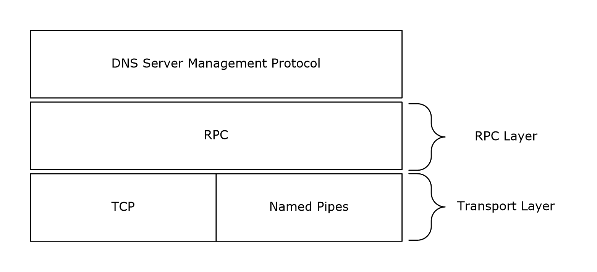

Figure 2: How the DNS Server Management Protocol uses RPC

The DNS server relies on the [**LDAP**](#gt_lightweight-directory-access-protocol-ldap) protocol [[RFC4511]](https://go.microsoft.com/fwlink/?LinkId=157505) to retrieve and modify DNS information when it is stored in a [**directory server**](#gt_directory-server). In this case, the DNS server is the client of the LDAP protocol, acting on behalf of and impersonating (using RPC impersonation), the client of the DNS Server Management Protocol. LDAP's relationship with other protocols is covered in [RFC4511] section 5. Note that although an LDAP provider can support transports other than TCP, the DNS server is required to open LDAP connections specifying the TCP transport using port 389.

The following diagram shows the relationship of the DNS Server Management Protocol to LDAP and TCP:

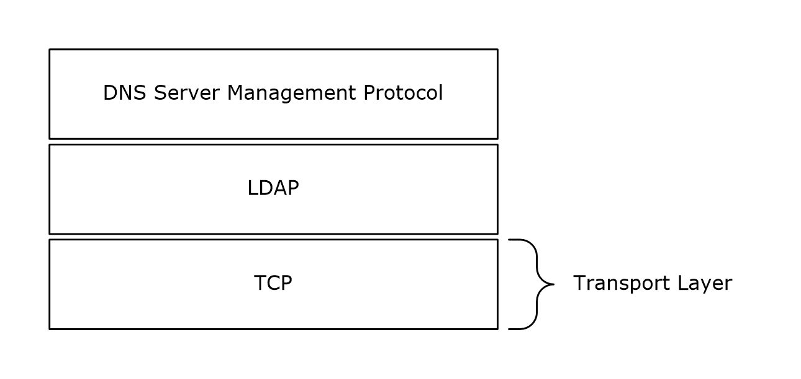

Figure 3: How the DNS Server Management Protocol uses LDAP

The following diagram illustrates the interaction between DNS Server Management Protocol Clients, DNS Servers, and directory servers.


Figure 4: Relationship between DNS Server Management Protocol Clients, DNS Servers, and Directory Servers

<a id="Section_1.5"></a>
## 1.5 Prerequisites/Preconditions

This protocol is implemented on top of [**RPC**](#gt_remote-procedure-call-rpc) and, as a result, has the prerequisites identified in [MS-RPCE](../MS-RPCE/MS-RPCE.md).

The DNS Server Management Protocol assumes that a client has obtained the name of a server that supports this protocol before the protocol is invoked. It also assumes that if a [**local directory server**](#gt_local-directory-server) is available, the DNS server will establish an [**LDAP**](#gt_lightweight-directory-access-protocol-ldap) session to it and has appropriate credentials for requests. If no local directory server is available, or if a connection cannot be established, the DNS server operates only with [**zones**](#gt_zone) loaded from files in the local file system rather than with zones replicated in the directory service, and operations requiring a directory service will fail.

All LDAP operations described in this protocol are performed with the local directory server unless otherwise stated. Consistency of DNS data stored in the local directory server is not guaranteed, since complete or partial updates to the LDAP directory can be replicated to the local directory server at any time. The protocol assumes that the DNS server polls the local directory server for changes that need to be synchronized with the in-memory zones.<1>

<a id="Section_1.6"></a>
## 1.6 Applicability Statement

This protocol is applicable when an application needs to remotely configure a DNS server. It is not applicable to scenarios with multiple clients simultaneously managing a DNS server, if the ability to prevent interference is required.

<a id="Section_1.7"></a>
## 1.7 Versioning and Capability Negotiation

This document covers versioning issues in the following areas:

- Supported Transports: The DNS Server Management Protocol uses the RPC protocol as a transport and multiple [**RPC transports**](#gt_rpc-transport).
- Protocol Versions: This protocol has a version number of 5.0.
- Security and Authentication Methods: Authentication and security are provided as specified in [MS-RPCE](../MS-RPCE/MS-RPCE.md).
The DNS server requests the principal name for the [**security provider**](#gt_security-provider) available on the system. Then Providers, for whom a principal name was obtained, are registered as supported authenticating mechanism for [**RPC**](#gt_remote-procedure-call-rpc) calls. An RPC client using TCP, immediately after creating a binding attempts to negotiate authentication using RPC_C_AUTHN_GSS_NEGOTIATE and [**authentication level**](#gt_authentication-level) as RPC_C_AUTHN_LEVEL_PKT_INTEGRITY as specified in sections [2.1.1](#Section_2.1.1) and [2.1.2](#Section_2.1.2).

- Localization: This protocol passes text strings in various methods. Localization considerations for such strings are specified where relevant.
- Capability Negotiation: The DNS Server Management Protocol does not support negotiation of the protocol version to use. Instead, this protocol uses only the protocol version number specified in the [**IDL**](#gt_interface-definition-language-idl) for versioning and capability negotiation. Note that the present version of the IDL includes a client version input parameter (*dwClientVersion*) for some of the method calls (section [2.2.1.2.1](#Section_2.2.1.2.1)). This parameter allows the server to provide responses conforming to earlier versions of certain data structures associated with those method calls, while allowing extensibility of the present version of the protocol.
<a id="Section_1.8"></a>
## 1.8 Vendor-Extensible Fields

This protocol uses Win32 error codes as defined in [MS-ERREF](../MS-ERREF/MS-ERREF.md) section 2.2. For additional Win32 error codes see section [2.2.1.1.5](#Section_2.2.1.1.5). Vendors are advised to reuse those values with their indicated meaning. Choosing any other value runs the risk of a collision in the future.

<a id="Section_1.9"></a>
## 1.9 Standards Assignments

The following parameters are private Microsoft assignments.

| Parameter | Value | Reference |
| --- | --- | --- |
| [**RPC**](#gt_remote-procedure-call-rpc) Interface [**UUID**](#gt_universally-unique-identifier-uuid) for DNS | 50ABC2A4-574D-40B3-9D66-EE4FD5FBA076 | [[C706]](https://go.microsoft.com/fwlink/?LinkId=89824) section A.2.5 |
| Named Pipe name | \PIPE\DNSSERVER | - |

<a id="Section_2"></a>
# 2 Messages

The following sections specify how the DNS Server Management Protocol messages are transported and what common data types are used.

<a id="Section_2.1"></a>
## 2.1 Transport

All implementations MUST support the [**RPC**](#gt_remote-procedure-call-rpc) over TCP protocol sequence (ncacn_ip_tcp), as specified in [MS-RPCE](../MS-RPCE/MS-RPCE.md), with [**dynamic endpoints**](#gt_dynamic-endpoint). Implementations MAY<2> also support the RPC over named pipes protocol sequence (ncacn_np), as specified in [MS-RPCE], with named pipe name \PIPE\DNSSERVER. The choice of transport for any given communication is up to the client application or higher-layer protocol.

The protocol MUST use the following [**UUID**](#gt_universally-unique-identifier-uuid):

DnsServer: 50ABC2A4-574D-40B3-9D66-EE4FD5FBA076

The protocol MUST use an [**IDL**](#gt_interface-definition-language-idl) version of 5.0.

<a id="Section_2.1.1"></a>
### 2.1.1 Server Security Settings

The [**DNS**](#gt_domain-name-system-dns) Server Management Protocol uses [**Security Support Provider Interface (SSPI)**](#gt_security-support-provider-interface-sspi) security provided by [**RPC**](#gt_remote-procedure-call-rpc), as specified in [MS-RPCE](../MS-RPCE/MS-RPCE.md) section 3.3.1.5.2 for sessions using TCP as the transport protocol. The server SHOULD register the following as [**security providers**](#gt_security-provider):

- RPC_C_AUTHN_GSS_NEGOTIATE
- RPC_C_AUTHN_GSS_KERBEROS
- RPC_C_AUTHN_WINNT
The DNS server MUST allow only authenticated access to RPC clients. The DNS server MUST NOT allow anonymous RPC clients. The DNS RPC server MUST perform a three-phase authorization test to ensure that the client is authorized to perform the specific RPC operation. The three-phase authorization test is specified in section [3.1.6.1](#Section_3.1.6.1). If the server is [**directory server**](#gt_directory-server) integrated, the server MUST [**cache**](#gt_cache) [**directory server security descriptors**](#gt_directory-server-security-descriptors) until the next [**LDAP**](#gt_lightweight-directory-access-protocol-ldap) read operation that reads them and perform LDAP read operations for [**security descriptors**](#gt_security-descriptor) as specified in section [3.1.6.2](#Section_3.1.6.2).

The DNS server can support up to 1,234 concurrent RPC calls.

The DNS server MUST limit access to only clients that negotiate an [**authentication level**](#gt_authentication-level) higher than that of RPC_C_AUTHN_LEVEL_NONE (see [MS-RPCE] section 2.2.1.1.8).

<a id="Section_2.1.2"></a>
### 2.1.2 Client Security Settings

The DNS RPC client SHOULD use a [**security support provider (SSP)**](#gt_security-support-provider-ssp) over RPC as specified in [MS-RPCE](../MS-RPCE/MS-RPCE.md), for sessions using TCP as [**RPC transport**](#gt_rpc-transport) protocol. A client SHOULD authenticate using:

- RPC_C_AUTHN_GSS_NEGOTIATE
A client using TCP as the RPC transport requests RPC_C_AUTHN_LEVEL_PKT_INTEGRITY authentication with the DNS server.

For negotiating RPC security, the DNS RPC client uses the following parameters:

- The client SHOULD<3> request mutual authentication by requesting the RPC_C_QOS_CAPABILITIES_MUTUAL_AUTH capability. The client MAY additionally request the RPC_C_QOS_CAPABILITIES_IGNORE_DELEGATE_FAILURE capability.
- The identity tracking type is set to RPC_C_QOS_IDENTITY_STATIC.
- The impersonation type is set to RPC_C_IMP_LEVEL_IMPERSONATE, indicating that the server can impersonate the client; the client MAY instead specify RPC_C_IMP_LEVEL_DELEGATE.<4>
<a id="Section_2.2"></a>
## 2.2 Common Data Types

In addition to [**RPC**](#gt_remote-procedure-call-rpc) base types and definitions specified in [[C706]](https://go.microsoft.com/fwlink/?LinkId=89824) and [MS-RPCE](../MS-RPCE/MS-RPCE.md), additional data types are defined below. This protocol also uses the types WORD and DWORD defined in [MS-DTYP](../MS-DTYP/MS-DTYP.md).

All multi-byte integer values in the messages declared in this section use little-endian byte order unless otherwise noted.

All fields designated as Unicode strings MUST be implemented using [**UTF-16LE**](#gt_utf-16le) strings as defined in [[UNICODE5.0.0/2007]](https://go.microsoft.com/fwlink/?LinkId=154659) section 2.6.

<a id="Section_2.2.1"></a>
### 2.2.1 DNS RPC Common Messages

<a id="Section_2.2.1.1"></a>
#### 2.2.1.1 Enumerations and Constants

<a id="Section_2.2.1.1.1"></a>
##### 2.2.1.1.1 DNS_RPC_TYPEID

The DNS Server Management Protocol RPC methods use a generic and extensible data structure of type **DNSSRV_RPC_UNION** structure (section [2.2.1.2.6](#Section_2.2.1.2.6)), which is a union of pointers to different data types. A **DNS_RPC_TYPEID** enumeration value is used to specify what data is being stored in an instance of the **DNSSRV_RPC_UNION** structure. When combined with a **DNSSRV_RPC_UNION** structure, the **DNS_RPC_TYPEID** enumeration allows the DNS RPC interface to communicate many different types of DNS server configuration and data in a single structure.

typedef enum _DnssrvRpcTypeId

{

DNSSRV_TYPEID_ANY = (-1),

DNSSRV_TYPEID_NULL = 0,

DNSSRV_TYPEID_DWORD,

DNSSRV_TYPEID_LPSTR,

DNSSRV_TYPEID_LPWSTR,

DNSSRV_TYPEID_IPARRAY,

DNSSRV_TYPEID_BUFFER, // 5

DNSSRV_TYPEID_SERVER_INFO_W2K,

DNSSRV_TYPEID_STATS,

DNSSRV_TYPEID_FORWARDERS_W2K,

DNSSRV_TYPEID_ZONE_W2K,

DNSSRV_TYPEID_ZONE_INFO_W2K, // 10

DNSSRV_TYPEID_ZONE_SECONDARIES_W2K,

DNSSRV_TYPEID_ZONE_DATABASE_W2K,

DNSSRV_TYPEID_ZONE_TYPE_RESET_W2K,

DNSSRV_TYPEID_ZONE_CREATE_W2K,

DNSSRV_TYPEID_NAME_AND_PARAM, // 15

DNSSRV_TYPEID_ZONE_LIST_W2K,

DNSSRV_TYPEID_ZONE_RENAME,

DNSSRV_TYPEID_ZONE_EXPORT,

DNSSRV_TYPEID_SERVER_INFO_DOTNET,

DNSSRV_TYPEID_FORWARDERS_DOTNET, // 20

DNSSRV_TYPEID_ZONE,

DNSSRV_TYPEID_ZONE_INFO_DOTNET,

DNSSRV_TYPEID_ZONE_SECONDARIES_DOTNET,

DNSSRV_TYPEID_ZONE_DATABASE,

DNSSRV_TYPEID_ZONE_TYPE_RESET_DOTNET, // 25

DNSSRV_TYPEID_ZONE_CREATE_DOTNET,

DNSSRV_TYPEID_ZONE_LIST,

DNSSRV_TYPEID_DP_ENUM,

DNSSRV_TYPEID_DP_INFO,

DNSSRV_TYPEID_DP_LIST, // 30

DNSSRV_TYPEID_ENLIST_DP,

DNSSRV_TYPEID_ZONE_CHANGE_DP,

DNSSRV_TYPEID_ENUM_ZONES_FILTER,

DNSSRV_TYPEID_ADDRARRAY,

DNSSRV_TYPEID_SERVER_INFO, // 35

DNSSRV_TYPEID_ZONE_INFO,

DNSSRV_TYPEID_FORWARDERS,

DNSSRV_TYPEID_ZONE_SECONDARIES,

DNSSRV_TYPEID_ZONE_TYPE_RESET,

DNSSRV_TYPEID_ZONE_CREATE, // 40

DNSSRV_TYPEID_IP_VALIDATE,

DNSSRV_TYPEID_AUTOCONFIGURE,

DNSSRV_TYPEID_UTF8_STRING_LIST,

DNSSRV_TYPEID_UNICODE_STRING_LIST,

DNSSRV_TYPEID_SKD, // 45

DNSSRV_TYPEID_SKD_LIST,

DNSSRV_TYPEID_SKD_STATE,

DNSSRV_TYPEID_SIGNING_VALIDATION_ERROR,

DNSSRV_TYPEID_TRUST_POINT_LIST,

DNSSRV_TYPEID_TRUST_ANCHOR_LIST, // 50

DNSSRV_TYPEID_ZONE_SIGNING_SETTINGS,

DNSSRV_TYPEID_ZONE_SCOPE_ENUM,

DNSSRV_TYPEID_ZONE_STATS,

DNSSRV_TYPEID_ZONE_SCOPE_CREATE,

DNSSRV_TYPEID_ZONE_SCOPE_INFO, // 55

DNSSRV_TYPEID_SCOPE_ENUM,

DNSSRV_TYPEID_CLIENT_SUBNET_RECORD,

DNSSRV_TYPEID_POLICY,

DNSSRV_TYPEID_POLICY_NAME,

DNSSRV_TYPEID_POLICY_ENUM, // 60

DNSSRV_TYPEID_RRL,

- DNSSRV_TYPEID_VIRTUALIZATION_INSTANCE,
- DNSSRV_TYPEID_VIRTUALIZATION_INSTANCE_ENUM,
- DNSSRV_TYPEID_ENCRYPTION_CONFIG
- }
- DNS_RPC_TYPEID, *PDNS_RPC_TYPEID;
**DNSSRV_TYPEID_ANY:** Type is invalid.

**DNSSRV_TYPEID_NULL:** No data is provided.

**DNSSRV_TYPEID_DWORD:** A DWORD value.

**DNSSRV_TYPEID_LPSTR:** A pointer to a null-terminated [**UTF-8**](#gt_utf-8) [[RFC3629]](https://go.microsoft.com/fwlink/?LinkId=90439) string.

**DNSSRV_TYPEID_LPWSTR:** A pointer to a null-terminated [**Unicode string**](#gt_unicode-string).

**DNSSRV_TYPEID_IPARRAY:** A pointer to an [IP4_ARRAY](#Section_2.2.3.2.1). This structure is used to specify a list of [**IPv4**](#gt_internet-protocol-version-4-ipv4) addresses.

**DNSSRV_TYPEID_BUFFER:** A pointer to a [DNS_RPC_BUFFER (section 2.2.1.2.2)](#Section_2.2.1.2.2). This structure is used to hold a generic buffer of the DNS server information. Interpretation of the buffer depends upon the request.

**DNSSRV_TYPEID_SERVER_INFO_W2K:** A pointer to a structure of type [DNS_RPC_SERVER_INFO_W2K (section 2.2.4.2.2.1)](#Section_2.2.4.2.2.1). This structure is used to specify general DNS server state and configuration.

**DNSSRV_TYPEID_STATS:** A pointer to a structure of type [DNSSRV_STATS (section 2.2.10.2.2)](#Section_2.2.10.2.2). The structure exposes internal statistics and counters.

**DNSSRV_TYPEID_FORWARDERS_W2K:** A pointer to a structure of type [DNS_RPC_FORWARDERS_W2K (section 2.2.5.2.10.1)](#Section_2.2.5.2.10.1). This structure specifies the set of DNS servers this DNS server will forward unresolved queries to.

**DNSSRV_TYPEID_ZONE_W2K:** A pointer to a structure of type [DNS_RPC_ZONE_W2K (section 2.2.5.2.1.1)](#Section_2.2.5.2.1.1). This structure is used to specify basic information about a DNS zone.

**DNSSRV_TYPEID_ZONE_INFO_W2K:** A pointer to a structure of type [DNS_RPC_ZONE_INFO_W2K (section 2.2.5.2.4.1)](#Section_2.2.5.2.4.1). This structure is used to specify detailed DNS zone information.

**DNSSRV_TYPEID_ZONE_SECONDARIES_W2K:** A pointer to a structure of type [DNS_RPC_ZONE_SECONDARIES_W2K (section 2.2.5.2.5.1)](#Section_2.2.5.2.5.1). This structure is used to specify information about the secondary servers for a primary DNS zone.

**DNSSRV_TYPEID_ZONE_DATABASE_W2K:** A pointer to a structure of type [DNS_RPC_ZONE_DATABASE_W2K (section 2.2.5.2.6.1)](#Section_2.2.5.2.6.1). This structure specifies how a DNS zone is stored in persistent storage.

**DNSSRV_TYPEID_ZONE_TYPE_RESET_W2K:** This value is not used.

**DNSSRV_TYPEID_ZONE_CREATE_W2K:** A pointer to a structure of type [DNS_RPC_ZONE_CREATE_INFO_W2K (section 2.2.5.2.7.1)](#Section_2.2.5.2.7.1). This structure is used to specify parameters required when creating a new DNS zone.

**DNSSRV_TYPEID_NAME_AND_PARAM:** A pointer to a structure of type [DNS_RPC_NAME_AND_PARAM (section 2.2.1.2.5)](#Section_2.2.1.2.5). This is a general purpose structure used to associate a parameter name with a DWORD value.

**DNSSRV_TYPEID_ZONE_LIST_W2K:** A pointer to a structure of type [DNS_RPC_ZONE_LIST_W2K (section 2.2.5.2.3.1)](#Section_2.2.5.2.3.1). This structure is used to enumerate zones.

**DNSSRV_TYPEID_ZONE_RENAME:** This value is not used.

**DNSSRV_TYPEID_ZONE_EXPORT:** A pointer to a structure of type [DNS_RPC_ZONE_EXPORT_INFO (section 2.2.5.2.8)](#Section_2.2.5.2.8). This structure is used to specify how to export a zone to a file.

**DNSSRV_TYPEID_SERVER_INFO_DOTNET:** A pointer to a structure of type [DNS_RPC_SERVER_INFO_DOTNET (section 2.2.4.2.2.2)](#Section_2.2.4.2.2.2). This structure is used to specify general DNS server state and configuration.

**DNSSRV_TYPEID_FORWARDERS_DOTNET:** A pointer to a structure of type [DNS_RPC_FORWARDERS_DOTNET (section 2.2.5.2.10.2)](#Section_2.2.5.2.10.2). This structure specifies the set of DNS servers this DNS server will forward unresolved queries to.

**DNSSRV_TYPEID_ZONE:** A pointer to a structure of type [DNS_RPC_ZONE (section 2.2.5.2.1)](#Section_2.2.5.2.1). This structure is used to specify basic information and a DNS zone.

**DNSSRV_TYPEID_ZONE_INFO_DOTNET:** A pointer to a structure of type [DNS_RPC_ZONE_INFO_DOTNET (section 2.2.5.2.4.2)](#Section_2.2.5.2.4.2). This structure is used to specify detailed information about a DNS zone.

**DNSSRV_TYPEID_ZONE_SECONDARIES_DOTNET:** A pointer to a structure of type [DNS_RPC_ZONE_SECONDARIES_DOTNET (section 2.2.5.2.5.2)](#Section_2.2.5.2.5.2). This structure is used to specify information about the secondary servers for a primary DNS zone.

**DNSSRV_TYPEID_ZONE_DATABASE:** A pointer to a structure of type [DNS_RPC_ZONE_DATABASE (section 2.2.5.2.6)](#Section_2.2.5.2.6). This structure specifies how a DNS zone is stored in persistent storage.

**DNSSRV_TYPEID_ZONE_TYPE_RESET_DOTNET:** This value is not used.

**DNSSRV_TYPEID_ZONE_CREATE_DOTNET:** A pointer to a structure of type [DNS_RPC_ZONE_CREATE_INFO_DOTNET](#Section_2.2.5.2.7.2). This structure is used to specify parameters required when creating a new DNS zone.

**DNSSRV_TYPEID_ZONE_LIST:** A pointer to a structure of type [DNS_RPC_ZONE_LIST (section 2.2.5.2.3)](#Section_2.2.5.2.3). This structure is used to enumerate zones.

**DNSSRV_TYPEID_DP_ENUM:** A pointer to a structure of type [DNS_RPC_DP_ENUM (section 2.2.7.2.3)](#Section_2.2.7.2.3). This structure is used to specify basic information about an [**application directory partition**](#gt_application-directory-partition).

**DNSSRV_TYPEID_DP_INFO:** A pointer to a structure of type [DNS_RPC_DP_INFO (section 2.2.7.2.1)](#Section_2.2.7.2.1). This structure specifies detailed information about a single application directory partition.

**DNSSRV_TYPEID_DP_LIST:** A pointer to a structure of type [DNS_RPC_DP_LIST (section 2.2.7.2.4)](#Section_2.2.7.2.4). This structure is used to enumerate application directory partitions.

**DNSSRV_TYPEID_ENLIST_DP:** A pointer to a structure of type [DNS_RPC_ENLIST_DP (section 2.2.7.2.5)](#Section_2.2.7.2.5). This structure is used to request enlistment changes for an application directory partition.

**DNSSRV_TYPEID_ZONE_CHANGE_DP:** A pointer to a structure of type [DNS_RPC_ZONE_CHANGE_DP (section 2.2.7.2.6)](#Section_2.2.7.2.6). This structure is used to request that a DNS [**zone**](#gt_zone) be moved from one application directory partition to another.

**DNSSRV_TYPEID_ENUM_ZONES_FILTER:** A pointer to a structure of type [DNS_RPC_ENUM_ZONES_FILTER (section 2.2.5.2.9)](#Section_2.2.5.2.9). This structure is used to filter DNS zones during enumeration.

**DNSSRV_TYPEID_ADDRARRAY:** A pointer to a structure of type [DNS_ADDR_ARRAY (section 2.2.3.2.3)](#Section_2.2.3.2.3). This structure is used to specify a list of IPv4 or [**IPv6**](#gt_internet-protocol-version-6-ipv6) addresses.

**DNSSRV_TYPEID_SERVER_INFO:** A pointer to a structure of type [DNS_RPC_SERVER_INFO (section 2.2.4.2.2)](#Section_2.2.4.2.2). This structure is used to specify general DNS server state and configuration.

**DNSSRV_TYPEID_ZONE_INFO:** A pointer to a structure of type [DNS_RPC_ZONE_INFO (section 2.2.5.2.4)](#Section_2.2.5.2.4). This structure is used to specify detailed information about a DNS zone.

**DNSSRV_TYPEID_FORWARDERS:** A pointer to a structure of type [DNS_RPC_FORWARDERS (section 2.2.5.2.10)](#Section_2.2.5.2.10). This structure specifies the set of DNS servers this DNS server will forward unresolved queries to.

**DNSSRV_TYPEID_ZONE_SECONDARIES:** A pointer to a structure of type [DNS_RPC_ZONE_SECONDARIES (section 2.2.5.2.5)](#Section_2.2.5.2.5). This structure is used to specify information about the secondary servers for a primary DNS zone.

**DNSSRV_TYPEID_ZONE_TYPE_RESET:** This value is not used.

**DNSSRV_TYPEID_ZONE_CREATE:** A pointer to a structure of type [DNS_RPC_ZONE_CREATE_INFO (section 2.2.5.2.7)](#Section_2.2.5.2.7). This structure is used to specify parameters required when creating a new DNS zone.

**DNSSRV_TYPEID_IP_VALIDATE:** A pointer to a structure of type [DNS_RPC_IP_VALIDATE (section 2.2.3.2.4)](#Section_2.2.3.2.4). This structure is used to request IP validation and to return the results of IP validation.

**DNSSRV_TYPEID_AUTOCONFIGURE:** A pointer to a structure of type [DNS_RPC_AUTOCONFIGURE (section 2.2.8.2.1)](#Section_2.2.8.2.1). This structure is used to request DNS server autoconfiguration.

**DNSSRV_TYPEID_UTF8_STRING_LIST:** A pointer to a structure of type [DNS_RPC_UTF8_STRING_LIST (section 2.2.1.2.3)](#Section_2.2.1.2.3). This structure is used to represent a list of UTF-8 [RFC3629] strings.

**DNSSRV_TYPEID_UNICODE_STRING_LIST:** A pointer to a structure of type [DNS_RPC_UNICODE_STRING_LIST (section 2.2.1.2.4)](#Section_2.2.1.2.4). This structure is used to represent a list of Unicode strings.

**DNSSRV_TYPEID_SKD:** A pointer to a structure of type [DNS_RPC_SKD (section 2.2.6.2.1)](#Section_2.2.6.2.1). This structure is used to specify detailed [**signing key descriptor (SKD)**](#gt_signing-key-descriptor-skd) information.

**DNSSRV_TYPEID_SKD_LIST:** A pointer to a structure of type [DNS_RPC_SKD_LIST (section 2.2.6.2.2)](#Section_2.2.6.2.2). This structure is used to enumerate signing key descriptors.

**DNSSRV_TYPEID_SKD_STATE:** A pointer to a structure of type [DNS_RPC_SKD_STATE (section 2.2.6.2.3)](#Section_2.2.6.2.3). This structure is used to specify detailed signing key descriptor state information.

**DNSSRV_TYPEID_SIGNING_VALIDATION_ERROR:** A pointer to a structure of type [DNS_RPC_SIGNING_VALIDATION_ERROR (section 2.2.6.2.8)](#Section_2.2.6.2.8). This structure is used to specify signing key descriptor validation error information.

**DNSSRV_TYPEID_TRUST_POINT_LIST:** A pointer to a structure of type [DNS_RPC_TRUST_POINT_LIST (section 2.2.6.2.5)](#Section_2.2.6.2.5). This structure is used to enumerate [**trust points**](#gt_trust-point).

**DNSSRV_TYPEID_TRUST_ANCHOR_LIST:** A pointer to a structure of type [DNS_RPC_TRUST_ANCHOR_LIST (section 2.2.6.2.7)](#Section_2.2.6.2.7). This structure is used to enumerate [**trust anchors**](#gt_trust-anchor).

**DNSSRV_TYPEID_ZONE_SIGNING_SETTINGS:** A pointer to a structure of type [DNS_RPC_ZONE_DNSSEC_SETTINGS (section 2.2.6.2.9)](#Section_2.2.6.2.9). This structure is used to specify the DNSSEC settings for file-backed zones.

**DNSSRV_TYPEID_ZONE_SCOPE_ENUM:** A pointer to a structure of type [DNS_RPC_ENUM_ZONE_SCOPE_LIST (section 2.2.13.1.1)](#Section_2.2.13.1.1). This structure is used to enumerate [**zone scopes**](#gt_zone-scope) or [**cache scopes**](#gt_cache-scope).

**DNSSRV_TYPEID_ZONE_STATS:** A pointer to a structure of type [DNS_RPC_ZONE_STATS_V1 (section 2.2.12.2.5)](#Section_2.2.12.2.5). This structure is used to enumerate the zone statistics.

**DNSSRV_TYPEID_ZONE_SCOPE_CREATE:** A pointer to a structure of type [DNS_RPC_ZONE_SCOPE_CREATE_INFO_V1 (section 2.2.13.1.2.1)](#Section_2.2.13.1.2.1). This structure is used to create the zone scope or cache scope.

**DNSSRV_TYPEID_ZONE_SCOPE_INFO:** A pointer to a structure of type [DNS_RPC_ZONE_SCOPE_INFO_V1 (section 2.2.13.1.3.1)](#Section_2.2.13.1.3.1). This structure is used to get the zone scope or cache scope information.

**DNSSRV_TYPEID_SCOPE_ENUM:** A pointer to a structure of type DNS_RPC_ENUM_SCOPE_LIST (section [2.2.14.1.1](#Section_2.2.14.1.1)). The structure is used to enumerate the server scopes configured on the DNS server.

**DNSSRV_TYPEID_CLIENT_SUBNET_RECORD:** A pointer to a structure of type DNS_RPC_CLIENT_SUBNET_RECORD (section [2.2.15.2.1](#Section_2.2.15.2.1)). The structure is used to enumerate the client subnet records configured on the DNS server.

**DNSSRV_TYPEID_POLICY:** A pointer to a structure of type DNS_RPC_POLICY (section [2.2.15.2.5](#Section_2.2.15.2.5)).

**DNSSRV_TYPEID_POLICY_NAME:** A pointer to a structure of type DNS_RPC_POLICY_NAME (section [2.2.15.2.6](#Section_2.2.15.2.6)).

**DNSSRV_TYPEID_POLICY_ENUM:** A pointer to a structure of type DNS_RPC_ENUMERATE_POLICY_LIST (section [2.2.15.2.7](#Section_2.2.15.2.7)). The structure is used to enumerate the [**DNS policy**](#gt_dns-policy) configured on the DNS server.

**DNSSRV_TYPEID_RRL:** A pointer to a structure of type DNS_RPC_RRL_PARAMS (section [2.2.16.2.1](#Section_2.2.16.2.1)). This structure is used to configure parameters for [**Response Rate Limiting (RRL)**](#gt_response-rate-limiting-rrl).

**DNSSRV_TYPEID_VIRTUALIZATION_INSTANCE**:A pointer to a structure of type [DNS_RPC_VIRTUALIZATION_INSTANCE (section 2.2.17.1.1)](#Section_2.2.17.1.1).

**DNSSRV_TYPEID_VIRTUALIZATION_INSTANCE_ENUM**: A pointer to a structure of type [DNS_RPC_ENUM_VIRTUALIZATION_INSTANCE_LIST (section 2.2.17.1.3)](#Section_2.2.17.1.3). This structure is used to enumerate the [**virtualization instances**](#gt_virtualization-instance) in the DNS Server.

**DNSSRV_TYPEID_ENCRYPTION_CONFIG**: A pointer to a structure of type **DNS_RPC_ENCRYPTION_CONFIG** (section [2.2.4.2.3](#Section_2.2.4.2.3)). This structure is used to specify DNS encryption protocol configuration on the DNS server.

Clients and servers of the DNS Server Management Protocol SHOULD<5> support all values above.

<a id="Section_2.2.1.1.2"></a>
##### 2.2.1.1.2 DNS_RPC_PROTOCOLS

**DNS_RPC_PROTOCOLS** is a DWORD value that specifies types of [**RPC**](#gt_remote-procedure-call-rpc) protocols supported by the DNS server. For more details about this type, see section 2.1 in [MS-RPCE](../MS-RPCE/MS-RPCE.md).

| Constant/value | Description |
| --- | --- |
| DNS_RPC_USE_TCPIP 0x00000001 | The server allows clients to connect using RPC over TCP/IP. |
| DNS_RPC_USE_NAMED_PIPE 0x00000002 | The server allows clients to connect using RPC over named pipes. |
| DNS_RPC_USE_LPC 0x00000004 | An implementation-specific mode of communicating with a client on the same machine. <6> |
| DNS_RPC_USE_ALL_PROTOCOLS 0xFFFFFFFF | The server allows clients to connect using any of the above RPC mechanisms. |

<a id="Section_2.2.1.1.3"></a>
##### 2.2.1.1.3 TRUSTPOINT_STATE

The **TRUSTPOINT_STATE** enumeration identifies the current state of the life cycle of a DNSSEC trust point. The state of the trust point is determined by the states of its trust anchors and is given for informational purposes only; it does not affect the DNS or [**LDAP**](#gt_lightweight-directory-access-protocol-ldap) protocol.

typedef enum

{

TRUSTPOINT_STATE_INITIALIZED,

TRUSTPOINT_STATE_DSPENDING,

TRUSTPOINT_STATE_ACTIVE,

TRUSTPOINT_STATE_DELETE_PENDING,

TRUSTPOINT_STATE_DELETED

}

TRUSTPOINT_STATE, *PTRUSTPOINT_STATE;

**TRUSTPOINT_STATE_INITIALIZED**: Indicates a trust point that has no trust anchors but has child nodes that do have trust anchors.

**TRUSTPOINT_STATE_DSPENDING**: Indicates a trust point that has only DS trust anchors and is therefore ineffective for DNSSEC operations.

**TRUSTPOINT_STATE_ACTIVE**: Indicates a trust point that has one or more DNSKEY trust anchors. Queries covered by this trust point will be validated using the DNSKEY trust anchors.

**TRUSTPOINT_STATE_DELETE_PENDING**: Indicates a trust point containing only revoked DNSKEY trust anchors. When the [[RFC5011]](https://go.microsoft.com/fwlink/?LinkId=225980) remove-hold-down time is exceeded for all revoked trust anchors, this trust point will be deleted.

**TRUSTPOINT_STATE_DELETED**: Reserved. MUST NOT be sent by the server, MUST be ignored by the receiver.

<a id="Section_2.2.1.1.4"></a>
##### 2.2.1.1.4 TRUSTANCHOR_STATE

The **TRUSTANCHOR_STATE** enumeration identifies the current state of the life cycle of a DNSSEC trust anchor. All states other than TRUSTANCHOR_STATE_DSPENDING and TRUSTANCHOR_STATE_DSINVALID correspond to the states given in [[RFC5011]](https://go.microsoft.com/fwlink/?LinkId=225980) section 4.2. Only the TRUSTANCHOR_STATE_VALID and TRUSTANCHOR_STATE_MISSING trust anchors affect the DNS protocol (by acting as a DNSSEC trust anchor). None of the states affect the LDAP protocol [[RFC4511]](https://go.microsoft.com/fwlink/?LinkId=157505).

typedef enum

{

TRUSTANCHOR_STATE_INITIALIZED,

TRUSTANCHOR_STATE_DSPENDING,

TRUSTANCHOR_STATE_DSINVALID,

TRUSTANCHOR_STATE_ADDPEND,

TRUSTANCHOR_STATE_VALID,

TRUSTANCHOR_STATE_MISSING,

TRUSTANCHOR_STATE_REVOKED,

TRUSTANCHOR_STATE_DELETED

}

TRUSTANCHOR_STATE, *PTRUSTANCHOR_STATE;

**TRUSTANCHOR_STATE_INITIALIZED**: Reserved. MUST NOT be sent by the server, MUST be ignored by the receiver.

**TRUSTANCHOR_STATE_DSPENDING**: Indicates a DS trust anchor that can be replaced by the DNSKEY trust anchor that matches the hash of the DS trust anchor after the next [RFC5011] [**active refresh**](#gt_active-refresh).

**TRUSTANCHOR_STATE_DSINVALID**: Indicates a DS trust anchor that matches a DNSKEY record that is not valid as a trust anchor because the SEP flag is not set or because the algorithm is unsupported.

**TRUSTANCHOR_STATE_ADDPEND**: Indicates a DNSKEY trust anchor that has not exceeded the [RFC5011] add-hold-down time. This trust anchor can become a valid trust anchor after the hold-down time has been exceeded.

**TRUSTANCHOR_STATE_VALID**: Indicates a DNSKEY trust anchor that has exceeded the [RFC5011] add-hold-down time, has been matched to (and has replaced) a DS trust anchor, or has been added by the administrator. This trust anchor is trusted for DNSSEC operations, and a copy exists in the TrustAnchors zone.

**TRUSTANCHOR_STATE_MISSING**: Indicates a DNSKEY trust anchor that is valid but was not seen in the last [RFC5011] active refresh. This trust anchor is trusted for DNSSEC operations, and a copy exists in the TrustAnchors zone.

**TRUSTANCHOR_STATE_REVOKED**: Indicates a DNSKEY trust anchor that has been revoked by the [**authoritative**](#gt_authoritative) zone administrator according to [RFC5011]. This trust anchor will be deleted when the [RFC5011] remove-hold-down time is exceeded.

**TRUSTANCHOR_STATE_DELETED**: Reserved. MUST NOT be sent by the server, MUST be ignored by the receiver.

<a id="Section_2.2.1.1.5"></a>
##### 2.2.1.1.5 Win32 Error Codes

The following Win32 API error code constants are used by this protocol as return values in addition to those defined in [MS-ERREF](../MS-ERREF/MS-ERREF.md) section 2.2.

| Win32 error codes | Description |
| --- | --- |
| 0x00002565 (9573) DNS_ERROR_ADDRESS_REQUIRED | Not allowed to remove all addresses. |
| 0x00002581 (9601) DNS_ERROR_ZONE_DOES_NOT_EXIST | DNS zone does not exist. |
| 0x000025f2 (9714) DNS_ERROR_NAME_DOES_NOT_EXIST | DNS name does not exist. |
| 0x000026B8 (9912) DNS_ERROR_RRL_INVALID_WINDOW_SIZE | The window size parameter is invalid. It should be greater than or equal to 1. |
| 0x000026B9 (9913) DNS_ERROR_RRL_INVALID_IPV4_PREFIX | The IPv4 prefix length parameter is invalid. It should be less than or equal to 32. |
| 0x000026BA (9914) DNS_ERROR_RRL_INVALID_IPV6_PREFIX | The IPv6 prefix length parameter is invalid. It should be less than or equal to 128. |
| 0x000026BB (9915) DNS_ERROR_RRL_INVALID_TC_RATE | The TC Rate parameter is invalid. It should be less than 10. |
| 0x000026BC (9916) DNS_ERROR_RRL_INVALID_LEAK_RATE | The Leak Rate parameter is invalid. It should be either 0, or between 2 and 10. |
| 0x000026BD (9917) DNS_ERROR_RRL_LEAK_RATE_LESSTHAN_TC_RATE | The Leak Rate or TC Rate parameter is invalid. Leak Rate should be greater than TC Rate. |
| 0x000026C1 (9921) DNS_ERROR_VIRTUALIZATION_INSTANCE_ALREADY_EXISTS | The virtualization instance already exists. |
| 0x000026C2 (9922) DNS_ERROR_VIRTUALIZATION_INSTANCE_DOES_NOT_EXIST | The virtualization instance does not exist. |
| 0x000026C4 (9924) DNS_ERROR_INVAILD_VIRTUALIZATION_INSTANCE_NAME | Invalid virtualization instance name. |
| 0x000026E7 (9959) DNS_ERROR_SCOPE_DOES_NOT_EXIST | The scope does not exist. |
| 0x000026F3 (9971) DNS_ERROR_POLICY_ALREADY_EXISTS | A policy with the same name already exists on this level (server level or zone level) on the DNS server. |
| 0x000026F4 (9972) DNS_ERROR_POLICY_DOES_NOT_EXIST | No policy with this name exists on this level (server level or zone level) on the DNS server. |
| 0x000026F6 (9974) DNS_ERROR_POLICY_INVALID_SETTINGS | At least one of the settings of this policy is invalid. |
| 0x000026F7 (9975) DNS_ERROR_CLIENT_SUBNET_IS_ACCESSED | The client subnet cannot be deleted while it is being accessed by a policy. |
| 0x000026F8 (9976) DNS_ERROR_CLIENT_SUBNET_DOES_NOT_EXIST | The client subnet does not exist on the DNS server. |
| 0x000026FA (9978) DNS_ERROR_SUBNET_DOES_NOT_EXIST | The IP subnet specified does not exist in the client subnet. |
| 0x000026FD (9981) DNS_ERROR_POLICY_INVALID_WEIGHT | The weight of the scope in the policy is invalid. |
| 0x00002704 (9988) NS_ERROR_SERVERSCOPE_IS_REFERENCED | The server scope cannot be deleted because it is referenced by a DNS Policy. |
| 0x00002705 (9989) DNS_ERROR_ZONESCOPE_IS_REFERENCED | The zone scope cannot be deleted because it is referenced by a DNS Policy. |
| 0x00002706 (9990) DNS_ERROR_POLICY_INVALID_CRITERIA_CLIENT_SUBNET | The criterion client subnet provided in the policy is invalid. |
| 0x00002707 (9991) DNS_ERROR_POLICY_INVALID_CRITERIA_TRANSPORT_PROTOCOL | The criterion transport protocol provided in the policy is invalid. |
| 0x00002708 (9992) DNS_ERROR_POLICY_INVALID_CRITERIA_NETWORK_PROTOCOL | The criterion network protocol provided in the policy is invalid. |
| 0x00002709 (9993) DNS_ERROR_POLICY_INVALID_CRITERIA_INTERFACE | The criterion interface provided in the policy is invalid. |
| 0x0000270A (9994) DNS_ERROR_POLICY_INVALID_CRITERIA_FQDN | The criterion FQDN provided in the policy is invalid. |
| 0x0000270B (9995) DNS_ERROR_POLICY_INVALID_CRITERIA_QUERY_TYPE | The criterion query type provided in the policy is invalid. |
| 0x0000270C (9996) DNS_ERROR_POLICY_INVALID_CRITERIA_TIME_OF_DAY | The criterion time of day provided in the policy is invalid. |

<a id="Section_2.2.1.2"></a>
#### 2.2.1.2 Structures

<a id="Section_2.2.1.2.1"></a>
##### 2.2.1.2.1 DNS_RPC_CURRENT_CLIENT_VER

The **DNS_RPC_CURRENT_CLIENT_VER** structure specifies version number information of the DNS RPC client. This version number is used by RPC clients to identify the requested RPC structures' version to the server so that the server can treat the request appropriately. This structure is defined as (in host byte order):

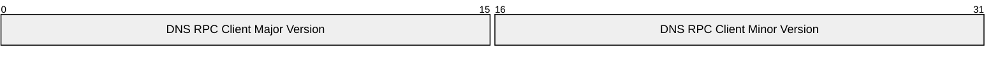

**DNS RPC Client Major Version (2 bytes):** The major version number for the DNS RPC client. This MUST have a value from the following set:

| Value | Meaning |
| --- | --- |
| 0x0000 | Client requests RPC structures that do not require specific version numbers. |
| 0x0006 | Client requests RPC structures associated with version 6. |
| 0x0007 | Client requests RPC structures associated with version 7. |

**DNS RPC Client Minor Version (2 bytes):** The minor version number for the DNS RPC client. Senders MUST set this to zero and receivers MUST ignore it.

<a id="Section_2.2.1.2.2"></a>
##### 2.2.1.2.2 DNS_RPC_BUFFER

The **DNS_RPC_BUFFER** structure contains a set of a specific type of structures. The DNS Server Management Protocol uses this structure to return information from the server, while processing R_DnssrvComplexOperation2 (section [3.1.4.8](#Section_3.1.4.8)) method calls with operation type "Statistics".

typedef struct _DnssrvRpcBuffer {

DWORD dwLength;

[size_is(dwLength)] BYTE Buffer[];

} DNS_RPC_BUFFER,

*PDNS_RPC_BUFFER;

**dwLength:** The length, in bytes, of the data stored in Buffer.

**Buffer:** A variable length array of bytes of length specified by *dwLength*. The buffer can contain one or more DNS_RPC_NODE structures (section [2.2.2.2.3](#Section_2.2.2.2.3)). Each DNS_RPC_NODE contains the length of that [**node**](#gt_node), so the DNS_RPC_BUFFER dwLength can be larger to indicate multiple DNS_RPC_NODE structures.

<a id="Section_2.2.1.2.3"></a>
##### 2.2.1.2.3 DNS_RPC_UTF8_STRING_LIST

The **DNS_RPC_UTF8_STRING_LIST** structure contains a list of null-terminated [**UTF-8**](#gt_utf-8) strings. This structure is used by the DNS Server Management Protocol while processing R_DnssrvOperations2 (section [3.1.4.6](#Section_3.1.4.6)) and R_DnssrvQuery2 (section [3.1.4.7](#Section_3.1.4.7)) method calls, with operations type "GlobalQueryBlockList".

typedef struct _DnsRpcUtf8StringList {

[range(0,10000)] DWORD dwCount;

[size_is(dwCount), string] char* pszStrings[];

} DNS_RPC_UTF8_STRING_LIST,

*PDNS_RPC_UTF8_STRING_LIST;

**dwCount:** The number of strings present in the pszStrings array.

**pszStrings:** A variable length array of pointers to null-terminated UTF-8 strings.

<a id="Section_2.2.1.2.4"></a>
##### 2.2.1.2.4 DNS_RPC_UNICODE_STRING_LIST

The **DNS_RPC_UNICODE_STRING_LIST** structure contains a list of null-terminated [**Unicode strings**](#gt_unicode-string). This structure is used by the DNS Server Management Protocol while processing the [R_DnssrvComplexOperation2 (section 3.1.4.8)](#Section_3.1.4.8) method call, with operations of type "EnumerateKeyStorageProviders".

typedef struct _DnsRpcUnicodeStringList {

[range(0,10000)] DWORD dwCount;

[size_is(dwCount), string] wchar_t * pwszStrings[];

} DNS_RPC_UNICODE_STRING_LIST,

*PDNS_RPC_UNICODE_STRING_LIST;

**dwCount:** The number of strings present in the pwszStrings array.

**pwszStrings:** A variable-length array of pointers to null-terminated Unicode strings.

<a id="Section_2.2.1.2.5"></a>
##### 2.2.1.2.5 DNS_RPC_NAME_AND_PARAM

The **DNS_RPC_NAME_AND_PARAM** structure contains information about a simple server property that takes a DWORD value. The DNS Server Management Protocol uses this structure to exchange information about various properties that take an integer value, while processing the R_DnssrvOperation2 (section [3.1.4.6](#Section_3.1.4.6)) method call with operation types "ResetDwordProperty", "DeleteNode", and "DeleteRecordSet".

typedef struct _DnssrvRpcNameAndParam {

DWORD dwParam;

[string] char* pszNodeName;

} DNS_RPC_NAME_AND_PARAM,

*PDNS_RPC_NAME_AND_PARAM;

**dwParam:** The requested new value for the server property specified by pszNodeName.

**pszNodeName:** Pointer to a null-terminated UTF-8 string that specifies the name of the server property.

<a id="Section_2.2.1.2.6"></a>
##### 2.2.1.2.6 DNSSRV_RPC_UNION

The **DNSSRV_RPC_UNION** specifies a collection of all possible messages structures that can be exchanged between a client and server communicating using the DNS Server Management Protocol. This is used by the R_DnssrvOperation2 (section [3.1.4.6](#Section_3.1.4.6)), R_DnssrvQuery2 (section [3.1.4.7](#Section_3.1.4.7)) and R_DnssrvComplexOperation2 (section [3.1.4.8](#Section_3.1.4.8)) method calls. The exact message format inside DNSSRV_RPC_UNION is identified by an accompanying DNS_RPC_TYPEID (section [2.2.1.1.1](#Section_2.2.1.1.1)) value. Clients and servers of the DNS Server Management Protocol SHOULD<7> support all members of DNSSRV_RPC_UNION.

typedef

[switch_type(DWORD)]

union _DnssrvSrvRpcUnion {

[case(DNSSRV_TYPEID_NULL)]

PBYTE Null;

[case(DNSSRV_TYPEID_DWORD)]

DWORD Dword;

[case(DNSSRV_TYPEID_LPSTR)]

[string] char* String;

[case(DNSSRV_TYPEID_LPWSTR)]

[string] wchar_t* WideString;

[case(DNSSRV_TYPEID_IPARRAY)]

PIP4_ARRAY IpArray;

[case(DNSSRV_TYPEID_BUFFER)]

PDNS_RPC_BUFFER Buffer;

[case(DNSSRV_TYPEID_SERVER_INFO_W2K)]

PDNS_RPC_SERVER_INFO_W2K ServerInfoW2K;

[case(DNSSRV_TYPEID_STATS)]

PDNSSRV_STATS Stats;

[case(DNSSRV_TYPEID_FORWARDERS_W2K)]

PDNS_RPC_FORWARDERS_W2K ForwardersW2K;

[case(DNSSRV_TYPEID_ZONE_W2K)]

PDNS_RPC_ZONE_W2K ZoneW2K;

[case(DNSSRV_TYPEID_ZONE_INFO_W2K)]

PDNS_RPC_ZONE_INFO_W2K ZoneInfoW2K;

[case(DNSSRV_TYPEID_ZONE_SECONDARIES_W2K)]

PDNS_RPC_ZONE_SECONDARIES_W2K SecondariesW2K;

[case(DNSSRV_TYPEID_ZONE_DATABASE_W2K)]

PDNS_RPC_ZONE_DATABASE_W2K DatabaseW2K;

[case(DNSSRV_TYPEID_ZONE_CREATE_W2K)]

PDNS_RPC_ZONE_CREATE_INFO_W2K ZoneCreateW2K;

[case(DNSSRV_TYPEID_NAME_AND_PARAM)]

PDNS_RPC_NAME_AND_PARAM NameAndParam;

[case(DNSSRV_TYPEID_ZONE_LIST_W2K)]

PDNS_RPC_ZONE_LIST_W2K ZoneListW2K;

[case(DNSSRV_TYPEID_SERVER_INFO_DOTNET)]

PDNS_RPC_SERVER_INFO_DOTNET ServerInfoDotNet;

[case(DNSSRV_TYPEID_FORWARDERS_DOTNET)]

PDNS_RPC_FORWARDERS_DOTNET ForwardersDotNet;

[case(DNSSRV_TYPEID_ZONE)]

PDNS_RPC_ZONE Zone;

[case(DNSSRV_TYPEID_ZONE_INFO_DOTNET)]

PDNS_RPC_ZONE_INFO_DOTNET ZoneInfoDotNet;

[case(DNSSRV_TYPEID_ZONE_SECONDARIES_DOTNET)]

PDNS_RPC_ZONE_SECONDARIES_DOTNET SecondariesDotNet;

[case(DNSSRV_TYPEID_ZONE_DATABASE)]

PDNS_RPC_ZONE_DATABASE Database;

[case(DNSSRV_TYPEID_ZONE_CREATE_DOTNET)]

PDNS_RPC_ZONE_CREATE_INFO_DOTNET ZoneCreateDotNet;

[case(DNSSRV_TYPEID_ZONE_LIST)]

PDNS_RPC_ZONE_LIST ZoneList;

[case(DNSSRV_TYPEID_ZONE_EXPORT)]

PDNS_RPC_ZONE_EXPORT_INFO ZoneExport;

[case(DNSSRV_TYPEID_DP_INFO)]

PDNS_RPC_DP_INFO DirectoryPartition;

[case(DNSSRV_TYPEID_DP_ENUM)]

PDNS_RPC_DP_ENUM DirectoryPartitionEnum;

[case(DNSSRV_TYPEID_DP_LIST)]

PDNS_RPC_DP_LIST DirectoryPartitionList;

[case(DNSSRV_TYPEID_ENLIST_DP)]

PDNS_RPC_ENLIST_DP EnlistDirectoryPartition;

[case(DNSSRV_TYPEID_ZONE_CHANGE_DP)]

PDNS_RPC_ZONE_CHANGE_DP ZoneChangeDirectoryPartition;

[case(DNSSRV_TYPEID_ENUM_ZONES_FILTER)]

PDNS_RPC_ENUM_ZONES_FILTER EnumZonesFilter;

[case(DNSSRV_TYPEID_ADDRARRAY)]

PDNS_ADDR_ARRAY AddrArray;

[case(DNSSRV_TYPEID_SERVER_INFO)]

PDNS_RPC_SERVER_INFO ServerInfo;

[case(DNSSRV_TYPEID_ZONE_CREATE)]

PDNS_RPC_ZONE_CREATE_INFO ZoneCreate;

[case(DNSSRV_TYPEID_FORWARDERS)]

PDNS_RPC_FORWARDERS Forwarders;

[case(DNSSRV_TYPEID_ZONE_SECONDARIES)]

PDNS_RPC_ZONE_SECONDARIES Secondaries;

[case(DNSSRV_TYPEID_IP_VALIDATE)]

PDNS_RPC_IP_VALIDATE IpValidate;

[case(DNSSRV_TYPEID_ZONE_INFO)]

PDNS_RPC_ZONE_INFO ZoneInfo;

[case(DNSSRV_TYPEID_AUTOCONFIGURE)]

PDNS_RPC_AUTOCONFIGURE AutoConfigure;

[case(DNSSRV_TYPEID_UTF8_STRING_LIST)]

PDNS_RPC_UTF8_STRING_LIST Utf8StringList;

[case(DNSSRV_TYPEID_UNICODE_STRING_LIST)]

PDNS_RPC_UNICODE_STRING_LIST UnicodeStringList;

[case(DNSSRV_TYPEID_SKD)]

PDNS_RPC_SKD Skd;

[case(DNSSRV_TYPEID_SKD_LIST)]

PDNS_RPC_SKD_LIST SkdList;

[case(DNSSRV_TYPEID_SKD_STATE)]

PDNS_RPC_SKD_STATE SkdState;

[case(DNSSRV_TYPEID_SIGNING_VALIDATION_ERROR)]

PDNS_RPC_SIGNING_VALIDATION_ERROR SigningValidationError;

[case(DNSSRV_TYPEID_TRUST_POINT_LIST)]

PDNS_RPC_TRUST_POINT_LIST TrustPointList;

[case(DNSSRV_TYPEID_TRUST_ANCHOR_LIST)]

PDNS_RPC_TRUST_ANCHOR_LIST TrustAnchorList;

[case(DNSSRV_TYPEID_ZONE_SIGNING_SETTINGS)]

PDNS_RPC_ZONE_DNSSEC_SETTINGS ZoneDnsSecSettings;

[case(DNSSRV_TYPEID_ZONE_SCOPE_ENUM)]

PDNS_RPC_ENUM_ZONE_SCOPE_LIST ZoneScopeList;

[case(DNSSRV_TYPEID_ZONE_STATS)]

PDNS_RPC_ZONE_STATS ZoneStats;

[case(DNSSRV_TYPEID_ZONE_SCOPE_CREATE)]

PDNS_RPC_ZONE_SCOPE_CREATE_INFO ScopeCreate;

[case(DNSSRV_TYPEID_ZONE_SCOPE_INFO)]

PDNS_RPC_ZONE_SCOPE_INFO ScopeInfo;

[case(DNSSRV_TYPEID_SCOPE_ENUM)]

PDNS_RPC_ENUM_SCOPE_LIST ScopeList;

[case(DNSSRV_TYPEID_CLIENT_SUBNET_RECORD)]

PDNS_RPC_CLIENT_SUBNET_RECORD SubnetList;

[case(DNSSRV_TYPEID_POLICY)]

PDNS_RPC_POLICY pPolicy;

[case(DNSSRV_TYPEID_POLICY_NAME)]

PDNS_RPC_POLICY_NAME pPolicyName;

[case(DNSSRV_TYPEID_POLICY_ENUM)]

PDNS_RPC_ENUMERATE_POLICY_LIST pPolicyList;

[case(DNSSRV_TYPEID_RRL)]

PDNS_RPC_RRL_PARAMS pRRLParams;

[case(DNSSRV_TYPEID_VIRTUALIZATION_INSTANCE)]

PDNS_RPC_VIRTUALIZATION_INSTANCE VirtualizationInstance;

[case(DNSSRV_TYPEID_VIRTUALIZATION_INSTANCE_ENUM)]

PDNS_RPC_ENUM_VIRTUALIZATION_INSTANCE_LIST VirtualizationInstanceList;

[case(DNSSRV_TYPEID_ENCRYPTION_CONFIG)]

PDNS_RPC_ENCRYPTION_CONFIG pEncryptionConfig;

} DNSSRV_RPC_UNION;

**Null:** No data is provided.

**Dword:** Data is a DWORD value.

**String:** A pointer to a null-terminated UTF-8 string or a NULL pointer.

**WideString:** A pointer to a null-terminated [**Unicode string**](#gt_unicode-string) or a NULL pointer.

**IpArray:** An array of IPv4 addresses in IP4_ARRAY (section [2.2.3.2.1](#Section_2.2.3.2.1)) format.

**Buffer:** A pointer to a DNS_RPC_BUFFER (section [2.2.1.2.2](#Section_2.2.1.2.2)).

**ServerInfoW2K:** A pointer to a structure of type DNS_RPC_SERVER_INFO_W2K (section [2.2.4.2.2.1](#Section_2.2.4.2.2.1)). This structure is used to specify the general DNS server state and configuration.

**Stats:** A pointer to a structure of type DNSSRV_STATS (section [2.2.10.2.2](#Section_2.2.10.2.2)). The structure exposes internal statistics and counters.

**ForwardersW2K:** A pointer to a structure of type DNS_RPC_FORWARDERS_W2K (section [2.2.5.2.10.1](#Section_2.2.5.2.10.1)). This structure specifies the set of DNS servers this DNS server will forward unresolved queries to.

**ZoneW2K:** A pointer to a structure of type DNS_RPC_ZONE_W2K (section [2.2.5.2.1.1](#Section_2.2.5.2.1.1)). This structure is used to specify basic information about a DNS zone.

**ZoneInfoW2K:** A pointer to a structure of type DNS_RPC_ZONE_INFO_W2K (section [2.2.5.2.4.1](#Section_2.2.5.2.4.1)). This structure is used to specify detailed DNS zone information.

**SecondariesW2K:** A pointer to a structure of type DNS_RPC_ZONE_SECONDARIES_W2K (section [2.2.5.2.5.1](#Section_2.2.5.2.5.1)). This structure is used to specify information about the secondary servers for a primary DNS zone.

**DatabaseW2K:** A pointer to a structure of type DNS_RPC_ZONE_DATABASE_W2K (section [2.2.5.2.6.1](#Section_2.2.5.2.6.1)). This structure specifies how a DNS zone is stored in persistent storage.

**ZoneCreateW2K:** A pointer to a structure of type DNS_RPC_ZONE_CREATE_INFO_W2K (section [2.2.5.2.7.1](#Section_2.2.5.2.7.1)). This structure is used to specify the parameters required when creating a new DNS zone.

**NameAndParam:** A pointer to a structure of type DNS_RPC_NAME_AND_PARAM (section [2.2.1.2.5](#Section_2.2.1.2.5)). This is a general purpose structure used to associate a parameter name with a DWORD value.

**ZoneListW2K:** A pointer to a structure of type DNS_RPC_ZONE_LIST_W2K (section [2.2.5.2.3.1](#Section_2.2.5.2.3.1)). This structure is used to enumerate zones.

**ServerInfoDotNet:** A pointer to a structure of type DNS_RPC_SERVER_INFO_DOTNET (section [2.2.4.2.2.2](#Section_2.2.4.2.2.2)). This structure is used to specify the general DNS server state and configuration.

**ForwardersDotNet:** A pointer to a structure of type DNS_RPC_FORWARDERS_DOTNET (section [2.2.5.2.10.2](#Section_2.2.5.2.10.2)). This structure specifies the set of DNS servers this DNS server will forward unresolved queries to.

**Zone:** A pointer to a structure of type DNS_RPC_ZONE (section [2.2.5.2.1](#Section_2.2.5.2.1)). This structure is used to specify basic information about a DNS zone.

**ZoneInfoDotNet:** A pointer to a structure of type DNS_RPC_ZONE_INFO_DOTNET (section [2.2.5.2.4.2](#Section_2.2.5.2.4.2)). This structure is used to specify detailed DNS zone information.

**SecondariesDotNet:** A pointer to a structure of type DNS_RPC_ZONE_SECONDARIES_DOTNET (section [2.2.5.2.5.2](#Section_2.2.5.2.5.2)). This structure is used to specify information about the secondary servers for a primary DNS zone.

**Database:** A pointer to a structure of type DNS_RPC_ZONE_DATABASE (section [2.2.5.2.6](#Section_2.2.5.2.6)). This structure specifies how a DNS zone is stored in persistent storage.

**ZoneCreateDotNet:** A pointer to a structure of type DNS_RPC_ZONE_CREATE_INFO_DOTNET (section [2.2.5.2.7.2](#Section_2.2.5.2.7.2)). This structure is used to specify the parameters required when creating a new DNS zone.

**ZoneList:** A pointer to a structure of type DNS_RPC_ZONE_LIST (section [2.2.5.2.3](#Section_2.2.5.2.3)). This structure is used to enumerate zones.

**ZoneExport:** A pointer to a structure of type DNS_RPC_ZONE_EXPORT_INFO (section [2.2.5.2.8](#Section_2.2.5.2.8)). This structure is used to specify how a zone is exported to file.

**DirectoryPartition:** A pointer to a structure of type DNS_RPC_DP_INFO (section [2.2.7.2.1](#Section_2.2.7.2.1)). This structure specifies detailed information about a single [**application directory partition**](#gt_application-directory-partition).

**DirectoryPartitionEnum:** A pointer to a structure of type DNS_RPC_DP_ENUM (section [2.2.7.2.3](#Section_2.2.7.2.3)). This structure is used to specify basic information about an application directory partition.

**DirectoryPartitionList:** A pointer to a structure of type DNS_RPC_DP_LIST (section [2.2.7.2.4](#Section_2.2.7.2.4)). This structure is used to enumerate the Application Directory Partition Table.

**EnlistDirectoryPartition:** A pointer to a structure of type DNS_RPC_ENLIST_DP (section [2.2.7.2.5](#Section_2.2.7.2.5)). This structure is used to request enlistment changes for an application directory partition.

**ZoneChangeDirectoryPartition:** A pointer to a structure of type DNS_RPC_ZONE_CHANGE_DP (section [2.2.7.2.6](#Section_2.2.7.2.6)). This structure is used to request that a DNS zone be moved from one application directory partition to another.

**EnumZonesFilter:** A pointer to a structure of type DNS_RPC_ENUM_ZONES_FILTER (section [2.2.5.2.9](#Section_2.2.5.2.9)). This structure is used to filter DNS zones during enumeration.

**AddrArray:** A pointer to a structure of type DNS_ADDR_ARRAY (section [2.2.3.2.3](#Section_2.2.3.2.3)). This structure is used to specify a list of IPv4 or IPv6 addresses.

**ServerInfo:** A pointer to a structure of type DNS_RPC_SERVER_INFO (section [2.2.4.2.2](#Section_2.2.4.2.2)). This structure is used to specify general DNS server state and configuration.

**ZoneCreate:** A pointer to a structure of type DNS_RPC_ZONE_CREATE_INFO (section [2.2.5.2.7](#Section_2.2.5.2.7)). This structure is used to specify the parameters required when creating a new DNS zone.

**Forwarders:** A pointer to a structure of type DNS_RPC_FORWARDERS (section [2.2.5.2.10](#Section_2.2.5.2.10)). This structure specifies the set of DNS servers this DNS server will forward unresolved queries to.

**Secondaries:** A pointer to a structure of type DNS_RPC_ZONE_SECONDARIES (section [2.2.5.2.5](#Section_2.2.5.2.5)). This structure is used to specify information about the secondary servers for a primary DNS zone.

**IpValidate:** A pointer to a structure of type [DNS_RPC_IP_VALIDATE (section 2.2.3.2.4)](#Section_2.2.3.2.4). This structure is used to request IP validation and to return the results of IP validation.

**ZoneInfo:** A pointer to a structure of type DNS_RPC_ZONE_INFO (section [2.2.5.2.4](#Section_2.2.5.2.4)). This structure is used to specify detailed DNS zone information.

**AutoConfigure:** A pointer to a structure of type DNS_RPC_AUTOCONFIGURE (section [2.2.8.2.1](#Section_2.2.8.2.1)). This structure is used to request DNS server autoconfiguration.

**Utf8StringList:** A pointer to a structure of type DNS_RPC_UTF8_STRING_LIST (section [2.2.1.2.3](#Section_2.2.1.2.3)). This structure is used to represent a list of UTF-8 [[RFC3629]](https://go.microsoft.com/fwlink/?LinkId=90439) strings.

**UnicodeStringList:** A pointer to a structure of type [DNS_RPC_UNICODE_STRING_LIST](#Section_2.2.1.2.4) (section 2.2.1.2.4). This structure is used to represent a list of Unicode strings.

**Skd:** A pointer to a structure of type [DNS_RPC_SKD](#Section_2.2.6.2.1) (section 2.2.6.2.1). This structure is used to specify detailed [**signing key descriptor (SKD)**](#gt_signing-key-descriptor-skd) information.

**SkdList:** A pointer to a structure of type [DNS_RPC_SKD_LIST](#Section_2.2.6.2.2) (section 2.2.6.2.2). This structure is used to enumerate signing key descriptors.

**SkdState:** A pointer to a structure of type [DNS_RPC_SKD_STATE](#Section_2.2.6.2.3) (section 2.2.6.2.3). This structure is used to specify detailed signing key descriptor state information.

**SigningValidationError:** A pointer to a structure of type [DNS_RPC_SIGNING_VALIDATION_ERROR](#Section_2.2.6.2.8) (section 2.2.6.2.8). This structure is used to specify signing key descriptor validation error information.

**TrustPointList:** A pointer to a structure of type [DNS_RPC_TRUST_POINT_LIST](#Section_2.2.6.2.5) (section 2.2.6.2.5). This structure is used to enumerate trust points.

**TrustAnchorList:** A pointer to a structure of type [DNS_RPC_TRUST_ANCHOR_LIST](#Section_2.2.6.2.7) (section 2.2.6.2.7). This structure is used to enumerate trust anchors.

**ZoneDnsSecSettings:** A pointer to a structure of type [DNS_RPC_ZONE_DNSSEC_SETTINGS (section 2.2.6.2.9)](#Section_2.2.6.2.9). This structure is used to list the DNSSEC settings of a zone.

**ZoneScopeList:** A pointer to a structure of type [DNS_RPC_ENUM_ZONE_SCOPE_LIST (section 2.2.13.1.1)](#Section_2.2.13.1.1). This structure is used to enumerate [**zone scopes**](#gt_zone-scope) in a specified zone or [**cache scopes**](#gt_cache-scope) in a [**cache**](#gt_cache) zone.

**ZoneStats:** A pointer to a structure of type [DNS_RPC_ZONE_STATS_V1 (section 2.2.12.2.5)](#Section_2.2.12.2.5). This structure is used to enumerate the zone statistics.

**ScopeCreate:** A pointer to a structure of type [DNS_RPC_ZONE_SCOPE_CREATE_INFO_V1 (section 2.2.13.1.2.1)](#Section_2.2.13.1.2.1). This structure is used to create a zone scope or cache scope.

**ScopeInfo:** A pointer to a structure of type [DNS_RPC_ZONE_SCOPE_INFO_V1 (section 2.2.13.1.3.1)](#Section_2.2.13.1.3.1). This structure is used to specify detailed DNS zone scope or cache scope information.

**ScopeList:** A pointer to a structure of type [DNS_RPC_ENUM_SCOPE_LIST (section 2.2.14.1.1)](#Section_2.2.14.1.1). This structure is used to retrieve all the [**server scopes**](#gt_server-scope) configured on the DNS server.

**SubnetList:** A pointer to a structure of type [DNS_RPC_CLIENT_SUBNET_RECORD (section 2.2.15.2.1)](#Section_2.2.15.2.1). This structure is used to retrieve details of a [**client subnet record**](#gt_client-subnet-record) in the DNS server.

**pPolicy:** A pointer to a structure of type [DNS_RPC_POLICY (section 2.2.15.2.5)](#Section_2.2.15.2.5). This structure is used to retrieve details of a [**DNS Policy**](#gt_dns-policy) in the DNS server.

**pPolicyName:** A pointer to a structure of type [DNS_RPC_POLICY_NAME (section 2.2.15.2.6)](#Section_2.2.15.2.6). This structure is used while enumerating DNS Policies in a DNS server per level.

**pPolicyList:** A pointer to a structure of type [DNS_RPC_ENUMERATE_POLICY_LIST (section 2.2.15.2.7)](#Section_2.2.15.2.7). This structure contains a list of DNS_RPC_POLICY_NAME structures.

**pRRLParams**: A pointer to a structure of type DNS_RPC_RRL_PARAMS (section [2.2.16.2.1](#Section_2.2.16.2.1)). This structure contains the configuration parameters for [**Response Rate Limiting (RRL)**](#gt_response-rate-limiting-rrl).

**VirtualizationInstance**: A pointer to a structure of type [DNS_RPC_VIRTUALIZATION_INSTANCE (section 2.2.17.1.1)](#Section_2.2.17.1.1). This structure is used to retrieve details of a [**virtualization instance**](#gt_virtualization-instance) in the DNS server.

**VirtualizationInstanceList**: A pointer to a structure of type [DNS_RPC_ENUM_VIRTUALIZATION_INSTANCE_LIST (section 2.2.17.1.3)](#Section_2.2.17.1.3). This structure is used to enumerate virtualization instances in a DNS server.

**pEncryptionConfig**: A pointer to a structure of type **DNS_RPC_ENCRYPTION_CONFIG** (section [2.2.4.2.3](#Section_2.2.4.2.3)). This structure is used to specify DNS encryption protocol configuration on the DNS server.

<a id="Section_2.2.2"></a>
### 2.2.2 Resource Record Messages

<a id="Section_2.2.2.1"></a>
#### 2.2.2.1 Enumerations and Constants

<a id="Section_2.2.2.1.1"></a>
##### 2.2.2.1.1 DNS_RECORD_TYPE

The **DNS_RECORD_TYPE** is a 16-bit integer value that specifies DNS record types that can be enumerated by the DNS server.

| Constant/value | Description |
| --- | --- |
| DNS_TYPE_ZERO 0x0000 | An empty record type ([[RFC1034]](https://go.microsoft.com/fwlink/?LinkId=90263) section 3.6 and [[RFC1035]](https://go.microsoft.com/fwlink/?LinkId=90264) section 3.2.2). |
| DNS_TYPE_A 0x0001 | An A record type, used for storing an IP address ([RFC1035] section 3.2.2). |
| DNS_TYPE_NS 0x0002 | An [**authoritative**](#gt_authoritative) name-server record type ([RFC1034] section 3.6 and [RFC1035] section 3.2.2). |
| DNS_TYPE_MD 0x0003 | A mail-destination record type ([RFC1035] section 3.2.2). |
| DNS_TYPE_MF 0x0004 | A mail [**forwarder**](#gt_forwarder) record type ([RFC1035] section 3.2.2). |
| DNS_TYPE_CNAME 0x0005 | A record type that contains the canonical name of a DNS alias ([RFC1035] section 3.2.2). |
| DNS_TYPE_SOA 0x0006 | A [**Start of Authority (SOA)**](#gt_start-of-authority-soa) record type ([RFC1035] section 3.2.2). |
| DNS_TYPE_MB 0x0007 | A mailbox record type ([RFC1035] section 3.2.2). |
| DNS_TYPE_MG 0x0008 | A mail group member record type ([RFC1035] section 3.2.2). |
| DNS_TYPE_MR 0x0009 | A mail-rename record type ([RFC1035] section 3.2.2). |
| DNS_TYPE_NULL 0x000A | A record type for completion queries ([RFC1035] section 3.2.2). |
| DNS_TYPE_WKS 0x000B | A record type for a well-known service ([RFC1035] section 3.2.2). |
| DNS_TYPE_PTR 0x000C | A record type containing [**FQDN**](#gt_fully-qualified-domain-name-fqdn) pointer ([RFC1035] section 3.2.2). |
| DNS_TYPE_HINFO 0x000D | A host information record type ([RFC1035] section 3.2.2). |
| DNS_TYPE_MINFO 0x000E | A mailbox or mailing list information record type ([RFC1035] section 3.2.2). |
| DNS_TYPE_MX 0x000F | A mail-exchanger record type ([RFC1035] section 3.2.2). |
| DNS_TYPE_TXT 0x0010 | A record type containing a text string ([RFC1035] section 3.2.2). |
| DNS_TYPE_RP 0x0011 | A responsible-person record type [[RFC1183]](https://go.microsoft.com/fwlink/?LinkId=106947). |
| DNS_TYPE_AFSDB 0x0012 | A record type containing AFS database location [RFC1183]. |
| DNS_TYPE_X25 0x0013 | An X25 PSDN address record type [RFC1183]. |
| DNS_TYPE_ISDN 0x0014 | An ISDN address record type [RFC1183]. |
| DNS_TYPE_RT 0x0015 | A route through record type [RFC1183]. |
| DNS_TYPE_SIG 0x0018 | A cryptographic public key signature record type [[RFC2931]](https://go.microsoft.com/fwlink/?LinkId=107025). |
| DNS_TYPE_KEY 0x0019 | A record type containing public key used in DNSSEC [[RFC2535]](https://go.microsoft.com/fwlink/?LinkId=107021). |
| DNS_TYPE_AAAA 0x001C | An IPv6 address record type [[RFC3596]](https://go.microsoft.com/fwlink/?LinkId=107027). |
| DNS_TYPE_LOC 0x001D | A location information record type [[RFC1876]](https://go.microsoft.com/fwlink/?LinkId=106954). |
| DNS_TYPE_NXT 0x001E | A next-domain record type [[RFC2065]](https://go.microsoft.com/fwlink/?LinkId=106958). |
| DNS_TYPE_SRV 0x0021 | A server selection record type [[RFC2782]](https://go.microsoft.com/fwlink/?LinkId=90381). |
| DNS_TYPE_ATMA 0x0022 | An Asynchronous Transfer Mode (ATM) address record type [[ATMA]](https://go.microsoft.com/fwlink/?LinkId=107028). |
| DNS_TYPE_NAPTR 0x0023 | An NAPTR record type [[RFC2915]](https://go.microsoft.com/fwlink/?LinkId=107024). |
| DNS_TYPE_DNAME 0x0027 | A DNAME record type [[RFC2672]](https://go.microsoft.com/fwlink/?LinkId=132207). |
| DNS_TYPE_DS 0x002B | A DS record type [[RFC4034]](https://go.microsoft.com/fwlink/?LinkId=107052). |
| DNS_TYPE_RRSIG 0x002E | An RRSIG record type [RFC4034]. |
| DNS_TYPE_NSEC 0x002F | An NSEC record type [RFC4034]. |
| DNS_TYPE_DNSKEY 0x0030 | A DNSKEY record type [RFC4034]. |
| DNS_TYPE_DHCID 0x0031 | A DHCID record type [[RFC4701]](https://go.microsoft.com/fwlink/?LinkId=125431). |
| DNS_TYPE_NSEC3 0x0032 | An NSEC3 record type [[RFC5155]](https://go.microsoft.com/fwlink/?LinkId=225981). |
| DNS_TYPE_NSEC3PARAM 0x0033 | An NSEC3PARAM record type [RFC5155]. |
| DNS_TYPE_TLSA 0x0034 | A TLSA record type [[RFC6698]](https://go.microsoft.com/fwlink/?LinkId=532821). |
| DNS_TYPE_ALL 0x00FF | A query-only type requesting all records [RFC1035]. |
| DNS_TYPE_WINS 0xFF01 | A record type containing [**Windows Internet Name Service (WINS)**](#gt_windows-internet-name-service-wins) forward lookup data [MS-WINSRA](../MS-WINSRA/MS-WINSRA.md). |
| DNS_TYPE_WINSR 0xFF02 | A record type containing WINS reverse lookup data [MS-WINSRA]. |

An implementation SHOULD<8> support all the preceding record types.

Other type values that are not explicitly defined in the preceding table MUST be enumerable, including values defined by [[IANA-DNS]](https://go.microsoft.com/fwlink/?LinkId=148574).

<a id="Section_2.2.2.1.2"></a>
##### 2.2.2.1.2 DNS_RPC_NODE_FLAGS

**DNS_RPC_NODE_FLAGS** enumerates the possible property values for the **DNS_RPC_NODE** and **DNS_RPC_RECORD** structures, which MUST have dwFlags field set to any combination of following possible values. These flags are used to indicate special properties of DNS records and to request special handling of DNS records during enumeration and modification operations.

| Constant/value | Description |
| --- | --- |
| DNS_RPC_FLAG_CACHE_DATA 0x80000000 | Data is from the DNS [**cache**](#gt_cache). |
| DNS_RPC_FLAG_ZONE_ROOT 0x40000000 | Data is from enumeration performed at a zone-root. Applicable for dwFlags in DNS_RPC_NODE (section [2.2.2.2.3](#Section_2.2.2.2.3)). |
| DNS_RPC_FLAG_AUTH_ZONE_ROOT 0x20000000 | Data is from enumeration performed at an [**authoritative**](#gt_authoritative) zone-root. Applicable for dwFlags in DNS_RPC_NODE (section 2.2.2.2.3). |
| DNS_RPC_FLAG_ZONE_DELEGATION 0x10000000 | Data is from enumeration performed at a [**node**](#gt_node) that is represents in a delegated subzone. Applicable for dwFlags in DNS_RPC_NODE (section 2.2.2.2.3). |
| DNS_RPC_FLAG_RECORD_DEFAULT_TTL 0x08000000 | Record SHOULD use [**zone**](#gt_zone) default [**TTL**](#gt_time-to-live-ttl) value. Applicable for dwFlags in DNS_RPC_RECORD (section [2.2.2.2.5](#Section_2.2.2.2.5)). |
| DNS_RPC_FLAG_RECORD_TTL_CHANGE 0x04000000 | This flag is set in case of update record to update TTL value for the record. Applicable for dwFlags in DNS_RPC_RECORD (section 2.2.2.2.5). |
| DNS_RPC_FLAG_RECORD_CREATE_PTR 0x02000000 | This flag is set when adding or deleting a record. Applicable for dwFlags in DNS_RPC_RECORD (section 2.2.2.2.5). |
| DNS_RPC_FLAG_NODE_STICKY 0x01000000 | This flag is set when enumerating a node that is at the domain root. Applicable for dwFlags in DNS_RPC_NODE (section 2.2.2.2.3). |
| DNS_RPC_FLAG_NODE_COMPLETE 0x00800000 | This flag is set when requested enumeration is completed with the buffer being returned. Applicable for dwFlags in DNS_RPC_NODE (section 2.2.2.2.3). |
| DNS_RPC_FLAG_SUPPRESS_NOTIFY 0x00010000 | This flag is set when updated record to disable zone-update notifications for a zone. Applicable for dwFlags in DNS_RPC_RECORD (section 2.2.2.2.5). |
| DNS_RPC_FLAG_AGING_ON 0x00020000 | This flag is set when updating a record to enable or disable [**aging**](#gt_f-aging) for a record. Applicable for dwFlags in DNS_RPC_RECORD (section 2.2.2.2.5).<9> |
| DNS_RPC_FLAG_OPEN_ACL 0x00040000 | This flag is set when updating a record to disable access control for a record. Applicable for dwFlags in DNS_RPC_RECORD (section 2.2.2.2.5). |
| DNS_RPC_FLAG_RECORD_WIRE_FORMAT 0x00100000 | This flag is set when adding a [**resource record**](#gt_resource-record-rr) of an unknown type ([[RFC3597]](https://go.microsoft.com/fwlink/?LinkID=532820) section 2). Applicable for dwFlags in DNS_RPC_RECORD (section 2.2.2.2.5). |
| DNS_RPC_FLAG_SUPPRESS_RECORD_UPDATE_PTR 0x00200000 | This flag is set when replacing a resource record. Applicable for dwFlags in DNS_RPC_RECORD (section 2.2.2.2.5). |

An implementation SHOULD<10> support all of the preceding flags.

<a id="Section_2.2.2.2"></a>
#### 2.2.2.2 Structures

<a id="Section_2.2.2.2.1"></a>
##### 2.2.2.2.1 DNS_RPC_NAME

The **DNS_RPC_NAME** structure is used to specify an [**FQDN**](#gt_fully-qualified-domain-name-fqdn), a DNS label, or another string in an [**RPC**](#gt_remote-procedure-call-rpc) buffer by the DNS server. See section [3.1.6.3](#Section_3.1.6.3) for the handling of this structure in the directory server.

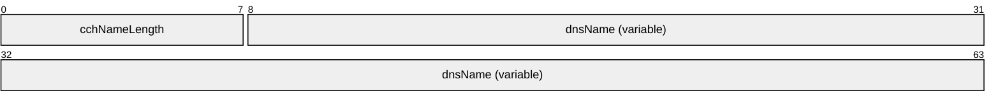

**cchNameLength (1 byte):** The length, in bytes, of the string stored in the dnsName member. To represent an empty string, cchNameLength MUST be zero and dnsName MUST be empty. The length of this structure is always 4-byte aligned so there can be 0-3 bytes of padding at the end of this field. The pad bytes are not included in the cchNameLength count.

**dnsName (variable):** A UTF-8 string with length given by cchNameLength. The string MUST NOT be null-terminated. This string can represent a Fully qualified domain name (FQDN) or any other string.

<a id="Section_2.2.2.2.2"></a>
##### 2.2.2.2.2 DNS_COUNT_NAME

The **DNS_COUNT_NAME** structure is used to specify an [**FQDN**](#gt_fully-qualified-domain-name-fqdn) in an [**LDAP**](#gt_lightweight-directory-access-protocol-ldap) message.

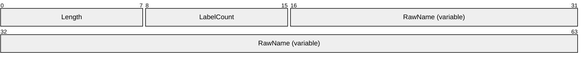

**Length (1 byte):** The length, in bytes, of the string stored in the RawName member, including null termination. To represent an empty string, Length MUST be zero, LabelCount MUST be zero, and RawName MUST be empty.

**LabelCount (1 byte):** The count of DNS labels in the RawName member.

**RawName (variable):** A string containing an FQDN in which a 1-byte label length count for the subsequent label has been inserted before the first label and in place of each "." delimiter. The string MUST be null-terminated. The maximum length of the string, including the null terminator, is 256 bytes.

<a id="Section_2.2.2.2.3"></a>
##### 2.2.2.2.3 DNS_RPC_NODE

The **DNS_RPC_NODE** defines a structure that is used as a header for a list of DNS_RPC_RECORD structures (section [2.2.2.2.5](#Section_2.2.2.2.5)) returned by the DNS server inside a DNS_RPC_BUFFER (section [2.2.1.2.2](#Section_2.2.1.2.2)) while processing the R_DnssrvEnumRecords2 (section [3.1.4.9](#Section_3.1.4.9)).

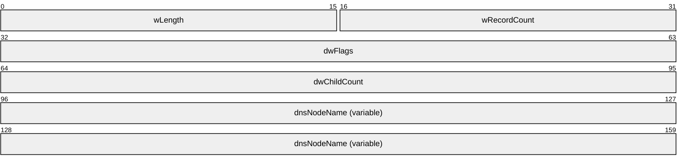

**wLength (2 bytes):** The length of this structure, in bytes, including the fixed size elements plus the length of the dnsNodeName element. The length of this structure is always 4-byte aligned, so it is possible to have 0-3 bytes of padding at the end of the structure. The pad bytes are included in the wLength count.

**wRecordCount (2 bytes):** The number of DNS_RPC_RECORD structures that follow this node structure.

**dwFlags (4 bytes):** The properties of the DNS_RPC_NODE structure.

**dwChildCount (4 bytes):** The total number of children [**nodes**](#gt_node) below this node in the DNS record database.

**dnsNodeName (variable):** The name of this node in DNS_RPC_NAME (section [2.2.2.2.1](#Section_2.2.2.2.1)) format.

<a id="Section_2.2.2.2.4"></a>
##### 2.2.2.2.4 DNS_RPC_RECORD_DATA

The **DNS_RPC_RECORD_DATA** defines a collection of possible [**resource record**](#gt_resource-record-rr) structures that are available on the DNS server. This is used by the DNS server while responding to R_DnssrvEnumRecords2 (section [3.1.4.9](#Section_3.1.4.9)) method call to return resource record information inside a DNS_RPC_RECORD ([2.2.2.2.5](#Section_2.2.2.2.5)) structure that in turn is encapsulated inside a DNS_RPC_BUFFER (section [2.2.1.2.2](#Section_2.2.1.2.2)) structure. It is similarly used as input to the R_DnssrvUpdateRecord (section [3.1.4.5](#Section_3.1.4.5)) and R_DnssrvUpdateRecord2 (section [3.1.4.10](#Section_3.1.4.10)) method calls.

The DNS_RPC_RECORD_DATA MUST be specified in one of the type-specific formats defined in a section that follows, where the type is indicated by the **wType** value in the DNS_RPC_RECORD (section 2.2.2.2.5) structure. Further, for each DNS_RECORD_TYPE (section [2.2.2.1.1](#Section_2.2.2.1.1)) that the server supports, the server MUST support the corresponding DNS_RPC_RECORD_DATA subtype.

<a id="Section_2.2.2.2.4.1"></a>
###### 2.2.2.2.4.1 DNS_RPC_RECORD_A

The **DNS_RPC_RECORD_A** structure contains an IPv4 address. This record MUST be formatted as follows:

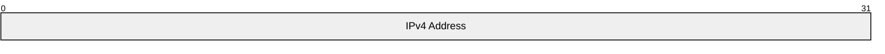

**IPv4 Address (4 bytes):** An IPv4 address in network byte order.

<a id="Section_2.2.2.2.4.2"></a>
###### 2.2.2.2.4.2 DNS_RPC_RECORD_NODE_NAME

The DNS_RPC_RECORD_NODE_NAME structure contains information about a DNS record of any of the following types:<11>

- DNS_TYPE_PTR
- DNS_TYPE_NS
- DNS_TYPE_CNAME
- DNS_TYPE_DNAME
- DNS_TYPE_MB
- DNS_TYPE_MR
- DNS_TYPE_MG
- DNS_TYPE_MD
- DNS_TYPE_MF
This record MUST be formatted as follows:

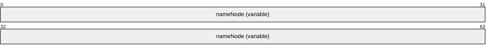

**nameNode (variable):** The FQDN of this node in [DNS_RPC_NAME (section 2.2.2.2.1)](#Section_2.2.2.2.1) format.

<a id="Section_2.2.2.2.4.3"></a>
###### 2.2.2.2.4.3 DNS_RPC_RECORD_SOA

The DNS_RPC_RECORD_SOA structure contains information about an [**SOA**](#gt_start-of-authority-soa) record (section 3.3.13 in [[RFC1035]](https://go.microsoft.com/fwlink/?LinkId=90264)). This record MUST be formatted as follows:

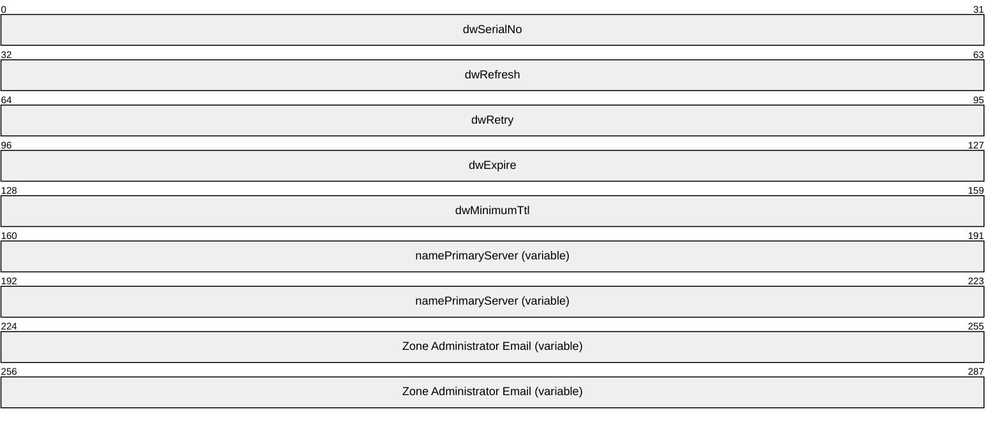

**dwSerialNo (4 bytes):** The [**serial number**](#gt_serial-number) of the SOA record.

**dwRefresh (4 bytes):** The interval, in seconds, at which a [**secondary DNS server**](#gt_secondary-dns-server) attempts to contact the [**primary DNS server**](#gt_primary-dns-server) for getting an update.

**dwRetry (4 bytes):** The interval, in seconds, at which a secondary DNS server retries to check with the primary DNS server in case of failure.

**dwExpire (4 bytes):** The duration, in seconds, that a secondary DNS server continues attempts to get updates from the primary DNS server and if still unsuccessful assumes that the primary DNS server is unreachable.

**dwMinimumTtl (4 bytes):** The minimum duration, in seconds, for which record data in the [**zone**](#gt_zone) is valid.

**namePrimaryServer (variable):** The FQDN of the primary DNS server for this zone in DNS_RPC_NAME (section [2.2.2.2.1](#Section_2.2.2.2.1)) format.

**Zone Administrator Email (variable):** The contact email address for the zone administrators in a structure of type DNS_RPC_NAME (section 2.2.2.2.1).

<a id="Section_2.2.2.2.4.4"></a>
###### 2.2.2.2.4.4 DNS_RPC_RECORD_NULL

The DNS_RPC_RECORD_NULL structure contains information for any record for which there is no more specific [DNS_RPC_RECORD](#Section_2.2.2.2.5) structure. This record MUST be formatted as follows:


**bData (variable):** An array of data. The sender can provide any data in this array.

<a id="Section_2.2.2.2.4.5"></a>
###### 2.2.2.2.4.5 DNS_RPC_RECORD_WKS

The DNS_RPC_RECORD_WKS structure contains the information for the well known services supported by a host, as defined in section 3.4.2 [[RFC1035]](https://go.microsoft.com/fwlink/?LinkId=90264). This record MUST be formatted as follows:

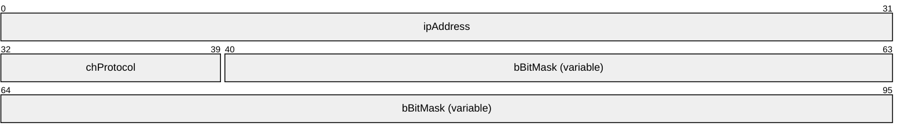

**ipAddress (4 bytes):** The IPv4 address of the server that provides the service.

**chProtocol (1 byte):** The IP protocol number as specified in [[IANA-PROTO-NUM]](https://go.microsoft.com/fwlink/?LinkId=89889).

**bBitMask (variable):** A list of service names (specified as "keywords" in the "WELL KNOWN PORT NUMBERS" section of [[IANAPORT]](https://go.microsoft.com/fwlink/?LinkId=89888)) or port number if service name is unknown as an [**ASCII**](#gt_ascii) character string in DNS_RPC_NAME (section [2.2.2.2.1](#Section_2.2.2.2.1)) format. If more than one port is listed for a single combination of service name and IP protocol number, then only the first such port number is indicated when that service name is used. Each service name or port MUST be separated by a single space character, and the string MUST be terminated by a single null character. Each port number specified MUST be less than or equal to 1024. The terminating null character MUST be included in the **cchNameLength** field of the DNS_RPC_NAME (section 2.2.2.2.1) structure.

<a id="Section_2.2.2.2.4.6"></a>
###### 2.2.2.2.4.6 DNS_RPC_RECORD_STRING

The DNS_RPC_RECORD_STRING structure contains information about a DNS record of any of the following types:

- DNS_TYPE_HINFO
- DNS_TYPE_ISDN
- DNS_TYPE_TXT
- DNS_TYPE_X25
- DNS_TYPE_LOC
This packet contains one or more instances of stringData, depending upon the type listed above. This record MUST be formatted as follows:

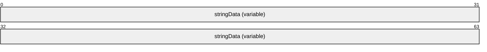

**stringData (variable):** Each stringData member contains the host name value for a node in DNS_RPC_NAME (section [2.2.2.2.1](#Section_2.2.2.2.1)) structure.

<a id="Section_2.2.2.2.4.7"></a>
###### 2.2.2.2.4.7 DNS_RPC_RECORD_MAIL_ERROR

The DNS_RPC_RECORD_MAIL_ERROR structure contains information about a DNS record of any of the following types:

- DNS_TYPE_MINFO
- DNS_TYPE_RP
This record MUST be formatted as follows:

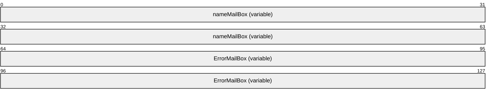

**nameMailBox (variable):** A structure of type DNS_RPC_NAME (section [2.2.2.2.1](#Section_2.2.2.2.1)) containing the RMAILBX value specified in section 3.3.7 of [[RFC1035]](https://go.microsoft.com/fwlink/?LinkId=90264) for an MINFO record, or the mbox-dname value specified in section 2.2 of [[RFC1183]](https://go.microsoft.com/fwlink/?LinkId=106947) for an RP record.

**ErrorMailBox (variable):** A structure of type DNS_RPC_NAME (section 2.2.2.2.1) containing the EMAILBX value specified in section 3.3.7 of [RFC1035] for an MINFO record, or the txt-dname value specified in section 2.2 of [RFC1183] for an RP record.

<a id="Section_2.2.2.2.4.8"></a>
###### 2.2.2.2.4.8 DNS_RPC_RECORD_NAME_PREFERENCE

The DNS_RPC_RECORD_NAME_PREFERENCE structure specifies information about a DNS record of any of the following types:

- DNS_TYPE_MX
- DNS_TYPE_AFSDB
- DNS_TYPE_RT
This record MUST be formatted as follows:

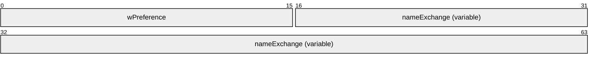

**wPreference (2 bytes):** The preference value for the DNS server that holds the record.

**nameExchange (variable):** The FQDN of the server hosting the mail-exchange and specified in DNS_RPC_NAME (section [2.2.2.2.1](#Section_2.2.2.2.1)) format.

<a id="Section_2.2.2.2.4.9"></a>
###### 2.2.2.2.4.9 DNS_RPC_RECORD_SIG

The DNS_RPC_RECORD_SIG structure contains information about cryptographic public key signatures as specified in section 4 of [[RFC2535]](https://go.microsoft.com/fwlink/?LinkId=107021).<12> This record MUST be formatted as follows:

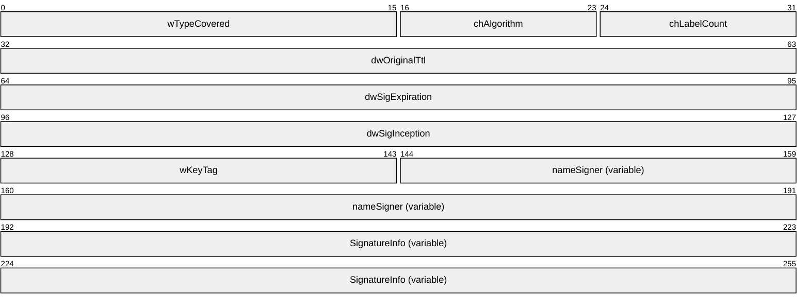

**wTypeCovered (2 bytes):** The type covered value for SIG RR as specified in section 4.1 of [RFC2535].

**chAlgorithm (1 byte):** The algorithm value for SIG RR as specified in section 4.1 of [RFC2535].

**chLabelCount (1 byte):** The total number of labels present in the name of the record signed by the SIG RR as specified in section 4.1 of [RFC2535].

**dwOriginalTtl (4 bytes):** The original [**TTL**](#gt_time-to-live-ttl) value of the record signed by the SIG RR as specified in section 4.1 of [RFC2535].

**dwSigExpiration (4 bytes):** The signature expiration time as specified in section 4.1 of [RFC2535].

**dwSigInception (4 bytes):** The signature inception time as specified in section 4.1 of [RFC2535].

**wKeyTag (2 bytes):** The key tag value for SIG RR as specified in section 4.1 of [RFC2535].

**nameSigner (variable):** Pointer to a structure of type [DNS_RPC_NAME](#Section_2.2.2.2.1) (section 2.2.2.2.1) containing the FQDN of the originating host for this record.

**SignatureInfo (variable):** Binary signature information as specified in section 4.1 of [RFC2535].

<a id="Section_2.2.2.2.4.10"></a>
###### 2.2.2.2.4.10 DNS_RPC_RECORD_RRSIG

The DNS_RPC_RECORD_RRSIG structure contains information about cryptographic public key signatures as specified in section 3 of [[RFC4034]](https://go.microsoft.com/fwlink/?LinkId=107052).<13> This record MUST be formatted as follows.


**wTypeCovered (2 bytes):** The type covered value for RRSIG RR as specified in section 3.1 of [RFC4034].

**chAlgorithm (1 byte):** The algorithm value for RRSIG RR as specified in section 3.1 of [RFC4034].

**chLabelCount (1 byte):** The total number of labels present in the name of the record signed by the RRSIG RR as specified in section 3.1 of [RFC4034].

**dwOriginalTtl (4 bytes):** The original [**TTL**](#gt_time-to-live-ttl) value of the record signed by the RRSIG RR as specified in section 3.1 of [RFC4034].

**dwSigExpiration (4 bytes):** The signature expiration time as specified in section 3.1 of [RFC4034].

**dwSigInception (4 bytes):** The signature inception time as specified in section 3.1 of [RFC4034].

**wKeyTag (2 bytes):** The tag value for RRSIG RR as specified in section 3.1 of [RFC4034].

**nameSigner (variable):** A structure of type [DNS_RPC_NAME](#Section_2.2.2.2.1) (section 2.2.2.2.1) containing the FQDN of the originating host for this record.

**SignatureInfo (variable):** Binary signature information as specified in section 3.1 of [RFC4034].

<a id="Section_2.2.2.2.4.11"></a>
###### 2.2.2.2.4.11 DNS_RPC_RECORD_NSEC

The DNS_RPC_RECORD_NSEC structure contains the next [**FQDN**](#gt_fully-qualified-domain-name-fqdn) in the zone as specified in section 4 of [[RFC4034]](https://go.microsoft.com/fwlink/?LinkId=107052).<14> This record MUST be formatted as follows.

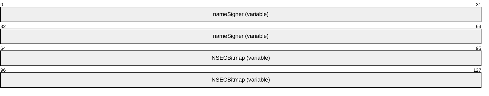

**nameSigner (variable):** A structure of type [DNS_RPC_NAME](#Section_2.2.2.2.1) (section 2.2.2.2.1) containing the FQDN of the originating host for this record.

**NSECBitmap (variable):** Bitmap of types present at this node as specified in section 4 of [RFC4034].

<a id="Section_2.2.2.2.4.12"></a>
###### 2.2.2.2.4.12 DNS_RPC_RECORD_DS

The DNS_RPC_RECORD_DS structure contains a public key associated with an FQDN as specified in section 5 of [[RFC4034]](https://go.microsoft.com/fwlink/?LinkId=107052).<15> This record MUST be formatted as follows.

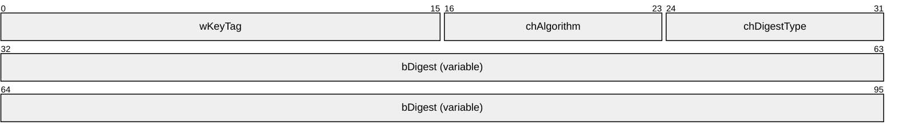

**wKeyTag (2 bytes):** The key tag of the DNSKEY record referred to by this DS record, as specified in section 5 of [RFC4034].

**chAlgorithm (1 byte):** Algorithm value of the DNSKEY record referred to by this DS record, as specified in section 5 of [RFC4034].

**chDigestType (1 byte):** The digest algorithm that was used to construct this DS record, as specified in section 5 of [RFC4034].

**bDigest (variable):** An array of bytes containing the digest value as specified of section 5 in [RFC4034].

<a id="Section_2.2.2.2.4.13"></a>
###### 2.2.2.2.4.13 DNS_RPC_RECORD_KEY

The DNS_RPC_RECORD_KEY structure contains a public key associated with an FQDN as specified in section 3 of [[RFC2535]](https://go.microsoft.com/fwlink/?LinkId=107021).<16> This record MUST be formatted as follows:

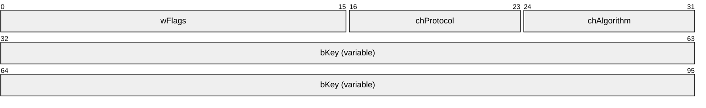

**wFlags (2 bytes):** Flags value for the key RR as specified in section 3.1 of [RFC2535].

**chProtocol (1 byte):** Protocol value for the key RR as specified in section 3.1 of [RFC2535].

**chAlgorithm (1 byte):** Algorithm value for the key RR as specified in section 3.1 of [RFC2535].

**bKey (variable):** An array of bytes containing the key value as specified of section 3.1 in [RFC2535].

<a id="Section_2.2.2.2.4.14"></a>
###### 2.2.2.2.4.14 DNS_RPC_RECORD_DHCID

The DNS_RPC_RECORD_DHCID structure contains a public key associated with an FQDN as specified in section 3 of [[RFC2535]](https://go.microsoft.com/fwlink/?LinkId=107021).<17> This record MUST be formatted as follows.

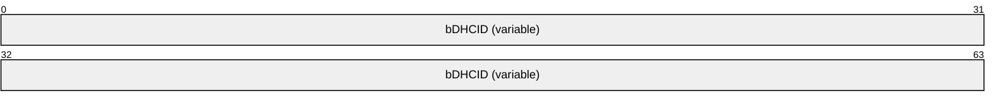

**bDHCID (variable):** An opaque DHCID record as specified in section 3 in [[RFC4701]](https://go.microsoft.com/fwlink/?LinkId=125431).

<a id="Section_2.2.2.2.4.15"></a>
###### 2.2.2.2.4.15 DNS_RPC_RECORD_DNSKEY

The DNS_RPC_RECORD_DNSKEY structure contains a public key associated with an FQDN as specified in section 2 of [[RFC4034]](https://go.microsoft.com/fwlink/?LinkId=107052).<18> This record MUST be formatted as follows.


**wFlags (2 bytes):** Flags value for the key RR as specified in section 2.1 of [RFC4034].

**chProtocol (1 byte):** Protocol value for the key RR as specified in section 2.1 of [RFC4034].

**chAlgorithm (1 byte):** Algorithm value for the key RR as specified in section 2.1 of [RFC4034].

**bKey (variable):** An array of bytes containing the key value as specified of section 2.1 in [RFC4034].

<a id="Section_2.2.2.2.4.16"></a>
###### 2.2.2.2.4.16 DNS_RPC_RECORD_AAAA

The DNS_RPC_RECORD_AAAA structure contains IPv6 address information. This record MUST be formatted as follows:

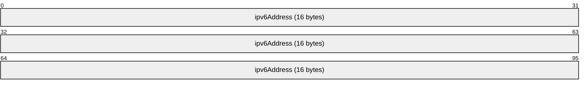

**ipv6Address (16 bytes):** An IPv6 address member holds an IPv6 address, in network byte order.

<a id="Section_2.2.2.2.4.17"></a>
###### 2.2.2.2.4.17 DNS_RPC_RECORD_NXT

The DNS_RPC_RECORD_NXT specifies a NXT [**resource record**](#gt_resource-record-rr) as specified in section 5.1 of [[RFC2535]](https://go.microsoft.com/fwlink/?LinkId=107021).<19> This record MUST be formatted as follows:

```mermaid
packet-beta
  0-15: "wNumRecordTypes"
  16-63: "wTypeWords (variable)"
  64-127: "nextName (variable)"
```

**wNumRecordTypes (2 bytes):** The number of 16-bit unsigned integers in the variable sized wTypeWords array. This value MUST be greater than 1.

**wTypeWords (variable):** An array for of 16-bit unsigned integers in little-endian byte order for that contains a variable sized bit-mask value for types present in this record, as specified in section 5.2 of [RFC2535]. The most significant bit of the first integer corresponds to type zero and MUST be zero. If there is a second 16-bit unsigned integer present in the array, the most significant bit of the second integer corresponds to type 16, and so on.

**nextName (variable):** A DNS_RPC_NAME (section [2.2.2.2.1](#Section_2.2.2.2.1)) containing next name information, as specified in section 5.2 of [RFC2535].

<a id="Section_2.2.2.2.4.18"></a>
###### 2.2.2.2.4.18 DNS_RPC_RECORD_SRV

The DNS_RPC_RECORD_SRV specifies an SRV [**resource record**](#gt_resource-record-rr) as specified in [[RFC2782]](https://go.microsoft.com/fwlink/?LinkId=90381). This record MUST be formatted as follows:

```mermaid
packet-beta
  0-15: "wPriority"
  16-31: "wWeight"
  32-47: "wPort"
  48-95: "nameTarget (variable)"
```

**wPriority (2 bytes):** The priority of the target host as specified in [RFC2782].

**wWeight (2 bytes):** The relative weight for the target host as specified in [RFC2782].

**wPort (2 bytes):** The port number for the service on the target host as specified in [RFC2782].

**nameTarget (variable):** The FDQN of the server that hosts this service in DNS_RPC_NAME (section [2.2.2.2.1](#Section_2.2.2.2.1)) format, as specified in [RFC2782].

<a id="Section_2.2.2.2.4.19"></a>
###### 2.2.2.2.4.19 DNS_RPC_RECORD_ATMA

The DNS_RPC_RECORD_ATMA specifies a [**resource record**](#gt_resource-record-rr) that contains ATM address information as specified in [[ATMA]](https://go.microsoft.com/fwlink/?LinkId=107028). This record MUST be formatted as follows:

```mermaid
packet-beta
  0-7: "chFormat"
  8-63: "bAddress (variable)"
```

**chFormat (1 byte):** The format of the address as specified in section 5.2 of [ATMA].

**bAddress (variable):** The ATM address of the node to which this resource record pertains (see section 5.2 of [ATMA]).

<a id="Section_2.2.2.2.4.20"></a>
###### 2.2.2.2.4.20 DNS_RPC_RECORD_NAPTR

The DNS_RPC_RECORD_NAPTR specifies a NAPTR [**resource record**](#gt_resource-record-rr) as specified in section 4 of [[RFC3403]](https://go.microsoft.com/fwlink/?LinkId=107026).<20> This record MUST be formatted as follows:

```mermaid
packet-beta
  0-15: "wOrder"
  16-31: "wPreference"
  32-95: "nameFlags (variable)"
  96-159: "nameService (variable)"
  160-223: "nameSubstitution (variable)"
  224-287: "nameReplacement (variable)"
```

**wOrder (2 bytes):** A value that specifies the order in which the NAPTR record is processed, as specified in section 4.1 in [RFC3403].

**wPreference (2 bytes):** The preference given to this NAPTR record, as specified in section 4.1 in [RFC3403].

**nameFlags (variable):** Pointer to a structure of type DNS_RPC_NAME (section [2.2.2.2.1](#Section_2.2.2.2.1)) containing the string flags value as specified in section 4.1 in [RFC3403].

**nameService (variable):** Pointer to a structure of type DNS_RPC_NAME (section 2.2.2.2.1) containing service parameters value for NAPTR to control the rewriting and interpretation of the field in the record, as specified in section 4.1 in [RFC3403].

**nameSubstitution (variable):** Pointer to a structure of type DNS_RPC_NAME (section 2.2.2.2.1) containing a substitution expression value for the NAPTR record, as specified in section 4.1 in [RFC3403].

**nameReplacement (variable):** Pointer to a structure of type DNS_RPC_NAME (section 2.2.2.2.1) containing a replacement expression value for the NAPTR record, as specified in section 4.1 in [RFC3403].

<a id="Section_2.2.2.2.4.21"></a>
###### 2.2.2.2.4.21 DNS_RPC_RECORD_WINS

The DNS_RPC_RECORD_WINS specifies a [**WINS**](#gt_windows-internet-name-service-wins) [**resource record**](#gt_resource-record-rr). This record MUST be formatted as follows:

```mermaid
packet-beta
  0-31: "dwMappingFlag"
  32-63: "dwLookupTimeout"
  64-95: "dwCacheTimeout"
  96-127: "cWinsServerCount"
  128-191: "aipWinsServers (variable)"
```

**dwMappingFlag (4 bytes):** The scope of the WINS record lookups. This value MUST be set to 0x00000000 or any combination of the following:

| Value | Meaning |
| --- | --- |
| DNS_WINS_FLAG_SCOPE 0x80000000 | Server forwards lookup requests to remote WINS servers. |
| DNS_WINS_FLAG_LOCAL 0x00010000 | Server performs WINS lookups locally. |

**dwLookupTimeout (4 bytes):** The duration, in seconds, for which the server waits to receive a response from a remote DNS server.

**dwCacheTimeout (4 bytes):** The duration, in seconds, for which the server keeps this record in its [**cache**](#gt_cache) before considering it stale.

**cWinsServerCount (4 bytes):** The number of WINS server addresses in this record. The value of this field MUST be at least one.

**aipWinsServers (variable):** An array of IPv4 addresses in network byte order with length given by cWinsServerCount.

<a id="Section_2.2.2.2.4.22"></a>
###### 2.2.2.2.4.22 DNS_RPC_RECORD_WINSR

The DNS_RPC_RECORD_WINSR specifies a [**Windows Internet Name Service Reverse Lookup (WINS-R)**](#gt_windows-internet-name-service-reverse-lookup-wins-r) [**resource record**](#gt_resource-record-rr). This record MUST be formatted as follows:

```mermaid
packet-beta
  0-31: "dwMappingFlag"
  32-63: "dwLookupTimeout"
  64-95: "dwCacheTimeout"
  96-159: "nameResultDomain (variable)"
```

**dwMappingFlag (4 bytes):** The scope of the WINS-R record lookups. This value MUST be set to zero or any combination of the following:

| Value | Meaning |
| --- | --- |
| DNS_WINS_FLAG_SCOPE 0x80000000 | Server forwards lookup requests to remote [**WINS**](#gt_windows-internet-name-service-wins) servers. |
| DNS_WINS_FLAG_LOCAL 0x00010000 | Server performs WINS lookups locally. |

**dwLookupTimeout (4 bytes):** The duration, in seconds, for which server waits to receive a response from a remote DNS server.

**dwCacheTimeout (4 bytes):** The duration, in seconds, for which server keeps this record in its [**cache**](#gt_cache) before considering it stale.

**nameResultDomain (variable):** Pointer to a structure of type DNS_RPC_NAME (section [2.2.2.2.1](#Section_2.2.2.2.1)) containing a domain name suffix that will be appended to a [**single-label name**](#gt_single-label-name) [[RFC1034]](https://go.microsoft.com/fwlink/?LinkId=90263) obtained from a WINS-R lookup.

<a id="Section_2.2.2.2.4.23"></a>
###### 2.2.2.2.4.23 DNS_RPC_RECORD_TS

The DNS_RPC_RECORD_TS specifies information for a node that has been [**tombstoned**](#gt_9d8e0963-13fa-4e19-a97f-7ce6bc90d20f).

```mermaid
packet-beta
  0-63: "EntombedTime"
```

**EntombedTime (8 bytes):** The time at which this node was tombstoned, represented as the number of 100-nanosecond intervals since midnight (00:00:00), January 1, 1601 UTC.

<a id="Section_2.2.2.2.4.24"></a>
###### 2.2.2.2.4.24 DNS_RPC_RECORD_NSEC3

The DNS_RPC_RECORD_NSEC3 structure SHOULD<21> specify an NSEC3 [**resource record**](#gt_resource-record-rr) as specified in [[RFC5155]](https://go.microsoft.com/fwlink/?LinkId=225981) section 3. This record MUST be formatted as follows.

```mermaid
packet-beta
  0-7: "chAlgorithm"
  8-15: "bFlags"
  16-31: "wIterations"
  32-39: "bSaltLength"
  40-47: "bHashLength"
  48-95: "salt (variable)"
  96-159: "nextHashedOwnerName (variable)"
  160-223: "bitmaps (variable)"
```

**chAlgorithm (1 byte):** A value that specifies the cryptographic hash algorithm used to construct the hash value, as specified in [RFC5155] section 3.1.

**bFlags (1 byte):** A value that specifies NSEC3 processing flags, as specified in [RFC5155] section 3.1.

**wIterations (2 bytes):** A value that specifies the number of additional times the hash function has been performed, as specified in [RFC5155] section 3.1.

**bSaltLength (1 byte):** A value that specifies the length of the salt field, in octets.

**bHashLength (1 byte):** A value that specifies the length of the nextHashedOwnerName field, in octets.

**salt (variable):** A value that specifies the salt to be appended to the original owner name before hashing, as specified in [RFC5155] section 3.1.

**nextHashedOwnerName (variable):** A value that specifies the next hashed owner name in hash order, as specified in [RFC5155] section 3.1.

**bitmaps (variable):** A value that specifies the DNS types that exist at the original owner name of the NSEC3 record, as specified in [RFC5155] section 3.1.

<a id="Section_2.2.2.2.4.25"></a>
###### 2.2.2.2.4.25 DNS_RPC_RECORD_NSEC3PARAM

The DNS_RPC_RECORD_NSEC3PARAM structure SHOULD<22> specify an NSEC3PARAM [**resource record**](#gt_resource-record-rr) as specified in [[RFC5155]](https://go.microsoft.com/fwlink/?LinkId=225981) section 3. This record MUST be formatted as follows.

```mermaid
packet-beta
  0-7: "chAlgorithm"
  8-15: "bFlags"
  16-31: "wIterations"
  32-39: "bSaltLength"
  40-95: "salt (variable)"
```

**chAlgorithm (1 byte):** A value that specifies the cryptographic hash algorithm used to construct the hash value, as specified in [RFC5155] section 4.1.

**bFlags (1 byte):** A value that specifies NSEC3 processing flags, as specified in [RFC5155] section 3.1.

**wIterations (2 bytes):** A value that specifies the number of additional times the hash function has been performed, as specified in [RFC5155] section 4.1.

**bSaltLength (1 byte):** A value that specifies the length of the salt field, in octets.

**salt (variable):** A value that specifies the salt to be appended to the original owner name before hashing, as specified in [RFC5155].

<a id="Section_2.2.2.2.4.26"></a>
###### 2.2.2.2.4.26 DNS_RPC_RECORD_TLSA

The DNS_RPC_RECORD_TLSA structure SHOULD<23> specify a TLSA resource record as defined in [[RFC6698]](https://go.microsoft.com/fwlink/?LinkId=532821) section 2. This record MUST be formatted as follows.

```mermaid
packet-beta
  0-7: "bCertUsage"
  8-15: "bSelector"
  16-23: "bMatchingType"
  24-63: "bCertificateAssociationData"
```

**bCertUsage (1 byte)**: Specifies the association used to match the certificate presented during TLS handshake ([RFC6698] section 2.1.1).

**bSelector (1 byte)**: Specifies the part of the TLS certificate which will be matched against the TLS association data ([RFC6698] section 2.1.2.

**bMatchingType (1 byte)**: Specifies how the certificate association is presented ([RFC6698] section 2.1.3).

**bCertificateAssociationData (variable)**: Specifies the certificate association data that is to be matched ([RFC6698] section 2.1.4).

<a id="Section_2.2.2.2.4.27"></a>
###### 2.2.2.2.4.27 DNS_RPC_RECORD_UNKNOWN

The DNS_RPC_RECORD_UNKNOWN structure SHOULD<24> specify a [**resource record**](#gt_resource-record-rr) of unknown type ([[RFC3597]](https://go.microsoft.com/fwlink/?LinkID=532820) section 2). This record MUST be formatted as follows.

```mermaid
packet-beta
  0-63: "bData (variable)"
```

**bData (variable)**: Specifies the unknown record data. The data MUST be in the format in which it will be returned in the response message for a DNS query.

<a id="Section_2.2.2.2.5"></a>
##### 2.2.2.2.5 DNS_RPC_RECORD

The **DNS_RPC_RECORD** structure is used to specify a single DNS record's parameters and data. This structure is returned by the DNS server in response to an R_DnssrvEnumRecords2 (section [3.1.4.9](#Section_3.1.4.9)) method call.

typedef struct _DnssrvRpcRecord {

WORD wDataLength;

WORD wType;

DWORD dwFlags;

DWORD dwSerial;

DWORD dwTtlSeconds;

DWORD dwTimeStamp;

DWORD dwReserved;

[size_is(wDataLength)] BYTE Buffer[];

} DNS_RPC_RECORD,

*PDNS_RPC_RECORD,

DNS_FLAT_RECORD,

*PDNS_FLAT_RECORD;

**wDataLength:** The total size of the variable buffer, in bytes. Note that the DNS_RPC_RECORD structure is always 4-byte aligned, which means there can be 0-3 bytes of padding at the end of the structure. The pad bytes are not included in the wDataLength count.

**wType:** The type of the [**resource record**](#gt_resource-record-rr), as specified in section [2.2.2.1.1](#Section_2.2.2.1.1) DNS_RECORD_TYPE.

**dwFlags:** Resource record properties. This field can contain one of the RANK* flags in the low-order bits and one of the DNS_RPC_FLAGS* in the high-order bits.

| Value | Meaning |
| --- | --- |
| RANK_CACHE_BIT 0x00000001 | The record came from the cache. |
| RANK_ROOT_HINT 0x00000008 | The record is a preconfigured root hint. |
| RANK_OUTSIDE_GLUE 0x00000020 | This value is not used. |
| RANK_CACHE_NA_ADDITIONAL 0x00000031 | The record was cached from the additional section of a non-[**authoritative**](#gt_authoritative) response. |
| RANK_CACHE_NA_AUTHORITY 0x00000041 | The record was cached from the authority section of a non-authoritative response. |
| RANK_CACHE_A_ADDITIONAL 0x00000051 | The record was cached from the additional section of an authoritative response. |
| RANK_CACHE_NA_ANSWER 0x00000061 | The record was cached from the answer section of a non-authoritative response. |
| RANK_CACHE_A_AUTHORITY 0x00000071 | The record was cached from the authority section of an authoritative response. |
| RANK_GLUE 0x00000080 | The record is a [**glue record**](#gt_glue-record) in an authoritative zone. |
| RANK_NS_GLUE 0x00000082 | The record is a [**delegation**](#gt_delegation) (type NS) record in an authoritative zone. |
| RANK_CACHE_A_ANSWER 0x000000C1 | The record was cached from the answer section of an authoritative response. |
| RANK_ZONE 0x000000F0 | The record comes from an authoritative zone. |
| DNS_RPC_FLAG_ZONE_ROOT 0x40000000 | The record is at the root of a zone (not necessarily a zone hosted by this server; the record could have come from the cache). |
| DNS_RPC_FLAG_AUTH_ZONE_ROOT 0x20000000 | The record is at the root of a zone that is locally hosted on this server. |
| DNS_RPC_FLAG_CACHE_DATA 0x80000000 | The record came from the cache. |
| DNS_RPC_FLAG_RECORD_WIRE_FORMAT 0x00100000 | The record SHOULD<25> be treated as a resource record of unknown type ([[RFC3597]](https://go.microsoft.com/fwlink/?LinkID=532820) section 2) by the DNS server. |

**dwSerial:** This MUST be set to 0x00000000 when sent by the client or server, and ignored on receipt by the server or client.

**dwTtlSeconds:** The duration, in seconds, after which this record will expire.

**dwTimeStamp:** The [**time stamp**](#gt_time-stamp), in hours, for the record when it received the last update.

**dwReserved:** This value MUST be set to 0x00000000 when sent by the client and ignored on receipt by the server.

**Buffer:** Record data in DNS_RPC_RECORD_DATA (section [2.2.2.2.4](#Section_2.2.2.2.4)) format where type is specified by the value **wType**.<26>

| Value | Meaning |
| --- | --- |
| DNS_TYPE_ZERO 0x0000 | DNS_RPC_RECORD_TS |
| DNS_TYPE_A 0x0001 | DNS_RPC_RECORD_A |
| DNS_TYPE_NS 0x0002 | DNS_RPC_RECORD_NODE_NAME |
| DNS_TYPE_MD 0x0003 | DNS_RPC_RECORD_NODE_NAME |
| DNS_TYPE_MF 0x0004 | DNS_RPC_RECORD_NODE_NAME |
| DNS_TYPE_CNAME 0x0005 | DNS_RPC_RECORD_NODE_NAME |
| DNS_TYPE_SOA 0x0006 | DNS_RPC_RECORD_SOA |
| DNS_TYPE_MB 0x0007 | DNS_RPC_RECORD_NODE_NAME |
| DNS_TYPE_MG 0x0008 | DNS_RPC_RECORD_NODE_NAME |
| DNS_TYPE_MR 0x0009 | DNS_RPC_RECORD_NODE_NAME |
| DNS_TYPE_NULL 0x000A | DNS_RPC_RECORD_NULL |
| DNS_TYPE_WKS 0x000B | DNS_RPC_RECORD_WKS |
| DNS_TYPE_PTR 0x000C | DNS_RPC_RECORD_NODE_NAME |
| DNS_TYPE_HINFO 0x000D | DNS_RPC_RECORD_STRING |
| DNS_TYPE_MINFO 0x000E | DNS_RPC_RECORD_MAIL_ERROR |
| DNS_TYPE_MX 0x000F | DNS_RPC_RECORD_NAME_PREFERENCE |
| DNS_TYPE_TXT 0x0010 | DNS_RPC_RECORD_STRING |
| DNS_TYPE_RP 0x0011 | DNS_RPC_RECORD_MAIL_ERROR |
| DNS_TYPE_AFSDB 0x0012 | DNS_RPC_RECORD_NAME_PREFERENCE |
| DNS_TYPE_X25 0x0013 | DNS_RPC_RECORD_STRING |
| DNS_TYPE_ISDN 0x0014 | DNS_RPC_RECORD_STRING |
| DNS_TYPE_RT 0x0015 | DNS_RPC_RECORD_NAME_PREFERENCE |
| DNS_TYPE_SIG 0x0018 | DNS_RPC_RECORD_SIG |
| DNS_TYPE_KEY 0x0019 | DNS_RPC_RECORD_KEY |
| DNS_TYPE_AAAA 0x001C | DNS_RPC_RECORD_AAAA |
| DNS_TYPE_NXT 0x001E | DNS_RPC_RECORD_NXT |
| DNS_TYPE_SRV 0x0021 | DNS_RPC_RECORD_SRV |
| DNS_TYPE_ATMA 0x0022 | DNS_RPC_RECORD_ATMA |
| DNS_TYPE_NAPTR 0x0023 | DNS_RPC_RECORD_NAPTR |
| DNS_TYPE_DNAME 0x0027 | DNS_RPC_RECORD_NODE_NAME |
| DNS_TYPE_DS 0x002B | DNS_RPC_RECORD_DS |
| DNS_TYPE_RRSIG 0x002E | DNS_RPC_RECORD_RRSIG |
| DNS_TYPE_NSEC 0x002F | DNS_RPC_RECORD_NSEC |
| DNS_TYPE_DNSKEY 0x0030 | DNS_RPC_RECORD_DNSKEY |
| DNS_TYPE_DHCID 0x0031 | DNS_RPC_RECORD_DHCID |
| DNS_TYPE_NSEC3 0x0032 | DNS_RPC_RECORD_NSEC3 |
| DNS_TYPE_NSEC3PARAM 0x0033 | DNS_RPC_RECORD_NSEC3PARAM |
| DNS_TYPE_TLSA 0x0034 | DNS_RPC_RECORD_TLSA |
| DNS_TYPE_WINS 0xFF01 | DNS_RPC_RECORD_WINS |
| DNS_TYPE_WINSR 0xFF02 | DNS_RPC_RECORD_WINSR |

Other type values that are not explicitly defined in the preceding table MUST be enumerable, including values defined by [[IANA-DNS]](https://go.microsoft.com/fwlink/?LinkId=148574), and they MUST use the DNS_RPC_RECORD_NULL (section [2.2.2.2.4.4](#Section_2.2.2.2.4.4)) structure. If the **dwFlags** field is set to DNS_RPC_FLAG_RECORD_WIRE_FORMAT, the DNS_RPC_RECORD_UNKNOWN (section [2.2.2.2.4.27](#Section_2.2.2.2.4.27)) structure MUST be used for all resource record types.

<a id="Section_2.2.3"></a>
### 2.2.3 Address Information Messages

<a id="Section_2.2.3.1"></a>
#### 2.2.3.1 Enumerations and Constants

<a id="Section_2.2.3.1.1"></a>
##### 2.2.3.1.1 DNS_IPVAL_CONTEXT

The **DNS_IPVAL_CONTEXT** is a DWORD value that specifies possible context values for IP validation. This is used to populate the dwContext field in DNS_RPC_IP_VALIDATE (section [2.2.3.2.4](#Section_2.2.3.2.4)). The DNS server MUST use this value to determine the type of validation that SHOULD<27> be performed for IP address specified in DNS_RPC_IP_VALIDATE (section 2.2.3.2.4).

| Constant/value | Description |
| --- | --- |
| DNS_IPVAL_DNS_SERVERS 0x00000000 | Validate that IP addresses are reachable and operational by the DNS servers. |
| DNS_IPVAL_DNS_ROOTHINTS 0x00000001 | Validate that IP addresses are suitable as root-hints. |
| DNS_IPVAL_DNS_FORWARDERS 0x00000002 | Validate that IP addresses are server level [**forwarders**](#gt_forwarders). |
| DNS_IPVAL_DNS_ZONE_MASTERS 0x00000003 | Validate that IP addresses are remote DNS servers hosting a zone, named as pointed to by pszContextName in the DNS_RPC_IP_VALIDATE (section 2.2.3.2.4). |
| DNS_IPVAL_DNS_DELEGATIONS 0x00000004 | Validate that IP addresses are remote DNS servers are name-server for the delegated zone, named as pointed to by **pszContextName** in the DNS_RPC_IP_VALIDATE (section 2.2.3.2.4). |

<a id="Section_2.2.3.1.2"></a>
##### 2.2.3.1.2 DNS_IP_VALIDATE_RETURN_FLAGS

**DNS_IP_VALIDATE_RETURN_FLAGS** is a DWORD value that specifies the results of IP validation performed by the DNS server. This value will be used by the DNS server to populate the Flags field within each **DNS_ADDR** structure (section [2.2.3.2.2](#Section_2.2.3.2.2)) present in the **DNS_ADDR_ARRAY** (section [2.2.3.2.3](#Section_2.2.3.2.3)) structure which in turn is present inside the returned **DNS_RPC_IP_VALIDATE** structure (section [2.2.3.2.4](#Section_2.2.3.2.4))<28>.

| Constant/value | Description |
| --- | --- |
| ERROR_SUCCESS 0x00000000 | The remote IP address is valid. |
| DNS_IPVAL_INVALID_ADDR 0x00000001 | Remote IP address is not a valid IP address. |
| DNS_IPVAL_UNREACHABLE 0x00000002 | Remote IP address is not reachable. |
| DNS_IPVAL_NO_RESPONSE 0x00000003 | Remote IP address does not appear to be hosting a DNS server. |
| DNS_IPVAL_NOT_AUTH_FOR_ZONE 0x00000004 | Remote IP address is not [**authoritative**](#gt_authoritative) for the required zone, specified by pszContextName in the DNS_RPC_IP_VALIDATE (section 2.2.3.2.4). |
| DNS_IPVAL_UNKNOWN_ERROR 0x000000FF | The DNS server encountered an unknown error occurred while validating IP address. |
| DNS_IPVAL_NO_TCP 0x80000000 | Indicated that remote IP address, responds to [**UDP**](#gt_user-datagram-protocol-udp) [**DNS**](#gt_domain-name-system-dns) messages, but does not respond to TCP DNS messages. |

<a id="Section_2.2.3.2"></a>
#### 2.2.3.2 Structures

<a id="Section_2.2.3.2.1"></a>
##### 2.2.3.2.1 IP4_ARRAY

The **IP4_ARRAY** structure is used to represent an array of IPv4 addresses. This structure cannot represent IPv6 addresses.

typedef struct _IP4_ARRAY {

DWORD AddrCount;

[size_is(AddrCount)] DWORD AddrArray[];

} IP4_ARRAY,

*PIP4_ARRAY;

**AddrCount:** The number of IPv4 addresses present in the AddrArray member.

**AddrArray:** An array of IPv4 addresses. An IPv4 address is represented as a 32-bit unsigned integer in network byte order.

An empty IP4_ARRAY is represented by **AddrCount** set to zero and **AddrArray** unused. Senders of an empty IP4_ARRAY MUST set **AddrArray** to a single entry containing binary zeros, and receivers MUST ignore it.

<a id="Section_2.2.3.2.2"></a>
##### 2.2.3.2.2 DNS_ADDR

This **DNS_ADDR** structure is used to represent an IP address. The IP address is either IPv4 or IPv6.

typedef struct _DnsAddr {

CHAR MaxSa[32];

DWORD DnsAddrUserDword[8];

} DNS_ADDR,

*PDNS_ADDR;

**MaxSa:** This field MUST be constructed as specified in [DNS ADDR](#Section_2.2.3.2.2.1).

**DnsAddrUserDword:** This field MUST be constructed as specified in [DNS ADD USER](#Section_2.2.3.2.2.2).

Any field not specified above MUST be set to zero by the sender and ignored by the receiver.

<a id="Section_2.2.3.2.2.1"></a>
###### 2.2.3.2.2.1 DNS ADDR

The **DNS ADDR** structure is an IPv4 or IPv6 address used by [DNS_ADDR](#Section_2.2.3.2.2) **MaxSa** field (section 2.2.3.2.2).

```mermaid
packet-beta
  0-15: "Address Family"
  16-31: "Port Number"
  32-63: "IPv4 Address"
  64-159: "IPv6 Address (16 bytes)"
  160-223: "Padding"
```

**Address Family (2 bytes):** This MUST be set to 0x0002 if this is an IPv4 address or 0x0017 if this is an IPv6 address.

**Port Number (2 bytes):** Senders MUST set this to zero, and receivers MUST ignore it.

**IPv4 Address (4 bytes):** An IPv4 address in network byte order value for the host pointed to by DNS_ADDR structure.

**IPv6 Address (16 bytes):** An IPv6 address in network byte order value for the host pointed to by DNS_ADDR structure.

**Padding (8 bytes):** Senders MUST set this to zero, and receivers MUST ignore it.

<a id="Section_2.2.3.2.2.2"></a>
###### 2.2.3.2.2.2 DNS ADD USER

The **DNS ADD USER** structure is used by [DNS_ADDR](#Section_2.2.3.2.2) **DnsAddrUserDword** field.

```mermaid
packet-beta
  0-31: "SockaddrLength"
  32-63: "SubnetLength"
  64-95: "Flags"
  96-191: "Padding (20 bytes)"
```

**SockaddrLength (4 bytes):** The length of valid data in the socket address structure present above this field.

**SubnetLength (4 bytes):** Senders MUST set this to 0x00000000 and receivers MUST ignore this value.

**Flags (4 bytes):** Clients MUST set to 0x00000000. Senders will use this field to indicate the results of IP validation for this IP address, where it has a format as follows (in host byte order):

```mermaid
packet-beta
  0-0: "T"
  1-7: "Zero"
  8-19: "RTT"
  20-31: "validationStatus"
```

**T (1 bit):** If set, DNS over [**UDP**](#gt_user-datagram-protocol-udp) is available from the remote DNS server but DNS over TCP is not available.

**Zero (7 bits):** Reserved. Senders MUST set these bits to zero and receivers MUST ignore them.

**RTT (12 bits):** Round trip time to the remote DNS server for a UDP query, measured in units of 10 milliseconds.

**validationStatus (12 bits):** The result of the DNS UDP validation attempt. This field MUST be set to one of the DNS_IP_VALIDATE_RETURN_FLAGS (section [2.2.3.1.2](#Section_2.2.3.1.2)).

**Padding (20 bytes):** This can be any value and MUST be ignored.

<a id="Section_2.2.3.2.3"></a>
##### 2.2.3.2.3 DNS_ADDR_ARRAY

The **DNS_ADDR_ARRAY** structure is used to represent an array of **DNS_ADDR** (section [2.2.3.2.2](#Section_2.2.3.2.2)) structures. The DNS Server Management Protocol uses this structure to exchange lists of mixed IPv4 and IPv6 addresses between client and server.

typedef struct _DnsAddrArray {

DWORD MaxCount;

DWORD AddrCount;

DWORD Tag;

WORD Family;

WORD WordReserved;

DWORD Flags;

DWORD MatchFlag;

DWORD Reserved1;

DWORD Reserved2;

[size_is(AddrCount )] DNS_ADDR AddrArray[];

} DNS_ADDR_ARRAY,

*PDNS_ADDR_ARRAY;

**MaxCount:** The actual number of IP addresses that are present in the AddrArray member.

**AddrCount:** Must be set to the same value as MaxCount.

**Tag:** This field is unused. Senders MUST set the value to zero and receivers MUST ignore it.

**Family:** The family of addresses present in the array, such as AF_INET or AF_INET6. If this field is not specified, addresses with all families can be present.

**WordReserved:** This field is unused. Senders MUST set the value to zero and receivers MUST ignore it.

**Flags:** This field is unused. Senders MUST set the value to zero and receivers MUST ignore it.

**MatchFlag:** This field is unused. Senders MUST set the value to zero and receivers MUST ignore it.

**Reserved1:** This field is unused. Senders MUST set the value to zero and receivers MUST ignore it.

**Reserved2:** This field is unused. Senders MUST set the value to zero and receivers MUST ignore it.

**AddrArray:** An array of DNS_ADDR (section 2.2.3.2.2) structures. The number of elements in this array is specified by the AddrCount member.

An empty DNS_ADDR_ARRAY is represented by **AddrCount** set to zero. Senders of an empty DNS_ADR_ARRAY MUST set the other fields' values to zero (including a single entry in **AddrArray**, which is set to binary zeros), and receivers MUST ignore them.

<a id="Section_2.2.3.2.4"></a>
##### 2.2.3.2.4 DNS_RPC_IP_VALIDATE

The **DNS_RPC_IP_VALIDATE** structure is used to request that the DNS server validate a number of IP addresses. This can be used by clients to determine if an IP address is suitable for use as a DNS server in the context specified by the dwContext member (see below). This structure is to request IP validation while processing the [R_DnssrvComplexOperation2 (section 3.1.4.8)](#Section_3.1.4.8) method call with operation type IpValidate.

typedef struct _DnsRpcIPValidate {

DWORD dwRpcStructureVersion;

DWORD dwReserved0;

DWORD dwContext;

DWORD dwReserved1;

[string] char* pszContextName;

PDNS_ADDR_ARRAY aipValidateAddrs;

} DNS_RPC_IP_VALIDATE,

*PDNS_RPC_IP_VALIDATE;

**dwRpcStructureVersion:** The DNS management structure version number. This value MUST be set to 0x00000001.

**dwReserved0:** This field is unused. The client MUST set this value to zero and the server MUST ignore it.

**dwContext:** The context or purpose for which addresses present in aipValidateAddrs MUST be validated by the DNS server. This field MUST be set to one of the following values:

| Value | Meaning |
| --- | --- |
| DNS_IPVAL_DNS_SERVERS 0x00000000 | Validate that IP addresses are reachable and operational by the DNS servers. |
| DNS_IPVAL_DNS_ROOTHINTS 0x00000001 | Validate that IP addresses are suitable as [**root hints**](#gt_root-hints). |
| DNS_IPVAL_DNS_FORWARDERS 0x00000002 | Validate that IP addresses are server level [**forwarders**](#gt_forwarders). |
| DNS_IPVAL_DNS_ZONE_MASTERS 0x00000003 | Validate that IP addresses are remote DNS servers hosting a zone, named as pointed to by pszContextName. |
| DNS_IPVAL_DNS_DELEGATIONS 0x00000004 | Validate that IP addresses are remote DNS servers are name-server for the delegated zone, named as pointed to by **pszContextName**. |

**dwReserved1:** This field is unused. The client MUST set this to zero and the server MUST ignore it.

**pszContextName:** A pointer to a null-terminated [**ASCII**](#gt_ascii) character string that specifies a [**zone**](#gt_zone) name. The use of this zone name is specified by the dwContext member.

**aipValidateAddrs:** A pointer to a [DNS_ADDR_ARRAY structure (section 2.2.3.2.3)](#Section_2.2.3.2.3) contains a list of IP addresses to be validated by the DNS server.

<a id="Section_2.2.4"></a>
### 2.2.4 Server Messages

<a id="Section_2.2.4.1"></a>
#### 2.2.4.1 Enumerations and Constants

<a id="Section_2.2.4.1.1"></a>
##### 2.2.4.1.1 DNS_BOOT_METHODS

The **DNS_BOOT_METHODS** is an 8-bit integer value that specifies the sources of information from which the DNS server obtains information at boot time. Following are possible values for this:

| Constant/value | Description |
| --- | --- |
| BOOT_METHOD_UNINITIALIZED 0x00 | Server obtains the boot information, the list of zones to load, and populates its database in the following order, until successful: from a file-based persistent storage, or from the [**directory server**](#gt_directory-server), or from the persistent copy of the DNS Zone Table. <29> |
| BOOT_METHOD_FILE 0x01 | Server obtains boot information, the list of zones to load, and populates its database from a file based persistent storage. |
| BOOT_METHOD_REGISTRY 0x02 | Server obtains boot information, the list of zones to load, and populates its database from the local persistent copy of the DNS Zone Table. |
| BOOT_METHOD_DIRECTORY 0x03 | Server obtains boot information, the list of zones to load, and populates its database from the local persistent copy of the DNS Zone Table for zones located in local persistent storage, and from the directory server for zones persistently stored in the directory server. |

<a id="Section_2.2.4.1.2"></a>
##### 2.2.4.1.2 DNS_NAME_CHECK_FLAGS

**DNS_NAME_CHECK_FLAGS** is a DWORD value that specifies the configured level of syntax checking for FQDNs. It is used by the DNS server to enforce different levels of syntax checking for [**FQDNs**](#gt_fully-qualified-domain-name-fqdn). DNS [[RFC1034]](https://go.microsoft.com/fwlink/?LinkId=90263) and [[RFC2181]](https://go.microsoft.com/fwlink/?LinkId=127732) requires that all FQDNs meet the following basic criteria:

- Total length no longer than 255 characters.
- Each label is less than 63 characters.
- No two consecutive "." characters.
The name check value MUST be set to one of the following allowed values to modify basic FQDN validity checking:

| Constant/value | Description |
| --- | --- |
| DNS_ALLOW_RFC_NAMES_ONLY 0x00000000 | The DNS server accepts FQDNs that only contain the [**ASCII**](#gt_ascii) characters "a-z", "A-Z", and "0-9". Names that begin with "." or contain two consecutive "." characters are rejected. The name can contain zero or one "*", but this character MUST appear as the first character in the name if it is present. |
| DNS_ALLOW_NONRFC_NAMES 0x00000001 | The DNS server accepts any printable ASCII character in an FQDN. |
| DNS_ALLOW_MULTIBYTE_NAMES 0x00000002 | The DNS server accepts all characters specified above and also UTF-8 [[RFC3629]](https://go.microsoft.com/fwlink/?LinkId=90439) characters in FQDNs. |
| DNS_ALLOW_ALL_NAMES 0x00000003 | The DNS server does not restrict the set of characters that appear in FQDNs. |

<a id="Section_2.2.4.1.3"></a>
##### 2.2.4.1.3 DNS_ENCRYPTION_TYPE

The **DNS_ENCRYPTION_TYPE** is a DWORD value that specifies the type of encryption protocol configuration for the DNS server.

- typedef enum _DNS_ENCRYPTION_TYPE { DnsEncryptionNone = 0, DnsEncryptionDoH = 1 } DNS_ENCRYPTION_TYPE;
The value MUST be one of the following:

| Constant/value | Description |
| --- | --- |
| DnsEncryptionNone 0x00000000 | No encryption protocol is configured in DNS Server. DNS queries use plain text only. |
| DnsEncryptionDoH 0x00000001 | The [**DNS over HTTPS (DoH)**](#gt_dns-over-https-doh) encryption protocol is enabled. Queries are sent over HTTPS per [[RFC8484]](https://go.microsoft.com/fwlink/?linkid=2347506). |

<a id="Section_2.2.4.2"></a>
#### 2.2.4.2 Structures

<a id="Section_2.2.4.2.1"></a>
##### 2.2.4.2.1 DNSSRV_VERSION

The **DNSSRV_VERSION** structure is used to store detailed version information of the operating system running on the DNS server. This structure is used by the DNS server to populate the **dwVersion** field in the **DNS_RPC_SERVER_INFO** structure (section [2.2.4.2.2](#Section_2.2.4.2.2)).

```mermaid
packet-beta
  0-15: "Service Pack Version"
  16-23: "OS Minor Version"
  24-31: "OS Major Version"
```

**Service Pack Version (2 bytes):** The implementation-specific revision number of the DNS server's operating system. <30>

**OS Minor Version (1 byte):** The minor OS version number for the DNS server.

**OS Major Version (1 byte):** The major OS version number for the DNS server.

<a id="Section_2.2.4.2.2"></a>
##### 2.2.4.2.2 DNS_RPC_SERVER_INFO

The **DNS_RPC_SERVER_INFO** structure contains information about the DNS server's configuration and state. There are different versions of the **DNS_RPC_SERVER_INFO** structure. The DNS server MUST use one of the structures corresponding to the value of the **dwClientVersion** field in DNS Server Management Protocol method calls (section [3.1.4](#Section_3.1.4)) as shown in the following table. If the method call does not specify the value of **dwClientVersion**, the DNS_RPC_SERVER_INFO_W2K version of the structure MUST be used.

| Value | Structure |
| --- | --- |
| 0x00000000 | DNS_RPC_SERVER_INFO_W2K (section [2.2.4.2.2.1](#Section_2.2.4.2.2.1)) |
| 0x00060000 | DNS_RPC_SERVER_INFO_DOTNET (section [2.2.4.2.2.2](#Section_2.2.4.2.2.2)) |
| 0x00070000 | DNS_RPC_SERVER_INFO_LONGHORN (section [2.2.4.2.2.3](#Section_2.2.4.2.2.3)) |

<a id="Section_2.2.4.2.2.1"></a>
###### 2.2.4.2.2.1 DNS_RPC_SERVER_INFO_W2K

The **DNS_RPC_SERVER_INFO_W2K** structure is used to specify general DNS server state and configuration.

typedef struct _DnsRpcServerInfoW2K {

DWORD dwVersion;

UCHAR fBootMethod;

BOOLEAN fAdminConfigured;

BOOLEAN fAllowUpdate;

BOOLEAN fDsAvailable;

[string] char* pszServerName;

[string] wchar_t* pszDsContainer;

PIP4_ARRAY aipServerAddrs;

PIP4_ARRAY aipListenAddrs;

PIP4_ARRAY aipForwarders;

PDWORD pExtension1;

PDWORD pExtension2;

PDWORD pExtension3;

PDWORD pExtension4;

PDWORD pExtension5;

DWORD dwLogLevel;

DWORD dwDebugLevel;

DWORD dwForwardTimeout;

DWORD dwRpcProtocol;

DWORD dwNameCheckFlag;

DWORD cAddressAnswerLimit;

DWORD dwRecursionRetry;

DWORD dwRecursionTimeout;

DWORD dwMaxCacheTtl;

DWORD dwDsPollingInterval;

DWORD dwScavengingInterval;

DWORD dwDefaultRefreshInterval;

DWORD dwDefaultNoRefreshInterval;

DWORD dwReserveArray[10];

BOOLEAN fAutoReverseZones;

BOOLEAN fAutoCacheUpdate;

BOOLEAN fRecurseAfterForwarding;

BOOLEAN fForwardDelegations;

BOOLEAN fNoRecursion;

BOOLEAN fSecureResponses;

BOOLEAN fRoundRobin;

BOOLEAN fLocalNetPriority;

BOOLEAN fBindSecondaries;

BOOLEAN fWriteAuthorityNs;

BOOLEAN fStrictFileParsing;

BOOLEAN fLooseWildcarding;

BOOLEAN fDefaultAgingState;

BOOLEAN fReserveArray[15];

} DNS_RPC_SERVER_INFO_W2K,

*PDNS_RPC_SERVER_INFO_W2K;

**dwVersion:** The operating system version of the DNS server in DNSSRV_VERSION (section [2.2.4.2.1](#Section_2.2.4.2.1)).

**fBootMethod:** The method by which the DNS server obtains information at the start time. This MUST be set to one of the possible values as specified in DNS_BOOT_METHODS (section [2.2.4.1.1](#Section_2.2.4.1.1)).

**fAdminConfigured:** A Boolean field that specifies whether the DNS server has been configured by an administrator. On a fresh installed server this value MUST be set to FALSE. This value MUST be set to TRUE whenever a zone is created, or a record is modified, or an [**Active Directory domain controller promotion (DCPROMO)**](#gt_active-directory-domain-controller-promotion-dcpromo) configures the DNS server.

**fAllowUpdate:** A Boolean field that indicates whether the DNS server allows dynamic DNS updates. This field MUST be set to FALSE if the server does not allow dynamic zone-updates, otherwise set to TRUE.

**fDsAvailable:** A Boolean field that specifies whether a [**directory server**](#gt_directory-server) is available to the DNS server. It MUST be set to FALSE, if the server does not have access to a directory server.

**pszServerName:** A pointer to a null-terminated UTF-8 string that contains the [**FQDN**](#gt_fully-qualified-domain-name-fqdn) of the DNS server.

**pszDsContainer:** A pointer to a null-terminated [**Unicode string**](#gt_unicode-string) that points to the DNS server's container path as a [**distinguished name (DN)**](#gt_distinguished-name-dn) in the directory server. If no directory server is configured, this value MUST be set to NULL. This value is synthesized by the server by concatenating a constant container [**relative distinguished name (RDN)**](#gt_relative-distinguished-name-rdn) and the result of an LDAP search operation to retrieve the defaultNamingContext of the [**Active Directory**](#gt_active-directory) server's [**rootDSE**](#gt_root-directory-system-agent-specific-entry-rootdse).<31>

**aipServerAddrs:** The list of IP addresses that are available on the server.

**aipListenAddrs:** The list of IP addresses that are explicitly configured by the administrator on the DNS server that listens for the DNS requests. If this value is set to NULL then the server listens to all available IP addresses.

**aipForwarders:** The list of remote DNS servers to which this DNS server will forward unresolved DNS requests.

**pExtension1:** Reserved for future use and MUST be ignored by receiver.

**pExtension2:** Reserved for future use and MUST be ignored by receiver.

**pExtension3:** Reserved for future use and MUST be ignored by receiver.

**pExtension4:** Reserved for future use and MUST be ignored by receiver.

**pExtension5:** Reserved for future use and MUST be ignored by receiver.

**dwLogLevel:** This indicates which DNS packets will be logged and how they will be logged. This field MUST be set to either zero or a combination (by bitwise OR) of the possible values as specified under DNS_LOG_LEVELS (section [2.2.9.1.1](#Section_2.2.9.1.1)). If this value is set to zero, then no logging will be performed for DNS packets.

**dwDebugLevel:** Unused. Receivers MUST ignore.

**dwForwardTimeout:** The time interval, in seconds, for which the DNS server waits for a response from each server in the [**forwarders**](#gt_forwarders) list.

**dwRpcProtocol:** This value indicates what [**RPC**](#gt_remote-procedure-call-rpc) protocols this DNS server will accept connections on. This value MUST be set to any combination of values specified in DNS_RPC_PROTOCOLS (section [2.2.1.1.2](#Section_2.2.1.1.2)).

**dwNameCheckFlag:** The level of domain name checking and validation enforced by the DNS server. This value MUST be set one of the allowed values that are specified in DNS_NAME_CHECK_FLAGS (section [2.2.4.1.2](#Section_2.2.4.1.2)).

**cAddressAnswerLimit:** The configured value for the maximum number of type A IP address resource records that the DNS server can insert in the answer section of a response to a [**UDP**](#gt_user-datagram-protocol-udp) query of type A. If this value is set to 0x00000000 then the DNS server MUST NOT enforce any artificial limit on number of records in a response and if response becomes larger than the DNS UDP packet size then the truncation bit MUST be set [[RFC1035]](https://go.microsoft.com/fwlink/?LinkId=90264). If this property value is not 0x00000000 and the DNS server is unable to add the specified number of records to the response message due to message size limitations, it MUST return as many records as will fit in the message and the truncation bit MUST NOT be set. The DNS server MUST NOT enforce this limit if the query is not of type A. If the value of this property is not 0x00000000 the DNS server MUST enforce this limit for UDP queries and MUST NOT enforce this limit for TCP queries. If the **LocalNetPriority** property value is set to TRUE, the DNS server first orders the address records as per the **LocalNetPriority** property and then MUST select the first **cAddressAnswerLimit** type A records in this sorted list for inclusion in the response. The value MUST be either zero or between 0x00000005 and 0x0000001C inclusive.

**dwRecursionRetry:** The time-interval, in seconds, for which the DNS server waits before it retries a recursive query to the remote DNS server from which it did not receive a response. The values MUST be between 1 and 15 seconds inclusive.

**dwRecursionTimeout:** The time-interval, in seconds, for which the DNS server waits for a recursive query-response from a remote DNS server. The values MUST be between 1 and 15 seconds inclusive.

**dwMaxCacheTtl:** The maximum time duration, in seconds, for which the DNS server will [**cache**](#gt_cache) a [**resource record**](#gt_resource-record-rr) obtained from a remote server in a successful query response. The values for this MUST be between 0 to 30 days (but specified in seconds) inclusive.

**dwDsPollingInterval:** The interval, in seconds, at which the DNS server will poll a directory server to obtain updated information for any changes that have occurred to zones loaded in the server. The values MUST be between 30 and 3600 seconds inclusive.

**dwScavengingInterval:** The [**scavenging**](#gt_scavenging) interval, in hours, on the DNS server. This is the interval at which the server will execute the cleanup of stale DNS records. The value MUST be between 0 and 8760 hours (1 year). If this value is zero then scavenging is disabled.

**dwDefaultRefreshInterval:** The default value of the [**refresh interval**](#gt_refresh-interval), in hours, for new zones created on the DNS server. For any [**primary zone**](#gt_primary-zone) created on the server by default this value is used as the refresh interval.

**dwDefaultNoRefreshInterval:** The default value of the [**NoRefresh interval**](#gt_norefresh-interval), in hours, for new zones created on the DNS server. For any primary [**zone**](#gt_zone) created on the server by default this value is used as the NoRefresh interval.

**dwReserveArray:** This value is reserved for future use and MUST be ignored by the receiver. Senders MUST set this to zero and receivers MUST ignore it.

**fAutoReverseZones:** A Boolean value that indicates whether the DNS server is configured to automatically create standard reverse lookup zones at boot time.

**fAutoCacheUpdate:** A Boolean value that indicates whether the DNS server is configured to automatically write-back cached [**root hints**](#gt_root-hints) and [**delegation**](#gt_delegation) data to persistent storage.

**fRecurseAfterForwarding:** A Boolean value that indicates whether the DNS server is configured to use recursion in addition to forwarding. If this value is TRUE (0x01) then if the DNS server does not have any forwarders configured or if forwarders are unreachable then it MUST return failure, otherwise it MUST perform normal recursive processing for this query as specified in [[RFC1034]](https://go.microsoft.com/fwlink/?LinkId=90263) section 4.3.1.

**fForwardDelegations:** A Boolean value indicates whether or not the DNS server will forward queries about delegated subzones to servers outside of its [**authoritative**](#gt_authoritative) zone. If this value is set to TRUE, then the DNS server forwards all name queries about delegated subzones to forwarding servers in other zones; otherwise it will send such queries within its authoritative zone to the corresponding subzone only.

**fNoRecursion:** A Boolean value that indicates whether the DNS server will perform recursive resolution for queries. If this value is TRUE then recursion MUST NOT be performed even if the Recursion Desired (RD) bit ([RFC1035] section 4.1.1) is set in the DNS query packet header. If this value is FALSE then recursion will be performed as per [RFC1035].

**fSecureResponses:** A Boolean value that indicates if the DNS server needs to screen DNS records received in remote query responses against the zone of authority for the remote server to prevent cache pollution. If it is set to TRUE, the DNS server caches only the records that are in zone of authority for the remote server that was queried. When set to FALSE, all records in the cache are saved.

**fRoundRobin:** A Boolean value that indicates if the DNS server is configured to rotate the order of DNS records it returns for a given name. If this value is set to FALSE no round robin will be performed and DNS records will be returned in static, arbitrary order.

**fLocalNetPriority:** A Boolean value that indicates if the DNS server is configured to prioritize address records in a response based on the IP address of the DNS client that submitted the query. If this is set to TRUE the DNS server will return address records in the order of their closeness to the querying client's IP address by applying the [**network mask**](#gt_network-mask) pointed to by LocalNetPriorityNetMask. If this value is set to 0 then the DNS server returns records in the order in which they are obtained from the database.

**fBindSecondaries:** A Boolean value that indicates if the DNS server allows [**zone transfers**](#gt_zone-transfer) to [**secondary DNS servers**](#gt_secondary-dns-server) running older non-Microsoft software. If this value is set to TRUE the DNS server sends zone transfer to secondaries via a slower mechanism, with one resource record in each message.

**fWriteAuthorityNs:** A Boolean value that indicates if the DNS server is enabled to write NS records in the authority section of all successful authoritative responses. If this value is TRUE then NS records will be included in the authority section of responses, otherwise NS records will only be included in referral responses.

**fStrictFileParsing:** A Boolean value that indicates if the DNS server is configured to perform strict file parsing. When this value is set to TRUE and a record parsing error is detected server will quit after indicating error. If this value is FALSE parsing errors will cause that specific record to be ignored and the server will continue to load the rest of the database.

**fLooseWildcarding:** A Boolean value that indicates if the DNS server is configured to perform loose wildcarding [RFC1035], otherwise it returns FALSE. When a server does not find a resource record that matches the name and type specified in the query in the authoritative zone, then it searches for related wildcard records, ([RFC1034] section 4.3.3), if configured to perform loose wildcarding will return the first node it finds that has matching resource-record type, whereas if it is not then it will return the first node that has any resource record.

**fDefaultAgingState:** A Boolean value that indicates if the default value of ageing state for new primary zones created on the DNS server. For any primary zone created on the server this value is used as its default [**aging**](#gt_f-aging) state. If this is FALSE then timestamps of records in the zone will not be tracked whereas when this value is TRUE then the timestamps of records in the zone will be tracked.

**fReserveArray:** Reserved for future use. These values MUST be ignored by receiver.

<a id="Section_2.2.4.2.2.2"></a>
###### 2.2.4.2.2.2 DNS_RPC_SERVER_INFO_DOTNET

In the **DNS_RPC_SERVER_INFO_DOTNET** structure all fields have same definition as specified in **DNS_RPC_SERVER_INFO_W2K** (section [2.2.4.2.2.1](#Section_2.2.4.2.2.1)), with the following exceptions:<32>

typedef struct _DnsRpcServerInfoDotNet {

DWORD dwRpcStructureVersion;

DWORD dwReserved0;

DWORD dwVersion;

UCHAR fBootMethod;

BOOLEAN fAdminConfigured;

BOOLEAN fAllowUpdate;

BOOLEAN fDsAvailable;

[string] char* pszServerName;

[string] wchar_t* pszDsContainer;

PIP4_ARRAY aipServerAddrs;

PIP4_ARRAY aipListenAddrs;

PIP4_ARRAY aipForwarders;

PIP4_ARRAY aipLogFilter;

[string] wchar_t* pwszLogFilePath;

[string] char* pszDomainName;

[string] char* pszForestName;

[string] char* pszDomainDirectoryPartition;

[string] char* pszForestDirectoryPartition;

[string] char* pExtensions[6];

DWORD dwLogLevel;

DWORD dwDebugLevel;

DWORD dwForwardTimeout;

DWORD dwRpcProtocol;

DWORD dwNameCheckFlag;

DWORD cAddressAnswerLimit;

DWORD dwRecursionRetry;

DWORD dwRecursionTimeout;

DWORD dwMaxCacheTtl;

DWORD dwDsPollingInterval;

DWORD dwLocalNetPriorityNetMask;

DWORD dwScavengingInterval;

DWORD dwDefaultRefreshInterval;

DWORD dwDefaultNoRefreshInterval;

DWORD dwLastScavengeTime;

DWORD dwEventLogLevel;

DWORD dwLogFileMaxSize;

DWORD dwDsForestVersion;

DWORD dwDsDomainVersion;

DWORD dwDsDsaVersion;

DWORD dwReserveArray[4];

BOOLEAN fAutoReverseZones;

BOOLEAN fAutoCacheUpdate;

BOOLEAN fRecurseAfterForwarding;

BOOLEAN fForwardDelegations;

BOOLEAN fNoRecursion;

BOOLEAN fSecureResponses;

BOOLEAN fRoundRobin;

BOOLEAN fLocalNetPriority;

BOOLEAN fBindSecondaries;

BOOLEAN fWriteAuthorityNs;

BOOLEAN fStrictFileParsing;

BOOLEAN fLooseWildcarding;

BOOLEAN fDefaultAgingState;

BOOLEAN fReserveArray[15];

} DNS_RPC_SERVER_INFO_DOTNET,

*PDNS_RPC_SERVER_INFO_DOTNET;

**dwRpcStructureVersion:** The DNS management structure version number. The following are possible values:

| Value | Meaning |
| --- | --- |
| 0x00000001 | Structure is of type DNS_RPC_SERVER_INFO_DOTNET (section 2.2.4.2.2.2). |
| 0x00000002 | Structure is of type DNS_RPC_SERVER_INFO_LONGHORN (section [2.2.4.2.2.3](#Section_2.2.4.2.2.3)). |

**dwReserved0:** This field is reserved for future use. Senders MUST set this to zero and it MUST be ignored by receiver.

**aipLogFilter:** The list of IP addresses used for debug log filtering. The DNS server will log DNS traffic that is sent to or received from for these IP addresses and will not log DNS traffic to or from other IP addresses. If this value is set to NULL then the DNS server will not perform IP filtering when logging DNS traffic.

**pwszLogFilePath:** A pointer to a null-terminated [**Unicode string**](#gt_unicode-string) that contains an absolute pathname or relative pathname or filename for the operational log file on the DNS server. If this value is set to NULL, the log SHOULD be logged to an implementation specific log file.

**pszDomainName:** A pointer to a null-terminated UTF-8 string that contains the name of the [**directory server**](#gt_directory-server) domain to which the DNS server belongs if directory server is available. This value will be NULL if no directory server is available.

**pszForestName:** A pointer to a null-terminated UTF-8 string that contains the name of the directory server [**forest**](#gt_forest) to which the DNS server belongs if directory server is available. This value will be NULL if no directory server is available.

**pszDomainDirectoryPartition:** A pointer to a null-terminated UTF-8 string that contains the base name for the domain wide DNS [**application directory partition**](#gt_application-directory-partition).

**pszForestDirectoryPartition:** A pointer to a null-terminated UTF-8 string that contains the base name for the forest-wide DNS application directory partition.

**pExtensions:** Reserved for future use. Senders MUST set this to NULL and it MUST be ignored by the receiver.

**dwLocalNetPriorityNetMask:** The [**net mask**](#gt_network-mask) used by the DNS server to prioritize address records in responses when the server is configured to enforce LocalNetPriority as mentioned above.

**dwLastScavengeTime:** The timestamp at which the last [**scavenging**](#gt_scavenging) cycle was executed on the DNS server. If this value is set to 0 then no scavenging cycle has been run since the server was last started.

**dwEventLogLevel:** This value indicates what level of events will be logged by the DNS server. This value MUST be set to one of the combination of the possible values for this defined in DNS_EVENTLOG_TYPES (section [2.2.9.1.2](#Section_2.2.9.1.2)).

**dwLogFileMaxSize:** The maximum allowed size, in bytes, for the log file.

**dwDsForestVersion:** This value indicates the directory server forest version being used by the DNS server, stored in the ForceForestBehaviorVersion property.

**dwDsDomainVersion:** This value indicates the directory server domain version being used by the DNS server, stored in the ForceDomainBehaviorVersion property.

**dwDsDsaVersion:** This value indicates the directory server local server version being used by the DNS server, stored in the ForceDsaBehaviorVersion property.

<a id="Section_2.2.4.2.2.3"></a>
###### 2.2.4.2.2.3 DNS_RPC_SERVER_INFO_LONGHORN

In the **DNS_RPC_SERVER_INFO_LONGHORN** structure all fields have same definition as specified in section **DNS_RPC_SERVER_INFO_DOTNET** (section [2.2.4.2.2.2](#Section_2.2.4.2.2.2) ), with the following exceptions:<33>

typedef struct _DnsRpcServerInfoLonghorn {

DWORD dwRpcStructureVersion;

DWORD dwReserved0;

DWORD dwVersion;

UCHAR fBootMethod;

BOOLEAN fAdminConfigured;

BOOLEAN fAllowUpdate;

BOOLEAN fDsAvailable;

[string] char* pszServerName;

[string] wchar_t* pszDsContainer;

PDNS_ADDR_ARRAY aipServerAddrs;

PDNS_ADDR_ARRAY aipListenAddrs;

PDNS_ADDR_ARRAY aipForwarders;

PDNS_ADDR_ARRAY aipLogFilter;

[string] wchar_t* pwszLogFilePath;

[string] char* pszDomainName;

[string] char* pszForestName;

[string] char* pszDomainDirectoryPartition;

[string] char* pszForestDirectoryPartition;

[string] char* pExtensions[6];

DWORD dwLogLevel;

DWORD dwDebugLevel;

DWORD dwForwardTimeout;

DWORD dwRpcProtocol;

DWORD dwNameCheckFlag;

DWORD cAddressAnswerLimit;

DWORD dwRecursionRetry;

DWORD dwRecursionTimeout;

DWORD dwMaxCacheTtl;

DWORD dwDsPollingInterval;

DWORD dwLocalNetPriorityNetMask;

DWORD dwScavengingInterval;

DWORD dwDefaultRefreshInterval;

DWORD dwDefaultNoRefreshInterval;

DWORD dwLastScavengeTime;

DWORD dwEventLogLevel;

DWORD dwLogFileMaxSize;

DWORD dwDsForestVersion;

DWORD dwDsDomainVersion;

DWORD dwDsDsaVersion;

BOOLEAN fReadOnlyDC;

DWORD dwReserveArray[3];

BOOLEAN fAutoReverseZones;

BOOLEAN fAutoCacheUpdate;

BOOLEAN fRecurseAfterForwarding;

BOOLEAN fForwardDelegations;

BOOLEAN fNoRecursion;

BOOLEAN fSecureResponses;

BOOLEAN fRoundRobin;

BOOLEAN fLocalNetPriority;

BOOLEAN fBindSecondaries;

BOOLEAN fWriteAuthorityNs;

BOOLEAN fStrictFileParsing;

BOOLEAN fLooseWildcarding;

BOOLEAN fDefaultAgingState;

BOOLEAN fReserveArray[15];

} DNS_RPC_SERVER_INFO_LONGHORN,

*PDNS_RPC_SERVER_INFO_LONGHORN,

DNS_RPC_SERVER_INFO,

*PDNS_RPC_SERVER_INFO;

**fReadOnlyDC:** A **Boolean** value that indicates whether the [**DNS**](#gt_domain-name-system-dns) server has access to a [**directory server**](#gt_directory-server) that is running in read-only mode, that is, whether the server does not accept directory server write operations. The DNS server detects whether this is the case by reading the **supportedCapabilities** attribute of the server's rootDse object, looking for LDAP_CAP_ACTIVE_DIRECTORY_PARTIAL_SECRETS_OID (See [MS-ADTS](../MS-ADTS/MS-ADTS.md) section 3.1.1.3.4.3.6).

<a id="Section_2.2.4.2.3"></a>
##### 2.2.4.2.3 DNS_RPC_ENCRYPTION_CONFIG

The **DNS_RPC_ENCRYPTION_CONFIG** structure specifies the configuration for [**DNS over HTTPS (DoH)**](#gt_dns-over-https-doh) encryption protocol settings on the DNS server.

- typedef struct _DnsEncryptionConfig_{ DWORD dwDnsEncryptionType; LPWSTR pwszUriTemplate; } DNS_RPC_ENCRYPTION_CONFIG, *PDNS_RPC_ENCRYPTION_CONFIG;
**dwDnsEncryptionType:** This value indicates the type of encryption protocol configured on the DNS server. This MUST be set to one of the values defined in **DNS_ENCRYPTION_TYPE** (section [2.2.4.1.3](#Section_2.2.4.1.3)).

**pwszUriTemplate**: If dwDnsEncryptionType is set to DnsEncryptionDoH, this field MUST contain a null-terminated Unicode string containing one or more [**URI Template(s)**](#gt_uri-templates). Maximum length of this field MUST be 1190 characters. This field MUST support up to three URI templates separated by the "|" character. Each URI template MUST conform to [[RFC8484]](https://go.microsoft.com/fwlink/?linkid=2347506) and [[RFC6570]](https://go.microsoft.com/fwlink/?linkid=2347603) and MUST use the HTTPS scheme. For example:

[https://dns.contoso.com:443/dns-query|https://backup.contoso.com:443/dns-query](https://dns.contoso.com/dns-query%7Chttps://backup.contoso.com:443/dns-query)

- Otherwise, this field SHOULD be set to NULL.[https://dns.contoso.com/dns-query%7Chttps:/backup.contoso.com:443/dns-query](https://dns.contoso.com/dns-query%7Chttps:/backup.contoso.com:443/dns-query)
<a id="Section_2.2.5"></a>
### 2.2.5 Zone Messages

<a id="Section_2.2.5.1"></a>
#### 2.2.5.1 Enumerations and Constants

<a id="Section_2.2.5.1.1"></a>
##### 2.2.5.1.1 DNS_ZONE_TYPE

The **DNS_ZONE_TYPE** is an 8-bit integer value that specifies the type of a zone. An implementation SHOULD<34> support following values.

| Constant/value | Description |
| --- | --- |
| DNS_ZONE_TYPE_CACHE 0x00 | This [**zone**](#gt_zone) is used to store all cached DNS records received from remote DNS servers during normal query processing. |
| DNS_ZONE_TYPE_PRIMARY 0x01 | The DNS server is a [**primary DNS server**](#gt_primary-dns-server) for this zone. |
| DNS_ZONE_TYPE_SECONDARY 0x02 | The DNS server is acting as a [**secondary DNS server**](#gt_secondary-dns-server) for this zone. |
| DNS_ZONE_TYPE_STUB 0x03 | Zone is a [**stub zone**](#gt_stub-zone), that is, it contains only those resource records that are necessary to identify [**authoritative**](#gt_authoritative) DNS servers for that zone. |
| DNS_ZONE_TYPE_FORWARDER 0x04 | The DNS server is a [**forwarder**](#gt_forwarder) for this zone, that is, the server does not have authoritative information for resource records in this zone. |
| DNS_ZONE_TYPE_SECONDARY_CACHE 0x05 | This zone is used to hold cached records for some implementation specific purpose. |

<a id="Section_2.2.5.1.2"></a>
##### 2.2.5.1.2 DNS_ZONE_SECONDARY_SECURITY

The **DNS_ZONE_SECONDARY_SECURITY** enumeration is a 32-bit integer value that enumerates the types of security settings that are enforced by the master DNS server to honor [**zone transfer**](#gt_zone-transfer) requests for this zone.

| Constant/value | Description |
| --- | --- |
| ZONE_SECSECURE_NO_SECURITY 0x00000000 | No security enforcement for secondaries, that is, any request will be honored. |
| ZONE_SECSECURE_NS_ONLY 0x00000001 | Zone transfer request will be honored from the remote servers, which are in the list of name servers for this zone. |
| ZONE_SECSECURE_LIST_ONLY 0x00000002 | Zone transfer request will be honored from the remote servers, which are explicitly configured by IP addresses in the **aipSecondaries** field in the DNS_RPC_ZONE_INFO structure (section [2.2.5.2.4](#Section_2.2.5.2.4)). |
| ZONE_SECSECURE_NO_XFER 0x00000003 | No zone transfer requests will be honored. |

<a id="Section_2.2.5.1.3"></a>
##### 2.2.5.1.3 DNS_ZONE_NOTIFY_LEVEL

The **DNS_ZONE_NOTIFY_LEVEL** enumeration is a DWORD value that enumerates the levels of notification settings that can be configured on a master DNS server to send out notifications to secondaries about any changes to this zone, so that they can initiate a [**zone transfer**](#gt_zone-transfer) to get updated [**zone**](#gt_zone) information.

| Constant/value | Description |
| --- | --- |
| ZONE_NOTIFY_OFF 0x00000000 | The Master DNS server does not send any zone notifications. |
| ZONE_NOTIFY_ALL_SECONDARIES 0x00000001 | The Master DNS server sends zone notifications to all secondary servers for this zone, either they are listed as name-servers for this zone or they are present explicitly in the zone notify list for this zone. (DNS notify [[RFC1996]](https://go.microsoft.com/fwlink/?LinkId=106957) is a mechanism in which the [**primary DNS server**](#gt_primary-dns-server) for a zone notifies secondary servers about any changes in the zone.) |
| ZONE_NOTIFY_LIST_ONLY 0x00000002 | The Master DNS server sends zone notifications only to those remote servers which are explicitly configured by IP addresses in the **aipNotify** field in the DNS_RPC_ZONE_INFO structure (section [2.2.5.2.4](#Section_2.2.5.2.4)). |

<a id="Section_2.2.5.1.4"></a>
##### 2.2.5.1.4 ZONE_REQUEST_FILTERS

The **ZONE_REQUEST_FILTERS** is a 32-bit integer value that specifies possible selection filter types for [**zone**](#gt_zone) selection. An implementation SHOULD<35> support all values.

| Constant/value | Description |
| --- | --- |
| ZONE_REQUEST_PRIMARY 0x00000001 | Consider primary zones. |
| ZONE_REQUEST_SECONDARY 0x00000002 | Consider [**secondary zones**](#gt_secondary-zone). |
| ZONE_REQUEST_CACHE 0x00000004 | Consider [**cache**](#gt_cache) zones. |
| ZONE_REQUEST_AUTO 0x00000008 | Consider the [**autocreated zones**](#gt_autocreated-zone). These are zones with the AutoCreated flag (section [2.2.5.2.2](#Section_2.2.5.2.2)) turned on. |
| ZONE_REQUEST_FORWARD 0x00000010 | Consider zones whose names do not end with the "arpa" label. |
| ZONE_REQUEST_REVERSE 0x00000020 | Consider zones whose names end with the "arpa" label. |
| ZONE_REQUEST_FORWARDER 0x00000040 | Consider [**forwarder**](#gt_forwarder) zones. |
| ZONE_REQUEST_STUB 0x00000080 | Consider [**stub zones**](#gt_stub-zone). |
| ZONE_REQUEST_DS 0x00000100 | Consider zones that are [**directory server**](#gt_directory-server) integrated. |
| ZONE_REQUEST_NON_DS 0x00000200 | Consider zones that are not directory server integrated (that is, zones that are either persistently stored in local storage or are zones of type DNS_ZONE_TYPE_CACHE or DNS_ZONE_TYPE_SECONDARY_CACHE (section [2.2.5.1.1](#Section_2.2.5.1.1))). |
| ZONE_REQUEST_DOMAIN_DP 0x00000400 | Consider zones that are stored in the domain [**application directory partition**](#gt_application-directory-partition). |
| ZONE_REQUEST_FOREST_DP 0x00000800 | Consider zones that are stored in the [**forest**](#gt_forest) application directory partition. |
| ZONE_REQUEST_CUSTOM_DP 0x00001000 | Consider zones that are stored in a custom application directory partition, where the application directory partition name is specified by **pszPartitionFqdn** in the DNS_RPC_ENUM_ZONES_FILTER (section [2.2.5.2.9](#Section_2.2.5.2.9)) structure. |
| ZONE_REQUEST_LEGACY_DP 0x00002000 | Consider zones that are stored in the default application directory partition. |

<a id="Section_2.2.5.1.5"></a>
##### 2.2.5.1.5 ZONE_SKD_ROLLOVER_TYPE

The **ZONE_SKD_ROLLOVER_TYPE** enumeration is a 32-bit integer value that specifies possible [**key rollover**](#gt_key-rollover), as specified in [[RFC4641]](https://go.microsoft.com/fwlink/?LinkId=225979) and [[RFC5011]](https://go.microsoft.com/fwlink/?LinkId=225980), types for a [**signing key descriptor**](#gt_signing-key-descriptor-skd). An implementation SHOULD<36> support all values.

| Constant/value | Description |
| --- | --- |
| DNS_ROLLOVER_TYPE_PREPUBLISH 0x00000000 | A method of key rollover in which the new key is published in the zone before it will be used. See [RFC4641] section 4.2. |
| DNS_ROLLOVER_TYPE_DOUBLE_SIGNATURE 0x00000001 | A method of key rollover in which data is signed by both old and new keys simultaneously for a period of time. See [RFC4641] section 4.2. |

<a id="Section_2.2.5.1.6"></a>
##### 2.2.5.1.6 ZONE_SKD_ROLLOVER_ACTION

The **ZONE_SKD_ROLLOVER_ACTION** enumeration is a 32-bit integer value that specifies possible [**key rollover**](#gt_key-rollover) actions for a [**signing key descriptor**](#gt_signing-key-descriptor-skd). An implementation SHOULD<37> support all values.

| Constant/value | Description |
| --- | --- |
| DNS_ROLLOVER_ACTION_DEFAULT 0x00000000 | The server MUST never send this value. The client MUST send this value to indicate that no change to the current key rollover behavior is desired. |
| DNS_ROLLOVER_ACTION_NORMAL 0x00000001 | The server will perform a normal key rollover the next time the keys for this signing key descriptor are rolled over. |
| DNS_ROLLOVER_ACTION_REVOKE_STANDBY 0x00000002 | The server will revoke the standby key for this signing key descriptor as defined by [[RFC5011]](https://go.microsoft.com/fwlink/?LinkId=225980) the next time the keys for this signing key descriptor are rolled over. This rollover action applies only to signing key descriptors representing [**key signing keys**](#gt_key-signing-key-ksk) (those whose fIsKSK property as described in section [2.2.6.2.1](#Section_2.2.6.2.1) is set to 0x00000001). |
| DNS_ROLLOVER_ACTION_RETIRE 0x00000003 | The server will retire this signing key descriptor and remove all signatures associated with it the next time the keys for this signing key descriptor are rolled over. |

<a id="Section_2.2.5.2"></a>
#### 2.2.5.2 Structures

<a id="Section_2.2.5.2.1"></a>
##### 2.2.5.2.1 DNS_RPC_ZONE

The **DNS_RPC_ZONE** structure contains basic information about a [**zone**](#gt_zone) present on the DNS server. There are different versions of the DNS_RPC_ZONE structure. The DNS server MAY<38> decide to use one of these structures depending upon the value of the **dwClientVersion** field in DNS Server Management Protocol method calls (section [3.1.4](#Section_3.1.4)) as follows in the table provided. If the method call does not specify the value of **dwClientVersion**, the DNS_RPC_ZONE_W2K version of the structure MUST be used.

| Value | Structure |
| --- | --- |
| 0x00000000 | DNS_RPC_ZONE_W2K (section [2.2.5.2.1.1](#Section_2.2.5.2.1.1)) |
| 0x00060000 | DNS_RPC_ZONE_DOTNET (section [2.2.5.2.1.2](#Section_2.2.5.2.1.2)) |

<a id="Section_2.2.5.2.1.1"></a>
###### 2.2.5.2.1.1 DNS_RPC_ZONE_W2K

The **DNS_RPC_ZONE_W2K** structure is used to specify basic information about a DNS zone.

typedef struct _DnssrvRpcZoneW2K {

[string] wchar_t* pszZoneName;

DNS_RPC_ZONE_FLAGS Flags;

UCHAR ZoneType;

UCHAR Version;

} DNS_RPC_ZONE_W2K,

*PDNS_RPC_ZONE_W2K;

**pszZoneName:** A pointer to a null-terminated [**Unicode string**](#gt_unicode-string) that contains zone-name.

**Flags:** Zone flags as specified in section [2.2.5.2.2](#Section_2.2.5.2.2).

**ZoneType:** The [**zone**](#gt_zone) type. This MUST be set to one of the allowed DNS_ZONE_TYPE section [2.2.5.1.1](#Section_2.2.5.1.1).

**Version:** The [**RPC**](#gt_remote-procedure-call-rpc) protocol version. It MUST be set to 0x32.

<a id="Section_2.2.5.2.1.2"></a>
###### 2.2.5.2.1.2 DNS_RPC_ZONE_DOTNET

In the **DNS_RPC_ZONE_DOTNET** structure all fields have same definition as specified in section **DNS_RPC_ZONE_W2K** (section [2.2.5.2.1.1](#Section_2.2.5.2.1.1)), with the following exceptions:

typedef struct _DnssrvRpcZoneDotNet {

DWORD dwRpcStructureVersion;

DWORD dwReserved0;

[string] wchar_t* pszZoneName;

DNS_RPC_ZONE_FLAGS Flags;

UCHAR ZoneType;

UCHAR Version;

DWORD dwDpFlags;

[string] char* pszDpFqdn;

} DNS_RPC_ZONE_DOTNET,

*PDNS_RPC_ZONE_DOTNET,

DNS_RPC_ZONE,

*PDNS_RPC_ZONE;

**dwRpcStructureVersion:** The DNS management structure version number. This value MUST be set to 0x00000001.

**dwReserved0:** This field is reserved for future use. Senders set this to an arbitrary value and receivers MUST ignore it.

**dwDpFlags:** [**Application directory partition**](#gt_application-directory-partition) flags for this zone. This MUST be set to one of the combination of the DNS_RPC_DP_FLAGS (section [2.2.7.1.1](#Section_2.2.7.1.1)). If this [**zone**](#gt_zone) is not stored in the [**directory server**](#gt_directory-server) this value MUST be 0x00000000.

**pszDpFqdn:** A pointer to a null-terminated UTF-8 string that specifies the FQDN of the application directory partition in which this zone is stored in the directory server. If this zone is not stored in the directory server this value MUST be NULL.

If the DNS RPC client sends an older version of DNS_RPC_ZONE structure, that is, DNS_RPC_ZONE_W2K (section 2.2.5.2.1.1), then the DNS RPC server MUST construct a current version of DNS_RPC_ZONE structure, that is, DNS_RPC_ZONE_DOTNET, using the following steps:

- Copy the same value for fields that are common to input and the current version of the DNS_RPC_ZONE structures.
- The dwRpcStructureVersion field MUST be set to "1".
- All other fields that are defined only in DNS_RPC_ZONE_DOTNET and are not defined in DNS_RPC_ZONE (section [2.2.5.2.1](#Section_2.2.5.2.1)), MUST be set to "0".
<a id="Section_2.2.5.2.2"></a>
##### 2.2.5.2.2 DNS_RPC_ZONE_FLAGS

The **DNS_RPC_ZONE_FLAGS** is a bit-mask value used by the **DNS_RPC_ZONE** structure (section [2.2.5.2.1](#Section_2.2.5.2.1)) to indicate [**zone**](#gt_zone) properties and state.

This type is declared as follows:

typedef DWORD DNS_RPC_ZONE_FLAGS, *PDNS_RPC_ZONE_FLAGS;


Figure 5: DNS_RPC_ZONE_FLAGS Bit-Mask

**A (Paused)**: If set to 1, indicates that this zone is currently administratively paused. The DNS server will not use this zone to respond to queries, will not accept updates in this zone, and will suspend all other functions related to this zone. The default value for this flag is 0.

**B (Shutdown)**: If set to 1, indicates that an error occurred that caused the DNS server to be unable to load a complete copy of the zone into memory. For primary zones, the DNS server MUST set this flag to 1 if an error occurred while loading the zone or its records from persistent storage. If the zone is [**directory server-integrated**](#gt_directory-server-integrated), the DNS server MUST retry loading the zone at an interval specified by the DsPollingInterval property (section [3.1.1.1](#Section_3.1.1.1)) and set this flag to zero if a subsequent loading attempt succeeds. If the server is not directory server-integrated the DNS server MUST NOT automatically retry loading the zone. For secondary and stub zones, the DNS server MUST set this flag to 1 if [**zone transfer**](#gt_zone-transfer) was refused by all of the master servers or if zone transfer could not be successfully completed. The DNS server MUST retry zone transfer as specified by [[RFC1034]](https://go.microsoft.com/fwlink/?LinkId=90263) and set this flag to zero if a subsequent zone transfer attempt succeeds. The default value of this field MUST be 1 and the value MUST be set to zero if the zone is successfully loaded during initialization (section [3.1.3](#Section_3.1.3)).

**C (Reverse)**: If set to 1, indicates that this is a reverse lookup zone.

**D (AutoCreated)**: If set to 1, indicates that zone was auto-created. A DNS server MAY automatically create certain zones at boot time or when a virtualization instance is created via the **CreateVirtualizationInstance** RPC operation (section [3.1.4.1](#Section_3.1.4.1)), and flag these zones as "AutoCreated". Such zones are never written to persistent storage, and the DNS Server MUST NOT perform any DNS Server Management Protocol RPC operations on such zones.<39>

**E (DsIntegrated)**: If set to 1, indicates that zone is stored in a [**directory server**](#gt_directory-server).

**F (Aging)**: If set to 1, indicates that zone has [**aging**](#gt_f-aging) enabled for resource records.

**G (Update)**: The type of updates that are supported on this zone. This value MUST be set to one of the possible value from DNS_ZONE_UPDATE (section [2.2.6.1.1](#Section_2.2.6.1.1)).

**H (ReadOnly)**: If set to 1, indicates that this zone is operating in read-only mode. The DNS server SHOULD<40> support read-only zones. If the [**DNS**](#gt_domain-name-system-dns) server supports read-only zones, it MUST set this flag to 1 if the zone is loaded from a directory server that is read-only, and in all other cases it MUST set the flag to 0.

**I (Unused)**: MUST be set to zero when sent and MUST be ignored on receipt.

<a id="Section_2.2.5.2.3"></a>
##### 2.2.5.2.3 DNS_RPC_ZONE_LIST

The **DNS_RPC_ZONE_LIST** structure contains the information about a list of zones present on the DNS server. There are different versions of the **DNS_RPC_ZONE_LIST** structure. The DNS server SHOULD<41> use one of these structures depending upon the passed-in value for the **dwClientVersion** field in DNS Server Management Protocol method calls (section [3.1.4](#Section_3.1.4)) as shown in the following table. If the method call does not specify the value of **dwClientVersion**, the DNS_RPC_ZONE_LIST_W2K version of the structure MUST be used.

| Value | Structure |
| --- | --- |
| 0x00000000 | DNS_RPC_ZONE_LIST_W2K (section [2.2.5.2.3.1](#Section_2.2.5.2.3.1)) |
| 0x00060000 | DNS_RPC_ZONE_LIST_DOTNET (section [2.2.5.2.3.2](#Section_2.2.5.2.3.2)) |

<a id="Section_2.2.5.2.3.1"></a>
###### 2.2.5.2.3.1 DNS_RPC_ZONE_LIST_W2K

The **DNS_RPC_ZONE_LIST_W2K** structure is used to enumerate zones.

typedef struct _DnssrvRpcZoneListW2K {

[range(0,500000)] DWORD dwZoneCount;

[size_is(dwZoneCount)] PDNS_RPC_ZONE_W2K ZoneArray[];

} DNS_RPC_ZONE_LIST_W2K,

*PDNS_RPC_ZONE_LIST_W2K;

**dwZoneCount:** The number of zones present in the array of zones pointed to by ZoneArray.

**ZoneArray:** An array of structures of type DNS_RPC_ZONE_W2K (section [2.2.5.2.1.1](#Section_2.2.5.2.1.1)). Each element of the array represents one zone.

<a id="Section_2.2.5.2.3.2"></a>
###### 2.2.5.2.3.2 DNS_RPC_ZONE_LIST_DOTNET

In the **DNS_RPC_ZONE_LIST_DOTNET** structure all fields have same definition as specified in section **DNS_RPC_ZONE_LIST_W2K** (section [2.2.5.2.3.1](#Section_2.2.5.2.3.1)), with the following exceptions:

typedef struct _DnssrvRpcZoneListDotNet {

DWORD dwRpcStructureVersion;

DWORD dwReserved0;

[range(0,500000)] DWORD dwZoneCount;

[size_is(dwZoneCount)] PDNS_RPC_ZONE_DOTNET ZoneArray[];

} DNS_RPC_ZONE_LIST_DOTNET,

*PDNS_RPC_ZONE_LIST_DOTNET,

DNS_RPC_ZONE_LIST,

*PDNS_RPC_ZONE_LIST;

**dwRpcStructureVersion:** The DNS management structure version number. This MUST be set to 0x00000001.

**dwReserved0:** This field is reserved for future use. Senders can send an arbitrary value and receivers MUST ignore it.

If the DNS RPC client sends an older version of DNS_RPC_ZONE_LIST structure, that is, DNS_RPC_ZONE_LIST_W2K (section 2.2.5.2.3.1), then the DNS RPC server MUST construct a current version of DNS_RPC_ZONE_LIST structure, that is, DNS_RPC_ZONE_LIST_DOTNET, using the following steps:

- Copy the same value for the fields that are common to input and the current version of DNS_RPC_ZONE_LIST structures.
- The dwRpcStructureVersion field MUST be set to "1".
- The value for the ZoneArray field MUST be obtained from the input structure as DNS_RPC_ZONE_W2K (section [2.2.5.2.1.1](#Section_2.2.5.2.1.1)) array elements and each MUST be converted using the steps specified in section DNS_RPC_ZONE_DOTNET (section [2.2.5.2.1.2](#Section_2.2.5.2.1.2)), and then assigned to the ZoneArray field in the DNS_RPC_ZONE_LIST_DOTNET structure.
- All other fields that are defined only in DNS_RPC_ZONE_LIST_DOTNET and are not defined in DNS_RPC_ZONE_LIST_W2K (section 2.2.5.2.3.1), MUST be set to "0".
<a id="Section_2.2.5.2.4"></a>
##### 2.2.5.2.4 DNS_RPC_ZONE_INFO

The **DNS_RPC_ZONE_INFO** structure contains the detailed information about a zone present on the DNS server. The DNS server uses this structure to return information about a zone while responding to R_DnssrvQuery2 (section [3.1.4.7](#Section_3.1.4.7)) method calls with operation type "ZoneInfo". There are different versions of DNS_RPC_ZONE_INFO. The DNS server MUST use the structures corresponding to the passed-in value for the **dwClientVersion** field in DNS Server Management Protocol method calls (section [3.1.4](#Section_3.1.4)) in the following table, or if the method call does not specify the value of **dwClientVersion**, the DNS_RPC_ZONE_ INFO_W2K version of the structure MUST be used.

| Value | Structure |
| --- | --- |
| 0x00000000 | DNS_RPC_ZONE_INFO_W2K (section [2.2.5.2.4.1](#Section_2.2.5.2.4.1)) |
| 0x00060000 | DNS_RPC_ ZONE_INFO_DOTNET (section [2.2.5.2.4.2](#Section_2.2.5.2.4.2)) |
| 0x00070000 | DNS_RPC_ ZONE_INFO_LONGHORN (section [2.2.5.2.4.3](#Section_2.2.5.2.4.3)) |

<a id="Section_2.2.5.2.4.1"></a>
###### 2.2.5.2.4.1 DNS_RPC_ZONE_INFO_W2K

The **DNS_RPC_ZONE_INFO_W2K** structure is used to specify detailed [**DNS**](#gt_domain-name-system-dns) [**zone**](#gt_zone) information.

typedef struct _DnsRpcZoneInfoW2K {

[string] char* pszZoneName;

DWORD dwZoneType;

DWORD fReverse;

DWORD fAllowUpdate;

DWORD fPaused;

DWORD fShutdown;

DWORD fAutoCreated;

DWORD fUseDatabase;

[string] char* pszDataFile;

PIP4_ARRAY aipMasters;

DWORD fSecureSecondaries;

DWORD fNotifyLevel;

PIP4_ARRAY aipSecondaries;

PIP4_ARRAY aipNotify;

DWORD fUseWins;

DWORD fUseNbstat;

DWORD fAging;

DWORD dwNoRefreshInterval;

DWORD dwRefreshInterval;

DWORD dwAvailForScavengeTime;

PIP4_ARRAY aipScavengeServers;

DWORD pvReserved1;

DWORD pvReserved2;

DWORD pvReserved3;

DWORD pvReserved4;

} DNS_RPC_ZONE_INFO_W2K,

*PDNS_RPC_ZONE_INFO_W2K;

**pszZoneName:** A pointer to a null-terminated [**Unicode string**](#gt_unicode-string) that contains a zone name.

**dwZoneType:** The zone type. This MUST be set to one of the allowed values as specified in DNS_ZONE_TYPE (section [2.2.5.1.1](#Section_2.2.5.1.1)).

**fReverse:** A Boolean value where TRUE (0x00000001) indicates this is a reverse lookup zone and FALSE (0x00000000) indicates this is a forward lookup zone.

**fAllowUpdate:** A value that indicates what kind [**dynamic updates**](#gt_dynamic-update), as specified in [[RFC2136]](https://go.microsoft.com/fwlink/?LinkId=107017), are allowed for this zone. This MUST be set to one of the following values:

| Constant/value | Description |
| --- | --- |
| ZONE_UPDATE_OFF 0x00000000 | No updates are allowed for the zone. |
| ZONE_UPDATE_UNSECURE 0x00000001 | All updates (secure and unsecure) are allowed for the zone. |
| ZONE_UPDATE_SECURE 0x00000002 | The zone only allows secure updates, that is, DNS packet MUST have a TSIG [[RFC2845]](https://go.microsoft.com/fwlink/?LinkId=90388) present in the additional section. |

**fPaused:** A Boolean value indicates whether zone operations are currently paused. TRUE indicates that the DNS server does not use this zone to answer queries or accept updates. FALSE indicates that the zone is handled normally.

**fShutdown:** A Boolean value that indicates whether this zone is currently shut down.

**fAutoCreated:** A Boolean value that indicates whether this zone was autocreated by the DNS server at boot time or when a virtualization instance is created via the **CreateVirtualizationInstance** RPC operation (section [3.1.4.1](#Section_3.1.4.1)).

**fUseDatabase:** A Boolean value that indicates whether this zone is stored in a [**directory server**](#gt_directory-server).

**pszDataFile:** A pointer to a null-terminated UTF-8 character string that specifies the name (with no path) of the zone file for a file-based zone or NULL if this zone is not stored in a file.

**aipMasters:** A pointer to a structure of type IP4_ARRAY (section [2.2.3.2.1](#Section_2.2.3.2.1)) that specifies a list of IPv4 addresses of the remote DNS servers that can be sources of information for this zone to perform [**zone transfers**](#gt_zone-transfer) by a secondary. This value is applicable for secondary, stub and [**forwarder**](#gt_forwarder) zones only and MUST be NULL for all other zone types.

**fSecureSecondaries:** The secondary security settings configured for a zone on the master DNS server. The DNS server MUST respond to zone transfer requests from a secondary server according to the behavior description corresponding to this flag's value as specified in DNS_ZONE_SECONDARY_SECURITY (section [2.2.5.1.2](#Section_2.2.5.1.2)). This value MUST be set to one of the allowed values as specified in DNS_ZONE_SECONDARY_SECURITY (section 2.2.5.1.2).

**fNotifyLevel:** This parameter is ignored, and for dwZoneType parameter setting DNS_ZONE_TYPE_PRIMARY (specified in section 2.2.5.1.1) and for DNS servers that are not directory service-integrated, the zone notification setting is set to ZONE_NOTIFY_ALL_SECONDARIES. Otherwise, it is set to ZONE_NOTIFY_LIST_ONLY, as specified in section [2.2.5.1.3](#Section_2.2.5.1.3).

**aipSecondaries:** A pointer to a structure of type IP4_ARRAY (section 2.2.3.2.1) that specifies a list of IPv4 addresses of the remote DNS servers that are [**secondary DNS servers**](#gt_secondary-dns-server) for this zone, or NULL if there are no secondary DNS servers. If fSecureSecondaries is set to ZONE_SECSECURE_LIST_ONLY then only zone transfers from IP addresses in this list will be honored.

**aipNotify:** A pointer to a structure of type IP4_ARRAY (section 2.2.3.2.1) that specifies a list of IPv4 addresses of the remote DNS servers that are secondaries for this zone, for which this DNS server is acting as master and the DNS server will send zone notifications to these secondary servers, as directed by the value of fNotifyLevel above.

**fUseWins:** A Boolean value that indicates whether [**WINS**](#gt_windows-internet-name-service-wins) [**resource record**](#gt_resource-record-rr) lookup is enabled for this forward lookup zones.

**fUseNbstat:** A Boolean value that indicates whether [**WINS-R**](#gt_windows-internet-name-service-reverse-lookup-wins-r) resource record lookup is enabled for this reverse lookup zones.

**fAging:** A Boolean value where TRUE (0x00000001) indicates that [**aging**](#gt_f-aging) is enabled for resource records in this zone, so the [**time-stamps**](#gt_time-stamp) of records in the zone will be updated when server receives dynamic update request for that record; whereas FALSE(0x00000000) indicates, that the time-stamps of the records in the zone will not be updated.

**dwNoRefreshInterval:** The time interval, in hours, that is configured as [**NoRefresh interval**](#gt_norefresh-interval) value for this zone. This value determines the time interval between the last update of a record's time-stamp and the earliest instance when that time-stamp can be refreshed.

**dwRefreshInterval:** The time interval, in hours, that is configured as the [**refresh interval**](#gt_refresh-interval) value for this zone. Records that have not been refreshed by the expiration of this interval are eligible to be removed during the next [**scavenging**](#gt_scavenging) cycle performed by the DNS server.

**dwAvailForScavengeTime:** The time interval, in hours, that is available before the scheduled next scavenging cycle for this zone.

**aipScavengeServers:** A pointer to a structure of type IP4_ARRAY (section 2.2.3.2.1) that specifies a list of IPv4 addresses of the DNS servers that will perform scavenging for this zone. This value is applicable for zones of type DNS_ZONE_TYPE_PRIMARY (section DNS_ZONE_TYPE) only. If this value is NULL, there are no restrictions on which DNS server can perform scavenging for this zone.

**pvReserved1:** Reserved for future use. Server MUST set to zero and receiver MUST ignore this value.

**pvReserved2:** Reserved for future use. Server MUST set to zero and receiver MUST ignore this value.

**pvReserved3:** Reserved for future use. Server MUST set to zero and receiver MUST ignore this value.

**pvReserved4:** Reserved for future use. Server MUST set to zero and receiver MUST ignore this value.

<a id="Section_2.2.5.2.4.2"></a>
###### 2.2.5.2.4.2 DNS_RPC_ZONE_INFO_DOTNET

In the **DNS_RPC_ZONE_INFO_DOTNET** structure all fields have same definition as specified in section **DNS_RPC_ZONE_INFO_W2K** (section [2.2.5.2.4.1](#Section_2.2.5.2.4.1)), with the following exceptions:

typedef struct _DnsRpcZoneInfoDotNet {

DWORD dwRpcStructureVersion;

DWORD dwReserved0;

[string] char* pszZoneName;

DWORD dwZoneType;

DWORD fReverse;

DWORD fAllowUpdate;

DWORD fPaused;

DWORD fShutdown;

DWORD fAutoCreated;

DWORD fUseDatabase;

[string] char* pszDataFile;

PIP4_ARRAY aipMasters;

DWORD fSecureSecondaries;

DWORD fNotifyLevel;

PIP4_ARRAY aipSecondaries;

PIP4_ARRAY aipNotify;

DWORD fUseWins;

DWORD fUseNbstat;

DWORD fAging;

DWORD dwNoRefreshInterval;

DWORD dwRefreshInterval;

DWORD dwAvailForScavengeTime;

PIP4_ARRAY aipScavengeServers;

DWORD dwForwarderTimeout;

DWORD fForwarderSlave;

PIP4_ARRAY aipLocalMasters;

DWORD dwDpFlags;

[string] char* pszDpFqdn;

[string] wchar_t* pwszZoneDn;

DWORD dwLastSuccessfulSoaCheck;

DWORD dwLastSuccessfulXfr;

DWORD dwReserved1;

DWORD dwReserved2;

DWORD dwReserved3;

DWORD dwReserved4;

DWORD dwReserved5;

[string] char* pReserved1;

[string] char* pReserved2;

[string] char* pReserved3;

[string] char* pReserved4;

} DNS_RPC_ZONE_INFO_DOTNET,

*PDNS_RPC_ZONE_INFO_DOTNET;

**dwRpcStructureVersion:** The DNS server management structure version number. This value SHOULD<42> be set to 0x00000001.

**dwReserved0:** Reserved for future use. Server will set to zero and receiver MUST ignore this value.

**dwForwarderTimeout (4 bytes):** The [**forwarder**](#gt_forwarder) timeout value for a [**zone**](#gt_zone), in seconds. This is the number of seconds the DNS server waits for response from a remote DNS server for a forwarded query. This value is applicable for zones of type DNS_ZONE_TYPE_FORWARDER (section [2.2.5.1.1](#Section_2.2.5.1.1)). For all other zone types, senders MUST set this value to zero and receivers MUST ignore it.

**fForwarderSlave:** A Boolean value indicating whether the DNS server is not allowed to perform recursion while resolving names for this zone. The DNS server MUST fail queries after getting failure from all forwarded servers, if the value is TRUE (0x00000001). Otherwise normal recursion MUST be performed. This value is applicable for zones of type DNS_ZONE_TYPE_FORWARDER (section 2.2.5.1.1). For all other zone types, senders MUST set this value to zero and receivers MUST ignore it.

**aipLocalMasters:** A pointer to a structure of type [IP4_ARRAY (section 2.2.3.2.1)](#Section_2.2.3.2.1) that specifies a list of [**IPv4**](#gt_internet-protocol-version-4-ipv4) addresses of primary DNS servers for this zone. If this value is not NULL then it overrides the master servers list configured in the [**directory server**](#gt_directory-server).

**dwDpFlags:** Flag value that specifies information about the [**application directory partition**](#gt_application-directory-partition) in which this zone is stored. This MUST be set to any combination of the [DNS_RPC_DP_FLAGS (section 2.2.7.1.1)](#Section_2.2.7.1.1) or zero if this zone is not stored in a directory server.

**pszDpFqdn:** A pointer to a null-terminated UTF-8 string that specifies the [**FQDN**](#gt_fully-qualified-domain-name-fqdn) of the application directory partition in which this zone is stored. If the zone is not stored in an application directory partition this value MUST be NULL.

**pwszZoneDn:** Pointer to a null-terminated [**Unicode string**](#gt_unicode-string) that specifies the [**distinguished name**](#gt_distinguished-name-dn) for the zone if the zone is stored the directory server. This field is applicable for directory server integrated zones only. The value MUST be NULL if this zone is not stored in the directory server.

**dwLastSuccessfulSoaCheck:** The [**time-stamp**](#gt_time-stamp) at which last [**SOA**](#gt_start-of-authority-soa) record was received successfully from the [**primary DNS server**](#gt_primary-dns-server) for this zone. This field is applicable only for zones which are secondary or non-authoritative. For all other zones this value MUST be set to zero by senders and MUST be ignored by receivers.

**dwLastSuccessfulXfr:** The time-stamp at which last [**zone transfer**](#gt_zone-transfer) was completed successfully from the primary DNS server for this zone. This field is applicable only for zones which are secondary or non-authoritative. For all other zones this value MUST be set to zero by senders and MUST be ignored by receivers.

**dwReserved1:** Reserved for future use. Server MUST set to zero and receiver MUST ignore this value.

**dwReserved2:** Reserved for future use. Server MUST set to zero and receiver MUST ignore this value.

**dwReserved3:** Reserved for future use. Server MUST set to zero and receiver MUST ignore this value.

**dwReserved4:** Reserved for future use. Server MUST set to zero and receiver MUST ignore this value.

**dwReserved5:** Reserved for future use. Server MUST set to zero and receiver MUST ignore this value.

**pReserved1:** Reserved for future use. Server MUST set to zero and receiver MUST ignore this value.

**pReserved2:** Reserved for future use. Server MUST set to zero and receiver MUST ignore this value.

**pReserved3:** Reserved for future use. Server MUST set to zero and receiver MUST ignore this value.

**pReserved4:** Reserved for future use. Server MUST set to zero and receiver MUST ignore this value.

<a id="Section_2.2.5.2.4.3"></a>
###### 2.2.5.2.4.3 DNS_RPC_ZONE_INFO_LONGHORN

In the **DNS_RPC_ZONE_INFO_LONGHORN** structure all fields have same definition as specified in section **DNS_RPC_ZONE_INFO_DOTNET** (section [2.2.5.2.4.2](#Section_2.2.5.2.4.2)), with the following exceptions:

typedef struct _DnsRpcZoneInfoLonghorn {

DWORD dwRpcStructureVersion;

DWORD dwReserved0;

[string] char* pszZoneName;

DWORD dwZoneType;

DWORD fReverse;

DWORD fAllowUpdate;

DWORD fPaused;

DWORD fShutdown;

DWORD fAutoCreated;

DWORD fUseDatabase;

[string] char* pszDataFile;

PDNS_ADDR_ARRAY aipMasters;

DWORD fSecureSecondaries;

DWORD fNotifyLevel;

PDNS_ADDR_ARRAY aipSecondaries;

PDNS_ADDR_ARRAY aipNotify;

DWORD fUseWins;

DWORD fUseNbstat;

DWORD fAging;

DWORD dwNoRefreshInterval;

DWORD dwRefreshInterval;

DWORD dwAvailForScavengeTime;

PDNS_ADDR_ARRAY aipScavengeServers;

DWORD dwForwarderTimeout;

DWORD fForwarderSlave;

PDNS_ADDR_ARRAY aipLocalMasters;

DWORD dwDpFlags;

[string] char* pszDpFqdn;

[string] wchar_t* pwszZoneDn;

DWORD dwLastSuccessfulSoaCheck;

DWORD dwLastSuccessfulXfr;

DWORD fQueuedForBackgroundLoad;

DWORD fBackgroundLoadInProgress;

BOOL fReadOnlyZone;

DWORD dwLastXfrAttempt;

DWORD dwLastXfrResult;

} DNS_RPC_ZONE_INFO_LONGHORN,

*PDNS_RPC_ZONE_INFO_LONGHORN,

DNS_RPC_ZONE_INFO,

*PDNS_RPC_ZONE_INFO;

**dwRpcStructureVersion:** The DNS server management structure version number. It SHOULD<43> be set to 0x00000002.

**aipMasters:** A pointer to a structure of type DNS_ADDR_ARRAY (section [2.2.3.2.3](#Section_2.2.3.2.3)) that specifies a list of IP addresses of the remote [**DNS**](#gt_domain-name-system-dns) servers that can be sources of information for this [**zone**](#gt_zone) on which to perform [**zone transfers**](#gt_zone-transfer) by a secondary. This value is applicable for secondary, stub and [**forwarder**](#gt_forwarder) zones only and MUST be NULL for all other zone types.

**aipSecondaries:** A pointer to a structure of type DNS_ADDR_ARRAY (section 2.2.3.2.3) that specifies a list of IP addresses of the remote DNS servers that are [**secondary DNS servers**](#gt_secondary-dns-server) for this zone, or NULL if there are no secondary DNS servers. If **fSecureSecondaries** is set to ZONE_SECSECURE_LIST_ONLY, then only zone transfers from IP addresses in this list will be honored.

**aipNotify:** A pointer to a structure of type DNS_ADDR_ARRAY (section 2.2.3.2.3) that specifies a list of IP addresses of the remote DNS servers that are secondaries for this zone, for which this DNS server is acting as master and the DNS server will send zone notifications to these secondary servers, as directed by the value of **fNotifyLevel** above.

**aipScavengeServers:** A pointer to a structure of type DNS_ADDR_ARRAY (section 2.2.3.2.3) that specifies a list of IP addresses of the DNS servers that will perform scavenging for this zone. This value is applicable for zones of type DNS_ZONE_TYPE_PRIMARY (section [2.2.5.1.1](#Section_2.2.5.1.1)) only. If this value is NULL, there are no restrictions on which DNS server can perform scavenging for this zone.

**aipLocalMasters:** A pointer to a structure of type DNS_ADDR_ARRAY (section 2.2.3.2.3) that specifies a list of IP addresses of [**primary DNS servers**](#gt_primary-dns-server) for this zone. If this value is not NULL then it overrides the masters servers list configured in the [**directory server**](#gt_directory-server).

**fQueuedForBackgroundLoad:** This MUST be set to 0x00000001 if this zone is has not yet been loaded from persistent storage.

**fBackgroundLoadInProgress:** This MUST be set to 0x00000001 if this zone is currently being loaded from persistent storage, or 0x00000000 if it has been loaded.

**fReadOnlyZone:** This MUST be set to 0x00000001 if this zone is backed by a read-only store that will not accept write operations, or 0x00000000 if not.

**dwLastXfrAttempt:** The [**time-stamp**](#gt_time-stamp) at which last zone transfer was attempted by a DNS server. This field is applicable only for zones which are secondary or not-authoritative. For all other zones senders MUST set this value to zero and receivers MUST ignore it.

**dwLastXfrResult:** The result of the last zone transfer attempted by server. This field is applicable only for zones which are secondary or not-authoritative, and in this case it MUST be either a Win32 error code, or 0xFFFFFFFF to indicate that a zone transfer is currently in progress. For all other zones senders MUST set this value to zero and receivers MUST ignore it.

<a id="Section_2.2.5.2.5"></a>
##### 2.2.5.2.5 DNS_RPC_ZONE_SECONDARIES

The **DNS_RPC_ZONE_SECONDARIES** structure contains the information about the [**secondary DNS servers**](#gt_secondary-dns-server) for a [**zone**](#gt_zone). There are different versions of the **DNS_RPC_ZONE_SECONDARIES** structure. The DNS server MUST use the structure corresponding to the value of the *dwClientVersion* in DNS Server Management Protocol method calls (section [3.1.4](#Section_3.1.4)) as in the following table, or if the method call does not specify the value of *dwClientVersion*, the **DNS_RPC_ZONE_SECONDARIES_W2K** version of the structure MUST be used.

| Value | Structure |
| --- | --- |
| 0x00000000 | DNS_RPC_ZONE_SECONDARIES_W2K (section [2.2.5.2.5.1](#Section_2.2.5.2.5.1)) |
| 0x00060000 | DNS_RPC_ ZONE_SECONDARIES_DOTNET (section [2.2.5.2.5.2](#Section_2.2.5.2.5.2)) |
| 0x00070000 | DNS_RPC_ ZONE_SECONDARIES_LONGHORN (section [2.2.5.2.5.3](#Section_2.2.5.2.5.3)) |

<a id="Section_2.2.5.2.5.1"></a>
###### 2.2.5.2.5.1 DNS_RPC_ZONE_SECONDARIES_W2K

The **DNS_RPC_ZONE_SECONDARIES_W2K** structure is used to specify information about the secondary servers for a primary DNS zone.

typedef struct _DnssrvRpcZoneSecondariesW2K {

DWORD fSecureSecondaries;

DWORD fNotifyLevel;

PIP4_ARRAY aipSecondaries;

PIP4_ARRAY aipNotify;

} DNS_RPC_ZONE_SECONDARIES_W2K,

*PDNS_RPC_ZONE_SECONDARIES_W2K;

**fSecureSecondaries:** The secondary security settings configured for this zone. The DNS server MUST respond to [**zone transfer**](#gt_zone-transfer) requests from a secondary server according to the behavior corresponding to the value of the flag, as described in DNS_ZONE_SECONDARY_SECURITY (section [2.2.5.1.2](#Section_2.2.5.1.2)). This value MUST be set to one of the allowed values as specified in DNS_ZONE_SECONDARY_SECURITY (section 2.2.5.1.2).

**fNotifyLevel:** The settings for sending zone notifications for this zone. The DNS server MUST send notify messages to secondary servers as specified by the entry corresponding to the value of this flag, as shown in the table in section [2.2.5.1.3](#Section_2.2.5.1.3). This flag's value MUST be set to one of the allowed values as specified in DNS_ZONE_ NOTIFY_LEVEL (section 2.2.5.1.3).

**aipSecondaries:** The list of IPv4 addresses of remote DNS servers that are permitted to perform zone transfers for this zone. The DNS server will honor zone transfer requests from these secondary servers, as specified by fSecureSecondaries above.

**aipNotify:** The list of IPv4 addresses of the remote DNS servers that will be sent notification messages when records in this zone change, as directed by fNotifyLevel above.

<a id="Section_2.2.5.2.5.2"></a>
###### 2.2.5.2.5.2 DNS_RPC_ZONE_SECONDARIES_DOTNET

In the **DNS_RPC_ZONE_SECONDARIES_DOTNET** structure all fields have same definition as specified in section **DNS_RPC_ZONE_SECONDARIES_W2K** (section [2.2.5.2.5.1](#Section_2.2.5.2.5.1)), with the following exceptions:

typedef struct _DnssrvRpcZoneSecondariesDotNet {

DWORD dwRpcStructureVersion;

DWORD dwReserved0;

DWORD fSecureSecondaries;

DWORD fNotifyLevel;

PIP4_ARRAY aipSecondaries;

PIP4_ARRAY aipNotify;

} DNS_RPC_ZONE_SECONDARIES_DOTNET,

*PDNS_RPC_ZONE_SECONDARIES_DOTNET;

**dwRpcStructureVersion:** The DNS server management structure version number. It MUST be set to 0x00000001

**dwReserved0:** Reserved for future use. Sender MUST set to zero and receiver MUST ignore this value.

<a id="Section_2.2.5.2.5.3"></a>
###### 2.2.5.2.5.3 DNS_RPC_ZONE_SECONDARIES_LONGHORN

In the **DNS_RPC_ZONE_SECONDARIES_LONGHORN** structure all fields have same definition as specified in section **DNS_RPC_ZONE_SECONDARIES_DOTNET** (section [2.2.5.2.5.2](#Section_2.2.5.2.5.2)), with the following exceptions:

typedef struct _DnssrvRpcZoneSecondariesLonghorn {

DWORD dwRpcStructureVersion;

DWORD dwReserved0;

DWORD fSecureSecondaries;

DWORD fNotifyLevel;

PDNS_ADDR_ARRAY aipSecondaries;

PDNS_ADDR_ARRAY aipNotify;

} DNS_RPC_ZONE_SECONDARIES_LONGHORN,

*PDNS_RPC_ZONE_SECONDARIES_LONGHORN,

DNS_RPC_ZONE_SECONDARIES,

*PDNS_RPC_ZONE_SECONDARIES;

**dwRpcStructureVersion:** The DNS server management structure version number. It MUST be set to 0x00000002.

**aipSecondaries:** A pointer to a structure of type DNS_ADDR_ARRAY (section [2.2.3.2.3](#Section_2.2.3.2.3)) that specifies a list of IP addresses of remote DNS servers that are permitted to perform [**zone transfers**](#gt_zone-transfer) for this zone. The DNS server will honor zone transfer requests from these secondary servers, as directed by the value of fSecureSecondaries above.

**aipNotify:** A pointer to a structure of type DNS_ADDR_ARRAY (section 2.2.3.2.3) that specifies a list of IP addresses of the remote DNS servers that be sent notification messages when records in this zone change, as directed by fNotifyLevel above.

<a id="Section_2.2.5.2.6"></a>
##### 2.2.5.2.6 DNS_RPC_ZONE_DATABASE

The **DNS_RPC_ZONE_DATABASE** structure contains information about the persistent data store for a zone on the DNS server. There are different versions of the **DNS_RPC_ZONE_DATABASE** structure. The DNS server MUST use the structure corresponding to the value of *dwClientVersion* in DNS Server Management Protocol method calls (section [3.1.4](#Section_3.1.4)) as shown in the following table, or if the method call does not specify the value of *dwClientVersion*, the **DNS_RPC_ZONE_DATABASE_W2K** (section [2.2.5.2.6.1](#Section_2.2.5.2.6.1)) version of the structure MUST be used.

| Value | Structure |
| --- | --- |
| 0x00000000 | DNS_RPC_ZONE_DATABASE_W2K (section 2.2.5.2.6.1) |
| 0x00060000 | DNS_RPC_ZONE_DATABASE_DOTNET (section [2.2.5.2.6.2](#Section_2.2.5.2.6.2)) |

<a id="Section_2.2.5.2.6.1"></a>
###### 2.2.5.2.6.1 DNS_RPC_ZONE_DATABASE_W2K

The **DNS_RPC_ZONE_DATABASE_W2K** structure specifies how a DNS zone is stored in persistent storage.

typedef struct _DnssrvRpcZoneDatabaseW2K {

DWORD fDsIntegrated;

[string] char* pszFileName;

} DNS_RPC_ZONE_DATABASE_W2K,

*PDNS_RPC_ZONE_DATABASE_W2K;

**fDsIntegrated:** This MUST be set TRUE (0x00000001) if the [**zone**](#gt_zone) is stored in a [**directory server**](#gt_directory-server), or FALSE (0x00000000) if not.

**pszFileName:** A pointer to a null-terminated UTF-8 string that specifies the name of the file in which this zone is stored, or NULL if this zone is to be stored in a directory server or in a file with the default file name for the zone.

<a id="Section_2.2.5.2.6.2"></a>
###### 2.2.5.2.6.2 DNS_RPC_ZONE_DATABASE_DOTNET

In the **DNS_RPC_ZONE_DATABASE_DOTNET** structure all fields have same definition as specified in section **DNS_RPC_ZONE_DATABASE_W2K** (section [2.2.5.2.6.1](#Section_2.2.5.2.6.1)), with the following exceptions:

typedef struct _DnssrvRpcZoneDatabaseDotNet {

DWORD dwRpcStructureVersion;

DWORD dwReserved0;

DWORD fDsIntegrated;

[string] char* pszFileName;

} DNS_RPC_ZONE_DATABASE_DOTNET,

*PDNS_RPC_ZONE_DATABASE_DOTNET,

DNS_RPC_ZONE_DATABASE,

*PDNS_RPC_ZONE_DATABASE;

**dwRpcStructureVersion:** The DNS management structure version number. This MUST be set to 0x00000001.

**dwReserved0:** Reserved for future use. The sender MUST set this value to 0x00000000 and it MUST be ignored by the receiver.

<a id="Section_2.2.5.2.7"></a>
##### 2.2.5.2.7 DNS_RPC_ZONE_CREATE_INFO

The **DNS_RPC_ZONE_CREATE_INFO** structure contains information required to create a [**zone**](#gt_zone) or reset a zone's information on the DNS server. There are different versions of the **DNS_RPC_ZONE_CREATE_INFO** structure. The DNS server MUST use the structure corresponding to the value of *dwClientVersion* in DNS Server Management Protocol method calls (section [3.1.4](#Section_3.1.4)) as shown in the following table, or if the method call does not specify the value of *dwClientVersion*, the **DNS_RPC_ZONE_CREATE_INFO_W2K** version of the structure MUST be used.

| Value | Structure |
| --- | --- |
| 0x00000000 | DNS_RPC_ZONE_CREATE_INFO_W2K (section [2.2.5.2.7.1](#Section_2.2.5.2.7.1)) |
| 0x00060000 | DNS_RPC_ZONE_CREATE_INFO_DOTNET (section [2.2.5.2.7.2](#Section_2.2.5.2.7.2)) |
| 0x00070000 | DNS_RPC_ZONE_CREATE_INFO_LONGHORN (section [2.2.5.2.7.3](#Section_2.2.5.2.7.3)) |

<a id="Section_2.2.5.2.7.1"></a>
###### 2.2.5.2.7.1 DNS_RPC_ZONE_CREATE_INFO_W2K

The **DNS_RPC_ZONE_CREATE_INFO_W2K** structure is used to specify parameters required when creating a new DNS zone.

typedef struct _DnsRpcZoneCreateInfo {

[string] char* pszZoneName;

DWORD dwZoneType;

DWORD fAllowUpdate;

DWORD fAging;

DWORD dwFlags;

[string] char* pszDataFile;

DWORD fDsIntegrated;

DWORD fLoadExisting;

[string] char* pszAdmin;

PIP4_ARRAY aipMasters;

PIP4_ARRAY aipSecondaries;

DWORD fSecureSecondaries;

DWORD fNotifyLevel;

[string] char* pvReserved1;

[string] char* pvReserved2;

[string] char* pvReserved3;

[string] char* pvReserved4;

[string] char* pvReserved5;

[string] char* pvReserved6;

[string] char* pvReserved7;

[string] char* pvReserved8;

DWORD dwReserved1;

DWORD dwReserved2;

DWORD dwReserved3;

DWORD dwReserved4;

DWORD dwReserved5;

DWORD dwReserved6;

DWORD dwReserved7;

DWORD dwReserved8;

} DNS_RPC_ZONE_CREATE_INFO_W2K,

*PDNS_RPC_ZONE_CREATE_INFO_W2K;

**pszZoneName:** As specified in section [2.2.5.2.4.1](#Section_2.2.5.2.4.1).

**dwZoneType:** The zone type. This MUST be set to one of the allowed values specified in DNS_ZONE_TYPE (section [2.2.5.1.1](#Section_2.2.5.1.1)), and it MUST NOT be either DNS_ZONE_TYPE_CACHE or DNS_ZONE_TYPE_SECONDARY_CACHE.

**fAllowUpdate:** As specified in section 2.2.5.2.4.1.

**fAging:** As specified in section 2.2.5.2.4.1.

**dwFlags:** The [**zone**](#gt_zone) creation behavior that the [**DNS**](#gt_domain-name-system-dns) server is to follow while creating the zone. This field is only used when the operation is **ZoneCreate**. The DNS server MUST ignore the value of this field when the operation is **ZoneTypeReset**. This field MUST be set to any combination of the following values:

| Value | Meaning |
| --- | --- |
| DNS_ZONE_LOAD_OVERWRITE_MEMORY 0x00000010 | If **dwZoneType** is not set to the value DNS_ZONE_TYPE_PRIMARY (section 2.2.5.1.1), then this flag MUST be ignored. Otherwise, the DNS server MUST attempt to find and load the zone database from persistent storage instead of creating a new empty zone database. If the value of fDsIntegrated is 0x00000001 then the DNS server MUST search for a pre-existing zone database in the directory server, otherwise the DNS server MUST search for a pre-existing zone database in a file. If a pre-existing zone database is not found then it continues with zone creation, however if a pre-existing zone database is found but could not be loaded, the DNS server MUST fail the operation and return an error. |
| DNS_ZONE_CREATE_FOR_DCPROMO 0x00001000 | If this flag is set, the DNS server MUST create the zone such that it is [**directory server-integrated**](#gt_directory-server-integrated) and stored in the [**DNS domain partition**](#gt_dns-domain-partition). |
| DNS_ZONE_CREATE_FOR_DCPROMO_FOREST 0x00004000 | If this flag is set, the DNS server MUST create the zone such that it is directory server-integrated and stored in the DNS [**forest**](#gt_forest) partition. |

**pszDataFile:** As specified in section 2.2.5.2.4.1.

**fDsIntegrated:** A value of 0x00000001 indicates that the zone is to be created to use the directory server for persistent storage, and 0x00000000 indicates it is not. If this is set to 0x00000001 the caller MUST specify the [**application directory partition**](#gt_application-directory-partition) information in pszDpFqdn (section [2.2.5.2.7.2](#Section_2.2.5.2.7.2)); in this case the DNS server MUST ignore the value of pszDataFile.

**fLoadExisting:** If the operation is **ZoneCreate** this field is interpreted as a Boolean value. If set to TRUE this has the same effect as specifying DNS_ZONE_LOAD_OVERWRITE_MEMORY in the **dwFlags** field. If the operation is **ZoneTypeReset**, this field can be set to one of the following values; however, the DNS server MUST ignore the value of this field if **fDsIntegrated** is not TRUE or **dwZoneType** is not DNS_ZONE_TYPE_PRIMARY (section 2.2.5.1.1).

| Value | Meaning |
| --- | --- |
| DNS_ZONE_LOAD_OVERWRITE_MEMORY 0x00000010 | The server MUST attempt to find and load the zone database from persistent storage instead of retaining the existing in-memory zone database by searching for a pre-existing zone database in the directory server. If a pre-existing zone database is not found, then the server MUST fail the operation and return an error. |
| DNS_ZONE_LOAD_OVERWRITE_DS 0x00000020 | If this flag is set and if the zone already exists in the database, then the server MUST overwrite the existing zone database with current in-memory zone database. |

**pszAdmin:** A pointer to a null-terminated UTF-8 string containing the administrator's email name (in the format specified in [[RFC1035]](https://go.microsoft.com/fwlink/?LinkId=90264) section 8) or NULL to cause the DNS server to use a default value "hostmaster", followed by the name of the zone. This value MUST be used to populate the zone administrator email field in the SOA record in the new zone.

**aipMasters:** As specified in section 2.2.5.2.4.1.

**aipSecondaries:** As specified in section 2.2.5.2.4.1.

**fSecureSecondaries:** As specified in section 2.2.5.2.4.1.

**fNotifyLevel:** As specified in section 2.2.5.2.4.1.

**pvReserved1:** MUST be set to zero when sent and MUST be ignored on receipt.

**pvReserved2:** MUST be set to zero when sent and MUST be ignored on receipt.

**pvReserved3:**MUST be set to zero when sent and MUST be ignored on receipt.

**pvReserved4:** MUST be set to zero when sent and MUST be ignored on receipt.

**pvReserved5:** MUST be set to zero when sent and MUST be ignored on receipt.

**pvReserved6:** MUST be set to zero when sent and MUST be ignored on receipt.

**pvReserved7:** MUST be set to zero when sent and MUST be ignored on receipt.

**pvReserved8:** MUST be set to zero when sent and MUST be ignored on receipt.

**dwReserved1:** MUST be set to zero when sent and MUST be ignored on receipt.

**dwReserved2:** MUST be set to zero when sent and MUST be ignored on receipt.

**dwReserved3:** MUST be set to zero when sent and MUST be ignored on receipt.

**dwReserved4:** MUST be set to zero when sent and MUST be ignored on receipt.

**dwReserved5:** MUST be set to zero when sent and MUST be ignored on receipt.

**dwReserved6:** MUST be set to zero when sent and MUST be ignored on receipt.

**dwReserved7:** MUST be set to zero when sent and MUST be ignored on receipt.

**dwReserved8:** MUST be set to zero when sent and MUST be ignored on receipt.

<a id="Section_2.2.5.2.7.2"></a>
###### 2.2.5.2.7.2 DNS_RPC_ZONE_CREATE_INFO_DOTNET

In the **DNS_RPC_ZONE_CREATE_INFO_DOTNET** structure all fields have same definition as specified in section **DNS_RPC_ZONE_CREATE_INFO_W2K** (section [2.2.5.2.7.1](#Section_2.2.5.2.7.1)), with the following exceptions:

typedef struct _DnsRpcZoneCreateInfoDotNet {

DWORD dwRpcStructureVersion;

DWORD dwReserved0;

[string] char* pszZoneName;

DWORD dwZoneType;

DWORD fAllowUpdate;

DWORD fAging;

DWORD dwFlags;

[string] char* pszDataFile;

DWORD fDsIntegrated;

DWORD fLoadExisting;

[string] char* pszAdmin;

PIP4_ARRAY aipMasters;

PIP4_ARRAY aipSecondaries;

DWORD fSecureSecondaries;

DWORD fNotifyLevel;

DWORD dwTimeout;

DWORD fRecurseAfterForwarding;

DWORD dwDpFlags;

[string] char* pszDpFqdn;

DWORD dwReserved[32];

} DNS_RPC_ZONE_CREATE_INFO_DOTNET,

*PDNS_RPC_ZONE_CREATE_INFO_DOTNET;

**dwRpcStructureVersion:** As specified in section [2.2.5.2.4.2](#Section_2.2.5.2.4.2).

**dwReserved0:** As specified in section 2.2.5.2.4.2.

**dwTimeout:** Equivalent to dwForwarderTimeout specified in section 2.2.5.2.4.2.

**fRecurseAfterForwarding:** Equivalent to fForwarderSlave specified in section 2.2.5.2.4.2.

**dwDpFlags:** As specified in section 2.2.5.2.4.2. However, only the following values can be used and of these values more than one MUST NOT be specified: DNS_DP_LEGACY, DNS_DP_DOMAIN_DEFAULT, and DNS_DP_FOREST_DEFAULT. This field is set to zero if the zone is not to be created to use the directory server for persistent storage. The DNS server returns an error if any value not listed above is specified or if more than one of the allowable values are specified.

**pszDpFqdn:** As specified in section 2.2.5.2.4.2.

**dwReserved:** MUST be set to zero when sent and MUST be ignored on receipt.

If the DNS RPC client sends an older version of DNS_RPC_ZONE_CREATE_INFO structure such as DNS_RPC_ZONE_CREATE_INFO_W2K (section 2.2.5.2.7.1), then the DNS RPC server MUST construct a current version of DNS_RPC_ZONE_CREATE_INFO structure such as DNS_RPC_ZONE_CREATE_INFO_DOTNET, using steps as specified below:

- Copy the same value for fields that are common to input and current version of DNS_RPC_ZONE_CREATE_INFO structures.
- dwRpcStructureVersion field MUST be set to 1.
- All other fields that are defined only in DNS_RPC_ZONE_CREATE_INFO_DOTNET and are not defined in DNS_RPC_ZONE_CREATE_INFO_W2K (section 2.2.5.2.7.1), MUST be set to 0.
<a id="Section_2.2.5.2.7.3"></a>
###### 2.2.5.2.7.3 DNS_RPC_ZONE_CREATE_INFO_LONGHORN

In the **DNS_RPC_ZONE_CREATE_INFO_LONGHORN** structure all fields have same definition as specified in section **DNS_RPC_ZONE_CREATE_INFO_DOTNET** (section [2.2.5.2.7.2](#Section_2.2.5.2.7.2)), with the following exceptions:

typedef struct _DnsRpcZoneCreateInfoLonghorn {

DWORD dwRpcStructureVersion;

DWORD dwReserved0;

[string] char* pszZoneName;

DWORD dwZoneType;

DWORD fAllowUpdate;

DWORD fAging;

DWORD dwFlags;

[string] char* pszDataFile;

DWORD fDsIntegrated;

DWORD fLoadExisting;

[string] char* pszAdmin;

PDNS_ADDR_ARRAY aipMasters;

PDNS_ADDR_ARRAY aipSecondaries;

DWORD fSecureSecondaries;

DWORD fNotifyLevel;

DWORD dwTimeout;

DWORD fRecurseAfterForwarding;

DWORD dwDpFlags;

[string] char* pszDpFqdn;

DWORD dwReserved[32];

} DNS_RPC_ZONE_CREATE_INFO_LONGHORN,

*PDNS_RPC_ZONE_CREATE_INFO_LONGHORN,

DNS_RPC_ZONE_CREATE_INFO,

*PDNS_RPC_ZONE_CREATE_INFO;

**dwRpcStructureVersion:** As specified in section [2.2.5.2.4.3](#Section_2.2.5.2.4.3).

**aipMasters:** As specified in section 2.2.5.2.4.3.

**aipSecondaries:** As specified in section 2.2.5.2.4.3.

If the DNS RPC client sends an older version of DNS_RPC_ZONE_CREATE_INFO structure such as DNS_RPC_ZONE_CREATE_INFO_W2K (section [2.2.5.2.7.1](#Section_2.2.5.2.7.1)) or DNS_RPC_ZONE_CREATE_INFO_DOTNET (section 2.2.5.2.7.2), then the DNS RPC server MUST construct a current version of DNS_RPC_ZONE_CREATE_INFO structure such as DNS_RPC_ZONE_CREATE_INFO_LONGHORN, using steps as specified below:

- Copy the same value for fields that are common to input and current version of DNS_RPC_ZONE_CREATE_INFO structures.
- dwRpcStructureVersion field MUST be set to 2.
- The values for aipMasters and aipSecondaries fields MUST be obtained from input structure as IP4_ARRAY type and MUST be converted to DNS_ADDR_ARRAY type, and then assigned to aipMasters and aipSecondaries fields in the DNS_RPC_ZONE_CREATE_INFO_LONGHORN structure.
**Note** DNS_RPC_ZONE_CREATE_INFO_W2K (section 2.2.5.2.7.1) and DNS_RPC_ZONE_CREATE_INFO_DOTNET (section 2.2.5.2.7.2), do not support [**IPv6**](#gt_internet-protocol-version-6-ipv6) address list of **aipMasters** and **aipSecondaries**.

- All other fields that are defined only in DNS_RPC_ZONE_CREATE_INFO_LONGHORN and are not defined in DNS_RPC_ZONE_CREATE_INFO_W2K (section 2.2.5.2.7.1) or DNS_RPC_ZONE_CREATE_INFO_DOTNET (section 2.2.5.2.7.2) structure MUST be set to 0.
<a id="Section_2.2.5.2.8"></a>
##### 2.2.5.2.8 DNS_RPC_ZONE_EXPORT_INFO

The **DNS_RPC_ZONE_EXPORT_INFO** structure contains the information file to which a [**zone**](#gt_zone) is exported on the DNS server.<44>

typedef struct _DnssrvRpcZoneExport {

DWORD dwRpcStructureVersion;

DWORD dwReserved0;

[string] char* pszZoneExportFile;

} DNS_RPC_ZONE_EXPORT_INFO,

*PDNS_RPC_ZONE_EXPORT_INFO;

**dwRpcStructureVersion:** The structure version number; this MUST be set to 0x00000001.

**dwReserved0:** MUST be set to zero when sent and MUST be ignored on receipt

**pszZoneExportFile:** A pointer to a null-terminated UTF-8 string that specifies the name of the file to which a zone is exported by the DNS server.

<a id="Section_2.2.5.2.9"></a>
##### 2.2.5.2.9 DNS_RPC_ENUM_ZONES_FILTER

The **DNS_RPC_ENUM_ZONES_FILTER** structure specifies zone filtering criteria.

typedef struct _DnsRpcEnumZonesFilter {

DWORD dwRpcStructureVersion;

DWORD dwReserved0;

DWORD dwFilter;

[string] char* pszPartitionFqdn;

[string] char* pszQueryString;

[string] char* pszReserved[6];

} DNS_RPC_ENUM_ZONES_FILTER,

*PDNS_RPC_ENUM_ZONES_FILTER;

**dwRpcStructureVersion:** The structure version number; this MUST be set to 0x00000001.

**dwReserved0:** MUST be set to zero when sent and MUST be ignored on receipt.

**dwFilter:** A filter value that specifies the zone types that are to be selected as part of the output zone list. This value MUST be set to any combination of the ZONE_REQUEST_FILTERS (section [2.2.5.1.4](#Section_2.2.5.1.4)).

**pszPartitionFqdn:** A pointer to a null-terminated UTF-8 string that specifies the [**distinguished name**](#gt_distinguished-name-dn) for an [**application directory partition**](#gt_application-directory-partition) location from which the server is to enumerate zones; if this is NULL then zone enumeration is not restricted based on the application directory partition.

**pszQueryString:** Reserved for future use. Server MUST set to zero and receiver MUST ignore this value.

**pszReserved:** Reserved for future use. Server MUST set to zero and receiver MUST ignore this value.

<a id="Section_2.2.5.2.10"></a>
##### 2.2.5.2.10 DNS_RPC_FORWARDERS

The **DNS_RPC_FORWARDERS** structure contains information about [**forwarders**](#gt_forwarders) configured on the DNS server. There are different versions of the **DNS_RPC_FORWARDERS** structure. The DNS server MUST use the structures corresponding to the value of *dwClientVersion* in DNS Server Management Protocol method calls (section [3.1.4](#Section_3.1.4)) in the following table, or if the method call does not specify the value of *dwClientVersion*, the **DNS_RPC_FORWARDERS_W2K** version of the structure MUST be used.

| Value | Structure |
| --- | --- |
| 0x00000000 | DNS_RPC_FORWARDERS_W2K (section [2.2.5.2.10.1](#Section_2.2.5.2.10.1)) |
| 0x00060000 | DNS_RPC_FORWARDERS_DOTNET (section [2.2.5.2.10.2](#Section_2.2.5.2.10.2)) |
| 0x00070000 | DNS_RPC_FORWARDERS_LONGHORN (section [2.2.5.2.10.3](#Section_2.2.5.2.10.3)) |

<a id="Section_2.2.5.2.10.1"></a>
###### 2.2.5.2.10.1 DNS_RPC_FORWARDERS_W2K

The **DNS_RPC_FORWARDERS_W2K** structure specifies the set of DNS servers this DNS server will forward unresolved queries to.

typedef struct _DnssrvRpcForwardersW2K {

DWORD fRecurseAfterForwarding;

DWORD dwForwardTimeout;

PIP4_ARRAY aipForwarders;

} DNS_RPC_FORWARDERS_W2K,

*PDNS_RPC_FORWARDERS_W2K;

**fRecurseAfterForwarding:** A value of 0x00000001 indicates that the DNS server is configured to use normal recursion for name resolution if forwarders are not configured or are unreachable; a value of 0x00000000 indicates it is not.

**dwForwardTimeout:** The time-interval, in seconds, for which the DNS server waits for a response from each server in the [**forwarders**](#gt_forwarders) list. No restrictions are applied to the range for the **dwForwardTimeout** member when modifying its value through this structure. If **dwForwardTimeout** is set to zero, then the server SHOULD<45> reset the forward timeout to the default value, 3 minutes (180 seconds).

**aipForwarders:** The list of IP addresses that will be used as forwarders by the DNS server.

<a id="Section_2.2.5.2.10.2"></a>
###### 2.2.5.2.10.2 DNS_RPC_FORWARDERS_DOTNET

In the **DNS_RPC_FORWARDERS_DOTNET** structure all fields have same definition as specified in section **DNS_RPC_FORWARDERS_W2K** (section [2.2.5.2.10.1](#Section_2.2.5.2.10.1)), with the following exceptions:

typedef struct _DnssrvRpcForwardersDotNet {

DWORD dwRpcStructureVersion;

DWORD dwReserved0;

DWORD fRecurseAfterForwarding;

DWORD dwForwardTimeout;

PIP4_ARRAY aipForwarders;

} DNS_RPC_FORWARDERS_DOTNET,

*PDNS_RPC_FORWARDERS_DOTNET;

**dwRpcStructureVersion:** The structure version number. It MUST be set to 0x00000001.

**dwReserved0:** MUST be set to zero when sent and MUST be ignored on receipt.

<a id="Section_2.2.5.2.10.3"></a>
###### 2.2.5.2.10.3 DNS_RPC_FORWARDERS_LONGHORN

In the **DNS_RPC_FORWARDERS_LONGHORN** structure all fields have same definition as specified in section **DNS_RPC_FORWARDERS_DOTNET** (section [2.2.5.2.10.2](#Section_2.2.5.2.10.2)), with the following exceptions:

typedef struct _DnssrvRpcForwardersLonghorn {

DWORD dwRpcStructureVersion;

DWORD dwReserved0;

DWORD fRecurseAfterForwarding;

DWORD dwForwardTimeout;

PDNS_ADDR_ARRAY aipForwarders;

} DNS_RPC_FORWARDERS_LONGHORN,

*PDNS_RPC_FORWARDERS_LONGHORN,

DNS_RPC_FORWARDERS,

*PDNS_RPC_FORWARDERS;

**dwRpcStructureVersion:** The structure version number. It MUST be set to 0x00000002.

**aipForwarders:** A pointer to a structure of type DNS_ADDR_ARRAY (section [2.2.3.2.3](#Section_2.2.3.2.3)) specifies a list of IP addresses that will be used as [**forwarders**](#gt_forwarders) by the DNS server.

<a id="Section_2.2.6"></a>
### 2.2.6 Zone Update Messages

<a id="Section_2.2.6.1"></a>
#### 2.2.6.1 Enumerations and Constants

<a id="Section_2.2.6.1.1"></a>
##### 2.2.6.1.1 DNS_ZONE_UPDATE

In the **DNS_ZONE_UPDATE** enumeration a value is a 2-bit value that indicates the type of [**dynamic update**](#gt_dynamic-update) that is allowed for a zone.

| Constant/value | Description |
| --- | --- |
| ZONE_UPDATE_OFF 0x0 | No updates are allowed for the zone. |
| ZONE_UPDATE_UNSECURE 0x1 | All updates (secure and unsecure) are allowed for the zone. |
| ZONE_UPDATE_SECURE 0x2 | The [**zone**](#gt_zone) only allows secure updates, that is, the DNS packet MUST have a [**TSIG**](#gt_secret-key-transaction-authentication-tsig) [[RFC2845]](https://go.microsoft.com/fwlink/?LinkId=90388) present in the additional section. |

<a id="Section_2.2.6.1.2"></a>
##### 2.2.6.1.2 KeySignScope

The **KeySignScope** enumeration defines the scope of the key in a signed [**zone**](#gt_zone). It SHOULD<46> be used to indicate different signing and publishing scopes of the key.

typedef enum _KeySignScope

{

SIGN_SCOPE_DEFAULT,

SIGN_SCOPE_DNSKEY_ONLY,

SIGN_SCOPE_ALL_RECORDS,

SIGN_SCOPE_ADD_ONLY,

SIGN_SCOPE_DO_NOT_PUBLISH,

SIGN_SCOPE_REVOKED

} KeySignScope;

**SIGN_SCOPE_DEFAULT:** The key is used for its default purpose: If the [**signing key descriptor's**](#gt_signing-key-descriptor-skd) **fIsKSK** field is set to 0x00000001, the key is used to sign only DNSKEY records in the zone. If the signing key descriptor's **fIsKSK** field is set to 0x00000000, the key is used to sign all records in the zone.

**SIGN_SCOPE_DNSKEY_ONLY:** The key is used to sign only DNSKEY records in the zone.

**SIGN_SCOPE_ALL_RECORDS:** The key is used to sign all records in the zone.

**SIGN_SCOPE_ADD_ONLY:** The key is published as a DNSKEY in the zone, but it is not used to sign any records.

**SIGN_SCOPE_DO_NOT_PUBLISH:** The key is not published to the zone and is not used to sign any records.

**SIGN_SCOPE_REVOKED:** The key is published as a DNSKEY in the zone with its Revoked bit ([[RFC5011]](https://go.microsoft.com/fwlink/?LinkId=225980) section 2.1) set. It is used to sign DNSKEY records.

<a id="Section_2.2.6.1.3"></a>
##### 2.2.6.1.3 ImportOpResult

The **ImportOpResult** enumeration SHOULD<47> define the operations to be executed when the DNS_RPC_ZONE_DNSSEC_SETTINGS structure (section [2.2.6.2.9](#Section_2.2.6.2.9)) is imported on a zone.

typedef enum ImportOperationResult

{

IMPORT_STATUS_NOOP,

IMPORT_STATUS_SIGNING_READY,

IMPORT_STATUS_UNSIGNING_READY,

IMPORT_STATUS_CHANGED

} ImportOpResult;

**IMPORT_STATUS_NOOP:** No change was detected in the imported signing settings or the signing settings of the zone.

**IMPORT_STATUS_SIGNING_READY:** The zone is marked for re-signing.

**IMPORT_STATUS_UNSIGNING_READY:** The zone is marked for unsigning.

**IMPORT_STATUS_CHANGED:** The change was detected in signing settings imported and were incorporated, but no re-signing or unsigning is required.

<a id="Section_2.2.6.2"></a>
#### 2.2.6.2 Structures

<a id="Section_2.2.6.2.1"></a>
##### 2.2.6.2.1 DNS_RPC_SKD

The **DNS_RPC_SKD** structure specifies a [**signing key descriptor**](#gt_signing-key-descriptor-skd).

typedef struct _DnssrvRpcSigningKeyDescriptor {

DWORD dwRpcStructureVersion;

DWORD dwReserved0;

GUID Guid;

[string] wchar_t* pwszKeyStorageProvider;

BOOL fStoreKeysInDirectory;

BOOL fIsKSK;

BYTE bSigningAlgorithm;

DWORD dwKeyLength;

DWORD dwInitialRolloverOffset;

DWORD dwDNSKEYSignatureValidityPeriod;

DWORD dwDSSignatureValidityPeriod;

DWORD dwStandardSignatureValidityPeriod;

DWORD dwRolloverType;

DWORD dwRolloverPeriod;

DWORD dwNextRolloverAction;

DWORD dwReserved;

} DNS_RPC_SKD,

*PDNS_RPC_SKD;

**dwRpcStructureVersion:** The structure version number; this MUST be set to 0x00000001.

**dwReserved0:** MUST be set to zero when sent and MUST be ignored on receipt.

**Guid:** A unique identifier for this signing key descriptor.

**pwszKeyStorageProvider:** The Key Storage Provider that will be used to generate and store keys for this signing key descriptor.

**fStoreKeysInDirectory:** A value of 0x00000001 indicates that the DNS server exports keys generated for this signing key descriptor and stores them on the DNS zone object in Active Directory. A value of 0x00000000 indicates that the DNS server stores keys in self-signed certificates in the local machine certificate store.

**fIsKSK:** A value of 0x00000001 indicates that this signing key descriptor describes a [**key signing key (KSK)**](#gt_key-signing-key-ksk); a value of 0x00000000 indicates a zone signing key [[RFC4641]](https://go.microsoft.com/fwlink/?LinkId=225979).

**bSigningAlgorithm:** The cryptographic algorithm used to generate signing keys. The DNS server SHOULD<48> support all values given by [[IANA-DNSSECAN]](https://go.microsoft.com/fwlink/?LinkId=225982) and [[DRAFT-DNSSEC-ECDSA]](https://go.microsoft.com/fwlink/?LinkId=229294).

**dwKeyLength:** The length, in bits, of cryptographic signing keys. This value MUST be ignored if the signing algorithm does not have variable key length.

**dwInitialRolloverOffset:** The amount of time, in seconds, to delay the first scheduled [**key rollover**](#gt_key-rollover) for this signing key descriptor. The value SHOULD be limited to the range 0x00000000 to 0x00278D00 (30 days), inclusive, but it can be any value. The default value SHOULD be 0x00000000, and the value zero MUST be allowed and treated literally.

**dwDNSKEYSignatureValidityPeriod:** The number of seconds that signatures covering DNSKEY record sets generated for this signing key descriptor's keys are valid, as defined by [[RFC4034]](https://go.microsoft.com/fwlink/?LinkId=107052) section 3.1.5. The value SHOULD be limited to the range 0x00005460 (6 hours) to 0x00093A80 (7 days), inclusive, but it can be any value. The default value SHOULD be 0x0003F480 (3 days).

**dwDSSignatureValidityPeriod:** The number of seconds that signatures covering DS record sets generated for this signing key descriptor's keys are valid, as defined by [RFC4034] section 3.1.5. The value SHOULD be limited to the range 0x00005460 (6 hours) to 0x00093A80 (7 days), inclusive, but it can be any value. The default value SHOULD be 0x0003F480 (3 days).

**dwStandardSignatureValidityPeriod:** The number of seconds that signatures covering record sets not of type DNSKEY or DS generated for this signing key descriptor's keys are valid, as defined by [RFC4034] section 3.1.5. The value SHOULD be limited to the range 0x00005460 (6 hours) to 0x00278D00 (30 days), inclusive, but it can be any value. The default value SHOULD be 0x000D2F00 (10 days).

**dwRolloverType:** When sent, this value MUST be set to one of the allowed values specified in [ZONE_SKD_ROLLOVER_TYPE (section 2.2.5.1.5)](#Section_2.2.5.1.5) as follows: this value MUST be DNS_ROLLOVER_TYPE_PREPUBLISH if **fIsKSK** is 0x00000000 and MUST be DNS_ROLLOVER_TYPE_DOUBLE_SIGNATURE if **fIsKSK** is 0x00000001. On receipt, this value MUST be ignored.

**dwRolloverPeriod:** The number of seconds between scheduled key rollovers, or 0xFFFFFFFF to disable automatic key rollovers. This value SHOULD be limited to the range 0x00093A80 (1 week) to 0x25980600 (20 years), inclusive, in addition to 0xFFFFFFFF, when **fIsKSK** is 0x00000001, and the range 0x00093A80 (1 week) to 0x09660180 (5 years), inclusive, in addition to 0xFFFFFFFF, when **fIsKSK** is 0x00000000. The default SHOULD be 0x02022900 (13 months) when **fIsKSK** is 0x00000001, and 0x0x00278D00 (1 month) when **fIsKSK** is 0x00000000.

**dwNextRolloverAction:** This value describes the next key rollover action that the DNS server will take for this signing key descriptor. This value MUST be set to one of the allowed values specified in [ZONE_SKD_ROLLOVER_ACTION (section 2.2.5.1.6)](#Section_2.2.5.1.6).

**dwReserved:** This value MUST be set to 0x00000000 when sent by the client and ignored on receipt by the server.

<a id="Section_2.2.6.2.2"></a>
##### 2.2.6.2.2 DNS_RPC_SKD_LIST

The **DNS_RPC_SKD_LIST** structure contains the information about a list of [**signing key descriptor**](#gt_signing-key-descriptor-skd)s that are present for a particular zone on the DNS server.

typedef struct _DnssrvRpcZoneSigningKeyList {

DWORD dwRpcStructureVersion;

DWORD dwReserved0;

[range(0,1000)] DWORD dwCount;

[size_is(dwCount)] PDNS_RPC_SKD SkdArray[];

} DNS_RPC_SKD_LIST,

*PDNS_RPC_SKD_LIST;

**dwRpcStructureVersion:** The structure version number; this MUST be set to 0x00000001.

**dwReserved0:** MUST be set to zero when sent and MUST be ignored on receipt.

**dwCount:** The number of signing key descriptors present in the array of signing key descriptors pointed to by **SkdArray**.

**SkdArray:** An array of structures of type [DNS_RPC_SKD (section 2.2.6.2.1)](#Section_2.2.6.2.1). Each element of the array represents one signing key descriptor.

<a id="Section_2.2.6.2.3"></a>
##### 2.2.6.2.3 DNS_RPC_SKD_STATE

The **DNS_RPC_SKD_STATE** structure contains information about the current state of a [**signing key descriptor**](#gt_signing-key-descriptor-skd).

typedef struct _DnsRpcSigningKeyDescriptorState {

DWORD dwRpcStructureVersion;

DWORD dwReserved0;

GUID Guid;

FILETIME ftLastRolloverTime;

FILETIME ftNextRolloverTime;

DWORD dwState;

DWORD dwCurrentRolloverStatus;

[string] wchar_t* pwszActiveKey;

[string] wchar_t* pwszStandbyKey;

[string] wchar_t* pwszNextKey;

DWORD dwReserved;

} DNS_RPC_SKD_STATE,

*PDNS_RPC_SKD_STATE;

**dwRpcStructureVersion:** The structure version number; this MUST be set to 0x00000001.

**dwReserved0:** MUST be set to zero when sent and MUST be ignored on receipt.

**Guid:** A unique identifier for this signing key descriptor.

**ftLastRolloverTime:** The time at which the last successful rollover event was performed for this signing key descriptor. This value MUST be 0 if no rollover has been performed on this signing key descriptor.

**ftNextRolloverTime:** The time at which the next rollover for this signing key descriptor is scheduled. This MAY be 0 if no rollover event is scheduled. When the time comes for a [**key rollover**](#gt_key-rollover) to start, the signing key descriptor is added to the Rollover Queue, and its **dwCurrentRolloverStatus** is changed to DNS_SKD_STATUS_QUEUED. If another signing key descriptor in the zone is in the process of rolling, **ftNextRolloverTime** MAY represent a time in the past.

**dwState:** The current state of this signing key descriptor. This MUST be set to one of the following values.<49>

| Value | Meaning |
| --- | --- |
| DNS_SKD_STATE_ACTIVE 0x00000000 | The signing key descriptor is active and in use for [**online signing**](#gt_online-signing) of the zone. |
| DNS_SKD_STATE_RETIRED 0x00000001 | The signing key descriptor is no longer in use for online signing. |

**dwCurrentRolloverStatus:** The current rollover status of this signing key descriptor. This MUST be set to one of the following values, representing the various stages of key rollover as described in [[RFC4641]](https://go.microsoft.com/fwlink/?LinkId=225979) and [[RFC5011]](https://go.microsoft.com/fwlink/?LinkId=225980):

| Value | Meaning |
| --- | --- |
| DNS_SKD_STATUS_NOT_ROLLING 0x00000000 | The signing key descriptor is not currently in the process of rolling over keys. |
| DNS_SKD_STATUS_QUEUED 0x00000001 | This signing key descriptor is waiting for another rollover to complete before its rollover can begin. After the signing key descriptor reaches the head of the Rollover Queue, the signing key descriptor will move into the DNS_SKD_STATUS_ROLL_STARTED state. |
| DNS_SKD_STATUS_ROLL_STARTED 0x00000002 | This signing key descriptor has begun the process of key rollover. Signing key descriptors representing [**ZSKs**](#gt_zone-signing-key-zsk) will move from this state to the DNS_SKD_STATUS_ZSK_WAITING_FOR_DNSKEY_TTL state, and signing key descriptors representing KSKs will move from this state to the DNS_SKD_STATUS_KSK_WAITING_FOR_DS_UPDATE state. |
| DNS_SKD_STATUS_ZSK_WAITING_FOR_DNSKEY_TTL 0x00000003 | This ZSK signing key descriptor is waiting for the previous key to expire in all caching resolvers (it is waiting for the DNSKEY [**TTL**](#gt_time-to-live-ttl) to expire). The signing key descriptor will next move into the DNS_SKD_STATUS_ZSK_WAITING_FOR_MAXZONE_TTL state. |
| DNS_SKD_STATUS_ZSK_WAITING_FOR_MAXZONE_TTL 0x00000004 | This ZSK signing key descriptor is waiting for the signatures using the previous key to expire in all caching resolvers (it is waiting for the largest record TTL to expire). This is the final state for ZSK rollovers. The signing key descriptor will move into the DNS_SKD_STATUS_NOT_ROLLING state when this portion of key rollover is complete. |
| DNS_SKD_STATUS_KSK_WAITING_FOR_DS_UPDATE 0x00000005 | This KSK signing key descriptor is waiting for a DS record corresponding to the new key to appear in the parent zone. If DS records are found in the parent zone, the server MUST set the zone's "ParentHasSecureDelegation" property to 0x00000001 and continue to wait until the parent's DS record set includes the new key, at which point the signing key descriptor will move into the DNS_SKD_STATUS_KSK_WAITING_FOR_DS_TTL state. If no DS records are found in the parent zone, the server MUST set the zone's "ParentHasSecureDelegation" property to 0x00000000 and transition the signing key descriptor into the DNS_SKD_STATUS_KSK_WAITING_FOR_DNSKEY_TTL state. If there is an error or if the presence of a DS record set in the parent zone cannot be determined, the server MUST continue to attempt to query for this record set for up to 15 minutes if the zone's "ParentHasSecureDelegation" property is 0x00000000 or until the PokeZoneKeyRollover command is received if it is 0x00000001. |
| DNS_SKD_STATUS_KSK_WAITING_FOR_DS_TTL 0x00000006 | This KSK signing key descriptor is waiting for the DS record set in the parent zone to expire in all caching resolvers (it is waiting for the parent DS TTL to expire). If the zone's "RFC5011KeyRollovers" property is TRUE, the signing key descriptor will next move into the DNS_SKD_STATUS_WAITING_FOR_5011_REMOVE_HOLD_DOWN state. Otherwise, this is a final state for KSK rollovers, and signing key descriptors will move into the DNS_SKD_STATUS_NOT_ROLLING state when this portion of key rollover is complete. |
| DNS_SKD_STATUS_KSK_WAITING_FOR_DNSKEY_TTL 0x00000007 | This KSK signing key descriptor is waiting for the previous key to expire in all caching resolvers (it is waiting for the DNSKEY TTL to expire). This is a final state for KSK rollovers, and signing key descriptors will move into the DNS_SKD_STATUS_NOT_ROLLING state when this portion of key rollover is complete. |
| DNS_SKD_STATUS_KSK_WAITING_FOR_5011_REMOVE_HOLD_DOWN 0x00000008 | This KSK signing key descriptor is waiting for the RFC5011 remove hold-down time before the revoked previous key can be removed. This is a final state for KSK rollovers, and signing key descriptors will move into the DNS_SKD_STATUS_NOT_ROLLING state when this portion of key rollover is complete. |
| DNS_SKD_STATUS_ROLL_ERROR 0x00000009 | This signing key descriptor experienced an unrecoverable error during the key rollover. |

**pwszActiveKey:** Signing key pointer string for the signing key descriptor's currently active key. This is the key that is currently being used to sign zone records.

**pwszStandbyKey:** Signing key pointer string for the signing key descriptor's standby key. The key represented by this string has several different roles depending on the associated signing key descriptor's fIsKSK flag and its dwRolloverStatus:

- If the signing key descriptor's fIsKSK flag is TRUE, pwszStandbyKey represents the "double signature" key as described in [RFC4641] section 4.2.2, also depicted as the "standby" key in [RFC5011] section 6.
- If the signing key descriptor's fIsKSK flag is FALSE, **pwszStandbyKey** will generally be NULL unless the SKD is in the process of key rollover:
- If the signing key descriptor's dwRolloverStatus is DNS_SKD_STATUS_ZSK_WAITING_FOR_DNSKEY_TTL, **pwszStandbyKey** represents the "pre-publish" key as described in [RFC4641] section 4.2.1.1.
- If the signing key descriptor's dwRolloverStatus is DNS_SKD_STATUS_ZSK_WAITING_FOR_MAXZONE_TTL, **pwszStandbyKey** represents the previously active key during the "new RRSIGs" phase of Pre-Publish Key Rollover, as described in [RFC4641] section 4.2.1.1.
**pwszNextKey:** Signing key pointer string for the signing key descriptor's next key. The key represented by this string has several different roles depending on the associated signing key descriptor's fIsKSK flag:

- If the signing key descriptor's fIsKSK flag is TRUE, **pwszNextKey** represents the next key that will be consumed during key rollover. It is not published in the zone and is not used to sign any other records. If the zone's "RFC5011KeyRollovers" property is TRUE, this key becomes the next "standby" key according to [RFC5011]. Otherwise, this key is used as the "double signature" key according to [RFC4641] as the signing key descriptor's key rollover process begins.
- If the signing key descriptor's fIsKSK flag is FALSE, **pwszNextKey** represents the "pre-publish" key as described in [RFC4641] section 4.2.1.1. When the SKD is in the process of key rollover, **pwszNextKey** can be populated with a newly generated post-rollover "pre-publish" key.
**dwReserved:** MUST be set to zero when sent and MUST be ignored on receipt.

<a id="Section_2.2.6.2.4"></a>
##### 2.2.6.2.4 DNS_RPC_TRUST_POINT

The **DNS_RPC_TRUST_POINT** structure contains information about a [**trust point**](#gt_trust-point) or a node in the TrustAnchors zone ([[RFC5011]](https://go.microsoft.com/fwlink/?LinkId=225980)).

typedef struct _DnssrvRpcTrustPoint {

DWORD dwRpcStructureVersion;

DWORD dwReserved0;

[string] char* pszTrustPointName;

TRUSTPOINT_STATE eTrustPointState;

__int64 i64LastActiveRefreshTime;

__int64 i64NextActiveRefreshTime;

__int64 i64LastSuccessfulActiveRefreshTime;

DWORD dwLastActiveRefreshResult;

DWORD dwReserved;

} DNS_RPC_TRUST_POINT,

*PDNS_RPC_TRUST_POINT;

**dwRpcStructureVersion:** The structure version number; it MUST be set to 0x00000001.

**dwReserved0:** MUST be set to zero when sent and MUST be ignored on receipt.

**pszTrustPointName:** The [**FQDN**](#gt_fully-qualified-domain-name-fqdn) of the trust point or node in the TrustAnchors zone represented by this structure. This MUST be a non-empty, non-NULL string.

**eTrustPointState:** A **TRUSTPOINT_STATE** enumeration value (section [2.2.1.1.3](#Section_2.2.1.1.3)) containing the current trust point state. This MUST be set to one of the following values. For the **TRUSTANCHOR_STATE** enumeration values see section [2.2.1.1.4](#Section_2.2.1.1.4).

| Value | Meaning |
| --- | --- |
| TRUSTPOINT_STATE_INITIALIZED 0x00000000 | This structure represents a node in the TrustAnchors zone that does not contain any [**trust anchors**](#gt_trust-anchor). This node is not a trust point. |
| TRUSTPOINT_STATE_DSPENDING 0x00000001 | This trust point contains only DS trust anchors (trust anchors in the TRUSTANCHOR_STATE_DSPENDING or TRUSTANCHOR_STATE_DSINVALID state), rendering it unusable for DNSSEC proofs. |
| TRUSTPOINT_STATE_ACTIVE 0x00000002 | This trust point contains at least one trust anchor in the TRUSTANCHOR_STATE_VALID or TRUSTANCHOR_STATE_MISSING state. |
| TRUSTPOINT_STATE_DELETE_PENDING 0x00000003 | This trust point contains only trust anchors in the TRUSTANCHOR_STATE_REVOKED state. |

**i64LastActiveRefreshTime:** The time of the last [**active refresh**](#gt_active-refresh). This is set to zero to indicate that no active refresh has occurred. This is a 64-bit value representing the number of 100-nanosecond intervals since January 1, 1601 [**Coordinated Universal Time (UTC)**](#gt_coordinated-universal-time-utc).

**i64NextActiveRefreshTime:** The scheduled time of the next active refresh, or zero to indicate that no active refresh is scheduled. This is a 64-bit value representing the number of 100-nanosecond intervals since January 1, 1601 (UTC).

**i64LastSuccessfulActiveRefreshTime:** The time of the last successful active refresh, or zero to indicate that no active refresh has occurred. This is a 64-bit value representing the number of 100-nanosecond intervals since January 1, 1601 (UTC). A successful active refresh is defined as an active refresh resulting in retrieval of one or more DNSKEY records for the trust point and, if this trust point has trust anchors in the TRUSTANCHOR_STATE_VALID state, signifies that one or more of the retrieved DNSKEY records was validated by DNSSEC.

**dwLastActiveRefreshResult:** The result of the last active refresh, either ERROR_SUCCESS or a nonzero value to indicate that an error has occurred.

**dwReserved:** MUST be set to zero when sent and MUST be ignored on receipt.

<a id="Section_2.2.6.2.5"></a>
##### 2.2.6.2.5 DNS_RPC_TRUST_POINT_LIST

The **DNS_RPC_TRUST_POINT_LIST** structure contains zero or more [DNS_RPC_TRUST_POINT](#Section_2.2.6.2.4) structures.

typedef struct _DnssrvRpcTrustPointList {

DWORD dwRpcStructureVersion;

DWORD dwReserved0;

[range(0,500000)] DWORD dwTrustPointCount;

[size_is(dwTrustPointCount)] PDNS_RPC_TRUST_POINT TrustPointArray[];

} DNS_RPC_TRUST_POINT_LIST,

*PDNS_RPC_TRUST_POINT_LIST;

**dwRpcStructureVersion:** The structure version number; this MUST be set to 0x00000001.

**dwReserved0:** MUST be set to zero when sent and MUST be ignored on receipt.

**dwTrustPointCount:** The size of the **TrustPointArray** array.

**TrustPointArray:** An array of pointers to DNS_RPC_TRUST_POINT structures.

<a id="Section_2.2.6.2.6"></a>
##### 2.2.6.2.6 DNS_RPC_TRUST_ANCHOR

The **DNS_RPC_TRUST_ANCHOR** structure contains information about a trust anchor.

typedef struct _DnssrvRpcTrustAnchor {

DWORD dwRpcStructureVersion;

DWORD dwReserved0;

WORD wTrustAnchorType;

WORD wKeyTag;

WORD wRRLength;

TRUSTANCHOR_STATE eTrustAnchorState;

__int64 i64EnteredStateTime;

__int64 i64NextStateTime;

DWORD dwReserved;

[size_is(wRRLength)] BYTE RRData[];

} DNS_RPC_TRUST_ANCHOR,

*PDNS_RPC_TRUST_ANCHOR;

**dwRpcStructureVersion:** The structure version number; this MUST be set to 0x00000001.

**dwReserved0:** MUST be set to zero when sent and MUST be ignored on receipt.

**wTrustAnchorType:** The DNS record type corresponding to the trust anchor. This MUST be set to one of the following values.

| Value | Meaning |
| --- | --- |
| DNS_TYPE_DS 0x002B | A DS record type [[RFC4034]](https://go.microsoft.com/fwlink/?LinkId=107052). |
| DNS_TYPE_DNSKEY 0x0030 | A DNSKEY record type [RFC4034]. |

**wKeyTag:** The DNSSEC key tag for this trust anchor. The key tag for a DS record trust anchor MUST match the value of the record’s "Key Tag" field (see [RFC4034]). The key tag for a DNSKEY record trust anchor MUST match the value calculated for the DNSKEY record (see [RFC4034] Appendix B), with the exception that the REVOKE bit of the DNSKEY flags field MUST be set to zero before the calculation.

**wRRLength:** The length of the **RRData** array.

**eTrustAnchorState:** The current state of the trust anchor. This MUST be one of the following **TRUSTANCHOR_STATE** enumeration values (section [2.2.1.1.4](#Section_2.2.1.1.4)).

| Value | Meaning |
| --- | --- |
| TRUSTANCHOR_STATE_DSPENDING 0x00000001 | This **trust anchor** can be replaced with a matching DNSKEY trust anchor when the associated trust point has had a successful active refresh. If this state is set, **wTrustAnchorType** MUST be DNS_TYPE_DS. |
| TRUSTANCHOR_STATE_DSINVALID 0x00000002 | The associated **trust point** has had a successful active refresh, but no DNSKEY record was found that matches this trust anchor. If this state is set, **wTrustAnchorType** MUST be DNS_TYPE_DS. |
| TRUSTANCHOR_STATE_ADDPEND 0x00000003 | This **trust anchor** will become valid after the expiration of the RFC 5011 add hold-down time (see [[RFC5011]](https://go.microsoft.com/fwlink/?LinkId=225980)). This corresponds to the "AddPend" state in RFC 5011. |
| TRUSTANCHOR_STATE_VALID 0x00000004 | This **trust anchor** is trusted for DNSSEC proofs because it was either explicitly added by the administrator or became valid after the expiration of the RFC 5011 add hold-down time (see [RFC5011]). This corresponds to the Valid state in RFC 5011. |
| TRUSTANCHOR_STATE_MISSING 0x00000005 | This trust anchor was in the TRUSTANCHOR_STATE_VALID state but was missing in the last successful active refresh. It is still trusted for DNSSEC proofs. This corresponds to the Valid state in [RFC5011]. |
| TRUSTANCHOR_STATE_REVOKED 0x00000006 | This **trust anchor** has been marked as revoked by the administrator for the **trust point**'s zone. It can never again be trusted for DNSSEC proofs. This corresponds to the Revoked state in [RFC5011]. |

**i64EnteredStateTime:** The time at which this trust anchor entered its current state. This is a 64-bit value representing the number of 100-nanosecond intervals since January 1, 1601 (UTC).

**i64NextStateTime:** The time at which this trust anchor is scheduled to exit the current state. This is a 64-bit value representing the number of 100-nanosecond intervals since January 1, 1601 (UTC). The meaning is dependent on the value of **eTrustAnchorState**.

| Value of eTrustAnchorState | Meaning |
| --- | --- |
| TRUSTANCHOR_STATE_DSPENDING 0x00000001 | Reserved. The value of **i64NextStateTime** MUST be set to zero when sent and MUST be ignored on receipt. |
| TRUSTANCHOR_STATE_DSINVALID 0x00000002 | Reserved. The value of **i64NextStateTime** MUST be set to zero when sent and MUST be ignored on receipt. |
| TRUSTANCHOR_STATE_ADDPEND 0x00000003 | This **trust anchor** is scheduled to enter the TRUSTANCHOR_STATE_VALID state on or after the value of **i64NextStateTime**. This MUST be equivalent to the value of **i64EnteredStateTime** added to the value of the add hold-down time (see [RFC5011]). |
| TRUSTANCHOR_STATE_VALID 0x00000004 | Reserved. The value of **i64NextStateTime** MUST be set to zero when sent and MUST be ignored on receipt. |
| TRUSTANCHOR_STATE_MISSING 0x00000005 | Reserved. The value of **i64NextStateTime** MUST be set to zero when sent and MUST be ignored on receipt. |
| TRUSTANCHOR_STATE_REVOKED 0x00000006 | This **trust anchor** will become eligible for deletion on or after the value of i64NextStateTime. This MUST be equivalent to the value of **i64EnteredStateTime** added to the value of the remove hold-down time (see [RFC5011]). |

**dwReserved:** MUST be set to zero when sent and MUST be ignored on receipt.

**RRData:** Binary data in the same format as [DNS_RPC_RECORD_DNSKEY (section 2.2.2.2.4.15)](#Section_2.2.2.2.4.15) if **wTrustAnchorType** is DNS_TYPE_DNSKEY, or binary data in the same format as [DNS_RPC_RECORD_DS (section 2.2.2.2.4.12)](#Section_2.2.2.2.4.12) if **wTrustAnchorType** is DNS_TYPE_DS.

<a id="Section_2.2.6.2.7"></a>
##### 2.2.6.2.7 DNS_RPC_TRUST_ANCHOR_LIST

The **DNS_RPC_TRUST_ANCHOR_LIST** structure contains zero or more [DNS_RPC_TRUST_ANCHOR](#Section_2.2.6.2.6) structures.

typedef struct _DnssrvRpcTrustAnchorList {

DWORD dwRpcStructureVersion;

DWORD dwReserved0;

[range(0,500000)] DWORD dwTrustAnchorCount;

[size_is(dwTrustAnchorCount)] PDNS_RPC_TRUST_ANCHOR TrustAnchorArray[];

} DNS_RPC_TRUST_ANCHOR_LIST,

*PDNS_RPC_TRUST_ANCHOR_LIST;

**dwRpcStructureVersion:** The structure version number; this MUST be set to 0x00000001.

**dwReserved0:** MUST be set to zero when sent and MUST be ignored on receipt.

**dwTrustAnchorCount:** The size of the **TrustAnchorArray** array.

**TrustAnchorArray:** An array of pointers to **DNS_RPC_TRUST_ANCHOR** structures (section 2.2.6.2.6).

<a id="Section_2.2.6.2.8"></a>
##### 2.2.6.2.8 DNS_RPC_SIGNING_VALIDATION_ERROR

The **DNS_RPC_SIGNING_VALIDATION_ERROR** structure describes an error that occurred during the use of an SKD.

typedef struct _DnssrvRpcSigningValidationError {

DWORD dwRpcStructureVersion;

DWORD dwReserved0;

GUID guidSKD;

[string] wchar_t* pwszSigningKeyPointerString;

DWORD dwExtendedError;

DWORD dwReserved;

} DNS_RPC_SIGNING_VALIDATION_ERROR,

*PDNS_RPC_SIGNING_VALIDATION_ERROR;

**dwRpcStructureVersion:** The structure version number; this MUST be set to 0x00000001.

**dwReserved0:** MUST be set to zero when sent and MUST be ignored on receipt.

**guidSKD:** The unique identifier for the signing key descriptor that caused the validation error.

**pwszSigningKeyPointerString:** The signing key pointer string of the signing key that caused the validation error.

**dwExtendedError:** MUST be set to zero when sent.

**dwReserved:** MUST be set to zero when sent and MUST be ignored on receipt.

<a id="Section_2.2.6.2.9"></a>
##### 2.2.6.2.9 DNS_RPC_ZONE_DNSSEC_SETTINGS

The **DNS_RPC_ZONE_DNSSEC_SETTINGS** structure SHOULD<50> represent the DNSSEC properties of a zone.

typedef struct _DnssrvRpcZoneDnssecSettings {

DWORD dwRpcStructureVersion;

DWORD dwReserved0;

DWORD fIsSigned;

DWORD fSignWithNSEC3;

DWORD fNSEC3OptOut;

DWORD dwMaintainTrustAnchor;

DWORD fParentHasSecureDelegation;

DWORD dwDSRecordAlgorithms;

DWORD fRFC5011KeyRollovers;

BYTE bNSEC3HashAlgorithm;

BYTE bNSEC3RandomSaltLength;

WORD wNSEC3IterationCount;

LPWSTR pwszNSEC3UserSalt;

DWORD dwDNSKEYRecordSetTtl;

DWORD dwDSRecordSetTtl;

DWORD dwSignatureInceptionOffset;

DWORD dwSecureDelegationPollingPeriod;

DWORD dwPropagationTime;

DWORD cbNSEC3CurrentSaltLength;

PBYTE pbNSEC3CurrentSalt;

GUID CurrentRollingSKDGuid;

DWORD dwBufferLength;

PBYTE pBuffer;

DWORD dwCount;

PDNS_RPC_ZONE_SKD pZoneSkdArray[1];

} DNS_RPC_ZONE_DNSSEC_SETTINGS,

*PDNS_RPC_ZONE_DNSSEC_SETTINGS;

**dwRpcStructureVersion:** The structure version number; this MUST be set to 0x00000001.

**dwReserved0:** MUST be set to zero when sent and MUST be ignored on receipt.

**fIsSigned:** States whether or not the zone is signed.

**fSignWithNSEC3:** States whether the zone has NSEC3 Authenticated Denial of Existence support.

**fNSEC3OptOut:** States whether the zone has unsecure [**delegations**](#gt_delegation).

**dwMaintainTrustAnchor:** States whether Trust Anchors are maintained for this zone.

**fParentHasSecureDelegation:** Delegation Status (Secure\UnSecure) for this zone from the parent.

**dwDSRecordAlgorithms:** Algorithms used for generating a hash of the DNSKEY record.

**fRFC5011KeyRollovers:** 5011 rollover status (Enabled\Disabled) for this zone.

**bNSEC3HashAlgorithm:** Algorithm used for generating NSEC3 hash (see [[RFC5155]](https://go.microsoft.com/fwlink/?LinkId=225981) section 5).

**bNSEC3RandomSaltLength:** Length of Salt used in generating NSEC3 records for this zone (see [RFC5155] section 5).

**wNSEC3IterationCount:** Iteration count for generating NSEC3 records for this zone (see [RFC5155] section 5).

**pwszNSEC3UserSalt:** User defined salt used for generating NSEC3 records for this zone (see [RFC5155] section 5).

**dwDNSKEYRecordSetTtl:** [**Time-to-live (TTL)**](#gt_time-to-live-ttl) for the DNSKEY resource record.

**dwDSRecordSetTtl:** TTL for the DS Resource Record.

**dwSignatureInceptionOffset:** Time in seconds for Inception of Signatures for RRSIGs as defined in [[RFC4034]](https://go.microsoft.com/fwlink/?LinkId=107052) section 3.1.5.

**dwSecureDelegationPollingPeriod:** The interval, in seconds, to refresh the set of delegation signer (DS) records in a [**secure delegation**](#gt_secure-delegation).

**dwPropagationTime:** The time, in seconds, that it takes for zone data changes to propagate to other copies of the zone.

**cbNSEC3CurrentSaltLength:** Length of the Current User salt for building an NSEC3 chain of zone records.

**pbNSEC3CurrentSalt:** Pointer to the pwszNSEC3UserSalt for building an NSEC3 chain of zone records.

**CurrentRollingSKDGuid:** Unique identifier of a rolling SKD of a zone, if any.

**pdwBufferLength:** A pointer to an integer that on success contains the length of the buffer pointed to by **ppBuffer**.

**ppBuffer:** A pointer to a pointer that points to a buffer containing the enumerated records. The buffer is a series of structures beginning with a [DNS_RPC_NODE structure (section 2.2.2.2.3)](#Section_2.2.2.2.3). The records for the node will be represented by a series of [DNS_RPC_RECORD structures (section 2.2.2.2.5)](#Section_2.2.2.2.5). The number of DNS_RPC_RECORD structures following a **DNS_RPC_NODE** structure is given by the wRecordCount member of **DNS_RPC_NODE**.

**dwCount:** The number of signing key descriptors present in the array of signing key descriptors pointed to by **SkdArray**.

**pZoneSkdArray:** A list of SKDs for a zone. This is the array of the **DNS_RPC_ZONE_SKD** structure.

<a id="Section_2.2.6.2.10"></a>
##### 2.2.6.2.10 DNS_RPC_ZONE_SKD

The **DNS_RPC_ZONE_SKD** structure<51> groups all the properties of a [**signing key descriptor**](#gt_signing-key-descriptor-skd) of a zone.

typedef struct _DnssrvRpcZoneSKDSettings {

DWORD dwRpcStructureVersion;

DWORD dwReserved0;

PDNS_RPC_SKD pSkd;

PDNS_RPC_SKD_STATE pSkdState;

PDNS_RPC_SKD_STATE_EX pSkdStateEx;

} DNS_RPC_ZONE_SKD,

*PDNS_RPC_ZONE_SKD;

**dwRpcStructureVersion:** The structure version number; this MUST be set to 0x00000001.

**dwReserved0:** MUST be set to zero when sent and MUST be ignored on receipt.

**pSkd:** The static properties of a zone SKD. This is a [DNS_RPC_SKD structure (section 2.2.6.2.1)](#Section_2.2.6.2.1).

**pSkdState:** The dynamic properties of a zone SKD. This is a [DNS_RPC_SKD_STATE structure (section 2.2.6.2.3)](#Section_2.2.6.2.3).

**pSkdStateEx:** The extended dynamic properties of a zone SKD. This is a [DNS_RPC_SKD_STATE_EX structure (section 2.2.6.2.11)](#Section_2.2.6.2.11).

<a id="Section_2.2.6.2.11"></a>
##### 2.2.6.2.11 DNS_RPC_SKD_STATE_EX

The **DNS_RPC_SKD_STATE_EX** structure <52> represents the collection of extended dynamic configuration information of a [**signing key descriptor**](#gt_signing-key-descriptor-skd) state.

typedef struct _DnsRpcSigningKeyDescriptorStateEx {

DWORD dwRpcStructureVersion;

DWORD dwReserved0;

GUID Guid;

DWORD dwCurrentRollState;

DWORD fManualTrigger;

DWORD dwPreRollEventFired;

FILETIME ftNextKeyGenerationTime;

DWORD dwRevokedOrSwappedDnskeysLength;

PBYTE pRevokedOrSwappedDnskeysBuffer;

DWORD dwFinalDnskeysLength;

PBYTE pFinalDnskeys;

KeySignScope eActiveKeyScope;

KeySignScope eStandByKeyScope;

KeySignScope eNextKeyScope;

} DNS_RPC_SKD_STATE_EX,

*PDNS_RPC_SKD_STATE_EX;

**dwRpcStructureVersion:** The structure version number; this MUST be set to 0x00000001.

**dwReserved0:** This MUST be set to zero when sent and MUST be ignored on receipt.

**Guid:** A unique identifier for this signing key descriptor.

**dwCurrentRollState:** The current rollover status of this signing key descriptor. Note that these are DNS Server Management Protocol implementations of the protocol specified rollover states of SKDs in DNS_RPC_SKD_STATE.

| Value | Mapping in DNS_RPC_SKD_STATE |
| --- | --- |
| DNS_SKD_ROLL_STATE_NOT_STARTED 0x00000000 | DNS_SKD_STATUS_NOT_ROLLING |
| DNS_SKD_ROLL_STATE_ZSK_SWAP_ACTIVE_WITH_ROLLOVER 0x00000001 | DNS_SKD_STATUS_ZSK_WAITING_FOR_DNSKEY_TTL |
| DNS_SKD_ROLL_STATE_ZSK_FINISH 0x00000002 | DNS_SKD_STATUS_ZSK_WAITING_FOR_MAXZONE_TTL |
| DNS_SKD_ROLL_STATE_KSK_WAITING_FOR_DS 0x00000003 | DNS_SKD_STATUS_KSK_WAITING_FOR_DS_UPDATE |
| DNS_SKD_ROLL_STATE_KSK_REVOKE 0x00000004 | DNS_SKD_STATUS_KSK_WAITING_FOR_DS_TTL The key is revoked once the rollover is completed. |
| DNS_SKD_ROLL_STATE_KSK_FINISH 0x00000005 | DNS_SKD_STATUS_KSK_WAITING_FOR_DS_TTL The key is not revoked and is used with the rolled over key-set. |
| DNS_SKD_ROLL_STATE_MAX 0x00000005 | DNS_SKD_STATUS_KSK_WAITING_FOR_DS_TTL |
| DNS_SKD_STATUS_ROLL_ERROR 0x00000009 | This signing key descriptor experienced an unrecoverable error during the [**key rollover**](#gt_key-rollover). |

**fManualTrigger:** TRUE if the rollover was triggered manually.

**dwPreRollEventFired:** Specifies which prerollover event has been fired.

**ftNextKeyGenerationTime:** The time at which the next key was added to the zone.

**dwRevokedOrSwappedDnskeysLength:** The length of the revoked or swapped DNSKEY RRSet.

**pRevokedOrSwappedDnskeysBuffer:** Presigned DNSKEY RRSet for ZSK swap. This is a pointer to a pointer that points to a buffer containing the enumerated records. The buffer is a series of structures beginning with a [DNS_RPC_NODE structure (section 2.2.2.2.3)](#Section_2.2.2.2.3). The records for the node will be represented by a series of [DNS_RPC_RECORD structures (section 2.2.2.2.5)](#Section_2.2.2.2.5). The number of **DNS_RPC_RECORD** structures following a **DNS_RPC_NODE** structure is given by the wRecordCount member of **DNS_RPC_NODE**.

**dwFinalDnskeysLength:** Length of presigned DNSKEY RRSet.

**pFinalDnskeys:** Presigned DNSKEY RRSet Post Rollover. This is a pointer to a pointer that points to a buffer containing the enumerated records. The buffer is a series of structures beginning with a **DNS_RPC_NODE** structure. The records for the node will be represented by a series of **DNS_RPC_RECORD** structures. The number of **DNS_RPC_RECORD** structures following a **DNS_RPC_NODE** structure is given by the wRecordCount member of **DNS_RPC_NODE**.

**eActiveKeyScope:** Signing key scope for the SKD's active key. The signing key scope is defined in [KeySignScope (section 2.2.6.1.2)](#Section_2.2.6.1.2).

**eStandByKeyScope:** Signing key scope for the SKD's standby key. The signing key scope is defined in KeySignScope.

**eNextKeyScope:** Signing key scope for the SKD's next key. The signing key scope is defined in KeySignScope.

<a id="Section_2.2.7"></a>
### 2.2.7 Application Directory Partition Messages

<a id="Section_2.2.7.1"></a>
#### 2.2.7.1 Enumerations and Constants

<a id="Section_2.2.7.1.1"></a>
##### 2.2.7.1.1 DNS_RPC_DP_FLAGS

The **DNS_RPC_DP_FLAGS** enumeration is used by the DNS server to indicate the state of an [**application directory partition**](#gt_application-directory-partition).<53> Any combination of the values in the following table MAY be specified, with the exception that, of the following values, more than one MUST NOT be specified: DNS_DP_LEGACY, DNS_DP_DOMAIN_DEFAULT, and DNS_DP_FOREST_DEFAULT.

If a root hint zone is found in any application directory partition that is not marked with either DNS_DP_LEGACY or DNS_DP_DOMAIN_DEFAULT, then the DNS server MUST ignore it.

| Constant/value | Description |
| --- | --- |
| DNS_DP_AUTOCREATED 0x00000001 | The application directory partition was automatically created by the DNS server. This flag is set whenever either the DNS_DP_DOMAIN_DEFAULT or DNS_DP_FOREST_DEFAULT flags are set. |
| DNS_DP_LEGACY 0x00000002 | This application directory partition represents the default naming context (NC) in the [**directory server**](#gt_directory-server). This flag is set when the application directory partition's [**DN**](#gt_distinguished-name-dn) matches "CN=MicrosoftDNS, CN=System" appended with the value of the **defaultNamingContext** attribute of the root DN. |
| DNS_DP_DOMAIN_DEFAULT 0x00000004 | This application directory partition is replicated across all DNS servers in the [**Active Directory domain**](#gt_active-directory-domain). This flag is set when the application directory partition's DN matches the value of the "DomainDirectoryPartitionBaseName" [**DNS**](#gt_domain-name-system-dns) server string property (surrounded by "CN=" and ",") and appended with the value of the **defaultNamingContext** attribute of the root DN. |
| DNS_DP_FOREST_DEFAULT 0x00000008 | This application directory partition is replicated across all DNS servers in the [**Active Directory forest**](#gt_active-directory-forest). This flag is set when the application directory partition's DN matches the value of the "ForestDirectoryPartitionBaseName" DNS server string property (surrounded by "CN=" and ",") appended with the value of the **rootDomainNamingContext** attribute of the root DN. |
| DNS_DP_ENLISTED 0x00000010 | This flag indicates that the DNS server is enlisted in this application directory partition. It is set when the value of the [**local directory server's**](#gt_local-directory-server) dsServiceName attribute (the DN for the local directory server) is present in either the **msDS-NC-Replica-Locations** or **msDS-NC-RO-Replica-Locations** <54> attributes (sections 2.395-2.396) of the application directory partition [**crossRef object**](#gt_crossref-object) (see section 6.1.1.2.1.1.5). |
| DNS_DP_DELETED 0x00000020 | This application directory partition is in the process of being deleted by the directory server. This flag is set when, during a poll of the application directory partitions, an application directory partition that was present during a previous poll is no longer present. If this application directory partition is not present in the directory server the next time the DNS server polls for application directory partition information, the DNS server MUST remove all zones stored in this application directory partition from the in-memory DNS Zone Table (section [3.1.1](#Section_3.1.1)) and MUST remove this application directory partition from the in-memory Application Directory Partition Table (section 3.1.1). |

<a id="Section_2.2.7.2"></a>
#### 2.2.7.2 Structures

<a id="Section_2.2.7.2.1"></a>
##### 2.2.7.2.1 DNS_RPC_DP_INFO

The **DNS_RPC_DP_INFO** structure SHOULD<55> represent the current state of an [**application directory partition**](#gt_application-directory-partition) on the [**directory server**](#gt_directory-server).

typedef struct _DnssrvRpcDirectoryPartition {

DWORD dwRpcStructureVersion;

DWORD dwReserved0;

[string] char* pszDpFqdn;

[string] wchar_t* pszDpDn;

[string] wchar_t* pszCrDn;

DWORD dwFlags;

DWORD dwZoneCount;

DWORD dwState;

DWORD dwReserved[3];

[string] wchar_t* pwszReserved[3];

[range(0,10000)] DWORD dwReplicaCount;

[size_is(dwReplicaCount)] PDNS_RPC_DP_REPLICA ReplicaArray[];

} DNS_RPC_DP_INFO,

*PDNS_RPC_DP_INFO;

**dwRpcStructureVersion:** The structure version number; this value MUST be set to 0x00000000.

**dwReserved0:** MUST be set to zero when sent and MUST be ignored on receipt.

**pszDpFqdn:** A pointer to a null-terminated [**UTF-8**](#gt_utf-8) string that specifies the FQDN of the application directory partition. This value is read from the **dnsRoot** attribute of the partition [**crossRef object**](#gt_crossref-object) (see **pszCrDn**) converted to UTF-8 for this application directory partition.

**pszDpDn:** A pointer to a null-terminated [**Unicode string**](#gt_unicode-string) that specifies the [**distinguished name**](#gt_distinguished-name-dn) for the application directory partition [**naming context root**](#gt_naming-context-root-nc-root) object. This is the value of the **nCName** attribute of the application directory partition crossRef object (see **pszCrDn**).

**pszCrDn:** A pointer to a null-terminated Unicode string that specifies the distinguished name for the application directory partition crossRef object (located beneath "CN=Partitions, CN=Configuration, <Forest DN>").

**dwFlags:** The application directory partition properties; this MUST be set to a combination of allowed values for DNS_RPC_DP_FLAGS (section [2.2.7.1.1](#Section_2.2.7.1.1)).

**dwZoneCount:** The number of [**zones**](#gt_zone) from this application directory partition that are loaded in the [**DNS**](#gt_domain-name-system-dns) server's memory. This value is incremented or decremented in the Application Directory Partition Table whenever a DNS Zone Table entry corresponding to a zone in this application directory partition is initialized or deleted, respectively.

**dwState:** The current state of this application directory partition. This MUST be set to one of the following values:

| Value | Meaning | Source |
| --- | --- | --- |
| DNS_DP_OKAY 0x00000000 | The application directory partition is running and ready for all operations. | The Application Directory Partition naming context root object's **instanceType** attribute ([MS-ADA1](../MS-ADA1/MS-ADA1.md) section 2.309) has neither DS_INSTANCETYPE_NC_COMING (0x00000010), nor the DS_INSTANCETYPE_NC_GOING ( 0x00000020) bit set. |
| DNS_DP_STATE_REPL_INCOMING 0x00000001 | The application directory partition is replicating onto the directory server but has not completed an initial synchronization so will be ignored for the time being. | The Application Directory Partition naming context root object's **instanceType** attribute has the (DS_INSTANCETYPE_NC_COMING ( 0x00000010) bit set. |
| DNS_DP_STATE_REPL_OUTGOING 0x00000002 | The application directory partition is being deleted from the directory server and so will be ignored. | The Application Directory Partition naming context root object's **instanceType** attribute has the DS_INSTANCETYPE_NC_GOING ( 0x00000020) bit set. |
| DNS_DP_STATE_UNKNOWN 0x00000003 | The application directory partition state is unavailable for unknown reasons. | The Application Directory Partition naming context root object's **instanceType** attribute is unavailable due to an error condition. |

**dwReserved:** MUST be set to zero when sent and MUST be ignored on receipt.

**pwszReserved:** MUST be set to zero when sent and MUST be ignored on receipt.

**dwReplicaCount:** The number of replication locations for the application directory partition. This value MUST be between 0 and 10000. This value is calculated from the values of the **msDS-NC-Replica-Locations** and **msDS-NC-RO-Replica-Locations**<56>attributes of the application directory partition crossRef object (see **pszCrDn**), as the sum of the number of DNs listed in each attribute.

**ReplicaArray:** Array of DNS_RPC_DP_REPLICA (section [2.2.7.2.2](#Section_2.2.7.2.2)), that contains information about replication locations for this application directory partition. This structure is populated from the values of the **msDS-NC-Replica-Locations** (section 2.395) and **msDS-NC-RO-Replica-Locations** (section 2.396) attributes of the application directory partition crossRef object (see **pszCrDn**). Failure to read any of those attributes will be treated as if no replica exists for that attribute.

<a id="Section_2.2.7.2.2"></a>
##### 2.2.7.2.2 DNS_RPC_DP_REPLICA

The **DNS_RPC_DP_REPLICA** structure contains information about an [**application directory partition**](#gt_application-directory-partition) replica by giving a [**distinguished name**](#gt_distinguished-name-dn) which can be used to uniquely identify the replica.<57>

typedef struct _DnssrvRpcDirectoryPartitionReplica {

[string] wchar_t* pszReplicaDn;

} DNS_RPC_DP_REPLICA,

*PDNS_RPC_DP_REPLICA;

**pszReplicaDn:** A pointer to a null-terminated [**Unicode string**](#gt_unicode-string) that specifies the distinguished name that identifies a specific [**directory server**](#gt_directory-server).

<a id="Section_2.2.7.2.3"></a>
##### 2.2.7.2.3 DNS_RPC_DP_ENUM

The **DNS_RPC_DP_ENUM** structure contains abbreviated information about an [**application directory partition**](#gt_application-directory-partition).<58>

typedef struct _DnssrvRpcDirectoryPartitionEnum {

DWORD dwRpcStructureVersion;

DWORD dwReserved0;

[string] char* pszDpFqdn;

DWORD dwFlags;

DWORD dwZoneCount;

} DNS_RPC_DP_ENUM,

*PDNS_RPC_DP_ENUM;

**dwRpcStructureVersion:** As specified in section [2.2.7.2.1](#Section_2.2.7.2.1).

**dwReserved0:** As specified in section 2.2.7.2.1.

**pszDpFqdn:** As specified in section 2.2.7.2.1.

**dwFlags:** As specified in section 2.2.7.2.1.

**dwZoneCount:** As specified in section 2.2.7.2.1.

<a id="Section_2.2.7.2.4"></a>
##### 2.2.7.2.4 DNS_RPC_DP_LIST

The **DNS_RPC_DP_LIST** structure contains a list of [**application directory partition**](#gt_application-directory-partition) information structures.<59>

typedef struct _DnssrvRpcDirectoryPartitionList {

DWORD dwRpcStructureVersion;

DWORD dwReserved0;

[range(0,5000)] DWORD dwDpCount;

[size_is(dwDpCount)] PDNS_RPC_DP_ENUM DpArray[];

} DNS_RPC_DP_LIST,

*PDNS_RPC_DP_LIST;

**dwRpcStructureVersion:** As specified in section [2.2.7.2.1](#Section_2.2.7.2.1).

**dwReserved0:** As specified in section 2.2.7.2.1.

**dwDpCount:** The number of DNS_RPC_DP_ENUM (section [2.2.7.2.3](#Section_2.2.7.2.3)) structures present in the array pointed to by DpArray.

**DpArray:** An array of DNS_RPC_DP_ENUM structures (section 2.2.7.2.3), containing information about the application directory partitions available to the DNS server.

<a id="Section_2.2.7.2.5"></a>
##### 2.2.7.2.5 DNS_RPC_ENLIST_DP

The **DNS_RPC_ENLIST_DP** structure contains the information required to create, delete, or enumerate [**application directory partitions**](#gt_application-directory-partition).<60>

typedef struct _DnssrvRpcEnlistDirPart {

DWORD dwRpcStructureVersion;

DWORD dwReserved0;

[string] char* pszDpFqdn;

DWORD dwOperation;

} DNS_RPC_ENLIST_DP,

*PDNS_RPC_ENLIST_DP;

**dwRpcStructureVersion:** The DNS management structure version number; this value MUST be set to 0x00000001.

**dwReserved0:** As specified in section [2.2.7.2.1](#Section_2.2.7.2.1).

**pszDpFqdn:** As specified in section 2.2.7.2.1.

**dwOperation:** The application directory partition operation to be performed by the DNS server; this MUST be set to one of the following values:

| Value | Meaning |
| --- | --- |
| DNS_DP_OP_CREATE 0x00000001 | Create and enlist (DNS_DP_OP_ENLIST) a new application directory partition. |
| DNS_DP_OP_DELETE 0x00000002 | Delete an existing application directory partition. If the application directory partition has been marked DNS_DP_AUTOCREATED, DNS_DP_LEGACY, DNS_DP_DOMAIN_DEFAULT, DNS_DP_FOREST_DEFAULT, or DNS_DP_DELETED, as specified in section [2.2.7.1.1](#Section_2.2.7.1.1), or if the DNS server cannot connect and bind to the [**FSMO role owner**](#gt_fsmo-role-owner), then the server MUST return an error. |
| DNS_DP_OP_ENLIST 0x00000003 | Enlist this DNS server in an existing application directory partition. If the application directory partition has been marked DNS_DP_ENLISTED or DNS_DP_DELETED, as specified in section 2.2.7.1.1, then the DNS server MUST return an error. |
| DNS_DP_OP_UNENLIST 0x00000004 | Un-enlist this DNS server from an existing application directory partition. If the application directory partition has been marked DNS_DP_DELETED, as specified in section 2.2.7.1.1, then the DNS server MUST return an error. |
| DNS_DP_OP_CREATE_DOMAIN 0x00000005 | Create a domain partition on the [**directory server**](#gt_directory-server) if one does not already exist. |
| DNS_DP_OP_CREATE_FOREST 0x00000006 | Create a [**forest**](#gt_forest) partition on the directory server if it does not already exist. |

<a id="Section_2.2.7.2.6"></a>
##### 2.2.7.2.6 DNS_RPC_ZONE_CHANGE_DP

The **DNS_RPC_ZONE_CHANGE_DP** structure contains information required to move a [**zone**](#gt_zone) to a different [**application directory partition**](#gt_application-directory-partition) on the DNS server.<61>

typedef struct _DnssrvRpcZoneChangePartition {

DWORD dwRpcStructureVersion;

DWORD dwReserved0;

[string] char* pszDestPartition;

} DNS_RPC_ZONE_CHANGE_DP,

*PDNS_RPC_ZONE_CHANGE_DP;

**dwRpcStructureVersion:** As specified in section [2.2.7.2.5](#Section_2.2.7.2.5).

**dwReserved0:** As specified in section [2.2.7.2.1](#Section_2.2.7.2.1).

**pszDestPartition:** A pointer to a null-terminated UTF-8 string that specifies the distinguished name for a new application directory partition to which a zone is to be moved.

<a id="Section_2.2.8"></a>
### 2.2.8 AutoConfig Messages

<a id="Section_2.2.8.1"></a>
#### 2.2.8.1 Enumerations and Constants

<a id="Section_2.2.8.1.1"></a>
##### 2.2.8.1.1 DNS_RPC_AUTOCONFIG

The **DNS_RPC_AUTOCONFIG** enumeration specifies a set of autoconfiguration operations to be immediately performed by the DNS server. Any combination of the values below can be specified, with the exception of the following values, of which at most one value is specified: DNS_RPC_AUTOCONFIG_INTERNAL_SELFPOINT, DNS_RPC_AUTOCONFIG_INTERNAL_SELFPOINT_PREPEND, and DNS_RPC_AUTOCONFIG_INTERNAL_SELFPOINT_APPEND. An implementation SHOULD<62> support all values in this table.

If the DNS server will act as the first DNS server for a new domain in a new [**forest**](#gt_forest), the following values SHOULD<63> be specified: DNS_RPC_AUTOCONFIG_INTERNAL_ROOTHINTS, DNS_RPC_AUTOCONFIG_INTERNAL_FORWARDERS, and DNS_RPC_AUTOCONFIG_INTERNAL_SELFPOINT.

If the DNS server will act as a DNS server in an existing domain on a writeable domain controller, the following values SHOULD be specified: DNS_RPC_AUTOCONFIG_INTERNAL_ROOTHINTS, DNS_RPC_AUTOCONFIG_INTERNAL_FORWARDERS, and DNS_RPC_AUTOCONFIG_INTERNAL_SELFPOINT_APPEND.

In all other cases, including a DNS server for a new child domain or a DNS server operating on a [**read only domain controller (RODC)**](#gt_read-only-domain-controller-rodc), the following values SHOULD be specified: DNS_RPC_AUTOCONFIG_INTERNAL_ROOTHINTS, DNS_RPC_AUTOCONFIG_INTERNAL_FORWARDERS, and DNS_RPC_AUTOCONFIG_INTERNAL_SELFPOINT_PREPEND.

The DNS server performs autoconfiguration in the following order: [**root hints**](#gt_root-hints), [**forwarders**](#gt_forwarders), self-pointing, and [**zone**](#gt_zone) creation.

The DNS server SHOULD<64> ignore any bit value not specified in the table below, with one exception: A value of 0x00000000 MUST be treated identically to 0xFFFFFFFF (DNS_RPC_AUTOCONFIG_ALL).

| Constant/value | Description |
| --- | --- |
| DNS_RPC_AUTOCONFIG_INTERNAL_ROOTHINTS 0x00000001 | The server automatically configures root hints. To construct root hints, the server sends a DNS query of type NS for the DNS root name to each of the DNS servers and for each of the local machine's network adapters. The server builds its root hints by selecting the set of NS records that appear in each of the aforementioned NS query responses. If the DNS server cannot find a non-empty set of root hints, it performs no action. |
| DNS_RPC_AUTOCONFIG_INTERNAL_FORWARDERS 0x00000002 | The server automatically configures forwarders. To construct forwarders, the DNS server locates a peer DNS server by sending a DNS query of type NS for the domain name specified in the **pszNewDomainName** field of DNS_RPC_AUTOCONFIGURE (section [2.2.8.2.1](#Section_2.2.8.2.1)). For each peer server, the DNS server performs a ServerInfo query (section [3.1.4.7](#Section_3.1.4.7)). The DNS server uses the set of forwarders in the result of this query from the first peer available. If no peer servers with forwarders can be found, the DNS server collects all of the DNS servers for each of the local machine's network adapters and uses the resulting list of IP addresses as the new list of forwarders. |
| DNS_RPC_AUTOCONFIG_INTERNAL_ZONES 0x00000004 | If the AdminConfigured DNS server property (section [3.1.1.1.1](#Section_3.1.1.1.1)) has been set to a nonzero value, the server takes no action. Otherwise, the server checks to see whether it is the only DC in the forest. If the server is not a DC or is not the only DC in the forest, the server MUST perform no action. To determine whether the server is the only DC in the forest, it performs an LDAP query on the [**local directory server**](#gt_local-directory-server) using the LDAP filter "(objectCategory=ntdsDsa)" ([MS-ADTS](../MS-ADTS/MS-ADTS.md) section 6.1.1.2.2.1.2.1.1) with the credentials of the user who initiated the autoconfigure operation or the DNS Server Credentials (section [3.1.1](#Section_3.1.1)) if user credentials are not available. If the LDAP result count is one, the server can assume that it is the only DC in the forest. If the local directory server does not respond or does not generate a result, then further processing of DNS_RPC_AUTOCONFIG_INTERNAL_ZONES MUST halt, with ERROR_SUCCESS returned. If the AdminConfigured DNS server property (section 3.1.1.1.1) is zero and the DNS server is the only DC in the forest, the DNS server SHOULD look up the locally configured name of the domain of which the server is a member, and construct two zone names: one equal to the domain name and one equal to the domain name prepended by the string "_msdcs". If neither of these zones currently exists on the DNS server, the DNS server SHOULD create both of these zones. |
| DNS_RPC_AUTOCONFIG_INTERNAL_SELFPOINT 0x00000010 | The server automatically replaces the server list with the appropriate loop-back address. If this flag is specified, then the server MUST ignore the DNS_RPC_AUTOCONFIG_INTERNAL_SELFPOINT_PREPEND and DNS_RPC_AUTOCONFIG_INTERNAL_SELFPOINT_APPEND flags. |
| DNS_RPC_AUTOCONFIG_INTERNAL_SELFPOINT_PREPEND 0x00000020 | The server automatically inserts the appropriate loop-back address at the start of the server list. If this flag is specified, then the server MUST ignore the DNS_RPC_AUTOCONFIG_INTERNAL_SELFPOINT_APPEND flag. |
| DNS_RPC_AUTOCONFIG_INTERNAL_SELFPOINT_APPEND 0x00000040 | The server automatically inserts the appropriate loop-back address at the end of the server list. |
| DNS_RPC_AUTOCONFIG_INTERNAL_RETURN_ERRORS 0x00008000 | If this flag is set then the server will return the errors that it encounters while performing auto-configuration; else ERROR_SUCCESS will always be returned. |
| DNS_RPC_AUTOCONFIG_ALL 0xFFFFFFFF | The server performs all autoconfiguration operations. |

<a id="Section_2.2.8.2"></a>
#### 2.2.8.2 Structures

<a id="Section_2.2.8.2.1"></a>
##### 2.2.8.2.1 DNS_RPC_AUTOCONFIGURE

The **DNS_RPC_AUTOCONFIGURE** structure contains the information required to auto-configure the DNS server.

typedef struct _DnsRpcAutoConfigureLonghorn {

DWORD dwRpcStructureVersion;

DWORD dwReserved0;

DWORD dwAutoConfigFlags;

DWORD dwReserved1;

[string] char* pszNewDomainName;

} DNS_RPC_AUTOCONFIGURE,

*PDNS_RPC_AUTOCONFIGURE;

**dwRpcStructureVersion:** The structure version number; this value MUST be set to 0x00000000.

**dwReserved0:** MUST be set to zero when sent and MUST be ignored on receipt.

**dwAutoConfigFlags:** The autoconfiguration operation being requested by the client as specified in DNS_RPC_AUTOCONFIG (section [2.2.8.1.1](#Section_2.2.8.1.1)).

**dwReserved1:** MUST be set to zero when sent and MUST be ignored on receipt.

**pszNewDomainName:** A pointer to a null-terminated UTF-8 string which contains the name of the [**directory server**](#gt_directory-server) domain that this DNS server is about to join.

<a id="Section_2.2.9"></a>
### 2.2.9 Logging Messages

<a id="Section_2.2.9.1"></a>
#### 2.2.9.1 Enumerations and Constants

<a id="Section_2.2.9.1.1"></a>
##### 2.2.9.1.1 DNS_LOG_LEVELS

The **DNS_LOG_LEVELS** bit field is a 32-bit integer that specifies the various filters and options that can be configured for the [**DNS**](#gt_domain-name-system-dns) server to log packet exchange information to the server log file. There are four layers of filtering:

- Content filter: Filters on the function (that is, the DNS opcode) of the content of a packet.
- Type filter: Filters on whether the packet is a question or an answer.
- Direction filter: Filters on the network direction of the packet (received or sent).
- Transport filter: Filters on the transport mechanism (TCP or [**UDP**](#gt_user-datagram-protocol-udp)).
Since filters are applied independently, and a packet is logged only if allowed by all filters, setting all bits for any given filter to zero indicates that no packets are to be logged.

Bits other than those listed in the following table can be set to any arbitrary value when sent, and MUST be ignored on receipt.

| Constant/value | Description |
| --- | --- |
| DNS_LOG_LEVEL_QUERY 0x00000001 | The server allows query packet exchanges through the content filter. |
| DNS_LOG_LEVEL_NOTIFY 0x00000010 | The server allows packet exchanges related to zone exchange through the content filter. |
| DNS_LOG_LEVEL_UPDATE 0x00000020 | The server allows packet exchanges related to zone updates through the content filter. |
| DNS_LOG_LEVEL_QUESTIONS 0x00000100 | The server allows packets containing questions through the type filter. |
| DNS_LOG_LEVEL_ANSWERS 0x00000200 | The server allows packets containing answers through the type filter. |
| DNS_LOG_LEVEL_SEND 0x00001000 | The server allows packets it sends out through the direction filter. |
| DNS_LOG_LEVEL_RECV 0x00002000 | The server allows packets it receives through the direction filter. |
| DNS_LOG_LEVEL_UDP 0x00004000 | The server allows UDP packet exchange through the transport filter. |
| DNS_LOG_LEVEL_TCP 0x00008000 | The server allows TCP packet exchange through the transport filter. |
| DNS_LOG_LEVEL_ALL_PACKETS 0x0000FFFF | The server logs operations that fulfill the following filter set: DNS_LOG_LEVEL_SEND or DNS_LOG_LEVEL_RECV, or DNS_LOG_LEVEL_TCP or DNS_LOG_LEVEL_UDP, or DNS_LOG_LEVEL_QUERY or DNS_LOG_LEVEL_NOTIFY or DNS_LOG_LEVEL_UPDATE, or DNS_LOG_LEVEL_QUESTIONS or DNS_LOG_LEVEL_ANSWERS. |
| DNS_LOG_LEVEL_DS_WRITE 0x00010000 | Independent of the values of the other filters, logs Active Directory write operations. |
| DNS_LOG_LEVEL_DS_UPDATE 0x00020000 | Independent of the values of the other filters, logs Active Directory polling operations and operations during DNS updates (secure and unsecure) on Active Directory integrated zones. |
| DNS_LOG_LEVEL_FULL_PACKETS 0x01000000 | If allowed by the filters, the server logs the entire packet to the log file. |
| DNS_LOG_LEVEL_UNMATCHED_RESPONSE 0x02000000 | If allowed by the filters, the server logs response packets that do not match any outstanding query.<65> |
| DNS_LOG_LEVEL_WRITE_THROUGH 0x80000000 | If allowed by the filters, the server saves packet logging information to persistent storage. |

<a id="Section_2.2.9.1.2"></a>
##### 2.2.9.1.2 DNS_EVENTLOG_TYPES

The DNS server can enable several levels of event-logging. This MUST be set to one of the values specified below:

| Constant/value | Description |
| --- | --- |
| EVENT_LOG_SUCCESS 0x00000000 | The server will log events for all successful operations. |
| EVENT_LOG_ERROR_TYPE 0x00000001 | The server will log events for all operations that result in an error. |
| EVENT_LOG_WARNING_TYPE 0x00000002 | The server will log events for all operations that result in a warning. |
| EVENT_LOG_INFORMATION_TYPE 0x00000004 | The server will log events for all operations for informative purposes. |

<a id="Section_2.2.10"></a>
### 2.2.10 Server Statistics Messages

<a id="Section_2.2.10.1"></a>
#### 2.2.10.1 Enumerations and Constants

<a id="Section_2.2.10.1.1"></a>
##### 2.2.10.1.1 DNSSRV_STATID_TYPES

The **DNSSRV_STATID_TYPES** enumeration is a 32-bit integer that enumerates the possible types of DNS server statistics. When requesting statistics, these values can be combined to request multiple statistics buffers in the same operation. When statistics are returned, each **DNSSRV_STAT_HEADER** (section [2.2.10.2.1](#Section_2.2.10.2.1)) contains a value in the **StatId** field with a single bit set to indicate the type of statistics that are contained in the associated buffer.

| Constant/value | Description |
| --- | --- |
| DNSSRV_STATID_TIME 0x00000001 | If the **StatId** field is set in the request, a DNSSRV_TIME_STATS (section [2.2.10.2.4](#Section_2.2.10.2.4)) structure will be included in the output buffer. |
| DNSSRV_STATID_QUERY 0x00000002 | If the **StatId** field is set in the request, a DNSSRV_QUERY_STATS (section [2.2.10.2.5](#Section_2.2.10.2.5)) structure will be included in the output buffer. |
| DNSSRV_STATID_QUERY2 0x00000004 | If the **StatId** field is set in the request, a DNSSRV_QUERY2_STATS (section [2.2.10.2.6](#Section_2.2.10.2.6)) structure will be included in the output buffer. |
| DNSSRV_STATID_RECURSE 0x00000008 | If the **StatId** field is set in the request, a DNSSRV_RECURSE_STATS (section [2.2.10.2.7](#Section_2.2.10.2.7)) structure will be included in the output buffer. |
| DNSSRV_STATID_MASTER 0x00000010 | If the **StatId** field is set in the request, a DNSSRV_MASTER_STATS (section [2.2.10.2.9](#Section_2.2.10.2.9)) structure will be included in the output buffer. |
| DNSSRV_STATID_SECONDARY 0x00000020 | If the **StatId** field is set in the request, a DNSSRV_SECONDARY_STATS (section [2.2.10.2.10](#Section_2.2.10.2.10)) structure will be included in the output buffer. |
| DNSSRV_STATID_WINS 0x00000040 | If the **StatId** field is set in the request, a DNSSRV_WINS_STATS (section [2.2.10.2.11](#Section_2.2.10.2.11)) structure will be included in the output buffer. |
| DNSSRV_STATID_WIRE_UPDATE 0x00000100 | If the **StatId** field is set in the request, a DNSSRV_UPDATE_STATS (section [2.2.10.2.12](#Section_2.2.10.2.12)) structure will be included in the output buffer. |
| DNSSRV_STATID_SKWANSEC 0x00000200 | If the **StatId** field is set in the request, a DNSSRV_SKWANSEC_STATS (section [2.2.10.2.13](#Section_2.2.10.2.13)) structure will be included in the output buffer. |
| DNSSRV_STATID_DS 0x00000400 | If the **StatId** field is set in the request, a DNSSRV_DS_STATS (section [2.2.10.2.14](#Section_2.2.10.2.14)) structure will be included in the output buffer. |
| DNSSRV_STATID_NONWIRE_UPDATE 0x00000800 | If the **StatId** field is set in the request, a DNSSRV_UPDATE_STATS (section 2.2.10.2.12) structure will be included in the output buffer. |
| DNSSRV_STATID_MEMORY 0x00010000 | If the **StatId** field is set in the request, a DNSSRV_MEMORY_STATS (section [2.2.10.2.16](#Section_2.2.10.2.16)) structure will be included in the output buffer. |
| DNSSRV_STATID_TIMEOUT 0x00020000 | If the **StatId** field is set in the request, a DNSSRV_TIMEOUT_STATS (section [2.2.10.2.17](#Section_2.2.10.2.17)) structure will be included in the output buffer. |
| DNSSRV_STATID_DBASE 0x00040000 | If the **StatId** field is set in the request, a DNSSRV_DBASE_STATS (section [2.2.10.2.18](#Section_2.2.10.2.18)) structure will be included in the output buffer. |
| DNSSRV_STATID_RECORD 0x00080000 | If the **StatId** field is set in the request, a DNSSRV_RECORD_STATS (section [2.2.10.2.19](#Section_2.2.10.2.19)) structure will be included in the output buffer. |
| DNSSRV_STATID_PACKET 0x00100000 | If the **StatId** field is set in the request, a DNSSRV_PACKET_STATS (section [2.2.10.2.20](#Section_2.2.10.2.20)) structure will be included in the output buffer. |
| DNSSRV_STATID_NBSTAT 0x00200000 | If the **StatId** field is set in the request, a DNSSRV_NBSTAT_STATS (section [2.2.10.2.21](#Section_2.2.10.2.21)) structure will be included in the output buffer. |
| DNSSRV_STATID_ERRORS 0x00400000 | If the **StatId** field is set in the request, a DNSSRV_ERROR_STATS (section [2.2.10.2.23](#Section_2.2.10.2.23)) structure will be included in the output buffer. |
| DNSSRV_STATID_CACHE 0x00800000 | If the **StatId** is set in the request, a DNSSRV_CACHE_STATS (section [2.2.10.2.24](#Section_2.2.10.2.24)) structure will be included in the output buffer. |
| DNSSRV_STATID_DNSSEC 0x01000000 | If the **StatId** is set in the request, a DNSSRV_CACHE_DNSSEC (section [2.2.10.2.8](#Section_2.2.10.2.8)) structure will be included in the output buffer.<66> |
| DNSSRV_STATID_PRIVATE 0x10000000 | If the **StatId** is set in the request, a DNSSRV_PRIVATE_STATS (section [2.2.10.2.22](#Section_2.2.10.2.22)) structure will be included in the output buffer. |
| DNSSRV_STATID_RRL <67> 0x20000000 | If the **StatId** is set in the request, a DNSSRV_RRL_STATS (section [2.2.10.2.25](#Section_2.2.10.2.25)) structure will be included in the output buffer. |

<a id="Section_2.2.10.2"></a>
#### 2.2.10.2 Structures

<a id="Section_2.2.10.2.1"></a>
##### 2.2.10.2.1 DNSSRV_STAT_HEADER

The **DNSSRV_STAT_HEADER** structure precedes each **DNSSRV_STATS** structure (section [2.2.10.2.2](#Section_2.2.10.2.2)) which provides DNS server runtime statistics. This structure MUST be formatted as follows:

typedef struct _DnsStatHeader {

DWORD StatId;

WORD wLength;

BOOLEAN fClear;

UCHAR fReserved;

} DNSSRV_STAT_HEADER,

*PDNSSRV_STAT_HEADER;

**StatId:** The type of statistics contained in the DNSSRV_STATS structure. This value MUST be set to one of the allowed values specified in section [2.2.10.1.1](#Section_2.2.10.1.1).

**wLength:** The length, in bytes, of the **Buffer** member in the **DNSSRV_STATS** structure (section 2.2.10.2.2).

**fClear:** A Boolean value that indicates whether the server is to clear the statistics buffer for the server attribute indicated at by **StatId**.

**fReserved:** MUST be set to zero when sent and MUST be ignored on receipt.

<a id="Section_2.2.10.2.2"></a>
##### 2.2.10.2.2 DNSSRV_STATS

The **DNSSRV_STATS** structure carries server statistics information. This structure MUST be interpreted as one of the more specific statistics structures specified in sections [2.2.10.2.4](#Section_2.2.10.2.4) through [2.2.10.2.24](#Section_2.2.10.2.24), depending upon the StatId value in the Header member. This structure MUST be formatted as follows:

typedef struct _DnsStat {

DNSSRV_STAT_HEADER Header;

BYTE Buffer[1];

} DNSSRV_STAT,

*PDNSSRV_STAT,

*PDNSSRV_STATS;

**Header:** A structure of type **DNSSRV_STAT_HEADER** (section [2.2.10.2.1](#Section_2.2.10.2.1)).

**Buffer:** A variable length array of bytes that contains information specific to the type of DNS server statistics, as specified by the StatId value in the Header.

<a id="Section_2.2.10.2.3"></a>
##### 2.2.10.2.3 DNS_SYSTEMTIME

The **DNS_SYSTEMTIME** structure stores time values for DNS statistics. It is always populated by the server, which MUST supply valid values. This structure MUST be formatted as follows:

```mermaid
packet-beta
  0-15: "wYear"
  16-31: "wMonth"
  32-47: "wDayOfWeek"
  48-63: "wDay"
  64-79: "wHour"
  80-95: "wMinute"
  96-111: "wSecond"
  112-127: "wMillisecond"
```

**wYear (2 bytes):** The year, as a 16-bit, unsigned integer. Valid values are from 1601 to 30827.

**wMonth (2 bytes):** The month from 1 (January) to 12 (December), as a 16-bit, unsigned integer.

**wDayOfWeek (2 bytes):** The day of the week from 0 (Sunday) to 6 (Saturday), as a 16-bit, unsigned integer.

**wDay (2 bytes):** The day of the month from 1 to 31, as a 16-bit, unsigned integer.

**wHour (2 bytes):** The hour from 0 to 23, as a 16-bit, unsigned integer.

**wMinute (2 bytes):** The minute from 0 to 59, as a 16-bit, unsigned integer.

**wSecond (2 bytes):** The second from 0 to 59, as a 16-bit, unsigned integer.

**wMillisecond (2 bytes):** The millisecond from 0 to 999, as a 16-bit, unsigned integer.

<a id="Section_2.2.10.2.4"></a>
##### 2.2.10.2.4 DNSSRV_TIME_STATS

The **DNSSRV_TIME_STATS** structure has the DNS server's time-related statistics. This structure MUST be formatted as follows:

```mermaid
packet-beta
  0-63: "Header"
  64-95: "ServerStartTimeSeconds"
  96-127: "LastClearTimeSeconds"
  128-159: "SecondsSinceServerStart"
  160-191: "SecondsSinceLastClear"
  192-287: "ServerStartTime (16 bytes)"
  288-383: "LastClearTime (16 bytes)"
```

**Header (8 bytes):** A structure of type **DNSSRV_STAT_HEADER** (section [2.2.10.2.1](#Section_2.2.10.2.1)).

**ServerStartTimeSeconds (4 bytes):** The number of seconds that has elapsed since the server machine was last restarted, that is, the operating system uptime in seconds, as a 32-bit unsigned integer. If the value is greater than 0xFFFFFFFF, then the value modulo 0x100000000 is stored in the field.

**LastClearTimeSeconds (4 bytes):** The number of seconds that elapsed between the time the server machine was restarted and the last time the server statistics were cleared, that is, the operating system uptime in seconds at the time of the last statistics reset, as a 32-bit unsigned integer. If the value is greater than 0xFFFFFFFF, then the value modulo 0x100000000 is stored in the field.

**SecondsSinceServerStart (4 bytes):** The number of seconds since the server started, that is, the uptime of the DNS server software in seconds, as a 32-bit unsigned integer. If the value is greater than 0xFFFFFFFF, then the value modulo 0x100000000 is stored in the field.

**SecondsSinceLastClear (4 bytes):** The number of seconds since the last time that the server statistics were cleared, as a 32-bit unsigned integer. If the value is greater than 0xFFFFFFFF, then the value modulo 0x100000000 is stored in the field.

**ServerStartTime (16 bytes):** A **DNS_SYSTEMTIME** structure (section [2.2.10.2.3](#Section_2.2.10.2.3)) that contains the time the server started.

**LastClearTime (16 bytes):** A **DNS_SYSTEMTIME** structure (section 2.2.10.2.3) that contains the time the server statistics was last cleared.

<a id="Section_2.2.10.2.5"></a>
##### 2.2.10.2.5 DNSSRV_QUERY_STATS

DNSSRV_QUERY_STATS defines a structure that carries the DNS server's statistics values related to query processing over different transports. This structure MUST be formatted as follows:

```mermaid
packet-beta
  0-63: "Header"
  64-95: "UdpQueries"
  96-127: "UdpResponses"
  128-159: "UdpQueriesSent"
  160-191: "UdpResponsesReceived"
  192-223: "TcpClientConnections"
  224-255: "TcpQueries"
  256-287: "TcpResponses"
  288-319: "TcpQueriesSent"
  320-351: "TcpResponsesReceived"
```

**Header (8 bytes):** A structure of type **DNSSRV_STAT_HEADER** (section [2.2.10.2.1](#Section_2.2.10.2.1)).

**UdpQueries (4 bytes):** The cumulative number of queries received over UDP, as an unsigned 32-bit integer. If the value is greater than 0xFFFFFFFF, then the value modulo 0x100000000 is stored in the field.

**UdpResponses (4 bytes):** The cumulative number of query responses sent over UDP, as an unsigned 32-bit integer. If the value is greater than 0xFFFFFFFF, then the value modulo 0x100000000 is stored in the field.

**UdpQueriesSent (4 bytes):** The cumulative number of queries sent over UDP by this server to other remote servers, as an unsigned 32-bit integer. If the value is greater than 0xFFFFFFFF, then the value modulo 0x100000000 is stored in the field.

**UdpResponsesReceived (4 bytes):** The cumulative number of query responses received over UDP by the server, as an unsigned 32-bit integer. If the value is greater than 0xFFFFFFFF, then the value modulo 0x100000000 is stored in the field.

**TcpClientConnections (4 bytes):** The cumulative number of TCP connections accepted by this server, as an unsigned 32-bit integer. If the value is greater than 0xFFFFFFFF, then the value modulo 0x100000000 is stored in the field.

**TcpQueries (4 bytes):** The cumulative number of queries received over TCP, as an unsigned 32-bit integer. If the value is greater than 0xFFFFFFFF, then the value modulo 0x100000000 is stored in the field.

**TcpResponses (4 bytes):** The cumulative number of query responses sent over TCP, as an unsigned 32-bit integer. If the value is greater than 0xFFFFFFFF, then the value modulo 0x100000000 is stored in the field.

**TcpQueriesSent (4 bytes):** The cumulative number of queries sent over TCP by this server to other remote servers, as an unsigned 32-bit integer. If the value is greater than 0xFFFFFFFF, then the value modulo 0x100000000 is stored in the field.

**TcpResponsesReceived (4 bytes):** The cumulative number of query responses over TCP received by the server, as an unsigned 32-bit integer. If the value is greater than 0xFFFFFFFF, then the value modulo 0x100000000 is stored in the field.

<a id="Section_2.2.10.2.6"></a>
##### 2.2.10.2.6 DNSSRV_QUERY2_STATS

The **DNSSRV_QUERY2_STATS** structure contains DNS server statistics related to query processing by type. This structure MUST be formatted as follows:

```mermaid
packet-beta
  0-63: "Header"
  64-95: "TotalQueries"
  96-127: "Standard"
  128-159: "Notify"
  160-191: "Update"
  192-223: "TKeyNego (optional)"
  224-255: "TypeA"
  256-287: "TypeNs"
  288-319: "TypeSoa"
  320-351: "TypeMx"
  352-383: "TypePtr"
  384-415: "TypeSrv"
  416-447: "TypeAll"
  448-479: "TypeIxfr"
  480-511: "TypeAxfr"
  512-543: "TypeOther"
```

**Header (8 bytes):** A structure of type **DNSSRV_STAT_HEADER** (section [2.2.10.2.1](#Section_2.2.10.2.1)).

**TotalQueries (4 bytes):** The total number of queries received by the server, as an unsigned 32-bit integer. If the value is greater than 0xFFFFFFFF, then the value modulo 0x100000000 is stored in the field.

**Standard (4 bytes):** The number of standard DNS queries received by the server, as an unsigned 32-bit integer. If the value is greater than 0xFFFFFFFF, then the value modulo 0x100000000 is stored in the field.

**Notify (4 bytes):** The number of [**zone**](#gt_zone) notification requests received by the server, as an unsigned 32-bit integer. If the value is greater than 0xFFFFFFFF, then the value modulo 0x100000000 is stored in the field.

**Update (4 bytes):** The number of [**dynamic update**](#gt_dynamic-update) requests received by the server, as an unsigned 32-bit integer. If the value is greater than 0xFFFFFFFF, then the value modulo 0x100000000 is stored in the field.

**TKeyNego (4 bytes):** The number of TKEY [[RFC2930]](https://go.microsoft.com/fwlink/?LinkId=90397) negotiation requests received by the server, as an unsigned 32-bit integer. If the value is greater than 0xFFFFFFFF, then the value modulo 0x100000000 is stored in the field. This field SHOULD<68> be present. A client can tell whether the field is present based on the size of the buffer holding this structure.

**TypeA (4 bytes):** The number of queries received for record type DNS_TYPE_A, as an unsigned 32-bit integer. If the value is greater than 0xFFFFFFFF, then the value modulo 0x100000000 is stored in the field.

**TypeNs (4 bytes):** The number of queries received for record type DNS_TYPE_NS, as an unsigned 32-bit integer. If the value is greater than 0xFFFFFFFF, then the value modulo 0x100000000 is stored in the field.

**TypeSoa (4 bytes):** The number of queries received for record type DNS_TYPE_SOA, as an unsigned 32-bit integer. If the value is greater than 0xFFFFFFFF, then the value modulo 0x100000000 is stored in the field.

**TypeMx (4 bytes):** The number of queries received for record type DNS_TYPE_MX, as an unsigned 32-bit integer. If the value is greater than 0xFFFFFFFF, then the value modulo 0x100000000 is stored in the field.

**TypePtr (4 bytes):** The number of queries received for record type DNS_TYPE_PTR, as an unsigned 32-bit integer. If the value is greater than 0xFFFFFFFF, then the value modulo 0x100000000 is stored in the field.

**TypeSrv (4 bytes):** The number of queries received for record type DNS_TYPE_SRV, as an unsigned 32-bit integer. If the value is greater than 0xFFFFFFFF, then the value modulo 0x100000000 is stored in the field.

**TypeAll (4 bytes):** The number of queries received for record type DNS_TYPE_ALL, as an unsigned 32-bit integer. If the value is greater than 0xFFFFFFFF, then the value modulo 0x100000000 is stored in the field.

**TypeIxfr (4 bytes):** The number of queries received for record type DNS_TYPE_IXFR, as an unsigned 32-bit integer. If the value is greater than 0xFFFFFFFF, then the value modulo 0x100000000 is stored in the field.

**TypeAxfr (4 bytes):** The number of queries received for record type DNS_TYPE_AXFR, as an unsigned 32-bit integer. If the value is greater than 0xFFFFFFFF, then the value modulo 0x100000000 is stored in the field.

**TypeOther (4 bytes):** The number of queries received for any other record type not mentioned above, as an unsigned 32-bit integer. If the value is greater than 0xFFFFFFFF, then the value modulo 0x100000000 is stored in the field.

<a id="Section_2.2.10.2.7"></a>
##### 2.2.10.2.7 DNSSRV_RECURSE_STATS

The **DNSSRV_RECURSE_STATS** structure has the DNS server's statistics related to recursive [**resource record**](#gt_resource-record-rr) lookups. This structure SHOULD<69> be formatted as follows.

```mermaid
packet-beta
  0-63: "Header"
  64-95: "ReferralPasses"
  96-127: "QueriesRecursed"
  128-159: "OriginalQuestionRecursed"
  160-191: "AdditionalRecursed"
  192-223: "TotalQuestionsRecursed"
  224-255: "Retries"
  256-287: "LookupPasses"
  288-319: "Forwards"
  320-351: "Sends"
  352-383: "Responses"
  384-415: "ResponseUnmatched"
  416-447: "ResponseMismatched (optional)"
  448-479: "ResponseFromForwarder"
  480-511: "ResponseAuthoritative"
  512-543: "ResponseNotAuth"
  544-575: "ResponseAnswer"
  576-607: "ResponseNameError"
  608-639: "ResponseRcode"
  640-671: "ResponseEmpty"
  672-703: "ResponseDelegation"
  704-735: "ResponseNonZoneData"
  736-767: "ResponseUnsecure"
  768-799: "ResponseBadPacket"
  800-831: "SendResponseDirect"
  832-863: "ContinueCurrentRecursion"
  864-895: "ContinueCurrentLookup"
  896-927: "ContinueNextLookup"
  928-959: "RootNsQuery"
  960-991: "RootNsResponse"
  992-1023: "CacheUpdateAlloc"
  1024-1055: "CacheUpdateResponse"
  1056-1087: "CacheUpdateFree"
  1088-1119: "CacheUpdateRetry"
  1120-1151: "SuspendedQuery"
  1152-1183: "ResumeSuspendedQuery"
  1184-1215: "PacketTimeout"
  1216-1247: "FinalTimeoutQueued"
  1248-1279: "FinalTimeoutExpired"
  1280-1311: "Failures"
  1312-1343: "RecursionFailure"
  1344-1375: "ServerFailure"
  1376-1407: "PartialFailure"
  1408-1439: "CacheUpdateFailure"
  1440-1471: "RecursePassFailure"
  1472-1503: "FailureReachAuthority"
  1504-1535: "FailureReachPreviousResponse"
  1536-1567: "FailureRetryCount"
  1568-1599: "TcpTry"
  1600-1631: "TcpConnectFailure"
  1632-1663: "TcpConnect"
  1664-1695: "TcpQuery"
  1696-1727: "TcpResponse"
  1728-1759: "TcpDisconnect"
  1760-1791: "DiscardedDuplicateQueries (optional)"
  1792-1823: "DuplicateCoalesedQueries (optional)"
  1824-1855: "GnzLocalQuery (optional)"
  1856-1887: "GnzRemoteQuery (optional)"
  1888-1919: "GnzRemoteResponse (optional)"
  1920-1951: "GnzRemoteResponseCacheSuccess (optional)"
  1952-1983: "GnzRemoteResponseCacheFailure (optional)"
  1984-2015: "CacheLockingDiscards (optional)"
```

**Header (8 bytes):** A structure of type **DNSSRV_STAT_HEADER** (section [2.2.10.2.1](#Section_2.2.10.2.1)).

**ReferralPasses (4 bytes):** The number of times the server returned a referral value, as an unsigned 32-bit integer. If the value is greater than 0xFFFFFFFF, then the value modulo 0x100000000 is stored in the field.

**QueriesRecursed (4 bytes):** The number of queries received that required recursive lookups, as an unsigned 32-bit integer. If the value is greater than 0xFFFFFFFF, then the value modulo 0x100000000 is stored in the field.

**OriginalQuestionRecursed (4 bytes):** The number of new recursive queries initiated, as an unsigned 32-bit integer. If the value is greater than 0xFFFFFFFF, then the value modulo 0x100000000 is stored in the field.

**AdditionalRecursed (4 bytes):** The number of recursions performed to return additional data or CNAME, as an unsigned 32-bit integer. If the value is greater than 0xFFFFFFFF, then the value modulo 0x100000000 is stored in the field.

**TotalQuestionsRecursed (4 bytes):** The number of total recursions including original and additional, as an unsigned 32-bit integer. If the value is greater than 0xFFFFFFFF, then the value modulo 0x100000000 is stored in the field.

**Retries (4 bytes):** The number of retries performed for recursive queries sent by the server, as an unsigned 32-bit integer. If the value is greater than 0xFFFFFFFF, then the value modulo 0x100000000 is stored in the field.

**LookupPasses (4 bytes):** The number of recursive lookups performed, as an unsigned 32-bit integer. If the value is greater than 0xFFFFFFFF, then the value modulo 0x100000000 is stored in the field.

**Forwards (4 bytes):** The number of recursive queries sent to forwarding servers, as an unsigned 32-bit integer. If the value is greater than 0xFFFFFFFF, then the value modulo 0x100000000 is stored in the field.

**Sends (4 bytes):** The total number of recursive queries sent by the server, as an unsigned 32-bit integer. If the value is greater than 0xFFFFFFFF, then the value modulo 0x100000000 is stored in the field.

**Responses (4 bytes):** The number of query responses received by the server, as an unsigned 32-bit integer. If the value is greater than 0xFFFFFFFF, then the value modulo 0x100000000 is stored in the field.

**ResponseUnmatched (4 bytes):** The number of responses received for which an outstanding query with a matching transaction-id could not be located, as an unsigned 32-bit integer. If the value is greater than 0xFFFFFFFF, then the value modulo 0x100000000 is stored in the field.

**ResponseMismatched (4 bytes):** The number of responses received for which an outstanding query with a matching transaction-id was located but response was invalid for the query, as an unsigned 32-bit integer. If the value is greater than 0xFFFFFFFF, then the value modulo 0x100000000 is stored in the field. This field SHOULD be present. A client can tell whether the field is present based on the size of the buffer holding this structure.

**ResponseFromForwarder (4 bytes):** The number of responses received from [**forwarders**](#gt_forwarders), as an unsigned 32-bit integer. If the value is greater than 0xFFFFFFFF, then the value modulo 0x100000000 is stored in the field.

**ResponseAuthoritative (4 bytes):** The number of responses received from the server [**authoritative**](#gt_authoritative) for the zone, as an unsigned 32-bit integer. If the value is greater than 0xFFFFFFFF, then the value modulo 0x100000000 is stored in the field.

**ResponseNotAuth (4 bytes):** The number of responses received from a server not authoritative for the zone, as an unsigned 32-bit integer. If the value is greater than 0xFFFFFFFF, then the value modulo 0x100000000 is stored in the field.

**ResponseAnswer (4 bytes):** The number of responses received from other servers for recursive queries, as an unsigned 32-bit integer. If the value is greater than 0xFFFFFFFF, then the value modulo 0x100000000 is stored in the field.

**ResponseNameError (4 bytes):** The number of name errors received by the server, as an unsigned 32-bit integer. If the value is greater than 0xFFFFFFFF, then the value modulo 0x100000000 is stored in the field.

**ResponseRcode (4 bytes):** The number of errors other than name errors received by the server, as an unsigned 32-bit integer. If the value is greater than 0xFFFFFFFF, then the value modulo 0x100000000 is stored in the field.

**ResponseEmpty (4 bytes):** The number of empty responses received from other servers, as an unsigned 32-bit integer. If the value is greater than 0xFFFFFFFF, then the value modulo 0x100000000 is stored in the field.

**ResponseDelegation (4 bytes):** The number of delegation responses received by the server, as an unsigned 32-bit integer. If the value is greater than 0xFFFFFFFF, then the value modulo 0x100000000 is stored in the field.

**ResponseNonZoneData (4 bytes):** The number of error responses when a name is not found in the zone, as an unsigned 32-bit integer. If the value is greater than 0xFFFFFFFF, then the value modulo 0x100000000 is stored in the field.

**ResponseUnsecure (4 bytes):** The number of unsecure responses received when the server is configured to receive secure responses, as an unsigned 32-bit integer. If the value is greater than 0xFFFFFFFF, then the value modulo 0x100000000 is stored in the field.

**ResponseBadPacket (4 bytes):** The number of bad response packets received, as an unsigned 32-bit integer. If the value is greater than 0xFFFFFFFF, then the value modulo 0x100000000 is stored in the field.

**SendResponseDirect (4 bytes):** The number of responses that the DNS server received from remote servers and sent directly to clients, as an unsigned 32-bit integer. If the value is greater than 0xFFFFFFFF, then the value modulo 0x100000000 is stored in the field.

**ContinueCurrentRecursion (4 bytes):** The number of additional remote queries generated by the DNS server during normal query processing, as an unsigned 32-bit integer. If the value is greater than 0xFFFFFFFF, then the value modulo 0x100000000 is stored in the field.

**ContinueCurrentLookup (4 bytes):** The number of times the server received a response from a remote DNS server while processing a client query and restarted recursion, as an unsigned 32-bit integer. If the value is greater than 0xFFFFFFFF, then the value modulo 0x100000000 is stored in the field.

**ContinueNextLookup (4 bytes):** The number of times the server started a lookup with the next query, as an unsigned 32-bit integer. If the value is greater than 0xFFFFFFFF, then the value modulo 0x100000000 is stored in the field.

**RootNsQuery (4 bytes):** The number of times the server sent a query for a root name server, as an unsigned 32-bit integer. If the value is greater than 0xFFFFFFFF, then the value modulo 0x100000000 is stored in the field.

**RootNsResponse (4 bytes):** The number of times the server processed a response from one of its root servers, as an unsigned 32-bit integer. If the value is greater than 0xFFFFFFFF, then the value modulo 0x100000000 is stored in the field.

**CacheUpdateAlloc (4 bytes):** The number of times the server allocated a query to be sent to update a [**cache**](#gt_cache) entry, as an unsigned 32-bit integer. If the value is greater than 0xFFFFFFFF, then the value modulo 0x100000000 is stored in the field.

**CacheUpdateResponse (4 bytes):** The number of times the server received responses for a query sent to update a cache entry, as an unsigned 32-bit integer. If the value is greater than 0xFFFFFFFF, then the value modulo 0x100000000 is stored in the field.

**CacheUpdateFree (4 bytes):** The number of times the server released a query request or response packet sent to update a cache entry, as an unsigned 32-bit integer. If the value is greater than 0xFFFFFFFF, then the value modulo 0x100000000 is stored in the field.

**CacheUpdateRetry (4 bytes):** The number of times the server reattempted a query to update cache entry information, as an unsigned 32-bit integer. If the value is greater than 0xFFFFFFFF, then the value modulo 0x100000000 is stored in the field.

**SuspendedQuery (4 bytes):** The number of times the server suspended sending a query needed to update cache entry information, as an unsigned 32-bit integer. If the value is greater than 0xFFFFFFFF, then the value modulo 0x100000000 is stored in the field.

**ResumeSuspendedQuery (4 bytes):** The number of times the server resumed a suspended query that was needed to update cache entry information, as an unsigned 32-bit integer. If the value is greater than 0xFFFFFFFF, then the value modulo 0x100000000 is stored in the field.

**PacketTimeout (4 bytes):** The number of timed-out recursive queries, as an unsigned 32-bit integer. If the value is greater than 0xFFFFFFFF, then the value modulo 0x100000000 is stored in the field.

**FinalTimeoutQueued (4 bytes):** The number of recursive queries enlisted to wait for final time-out before they expire, as an unsigned 32-bit integer. If the value is greater than 0xFFFFFFFF, then the value modulo 0x100000000 is stored in the field.

**FinalTimeoutExpired (4 bytes):** The number of recursive queries expired without the server receiving any response, as an unsigned 32-bit integer. If the value is greater than 0xFFFFFFFF, then the value modulo 0x100000000 is stored in the field.

**Failures (4 bytes):** Not used. Senders MUST set this value to zero, and receivers MUST ignore it.

**RecursionFailure (4 bytes):** The number of times the server received failures for recursion queries to remote servers, as an unsigned 32-bit integer. If the value is greater than 0xFFFFFFFF, then the value modulo 0x100000000 is stored in the field.

**ServerFailure (4 bytes):** The number of times the server sent failures to the client, as an unsigned 32-bit integer. If the value is greater than 0xFFFFFFFF, then the value modulo 0x100000000 is stored in the field.

**PartialFailure (4 bytes):** The number of times the server received failures for recursion queries to remote servers, when it had already received an answer but was looking up additional records, as an unsigned 32-bit integer. If the value is greater than 0xFFFFFFFF, then the value modulo 0x100000000 is stored in the field.

**CacheUpdateFailure (4 bytes):** The number of times the server received failure for self-generated cache update recursion queries to remote servers, as an unsigned 32-bit integer. If the value is greater than 0xFFFFFFFF, then the value modulo 0x100000000 is stored in the field.

**RecursePassFailure (4 bytes):** The number of times the server failed to perform recursive lookups on queries, as an unsigned 32-bit integer. If the value is greater than 0xFFFFFFFF, then the value modulo 0x100000000 is stored in the field.

**FailureReachAuthority (4 bytes):** The number of times the server failed to perform recursive lookups on queries, because it failed to reach an authoritative server, as an unsigned 32-bit integer. If the value is greater than 0xFFFFFFFF, then the value modulo 0x100000000 is stored in the field.

**FailureReachPreviousResponse (4 bytes):** The number of times the server received failure while performing recursive lookup on queries, because the query recursed back to the domain from which a name server had already responded, as an unsigned 32-bit integer. If the value is greater than 0xFFFFFFFF, then the value modulo 0x100000000 is stored in the field.

**FailureRetryCount (4 bytes):** Not used. Senders MUST set this value to zero, and receivers MUST ignore it.

**TcpTry (4 bytes):** The number of times the server started a recursive query over TCP, as an unsigned 32-bit integer. If the value is greater than 0xFFFFFFFF, then the value modulo 0x100000000 is stored in the field.

**TcpConnectFailure (4 bytes):** Not used. Senders MUST set this value to zero, and receivers MUST ignore it.

**TcpConnect (4 bytes):** The number of times the server successfully established a TCP connection to send a recursive query, as an unsigned 32-bit integer. If the value is greater than 0xFFFFFFFF, then the value modulo 0x100000000 is stored in the field.

**TcpQuery (4 bytes):** The number of times the server sent a recursive query over TCP, as an unsigned 32-bit integer. If the value is greater than 0xFFFFFFFF, then the value modulo 0x100000000 is stored in the field.

**TcpResponse (4 bytes):** The number of times the server received a recursive query response over TCP, as an unsigned 32-bit integer. If the value is greater than 0xFFFFFFFF, then the value modulo 0x100000000 is stored in the field.

**TcpDisconnect (4 bytes):** The number of times the server disconnected a connection that was established to send a recursive query over TCP to a remote server, as an unsigned 32-bit integer. If the value is greater than 0xFFFFFFFF, then the value modulo 0x100000000 is stored in the field.

**DiscardedDuplicateQueries (4 bytes):** The number of times the server discarded a query that was received from the same client with the same transaction ID when there was already a query with the same query name, type ID, and transaction ID outstanding, as an unsigned 32-bit integer. If the value is greater than 0xFFFFFFFF, then the value modulo 0x100000000 is stored in the field. This field MUST be present only if ResponseMismatched is present. A client can tell whether the field is present based on the size of the buffer holding this structure.

**DuplicateCoalesedQueries (4 bytes):** The number of times the server coalesced a query that was received from a client while another query with the same query name and type ID was outstanding at the server for processing, as an unsigned 32-bit integer. If the value is greater than 0xFFFFFFFF, then the value modulo 0x100000000 is stored in the field. This field MUST be present if and only if ResponseMismatched is present. A client can tell whether the field is present based on the size of the buffer holding this structure.

**GnzLocalQuery (4 bytes):** The number of times a [**global name zone (GNZ)**](#gt_global-name-zone-gnz) lookup query was answered locally, as an unsigned 32-bit integer. If the value is greater than 0xFFFFFFFF, then the value modulo 0x100000000 is stored in the field. This field SHOULD be present but MUST be absent if ResponseMismatched is absent. A client can tell whether the field is present based on the size of the buffer holding this structure.

**GnzRemoteQuery (4 bytes):** The number of times a GNZ lookup query was sent to a remote server, as an unsigned 32-bit integer. If the value is greater than 0xFFFFFFFF, then the value modulo 0x100000000 is stored in the field. This field MUST be present if and only if GnzLocalQuery is present. A client can tell whether the field is present based on the size of the buffer holding this structure.

**GnzRemoteResponse (4 bytes):** The number of times a GNZ lookup query response was received from a remote server, as an unsigned 32-bit integer. If the value is greater than 0xFFFFFFFF, then the value modulo 0x100000000 is stored in the field. This field MUST be present if and only if GnzLocalQuery is present. A client can tell whether the field is present based on the size of the buffer holding this structure.

**GnzRemoteResponseCacheSuccess (4 bytes):** The number of times a GNZ cache update query response was successfully received from a remote server, as an unsigned 32-bit integer. If the value is greater than 0xFFFFFFFF, then the value modulo 0x100000000 is stored in the field. This field MUST be present if and only if GnzLocalQuery is present. A client can tell whether the field is present based on the size of the buffer holding this structure.

**GnzRemoteResponseCacheFailure (4 bytes):** The number of times the server received failure for GNZ cache update query requests sent to a remote server, as an unsigned 32-bit integer. If the value is greater than 0xFFFFFFFF, then the value modulo 0x100000000 is stored in the field. This field MUST be present if and only if GnzLocalQuery is present. A client can tell whether the field is present based on the size of the buffer holding this structure.

**CacheLockingDiscards (4 bytes):** The number of times the server discarded a cache update due to cache record locking, as an unsigned 32-bit integer. If the value is greater than 0xFFFFFFFF, then the value modulo 0x100000000 is stored in the field. This field SHOULD<70> be present. A client can tell whether the field is present based on the size of the buffer holding this structure.

<a id="Section_2.2.10.2.8"></a>
##### 2.2.10.2.8 DNSSRV_DNSSEC_STATS

The **DNSSRV_DNSSEC_STATS** structure has the DNS server statistics related a DNSSEC signature or DS digest hash succeeding or failing.<71>

```mermaid
packet-beta
  0-63: "Header"
  64-95: "SuccessfulValidations"
  96-127: "FailedValidations"
  128-159: "RecursionFailures"
```

**Header (8 bytes):** A structure of type **DNSSRV_STAT_HEADER** (section [2.2.10.2.1](#Section_2.2.10.2.1)).

**SuccessfulValidations (4 bytes):** The number of times a validation attempt on a DNSSEC signature or DS digest hash succeeded.

**FailedValidations (4 bytes):** The number of times a validation attempt on a DNSSEC signature or DS digest hash failed.

**RecursionFailures (4 bytes):** The number of times a validating recursive name resolution query attempt failed while fetching DNSSEC data.

<a id="Section_2.2.10.2.9"></a>
##### 2.2.10.2.9 DNSSRV_MASTER_STATS

The **DNSSRV_MASTER_STATS** structure has the DNS server statistics related to overall DNS protocol processing. This structure MUST be formatted as follows:

```mermaid
packet-beta
  0-63: "Header"
  64-95: "NotifySent"
  96-127: "Request"
  128-159: "NameError"
  160-191: "FormError"
  192-223: "AxfrLimit"
  224-255: "Refused"
  256-287: "RefuseSecurity"
  288-319: "RefuseShutdown"
  320-351: "RefuseLoading (optional)"
  352-383: "RefuseZoneLocked"
  384-415: "RefuseServerFailure"
  416-447: "RefuseNotAuth (optional)"
  448-479: "RefuseReadOnly (optional)"
  480-511: "Failure"
  512-543: "AxfrRequest"
  544-575: "AxfrSuccess"
  576-607: "StubAxfrRequest (optional)"
  608-639: "IxfrRequest"
  640-671: "IxfrNoVersion"
  672-703: "IxfrUpdateSuccess"
  704-735: "IxfrTcpRequest"
  736-767: "IxfrTcpSuccess"
  768-799: "IxfrAxfr"
  800-831: "IxfrUdpRequest"
  832-863: "IxfrUdpSuccess"
  864-895: "IxfrUdpForceTcp"
  896-927: "IxfrUdpForceAxfr"
```

**Header (8 bytes):** A structure of type **DNSSRV_STAT_HEADER** (section [2.2.10.2.1](#Section_2.2.10.2.1)).

**NotifySent (4 bytes):** The number of update notifications sent to secondaries by the server.

**Request (4 bytes):** The number of [**zone transfer**](#gt_zone-transfer) requests received by the server.

**NameError (4 bytes):** The number of name error responses returned by the server.

**FormError (4 bytes):** The number of invalid format error responses returned by the server.

**AxfrLimit (4 bytes):** The number of [**full zone transfer**](#gt_full-zone-transfer-axfr) requests rejected due to time restrictions between successive full zone transfers.

**Refused (4 bytes):** The total number of times the server rejected requests for [**dynamic updates**](#gt_dynamic-update) or zone transfers.

**RefuseSecurity (4 bytes):** The number of times the server rejected zone transfer requests due to secondary security restrictions.

**RefuseShutdown (4 bytes):** The number of times the server rejected zone transfer requests because zone transfer was disabled or because the requesting IP address was not permitted to transfer the zone.

**RefuseLoading (4 bytes):** The number of times the server rejected zone transfer requests, due to a zone not being fully loaded. This field SHOULD be present, but MUST be absent if StubAxfrRequest is absent. <72>A client can tell whether the field is present based on the size of the buffer holding this structure.

**RefuseZoneLocked (4 bytes):** The number of times the server rejected zone transfer requests, due to the [**zone**](#gt_zone) already being locked for some operation.

**RefuseServerFailure (4 bytes):** The number of times the server rejected zone transfer requests, due to processing failures at the server.

**RefuseNotAuth (4 bytes):** The number of times the server rejected zone transfer requests, because the zone is not [**authoritative**](#gt_authoritative) on the server. This field MUST be present if and only if RefuseLoading is present. A client can tell whether the field is present based on the size of the buffer holding this structure.

**RefuseReadOnly (4 bytes):** The number of times the server rejected zone transfer requests, due to the zone being hosted on an [**RODC**](#gt_read-only-domain-controller-rodc). This field MUST be present if and only if RefuseLoading is present. A client can tell whether the field is present based on the size of the buffer holding this structure.

**Failure (4 bytes):** The number of times the server hit a zone transfer failure.

**AxfrRequest (4 bytes):** The number of full zone transfer requests received by the server.

**AxfrSuccess (4 bytes):** The number of full zone transfers successfully completed by the server.

**StubAxfrRequest (4 bytes):** The number of full zone transfer requests received by the server for [**stub zones**](#gt_stub-zone). This field SHOULD<73> be present. A client can tell whether the field is present based on the size of the buffer holding this structure.

**IxfrRequest (4 bytes):** The number of [**incremental zone transfer**](#gt_incremental-zone-transfer-ixfr) requests received by the server.

**IxfrNoVersion (4 bytes):** The number of servers that received an incremental zone transfer request, but there was not a suitable version number available for incremental zone transfer.

**IxfrUpdateSuccess (4 bytes):** The number of success responses for incremental zone transfer sent by the server.

**IxfrTcpRequest (4 bytes):** The number of incremental zone transfer requests received by the server over TCP.

**IxfrTcpSuccess (4 bytes):** The number of success responses for incremental zone transfers sent by the server over TCP.

**IxfrAxfr (4 bytes):** The number of incremental zone transfer requests received by the server, which required a full zone transfer.

**IxfrUdpRequest (4 bytes):** The number of incremental zone transfer requests received by the server over UDP.

**IxfrUdpSuccess (4 bytes):** The number of success responses for incremental zone transfers sent by the server over UDP.

**IxfrUdpForceTcp (4 bytes):** The number of incremental zone transfer requests received by the server over UDP, for which the server responded using TCP.

**IxfrUdpForceAxfr (4 bytes):** The number of incremental zone transfer requests received by the server over UDP, for which the server responded with a full zone transfer.

<a id="Section_2.2.10.2.10"></a>
##### 2.2.10.2.10 DNSSRV_SECONDARY_STATS

The **DNSSRV_SECONDARY_STATS** structure has the DNS server statistics related to secondary [**zone**](#gt_zone) processing.

```mermaid
packet-beta
  0-63: "Header"
  64-95: "NotifyReceived"
  96-127: "NotifyInvalid"
  128-159: "NotifyPrimary"
  160-191: "NotifyNonPrimary (optional)"
  192-223: "NotifyNoVersion"
  224-255: "NotifyNewVersion"
  256-287: "NotifyCurrentVersion"
  288-319: "NotifyOldVersion"
  320-351: "NotifyMasterUnknown"
  352-383: "SoaRequest"
  384-415: "SoaResponse"
  416-447: "SoaResponseInvalid"
  448-479: "SoaResponseNameError"
  480-511: "AxfrRequest"
  512-543: "AxfrResponse"
  544-575: "AxfrSuccess"
  576-607: "AxfrRefused"
  608-639: "AxfrInvalid"
  640-671: "StubAxfrRequest (optional)"
  672-703: "StubAxfrResponse (optional)"
  704-735: "StubAxfrSuccess (optional)"
  736-767: "StubAxfrRefused (optional)"
  768-799: "StubAxfrInvalid (optional)"
  800-831: "IxfrUdpRequest"
  832-863: "IxfrUdpResponse"
  864-895: "IxfrUdpSuccess"
  896-927: "IxfrUdpUseTcp"
  928-959: "IxfrUdpUseAxfr"
  960-991: "IxfrUdpWrongServer"
  992-1023: "IxfrUdpNoUpdate"
  1024-1055: "IxfrUdpNewPrimary"
  1056-1087: "IxfrUdpFormerr"
  1088-1119: "IxfrUdpRefused"
  1120-1151: "IxfrUdpInvalid"
  1152-1183: "IxfrTcpRequest"
  1184-1215: "IxfrTcpResponse"
  1216-1247: "IxfrTcpSuccess"
  1248-1279: "IxfrTcpAxfr"
  1280-1311: "IxfrTcpFormerr"
  1312-1343: "IxfrTcpRefused"
  1344-1375: "IxfrTcpInvalid"
```

**Header (8 bytes):** A structure of type **DNSSRV_STAT_HEADER** (section [2.2.10.2.1](#Section_2.2.10.2.1)).

**NotifyReceived (4 bytes):** The number of zone notifications received by the server.

**NotifyInvalid (4 bytes):** The number of invalid zone notifications received by the server.

**NotifyPrimary (4 bytes):** The number of zone notifications for primary zones received by the server.

**NotifyNonPrimary (4 bytes):** The number of zone notifications for nonprimary zones received by the server. This field SHOULD<74> be present. A client can tell whether the field is present based on the size of the buffer holding this structure.

**NotifyNoVersion (4 bytes):** The number of zone notifications received by the server, for which the server has no SOA.

**NotifyNewVersion (4 bytes):** The number of zone notifications received by the server, where the received SOA has a newer version number than that of the SOA already present on the server.

**NotifyCurrentVersion (4 bytes):** The number of zone notifications received by the server where the received SOA has same version number as that of the SOA already present on the server.

**NotifyOldVersion (4 bytes):** The number of zone notifications received by the server, where the received SOA has an older version number than the SOA already present on the server.

**NotifyMasterUnknown (4 bytes):** The number of zone notifications received by the server, where notifications are received from a server that is not present in the list of masters for the zone.

**SoaRequest (4 bytes):** The number of SOA query requests sent by the server to zone masters, to initiate [**zone transfer**](#gt_zone-transfer).

**SoaResponse (4 bytes):** The number of SOA responses received by the server from the zone master.

**SoaResponseInvalid (4 bytes):** The number of invalid SOA responses received by the server from the zone master.

**SoaResponseNameError (4 bytes):** Not used, the receiver MUST ignore this value.

**AxfrRequest (4 bytes):** The number of [**full zone transfer**](#gt_full-zone-transfer-axfr) requests sent by the server.

**AxfrResponse (4 bytes):** The number of full zone transfer responses received by the server.

**AxfrSuccess (4 bytes):** The number of full zone transfer success responses received by the server.

**AxfrRefused (4 bytes):** The number of full zone transfer rejection responses received by the server.

**AxfrInvalid (4 bytes):** The number of full zone transfer invalid responses received by the server.

**StubAxfrRequest (4 bytes):** The number of full zone transfer requests sent by the server for [**stub zones**](#gt_stub-zone). This field MUST be present if and only if NotifyNonPrimary is present. A client can tell whether the field is present based on the size of the buffer holding this structure.

**StubAxfrResponse (4 bytes):** The number of full zone transfer responses received by the server for stub zones. This field MUST be present if and only if NotifyNonPrimary is present. A client can tell whether the field is present based on the size of the buffer holding this structure.

**StubAxfrSuccess (4 bytes):** The number of full zone transfer success responses received by the server for stub zones. This field MUST be present if and only if NotifyNonPrimary is present. A client can tell whether the field is present based on the size of the buffer holding this structure.

**StubAxfrRefused (4 bytes):** The number of full zone transfer rejection responses received by the server. This field MUST be present if and only if NotifyNonPrimary is present. A client can tell whether the field is present based on the size of the buffer holding this structure.

**StubAxfrInvalid (4 bytes):** The number of full zone transfer invalid responses received by the server. This field MUST be present if and only if NotifyNonPrimary is present. A client can tell whether the field is present based on the size of the buffer holding this structure.

**IxfrUdpRequest (4 bytes):** The number of [**incremental zone transfer**](#gt_incremental-zone-transfer-ixfr) requests sent by the server over UDP.

**IxfrUdpResponse (4 bytes):** The number of incremental zone transfer success responses received by the server over UDP.

**IxfrUdpSuccess (4 bytes):** The number of incremental zone transfer success responses received by the server over UDP.

**IxfrUdpUseTcp (4 bytes):** The number of incremental zone transfer responses received by the server over UDP, indicating that TCP is needed.

**IxfrUdpUseAxfr (4 bytes):** The number of incremental zone transfer responses received by the server over UDP, indicating that full zone transfer is needed.

**IxfrUdpWrongServer (4 bytes):** The number of incremental zone transfer responses received by the server over UDP, where the remote sender is not among the masters for this zone.

**IxfrUdpNoUpdate (4 bytes):** The number of incremental zone transfer responses received by the server over UDP, where no updates were found and hence no zone transfer is needed.

**IxfrUdpNewPrimary (4 bytes):** The number of incremental zone transfer responses received by the server over UDP, where the SOA indicates a new primary server name.

**IxfrUdpFormerr (4 bytes):** The number of incremental zone transfer responses received by the server over UDP, where either the master does not support incremental zone transfer or the master indicated that the zone transfer request was malformed.

**IxfrUdpRefused (4 bytes):** The number of incremental zone transfer rejection responses received by the server over UDP.

**IxfrUdpInvalid (4 bytes):** The number of incremental zone transfer invalid responses received by the server over UDP.

**IxfrTcpRequest (4 bytes):** The number of incremental zone transfer requests sent by the server over TCP.

**IxfrTcpResponse (4 bytes):** The number of incremental zone transfer success responses received by the server over TCP.

**IxfrTcpSuccess (4 bytes):** The number of incremental zone transfer success responses received by the server over TCP.

**IxfrTcpAxfr (4 bytes):** The number of incremental zone transfer responses received by the server over TCP, indicating that full zone transfer is needed.

**IxfrTcpFormerr (4 bytes):** The number of incremental zone transfer responses received by the server over TCP, where either the [**primary DNS server**](#gt_primary-dns-server) does not support incremental zone transfer or the primary DNS server indicated that the zone transfer request was malformed.

**IxfrTcpRefused (4 bytes):** The number of incremental zone transfer rejection responses received by the server over TCP.

**IxfrTcpInvalid (4 bytes):** The number of incremental zone transfer invalid responses received by the server over TCP.

<a id="Section_2.2.10.2.11"></a>
##### 2.2.10.2.11 DNSSRV_WINS_STATS

The **DNSSRV_WINS_STATS** structure has DNS server statistics related to [**WINS**](#gt_windows-internet-name-service-wins) lookups. This structure MUST be formatted as follows:

```mermaid
packet-beta
  0-63: "Header"
  64-95: "WinsLookups"
  96-127: "WinsResponses"
  128-159: "WinsReverseLookups"
  160-191: "WinsReverseResponses"
```

**Header (8 bytes):** A structure of type **DNSSRV_STAT_HEADER** (section [2.2.10.2.1](#Section_2.2.10.2.1)).

**WinsLookups (4 bytes):** The number of WINS lookup requests received by the server.

**WinsResponses (4 bytes):** The number of WINS responses sent by the server.

**WinsReverseLookups (4 bytes):** The number of reverse WINS lookup requests received by the server.

**WinsReverseResponses (4 bytes):** The number of reverse WINS lookup responses sent by the server.

<a id="Section_2.2.10.2.12"></a>
##### 2.2.10.2.12 DNSSRV_UPDATE_STATS

The **DNSSRV_UPDATE_STATS** structure has DNS server statistics related to [**dynamic updates**](#gt_dynamic-update) processing. This structure MUST be formatted as follows:

```mermaid
packet-beta
  0-63: "Header"
  64-95: "Received"
  96-127: "Empty"
  128-159: "NoOps"
  160-191: "Completed"
  192-223: "Rejected"
  224-255: "FormErr"
  256-287: "NxDomain"
  288-319: "NotImpl"
  320-351: "Refused"
  352-383: "YxDomain"
  384-415: "YxRrset"
  416-447: "NxRrset"
  448-479: "NotAuth"
  480-511: "NotZone"
  512-543: "RefusedNonSecure"
  544-575: "RefusedAccessDenied"
  576-607: "SecureSuccess"
  608-639: "SecureContinue"
  640-671: "SecureFailure"
  672-703: "SecureDsWriteFailure"
  704-735: "DsSuccess"
  736-767: "DsWriteFailure"
  768-799: "unused_was_Collisions"
  800-831: "unused_was_CollisionsRead"
  832-863: "unused_was_CollisionsWrite"
  864-895: "unused_was_CollisionsDsWrite"
  896-927: "Queued"
  928-959: "Retry"
  960-991: "Timeout"
  992-1023: "InQueue"
  1024-1055: "Forwards"
  1056-1087: "TcpForwards"
  1088-1119: "ForwardResponses"
  1120-1151: "ForwardTimeouts"
  1152-1183: "ForwardInQueue"
  1184-1279: "UpdateType (156 bytes)"
```

**Header (8 bytes):** A structure of type **DNSSRV_STAT_HEADER** (section [2.2.10.2.1](#Section_2.2.10.2.1)).

**Received (4 bytes):** The number of dynamic update requests received by the server.

**Empty (4 bytes):** The number of empty dynamic update requests received by the server.

**NoOps (4 bytes):** The number of no-op dynamic update requests (such as a dynamic update request with no update records) received by the server.

**Completed (4 bytes):** The number of completed dynamic update requests received by the server.

**Rejected (4 bytes):** The number of dynamic update requests rejected by the server.

**FormErr (4 bytes):** The number of dynamic update requests rejected by the server, due to malformed packets.

**NxDomain (4 bytes):** The number of dynamic update requests rejected by the server, due to name error.

**NotImpl (4 bytes):** The number of dynamic update requests rejected by the server, due to unimplemented functionality.

**Refused (4 bytes):** The number of dynamic update requests rejected by the server, due to malformed packets.

**YxDomain (4 bytes):** The number of dynamic update requests rejected by the server, due to policy restrictions.

**YxRrset (4 bytes):** The number of dynamic update requests rejected by the server, due to an unknown domain name.

**NxRrset (4 bytes):** The number of dynamic update requests rejected by the server, due to an unknown [**resource record**](#gt_resource-record-rr) name.

**NotAuth (4 bytes):** The number of dynamic update requests rejected by the server, due to the server not being [**authoritative**](#gt_authoritative) for the zone.

**NotZone (4 bytes):** The number of dynamic update requests rejected by the server, due to the zone name not being recognized as one for which it is authoritative.

**RefusedNonSecure (4 bytes):** The number of dynamic update requests rejected by the server, due to a non-secure update request received for a zone where secure updates are required.

**RefusedAccessDenied (4 bytes):** The number of dynamic update requests rejected by the server, due to a failure to update records in the [**directory server**](#gt_directory-server).

**SecureSuccess (4 bytes):** The number of [**secure dynamic update**](#gt_secure-dynamic-update), as specified in [[RFC3645]](https://go.microsoft.com/fwlink/?LinkId=90440), requests received by the server that were successfully applied.

**SecureContinue (4 bytes):** Not used. Senders MUST set this value to zero and the receiver MUST ignore it

**SecureFailure (4 bytes):** The number of secure dynamic update requests received by the server that could not be successfully applied.

**SecureDsWriteFailure (4 bytes):** The number of secure dynamic update requests received by the server that the server failed to update in the directory server.

**DsSuccess (4 bytes):** The number of unsecure dynamic update requests received by the server, that were successfully updated in the directory server.

**DsWriteFailure (4 bytes):** The number of unsecure dynamic update requests received by the server that the server failed to update in the directory server.

**unused_was_Collisions (4 bytes):** MUST be set to zero when sent and MUST be ignored on receipt.

**unused_was_CollisionsRead (4 bytes):** MUST be set to zero when sent and MUST be ignored on receipt.

**unused_was_CollisionsWrite (4 bytes):** MUST be set to zero when sent and MUST be ignored on receipt.

**unused_was_CollisionsDsWrite (4 bytes):** MUST be set to zero when sent and MUST be ignored on receipt.

**Queued (4 bytes):** The number of updates packets received that needed to be sent to other remote servers.

**Retry (4 bytes):** MUST be set to zero when sent and MUST be ignored on receipt.

**Timeout (4 bytes):** The number of update packets received, that timed-out while waiting to update the remote server.

**InQueue (4 bytes):** The number of update packets received which are waiting in the update queue for updates to complete on the remote server.

**Forwards (4 bytes):** The number of update packets received that were forwarded to other servers.

**TcpForwards (4 bytes):** The number of update packets received over TCP that were forwarded to other servers.

**ForwardResponses (4 bytes):** The number of response packets received for the update requests that were forwarded to other servers.

**ForwardTimeouts (4 bytes):** The number of update packets which timed out waiting for a response from other servers.

**ForwardInQueue (4 bytes):** The number of update packets forwarded to other servers and which are waiting for a response.

**UpdateType (156 bytes):** An array of counters that keep track of the number of update requests received for different DNS record types. This array has a total of 39 entries from DNS_TYPE_ZERO to DNS_TYPE_DNAME.

<a id="Section_2.2.10.2.13"></a>
##### 2.2.10.2.13 DNSSRV_SKWANSEC_STATS

The **DNSSRV_SKWANSEC_STATS** structure has DNS server statistics related to [**security context**](#gt_security-context) processing. This structure MUST be formatted as follows:

```mermaid
packet-beta
  0-63: "Header"
  64-95: "SecContextCreate"
  96-127: "SecContextFree"
  128-159: "SecContextQueue"
  160-191: "SecContextQueueInNego"
  192-223: "SecContextQueueNegoComplete"
  224-255: "SecContextQueueLength"
  256-287: "SecContextDequeue"
  288-319: "SecContextTimeout"
  320-351: "SecPackAlloc"
  352-383: "SecPackFree"
  384-415: "SecTkeyInvalid"
  416-447: "SecTkeyBadTime"
  448-479: "SecTsigFormerr"
  480-511: "SecTsigEcho"
  512-543: "SecTsigBadKey"
  544-575: "SecTsigVerifySuccess"
  576-607: "SecTsigVerifyFailed"
```

**Header (8 bytes):** A structure of type **DNSSRV_STAT_HEADER** (section [2.2.10.2.1](#Section_2.2.10.2.1)).

**SecContextCreate (4 bytes):** The number of security contexts created by the server since the server was started.

**SecContextFree (4 bytes):** The number of security contexts released by the server since the server was started.

**SecContextQueue (4 bytes):** The total number of security contexts in the queue for negotiation on the server since the server was started.

**SecContextQueueInNego (4 bytes):** The number of security contexts entered in negotiation since the server was started.

**SecContextQueueNegoComplete (4 bytes):** The number of security contexts that have completed negotiation since the server was started.

**SecContextQueueLength (4 bytes):** The number of security contexts currently queued.

**SecContextDequeue (4 bytes):** The total number of security contexts removed from the queue for negotiation since the server was started.

**SecContextTimeout (4 bytes):** The total number of security contexts in the negotiation list that timed out since the server was started.

**SecPackAlloc (4 bytes):** The number of buffers allocated by the server for use with GSS-API signature validation.

**SecPackFree (4 bytes):** The number of buffers for use with GSS-API signature validation released by the server.

**SecTkeyInvalid (4 bytes):** The number of secure DNS update messages from which TKEY was successfully retrieved.

**SecTkeyBadTime (4 bytes):** The number of secure DNS update messages that had TKEY with a skewed [**time stamp**](#gt_time-stamp).

**SecTsigFormerr (4 bytes):** The number of [**TSIG**](#gt_secret-key-transaction-authentication-tsig) records from which signature extraction failed.

**SecTsigEcho (4 bytes):** The number of echo TSIG records received by the server, indicating that the remote server is not security aware. [[RFC2845]](https://go.microsoft.com/fwlink/?LinkId=90388)

**SecTsigBadKey (4 bytes):** The number of TSIG records received for which the cached security context could not be found.

**SecTsigVerifySuccess (4 bytes):** The number of TSIG records received for which the signature was successfully verified.

**SecTsigVerifyFailed (4 bytes):** The number of TSIG records received for which signature verification failed.

<a id="Section_2.2.10.2.14"></a>
##### 2.2.10.2.14 DNSSRV_DS_STATS

The **DNSSRV_DS_STATS** structure has DNS server statistics related to [**directory server**](#gt_directory-server) processing. The UpdateLists member through DsWriteType member refer to statistical values, when the server is propagating changes from the in-memory database to the directory server.

This structure MUST be formatted as follows:

```mermaid
packet-beta
  0-63: "Header"
  64-95: "DsTotalNodesRead"
  96-127: "DsTotalRecordsRead"
  128-159: "DsNodesLoaded"
  160-191: "DsRecordsLoaded"
  192-223: "DsTombstonesRead"
  224-255: "DsUpdateSearches"
  256-287: "DsUpdateNodesRead"
  288-319: "DsUpdateRecordsRead"
  320-351: "UpdateLists"
  352-383: "UpdateNodes"
  384-415: "UpdateSuppressed"
  416-447: "UpdateWrites"
  448-479: "UpdateTombstones"
  480-511: "UpdateRecordChange"
  512-543: "UpdateAgingRefresh"
  544-575: "UpdateAgingOn"
  576-607: "UpdateAgingOff"
  608-639: "UpdatePacket"
  640-671: "UpdatePacketPrecon"
  672-703: "UpdateAdmin"
  704-735: "UpdateAutoConfig"
  736-767: "UpdateScavenge"
  768-799: "DsNodesAdded"
  800-831: "DsNodesModified"
  832-863: "DsNodesTombstoned"
  864-895: "DsNodesDeleted"
  896-927: "DsRecordsAdded"
  928-959: "DsRecordsReplaced"
  960-991: "DsWriteSuppressed"
  992-1023: "DsSerialWrites"
  1024-1055: "LdapTimedWrites"
  1056-1087: "LdapWriteTimeTotal"
  1088-1119: "LdapWriteAverage"
  1120-1151: "LdapWriteMax"
  1152-1183: "LdapWriteBucket0"
  1184-1215: "LdapWriteBucket1"
  1216-1247: "LdapWriteBucket2"
  1248-1279: "LdapWriteBucket3"
  1280-1311: "LdapWriteBucket4"
  1312-1343: "LdapWriteBucket5"
  1344-1375: "LdapSearchTime"
  1376-1407: "FailedDeleteDsEntries"
  1408-1439: "FailedReadRecords"
  1440-1471: "FailedLdapModify"
  1472-1503: "FailedLdapAdd"
  1504-1535: "PollingPassesWithDsErrors (optional)"
  1536-1567: "LdapReconnects (optional)"
  1568-1663: "DsWriteType (160 bytes)"
```

**Header (8 bytes):** A structure of type **DNSSRV_STAT_HEADER** (section [2.2.10.2.1](#Section_2.2.10.2.1)).

**DsTotalNodesRead (4 bytes):** The total number of DNS [**nodes**](#gt_node) read from the directory server.

**DsTotalRecordsRead (4 bytes):** The total number of resource records read from the directory server.

**DsNodesLoaded (4 bytes):** The number of valid DNS nodes found in the directory server and loaded in memory by the server.

**DsRecordsLoaded (4 bytes):** The number of resource records loaded in memory by the server.

**DsTombstonesRead (4 bytes):** The number of nodes read from the directory server and found in a tombstoned state.

**DsUpdateSearches (4 bytes):** The number of zone update searches performed on the directory server.

**DsUpdateNodesRead (4 bytes):** The number of DNS nodes that were read from the directory server and contained updated information.

**DsUpdateRecordsRead (4 bytes):** The number of resource records that were read from the directory server and contained updated information.

**UpdateLists (4 bytes):** The number of in-memory nodes with an updated list of record.

**UpdateNodes (4 bytes):** The number of in-memory nodes that required an update in the directory server.

**UpdateSuppressed (4 bytes):** The number of in-memory nodes that did not require any write to the directory server.

**UpdateWrites (4 bytes):** The number of in-memory nodes that required writing to the directory server.

**UpdateTombstones (4 bytes):** The number of in-memory nodes that required tombstoning.

**UpdateRecordChange (4 bytes):** The number of in-memory nodes that required record changes.

**UpdateAgingRefresh (4 bytes):** The number of in-memory nodes that required an [**aging**](#gt_f-aging) information refresh.

**UpdateAgingOn (4 bytes):** The number of in-memory nodes that required aging to be enabled.

**UpdateAgingOff (4 bytes):** The number of in-memory nodes that required aging to be disabled.

**UpdatePacket (4 bytes):** The number of in-memory nodes modified as a result of update packets being received.

**UpdatePacketPrecon (4 bytes):** The number of in-memory nodes modified as a result of update packets being received with prerequisites (as discussed in [[RFC2136]](https://go.microsoft.com/fwlink/?LinkId=107017) section 2.4).

**UpdateAdmin (4 bytes):** The number of in-memory nodes modified as a result of administrator initiated changes.

**UpdateAutoConfig (4 bytes):** The number of in-memory nodes modified as a result of an auto-configure operation.

**UpdateScavenge (4 bytes):** The number of in-memory nodes modified as a result of a [**scavenging**](#gt_scavenging) cycle.

**DsNodesAdded (4 bytes):** The number of new nodes added to the directory server.

**DsNodesModified (4 bytes):** The number of nodes modified in the directory server.

**DsNodesTombstoned (4 bytes):** The number of nodes tombstoned in the directory server.

**DsNodesDeleted (4 bytes):** The number of nodes deleted from the directory server.

**DsRecordsAdded (4 bytes):** The number of records added to the directory server.

**DsRecordsReplaced (4 bytes):** The number of records modified or replaced in the directory server.

**DsWriteSuppressed (4 bytes):** The number of records added to the directory server.

**DsSerialWrites (4 bytes):** The number of records that had matching data and hence were not written to the directory server.

**LdapTimedWrites (4 bytes):** The number of times the server performed a timed LDAP write operation.

**LdapWriteTimeTotal (4 bytes):** The cumulative time, in milliseconds, consumed by server-performed timed LDAP write operations.

**LdapWriteAverage (4 bytes):** The average time, in milliseconds, for all server performed timed LDAP write operations since the server was last restarted.

**LdapWriteMax (4 bytes):** The longest duration taken, in milliseconds, for any single server-performed timed LDAP write-operation.

**LdapWriteBucket0 (4 bytes):** The number of [**LDAP**](#gt_lightweight-directory-access-protocol-ldap) write-operations that took less than 10 milliseconds.

**LdapWriteBucket1 (4 bytes):** The number of LDAP write-operations that took between 10 and 100 milliseconds.

**LdapWriteBucket2 (4 bytes):** The number of LDAP write-operations that took between 100 milliseconds and 1 second.

**LdapWriteBucket3 (4 bytes):** The number of LDAP write-operations that took between 1 and 10 seconds.

**LdapWriteBucket4 (4 bytes):** The number of LDAP write-operations that took between 10 and 100 seconds.

**LdapWriteBucket5 (4 bytes):** The number of LDAP write-operations that took more than 100 seconds.

**LdapSearchTime (4 bytes):** The cumulative time, in milliseconds, consumed by server-performed LDAP searches.

**FailedDeleteDsEntries (4 bytes):** The number of times the server failed to delete entries from the directory server.

**FailedReadRecords (4 bytes):** The number of times the server failed to read records from the directory server.

**FailedLdapModify (4 bytes):** The number of times the server failed to modify records in the directory server.

**FailedLdapAdd (4 bytes):** The number of times the server failed to add entries to the directory server.

**PollingPassesWithDsErrors (4 bytes):** The number of times the server hit failure while polling zones in the directory server. This field SHOULD<75> be present. A client can tell whether the field is present based on the size of the buffer holding this structure.

**LdapReconnects (4 bytes):** The number of times the server attempted to reconnect to the directory server. This field MUST be present if and only if PollingPassesWithDsErrors is present. A client can tell whether the field is present based on the size of the buffer holding this structure.

**DsWriteType (160 bytes):** An array of 32-bit unsigned integers that keeps track of update requests for different DNS record types as specified DNS_RECORD_TYPE (section [2.2.2.1.1](#Section_2.2.2.1.1)). There are a total of 40 entries each corresponding to the number of received update requests for different record types in the order specified in DNS_RECORD_TYPE (section 2.2.2.1.1), starting from DNS_TYPE_ZERO to DNS_TYPE_DNAME.

<a id="Section_2.2.10.2.15"></a>
##### 2.2.10.2.15 DNSSRV_MEMTAG_STATS

The **DNSSRV_MEMTAG_STATS** structure has DNS server statistics related to memory allocations for a given purpose. This structure is used by DNSSRV_MEMORY_STATS (section [2.2.10.2.16](#Section_2.2.10.2.16)) to collect the list of statistics of memory allocated for various purposes. This structure MUST be formatted as follows:

```mermaid
packet-beta
  0-31: "Alloc"
  32-63: "Free"
  64-95: "Memory"
```

**Alloc (4 bytes):** The cumulative number of times memory allocations have been performed for a given purpose.

**Free (4 bytes):** The cumulative number of times memory has been released for a given purpose.

**Memory (4 bytes):** The total size of memory, in bytes, currently in use for a given purpose.

<a id="Section_2.2.10.2.16"></a>
##### 2.2.10.2.16 DNSSRV_MEMORY_STATS

The **DNSSRV_MEMORY_STATS** structure has DNS server statistics related to memory usage for different operations on the server. It provides statistical information about memory usage since the server started or server statistics were last cleared. The structure supports allocations of two types: blocks of common (but implementation-specific) sizes, and blocks of arbitrary sizes. This allows servers to use a separate internal mechanism to optimize allocations of common sizes if they so choose. This structure MUST be formatted as follows:

```mermaid
packet-beta
  0-63: "Header"
  64-95: "Memory"
  96-127: "Alloc"
  128-159: "Free"
  160-191: "StdUsed"
  192-223: "StdReturn"
  224-255: "StdInUse"
  256-287: "StdMemory"
  288-319: "StdToHeapAlloc"
  320-351: "StdToHeapFree"
  352-383: "StdToHeapInUse"
  384-415: "StdToHeapMemory"
  416-447: "StdBlockAlloc"
  448-479: "StdBlockUsed"
  480-511: "StdBlockReturn"
  512-543: "StdBlockInUse"
  544-575: "StdBlockFreeList"
  576-607: "StdBlockFreeListMemory"
  608-639: "StdBlockMemory"
  640-735: "MemTags (624 bytes)"
```

**Header (8 bytes):** A structure of type **DNSSRV_STAT_HEADER** (section [2.2.10.2.1](#Section_2.2.10.2.1)).

**Memory (4 bytes):** The total memory currently allocated by the servers, in bytes.

**Alloc (4 bytes):** The cumulative number of times memory was allocated by the server.

**Free (4 bytes):** The cumulative number of times memory was released by the server.

**StdUsed (4 bytes):** The cumulative number of times a common-size block of memory was allocated by the server.

**StdReturn (4 bytes):** The cumulative number of times a common-size block of memory was released by the server.

**StdInUse (4 bytes):** The total number of common-size blocks of allocated memory currently used by the server.

**StdMemory (4 bytes):** The total size, in bytes, of common-size blocks that are currently being used by the server.

**StdToHeapAlloc (4 bytes):** The cumulative number of arbitrary-size blocks of memory allocated from system memory.

**StdToHeapFree (4 bytes):** The cumulative number of arbitrary-size blocks of memory released to system memory.

**StdToHeapInUse (4 bytes):** The number of arbitrary-size blocks of memory currently in use.

**StdToHeapMemory (4 bytes):** The total size of memory, in bytes, currently used by non-standard sized blocks.

**StdBlockAlloc (4 bytes):** The cumulative number of common-size blocks allocated by the server.

**StdBlockUsed (4 bytes):** The cumulative number of common-size blocks allocated from an internal free list.

**StdBlockReturn (4 bytes):** The cumulative number of common-size blocks returned from an internal free list.

**StdBlockInUse (4 bytes):** The number of common-size blocks currently being used.

**StdBlockFreeList (4 bytes):** The number of common-size blocks currently on internal free lists.

**StdBlockFreeListMemory (4 bytes):** The total size of memory, in bytes, of common size blocks currently on internal free lists.

**StdBlockMemory (4 bytes):** The total size of memory, in bytes, of all currently allocated blocks.

**MemTags (624 bytes):** An array of 52 DNSSRV_MEMTAG_STATS (section [2.2.10.2.15](#Section_2.2.10.2.15)) specifying memory statistics for various server operations. The table below gives the context applicable to each element of this array, where the Value column indicates the element number.

| Value | Meaning |
| --- | --- |
| MEMTAG_NONE 0x00000001 | Not related to a particular operation. |
| MEMTAG_PACKET_UDP 0x00000002 | UDP Packets. |
| MEMTAG_PACKET_TCP 0x00000003 | TCP Packets. |
| MEMTAG_NAME 0x00000004 | Name-related operations. |
| MEMTAG_ZONE 0x00000005 | Zone operations. |
| MEMTAG_UPDATE 0x00000006 | Name updates. |
| MEMTAG_UPDATE_LIST 0x00000007 | Record update list. |
| MEMTAG_TIMEOUT 0x00000008 | Timeout |
| MEMTAG_NODEHASH 0x00000009 | Node hash. |
| MEMTAG_DS_DN 0x0000000A | [**Directory server**](#gt_directory-server) [**distinguished name**](#gt_distinguished-name-dn). |
| MEMTAG_DS_MOD 0x0000000B | Directory server module. |
| MEMTAG_DS_RECORD 0x0000000C | Directory server records. |
| MEMTAG_DS_OTHER 0x0000000D | Other directory server related operations. |
| MEMTAG_THREAD 0x0000000E | Thread management. |
| MEMTAG_NBSTAT 0x0000000F | NBSTAT [[RFC1002]](https://go.microsoft.com/fwlink/?LinkId=90261) packets operations. |
| MEMTAG_DNSLIB 0x00000010 | DNS library management. |
| MEMTAG_TABLE 0x00000011 | Record table operations. |
| MEMTAG_SOCKET 0x00000012 | Socket operations. |
| MEMTAG_CONNECTION 0x00000013 | Connection establishment / destruction. |
| MEMTAG_REGISTRY 0x00000014 | Registry operations. |
| MEMTAG_RPC 0x00000015 | RPC operations. |
| MEMTAG_STUFF 0x00000016 | Miscellaneous operations. |
| MEMTAG_FILEBUF 0x00000017 | File buffer operations. |
| MEMTAG_REMOTE 0x00000018 | Remote IP address operations. |
| MEMTAG_EVTCTRL 0x00000019 | Event control operations. |
| MEMTAG_SAFE 0x0000001A | Miscellaneous queuing operations. |
| MEMTAG_RECORD_UNKNOWN 0x0000001B | Record operations. |
| MEMTAG_RECORD_FILE 0x0000001C | File-based operations. |
| MEMTAG_RECORD_DS 0x0000001D | Directory server-based RR operations. |
| MEMTAG_RECORD_AXFR 0x0000001E | Complete [**zone transfer**](#gt_zone-transfer) operations. |
| MEMTAG_RECORD_IXFR 0x0000001F | Single Record transfer operations. |
| MEMTAG_RECORD_DYNUP 0x00000020 | RR operations for [**dynamic update**](#gt_dynamic-update). |
| MEMTAG_RECORD_ADMIN 0x00000021 | RR operations for administration. |
| MEMTAG_RECORD_AUTO 0x00000022 | RR operations for autoconfig. |
| MEMTAG_RECORD_CACHE 0x00000023 | RR operations for cache. |
| MEMTAG_RECORD_NOEXIST 0x00000024 | RR operations for non-existent records. |
| MEMTAG_RECORD_WINS 0x00000025 | RR operations for [**WINS**](#gt_windows-internet-name-service-wins). |
| MEMTAG_RECORD_WINSPTR 0x00000026 | RR operations for WINS-PTR. |
| MEMTAG_RECORD_COPY 0x00000027 | RR copy operations. |
| MEMTAG_NODE_UNKNOWN 0x00000028 | Node operations for database. |
| MEMTAG_NODE_FILE 0x00000029 | Node operations for file. |
| MEMTAG_NODE_DS 0x0000002A | Node operations for directory server. |
| MEMTAG_NODE_AXFR 0x0000002B | Node operations for complete zone transfer. |
| MEMTAG_NODE_IXFR 0x0000002C | Node operations for single record transfer. |
| MEMTAG_NODE_DYNUP 0x0000002D | Node operations for dynamic update. |
| MEMTAG_NODE_ADMIN 0x0000002E | Node operations for administration. |
| MEMTAG_NODE_AUTO 0x0000002F | Node operations for autoconfig. |
| MEMTAG_NODE_CACHE 0x00000030 | Node operations for cache. |
| MEMTAG_NODE_NOEXIST 0x00000031 | Node operations for non-existent records. |
| MEMTAG_NODE_WINS 0x00000032 | Node operations for WINS. |
| MEMTAG_NODE_WINSPTR 0x00000033 | Node operations for WINS-PTR. |
| MEMTAG_NODE_COPY 0x00000034 | Node operations for copy. |

<a id="Section_2.2.10.2.17"></a>
##### 2.2.10.2.17 DNSSRV_TIMEOUT_STATS

The **DNSSRV_TIMEOUT_STATS** structure has DNS server statistics related to timeout operations on the server. This structure MUST be formatted as follows:

```mermaid
packet-beta
  0-63: "Header"
  64-95: "SetTotal"
  96-127: "SetDirect"
  128-159: "SetFromDereference"
  160-191: "SetFromChildDelete"
  192-223: "AlreadyInSystem"
  224-255: "Checks"
  256-287: "RecentAccess"
  288-319: "ActiveRecord"
  320-351: "CanNotDelete"
  352-383: "Deleted"
  384-415: "ArrayBlocksCreated"
  416-447: "ArrayBlocksDeleted"
  448-479: "DelayedFreesQueued"
  480-511: "DelayedFreesQueuedWithFunction"
  512-543: "DelayedFreesExecuted"
  544-575: "DelayedFreesExecutedWithFunction"
```

**Header (8 bytes):** A structure of type **DNSSRV_STAT_HEADER** (section [2.2.10.2.1](#Section_2.2.10.2.1)).

**SetTotal (4 bytes):** The total number of times the server marked a node as being eligible for deletion when it is no longer in use by the cache.

**SetDirect (4 bytes):** The number of times the server marked a node as being eligible for deletion when it is no longer in use by the cache, by directly referencing the node.

**SetFromDereference (4 bytes):** The number of times the server marked a node as being eligible for deletion when it is no longer in use by the cache because the last reference was deleted.

**SetFromChildDelete (4 bytes):** The number of times the server marked a node as being eligible for deletion when it is no longer in use by the cache because the node's last child was deleted.

**AlreadyInSystem (4 bytes):** The number of times the server marked a node as being eligible for deletion when it is no longer in use by the cache when the node was already so marked.

**Checks (4 bytes):** The number of times the server performed any node timeout marking operation.

**RecentAccess (4 bytes):** The number of times the server encountered a cache node that it could not delete because the node had recently been accessed.

**ActiveRecord (4 bytes):** The number of times while performing checks the server encountered a cache node that had records present while checking nodes for deletion.

**CanNotDelete (4 bytes):** The number of times the server encountered a cache node that was marked for deletion that could not be deleted because it had been recently accessed or because it had active records or child nodes.

**Deleted (4 bytes):** The number of times the server successfully deleted a cache node that was marked as eligible for deletion.

**ArrayBlocksCreated (4 bytes):** The number of times the server created a block to hold more references to cache nodes eligible for deletion.

**ArrayBlocksDeleted (4 bytes):** The number of times the server deleted a block to hold references to cache nodes eligible for deletion.

**DelayedFreesQueued (4 bytes):** The number of times the server entered a block of memory into an internal list of memory blocks that can be freed in the future.

**DelayedFreesQueuedWithFunction (4 bytes):** The number of times the server entered a block of memory into an internal list of memory blocks that can be freed in the future where the block is freed using a function other than the standard memory free function.

**DelayedFreesExecuted (4 bytes):** The number of times the server released a block of memory that had previously been entered into an internal list of memory blocks that can be freed in the future.

**DelayedFreesExecutedWithFunction (4 bytes):** The number of times the server released a block of memory that had previously been entered into an internal list of memory blocks that can be freed in the future, where a function other than the standard memory free function was used for release.

<a id="Section_2.2.10.2.18"></a>
##### 2.2.10.2.18 DNSSRV_DBASE_STATS

The **DNSSRV_DBASE_STATS** structure has DNS server statistics related to the database tree. This structure MUST be formatted as follows:

```mermaid
packet-beta
  0-63: "Header"
  64-95: "NodeMemory"
  96-127: "NodeInUse"
  128-159: "NodeUsed"
  160-191: "NodeReturn"
```

**Header (8 bytes):** A structure of type **DNSSRV_STAT_HEADER** (section [2.2.10.2.1](#Section_2.2.10.2.1)).

**NodeMemory (4 bytes):** The total size, in bytes, of server memory currently used for nodes.

**NodeInUse (4 bytes):** The number of nodes currently allocated for use in the record database.

**NodeUsed (4 bytes):** The cumulative number of nodes allocated for use in the record database.

**NodeReturn (4 bytes):** The cumulative number of nodes freed from the record database.

<a id="Section_2.2.10.2.19"></a>
##### 2.2.10.2.19 DNSSRV_RECORD_STATS

The **DNSSRV_RECORD_STATS** structure has DNS server statistics related to record usage. This structure MUST be formatted as follows:

```mermaid
packet-beta
  0-63: "Header"
  64-95: "InUse"
  96-127: "Used"
  128-159: "Return"
  160-191: "Memory"
  192-223: "CacheTotal"
  224-255: "CacheCurrent"
  256-287: "CacheTimeouts"
  288-319: "SlowFreeQueued"
  320-351: "SlowFreeFinished"
```

**Header (8 bytes):** A structure of type DNSSRV_STAT_HEADER (section [2.2.10.2.1](#Section_2.2.10.2.1)).

**InUse (4 bytes):** The number of resource records currently allocated by the server.

**Used (4 bytes):** The cumulative number of resource records allocated by the server.

**Return (4 bytes):** The cumulative number of resource records freed by the server.

**Memory (4 bytes):** The amount of memory, in bytes, currently allocated for resource records by the server.

**CacheTotal (4 bytes):** The cumulative number resource records cached by the server.

**CacheCurrent (4 bytes):** The number of resource records currently cached by the server.

**CacheTimeouts (4 bytes):** The cumulative number of resource records that have been freed from the DNS server's cache.

**SlowFreeQueued (4 bytes):** Some cached record types, such as NS and [**SOA**](#gt_start-of-authority-soa), are not immediately freed to the pool of allocated records, instead they are placed in a timeout queue and returned after this timeout expires. This is the cumulative count of such slow-free records that have been entered into the timeout queue.

**SlowFreeFinished (4 bytes):** The number of slow frees (see **SlowFreeQueued** above) that have been completed.

<a id="Section_2.2.10.2.20"></a>
##### 2.2.10.2.20 DNSSRV_PACKET_STATS

The **DNSSRV_PACKET_STATS** structure has DNS server statistics related to packets usage<76>. This structure MUST be formatted as follows:

```mermaid
packet-beta
  0-63: "Header"
  64-95: "UdpAlloc"
  96-127: "UdpFree"
  128-159: "UdpNetAllocs"
  160-191: "UdpMemory"
  192-223: "UdpUsed"
  224-255: "UdpReturn"
  256-287: "UdpResponseReturn"
  288-319: "UdpQueryReturn"
  320-351: "UdpInUse"
  352-383: "UdpInFreeList"
  384-415: "TcpAlloc"
  416-447: "TcpRealloc"
  448-479: "TcpFree"
  480-511: "TcpNetAllocs"
  512-543: "TcpMemory"
  544-575: "RecursePacketUsed"
  576-607: "RecursePacketReturn"
  608-639: "PacketsForNsListUsed (optional)"
  640-671: "PacketsForNsListReturned (optional)"
  672-703: "PacketsForNsListInUse (optional)"
```

**Header (8 bytes):** A structure of type **DNSSRV_STAT_HEADER** (section [2.2.10.2.1](#Section_2.2.10.2.1)).

**UdpAlloc (4 bytes):** The cumulative number of UDP packets allocated by the server from system memory.

**UdpFree (4 bytes):** The cumulative number of UDP packets returned by the server to system memory.

**UdpNetAllocs (4 bytes):** The number of currently allocated UDP packets.

**UdpMemory (4 bytes):** The number of bytes of memory used by allocated or taken from the free list for use in query processing.

**UdpUsed (4 bytes):** The cumulative number of UDP packets from the pool of packets used by the server.

**UdpReturn (4 bytes):** The cumulative number of UDP packets freed or returned to the free list by the server.

**UdpResponseReturn (4 bytes):** The cumulative number of UDP packets freed or returned to the free list by the server that were UDP response packets.

**UdpQueryReturn (4 bytes):** The cumulative number of UDP query packets freed or returned to the free list by the server that were UDP query packets.

**UdpInUse (4 bytes):** The number of UDP packets currently in use to process queries.

**UdpInFreeList (4 bytes):** The number of UDP packets currently on the server's free list.

**TcpAlloc (4 bytes):** The cumulative number of TCP buffers allocated by the server from system memory.

**TcpRealloc (4 bytes):** Not used. Senders MUST set this value to zero and receivers MUST ignore it.

**TcpFree (4 bytes):** The cumulative number of TCP buffers returned by the server to system memory.

**TcpNetAllocs (4 bytes):** The number of allocated TCP buffers currently allocated by the server.

**TcpMemory (4 bytes):** The total system memory, in bytes, used by TCP buffers currently allocated by the server.

**RecursePacketUsed (4 bytes):** The cumulative number of packets used by the server for recursion queries.

**RecursePacketReturn (4 bytes):** The cumulative number of packets that were used for recursive queries and then returned by the server to the pool of packets.

**PacketsForNsListUsed (4 bytes):** The total number of TCP buffers used by the server for name server list query messages. This field SHOULD<77> be present. A client can tell whether the field is present based on the size of the buffer holding this structure.

**PacketsForNsListReturned (4 bytes):** The total number of TCP buffers that were used for name server lists in query messages, returned by the server to the pool of packets. This field MUST be present if and only if PacketsForNsListUsed is present. A client can tell whether the field is present based on the size of the buffer holding this structure.

**PacketsForNsListInUse (4 bytes):** The number of TCP buffers that are currently being used by the server for name lists in query messages. This field MUST be present if and only if PacketsForNsListUsed is present. A client can tell whether the field is present based on the size of the buffer holding this structure.

<a id="Section_2.2.10.2.21"></a>
##### 2.2.10.2.21 DNSSRV_NBSTAT_STATS

The DNSSRV_NBSTAT_STATS structure has DNS server statistics related to NBSTAT buffers usage. This structure MUST be formatted as follows:

```mermaid
packet-beta
  0-63: "Header"
  64-95: "NbstatAlloc"
  96-127: "NbstatFree"
  128-159: "NbstatNetAllocs"
  160-191: "NbstatMemory"
  192-223: "NbstatUsed"
  224-255: "NbstatReturn"
  256-287: "NbstatInUse"
  288-319: "NbstatInFreeList"
```

**Header (8 bytes):** A structure of type DNSSRV_STAT_HEADER (section [2.2.10.2.1](#Section_2.2.10.2.1)).

**NbstatAlloc (4 bytes):** The cumulative number of NetBIOS packet buffers allocated by the server from system memory.

**NbstatFree (4 bytes):** The cumulative number of NetBIOS packet buffers returned by the server to system memory.

**NbstatNetAllocs (4 bytes):** The number of NetBIOS packet buffers currently allocated by the server.

**NbstatMemory (4 bytes):** The total memory used by the NetBIOS packet buffers currently allocated by the server.

**NbstatUsed (4 bytes):** The cumulative number of NetBIOS buffers currently in use by the server either servicing queries or in a free list.

**NbstatReturn (4 bytes):** The cumulative number of NetBIOS buffers freed or returned by the server to a free list.

**NbstatInUse (4 bytes):** The number of NetBIOS buffers currently being used by the server to service queries or being held in a free list.

**NbstatInFreeList (4 bytes):** The number of NetBIOS buffers currently in a free list.

<a id="Section_2.2.10.2.22"></a>
##### 2.2.10.2.22 DNSSRV_PRIVATE_STATS

The **DNSSRV_PRIVATE_STATS** structure has DNS server statistics related to internal server processing. This structure MUST be formatted as follows:

```mermaid
packet-beta
  0-63: "Header"
  64-95: "RecordFile"
  96-127: "RecordFileFree"
  128-159: "RecordDs"
  160-191: "RecordDsFree"
  192-223: "RecordAdmin"
  224-255: "RecordAdminFree"
  256-287: "RecordDynUp"
  288-319: "RecordDynUpFree"
  320-351: "RecordAxfr"
  352-383: "RecordAxfrFree"
  384-415: "RecordIxfr"
  416-447: "RecordIxfrFree"
  448-479: "RecordCopy"
  480-511: "RecordCopyFree"
  512-543: "RecordCache"
  544-575: "RecordCacheFree"
  576-607: "UdpSocketPnpDelete"
  608-639: "UdpRecvFailure"
  640-671: "UdpErrorMessageSize"
  672-703: "UdpConnResets"
  704-735: "UdpConnResetRetryOverflow"
  736-767: "UdpGQCSFailure"
  768-799: "UdpGQCSFailureWithContext"
  800-831: "UdpGQCSConnReset"
  832-863: "UdpIndicateRecvFailures"
  864-895: "UdpRestartRecvOnSockets"
  896-927: "TcpConnectAttempt"
  928-959: "TcpConnectFailure"
  960-991: "TcpConnect"
  992-1023: "TcpQuery"
  1024-1055: "TcpDisconnect"
  1056-1087: "SecTsigVerifyOldSig"
  1088-1119: "SecTsigVerifyOldFailed"
  1120-1151: "SecBigTimeSkewBypass"
  1152-1183: "ZoneLoadInit"
  1184-1215: "ZoneLoadComplete"
  1216-1247: "ZoneDbaseDelete"
  1248-1279: "ZoneDbaseDelayedDelete"
```

**Header (8 bytes):** A structure of type **DNSSRV_STAT_HEADER** (section [2.2.10.2.1](#Section_2.2.10.2.1)).

**RecordFile (4 bytes):** Not used. Senders MUST set this value to zero and receivers MUST ignore it.

**RecordFileFree (4 bytes):** Not used. Senders MUST set this value to zero and receivers MUST ignore it.

**RecordDs (4 bytes):** Not used. Senders MUST set this value to zero and receivers MUST ignore it.

**RecordDsFree (4 bytes):** Not used. Senders MUST set this value to zero and receivers MUST ignore it.

**RecordAdmin (4 bytes):** Not used. Senders MUST set this value to zero and receivers MUST ignore it.

**RecordAdminFree (4 bytes):** Not used. Senders MUST set this value to zero and receivers MUST ignore it.

**RecordDynUp (4 bytes):** Not used. Senders MUST set this value to zero and receivers MUST ignore it.

**RecordDynUpFree (4 bytes):** Not used. Senders MUST set this value to zero and receivers MUST ignore it.

**RecordAxfr (4 bytes):** Not used. Senders MUST set this value to zero and receivers MUST ignore it.

**RecordAxfrFree (4 bytes):** Not used. Senders MUST set this value to zero and receivers MUST ignore it.

**RecordIxfr (4 bytes):** Not used. Senders MUST set this value to zero and receivers MUST ignore it.

**RecordIxfrFree (4 bytes):** Not used. Senders MUST set this value to zero and receivers MUST ignore it.

**RecordCopy (4 bytes):** Not used. Senders MUST set this value to zero and receivers MUST ignore it.

**RecordCopyFree (4 bytes):** Not used. Senders MUST set this value to zero and receivers MUST ignore it.

**RecordCache (4 bytes):** MUST be set to zero when sent and MUST be ignored on receipt.

**RecordCacheFree (4 bytes):** Not used. Senders MUST set this value to zero and receivers MUST ignore it.

**UdpSocketPnpDelete (4 bytes):** The number of UDP sockets that have been closed and had their locally allocated state freed by the server because a UDP error occurred or because the socket was closed in response to an IP address change on the local machine.

**UdpRecvFailure (4 bytes):** The number of times the server failed to receive UDP packet.

**UdpErrorMessageSize (4 bytes):** The number of times the server received an error from UDP socket due to the large size of the receive packet.

**UdpConnResets (4 bytes):** The number of times the server received a connection reset error from UDP.

**UdpConnResetRetryOverflow (4 bytes):** The number of times the server received a connection reset error from UDP and could not clear the error by resubmitting a receive operation.

**UdpGQCSFailure (4 bytes):** The number of times the server received an error from UDP.

**UdpGQCSFailureWithContext (4 bytes):** The number of times the server received an error from UDP where no internal state for the UDP operation was available.

**UdpGQCSConnReset (4 bytes):** The number of times the server received an error from UDP indicating that a remote address was unreachable.

**UdpIndicateRecvFailures (4 bytes):** The number of times the server received a critical error while attempting to perform a UDP receive operation.

**UdpRestartRecvOnSockets (4 bytes):** The number of times the server attempted to restart receive operations on its UDP sockets due to UDP errors.

**TcpConnectAttempt (4 bytes):** MUST be set to zero when sent and MUST be ignored on receipt.

**TcpConnectFailure (4 bytes):** MUST be set to zero when sent and MUST be ignored on receipt.

**TcpConnect (4 bytes):** The number of times the server was able to successfully establish a TCP connection to a remote the server.

**TcpQuery (4 bytes):** The number of times the server sent a recursive query over a TCP connection.

**TcpDisconnect (4 bytes):** The number of times the server disconnected a TCP connection.

**SecTsigVerifyOldSig (4 bytes):** Not used. Senders MUST set this value to zero and receivers MUST ignore it.

**SecTsigVerifyOldFailed (4 bytes):** Unused. Senders MUST set this value to zero and receivers MUST ignore it.

**SecBigTimeSkewBypass (4 bytes):** The number of times the server received a TKEY that had a time-skew within the allowable range of 1 day.

**ZoneLoadInit (4 bytes):** The number of times the server prepared to load or reload a zone from persistent storage or from a zone transfer.

**ZoneLoadComplete (4 bytes):** MUST be set to zero when sent and MUST be ignored on receipt.

**ZoneDbaseDelete (4 bytes):** MUST be set to zero when sent and MUST be ignored on receipt.

**ZoneDbaseDelayedDelete (4 bytes):** MUST be set to zero when sent and MUST be ignored on receipt.

<a id="Section_2.2.10.2.23"></a>
##### 2.2.10.2.23 DNSSRV_ERROR_STATS

The **DNSSRV_ERROR_STATS** structure has DNS server statistics related to the different types of errors returned by the server. This structure MUST be formatted as follows:

```mermaid
packet-beta
  0-63: "Header"
  64-95: "NoError"
  96-127: "FormError"
  128-159: "ServFail"
  160-191: "NxDomain"
  192-223: "NotImpl"
  224-255: "Refused"
  256-287: "YxDomain"
  288-319: "YxRRSet"
  320-351: "NxRRSet"
  352-383: "NotAuth"
  384-415: "NotZone"
  416-447: "Max"
  448-479: "BadSig"
  480-511: "BadKey"
  512-543: "BadTime"
  544-575: "UnknownError"
```

**Header (8 bytes):** A structure of type **DNSSRV_STAT_HEADER** (section [2.2.10.2.1](#Section_2.2.10.2.1)).

**NoError (4 bytes):** The number of occurrences where the server returned success (0x00000000) and query was successfully responded to.

**FormError (4 bytes):** The number of occurrences where the server returned error code 0x00000001 due to a malformed query.

**ServFail (4 bytes):** The number of occurrences where the server returned error code 0x00000002 due to a failure in query processing at server.

**NxDomain (4 bytes):** The number of occurrences where the server returned a name error code 0x00000003.

**NotImpl (4 bytes):** The number of occurrences where the server returned error code 0x00000004 due to unimplemented functionality.

**Refused (4 bytes):** The number of occurrences where the server returned error code 0x00000005 due to policy restrictions.

**YxDomain (4 bytes):** The number of occurrences where the server returned error code 0x00000006 due to a domain not being found.

**YxRRSet (4 bytes):** The number of occurrences where the server returned error code 0x00000007 due to the unexpected existence of a resource record.

**NxRRSet (4 bytes):** The number of occurrences where the server returned error code 0x00000008, because the requested [**resource record**](#gt_resource-record-rr) did not exist.

**NotAuth (4 bytes):** The number of occurrences where the server returned error code 0x00000009 due to the server not being [**authoritative**](#gt_authoritative) for the zone.

**NotZone (4 bytes):** The number of occurrences where the server returned error 0x0000000A (10) due to the requested zone not being found.

**Max (4 bytes):** The number of occurrences where the server returned an error code 0x0000000F (15) which is larger than 4 bits and the server needed to introduce the OPT field in the response packet.

**BadSig (4 bytes):** The number of occurrences where the server returned error 0x00000010 (16) due to a bad signature being present in the query.

**BadKey (4 bytes):** The number of occurrences where the server returned error 0x00000011 (17) due to a bad key being present in the query.

**BadTime (4 bytes):** The number of occurrences where the server returned error 0x00000012 (18) due to a bad time stamp being present in the query.

**UnknownError (4 bytes):** The number of occurrences where the server returned an error code that was caused by any other reason than those listed above.

<a id="Section_2.2.10.2.24"></a>
##### 2.2.10.2.24 DNSSRV_CACHE_STATS

The **DNSSRV_CACHE_STATS** structure has DNS server statistics related to the server cache. This structure MUST be formatted as follows:

```mermaid
packet-beta
  0-63: "Header"
  64-95: "CacheExceededLimitChecks"
  96-127: "SuccessfulFreePasses"
  128-159: "FailedFreePasses"
  160-191: "PassesWithNoFrees"
  192-223: "PassesRequiringAggressiveFree"
```

**Header (8 bytes):** A structure of type **DNSSRV_STAT_HEADER** (section [2.2.10.2.1](#Section_2.2.10.2.1)).

**CacheExceededLimitChecks (4 bytes):** Not used. Senders MUST set this value to zero and receivers MUST ignore it.

**SuccessfulFreePasses (4 bytes):** The number of times since the server last started that the server cache was found to exceed the cache size limit, which is 90 percent of the MaxCacheSize (section [3.1.1.1.1](#Section_3.1.1.1.1)), and that an attempt to free nodes resulted in the cache size limit being met. After reaching 0xFFFFFFFF, the value increments to 0x00000000.

**FailedFreePasses (4 bytes):** The number of times since the server last started that the server cache was found to exceed the cache size limit, which is 90 percent of the MaxCacheSize (section 3.1.1.1.1), and that an attempt to free nodes was unsuccessful in meeting the cache size limit. After reaching 0xFFFFFFFF, the value increments to 0x00000000.

**PassesWithNoFrees (4 bytes):** The number of times since the server last started that the server cache was found to exceed the cache size limit, which is 90 percent of the MaxCacheSize (section 3.1.1.1.1), but when the server scanned the cache looking for nodes containing no records or only [**expired DNS records**](#gt_expired-dns-record) to free, it found no nodes that could be freed. After reaching 0xFFFFFFFF, the value increments to 0x00000000.

**PassesRequiringAggressiveFree (4 bytes):** The number of times since the server last started that the server cache was found to exceed the cache size limit, which is 90 percent of the MaxCacheSize (section 3.1.1.1.1), and that the server scanned the cache aggressively attempting to free even nodes that contain unexpired records. An aggressive scan frees, in order, nodes containing records that are to expire within the next hour, records that are to expire within the next day, and all records if needed, and halts the freeing process immediately once the cache size limit is reached. After reaching 0xFFFFFFFF, the value increments to 0x00000000.

<a id="Section_2.2.10.2.25"></a>
##### 2.2.10.2.25 DNSSRV_RRL_STATS

The **DNSSRV_RRL_STATS** structure SHOULD<78> contain DNS server statistics related to the [**Response Rate Limiting (RRL)**](#gt_response-rate-limiting-rrl). This structure is formatted as follows:

```mermaid
packet-beta
  0-63: "Header"
  64-95: "TotalResponsesSent"
  96-127: "TotalResponsesDropped"
  128-159: "TotalResponsesTruncated"
  160-191: "TotalResponsesLeaked"
```

**Header (8 bytes)**: A structure of type **DNSSRV_STAT_HEADER** (section [2.2.10.2.1](#Section_2.2.10.2.1)).

**TotalResponsesSent (4 bytes)**: The number of times the server responded to a valid query since it last started. This counter is maintained and updated only when RRL is enabled. After reaching 0xFFFFFFFF, the value increments to 0x00000000.

**TotalResponsesDropped (4 bytes)**: The number of times the server dropped a valid query due to Response Rate Limiting, since it last started. This counter is maintained and updated only when RRL is enabled. After reaching 0xFFFFFFFF, the value increments to 0x00000000.

**TotalResponsesTruncated (4 bytes)**: The number of times the server has responded to a valid query with a truncation bit set, since it last started. This counter is maintained and updated only when RRL is enabled. After reaching 0xFFFFFFFF, the value increments to 0x00000000.

**TotalResponsesLeaked (4 bytes)**: The number of times the server has responded to a valid query after using the total responses available within a given timeframe since it last started. For details see DNS_RPC_RRL_PARAMS (section [2.2.16.2.1](#Section_2.2.16.2.1)). This counter is maintained and updated only when RRL is enabled. After reaching 0xFFFFFFFF, the value increments to 0x00000000.

<a id="Section_2.2.11"></a>
### 2.2.11 Key Structures

<a id="Section_2.2.11.1"></a>
#### 2.2.11.1 Enumerations and Constants

<a id="Section_2.2.11.1.1"></a>
##### 2.2.11.1.1 Cryptographic Algorithm Name

In the context of this protocol, a Cryptographic Algorithm Name is a null-terminated Unicode string representing a digital signature algorithm. The following values are acceptable.

| Name | Description |
| --- | --- |
| "RSA" | The RSA signature algorithm specified in [[FIPS186]](https://go.microsoft.com/fwlink/?LinkId=89869) section 5. Key pairs for use with this algorithm are represented in the RSA Key Pair format specified in section [2.2.11.2.1](#Section_2.2.11.2.1). |
| "ECDSA_P256" | The ECDSA signature algorithm specified in [FIPS186] section 6, computed over the curve P-256 specified in [FIPS186] Appendix D.1.2.3. Key pairs for use with this algorithm are represented in the ECDSA Key Pair format specified in section [2.2.11.2.2](#Section_2.2.11.2.2). |
| "ECDSA_P384" | The ECDSA signature algorithm specified in [FIPS186] section 6, computed over the curve P-384 specified in [FIPS186] Appendix D.1.2.4. Key pairs for use with this algorithm are represented in the ECDSA Key Pair format specified in section [2.2.11.2.3](#Section_2.2.11.2.3). |

<a id="Section_2.2.11.2"></a>
#### 2.2.11.2 Structures

<a id="Section_2.2.11.2.1"></a>
##### 2.2.11.2.1 RSA Key Pair

The **RSA Key Pair** structure is used to store a key pair (a public key and corresponding private key) for use with the RSA digital signature algorithm.

```mermaid
packet-beta
  0-31: "Reserved1"
  32-63: "ModulusBitLength"
  64-95: "LengthOfPublicExponent"
  96-127: "LengthOfModulus"
  128-159: "LengthOfPrime1"
  160-191: "LengthOfPrime2"
  192-255: "PublicExponent (variable)"
  256-319: "Modulus (variable)"
  320-383: "Prime1 (variable)"
  384-447: "Prime2 (variable)"
```

**Reserved1 (4 bytes):** MUST be 0x32415352.

**ModulusBitLength (4 bytes):** This MUST be a 32-bit unsigned integer in little-endian format. It MUST be the length of the RSA modulus, in bits, equal to 8 times the quantity referred to as **k** in [[RFC8017]](https://go.microsoft.com/fwlink/?linkid=2164409) section 2.

**LengthOfPublicExponent (4 bytes):** This MUST be a 32-bit unsigned integer in little-endian format. It MUST be the length of the **PublicExponent** field, in bytes.

**LengthOfModulus (4 bytes):** This MUST be a 32-bit unsigned integer in little-endian format. It MUST be the length of the **Modulus** field, in bytes.

**LengthOfPrime1 (4 bytes):** This MUST be a 32-bit unsigned integer in little-endian format. It MUST be the length of the **Prime1** field, in bytes.

**LengthOfPrime2 (4 bytes):** This MUST be a 32-bit unsigned integer in little-endian format. It MUST be the length of the **Prime2** field, in bytes.

**PublicExponent (variable):** This MUST be the public exponent of the key pair, referred to as **e** in [RFC8017] section 2. It MUST be encoded in big-endian format.

**Modulus (variable):** This MUST be the RSA modulus, referred to as **n** in [RFC8017] section 2. It MUST be equal to **Prime1** * **Prime2**. It MUST be encoded in big-endian format.

**Prime1 (variable):** This MUST be the first prime factor of the RSA modulus, referred to as **p** in [RFC8017] section 2. It MUST be encoded in big-endian format.

**Prime2 (variable):** This MUST be the second prime factor of the RSA modulus, referred to as **q** in [RFC8017] section 2. It MUST be encoded in big-endian format.

<a id="Section_2.2.11.2.2"></a>
##### 2.2.11.2.2 ECDSA_P256 Key Pair

The **ECDSA_P256 Key Pair** structure is used to store an ECDSA_P256 key pair (a public key and corresponding private key) for use with the ECDSA digital signature algorithm.

```mermaid
packet-beta
  0-31: "Reserved1"
  32-63: "Reserved2"
  64-159: "X (32 bytes)"
  160-255: "Y (32 bytes)"
  256-351: "d (32 bytes)"
```

**Reserved1 (4 bytes):** MUST be 0x324B4345.

**Reserved2 (4 bytes):** MUST be 0x00000020.

**X (32 bytes):** This MUST be the x-coordinate of the ECDSA public key. It MUST be encoded in big-endian format.

**Y (32 bytes):** This MUST be the y-coordinate of the ECDSA public key. It MUST be encoded in big-endian format.

**d (32 bytes):** This MUST be the ECDSA private key. It MUST be encoded in big-endian format.

<a id="Section_2.2.11.2.3"></a>
##### 2.2.11.2.3 ECDSA_P384 Key Pair

The **ECDSA_P256 Key Pair** structure is used to store an ECDSA_P384 key pair (a public key and corresponding private key) for use with the ECDSA digital signature algorithm.

```mermaid
packet-beta
  0-31: "Reserved1"
  32-63: "Reserved2"
  64-159: "X (48 bytes)"
  160-255: "Y (48 bytes)"
  256-351: "d (48 bytes)"
```

**Reserved1 (4 bytes):** MUST be 0x324B4345.

**Reserved2 (4 bytes):** MUST be 0x00000030.

**X (48 bytes):** This MUST be the x-coordinate of the ECDSA public key. It MUST be encoded in big-endian format.

**Y (48 bytes):** This MUST be the y-coordinate of the ECDSA public key. It MUST be encoded in big-endian format.

**d (48 bytes):** This MUST be the ECDSA private key. It MUST be encoded in big-endian format.

<a id="Section_2.2.11.2.4"></a>
##### 2.2.11.2.4 Protection Key Identifier

The **Protection Key Identifier** structure is used to store metadata about the key used to cryptographically wrap the DNSSEC key as part of the **Exported Key Pair** structure specified in section [2.2.11.2.6](#Section_2.2.11.2.6).

```mermaid
packet-beta
  0-31: "Reserved1"
  32-63: "Reserved2"
  64-95: "Reserved3"
  96-127: "L0KeyID"
  128-159: "L1KeyID"
  160-191: "L2KeyID"
  192-287: "RootKeyID (16 bytes)"
  288-319: "Reserved4"
  320-351: "DomainNameLength"
  352-383: "ForestNameLength"
  384-447: "DNSDomainName (variable)"
  448-511: "DNSForestName (variable)"
```

**Reserved1 (4 bytes):** MUST be 0x00000001.

**Reserved2 (4 bytes):** MUST be 0x4B53444B.

**Reserved3 (4 bytes):** MUST be 0x00000000.

**L0KeyID (4 bytes):** An L0 index, as defined in [MS-GKDI](../MS-GKDI/MS-GKDI.md) section 3.1.4.1.

**L1KeyID (4 bytes):** An L1 index, as defined in [MS-GKDI] section 3.1.4.1.

**L2KeyID (4 bytes):** An L2 index, as defined in [MS-GKDI] section 3.1.4.1.

**RootKeyID (16 bytes):** A root key identifier, as defined in [MS-GKDI] section 3.1.4.1.

**Reserved4 (4 bytes):** MUST be 0x00000000.

**DomainNameLength (4 bytes):** A 32-bit unsigned integer, encoded in little-endian format. It MUST be the length, in bytes, of the **DNSDomainName** field.

**ForestNameLength (4 bytes):** A 32-bit unsigned integer, encoded in little-endian format. It MUST be the length, in bytes, of the **DNSForestName** field.

**DNSDomainName (variable):** A null-terminated Unicode string containing the DNS-style name of the [**Active Directory domain**](#gt_active-directory-domain) in which this identifier was created.

**DNSForestName (variable):** A null-terminated Unicode string containing the DNS-style name of the [**Active Directory forest**](#gt_active-directory-forest) in which this identifier was created.

<a id="Section_2.2.11.2.5"></a>
##### 2.2.11.2.5 Protection Key Attributes

The **Protection Key Attributes** structure is used to store some metadata about how a key pair is cryptographically wrapped as part of the **Exported Key Pair** structure (section [2.2.11.2.6](#Section_2.2.11.2.6)). It is a structure in ASN.1 format, encoded using DER encoding as specified in [[X690]](https://go.microsoft.com/fwlink/?LinkId=90593). The ASN.1 definition for this structure is as follows.

microsoft OBJECT IDENTIFIER ::= { iso(1) identified-organization(3) dod(6) internet(1) private(4) enterprise(1) 311 }

msKeyProtection OBJECT IDENTIFIER := { microsoft 74 }

protectionInfo OBJECT IDENTIFIER ::= { msKeyProtection 1 }

sidProtected OBJECT IDENTIFIER ::= { protectionInfo 1 }

sidName UTF8 STRING ::= "SID"

ProtectionKeyAttribute ::= SEQUENCE {

protectionInfo OBJECT IDENTIFIER,

SEQUENCE SIZE (1) {

sidProtected OBJECT IDENTIFIER,

SEQUENCE SIZE (1) {

SEQUENCE SIZE (1) {

SEQUENCE SIZE (1) {

sidName UTF8 STRING,

sidString UTF8 STRING

}

}

}

}

}

<a id="Section_2.2.11.2.6"></a>
##### 2.2.11.2.6 Exported Key Pair

The **Exported Key Pair** structure is used to wrap a ZSK for secure storage in the Active Directory database.

```mermaid
packet-beta
  0-31: "Reserved1"
  32-63: "Reserved2"
  64-95: "LengthOfAlgorithmName"
  96-127: "LengthOfProtectedKeyBlob"
  128-159: "LengthOfKeyName"
  160-223: "AlgorithmName (variable)"
  224-287: "ProtectedKeyBlob (variable)"
  288-351: "KeyName (variable)"
```

**Reserved1 (4 bytes):** MUST be 0x00000014.

**Reserved2 (4 bytes):** MUST be 0x4B545250.

**LengthOfAlgorithmName (4 bytes):** A 32-bit unsigned integer, encoded using little-endian format. This MUST be equal to the length of the **AlgorithmName** field, in bytes.

**LengthOfProtectedKeyBlob (4 bytes):** A 32-bit unsigned integer, encoded using little-endian format. This MUST be equal to the length of the **ProtectedKeyBlob** field, in bytes.

**LengthOfKeyName (4 bytes):** A 32-bit unsigned integer, encoded using little-endian format. This MUST be equal to the length of the **KeyName** field, in bytes.

**AlgorithmName (variable):** The Cryptographic Algorithm Name, as specified in section [2.2.11.1.1](#Section_2.2.11.1.1), of the digital signature algorithm that the key encapsulated in the **ProtectedKeyBlob** field is intended for use with.

**ProtectedKeyBlob (variable):** A BLOB containing the encrypted key pair, constructed as specified in section [3.1](#Section_3.1).

**KeyName (variable):** A null-terminated Unicode string containing implementation-dependent data.

<a id="Section_2.2.12"></a>
### 2.2.12 Zone Statistics Messages

<a id="Section_2.2.12.1"></a>
#### 2.2.12.1 Enumerations and Constants

| Constant/Value | Description |
| --- | --- |
| MAX_RECORD_TYPES 0x00000020 | Specifies the maximum record types supported. |
| MAX_ZONE_TRANSFER_TYPES 0x00000002 | Specifies the maximum [**zone transfer**](#gt_zone-transfer) types supported (currently AXFR and IXFR). |
| DNS_RPC_ZONE_STATS_GET 0x00000000 | Enumerates zone statistics. |
| DNS_RPC_ZONE_STATS_CLEAR 0x00000001 | Enumerates zone statistics and resets the zone statistics to zero. |

<a id="Section_2.2.12.1.1"></a>
##### 2.2.12.1.1 DNS_ZONE_STATS_TYPE

The **DNS_ZONE_STATS_TYPE** enumeration is the enumerator for all zone statistics types.<79>

typedef enum _DNS_ZONE_STATS_TYPE {

//

// Record types. If new zone stats record type is added/deleted

// then update MAX_RECORD_TYPES accordingly.

//

ZONE_STATS_TYPE_RECORD_A = 0,

ZONE_STATS_TYPE_RECORD_AAAA,

ZONE_STATS_TYPE_RECORD_PTR,

ZONE_STATS_TYPE_RECORD_CNAME,

ZONE_STATS_TYPE_RECORD_MX,

ZONE_STATS_TYPE_RECORD_AFSDB,

ZONE_STATS_TYPE_RECORD_ATMA,

ZONE_STATS_TYPE_RECORD_DHCID,

ZONE_STATS_TYPE_RECORD_DNAME,

ZONE_STATS_TYPE_RECORD_HINFO,

ZONE_STATS_TYPE_RECORD_ISDN,

ZONE_STATS_TYPE_RECORD_MG,

ZONE_STATS_TYPE_RECORD_MB,

ZONE_STATS_TYPE_RECORD_MINFO,

ZONE_STATS_TYPE_RECORD_NAPTR,

ZONE_STATS_TYPE_RECORD_NXT,

ZONE_STATS_TYPE_RECORD_KEY,

ZONE_STATS_TYPE_RECORD_MR,

ZONE_STATS_TYPE_RECORD_RP,

ZONE_STATS_TYPE_RECORD_RT,

ZONE_STATS_TYPE_RECORD_SRV,

ZONE_STATS_TYPE_RECORD_SIG,

ZONE_STATS_TYPE_RECORD_TEXT,

ZONE_STATS_TYPE_RECORD_WKS,

ZONE_STATS_TYPE_RECORD_X25,

ZONE_STATS_TYPE_RECORD_DNSKEY,

ZONE_STATS_TYPE_RECORD_DS,

ZONE_STATS_TYPE_RECORD_NS,

ZONE_STATS_TYPE_RECORD_SOA,

ZONE_STATS_TYPE_RECORD_TLSA,

ZONE_STATS_TYPE_RECORD_ALL,

ZONE_STATS_TYPE_RECORD_OTHERS,

//

// Zone transfer types. If new zone transfer type is added/deleted

// then update MAX_ZONE_TRANSFER_TYPES accordingly.

//

ZONE_STATS_TYPE_TRANSFER_AXFR,

ZONE_STATS_TYPE_TRANSFER_IXFR,

//

// Zone update.

//

ZONE_STATS_TYPE_UPDATE,

//

// Zone RRL Stats

//

ZONE_STATS_TYPE_RRL,

MAX_ZONE_STATS_TYPES

} DNS_ZONE_STATS_TYPE, *PDNS_DONE_STATS_TYPE;

**ZONE_STATS_TYPE_RECORD_A:** A record type.

**ZONE_STATS_TYPE_RECORD_AAAA:** AAAA record type.

**ZONE_STATS_TYPE_RECORD_PTR:** PTR record type.

**ZONE_STATS_TYPE_RECORD_CNAME:** CNAME record type.

**ZONE_STATS_TYPE_RECORD_MX:** MX record type.

**ZONE_STATS_TYPE_RECORD_AFSDB:** AFDSB record type.

**ZONE_STATS_TYPE_RECORD_ATMA:** ATMA record type.

**ZONE_STATS_TYPE_RECORD_DHCID:** DHCID record type.

**ZONE_STATS_TYPE_RECORD_DNAME:** DNAME record type.

**ZONE_STATS_TYPE_RECORD_HINFO:** HINFO record type.

**ZONE_STATS_TYPE_RECORD_ISDN:** ISDN record type.

**ZONE_STATS_TYPE_RECORD_MG:** MG record type.

**ZONE_STATS_TYPE_RECORD_MB:** MB record type.

**ZONE_STATS_TYPE_RECORD_MINFO:** MINFO record type.

**ZONE_STATS_TYPE_RECORD_NAPTR:** NAPTR record type.

**ZONE_STATS_TYPE_RECORD_NXT:** NXT record type.

**ZONE_STATS_TYPE_RECORD_KEY:** KEY record type.

**ZONE_STATS_TYPE_RECORD_MR:** MR record type.

**ZONE_STATS_TYPE_RECORD_RP:** RP record type.

**ZONE_STATS_TYPE_RECORD_RT:** RT record type.

**ZONE_STATS_TYPE_RECORD_SRV:** SRV record type.

**ZONE_STATS_TYPE_RECORD_SIG:** SIG record type.

**ZONE_STATS_TYPE_RECORD_TEXT:** TXT record type.

**ZONE_STATS_TYPE_RECORD_WKS:** WKS record type.

**ZONE_STATS_TYPE_RECORD_X25:** X25 record type.

**ZONE_STATS_TYPE_RECORD_DNSKEY:** DNSKEY record type.

**ZONE_STATS_TYPE_RECORD_DS:** DS record type.

**ZONE_STATS_TYPE_RECORD_NS:** NS record type.

**ZONE_STATS_TYPE_RECORD_SOA:** SOA record type.

**ZONE_STATS_TYPE_RECORD_TLSA:** TLSA record type.

**ZONE_STATS_TYPE_RECORD_ALL:** All record types.

**ZONE_STATS_TYPE_RECORD_OTHERS:** Resource records not specified in this list.

**ZONE_STATS_TYPE_TRANSFER_AXFR:** Axft transfer type.

**ZONE_STATS_TYPE_TRANSFER_IXFR:** Ixfr transfer type.

**ZONE_STATS_TYPE_UPDATE:** Zone Update.

**ZONE_STATS_TYPE_RRL:** Response Rate Limiting.

**MAX_ZONE_STATS_TYPES:** Specifies the maximum zone statistics types supported.

<a id="Section_2.2.12.2"></a>
#### 2.2.12.2 Structures

<a id="Section_2.2.12.2.1"></a>
##### 2.2.12.2.1 DNSSRV_ZONE_TIME_STATS

The **DNSSRV_ZONE_TIME_STATS** structure<80> contains zone time statistics information.

typedef struct _DnsZoneTimeStats {

DNS_SYSTEMTIME StatsCollectionStartTime;

} DNSSRV_ZONE_TIME_STATS,

*PDNSSRV_ZONE_TIME_STATS;

**StatsCollectionStartTime:** The time when zone statistics collection started.

<a id="Section_2.2.12.2.2"></a>
##### 2.2.12.2.2 DNSSRV_ZONE_QUERY_STATS

The **DNSSRV_ZONE_QUERY_STATS** structure<81> contains per-zone per-record-type statistics.

typedef struct _DnsZoneQueryStats {

DNS_ZONE_STATS_TYPE RecordType;

ULONG64 QueriesResponded;

ULONG64 QueriesReceived;

ULONG64 QueriesFailure;

ULONG64 QueriesNameError;

} DNSSRV_ZONE_QUERY_STATS,

*PDNSSRV_ZONE_QUERY_STATS;

**RecordType:** The type of record for which the query was received. The value SHOULD be of type **DNS_ZONE_STATS_TYPE** (section [2.2.12.1.1](#Section_2.2.12.1.1)).

**QueriesResponded:** The total number of queries to which the server responded for a specific zone.

**QueriesReceived:** The total number of queries received by the server for a specific zone.

**QueriesFailure:** The total number of queries for which the server responded with server failure for a specific zone.

**QueriesNameError:** The total number of queries for which the server responded with a name error for a specific zone.

<a id="Section_2.2.12.2.3"></a>
##### 2.2.12.2.3 DNSSRV_ZONE_TRANSFER_STATS

The **DNSSRV_ZONE_TRANSFER_STATS** structure<82> contains [**zone transfer**](#gt_zone-transfer) statistics per zone.

typedef struct _DnsZoneTransferStats {

DNS_ZONE_STATS_TYPE TransferType;

ULONG64 RequestReceived;

ULONG64 RequestSent;

ULONG64 ResponseReceived;

ULONG64 SuccessReceived;

ULONG64 SuccessSent;

} DNSSRV_ZONE_TRANSFER_STATS,

*PDNSSRV_ZONE_TRANSFER_STATS;

**TransferType:** The type of zone transfer request for which the query was received. The value is of type **DNS_ZONE_STATS_TYPE** (section [2.2.12.1.1](#Section_2.2.12.1.1)).

**RequestReceived:** The total number of zone transfer requests received by the server for a specific zone.

**RequestSent:** The total number of zone transfer requests sent by the server for a specific zone.

**ResponseReceived:** The total number of zone transfer responses received by the server for a specific zone.

**SuccessReceived:** The total number of zone transfer requests received successfully by the receiver for a specific zone.

**SuccessSent:** The total number of zone transfer responses sent by the server for a specific zone.

<a id="Section_2.2.12.2.4"></a>
##### 2.2.12.2.4 DNSSRV_ZONE_UPDATE_STATS

The **DNSSRV_ZONE_UPDATE_STATS** structure<83> contains statistics about the [**dynamic updates**](#gt_dynamic-update) per [**zone**](#gt_zone).

typedef struct _DnsZoneUpdateStats {

DNS_ZONE_STATS_TYPE Type;

ULONG64 DynamicUpdateReceived;

ULONG64 DynamicUpdateRejected;

} DNSSRV_ZONE_UPDATE_STATS,

*PDNSSRV_ZONE_UPDATE_STATS;

**Type:** The type of zone update request for which statistics are required. The value is of type [DNS_ZONE_STATS_TYPE (section 2.2.12.1.1)](#Section_2.2.12.1.1).

**DynamicUpdateReceived:** The total number of dynamic updates accepted on a specified zone.

**DynamicUpdateRejected:** The total number of dynamic updates rejected on a specified zone.

<a id="Section_2.2.12.2.5"></a>
##### 2.2.12.2.5 DNS_RPC_ZONE_STATS_V1

The **DNS_RPC_ZONE_STATS_V1** structure SHOULD<84> contain all the statistics about a zone.

typedef struct _DnsRpcZoneStats {

DWORD dwRpcStructureVersion;

DNSSRV_ZONE_TIME_STATS ZoneTimeStats;

DNSSRV_ZONE_QUERY_STATS ZoneQueryStats[MAX_RECORD_TYPES];

DNSSRV_ZONE_TRANSFER_STATS ZoneTransferStats[MAX_ZONE_TRANSFER_TYPES];

DNSSRV_ZONE_UPDATE_STATS ZoneUpdateStats;

DNSSRV_ZONE_RRL_STATS ZoneRRLStats;

} DNS_RPC_ZONE_STATS_V1,

*PDNS_RPC_ZONE_STATS_V1;

**dwRpcStructureVersion:** The DNS management structure version number. This value MUST be set to 0x00000001.

**ZoneTimeStats:** Information about the zone time statistics in the **DNSSRV_ZONE_TIME_STATS** structure (section [2.2.12.2.1](#Section_2.2.12.2.1)).

**ZoneQueryStats:** An array of **DNSSRV_ZONE_QUERY_STATS** structures (section [2.2.12.2.2](#Section_2.2.12.2.2)).

**ZoneTransferStats:** An array of **DNSSRV_ZONE_TRANSFER_STATS** structures (section [2.2.12.2.3](#Section_2.2.12.2.3)).

**ZoneUpdateStats:** Information about the zone dynamic update statistics in the **DNSSRV_ZONE_UPDATE_STATS** structure (section [2.2.12.2.4](#Section_2.2.12.2.4)).

**ZoneRRLStats**: Information about the zone RRL statistics in the **DNSSRV_ZONE_RRL_STATS** structure (section [2.2.12.2.6](#Section_2.2.12.2.6)).

<a id="Section_2.2.12.2.6"></a>
##### 2.2.12.2.6 DNSSRV_ZONE_RRL_STATS

The **DNSSRV_ZONE_RRL_STATS** structure SHOULD<85> contain zone statistics about Response Rate Limiting.

typedef struct _DnsZoneRRLStats {

DNS_ZONE_STATS_TYPE Type;

DWORD TotalResponsesSent;

DWORD TotalResponsesDropped;

DWORD TotalResponsesTruncated;

DWORD TotalResponsesLeaked;

} DNSSRV_ZONE_RRL_STATS,

*PDNSSRV_ZONE_RRL_STATS;

**Type**: The DNS query type for which statistics are required. The value is of type **DNS_ZONE_STATS_TYPE** (section [2.2.12.1.1](#Section_2.2.12.1.1)).

**TotalResponsesSent**: The total number of responses sent on a specified zone when RRL is enabled.

**TotalResponsesDropped**: The total number responses dropped on a specified zone when RRL is enabled.

**TotalResponsesTruncated**: The total number of responses sent with a truncated bit set on a specified zone when RRL is enabled.

**TotalResponsesLeaked**: The total number of responses sent after exhaustion of available responses on a specified zone when RRL is enabled.

<a id="Section_2.2.13"></a>
### 2.2.13 Zone Scope or Cache Scope Messages

<a id="Section_2.2.13.1"></a>
#### 2.2.13.1 Structures

<a id="Section_2.2.13.1.1"></a>
##### 2.2.13.1.1 DNS_RPC_ENUM_ZONE_SCOPE_LIST

The **DNS_RPC_ENUM_ZONE_SCOPE_LIST** structure<86> contains a list of [**zone scopes**](#gt_zone-scope) or [**cache scopes**](#gt_cache-scope) to be enumerated.

typedef struct _DnsRpcEnumZoneScopeList {

DWORD dwRpcStructureVersion;

DWORD dwZoneScopeCount;

LPWSTR ZoneScopeArray[1];

} DNS_RPC_ENUM_ZONE_SCOPE_LIST,

*PDNS_RPC_ENUM_ZONE_SCOPE_LIST;

**dwRpcStructureVersion:** The DNS management structure version number. This value MUST be set to 0x00000001.

**dwZoneScopeCount:** The number of zone scopes or cache scopes.

**ZoneScopeArray:** An array containing the names of zone scopes or cache scopes.

<a id="Section_2.2.13.1.2"></a>
##### 2.2.13.1.2 DNS_RPC_ZONE_SCOPE_CREATE_INFO

<a id="Section_2.2.13.1.2.1"></a>
###### 2.2.13.1.2.1 DNS_RPC_ZONE_SCOPE_CREATE_INFO_V1

The **DNS_RPC_ZONE_SCOPE_CREATE_INFO_V1** structure<87> contains the name of the [**zone scope**](#gt_zone-scope) or [**cache scope**](#gt_cache-scope).

typedef struct _DnsRpcScopeCreate {

DWORD dwFlags;

LPWSTR pwszScopeName;

} DNS_RPC_ZONE_SCOPE_CREATE_INFO_V1,

*PDNS_RPC_ZONE_SCOPE_CREATE_INFO_V1;

**dwFlags:** Specifies the behavior that the DNS server SHOULD follow when creating the scope. This field is used only when the operation is CreateZoneScope. For any other value than the following, a new empty zone scope is created:

| Value | Meaning |
| --- | --- |
| DNS_ZONE_LOAD_OVERWRITE_MEMORY 0x00000010 | If this value is specified, the DNS server MUST attempt to find and load the zone scope database from persistent storage instead of creating a new empty zone scope. If a pre-existing zone scope database is not found, or if there is a failure in loading the existing database, the DNS server MUST fail the operation and return an error. If a cache scope is being created, this operation fails on the DNS server and an ERROR_INVALID_PARAMETER error is returned. |

**pwszScopeName:** The name of the zone scope or cache scope.

<a id="Section_2.2.13.1.3"></a>
##### 2.2.13.1.3 DNS_RPC_ZONE_SCOPE_INFO

<a id="Section_2.2.13.1.3.1"></a>
###### 2.2.13.1.3.1 DNS_RPC_ZONE_SCOPE_INFO_V1

The **DNS_RPC_ZONE_SCOPE_INFO_V1** structure<88> contains the details of the [**zone scope**](#gt_zone-scope) or [**cache scope**](#gt_cache-scope).

typedef struct _DnsRpcZoneScopeInfo {

DWORD dwRpcStructureVersion;

LPWSTR pwszScopeName;

LPWSTR pwszDataFile;

} DNS_RPC_ZONE_SCOPE_INFO_V1,

*PDNS_RPC_ZONE_SCOPE_INFO_V1;

**dwRpcStructureVersion:** The DNS management structure version number. This value MUST be set to 0x00000001.

**pwszScopeName:** The name of the zone scope or cache scope.

**pwszDataFile:** The name of the zone scope or cache scope data file.

<a id="Section_2.2.14"></a>
### 2.2.14 Server Scope Messages

<a id="Section_2.2.14.1"></a>
#### 2.2.14.1 Structures

<a id="Section_2.2.14.1.1"></a>
##### 2.2.14.1.1 DNS_RPC_ENUM_SCOPE_LIST

The **DNS_RPC_ENUM_SCOPE_LIST** structure<89> contains the list of [**server scopes**](#gt_server-scope) configured on the DNS server.

typedef struct _DnsRpcEnumScopeList {

DWORD dwRpcStructureVersion;

DWORD dwScopeCount;

LPWSTR ScopeArray[1];

} DNS_RPC_ENUM_SCOPE_LIST,

*PDNS_RPC_ENUM_SCOPE_LIST;

**dwRpcStructureVersion:** The DNS management structure version number. This value MUST be set to 0x00000000.

**dwScopeCount:** The number of server scopes.

**ScopeArray:** An array containing the names of server scopes.

<a id="Section_2.2.15"></a>
### 2.2.15 Policies

[**DNS policy**](#gt_dns-policy) constants and structures SHOULD<90> be used during DNS policy update.

<a id="Section_2.2.15.1"></a>
#### 2.2.15.1 Enumerations and Constants

<a id="Section_2.2.15.1.1"></a>
##### 2.2.15.1.1 Constants

The following [**DNS Policy**](#gt_dns-policy) constants are used during a DNS Policy update. For details on how they affect DNS policy updates, see the UpdatePolicy operation in section [3.1.4.1](#Section_3.1.4.1).

| Constant/value | Description |
| --- | --- |
| DNS_RPC_FLAG_POLICY_CRITERIA_FQDN 0x00000001 | Specifies that the criteria (section [2.2.15.2.4](#Section_2.2.15.2.4)) for matching a DNS Policy is based on the query name in the question section of a DNS query in a [**DNS Operation**](#gt_dns-operations) ([[RFC1034]](https://go.microsoft.com/fwlink/?LinkId=90263) section 3.7). |
| DNS_RPC_FLAG_POLICY_CRITERIA_CLIENT_SUBNET 0x00000002 | Specifies that the criteria (section 2.2.15.2.4) for matching a DNS Policy is based on the [**client subnet record**](#gt_client-subnet-record), which is derived from the IP address of a resolver in a DNS Operation ([RFC1034]) section 2.4). |
| DNS_RPC_FLAG_POLICY_CRITERIA_SERVER_IP 0x00000004 | Specifies that the criteria (section 2.2.15.2.4) for matching a DNS Policy is based on the IP address on which the DNS server receives the DNS query in a DNS Operation. |
| DNS_RPC_FLAG_POLICY_CRITERIA_QUERY_TYPE 0x00000008 | Specifies that the criteria (section 2.2.15.2.4) for matching a DNS Policy is based on the QTYPE of a DNS query in a DNS Operation ([[RFC1035]](https://go.microsoft.com/fwlink/?LinkId=90264) section 3.2.3). |
| DNS_RPC_FLAG_POLICY_CRITERIA_TIME_OF_DAY 0x00000010 | Specifies that the criteria (section 2.2.15.2.4) for matching a DNS Policy is based on the Time Of Day in start-time : end-time format where time is expressed in hh:mm, when the DNS server receives a DNS query during a DNS Operation. |
| DNS_RPC_FLAG_POLICY_CRITERIA_TRANSPORT_PROTOCOL 0x00000020 | Specifies that the criteria (section 2.2.15.2.4) for matching a DNS Policy is based on the Transport Layer Protocol (TCP or UDP) used to send a DNS query to the DNS server during a DNS Operation. |
| DNS_RPC_FLAG_POLICY_CRITERIA_NETWORK_PROTOCOL 0x00000040 | Specifies that the criteria (section 2.2.15.2.4) for matching a DNS Policy is based the Internet Protocol that is used ([**IPv4**](#gt_internet-protocol-version-4-ipv4) or [**IPv6**](#gt_internet-protocol-version-6-ipv6)) to send a DNS Query to the DNS server during a DNS Operation. |
| DNS_RPC_FLAG_POLICY_CRITERIA_EDNS_CLIENT_SUBNET 0x00000080 | Usage of this flag will fail the request with DNS_ERROR_POLICY_INVALID_SETTINGS (9974) (section [2.2.1.1.5](#Section_2.2.1.1.5)). |
| DNS_RPC_FLAG_POLICY_CONDITION 0x00010000 | Specifies that the criteria (section 2.2.15.2.4) for matching a DNS Policy is based on the [DNS_RPC_POLICY_CONDITION (section 2.2.15.1.1.2)](#Section_2.2.15.1.1.2) that connects the various criteria in a DNS operation. |
| DNS_RPC_FLAG_POLICY_PROCESSING_ORDER 0x00020000 | Specifies the processing order of a DNS policy. A processing order of a DNS Policy determines whether this policy is to be applied to the DNS operation, in case there are other DNS policies ([DNS_RPC_POLICY (section 2.2.15.2.5)](#Section_2.2.15.2.5)) at the same level that also match the DNS operation. |
| DNS_RPC_FLAG_POLICY_CONTENT 0x00040000 | Specifies the zone scope, [**cache scope**](#gt_cache-scope), or server scope from which a DNS operation is to be performed in case the DNS Policy is a match. For more details about the Policy content, see [DNS_RPC_POLICY_CONTENT (section 2.2.15.2.2)](#Section_2.2.15.2.2). |

<a id="Section_2.2.15.1.1.1"></a>
###### 2.2.15.1.1.1 DNS_RPC_CRITERIA_COMPARATOR

The **DNS_RPC_CRITERIA_COMPARATOR** enumeration specifies the logical condition which connects the [**DNS Policy Criteria**](#gt_dns-policy-criteria) evaluation during DNS Operations.

typedef enum

{

Equals=1,

NotEquals

}

DNS_RPC_CRITERIA_COMPARATOR;

**Equals:** Specifies that the values in a criteria (**DNS_RPC_POLICY** section [2.2.15.2.5](#Section_2.2.15.2.5)) of a [**DNS policy**](#gt_dns-policy) are connected by a logical OR condition.

**NotEquals:** Specifies that the values in a criteria (**DNS_RPC_POLICY** section 2.2.15.2.5) of a DNS Policy are connected by logical AND condition.

<a id="Section_2.2.15.1.1.2"></a>
###### 2.2.15.1.1.2 DNS_RPC_POLICY_CONDITION

The **DNS_RPC_POLICY_CONDITION** enumeration specifies the logical condition that connects the [**DNS Policy Criteria**](#gt_dns-policy-criteria) evaluation during DNS operations.

typedef enum

{

DNS_AND,

DNS_OR

}

DNS_RPC_POLICY_CONDITION;

**DNS_AND:** While evaluating a [**DNS policy**](#gt_dns-policy) (section [2.2.15.2.5](#Section_2.2.15.2.5)) during a [**DNS Operation**](#gt_dns-operations), all criteria (section [2.2.15.2.4](#Section_2.2.15.2.4)) configured for that particular DNS Policy MUST match.

**DNS_OR:** While evaluating a DNS Policy during a DNS Operation, at least one configured criterion MUST match.

<a id="Section_2.2.15.1.1.3"></a>
###### 2.2.15.1.1.3 DNS_RPC_POLICY_LEVEL

The **DNS_RPC_POLICY_LEVEL** enumeration specifies that the [**DNS Policy**](#gt_dns-policy) is applied for a zone, [**cache**](#gt_cache) zone, or at server level.

typedef enum

{

DnsPolicyServerLevel,

DnsPolicyZoneLevel,

DnsPolicyLevelMax

}DNS_RPC_POLICY_LEVEL;

**DnsPolicyServerLevel:** The DNS Policy is applicable at the server level for all DNS operations.

**DnsPolicyZoneLevel:** The DNS Policy is applicable only for a specified zone. It is applicable for all [**DNS operations**](#gt_dns-operations) allowed for any zone.

**Note** For all DNS operations, Recursive Query is not possible for a zone because the zone never recurses for records it owns.

**DnsPolicyLevelMax:** Shows the maximum level types supported.

<a id="Section_2.2.15.1.1.4"></a>
###### 2.2.15.1.1.4 DNS_RPC_POLICY_ACTION_TYPE

The **DNS_RPC_POLICY_ACTION_TYPE** enumeration specifies the action to be applied when a DNS Policy is matched.

typedef enum

{

DnsPolicyDeny,

DnsPolicyAllow,

DnsPolicyIgnore,

DnsPolicyActionMax

}DNS_RPC_POLICY_ACTION_TYPE;

**DnsPolicyDeny:** Denies the specific DNS operation.

**DnsPolicyAllow:** Allows a specific DNS operation.

**DNSPolicyIgnore:** Ignores a specific DNS operation by dropping the related query.

**DnsPolicyActionMax:** Shows the maximum action types supported.

<a id="Section_2.2.15.1.1.5"></a>
###### 2.2.15.1.1.5 DNS_RPC_POLICY_TYPE

The **DNS_RPC_POLICY_TYPE** enumeration specifies the DNS operation for which the [**DNS policy**](#gt_dns-policy) is applicable.

| Enumerator Value | Description |
| --- | --- |
| DnsPolicyQueryProcessing=0 | The DNS policy is applicable for DNS queries. |
| DnsPolicyZoneTransfer | The DNS policy is applicable for zone transfer. |
| DnsPolicyDynamicUpdate | The DNS policy is applicable for dynamic DNS updates. |
| DnsPolicyRecursion | The DNS policy is applicable for recursive queries. |
| DnsPolicyRRLExceptionList | The DNS policy is applicable for RRL Exceptionlisting. Exceptionlisting exempts queries from response rate limiting. The queries can be exempted based on name, source subnet, or the DNS server interface address where the query was received. |
| DnsPolicyMax | Shows the maximum DNS policies supported. |

<a id="Section_2.2.15.1.1.6"></a>
###### 2.2.15.1.1.6 DNS_RPC_CRITERIA_ENUM

The **DNS_RPC_CRITERIA_ENUM** enumeration specifies the various criteria that a DNS server needs to match during a DNS operation to have a successful [**DNS policy**](#gt_dns-policy) match. For more information, see section [3.1.8.2](#Section_3.1.8.2).

typedef enum {

DnsPolicyCriteriaSubnet,

DnsPolicyCriteriaTransportProtocol,

DnsPolicyCriteriaNetworkProtocol,

DnsPolicyCriteriaInterface,

DnsPolicyCriteriaFqdn,

DnsPolicyCriteriaQtype,

DnsPolicyCriteriaTime,

DnsPolicyCriteriaEDNSSubnet,

DnsPolicyCriteriaMax

}DNS_RPC_CRITERIA_ENUM;

**DnsPolicyCriteriaSubnet:** This specifies that the criteria for match of a DNS policy is based on the client subnet record, derived from the IP address of a resolver [[RFC1034]](https://go.microsoft.com/fwlink/?LinkId=90263) section 2.4 in a DNS Operation.

**DnsPolicyCriteriaTransportProtocol:** This specifies that the criteria for match of a DNS policy is based on the transport layer protocol (TCP or UDP) used to send a DNS query to the DNS server during a DNS operation.

**DnsPolicyCriteriaNetworkProtocol:** This specifies that the criteria for match of a DNS policy is based on the Internet protocol used (IPv4 or IPv6) to send a DNS query to the DNS server during a DNS operation.

**DnsPolicyCriteriaInterface:** This specifies that the criteria for match of a DNS policy is based on the IP address on which the DNS server receives the DNS query in a DNS operation.

**DnsPolicyCriteriaFqdn:** This specifies that the criteria for match of a DNS policy is based on the query name in the question section [RFC1034] section 3.7 of a DNS query, in a DNS operation.

**DnsPolicyCriteriaQtype:** This specifies that the criteria for match of a DNS policy is based on the QTYPE [[RFC1035]](https://go.microsoft.com/fwlink/?LinkId=90264) section 3.2.3 of a DNS query in a DNS operation.

**DnsPolicyCriteriaTime:** This specifies that the criteria for match of a DNS policy is based on the time of day, in minutes, when the DNS server receives a DNS query during a DNS operation.

**DnsPolicyCriteriaEDNSSubnet:** Usage of this enum constant will fail the request with DNS_ERROR_POLICY_INVALID_SETTINGS (9974) (section [2.2.1.1.5](#Section_2.2.1.1.5)).<91>

**DnsPolicyCriteriaMax:** This shows the maximum number of criteria type supported by DNS policy.

<a id="Section_2.2.15.2"></a>
#### 2.2.15.2 Structures

<a id="Section_2.2.15.2.1"></a>
##### 2.2.15.2.1 DNS_RPC_CLIENT_SUBNET_RECORD

The **DNS_RPC_CLIENT_SUBNET_RECORD** structure contains the IPv4 and IPv6 subnets that are grouped together.

typedef struct _ClientSubnetRecord {

LPWSTR pwszClientSubnetName;

PDNS_ADDR_ARRAY pIPAddr;

PDNS_ADDR_ARRAY pIPv6Addr;

} DNS_RPC_CLIENT_SUBNET_RECORD,

*PDNS_RPC_CLIENT_SUBNET_RECORD;

**pwszClientSubnetName:** (variable) A NULL-terminated Unicode string containing the name of the client subnet record.

**pIPAddr:** A pointer to a [DNS_ADDR_ARRAY (section 2.2.3.2.3)](#Section_2.2.3.2.3) structure that contains a list of IP subnets contained in this client subnet record along with the SubnetLength as defined in [DNS ADD USER (section 2.2.3.2.2.2)](#Section_2.2.3.2.2.2).

**pIPv6Addr:** A pointer to a DNS_ADDR_ARRAY structure that contains a list of IPv6 subnets contained in this client subnet record along with the SubnetLength as defined in DNS ADD USER.

<a id="Section_2.2.15.2.2"></a>
##### 2.2.15.2.2 DNS_RPC_POLICY_CONTENT

The **DNS_RPC_POLICY_CONTENT** structure contains the zone scope, cache scope, or server scope details that are used to service the DNS operation if a DNS policy's [DNS_RPC_POLICY_ACTION_TYPE (section 2.2.15.1.1.4)](#Section_2.2.15.1.1.4) is DnsPolicyAllow.

typedef struct _DnssrvRpcPolicyActionContent {

LPWSTR pwszScopeName;

DWORD dwWeight;

} DNS_RPC_POLICY_CONTENT,

*PDNS_RPC_POLICY_CONTENT;

**pwszScopeName:** A NULL-terminated Unicode string containing the name of the zone scope, cache scope or server scope.

**dwWeight:** A 32-bit unsigned integer that specifies the weight associated with the scope name. The weight of a scope determines the number of responses that are sent from that scope. For example, if a DNS_RPC_POLICY has pContentList with two **DNS_RPC_POLICY_CONTENT** items having scope name and weight as {Scope1,2} and {Scope2,3}, then when the DNS policy is a match, Scope1 is used to respond to the DNS operation for the first two times the DNS policy is a match. Scope2 is used to respond to the DNS operation for the next three times the DNS policy is a match. The sequence is repeated for further matches of the DNS policy. If a **dwWeight** of a **DNS_RPC_POLICY_CONTENT** is not given. its default weight is 1. So if two or more **DNS_RPC_POLICY_CONTENT** structures are given during **DNS_RPC_POLICY** creation without a value for **dwWeight**, all of them will get weight of 1 and the DNS operation will be performed from each scope in a round-robin fashion. Allowed values for weight are any positive number from 1 and higher to 0xFFFFFFFF. If 0 is sent as a weight, the DNS server returns the error DNS_ERROR_POLICY_INVALID_WEIGHT (9981).

<a id="Section_2.2.15.2.3"></a>
##### 2.2.15.2.3 DNS_RPC_POLICY_CONTENT_LIST

The **DNS_RPC_POLICY_CONTENT_LIST** structure contains a list of **DNS_RPC_POLICY_CONTENT** structures (section [2.2.15.2.2](#Section_2.2.15.2.2)) configured for a DNS policy.

typedef struct _DnssrvRpcPolicyAction {

[range (0,50000)] DWORD dwContentCount;

[size_is (dwContentCount)] PDNS_RPC_POLICY_CONTENT pContent[];

} DNS_RPC_POLICY_CONTENT_LIST,

*PDNS_RPC_POLICY_CONTENT_LIST;

**dwContentCount:** An unsigned integer specifying the number of **DNS_RPC_POLICY_CONTENT** elements present.

**pContent:** An array of pointers to **DNS_RPC_POLICY_CONTENT** structures.

<a id="Section_2.2.15.2.4"></a>
##### 2.2.15.2.4 DNS_RPC_CRITERIA

The **DNS_RPC_CRITERIA** structure contains the [**DNS policy criteria**](#gt_dns-policy-criteria) that is associated with a DNS policy.

typedef struct _CriteriaList {

DNS_RPC_CRITERIA_ENUM type;

LPWSTR pCriteria;

} DNS_RPC_CRITERIA,

*PDNS_RPC_CRITERIA;

**type:** This specifies the type of criteria associated with the DNS policy. The value is of type [DNS_RPC_CRITERIA_ENUM (section 2.2.15.1.1.6)](#Section_2.2.15.1.1.6).

**pCriteria:** A NULL-terminated Unicode string containing the DNS policy criteria details.

<a id="Section_2.2.15.2.5"></a>
##### 2.2.15.2.5 DNS_RPC_POLICY

The **DNS_RPC_POLICY** structure contains all details associated with a [**DNS policy**](#gt_dns-policy).

typedef struct _DnssrvRpcPolicy {

LPWSTR pwszPolicyName;

DNS_RPC_POLICY_LEVEL level;

DNS_RPC_POLICY_TYPE appliesOn;

DNS_RPC_POLICY_ACTION_TYPE action;

DNS_RPC_POLICY_CONDITION condition;

BOOL isEnabled;

DWORD dwProcessingOrder;

LPSTR pszZoneName;

PDNS_RPC_POLICY_CONTENT_LIST pContentList;

DWORDLONG flags;

[range (0,50000)] DWORD dwCriteriaCount;

[size_is (dwCriteriaCount)] PDNS_RPC_CRITERIA pCriteriaList[];

} DNS_RPC_POLICY,

*PDNS_RPC_POLICY;

**pwszPolicyName:** A NULL-terminated Unicode string containing the name of the DNS policy. The name is unique across a level as specified in [DNS_RPC_POLICY_LEVEL (section 2.2.15.1.1.3)](#Section_2.2.15.1.1.3).

**level:** This specifies whether the policy is configured for a zone (including a cache zone) or is at server level. The value is of type DNS_RPC_POLICY_LEVEL.

**appliesOn:** This specifies the DNS operation for which the DNS policy is applicable. The value is of type [DNS_RPC_POLICY_TYPE (section 2.2.15.1.1.5)](#Section_2.2.15.1.1.5).

**action:** This specifies the action to be applied on a DNS operation when there is a DNS policy match. The value is of type [DNS_RPC_POLICY_ACTION_TYPE (section 2.2.15.1.1.4)](#Section_2.2.15.1.1.4).

**condition:** This specifies the logical operation across the [**DNS policy criteria**](#gt_dns-policy-criteria) of a DNS policy, which determines whether the DNS policy match has succeeded or failed. The value is of type [DNS_RPC_POLICY_CONDITION (section 2.2.15.1.1.2)](#Section_2.2.15.1.1.2).

**isEnabled:** A BOOL variable that specifies whether a DNS policy is enabled. TRUE indicates that the DNS policy MUST be applied to the DNS operation; FALSE indicates that the DNS policy is disabled and MUST NOT be applied to the DNS operation.

**dwProcessingOrder:** An unsigned integer that specifies the order in which this DNS policy is processed, along with 0 or more other DNS policies for a given level 2.2.15.1.1.3 and DNS_RPC_POLICY_TYPE (section 2.2.15.1.1.5) during a DNS operation.

**pszZoneName:** A NULL-terminated string containing the name of the zone for which this DNS policy is configured.

**pContentList:** An object of type [DNS_RPC_POLICY_CONTENT_LIST (section 2.2.15.2.3)](#Section_2.2.15.2.3) that has a list of zone scope, cache scope, or server scope with weight as defined in [DNS_RPC_POLICY_CONTENT (section 2.2.15.2.2)](#Section_2.2.15.2.2). If the DNS policy matches the criteria in **pCriteriaList** and its action is DnsPolicyAllow, then the zone scopes, cache scopes, or server scopes contained in pContentList are used in the DNS operation as per their **dwWeight**.

**flags:** This is used during update of a DNS policy. The various bits of flags show which members of the DNS Policy are to be updated. For possible values of the bits of flags. see section [2.2.15.1.1](#Section_2.2.15.1.1). For details on how this is used during a policy update, see the operation UpdatePolicy in section [3.1.4.1](#Section_3.1.4.1).

**dwCriteriaCount:** An unsigned integer containing the number of DNS policy criteria that are configured for this DNS policy.

**pCriteriaList:** An array of [DNS_RPC_CRITERIA (section 2.2.15.2.4)](#Section_2.2.15.2.4) that are compared with each other using condition DNS_RPC_POLICY_CONDITION (section 2.2.15.1.1.2) to match a DNS policy.

<a id="Section_2.2.15.2.6"></a>
##### 2.2.15.2.6 DNS_RPC_POLICY_NAME

The **DNS_RPC_POLICY_NAME** structure contains the details of the [**DNS policy**](#gt_dns-policy) when the DNS policies are enumerated at a specified level (section [2.2.15.1.1.3](#Section_2.2.15.1.1.3)).

typedef struct _DnsRpcPolicyType {

LPWSTR pwszPolicyName;

DNS_RPC_POLICY_TYPE appliesOn;

BOOL fEnabled;

DWORD processingOrder;

} DNS_RPC_POLICY_NAME,

*PDNS_RPC_POLICY_NAME;

**pwszPolicyName:** A NULL-terminated Unicode string containing the name of the DNS policy. The name is unique across a level as specified in DNS_RPC_POLICY_LEVEL (section 2.2.15.1.1.3).

**appliesOn:** This specifies the DNS operation to which the DNS policy applies. The value is of type [DNS_RPC_POLICY_TYPE (section 2.2.15.1.1.5)](#Section_2.2.15.1.1.5).

**fEnabled:** A BOOL variable that specifies whether a DNS policy is enabled.

**processingOrder:** An unsigned integer that specifies the order in which this DNS policy is processed, along with 0 or more other DNS policies for a given level (section 2.2.15.1.1.3) and DNS_RPC_POLICY_TYPE (section 2.2.15.1.1.5) during a DNS operation.

<a id="Section_2.2.15.2.7"></a>
##### 2.2.15.2.7 DNS_RPC_ENUMERATE_POLICY_LIST

The **DNS_RPC_ENUMERATE_POLICY_LIST** structure contains all the DNS policies at a specified level (section [2.2.15.1.1.3](#Section_2.2.15.1.1.3)).

typedef struct _DnsRpcEnumPolicyList {

[range(0,50000)] DWORD dwPolicyCount;

[size_is(dwPolicyCount)] PDNS_RPC_POLICY_NAME pPolicyArray[];

} DNS_RPC_ENUMERATE_POLICY_LIST,

*PDNS_RPC_ENUMERATE_POLICY_LIST;

**dwPolicyCount:** An unsigned integer that specifies the total number of **DNS_RPC_POLICY_NAME** structures (section [2.2.15.2.6](#Section_2.2.15.2.6)).

**pPolicyArray:** An array of pointers of DNS_RPC_POLICY_NAME (section 2.2.15.2.6) structures.

<a id="Section_2.2.16"></a>
### 2.2.16 Response Rate Limiting Messages

<a id="Section_2.2.16.1"></a>
#### 2.2.16.1 Constants

The following DNS Response Rate Limiting constants SHOULD<92> be used during setting and updating DNS RRL. All parameters are defined in section [2.2.16.2.1](#Section_2.2.16.2.1).

| Constant/value | Description |
| --- | --- |
| RRL_RESET_RESPONSES_PER_SECOND 0x00000001 | Specifies that the *dwResponsesPerSecond* parameter will be updated with the provided value. |
| RRL_RESET_ERRORS_PER_SECOND 0x00000002 | Specifies that the *dwErrorsPerSecond* parameter will be updated with the provided value. |
| RRL_RESET_LEAK_RATE 0x00000004 | Specifies that the *dwLeakRate* parameter will be updated with the provided value. |
| RRL_RESET_TC_RATE 0x00000008 | Specifies that the *dwTCRate* parameter will be updated with the provided value. |
| RRL_RESET_TOTAL_RESPONSES_IN_WINDOW 0x000000010 | Specifies that the *dwTotalResponsesInWindow* parameter will be updated with the provided value. |
| RRL_RESET_WINDOW_SIZE 0x000000020 | Specifies that the *dwWindowSize* parameter will be updated with the provided value. |
| RRL_RESET_IPV4_PREFIX_LENGTH 0x00000040 | Specifies that the *dwIPv4PrefixLength* parameter will be updated with the provided value. |
| RRL_RESET_IPV6_PREFIX_LENGTH 0x00000080 | Specifies that the *dwIPv6PrefixLength* parameter will be updated with the provided value. |
| RRL_RESET_MODE 0x00000100 | Specifies that the *eMode* parameter will be updated with the provided value. |

<a id="Section_2.2.16.1.1"></a>
##### 2.2.16.1.1 DNS_RRL_MODE_ENUM

The **DNS_RRL_MODE_ENUM** enumeration controls the behavior and application of DNS Response Rate Limiting at the server level.

typedef enum {

DnsRRLLogOnly,

DnsRRLEnabled,

DnsRRLDisabled

} DNS_RRL_MODE_ENUM;

**DnsRRLLogOnly:** This is the simulation mode for RRL, where the impact of RRL is logged in analytical channel logs but no actual action is taken (that is, responses are not dropped).

**DnsRRLEnabled:** In this mode, the RRL algorithm is applied to every incoming query.

**DnsRRLDisabled:** This mode ensures RRL is disabled and not applied to any incoming query.

<a id="Section_2.2.16.2"></a>
#### 2.2.16.2 Structures

<a id="Section_2.2.16.2.1"></a>
##### 2.2.16.2.1 DNS_RPC_RRL_PARAMS

The **DNS_RPC_RRL_PARAMS** structure SHOULD<93> contain the configuration parameters for the Response Rate Limiting capability configured on the DNS server.

typedef struct _DnsRRLParams_ {

DWORD dwResponsesPerSecond;

DWORD dwErrorsPerSecond;

DWORD dwLeakRate;

DWORD dwTCRate;

DWORD dwTotalResponsesInWindow;

DWORD dwWindowSize;

DWORD dwIPv4PrefixLength;

DWORD dwIPv6PrefixLength;

DNS_RRL_MODE_ENUM eMode;

DWORD dwFlags;

BOOL fSetDefault;

} DNS_RPC_RRL_PARAMS,

*PDNS_RPC_RRL_PARAMS;

**dwResponsesPerSecond**: The maximum number of responses a DNS server can give for each successful "unique response" in one-second intervals. A DNS response is considered a unique response if the combination of the following parameters is unique: the requestor's IP address, masked according to either dwIPv4PrefixLength or dwIPv6PrefixLength; an imputed domain name that is either a wildcard (if a wildcard match occurred), the zone name (if no match occurred), or the query name; and a Boolean error indicator (response code Refused, FormError, or ServFail).

This parameter can be set any positive integer; the default value is 5.

**dwErrorsPerSecond**: The maximum number of responses a DNS server can give for queries resulting in error (ServFail, FormError, Refused) in one-second intervals. This parameter can be set to any positive integer; the default value is 5.

**dwLeakRate**: When a query would be dropped due to rate limiting, the DNS server responds once per Leak Rate query. The default value for this parameter is 3. This parameter can be set to any positive integer greater than 1. If the value is set to 0, this behavior is disabled.

**dwTCRate**: When a query would be dropped due to rate limiting, the DNS server returns a truncated response once per TC rate query. The default value for this parameter is 2. The parameter can be set to any positive integer greater than 1. If the value is set to 0, the behavior is disabled (see [[RRL]](https://go.microsoft.com/fwlink/?LinkId=617464) section 2.2.8).

**dwTotalResponsesInWindow**: The maximum number of responses the DNS server can give for each "unique response" in the defined window duration. See **dwResponsesPerSecond** for the definition of "unique response". This includes responses given from leak rate, truncation rate, and responses per second / errors per second. The default value for this parameter is 1024. This parameter can be set any positive integer.

**dwWindowSize**: The duration, in seconds, where the state of **dwTotalResponsesInWindow** is maintained for each "unique response". See **dwResponsesPerSecond** for the definition of "unique response". After this duration, the value for **dwTotalResponsesInWindow** is reset to 0. The default value for this parameter is 5. The parameter can be set to any positive integer (see [RRL] section 2.2.4).

**dwIPv4PrefixLength**: Controls how the DNS query source IPv4 addresses are grouped into buckets of size (32 – dwIPv4PrefixLength) ^ 2. The default value for this parameter is 24. The parameter can be set to any positive integer between 0 and 32.

**dwIPv6PrefixLength**: Controls how DNS query source IPv6 addresses are grouped into buckets of size (32 – dwIPv6PrefixLength) ^ 2. The default value for this parameter is 56. This parameter can be set any positive integer between 0 and 128.

**eMode**: The mode in which RRL functions on a DNS server.

**dwFlags**: This is used during the update of a DNS Response Rate Limiting. The various bits show which members of the DNS RRL are to be updated. For possible values, see section [2.2.16.1.1](#Section_2.2.16.1.1). For details on how this is used for setting RRL, see the operation SetRRL in section [3.1.4.1](#Section_3.1.4.1). If dwFlags is not set for a configuration parameter, default values are applied as shown in the following table:

| RRL Configuration Parameter | Default Values. |
| --- | --- |
| dwResponsesPerSecond | 5 |
| dwErrorsPerSecond | 5 |
| dwLeakRate | 3 |
| dwTCRate | 2 |
| dwTotalResponsesInWindow | 1024 |
| dwWindowSize | 5 |
| dwIPv4PrefixLength | 24 |
| dwIPv6PrefixLength | 56 |
| eMode | DnsRRLDisabled |

**fSetDefault**: Set this value to TRUE to set RRL parameters to their default values. This parameter does not affect the *eMode* parameter of RRL.

<a id="Section_2.2.17"></a>
### 2.2.17 Virtualization Instances

<a id="Section_2.2.17.1"></a>
#### 2.2.17.1 Structures

The following structures SHOULD<94> be used to describe a [**virtualization instance**](#gt_virtualization-instance) on a DNS server that can independently host zones and zone scopes.

<a id="Section_2.2.17.1.1"></a>
##### 2.2.17.1.1 DNS_RPC_VIRTUALIZATION_INSTANCE

The **DNS_RPC_VIRTUALIZATION_INSTANCE** structure contains details of a [**virtualization instance**](#gt_virtualization-instance) in a DNS server.

typedef struct _DnssrvRpcVirtualizationInstance

{

DWORD dwRpcStructureVersion;

DWORD dwReserved;

DWORD dwFlags;

LPWSTR pwszVirtualizationID;

LPWSTR pwszFriendlyName;

LPWSTR pwszDescription;

}

DNS_RPC_VIRTUALIZATION_INSTANCE, *PDNS_RPC_VIRTUALIZATION_INSTANCE;

**dwRpcStructureVersion**: Contains the DNS management structure version number. This value MUST be set to 0x00000000.

**dwReserved**: MUST be set to zero when sent and MUST be ignored on receipt.

**dwFlags**: This is used during the modification and deletion of a DNS virtualization instance. The various bits show which members of the DNS virtualization instance are to be updated and other usage. This field is used for updating the properties of a DNS virtualization instance with operation **UpdateVirtualizationInstance** as specified in section [3.1.4.1](#Section_3.1.4.1).

| Bit Range | Field | Description |
| --- | --- | --- |
| Variable | DNS_RPC_FLAG_PRESERVE_ZONE_FILE | 0x00000001 |
| Variable | DNS_RPC_FLAG_FRIENDLY_NAME | 0x00000002 |
| Variable | DNS_RPC_FLAG_DESC | 0x00000004 |

**pwszVirtualizationID**: A NULL-terminated Unicode string that uniquely identifies a particular virtualization instance in a DNS server. The maximum length of this identifier is limited to 64 characters.

**pwszFriendlyName**: A NULL-terminated Unicode string that contains a user friendly name of the DNS virtualization instance.

**pwszDescription**: A NULL-terminated Unicode string that contains description of the DNS virtualization instance.

<a id="Section_2.2.17.1.2"></a>
##### 2.2.17.1.2 DNS_RPC_VIRTUALIZATION_INSTANCE_INFO

The **DNS_RPC_VIRTUALIZATION_INSTANCE_INFO** structure contains the details of a [**virtualization instance**](#gt_virtualization-instance) when the virtualization instances in the DNS server are enumerated (section [3.1.4.15](#Section_3.1.4.15)).

typedef struct _DnssrvRpcVirtualizationInstanceInfo

{

LPWSTR pwszVirtualizationID;

LPWSTR pwszFriendlyName;

LPWSTR pwszDescription;

}

DNS_RPC_VIRTUALIZATION_INSTANCE_INFO, *PDNS_RPC_VIRTUALIZATION_INSTANCE_INFO;

**pwszVirtualizationID**: A NULL-terminated Unicode string that uniquely identifies a particular virtualization instance in the DNS server. The maximum length of this identifier is limited to 64 characters.

**pwszFriendlyName**: A NULL-terminated Unicode string that contains a user-friendly name of the DNS virtualization instance.

**pwszDescription**: A NULL-terminated Unicode string that contains a description of the DNS virtualization instance.

<a id="Section_2.2.17.1.3"></a>
##### 2.2.17.1.3 DNS_RPC_ENUM_VIRTUALIZATION_INSTANCE_LIST

The **DNS_RPC_ENUM_VIRTUALIZATION_INSTANCE_LIST** structure contains information about all the [**virtualization instances**](#gt_virtualization-instance) in a DNS server (section [3.1.4.15](#Section_3.1.4.15)).

typedef struct _DnsRpcEnumVirtualizationInstanceList

{

DWORD dwRpcStructureVersion;

DWORD dwVirtualizationInstanceCount;

PDNS_RPC_VIRTUALIZATION_INSTANCE_INFO VirtualizationInstanceArray[1];

}

DNS_RPC_ENUM_VIRTUALIZATION_INSTANCE_LIST, *PDNS_RPC_ENUM_VIRTUALIZATION_INSTANCE_LIST;

**dwRpcStructureVersion**: The DNS management structure version number. This value MUST be set to 0x00000000.

**dwVirtualizationInstanceCount**: An unsigned integer that specifies the total number of [DNS_RPC_VIRTUALIZATION_INSTANCE_INFO (section 2.2.17.1.2)](#Section_2.2.17.1.2) elements.

**VirtualizationInstanceArray**: An array of pointers to DNS_RPC_VIRTUALIZATION_INSTANCE_INFO (section 2.2.17.1.2) structures.

<a id="Section_2.3"></a>
## 2.3 Directory Service Schema Elements

The DNS Server Management Protocol accesses the [**directory service**](#gt_directory-service-ds) schema classes and attributes listed in the following table. Those listed as unused are read and stored, but not processed by the protocol. For the syntactic specifications of the following Class or Class/Attribute pairs, refer to: [MS-ADSC](../MS-ADSC/MS-ADSC.md), [MS-ADA1](../MS-ADA1/MS-ADA1.md), [MS-ADA2](../MS-ADA2/MS-ADA2.md), and [MS-ADA3](../MS-ADA3/MS-ADA3.md). The specifications of the **dnsProperty** and **dnsRecord** attributes are described in this section.<95>

| Class | Attribute |
| --- | --- |
| container | displayName ntSecurityDescriptor |
| crossRef | dnsRoot Enabled msDS-NC-Replica-Locations msDS-NC-RO-Replica-Locations nCName ntSecurityDescriptor objectClass systemFlags msDS-Behavior-Version usnChanged (unused) |
| crossRefContainer | fSMORoleOwner msDS-Behavior-Version |
| dnsZone<96> | dnsProperty ntSecurityDescriptor objectGUID whenChanged msDNS-IsSigned msDNS-NSEC3OptOut msDNS-SigningKeys msDNS-SignWithNSEC3 msDNS-NSEC3UserSalt msDNS-DNSKEYRecords msDNS-DSRecordSetTTL msDNS-NSEC3Iterations msDNS-PropagationTime msDNS-NSEC3CurrentSalt msDNS-RFC5011KeyRollovers msDNS-NSEC3HashAlgorithm msDNS-DSRecordAlgorithms msDNS-DNSKEYRecordSetTTL msDNS-MaintainTrustAnchor msDNS-NSEC3RandomSaltLength msDNS-SigningKeyDescriptors msDNS-SignatureInceptionOffset msDNS-ParentHasSecureDelegation msDNS-SecureDelegationPollingPeriod |
| dnsNode | dnsRecord dnsTombstoned whenChanged usnChanged (unused) |
| domainDns | instanceType |
| group | groupType |
| nTDSDSA | hasMasterNCs msDS-Behavior-Version msDS-HasMasterNCs |
| rootDse | configurationNamingContext defaultNamingContext dnsHostName dsServiceName namingContexts rootDomainNamingContext schemaNamingContext serverName supportedCapabilities |
| msDNS-ServerSettings | msDNS-KeymasterZones |
| dnsZoneScopeContainer<97> | - |
| dnsZoneScope<98> | objectGUID |

<a id="Section_2.3.1"></a>
### 2.3.1 Object Classes

<a id="Section_2.3.1.1"></a>
#### 2.3.1.1 msDNS-ServerSettings

An object of this object class MUST be created (if it does not already exist) by any DNS server that becomes the [**key master**](#gt_key-master) for a directory service-integrated zone.<99> The object MUST exist in the [**directory service**](#gt_directory-service-ds) as a sibling object of (sharing the same parent object as) the object given by the dsServiceName attribute in the rootDse object on the key master server.

<a id="Section_2.3.2"></a>
### 2.3.2 Attributes

<a id="Section_2.3.2.1"></a>
#### 2.3.2.1 dnsProperty

The **dnsProperty** attribute is used to store zone properties. This attribute MUST be formatted as follows:

```mermaid
packet-beta
  0-31: "DataLength"
  32-63: "NameLength"
  64-95: "Flag"
  96-127: "Version"
  128-159: "Id"
  160-287: "Data (variable)"
  288-295: "Name"
```

**DataLength (4 bytes):** An unsigned binary integer containing the length, in bytes, of the **Data** field. If this value is 0, default values are assigned to **Data**. See **Property Id** section [2.3.2.1.1](#Section_2.3.2.1.1).

**NameLength (4 bytes):** Not Used. The value MUST be ignored and assumed to be 0x00000001.

**Flag (4 bytes):** This field is reserved for future use. The value MUST be 0x00000000.

**Version (4 bytes):** The version number associated with the property attribute. The value MUST be 0x00000001.

**Id (4 bytes):** The property attribute's type. See **Property Id** section 2.3.2.1.1.

**Data (variable):** The data associated with an **Id**. See **Property Id** section 2.3.2.1.1.

**Name (1 byte):** Not used. The value MUST be of length 1 byte and MUST be ignored.

<a id="Section_2.3.2.1.1"></a>
##### 2.3.2.1.1 Property Id

The **Id** specifies the type of data in a **dnsProperty**'s **Data** field.<100> Each property's **Id** in the table has a default value that is assigned if **DataLength** field of the **dnsProperty** is 0, irrespective of what is in the **Data** field.

| Constant/value | Description |
| --- | --- |
| DSPROPERTY_ZONE_TYPE 0x00000001 | The zone type. See [dwZoneType (section 2.2.5.2.4.1)](#Section_2.2.5.2.4.1). Default: DNS_ZONE_TYPE_PRIMARY |
| DSPROPERTY_ZONE_ALLOW_UPDATE 0x00000002 | Whether [**dynamic updates**](#gt_dynamic-update) are allowed. See fAllowUpdate (section 2.2.5.2.4.1). |
| DSPROPERTY_ZONE_SECURE_TIME 0x00000008 | The time at which the zone became secure. See **Time Zone Secured** (section [3.1.1](#Section_3.1.1)). Default: 0. |
| DSPROPERTY_ZONE_NOREFRESH_INTERVAL 0x00000010 | The zone no refresh interval. See dwNoRefreshInterval (section 2.2.5.2.4.1). Default: 168 hours/7 days. |
| DSPROPERTY_ZONE_REFRESH_INTERVAL 0x00000020 | The zone refresh interval. See dwRefreshInterval (section 2.2.5.2.4.1). Default: 168 hours/7 days. |
| DSPROPERTY_ZONE_AGING_STATE 0x00000040 | Whether [**aging**](#gt_f-aging) is enabled. See fAging (section 2.2.5.2.4.1). Default: 0. |
| DSPROPERTY_ZONE_SCAVENGING_SERVERS 0x00000011 | A list of DNS servers that will perform scavenging. The list is formatted as an [IP4 ARRAY (section 2.2.3.2.1)](#Section_2.2.3.2.1). See aipScavengeServers (section 2.2.5.2.4.1).<101> Default: Empty Array. |
| DSPROPERTY_ZONE_AGING_ENABLED_TIME 0x00000012 | The time interval before the next scavenging cycle. See dwAvailForScavengeTime (section 2.2.5.2.4.1). Default: 0. |
| DSPROPERTY_ZONE_DELETED_FROM_HOSTNAME 0x00000080 | The name of the server that deleted the zone. The value is a null-terminated Unicode string. The server SHOULD<102> ignore this value. |
| DSPROPERTY_ZONE_MASTER_SERVERS 0x00000081 | A list of DNS servers that will perform zone transfers. The list is formatted as an IP4 ARRAY (section 2.2.3.2.1). See aipMasters (section 2.2.5.2.4.1).<103> Default: Empty Array. |
| DSPROPERTY_ZONE_AUTO_NS_SERVERS 0x00000082 | A list of servers which MAY autocreate a [**delegation**](#gt_delegation). The list is formatted as an IP4 ARRAY (section 2.2.3.2.1).<104> Default: Empty Array. |
| DSPROPERTY_ZONE_DCPROMO_CONVERT 0x00000083 | The flag value representing the state of conversion of the zone. See [DcPromo Flag (section 2.3.2.1.2)](#Section_2.3.2.1.2). |
| DSPROPERTY_ZONE_SCAVENGING_SERVERS_DA 0x00000090 | A list of [**DNS**](#gt_domain-name-system-dns) servers that will perform scavenging. The list is formatted as a [DNS_ADDR_ARRAY (section 2.2.3.2.3)](#Section_2.2.3.2.3). The DNS server MUST read and write the aipScavengeServers (section 2.2.5.2.4.1) setting using property Id DSPROPERTY_ZONE_SCAVENGING_SERVERS and SHOULD also read and write the aipScavengeServers (section 2.2.5.2.4.1) setting using property Id DSPROPERTY_ZONE_SCAVENGING_SERVERS_DA. During read, if the property values are not identical, the DNS server SHOULD use the property value specified by this property Id. Default: Empty Array. |
| DSPROPERTY_ZONE_MASTER_SERVERS_DA 0x00000091 | A list of DNS servers that will perform zone transfers. The list is formatted as a DNS_ADDR_ARRAY (section 2.2.3.2.3). The DNS server MUST read and write this list using property Id DSPROPERTY_ZONE_MASTER_SERVERS and SHOULD also read and write this list using property Id DSPROPERTY_ZONE_MASTER_SERVERS_DA. During read, if the property values are not identical, the DNS server SHOULD use the property value specified by this property Id. Default: Empty Array. |
| DSPROPERTY_ZONE_AUTO_NS_SERVERS_DA 0x00000092 | A list of servers which MAY autocreate a delegation. The list is formatted as a DNS_ADDR_ARRAY (section 2.2.3.2.3) The DNS server MUST read and write this list using property Id DSPROPERTY_ZONE_AUTO_NS_SERVERS and SHOULD also read and write this list using property Id DSPROPERTY_ZONE_AUTO_NS_SERVERS_DA. During read, if the property values are not identical, the DNS server SHOULD use the value specified by property Id. Default: Empty Array. |
| DSPROPERTY_ZONE_NODE_DBFLAGS 0x00000100 | See [DNS_RPC_NODE_FLAGS (section 2.2.2.1.2)](#Section_2.2.2.1.2). |

<a id="Section_2.3.2.1.2"></a>
##### 2.3.2.1.2 DcPromo Flag

The **DcPromo flag** represents the DcPromo target [**application directory partition**](#gt_application-directory-partition) for the zone. If, during zone creation (ZoneCreate operation of the R_Dnssrvoperation (section [3.1.4.1](#Section_3.1.4.1)) method call), a zone is placed into the directory partition that represents the default naming context because the correct directory partition was not available at the time, the zone's DcPromo flag is set appropriately to reflect this. While polling the [**directory server**](#gt_directory-server), and if the time elapsed since the last directory server polling operation is more than 15 minutes, the server SHOULD<105> check whether it is in RODC mode (a server is in RODC mode if ForceRODCMode [section [3.1.1.1.1](#Section_3.1.1.1.1)] is TRUE or fReadOnlyDC [section [2.2.4.2.2.3](#Section_2.2.4.2.2.3)] is TRUE). If the time elapsed is less than 15 minutes, or if the server is in RODC mode, the server MUST NOT perform the following operations. If the server is not in RODC mode and if the DNS server discovers a zone with a nonzero DcPromo flag, the zone and the Zone [**Access Control List (ACL)**](#gt_access-control-list-acl) (section [3.1.1](#Section_3.1.1)) MUST be moved from their current location to the application directory partition specified in the following table if that partition is now available.<106>

| Constant/value | Description |
| --- | --- |
| DCPROMO_CONVERT_NONE 0x00000000 | No change to existing zone storage. |
| DCPROMO_CONVERT_DOMAIN 0x00000001 | Zone is to be moved to the [**DNS domain partition**](#gt_dns-domain-partition). This is the partition in the Application Directory Partition Table (section 3.1.1) that has the DNS_DP_DOMAIN_DEFAULT bit set in dwDpFlags (section [2.2.5.2.7.2](#Section_2.2.5.2.7.2)). See DNS_ZONE_CREATE_FOR_DCPROMO (section [2.2.5.2.7.1](#Section_2.2.5.2.7.1)).If DownlevelDCsInDomain is nonzero, the zone is to be stored in the directory partition that represents the default naming context. See DNS_DP_LEGACY (section [2.2.7.1.1](#Section_2.2.7.1.1)). |
| DCPROMO_CONVERT_FOREST 0x00000002 | Zone is to be moved to the [**DNS forest partition**](#gt_dns-forest-partition). This is the partition in the Application Directory Partition Table (section 3.1.1) that has the DNS_DP_FOREST_DEFAULT bit set in dwDpFlags (section 2.2.5.2.7.2). See DNS_ZONE_CREATE_FOR_DCPROMO_FOREST (section 2.2.5.2.7.1). |

<a id="Section_2.3.2.2"></a>
#### 2.3.2.2 dnsRecord

The **dnsRecord** attribute is used to store DNS [**resource record**](#gt_resource-record-rr) definitions. This attribute MUST be formatted as follows:

```mermaid
packet-beta
  0-15: "DataLength"
  16-31: "Type"
  32-39: "Version"
  40-47: "Rank"
  48-63: "Flags"
  64-95: "Serial"
  96-127: "TtlSeconds"
  128-159: "Reserved"
  160-191: "TimeStamp"
  192-255: "Data (variable)"
```

**DataLength (2 bytes):** An unsigned binary integer containing the length, in bytes, of the Data field.

**Type (2 bytes):** The resource record's type. See [DNS_RECORD_TYPE (section 2.2.2.1.1)](#Section_2.2.2.1.1).

**Version (1 byte):** The version number associated with the resource record attribute. The value MUST be 0x05.

**Rank (1 byte):** The least-significant byte of one of the RANK* flag values. See [dwFlags (section 2.2.2.2.5)](#Section_2.2.2.2.5).

**Flags (2 bytes):** Not used. The value MUST be 0x0000.

**Serial (4 bytes):** The [**serial number**](#gt_serial-number) of the [**SOA**](#gt_start-of-authority-soa) record of the [**zone**](#gt_zone) containing this resource record. See [DNS_RPC_RECORD_SOA (section 2.2.2.2.4.3)](#Section_2.2.2.2.4.3).

**TtlSeconds (4 bytes):** See dwTtlSeconds (section 2.2.2.2.5). This field uses big-endian byte order.

**Reserved (4 bytes):** This field is reserved for future use. The value MUST be 0x00000000.

**TimeStamp (4 bytes):** See dwTimeStamp (section 2.2.2.2.5).

**Data (variable):** The resource record's data. See [DNS_RPC_RECORD_DATA (section 2.2.2.2.4)](#Section_2.2.2.2.4).

<a id="Section_2.3.2.3"></a>
#### 2.3.2.3 msDNS-IsSigned

The **msDNS-IsSigned** attribute value MUST correspond to the value of the IsSigned zone property (section [3.1.1.2.1](#Section_3.1.1.2.1)).

<a id="Section_2.3.2.4"></a>
#### 2.3.2.4 msDNS-NSEC3OptOut

This attribute value MUST correspond to the value of the NSEC3OptOut zone property (section [3.1.1.2.1](#Section_3.1.1.2.1)).

<a id="Section_2.3.2.5"></a>
#### 2.3.2.5 msDNS-SigningKeys

The **msDNS-NSEC3OptOut** attribute value MUST contain a collection of exported signing key pairs. Each attribute value MUST be formatted as follows.

```mermaid
packet-beta
  0-95: "GUID (16 bytes)"
  96-159: "ExportedKey (variable)"
```

**GUID (16 bytes):** A GUID value that corresponds to an active, standby, or next key from the [DNS_RPC_SKD_STATE (section 2.2.6.2.3)](#Section_2.2.6.2.3) structure for one of the signing key descriptors in the zone's signing key descriptor list.

**ExportedKey (variable):** An exported signing key in [Exported Key Pair](#Section_2.2.11.2.6) format. When this attribute value is written, the DNS server MUST follow the procedure in section [3.1.7.1](#Section_3.1.7.1) to export each key. When this attribute value is read, the DNS server MUST follow the procedure in section [3.1.7.2](#Section_3.1.7.2) to import each key.

<a id="Section_2.3.2.6"></a>
#### 2.3.2.6 msDNS-SignWithNSEC3

The **msDNS-SignWithNSEC3** attribute value MUST correspond to the value of the SignWithNSEC3 zone property (section [3.1.1.2.1](#Section_3.1.1.2.1)).

<a id="Section_2.3.2.7"></a>
#### 2.3.2.7 msDNS-NSEC3UserSalt

The **msDNS-NSEC3UserSalt** attribute value MUST correspond to the value of the NSEC3UserSalt zone property (section [3.1.1.2.3](#Section_3.1.1.2.3)).

<a id="Section_2.3.2.8"></a>
#### 2.3.2.8 msDNS-DNSKEYRecords

The **msDNS-DNSKEYRecords** attribute value MUST contain the DNSKEY records and all RRSIG records covering type DNSKEY for the root of the zone as specified by [[RFC4035]](https://go.microsoft.com/fwlink/?LinkID=107053).

<a id="Section_2.3.2.9"></a>
#### 2.3.2.9 msDNS-DSRecordSetTTL

The **msDNS-DSRecordSetTTL** attribute value MUST correspond to the value of the DSRecordSetTTL zone property (section [3.1.1.2.1](#Section_3.1.1.2.1)).

<a id="Section_2.3.2.10"></a>
#### 2.3.2.10 msDNS-NSEC3Iterations

The **msDNS-NSEC3Iterations** attribute value MUST correspond to the value of the NSEC3Iterations zone property (section [3.1.1.2.1](#Section_3.1.1.2.1)).

<a id="Section_2.3.2.11"></a>
#### 2.3.2.11 msDNS-PropagationTime

The **msDNS-PropagationTime** attribute value MUST correspond to the value of the PropagationTime zone property (section [3.1.1.2.1](#Section_3.1.1.2.1)).

<a id="Section_2.3.2.12"></a>
#### 2.3.2.12 msDNS-NSEC3CurrentSalt

The **msDNS-NSEC3CurrentSalt** attribute value MUST correspond to the value of the NSEC3CurrentSalt zone property (section [3.1.1.2.3](#Section_3.1.1.2.3)).

<a id="Section_2.3.2.13"></a>
#### 2.3.2.13 msDNS-RFC5011KeyRollovers

The **msDNS-RFC5011KeyRollovers** attribute value MUST correspond to the value of the RFC5011KeyRollovers zone property (section [3.1.1.2.1](#Section_3.1.1.2.1)).

<a id="Section_2.3.2.14"></a>
#### 2.3.2.14 msDNS-NSEC3HashAlgorithm

The **msDNS-NSEC3HashAlgorithm** attribute value MUST correspond to the value of the NSEC3HashAlgorithm zone property (section [3.1.1.2.1](#Section_3.1.1.2.1)).

<a id="Section_2.3.2.15"></a>
#### 2.3.2.15 msDNS-DSRecordAlgorithms

The **msDNS-DSRecordAlgorithms** attribute value MUST correspond to the value of the DSRecordAlgorithms zone property (section [3.1.1.2.1](#Section_3.1.1.2.1)).

<a id="Section_2.3.2.16"></a>
#### 2.3.2.16 msDNS-DNSKEYRecordSetTTL

The **msDNS-DNSKEYRecordSetTTL** attribute value MUST correspond to the value of the DNSKEYRecordSetTTL zone property (section [3.1.1.2.1](#Section_3.1.1.2.1)).

<a id="Section_2.3.2.17"></a>
#### 2.3.2.17 msDNS-MaintainTrustAnchor

The **msDNS-MaintainTrustAnchor** attribute value MUST correspond to the value of the MaintainTrustAnchor zone property (section [3.1.1.2.1](#Section_3.1.1.2.1)).

<a id="Section_2.3.2.18"></a>
#### 2.3.2.18 msDNS-NSEC3RandomSaltLength

The **msDNS-NSEC3RandomSaltLength** attribute value MUST correspond to the value of the NSEC3RandomSaltLength zone property (section [3.1.1.2.1](#Section_3.1.1.2.1)).

<a id="Section_2.3.2.19"></a>
#### 2.3.2.19 msDNS-SigningKeyDescriptors

The **msDNS-SigningKeyDescriptors** attribute is used to store the zone's signing key descriptor list. Each value of this attribute represents a single signing key descriptor and MUST be formatted as follows.

```mermaid
packet-beta
  0-31: "Version"
  32-63: "fIsKsk"
  64-159: "Guid (16 bytes)"
  160-223: "pwszKeyStorageProvider (variable)"
  224-255: "bSigningAlgorithm"
  256-287: "dwKeyLength"
  288-319: "dwInitialRolloverOffset"
  320-351: "dwDNSKEYSignatureValidityPeriod"
  352-383: "dwDSSignatureValidityPeriod"
  384-415: "dwStandardSignatureValidityPeriod"
  416-447: "dwRolloverType"
  448-479: "dwRolloverPeriod"
  480-511: "dwNextRolloverAction"
  512-575: "ftLastRolloverTime"
  576-639: "ftNextRolloverTime"
  640-671: "dwState"
  672-703: "dwCurrentRolloverStatus"
  704-735: "dwCurrentRollState"
  736-767: "fManualTrigger"
  768-799: "dwPreRollEventFired"
  800-863: "ftNextKeyGenerationTime"
  864-895: "RevokedOrSwappedRecordCount"
  896-927: "FinalRecordCount"
  928-991: "pwszActiveKey (variable)"
  992-1023: "ActiveKeyScope"
  1024-1087: "pwszStandbyKey (variable)"
  1088-1119: "StandbyKeyScope"
  1120-1183: "pwszNextKey (variable)"
  1184-1215: "NextKeyScope"
  1216-1279: "RevokedOrSwappedDnskeys (variable)"
  1280-1343: "FinalDnskeys (variable)"
```

**Version (4 bytes):** This value MUST be 0x00000001.

**fIsKsk (4 bytes):** The value of this field MUST correspond to the value from the [DNS_RPC_SKD (section 2.2.6.2.1)](#Section_2.2.6.2.1) structure for this signing key descriptor.

**Guid (16 bytes):** The value of this field MUST correspond to the value from the DNS_RPC_SKD (section 2.2.6.2.1) structure for this signing key descriptor.

**pwszKeyStorageProvider (variable):** The value of this field MUST correspond to the value from the DNS_RPC_SKD (section 2.2.6.2.1) structure for this signing key descriptor.

**bSigningAlgorithm (4 bytes):** The value of this field MUST correspond to the value from the DNS_RPC_SKD (section 2.2.6.2.1) structure for this signing key descriptor.

**dwKeyLength (4 bytes):** The value of this field MUST correspond to the value from the DNS_RPC_SKD (section 2.2.6.2.1) structure for this signing key descriptor.

**dwInitialRolloverOffset (4 bytes):** The value of this field MUST correspond to the value from the DNS_RPC_SKD (section 2.2.6.2.1) structure for this signing key descriptor.

**dwDNSKEYSignatureValidityPeriod (4 bytes):** The value of this field MUST correspond to the value from the DNS_RPC_SKD (section 2.2.6.2.1) structure for this signing key descriptor.

**dwDSSignatureValidityPeriod (4 bytes):** The value of this field MUST correspond to the value from the DNS_RPC_SKD (section 2.2.6.2.1) structure for this signing key descriptor.

**dwStandardSignatureValidityPeriod (4 bytes):** The value of this field MUST correspond to the value from the DNS_RPC_SKD (section 2.2.6.2.1) structure for this signing key descriptor.

**dwRolloverType (4 bytes):** The value of this field MUST correspond to the value from the DNS_RPC_SKD (section 2.2.6.2.1) structure for this signing key descriptor.

**dwRolloverPeriod (4 bytes):** The value of this field MUST correspond to the value from the DNS_RPC_SKD (section 2.2.6.2.1) structure for this signing key descriptor.

**dwNextRolloverAction (4 bytes):** The value of this field MUST correspond to the value from the DNS_RPC_SKD (section 2.2.6.2.1) structure for this signing key descriptor.

**ftLastRolloverTime (8 bytes):** This value MUST correspond to the value of **ftLastRolloverTime** from the [DNS_RPC_SKD_STATE (section 2.2.6.2.3)](#Section_2.2.6.2.3) structure for this signing descriptor.

**ftNextRolloverTime (8 bytes):** This value MUST correspond to the value of **ftNextRolloverTime** from the DNS_RPC_SKD_STATE (section 2.2.6.2.3) structure for this signing descriptor.

**dwState (4 bytes):** This value MUST correspond to the value of **dwState** from the DNS_RPC_SKD_STATE (section 2.2.6.2.3) structure for this signing descriptor.

**dwCurrentRolloverStatus (4 bytes):** This value MUST correspond to the value of **dwCurrentRolloverStatus** from the DNS_RPC_SKD_STATE (section 2.2.6.2.3) structure for this signing descriptor.

**dwCurrentRollState (4 bytes):** This value corresponds to the next step in a signing key descriptor's rollover process and MUST be set to one of the following values.

| Value | Meaning |
| --- | --- |
| DNS_SKD_ROLL_STATE_NOT_STARTED 0x00000000 | The signing key descriptor is not currently in the process of rolling over keys. |
| DNS_SKD_ROLL_STATE_ZSK_SWAP 0x00000001 | The next step for a signing key descriptor whose **fIsKSK** field is 0x00000000 is to move into the "new RRSIGs" phase of the pre-publish [**key rollover**](#gt_key-rollover), as described in [[RFC4641]](https://go.microsoft.com/fwlink/?LinkId=225979) section 4.2.1.1. |
| DNS_SKD_ROLL_STATE_ZSK_FINISH 0x00000002 | The next step for a signing key descriptor whose **fIsKSK** field is 0x00000000 is to move into the "DNSKEY removal" phase of the pre-publish key rollover, as described in [RFC4641] section 4.2.1.1. |
| DNS_SKD_ROLL_STATE_KSK_DS_WAIT 0x00000003 | The next step for a signing key descriptor whose **fIsKSK** field is 0x00000001 is to wait for the "DS change" step of the "Key Signing Key Rollovers" process, as described in [RFC4641] section 4.2.2. |
| DNS_SKD_ROLL_STATE_KSK_REVOKE 0x00000004 | The next step for a signing key descriptor whose **fIsKSK** field is 0x00000001 is to revoke a key according to [[RFC5011]](https://go.microsoft.com/fwlink/?LinkId=225980) section 6.3 or 6.5. |
| DNS_SKD_ROLL_STATE_KSK_FINISH 0x00000005 | The next step for a signing key descriptor whose **fIsKSK** field is 0x00000001 is to move into the "DNSKEY removal" phase of the "Key Signing Key Rollovers" process, as described in [RFC4641] section 4.2.2. |

**fManualTrigger (4 bytes):** This value MUST be set to 0x00000001 in response to a successful ZonePerformKeyRollover operation on a signing key descriptor. When the SKD completes its rollover, this value MUST be set to 0x00000000.

**dwPreRollEventFired (4 bytes):** This value MUST be set to 0x00000001 when 90 percent of the dwRolloverPeriod for a signing key descriptor whose **fIsKSK** flag is 0x00000001 has elapsed. It MUST be set to 0x00000002 when 95 percent of this rollover period has elapsed, and it MUST be set to 0x00000003 when there is less than 1 day remaining before such a signing key descriptor begins its key rollover process. Otherwise, this value MUST be 0x00000000.

**ftNextKeyGenerationTime (8 bytes):** This value represents the time at which the most recent value of the pwszNextKey field of a signing key descriptor whose **fIsKSK** flag is 0x00000000 was generated.

**RevokedOrSwappedRecordCount (4 bytes):** This value MUST indicate the number of values present in the list of records in the **RevokedOrSwappedDnskeys** field.

**FinalRecordCount (4 bytes):** This value MUST indicate the number of values present in the list of records in the **FinalRecordCount** field.

**pwszActiveKey (variable):** This value MUST correspond to the value of **pwszActiveKey** from the DNS_RPC_SKD_STATE (section 2.2.6.2.3) structure for this signing descriptor.

**ActiveKeyScope (4 bytes):** This value corresponds to the signing scope of **pwszActiveKey** and MUST be set to one of the following values.

| Value | Meaning |
| --- | --- |
| DNS_SIGN_SCOPE_DEFAULT 0x00000000 | The key is used for its default purpose: If the signing key descriptor's **fIsKSK** field is set to 0x00000001, the key is used to sign only DNSKEY records in the zone. If the signing key descriptor's **fIsKSK** field is set to 0x00000000, the key is used to sign all records in the zone. |
| DNS_SIGN_SCOPE_DNSKEY_ONLY 0x00000001 | The key is used to sign only DNSKEY records in the zone. |
| DNS_SIGN_SCOPE_ALL_RECORDS 0x00000002 | The key is used to sign all records in the zone. |
| DNS_SIGN_SCOPE_ADD_ONLY 0x00000003 | The key is published as a DNSKEY in the zone, but it is not used to sign any records. |
| DNS_SIGN_SCOPE_DO_NOT_PUBLISH 0x00000004 | The key is not published to the zone and is not used to sign any records. |
| DNS_SIGN_SCOPE_REVOKED 0x00000005 | The key is published as a DNSKEY in the zone with its "Revoked" bit ([RFC5011] section 2.1) set. It is used to sign DNSKEY records. |

**pwszStandbyKey (variable):** This value MUST correspond to the value of **pwszStandbyKey** from the DNS_RPC_SKD_STATE (section 2.2.6.2.3) structure for this signing descriptor.

**StandbyKeyScope (4 bytes):** This value corresponds to the signing scope of **pwszActiveKey** and MUST be set to one of the values previously described for "ActiveKeyScope".

**pwszNextKey (variable):** This value MUST correspond to the value of **pwszNextKey** from the DNS_RPC_SKD_STATE (section 2.2.6.2.3) structure for this signing descriptor.

**NextKeyScope (4 bytes):** This value corresponds to the signing scope of **pwszNextKey** and MUST be set to one of the values previously described for "ActiveKeyScope".

**RevokedOrSwappedDnskeys (variable):** This field MUST contain a variable number of DNS records in the same format as the dnsRecord attribute (section [2.3.2.2](#Section_2.3.2.2)). The number of records in this list is specified by **RevokedOrSwappedRecordCount**. If **RevokedOrSwappedRecordCount** is zero, the length of this field MUST be 0 bytes. The DNS records in this field correspond to a precomputed list of DNSKEY and associated RRSIG records that are published to the zone as the SKD transitions into DNS_SKD_STATUS_ZSK_WAITING_FOR_MAXZONE_TTL status if the signing key descriptor's **fIsKSK** field is set to 0x00000000, and as the SKD transitions into DKS_SKD_STATUS_KSK_WAITING_FOR_5011_REMOVE_HOLD_DOWN if the signing key descriptor's **fIsKSK** field is set to 0x00000001.

**FinalDnskeys (variable):** This field MUST contain a number of DNS records in the same format as the dnsRecord attribute (section 2.3.2.2). The number of records in this list is specified by **FinalRecordCount**. If **FinalRecordCount** is zero, the length of this field MUST be 0 bytes. The DNS records in this field correspond to a precomputed list of DNSKEY and associated RRSIG records that are published to the zone as the signing key descriptor's key rollover process concludes.

<a id="Section_2.3.2.20"></a>
#### 2.3.2.20 msDNS-SignatureInceptionOffset

The **msDNS-SignatureInceptionOffset** attribute value MUST correspond to the value of the SignatureInceptionOffset zone property (section [3.1.1.2.1](#Section_3.1.1.2.1)).

<a id="Section_2.3.2.21"></a>
#### 2.3.2.21 msDNS-ParentHasSecureDelegation

The **msDNS-ParentHasSecureDelegation** attribute value MUST correspond to the value of the ParentHasSecureDelegation zone property (section [3.1.1.2.1](#Section_3.1.1.2.1)).

<a id="Section_2.3.2.22"></a>
#### 2.3.2.22 msDNS-SecureDelegationPollingPeriod

The **msDNS-SecureDelegationPollingPeriod** attribute value MUST correspond to the value of the SecureDelegationPollingPeriod zone property (section [3.1.1.2.1](#Section_3.1.1.2.1)).

<a id="Section_2.3.2.23"></a>
#### 2.3.2.23 msDNS-KeymasterZones

The **msDNS-KeymasterZones** attribute MUST contain a list of [**distinguished names**](#gt_distinguished-name-dn) for all of the directory service-integrated zones for which the DNS server is the [**key master**](#gt_key-master).

<a id="Section_3"></a>
# 3 Protocol Details

No additional timers or other state is required on the client side of this protocol. Calls made by the higher-layer protocol or application are passed directly to the transport, and the results returned by the transport are passed directly back to the higher-layer protocol or application.

The following sections specify details of the DNS DnsServer Remote Protocol, including abstract data models, interface method syntax, and message processing rules.

<a id="Section_3.1"></a>
## 3.1 DnsServer Server Details

The [**DNS**](#gt_domain-name-system-dns) Server Management Protocol is stateless; that is, each message in the protocol is independent. Furthermore, the running state of the [**zone**](#gt_zone) on the server does not affect this protocol. The type of zone (primary, secondary, stub, and so on) can determine which method calls can be executed successfully using that zone. Restrictions on zone type are specified in the descriptions of the method calls.

Certain actions taken by the server require an underlying protocol. For example, the **EnlistDirectoryPartition** operation of the R_Dnssrvoperation (section [3.1.4.1](#Section_3.1.4.1)) method call can cause the server to communicate with the [**Active Directory**](#gt_active-directory) server with a separate protocol. Implementations encountering error events or error code returns in the execution of these underlying protocols can, in certain cases, generate an error return for the DNS protocol. Where this is the case, the description of the action undertaken will specify that an error code can be returned.

<a id="Section_3.1.1"></a>
### 3.1.1 Abstract Data Model

This section describes a conceptual model of possible data organization that an implementation maintains to participate in this protocol. The described organization is provided to facilitate the explanation of how the protocol behaves. This document does not mandate that implementations adhere to this model as long as their external behavior is consistent with that described in this document.

**Global Server State:** The global state of the server set to one of the following values:

- Loading: the [**DNS**](#gt_domain-name-system-dns) server is loading configuration and [**zone**](#gt_zone) data.
- Running: the DNS server has loaded all data and is serving queries.
- Stopping: the DNS server is shutting down.
**DNS Server Configuration:** Configuration information for the server, in persistent storage, in the form of (name, value) pairs. The list of metadata information can be found in section [3.1.1.1](#Section_3.1.1.1).

**DNS Server AD Connection:** An ADCONNECTION_HANDLE as defined in [MS-DTYP](../MS-DTYP/MS-DTYP.md) section 2.2.2. This element is used every time the DNS server needs to communicate to the directory server.

**DNS Server Configuration Access Control List:** An access control list that specifies what client identities have read and write permissions on the DNS Server Configuration. If the DNS server is [**directory server**](#gt_directory-server) integrated, the [**access control list**](#gt_access-control-list-acl) is stored in the [**local directory server**](#gt_local-directory-server).<107> Otherwise, this access control list is not stored in persistent storage and is dynamically created at server start time.<108>

**DNS Zone Table:** Configuration information for DNS zones, in persistent and in-memory storage. The Zone Table can be stored persistently either in a file or in the local directory server, but not both simultaneously. The Zone Table also resides in-memory, behaving as a [**cache**](#gt_cache) containing the current working copy of both zones loaded from persistent storage, as well as zones retrieved from remote DNS servers. A query to a zone MUST be responded to using only the data in the corresponding in-memory zone. A modification to any elements of a zone, such as a DNS update of records [[RFC2136]](https://go.microsoft.com/fwlink/?LinkId=107017), MUST be reflected immediately in the corresponding in-memory zone and MUST be immediately transactionally committed to DS-integrated storage afterwards (see "WriteDirtyZones" in section [3.1.4.1](#Section_3.1.4.1)). Each update to the in-memory zone MUST be atomic. If an update to the in-memory zone does not succeed, the in-memory zone MUST be restored to its previous state before the update. Queries to a zone during an in-memory zone modification process are responded to using the post-update zone state. For zones stored in the local directory server, this table can include zones that are in the process of being deleted (see "DeleteZoneFromDs" in section 3.1.4.1).

The in-memory DNS Zone Table is used for queries and modifications for all zone operations (see section [3.1.4](#Section_3.1.4)). The in-memory Zone Table is populated during server initialization per-zone from either the local persistent storage or DS-integrated Zone Table. When modifications are made to a zone, such as after a DNS update or [**zone transfer**](#gt_zone-transfer), the changes are reflected first in the in-memory Zone Table, which is then copied per zone, for all zone types except DNS_ZONE_TYPE_CACHE (section [2.2.5.1.1](#Section_2.2.5.1.1)), to either the local persistent storage or immediately to the DS-integrated Zone Table. In-memory data retrieved from remote DNS servers are not copied to local persistent or DS-integrated storage, except for [**secondary zones**](#gt_secondary-zone) with an fDsIntegrated value of FALSE (section [2.2.5.2.6](#Section_2.2.5.2.6)), which MUST eventually be copied to local persistent storage. For DS-integrated zones, the server polls the directory server using the LDAP protocol every DsPollingInterval (section 3.1.1.1) to copy DS-integrated zones to the respective in-memory zones. If an error occurs during polling, the DNS server MUST NOT mark the zone as shutdown (see section [2.2.5.2.2](#Section_2.2.5.2.2)) and MUST attempt to poll the zone again after DsPollingInterval (section 3.1.1.1) seconds have elapsed. Zones of type DNS_ZONE_TYPE_CACHE (section 2.2.5.1.1) are never written to persistent storage. All contents of a zone of type DNS_ZONE_TYPE_CACHE MUST be discarded when the DNS server process is terminated or when the ClearCache operation (section 3.1.4.1) is executed.

The local persistent storage DNS Zone Table is copied to the in-memory DNS Zone Table on server initialization and is copied from the in-memory Zone Table after a modification to the in-memory Zone Table is complete.

The [**directory server-integrated**](#gt_directory-server-integrated) DNS Zone Table is copied to the in-memory DNS Zone Table on server initialization and is copied from the in-memory Zone Table immediately after a modification to the in-memory Zone Table is complete. When changes occur in the DS-integrated Zone Table, the changes are not reflected in the in-memory Zone Table until the DNS server polls the directory server to update the in-memory Zone Table with the modified DS-integrated Zone Table. If changes happened simultaneously to the in-memory Zone Table and the DS-integrated Zone Table, then the post-modified DS-integrated Zone Table is copied to and overwrites the in-memory Zone Table.

For each zone, the DNS Zone Table consists of the following:

**Zone Name:** The name of the zone.

**Zone Status:** Operational state information pertaining to the zone, such as the information in DNS_RPC_ZONE_FLAGS (section 2.2.5.2.2).

**Metadata:** Configuration information for the zone, in the form of (name, value) pairs. The list of metadata information can be found in section [3.1.1.2](#Section_3.1.1.2).

**Zone GUID:** A [**GUID**](#gt_globally-unique-identifier-guid) associated with the zone. The default value of this property MUST be NULL. If this zone is stored in the directory server, then this value is initialized from the **objectGUID** attribute of the associated dnsZone object in the DS-integrated DNS Zone Table, which is generated as specified in [MS-ADTS](../MS-ADTS/MS-ADTS.md), section 3.1.1.1.2, when the zone is first added to the directory server. When the server polls the directory server and discovers that a zone has been deleted from the DS-integrated DNS Zone Table, it uses the **objectGUID** attribute of that dnsZone object to identify the corresponding zone in the in-memory copy of the DNS Zone Table.

**DNS Nodes and Records:** The collection of DNS records for each DNS zone. Each distinct DNS owner name (see [[RFC1035]](https://go.microsoft.com/fwlink/?LinkId=90264)) present in the zone is represented by a node. Each node in the zone has a collection of DNS records that pertain to the DNS owner name of the node. Each DNS record also has metadata which is specified in section 3.1.1.2. The collection of DNS nodes and records for each zone MUST contain a node representing the name of the zone itself, which MUST contain an [**SOA**](#gt_start-of-authority-soa) record that stores the fields present in the DNS_RPC_RECORD_SOA structure (section [2.2.2.2.4.3](#Section_2.2.2.2.4.3)). The zone [**serial number**](#gt_serial-number) is stored in the d**wSerialNo** field of this SOA record. DNS records can be accessed or updated by the local directory server through directory server replication and by remote DNS servers through the DNS protocol [RFC1035] and DNS update [RFC2136].

**DNS Node Tombstone State:** Each node in a zone MAY have a Boolean value indicating if this DNS node is a tombstone.<109>

**Zone Access Control List:** An access control list that specifies what client identities have permissions on this DNS Zone. If the zone is stored in the directory server, the access control list is stored in the **ntSecurityDescriptor** attribute of the dnsZone object (section [2.3](#Section_2.3)) and can be modified using standard LDAP modify operations (see [MS-ADTS] section 3.1.1.5.3). If the zone is not stored in the directory server, the zone does not have an access control list associated with it and instead the **DNS Server Configuration Access Control List** is used as the access control list for the zone.<110>

**Last Transferred Zone Serial Number:** The zone serial number that was last sent in a complete [RFC1035] or incremental [[RFC1995]](https://go.microsoft.com/fwlink/?LinkId=106956) zone transfer to a remote DNS server.

**Time of Last SOA Check:** For a secondary or [**stub zone**](#gt_stub-zone), the time at which the [**primary zone**](#gt_primary-zone) was last contacted (whether successfully or unsuccessfully) to compare zone serial numbers. The value is expressed as the number of seconds since the system booted, in unsigned 32-bit integer format. The default value of this property MUST be zero.

**Time Zone Secured:** The time at which the zone's AllowUpdate property (section [3.1.1.2.1](#Section_3.1.1.2.1)) was last changed from any value to ZONE_UPDATE_SECURE (section [2.2.6.1.1](#Section_2.2.6.1.1)). Changes of the zone's AllowUpdate property to any other value MUST NOT cause a change to Time Zone Secured., The value is expressed as the number of seconds since 12:00 A.M. January 1, 1601 [**Coordinated Universal Time (UTC)**](#gt_coordinated-universal-time-utc) in unsigned 64-bit integer format. The default value of this property MUST be zero. If this zone is stored in the local directory server, then this value is initialized from and written to the "whenChanged" attribute of the dnsZone.

**Dirty Flag:** A Boolean variable present only in the in-memory copy of a zone. Set to true only if the zone has been modified in memory and there is a copy of the zone in persistent storage to which the in-memory modifications have not been committed.

**Signing Key Descriptor List:** A list of zero or more signing key descriptors associated with the zone, used to inform the [**online signing**](#gt_online-signing) process. Each entry in this list consists of the fields in the [DNS_RPC_SKD](#Section_2.2.6.2.1) (see section 2.2.6.2.1) and [DNS_RPC_SKD_STATE](#Section_2.2.6.2.3) (see section 2.2.6.2.3) structures.<111>

**Rollover Queue:** An ordered list of zero or more signing key descriptors in the zone ready for [**key rollover**](#gt_key-rollover). A signing key descriptor whose **dwRolloverPeriod** is not 0xFFFFFFFF is automatically added to this queue when **dwRolloverPeriod** seconds have elapsed since the signing key descriptor's last successful key rollover, or since the zone was initially online-signed. A signing key descriptor can be added to this queue prior to this time by invoking the PerformZoneKeyRollover operation of the R_DnssrvOperation method (section 3.1.4.1). The DNS server SHOULD<112> perform key rollover on each item in this queue, one at a time, according to the process specified in [[RFC4641]](https://go.microsoft.com/fwlink/?LinkId=225979) and [[RFC5011]](https://go.microsoft.com/fwlink/?LinkId=225980).

**Application Directory Partition Table:** The DNS server SHOULD<113> support the concept of application directory partitions. Each entry in the Application Directory Partition Table, stored in memory, consists of the fields in DNS_RPC_DP_INFO (section [2.2.7.2.1](#Section_2.2.7.2.1)). This table is populated during DNS server initialization through queries to the local directory server using the LDAP protocol. To populate this table, the DNS server MUST use LDAP queries to enumerate all objects under "CN=Partitions, CN=Configuration, <Forest DN>" of object class crossRef and for each object's read attribute values as specified by the definitions of the fields of DNS_RPC_DP_INFO (section 2.2.7.2.1). Certain fields do not correspond directly to data stored in local directory server (see section 2.2.7.2.1).The Application Directory Partition Table is kept up-to-date as partitions are created or deleted on the local server, by writing changes to the local directory server and immediately polling to refresh the Application Directory Partition Table. The DNS server polls the directory server at an interval specified by DsPollingInterval (see section 3.1.1.1) to reflect changes made by remote directory servers (see section 3.1.4.1). If the default [**DNS domain partition**](#gt_dns-domain-partition) or the default [**DNS forest partition**](#gt_dns-forest-partition) is not present when polling, the server MUST attempt to create and enlist in these partitions as part of the polling process.

**Application Directory Partition Access Control List:** In addition to the fields in DNS_RPC_DP_INFO 2.2.7.2.1) each entry in the Application Directory Partition Table MUST also contain an access control list stored persistently in the directory server in the **ntSecurityDescriptor** attribute of the crossRef object associated with the Application Directory Partition.<114>

**Remote Server Table:** An in-memory state table of EDNS [[RFC2671]](https://go.microsoft.com/fwlink/?LinkId=107022) support statuses of remote DNS servers that the local server has previously contacted. The status of a remote server is cached for the interval specified by EDnsCacheTimeout (section [3.1.1.1.1](#Section_3.1.1.1.1)). The state of a remote server can be set to one of the following values:

- Unknown: the remote server's EDNS **[RFC2671]** support is indeterminate; initial state.
- Not supported: the remote server does not support EDNS **[RFC2671]**.
- Ok: the remote server supports EDNS **[RFC2671]**.
- Maybe not supported: the remote server has not responded, and an EDNS **[RFC2671]** support state cannot yet be determined.
**Statistics:** An in-memory structure whose elements correspond directly with the objects specified in sections [2.2.10.2.4](#Section_2.2.10.2.4) through [2.2.10.2.24](#Section_2.2.10.2.24), omitting the Header field of each. These values are made available to clients of the DNS Server Management Protocol by the DNS server when processing R_DnssrvComplexOperation2 (section [3.1.4.8](#Section_3.1.4.8)) method calls with operation type "Statistics".

**DNS Server Credentials:** The credentials that the DNS server process will be invoked as. These credentials MUST be used for all file, registry, and [**directory service**](#gt_directory-service-ds) [**LDAP**](#gt_lightweight-directory-access-protocol-ldap) operations where user credentials are not available.<115>

**DownlevelDCsInDomain:** The count of downlevel domain controllers in the domain in an unsigned 32-bit integer format. The default value MUST be zero.<116>

**Domain Naming Master Identity:** Host name of the Domain Naming Master [**FSMO role**](#gt_fsmo-role) represented as a string (wchar*). Whenever the DNS server makes any changes to [**crossRef objects**](#gt_crossref-object), it MUST establish an LDAP connection to the Host whose name is stored here, and modify its version of the object accordingly.

**Local security groups:** A list of group identities with accompanying membership information. When permissions are set for an object, a local security group identity can be used to set permissions for all members of that group.

<a id="Section_3.1.1.1"></a>
#### 3.1.1.1 DNS Server Configuration Information

The properties that are used in (name, value) pairs in DNS Server Configuration information are specified in the following subsections.

<a id="Section_3.1.1.1.1"></a>
##### 3.1.1.1.1 DNS Server Integer Properties

The following properties are 32-bit integers. The term "Boolean" means that a value of 0x00000000 indicates that the stated property is false, and any nonzero value indicates that the stated property is true. All properties are writable unless stated otherwise. The type ID for these properties is **DNSSRV_TYPEID_NAME_AND_PARAM**, listed in section [2.2.1.1.1](#Section_2.2.1.1.1). Property values on reset or load SHOULD be verified to be within the property's allowable range, except when the value is zero and the zero value is allowed. If the value is outside the range, or if the value is zero and the zero value is not allowed, the server SHOULD<117> return an error.

**AddressAnswerLimit:** The maximum number of records that the DNS server will include in a DNS response message. If this value is set to 0x00000000, the DNS server MUST NOT enforce any artificial limit on number of records in a response, and if a response becomes larger than the DNS UDP packet size, the truncation bit MUST be set (see [[RFC1035]](https://go.microsoft.com/fwlink/?LinkId=90264)). The value SHOULD be limited to the range from 0x00000005 to 0x0000001C, inclusive, or the value 0x00000000, but it MAY be any value. The default value MUST be 0x00000000, and the value of zero MUST be allowed.

**AdminConfigured:** A Boolean value indicating whether the server has been configured by an administrator. The value SHOULD be limited to 0x00000000 and 0x00000001, but it MAY be any value. The default value MUST be 0x00000000, and the value of zero MUST be allowed and treated literally.<118>

**AllowCNAMEAtNS:** A Boolean value indicating whether the server will permit the target domain names of NS records to resolve to CNAME records. If true, this pattern of DNS records will be allowed; otherwise, the DNS server will return errors when encountering this pattern of DNS records while resolving queries. The value SHOULD<119> be limited to 0x00000000 and 0x00000001, but it MAY be any value. The default value MUST be 0x00000001, and the value of zero MUST be allowed and treated literally.

**AllowUpdate:** A Boolean value indicating whether the server will permit any DNS update operations. The value SHOULD be limited to 0x00000000 and 0x00000001, but it MAY be any value. The default value MUST be 0x00000001, and the value of zero MUST be allowed and treated literally.

**AutoCacheUpdate:** A Boolean value indicating whether the server writes updated [**delegation**](#gt_delegation) information to persistent storage when it determines that newer information is available. The value SHOULD be limited to 0x00000000 and 0x00000001, but it MAY be any value. The default value MUST be 0x00000000, and the value of zero MUST be allowed and treated literally.

**AutoConfigFileZones:** The type of zones for which SOA and NS records will be automatically configured with the DNS server's local host name as the [**primary DNS server**](#gt_primary-dns-server) for the zone when the zone is loaded from file. This property MUST be set to any combination of the following values. If the property value is zero, no automatic configuration will be performed for any zone. The value's range MUST be unlimited. The default value SHOULD be 0x00000001, and the value of zero MUST be allowed and treated literally.<120>

| Value | Meaning |
| --- | --- |
| 0x00000001 ZONE_AUTO_CONFIG_UPDATE | Perform automatic configuration of zones that have a value of "AllowUpdate" not equal to zero. |
| 0x00000002 ZONE_AUTO_CONFIG_STATIC | Perform automatic configuration of zones that have a value of "AllowUpdate" equal to zero. |

**BindSecondaries:** A Boolean value indicating whether the server will permit send DNS [**zone transfer**](#gt_zone-transfer) response messages with more than one record in each response if the zone transfer request did not have the characters "MS" appended to it. If true, the DNS server will include only one record in each response if the zone transfer request did not have the characters "MS" appended to it. The value SHOULD be limited to 0x00000000 and 0x00000001, but it MAY be any value. The default value MUST be 0x00000000, and the value of zero MUST be allowed and treated literally.<121>

**BootMethod:** The DNS_BOOT_METHODS (section [2.2.4.1.1](#Section_2.2.4.1.1)) value corresponding to the DNS server's boot method. The value SHOULD be limited to the range from 0x00000000 to 0x00000003, inclusive, but it MAY be any value. The default value MUST be 0x00000000, and the value of zero MUST be allowed and treated literally.

**DebugLevel:** The DNS server MUST ignore any value that is set for this property.

**DefaultAgingState:** A Boolean value that will be used as the default Aging (section [3.1.1.2.1](#Section_3.1.1.2.1)) property value on new zones. The value SHOULD be limited to 0x00000000 and 0x00000001, but it MAY be any value. The default value MUST be 0x00000000, and the value of zero MUST be allowed and treated literally.<122>

**DefaultNoRefreshInterval:** A value, in hours, that will be used as the default NoRefreshInterval (section 3.1.1.2.1) property value on new zones. The value SHOULD be limited to the range from 0x00000000 to 0x00002238 (1 year), inclusive, but it MAY be any value. The default value MUST be 0x000000A8 (7 days), and the value of zero MUST be allowed and treated literally.<123>

**DefaultRefreshInterval:** A value in hours that will be used as the default RefreshInterval (section 3.1.1.2.1) property value on new zones. The value SHOULD be limited to the range from 0x00000000 to 0x00002238 (1 year), inclusive, but it MAY be any value. The default value MUST be 0x000000A8 (7 days), and the value of zero MUST be allowed and treated literally.<124>

**DeleteOutsideGlue:** A Boolean value indicating whether the DNS server will delete DNS [**glue records**](#gt_glue-record) found outside a delegated subzone when reading records from persistent storage. The value SHOULD be limited to 0x00000000 and 0x00000001, but it MAY be any value. The default value MUST be 0x00000000, and the value of zero MUST be allowed and treated literally.

**DisjointNets:** This is a Boolean value property. The DNS server MUST ignore any value that is set for this property.

**DsLazyUpdateInterval:** A value, in seconds, indicating how frequently the DNS server will submit updates to the [**directory server**](#gt_directory-server) without specifying the LDAP_SERVER_LAZY_COMMIT_OID control ([MS-ADTS](../MS-ADTS/MS-ADTS.md) section 3.1.1.3.4.1.7) while processing DNS [**dynamic update**](#gt_dynamic-update) requests. This control instructs the directory server that it can sacrifice durability guarantees on updates to improve performance and is meant to improve DNS server update performance. This control MUST only be sent by the [**DNS**](#gt_domain-name-system-dns) server to the directory server attached to an [**LDAP**](#gt_lightweight-directory-access-protocol-ldap) update initiated by the DNS server in response to a DNS dynamic update request. If the value is nonzero, LDAP updates performed while processing DNS dynamic update requests MUST NOT specify the LDAP_SERVER_LAZY_COMMIT_OID control, if a period of fewer than DsLazyUpdateInterval seconds has passed since the last LDAP update specifying this control. If a period of time greater than DsLazyUpdateInterval seconds passes in which the DNS server does not perform an LDAP update specifying this control, the DNS server MUST specify this control on the next update. The value SHOULD be limited to the range from 0x00000000 to 0x0000003c. The default value MUST be 0x00000003, and the value zero MUST be treated as indicating that the DNS server MUST NOT specify the LDAP_SERVER_LAZY_COMMIT_OID control while processing any DNS dynamic update requests.<125>

**DsPollingInterval:** The interval, in seconds, at which the DNS server will check the [**directory service**](#gt_directory-service-ds) for new or changed DNS zones and records. The value SHOULD be limited to the range from 0x0000001E to 0x00000E10, inclusive, but it MAY be any value. The default value SHOULD be 0x000000B4 (3 minutes), and the value of zero SHOULD be treated as a flag value for the default, but it MAY be allowed and treated literally. Any time a DNS server acting as the primary server for the zone successfully transfers a copy of the zone to a remote DNS server, the DNS server acting as primary MUST copy the [**zone**](#gt_zone) [**serial number**](#gt_serial-number) from the zone transfer response to the zone's Last Transferred Zone Serial Number (section [3.1.1](#Section_3.1.1)). This value MUST be stored in local non-persistent storage and MUST NOT be replicated to any other DNS server. During polling, if the serial number on a DNS record read from the directory server is higher than the current zone serial number, the current zone serial number MUST be set to the value found in the DNS record. If the DNS server is configured to allow zone transfer for the zone and the current zone serial number is equal to the Last Transferred Zone Serial Number, and if changes to any DNS records for the zone are found during polling where the serial number found in the DNS record is less than or equal to the current zone serial number, the DNS server MUST increment the zone serial number using serial number arithmetic [[RFC1982]](https://go.microsoft.com/fwlink/?LinkId=184551). If the DNS server is not configured to allow zone transfers for the zone the server MUST NOT increment the zone serial number if DNS records are found during polling where the serial number found in the DNS record is less than or equal to the current zone serial number.<126>

**DsTombstoneInterval:** The age at which tombstone objects in the directory service will be deleted. The value SHOULD be limited to the range from 0x0003F480 (3 days) to 0x0049D400 (8 weeks), inclusive, but it MAY be any value. The default value SHOULD be 0x00127500 (14 days), and the value of zero SHOULD be treated as a flag value for the default, but it MAY be allowed and treated literally. Every day at 2:00 AM local time the DNS server MUST conduct a search of all zones stored in the directory server for nodes which have the **dnsTombstoned** attribute set to TRUE and an [EntombedTime (section 2.2.2.2.4.23)](#Section_2.2.2.2.4.23) value greater than **DsTombstoneInterval** seconds in the past (convert seconds to 100-nanosecond intervals for comparison). Any such nodes MUST be permanently deleted from the directory server <127>

**EnableRegistryBoot:** A value which, if present in local persistent configuration at boot time, indicates that the DNS server MUST rewrite the value of the **BootMethod** property (as described in DNS_BOOT_METHODS 2.2.4.1.1), and then delete the value of **EnableRegistryBoot** from local persistent configuration. The value of this property MUST be processed before the value of the **BootMethod** property. The DNS server MUST NOT allow this property to be set using the DNS Server Management Protocol. If the value of this property is locally set to 0x00000000, the DNS server MUST change the value of the **BootMethod** property to BOOT_METHOD_FILE (see section 2.2.4.1.1). If the value of this property is locally set to 0xFFFFFFFF, the DNS server MUST change the value of the **BootMethod** property to BOOT_METHOD_UNINITIALIZED (see section 2.2.4.1.1). If this property is locally set to any other value (for example 0X00000001), the DNS server MUST change the value of the **BootMethod** property to BOOT_METHOD_REGISTRY (see section 2.2.4.1.1). The value's range MUST be unlimited. The default value MUST be 0xFFFFFFFF, and the value zero MUST be allowed and treated literally.

**EventLogLevel:** All events whose type (as specified in DNS_EVENTLOG_TYPES (section [2.2.9.1.2](#Section_2.2.9.1.2))), is less than or equal to **Eventloglevel**, will be written to the event log. The value SHOULD be limited to the range from 0x00000000 to 0x00000007 inclusive, but it MAY be any value. The default value MUST be 0x00000004. Note that a value of **EventLogLevel** in the range from 0x00000004 to 0x00000007, inclusive, will result in all types of event being written to the event log.

**ForceSoaSerial:** User-specified value to use for the [**SOA**](#gt_start-of-authority-soa) serial number field [RFC1035] in any new SOA record, or 0x00000000 not to force a user-specified value and to instead use the value 0x00000001 as the default SOA serial number value. The value's range MUST be unlimited. The default value MUST be 0x00000000.

**ForceSoaExpire:** User-specified value to use for the SOA expire field [RFC1035] in any new SOA record, or 0x00000000 not to force a user-specified value and to instead use 0x00015180 as the default SOA expire field value. The value's range MUST be unlimited. The default value MUST be 0x00000000.

**ForceSoaRetry:** User-specified value to use for the SOA retry field [RFC1035] in any new SOA record, or 0x00000000 not to force a user-specified value and to instead use the value 0x00000258 as the default SOA retry field value. The value's range MUST be unlimited. The default value MUST be 0x00000000.

**ForceSoaRefresh:** User-specified value to use for the SOA refresh field [RFC1035] in any new SOA record, or 0x00000000 not to force a user-specified value and to instead use the value 0x00000384 as the default SOA refresh field value. The value's range MUST be unlimited. The default value MUST be 0x00000000.

**ForceSoaMinimumTtl:** User-specified value to use for the SOA minimum **TTL** field [RFC1035] in any new SOA record, or 0x00000000 not to force a user-specified value and to instead use the value 0x00000E10 as the default SOA minimum **TTL** field value. The value's range MUST be unlimited. The default value MUST be 0x00000000.

**ForwardDelegations:** A Boolean value indicating how the DNS server will handle forwarding and delegations. If set to true, the DNS server MUST use [**forwarders**](#gt_forwarders) instead of a cached delegation when both are available. Otherwise, the DNS server MUST use a cached delegation instead of forwarders when both are available. The value SHOULD be limited to the range from 0x00000000 to 0x00000001 inclusive, but it MAY be any value. The default value MUST be 0x00000000, and the value zero MUST be allowed and treated literally.

**ForwardingTimeout:** The number of seconds that the DNS server will wait for a response when sending a query to a forwarder before assuming that no response will ever be received. The value SHOULD be limited to the range from 0x00000001 to 0x0000000F, inclusive, but it MAY be any value. The default value SHOULD be 0x00000003, and the value zero SHOULD be treated as a flag value for the default, but it MAY be allowed and treated literally.<128>

**IsSlave:** A Boolean value indicating whether the DNS server will use normal recursion to resolve queries if all forwarders are unavailable. If true, the DNS server MUST NOT use normal recursion if all forwarders are unavailable. The value SHOULD be limited to 0x00000000 and 0x00000001, but it MAY be any value. The default value MUST be 0x00000000, and the value zero MUST be allowed and treated literally.

**LocalNetPriority:** A Boolean value indicating how the DNS server will order IP address records. If true, the DNS server MUST order answer records such that all of those containing IP addresses within the same subnet, when LocalNetPriorityNewMask is applied, as that of the IP address of the client that submitted the query, and are placed first. Also, the server SHOULD randomly order that initial set of answer records with same-subnet IP addresses. If false, the DNS server MUST not reorder answer records in the order that they were retrieved from the database. The value SHOULD be limited to 0x00000000 and 0x00000001, but it MAY be any value. The default value SHOULD be 0x00000001, and the value zero MUST be allowed and treated literally.<129>

**LogFileMaxSize:** The maximum size, in bytes, of the DNS server log file. When the file reaches this size, the DNS server MUST delete the log file and create a new log file. The value's range MUST be unlimited. The default value SHOULD be 0x1DCD6500 (500 MB), and the value zero MUST be allowed and treated literally.<130>

**LogLevel:** The type of information that the DNS server will write to the DNS server log file in DNS_LOG_LEVELS (section [2.2.9.1.1](#Section_2.2.9.1.1)) format. The value's range MUST be unlimited. The default value MUST be 0x00000000, and the value zero MUST be allowed and treated literally.<131>

**LooseWildcarding:** A Boolean value indicating the type of algorithm that the DNS server will use to locate a wildcard node when using a DNS wildcard record [[RFC1034]](https://go.microsoft.com/fwlink/?LinkId=90263) to answer a query. If true, the DNS server will use the first node it encounters with a record of the same type as the query type. Otherwise, the DNS server will use the first node it encounters that has records of any type. The value SHOULD be limited to 0x00000000 and 0x00000001, but it MAY be any value. The default value MUST be 0x00000000, and the value zero MUST be allowed and treated literally.

**MaxCacheTtl:** The maximum time duration, in seconds, for which the DNS server can [**cache**](#gt_cache) a [**resource record**](#gt_resource-record-rr) obtained from a remote server as a successful query response. The value SHOULD be limited to the range from 0x00000000 to 0x00278D00 (30 days), inclusive, but it MAY be any value. The default value MUST be 0x00015180 (1 day), and the value zero MUST be allowed and treated literally.

**MaxNegativeCacheTtl:** The maximum time duration, in seconds, for which the DNS server can cache a name error or an empty [**authoritative**](#gt_authoritative) response, obtained from a remote server as an unsuccessful query response in its cache (see [[RFC2308]](https://go.microsoft.com/fwlink/?LinkId=187326)). The value SHOULD be limited to the range from 0x00000000 to 0x00278D00 (30 days), inclusive, but it MAY be any value. The default value MUST be 0x00000384 (15 minutes), and the value zero MUST be allowed and treated literally.<132>

**MaxTrustAnchorActiveRefreshInterval:** The maximum time duration, in seconds, for which the DNS server will wait between [**active refreshes**](#gt_active-refresh). If an active refresh fails, the retry time MUST be no more than one-tenth of this value. See the calculation of the queryInterval and retryTime values in [[RFC5011]](https://go.microsoft.com/fwlink/?LinkId=225980). The value MUST be limited to the range 0x00000E10 (1 hour) to 0x0013C680 (15 days), inclusive. The default value MUST be 0x0013C680 (15 days).<133>

**NameCheckFlag:** The DNS_NAME_CHECK_FLAGS (section [2.2.4.1.2](#Section_2.2.4.1.2)) value corresponding to the level of name checking performed by the DNS server. The value SHOULD be limited to the range from 0x00000000 to 0x00000003, inclusive, but it MAY be any value. The default value SHOULD be 0x00000002 (DNS_ALLOW_MULTIBYTE_NAMES), and the value zero MUST be allowed and treated literally.<134>

**NoRecursion:** A Boolean value indicating whether the DNS server will perform any recursion. If true, the DNS server MUST NOT recurse and will only answer queries for authoritative data.

**NoUpdateDelegations:** A Boolean value indicating whether the DNS server will accept DNS updates to delegation records of type NS. The value SHOULD be limited to 0x00000000 and 0x00000001, but it MAY be any value. The default value SHOULD be 0x00000000, and the value zero MUST be allowed and treated literally.<135>

**PublishAutonet:** A Boolean value indicating whether the DNS server will publish local [**IPv4**](#gt_internet-protocol-version-4-ipv4) addresses in the 169.254.x.x subnet as IPv4 addresses for the local machine's domain name. The value SHOULD be limited to 0x00000000 and 0x00000001, but it MAY be any value. The default value MUST be 0x00000000, and the value zero MUST be allowed and treated literally.<136>

**QuietRecvFaultInterval:** A property used to debug reception of UDP traffic for a recursive query. This property is the minimum time interval, in seconds, starting when the server begins waiting for the query to arrive on the network, after which the server MAY log a debug message indicating that the server is to stop running. If the value is zero or is less than the value of QuietRecvLogInterval, then the value of QuietRecvLogInterval MUST be used. If the value is greater than or equal to the value of QuietRecvLogInterval, then the literal value of QuietRecvFaultInterval MUST be used. The value's range MUST be unlimited. The default value MUST be 0x00000000. The server MAY ignore this property.<137>

**QuietRecvLogInterval:** A property used to debug reception of UDP traffic for a recursive query. This property is the minimum time interval, in seconds, starting when the server begins waiting for the query to arrive on the network, or when the server logs an eponymous debug message for the query, after which the server MUST log a debug message indicating that the server is still waiting to receive network traffic. If the value is zero, logging associated with the two QuietRecv properties MUST be disabled, and the QuietRecvFaultInterval property MUST be ignored. If the value is non-zero, logging associated with the two QuietRecv properties MUST be enabled, and the QuietRecvFaultInterval property MUST NOT be ignored. The value's range MUST be unlimited. The default value MUST be 0x00000000. The server MAY ignore this property.<138>

**RecursionRetry:** The time interval, in seconds, for which the DNS server waits before it retries a recursive query to a remote DNS server for which it did not receive a response. The value SHOULD be limited to the range from 0x00000001 to 0x0000000F, inclusive, but it MAY be any value. The default value MUST be 0x00000003, and the value zero SHOULD be treated as a flag value for the default, but it MAY be allowed and treated literally.

**RecursionTimeout:** The time interval, in seconds, for which the DNS server waits for a recursive query response from a remote DNS server. The value SHOULD be limited to the range from 0x00000001 to 0x0000000F, inclusive, but it MAY be any value. The default value SHOULD be 0x00000008, and the value zero SHOULD be treated as a flag value for the default, but it MAY be allowed and treated literally.<139>

**ReloadException:** A Boolean value indicating whether the DNS server will perform an internal restart if an unexpected fatal error is encountered. The value SHOULD be limited to 0x00000000 and 0x00000001, but it MAY be any value. The default value SHOULD be 0x00000000, and the value zero MUST be allowed and treated literally.<140>

**RoundRobin:** A Boolean value indicating whether the DNS server will dynamically reorder records in responses to attempt to provide load balancing. The value SHOULD be limited to 0x00000000 and 0x00000001, but it MAY be any value. The default value MUST be 0x00000001, and the value zero MUST be allowed and treated literally.

**RpcProtocol:** The DNS_RPC_PROTOCOLS (section [2.2.1.1.2](#Section_2.2.1.1.2)) value corresponding to the [**RPC**](#gt_remote-procedure-call-rpc) protocols to which the DNS server will respond. If this value is set to 0x00000000, the DNS server MUST NOT respond to RPC requests for any protocol. The value's range MUST be unlimited, for example, from 0x00000000 to 0xFFFFFFFF. The default value SHOULD be 0x00000005.<141>

**SecureResponses:** A Boolean value indicating whether the DNS server is configured to cache only those records that are in the same subtree as the name in the original query. The value SHOULD be limited to 0x00000000 and 0x00000001, but it MAY be any value. The default value SHOULD be 0x00000001, and the value zero MUST be allowed and treated literally.<142>

**SendPort:** The port number to use as the source port when sending UDP queries to a remote DNS server. If set to zero, the DNS server MUST allow the stack to select a random port. The value's range MUST be unlimited. The default value MUST be 0x00000000, and the value zero MUST be allowed and treated literally.

**ScavengingInterval:** The time interval, in hours, between which the DNS server will schedule DNS stale record [**scavenging**](#gt_scavenging). The value SHOULD be limited to the range from 0x00000000 to 0x00002238, inclusive. The default value MUST be 0x00000000, and the value zero MUST be allowed and treated as a flag to disable scavenging. If the value is non-zero and a StartScavenging operation is initiated, the value is ignored and scavenging begins immediately.<143>

**SocketPoolSize:** The number of UDP sockets per address family that the DNS server will use for sending remote queries. The value MUST be limited to the range from 0x00000000 to 0x00002710, inclusive. The default value MUST be 0x000009C4, and the value zero MUST be allowed and treated literally.<144>

**StrictFileParsing:** A Boolean value indicating whether the DNS server will treat errors encountered while reading zones from a file as fatal. The value SHOULD be limited to 0x00000000 and 0x00000001, but it MAY be any value. The default value SHOULD be 0x00000000, and the value zero MUST be allowed and treated literally.

**SyncDsZoneSerial:** The conditions under which the DNS server immediately commits uncommitted zone serial numbers to persistent storage. The value SHOULD be limited to the range from 0x00000000 to 0x00000004, inclusive, but it MAY be any value. The default value SHOULD be 0x00000002, and the value zero MUST be allowed and treated literally.<145>

| Value | Meaning |
| --- | --- |
| 0x00000000 ZONE_SERIAL_SYNC_OFF | Never force immediate commit of serial number to persistent storage. |
| 0x00000001 ZONE_SERIAL_SYNC_SHUTDOWN | Force immediate commit of uncommitted serial numbers to persistent storage when the DNS server is shut down. |
| 0x00000002 ZONE_SERIAL_SYNC_XFER | Force immediate commit of uncommitted serial numbers to persistent storage when the DNS server is shut down or when an uncommitted serial number is advertised during zone transfer. |
| 0x00000003 ZONE_SERIAL_SYNC_VIEW | Force immediate commit of uncommitted serial numbers to persistent storage when the DNS server is shut down or when an uncommitted serial number is advertised during zone transfer or when a zone has been loaded or when a zone has been read from Active Directory.<146> |
| 0x00000004 ZONE_SERIAL_SYNC_READ | Force immediate commit of uncommitted serial numbers to persistent storage when the DNS server is shut down or when an uncommitted serial number is advertised during zone transfer or when a zone has been loaded or when a zone has been read from Active Directory. |

**UpdateOptions:** The possible zone update settings on the DNS server. Each bit that follows can be used to enable a specific update processing rule to modify the default DNS server update processing behavior. The value's range MUST be unlimited. The default value MUST be 0x0000030F (DNS_DEFAULT_UPDATE_OPTIONS), and the value zero MUST be allowed and treated literally.<147>

The following values are used to disable dynamic updates for non-secure zones.

| Value | Meaning |
| --- | --- |
| 0x00000001 UPDATE_NO_SOA | Disable for SOA records. |
| 0x00000002 UPDATE_NO_ROOT_NS | Disable for root name servers. |
| 0x00000004 UPDATE_NO_DELEGATION_NS | Disable for name servers of delegated zones. |
| 0x00000008 UPDATE_NO_SERVER_HOST | Disable for address records in the DNS server's own host record. |

The following values are used to disable dynamic updates for secure zones.

| Value | Meaning |
| --- | --- |
| 0x00000100 UPDATE_SECURE_NO_SOA | Disable for SOA records. |
| 0x00000200 UPDATE_SECURE_NO_ROOT_NS | Disable for root name-servers. |
| 0x00000400 UPDATE_SECURE_NO_DELEGATION_NS | Disable for name-servers of delegated zones. |
| 0x00000800 UPDATE_SECURE_NO_SERVER_HOST | Disable for address records in the DNS server's own host-record. |
| 0x01000000 UPDATE_NO_DS_PEERS | Disable for directory server peers for the DNS server. |

Other possible values (regardless of zone type) are as follows.

| Value | Meaning |
| --- | --- |
| 0x00000000 UPDATE_ANY | Server allows dynamic updates for all record types. |
| 0x0000030F DNS_DEFAULT_UPDATE_OPTIONS | Disable all dynamic updates, except for SOA and NS updates for secure zones. |
| 0x01000000 UPDATE_NO_DS_PEERS | Disable relay of server's address record update to remote DNS servers for non-secure zones. |

**UseSystemEventLog:** A Boolean value indicating whether the DNS server will write event logs to a repository that is global for the entire system or to a repository that is specific to the DNS server. The value SHOULD be limited to 0x00000000 and 0x00000001, but it MAY be any value. The default value MUST be 0x00000000, and the value zero MUST be allowed and treated literally.

**Version:** A read-only 32-bit integer containing the DNS server version in DNSSRV_VERSION (section [2.2.4.2.1](#Section_2.2.4.2.1)) format. This property is read-only.

**XfrConnectTimeout:** The value, in seconds, that the DNS server will wait, for any DNS TCP connection to a remote DNS server to be established, before assuming that the remote DNS server will not respond. The value SHOULD be limited to the range from 0x00000005 to 0x00000078, inclusive, but it MAY be any value. The default value MUST be 0x0000001E, and the value zero MUST be treated as a flag value for the default.<148>

**WriteAuthorityNs:** A Boolean value indicating whether the DNS server will include NS records for the root of a zone in DNS responses that are answered using authoritative zone data. The value SHOULD be limited to 0x00000000 and 0x00000001, but it MAY be unlimited. The default value MUST be 0x00000000, and the value zero MUST be allowed.<149>

**AdditionalRecursionTimeout:** The time interval, in seconds, for which the DNS server waits while recursing to obtain resource records for use in the additional section of DNS responses from a remote DNS server. The value SHOULD be limited to the range from 0x00000000 to 0x0000000F, inclusive, but it MAY be any value. The default value SHOULD be 0x00000004, and the value zero SHOULD be treated as a flag value for the default, but it MAY be allowed and treated literally.<150>

**AppendMsZoneTransferTag:** A Boolean value indicating whether the DNS server will indicate to the remote DNS servers that it supports multiple DNS records in each zone transfer response message by appending the characters "MS" at the end of zone transfer requests. The value SHOULD be limited to 0x00000000 and 0x00000001, but it MAY be any value. The default value SHOULD be 0x00000000, and the value zero MUST be allowed and treated literally.<151>

**AutoCreateDelegations:** The possible settings for automatic delegation creation for new zones on the DNS server. The value SHOULD be limited to the range from 0x00000000 to 0x00000002, inclusive, but it MAY be any value. The default value SHOULD be 0x00000002 (DNS_ACD_ONLY_IF_NO_DELEGATION_IN_PARENT), and the value zero MUST be allowed and treated literally.<152>

| Value | Meaning |
| --- | --- |
| 0x00000000 DNS_ACD_DONT_CREATE | The server does not create delegations automatically. |
| 0x00000001 DNS_ACD_ALWAYS_CREATE | The server always creates delegations automatically. |
| 0x00000002 DNS_ACD_ONLY_IF_NO_ DELEGATION_IN_PARENT | The server creates a new delegation in the parent zone only if there is no existing delegation present for the zone. |

**BreakOnAscFailure:** A Boolean value indicating whether the DNS server will execute a debug break if an error is encountered during security negotiation for secure updates. The value SHOULD be limited to 0x00000000 and 0x00000001, but it MAY be any value. The default value MUST be 0x00000000, and the value zero MUST be allowed and treated literally.<153>

**CacheEmptyAuthResponses:** A Boolean value indicating if the DNS server will store empty authoritative responses [RFC2308] in the cache. The value SHOULD be limited to 0x00000000 and 0x00000001, but it MAY be any value. The default value MUST be 0x00000001, and the value zero MUST be allowed and treated literally.<154>

**DirectoryPartitionAutoEnlistInterval:** The interval, in seconds, at which the DNS server will attempt to enlist itself in the DNS domain partition and [**DNS forest partition**](#gt_dns-forest-partition) if it is not already enlisted. The value SHOULD be limited to the range from 0x00000E10 (1 hour) to 0x00ED4E00 (180 days), inclusive, but it MAY be any value. The default value MUST be 0x00015180 (1 day), and the value zero SHOULD be treated as a flag value for the default, but it MAY be allowed and treated literally.<155>

**DisableAutoReverseZones:** A Boolean value indicating whether the DNS server will disable the automatic server boot-time creation of three authoritative reverse lookup zones (0.in-addr.arpa, 127.in-addr.arpa, and 255.in-addr.arpa). The value SHOULD be limited to the range from 0x00000000 to 0x00000001, inclusive, but it MAY be any value. The default value MUST be 0x00000000, and the value zero MUST be allowed and treated literally.

**EDnsCacheTimeout:** The interval, in seconds, for which the DNS server will cache the remote DNS server support of EDNS [[RFC2671]](https://go.microsoft.com/fwlink/?LinkId=107022). The value SHOULD be limited to the range from 0x0000000A to 0x00015180 (1 day), inclusive, but it MAY be any value. The default value SHOULD be 0x00000384 (15 minutes), and the value zero SHOULD be treated as a flag value for the default, but it MAY be allowed and treated literally.<156>

**EnableDirectoryPartitions:** A Boolean value indicating whether the DNS server will support [**application directory partitions**](#gt_application-directory-partition). The value SHOULD be limited to 0x00000000 and 0x00000001, but it MAY be any value. The default value MUST be 0x00000001, and the value zero MUST be allowed and treated literally.<157>

**EnableDnsSec:** A Boolean value indicating whether the DNS server will perform additional query processing for secure DNS records, as specified in [[RFC4033]](https://go.microsoft.com/fwlink/?LinkId=107051), [[RFC4034]](https://go.microsoft.com/fwlink/?LinkId=107052), and [[RFC4035]](https://go.microsoft.com/fwlink/?LinkID=107053). The value SHOULD be limited to a range of 0x00000000 to 0x00000001, inclusive, but it MAY be any value. The default value MUST be 0x00000001 and the value zero MUST be allowed and treated literally.<158>

**EnableEDnsProbes:** A Boolean value indicating whether the DNS server will include EDNS [RFC2671] records in remote queries (with the possible exception of queries sent to a remote [**Global Names Zone (GNZ)**](#gt_global-name-zone-gnz); see "GlobalNamesEnableEDnsProbes" later in this section). The value SHOULD be limited to 0x00000000 and 0x00000001, but it MAY be any value. The default value SHOULD be 0x00000001, and the value zero MUST be allowed and treated literally.<159>

**EnableEDnsReception:** A Boolean value indicating whether the DNS server will accept queries that contain an EDNS [RFC2671] record. The value SHOULD be limited to 0x00000000 and 0x00000001, but it MAY be any value. The default value MUST be 0x00000001, and the value zero MUST be allowed and treated literally.<160>

**EnableIPv6:** A Boolean value indicating whether the DNS server will listen on local [**IPv6**](#gt_internet-protocol-version-6-ipv6) addresses. The value SHOULD be limited to 0x00000000 and 0x00000001, but it MAY be any value. The default value SHOULD be 0x00000001, and the value zero MUST be allowed and treated literally.<161>

**EnableForwarderReordering:** A Boolean value indicating whether the DNS server will perform forwarder list reordering of the DynamicForwarders list (section [3.1.1.1.2](#Section_3.1.1.1.2)) at run time. The value MUST be limited to 0x00000000 and 0x00000001. The default value MUST be 0x00000001, and the value zero MUST be allowed and treated literally.<162>

**EnableIQueryResponseGeneration:** A Boolean value indicating whether the DNS server will fabricate IQUERY responses ([RFC1035]). If set to true, the DNS server MUST fabricate IQUERY responses when it receives queries of type IQUERY. Otherwise, the DNS server will return an error when such queries are received. The value SHOULD be limited to 0x00000000 and 0x00000001, but it MAY be any value. The default value MUST be 0x00000000, and the value zero MUST be allowed and treated literally.<163>

**EnableOnlineSigning:** A Boolean value indicating whether the DNS server will sign [**directory server-integrated**](#gt_directory-server-integrated) zones when these zones are loaded or when records in a zone are added, removed, or modified. The value also indicates whether signing new zones will be permitted. The value MUST be limited to 0x00000000 and 0x00000001. The default value MUST be 0x00000001, and the value zero MUST be allowed and treated literally.<164>

**EnableSendErrorSuppression:** A Boolean value indicating whether the DNS server will attempt to suppress large volumes of DNS error responses sent to remote IP addresses that are attempting to attack the DNS server. The value SHOULD<165> be limited to 0x00000000 and 0x00000001, but it MAY be any value. The default value MUST be 0x00000001, and the value zero MUST be allowed and treated literally.

**EnableUpdateForwarding:** A Boolean value indicating whether the DNS server will forward updates received for secondary zones to the primary DNS server for the zone. The value SHOULD be limited to 0x00000000 and 0x00000001, but it MAY be any value. The default value MUST be 0x00000000, and the value zero MUST be allowed and treated literally.<166>

**EnablePolicies:** A Boolean value indicating whether the DNS server uses [**DNS Policy**](#gt_dns-policy) during a DNS Operation. The value SHOULD be limited to 0x00000000 and 0x00000001, but it MAY be any value. The default value MUST be 0x00000001, and the value zero MUST be allowed and treated literally.

**EnableWinsR:** A Boolean value indicating whether the DNS server will perform NetBIOS name resolution in order to map IP addresses to machine names while processing queries in zones where [**WINS-R**](#gt_windows-internet-name-service-reverse-lookup-wins-r) information has been configured. The value SHOULD be limited to 0x00000000 and 0x00000001, but it MAY be any value. The default value MUST be 0x00000001, and the value zero MUST be allowed and treated literally.<167>

**ForceDsaBehaviorVersion:** The minimum value to use as the behavior version of the local directory server, or 0xFFFFFFFF. Values for this property MUST be limited to those specified in "msDS-Behavior-Version: DC Functional Level", [MS-ADTS] (section 6.1.4.4), in addition to 0xFFFFFFFF, which MUST be the default value. The DNS server reads the **msDS-BehaviorVersion** attribute of the [**local directory server's**](#gt_local-directory-server) nTDSDSA object ([MS-ADTS] section 6.1.1.2.2.1.2.1.1) and compares it with this property. If the value read from the directory server is greater than the specified ForceDsaBehaviorVersion, or if ForceDsaBehaviorVersion is 0xFFFFFFFF, this property is set to the value read from the directory server. This property SHOULD be returned by the DNS server in the **dwDsDsaVersion** field of the DNS_RPC_SERVER_INFO structure (section [2.2.4.2.2](#Section_2.2.4.2.2)) when processing the ServerInfo operation of the R_DnssrvQuery method (section [3.1.4.2](#Section_3.1.4.2)).

**ForceDomainBehaviorVersion:** The minimum value to use as the behavior version of the domain, or 0xFFFFFFFF. Values for this property MUST be limited to those specified in "msDS-Behavior-Version: Domain NC Functional Level", [MS-ADTS] (section 6.1.4.4), in addition to 0xFFFFFFFF, which MUST be the default value. The DNS server reads the **msDS-BehaviorVersion** attribute of the domain's [**crossRef object**](#gt_crossref-object) and compares it with this property. If the value read from the directory server is greater than the specified ForceDomainBehaviorVersion, or if ForceDomainBehaviorVersion is 0xFFFFFFFF, this property is set to the value read from the directory server. This property SHOULD be returned by the DNS server in the **dwDsDomainVersion** field of the DNS_RPC_SERVER_INFO structure (section 2.2.4.2.2) when processing the ServerInfo operation of the R_DnssrvQuery method (section 3.1.4.2)

**ForceForestBehaviorVersion:** The minimum value to use as the behavior version of the [**forest**](#gt_forest), or 0xFFFFFFFF. Values for this property MUST be limited to those specified in "msDS-Behavior-Version: Forest Functional Level", [MS-ADTS] section 6.1.4.4, in addition to 0xFFFFFFFF, which MUST be the default value. The DNS server reads the **msDS-BehaviorVersion** attribute of the forest's crossRefContainer object and compares it with this property. If the value read from the directory server is greater than the specified ForceForestBehaviorVersion, or if ForceForestBehaviorVersion is 0xFFFFFFFF, this property is set to the value read from the directory server. This property SHOULD be returned by the DNS server in the **dwDsForestVersion** field of the DNS_RPC_SERVER_INFO structure (section 2.2.4.2.2) when processing the 2.2.4.2.2 operation of the R_DnssrvQuery method (section 2.2.4.2.2

**HeapDebug:** A Boolean value indicating whether the DNS server will execute a debug break when internal memory corruption is detected. The value SHOULD be limited to 0x00000000 and 0x00000001, but it MAY be any value. The default value MUST be 0x00000000, and the value zero MUST be allowed and treated literally.<168>

**LameDelegationTtl:** The number of seconds that MUST elapse before the DNS server requeries DNS servers of the parent zone when a [**lame delegation**](#gt_lame-delegation) is encountered. The value SHOULD<169> be limited to the range from 0x00000000 to 0x00278D00 (30 days), inclusive, but it MAY be any value. The default value SHOULD be 0x00000000, and the value zero MUST be allowed and treated literally.

**LocalNetPriorityNetMask:** A value that specifies the [**network mask**](#gt_network-mask) the DNS server uses to sort IPv4 addresses. A value of 0xFFFFFFFF indicates that the DNS server MUST use traditional IPv4 network mask for the address. Any other value is a network mask, in host byte order that the DNS server MUST use to retrieve network masks from IP addresses for sorting purposes. The value's range MUST be unlimited. The default value MUST be 0x000000FF, and the value zero MUST be allowed and treated literally.<170>

**MaxCacheSize:** The maximum size of memory, in kilobytes, that the DNS server can use to store DNS data in the cache. The value SHOULD<171> be limited to the range from 0x000001F4 to 0xFFFFFFFF, inclusive, or 0x00000000, but it MAY be any value. The default value SHOULD be 0x00000000, which MUST be allowed and treated as a flag value for no limit on maximum size of memory. If the value is nonzero, the DNS server SHOULD treat this as a soft limit, allowing it to be exceeded for limited durations, and also attempt to limit cache memory to 90 percent of this value.

**MaximumSignatureScanPeriod:** The maximum time, in seconds, before which the server SHOULD<172> scan all signed zones for a signature refresh. The value MUST be limited to the range 0x00000E10 (1 hour) to 0x00278D00 (30 days), inclusive. The default value MUST be 0x00015180 (1 day), and the value zero MUST be allowed and treated literally.

**MaxResourceRecordsInNonSecureUpdate:** The maximum number of resource records that the DNS server accepts in a single DNS update request. The value SHOULD<173> be limited to the range from 0x0000000A to 0x00000078, inclusive, but it can be any value. The default value SHOULD be 0x0000001E, and the value zero SHOULD be treated as a flag value for the default, but it MAY be allowed and treated literally.

**OperationsLogLevel:** The operations (in addition to those specified by OperationsLogLevel2) that are logged to the DNS server log file using any combination of the values that follow. The value's range MUST be unlimited. The default value SHOULD<174> be 0x00000000, and the value zero MUST be allowed and treated literally.

| Value | Meaning |
| --- | --- |
| 0x00000001 DNSLOG_WRITE_THROUGH | The server saves operational logging information to persistent storage. |
| 0x00000010 DNSLOG_EVENT | The server logs event logging information to the log file. |
| 0x00000020 DNSLOG_INIT | The server logs operational logging information to the log file for server start and stop activities. |
| 0x00002000 DNSLOG_DSPOLL | The server logs operational logging information to the log file for activities related to loading a zone from the directory server. |
| 0x00004000 DNSLOG_DSWRITE | The server logs operational logging information to the log file for activities related to writing zone data to the directory server. |
| 0x00020000 DNSLOG_TOMBSTN | The server logs operational logging information to the log file for activities related to updating tombstoned nodes. |
| 0x00100000 DNSLOG_LOOKUP | The server logs operational logging information to the log file for local resource lookup activities. |
| 0x00200000 DNSLOG_RECURSE | The server logs operational logging information to the log file for activities performed during recursive query lookup. |
| 0x00400000 DNSLOG_REMOTE | The server logs operational logging information to the log file for activities related to interaction with remote name servers. |

**OperationsLogLevel2:** The operations (in addition to those specified by OperationsLogLevel) that are logged to the DNS server log file using any combination of the values that follow. The value's range MUST be unlimited. The default value SHOULD<175> be 0x00000000, and the value zero MUST be allowed and treated literally.

| Value | Meaning |
| --- | --- |
| 0x01000000 DNSLOG_PLUGIN | The server logs operational logging information to the log file for activities related to interaction with plug-in DLLs. |

**MaximumUdpPacketSize:** The maximum UDP packet size, in bytes, that the DNS server SHOULD<176> accept. The value MUST be limited to 0x00000200 to 0x00004000. The server MUST return an error if an attempt is made to change the value of this property through this protocol. This property SHOULD only be changed by modifying the value in persistent storage.

**RecurseToInternetRootMask:** The DNS server MUST ignore any value set for this property.

**SelfTest:** A mask value indicating whether data consistency checking is performed once, each time the service starts. If the check fails, the server posts an event log warning. If the least significant bit (regardless of other bits) of this value is one, the DNS server verifies for each active and update-allowing primary zone, that the IP address records are present in the zone for the zone's SOA record's master server. If the least significant bit (regardless of other bits) of this value is zero, no data consistency checking will be performed. The value's range MUST be from 0x00000000 to 0xFFFFFFFF, inclusive. The default value MUST be 0xFFFFFFFF.

**SilentlyIgnoreCNameUpdateConflicts:** A Boolean value indicating whether the DNS server will ignore CNAME conflicts during DNS update processing. The value SHOULD<177> be limited to 0x00000000 and 0x00000001, but it MAY be any value. The default value MUST be 0x00000000, and the value zero MUST be allowed and treated literally.

**ScopeOptionValue:** An integer value that determines a name in a name value pair that the DNS server looks for in the OPT record of an incoming query. This is also the name of a name value pair that a resolver DNS server writes to the OPT RR of a DNS query for which it recurses. The value SHOULD be limited to the range from 0x00000008 to 0x0000FFFF excluding the range values, but it MAY be any value. If it is any value other than the range, the DNS server sets it to 0x0000FF98. If the value is not set or set to 0, the DNS server disables this behavior.

**TcpReceivePacketSize:** The maximum TCP packet size, in bytes, that the DNS server SHOULD<178> accept. The value MUST be limited to the range from 0x00004000 to 0x00010000, inclusive. Values outside of this range MUST cause the server to return an error. The default value MUST be 0x00010000.

**XfrThrottleMultiplier:** The multiple used to determine how long the DNS server SHOULD<179> refuse zone transfer requests after a successful zone transfer has been completed. The total time for which a zone will refuse another zone transfer request at the end of a successful zone transfer is computed as this value multiplied by the number of seconds required for the zone transfer that just completed. The server SHOULD refuse zone transfer requests for no more than ten minutes. The value SHOULD be limited to the range from 0x00000000 to 0x00000064, inclusive, but it MAY be any value. The default value MUST be 0x0000000A, and the value zero MUST be allowed and treated literally.

**UdpRecvThreadCount:** The number of receive threads handling incoming UDP traffic that the server SHOULD<180> run simultaneously. The value MUST be limited to the range 0x00000000 to 0x00000800, inclusive. The default value MUST be 0x00000000, and the value zero MUST be allowed and treated as the count of processors in the machine.

**VirtualizationInstanceOptionValue**: An integer value that determines a name in a name value pair that the DNS server looks for in the OPT record of an incoming query. This value helps the DNS server determine which [**virtualization instance**](#gt_virtualization-instance) it does the lookup in. If the virtualization instance present in this name value pair is not found, the DNS server does not return any error. Instead, it does the lookup in the zones hosted in the default partition (zones that are created without giving any virtualization instance name).

The value SHOULD<181> be limited to the range from 0x00000008 to 0x0000FFFF excluding the range values, but can be any value. If it is any value other than the range, the DNS server sets it to 0x0000FF9C. If the value is not set or is set to zero, the DNS server disables this behavior.

The DNS server SHOULD<182> also support the following properties.

**AllowMsdcsLookupRetry:** A Boolean value indicating whether the DNS server will attempt to retry failed lookup operations in the immediate parent of the zone where the lookup was originally performed. This lookup retry MUST only be applied if the name of the zone where the lookup was originally performed began with the string "_msdcs" and the immediate parent of the zone where the lookup was originally performed is present on the DNS server. The value's range MUST be limited to 0x00000000 and 0x00000001. The default value SHOULD be 0x00000001, and the value zero MUST be allowed and treated literally.<183>

**AllowReadOnlyZoneTransfer:** A Boolean value indicating whether the DNS server will allow zone transfers for zones that are stored in the directory server when the directory server does not support write operations. The value MUST be limited to 0x00000000 and 0x00000001. The default value MUST be 0x00000000, and the value zero MUST be allowed and treated literally.

**DsBackgroundLoadPaused:** A Boolean value indicating whether the DNS server is enabled to pause background loading of information from directory server if a node is found with same node-name same as pointed to by DsBackgroundPauseName. The value MUST be limited to 0x00000000 and 0x00000001. The default value MUST be 0x00000000, and the value zero MUST be allowed and treated literally.<184>

**DsMinimumBackgroundLoadThreads:** The minimum number of background threads that the DNS server will use to load zone data from the directory service. The value MUST be limited to the range from 0x00000000 to 0x00000005, inclusive. If the value is 0x00000000, then the DNS server MUST NOT start background threads to load zone data from the directory service. The default value MUST be 0x00000001, and the value zero MUST be treated as allowed.

**DsRemoteReplicationDelay:** The minimum interval, in seconds, that the DNS server waits between the time it determines that a single object has changed on a remote directory server and the time it attempts to replicate the single object change. The value MUST be limited to the range from 0x00000005 to 0x00000E10, inclusive. The default value MUST be 0x0000001E, and the value zero MUST be treated as a flag value for the default.

**EnableDuplicateQuerySuppression:** A Boolean value indicating whether the DNS server will not send remote queries when there is already a remote query with the same name and query type outstanding. The value MUST be limited to 0x00000000 and 0x00000001. The default value MUST be 0x00000001, and the value zero MUST be allowed and treated literally.

**EnableGlobalNamesSupport:** A Boolean value indicating whether the DNS server will use any GNZ data while responding to DNS queries and updates. The value MUST be limited to 0x00000000 and 0x00000001. The default value MUST be 0x00000000, and the value zero MUST be allowed and treated literally.

**EnableVersionQuery:** This property controls what version information the DNS server will respond with when a DNS query with class set to CHAOS and type set to TXT is received. The value's range MUST be limited to the values in the following table. The default value SHOULD be 0x00000000.<185>

| Value | Meaning |
| --- | --- |
| 0x00000000 DNS_VERSION_QUERY_OFF | No version information will be returned. |
| 0x00000001 DNS_VERSION_QUERY_FULL | The server responds with major operating system version, minor operating system version, and operating system revision. |
| 0x00000002 DNS_VERSION_QUERY_MINIMAL | The server responds with major operating system version and minor operating system version. |

**EnableRsoForRodc:** A Boolean value indicating whether the DNS server will attempt to replicate single updated DNS objects from remote directory servers ahead of normally scheduled replication when operating on a directory server that does not support write operations. The value MUST be limited to 0x00000000 and 0x00000001, but it MAY be any value. The default value SHOULD be 0x00000001, and the value zero MUST be allowed and treated literally.

**ForceRODCMode:** A Boolean value indicating whether the DNS server will always operate as if the directory server does not support write operations. If TRUE, the DNS server MUST operate as if the directory server does not support write operations; otherwise, the DNS server MUST query the directory server to determine whether it supports write operations. The value MUST be limited to 0x00000000 and 0x00000001. The default value MUST be 0x00000000, and the value zero MUST be allowed and treated literally.<186>

**GlobalNamesAlwaysQuerySrv:** A Boolean value that indicates, when FALSE, that the DNS server will attempt to use GNZ service records (SRV records named "_globalnames._msdcs.<forestroot>") from the server's cache when updating the list of remote DNS servers hosting a GNZ, or when TRUE, that the server MUST always attempt a remote DNS query for such records. The value MUST be ignored if the server hosts a GNZ. The value MUST be limited to 0x00000000 and 0x00000001. The default value MUST be 0x00000000, and the value zero MUST be allowed.

**GlobalNamesBlockUpdates:** A Boolean value indicating whether the DNS server will block updates in authoritative zones if they are for [**FQDNs**](#gt_fully-qualified-domain-name-fqdn) that would collide with labels found in the GNZ. If the value of this property is 0x00000000, then a check for this collision MUST NOT be performed.

To test whether a name collides with a name present in the GNZ, the DNS server MUST extract the relative portion of the name that is being updated by removing the rightmost labels which comprise the zone name, and then perform a case-insensitive search in the locally hosted GNZ for a name matching the remaining labels. If a match for these labels is found in the locally hosted GNZ and the value of this property is 0x00000001 then the update MUST be blocked.

The value MUST be limited to 0x00000000 and 0x00000001. The default value MUST be 0x00000001, and the value zero MUST be allowed.

**GlobalNamesEnableEDnsProbes:** A Boolean value indicating whether the DNS server will honor the EnableEDnsProbes Boolean value for a remote GNZ. A value of TRUE indicates that the server MUST attempt to use EDNS for queries sent to a remote GNZ if the Boolean value of EnableEDnsProbes is also TRUE, and otherwise MUST NOT attempt to use EDNS for such queries. A value of FALSE indicates that the server MUST NOT attempt to use EDNS for queries sent to a remote GNZ, regardless of the value of EnableEDnsProbes. The value MUST be limited to 0x00000000 and 0x00000001. The default value MUST be 0x00000001, and the value zero MUST be allowed.

**GlobalNamesPreferAAAA:** A Boolean value indicating whether the DNS server will prefer type AAAA address records to type A records when sending queries to a remote DNS server that is hosting a GNZ. If the value is 0x00000000 then queries to a remote DNS server hosting a GNZ MUST be sent using IPv4 if any IPv4 addresses for the remote DNS server name can be found. If no IPv4 addresses are found for the remote DNS server name, then IPv6 addresses MUST be used. If the value of this property is 0x00000001, then IPv6 addresses for the remote DNS server MUST be used, and IPv4 addresses MUST NOT be used unless no IPv6 addresses can be found. The value MUST be limited to 0x00000000 and 0x00000001. The default value MUST be 0x00000000, and the value zero MUST be allowed and treated literally.

**GlobalNamesQueryOrder:** A Boolean value indicating whether the DNS server will prefer GNZ or authoritative zone data when determining what data to use to answer queries. If TRUE, the DNS server MUST prefer authoritative zone data; otherwise, the DNS server MUST prefer GNZ data. The value MUST be limited to 0x00000000 and 0x00000001. The default value MUST be 0x00000000, and the value zero MUST be allowed and treated literally.

**GlobalNamesSendTimeout:** The number of seconds the DNS server will wait when sending a query to a remote GNZ before assuming that no answer will ever be received. The value MUST be limited to the range from 0x00000001 to 0x0000000F, inclusive. The default value MUST be 0x00000003, and the value zero MUST be treated as a flag value for the default.

**GlobalNamesServerQueryInterval:** The maximum interval, in seconds, between queries to refresh the set of remote DNS servers hosting the GNZ. The value MUST be limited to the range from 0x0000003C (60 seconds) to 0x00278D00 (30 days), inclusive. The default value MUST be 0x00005460 (6 hours), and the value zero MUST be treated as a flag value for the default.

**RemoteIPv4RankBoost:** A value to add to all IPv4 addresses for remote DNS servers when selecting between IPv4 and IPv6 remote DNS server addresses. The value MUST be limited to the range from 0x00000000 to 0x0000000A, inclusive. The default value MUST be 0x00000000, and the value zero MUST be allowed and treated literally.

**RemoteIPv6RankBoost:** A value to add to all IPv6 addresses for remote DNS servers when selecting between IPv4 and IPv6 remote DNS server addresses. The value MUST be limited to the range from 0x00000000 to 0x0000000A, inclusive. The default value MUST be 0x00000000, and the value zero MUST be allowed and treated literally.

**MaximumRodcRsoAttemptsPerCycle:** The maximum number of queued single object replication operations that are attempted during each five minute interval of DNS server operation. The value MUST be limited to the range from 0x00000000 to 0x000F4240, inclusive. The default value MUST be 0x00000064, and the value 0x00000000 MUST be allowed and treated as no limitation on the number of queued single object replication operations.

**MaximumRodcRsoQueueLength:** The maximum number of single object replication operations that can be queued at any given time by the DNS server. The value MUST be limited to the range from 0x00000000 to 0x000F4240, inclusive. If the value is 0x00000000 the DNS server MUST NOT enforce an upper bound on the number of single object replication operations queued at any given time. The default value MUST be 0x0000012C, and the value zero MUST be allowed.

**EnableGlobalQueryBlockList:** A Boolean value indicating whether the DNS server blocks queries in locally hosted primary zones that match entries in the **GlobalQueryBlockList** property (see section [3.1.1.1.4](#Section_3.1.1.1.4)). If the value of this property is 0x00000001, when answering a query using a locally hosted primary zone the DNS server MUST check to see if the relative portion of the query name matches any value in the GlobalQueryBlockList property. If a match is found the DNS server MUST return a name error response instead of a positive answer. The DNS server MUST NOT apply this algorithm to the name of the zone. The block list MUST only be applied to records within each zone. The DNS server MUST NOT perform this check if the value of the EnableGlobalQueryBlockList property is 0x00000000. The value MUST be limited to 0x00000000 and 0x00000001. The default value MUST be 0x00000001, and the value zero MUST be allowed and treated literally.<187>

The DNS server SHOULD<188> also support the following properties.

**OpenACLOnProxyUpdates:** A Boolean value indicating whether the DNS server allows sharing of DNS records with the DnsUpdateProxy group (for more information see [[MSDOCS-DnsUpdateProxyGp]](https://go.microsoft.com/fwlink/?linkid=2152981)) when processing updates in secure zones that are stored in the directory service. During [**secure dynamic update**](#gt_secure-dynamic-update) [[RFC3645]](https://go.microsoft.com/fwlink/?LinkId=90440) negotiation, the DNS server SHOULD check whether DNS records exist in the zone under the name specified in the update request, [[RFC2136]](https://go.microsoft.com/fwlink/?LinkId=107017). If so, the server SHOULD check the client credentials against the access control lists associated with the existing records in the directory service (see [MS-ADTS] section 5.1.3), before allowing the requested records to be created or modified. If there are no records for the update request name, DNS server SHOULD create records requested by the client, and associate those records with the client's credentials. If OpenACLOnProxyUpdates is set to TRUE, when a member of the DnsUpdateProxy group updates a DNS resource record for which that member has write access, the record access control lists SHOULD be adjusted to grant write privileges to all clients with credentials. The value of OpenACLOnProxyUpdates MUST be limited to 0x00000000 and 0x00000001. The default value MUST be 0x00000001, and the value zero MUST be allowed and treated literally.

**CacheLockingPercent:** The percentage of the original time-to-live value for which all cache entries from non-authoritative responses MUST be locked and MUST NOT be overwritten by data found in subsequent non-authoritative responses. Locked cache entries MUST still be considered for removal from the cache if the soft limit of the maximum cache size is reached (see the MaxCacheSize property, described previously in this section). The value MUST be limited to the range from 0x00000000 to 0x00000064, inclusive. The default value MUST be 0x00000064, and the value zero MUST be allowed and treated literally.

**ZoneWritebackInterval:** The interval at which the data for a file backed zone is periodically synced to its data file in persistent storage, in case the in-memory copy of the zone is not yet committed to the data file. <189> The values can range from 1 minute to 1 week (7*24*60). When ZoneWritebackInterval is set to a value of 0, the automatic flushing of zone data to the data file is disabled. This setting applies to all [**zone scopes**](#gt_zone-scope) present on the zone as well.

**EnablePolicies:** A Boolean value that indicates whether the DNS Policies configured on the DNS server are to be applied on [**DNS Operations**](#gt_dns-operations). If the value of the property is 0x00000000, then all policies at the server level and zone level are considered disabled and are not applied. Otherwise, the policies are considered enabled.

**EnableServerPolicies:** A Boolean value that indicates whether the DNS server-level Policies configured on the DNS server are to be applied on DNS Operations. If the value of the property is 0x00000000, then all policies at the server level only are considered disabled and are not applied. Otherwise, the policies are considered enabled. If the **EnablePolicies** property value is 0x00000000, then server-level policies are disabled regardless of the **EnableServerPolicies** setting. If the **EnablePolicies** property value is anything other than 0x00000000, then the **EnableServerPolicies** settings apply.

**EnableEncryptedDNSFeatures:** An integer value that specifies the type of encryption protocol configured on the DNS server. This value MUST be set to one of the allowed values specified in DNS_ENCRYPTION_TYPE (section [2.2.4.1.3](#Section_2.2.4.1.3)).

<a id="Section_3.1.1.1.2"></a>
##### 3.1.1.1.2 DNS Server Address Array Properties

The following properties are IP address arrays (specified by type IDs DNSSRV_TYPEID_ADDRARRAY or DNSSRV_TYPEID_IPARRAY, and formatted as [DNS_ADDR_ARRAY (section 2.2.3.2.3)](#Section_2.2.3.2.3) or as [IP4_ARRAY (section 2.2.3.2.1)](#Section_2.2.3.2.1), respectively). The DNS server SHOULD support both types.<190>

**Forwarders:** A list of IP addresses indicating to which remote DNS servers this DNS server will forward unresolved queries. If the list is empty then no forwarding will be performed.

**DynamicForwarders:** A list of IP addresses indicating to which remote DNS servers this DNS server will forward unresolved queries where the list can be reordered by the server, sorted by lower prior response time. If the list is empty, no forwarding will be performed if the Forwarders property (section 3.1.1.1.2) is also empty. If the EnableForwarderReordering property (section [3.1.1.1.1](#Section_3.1.1.1.1)) is 0x00000000, the Forwarders property will be used; otherwise, the DynamicForwarders property will be used.<191>

**ListenAddresses:** A list of local IP addresses on which the DNS server listens for DNS request messages.

The DNS server SHOULD<192> also support the following properties:

**BreakOnReceiveFrom:** The DNS server will execute a debug break, for debugging purposes, when a DNS query message is received from any IP address in this list. If NULL then no debug breaks will be executed when query messages are received.

**BreakOnUpdateFrom:** The DNS server will execute a debug break, for debugging purposes, when a DNS update message is received from any IP address in this list. If NULL then no debug breaks will be executed when update messages are received.

**LogIPFilterList:** A list of IP addresses that indicates traffic to or from the IP addresses that are logged when logging is enabled. If NULL, traffic to and from all IP addresses is logged when logging is enabled.

<a id="Section_3.1.1.1.3"></a>
##### 3.1.1.1.3 DNS Server String Properties

The DNS server SHOULD<193> support the following string properties:

**DomainDirectoryPartitionBaseName:** The first name component to use as the name of the DNS domain partition in [**UTF-8**](#gt_utf-8) format. If empty, the DNS server uses the string constant "DomainDnsZones" (see product note in **Application Directory Partition Access Control List**, section 3.1.1). On input, the type ID for this property is DNSSRV_TYPEID_LPWSTR, listed in section [2.2.1.1.1](#Section_2.2.1.1.1). On output, the type ID for this property is DNSSRV_TYPEID_LPSTR, listed in section 2.2.1.1.1.

**ForestDirectoryPartitionBaseName:** The first name component to use as the name of the [**DNS forest partition**](#gt_dns-forest-partition) in UTF-8 format. If empty, the DNS server uses the string constant "ForestDnsZones" (see product note in **Application Directory Partition Access Control List**, section 3.1.1). On input, the type ID for this property is DNSSRV_TYPEID_LPWSTR, listed in section 2.2.1.1.1. On output, the type ID for this property is DNSSRV_TYPEID_LPSTR, listed in section 2.2.1.1.1.

**LogFilePath:** An absolute or relative pathname of the log file to which the DNS server SHOULD<194> output logging information. This protocol only treats the pathname as a string, it does not constrain the syntax in any way. This property is encoded as a null-terminated [**Unicode string**](#gt_unicode-string), and the type ID for this property is DNSSRV_TYPEID_LPWSTR, listed in section 2.2.1.1.1.

**ServerLevelPluginDll:** An absolute pathname of a dynamic link library that the DNS server can use to resolve unknown names, or an empty string to remove or disable the previously selected DLL. This protocol only treats the pathname as a string, it does not constrain the syntax in any way. This property is encoded as a null-terminated Unicode string, and the type ID for this property is DNSSRV_TYPEID_LPWSTR, listed in section 2.2.1.1.1.

The DNS server SHOULD<195> also support the following properties:

**DsBackgroundPauseName:** A [**single-label name**](#gt_single-label-name) in UTF-8 format which, when matched to the current node name being read during zone background loading from the [**directory service**](#gt_directory-service-ds), causes the DNS server to set the DsBackgroundLoadPaused (section [3.1.1.1.1](#Section_3.1.1.1.1)) property to TRUE and stop loading data in the background until the DsBackgroundLoadPaused property is reset to FALSE. The type ID for this property is DNSSRV_TYPEID_LPSTR, listed in section 2.2.1.1.1. This property MUST NOT be possible to set using this protocol.

**DoNotRoundRobinTypes:** An array of record types for which the [**DNS**](#gt_domain-name-system-dns) server will disable round robin. The value MUST be an [**ASCII**](#gt_ascii) string containing integers separated by spaces, in either hexadecimal format (prefixed with the ASCII characters '0x' or '0x'), octal format (prefixed with an ASCII '0' and no subsequent 'x' or 'x'), or decimal format (otherwise). Each integer MUST correspond to a DNS record type number, and SHOULD be a value in the range from 0x00000000 to 0x000000FF, though the element values MAY be any value in the range 0x00000000 to 0xFFFFFFFF. This value MUST NOT be changeable via the DNSP protocol.<196>

**RootTrustAnchorsURL:** A URL in UTF-8 format from which the DNS root [**trust anchors**](#gt_trust-anchor) SHOULD<197> be downloaded when the RetrieveRootTrustAnchors operation (section [3.1.4.1](#Section_3.1.4.1)) is invoked. The default value MUST be

https://data.iana.org/root-anchors/root-anchors.xml

**DoHUrlTemplates:** A list of HTTPS [**URI Template(s)**](#gt_uri-templates) that specify [**DNS over HTTPS (DoH)**](#gt_dns-over-https-doh) endpoints. The value MUST be a Unicode string containing one or more URI Template(s) separated by the pipe ("|") character. Each URI template MUST confirm to [[RFC8484]](https://go.microsoft.com/fwlink/?linkid=2347506). An example of valid URI templates is:

https://dnsserver.contoso.com:443/dns-query|https://dnsserver2.contoso.com/dns-query

<a id="Section_3.1.1.1.4"></a>
##### 3.1.1.1.4 DNS Server String List Properties

The following properties are string lists in UTF-8 format. The type ID for this property is DNSSRV_TYPEID_UTF8_STRING_LIST, listed in section [2.2.1.1.1](#Section_2.2.1.1.1).

The DNS server SHOULD<198> support the following properties:

**GlobalQueryBlockList:** A list of single-label strings for which queries will be blocked if the query name matches any name in this list within any [**primary zone**](#gt_primary-zone) on the DNS server. The DNS server MUST NOT block queries if the value of the **EnableGlobalQueryBlockList** property (see section [3.1.1.1.1](#Section_3.1.1.1.1)) is 0x00000000. For a description of the DNS server's behavior when blocking queries, see the description of the **EnableGlobalQueryBlockList** property (see section 3.1.1.1.1).

When the DNS server process starts, if for both this property and for the **EnableGlobalQueryBlockList** property, no value is found in persistent storage, then the DNS server MUST construct and store as the value of this property a generic list of query names to be blocked, and MUST set the value of the **EnableGlobalQueryBlockList** property to 0x00000001 in persistent storage. If the **EnableGlobalQueryBlockList** property is already set to 0x00000001, then an undefined **GlobalQueryBlockList** property is treated as an empty list.

Construction of the generic list of query names to be blocked MUST be performed as follows: the DNS server MUST enumerate all locally hosted primary and [**secondary zones**](#gt_secondary-zone). If no locally hosted primary or secondary zone contains a DNS record for the name "isatap" that is not of type TXT then "isatap" MUST be added to the list. If no locally hosted primary or secondary zone contains a DNS record for the name "wpad" that is not of type TXT then "wpad" MUST be added to the list.

**SocketPoolExcludedPortRanges:** A list of numeric port number ranges (for example, {"4000-5000", "34000-34000"}) for which listen sockets will not be opened by the DNS server. Ranges MUST have the smaller number (if unequal) first, and are inclusive. Even single port exclusions MUST be specified as a range. Inputs less than 1 or greater than 65,535 are interpreted as 1 and 65,535 respectively.

<a id="Section_3.1.1.2"></a>
#### 3.1.1.2 DNS Zone Configuration Information

The properties that are used in (name, value) pairs in DNS Zone metadata are specified in the following subsections.

<a id="Section_3.1.1.2.1"></a>
##### 3.1.1.2.1 DNS Zone Integer Properties

The following properties are 32-bit integers. The term Boolean, as used below, means a 32-bit integer where a value of 0x00000000 indicates that the stated property is false, and any nonzero value indicates that the stated property is TRUE. The server SHOULD<199> support the properties.

**AllowUpdate:** The [DNS_ZONE_UPDATE (section 2.2.6.1.1)](#Section_2.2.6.1.1) value for the zone. The value for this property is limited to those listed in the table in section 2.2.6.1.1. If this property's value is changed from any value to ZONE_UPDATE_SECURE, the DNS server MUST set the zone's **Time Zone Secured** (section [3.1.1](#Section_3.1.1)) property to the current time expressed as the number of seconds since 12:00 A.M. January 1, 1601 [**Coordinated Universal Time (UTC)**](#gt_coordinated-universal-time-utc).

**DsIntegrated:** A Boolean indicating whether the zone is stored in the directory server. This property is read-only.

**DsRecordAlgorithms:** The value of the cryptographic hash algorithm used to generate DS records written to a file named "dsset-<ZoneName>"<200> when the zone is first signed and whenever the DNSKEY record set for the zone is changed. The value MUST be limited to the values in the following table. The default value MUST be 0x00000003.

| Value | Meaning |
| --- | --- |
| 0x00000000 DNS_ZONE_GENERATE_DS_NONE | Do not generate DS records. |
| 0x00000001 DNS_ZONE_GENERATE_DS_SHA1 | Use SHA-1 to generate DS records. |
| 0x00000002 DNS_ZONE_GENERATE_DS_SHA256 | Use SHA-256 to generate DS records. |
| 0x00000004 DNS_ZONE_GENERATE_DS_SHA384 | Use SHA-384 to generate DS records. |

**DSRecordSetTTL:** The TTL value, in seconds, to assign to any new DS record created for this zone and written to the "dsset-<ZoneName>" file during zone signing or [**key rollover**](#gt_key-rollover). The value MUST be limited to the range 0x00000000 to 0x00093A80 (1 week), inclusive. The default value MUST be 0x00000000, and the value zero MUST be allowed and treated as the zone default [**TTL**](#gt_time-to-live-ttl).

**DNSKEYRecordSetTTL:** The TTL value, in seconds, that is assigned to any new DNSKEY record created for this zone during zone signing or key rollover. The value MUST be limited to the range 0x00000000 to 0x00093A80 (1 week), inclusive. The default value MUST be 0x00000000, and the value zero MUST be allowed and treated as the zone default TTL.

**IsKeymaster:** A Boolean indicating whether the DNS server is the [**key master**](#gt_key-master) for this zone. This property can be modified only by using the TransferKeymasterRole operation of the R_DnssrvOperation method (section [3.1.4.1)](#Section_3.1.4.1) call. The default value MUST be 0x00000000.

**IsSigned:** A Boolean indicating whether the zone is signed via Online Signing. This property can be modified only by using the SignZone or UnsignZone operation of the R_DnssrvOperation method (section 3.1.4.1) call. The default value MUST be 0x00000000.

**LogUpdates:** A Boolean indicating whether updates on this zone are logged to permanent storage.

**MaintainTrustAnchor:** This property controls how the DNS server maintains the list of forest-wide Trust Anchors (section [2.2.6.2.7](#Section_2.2.6.2.7)) as key rollover takes place for signing key descriptors whose fIsKSK flag is set. As the rollover progresses, new keys are generated and added to the forest-wide TrustAnchors zone, and old keys are removed. The value's range MUST be limited to the values in the following table. The default for this value is 0x00000000.

| Value | Meaning |
| --- | --- |
| 0x00000000 DNS_ZONE_MAINTAIN_TA_NONE | Trust Anchors are not updated as key rollover proceeds. |
| 0x00000001 DNS_ZONE_MAINTAIN_TA_DNSKEY | Keys are stored in the forest-wide TrustAnchors zone as DNSKEY records as the key rollover proceeds. |

**NoRefreshInterval:** The No Refresh interval value, in hours, for the zone. The value 0x00000000 MUST be treated as a flag value for the value of "DefaultNoRefreshInterval" (section [3.1.1.1.1](#Section_3.1.1.1.1)).

**NSEC3HashAlgorithm:** The algorithm ID used for hashing node owner names in zones signed with NSEC3 as described in [[RFC5155]](https://go.microsoft.com/fwlink/?LinkId=225981) section 3.1.1. The value's range MUST be limited to the values in the following table. The default for this value is 0x00000001.

| Value | Meaning |
| --- | --- |
| 0x00000001 DNS_NSEC3_HASH_ALG_ID_SHA1 | Use SHA-1 to hash owner names. |

**NSEC3Iterations:** The number of additional iterations that the hashing function is used when generating hashed owner names for zones signed with NSEC3, as described in [RFC5155] section 3.1.3 and section 5. The value's range MUST be 0x00000000 to 0x000009C4, inclusive. The default value is 0x00000032.

**NSEC3OptOut:** A Boolean indicating whether NSEC3 records in a zone signed with NSEC3 have their Opt-Out flag set, as described in [RFC5155] section 3.1.2.1. The default value is 0x00000000.

**NSEC3RandomSaltLength:** When zones are signed with NSEC3, salt can be applied to the hashing function when hashed owner names are generated, as described in [RFC5155] section 3.1.5 and section 5. The "NSEC3RandomSaltLength" is the length, in octets, of randomly generated salt. The value 0x00000000 MUST be treated as a flag indicating that the DNS server MUST NOT generate salt randomly but MUST use the "NSEC3UserSalt" zone property. For any other value, the DNS server MUST generate a random salt of the specified length to be used when generating hashed owner names. The value's range MUST be 0x00000000 to 0x000000FF, inclusive. The default value is 0x00000008.

**NotifyLevel:** The DNS_ZONE_NOTIFY_LEVEL (section [2.2.5.1.3](#Section_2.2.5.1.3)) value for the zone. The value for this property is limited to those listed in the table in section 2.2.5.1.3.

**ParentHasSecureDelegation:** A Boolean indicating whether this zone has a [**secure delegation**](#gt_secure-delegation) from a parent zone. The default value is 0x00000000.

**PropagationTime:** The expected time, in seconds, that it takes for zone data changes to propagate to other copies of the zone, whether these copies are hosted as secondary zones or, if the zone is directory server-integrated, are other primary copies on the directory server. For zones that are directory server-integrated, the default value SHOULD be 0x0002A300 (2 days). Otherwise, the default is 0x00000000.

**RefreshInterval:** The [**refresh interval**](#gt_refresh-interval) value, in hours, for the zone. The value 0x00000000 MUST be treated as a flag value for the value of "DefaultRefreshInterval" (section 3.1.1.1.1).

**RFC5011KeyRollovers:** A Boolean indicating whether the zone follows [[RFC5011]](https://go.microsoft.com/fwlink/?LinkId=225980) section 2 as key rollover takes place for signing key descriptors whose fIsKSK flag is set. The default value is 0x00000000.

**SecureDelegationPollingPeriod:** The interval, in seconds, between queries to refresh the set of delegation signer (DS) records in a secure delegation. The value MUST be limited to the range 0x00000E10 (1 hour) to 0x0x00093A80 (1 week), inclusive. The default value is 0x0000A8C0 (12 hours).

**SecureSecondaries:** The [DNS_ZONE_SECONDARY_SECURITY (section 2.2.5.1.2)](#Section_2.2.5.1.2) value for the zone. The value for this property is limited to those listed in the table in section 2.2.5.1.2.

**SignatureInceptionOffset:** The interval, in seconds, that the DNS server subtracts from the current time when generating the signature inception field in new RRSIG records ([[RFC4034]](https://go.microsoft.com/fwlink/?LinkId=107052)). The value's range MUST be 0x00000000 to 0x00093A80, inclusive. The default value is 0x00000E10.

**SignWithNSEC3:** A Boolean indicating whether an online-signed zone is signed using NSEC3 ([RFC5155]) for denial of existence. A zone not using NSEC3 will use NSEC ([RFC4034]). The default value is 0x00000001.

**Type:** The DNS_ZONE_TYPE (section [2.2.5.1.1](#Section_2.2.5.1.1)) value for the zone. This property is read-only.

**Aging:** A Boolean indicating whether [**aging**](#gt_f-aging) SHOULD<201> be enabled for the zone.

**ForwarderSlave:** A Boolean indicating whether normal recursion SHOULD<202> be used to resolve queries if the master servers for the forwarder zone are unreachable.

**ForwarderTimeout:** The number of seconds the DNS server SHOULD<203> wait for response for a forwarded query.

**Unicode:** The server SHOULD<204> ignore any value set for this Boolean property.

**PluginEnabled:** A Boolean indicating whether the zone is configured to use a plugin. If a zone is configured to use a plugin, then incoming queries are forwarded to the plugin for calculation of the appropriate [**zone scope**](#gt_zone-scope) for query resolution.<205>

**EnablePolicies:** A Boolean value that indicates whether the [**DNS Policies**](#gt_dns-policy) on the zone configured on the DNS server are to be applied on [**DNS Operations**](#gt_dns-operations). If the value of the property is 0x00000000, then all policies at the [**zone**](#gt_zone) level are considered disabled and are not applied. Otherwise, the policies are considered enabled. If **EnablePolicies** (section 3.1.1.1.1) is 0x00000000, then zone-level policies are disabled regardless of the **EnablePolicies** setting (section 3.1.1.2.1). If the **EnablePolicies** property value is anything other than 0x00000000, then the **EnablePolicies** settings apply.

**FreezeSOASerialNumber**: A Boolean value indicating how a DNS server SHOULD<206> update the [**SOA**](#gt_start-of-authority-soa) serial number field [[RFC1035]](https://go.microsoft.com/fwlink/?LinkId=90264). If set to TRUE, the DNS server will not allow SOA serial number field to be updated for the zone unless it is updated by the API (see section [3.1.4.5](#Section_3.1.4.5)). The value's range MUST be unlimited. The default value MUST be 0x00000000. This setting applies to all zone scopes present on the zone as well. This is not supported for dns zone type DNS_ZONE_TYPE_CACHE (section 2.2.5.1.1) or an Active Directory integrated zone. The property can be set for a signed zone, but the behavior is undefined.

<a id="Section_3.1.1.2.2"></a>
##### 3.1.1.2.2 DNS Zone Address Array Properties

The following properties are IP address arrays (specified by type IDs DNSSRV_TYPEID_ADDRARRAY or DNSSRV_TYPEID_IPARRAY and formatted as DNS_ADDR_ARRAY (section [2.2.3.2.3](#Section_2.2.3.2.3)) or IP4_ARRAY (section [2.2.3.2.1](#Section_2.2.3.2.1)), respectively). The DNS server SHOULD support both types.

**AllowNSRecordsAutoCreation:** A list of IP addresses used to restrict automatic NS record creation for the zone. If the list is empty then NS record creation is not restricted. This setting is ignored if the zone is not stored in the directory server. The DNS server MUST NOT create an NS record for the [**FQDN**](#gt_fully-qualified-domain-name-fqdn) of the local machine if one the machine's IP addresses is not present in this list.

**ScavengeServers:** A list of IP addresses of DNS servers authorized to perform scavenging of records in the zone.

The DNS server SHOULD<207> also support the following properties:

**MasterServers:** A list of IP addresses of primary DNS servers for the zone. This value cannot be empty for any zone of a type that requires primary DNS servers: secondary, stub, or forwarder.

**LocalMasterServers:** A list of IP addresses of the zone's primary DNS servers used locally by this DNS server only. If not configured, the MasterServers value is used; otherwise, this list is used in place of the MasterServers value. This value is ignored if the zone type is not stub.

**NotifyServers:** A list of IP addresses of remote DNS servers to be notified for any changes to the zone. If empty, then no remote DNS servers will be notified when changes are made to this zone.

**SecondaryServers:** A list of IP addresses of authorized [**secondary DNS servers**](#gt_secondary-dns-server) for the zone.

<a id="Section_3.1.1.2.3"></a>
##### 3.1.1.2.3 DNS Zone String Properties

The following properties are strings.

**DatabaseFile:** The name (with no path) of the zone file or NULL if the zone is not stored in a file.

**ApplicationDirectoryPartition:** The FQDN of the application directory partition that the zone is stored in if "DsIntegrated" is TRUE, or NULL if the zone is not stored in a directory server.

The DNS server SHOULD<208> also support the following properties:

**BreakOnNameUpdate:** The DNS server will execute a debug break when the specified node name within the zone is the target of a DNS update. If this property is NULL or empty the DNS server will not execute debug breaks during DNS update processing.

**Keymaster:** The FQDN of the [**key master**](#gt_key-master) server for the zone. The default value MUST be NULL.

**NSEC3UserSalt:** Salt that is to be used when hashed owner names are generated according to [[RFC5155]](https://go.microsoft.com/fwlink/?LinkId=225981) section 5 in zones signed with NSEC3. This property MUST be ignored unless the NSEC3RandomSaltLength property is set to 0x00000000.

**NSEC3CurrentSalt:** The current salt being used by a zone signed with NSEC3 to generate hashed owner names as described in [RFC5155] section 5. This property is read-only.

<a id="Section_3.1.1.2.4"></a>
##### 3.1.1.2.4 DNS Record Configuration Information

The list of names that are used in (name, value) pairs in DNS Zone metadata is given below. All properties below are 32-bit integers.

**Aging Time Stamp:** A [**time stamp**](#gt_time-stamp) value that specifies at what time this record was last updated. This property is initialized and written to the **whenChanged** attribute of its dnsNode object (section [2.3](#Section_2.3)).

<a id="Section_3.1.1.2.5"></a>
##### 3.1.1.2.5 DNS Zone Scope or Cache Scope Configuration Information

[**Zone scopes**](#gt_zone-scope) and [**cache scopes**](#gt_cache-scope) are unique versions of the [**zone**](#gt_zone) and [**cache**](#gt_cache) zone respectively. Multiple zone scopes or cache scopes can be configured inside the same zone or cache zone. They MAY contain different [**resource record**](#gt_resource-record-rr) sets from each other. <209>

<a id="Section_3.1.1.3"></a>
#### 3.1.1.3 DNS Server Server Scope Configuration Information

The properties that are used in (name, value) pairs in DNS server server scope configuration information<210> are specified in the following sections.

<a id="Section_3.1.1.3.1"></a>
##### 3.1.1.3.1 DNS Server Server Scope Integer Properties

The following properties are 32-bit integers. The term Boolean, as used below, means a 32-bit integer where a value of 0x00000000 indicates that the stated property is FALSE, and any nonzero value indicates that the stated property is TRUE.

These properties are part of a server scope and are applicable when a DNS operation matches a DNS recursion policy and selects a specific server scope

**NoRecursion:** A Boolean value indicating whether the DNS server will perform any recursion. If TRUE, the DNS server MUST NOT recurse and will only answer queries for authoritative data.

<a id="Section_3.1.1.3.2"></a>
##### 3.1.1.3.2 DNS Server Server Scope Address Array Properties

The following properties are IP address arrays (specified by type IDs DNSSRV_TYPEID_ADDRARRAY or DNSSRV_TYPEID_IPARRAY and formatted as **DNS_ADDR_ARRAY** (section [2.2.3.2.3](#Section_2.2.3.2.3)) or **IP4_ARRAY** (section [2.2.3.2.1](#Section_2.2.3.2.1)), respectively). The DNS server SHOULD support both types.<211>

These properties are part of a server scope and are applicable when a DNS operation matches a DNS recursion policy and selects a specific server scope.

**Forwarders:** A list of IP addresses indicating to which remote DNS servers this DNS server will forward unresolved queries. If the list is empty then no forwarding will be performed.

<a id="Section_3.1.2"></a>
### 3.1.2 Timers

No timers are required beyond those used internally by RPC to implement resiliency to network outages, as specified in [MS-RPCE](../MS-RPCE/MS-RPCE.md) section 3.2.3.2.1.

<a id="Section_3.1.3"></a>
### 3.1.3 Initialization

At initialization time, the server MUST load the DNS Server Configuration (section [3.1.1](#Section_3.1.1)) from persistent local storage. The server MUST then initialize its zones:

If the server is configured to use a directory server:

- The server MUST invoke the task Initialize an ADConnection, as defined in [MS-ADTS](../MS-ADTS/MS-ADTS.md) section 7.6.1.1, with the following parameters:
- **TaskInputTargetName:** NULL.
- **TaskInputPortNumber:** 389.
- The server MUST store the new **TaskReturnADConnection** returned from the task as **DNS Server AD Connection**.
- If the AD connection is successfully initialized, the server MUST invoke the task Setting an LDAP Option on an ADConnection, as defined in [MS-ADTS] section 7.6.1.2 on the [**Active Directory**](#gt_active-directory) connection **DNS Server AD Connection**. Parameters (specified in [MS-ADTS] section 7.3) for this task are as follows:
- **TaskInputOptionName:** LDAP_OPT_AREC_EXCLUSIVE.
- **TaskInputOptionValue:** TRUE.
- **TaskInputOptionName:** LDAP_OPT_PROTOCOL_VERSION.
- **TaskInputOptionValue:** 3.
- **TaskInputOptionName:** LDAP_OPT_TIMELIMIT.
- **TaskInputOptionValue:** 180.
- **TaskInputOptionName:** LDAP_OPT_REFERRALS.
- **TaskInputOptionValue:** FALSE.
- After the Active Directory connection is initialized and the option is set, the server MUST invoke the Establishing an ADConnection task, as specified in [MS-ADTS] section 7.6.1.3, with the *TaskInputADConnection* parameter set to **DNS Server AD Connection**.
- For the final step to complete the connection through [**LDAP**](#gt_lightweight-directory-access-protocol-ldap) to the local directory server, the server MUST invoke the Performing an LDAP Bind on an ADConnection task, as specified in [MS-ADTS] section 7.6.1.4, with the *TaskInputADConnection* parameter set to **DNS Server AD Connection**.
- If any of the previous steps returns an error, the server MUST retry the connection with LDAP up to eight times, unless the **Global Server State** changes to "Stopping", in which case it MUST discontinue initialization. If each of the eight attempts to connect with LDAP fails, the server MUST continue initialization.
- If the connection with LDAP was successfully established:
- The server MUST check that the DnsAdmins group<212> (for more information see [[MSDOCS-ADSecGrps]](https://go.microsoft.com/fwlink/?linkid=2153214)) already exists in the **Local security groups** (section 3.1.1). If it does not exist, and if the server is not a read-only server, then the server MUST create the DnsAdmins group in the **Local security groups**. The groupType attribute value for the DnsAdmins group MUST be 0x80000004.
- If the server is not a read-only server, it MUST:
- Attempt to add the MicrosoftDNS container object by invoking the Performing an LDAP Operation on an ADConnection task, as specified in [MS-ADTS] section 7.6.1.6, with the following parameters:
- **TaskInputADConnection**: **DNS Server AD Connection**.
- **TaskInputRequestMessage**: protocolOp is set to **addRequest** ([[RFC4511]](https://go.microsoft.com/fwlink/?LinkId=157505) section 4.7).
- The parameters of the **addRequest** are set as follows:
- **entry**: "CN=MicrosoftDNS,CN=System,<Forest DN>"
- **attributes**:
- **type**: "objectClass"; **vals**: "container"
- **type**: "cn"; **vals**: "MicrosoftDNS"
- If the operation was successful, or if the operation failed because the object already existed and the DnsAdmins group was newly created in the last step, then the server MUST:
- Attempt to grant all rights and ownership, with container inheritance, for the MicrosoftDNS (distinguished name: CN=MicrosoftDNS,CN=System,<Forest DN>) object to the DnsAdmins group by following the procedure specified in section [3.1.6.4](#Section_3.1.6.4).
- Attempt to grant all rights, with container inheritance, for the MicrosoftDNS (distinguished name: CN=MicrosoftDNS,CN=System,<Forest DN>) object to the Enterprise Domain Controllers group by following the procedure specified in section 3.1.6.4.
- Attempt to remove all rights for the MicrosoftDNS (distinguished name: CN=MicrosoftDNS,CN=System,<Forest DN>) object from the Authenticated Users and Built-In Administrators groups by following the procedure specified in section 3.1.6.4.
- If the attempted addition of the MicrosoftDNS container object was successful, or if it failed because the object already existed, the server MUST:
- Check that the **displayName** attribute of the object has been set, by invoking the Performing an LDAP Operation on an ADConnection task, as specified in [MS-ADTS] section 7.6.1.6, with the following parameters:
- **TaskInputADConnection**: **DNS Server AD Connection**.
- **TaskInputRequestMessage**: protocolOp is set to searchRequest ([RFC4511] section 4.5).
- The parameters of the **searchRequest** are set as follows:
- **baseObject**: "CN=MicrosoftDNS,CN=System,<Forest DN>"
- **scope**: base (0)
- **derefAliases**: neverDerefAliases (0)
- **sizeLimit**: 0
- **timeLimit**: 360
- **typesOnly**: FALSE
- **filter**: "(objectCategory=*)"
- **attributes**: **displayName**
- If the search request was successful and the MicrosoftDNS container has no values for the **displayName** attribute, then modify the **displayName** attribute by invoking the Performing an LDAP Operation on an ADConnection task, as specified in [MS-ADTS] section 7.6.1.6, with the following parameters:
- **TaskInputADConnection**: **DNS Server AD Connection**.
- **TaskInputRequestMessage**: protocolOp is set to modifyRequest ([RFC4511] section 4.6).
- The parameters of the **modifyRequest** are set as follows:
- **object**: "CN =MicrosoftDNS,CN=System,<Forest DN>"
- **changes**:
- **operation**: replace
- **type**: **displayDNS**
- **vals**: "DNS Servers"
- The server MUST attempt to enumerate the application directory by invoking the Performing an LDAP Operation on an ADConnection task, as specified in [MS-ADTS] section 7.6.1.6, with the following parameters:
- **TaskInputADConnection: DNS Server AD Connection**.
- **TaskInputRequestMessage: protocolOp** is set to **searchRequest** ([RFC4511] section 4.5).
- The parameters of the **searchRequest** are set as follows:
- **baseObject:** "CN=Partitions,CN=Configuration,<Forest DN>"
- **scope:** singleLevel (1)
- **derefAliases:** neverDerefAliases (0)
- **sizeLimit:** 0
- **timeLimit:** 360
- **typesOnly:** FALSE
- **filter:** "(objectCategory=crossRef)"
- **attributes:** "CN, ntSecurityDescriptor, instanceType, ms-DS-SDReferenceDomain, systemFlags, msDS-NC-Replica-Locations, ms-DS-NC-RO-Replica-Locations, nCName, dnsRoot, objectGUID, whenCreated, whenChanged, usnCreated, usnChanged, Enabled, objectClass"
- For each object found in the search, the server MUST use the configuration, replication, and security metadata values contained in the object to construct a structure of type DNS_RPC_DP_INFO (see section [2.2.7.2.1](#Section_2.2.7.2.1)), computing the value of each field as specified in section 2.2.7.2.1, and the server MUST insert the structure as an entry in the Application Directory Partition Table. The server MUST create the in-memory Application Directory Partition Access Control List by copying the ntSecurityDescriptor attribute of the [**crossRef object**](#gt_crossref-object). The server MUST also retrieve and store, in memory, the identity of the Domain Naming Master [**FSMO role owner**](#gt_fsmo-role-owner). If the default [**DNS Domain Partition**](#gt_dns-domain-partition) or default [**DNS Forest Partition**](#gt_dns-forest-partition) is not present during polling, the server MUST attempt to create and enlist in these partitions. If any LDAP operation fails, the server MUST continue initialization.
In all cases:

- The server MUST retrieve the list of zones to load from the source specified by the BootMethod setting's value (section[2.2.4.1.1](#Section_2.2.4.1.1)) and attempt to load zones from the configuration source specified by the BootMethod setting (section [3.1.1.1.1](#Section_3.1.1.1.1)).
- If the method is BOOT_METHOD_UNINITIALIZED (section 2.2.4.1.1):
- If a zone loaded from the local directory server results in a zone with no nodes, the server MUST then attempt to load the same zone from file-based persistent storage.
- If the method is BOOT_METHOD_DIRECTORY (section 2.2.4.1.1):
- If a zone loaded from the local directory server results in a zone with no nodes, the server MUST then attempt to load the same zone from file-based persistent storage.
- If the LDAP connection to the directory server is unavailable, the server MUST attempt to load those zones specified in the persistent copy of the DNS Zone Table that are stored in local persistent storage.
- If the LDAP connection to the directory server is available, the server MUST attempt to load the zones specified in the persistent copy of the DNS Zone Table, but only those zones stored in the Application Directory Partitions in which the server is enlisted. This MUST include at minimum the defaultNamingContext of the directory server's [**rootDSE**](#gt_root-directory-system-agent-specific-entry-rootdse), the default DNS Domain Partition and the default DNS Forest Partition. If the zone is stored in local persistent storage, the server MUST attempt to load the zone. If the zone is directory server-integrated, the server MUST attempt to load the LDAP dnsZone and dnsNode objects (section [2.3](#Section_2.3)) that represent the zone from the directory server. The DNS server MUST ignore any DNS node in the directory server which has the dnsTombstoned attribute set to TRUE. If an attempt to load a zone fails for any reason, the server MUST clear the contents of the in-memory zone (if any) and mark the zone state as shutdown (see section [2.2.5.2.2](#Section_2.2.5.2.2)), but continue initialization.
- If there are no [**root hints**](#gt_root-hints) in the local directory server, but root hints were loadable from a file-based persistent storage and are non-empty, the server MUST write the root hints back to the local directory server through the WriteDirtyZones operation [3.1.4.1](#Section_3.1.4.1) by using the DNS_ZONE_LOAD_OVERWRITE_DS flag [2.2.5.2.7.1](#Section_2.2.5.2.7.1).
- The DNS Server Management Protocol server MUST register the RPC interface and begin listening on the [**RPC transports**](#gt_rpc-transport), as specified in section [2.1](#Section_2.1), and limited by the flags specified for the RpcProtocol property (section 3.1.1.1.1).
- The server SHOULD invoke the **NetlogonControl2Ex** method with function code NETLOGON_CONTROL_FORCE_DNS_REG on the Netlogon protocol implementation on the local Domain Controller.<213> (See [MS-NRPC](../MS-NRPC/MS-NRPC.md) section 3.5.4.9.1.)
<a id="Section_3.1.4"></a>
### 3.1.4 Message Processing Events and Sequencing Rules

The server MUST indicate to the RPC runtime that it is to perform a strict [**Network Data Representation (NDR)**](#gt_network-data-representation-ndr) data consistency check at target level 5.0, as specified in [MS-RPCE](../MS-RPCE/MS-RPCE.md) section 3.

Wherever this protocol requires an LDAP operation, if the operation is implemented as an asynchronous LDAP call, the asynchronous result MUST be retrieved prior to returning from the DNS Server Management Protocol operation. The timeout for individual LDAP operations, other than the delete operation, MUST be 180 seconds, and the timeout for LDAP delete operations MUST be 1,440 seconds, unless otherwise stated. LDAP add and modify operations MUST be requested with an asynchronous LDAP method, and the server MUST retry an add or modify operation up to three times if an error prevents submission of the operation, but it MUST NOT retry if the asynchronous result of the operation is unsuccessful. All other operations MUST NOT be retried unless otherwise stated.

Wherever this protocol requires an addition, modification, or deletion of the information in the abstract data model (section [3.1.1](#Section_3.1.1)), the prescribed operation MUST be performed only on the local in-memory portions of the abstract data model, unless otherwise specified.

Wherever this protocol requires a modification to a DNS Zone Table stored in-memory, the server MUST set the Dirty Flag to TRUE when the modification occurs. Wherever this protocol requires a DNS Zone Table stored in-memory to be written to persistent storage, the server MUST set the Dirty Flag to FALSE upon successful completion of the write.

[**Opnums**](#gt_opnum) 0 through 4 are deprecated. Clients SHOULD<214> use opnums 5 through 9 instead and servers SHOULD support all methods in the table.

This interface includes the following methods in RPC opnum order:

Methods in RPC Opnum Order

| Method | Description |
| --- | --- |
| [R_DnssrvOperation](#Section_3.1.4.1) | Invokes a specified set of server functions. This method is obsoleted by R_DnssrvOperation2 (Opnum 5) (section [3.1.4.6](#Section_3.1.4.6)). Opnum: 0 |
| [R_DnssrvQuery](#Section_3.1.4.2) | Issues type specific information queries to server. This method is obsoleted by R_DnssrvQuery2 (Opnum 6) (section [3.1.4.7](#Section_3.1.4.7)). Opnum: 1 |
| [R_DnssrvComplexOperation](#Section_3.1.4.3) | Invokes a specified set of server functions, which return complex structures. This method is obsoleted by R_DnssrvComplexOperation2 (Opnum 7) (section [3.1.4.8](#Section_3.1.4.8)). Opnum: 2 |
| [R_DnssrvEnumRecords](#Section_3.1.4.4) | Enumerates DNS records on the server. This method is obsoleted by R_DnssrvEnumRecords2 (Opnum 8) (section [3.1.4.9](#Section_3.1.4.9)). Opnum: 3 |
| [R_DnssrvUpdateRecord](#Section_3.1.4.5) | Adds/deletes/modifies DNS records. This method is obsoleted by R_DnssrvUpdateRecord2 (Opnum9) (section [3.1.4.10](#Section_3.1.4.10)). Opnum: 4 |
| R_DnssrvOperation2 | Invokes a specified set of server functions. Opnum: 5 |
| R_DnssrvQuery2 | Issues type specific information queries to server. Opnum: 6 |
| R_DnssrvComplexOperation2 | Invokes a specified set of server functions, which return complex structures. Opnum: 7 |
| R_DnssrvEnumRecords2 | Enumerates DNS records on the server. Opnum: 8 |
| R_DnssrvUpdateRecord2 | Adds/deletes/modifies DNS records. Opnum: 9 |
| [R_DnssrvUpdateRecord3](#Section_3.1.4.11) | Adds, deletes, or modifies DNS records to the [**zone**](#gt_zone) or [**zone scope**](#gt_zone-scope), or [**cache**](#gt_cache) zone or [**cache scope**](#gt_cache-scope) (if specified). Opnum: 10 |
| [R_DnssrvEnumRecords3](#Section_3.1.4.12) | Enumerates DNS records on the server in a particular zone or zone scope, or cache zone or cache scope (if specified). Opnum: 11 |
| [R_DnssrvOperation3](#Section_3.1.4.13) | Invokes a specified set of server functions. Opnum: 12 |
| [R_DnssrvQuery3](#Section_3.1.4.14) | Issues type specific information queries to server. Opnum: 13 |
| [R_DnssrvComplexOperation3](#Section_3.1.4.15) | Invokes a set of server functions specified by the caller. Opnum: 14 |
| [R_DnssrvOperation4](#Section_3.1.4.16) | Invokes a set of server functions specified by the caller on the virtualization instance. Opnum: 15 |
| [R_DnssrvQuery4](#Section_3.1.4.17) | Queries the DNS server for information. Opnum: 16 |
| [R_DnssrvUpdateRecord4](#Section_3.1.4.18) | Adds a new DNS record, or modifies or deletes an existing DNS record in a zone or in a zone scope under a virtualization instance. Opnum: 17 |
| [R_DnssrvEnumRecords4](#Section_3.1.4.19) | Enumerates DNS records on a zone or a zone scope in a virtualization instance. Opnum: 18 |

<a id="Section_3.1.4.1"></a>
#### 3.1.4.1 R_DnssrvOperation (Opnum 0)

The R_DnssrvOperation method is used to invoke a set of server functions specified by pszOperation.

LONG R_DnssrvOperation(

[in] handle_t hBindingHandle,

[in, unique, string] LPCWSTR pwszServerName,

[in, unique, string] LPCSTR pszZone,

[in] DWORD dwContext,

[in, unique, string] LPCSTR pszOperation,

[in] DWORD dwTypeId,

[in, switch_is(dwTypeId)] DNSSRV_RPC_UNION pData

);

**hBindingHandle:** An RPC binding handle to the server. Details concerning binding handles are specified in [[C706]](https://go.microsoft.com/fwlink/?LinkId=89824) section 2.3.

**pwszServerName:** The client SHOULD pass a pointer to the FQDN of the target server as a null-terminated [**UTF-16LE**](#gt_utf-16le) character string. The server MUST ignore this value.

**pszZone:** A pointer to a null-terminated character string that contains the name of the zone to be queried. For operations specific to a particular zone, this string MUST contain the name of the zone in [**UTF-8**](#gt_utf-8) format or a [**multizone operation string**](#gt_multizone-operation-string) (given in the table that follows) that indicates that the operation is performed on multiple zones, but only if dwContext is zero. If dwContext is not zero, then the value of pszZone MUST be ignored. For all other operations this value MUST be set to NULL. When pszZone is NULL, the valid operations are in the first table under the pszOperation section that follows, or are a property name listed in section [3.1.1.1.2](#Section_3.1.1.1.2), [3.1.1.1.3](#Section_3.1.1.1.3), or [3.1.1.1.4](#Section_3.1.1.1.4). If this value is not NULL, then this value will be used by certain operations as specified in the second table for pszOperation that follows.

The following table shows what values are used to request that the operation be performed on multiple zones, using ZONE_REQUEST_FILTERS values (section [2.2.5.1.4](#Section_2.2.5.1.4)).

| Value | Meaning |
| --- | --- |
| "..AllZones" | ZONE_REQUEST_PRIMARY \| ZONE_REQUEST_SECONDARY \| ZONE_REQUEST_AUTO \| ZONE_REQUEST_FORWARD \| ZONE_REQUEST_REVERSE \| ZONE_REQUEST_FORWARDER \| ZONE_REQUEST_STUB \| ZONE_REQUEST_DS \| ZONE_REQUEST_NON_DS \| ZONE_REQUEST_DOMAIN_DP \| ZONE_REQUEST_FOREST_DP \| ZONE_REQUEST_CUSTOM_DP \| ZONE_REQUEST_LEGACY_DP |
| "..AllZonesAndCache" | ZONE_REQUEST_PRIMARY \| ZONE_REQUEST_SECONDARY \| ZONE_REQUEST_CACHE \| ZONE_REQUEST_AUTO \| ZONE_REQUEST_FORWARD \| ZONE_REQUEST_REVERSE \| ZONE_REQUEST_FORWARDER \| ZONE_REQUEST_STUB \| ZONE_REQUEST_DS \| ZONE_REQUEST_NON_DS \| ZONE_REQUEST_DOMAIN_DP \| ZONE_REQUEST_FOREST_DP \| ZONE_REQUEST_CUSTOM_DP \| ZONE_REQUEST_LEGACY_DP |
| "..AllPrimaryZones" | ZONE_REQUEST_PRIMARY |
| "..AllSecondaryZones" | ZONE_REQUEST_SECONDARY |
| "..AllForwardZones" | ZONE_REQUEST_FORWARD |
| "..AllReverseZones" | ZONE_REQUEST_REVERSE |
| "..AllDsZones" | ZONE_REQUEST_DS |
| "..AllNonDsZones" | ZONE_REQUEST_NON_DS |
| "..AllPrimaryReverseZones" | ZONE_REQUEST_REVERSE \| ZONE_REQUEST_PRIMARY |
| "..AllPrimaryForwardZones" | ZONE_REQUEST_FORWARD \| ZONE_REQUEST_PRIMARY |
| "..AllSecondaryReverseZones" | ZONE_REQUEST_REVERSE \| ZONE_REQUEST_SECONDARY |
| "..AllSecondaryForwardZones" | ZONE_REQUEST_FORWARD \| ZONE_REQUEST_SECONDARY |

**dwContext:** A value used to specify [**multizone operations**](#gt_multizone-operation) in ZONE_REQUEST_FILTERS (section 2.2.5.1.4) format or zero if the operation is not meant to apply to multiple zones. If pszZone is not NULL and matches the name of a zone hosted by the DNS server then the value of dwContext MUST be ignored.

**pszOperation:** A pointer to a null-terminated [**ASCII**](#gt_ascii) character string that contains the name of operation to be performed on the server. These are two sets of allowed values for pszOperation:

If pszZone is set to NULL, pszOperation MUST be either a property name listed in section 3.1.1.1.2, 3.1.1.1.3 or 3.1.1.1.4, or SHOULD<215> be one of the following.

| Value | Meaning |
| --- | --- |
| ResetDwordProperty | Update the value of a (name, value) pair in the DNS server configuration. On input, dwTypeId MUST be set to DNSSRV_TYPEID_NAME_AND_PARAM, and pData MUST point to a structure of type DNS_RPC_NAME_AND_PARAM (section [2.2.1.2.5](#Section_2.2.1.2.5)) that specifies the name of a property listed in section [3.1.1.1.1](#Section_3.1.1.1.1) and a new value for that property. |
| Restart | The server SHOULD restart the DNS server process. dwTypeId and pData MUST be ignored by the server.<216> |
| ClearDebugLog | Clear the debug log. dwTypeId and pData MUST be ignored by the server. |
| ClearCache | Delete all cached records from the cache zone or cache scope memory. dwTypeId and pData MUST be ignored by the server. |
| WriteDirtyZones | Write all zones that are stored in local persistent storage to local persistent storage if the zone's **Dirty Flag** (section [3.1.1](#Section_3.1.1)) is set to TRUE. dwTypeId and pData MUST be ignored by the server. |
| ZoneCreate | Create a zone. On input, dwTypeId SHOULD<217> be set to DNSSRV_TYPEID_ZONE_CREATE. pData MUST point to a structure of one of the types specified in DNS DNS_RPC_ZONE_CREATE_INFO (section [2.2.5.2.7](#Section_2.2.5.2.7)) that contains all parameters of a new zone to be created by the DNS server, and pData MUST conform to the description corresponding to the value of dwTypeId (section [2.2.1.1.1](#Section_2.2.1.1.1)) If pData points to a DNS_ZONE_TYPE_CACHE or DNS_ZONE_TYPE_SECONDARY_CACHE record, the server MUST return a nonzero error. If pData points to a DNS_ZONE_TYPE_STUB, DNS_ZONE_TYPE_SECONDARY, or DNS_ZONE_TYPE_FORWARDER record, the server MAY return a nonzero error, but SHOULD return success.<218> |
| ClearStatistics | Clears server statistics data on the DNS server. dwTypeId and pData MUST be ignored by the server. |
| EnlistDirectoryPartition | On input dwTypeId MUST be set to DNSSRV_TYPEID_ENLIST_DP, and the pData MUST point to a DNS_RPC_ENLIST_DP (section [2.2.7.2.5](#Section_2.2.7.2.5)) structure. This operation allows application directory partitions to be added to or deleted from the Application Directory Partition Table, and also allows the DNS server to be directed to add or remove itself from the replication scope of an existing application directory partition. |
| StartScavenging | Initiate a [**resource record**](#gt_resource-record-rr) [**scavenging**](#gt_scavenging) cycle on the DNS server. dwTypeId, and pData MUST be ignored by the server. |
| AbortScavenging | Terminate a resource record scavenging cycle on the DNS server. dwTypeId and pData MUST be ignored by the server. |
| AutoConfigure | On input, dwTypeId SHOULD be set to DNSSRV_TYPEID_AUTOCONFIGURE, in which case pData MUST point to a structure of type DNS_RPC_AUTOCONFIGURE (section [2.2.8.2.1](#Section_2.2.8.2.1))<219>; dwTypeId MAY instead be set to DNSSRV_TYPEID_DWORD in which case pData MUST point to a DWORD in DNS_RPC_AUTOCONFIG (section [2.2.8.1.1](#Section_2.2.8.1.1)) format. |
| ExportSettings | Export DNS settings on the DNS server to a file on the DNS server. dwTypeId SHOULD be set to DNSSRV_TYPEID_LPWSTR, and pData MUST be ignored by the server. |
| PrepareForDemotion | Prepares for demotion by removing references to this DNS server from all zones stored in the [**directory server**](#gt_directory-server). dwTypeId and pData MUST be ignored by the server. |
| PrepareForUninstall | This operation does nothing on the DNS server. dwTypeId and pData MUST be ignored by the server. |
| DeleteNode | On input dwTypeId MUST be set to DNSSRV_TYPEID_NAME_AND_PARAM, and pData MUST point to a structure of type DNS_RPC_NAME_AND_PARAM (section 2.2.1.2.5) that contains the FQDN of the node pointed to by pszNodeName in the DNS server's cache to be deleted and a Boolean flag in dwParam to indicate if the node subtree is to be deleted. |
| DeleteRecordSet | On input dwTypeId MUST be set to DNSSRV_TYPEID_NAME_AND_PARAM, and pData MUST point to a structure of type DNS_RPC_NAME_AND_PARAM (section 2.2.1.2.5). That structure contains the FQDN of the node to be deleted, which is cached on the DNS server, and the type of record set in the dwParam member, which indicates whether the entire set of this type is to be deleted. The type MUST be a DNS_RECORD_TYPE value (section [2.2.2.1.1](#Section_2.2.2.1.1)) or 0x00FF, which specifies all types. |
| WriteBackFile | Write all information for root hints back to persistent storage. dwTypeId and pData MUST be ignored by the server. |
| ListenAddresses | On input, dwTypeId MUST be set to DNSSRV_TYPEID_IPARRAY or DNSSRV_TYPEID_ADDRARRAY and pData MUST point to a structure of type IP4_ARRAY (section [2.2.3.2.1](#Section_2.2.3.2.1)) or DNS_ADDR_ARRAY (section [2.2.3.2.3](#Section_2.2.3.2.3)) respectively, which contains a list of new IP addresses on which the DNS server can listen. The server SHOULD accept DNSSRV_TYPEID_ADDRARRAY and DNS_ADDR_ARRAY, and MAY accept DNSSRV_TYPEID_IPARRAY and IP4_ARRAY.<220> |
| Forwarders | On input dwTypeId SHOULD be set to DNSSRV_TYPEID_FORWARDERS<221>, and pData MUST point to a structure of one of the types specified in DNS_RPC_FORWARDERS (section [2.2.5.2.10](#Section_2.2.5.2.10)), which contains information about new IP addresses to which the DNS server can forward queries. |
| LogFilePath | On input dwTypeId MUST be set to DNSSRV_TYPEID_LPWSTR, and pData MUST point to a Unicode string that contains an absolute or relative pathname or filename for the debug log file on the DNS server. |
| LogIPFilterList | On input dwTypeId MUST be set to DNSSRV_TYPEID_IPARRAY or DNSSRV_TYPEID_ADDRARRAY, and pData MUST point to a structure of type IP4_ARRAY (section 2.2.3.2.1) or DNS_ADDR_ARRAY (section 2.2.3.2.3) respectively, which contains a list of new IP addresses used for debug log filter. The DNS server will write to the debug log only for traffic to/from these IP addresses. The server SHOULD accept DNSSRV_TYPEID_ADDRARRAY and DNS_ADDR_ARRAY, and MAY accept DNSSRV_TYPEID_IPARRAY and IP4_ARRAY.<222> |
| ForestDirectoryPartitionBaseName | The DNS server MUST return an error. |
| DomainDirectoryPartitionBaseName | The DNS server MUST return an error. |
| GlobalQueryBlockList | Update the list of [**single-label names**](#gt_single-label-name) for which queries are blocked. Query names that match this list, in any primary zone, will be blocked. On input dwTypeId MUST be set to DNSSRV_TYPEID_UTF8_STRING_LIST, and pData MUST point to a structure of type DNS_RPC_UTF8_STRING_LIST (section [2.2.1.2.3](#Section_2.2.1.2.3)). |
| BreakOnReceiveFrom | On input dwTypeId MUST be set to DNSSRV_TYPEID_IPARRAY or DNSSRV_TYPEID_ADDRARRAY and pData MUST point to a structure of type IP4_ARRAY (section 2.2.3.2.1) or DNS_ADDR_ARRAY (section 2.2.3.2.3) respectively, that contains a list of new IP addresses for which the DNS server will execute a breakpoint if a packet is received from these IP addresses. The server SHOULD accept DNSSRV_TYPEID_ADDRARRAY and DNS_ADDR_ARRAY, and MAY accept DNSSRV_TYPEID_IPARRAY and IP4_ARRAY.<223> |
| BreakOnUpdateFrom | On input dwTypeId MUST be set to DNSSRV_TYPEID_IPARRAY or DNSSRV_TYPEID_ADDRARRAY, and pData MUST point to a structure of type IP4_ARRAY (section 2.2.3.2.1) or DNS_ADDR_ARRAY (section 2.2.3.2.3) respectively, that contains a list of new IP addresses for which the DNS server will execute a breakpoint if an update is received from these IP addresses. The server SHOULD accept DNSSRV_TYPEID_ADDRARRAY and DNS_ADDR_ARRAY, and MAY accept DNSSRV_TYPEID_IPARRAY and IP4_ARRAY.<224> |
| ServerLevelPluginDll | On input *dwTypeId* MUST be set to DNSSRV_TYPEID_LPWSTR, and **pData** MUST point to a Unicode string that contains an absolute pathname for server side plug-in binary on the DNS server or an empty Unicode string. |
| ActiveRefreshAllTrustPoints | Schedules an immediate RFC 5011 active refresh for all [**trust points**](#gt_trust-point), regardless of the time of the last active refresh. The *dwTypeId* and *pData* parameters MUST be set to zero/NULL by the client and MUST be ignored by the server.<225> |
| CreateServerScope | Creates a [**server scope**](#gt_server-scope) on the DNS server. The *dwTypeId* parameter MUST be set to DNSSRV_TYPEID_LPWSTR. *pData* MUST point to a Unicode string that contains the name of the server scope to be created.<226> |
| DeleteServerScope | Deletes a server scope on the DNS server. The *dwTypeId* parameter MUST be set to DNSSRV_TYPEID_LPWSTR. *pData* MUST point to a Unicode string that contains the name of the server scope to be deleted.<227> |
| CreateClientSubnetRecord | Creates a client subnet record on a DNS server. The *dwTypeId* parameter MUST be set to DNSSRV_TYPEID_CLIENT_SUBNET_RECORD, and *pData* MUST point to a structure of type DNS_RPC_CLIENT_SUBNET_RECORD. |
| DeleteClientSubnetRecord | Deletes a client subnet record on a DNS server. The *dwTypeId* parameter MUST be set to DNSSRV_TYPEID_LPWSTR, and *pData* MUST point to a NULL-terminated Unicode string containing the name of the client subnet record to be deleted. |
| DeleteSubnetsInRecord | Updates a client subnet record on a DNS server by deleting the IP/IPv6 Subnets from the Client Subnet Record. The *dwTypeId* parameter MUST be set to DNSSRV_TYPEID_CLIENT_SUBNET_RECORD, and *pData* MUST point to a structure of type DNS_RPC_CLIENT_SUBNET_RECORD. |
| AddSubnetsInRecord | Updates a client subnet record on a DNS server by adding the IP/IPv6 Subnets to the Client Subnet Record. The *dwTypeId* parameter MUST be set to DNSSRV_TYPEID_CLIENT_SUBNET_RECORD, and *pData* MUST point to a structure of type DNS_RPC_CLIENT_SUBNET_RECORD. |
| ResetClientSubnetRecord | Resets a client subnet record on a DNS server by deleting the existing IP/IPv6 Subnets and adding the IP/IPv6 Subnets specific to the client subnet record. The *dwTypeId* parameter MUST be set to DNSSRV_TYPEID_CLIENT_SUBNET_RECORD, and *pData* MUST point to a structure of type DNS_RPC_CLIENT_SUBNET_RECORD. |
| CreatePolicy | Creates a [**DNS Policy**](#gt_dns-policy) at the server level on a DNS server. The *dwTypeId* parameter MUST be set to DNSSRV_TYPEID_POLICY, and *pData* MUST point to a structure of type DNS_RPC_POLICY. |
| DeletePolicy | Deletes a DNS Policy at the server level on a DNS server. The *dwTypeId* parameter MUST be set to DNSSRV_TYPEID_LPWSTR, and *pData* MUST point to NULL-terminated Unicode string containing the name of the DNS Policy. |
| UpdatePolicy | Updates a DNS Policy at the server level on a DNS server. The *dwTypeId* parameter MUST be set to DNSSRV_TYPEID_POLICY, and *pData* MUST point to a structure of type DNS_RPC_POLICY. |
| SetRRL | Sets Response Rate Limiting parameters at the server level on a DNS server. The *dwTypeId* parameter MUST be set to DNSSRV_TYPEID_RRL, and *pData* MUST point to a structure of type DNS_RPC_RRL_PARAMS. |
| CreateVirtualizationInstance | Creates a [**virtualization instance**](#gt_virtualization-instance) on the DNS server, under which zones can be created later. The *dwTypeId* parameter MUST be set to DNSSRV_TYPEID_VIRTUALIZATION_INSTANCE (section [2.2.1.2.6](#Section_2.2.1.2.6)), and the *pData* parameter MUST point to a structure of type DNS_RPC_VIRTUALIZATION_INSTANCE (section 2.2.1.2.6). |
| DeleteVirtualizationInstance | Removes a virtualization instance on the DNS server. This also removes the zones and zone scopes under the virtualization instance as well. The *dwTypeId* parameter MUST be set to DNSSRV_TYPEID_VIRTUALIZATION_INSTANCE, and *pData* MUST point to a structure of type DNS_RPC_VIRTUALIZATION_INSTANCE. The value of dwFlags in DNS_RPC_VIRTUALIZATION_INSTANCE if set to DNS_RPC_FLAG_PRESERVE_ZONE_FILE, the DNS server deletes the zones under the virtualization instance but keeps the zone files. By default a DNS server removes the zone files of zones under a virtualization instance when the virtualization instance is removed. |
| UpdateVirtualizationInstance | Modifies the members of the virtualization instance on the DNS server. The *dwTypeId* parameter MUST be set to DNSSRV_TYPEID_VIRTUALIZATION_INSTANCE, and *pData* MUST point to a structure of type DNS_RPC_VIRTUALIZATION_INSTANCE. The members of DNS_RPC_VIRTUALIZATION_INSTANCE to be modified is determined by bits in member dwFlags, which can be DNS_RPC_FLAG_FRIENDLY_NAME or DNS_RPC_FLAG_DESC (section 3.1.4.1) |

If pszZone is not NULL, and pszOperation does not match a property name listed in sections [3.1.1.2.2](#Section_3.1.1.2.2) or [3.1.1.2.3](#Section_3.1.1.2.3), then pszOperation SHOULD<228> be one of the following:

| Value | Meaning |
| --- | --- |
| ResetDwordProperty | Update the value of a DNS Zone integer property. On input dwTypeId MUST be set to DNSSRV_TYPEID_NAME_AND_PARAM and pData MUST point to a structure of type DNS_RPC_NAME_AND_PARAM (section 2.2.1.2.5), which contains the name of a property listed in section [3.1.1.2.1](#Section_3.1.1.2.1) for the zone pointed to by pszZone and a new value for that property.<229> |
| ZoneTypeReset | Change the [**zone's**](#gt_zone) type, for example to convert a [**secondary zone**](#gt_secondary-zone) into a [**primary zone**](#gt_primary-zone). On input dwTypeId SHOULD be set to DNSSRV_TYPEID_ZONE_CREATE, and pData SHOULD point to a structure of one of the types specified in DNS_RPC_ZONE_CREATE_INFO (section 2.2.5.2.7), which contains the new configuration information for the zone. dwTypeId MAY be set to DNSSRV_TYPEID_ZONE_CREATE_W2K or DNSSRV_TYPEID_ZONE_CREATE_DOTNET.<230> The server MUST return a nonzero error if the conversion is not implemented. |
| PauseZone | Pause activities for the zone pointed to by pszZone on the DNS server, and do not use this zone to answer queries or take updates until it is resumed. dwTypeId, and pData MUST be ignored by the server. |
| ResumeZone | Resume activities for the zone pointed to by pszZone on the DNS server; the zone thus becomes available to answer queries and take updates. dwTypeId and pData MUST be ignored by the server. |
| DeleteZone | Delete the zone pointed to by pszZone on the DNS server. dwTypeId and pData MUST be ignored by the server. |
| ReloadZone | Reloads data for the zone pointed to by pszZone on the DNS server from persistent storage. dwTypeId, and pData MUST be ignored by the server. |
| RefreshZone | Force a refresh of the secondary zone pointed to by pszZone on the DNS server, from primary zone server. For this operation pszZone MUST point to a secondary zone only. dwTypeId and pData MUST be ignored by the server. |
| ExpireZone | Force a refresh of the secondary zone pointed to by pszZone on the DNS server, from primary zone server. For this operation pszZone MUST point to a secondary zone only. dwTypeId and pData MUST be ignored by the server. |
| IncrementVersion | Same as "WriteBackFile". |
| WriteBackFile | If the zone has uncommitted changes, write back all information for the zone pointed to by pszZone to persistent storage, and notify any [**secondary DNS servers**](#gt_secondary-dns-server). dwTypeId and pData MUST be ignored by the server. |
| DeleteZoneFromDs | Delete the zone pointed to by pszZone from the directory server. dwTypeId, and pData MUST be ignored by the server. |
| UpdateZoneFromDs | Refresh data for the zone pointed to by pszZone from the directory server. dwTypeId, and pData MUST be ignored by the server. |
| ZoneExport | Export zone data to a given file on the DNS server. On input dwTypeId MUST be set to DNSSRV_TYPEID_ZONE_EXPORT, and pData MUST point to a structure of type DNS_RPC_ZONE_EXPORT_INFO (section [2.2.5.2.8](#Section_2.2.5.2.8)) that contains a file name pointed to by pszZoneExportFile. |
| ZoneChangeDirectoryPartition | Move a zone to a given application directory partition. On input dwTypeId MUST be set to DNSSRV_TYPEID_ZONE_CHANGE_DP, and pData MUST point to structure of type DNS_RPC_ZONE_CHANGE_DP (section [2.2.7.2.6](#Section_2.2.7.2.6)), which contains the new application directory partition name pointed to by pszDestPartition. |
| DeleteNode | Delete a node. On input dwTypeId MUST be set to DNSSRV_TYPEID_NAME_AND_PARAM, and pData MUST point to a structure of type DNS_RPC_NAME_AND_PARAM (section 2.2.1.2.5), which contains the FQDN of the node pointed to by pszNodeName present in the zone pointed to by pszZone on the DNS server to be deleted and a Boolean flag in dwParam to indicate if the node's subtree is to be deleted. |
| DeleteRecordSet | Delete all the DNS records of a particular type at a particular node from the DNS server's cache. On input dwTypeId MUST be set to DNSSRV_TYPEID_NAME_AND_PARAM, and pData MUST point to a structure of type DNS_RPC_NAME_AND_PARAM (section 2.2.1.2.5). That structure contains the FQDN of the node to be deleted and the DNS record type in the dwParam member. The type MUST be a DNS_RECORD_TYPE value (section 2.2.2.1.1) or 0x00FF, which specifies all types. |
| ForceAgingOnNode | On input dwTypeId MUST be set to DNSSRV_TYPEID_NAME_AND_PARAM, and pData MUST point to a structure of type DNS_RPC_NAME_AND_PARAM (section 2.2.1.2.5), which contains a node name in pszNodeName, and a Boolean flag in dwParam to indicate whether [**aging**](#gt_f-aging) is performed on all nodes in the subtree. All DNS records at the specified node in the zone named by pszZone will have their aging time stamp set to the current time. If subtree aging is specified by dwParam than all DNS records at all nodes that are children of this node will also have their aging time stamps set to the current time. |
| DatabaseFile | On input dwTypeId SHOULD be set to DNSSRV_TYPEID_ZONE_DATABASE<231>, and pData MUST point to a structure of one of the types specified in DNS_RPC_ZONE_DATABASE (section [2.2.5.2.6](#Section_2.2.5.2.6)), which specifies whether the zone is directory server integrated by setting fDsIntegrated to TRUE, and if it is not then pszFileName MUST point to a Unicode string containing the absolute pathname of a file on the DNS server to which the zone database is stored. |
| MasterServers | On input dwTypeId MUST be set to DNSSRV_TYPEID_IPARRAY or DNSSRV_TYPEID_ADDRARRAY, and pData MUST point to a structure of type IP4_ARRAY (section 2.2.3.2.1) or DNS_ADDR_ARRAY (section 2.2.3.2.3) respectively, which contains a list of IP addresses of new primary DNS servers for the zone pointed to by pszZone. This operation is valid only for secondary zones present on the server. The server SHOULD accept DNSSRV_TYPEID_ADDRARRAY and DNS_ADDR_ARRAY, and SHOULD accept DNSSRV_TYPEID_IPARRAY and IP4_ARRAY. If the input data of either type is accepted and the DNS server is directory-server integrated, the value of *pData* SHOULD be written to the directory server.<232> |
| LocalMasterServers | On input dwTypeId MUST be set to DNSSRV_TYPEID_IPARRAY or DNSSRV_TYPEID_ADDRARRAY, and pData MUST point to a structure of type IP4_ARRAY (section 2.2.3.2.1) or DNS_ADDR_ARRAY (section 2.2.3.2.3) respectively, which contains a list of IP addresses of new local primary DNS servers for the zone pointed to by pszZone. This operation is valid only for stub zones present on the server, and if configured, this value overrides any [**primary DNS server**](#gt_primary-dns-server) configured in the directory server. The server SHOULD accept DNSSRV_TYPEID_ADDRARRAY and DNS_ADDR_ARRAY, and SHOULD accept DNSSRV_TYPEID_IPARRAY and IP4_ARRAY.<233> |
| SecondaryServers | On input dwTypeId SHOULD<234> be set to DNSSRV_TYPEID_ZONE_SECONDARIES, and pData MUST point to a structure of one of the types specified in DNS_RPC_ZONE_SECONDARIES (section [2.2.5.2.5](#Section_2.2.5.2.5)), which contains information about secondary DNS servers for the zone pointed to by pszZone. |
| ScavengeServers | On input dwTypeId MUST be set to DNSSRV_TYPEID_IPARRAY or DNSSRV_TYPEID_ADDRARRAY, and pData MUST point to a structure of type IP4_ARRAY (section 2.2.3.2.1) or DNS_ADDR_ARRAY (section 2.2.3.2.3) respectively, which contains a list of IP addresses of new servers that can run scavenging on the zone pointed to by pszZone. This operation is valid only for directory server integrated zones. The server SHOULD accept DNSSRV_TYPEID_ADDRARRAY, and DNS_ADDR_ARRAY, and SHOULD accept DNSSRV_TYPEID_IPARRAY and IP4_ARRAY. If the input data of either type is accepted and the DNS server is [**directory server-integrated**](#gt_directory-server-integrated), the value of *pData* SHOULD be written to the directory server.<235> |
| AllowNSRecordsAutoCreation | On input dwTypeId MUST be set to DNSSRV_TYPEID_IPARRAY or DNSSRV_TYPEID_ADDRARRAY and pData MUST point to a structure of type IP4_ARRAY (section 2.2.3.2.1) or DNS_ADDR_ARRAY (section 2.2.3.2.3) respectively, which contains a list of IP addresses of new servers that can auto-create NS records for the zone pointed to by pszZone. This operation is valid only for directory server integrated zones. The server SHOULD accept DNSSRV_TYPEID_ADDRARRAY and DNS_ADDR_ARRAY, and SHOULD accept DNSSRV_TYPEID_IPARRAY and IP4_ARRAY. If the input data of either type is accepted and the DNS server is directory server-integrated, the value of *pData* SHOULD be written to the directory server.<236> |
| BreakOnNameUpdate | On input dwTypeId MUST be set to DNSSRV_TYPEID_LPWSTR, and pData MUST point to a Unicode string that contains the FQDN of the node for which if an update is received the DNS server will execute a breakpoint. |
| SignZone | Sign a zone using DNSSEC, thus making the zone online-signed. The dwTypeId and pData parameters MUST be set to zero/NULL by the client and MUST be ignored by the server. |
| UnsignZone | Unsign a zone signed via online signing and remove all DNSSEC data from the zone. The dwTypeId and pData parameters MUST be set to zero/NULL by the client and MUST be ignored by the server. |
| ResignZone | Refreshes all DNSSEC data in an online-signed zone. The dwTypeId and pData parameters MUST be set to zero/NULL by the client and MUST be ignored by the server. |
| PerformZoneKeyRollover | Queues a signing key descriptor for [**key rollover**](#gt_key-rollover). On input, dwTypeId MUST be set to DNSSRV_TYPEID_LPWSTR, and pData MUST point to a Unicode string representation of the GUID of the signing key descriptor to be queued for rollover. |
| PokeZoneKeyRollover | Instructs the DNS server to stop waiting for DS records [[RFC4034]](https://go.microsoft.com/fwlink/?LinkId=107052) in the parent zone to be updated and to proceed with key rollover as specified by [[RFC4641]](https://go.microsoft.com/fwlink/?LinkId=225979). On input, dwTypeId MUST be set to DNSSRV_TYPEID_LPWSTR, and pData MUST point to a Unicode string representation of the GUID of the signing key descriptor to be queued for rollover. |
| RetrieveRootTrustAnchors | Retrieves the root trust anchors from the XML file specified by the RootTrustAnchorsURL server property (section 3.1.1.1.3) and adds any valid DS records to the root trust anchors. The dwTypeId and pData parameters MUST be set to zero/NULL by the client and MUST be ignored by the server. The pszZone parameter MUST be set to the string "TrustAnchors" to indicate the name of the zone. |
| TransferKeymasterRole | Transfers the [**key master**](#gt_key-master) role to the current server. The dwTypeId parameter MUST be set to DNSSRV_TYPEID_DWORD, and pData MUST point to one of the values defined in the following paragraphs. |
| CreateZoneScope | Creates a zone scope in the specified zone or a cache scope in the specified cache zone. The dwTypeId parameter MUST be set to DNSSRV_TYPEID_ZONE_SCOPE_CREATE. pData MUST point to a structure of the type [DNS_RPC_ZONE_SCOPE_CREATE_INFO_V1 (section 2.2.13.1.2.1)](#Section_2.2.13.1.2.1) that contains all the parameters needed to create the zone scope or cache scope. pszZone MUST be the name of the zone in which the zone scope is to be created or be specified as "..cache" for a cache scope.<237> |
| DeleteZoneScope | Deletes a zone scope from the specified zone or a cache scope from a specified cache zone. The dwTypeId MUST be set to DNSSRV_TYPEID_LPWSTR. pData MUST point to the name of the zone scope or cache scope that is to be deleted. pszZone MUST be the name of the zone from which the zone scope is to be deleted or set to "..cache" for a cache scope.<238> |
| CreatePolicy | Creates a DNS Policy for the specified zone or a cache zone on a DNS server. The dwTypeId parameter MUST be set to DNSSRV_TYPEID_POLICY, and pData MUST point to a structure of type DNS_RPC_POLICY. |
| DeletePolicy | Deletes a DNS Policy for the specified zone or a cache zone on a DNS server. The dwTypeId parameter MUST be set to DNSSRV_TYPEID_LPWSTR, and pData MUST point to NULL-terminated Unicode string containing the name of the DNS Policy. |
| UpdatePolicy | Updates a DNS Policy for the specified zone or a cache zone on a DNS server. The dwTypeId parameter MUST be set to DNSSRV_TYPEID_POLICY, and pData MUST point to a structure of type DNS_RPC_POLICY. |

**dwTypeId:** A DNS_RPC_TYPEID (section 2.2.1.1.1) value that indicates the type of input data pointed to by pData.

**pData:** Input data of type DNSSRV_RPC_UNION (section 2.2.1.2.6), which contains a data structure as specified by dwTypeId.

**Return Values:** The method MUST return ERROR_SUCCESS (0x00000000) on success or a nonzero Win32 error code value if an error occurred. See [MS-ERREF](../MS-ERREF/MS-ERREF.md) section 2.2 or section [2.2.1.1.5](#Section_2.2.1.1.5). All error values MUST be treated the same.

When processing this call, the server MUST do the following:

- If the Global Server State (section [3.1](#Section_3.1)) is not "Running", return a failure.
- Check that the input parameters conform to the syntax requirements above, and if not, return a failure.
- If pszZone is not NULL, search the DNS Zone Table (section 3.1) record for the zone with a name matching the value of pszZone. If a matching zone cannot be found, search the list of multizone operation strings for a name matching the value of pszZone. If a matching name cannot be found, return a failure.
- Validate, as specified in section [3.1.6.1](#Section_3.1.6.1), that the client has permissions to perform the attempted operation. If pszZone is NULL then the DNS server MUST perform the Phase 2 authorization test using the DNS Server Configuration Access Control List. If pszZone is not NULL then the DNS server MUST perform the Phase 2 authorization test using the Zone Access Control List for the zone specified by pszZone. Write privilege MUST be tested for all operations with the following exceptions:
- If pszOperation is ZoneCreate, and if the zone will be created in the directory service, then Read privilege MUST be tested for.
- If pszOperation is CreateZoneScope, and if the zone scope will be created in the directory service, then Read privilege MUST be tested for.
- If pszOperation is DeleteZone, and if the zone is stored in the directory service, then Read privilege MUST be tested for.
- If pszOperation is DeleteZoneScope, and if the zone scope is stored in the directory service, then Read privilege MUST be tested for.
- If pszOperation is EnlistDirectoryPartition or ExportSettings, then Read privilege MUST be tested for.
- If the client does not have permission to perform the operation, return a failure.
- If dwContext is not zero or pszZone matches a multizone operation string, then find all zone records in the DNS Zone Table matching the specified multizone filter value.
- If pszZone is NULL and dwContext is zero, execute the operation indicated by the value of pszOperation, as follows:
- If pszOperation is **ResetDwordProperty**, the server MUST verify that the property name matches a writable property name listed in section 3.1.1.1.1 for which the server supports the ResetDwordProperty operation and if not return an error. It SHOULD further verify that the value specified is either within the property's specified allowable range (including zero if it is specified that zero is allowed) and if not return an error. If the value is zero and zero is listed as a flag value for the default in section 3.1.1.1.1, the server SHOULD update the value of the property to be the default for the property and return success. The server MAY fail to verify these restrictions.<239> Otherwise, update the value of the property to be the new value specified and return success.<240> All properties are writable unless "this property is read-only" is specified in the property description in section 3.1.1.1.1.
- If *pszOperation* matches a property name in section 3.1.1.1.2, 3.1.1.1.3, or 3.1.1.1.4 for which the server supports this value reset operation, the server MUST update the value of the property to be the new value specified in pData and return success. If *pszOperation* matches a property name that the server does not support, the server MUST simply return failure.<241>
- If pszOperation is Restart, the server MUST restart the DNS server, and return success.
- During the restart operation, the DNS server MUST try to reload each [**zone scope**](#gt_zone-scope) (if present) in a zone, one by one from the database. If the DNS server fails to load any of the scopes of the zone, it MAY log an error event and pursue the next scope and subsequently next zone.<242> No error MUST be returned to the user in the event of failure.
- If pszOperation is ClearDebugLog, the server MUST copy the DNS log file specified by the DNS server's "LogFilePath" (section 3.1.1.1.3) property to the implementation-specific backup directory, if the directory already exists, and overwrite an existing backup directory log file if needed. If the directory does not exist, the copy action MUST NOT be performed. Then, the server MUST delete the current contents of the DNS log file, and return success. The server MUST return success even if file operations on the DNS log file fail.<243>
- If pszOperation is ClearCache, the server MUST delete all records cached by the DNS server in the cache zone from memory. If a cache scope is specified, delete all records only from that cache scope. If the server is configured to use directory server, the server MUST search for the cache zone (with the LDAP search operation), create (LDAP add) the zone if it doesn't exist, load (LDAP search) any default cache records into the local copy of the cache, and return success. If any of these LDAP operations fails, the server MUST return failure.
- If pszOperation is WriteDirtyZones, the server MUST, for each primary zone or cache zone on the server:
- Do nothing, if the zone's **Dirty Flag** (section 3.1.1) is set to FALSE and the zone is not configured with any zone scopes or the zone is not stored in a file.
- If the zone's **Dirty Flag** is set to TRUE, write the uncommitted information for the zone to the zone's file, send DNS notify ([[RFC1996]](https://go.microsoft.com/fwlink/?LinkId=106957)) messages to all other servers hosting the zones, if they exist, and continue processing zones. If the zone specified is the cache zone, the server SHOULD write the [**root hints**](#gt_root-hints) to their permanent storage. If the root hints are stored on the directory server and DownlevelDCsInDomain is nonzero, the server MUST check whether the root hints are empty. If the root hints are empty, the root hints MUST NOT be written to their permanent storage. Otherwise, if the root hints are stored on the directory server the server MUST use LDAP add, delete, and search operations to replace the root hints on the directory server. If there is a failure in writing the root hints records to the directory server, then the server MUST retry the write operation twice.
- If the zone is configured with scopes, then for each scope the operation attempts to write the scope data to their respective scope database files, if the scope's **Dirty Flag** (section 3.1.1) is set to TRUE. If any errors occur during this operation, then the operation SHOULD be continued with the next scope in the list and the appropriate error events SHOULD be logged.
- When all zones have been processed, the server SHOULD return success, regardless of the success or failure of any processing operation.<244>
- If pszOperation is ZoneCreate, the server MUST attempt to create a new zone entry in the DNS Zone Table using the parameters specified in pData, and return success or failure based on the result.
- If the zone already exists, the server MUST return a failure.
- If the zone to be created will use the directory server for persistent storage, the server MUST identify the correct application directory partition for the zone.
- If dwFlags has the DNS_ZONE_CREATE_FOR_DCPROMO bit set, this partition MUST be the DNS domain application directory partition.
- If dwFlags has the DNS_ZONE_CREATE_FOR_DCPROMO_FOREST bit set, this partition MUST be the DNS forest application directory partition.
- Otherwise, if the pszDpFqdn field is populated, this partition MUST be set to the value of that field.
- Or else, this partition MUST be set to the directory partition that represents the default naming context. (See the description of the DNS_DP_LEGACY value in section 3.1.1.2.1).<245>
- The server MUST perform an LDAP search to verify the existence of this application directory partition, and return a failure if it does not exist, with the following exceptions:
- If dwFlags is set to DNS_ZONE_CREATE_FOR_DCPROMO and the DNS domain application directory partition does not exist or is not available, the server MUST replace the chosen partition with the directory partition that represents the default naming context.
- If dwFlags is set to DNS_ZONE_CREATE_FOR_DCPROMO_FOREST and the DNS forest application directory partition does not exist or is not available, the server MUST replace the chosen partition with the directory partition that represents the default naming context.
- Once the existence of the chosen application directory partition has been verified, the server MUST then perform an LDAP search on that application directory partition to determine whether the zone already exists, and if so, return a failure.
- If the zone does not exist in the chosen application directory partition, the server MUST create a dnsZone object (section [2.3](#Section_2.3)) for the zone and its default records, represented as dnsNode objects (section 2.3), in the chosen application directory partition using LDAP add operations and return success.
- If dwFlags is set to DNS_ZONE_CREATE_FOR_DCPROMO, but the zone is being created in the directory partition representing the default naming context, the DcPromo Flag in the dnsZone object MUST be set to DCPROMO_CONVERT_DOMAIN. (See DcPromo Flag (section [2.3.2.1.2](#Section_2.3.2.1.2)))
- If dwFlags is set to DNS_ZONE_CREATE_FOR_DCPROMO_FOREST, but the zone is being created in the directory partition representing the default naming context, the DcPromo Flag in the dnsZone object MUST be set to DCPROMO_CONVERT_FOREST. (See DcPromo Flag (section 2.3.2.1.2))
- If there is a failure in writing the records to the directory server, then the server MUST retry the write operation twice.
- If any of these LDAP operations cannot be completed, even after retries where specified, then the server MUST return failure.
- If pszOperation is ClearStatistics, the server MUST clear internal server statistics, and return success.
- If pszOperation is EnlistDirectoryPartition, the server SHOULD<246> perform an application directory partition operation as specified by the contents of the input DNS_RPC_ENLIST_DP (section 2.2.7.2.5) structure. The procedures for these operations are described below:
- If pszOperation is EnlistDirectoryPartition, and the DNS_DP_OP_CREATE_FOREST or DNS_DP_OP_CREATE_DOMAIN operations are specified by the contents of the input DNS_RPC_ENLIST_DP structure, the server SHOULD:
- Check its local state to determine whether the partition specified by dwOperation is already present, and if so, the server MUST check its local state to determine whether it is not enlisted in the partition, and if so, connect to the directory server that is the [**FSMO role owner**](#gt_fsmo-role-owner) of the domain naming master [**FSMO role**](#gt_fsmo-role) and perform an LDAP modify operation to add or remove the local server's name from the enlistment list (distinguished name "msDS-NC-Replica-Locations" [**RODCs**](#gt_read-only-domain-controller-rodc) use "msDS-NC-RO-Replica-Locations").<247>. If, based on the local state, the partition already exists and this server is enlisted or any of the above LDAP operations cannot be completed, then the server MUST return a failure.
- Or, if based on the server's local state, the partition does not exist in the Application Directory Partition Table, create (but not enlist itself in) the partition object using LDAP add commands and add the partition object to the Application Directory Partition Table, returning a failure if either of these operations fails to complete successfully.
- Poll the directory server for the partitions and enlistment status using LDAP search operations (to update the local state) and return success. If any LDAP operation cannot be completed, then the server MUST return a failure.
- If pszOperation is EnlistDirectoryPartition, and the DNS_DP_OP_ENLIST or DNS_DP_OP_UNENLIST operations are specified by the contents of the input DNS_RPC_ENLIST_DP structure, the server SHOULD:
- Check whether the application directory partition specified is either the domain global partition or the forest global partition and whether the operation specified is not DNS_DP_OP_ENLIST, and if the preceding conditions are true, the server MUST return a failure.
- Check whether, instead, the operation specified is DNS_DP_OP_ENLIST and the partition specified is the domain or forest global partition, and if so, the server MUST connect to the directory server that is the FSMO role owner of the Domain naming master FSMO role and perform an LDAP modify operation to add or remove the local server's name from the enlistment list (distinguished name "msDS-NC-Replica-Locations" (RODCs use "msDS-NC-RO-Replica-Locations"<248>)) and return success.
- Check whether the application directory partition specified is neither the domain global partition nor the forest global partition, and if so, the server MUST:
- Poll the directory server for the partitions and enlistment status using LDAP search operations (to update the local Application Directory Partition Table), and then:
- Check the local Application Directory Partition Table for the requested partition, and if the partition does not exist, return a failure.
- Otherwise, the server MUST check whether the server is already enlisted and the operation is DNS_DP_OP_ENLIST or the server is already unenlisted and the operation is DNS_DO_OP_UNENLIST, and if so, return a failure.
- Otherwise, the server MUST connect to the directory server that is the FSMO role owner of the Domain naming master FSMO role, and perform an LDAP modify operation to add or remove (for DNS_DP_OP_ENLIST and DNS_DP_OP_UNENLIST, respectively) the local server's name from the enlistment list (distinguished name "msDS-NC-Replica-Locations" (RODCs use "msDS-NC-RO-Replica-Locations")), and return success.
- If any of the above LDAP operations cannot be completed, then the server MUST return a failure.
If the zone was successfully loaded then the DNS server MUST set the zone's Shutdown flag to zero (section [2.2.5.2.2](#Section_2.2.5.2.2)).

- If pszOperation is EnlistDirectoryPartition, and the DNS_DP_OP_CREATE operation is specified by the contents of the input DNS_RPC_ENLIST_DP structure, the server SHOULD:
- Check whether the application directory partition specified is either the domain global partition or the forest global partition, and if so, perform the procedure described above for DNS_DP_OP_CREATE_DOMAIN or DNS_DP_OP_CREATE_FOREST, respectively.
- Otherwise, poll the directory server for the partitions and enlistment status using LDAP search operations (to update the local Application Directory Partition Table), and then check the local Application Directory Partition Table for the requested partition. If the partition already exists, the server MUST return a failure.
- Otherwise, the server MUST connect to the directory server and create the partition (an LDAP domainDNS object) using the LDAP add operation, poll the directory server for the partitions and enlistment status, update the local Application Directory Partition Table, attempt to create the MicrosoftDNS object using LDAP add operations, and return success.
- If any of the above LDAP operations other than the creation of the MicrosoftDNS object cannot be completed, then the server MUST return a failure.
- If pszOperation is EnlistDirectoryPartition, and the DNS_DP_OP_DELETE operation is specified by the contents of the input DNS_RPC_ENLIST_DP structure, the server SHOULD:
- Poll the directory server for the partitions and enlistment status using LDAP search operations (to update the local Application Directory Partition Table), and then check the local Application Directory Partition Table for the requested partition. If the partition does not exist, the server MUST return a failure.
- Otherwise, the server MUST connect to the directory server that is the FSMO role owner of the Domain naming master FSMO role and perform an LDAP delete operation on the distinguished name of the [**crossRef object**](#gt_crossref-object) of the specified application directory partition, and if successful, again poll the directory server to update the local Application Directory Partition Table and return success.
- If any of the above LDAP operations fails, then the server MUST return a failure. Any LDAP delete operation MUST have no client-side time limit. The server MUST NOT retry any failed LDAP operation.
- If pszOperation is StartScavenging, the server MUST initiate a resource record scavenging cycle on the DNS server, and return success.
- If pszOperation is AbortScavenging, the server MUST terminate a resource record scavenging cycle on the DNS server if one is currently in progress, and return success.
- If pszOperation is AutoConfigure, the server SHOULD perform DNS server autoconfiguration as specified by the contents of the input DNS_RPC_AUTOCONFIGURE (section 2.2.8.2.1) structure, and return success or failure based on the results of this operation.<249> To perform DNS server autoconfiguration, the server SHOULD:
- Configure [**forwarders**](#gt_forwarders), if specified by the input flags and if the server does not currently have any forwarders configured. The list of forwarders is built by querying other servers that host the domain specified in the input arguments and by attempting to copy their forwarder list using the ServerInfo feature of the [R_DnssrvQuery (section 3.1.4.2)](#Section_3.1.4.2) operation. If forwarders cannot be copied from another server, the list of forwarders is copied from the local machine's DNS client's list of DNS servers.
- Configure root hints, if specified by the input flags. The list of root hints is built by querying the each DNS server on each local network adapter for the root DNS name.
- Perform self-pointing, if either of the following is true:
- The DNS server is directory services-integrated and is the first DNS server in the directory services forest, and the DNS_RPC_AUTOCONFIG_INTERNAL_ZONES flag is set.
- Any of the DNS_RPC_AUTOCONFIG_INTERNAL_SELFPOINT, DNS_RPC_AUTOCONFIG_INTERNAL_SELFPOINT_PREPEND, or DNS_RPC_AUTOCONFIG_INTERNAL_SELFPOINT_APPEND flags are set.
- To perform self-pointing, for each enabled network adapter and for each enabled IP stack (IPv4 or IPv6) on that adapter, the server SHOULD do one of the following:
- If the DNS_RPC_AUTOCONFIG_INTERNAL_SELFPOINT flag is set, replace the adapter's IP stack's DNS servers list with the loopback address.
- If the DNS_RPC_AUTOCONFIG_INTERNAL_SELFPOINT_PREPEND flag is set and the loopback address is not already present, insert the loopback address at the start of the adapter's IP stack's DNS server list.
- Otherwise, if the loopback address is not already present, insert the loopback address at the end of the adapter's IP stack's DNS server list.
- Otherwise, make no change to the adapter's IP stack's DNS server list.
- Create the forest root domain and its "_msdcs" subdomain, if specified by the input flags, and the [**directory service**](#gt_directory-service-ds) domain name of this DNS server matches the directory services forest root domain name, and the domains do not already exist. These two domains are created using LDAP add operations, followed by additional LDAP add operations to install the default records for those domains. If there is a failure in writing the records to the directory server, then the server MUST retry the write operation twice.
If any operation (including LDAP operations) fails, continue processing but record the fact that a failure occurred. At the end of processing, if the DNS_RPC_AUTOCONFIG_INTERNAL_RETURN_ERRORS input flag (section 2.2.8.1.1) is set, return an error; otherwise, return success.

- If pszOperation is ExportSettings, the server SHOULD<250> export DNS settings to a file on the DNS server, and return success.
- If pszOperation is PrepareForDemotion, the server SHOULD<251> prepare the DNS server for demotion by removing references to this DNS server from all zones stored in the directory server, and return success.
- If pszOperation is PrepareForUninstall, the server SHOULD<252> do nothing, and return success.
- If pszOperation is DeleteNode, the server MUST check whether the specified node is empty or does not currently exist and return ERROR_SUCCESS if so. Otherwise it MUST delete all DNS records at the node pointed to by pszNodeName from the DNS server's cache. It MUST also delete all DNS records in the node's subtree if specified by the Boolean flag pointed to by dwParam field in pData, and return success. If the dwParam field in pData is set to FALSE and the node contains subtrees, both the node and its subtrees MUST NOT be deleted and a success status is returned. If the zone is directory server-integrated, the DNS server MUST set the node's DNS Node Tombstone State (section 3.1.1) to TRUE by setting the value of the dnsTombstoned attribute to TRUE, and writing a DNS_RPC_RECORD_TS (section [2.2.2.2.4.23](#Section_2.2.2.2.4.23)) in the **dnsRecord** attribute.
- If pszOperation is DeleteRecordSet, the server MUST check whether the specified node is empty or does not currently exist and return ERROR_SUCCESS if so. Otherwise it MUST delete all DNS records of the type specified by the dwParam field in pData from the node pointed to by pszNodeName in the DNS server's cache and return success. If this operation deletes the last record from the node and the zone is directory server-integrated, the DNS server MUST set the node's DNS Node Tombstone State (section 3.1.1) to TRUE by setting the value of the dnsTombstoned attribute to TRUE and writing a DNS_RPC_RECORD_TS (section 2.2.2.2.4.23) in the **dnsRecord** attribute.
- If pszOperation is WriteBackFile, the server SHOULD write the root hints to their permanent storage. If the root hints are stored on the directory server and DownlevelDCsInDomain is nonzero, the server MUST check whether the root hints are empty. If the root hints are empty, the root hints MUST NOT be written to their permanent storage. Otherwise, if the root hints are stored on the directory server, the server MUST use LDAP add, delete, and search operations to replace the root hints on the directory server and return success, regardless of the success or failure of these operations. If there is a failure in writing the root hints records to the directory server, then the server MUST retry the write operation twice, and still return success, even if the retries fail.<253>
- If pszOperation is LogFilePath, the server MUST store the value passed in pData to be returned, unchanged, in future server information queries. Further, if pData is a NULL pointer or it points to an empty string, the server MUST replace pData's present value with the path to the default implementation specific log file. Finally, the server MUST attempt to create and/or open for write the file specified by the string. If the string is a filename or relative path, the server MUST attempt to create the file relative to the default implementation specific log file path.<254> If the file is opened successfully, then the server MUST commence logging to file and return success. Otherwise, it MUST disable logging to file and return a failure.
- If pszOperation is ListenAddresses, the server MUST search the incoming array for loopback, multicast, or broadcast addresses, and if any are found, return a failure. Otherwise, the server MUST remove any addresses from the input that are not IPv4 addresses and create a backup copy of the current listen addresses. Then the server MUST attempt to listen on the network interfaces specified by the new listen addresses from the incoming array, and if this attempt fails, the server MUST restore the previous listen addresses and return a failure. Otherwise, the server MUST attempt to update the [**SOA**](#gt_start-of-authority-soa) records for its [**authoritative**](#gt_authoritative) zones with the new listen addresses and MUST return success even if the attempt fails. If a zone is directory services-integrated, the server MUST use the LDAP search, add, and delete operations to update the SOA records and return success even if there were unsuccessful LDAP calls. If there is a failure in modifying the records on the directory server, then the server MUST retry the write operation twice, and still return success even if the retries fail.
- If pszOperation is ServerLevelPluginDll, the server MUST store the value passed in pData and return SUCCESS, indicating only that the value was successfully received. The server MUST NOT validate the value passed, nor attempt to load the DLL, until the server is restarted. When the server restarts, if the value stored for ServerLevelPluginDll is not an empty string, the server MUST attempt to load the DLL specified. If the DLL fails to load for any reason, the server MUST fail to start. If the DLL has been loaded, then whenever the server is required to invoke the DLL query function, the server MUST invoke the query function of the DLL with a query name and type and add any resulting records to the server's [**cache**](#gt_cache). Whenever the server processes a query, if the DLL has been loaded, the server MUST invoke the query function of the DLL in the following conditions:
- If a query cannot be answered with the information already present in the server's zone database and cache, then prior to recursing (if applicable), invoke the DLL query function and try again to answer the query from local data.
- If a response SHOULD have records in its additional section but no such records are in the server's cache or zone database, invoke the DLL query function and attempt again to find records for the additional section.
- If pszOperation is ActiveRefreshAllTrustPoints, the server MUST schedule an RFC 5011 active refresh for all configured trust points (if any) and return success.
- If pszOperation is DeleteServerScope, the server MUST:
- If the server scope specified in pData does not exist, return DNS_ERROR_SCOPE_DOES_NOT_EXIST (9959).
- If the server scope is being used by a DNS Policy (section [2.2.15.2.2](#Section_2.2.15.2.2)), return DNS_ERROR_SERVERSCOPE_IS_REFERENCED (9988).
- The DNS server MUST attempt to delete the server scope in the DNS server, and return success or failure based on the result.
- If pszOperation is CreateClientSubnetRecord, the server MUST:
- If the Client Subnet Record already exists, return DNS_ERROR_CLIENT_SUBNET_DOES_EXIST (9976).
- The DNS server MUST attempt to create a new Client Subnet Record entry in the DNS server using the parameters specified in pData, and return success or failure based on the result.
- If pszOperation is DeleteClientSubnetRecord, the server MUST:
- If the Client Subnet Record specified in pData does not exist, return DNS_ERROR_CLIENT_SUBNET_DOES_NOT_EXIST (9976).
- If the Client Subnet Record is being used by a DNS Policy in its Client Subnet Record criteria, then the DNS server MUST return DNS_ERROR_CLIENT_SUBNET_IS_ACCESSED (9975).
- The DNS server MUST attempt to delete the Client Subnet Record entry in the DNS server, and return success or failure based on the result.
- If pszOperation is DeleteSubnetsInRecord, the server MUST:
- If the Client Subnet Record specified in pData does not exist, return DNS_ERROR_CLIENT_SUBNET_DOES_NOT_EXIST (9976).
- If the IP/IPv6 Subnets specified in pData do not exist in the Client Subnet Record on the DNS server, return DNS_ERROR_SUBNET_DOES_NOT_EXIST (9978).
- If deletion of the IP/IPv6 subnets results in the Client Subnet Record not having an IP or IPv6 subnet, return DNS_ERROR_ADDRESS_REQUIRED (9573).
- The DNS server MUST attempt to delete the IP/IPv6 Subnets in the Client Subnet Record on the DNS server, and return success or failure based on the result.
- If pszOperation is AddSubnetsInRecord, the server MUST:
- If the Client Subnet Record specified in pData does not exist, return DNS_ERROR_CLIENT_SUBNET_DOES_NOT_EXIST (9976).
- If the IP/IPv6 Subnets specified in pData exists in the Client Subnet Record on the DNS server, return DNS_ERROR_SUBNET_DOES_EXIST (9978).
- The DNS server MUST attempt to add the IP/IPv6 Subnets in the Client Subnet Record on the DNS server, and return success or failure based on the result.
- If pszOperation is ResetClientSubnetRecord, the server MUST:
- If the Client Subnet Record specified in pData does not exist, return DNS_ERROR_CLIENT_SUBNET_DOES_NOT_EXIST (9976).
- If no IP or IPv6 subnets are specified, return DNS_ERROR_ADDRESS_REQUIRED (9573).
- The DNS server MUST delete the existing IP/IPv6 Subnets in the Client Subnet Record and add the IP/IPv6 Subnets specified in pData in the Client Subnet Record on the DNS server, and return success or failure based on the result.
- If pszOperation is CreatePolicy, the server MUST:
- The DNS server validates whether the DNS Policy parameters specified in pData are valid. If the parameters are invalid the server returns DNS_ERROR_POLICY_INVALID_SETTINGS (9974). See DNS Policy Validation (section [3.1.8.3](#Section_3.1.8.3)) for details.
- If the DNS Policy pdata parameter dwProcessingOrder is greater than the highest Processing Order in the given level and appliesOn, return DNS_ERROR_POLICY_INVALID_SETTINGS (9974).
- If the DNS Policy pdata parameter pwszPolicyName already exists, return DNS_ERROR_POLICY_ALREADY_EXISTS (9971). The policy name check is done for the policies configured on the server level.
- If the value weight in pContentList is 0, as defined in DNS_RPC_POLICY_CONTENT (section 2.2.15.2.2), the DNS server returns DNS_ERROR_POLICY_INVALID_WEIGHT (9981). Allowed values for weight are any positive number from 1 to 0xFFFFFFFF.
- If DNS Policy pdata parameter dwProcessingOrder is 0, reset the processing order to the last processing order for the given level and appliesOn.
- Create the new DNS Policy in the DNS server, and return success or failure based on the result. This DNS Policy is applicable to the [**DNS operations**](#gt_dns-operations) at the server level.
- If DNS Policy pdata parameter dwProcessingOrder is same as an existing DNS Policy in the given level and appliesOn, update this new policy to have this new processing order and increment all DNS Policies whose processing order is equal to or greater than this processing order by 1.
- If pszOperation is DeletePolicy, the server MUST:
- If the DNS Policy name specified in pData does not exist in the DNS server, return DNS_ERROR_POLICY_DOES_NOT_EXIST (9972).
- Delete the DNS Policy in the DNS server, and return success or failure based on the result.
- Reset the processing order of all policies whose processing order is greater than the processing order of the deleted policy by 1 for the given level and appliesOn.
- If pszOperation is UpdatePolicy, the server MUST:
- If the DNS Policy name specified in the pwszPolicyName of pData does not exist in the server level policies of the DNS server, return DNS_ERROR_POLICY_DOES_NOT_EXIST (9972).
- If the flags member of DNS_RPC_POLICY has DNS_RPC_FLAG_POLICY_PROCESSING_ORDER set, the processing order of the DNS policy is changed to the new processing order given in input pData. The processing order of other DNS Policies at the server level for the given appliesOn is adjusted accordingly.
- If the flags member of DNS_RPC_POLICY has DNS_RPC_FLAG_POLICY_CONDITION set then the Condition of the DNS Policy is changed to the condition specified in the input pData.
- If the flags member of DNS_RPC_POLICY has DNS_RPC_FLAG_POLICY_CONTENT set then the content of the DNS Policy is changed to the content specified in pData.
- If any criteria flags specified in Criteria Constants are set, criteria values are removed from the DNS Policy and new criteria values specified in pData are set.
- Delete the DNS Policy on the DNS server, and return success or failure based on the result.
- If pszOperation is SetRRL, the server MUST do the following. All fields are defined in section [2.2.16.2.1](#Section_2.2.16.2.1):
- Validate the DNS RRL parameters specified in pData and return one of the following error codes if the DNS RRL parameters specified in pData are invalid:
- If the *dwLeakRate* field is invalid, return DNS_ERROR_RRL_INVALID_LEAK_RATE (9916).
- If the *dwTCRate* is field is invalid, return DNS_ERROR_RRL_INVALID_TC_RATE (9915).
- If the *dwWindowSize* field is invalid, return DNS_ERROR_RRL_INVALID_WINDOW_SIZE (9912).
- If the *dwIPv4PrefixLength* field is invalid, return DNS_ERROR_RRL_INVALID_IPV4_PREFIX (9913).
- If the *dwIPv6PrefixLength* field is invalid, return DNS_ERROR_RRL_INVALID_IPV6_PREFIX (9914).
- If the *dwLeakRate* field is less than *dwTCRate* and none of the fields are 0, return DNS_ERROR_RRL_LEAK_RATE_LESSTHAN_TC_RATE (9917).
- Set the RRL parameters in the DNS server based on the passed flag value. Update values only for parameters for which the flag is set. Return success or failure based on the result.
- If the *fSetDefault* value is set, ignore all other parameters and reset all parameters except the RRL mode to default values.
- If pszOperation is CreateVirtualizationInstance, the server MUST do the following.
- Verify that the length of pwszVirtualizationID does not exceed the maximum allowed. If the maximum is exceeded, then the DNS server MUST return error DNS_ERROR_INVAILD_VIRTUALIZATION_INSTANCE_NAME (9924). If a virtualization instance in the DNS server already exists with same pwszVirtualizationID, then the DNS server MUST return the error DNS_ERROR_VIRTUALIZATION_INSTANCE_ALREADY_EXISTS (9921).
- On success, the DNS server creates a virtualization instance; otherwise, return failure.
- If pszOperation is DeleteVirtualizationInstance, the server MUST do the following.
- Check whether a virtualization instance exists in the DNS server with the name pwszVirtualizationID. If it does not, the DNS server MUST return the error DNS_ERROR_VIRTUALIZATION_INSTANCE_DOES_NOT_EXIST (9922).
- If a virtualization instance already exists, then the DNS server MUST delete all zone and zone scopes under the virtualization instance.
- If dwFlag is set to DNS_RPC_FLAG_PRESERVE_ZONE_FILE in input DNS_RPC_VIRTUALIZATION_INSTANCE, then the DNS server MUST keep the zone files of the zones and zone scopes under the virtualization instance intact. Otherwise, zone files of zones and zone scopes under the virtualization instance MUST be deleted.
- On success, the DNS server removes the virtualization instance given by that name. Otherwise, an error is returned.
- If pszOperation is UpdateVirtualizationInstance, the server MUST do the following.
- Check whether the length of pwszVirtualizationID is more than the maximum allowed, then return the error DNS_ERROR_INVAILD_VIRTUALIZATION_INSTANCE_NAME (9924).
- Check whether a virtualization instance already exists in the DNS server by the name pwszVirtualizationID. If it does not, return the error DNS_ERROR_VIRTUALIZATION_INSTANCE_DOES_NOT_EXIST (9922).
- If a virtualization instance already exists, then the DNS server MUST update those properties of the virtualization instance as given by dwFlags of input DNS_RPC_VIRTUALIZATION_INSTANCE (section [2.2.17.1.1](#Section_2.2.17.1.1)). Otherwise, an error is returned.
If pszZone is not NULL and is not a valid multizone operation string, then the server MUST return a failure if it does not contain a zone with the name matching the string pointed to by pszZone. If pszZone is not NULL or if the value of dwContext specifies a multizone operation, the server MUST execute the operation indicated by the value of pszOperation individually for each zone specified by the values of dwContext and pszZone. If a zone operation is performed with a filter in dwContext or a multizone operation string in pszZone, and no zones match the specified filter or satisfy the multizone operation string, the server MUST return ERROR_SUCCESS (0x00000000). If the operation is executed for more than one zone, then for each matching zone, the specified operation MUST be executed with pszZone replaced with the name of the matching zone. If any of these multiple operations return an error, the server MUST return an error; otherwise, the server MUST return success. For any operation, if the specified zone is marked as "AutoCreated", the DNS server MUST return an error.

- If pszOperation is ResetDwordProperty, the server MUST verify that the property name matches a property name listed in section 3.1.1.2.1 for which the server supports the ResetDwordProperty operation and return an error if there is no match. If the property is specified as "read-only" in section 3.1.1.2.1, the server MUST return an error. If the zone specified is a cache zone, the server MUST return an error. It MUST further verify that the value specified is within the property's allowable range (if specified) and if not return an error. When the property specified is Boolean and the value to be set is greater than 0x00000001, the server MUST replace the value with 0x00000001. If the property name is "AllowUpdate", the server MUST return an error when the zone specified is not [**Active Directory**](#gt_active-directory)-integrated and the requested value is ZONE_UPDATE_SECURE, or when the zone specified is not a primary zone. If the property name is "AllowUpdate" and the value is not ZONE_UPDATE_OFF (section [2.2.6.1.1](#Section_2.2.6.1.1)), then the server SHOULD invoke the **NetlogonControl2Ex** method with function code **NETLOGON_CONTROL_FORCE_DNS_REG** on the Netlogon protocol implementation on the local domain controller (DC). (See [MS-NRPC](../MS-NRPC/MS-NRPC.md) section 3.5.4.9.1.)<255> If the property name is "Aging", the property value is TRUE, and the zone's Aging state is FALSE, then the server MUST reset the zone's Aging time by updating the dwAvailForScavengeTime (section [2.2.5.2.4.1](#Section_2.2.5.2.4.1)) value to the current time value, incremented by dwRefreshInterval (section 2.2.5.2.4.1).<256> If the value is zero and zero is listed as a flag value for the default in section 3.1.1.2.1, the server MUST update the value of the property to be the default for that property, and return success. Otherwise, the server MUST update the value of the property for the zone to be the new value specified, and return success.<257>
- If pszOperation matches a property name listed in section 3.1.1.2.2 or section 3.1.1.2.3 for which the server supports this property reset operation, the server MUST update the value of the property for the zone to be the new value specified, and return success.<258> Otherwise, the server MUST return a nonzero error code.
- If pszOperation is ZoneTypeReset, the server MUST:
- Check whether the requested zone type, directory server integration, and (if applicable) application directory partition match the zone's present state, and if so, return success.
- Check whether the zone is directory server integrated and currently in the process of loading, and if so, return a failure.
- Verify, if the requested zone type is primary, that:
- There is a complete copy of the zone on the server (that is, the zone is not a forwarder or stub zone).
- If the fDSIntegrated flag is TRUE:
- If the zone is a primary zone, that it is not empty.
- If the zone is currently directory-server-integrated, it is already stored in the requested by pszDpFqdn, and is not a secondary or cache zone.
- If the zone is currently not directory-server-integrated, it is either a cache zone or a primary zone.
- If the fDSIntegrated flag is FALSE, that:
- A copy of the zone is present in local persistent storage.
- The zone is not shutdown, or empty.
- If any of the verifications fails, return a failure.
- Check whether the requested zone type is secondary, and if so, reset the fDSIntegrated flag of the present zone to false.
Otherwise, the server MUST, in accordance with the operation specified:

- If the zone is directory server integrated,<259> use LDAP search operations to find the zone's dnsZone, dnsZoneScope, and dnsNode objects (section 2.3) and copy the appropriate zone properties and data to a file. Set the zone and each of its scopes' Zone GUID properties to NULL.
- If the zone is not directory server integrated, copy the zone and its scopes' properties and data to the directory server using LDAP add operations (adding appropriate dnsZone, dnsZoneScope, and dnsNode objects to the directory server). If there is a failure in writing the zone records to the directory server, then the server MUST retry the write operation twice.
- Reset the type information to the requested type.
- Delete the original zone (using LDAP delete operations to remove the zone's dnsZone, dnsZoneScope, and dnsNode objects if necessary), and return success, or if any of the LDAP operations has failed, even after retries were specified, then return a failure. If deleting the zone from the directory server, the server MUST first attempt up to 4 times to rename the zone being deleted to a temporary name. Regardless of whether the rename is successful, the server MUST then attempt to delete the zone using LDAP delete operations with one of the following conditions for any LDAP error returned ([MS-ERREF] section 2.4):
- Retry up to 300 times if LDAP_ADMIN_LIMIT_EXCEEDED (0x0B) is returned.,
- Never retry if LDAP_INSUFFICIENT_RIGHTS (0x32) is returned.
- Retry up to 30 times for any other LDAP error.
- If pszOperation is PauseZone, the server MUST set the zone's Paused flag to TRUE and return success. The same operation MUST be performed for all the existing zone scopes of the zone.
- If pszOperation is ResumeZone, the server MUST set the zone's Paused flag to FALSE and return success. The same operation MUST be performed for all the existing zone scopes of the zone.
- If pszOperation is DeleteZone, the server MUST delete the zone pointed to by pszZone from the server's local memory only and ensure that the zone will not be loaded at the next reboot and return success. This operation does not modify the zone as it appears in the directory server if it exists there.
The DNS server MUST also delete the associated scopes of that zone. If the zone is file-backed, the database file of the scopes MUST not be deleted.

- If pszOperation is ReloadZone, the server MUST check whether the zone pointed to by pszZone is directory server-integrated and is already in the process of loading, and if so, return a failure. Otherwise, if the zone's **Dirty Flag** (section 3.1.1) is set to TRUE, then the server MUST do the following:
- If the zone is a cache zone, and the zone is directory server-integrated and there are root hints in the zone, the server SHOULD write root hints to their permanent storage and overwrite existing directory server root hints through the use of the DNS_ZONE_LOAD_OVERWRITE_DS flag (section [2.2.5.2.7.1](#Section_2.2.5.2.7.1)). If the root hints are stored on the directory server and DownlevelDCsInDomain is nonzero, the server MUST check whether the root hints are empty. If the root hints are empty, the root hints MUST NOT be written to their permanent storage. Otherwise, if the root hints are stored on the directory server, the server MUST search for and delete the root hints on the directory server using LDAP search and delete commands and write the new root hints to the cache zone on the directory server using LDAP add and modify commands. If there is a failure in writing the root hints records to the directory server, then the server MUST retry the write operation twice.<260>
- Otherwise, if the zone is not a read-only zone, write a copy of the zone to a file and send a DNS notification to peer or secondary DNS servers, if any.
If this zone has scopes configured, all the data of the scopes MUST be written one by one to the corresponding scope files if the scope's **Dirty Flag** (section 3.1.1) is set to TRUE. If writing to any of the scopes encounters an issue, an error event SHOULD be logged and an error code returned.

Then the server MUST do the following:

- If the zone is a secondary zone, check that it has been stored to a file, and if not, return a failure.
- If the zone is directory server-integrated, use the LDAP search operation to load the zone's dnsZone and dnsNode objects (section 2.3) from the directory server into memory and return success. If the zone has scopes, the DNS server MUST try to load the scope's dnsZoneScope and dnsNode objects one by one. If any scopes fail to load from the file, an event SHOULD be logged and an error returned.
- Otherwise, load the zone from the file, and return success. If the zone has scopes, then the DNS server MUST try to load the scopes one by one. If any of the scope fails to load from the file, an event SHOULD be logged and an error returned.
- If any of the above LDAP operations fails, even after retries, where specified, then return a failure.
- If pszOperation is RefreshZone, and the zone specified is a secondary zone, is not currently transferring from the [**primary server**](#gt_primary-server), and at least 15 seconds has elapsed since the **Time of Last SOA check** (section 3.1.1) of the primary zone, then the server MUST force a refresh of the secondary zone pointed to by pszZone, from the primary DNS server, and return success. Otherwise, the server MUST return an error.
- If pszOperation is ExpireZone, the server MUST force refresh of the secondary zone pointed to by pszZone by contacting the primary DNS server to refresh, and return success.
- If pszOperation is IncrementVersion,, the server MUST return a failure if the zone is not a primary or cache zone, and it MUST return success if the zone's **Dirty Flag** (section 3.1.1) is set to FALSE or the zone is not stored in a file. Otherwise, the server MUST write the uncommitted information to the file, send DNS notify [RFC1996] messages to all other servers hosting the zones, if they exist, and return success. If the zone specified is the cache zone, the server SHOULD write the root hints to their permanent storage. If the root hints are stored on the directory server and DownlevelDCsInDomain is nonzero, the server MUST check whether the root hints are empty. If the root hints are empty, the root hints MUST NOT be written to their permanent storage. Otherwise, if the root hints are stored on the directory server, the server MUST use LDAP add, delete, and search operations to replace the root hints on the directory server, and return success, regardless of the success or failure of these operations. If there is a failure in writing the root hints records to the directory server, then the server MUST retry the write operation twice, and still return success even if the retries fail.<261>
- If pszOperation is WriteBackFile, the server MUST return a failure if the zone is not a primary or cache zone, and it MUST return success if the zone's **Dirty Flag** (section 3.1.1) is set to FALSE and it does not have any scopes configured or the zone is not stored in a file. Otherwise, the server MUST write the uncommitted information to the file, send DNS notify ([RFC1996]) messages to all other servers hosting the zones, if they exist, and return success, regardless of the success or failure of these operations. If the zone has scopes, the data of the scopes MUST be written to their corresponding scope files if the scope's **Dirty Flag** (section 3.1.1) is set to TRUE. If the server fails to write the data for any of the scopes it SHOULD log an error event and return the error code. If the operation results in updates only in the scope files and not the zone file, then DNS notify ([RFC1996]) messages SHOULD NOT be sent. If the zone specified is the cache zone, the server SHOULD write the root hints to their permanent storage. If the root hints are stored on the directory server and DownlevelDCsInDomain is nonzero, the server MUST check whether the root hints are empty. If the root hints are empty, the root hints MUST NOT be written to their permanent storage. Otherwise, if the root hints are stored on the directory server, the server MUST use LDAP add, delete, and search operations to replace the root hints on the directory server, and return success, regardless of the success or failure of these operations. If there is a failure in writing the root hints records to the directory server, then the server MUST retry the write operation twice, and still return success even if the retries fail.<262>
- If pszOperation is DeleteZoneFromDs, the server MUST leave the zone, represented by a dnsZone object (section 2.3), intact and return a failure if the specified zone is not directory service-integrated. Otherwise, the server MUST locate the zone and its records, represented by dnsNode objects (section 2.3) using LDAP search operations. The server MUST rename the dnsZone object by prepending "..Deleted-" (or "..Deleted.<random number>-" if "..Deleted-" already exists) to the zone's name. The server MUST then attempt to delete the zone and its records using LDAP delete operations with one of the following conditions for any LDAP error returned ([MS-ERREF] section 2.4):
- Retry up to 300 times if LDAP_ADMIN_LIMIT_EXCEEDED (0x0B) is returned.
- Never retry if LDAP_INSUFFICIENT_RIGHTS (0x32) is returned.
- Retry up to 30 times for any other LDAP error returned.
If the deletion from the directory server was successful, then the server MUST delete the local memory copy of the zone and return success. If any of these LDAP operations cannot be completed, even after retries where specified, then the server MUST return a failure.

- If pszOperation is UpdateZoneFromDs, the server MUST:
- Verify that the zone is not currently loading if it is a directory server integrated zone; otherwise, return a failure.
- Refresh data for the zone from the directory server, and return success or failure depending on the result of this operation.
- If pszOperation is ZoneExport, the server SHOULD:
- Verify that the zone is not currently loading if it is a directory server integrated zone; otherwise, return a failure.
- Export zone data for the zone to a file on the DNS server specified by pszZoneExportFile in pData, and return success or failure depending on the result of this operation, but MAY<263> simply return a failure.
- If pszOperation is ZoneChangeDirectoryPartition, the server MUST:
- Verify that the specified zone is not currently loading; otherwise, return a failure.
- Verify that the application directory partition specified by pszDestPartition (section 2.2.7.2.6) in pData is already known to the server; otherwise, return a failure.
- Verify that the specified zone is not already in the destination application directory partition; otherwise, return success.<264>
- Create a backup copy of the zone properties (the dnsZone object) in local storage using LDAP search operations, and then create a temporary dnsZone object in the new application directory partition with the zone properties from the backup copy, using LDAP add operations. If a failure occurs, the server MUST delete the temporary zone using the LDAP search and delete operations and return a failure.
- Copy the records (dnsNode objects) of the old zone to the temporary zone by enumerating the old zone's records using an LDAP search operation and by writing the new records to the temporary zone using LDAP add operations. If there is a failure in writing the records to the directory server, then the server MUST retry the write operation twice. If the search fails or the new records cannot be written, then the server MUST attempt to delete the temporary zone using the LDAP search and delete operations with the following conditions for any LDAP error returned [MS-ERREF] section 2.4):
- Retry up to 300 times if LDAP_ADMIN_LIMIT_EXCEEDED (0x0B) is returned.
- Never retry if LDAP_INSUFFICIENT_RIGHTS (0x32) is returned.
- Retry up to 30 times for any other LDAP error.
Return a failure.

- Rename the temporary zone to the final zone name using the LDAP rename operation. Delete the original zone's dnsZone and dnsNode objects using the LDAP search and delete operations. If the LDAP rename operation fails, the server MUST attempt to delete the temporary zone with the following conditions for any LDAP error returned [MS-ERREF] section 2.4):
- Retry up to 300 times if LDAP_ADMIN_LIMIT_EXCEEDED (0x0B) is returned.
- Never retry if LDAP_INSUFFICIENT_RIGHTS (0x32) is returned.
- Retry up to 30 times for any other LDAP error returned.
Return a failure. Otherwise, the server MUST return a success.

- If pszOperation is DeleteNode, then:
- If the node does not exist, the server MUST return success.
- Otherwise, if the node specified is not in a primary zone, a cache zone, a cache scope, or a zone scope of a primary file backed zone, or the node is the root node for a zone, the server MUST return failure.
- Otherwise, if the zone containing the specified node is not directory server-integrated, the server MUST delete the node pointed to by pszNodeName from the zone, MUST delete all DNS records in the node's subtree if the Boolean flag pointed to by the **dwParam** field in pData is set to TRUE, and return success.
- Otherwise,
- If the Boolean flag pointed to by the **dwParam** field in pData is set to TRUE, the server MUST poll the directory server for zone changes, using LDAP search operations.
- If the Boolean flag pointed to by the **dwParam** field in pData is set to FALSE and the node contains subtrees, both the node and its subtrees MUST NOT be deleted and a success status MUST be returned.
- If the node to be deleted is not a cache node, then the server MUST locate the node's dnsNode object (section 2.3) and its children using LDAP search operations, and then perform LDAP modify operations to set each node's dnsTombstoned attribute to TRUE and each node's dnsRecord (section [2.3.2.2](#Section_2.3.2.2)) attribute to contain a DNS_RPC_RECORD_TS record (section 2.2.2.2.4.23) with an EntombedTime value equal to the current time expressed as the number of 100-nanosecond intervals since 12:00 A.M. January 1, 1601 [**Coordinated Universal Time (UTC)**](#gt_coordinated-universal-time-utc).
- If any of these LDAP operations fails, the server MUST attempt to roll back the previous operations using LDAP modify operations and return failure. If, during an attempt to roll back the deletions, any LDAP operation fails, the server MUST retry up to 2 times, and return failure.
- If pszOperation is DeleteRecordSet, and the node does not exist or the node exists but does not contain any records, represented as dnsNode objects (section 2.3) of the type specified by the dwParam field in pData the server MUST return success. If the zone is directory server-integrated, the server MUST verify with an LDAP search that the node and/or records don't exist before returning success. Otherwise, the server MUST delete the record set of the type specified by **dwParam** field in pData (using LDAP modify operations when the zone is directory server-integrated) and return success. If deleting the record set would delete all records for the node and the zone is stored in the directory server, the DNS server MUST set the node's dnsTombstoned attribute to TRUE and each node's dnsRecord (section 2.3.2.2) attribute to contain a DNS_RPC_RECORD_TS record (section 2.2.2.2.4.23) with an EntombedTime value equal to the current time expressed as the number of 100-nanosecond intervals since 12:00 A.M. January 1, 1601 Coordinated Universal Time (UTC). If any of these LDAP operations fails, the server MUST return failure.
- If pszOperation is ForceAgingOnNode, the zone's "Aging" (section 3.1.1.2.1) property is TRUE, and the node pointed to by pszNodeNameexists, the server MUST enable aging on the node name pointed to by pszNodeName in the zone and MUST enable aging on the node's subtree if specified by the dwParam value in pData and return success. Otherwise, the server MUST return a failure.
- If pszOperation is AllowNSRecordsAutoCreation, the server MUST verify that the zone referenced is a primary zone and that it is a directory service-integrated zone and that it is not in the process of loading. If the verification fails, the server MUST return a failure. If the verification succeeds, the server MUST replace the list of IP addresses for which NS records will be automatically created with the list specified by pData, in the properties for the zone specified by pszZone, and use the LDAP modify operation to write all of the zone's properties to the copy of the zone on the directory server. Then, if any of the server's IP addresses are present in the new list of IP addresses and an NS record for the server is not present in the root of the zone, the server MUST add an NS record for the server to the zone, using the LDAP add operation. If there is a failure in writing the record to the directory server, then the server MUST retry the write operation twice. If none of the server's IP addresses are present in the new list of IP addresses and an NS record for the server is present in the root of the zone, the server MUST delete the NS record for the server from the zone, using the LDAP delete operation. Finally, if any of these LDAP operations could not be completed, even after retries where specified, then the server MUST return a failure; otherwise, the server MUST return success.
- If pszOperation is DatabaseFile, the server MUST:
- Verify that the zone pointed to by pszZone exists; that if the fDsIntegrated field of the DNS_RPC_ZONE_DATABASE structure is set to TRUE, the zone is directory services-integrated, and is not in the process of loading; and that if fDsIntegrated is set to FALSE, the zone is not directory services-integrated. If any of these verifications fail, the server MUST return a failure.
- Check whether pszFilename is not NULL and fDsIntegrated is TRUE, and if so, return a failure.
- Check whether pszFilename is NULL and fDsIntegrated is TRUE, and if so, return success.
- Check whether pszFilename is NULL and fDsIntegrated is FALSE, and if so, create the default database file for the zone and configure the zone to use that file, and return success.
- Check whether pszFilename is not NULL and fDsIntegrated is FALSE, and if so, create the database file specified by pszFilename for the zone and configure the zone to use that file, and return success, or return a failure if the file name could not be created as specified.
- If pszOperation is SignZone, the server MUST:
- Verify that the zone pointed to by pszZone exists, that the zone's IsSigned property is FALSE, that the zone is a Primary zone, and that the zone's Keymaster property is set to TRUE. If any of these verifications fails, the server MUST return a failure.
- Check whether the EnableOnlineSigning server property is TRUE. If it is FALSE and the zone is directory services-integrated, the server MUST return a failure.
- Add appropriate DNSSEC records to the zone according to the entries in the zone's [**signing key descriptor**](#gt_signing-key-descriptor-skd) list and [[RFC4035]](https://go.microsoft.com/fwlink/?LinkID=107053), and return failure if any operation fails.
- If the zone has scopes, the server MUST initiate signing on the zone scopes. If any of the scope signing fails, the zone MUST be marked as unsigned, an appropriate event is logged, and an error code is returned.
- Set the zone's IsSigned flag to TRUE, and return success.
- If pszOperation is UnsignZone, the server MUST:
- Verify that the zone pointed to by pszZone exists, that the zone's IsSigned property is TRUE, that the zone is a Primary zone, and that the zone's Keymaster property is set to TRUE. If any of these verifications fails, the server MUST return a failure.
- Check whether the EnableOnlineSigning server property is TRUE. If it is FALSE and the zone is directory services-integrated, the server MUST return a failure.
- Remove all DNSSEC records of type DNSKEY, RRSIG, NSEC, and NSEC3 from the zone, and return failure if any operation fails.
- If the zone has scopes, the server MUST unsign all the scopes one by one. If any of the scopes fails to be unsigned the value of the zone IsSigned property MUST be kept unchanged, an appropriate event is logged, and an error code is returned.
- Set the zone's IsSigned flag to FALSE, and return success.
- If pszOperation is ResignZone, the server MUST:
- Verify that the zone pointed to by pszZone exists, that the zone's IsSigned property is TRUE, that the zone is a Primary zone, and that the zone's Keymaster property is set to TRUE. If any of these verifications fails, the server MUST return a failure.
- Check whether the EnableOnlineSigning server property is TRUE. If it is FALSE and the zone is directory services-integrated, the server MUST return a failure.
- Regenerate all DNSSEC records in the zone as done for the SignZone operation, and return failure if any operation fails.
- If the zone has scopes, the server MUST start the re-sign operation on them. If any of the scopes fail to re-sign, the value of the zone IsSigned property MUST be kept unchanged, an appropriate event SHOULD be logged, and an error code MUST be returned.
- Return success.
- If pszOperation is PerformZoneKeyRollover, the server MUST:
- Verify that the zone pointed to by pszZone exists, that the zone's IsSigned property is TRUE, that the zone is a Primary zone, and that the zone's Keymaster property is set to TRUE. If any of these verifications fails, the server MUST return a failure.
- Find the signing key descriptor indicated by pData in the zone's signing key descriptor list. If the signing key descriptor is not in this list, the server MUST return a failure.
- Put the specified signing key descriptor into the zone's **rollover queue**, and return success.
- If pszOperation is PokeZoneKeyRollover, the server MUST:
- Verify that the zone pointed to by pszZone exists, that the zone's IsSigned property is TRUE, that the zone is a Primary zone, and that that the zone's Keymaster property is set to TRUE. If any of these verifications fails, the server MUST return a failure.
- Find the signing key descriptor indicated by pData in the zone's signing key descriptor list. If the signing key descriptor is not in this list, the server MUST return a failure.
- If the dwCurrentRolloverStatus member of the DNS_RPC_SKD_STATE structure for this signing key descriptor is not DNS_SKD_STATUS_KSK_WAITING_FOR_DS_UPDATE, the server MUST return a failure.
- Otherwise, the DNS server MUST advance the dwCurrentRolloverStatus member of the DNS_RPC_SKD_STATE structure for this signing key descriptor to DNS_SKD_STATUS_KSK_WAITING_FOR_DS_TTL and proceed with key rollover for this signing key descriptor as specified in [RFC4641], and return success.
- If pszOperation is RetrieveRootTrustAnchors, the server MUST:
- Verify that:
- The zone pointed to by pszZone is the Trust Anchors zone.
- The server is not a read-only server.
- The EnableDnsSec server property (section 3.1.1.1.1) is TRUE.
- The RootTrustAnchorsURL property (section 3.1.1.1.3) is not NULL, that the scheme is "https", and that the host and url-path are nonempty (see [[RFC1738]](https://go.microsoft.com/fwlink/?LinkId=90287)).
- If any of these verifications fails, return a failure. Otherwise, the server MUST:
- Create the Trust Anchors zone if it does not exist. If the creation fails, return an error.
- Open an HTTPS connection to the host and port defined by the RootTrustAnchorsURL property. If the connection fails or times out, return an error.
- Retrieve the XML document specified by the url-path or return an error.
- Parse the XML document strictly according to the schema defined in [draft-jabley-dnssec-trust-anchor-03]. If the XML document deviates from the schema, return an error.
- For each DS trust anchor specified by the XML document, verify that the algorithm and digest type are supported by the server, and that the length of the digest is valid. If the DS trust anchor is unsupported, continue to the next DS trust anchor. If none of the trust anchors are supported, return an error. If the trust anchor is supported and the digest length is invalid, return an error. Otherwise, add the trust anchor to a list of pending trust anchors.
- Add each trust anchor in the pending list of trust anchors to the root node of the Trust Anchors zone. If the add attempt fails, return an error.
- Schedule an immediate RFC 5011 active refresh for all trust points, and return success.
- If pszOperation is TransferKeymasterRole, the server MUST:
- Verify that dwTypeId is DNSSRV_TYPEID_DWORD and that pData points to one of the following values. If any of these verifications fails, the server MUST return a failure.
| Value | Meaning |
| --- | --- |
| DNS_ZONE_TRANSFER_KEYMASTER_ROLE 0x00000001 | Assign the key master role to the current server only if the zone is currently signed and the current server has access to the private key material corresponding to the signing key descriptors for the zone. |
| DNS_ZONE_SEIZE_KEYMASTER_ROLE 0x00000002 | Force assignment of the key master role to the current server, allowing assignment on unsigned zones or zones with no signing key descriptors. If the zone has signing key descriptors, this operation MUST return a failure if private key material for all signing key descriptors is not accessible by the current server. |
| DNS_ZONE_POLL_KEYMASTER_ROLE 0x00000003 | Requests that the server refresh the key master zone flags by reading from the directory service. |
| DNS_ZONE_SEIZE_KEYMASTER_ROLE_WITHOUT_KEY_CHECKS 0x00000004 | Force assignment of the key master role to the current server, without checking to see whether private key material is accessible by the current server. |

- Verify that the zone pointed to by pszZone exists, that the zone is a Primary zone that is directory services-integrated, and that the zone is not read-only. If any of these verifications fails, the server MUST return a failure.
- If the value of pData is DNS_ZONE_TRANSFER_KEYMASTER_ROLE or DNS_ZONE_SEIZE_KEYMASTER_ROLE or DNS_ZONE_SEIZE_KEYMASTER_ROLE_WITHOUT_KEY_CHECKS, the server MUST:
- Verify that the IsSigned property of the zone (section 3.1.1.2.1) is TRUE or that the value of pData is DNS_ZONE_SEIZE_KEYMASTER_ROLE. If not, return a failure.
- For an AD-backed zone, refresh the list of key master servers from the directory service or, if this operation fails, return a failure.
- Return success if the IsKeymaster property of the zone (section 3.1.1.2.1) is TRUE and the value of pData is DNS_ZONE_TRANSFER_KEYMASTER_ROLE.
- For an AD-backed zone, check whether the value of pData is DNS_ZONE_TRANSFER_KEYMASTER_ROLE or DNS_ZONE_SEIZE_KEYMASTER_ROLE and the zone has one or more signing key descriptors and, if so, verify that the private key material is available for each of the signing key descriptors.
- For a file-backed zone, check whether the value of pData is DNS_ZONE_SEIZE_KEYMASTER_ROLE and the zone has one or more signing key descriptors and, if so, verify that the private key material is available for each of the signing key descriptors.
- For an AD-backed zone, query the directory service for the value of the current key master. If this operation fails, and the value of pData is DNS_ZONE_TRANSFER_KEYMASTER_ROLE, return a failure.
- For an AD-backed zone, check whether the value of pData is DNS_ZONE_TRANSFER_KEYMASTER_ROLE and, if so, verify that the query in the preceding step returned a value for the current key master, and that the current key master is marked as a key master by invoking the [R_DnssrvQuery2](#Section_3.1.4.7) operation (section 3.1.4.7) on the current key master. The pszZone value used MUST match the value of pszZone passed to this operation, and pszOperation MUST be set to "IsKeymaster". If the current key master returns an error or FALSE, return a failure.
- For an AD-backed zone, refresh the zone properties from the directory service. If this operation fails, the server MUST ignore the failure.
- For an AD-backed zone, perform an LDAP modify operation to add the [**DN**](#gt_distinguished-name-dn) of the zone to the msDNS-KeymasterZones attribute of the server settings object ("CN=DNS Settings,CN=<server_name>,CN=Servers,CN=<site_name>, CN=Sites,CN=Configuration,DC=<domain name>") or, if this operation fails, return a failure.
- For an AD-backed zone, perform an LDAP delete operation to delete the DN of the zone from the msDNS-KeymasterZones attribute of the previous key master server settings object ("CN=DNS Settings,CN=<previous_keymaster_server_name>,CN=Servers,CN=<site_name>, CN=Sites,CN=Configuration,DC=<domain name>") or, if this operation fails, return a failure.
- For an AD-backed zone, check whether the value of pData is DNS_ZONE_TRANSFER_KEYMASTER_ROLE and, if so, perform the TransferKeymasterRole operation on the previous key master, with all parameters matching those passed to the current operation except that pData MUST point to DNS_ZONE_POLL_KEYMASTER_ROLE. If this operation fails, the server MUST ignore the failure.
- Return success.
- If the value of pData is DNS_ZONE_POLL_KEYMASTER_ROLE, the server MUST:
- Open an LDAP connection to the Domain Naming Master FSMO role holder or to the local directory service if an LDAP connection to the Domain Naming Master FSMO role holder cannot be opened.
- Perform an LDAP search operation to retrieve the value of the msDNS-KeymasterZones attribute of the DNS server settings object ("CN=DNS Settings,CN=<server_name>,CN=Servers,CN=<site_name>, CN=Sites,CN=Configuration,DC=<domain name>") and, if the operation fails, return a failure.
- The DNS server MUST iterate each zone in the DNS Zone Table (section [3.1.1.2](#Section_3.1.1.2)) and for each zone:
- If the zone is not directory service-integrated, ignore it.
- Otherwise, if the zone is present in the msDNS-KeymasterZones attribute and the zone's IsKeymaster property (see section 3.1.1.2.1) is not TRUE or if the zone is not present in the msDNS-KeymasterZones attribute and the zone's IsKeymaster property is TRUE:
- Set the zone's IsKeymaster property (section 3.1.1.2.1) to TRUE if the zone is present in the msDNS-KeymasterZones attribute or to FALSE if the zone is not present in the msDNS-KeymasterZones attribute.
- Retrieve the [**FQDN**](#gt_fully-qualified-domain-name-fqdn) of the zone's current key master: if the zone's IsKeymaster property is TRUE, set the zone's Keymaster property to the FQDN of the local host; otherwise, perform an LDAP search using the search filter "(&(msDNS-KeymasterZones=<zone name>)(objectCategory=msDNS-ServerSettings))" and set the zone's Keymaster property to the dnsHostName attribute value found on the parent object of the object returned by this search.
- If pszOperation is CreateZonescope, the server MUST:
- Verify that the zone pointed to by pszZone exists, that it is not an [**autocreated zone**](#gt_autocreated-zone), that it is a non-reverse lookup zone, and that a scope does not exist with the given scope name in the specified zone. If any of these verifications fails, the server MUST return a failure. For cache scopes, if the scope does exist in the cache, the server MUST return a failure.
- Create the zone scope or cache scope with the given scope name and return success if the creation is successful, otherwise return a failure.
- If the zone uses directory server for persistent storage, the server MUST:
- Perform an LDAP search in the dnsZone object of the zone to determine whether the scope already exists, and if so, return failure.
- Create the zone scope in the same application directory partition.
- Using LDAP add operations:
- Create a dnsZoneScopeContainer object with name "ZoneScopeContainer" in the zone's dnsZone object (if it does not already exist).
- Create a dnsZoneScope object in the dnsZoneScopeContainer object.
- If pszOperation is DeleteZonescope, the server MUST:
- Verify that the zone pointed to by pszZone exists, that it is not an autocreated zone, that it is a non-reverse lookup zone, and that a scope does exist with the given scope name in the specified zone. If any of these verifications fails, the server MUST return a failure. For a cache scope, delete the scope if it exists; otherwise the server MUST return a failure.
- If the zone scope or cache scope specified in pData does not exist, return DNS_ERROR_SCOPE_DOES_NOT_EXIST (9959).
- If the zone scope or cache scope is being used by a DNS Policy (section 2.2.15.2.2), then the DNS server MUST return DNS_ERROR_ZONESCOPE_IS_REFERENCED (9989).
- The DNS server MUST attempt to delete the zone scope or cache scope in the DNS server, and return success or failure based on the result.
- If pszOperation is CreatePolicy, the server MUST:
- The DNS server checks whether the zone specified by pszZone exists and, if not, returns DNS_ERROR_ZONE_DOES_NOT_EXIST (9601).
- The DNS server validates whether the DNS Policy parameters specified in pData are valid. If the parameters are invalid, return DNS_ERROR_POLICY_INVALID_SETTINGS (9974). For details, see DNS Policy Validation (section 3.1.8.3).
- If the DNS Policy pData parameter dwProcessingOrder is greater than the highest Processing Order in the given level and appliesOn for the zone, return DNS_ERROR_POLICY_INVALID_SETTINGS (9974).
- If the DNS Policy name as specified in the pData parameter pwszPolicyName already exists, return DNS_ERROR_POLICY_ALREADY_EXISTS (9971). The policy name check is done for the policies configured on the zone.
- If the value weight in pContentList is 0, as explained in DNS_RPC_POLICY_CONTENT (section 2.2.15.2.2), the DNS server returns DNS_ERROR_POLICY_INVALID_WEIGHT (9981). Allowed values for weight are any positive number from 1 to 0xFFFFFFFF.
- If DNS Policy pData parameter dwProcessingOrder is 0 then reset the processing order to the last processing order for the specified level and appliesOn in the zone.
- Create the new DNS Policy on the DNS server, and return success or failure based on the result. This DNS Policy is applicable to the DNS operations at the zone level for that zone.
- If the DNS Policy pData parameter dwProcessingOrder is the same as an existing DNS Policy in the specified level and appliesOn of the zone, update this new policy to use the new processing order. All DNS Policies whose processing order is equal to or greater than this processing order are incremented by 1.
- If pszOperation is DeletePolicy, the server MUST:
- If the zone specified by pszZone does not exist, return DNS_ERROR_ZONE_DOES_NOT_EXIST (9601).
- If the DNS Policy name specified in pData does not exist in the zone, return DNS_ERROR_POLICY_DOES_NOT_EXIST (9972).
- Delete the DNS Policy in the zone of the DNS server, and return success or failure based on the result.
- Increment the processing order of all policies whose processing order is greater than the processing order of the deleted policy by 1 for the given level and appliesOn in the zone.
- If pszOperation is UpdatePolicy, the server MUST:
- If the zone given by pszZone does not exist, return DNS_ERROR_ZONE_DOES_NOT_EXIST (9601).
- If the DNS Policy name specified in the member pwszPolicyName of pData does not exist in the specified zone policies of the DNS server, return DNS_ERROR_POLICY_DOES_NOT_EXIST (9972).
- If the flags member of DNS_RPC_POLICY has DNS_RPC_FLAG_POLICY_PROCESSING_ORDER set, update the processing order of the DNS policy to the new processing order specified in the input pData. Adjust the processing order of other DNS Policies at that zone for the given appliesOn accordingly.
- If the flags member of DNS_RPC_POLICY has DNS_RPC_FLAG_POLICY_CONDITION set, then update the Condition of the DNS Policy to the condition specified in the input pData.
- If the flags member of DNS_RPC_POLICY has DNS_RPC_FLAG_POLICY_CONTENT set, then update the content of the DNS Policy to the content specified in pData.
- If any criteria flags as specified in Criteria Constants are set, remove the criteria values from the DNS Policy and set new criteria values as specified in pData.
- Delete the DNS Policy on the DNS server, and return success or failure based on the result.
<a id="Section_3.1.4.2"></a>
#### 3.1.4.2 R_DnssrvQuery (Opnum 1)

The R_DnssrvQuery method queries the DNS server for information. The type of information queried for is specified by the client using the pszZone and pszOperation parameters. For the purpose of selecting an output structure type the server MUST consider the value of dwClientVersion (section [2.2.1.2.1](#Section_2.2.1.2.1)) to be 0x00000000 when responding to this method.

LONG R_DnssrvQuery(

[in] handle_t hBindingHandle,

[in, unique, string] LPCWSTR pwszServerName,

[in, unique, string] LPCSTR pszZone,

[in, unique, string] LPCSTR pszOperation,

[out] PDWORD pdwTypeId,

[out, switch_is(*pdwTypeId)] DNSSRV_RPC_UNION* ppData

);

**hBindingHandle:** An RPC binding handle to the server. Details concerning binding handles are specified in [[C706]](https://go.microsoft.com/fwlink/?LinkId=89824) section 2.3.

**pwszServerName:** The client can pass a pointer to the FQDN of the target server as a null-terminated [**UTF-16LE**](#gt_utf-16le) character string. The server MUST ignore this value.

**pszZone:** A pointer to a null-terminated character string that contains name of the zone to be queried. For operations specific to a particular zone, this field MUST contain the name of the zone in UTF-8 format. For all other operations, this field MUST be NULL.

**pszOperation:** A pointer to a null-terminated character string that contains the name of the operation to be performed on the server. These are two sets of allowed values for pszOperation:

If pszZone is set to NULL, pszOperation MUST be either a property name listed in section [3.1.1.1](#Section_3.1.1.1), or it SHOULD<265> be the following.

| Value | Meaning |
| --- | --- |
| "ServerInfo" | On output pdwTypeId SHOULD be set according to the value of the dwClientVersion field (section 2.2.1.2.1). If dwClientVersion is 0x00000000, then pdwTypeId SHOULD be set to DNSSRV_TYPEID_SERVER_INFO_W2K. If dwClientVersion is 0x00060000, then pdwTypeId SHOULD be set to DNSSRV_TYPEID_SERVER_INFO_DOTNET. If dwClientVersion is 0x00070000, then pdwTypeId SHOULD be set to DNSSRV_TYPEID_SERVER_INFO<266> ppData MUST point to a structure of one of the types specified in DNS_RPC_SERVER_INFO (section [2.2.4.2.2](#Section_2.2.4.2.2)), which SHOULD contain the configuration information for the DNS server, but MAY have some fields set to zero even when the related configuration value is nonzero.<267> |
| VirtualizationInstance | Gets the details of a [**virtualization instance**](#gt_virtualization-instance) in the DNS server. On success, the DNS server MUST set the *dwTypeId* parameter to DNSSRV_TYPEID_VIRTUALIZATION_INSTANCE (section [2.2.1.2.6](#Section_2.2.1.2.6)), and MUST set the *ppData* point to a structure of type DNS_RPC_VIRTUALIZATION_INSTANCE (section [2.2.17.1.1](#Section_2.2.17.1.1)). |

If pszZone is not NULL, pszOperation MUST be either a property name listed in section [3.1.1.2](#Section_3.1.1.2), or one of the following.

| Value | Meaning |
| --- | --- |
| "Zone" | On output the value pointed to by pdwTypeId SHOULD<268> be set to DNSSRV_TYPEID_ZONE and ppData MUST point to a structure of one of the types specified in DNS_RPC_ZONE (section [2.2.5.2.1](#Section_2.2.5.2.1)), which contains abbreviated information about the zone pointed to by pszZone. |
| "ZoneInfo" | On output the value pointed to by pdwTypeId SHOULD<269> be set to DNSSRV_TYPEID_ZONE_INFOand ppData MUST point to a structure of one of the types specified in DNS_RPC_ZONE_INFO (section [2.2.5.2.4](#Section_2.2.5.2.4)), which contains full information about the zone pointed to by pszZone. |

**pdwTypeId:** A pointer to an integer that on success contains a value of type DNS_RPC_TYPEID (section [2.2.1.1.1](#Section_2.2.1.1.1)) that indicates the type of data pointed to by ppData.

**ppData:** A DNSSRV_RPC_UNION(section 2.2.1.2.6) that contains a data-structure as indicated by dwTypeId.

**Return Values:** A Win32 error code indicating whether the operation completed successfully (0x00000000) or failed (any other value). See [MS-ERREF](../MS-ERREF/MS-ERREF.md) section 2.2 or section [2.2.1.1.5](#Section_2.2.1.1.5).

When processing this call, the server MUST do the following:

- If the Global Server State (section [3.1](#Section_3.1)) is not "Running", return a failure.
- Check that the input parameters conform to the syntax requirements above, and if not return a failure.
- If pszZone is not NULL, search the DNS Zone Table (section 3.1) for the zone with name matching the value of pszZone. If a matching zone cannot be found return a failure.
- Validate, as specified in section [3.1.6.1](#Section_3.1.6.1), that the client has permissions to perform the attempted operation. If pszZone is NULL then the DNS server MUST perform the Phase 2 authorization test using the DNS Server Configuration Access Control List. If pszZone is not NULL then the DNS server MUST perform the Phase 2 authorization test using the Zone Access Control List for the zone specified by pszZone. Read privilege MUST be tested for all operations. If the client does not have permission to perform the operation, the server MUST return a failure.
- If pszZone is NULL, execute the operation indicated by the value of pszOperation specified as follows:
- If pszOperation is ServerInfo, the server MUST return in ppData configuration information for the DNS server, and return success.
- If pszOperation matches a property name listed in section [3.1.1.1.1](#Section_3.1.1.1.1), the server SHOULD<270> return DNSSRV_TYPEID_DWORD in pdwTypeId and return in ppData the value associated with that property, and return success. The server MAY return a nonzero error code.
- If pszOperation matches a property name listed in section [3.1.1.1.2](#Section_3.1.1.1.2), the server SHOULD<271> return DNSSRV_TYPEID_ADDRARRAY in pdwTypeId, return in ppData the value associated with that property as a DNS_ADDR_ARRAY (section [2.2.3.2.1](#Section_2.2.3.2.1)), and return success; it MAY instead return DNSSRV_TYPEID_ADDRARRAY in the pdwTypeId, return in ppData the value associated with that property as an IP4_ARRAY (section 2.2.3.2.1), and return success; or it MAY instead return a nonzero error code.<272>
- If pszOperation matches a property name listed in section [3.1.1.1.3](#Section_3.1.1.1.3) that the server supports, the server MUST return DNSSRV_TYPEID_LPSTR for UTF-8 string properties or DNSSRV_TYPEID_LPWSTR for Unicode string properties in pdwTypeId, and return in ppData a pointer to the UTF-8 or Unicode string associated with that property, and return success.<273> If the property name is not supported, the server MUST return a nonzero error code.
- If pszOperation matches a property name listed in section [3.1.1.1.4](#Section_3.1.1.1.4) that the server supports, the server MUST return DNSSRV_TYPEID_UTF8_STRING_LIST, and return in ppData the DNS_RPC_UTF8_STRING_LIST (section [2.2.1.2.3](#Section_2.2.1.2.3)) associated with that property, and return success.
- If pszOperation is VirtualizationInstance, the server MUST return in ppData details of the virtualization instance in a PDNS_RPC_VIRTUALIZATION_INSTANCE structure and return success. If a virtualization instance does not exist then return error DNS_ERROR_VIRTUALIZATION_INSTANCE_DOES_NOT_EXIST (9922).
- If pszZone is not NULL, execute the operation indicated by the value of pszOperation, specified as follows:
- If pszOperation is Zone, the server instead returns information about the zone in DNS_RPC_ZONE (section 2.2.5.2.1) format in ppData, and return success.
- If pszOperation is ZoneInfo, the server instead returns information about the zone in DNS_RPC_ZONE_INFO (section 2.2.5.2.4) format in ppData, and return success.
- If pszOperation matches a property name listed in section [3.1.1.2.1](#Section_3.1.1.2.1), the server MUST return DNSSRV_TYPEID_DWORD in pdwTypeId, return in ppData the value associated with that property, and return success.
- If pszOperation matches a property name listed in section [3.1.1.2.2](#Section_3.1.1.2.2) that the server supports, the server SHOULD<274> return DNSSRV_TYPEID_ADDRARRAY in pdwTypeId, return in ppData the value associated with that property as a DNS_ADDR_ARRAY (section [2.2.3.2.3](#Section_2.2.3.2.3)), and return success; or it MAY instead return DNSSRV_TYPEID_IPARRAY in pdwTypeId, return in ppData the value associated with that property as an IP4_ARRAY (section [2.2.3.1.1](#Section_2.2.3.1.1)), and return success. If the property name is not supported, the server MUST return a nonzero error code.
<a id="Section_3.1.4.3"></a>
#### 3.1.4.3 R_DnssrvComplexOperation (Opnum 2)

The R_DnssrvComplexOperation method is used to invoke a set of server functions specified by the caller. These functions generally return more complex structures than simple 32-bit integer values, unlike the operations accessible through R_DnssrvOperation (section [3.1.4.1](#Section_3.1.4.1)). For the purpose of selecting an output structure type the server MUST consider the value of dwClientVersion (section [2.2.1.2.1](#Section_2.2.1.2.1)) to be 0x00000000 when responding to this method.

LONG R_DnssrvComplexOperation(

[in] handle_t hBindingHandle,

[in, unique, string] LPCWSTR pwszServerName,

[in, unique, string] LPCSTR pszZone,

[in, unique, string] LPCSTR pszOperation,

[in] DWORD dwTypeIn,

[in, switch_is(dwTypeIn)] DNSSRV_RPC_UNION pDataIn,

[out] PDWORD pdwTypeOut,

[out, switch_is(*pdwTypeOut)] DNSSRV_RPC_UNION* ppDataOut

);

**hBindingHandle:** An RPC binding handle to the server. Details concerning binding handles are specified in [[C706]](https://go.microsoft.com/fwlink/?LinkId=89824) section 2.3.

**pwszServerName:** The client SHOULD pass a pointer to the FQDN of the target server as a null-terminated [**UTF-16LE**](#gt_utf-16le) character string. The server MUST ignore this value.

**pszZone:** The name of the zone that is being operated on. This MUST be set to NULL unless pszOperation is set to QueryDwordProperty, in which case this value MUST be set either to NULL (to indicate that DNS server Configuration information is being requested) or to the name of the zone to be queried in UTF-8 format (to indicate that a DNS Zone integer property is being requested). This value will be used by certain operations as specified in the table below.

**pszOperation:** The operation to perform. The value of pszOperation SHOULD<275> be one of the following:

| Value | Meaning |
| --- | --- |
| EnumZones | Enumerate zones present on the DNS server qualifying for a specified simple zone filter value. On input, dwTypeIn MUST be set to DNSSRV_TYPEID_DWORD and pDataIn MUST point to any combination of [ZONE_REQUEST_FILTERS (section 2.2.5.1.4)](#Section_2.2.5.1.4) values. Unless an error is returned, on output the value pointed to by pdwTypeOut MUST be set to DNSSRV_TYPEID_ZONE_LIST and ppDataOut MUST point to a structure of one of the types specified in [DNS_RPC_ZONE_LIST (section 2.2.5.2.3)](#Section_2.2.5.2.3). |
| EnumZones2 | Enumerate zones present on the DNS server qualifying for a specified complex zone filter value. On input, dwTypeIn MUST be set to DNSSRV_TYPEID_ENUM_ZONES_FILTER and pDataIn MUST point to a structure of type [DNS_RPC_ENUM_ZONES_FILTER (section 2.2.5.2.9)](#Section_2.2.5.2.9). Unless an error is returned, on output the value pointed to by pdwTypeOut MUST be set to DNSSRV_TYPEID_ZONE_LIST and MUST ppDataOut point to a structure of one of the types specified in DNS_RPC_ZONE_LIST. |
| EnumDirectoryPartitions | Enumerate the [**Application Directory Partition**](#gt_application-directory-partition) Table known to the DNS server. On input, dwTypeIn MUST be set to DNSSRV_TYPEID_DWORD and pDataIn MUST be set to zero if all application directory partitions are enumerated or to 0x000000001 if the DNS domain partition and [**DNS forest partition**](#gt_dns-forest-partition) are excluded from results. Unless an error is returned, on output the value pointed to by pdwTypeOut MUST be set to DNSSRV_TYPEID_DP_LIST and ppDataOut MUST point to a structure of type [DNS_RPC_DP_LIST (section 2.2.7.2.4)](#Section_2.2.7.2.4). |
| DirectoryPartitionInfo | Retrieve detailed information about a specified application directory partition. On input, dwTypeIn MUST be set to DNSSRV_TYPEID_LPSTR and pDataIn MUST point to a null-terminated UTF-8 string specifying the distinguished name of an application directory partition. Unless an error is returned, on output the value pointed to by pdwTypeOut MUST be DNSSRV_TYPEID_DP_INFO and ppDataOut MUST point to a structure of type [DNS_RPC_DP_INFO (section 2.2.7.2.1)](#Section_2.2.7.2.1). |
| Statistics | Retrieve statistics. On input dwTypeIn MUST be set to DNSSRV_TYPEID_DWORD and pDataIn MUST point to any combination of the [DNSSRV_STATID_TYPES (section 2.2.10.1.1)](#Section_2.2.10.1.1) values. Unless an error is returned, on output the value pointed to by pdwTypeOut MUST be set to DNSSRV_TYPEID_BUFFER and ppDataOut MUST point to a [DNS_RPC_BUFFER structure (section 2.2.1.2.2)](#Section_2.2.1.2.2) that contains a list of variable sized [DNSSRV_STATS structures (section 2.2.10.2.2)](#Section_2.2.10.2.2). |
| QueryDwordProperty | Retrieve the value of a 32-bit integer property. On input, dwTypeIn MUST be set to DNSSRV_TYPEID _LPSTR and pDataIn MUST point to a null-terminated UTF-8 string specifying a zone property name listed in section [3.1.1.2.1](#Section_3.1.1.2.1) (if pszZone is non-NULL) or server property name listed in section [3.1.1.1.1](#Section_3.1.1.1.1) (if pszZone is NULL). Unless an error is returned, on output the value pointed to by pdwTypeOut MUST be set to DNSSRV_TYPEID_DWORD and ppDataOut MUST point to a DWORD value. |
| IpValidate | Validate a list of IP addresses. On input, dwTypeIn MUST be set to DNSSRV_TYPEID_IP_VALIDATE and pDataIn MUST point to a [DNS_RPC_IP_VALIDATE structure (section 2.2.3.2.4)](#Section_2.2.3.2.4) containing a list of IP addresses to be validated and the context information for validation as specified in section 2.2.3.2.4. Unless an error is returned, on output the value pointed to by pdwTypeOut MUST be set to DNSSRV_TYPEID_ADDRARRAY and ppDataOut MUST point to a structure of type [DNS_ADDR_ARRAY (section 2.2.3.2.3)](#Section_2.2.3.2.3) that contains IP validation results (section [2.2.3.2.1](#Section_2.2.3.2.1)). |
| ModifyZoneSigningKeyDescriptor | Creates, deletes, or modifies a [**signing key descriptor (SKD)**](#gt_signing-key-descriptor-skd) for the specified zone. On input, dwTypeIn MUST be set to DNSSRV_TYPEID_SKD and pDataIn MUST point to a structure of type [DNS_RPC_SKD (section 2.2.6.2.1)](#Section_2.2.6.2.1). If GUID inside DNS_RPC_SKD is set to zero, the server MUST create a new signing key descriptor. If GUID inside DNS_RPC_SKD is set to a nonzero value and if all other fields in the structure are NULL, the server MUST delete the signing key descriptor from the zone. Otherwise, the server MUST modify the signing key descriptor for the specified zone. Unless an error is returned, on output the value pointed to by pdwTypeOut MUST be set to DNSSRV_TYPEID_SKD and ppDataOut MUST point to a structure of type DNS_RPC_SKD (section 2.2.6.2.1). |
| EnumZoneSigningKeyDescriptors | Retrieves the signing key descriptor found in the zone's signing key descriptor list for the specified zone. Input parameters (dwTypeIn and pDataIn) are ignored. Unless an error is returned, on output the value pointed to by pdwTypeOut MUST be set to DNSSRV_TYPEID_SKD_LIST and ppDataOut MUST point to a structure of type [DNS_RPC_SKD_LIST (section 2.2.6.2.2)](#Section_2.2.6.2.2). |
| GetZoneSigningKeyDescriptorState | Retrieves the SKD state (section [2.2.6.2.3](#Section_2.2.6.2.3)) for the specified zone and the signing key descriptor GUID. On input, dwTypeIn MUST be set to DNSSRV_TYPEID_LPWSTR and pDataIn MUST point to a string containing the GUID of the signing key descriptor. Unless an error is returned, on output the value pointed to by pdwTypeOut MUST be set to DNSSRV_TYPEID_SKD_STATE and ppDataOut MUST point to a structure of type DNS_RPC_SKD_STATE (section 2.2.6.2.3). |
| SetZoneSigningKeyDescriptorState | Modifies the SKD state (section 2.2.6.2.3) for the specified zone and the signing key descriptor GUID. On input, dwTypeIn MUST be set to DNSSRV_TYPEID_SKD_STATE and pDataIn MUST point to a structure of type DNS_RPC_SKD_STATE (section 2.2.6.2.3). Note that only one key pointer string inside DNS_RPC_SKD_STATE will be set per a specific operation as described below. Unless an error is returned, on output the value pointed to by pdwTypeOut MUST be set to DNSSRV_TYPEID_SKD_STATE and ppDataOut MUST point to a structure of type DNS_RPC_SKD_STATE (section 2.2.6.2.3) containing the modified SKD state. |
| ValidateZoneSigningParameters | Validates the zone signing parameters and returns a structure describing the invalid signing parameters. Input parameters (dwTypeIn and pDataIn) are ignored. Unless success is returned, on output the value pointed to by pdwTypeOut MUST be set to DNSSRV_TYPEID_SIGNING_VALIDATION_ERROR and ppDataOut MUST point to a structure of type [DNS_RPC_SIGNING_VALIDATION_ERROR (section 2.2.6.2.8)](#Section_2.2.6.2.8) containing invalid elements of the zone configuration. |
| EnumerateKeyStorageProviders | Enumerates key storage providers installed on the DNS server. On input, dwTypeIn and pDataIn are ignored. Unless an error is returned, on output the value pointed to by pdwTypeOut MUST be set to DNSSRV_TYPEID_UNICODE_STRING_LIST and ppDataOut MUST point to a structure of type [DNS_RPC_UNICODE_STRING_LIST (section 2.2.1.2.4)](#Section_2.2.1.2.4) that contains a list of storage providers installed on the DNS server. |
| EnumerateTrustPoints | Retrieve a list of [**trust points**](#gt_trust-point), containing either all trust points or only those at or below a given FQDN. On input, dwTypeIn MUST be set to DNSSRV_TYPEID_LPSTR and pDataIn MUST point either to a null pointer or to a null-terminated [**UTF-8**](#gt_utf-8) string specifying an FQDN. If pDataIn points to a null pointer, the server MUST return all of the trust points. If pDataIn is an FQDN and there is a trust point or parent of a trust point at the FQDN, the server MUST return the trust point at the FQDN (or an empty trust-point structure for the FQDN if the FQDN is not a trust point) followed by empty trust-point structures for each immediate child of the FQDN, if any. An empty trust-point structure is a structure in which eTrustPointState is TRUST_POINT_STATE_INITIALIZED and all elements other than pszTrustPointName and dwRpcStructureVersion are zero. If pDataIn is an FQDN and there is neither a trust point nor the parent of a trust point at the FQDN, the server MUST return a nonzero error. Unless an error is returned, on output the value pointed to by pdwTypeOut MUST be set to DNSSRV_TYPEID_TRUST_POINT_LIST and ppDataOut MUST point to a structure of type [DNS_RPC_TRUST_POINT_LIST (section 2.2.6.2.5)](#Section_2.2.6.2.5). |
| EnumerateTrustAnchors | Retrieve a list of the [**trust anchors**](#gt_trust-anchor) at a given FQDN. On input, dwTypeIn MUST be set to DNSSRV_TYPEID_LPSTR and pDataIn MUST point to a null-terminated UTF-8 string specifying an FQDN. If the FQDN specified is not a trust point, the server MUST return a nonzero error. Unless an error is returned, on output the value pointed to by pdwTypeOut MUST be set to DNSSRV_TYPEID_TRUST_ANCHOR_LIST and ppDataOut MUST point to a structure of type [DNS_RPC_TRUST_ANCHOR_LIST (section 2.2.6.2.7)](#Section_2.2.6.2.7). |
| ExportZoneSigningSettings | Exports all the Dnssec settings of a file-backed [**primary zone**](#gt_primary-zone) from a server. On input, dwTypeIn MUST be set to DNSSRV_TYPEID_DWORD and pDataIn SHOULD be 1 to get KSK details in the exported **DNS_RPC_ZONE_DNSSEC_SETTINGS** structure; otherwise, pDataIn SHOULD be zero. Unless an error is returned, on output pdwTypeOut is set to DNSSRV_TYPEID_ZONE_SIGNING_SETTINGS and ppDataOut points to a structure of type **PDNS_RPC_ZONE_DNSSEC_SETTINGS**. |
| ImportZoneSigningSettings | Imports the Dnssec settings to a primary file-backed zone on a server and takes appropriate action based on the signing metadata imported. On input, dwTypeIn MUST be set to DNSSRV_TYPEID_ZONE_SIGNING_SETTINGS and pDataIn SHOULD be a structure of type PDNS_RPC_ZONE_DNSSEC_SETTINGS. If this operation is invoked on a server that hosts a primary unsigned copy of a file-backed zone and the fIsSigned Property of PDNS_RPC_ZONE_DNSSEC_SETTINGS is 1, then the server becomes a [**nonkey master primary server**](#gt_nonkey-master-primary-server) for that zone. Unless an error is returned, on output pdwTypeOut is set to DNSSRV_TYPEID_DWORD and ppDataOut points to a structure of type ImportOpResult. |
| EnumZoneScopes | Enumerates all the [**zone scopes**](#gt_zone-scope) in a zone or cache scopes in a cache zone. On input, dwTypeIn MUST be set to DNSSRV_TYPEID_NULL and pDataIn SHOULD be NULL. The pszZone MUST be the zone name for which zone scopes are to be enumerated or it MUST be "..cache". Unless an error is returned, on output pdwTypeOut is set to DNSSRV_TYPEID_ZONE_SCOPE_ENUM and ppDataOut points to a structure of type PDNS_RPC_ENUM_ZONE_SCOPE_LIST. |
| ZoneStatistics | Gets the zone statistics from the server. On input, dwTypeIn MUST be set to DNSSRV_TYPEID_DWORD and pDataIn SHOULD be either DNS_RPC_ZONE_STATS_GET, which gets the current zone statistics, or DNS_RPC_ZONE_STATS_CLEAR, which clears the zone statistics after getting them. The pszZone MUST point to the zone information for which statistics are required. Unless an error is returned, on output pdwTypeOut SHOULD be set to DNSSRV_TYPEID_ZONE_STATS and ppDataOut SHOULD point to a structure of type DNS_RPC_ZONE_STATS_V1 (section [2.2.12.2.5](#Section_2.2.12.2.5)). |
| EnumServerScopes | Enumerates all the [**server scopes**](#gt_server-scope) in a DNS server. On input, dwTypeIn MUST be set to DNSSRV_TYPEID_NULL and pDataIn SHOULD be NULL. Unless an error is returned, on output, pdwTypeOut SHOULD be set to DNSSRV_TYPEID_SCOPE_ENUM and ppDataOut points to a structure of type PDNS_RPC_ENUM_SCOPE_LIST.<276> |
| EnumerateClientSubnetRecord | Enumerates the names all the Client Subnet Records on the DNS server. On input, dwTypeIn MUST be set to DNSSRV_TYPEID_NULL and pDataIn SHOULD be NULL. Unless an error is returned, on output pdwTypeOut SHOULD be set to DNSSRV_TYPEID_UNICODE_STRING_LIST and ppDataOut points to a structure of type PDNS_RPC_UNICODE_STRING_LIST. |
| GetClientSubnetRecord | Gets the details of the Client Subnet Record on the DNS server. On input, dwTypeIn MUST be set to DNSSRV_TYPEID_LPWSTR and pDataIn SHOULD be name of the Client Subnet Record. Unless an error is returned, on output pdwTypeOut SHOULD be set to DNSSRV_TYPEID_CLIENT_SUBNET_RECORD and ppDataOut points to a structure of type PDNS_RPC_CLIENT_SUBNET_RECORD. |
| EnumeratePolicy | Enumerates the policies configured on the server level or zone level for a specified zone on a DNS server. On input, dwTypeIn MUST be set to DNSSRV_TYPEID_NULL and pDataIn SHOULD be NULL. Unless an error is returned, on output pdwTypeOut SHOULD be set to DNSSRV_TYPEID_POLICY_ENUM and ppDataOut points to a structure of type PDNS_RPC_ENUMERATE_POLICY_LIST. |
| GetPolicy | Gets the details of a [**DNS Policy**](#gt_dns-policy) configured on the server level or on the zone level for a specified zone on the DNS server. On input, dwTypeIn MUST be set to DNSSRV_TYPEID_LPWSTR and pDataIn SHOULD be name of the DNS Policy. Unless an error is returned, on output pdwTypeOut SHOULD be set to DNSSRV_TYPEID_POLICY and ppDataOut points to a structure of type PDNS_RPC_POLICY. |
| GetRRLInfo | Gets the details of Response Rate Limiting parameters configured on the server level on the DNS server. On input, dwTypeIn MUST be set to DNSSRV_TYPEID_NULL and pDataIn SHOULD be NULL. Unless an error is returned, on output pdwTypeOut SHOULD be set to DNSSRV_TYPEID_RRL and ppDataOut points to a structure of type PDNS_RPC_RRL_PARAMS. |
| EnumVirtualizationInstances | Enumerates the [**virtualization instance**](#gt_virtualization-instance) present in DNS server. The *dwTypeIn* parameter MUST be set to DNSSRV_TYPEID_NULL and pDataIn MUST be set to NULL. On successful enumeration *pdwTypeOut* is set to DNSSRV_TYPEID_VIRTUALIZATION_INSTANCE_ENUM, and ppDataOut MUST point to a structure of type DNS_RPC_ENUM_VIRTUALIZATION_INSTANCE_LIST. |

**dwTypeIn:** A [DNS_RPC_TYPEID (section 2.2.1.1.1)](#Section_2.2.1.1.1) value indicating the type of input data pointed to by pDataIn.

**pDataIn:** Input data of type [DNSSRV_RPC_UNION (section 2.2.1.2.6)](#Section_2.2.1.2.6), which contains a data structure of the type indicated by dwTypeIn.

**pdwTypeOut:** A pointer to a DWORD that on success returns a DNS_RPC_TYPEID (section 2.2.1.1.1) value indicating the type of output data pointed to by ppDataOut.

**ppDataOut:** A pointer to output data of type DNSSRV_RPC_UNION, which on success contains a data structure of the type indicated by pdwTypeOut.

**Return Values:** The method MUST return ERROR_SUCCESS (0x00000000) on success or a nonzero Win32 error code value if an error occurred. See [MS-ERREF](../MS-ERREF/MS-ERREF.md) section 2.2 or section [2.2.1.1.5](#Section_2.2.1.1.5). All error values MUST be treated the same.

When processing this call, the server MUST do the following:

- If the **Global Server State** (section [3.1.1](#Section_3.1.1)) is not "Running", return a failure.
- Check that the input parameters conform to the syntax requirements above, and if not, return a failure.
- If pszZone is not NULL, verify that pszOperation is set to QueryDwordProperty, ModifyZoneSigningKeyDescriptor, EnumZoneSigningKeyDescriptors, GetZoneSigningKeyDescriptorState, SetZoneSigningKeyDescriptorState, ValidateZoneSigningParameters, EnumeratePolicy, or GetPolicy. If it is not, return a failure.
- If pszOperation is set to QueryDwordProperty, verify that dwTypeIn is set to DNSSRV_TYPEID_LPSTR. If it is not, return a failure.
- If pszOperation is set to ModifyZoneSigningKeyDescriptor, verify that dwTypeIn is set to DNSSRV_TYPEID_SKD. If it is not, return a failure.
- If pszOperation is set to GetZoneSigningKeyDescriptorState, verify that dwTypeIn is set to DNSSRV_TYPEID_LPWSTR. If it is not, return a failure.
- If pszOperation is set to SetZoneSigningKeyDescriptorState, verify that dwTypeIn is set to DNSSRV_TYPEID_SKD_STATE. If it is not, return a failure.
- If pszZone is not NULL, search the DNS Zone Table (section 3.1.1) for the zone with a name matching the value of pszZone. If a matching zone cannot be found, return a failure.
- Validate, as specified in section [3.1.6.1](#Section_3.1.6.1), that the client has permissions to perform the attempted operation. If pszZone is NULL then the DNS server MUST perform the Phase 2 authorization test using the DNS server Configuration Access Control List. If pszZone is not NULL then the DNS server MUST perform the Phase 2 authorization test using the Zone Access Control List for the zone specified by pszZone. Write privilege MUST be tested for the ModifyZoneSigningKeyDescriptor and SetZoneSigningKeyDescriptorState operations. Read privilege MUST be tested for all other operations. If the client does not have permission to perform the operation, the server MUST return a failure.
- If pszZone is not NULL, and pszOperation is QueryDwordProperty, and pDataIn matches a property name listed in section 3.1.6.1, and the server supports that property, the server MUST set pdwTypeOut to DNSSRV_TYPEID_DWORD, set ppDataOut to the DWORD value of the property, and return success. If the property name is not supported, the server MUST return a nonzero error code.
- If pszZone is not NULL, and pszOperation is ModifyZoneSigningKeyDescriptor:
- If the **GUID** field of the **DNS_RPC_SKD** structure pointed to by pDataIn is set to zero, the server MUST create a new signing key descriptor for the specified zone and add it to the zone's signing key descriptor list. If this operation succeeds, the server MUST set pdwTypeOut to DNSSRV_TYPEID_SKD and MUST set ppDataOut to point to a structure of type DNS_RPC_SKD representing the newly created signing key descriptor, and return success. Otherwise, the server MUST return a nonzero error code.
- If the **GUID** field of the **DNS_RPC_SKD** structure pointed to by pDataIn is nonzero, and all other fields are set to zero, the server MUST locate the specified SKD in the zone's signing key descriptor list. If the SKD is found, the server MUST delete the specified SKD from the zone's signing key descriptor list. If this operation succeeds, the server MUST set pdwTypeOut to DNSSRV_TYPEID_SKD and MUST set ppDataOut to point to a structure of type DNS_RPC_SKD representing the deleted signing key descriptor, and return success. Otherwise, the server MUST return a nonzero error code.
- If the **GUID** field of the **DNS_RPC_SKD** structure pointed to by pDataIn is nonzero, and one or more of the other fields are nonzero, the server MUST locate the specified SKD in the zone's signing key descriptor list. If the SKD is found, the server MUST modify this SKD as follows:
- If any of the dwDNSKEYSignatureValidityPeriod, dwDSSignatureValidityPeriod, dwStandardSignatureValidityPeriod, or dwNextRolloverAction fields of the DNS_RPC_SKD pointed to by pDataIn are nonzero, modify the appropriate field in the SKD found in the zone's signing key descriptor list.
- If the **dwRolloverPeriod** field of the DNS_RPC_SKD structure pointed to by pDataIn is nonzero, modify the appropriate field of the SKD found in the zone's signing key descriptor list. If the previous value of this field in the SKD was 0xFFFFFFFF, and the new value is some other nonzero value, the server MUST also modify the signing key descriptor's associated **ftNextRolloverTime** to the current time plus the new **dwRolloverPeriod**. If the previous value of this field in the SKD was not 0xFFFFFFFF, and the new value is 0xFFFFFFFF, the server MUST also set the signing key descriptor's associated **ftNextRolloverTime** to zero.
- If any other fields of the DNS_RPC_SKD pointed to by pDataIn are nonzero, ignore these fields.
If this operation succeeds, the server MUST set pdwTypeOut to DNSSRV_TYPEID_SKD and MUST set ppDataOut to point to a structure of type DNS_RPC_SKD representing the modified signing key descriptor, and return success. Otherwise, the server MUST return a nonzero error code.

- If pszZone is not NULL, and pszOperation is SetZoneSigningKeyDescriptorState, the server MUST locate the SKD specified by the **GUID** field of the DNS_RPC_SKD_STATE pointed to by pDataIn in the zone's signing key descriptor list. If the SKD is found, the server MUST modify exactly one of the signing key descriptor's **pwszActiveKey**, **pwszStandbyKey**, or **pwszNextKey** fields as follows:
- If the **pwszActiveKey** field of the DNS_RPC_SKD_STATE structure pointed to by pDataIn is nonzero, modify the signing key descriptor's **pwszActiveKey** field.
- If the **pwszActiveKey** field of the DNS_RPC_SKD_STATE structure pointed to by pDataIn is NULL, and the **pwszStandbyKey** field of this structure is nonzero, modify the signing key descriptor's **pwszStandbyKey**.
- If both the **pwszActiveKey** and **pwszStandbyKey** fields of the DNS_RPC_SKD_STATE structure pointed to by pDataIn are NULL, and the **pwszNextKey** field of this structure is nonzero, modify the signing key descriptor's **pwszNextKey**.
If this operation succeeds, the server MUST set pdwTypeOut to DNSSRV_TYPEID_SKD_STATE and MUST set ppDataOut to point to a structure of type DNS_RPC_SKD_STATE representing the modified signing key descriptor, and return success. Otherwise, the server MUST return a nonzero error code.

- If pszZone is not NULL, and pszOperation is EnumZoneSigningKeyDescriptors, GetZoneSigningKeyDescriptorState, or ValidateZoneSigningParameters, execute the operation indicated by the value of pszOperation as previously specified against the specified zone.
- If pszZone is NULL, execute the operation indicated by the value of pszOperation as specified above.
- If pszZone is not NULL, and pszOperation is ExportZoneSigningSettings:
- On input, dwTypeIn MUST be set to DNSSRV_TYPEID_DWORD.
- To get KSK details in exported DNS_RPC_ZONE_DNSSEC_SETTINGS, pDataIn is 1; otherwise, zero.
- Unless an error is returned, on output pdwTypeOut is set to DNSSRV_TYPEID_ZONE_SIGNING_SETTINGS and ppDataOut points to a structure of type PDNS_RPC_ZONE_DNSSEC_SETTINGS.
- If pszZone is not NULL, and pszOperation is ImportZoneSigningSettings:
- On input, dwTypeIn MUST be set to DNSSRV_TYPEID_ZONE_SIGNING_SETTINGS and pDataIn SHOULD be a structure of type PDNS_RPC_ZONE_DNSSEC_SETTINGS.
- Unless an error is returned, on output pdwTypeOut is set to DNSSRV_TYPEID_DWORD and ppDataOut points to a structure of type ImportOpResult.
- If this operation is invoked on a server hosting a file-backed unsigned zone, and if the fIsSigned property of DNS_RPC_ZONE_DNSSEC_SETTINGS is 1, then the server becomes a nonkey master primary server of that signed zone.
- If this operation is invoked on a server hosting a file-backed signed zone, and if the fIsSigned property of DNS_RPC_ZONE_DNSSEC_SETTINGS is 1, and if there is a difference in the imported and existing settings that requires re-signing, then the zone is marked for staggered signing with the new settings.
- If this operation is invoked on a server hosting a file-backed signed zone, and if the fIsSigned property of DNS_RPC_ZONE_DNSSEC_SETTINGS is 0, then the zone is unsigned on the target server.
- If pszZone is not NULL, and pszOperation is EnumZoneScopes:
- On input, dwTypeIn MUST be set to DNSSRV_TYPEID_NULL.
- pDataIn SHOULD be NULL.
- The pszZone MUST be the zone name for which zone scopes are to be enumerated, or it MUST be "..cache" to enumerate cache scopes.
- Unless an error is returned, on output pdwTypeOut is set to DNSSRV_TYPEID_ZONE_SCOPE_ENUM and ppDataOut points to a structure of type PDNS_RPC_ENUM_ZONE_SCOPE_LIST.
- If pszZone is not NULL, and pszOperation is ZoneStatistics:
- On input, dwTypeIn MUST be set to DNSSRV_TYPEID_DWORD.
- pDataIn SHOULD be either DNS_RPC_ZONE_STATS_GET, which gets the current Zone statistics or DNS_RPC_ZONE_STATS_CLEAR if one wants to clear the Zone Statistics after getting them.
- The pszZone MUST point to the zone information for which statistics are required.
- Unless an error is returned, on output pdwTypeOut SHOULD be set to DNSSRV_TYPEID_ZONE_STATS and ppDataOut SHOULD point to a structure of type DNS_RPC_ZONE_STATS.
- If the pszOperation is EnumerateClientSubnetRecord:
- The pszZone is NULL. This operation is at the server level.
- The DNS server MUST return all the Client Subnet Record names, and return success or failure depending on the result. The output pdwTypeOut SHOULD be set to DNSSRV_TYPEID_UNICODE_STRING_LIST and ppDataOut SHOULD point to a structure of type DNS_RPC_UNICODE_STRING_LIST.
- If the pszOperation is GetClientSubnetRecord:
- The pszZone is NULL. This operation is at the server level.
- pDataIn SHOULD be a NULL-terminated Unicode string, which is the name of the Client Subnet Record whose details will be retrieved.
- If the Client Subnet Record name given in input pData does not exist, the DNS server SHOULD return DNS_ERROR_CLIENT_SUBNET_DOES_NOT_EXIST (9976).
- The DNS server MUST return all the Client Subnet Record details and return success or failure depending on the result. The output pdwTypeOut SHOULD be set to DNSSRV_TYPEID_CLIENT_SUBNET_RECORD and ppDataOut SHOULD point to a structure of type DNS_RPC_CLIENT_SUBNET_RECORD.
- If pszZone is NULL and the pszOperation is EnumeratePolicy:
- The DNS server MUST return all the DNS Policies at the server level and return success or failure depending on the result. The output pdwTypeOut SHOULD be set to DNSSRV_TYPEID_POLICY_ENUM and ppDataOut SHOULD point to a structure of type PDNS_RPC_ENUMERATE_POLICY_LIST.
- If pszZone is not NULL and the pszOperation is EnumeratePolicy:
- Retrieve the zone associated with pszZone. If the zone is not found return the error DNS_ERROR_ZONE_DOES_NOT_EXIST (9601).
- The DNS server MUST return all the DNS Policies configured for the pszZonel and return success or failure depending on the result. The output pdwTypeOut SHOULD be set to DNSSRV_TYPEID_POLICY_ENUM and ppDataOut SHOULD point to a structure of type PDNS_RPC_ENUMERATE_POLICY_LIST.
- If pszZone is NULL and the pszOperation is GetPolicy:
- pDataIn SHOULD be a NULL terminated Unicode string, which is the name of the DNS Policy whose details will be retrieved.
- If the DNS Policy given by the NULL terminated Unicode string pDataIn does not exist at the server level, the DNS server MUST return the error DNS_ERROR_POLICY_DOES_NOT_EXIST (9972).
- The DNS server MUST return the details of the corresponding DNS Policy setting at the server level and return success or failure depending on the result. The output pdwTypeOut SHOULD be set to DNSSRV_TYPEID_POLICY and ppDataOut SHOULD point to a structure of type PDNS_RPC_POLICY.
- If pszZone is not NULL and the pszOperation is GetPolicy:
- Retrieve the zone associated with pszZone. If the zone is not found return the error DNS_ERROR_ZONE_DOES_NOT_EXIST (9601).
- pDataIn SHOULD be a NULL terminated Unicode string, which is the name of the DNS Policy on the zone whose details will be retrieved.
- If the DNS Policy as specified in pDataIn is not found in the zone, return the error DNS_ERROR_POLICY_DOES_NOT_EXIST (9972).
- The DNS server MUST return the details of the corresponding DNS Policy on the zone and return success or failure depending on the result. The output pdwTypeOut SHOULD be set to DNSSRV_TYPEID_POLICY and ppDataOut SHOULD point to a structure of type PDNS_RPC_POLICY.
- If pszZone is NULL and pszOperation is GetRRLInfo:
- pDataIn SHOULD be NULL.
- The DNS server MUST return the details of the Response Rate Limiting settings at the server level and return success or failure depending on the result. On success, the output pdwTypeOut SHOULD be set to DNSSRV_TYPEID_RRL and ppDataOut SHOULD point to a structure of type PDNS_RPC_RRL_PARAMS.
- If pszZone is NULL and pszOperation is EnumVirtualizationInstances:
- The DNS server MUST return all the virtualization instances present in the DNS server and return success or failure. The output pdwTypeOut SHOULD be set to DNSSRV_TYPEID_VIRTUALIZATION_INSTANCE_ENUM and ppDataOut SHOULD point to a structure of type DNS_RPC_ENUM_VIRTUALIZATION_INSTANCE_LIST.
<a id="Section_3.1.4.4"></a>
#### 3.1.4.4 R_DnssrvEnumRecords (Opnum 3)

The R_DnssrvEnumRecords method enumerates DNS records on the server.

LONG R_DnssrvEnumRecords(

[in] handle_t hBindingHandle,

[in, unique, string] LPCWSTR pwszServerName,

[in, unique, string] LPCSTR pszZone,

[in, unique, string] LPCSTR pszNodeName,

[in, unique, string] LPCSTR pszStartChild,

[in] WORD wRecordType,

[in] DWORD fSelectFlag,

[in, unique, string] LPCSTR pszFilterStart,

[in, unique, string] LPCSTR pszFilterStop,

[out] PDWORD pdwBufferLength,

[out, size_is(, *pdwBufferLength)] PBYTE* ppBuffer

);

**hBindingHandle:** An RPC binding handle to the server. Details concerning binding handles are specified in [[C706]](https://go.microsoft.com/fwlink/?LinkId=89824) section 2.3.

**pwszServerName:** The client SHOULD pass a pointer to the FQDN of the target server as a null-terminated [**UTF-16LE**](#gt_utf-16le) character string. The server MUST ignore this value.

**pszZone:** A pointer to a null-terminated character string that contains the name of the zone to be queried. For operations specific to a particular zone, this field MUST contain the name of the zone in UTF-8 format. For all other operations, this field MUST be NULL.

**pszNodeName:** A pointer to a null-terminated character string that contains the node name at which to modify a record. A string that is not dot-terminated indicates a name relative to the zone root. A value of "@" indicates the zone root itself. A dot-terminated string indicates the name is an FQDN.

**pszStartChild:** A pointer to a null-terminated character string that contains the name of the child node at which to start enumeration. A NULL value indicates to start a new record enumeration. The client application can pass the last retrieved child node of pszNodeName to continue a previous enumeration.

**wRecordType:** An integer value that indicates the type of record to enumerate. Any value can be used, as specified in [DNS_RECORD_TYPE (section 2.2.2.1.1)](#Section_2.2.2.1.1). The query-only value DNS_TYPE_ALL indicates all types of records.

**fSelectFlag:** An integer value that specifies what records are included in the response. Any combination of the values below MUST be supported. Values not listed below MUST be ignored.

| Value | Meaning |
| --- | --- |
| DNS_RPC_VIEW_AUTHORITY_DATA 0x00000001 | Include records from [**authoritative**](#gt_authoritative) zones. |
| DNS_RPC_VIEW_CACHE_DATA 0x00000002 | Include records from the DNS server's cache. |
| DNS_RPC_VIEW_GLUE_DATA 0x00000004 | Include [**glue records**](#gt_glue-record). |
| DNS_RPC_VIEW_ROOT_HINT_DATA 0x00000008 | Include root hint records. |
| DNS_RPC_VIEW_ADDITIONAL_DATA 0x00000010 | Include additional records. |
| DNS_RPC_VIEW_NO_CHILDREN 0x00010000 | Do not include any records from child nodes. |
| DNS_RPC_VIEW_ONLY_CHILDREN 0x00020000 | Include only children nodes of the specified node in the results. For example: if a zone, "example.com", has child nodes, "a.example.com" and "b.example.com", calling R_DnssrcEnumRecords(…,"example.com", "example.com", NULL, DNS_TYPE_ALL, DNS_RPC_VIEW_ONLY_CHILDREN, …, …, …, …) will return DNS_RPC_NODES for "a" and "b". |

**pszFilterStart:** Reserved for future use only. This MUST be set to NULL by clients and ignored by servers.

**pszFilterStop:** Reserved for future use only. This MUST be set to NULL by clients and ignored by servers.

**pdwBufferLength:** A pointer to an integer that on success contains the length of the buffer pointed to by ppBuffer.

**ppBuffer:** A pointer to a pointer that on success points to a buffer containing the enumerated records. The buffer is a series of structures beginning with a DNS_RPC_NODE structure (section [2.2.2.2.3](#Section_2.2.2.2.3)). The records for the node will be represented by a series of DNS_RPC_RECORD (section [2.2.2.2.5](#Section_2.2.2.2.5)) structures. The number of DNS_RPC_RECORD structures following a DNS_RPC_NODE structure is given by the wRecordCount member of DNS_RPC_NODE.

**Return Values:** The method MUST return ERROR_SUCCESS (0x00000000) on success or a non-zero Win32 error code if an error occurred. See [MS-ERREF](../MS-ERREF/MS-ERREF.md) section 2.2 or section [2.2.1.1.5](#Section_2.2.1.1.5). All error values MUST be treated the same, except that if the return code is ERROR_MORE_DATA (0x000000EA) then the enumeration contains more results than can fit into a single RPC buffer. In this case the client application can call this method again passing the last retrieved child as the pszStartChild argument to retrieve the next set of results.

When processing this call, the server MUST do the following:

- If the Global Server State (section [3.1](#Section_3.1)) is not "Running", return a failure.
- Check that the input parameters conform to the syntax requirements above, and if not return a failure.
- If pszZone is not NULL, search the DNS Zone Table for a zone with a name matching the value of pszZone. If a matching zone cannot be found, return a failure. If pszZone is NULL, assume for the operations below that pszZone specifies the cache zone.
- Validate, as specified in section [3.1.6.1](#Section_3.1.6.1), that the client has permissions to perform the attempted operation. The DNS server MUST perform the Phase 2 authorization test using the Zone Access Control List for the zone specified by pszZone. Read privilege MUST be tested for this operation. If the client does not have permission to perform the operation, the server MUST return a failure.
- Locate the node indicated by pszNodeName in the zone indicated by pszZoneName. If no such node is found, then return DNS_ERROR_NAME_DOES_NOT_EXIST (9714) and set the output buffer length to zero.
- If pszStartChild is non-NULL it indicates that this call is in continuation of an earlier call to R_DnssrvEnumRecords (section 3.1.4.4) that returned ERROR_MORE_DATA (0x000000EA), hence the server MUST attempt to locate this node and return failure if it cannot be found. The server MUST then continue the enumeration from there.
- Return output records that meet the criteria specified by the value of fSelectFlag, in parameters pointed to by pdwBufferLength and ppBuffer, and return success. If these criteria are met--the zone is stored in a directory server; the DsMinimumBackgroundLoadThreads server property (section [3.1.1.1.1](#Section_3.1.1.1.1)) is not 0x00000000; the zone is currently loading in the background; and the node indicated by pszNodeName has not yet been loaded into memory--the DNS server MUST behave as if the requested data does not exist in the zone.
- The server MUST return matching records for any **wType** value that is explicitly defined in the DNS_RECORD_TYPE structure. The server MUST also respond to type values exceeding 0x0031 that have matching records.
<a id="Section_3.1.4.5"></a>
#### 3.1.4.5 R_DnssrvUpdateRecord (Opnum 4)

The R_DnssrvUpdateRecord method is used to add a new DNS record or modify/delete an existing DNS record at the server. This operation SHOULD<277> be supported.

LONG R_DnssrvUpdateRecord(

[in] handle_t hBindingHandle,

[in, unique, string] LPCWSTR pwszServerName,

[in, unique, string] LPCSTR pszZone,

[in, string] LPCSTR pszNodeName,

[in, unique] PDNS_RPC_RECORD pAddRecord,

[in, unique] PDNS_RPC_RECORD pDeleteRecord

);

**hBindingHandle:** An RPC binding handle to the server. Details concerning binding handles are specified in [[C706]](https://go.microsoft.com/fwlink/?LinkId=89824) section 2.3.

**pwszServerName:** The client SHOULD pass a pointer to the FQDN of the target server as a null-terminated [**UTF-16LE**](#gt_utf-16le) character string. The server MUST ignore this value.

**pszZone:** A pointer to a null-terminated character string that contains the name of the zone to be queried. For operations specific to a particular zone, this field MUST contain the name of the zone in UTF-8 format. For all other operations, this field MUST be NULL.

**pszNodeName:** A pointer to a null-terminated character string that contains the node name at which to modify a record. A string that is not dot-terminated indicates a name relative to the zone root. A value of "@" indicates the zone root itself. A dot-terminated string indicates the name is an FQDN.

**pAddRecord:** A pointer to a structure of type DNS_RPC_RECORD (section [2.2.2.2.5](#Section_2.2.2.2.5)) that contains information based on the operation being performed as specified below.

**pDeleteRecord:** A pointer to a structure of type DNS_RPC_RECORD (section 2.2.2.2.5) that contains information based on the operation being performed as specified below.

To add a record:

- pAddRecord: The DNS RR data of the new record.
- pDeleteRecord: MUST be set to NULL.
To delete a record:

- pAddRecord: MUST be set to NULL.
- pDeleteRecord: Individual DNS RR data of the record to be deleted.
To replace a record:

- pAddRecord: New record data.
- pDeleteRecord: Old record data.
To add an empty node:

- pAddRecord: MUST be set to NULL.
- pDeleteRecord: MUST be set to NULL.
**Return Values:** The method MUST return ERROR_SUCCESS (0x00000000) on success or a non-zero Win32 error code if an error occurred. See [MS-ERREF](../MS-ERREF/MS-ERREF.md) section 2.2 or section [2.2.1.1.5](#Section_2.2.1.1.5). All error values MUST be treated the same.

When processing this call, the server MUST do the following:

- If the Global Server State (section [3.1](#Section_3.1)) is not "Running", return a failure.
- Check that the input parameters conform to the syntax requirements above, and if not return a failure.
- The server SHOULD support **pAddRecord** and/or **pDeleteRecord** for the explicitly defined types in section [2.2.2.1.1](#Section_2.2.2.1.1).<278> If any of the passed record types are not supported by the server, return a failure.
- If the **pAddRecord** is for an explicitly defined resource record type DNS_TYPE_CNAME (section 2.2.2.1.1), then delete any existing DNS_TYPE_CNAME record for the node specified in **pszNodeName**, before adding the record.
- If the **pAddRecord** is for adding a new record to a dnsNode that has or had a static resource record (with TimeStamp at 0), then the new record is added as a static record.<279>
- If **pszZone** is not NULL, search the DNS Zone Table for a zone with a name matching the value of **pszZone**. If a matching zone cannot be found return a failure.
- Validate, as specified in section [3.1.6.1](#Section_3.1.6.1), that the client has permissions to perform the attempted operation. The DNS server MUST perform the Phase 2 authorization test using the Zone Access Control List for the zone specified by **pszZone**. Read privilege MUST be tested for this operation. If the client does not have permission to perform the operation, the server MUST return a failure.
- Locate the node indicated by **pszNodeName** in the zone indicated by **pszZoneName**. If no such node is found then return ERROR_SUCCESS.
- If both **pAddRecord** and **pDeleteRecord** are NULL, then the server MUST add an empty node to the database if the node does not already exist. If the node already exists, the server MUST return ERROR_SUCCESS.
- If **pszZoneName** is NULL or points to "..Cache" then the operation SHOULD be performed on the DNS server's cache and MAY be performed on the DNS server's set of root hint records.<280> If **pszZoneName** points to "..RootHints" then the operation MUST be performed on the DNS server's set of root hint records.
- If **pszZoneName** points to a primary zone, attempt to perform addition/deletion/update of the record. If the operation is successful, increment the zone serial number using serial number arithmetic [[RFC1982]](https://go.microsoft.com/fwlink/?LinkId=184551). If the zone is directory server-integrated and the update causes new or modified records to be committed to the directory, the new zone serial number MUST also be written to the **Serial** field of the **dnsRecord** attribute (section [2.3.2.2](#Section_2.3.2.2)). If the last record at the node is being deleted and the zone is stored in the directory server or is directory server-integrated, the DNS server MUST set the node's **dnsTombstoned** attribute to TRUE and the node's **dnsRecord** attribute to contain a DNS_RPC_RECORD_TS record (section [2.2.2.2.4.23](#Section_2.2.2.2.4.23)) with an **EntombedTime** value equal to the current time expressed as the number of 100-nanosecond intervals since 12:00 A.M. January 1, 1601 [**Coordinated Universal Time (UTC)**](#gt_coordinated-universal-time-utc).
- If a node indicated by **pszNodeName** already exists and has at least one record for which [**aging**](#gt_f-aging) is disabled, then subsequent records added on the node will also have aging disabled.
- If both **pAddRecord** and **pDeleteRecord** are not NULL and a resource record is being replaced, if the **dwFlags** field is not set to DNS_RPC_FLAG_RECORD_CREATE_PTR, the PTR record for the A/AAAA record being replaced is deleted. If the **dwFlags** field is set to DNS_RPC_FLAG_SUPPRESS_RECORD_UPDATE_PTR, the PTR record of the A/AAAA record being replaced is not deleted.
- Return success or a failure to indicate the result of the attempted operation.
<a id="Section_3.1.4.6"></a>
#### 3.1.4.6 R_DnssrvOperation2 (Opnum 5)

The R_DnssrvOperation2 method is used to invoke a set of server functions specified by the caller. The DNS server SHOULD implement R_DnssrvOperation2.

All parameters are as specified by the R_DnssrvOperation method (section [3.1.4.1](#Section_3.1.4.1)) with the following exceptions:

LONG R_DnssrvOperation2(

[in] handle_t hBindingHandle,

[in] DWORD dwClientVersion,

[in] DWORD dwSettingFlags,

[in, unique, string] LPCWSTR pwszServerName,

[in, unique, string] LPCSTR pszZone,

[in] DWORD dwContext,

[in, unique, string] LPCSTR pszOperation,

[in] DWORD dwTypeId,

[in, switch_is(dwTypeId)] DNSSRV_RPC_UNION pData

);

**dwClientVersion:** The client version in **DNS_RPC_CURRENT_CLIENT_VER** (section [2.2.1.2.1](#Section_2.2.1.2.1)) format.

**dwSettingFlags:** Reserved for future use. MUST be set to zero by clients and MUST be ignored by servers.

**pszOperation:** In addition to the operations specified in R_DnssrvOperation method, the following operations are specified.

| Value | Meaning |
| --- | --- |
| SetEncryptionConfig | Specifies encryption configuration for [**DNS over HTTPS (DoH)**](#gt_dns-over-https-doh). The *dwTypeId* parameter MUST be set to DNSSRV_TYPEID_ENCRYPTION_CONFIG, and *pData* MUST point to a structure of type DNS_RPC_ENCRYPTION_CONFIG.<281> |

**Return Values:** The method MUST return ERROR_SUCCESS (0x00000000) on success or a nonzero Win32 error code value if an error occurred. See [MS-ERREF](../MS-ERREF/MS-ERREF.md) section 2.2 or section [2.2.1.1.5](#Section_2.2.1.1.5). All error values MUST be treated the same.

When processing this call, the server MUST perform the same actions as for the R_DnssrvOperation method (section 3.1.4.1) except in the event the dwClientVersion is greater than the server version, in which case the server MUST return the highest version number known to the server.

If pszOperation is set to "SetEncryptionConfig", the server MUST do the following.

- If **dwTypeId** is **DNSSRV_TYPEID_ENCRYPTION_CONFIG** and *dwDnsEncryptionType* parameter in **DNS_RPC_ENCRYPTION_CONFIG** contains a value other than specified in section [2.2.4.1.3](#Section_2.2.4.1.3), the server MUST fail the request with ERROR_INVALID_PARAMETER.
- If **dwTypeId** is **DNSSRV_TYPEID_ENCRYPTION_CONFIG,** dwDnsEncryptionType is set to DnsEncryptionDoH and *pwszUriTemplate* parameter in **DNS_RPC_ENCRYPTION_CONFIG** does not conform with any of the following, the server MUST fail the request with ERROR_INVALID_PARAMETER.
- pwszUriTemplate is NULL or empty string or if any individual URI template does not conform to [[RFC8484]](https://go.microsoft.com/fwlink/?linkid=2347506).
- pwszUriTemplate exceeds the maximum length specified in section [2.2.4.2.3](#Section_2.2.4.2.3).
- For each template the server MUST further verify,
- The template does not contain URI Template variable expansion syntax as defined in [[RFC6570]](https://go.microsoft.com/fwlink/?linkid=2347603).
- The string MUST contain between one and three non-empty URI template entries separated by the ‘|’ character.
- The host name component of each URI template MUST NOT exceed 255 characters.
- IPv4 addresses and bracketed IPv6 literal addresses MUST be accepted as the host component of the URI template.
- Each URI template MUST use the **“**https**”** scheme.
- If a port value is present, it MUST be valid.
- Each URI template MUST NOT contain either a query or fragment component.
- Duplicate URI template entries MUST be treated as a single entry. The presence of duplicate entries MUST NOT cause the operation to fail.
- If **dwTypeId** is **DNSSRV_TYPEID_ENCRYPTION_CONFIG,** dwDnsEncryptionType is set to DnsEncryptionNone, the server MUST ignore pwszUriTemplate field.
- If **dwTypeId** is **DNSSRV_TYPEID_ENCRYPTION_CONFIG**, the server MUST ignore *pszZone* parameter.
- If **dwTypeId** is **DNSSRV_TYPEID_ENCRYPTION_CONFIG**, the server MUST perform the following:
- **EnableEncryptedDNSFeatures** MUST be set to dwDnsEncryptionType.
- If dwDnsEncryptionType is set to DnsEncryptionDoH (0x00000001), DNS over HTTPS MUST be enabled on the server using the URI templates derived from pwszUriTemplate. **DoHUrlTemplates** MUST be set to *pwszUriTemplate*.
- If dwDnsEncryptionType is set to DnsEncryptionNone (0x00000000), DNS over HTTPS MUST be disabled and **DOHUrlTemplates** MUST be set to empty.
- Changes to the DNS encryption configuration are persisted immediately but do not take effect until the DNS Server is restarted.
<a id="Section_3.1.4.7"></a>
#### 3.1.4.7 R_DnssrvQuery2 (Opnum 6)

The R_DnssrvQuery2 method queries the DNS server for information. The type of information queried for is specified by the client using the pszZone and pszOperation parameters. The DNS server SHOULD implement R_ DnssrvQuery2 <282>.

All parameters are as specified by the R_DnssrvQuery method (section [3.1.4.2](#Section_3.1.4.2)) with the following exceptions:

LONG R_DnssrvQuery2(

[in] handle_t hBindingHandle,

[in] DWORD dwClientVersion,

[in] DWORD dwSettingFlags,

[in, unique, string] LPCWSTR pwszServerName,

[in, unique, string] LPCSTR pszZone,

[in, unique, string] LPCSTR pszOperation,

[out] PDWORD pdwTypeId,

[out, switch_is(*pdwTypeId)] DNSSRV_RPC_UNION* ppData

);

**dwClientVersion:** The client version in **DNS_RPC_CURRENT_CLIENT_VER** (section [2.2.1.2.1](#Section_2.2.1.2.1)) format.

**dwSettingFlags:** Reserved for future use only. This field MUST be set to zero by clients and ignored by servers.

**pszOperation:** In addition to the operations specified in R_DnssrvQuery method, the following operations are specified.

| Value | Meaning |
| --- | --- |
| GetEncryptionConfig | On success, the server MUST set *pdwTypeId* to DNSSRV_TYPEID_ENCRYPTION_CONFIG and *ppData* to DNS_RPC_ENCRYPTION_CONFIG.<283> |

**Return Values:** Return values behaviors and interpretations are same as they are for R_DnssrvQuery method (section 3.1.4.2).

When processing this call, the server MUST perform the same actions as for the R_DnssrvQuery method (section 3.1.4.2), except that for output structure types with multiple versions, the server MUST return the structure type selected by dwClientVersion except in the event the dwClientVersion is greater than the server version, in which case the server MUST return the highest version number known to itself.

If pszOperation is set to “GetEncryptionConfig”, the server MUST do the following:

- The server MUST ignore *pszZone* parameter.
- The server MUST initialize DNS_RPC_ENCRYPTION_CONFIG structure as specified in section [2.2.4.2.3](#Section_2.2.4.2.3).
- dwDnsEncryptionType MUST be set to **EnableEncryptedDNSFeatures.**
- pwszUriTemplate MUST be set to **DoHUrlTemplates.** If **DoHUrlTemplates** is empty, pwszUriTemplate MUST be set to “https://<hostname>:443/dns-query”.
- The server MUST set ppData to DNS_RPC_ENCRYPTION_CONFIG structure and return success. The server MUST return non-zero error code if operation fails.
<a id="Section_3.1.4.8"></a>
#### 3.1.4.8 R_DnssrvComplexOperation2 (Opnum 7)

The R_DnssrvComplexOperation2 method is used to invoke a set of server functions specified by the caller. These functions generally return more complex structures than simple 32-bit integer values, unlike the operations accessible through R_DnssrvOperation (section [3.1.4.1](#Section_3.1.4.1)). The DNS server SHOULD implement R_DnssrvComplexOperation2.

All parameters are as specified by the R_DnssrvComplexOperation method (section [3.1.4.3](#Section_3.1.4.3)) with the following exceptions:

LONG R_DnssrvComplexOperation2(

[in] handle_t hBindingHandle,

[in] DWORD dwClientVersion,

[in] DWORD dwSettingFlags,

[in, unique, string] LPCWSTR pwszServerName,

[in, unique, string] LPCSTR pszZone,

[in, unique, string] LPCSTR pszOperation,

[in] DWORD dwTypeIn,

[in, switch_is(dwTypeIn)] DNSSRV_RPC_UNION pDataIn,

[out] PDWORD pdwTypeOut,

[out, switch_is(*pdwTypeOut)] DNSSRV_RPC_UNION* ppDataOut

);

**dwClientVersion:** The client version in **DNS_RPC_CURRENT_CLIENT_VER** (section [2.2.1.2.1](#Section_2.2.1.2.1)) format.

**dwSettingFlags:** Reserved for future use only. This field MUST be set to zero by clients and ignored by servers.

**Return Values:** Return values and interpretations are the same as for R_DnssrvComplexOperation (section 3.1.4.3).

When processing this call, the server MUST perform the same actions as for the R_DnssrvComplexOperation method (section 3.1.4.3) except that for output structure types with multiple versions, the server MUST return the structure type selected by dwClientVersion except in the event the dwClientVersion is greater than the server version, in which case the server MUST return the highest version number known to itself.

<a id="Section_3.1.4.9"></a>
#### 3.1.4.9 R_DnssrvEnumRecords2 (Opnum 8)

The R_DnssrvEnumRecords2 method enumerates DNS records on the server. The DNS server SHOULD implement R_DnssrvEnumRecords2 <284>.

All parameters are as specified by the [R_DnssrvEnumRecords method (section 3.1.4.4)](#Section_3.1.4.4) with the following exceptions:

LONG R_DnssrvEnumRecords2(

[in] handle_t hBindingHandle,

[in] DWORD dwClientVersion,

[in] DWORD dwSettingFlags,

[in, unique, string] LPCWSTR pwszServerName,

[in, unique, string] LPCSTR pszZone,

[in, unique, string] LPCSTR pszNodeName,

[in, unique, string] LPCSTR pszStartChild,

[in] WORD wRecordType,

[in] DWORD fSelectFlag,

[in, unique, string] LPCSTR pszFilterStart,

[in, unique, string] LPCSTR pszFilterStop,

[out] PDWORD pdwBufferLength,

[out, size_is(, *pdwBufferLength)] PBYTE* ppBuffer

);

**dwClientVersion:** The client version in **DNS_RPC_CURRENT_CLIENT_VER** (section [2.2.1.2.1](#Section_2.2.1.2.1)) format.

**dwSettingFlags:** Reserved for future use only. This field MUST be set to zero by clients and ignored by servers.

**Return Values:** Return values behaviors and interpretations are same as they are for R_DnssrvEnumRecords method (section 3.1.4.4).

When processing this call, the server MUST perform the same actions as for the R_DnssrvEnumRecords method (section 3.1.4.4).

<a id="Section_3.1.4.10"></a>
#### 3.1.4.10 R_DnssrvUpdateRecord2 (Opnum 9)

The R_DnssrvUpdateRecord2 method is used to add a new DNS record or modify/delete an existing DNS record at the server. The DNS server SHOULD implement R_ DnssrvEnumRecords2.<285>

All parameters are as specified by the [R_DnssrvUpdateRecord method (section 3.1.4.5)](#Section_3.1.4.5) with the following exceptions:

LONG R_DnssrvUpdateRecord2(

[in] handle_t hBindingHandle,

[in] DWORD dwClientVersion,

[in] DWORD dwSettingFlags,

[in, unique, string] LPCWSTR pwszServerName,

[in, unique, string] LPCSTR pszZone,

[in, string] LPCSTR pszNodeName,

[in, unique] PDNS_RPC_RECORD pAddRecord,

[in, unique] PDNS_RPC_RECORD pDeleteRecord

);

**dwClientVersion:** The client version in **DNS_RPC_CURRENT_CLIENT_VER** (section [2.2.1.2.1](#Section_2.2.1.2.1)) format.

**dwSettingFlags:** Reserved for future use only. This field MUST be set to zero by clients and ignored by servers.

**Return Values:** The method MUST return ERROR_SUCCESS (0x00000000) on success or a nonzero Win32 error code if an error occurred. See [MS-ERREF](../MS-ERREF/MS-ERREF.md) section 2.2 or section [2.2.1.1.5](#Section_2.2.1.1.5). All error values MUST be treated the same. All record types SHOULD be supported, but if an operation is attempted on an unsupported record type, the method MUST return a nonzero Win32 error code.

When processing this call, the server MUST perform the same actions as for the R_DnssrvUpdateRecord method (section 3.1.4.5).

<a id="Section_3.1.4.11"></a>
#### 3.1.4.11 R_DnssrvUpdateRecord3 (Opnum 10)

The R_DnssrvUpdateRecord3 method is used to add a new DNS record or modify or delete an existing DNS record in a [**zone**](#gt_zone) or in a [**zone scope**](#gt_zone-scope), or in a cache zone or cache scope, if specified. The DNS server SHOULD<286> implement R_DnssrvUpdateRecord3.

All parameters are as specified by the methods [R_DnssrvUpdateRecord (section 3.1.4.5)](#Section_3.1.4.5) and [R_DnssrvUpdateRecord2 (section 3.1.4.10)](#Section_3.1.4.10) with the following exceptions:

LONG R_DnssrvUpdateRecord3(

[in] handle_t hBindingHandle,

[in] DWORD dwClientVersion,

[in] DWORD dwSettingFlags,

[in, unique, string] LPCWSTR pwszServerName,

[in, unique, string] LPCSTR pszZone,

[in, unique, string] LPCWSTR pwszZoneScope,

[in, string] LPCSTR pszNodeName,

[in, unique] PDNS_RPC_RECORD pAddRecord,

[in, unique] PDNS_RPC_RECORD pDeleteRecord

);

**pwszZoneScope:** A pointer to a null-terminated character string that contains the name of the zone scope or cache scope inside the zone to be queried. For operations specific to a particular zone scope or cache scope, this field MUST contain the name of the zone scope or cache scope. If the value is NULL, the API gives the same behavior as R_DnssrvUpdateRecord2.

When processing this call, the server MUST perform the same actions as for the R_DnssrvUpdateRecord2 method.

<a id="Section_3.1.4.12"></a>
#### 3.1.4.12 R_DnssrvEnumRecords3 (Opnum 11)

The R_DnssrvEnumRecords3 method enumerates DNS records on a zone or a [**zone scope**](#gt_zone-scope), or cache zone or a cache scope, if specified. The DNS server SHOULD<287> implement R_DnssrvEnumRecords3.

All parameters are as specified by the [R_DnssrvEnumRecords method (section 3.1.4.4)](#Section_3.1.4.4) and implement the [R_DnssrvEnumRecords2 method (section 3.1.4.9)](#Section_3.1.4.9) with the following exceptions:

LONG R_DnssrvEnumRecords3(

[in] handle_t hBindingHandle,

[in] DWORD dwClientVersion,

[in] DWORD dwSettingFlags,

[in, unique, string] LPCWSTR pwszServerName,

[in, unique, string] LPCSTR pszZone,

[in, unique, string] LPCWSTR pwszZoneScope,

[in, unique, string] LPCSTR pszNodeName,

[in, unique, string] LPCSTR pszStartChild,

[in] WORD wRecordType,

[in] DWORD fSelectFlag,

[in, unique, string] LPCSTR pszFilterStart,

[in, unique, string] LPCSTR pszFilterStop,

[out] PDWORD pdwBufferLength,

[out, size_is(, *pdwBufferLength)] PBYTE* ppBuffer

);

**pwszZoneScope:** A pointer to a null-terminated character string that contains the name of the zone scope inside the zone or cache scope inside the cache zone that is to be queried. For operations specific to a particular zone scope or cache scope, this field MUST contain the name of the zone scope or cache scope. If the value is NULL, the API gives the same behavior as the R_DnssrvEnumRecords2 method.

When processing this call, the server MUST perform the same actions as for the R_DnssrvEnumRecords2 method.

<a id="Section_3.1.4.13"></a>
#### 3.1.4.13 R_DnssrvOperation3 (Opnum 12)

The R_DnssrvOperation3 method is used to invoke a set of server functions specified by the caller on the zone scope or cache scope if specified. The DNS server SHOULD<288> implement R_DnssrvOperation3.

All parameters are as specified by the methods [R_DnssrvOperation (section 3.1.4.1)](#Section_3.1.4.1) and [R_DnssrvOperation2 (section 3.1.4.6)](#Section_3.1.4.6) with the following exceptions.

LONG R_DnssrvOperation3(

[in] handle_t hBindingHandle,

[in] DWORD dwClientVersion,

[in] DWORD dwSettingFlags,

[in, unique, string] LPCWSTR pwszServerName,

[in, unique, string] LPCSTR pszZone,

[in, unique, string] LPCWSTR pwszZoneScopeName,

[in] DWORD dwContext,

[in, unique, string] LPCSTR pszOperation,

[in] DWORD dwTypeId,

[in, switch_is(dwTypeId)] DNSSRV_RPC_UNION pData

);

**pwszZoneScopeName:** A pointer to a null-terminated character string that contains the name of the [**zone scope**](#gt_zone-scope) in the [**zone**](#gt_zone) or cache scope in a cache zone, or a [**server scope**](#gt_server-scope) configured on the DNS server in which the operation is to be performed. For operations specific to a particular zone scope, this field MUST contain the name of the zone scope. If the value is NULL then the API gives the same behavior as R_DnssrvOperation2 (section 3.1.4.6). If the value is not NULL then pszZone MUST point to a null-terminated character string that contains the name of the zone in [**UTF-8**](#gt_utf-8) format. In this case the type of the zone pointed to by pszZone MUST be a [**primary zone**](#gt_primary-zone). It MUST also be a non-[**autocreated zone**](#gt_autocreated-zone), a non-reverse lookup zone, and a non-AD integrated zone. For operations specific to server scopes, this field MUST contain the name of the server scope and the **pszZone** field MUST be NULL. For operations specific to cache scopes, this field MUST contain the name of the cache scope, and the **pszZone** field MUST be "..cache."

If pszZone is not NULL and pwszZoneScopeName is not NULL, pszOperation MUST be set to one of the following values:

| Value | Meaning |
| --- | --- |
| "DeleteNode" | Deletes a node from the given zone scope of a specified zone or a cache scope in a specified cache zone. On input, dwTypeId MUST be set to DNSSRV_TYPEID_NAME_AND_PARAM (section [2.2.2.1.1](#Section_2.2.2.1.1)), and pData MUST point to a structure of type [DNS_RPC_NAME_AND_PARAM (section 2.2.1.2.5)](#Section_2.2.1.2.5). That structure contains the name of the node to be deleted as pointed by pszNodeName, and a Boolean flag in dwParam that indicates if the node's subtree is to be deleted. |
| "DeleteRecordSet" | Deletes all the DNS records of a particular type at a particular node that is present in the given zone scope of a specified zone or a cache scope in a specified cache zone. On input, dwTypeId MUST be set to DNSSRV_TYPEID_NAME_AND_PARAM (section 2.2.2.1.1). pData MUST point to a structure of type DNS_RPC_NAME_AND_PARAM (section 2.2.1.2.5). That structure contains the name of the node to be deleted and the DNS record type in the dwParam member. The type MUST be of value of either DNS_RECORD_TYPE (section 2.2.2.1.1) or 0x00FF, which specifies all types. |

If pszZone is NULL and pwszZoneScopeName is not NULL, pszOperation MUST be set to one of the following values.

| Value | Meaning |
| --- | --- |
| "Forwarders" | On input, dwTypeId SHOULD<289> be set to DNSSRV_TYPEID_FORWARDERS, and pData MUST point to a structure of one of the types specified in [DNS_RPC_FORWARDERS (section 2.2.5.2.10)](#Section_2.2.5.2.10), which contains information about new IP addresses to which the DNS server SHOULD forward queries. These IP addresses are part of the server scope as specified in the pwszZoneScopeName. |
| "ResetDwordProperty" | Update the value of a (name, value) pair in the DNS Server Configuration. On input, dwTypeId MUST be set to DNSSRV_TYPEID_NAME_AND_PARAM, and pData MUST point to a structure of type DNS_RPC_NAME_AND_PARAM (section 2.2.1.2.5) that specifies the name of a property listed in section [3.1.1.3.1](#Section_3.1.1.3.1) and a new value for that property. |

When processing this call, the server MUST perform the same actions as for the R_DnssrvOperation2 method. Operations specific to this method are as described in the preceding table. These operations are processed as specified in R_DnssrvOperation, in the given zone scope or cache scope specified in pwszZoneScopeName of a zone or cache zone specified in pszZone or in the server scope specified in pwszZoneScopeName with pszZone being NULL.

<a id="Section_3.1.4.14"></a>
#### 3.1.4.14 R_DnssrvQuery3 (Opnum 13)

The R_DnssrvQuery3 method queries the DNS server for information. The type of information queried for is specified by the client using the pszZone, pwszZoneScopeName, and pszOperation parameters. The DNS server SHOULD<290> implement R_DnssrvQuery3.

All the parameters are as specified by the [R_DnssrvQuery2](#Section_3.1.4.7) method with the following exceptions:

LONG R_DnssrvQuery3(

[in] DWORD dwClientVersion,

[in] DWORD dwSettingFlags,

[in, unique, string] LPCWSTR pwszServerName,

[in, unique, string] LPCSTR pszZone,

[in, unique, string] LPCWSTR pszZoneScopeName,

[in, unique, string] LPCSTR pszOperation,

[out] PDWORD pdwTypeId,

[out, switch_is(*pdwTypeId)] DNSSRV_RPC_UNION* ppData

);

**pwszZoneScopeName:** A pointer to a null-terminated character string that contains the name of the [**zone scope**](#gt_zone-scope) inside the zone or cache scope inside the cache zone to be queried or a [**server scope**](#gt_server-scope) configured on the DNS server. For operations specific to a particular zone scope or cache scope, this field MUST contain the name of the zone scope or cache scope. If the value is NULL, then the API is as specified in R_DnssrvQuery2 (section 3.1.4.7).

If pszZone is not NULL and pwszZoneScopeName is not NULL, pszOperation MUST be set to one of the following values:

| Value | Meaning |
| --- | --- |
| ScopeInfo | On output the value pointed to by pdwTypeId SHOULD be set to DNSSRV_TYPEID_ZONE_SCOPE_INFO and ppData MUST point to a structure of one of the types specified in [DNS_RPC_ZONE_SCOPE_INFO_V1 (section 2.2.13.1.3.1)](#Section_2.2.13.1.3.1), which contains full information about the zone pointed to by pszZone or cache if "..cache" is specified in pszZone. |

- If pszZone is not NULL and pwszZoneScopeName is not NULL, and pszOperation value is ScopeInfo:
- On input, pdwTypeId MUST be set to DNSSRV_TYPEID_ZONE_SCOPE_INFO.
- pwszZoneScopeName MUST be the pointer to the name of the zone scope or cache scope that is to be queried.
- pszZone MUST be the name of the zone in which the zone scope information is queried, or, for cache scope, it MUST be "..cache".
- ppData MUST be in the format of DNS_RPC_ZONE_SCOPE_INFO_V1.
If pszZone is NULL and pwszZoneScopeName is not NULL, pszOperation MUST be either a property name listed in section [3.1.1.3](#Section_3.1.1.3) or set to one of the following values:

| Value | Meaning |
| --- | --- |
| "Forwarders" or "DynamicForwarders" | On output, the value pointed to by pdwTypeId SHOULD be set to DNSSRV_TYPEID_ADDRARRAY and ppData MUST point to a structure as specified in [DNS_ADDR_ARRAY (section 2.2.3.2.3)](#Section_2.2.3.2.3), which contains list of IP address.<291> |

- If pszZone is NULL and pwszZoneScopeName is not NULL, and pszOperation value is Forwarders or DynamicForwarders:
- On input, pdwTypeId MUST be set to DNSSRV_TYPEID_ADDRARRAY.
- pwszZoneScopeName MUST be the pointer to the name of the server scope that is to be queried.
- pszZone MUST be NULL.
- ppData MUST be in the format of **DNS_ADDR_ARRAY**.
<a id="Section_3.1.4.15"></a>
#### 3.1.4.15 R_DnssrvComplexOperation3 (Opnum 14)

The **R_DnssrvComplexOperation3** method is used to invoke a set of server functions specified by the caller. These functions generally return more complex structures than simple 32-bit integer values, unlike the operations accessible through [R_DnssrvOperation (section 3.1.4.1)](#Section_3.1.4.1). The DNS server SHOULD<292> implement [R_DnssrvComplexOperation2 (section 3.1.4.8)](#Section_3.1.4.8).

All parameters are as specified by the [R_DnssrvComplexOperation method (section 3.1.4.3)](#Section_3.1.4.3) with the following exceptions:

LONG R_DnssrvComplexOperation3(

[in] DWORD dwClientVersion,

[in] DWORD dwSettingFlags,

[in, unique, string] LPCWSTR pwszServerName,

[in, unique, string] LPCWSTR pwszVirtualizationInstanceID,

[in, unique, string] LPCSTR pszZone,

[in, unique, string] LPCSTR pszOperation,

[in] DWORD dwTypeIn,

[in, switch_is(dwTypeIn)] DNSSRV_RPC_UNION pDataIn,

[out] PDWORD pdwTypeOut,

[out, switch_is(*pdwTypeOut)] DNSSRV_RPC_UNION * ppDataOut

);

**dwClientVersion**: The client version in [**DNS_RPC_CURRENT_CLIENT_VER (section 2.2.1.2.1)**](#Section_2.2.1.2.1) format.

**dwSettingFlags**: Reserved for future use only. This field MUST be set to zero by clients and ignored by servers.

**pwszVirtualizationInstanceID**: A pointer to a null-terminated Unicode string that contains the name of the [**virtualization instance**](#gt_virtualization-instance) configured in the DNS server. For operations specific to a virtualization instance, this field MUST contain the name of the virtualization instance. If the value is NULL, then the API is as specified in R_DnssrvComplexOperation2 (section 3.1.4.8). Apart from the **EnumVirtualizationInstances** operation (section 3.1.4.3), R_DnssrvComplexOperation3 changes the behavior of the following operations: **EnumZoneScopes**, **EnumZones2**, and **EnumZones** (section 3.1.4.3), if these operation are called with R_DnssrvComplexOperation3 and a non-NULL *pwszVirtualizationInstanceID*, they are performed under the given virtualization instance.

When processing this call, the server MUST perform the same actions as for the R_DnssrvComplexOperation2 method (section 3.1.4.8) with the following exceptions: for output structure types with multiple versions, the server MUST return the structure type selected by dwClientVersion. In the event the dwClientVersion is greater than the server version, the server MUST return the highest version number known. If unable to perform the operation, returns error EPT_S_CANT_PERFORM_OP (0x000006D8) ([MS-ERREF](../MS-ERREF/MS-ERREF.md) section 2.2).

<a id="Section_3.1.4.16"></a>
#### 3.1.4.16 R_DnssrvOperation4 (Opnum: 15)

The **R_DnssrvOperation4** method is used to invoke a set of server functions specified by the caller on the [**virtualization instance**](#gt_virtualization-instance), if specified. The DNS server SHOULD<293> implement **R_DnssrvOperation4**.

All parameters are as specified by the [R_DnssrvOperation3 (section 3.1.4.13)](#Section_3.1.4.13) method with the following exceptions.

LONG R_DnssrvOperation4(

[in] handle_t hBindingHandle,

[in] DWORD dwClientVersion,

[in] DWORD dwSettingFlags,

[in, unique, string] LPCWSTR pwszServerName,

[in, unique, string] LPCWSTR pwszVirtualizationInstanceID,

[in, unique, string] LPCSTR pszZone,

[in, unique, string] LPCWSTR pwszZoneScopeName,

[in] DWORD dwContext,

[in, unique, string] LPCSTR pszOperation,

[in] DWORD dwTypeId,

[in, switch_is(dwTypeId)] DNSSRV_RPC_UNION pData

);

**pwszVirtualizationInstanceID**: A pointer to a null-terminated Unicode string that contains the name of the virtualization instance configured on the DNS server in which the operation is to be performed. For operations specific to a particular virtualization instance, this field MUST contain the name of the virtualization instance. If the value is NULL then the API gives the same behavior as R_DnssrvOperation3. If the value is not NULL then **pszZone** MUST point to a null-terminated character string that contains the name of the zone in UTF-8 format. In this case the type of the zone pointed to by **pszZone** MUST be a primary zone. It MUST also be a non-autocreated zone, and a non-AD integrated zone. Apart from the **CreateVirtualizationInstance**, **DeleteVirtualizationInstance,** and **UpdateVirtualizationInstance** operations (section [3.1.4.1](#Section_3.1.4.1)), R_DnssrvComplexOperation4 changes the behavior of the following operations: **WriteDirtyZones**, **ZoneCreate**, **DeleteNode**, **DeleteRecordSet**, **WriteBackFile**, **PauseZone**, **ResumeZone**, **DeleteZone**, **ReloadZone**, **RefreshZone**, **CreateZoneScope**, and **DeleteZoneScope** (section 3.1.4.1). If these operations are called with R_DnssrvOperation4 and a non-NULL *pwszVirtualizationInstanceID*, they are performed under the given virtualization instance.

**Return Values**: The method MUST return ERROR_SUCCESS (0x00000000) on success or a nonzero Win32 error code value if an error occurred. If unable to perform the operation, returns error EPT_S_CANT_PERFORM_OP (0x000006D8). See [MS-ERREF](../MS-ERREF/MS-ERREF.md) section 2.2 or section [2.2.1.1.5](#Section_2.2.1.1.5). All error values MUST be treated the same.

When processing this call, the server MUST perform the same actions as for the R_DnssrvOperation3 method (section 3.1.4.13) except in the event that the dwClientVersion is greater than the server version, in which case the server MUST return the highest version number.

<a id="Section_3.1.4.17"></a>
#### 3.1.4.17 R_DnssrvQuery4 (Opnum 16)

The **R_DnssrvQuery4** method queries the DNS server for information. The type of information queried for is specified by the client using the *pwszVirtualizationInstanceID*, and *pszOperation* parameters. The DNS server SHOULD<294> implement **R_DnssrvQuery4**.

All the parameters are as specified by the [R_DnssrvQuery2 method (section 3.1.4.7)](#Section_3.1.4.7) method with the following exceptions:

LONG R_DnssrvQuery4(

[in] DWORD dwClientVersion,

[in] DWORD dwSettingFlags,

[in, unique, string] LPCWSTR pwszServerName,

[in, unique, string] LPCWSTR pwszVirtualizationInstanceID,

[in, unique, string] LPCSTR pszZone,

[in, unique, string] LPCWSTR pwszZoneScopeName,

[in, unique, string] LPCSTR pszOperation,

[out] PDWORD pdwTypeId,

[out, switch_is(*pdwTypeId)] DNSSRV_RPC_UNION* ppData

);

**pwszVirtualizationInstanceID**: A pointer to a null-terminated Unicode string that contains the name of the [**virtualization instance**](#gt_virtualization-instance) configured on the DNS server. For operations specific to a particular virtualization instance, this field MUST contain the name of the virtualization instance. If the value is NULL, then the API is as specified in [R_DnssrvQuery3 (section 3.1.4.14)](#Section_3.1.4.14). Apart from the **VirtualizationInstances** operation (section [3.1.4.2](#Section_3.1.4.2)), R_DnssrvQuery3 (section 3.1.4.14) changes the behavior of the following operations: **Zone**, **ZoneInfo** (section 3.1.4.2) and **ScopeInfo** (section 3.1.4.14) operations. If these operations are called with R_DnssrvQuery4 and a non-NULL *pwszVirtualizationInstanceID* parameter, they are performed under the given virtualization instance. The **ScopeInfo** operation is defined for R_DnssrvQuery4 with a non-NULL virtualization instance only if pszZone is not NULL.

**Return Values**: The method MUST return ERROR_SUCCESS (0x00000000) on success or a nonzero Win32 error code value if an error occurred. If unable to perform the operation, returns error EPT_S_CANT_PERFORM_OP (0x000006D8). See [MS-ERREF](../MS-ERREF/MS-ERREF.md) section 2.2 or section [2.2.1.1.5](#Section_2.2.1.1.5). All error values MUST be treated the same.

When processing this call, the server MUST perform the same actions as for the R_DnssrvQuery3 method (section 3.1.4.14) except in the event the **dwClientVersion** is greater than the server version, in which case the server MUST return the highest version number.

<a id="Section_3.1.4.18"></a>
#### 3.1.4.18 R_DnssrvUpdateRecord4 (Opnum 17)

The **R_DnssrvUpdateRecord4** method is used to add a new DNS record or to modify or delete an existing DNS record in a [**zone**](#gt_zone) or in a [**zone scope**](#gt_zone-scope) under a [**virtualization instance**](#gt_virtualization-instance), if specified. The DNS server SHOULD<295> implement **R_DnssrvUpdateRecord4**.

All parameters are as specified by the [R_DnssrvUpdateRecord3 (section 3.1.4.11)](#Section_3.1.4.11) method with the following exceptions:

LONG R_DnssrvUpdateRecord4(

[in] handle_t hBindingHandle,

[in] DWORD dwClientVersion,

[in] DWORD dwSettingFlags,

[in, unique, string] LPCWSTR pwszServerName,

[in, unique, string] LPCWSTR pwszVirtualizationInstanceID,

[in, unique, string] LPCSTR pszZone,

[in, unique, string] LPCWSTR pwszZoneScope,

[in, string] LPCSTR pszNodeName,

[in, unique] PDNS_RPC_RECORD pAddRecord,

[in, unique] PDNS_RPC_RECORD pDeleteRecord

);

**pwszVirtualizationInstanceID**: A pointer to a null-terminated Unicode string that contains the name of the virtualization instance configured in the DNS server. For operations specific to a particular zone or zone scope, details must be given in **pszZone** and **pwszZonescope** as specified in section 3.1.4.11. If the value pwszVirtualizationInstanceID is NULL, the API gives the same behavior as R_DnssrvUpdateRecord3.

When processing this call, the server MUST perform the same actions as for the **R_DnssrvUpdateRecord3** method (section [3.1.4.12](#Section_3.1.4.12)). If unable to perform the operation, returns error EPT_S_CANT_PERFORM_OP (0x000006D8) ([MS-ERREF](../MS-ERREF/MS-ERREF.md) section 2.2).

<a id="Section_3.1.4.19"></a>
#### 3.1.4.19 R_DnssrvEnumRecords4 (Opnum 18)

The **R_DnssrvEnumRecords4** method enumerates DNS records on a [**zone**](#gt_zone) or a [**zone scope**](#gt_zone-scope) in a [**virtualization instance**](#gt_virtualization-instance), if specified. The DNS server SHOULD<296> implement R_DnssrvEnumRecords4.

All parameters are as specified by the [R_DnssrvEnumRecords3 method (section 3.1.4.12)](#Section_3.1.4.12) with the following exceptions:

LONG R_DnssrvEnumRecords4(

[in] handle_t hBindingHandle,

[in] DWORD dwClientVersion,

[in] DWORD dwSettingFlags,

[in, unique, string] LPCWSTR pwszServerName,

[in, unique, string] LPCWSTR pwszVirtualizationInstanceID,

[in, unique, string] LPCSTR pszZone,

[in, unique, string] LPCWSTR pwszZoneScope,

[in, unique, string] LPCSTR pszNodeName,

[in, unique, string] LPCSTR pszStartChild,

[in] WORD wRecordType,

[in] DWORD fSelectFlag,

[in, unique, string] LPCSTR pszFilterStart,

[in, unique, string] LPCSTR pszFilterStop,

[out] PDWORD pdwBufferLength,

[out, size_is(, *pdwBufferLength)] PBYTE * ppBuffer

);

**pwszVirtualizationInstanceID**: A pointer to a null-terminated character string that contains the name of the virtualization instance under which zone and zone scope records are to be enumerated. For operations specific to a particular zone or zone scope, details must be given in **pszZone** and **pwszZoneScope** as specified in section 3.1.4.12. If the value pwszVirtualizationInstanceID is NULL, the API gives the same behavior as **R_DnssrvEnumRecord3**.

When processing this call, the server MUST perform the same actions as for the **R_DnssrvEnumRecords3** method (section 3.1.4.12). If unable to perform the operation returns error EPT_S_CANT_PERFORM_OP (0x000006D8) ([MS-ERREF](../MS-ERREF/MS-ERREF.md) section 2.2).

<a id="Section_3.1.5"></a>
### 3.1.5 Timer Events

No protocol timer events are required on the server beyond the timers required in the underlying RPC protocol.

<a id="Section_3.1.6"></a>
### 3.1.6 Other Local Events

<a id="Section_3.1.6.1"></a>
#### 3.1.6.1 Three-phase authorization test

When a three-phase authorization test is performed, the following phases MUST be performed in order:

**Phase 1:** If the DNS server is directory server integrated then the client's credentials MUST be tested for Read privilege against the DNS Server Configuration Access Control List (see section [3.1.1](#Section_3.1.1)). This tests whether or not the client can be granted access to any of the functionality of the DNS Server Management Protocol. If this test is passed, then the server MUST proceed to Phase 2. If the DNS server is not directory server integrated, and if the client is a member of either the Administrators group or the System Operators group, access MUST be granted and further authorization testing MUST NOT be performed. Otherwise access MUST be denied and the server MUST return an error.

**Phase 2:** If the authorization test in Phase 1 is passed and the DNS server is directory server integrated, then the DNS server MUST perform an explicit [**ACL**](#gt_access-control-list-acl) check for either Read or Write privilege. The ACL used for this test MUST be one of the three listed in the following table, and, for either Read or Write privilege, as specified in the description of the request being processed.

| Access Control List | Description |
| --- | --- |
| DNS Server Configuration Access Control List (see section 3.1.1) | This ACL is tested for Read privilege in Phase 1 to gate basic access to the protocol. It is also used to control access for any operation that is not performed against a specific zone or directory partition. |
| Application Directory Partition Access Control List (see section 3.1.1) | This ACL is used to control access for any operation that is performed against the directory partition. Operations that are performed against zones do not use this ACL. |
| Zone Access Control List (see section 3.1.1) | This ACL is used to control access for any operation that is performed against a zone that is stored in the directory server. If a zone is stored in the directory server inside a partition, any operation specific to the zone will use the Zone ACL. |

**Phase 3:** If the authorization test in Phase 2 is passed and the DNS server is directory server integrated, then the DNS server MUST impersonate the client for any actions performed against a directory server (for impersonation details, see [MS-RPCE](../MS-RPCE/MS-RPCE.md) section 2.2.1.1.9), unless the target of the modification is a dnsNode object whose Aging Time Stamp attribute (section [3.1.1.2.4](#Section_3.1.1.2.4)) is older than the Time Zone Secured attribute of the zone (section 3.1.1). If the operation against the directory server fails, the DNS server MUST return an error.

<a id="Section_3.1.6.2"></a>
#### 3.1.6.2 Directory server security descriptors reading and caching

If the server is [**directory server**](#gt_directory-server) integrated, [**directory server security descriptors**](#gt_directory-server-security-descriptors) MUST be read from the directory server using LDAP every DsPollingInterval (section [3.1.1](#Section_3.1.1)) after DNS server boot. After each read, the server MUST cache the security descriptors.

Additionally, a Zone Access Control List (section 3.1.1) security descriptor MUST be read from the directory server when the corresponding [**zone**](#gt_zone) (or [**zone scope**](#gt_zone-scope)<297>) is loaded during server boot time. This security descriptor MUST also be read when the corresponding zone or zone scope is created through the ZoneCreate or CreateZoneScope operation (section [3.1.4.1](#Section_3.1.4.1)) and when the corresponding zone's directory partition encounters the EnlistDirectoryPartition operation (section 3.1.4.1).

Additionally, an Application Directory Partition Access Control List (section 3.1.1) security descriptor MUST be read from the directory server when the corresponding application directory partition is loaded during server boot time. This security descriptor MUST also be read when the corresponding application directory partition encounters the EnlistDirectoryPartition or ZoneChangeDirectoryPartition operation (section 3.1.4.1).

<a id="Section_3.1.6.3"></a>
#### 3.1.6.3 dnsRecord in the Directory Server

If the server is directory server integrated, then whenever dnsRecord attribute values (section [2.3.2.2](#Section_2.3.2.2)) are written to the directory server by using LDAP, each string MUST be converted from type DNS_RPC_NAME (section [2.2.2.2.1](#Section_2.2.2.2.1)) to type DNS_COUNT_NAME (section [2.2.2.2.3](#Section_2.2.2.2.3)). Similarly, when reading dnsRecords, the DNS server MUST convert each string of type DNS_COUNT_NAME to type DNS_RPC_NAME.

<a id="Section_3.1.6.4"></a>
#### 3.1.6.4 Modifying Directory Server Security Descriptors

To modify the [**security descriptor**](#gt_security-descriptor) for a [**directory server**](#gt_directory-server) object, the server MUST perform the following procedure:

- Perform an LDAP operation on an ADConnection as specified in [MS-ADTS](../MS-ADTS/MS-ADTS.md) section 7.6.1.6, with the following parameters:
- **TaskInputADConnection**: DNS Server AD Connection
- **TaskInputRequestMessage**: protocolOp is set to **searchRequest** [[RFC4511]](https://go.microsoft.com/fwlink/?LinkId=157505) section 4.5).
- **searchRequest** parameters are set as follows:
- **baseObject**: The specified distinguished name of the object to be modified.
- **scope**: base (0)
- **derefAliases**: neverDerefAliases (0)
- **sizeLimit**: 0
- **timeLimit**: 360
- **typesOnly**: FALSE
- **filter**: "(objectCategory=*)"
- **attributes**: "ntSecurityDescriptor"
- If the search request is successful, modify the security descriptor returned to grant or deny the specified rights to the specified local security group.
- If the security descriptor is successfully modified, perform an LDAP operation on an ADConnection as specified in [MS-ADTS] section 7.6.1.6, with the following parameters:
- TaskInputADConnection: **DNS Server AD Connection**
- **TaskInputRequestMessage**: protocolOp is set to **modifyRequest** ([RFC4511] section 4.6)
- Set the **modifyRequest** parameters as follows:
- **object**: The specified distinguished name of the object to be modified.
- **changes**:
- **operation**: replace
- **type**: "ntSecurityDescriptor"
- **vals**: modified security descriptor
<a id="Section_3.1.7"></a>
### 3.1.7 Key Processing Rules

<a id="Section_3.1.7.1"></a>
#### 3.1.7.1 Constructing an Exported Key

The steps for constructing an exported key are as follows:

- Obtain the Zone Signing Key. Encode it in a data structure appropriate for the signature algorithm, as specified in section [2.2.11.1.1](#Section_2.2.11.1.1).
- If the zone is stored in the default DNS domain application directory partition or the default application directory partition, let ProtectionSid denote the DOMAIN_DOMAIN_CONTROLLERS SID specified in [MS-DTYP](../MS-DTYP/MS-DTYP.md) section 2.4.2.4; otherwise, let ProtectionSid denote the ENTERPRISE_DOMAIN_CONTROLLERS SID specified in [MS-DTYP] section 2.4.2.4.
- Construct a [**security descriptor**](#gt_security-descriptor) in self-relative format, in the format specified in [MS-DTYP] section 2.4.6, using the following field values:
- **Sbz1** is set to zero.
- All **Control** bits except for SR are cleared.
- The **OwnerSid** field is set to ProtectionSid.
- The **GroupSid** field is set to the LOCAL_SYSTEM SID specified in [MS-DTYP] section 2.4.2.4.
- The **Sacl** field is absent.
- The **Dacl** field contains two access control entries, as follows:
- The first entry contains an ACCESS_ALLOWED_ACE structure as specified in [MS-DTYP] section 2.4.4.2, with the **Sid** field set to ProtectionSid and the Mask value set to 0x3.
- The second entry contains an ACCESS_ALLOWED_ACE structure as specified in [MS-DTYP] section 2.4.4.2, with the **Sid** field set to the EVERYONE SID specified in [MS-DTYP] section 2.4.2.4 and the Mask value set to 0x2.
- Obtain a group seed key for the security descriptor constructed in step 3, with NULL root key ID, using the procedure specified in [MS-GKDI](../MS-GKDI/MS-GKDI.md) section 3.2.4.
- Construct a Protection Key Attributes structure (section [2.2.11.2.5](#Section_2.2.11.2.5)) with the sidString element set to the string representation (specified in [MS-DTYP] section 2.4.2.1) of ProtectionSid (step 2).
- Construct a Protection Key Identifier structure (section [2.2.11.2.4](#Section_2.2.11.2.4)) using the key identifiers obtained in step 2.
- Derive an AES-256 key from the group seed key retrieved in step 4 as follows:
- Derive a 64-byte secret using the key derivation procedure specified in [SP800-108] section 5.1 with HMAC [FIPS198-1] using SHA-512 [FIPS180-3] as the underlying PRF, using the Unicode string L"KDS service" as the label, and using the Unicode string L"KDS private key" as the context.
- Compute the SHA-256 hash [FIPS180-3] of the secret computed in step 7a.
- Generate a random 256-bit AES key for use as the content encryption key, and a 12-byte random nonce. Encrypt the structure created in step 1 using the AES algorithm [[FIPS197]](https://go.microsoft.com/fwlink/?LinkId=89870) in GCM mode [[SP800-38D]](https://go.microsoft.com/fwlink/?LinkId=186038) using this key and nonce, and using an Integrity Check Value (ICV) length of 16 bytes. Append the 16-byte ICV to the end of the cipher text.
- Encrypt the content encryption key generated in step 8 with the key derived in step 7, using AES [FIPS197] in CBC mode [SP800-38D] with PKCS#7 padding ([[RFC3852]](https://go.microsoft.com/fwlink/?LinkId=90445) section 6.3) with a random Initialization Vector (IV).
- Construct a protected key blob using the CMS Enveloped-Data format specified in [RFC3852] section 6, as follows:
- Set the **version** field to 2.
- Omit the **originatorInfo** and **unprotectedAttrs** fields.
- In the **recipientInfos** structure, create a single **KEKRecipientInfo** member as follows:
- Set the **keyIdentifier** field of the KEK identifier to the result of step 6.
- Set the **other** field of the KEK identifier to the result of step 5.
- Omit the **date** field of the KEK identifier.
- Set the **keyEncryptionAlgorithm** field to AES256-CBC as specified in [[RFC3565]](https://go.microsoft.com/fwlink/?LinkId=229738) section 4.1 and the **encryptedKey** field to the result of step 9.
- In the **EncryptedContentInfo** structure:
- Set the **contentType** field to Data, as specified in [RFC3852] section 4.
- Set the **contentEncryptionAlgorithm** field to AES256-GCM, as specified in [[RFC5084]](https://go.microsoft.com/fwlink/?LinkId=229742) section 3.2, using the nonce and ICV length from step 8.
- Set the **encryptedContent** field to the result of step 8.
- Construct an Exported Key Pair structure (section [2.2.11.2.6](#Section_2.2.11.2.6)) with the **ProtectedKeyBlob** field set to the result of step 10.
<a id="Section_3.1.7.2"></a>
#### 3.1.7.2 Importing an Exported Key

The steps for importing an exported key are as follows:

- Validate that the input is in the format specified in section [2.2.11.2.6](#Section_2.2.11.2.6) by checking that the contents of the **Reserved1** and **Reserved2** fields match the expected values and that the **AlgorithmName** field has one of the values specified in section [2.2.11.1.1](#Section_2.2.11.1.1). If not, fail and return an error.
- Extract the **ProtectedKeyBlob** field, and verify that it is a syntactically correct DER-encoded ASN.1 structure of the Enveloped-data content type specified in [[RFC3852]](https://go.microsoft.com/fwlink/?LinkId=90445) section 6. If not, fail and return an error.
- Extract the **keyIdentifier** field of the sole **KEKRecipientInfo** member of the **recipientInfos** structure in the protected key blob, and validate that it is in the format specified in section 2.2.11.2.6 by checking that the contents of the **Reserved1**, **Reserved2**, **Reserved3**, and **Reserved4** fields match their expected values. If not, fail and return an error.
- Extract the **other** field of the KEK identifier in the aforementioned **KEKRecipientInfo** member, and validate that it is a syntactically correct DER-encoded ASN.1 structure conforming to the format specified in section [2.2.11.2.5](#Section_2.2.11.2.5). If not, fail and return an error.
- Using the sidString value in the Protection Key Attributes structure obtained in step 4, construct a [**security descriptor**](#gt_security-descriptor) as specified in section [3.1.7.1](#Section_3.1.7.1) step 3.
- Using the information in the **Protection Key Identifier** structure obtained in step 3 and the security descriptor constructed in step 5, obtain a group seed key by using the procedure specified in [MS-GKDI](../MS-GKDI/MS-GKDI.md) section 3.2.4. If unsuccessful, fail and return an error.
- From the seed key obtained in step 6, derive the key encryption key as specified in section 3.1.7.1 step 7.
- Use the key encryption key derived in step 7 to decrypt the contents of the **encryptedKey** field of the **KEKRecipientInfo** member obtained in step 3 by reversing the process in section 3.1.7.1 step 9. The result will be the content encryption key.
- Extract the **encryptedContent** field of the protected key blob structure, and separate the ICV (contained in the last 16 bytes) from the cipher text (the rest of the field). Decrypt the cipher text using AES-GCM with the content encryption key obtained in step 8, and verify that the ICV computed during decryption matches the value in the blob. If not, fail and return an error.
- Parse the result of step 9 based on the value of the **AlgorithmName** field, as specified in section 2.2.11.1.1.
<a id="Section_3.1.8"></a>
### 3.1.8 DNS Policy

See section [2.2.15](#Section_2.2.15) for information on DNS policy constants and structures.

<a id="Section_3.1.8.1"></a>
#### 3.1.8.1 Client Subnet Record

A [**Client Subnet Record**](#gt_client-subnet-record) is described by a NULL-terminated Unicode string containing a list of IPv4 or IPv6 subnets and the subnet length, as described in [DNS_RPC_CLIENT_SUBNET_RECORD (section 2.2.15.2.1)](#Section_2.2.15.2.1). For example:

{"southasia", {201.37.23.0/24, 201.58.16.00/20}}

This example creates a Client Subnet Record for the region "southasia" containing the subnets 201.37.23.0/24 and 201.58.16.00/20.

<a id="Section_3.1.8.2"></a>
#### 3.1.8.2 DNS Policy Criteria

A [**DNS Policy Criteria**](#gt_dns-policy-criteria) contains properties that are matched for [**DNS operations**](#gt_dns-operations). Appropriate action is applied to a DNS operation based on the result, expressed as a NULL-terminated Unicode string as describe in [DNS_RPC_CRITERIA (section 2.2.15.2.4)](#Section_2.2.15.2.4).

The Unicode string identifiers EQ and NE stand for Equals and Not Equals respectively. A **pCriteria** Unicode string can contain EQ or NE identifiers with values, or both can be present in a single criterion. For example, pCriteria = "EQ,a,b,c" indicates that the [**DNS policy**](#gt_dns-policy) matches the criteria type for a value a, b, or c. Similarly, pCriteria = "NE,a,b,c," indicates that a DNS policy matches the criteria type for a value not equal to a, b, and c.

The following table describes the DNS Policy Criteria:

| Policy Criteria | Definition |
| --- | --- |
| Fully Qualified Domain Name | Specifies that the criteria for match of a DNS Policy in a DNS operation, as described in DNS_RPC_CRITERIA (section 2.2.15.2.4), is based on the query name in the question ([[RFC1034]](https://go.microsoft.com/fwlink/?LinkId=90263) section 3.7) of a DNS query. For example, a [DNS_RPC_POLICY (section 2.2.15.2.5)](#Section_2.2.15.2.5) with type=DnsPolicyCriteriaFqdn and pCriteria = "EQ,a.contoso.com" will match a Query with QName= "a.contoso.com". Criteria also support wild cards. For example, a criteria "EQ,*.contoso.com" means the DNS policy will match for a query with QName anything in contoso.com, including the QName contoso.com. If the criteria is invalid, the DNS server returns DNS_ERROR_POLICY_INVALID_CRITERIA_FQDN (9994). |
| Client Subnet Record | Contains the IPv4 and IPv6 subnets, which are matched against the address of the source device from which the DNS operation message is initiated. For example, if an administrator creates a client subnet record "southasia" as explained in [Client Subnet Record (section 3.1.8.1)](#Section_3.1.8.1) and a DNS Operation originates from a source having subnet 201.37.23.0/24, then this is a match for the DNS Policy. If the criteria is invalid, the DNS server returns DNS_ERROR_POLICY_INVALID_CRITERIA_CLIENT_SUBNET (9990). |
| Server Interface | Contains the IPv4 or IPv6 interface address on the DNS server. A DNS Operation message can be matched on the basis of the interface on which the message is received. This criteria is identified as described in [DNS_RPC_CRITERIA_ENUM (section 2.2.15.1.1.6)](#Section_2.2.15.1.1.6). For example, if the DNS server has interfaces with addresses 10.172.1.1 and 192.168.1.1 and there is a DNS Policy with criteria type=DnsPolicyCriteriaInterface and pCriteria= "EQ,10.172.1.1" then a DNS query of a DNS operation that is received on the interface with address "192.168.1.1" will not be a match for the DNS policy. If the criteria is invalid, the DNS server returns DNS_ERROR_POLICY_INVALID_CRITERIA_INTERFACE (9993). |
| Question Type | Contains the QType of an incoming message in a DNS operation. For example, if the criteria is "EQ,AAAA,CNAME" then the DNS policy is a match if the incoming query of the DNS Operation has a QTYPE, as defined in [[RFC1035]](https://go.microsoft.com/fwlink/?LinkId=90264) section 3.2.3, of AAAA or CNAME. If the criteria is invalid, the DNS server returns DNS_ERROR_POLICY_INVALID_CRITERIA_QUERY_TYPE (9995). |
| Network Protocol | Specifies that the criteria for match of a DNS Policy is based on the Internet Protocol used (IPv4 or IPv6) to send a DNS Query to the DNS server during a DNS Operation. For example, if there is a criteria with type=DnsPolicyCriteriaNetworkProtocol and pCriteria="EQ,IPv4" and the DNS server receives a query for a DNS operation on its IP v4 address then the DNS policy corresponding to this criteria is a match. Possible values that can be used in this criteria are "IPv4" and "IPv6". If the criteria is invalid, the DNS server returns DNS_ERROR_POLICY_INVALID_CRITERIA_NETWORK_PROTOCOL (9992). |
| Transport Protocol | Specifies that the criteria for match of a DNS Policy is based on the Transport Layer Protocol (TCP or UDP) used to send a DNS Query to the DNS server during a DNS operation. For example, if there is a criteria with type=DnsPolicyCriteriaTransportProtocol and pCriteria="EQ,TCP" and the DNS server receives a query for a DNS operation using transport protocol TCP then the DNS policy corresponding to this criteria is a match. Possible values that can be used in this criteria are "TCP" and "UDP". If the criteria is invalid, the DNS server returns DNS_ERROR_POLICY_INVALID_CRITERIA_TRANSPORT_PROTOCOL (9991). |
| Time of Day | Specifies that the criteria for match of a DNS Policy is based on the time of day in minutes when the DNS server receives a DNS query during a DNS operation.For example, if there is a criteria with type=DnsPolicyCriteriaTimeOfDay and pCriteria="EQ,16:00-18:00" and DNS policy action is "DNSPolicyIgnore" and the DNS server receives a query for a DNS operation at a time between 16:00 and 18:00 local time of the DNS server, then the DNS policy corresponding to this criteria is a match and since the action is DNSPolicyIgnore, the query will be dropped. For example, this can give the DNS server a short load time. Possible values that can be used in this criteria include any time span within the 24 hours of a day. If the criteria is invalid, the DNS server returns DNS_ERROR_POLICY_INVALID_CRITERIA_TIME_OF_DAY (9996). |

<a id="Section_3.1.8.3"></a>
#### 3.1.8.3 DNS Policy Validation

The [**DNS Policy**](#gt_dns-policy) configured at the server level has certain restrictions. The following table describes the valid settings:

| DNS_RPC_POLICY_LEVEL | DNS_RPC_POLICY_TYPE allowed | DNS_RPC_POLICY_ACTION_TYPE allowed | DNS Policy Content |
| --- | --- | --- | --- |
| DnsPolicyZoneLevel | DnsPolicyQueryProcessing | DnsPolicyDeny DnsPolicyIgnore | There MUST be no DNS Policy content specified. |
| DnsPolicyZoneLevel | DnsPolicyQueryProcessing | DnsPolicyAllow | The DNS Policy content field MUST be populated with zone scopes configured for the zone. |
| DnsPolicyZoneLevel | DnsPolicyZoneTransfer | DnsPolicyDeny DnsPolicyIgnore | There MUST be no DNS Policy content specified. |
| DnsPolicyServerLevel | DnsPolicyQueryProcessing | DnsPolicyDeny DnsPolicyIgnore | There MUST be no DNS Policy content specified for DNS Policy at the server level. |
| DnsPolicyServerLevel | DnsPolicyRecursion | DnsPolicyDeny DnsPolicyIgnore | There MUST be no DNS Policy content specified. |
| DnsPolicyServerLevel | DnsPolicyRecursion | DnsPolicyAllow | The DNS Policy content field MUST be populated with server scopes. |
| DnsPolicyServerLevel | DnsPolicyZoneTransfer | DnsPolicyDeny DnsPolicyIgnore | There MUST be no DNS Policy content specified. |
| DnsPolicyServerLevel | DnsPolicyDynamicUpdate | DnsPolicyDeny DnsPolicyIgnore | There MUST be no DNS Policy content specified. |
| DnsPolicyServerLevel | DnsRRLExceptionList | DnsPolicyDeny | There MUST be no DNS Policy content specified. |

<a id="Section_4"></a>
# 4 Protocol Examples

<a id="Section_4.1"></a>
## 4.1 Querying a DNS server DWORD property

The following example specifies how to query the value of a DWORD DNS server property. In this example the value of the LogLevel property will be read.

The client calls R_DnssrvQuery2 and provides the following parameters:

- **DNS_RPC_CURRENT_CLIENT_VER** (section [2.2.1.2.1](#Section_2.2.1.2.1)) as the client version.
- Zero as the settings flag.
- A Unicode string containing the FQDN of the DNS server whose LogLevel property is to be read as the server name.
- NULL as the [**zone**](#gt_zone) name.
- "LogLevel" as the operation.
- A pointer to a DWORD where the DNS [**RPC**](#gt_remote-procedure-call-rpc) type of the output data will be stored.
- A pointer to a **DNSSRV_RPC_UNION** (section [2.2.1.2.6](#Section_2.2.1.2.6)) structure where the results of the DNS RPC operation will be stored.
The DNS server will return ERROR_SUCCESS and additionally:

- The data type output value will be set to DNSSRV_TYPEID_DWORD.
- The DWORD member of the **DNSSRV_RPC_UNION** output structure will be set to the DNS server version in DNSSRV_VERSION (section [2.2.4.2.1](#Section_2.2.4.2.1)) format.
<a id="Section_4.2"></a>
## 4.2 Modifying a DNS server DWORD property

The following example specifies how to set the value of a DWORD DNS server property. In this example the value of the LogLevel property will be set.

The client formats a **DNSSRV_RPC_UNION** (section [2.2.1.2.6](#Section_2.2.1.2.6)) structure to represent the request by setting the Dword member of the union one of the ZONE_REQUEST_FILTER values. Use

- The **NameAndParam** member of the **DNSSRV_RPC_UNION** is set to point to a **DNS_RPC_NAME_AND_PARAM** (section [2.2.1.2.5](#Section_2.2.1.2.5)) structure (stored on the stack or elsewhere).
- The node name member of this **DNS_RPC_NAME_AND_PARAM** structure is set to "LogLevel".
- The **dwParam** member of this **DNS_RPC_NAME_AND_PARAM** structure is set to the desired combination of logging level bit flags, formatted as a DWORD. For example, to request logging of all incoming queries with full packet detail one would specify 0x0100E101 "(DNS_LOG_LEVEL_QUERY|DNS_LOG_LEVEL_QUESTIONS|DNS_LOG_LEVEL_RECV|DNS_LOG_LEVEL_UDP|DNS_LOG_LEVEL_TCP|DNS_LOG_LEVEL_FULL_PACKETS)".
The client calls R_DnssrvOperation2 and provides the following parameters:

- **DNS_RPC_CURRENT_CLIENT_VER** (section [2.2.1.2.1](#Section_2.2.1.2.1)) as the client version.
- Zero as the settings flag.
- A Unicode string containing the FQDN of the DNS server whose LogLevel property is to be read as the server name.
- NULL as the [**zone**](#gt_zone) name.
- Zero as the context.
- "ResetDwordProperty" as the operation.
- DNSSRV_TYPEID_NAME_AND_PARAM as the type ID.
- A pointer to the DNSSRV_RPC_UNION structure created above as the [**RPC**](#gt_remote-procedure-call-rpc) data.
The DNS server will return ERROR_SUCCESS if the operation was successful or a Windows 32 error code if the operation failed.

<a id="Section_4.3"></a>
## 4.3 Creating a New Zone

The following example specifies how to create a new primary [**zone**](#gt_zone) named "example.com". This zone will be stored in a file (and not in the directory).

The client formats a **DNSSRV_RPC_UNION** structure to represent the request:

- The ZoneCreate member of the DNSSRV_RPC_UNION is set to point to a **DNS_RPC_ZONE_CREATE_INFO** (section [2.2.5.2.7](#Section_2.2.5.2.7)) structure (stored on the stack or elsewhere). The entire structure is zeroed out prior to use.
- The **pszZoneName** of this **DNS_RPC_ZONE_CREATE_INFO** structure is set to "example.com".
- The **dwZoneType** member of this **DNS_RPC_ZONE_CREATE_INFO** structure is set to DNS_ZONE_TYPE_PRIMARY.
The client calls R_DnssrvOperation2 and provides the following parameters:

- **DNS_RPC_CURRENT_CLIENT_VER** (section [2.2.1.2.1](#Section_2.2.1.2.1)) as the client version.
- Zero as the settings flag.
- A Unicode string containing the FQDN of the DNS server on which the zone is to be created.
- NULL as the zone name.
- Zero as the context.
- "ZoneCreate" as the operation.
- DNSSRV_TYPEID_ZONE_CREATE as the type ID.
- A pointer to the **DNSSRV_RPC_UNION** structure created above as the [**RPC**](#gt_remote-procedure-call-rpc) data.
The DNS server will return ERROR_SUCCESS if the operation was successful or a Windows 32 error code if the operation failed.

<a id="Section_4.4"></a>
## 4.4 Enumerating Zones

The following example specifies how to enumerate all zones on the DNS server.

The client formats a **DNSSRV_RPC_UNION** structure to represent the request by setting the Dword member of the union to any ZONE_REQUEST_FILTER value. Use **ZONE_REQUEST_ALL_ZONES** to enumerate all DNS server zones (with the exception of [**autocreated zones**](#gt_autocreated-zone) and the [**cache**](#gt_cache) zone).

The client calls R_DnssrvComplexOperation2 and provides the following parameters:

- **DNS_RPC_CURRENT_CLIENT_VER** (section [2.2.1.2.1](#Section_2.2.1.2.1)) as the client version.
- Zero as the settings flag.
- A Unicode string containing the FQDN of the DNS server on which the [**zone**](#gt_zone) is to be enumerated.
- NULL as the zone name.
- Zero as the context.
- "EnumZones" as the operation.
- DNSSRV_TYPEID_DWORD as in the input type ID.
- A pointer to the **DNSSRV_RPC_UNION** structure created above as the input [**RPC**](#gt_remote-procedure-call-rpc) data.
- A pointer to a DWORD where the DNS RPC type of the output data will be stored.
- A pointer to a **DNSSRV_RPC_UNION** structure where the results of the RPC operation will be stored.
The DNS server will return ERROR_SUCCESS if the operation was successful or a Windows 32 error code if the operation failed. If the operation was successful then the output type ID will be set to DNSSRV_TYPEID_ZONE_LIST and the ZoneList member of the output **DNSSRV_RPC_UNION** structure will be set to the zone enumeration results. The client can iterate the elements of ZoneList.ZoneArray in the union to examine the zones returned by the enumeration.

After the client is finished with the zone enumeration result it does the following:

- Call MIDL_user_free on the pszZoneName and pszDpFqdn member of each element of the ZoneList.ZoneArray in the **DNSSRV_RPC_UNION** structure.
- Call MIDL_user_free on each pointer in the ZoneList.ZoneArray.
- Call MIDL_user_free on the ZoneList.ZoneArray pointer itself.
<a id="Section_4.5"></a>
## 4.5 Creating and Deleting a DNS Record

The following example specifies how to create a DNS record representing the IPv4 address "1.2.3.4" for the host named "host1" in the existing [**primary zone**](#gt_primary-zone) named "example.com". The new record will have a TTL of one hour.

The client formats a [**DNS_RPC_RECORD structure (section 2.2.2.2.5)**](#Section_2.2.2.2.5), stored on the stack or elsewhere using a buffer at least large enough to hold the **DNS_RPC_RECORD** structure plus the **DNS_RPC_RECORD_DATA** in the Buffer member, to represent the new record data as follows:

- **wDataLength** is set to the size of the data that will be stored in the Buffer member. In this case, because the record data will be a [**DNS_RPC_RECORD_A (section 2.2.2.2.4.1)**](#Section_2.2.2.2.4.1) structure, the value of **wDataLength** is set to 4.
- **wType** is set to the desired record type (section [2.2.2.1.1](#Section_2.2.2.1.1)), in this case DNS_TYPE_A.
- **dwFlags**, **dwSerial**, **dwTimeStamp**, and **dwReserved** are set to zero.
- **dwTtlSeconds** is set to the desired TTL value in seconds, in this case 3600 for one hour.
- The client formats the Buffer member as a **DNS_RPC_RECORD_A** structure. The byte values 0x01, 0x02, 0x03, and 0x04 are set in the four bytes of memory starting at the offset of Buffer.
The client calls [R_DnssrvUpdateRecord2](#Section_3.1.4.10) and provides the following parameters:

- **DNS_RPC_CURRENT_CLIENT_VER** (section [2.2.1.2.1](#Section_2.2.1.2.1)) as the client version.
- Zero as the settings flag.
- A [**Unicode string**](#gt_unicode-string) containing the [**FQDN**](#gt_fully-qualified-domain-name-fqdn) of the DNS server on which the operation is to be performed.
- "example.com" as the [**zone**](#gt_zone) name.
- "host1" as the node name.
- A pointer to the DNS_RPC_RECORD created above as the *pAddRecord* parameter.
- A NULL pointer as the *pDeleteRecord* pointer.
The DNS server will return ERROR_SUCCESS if the record was successfully created or a Windows error code on failure.

To delete this DNS record, format a **DNS_RPC_RECORD** structure exactly as described above, and call R_DnssrvUpdateRecord2 in exactly the same way but pass NULL as the *pAddRecord* parameter and the **DNS_RPC_RECORD** pointer as the *pDeleteRecord*.

<a id="Section_4.6"></a>
## 4.6 Creating a Zone Scope

The following example specifies how to create a new [**zone scope**](#gt_zone-scope) named "example_americas" in example.com created in section [4.3](#Section_4.3). This operation is allowed on both file-backed and Active Directory integrated zones.

The client calls [R_DnssrvOperation2 (section 3.1.4.6)](#Section_3.1.4.6) and provides the following parameters:

- **DNS_RPC_CURRENT_CLIENT_VER** (section [2.2.1.2.1](#Section_2.2.1.2.1)) as the client version.
- Zero as the settings flag.
- A Unicode string containing the FQDN of the DNS server on which the zone is to be created.
- "example.com" as the zone name.
- Zero as the context.
- CreateZonescope as the operation.
- DNSSRV_TYPEID_ZONE_SCOPE_CREATE as the type ID.
- Create a [DNS_RPC_ZONE_SCOPE_CREATE_INFO_V1 (section 2.2.13.1.2.1)](#Section_2.2.13.1.2.1) structure with dwFlags as zero and pwszScopeName as "example_americas". Pass this structure as RPC data.
The DNS server returns ERROR_SUCCESS if the operation was successful or a Windows error code if the operation fails.

<a id="Section_4.7"></a>
## 4.7 Deleting a Zone Scope

The following example specifies how to delete an existing [**zone scope**](#gt_zone-scope) named "example_americas" in example.com created in section [4.6](#Section_4.6). This operation is allowed on both file-backed and Active Directory integrated zones.

The client calls [R_DnssrvOperation2 (section 3.1.4.6)](#Section_3.1.4.6) and provides the following parameters:

- **DNS_RPC_CURRENT_CLIENT_VER** (section [2.2.1.2.1](#Section_2.2.1.2.1)) as the client version.
- Zero as the settings flag.
- A [**Unicode string**](#gt_unicode-string) containing the FQDN of the DNS server on which the zone is to be created.
- "example.com" as the zone name.
- Zero as the context.
- DeleteZonescope as the operation.
- DNSSRV_TYPEID_LPWSTR as the type ID.
- Create a Unicode string "example_americas" and pass this as RPC Data.
The DNS server returns ERROR_SUCCESS if the operation was successful or a Windows error code if the operation failed.

<a id="Section_4.8"></a>
## 4.8 Enumerating Zone Scopes

The following example specifies how to enumerate all [**zone scopes**](#gt_zone-scope) on a [**zone**](#gt_zone) example.com on the DNS server.

The client calls [R_DnssrvComplexOperation2 (section 3.1.4.8)](#Section_3.1.4.8) and provides the following parameters:

- **DNS_RPC_CURRENT_CLIENT_VER** (section [2.2.1.2.1](#Section_2.2.1.2.1)) as the client version.
- Zero as the settings flag.
- A [**Unicode string**](#gt_unicode-string) containing the FQDN of the DNS server on which the zone scopes are to be enumerated.
- "example.com" as the zone name.
- Zero as the context.
- EnumZonescopes as the operation.
- DNSSRV_TYPEID_NULL as the input type ID.
- NULL as the input RPC data.
- A pointer to a DWORD where the DNS RPC type of the output data will be stored.
- A pointer to a **DNSSRV_RPC_UNION** structure where the results of the RPC operation will be stored.
The DNS server returns ERROR_SUCCESS if the operation is successful or a Windows error code if the operation fails. If the operation is successful, the output type ID will be set to DNSSRV_TYPEID_ZONE_SCOPE_ENUM and the ZonescopeList member of the output **DNSSRV_RPC_UNION** structure will be set to the zone scope enumeration results. The client can iterate the elements of ZonescopeList.ZoneArray in the union to examine the zones returned by the enumeration.

After the client is finished with the zone scope enumeration result, it calls MIDL_user_free on each pointer in the ZonescopeList.ZonescopeArray.

<a id="Section_4.9"></a>
## 4.9 Creating and Deleting a DNS Record in a Zone Scope

The following example specifies how to create a DNS record representing the IPv4 address "1.2.3.4" for the host named "host1" in the existing [**zone scope**](#gt_zone-scope) "example_americas" on the [**primary zone**](#gt_primary-zone) named "example.com". The new record will have a TTL of one hour.

The client formats a [DNS_RPC_RECORD structure (section 2.2.2.2.5)](#Section_2.2.2.2.5), stored on the stack or elsewhere using a buffer at least large enough to hold the **DNS_RPC_RECORD** structure plus the [DNS_RPC_RECORD_DATA (section 2.2.2.2.4)](#Section_2.2.2.2.4) in the buffer member, to represent the new record data as follows:

- **wDataLength** is set to the size of the data that will be stored in the buffer member. In this case, because the record data will be a [DNS_RPC_RECORD_A structure (section 2.2.2.2.4.1)](#Section_2.2.2.2.4.1), the value of **wDataLength** is set to 4.
- **wType** is set to the desired record type (section [2.2.2.1.1](#Section_2.2.2.1.1)), in this case DNS_TYPE_A.
- **dwFlags**, **dwSerial**, **dwTimeStamp**, and **dwReserved** are set to zero.
- **dwTtlSeconds** is set to the desired TTL value in seconds, in this case 3600 for one hour.
- The client formats the buffer member as a **DNS_RPC_RECORD_A** structure. The byte values 0x01, 0x02, 0x03, and 0x04 are set in the four bytes of memory starting at the offset of the buffer.
The client calls [R_DnssrvUpdateRecord3](#Section_3.1.4.11) and provides the following parameters:

- **DNS_RPC_CURRENT_CLIENT_VER** (section [2.2.1.2.1](#Section_2.2.1.2.1)) as the client version.
- Zero as the settings flag.
- A [**Unicode string**](#gt_unicode-string) containing the FQDN of the DNS server on which the operation is to be performed.
- "example.com" as the [**zone**](#gt_zone) name.
- "host1" as the node name.
- A pointer to the **DNS_RPC_RECORD** created above as the *pAddRecord* parameter.
- A NULL pointer as the *pDeleteRecord* pointer.
- "example_americas" as the zone scope name. If this is provided as NULL, the record is added to the default zone scope maintaining the legacy behavior.
The DNS server returns ERROR_SUCCESS if the record is successfully created or a Windows error code on failure.

To delete this DNS record, format a **DNS_RPC_RECORD** structure exactly as described above, and call R_DnssrvUpdateRecord3 (section 3.1.4.11) in exactly the same way, but pass NULL as the *pAddRecord* parameter and the **DNS_RPC_RECORD** pointer as the *pDeleteRecord*.

<a id="Section_4.10"></a>
## 4.10 Creating a Policy

The following example describes how to create a new [**server level policy**](#gt_server-level-policy) named "DenyAllQueryForContosso.com" to deny any query for QName under contoso.com that asks explicitly for type=RRSIG.

The client calls [R_DnssrvOperation (section 3.1.4.1)](#Section_3.1.4.1) and provides the following parameters:

- A [**Unicode string**](#gt_unicode-string) containing the FQDN of the DNS server on which the policy is to be created.
- NULL as the value of *pszZone*.
- Zero as the context.
- CreatePolicy as the operation.
- DNSSRV_TYPEID_POLICY as the type ID.
Create a **DNS_RPC_POLICY** structure with *pwszPolicyName* as "DenyAllQueryForContosso.com", *level* as DnsPolicyServerLevel, *appliesOn* as DnsPolicyQueryProcessing, *action* as DnsPolicyDeny, *condition* as DNS_AND, *isEnabled* as 1, *dwProcessingOrder* as 0, *pszZoneName* as NULL, *pContentList* as NULL, *flags* as 0, *dwCriteriaCount* as 2. The *pCriteriaList* list contains two DNS_RPC_CRITERIA members having the values {type=DnsPolicyCriteriaFqdn; pCriteria="EQ,*.contoso.com"} and {type=DnsPolicyCriteriaQttype; pCriteria="EQ,RRSIG"}. Pass this RPC data structure as *pData*.

The DNS server returns ERROR_SUCCESS if the operation was successful or a Windows error code if the operation fails.

<a id="Section_4.11"></a>
## 4.11 Updating a Policy

The following example describes how to update the [**server level policy**](#gt_server-level-policy) named "DenyAllQueryForContosso.com" created in [Creating a Policy (section 4.10)](#Section_4.10).

The client calls [R_DnssrvOperation (section 3.1.4.1)](#Section_3.1.4.1) and provides the following parameters:

- A [**Unicode string**](#gt_unicode-string) containing the FQDN of the DNS server on which the policy is to be updated.
- NULL as the value of *pszZone*.
- Zero as the context.
- UpdatePolicy as the operation.
- DNSSRV_TYPEID_POLICY as the type ID.
Create a **DNS_RPC_POLICY** structure with *pwszPolicyName* as "DenyAllQueryForContosso.com", *level* as DnsPolicyServerLevel, *appliesOn* as DnsPolicyQueryProcessing, *action* as DnsPolicyDeny. Other properties can be set if they are being updated. Set the **flags** field for each property of **DNS_RPC_POLICY** to be updated, as defined in [Constants (section 2.2.15.1.1)](#Section_2.2.15.1.1). Pass this RPC data structure as *pData*.

The DNS server returns ERROR_SUCCESS if the operation was successful or a Windows error code if the operation fails.

<a id="Section_4.12"></a>
## 4.12 Deleting a Policy

The following example describes how to delete the [**server level policy**](#gt_server-level-policy) named "DenyAllQueryForContosso.com" previously created.

The client calls [R_DnssrvOperation (section 3.1.4.1)](#Section_3.1.4.1) and provides the following parameters:

- A [**Unicode string**](#gt_unicode-string) containing the FQDN of the DNS server on which the policy is to be deleted.
- NULL as the value of *pszZone*.
- Zero as the context.
- DeletePolicy as the operation.
- DNSSRV_TYPEID_LPWSTR as the type ID.
- A null-terminated Unicode string containing the name of the policy to be deleted ("DenyAllQueryForContosso.com") as *pData*.
The DNS server returns ERROR_SUCCESS if the operation was successful or a Windows error code if the operation fails.

<a id="Section_4.13"></a>
## 4.13 Enumerating Policies

The following example describes how to enumerate all the server level policies on the DNS server.

The client calls [R_DnssrvComplexOperation (section 3.1.4.3)](#Section_3.1.4.3) and provides the following parameters:

- A [**Unicode string**](#gt_unicode-string) containing the FQDN of the DNS server on which the policies are to be enumerated.
- NULL as the value of *pszZone*.
- EnumeratePolicy as the operation.
- DNSSRV_TYPEID_NULL as the type ID.
- NULL as the value of *pDataIn*.
The DNS server returns ERROR_SUCCESS if the operation was successful or a Windows error code if the operation fails. If the operation is successful, *pdwTypeOut* will be of type DNSSRV_TYPEID_POLICY_ENUM, and *ppDataOut* will point to PDNS_RPC_ENUMERATE_POLICY_LIST.

<a id="Section_4.14"></a>
## 4.14 Creating a Client Subnet Record

The following example describes how to create a new [**client subnet record**](#gt_client-subnet-record) named "Europe" that contains the addresses *20.10.0.0/16* and *2001:db8:abcd:0022::0/64*.

The client calls [R_DnssrvOperation (section 3.1.4.1)](#Section_3.1.4.1) and provides the following parameters:

- A [**Unicode string**](#gt_unicode-string) containing the FQDN of the DNS server on which the client subnet record is to be created.
- NULL as the value of *pszZone*.
- Zero as the context.
- CreateClientSubnetRecord as the operation.
- DNSSRV_TYPEID_CLIENT_SUBNET_RECORD as the type ID.
Create a [DNS_RPC_CLIENT_SUBNET_RECORD (section 2.2.15.2.1)](#Section_2.2.15.2.1) structure with *pwszClientSubnetName* as "Europe", a Unicode string containing the name of the client subnet record to be created. Set *pIPAddr* and *pIPv6Addr* to the addresses *20.10.0.0* and *2001:db8:abcd:0022::0*, respectively. Set *SubnetLength* to 16 and 64, respectively, to specify the subnet length of the IP addresses sent.

Pass this RPC data structure as *pData*.

The DNS server returns ERROR_SUCCESS if the operation is successful or a Windows error code if the operation fails.

<a id="Section_4.15"></a>
## 4.15 Deleting a Client Subnet Record

The following example describes how to delete the [**client subnet record**](#gt_client-subnet-record) "Europe" created in [Creating a Client Subnet Record (section 4.14)](#Section_4.14).

The client calls [R_DnssrvOperation (section 3.1.4.1)](#Section_3.1.4.1) and provides the following parameters:

- A [**Unicode string**](#gt_unicode-string) containing the FQDN of the DNS server on which the client subnet record is to be deleted.
- NULL as the value of *pszZone*.
- Zero as the context.
- DeleteClientSubnetRecord as the operation.
- DNSSRV_TYPEID_LPWSTR as the type ID.
- A null-terminated Unicode string containing the name of the client subnet record to be deleted ("Europe") as *pData*.
The DNS server returns ERROR_SUCCESS if the operation is successful or a Windows error code if the operation fails.

<a id="Section_4.16"></a>
## 4.16 Enumerating Client Subnet Records

The following example describes how to enumerate all the client subnet records on the DNS server.

The client calls [R_DnssrvComplexOperation (section 3.1.4.3)](#Section_3.1.4.3) and provides the following parameters:

- A [**Unicode string**](#gt_unicode-string) containing the FQDN of the DNS server on which the client subnet records are to be enumerated.
- NULL as the value of *pszZone*.
- EnumerateClientSubnetRecord as the operation.
- DNSSRV_TYPEID_NULL as the type ID.
- NULL as the value of *pDataIn*.
The DNS server returns ERROR_SUCCESS if the operation is successful or a Windows error code if the operation fails. If the operation is successful, *pdwTypeOut* will be of type DNSSRV_TYPEID_UNICODE_STRING_LIST, and *ppDataOut* will point to a structure of type PDNS_RPC_UNICODE_STRING_LIST.

<a id="Section_4.17"></a>
## 4.17 Setting Response Rate Limiting with Enabled Mode

The following example describes how to set Response Rate Limiting with default values for parameters and enabled mode.

The client calls R_DnssrvOperation (section [3.1.4.1](#Section_3.1.4.1)) and provides the following parameters:

- A Unicode string containing the FQDN of the DNS server on which the Response Rate Limiting is to be configured.
- NULL as the value of *pszZone*.
- Zero as the context.
- SetRRL as the operation.
- DNSSRV_TYPEID_RRL as the type ID.
Create a DNS_RPC_RRL_PARAMS structure (section [2.2.16.2.1](#Section_2.2.16.2.1)) with *eMode* as "DnsRRLEnabled", an enum value containing the value of the RRL settings to be created. Set the **dwFlags** field for the mode property of the **DNS_RPC_RRL_PARAMS** to be updated, as defined in section [2.2.16.1.1](#Section_2.2.16.1.1).

Pass this RPC data structure as *pData*.

The DNS server returns ERROR_SUCCESS if the operation is successful or a Windows error code if the operation fails.

<a id="Section_4.18"></a>
## 4.18 Getting Response Rate Limiting Settings

The following example describes how to enumerate the client subnet records on the DNS server.

The client calls R_DnssrvComplexOperation (section [3.1.4.3](#Section_3.1.4.3)) and provides the following parameters:

- A Unicode string containing the FQDN of the DNS server on which the client subnet records are to be enumerated.
- NULL as the value of *pszZone*.
- GetRRLInfo as the operation.
- DNSSRV_TYPEID_NULL as the type ID.
- NULL as the value of *pDataIn*.
The DNS server returns ERROR_SUCCESS if the operation is successful or a Windows error code if the operation fails. If the operation is successful, *pdwTypeOut* will be of type DNSSRV_TYPEID_RRL, and *ppDataOut* will point to a structure of type PDNS_RPC_RRL_PARAMS.

<a id="Section_4.19"></a>
## 4.19 Creating a Virtualization Instance

The following example describes how to create a new [**virtualization instance**](#gt_virtualization-instance) named "example_vi1" in the DNS server.

The client calls [R_DnssrvOperation4 (section 3.1.4.16)](#Section_3.1.4.16) and provides the following parameters:

- **DNS_RPC_CURRENT_CLIENT_VER** (section [2.2.1.2.1](#Section_2.2.1.2.1)) as the client version.
- Zero as the settings flag.
- A Unicode string containing the FQDN of the DNS server on which the virtualization instance is to be created.
- Zero as the context.
- CreateVirtualizationInstance as the operation.
- DNSSRV_TYPEID_VIRTUALIZATION_INSTANCE as the type ID.
- Create a DNS_RPC_VIRTUALIZATION_INSTANCE (section [2.2.17.1.1](#Section_2.2.17.1.1)) structure with dwFlags as zero and pwszVirtualizationID as "example_vi1". Pass this structure as RPC data.
The DNS server returns ERROR_SUCCESS if the operation was successful or a Windows error code if the operation fails.

<a id="Section_4.20"></a>
## 4.20 Deleting a Virtualization Instance

The following example describes how to delete a new [**virtualization instance**](#gt_virtualization-instance) named "example_vi1" in DNS server.

The client calls [R_DnssrvOperation4 (section 3.1.4.16)](#Section_3.1.4.16) and provides the following parameters:

- DNS_RPC_CURRENT_CLIENT_VER (section [2.2.1.2.1](#Section_2.2.1.2.1)) as the client version.
- Zero as the settings flag.
- A Unicode string containing the FQDN of the DNS server on which the virtualization instance is to be deleted.
- Zero as the context.
- DeleteVirtualizationInstance as the operation.
- DNSSRV_TYPEID_VIRTUALIZATION_INSTANCE as the type ID.
- Create a DNS_RPC_VIRTUALIZATION_INSTANCE (section [2.2.17.1.1](#Section_2.2.17.1.1)) structure with pwszVirtualizationID as "example_vi1". This operation will delete the zones and zone scopes under the virtualization instance. Value of dwFlags can be set to DNS_RPC_FLAG_PRESERVE_ZONE_FILE if admin wants to preserve the zone files of zones under a virtualization instance. Pass this structure as RPC data.
The DNS server returns ERROR_SUCCESS if the operation was successful or a Windows error code if the operation fails.

<a id="Section_4.21"></a>
## 4.21 Creating a Zone in a Virtualization Instance

The following example describes how to create a new [**zone**](#gt_zone) "example.com" under a [**virtualization instance**](#gt_virtualization-instance) named "example_vi1" in the DNS server.

The client calls R_DnssrvOperation4 (section [3.1.4.16](#Section_3.1.4.16)) and provides the following parameters:

- **DNS_RPC_CURRENT_CLIENT_VER** (section [2.2.1.2.1](#Section_2.2.1.2.1)) as the client version.
- Zero as the settings flag.
- A Unicode string containing the FQDN of the DNS server on which the zone is to be created.
- A Unicode string containing the name of the virtualization instance under which the zone is to be created, in pwszVirtualizationInstanceID. In the example, this contains "example_vi1".
- Zero as the context.
- ZoneCreate as the operation.
- DNSSRV_TYPEID_ZONE_CREATE as the type ID.
- Create a [DNS_RPC_ZONE_CREATE_INFO (section 2.2.5.2.7)](#Section_2.2.5.2.7) structure with pszZoneName as "example.com". Pass this structure as RPC data. You can create only file-backed Primary Zones under a virtualization instance.
The DNS server returns ERROR_SUCCESS if the operation was successful or a Windows error code if the operation fails.

<a id="Section_4.22"></a>
## 4.22 Enumerating Zone Scopes in the Virtualization Instance Zone

The following example describes how to enumerate [**zone scopes**](#gt_zone-scope) under [**zone**](#gt_zone) "example.com", which lies under a [**virtualization instance**](#gt_virtualization-instance) named "example_vi1" in the DNS server.

The client calls [R_DnssrvComplexOperation3 (section 3.1.4.15)](#Section_3.1.4.15) and provides the following parameters:

- **DNS_RPC_CURRENT_CLIENT_VER** (section [2.2.1.2.1](#Section_2.2.1.2.1)) as the client version.
- Zero as the settings flag.
- A Unicode string containing the [**FQDN**](#gt_fully-qualified-domain-name-fqdn) of the DNS server on which the zones scopes are to be enumerated.
- A Unicode string containing the name of the virtualization instance under which zone scopes are to be enumerated, in pwszVirtualizationInstanceID. In our example, this contains "example_vi1".
- "example.com" as pszZone.
- Zero as the context.
- EnumZoneScopes as the operation.
- DNSSRV_TYPEID_NULL as the value of **dwTypeIn**.
- NULL as the value of *pDataIn*.
- Address of a **dword** in *pdwTypeOut*.
- Create a pointer to DNS_RPC_ENUM_ZONE_SCOPE_LIST (section [2.2.13.1.1](#Section_2.2.13.1.1)) structure. Pass the address of this structure as RPC data.
The DNS server returns ERROR_SUCCESS if the operation was successful or a Windows error code if the operation fails.

<a id="Section_4.23"></a>
## 4.23 Adding and Deleting a Record in the Virtualization Instance Zone

The following example describes how to create a DNS record representing the [**IPv4**](#gt_internet-protocol-version-4-ipv4) address "1.2.3.4" for the host named "host1" in the existing primary zone named "example.com" in [**virtualization instance**](#gt_virtualization-instance) "example_vi1". The new record will have a [**TTL**](#gt_time-to-live-ttl) of one hour.

The client formats a DNS_RPC_RECORD structure (section [2.2.2.2.5](#Section_2.2.2.2.5)), stored on the stack or elsewhere, using a buffer that is large enough to hold the DNS_RPC_RECORD structure plus the DNS_RPC_RECORD_DATA in the Buffer member, to represent the new record data as follows:

- **wDataLength** is set to the size of the data that will be stored in the Buffer member. In this case, because the record data is a DNS_RPC_RECORD_A (section [2.2.2.2.4.1](#Section_2.2.2.2.4.1)) structure, the value of wDataLength is set to 4.
- **wType** is set to the desired record type (section [2.2.2.1.1](#Section_2.2.2.1.1)), in this case DNS_TYPE_A.
- **dwFlags**, **dwSerial**, **dwTimeStamp**, and **dwReserved** are set to zero.
- **dwTtlSeconds** is set to the desired TTL value in seconds, in this case 3600 for one hour.
- The client formats the Buffer member as a DNS_RPC_RECORD_A structure. The byte values 0x01, 0x02, 0x03, and 0x04 are set in the four bytes of memory starting at the offset of Buffer.
The client calls [R_DnssrvUpdateRecord4 (section 3.1.4.18)](#Section_3.1.4.18) and provides the following parameters:

- **DNS_RPC_CURRENT_CLIENT_VER** as the client version.
- Zero as the settings flag.
- A Unicode string containing the [**FQDN**](#gt_fully-qualified-domain-name-fqdn) of the DNS server on which the operation is to be performed.
- A Unicode string containing the name of the virtualization instance under which this record is to be created. In this example it is "example_vi1".
- "example.com" as the zone name.
- "host1" as the node name.
- A pointer to the DNS_RPC_RECORD created above as the *pAddRecord* parameter.
- A NULL pointer as the *pDeleteRecord* pointer.
The DNS server returns ERROR_SUCCESS if the record was successfully created or a Windows error code on failure.

To delete this DNS record, format a DNS_RPC_RECORD structure as described above, and call R_DnssrvUpdateRecord4 in exactly the same way but pass NULL as the *pAddRecord* parameter and the DNS_RPC_RECORD pointer as the *pDeleteRecord*.

<a id="Section_4.24"></a>
## 4.24 Setting DOH Encryption Configuration Settings

The following example describes how to enable DoH on a DNS server and set one or more URI templates

The client calls R_DnssrvOperation2 (section [3.1.4.6](#Section_3.1.4.6)) and provides:

- A Unicode string containing the FQDN of the DNS server to configure.
- NULL as the value of pszZone.
- Zero as the value of dwContext.
- “SetEncryptionConfig” as the value of pszOperation.
- DNSSRV_TYPEID_ENCRYPTION_CONFIG as dwTypeId.
- The client creates a DNS_RPC_ENCRYPTION_CONFIG structure (section [2.2.4.2.3](#Section_2.2.4.2.3)) with the following values and passes it as pData:
- dwDnsEncryptionType set to DnsEncryptionDoH (1) to enable DoH, or DnsEncryptionNone (0) to disable DoH.
- pwszUriTemplate set to the desired DoH endpoint, for example,
https://dns.example.com:443/dns-query

- If pwszUriTemplate is NULL or an empty string, the server will use its own host name on port 443 with /dns-query as the default URI template. For example,
https://<DNSServerName>:443/dns-query

The DNS server returns ERROR_SUCCESS if the operation is successful, or an error code if it fails. The DNS service MUST restart for the change to take effect.

<a id="Section_4.25"></a>
## 4.25 Querying DOH Encryption Configuration Settings

The following example describes how to query the current DoH configuration on a DNS server.

The client calls R_DnssrvQuery2 (section [3.1.4.7](#Section_3.1.4.7)) and provides:

- A Unicode string containing the FQDN of the DNS server to configure.
- NULL as the value of pszZone.
- Zero as the value of dwContext.
- “GetEncryptionConfig” as the value of pszOperation.
The DNS server returns ERROR_SUCCESS if the operation is successful or an error code if the operation fails. If the operation is successful, *dwTypeId* will be of type DNSSRV_TYPEID_ENCRYPTION_CONFIG, and *ppData* will point to a structure of type PDNS_RPC_ENCRYPTION_CONFIG containing:

- dwDnsEncryptionType (0 = DoH disabled, 1 = DoH enabled) pwszUriTemplate (the configured or default URI template if DoH is enabled, empty if DoH is disabled).
<a id="Section_5"></a>
# 5 Security

<a id="Section_5.1"></a>
## 5.1 Security Considerations for Implementers

This protocol allows any user to establish a connection to the [**RPC**](#gt_remote-procedure-call-rpc) server. The protocol uses the underlying RPC protocol to retrieve the identity of the caller that made the method call as specified in [MS-RPCE](../MS-RPCE/MS-RPCE.md), section 3.3.3.4.3. Clients create an authenticated RPC connection. Servers use this identity to perform method-specific access checks.

<a id="Section_5.1.1"></a>
### 5.1.1 Security Considerations Specific to the DNS Server Management Protocol

DNS data and DNS server operations exposed by the DNS Server Management Protocol are to be protected by access checks based on the identity of the RPC client. DNS server settings, DNS zones, DNS records, and the Application Directory Partition Table can each be protected by a different access control list to allow for delegation of administrative control over the DNS server.

It is important that implementations of the DNS Server Management Protocol do not allow anonymous RPC connections and protect DNS access to all data and operations with access control checks based on client identity.

It is also important for clients and servers not to use RPC over named pipes as it is vulnerable to man-in-the-middle attacks. Use TCP/IP RPC instead.

The DNS Server Management Protocol does not require clients to request RPC_C_AUTHN_LEVEL_PKT_PRIVACY or servers to enforce it. If privacy of DNS management traffic is important, consider using IPSec or another technology to provide encryption of data at a lower layer.

<a id="Section_5.2"></a>
## 5.2 Index of Security Parameters

| Security Parameter | Section |
| --- | --- |
| RPC_C_AUTHN_GSS_NEGOTIATE | Section [2.1.1](#Section_2.1.1) |
| RPC_C_AUTHN_GSS_KERBEROS | Section 2.1.1 |
| RPC_C_AUTHN_WINNT | Section 2.1.1 |
| RPC_C_IMP_LEVEL_IMPERSONATE | Section [2.1.2](#Section_2.1.2) |

<a id="Section_6"></a>
# 6 Appendix A: Full IDL

For ease of implementation the full [**IDL**](#gt_interface-definition-language-idl) is provided below, where "ms-rpce.idl" refers to the IDL found in [MS-RPCE](../MS-RPCE/MS-RPCE.md) Appendix A. The syntax uses the IDL syntax extensions defined in [MS-RPCE] section 2.2.4. For example, as noted in [MS-RPCE] section 2.2.4.9, a pointer_default declaration is not required and pointer_default(unique) is assumed.

import "ms-dtyp.idl";

typedef struct _DnsStatHeader

{

DWORD StatId;

WORD wLength;

BOOLEAN fClear;

UCHAR fReserved;

}DNSSRV_STAT_HEADER, *PDNSSRV_STAT_HEADER;

typedef struct _DnsStat

{

DNSSRV_STAT_HEADER Header;

BYTE Buffer[1];

}DNSSRV_STAT, *PDNSSRV_STAT, *PDNSSRV_STATS;

typedef struct _IP4_ARRAY

{

DWORD AddrCount;

[size_is( AddrCount )] DWORD AddrArray[];

}

IP4_ARRAY, *PIP4_ARRAY;

typedef struct _DnsAddr

{

CHAR MaxSa[32];

DWORD DnsAddrUserDword[8];

}

DNS_ADDR, *PDNS_ADDR;

typedef struct _DnsAddrArray

{

DWORD MaxCount;

DWORD AddrCount;

DWORD Tag;

WORD Family;

WORD WordReserved;

DWORD Flags;

DWORD MatchFlag;

DWORD Reserved1;

DWORD Reserved2;

[size_is( AddrCount )] DNS_ADDR AddrArray[];

}

DNS_ADDR_ARRAY, *PDNS_ADDR_ARRAY;

//

// RPC buffer type for returned data

//

typedef struct _DnssrvRpcBuffer

{

DWORD dwLength;

[size_is(dwLength)] BYTE Buffer[];

}

DNS_RPC_BUFFER, *PDNS_RPC_BUFFER;

//

// Server data types

//

typedef struct _DnsRpcServerInfoW2K

{

// version

// basic configuration flags

DWORD dwVersion;

UCHAR fBootMethod;

BOOLEAN fAdminConfigured;

BOOLEAN fAllowUpdate;

BOOLEAN fDsAvailable;

//

// pointer section

//

[string] char * pszServerName;

// DS container

[string] wchar_t * pszDsContainer;

// IP interfaces

PIP4_ARRAY aipServerAddrs;

PIP4_ARRAY aipListenAddrs;

// forwarders

PIP4_ARRAY aipForwarders;

// future extensions

PDWORD pExtension1;

PDWORD pExtension2;

PDWORD pExtension3;

PDWORD pExtension4;

PDWORD pExtension5;

//

// DWORD section

//

// logging

DWORD dwLogLevel;

DWORD dwDebugLevel;

// configuration DWORDs

DWORD dwForwardTimeout;

DWORD dwRpcProtocol;

DWORD dwNameCheckFlag;

DWORD cAddressAnswerLimit;

DWORD dwRecursionRetry;

DWORD dwRecursionTimeout;

DWORD dwMaxCacheTtl;

DWORD dwDsPollingInterval;

// aging / scavenging

DWORD dwScavengingInterval;

DWORD dwDefaultRefreshInterval;

DWORD dwDefaultNoRefreshInterval;

DWORD dwReserveArray[10];

//

// BYTE section

//

// configuration flags

BOOLEAN fAutoReverseZones;

BOOLEAN fAutoCacheUpdate;

// recursion control

BOOLEAN fRecurseAfterForwarding;

BOOLEAN fForwardDelegations;

BOOLEAN fNoRecursion;

BOOLEAN fSecureResponses;

// lookup control

BOOLEAN fRoundRobin;

BOOLEAN fLocalNetPriority;

// BIND compatibility and mimicking

BOOLEAN fBindSecondaries;

BOOLEAN fWriteAuthorityNs;

// Bells and whistles

BOOLEAN fStrictFileParsing;

BOOLEAN fLooseWildcarding;

// aging / scavenging

BOOLEAN fDefaultAgingState;

BOOLEAN fReserveArray[15];

}

DNS_RPC_SERVER_INFO_W2K, *PDNS_RPC_SERVER_INFO_W2K;

typedef struct _DnsRpcServerInfoDotNet

{

DWORD dwRpcStructureVersion;

DWORD dwReserved0;

// basic configuration flags

DWORD dwVersion;

UCHAR fBootMethod;

BOOLEAN fAdminConfigured;

BOOLEAN fAllowUpdate;

BOOLEAN fDsAvailable;

//

// pointer section

//

[string] char * pszServerName;

// DS container

[string] wchar_t * pszDsContainer;

// IP interfaces

PIP4_ARRAY aipServerAddrs;

PIP4_ARRAY aipListenAddrs;

// forwarders

PIP4_ARRAY aipForwarders;

// logging

PIP4_ARRAY aipLogFilter;

[string] wchar_t * pwszLogFilePath;

// Server domain/forest

[string] char * pszDomainName; // UTF-8 FQDN

[string] char * pszForestName; // UTF-8 FQDN

// Built-in directory partitions

[string] char * pszDomainDirectoryPartition; // UTF-8 FQDN

[string] char * pszForestDirectoryPartition; // UTF-8 FQDN

// future extensions

[string] char * pExtensions[ 6 ];

//

// DWORD section

//

// logging

DWORD dwLogLevel;

DWORD dwDebugLevel;

// configuration DWORDs

DWORD dwForwardTimeout;

DWORD dwRpcProtocol;

DWORD dwNameCheckFlag;

DWORD cAddressAnswerLimit;

DWORD dwRecursionRetry;

DWORD dwRecursionTimeout;

DWORD dwMaxCacheTtl;

DWORD dwDsPollingInterval;

DWORD dwLocalNetPriorityNetMask;

// aging and scavenging

DWORD dwScavengingInterval;

DWORD dwDefaultRefreshInterval;

DWORD dwDefaultNoRefreshInterval;

DWORD dwLastScavengeTime;

// more logging

DWORD dwEventLogLevel;

DWORD dwLogFileMaxSize;

// Active Directory information

DWORD dwDsForestVersion;

DWORD dwDsDomainVersion;

DWORD dwDsDsaVersion;

DWORD dwReserveArray[ 4 ];

//

// BYTE section

//

// configuration flags

BOOLEAN fAutoReverseZones;

BOOLEAN fAutoCacheUpdate;

// recursion control

BOOLEAN fRecurseAfterForwarding;

BOOLEAN fForwardDelegations;

BOOLEAN fNoRecursion;

BOOLEAN fSecureResponses;

// lookup control

BOOLEAN fRoundRobin;

BOOLEAN fLocalNetPriority;

// BIND compatibility and mimicking

BOOLEAN fBindSecondaries;

BOOLEAN fWriteAuthorityNs;

// Bells and whistles

BOOLEAN fStrictFileParsing;

BOOLEAN fLooseWildcarding;

// aging \ scavenging

BOOLEAN fDefaultAgingState;

BOOLEAN fReserveArray[ 15 ];

}

DNS_RPC_SERVER_INFO_DOTNET, *PDNS_RPC_SERVER_INFO_DOTNET;

typedef struct _DnsRpcServerInfoLonghorn

{

DWORD dwRpcStructureVersion;

DWORD dwReserved0;

// basic configuration flags

DWORD dwVersion;

UCHAR fBootMethod;

BOOLEAN fAdminConfigured;

BOOLEAN fAllowUpdate;

BOOLEAN fDsAvailable;

//

// pointer section

//

[string] char * pszServerName;

// DS container

[string] wchar_t * pszDsContainer;

// IP interfaces

PDNS_ADDR_ARRAY aipServerAddrs;

PDNS_ADDR_ARRAY aipListenAddrs;

// forwarders

PDNS_ADDR_ARRAY aipForwarders;

// logging

PDNS_ADDR_ARRAY aipLogFilter;

[string] wchar_t * pwszLogFilePath;

// Server domain/forest

[string] char * pszDomainName; // UTF-8 FQDN

[string] char * pszForestName; // UTF-8 FQDN

// Built-in directory partitions

[string] char * pszDomainDirectoryPartition; // UTF-8 FQDN

[string] char * pszForestDirectoryPartition; // UTF-8 FQDN

// future extensions

[string] char * pExtensions[ 6 ];

//

// DWORD section

//

// logging

DWORD dwLogLevel;

DWORD dwDebugLevel;

// configuration DWORDs

DWORD dwForwardTimeout;

DWORD dwRpcProtocol;

DWORD dwNameCheckFlag;

DWORD cAddressAnswerLimit;

DWORD dwRecursionRetry;

DWORD dwRecursionTimeout;

DWORD dwMaxCacheTtl;

DWORD dwDsPollingInterval;

DWORD dwLocalNetPriorityNetMask;

// aging and scavenging

DWORD dwScavengingInterval;

DWORD dwDefaultRefreshInterval;

DWORD dwDefaultNoRefreshInterval;

DWORD dwLastScavengeTime;

// more logging

DWORD dwEventLogLevel;

DWORD dwLogFileMaxSize;

// Active Directory information

DWORD dwDsForestVersion;

DWORD dwDsDomainVersion;

DWORD dwDsDsaVersion;

BOOLEAN fReadOnlyDC;

DWORD dwReserveArray[ 3 ];

//

// BYTE section

//

// configuration flags

BOOLEAN fAutoReverseZones;

BOOLEAN fAutoCacheUpdate;

// recursion control

BOOLEAN fRecurseAfterForwarding;

BOOLEAN fForwardDelegations;

BOOLEAN fNoRecursion;

BOOLEAN fSecureResponses;

// lookup control

BOOLEAN fRoundRobin;

BOOLEAN fLocalNetPriority;

// BIND compatibility and mimicking

BOOLEAN fBindSecondaries;

BOOLEAN fWriteAuthorityNs;

// Bells and whistles

BOOLEAN fStrictFileParsing;

BOOLEAN fLooseWildcarding;

// aging \ scavenging

BOOLEAN fDefaultAgingState;

BOOLEAN fReserveArray[ 15 ];

}

DNS_RPC_SERVER_INFO_LONGHORN, *PDNS_RPC_SERVER_INFO_LONGHORN, DNS_RPC_SERVER_INFO, *PDNS_RPC_SERVER_INFO;

typedef struct _DnssrvRpcForwardersW2K

{

DWORD fRecurseAfterForwarding;

DWORD dwForwardTimeout;

PIP4_ARRAY aipForwarders;

}

DNS_RPC_FORWARDERS_W2K, *PDNS_RPC_FORWARDERS_W2K;

typedef struct _DnssrvRpcForwardersDotNet

{

DWORD dwRpcStructureVersion;

DWORD dwReserved0;

DWORD fRecurseAfterForwarding;

DWORD dwForwardTimeout;

PIP4_ARRAY aipForwarders;

}

DNS_RPC_FORWARDERS_DOTNET, *PDNS_RPC_FORWARDERS_DOTNET;

typedef struct _DnssrvRpcForwardersLonghorn

{

DWORD dwRpcStructureVersion;

DWORD dwReserved0;

DWORD fRecurseAfterForwarding;

DWORD dwForwardTimeout;

PDNS_ADDR_ARRAY aipForwarders;

}

DNS_RPC_FORWARDERS_LONGHORN, *PDNS_RPC_FORWARDERS_LONGHORN, DNS_RPC_FORWARDERS, *PDNS_RPC_FORWARDERS;

//

// Basic zone data

//

//typedef struct _DnssrvRpcZoneFlags

//{

// DWORD Paused : 1;

// DWORD Shutdown : 1;

// DWORD Reverse : 1;

// DWORD AutoCreated : 1;

// DWORD DsIntegrated : 1;

// DWORD Aging : 1;

// DWORD Update : 2;

// DWORD ReadOnly : 1;

// DWORD UnUsed : 23;

//}

//DNS_RPC_ZONE_FLAGS, *PDNS_RPC_ZONE_FLAGS;

typedef DWORD DNS_RPC_ZONE_FLAGS, *PDNS_RPC_ZONE_FLAGS;

typedef struct _DnssrvRpcZoneW2K

{

[string] wchar_t * pszZoneName;

DNS_RPC_ZONE_FLAGS Flags;

UCHAR ZoneType;

UCHAR Version;

}

DNS_RPC_ZONE_W2K, *PDNS_RPC_ZONE_W2K;

typedef struct _DnssrvRpcZoneDotNet

{

DWORD dwRpcStructureVersion;

DWORD dwReserved0;

[string] wchar_t * pszZoneName;

DNS_RPC_ZONE_FLAGS Flags;

UCHAR ZoneType;

UCHAR Version;

DWORD dwDpFlags;

[string] char * pszDpFqdn;

}

DNS_RPC_ZONE_DOTNET, *PDNS_RPC_ZONE_DOTNET, DNS_RPC_ZONE, *PDNS_RPC_ZONE;

//

// Zone enumeration

//

typedef struct _DnssrvRpcZoneListW2K

{

[range(0,500000)] DWORD dwZoneCount;

[size_is(dwZoneCount)] PDNS_RPC_ZONE_W2K ZoneArray[];

}

DNS_RPC_ZONE_LIST_W2K, *PDNS_RPC_ZONE_LIST_W2K;

typedef struct _DnssrvRpcZoneListDotNet

{

DWORD dwRpcStructureVersion;

DWORD dwReserved0;

[range(0,500000)] DWORD dwZoneCount;

[size_is(dwZoneCount)] PDNS_RPC_ZONE_DOTNET ZoneArray[];

}

DNS_RPC_ZONE_LIST_DOTNET, *PDNS_RPC_ZONE_LIST_DOTNET, DNS_RPC_ZONE_LIST, *PDNS_RPC_ZONE_LIST;

//

// DNSSEC trust point enumeration

//

typedef enum

{

TRUSTPOINT_STATE_INITIALIZED,

TRUSTPOINT_STATE_DSPENDING,

TRUSTPOINT_STATE_ACTIVE,

TRUSTPOINT_STATE_DELETE_PENDING,

TRUSTPOINT_STATE_DELETED

}

TRUSTPOINT_STATE, *PTRUSTPOINT_STATE;

typedef enum

{

TRUSTANCHOR_STATE_INITIALIZED,

TRUSTANCHOR_STATE_DSPENDING,

TRUSTANCHOR_STATE_DSINVALID,

TRUSTANCHOR_STATE_ADDPEND,

TRUSTANCHOR_STATE_VALID,

TRUSTANCHOR_STATE_MISSING,

TRUSTANCHOR_STATE_REVOKED,

TRUSTANCHOR_STATE_DELETED

}

TRUSTANCHOR_STATE, *PTRUSTANCHOR_STATE;

typedef struct _DnssrvRpcTrustPoint

{

DWORD dwRpcStructureVersion;

DWORD dwReserved0;

[string] char * pszTrustPointName;

TRUSTPOINT_STATE eTrustPointState;

__int64 i64LastActiveRefreshTime;

__int64 i64NextActiveRefreshTime;

__int64 i64LastSuccessfulActiveRefreshTime;

DWORD dwLastActiveRefreshResult;

DWORD dwReserved;

}

DNS_RPC_TRUST_POINT, *PDNS_RPC_TRUST_POINT;

typedef struct _DnssrvRpcTrustPointList

{

DWORD dwRpcStructureVersion;

DWORD dwReserved0;

[range(0,500000)] DWORD dwTrustPointCount;

[size_is(dwTrustPointCount)] PDNS_RPC_TRUST_POINT TrustPointArray[];

}

DNS_RPC_TRUST_POINT_LIST, *PDNS_RPC_TRUST_POINT_LIST;

//

// Signing Key Descriptor (SKD) definitions for online signing

//

// Each SKD has a set of static configuration represented by a DNS_RPC_SKD

// structure that defines how the SKD is used to generate keys and sign

// records in the zone. Each SKD is uniquely identified by its GUID field,

// which is dynamically generated by the DNS server when the SKD is created.

// Information on the dynamic state of the SKD, including identifiers for

// the current keys associated with the SKD, is represented using the

// DNS_RPC_SKD_STATE structure.

//

// Guid: A unique identifier for this SKD.

//

// pwszKeyStorageProvider: The KSP to use to generate keys.

//

// fStoreKeysInDirectory: If TRUE, keys will be stored on the zone object

// in Active Directory. If FALSE, keys will be wrapped in self-signed

// certificates in the local machine store.

//

// fIsKSK: TRUE if this SKD represents a Key Signing Key, FALSE for a Zone

// Signing Key.

//

// bSigningAlgorithm: DNSSEC signature generation algorithm.

//

// dwKeyLength: Length, in bits, of keys. Ignored if the algorithm specified

// by bSigningAlgorithm does not support variable-length keys.

//

// dwInitialRolloverOffset: Amount of time, in seconds, to delay the first

// scheduled key rollover. This allows for key rollovers to be staggered.

//

// dwDNSKEYSignatureValidityPeriod: Amount of time, in seconds, that signatures

// covering DNSKEY record sets are valid.

//

// dwDSSignatureValidityPeriod: Amount of time, in seconds, that signatures

// covering DS record sets are valid.

//

// dwStandardSignatureValidityPeriod: Amount of time, in seconds, that signatures

// covering all other record sets are valid.

//

// dwRolloverType: Key rollover method (see [RFC4641]).

//

// dwRolloverPeriod: Amount of time, in seconds, between scheduled key rollovers

// or 0xFFFFFFFF to disable automatic key rollover.

//

// dwNextRolloverAction: The action to take for this SKD on the next key

// manual or scheduled key rollover event.

//

typedef struct _DnssrvRpcSigningKeyDescriptor

{

DWORD dwRpcStructureVersion;

DWORD dwReserved0;

GUID Guid;

[string] wchar_t* pwszKeyStorageProvider;

BOOL fStoreKeysInDirectory;

BOOL fIsKSK;

BYTE bSigningAlgorithm;

DWORD dwKeyLength;

DWORD dwInitialRolloverOffset;

DWORD dwDNSKEYSignatureValidityPeriod;

DWORD dwDSSignatureValidityPeriod;

DWORD dwStandardSignatureValidityPeriod;

DWORD dwRolloverType;

DWORD dwRolloverPeriod;

DWORD dwNextRolloverAction;

DWORD dwReserved;

}

DNS_RPC_SKD, *PDNS_RPC_SKD;

//

// For dwActiveKeyScope, dwStandByKeyScope, dwNextKeyScope

// KeySignScope defines the scope of the key in a signed zone.

//

typedef enum _KeySignScope

{

//

// SIGN_SCOPE_DEFAULT specifies that the scope will be determined by the

// key flags. That is, KSK is used to sign DNSKEY set only and ZSK is

// used to sign all record sets.

//

SIGN_SCOPE_DEFAULT,

//

// A key with SIGN_SCOPE_DNSKEY_ONLY scope will only be used to sign DNSKEY

// set. This gives the user a way to override the ZSK flag when signing.

//

SIGN_SCOPE_DNSKEY_ONLY,

//

// A key with SIGN_SCOPE_ALL_RECORDS scope will be used to sign all record

// sets. This gives the user a way to override the KSK flag when signing.

//

SIGN_SCOPE_ALL_RECORDS,

//

// A key with SIGN_SCOPE_ADD_ONLY scope will be added to zone file, but

// not used for signing. It is for user to pre-publish a key.

//

SIGN_SCOPE_ADD_ONLY,

//

// A key with SIGN_SCOPE_DO_NOT_PUBLISH will not be added to the zone file,

// and will not be used for signing. It's used to remove a key.

//

SIGN_SCOPE_DO_NOT_PUBLISH,

//

// A key with SIGN_SCOPE_REVOKED will be published to the zone with its

// "revoked" bit set to TRUE, and will be used to sign the DNSKEY set only.

//

SIGN_SCOPE_REVOKED

} KeySignScope;

//

// Signing Key Descriptor (SKD) dynamic state extended

//

//

// Guid: Unique identifier for the SKD

//

// dwCurrentRollState: Internal Status for Rollover.

//

// fManualTrigger: TRUE if Rollover was triggered manually.

//

// dwPreRollEventFired: Specifies which Pre Rollover Event has been fired

//

// ftNextKeyGenerationTime: Time at which Next Key was added to the zone.

//

// dwRevokedOrSwappedDnskeysLength: Length of the Revoked or Swaped DNSKEY RRSet

//

// pRevokedOrSwappedDnskeysBuffer: Pre-Signed DNSKEY RRSet for ZSK swap

//

// dwFinalDnskeysLength: Length of Pre-Signed DNSKEY RRSet

//

// pFinalDnskeys: Pre-Signed DNSKEY RRSet Post Rollover

//

// eActiveKeyScope: Signing key Scope for the SKD's active key.

//

// eStandbyKeyScope: Signing key Scope for the SKD's standby key.

//

// eNextKeyScope: Signing key Scope for the SKD's next key.

//

typedef struct _DnsRpcSigningKeyDescriptorStateEx

{

DWORD dwRpcStructureVersion;

DWORD dwReserved0;

GUID Guid;

DWORD dwCurrentRollState;

DWORD fManualTrigger;

DWORD dwPreRollEventFired;

FILETIME ftNextKeyGenerationTime;

DWORD dwRevokedOrSwappedDnskeysLength;

PBYTE pRevokedOrSwappedDnskeysBuffer;

DWORD dwFinalDnskeysLength;

PBYTE pFinalDnskeys;

KeySignScope eActiveKeyScope;

KeySignScope eStandByKeyScope;

KeySignScope eNextKeyScope;

}

DNS_RPC_SKD_STATE_EX, *PDNS_RPC_SKD_STATE_EX;

//

// Signing Key Descriptor (SKD) dynamic state

//

// The static configuration for each SKD is represented by a DNS_RPC_SKD

// structure. In addition to these static configuration parameters, each SKD

// also has dynamic configuration associated with it, including pointers to

// the current keys for the SKD and other information. The collection of

// dynamic configuration information for each SKD is represented by a

// DNS_RPC_SKD_STATE structure.

//

// A signing key pointer string contains a unique identifier for a signing

// key. For keys stored in the local machine certificate store, this

// identifier is the certificate serial number. For keys stored in Active

// Directory, this identifier is a GUID. The matching GUID for a key may be

// found in one of the values of the key attribute on the zone object along

// with a binary exported representation of the key. Note that the GUID for

// a key is not directly related to the GUID for the SKD.

//

// Guid: Unique identifier for the SKD

//

// ftLastRolloverTime: The time at which the last rollover event was performed.

//

// ftNextRolloverTime: The time at which the next rollover action must take place.

//

// dwState: The current state of this SKD.

//

// dwCurrentRolloverStatus: Current rollover status of this SKD.

//

// pwszActiveKey: Signing key pointer string for the SKD's active key.

//

// pwszStandbyKey: Signing key pointer string for the SKD's standby key.

//

// pwszNextKey: Signing key pointer string for the SKD's next key. This key

// will be used during the next key rollover event.

//

typedef struct _DnsRpcSigningKeyDescriptorState

{

DWORD dwRpcStructureVersion;

DWORD dwReserved0;

GUID Guid;

FILETIME ftLastRolloverTime;

FILETIME ftNextRolloverTime;

DWORD dwState;

DWORD dwCurrentRolloverStatus;

[string] wchar_t * pwszActiveKey;

[string] wchar_t * pwszStandbyKey;

[string] wchar_t * pwszNextKey;

DWORD dwReserved;

}

DNS_RPC_SKD_STATE, *PDNS_RPC_SKD_STATE;

//

// Signing Key Descriptor (SKD) Properties for a zone.

//

// pSkd Static properties of a Zone SKD. This is a DNS_RP_SKD structure

//

// pSkdState Dynamic properties of a Zone SKD. This is a DNS_RP_SKD_STATE structure

//

// pSkdStateEx Extended Dynamic properties of a Zone SKD. This is a DNS_RP_SKD_STATE_EX

// structure

typedef struct _DnssrvRpcZoneSKDSettings

{

DWORD dwRpcStructureVersion;

DWORD dwReserved0;

PDNS_RPC_SKD pSkd;

PDNS_RPC_SKD_STATE pSkdState;

PDNS_RPC_SKD_STATE_EX pSkdStateEx;

} DNS_RPC_ZONE_SKD, *PDNS_RPC_ZONE_SKD;

//

// DNSSEC Settings of a Zone

typedef struct _DnssrvRpcZoneDnssecSettings

{

DWORD dwRpcStructureVersion;

DWORD dwReserved0;

DWORD fIsSigned;

DWORD fSignWithNSEC3;

DWORD fNSEC3OptOut;

DWORD dwMaintainTrustAnchor;

DWORD fParentHasSecureDelegation;

DWORD dwDSRecordAlgorithms;

DWORD fRFC5011KeyRollovers;

BYTE bNSEC3HashAlgorithm;

BYTE bNSEC3RandomSaltLength;

WORD wNSEC3IterationCount;

LPWSTR pwszNSEC3UserSalt;

DWORD dwDNSKEYRecordSetTtl;

DWORD dwDSRecordSetTtl;

DWORD dwSignatureInceptionOffset;

DWORD dwSecureDelegationPollingPeriod;

DWORD dwPropagationTime;

DWORD cbNSEC3CurrentSaltLength;

PBYTE pbNSEC3CurrentSalt;

GUID CurrentRollingSKDGuid;

DWORD dwBufferLength;

PBYTE pBuffer;

DWORD dwCount;

PDNS_RPC_ZONE_SKD pZoneSkdArray[1] ;

} DNS_RPC_ZONE_DNSSEC_SETTINGS, *PDNS_RPC_ZONE_DNSSEC_SETTINGS;

typedef struct _DnssrvRpcTrustAnchor

{

DWORD dwRpcStructureVersion;

DWORD dwReserved0;

WORD wTrustAnchorType;

WORD wKeyTag;

WORD wRRLength;

TRUSTANCHOR_STATE eTrustAnchorState;

__int64 i64EnteredStateTime;

__int64 i64NextStateTime;

DWORD dwReserved;

[size_is(wRRLength)]

BYTE RRData[];

}

DNS_RPC_TRUST_ANCHOR, *PDNS_RPC_TRUST_ANCHOR;

typedef struct _DnssrvRpcTrustAnchorList

{

DWORD dwRpcStructureVersion;

DWORD dwReserved0;

[range(0,500000)] DWORD dwTrustAnchorCount;

[size_is(dwTrustAnchorCount)] PDNS_RPC_TRUST_ANCHOR TrustAnchorArray[];

}

DNS_RPC_TRUST_ANCHOR_LIST, *PDNS_RPC_TRUST_ANCHOR_LIST;

//

// Directory partition enumeration and info

//

#define DNS_DP_AUTOCREATED 0x00000001

#define DNS_DP_LEGACY 0x00000002

#define DNS_DP_DOMAIN_DEFAULT 0x00000004

#define DNS_DP_FOREST_DEFAULT 0x00000008

#define DNS_DP_ENLISTED 0x00000010

#define DNS_DP_DELETED 0x00000020

#define DNS_DP_STATE_OKAY 0 // DP is up and ready for all operations

#define DNS_DP_STATE_REPL_INCOMING 1 // DP is replicating in -> do not read or write

#define DNS_DP_STATE_REPL_OUTGOING 2 // DP is being deleted -> do not read or write

#define DNS_DP_STATE_UNKNOWN 3 // DP is unavailable for unknown reason

typedef struct _DnssrvRpcDirectoryPartitionEnum

{

DWORD dwRpcStructureVersion;

DWORD dwReserved0;

[string] char * pszDpFqdn;

DWORD dwFlags;

DWORD dwZoneCount;

}

DNS_RPC_DP_ENUM, *PDNS_RPC_DP_ENUM;

typedef struct _DnssrvRpcDirectoryPartitionList

{

DWORD dwRpcStructureVersion;

DWORD dwReserved0;

[range(0,5000)] DWORD dwDpCount;

[size_is(dwDpCount)] PDNS_RPC_DP_ENUM DpArray[];

}

DNS_RPC_DP_LIST, *PDNS_RPC_DP_LIST;

typedef struct _DnssrvRpcDirectoryPartitionReplica

{

[string] wchar_t * pszReplicaDn;

}

DNS_RPC_DP_REPLICA, *PDNS_RPC_DP_REPLICA;

typedef struct _DnssrvRpcDirectoryPartition

{

DWORD dwRpcStructureVersion;

DWORD dwReserved0;

[string] char * pszDpFqdn;

[string] wchar_t * pszDpDn;

[string] wchar_t * pszCrDn;

DWORD dwFlags;

DWORD dwZoneCount;

DWORD dwState;

DWORD dwReserved[ 3 ];

[string] wchar_t * pwszReserved[ 3 ];

[range(0,10000)] DWORD dwReplicaCount;

[size_is(dwReplicaCount)] PDNS_RPC_DP_REPLICA ReplicaArray[];

}

DNS_RPC_DP_INFO, *PDNS_RPC_DP_INFO;

//

// Enlist (or create) directory partition

//

#define DNS_DP_OP_CREATE 1 // create a new DP

#define DNS_DP_OP_DELETE 2 // delete an existing DP

#define DNS_DP_OP_ENLIST 3 // enlist this DC in an existing DP

#define DNS_DP_OP_UNENLIST 4 // unenlist this DC from a DP

#define DNS_DP_OP_CREATE_DOMAIN 5 // built-in domain DP

#define DNS_DP_OP_CREATE_FOREST 6 // built-in forest DP

typedef struct _DnssrvRpcEnlistDirPart

{

DWORD dwRpcStructureVersion;

DWORD dwReserved0;

[string] char * pszDpFqdn; // UTF8

DWORD dwOperation;

}

DNS_RPC_ENLIST_DP, *PDNS_RPC_ENLIST_DP;

//

// Zone export

//

typedef struct _DnssrvRpcZoneExport

{

DWORD dwRpcStructureVersion;

DWORD dwReserved0;

[string] char * pszZoneExportFile;

}

DNS_RPC_ZONE_EXPORT_INFO, *PDNS_RPC_ZONE_EXPORT_INFO;

//

// Zone property data

//

typedef struct _DnssrvRpcZoneSecondariesW2K

{

DWORD fSecureSecondaries;

DWORD fNotifyLevel;

PIP4_ARRAY aipSecondaries;

PIP4_ARRAY aipNotify;

}

DNS_RPC_ZONE_SECONDARIES_W2K, *PDNS_RPC_ZONE_SECONDARIES_W2K;

typedef struct _DnssrvRpcZoneSecondariesDotNet

{

DWORD dwRpcStructureVersion;

DWORD dwReserved0;

DWORD fSecureSecondaries;

DWORD fNotifyLevel;

PIP4_ARRAY aipSecondaries;

PIP4_ARRAY aipNotify;

}

DNS_RPC_ZONE_SECONDARIES_DOTNET, *PDNS_RPC_ZONE_SECONDARIES_DOTNET;

typedef struct _DnssrvRpcZoneSecondariesLonghorn

{

DWORD dwRpcStructureVersion;

DWORD dwReserved0;

DWORD fSecureSecondaries;

DWORD fNotifyLevel;

PDNS_ADDR_ARRAY aipSecondaries;

PDNS_ADDR_ARRAY aipNotify;

}

DNS_RPC_ZONE_SECONDARIES_LONGHORN, *PDNS_RPC_ZONE_SECONDARIES_LONGHORN, DNS_RPC_ZONE_SECONDARIES, *PDNS_RPC_ZONE_SECONDARIES;

typedef struct _DnssrvRpcZoneDatabaseW2K

{

DWORD fDsIntegrated;

[string] char * pszFileName;

}

DNS_RPC_ZONE_DATABASE_W2K, *PDNS_RPC_ZONE_DATABASE_W2K;

typedef struct _DnssrvRpcZoneDatabaseDotNet

{

DWORD dwRpcStructureVersion;

DWORD dwReserved0;

DWORD fDsIntegrated;

[string] char * pszFileName;

}

DNS_RPC_ZONE_DATABASE_DOTNET, *PDNS_RPC_ZONE_DATABASE_DOTNET, DNS_RPC_ZONE_DATABASE, *PDNS_RPC_ZONE_DATABASE;

typedef struct _DnssrvRpcZoneChangePartition

{

DWORD dwRpcStructureVersion;

DWORD dwReserved0;

[string] char * pszDestPartition;

}

DNS_RPC_ZONE_CHANGE_DP, *PDNS_RPC_ZONE_CHANGE_DP;

typedef struct _DnsRpcZoneInfoW2K

{

[string] char * pszZoneName;

DWORD dwZoneType;

DWORD fReverse;

DWORD fAllowUpdate;

DWORD fPaused;

DWORD fShutdown;

DWORD fAutoCreated;

// Database info

DWORD fUseDatabase;

[string] char * pszDataFile;

// Masters

PIP4_ARRAY aipMasters;

// Secondaries

DWORD fSecureSecondaries;

DWORD fNotifyLevel;

PIP4_ARRAY aipSecondaries;

PIP4_ARRAY aipNotify;

// WINS or NetBIOS lookup

DWORD fUseWins;

DWORD fUseNbstat;

// Aging

DWORD fAging;

DWORD dwNoRefreshInterval;

DWORD dwRefreshInterval;

DWORD dwAvailForScavengeTime;

PIP4_ARRAY aipScavengeServers;

// save some space, just in case

// avoid versioning issues if possible

DWORD pvReserved1;

DWORD pvReserved2;

DWORD pvReserved3;

DWORD pvReserved4;

}

DNS_RPC_ZONE_INFO_W2K, *PDNS_RPC_ZONE_INFO_W2K;

typedef struct _DnsRpcZoneInfoDotNet

{

DWORD dwRpcStructureVersion;

DWORD dwReserved0;

[string] char * pszZoneName;

DWORD dwZoneType;

DWORD fReverse;

DWORD fAllowUpdate;

DWORD fPaused;

DWORD fShutdown;

DWORD fAutoCreated;

// Database info

DWORD fUseDatabase;

[string] char * pszDataFile;

// Masters

PIP4_ARRAY aipMasters;

// Secondaries

DWORD fSecureSecondaries;

DWORD fNotifyLevel;

PIP4_ARRAY aipSecondaries;

PIP4_ARRAY aipNotify;

// WINS or NetBIOS lookup

DWORD fUseWins;

DWORD fUseNbstat;

// Aging

DWORD fAging;

DWORD dwNoRefreshInterval;

DWORD dwRefreshInterval;

DWORD dwAvailForScavengeTime;

PIP4_ARRAY aipScavengeServers;

// Forwarder zones

DWORD dwForwarderTimeout;

DWORD fForwarderSlave;

// Stub zones

PIP4_ARRAY aipLocalMasters;

// Directory partition

DWORD dwDpFlags;

[string] char * pszDpFqdn;

[string] wchar_t * pwszZoneDn;

// Xfr time information

DWORD dwLastSuccessfulSoaCheck;

DWORD dwLastSuccessfulXfr;

// save some space, just in case

DWORD dwReserved1;

DWORD dwReserved2;

DWORD dwReserved3;

DWORD dwReserved4;

DWORD dwReserved5;

[string] char * pReserved1;

[string] char * pReserved2;

[string] char * pReserved3;

[string] char * pReserved4;

}

DNS_RPC_ZONE_INFO_DOTNET, *PDNS_RPC_ZONE_INFO_DOTNET;

typedef struct _DnsRpcZoneInfoLonghorn

{

DWORD dwRpcStructureVersion;

DWORD dwReserved0;

[string] char * pszZoneName;

DWORD dwZoneType;

DWORD fReverse;

DWORD fAllowUpdate;

DWORD fPaused;

DWORD fShutdown;

DWORD fAutoCreated;

// Database info

DWORD fUseDatabase;

[string] char * pszDataFile;

// Masters

PDNS_ADDR_ARRAY aipMasters;

// Secondaries

DWORD fSecureSecondaries;

DWORD fNotifyLevel;

PDNS_ADDR_ARRAY aipSecondaries;

PDNS_ADDR_ARRAY aipNotify;

// WINS or NetBIOS lookup

DWORD fUseWins;

DWORD fUseNbstat;

// Aging

DWORD fAging;

DWORD dwNoRefreshInterval;

DWORD dwRefreshInterval;

DWORD dwAvailForScavengeTime;

PDNS_ADDR_ARRAY aipScavengeServers;

// Forwarder zones

DWORD dwForwarderTimeout;

DWORD fForwarderSlave;

// Stub zones

PDNS_ADDR_ARRAY aipLocalMasters;

// Directory partition

DWORD dwDpFlags;

[string] char * pszDpFqdn;

[string] wchar_t * pwszZoneDn;

// Xfr time information

DWORD dwLastSuccessfulSoaCheck;

DWORD dwLastSuccessfulXfr;

DWORD fQueuedForBackgroundLoad;

DWORD fBackgroundLoadInProgress;

BOOL fReadOnlyZone;

// Additional zone transfer information

DWORD dwLastXfrAttempt;

DWORD dwLastXfrResult;

}

DNS_RPC_ZONE_INFO_LONGHORN, *PDNS_RPC_ZONE_INFO_LONGHORN, DNS_RPC_ZONE_INFO, *PDNS_RPC_ZONE_INFO;

//

// Zone create data

//

typedef struct _DnsRpcZoneCreateInfo

{

[string] char * pszZoneName;

DWORD dwZoneType;

DWORD fAllowUpdate;

DWORD fAging;

DWORD dwFlags;

// Database info

[string] char * pszDataFile;

DWORD fDsIntegrated;

DWORD fLoadExisting;

// Admin name (if auto-create SOA)

[string] char * pszAdmin;

// Masters (if secondary)

PIP4_ARRAY aipMasters;

// Secondaries

PIP4_ARRAY aipSecondaries;

DWORD fSecureSecondaries;

DWORD fNotifyLevel;

// Reserve some space to avoid versioning issues

[string] char * pvReserved1;

[string] char * pvReserved2;

[string] char * pvReserved3;

[string] char * pvReserved4;

[string] char * pvReserved5;

[string] char * pvReserved6;

[string] char * pvReserved7;

[string] char * pvReserved8;

DWORD dwReserved1;

DWORD dwReserved2;

DWORD dwReserved3;

DWORD dwReserved4;

DWORD dwReserved5;

DWORD dwReserved6;

DWORD dwReserved7;

DWORD dwReserved8;

}

DNS_RPC_ZONE_CREATE_INFO_W2K, *PDNS_RPC_ZONE_CREATE_INFO_W2K;

typedef struct _DnsRpcZoneCreateInfoDotNet

{

DWORD dwRpcStructureVersion;

DWORD dwReserved0;

[string] char * pszZoneName;

DWORD dwZoneType;

DWORD fAllowUpdate;

DWORD fAging;

DWORD dwFlags;

// Database info

[string] char * pszDataFile;

DWORD fDsIntegrated;

DWORD fLoadExisting;

// Admin name (if auto-create SOA)

[string] char * pszAdmin;

// Masters (if secondary)

PIP4_ARRAY aipMasters;

// Secondaries

PIP4_ARRAY aipSecondaries;

DWORD fSecureSecondaries;

DWORD fNotifyLevel;

// Forwarder zones

DWORD dwTimeout;

DWORD fRecurseAfterForwarding;

// Directory partition

DWORD dwDpFlags; // specify built-in DP or

[string] char * pszDpFqdn; // UTF8 FQDN of partition

DWORD dwReserved[ 32 ];

}

DNS_RPC_ZONE_CREATE_INFO_DOTNET, *PDNS_RPC_ZONE_CREATE_INFO_DOTNET;

typedef struct _DnsRpcZoneCreateInfoLonghorn

{

DWORD dwRpcStructureVersion;

DWORD dwReserved0;

[string] char * pszZoneName;

DWORD dwZoneType;

DWORD fAllowUpdate;

DWORD fAging;

DWORD dwFlags;

// Database info

[string] char * pszDataFile;

DWORD fDsIntegrated;

DWORD fLoadExisting;

// Admin name (if auto-create SOA)

[string] char * pszAdmin;

// Masters (if secondary)

PDNS_ADDR_ARRAY aipMasters;

// Secondaries

PDNS_ADDR_ARRAY aipSecondaries;

DWORD fSecureSecondaries;

DWORD fNotifyLevel;

// Forwarder zones

DWORD dwTimeout;

DWORD fRecurseAfterForwarding;

// Directory partition

DWORD dwDpFlags; // specify built-in DP or

[string] char * pszDpFqdn; // UTF8 FQDN of partition

DWORD dwReserved[ 32 ];

}

DNS_RPC_ZONE_CREATE_INFO_LONGHORN, *PDNS_RPC_ZONE_CREATE_INFO_LONGHORN, DNS_RPC_ZONE_CREATE_INFO, *PDNS_RPC_ZONE_CREATE_INFO;

//

// SKD collection used to enumerate the SKDs for a zone

//

typedef struct _DnssrvRpcZoneSigningKeyList

{

DWORD dwRpcStructureVersion;

DWORD dwReserved0;

[range(0,1000)] DWORD dwCount;

[size_is(dwCount)] PDNS_RPC_SKD SkdArray[];

}

DNS_RPC_SKD_LIST, *PDNS_RPC_SKD_LIST;

//

// Online signing validation output structure: this structure is an output

// of the validation operation. If the zone signing parameters are found to

// contain an error or a problem, this structure specifies the GUID of the SKD

// (if any) and the specific key (if any) and the error code.

//

typedef struct _DnssrvRpcSigningValidationError

{

DWORD dwRpcStructureVersion;

DWORD dwReserved0;

GUID guidSKD;

[string] wchar_t * pwszSigningKeyPointerString;

DWORD dwExtendedError;

DWORD dwReserved;

}

DNS_RPC_SIGNING_VALIDATION_ERROR, *PDNS_RPC_SIGNING_VALIDATION_ERROR;

typedef struct _DnsRpcAutoConfigureLonghorn

{

DWORD dwRpcStructureVersion;

DWORD dwReserved0;

DWORD dwAutoConfigFlags;

DWORD dwReserved1;

[string] char * pszNewDomainName;

}

DNS_RPC_AUTOCONFIGURE, *PDNS_RPC_AUTOCONFIGURE;

//

// EnumZones2 filter specification

//

typedef struct _DnsRpcEnumZonesFilter

{

DWORD dwRpcStructureVersion;

DWORD dwReserved0;

DWORD dwFilter;

[string] char * pszPartitionFqdn;

[string] char * pszQueryString;

[string] char * pszReserved[ 6 ];

}

DNS_RPC_ENUM_ZONES_FILTER, *PDNS_RPC_ENUM_ZONES_FILTER;

//

// RPC record structure

//

typedef struct _DnssrvRpcRecord

{

WORD wDataLength;

WORD wType;

DWORD dwFlags;

DWORD dwSerial;

DWORD dwTtlSeconds;

DWORD dwTimeStamp;

DWORD dwReserved;

[size_is(wDataLength)] BYTE Buffer[];

}

DNS_RPC_RECORD, *PDNS_RPC_RECORD,

DNS_FLAT_RECORD, *PDNS_FLAT_RECORD;

//

// These RPC structures have no version because they are simple

// are they are explicitly defined by their names.

//

typedef struct _DnssrvRpcNameAndParam

{

DWORD dwParam;

[string] char * pszNodeName;

}

DNS_RPC_NAME_AND_PARAM, *PDNS_RPC_NAME_AND_PARAM;

typedef struct _DnsRpcIPValidate

{

DWORD dwRpcStructureVersion;

DWORD dwReserved0;

DWORD dwContext;

DWORD dwReserved1;

[string] char * pszContextName;

PDNS_ADDR_ARRAY aipValidateAddrs;

}

DNS_RPC_IP_VALIDATE, *PDNS_RPC_IP_VALIDATE;

//

// String array

//

typedef struct _DnsRpcUtf8StringList

{

[range(0,10000)] DWORD dwCount;

[size_is(dwCount),string] char * pszStrings[];

}

DNS_RPC_UTF8_STRING_LIST, *PDNS_RPC_UTF8_STRING_LIST;

typedef struct _DnsRpcUnicodeStringList

{

[range(0,10000)] DWORD dwCount;

[size_is(dwCount),string] wchar_t * pwszStrings[];

}

DNS_RPC_UNICODE_STRING_LIST, *PDNS_RPC_UNICODE_STRING_LIST;

typedef enum

{

Equals=1,

NotEquals

}

DNS_RPC_CRITERIA_COMPARATOR;

typedef enum

{

DNS_AND,

DNS_OR

}

DNS_RPC_POLICY_CONDITION;

typedef enum

{

DnsPolicyServerLevel,

DnsPolicyZoneLevel,

DnsPolicyLevelMax

}DNS_RPC_POLICY_LEVEL;

typedef enum

{

DnsPolicyDeny,

DnsPolicyAllow,

DnsPolicyIgnore,

DnsPolicyActionMax

}DNS_RPC_POLICY_ACTION_TYPE;

typedef enum

{

DnsPolicyQueryProcessing,

DnsPolicyZoneTransfer,

DnsPolicyDynamicUpdate,

DnsPolicyRecursion,

DnsPolicyMax

} DNS_RPC_POLICY_TYPE;

typedef enum {

DnsPolicyCriteriaSubnet,

DnsPolicyCriteriaTransportProtocol,

DnsPolicyCriteriaNetworkProtocol,

DnsPolicyCriteriaInterface,

DnsPolicyCriteriaFqdn,

DnsPolicyCriteriaQtype,

DnsPolicyCriteriaTime,

DnsPolicyCriteriaMax

}DNS_RPC_CRITERIA_ENUM;

typedef struct _ClientSubnetRecord

{

LPWSTR pwszClientSubnetName;

PDNS_ADDR_ARRAY pIPAddr;

PDNS_ADDR_ARRAY pIPv6Addr;

}DNS_RPC_CLIENT_SUBNET_RECORD,*PDNS_RPC_CLIENT_SUBNET_RECORD;

typedef struct _DnssrvRpcPolicyActionContent

{

LPWSTR pwszScopeName;

DWORD dwWeight;

}DNS_RPC_POLICY_CONTENT, * PDNS_RPC_POLICY_CONTENT;

typedef struct _DnssrvRpcPolicyAction

{

[range (0,50000)] DWORD dwContentCount;

[size_is (dwContentCount)] PDNS_RPC_POLICY_CONTENT pContent[];

}DNS_RPC_POLICY_CONTENT_LIST, * PDNS_RPC_POLICY_CONTENT_LIST;

typedef struct _CriteriaList

{

DNS_RPC_CRITERIA_ENUM type;

LPWSTR pCriteria;

}DNS_RPC_CRITERIA,*PDNS_RPC_CRITERIA;

typedef struct _DnssrvRpcPolicy

{

LPWSTR pwszPolicyName;

DNS_RPC_POLICY_LEVEL level;

DNS_RPC_POLICY_TYPE appliesOn;

DNS_RPC_POLICY_ACTION_TYPE action;

DNS_RPC_POLICY_CONDITION condition;

BOOL isEnabled;

DWORD dwProcessingOrder;

LPSTR pszZoneName;

PDNS_RPC_POLICY_CONTENT_LIST pContentList;

DWORDLONG flags;

[range (0,50000)] DWORD dwCriteriaCount;

[size_is (dwCriteriaCount)] PDNS_RPC_CRITERIA pCriteriaList[];

}DNS_RPC_POLICY, *PDNS_RPC_POLICY;

typedef struct _DnsRpcPolicyType {

LPWSTR pwszPolicyName;

DNS_RPC_POLICY_TYPE appliesOn;

BOOL fEnabled;

DWORD processingOrder;

}DNS_RPC_POLICY_NAME, * PDNS_RPC_POLICY_NAME;

typedef struct _DnsRpcEnumPolicyList

{

[range(0,50000)] DWORD dwPolicyCount;

[size_is(dwPolicyCount)] PDNS_RPC_POLICY_NAME pPolicyArray[];

} DNS_RPC_ENUMERATE_POLICY_LIST, * PDNS_RPC_ENUMERATE_POLICY_LIST;

//

// RRL structures

//

typedef enum {

DnsRRLLogOnly,

DnsRRLEnabled,

DnsRRLDisabled

} DNS_RRL_MODE_ENUM;

typedef struct _DnsRRLParams_ {

DWORD dwResponsesPerSecond;

DWORD dwErrorsPerSecond;

DWORD dwLeakRate;

DWORD dwTCRate;

DWORD dwTotalResponsesInWindow;

DWORD dwWindowSize;

DWORD dwIPv4PrefixLength;

DWORD dwIPv6PrefixLength;

DNS_RRL_MODE_ENUM eMode;

DWORD dwFlags;

BOOL fSetDefault;

} DNS_RPC_RRL_PARAMS, *PDNS_RPC_RRL_PARAMS;

//

// Basic virtualization instance data

//

typedef struct _DnssrvRpcVirtualizationInstance

{

DWORD dwRpcStructureVersion;

DWORD dwReserved;

DWORD dwFlags;

LPWSTR pwszVirtualizationID;

LPWSTR pwszFriendlyName;

LPWSTR pwszDescription;

}

DNS_RPC_VIRTUALIZATION_INSTANCE, *PDNS_RPC_VIRTUALIZATION_INSTANCE;

//

// Virtualization instance enumeration

//

typedef struct _DnssrvRpcVirtualizationInstanceInfo

{

LPWSTR pwszVirtualizationID;

LPWSTR pwszFriendlyName;

LPWSTR pwszDescription;

}

DNS_RPC_VIRTUALIZATION_INSTANCE_INFO, *PDNS_RPC_VIRTUALIZATION_INSTANCE_INFO;

typedef struct _DnsRpcEnumVirtualizationInstanceList

{

DWORD dwRpcStructureVersion;

DWORD dwVirtualizationInstanceCount;

PDNS_RPC_VIRTUALIZATION_INSTANCE_INFO VirtualizationInstanceArray[1];

}

- DNS_RPC_ENUM_VIRTUALIZATION_INSTANCE_LIST, *PDNS_RPC_ENUM_VIRTUALIZATION_INSTANCE_LIST;

//

// Union of RPC types

//

typedef enum _DnssrvRpcTypeId

{

DNSSRV_TYPEID_ANY = (-1),

DNSSRV_TYPEID_NULL = 0,

DNSSRV_TYPEID_DWORD,

DNSSRV_TYPEID_LPSTR,

DNSSRV_TYPEID_LPWSTR,

DNSSRV_TYPEID_IPARRAY,

DNSSRV_TYPEID_BUFFER, // 5

DNSSRV_TYPEID_SERVER_INFO_W2K,

DNSSRV_TYPEID_STATS,

DNSSRV_TYPEID_FORWARDERS_W2K,

DNSSRV_TYPEID_ZONE_W2K,

DNSSRV_TYPEID_ZONE_INFO_W2K, // 10

DNSSRV_TYPEID_ZONE_SECONDARIES_W2K,

DNSSRV_TYPEID_ZONE_DATABASE_W2K,

DNSSRV_TYPEID_ZONE_TYPE_RESET_W2K,

DNSSRV_TYPEID_ZONE_CREATE_W2K,

DNSSRV_TYPEID_NAME_AND_PARAM, // 15

DNSSRV_TYPEID_ZONE_LIST_W2K,

DNSSRV_TYPEID_ZONE_RENAME,

DNSSRV_TYPEID_ZONE_EXPORT,

DNSSRV_TYPEID_SERVER_INFO_DOTNET,

DNSSRV_TYPEID_FORWARDERS_DOTNET, // 20

DNSSRV_TYPEID_ZONE,

DNSSRV_TYPEID_ZONE_INFO_DOTNET,

DNSSRV_TYPEID_ZONE_SECONDARIES_DOTNET,

DNSSRV_TYPEID_ZONE_DATABASE,

DNSSRV_TYPEID_ZONE_TYPE_RESET_DOTNET, // 25

DNSSRV_TYPEID_ZONE_CREATE_DOTNET,

DNSSRV_TYPEID_ZONE_LIST,

DNSSRV_TYPEID_DP_ENUM,

DNSSRV_TYPEID_DP_INFO,

DNSSRV_TYPEID_DP_LIST, // 30

DNSSRV_TYPEID_ENLIST_DP,

DNSSRV_TYPEID_ZONE_CHANGE_DP,

DNSSRV_TYPEID_ENUM_ZONES_FILTER,

DNSSRV_TYPEID_ADDRARRAY,

DNSSRV_TYPEID_SERVER_INFO, // 35

DNSSRV_TYPEID_ZONE_INFO,

DNSSRV_TYPEID_FORWARDERS,

DNSSRV_TYPEID_ZONE_SECONDARIES,

DNSSRV_TYPEID_ZONE_TYPE_RESET,

DNSSRV_TYPEID_ZONE_CREATE, // 40

DNSSRV_TYPEID_IP_VALIDATE,

DNSSRV_TYPEID_AUTOCONFIGURE,

DNSSRV_TYPEID_UTF8_STRING_LIST,

DNSSRV_TYPEID_UNICODE_STRING_LIST,

DNSSRV_TYPEID_SKD, // 45

DNSSRV_TYPEID_SKD_LIST,

DNSSRV_TYPEID_SKD_STATE,

DNSSRV_TYPEID_SIGNING_VALIDATION_ERROR,

DNSSRV_TYPEID_TRUST_POINT_LIST,

DNSSRV_TYPEID_TRUST_ANCHOR_LIST, // 50

DNSSRV_TYPEID_ZONE_SIGNING_SETTINGS,

DNSSRV_TYPEID_ZONE_SCOPE_ENUM,

DNSSRV_TYPEID_ZONE_STATS,

DNSSRV_TYPEID_ZONE_SCOPE_CREATE,

DNSSRV_TYPEID_ZONE_SCOPE_INFO, // 55

DNSSRV_TYPEID_SCOPE_ENUM,

DNSSRV_TYPEID_CLIENT_SUBNET_RECORD,

DNSSRV_TYPEID_POLICY,

DNSSRV_TYPEID_POLICY_NAME,

DNSSRV_TYPEID_POLICY_ENUM, // 60

DNSSRV_TYPEID_RRL,

DNSSRV_TYPEID_VIRTUALIZATION_INSTANCE,

DNSSRV_TYPEID_VIRTUALIZATION_INSTANCE_ENUM,

DNSSRV_TYPEID_ENCRYPTION_CONFIG

}

DNS_RPC_TYPEID, *PDNS_RPC_TYPEID;

#define DNS_RPC_ZONE_STATS_VER 1

#define DNS_RPC_ZONE_STATS DNS_RPC_ZONE_STATS_V1

#define PDNS_RPC_ZONE_STATS PDNS_RPC_ZONE_STATS_V1

#define DNS_RPC_ZONE_SCOPE_CREATE_INFO_VER 1

#define DNS_RPC_ZONE_SCOPE_CREATE_INFO DNS_RPC_ZONE_SCOPE_CREATE_INFO_V1

#define PDNS_RPC_ZONE_SCOPE_CREATE_INFO PDNS_RPC_ZONE_SCOPE_CREATE_INFO_V1

#define DNS_RPC_ZONE_SCOPE_INFO_VER 1

#define DNS_RPC_ZONE_SCOPE_INFO DNS_RPC_ZONE_SCOPE_INFO_V1

#define PDNS_RPC_ZONE_SCOPE_INFO PDNS_RPC_ZONE_SCOPE_INFO_V1

#define DNS_RPC_ENUM_ZONE_SCOPE_LIST_VER 1

typedef struct _DnsRpcEnumZoneScopeList

{

DWORD dwRpcStructureVersion;

DWORD dwZoneScopeCount;

// array of dwZoneScopeCount zones

LPWSTR ZoneScopeArray[1];

} DNS_RPC_ENUM_ZONE_SCOPE_LIST, * PDNS_RPC_ENUM_ZONE_SCOPE_LIST;

//

// DNS server statistics

//

typedef struct _DnsSystemTime

{

WORD wYear;

WORD wMonth;

WORD wDayOfWeek;

WORD wDay;

WORD wHour;

WORD wMinute;

WORD wSecond;

WORD wMilliseconds;

}

DNS_SYSTEMTIME;

//

// Zone time statisticsinfo.

//

typedef struct _DnsZoneTimeStats

{

DNS_SYSTEMTIME StatsCollectionStartTime;

}

DNSSRV_ZONE_TIME_STATS, *PDNSSRV_ZONE_TIME_STATS;

#define MAX_RECORD_TYPES 32

#define MAX_ZONE_TRANSFER_TYPES 2

//

// Enum for all zone statistics types

//

typedef enum _DNS_ZONE_STATS_TYPE {

//

// Record types. If new zone stats record type is added/deleted

// then update MAX_RECORD_TYPES accordingly.

//

ZONE_STATS_TYPE_RECORD_A = 0,

ZONE_STATS_TYPE_RECORD_AAAA,

ZONE_STATS_TYPE_RECORD_PTR,

ZONE_STATS_TYPE_RECORD_CNAME,

ZONE_STATS_TYPE_RECORD_MX,

ZONE_STATS_TYPE_RECORD_AFSDB,

ZONE_STATS_TYPE_RECORD_ATMA,

ZONE_STATS_TYPE_RECORD_DHCID,

ZONE_STATS_TYPE_RECORD_DNAME,

ZONE_STATS_TYPE_RECORD_HINFO,

ZONE_STATS_TYPE_RECORD_ISDN,

ZONE_STATS_TYPE_RECORD_MG,

ZONE_STATS_TYPE_RECORD_MB,

ZONE_STATS_TYPE_RECORD_MINFO,

ZONE_STATS_TYPE_RECORD_NAPTR,

ZONE_STATS_TYPE_RECORD_NXT,

ZONE_STATS_TYPE_RECORD_KEY,

ZONE_STATS_TYPE_RECORD_MR,

ZONE_STATS_TYPE_RECORD_RP,

ZONE_STATS_TYPE_RECORD_RT,

ZONE_STATS_TYPE_RECORD_SRV,

ZONE_STATS_TYPE_RECORD_SIG,

ZONE_STATS_TYPE_RECORD_TEXT,

ZONE_STATS_TYPE_RECORD_WKS,

ZONE_STATS_TYPE_RECORD_X25,

ZONE_STATS_TYPE_RECORD_DNSKEY,

ZONE_STATS_TYPE_RECORD_DS,

ZONE_STATS_TYPE_RECORD_NS,

ZONE_STATS_TYPE_RECORD_SOA,

ZONE_STATS_TYPE_RECORD_TLSA,

ZONE_STATS_TYPE_RECORD_ALL,

ZONE_STATS_TYPE_RECORD_OTHERS,

//

// Zone transfer types. If new zone transfer type is added/deleted

// then update MAX_ZONE_TRANSFER_TYPES accordingly.

//

ZONE_STATS_TYPE_TRANSFER_AXFR,

ZONE_STATS_TYPE_TRANSFER_IXFR,

//

// Zone update.

//

ZONE_STATS_TYPE_UPDATE,

//

// Zone RRL Stats

//

ZONE_STATS_TYPE_RRL,

MAX_ZONE_STATS_TYPES

} DNS_ZONE_STATS_TYPE, *PDNS_DONE_STATS_TYPE;

//

// Per zone per record type statistics.

//

typedef struct _DnsZoneQueryStats {

DNS_ZONE_STATS_TYPE RecordType;

ULONG64 QueriesResponded;

ULONG64 QueriesReceived;

ULONG64 QueriesFailure;

ULONG64 QueriesNameError;

}

DNSSRV_ZONE_QUERY_STATS, *PDNSSRV_ZONE_QUERY_STATS;

typedef struct _DnsRRLStats

{

DNSSRV_STAT_HEADER Header;

DWORD TotalResponsesSent;

DWORD TotalResponsesDropped;

DWORD TotalResponsesTruncated;

DWORD TotalResponsesLeaked;

}

DNSSRV_RRL_STATS, *PDNSSRV_RRL_STATS;

//

// Zone transfer statistics.

//

typedef struct _DnsZoneTransferStats {

DNS_ZONE_STATS_TYPE TransferType;

ULONG64 RequestReceived;

ULONG64 RequestSent;

ULONG64 ResponseReceived;

ULONG64 SuccessReceived;

ULONG64 SuccessSent;

}

DNSSRV_ZONE_TRANSFER_STATS, *PDNSSRV_ZONE_TRANSFER_STATS;

//

// Zone update statistics.

//

typedef struct _DnsZoneUpdateStats {

DNS_ZONE_STATS_TYPE Type;

ULONG64 DynamicUpdateReceived;

ULONG64 DynamicUpdateRejected;

}

DNSSRV_ZONE_UPDATE_STATS, *PDNSSRV_ZONE_UPDATE_STATS;

//

// Zone RRL statistics.

//

typedef struct _DnsZoneRRLStats {

DNS_ZONE_STATS_TYPE Type;

DWORD TotalResponsesSent;

DWORD TotalResponsesDropped;

DWORD TotalResponsesTruncated;

DWORD TotalResponsesLeaked;

}

DNSSRV_ZONE_RRL_STATS, *PDNSSRV_ZONE_RRL_STATS;

typedef struct _DnsRpcZoneStats {

DWORD dwRpcStructureVersion;

DNSSRV_ZONE_TIME_STATS ZoneTimeStats;

DNSSRV_ZONE_QUERY_STATS ZoneQueryStats[MAX_RECORD_TYPES];

DNSSRV_ZONE_TRANSFER_STATS ZoneTransferStats[MAX_ZONE_TRANSFER_TYPES];

DNSSRV_ZONE_UPDATE_STATS ZoneUpdateStats;

DNSSRV_ZONE_RRL_STATS ZoneRRLStats;

}DNS_RPC_ZONE_STATS_V1, *PDNS_RPC_ZONE_STATS_V1;

typedef struct _DnsRpcScopeCreate

{

DWORD dwFlags ;

LPWSTR pwszScopeName; // Scope name that is to be created

}DNS_RPC_ZONE_SCOPE_CREATE_INFO_V1,*PDNS_RPC_ZONE_SCOPE_CREATE_INFO_V1;

typedef struct _DnsRpcZoneScopeInfo

{

DWORD dwRpcStructureVersion;

LPWSTR pwszScopeName;

LPWSTR pwszDataFile;

} DNS_RPC_ZONE_SCOPE_INFO_V1, *PDNS_RPC_ZONE_SCOPE_INFO_V1;

typedef struct _DnsRpcEnumScopeList

{

DWORD dwRpcStructureVersion;

DWORD dwScopeCount;

LPWSTR ScopeArray[1];

} DNS_RPC_ENUM_SCOPE_LIST, *PDNS_RPC_ENUM_SCOPE_LIST;

typedef [switch_type(DWORD)] union _DnssrvSrvRpcUnion

{

[case(DNSSRV_TYPEID_NULL)] PBYTE Null;

[case(DNSSRV_TYPEID_DWORD)] DWORD Dword;

[case(DNSSRV_TYPEID_LPSTR)] [string] char * String;

[case(DNSSRV_TYPEID_LPWSTR)] [string] wchar_t * WideString;

[case(DNSSRV_TYPEID_IPARRAY)] PIP4_ARRAY IpArray;

[case(DNSSRV_TYPEID_BUFFER)]

PDNS_RPC_BUFFER Buffer;

[case(DNSSRV_TYPEID_SERVER_INFO_W2K)]

PDNS_RPC_SERVER_INFO_W2K ServerInfoW2K;

[case(DNSSRV_TYPEID_STATS)]

PDNSSRV_STATS Stats;

[case(DNSSRV_TYPEID_FORWARDERS_W2K)]

PDNS_RPC_FORWARDERS_W2K ForwardersW2K;

[case(DNSSRV_TYPEID_ZONE_W2K)]

PDNS_RPC_ZONE_W2K ZoneW2K;

[case(DNSSRV_TYPEID_ZONE_INFO_W2K)]

PDNS_RPC_ZONE_INFO_W2K ZoneInfoW2K;

[case(DNSSRV_TYPEID_ZONE_SECONDARIES_W2K)]

PDNS_RPC_ZONE_SECONDARIES_W2K SecondariesW2K;

[case(DNSSRV_TYPEID_ZONE_DATABASE_W2K)]

PDNS_RPC_ZONE_DATABASE_W2K DatabaseW2K;

[case(DNSSRV_TYPEID_ZONE_CREATE_W2K)]

PDNS_RPC_ZONE_CREATE_INFO_W2K ZoneCreateW2K;

[case(DNSSRV_TYPEID_NAME_AND_PARAM)]

PDNS_RPC_NAME_AND_PARAM NameAndParam;

[case(DNSSRV_TYPEID_ZONE_LIST_W2K)]

PDNS_RPC_ZONE_LIST_W2K ZoneListW2K;

[case(DNSSRV_TYPEID_SERVER_INFO_DOTNET)]

PDNS_RPC_SERVER_INFO_DOTNET ServerInfoDotNet;

[case(DNSSRV_TYPEID_FORWARDERS_DOTNET)]

PDNS_RPC_FORWARDERS_DOTNET ForwardersDotNet;

[case(DNSSRV_TYPEID_ZONE)]

PDNS_RPC_ZONE Zone;

[case(DNSSRV_TYPEID_ZONE_INFO_DOTNET)]

PDNS_RPC_ZONE_INFO_DOTNET ZoneInfoDotNet;

[case(DNSSRV_TYPEID_ZONE_SECONDARIES_DOTNET)]

PDNS_RPC_ZONE_SECONDARIES_DOTNET SecondariesDotNet;

[case(DNSSRV_TYPEID_ZONE_DATABASE)]

PDNS_RPC_ZONE_DATABASE Database;

[case(DNSSRV_TYPEID_ZONE_CREATE_DOTNET)]

PDNS_RPC_ZONE_CREATE_INFO_DOTNET ZoneCreateDotNet;

[case(DNSSRV_TYPEID_ZONE_LIST)]

PDNS_RPC_ZONE_LIST ZoneList;

[case(DNSSRV_TYPEID_ZONE_EXPORT)]

PDNS_RPC_ZONE_EXPORT_INFO ZoneExport;

[case(DNSSRV_TYPEID_DP_INFO)]

PDNS_RPC_DP_INFO DirectoryPartition;

[case(DNSSRV_TYPEID_DP_ENUM)]

PDNS_RPC_DP_ENUM DirectoryPartitionEnum;

[case(DNSSRV_TYPEID_DP_LIST)]

PDNS_RPC_DP_LIST DirectoryPartitionList;

[case(DNSSRV_TYPEID_ENLIST_DP)]

PDNS_RPC_ENLIST_DP EnlistDirectoryPartition;

[case(DNSSRV_TYPEID_ZONE_CHANGE_DP)]

PDNS_RPC_ZONE_CHANGE_DP ZoneChangeDirectoryPartition;

[case(DNSSRV_TYPEID_ENUM_ZONES_FILTER)]

PDNS_RPC_ENUM_ZONES_FILTER EnumZonesFilter;

[case(DNSSRV_TYPEID_ADDRARRAY)]

PDNS_ADDR_ARRAY AddrArray;

[case(DNSSRV_TYPEID_SERVER_INFO)]

PDNS_RPC_SERVER_INFO ServerInfo;

[case(DNSSRV_TYPEID_ZONE_CREATE)]

PDNS_RPC_ZONE_CREATE_INFO ZoneCreate;

[case(DNSSRV_TYPEID_FORWARDERS)]

PDNS_RPC_FORWARDERS Forwarders;

[case(DNSSRV_TYPEID_ZONE_SECONDARIES)]

PDNS_RPC_ZONE_SECONDARIES Secondaries;

[case(DNSSRV_TYPEID_IP_VALIDATE)]

PDNS_RPC_IP_VALIDATE IpValidate;

[case(DNSSRV_TYPEID_ZONE_INFO)]

PDNS_RPC_ZONE_INFO ZoneInfo;

[case(DNSSRV_TYPEID_AUTOCONFIGURE)]

PDNS_RPC_AUTOCONFIGURE AutoConfigure;

[case(DNSSRV_TYPEID_UTF8_STRING_LIST)]

PDNS_RPC_UTF8_STRING_LIST Utf8StringList;

[case(DNSSRV_TYPEID_UNICODE_STRING_LIST)]

PDNS_RPC_UNICODE_STRING_LIST UnicodeStringList;

[case(DNSSRV_TYPEID_SKD)]

PDNS_RPC_SKD Skd;

[case(DNSSRV_TYPEID_SKD_LIST)]

PDNS_RPC_SKD_LIST SkdList;

[case(DNSSRV_TYPEID_SKD_STATE)]

PDNS_RPC_SKD_STATE SkdState;

[case(DNSSRV_TYPEID_SIGNING_VALIDATION_ERROR)]

PDNS_RPC_SIGNING_VALIDATION_ERROR SigningValidationError;

[case(DNSSRV_TYPEID_TRUST_POINT_LIST)]

PDNS_RPC_TRUST_POINT_LIST TrustPointList;

[case(DNSSRV_TYPEID_TRUST_ANCHOR_LIST)]

PDNS_RPC_TRUST_ANCHOR_LIST TrustAnchorList;

[case(DNSSRV_TYPEID_ZONE_SIGNING_SETTINGS)]

PDNS_RPC_ZONE_DNSSEC_SETTINGS ZoneDnsSecSettings;

[case(DNSSRV_TYPEID_ZONE_SCOPE_ENUM)]

PDNS_RPC_ENUM_ZONE_SCOPE_LIST ZoneScopeList;

[case(DNSSRV_TYPEID_ZONE_STATS)]

PDNS_RPC_ZONE_STATS ZoneStats;

[case(DNSSRV_TYPEID_ZONE_SCOPE_CREATE)]

PDNS_RPC_ZONE_SCOPE_CREATE_INFO ScopeCreate;

[case(DNSSRV_TYPEID_ZONE_SCOPE_INFO)]

PDNS_RPC_ZONE_SCOPE_INFO ScopeInfo;

[case(DNSSRV_TYPEID_SCOPE_ENUM)]

PDNS_RPC_ENUM_SCOPE_LIST ScopeList;

[case(DNSSRV_TYPEID_CLIENT_SUBNET_RECORD)]

PDNS_RPC_CLIENT_SUBNET_RECORD SubnetList;

[case(DNSSRV_TYPEID_POLICY)]

PDNS_RPC_POLICY pPolicy;

[case(DNSSRV_TYPEID_POLICY_NAME)]

PDNS_RPC_POLICY_NAME pPolicyName;

[case(DNSSRV_TYPEID_POLICY_ENUM)]

PDNS_RPC_ENUMERATE_POLICY_LIST pPolicyList;

[case(DNSSRV_TYPEID_RRL)]

PDNS_RPC_RRL_PARAMS pRRLParams;

[case(DNSSRV_TYPEID_VIRTUALIZATION_INSTANCE)]

PDNS_RPC_VIRTUALIZATION_INSTANCE VirtualizationInstance;

[case(DNSSRV_TYPEID_VIRTUALIZATION_INSTANCE_ENUM)]

PDNS_RPC_ENUM_VIRTUALIZATION_INSTANCE_LIST VirtualizationInstanceList;

[case(DNSSRV_TYPEID_ENCRYPTION_CONFIG)]

PDNS_RPC_ENCRYPTION_CONFIG pEncryptionConfig;

} DNSSRV_RPC_UNION;

typedef enum _ImportOperationResult

{

// No change was detected in Signing Settings imported and that of the Zone

IMPORT_STATUS_NOOP,

// Zone is marked for Re-Sign

IMPORT_STATUS_SIGNING_READY,

// Zone is marked for Unsign

IMPORT_STATUS_UNSIGNING_READY,

// Change was detected but no re-signing\unsigning required

IMPORT_STATUS_CHANGED

} ImportOpResult;

typedef enum _DNS_ENCRYPTION_TYPE { DnsEncryptionNone = 0, DnsEncryptionDoH = 1 } DNS_ENCRYPTION_TYPE;

typedef struct _DNS_RPC_ENCRYPTION_CONFIG { DWORD dwDnsEncryptionType; LPWSTR pwszUriTemplate; } DNS_RPC_ENCRYPTION_CONFIG, *PDNS_RPC_ENCRYPTION_CONFIG;

[

uuid(50abc2a4-574d-40b3-9d66-ee4fd5fba076),

version(5.0),

pointer_default(unique)

]

interface DnsServer

{

LONG

R_DnssrvOperation(

[in, unique, string] LPCWSTR pwszServerName,

[in, unique, string] LPCSTR pszZone,

[in] DWORD dwContext,

[in, unique, string] LPCSTR pszOperation,

[in] DWORD dwTypeId,

[in, switch_is(dwTypeId)] DNSSRV_RPC_UNION pData

);

LONG

R_DnssrvQuery(

[in, unique, string] LPCWSTR pwszServerName,

[in, unique, string] LPCSTR pszZone,

[in, unique, string] LPCSTR pszOperation,

[out] PDWORD pdwTypeId,

[out, switch_is(*pdwTypeId)] DNSSRV_RPC_UNION * ppData

);

LONG

R_DnssrvComplexOperation(

[in, unique, string] LPCWSTR pwszServerName,

[in, unique, string] LPCSTR pszZone,

[in, unique, string] LPCSTR pszOperation,

[in] DWORD dwTypeIn,

[in, switch_is(dwTypeIn)] DNSSRV_RPC_UNION pDataIn,

[out] PDWORD pdwTypeOut,

[out, switch_is(*pdwTypeOut)] DNSSRV_RPC_UNION * ppDataOut

);

LONG

R_DnssrvEnumRecords(

[in, unique, string] LPCWSTR pwszServerName,

[in, unique, string] LPCSTR pszZone,

[in, unique, string] LPCSTR pszNodeName,

[in, unique, string] LPCSTR pszStartChild,

[in] WORD wRecordType,

[in] DWORD fSelectFlag,

[in, unique, string] LPCSTR pszFilterStart,

[in, unique, string] LPCSTR pszFilterStop,

[out] PDWORD pdwBufferLength,

[out, size_is(, *pdwBufferLength)] PBYTE * ppBuffer

);

LONG

R_DnssrvUpdateRecord(

[in, unique, string] LPCWSTR pwszServerName,

[in, unique, string] LPCSTR pszZone,

[in, string] LPCSTR pszNodeName,

[in, unique] PDNS_RPC_RECORD pAddRecord,

[in, unique] PDNS_RPC_RECORD pDeleteRecord

);

LONG

R_DnssrvOperation2(

[in] handle_t hBindingHandle,

[in] DWORD dwClientVersion,

[in] DWORD dwSettingFlags,

[in, unique, string] LPCWSTR pwszServerName,

[in, unique, string] LPCSTR pszZone,

[in] DWORD dwContext,

[in, unique, string] LPCSTR pszOperation,

[in] DWORD dwTypeId,

[in, switch_is(dwTypeId)] DNSSRV_RPC_UNION pData

);

LONG

R_DnssrvQuery2(

[in] DWORD dwClientVersion,

[in] DWORD dwSettingFlags,

[in, unique, string] LPCWSTR pwszServerName,

[in, unique, string] LPCSTR pszZone,

[in, unique, string] LPCSTR pszOperation,

[out] PDWORD pdwTypeId,

[out, switch_is(*pdwTypeId)] DNSSRV_RPC_UNION * ppData

);

LONG

R_DnssrvComplexOperation2(

[in] DWORD dwClientVersion,

[in] DWORD dwSettingFlags,

[in, unique, string] LPCWSTR pwszServerName,

[in, unique, string] LPCSTR pszZone,

[in, unique, string] LPCSTR pszOperation,

[in] DWORD dwTypeIn,

[in, switch_is(dwTypeIn)] DNSSRV_RPC_UNION pDataIn,

[out] PDWORD pdwTypeOut,

[out, switch_is(*pdwTypeOut)] DNSSRV_RPC_UNION * ppDataOut

);

LONG

R_DnssrvEnumRecords2(

[in] DWORD dwClientVersion,

[in] DWORD dwSettingFlags,

[in, unique, string] LPCWSTR pwszServerName,

[in, unique, string] LPCSTR pszZone,

[in, unique, string] LPCSTR pszNodeName,

[in, unique, string] LPCSTR pszStartChild,

[in] WORD wRecordType,

[in] DWORD fSelectFlag,

[in, unique, string] LPCSTR pszFilterStart,

[in, unique, string] LPCSTR pszFilterStop,

[out] PDWORD pdwBufferLength,

[out, size_is(, *pdwBufferLength)] PBYTE * ppBuffer

);

LONG

R_DnssrvUpdateRecord2(

[in] DWORD dwClientVersion,

[in] DWORD dwSettingFlags,

[in, unique, string] LPCWSTR pwszServerName,

[in, unique, string] LPCSTR pszZone,

[in, string] LPCSTR pszNodeName,

[in, unique] PDNS_RPC_RECORD pAddRecord,

[in, unique] PDNS_RPC_RECORD pDeleteRecord

);

LONG

R_DnssrvUpdateRecord3(

[in] handle_t hBindingHandle,

[in] DWORD dwClientVersion,

[in] DWORD dwSettingFlags,

[in, unique, string] LPCWSTR pwszServerName,

[in, unique, string] LPCSTR pszZone,

[in, unique, string] LPCWSTR pwszZoneScope,

[in, string] LPCSTR pszNodeName,

[in, unique] PDNS_RPC_RECORD pAddRecord,

[in, unique] PDNS_RPC_RECORD pDeleteRecord

);

LONG

R_DnssrvEnumRecords3(

[in] handle_t hBindingHandle,

[in] DWORD dwClientVersion,

[in] DWORD dwSettingFlags,

[in, unique, string] LPCWSTR pwszServerName,

[in, unique, string] LPCSTR pszZone,

[in, unique, string] LPCWSTR pwszZoneScope,

[in, unique, string] LPCSTR pszNodeName,

[in, unique, string] LPCSTR pszStartChild,

[in] WORD wRecordType,

[in] DWORD fSelectFlag,

[in, unique, string] LPCSTR pszFilterStart,

[in, unique, string] LPCSTR pszFilterStop,

[out] PDWORD pdwBufferLength,

[out, size_is(, *pdwBufferLength)] PBYTE * ppBuffer

);

LONG

R_DnssrvOperation3(

[in] handle_t hBindingHandle,

[in] DWORD dwClientVersion,

[in] DWORD dwSettingFlags,

[in, unique, string] LPCWSTR pwszServerName,

[in, unique, string] LPCSTR pszZone,

[in, unique, string] LPCWSTR pwszZoneScopeName,

[in] DWORD dwContext,

[in, unique, string] LPCSTR pszOperation,

[in] DWORD dwTypeId,

[in, switch_is(dwTypeId)] DNSSRV_RPC_UNION pData

);

LONG

R_DnssrvQuery3(

[in] DWORD dwClientVersion,

[in] DWORD dwSettingFlags,

[in, unique, string] LPCWSTR pwszServerName,

[in, unique, string] LPCSTR pszZone,

[in, unique, string] LPCWSTR pszZoneScopeName,

[in, unique, string] LPCSTR pszOperation,

[out] PDWORD pdwTypeId,

[out, switch_is(*pdwTypeId)] DNSSRV_RPC_UNION * ppData

);

LONG

R_DnssrvComplexOperation3(

[in] DWORD dwClientVersion,

[in] DWORD dwSettingFlags,

[in, unique, string] LPCWSTR pwszServerName,

[in, unique, string] LPCWSTR pwszVirtualizationInstanceID,

[in, unique, string] LPCSTR pszZone,

[in, unique, string] LPCSTR pszOperation,

[in] DWORD dwTypeIn,

[in, switch_is(dwTypeIn)] DNSSRV_RPC_UNION pDataIn,

[out] PDWORD pdwTypeOut,

[out, switch_is(*pdwTypeOut)] DNSSRV_RPC_UNION * ppDataOut

);

LONG

R_DnssrvOperation4(

[in] handle_t hBindingHandle,

[in] DWORD dwClientVersion,

[in] DWORD dwSettingFlags,

[in, unique, string] LPCWSTR pwszServerName,

[in, unique, string] LPCWSTR pwszVirtualizationInstanceID,

[in, unique, string] LPCSTR pszZone,

[in, unique, string] LPCWSTR pwszZoneScopeName,

[in] DWORD dwContext,

[in, unique, string] LPCSTR pszOperation,

[in] DWORD dwTypeId,

[in, switch_is(dwTypeId)] DNSSRV_RPC_UNION pData

);

LONG

R_DnssrvQuery4(

[in] DWORD dwClientVersion,

[in] DWORD dwSettingFlags,

[in, unique, string] LPCWSTR pwszServerName,

[in, unique, string] LPCWSTR pwszVirtualizationInstanceID,

[in, unique, string] LPCSTR pszZone,

[in, unique, string] LPCWSTR pszZoneScopeName,

[in, unique, string] LPCSTR pszOperation,

[out] PDWORD pdwTypeId,

[out, switch_is(*pdwTypeId)] DNSSRV_RPC_UNION * ppData

);

LONG

R_DnssrvUpdateRecord4(

[in] handle_t hBindingHandle,

[in] DWORD dwClientVersion,

[in] DWORD dwSettingFlags,

[in, unique, string] LPCWSTR pwszServerName,

[in, unique, string] LPCWSTR pwszVirtualizationInstanceID,

[in, unique, string] LPCSTR pszZone,

[in, unique, string] LPCWSTR pwszZoneScope,

[in, string] LPCSTR pszNodeName,

[in, unique] PDNS_RPC_RECORD pAddRecord,

[in, unique] PDNS_RPC_RECORD pDeleteRecord

);

LONG

R_DnssrvEnumRecords4(

[in] handle_t hBindingHandle,

[in] DWORD dwClientVersion,

[in] DWORD dwSettingFlags,

[in, unique, string] LPCWSTR pwszServerName,

[in, unique, string] LPCWSTR pwszVirtualizationInstanceID,

[in, unique, string] LPCSTR pszZone,

[in, unique, string] LPCWSTR pwszZoneScope,

[in, unique, string] LPCSTR pszNodeName,

[in, unique, string] LPCSTR pszStartChild,

[in] WORD wRecordType,

[in] DWORD fSelectFlag,

[in, unique, string] LPCSTR pszFilterStart,

[in, unique, string] LPCSTR pszFilterStop,

[out] PDWORD pdwBufferLength,

[out, size_is(, *pdwBufferLength)] PBYTE * ppBuffer

);

}

<a id="Section_7"></a>
# 7 Appendix B: Product Behavior

The information in this specification is applicable to the following Microsoft products or supplemental software. References to product versions include updates to those products.

The terms "earlier" and "later", when used with a product version, refer to either all preceding versions or all subsequent versions, respectively. The term "through" refers to the inclusive range of versions. Applicable Microsoft products are listed chronologically in this section.

- Windows NT operating system
- Windows 2000 Server operating system
- Windows Server 2003 operating system
- Windows Server 2008 operating system
- Windows Server 2008 R2 operating system
- Windows Server 2012 operating system
- Windows Server 2012 R2 operating system
- Windows Server 2016 operating system
- Windows Server 2019 operating system
- Windows Server 2022 operating system
- Windows Server 2025 operating system
Exceptions, if any, are noted in this section. If an update version, service pack or Knowledge Base (KB) number appears with a product name, the behavior changed in that update. The new behavior also applies to subsequent updates unless otherwise specified. If a product edition appears with the product version, behavior is different in that product edition.

Unless otherwise specified, any statement of optional behavior in this specification that is prescribed using the terms "SHOULD" or "SHOULD NOT" implies product behavior in accordance with the SHOULD or SHOULD NOT prescription. Unless otherwise specified, the term "MAY" implies that the product does not follow the prescription.

<1> Section 1.5: Active Directory does not perform extensive validation on the DNS data written to the directory; it is the responsibility of the entity that consumes the directory data to validate it. In case of Windows DNS, the data read from the directory is validated.

<2> Section 2.1: RPC over named pipes is supported on Windows NT, Windows 2000 Server and Windows Server 2003 only.

<3> Section 2.1.2: Windows 2000 Server and Windows Server 2003 clients always request RPC_C_QOS_CAPABILITIES_MUTUAL_AUTH. Windows Server 2008 and later clients additionally request RPC_C_QOS_CAPABILITIES_IGNORE_DELEGATE_FAILURE during [R_DnssrvOperation (section 3.1.4.1)](#Section_3.1.4.1) or [R_DnssrvOperation2 (section 3.1.4.6)](#Section_3.1.4.6) when *pszOperation* is "EnlistDirectoryPartition".

<4> Section 2.1.2: Windows 2000 Server and Windows Server 2003 clients always request RPC_C_IMP_LEVEL_DELEGATE. Windows Server 2008 and later clients request RPC_C_IMP_LEVEL_DELEGATE during R_DnssrvOperation or R_DnssrvOperation2 when *pszOperation* is "EnlistDirectoryPartition".

<5> Section 2.2.1.1.1: All values listed in this section are available in applicable Windows Server releases, with the following exceptions.

- Windows 2000 Server supports type IDs up to and including DNSSRV_TYPEID_ZONE_LIST_W2K.
- Windows Server 2003 supports type IDs up to and including DNSSRV_TYPEID_ZONE_LIST.
- Windows Server 2008 and later support type IDs up to and including DNSSRV_TYPEID_UTF8_STRING_LIST.
- DNSSRV_TYPEID_ZONE_SCOPE_ENUM is not supported in Windows NT, Windows 2000 Server, Windows Server 2003, Windows Server 2008, Windows Server 2008 R2, and Windows Server 2012.
- DNSSRV_TYPEID_CLIENT_SUBNET_RECORD, DNSSRV_TYPEID_POLICY, DNSSRV_TYPEID_POLICY_NAME, DNSSRV_TYPEID_POLICY_ENUM, DNSSRV_TYPEID_RRL, DNSSRV_TYPEID_VIRTUALIZATION_INSTANCE, and DNSSRV_TYPEID_VIRTUALIZATION_INSTANCE_ENUM are not supported on Windows NT, Windows 2000 Server, Windows Server 2003, Windows Server 2008, Windows Server 2008 R2, Windows Server 2008 R2, Windows Server 2012, and Windows Server 2012 R2.
- DNSSRV_TYPEID_ENCRYPTION_CONFIG is supported in Windows Server 2025 and later.
<6> Section 2.2.1.1.2: Windows uses this value to indicate use of LPC [[MSDN-RPC]](https://go.microsoft.com/fwlink/?LinkId=90075).

<7> Section 2.2.1.2.6: Windows Server 2003 supports elements of this union up to and including ZoneCreateDotNet. Windows 2000 Server supports elements of this union up to and including ZoneListW2K.

<8> Section 2.2.2.1.1: All types listed in this section are available in applicable Windows Server releases, with the following exceptions.

- Windows 2000 Server does not support the following types: DNS_TYPE_SIG, DNS_TYPE_KEY, DNS_TYPE_NXT, DNS_TYPE_NAPTR, and DNS_TYPE_DNAME.
- Windows Server 2003 does not support DNS_TYPE_NAPTR and DNS_TYPE_DNAME.
- The types DNS_TYPE_DS, DNS_TYPE_RRSIG, DNS_TYPE_NSEC, DNS_TYPE_DNSKEY, and DNS_TYPE_DHCID are supported only on Windows Server 2008 R2 operating system.
- DNS_TYPE_NSEC3 and DNS_TYPE_NSEC3PARAM are supported only on Windows Server 2012 and later.
- DNS_TYPE_TLSA is supported on Windows Server 2016 and later.
<9> Section 2.2.2.1.2: On Windows Server 2008 and later, this behavior is not applicable for nodes that have a record with aging disabled. It is applicable for zone root nodes.

<10> Section 2.2.2.1.2: All values listed in this section are available in applicable Windows Server releases, with the following exceptions.

- Windows 2000 Server does not support the DNS_RPC_FLAG_OPEN_ACL record flag.
- DNS_RPC_FLAG_RECORD_WIRE_FORMAT and DNS_RPC_FLAG_SUPPRESS_RECORD_UPDATE_PTR are not supported on Windows NT, Windows 2000 Server, Windows Server 2003, Windows Server 2008, Windows Server 2008 R2, Windows Server 2012, and Windows Server 2012 R2.
<11> Section 2.2.2.2.4.2: Windows 2000 Server and Windows Server 2003 do not support DNS_TYPE_DNAME.

<12> Section 2.2.2.2.4.9: This record type is not supported in Windows 2000 Server.

<13> Section 2.2.2.2.4.10: This record type is not supported by Windows NT, Windows 2000 Server, Windows Server 2003, and Windows Server 2008.

<14> Section 2.2.2.2.4.11: This record type is not supported by Windows NT, Windows 2000 Server, Windows Server 2003, and Windows Server 2008.

<15> Section 2.2.2.2.4.12: This record type is not supported by Windows NT, Windows 2000 Server, Windows Server 2003, and Windows Server 2008.

<16> Section 2.2.2.2.4.13: This record type is not supported in Windows 2000 Server.

<17> Section 2.2.2.2.4.14: This record type is not supported by Windows NT, Windows 2000 Server, Windows Server 2003, and Windows Server 2008.

<18> Section 2.2.2.2.4.15: This record type is not supported by Windows NT, Windows 2000 Server, Windows Server 2003, and Windows Server 2008.

<19> Section 2.2.2.2.4.17: This record type is not supported in Windows 2000 Server.

<20> Section 2.2.2.2.4.20: This record type is not supported in Windows 2000 Server.

<21> Section 2.2.2.2.4.24: DNS_RPC_RECORD_NSEC3 structure is not implemented in Windows 2000 Server, Windows Server 2003, Windows Server 2008, or Windows Server 2008 R2.

<22> Section 2.2.2.2.4.25: DNS_RPC_RECORD_NSEC3PARAM is not implemented in Windows 2000 Server, Windows Server 2003, Windows Server 2008, and Windows Server 2008 R2.

<23> Section 2.2.2.2.4.26: DNS_RPC_RECORD_TLSA is not implemented in Windows 2000 Server, Windows Server 2003, Windows Server 2008, Windows Server 2008 R2, Windows Server 2012, and Windows Server 2012 R2.

<24> Section 2.2.2.2.4.27: The DNS_RPC_RECORD_UNKNOWN structure is not implemented in Windows 2000 Server, Windows Server 2003, Windows Server 2008, Windows Server 2008 R2, Windows Server 2012, and Windows Server 2012 R2.

<25> Section 2.2.2.2.5: In Windows 2000 Server, Windows Server 2003, Windows Server 2008, Windows Server 2008 R2, and Windows Server 2012, if the **dwFlags** field is set to DNS_RPC_FLAG_RECORD_WIRE_FORMAT, the error DNS_ERROR_RECORD_FORMAT (9702) is returned.

<26> Section 2.2.2.2.5: The records DNS_TYPE_DS, DNS_TYPE_RRSIG, DNS_TYPE_NSEC, DNS_TYPE_DNSKEY, and DNS_TYPE_DHCID are not supported in Windows NT, Windows 2000 Server, Windows Server 2003, and Windows Server 2008.

<27> Section 2.2.3.1.1: Windows 2000 Server and Windows Server 2003 do not support IP validation.

<28> Section 2.2.3.1.2: Windows 2000 Server and Windows Server 2003 do not support IP validation.

<29> Section 2.2.4.1.1: Windows NT 4.0 operating system populates its database in the following order, until successful: from a file-based persistent storage or from the persistent copy of the DNS Zone Table.

<30> Section 2.2.4.2.1: Windows uses the build number as the OS Revision.

<31> Section 2.2.4.2.2.1: Except for Windows NT Server 4.0 operating system, which predates [**Active Directory**](#gt_active-directory), applicable Windows Server releases use "cn=MicrosoftDNS,cn=System" as the constant container [**RDN**](#gt_relative-distinguished-name-rdn). A complete DS Container string could, for example, be "cn=MicrosoftDNS,cn=System,DC=corp,DC=contoso,DC=com".

<32> Section 2.2.4.2.2.2: This version of the structure is for use with Windows Server 2003.

<33> Section 2.2.4.2.2.3: This version of the structure is for use with Windows Server 2008 and Windows Server 2008 R2.

<34> Section 2.2.5.1.1: Windows 2000 Server does not support the forwarder or stub zone types. Windows 2000 Server and Windows Server 2003 do not support the secondary [**cache**](#gt_cache) zone type.

<35> Section 2.2.5.1.4: Windows 2000 Server does not support any zone request filter values that involve application directory partitions. Windows 2000 Server does not support stub or forwarder zone request filters.

<36> Section 2.2.5.1.5: Support for DNS_ROLLOVER_TYPE_PREPUBLISH for signing key descriptors where fIsKSK is FALSE and DNS_ROLLOVER_TYPE_DOUBLE_SIGNATURE for signing key descriptors where fIsKSK is TRUE is not available on Windows NT, Windows 2000 Server, Windows Server 2003, Windows Server 2008, and Windows Server 2008 R2.

<37> Section 2.2.5.1.6: Windows 2000 Server, Windows Server 2003, Windows Server 2008, and Windows Server 2008 R2 do not support DNSSEC key rollover.

<38> Section 2.2.5.2.1: Windows 2000 Server only supports DNS_RPC_ZONE_W2K.

<39> Section 2.2.5.2.2: The Windows DNS server auto-creates the 0.in-addr.arpa, 127.in-addr.arpa, and 255.in-addr.arpa zones as a performance optimization to avoid unnecessary recursions to the root server for queries for standard IP addresses such as 0.0.0.0, 127.0.0.1 (loopback), and 255.255.255.255 (broadcast).

<40> Section 2.2.5.2.2: Windows 2000 Server and Windows Server 2003 do not support the ReadOnly bit.

<41> Section 2.2.5.2.3: Windows 2000 Server only supports DNS_RPC_ZONE_LIST_W2K.

<42> Section 2.2.5.2.4.2: Applicable Windows Server releases incorrectly set this to 0x00000000.

<43> Section 2.2.5.2.4.3: Applicable Windows Server releases incorrectly set this to 0x00000000.

<44> Section 2.2.5.2.8: This structure is not implemented in Windows 2000 Server.

<45> Section 2.2.5.2.10.1: Windows 2000 Server uses 5 minutes (300 seconds).

<46> Section 2.2.6.1.2: KeySignScope is not implemented in Windows 2000 Server, Windows Server 2003, Windows Server 2008, Windows Server 2008 R2, or Windows Server 2012.

<47> Section 2.2.6.1.3: ImportOpResult is not implemented in Windows 2000 Server, Windows Server 2003, Windows Server 2008, Windows Server 2008 R2, or Windows Server 2012.

<48> Section 2.2.6.2.1: Windows 2000 Server, Windows Server 2003, Windows Server 2008, and Windows Server 2008 R2 do not support RSASHA1, RSASHA1-NSEC3-SHA1, RSASHA256, and RSASHA512.

<49> Section 2.2.6.2.3: Windows 2000 Server, Windows Server 2003, Windows Server 2008, and Windows Server 2008 R2 do not support automatic DNSSEC signing of zones.

<50> Section 2.2.6.2.9: The **DNS_RPC_ZONE_DNSSEC_SETTINGS** structure is not implemented in Windows 2000 Server, Windows Server 2003, Windows Server 2008, Windows Server 2008 R2, and Windows Server 2012.

<51> Section 2.2.6.2.10: The **DNS_RPC_ZONE_SKD** structure is not implemented in Windows 2000 Server, Windows Server 2003, Windows Server 2008, Windows Server 2008 R2, and Windows Server 2012.

<52> Section 2.2.6.2.11: The **DNS_RPC_SKD_STATE_EX** structure is not implemented in Windows 2000 Server, Windows Server 2003, Windows Server 2008, Windows Server 2008 R2, and Windows Server 2012.

<53> Section 2.2.7.1.1: This enumeration is not supported in Windows NT and Windows 2000 Server.

<54> Section 2.2.7.1.1: Windows Server 2003 does not support read-only DCs and does not process the **msDS-NC-RO-Replica-Locations**.

<55> Section 2.2.7.2.1: DNS_RPC_DP_INFO is not supported by Windows NT and Windows 2000 Server.

<56> Section 2.2.7.2.1: Windows 2000 Server and Windows Server 2003 do not support read-only DCs and do not process the **msDS-NC-RO-Replica-Locations** attributes.

<57> Section 2.2.7.2.2: This structure is not supported by Windows NT and Windows 2000 Server.

<58> Section 2.2.7.2.3: This structure is not supported by Windows NT and Windows 2000 Server.

<59> Section 2.2.7.2.4: This structure is not supported by Windows NT and Windows 2000 Server.

<60> Section 2.2.7.2.5: This structure is not supported by Windows NT and Windows 2000 Server.

<61> Section 2.2.7.2.6: This structure is not supported by Windows NT and Windows 2000 Server.

<62> Section 2.2.8.1.1: Windows NT 4.0 and Windows 2000 Server do not support this structure. Windows Server 2003 does not support the following values: DNS_RPC_AUTOCONFIG_INTERNAL_SELFPOINT_PREPEND, DNS_RPC_AUTOCONFIG_INTERNAL_SELFPOINT_APPEND (use DNS_RPC_AUTOCONFIG_INTERNAL_SELFPOINT instead), and DNS_RPC_AUTOCONFIG_INTERNAL_RETURN_ERRORS.

<63> Section 2.2.8.1.1: Windows Server 2003 does not support the DNS_RPC_AUTOCONFIG_INTERNAL_SELFPOINT_PREPEND constant. Use DNS_RPC_AUTOCONFIG_INTERNAL_SELFPOINT instead.

<64> Section 2.2.8.1.1: Windows Server 2003 uses the values in the following table to obtain a constant. Windows Server 2003 interprets each value in the right-hand column as the corresponding constant in the left-hand column, regardless of the version of the client connecting to it. The client uses the corresponding values in the table to indicate each constant, regardless of the version of the server it is connecting to. No Windows implementation checks the version of the other communicating host when determining how to select or interpret these values.

| Constant | Value used by Windows Server 2003 |
| --- | --- |
| DNS_RPC_AUTOCONFIG_INTERNAL_ROOTHINTS | 0x00000001 |
| DNS_RPC_AUTOCONFIG_INTERNAL_FORWARDERS | 0x00000002 |
| DNS_RPC_AUTOCONFIG_ZONES | 0x00000008 |
| DNS_RPC_AUTOCONFIG_INTERNAL_SELFPOINT | 0x00000004 |
| DNS_RPC_AUTOCONFIG_ALL | 0xFFFFFFFF |

<65> Section 2.2.9.1.1: DNS_LOG_LEVEL_UNMATCHED_RESPONSE is not supported by Windows NT, Windows 2000 Server, Windows Server 2003, and Windows Server 2008.

<66> Section 2.2.10.1.1: DNSSRV_STATID_DNSSEC is not supported by Windows NT, Windows 2000 Server, Windows Server 2003, and Windows Server 2008.

<67> Section 2.2.10.1.1: DNSSRV_STATID_RRL is not implemented in Windows NT, Windows 2000 Server, Windows Server 2003, Windows Server 2008, Windows Server 2008 R2, Windows Server 2012, and Windows Server 2012 R2.

<68> Section 2.2.10.2.6: Windows 2000 Server DNS servers do not include this field.

<69> Section 2.2.10.2.7: Windows 2000 Server does not implement the **ResponseMismatched** field. Windows 2000 Server and Windows Server 2003 do not implement the **GnzLocalQuery** field.

<70> Section 2.2.10.2.7: This field is not supported by Windows NT. Windows 2000 Server, Windows Server 2003, and Windows Server 2008.

<71> Section 2.2.10.2.8: This record type is not supported by Windows NT, Windows 2000 Server, Windows Server 2003, and Windows Server 2008.

<72> Section 2.2.10.2.9: Windows 2000 Server and Windows Server 2003 DNS servers do not include this field.

<73> Section 2.2.10.2.9: Windows 2000 Server DNS servers do not include this field.

<74> Section 2.2.10.2.10: Windows 2000 Server DNS servers do not include this field.

<75> Section 2.2.10.2.14: Windows 2000 Server does not include this field.

<76> Section 2.2.10.2.20: Windows 2000 Server does not support **PacketsForNsListUsed**, **PacketsForNsListReturned**, and **PacketsForNsListInUse**.

<77> Section 2.2.10.2.20: Windows 2000 Server DNS servers do not include this field.

<78> Section 2.2.10.2.25: The DNSSRV_RRL_STATS structure is not implemented in Windows 2000 Server, Windows Server 2003, Windows Server 2008, Windows Server 2008 R2, Windows Server 2012, and Windows Server 2012 R2.

<79> Section 2.2.12.1.1: The **DNS_ZONE_STATS_TYPE** enumerator is not implemented in Windows 2000 Server, Windows Server 2003, Windows Server 2008, Windows Server 2008 R2, and Windows Server 2012.

<80> Section 2.2.12.2.1: The **DNSSRV_ZONE_TIME_STATS** structure is not implemented in Windows 2000 Server, Windows Server 2003, Windows Server 2008, Windows Server 2008 R2, and Windows Server 2012.

<81> Section 2.2.12.2.2: The **DNSSRV_ZONE_QUERY_STATS** structure is not implemented in Windows 2000 Server, Windows Server 2003, Windows Server 2008, Windows Server 2008 R2, and Windows Server 2012.

<82> Section 2.2.12.2.3: The **DNSSRV_ZONE_TRANSFER_STATS** structure is not implemented in Windows 2000 Server, Windows Server 2003, Windows Server 2008, Windows Server 2008 R2, and Windows Server 2012.

<83> Section 2.2.12.2.4: The **DNSSRV_ZONE_UPDATE_STATS** structure is not implemented in Windows 2000 Server, Windows Server 2003, Windows Server 2008, Windows Server 2008 R2, and Windows Server 2012.

<84> Section 2.2.12.2.5: The **DNS_RPC_ZONE_STATS_V1** structure is not implemented in Windows 2000 Server, Windows Server 2003, Windows Server 2008, Windows Server 2008 R2, and Windows Server 2012.

<85> Section 2.2.12.2.6: The **DNSSRV_ZONE_RRL_STATS** structure is not implemented in Windows 2000 Server, Windows Server 2003, Windows Server 2008, Windows Server 2008 R2, Windows Server 2012, and Windows Server 2012 R2.

<86> Section 2.2.13.1.1: The **DNS_RPC_ENUM_ZONE_SCOPE_LIST** structure is not implemented in Windows 2000 Server, Windows Server 2003, Windows Server 2008, Windows Server 2008 R2, and Windows Server 2012.

<87> Section 2.2.13.1.2.1: The **DNS_RPC_ZONE_SCOPE_CREATE_INFO_V1** structure is not implemented in Windows 2000 Server, Windows Server 2003, Windows Server 2008, Windows Server 2008 R2, and Windows Server 2012.

<88> Section 2.2.13.1.3.1: The **DNS_RPC_ZONE_SCOPE_INFO_V1** structure is not implemented in Windows 2000 Server, Windows Server 2003, Windows Server 2008, Windows Server 2008 R2, and Windows Server 2012.

<89> Section 2.2.14.1.1: The **DNS_RPC_ENUM_SCOPE_LIST** structure is supported in Windows Server 2012 R2 with [[MSKB-2919355]](https://go.microsoft.com/fwlink/?LinkId=397642) and later and is reserved for future use.

<90> Section 2.2.15: DNS Policy constants and structures are not implemented in Windows 2000 Server, Windows Server 2003, Windows Server 2008, Windows Server 2008 R2, Windows Server 2012, and Windows Server 2012 R2.

<91> Section 2.2.15.1.1.6: DnsPolicyCriteriaEDNSSubnet is implemented in Windows Server v1809 operating system with [[MSKB-4497934]](https://go.microsoft.com/fwlink/?linkid=2087901) and later.

<92> Section 2.2.16.1: DNS Response Rate Limiting (RRL) is not implemented in Windows 2000 Server, Windows Server 2003, Windows Server 2008, Windows Server 2008 R2, Windows Server 2012, and Windows Server 2012 R2.

<93> Section 2.2.16.2.1: DNS_RPC_RRL_PARAMS is not implemented in Windows 2000 Server, Windows Server 2003, Windows Server 2008, Windows Server 2008 R2, Windows Server 2012, and Windows Server 2012 R2.

<94> Section 2.2.17.1: The virtualization instance structures are not implemented in Windows 2000 Server, Windows Server 2003, Windows Server 2008, Windows Server 2008 R2, Windows Server 2012, and Windows Server 2012 R2.

<95> Section 2.3: The dnsProperty and dnsRecord attributes, and their associated properties, are not supported on Windows NT 4.0.

<96> Section 2.3: The following attributes of dnsZone are not supported on Windows 2000 Server, Windows Server 2003, Windows Server 2008, and Windows Server 2008 R2:

- msDNS-IsSigned
- msDNS-NSEC3OptOut
- msDNS-SigningKeys
- msDNS-SignWithNSEC3
- msDNS-NSEC3UserSalt
- msDNS-DNSKEYRecords
- msDNS-DSRecordSetTTL
- msDNS-NSEC3Iterations
- msDNS-PropagationTime
- msDNS-NSEC3CurrentSalt
- msDNS-RFC5011KeyRollovers
- msDNS-NSEC3HashAlgorithm
- msDNS-DSRecordAlgorithms
- msDNS-DNSKEYRecordSetTTL
- msDNS-MaintainTrustAnchor
- msDNS-NSEC3RandomSaltLength
- msDNS-SigningKeyDescriptors
- msDNS-SignatureInceptionOffset
- msDNS-ParentHasSecureDelegation
- msDNS-SecureDelegationPollingPeriod
<97> Section 2.3: dnsZoneScopeContainer is not implemented in Windows 2000 Server, Windows Server 2003, Windows Server 2008, Windows Server 2008 R2, Windows Server 2012, and Windows Server 2012 R2.

<98> Section 2.3: dnsZoneScope is not implemented in Windows 2000 Server, Windows Server 2003, Windows Server 2008, Windows Server 2008 R2, Windows Server 2012, and Windows Server 2012 R2.

<99> Section 2.3.1.1: msDNS-ServerSettings is not implemented in Windows 2000 Server, Windows Server 2003, Windows Server 2008, and Windows Server 2008 R2.

<100> Section 2.3.2.1.1: The following table lists dnsProperty Ids that are supported under different applicable Windows Server releases.

| Property Name | Windows NT 4.0 | Windows 2000 Server | Windows Server 2003 | Windows Server 2008 | Windows Server 2008 R2 | Windows Server 2012 | Windows Server 2012 R2 | Windows Server 2016 |
| --- | --- | --- | --- | --- | --- | --- | --- | --- |
| DSPROPERTY_ZONE_TYPE | - | Yes | Yes | Yes | Yes | Yes | Yes | Yes |
| DSPROPERTY_ZONE_ALLOW_UPDATE | - | Yes | Yes | Yes | Yes | Yes | Yes | Yes |
| DSPROPERTY_ZONE_SECURE_TIME | - | Yes | Yes | Yes | Yes | Yes | Yes | Yes |
| DSPROPERTY_ZONE_NONREFRESH_INTERVAL | - | Yes | Yes | Yes | Yes | Yes | Yes | Yes |
| DSPROPERTY_ZONE_REFRESH_INTERVAL | - | Yes | Yes | Yes | Yes | Yes | Yes | Yes |
| DSPROPERTY_ZONE_AGING_STATE | - | Yes | Yes | Yes | Yes | Yes | Yes | Yes |
| DSPROPERTY_ZONE_SCAVENGING_SERVERS | - | Yes | Yes | Yes | Yes | Yes | Yes | Yes |
| DSPROPERTY_ZONE_DELETED_FROM_HOSTNAME | - | Yes | Yes | - | - | - | - | Yes |
| DSPROPERTY_ZONE_AGING_ENABLED_TIME | - | - | - | Yes | Yes | Yes | Yes | Yes |
| DSPROPERTY_ZONE_MASTER_SERVERS | - | - | - | Yes | Yes | Yes | Yes | Yes |
| DSPROPERTY_ZONE_AUTO_NS_SERVERS | - | - | Yes | Yes | Yes | Yes | Yes | Yes |
| DSPROPERTY_ZONE_DCPROMO_CONVERT | - | - | Yes | Yes | Yes | Yes | Yes | Yes |
| DSPROPERTY_ZONE_SCAVENGING_SERVERS_DA | - | - | - | Yes | Yes | Yes | Yes | Yes |
| DSPROPERTY_ZONE_MASTER_SERVERS_DA | - | - | - | Yes | Yes | Yes | Yes | Yes |
| DSPROPERTY_ZONE_AUTO_NS_SERVERS_DA | - | - | - | Yes | Yes | Yes | Yes | Yes |
| DSPROPERTY_ZONE_NODE_DBFLAGS | - | Yes | Yes | Yes | Yes | Yes | Yes | Yes |

<101> Section 2.3.2.1.1: The [**DNS**](#gt_domain-name-system-dns) server does not write the DSPROPERTY_ZONE_SCAVENGING_SERVERS [propertyId](#Section_2.3.2.1.1) if ForceForestBehaviorVersion (section [3.1.1.1.1](#Section_3.1.1.1.1)) indicates a [**forest**](#gt_forest) behavior version corresponding to Windows NT, Windows 2000 Server, or Windows Server 2003.

<102> Section 2.3.2.1.1: Windows 2000 Server and Windows Server 2003 initialize this value with the hostname of the server when the zone is being deleted and preserve the value at all other times. Windows Server 2008 and Windows Server 2008 R2 ignore this value. Windows NT Server 4.0 does not support this structure. The hostname written is the FQDN of the local machine, as determined by the GetComputerNameExW system call.

<103> Section 2.3.2.1.1: The DNS server does not write the DSPROPERTY_ZONE_MASTER_SERVERS propertyId if ForceForestBehaviorVersion (section 3.1.1.1.1) indicates a forest behavior version corresponding to Windows NT, Windows 2000 Server or Windows Server 2003.

<104> Section 2.3.2.1.1: The DNS server does not write the DSPROPERTY_ZONE_AUTO_NS_SERVERS propertyId if ForceForestBehaviorVersion (section 3.1.1.1.1) indicates a forest behavior version corresponding to Windows NT,Windows 2000 Server or Windows Server 2003.

<105> Section 2.3.2.1.2: The RODC mode check is not supported on Windows NT, Windows 2000 Server, and Windows Server 2003.

<106> Section 2.3.2.1.2: The DcPromo flags are not supported on Windows NT and Windows 2000 Server.

<107> Section 3.1.1: Applicable Windows Server releases (except Windows NT Server 4.0 which predates Active Directory) use "cn=MicrosoftDNS,cn=System" as the constant container relative distinguished name. A complete DS Container string could, for example, be "cn=MicrosoftDNS,cn=System,DC=corp,DC=contoso,DC=com". The access control list is stored in the ntSecurityDescriptor attribute of this container and can be modified using standard [**LDAP**](#gt_lightweight-directory-access-protocol-ldap) modify operations (see [MS-ADTS](../MS-ADTS/MS-ADTS.md) section 3.1.1.5.3).

<108> Section 3.1.1: In Windows, this access control list by default grants Full Control to the Domain Administrators group, Full Control to members of the DnsAdmins group, and Full Control to members of the Enterprise Domain Controllers group if the DNS server is Active Directory integrated, and Full control to the Administrators group and the System Operators group otherwise.

<109> Section 3.1.1: Applicable Windows Server releases (except Windows NT Server 4.0 which predates Active Directory) use the **dnsTombstoned** attribute to store DNS Record Tombstone State in the directory server. A value of TRUE indicates that the node is a tombstone. Any other value indicates that the node is not a tombstone. Applicable Windows Server releases do not support DNS Record Tombstone state for zones that are not stored in the directory server.

<110> Section 3.1.1: In Windows 2000 Server, Windows Server 2003, Windows Server 2008, and Windows Server 2008 R2, this Access Control List by default grants Full Control to the Domain Administrators Group, Create All Child Objects privilege to Authenticated Users, and Read privilege to Everyone. If the zone is not stored in the DNS Forest Partition in the directory server, Full Control is also granted to the DnsAdmins group. In Windows Server 2008 and Windows Server 2008 R2, Full Control is also granted to members of the Enterprise Domain Controllers group, and Container Inheritance is enabled. In all other versions of Windows, Container Inheritance is not enabled.

<111> Section 3.1.1: The Signing Key Descriptor List is not supported in Windows 2000 Server, Windows Server 2003, Windows Server 2008, and Windows Server 2008 R2.

<112> Section 3.1.1: Rollover Queue is not supported in Windows 2000 Server, Windows Server 2003, Windows Server 2008, and Windows Server 2008 R2.

<113> Section 3.1.1: Windows 2000 Server does not implement an Application Directory Partition Table and does not support any operations related to application directory partitions.

<114> Section 3.1.1: Applicable Windows Server releases except Windows NT Server 4.0 (which predates Active Directory) and Windows 2000 Server (which predates Application Directory Partitions) use "CN=MicrosoftDNS,CN=PartitionName" as the container relative distinguished name, where PartitionName is "ForestDnsZones", "DomainDnsZones", or a custom label specified by the administrator. A complete distinguished name for the object where this Access Control List is stored could be, for example, "CN=MicrosoftDNS,CN=DomainDnsZones,DC=corp,DC=contoso,DC=com". The access control list is stored in the **ntSecurityDescriptor** attribute of this container and can be modified using standard LDAP modify operations (see [MS-ADTS] section 3.1.1.5.3).

By default, this Access Control List grants Full Control to members of the DnsAdmins group, Full Control to members of the Enterprise Domain Controllers group, and if the name of this partition is not ForestDnsZones Full Control to members of the Domain Administrators group.

<115> Section 3.1.1: Applicable Windows Server releases use the LocalSystem account as the default **DNS Server Credentials**.

<116> Section 3.1.1: Windows NT and Windows 2000 Server do not support DownlevelDCsInDomain. All the supporting versions of the DNS servers acquire the value using the LDAP filter "(&(objectCategory=ntdsDsa)(!(msDS-Behavior-Version>=x))(|(msDS-HasMasterNCs=y)(hasMasterNCs=y)))", where x is the forest functional level value ("ms-DS-Behavior-Version: Forest Functional Level", [MS-ADTS] section 6.1.4.4) that corresponds to that of Windows Server 2003, and y is the domain partition value ("nTDSDSA Object", [MS-ADTS] section 6.1.1.2.2.1.2.1.1).

<117> Section 3.1.1.1.1: Range verification is not supported in Windows NT, Windows 2000 Server, and Windows Server 2003. In these versions, the range is unlimited, unless otherwise specified for a property. On upgrade, from Windows NT, Windows 2000 Server, or Windows Server 2003 to Windows Server 2008 or Windows Server 2008 R2, range verification is enforced on values set under the previous version. On upgrade, if the value is zero, but not in the new version's range, and the zero value is disallowed, then the default value is used.

<118> Section 3.1.1.1.1: In Windows NT 4.0 this property does not exist.

<119> Section 3.1.1.1.1: In Windows NT 4.0 this property does not exist.

<120> Section 3.1.1.1.1: In Windows NT 4.0 and Windows 2000 Server, this property does not exist.

<121> Section 3.1.1.1.1: In Windows NT 4.0, Windows 2000 Server, and Windows Server 2003, the default value is 0x00000001.

<122> Section 3.1.1.1.1: Windows NT 4.0 does not implement this property.

<123> Section 3.1.1.1.1: Windows NT 4.0 does not support this property.

<124> Section 3.1.1.1.1: Windows NT 4.0 does not support this property.

<125> Section 3.1.1.1.1: Windows NT 4.0 and Windows 2000 Server do not support this property.

<126> Section 3.1.1.1.1: In Windows NT 4.0 and Windows 2000 Server, the default value is 0x0000012C (5 minutes).

<127> Section 3.1.1.1.1: In Windows NT 4.0, Windows 2000 Server, and Windows Server 2003, the default value is 0x00093A80 (7 days).

<128> Section 3.1.1.1.1: In Windows NT 4.0, Windows 2000 Server, and Windows Server 2003, the default value is 0x00000005.

<129> Section 3.1.1.1.1: Windows NT 4.0 uses zero as the default value.

<130> Section 3.1.1.1.1: In Windows NT 4.0 this parameter is not implemented. In Windows 2000 Server, the default value is 0x04000000 (4 MB).

<131> Section 3.1.1.1.1: The following table lists the DNS_LOG_LEVELS flags that are supported in different applicable Windows Server releases. An unsupported flag is stored but ignored.

| Property Name | Windows NT 4.0 | Windows 2000 Server | Windows Server 2003 | Windows Server 2008 | Windows Server 2008 R2 | Windows Server 2012 | Windows Server 2012 R2 | Windows Server 2016 |
| --- | --- | --- | --- | --- | --- | --- | --- | --- |
| DNS_LOG_LEVEL_ANSWERS | X | X | X | X | X | X | X | X |
| DNS_LOG_LEVEL_DS_UPDATE | X | X | - | - | - | - | - | - |
| DNS_LOG_LEVEL_DS_WRITE | X | X | - | - | - | - | - | - |
| DNS_LOG_LEVEL_FULL_PACKETS | X | X | X | X | X | X | X | X |
| DNS_LOG_LEVEL_NOTIFY | X | X | X | X | X | X | X | X |
| DNS_LOG_LEVEL_QUERY | X | X | X | X | X | X | X | X |
| DNS_LOG_LEVEL_QUESTIONS | X | X | X | X | X | X | X | X |
| DNS_LOG_LEVEL_RECV | X | X | X | X | X | X | X | X |
| DNS_LOG_LEVEL_SEND | X | X | X | X | X | X | X | X |
| DNS_LOG_LEVEL_TCP | X | X | X | X | X | X | X | X |
| DNS_LOG_LEVEL_UDP | X | X | X | X | X | X | X | X |
| DNS_LOG_LEVEL_UNMATCHED_RESPONSE | - | - | - | - | X | X | X | X |
| DNS_LOG_LEVEL_UPDATE | X | X | X | X | X | X | X | X |
| DNS_LOG_LEVEL_WRITE_THROUGH | X | X | X | X | X | X | X | X |

<132> Section 3.1.1.1.1: Windows NT 4.0 does not implement this property.

<133> Section 3.1.1.1.1: This parameter is not implemented on Windows 2000 Server, Windows Server 2003, Windows Server 2008, and Windows Server 2008 R2.

<134> Section 3.1.1.1.1: In Windows NT 4.0 the default value is 0x00000003.

<135> Section 3.1.1.1.1: Windows NT 4.0 does not implement this property.

<136> Section 3.1.1.1.1: In Windows NT 4.0 and Windows 2000 Server, this property is not implemented.

<137> Section 3.1.1.1.1: In Windows NT 4.0, this property is not implemented.

<138> Section 3.1.1.1.1: In Windows NT 4.0, this property is not supported.

<139> Section 3.1.1.1.1: In Windows NT 4.0, Windows 2000 Server, and Windows Server 2003, the default value is 0x0000000F.

<140> Section 3.1.1.1.1: In Windows NT 4.0 and Windows 2000 Server, this property is not implemented. In Windows Server 2003, the default value is 0x00000001.

<141> Section 3.1.1.1.1: In Windows NT 4.0, Windows 2000 Server, Windows Server 2003, and Windows Server 2008, the default value is 0xFFFFFFFF.

<142> Section 3.1.1.1.1: In Windows NT 4.0 the default value is 0.

<143> Section 3.1.1.1.1: In Windows NT 4.0, this property is not implemented. In Windows 2000 Server and Windows Server 2003, the value's range MUST be unlimited, and the value zero MUST be treated as a flag value for 0xFFFFFFFF.

<144> Section 3.1.1.1.1: Windows NT 4.0 does not implement this property.

<145> Section 3.1.1.1.1: In Windows NT 4.0, this property is not implemented. In Windows 2000 Server, the default value is 0x00000001.

<146> Section 3.1.1.1.1: In Windows NT 4.0, Windows 2000 Server, Windows Server 2003, and Windows Server 2008, this value is not implemented.

<147> Section 3.1.1.1.1: In Windows NT 4.0 and Windows 2000 Server this property is not implemented.

<148> Section 3.1.1.1.1: Windows NT 4.0 does not implement this property.

<149> Section 3.1.1.1.1: Windows NT Server 4.0 and Windows 2000 Server do not limit this value.

<150> Section 3.1.1.1.1: In Windows NT 4.0 and Windows 2000 Server, this property is not implemented. In Windows Server 2003, the default value is 0x0000000F, the minimum value is 0x00000003, the maximum value is 0x00000078, and values greater than the maximum or less than the minimum are treated as flag values for the maximum and minimum respectively.

<151> Section 3.1.1.1.1: In Windows NT 4.0 and Windows 2000 Server, this property is not implemented. In Windows Server 2003, the default value is 0x00000001.

<152> Section 3.1.1.1.1: In Windows NT 4.0 and Windows 2000 Server, this property is not implemented.

<153> Section 3.1.1.1.1: In Windows NT 4.0 and Windows 2000 Server, this property is not implemented.

<154> Section 3.1.1.1.1: In Windows NT 4.0 and Windows 2000 Server, this property is not implemented.

<155> Section 3.1.1.1.1: In Windows NT 4.0 and Windows 2000 Server, this property is not implemented.

<156> Section 3.1.1.1.1: In applicable Windows Server releases (except Windows NT and Windows 2000 Server, which do not implement the property), the default value is 0x00015180 (1 day), and the allowed range is 0x00000E10 (1 hour) to 0x00EFF100 (182 days).

<157> Section 3.1.1.1.1: In Windows NT 4.0 and Windows 2000 Server, this property is not implemented.

<158> Section 3.1.1.1.1: Applicable Windows Server releases (except Windows NT and Windows 2000 Server, which do not implement the property), process DNSSEC based on [[RFC2535]](https://go.microsoft.com/fwlink/?LinkId=107021), and the value is an enumerated DWORD, with the permitted range between 0x00000000 to 0x00000002, inclusive. The meaning of the allowed values is indicated in the following table.

| Name/Value | Meaning |
| --- | --- |
| DNS_DNSSEC_DISABLED 0x00000000 | The server will not include DNSSEC information in responses. |
| DNS_DNSSEC_ENABLED_IF_EDNS 0x00000001 | The server will include DNSSEC information in a response only if the client request had EDNS [[RFC2671]](https://go.microsoft.com/fwlink/?LinkId=107022) enabled. |
| DNS_DNSSEC_ENABLED_ALWAYS 0x00000002 | The server will include DNSSEC information in a response whenever such information is available. |

<159> Section 3.1.1.1.1: In Windows NT 4.0 and Windows 2000 Server, this property is not implemented. In Windows Server 2008 the default value is zero.

<160> Section 3.1.1.1.1: In Windows NT 4.0 and Windows 2000 Server, this property is not implemented.

<161> Section 3.1.1.1.1: In Windows NT 4.0 and Windows 2000 Server, this property is not implemented. Default values are as follows:

- Windows Server 2003: zero (FALSE)
- Windows Server 2008: nonzero value (TRUE)
- Windows Server 2008 R2: nonzero value (TRUE)
<162> Section 3.1.1.1.1: This property is not implemented in Windows 2000 Server, Windows Server 2003, Windows Server 2008, and Windows Server 2008 R2.

<163> Section 3.1.1.1.1: In Windows NT 4.0 and Windows 2000 Server, this property is not implemented.

<164> Section 3.1.1.1.1: This property is only available in Windows NT, Windows 2000 Server, Windows Server 2003, Windows Server 2008, and Windows Server 2008 R2.

<165> Section 3.1.1.1.1: In Windows NT 4.0 and Windows 2000 Server, this property is not implemented.

<166> Section 3.1.1.1.1: In Windows NT 4.0 and Windows 2000 Server, this property is not implemented.

<167> Section 3.1.1.1.1: In Windows NT 4.0 and Windows 2000 Server, this property is not implemented.

<168> Section 3.1.1.1.1: In Windows NT 4.0 and Windows 2000 Server, this property is not implemented.

<169> Section 3.1.1.1.1: In applicable Windows Server releases (except Windows NT 4.0 and Windows 2000 Server, in which this property is not implemented), the default value is 0x00015180 (1 day).

<170> Section 3.1.1.1.1: In Windows NT 4.0 and Windows 2000 Server, this property is not implemented.

<171> Section 3.1.1.1.1: In Windows NT 4.0 and Windows 2000 Server, this property is not implemented. In Windows Server 2003, the default value is 0xFFFFFFFF (DNS_SERVER_UNLIMITED_CACHE_SIZE).

<172> Section 3.1.1.1.1: This property is not supported on Windows 2000 Server, Windows Server 2003, Windows Server 2008, and Windows Server 2008 R2.

<173> Section 3.1.1.1.1: In Windows NT 4.0 and Windows 2000 Server, this property is not implemented.

<174> Section 3.1.1.1.1: In Windows NT 4.0 and Windows 2000 Server, this property is not implemented.

<175> Section 3.1.1.1.1: In Windows NT 4.0 and Windows 2000 Server, this property is not implemented.

<176> Section 3.1.1.1.1: This property is not supported in Windows NT 4.0 or Windows 2000 Server. In Windows Server 2003, and Windows Server 2008, the default value is 0x00000500. In Windows Server 2008 R2, the default value is 0x00000FA0.

<177> Section 3.1.1.1.1: In Windows NT 4.0 and Windows 2000 Server, this property is not implemented.

<178> Section 3.1.1.1.1: Windows NT 4.0 and Windows 2000 Server do not support this property.

<179> Section 3.1.1.1.1: In Windows NT 4.0 and Windows 2000 Server, this property is not implemented.

<180> Section 3.1.1.1.1: This property is not supported on Windows 2000 Server, Windows Server 2003, Windows Server 2008, and Windows Server 2008 R2.

<181> Section 3.1.1.1.1: This property is not supported on Windows 2000 Server, Windows Server 2003, Windows Server 2008, Windows Server 2008 R2, Windows Server 2012, and Windows Server 2012 R2.

<182> Section 3.1.1.1.1: Windows NT 4.0, Windows 2000 Server, and Windows Server 2003 do not support these properties.

<183> Section 3.1.1.1.1: In Windows NT 4.0, Windows 2000 Server, Windows Server 2003, and Windows Server 2008 R2, this property is not implemented.

<184> Section 3.1.1.1.1: This property is not supported on Windows NT 4.0, Windows 2000 Server, or Windows Server 2003.

<185> Section 3.1.1.1.1: On Windows Server 2008 and Windows Server 2008 R2, the default value is 0x00000001. On Windows Server 2012 and later, the default value is 0x00000000.

<186> Section 3.1.1.1.1: This property is not supported in Windows NT 4.0, Windows 2000 Server, or on Windows Server 2003.

<187> Section 3.1.1.1.1: The **EnableGlobalQueryBlockList** property is not supported in Windows NT, Windows 2000 Server, or Windows Server 2003.

<188> Section 3.1.1.1.1: The **OpenACLOnProxyUpdates** and **CacheLockingPercent** properties are not supported in Windows NT, Windows 2000 Server, Windows Server 2003, or Windows Server 2008.

<189> Section 3.1.1.1.1: **ZoneWritebackInterval** is not implemented in Windows 2000 Server, Windows Server 2003, Windows Server 2008, Windows Server 2008 R2, and Windows Server 2012.

<190> Section 3.1.1.1.2: Windows NT Server 4.0, Windows 2000 Server, and Windows Server 2003 use DNSSRV_TYPEID_IPARRAY for input and return values. Windows Server 2008 and later accept DNSSRV_TYPEID_IPARRAY and DNSSRV_TYPEID_ADDRARRAY as input and output DNSSRV_TYPEID_ADDRARRAY unless dwClientVersion is used to request a previous format.

<191> Section 3.1.1.1.2: This property is not supported on Windows 2000 Server, Windows Server 2003, Windows Server 2008, or Windows Server 2008 R2.

<192> Section 3.1.1.1.2: Windows 2000 Server does not support these properties.

<193> Section 3.1.1.1.3: Windows 2000 Server does not support these properties.

<194> Section 3.1.1.1.3: If the path or filename is not absolute, applicable Windows Server releases store the log file relative to the "%SystemRoot%\System32" directory.

<195> Section 3.1.1.1.3: Windows 2000 Server and Windows Server 2003 do not support these properties.

<196> Section 3.1.1.1.3: In Windows NT 4.0 and Windows 2000 Server, this property is not implemented.

<197> Section 3.1.1.1.3: This parameter is not implemented on Windows 2000 Server, Windows Server 2003, Windows Server 2008, and Windows Server 2008 R2.

<198> Section 3.1.1.1.4: Windows 2000 Server and Windows Server 2003 do not support these properties.

<199> Section 3.1.1.2.1: The following properties are not supported on Windows 2000 Server, Windows Server 2003, Windows Server 2008, and Windows Server 2008 R2:

- DsRecordAlgorithms
- DSRecordSetTTL
- DNSKEYRecordSetTTL
- IsKeymaster
- IsSigned
- MaintainTrustAnchor
- NSEC3HashAlgorithm
- NSEC3Iterations
- NSEC3OptOut
- NSEC3RandomSaltLength
- ParentHasSecureDelegation
- PropagationTime
- RFC5011KeyRollovers
- SecureDelegationPollingPeriod
- SignatureInceptionOffset
- SignWithNSEC3
<200> Section 3.1.1.2.1: On Windows, it is written into the system32\dns directory.

<201> Section 3.1.1.2.1: Aging is not supported on Windows NT 4.0.

<202> Section 3.1.1.2.1: This property is not supported on Windows NT 4.0 and Windows 2000 Server. Furthermore, it is only supported on zones configured for forwarding.

<203> Section 3.1.1.2.1: This property is not supported on Windows NT 4.0 and Windows 2000 Server. Furthermore, it is only supported on zones configured for forwarding.

<204> Section 3.1.1.2.1: This property is supported only on Windows NT 4.0.

<205> Section 3.1.1.2.1: The PluginEnabled property of a zone is not implemented in Windows 2000 Server, Windows Server 2003, Windows Server 2008, Windows Server 2008 R2, and Windows Server 2012.

<206> Section 3.1.1.2.1: FreezeSOASerialNumber is not supported in Windows 2000 Server, Windows Server 2003, Windows Server 2008, Windows Server 2008 R2, Windows Server 2012, and Windows Server 2012 R2.

<207> Section 3.1.1.2.2: Windows 2000 Server does not support these properties.

<208> Section 3.1.1.2.3: BreakOnNameUpdate is not implemented in Windows 2000 Server. Keymaster, NSEC3UserSalt, and NSEC3CurrentSalt are not implemented on Windows 2000 Server, Windows Server 2003, Windows Server 2008, and Windows Server 2008 R2.

<209> Section 3.1.1.2.5: DNS zone scope configuration information is not supported on Windows NT, Windows 2000 Server, Windows Server 2003, Windows Server 2008, Windows Server 2008 R2, and Windows Server 2012. Zone scopes inherit all the properties and configurations of the zone in which they are created unless overridden explicitly.

<210> Section 3.1.1.3: DNS server scope configuration information is not implemented on Windows NT, Windows 2000 Server, Windows Server 2003, Windows Server 2008, Windows Server 2008 R2, Windows Server 2012, and Windows Server 2012 R2.

<211> Section 3.1.1.3.2: Windows NT Server 4.0, Windows 2000 Server, and Windows Server 2003 use DNSSRV_TYPEID_IPARRAY for input and return values. Windows Server 2008 and later accept DNSSRV_TYPEID_IPARRAY and DNSSRV_TYPEID_ADDRARRAY as input and output DNSSRV_TYPEID_ADDRARRAY unless dwClientVersion is used to request a previous format.

<212> Section 3.1.3: In Windows, the **DNS Server Configuration Access Control List** (section [3.1.1](#Section_3.1.1)) by default grants Full Control to the Domain Administrators group, Full Control to members of the DnsAdmins group, and Full Control to members of the Enterprise Domain Controllers group if the DNS server is Active Directory integrated, and Full control to the Administrators group and the System Operators group otherwise.

<213> Section 3.1.3: Windows NT 4.0 does not support invocation of the Netlogon protocol implementation.

<214> Section 3.1.4: Windows 2000 Server supports only [**opnums**](#gt_opnum) 0 through 4.

<215> Section 3.1.4.1: The following values are not implemented in Windows 2000 Server, Windows Server 2003, Windows Server 2008, Windows Server 2008 R2, Windows Server 2012, and Windows Server 2012 R2.

- CreateClientSubnetRecord
- DeleteClientSubnetRecord
- DeleteSubnetsInRecord
- AddSubnetsInRecord
- ResetClientSubnetRecord
- CreatePolicy
- DeletePolicy
- UpdatePolicy
- SetRRL
- CreateVirtualizationInstance
- DeleteVirtualizationInstance
- UpdateVirtualizationInstance
<216> Section 3.1.4.1: In Windows, the DNS server process can fail on the Restart command.

<217> Section 3.1.4.1: Windows 2000 Server uses DNSSRV_TYPEID_ZONE_CREATE_W2K. Windows Server 2003 uses DNSSRV_TYPEID_ZONE_CREATE_DOTNET.

<218> Section 3.1.4.1: Windows NT Server 4.0 and Windows 2000 Server return error 9611 (invalid DNS zone type) for ZoneCreate operations with DNS_ZONE_TYPE_STUB or DNS_ZONE_TYPE_CACHE record types. Windows returns the same error for DNS_ZONE_TYPE_CACHE and DNS_ZONE_TYPE_SECONDARY_CACHE.

<219> Section 3.1.4.1: Windows 2000 Server returns a failure for this value of pszOperation. Windows Server 2003 accepts DWORD input only. The Windows Server 2003 DNS client sends DWORD input.

<220> Section 3.1.4.1: Windows Server 2003 accepts DNSSRV_TYPEID_IPARRAY and IP4_ARRAY and does not accept DNSSRV_TYPEID_ADDRARRAY and DNS_ADDR_ARRAY. Windows Server 2008 and later accept DNSSRV_TYPEID_ADDR_ARRAY and DNS_ADDR_ARRAY and do not accept DNSSRV_TYPEID_IPARRAY and IP4_ARRAY.

<221> Section 3.1.4.1: Windows 2000 Server uses DNSSRV_TYPEID_FORWARDERS_W2K. Windows Server 2003 uses DNSSRV_TYPEID_FORWARDERS_DOTNET.

<222> Section 3.1.4.1: Windows NT 4.0 and Windows 2000 Server do not support this value. Windows Server 2003 accepts DNSSRV_TYPEID_IPARRAY and IP4_ARRAY and does not accept DNSSRV_TYPEID_ADDRARRAY and DNS_ADDR_ARRAY. Windows Server 2008 and later accept DNSSRV_TYPEID_ADDR_ARRAY and DNS_ADDR_ARRAY and do not accept DNSSRV_TYPEID_IPARRAY and IP4_ARRAY.

<223> Section 3.1.4.1: See behavior note for the LogIPFilterList value.

<224> Section 3.1.4.1: See behavior note for the LogIPFilterList value.

<225> Section 3.1.4.1: This operation is not supported on Windows NT, Windows 2000 Server, Windows Server 2003, Windows Server 2008, and Windows Server 2008 R2.

<226> Section 3.1.4.1: This operation is supported in Windows Server 2012 R2 with [MSKB-2919355] and later and is reserved for future use.

<227> Section 3.1.4.1: This operation is supported in Windows Server 2012 R2 with [MSKB-2919355] and later and is reserved for future use.

<228> Section 3.1.4.1: The following values are not supported on Windows 2000 Server and Windows Server 2003.

- SignZone
- UnsignZone
- ResignZone
- PerformZoneKeyRollover
- PokeZoneKeyRollover
- RetrieveRootTrustAnchor
- TransferKeymasterRole
<229> Section 3.1.4.1: A Windows implementation allows DNS_ZONE_NOTIFY_LEVEL to be set only to values 0x0 through 0x1. Attempts to set this property to a higher value result in the effective value 0x1.

<230> Section 3.1.4.1: All values listed in this section are available in applicable Windows Server releases, with the following exceptions.

- Windows 2000 Server uses DNSSRV_TYPEID_ZONE_CREATE_W2K, and cannot convert from other types.
- Windows Server 2003 uses DNSSRV_TYPEID_ZONE_CREATE_DOTNET, and can convert from DNSSRV_TYPEID_ZONE_CREATE_W2K.
- Windows Server 2008 and later use DNSSRV_TYPEID_ZONE_CREATE and can convert from DNSSRV_TYPEID_ZONE_CREATE_W2K and DNSSRV_TYPEID_ZONE_CREATE_DOTNET.
<231> Section 3.1.4.1: Windows 2000 Server uses DNSSRV_TYPEID_ZONE_DATABASE_W2K. Windows Server 2003 uses DNSSRV_TYPEID_ZONE_DATABASE.

<232> Section 3.1.4.1: If ForceForestBehaviorVersion (section 3.1.1.1.1) indicates a forest behavior version of Windows Server 2008 and later, the server writes only DNS_ADDR_ARRAY values to the directory server. Otherwise, the server writes both IP4_ARRAY and DNS_ADDR_ARRAY values. Windows NT 4.0, Windows 2000 Server, and Windows Server 2003 do not support this forest version check, and write only IP4_ARRAY values to the directory server.

Windows 2000 Server and Windows Server 2003 accept DNSSRV_TYPEID_IPARRAY and IP4_ARRAY and silently disregard DNSSRV_TYPEID_ADDRARRAY and DNS_ADDR_ARRAY. They also write only the IP4_ARRAY value to the directory server if the server is DS-integrated; when reading from the directory server, only the IP4_ARRAY value is read, and any DNS_ADDR_ARRAY values are ignored. Windows Server 2008 and later accept DNSSRV_TYPEID_ADDRARRAY and DNS_ADDR_ARRAY and do not accept DNSSRV_TYPEID_IPARRAY and IP4_ARRAY, and write both formats to the directory server if the server is DS-integrated; when reading from the directory server, the DNS_ADDR_ARRAY value is read if it exists; otherwise the IP4_ARRAY value is read.

<233> Section 3.1.4.1: Windows 2000 Server does not support this operation. Windows Server 2003 accepts DNSSRV_TYPEID_IPARRAY and IP4_ARRAY and does not accept DNSSRV_TYPEID_ADDRARRAY and DNS_ADDR_ARRAY. Windows Server 2008 and later accept DNSSRV_TYPEID_ADDR_ARRAY and DNS_ADDR_ARRAY and do not accept DNSSRV_TYPEID_IPARRAY and IP4_ARRAY.

<234> Section 3.1.4.1: Windows 2000 Server uses DNSSRV_TYPEID_ZONE_SECONDARIES_W2K. Windows Server 2003 uses DNSSRV_TYPEID_ZONE_SECONDARIES_DOTNET.

<235> Section 3.1.4.1: See behavior note for the MasterServer value.

<236> Section 3.1.4.1: See behavior note for the MasterServer value.

<237> Section 3.1.4.1: CreateZoneScope is not implemented in Windows 2000 Server, Windows Server 2003, Windows Server 2008, Windows Server 2008 R2, and Windows Server 2012.

<238> Section 3.1.4.1: DeleteZoneScope is not implemented in Windows 2000 Server, Windows Server 2003, Windows Server 2008, Windows Server 2008 R2, and Windows Server 2012.

<239> Section 3.1.4.1: In Windows NT 4.0, Windows 2000 Server, and Windows Server 2003, no range limiting or zero/nonzero restrictions are applied.

<240> Section 3.1.4.1: The following table lists property names that are supported as an input to the *pszOperation* parameter for different applicable Windows Server releases.

| Property name | Windows NT 4.0 | Windows 2000 Server | Windows Server 2003 | Windows Server 2008 | Windows Server 2008 R2 | Windows Server 2012 | Windows Server 2012 R2 | Windows Server 2016 |
| --- | --- | --- | --- | --- | --- | --- | --- | --- |
| AdditionalRecursionTimeout | - | - | X | X | X | X | X | X |
| AddressAnswerLimit | X | X | X | X | X | X | X | X |
| AdminConfigured | - | X | X | X | X | X | X | X |
| AllowCNAMEAtNS | - | X | X | X | X | X | X | X |
| AllowMsdcsLookupRetry | - | - | - | X | - | - | - | - |
| AllowReadOnlyZoneTransfer | - | - | - | X | X | X | X | X |
| AllowUpdate | X | X | X | X | X | X | X | X |
| AppendMsZoneTransferTag | - | - | X | X | X | X | X | X |
| AutoCacheUpdate | X | X | X | X | X | X | X | X |
| AutoConfigFileZones | - | - | X | X | X | X | X | X |
| AutoCreateDelegations | - | - | X | X | X | X | X | X |
| BindSecondaries | X | X | X | X | X | X | X | X |
| BootMethod | X | X | X | X | X | X | X | X |
| BreakOnAscFailure | - | - | X | X | X | X | X | X |
| CacheEmptyAuthResponses | - | - | X | X | X | X | X | X |
| CacheLockingPercent | - | - | - | - | X | X | X | X |
| DebugLevel | X | X | X | X | X | X | X | X |
| DefaultAgingState | - | X | X | X | X | X | X | X |
| DefaultNoRefreshInterval | - | X | X | X | X | X | X | X |
| DefaultRefreshInterval | - | X | X | X | X | X | X | X |
| DeleteOutsideGlue | X | X | X | X | X | X | X | X |
| DirectoryPartitionAutoEnlistInterval | - | - | X | X | X | X | X | X |
| DisjointNets | X | X | X | X | X | X | X | X |
| DsBackgroundLoadPaused | - | - | - | X | X | X | X | X |
| DsLazyUpdateInterval | - | - | X | X | X | X | X | X |
| DsMinimumBackgroundLoadThreads | - | - | - | X | X | X | X | X |
| DsPollingInterval | X | X | X | X | X | X | X | X |
| DsRemoteReplicationDelay | - | - | - | X | X | X | X | X |
| DsTombstoneInterval | X | X | X | X | X | X | X | X |
| EDnsCacheTimeout | - | - | X | X | X | X | X | X |
| EnableDirectoryPartitions | - | - | X | X | X | X | X | X |
| EnableDnsSec | - | - | X | X | X | X | X | X |
| EnableDuplicateQuerySuppression | - | - | - | X | X | X | X | X |
| EnableEDnsProbes | - | - | X | X | X | X | X | X |
| EnableEDnsReception | - | - | X | X | X | X | X | X |
| EnableForwarderReordering | - | - | - | - | - | X | X | X |
| EnableGlobalNamesSupport | - | - | - | X | X | X | X | X |
| EnableIPv6 | - | - | X | X | X | X | X | X |
| EnableIQueryResponseGeneration | - | - | X | X | X | X | X | X |
| EnableOnlineSigning | - | - | - | - | - | X | X | X |
| EnablePolicies | - | - | - | - | - | - | - | X |
| EnableRegistryBoot | X | X | X | X | X | X | X | X |
| EnableRsoForRodc | - | - | - | X | X | X | X | X |
| EnableSendErrorSuppression | - | - | X | X | X | X | X | X |
| EnableUpdateForwarding | - | - | X | X | X | X | X | X |
| EnableVersionQuery | - | - | - | X | X | X | X | X |
| EnableWinsR | - | - | X | X | X | X | X | X |
| EventLogLevel | X | X | X | X | X | X | X | X |
| ForceDomainBehaviorVersion | - | - | X | X | X | X | X | X |
| ForceDsaBehaviorVersion | - | - | X | X | X | X | X | X |
| ForceForestBehaviorVersion | - | - | X | X | X | X | X | X |
| ForceRODCMode | - | - | - | X | X | X | X | X |
| ForceSoaExpire | X | X | X | X | X | X | X | X |
| ForceSoaMinimumTtl | X | X | X | X | X | X | X | X |
| ForceSoaRefresh | X | X | X | X | X | X | X | X |
| ForceSoaRetry | X | X | X | X | X | X | X | X |
| ForceSoaSerial | X | X | X | X | X | X | X | X |
| ForwardDelegations | X | X | X | X | X | X | X | X |
| ForwardingTimeout | X | X | X | X | X | X | X | X |
| GlobalNamesAlwaysQuerySrv | - | - | - | X | X | X | X | X |
| GlobalNamesBlockUpdates | - | - | - | X | X | X | X | X |
| GlobalNamesEnableEDnsProbes | - | - | - | X | X | X | X | X |
| GlobalNamesPreferAAAA | - | - | - | X | X | X | X | X |
| GlobalNamesQueryOrder | - | - | - | X | X | X | X | X |
| GlobalNamesSendTimeout | - | - | - | X | X | X | X | X |
| GlobalNamesServerQueryInterval | - | - | - | X | X | X | X | X |
| HeapDebug | - | - | X | X | X | X | X | X |
| IsSlave | X | X | X | X | X | X | X | X |
| LameDelegationTtl | - | - | X | X | X | X | X | X |
| LocalNetPriority | X | X | X | X | X | X | X | X |
| LocalNetPriorityNetMask | - | - | X | X | X | X | X | X |
| LogFileMaxSize | - | X | X | X | X | X | X | X |
| LogLevel | X | X | X | X | X | X | X | X |
| LooseWildcarding | X | X | X | X | X | X | X | X |
| MaxCacheSize | - | - | X | X | X | X | X | X |
| MaxCacheTtl | X | X | X | X | X | X | X | X |
| MaximumRodcRsoAttemptsPerCycle | - | - | - | X | X | X | X | X |
| MaximumRodcRsoQueueLength | - | - | - | X | X | X | X | X |
| MaximumSignaturesScanPeriod | - | - | - | - | - | X | X | X |
| MaximumUdpPacketSize | - | - | X | X | X | X | X | X |
| MaxNegativeCacheTtl | - | X | X | X | X | X | X | X |
| MaxResourceRecordsInNonSecureUpdate | - | - | X | X | X | X | X | X |
| MaxTrustAnchorActiveRefreshInterval | - | - | - | - | - | X | X | X |
| NameCheckFlag | X | X | X | X | X | X | X | X |
| NoRecursion | X | X | X | X | X | X | X | X |
| NoUpdateDelegations | - | X | X | X | X | X | X | X |
| OpenACLOnProxyUpdates | - | - | - | - | X | X | X | X |
| OperationsLogLevel | - | - | X | X | X | X | X | X |
| OperationsLogLevel2 | - | - | X | X | X | X | X | X |
| PublishAutonet | - | - | X | X | X | X | X | X |
| QuietRecvFaultInterval | - | X | X | X | X | X | X | X |
| QuietRecvLogInterval | - | X | X | X | X | X | X | X |
| RecurseToInternetRootMask | - | - | X | X | X | X | X | X |
| RecursionRetry | X | X | X | X | X | X | X | X |
| RecursionTimeout | X | X | X | X | X | X | X | X |
| ReloadException | - | - | X | X | X | X | X | X |
| RemoteIPv4RankBoost | - | - | - | X | X | X | X | X |
| RemoteIPv6RankBoost | - | - | - | X | X | X | X | X |
| RoundRobin | X | X | X | X | X | X | X | X |
| RpcProtocol | X | X | X | X | X | X | X | X |
| ScavengingInterval | - | X | X | X | X | X | X | X |
| ScopeOptionValue | - | - | - | - | - | - | - | X |
| SecureResponses | X | X | X | X | X | X | X | X |
| SelfTest | - | - | X | X | X | X | X | X |
| SendPort | X | X | X | X | X | X | X | X |
| SilentlyIgnoreCNameUpdateConflicts | - | - | X | X | X | X | X | X |
| SocketPoolSize | - | X | X | X | X | X | X | X |
| StrictFileParsing | X | X | X | X | X | X | X | X |
| SyncDsZoneSerial | - | X | X | X | X | X | X | X |
| TcpReceivePacketSize | - | - | X | X | X | X | X | X |
| UdpRecvThreadCount | - | - | - | - | - | X | X | X |
| UpdateOptions | - | - | X | X | X | X | X | X |
| UseSystemEventLog | X | X | X | X | X | X | X | X |
| Version | - | - | - | X | X | X | X | X |
| WriteAuthorityNs | X | X | X | X | X | X | X | X |
| XfrConnectTimeout | - | X | X | X | X | X | X | X |
| XfrThrottleMultiplier | - | - | X | X | X | X | X | X |
| ZoneWritebackInterval | - | - | - | - | - | - | X | X |
| VirtualizationInstanceOptionValue | - | - | - | - | - | - | - | X |

<241> Section 3.1.4.1: The following table lists property names that are supported as an input to the *pszOperation* parameter for different versions of Windows.

| Property name | Windows NT 4.0 | Windows 2000 Server | Windows Server 2003 | Windows Server 2008 | Windows Server 2008 R2 | Windows Server 2012 | Windows Server 2012 R2 | Windows Server 2016 |
| --- | --- | --- | --- | --- | --- | --- | --- | --- |
| Forwarders | X | X | X | X | X | X | X | X |
| ListenAddresses | X | X | X | X | X | X | X | X |
| BreakOnReceiveFrom | - | - | X | X | X | X | X | X |
| BreakOnUpdateFrom | - | - | X | X | X | X | X | X |
| DomainDirectoryPartitionBaseName | - | - | X | X | X | X | X | X |
| DynamicForwarders | - | - | - | - | - | X | X | X |
| ForestDirectoryPartitionBaseName | - | - | X | X | X | X | X | X |
| LogFilePath | - | - | X | X | X | X | X | X |
| LogIPFilterList | - | - | X | X | X | X | X | X |
| ServerLevelPluginDll | - | - | X | X | X | X | X | X |
| GlobalQueryBlockList | - | - | - | X | X | X | X | X |
| RootTrustAnchorsURL | - | - | - | - | - | X | X | X |
| SocketPoolExcludedPortRanges | - | - | - | - | X | X | X | X |
| DsBackgroundPauseName | - | - | - | - | - | X | X | X |

<242> Section 3.1.4.1: Zone scopes are not supported on Windows NT, Windows 2000 Server, Windows Server 2003, Windows Server 2008, Windows Server 2008 R2, and Windows Server 2012.

<243> Section 3.1.4.1: Applicable Windows Server releases attempt to back up the log file to the "%SYSTEMROOT%\System32\dns\backup\" directory.

<244> Section 3.1.4.1: If ForceDomainBehaviorVersion (section 3.1.1.1.1) indicates a domain behavior version of Windows Server 2003 and later, [**root hints**](#gt_root-hints) MUST be written to the [**DNS domain partition**](#gt_dns-domain-partition). Otherwise, root hints MUST be written to the default [**application directory partition**](#gt_application-directory-partition).

<245> Section 3.1.4.1: If ForceDomainBehaviorVersion (section 3.1.1.1.1) indicates a domain behavior version of Windows NT or Windows 2000 Server, [**stub**](#gt_stub) and [**forwarder**](#gt_forwarder) zones MUST NOT be created in the default application directory partition. If this partition is specified during ZoneCreate, the server MUST return a failure.

<246> Section 3.1.4.1: Windows 2000 Server does not support this operation.

<247> Section 3.1.4.1: Windows 2000 Server and Windows Server 2003 do not support [**RODCs**](#gt_read-only-domain-controller-rodc) and do not process the **msDS-NC-RO-Replica-Locations**.

<248> Section 3.1.4.1: Windows 2000 Server and Windows Server 2003 do not support RODCs and do not process the **msDS-NC-RO-Replica-Locations**.

<249> Section 3.1.4.1: Windows 2000 Server does not support this operation. Windows Server 2003 takes a DWORD value for pData input parameter.

<250> Section 3.1.4.1: Windows 2000 Server and Windows Server 2003 do not support this operation.

<251> Section 3.1.4.1: Windows 2000 Server and Windows Server 2003 do not support this operation.

<252> Section 3.1.4.1: Windows 2000 Server and Windows Server 2003 do not support this operation.

<253> Section 3.1.4.1: If ForceDomainBehaviorVersion (section 3.1.1.1.1) indicates a domain behavior version of Windows Server 2003 and later, root hints MUST be written to the DNS domain partition. Otherwise, root hints MUST be written to the default application directory partition.

<254> Section 3.1.4.1: Windows stores the log file relative to the "%SystemRoot%\System32" directory, if the path or filename given is not absolute.

<255> Section 3.1.4.1: Windows NT 4.0 does not support invocation of the Netlogon protocol implementation.

<256> Section 3.1.4.1: Aging is not supported on Windows NT Server 4.0.

<257> Section 3.1.4.1: The following table lists the property names that are supported as input for the ResetDwordProperty operation when pszZone is not NULL, for different versions of Windows.

| Property name | Windows NT 4.0 | Windows 2000 Server | Windows Server 2003 | Windows Server 2008 | Windows Server 2008 R2 | Windows Server 2012 | Windows Server 2012 R2 | Windows Server 2016 |
| --- | --- | --- | --- | --- | --- | --- | --- | --- |
| AllowUpdate | X | X | X | X | X | X | X | X |
| SecureSecondaries | X | X | X | X | X | X | X | X |
| NotifyLevel | - | X | X | X | X | X | X | X |
| LogUpdates | X | X | X | X | X | X | X | X |
| NoRefreshInterval | - | X | X | X | X | X | X | X |
| RefreshInterval | - | X | X | X | X | X | X | X |
| Aging | - | X | X | X | X | X | X | X |
| ForwarderSlave | - | - | X | X | X | X | X | X |
| ForwarderTimeout | - | - | X | X | X | X | X | X |
| Unicode | X | - | - | - | - | - | - | X |
| DsRecordAlgorithms | - | - | - | - | - | X | X | X |
| DNSKEYRecordSetTTL | - | - | - | - | - | X | X | X |
| DsRecordSetTTL | - | - | - | - | - | X | X | X |
| IsKeymaster | - | - | - | - | - | X | X | X |
| IsSigned | - | - | - | - | - | X | X | X |
| MaintainTrustAnchor | - | - | - | - | - | X | X | X |
| NSEC3HashAlgorithm | - | - | - | - | - | X | X | X |
| NSEC3Iterations | - | - | - | - | - | X | X | X |
| NSEC3OptOut | - | - | - | - | - | X | X | X |
| NSEC3RandomSaltLength | - | - | - | - | - | X | X | X |
| ParentHasSecureDelegation | - | - | - | - | - | X | X | X |
| PropagationTime | - | - | - | - | - | X | X | X |
| RFC5011KeyRollovers | - | - | - | - | - | X | X | X |
| SecureDelegationPollingPeriod | - | - | - | - | - | X | X | X |
| SignatureInceptionOffset | - | - | - | - | - | X | X | X |
| SignWithNSEC3 | - | - | - | - | - | X | X | X |
| PluginEnabled | - | - | - | - | - | - | X | X |
| FreezeSOASerialNumber | - | - | - | - | - | - | - | X |

<258> Section 3.1.4.1: The following table lists property names that are supported as an input to the pszOperation parameter for different applicable Windows Server releases.

| Property name | Windows NT 4.0 | Windows 2000 Server | Windows Server 2003 | Windows Server 2008 | Windows Server 2008 R2 | Windows Server 2012 | Windows Server 2012 R2 | Windows Server 2016 |
| --- | --- | --- | --- | --- | --- | --- | --- | --- |
| Masters | X | X | X | X | X | X | X | X |
| Secondaries | X | X | X | X | X | X | X | X |
| TypeReset | X | X | X | X | X | X | X | X |
| DatabaseFile | X | X | X | X | X | X | X | X |
| AllowAutoNS | - | X | X | X | X | X | X | X |
| ScavengeServers | - | X | X | X | X | X | X | X |
| BreakOnNameUpdate | - | - | X | X | X | X | X | X |
| ChangeDP | - | - | X | X | X | X | X | X |
| LocalMasters | - | - | X | X | X | X | X | X |
| NotifyList | - | - | - | - | - | - | - | - |
| Keymaster | - | - | - | - | - | X | X | X |
| NSEC3UserSalt | - | - | - | - | - | X | X | X |
| NSEC3CurrentSalt | - | - | - | - | - | X | X | X |

<259> Section 3.1.4.1: Support for scopes in Active Directory backed zones is not available on Windows NT, Windows 2000 Server, Windows Server 2003, Windows Server 2008, Windows Server 2008 R2, Windows Server 2012, and Windows Server 2012 R2.

<260> Section 3.1.4.1: If ForceDomainBehaviorVersion (section 3.1.1.1.1) indicates a domain behavior version of Windows Server 2003 and later, root hints MUST be written to the DNS domain partition. Otherwise, root hints MUST be written to the default application directory partition.

<261> Section 3.1.4.1: If ForceDomainBehaviorVersion (section 3.1.1.1.1) indicates a domain behavior version of Windows Server 2003 and later, root hints MUST be written to the DNS domain partition. Otherwise, root hints MUST be written to the default application directory partition.

<262> Section 3.1.4.1: If ForceDomainBehaviorVersion (section 3.1.1.1.1) indicates a domain behavior version of Windows NT or Windows 2000 Server, the server MUST also verify that either the specified zone is not a stub or forwarder zone, or the destination application directory partition is not the default application directory partition. Otherwise, the server MUST return a failure.

<263> Section 3.1.4.1: Windows 2000 Server does not implement this operation and returns a failure.

<264> Section 3.1.4.1: If ForceDomainBehaviorVersion (section 3.1.1.1.1) indicates a domain behavior version of Windows, root hints MUST be written to the DNS domain partition. Otherwise, root hints MUST be written to the default application directory partition.

<265> Section 3.1.4.2: The following value is not implemented on Windows NT, Windows 2000 Server, Windows Server 2003, Windows Server 2008, Windows Server 2008 R2, Windows Server 2012, and Windows Server 2012 R2: VirtualizationInstance.

<266> Section 3.1.4.2: The following table lists various DNSSRV_TYPEID_SERVER_INFO values returned by **R_DnsSrvQuery()**, **R_DnsSrvQuery2()** methods, for different applicable Windows Server releases.

| dwClientVersion | Windows 2000 Server | Windows Server 2003 | Windows Server 2008 | Windows Server 2012 | Windows Server 2012 R2 | Windows Server 2016 |
| --- | --- | --- | --- | --- | --- | --- |
| 0x00000000 | DNSSRV_TYPEID_SERVER_INFO_W2K | DNSSRV_TYPEID_SERVER_INFO_W2K | DNSSRV_TYPEID_SERVER_INFO_W2K | DNSSRV_TYPEID_SERVER_INFO_W2K | DNSSRV_TYPEID_SERVER_INFO_W2K | DNSSRV_TYPEID_SERVER_INFO_W2K |
| 0x00060000 | DNSSRV_TYPEID_SERVER_INFO_W2K | DNSSRV_TYPEID_SERVER_INFO_DOTNET | DNSSRV_TYPEID_SERVER_INFO_DOTNET | DNSSRV_TYPEID_SERVER_INFO_DOTNET | DNSSRV_TYPEID_SERVER_INFO_DOTNET | DNSSRV_TYPEID_SERVER_INFO_DOTNET |
| 0x00070000 | DNSSRV_TYPEID_SERVER_INFO_W2K | DNSSRV_TYPEID_SERVER_INFO_DOTNET | DNSSRV_TYPEID_SERVER_INFO | DNSSRV_TYPEID_SERVER_INFO | DNSSRV_TYPEID_SERVER_INFO | DNSSRV_TYPEID_SERVER_INFO |

<267> Section 3.1.4.2: Windows Server 2003 and later set the dwLocalNetPriorityNetMask field of DNS_RPC_SERVER_INFO to zero, regardless of the effective value of dwLocalNetPriorityNetMask.

<268> Section 3.1.4.2: Windows 2000 Server uses DNSSRV_TYPEID_ZONE_W2K.

<269> Section 3.1.4.2: Windows 2000 Server uses DNSSRV_TYPEID_ZONE_INFO_W2K. Windows Server 2003 uses DNSSRV_TYPEID_ZONE_INFO_DOTNET.

<270> Section 3.1.4.2: Windows Server 2003 does not support the Version property with this operation.

<271> Section 3.1.4.2: Windows 2000 Server and Windows Server 2003 use DNSSRV_TYPEID_IPARRAY and IP4_ARRAY.

<272> Section 3.1.4.2: All applicable Windows Server releases incorrectly set pdwTypeId to DNSSRV_TYPEID_DWORD, and truncate ppData to DWORD size when R_DnssrvQuery is called with pszOperation set to ListenAddresses or Forwarders. Windows Server 2003 does not support the Forwarders and ListenAddresses properties here.

<273> Section 3.1.4.2: All applicable Windows Server releases that have the DsBackgroundPauseName property incorrectly set pdwTypeId to DNSSRV_TYPEID_DWORD, and truncate ppData to DWORD size when R_DnssrvQuery is called with pszOperation set to "DsBackgroundPauseName".

<274> Section 3.1.4.2: Windows 2000 Server and Windows Server 2003 use DNSSRV_TYPEID_IPARRAY and IP4_ARRAY.

<275> Section 3.1.4.3: The following pszOperations values are not implemented on Windows NT, Windows 2000 Server, Windows Server 2003, Windows Server 2008, Windows Server 2008 R2, Windows Server 2012, and Windows Server 2012 R2.

- EnumerateClientSubnetRecord
- GetClientSubnetRecord
- EnumeratePolicy
- GetPolicy
- EnumVirtualizationInstances
The following pszOperations values are not implemented on Windows NT, Windows 2000 Server, Windows Server 2003, Windows Server 2008, Windows Server 2008 R2, and Windows Server 2012.

- ExportZoneSigningSettings
- ImportZoneSigningSettings
- EnumZoneScopes
- ZoneStatistics
The following pszOperations values are not implemented on Windows NT, Windows 2000 Server, Windows Server 2003, Windows Server 2008, and Windows Server 2008 R2.

- ModifyZoneSigningKeyDescriptor
- EnumZoneSigningKeyDescriptors
- GetZoneSigningKeyDescriptorState
- SetZoneSigningKeyDescriptorState
- ValidateZoneSigningParameters
- EnumerateKeyStorageProviders
- EnumerateTrustPoints
- EnumerateTrustAnchors
<276> Section 3.1.4.3: This operation is supported in Windows Server 2012 R2 with [MSKB-2919355] and later and is reserved for future use.

<277> Section 3.1.4.5: Windows 2000 Server does not support this operation. No applicable Windows Server releases support the DNS_TYPE_LOC for this operation.

<278> Section 3.1.4.5: Updates or deletions of the DNS_TYPE_ZERO, DNS_TYPE_LOC, and DNS_TYPE_ALL types are supported in Windows NT only.

<279> Section 3.1.4.5: New records added as static in dnsNodes that contain or contained a static record are supported in Windows Server 2008 and later.

<280> Section 3.1.4.5: Windows 2000 Server does not allow additions with pszZoneName "..Cache" and treats pszZoneName NULL as "..RootHints". Windows Server 2003 and later treat pszZoneName NULL and pszZoneName "..Cache" as pszZoneName "..RootHints".

<281> Section 3.1.4.6: SetEncryptionConfig operation is supported in Windows Server 2025 and later.

<282> Section 3.1.4.7: Windows 2000 Server does not support this operation.

<283> Section 3.1.4.7: GetEncryptionConfig operation is supported in Windows Server 2025 and later.

<284> Section 3.1.4.9: Windows 2000 Server does not support this operation.

<285> Section 3.1.4.10: Windows 2000 Server does not support this operation. No applicable Windows Server releases support the DNS_TYPE_LOC for this operation.

<286> Section 3.1.4.11: The RPC method R_DnssrvUpdateRecord3 is not implemented in Windows 2000 Server, Windows Server 2003, Windows Server 2008, Windows Server 2008 R2, or Windows Server 2012.

<287> Section 3.1.4.12: The RPC method R_DnssrvEnumRecords3 is not implemented in Windows 2000 Server, Windows Server 2003, Windows Server 2008, Windows Server 2008 R2, or Windows Server 2012.

<288> Section 3.1.4.13: The RPC method R_DnssrvOperation3 is not implemented in Windows 2000 Server, Windows Server 2003, Windows Server 2008, Windows Server 2008 R2, or Windows Server 2012.

<289> Section 3.1.4.13: This operation is supported in Windows Server 2012 R2 with [MSKB-2919355] and later. It is reserved for future use.

<290> Section 3.1.4.14: The RPC method R_DnssrvQuery3 is not implemented in Windows 2000 Server, Windows Server 2003, Windows Server 2008, Windows Server 2008 R2, or Windows Server 2012.

<291> Section 3.1.4.14: This operation is supported in Windows Server 2012 R2, Windows Server 2016 with [MSKB-2919355] and later, and is reserved for future use.

<292> Section 3.1.4.15: The R_DnssrvComplexOperation3 method is not implemented on Windows NT, Windows 2000 Server, Windows Server 2003, Windows Server 2008, Windows Server 2008 R2, Windows Server 2012, and Windows Server 2012 R2.

<293> Section 3.1.4.16: The R_DnssrvOperation4 method is not implemented on Windows NT, Windows 2000 Server, Windows Server 2003, Windows Server 2008, Windows Server 2008 R2, Windows Server 2012, and Windows Server 2012 R2.

<294> Section 3.1.4.17: The R_DnssrvQuery4 method is not implemented on Windows NT, Windows 2000 Server, Windows Server 2003, Windows Server 2008, Windows Server 2008 R2, Windows Server 2012, and Windows Server 2012 R2.

<295> Section 3.1.4.18: The R_DnssrvUpdateRecord4 method is not implemented on Windows NT, Windows 2000 Server, Windows Server 2003, Windows Server 2008, Windows Server 2008 R2, Windows Server 2012, and Windows Server 2012 R2.

<296> Section 3.1.4.19: The R_DnssrvEnumRecords4 method is not implemented on Windows NT, Windows 2000 Server, Windows Server 2003, Windows Server 2008, Windows Server 2008 R2, Windows Server 2012, and Windows Server 2012 R2.

<297> Section 3.1.6.2: Support for scopes in Active Directory backed zones is not implemented on Windows NT, Windows 2000 Server, Windows Server 2003, Windows Server 2008, Windows Server 2008 R2, Windows Server 2012, and Windows Server 2012 R2.

<a id="Section_8"></a>
# 8 Change Tracking

This section identifies changes that were made to this document since the last release. Changes are classified as Major, Minor, or None.

The revision class **Major** means that the technical content in the document was significantly revised. Major changes affect protocol interoperability or implementation. Examples of major changes are:

- A document revision that incorporates changes to interoperability requirements.
- A document revision that captures changes to protocol functionality.
The revision class **Minor** means that the meaning of the technical content was clarified. Minor changes do not affect protocol interoperability or implementation. Examples of minor changes are updates to clarify ambiguity at the sentence, paragraph, or table level.

The revision class **None** means that no new technical changes were introduced. Minor editorial and formatting changes may have been made, but the relevant technical content is identical to the last released version.

The changes made to this document are listed in the following table. For more information, please contact [dochelp@microsoft.com](mailto:dochelp@microsoft.com).

| Section | Description | Revision class |
| --- | --- | --- |
| [1.1](#Section_1.1) Glossary | Added new glossary entries defining DNS over HTTPS (DoH) and URI templates. | Major |
| [1.2.2](#Section_1.2.2) Informative References | Added new Normative Reference [RFC8484] and Informative Reference [RFC6570]. | Major |
| [2.2.1.1.1](#Section_2.2.1.1.1) DNS_RPC_TYPEID | Added definition of DNSSRV_TYPEID_ENCRYPTION_CONFIG enumeration. | Major |
| 2.2.1.1.1 DNS_RPC_TYPEID | Added the Product Behaviour Note for DNSSRV_TYPEID_ENCRYPTION_CONFIG. | Major |
| [2.2.1.2.6](#Section_2.2.1.2.6) DNSSRV_RPC_UNION | Added definition of pEncryptionConfig pointer. | Major |
| [2.2.4.1.3](#Section_2.2.4.1.3) DNS_ENCRYPTION_TYPE | Added a new section for DNS_ENCRYPTION_TYPE. | Major |
| [2.2.4.2.3](#Section_2.2.4.2.3) DNS_RPC_ENCRYPTION_CONFIG | Added a new section for DNS_RPC_ENCRYPTION_CONFIG. | Major |
| [3.1.1.1.1](#Section_3.1.1.1.1) DNS Server Integer Properties | Added definition for EnableEncryptedDNSFeatures. | Major |
| [3.1.1.1.3](#Section_3.1.1.1.3) DNS Server String Properties | Added definition for DoHUrlTemplates. | Major |
| [3.1.4](#Section_3.1.4) Message Processing Events and Sequencing Rules | Described pszOperation for different Dnssrv queries.. | Major |
| [4.24](#Section_4.24) Setting DOH Encryption Configuration Settings | Added a new section for Setting DOH Encryption Configuration Settings. | Major |
| [4.25](#Section_4.25) Querying DOH Encryption Configuration Settings | Added a new section for Querying DOH Encryption Configuration Settings. | Major |
| [6](#Section_6) Appendix A: Full IDL | Added the DNSSRV_TYPEID_ENCRYPTION_CONFIG definition to the IDL | Major |

<a id="revision-history"></a>

## Revision History

| Date | Version | Revision Class | Comments |
| --- | --- | --- | --- |
| 1/25/2008 | 0.1 | Major | MCPP Initial Availability. |
| 3/14/2008 | 0.1.1 | Editorial | Changed language and formatting in the technical content. |
| 5/16/2008 | 0.1.2 | Editorial | Changed language and formatting in the technical content. |
| 6/20/2008 | 1.0 | Major | Updated and revised the technical content. |
| 7/25/2008 | 1.0.1 | Editorial | Changed language and formatting in the technical content. |
| 8/29/2008 | 1.0.2 | Editorial | Changed language and formatting in the technical content. |
| 10/24/2008 | 2.0 | Major | Updated and revised the technical content. |
| 12/5/2008 | 3.0 | Major | Updated and revised the technical content. |
| 1/16/2009 | 4.0 | Major | Updated and revised the technical content. |
| 2/27/2009 | 5.0 | Major | Updated and revised the technical content. |
| 4/10/2009 | 6.0 | Major | Updated and revised the technical content. |
| 5/22/2009 | 7.0 | Major | Updated and revised the technical content. |
| 7/2/2009 | 8.0 | Major | Updated and revised the technical content. |
| 8/14/2009 | 9.0 | Major | Updated and revised the technical content. |
| 9/25/2009 | 10.0 | Major | Updated and revised the technical content. |
| 11/6/2009 | 11.0 | Major | Updated and revised the technical content. |
| 12/18/2009 | 12.0 | Major | Updated and revised the technical content. |
| 1/29/2010 | 13.0 | Major | Updated and revised the technical content. |
| 3/12/2010 | 14.0 | Major | Updated and revised the technical content. |
| 4/23/2010 | 15.0 | Major | Updated and revised the technical content. |
| 6/4/2010 | 16.0 | Major | Updated and revised the technical content. |
| 7/16/2010 | 17.0 | Major | Updated and revised the technical content. |
| 8/27/2010 | 18.0 | Major | Updated and revised the technical content. |
| 10/8/2010 | 19.0 | Major | Updated and revised the technical content. |
| 11/19/2010 | 20.0 | Major | Updated and revised the technical content. |
| 1/7/2011 | 21.0 | Major | Updated and revised the technical content. |
| 2/11/2011 | 22.0 | Major | Updated and revised the technical content. |
| 3/25/2011 | 22.0 | None | No changes to the meaning, language, or formatting of the technical content. |
| 5/6/2011 | 22.0 | None | No changes to the meaning, language, or formatting of the technical content. |
| 6/17/2011 | 22.1 | Minor | Clarified the meaning of the technical content. |
| 9/23/2011 | 23.0 | Major | Updated and revised the technical content. |
| 12/16/2011 | 24.0 | Major | Updated and revised the technical content. |
| 3/30/2012 | 24.0 | None | No changes to the meaning, language, or formatting of the technical content. |
| 7/12/2012 | 24.1 | Minor | Clarified the meaning of the technical content. |
| 10/25/2012 | 25.0 | Major | Updated and revised the technical content. |
| 1/31/2013 | 25.0 | None | No changes to the meaning, language, or formatting of the technical content. |
| 8/8/2013 | 26.0 | Major | Updated and revised the technical content. |
| 11/14/2013 | 27.0 | Major | Updated and revised the technical content. |
| 2/13/2014 | 27.0 | None | No changes to the meaning, language, or formatting of the technical content. |
| 5/15/2014 | 28.0 | Major | Updated and revised the technical content. |
| 6/30/2015 | 29.0 | Major | Significantly changed the technical content. |
| 10/16/2015 | 30.0 | Major | Significantly changed the technical content. |
| 7/14/2016 | 31.0 | Major | Significantly changed the technical content. |
| 6/1/2017 | 32.0 | Major | Significantly changed the technical content. |
| 9/15/2017 | 33.0 | Major | Significantly changed the technical content. |
| 12/1/2017 | 33.0 | None | No changes to the meaning, language, or formatting of the technical content. |
| 9/12/2018 | 34.0 | Major | Significantly changed the technical content. |
| 3/13/2019 | 35.0 | Major | Significantly changed the technical content. |
| 8/26/2020 | 36.0 | Major | Significantly changed the technical content. |
| 4/7/2021 | 37.0 | Major | Significantly changed the technical content. |
| 4/23/2024 | 38.0 | Major | Significantly changed the technical content. |
| 1/26/2026 | 39.0 | Major | Significantly changed the technical content. |
