# [MS-DPDX]: DirectPlay DXDiag Usage Protocol

Table of Contents

<details>
<summary>1 Introduction</summary>

- [1 Introduction](#Section_1)
  - [1.1 Glossary](#Section_1.1)
  - [1.2 References](#Section_1.2)
    - [1.2.1 Normative References](#Section_1.2.1)
    - [1.2.2 Informative References](#Section_1.2.2)
  - [1.3 Overview](#Section_1.3)
    - [1.3.1 How DXDiag Uses DirectPlay](#Section_1.3.1)
  - [1.4 Relationship to Other Protocols](#Section_1.4)
  - [1.5 Prerequisites/Preconditions](#Section_1.5)
  - [1.6 Applicability Statement](#Section_1.6)
  - [1.7 Versioning and Capability Negotiation](#Section_1.7)
  - [1.8 Vendor-Extensible Fields](#Section_1.8)
  - [1.9 Standards Assignments](#Section_1.9)
</details>

<details>
<summary>2 Messages</summary>

- [2 Messages](#Section_2)
  - [2.1 Transport](#Section_2.1)
  - [2.2 Message Syntax](#Section_2.2)
    - [2.2.1 DPNID](#Section_2.2.1)
    - [2.2.2 _MESSAGE_HEADER](#Section_2.2.2)
    - [2.2.3 DXDiag DirectPlay Packets](#Section_2.2.3)
    - [2.2.4 EnumQuery](#Section_2.2.4)
    - [2.2.5 EnumResponse](#Section_2.2.5)
    - [2.2.6 SESS_PATH_TEST](#Section_2.2.6)
    - [2.2.7 TRANS_COMMAND_CONNECT](#Section_2.2.7)
    - [2.2.8 TRANS_COMMAND_CONNECT_ACCEPT](#Section_2.2.8)
    - [2.2.9 TRANS_COMMAND_SACK](#Section_2.2.9)
    - [2.2.10 TRANS_USERDATA_ACK_SESSION_INFO](#Section_2.2.10)
    - [2.2.11 TRANS_USERDATA_ADD_PLAYER](#Section_2.2.11)
    - [2.2.12 TRANS_USERDATA_CONNECT_ATTEMPT_FAILED](#Section_2.2.12)
    - [2.2.13 TRANS_USERDATA_CONNECT_FAILED](#Section_2.2.13)
    - [2.2.14 TRANS_USERDATA_TERMINATE_SESSION](#Section_2.2.14)
    - [2.2.15 TRANS_USERDATA_DESTROY_PLAYER](#Section_2.2.15)
    - [2.2.16 TRANS_USERDATA_END_OF_STREAM](#Section_2.2.16)
    - [2.2.17 TRANS_USERDATA_HEADER](#Section_2.2.17)
      - [2.2.17.1 Coalesced Payloads](#Section_2.2.17.1)
    - [2.2.18 TRANS_USERDATA_HOST_MIGRATE](#Section_2.2.18)
    - [2.2.19 TRANS_USERDATA_HOST_MIGRATE_COMPLETE](#Section_2.2.19)
    - [2.2.20 TRANS_USERDATA_INSTRUCT_CONNECT](#Section_2.2.20)
    - [2.2.21 TRANS_USERDATA_INSTRUCTED_CONNECT_FAILED](#Section_2.2.21)
    - [2.2.22 TRANS_USERDATA_KEEPALIVE](#Section_2.2.22)
    - [2.2.23 TRANS_USERDATA_NAMETABLE_VERSION](#Section_2.2.23)
    - [2.2.24 TRANS_USERDATA_REQ_NAMETABLE_OP](#Section_2.2.24)
    - [2.2.25 TRANS_USERDATA_ACK_NAMETABLE_OP](#Section_2.2.25)
    - [2.2.26 TRANS_USERDATA_PLAYER_CONNECT_INFO](#Section_2.2.26)
    - [2.2.27 TRANS_USERDATA_REQ_INTEGRITY_CHECK](#Section_2.2.27)
    - [2.2.28 TRANS_USERDATA_INTEGRITY_CHECK](#Section_2.2.28)
    - [2.2.29 TRANS_USERDATA_INTEGRITY_CHECK_RESPONSE](#Section_2.2.29)
    - [2.2.30 TRANS_USERDATA_RESYNC_VERSION](#Section_2.2.30)
    - [2.2.31 TRANS_USERDATA_SEND_MESSAGE](#Section_2.2.31)
    - [2.2.32 TRANS_USERDATA_SEND_PLAYER_DNID](#Section_2.2.32)
    - [2.2.33 TRANS_USERDATA_SEND_SESSION_INFO](#Section_2.2.33)
      - [2.2.33.1 DN_NAMETABLE_ENTRY_INFO](#Section_2.2.33.1)
      - [2.2.33.2 DN_NAMETABLE_MEMBERSHIP_INFO](#Section_2.2.33.2)
    - [2.2.34 DN_ADDRESSING_URL](#Section_2.2.34)
    - [2.2.35 DN_ALTERNATE_ADDRESS (IPv4)](#Section_2.2.35)
      - [2.2.35.1 IN_ADDR (IPv4)](#Section_2.2.35.1)
    - [2.2.36 DN_ALTERNATE_ADDRESS (IPv6)](#Section_2.2.36)
      - [2.2.36.1 IN6_ADDR (IPv6)](#Section_2.2.36.1)
    - [2.2.37 DN_NAMETABLE](#Section_2.2.37)
    - [2.2.38 PATHTESTKEYDATA](#Section_2.2.38)
</details>

<details>
<summary>3 Protocol Details</summary>

- [3 Protocol Details](#Section_3)
  - [3.1 Common Details](#Section_3.1)
    - [3.1.1 Abstract Data Model](#Section_3.1.1)
    - [3.1.2 Timers](#Section_3.1.2)
      - [3.1.2.1 Connect Retry Timer](#Section_3.1.2.1)
      - [3.1.2.2 EnumQuery Retry Timer](#Section_3.1.2.2)
      - [3.1.2.3 Retry Timer](#Section_3.1.2.3)
      - [3.1.2.4 KeepAlive Retry Timer](#Section_3.1.2.4)
      - [3.1.2.5 Path Test Retry Timer](#Section_3.1.2.5)
      - [3.1.2.6 Delayed Acknowledgment Timer](#Section_3.1.2.6)
    - [3.1.3 Initialization](#Section_3.1.3)
    - [3.1.4 Higher-Layer Triggered Events](#Section_3.1.4)
      - [3.1.4.1 Sending a Chat Message](#Section_3.1.4.1)
      - [3.1.4.2 Disconnecting](#Section_3.1.4.2)
    - [3.1.5 Processing Events and Sequencing Rules](#Section_3.1.5)
      - [3.1.5.1 Client Joins a DirectPlay Session with No Other Clients](#Section_3.1.5.1)
      - [3.1.5.2 Client Joins a DirectPlay Session with Multiple Other Clients](#Section_3.1.5.2)
      - [3.1.5.3 Client Disconnects from Chat Session](#Section_3.1.5.3)
      - [3.1.5.4 Server Disconnects from Chat Session](#Section_3.1.5.4)
      - [3.1.5.5 Client Is Forcefully Removed from Session](#Section_3.1.5.5)
      - [3.1.5.6 Client Detects Loss of Connection to Other Client](#Section_3.1.5.6)
      - [3.1.5.7 Participant Receives Chat Message](#Section_3.1.5.7)
      - [3.1.5.8 Command Byte (bCommand) Validation and Processing](#Section_3.1.5.8)
      - [3.1.5.9 Control Byte (bControl) Validation and Processing](#Section_3.1.5.9)
      - [3.1.5.10 Send Sequence ID (bSeq) Validation and Processing](#Section_3.1.5.10)
      - [3.1.5.11 Acknowledged Sequence ID (bNRcv) Processing](#Section_3.1.5.11)
      - [3.1.5.12 SACK Mask Processing](#Section_3.1.5.12)
      - [3.1.5.13 Send Mask Processing](#Section_3.1.5.13)
    - [3.1.6 Timer Events](#Section_3.1.6)
      - [3.1.6.1 Connect Retry Timer](#Section_3.1.6.1)
      - [3.1.6.2 EnumQuery Retry Timer](#Section_3.1.6.2)
      - [3.1.6.3 Retry Timer](#Section_3.1.6.3)
      - [3.1.6.4 KeepAlive Retry Timer](#Section_3.1.6.4)
      - [3.1.6.5 Path Test Retry Timer](#Section_3.1.6.5)
      - [3.1.6.6 Delayed Acknowledgment Timer](#Section_3.1.6.6)
    - [3.1.7 Other Local Events](#Section_3.1.7)
  - [3.2 Server Details](#Section_3.2)
    - [3.2.1 Abstract Data Model](#Section_3.2.1)
    - [3.2.2 Timers](#Section_3.2.2)
    - [3.2.3 Initialization](#Section_3.2.3)
    - [3.2.4 Higher-Layer Triggered Events](#Section_3.2.4)
    - [3.2.5 Processing Events and Sequencing Rules](#Section_3.2.5)
    - [3.2.6 Timer Events](#Section_3.2.6)
    - [3.2.7 Other Local Events](#Section_3.2.7)
  - [3.3 Client Details](#Section_3.3)
    - [3.3.1 Abstract Data Model](#Section_3.3.1)
    - [3.3.2 Timers](#Section_3.3.2)
    - [3.3.3 Initialization](#Section_3.3.3)
    - [3.3.4 Higher-Layer Triggered Events](#Section_3.3.4)
    - [3.3.5 Processing Events and Sequencing Rules](#Section_3.3.5)
    - [3.3.6 Timer Events](#Section_3.3.6)
    - [3.3.7 Other Local Events](#Section_3.3.7)
</details>

<details>
<summary>4 Protocol Examples</summary>

- [4 Protocol Examples](#Section_4)
  - [4.1 User Joins a DXDiag Chat Session Example](#Section_4.1)
  - [4.2 Client Disconnects from a DXDiag Chat Session Example](#Section_4.2)
  - [4.3 New Client Joins a Game Session with an Existing Client Example](#Section_4.3)
</details>

<details>
<summary>5 Security</summary>

- [5 Security](#Section_5)
  - [5.1 Security Considerations for Implementers](#Section_5.1)
  - [5.2 Index of Security Parameters](#Section_5.2)
</details>

<details>
<summary>6 Appendix A: Product Behavior</summary>

- [6 Appendix A: Product Behavior](#Section_6)
</details>

<details>
<summary>7 Change Tracking</summary>

- [7 Change Tracking](#Section_7)
</details>

For the legal notice and IP terms, see [LEGAL.md](../LEGAL.md).
Last updated: 4/23/2024.
See [Revision History](#revision-history) for full version history.

<a id="Section_1"></a>
# 1 Introduction

This specification pertains to the DirectPlay Protocol and describes how DirectPlay messages are used natively by the DXDiag application. This protocol is intended for [**peer-to-peer**](#gt_peer-to-peer) network video gaming.

Sections 1.5, 1.8, 1.9, 2, and 3 of this specification are normative. All other sections and examples in this specification are informative.

<a id="Section_1.1"></a>
## 1.1 Glossary

This document uses the following terms:

<a id="gt_acknowledgment-ack"></a>
**acknowledgment (ACK)**: A signal passed between communicating processes or computers to signify successful receipt of a transmission as part of a communications protocol.

<a id="gt_big-endian"></a>
**big-endian**: Multiple-byte values that are byte-ordered with the most significant byte stored in the memory location with the lowest address.

<a id="gt_client"></a>
**client**: A computer on which the remote procedure call (RPC) client is executing.

<a id="gt_coalesced-payload"></a>
**coalesced payload**: A special form of payload that consists of multiple traditional payloads combined into a single packet.

<a id="gt_command-frame-cframe"></a>
**command frame (CFRAME)**: A special DirectPlay 8 control frame that does not carry application payload data. For more information, see the DirectPlay 8 Protocol: Reliable Specification ([MC-DPL8R](../MC-DPL8R/MC-DPL8R.md) section 2.2.1). See Also, [**data frame**](#gt_data-frame-dframe).

<a id="gt_crc-16-ibm-algorithm"></a>
**CRC-16-IBM algorithm**: The [**CRC-16-IBM algorithm**](#gt_crc-16-ibm-algorithm) polynomial is x^16 + x^15 + x^2 + 1. Normal and reversed representations are "0x8005" or "0xA001".

<a id="gt_cyclic-redundancy-check-crc"></a>
**cyclic redundancy check (CRC)**: An algorithm used to produce a checksum (a small, fixed number of bits) against a block of data, such as a packet of network traffic or a block of a computer file. The CRC is a broad class of functions used to detect errors after transmission or storage. A CRC is designed to catch random errors, as opposed to intentional errors. If errors might be introduced by a motivated and intelligent adversary, a cryptographic hash function has to be used instead.

<a id="gt_data-frame-dframe"></a>
**data frame (DFRAME)**: A DirectPlay 8 frame that exists in the standard connection sequence space and typically carries application payload data. The total size of the DFRAME header and payload are to be less than the Maximum Transmission Unit (MTU) of the underlying protocols and network. For more information, see the DirectPlay 8 Protocol: Reliable Specification ([MC-DPL8R] section 2.2.2). See Also, [**command frame**](#gt_command-frame-cframe).

<a id="gt_directplay"></a>
**DirectPlay**: A network communication library included with the Microsoft [**DirectX**](#gt_directx) application programming interfaces. [**DirectPlay**](#gt_directplay) is a high-level software interface between applications and communication services that makes it easy to connect games over the Internet, a modem link, or a network.

<a id="gt_directplay-4"></a>
**DirectPlay 4**: A programming library that implements the IDirectPlay4 programming interface. [**DirectPlay 4**](#gt_directplay-4) provides peer-to-peer session-layer services to applications, including session lifetime management, data management, and media abstraction. [**DirectPlay 4**](#gt_directplay-4) first shipped with the DirectX 6 multimedia toolkit. Later versions continued to ship up to, and including, DirectX 9. [**DirectPlay 4**](#gt_directplay-4) was subsequently deprecated. The [**DirectPlay 4**](#gt_directplay-4) DLL continues to ship in current versions of Windows operating systems, but the development library is no longer shipping in Microsoft development tools and software development kits (SDKs).

<a id="gt_directplay-8-protocol"></a>
**DirectPlay 8 protocol**: The [**DirectPlay 8 protocol**](#gt_directplay-8-protocol) is used by multiplayer games to perform low-latency communication between two or more computers.

<a id="gt_directplay-8-server-application"></a>
**DirectPlay 8 server application**: A DirectPlay 8 application that is hosting a DirectPlay 8 session. When connected, the actual communication between nodes in a DirectPlay 8 session could be client/server or peer to peer. The term "server" in this definition is meant to indicate the role that the DirectPlay 8 server application is taking in the [**host**](#gt_host) enumeration process, which is the DirectPlay 8 applicatio] that is currently hosting a DirectPlay 8 session.

<a id="gt_directplay-host"></a>
**DirectPlay host**: The [**player**](#gt_player) in a [**DirectPlay**](#gt_directplay) peer-to-peer game session that is responsible for performing game session management duties, such as responding to game session enumeration requests and maintaining the master copy of all the [**player**](#gt_player) and group lists for the game. It has connections to all DirectPlay peers in the game session.

<a id="gt_directplay-name-server-dpnsvr"></a>
**DirectPlay Name Server (DPNSVR)**: A forwarding service for enumeration requests that eliminates problems caused by conflicts between port usages for multiple [**DirectPlay**](#gt_directplay) applications.

<a id="gt_directplay-protocol"></a>
**DirectPlay protocol**: Refers to either the [**DirectPlay 4**](#gt_directplay-4) or the DirectPlay 8 protocol.

<a id="gt_directx"></a>
**DirectX**: Microsoft [**DirectX**](#gt_directx) is a collection of application programming interfaces for handling tasks related to multimedia, especially game programming and video, on Microsoft platforms.

<a id="gt_directx-diagnostic-dxdiag"></a>
**DirectX Diagnostic (DXDiag)**: DXDiag.exe is an application that uses the DirectPlay DXDiag Usage Protocol [MS-DPDX](#Section_fa7b2fcb3b4642db9e472d8069741263) traffic.

<a id="gt_directx-runtime"></a>
**DirectX runtime**: A set of libraries created for the family of Windows operating systems that provide interfaces to ease the development of video games.

<a id="gt_dpnid"></a>
**DPNID**: A 32-bit identification value assigned to a DirectPlay player as part of its participation in a DirectPlay game session.

<a id="gt_game"></a>
**game**: An application that uses a [**DirectPlay**](#gt_directplay) protocol to communicate between computers.

<a id="gt_game-session"></a>
**game session**: The metadata associated with the collection of computers participating in a single [**instance**](#gt_instance) of a computer [**game**](#gt_game).

<a id="gt_globally-unique-identifier-guid"></a>
**globally unique identifier (GUID)**: A term used interchangeably with universally unique identifier (UUID) in Microsoft protocol technical documents (TDs). Interchanging the usage of these terms does not imply or require a specific algorithm or mechanism to generate the value. Specifically, the use of this term does not imply or require that the algorithms described in [[RFC4122]](https://go.microsoft.com/fwlink/?LinkId=90460) or [[C706]](https://go.microsoft.com/fwlink/?LinkId=89824) must be used for generating the [**GUID**](#gt_globally-unique-identifier-guid). See also universally unique identifier (UUID).

<a id="gt_group"></a>
**group**: A named collection of users who share similar access permissions or roles.

<a id="gt_host"></a>
**host**: In [**DirectPlay**](#gt_directplay), the computer responsible for responding to [**DirectPlay**](#gt_directplay) game session enumeration requests and maintaining the master copy of all the [**player**](#gt_player) and group lists for the game. One computer is designated as the [**host**](#gt_host) of the [**DirectPlay**](#gt_directplay) game session. All other participants in the [**DirectPlay**](#gt_directplay) game session are called [**peers**](#gt_peer). However, in peer-to-peer mode the name table entry representing the [**host**](#gt_host) of the session is also marked as a [**peer**](#gt_peer).

<a id="gt_host-migration"></a>
**host migration**: The protocol-specific procedure that occurs when the DirectPlay peer that is designated as the [**host**](#gt_host) or voice server leaves the [**DirectPlay**](#gt_directplay) game or voice session and another [**peer**](#gt_peer) assumes that role.

<a id="gt_instance"></a>
**instance**: A specific occurrence of a [**game**](#gt_game) running in a [**game session**](#gt_game-session). A [**game**](#gt_game) application process or module may be created more than one time on a single computer system, or on separate computer systems. Each time a [**game**](#gt_game) application process or module is created, the occurrence is considered to be a separate [**instance**](#gt_instance).

<a id="gt_internet-protocol-security-ipsec"></a>
**Internet Protocol security (IPsec)**: A framework of open standards for ensuring private, secure communications over Internet Protocol (IP) networks through the use of cryptographic security services. IPsec supports network-level peer authentication, data origin authentication, data integrity, data confidentiality (encryption), and replay protection.

<a id="gt_internet-protocol-version-4-ipv4"></a>
**Internet Protocol version 4 (IPv4)**: An Internet protocol that has 32-bit source and destination addresses. IPv4 is the predecessor of IPv6.

<a id="gt_internet-protocol-version-6-ipv6"></a>
**Internet Protocol version 6 (IPv6)**: A revised version of the Internet Protocol (IP) designed to address growth on the Internet. Improvements include a 128-bit IP address size, expanded routing capabilities, and support for authentication and privacy.

<a id="gt_internetwork-packet-exchange-ipx"></a>
**Internetwork Packet Exchange (IPX)**: A protocol that provides connectionless datagram delivery of messages. See [[IPX]](https://go.microsoft.com/fwlink/?LinkId=89914).

<a id="gt_little-endian"></a>
**little-endian**: Multiple-byte values that are byte-ordered with the least significant byte stored in the memory location with the lowest address.

<a id="gt_local-area-network-lan"></a>
**local area network (LAN)**: A group of computers and other devices dispersed over a relatively limited area and connected by a communications link that enables any device to interact with any other device on the network.

<a id="gt_modem-link-or-modem-transport"></a>
**modem link (or modem transport)**: Running the [**DXDiag**](#gt_directx-diagnostic-dxdiag) application over a modem-to-modem link. See Also, [**serial link**](#gt_serial-link-or-serial-transport).

<a id="gt_name-table"></a>
**name table**: The list of systems participating in a [**DXDiag**](#gt_directx-diagnostic-dxdiag), [**DirectPlay 4**](#gt_directplay-4), or DirectPlay 8 session, as well as any application-created groups.

<a id="gt_name-table-entry"></a>
**name table entry**: The DN_NAMETABLE_MEMBERSHIP_INFO structure ([MS-DPDX] section 2.2.33) along with associated strings and data buffers for an individual participant in the [**DXDiag**](#gt_directx-diagnostic-dxdiag) session. These could be considered players.

<a id="gt_network-address-translation-nat"></a>
**network address translation (NAT)**: The process of converting between IP addresses used within an intranet, or other private network, and Internet IP addresses.

<a id="gt_network-byte-order"></a>
**network byte order**: The order in which the bytes of a multiple-byte number are transmitted on a network, most significant byte first (in [**big-endian**](#gt_big-endian) storage). This may or may not match the order in which numbers are normally stored in memory for a particular processor.

<a id="gt_partner"></a>
**partner**: A computer connected to a local computer through either inbound or outbound connections.

<a id="gt_payload"></a>
**payload**: The data that is transported to and from the application that is using either the DirectPlay 4 protocol or [**DirectPlay 8 protocol**](#gt_directplay-8-protocol).

<a id="gt_peer"></a>
**peer**: In [**DirectPlay**](#gt_directplay), a player within a DirectPlay game session that has an established connection with every other peer in the game session, and which is not performing game session management duties. The participant that is managing the game session is called the host.

<a id="gt_peer-to-peer"></a>
**peer-to-peer**: A server-less networking technology that allows several participating network devices to share resources and communicate directly with each other.

<a id="gt_peer-to-peer-mode"></a>
**peer-to-peer mode**: A game-playing mode that consists of multiple peers. Each peer has a connection to all other peers in the DirectPlay game session. If there are N peers in the game session, each peer has N–1 connections.

<a id="gt_player"></a>
**player**: A person who is playing a computer game. There can be multiple players on a computer participating in any given game session. See also [**name table**](#gt_name-table).

<a id="gt_poll-packet-poll"></a>
**poll packet (POLL)**: A packet in which the sender has set the PACKET_COMMAND_POLL bit in the packet header ([MS-DPDX] section 2.2.16). [**POLL**](#gt_poll-packet-poll) indicates that the receiver must immediately acknowledge receipt of the packet when it arrives.

<a id="gt_round-trip-time-rtt"></a>
**round-trip time (RTT)**: The time that it takes a packet to be sent to a remote partner and for that partner's acknowledgment to arrive at the original sender. This is a measurement of latency between partners.

<a id="gt_selective-acknowledgment-sack"></a>
**selective acknowledgment (SACK)**: A cumulative mechanism that indicates successful receipt of packets beyond the next receive indicator. Next receive reports all packets prior to when its [**sequence ID**](#gt_sequence-id) has been received, but subsequent packets can arrive out of order or with gaps in the sequence. [**SACK**](#gt_selective-acknowledgment-sack) masks enable the receiver to acknowledge these packets so that they do not have to be retried, in addition to the packets that were truly lost. See also [**acknowledgment (ACK)**](#gt_acknowledgment-ack), next receive, and next send.

<a id="gt_send-mask"></a>
**send mask**: A bitmask mechanism indicating that previously sent packets might have been dropped, were not marked as reliable, and will never be retried.

<a id="gt_sequence-id"></a>
**sequence ID**: A monotonically increasing 8-bit identifier for packets. This is typically represented as a field named bSeq in packet structures.

<a id="gt_serial-link-or-serial-transport"></a>
**serial link (or serial transport)**: Running the [**DXDiag**](#gt_directx-diagnostic-dxdiag) application over a null modem cable connecting two computers. See also [**modem link**](#gt_modem-link-or-modem-transport).

<a id="gt_server"></a>
**server**: A [**DirectPlay**](#gt_directplay) system application that is hosting a [**DirectPlay**](#gt_directplay) game session. In the context of DirectPlay 8, the term is reserved for [**hosts**](#gt_host) using client/server mode.

<a id="gt_session-packet"></a>
**session packet**: A [**session packet**](#gt_session-packet) is associated with [**client**](#gt_client)/[**server**](#gt_server) session management. A [**session packet**](#gt_session-packet) begins with a zero byte and is used for locating sessions and testing network paths. See [**transport packet**](#gt_transport-packet).

<a id="gt_tick-count"></a>
**tick count**: In [**DirectPlay**](#gt_directplay), the count from when the system was booted, in milliseconds.

<a id="gt_transport-layer"></a>
**transport layer**: The fourth layer in the Open Systems Interconnection (OSI) architectural model as defined by the International Organization for Standardization (ISO). The transport layer provides for transfer correctness, data recovery, and flow control. The transport layer responds to service requests from the session layer and issues service requests to the network layer.

<a id="gt_transport-packet"></a>
**transport packet**: A [**transport packet**](#gt_transport-packet) has a nonzero first byte and is further divided into command, user data, and [**acknowledgment**](#gt_acknowledgment-ack) packet types. See [**session packet**](#gt_session-packet).

<a id="gt_unicode"></a>
**Unicode**: A character encoding standard developed by the Unicode Consortium that represents almost all of the written languages of the world. The [**Unicode**](#gt_unicode) standard [[UNICODE5.0.0/2007]](https://go.microsoft.com/fwlink/?LinkId=154659) provides three forms (UTF-8, UTF-16, and UTF-32) and seven schemes (UTF-8, UTF-16, UTF-16 BE, UTF-16 LE, UTF-32, UTF-32 LE, and UTF-32 BE).

<a id="gt_user-datagram-protocol-udp"></a>
**User Datagram Protocol (UDP)**: The connectionless protocol within TCP/IP that corresponds to the transport layer in the ISO/OSI reference model.

<a id="gt_wide-characters"></a>
**wide characters**: Characters represented by a 2-byte value that are encoded using [**Unicode**](#gt_unicode) UTF-16. Unless otherwise stated, no range restrictions apply.

**MAY, SHOULD, MUST, SHOULD NOT, MUST NOT:** These terms (in all caps) are used as defined in [[RFC2119]](https://go.microsoft.com/fwlink/?LinkId=90317). All statements of optional behavior use either MAY, SHOULD, or SHOULD NOT.

<a id="Section_1.2"></a>
## 1.2 References

Links to a document in the Microsoft Open Specifications library point to the correct section in the most recently published version of the referenced document. However, because individual documents in the library are not updated at the same time, the section numbers in the documents may not match. You can confirm the correct section numbering by checking the [Errata](https://go.microsoft.com/fwlink/?linkid=850906).

<a id="Section_1.2.1"></a>
### 1.2.1 Normative References

We conduct frequent surveys of the normative references to assure their continued availability. If you have any issue with finding a normative reference, please contact [dochelp@microsoft.com](mailto:dochelp@microsoft.com). We will assist you in finding the relevant information.

[FIPS180] FIPS PUBS, "Secure Hash Standard", FIPS PUB 180-1, April 1995, [https://www.niatec.iri.isu.edu/GetFile.aspx?pid=63](https://go.microsoft.com/fwlink/?LinkId=89867)

[IANAPORT] IANA, "Service Name and Transport Protocol Port Number Registry", [https://www.iana.org/assignments/service-names-port-numbers/service-names-port-numbers.xhtml](https://go.microsoft.com/fwlink/?LinkId=89888)

[MS-DTYP] Microsoft Corporation, "[Windows Data Types](../MS-DTYP/MS-DTYP.md)".

[RFC2119] Bradner, S., "Key words for use in RFCs to Indicate Requirement Levels", BCP 14, RFC 2119, March 1997, [https://www.rfc-editor.org/info/rfc2119](https://go.microsoft.com/fwlink/?LinkId=90317)

[RFC768] Postel, J., "User Datagram Protocol", STD 6, RFC 768, August 1980, [https://www.rfc-editor.org/info/rfc768](https://go.microsoft.com/fwlink/?LinkId=90490)

<a id="Section_1.2.2"></a>
### 1.2.2 Informative References

[IPX] Novell Corporation, "Internetwork Packet Exchange (IPX)", [http://www.novell.com/documentation/nw6p/pdfdoc/ipx_enu/ipx_enu.pdf](https://go.microsoft.com/fwlink/?LinkId=89914)

[MC-DPL4CS] Microsoft Corporation, "[DirectPlay 4 Protocol: Core and Service Providers](../MC-DPL4CS/MC-DPL4CS.md)".

[MC-DPL8CS] Microsoft Corporation, "[DirectPlay 8 Protocol: Core and Service Providers](../MC-DPL8CS/MC-DPL8CS.md)".

[MC-DPL8R] Microsoft Corporation, "[DirectPlay 8 Protocol: Reliable](../MC-DPL8R/MC-DPL8R.md)".

[MC-DPLHP] Microsoft Corporation, "[DirectPlay 8 Protocol: Host and Port Enumeration](../MC-DPLHP/MC-DPLHP.md)".

[MC-DPLNAT] Microsoft Corporation, "[DirectPlay 8 Protocol: NAT Locator](../MC-DPLNAT/MC-DPLNAT.md)".

<a id="Section_1.3"></a>
## 1.3 Overview

The DirectPlay DXDiag Usage Protocol is designed to handle the following two basic types of network messaging for networked gaming:

- Reliable versus not reliable messaging: This determines whether or not messages are guaranteed to be delivered to the target application in the event of packet loss.
- Sequential versus non-sequential messaging: This determines whether or not messages are received by the target application in the same order in which they are sent in the event of packet loss or incorrect ordering.
[**Games**](#gt_game) use messaging for a variety of purposes, each with different demands. To support the range of messaging requirements, the DirectPlay DXDiag Usage Protocol designates a message as belonging to one of four categories, depending on whether the message is reliable and/or sequential. The categories are specified by setting the **PACKET_COMMAND_RELIABLE** and **PACKET_COMMAND_SEQUENTIAL** flags in the **bCommand** field of the [TRANS_USERDATA_HEADER](#Section_2.2.17) packet header as follows:

| Message category | Flags set |
| --- | --- |
| Reliable and Sequential | PACKET_COMMAND_RELIABLE and PACKET_COMMAND_SEQUENTIAL |
| Not reliable and Sequential | PACKET_COMMAND_SEQUENTIAL |
| Reliable and Non-sequential | PACKET_COMMAND_RELIABLE |
| Not reliable and Non-sequential | None |

The DirectPlay DXDiag Usage Protocol enables optimizing of messaging strategy by assigning categories on a message-by-message basis.

Reliable packets are those that the upper layer considers important to retry when they are lost on the network. Packets not marked as reliable are for temporary messages that are not critical to operation and are not retried because they are replaced with subsequent messages. Sequential packets are those that have to be delivered according to the upper layer and have to wait until the gaps in the sequence due to packet loss are resolved. However, non-sequential packets can be delivered to the upper layer as they arrive.

<a id="Section_1.3.1"></a>
### 1.3.1 How DXDiag Uses DirectPlay

DirectPlay DXDiag Usage Protocol packets are transported by means of [**User Datagram Protocol (UDP)**](#gt_user-datagram-protocol-udp) (as specified in [[RFC768]](https://go.microsoft.com/fwlink/?LinkId=90490)) and [**internetwork packet exchange**](#gt_internetwork-packet-exchange-ipx) [[IPX]](https://go.microsoft.com/fwlink/?LinkId=89914). To facilitate transport over unreliable serial streams, such as those provided by direct connection [**serial**](#gt_d3177233-a206-4a1c-9991-6288323da6a8) and [**modem**](#gt_1fe7e0c1-8b87-4a20-a8f2-213c70299522) links, a message format with signatures and checksums is defined in section [2.2](#Section_2.2).

Enumeration packets are used for lightweight discovery of available [**game sessions**](#gt_game-session), typically on a [**local area network (LAN)**](#gt_local-area-network-lan). The computer [**hosting**](#gt_host) a [**DXDiag**](#gt_directx-diagnostic-dxdiag) game session listens for incoming enumeration queries from a remote computer and responds with enumeration replies. Upon receiving the response, the remote computer initiates a stateful connection to the hosting computer in order to participate in the game session.

In the DXDiag game session, an array of identifiers is contained in a [**name table**](#gt_name-table). When a new [**client**](#gt_client) joins a session, the client receives a name table that lists all of the clients currently in the game session. When a client departs the game session, the identifier for that client is removed from the name table. The name table itself is kept current through the use of a version number.

The DirectPlay DXDiag Usage Protocol is a sliding window protocol that requires the receiver to acknowledge received UDP packets before more packets are transmitted. An [**acknowledgment (ACK)**](#gt_acknowledgment-ack) can be conveyed in one of two ways: either bundled within back traffic sent from the receiver, or, when no back traffic is flowing, sent from the receiver as a dataless [**selective acknowledgment (SACK)**](#gt_selective-acknowledgment-sack) packet.

When the ACK is bundled within back traffic, fields within the header are used to indicate the sequence number of the next expected packet. This acknowledges that all packets with sequence numbers less than the specified number have been received correctly. If an ACK is not received within a specified amount of time, the original packet is resent with the same sequence number as was previously assigned.

**Note** The specified amount of time is derived from the current [**round-trip time (RTT)**](#gt_round-trip-time-rtt) measured by previously acknowledged messages. An initial RTT measurement is also taken from the [TRANS_COMMAND_CONNECT_ACCEPT](#Section_2.2.8) response to the [TRANS_COMMAND_CONNECT](#Section_2.2.7) or TRANS_COMMAND_CONNECT_ACCEPT packet sent during the initial handshake.

If the original sender specifies [**poll packet (POLL)**](#gt_poll-packet-poll) (ACK now) in the packet header, the receiver immediately acknowledges the packet when it arrives.

<a id="Section_1.4"></a>
## 1.4 Relationship to Other Protocols

The DirectPlay DXDiag Usage Protocol has a dependency on [**UDP**](#gt_user-datagram-protocol-udp), or other similar datagram-oriented, connectionless protocol such as [**IPX**](#gt_internetwork-packet-exchange-ipx), for the [**transport layer**](#gt_transport-layer). As a native Windows protocol, no other protocols depend on the DirectPlay DXDiag Usage Protocol.


Figure 1: DirectPlay DXDiag Usage Protocol relationship to other protocols

<a id="Section_1.5"></a>
## 1.5 Prerequisites/Preconditions

All multiple-byte fields used by the DirectPlay DXDiag Usage Protocol are in [**little-endian**](#gt_little-endian) byte order, unless otherwise noted.

<a id="Section_1.6"></a>
## 1.6 Applicability Statement

The DirectPlay DXDiag Usage Protocol was designed for multiplayer network gaming, but not for other uses of [**peer-to-peer**](#gt_peer-to-peer) messaging. It is not recommended for file transfer or for applications with robust security requirements that cannot provide them at other layers such as Internet Protocol security [**IPsec**](#gt_internet-protocol-security-ipsec).

<a id="Section_1.7"></a>
## 1.7 Versioning and Capability Negotiation

This specification covers versioning issues in the following areas:

- Protocol versions: The [**DirectPlay protocol**](#gt_directplay-protocol) has the following version levels for features:
- Any version level between 0x00010000 and 0x00010004 implements the base features. The base features include all features described in this specification except for signing and [**coalescence**](#gt_coalesced-payload).
- A version level of 0x00010005 implements the base features and adds support for coalescence.
- A version level of 0x00010006 implements the base features, supports coalescence, and adds support for signing.
In the DirectPlay DXDiag Usage Protocol, the version level value is specified in the **dwCurrentProtocolVersion** field of the [TRANS_COMMAND_CONNECT](#Section_2.2.7) or [TRANS_COMMAND_CONNECT_ACCEPT](#Section_2.2.8) message.

**Note** DirectPlay DXDiag Usage Protocol version numbers advertise the availability of coalescence and signing, but they do not mandate the usage of these features. Even when the recipient indicates support for coalescence or signing, the implementation can choose not to use these features.<1>

- Capability negotiation: The DirectPlay DXDiag Usage Protocol inspects the value of the **dwCurrentProtocolVersion** field of the TRANS_COMMAND_CONNECT and TRANS_COMMAND_CONNECT_ACCEPT messages to identify the features that are supported by the sender and receiver. In this respect, capability negotiation is provided in a manner similar to that available in the [**DirectPlay 8 Protocol**](#gt_directplay-8-protocol), as described in [MC-DPL8R](../MC-DPL8R/MC-DPL8R.md) section 1.7.
**Note** After the release of [**DirectPlay 4**](#gt_directplay-4), earlier versions of [**DirectPlay**](#gt_directplay) were modified to resolve to DirectPlay 4, as described in [MC-DPL4CS](../MC-DPL4CS/MC-DPL4CS.md). These versions include:<2>

- DirectPlay (1)
- DirectPlay 2
- DirectPlay 2A
- DirectPlay 3
- DirectPlay 3A
<a id="Section_1.8"></a>
## 1.8 Vendor-Extensible Fields

None.

<a id="Section_1.9"></a>
## 1.9 Standards Assignments

The DirectPlay DXDiag Usage Protocol uses one well-known [**UDP**](#gt_user-datagram-protocol-udp) port assignment.

| Parameter | Value | Reference |
| --- | --- | --- |
| UDP port for [**DirectPlay**](#gt_directplay) | 6073/udp | [[IANAPORT]](https://go.microsoft.com/fwlink/?LinkId=89888) |

For the purpose and use of this port assignment, see section [3](#Section_3).

<a id="Section_2"></a>
# 2 Messages

This protocol references commonly used data types as defined in [MS-DTYP](../MS-DTYP/MS-DTYP.md).

<a id="Section_2.1"></a>
## 2.1 Transport

The DirectPlay DXDiag Usage Protocol uses [**UDP**](#gt_user-datagram-protocol-udp), [**internetwork packet exchange (IPX)**](#gt_internetwork-packet-exchange-ipx), [**serial**](#gt_d3177233-a206-4a1c-9991-6288323da6a8), or [**modem**](#gt_1fe7e0c1-8b87-4a20-a8f2-213c70299522) as the transport. The DirectPlay DXDiag Usage Protocol can utilize either IPv4 or IPv6. The wire protocol format is the same for UDP and IPX. When a serial or modem link is used, there is an extra header, as specified in section [2.2.2](#Section_2.2.2).

<a id="Section_2.2"></a>
## 2.2 Message Syntax

<a id="Section_2.2.1"></a>
### 2.2.1 DPNID

The DPNID identifier describes the 32-bit [**DirectPlay**](#gt_directplay) network identifier for a [**player**](#gt_player) in a [**game session**](#gt_game-session).

This type is declared as follows:

typedef DWORD DPNID, *PDPNID;

The [**DPNID**](#gt_dpnid) for each player in the game session MUST be unique. The DPNID for a player is generated in several steps while adding the player to the game session.

- The index of the entry in the [**name table**](#gt_name-table) that was used to create the player is stored in the lowest 20 bits of the DPNID. For example, when the index of the entry within the name table is 5, the index is stored as 0xNNN00005.
- Along with the index, the version of the name table that existed when the entry was created is also stored. For example, when the name table version is 10 (0x0A), the index is stored as 0x00A00005.
- This value is then XOR'd with the first 32 bits of the game session [**instance**](#gt_instance) [**GUID**](#gt_globally-unique-identifier-guid). For example, if the instance GUID begins with 0xA1B2C3D4, the DPNID 0x00A00005 value would be XOR'd with 0xA1B2C3D4 to yield 0xA112C3D1.
**Note** The [**DirectPlay host**](#gt_directplay-host) uses the DPNID of a player to determine the location for this DPNID entry in the name table.

<a id="Section_2.2.2"></a>
### 2.2.2 _MESSAGE_HEADER

When a [**serial**](#gt_d3177233-a206-4a1c-9991-6288323da6a8) or [**modem**](#gt_1fe7e0c1-8b87-4a20-a8f2-213c70299522) link is used, any of the packets listed in the table in section [2.2.3](#Section_2.2.3) are modified by prefixing them with the _MESSAGE_HEADER header. Exceptions to this are the packets [EnumQuery (section 2.2.4)](#Section_2.2.4) and [EnumResponse (section 2.2.5)](#Section_2.2.5), which use _MESSAGE_HEADER in place of the first 32 bits of their payloads.

For example, the following figure illustrates the contents of the [TRANS_USERDATA_DESTROY_PLAYER](#Section_2.2.15) packet when prefixed with the _MESSAGE_HEADER header.


Figure 2: TRANS_USERDATA_DESTROY_PLAYER packet prefixed with the _MESSAGE_HEADER header

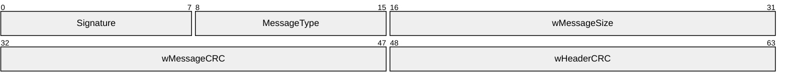

**Signature (1 byte):** An 8-bit serial signature for the packet. This MUST be set to the value 0xCC.

**MessageType (1 byte):** An 8-bit token that indicates the message type. The high 4 bits MUST be set to one of the following values.

| Value | Meaning |
| --- | --- |
| 0x20 | This message contains an enumeration response. See section 2.2.5. |
| 0x40 | This message contains a [**transport packet**](#gt_transport-packet) message following the header, and the low two bits MUST be ignored. |
| 0x60 | This message contains an enumeration query. See section 2.2.4. The low two bits of the **MessageType** value in an enumeration query MUST be echoed in the low two bits of the enumeration response (a message with **MessageType** value of "0x20"). The sender MAY use any identifier value for the enumeration query. However, the sender SHOULD use this value to correlate queries with responses to calculate the [**round-trip time (RTT)**](#gt_round-trip-time-rtt). |

**wMessageSize (2 bytes):** A 16-bit integer that specifies the size, in bytes, of the message.

**wMessageCRC (2 bytes):** A 16-bit integer that provides the [**CRC**](#gt_cyclic-redundancy-check-crc), in bytes, for the message data, which is calculated using the standardized [**CRC-16-IBM algorithm**](#gt_crc-16-ibm-algorithm).

**wHeaderCRC (2 bytes):** A 16-bit integer that provides the CRC, in bytes, for the message header, which is calculated using the standardized CRC-16-IBM algorithm.

<a id="Section_2.2.3"></a>
### 2.2.3 DXDiag DirectPlay Packets

DirectPlay DXDiag Usage Protocol packets beginning with a zero byte are used to locate [**game sessions**](#gt_game-session) and to test network paths for [**peer**](#gt_peer) connection attempts. Packets that have a nonzero first byte are part of an actively managed connection and are further divided into command, user data, and [**ACK**](#gt_acknowledgment-ack) packet types.

A packet's purpose is determined by a combination of its command values, extended operation code values, or flag values within the packet header. For user data [**transport packets**](#gt_transport-packet), the first byte that follows the 4-byte header declares the type of information included in the packet.

The DirectPlay DXDiag Usage Protocol uses the following packets.

| Packet | Description |
| --- | --- |
| [EnumQuery](#Section_2.2.4) | Enumerates [**hosting**](#gt_host) [**servers**](#gt_server). |
| [EnumResponse](#Section_2.2.5) | Responds to an enumeration request. |
| [SESS_PATH_TEST](#Section_2.2.6) | Circumvents issues with [**network address translation (NAT)**](#gt_network-address-translation-nat) devices. |
| [TRANS_USERDATA_HEADER](#Section_2.2.17) | Transport packet header that contains command, control, and acknowledgment information. |
| [TRANS_USERDATA_PLAYER_CONNECT_INFO](#Section_2.2.26) | Sends [**client**](#gt_client) connection information to the host. |
| [TRANS_USERDATA_SEND_SESSION_INFO](#Section_2.2.33) | Relays game session information from the server to the client. |
| [TRANS_USERDATA_ACK_SESSION_INFO](#Section_2.2.10) | Sent from the client to the server to acknowledge the receipt of connection information. |
| [TRANS_USERDATA_INSTRUCT_CONNECT](#Section_2.2.20) | Instructs a client to connect to a designated client. |
| [TRANS_USERDATA_NAMETABLE_VERSION](#Section_2.2.23) | Specifies the version number of the [**name table**](#gt_name-table). |
| [TRANS_USERDATA_REQ_NAMETABLE_OP](#Section_2.2.24) | Instructs a client to send name table information to the host. |
| [TRANS_USERDATA_ACK_NAMETABLE_OP](#Section_2.2.25) | Transmits name table information from a client to the host. |
| [TRANS_USERDATA_RESYNC_VERSION](#Section_2.2.30) | Requests that the name table version number be resynchronized to the current version number. |
| [TRANS_USERDATA_SEND_PLAYER_DNID](#Section_2.2.32) | Sends a user identification number to another client. |
| [TRANS_USERDATA_KEEPALIVE](#Section_2.2.22) | Used by [**DXDiag**](#gt_directx-diagnostic-dxdiag) to calculate an [**RTT**](#gt_round-trip-time-rtt). |
| [TRANS_USERDATA_CONNECT_ATTEMPT_FAILED](#Section_2.2.12) | Indicates that a peer in the game session is unable to connect to a new peer. |
| [TRANS_USERDATA_CONNECT_FAILED](#Section_2.2.13) | Indicates that a connection attempt failed. |
| [TRANS_USERDATA_TERMINATE_SESSION](#Section_2.2.14) | Instructs a client to disconnect from the game session. |
| [TRANS_USERDATA_INSTRUCTED_CONNECT_FAILED](#Section_2.2.21) | Indicates that a client was unable to carry out a server's instruction to connect to a new client. |
| [TRANS_USERDATA_HOST_MIGRATE](#Section_2.2.18) | Indicates that host [**migration**](#gt_host-migration) is enabled and that the host server is terminating. |
| [TRANS_USERDATA_HOST_MIGRATE_COMPLETE](#Section_2.2.19) | Informs clients that the game session-hosting responsibilities have successfully migrated from the departing host. |
| [TRANS_USERDATA_ADD_PLAYER](#Section_2.2.11) | Instructs clients to add the specified client to the [**game**](#gt_game) session. |
| [TRANS_USERDATA_DESTROY_PLAYER](#Section_2.2.15) | Instructs clients to remove the specified user from the name table. |
| [TRANS_USERDATA_END_OF_STREAM](#Section_2.2.16) | Signals the disconnection of a user. |
| [TRANS_USERDATA_REQ_INTEGRITY_CHECK](#Section_2.2.27) | Requests that a host determine if a target client is still in the game session. |
| [TRANS_USERDATA_INTEGRITY_CHECK](#Section_2.2.28) | Requests that a client validate that it is still in the game session. |
| [TRANS_USERDATA_INTEGRITY_CHECK_RESPONSE](#Section_2.2.29) | Response from a client validating that it is still in the game session. |
| [TRANS_USERDATA_SEND_MESSAGE](#Section_2.2.31) | Transmits a chat message to all other users in the game session. |
| [TRANS_COMMAND_CONNECT](#Section_2.2.7) | Requests a connection. |
| [TRANS_COMMAND_CONNECT_ACCEPT](#Section_2.2.8) | Accepts a connection request. |
| [TRANS_COMMAND_SACK](#Section_2.2.9) | Acknowledges outstanding packets. |

To reduce network traffic, several [**DirectPlay**](#gt_directplay) **TRANS_USERDATA** packets can be fused into a single packet using a special [**coalesced payload**](#gt_coalesced-payload), as defined in section [2.2.17.1](#Section_2.2.17.1). **TRANS_USERDATA** packets that have the PACKET_COMMAND_USER1 or PACKET_COMMAND_USER2 flag set in the **bCommand** field of the TRANS_USERDATA_HEADER packet header can be coalesced.

<a id="Section_2.2.4"></a>
### 2.2.4 EnumQuery

The EnumQuery packet is used to enumerate hosting [**servers**](#gt_server) [MC-DPLHP](../MC-DPLHP/MC-DPLHP.md). The server replies with an [EnumResponse](#Section_2.2.5) to the [**client**](#gt_client), where one EnumResponse message is sent for each [**game session**](#gt_game-session) that is running on the server. As a result, the client can receive multiple EnumResponse messages if more than one game session is running. The manner in which multiple available game sessions are handled, such as presenting a list to the user for selection, is left to the implementation.

**Note** When a [**serial**](#gt_d3177233-a206-4a1c-9991-6288323da6a8) or [**modem**](#gt_1fe7e0c1-8b87-4a20-a8f2-213c70299522) link is used, the [_MESSAGE_HEADER (section 2.2.2)](#Section_2.2.2) header replaces the first 32 bits of the EnumQuery payload (the **LeadByte**, **CommandByte**, and **EnumPayload** fields).

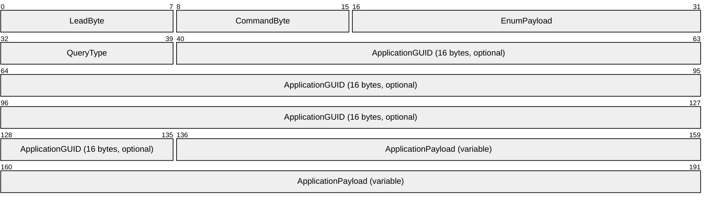

**LeadByte (1 byte):** This field is 8 bits in length. It MUST be 0x00.

**Note** The first byte MUST be 0 for the message to be a valid EnumQuery message. When a message is received and the first byte is nonzero, the entire message MUST be passed through for processing as described in [MC-DPL8R](../MC-DPL8R/MC-DPL8R.md).

**CommandByte (1 byte):** This field is 8 bits in length. It MUST be 0x02.

**EnumPayload (2 bytes):** This field is 16 bits in length. The **EnumPayload** is a value selected by the sender of the EnumQuery message that MUST be echoed in the EnumResponse message. It SHOULD be used to match EnumResponse messages to their corresponding EnumQuery.

**QueryType (1 byte):** This field is 8 bits in length. The value MUST be set to one of the following.

| Value | Meaning |
| --- | --- |
| 0x01 | Indicates that this query contains an **ApplicationGUID** field. Only [**DirectPlay 8 server applications**](#gt_directplay-8-server-application) that are identified by the **ApplicationGUID** SHOULD respond to this EnumQuery. For more information about the [**GUID**](#gt_globally-unique-identifier-guid) type, see [MS-DTYP](../MS-DTYP/MS-DTYP.md) section 2.3.4. Applications SHOULD NOT respond to any EnumQuery messages where the **QueryType** field is 0x01 and the **ApplicationGUID** field does not match the server application GUID. **Note** For the DirectPlay DXDiag Usage Protocol, the value of **QueryType** SHOULD be set to "0x01". |
| 0x02 | Indicates that this EnumQuery message contains no **ApplicationGUID** field. All DirectPlay 8 server applications that receive this EnumQuery SHOULD respond to it. |

**ApplicationGUID (16 bytes):** The Application GUID. This field MUST be set to 61EF80DA-691B-4247-9ADD-1C7BED2BC13E, which is the GUID for the [**DXDiag application**](#gt_directx-diagnostic-dxdiag).

**ApplicationPayload (variable):** The DirectPlay DXDiag Usage Protocol will never issue an application [**payload**](#gt_payload).

<a id="Section_2.2.5"></a>
### 2.2.5 EnumResponse

The EnumResponse packet is sent from the [**game session**](#gt_game-session) [**server**](#gt_server) to the [**client**](#gt_client) in response to the [EnumQuery](#Section_2.2.4) packet that was sent from the client.

**Note** When a [**serial**](#gt_d3177233-a206-4a1c-9991-6288323da6a8) or [**modem**](#gt_1fe7e0c1-8b87-4a20-a8f2-213c70299522) link is used, the [_MESSAGE_HEADER (section 2.2.2)](#Section_2.2.2) header replaces the first 32 bits of the EnumResponse payload (the **LeadByte**, **CommandByte**, and **EnumPayload** fields).

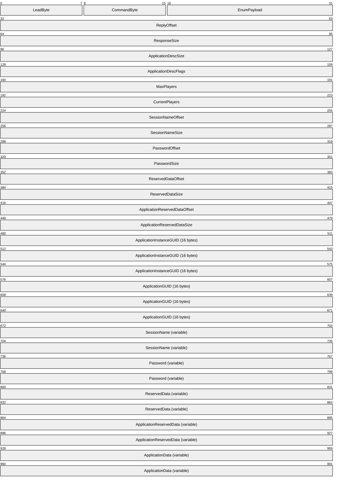

**LeadByte (1 byte):** The leading zero byte for the packet. This field MUST be set to 0 to denote that this is a [**session packet**](#gt_session-packet).

**CommandByte (1 byte):** An 8-bit integer that indicates the command code for the message. This field MUST be set to 0x03 to denote that this is an EnumResponse message.

**EnumPayload (2 bytes):** A 16-bit integer value selected by the sender of the EnumQuery message.

An EnumResponse message is generated for every EnumQuery message received. The **EnumPayload** field in the EnumResponse message MUST match the **EnumPayload** field in the corresponding EnumQuery message.

**ReplyOffset (4 bytes):** A 32-bit integer that provides the offset in bytes from the end of **EnumPayload** to the start of the reply. If this field is 0, the packet does not contain a reply.

**ResponseSize (4 bytes):** A 32-bit integer that provides the size in bytes of the reply.

**ApplicationDescSize (4 bytes):** A 32-bit integer that provides the size of the application description.

**ApplicationDescFlags (4 bytes):** A 32-bit integer that provides the characteristics of the session specified as a combination of the following flags.<3>

| Value | Meaning |
| --- | --- |
| DPNSESSION_MIGRATE_HOST 0x00000004 | [**Host migration**](#gt_host-migration) is allowed. |
| DPNSESSION_NODPNSVR 0x00000040 | Not using [**DirectPlay Name Server (DPNSVR)**](#gt_directplay-name-server-dpnsvr) (game session is not enumerable via well-known port 6073). |
| DPNSESSION_REQUIREPASSWORD 0x00000080 | Password required to join game session. |
| DPNSESSION_NOENUMS 0x00000100 | Enumerations are not allowed. This flag will never be set in an EnumResponse message. |

**MaxPlayers (4 bytes):** A 32-bit integer that specifies the maximum number of clients allowed in the game session. A value of 0x00000000 denotes that an unlimited number of clients is allowed.

**CurrentPlayers (4 bytes):** A 32-bit integer that specifies the current number of clients in the game session.

**SessionNameOffset (4 bytes):** A 32-bit integer that specifies the offset in bytes from the end of **EnumPayload** to the start of the game session name.

**SessionNameSize (4 bytes):** A 32-bit integer that specifies the size in bytes of the game session name.

**PasswordOffset (4 bytes):** This field is 32 bits in length. A password is never used in the EnumResponse message; therefore, the **PasswordOffset** field will always be 0.

**PasswordSize (4 bytes):** This field is 32 bits in length. Passwords are not used in EnumResponse messages transmitted in the DirectPlay DxDiag Usage Protocol; therefore, the **PasswordSize** field will always be 0.

**ReservedDataOffset (4 bytes):** A 32-bit field that specifies the offset, in bytes, from the end of the **EnumPayload** field to the **ReservedData** field. Since the **ReservedData** field is never used, **ReservedDataOffset** will always be 0.

**ReservedDataSize (4 bytes):** A 32-bit field that specifies the size, in bytes, of the **ReservedData** field. Since the **ReservedData** field is never used, **ReservedDataSize** will always be 0.

**ApplicationReservedDataOffset (4 bytes):** The **ApplicationReservedData** field is not used by the DirectPlay DxDiag Usage Protocol, and therefore, the **ApplicationReservedDataOffset** field will always have a value of 0.

**ApplicationReservedDataSize (4 bytes):** The **ApplicationReservedData** field is not used by the DirectPlay DxDiag Usage Protocol, and therefore, the **ApplicationReservedDataSize** field will always have a value of 0.

**ApplicationInstanceGUID (16 bytes):** The instance [**GUID**](#gt_globally-unique-identifier-guid) that identifies the game session.

**ApplicationGUID (16 bytes):** The application GUID. This field MUST be set to 61EF80DA-691B-4247-9ADD-1C7BED2BC13E, which is the GUID for the [**DXDiag application**](#gt_directx-diagnostic-dxdiag).

**SessionName (variable):** An array of [**Unicode**](#gt_unicode) characters that describes the game session name with the size specified by **SessionSize** and the offset from the beginning of the packet specified by **SessionOffset**.

**Password (variable):** The EnumResponse message will never contain a password as passwords are not utilized in the DirectPlay DxDiag Usage Protocol; therefore, this field is unused.

**ReservedData (variable):** This field was intended to be used for future extensions to the DirectPlay 8 Protocol, but was never used.

**ApplicationReservedData (variable):** This field is not used by the DirectPlay DxDiag Usage Protocol.

**ApplicationData (variable):** This field MUST be filled with zeroes on sending and MUST be ignored upon receipt.

<a id="Section_2.2.6"></a>
### 2.2.6 SESS_PATH_TEST

The SESS_PATH_TEST packet is used to circumvent issues with [**NAT**](#gt_network-address-translation-nat) devices. SESS_PATH_TEST packets are sent only when IPv4 is the transport. Path test packets and NAT are described in [MC-DPLNAT](../MC-DPLNAT/MC-DPLNAT.md).

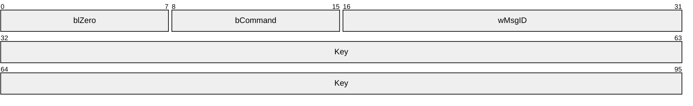

**blZero (1 byte):** The leading zero byte for the packet. This field MUST be set to 0 to denote that this is a [**session packet**](#gt_session-packet).

**bCommand (1 byte):** An 8-bit integer that provides the command code for the message. This field MUST be set to 0x05 to denote that this is a SESS_PATH_TEST message.

**wMsgID (2 bytes):** A 16-bit integer value used to uniquely identify an individual SESS_PATH_TEST message. This MAY be any value selected by the sender and SHOULD be ignored by the receiver.<4>

**Key (8 bytes):** A 64-bit integer that provides the unique key associated with the SESS_PATH_TEST message. For information about how this value is generated, see section [3.1.1](#Section_3.1.1).

<a id="Section_2.2.7"></a>
### 2.2.7 TRANS_COMMAND_CONNECT

The TRANS_COMMAND_CONNECT packet is used to request a connection. The response is a [TRANS_COMMAND CONNECT_ACCEPT](#Section_2.2.8) packet.

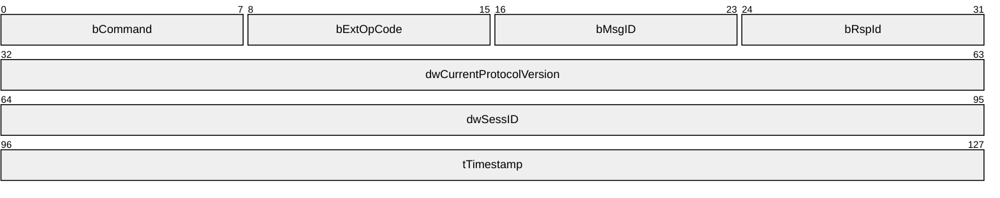

**bCommand (1 byte):** An 8-bit integer that provides the command code for the message. This field MUST be set to one of the following values.

| Value | Meaning |
| --- | --- |
| 0x80 | Indicates that this message utilizes a [**command frame (CFRAME)**](#gt_command-frame-cframe). |
| 0x88 | Indicates that this message utilizes a CFRAME (0x80) and POLL (0x08) values, which specify that the sender requests immediate acknowledgment ([**ACK**](#gt_acknowledgment-ack)) from the receiver upon receipt of the message. |

If any other value is specified for the **bCommand** field, the packet MUST be ignored.

**bExtOpCode (1 byte):** An 8-bit integer that provides the extended operation code for the message. This field MUST be set to 0x01 to denote that this message requests a connection.

**bMsgID (1 byte):** An 8-bit integer message identifier used to correlate the responses. The initial value SHOULD be 0 and SHOULD be incremented each time the connect packet is retried. The recipient MUST echo the value in the **bRspId** field when responding with a TRANS_COMMAND_CONNECT_ACCEPT message.

**bRspId (1 byte):** An 8-bit integer that MUST be set to 0 when sending and MUST be ignored on receipt.

**dwCurrentProtocolVersion (4 bytes):** The version number of the requestor's [**DirectPlay**](#gt_directplay) protocol, in [**little-endian**](#gt_little-endian) byte order, where the upper 16 bits are considered a major version number and the lower 16 bits are considered a minor version number. The major version number MUST NOT be set to any value other than 0x0001. The minor version number SHOULD<5> be set to 0x0000 to indicate support for the base features, but MAY be set to a value between 0x00010000 and 0x00010004, inclusive.

The recipient SHOULD be prepared to support older message formats used by earlier minor versions. The recipient MUST ignore this packet if it does not support older message formats.

The recipient SHOULD be prepared to receive minor version numbers higher than what it implements and supplies in its own TRANS_COMMAND_CONNECT or TRANS_COMMAND CONNECT_ACCEPT message, but both sides MUST only use message formats compatible with the lower of their two version numbers.

**Note** While a receiver can indicate support for [**coalescence**](#gt_coalesced-payload) (version level of 0x00010005 or higher) and a sender can choose to use this feature when it is available by the receiver, the DirectPlay DXDiag Usage Protocol utilizes the coalescence feature on any **TRANS_USERDATA** messages except [TRANS_USERDATA_SEND_MESSAGE (section 2.2.31)](#Section_2.2.31). In addition, the signing feature (version level 0x00010006) will not be utilized by the DirectPlay DXDiag Usage Protocol even when the receiver indicates support for the signing feature.

| Value | Meaning |
| --- | --- |
| 0x00010000 — 0x00010004 | Any protocol version number between 1.0 and 1.4 implements the base features. |
| 0x00010005 | Protocol version number 1.5 implements the base features, and adds support for coalescence. **Note** The coalescence feature is not used by the base implementation of the DirectPlay DXDiag Usage Protocol. |
| 0x00010006 | Protocol version number 1.6 implements the base features, supports coalescence, and adds support for signing. **Note** The signing feature is not used by the base implementation of the DirectPlay DXDiag Usage Protocol. |

**dwSessID (4 bytes):** A 32-bit integer session identifier that is used to correlate the responses. The value is dependent upon the implementation and SHOULD be a random number that is not predictable. The value of **dwSessID** MUST NOT be 0 unless **dwCurrentProtocolVersion** indicates a minor version less than 0x0005; otherwise, the packet MUST be ignored. The value for **dwSessID** MUST remain the same when retrying the TRANS_COMMAND_CONNECT packet. The recipient MUST echo the value in **dwSessID** when responding; otherwise, the packet MUST be ignored.

**tTimestamp (4 bytes):** A 32-bit integer that provides the sender's computer system [**tick count**](#gt_tick-count). The value of the **tTimestamp** field SHOULD be ignored, but MAY be used to estimate the differences in local tick counts between a sender and receiver.

<a id="Section_2.2.8"></a>
### 2.2.8 TRANS_COMMAND_CONNECT_ACCEPT

The TRANS_COMMAND_CONNECT_ACCEPT packet is used to accept a connection request.


**bCommand (1 byte):** An 8-bit integer that provides the command code for the message. This field MUST be set to one of the following values.

| Value | Meaning |
| --- | --- |
| 0x80 | Indicates that this message utilizes a [**command frame (CFRAME)**](#gt_command-frame-cframe). |
| 0x88 | Indicates that this message utilizes a CFRAME (0x80) and POLL (0x08) values, which specify that the sender requests immediate [**acknowledgment (ACK)**](#gt_acknowledgment-ack) from the receiver upon receipt of the message. |

When the packet is used to accept a connection request, the CFRAME and [**POLL**](#gt_poll-packet-poll) values MUST be set. When the packet is used to complete the connection handshake, the POLL value MUST NOT be set. If any other values are set the packet MUST be ignored.

**bExtOpCode (1 byte):** An 8-bit integer that provides the extended operation code for the message. This field MUST be set to 0x02 to denote that this message accepts a connection.

**bMsgID (1 byte):** An 8-bit integer that provides the identifier for the TRANS_COMMAND_CONNECT_ACCEPT message. The initial value SHOULD be 0 and SHOULD be incremented if the packet is retried.

**bRspId (1 byte):** An 8-bit integer response identifier. This field MUST be set to the value of the **bMsgID** field in the [TRANS_COMMAND_CONNECT (section 2.2.7)](#Section_2.2.7) or TRANS_COMMAND_CONNECT_ACCEPT message to which this is a response.

**dwCurrentProtocolVersion (4 bytes):** The version number of the requestor's [**DirectPlay**](#gt_directplay) protocol, in [**little-endian**](#gt_little-endian) byte order, where the upper 16 bits are considered a major version number and the lower 16 bits are considered a minor version number. The major version number MUST NOT be set to any value other than 0x0001. The minor version number SHOULD<6> be set to 0x0000 to indicate support for the base features, but MAY be set to a value between 0x00010000 and 0x00010004, inclusive.

The recipient SHOULD be prepared to support older message formats used by earlier minor versions. The recipient MUST ignore this packet if it does not support older message formats.

The recipient SHOULD be prepared to receive minor version numbers higher than what it implements and supplies in its own TRANS_COMMAND_CONNECT or TRANS_COMMAND CONNECT_ACCEPT message, but both sides MUST only use message formats compatible with the lower of their two version numbers.

**Note** While a receiver can indicate support for [**coalescence**](#gt_coalesced-payload) (version level of 0x00010005 or higher) and a sender can choose to use this feature when it is available by the receiver, the DirectPlay DXDiag Usage Protocol utilizes the coalescence feature on any **TRANS_USERDATA** messages except [TRANS_USERDATA_SEND_MESSAGE (section 2.2.31)](#Section_2.2.31). In addition, the signing feature (version level 0x00010006) will not be utilized by the DirectPlay DXDiag Usage Protocol, even when the receiver indicates support for the signing feature.

| Value | Meaning |
| --- | --- |
| 0x00010000 — 0x00010004 | Any protocol version number between 1.0 and 1.4 implements the base features. |
| 0x00010005 | Protocol version number 1.5 implements the base features, and adds support for coalescence. **Note** The coalescence feature is not used by the base implementation of the DirectPlay DXDiag Usage Protocol. |
| 0x00010006 | Protocol version number 1.6 implements the base features, supports coalescence, and adds support for signing. **Note** The signing feature is not used by the base implementation of the DirectPlay DXDiag Usage Protocol. |

**dwSessID (4 bytes):** A 32-bit integer session identifier. The value MUST be set to the value of **dwSessID** specified in the TRANS_COMMAND_CONNECT packet; otherwise, the packet SHOULD be ignored.

**tTimestamp (4 bytes):** A 32-bit integer that provides the sender's computer system [**tick count**](#gt_tick-count). The value of the **tTimestamp** field SHOULD be ignored, but MAY be used to estimate the differences in local tick counts between a sender and receiver.

<a id="Section_2.2.9"></a>
### 2.2.9 TRANS_COMMAND_SACK

The TRANS_COMMAND_SACK packet is used to acknowledge outstanding packets. Packet [**ACK**](#gt_acknowledgment-ack) is typically bundled in all user data packets using the **bSeq** and **bNRcv** fields found in the [TRANS_USERDATA_HEADER](#Section_2.2.17). However, the TRANS_COMMAND_SACK packet is used in the following scenarios:

- A dedicated ACK is requested (that is, when the PACKET_COMMAND_POLL bit in the **bCommand** header field is set).
- No user data remains for further bundled acknowledgments.
- The [Delayed Acknowledgment Timer (section 3.1.2.6)](#Section_3.1.2.6) elapses.
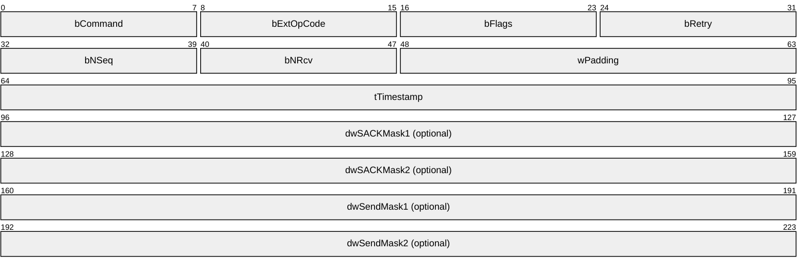

**bCommand (1 byte):** An 8-bit integer that provides the command code for the message. This field MUST be set to one of the following values.

| Value | Meaning |
| --- | --- |
| 0x80 | Indicates that this message utilizes a [**command frame (CFRAME)**](#gt_command-frame-cframe). |
| 0x88 | Indicates that this message utilizes a CFRAME (0x80) and [**POLL**](#gt_poll-packet-poll) (0x08) values, which specify that the sender requests immediate acknowledgment (ACK) from the receiver upon receipt of the message. |

The CFRAME value MUST be set. The POLL value SHOULD NOT be set and SHOULD be ignored. If any other values are specified, the packet MUST be ignored.

**bExtOpCode (1 byte):** An 8-bit integer that provides the extended operation code for the message. This field MUST be set to 0x06 to denote that this message [**selectively acknowledges (SACK)**](#gt_selective-acknowledgment-sack) outstanding packets.

**bFlags (1 byte):** An 8-bit integer that provides the status flags for the message. This field MUST be set to one or more of the following values.

| Value | Meaning |
| --- | --- |
| SACK_FLAGS_RESPONSE 0x01 | The **bRetry** field is valid. |
| SACK_FLAGS_SACK_MASK1 0x02 | The low 32 bits of the SACK mask are present in **dwSACKMask1**. |
| SACK_FLAGS_SACK_MASK2 0x04 | The high 32 bits of the SACK mask are present in **dwSACKMask2**. |
| SACK_FLAGS_SEND_MASK1 0x08 | The low 32 bits of the [**send mask**](#gt_send-mask) are present in **dwSendMask1**. |
| SACK_FLAGS_SEND_MASK2 0x10 | The high 32 bits of the send mask are present in **dwSendMask2**. |

If any of the mask bits are set, and there is no corresponding Mask DWORD present in the message, then this message SHOULD be ignored.

**bRetry (1 byte):** A Boolean that indicates if the last received packet was a retry. This value MUST be ignored if **SACK_FLAGS_RESPONSE** is not set. Otherwise, the value SHOULD be 0 if the last received [**data frame (DFRAME)**](#gt_data-frame-dframe) for the connection was not marked as a retry; otherwise, it SHOULD be nonzero. Recipients MUST NOT require any particular bit (or bits) to be set in the nonzero case, only that at least one bit is set.

**bNSeq (1 byte):** SACK packets do not have sequence numbers of their own. This 8-bit integer represents the sequence number of the next DFRAME to send.

**bNRcv (1 byte):** An 8-bit integer that provides the expected sequence number of the next packet received. If the SACK_FLAGS_SACK_MASK1 flag is set, the **bNRcv** field is supplemented with an additional DWORD bitmask field that selectively acknowledges frames with sequence numbers higher than **bNRcv**.

**wPadding (2 bytes):** A 16-bit integer field MUST be set to 0 when sending and ignored on receipt.

**tTimestamp (4 bytes):** A 32-bit integer that provides the sender's computer system [**tick count**](#gt_tick-count). The value of the **tTimestamp** field SHOULD be ignored, but MAY be used to estimate the differences in local tick counts between a sender and receiver.

**dwSACKMask1 (4 bytes):** A 32-bit integer that provides the optional low 32 bits of the SACK mask in [**little-endian**](#gt_little-endian) byte order. The existence of this field in the packet is dependent on the **bFlags** field having **SACK_FLAGS_SACK_MASK1** set.

**dwSACKMask2 (4 bytes):** A 32-bit integer that provides the optional high 32 bits of the SACK mask in little-endian byte order. The existence of this field in the packet is dependent on the **bFlags** field having **SACK_FLAGS_SACK_MASK2** set.

**dwSendMask1 (4 bytes):** A 32-bit integer that provides the optional low 32 bits of the send mask in little-endian byte order. The existence of this field in the packet is dependent on the **bFlags** field having **SACK_FLAGS_SEND_MASK1** set.

**dwSendMask2 (4 bytes):** A 32-bit integer that provides the optional high 32 bits of the send mask in little-endian byte order. The existence of this field in the packet is dependent on the **bFlags** field having **SACK_FLAGS_SEND_MASK2** set.

<a id="Section_2.2.10"></a>
### 2.2.10 TRANS_USERDATA_ACK_SESSION_INFO

The TRANS_USERDATA_ACK_SESSION_INFO packet is sent from the [**client**](#gt_client) to the [**server**](#gt_server) to [**acknowledge**](#gt_acknowledgment-ack) the receipt of connection information. This packet contains no user data beyond the packet type field, and begins with a [TRANS_USERDATA_HEADER](#Section_2.2.17).

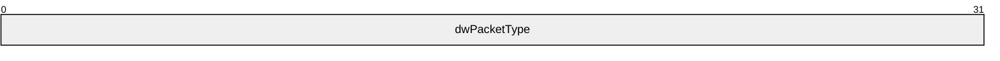

**dwPacketType (4 bytes):** A 32-bit integer that indicates the packet type. This field MUST be set to 0x000000C3 to denote that this message acknowledges the receipt of [**game session**](#gt_game-session) connection information.

<a id="Section_2.2.11"></a>
### 2.2.11 TRANS_USERDATA_ADD_PLAYER

The TRANS_USERDATA_ADD_PLAYER packet instructs [**clients**](#gt_client) to add a specified client to the [**game session**](#gt_game-session). This packet begins with a [TRANS_USERDATA_HEADER](#Section_2.2.17).

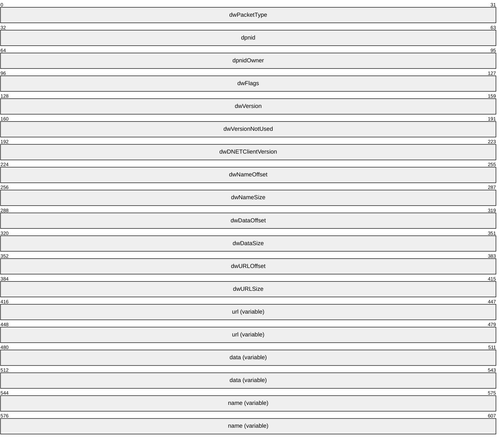

**dwPacketType (4 bytes):** A 32-bit integer that indicates the packet type. This field MUST be set to 0x000000D0 to denote that this message instructs clients to add the specified client to the game session.

**dpnid (4 bytes):** A 32-bit integer that specifies the identifier of the client to add.

**dpnidOwner (4 bytes):** A 32-bit integer that specifies the identifier of the game session owner.

**dwFlags (4 bytes):** A 32-bit integer that contains the [**player**](#gt_player) flags. Entries are OR'd together.<7>

| Value | Meaning |
| --- | --- |
| 0x00000001 | Player is the local player. |
| 0x00000002 | Player is the [**host**](#gt_host). |
| 0x00000100 | Player is a client from a [**peer-to-peer**](#gt_peer-to-peer) game session. |
| 0x00001000 | Player is connecting. |
| 0x00002000 | Player is to make the member available for use. |
| 0x00004000 | Player to indicate disconnecting. |
| 0x00010000 | Player to indicate connection to an application. |
| 0x00020000 | Player to indicate that the application was given the created player. |
| 0x00040000 | Player to indicate that the game session owner needs to destroy a player. |
| 0x00080000 | Player to indicate that the player is in use. |

**dwVersion (4 bytes):** A 32-bit integer that provides the current [**name table**](#gt_name-table) version number.

**dwVersionNotUsed (4 bytes):** This field MUST be set to 0 when sending and ignored on receipt.

**dwDNETClientVersion (4 bytes):** A 32-bit integer that provides the [**DirectPlay**](#gt_directplay) version of the client being added to the chat session. This field MUST be set to the appropriate DirectPlay version for the client.<8>

**dwNameOffset (4 bytes):** A 32-bit integer that provides the offset, in bytes, from the end of the **dwPacketType** field to the client name. If this field is 0, the packet does not include the client name.

**dwNameSize (4 bytes):** A 32-bit integer that provides the size, in bytes, of the name.

**dwDataOffset (4 bytes):** A 32-bit integer that provides the offset, in bytes, from the end of the **dwPacketType** field to the client data. If this field is 0, the packet does not include client data.

**dwDataSize (4 bytes):** A 32-bit integer that provides the size, in bytes, of the client data.

**dwURLOffset (4 bytes):** A 32-bit integer that provides the offset, in bytes, from the end of the **dwPacketType** field to the client URL. If this field is 0, the packet does not include the client URL.

**dwURLSize (4 bytes):** A 32-bit integer that provides the size, in bytes, of the connecting client's URL address.

**url (variable):** A variable length array of characters that contains the client URL, including the terminating null character. For more information about the structure of the URL, see [DN_ADDRESSING_URL (section 2.2.34)](#Section_2.2.34).

**data (variable):** A variable length array of characters that contains user data, including the terminating null character.

**name (variable):** A variable length array of [**Unicode**](#gt_unicode) characters that contains the client name, including the terminating null character.

<a id="Section_2.2.12"></a>
### 2.2.12 TRANS_USERDATA_CONNECT_ATTEMPT_FAILED

The TRANS_USERDATA_CONNECT_ATTEMPT_FAILED packet is sent from the [**host**](#gt_host) to a connecting [**peer**](#gt_peer) to indicate that an existing peer in the [**game session**](#gt_game-session) was unable to carry out the instruction from the host to connect to the new (connecting) peer. This packet begins with a [TRANS_USERDATA_HEADER](#Section_2.2.17).

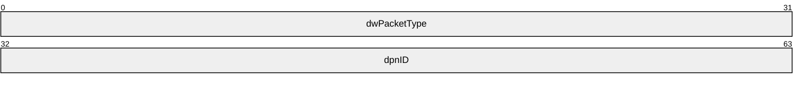

**dwPacketType (4 bytes):** A 32-bit field that contains the packet type. The **dwPacketType** field MUST be set to 0x000000C8 (DN_MSG_INTERNAL_CONNECT_ATTEMPT_FAILED).

**dpnID (4 bytes):** A 32-bit field that contains the identifier for the existing peer in the game session that was unable to connect to the new peer.

<a id="Section_2.2.13"></a>
### 2.2.13 TRANS_USERDATA_CONNECT_FAILED

The TRANS_USERDATA_CONNECT_FAILED packet indicates that a connection attempt failed. This packet begins with a [TRANS_USERDATA_HEADER](#Section_2.2.17).

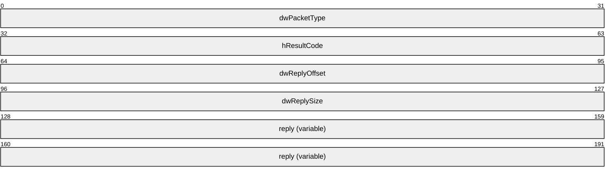

**dwPacketType (4 bytes):** A 32-bit integer that indicates the packet type. This field MUST be set to 0x000000C5 to denote that this message indicates that a connection attempt failed.

**hResultCode (4 bytes):** A 32-bit integer that specifies the result code.

| Value | Meaning |
| --- | --- |
| DPNERR_ALREADYCLOSING 0x80158050 | [**Server**](#gt_server)/[**host**](#gt_host) is closing or host is migrating. |
| DPNERR_NOTHOST 0x80158530 | Attempting to connect to an application that is not the host/server. |
| DPNERR_INVALIDINTERFACE 0x80158390 | Nonclient attempting to connect to a server. Nonpeer attempting to connect to a host/peer. |
| DPNERR_INVALIDVERSION 0x80158460 | Version passed in is not a valid [**DirectPlay**](#gt_directplay) version. |
| DPNERR_INVALIDINSTANCE 0x80158380 | Instance [**GUID**](#gt_globally-unique-identifier-guid) is not valid for this [**game session**](#gt_game-session). |
| DPNERR_INVALIDAPPLICATION 0x80158300 | Application GUID is not valid for this application. |
| DPNERR_INVALIDPASSWORD 0x80158410 | Password passed in does not match what is expected. |
| DPNERR_HOSTREJECTEDCONNECTION 0x80158260 | Application-specific failure for not allowing connection. |
| DPNERR_GENERIC 0x80004005 | An undetermined error occurred inside a [**DirectX**](#gt_directx) subsystem. This includes uncommon errors that cannot be generalized. |

**dwReplyOffset (4 bytes):** A 32-bit integer that specifies the offset of the **reply** field from the end of the **dwPacketType** field to the **reply** field.

**dwReplySize (4 bytes):** A 32-bit integer that specifies the size in bytes of the data in the **reply** field.

**reply (variable):** A variable length array of characters that contains a reply message identifying the connection failure, including the terminating null character.

<a id="Section_2.2.14"></a>
### 2.2.14 TRANS_USERDATA_TERMINATE_SESSION

The TRANS_USERDATA_TERMINATE_SESSION packet instructs the [**client**](#gt_client) to disconnect from the [**game session**](#gt_game-session). This packet begins with a [TRANS_USERDATA_HEADER (section 2.2.17)](#Section_2.2.17).

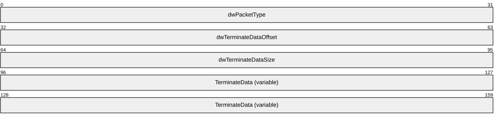

**dwPacketType (4 bytes):** A 32-bit field that contains the packet type.

| Value | Meaning |
| --- | --- |
| DN_MSG_INTERNAL_TERMINATE_SESSION 0x000000DF | Instructs the client to close and disconnect itself from the game session. |

**dwTerminateDataOffset (4 bytes):** A 32-bit field that contains the offset from the end of **dwPacketType** for the data passed from the [**server**](#gt_server)/[**host**](#gt_host) application that describes why the client is being terminated.

**dwTerminateDataSize (4 bytes):** A 32-bit field that contains the size, in bytes, of the terminate data. If **dwTerminateDataOffset** is 0, **dwTerminateDataSize** SHOULD also be 0. If **dwTerminateDataOffset** is not 0, **dwTerminateDataSize** SHOULD also not be 0.

**TerminateData (variable):** A variable-length field that contains a byte array from the application that describes why the client is being terminated from the game session.

<a id="Section_2.2.15"></a>
### 2.2.15 TRANS_USERDATA_DESTROY_PLAYER

The TRANS_USERDATA_DESTROY_PLAYER packet instructs the [**client**](#gt_client) to remove a specified user from the [**name table**](#gt_name-table). This packet begins with a [TRANS_USERDATA_HEADER](#Section_2.2.17).

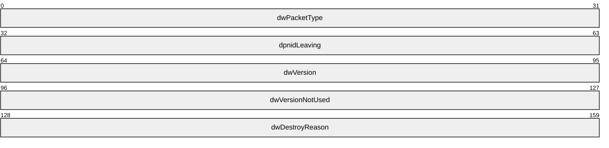

**dwPacketType (4 bytes):** A 32-bit integer that indicates the packet type. This field MUST be set to 0x000000D1 to denote that this message instructs the client to remove a specified user from the name table.

**dpnidLeaving (4 bytes):** A 32-bit integer that specifies the identifier of the client or [**server**](#gt_server) to remove from the name table.

**dwVersion (4 bytes):** A 32-bit integer that specifies the current name table version number.

**dwVersionNotUsed (4 bytes):** This field MUST be set to 0 when sending and ignored on receipt.

**dwDestroyReason (4 bytes):** A 32-bit integer that specifies the reason for terminating the specified client or server. This field MUST be set to one of the following values.

| Value | Meaning |
| --- | --- |
| DPNDESTROYPLAYERREASON_NORMAL 0x00000001 | The client or server is leaving. |
| DPNDESTROYPLAYERREASON_HOSTDESTROYEDPLAYER 0x00000004 | The server removed the client. |

<a id="Section_2.2.16"></a>
### 2.2.16 TRANS_USERDATA_END_OF_STREAM

The TRANS_USERDATA_END_OF_STREAM packet is used to signal the disconnection of a user. This packet consists of only the [TRANS_USERDATA_HEADER](#Section_2.2.17).

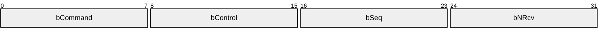

**bCommand (1 byte):** An 8-bit integer that specifies characteristics of the message. Two or more of the following flags can be combined to form complex values.

| Value | Meaning |
| --- | --- |
| PACKET_COMMAND_DATA 0x01 | The frame contains user data. |
| PACKET_COMMAND_RELIABLE 0x02 | The frame SHOULD be delivered reliably and requires a packet [**acknowledgment**](#gt_acknowledgment-ack). |
| PACKET_COMMAND_SEQUENTIAL 0x04 | The frame SHOULD be indicated sequentially. |
| PACKET_COMMAND_POLL 0x08 | The [**partner**](#gt_partner) SHOULD acknowledge immediately. |
| PACKET_COMMAND_NEW_MSG 0x10 | The [**DFRAME**](#gt_data-frame-dframe) is first in the message. |
| PACKET_COMMAND_END_MSG 0x20 | The DFRAME is last in the message. |
| PACKET_COMMAND_USER_1 0x40 | The first user-controlled flag. (Indicates that the [**payload**](#gt_payload) is an internal session management message.) |
| PACKET_COMMAND_USER_2 0x80 | The second user-controlled flag. (Indicates that the payload is an internal session management message.) |

**bControl (1 byte):** An 8-bit integer that identifies the packet. This field MUST be set to PACKET_CONTROL_END_STREAM (0x08) to specify that the packet is the last in the stream, and to indicate to disconnect.

**bSeq (1 byte):** An 8-bit integer that provides the sequence number of the packet.

**bNRcv (1 byte):** An 8-bit integer that provides the expected sequence number of the next packet received.

<a id="Section_2.2.17"></a>
### 2.2.17 TRANS_USERDATA_HEADER

The TRANS_USERDATA_HEADER is a [**transport packet**](#gt_transport-packet) header that contains command, control, and [**ACK**](#gt_acknowledgment-ack) information. It is included with all **TRANS_USERDATA** [**DirectPlay**](#gt_directplay) packets.

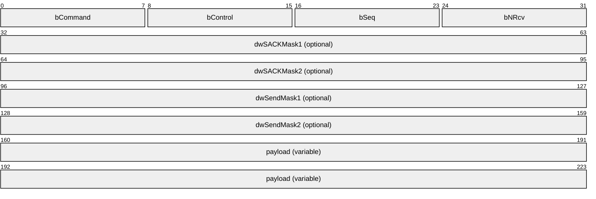

**bCommand (1 byte):** An 8-bit integer that specifies characteristics of the message. Two or more of the following flags can be combined to form complex values.

**Note** The PACKET_COMMAND_USER1 flag SHOULD be set on all **TRANS_USERDATA** messages except the [TRANS_USERDATA_END_OF_STREAM](#Section_2.2.16), [TRANS_USERDATA_KEEPALIVE](#Section_2.2.22), and [TRANS_USERDATA_SEND_MESSAGE](#Section_2.2.31) messages.

| Value | Meaning |
| --- | --- |
| PACKET_COMMAND_DATA 0x01 | The frame contains user data. |
| PACKET_COMMAND_RELIABLE 0x02 | The frame SHOULD be delivered reliably and requires a packet acknowledgment. |
| PACKET_COMMAND_SEQUENTIAL 0x04 | The frame SHOULD be indicated sequentially. |
| PACKET_COMMAND_POLL 0x08 | The [**partner**](#gt_partner) SHOULD acknowledge immediately. |
| PACKET_COMMAND_NEW_MSG 0x10 | The [**DFRAME**](#gt_data-frame-dframe) is first in the message. |
| PACKET_COMMAND_END_MSG 0x20 | The DFRAME is last in the message. |
| PACKET_COMMAND_USER_1 0x40 | The first user-controlled flag. (Indicates that the [**payload**](#gt_payload) is an internal session management message.) |
| PACKET_COMMAND_USER_2 0x80 | The second user-controlled flag. (Indicates that the payload is an internal session management message.) The PACKET_COMMAND_USER_2 flag is not used in the DirectPlay DXDiag Usage Protocol. |

**bControl (1 byte):** An 8-bit integer that identifies the packet. Two or more of the following flags can be combined to form complex values.

| Value | Meaning |
| --- | --- |
| PACKET_CONTROL_RETRY 0x01 | Indicates if the frame is a retry for this sequence number. |
| PACKET_CONTROL_KEEPALIVE_OR_CORRELATE 0x02 | For versions 0x00010005 and higher, this flag indicates that the frame is a keep-alive frame, and applies only to [**DirectX**](#gt_directx) version 9.0 and later. When the version is lower than 0x00010005, this flag requests a dedicated acknowledgment from the receiver, and applies only to versions of DirectX prior to version 9.0. For information about versions, see section [1.7](#Section_1.7). |
| PACKET_CONTROL_COALESCE 0x04 | The packet contains multiple fused packets. This flag is not supported by DirectPlay version 8.0. |
| PACKET_CONTROL_END_STREAM 0x08 | This is the last packet in the stream; also indicates to disconnect. |
| PACKET_CONTROL_SACK1 0x10 | The low 32 bits of the [**SACK**](#gt_selective-acknowledgment-sack) mask are present in **dwSACKMask1**. |
| PACKET_CONTROL_SACK2 0x20 | The high 32 bits of the SACK mask are present in **dwSACKMask2**. |
| PACKET_CONTROL_SEND1 0x40 | The low 32 bits of the cancel-[**send mask**](#gt_send-mask) are present in **dwSendMask1**. |
| PACKET_CONTROL_SEND2 0x80 | The high 32 bits of the cancel-send mask are present in **dwSendMask2**. |
| PACKET_CONTROL_VARIABLE_MASKS 0xF0 | All four packet control mask bits are present. |

**bSeq (1 byte):** An 8-bit integer that provides the sequence number of the packet.

**bNRcv (1 byte):** An 8-bit integer that provides the expected sequence number of the next packet received.

**dwSACKMask1 (4 bytes):** The optional low 32 bits of the SACK mask in [**little-endian**](#gt_little-endian) byte order. The existence of this field in the packet is dependent on the **bFlags** field having **SACK_FLAGS_SACK_MASK1** set in the TRANS_COMMAND_HEADER packet.

**dwSACKMask2 (4 bytes):** The optional high 32 bits of the SACK mask in little-endian byte order. The existence of this field in the packet is dependent on **bFlags** field having **SACK_FLAGS_SACK_MASK2** set in the TRANS_COMMAND_HEADER packet.

**dwSendMask1 (4 bytes):** The optional low 32 bits of the send mask in little-endian byte order. The existence of this field in the packet is dependent on **bFlags** field having **SACK_FLAGS_SEND_MASK1** set in the TRANS_COMMAND_HEADER packet.

**dwSendMask2 (4 bytes):** The optional high 32 bits of the send mask in little-endian byte order. The existence of this field in the packet is dependent on **bFlags** field having **SACK_FLAGS_SEND_MASK2** set in the TRANS_COMMAND_HEADER packet.

**payload (variable):** A variable length integer that contains the consumer payload data for the packet. The payload size is the total [**UDP**](#gt_user-datagram-protocol-udp) frame size minus the amount of data consumed by DFRAME headers up to this point. If the **PACKET_CONTROL_COALESCE** flag is set, the payload is not a single message or portion of a message, but is instead organized according to the [**coalesced payload**](#gt_coalesced-payload) format, as specified in section [2.2.17.1](#Section_2.2.17.1).

<a id="Section_2.2.17.1"></a>
#### 2.2.17.1 Coalesced Payloads

[**Coalesced payloads**](#gt_coalesced-payload) are a special form of [**payload**](#gt_payload) within standard [**DFRAMEs**](#gt_data-frame-dframe). When the **PACKET_CONTROL_COALESCE** flag is set on the outer DFRAME header **bControl** field of the [TRANS_USERDATA_HEADER](#Section_2.2.17) packet, the payload is interpreted using this format. Frames with coalesced payloads MUST have the **PACKET_COMMAND_NEW_MSG** and **PACKET_COMMAND_END_MSG** flags set on the outer DFRAME header **bCommand** field.

Between 1 and 32 two-byte headers are placed at the beginning of the buffer. The buffer MUST NOT contain more than 32 coalesce headers. If there is an odd number of coalesce headers, two extra bytes of zero padding MUST be added at the end to align the subsequent data on a 32-bit boundary. The last non-padded coalesce header MUST have the **PACKET_COMMAND_END_COALESCE** flag set in its **bCommand** field.

Following the headers are 1 to 32 payloads where the sizes of each are indicated in the corresponding headers that were added in the same order. If the payload size is not a multiple of 32 bits, and it is not the last payload in the message, one to three bytes of zero padding MUST be added to align the beginning of the next payload on a 32-bit boundary. The sizes indicated in the coalesce headers MUST NOT include any padding so as to preserve the message size as originally sent. The receiver MUST infer alignment padding when processing the payloads, and SHOULD indicate the messages to the consumer using the unpadded size.

The following is an example of a standard DFRAME for a coalesced payload.

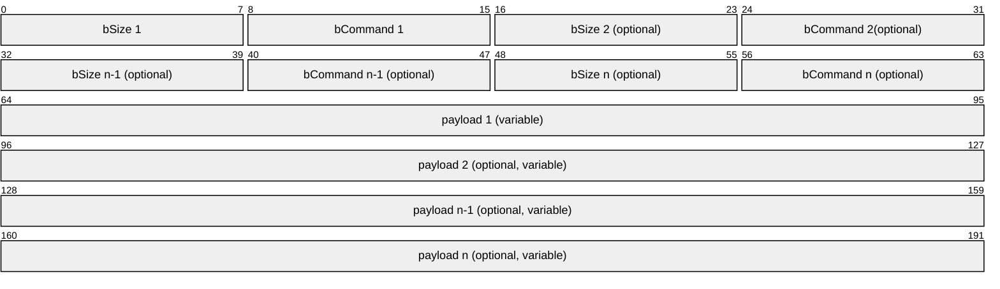

In the preceding example, the following field types are represented.

**bSize 1** through **bSize *n*:** The least significant 8 bits of the size of the coalesced payload. The value is combined with the optional **PACKET_COMMAND_COALESCE_BIG_1**, **PACKET_COMMAND_COALESCE_BIG_2**, and **PACKET_COMMAND_COALESCE_BIG_3** flags to determine the actual size of the payload. This MUST NOT be larger than what can fit in a standard DFRAME, including any size already used to store previous coalesce headers and payloads.

**bCommand 1** through **bCommand *n*:** The command field for the coalesced message. The **PACKET_COMMAND_USER_1** flag MUST be set. All other flags are optional.

| Value | Meaning |
| --- | --- |
| 0x01 | **PACKET_COMMAND_END_COALESCE** (Indicates that this is the final coalesced payload in the frame). |
| 0x02 | **PACKET_COMMAND_RELIABLE** (Specifies that the payload SHOULD be delivered reliably). |
| 0x04 | **PACKET_COMMAND_SEQUENTIAL** (Specifies that the payload SHOULD be indicated sequentially). |
| 0x08 | **PACKET_COMMAND_COALESCE_BIG_1** (Represents bit 9 of the coalesced payload size). |
| 0x10 | **PACKET_COMMAND_COALESCE_BIG_2** (Represents bit 10 of the coalesced payload size). |
| 0x20 | **PACKET_COMMAND_COALESCE_BIG_3** (Represents bit 11 of the coalesced payload size, which is the most significant bit). |
| 0x40 | **PACKET_COMMAND_USER_1** (Indicates that the payload is an internal session management message). |

**payload 1** through **payload *n*:** Contains the consumer payload data.

<a id="Section_2.2.18"></a>
### 2.2.18 TRANS_USERDATA_HOST_MIGRATE

The TRANS_USERDATA_HOST_MIGRATE packet indicates that [**host migration**](#gt_host-migration) is enabled, and the [**host**](#gt_host) [**server**](#gt_server) is terminating. This packet begins with a [TRANS_USERDATA_HEADER](#Section_2.2.17).

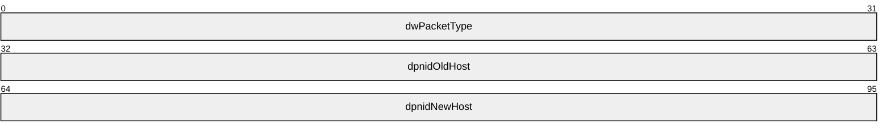

**dwPacketType (4 bytes):** A 32-bit integer that indicates the packet type. This field MUST be set to 0x000000CD to denote that this message indicates that the host migration procedure has started.

**dpnidOldHost (4 bytes):** A 32-bit integer that provides the identifier for the old host.

**dpnidNewHost (4 bytes):** A 32-bit integer that provides the identifier for the new host.

<a id="Section_2.2.19"></a>
### 2.2.19 TRANS_USERDATA_HOST_MIGRATE_COMPLETE

The TRANS_USERDATA_HOST_MIGRATE_COMPLETE packet informs [**clients**](#gt_client) that the [**game session**](#gt_game-session)-[**hosting**](#gt_host) responsibilities have successfully [**migrated**](#gt_host-migration) from the departing old host. This packet begins with a [TRANS_USERDATA_HEADER](#Section_2.2.17) and contains no user data.


**dwPacketType (4 bytes):** A 32-bit integer that indicates the packet type. This field MUST be set to 0x000000CE to denote that this message informs clients that the game session-hosting responsibilities have successfully migrated from the departing old host.

<a id="Section_2.2.20"></a>
### 2.2.20 TRANS_USERDATA_INSTRUCT_CONNECT

The TRANS_USERDATA_INSTRUCT_CONNECT packet instructs a [**client**](#gt_client) to connect to a designated client. This packet begins with a [TRANS_USERDATA_HEADER](#Section_2.2.17).

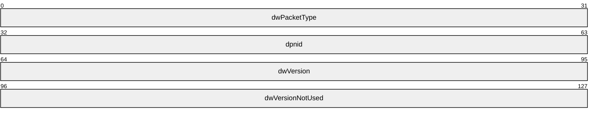

**dwPacketType (4 bytes):** A 32-bit integer that indicates the packet type. This field MUST be set to 0x000000C6 to denote that this message instructs a client to connect to a designated client.

**dpnid (4 bytes):** A 32-bit integer that provides the identifier of the designated client to which the connection is being made.

**dwVersion (4 bytes):** A 32-bit integer that specifies the current version of the [**name table**](#gt_name-table).

**dwVersionNotUsed (4 bytes):** This field MUST be set to 0 when sending and ignored on receipt.

<a id="Section_2.2.21"></a>
### 2.2.21 TRANS_USERDATA_INSTRUCTED_CONNECT_FAILED

The TRANS_USERDATA_INSTRUCTED_CONNECT_FAILED packet indicates that a [**client**](#gt_client) was unable to carry out a [**server**](#gt_server) instruction to connect to a new client. This packet begins with a [TRANS_USERDATA_HEADER](#Section_2.2.17).


**dwPacketType (4 bytes):** A 32-bit integer that indicates the packet type. This field MUST be set to 0x000000C7 to denote that this message indicates that a client was unable to carry out a server instruction to connect to a new client.

**dpnID (4 bytes):** A 32-bit integer that provides the identifier for the client.

<a id="Section_2.2.22"></a>
### 2.2.22 TRANS_USERDATA_KEEPALIVE

The TRANS_USERDATA_KEEPALIVE packet is used by [**DXDiag**](#gt_directx-diagnostic-dxdiag) to calculate an [**RTT**](#gt_round-trip-time-rtt). This packet begins with a [TRANS_USERDATA_HEADER](#Section_2.2.17) packet header.

In the packet header, the PACKET_COMMAND_RELIABLE, PACKET_COMMAND_SEQUENTIAL, and PACKET_COMMAND_END_MSG flags MUST be set in the **bCommand** field. All other **bCommand** flags are optional. The **bControl** field MUST be set to PACKET_CONTROL_KEEPALIVE_OR_CORRELATE (0x02) to indicate that the frame is a keep-alive frame ([**DirectX**](#gt_directx) version 9.0 and later), or that the sender requests a dedicated [**acknowledgment**](#gt_acknowledgment-ack) from the receiver (DirectX 8.0 and earlier). For information about DirectX versions, see section [1.7](#Section_1.7).

```mermaid
packet-beta
  0-31: "dwSessID"
```

**dwSessID (4 bytes):** A 32-bit integer present only in TRANS_USERDATA_KEEPALIVE messages sent to version 0x00010006 recipients. This value MUST be set to the same **dwSessID** value specified in the [TRANS_COMMAND_CONNECT (section 2.2.7)](#Section_2.2.7) message associated with the connection; otherwise, the packet SHOULD be ignored.

<a id="Section_2.2.23"></a>
### 2.2.23 TRANS_USERDATA_NAMETABLE_VERSION

The TRANS_USERDATA_NAMETABLE_VERSION packet specifies the version number of the [**name table**](#gt_name-table). This packet begins with a [TRANS_USERDATA_HEADER](#Section_2.2.17).

```mermaid
packet-beta
  0-31: "dwPacketType"
  32-63: "dwVersion"
  64-95: "dwVersionNotUsed"
```

**dwPacketType (4 bytes):** A 32-bit integer that indicates the packet type. This field MUST be set to 0x000000C9 to denote that this message specifies the version number of the name table.

**dwVersion (4 bytes):** A 32-bit integer that provides the current name table version number. The value of this field MUST NOT be 0.

**dwVersionNotUsed (4 bytes):** This field MUST be set to 0 when sending and ignored on receipt.

<a id="Section_2.2.24"></a>
### 2.2.24 TRANS_USERDATA_REQ_NAMETABLE_OP

The [TRANS_USERDATE_REQ_NAMETABLE_OP](#Section_2.2.23) packet is sent from the new [**host**](#gt_host) to an existing [**peer**](#gt_peer) in the [**game session**](#gt_game-session) that has a newer [**name table**](#gt_name-table) than that of the host. The host sends this message to request that the peer send back name table operations that have not yet been performed on the host. If no newer name table exists, this message is not sent. This message begins with a [TRANS_USERDATA_HEADER](#Section_2.2.17) packet header.

```mermaid
packet-beta
  0-31: "dwPacketType"
  32-63: "dwVersion"
  64-95: "dwVersionNotUsed"
```

**dwPacketType (4 bytes):** A 32-bit field that indicates the packet type. This field MUST be set to 0x000000CB to denote that this message requests a name table from an existing peer in the game session that has a newer name table than that of the host, if any such name table exists.

**dwVersion (4 bytes):** A 32-bit field that contains the current name table version number of the host.

**dwVersionNotUsed (4 bytes):** This field MUST be set to 0 when sending and ignored on receipt.

<a id="Section_2.2.25"></a>
### 2.2.25 TRANS_USERDATA_ACK_NAMETABLE_OP

The TRANS_USERDATE_ACK_NAMETABLE_OP packet is sent from the [**peer**](#gt_peer) that is being queried for [**name table**](#gt_name-table) information back to the new [**host**](#gt_host). The message will include all entries missing from the name table of the new host. This message begins with a [TRANS_USERDATA_HEADER](#Section_2.2.17) packet header.

```mermaid
packet-beta
  0-31: "dwPacketType"
  32-63: "dwNumEntries"
  64-95: "dwMsgId"
  96-127: "dwOpOffset"
  128-159: "dwOpSize"
  160-223: "op (variable)"
```

**dwPacketType (4 bytes):** A 32-bit field that indicates the packet type. This field MUST be set to 0x000000CC to denote that this message is an acknowledgement of the new name table information from the peer to the new host.

**dwNumEntries (4 bytes):** A 32-bit field that specifies the number of name table entries included in the message. The **dwMsgId**, **dwOpOffset**, **dwOpSize**, and **op** fields are present in a TRANS_USERDATE_ACK_NAMETABLE_OP message **dwNumEntries** times.

**dwMsgId (4 bytes):** A 32-bit field that contains the internal message for the given name table entry. The internal message can be one of the following values.

| Name | Value |
| --- | --- |
| [TRANS_USERDATA_INSTRUCT_CONNECT](#Section_2.2.20) | 0x000000C6 |
| [TRANS_USERDATA_ADD_PLAYER](#Section_2.2.11) | 0x000000D0 |
| [TRANS_USERDATA_DESTROY_PLAYER](#Section_2.2.15) | 0x000000D1 |

**dwOpOffset (4 bytes):** A 32-bit field that contains the offset from the end of the **dwPacketType** field for the given name table operation buffer.

**dwOpSize (4 bytes):** A 32-bit field that contains the size for the given name table operation buffer.

**op (variable):** A variable length field that contains the portion of the packet originally associated with the name table operation, except for the **dwPacketType** field, as indicated by the **dwMsgId** field. Each operation buffer is atomic to itself. For example, an **op** value corresponding to a **dwMsgId** field value of 0x000000D1 would contain the **dpnidLeaving**, **dwVersion**, **dwVersionNotUsed**, and **dwDestroyReason** field information from an original TRANS_USERDATA_DESTROY_PLAYER packet.

<a id="Section_2.2.26"></a>
### 2.2.26 TRANS_USERDATA_PLAYER_CONNECT_INFO

The TRANS_USERDATA_PLAYER_CONNECT_INFO packet is used to send [**client**](#gt_client) connection information to the [**host**](#gt_host). This packet begins with a [TRANS_USERDATA_HEADER](#Section_2.2.17).

```mermaid
packet-beta
  0-31: "dwPacketType"
  32-63: "dwFlags"
  64-95: "dwDNETVersion"
  96-127: "dwNameOffset"
  128-159: "dwNameSize"
  160-191: "dwDataOffset"
  192-223: "dwDataSize"
  224-255: "dwPasswordOffset"
  256-287: "dwPasswordSize"
  288-319: "dwConnectDataOffset"
  320-351: "dwConnectDataSize"
  352-383: "dwURLOffset"
  384-415: "dwURLSize"
  416-511: "guidInstance (16 bytes)"
  512-607: "guidApplication (16 bytes)"
  608-639: "dwAlternateAddressDataOffset"
  640-671: "dwAlternateAddressDataSize"
  672-735: "alternateAddressData (variable)"
  736-799: "url (variable)"
  800-863: "connectData (variable)"
  864-927: "Password (variable)"
  928-991: "data (variable)"
  992-1055: "name (variable)"
```

**dwPacketType (4 bytes):** A 32-bit integer that indicates the packet type. This field MUST be set to 0x000000C1 to denote that this message sends client connection information to the host [**server**](#gt_server).

**dwFlags (4 bytes):** A 32-bit integer that specifies the connect flags. This field MUST be set to 0x00000004 to indicate that the connecting application is a [**peer**](#gt_peer).

**dwDNETVersion (4 bytes):** A 32-bit integer that provides the [**DirectPlay**](#gt_directplay) version. This field MUST be set to the appropriate DirectPlay version.<9>

**dwNameOffset (4 bytes):** A 32-bit integer that provides the offset, in bytes, from the end of **dwPacketType** to the connecting client's **name** field. This value MUST NOT be 0.

**dwNameSize (4 bytes):** A 32-bit integer that specifies the size, in bytes, of the data in the **name** field. This value MUST NOT be 0.

**dwDataOffset (4 bytes):** A 32-bit integer that provides the offset, in bytes, from the end of **dwPacketType** to the **data** field. If **dwDataOffset** is 0, the packet does not include client data.

**dwDataSize (4 bytes):** A 32-bit integer that provides the size, in bytes, of the **data** field.

**dwPasswordOffset (4 bytes):** A 32-bit integer that provides the offset, in bytes, from the end of the **dwPacketType** field to the start of the **password**. When the packet does not include a **password**, this MUST be set to 0.

**dwPasswordSize (4 bytes):** A 32-bit integer that provides the size, in bytes, of the **password**. When the packet does not include a **password**, this MUST be set to 0.

**dwConnectDataOffset (4 bytes):** A 32-bit integer that provides the offset, in bytes, from the end of the **dwPacketType** field to the **connectData** field. If **dwConnectDataOffset** is 0, the packet does not include connection data.

**dwConnectDataSize (4 bytes):** A 32-bit integer that provides the size, in bytes, of the **connectData** field.

**dwURLOffset (4 bytes):** A 32-bit integer that provides the offset, in bytes, from the end of the **dwPacketType** field to the **url** field. If **dwURLOffset** is 0, the packet does not include the client URL.

**dwURLSize (4 bytes):** A 32-bit integer that provides the size, in bytes, of the **url** field.

**guidInstance (16 bytes):** The instance [**GUID**](#gt_globally-unique-identifier-guid) of the [**game session**](#gt_game-session). This MUST be the same GUID received in the [EnumResponse (section 2.2.5)](#Section_2.2.5) message; otherwise, the recipient MUST respond with a [TRANS_USERDATA_CONNECT_FAILED (section 2.2.13)](#Section_2.2.13) message.

**guidApplication (16 bytes):** The application GUID. This field MUST be set to 61EF80DA-691B-4247-9ADD-1C7BED2BC13E, which is the GUID for the [**DXDiag application**](#gt_directx-diagnostic-dxdiag). Otherwise, the recipient MUST respond with a TRANS_USERDATA_CONNECT_FAILED message.

**dwAlternateAddressDataOffset (4 bytes):** A 32-bit integer that provides the offset, in bytes, from the end of the **dwPacketType** field to the **alternateAddressData** field. If **dwAlternateAddressDataOffset** is 0, the packet does not include the alternate address data. This field is used in DirectPlay version 9.

**dwAlternateAddressDataSize (4 bytes):** A 32-bit integer that provides the size, in bytes, of the **alternateAddressData** field. This field is used in DirectPlay version 9.

**alternateAddressData (variable):** A variable length array that provides alternative address data that is used to connect the client. This field's position is determined by **dwAlternateAddressDataOffset** and the size stated in **dwAlternateAddressDataSize**. This field is used in DirectPlay version 9. The address that is passed in is formatted via the [DN_ALTERNATE_ADDRESS](#Section_2.2.35) structure format.

**url (variable):** A variable length, zero-terminated character array that contains the client URL. This field's position is determined by **dwURLOffset** and the size stated in **dwURLSize**.

**connectData (variable):** A variable length field that contains a byte array that provides the connection data. This field's position is determined by **dwConnectDataOffset** and the size stated in **dwConnectDataOffsetSize**.

**Password (variable):** A variable length, zero-terminated [**wide character**](#gt_30c30de3-1d00-4d0d-9109-fcc0094fc95a) array that contains the application password data. This field's position is determined by **dwPasswordOffset** and the size stated in **dwPasswordSize**. This data is passed in clear text to the protocol layer.

**data (variable):** A variable length, zero-terminated character array that contains the client data. This field's position is determined by **dwDataOffset** and the size stated in **dwDataSize**.

**name (variable):** A variable length, zero-terminated wide character array that contains the client name. This field's position is determined by the **dwNameOffset** field and the size stated in the **dwNameSize** field; both are fields in the [DN_NAMETABLE_ENTRY_INFO](#Section_2.2.33.1) structure. The last character indicated by **dwNameSize** SHOULD be treated as the terminating null character, even if the sender did not transmit it that way.

<a id="Section_2.2.27"></a>
### 2.2.27 TRANS_USERDATA_REQ_INTEGRITY_CHECK

The TRANS_USERDATA_REQ_INTEGRITY_CHECK packet requests that a [**host**](#gt_host) determine if a target [**client**](#gt_client) is still in the [**game session**](#gt_game-session). This packet begins with a [TRANS_USERDATA_HEADER](#Section_2.2.17).

```mermaid
packet-beta
  0-31: "dwPacketType"
  32-63: "dwReqContext"
  64-95: "dpnidTarget"
```

**dwPacketType (4 bytes):** A 32-bit integer that indicates the packet type. This field MUST be set to 0x000000E2 to indicate that this is a request for the host to determine whether a target client is still in the game session.

**dwReqContext (4 bytes):** A 32-bit field that contains the context for the request operation. Values for the **dwReqContext** field are not used to convey information by the DirectPlay DXDiag Usage Protocol, but other implementers MAY choose to include this field in order to convey the context to the recipient.

**dpnidTarget (4 bytes):** A 32-bit integer that specifies the identifier of the selected target client, which the host validates.

<a id="Section_2.2.28"></a>
### 2.2.28 TRANS_USERDATA_INTEGRITY_CHECK

The TRANS_USERDATA_INTEGRITY_CHECK packet is a request from a [**host**](#gt_host) to a [**client**](#gt_client) inquiring whether the client is still in the [**game session**](#gt_game-session). This packet begins with a [TRANS_USERDATA_HEADER (section 2.2.17)](#Section_2.2.17).

```mermaid
packet-beta
  0-31: "dwPacketType"
  32-63: "dpnidRequesting"
```

**dwPacketType (4 bytes):** A 32-bit field that contains the packet type. This field MUST be set to 0x000000E3 to indicate that the host is requesting a client to verify that it is still in the game session.

**dpnidRequesting (4 bytes):** A 32-bit field that contains the identifier of the client requesting this validation. For more information, see section [**2.2.1**](#Section_2.2.1).

<a id="Section_2.2.29"></a>
### 2.2.29 TRANS_USERDATA_INTEGRITY_CHECK_RESPONSE

The TRANS_USERDATA_INTEGRITY_CHECK_RESPONSE packet is a response from a [**client**](#gt_client) to the [**host**](#gt_host) confirming that it is still in the [**game session**](#gt_game-session). This packet begins with a [TRANS_USERDATA_HEADER (section 2.2.17)](#Section_2.2.17).

```mermaid
packet-beta
  0-31: "dwPacketType"
  32-63: "dpnidRequesting"
```

**dwPacketType (4 bytes):** A 32-bit field that contains the packet type. This MUST be set to 0x000000E4 to indicate that the client is responding to the host to confirm that it is still in the game session.

**dpnidRequesting (4 bytes):** A 32-bit field that contains the identifier of the client that requested the validation. For more information, see section [**2.2.1**](#Section_2.2.1).

<a id="Section_2.2.30"></a>
### 2.2.30 TRANS_USERDATA_RESYNC_VERSION

The TRANS_USERDATA_RESYNC_VERSION packet is used to request that the [**name table**](#gt_name-table) version number be resynchronized to the current version number. This packet begins with a [TRANS_USERDATA_HEADER](#Section_2.2.17).

```mermaid
packet-beta
  0-31: "dwPacketType"
  32-63: "dwVersion"
  64-95: "dwVersionNotUsed"
```

**dwPacketType (4 bytes):** A 32-bit integer that indicates the packet type. This field MUST be set to 0x000000CA to denote that this message requests that the protocol version number be resynchronized to the current version number.

**dwVersion (4 bytes):** A 32-bit integer that provides the current name table version number.

**dwVersionNotUsed (4 bytes):** This field MUST be set to 0 when sending and ignored on receipt.

<a id="Section_2.2.31"></a>
### 2.2.31 TRANS_USERDATA_SEND_MESSAGE

The TRANS_USERDATA_SEND_MESSAGE packet transmits a chat message to all other users in a chat session. This packet begins with a [TRANS_USERDATA_HEADER](#Section_2.2.17) and does not contain a **dwPacketType** identification field.

```mermaid
packet-beta
  0-15: "nType"
  16-111: "strChatString (400 bytes)"
```

**nType (2 bytes):** A 16-bit integer that identifies the type of chat message being transmitted. This field MUST be set to GAME_MSGID_CHAT (1).

**strChatString (400 bytes):** A [**Unicode**](#gt_unicode)-format chat message string. The application SHOULD send 200 Unicode characters. If the length of the actual chat string is less than 200 Unicode characters, then the value specified in **strChatString** SHOULD be padded. If the length of the chat string in the received packet is less than 200 Unicode characters, the receiver SHOULD send an [**acknowledgment**](#gt_acknowledgment-ack) for the message, and the receiver SHOULD discard the message.

<a id="Section_2.2.32"></a>
### 2.2.32 TRANS_USERDATA_SEND_PLAYER_DNID

The TRANS_USERDATA_SEND_PLAYER_DNID packet is used to send a user identification number to another [**client**](#gt_client). This packet begins with a [TRANS_USERDATA_HEADER](#Section_2.2.17).

```mermaid
packet-beta
  0-31: "dwPacketType"
  32-63: "dpnID"
```

**dwPacketType (4 bytes):** A 32-bit integer that indicates the packet type. This field MUST be set to 0x000000C4 to denote that this message sends a user identification number to another client.

**dpnID (4 bytes):** A 32-bit integer that provides the identifier of the client.

<a id="Section_2.2.33"></a>
### 2.2.33 TRANS_USERDATA_SEND_SESSION_INFO

The TRANS_USERDATA_SEND_SESSION_INFO packet is used by the [**game session**](#gt_game-session) [**server**](#gt_server) to relay game session information to the [**client**](#gt_client). This packet begins with a [TRANS_USERDATA_HEADER](#Section_2.2.17).

```mermaid
packet-beta
  0-31: "dwPacketType"
  32-63: "dwReplyOffset"
  64-95: "dwReplySize"
  96-127: "dwSize"
  128-159: "dwFlags"
  160-191: "dwMaxPlayers"
  192-223: "dwCurrentPlayers"
  224-255: "dwSessionNameOffset"
  256-287: "dwSessionNameSize"
  288-319: "dwPasswordOffset"
  320-351: "dwPasswordSize"
  352-383: "dwReservedDataOffset"
  384-415: "dwReservedDataSize"
  416-447: "dwApplicationReservedDataOffset"
  448-479: "dwApplicationReservedDataSize"
  480-575: "guidInstance (16 bytes)"
  576-671: "applicationGUID (16 bytes)"
  672-703: "dpnid"
  704-735: "dwVersion"
  736-767: "dwVersionNotUsed"
  768-799: "dwEntryCount"
  800-831: "dwMembershipCount"
  832-895: "DN_NAMETABLE_ENTRY_INFO (variable)"
  896-959: "DN_NAMETABLE_MEMBERSHIP_INFO (variable)"
  960-1023: "URL (variable)"
  1024-1087: "Data (variable)"
  1088-1151: "name (variable)"
  1152-1215: "ApplicationReservedData (variable)"
  1216-1279: "ReservedData (variable)"
  1280-1343: "Password (variable)"
  1344-1407: "SessionName (variable)"
  1408-1471: "reply (variable)"
```

**dwPacketType (4 bytes):** A 32-bit integer that indicates the packet type. This field MUST be set to 0x000000C2 to denote that this message is used by the game session server to relay game session information to the client.

**dwReplyOffset (4 bytes):** A 32-bit integer that provides the offset, in bytes, from the end of the **dwPacketType** field to the **reply** field. If **dwReplyOffset** is 0, the packet does not include a reply.

**dwReplySize (4 bytes):** A 32-bit integer that provides the size, in bytes, of the **reply** field.

**dwSize (4 bytes):** A 32-bit integer that provides the size, in bytes, of the application description information.

**dwFlags (4 bytes):** A 32-bit integer that specifies the application flags. Entries are OR'd together.<10>

| Value | Meaning |
| --- | --- |
| 0x00000004 | Host [**migration**](#gt_host-migration) is allowed. |
| 0x00000040 | The [**DirectPlay**](#gt_directplay) enumeration server is not running. |
| 0x00000080 | Password is REQUIRED. |
| 0x00000100 | No enumerations are allowed from the game session. |

**dwMaxPlayers (4 bytes):** A 32-bit integer that specifies the maximum number of clients allowed in the game session.

**dwCurrentPlayers (4 bytes):** A 32-bit integer that specifies the current number of clients in the game session.

**dwSessionNameOffset (4 bytes):** A 32-bit integer that provides the offset, in bytes, from the end of the **dwPacketType** field to the **sessionName** field. If **dwSessionNameOffset** is 0, the packet does not include a game session name.

**dwSessionNameSize (4 bytes):** A 32-bit integer that provides the size, in bytes, of the **sessionName** field.

**dwPasswordOffset (4 bytes):** A 32-bit integer that provides the offset, in bytes, from the end of the **dwPacketType** field to the start of the password. When the packet does not include a password, this field MUST be set to 0.

**dwPasswordSize (4 bytes):** A 32-bit integer that provides the size, in bytes, of the password. When the packet does not include a password, this field MUST be set to 0.

**dwReservedDataOffset (4 bytes):** A 32-bit integer that provides the offset, in bytes, from the end of the **dwPacketType** field to the **reservedData** field. If **dwReservedDataOffset** is 0, the packet does not include reserved data.

**dwReservedDataSize (4 bytes):** A 32-bit integer that provides the size, in bytes, of the **reservedData** field.

**dwApplicationReservedDataOffset (4 bytes):** A 32-bit integer that provides the offset, in bytes, from the end of the **dwPacketType** field to the **applicationReservedData** field. If **dwApplicationReservedDataOffset** is 0, the packet does not include application reserved data.

**dwApplicationReservedDataSize (4 bytes):** A 32-bit integer that provides the size, in bytes, of the **applicationReservedData** field.

**guidInstance (16 bytes):** The instance [**GUID**](#gt_globally-unique-identifier-guid) that identifies the game session. This field MUST be set to the value specified in the **ApplicationInstanceGUID** field of the [EnumResponse](#Section_2.2.5) message.

**applicationGUID (16 bytes):** The application GUID. This field MUST be set to 61EF80DA-691B-4247-9ADD-1C7BED2BC13E, which is the GUID for the [**DXDiag application**](#gt_directx-diagnostic-dxdiag).

**dpnid (4 bytes):** A 32-bit integer that provides the identifier for the new client joining the game session. This value MUST be calculated as described in section [**2.2.1**](#Section_2.2.1).

**dwVersion (4 bytes):** A 32-bit integer that specifies the current [**name table**](#gt_name-table) version.

**dwVersionNotUsed (4 bytes):** This field MUST be set to 0 when sending and ignored on receipt.

**dwEntryCount (4 bytes):** A 32-bit integer that provides the number of entries in the name table.

**dwMembershipCount (4 bytes):** A 32-bit integer that provides the number of memberships in the name table.

**DN_NAMETABLE_ENTRY_INFO (variable):** A **dwEntryCount** size array of structures that provides information on a [**name table entry**](#gt_name-table-entry), as specified in section [2.2.33.1](#Section_2.2.33.1).

**DN_NAMETABLE_MEMBERSHIP_INFO (variable):** A **dwMembershipCount** size array of structures that provide information on a name table membership, as specified in section [2.2.33.2](#Section_2.2.33.2).

**URL (variable):** A variable-length zero-terminated character array that contains the URL of a user in the chat session. This field's position is determined by **dwURLOffset** and the size stated in **dwURLSize**; both are fields in the corresponding DN_NAMETABLE_ENTRY_INFO structure. There can be multiple instances of the **URL** field, with an upper limit specified by the **dwURLSize** field. For more information about the structure of the URL, see [DN_ADDRESSING_URL (section 2.2.34)](#Section_2.2.34).

**Data (variable):** A variable-length zero-terminated character array that contains the user data. This field's position is determined by **dwDataOffset** and the size stated in **dwDataSize**; both are fields in the corresponding DN_NAMETABLE_ENTRY_INFO structure. There can be multiple instances of the **Data** field with an upper limit specified by the **dwEntryCount** field.

**name (variable):** A variable-length zero-terminated [**wide character**](#gt_30c30de3-1d00-4d0d-9109-fcc0094fc95a) array that contains the client name. This field's position is determined by the **dwNameOffset** field and the size stated in the **dwNameSize** field; both are fields in the DN_NAMETABLE_ENTRY_INFO structure. The last character indicated by **dwNameSize** SHOULD be treated as the terminating null character, even if the sender did not transmit it that way.

**Note** There can be multiple instances of the **name** field with an upper limit specified by the **dwEntryCount** field.

**ApplicationReservedData (variable):** A variable-length zero-terminated character array that contains the application reserved data. This field's position is determined by **dwApplicationReservedDataOffset** and the size stated in **dwApplicationReservedDataSize**.

**ReservedData (variable):** A variable-length zero-terminated character array that contains the reserved data. This field's position is determined by **dwReservedDataOffset** and the size stated in **dwReservedDataSize**.

**Password (variable):** A variable length, zero-terminated wide character array that contains the application password data. This field's position is determined by **dwPasswordOffset** and the size stated in **dwPasswordSize**. This data is passed in clear text to the protocol layer.

**SessionName (variable):** A variable-length zero-terminated wide character array that contains the game session name. This field's position is determined by the **dwSessionNameOffset** field and the size stated in the **dwSessionNameSize** field. The last character indicated by **dwSessionNameSize** SHOULD be treated as the terminating null character, even if the sender did not transmit it that way. If **dwSessionNameSize** is not an even multiple of two, the last odd byte SHOULD be ignored.

**reply (variable):** A variable-length zero-terminated character array that contains the reply. This field's position is determined by **dwReplyOffset** and the size stated in **dwReplySize**.

<a id="Section_2.2.33.1"></a>
#### 2.2.33.1 DN_NAMETABLE_ENTRY_INFO

Information on a [**name table entry**](#gt_name-table-entry). The number of DN_NAMETABLE_ENTRY_INFO structures in this packet is specified in the **dwEntryCount** field.

```mermaid
packet-beta
  0-31: "dpnid"
  32-63: "dpnidOwner"
  64-95: "dwFlags"
  96-127: "dwVersion"
  128-159: "dwVersionNotUsed"
  160-191: "dwDNETVersion"
  192-223: "dwNameOffset"
  224-255: "dwNameSize"
  256-287: "dwDataOffset"
  288-319: "dwDataSize"
  320-351: "dwURLOffset"
  352-383: "dwURLSize"
```

**dpnid (4 bytes):** A 32-bit integer that specifies the [**DirectPlay**](#gt_directplay) identifier. This value MUST be calculated as described in section [**2.2.1**](#Section_2.2.1).

**dpnidOwner (4 bytes):** A 32-bit integer that provides the DirectPlay identifier for the owner.

**dwFlags (4 bytes):** A 32-bit integer that specifies the name table entry flags. Entries are OR'd together.<11>

| Value | Meaning |
| --- | --- |
| 0x00000001 | The name table entry is the local [**player**](#gt_player). |
| 0x00000002 | The name table entry is the [**host**](#gt_host). |
| 0x00000100 | The name table entry is a [**peer**](#gt_peer). In [**peer-to-peer mode**](#gt_peer-to-peer-mode), the name table entry representing the host of the [**game session**](#gt_game-session) is also marked as a peer. |
| 0x00001000 | The name table entry is connecting. |
| 0x00002000 | The name table entry is to make the member available for use. |
| 0x00004000 | The name table entry to indicate disconnecting. |
| 0x00010000 | The name table entry to indicate connection to the application. |
| 0x00020000 | The name table entry to indicate that the application was given a created player. |
| 0x00040000 | The name table entry to indicate the need to destroy the player. |
| 0x00080000 | The name table entry to indicate that the player is in use. |

**dwVersion (4 bytes):** A 32-bit integer that specifies the version number of the [**name table**](#gt_name-table).

**dwVersionNotUsed (4 bytes):** This field MUST be set to 0 when sending and ignored on receipt.

**dwDNETVersion (4 bytes):** A 32-bit integer that provides the DirectPlay version. This field MUST be set to the appropriate DirectPlay version.<12>

**dwNameOffset (4 bytes):** A 32-bit integer that provides the offset, in bytes, from the end of the **dwPacketType** field to the **name** field. This value MUST NOT be 0.

**dwNameSize (4 bytes):** A 32-bit integer that provides the size, in bytes, of the **name** field. This value MUST NOT be 0.

**dwDataOffset (4 bytes):** A 32-bit integer that provides the offset, in bytes, from the end of the **dwPacketType** field to the **data** field.

**dwDataSize (4 bytes):** A 32-bit integer that provides the size, in bytes, of the **data** field.

**dwURLOffset (4 bytes):** A 32-bit integer that provides the offset, in bytes, from the end of the **dwPacketType** field to the **url** field.

**dwURLSize (4 bytes):** A 32-bit integer that provides the size, in bytes, of the **url** field.

<a id="Section_2.2.33.2"></a>
#### 2.2.33.2 DN_NAMETABLE_MEMBERSHIP_INFO

Information on a [**name table**](#gt_name-table) membership. The number of DN_NAMETABLE_MEMBERSHIP_INFO structures in this packet is specified in the **dwMembershipCount** field.

```mermaid
packet-beta
  0-31: "dpnidPlayer"
  32-63: "dpnidGroup"
  64-95: "dwVersion"
  96-127: "dwVersionNotUsed"
```

**dpnidPlayer (4 bytes):** A 32-bit integer that specifies the [**DirectPlay**](#gt_directplay) identifier for the user.

**dpnidGroup (4 bytes):** A 32-bit integer that provides the DirectPlay identifier for the [**group**](#gt_group) The **dpnidGroup** field is not used by the DirectPlay DXDiag Usage Protocol.

**dwVersion (4 bytes):** A 32-bit integer that specifies the name table version.

**dwVersionNotUsed (4 bytes):** This field MUST be set to 0 when sending and ignored on receipt.

<a id="Section_2.2.34"></a>
### 2.2.34 DN_ADDRESSING_URL

[**DirectPlay**](#gt_directplay) represents addresses for an application in the form of a URL. The structure of the URL is as follows:

x-directplay:/key1=value1;key2=value2;key3=value3;...

All configuration information for a provider is specified using "key=value" pairs separated by semicolons.

**Note** This is the opaque representation of a URL, where a single slash mark "/" is used as a scheme terminator, not double slash mark "//".The responsibility of data interpretation is placed on the consumer of the URL and nothing else can be assumed.

A DirectPlay URL has three components: the scheme, the scheme separator, and the URL data:

**Scheme**: The scheme used for a DirectPlay URL is "x-directplay".

**Scheme separator**: The scheme separator is simply the string ":/" (a colon followed by a slash mark), implying that the data that follows is "opaque" and does not conform to the Internet standard. It MUST NOT be "://" (a colon followed by two slash marks) because the addition of the second slash mark implies an Internet standard for the remaining data, and the DirectPlay data does not conform to the Internet standard. If the second slash mark is detected, DirectPlay will flag the URL as invalid.

**URL data**: The URL data is a combination of "key=value" strings, where each string is separated by a semicolon.

There are no ordering requirements for the "key=value" pairs in the data, except for the "provider" key that is expected to be first to speed up parsing. All "key" identifiers SHOULD be lower-case and SHOULD NOT contain characters that are considered reserved, specifically: the semicolon (;), the slash mark (/), the question mark (?), the colon (:), the at sign (@), the equals sign (=), the ampersand (&), and the number sign (#). All "value" strings will be treated as case-sensitive to cover future uses.

The following table identifies the current "keys" and their valid "values".

| Key | Value |
| --- | --- |
| applicationinstance | Text representation of a [**GUID**](#gt_globally-unique-identifier-guid) for an application instance. |
| baud | Any valid baud rate (subject to potential validation). Used by [**modem**](#gt_1fe7e0c1-8b87-4a20-a8f2-213c70299522) and serial links. |
| device | Text representation of a device GUID. |
| flowcontrol | "NONE", "XONXOFF", "RTS", "DTR", or "RTSDTR". Used by modem and serial links. |
| hostname | Any valid hostname, used only for IP and [**Internetwork Packet Exchange (IPX)**](#gt_internetwork-packet-exchange-ipx). |
| parity | "NONE", "EVEN", "ODD", "MARK", or "SPACE". Used by modem and serial links. |
| phonenumber | Any valid telephone number. Used by modem links. |
| port | Any valid port address, used for IP and IPX, up to the maximum port value of 65535. |
| program | Text representation of the program GUID. |
| provider | Text representation of the service provider GUID. |
| stopbits | "1", "1.5", or "2". Used by modem and serial links. |

**Note** Any unrecognized keys not identified in the previous table MUST be ignored. The number sign (#) token is used to indicate "user data" appended to the end of a URL. All characters that follow the number sign token in a URL MUST be ignored.

**URL Examples**

**IP Address**

x-directplay:/

provider=%7BEBFE7BA0-628D-11D2-AE0F-006097B01411%7D;

device=%7BIP ADAPTER GUID%7D;port=0000230034#IPUserData

**IPX Address**

x-directplay:/

provider=%7B53934290-628D-11D2-AE0F-006097B01411%7D;

device=%7BIPX ADAPTER GUID%7D;port=00230#IPXUserData

**Serial Address**

x-directplay:/

provider=%7B743B5D60-628D-11D2-AE0F-006097B01411%7D;

device=%7BCOM PORT GUID%7D;baud=57600;stopbits=1;parity=NONE;

flowcontrol=RTSDTR#SerialUserData

**Modem Address**

x-directplay:/

provider=%7B6D4A3650-628D-11D2-AE0F-006097B01411%7D;

device=%7BMODEM DEVICE GUID%7D;

phonenumber=555-1212#ModemUserData

<a id="Section_2.2.35"></a>
### 2.2.35 DN_ALTERNATE_ADDRESS (IPv4)

In [**DirectPlay**](#gt_directplay) 9, the **DN_ALTERNATE_ADDRESS** structure provides additional options for Internet Protocol (IP) connectivity. The alternative addresses included in **DN_ALTERNATE_ADDRESS** are supplemental to the primary address specified in the **DN_ADDRESSING_URL** structure.

In the **DN_ALTERNATE_ADDRESS** structure, the **wPort** field is derived from its conversion into a 2-byte binary value, and the **dwAddrIn** field is derived from its conversion into a 4-byte binary value. Both of these fields are treated as single binary buffers, and, therefore, are not handled in [**network byte order**](#gt_network-byte-order). For example, a port value of 2302 would be converted into its 2-byte binary value of 00001000 11111110, and an [**IPv4**](#gt_internet-protocol-version-4-ipv4) transport address of 192.168.239.061 would be converted into its 4-byte binary [IN_ADDR (IPv4) (section 2.2.35.1)](#Section_2.2.35.1) value of 11000000 10101000 11101111 00111101.

```mermaid
packet-beta
  0-7: "bSize"
  8-15: "bFamily"
  16-31: "wPort"
  32-63: "dwAddrIn"
```

**bSize (1 byte):** The size of this **DN_ALTERNATE_ADDRESS (IPv4)** structure excluding the size of this **bSize** field.

**bFamily (1 byte):** The address family for this **DN_ALTERNATE_ADDRESS (IPv4)** structure, which MUST be set to 0x02.

**wPort (2 bytes):** The port value for this **DN_ALTERNATE_ADDRESS (IPv4)** structure. This field is treated as a single buffer and is not specified in network byte order.

**dwAddrIn (4 bytes):** The address of the corresponding IN_ADDR (IPv4) structure for this **DN_ALTERNATE_ADDRESS (IPv4)** structure, which includes the IPv4 transport address.

<a id="Section_2.2.35.1"></a>
#### 2.2.35.1 IN_ADDR (IPv4)

The **IN_ADDR** structure specifies a 4-byte [**IPv4**](#gt_internet-protocol-version-4-ipv4) transport address. The IPv4 transport address 192.168.239.061, when converted into a 4-byte binary **IN_ADDR** structure, would have the value 11000000 10101000 11101111 00111101.

```mermaid
packet-beta
  0-7: "b1"
  8-15: "b2"
  16-23: "b3"
  24-31: "b4"
```

**b1 (1 byte):** First octet of the IPv4 network address.

**b2 (1 byte):** Second octet of the IPv4 network address.

**b3 (1 byte):** Third octet of the IPv4 network address.

**b4 (1 byte):** Fourth octet of the IPv4 network address.

<a id="Section_2.2.36"></a>
### 2.2.36 DN_ALTERNATE_ADDRESS (IPv6)

The **DN_ALTERNATE_ADDRESS (IPv6)** structure is described in detail under the [DN_ALTERNATE_ADDRESS (IPv4) (section 2.2.35)](#Section_2.2.35) structure.

The following diagram represents the contents of the structure when it contains an [**IPv6**](#gt_internet-protocol-version-6-ipv6) alternative address. The DN_ALTERNATE_ADDRESS (IPv4) (section 2.2.35) structure demonstrates the contents of the same structure when it contains an [**IPv4**](#gt_internet-protocol-version-4-ipv4) alternative address.

```mermaid
packet-beta
  0-7: "bSize"
  8-15: "bFamily"
  16-31: "wPort"
  32-127: "dwAddrIn (16 bytes)"
```

**bSize (1 byte):** The size of this **DN_ALTERNATE_ADDRESS (IPv6)** structure excluding the size of this **bSize** field.

**bFamily (1 byte):** The address family for this **DN_ALTERNATE_ADDRESS (IPv6)** structure, which MUST be set to 0x17.

**wPort (2 bytes):** The port value for this **DN_ALTERNATE_ADDRESS (IPv6)** structure specified in [**network byte order**](#gt_network-byte-order).

**dwAddrIn (16 bytes):** The address of the corresponding [IN6_ADDR (IPv6) (section 2.2.36.1)](#Section_2.2.36.1) structure for this **DN_ALTERNATE_ADDRESS (IPv6)** structure, which includes the IPv6 transport address.

<a id="Section_2.2.36.1"></a>
#### 2.2.36.1 IN6_ADDR (IPv6)

The **IN6_ADDR** structure specifies an [**IPv6**](#gt_internet-protocol-version-6-ipv6) transport address whose bytes are in [**network byte order**](#gt_network-byte-order) ([**big-endian**](#gt_big-endian)). The IPv6 transport address 2001:0db8:85a3:0000:0000:8a2e:0370:7334, when converted into a 16-byte binary **IN6_ADDR** structure, would have the value 00100000 00000001 00001101 10111000 10000101 10100011 00000000 00000000 00000000 00000000 10001010 00101110 00000011 01110000 01110011 00110100.

```mermaid
packet-beta
  0-7: "b1"
  8-15: "b2"
  16-23: "b3"
  24-31: "b4"
  32-39: "b5"
  40-47: "b6"
  48-55: "b7"
  56-63: "b8"
  64-71: "b9"
  72-79: "b10"
  80-87: "b11"
  88-95: "b12"
  96-103: "b13"
  104-111: "b14"
  112-119: "b15"
  120-127: "b16"
```

**b1 (1 byte):** High byte of the first 4-digit hexadecimal portion of the IPv6 network address.

**b2 (1 byte):** Low byte of the first 4-digit hexadecimal portion of the IPv6 network address.

**b3 (1 byte):** High byte of the second 4-digit hexadecimal portion of the IPv6 network address.

**b4 (1 byte):** Low byte of the second 4-digit hexadecimal portion of the IPv6 network address.

**b5 (1 byte):** High byte of the third 4-digit hexadecimal portion of the IPv6 network address.

**b6 (1 byte):** Low byte of the third 4-digit hexadecimal portion of the IPv6 network address.

**b7 (1 byte):** High byte of the fourth 4-digit hexadecimal portion of the IPv6 network address.

**b8 (1 byte):** Low byte of the fourth 4-digit hexadecimal portion of the IPv6 network address.

**b9 (1 byte):** High byte of the fifth 4-digit hexadecimal portion of the IPv6 network address.

**b10 (1 byte):** Low byte of the fifth 4-digit hexadecimal portion of the IPv6 network address.

**b11 (1 byte):** High byte of the sixth 4-digit hexadecimal portion of the IPv6 network address.

**b12 (1 byte):** Low byte of the sixth 4-digit hexadecimal portion of the IPv6 network address.

**b13 (1 byte):** High byte of the seventh 4-digit hexadecimal portion of the IPv6 network address.

**b14 (1 byte):** Low byte of the seventh 4-digit hexadecimal portion of the IPv6 network address.

**b15 (1 byte):** High byte of the eighth 4-digit hexadecimal portion of the IPv6 network address.

**b16 (1 byte):** Low byte of the eighth 4-digit hexadecimal portion of the IPv6 network address.

<a id="Section_2.2.37"></a>
### 2.2.37 DN_NAMETABLE

The [**name table**](#gt_name-table) is a concept used by [**DirectPlay**](#gt_directplay) to keep all participants in a [**game session**](#gt_game-session) in sync with the different actions that are being performed.

The name table is really a table of [**players**](#gt_player) and [**groups**](#gt_group) that are included in the game session. Each change to the state of the table is a versioned name table operation. Any participant in the game session who applies these operations will generate a view that is consistent with every other players' name table.

**Note** Groups are not supported by the DirectPlay DXDiag Usage Protocol.

The following table identifies the name table operations that can be performed.

| Action | Meaning |
| --- | --- |
| 0x000000C6 | [TRANS_USERDATA_INSTRUCT_CONNECT](#Section_2.2.20) (section 2.2.20) |
| 0x000000D0 | [TRANS_USERDATA_ADD_PLAYER](#Section_2.2.11) (section 2.2.11) |
| 0x000000D1 | [TRANS_USERDATA_DESTROY_PLAYER](#Section_2.2.15) (section 2.2.15) |

The [**host**](#gt_host)/[**server**](#gt_server) is responsible for all name table operations, and all [**peers**](#gt_peer) in the game session MUST maintain their own name table copy for use in [**host migration**](#gt_host-migration). All participants MUST also preserve a record of all operations that they have performed on the name table that have incremented the version number used during host migration. Host migration is described in [MC-DPL8CS](../MC-DPL8CS/MC-DPL8CS.md) section 1.3.6.

The first operation in the name table is set to a version number of 1 and each subsequent operation increments the version by one. Every time the modulo 4 result of the new version number of the name table is equal to 0, each non-host peer SHOULD send a [TRANS_USERDATA_NAMETABLE_VERSION](#Section_2.2.23) message to the host reporting the current name table version of the peer. The host SHOULD track the versions reported by all peers and determine the oldest version number from all reports. When the oldest version number advances, the host SHOULD send a [TRANS_USERDATA_RESYNC_VERSION](#Section_2.2.30) message to all participants indicating the new oldest value. All participants SHOULD then release their records of all name table operations with versions older than this value, as they will no longer be needed during host migration.

<a id="Section_2.2.38"></a>
### 2.2.38 PATHTESTKEYDATA

PATHTESTKEYDATA is a pseudo-structure that is hashed to generate 64-bit key values.

```mermaid
packet-beta
  0-31: "dpnidSender"
  32-63: "dpnidTarget"
  64-159: "guidApplication (16 bytes)"
  160-255: "guidInstance (16 bytes)"
```

**dpnidSender (4 bytes):** A 32-bit [**DPNID**](#gt_dpnid) value that identifies the sending [**player**](#gt_player) in [**little-endian**](#gt_little-endian) byte order.

**dpnidTarget (4 bytes):** A 32-bit DPNID value that identifies the intended recipient player in little-endian byte order.

**guidApplication (16 bytes):** The 128-bit application [**GUID**](#gt_globally-unique-identifier-guid) MUST be set to 61EF80DA-691B-4247-9ADD-1C7BED2BC13E, which is the GUID for the [**DXDiag**](#gt_directx-diagnostic-dxdiag) application.

**guidInstance (16 bytes):** A 128-bit [**instance**](#gt_instance) GUID for identifying a specific instance of a [**game session**](#gt_game-session).

<a id="Section_3"></a>
# 3 Protocol Details

<a id="Section_3.1"></a>
## 3.1 Common Details

<a id="Section_3.1.1"></a>
### 3.1.1 Abstract Data Model

This section describes a conceptual model of possible data organization that an implementation maintains to participate in the DirectPlay DXDiag Usage Protocol. The described organization is provided to facilitate the explanation of how the protocol behaves. This specification does not mandate that implementations adhere to this model as long as their external behavior is consistent with what is described in this specification.

**Name Table:** The list of computer systems participating in a [**DXDiag**](#gt_directx-diagnostic-dxdiag) [**game session**](#gt_game-session) used both for local use and for transmission to enable [**peer-to-peer**](#gt_peer-to-peer) connectivity when additional participants join. This could also be considered the [**player**](#gt_player) list. It has a version number that monotonically increases with every operation that changes the [**name table**](#gt_name-table) content such as adding or removing a player.

**Name Table Entry:** The [DN_NAMETABLE_ENTRY_INFO](#Section_2.2.33.1) structure along with associated strings and data buffers for an individual participant in the DXDiag game session. These could be considered players.

**Path Test Key:** A digest of the [PATHTESTKEYDATA (section 2.2.38)](#Section_2.2.38) pseudo structure is created using the SHA-1 algorithm [[FIPS180]](https://go.microsoft.com/fwlink/?LinkId=89867) and is used in the [SESS_PATH_TEST (section 2.2.6)](#Section_2.2.6) message sent during the [**peer**](#gt_peer) connection process.

<a id="Section_3.1.2"></a>
### 3.1.2 Timers

<a id="Section_3.1.2.1"></a>
#### 3.1.2.1 Connect Retry Timer

The Connect Retry Timer is used to retry [TRANS_COMMAND_CONNECT](#Section_2.2.7) and [TRANS_COMMAND_CONNECT_ACCEPT](#Section_2.2.8) messages if no response is received. Implementations MAY<13> retry as many times as necessary at any frequency. Recommended values are for the first retry to be 200 ms, doubling every subsequent retry with a cap at 5 seconds and 14 retries.

<a id="Section_3.1.2.2"></a>
#### 3.1.2.2 EnumQuery Retry Timer

The EnumQuery Retry Timer is used to retry [EnumQuery (section 2.2.4)](#Section_2.2.4) messages until the connection is fully established with all of the packets documented in section [3.1.5.1](#Section_3.1.5.1) for a single-client scenario or in section [3.1.5.2](#Section_3.1.5.2) for a multiple-client scenario.

The recommended frequency for retrying EnumQuery messages is every 1500 milliseconds until the connection is fully established with all of the packets documented in section 3.1.5.1 for a single-client scenario or in section 3.1.5.2 for a multiple-client scenario. The frequency can be adjusted according to application and network requirements.

<a id="Section_3.1.2.3"></a>
#### 3.1.2.3 Retry Timer

A packet is considered to be lost if one of the following occurs:

- An [**acknowledgement (ACK)**](#gt_acknowledgment-ack) is not received within a specified time-out period that is derived from the current [**round-trip time (RTT)**](#gt_round-trip-time-rtt).
- The receiver explicitly indicates, through the use of a [**SACK**](#gt_selective-acknowledgment-sack) mask, that it encountered a gap in the sequence where the packet would have been.
If a packet is lost, the implementation can resend the original packet with the same sequence number, provided the packet was marked as reliable. Otherwise, the implementation updates future packets to include a [**send mask**](#gt_send-mask) to indicate that the data is never resent if a dropped packet is not marked as reliable.

Retry Timer tracking starts when a message that is prefixed with a [TRANS_USERDATA_HEADER](#Section_2.2.17) packet header is dropped and requires a message retry or when a send mask is sent.

- For the first retry attempt, recommended values are 2.5 RTT + the delayed ACK time-out (nominally 100 ms).
- For the second and third retry attempts, it is recommended to have a linear backoff.
- For the fourth through eighth retry attempts, it is recommended to have an exponential backoff.
- In addition, it is also recommended to have an overall cap at 5 seconds and 10 retries.
<a id="Section_3.1.2.4"></a>
#### 3.1.2.4 KeepAlive Retry Timer

The KeepAlive Retry Timer sends a minimal reliable packet to keep the connection alive when no traffic has been received from a [**peer**](#gt_peer) for a specified time interval. The recommended time for inactivity is 25 seconds, and the granularity on the timer is four seconds. The interval time can be modified according to application and network requirements.

This timer SHOULD start immediately after the successful completion of a Keep Alive exchange as documented in section [3.1.5.1](#Section_3.1.5.1) for a single-client scenario or in section [3.1.5.2](#Section_3.1.5.2) for a multiple-client scenario.

When a particular peer is marked as disconnected, the timer SHOULD be stopped for that peer.

<a id="Section_3.1.2.5"></a>
#### 3.1.2.5 Path Test Retry Timer

The Path Test Retry Timer periodically resends [SESS_PATH_TEST (section 2.2.6)](#Section_2.2.6) messages to compensate for potential packet loss. The recommended time interval to retry is 375 milliseconds with a maximum of seven attempts. However, the attempts can be modified according to application and network requirements.

<a id="Section_3.1.2.6"></a>
#### 3.1.2.6 Delayed Acknowledgment Timer

The Delayed Acknowledgment Timer reduces the frequency of dedicated acknowledgments ([**SACKs**](#gt_selective-acknowledgment-sack)).This timer is used to reduce the frequency of dedicated acknowledgments ([**ACKs**](#gt_acknowledgment-ack)) so that they can be piggybacked onto return traffic or multiple receives.

The recommended value for the Delayed Acknowledgment Timer is 20 milliseconds when acknowledging out-of-order or duplicate packets. This value can be modified according to application and network requirements.

<a id="Section_3.1.3"></a>
### 3.1.3 Initialization

To use the [SESS_PATH_TEST (section 2.2.6)](#Section_2.2.6) message, the new [**client**](#gt_client) and the existing client MUST fill in a [PATHTESTKEYDATA (section 2.2.38)](#Section_2.2.38) pseudo-structure with the following:

- The **dpnidSender** field MUST be set to the [**DPNID**](#gt_dpnid) of the new [**peer**](#gt_peer) in [**little-endian**](#gt_little-endian) byte order.
- The **dpnidTarget** field MUST be set to the DPNID of the existing peer in little-endian byte order.
- The **guidApplication** field MUST be set to the application [**GUID**](#gt_globally-unique-identifier-guid).
- The **guidInstance** field MUST be set to the [**game session**](#gt_game-session) [**instance**](#gt_instance) GUID.
Both the new and existing clients MUST generate an SHA-1 digest of the PATHTESTKEYDATA binary data, as specified in [[FIPS180]](https://go.microsoft.com/fwlink/?LinkId=89867), and use the first 64 bits of the output value as the Path Test key value key. For an existing client, this value MUST remain associated with the connection attempt that the client is performing until one of the following conditions is met:

- The attempt fails.
- A valid reply packet is received from the target address.
- The client receives a valid SESS_PATH_TEST message.
At the same time, the existing client MUST prepare to accept SESS_PATH_TEST messages in response to its instructed connection messages.

For a new client, this value MUST be used in the periodic transmission of SESS_PATH_TEST messages. The [Path Test Retry Timer (section 3.1.2.5)](#Section_3.1.2.5) MUST be initialized.

<a id="Section_3.1.4"></a>
### 3.1.4 Higher-Layer Triggered Events

<a id="Section_3.1.4.1"></a>
#### 3.1.4.1 Sending a Chat Message

To send a chat message, a participant SHOULD send a [TRANS_USERDATA_SEND_MESSAGE](#Section_2.2.31) to the other participant. The [TRANS_USERDATA_HEADER](#Section_2.2.17) for the message SHOULD indicate that it is sequential and not reliable, that is, it SHOULD have the **PACKET_COMMAND_SEQUENTIAL** flag set, and SHOULD NOT have the **PACKET_COMMAND_RELIABLE** flag set in the **bCommand** field.

<a id="Section_3.1.4.2"></a>
#### 3.1.4.2 Disconnecting

When a participant requests to disconnect, the upper layer SHOULD initiate the sequence defined in section [3.1.5.3](#Section_3.1.5.3).

<a id="Section_3.1.5"></a>
### 3.1.5 Processing Events and Sequencing Rules

The [**DXDiag**](#gt_directx-diagnostic-dxdiag) application allows a [**client**](#gt_client) and [**server**](#gt_server) to create a chat session. All TRANS_USERDATA packets have their TRANS_USERDATA_HEADERs processed as specified in sections [3.1.5.8](#Section_3.1.5.8) and [3.1.5.9](#Section_3.1.5.9).

<a id="Section_3.1.5.1"></a>
#### 3.1.5.1 Client Joins a DirectPlay Session with No Other Clients

- The [**client**](#gt_client) sends an [EnumQuery (section 2.2.4)](#Section_2.2.4) [**session packet**](#gt_session-packet) in search of a chat session.
- When processing an EnumQuery packet:
- The [**server**](#gt_server) MUST validate the **CommandByte** field for a valid value as specified in section 2.2.4; otherwise, the packet SHOULD be ignored.
- The server MUST validate the **QueryType** field for a valid value as specified in section 2.2.4; otherwise the packet SHOULD be ignored.
- The server SHOULD NOT respond to the EnumQuery messages when the **QueryType** field is 0x01 and the **ApplicationGUID** field does not match the server application [**GUID**](#gt_globally-unique-identifier-guid).
- The server responds to the client with an [EnumResponse](#Section_2.2.5) session packet. These [**DirectPlay**](#gt_directplay) session packets are identifiable by a leading zero-byte tag.
- When processing an EnumResponse packet:
- The client MUST validate the **CommandByte** field for a valid value as specified in section 2.2.5; otherwise, the packet SHOULD be ignored.
- The client MUST match the value of the **EnumPayload** field of the EnumResponse packet with the **EnumPayload** field values of EnumQuery messages that were previously sent. Otherwise, the EnumQuery message SHOULD be retried by the client.
- The client requests a connection using a [TRANS_COMMAND_CONNECT](#Section_2.2.7) packet.
- When processing a TRANS_COMMAND_CONNECT packet:
- If the source address corresponds to an existing, fully established connection it SHOULD be ignored.
- If the source address is from an earlier received inbound connection that has not completed the connection handshake process and the value of the **dwSessID** field matches the previously received TRANS_COMMAND_CONNECT, then a [TRANS_COMMAND_CONNECT_ACCEPT (section 2.2.8)](#Section_2.2.8) message SHOULD be sent; otherwise, the packet SHOULD be ignored.
- If the source address is from a previously established outbound connection that has not completed the connection handshake process, the packet SHOULD be ignored.
- If the recipient is not allowing connections, the packet MUST be ignored.
- If the source address does not correspond to any existing connection, it SHOULD be treated as a new connection attempt and the **bExtOpcode** field MUST be validated as described in section 2.2.7.
- If the validation succeeds, a TRANS_COMMAND_CONNECT_ACCEPT packet SHOULD be sent in response; otherwise, the packet MUST be ignored.
- When processing a TRANS_COMMAND_CONNECT_ACCEPT packet:
- The source address SHOULD be verified. If the address does not correspond to one with a partially or fully established connection, it SHOULD be ignored.
- If the source address matches that of a previously initiated outbound connection that has not completed the connection handshake process, then validation checks SHOULD be performed as described.
- If the **bExtOpcode** field does not have a valid value, the packet MUST be ignored.
- If the **bCommand** field is set to 0x80, then the TRANS_COMMAND_CONNECT_ACCEPT acknowledge packet SHOULD NOT be sent.
- The **dwSessID** field MUST match the one previously sent in the TRANS_COMMAND_CONNECT packet and the **bCommand** field MUST have the [**POLL**](#gt_poll-packet-poll) value set.
- The client issues a TRANS_COMMAND_CONNECT_ACCEPT packet to [**acknowledge**](#gt_acknowledgment-ack) the connection.
- When processing a TRANS_COMMAND_CONNECT_ACCEPT acknowledge packet:
- The source address SHOULD be verified. If the address does not correspond to one with a partially or fully established connection, it SHOULD be ignored.
- If the source address matches that of a previously initiated outbound connection that has not completed the connection handshake process, then validation checks SHOULD be performed as described in the following steps.
- If the **bExtOpcode** field does not have a valid value, the packet MUST be ignored.
- If the **bCommand** field is set to 0x88, the [Connect Retry Timer](#Section_3.1.2.1) SHOULD be initiated as described in section 3.1.2.1.
- The **dwSessID** field MUST match that of the previously sent TRANS_COMMAND_CONNECT_ACCEPT packet.
- The **bCommand** field MUST NOT have the POLL value set.
- The server and client exchange [TRANS_USERDATA_KEEPALIVE](#Section_2.2.22) request packets.
- The client sends user information in a [TRANS_USERDATA_PLAYER_CONNECT_INFO](#Section_2.2.26) packet. The client can send this packet either in between the keep-alive exchange or after the keep-alive exchange has completed.
- If the TRANS_USERDATA_PLAYER_CONNECT_INFO packet fails validation, the server sends a [TRANS_USERDATA_CONNECT_FAILED](#Section_2.2.13) packet and the connection attempt is terminated with a [TRANS_USERDATA_END_OF_STREAM](#Section_2.2.16) packet from the server.
- The server sends session information in a [TRANS_USERDATA_SEND_SESSION_INFO](#Section_2.2.33) packet.
- The client MUST send a [TRANS_USERDATA_ACK_SESSION_INFO](#Section_2.2.10) to the server.
- The server sends a [TRANS_USERDATA_INSTRUCT_CONNECT](#Section_2.2.20) to the client to instruct it to form a connection.
- The client responds with a [TRANS_USERDATA_NAMETABLE_VERSION](#Section_2.2.23) packet.
- The server sends a [TRANS_USERDATA_RESYNC_VERSION](#Section_2.2.30) packet.
- The client acknowledges it by sending a [TRANS_COMMAND_SACK](#Section_2.2.9) packet.
- When processing a TRANS_COMMAND_SACK packet:
- The source address SHOULD be verified. If the address does not correspond to one with a fully established connection, it MUST be ignored.
<a id="Section_3.1.5.2"></a>
#### 3.1.5.2 Client Joins a DirectPlay Session with Multiple Other Clients

- The [**client**](#gt_client) sends an [EnumQuery](#Section_2.2.4) [**session packet**](#gt_session-packet) in search of a chat session. The processing rules for the EnumQuery packet are specified in section [3.1.5.1](#Section_3.1.5.1).
- The [**server**](#gt_server) responds to the client with an [EnumResponse](#Section_2.2.5) session packet. These [**DirectPlay**](#gt_directplay) session packets are identifiable by a leading zero-byte tag. The processing rules for the EnumResponse packet are specified in section 3.1.5.1.
- The client requests a connection using a [TRANS_COMMAND_CONNECT](#Section_2.2.7) packet. The processing rules for the TRANS_COMMAND_CONNECT packet are specified in section 3.1.5.1.
- The server responds with a [TRANS_COMMAND_CONNECT_ACCEPT](#Section_2.2.8) packet. The processing rules for the TRANS_COMMAND_CONNECT_ACCEPT packet are specified in section 3.1.5.1.
- The client issues a TRANS_COMMAND_CONNECT_ACCEPT packet to [**acknowledge**](#gt_acknowledgment-ack) the connection. The processing rules for the TRANS_COMMAND_CONNECT_ACCEPT acknowledge packet are specified in section 3.1.5.1.
- The server and client exchange [TRANS_USERDATA_KEEPALIVE](#Section_2.2.22) request packets.
- The client sends user information in a [TRANS_USERDATA_PLAYER_CONNECT_INFO](#Section_2.2.26) packet.
- If the TRANS_USERDATA_PLAYER_CONNECT_INFO packet fails validation, the server sends a [TRANS_USERDATA_CONNECT_FAILED](#Section_2.2.13) packet and the connection attempt is terminated with a [TRANS_USERDATA_END_OF_STREAM](#Section_2.2.16) packet from the server.
- The server, after receiving the TRANS_USERDATA_PLAYER_CONNECT_INFO packet, alerts existing clients to the existence of the new client by sending a [TRANS_USERDATA_ADD_PLAYER](#Section_2.2.11) packet.
- The server sends a [TRANS_USERDATA_SEND_SESSION_INFO](#Section_2.2.33) packet to the new client.
- The new client tests the network path to the existing clients with [SESS_PATH_TEST](#Section_2.2.6) packets.
- When processing a SESS_PATH_TEST packet:
- The [**peer**](#gt_peer) MUST search for outstanding [TRANS_USERDATA_INSTRUCT_CONNECT](#Section_2.2.20) and TRANS_USERDATA_ADD_PLAYER messages that have a matching key value as specified in section [3.1.3](#Section_3.1.3).
- If a matching key is found and the connect attempt has not yet initiated to the intended target source address and port, the connect target SHOULD be modified to use the source address and port of the SESS_PATH_TEST packet.
- If no connect attempt is associated with a matching key value, the existing peer MUST ignore the SESS_PATH_TEST packet.
- If the recipient is the new client or the [**host**](#gt_host), and therefore not intending to make any connection attempts, the SESS_PATH_TEST packet MUST be ignored.
- The new client sends a [TRANS_USERDATA_ACK_SESSION_INFO](#Section_2.2.10) to acknowledge the [**game**](#gt_game) session information previously received from the server.
- The server sends a TRANS_USERDATA_INSTRUCT_CONNECT packet to all clients (both existing and the new client) to instruct them to connect.
- If an existing client cannot connect to the new client, the existing client responds with a [TRANS_USERDATA_INSTRUCTED_CONNECT_FAILED](#Section_2.2.21) user data packet, and the connection attempt to the new client is canceled.
- The server sends a [TRANS_USERDATA_CONNECT_ATTEMPT_FAILED](#Section_2.2.12) packet to the new client.
- The server then sends a [TRANS_USERDATA_DESTROY_PLAYER](#Section_2.2.15) packet to the existing client, instructing the existing client to remove the new client from the [**name table**](#gt_name-table).
- Otherwise, each client initiates the connection with the new client using a TRANS_COMMAND_CONNECT packet.
- The new client responds with a TRANS_COMMAND_CONNECT_ACCEPT packet.
- Each existing client acknowledges the connection with a TRANS_COMMAND_CONNECT_ACCEPT packet.
- The new client and each existing client exchange TRANS_USERDATA_KEEPALIVE packets, and the existing client transmits its user identifier in a [TRANS_USERDATA_SEND_PLAYER_DNID](#Section_2.2.32) packet to the new client.
- Finally, all clients acknowledge the [**game session**](#gt_game-session) server and each other using [TRANS_COMMAND_SACK](#Section_2.2.9) packets. The processing rules for the TRANS_COMMAND_SACK packet are specified in section 3.1.5.1.
<a id="Section_3.1.5.3"></a>
#### 3.1.5.3 Client Disconnects from Chat Session

When a [**client**](#gt_client) disconnects, the [**server**](#gt_server) makes an announcement to remaining clients, and then the departing client disconnects.

- The departing client issues a [TRANS_USERDATA_END_OF_STREAM](#Section_2.2.16) packet to the server and the other existing clients in the chat session. A TRANS_USERDATA_END_OF_STREAM message SHOULD be a separate packet without a [**payload**](#gt_payload); however, it MAY be the final queued data packet. After sending the TRANS_USERDATA_END_OF_STREAM message, the departing client MUST NOT send additional [**DFRAMEs**](#gt_data-frame-dframe) other than retries. The client MUST be prepared to continue receiving [TRANS_COMMAND_SACK](#Section_2.2.9) packets until it receives the TRANS_USERDATA_END_OF_STREAM from the server and other existing clients in the [**DXDiag**](#gt_directx-diagnostic-dxdiag) chat session.
- The server and each existing client respond with four TRANS_COMMAND_SACK packets and a TRANS_USERDATA_END_OF_STREAM packet (in any order).
- The departing client returns four TRANS_COMMAND_SACK packets to the server and each existing client before disconnecting.
- If other clients are present in the [**game session**](#gt_game-session), the server sends each one a [TRANS_USERDATA_DESTROY_PLAYER](#Section_2.2.15) packet to remove the departing client from their [**name table**](#gt_name-table). This can happen before the server receives the final TRANS_COMMAND_SACK packet from the departing client.
- Each remaining client sends the server a [TRANS_USERDATA_REQ_INTEGRITY_CHECK](#Section_2.2.27) and TRANS_COMMAND_SACK packet to [**acknowledge**](#gt_acknowledgment-ack) the removal of the departed client.
<a id="Section_3.1.5.4"></a>
#### 3.1.5.4 Server Disconnects from Chat Session

A [**server**](#gt_server) can leave without destroying the chat session. The DirectPlay DXDiag Usage Protocol allows [**hosting**](#gt_host) to [**migrate**](#gt_host-migration) to another member currently in the [**game session**](#gt_game-session).<14>

- The hosting migration begins with the server sending a [TRANS_USERDATA_END_OF_STREAM](#Section_2.2.16) packet to all [**clients**](#gt_client) in the game session.
- Each client responds with four [TRANS_COMMAND_SACK](#Section_2.2.9) packets and a TRANS_USERDATA_END_OF_STREAM packet (in any order).
- The server sends four TRANS_COMMAND_SACK packets to each client, and disconnects.
- If other clients are present in the game session, the client that has been in the game session the longest becomes the new server and contacts each client with a [TRANS_USERDATA_HOST_MIGRATE](#Section_2.2.18) user data packet.
- Each client sends a [TRANS_USERDATA_NAMETABLE_VERSION](#Section_2.2.23) user data packet to the new server.
- If the [**name table**](#gt_name-table) of any client is older than the name table of the new server, the new server ends the migration sequence for that client with [TRANS_USERDATA_HOST_MIGRATE_COMPLETE](#Section_2.2.19) and [TRANS_USERDATA_DESTROY_PLAYER](#Section_2.2.15) packets, in any order. The TRANS_USERDATA_DESTROY_PLAYER packet identifies the previous host to remove from the client game session list.
- Otherwise, if the new server determines that there is a client with a newer name table, the new server will request entries from the client with the newer name table that are not contained within the name table of the host, using the [TRANS_USERDATA_REQ_NAMETABLE_OP](#Section_2.2.24) packet.
- The client responds to the host with a [TRANS_USERDATA_ACK_NAMETABLE_OP](#Section_2.2.25) packet containing the missing entries.
- The new server sends a [TRANS_USERDATA_RESYNC_VERSION](#Section_2.2.30) packet to all clients to get every participant in sync.
- The server sends a TRANS_USERDATA_HOST_MIGRATE_COMPLETE packet to all connected [**peers**](#gt_peer).
<a id="Section_3.1.5.5"></a>
#### 3.1.5.5 Client Is Forcefully Removed from Session

A [**server**](#gt_server) can purposefully remove a [**client**](#gt_client) from the [**game session**](#gt_game-session).

- The server issues a [TRANS_USERDATA_TERMINATE_SESSION (section 2.2.14)](#Section_2.2.14) packet to the client being removed.
- The client receiving the TRANS_USERDATA_TERMINATE_SESSION MUST disconnect all connections and leave the game session.
- The client responds with a [TRANS_USERDATA_END_OF_STREAM (section 2.2.16)](#Section_2.2.16) packet to the server and any other clients that are present.
- The server and other clients send four [TRANS_COMMAND_SACK (section 2.2.9)](#Section_2.2.9) packets and one TRANS_USERDATA_END_OF_STREAM packet in any order to the client.
- The departing client returns four TRANS_COMMAND_SACK packets to the server and any other clients that are present.
- The server issues a [TRANS_USERDATA_DESTROY_PLAYER (section 2.2.15)](#Section_2.2.15) packet to the remaining connected clients indicating the removal of the disconnecting client.
<a id="Section_3.1.5.6"></a>
#### 3.1.5.6 Client Detects Loss of Connection to Other Client

A [**client**](#gt_client) can detect the loss of connection to another client (departing client) in the [**game session**](#gt_game-session).

- The client that detected the loss of connection sends a [TRANS_USERDATA_REQ_INTEGRITY_CHECK (section 2.2.27)](#Section_2.2.27) packet to the [**server**](#gt_server) to request that the server determine whether the departing client is still in the game session.
- The server sends a [TRANS_USERDATA_INTEGRITY_CHECK (section 2.2.28)](#Section_2.2.28) packet to the departing client containing the [**DPNID**](#gt_dpnid) of the client that detected the loss of connection.
- If the departing client does not respond in time to the TRANS_USERDATA_INTEGRITY_CHECK packet, the server sends the [TRANS_USERDATA_DESTROY_PLAYER (section 2.2.15)](#Section_2.2.15) packet to the client that detected the loss of connection, asking it to remove the departing client entry from its [**name table**](#gt_name-table).
- If the departing client responds to the server with a [TRANS_USERDATA_INTEGRITY_CHECK_RESPONSE (section 2.2.29)](#Section_2.2.29) packet, the server sends a [TRANS_USERDATA_TERMINATE_SESSION (section 2.2.14)](#Section_2.2.14) packet to the client that detected the loss of connection.
- The client that detected the loss of connection removes itself from the session by sending a [TRANS_USERDATA_END_OF_STREAM (section 2.2.16)](#Section_2.2.16) packet to the server.
- The server sends four [TRANS_COMMAND_SACK (section 2.2.9)](#Section_2.2.9) packets and one TRANS_USERDATA_END_OF_STREAM packet in any order to the client that detected the loss of connection.
- The client that detected the loss of connection replies with four TRANS_COMMAND_SACK packets.
- The server notifies the departing client of the removal of the client that detected the loss of connection by sending TRANS_USERDATA_DESTROY_PLAYER to the departing client.
<a id="Section_3.1.5.7"></a>
#### 3.1.5.7 Participant Receives Chat Message

When a participant receives a chat message, it can display the chat message to the user. It SHOULD send a [TRANS_COMMAND_SACK](#Section_2.2.9) message to [**acknowledge**](#gt_acknowledgment-ack) the packet sequence number in which the chat message was delivered.

<a id="Section_3.1.5.8"></a>
#### 3.1.5.8 Command Byte (bCommand) Validation and Processing

Validation and processing of the **bCommand** field of the [TRANS_USERDATA_HEADER (section 2.2.17)](#Section_2.2.17) message is as follows:

- If the User2 flag is set, the receiver SHOULD NOT process this message as a DirectPlay DXDiag Usage Protocol session management message. The receiver MUST acknowledge this message.
- If the User2 and [**DFRAME**](#gt_data-frame-dframe) flags are not set, the receiver SHOULD NOT process the message as a DirectPlay DXDiag Usage Protocol session management message. The message SHOULD be ignored by the receiver.
- If the User1 and User2 flags are not set and the DFRAME flag is set, the message will be considered as valid and will not be processed as a DirectPlay DXDiag Usage Protocol session management message. The recipient SHOULD [**acknowledge**](#gt_acknowledgment-ack) this message.
- If the User1 and DFRAME flags are set and the User2 flag is not set, and if either or both the NEW_MSG and END_MSG bits are not set, the packet will be considered as valid and message processing SHOULD NOT be started for this packet. The recipient SHOULD acknowledge this packet.
- The [**POLL**](#gt_poll-packet-poll), SEQ, and REL bits SHOULD be set in session management messages.
<a id="Section_3.1.5.9"></a>
#### 3.1.5.9 Control Byte (bControl) Validation and Processing

Validation and processing of the **bControl** field of the [TRANS_USERDATA_HEADER (section 2.2.17)](#Section_2.2.17) message is as follows:

- If the Keep Alive flag is set and if the same message contains a [**payload**](#gt_payload), the receiver SHOULD ignore the payload and SHOULD process the packet as a Keep Alive message.
- If the End Of Stream flag is set and if the same message contains a payload, the receiver SHOULD ignore the End Of Stream flag and SHOULD process the payload.
- If any of the SACK1, SACK2, SEND1, or SEND2 mask bits are set and if there is no corresponding DWORD in the header, the receiver SHOULD ignore this message.
<a id="Section_3.1.5.10"></a>
#### 3.1.5.10 Send Sequence ID (bSeq) Validation and Processing

The [TRANS_USERDATA_HEADER](#Section_2.2.17) **bSeq** field MUST be either the next [**sequence ID**](#gt_sequence-id) expected or within 63 packets beyond the ID expected by the receiver. If the sequence ID is not within this range, the [**payload**](#gt_payload) MUST be ignored. In addition, a [**SACK**](#gt_selective-acknowledgment-sack) packet SHOULD be sent indicating the expected sequence ID. If the **PACKET_COMMAND_POLL** flag is set in the **bCommand** field, this packet SHOULD be sent immediately; otherwise, the [Delayed Acknowledgment Timer](#Section_3.1.2.6) SHOULD be set using a short timeout, and a SACK packet SHOULD be sent when it expires. The recommended short timeout is 20 milliseconds. This value can be modified according to application and network requirements.

If the sequence ID is the next expected, the receiver SHOULD process the payload and advance the expected sequence ID. If the sequence ID is out of order, but still within 63 packets, the receiver SHOULD queue the payload until it receives either:

- A delayed or retried transmission of the missing packet or packets, and can now process the sequence in order.
- A subsequent packet with a send mask indicating that the missing packet or packets did not use **PACKET_COMMAND_RELIABLE** and will never be retried. Therefore, the receiver advances its sequence as if it had already received and processed the packets.
If an implementation has out-of-order packets beyond the current expected sequence ID queued, it SHOULD indicate this to the sender using appropriate SACK masks on any outgoing [TRANS_COMMAND_SACK](#Section_2.2.9) or TRANS_USERDATA_HEADER based messages. This feedback enables the sender to avoid retrying packets that have already been successfully received.

<a id="Section_3.1.5.11"></a>
#### 3.1.5.11 Acknowledged Sequence ID (bNRcv) Processing

If the [TRANS_USERDATA_HEADER](#Section_2.2.17) **bSeq** [**sequence ID**](#gt_sequence-id) is valid, the **bNRcv** field SHOULD be inspected. All previously sent TRANS_USERDATA_HEADER packets that are covered by the **bNRcv** sequence ID, that is, those packets that had been sent with **bSeq** values less than **bNRcv** (accounting for 8-bit counter wrapping) are [**acknowledged**](#gt_acknowledgment-ack). These packets do not have to be remembered any longer, and their retry timers can be canceled.

<a id="Section_3.1.5.12"></a>
#### 3.1.5.12 SACK Mask Processing

When one or both of the optional [**SACK**](#gt_selective-acknowledgment-sack) mask 32-bit fields is present, and one or more bits are set in the fields, the sender is indicating that it received a packet or packets out of order, presumably due to packet loss. The two 32-bit, [**little-endian**](#gt_little-endian) fields MUST be considered as one 64-bit field, where **dwSACKMask1** is the low 32 bits and **dwSACKMask2** is the high 32 bits. If either 32-bit field is not available, the entire contents of the 64-bit field MUST be considered as all 0.

The receiver of a SACK mask SHOULD loop through each bit of the combined 64-bit value in the ascending order of significance. Each bit corresponds to a sequence ID after **bNRcv**. If the bit is set, it indicates that the corresponding packet was received out of order

The receiver of a SACK mask SHOULD shorten the retry timer for the first frame of the window to speed recovery from the packet loss. The recommended duration is 10 milliseconds. This value can be modified according to application and network requirements. The receiver MAY also choose to remove the selectively [**acknowledged**](#gt_acknowledgment-ack) packets from its list to retry.

<a id="Section_3.1.5.13"></a>
#### 3.1.5.13 Send Mask Processing

When one or both of the optional [**send mask**](#gt_send-mask) 32-bit fields is present, and one or more bits are set in the fields, the sender is indicating that it sent a packet or packets that were not marked as reliable and did not receive an acknowledgement yet. The two 32-bit, [**little-endian**](#gt_little-endian) fields MUST be considered as one 64-bit field, where **dwSendMask1** is the low 32 bits and **dwSendMask2** is the high 32 bits. If either 32-bit field is not available, the entire contents of the 64-bit field MUST be considered as all 0.

The receiver of a send mask SHOULD loop through each bit of the combined 64-bit value from the least significant bit to the most significant in little-endian byte order. Each bit corresponds to a [**sequence ID**](#gt_sequence-id) prior to **bSeq**, and if that is the bit that is set, it indicates that the corresponding packet was not sent reliably and will not be retried. If the recipient of the send mask had not received the packet and had not already processed a send mask that identified the sequence ID, it SHOULD consider the packet as dropped and release its placeholder in the sequence. That is, any sequential messages that could not be indicated because of the gap in the sequence where the packet that was not marked as reliable had been SHOULD now be reported to the upper layer.

<a id="Section_3.1.6"></a>
### 3.1.6 Timer Events

<a id="Section_3.1.6.1"></a>
#### 3.1.6.1 Connect Retry Timer

When the connect retry timer expires, a new [TRANS_COMMAND_CONNECT](#Section_2.2.7) or [TRANS_COMMAND_CONNECT_ACCEPT](#Section_2.2.8) message SHOULD be sent, depending on the current state. The connect retry timer SHOULD then be rescheduled for the next period. It is recommended that the retry period start at 200 ms, doubling every time with a maximum of 5 seconds and 14 retries.

If the maximum number of retries has already been attempted when the timer expires, the connection attempt SHOULD be considered as failed. If the connection was initiated from an inbound TRANS_COMMAND_CONNECT packet arriving on a listening computer system, the listener MAY choose to go back to listening if it did not allow additional connection attempts while the failed attempt was in progress.

<a id="Section_3.1.6.2"></a>
#### 3.1.6.2 EnumQuery Retry Timer

When the EnumQuery Retry Timer expires, a new [EnumQuery](#Section_2.2.4) message SHOULD be sent. The EnumQuery Retry Timer SHOULD be rescheduled for the next period.

<a id="Section_3.1.6.3"></a>
#### 3.1.6.3 Retry Timer

When the retry timer elapses without having been canceled, and the associated packet was marked as reliable, the [TRANS_USERDATA_HEADER](#Section_2.2.17) prefixed message SHOULD be resent, and the retry timer SHOULD then be scheduled for the next period. It is recommended that the retry period start at 2.5 [**RTT**](#gt_round-trip-time-rtt) + 100 ms and that there be linear backoff for the second and third retries, exponential backoff for subsequent retries 4 through 8, and an overall cap at 5 seconds and 10 retries.

If the maximum number of retries has already been attempted when the timer expires, the connection SHOULD be considered as lost. All other in-progress sends SHOULD be discarded, and the upper layer SHOULD be informed of the disconnection.

When the retry timer elapses without having been canceled, and the associated packet was not marked as reliable, the packet's [**sequence ID**](#gt_sequence-id) SHOULD be remembered as requiring a [**send mask**](#gt_send-mask) to be used in future transmissions.

<a id="Section_3.1.6.4"></a>
#### 3.1.6.4 KeepAlive Retry Timer

A successfully validated [**SACK**](#gt_selective-acknowledgment-sack) packet SHOULD count as a valid receive and therefore, restart the KeepAlive Retry Timer as described in section [3.1.2.4](#Section_3.1.2.4).

All successfully validated [**DFRAME**](#gt_data-frame-dframe) packets SHOULD count as valid receives and therefore, restart the KeepAlive Retry Timer as described in section 3.1.2.4.

<a id="Section_3.1.6.5"></a>
#### 3.1.6.5 Path Test Retry Timer

When the Path Test Retry Timer elapses, the new [**client**](#gt_client) MUST send a new [SESS_PATH_TEST](#Section_2.2.6) message to the source address and port of the existing client for which it is expecting a connection. This message MUST be sent from the same [**UDP**](#gt_user-datagram-protocol-udp) port number on which it is expecting the connection. If fewer than the maximum number of attempts have been made, the timer MUST then be rescheduled so that it MAY elapse again. Otherwise, the retries have been exhausted and the Path Test operation SHOULD be canceled.

<a id="Section_3.1.6.6"></a>
#### 3.1.6.6 Delayed Acknowledgment Timer

When the Delayed Acknowledgment ([**SACK**](#gt_selective-acknowledgment-sack)) Timer expires without having been canceled, the computer SHOULD send a dedicated SACK message that contains the current connection state information.

<a id="Section_3.1.7"></a>
### 3.1.7 Other Local Events

None.

<a id="Section_3.2"></a>
## 3.2 Server Details

<a id="Section_3.2.1"></a>
### 3.2.1 Abstract Data Model

None.

<a id="Section_3.2.2"></a>
### 3.2.2 Timers

None.

<a id="Section_3.2.3"></a>
### 3.2.3 Initialization

When a [**DXDiag**](#gt_directx-diagnostic-dxdiag)-compatible application initializes as a [**host**](#gt_host), it begins listening for enumeration requests on port 6073. It also begins accepting connections on the user-specified port.

<a id="Section_3.2.4"></a>
### 3.2.4 Higher-Layer Triggered Events

None.

<a id="Section_3.2.5"></a>
### 3.2.5 Processing Events and Sequencing Rules

When a [**server**](#gt_server) receives an [EnumQuery](#Section_2.2.4) request, the server SHOULD respond with an [EnumResponse](#Section_2.2.5).

When a server receives a [TRANS_COMMAND_CONNECT](#Section_2.2.7) packet from a new [**client**](#gt_client), the server SHOULD respond with a [TRANS_COMMAND_CONNECT_ACCEPT](#Section_2.2.8) packet and begin the sequence specified in section [3.1.5.1](#Section_3.1.5.1) or [3.1.5.2](#Section_3.1.5.2).

<a id="Section_3.2.6"></a>
### 3.2.6 Timer Events

None.

<a id="Section_3.2.7"></a>
### 3.2.7 Other Local Events

None.

<a id="Section_3.3"></a>
## 3.3 Client Details

<a id="Section_3.3.1"></a>
### 3.3.1 Abstract Data Model

None.

<a id="Section_3.3.2"></a>
### 3.3.2 Timers

None.

<a id="Section_3.3.3"></a>
### 3.3.3 Initialization

When a [**DXDiag**](#gt_directx-diagnostic-dxdiag)-compatible application initializes as a [**client**](#gt_client), it begins enumerating for [**hosts**](#gt_host) on port 6073.

<a id="Section_3.3.4"></a>
### 3.3.4 Higher-Layer Triggered Events

When a higher layer initiates [**game session**](#gt_game-session) discovery, the [**client**](#gt_client) SHOULD begin sending [EnumQuery](#Section_2.2.4) messages to the address specified by the higher layer. This MAY be the broadcast address to discover [**local area network (LAN)**](#gt_local-area-network-lan) [**DXDiag**](#gt_directx-diagnostic-dxdiag) game sessions.

A higher layer presents a list of discovered game sessions to the user for selection, or it MAY automatically select a discovered game session. The higher layer will then initiate a connection attempt to the specified game session. The client SHOULD initiate the sequence identified in section [3.1.5.1](#Section_3.1.5.1) or [3.1.5.2](#Section_3.1.5.2).

<a id="Section_3.3.5"></a>
### 3.3.5 Processing Events and Sequencing Rules

When a [**client**](#gt_client) receives an [EnumResponse](#Section_2.2.5) to a previously sent query, the client SHOULD include the responder in a list of available [**game sessions**](#gt_game-session) in the user interface.

When the [**server**](#gt_server) sends a [TRANS_USERDATA_ADD_PLAYER](#Section_2.2.11) message indicating that another client is joining the game session, the client SHOULD install the new [**player's**](#gt_player) information in the [**name table**](#gt_name-table). Once the client receives the subsequent [TRANS_USERDATA_INSTRUCT_CONNECT](#Section_2.2.20) message, the client SHOULD then begin connecting to the new participant using the previously specified addressing information.

<a id="Section_3.3.6"></a>
### 3.3.6 Timer Events

None.

<a id="Section_3.3.7"></a>
### 3.3.7 Other Local Events

None.

<a id="Section_4"></a>
# 4 Protocol Examples

<a id="Section_4.1"></a>
## 4.1 User Joins a DXDiag Chat Session Example

The following example describes how [**clients**](#gt_client) connect to a [**DXDiag**](#gt_directx-diagnostic-dxdiag) chat session.

- In the DXDiag application, the user selects the [**DirectPlay**](#gt_directplay) test option on the Network tab.
- The user selects the Network Provider, and then clicks Join Session.
- The DXDiag application goes through the steps listed in section [3.1.5.1](#Section_3.1.5.1).
<a id="Section_4.2"></a>
## 4.2 Client Disconnects from a DXDiag Chat Session Example

The following example describes how [**clients**](#gt_client) and [**servers**](#gt_server) disconnect from a [**DXDiag**](#gt_directx-diagnostic-dxdiag) chat session.

- User selects **CLOSE** on the **Chat** window. This is the same action regardless of whether the user is the server or the client in the [**game session**](#gt_game-session). However, the sequence of events that results differs according to the current role of the participant, as specified in sections [3.1.5.3](#Section_3.1.5.3) and [3.1.5.4](#Section_3.1.5.4).
<a id="Section_4.3"></a>
## 4.3 New Client Joins a Game Session with an Existing Client Example

The following example demonstrates the message sequence when a new [**client**](#gt_client) joins a DirectPlay [**game session**](#gt_game-session) that has an existing client.


Figure 3: Sequence diagram for a new client joining a game session with an existing client

**Note** In the diagram, different line styles are used to distinguish between message types, including query/response, TRANS_COMMAND, TRANS_USERDATA, and SESS_PATH_TEST.

The steps in the message sequence are as follows:

- A new client sends an [EnumQuery](#Section_2.2.4) message to search for a DirectPlay game session.
**Note** EnumQuery messages are unreliable, and therefore, are at risk of being lost. In addition, it is possible to send multiple EnumQuery messages. In this example, it is assumed that the first EnumQuery message is lost and the second EnumQuery message is successfully received by the [**server**](#gt_server).

- In response to the EnumQuery message, the server sends an [EnumResponse](#Section_2.2.5) message and echoes the **EnumPayload** field as part of the response.
- The connection handshake is started by the new client sending a [TRANS_COMMAND_CONNECT](#Section_2.2.7) packet to the server. The **bMsgId** field is reflected in the **bRspId** field of the [TRANS_COMMAND_CONNECT_ACCEPT](#Section_2.2.8) packet to correlate the response.
- The server responds by sending a TRANS_COMMAND_CONNECT_ACCEPT packet to the new client and echoes the **bMsgID** field of the TRANS_COMMAND_CONNECT packet in the **bRspID** field.
- The new client sends a TRANS_COMMAND_CONNECT_ACCEPT packet to acknowledge the connection. It echoes the **bMsgId** field of the TRANS_COMMAND_CONNECT_ACCEPT packet from the server in the **bRspId** field of the acknowledged packet.
- The new client and the server then exchange [TRANS_USERDATA_KEEPALIVE](#Section_2.2.22) packets to indicate the successful connection handshake.
- The new client sends its information to the server using the [TRANS_USERDATA_PLAYER_CONNECT_INFO](#Section_2.2.26) packet.
- The server sends the game session information to the new client using the [TRANS_USERDATA_SEND_SESSION_INFO](#Section_2.2.33) packet, and informs the existing client about the newly joining client using the [TRANS_USERDATA_ADD_PLAYER](#Section_2.2.11) packet.
- The new client tests the presence of a network path to the existing client by sending the [SESS_PATH_TEST](#Section_2.2.6) packet.
- The new client acknowledges the game session information sent by the server by sending the [TRANS_USERDATA_ACK_SESSION_INFO](#Section_2.2.10) packet.
- The server instructs the existing client to connect to the new client by sending the [TRANS_USERDATA_INSTRUCT_CONNECT](#Section_2.2.20) packet.
- The server also sends the TRANS_USERDATA_INSTRUCT_CONNECT packet to the new client to cause the new client to resynchronize its [**name table**](#gt_name-table).
- The existing client validates the [**DPNID**](#gt_dpnid) of the new client that was sent in the TRANS_USERDATA_INSTRUCT_CONNECT packet using the **dpnid** field sent in the TRANS_USERDATA_ADD_PLAYER packet. After successful validation of the DPNID, the existing client starts connecting to the new client by sending the TRANS_COMMAND CONNECT packet.
- The new client accepts the connection request from the existing client by sending the TRANS_COMMAND_CONNECT_ACCEPT packet.
- The existing client acknowledges the connection to the new client by sending the TRANS_COMMAND_CONNECT_ACCEPT packet.
- The new client and the existing client exchange the TRANS_USERDATA_KEEPALIVE packet to indicate successful connection handshake.
- The existing client sends its DPNID value in a [TRANS_USERDATA_SEND_PLAYER_DNID](#Section_2.2.32) packet to the new client.
- The new client and the existing client acknowledge the connection by exchanging [TRANS_COMMAND_SACK](#Section_2.2.9) packets between themselves and with the server.
<a id="Section_5"></a>
# 5 Security

<a id="Section_5.1"></a>
## 5.1 Security Considerations for Implementers

The DirectPlay DXDiag Usage Protocol is not intended for applications that require robust security, which cannot be implemented using other layers such as [**IPsec**](#gt_internet-protocol-security-ipsec).

<a id="Section_5.2"></a>
## 5.2 Index of Security Parameters

None.

<a id="Section_6"></a>
# 6 Appendix A: Product Behavior

The information in this specification is applicable to the following Microsoft products or supplemental software. References to product versions include updates to those products.

- Windows 2000 Professional operating system
- Windows 2000 Server operating system
- Windows XP operating system
- Windows Server 2003 operating system
- Windows Vista operating system
- Windows Server 2008 operating system
- Windows 7 operating system
- Windows Server 2008 R2 operating system
- Windows 8 operating system
- Windows Server 2012 operating system
- Windows 8.1 operating system
- Windows Server 2012 R2 operating system
- Windows 10 operating system
- Windows Server 2016 operating system
- Windows Server 2019 operating system
- Windows Server 2022 operating system
- Windows 11 operating system
- Windows Server 2025 operating system
Exceptions, if any, are noted in this section. If an update version, service pack or Knowledge Base (KB) number appears with a product name, the behavior changed in that update. The new behavior also applies to subsequent updates unless otherwise specified. If a product edition appears with the product version, behavior is different in that product edition.

Unless otherwise specified, any statement of optional behavior in this specification that is prescribed using the terms "SHOULD" or "SHOULD NOT" implies product behavior in accordance with the SHOULD or SHOULD NOT prescription. Unless otherwise specified, the term "MAY" implies that the product does not follow the prescription.

<1> Section 1.7: When a DirectPlay DXDiag Usage Protocol receiver indicates support for [**coalescence**](#gt_coalesced-payload) (version level 0x00010005 or higher), a Windows sender can utilize the coalescence feature to fuse any TRANS_USERDATA message except [TRANS_USERDATA_END_OF_STREAM](#Section_2.2.16), [TRANS_USERDATA_KEEPALIVE](#Section_2.2.22), and [TRANS_USERDATA_SEND_MESSAGE](#Section_2.2.31). Windows implementations never utilize the signing feature (version level 0x00010006), even when the receiver indicates support for signing.

<2> Section 1.7: After the release of [**DirectX**](#gt_directx) 6.0, [**DirectPlay**](#gt_directplay) versions (1) through 3A were modified to resolve to [**DirectPlay 4**](#gt_directplay-4). However, DirectPlay versions (1) through 3A were last released in Windows 98 operating system Second Edition.

<3> Section 2.2.5: Only the DPNSESSION_MIGRATE_HOST (0x00000004) value is used in the Windows implementation of the **ApplicationDescFlags** field.

<4> Section 2.2.6: The value of the **dwMsgId** field changes every time a [SESS_PATH_TEST](#Section_2.2.6) message is retried.

<5> Section 2.2.7: In Windows operating systems without the DirectX 9 or later [**runtime**](#gt_1eeeaa67-fac3-4efc-859c-d30928efc6c0) installed, report versions less than 0x00010005, and do not support signing or coalescence.

<6> Section 2.2.8: In Windows operating systems without the DirectX 9 or later runtime installed, report versions less than 0x00010005, and do not support signing or coalescence.

<7> Section 2.2.11: Only the 0x00000100 value is used in the Windows implementation of the **dwFlags** field.

<8> Section 2.2.11: The **dwDNETClientVersion** field is set to one of the following values. Windows will send only 0x00000007 (DirectX 9.0) as the DirectX version number. Downgrading the DirectX version is not supported.

| Value | Meaning |
| --- | --- |
| 0x00000001 | DirectX 8.0 |
| 0x00000002 | DirectX 8.1 |
| 0x00000003 | Pocket PC |
| 0x00000004 | Not used |
| 0x00000005 | Not used |
| 0x00000006 | DirectX 8.2 |
| 0x00000007 | DirectX 9.0 |

<9> Section 2.2.26: The **dwDNETVersion** field is set to one of the following values. Windows will send only 0x00000007 (DirectX 9.0) as the DirectX version number. Downgrading the DirectX version is not supported.

| Value | Meaning |
| --- | --- |
| 0x00000001 | DirectX 8.0 |
| 0x00000002 | DirectX 8.1 |
| 0x00000003 | Pocket PC |
| 0x00000004 | Not used |
| 0x00000005 | Not used |
| 0x00000006 | DirectX 8.2 |
| 0x00000007 | DirectX 9.0 |

<10> Section 2.2.33: Only the 0x00000004 value is used in the Windows implementation of the **dwFlags** field.

<11> Section 2.2.33.1: Only the 0x00000002 and 0x00000100 values are used in the Windows implementation of the **dwFlags** field.

<12> Section 2.2.33.1: The **dwDNETVersion** field is set to one of the following values. Windows will send only 0x00000007 (DirectX 9.0) as the DirectX version number. Downgrading the DirectX version is not supported.

| Value | Meaning |
| --- | --- |
| 0x00000001 | DirectX 8.0 |
| 0x00000002 | DirectX 8.1 |
| 0x00000003 | Pocket PC |
| 0x00000004 | Not used |
| 0x00000005 | Not used |
| 0x00000006 | DirectX 8.2 |
| 0x00000007 | DirectX 9.0 |

<13> Section 3.1.2.1: The Windows implementation will retry as specified despite the prescriptive indication of "MAY".

<14> Section 3.1.5.4: By default, the [**DXDiag application**](#gt_directx-diagnostic-dxdiag) transfers the hosting to the client that has been in the chat the longest.

<a id="Section_7"></a>
# 7 Change Tracking

This section identifies changes that were made to this document since the last release. Changes are classified as Major, Minor, or None.

The revision class **Major** means that the technical content in the document was significantly revised. Major changes affect protocol interoperability or implementation. Examples of major changes are:

- A document revision that incorporates changes to interoperability requirements.
- A document revision that captures changes to protocol functionality.
The revision class **Minor** means that the meaning of the technical content was clarified. Minor changes do not affect protocol interoperability or implementation. Examples of minor changes are updates to clarify ambiguity at the sentence, paragraph, or table level.

The revision class **None** means that no new technical changes were introduced. Minor editorial and formatting changes may have been made, but the relevant technical content is identical to the last released version.

The changes made to this document are listed in the following table. For more information, please contact [dochelp@microsoft.com](mailto:dochelp@microsoft.com).

| Section | Description | Revision class |
| --- | --- | --- |
| [6](#Section_6) Appendix A: Product Behavior | Added Windows Server 2025 to the list of applicable products. | Major |

<a id="revision-history"></a>

## Revision History

| Date | Version | Revision Class | Comments |
| --- | --- | --- | --- |
| 7/20/2007 | 0.1 | Major | MCPP Milestone 5 Initial Availability |
| 9/28/2007 | 0.1.1 | Editorial | Changed language and formatting in the technical content. |
| 10/23/2007 | 0.2 | Minor | Clarified the meaning of the technical content. |
| 11/30/2007 | 0.3 | Minor | Clarified the meaning of the technical content. |
| 1/25/2008 | 1.0 | Major | Updated and revised the technical content. |
| 3/14/2008 | 2.0 | Major | Updated and revised the technical content. |
| 5/16/2008 | 2.0.1 | Editorial | Changed language and formatting in the technical content. |
| 6/20/2008 | 2.1 | Minor | Clarified the meaning of the technical content. |
| 7/25/2008 | 2.2 | Minor | Clarified the meaning of the technical content. |
| 8/29/2008 | 3.0 | Major | Updated and revised the technical content. |
| 10/24/2008 | 4.0 | Major | Updated and revised the technical content. |
| 12/5/2008 | 5.0 | Major | Updated and revised the technical content. |
| 1/16/2009 | 6.0 | Major | Updated and revised the technical content. |
| 2/27/2009 | 7.0 | Major | Updated and revised the technical content. |
| 4/10/2009 | 8.0 | Major | Updated and revised the technical content. |
| 5/22/2009 | 9.0 | Major | Updated and revised the technical content. |
| 7/2/2009 | 10.0 | Major | Updated and revised the technical content. |
| 8/14/2009 | 10.1 | Minor | Clarified the meaning of the technical content. |
| 9/25/2009 | 11.0 | Major | Updated and revised the technical content. |
| 11/6/2009 | 11.0.1 | Editorial | Changed language and formatting in the technical content. |
| 12/18/2009 | 11.0.2 | Editorial | Changed language and formatting in the technical content. |
| 1/29/2010 | 11.1 | Minor | Clarified the meaning of the technical content. |
| 3/12/2010 | 11.1.1 | Editorial | Changed language and formatting in the technical content. |
| 4/23/2010 | 11.1.2 | Editorial | Changed language and formatting in the technical content. |
| 6/4/2010 | 11.2 | Minor | Clarified the meaning of the technical content. |
| 7/16/2010 | 11.3 | Minor | Clarified the meaning of the technical content. |
| 8/27/2010 | 11.4 | Minor | Clarified the meaning of the technical content. |
| 10/8/2010 | 11.4 | None | No changes to the meaning, language, or formatting of the technical content. |
| 11/19/2010 | 11.4 | None | No changes to the meaning, language, or formatting of the technical content. |
| 1/7/2011 | 11.4 | None | No changes to the meaning, language, or formatting of the technical content. |
| 2/11/2011 | 11.4 | None | No changes to the meaning, language, or formatting of the technical content. |
| 3/25/2011 | 11.4 | None | No changes to the meaning, language, or formatting of the technical content. |
| 5/6/2011 | 11.4 | None | No changes to the meaning, language, or formatting of the technical content. |
| 6/17/2011 | 11.5 | Minor | Clarified the meaning of the technical content. |
| 9/23/2011 | 11.5 | None | No changes to the meaning, language, or formatting of the technical content. |
| 12/16/2011 | 11.5 | None | No changes to the meaning, language, or formatting of the technical content. |
| 3/30/2012 | 11.5 | None | No changes to the meaning, language, or formatting of the technical content. |
| 7/12/2012 | 11.5 | None | No changes to the meaning, language, or formatting of the technical content. |
| 10/25/2012 | 11.5 | None | No changes to the meaning, language, or formatting of the technical content. |
| 1/31/2013 | 11.5 | None | No changes to the meaning, language, or formatting of the technical content. |
| 8/8/2013 | 11.5 | None | No changes to the meaning, language, or formatting of the technical content. |
| 11/14/2013 | 11.5 | None | No changes to the meaning, language, or formatting of the technical content. |
| 2/13/2014 | 11.5 | None | No changes to the meaning, language, or formatting of the technical content. |
| 5/15/2014 | 11.5 | None | No changes to the meaning, language, or formatting of the technical content. |
| 6/30/2015 | 11.5 | None | No changes to the meaning, language, or formatting of the technical content. |
| 10/16/2015 | 11.5 | None | No changes to the meaning, language, or formatting of the technical content. |
| 7/14/2016 | 12.0 | Major | Significantly changed the technical content. |
| 6/1/2017 | 12.0 | None | No changes to the meaning, language, or formatting of the technical content. |
| 9/15/2017 | 13.0 | Major | Significantly changed the technical content. |
| 9/12/2018 | 14.0 | Major | Significantly changed the technical content. |
| 4/7/2021 | 15.0 | Major | Significantly changed the technical content. |
| 6/25/2021 | 16.0 | Major | Significantly changed the technical content. |
| 4/23/2024 | 17.0 | Major | Significantly changed the technical content. |
