# [MS-DRSR]: Directory Replication Service (DRS) Remote Protocol

Table of Contents

<details>
<summary>1 Introduction</summary>

- [1 Introduction](#Section_1)
  - [1.1 Glossary](#Section_1.1)
  - [1.2 References](#Section_1.2)
    - [1.2.1 Normative References](#Section_1.2.1)
    - [1.2.2 Informative References](#Section_1.2.2)
  - [1.3 Overview](#Section_1.3)
    - [1.3.1 Methods Categorized by Function](#Section_1.3.1)
    - [1.3.2 Sequencing Issues](#Section_1.3.2)
    - [1.3.3 Most Frequently Used Types](#Section_1.3.3)
  - [1.4 Relationship to Other Protocols](#Section_1.4)
  - [1.5 Prerequisites/Preconditions](#Section_1.5)
  - [1.6 Applicability Statement](#Section_1.6)
  - [1.7 Versioning and Capability Negotiation](#Section_1.7)
  - [1.8 Vendor-Extensible Fields](#Section_1.8)
  - [1.9 Standards Assignments](#Section_1.9)
</details>

<details>
<summary>2 Message Transport</summary>

- [2 Message Transport](#Section_2)
  - [2.1 RPC Transport](#Section_2.1)
  - [2.2 Protocol Security](#Section_2.2)
    - [2.2.1 General Background](#Section_2.2.1)
    - [2.2.2 Service Principal Names for Domain Controllers](#Section_2.2.2)
    - [2.2.3 DC-to-DC Operations](#Section_2.2.3)
      - [2.2.3.1 Security Provider](#Section_2.2.3.1)
      - [2.2.3.2 SPN for a Target DC in AD DS](#Section_2.2.3.2)
      - [2.2.3.3 SPN for a Target DC in AD LDS](#Section_2.2.3.3)
    - [2.2.4 Client-to-DC Operations](#Section_2.2.4)
      - [2.2.4.1 Security Provider](#Section_2.2.4.1)
      - [2.2.4.2 SPN for a Target DC in AD DS](#Section_2.2.4.2)
      - [2.2.4.3 SPN for a Target DC in AD LDS](#Section_2.2.4.3)
  - [2.3 Directory Service Schema Elements](#Section_2.3)
</details>

<details>
<summary>3 Background to Behavior Specifications</summary>

- [3 Background to Behavior Specifications](#Section_3)
  - [3.1 Document Organization](#Section_3.1)
  - [3.2 Typographical Conventions](#Section_3.2)
  - [3.3 State Model](#Section_3.3)
    - [3.3.1 Preliminaries](#Section_3.3.1)
    - [3.3.2 Transactions](#Section_3.3.2)
    - [3.3.3 Concrete and Abstract Types](#Section_3.3.3)
  - [3.4 Pseudocode Language](#Section_3.4)
    - [3.4.1 Naming Conventions](#Section_3.4.1)
    - [3.4.2 Language Constructs for Concrete Types](#Section_3.4.2)
    - [3.4.3 Language Constructs for Abstract Types](#Section_3.4.3)
    - [3.4.4 Common Language Constructs](#Section_3.4.4)
    - [3.4.5 Access to Objects and Their Attributes](#Section_3.4.5)
    - [3.4.6 Asynchronous Processing](#Section_3.4.6)
  - [3.5 Conventions for Protocol Examples](#Section_3.5)
    - [3.5.1 Common Configuration](#Section_3.5.1)
    - [3.5.2 Data Display Conventions](#Section_3.5.2)
  - [3.6 Server and Client Initialization](#Section_3.6)
    - [3.6.1 AD LDS Specifics](#Section_3.6.1)
</details>

<details>
<summary>4 RPC Methods and Their Behavior</summary>

- [4 RPC Methods and Their Behavior](#Section_4)
  - [4.1 drsuapi RPC Interface](#Section_4.1)
    - [4.1.1 IDL_DRSAddEntry (Opnum 17)](#Section_4.1.1)
      - [4.1.1.1 Method-Specific Concrete Types](#Section_4.1.1.1)
        - [4.1.1.1.1 DRS_MSG_ADDENTRYREQ](#Section_4.1.1.1.1)
        - [4.1.1.1.2 DRS_MSG_ADDENTRYREQ_V1](#Section_4.1.1.1.2)
        - [4.1.1.1.3 DRS_MSG_ADDENTRYREQ_V2](#Section_4.1.1.1.3)
        - [4.1.1.1.4 DRS_MSG_ADDENTRYREQ_V3](#Section_4.1.1.1.4)
        - [4.1.1.1.5 DRS_MSG_ADDENTRYREPLY](#Section_4.1.1.1.5)
        - [4.1.1.1.6 DRS_MSG_ADDENTRYREPLY_V1](#Section_4.1.1.1.6)
        - [4.1.1.1.7 DRS_MSG_ADDENTRYREPLY_V2](#Section_4.1.1.1.7)
        - [4.1.1.1.8 DRS_MSG_ADDENTRYREPLY_V3](#Section_4.1.1.1.8)
        - [4.1.1.1.9 ADDENTRY_REPLY_INFO](#Section_4.1.1.1.9)
        - [4.1.1.1.10 DIRERR_DRS_WIRE_V1](#Section_4.1.1.1.10)
        - [4.1.1.1.11 ATRERR_DRS_WIRE_V1](#Section_4.1.1.1.11)
        - [4.1.1.1.12 PROBLEMLIST_DRS_WIRE_V1](#Section_4.1.1.1.12)
        - [4.1.1.1.13 INTFORMPROB_DRS_WIRE_V1](#Section_4.1.1.1.13)
        - [4.1.1.1.14 NAMERR_DRS_WIRE_V1](#Section_4.1.1.1.14)
        - [4.1.1.1.15 REFERR_DRS_WIRE_V1](#Section_4.1.1.1.15)
        - [4.1.1.1.16 NAMERESOP_DRS_WIRE_V1](#Section_4.1.1.1.16)
        - [4.1.1.1.17 DSA_ADDRESS_LIST_DRS_WIRE_V1](#Section_4.1.1.1.17)
        - [4.1.1.1.18 CONTREF_DRS_WIRE_V1](#Section_4.1.1.1.18)
        - [4.1.1.1.19 SECERR_DRS_WIRE_V1](#Section_4.1.1.1.19)
        - [4.1.1.1.20 SVCERR_DRS_WIRE_V1](#Section_4.1.1.1.20)
        - [4.1.1.1.21 UPDERR_DRS_WIRE_V1](#Section_4.1.1.1.21)
        - [4.1.1.1.22 SYSERR_DRS_WIRE_V1](#Section_4.1.1.1.22)
        - [4.1.1.1.23 DRS_ERROR_DATA](#Section_4.1.1.1.23)
        - [4.1.1.1.24 DRS_ERROR_DATA_V1](#Section_4.1.1.1.24)
        - [4.1.1.1.25 DIRERR Codes](#Section_4.1.1.1.25)
        - [4.1.1.1.26 PROBLEM Error Codes](#Section_4.1.1.1.26)
      - [4.1.1.2 Method-Specific Abstract Types and Procedures](#Section_4.1.1.2)
        - [4.1.1.2.1 ConstructReplSpn](#Section_4.1.1.2.1)
        - [4.1.1.2.2 CreateCrossRef](#Section_4.1.1.2.2)
        - [4.1.1.2.3 CreateNtdsDsa](#Section_4.1.1.2.3)
        - [4.1.1.2.4 UseCredsForAccessCheck](#Section_4.1.1.2.4)
        - [4.1.1.2.5 IsDomainToBeCreated](#Section_4.1.1.2.5)
        - [4.1.1.2.6 GetDomainNameFromEntinf](#Section_4.1.1.2.6)
        - [4.1.1.2.7 ENTINF_GetAttribute](#Section_4.1.1.2.7)
        - [4.1.1.2.8 SetErrorData](#Section_4.1.1.2.8)
        - [4.1.1.2.9 ClientIpMatch](#Section_4.1.1.2.9)
        - [4.1.1.2.10 PerformModifyEntInf](#Section_4.1.1.2.10)
        - [4.1.1.2.11 DoAttributesSatisfyPreCheckForCreateNtdsDsa](#Section_4.1.1.2.11)
      - [4.1.1.3 Server Behavior of the IDL_DRSAddEntry Method](#Section_4.1.1.3)
    - [4.1.2 IDL_DRSAddSidHistory (Opnum 20)](#Section_4.1.2)
      - [4.1.2.1 Method-Specific Concrete Types](#Section_4.1.2.1)
        - [4.1.2.1.1 DRS_MSG_ADDSIDREQ](#Section_4.1.2.1.1)
        - [4.1.2.1.2 DRS_MSG_ADDSIDREQ_V1](#Section_4.1.2.1.2)
        - [4.1.2.1.3 DRS_MSG_ADDSIDREPLY](#Section_4.1.2.1.3)
        - [4.1.2.1.4 DRS_MSG_ADDSIDREPLY_V1](#Section_4.1.2.1.4)
        - [4.1.2.1.5 DRS_ADDSID_FLAGS](#Section_4.1.2.1.5)
      - [4.1.2.2 Method-Specific Abstract Types and Procedures](#Section_4.1.2.2)
        - [4.1.2.2.1 ConnectionCtx](#Section_4.1.2.2.1)
        - [4.1.2.2.2 ConnectToDC](#Section_4.1.2.2.2)
        - [4.1.2.2.3 ConnectToDCWithCreds](#Section_4.1.2.2.3)
        - [4.1.2.2.4 GenerateFailureAudit](#Section_4.1.2.2.4)
        - [4.1.2.2.5 GenerateSuccessAudit](#Section_4.1.2.2.5)
        - [4.1.2.2.6 GenerateSuccessAuditRemotely](#Section_4.1.2.2.6)
        - [4.1.2.2.7 GetKeyLength](#Section_4.1.2.2.7)
        - [4.1.2.2.8 FindGC](#Section_4.1.2.2.8)
        - [4.1.2.2.9 GetPDC](#Section_4.1.2.2.9)
        - [4.1.2.2.10 HasAdminRights](#Section_4.1.2.2.10)
        - [4.1.2.2.11 IsAuditingEnabled](#Section_4.1.2.2.11)
        - [4.1.2.2.12 IsLocalRpcCall](#Section_4.1.2.2.12)
        - [4.1.2.2.13 IsNT4SP4OrBetter](#Section_4.1.2.2.13)
        - [4.1.2.2.14 IsAuditingGroupPresent](#Section_4.1.2.2.14)
        - [4.1.2.2.15 IsWellKnownDomainRelativeSid](#Section_4.1.2.2.15)
        - [4.1.2.2.16 LastRID](#Section_4.1.2.2.16)
        - [4.1.2.2.17 RemoteQuery](#Section_4.1.2.2.17)
      - [4.1.2.3 Server Behavior of the IDL_DRSAddSidHistory Method](#Section_4.1.2.3)
      - [4.1.2.4 Examples of the IDL_DRSAddSidHistory Method](#Section_4.1.2.4)
        - [4.1.2.4.1 Calling IDL_DRSAddSidHistory with DS_ADDSID_FLAG_PRIVATE_CHK_SECURE Flags](#Section_4.1.2.4.1)
          - [4.1.2.4.1.1 Client Request](#Section_4.1.2.4.1.1)
          - [4.1.2.4.1.2 Server Response](#Section_4.1.2.4.1.2)
          - [4.1.2.4.1.3 Final State](#Section_4.1.2.4.1.3)
        - [4.1.2.4.2 Calling IDL_DRSAddSidHistory with DS_ADDSID_FLAG_PRIVATE_DEL_SRC_OBJ Flags](#Section_4.1.2.4.2)
          - [4.1.2.4.2.1 Initial State](#Section_4.1.2.4.2.1)
          - [4.1.2.4.2.2 Client Request](#Section_4.1.2.4.2.2)
          - [4.1.2.4.2.3 Server Response](#Section_4.1.2.4.2.3)
          - [4.1.2.4.2.4 Final State](#Section_4.1.2.4.2.4)
        - [4.1.2.4.3 Calling IDL_DRSAddSidHistory with 0 in Flags](#Section_4.1.2.4.3)
          - [4.1.2.4.3.1 Initial State](#Section_4.1.2.4.3.1)
          - [4.1.2.4.3.2 Client Request](#Section_4.1.2.4.3.2)
          - [4.1.2.4.3.3 Server Response](#Section_4.1.2.4.3.3)
          - [4.1.2.4.3.4 Final State](#Section_4.1.2.4.3.4)
    - [4.1.3 IDL_DRSBind (Opnum 0)](#Section_4.1.3)
      - [4.1.3.1 Client Behavior When Sending the IDL_DRSBind Request](#Section_4.1.3.1)
      - [4.1.3.2 Server Behavior of the IDL_DRSBind Method](#Section_4.1.3.2)
      - [4.1.3.3 Client Behavior When Receiving the IDL_DRSBind Response](#Section_4.1.3.3)
      - [4.1.3.4 Examples of the IDL_DRSBind Method](#Section_4.1.3.4)
        - [4.1.3.4.1 Initial State](#Section_4.1.3.4.1)
        - [4.1.3.4.2 Client Request](#Section_4.1.3.4.2)
        - [4.1.3.4.3 Server Response](#Section_4.1.3.4.3)
        - [4.1.3.4.4 Final State](#Section_4.1.3.4.4)
    - [4.1.4 IDL_DRSCrackNames (Opnum 12)](#Section_4.1.4)
      - [4.1.4.1 Method-Specific Concrete Types](#Section_4.1.4.1)
        - [4.1.4.1.1 DRS_MSG_CRACKREQ](#Section_4.1.4.1.1)
        - [4.1.4.1.2 DRS_MSG_CRACKREQ_V1](#Section_4.1.4.1.2)
        - [4.1.4.1.3 DS_NAME_FORMAT](#Section_4.1.4.1.3)
        - [4.1.4.1.4 DS_NAME_RESULT_ITEMW](#Section_4.1.4.1.4)
        - [4.1.4.1.5 DS_NAME_RESULTW](#Section_4.1.4.1.5)
        - [4.1.4.1.6 DRS_MSG_CRACKREPLY](#Section_4.1.4.1.6)
        - [4.1.4.1.7 DRS_MSG_CRACKREPLY_V1](#Section_4.1.4.1.7)
        - [4.1.4.1.8 DS_NAME_ERROR](#Section_4.1.4.1.8)
      - [4.1.4.2 Method-Specific Abstract Types and Procedures](#Section_4.1.4.2)
        - [4.1.4.2.1 CanonicalNameFromCanonicalNameEx](#Section_4.1.4.2.1)
        - [4.1.4.2.2 DomainDNSNameFromDomain](#Section_4.1.4.2.2)
        - [4.1.4.2.3 DomainFromDomainDNSName](#Section_4.1.4.2.3)
        - [4.1.4.2.4 DomainNameFromCanonicalName](#Section_4.1.4.2.4)
        - [4.1.4.2.5 DomainNameFromSid](#Section_4.1.4.2.5)
        - [4.1.4.2.6 DomainNameFromUPN](#Section_4.1.4.2.6)
        - [4.1.4.2.7 DomainNetBIOSNameFromDomain](#Section_4.1.4.2.7)
        - [4.1.4.2.8 DomainSidFromSid](#Section_4.1.4.2.8)
        - [4.1.4.2.9 CrackNames](#Section_4.1.4.2.9)
        - [4.1.4.2.10 LookupName](#Section_4.1.4.2.10)
        - [4.1.4.2.11 LookupAttr](#Section_4.1.4.2.11)
        - [4.1.4.2.12 LookupCanonicalName](#Section_4.1.4.2.12)
        - [4.1.4.2.13 GetCanonicalName](#Section_4.1.4.2.13)
        - [4.1.4.2.14 LookupSPN](#Section_4.1.4.2.14)
        - [4.1.4.2.15 LookupSID](#Section_4.1.4.2.15)
        - [4.1.4.2.16 LookupUnknownName](#Section_4.1.4.2.16)
        - [4.1.4.2.17 LookupUPNAndAltSecID](#Section_4.1.4.2.17)
        - [4.1.4.2.18 LookupFPO](#Section_4.1.4.2.18)
        - [4.1.4.2.19 MapSPN](#Section_4.1.4.2.19)
        - [4.1.4.2.20 ParseCanonicalName](#Section_4.1.4.2.20)
        - [4.1.4.2.21 RetrieveDCSuffixFromDn](#Section_4.1.4.2.21)
        - [4.1.4.2.22 UserNameFromUPN](#Section_4.1.4.2.22)
        - [4.1.4.2.23 TranslateFPOToName](#Section_4.1.4.2.23)
        - [4.1.4.2.24 ConstructOutput](#Section_4.1.4.2.24)
        - [4.1.4.2.25 IsDomainOnly](#Section_4.1.4.2.25)
      - [4.1.4.3 Server Behavior of the IDL_DRSCrackNames Method](#Section_4.1.4.3)
      - [4.1.4.4 Examples of the IDL_DRSCrackNames Method](#Section_4.1.4.4)
        - [4.1.4.4.1 Initial State](#Section_4.1.4.4.1)
        - [4.1.4.4.2 Client Request](#Section_4.1.4.4.2)
        - [4.1.4.4.3 Server Response](#Section_4.1.4.4.3)
        - [4.1.4.4.4 Final State](#Section_4.1.4.4.4)
    - [4.1.5 IDL_DRSDomainControllerInfo (Opnum 16)](#Section_4.1.5)
      - [4.1.5.1 Method-Specific Concrete Types](#Section_4.1.5.1)
        - [4.1.5.1.1 DRS_MSG_DCINFOREQ](#Section_4.1.5.1.1)
        - [4.1.5.1.2 DRS_MSG_DCINFOREQ_V1](#Section_4.1.5.1.2)
        - [4.1.5.1.3 DRS_MSG_DCINFOREPLY](#Section_4.1.5.1.3)
        - [4.1.5.1.4 DRS_MSG_DCINFOREPLY_V1](#Section_4.1.5.1.4)
        - [4.1.5.1.5 DRS_MSG_DCINFOREPLY_V2](#Section_4.1.5.1.5)
        - [4.1.5.1.6 DRS_MSG_DCINFOREPLY_V3](#Section_4.1.5.1.6)
        - [4.1.5.1.7 DRS_MSG_DCINFOREPLY_VFFFFFFFF](#Section_4.1.5.1.7)
        - [4.1.5.1.8 DS_DOMAIN_CONTROLLER_INFO_1W](#Section_4.1.5.1.8)
        - [4.1.5.1.9 DS_DOMAIN_CONTROLLER_INFO_2W](#Section_4.1.5.1.9)
        - [4.1.5.1.10 DS_DOMAIN_CONTROLLER_INFO_3W](#Section_4.1.5.1.10)
        - [4.1.5.1.11 DS_DOMAIN_CONTROLLER_INFO_FFFFFFFFW](#Section_4.1.5.1.11)
      - [4.1.5.2 Server Behavior of the IDL_DRSDomainControllerInfo Method](#Section_4.1.5.2)
      - [4.1.5.3 Examples of the IDL_DRSDomainControllerInfo Method](#Section_4.1.5.3)
        - [4.1.5.3.1 Initial State](#Section_4.1.5.3.1)
        - [4.1.5.3.2 Client Request](#Section_4.1.5.3.2)
        - [4.1.5.3.3 Server Response](#Section_4.1.5.3.3)
        - [4.1.5.3.4 Final State](#Section_4.1.5.3.4)
    - [4.1.6 IDL_DRSExecuteKCC (Opnum 18)](#Section_4.1.6)
      - [4.1.6.1 Method-Specific Concrete Types](#Section_4.1.6.1)
        - [4.1.6.1.1 DRS_MSG_KCC_EXECUTE](#Section_4.1.6.1.1)
        - [4.1.6.1.2 DRS_MSG_KCC_EXECUTE_V1](#Section_4.1.6.1.2)
      - [4.1.6.2 Method-Specific Abstract Types and Procedures](#Section_4.1.6.2)
        - [4.1.6.2.1 ExecuteKCCTasks](#Section_4.1.6.2.1)
      - [4.1.6.3 Server Behavior of the IDL_DRSExecuteKCC Method](#Section_4.1.6.3)
    - [4.1.7 IDL_DRSFinishDemotion (Opnum 27)](#Section_4.1.7)
      - [4.1.7.1 Method-Specific Concrete Types](#Section_4.1.7.1)
        - [4.1.7.1.1 DRS_MSG_FINISH_DEMOTIONREQ](#Section_4.1.7.1.1)
        - [4.1.7.1.2 DRS_MSG_FINISH_DEMOTIONREQ_V1](#Section_4.1.7.1.2)
        - [4.1.7.1.3 DRS_MSG_FINISH_DEMOTIONREPLY](#Section_4.1.7.1.3)
        - [4.1.7.1.4 DRS_MSG_FINISH_DEMOTIONREPLY_V1](#Section_4.1.7.1.4)
      - [4.1.7.2 Method-Specific Abstract Types and Procedures](#Section_4.1.7.2)
        - [4.1.7.2.1 RemoveADLDSServer](#Section_4.1.7.2.1)
        - [4.1.7.2.2 RemoveADLDSSCP](#Section_4.1.7.2.2)
        - [4.1.7.2.3 RemoveADLDSSPNs](#Section_4.1.7.2.3)
      - [4.1.7.3 Server Behavior of the IDL_DRSFinishDemotion Method](#Section_4.1.7.3)
    - [4.1.8 IDL_DRSGetMemberships (Opnum 9)](#Section_4.1.8)
      - [4.1.8.1 Method-Specific Concrete Types](#Section_4.1.8.1)
        - [4.1.8.1.1 DRS_MSG_REVMEMB_REQ](#Section_4.1.8.1.1)
        - [4.1.8.1.2 DRS_MSG_REVMEMB_REQ_V1](#Section_4.1.8.1.2)
        - [4.1.8.1.3 REVERSE_MEMBERSHIP_OPERATION_TYPE](#Section_4.1.8.1.3)
        - [4.1.8.1.4 DRS_MSG_REVMEMB_REPLY](#Section_4.1.8.1.4)
        - [4.1.8.1.5 DRS_MSG_REVMEMB_REPLY_V1](#Section_4.1.8.1.5)
        - [4.1.8.1.6 SE_GROUP Values](#Section_4.1.8.1.6)
      - [4.1.8.2 Method-Specific Abstract Types and Procedures](#Section_4.1.8.2)
        - [4.1.8.2.1 Arc and ArcSet](#Section_4.1.8.2.1)
        - [4.1.8.2.2 Closure](#Section_4.1.8.2.2)
        - [4.1.8.2.3 DomainOf](#Section_4.1.8.2.3)
        - [4.1.8.2.4 GetDSNameOfEnterpriseRODCsGroup](#Section_4.1.8.2.4)
        - [4.1.8.2.5 GetDSNameFromPrimaryGroupId](#Section_4.1.8.2.5)
        - [4.1.8.2.6 IsMatchedGroup](#Section_4.1.8.2.6)
        - [4.1.8.2.7 Neighbors](#Section_4.1.8.2.7)
      - [4.1.8.3 Server Behavior of the IDL_DRSGetMemberships Method](#Section_4.1.8.3)
    - [4.1.9 IDL_DRSGetMemberships2 (Opnum 21)](#Section_4.1.9)
      - [4.1.9.1 Method-Specific Concrete Types](#Section_4.1.9.1)
        - [4.1.9.1.1 DRS_MSG_GETMEMBERSHIPS2_REQ](#Section_4.1.9.1.1)
        - [4.1.9.1.2 DRS_MSG_GETMEMBERSHIPS2_REQ_V1](#Section_4.1.9.1.2)
        - [4.1.9.1.3 DRS_MSG_GETMEMBERSHIPS2_REPLY](#Section_4.1.9.1.3)
        - [4.1.9.1.4 DRS_MSG_GETMEMBERSHIPS2_REPLY_V1](#Section_4.1.9.1.4)
      - [4.1.9.2 Server Behavior of the IDL_DRSGetMemberships2 Method](#Section_4.1.9.2)
    - [4.1.10 IDL_DRSGetNCChanges (Opnum 3)](#Section_4.1.10)
      - [4.1.10.1 Overview](#Section_4.1.10.1)
        - [4.1.10.1.1 Cycle Start and Finish](#Section_4.1.10.1.1)
        - [4.1.10.1.2 Cycle Goal](#Section_4.1.10.1.2)
        - [4.1.10.1.3 Extended Operations](#Section_4.1.10.1.3)
      - [4.1.10.2 Method-Specific Concrete Types](#Section_4.1.10.2)
        - [4.1.10.2.1 DRS_MSG_GETCHGREQ](#Section_4.1.10.2.1)
        - [4.1.10.2.2 DRS_MSG_GETCHGREQ_V3](#Section_4.1.10.2.2)
        - [4.1.10.2.3 DRS_MSG_GETCHGREQ_V4](#Section_4.1.10.2.3)
        - [4.1.10.2.4 DRS_MSG_GETCHGREQ_V5](#Section_4.1.10.2.4)
        - [4.1.10.2.5 DRS_MSG_GETCHGREQ_V7](#Section_4.1.10.2.5)
        - [4.1.10.2.6 DRS_MSG_GETCHGREQ_V8](#Section_4.1.10.2.6)
        - [4.1.10.2.7 DRS_MSG_GETCHGREQ_V10](#Section_4.1.10.2.7)
        - [4.1.10.2.8 DRS_MSG_GETCHGREQ_V11](#Section_4.1.10.2.8)
        - [4.1.10.2.9 DRS_MSG_GETCHGREPLY](#Section_4.1.10.2.9)
        - [4.1.10.2.10 DRS_MSG_GETCHGREPLY_V1](#Section_4.1.10.2.10)
        - [4.1.10.2.11 DRS_MSG_GETCHGREPLY_V2](#Section_4.1.10.2.11)
        - [4.1.10.2.12 DRS_MSG_GETCHGREPLY_V6](#Section_4.1.10.2.12)
        - [4.1.10.2.13 DRS_MSG_GETCHGREPLY_V7](#Section_4.1.10.2.13)
        - [4.1.10.2.14 DRS_MSG_GETCHGREPLY_V9](#Section_4.1.10.2.14)
        - [4.1.10.2.15 DRS_MSG_GETCHGREPLY_NATIVE](#Section_4.1.10.2.15)
        - [4.1.10.2.16 DRS_MSG_GETCHGREPLY_NATIVE_VERSION_NUMBER](#Section_4.1.10.2.16)
        - [4.1.10.2.17 COMPRESSED_DATA](#Section_4.1.10.2.17)
        - [4.1.10.2.18 DRS_COMP_ALG_TYPE](#Section_4.1.10.2.18)
        - [4.1.10.2.19 DRS_COMPRESSED_BLOB](#Section_4.1.10.2.19)
        - [4.1.10.2.20 ENCRYPTED_PAYLOAD](#Section_4.1.10.2.20)
        - [4.1.10.2.21 EXOP_ERR Codes](#Section_4.1.10.2.21)
        - [4.1.10.2.22 EXOP_REQ Codes](#Section_4.1.10.2.22)
        - [4.1.10.2.23 PROPERTY_META_DATA](#Section_4.1.10.2.23)
      - [4.1.10.3 Method-Specific Abstract Types and Procedures](#Section_4.1.10.3)
        - [4.1.10.3.1 AbstractLinkValStampFromConcreteLinkValStamp](#Section_4.1.10.3.1)
        - [4.1.10.3.2 AbstractPASFromConcretePAS](#Section_4.1.10.3.2)
        - [4.1.10.3.3 AbstractUTDFromConcreteUTD](#Section_4.1.10.3.3)
        - [4.1.10.3.4 AttributeAndStamp](#Section_4.1.10.3.4)
        - [4.1.10.3.5 AttributeStampCompare](#Section_4.1.10.3.5)
        - [4.1.10.3.6 ConcretePASFromAbstractPAS](#Section_4.1.10.3.6)
        - [4.1.10.3.7 ConcreteUTDFromAbstractUTD](#Section_4.1.10.3.7)
        - [4.1.10.3.8 GetNCChangesNativeReply](#Section_4.1.10.3.8)
        - [4.1.10.3.9 GetStampsForUpdate](#Section_4.1.10.3.9)
        - [4.1.10.3.10 GetWellKnownObject](#Section_4.1.10.3.10)
        - [4.1.10.3.11 IsSecretAttribute](#Section_4.1.10.3.11)
        - [4.1.10.3.12 IsUserIncluded](#Section_4.1.10.3.12)
        - [4.1.10.3.13 ObjAtts](#Section_4.1.10.3.13)
        - [4.1.10.3.14 ObjAttVal](#Section_4.1.10.3.14)
        - [4.1.10.3.15 PerformModifyDNOperation](#Section_4.1.10.3.15)
        - [4.1.10.3.16 RemoveAttrVal](#Section_4.1.10.3.16)
        - [4.1.10.3.17 SetAttrStamp](#Section_4.1.10.3.17)
        - [4.1.10.3.18 SetAttrVal](#Section_4.1.10.3.18)
        - [4.1.10.3.19 SetLinkStamp](#Section_4.1.10.3.19)
      - [4.1.10.4 Client Behavior When Sending the IDL_DRSGetNCChanges Request](#Section_4.1.10.4)
        - [4.1.10.4.1 ReplicateNCRequestMsg](#Section_4.1.10.4.1)
        - [4.1.10.4.2 ReplSingleObjRequestMsg](#Section_4.1.10.4.2)
        - [4.1.10.4.3 PerformExtendedOpRequestMsg](#Section_4.1.10.4.3)
      - [4.1.10.5 Server Behavior of the IDL_DRSGetNCChanges Method](#Section_4.1.10.5)
        - [4.1.10.5.1 TransformInput](#Section_4.1.10.5.1)
        - [4.1.10.5.2 GetReplChanges](#Section_4.1.10.5.2)
        - [4.1.10.5.3 GetReplScope](#Section_4.1.10.5.3)
        - [4.1.10.5.4 ObjectMatchesSearchFilter](#Section_4.1.10.5.4)
        - [4.1.10.5.5 GetChangesInScope](#Section_4.1.10.5.5)
        - [4.1.10.5.6 FilterAttribute](#Section_4.1.10.5.6)
        - [4.1.10.5.7 GetResponseSubset](#Section_4.1.10.5.7)
        - [4.1.10.5.8 AddObjToResponse](#Section_4.1.10.5.8)
        - [4.1.10.5.9 UpdateRevealedList](#Section_4.1.10.5.9)
        - [4.1.10.5.10 AddLinkToResponse](#Section_4.1.10.5.10)
        - [4.1.10.5.11 EncryptValuesIfNecessary](#Section_4.1.10.5.11)
        - [4.1.10.5.12 ProcessFsmoRoleRequest](#Section_4.1.10.5.12)
        - [4.1.10.5.13 RevealSecretsPolicy](#Section_4.1.10.5.13)
        - [4.1.10.5.14 GetRevealSecretsPolicyForUser](#Section_4.1.10.5.14)
        - [4.1.10.5.15 RevealSecretsForUserAllowed](#Section_4.1.10.5.15)
        - [4.1.10.5.16 GetRoleScope](#Section_4.1.10.5.16)
        - [4.1.10.5.17 SortResponseLinks](#Section_4.1.10.5.17)
        - [4.1.10.5.18 ReplValInfV1ListFromReplValInfNativeList](#Section_4.1.10.5.18)
        - [4.1.10.5.19 ReplValInfNativeListFromReplValInfV1List](#Section_4.1.10.5.19)
        - [4.1.10.5.20 TransformOutput](#Section_4.1.10.5.20)
        - [4.1.10.5.21 CompressOrDecompressWin2k3](#Section_4.1.10.5.21)
          - [4.1.10.5.21.1 LZ77 Compression Algorithm](#Section_4.1.10.5.21.1)
          - [4.1.10.5.21.2 DIRECT2 Encoding Algorithm](#Section_4.1.10.5.21.2)
        - [4.1.10.5.22 GetOptionalFeatureBit](#Section_4.1.10.5.22)
      - [4.1.10.6 Client Behavior When Receiving the IDL_DRSGetNCChanges Response](#Section_4.1.10.6)
        - [4.1.10.6.1 ProcessGetNCChangesReply](#Section_4.1.10.6.1)
        - [4.1.10.6.2 EnableRecycleBin](#Section_4.1.10.6.2)
        - [4.1.10.6.3 EnablePrivilegedAccessManagement](#Section_4.1.10.6.3)
        - [4.1.10.6.4 PrepareCrossNCMove](#Section_4.1.10.6.4)
        - [4.1.10.6.5 AdjustInstanceTypeAttrVal](#Section_4.1.10.6.5)
        - [4.1.10.6.6 SetResetInstanceTypeBits](#Section_4.1.10.6.6)
        - [4.1.10.6.7 PerformModifyOperation](#Section_4.1.10.6.7)
        - [4.1.10.6.8 NameObject](#Section_4.1.10.6.8)
        - [4.1.10.6.9 AddObject](#Section_4.1.10.6.9)
        - [4.1.10.6.10 UpdateObject](#Section_4.1.10.6.10)
        - [4.1.10.6.11 FindBestParentObject](#Section_4.1.10.6.11)
        - [4.1.10.6.12 ResolveNameConflict](#Section_4.1.10.6.12)
        - [4.1.10.6.13 MakeConflictDN](#Section_4.1.10.6.13)
        - [4.1.10.6.14 ProcessLinkValue](#Section_4.1.10.6.14)
        - [4.1.10.6.15 UpdateRepsFrom](#Section_4.1.10.6.15)
        - [4.1.10.6.16 UpdateUTDandPAS](#Section_4.1.10.6.16)
        - [4.1.10.6.17 DecryptValuesIfNecessary](#Section_4.1.10.6.17)
        - [4.1.10.6.18 DecompressReplyMessage](#Section_4.1.10.6.18)
        - [4.1.10.6.19 DecompressMessage](#Section_4.1.10.6.19)
      - [4.1.10.7 Examples of the IDL_DRSGetNCChanges Method - Add User](#Section_4.1.10.7)
        - [4.1.10.7.1 Initial State](#Section_4.1.10.7.1)
        - [4.1.10.7.2 Client Request](#Section_4.1.10.7.2)
        - [4.1.10.7.3 Server Response](#Section_4.1.10.7.3)
        - [4.1.10.7.4 Final State](#Section_4.1.10.7.4)
      - [4.1.10.8 Examples of the IDL_DRSGetNCChanges Method - Add User to a Group](#Section_4.1.10.8)
        - [4.1.10.8.1 Initial State](#Section_4.1.10.8.1)
        - [4.1.10.8.2 Client Request](#Section_4.1.10.8.2)
        - [4.1.10.8.3 Server Response](#Section_4.1.10.8.3)
        - [4.1.10.8.4 Final State](#Section_4.1.10.8.4)
      - [4.1.10.9 Examples of the IDL_DRSGetNCChanges Method - Change User Password](#Section_4.1.10.9)
        - [4.1.10.9.1 Initial State](#Section_4.1.10.9.1)
        - [4.1.10.9.2 Client Request](#Section_4.1.10.9.2)
        - [4.1.10.9.3 Server Response](#Section_4.1.10.9.3)
        - [4.1.10.9.4 Final State](#Section_4.1.10.9.4)
    - [4.1.11 IDL_DRSGetNT4ChangeLog (Opnum 11)](#Section_4.1.11)
      - [4.1.11.1 Method-Specific Concrete Types](#Section_4.1.11.1)
        - [4.1.11.1.1 DRS_MSG_NT4_CHGLOG_REQ](#Section_4.1.11.1.1)
        - [4.1.11.1.2 DRS_MSG_NT4_CHGLOG_REQ_V1](#Section_4.1.11.1.2)
        - [4.1.11.1.3 DRS_MSG_NT4_CHGLOG_REPLY](#Section_4.1.11.1.3)
        - [4.1.11.1.4 DRS_MSG_NT4_CHGLOG_REPLY_V1](#Section_4.1.11.1.4)
        - [4.1.11.1.5 NT4_REPLICATION_STATE](#Section_4.1.11.1.5)
      - [4.1.11.2 Method-Specific Abstract Types and Procedures](#Section_4.1.11.2)
        - [4.1.11.2.1 IsPDC](#Section_4.1.11.2.1)
        - [4.1.11.2.2 GetWindowsErrorCode](#Section_4.1.11.2.2)
      - [4.1.11.3 Server Behavior of the IDL_DRSGetNT4ChangeLog Method](#Section_4.1.11.3)
      - [4.1.11.4 Examples of the IDL_DRSGetNT4ChangeLog Method](#Section_4.1.11.4)
        - [4.1.11.4.1 Initial State](#Section_4.1.11.4.1)
        - [4.1.11.4.2 Client Request](#Section_4.1.11.4.2)
        - [4.1.11.4.3 Server Response](#Section_4.1.11.4.3)
        - [4.1.11.4.4 Final State](#Section_4.1.11.4.4)
    - [4.1.12 IDL_DRSGetObjectExistence (Opnum 23)](#Section_4.1.12)
      - [4.1.12.1 Method-Specific Concrete Types](#Section_4.1.12.1)
        - [4.1.12.1.1 DRS_MSG_EXISTREQ](#Section_4.1.12.1.1)
        - [4.1.12.1.2 DRS_MSG_EXISTREQ_V1](#Section_4.1.12.1.2)
        - [4.1.12.1.3 DRS_MSG_EXISTREPLY](#Section_4.1.12.1.3)
        - [4.1.12.1.4 DRS_MSG_EXISTREPLY_V1](#Section_4.1.12.1.4)
      - [4.1.12.2 Method-Specific Abstract Types and Procedures](#Section_4.1.12.2)
        - [4.1.12.2.1 GuidSequence](#Section_4.1.12.2.1)
      - [4.1.12.3 Client Behavior When Sending the IDL_DRSGetObjectExistence Request](#Section_4.1.12.3)
      - [4.1.12.4 Server Behavior of the IDL_DRSGetObjectExistence Method](#Section_4.1.12.4)
      - [4.1.12.5 Client Behavior When Receiving the IDL_DRSGetObjectExistence Response](#Section_4.1.12.5)
    - [4.1.13 IDL_DRSGetReplInfo (Opnum 19)](#Section_4.1.13)
      - [4.1.13.1 Method-Specific Concrete Types](#Section_4.1.13.1)
        - [4.1.13.1.1 DRS_MSG_GETREPLINFO_REQ](#Section_4.1.13.1.1)
        - [4.1.13.1.2 DRS_MSG_GETREPLINFO_REQ_V1](#Section_4.1.13.1.2)
        - [4.1.13.1.3 DRS_MSG_GETREPLINFO_REQ_V2](#Section_4.1.13.1.3)
        - [4.1.13.1.4 DS_REPL_INFO Codes](#Section_4.1.13.1.4)
        - [4.1.13.1.5 DRS_MSG_GETREPLINFO_REPLY](#Section_4.1.13.1.5)
        - [4.1.13.1.6 DS_REPL_NEIGHBORSW](#Section_4.1.13.1.6)
        - [4.1.13.1.7 DS_REPL_NEIGHBORW](#Section_4.1.13.1.7)
        - [4.1.13.1.8 DS_REPL_CURSORS](#Section_4.1.13.1.8)
        - [4.1.13.1.9 DS_REPL_CURSOR](#Section_4.1.13.1.9)
        - [4.1.13.1.10 DS_REPL_CURSORS_2](#Section_4.1.13.1.10)
        - [4.1.13.1.11 DS_REPL_CURSOR_2](#Section_4.1.13.1.11)
        - [4.1.13.1.12 DS_REPL_CURSORS_3W](#Section_4.1.13.1.12)
        - [4.1.13.1.13 DS_REPL_CURSOR_3W](#Section_4.1.13.1.13)
        - [4.1.13.1.14 DS_REPL_OBJ_META_DATA](#Section_4.1.13.1.14)
        - [4.1.13.1.15 DS_REPL_ATTR_META_DATA](#Section_4.1.13.1.15)
        - [4.1.13.1.16 DS_REPL_OBJ_META_DATA_2](#Section_4.1.13.1.16)
        - [4.1.13.1.17 DS_REPL_ATTR_META_DATA_2](#Section_4.1.13.1.17)
        - [4.1.13.1.18 DS_REPL_KCC_DSA_FAILURESW](#Section_4.1.13.1.18)
        - [4.1.13.1.19 DS_REPL_KCC_DSA_FAILUREW](#Section_4.1.13.1.19)
        - [4.1.13.1.20 DS_REPL_PENDING_OPSW](#Section_4.1.13.1.20)
        - [4.1.13.1.21 DS_REPL_OPW](#Section_4.1.13.1.21)
        - [4.1.13.1.22 DS_REPL_ATTR_VALUE_META_DATA](#Section_4.1.13.1.22)
        - [4.1.13.1.23 DS_REPL_VALUE_META_DATA](#Section_4.1.13.1.23)
        - [4.1.13.1.24 DS_REPL_ATTR_VALUE_META_DATA_2](#Section_4.1.13.1.24)
        - [4.1.13.1.25 DS_REPL_VALUE_META_DATA_2](#Section_4.1.13.1.25)
        - [4.1.13.1.26 DS_REPL_CLIENT_CONTEXTS](#Section_4.1.13.1.26)
        - [4.1.13.1.27 DS_REPL_CLIENT_CONTEXT](#Section_4.1.13.1.27)
        - [4.1.13.1.28 DS_REPL_SERVER_OUTGOING_CALLS](#Section_4.1.13.1.28)
        - [4.1.13.1.29 DS_REPL_SERVER_OUTGOING_CALL](#Section_4.1.13.1.29)
      - [4.1.13.2 Method-Specific Abstract Types and Procedures](#Section_4.1.13.2)
        - [4.1.13.2.1 GetDNFromInvocationID](#Section_4.1.13.2.1)
        - [4.1.13.2.2 GetDNFromObjectGuid](#Section_4.1.13.2.2)
        - [4.1.13.2.3 GetNCs](#Section_4.1.13.2.3)
        - [4.1.13.2.4 GetUpToDatenessVector](#Section_4.1.13.2.4)
      - [4.1.13.3 Server Behavior of the IDL_DRSGetReplInfo Method](#Section_4.1.13.3)
      - [4.1.13.4 Examples of the IDL_DRSGetReplInfo Method](#Section_4.1.13.4)
        - [4.1.13.4.1 Calling IDL_DRSGetReplInfo with infoType DS_REPL_INFO_NEIGHBORS to find replication neighbors for a specified NC](#Section_4.1.13.4.1)
          - [4.1.13.4.1.1 Initial State](#Section_4.1.13.4.1.1)
          - [4.1.13.4.1.2 Client Request](#Section_4.1.13.4.1.2)
          - [4.1.13.4.1.3 Server Response](#Section_4.1.13.4.1.3)
          - [4.1.13.4.1.4 Final State](#Section_4.1.13.4.1.4)
        - [4.1.13.4.2 Calling IDL_DRSGetReplInfo with infoType DS_REPL_INFO_NEIGHBORS to find the naming contexts for which a DC receives updates from a replication neighbor](#Section_4.1.13.4.2)
          - [4.1.13.4.2.1 Initial State](#Section_4.1.13.4.2.1)
          - [4.1.13.4.2.2 Client Request](#Section_4.1.13.4.2.2)
          - [4.1.13.4.2.3 Server Response](#Section_4.1.13.4.2.3)
          - [4.1.13.4.2.4 Final State](#Section_4.1.13.4.2.4)
        - [4.1.13.4.3 Calling IDL_DRSGetReplInfo with infoType DS_REPL_INFO_REPSTO to find replication neighbors for a specified NC](#Section_4.1.13.4.3)
          - [4.1.13.4.3.1 Initial State](#Section_4.1.13.4.3.1)
          - [4.1.13.4.3.2 Client Request](#Section_4.1.13.4.3.2)
          - [4.1.13.4.3.3 Server Response](#Section_4.1.13.4.3.3)
          - [4.1.13.4.3.4 Final State](#Section_4.1.13.4.3.4)
        - [4.1.13.4.4 Calling IDL_DRSGetReplInfo with infoType DS_REPL_INFO_CURSORS_3_FOR_NC](#Section_4.1.13.4.4)
          - [4.1.13.4.4.1 Initial State](#Section_4.1.13.4.4.1)
          - [4.1.13.4.4.2 Client Request](#Section_4.1.13.4.4.2)
          - [4.1.13.4.4.3 Server Response](#Section_4.1.13.4.4.3)
          - [4.1.13.4.4.4 Final State](#Section_4.1.13.4.4.4)
        - [4.1.13.4.5 Calling IDL_DRSGetReplInfo with infoType DS_REPL_INFO_METADATA_2_FOR_OBJ](#Section_4.1.13.4.5)
          - [4.1.13.4.5.1 Initial State](#Section_4.1.13.4.5.1)
          - [4.1.13.4.5.2 Client Request](#Section_4.1.13.4.5.2)
          - [4.1.13.4.5.3 Server Response](#Section_4.1.13.4.5.3)
          - [4.1.13.4.5.4 Final State](#Section_4.1.13.4.5.4)
        - [4.1.13.4.6 Calling IDL_DRSGetReplInfo with infoType DS_REPL_INFO_METADATA_2_FOR_ATTR_VALUE to view the replication metadata for all values of a link value attribute](#Section_4.1.13.4.6)
          - [4.1.13.4.6.1 Initial State](#Section_4.1.13.4.6.1)
          - [4.1.13.4.6.2 Client Request](#Section_4.1.13.4.6.2)
          - [4.1.13.4.6.3 Server Response](#Section_4.1.13.4.6.3)
          - [4.1.13.4.6.4 Final State](#Section_4.1.13.4.6.4)
        - [4.1.13.4.7 Calling IDL_DRSGetReplInfo with infoType DS_REPL_INFO_METADATA_2_FOR_ATTR_VALUE to view the replication metadata for a specific value of a link value attribute](#Section_4.1.13.4.7)
          - [4.1.13.4.7.1 Initial State](#Section_4.1.13.4.7.1)
          - [4.1.13.4.7.2 Client Request](#Section_4.1.13.4.7.2)
          - [4.1.13.4.7.3 Server Response](#Section_4.1.13.4.7.3)
          - [4.1.13.4.7.4 Final State](#Section_4.1.13.4.7.4)
        - [4.1.13.4.8 Calling IDL_DRSGetReplInfo with infoType DS_REPL_INFO_KCC_DSA_CONNECT_FAILURES](#Section_4.1.13.4.8)
          - [4.1.13.4.8.1 Initial State](#Section_4.1.13.4.8.1)
          - [4.1.13.4.8.2 Client Request](#Section_4.1.13.4.8.2)
          - [4.1.13.4.8.3 Server Response](#Section_4.1.13.4.8.3)
          - [4.1.13.4.8.4 Final State](#Section_4.1.13.4.8.4)
        - [4.1.13.4.9 Calling IDL_DRSGetReplInfo with infoType DS_REPL_INFO_PENDING_OPS](#Section_4.1.13.4.9)
          - [4.1.13.4.9.1 Initial State](#Section_4.1.13.4.9.1)
          - [4.1.13.4.9.2 Client Request](#Section_4.1.13.4.9.2)
          - [4.1.13.4.9.3 Server Response](#Section_4.1.13.4.9.3)
          - [4.1.13.4.9.4 Final State](#Section_4.1.13.4.9.4)
    - [4.1.14 IDL_DRSInitDemotion (Opnum 25)](#Section_4.1.14)
      - [4.1.14.1 Method-Specific Concrete Types](#Section_4.1.14.1)
        - [4.1.14.1.1 DRS_MSG_INIT_DEMOTIONREQ](#Section_4.1.14.1.1)
        - [4.1.14.1.2 DRS_MSG_INIT_DEMOTIONREQ_V1](#Section_4.1.14.1.2)
        - [4.1.14.1.3 DRS_MSG_INIT_DEMOTIONREPLY](#Section_4.1.14.1.3)
        - [4.1.14.1.4 DRS_MSG_INIT_DEMOTIONREPLY_V1](#Section_4.1.14.1.4)
      - [4.1.14.2 Server Behavior of the IDL_DRSInitDemotion Method](#Section_4.1.14.2)
    - [4.1.15 IDL_DRSInterDomainMove (Opnum 10)](#Section_4.1.15)
      - [4.1.15.1 Method-Specific Concrete Types](#Section_4.1.15.1)
        - [4.1.15.1.1 DRS_MSG_MOVEREQ](#Section_4.1.15.1.1)
        - [4.1.15.1.2 DRS_MSG_MOVEREQ_V1](#Section_4.1.15.1.2)
        - [4.1.15.1.3 DRS_MSG_MOVEREQ_V2](#Section_4.1.15.1.3)
        - [4.1.15.1.4 DRS_MSG_MOVEREPLY](#Section_4.1.15.1.4)
        - [4.1.15.1.5 DRS_MSG_MOVEREPLY_V1](#Section_4.1.15.1.5)
        - [4.1.15.1.6 DRS_MSG_MOVEREPLY_V2](#Section_4.1.15.1.6)
      - [4.1.15.2 Method-Specific Abstract Types and Procedures](#Section_4.1.15.2)
        - [4.1.15.2.1 AttrIsBacklink](#Section_4.1.15.2.1)
        - [4.1.15.2.2 AttrIsConstructed](#Section_4.1.15.2.2)
        - [4.1.15.2.3 AttrIsNonReplicated](#Section_4.1.15.2.3)
        - [4.1.15.2.4 AuthorizationInfoFromClientCredentials](#Section_4.1.15.2.4)
        - [4.1.15.2.5 ImpersonateAuthorizationInfo](#Section_4.1.15.2.5)
        - [4.1.15.2.6 IsApplicationNC](#Section_4.1.15.2.6)
        - [4.1.15.2.7 RevertToSelf](#Section_4.1.15.2.7)
      - [4.1.15.3 Server Behavior of the IDL_DRSInterDomainMove Method](#Section_4.1.15.3)
      - [4.1.15.4 Examples of the IDL_DRSInterDomainMove Method](#Section_4.1.15.4)
        - [4.1.15.4.1 Initial State](#Section_4.1.15.4.1)
        - [4.1.15.4.2 Client Request](#Section_4.1.15.4.2)
        - [4.1.15.4.3 Server Response](#Section_4.1.15.4.3)
        - [4.1.15.4.4 Final State](#Section_4.1.15.4.4)
    - [4.1.16 IDL_DRSQuerySitesByCost (Opnum 24)](#Section_4.1.16)
      - [4.1.16.1 Method-Specific Concrete Types](#Section_4.1.16.1)
        - [4.1.16.1.1 DRS_MSG_QUERYSITESREQ](#Section_4.1.16.1.1)
        - [4.1.16.1.2 DRS_MSG_QUERYSITESREQ_V1](#Section_4.1.16.1.2)
        - [4.1.16.1.3 DRS_MSG_QUERYSITESREPLY](#Section_4.1.16.1.3)
        - [4.1.16.1.4 DRS_MSG_QUERYSITESREPLY_V1](#Section_4.1.16.1.4)
        - [4.1.16.1.5 DRS_MSG_QUERYSITESREPLYELEMENT_V1](#Section_4.1.16.1.5)
      - [4.1.16.2 Method-Specific Abstract Types and Procedures](#Section_4.1.16.2)
        - [4.1.16.2.1 ValidateSiteRDN](#Section_4.1.16.2.1)
        - [4.1.16.2.2 WeightedArc and WeightedArcSet](#Section_4.1.16.2.2)
        - [4.1.16.2.3 MinWeightPath](#Section_4.1.16.2.3)
      - [4.1.16.3 Server Behavior of the IDL_DRSQuerySitesByCost Method](#Section_4.1.16.3)
      - [4.1.16.4 Examples of IDL_DRSQuerySitesByCost Method](#Section_4.1.16.4)
        - [4.1.16.4.1 Nontransitive Communication Using siteLinkBridge](#Section_4.1.16.4.1)
          - [4.1.16.4.1.1 Initial State](#Section_4.1.16.4.1.1)
          - [4.1.16.4.1.2 Client Request](#Section_4.1.16.4.1.2)
          - [4.1.16.4.1.3 Server Response](#Section_4.1.16.4.1.3)
          - [4.1.16.4.1.4 Final State](#Section_4.1.16.4.1.4)
        - [4.1.16.4.2 Transitive Communication](#Section_4.1.16.4.2)
          - [4.1.16.4.2.1 Initial State](#Section_4.1.16.4.2.1)
          - [4.1.16.4.2.2 Client Request](#Section_4.1.16.4.2.2)
          - [4.1.16.4.2.3 Server Response](#Section_4.1.16.4.2.3)
          - [4.1.16.4.2.4 Final State](#Section_4.1.16.4.2.4)
    - [4.1.17 IDL_DRSRemoveDsDomain (Opnum 15)](#Section_4.1.17)
      - [4.1.17.1 Method-Specific Concrete Types](#Section_4.1.17.1)
        - [4.1.17.1.1 DRS_MSG_RMDMNREQ](#Section_4.1.17.1.1)
        - [4.1.17.1.2 DRS_MSG_RMDMNREQ_V1](#Section_4.1.17.1.2)
        - [4.1.17.1.3 DRS_MSG_RMDMNREPLY](#Section_4.1.17.1.3)
        - [4.1.17.1.4 DRS_MSG_RMDMNREPLY_V1](#Section_4.1.17.1.4)
      - [4.1.17.2 Method-Specific Abstract Types and Procedures](#Section_4.1.17.2)
        - [4.1.17.2.1 HasNCReplicated](#Section_4.1.17.2.1)
      - [4.1.17.3 Server Behavior of the IDL_DRSRemoveDsDomain Method](#Section_4.1.17.3)
    - [4.1.18 IDL_DRSRemoveDsServer (Opnum 14)](#Section_4.1.18)
      - [4.1.18.1 Method-Specific Concrete Types](#Section_4.1.18.1)
        - [4.1.18.1.1 DRS_MSG_RMSVRREQ](#Section_4.1.18.1.1)
        - [4.1.18.1.2 DRS_MSG_RMSVRREQ_V1](#Section_4.1.18.1.2)
        - [4.1.18.1.3 DRS_MSG_RMSVRREPLY](#Section_4.1.18.1.3)
        - [4.1.18.1.4 DRS_MSG_RMSVRREPLY_V1](#Section_4.1.18.1.4)
      - [4.1.18.2 Server Behavior of the IDL_DRSRemoveDsServer Method](#Section_4.1.18.2)
    - [4.1.19 IDL_DRSReplicaAdd (Opnum 5)](#Section_4.1.19)
      - [4.1.19.1 Method-Specific Concrete Types](#Section_4.1.19.1)
        - [4.1.19.1.1 DRS_MSG_REPADD](#Section_4.1.19.1.1)
        - [4.1.19.1.2 DRS_MSG_REPADD_V1](#Section_4.1.19.1.2)
        - [4.1.19.1.3 DRS_MSG_REPADD_V2](#Section_4.1.19.1.3)
        - [4.1.19.1.4 DRS_MSG_REPADD_V3](#Section_4.1.19.1.4)
      - [4.1.19.2 Server Behavior of the IDL_DRSReplicaAdd Method](#Section_4.1.19.2)
    - [4.1.20 IDL_DRSReplicaDel (Opnum 6)](#Section_4.1.20)
      - [4.1.20.1 Method-Specific Concrete Types](#Section_4.1.20.1)
        - [4.1.20.1.1 DRS_MSG_REPDEL](#Section_4.1.20.1.1)
        - [4.1.20.1.2 DRS_MSG_REPDEL_V1](#Section_4.1.20.1.2)
      - [4.1.20.2 Server Behavior of the IDL_DRSReplicaDel Method](#Section_4.1.20.2)
    - [4.1.21 IDL_DRSReplicaDemotion (Opnum 26)](#Section_4.1.21)
      - [4.1.21.1 Method-Specific Concrete Types](#Section_4.1.21.1)
        - [4.1.21.1.1 DRS_MSG_REPLICA_DEMOTIONREQ](#Section_4.1.21.1.1)
        - [4.1.21.1.2 DRS_MSG_REPLICA_DEMOTIONREQ_V1](#Section_4.1.21.1.2)
        - [4.1.21.1.3 DRS_MSG_REPLICA_DEMOTIONREPLY](#Section_4.1.21.1.3)
        - [4.1.21.1.4 DRS_MSG_REPLICA_DEMOTIONREPLY_V1](#Section_4.1.21.1.4)
      - [4.1.21.2 Method-Specific Abstract Types and Procedures](#Section_4.1.21.2)
        - [4.1.21.2.1 ReplicationPartners()](#Section_4.1.21.2.1)
        - [4.1.21.2.2 AbandonAllFSMORoles()](#Section_4.1.21.2.2)
        - [4.1.21.2.3 ReplicateOffChanges()](#Section_4.1.21.2.3)
      - [4.1.21.3 Server Behavior of the IDL_DRSReplicaDemotion Method](#Section_4.1.21.3)
    - [4.1.22 IDL_DRSReplicaModify (Opnum 7)](#Section_4.1.22)
      - [4.1.22.1 Method-Specific Concrete Types](#Section_4.1.22.1)
        - [4.1.22.1.1 DRS_MSG_REPMOD](#Section_4.1.22.1.1)
        - [4.1.22.1.2 DRS_MSG_REPMOD_V1](#Section_4.1.22.1.2)
      - [4.1.22.2 Server Behavior of the IDL_DRSReplicaModify Method](#Section_4.1.22.2)
    - [4.1.23 IDL_DRSReplicaSync (Opnum 2)](#Section_4.1.23)
      - [4.1.23.1 Method-Specific Concrete Types](#Section_4.1.23.1)
        - [4.1.23.1.1 DRS_MSG_REPSYNC](#Section_4.1.23.1.1)
        - [4.1.23.1.2 DRS_MSG_REPSYNC_V1](#Section_4.1.23.1.2)
        - [4.1.23.1.3 DRS_MSG_REPSYNC_V2](#Section_4.1.23.1.3)
      - [4.1.23.2 Server Behavior of the IDL_DRSReplicaSync Method](#Section_4.1.23.2)
    - [4.1.24 IDL_DRSReplicaVerifyObjects (Opnum 22)](#Section_4.1.24)
      - [4.1.24.1 Method-Specific Concrete Types](#Section_4.1.24.1)
        - [4.1.24.1.1 DRS_MSG_REPVERIFYOBJ](#Section_4.1.24.1.1)
        - [4.1.24.1.2 DRS_MSG_REPVERIFYOBJ_V1](#Section_4.1.24.1.2)
      - [4.1.24.2 Method-Specific Abstract Types and Procedures](#Section_4.1.24.2)
        - [4.1.24.2.1 GetRemoteUTD](#Section_4.1.24.2.1)
        - [4.1.24.2.2 ObjectExistsAtDC](#Section_4.1.24.2.2)
      - [4.1.24.3 Server Behavior of the IDL_DRSReplicaVerifyObjects Method](#Section_4.1.24.3)
      - [4.1.24.4 Examples of the IDL_DRSReplicaVerifyObjects Method](#Section_4.1.24.4)
        - [4.1.24.4.1 Initial State](#Section_4.1.24.4.1)
        - [4.1.24.4.2 Client Request](#Section_4.1.24.4.2)
        - [4.1.24.4.3 Server Response](#Section_4.1.24.4.3)
        - [4.1.24.4.4 Final State](#Section_4.1.24.4.4)
    - [4.1.25 IDL_DRSUnbind (Opnum 1)](#Section_4.1.25)
      - [4.1.25.1 Server Behavior of the IDL_DRSUnbind Method](#Section_4.1.25.1)
    - [4.1.26 IDL_DRSUpdateRefs (Opnum 4)](#Section_4.1.26)
      - [4.1.26.1 Method-Specific Concrete Types](#Section_4.1.26.1)
        - [4.1.26.1.1 DRS_MSG_UPDREFS](#Section_4.1.26.1.1)
        - [4.1.26.1.2 DRS_MSG_UPDREFS_V1](#Section_4.1.26.1.2)
        - [4.1.26.1.3 DRS_MSG_UPDREFS_V2](#Section_4.1.26.1.3)
      - [4.1.26.2 Server Behavior of the IDL_DRSUpdateRefs Method](#Section_4.1.26.2)
      - [4.1.26.3 Examples of the IDL_DRSUpdateRefs Method](#Section_4.1.26.3)
        - [4.1.26.3.1 Adding a repsTo Entry](#Section_4.1.26.3.1)
          - [4.1.26.3.1.1 Initial State](#Section_4.1.26.3.1.1)
          - [4.1.26.3.1.2 Client Request](#Section_4.1.26.3.1.2)
          - [4.1.26.3.1.3 Server Response](#Section_4.1.26.3.1.3)
          - [4.1.26.3.1.4 Final State](#Section_4.1.26.3.1.4)
        - [4.1.26.3.2 Replacing a repsTo Entry](#Section_4.1.26.3.2)
          - [4.1.26.3.2.1 Initial State](#Section_4.1.26.3.2.1)
          - [4.1.26.3.2.2 Client Request](#Section_4.1.26.3.2.2)
          - [4.1.26.3.2.3 Server Response](#Section_4.1.26.3.2.3)
          - [4.1.26.3.2.4 Final State](#Section_4.1.26.3.2.4)
    - [4.1.27 IDL_DRSVerifyNames (Opnum 8)](#Section_4.1.27)
      - [4.1.27.1 Method-Specific Concrete Types](#Section_4.1.27.1)
        - [4.1.27.1.1 DRS_MSG_VERIFYREQ](#Section_4.1.27.1.1)
        - [4.1.27.1.2 DRS_MSG_VERIFYREQ_V1](#Section_4.1.27.1.2)
        - [4.1.27.1.3 DRS_MSG_VERIFYREPLY](#Section_4.1.27.1.3)
        - [4.1.27.1.4 DRS_MSG_VERIFYREPLY_V1](#Section_4.1.27.1.4)
      - [4.1.27.2 Server Behavior of the IDL_DRSVerifyNames Method](#Section_4.1.27.2)
      - [4.1.27.3 Examples of the IDL_DRSVerifyNames Method](#Section_4.1.27.3)
        - [4.1.27.3.1 Initial State](#Section_4.1.27.3.1)
        - [4.1.27.3.2 Client Request](#Section_4.1.27.3.2)
        - [4.1.27.3.3 Server Response](#Section_4.1.27.3.3)
        - [4.1.27.3.4 Final State](#Section_4.1.27.3.4)
    - [4.1.28 IDL_DRSWriteSPN (Opnum 13)](#Section_4.1.28)
      - [4.1.28.1 Method-Specific Concrete Types](#Section_4.1.28.1)
        - [4.1.28.1.1 DRS_MSG_SPNREQ](#Section_4.1.28.1.1)
        - [4.1.28.1.2 DRS_MSG_SPNREQ_V1](#Section_4.1.28.1.2)
        - [4.1.28.1.3 DRS_MSG_SPNREPLY](#Section_4.1.28.1.3)
        - [4.1.28.1.4 DRS_MSG_SPNREPLY_V1](#Section_4.1.28.1.4)
        - [4.1.28.1.5 DS_SPN_OPERATION](#Section_4.1.28.1.5)
      - [4.1.28.2 Method-Specific Abstract Types and Procedures](#Section_4.1.28.2)
        - [4.1.28.2.1 ExecuteWriteSPNRemotely](#Section_4.1.28.2.1)
      - [4.1.28.3 Server Behavior of the IDL_DRSWriteSPN Method](#Section_4.1.28.3)
    - [4.1.29 IDL_DRSAddCloneDC (Opnum 28)](#Section_4.1.29)
      - [4.1.29.1 Method-Specific Concrete Types](#Section_4.1.29.1)
        - [4.1.29.1.1 DRS_MSG_ADDCLONEDCREQ](#Section_4.1.29.1.1)
        - [4.1.29.1.2 DRS_MSG_ADDCLONEDCREQ_V1](#Section_4.1.29.1.2)
        - [4.1.29.1.3 DRS_MSG_ADDCLONEDCREPLY](#Section_4.1.29.1.3)
        - [4.1.29.1.4 DRS_MSG_ADDCLONEDCREPLY_V1](#Section_4.1.29.1.4)
      - [4.1.29.2 Method-Specific Abstract Types and Procedures](#Section_4.1.29.2)
        - [4.1.29.2.1 GetKeyLength](#Section_4.1.29.2.1)
        - [4.1.29.2.2 DNMap](#Section_4.1.29.2.2)
        - [4.1.29.2.3 DCInfo](#Section_4.1.29.2.3)
        - [4.1.29.2.4 TranslationInfo](#Section_4.1.29.2.4)
        - [4.1.29.2.5 ReplaceName](#Section_4.1.29.2.5)
        - [4.1.29.2.6 ReplaceSIDInSecurityDescriptor](#Section_4.1.29.2.6)
        - [4.1.29.2.7 GetPrincipalSid](#Section_4.1.29.2.7)
        - [4.1.29.2.8 GenerateNewKrbTgtAcct](#Section_4.1.29.2.8)
        - [4.1.29.2.9 DuplicateObject](#Section_4.1.29.2.9)
      - [4.1.29.3 Server Behavior of the IDL_DRSAddCloneDC Method](#Section_4.1.29.3)
      - [4.1.29.4 Examples of the IDL_DRSAddCloneDC Method](#Section_4.1.29.4)
        - [4.1.29.4.1 Initial State](#Section_4.1.29.4.1)
        - [4.1.29.4.2 Client Request](#Section_4.1.29.4.2)
        - [4.1.29.4.3 Server Response](#Section_4.1.29.4.3)
        - [4.1.29.4.4 Final State](#Section_4.1.29.4.4)
    - [4.1.30 IDL_DRSWriteNgcKey (Opnum 29)](#Section_4.1.30)
      - [4.1.30.1 Method-Specific Concrete Types](#Section_4.1.30.1)
        - [4.1.30.1.1 DRS_MSG_WRITENGCKEYREQ](#Section_4.1.30.1.1)
        - [4.1.30.1.2 DRS_MSG_WRITENGCKEYREQ_V1](#Section_4.1.30.1.2)
        - [4.1.30.1.3 DRS_MSG_WRITENGCKEYREPLY](#Section_4.1.30.1.3)
        - [4.1.30.1.4 DRS_MSG_WRITENGCKEYREPLY_V1](#Section_4.1.30.1.4)
      - [4.1.30.2 Method-Specific Abstract Types and Procedures](#Section_4.1.30.2)
        - [4.1.30.2.1 AccessCheckWriteToKeyCredentialLinkAttribute](#Section_4.1.30.2.1)
        - [4.1.30.2.2 ComposeKeyCredentialLinkForComputer](#Section_4.1.30.2.2)
      - [4.1.30.3 Server Behavior of the IDL_DRSWriteNgcKey Method](#Section_4.1.30.3)
    - [4.1.31 IDL_DRSReadNgcKey (Opnum 30)](#Section_4.1.31)
      - [4.1.31.1 Method-Specific Concrete Types](#Section_4.1.31.1)
        - [4.1.31.1.1 DRS_MSG_READNGCKEYREQ](#Section_4.1.31.1.1)
        - [4.1.31.1.2 DRS_MSG_READNGCKEYREQ_V1](#Section_4.1.31.1.2)
        - [4.1.31.1.3 DRS_MSG_READNGCKEYREPLY](#Section_4.1.31.1.3)
        - [4.1.31.1.4 DRS_MSG_READNGCKEYREPLY_V1](#Section_4.1.31.1.4)
      - [4.1.31.2 Server Behavior of the IDL_DRSReadNgcKey Method](#Section_4.1.31.2)
  - [4.2 dsaop RPC Interface](#Section_4.2)
    - [4.2.1 IDL_DSAPrepareScript (Opnum 0)](#Section_4.2.1)
      - [4.2.1.1 Method-Specific Concrete Types](#Section_4.2.1.1)
        - [4.2.1.1.1 DSA_MSG_PREPARE_SCRIPT_REQ](#Section_4.2.1.1.1)
        - [4.2.1.1.2 DSA_MSG_PREPARE_SCRIPT_REQ_V1](#Section_4.2.1.1.2)
        - [4.2.1.1.3 DSA_MSG_PREPARE_SCRIPT_REPLY](#Section_4.2.1.1.3)
        - [4.2.1.1.4 DSA_MSG_PREPARE_SCRIPT_REPLY_V1](#Section_4.2.1.1.4)
      - [4.2.1.2 Method-Specific Abstract Types and Procedures](#Section_4.2.1.2)
        - [4.2.1.2.1 GetKeyLengthHandleT](#Section_4.2.1.2.1)
        - [4.2.1.2.2 PrepareScriptInProgress](#Section_4.2.1.2.2)
        - [4.2.1.2.3 PrepareScriptVerifyScript](#Section_4.2.1.2.3)
        - [4.2.1.2.4 PrepareScriptHashBody](#Section_4.2.1.2.4)
        - [4.2.1.2.5 PrepareScriptHashSignature](#Section_4.2.1.2.5)
        - [4.2.1.2.6 PrepareScriptGeneratePassword](#Section_4.2.1.2.6)
      - [4.2.1.3 Server Behavior of the IDL_DSAPrepareScript Method](#Section_4.2.1.3)
    - [4.2.2 IDL_DSAExecuteScript (Opnum 1)](#Section_4.2.2)
      - [4.2.2.1 Method-Specific Concrete Types](#Section_4.2.2.1)
        - [4.2.2.1.1 DSA_MSG_EXECUTE_SCRIPT_REQ](#Section_4.2.2.1.1)
        - [4.2.2.1.2 DSA_MSG_EXECUTE_SCRIPT_REQ_V1](#Section_4.2.2.1.2)
        - [4.2.2.1.3 DSA_MSG_EXECUTE_SCRIPT_REPLY](#Section_4.2.2.1.3)
        - [4.2.2.1.4 DSA_MSG_EXECUTE_SCRIPT_REPLY_V1](#Section_4.2.2.1.4)
      - [4.2.2.2 Method-Specific Abstract Types and Procedures](#Section_4.2.2.2)
        - [4.2.2.2.1 ExecuteScriptInProgress](#Section_4.2.2.2.1)
        - [4.2.2.2.2 ExecuteScript](#Section_4.2.2.2.2)
      - [4.2.2.3 Server Behavior of the IDL_DSAExecuteScript Method](#Section_4.2.2.3)
</details>

<details>
<summary>5 Common Data Types, Variables, and Procedures</summary>

- [5 Common Data Types, Variables, and Procedures](#Section_5)
  - [5.1 AbstractPTFromConcretePT](#Section_5.1)
  - [5.2 AccessCheckAttr](#Section_5.2)
  - [5.3 AccessCheckCAR](#Section_5.3)
  - [5.4 AccessCheckObject](#Section_5.4)
  - [5.5 AccessCheckWriteToSpnAttribute](#Section_5.5)
  - [5.6 AddSubRef](#Section_5.6)
  - [5.7 AmIRODC](#Section_5.7)
  - [5.8 AmILHServer](#Section_5.8)
  - [5.9 ATTR](#Section_5.9)
  - [5.10 ATTRBLOCK](#Section_5.10)
  - [5.11 AttributeStamp](#Section_5.11)
  - [5.12 AttributeSyntax](#Section_5.12)
  - [5.13 AttrStamp](#Section_5.13)
  - [5.14 ATTRTYP](#Section_5.14)
  - [5.15 AttrtypFromSchemaObj](#Section_5.15)
  - [5.16 ATTRVAL](#Section_5.16)
    - [5.16.1 Concrete Value Representations](#Section_5.16.1)
      - [5.16.1.1 INT32](#Section_5.16.1.1)
      - [5.16.1.2 INT64](#Section_5.16.1.2)
      - [5.16.1.3 OctetString](#Section_5.16.1.3)
      - [5.16.1.4 String8](#Section_5.16.1.4)
      - [5.16.1.5 String16](#Section_5.16.1.5)
      - [5.16.1.6 SECURITY_DESCRIPTOR](#Section_5.16.1.6)
      - [5.16.1.7 SID](#Section_5.16.1.7)
    - [5.16.2 Abstract Value Representations](#Section_5.16.2)
      - [5.16.2.1 Object(DS-DN)](#Section_5.16.2.1)
      - [5.16.2.2 Object(DN-String)](#Section_5.16.2.2)
      - [5.16.2.3 Object(DN-Binary)](#Section_5.16.2.3)
      - [5.16.2.4 Object(Access-Point)](#Section_5.16.2.4)
      - [5.16.2.5 Object(OR-Name)](#Section_5.16.2.5)
      - [5.16.2.6 String(NT-Sec-Desc)](#Section_5.16.2.6)
      - [5.16.2.7 String(Sid)](#Section_5.16.2.7)
      - [5.16.2.8 String(Teletex)](#Section_5.16.2.8)
    - [5.16.3 Converting Between Abstract and Concrete Value Representations](#Section_5.16.3)
      - [5.16.3.1 Boolean](#Section_5.16.3.1)
      - [5.16.3.2 Enumeration and Integer](#Section_5.16.3.2)
      - [5.16.3.3 LargeInteger](#Section_5.16.3.3)
      - [5.16.3.4 Object(Presentation-Address)](#Section_5.16.3.4)
      - [5.16.3.5 Object(Replica-Link) String (Octet)](#Section_5.16.3.5)
      - [5.16.3.6 String(IA5) String(Printable) String(Numeric) String(Teletex)](#Section_5.16.3.6)
      - [5.16.3.7 String(Unicode)](#Section_5.16.3.7)
      - [5.16.3.8 String(Object-Identifier)](#Section_5.16.3.8)
      - [5.16.3.9 String(UTC-Time) and String(Generalized-Time)](#Section_5.16.3.9)
      - [5.16.3.10 Object(DS-DN)](#Section_5.16.3.10)
      - [5.16.3.11 Object(DN-Binary)](#Section_5.16.3.11)
      - [5.16.3.12 Object(DN-String)](#Section_5.16.3.12)
      - [5.16.3.13 Object(OR-Name)](#Section_5.16.3.13)
      - [5.16.3.14 Object(Access-Point)](#Section_5.16.3.14)
      - [5.16.3.15 String(Sid)](#Section_5.16.3.15)
      - [5.16.3.16 String(NT-Sec-Desc)](#Section_5.16.3.16)
    - [5.16.4 ATTRTYP-to-OID Conversion](#Section_5.16.4)
  - [5.17 ATTRVALBLOCK](#Section_5.17)
  - [5.18 ATTRVALFromValue](#Section_5.18)
  - [5.19 BindToDSA()](#Section_5.19)
  - [5.20 BOOL](#Section_5.20)
  - [5.21 BYTE](#Section_5.21)
  - [5.22 CHANGE_LOG_ENTRIES](#Section_5.22)
  - [5.23 CHANGELOG_ENTRY](#Section_5.23)
  - [5.24 CheckGroupMembership](#Section_5.24)
  - [5.25 ClientAuthorizationInfo](#Section_5.25)
  - [5.26 ClientExtensions](#Section_5.26)
  - [5.27 ClientUUID](#Section_5.27)
  - [5.28 ConcretePTFromAbstractPT](#Section_5.28)
  - [5.29 ConfigNC](#Section_5.29)
  - [5.30 dc, DC](#Section_5.30)
  - [5.31 DefaultNC](#Section_5.31)
  - [5.32 DelSubRef](#Section_5.32)
  - [5.33 DescendantObject](#Section_5.33)
  - [5.34 DomainNameFromDN](#Section_5.34)
  - [5.35 DN](#Section_5.35)
  - [5.36 DNBinary](#Section_5.36)
  - [5.37 DomainNameFromNT4AccountName](#Section_5.37)
  - [5.38 DRS_EXTENSIONS](#Section_5.38)
  - [5.39 DRS_EXTENSIONS_INT](#Section_5.39)
  - [5.40 DRS_HANDLE](#Section_5.40)
  - [5.41 DRS_OPTIONS](#Section_5.41)
  - [5.42 DRS_MORE_GETCHGREQ_OPTIONS](#Section_5.42)
  - [5.43 DRS_SecBuffer](#Section_5.43)
  - [5.44 DRS_SecBufferDesc](#Section_5.44)
  - [5.45 DRS_SPN_CLASS](#Section_5.45)
  - [5.46 DS_REPL_OP_TYPE](#Section_5.46)
  - [5.47 DSAObj](#Section_5.47)
  - [5.48 DSA_RPC_INST](#Section_5.48)
  - [5.49 DSName](#Section_5.49)
  - [5.50 DSNAME](#Section_5.50)
    - [5.50.1 DSNAME Equality](#Section_5.50.1)
  - [5.51 DSTIME](#Section_5.51)
  - [5.52 DWORD](#Section_5.52)
  - [5.53 ENTINF](#Section_5.53)
  - [5.54 ENTINF_GetValue](#Section_5.54)
  - [5.55 ENTINF_SetValue](#Section_5.55)
  - [5.56 ENTINF_EnumerateAttributes](#Section_5.56)
  - [5.57 ENTINFLIST](#Section_5.57)
  - [5.58 Expunge](#Section_5.58)
  - [5.59 FILETIME](#Section_5.59)
  - [5.60 FilteredGCPAS](#Section_5.60)
  - [5.61 FilteredPAS](#Section_5.61)
  - [5.62 FindChar](#Section_5.62)
  - [5.63 FindCharRev](#Section_5.63)
  - [5.64 FOREST_TRUST_INFORMATION](#Section_5.64)
    - [5.64.1 Record](#Section_5.64.1)
    - [5.64.2 Determining If a Name Is in a Trusted Forest](#Section_5.64.2)
  - [5.65 FOREST_TRUST_RECORD_TYPE](#Section_5.65)
  - [5.66 ForestRootDomainNC](#Section_5.66)
  - [5.67 FullReplicaExists](#Section_5.67)
  - [5.68 GCPAS](#Section_5.68)
  - [5.69 GetFilteredAttributeSet](#Section_5.69)
  - [5.70 GetNCType](#Section_5.70)
  - [5.71 GetAttrVals](#Section_5.71)
  - [5.72 GetCallerAuthorizationInfo](#Section_5.72)
  - [5.73 GetDefaultObjectCategory](#Section_5.73)
  - [5.74 GetDomainNC](#Section_5.74)
  - [5.75 GetDSNameFromAttrVal](#Section_5.75)
  - [5.76 GetDSNameFromDN](#Section_5.76)
  - [5.77 GetDSNameFromNetworkAddress](#Section_5.77)
  - [5.78 GetForestFunctionalLevel](#Section_5.78)
  - [5.79 GetFSMORoleOwner](#Section_5.79)
  - [5.80 GetInstanceNameFromSPN](#Section_5.80)
  - [5.81 GetObjectNC](#Section_5.81)
  - [5.82 GetProxyEpoch](#Section_5.82)
  - [5.83 GetProxyType](#Section_5.83)
  - [5.84 GetServiceClassFromSPN](#Section_5.84)
  - [5.85 GetServiceNameFromSPN](#Section_5.85)
  - [5.86 groupType Bit Flags](#Section_5.86)
  - [5.87 GUID](#Section_5.87)
  - [5.88 GuidFromString](#Section_5.88)
  - [5.89 GuidToString](#Section_5.89)
  - [5.90 handle_t](#Section_5.90)
  - [5.91 instanceType Bit Flags](#Section_5.91)
  - [5.92 Is2PartSPN](#Section_5.92)
  - [5.93 Is3PartSPN](#Section_5.93)
  - [5.94 IsAdlds](#Section_5.94)
  - [5.95 IsBuiltinPrincipal](#Section_5.95)
  - [5.96 IsDomainNameInTrustedForest](#Section_5.96)
  - [5.97 IsDomainSidInTrustedForest](#Section_5.97)
  - [5.98 IsDCAccount](#Section_5.98)
  - [5.99 IsForwardLinkAttribute](#Section_5.99)
  - [5.100 IsGC](#Section_5.100)
  - [5.101 IsGetNCChangesPermissionGranted](#Section_5.101)
  - [5.102 IsGUIDBasedDNSName](#Section_5.102)
  - [5.103 IsMemberOfBuiltinAdminGroup](#Section_5.103)
  - [5.104 IsRecycleBinEnabled](#Section_5.104)
  - [5.105 IsRevealFilteredAttribute](#Section_5.105)
  - [5.106 IsPrivilegedAccessManagementEnabled](#Section_5.106)
  - [5.107 IsRevealSecretRequest](#Section_5.107)
  - [5.108 IsServerExtensionsChanged](#Section_5.108)
  - [5.109 IsUPNInTrustedForest](#Section_5.109)
  - [5.110 IsValidServiceName](#Section_5.110)
  - [5.111 KCCFailedConnections](#Section_5.111)
  - [5.112 KCCFailedLinks](#Section_5.112)
  - [5.113 LARGE_INTEGER](#Section_5.113)
  - [5.114 LDAP_CONN_PROPERTIES](#Section_5.114)
  - [5.115 LDAP_SERVER_DIRSYNC_OID LDAP Search Control](#Section_5.115)
    - [5.115.1 Abstract Types](#Section_5.115.1)
      - [5.115.1.1 AttributeList](#Section_5.115.1.1)
      - [5.115.1.2 AttributeListElement](#Section_5.115.1.2)
      - [5.115.1.3 AttributeVals](#Section_5.115.1.3)
      - [5.115.1.4 Control](#Section_5.115.1.4)
      - [5.115.1.5 DirSyncControlValue](#Section_5.115.1.5)
      - [5.115.1.6 DirSyncSearchArg](#Section_5.115.1.6)
      - [5.115.1.7 LDAPString](#Section_5.115.1.7)
      - [5.115.1.8 SearchResultEntry](#Section_5.115.1.8)
      - [5.115.1.9 SearchResultEntryList](#Section_5.115.1.9)
    - [5.115.2 Concrete Types](#Section_5.115.2)
      - [5.115.2.1 Cookie](#Section_5.115.2.1)
    - [5.115.3 ProcessDirSyncSearchRequest](#Section_5.115.3)
    - [5.115.4 DirSyncReqToGetChgReq](#Section_5.115.4)
    - [5.115.5 GetChgReplyToSearchResult](#Section_5.115.5)
    - [5.115.6 TransformEntinfToSearchEntry](#Section_5.115.6)
    - [5.115.7 TransformReplValInfNativeListToSearchEntry](#Section_5.115.7)
    - [5.115.8 TransformDSNameToLdapDN](#Section_5.115.8)
    - [5.115.9 LDAPDisplayNameFromAttrTyp](#Section_5.115.9)
    - [5.115.10 GetResponseDirSyncControlValue](#Section_5.115.10)
    - [5.115.11 GetUsnUtdVectorFromCookie](#Section_5.115.11)
    - [5.115.12 SecurityCheckForChanges](#Section_5.115.12)
    - [5.115.13 IsFilteredAttributePresent](#Section_5.115.13)
  - [5.116 LDAPConnections](#Section_5.116)
  - [5.117 LinkStamp](#Section_5.117)
  - [5.118 LinkValueStamp](#Section_5.118)
  - [5.119 LinkValueStampCompare](#Section_5.119)
  - [5.120 LocalAttidFromRemoteAttid](#Section_5.120)
  - [5.121 LONG](#Section_5.121)
  - [5.122 LONGLONG](#Section_5.122)
  - [5.123 LPWSTR](#Section_5.123)
  - [5.124 MakeAttid](#Section_5.124)
  - [5.125 MakeProxyValue](#Section_5.125)
  - [5.126 MasterReplicaExists](#Section_5.126)
  - [5.127 MD5_CTX](#Section_5.127)
  - [5.128 MD5Final](#Section_5.128)
  - [5.129 MD5Init](#Section_5.129)
  - [5.130 MD5Update](#Section_5.130)
  - [5.131 MergeUTD](#Section_5.131)
  - [5.132 MTX_ADDR](#Section_5.132)
  - [5.133 NCType Bits](#Section_5.133)
  - [5.134 NetworkAddress](#Section_5.134)
  - [5.135 NewPrefixTable](#Section_5.135)
  - [5.136 Nt4ReplicationState](#Section_5.136)
  - [5.137 NT4SID](#Section_5.137)
  - [5.138 NTSAPI_CLIENT_GUID](#Section_5.138)
  - [5.139 NTDSTRANSPORT_OPT Values](#Section_5.139)
  - [5.140 NULLGUID](#Section_5.140)
  - [5.141 ObjExists](#Section_5.141)
  - [5.142 OID](#Section_5.142)
  - [5.143 OID_t](#Section_5.143)
  - [5.144 OidFromAttid](#Section_5.144)
  - [5.145 parent](#Section_5.145)
  - [5.146 PARTIAL_ATTR_VECTOR_V1_EXT](#Section_5.146)
  - [5.147 partialAttributeSet](#Section_5.147)
  - [5.148 PartialGCReplicaExists](#Section_5.148)
  - [5.149 PAS_DATA](#Section_5.149)
  - [5.150 PdcChangeLog](#Section_5.150)
  - [5.151 PerformAddOperation](#Section_5.151)
  - [5.152 PerformAddOperationAsSystem](#Section_5.152)
  - [5.153 PrefixTable](#Section_5.153)
  - [5.154 PrefixTableEntry](#Section_5.154)
  - [5.155 PROPERTY_META_DATA_EXT](#Section_5.155)
  - [5.156 PROPERTY_META_DATA_EXT_VECTOR](#Section_5.156)
  - [5.157 proxiedObjectName Value Format](#Section_5.157)
  - [5.158 RDN](#Section_5.158)
  - [5.159 rdnType](#Section_5.159)
  - [5.160 RecycleObj](#Section_5.160)
  - [5.161 RemoveObj](#Section_5.161)
  - [5.162 REPLENTINFLIST](#Section_5.162)
  - [5.163 ReplicatedAttributes](#Section_5.163)
  - [5.164 ReplicationQueue](#Section_5.164)
  - [5.165 REPLTIMES](#Section_5.165)
  - [5.166 replUpToDateVector, ReplUpToDateVector](#Section_5.166)
  - [5.167 REPLVALINF_V1](#Section_5.167)
  - [5.168 REPLVALINF_V3](#Section_5.168)
  - [5.169 REPLVALINF_NATIVE](#Section_5.169)
  - [5.170 REPS_FROM](#Section_5.170)
  - [5.171 REPS_TO](#Section_5.171)
  - [5.172 repsFrom, RepsFrom](#Section_5.172)
  - [5.173 repsTo, RepsTo](#Section_5.173)
  - [5.174 Rid](#Section_5.174)
  - [5.175 Right](#Section_5.175)
  - [5.176 RIGHT Values](#Section_5.176)
  - [5.177 RPCClientContexts](#Section_5.177)
  - [5.178 RPCOutgoingContexts](#Section_5.178)
  - [5.179 sAMAccountType Values](#Section_5.179)
  - [5.180 SCHEMA_PREFIX_TABLE](#Section_5.180)
  - [5.181 SchemaInfo](#Section_5.181)
  - [5.182 SchemaNC](#Section_5.182)
  - [5.183 SchemaObj](#Section_5.183)
  - [5.184 ServerExtensions](#Section_5.184)
  - [5.185 SID](#Section_5.185)
  - [5.186 SidFromStringSid](#Section_5.186)
  - [5.187 StampLessThanOrEqualUTD](#Section_5.187)
  - [5.188 StartsWith](#Section_5.188)
  - [5.189 StringSidFromSid](#Section_5.189)
  - [5.190 SubString](#Section_5.190)
  - [5.191 Syntax](#Section_5.191)
  - [5.192 SYNTAX_ADDRESS](#Section_5.192)
  - [5.193 SYNTAX_DISTNAME_BINARY](#Section_5.193)
  - [5.194 systemFlags Values](#Section_5.194)
  - [5.195 UCHAR](#Section_5.195)
  - [5.196 ULARGE_INTEGER](#Section_5.196)
  - [5.197 ULONG](#Section_5.197)
  - [5.198 ULONGLONG](#Section_5.198)
  - [5.199 UndeleteObject](#Section_5.199)
  - [5.200 UnbindFromDSA()](#Section_5.200)
  - [5.201 UpdateRefs](#Section_5.201)
  - [5.202 UPTODATE_CURSOR_V1](#Section_5.202)
  - [5.203 UPTODATE_CURSOR_V2](#Section_5.203)
  - [5.204 UPTODATE_VECTOR_V1_EXT](#Section_5.204)
  - [5.205 UPTODATE_VECTOR_V2_EXT](#Section_5.205)
  - [5.206 userAccountControl Bits](#Section_5.206)
  - [5.207 UserNameFromNT4AccountName](#Section_5.207)
  - [5.208 USHORT](#Section_5.208)
  - [5.209 USN](#Section_5.209)
  - [5.210 USN_VECTOR](#Section_5.210)
  - [5.211 UUID](#Section_5.211)
  - [5.212 ValidateDRSDemotionInput](#Section_5.212)
  - [5.213 ValidateDRSInput](#Section_5.213)
  - [5.214 Value](#Section_5.214)
  - [5.215 VALUE_META_DATA_EXT_V1](#Section_5.215)
  - [5.216 VALUE_META_DATA_EXT_V3](#Section_5.216)
  - [5.217 VALUE_META_DATA_EXT_NATIVE](#Section_5.217)
  - [5.218 ValueFromATTRVAL](#Section_5.218)
  - [5.219 VAR_SIZE_BUFFER_WITH_VERSION](#Section_5.219)
  - [5.220 WCHAR](#Section_5.220)
</details>

<details>
<summary>6 Security</summary>

- [6 Security](#Section_6)
  - [6.1 Security Considerations for Implementers](#Section_6.1)
  - [6.2 Index of Security Parameters](#Section_6.2)
</details>

<details>
<summary>7 Appendix A: Full IDL</summary>

- [7 Appendix A: Full IDL](#Section_7)
</details>

<details>
<summary>8 Appendix B: Product Behavior</summary>

- [8 Appendix B: Product Behavior](#Section_8)
</details>

<details>
<summary>9 Change Tracking</summary>

- [9 Change Tracking](#Section_9)
</details>

For the legal notice and IP terms, see [LEGAL.md](../LEGAL.md).
Last updated: 11/21/2025.
See [Revision History](#revision-history) for full version history.

<a id="Section_1"></a>
# 1 Introduction

The Directory Replication Service (DRS) Remote Protocol is an [**RPC**](#gt_remote-procedure-call-rpc) protocol for [**replication**](#gt_replication) and management of data in [**Active Directory**](#gt_active-directory).

The protocol consists of two RPC interfaces named drsuapi and dsaop. The name of each drsuapi method begins with "IDL_DRS", while the name of each dsaop method begins with "IDL_DSA". This protocol was originally implemented in Windows 2000 Server operating system and is available in all subsequent server releases. It is not available in Windows NT 3.1 operating system, Windows NT 3.51 operating system, or Windows NT 4.0 operating system.

Some functionality exposed by these RPC protocols is also available using the [**Lightweight Directory Access Protocol (LDAP)**](#gt_lightweight-directory-access-protocol-ldap) protocol ([MS-ADTS](../MS-ADTS/MS-ADTS.md) section 3.1.1.3); the overlap is described in section [1.4](#Section_1.4).

The special typographical conventions used in this document are described in section [3.2](#Section_3.2).

State is included in the state model for this specification only as necessitated by the requirement that a licensee implementation of the protocols of applicable Windows Server releases has to be capable of receiving messages and responding in the same manner as applicable Windows Server releases. Behavior is specified in terms of request message received, processing based on current state, resulting state transformation, and response message sent. Unless otherwise specified, all behaviors are required elements of the protocol. Any specified behavior not explicitly qualified with MAY or SHOULD is to be treated as if it were specified as a MUST behavior.

**AD LDS for Windows Client operating systems**

Note that information that is applicable to Active Directory Lightweight Directory Services (AD LDS) on applicable Windows Server releases is also generally applicable to AD LDS on Windows clients. For more information, see [MS-ADTS] section 1.

**Pervasive Concepts**

The following concepts are pervasive throughout this specification.

This specification uses [KNUTH1] section 2.3.4.2 as a reference for the graph-related terms [**oriented tree**](#gt_oriented-tree), root, vertex, arc, initial vertex, and final vertex.

**replica:** A variable containing a set of objects.

**attribute:** An identifier for a value or set of values. See also attribute in the [Glossary (section 1.1)](#Section_1.1).

**object:** A set of attributes, each with its associated values. Two attributes of an object have special significance:

- Identifying attribute: A designated single-valued attribute appears on every object. The value of this attribute identifies the object. For the set of objects in a replica, the values of the identifying attribute are distinct.
- Parent-identifying attribute: A designated single-valued attribute appears on every object. The value of this attribute identifies the [**object's**](#gt_object) parent. That is, this attribute contains the value of the parent's identifying attribute or a reserved value identifying no object (for more information, see [MS-ADTS] section 3.1.1.1.3). For the set of objects in a replica, the values of this parent-identifying attribute define an oriented tree with objects as vertices and child-parent references as directed arcs, with the child as an arc's initial vertex and the parent as an arc's final vertex.
Note that an object is a value, not a variable; a [**replica**](#gt_replica) is a variable. The process of adding, modifying, or deleting an object in a replica replaces the entire value of the replica with a new value.

As the term "replica" suggests, it is often the case that two replicas contain "the same objects". In this usage, objects in two replicas are considered "the same" if they have the same value of the identifying attribute and if there is a process in place (that is, replication) to converge the values of the remaining attributes. When the members of a set of replicas are considered to be the same, it is common to say "an object" as a shorthand way of referring to the set of corresponding objects in the replicas.

**object class:** A set of restrictions on the construction and [**update**](#gt_update) of objects. An object class must be specified when an object is created. An object class specifies a set of must-have attributes (every object of the class must have at least one value of each) and may-have attributes (every object of the class may have a value of each). An object class also specifies a set of possible superiors (the parent object of an object of the class must have one of these classes). An object class is defined by a classSchema object.

**parent object:** See "object", above.

**child object, children:** An object that is not the root of its oriented tree. The children of an object *O* is the set of all objects whose parent is *O*.

See [MS-ADTS] section 3.1.1.1.3 for the particular use made of these definitions in this specification.

Sections [1.5](#Section_1.5), [1.8](#Section_1.8), [1.9](#Section_1.9), [2](#Section_2), [3](#Section_3), [4](#Section_4), and [5](#Section_5) of this specification are normative. All other sections and examples in this specification are informative.

<a id="Section_1.1"></a>
## 1.1 Glossary

This document uses the following terms:

<a id="gt_abstract-type"></a>
**abstract type**: A type used in this specification whose representation need not be standardized for interoperability because the type's use is internal to the specification. See also [**concrete type**](#gt_concrete-type).

<a id="gt_access-control-list-acl"></a>
**access control list (ACL)**: A list of access control entries (ACEs) that collectively describe the security rules for authorizing access to some resource; for example, an object or set of objects.

<a id="gt_active-directory"></a>
**Active Directory**: The Windows implementation of a general-purpose directory service, which uses [**LDAP**](#gt_lightweight-directory-access-protocol-ldap) as its primary access protocol. Active Directory stores information about a variety of [**objects**](#gt_object) in the network such as user accounts, computer accounts, groups, and all related credential information used by Kerberos [MS-KILE](../MS-KILE/MS-KILE.md). Active Directory is either deployed as [**Active Directory Domain Services (AD DS)**](#gt_active-directory-domain-services-ad-ds) or [**Active Directory Lightweight Directory Services (AD LDS)**](#gt_active-directory-lightweight-directory-services-ad-lds), which are both described in [MS-ADOD](../MS-ADOD/MS-ADOD.md): Active Directory Protocols Overview.

<a id="gt_active-directory-domain-services-ad-ds"></a>
**Active Directory Domain Services (AD DS)**: A directory service (DS) implemented by a [**domain controller (DC)**](#gt_domain-controller-dc). The DS provides a data store for [**objects**](#gt_object) that is distributed across multiple [**DCs**](#gt_domain-controller-dc). The DCs interoperate as peers to ensure that a local change to an object replicates correctly across DCs. AD DS is a deployment of [**Active Directory**](#gt_active-directory) [MS-ADTS](../MS-ADTS/MS-ADTS.md).

<a id="gt_active-directory-lightweight-directory-services-ad-lds"></a>
**Active Directory Lightweight Directory Services (AD LDS)**: A directory service (DS) implemented by a [**domain controller (DC)**](#gt_domain-controller-dc). AD LDS is a deployment of [**Active Directory**](#gt_active-directory) [MS-ADTS]. The most significant difference between [**AD LDS**](#gt_active-directory-lightweight-directory-services-ad-lds) and [**Active Directory Domain Services (AD DS)**](#gt_active-directory-domain-services-ad-ds) is that AD LDS does not host [**domain naming contexts (domain NCs)**](#gt_domain-naming-context-domain-nc). A server can host multiple AD LDS DCs. Each DC is an independent AD LDS instance, with its own independent state. AD LDS can be run as an operating system DS or as a directory service provided by a standalone application (Active Directory Application Mode (ADAM)).

<a id="gt_ancestor-object"></a>
**ancestor object**: An [**object**](#gt_object) A is an ancestor of [**object**](#gt_object) O if there is a directed path from A to O (in other words, A is on the path from O to the root of the tree containing O).

<a id="gt_application-naming-context-application-nc"></a>
**application naming context (application NC)**: A specific type of [**naming context (NC)**](#gt_naming-context-nc), or an instance of that type, that supports only [**full replicas**](#gt_full-nc-replica) (no partial replicas). An [**application NC**](#gt_application-naming-context-application-nc) cannot contain security principal objects in Active Directory Domain Services (AD DS), but can contain security principal objects in Active Lightweight Directory Services (AD LDS). A [**forest**](#gt_forest) can have zero or more [**application NCs**](#gt_application-naming-context-application-nc) in either AD DS or AD LDS. An application NC can contain dynamic objects. [**Application NCs**](#gt_application-naming-context-application-nc) do not appear in the [**global catalog (GC)**](#gt_global-catalog-gc). The root of an [**application NC**](#gt_application-naming-context-application-nc) is an object of class [**domainDNS**](#gt_domaindns).

<a id="gt_attribute"></a>
**attribute**: An identifier for a single or multivalued data element that is associated with a directory [**object**](#gt_object). An [**object**](#gt_object) consists of its [**attributes**](#gt_attributes) and their values. For example, cn (common name), street (street address), and mail (email addresses) can all be [**attributes**](#gt_attributes) of a [**user object**](#gt_user-object). An [**attribute's**](#gt_attributes) schema, including the syntax of its values, is defined in an attributeSchema [**object**](#gt_object).

<a id="gt_attribute-syntax"></a>
**attribute syntax**: Specifies the format and range of permissible values of an attribute. The syntax of an attribute is defined by several attributes on the attributeSchema object, as specified in [MS-ADTS] section 3.1.1.2. Attribute syntaxes supported by [**Active Directory**](#gt_active-directory) include Boolean, Enumeration, Integer, LargeInteger, String(UTC-Time), Object(DS-DN), and String(Unicode).

<a id="gt_authentication"></a>
**authentication**: The ability of one entity to determine the identity of another entity.

<a id="gt_authentication-level"></a>
**authentication level**: A numeric value indicating the level of [**authentication**](#gt_authentication) or message protection that [**remote procedure call (RPC)**](#gt_remote-procedure-call-rpc) will apply to a specific message exchange. For more information, see [[C706]](https://go.microsoft.com/fwlink/?LinkId=89824) section 13.1.2.1 and [MS-RPCE](../MS-RPCE/MS-RPCE.md).

<a id="gt_binary-large-object-blob"></a>
**binary large object (BLOB)**: A collection of binary data stored as a single entity in a database.

<a id="gt_binary-oid"></a>
**binary OID**: An [**object identifier (OID)**](#gt_object-identifier-oid) in a Basic Encoding Rules (BER)–encoded binary format, as specified in [[ITUX690]](https://go.microsoft.com/fwlink/?LinkId=89924) section 8.19.

<a id="gt_built-in-principal"></a>
**built-in principal**: A [**security principal**](#gt_security-principal) within the built-in domain whose [**SID**](#gt_sid) is identical in every [**domain**](#gt_domain).

<a id="gt_canonical-name"></a>
**canonical name**: A syntactic transformation of an [**Active Directory**](#gt_active-directory) [**distinguished name (DN)**](#gt_distinguished-name-dn) into something resembling a path that still identifies an [**object**](#gt_object) within a [**forest**](#gt_forest). [**DN**](#gt_distinguished-name-dn) "cn=Peter Houston, ou=NTDEV, dc=microsoft, dc=com" translates to the canonical name "microsoft.com/NTDEV/Peter Houston", while the [**DN**](#gt_distinguished-name-dn) "dc=microsoft, dc=com" translates to the canonical name "microsoft.com/".

<a id="gt_checksum"></a>
**checksum**: A value that is the summation of a byte stream. By comparing the checksums computed from a data item at two different times, one can quickly assess whether the data items are identical.

<a id="gt_child-object-children"></a>
**child object, children**: An [**object**](#gt_object) that is not the root of its tree. The children of an [**object**](#gt_object) o are the set of all [**objects**](#gt_object) whose parent is o. See section 1 of [MS-ADTS] and section 1 of [MS-DRSR].

<a id="gt_class"></a>
**class**: See System.Object.

<a id="gt_compression-chunk"></a>
**compression chunk**: Portions of replication data that occur when compression is used for that data. Compression chunks are created by dividing the replication data into smaller units that are suitable for the particular algorithm. The chunk size is specific to the compression algorithm being employed.

<a id="gt_computer-object"></a>
**computer object**: An [**object**](#gt_object) of class computer. A [**computer object**](#gt_computer-object) is a [**security principal**](#gt_security-principal) [**object**](#gt_object); the principal is the operating system running on the computer. The shared secret allows the operating system running on the computer to authenticate itself independently of any user running on the system. See [**security principal**](#gt_security-principal).

<a id="gt_concrete-type"></a>
**concrete type**: A type whose representation has to be standardized for interoperability. Specific cases include types in the [**IDL**](#gt_interface-definition-language-idl) definition of an [**RPC**](#gt_remote-procedure-call-rpc) interface, types sent over RPC but whose representation is unknown to RPC, and types stored as byte strings in [**directory**](#gt_directory) [**attributes**](#gt_attributes).

<a id="gt_configuration-naming-context-config-nc"></a>
**configuration naming context (config NC)**: A specific type of [**naming context (NC)**](#gt_naming-context-nc), or an instance of that type, that contains configuration information. In [**Active Directory**](#gt_active-directory), a single [**config NC**](#gt_configuration-naming-context-config-nc) is shared among all [**domain controllers (DCs)**](#gt_domain-controller-dc) in the forest. A [**config NC**](#gt_configuration-naming-context-config-nc) cannot contain security principal objects.

<a id="gt_constructed-attribute"></a>
**constructed attribute**: An attribute whose values are computed from normal attributes (for read) and/or have effects on the values of normal attributes (for write).

<a id="gt_container"></a>
**container**: An [**object**](#gt_object) in the directory that can serve as the parent for other [**objects**](#gt_object). In the absence of schema constraints, all [**objects**](#gt_object) would be [**containers**](#gt_container). The schema allows only [**objects**](#gt_object) of specific classes to be [**containers**](#gt_container).

<a id="gt_control-access-right"></a>
**control access right**: An extended access right that can be granted or denied on an [**access control list (ACL)**](#gt_access-control-list-acl).

<a id="gt_critical-object"></a>
**critical object**: A subset of the [**objects**](#gt_object) in the default [**naming context (NC)**](#gt_naming-context-nc), identified by the attribute isCriticalSystemObject having the value TRUE. The [**objects**](#gt_object) that are marked in this way are essential for the operation of a [**domain controller (DC)**](#gt_domain-controller-dc) hosting the [**NC**](#gt_naming-context-nc).

<a id="gt_crossref-object"></a>
**crossRef object**: An [**object**](#gt_object) residing in the partitions container of the [**config NC**](#gt_configuration-naming-context-config-nc) that describes the properties of a [**naming context (NC)**](#gt_naming-context-nc), such as its domain naming service name, operational settings, and so on.

<a id="gt_cyclic-redundancy-check-crc"></a>
**cyclic redundancy check (CRC)**: An algorithm used to produce a [**checksum**](#gt_checksum) (a small, fixed number of bits) against a block of data, such as a packet of network traffic or a block of a computer file. The CRC is a broad class of functions used to detect errors after transmission or storage. A CRC is designed to catch random errors, as opposed to intentional errors. If errors might be introduced by a motivated and intelligent adversary, a cryptographic hash function has to be used instead.

<a id="gt_default-naming-context-default-nc"></a>
**default naming context (default NC)**: When [**Active Directory**](#gt_active-directory) is operating as [**Active Directory Domain Services (AD DS)**](#gt_active-directory-domain-services-ad-ds), the [**default naming context (default NC)**](#gt_default-naming-context-default-nc) is the [**domain naming context (domain NC)**](#gt_domain-naming-context-domain-nc) whose full [**replica**](#gt_replica) is hosted by a [**domain controller (DC)**](#gt_domain-controller-dc), except when the [**DC**](#gt_domain-controller-dc) is a [**read-only domain controller (RODC)**](#gt_read-only-domain-controller-rodc), in which case the [**default NC**](#gt_default-naming-context-default-nc) is a filtered partial NC replica. When operating as [**AD DS**](#gt_active-directory-domain-services-ad-ds), a DC's default NC is the NC of its default NC replica, and the [**default NC**](#gt_default-naming-context-default-nc) contains the [**DC's**](#gt_domain-controller-dc) [**computer object**](#gt_computer-object). When [**Active Directory**](#gt_active-directory) is operating as [**AD LDS**](#gt_active-directory-lightweight-directory-services-ad-lds), the [**default NC**](#gt_default-naming-context-default-nc) is the [**naming context (NC)**](#gt_naming-context-nc) specified by the msDS-DefaultNamingContext [**attribute**](#gt_attributes) on the nTDSDSA [**object**](#gt_object) for the [**DC**](#gt_domain-controller-dc). See [**nTDSDSA object**](#gt_ntdsdsa-object).

<a id="gt_deleted-object"></a>
**deleted-object**: An [**object**](#gt_object) that has been deleted, but remains in storage until a configured amount of time (the deleted-object lifetime) has passed, after which the [**object**](#gt_object) is transformed to a [**recycled-object**](#gt_recycled-object). Unlike a [**recycled-object**](#gt_recycled-object) or a [**tombstone**](#gt_tombstone), a [**deleted-object**](#gt_deleted-object) maintains virtually all the state of the [**object**](#gt_object) before deletion, and can be undeleted without loss of information. [**Deleted-objects**](#gt_deleted-object) exist only when the [**Recycle Bin**](#gt_recycle-bin) [**optional feature**](#gt_optional-feature) is enabled.

<a id="gt_digest"></a>
**digest**: The fixed-length output string from a one-way hash function that takes a variable-length input string and is probabilistically unique for every different input string. Also, a cryptographic checksum of a data (octet) stream.

<a id="gt_directory"></a>
**directory**: The database that stores information about objects such as users, groups, computers, printers, and the directory service that makes this information available to users and applications.

<a id="gt_directory-object"></a>
**directory object**: An [**Active Directory**](#gt_active-directory) [**object**](#gt_object), which is a specialization of the "object" concept that is described in [MS-ADTS] section 1 or [MS-DRSR](#Section_f977faaa673e4f66b9bf48c640241d47) section 1, Introduction, under Pervasive Concepts. An [**Active Directory**](#gt_active-directory) [**object**](#gt_object) can be identified by the objectGUID [**attribute**](#gt_attributes) of a [**dsname**](#gt_dsname) according to the matching rules defined in [MS-DRSR] section 5.50, DSNAME. The parent-identifying [**attribute**](#gt_attributes) (not exposed as an [**LDAP**](#gt_lightweight-directory-access-protocol-ldap) [**attribute**](#gt_attributes)) is parent. [**Active Directory**](#gt_active-directory) [**objects**](#gt_object) are similar to [**LDAP**](#gt_lightweight-directory-access-protocol-ldap) entries, as defined in [[RFC2251]](https://go.microsoft.com/fwlink/?LinkId=90325); the differences are specified in [MS-ADTS] section 3.1.1.3.1.

<a id="gt_directory-service-agent-dsa"></a>
**directory service agent (DSA)**: A term from the X.500 [**directory**](#gt_directory) specification [[X501]](https://go.microsoft.com/fwlink/?LinkId=98847) that represents a component that maintains and communicates [**directory**](#gt_directory) information.

<a id="gt_distinguished-name-dn"></a>
**distinguished name (DN)**: In [**Lightweight Directory Access Protocol (LDAP)**](#gt_lightweight-directory-access-protocol-ldap), an LDAP Distinguished Name, as described in [RFC2251] section 4.1.3. The DN of an object is the DN of its parent, preceded by the RDN of the object. For example: CN=David Thompson, OU=Users, DC=Microsoft, DC=COM. For definitions of CN and OU, see [[RFC2256]](https://go.microsoft.com/fwlink/?LinkId=91339) sections 5.4 and 5.12, respectively.

<a id="gt_domain"></a>
**domain**: A set of users and computers sharing a common namespace and management infrastructure. At least one computer member of the set has to act as a [**domain controller (DC)**](#gt_domain-controller-dc) and host a member list that identifies all members of the domain, as well as optionally hosting the [**Active Directory**](#gt_active-directory) service. The domain controller provides authentication of members, creating a unit of trust for its members. Each domain has an identifier that is shared among its members. For more information, see [MS-AUTHSOD](../MS-AUTHSOD/MS-AUTHSOD.md) section 1.1.1.5 and [MS-ADTS].

<a id="gt_domain-controller-dc"></a>
**domain controller (DC)**: The service, running on a server, that implements [**Active Directory**](#gt_active-directory), or the server hosting this service. The service hosts the data store for [**objects**](#gt_object) and interoperates with other [**DCs**](#gt_domain-controller-dc) to ensure that a local change to an [**object**](#gt_object) replicates correctly across all [**DCs**](#gt_domain-controller-dc). When [**Active Directory**](#gt_active-directory) is operating as [**Active Directory Domain Services (AD DS)**](#gt_active-directory-domain-services-ad-ds), the [**DC**](#gt_domain-controller-dc) contains [**full NC replicas**](#gt_full-nc-replica) of the [**configuration naming context (config NC)**](#gt_configuration-naming-context-config-nc), [**schema naming context (schema NC)**](#gt_schema-naming-context-schema-nc), and one of the [**domain NCs**](#gt_domain-naming-context-domain-nc) in its [**forest**](#gt_forest). If the [**AD DS**](#gt_active-directory-domain-services-ad-ds) [**DC**](#gt_domain-controller-dc) is a [**global catalog server (GC server)**](#gt_global-catalog-server-gc-server), it contains [**partial NC replicas**](#gt_partial-nc-replica) of the remaining [**domain NCs**](#gt_domain-naming-context-domain-nc) in its [**forest**](#gt_forest). For more information, see [MS-AUTHSOD] section 1.1.1.5.2 and [MS-ADTS]. When [**Active Directory**](#gt_active-directory) is operating as [**Active Directory Lightweight Directory Services (AD LDS)**](#gt_active-directory-lightweight-directory-services-ad-lds), several [**AD LDS**](#gt_active-directory-lightweight-directory-services-ad-lds) [**DCs**](#gt_domain-controller-dc) can run on one server. When [**Active Directory**](#gt_active-directory) is operating as [**AD DS**](#gt_active-directory-domain-services-ad-ds), only one [**AD DS**](#gt_active-directory-domain-services-ad-ds) [**DC**](#gt_domain-controller-dc) can run on one server. However, several [**AD LDS**](#gt_active-directory-lightweight-directory-services-ad-lds) [**DCs**](#gt_domain-controller-dc) can coexist with one [**AD DS**](#gt_active-directory-domain-services-ad-ds) [**DC**](#gt_domain-controller-dc) on one server. The [**AD LDS**](#gt_active-directory-lightweight-directory-services-ad-lds) [**DC**](#gt_domain-controller-dc) contains [**full NC replicas**](#gt_full-nc-replica) of the [**config NC**](#gt_configuration-naming-context-config-nc) and the [**schema NC**](#gt_schema-naming-context-schema-nc) in its [**forest**](#gt_forest). The domain controller is the server side of Authentication Protocol Domain Support [MS-APDS](../MS-APDS/MS-APDS.md).

<a id="gt_domain-name"></a>
**domain name**: A domain name or a NetBIOS name that identifies a [**domain**](#gt_domain).

<a id="gt_domain-naming-context-domain-nc"></a>
**domain naming context (domain NC)**: A specific type of [**naming context (NC)**](#gt_naming-context-nc), or an instance of that type, that represents a [**domain**](#gt_domain). A [**domain NC**](#gt_domain-naming-context-domain-nc) can contain security principal objects; no other type of [**NC**](#gt_naming-context-nc) can contain security principal objects. [**Domain NCs**](#gt_domain-naming-context-domain-nc) appear in the [**global catalog (GC)**](#gt_global-catalog-gc). A [**domain NC**](#gt_domain-naming-context-domain-nc) is hosted by one or more [**domain controllers (DCs)**](#gt_domain-controller-dc) operating as [**AD DS**](#gt_active-directory-domain-services-ad-ds). In [**AD DS**](#gt_active-directory-domain-services-ad-ds), a [**forest**](#gt_forest) has one or more [**domain NCs**](#gt_domain-naming-context-domain-nc). A domain NC cannot exist in AD LDS. The root of a [**domain NC**](#gt_domain-naming-context-domain-nc) is an [**object of class**](#gt_c2c67596-8d8f-42b9-9c70-1c4f7c952200) domainDNS; for directory replication [MS-DRSR], see [**domainDNS**](#gt_domaindns).

<a id="gt_domain-security-identifier-domain-sid"></a>
**domain security identifier (domain SID)**: The [**SID**](#gt_sid) of the root [**object**](#gt_object) of a [**domain NC**](#gt_domain-naming-context-domain-nc). The [**relative identifier (RID)**](#gt_relative-identifier-rid) portion of the [**domain SID**](#gt_domain-security-identifier-domain-sid) is always zero. Every security principal object in a [**domain NC**](#gt_domain-naming-context-domain-nc) has an objectSid [**attribute**](#gt_attributes) equal to the [**domain SID**](#gt_domain-security-identifier-domain-sid) except for the [**RID**](#gt_relative-identifier-rid) portion.

<a id="gt_domaindns"></a>
**domainDNS**: A specific [**object class**](#gt_object-class). The root of a [**domain NC**](#gt_domain-naming-context-domain-nc) or an [**application NC**](#gt_application-naming-context-application-nc) is an [**object of class**](#gt_c2c67596-8d8f-42b9-9c70-1c4f7c952200) domainDNS. The [**DN**](#gt_distinguished-name-dn) of such an [**object**](#gt_object) takes the form dc=n1,dc=n2, ... dc=nk, where each ni satisfies the syntactic requirements of a [**fully qualified domain name (FQDN)**](#gt_fully-qualified-domain-name-fqdn) component (for more information, see [[RFC1034]](https://go.microsoft.com/fwlink/?LinkId=90263)). Such a [**DN**](#gt_distinguished-name-dn) corresponds to the [**FQDN**](#gt_fully-qualified-domain-name-fqdn) n1.n2. ... .nk. This is the [**FQDN**](#gt_fully-qualified-domain-name-fqdn) of the [**NC**](#gt_naming-context-nc), and it allows [**replicas**](#gt_replica) of the [**NC**](#gt_naming-context-nc) to be located by using DNS.

<a id="gt_dsa-guid"></a>
**DSA GUID**: The objectGUID of a [**DSA object**](#gt_ntdsdsa-object).

<a id="gt_dsname"></a>
**dsname**: A tuple that contains between one and three identifiers for an object. The term [**dsname**](#gt_dsname) does not stand for anything. The possible identifiers are the object's [**GUID**](#gt_globally-unique-identifier-guid) (attribute objectGuid), [**security identifier (SID)**](#gt_sid) (attribute objectSid), and [**distinguished name (DN)**](#gt_distinguished-name-dn) (attribute distinguishedName). A [**dsname**](#gt_dsname) can appear in a protocol message and as an attribute value (for example, a value of an attribute with syntax Object(DS-DN)). Given a [**DSName**](#gt_dsname), an [**object**](#gt_object) can be identified within a set of [**NC replicas**](#gt_nc-replica) according to the matching rules defined in [MS-DRSR] section 5.49.

<a id="gt_dynamic-endpoint"></a>
**dynamic endpoint**: A network-specific server address that is requested and assigned at run time. For more information, see [C706].

<a id="gt_dynamic-object"></a>
**dynamic object**: An object with a time-to-die (attribute msDS-Entry-Time-To-Die). The directory service garbage-collects a [**dynamic object**](#gt_dynamic-object) immediately after its time-to-die has passed. The constructed attribute entryTTL gives a [**dynamic object's**](#gt_dynamic-object) current time-to-live, that is, the difference between the current time and msDS-Entry-Time-To-Die. For more information, see [[RFC2589]](https://go.microsoft.com/fwlink/?LinkId=90370).

<a id="gt_endpoint"></a>
**endpoint**: A network-specific address of a remote procedure call (RPC) server process for remote procedure calls. The actual name and type of the endpoint depends on the [**RPC**](#gt_remote-procedure-call-rpc) protocol sequence that is being used. For example, for RPC over TCP (RPC Protocol Sequence ncacn_ip_tcp), an endpoint might be TCP port 1025. For RPC over Server Message Block (RPC Protocol Sequence ncacn_np), an endpoint might be the name of a named pipe. For more information, see [C706].

<a id="gt_expunge"></a>
**expunge**: To permanently remove an object from a [**naming context (NC) replica**](#gt_nc-replica), without converting it to a [**tombstone**](#gt_tombstone).

<a id="gt_extended-canonical-name"></a>
**extended canonical name**: Same as a [**canonical name**](#gt_canonical-name), except that the rightmost forward slash ('/') is replaced with a newline character.

<a id="gt_extended-operation"></a>
**extended operation**: A special [**replication cycle**](#gt_replication-cycle) in which a client [**DC**](#gt_domain-controller-dc) requests an action on a [**FSMO role**](#gt_fsmo-role); for example, a change in the [**FSMO role owner**](#gt_fsmo-role-owner). FSMO role abandon and FSMO role transfer are examples of extended operations.

<a id="gt_filtered-attribute-set"></a>
**filtered attribute set**: The subset of [**attributes**](#gt_attributes) that are not replicated to the filtered partial NC replica and the filtered GC partial NC replica. The [**filtered attribute set**](#gt_filtered-attribute-set) is part of the state of the [**forest**](#gt_forest) and is used to control the [**attributes**](#gt_attributes) that replicate to a [**read-only domain controller (RODC)**](#gt_read-only-domain-controller-rodc). The searchFlags [**schema**](#gt_schema) [**attribute**](#gt_attributes) is used to define this set.

<a id="gt_flexible-single-master-operation-fsmo"></a>
**flexible single master operation (FSMO)**: A read or [**update**](#gt_update) operation on a [**naming context (NC)**](#gt_naming-context-nc), such that the operation has to be performed on the single designated master [**replica**](#gt_replica) of that NC. The master replica designation is "flexible" because it can be changed without losing the consistency gained from having a single master. This term, pronounced "fizmo", is never used alone; see also [**FSMO role**](#gt_fsmo-role), [**FSMO role owner**](#gt_fsmo-role-owner), and FSMO object.

<a id="gt_forest"></a>
**forest**: For [**Active Directory Domain Services (AD DS)**](#gt_active-directory-domain-services-ad-ds), a set of [**naming contexts (NCs)**](#gt_naming-context-nc) consisting of one [**schema naming context (schema NC)**](#gt_schema-naming-context-schema-nc), one [**configuration naming context (config NC)**](#gt_configuration-naming-context-config-nc), one or more [**domain naming contexts (domain NCs)**](#gt_domain-naming-context-domain-nc), and zero or more [**application naming contexts (application NCs)**](#gt_application-naming-context-application-nc). Because a set of [**NCs**](#gt_naming-context-nc) can be arranged into a tree structure, a [**forest**](#gt_forest) is also a set containing one or several trees of [**NCs**](#gt_naming-context-nc). For [**AD LDS**](#gt_active-directory-lightweight-directory-services-ad-lds), a set of [**NCs**](#gt_naming-context-nc) consisting of one [**schema NC**](#gt_schema-naming-context-schema-nc), one [**config NC**](#gt_configuration-naming-context-config-nc), and zero or more [**application NCs**](#gt_application-naming-context-application-nc). (In Microsoft documentation, an [**AD LDS**](#gt_active-directory-lightweight-directory-services-ad-lds) [**forest**](#gt_forest) is called a "configuration set".)

<a id="gt_forest-root-domain-nc"></a>
**forest root domain NC**: For [**Active Directory Domain Services (AD DS)**](#gt_active-directory-domain-services-ad-ds), the [**domain naming context (domain NC)**](#gt_domain-naming-context-domain-nc) within a [**forest**](#gt_forest) whose child is the [**forest's**](#gt_forest) [**configuration naming context (config NC)**](#gt_configuration-naming-context-config-nc). The [**fully qualified domain name (FQDN)**](#gt_fully-qualified-domain-name-fqdn) of the [**forest root domain NC**](#gt_forest-root-domain-nc) serves as the [**forest's**](#gt_forest) name.

<a id="gt_forward-link-attribute"></a>
**forward link attribute**: An [**attribute**](#gt_attributes) whose values include [**object**](#gt_object) references (for example, an [**attribute**](#gt_attributes) of syntax Object(DS-DN)). The forward link values can be used to compute the values of a related [**attribute**](#gt_attributes), a back link attribute, on other [**objects**](#gt_object). If an [**object**](#gt_object) o refers to [**object**](#gt_object) r in [**forward link attribute**](#gt_forward-link-attribute) f, and there exists a back link attribute b corresponding to f, then a back link value referring to o exists in [**attribute**](#gt_attributes) b on object r. The relationship between the forward and back link attributes is expressed using the linkId [**attribute**](#gt_attributes) on the attributeSchema [**objects**](#gt_object) representing the two [**attributes**](#gt_attributes). The forward link's linkId is an even number, and the back link's linkId is the forward link's linkId plus one. A [**forward link attribute**](#gt_forward-link-attribute) can exist with no corresponding back link attribute, but not vice-versa. For more information, see [MS-ADTS].

<a id="gt_fsmo-role"></a>
**FSMO role**: A set of objects that can be updated in only one [**naming context (NC)**](#gt_naming-context-nc) replica (the FSMO role owner's replica) at any given time. For more information, see [MS-ADTS] section 3.1.1.1.11. See also [**FSMO role owner**](#gt_fsmo-role-owner).

<a id="gt_fsmo-role-object"></a>
**FSMO role object**: An [**object**](#gt_object) in a [**directory**](#gt_directory) that represents a specific [**FSMO role**](#gt_fsmo-role). This [**object**](#gt_object) is an element of the [**FSMO role**](#gt_fsmo-role) and contains the fSMORoleOwner attribute.

<a id="gt_fsmo-role-owner"></a>
**FSMO role owner**: The [**domain controller (DC)**](#gt_domain-controller-dc) holding the [**naming context (NC) replica**](#gt_nc-replica) in which the [**objects**](#gt_object) of a [**FSMO role**](#gt_fsmo-role) can be updated.

<a id="gt_full-nc-replica"></a>
**full NC replica**: A [**naming context (NC) replica**](#gt_nc-replica) that contains all the [**attributes**](#gt_attributes) of the [**objects**](#gt_object) it contains. A [**full replica**](#gt_full-nc-replica) accepts originating updates.

<a id="gt_fully-qualified-domain-name-fqdn"></a>
**fully qualified domain name (FQDN)**: (1) An unambiguous domain name that gives an absolute location in the Domain Name System's (DNS) hierarchy tree, as defined in [[RFC1035]](https://go.microsoft.com/fwlink/?LinkId=90264) section 3.1 and [[RFC2181]](https://go.microsoft.com/fwlink/?LinkId=127732) section 11.

(2) In [**Active Directory**](#gt_active-directory), a [**fully qualified domain name (FQDN) (1)**](#gt_fully-qualified-domain-name-fqdn) that identifies a [**domain**](#gt_domain).

<a id="gt_gc-partial-attribute-set-pas"></a>
**GC partial attribute set (PAS)**: The subset of [**attributes**](#gt_attributes) that replicate to a GC partial NC replica. A particular [**GC partial attribute set (PAS)**](#gt_gc-partial-attribute-set-pas) is part of the state of the [**forest**](#gt_forest) and is used to control the [**attributes**](#gt_attributes) that replicate to [**global catalog servers (GC servers)**](#gt_global-catalog-server-gc-server). The isMemberOfPartialAttributeSet [**schema**](#gt_schema) [**attribute**](#gt_attributes) is used to define this set.

<a id="gt_global-catalog-gc"></a>
**global catalog (GC)**: A unified partial view of multiple [**naming contexts (NCs)**](#gt_naming-context-nc) in a distributed partitioned directory. The [**Active Directory**](#gt_active-directory) directory service [**GC**](#gt_global-catalog-gc) is implemented by [**GC servers**](#gt_global-catalog-server-gc-server). The definition of [**global catalog**](#gt_global-catalog-gc) is specified in [MS-ADTS] section 3.1.1.1.8.

<a id="gt_global-catalog-server-gc-server"></a>
**global catalog server (GC server)**: A [**domain controller (DC)**](#gt_domain-controller-dc) that contains a [**naming context (NC) replica**](#gt_nc-replica) (one full, the rest partial) for each [**domain naming context**](#gt_domain-naming-context-domain-nc) in the [**forest**](#gt_forest).

<a id="gt_global-group"></a>
**global group**: An [**Active Directory**](#gt_active-directory) [**group**](#gt_group) that allows [**user objects**](#gt_user-object) from its own [**domain**](#gt_domain) and [**global groups**](#gt_global-group) from its own [**domain**](#gt_domain) as members. Also called domain global group. [**Universal groups**](#gt_universal-group) can contain [**global groups**](#gt_global-group). A [**group object**](#gt_group-object) g is a [**global group**](#gt_global-group) if and only if GROUP_TYPE_ACCOUNT_GROUP is present in g! groupType; see [MS-ADTS] section 2.2.12, "Group Type Flags". A [**global group**](#gt_global-group) that is also a security-enabled group is valid for inclusion within ACLs anywhere in the [**forest**](#gt_forest). If a [**domain**](#gt_domain) is in mixed mode, then a [**global group**](#gt_global-group) in that [**domain**](#gt_domain) that is also a security-enabled group allows only [**user object**](#gt_user-object) as members. See also domain local group, security-enabled group.

<a id="gt_globally-unique-identifier-guid"></a>
**globally unique identifier (GUID)**: A term used interchangeably with [**universally unique identifier (UUID)**](#gt_universally-unique-identifier-uuid) in Microsoft protocol technical documents (TDs). Interchanging the usage of these terms does not imply or require a specific algorithm or mechanism to generate the value. Specifically, the use of this term does not imply or require that the algorithms described in [[RFC4122]](https://go.microsoft.com/fwlink/?LinkId=90460) or [C706] have to be used for generating the GUID. See also universally unique identifier (UUID).

<a id="gt_group"></a>
**group**: A [**group object**](#gt_group-object).

<a id="gt_group-object"></a>
**group object**: In [**Active Directory**](#gt_active-directory), a [**group object**](#gt_group-object) has an [**object class**](#gt_object-class) group. A [**group**](#gt_group) has a [**forward link attribute**](#gt_forward-link-attribute) member; the values of this [**attribute**](#gt_attributes) either represent elements of the [**group**](#gt_group) (for example, [**objects**](#gt_object) of class user or computer) or subsets of the [**group**](#gt_group) ([**objects**](#gt_object) of class group). The representation of group subsets is called "nested group membership". The back link attribute memberOf enables navigation from [**group**](#gt_group) members to the [**groups**](#gt_group) containing them. Some [**groups**](#gt_group) represent [**groups**](#gt_group) of [**security principals**](#gt_security-principal) and some do not and are, for instance, used to represent email distribution lists.

<a id="gt_interface-definition-language-idl"></a>
**Interface Definition Language (IDL)**: The International Standards Organization (ISO) standard language for specifying the interface for remote procedure calls. For more information, see [C706] section 4.

<a id="gt_internet-host-name"></a>
**Internet host name**: The name of a host as defined in [[RFC1123]](https://go.microsoft.com/fwlink/?LinkId=90268) section 2.1, with the extensions described in [MS-HNDS](../MS-HNDS/MS-HNDS.md).

<a id="gt_invocation-id"></a>
**invocation ID**: The invocationId [**attribute**](#gt_attributes). An [**attribute**](#gt_attributes) of an [**nTDSDSA object**](#gt_ntdsdsa-object). Its value is a unique identifier for a function that maps from [**update sequence numbers (USNs)**](#gt_update-sequence-number-usn) to [**updates**](#gt_update) to the [**NC replicas**](#gt_nc-replica) of a [**domain controller (DC)**](#gt_domain-controller-dc). See also [**nTDSDSA object**](#gt_ntdsdsa-object).

<a id="gt_knowledge-consistency-checker-kcc"></a>
**Knowledge Consistency Checker (KCC)**: A component of the [**Active Directory**](#gt_active-directory) replication that is used to create spanning trees for [**domain controller**](#gt_domain-controller-dc) to [**domain controller**](#gt_domain-controller-dc) replication and to translate those trees into settings of variables that implement the [**replication**](#gt_replication) topology.

<a id="gt_ldap-connection"></a>
**LDAP connection**: A TCP connection from a client to a server over which the client sends Lightweight Directory Access Protocol (LDAP) requests and the server sends responses to the client's requests.

<a id="gt_lightweight-directory-access-protocol-ldap"></a>
**Lightweight Directory Access Protocol (LDAP)**: The primary access protocol for [**Active Directory**](#gt_active-directory). Lightweight Directory Access Protocol (LDAP) is an industry-standard protocol, established by the Internet Engineering Task Force (IETF), which allows users to query and update information in a directory service (DS), as described in [MS-ADTS]. The Lightweight Directory Access Protocol can be either version 2 [[RFC1777]](https://go.microsoft.com/fwlink/?LinkId=90290) or version 3 [[RFC3377]](https://go.microsoft.com/fwlink/?LinkID=91337).

<a id="gt_lingering-object"></a>
**lingering object**: An [**object**](#gt_object) that still exists in an [**NC replica**](#gt_nc-replica) even though it has been deleted and garbage-collected from other [**replicas**](#gt_replica). This occurs, for instance, when a [**domain controller (DC)**](#gt_domain-controller-dc) goes offline for longer than the tombstone lifetime.

<a id="gt_link-attribute"></a>
**link attribute**: A [**forward link attribute**](#gt_forward-link-attribute) or a back link attribute.

<a id="gt_link-value"></a>
**link value**: The value of a [**link attribute**](#gt_link-attribute).

<a id="gt_link-value-stamp"></a>
**link value stamp**: The type of a [**stamp**](#gt_stamp) attached to a [**link value**](#gt_link-value).

<a id="gt_local-domain-controller-local-dc"></a>
**local domain controller (local DC)**: A [**domain controller (DC)**](#gt_domain-controller-dc) on which the current method is executing.

<a id="gt_lost-and-found-container"></a>
**Lost and Found container**: A container holding objects in a given [**naming context (NC)**](#gt_naming-context-nc) that do not have parent objects due to add and remove operations that originated on different [**domain controllers (DCs)**](#gt_domain-controller-dc). The container is a child of the [**NC**](#gt_naming-context-nc) root and has RDN CN=LostAndFound in [**domain NCs**](#gt_domain-naming-context-domain-nc) and CN=LostAndFoundConfig in [**config NCs**](#gt_configuration-naming-context-config-nc).

<a id="gt_microsoft-interface-definition-language-midl"></a>
**Microsoft Interface Definition Language (MIDL)**: The Microsoft implementation and extension of the OSF-DCE [**Interface Definition Language (IDL)**](#gt_interface-definition-language-idl). [**MIDL**](#gt_microsoft-interface-definition-language-midl) can also mean the [**Interface Definition Language (IDL)**](#gt_interface-definition-language-idl) compiler provided by Microsoft. For more information, see [MS-RPCE].

<a id="gt_naming-context-nc"></a>
**naming context (NC)**: An [**NC**](#gt_naming-context-nc) is a set of objects organized as a tree. It is referenced by a DSName. The [**DN**](#gt_distinguished-name-dn) of the DSName is the distinguishedName [**attribute**](#gt_attributes) of the tree root. The [**GUID**](#gt_globally-unique-identifier-guid) of the DSName is the objectGUID [**attribute**](#gt_attributes) of the tree root. The [**security identifier (SID)**](#gt_sid) of the DSName, if present, is the objectSid [**attribute**](#gt_attributes) of the tree root; for [**Active Directory Domain Services (AD DS)**](#gt_active-directory-domain-services-ad-ds), the [**SID**](#gt_sid) is present if and only if the [**NC**](#gt_naming-context-nc) is a [**domain naming context (domain NC)**](#gt_domain-naming-context-domain-nc). [**Active Directory**](#gt_active-directory) supports organizing several [**NCs**](#gt_naming-context-nc) into a tree structure.

<a id="gt_nc-replica"></a>
**NC replica**: A variable containing a tree of [**objects**](#gt_object) whose root [**object**](#gt_object) is identified by some [**naming context (NC)**](#gt_naming-context-nc).

<a id="gt_netbios-domain-name"></a>
**NetBIOS domain name**: The name registered by [**domain controllers (DCs)**](#gt_domain-controller-dc) on [1C] records of the NBNS (WINS) server (see section 6.3.4). For details of NetBIOS name registration, see [MS-WPO](../MS-WPO/MS-WPO.md) sections 7.1.4 and 10.4.

<a id="gt_nonreplicated-attribute"></a>
**nonreplicated attribute**: An attribute whose values are not replicated between [**naming context (NC)**](#gt_naming-context-nc) replicas. The nonreplicated attributes of an object are, in effect, local variables of the [**domain controller (DC)**](#gt_domain-controller-dc) hosting the [**NC**](#gt_naming-context-nc) replica containing that object, since changes to these attributes have no effect outside that [**DC**](#gt_domain-controller-dc).

<a id="gt_ntdsdsa-object"></a>
**nTDSDSA object**: An [**object of class**](#gt_c2c67596-8d8f-42b9-9c70-1c4f7c952200) nTDSDSA that is always located in the [**configuration naming context (config NC)**](#gt_configuration-naming-context-config-nc). This [**object**](#gt_object) represents a [**domain controller (DC)**](#gt_domain-controller-dc) in the [**forest**](#gt_forest). See [MS-ADTS] section 6.1.1.2.2.1.2.1.1.

<a id="gt_null-guid"></a>
**NULL GUID**: A [**GUID**](#gt_globally-unique-identifier-guid) of all zeros.

<a id="gt_object"></a>
**object**: A set of attributes, each with its associated values. For more information on objects, see [MS-ADTS] section 1 or [MS-DRSR] section 1.

<a id="gt_object-class"></a>
**object class**: A set of restrictions on the construction and update of objects. An object class can specify a set of "must-have" attributes (every object of the class must have at least one value of each) and "may-have" attributes (every object of the class may have a value of each). An object class can also specify the allowable classes for the parent object of an object in the class. An object class can be defined by single inheritance; an object whose class is defined in this way is a member of all object classes used to derive its most specific class. An object class is defined in a classSchema object. See section 1 of [MS-ADTS] and section 1 of [MS-DRSR].

<a id="gt_object-identifier-oid"></a>
**object identifier (OID)**: In the Lightweight Directory Access Protocol (LDAP), a sequence of numbers in a format described by [[RFC1778]](https://go.microsoft.com/fwlink/?LinkId=90291). In many LDAP directory implementations, an OID is the standard internal representation of an attribute. In the directory model used in this specification, the more familiar ldapDisplayName represents an attribute.

<a id="gt_object-of-class-x-or-x-object"></a>
**object of class x (or x object)**: An object o such that one of the values of its objectClass attributes is x. For instance, if objectClass contains the value user, o is an object of class user. This is often contracted to "user object".

<a id="gt_object-reference"></a>
**object reference**: An [**attribute**](#gt_attributes) value that references an [**object**](#gt_object). Reading a reference gives the [**distinguished name (DN)**](#gt_distinguished-name-dn) of the [**object**](#gt_object).

<a id="gt_objectclass"></a>
**objectClass**: The objectClass [**attribute**](#gt_attributes). The [**attribute**](#gt_attributes) on an [**object**](#gt_object) that holds the object class name of each [**object class**](#gt_object-class) of the [**object**](#gt_object).

<a id="gt_objectguid"></a>
**objectGUID**: The [**attribute**](#gt_attributes) on an [**Active Directory**](#gt_active-directory) object whose value is a [**GUID**](#gt_globally-unique-identifier-guid) that uniquely identifies the object. The [**GUID**](#gt_globally-unique-identifier-guid) value of an [**object's**](#gt_object) objectGUID is assigned when the [**object**](#gt_object) was created and is immutable thereafter. The integrity of [**object references**](#gt_object-reference) between [**NCs**](#gt_naming-context-nc) and of [**replication**](#gt_replication) depends on the integrity of the objectGUID [**attribute**](#gt_attributes). For a descrption of the general concept of an "object", see [MS-ADTS] section 1. For more detailed information see [MS-ADTS] section 3.1.1.1.3.

<a id="gt_objectsid"></a>
**objectSid**: The objectSid [**attribute**](#gt_attributes). The [**attribute**](#gt_attributes) on an [**object**](#gt_object) whose value is a [**SID**](#gt_sid) that identifies the [**object**](#gt_object) as a security principal object. The value of an [**object's**](#gt_object) objectSid is assigned when the security principal object was created and is immutable thereafter unless the [**object**](#gt_object) moves to another [**domain**](#gt_domain). The integrity of [**authentication**](#gt_authentication) depends on the integrity of the objectSid [**attribute**](#gt_attributes).

<a id="gt_opnum"></a>
**opnum**: An operation number or numeric identifier that is used to identify a specific [**remote procedure call (RPC)**](#gt_remote-procedure-call-rpc) method or a method in an interface. For more information, see [C706] section 12.5.2.12 or [MS-RPCE].

<a id="gt_optional-feature"></a>
**optional feature**: A non-default behavior that modifies the [**Active Directory**](#gt_active-directory) state model. An [**optional feature**](#gt_optional-feature) is enabled or disabled in a specific scope, such as a [**forest**](#gt_forest) or a [**domain**](#gt_domain). For more information, refer to [MS-ADTS] section 3.1.1.9.

<a id="gt_oriented-tree"></a>
**oriented tree**: A directed acyclic graph such that for every vertex v, except one (the root), there is a unique edge whose tail is v. There is no edge whose tail is the root. For more information, see [KNUTH1] section 2.3.4.2.

<a id="gt_originating-update"></a>
**originating update**: An update that is performed to an [**NC replica**](#gt_nc-replica) via any protocol except replication. An [**originating update**](#gt_originating-update) to an attribute or link value generates a new [**stamp**](#gt_stamp) for the attribute or link value.

<a id="gt_parent-object"></a>
**parent object**: An object is either the root of a tree of objects or has a parent. If two objects have the same parent, they have to have different values in their [**relative distinguished names (RDNs)**](#gt_relative-distinguished-name-rdn). See also, [**object**](#gt_object) in section 1 of [MS-ADTS] and section 1 of [MS-DRSR].

<a id="gt_partial-attribute-set-pas"></a>
**partial attribute set (PAS)**: The subset of attributes that replicate to partial [**naming context (NC)**](#gt_naming-context-nc) replicas. Also, the particular partial attribute set that is part of the state of a forest and that is used to control the attributes that replicate to [**global catalog (GC)**](#gt_global-catalog-gc) servers.

<a id="gt_partial-nc-replica"></a>
**partial NC replica**: An [**NC replica**](#gt_nc-replica) that contains a [**schema**](#gt_schema)-specified subset of [**attributes**](#gt_attributes) for the [**objects**](#gt_object) it contains. A [**partial NC replica**](#gt_partial-nc-replica) is not writable—it does not accept [**originating updates**](#gt_originating-update). See also [**writable NC replica**](#gt_51db485c-dcf6-4845-99b3-2df414ef0aa9).

<a id="gt_partitions-container"></a>
**Partitions container**: A [**child object**](#gt_9b04b599-9dca-48f1-aa9e-08e254d20553) of the [**configuration naming context (config NC)**](#gt_configuration-naming-context-config-nc) root. The [**relative distinguished name (RDN)**](#gt_relative-distinguished-name-rdn) of the [**Partitions container**](#gt_partitions-container) is "cn=Partitions" and its class is crossRefContainer ([MS-ADTS] section 2.30). See also [**crossRef object**](#gt_crossref-object).

<a id="gt_pdc-emulator"></a>
**PDC emulator**: A [**DC**](#gt_domain-controller-dc) that is designated to track changes made to the accounts of all computers in a [**domain**](#gt_domain). The [**PDC emulator**](#gt_pdc-emulator) is the only computer to receive these changes directly and is specialized so as to ensure consistency and to eliminate the potential for conflicting entries in the [**Active Directory**](#gt_active-directory) database. A [**domain**](#gt_domain) has only one [**PDC emulator**](#gt_pdc-emulator).

<a id="gt_prefix-table"></a>
**prefix table**: A data structure that is used to translate between an [**object identifier (OID)**](#gt_object-identifier-oid) and a compressed representation for [**OIDs**](#gt_object-identifier-oid). See [MS-DRSR] section 5.14.

<a id="gt_primary-domain-controller-pdc"></a>
**primary domain controller (PDC)**: A [**domain controller (DC)**](#gt_domain-controller-dc) designated to track changes made to the accounts of all computers on a [**domain**](#gt_domain). It is the only computer to receive these changes directly, and is specialized so as to ensure consistency and to eliminate the potential for conflicting entries in the [**Active Directory**](#gt_active-directory) database. A [**domain**](#gt_domain) has only one [**PDC**](#gt_primary-domain-controller-pdc).

<a id="gt_primary-domain-controller-pdc-role-owner"></a>
**primary domain controller (PDC) role owner**: The [**domain controller (DC)**](#gt_domain-controller-dc) that hosts the [**primary domain controller**](#gt_primary-domain-controller-pdc) emulator FSMO role for a given domain [**naming context (NC)**](#gt_naming-context-nc).

<a id="gt_principal"></a>
**principal**: See [**security principal**](#gt_security-principal).

<a id="gt_privileged-access-management"></a>
**Privileged Access Management**: An optional feature that enables the removal of a link value from the state of a [**domain controller (DC)**](#gt_domain-controller-dc) at a specified date and time.

<a id="gt_read-permission"></a>
**read permission**: The authorization to read an [**attribute**](#gt_attributes) of an [**object**](#gt_object). For more information, see [MS-ADTS] section 5.1.3.

<a id="gt_read-only-domain-controller-rodc"></a>
**read-only domain controller (RODC)**: A [**domain controller (DC)**](#gt_domain-controller-dc) that does not accept [**originating updates**](#gt_originating-update). Additionally, an [**RODC**](#gt_read-only-domain-controller-rodc) does not perform outbound [**replication**](#gt_replication). An RODC cannot be the primary domain controller (PDC) for its domain.

<a id="gt_recycle-bin"></a>
**Recycle Bin**: An [**optional feature**](#gt_optional-feature) that modifies the state model of object deletions and undeletions, making undeletion of [**deleted-objects**](#gt_deleted-object) possible without loss of the object's attribute values. For more information, see [MS-ADTS] section 3.1.1.9.1.

<a id="gt_recycled-object"></a>
**recycled-object**: An [**object**](#gt_object) that has been deleted, but remains in storage until a configured amount of time (the tombstone lifetime) has passed, after which the [**object**](#gt_object) is permanently removed from storage. Unlike a [**deleted-object**](#gt_deleted-object), most of the state of the [**object**](#gt_object) has been removed, and the [**object**](#gt_object) can no longer be undeleted without loss of information. By keeping the [**recycled-object**](#gt_recycled-object) in existence for the tombstone lifetime, the deleted state of the [**object**](#gt_object) is able to replicate. [**Recycled-objects**](#gt_recycled-object) exist only when the [**Recycle Bin**](#gt_recycle-bin) [**optional feature**](#gt_optional-feature) is enabled.

<a id="gt_relative-distinguished-name-rdn"></a>
**relative distinguished name (RDN)**: The name of an [**object**](#gt_object) relative to its parent. This is the leftmost attribute-value pair in the [**distinguished name (DN)**](#gt_distinguished-name-dn) of an [**object**](#gt_object). For example, in the [**DN**](#gt_distinguished-name-dn) "cn=Peter Houston, ou=NTDEV, dc=microsoft, dc=com", the [**RDN**](#gt_relative-distinguished-name-rdn) is "cn=Peter Houston". For more information, see [RFC2251].

<a id="gt_relative-identifier-rid"></a>
**relative identifier (RID)**: The last item in the series of SubAuthority values in a [**security identifier (SID)**](#gt_sid) [[SIDD]](https://go.microsoft.com/fwlink/?LinkId=90516). It distinguishes one account or group from all other accounts and groups in the domain. No two accounts or groups in any domain share the same RID.

<a id="gt_remote-procedure-call-rpc"></a>
**remote procedure call (RPC)**: A communication protocol used primarily between client and server. The term has three definitions that are often used interchangeably: a runtime environment providing for communication facilities between computers (the RPC runtime); a set of request-and-response message exchanges between computers (the RPC exchange); and the single message from an RPC exchange (the RPC message). For more information, see [C706].

<a id="gt_replica"></a>
**replica**: A variable containing a set of objects.

<a id="gt_replicated-attribute"></a>
**replicated attribute**: An [**attribute**](#gt_attributes) whose values are replicated to other [**NC replicas**](#gt_nc-replica). An [**attribute**](#gt_attributes) is replicated if its attributeSchema [**object**](#gt_object) o does not have a value for the systemFlags [**attribute**](#gt_attributes), or if the FLAG_ATTR_NOT_REPLICATED bit (bit 0) of o! systemFlags is zero.

<a id="gt_replicated-update"></a>
**replicated update**: An update performed to a [**naming context (NC) replica**](#gt_nc-replica) by the [**replication**](#gt_replication) system, to propagate the effect of an [**originating update**](#gt_originating-update) at another [**NC replica**](#gt_nc-replica). The [**stamp**](#gt_stamp) assigned during the [**originating update**](#gt_originating-update) to attribute values or a link value is preserved by [**replication**](#gt_replication).

<a id="gt_replication"></a>
**replication**: The process of propagating the effects of all originating writes to any replica of a [**naming context (NC)**](#gt_naming-context-nc), to all replicas of the [**NC**](#gt_naming-context-nc). If originating writes cease and replication continues, all replicas converge to a common application-visible state.

<a id="gt_replication-cycle"></a>
**replication cycle**: Sometimes referred to simply as "cycle". A series of one or more [**replication**](#gt_replication) responses associated with the same [**invocationId**](#gt_invocation-id), concluding with the return of a new up-to-date vector.

<a id="gt_replication-epoch"></a>
**replication epoch**: A state variable of a [**DC**](#gt_domain-controller-dc) that changes when a [**DC**](#gt_domain-controller-dc) is no longer compatible for [**replication**](#gt_replication) with its former partners. A server receiving a [**replication**](#gt_replication) request tests the client's [**replication epoch**](#gt_replication-epoch) against its own, and refuses the request if the two are not equal.

<a id="gt_replication-latency"></a>
**replication latency**: The time lag between a final originating update to a [**naming context (NC)**](#gt_naming-context-nc) replica and all [**NC**](#gt_naming-context-nc) replicas reaching a common application-visible state.

<a id="gt_rpc-protocol-sequence"></a>
**RPC protocol sequence**: A character string that represents a valid combination of a [**remote procedure call (RPC)**](#gt_remote-procedure-call-rpc) protocol, a network layer protocol, and a transport layer protocol, as described in [C706] and [MS-RPCE].

<a id="gt_rpc-transport"></a>
**RPC transport**: The underlying network services used by the remote procedure call (RPC) runtime for communications between network nodes. For more information, see [C706] section 2.

<a id="gt_schema"></a>
**schema**: The set of [**attributes**](#gt_attributes) and [**object classes**](#gt_object-class) that govern the creation and update of [**objects**](#gt_object).

<a id="gt_schema-naming-context-schema-nc"></a>
**schema naming context (schema NC)**: A specific type of [**naming context (NC)**](#gt_naming-context-nc) or an instance of that type. A [**forest**](#gt_forest) has a single [**schema NC**](#gt_schema-naming-context-schema-nc), which is replicated to each [**domain controller (DC)**](#gt_domain-controller-dc) in the [**forest**](#gt_forest). No other [**NC replicas**](#gt_nc-replica) can contain these [**objects**](#gt_object). Each [**attribute**](#gt_attributes) and class in the [**forest's**](#gt_forest) schema is represented as a corresponding [**object**](#gt_object) in the [**forest's**](#gt_forest) [**schema NC**](#gt_schema-naming-context-schema-nc). A schema NC cannot contain security principal objects.

<a id="gt_secret-data"></a>
**secret data**: An implementation-specific set of [**attributes**](#gt_attributes) on [**objects of class**](#gt_c2c67596-8d8f-42b9-9c70-1c4f7c952200) user that contain security-sensitive information about the [**security principal**](#gt_security-principal).

<a id="gt_security-context"></a>
**security context**: A data structure containing authorization information for a particular [**security principal**](#gt_security-principal) in the form of a collection of [**security identifiers (SIDs)**](#gt_sid). One [**SID**](#gt_sid) identifies the [**principal**](#gt_principal) specifically, whereas others represent other capabilities. A server uses the authorization information in a [**security context**](#gt_security-context) to check access to requested resources.

<a id="gt_security-descriptor"></a>
**security descriptor**: A data structure containing the security information associated with a securable [**object**](#gt_object). A [**security descriptor**](#gt_security-descriptor) identifies an [**object's**](#gt_object) owner by its [**security identifier (SID)**](#gt_sid). If access control is configured for the [**object**](#gt_object), its [**security descriptor**](#gt_security-descriptor) contains a discretionary access control list (DACL) with [**SIDs**](#gt_sid) for the [**security principals**](#gt_security-principal) who are allowed or denied access. Applications use this structure to set and query an [**object's**](#gt_object) security status. The [**security descriptor**](#gt_security-descriptor) is used to guard access to an [**object**](#gt_object) as well as to control which type of auditing takes place when the [**object**](#gt_object) is accessed. The [**security descriptor**](#gt_security-descriptor) format is specified in [MS-DTYP](../MS-DTYP/MS-DTYP.md) section 2.4.6; a string representation of [**security descriptors**](#gt_security-descriptor), called SDDL, is specified in [MS-DTYP] section 2.5.1.

<a id="gt_security-identifier-sid"></a>
**security identifier (SID)**: An identifier for [**security principals**](#gt_security-principal) that is used to identify an account or a group. Conceptually, the [**SID**](#gt_sid) is composed of an account authority portion (typically a [**domain**](#gt_domain)) and a smaller integer representing an identity relative to the account authority, termed the [**relative identifier (RID)**](#gt_relative-identifier-rid). The [**SID**](#gt_sid) format is specified in [MS-DTYP] section 2.4.2; a string representation of [**SIDs**](#gt_sid) is specified in [MS-DTYP] section 2.4.2 and [MS-AZOD](../MS-AZOD/MS-AZOD.md) section 1.1.1.2.

<a id="gt_security-principal"></a>
**security principal**: A unique entity, also referred to as a principal, that can be authenticated by [**Active Directory**](#gt_active-directory). It frequently corresponds to a human user, but also can be a service that offers a resource to other security principals. Other security principals might be a group, which is a set of principals. Groups are supported by [**Active Directory**](#gt_active-directory).

<a id="gt_security-provider"></a>
**security provider**: A pluggable security module that is specified by the protocol layer above the [**remote procedure call (RPC)**](#gt_remote-procedure-call-rpc) layer, and will cause the [**RPC**](#gt_remote-procedure-call-rpc) layer to use this module to secure messages in a communication session with the server. The security provider is sometimes referred to as an [**authentication**](#gt_authentication) service. For more information, see [C706] and [MS-RPCE].

<a id="gt_server-object"></a>
**server object**: A class of [**object**](#gt_object) in the [**configuration naming context (config NC)**](#gt_configuration-naming-context-config-nc). A [**server object**](#gt_server-object) can have an [**nTDSDSA object**](#gt_ntdsdsa-object) as a child.

<a id="gt_service-account"></a>
**service account**: A stored set of [**attributes**](#gt_attributes) that represent a [**principal**](#gt_principal) that provides a [**security context**](#gt_security-context) for services.

<a id="gt_service-class"></a>
**service class**: The first part of a [**service principal name**](#gt_service-principal-name-spn). See [MS-KILE] section 3.1.5.11.

<a id="gt_service-principal-name-spn"></a>
**service principal name (SPN)**: The name a client uses to identify a service for mutual [**authentication**](#gt_authentication). (For more information, see [[RFC1964]](https://go.microsoft.com/fwlink/?LinkId=90304) section 2.1.1.) An [**SPN**](#gt_service-principal-name-spn) consists of either two parts or three parts, each separated by a forward slash ('/'). The first part is the [**service class**](#gt_service-class), the second part is the host name, and the third part (if present) is the service name. For example, "ldap/dc-01.fabrikam.com/fabrikam.com" is a three-part [**SPN**](#gt_service-principal-name-spn) where "ldap" is the service class name, "dc-01.fabrikam.com" is the host name, and "fabrikam.com" is the service name. See [[SPNNAMES]](https://go.microsoft.com/fwlink/?LinkId=90532) for more information about [**SPN**](#gt_service-principal-name-spn) format and composing a unique [**SPN**](#gt_service-principal-name-spn).

<a id="gt_session-key"></a>
**session key**: A relatively short-lived symmetric key (a cryptographic key negotiated by the client and the server based on a shared secret). A [**session key's**](#gt_session-key) lifespan is bounded by the session to which it is associated. A [**session key**](#gt_session-key) has to be strong enough to withstand cryptanalysis for the lifespan of the session.

<a id="gt_sha1-hash"></a>
**SHA1 hash**: A hashing algorithm defined in [[FIPS180]](https://go.microsoft.com/fwlink/?LinkId=89867) that was developed by the National Institute of Standards and Technology (NIST) and the National Security Agency (NSA).

<a id="gt_site"></a>
**site**: A collection of one or more well-connected (reliable and fast) TCP/IP subnets. By defining [**sites**](#gt_site) (represented by [**site objects**](#gt_site-object)) an administrator can optimize both [**Active Directory**](#gt_active-directory) access and Active Directory [**replication**](#gt_replication) with respect to the physical network. When users log in, Active Directory clients find [**domain controllers (DCs)**](#gt_domain-controller-dc) that are in the same site as the user, or near the same site if there is no [**DC**](#gt_domain-controller-dc) in the site. See also [**Knowledge Consistency Checker (KCC)**](#gt_knowledge-consistency-checker-kcc). For more information, see [MS-ADTS].

<a id="gt_site-object"></a>
**site object**: An [**object**](#gt_object) of class site, representing a [**site**](#gt_site).

<a id="gt_stamp"></a>
**stamp**: Information that describes an [**originating update**](#gt_originating-update) by a [**domain controller (DC)**](#gt_domain-controller-dc). The [**stamp**](#gt_stamp) is not the new data value; the [**stamp**](#gt_stamp) is information about the update that created the new data value. A [**stamp**](#gt_stamp) is often called metadata, because it is additional information that "talks about" the conventional data values. A [**stamp**](#gt_stamp) contains the following pieces of information: the unique identifier of the [**DC**](#gt_domain-controller-dc) that made the [**originating update**](#gt_originating-update); a sequence number characterizing the order of this change relative to other changes made at the originating [**DC**](#gt_domain-controller-dc); a version number identifying the number of times the data value has been modified; and the time when the change occurred.

<a id="gt_status-code"></a>
**STATUS code**: A 32-bit quantity where zero represents success and nonzero represents failure. The specific failure codes used in this specification are [**Windows error codes**](#gt_windows-error-code).

<a id="gt_subordinate-reference-object-sub-ref-object"></a>
**subordinate reference object (sub-ref object)**: The [**naming context (NC)**](#gt_naming-context-nc) root of a parent NC has a list of all the [**NC**](#gt_naming-context-nc) roots of its child NCs in the subRefs [**attribute**](#gt_attributes) ([MS-ADA3](../MS-ADA3/MS-ADA3.md) section 2.282). Each entry in this list is a subordinate reference and the [**object**](#gt_object) named by the entry is denominated a [**subordinate reference object**](#gt_subordinate-reference-object-sub-ref-object). An [**object**](#gt_object) is a [**subordinate reference object**](#gt_subordinate-reference-object-sub-ref-object) if and only if it is in such a list. If a server has [**replicas**](#gt_replica) of both an [**NC**](#gt_naming-context-nc) and its child NC, then the child NC root is the [**subordinate reference object**](#gt_subordinate-reference-object-sub-ref-object), in the context of the parent NC. If the server does not have a [**replica**](#gt_replica) of the child NC, then another [**object**](#gt_object), with distinguishedName ([MS-ADA1](../MS-ADA1/MS-ADA1.md) section 2.177) and objectGUID ([MS-ADA3] section 2.44) [**attributes**](#gt_attributes) equal to the child NC root, is present in the server and is the [**subordinate reference object**](#gt_subordinate-reference-object-sub-ref-object).

<a id="gt_target-object"></a>
**target object**: An object referenced by a forward link value.

<a id="gt_tombstone"></a>
**tombstone**: An object that has been deleted, but remains in storage until a configured amount of time (the tombstone lifetime) has passed, after which the object is permanently removed from storage. By keeping the tombstone in existence for the tombstone lifetime, the deleted state of the object is able to replicate. Tombstones exist only when the [**Recycle Bin**](#gt_recycle-bin) [**optional feature**](#gt_optional-feature) is not enabled.

<a id="gt_unicode"></a>
**Unicode**: A character encoding standard developed by the Unicode Consortium that represents almost all of the written languages of the world. The [**Unicode**](#gt_unicode) standard [[UNICODE5.0.0/2007]](https://go.microsoft.com/fwlink/?LinkId=154659) provides three forms (UTF-8, UTF-16, and UTF-32) and seven schemes (UTF-8, UTF-16, UTF-16 BE, UTF-16 LE, UTF-32, UTF-32 LE, and UTF-32 BE).

<a id="gt_universal-group"></a>
**universal group**: An [**Active Directory**](#gt_active-directory) [**group**](#gt_group) that allows [**user objects**](#gt_user-object), [**global groups**](#gt_global-group), and [**universal groups**](#gt_universal-group) from anywhere in the [**forest**](#gt_forest) as members. A [**group object**](#gt_group-object) g is a [**universal group**](#gt_universal-group) if and only if GROUP_TYPE_UNIVERSAL_GROUP is present in g! groupType. A security-enabled universal group is valid for inclusion within ACLs anywhere in the [**forest**](#gt_forest). If a [**domain**](#gt_domain) is in mixed mode, then a [**universal group**](#gt_universal-group) cannot be created in that [**domain**](#gt_domain). See also domain local group, security-enabled group.

<a id="gt_universally-unique-identifier-uuid"></a>
**universally unique identifier (UUID)**: A 128-bit value. UUIDs can be used for multiple purposes, from tagging objects with an extremely short lifetime, to reliably identifying very persistent objects in cross-process communication such as client and server interfaces, manager entry-point vectors, and [**RPC**](#gt_remote-procedure-call-rpc) objects. UUIDs are highly likely to be unique. UUIDs are also known as [**globally unique identifiers (GUIDs)**](#gt_globally-unique-identifier-guid) and these terms are used interchangeably in the Microsoft protocol technical documents (TDs). Interchanging the usage of these terms does not imply or require a specific algorithm or mechanism to generate the UUID. Specifically, the use of this term does not imply or require that the algorithms described in [RFC4122] or [C706] has to be used for generating the UUID.

<a id="gt_update"></a>
**update**: An add, modify, or delete of one or more objects or attribute values. See [**originating update**](#gt_originating-update), [**replicated update**](#gt_replicated-update).

<a id="gt_update-sequence-number-usn"></a>
**update sequence number (USN)**: A monotonically increasing sequence number used in assigning a stamp to an originating update. For more information, see [MS-ADTS].

<a id="gt_up-to-date-vector"></a>
**up-to-date vector**: The representation of an assertion about the presence of [**originating updates**](#gt_originating-update) from different sources in an [**NC replica**](#gt_nc-replica). See [**replication cycle**](#gt_replication-cycle) and [**update sequence number (USN)**](#gt_update-sequence-number-usn).

<a id="gt_user-object"></a>
**user object**: An object of class user. A user object is a security principal object; the principal is a person or service entity running on the computer. The shared secret allows the person or service entity to authenticate itself, as described in ([MS-AUTHSOD] section 1.1.1.1).

<a id="gt_windows-error-code"></a>
**Windows error code**: A 32-bit quantity where zero represents success and nonzero represents failure. The specific failure codes are specified in [MS-ERREF](../MS-ERREF/MS-ERREF.md).

<a id="gt_writable-naming-context-nc-replica"></a>
**writable naming context (NC) replica**: A [**naming context (NC)**](#gt_naming-context-nc) replica that accepts originating updates. A [**writable NC replica**](#gt_51db485c-dcf6-4845-99b3-2df414ef0aa9) is always full, but a [**full NC replica**](#gt_full-nc-replica) is not always writable. Partial replicas are not writable. See also read-only full NC replica.

**MAY, SHOULD, MUST, SHOULD NOT, MUST NOT:** These terms (in all caps) are used as defined in [[RFC2119]](https://go.microsoft.com/fwlink/?LinkId=90317). All statements of optional behavior use either MAY, SHOULD, or SHOULD NOT.

<a id="Section_1.2"></a>
## 1.2 References

Links to a document in the Microsoft Open Specifications library point to the correct section in the most recently published version of the referenced document. However, because individual documents in the library are not updated at the same time, the section numbers in the documents may not match. You can confirm the correct section numbering by checking the [Errata](https://go.microsoft.com/fwlink/?linkid=850906).

<a id="Section_1.2.1"></a>
### 1.2.1 Normative References

We conduct frequent surveys of the normative references to assure their continued availability. If you have any issue with finding a normative reference, please contact [dochelp@microsoft.com](mailto:dochelp@microsoft.com). We will assist you in finding the relevant information.

[C706] The Open Group, "DCE 1.1: Remote Procedure Call", C706, August 1997, [https://publications.opengroup.org/c706](https://go.microsoft.com/fwlink/?LinkId=89824)

**Note** Registration is required to download the document.

[ISO/IEC 13239] International Organization for Standardization, "Information technology -- Telecommunications and information exchange between systems -- High-level data link control (HDLC) procedures", [http://www.iso.org/iso/en/CatalogueDetailPage.CatalogueDetail?CSNUMBER=37010&IC S1=35&ICS2=100&ICS3=20&showrevision=y&scopelist=CATALOGUE)](https://go.microsoft.com/fwlink/?LinkId=98149)

[ITUX690] ITU-T, "ASN.1 Encoding Rules: Specification of Basic Encoding Rules (BER), Canonical Encoding Rules (CER) and Distinguished Encoding Rules (DER)", Recommendation X.690, July 2002, [http://www.itu.int/ITU-T/studygroups/com17/languages/X.690-0207.pdf](https://go.microsoft.com/fwlink/?LinkId=89924)

[MS-ADA1] Microsoft Corporation, "[Active Directory Schema Attributes A-L](../MS-ADA1/MS-ADA1.md)".

[MS-ADA2] Microsoft Corporation, "[Active Directory Schema Attributes M](../MS-ADA2/MS-ADA2.md)".

[MS-ADA3] Microsoft Corporation, "[Active Directory Schema Attributes N-Z](../MS-ADA3/MS-ADA3.md)".

[MS-ADLS] Microsoft Corporation, "[Active Directory Lightweight Directory Services Schema](../MS-ADLS/MS-ADLS.md)".

[MS-ADSC] Microsoft Corporation, "[Active Directory Schema Classes](../MS-ADSC/MS-ADSC.md)".

[MS-ADTS] Microsoft Corporation, "[Active Directory Technical Specification](../MS-ADTS/MS-ADTS.md)".

[MS-DTYP] Microsoft Corporation, "[Windows Data Types](../MS-DTYP/MS-DTYP.md)".

[MS-ERREF] Microsoft Corporation, "[Windows Error Codes](../MS-ERREF/MS-ERREF.md)".

[MS-KILE] Microsoft Corporation, "[Kerberos Protocol Extensions](../MS-KILE/MS-KILE.md)".

[MS-LSAD] Microsoft Corporation, "[Local Security Authority (Domain Policy) Remote Protocol](../MS-LSAD/MS-LSAD.md)".

[MS-NRPC] Microsoft Corporation, "[Netlogon Remote Protocol](../MS-NRPC/MS-NRPC.md)".

[MS-RPCE] Microsoft Corporation, "[Remote Procedure Call Protocol Extensions](../MS-RPCE/MS-RPCE.md)".

[MS-SAMR] Microsoft Corporation, "[Security Account Manager (SAM) Remote Protocol (Client-to-Server)](../MS-SAMR/MS-SAMR.md)".

[MS-SRPL] Microsoft Corporation, "[Directory Replication Service (DRS) Protocol Extensions for SMTP](../MS-SRPL/MS-SRPL.md)".

[RFC1034] Mockapetris, P., "Domain Names - Concepts and Facilities", STD 13, RFC 1034, November 1987, [https://www.rfc-edit.org/info/rfc1034](https://go.microsoft.com/fwlink/?LinkId=90263)

[RFC1321] Rivest, R., "The MD5 Message-Digest Algorithm", RFC 1321, April 1992, [https://www.rfc-editor.org/info/rfc1321](https://go.microsoft.com/fwlink/?LinkId=90275)

[RFC1951] Deutsch, P., "DEFLATE Compressed Data Format Specification version 1.3", RFC 1951, May 1996, [https://www.rfc-editor.org/info/rfc1951](https://go.microsoft.com/fwlink/?LinkId=90302)

[RFC1964] Linn, J., "The Kerberos Version 5 GSS-API Mechanism", RFC 1964, June 1996, [https://www.rfc-editor.org/info/rfc1964](https://go.microsoft.com/fwlink/?LinkId=90304)

[RFC2119] Bradner, S., "Key words for use in RFCs to Indicate Requirement Levels", BCP 14, RFC 2119, March 1997, [https://www.rfc-editor.org/info/rfc2119](https://go.microsoft.com/fwlink/?LinkId=90317)

[RFC2251] Wahl, M., Howes, T., and Kille, S., "Lightweight Directory Access Protocol (v3)", RFC 2251, December 1997, [https://www.rfc-editor.org/info/rfc2251](https://go.microsoft.com/fwlink/?LinkId=90325)

[RFC2252] Wahl, M., Coulbeck, A., Howes, T., and Kille, S., "Lightweight Directory Access Protocol (v3): Attribute Syntax Definitions", RFC 2252, December 1997, [https://www.rfc-editor.org/info/rfc2252](https://go.microsoft.com/fwlink/?LinkId=90326)

[RFC2253] Wahl, M., Kille, S., and Howe, T., "Lightweight Directory Access Protocol (v3): UTF-8 String Representation of Distinguished Names", RFC 2253, December 1997, [https://www.rfc-editor.org/info/rfc2253](https://go.microsoft.com/fwlink/?LinkId=90327)

[RFC2254] Howes, T., "The String Representation of LDAP Search Filters", RFC 2254, December 1997, [https://www.rfc-editor.org/info/rfc2254](https://go.microsoft.com/fwlink/?LinkId=90328)

[RFC2821] Klensin, J., "Simple Mail Transfer Protocol", RFC 2821, April 2001, [https://www.rfc-editor.org/info/rfc2821](https://go.microsoft.com/fwlink/?LinkId=90384)

[RFC4122] Leach, P., Mealling, M., and Salz, R., "A Universally Unique Identifier (UUID) URN Namespace", RFC 4122, July 2005, [https://www.rfc-editor.org/info/rfc4122](https://go.microsoft.com/fwlink/?LinkId=90460)

[SCHNEIER] Schneier, B., "Applied Cryptography, Second Edition", John Wiley and Sons, 1996, ISBN: 0471117099.

<a id="Section_1.2.2"></a>
### 1.2.2 Informative References

[KNUTH1] Knuth, D., "The Art of Computer Programming: Volume 1/Fundamental Algorithms (Second Edition)", Reading, MA: Addison-Wesley, 1973, ASIN: B000NV8YOA.

[MS-ADOD] Microsoft Corporation, "[Active Directory Protocols Overview](../MS-ADOD/MS-ADOD.md)".

[MS-LSAT] Microsoft Corporation, "[Local Security Authority (Translation Methods) Remote Protocol](../MS-LSAT/MS-LSAT.md)".

[NELSON] Nelson, G., "Systems Programming with Modula-3", Englewood Cliffs, NJ: Prentice Hall, 1991, ISBN: 0135904641.

<a id="Section_1.3"></a>
## 1.3 Overview

This document specifies the Directory Replication Service (DRS) Remote Protocol, an [**RPC**](#gt_remote-procedure-call-rpc) protocol for [**replication**](#gt_replication) between [**domain controllers**](#gt_domain-controller-dc) and management of [**Active Directory**](#gt_active-directory). The protocol consists of two RPC interfaces, named drsuapi and dsaop. The name of each drsuapi method begins with "IDL_DRS", while the name of each dsaop method begins with "IDL_DSA".

<a id="Section_1.3.1"></a>
### 1.3.1 Methods Categorized by Function

The DRS Remote Protocol contains methods that are diverse in function and fall into the following categories:

- Context handle methods: [IDL_DRSBind](#Section_4.1.3), [IDL_DRSUnbind](#Section_4.1.25). These methods create and destroy [**RPC**](#gt_remote-procedure-call-rpc) context handles that maintain volatile state used by drsuapi methods. The dsaop methods do not use context handles.
- Replication methods: IDL_DRSGetNCChanges, IDL_DRSReplicaSync, IDL_DRSReplicaVerifyObjects, IDL_DRSGetReplInfo. The IDL_DRSGetNCChanges method replicates [**directory**](#gt_directory) changes from the server to the client. The IDL_DRSReplicaSync and IDL_DRSReplicaVerifyObjects methods cause the server to call IDL_DRSGetNCChanges on the client. The IDL_DRSGetReplInfo method is used to gather information about the [**replication**](#gt_replication) state of the server.
- Cross-domain move method: IDL_DRSInterDomainMove. This method is used in the server implementation of [**LDAP**](#gt_lightweight-directory-access-protocol-ldap) Modify [**DN**](#gt_distinguished-name-dn) when the DN modification moves an [**object**](#gt_object) from one [**domain NC**](#gt_domain-naming-context-domain-nc) to another.
- Lookups: IDL_DRSVerifyNames, IDL_DRSCrackNames, IDL_DRSGetMemberships, IDL_DRSGetMemberships2. These methods perform specialized directory lookups. They are all used by a [**DC**](#gt_domain-controller-dc) client; the IDL_DRSCrackNames method is commonly used by a non-DC client.
- DC Locator support methods: IDL_DRSDomainControllerInfo, IDL_DRSQuerySitesByCost. These methods retrieve information about the domain controllers in a [**domain**](#gt_domain) or [**forest**](#gt_forest) and information about the cost of connections between different [**sites**](#gt_site).
- Windows NT 4.0 Replication support method: IDL_DRSGetNT4ChangeLog. This method is used in the implementation of [**Active Directory**](#gt_active-directory) support for replication to Windows NT 4.0 backup domain controllers (BDCs), specifically in the implementation of moving the [**PDC Emulator**](#gt_pdc-emulator) [**FSMO role**](#gt_fsmo-role) from one DC to another without triggering a full sync of Windows NT 4.0 BDCs (see [MS-NRPC](../MS-NRPC/MS-NRPC.md) section 3.6).
- [**Knowledge Consistency Checker (KCC)**](#gt_knowledge-consistency-checker-kcc) support methods: IDL_DRSUpdateRefs, IDL_DRSReplicaAdd, IDL_DRSReplicaDel, IDL_DRSReplicaModify, IDL_DRSExecuteKCC. These methods are used by the KCC ([MS-ADTS](../MS-ADTS/MS-ADTS.md) section 6.2) and by administrator tools to manage replication topology.
- Administrator-tool support methods: IDL_DRSAddEntry, IDL_DRSAddSidHistory, IDL_DRSRemoveDsServer, IDL_DRSRemoveDsDomain, IDL_DRSGetObjectExistence, IDL_DSAPrepareScript, IDL_DSAExecuteScript, IDL_DRSWriteSPN, IDL_DRSInitDemotion, IDL_DRSFinishDemotion, IDL_DRSReplicaDemotion, IDL_DRSAddCloneDC. These methods are used by administrator tools to perform various specialized functions.
- msDS-KeyCredentialLink attribute support methods: [IDL_DRSWriteNgcKey](#Section_4.1.30), [IDL_DRSReadNgcKey](#Section_4.1.31). These methods are used to create or query the msDS-KeyCredentialLink attribute on a computer account.
The specification of each method in section [4](#Section_4), includes an *Informative summary of behavior* that provides a detailed introduction to the method.

<a id="Section_1.3.2"></a>
### 1.3.2 Sequencing Issues

The sequencing issues in this [**RPC**](#gt_remote-procedure-call-rpc) protocol are as follows:

- For server and client initialization, see section [3.6](#Section_3.6).
- The drsuapi RPC interface is a "context handle"–based RPC interface; [[C706]](https://go.microsoft.com/fwlink/?LinkId=89824) specifies what this means. A client obtains a [DRS_HANDLE](#Section_5.40) for a particular [**DC**](#gt_domain-controller-dc) by calling [IDL_DRSBind](#Section_4.1.3), then calls any other drsuapi method on that DC, passing the DRS_HANDLE as the first parameter. The client's DRS_HANDLE remains valid for making method calls until the client calls [IDL_DRSUnbind](#Section_4.1.25), or until the server unilaterally invalidates the DRS_HANDLE (for example, by crashing).
The only state associated with a DRS_HANDLE is the state established by IDL_DRSBind. This state is immutable for as long as the DRS_HANDLE remains valid. Therefore, if a client creates two binding handles to the same DC by using the same parameters to IDL_DRSBind, the server behavior of a drsuapi method is not affected by the client's choice of binding handle passed to the method.

Because the state associated with a DRS_HANDLE is immutable so long as the DRS_HANDLE remains valid, there are no special considerations involved in making concurrent method calls using the same DRS_HANDLE; the client is free to make concurrent method calls.

- Two methods use the "cookie" design pattern. In this pattern, the client sends an initial request containing a designated null value for a certain parameter. The server response contains a value that is opaque to the client or contains the designated null value. If the value is not null, and the response indicates that another client request is required to complete some higher-level operation, the client sends the opaque value returned by the server in the next request rather than sending the designated null value. The exchange of requests and responses continues until some response indicates that the higher-level operation is complete.
The two methods that follow this pattern are:

- [IDL_DRSGetNCChanges](#Section_4.1.10): In this instance of the "cookie" pattern, the server returns a "cookie" in the response that completes the higher-level operation. The client can use this cookie at the start of the next higher-level operation. The higher-level operation is a complete [**replication cycle**](#gt_replication-cycle) that improves the client's [**up-to-date vector**](#gt_up-to-date-vector). See section [4.1.10.1](#Section_4.1.10.1) for an explanation of replication cycles.
- [IDL_DRSGetNT4ChangeLog](#Section_4.1.11): In this instance of the "cookie" pattern, the server returns a "cookie" in the response that completes the higher-level operation. The client does not use this cookie at the start of the next higher-level operation. The client supplies the designated null value at the start of the next higher-level operation. The higher-level operation is the retrieval of a complete Windows NT 4.0 change log. See the informative summary of this method in section [4.1.11.3](#Section_4.1.11.3).
- Successfully processing an [IDL_DSAPrepareScript](#Section_4.2.1) request generates a password and stores that password locally on the server. The server returns this password in the IDL_DSAPrepareScript response. When a server is in this state (that is, when it holds the password created by IDL_DSAPrepareScript), it processes an [IDL_DSAExecuteScript](#Section_4.2.2) request that includes this password; otherwise it rejects the request.
- [IDL_DRSInitDemotion](#Section_4.1.14) is called before the other demotion methods: [IDL_DRSReplicaDemotion](#Section_4.1.21) and [IDL_DRSFinishDemotion](#Section_4.1.7).
- Otherwise, all method requests are independent, apart from their dependencies on the state of the [**directory**](#gt_directory). The potential dependencies are varied, and understanding them requires understanding the state model specified in [MS-ADTS](../MS-ADTS/MS-ADTS.md) section 3.1.1. Here are some examples:
- Successfully processing an [IDL_DRSAddEntry](#Section_4.1.1) request can create a [**crossRef object**](#gt_crossref-object). When the directory is in this state (that is, when it holds the crossRef object), an [IDL_DRSRemoveDsDomain](#Section_4.1.17) request can successfully remove that crossRef object (subject to other conditions specified with IDL_DRSRemoveDsDomain).
- Successfully processing an IDL_DRSAddEntry request can create an [**nTDSDSA object**](#gt_ntdsdsa-object). When the directory is in this state (that is, when it holds the nTDSDSA object), an [IDL_DRSRemoveDsServer](#Section_4.1.18) request can successfully remove that nTDSDSA object.
- Successfully processing an [IDL_DRSReplicaAdd](#Section_4.1.19) request creates a repsFrom value on a server. When a server is in this state (that is, when it holds the repsFrom value), it has the information needed to make an IDL_DRSGetNCChanges request on the DC that is specified in IDL_DRSReplicaAdd.
- Successfully processing an [IDL_DRSUpdateRefs](#Section_4.1.26) request creates a repsTo value on a server. When a server is in this state (that is, when it holds the repsTo value), it has the information needed to make an [IDL_DRSReplicaSync](#Section_4.1.23) request on the DC that is specified in IDL_DRSUpdateRefs.
- Successfully processing an IDL_DRSRemoveDsDomain request first requires the removal of the metadata for all DCs hosting the [**domain NC**](#gt_domain-naming-context-domain-nc) for the [**domain**](#gt_domain) that is to be removed. This precondition is achieved by the client calling IDL_DRSRemoveDsServer for each such DC.
State-based sequencing issues also exist between methods specified in this document and [**LDAP**](#gt_lightweight-directory-access-protocol-ldap), because LDAP provides another way to change the state of the directory.

- One method, [IDL_DRSGetReplInfo](#Section_4.1.13), has a parameter of both input and output, *dwEnumerationContext*. This parameter is defined for the following:
- *dwInVersion*=2, and
- InfoType=DS_REPL_INFO_METADATA_FOR_ATTR_VALUE, or DS_REPL_INFO_METADATA_2_FOR_ATTR_VALUE, or DS_REPL_INFO_CURSORS_2_FOR_NC, or DS_REPL_INFO_CURSORS_3_FOR_NC.
For the first call to this method for a specific InfoType, the client sets *dwEnumerationContext* in *pmsgIn* to zero. The server returns an implementation-specific value for *dwEnumerationContext* in *pmsgOut*. On subsequent calls to this method with the same InfoType, the client sets the input *dwEnumerationContext* in *pmsgIn* to the last value of that field returned from the server. The purpose of this field is to allow the client to gather all the requested information, but in more than one server call. The final call is identified when the method returns ERROR_NO_MORE_ITEMS. See the server implementation section for IDL_DRSGetReplInfo ([4.1.13.3](#Section_4.1.13.3)) for exact details.


Figure 1: Using dwEnumerationContext

<a id="Section_1.3.3"></a>
### 1.3.3 Most Frequently Used Types

The role of the [DRS_HANDLE](#Section_5.40) type, described in the previous section ([Sequencing Issues](#Section_1.3.2)), plays a central role in capability negotiation, as explained in the specification of IDL_DRSBind.

The type that is most central to this protocol is [DSNAME](#Section_5.50). DSNAME is the [**concrete type**](#gt_concrete-type) for the abstract DSNAME specified in [MS-ADTS](../MS-ADTS/MS-ADTS.md) section 3.1.1.1.5. A DSNAME identifies an [**object**](#gt_object). Nearly every method in the DRS protocol contains a DSNAME either in its request or its response.

Another basic type in the DRS Remote Protocol is [ENTINF](#Section_5.53). An ENTINF structure contains the DSNAME of an object (or object to be) and a list of [**attributes**](#gt_attributes) with associated values–[ATTRBLOCK](#Section_5.10) ENTINF and ATTRBLOCK are used in the following ways:

- To communicate some or all of the current state of an object:
- In the response to an IDL_DRSGetNCChanges request, where multiple ENTINF structures are embedded in a [REPLENTINFLIST](#Section_5.162) structure. The request plus the [**stamps**](#gt_stamp) on the object determine what information about the object is included in the response.
- In the response to an IDL_DRSVerifyNames request, which includes an ENTINF structure. The request specifies what information about the object is included in the response.
- To specify the state of an object to be created by a method:
- In an IDL_DRSAddEntry request, where the request message is essentially an ENTINF structure but is not declared as such: The DSNAME and the ATTRBLOCK structures are separate top-level fields of the request.
- In an IDL_DRSInterDomainMove request, where an ENTINF structure specifies the state of the object that is being created in another [**domain**](#gt_domain) (unlike [**LDAP**](#gt_lightweight-directory-access-protocol-ldap) Add, with a specified objectGUID).
- To specify the subset of the current state of an object to be returned in a response:
- In an IDL_DRSVerifyNames request, where an ATTRBLOCK structure specifies attributes but not their values.
<a id="Section_1.4"></a>
## 1.4 Relationship to Other Protocols

This protocol includes [**replication**](#gt_replication) that is based on the IP protocol, which is implemented as the IDL_DRSGetNCChanges method (section [4.1.10](#Section_4.1.10)). [**Active Directory**](#gt_active-directory) also supports replication based on the SMTP protocol; SMTP-based replication is specified in [MS-SRPL](../MS-SRPL/MS-SRPL.md).

Some of the Active Directory state exposed by this protocol is also exposed by the Active Directory implementation of [**LDAP**](#gt_lightweight-directory-access-protocol-ldap); see [MS-ADTS](../MS-ADTS/MS-ADTS.md) section 3.1.1.

Some methods in this protocol are exposed, in modified form, via LDAP. The LDAP versions are specified in [MS-ADTS] section 3.1.1.3.

- RootDSE constructed attributes: msDS-ReplAllInboundNeighbors, msDS-ReplConnectionFailures, msDS-ReplLinkFailures, msDS-ReplPendingOps, msDS-ReplAllOutboundNeighbors, msDS-ReplQueueStatistics (these expose some functionality of IDL_DRSGetReplInfo), dnsHostName, dsServiceName, isGlobalCatalogReady, serverName (these expose some functionality of IDL_DRSDomainControllerInfo).
- RootDSE modify operations: becomeDomainMaster, becomeInfrastructureMaster, becomePdc, becomeRidMaster, becomeSchemaMaster, replicateSingleObject, removeLingeringObject. The last two operations expose some functionality of IDL_DRSGetNCChanges.
- Object constructed attributes: canonicalName (this exposes some functionality of IDL_DRSCrackNames), msDS-NCReplInboundNeighbors, msDS-NCReplCursors, msDS-ReplAttributeMetaData, msDS-ReplValueMetaData, msDS-NCReplOutboundNeighbors (these expose some functionality of IDL_DRSGetReplInfo), tokenGroups, tokenGroupsNoGCAcceptable, tokenGroupsGlobalAndUniversal (these expose some functionality of IDL_DRSGetMemberships and IDL_DRSGetMemberships2).
- Controls: LDAP_SERVER_DIRSYNC_OID
The LDAP control LDAP_SERVER_CROSSDOM_MOVE_TARGET_OID is related to IDL_DRSInterDomainMove in that the LDAP client specifies via this control the [**DC**](#gt_domain-controller-dc) whose IDL_DRSInterDomainMove method should be called (from the LDAP server implementation of Modify [**DN**](#gt_distinguished-name-dn)) to perform the move.

Some methods in this protocol have completely functional equivalents in LDAP:

- The function of IDL_DRSWriteSPN can be performed as an LDAP Modify of the servicePrincipalName [**attribute**](#gt_attributes).
- The function of creating a crossRef [**object**](#gt_object) with IDL_DRSAddEntry can be performed as an LDAP Add of a crossRef object.
<a id="Section_1.5"></a>
## 1.5 Prerequisites/Preconditions

This protocol is based on [**RPC**](#gt_remote-procedure-call-rpc) and therefore has the prerequisites identified in [MS-RPCE](../MS-RPCE/MS-RPCE.md) as common to all RPC interfaces.

Security configuration for usage of RPC is described further in section [2.2](#Section_2.2).

The [**Active Directory**](#gt_active-directory) service must be fully initialized as described in [MS-ADOD](../MS-ADOD/MS-ADOD.md) section 2.6.

<a id="Section_1.6"></a>
## 1.6 Applicability Statement

This protocol is appropriate for replicating ([**DC**](#gt_domain-controller-dc)-to-DC only) and managing [**objects**](#gt_object) in a [**directory**](#gt_directory) service and for overall management of the directory service.

<a id="Section_1.7"></a>
## 1.7 Versioning and Capability Negotiation

This document covers versioning issues in the following areas:

- **Supported Transports**: [**RPC**](#gt_remote-procedure-call-rpc) can be implemented on top of TCP and other protocol sequences as described in section [2.1](#Section_2.1).
- **Protocol Versions:** Each of the protocol interfaces described in this document has a single version number: 4.0 for drsuapi and 1.0 for dsaop.
- **Security and Authentication Methods**: See [MS-RPCE](../MS-RPCE/MS-RPCE.md) section 1.7.
- **Capability Negotiation**: This protocol does explicit capability negotiation as described in [IDL_DRSBind (section 4.1.3)](#Section_4.1.3) behavior.
<a id="Section_1.8"></a>
## 1.8 Vendor-Extensible Fields

This protocol uses Win32 error codes as defined in [MS-ERREF](../MS-ERREF/MS-ERREF.md) section 2.2. Vendors SHOULD reuse those values with their indicated meaning. Choosing any other value risks a collision in the future.

This protocol uses NTSTATUS values as defined in [MS-ERREF] section 2.3. Vendors can choose their own values for this field, as long as the C bit (0x20000000) is set, indicating that it is a customer code.

<a id="Section_1.9"></a>
## 1.9 Standards Assignments

| Parameter | Value | Reference |
| --- | --- | --- |
| [**RPC**](#gt_remote-procedure-call-rpc) interface [**UUID**](#gt_universally-unique-identifier-uuid) for drsuapi methods | e3514235-4b06-11d1-ab04-00c04fc2dcd2 | Section [4.1.1](#Section_4.1.1) – section [4.1.29](#Section_4.1.29) |
| RPC interface UUID for dsaop methods | 7c44d7d4-31d5-424c-bd5e-2b3e1f323d22 | Section [4.2.1](#Section_4.2.1) – section [4.2.2](#Section_4.2.2) |

<a id="Section_2"></a>
# 2 Message Transport

The following sections discuss [**RPC transport**](#gt_rpc-transport) and security considerations for this protocol. Common data types are defined and discussed in section [5](#Section_5). See section [3](#Section_3) for more details about the organization of this protocol specification.

<a id="Section_2.1"></a>
## 2.1 RPC Transport

This protocol uses the following [**RPC protocol sequence**](#gt_rpc-protocol-sequence): [**RPC**](#gt_remote-procedure-call-rpc) over TCP as defined in [MS-RPCE](../MS-RPCE/MS-RPCE.md). A server MAY listen on additional RPC protocol sequences. A client SHOULD attempt to connect using the RPC-over-TCP protocol sequence.<1>

This protocol uses RPC [**dynamic endpoints**](#gt_dynamic-endpoint), as described in [[C706]](https://go.microsoft.com/fwlink/?LinkId=89824) part 4.

Implementations MUST use the [**UUIDs**](#gt_universally-unique-identifier-uuid) as specified in section [1.9](#Section_1.9). The RPC version number is 4.0 for the drsuapi interface and 1.0 for the dsaop interface.

<a id="Section_2.2"></a>
## 2.2 Protocol Security

This section describes the security mechanisms used for this [**RPC**](#gt_remote-procedure-call-rpc)-based protocol.

<a id="Section_2.2.1"></a>
### 2.2.1 General Background

A [**DC**](#gt_domain-controller-dc) authenticates using its [**service account**](#gt_service-account). In [**AD DS**](#gt_active-directory-domain-services-ad-ds), this is the Local System account on the machine running the DC, represented by the computer [**object**](#gt_object) of the machine. In [**AD LDS**](#gt_active-directory-lightweight-directory-services-ad-lds), a DC's service account is configured by the administrator.

In AD DS, connections for DC-to-DC communications MUST use mutual [**authentication**](#gt_authentication) and encryption of protocol traffic. Mutual authentication is provided by Kerberos (see [MS-KILE](../MS-KILE/MS-KILE.md) section 3.3.1).

In AD LDS, mutual authentication for DC-to-DC communications is not required. When a connection is established, the client uses the GSS Negotiate protocol, which first attempts to use Kerberos, and if Kerberos is unavailable, attempts NTLM (which does not give mutual authentication). If the msDS-ReplAuthenticationMode [**attribute**](#gt_attributes) on the [**config NC**](#gt_configuration-naming-context-config-nc) root equals 2, all DCs in the AD LDS [**forest**](#gt_forest) require mutual authentication for DC-to-DC communications.

Connections from a non-DC client to a DC do not require mutual authentication. Therefore, NTLM is an acceptable [**security provider**](#gt_security-provider) in addition to Kerberos.

When a connection is established, the non-DC client uses the GSS Negotiate protocol, which first attempts to use Kerberos and then, if Kerberos is unavailable, attempts NTLM (which does not give mutual authentication).

<a id="Section_2.2.2"></a>
### 2.2.2 Service Principal Names for Domain Controllers

In the absence of a trusted naming service, which maps service names to servers providing a given service, the client of a distributed service must authenticate a *service*, not a server. The client produces a [**service principal name (SPN)**](#gt_service-principal-name-spn), which is a name for the service it wants a connection to, and the [**authentication**](#gt_authentication) system verifies that the server is a provider of the named service.

Kerberos verifies the services provided by a server by reading the servicePrincipalName [**attribute**](#gt_attributes) of the server's computer [**object**](#gt_object). The servicePrincipalName attribute contains a set of [**Unicode**](#gt_unicode) strings; each string is an SPN. If the client produces an SPN that is not present on the computer object of the server it has requested a connection to, the mutual authentication fails and so does the connection attempt.

Each [**DC**](#gt_domain-controller-dc) maintains the values of the servicePrincipalName attribute on its own computer object.

For the protocols specified in this document, the SPN produced by a client differs for DC-to-DC communications and non-DC-client-to-DC communications. The specific SPNs produced by a client in each scenario are described in the following sections.

In either DC-to-DC or client-to-DC operations, to allow use of the DRS Remote Protocol when the [**RPC**](#gt_remote-procedure-call-rpc) endpoint mapper has been configured to disallow anonymous clients (see [MS-RPCE](../MS-RPCE/MS-RPCE.md) section 3.1.1.1.3), the DC stores an SPN with the following format<2>:

- "RPC/<DSA GUID>.msdcs.<DNS forest name>"
In the preceding SPN description, <DSA GUID> is the [**DSA GUID**](#gt_dsa-guid) of the DC and <DNS forest name> is the [**FQDNs (2)**](#gt_fully-qualified-domain-name-fqdn) of the [**forest**](#gt_forest) of the DC.

<a id="Section_2.2.3"></a>
### 2.2.3 DC-to-DC Operations

This section describes the security and mutual [**authentication**](#gt_authentication) requirements for those DRS Remote Protocol operations that involve [**DC**](#gt_domain-controller-dc)-to-DC interactions.<3>

<a id="Section_2.2.3.1"></a>
#### 2.2.3.1 Security Provider

If mutual [**authentication**](#gt_authentication) is required, a [**DC**](#gt_domain-controller-dc) client MUST request authentication, specifying the "Kerberos" [**security provider**](#gt_security-provider) (RPC_C_AUTHN_GSS_KERBEROS). Regardless of whether mutual authentication is required, a DC client MUST request integrity and encryption of the [**RPC**](#gt_remote-procedure-call-rpc) messages by specifying an [**authentication level**](#gt_authentication-level) (as specified in [MS-RPCE](../MS-RPCE/MS-RPCE.md) section 2.2.1.1.8) of "packet privacy" (RPC_C_AUTHN_LEVEL_PKT_PRIVACY).

A DC client MUST authenticate the target DC by constructing an [**SPN**](#gt_service-principal-name-spn) for the service it is using. A DC client constructs an SPN as described in the following section.

<a id="Section_2.2.3.2"></a>
#### 2.2.3.2 SPN for a Target DC in AD DS

Two different scenarios are possible when an [**AD DS**](#gt_active-directory-domain-services-ad-ds) [**DC**](#gt_domain-controller-dc) wants to connect to another DC for a DRS protocol operation:

- A DC wants to connect to a DC in a particular [**domain**](#gt_domain).
- A DC wants to connect to a [**GC server**](#gt_global-catalog-server-gc-server) (see [MS-ADTS](../MS-ADTS/MS-ADTS.md) section 3.1.1.1.10) in the [**forest**](#gt_forest).
The scenario determines how the DC constructs an [**SPN**](#gt_service-principal-name-spn) for the service it is using:

- A DC wants to connect to a DC in a particular domain. The DC constructs the following SPN:
- "<DRS interface GUID>/<DSA GUID>/<DNS domain name>"
- A DC wants to connect to a GC server in the forest. The DC constructs the following SPN:
- "GC/<DNS hostname>/<DNS forest name>"
In the preceding SPN descriptions:

- "GC" is a literal string that represents a [**service class**](#gt_service-class).
- The forward slash ('/') is the literal separator between parts of the SPN.
- <DRS interface GUID> is the fixed DRS [**RPC**](#gt_remote-procedure-call-rpc) interface [**GUID**](#gt_globally-unique-identifier-guid), which has the well-known value of "E3514235-4B06-11D1-AB04-00C04FC2DCD2".
- <DSA GUID> is the [**DSA**](#gt_directory-service-agent-dsa) GUID of the target DC.
- <DNS domain name> is the [**FQDN (2)**](#gt_fully-qualified-domain-name-fqdn) of the domain of the target DC.
- <DNS hostname> is the DNS host name of the target DC.
- <DNS forest name> is the FQDN of the forest of the target DC.
For example, the two SPNs that can be used for a DC named "dc1" with [**DSA GUID**](#gt_dsa-guid) A5FF6869-AB5A-11D2-91E2-08002BA3ED3B in the contoso.com domain and forest are as follows:

- "E3514235-4B06-11D1-AB04-00C04FC2DCD2/A5FF6869-AB5A-11D2-91E2-08002BA3ED3B/contoso.com"
- "GC/dc1.contoso.com/contoso.com"
To allow mutual [**authentication**](#gt_authentication) to occur in DC-to-DC protocol operations, an AD DS [**RODC**](#gt_read-only-domain-controller-rodc) MUST store the form of SPN that begins with "GC/" as values of the servicePrincipalName [**attribute**](#gt_attributes) of the DC's [**computer object**](#gt_computer-object), but not the other form of SPN because that form of SPN is used for outbound [**replication**](#gt_replication). Other AD DS DCs MUST store both forms of SPN as values of the servicePrincipalName attribute of the DC's computer object. Additional forms that must be stored for client-to-DC protocol operations are described in section [2.2.4.2](#Section_2.2.4.2).

<a id="Section_2.2.3.3"></a>
#### 2.2.3.3 SPN for a Target DC in AD LDS

When an [**AD LDS**](#gt_active-directory-lightweight-directory-services-ad-lds) [**DC**](#gt_domain-controller-dc) wants to connect to another DC for a DRS protocol operation, it uses either of the following [**SPN**](#gt_service-principal-name-spn) forms:

- <DRS interface GUID>-ADAM/<DNS hostname>:<LDAP port>
- <DRS interface GUID>-ADAM/<NetBIOS hostname>:<LDAP port>
In the preceding SPN descriptions:

- <DRS interface GUID> is the fixed DRS [**RPC**](#gt_remote-procedure-call-rpc) interface [**GUID**](#gt_globally-unique-identifier-guid), which has the well-known value of "E3514235-4B06-11D1-AB04-00C04FC2DCD2".
- "-ADAM/" is a literal string.
- <DNS hostname> is the full DNS host name of the target DC.
- <NetBIOS hostname> is the NetBIOS host name of the target DC.
- The colon (':') is the literal separator between the host name and port number.
- <LDAP port> is the [**LDAP**](#gt_lightweight-directory-access-protocol-ldap) port on which the target DC listens.
If an AD LDS DC runs on a machine joined to an [**Active Directory**](#gt_active-directory) [**domain**](#gt_domain), and NTDSDSA_OPT_DISABLE_SPN_REGISTRATION is not present in the options [**attribute**](#gt_attributes) of its nTDSDSA [**object**](#gt_object) ([MS-ADTS](../MS-ADTS/MS-ADTS.md) section 6.1.1.2.2.1.2.1.1), the AD LDS DC MUST store these two forms of SPN as values of the servicePrincipalName attribute of the object (in the external [**AD DS**](#gt_active-directory-domain-services-ad-ds) domain) that corresponds to the [**security principal**](#gt_security-principal) that the AD LDS service is running as. This action allows mutual [**authentication**](#gt_authentication) to occur in DC-to-DC protocol operations. Additional forms that must be stored for client-to-DC protocol operations are described in section [2.2.4.3](#Section_2.2.4.3).

<a id="Section_2.2.4"></a>
### 2.2.4 Client-to-DC Operations

This section describes the security and mutual [**authentication**](#gt_authentication) requirements for those DRS Remote Protocol operations that involve client-to-[**DC**](#gt_domain-controller-dc) interactions.

<a id="Section_2.2.4.1"></a>
#### 2.2.4.1 Security Provider

To request [**authentication**](#gt_authentication), a client program specifies the "GSS Negotiate" [**security provider**](#gt_security-provider) (RPC_C_AUTHN_GSS_NEGOTIATE). Regardless of whether mutual authentication is required, a client MUST request integrity and encryption of the [**RPC**](#gt_remote-procedure-call-rpc) messages by specifying an [**authentication level**](#gt_authentication-level) of "packet privacy" (RPC_C_AUTHN_LEVEL_PKT_PRIVACY).

To authenticate the target [**DC**](#gt_domain-controller-dc), a client program constructs an [**SPN**](#gt_service-principal-name-spn) for the service it is using and negotiates Kerberos as the security provider. A client constructs an SPN as described in the following sections.

<a id="Section_2.2.4.2"></a>
#### 2.2.4.2 SPN for a Target DC in AD DS

Three scenarios are possible when a client wants to connect to an [**AD DS**](#gt_active-directory-domain-services-ad-ds) [**DC**](#gt_domain-controller-dc) for a DRS Remote Protocol operation:

- A client wants to connect to a particular DC by using its host name, regardless of the [**domain**](#gt_domain) it contains.
- A client wants to connect to a DC in a particular domain.
- A client wants to connect to a [**GC server**](#gt_global-catalog-server-gc-server) (see [MS-ADTS](../MS-ADTS/MS-ADTS.md) section 3.1.1.1.10) in the [**forest**](#gt_forest).
The scenario determines how the client constructs an [**SPN**](#gt_service-principal-name-spn) for the service it is using:

- A client wants to connect to a particular DC by using its host name, regardless of the domain it contains. The client constructs any of the following three SPNs:
- "ldap/<NetBIOS hostname>"
- "ldap/<DNS hostname>"
- "ldap/<DSA GUID based DNS hostname>"
The SPN that a client constructs depends on the information that the client has available. For example, some clients have only a NetBIOS name for a DC, while others have only an [**Internet host name**](#gt_internet-host-name) for a DC.

- A client wants to connect to a DC in a particular domain. The client constructs any of the following three SPNs:
- "ldap/<DNS hostname>/<NetBIOS domain name>"
- "ldap/<DNS hostname>/<DNS domain name>"
- "ldap/<NetBIOS hostname>/<NetBIOS domain name>"<4>
The SPN that a client constructs depends on the information that the client has available. For example, some clients have only a NetBIOS name for a domain, while others have only a [**fully qualified domain name (FQDN) (2)**](#gt_fully-qualified-domain-name-fqdn) for a domain.

- A client wants to connect to a GC server in the forest:
- "GC/<DNS hostname >/<DNS forest name>"
In the preceding SPN descriptions:

- "ldap" and "GC" are literal strings representing [**service classes**](#gt_service-class).
- The forward slash ('/') is the literal separator between parts of the SPN.
- <NetBIOS hostname> is the NetBIOS host name of the target DC.
- <DNS hostname> is the DNS host name of the target DC.
- <NetBIOS domain name> is the [**NetBIOS domain name**](#gt_netbios-domain-name) of the target DC.
- <DNS domain name> is the FQDN of the domain of the target DC.
- <DSA GUID based DNS hostname> is the DNS host name of the target DC, constructed in the form "<DSA GUID>._msdcs.<DNS forest name>".
- <DNS forest name> is the FQDN of the forest of the target DC or the target GC server.
As an example, the two- and three-part SPNs that can be used for a DC named "dc1" in the contoso.com domain are as follows:

- "ldap/DC1"
- "ldap/dc1.contoso.com"
- "ldap/6B352A21-8622-4F6D-A5A9-45CE9D7A5FB7._msdcs.contoso.com"
- "ldap/dc1.contoso.com/CONTOSO"
- "ldap/dc1.contoso.com/contoso.com"
- "GC/dc1.contoso.com/contoso.com"
- "ldap/DC1/CONTOSO"
To allow mutual [**authentication**](#gt_authentication) to occur in client-to-DC protocol operations, an AD DS DC MUST store these seven forms of SPN as values of the servicePrincipalName [**attribute**](#gt_attributes) of the DC's computer [**object**](#gt_object). The [**GC**](#gt_global-catalog-gc) SPN for client-to-DC is identical to the GC SPN for DC-to-DC. Therefore, when the requirements of this section are added to the requirements of section [2.2.3.2](#Section_2.2.3.2), an AD DS [**RODC**](#gt_read-only-domain-controller-rodc) MUST store six, and other AD DS DCs MUST store seven, servicePrincipalName values in all.

<a id="Section_2.2.4.3"></a>
#### 2.2.4.3 SPN for a Target DC in AD LDS

When a client wants to connect to an [**AD LDS**](#gt_active-directory-lightweight-directory-services-ad-lds) [**DC**](#gt_domain-controller-dc) for a DRS operation, it uses either of the following [**SPN**](#gt_service-principal-name-spn) forms:

- ldap/<DNS hostname>:<LDAP port>
- ldap/<NetBIOS hostname>:<LDAP port>
In the preceding SPN descriptions:

- "ldap" is the literal string representing the [**service class**](#gt_service-class).
- The forward slash ('/') is the literal separator between parts of the SPN.
- <DNS hostname> is the full DNS host name of the target DC.
- <NetBIOS hostname> is the NetBIOS host name of the target DC.
- The colon (':') is the literal separator between the host name and port number.
- <LDAP port> is the [**LDAP**](#gt_lightweight-directory-access-protocol-ldap) port on which the target DC listens.
If an AD LDS DC runs on a computer joined to an external [**Active Directory**](#gt_active-directory) [**domain**](#gt_domain), and NTDSDSA_OPT_DISABLE_SPN_REGISTRATION is not present in the options [**attribute**](#gt_attributes) of its [**nTDSDSA object**](#gt_ntdsdsa-object) in AD LDS (see [MS-ADTS](../MS-ADTS/MS-ADTS.md) section 6.1.1.2.2.1.2.1.1), then the AD LDS DC MUST store these two forms of SPN as values of the servicePrincipalName attribute of the [**object**](#gt_object) (in the external [**AD DS**](#gt_active-directory-domain-services-ad-ds) domain) that corresponds to the [**security principal**](#gt_security-principal) that the AD LDS service is running as. This action allows mutual [**authentication**](#gt_authentication) to occur in "client-to-AD LDS DC" protocol operations. When the requirements of this section are added to the requirements of section [2.2.3.3](#Section_2.2.3.3), an AD LDS DC that stores SPNs stores four servicePrincipalName values in all.

<a id="Section_2.3"></a>
## 2.3 Directory Service Schema Elements

This protocol is part of the [**Active Directory**](#gt_active-directory) core family of protocols. To be fully compliant with Active Directory, an implementation of this protocol must be used in conjunction with the full Active Directory [**schema**](#gt_schema), containing all the schema [**attributes**](#gt_attributes) and [**classes**](#gt_class) specified in [MS-ADA1](../MS-ADA1/MS-ADA1.md), [MS-ADA2](../MS-ADA2/MS-ADA2.md), [MS-ADA3](../MS-ADA3/MS-ADA3.md), [MS-ADLS](../MS-ADLS/MS-ADLS.md), and [MS-ADSC](../MS-ADSC/MS-ADSC.md).

<a id="Section_3"></a>
# 3 Background to Behavior Specifications

<a id="Section_3.1"></a>
## 3.1 Document Organization

In this document, information that is relevant to each particular [**RPC**](#gt_remote-procedure-call-rpc) method is grouped with the specification of the behavior for that method. Information that is relevant to a particular RPC method includes: the [**IDL**](#gt_interface-definition-language-idl) definition of that method, definitions for all types used exclusively by that method, and examples specific to that method.

Most methods specified in this document have no special client considerations. In such cases, the entire specification of the method behavior is the specification of server behavior.

In cases where client behavior is specified, the client behavior in preparing a request is specified in the section immediately preceding the section that specifies server behavior, and the client behavior in processing a response is specified in the section immediately following the section that specifies server behavior. This ordering follows the flow of processing a request.

The behavior specification for some methods is followed immediately by one or more examples that show a request as seen by the server implementation of the method, the corresponding response created by the server implementation of the method, and the effect of server request processing on the state of the [**directory**](#gt_directory). Section [3.5.1](#Section_3.5.1) specifies the initial state used by all examples.

In cases where a type used in a method request or response is common to several methods, that type is placed in [Common Data Types, Variables and Procedures (section 5)](#Section_5). This section is arranged alphabetically, and so its table of contents serves as an index. This section is placed after the section that contains method behavior specifications, because typically a reader will reference the common types while reading the method specifications, and not the other way around.

<a id="Section_3.2"></a>
## 3.2 Typographical Conventions

Sections of this document are not self-contained; they contain both forward and backward references, all of which are hyperlinked. In addition, the following typographical convention is used to indicate the special meaning of certain names:

- Underline, as in instanceType: the name of an [**attribute**](#gt_attributes) or [**object class**](#gt_object-class) whose interpretation is specified in the following documents:
- [MS-ADA1](../MS-ADA1/MS-ADA1.md) Attribute names whose initial letter is A through L.
- [MS-ADA2](../MS-ADA2/MS-ADA2.md) Attribute names whose initial letter is M.
- [MS-ADA3](../MS-ADA3/MS-ADA3.md) Attribute names whose initial letter is N through Z.
- [MS-ADSC](../MS-ADSC/MS-ADSC.md) Object class names.
- [MS-ADLS](../MS-ADLS/MS-ADLS.md) Object class names and attribute names for [**AD LDS**](#gt_active-directory-lightweight-directory-services-ad-lds).
No special typographical convention is used for names that represent elements of sets; for example, DRS_WRIT_REP. The name of the set type (for example, [DRS_OPTIONS](#Section_5.41)) is always clear from context, and the elements of each set type are defined with the set type. Similarly, no special typographical convention is used for names that represent [**Windows error codes**](#gt_windows-error-code); for example, ERROR_INVALID_PARAMETER.

<a id="Section_3.3"></a>
## 3.3 State Model

<a id="Section_3.3.1"></a>
### 3.3.1 Preliminaries

[MS-ADTS](../MS-ADTS/MS-ADTS.md) section 3.1.1.1 is a prerequisite to the remainder of this specification.

<a id="Section_3.3.2"></a>
### 3.3.2 Transactions

The specifications of client and server method behavior in this document do not mention transaction boundaries because all methods use transactions in a systematic way, as described in the remainder of this section.

In server processing of a normal method, a transaction begins implicitly on the first access to the database that represents the persistent state of the [**DC**](#gt_domain-controller-dc), and ends implicitly before a method returns. When a new logical thread of control is created (see Asynchronous Processing in section [3.4.6](#Section_3.4.6)), the originating thread implicitly ends its transaction before it returns, and the new logical thread of control implicitly begins an unconnected transaction as described above.

If a transaction fails, and the method return would otherwise have been successful, the [**Windows error code**](#gt_windows-error-code) returned by the method is in one of the following sets:

- **Retryable**: ERROR_DS_DRA_BUSY, ERROR_DS_OUT_OF_VERSION_STORE. There is a significant chance that retrying the request will succeed.
- **Implementation limit**: ERROR_DS_MAX_OBJ_SIZE_EXCEEDED. This error is returned when an implementation-specific, fixed size limit is exceeded. Retrying will not succeed, but the system is functioning normally.
- **Resource limit**: ERROR_DISK_FULL, ERROR_NO_SYSTEM_RESOURCES. Retrying will not succeed; an administrator must increase available resources.
- **Corruption**: ERROR_DS_KEY_NOT_UNIQUE, ERROR_DS_OBJ_NOT_FOUND, ERROR_DISK_OPERATION_FAILED. Retrying will not succeed; an administrator must repair the database that represents the persistent state of the DC or restore the database from backup.
If server processing of a normal method performs some [**updates**](#gt_update) and then detects an error condition, it terminates the current transaction before returning the error code that describes the error condition. If the transaction termination encounters an error condition, the method does not report the transaction-related error condition. Instead, the method reports the original error condition.

When the specification includes a client preparing a method request or processing a method response, the pattern is similar. When a client that is a DC prepares a method request, it implicitly begins a transaction on the first access to the database that represents the persistent state of the client DC and commits this transaction before sending the request. When a client that is a DC processes a method response, it implicitly begins a transaction on the first access to the database that represents the persistent state of the DC and commits this transaction when processing of the response is complete. A client transaction is never in progress while the client waits for the server to respond to a method request. There is no use of distributed transactions.

<a id="Section_3.3.3"></a>
### 3.3.3 Concrete and Abstract Types

This protocol specification involves both [**concrete**](#gt_concrete-type) and [**abstract types**](#gt_abstract-type).

A concrete type is a type whose representation must be standardized for interoperability. In this protocol specification, three cases apply:

- Types in the [**IDL**](#gt_interface-definition-language-idl) definition of the drsuapi and dsaop [**RPC**](#gt_remote-procedure-call-rpc) interfaces that determine the format of network requests and responses.
- Types that are hand marshaled onto the network, such as types that are sent in drsuapi and dsaop requests and responses as octet strings whose actual structure is hidden from the IDL compiler. The hand marshaling and corresponding hand unmarshaling are performed by the implementation of [**Active Directory**](#gt_active-directory) and by clients of the drsuapi and dsaop RPC interfaces.
- Types that are hand marshaled into [**directory**](#gt_directory) [**attributes**](#gt_attributes), such as types that are stored in the directory as octet strings. The hand marshaling and corresponding hand unmarshaling are performed by the implementation of Active Directory and by clients of the Active Directory [**LDAP**](#gt_lightweight-directory-access-protocol-ldap) interface [MS-ADTS](../MS-ADTS/MS-ADTS.md) section 3.1.1.3.
Concrete types in the first category are specified by the C / IDL type declaration. Concrete types in the second and third categories are specified pictorially. Some types are in multiple categories and are specified both ways.

All other types in the specification are *abstract*, meaning that their use is internal to the specification. Abstract types are based on the standard mathematical concepts set, sequence, directed graph, and tuple.

This specification introduces the notion of an abstract attribute. An *abstract attribute* is an Active Directory attribute that has an abstract type for use in pseudocode. An abstract attribute can have a specified concrete representation, required for interoperability; in that case, the abstract attribute's type definition specifies the correspondence between information in the abstract type and in the concrete type. This relieves the specification pseudocode from concerns with storage allocation, packing variable-length information into structures, and so on.

Pseudocode deals with a mixture of concrete and abstract types. The notations and conventions for each are specified in section [3.4](#Section_3.4).

<a id="Section_3.4"></a>
## 3.4 Pseudocode Language

<a id="Section_3.4.1"></a>
### 3.4.1 Naming Conventions

Identifiers for [**concrete types**](#gt_concrete-type), structure fields, and constants are used unchanged. The names of concrete types are often uppercase, with underscore characters ('_') to mark the divisions between words.

- Examples: REPS_FROM, DRS_MSG_UPDREFS
Identifiers for [**object classes**](#gt_object-class) and [**attributes**](#gt_attributes) are [**LDAP**](#gt_lightweight-directory-access-protocol-ldap) display names from [MS-ADA1](../MS-ADA1/MS-ADA1.md), [MS-ADA2](../MS-ADA2/MS-ADA2.md), [MS-ADA3](../MS-ADA3/MS-ADA3.md), and [MS-ADSC](../MS-ADSC/MS-ADSC.md). These identifiers start with a lowercase letter; there are no capitalization conventions for the letters that follow the initial lowercase letter. These identifiers, used in this document to improve the readability of the examples, are equivalent to the [ATTRTYP (section 5.14)](#Section_5.14) that actually identifies object classes and attributes. The mapping between ATTRTYP and the [**schema**](#gt_schema) [**object**](#gt_object) representing a [**class**](#gt_class) or attribute is specified in [MS-ADTS](../MS-ADTS/MS-ADTS.md) section 3.1.1.2.6.

- Examples: repsFrom, nTDSDSA
Identifiers for types and procedures introduced for specification purposes always start with an uppercase letter, and start each word after the first word with an uppercase letter (Pascal case).

- Examples: RepsFrom, ValidateSiteRDN
Identifiers for variables introduced for specification purposes always start with a lowercase letter, and start each word after the first word with an uppercase letter (camel case).

- Examples: dc, vSet
<a id="Section_3.4.2"></a>
### 3.4.2 Language Constructs for Concrete Types

[**Concrete types**](#gt_concrete-type) support structure assignments between types that are not identical. For example:

reqV1: DRS_MSG_REPADD_V1

reqV2: DRS_MSG_REPADD_V2

reqV2 := reqV1

Such an assignment is shorthand for a field-by-field assignment for fields with the same name in the two structures. The preceding example is equivalent to the following:

reqV1: DRS_MSG_REPADD_V1

reqV2: DRS_MSG_REPADD_V2

reqV2.pNC := reqV1.pNC

reqV2.rtSchedule := reqV1.rtSchedule

reqV2.ulOptions := reqV1.ulOptions

The ADR built-in function returns the address of a variable. The ADDRESS OF type constructor creates a pointer type. These are needed occasionally when dealing with concrete structures.

Pseudocode does not perform storage allocation for concrete response structures. An implementation is free to allocate any amount of memory sufficient to contain the structures within the response.

<a id="Section_3.4.3"></a>
### 3.4.3 Language Constructs for Abstract Types

The language includes the conventional types *Boolean* and *Integer*.

The notation [first .. last] stands for the *subrange* first, first+1, ... , last. The type *byte* is the subrange [0.. 255].

A *sequence* is an indexed collection of variables, called the *elements* of the sequence. The elements all have the same type. The *index type* of a sequence is a zero-based subrange. *S*[*i*] denotes the element of the sequence *S* that corresponds to the value *i* of the index type. The number of elements in a sequence *S* is denoted *S*.length. Therefore, the index type of a sequence *S* is [0 .. *S*.length-1].

A sequence type can be *open* (index type not specified) or *closed* (index type specified):

- type DSNameSeq = sequence of [DSName](#Section_5.49)
- type Digest = sequence [0 .. 15] of byte
A fixed-length sequence can be constructed by using the following notation:

- [*first element*, *second element*, ... , *last element*]
Therefore:

- *s* := []
sets a sequence-valued variable s to the empty sequence. A sequence of bytes can be written in the more compact string form shown in the following example:

- *s* := "\x55\x06\x02"
A *unicodestring* is a sequence of 16-bit [**Unicode**](#gt_unicode) characters.

If *S* is a sequence, and *j* ≥ *i*, then *S*[*i* .. *j*] is a new sequence of length *j* - *i* + 1, whose first element has value *S*[*i*], second element has value *S*[*i* + 1], ... , and final element has value *S*[*j*]. The index set of the new sequence is [0 .. *j* - *i*]. If *j* < *i* then *S*[*i* .. *j*] is the empty sequence.

A *tuple* is a set of name-value pairs: [name1: value1, name2: value2, ... , namen: valuen] where namek is an identifier and valuek is the value bound to that identifier. Tuple types are defined as in the following example:

- type DSName = [dn: [DN](#Section_5.35), guid: [GUID](#Section_5.87), sid: [SID](#Section_5.16.1.7)]
This example defines DSName as a tuple type with a DN-valued field dn, a GUID-valued field guid, and a SID-valued field sid.

A *tuple constructor* is written as in this example:

- dsName: DSName
- dsName := [dn: "cn=Peter Houston,ou=NTDEV,dc=microsoft,dc=com"]
Fields that are unspecified in a tuple constructor are assigned null values in the resulting tuple.

Access to the named fields of a tuple uses dot notation. Continuing the example:

- d: DN; g: GUID; s: SID
- d := dsName.dn
- g := dsName.guid
- s := dsName.sid
The preceding assignments set the variable *d* to "cn=Peter Houston,ou=NTDEV,dc=microsoft,dc=com", and variables *g* and *s* to null values.

A *tuple deconstructor* can be written anywhere a tuple-valued variable can occur. The preceding assignments are equivalent to the following:

- [dn: d, guid: g, sid: s] := dsName;
The language includes *sets*. If *S* is a set, number(*S*) is the cardinality of the set *S*.

A fixed-size set can be constructed using the notation:

- {*one element*, *another element*, ... , *yet another element*}
Therefore:

- *S* := {}
sets a set-valued variable *S* to the empty set.

If *S* is a set, the predicate *x in S* is true if *x* is a member of *S*. Therefore, the value of the expression:

- 13 in {1, 2, 3, 5, 7, 11}
is false.

If A and B are sets, A + B is the set union of A and B, A ∩ B is the set intersection of A and B, and A - B is the set difference of A and B.

The specification uses [KNUTH1] section 2.3.4.2 as a reference for the graph-related terms *directed graph*, *oriented tree*, *vertex*, *arc*, *initial vertex*, and *final vertex*. In pseudocode, graphs are described in terms of their vertex and arc sets, and individual arcs are represented as tuples.

The language supports coercion between [**abstract**](#gt_abstract-type) and [**concrete types**](#gt_concrete-type) when the correspondence between the two is clear. For example, if *stringSet* is a set of unicodestring and *stringArrayPtr* is a pointer to an array of pointers to null-terminated Unicode strings, the assignment:

- stringSet := stringArrayPtr^
populates the abstract set of strings by copying from the concrete array of strings.

<a id="Section_3.4.4"></a>
### 3.4.4 Common Language Constructs

The syntax of standard control structures:

if boolean-expr then

stmts

else

stmts

endif

if boolean-expr then

stmts

else if boolean-expr then : disambiguated by indentation

stmts

endif

foreach var in set-or-sequence-expr

stmts

endfor

for var := first-value to last-value

stmts

endfor

while boolean-expr

stmts

endwhile

return expr

raise expr

The keyword **raise** is used to raise an [**RPC**](#gt_remote-procedure-call-rpc) exception. The operand of the **raise** expression specifies the RPC exception to be raised. Details of how an RPC exception is raised are specified in [[C706]](https://go.microsoft.com/fwlink/?LinkId=89824) section 12.6.4.7.

Other constructs used (inspired by Modula-3; for more information, see [NELSON]):

: declare a procedure

: with typed args and result

procedure name(arg: type, arg: type, ... , arg: type): type

: declare a procedure

: with call-by-reference args

procedure name(var arg: type, ... , var arg: type): type

: cast a variable or an expression value

: to a different type

loophole(expr, type)

var: type : declare a variable with a type

var := expr : assignment

expr^ : pointer dereferencing

expr.id : field selection

List of infix and prefix operator binding precedence (strongest binding at the top of the list):

x.a : infix dot

f(x) a[i] : applicative (, [

p^ : postfix ^

+ - : prefix arithmetics

* / mod ∩ : infix arithmetics; set intersection

+ - : infix arithmetics; set union and difference

= ≠ < ≤ ≥ > in : infix relations

not : prefix not

and : infix and

or : infix or

All infix operators are left-associative, and so, for example:

a - b + c

means:

(a - b) + c

Parentheses can be used to override the precedence rules.

The infix Boolean operators "and" and "or" are evaluated left to right, conditionally. The expression "p and q" is true if both p and q are true. If p is false, q is not evaluated. The expression "p or q" is true if at least one of p and q are true. If p is true, q is not evaluated.

<a id="Section_3.4.5"></a>
### 3.4.5 Access to Objects and Their Attributes

The specification contains many accesses to specific [**directory**](#gt_directory) [**attributes**](#gt_attributes). The specification uses the following concise notation for these accesses to aid readability. If o is a variable that contains a [DSName](#Section_5.49) or a [DN](#Section_5.35), then:

o!attr

... is an access to the attr attribute of the [**object**](#gt_object) named by the content of o, performed in the context of the [**NC replicas**](#gt_nc-replica) held by the server. In this notation, the name attr is a constant (like objectGUID), not a variable.

If the form o!attr occurs in an expression context, it denotes a value. There are three possibilities:

- If the attr attribute is not present on o, the value of the expression is the distinguished value null.
- If the attr attribute is present and declared multivalued, the value of the expression is a *set* that contains all the values of attr. If only one value is present, the value of the expression is a set that contains one element, the value.
- If the attr attribute is present and declared single-valued, the value of the expression is the value of attr.
If the form o!attr occurs on the left side of an assignment statement, it is used as a variable. The attr attribute need not already be present on o for this assignment to be well defined. The assignment:

o!attr := null

... removes the attr attribute from object o.

The distinguished value null is an admissible value for any type that is stored as the value of an attribute. Suppose, for example, that attr is a single-valued integer attribute. If attr is not present on object o, the assignment:

i := o!attr

... assigns the value null to the integer variable i. There is no ambiguity between this use of null and the use of null as the value of a pointer, because pointer values cannot be stored as the value of an attribute.

The value null can be used in the following ways:

- Tested for equality or inequality.
- Used where a sequence value is expected; it is equivalent to [], the empty sequence.
- Used where a set value is expected; it is equivalent to {}, the empty set.
- Used within a set constructor, where it adds no element to the resulting set.
The value null cannot be used in other expressions involving normal values. Therefore:

i: integer

s: set

i := o!attr

s := { o!attr }

if i = null then /* attr not present on object o */

s := s + o!attr

endif

... is a valid pseudocode sequence. If the attr attribute is not present on object o, the branch of the if statement will be executed, and the set s is empty. But the statement:

i := o!attr * 2

... is a specification error if the attr attribute is not present on object o.

Queries in this specification are expressed in one of the following two forms:

rt := select all scope where predicate

rt := select one scope where predicate

In either form of query, *scope* specifies the set of values or objects to be examined, and *predicate* specifies the subset of the scope that is the query result.

Scopes take the form:

var from set-of-values-or-objects

... where *var* is an identifier to be used in the predicate, and *set-of-values-or-objects* is a set of values or DSNames that designate objects. These sets can be the result of evaluating any expression; for example, they can be the values of local set-valued variables. But usually they are sets of values or objects from the directory; for example, in the following form:

var from o!attr

... the scope is the set of all values of attribute attr on object o; by the definition of null, the scope is the empty set if o!attr = null.

There are three special forms for scopes that are sets of objects:

var from children o

var from subtree o

var from all

Here, *o* is a DSName or DN valued variable. The form children o denotes the set of children of the object *o* within the [**NC**](#gt_naming-context-nc) of *o*. This form does not include the object *o* itself. The form subtree o denotes the set of all descendants of *o* within the NC of *o*, plus the object *o* itself. The form all denotes the set of all objects in all NC replicas held by the server.

The predicate is an arbitrary predicate that uses the scoping identifier (*var*, noted earlier) as a variable. The query is evaluated by binding each value or object (in arbitrary order) to *var*, and then evaluating the predicate. If the predicate is true, the value or object is said to *satisfy* the predicate.

If the query takes the form "select all", the result of the evaluation is the set of all values or objects in the scope that satisfy the predicate. If the scope is a set of values, the type of the result is a set of values; otherwise, the type of the result is a set of DSName.

If the query takes the form "select one", the result of the evaluation is any single value or object that satisfies the predicate, or null if no value or object satisfies the predicate. If more than one result is possible, the result is nondeterministic. If the scope is a set of values, the type of the result is the type of the value; otherwise, the type of the result is DSName.

Here is a query example:

rt := select one v from nc!repsTo where

v.naDsa = pReq^.V1.pszDsaDest or

v.uuidDsa = pReq^.V1.uuidDsaObjDest

if rt = null then

/* no matching values */

endif

In the "children / subtree / all" forms, as specified, the scope includes normal objects, not [**tombstones**](#gt_tombstone). Adding the qualifier "-ts-included" to these forms expands the scope to include both normal objects and tombstones. For example, the expression:

select all o from subtree-ts-included nc

... returns the set that contains the DSNames of all objects and tombstones in the subtree that is rooted at the DSName **nc**.

<a id="Section_3.4.6"></a>
### 3.4.6 Asynchronous Processing

Several methods involve "asynchronous processing" in which a method initiates a separate logical thread of control with some initial state, and then the method execution continues independently. However, all the documented operations are synchronous operations as specified in [MS-RPCE](../MS-RPCE/MS-RPCE.md). No documented operations make use of [**RPC**](#gt_remote-procedure-call-rpc)-defined asynchronous processing.

The phrase "logical thread of control" suggests that asynchronous processing can be implemented in a variety of ways, including message processing (where each message represents a logical thread of control), "heavyweight" processes that have exclusive use of an address space, system-level multi-threading within a single address space, thread pooling, and so on.

A method that uses asynchronous processing always returns its response immediately after initiating the separate logical thread of control; there is never any interaction with the new logical thread of control. The results of the new logical thread of control are visible only through its effects on the database representing the persistent state of the [**DC**](#gt_domain-controller-dc). If the server crashes before the new logical thread of control has completed all its documented effects, the new logical thread of control never has any effects.

Asynchronous processing is always performed in the [**security context**](#gt_security-context) of the server itself, not the security context of the client. Therefore, all necessary access checks MUST be performed before the new logical thread of control is initiated.

This design pattern is indicated by the following text in the pseudocode:

Asynchronous Processing: Initiate a logical thread of control

to process the remainder of this request asynchronously

<a id="Section_3.5"></a>
## 3.5 Conventions for Protocol Examples

<a id="Section_3.5.1"></a>
### 3.5.1 Common Configuration

This section specifies the test setup that is used for most of the examples presented in section [4](#Section_4). The behavior of certain methods can be highlighted only by starting from a different state. The example section for such a method specifies the difference between the initial state used for that example and the state given here.

The configuration is a [**forest**](#gt_forest) with two [**domains**](#gt_domain) CONTOSO.COM (Forest Root Domain) and ASIA.CONTOSO.COM (Domain NC):

Forest: CONTOSO.COM

- The forest functional level is DS_BEHAVIOR_WIN2003 functional level; therefore only Windows Server 2003 operating system or higher versions of [**DCs**](#gt_domain-controller-dc) are present in the forest. All DCs are running Windows Server 2003 Enterprise Edition.
Domains:

- CONTOSO.COM (Forest Root Domain NC), whose NetBIOS name is CONTOSO.
- ASIA.CONTOSO.COM (Domain NC), whose NetBIOS name is ASIA.
Sites:

- Default-First-Site-Name
- Default-Second-Site-Name
DCs:

- Domain: CONTOSO.COM
- CN=DC1, OU=DOMAIN CONTROLLERS, DC=CONTOSO, DC=COM,
- CN=DC2, OU=DOMAIN CONTROLLERS, DC=CONTOSO, DC=COM,
- Domain: ASIA.CONTOSO.COM
- CN=DCA1, OU=DOMAIN CONTROLLERS, DC=ASIA, DC=CONTOSO, DC=COM.
Domain-joined computer:

- Domain: CONTOSO.COM
- CN=M1, CN=COMPUTERS, DC=CONTOSO, DC=COM.
Users added:

- Domain: CONTOSO.COM
- CN =Kim Akers, CN =Users, DC =CONTOSO, DC =COM,
- Domain: ASIA.CONTOSO.COM
- CN =Yan Li, CN =Users, DC = ASIA, DC =CONTOSO, DC =COM,
Groups added:

- Domain: CONTOSO.COM
- CN =GroupA, CN =Users, DC =CONTOSO, DC =COM,
- objectSid: S-1-5-21-254470460-2440132622-709970653-1114
- member: null
- groupType: {GROUP_TYPE_RESOURCE_GROUP, GROUP_TYPE_SECURITY_ENABLED}
- CN = Administrators, CN =Builtin, DC =CONTOSO, DC =COM
- objectSid: S-1-5-32-544
- member: Domain Admins, Enterprise Admins, Local Administrator of DC1
- groupType: {GROUP_TYPE_BUILTIN_LOCAL_GROUP, GROUP_TYPE_RESOURCE_GROUP, GROUP_TYPE_SECURITY_ENABLED}
<a id="Section_3.5.2"></a>
### 3.5.2 Data Display Conventions

The typical (server behavior only) example shows an initial state, a request, a response, and a final state.

The initial and final states highlight the changes for methods that perform [**updates**](#gt_update). If the method is a query, then only the initial state is shown.

States are rendered using the LDP tool. The LDP transcript shown has been edited slightly for clarity. Specifically:

- The "ld" and "&msg" are not shown for each search request. Nor is the "0" that means "typesOnly = false".
- The actual [**attribute**](#gt_attributes) list is shown, in italics, within square brackets. The LDP tool does not show it in the transcript it produces.
- The numeric constant that controls the search scope is replaced by its [[RFC2251]](https://go.microsoft.com/fwlink/?LinkId=90325) name: *baseObject*, *singleLevel*, or *wholeSubtree*.
For example, the string:

ldap_search_s(ld, "DC=CONTOSO,DC=COM", 0, "(objectclass=*)", attrList, 0, &msg)

in the LDP transcript is changed to:

ldap_search_s("DC=CONTOSO,DC=COM", *baseObject*, "(objectclass=*)", [*repsTo*])

assuming that the search requested that only the repsTo attribute be returned.

Requests and responses are rendered by using the Windows debugger in the context of the server (for server behavior) or client (for client behavior), with editing of the transcript for clarity. The following two edits are performed consistently:

- The [DRS_HANDLE](#Section_5.40) parameter is not shown.
- Where the value of a parameter is a [**binary large object (BLOB)**](#gt_binary-large-object-blob), the value is not shown, but instead expressed as *binary blob*.
<a id="Section_3.6"></a>
## 3.6 Server and Client Initialization

The server MUST start the [**RPC**](#gt_remote-procedure-call-rpc) service to listen on the incoming RPC. For server configurations, see section [2.1](#Section_2.1).

<a id="Section_3.6.1"></a>
### 3.6.1 AD LDS Specifics

It is possible to run multiple [**AD LDS**](#gt_active-directory-lightweight-directory-services-ad-lds) [**DCs**](#gt_domain-controller-dc) on the same computer. All of these AD LDS DCs listen on the same [**RPC**](#gt_remote-procedure-call-rpc) interface ID. So that clients can distinguish between different instances of AD LDS that are running on the same computer, each RPC [**endpoint**](#gt_endpoint) is annotated (as specified in [[C706]](https://go.microsoft.com/fwlink/?LinkId=89824)) with a string containing the [**LDAP**](#gt_lightweight-directory-access-protocol-ldap) port number on which the DC listens. For example, if two AD LDS DCs are running on a computer, with one listening on port 389 and the other listening on port 50000, the RPC endpoints of the AD LDS DCs are annotated with "389" and "50000", respectively.

For a client to establish an RPC connection to an AD LDS DC, the client needs to know the name of the computer and the number of the LDAP port on which the AD LDS DC is listening. First, the client establishes a connection to the endpoint mapper service on the computer. Next, the client enumerates all endpoints that are registered for the desired interface ID. Finally, the client selects the endpoint whose annotation equals the LDAP port number of the desired AD LDS DC.

[**AD DS**](#gt_active-directory-domain-services-ad-ds) DCs do not annotate their RPC endpoints. RPC endpoint annotation is not required for AD DS, because it is not possible to run multiple AD DS DCs on a computer.

<a id="Section_4"></a>
# 4 RPC Methods and Their Behavior

The methods for the drsuapi [**RPC**](#gt_remote-procedure-call-rpc) interface are described in section [4.1](#Section_4.1).

The methods for the dsaop RPC interface are described in section [4.2](#Section_4.2).

<a id="Section_4.1"></a>
## 4.1 drsuapi RPC Interface

This section specifies the methods for the drsuapi [**RPC**](#gt_remote-procedure-call-rpc) interface of this protocol and the processing rules for the methods.<5>

Methods in RPC [**Opnum**](#gt_opnum) Order

| Method | Description |
| --- | --- |
| [IDL_DRSBind](#Section_4.1.3) | Creates a context handle necessary to call any other method in this interface. Opnum: 0 |
| [IDL_DRSUnbind](#Section_4.1.25) | Destroys a context handle previously created by the IDL_DRSBind method. Opnum: 1 |
| [IDL_DRSReplicaSync](#Section_4.1.23) | Triggers [**replication**](#gt_replication) from another [**DC**](#gt_domain-controller-dc). Opnum: 2 |
| [IDL_DRSGetNCChanges](#Section_4.1.10) | Replicates [**updates**](#gt_update) from an [**NC replica**](#gt_nc-replica) on the server. Opnum: 3 |
| [IDL_DRSUpdateRefs](#Section_4.1.26) | Adds or deletes a value from the repsTo [**attribute**](#gt_attributes) of a specified NC replica. Opnum: 4 |
| [IDL_DRSReplicaAdd](#Section_4.1.19) | Adds a replication source reference for the specified [**NC**](#gt_naming-context-nc). Opnum: 5 |
| [IDL_DRSReplicaDel](#Section_4.1.20) | Deletes a replication source reference for the specified NC. Opnum: 6 |
| [IDL_DRSReplicaModify](#Section_4.1.22) | Updates the value for repsFrom for the NC replica. Opnum: 7 |
| [IDL_DRSVerifyNames](#Section_4.1.27) | Resolves a sequence of [**object**](#gt_object) identities. Opnum: 8 |
| [IDL_DRSGetMemberships](#Section_4.1.8) | Retrieves [**group**](#gt_group) membership for an object. Opnum: 9 |
| [IDL_DRSInterDomainMove](#Section_4.1.15) | A helper method used in a cross-NC move [**LDAP**](#gt_lightweight-directory-access-protocol-ldap) operation. Opnum: 10 |
| [IDL_DRSGetNT4ChangeLog](#Section_4.1.11) | Returns a sequence of [**PDC**](#gt_primary-domain-controller-pdc) change log entries or the Windows NT 4.0 operating system replication state. Opnum: 11 |
| [IDL_DRSCrackNames](#Section_4.1.4) | Looks up each of a set of objects in the [**directory**](#gt_directory) and returns it to the caller in the requested format. Opnum: 12 |
| [IDL_DRSWriteSPN](#Section_4.1.28) | Updates the set of [**service principal names (SPNs)**](#gt_service-principal-name-spn) on an object. Opnum: 13 |
| [IDL_DRSRemoveDsServer](#Section_4.1.18) | Removes the representation of a DC from the directory. Opnum: 14 |
| [IDL_DRSRemoveDsDomain](#Section_4.1.17) | Removes the representation of a [**domain**](#gt_domain) from the directory. Opnum: 15 |
| [IDL_DRSDomainControllerInfo](#Section_4.1.5) | Retrieves information about DCs in a given domain. Opnum: 16 |
| [IDL_DRSAddEntry](#Section_4.1.1) | Adds one or more objects. Opnum: 17 |
| [IDL_DRSExecuteKCC](#Section_4.1.6) | Validates the replication interconnections of DCs and updates them if necessary. Opnum: 18 |
| [IDL_DRSGetReplInfo](#Section_4.1.13) | Retrieves the replication state of the server. Opnum: 19 |
| [IDL_DRSAddSidHistory](#Section_4.1.2) | Adds one or more [**SIDs**](#gt_sid) to the sIDHistory attribute of a given object. Opnum: 20 |
| [IDL_DRSGetMemberships2](#Section_4.1.9) | Retrieves group memberships for a sequence of objects. Opnum: 21 |
| [IDL_DRSReplicaVerifyObjects](#Section_4.1.24) | Verifies the existence of objects in an NC replica. Opnum: 22 |
| [IDL_DRSGetObjectExistence](#Section_4.1.12) | Helps the client check the consistency of object existence between its [**replica**](#gt_replica) of an NC and the server's replica of the same NC. Opnum: 23 |
| [IDL_DRSQuerySitesByCost](#Section_4.1.16) | Determines the communication cost from a "from" [**site**](#gt_site) to one or more "to" sites. Opnum: 24 |
| [IDL_DRSInitDemotion](#Section_4.1.14) | Performs the first phase of the removal of a DC from an [**AD LDS**](#gt_active-directory-lightweight-directory-services-ad-lds) [**forest**](#gt_forest). Opnum: 25 |
| [IDL_DRSReplicaDemotion](#Section_4.1.21) | Replicates off all changes to the specified NC and moves any [**FSMOs**](#gt_flexible-single-master-operation-fsmo) held to another server. Opnum: 26 |
| [IDL_DRSFinishDemotion](#Section_4.1.7) | Finishes or cancels the removal of a DC from an AD LDS forest. Opnum: 27 |
| [IDL_DRSAddCloneDC](#Section_4.1.29) | Creates a new domain controller object by copying attributes from an existing domain controller object. Opnum: 28 |
| [IDL_DRSWriteNgcKey](#Section_4.1.30) | Composes and updates the msDS-KeyCredentialLink value on an object. Opnum: 29 |
| [IDL_DRSReadNgcKey](#Section_4.1.31) | Reads and parses the msDS-KeyCredentialLink value on an object. Opnum: 30 |

The methods will affect only the directory instance that is bound to the current context. If a server has several directory instances installed, the other instances will remain unchanged.

The following considerations apply to the order of method calls. See section [1.3.2](#Section_1.3.2) for details.

- IDL_DRSBind must be called before any other method in order to obtain a context handle.
- After the IDL_DRSUnbind method is called, the context handle that was passed to IDL_DRSUnbind cannot be used for other method calls.
- IDL_DRSInitDemotion is called before the other demotion methods.
- All other method calls are independent, apart from their dependencies on the state of the directory.
Because the order of method call is generally nonsequential (except as noted above), the method sections following this section are arranged alphabetically by method name.

<a id="Section_4.1.1"></a>
### 4.1.1 IDL_DRSAddEntry (Opnum 17)

The IDL_DRSAddEntry method adds one or more [**objects**](#gt_object).

ULONG IDL_DRSAddEntry(

[in, ref] DRS_HANDLE hDrs,

[in] DWORD dwInVersion,

[in, ref, switch_is(dwInVersion)]

DRS_MSG_ADDENTRYREQ* pmsgIn,

[out, ref] DWORD* pdwOutVersion,

[out, ref, switch_is(*pdwOutVersion)]

DRS_MSG_ADDENTRYREPLY* pmsgOut

);

**hDrs:** The [**RPC**](#gt_remote-procedure-call-rpc) context handle that is returned by the [IDL_DRSBind](#Section_4.1.3) method.

**dwInVersion:** The version of the request message.

**pmsgIn:** A pointer to the request message.

**pdwOutVersion:** A pointer to the version of the response message.

**pmsgOut:** A pointer to the response message.

**Return Values:** 0 if successful, otherwise a [**Windows error code**](#gt_windows-error-code).

**Exceptions Thrown**: This method might throw the following exceptions beyond those thrown by the underlying RPC protocol (as specified in [MS-RPCE](../MS-RPCE/MS-RPCE.md)): ERROR_INVALID_HANDLE, ERROR_DS_DRS_EXTENSIONS_CHANGED, ERROR_DS_DIFFERENT_REPL_EPOCHS, and ERROR_INVALID_PARAMETER.

<a id="Section_4.1.1.1"></a>
#### 4.1.1.1 Method-Specific Concrete Types

<a id="Section_4.1.1.1.1"></a>
##### 4.1.1.1.1 DRS_MSG_ADDENTRYREQ

The DRS_MSG_ADDENTRYREQ union defines the request messages that are sent to the [IDL_DRSAddEntry](#Section_4.1.1) method.

typedef

[switch_type(DWORD)]

union {

[case(1)]

DRS_MSG_ADDENTRYREQ_V1 V1;

[case(2)]

DRS_MSG_ADDENTRYREQ_V2 V2;

[case(3)]

DRS_MSG_ADDENTRYREQ_V3 V3;

} DRS_MSG_ADDENTRYREQ;

**V1:** Version 1 request (obsolete).

**V2:** Version 2 request.

**V3:** Version 3 request.

<a id="Section_4.1.1.1.2"></a>
##### 4.1.1.1.2 DRS_MSG_ADDENTRYREQ_V1

The DRS_MSG_ADDENTRYREQ_V1 structure defines the request message sent to the [IDL_DRSAddEntry](#Section_4.1.1) method. This request version is obsolete.<6>

typedef struct {

[ref] DSNAME* pObject;

ATTRBLOCK AttrBlock;

} DRS_MSG_ADDENTRYREQ_V1;

**pObject:** The identity of the [**object**](#gt_object) to add.

**AttrBlock:** The [**attributes**](#gt_attributes) of the object to add.

<a id="Section_4.1.1.1.3"></a>
##### 4.1.1.1.3 DRS_MSG_ADDENTRYREQ_V2

The DRS_MSG_ADDENTRYREQ_V2 structure defines the request message sent to the [IDL_DRSAddEntry](#Section_4.1.1) method.

typedef struct {

ENTINFLIST EntInfList;

} DRS_MSG_ADDENTRYREQ_V2;

**EntInfList:** The [**objects**](#gt_object) to be added, as specified in section [5.57](#Section_5.57).

<a id="Section_4.1.1.1.4"></a>
##### 4.1.1.1.4 DRS_MSG_ADDENTRYREQ_V3

The DRS_MSG_ADDENTRYREQ_V3 structure defines the request message sent to the [IDL_DRSAddEntry](#Section_4.1.1) method.

typedef struct {

ENTINFLIST EntInfList;

DRS_SecBufferDesc* pClientCreds;

} DRS_MSG_ADDENTRYREQ_V3;

**EntInfList:** The [**objects**](#gt_object) to be added.

**pClientCreds:** The user credentials to authorize the operation.

<a id="Section_4.1.1.1.5"></a>
##### 4.1.1.1.5 DRS_MSG_ADDENTRYREPLY

The DRS_MSG_ADDENTRYREPLY union defines the response messages received from the [IDL_DRSAddEntry](#Section_4.1.1) method.

typedef

[switch_type(DWORD)]

union {

[case(1)]

DRS_MSG_ADDENTRYREPLY_V1 V1;

[case(2)]

DRS_MSG_ADDENTRYREPLY_V2 V2;

[case(3)]

DRS_MSG_ADDENTRYREPLY_V3 V3;

} DRS_MSG_ADDENTRYREPLY;

**V1:** Version 1 response (obsolete).

**V2:** Version 2 response.

**V3:** Version 3 response.

<a id="Section_4.1.1.1.6"></a>
##### 4.1.1.1.6 DRS_MSG_ADDENTRYREPLY_V1

The DRS_MSG_ADDENTRYREPLY_V1 structure defines the response message received from the [IDL_DRSAddEntry](#Section_4.1.1) method. This response version is obsolete.<7>

typedef struct {

GUID Guid;

NT4SID Sid;

DWORD errCode;

DWORD dsid;

DWORD extendedErr;

DWORD extendedData;

USHORT problem;

} DRS_MSG_ADDENTRYREPLY_V1;

**Guid:** The objectGUID of the added [**object**](#gt_object).

**Sid:** The objectSid of the added object.

**errCode:** 0 if successful or a DIRERR error code (section [4.1.1.1.25](#Section_4.1.1.1.25)) if a fatal error occurred.

**dsid:** The implementation-specific diagnostic code.

**extendedErr:** 0, [**STATUS code**](#gt_status-code), or [**Windows error code**](#gt_windows-error-code).

**extendedData:** The implementation-specific diagnostic code.

**problem:** 0 or PROBLEM error code (section [4.1.1.1.26](#Section_4.1.1.1.26)).

<a id="Section_4.1.1.1.7"></a>
##### 4.1.1.1.7 DRS_MSG_ADDENTRYREPLY_V2

The DRS_MSG_ADDENTRYREPLY_V2 structure defines the response message received from the [IDL_DRSAddEntry](#Section_4.1.1) method.

typedef struct {

[unique] DSNAME* pErrorObject;

DWORD errCode;

DWORD dsid;

DWORD extendedErr;

DWORD extendedData;

USHORT problem;

[range(0,10000)] ULONG cObjectsAdded;

[size_is(cObjectsAdded)] ADDENTRY_REPLY_INFO* infoList;

} DRS_MSG_ADDENTRYREPLY_V2;

**pErrorObject:** Null, or the identity of the [**object**](#gt_object) that was being added when an error occurred.

**errCode:** 0 if successful, otherwise a DIRERR error code (section [4.1.1.1.25](#Section_4.1.1.1.25)).

**dsid:** The implementation-specific diagnostic code.

**extendedErr:** 0, [**STATUS code**](#gt_status-code), or [**Windows error code**](#gt_windows-error-code).

**extendedData:** The implementation-specific diagnostic code.

**problem:** 0 or PROBLEM error code (section [4.1.1.1.26](#Section_4.1.1.1.26)).

**cObjectsAdded:** The count of items in the *infoList* array.

**infoList:** The identities of the added objects. The item order matches the item order of values in the **EntInfList** field in the request structure.

<a id="Section_4.1.1.1.8"></a>
##### 4.1.1.1.8 DRS_MSG_ADDENTRYREPLY_V3

The DRS_MSG_ADDENTRYREPLY_V3 structure defines the response message received from the [IDL_DRSAddEntry](#Section_4.1.1) method.

typedef struct {

DSNAME* pdsErrObject;

DWORD dwErrVer;

[switch_is(dwErrVer)] DRS_ERROR_DATA* pErrData;

[range(0,10000)] ULONG cObjectsAdded;

[size_is(cObjectsAdded)] ADDENTRY_REPLY_INFO* infoList;

} DRS_MSG_ADDENTRYREPLY_V3;

**pdsErrObject:** Null, or the identity of the [**object**](#gt_object) that was being added when an error occurred.

**dwErrVer:** MUST be set to 1.

**pErrData:** Null, or an error that occurred while processing the request.

**cObjectsAdded:** The count of items in the **infoList** array.

**infoList:** The identities of the added objects. The item order matches the item order of values in the **EntInfList** field in the request structure.

<a id="Section_4.1.1.1.9"></a>
##### 4.1.1.1.9 ADDENTRY_REPLY_INFO

The ADDENTRY_REPLY_INFO structure defines the identity of an [**object**](#gt_object) added by the [IDL_DRSAddEntry](#Section_4.1.1) method.

typedef struct {

GUID objGuid;

NT4SID objSid;

} ADDENTRY_REPLY_INFO;

**objGuid:** The objectGUID of the added object.

**objSid:** The objectSid of the added object.

<a id="Section_4.1.1.1.10"></a>
##### 4.1.1.1.10 DIRERR_DRS_WIRE_V1

The DIRERR_DRS_WIRE_V1 union defines the error that occurred during processing of a request sent to the [IDL_DRSAddEntry](#Section_4.1.1) method.

typedef

[switch_type(DWORD)]

union {

[case(1)]

ATRERR_DRS_WIRE_V1 AtrErr;

[case(2)]

NAMERR_DRS_WIRE_V1 NamErr;

[case(3)]

REFERR_DRS_WIRE_V1 RefErr;

[case(4)]

SECERR_DRS_WIRE_V1 SecErr;

[case(5)]

SVCERR_DRS_WIRE_V1 SvcErr;

[case(6)]

UPDERR_DRS_WIRE_V1 UpdErr;

[case(7)]

SYSERR_DRS_WIRE_V1 SysErr;

} DIRERR_DRS_WIRE_V1;

**AtrErr:** [**Attribute**](#gt_attributes) errors.

**NamErr:** Name resolution error.

**RefErr:** Referral.

**SecErr:** Security error.

**SvcErr:** Service error.

**UpdErr:** Update error.

**SysErr:** System error.

<a id="Section_4.1.1.1.11"></a>
##### 4.1.1.1.11 ATRERR_DRS_WIRE_V1

The ATRERR_DRS_WIRE_V1 structure defines [**attribute**](#gt_attributes) errors.

typedef struct {

DSNAME* pObject;

ULONG count;

PROBLEMLIST_DRS_WIRE_V1 FirstProblem;

} ATRERR_DRS_WIRE_V1;

**pObject:** The identity of the [**object**](#gt_object) being processed when the error occurred.

**count:** The count of items in the **FirstProblem** linked list.

**FirstProblem:** The first element in the linked list of attribute errors.

<a id="Section_4.1.1.1.12"></a>
##### 4.1.1.1.12 PROBLEMLIST_DRS_WIRE_V1

The PROBLEMLIST_DRS_WIRE_V1 structure defines an [**attribute**](#gt_attributes) error link entry.

typedef struct _PROBLEMLIST_DRS_WIRE_V1 {

struct _PROBLEMLIST_DRS_WIRE_V1* pNextProblem;

INTFORMPROB_DRS_WIRE_V1 intprob;

} PROBLEMLIST_DRS_WIRE_V1;

**pNextProblem:** Null, or a pointer to the next item in the list.

**intprob:** Attribute error description.

<a id="Section_4.1.1.1.13"></a>
##### 4.1.1.1.13 INTFORMPROB_DRS_WIRE_V1

The INTFORMPROB_DRS_WIRE_V1 structure defines an [**attribute**](#gt_attributes) error.

typedef struct {

DWORD dsid;

DWORD extendedErr;

DWORD extendedData;

USHORT problem;

ATTRTYP type;

BOOL valReturned;

ATTRVAL Val;

} INTFORMPROB_DRS_WIRE_V1;

**dsid:** The implementation-specific diagnostic code.

**extendedErr:** 0, [**STATUS code**](#gt_status-code), or [**Windows error code**](#gt_windows-error-code).

**extendedData:** The implementation-specific diagnostic code.

**problem:** 0 or PROBLEM error code (section [4.1.1.1.26](#Section_4.1.1.1.26)).

**type:** The attribute that was being processed when the error occurred.

**valReturned:** If true, the offending value is returned in the Val member.

**Val:** The offending value.

<a id="Section_4.1.1.1.14"></a>
##### 4.1.1.1.14 NAMERR_DRS_WIRE_V1

The NAMERR_DRS_WIRE_V1 structure defines a name resolution error.

typedef struct {

DWORD dsid;

DWORD extendedErr;

DWORD extendedData;

USHORT problem;

DSNAME* pMatched;

} NAMERR_DRS_WIRE_V1;

**dsid:** The implementation-specific diagnostic code.

**extendedErr:** 0, [**STATUS code**](#gt_status-code), or [**Windows error code**](#gt_windows-error-code).

**extendedData:** The implementation-specific diagnostic code.

**problem:** 0 or PROBLEM error code (section [4.1.1.1.26](#Section_4.1.1.1.26)).

**pMatched:** The best match for the supplied [**object**](#gt_object) identity.

<a id="Section_4.1.1.1.15"></a>
##### 4.1.1.1.15 REFERR_DRS_WIRE_V1

The REFERR_DRS_WIRE_V1 structure defines a referral to other [**DCs**](#gt_domain-controller-dc).

typedef struct {

DWORD dsid;

DWORD extendedErr;

DWORD extendedData;

CONTREF_DRS_WIRE_V1 Refer;

} REFERR_DRS_WIRE_V1;

**dsid:** The implementation-specific diagnostic code.

**extendedErr:** 0, [**STATUS code**](#gt_status-code), or [**Windows error code**](#gt_windows-error-code).

**extendedData:** The implementation-specific diagnostic code.

**Refer:** The DCs to contact to chase the referral.

<a id="Section_4.1.1.1.16"></a>
##### 4.1.1.1.16 NAMERESOP_DRS_WIRE_V1

The NAMERESOP_DRS_WIRE_V1 structure defines the state of name resolution.

typedef struct {

UCHAR nameRes;

UCHAR unusedPad;

USHORT nextRDN;

} NAMERESOP_DRS_WIRE_V1;

**nameRes:** MUST be the uppercase ASCII character "S".

**unusedPad:** Unused. MUST be 0 and ignored.

**nextRDN:** Unused. MUST be 0 and ignored.

<a id="Section_4.1.1.1.17"></a>
##### 4.1.1.1.17 DSA_ADDRESS_LIST_DRS_WIRE_V1

The DSA_ADDRESS_LIST_DRS_WIRE_V1 structure defines a linked list entry for a referral network name.

typedef struct _DSA_ADDRESS_LIST_DRS_WIRE_V1 {

struct _DSA_ADDRESS_LIST_DRS_WIRE_V1* pNextAddress;

RPC_UNICODE_STRING* pAddress;

} DSA_ADDRESS_LIST_DRS_WIRE_V1;

**pNextAddress:** Null, or the next element in the linked list.

**pAddress:** Network name of the [**DC**](#gt_domain-controller-dc) to which the referral is directed.

<a id="Section_4.1.1.1.18"></a>
##### 4.1.1.1.18 CONTREF_DRS_WIRE_V1

The CONTREF_DRS_WIRE_V1 structure defines a linked list entry for a continuation referral.

typedef struct CONTREF_DRS_WIRE_V1 {

DSNAME* pTarget;

NAMERESOP_DRS_WIRE_V1 OpState;

USHORT aliasRDN;

USHORT RDNsInternal;

USHORT refType;

USHORT count;

DSA_ADDRESS_LIST_DRS_WIRE_V1* pDAL;

struct CONTREF_DRS_WIRE_V1* pNextContRef;

BOOL bNewChoice;

UCHAR choice;

} CONTREF_DRS_WIRE_V1;

**pTarget:** The [**object**](#gt_object) to which the referral is directed.

**OpState:** The operation state.

**aliasRDN:** Unused. MUST be 0 and ignored.

**RDNsInternal:** Unused. MUST be 0 and ignored.

**refType:** The type of referral. This field MUST be one of the following values.

| Value | Meaning |
| --- | --- |
| CH_REFTYPE_SUPERIOR 0x0000 | A referral to a superior [**DC**](#gt_domain-controller-dc). |
| CH_REFTYPE_SUBORDINATE 0x0001 | A referral to a subordinate DC (for example, to a child [**domain**](#gt_domain)). |
| CH_REFTYPE_NSSR 0x0002 | Not in use. |
| CH_REFTYPE_CROSS 0x0003 | A referral to an external crossRef object. See [MS-ADTS](../MS-ADTS/MS-ADTS.md) section 6.1.1.2.1.1.1. |

**count:** The count of items in the **pDAL** linked list.

**pDAL:** A list of network names of the DCs to which the referral is directed.

**pNextContRef:** Null, or the next item in the linked list.

**bNewChoice:** True if and only if a new choice is specified.

**choice:** The choice to use in the continuation referral. This field MUST be one of the following values:

| Value | Meaning |
| --- | --- |
| SE_CHOICE_BASE_ONLY 0x00 | A base search is to be performed. |
| SE_CHOICE_IMMED_CHLDRN 0x01 | A one-level search is to be performed. |
| SE_CHOICE_WHOLE_SUBTREE 0x02 | A subtree search is to be performed. |

<a id="Section_4.1.1.1.19"></a>
##### 4.1.1.1.19 SECERR_DRS_WIRE_V1

The SECERR_DRS_WIRE_V1 structure defines a security error.

typedef struct {

DWORD dsid;

DWORD extendedErr;

DWORD extendedData;

USHORT problem;

} SECERR_DRS_WIRE_V1;

**dsid:** The implementation-specific diagnostic code.

**extendedErr:** 0, [**STATUS code**](#gt_status-code), or [**Windows error code**](#gt_windows-error-code).

**extendedData:** The implementation-specific diagnostic code.

**problem:** 0 or PROBLEM error code (section [4.1.1.1.26](#Section_4.1.1.1.26)).

<a id="Section_4.1.1.1.20"></a>
##### 4.1.1.1.20 SVCERR_DRS_WIRE_V1

The SVCERR_DRS_WIRE_V1 structure defines a service error.

typedef struct {

DWORD dsid;

DWORD extendedErr;

DWORD extendedData;

USHORT problem;

} SVCERR_DRS_WIRE_V1;

**dsid:** The implementation-specific diagnostic code.

**extendedErr:** 0, [**STATUS code**](#gt_status-code), or [**Windows error code**](#gt_windows-error-code).

**extendedData:** The implementation-specific diagnostic code.

**problem:** 0 or PROBLEM error code (section [4.1.1.1.26](#Section_4.1.1.1.26)).

<a id="Section_4.1.1.1.21"></a>
##### 4.1.1.1.21 UPDERR_DRS_WIRE_V1

The UPDERR_DRS_WIRE_V1 structure defines an [**update**](#gt_update) error.

typedef struct {

DWORD dsid;

DWORD extendedErr;

DWORD extendedData;

USHORT problem;

} UPDERR_DRS_WIRE_V1;

**dsid:** The implementation-specific diagnostic code.

**extendedErr:** 0, [**STATUS code**](#gt_status-code), or [**Windows error code**](#gt_windows-error-code).

**extendedData:** The implementation-specific diagnostic code.

**problem:** 0 or PROBLEM error code (section [4.1.1.1.26](#Section_4.1.1.1.26)).

<a id="Section_4.1.1.1.22"></a>
##### 4.1.1.1.22 SYSERR_DRS_WIRE_V1

The SYSERR_DRS_WIRE_V1 structure defines a system error.

typedef struct {

DWORD dsid;

DWORD extendedErr;

DWORD extendedData;

USHORT problem;

} SYSERR_DRS_WIRE_V1;

**dsid:** The implementation-specific diagnostic code.

**extendedErr:** 0, [**STATUS code**](#gt_status-code), or [**Windows error code**](#gt_windows-error-code).

**extendedData:** The implementation-specific diagnostic code.

**problem:** 0 or PROBLEM error code (section [4.1.1.1.26](#Section_4.1.1.1.26)).

<a id="Section_4.1.1.1.23"></a>
##### 4.1.1.1.23 DRS_ERROR_DATA

The DRS_ERROR_DATA union defines the error responses that are received from the [IDL_DRSAddEntry](#Section_4.1.1) method.

typedef

[switch_type(DWORD)]

union {

[case(1)]

DRS_ERROR_DATA_V1 V1;

} DRS_ERROR_DATA;

**V1:** Version 1 response.

<a id="Section_4.1.1.1.24"></a>
##### 4.1.1.1.24 DRS_ERROR_DATA_V1

The DRS_ERROR_DATA_V1 structure defines the error response received from the [IDL_DRSAddEntry](#Section_4.1.1) method.

typedef struct {

DWORD dwRepError;

DWORD errCode;

[switch_is(errCode)] DIRERR_DRS_WIRE_V1* pErrInfo;

} DRS_ERROR_DATA_V1;

**dwRepError:** 0 or a [**Windows error code**](#gt_windows-error-code).

**errCode:** A DIRERR code (section [4.1.1.1.25](#Section_4.1.1.1.25)) that specifies the error category.

**pErrInfo:** Category-specific error information.

<a id="Section_4.1.1.1.25"></a>
##### 4.1.1.1.25 DIRERR Codes

The DIRERR codes classify an error that occurs during a search for, or the [**update**](#gt_update) of, a [**directory object**](#gt_directory-object).

| Value and symbolic name | Description |
| --- | --- |
| 0x00000001 attributeError | [**Attribute**](#gt_attributes) errors. |
| 0x00000002 nameError | Name resolution error. |
| 0x00000003 referralError | Referral. |
| 0x00000004 securityError | Security error. |
| 0x00000005 serviceError | Service error. |
| 0x00000006 updError | Update error. |
| 0x00000007 systemError | System error. |

<a id="Section_4.1.1.1.26"></a>
##### 4.1.1.1.26 PROBLEM Error Codes

The PROBLEM error codes describe the problems that can be reported by an [**update**](#gt_update) operation.

| Value and symbolic name | Description |
| --- | --- |
| 0x0000000C ENOMEM | Out of memory. |
| 0x00000010 EBUSY | Too busy to proceed. |
| 0x00000016 EINVAL | Invalid parameter. |
| 0x0000001C ENOSPC | Out of storage. |
| 0x000007D1 NA_PROBLEM_NO_OBJECT | [**Parent object**](#gt_parent-object) not found in the [**NC replica**](#gt_nc-replica). |
| 0x000003E9 PR_PROBLEM_NO_ATTRIBUTE_OR_VAL | [**Attribute**](#gt_attributes) or value not found. |
| 0x000003EA PR_PROBLEM_INVALID_ATT_SYNTAX | Invalid attribute syntax. |
| 0x000003EB PR_PROBLEM_UNDEFINED_ATT_TYPE | Unknown attribute type. |
| 0x000003EC PR_PROBLEM_WRONG_MATCH_OPER | Incorrect matching operation (only applies to match operators in [**LDAP**](#gt_lightweight-directory-access-protocol-ldap) filters). |
| 0x000003ED PR_PROBLEM_CONSTRAINT_ATT_TYPE | Attribute value violated a [**schema**](#gt_schema) constraint. |
| 0x000003EE PR_PROBLEM_ATT_OR_VALUE_EXISTS | Attribute or value already exists (multiple values specified for a single-valued attribute OR duplicate value specified for a multi-valued attribute). |
| 0x00000FA1 SE_PROBLEM_INAPPROPRIATE_AUTH | Inappropriate [**authentication**](#gt_authentication) method. |
| 0x00000FA2 SE_PROBLEM_INVALID_CREDENTS | Invalid user name or password. |
| 0x00000FA3 SE_PROBLEM_INSUFF_ACCESS_RIGHTS | Access denied. |
| 0x00000FA4 SE_PROBLEM_INVALID_SIGNATURE | Invalid signature. |
| 0x00000FA5 SE_PROBLEM_PROTECTION_REQUIRED | Encrypted connection required. |
| 0x00000FA6 SE_PROBLEM_NO_INFORMATION | Insufficient permissions to generate a referral. |
| 0x00001389 SV_PROBLEM_BUSY | [**Directory**](#gt_directory) service is busy. |
| 0x0000138A SV_PROBLEM_UNAVAILABLE | Directory service is unavailable. |
| 0x0000138B SV_PROBLEM_WILL_NOT_PERFORM | The requested operation will not be performed. |
| 0x0000138C SV_PROBLEM_CHAINING_REQUIRED | Chaining is required to perform the operation. |
| 0x0000138D SV_PROBLEM_UNABLE_TO_PROCEED | Directory service is unable to proceed with the requested operation. |
| 0x0000138E SV_PROBLEM_INVALID_REFERENCE | Invalid crossRef [**object**](#gt_object). |
| 0x0000138F SV_PROBLEM_TIME_EXCEEDED | Time limit exceeded while processing the operation. |
| 0x00001390 SV_PROBLEM_ADMIN_LIMIT_EXCEEDED | Administrative limit exceeded while processing the operation. |
| 0x00001391 SV_PROBLEM_LOOP_DETECTED | Not in use. |
| 0x00001392 SV_PROBLEM_UNAVAIL_EXTENSION | The requested [**extended operation**](#gt_extended-operation) is not available. |
| 0x00001393 SV_PROBLEM_OUT_OF_SCOPE | Not in use. |
| 0x00001394 SV_PROBLEM_DIR_ERROR | Generic directory service error. |
| 0x00001771 UP_PROBLEM_NAME_VIOLATION | Naming violation. |
| 0x00001772 UP_PROBLEM_OBJ_CLASS_VIOLATION | [**Object class**](#gt_object-class) violation. |
| 0x00001773 UP_PROBLEM_CANT_ON_NON_LEAF | The operation cannot be performed on an object with [**child objects**](#gt_9b04b599-9dca-48f1-aa9e-08e254d20553). |
| 0x00001774 UP_PROBLEM_CANT_ON_RDN | The operation cannot be performed on an [**RDN**](#gt_relative-distinguished-name-rdn) attribute. |
| 0x00001775 UP_PROBLEM_ENTRY_EXISTS | Object already exists. |
| 0x00001776 UP_PROBLEM_AFFECTS_MULT_DSAS | The operation affects multiple [**DCs**](#gt_domain-controller-dc). |
| 0x00001777 UP_PROBLEM_CANT_MOD_OBJ_CLASS | The [**objectClass**](#gt_objectclass) attribute cannot be modified in this way. |

<a id="Section_4.1.1.2"></a>
#### 4.1.1.2 Method-Specific Abstract Types and Procedures

<a id="Section_4.1.1.2.1"></a>
##### 4.1.1.2.1 ConstructReplSpn

procedure ConstructReplSpn(

dnsHostName: unicodestring,

guid: GUID): unicodestring

This procedure returns a [**replication**](#gt_replication) [**SPN**](#gt_service-principal-name-spn) with the given DNS host name (in *dnsHostName*) and [**GUID**](#gt_globally-unique-identifier-guid) (in *guid*). The [**service class**](#gt_service-class) of the resulting SPN is [DRS_SPN_CLASS](#Section_5.45). For example, given *dnsHostName* = "dc-01.fabrikam.com" and *guid* being the GUID whose string representation is "{d66e9688-66a5-4a52-8af2-17b110febe0c}", the return value is:

E3514235-4B06-11D1-AB04-00C04FC2DCD2/d66e9688-66a5-4a52-8af2-17b110febe0c/dc-01.fabrikam.com

<a id="Section_4.1.1.2.2"></a>
##### 4.1.1.2.2 CreateCrossRef

procedure CreateCrossRef(

hDrs: DRS_HANDLE,

e: ENTINF,

pmsgOut: ADDRESS OF DRS_MSG_ADDENTRYREPLY,

ver: DWORD,

info: ADDRESS OF ADDENTRY_REPLY_INFO): boolean

*Informative summary of behavior*: This procedure creates a crossRef [**object**](#gt_object). If the crossRef object exists already in a disabled state, it will mark the crossRef object as enabled.

ulSysFlags, err: DWORD

ncNameV: DSName

trustParentV, rootTrustV, dnsRootV: unicodestring

cr: DSName

prefixTable: PrefixTable

/* Only attributes and classes in the base schema can be specified.*/

prefixTable := NewPrefixTable()

ulSysFlags := ENTINF_GetValue(e, systemFlags, prefixTable)

ncNameV := ENTINF_GetValue(e, ncName, prefixTable)

/* Check whether the crossRef object for the given ncName exists. */

cr := select one v from subtree ConfigNC()

where v!ncName = ncNameV and crossRef in v!objectClass

if (cr = null) or not (FLAG_CR_NTDS_DOMAIN in ulSysFlags) then

if FLAG_CR_NTDS_NC in ulSysFlags then

SetErrorData(SV_PROBLEM_WILL_NOT_PERFORM, serviceError,

ERROR_DS_MISSING_EXPECTED_ATT, pmsgOut, ver)

return false

endif

/* Add the crossRef object as a regular operation; this is subject

* to an access check and will succeed only if the server is the

* Partition Naming Master FSMO role owner. */

err := PerformAddOperation(e, cr, dc.prefixTable, TRUE)

if err ≠ 0 then

/* Pick up the error information from the previous call. */

SetErrorData(0, 0, 0, pmsgOut, ver)

return false

endif

/* Set the systemFlags because PerformAddOperation does not set it.

*/

cr!systemFlags := ulSysFlags

/* Return the objectGUID of the new crossRef object. */

info^.objGuid := cr.guid;

else

/* crossRef already exists; enable it. */

/* The crossRef is expected to be disabled. */

if cr!enabled = null or cr!enabled = true then

SetErrorData(SV_PROBLEM_DIR_ERROR,

serviceError,

ERROR_DUP_DOMAINNAME,

pmsgOut, ver)

return false

endif

/* Only allow certain client IP to make the change. */

if not (ClientIpMatch(hDrs, cr!dnsRoot)) then

SetErrorData(SE_PROBLEM_INAPPROPRIATE_AUTH, securityError,

ERROR_DS_INTERNAL_FAILURE, pmsgOut, ver)

return false

endif

/* dnsRoot must be set in the given ENTINF. */

dnsRootV := ENTINF_GetValue(e, dnsRoot, prefixTable)

if dnsRootV = null then

SetErrorData(PR_PROBLEM_NO_ATTRIBUTE_OR_VAL, attributeError,

ERROR_DS_MISSING_REQUIRED_ATT, pmsgOut, ver)

return false

endif

cr!dnsRoot := dnsRootV

/* Two more attributes can be set; the rest are ignored. */

trustParentV := ENTINF_GetValue(e, trustParent, prefixTable)

if trustParentV ≠ null then

cr!trustParent := trustParentV

endif

rootTrustV := ENTINF_GetValue(e, rootTrust, prefixTable)

if rootTrustV ≠ null then

cr!rootTrust := rootTrustV

endif

/* Update the systemFlags and enable the crossRef. */

cr!systemFlags := {FLAG_CR_NTDS_NC, FLAG_CR_NTDS_DOMAIN}

cr!enabled := null

/* return the guid of the crossRef object */

info^.objGuid := cr.guid

endif

/*The cross ref was created/enabled. Ensure that the respective

sub-ref object is created */

AddSubRef(cr!ncName)

return true

<a id="Section_4.1.1.2.3"></a>
##### 4.1.1.2.3 CreateNtdsDsa

procedure CreateNtdsDsa(

hDrs: DRS_HANDLE,

e: ENTINF,

entList: ADDRESS OF ENTINFLIST,

pmsgOut: ADDRESS OF DRS_MSG_ADDENTRYREPLY,

ver: DWORD,

info: ADDRESS OF ADDENTRY_REPLY_INFO): boolean

*Informative summary of behavior*: This procedure creates an nTDSDSA [**object**](#gt_object).

domainName, domainCR, domain, cr, v,

partitionsObj, sl, dsaObj: DSName

accessAllowed: boolean

dcfl, err: DWORD

spn: unicodestring

prefixTable: PrefixTable

/* Only attributes and classed in the base schema can be specified.*/

prefixTable := NewPrefixTable()

domainName := GetDomainNameFromEntinf(e)

domainCR := select one v from ConfigNC() where v!nCName = domainName

and crossRef in v!objectClass

and FLAG_CR_NTDS_DOMAIN in v!systemFlags

domain := select one v from all where v = domainName

if domain ≠ null then

/* Perform access check. */

accessAllowed :=

AccessCheckCAR(domain, DS-Replication-Manage-Topology)

else

/* Creating the domain crossRef in the same call is

* allowed. The call will fail if the caller does not have right

* to create the crossRef object. */

accessAllowed := IsDomainToBeCreated(entList, domain)

endif

if not accessAllowed then

SetErrorData(SV_PROBLEM_DIR_ERROR, serviceError,

ERROR_ACCESS_DENIED, pmsgOut, ver)

return false

endif

correctOrder := DoAttributesSatisfyPreCheckForCreateNtdsDsa (entList)

if not correctOrder then

SetErrorData( SV_PROBLEM_DIR_ERROR, serviceError,

ERROR_DS_NO_CROSSREF_FOR_NC, pmsgOut, ver)

return false

endif

/* Check for the functional level compliance. The functional level

* of a DC cannot be less than the functional level of the forest.

* If the DC is not the first DC in is domain, its functional level

* cannot be less than the functional level of its domain. */

dcfl := ENTINF_GetValue(e, msDS-Behavior-Version, prefixTable)

if dcfl = null then

dcfl := 0

endif

if domain = DefaultNC() and

dcfl < DefaultNC()!msDS-Behavior-Version then

SetErrorData(SV_PROBLEM_WILL_NOT_PERFORM, serviceError,

ERROR_DS_INCOMPATIBLE_VERSION, pmsgOut, ver)

return false

endif

partitionsObj := DescendantObject(ConfigNC(), "CN=Partitions,")

if dcfl < partitionsObj!msDS-Behavior-Version then

SetErrorData(SV_PROBLEM_WILL_NOT_PERFORM, serviceError,

ERROR_DS_INCOMPATIBLE_VERSION, pmsgOut, ver)

return false

endif

/* serverReference attribute is not updated here; instead, it is used

* to find the computer object of the DC so that the replication SPN

* can be added to the DC's computer object. */

sl := ENTINF_GetValue(e, serverReference, prefixTable)

ENTINF_SetValue(e, serverReference, null, prefixTable)

/* Create the object in the system context; this is necessary to

* avoid the system-only class constraint defined in the schema.*/

err := PerformAddOperationAsSystem(e, dsaObj, prefixTable)

if err ≠ 0 then

/* Pick up the error information PerformAddOperationAsSystem set.*/

SetErrorData(0, 0, 0, pmsgOut, ver)

return false

endif

/* Find the computer object and update its SPN. */

if sl ≠ null then

dcObj := select one v from subtree DefaultNC() where v = sl

spn := ConstructReplSpn(domainCR!dnsHostName, dcObj.guid)

dcObj!servicePrincipalName := dcObj!servicePrincipalName + {spn}

endif

/* Return the objectGUID of the new nTDSDSA object. */

info^.objGuid := dsaObj.guid

return true

<a id="Section_4.1.1.2.4"></a>
##### 4.1.1.2.4 UseCredsForAccessCheck

procedure UseCredsForAccessCheck(creds: DRS_SecBufferDesc): DWORD

This procedure gets authorization information for a client (using the [ClientAuthorizationInfo](#Section_5.25) [**abstract type**](#gt_abstract-type), which is a security token) by authenticating the given credentials. Any access checks performed during the remainder of the [**RPC**](#gt_remote-procedure-call-rpc) call are performed against this information.

<a id="Section_4.1.1.2.5"></a>
##### 4.1.1.2.5 IsDomainToBeCreated

procedure IsDomainToBeCreated(

entList: ADDRESS OF ENTINFLIST,

ncName: DSName): boolean

This procedure searches all the [ENTINF](#Section_5.53) values in *entList* for any request to create a crossRef [**object**](#gt_object) *cr* such that *cr*!nCName = *ncName*. It returns true if such a *cr* is found; otherwise, it returns false.

<a id="Section_4.1.1.2.6"></a>
##### 4.1.1.2.6 GetDomainNameFromEntinf

procedure GetDomainNameFromEntinf(e: ENTINF): DSName

*Informative summary of behavior*: This procedure examines the values for the hasMasterNCs [**attribute**](#gt_attributes) found in *e* and returns the [**domain NC**](#gt_domain-naming-context-domain-nc). The hasMasterNCs attribute always contains the dsnames of the [**schema NC**](#gt_schema-naming-context-schema-nc), the [**config NC**](#gt_configuration-naming-context-config-nc), and the default domain NC of the [**DC**](#gt_domain-controller-dc) represented by *e*. The domain NC is identified by a process of elimination.

prefixTable: PrefixTable

attr:ATTR

j:DWORD

prefixTable := NewPrefixTable()

/* Scan the ENTINF e to get the attribute for which ATTRTYP is

* hasMasterNCs.*/

attr := ENTINF_GetAttribute(e, hasMasterNCs, prefixTable)

for j=0 to (attr.AttrVal.valCount-1)

if (attr.AttrVal.pAVal[j].pVal ≠ SchemaNC()) and

(attr.AttrVal.pAVal[j].pVal ≠ ConfigNC()) and

(attr.AttrVal.pAVal[j].valLen > 0) then

return attr.AttrVal.pAVal[j].pVal^

end if

endfor

return null

<a id="Section_4.1.1.2.7"></a>
##### 4.1.1.2.7 ENTINF_GetAttribute

procedure ENTINF_GetAttribute (

entInf: ENTINF,

attribute: ATTRTYP,

prefixTable: PrefixTable

): ATTR

*Informative summary of behavior*: The ENTINF_GetAttribute procedure scans an [ENTINF](#Section_5.53) structure and returns the first [ATTR](#Section_5.9) structure for the requested *attribute*. The *attribute* parameter is based on [dc](#Section_4.1.29.2.3).*prefixTable*, while the [**attributes**](#gt_attributes) within *entInf* are based on the *prefixTable* parameter.

attrType: ATTRTYP

oid : OID

oid := OidFromAttid(dc.prefixTable, attribute)

attrType := MakeAttid(prefixTable, oid)

for each i in [0 .. entInf.AttrBlock.attrCount-1] do

if (entInf.AttrBlock.pAttr[i].attrTyp = attrType) then

return entInf.AttrBlock.pAttr[i]

endif

endfor

return null

<a id="Section_4.1.1.2.8"></a>
##### 4.1.1.2.8 SetErrorData

procedure SetErrorData(

problem: USHORT,

errCode: ULONG,

extendedError: ULONG,

pmsgOut: ADDRESS OF DRS_MSG_ADDENTRYREPLY,

version: ULONG)

This procedure sets the error message fields of **pmsgOut**: the **problem**, **errCode**, and **extendedErr** fields of *pmsgOut^*.*V2* if *version* = 2 or the **pErrData** field of *pmsgOut^*.*V3* if *version* = 3. If **problem**, **errCode**, and **extendedError** are all 0, the error information is the result of the last call to [PerformAddOperation](#Section_5.151) or [PerformAddOperationAsSystem](#Section_5.152).

<a id="Section_4.1.1.2.9"></a>
##### 4.1.1.2.9 ClientIpMatch

procedure ClientIpMatch(

hDrs: DRS_HANDLE,

dnsRoot: set of unicodestring): boolean

This function returns true if the IP address of the client with [DRS_HANDLE](#Section_5.40) *hDrs* matches one of the IP addresses of the DNS host names in the set *dnsRoot*.

<a id="Section_4.1.1.2.10"></a>
##### 4.1.1.2.10 PerformModifyEntInf

procedure PerformModifyEntInf(

hDrs: DRS_HANDLE,

e: ENTINF,

info: ADDRESS OF ADDENTRY_REPLY_INFO): boolean

This function performs a modify operation on the [**object**](#gt_object) *e.*pName^. It enforces all security, [**schema**](#gt_schema), and other constraints and follows all processing rules as used by the [**LDAP**](#gt_lightweight-directory-access-protocol-ldap) modify operation (see [MS-ADTS](../MS-ADTS/MS-ADTS.md)). The objectGUID and objectSid of the object being modified are returned in the info output structure. If the operation succeeds, PerformModifyEntInf returns true. If the operation fails for some reason, PerformModifyEntInf sets an appropriate error code (as defined by the LDAP modify operation) in the *info* structure, and returns false.

<a id="Section_4.1.1.2.11"></a>
##### 4.1.1.2.11 DoAttributesSatisfyPreCheckForCreateNtdsDsa

procedure DoAttributesSatisfyPreCheckForCreateNtdsDsa(

e: ENTINF): Boolean

This procedure searches the ENTINF to verify that if both attributes hasMasterNCs and msDS-hastMasterNCs are present, that msDS-hasMasterNCs comes before hasMasterNCs in the attribute order. False is returned if both are present but in the wrong order; otherwise true is returned.

<a id="Section_4.1.1.3"></a>
#### 4.1.1.3 Server Behavior of the IDL_DRSAddEntry Method

*Informative summary of behavior*: A *disabled* crossRef [**object**](#gt_object) *cr* is one with *cr*!Enabled = false. *Enabling* a disabled crossRef object *cr* means setting *cr*!nCName and *cr*!dnsRoot, and removing *cr*!Enabled.

This method enables, creates, or modifies one or more objects, as requested by the client, in a single transaction. It enables crossRef objects, creates crossRef objects and nTDSDSA objects, and modifies arbitrary objects. The client uses an [ENTINF](#Section_5.53) structure to specify the state of each enabled, created, or modified object:

- Enabling a crossRef object: The dnsRoot [**attribute**](#gt_attributes) of a disabled crossRef object contains a set of one or more DNS host names, expressed as [**Unicode**](#gt_unicode) strings. The request to enable a crossRef object succeeds only if the IP address of the client that is making the request matches the IP address of one of the DNS host names in the dnsRoot attribute. When a disabled crossRef object is enabled through this method, the server is not required to be the Domain Naming Master [**FSMO role owner**](#gt_fsmo-role-owner).
The client has to specify the nCName and dnsRoot attributes. The trustParent and rootTrust attributes are optional.

- Creating a crossRef object: If the request creates a crossRef object, it succeeds only if the server owns the [**forest's**](#gt_forest) Domain Naming Master [**FSMO role**](#gt_fsmo-role). The access check is the same as when a crossRef object is created through [**LDAP**](#gt_lightweight-directory-access-protocol-ldap).
The client specifies the same attributes that are required during an LDAP Add of a crossRef object, namely the new object's [**DN**](#gt_distinguished-name-dn), plus all must-have attributes of the crossRef [**class**](#gt_class). See [MS-ADTS](../MS-ADTS/MS-ADTS.md) section 6.1.1.2.1.1 for the specification of crossRef objects.

- Creating an nTDSDSA object: Creating an nTDSDSA object is not possible with LDAP. To create an nTDSDSA object, the hasMasterNCs attribute in the request has to identify the forest's [**schema**](#gt_schema) [**NC**](#gt_naming-context-nc) and [**config NC**](#gt_configuration-naming-context-config-nc), and the [**DC's**](#gt_domain-controller-dc) [**default NC**](#gt_default-naming-context-default-nc); that is, the [**domain**](#gt_domain) of the DC corresponding to the new nTDSDSA object. If the default NC exists on the server as the nTDSDSA object is being created by [IDL_DRSAddEntry](#Section_4.1.1), the client has to have the [**control access right**](#gt_control-access-right) DS-Replication-Manage-Topology on the default NC. Otherwise, the client has to have the right to enable or create the crossRef object that corresponds to the default NC, and has to enable or create this crossRef object in the same IDL_DRSAddEntry request.
The client specifies the new object's DN, plus the hasMasterNCs attribute. To create an nTDSDSA object for a functional DC, the request will contain invocationId, dMDLocation, options, msDS-Behavior-Version, and systemFlags. See [MS-ADTS] section 6.1.1.2.2.1.2.1.1 for the specification of nTDSDSA objects.

If the serverReference attribute is given a value in the request, the computer object to which the serverReference attribute points is [**updated**](#gt_update) with a new [**replication**](#gt_replication) [**SPN**](#gt_service-principal-name-spn).

- Modifying an object: To modify an existing object (other than enabling a crossRef object), the client-supplied ENTINF structure includes ENTINF_REMOTE_MODIFY in the **ulFlags** field and specifies the modified attributes and their values. The client has to have the same rights as those needed to perform the modification via LDAP. The DC enforces the same schema and other constraints on the modification as if performed via LDAP. Performing the modification by using IDL_DRSAddEntry rather than LDAP allows changes to multiple objects to be made in a single transaction.<8>
ULONG

IDL_DRSAddEntry(

[in, ref] DRS_HANDLE hDrs,

[in] DWORD dwInVersion,

[in, ref, switch_is(dwInVersion)]

DRS_MSG_ADDENTRYREQ *pmsgIn,

[out, ref] DWORD *pdwOutVersion,

[out, ref, switch_is(*pdwOutVersion)]

DRS_MSG_ADDENTRYREPLY *pmsgOut)

ext: DRS_EXTENSIONS_INT

pEntInfList: ADDRESS OF ENTINFLIST

pClientCreds: ADDRESS OF DRS_SecBufferDesc

objCls : ATTRTYP

ncNameV: DSName

infoList: ADDENTRY_REPLY_INFO

cObjects: ULONG

res: boolean

prefixTable: PrefixTable

ValidateDRSInput(hDrs, 17)

/* Only attributes and classes in the base schema can be specified.*/

prefixTable := NewPrefixTable()

/* Set the default response version */

pdwOutVersion := 2

if dwInVersion = 1 then /* obsolete */

pmsgOut^.V1.Guid := 0

pmsgOut^.V1.Sid := 0

pmsgOut^.V1.errCode := 0

pmsgOut^.V1.dsid := 0

pmsgOut^.V1.extendedErr := 0

pmsgOut^.V1.extendedData := 0

pmsgOut^.V1.problem := 0

else if dwInVersion = 2 then

pmsgOut^.V2.pErrorObject:= null

pmsgOut^.V2.errCode := 0

pmsgOut^.V2.dsid := 0

pmsgOut^.V2.extendedEr := 0

pmsgOut^.V2.extendedData := 0

pmsgOut^.V2.problem := 0

pmsgOut^.V2.cObjectsAdded := 0

pmsgOut^.V2.infoList := null

else if dwInVersion = 3 then

pmsgOut^.V3.pdsErrObject := null

pmsgOut^.V3.dwErrVer := 0

pmsgOut^.V3. pErrData := null

pmsgOut^.V3.ULONG cObjectsAdded := 0

pmsgOut^.V3.infoList := null

endif

/* Validate parameters. */

if not (dwInVersion in {2,3}) then

SetErrorData(SV_PROBLEM_UNAVAILABLE, 0, ERROR_DS_UNAVAILABLE,

pmsgOut, 2)

return 0

endif

/* If the client supports the version 3 response, use version 3. */

ext := ClientExtensions(hDrs)

if DRS_EXT_ADDENTRYREPLY_V3 in ext.dwFlags then

pdwOutVersion^ := 3

else

pdwOutVersion^ := 2

endif

cObjects := 0

if dwInVersion = 2 then

pEntInfList := pmsgIn^.V2.EntInfList

pClientCreds := null

else

pEntInfList := pmsgIn^.V3.EntInfList

pClientCreds := pmsgIn^.V3.pClientCreds

endif

/* If explicit credentials are given, use them for access checks. */

if pClientCreds ≠ null then

err := UseCredsForAccessCheck(pClientCreds^)

if err ≠ 0 then

return err

endif

endif

/* Walk through each item in the EntInfList and perform the requested

* operation. */

e := pEntInfList

while e ≠ null

if ENTINF_REMOTE_MODIFY in e^.ulFlags then

if DSAObj()!msDS-Behavior-Version ≥ DS_BEHAVIOR_WIN2008 then

res := PerformModifyEntInf(

hDrs, e^.Entinf, ADR(infoList[cObjects]))

if not res then

return 0

endif

else

/* Not supported (Win2k3 or older DC). */

SetErrorData(SV_PROBLEM_UNAVAILABLE,

0,

ERROR_DS_UNAVAILABLE,

pmsgOut,

pdwOutVersion^)

return 0

endif

else

objCls := ENTINF_GetValue(e^.Entinf, objectClass, prefixTable)

if objCls = crossRef then

/* Create or enable a crossRef object. */

res := CreateCrossRef(hDrs, e^.Entinf, psmgOut, pdwOutVersion^,

ADR(infoList[cObjects]))

if not res then

return 0

endif

else if objCls = nTDSDSA then

/* Create an nTDSDSA object. */

res := CreateNtdsDsa(hDrs, e^.Entinf, pEntInfList, pmsgOut,

pdwOutVersion^, ADR(infoList[cObjects]))

if not res then

return 0

endif

else

/* Not supported. */

SetErrorData(SV_PROBLEM_BUSY, 0, ERROR_DS_DRA_INVALID_PARAMETER,

pmsgOut, pdwOutVersion^)

return 0

endif

endif

e := e^.pNextEntInf

cObjects := cObjects + 1

endwhile

if pdwOutVersion^ = 2 then

pmsgOut^.V2.cObjectsAdded := cObjects

pmsgOut^.V2.infoList := infoList

else

pmsgOut^.V3.cObjectsAdded := cObjects

pmsgOut^.V3.infoList := infoList

endif

return 0

<a id="Section_4.1.2"></a>
### 4.1.2 IDL_DRSAddSidHistory (Opnum 20)

The IDL_DRSAddSidHistory method adds one or more [**SIDs**](#gt_sid) to the sIDHistory [**attribute**](#gt_attributes) of a given [**object**](#gt_object).

ULONG IDL_DRSAddSidHistory(

[in, ref] DRS_HANDLE hDrs,

[in] DWORD dwInVersion,

[in, ref, switch_is(dwInVersion)]

DRS_MSG_ADDSIDREQ* pmsgIn,

[out, ref] DWORD* pdwOutVersion,

[out, ref, switch_is(*pdwOutVersion)]

DRS_MSG_ADDSIDREPLY* pmsgOut

);

**hDrs:** [**RPC**](#gt_remote-procedure-call-rpc) context handle returned by the [IDL_DRSBind](#Section_4.1.3) method.

**dwInVersion:** Version of the request message. Must be set to 1, because no other version is supported.

**pmsgIn:** Pointer to the request message.

**pdwOutVersion:** Pointer to the version of the response message. The value must be 1, because no other version is supported.

**pmsgOut:** Pointer to the response message.

**Return Values:** 0 or one of the following [**Windows error codes**](#gt_windows-error-code): ERROR_DS_MUST_RUN_ON_DST_DC or ERROR_INVALID_PARAMETER.

**Exceptions Thrown**: This method might throw the following exceptions beyond those thrown by the underlying RPC protocol (as specified in [MS-RPCE](../MS-RPCE/MS-RPCE.md)): ERROR_INVALID_HANDLE, ERROR_DS_DRS_EXTENSIONS_CHANGED, ERROR_DS_DIFFERENT_REPL_EPOCHS, and ERROR_INVALID_PARAMETER.

<a id="Section_4.1.2.1"></a>
#### 4.1.2.1 Method-Specific Concrete Types

<a id="Section_4.1.2.1.1"></a>
##### 4.1.2.1.1 DRS_MSG_ADDSIDREQ

The DRS_MSG_ADDSIDREQ union defines the request messages that are sent to the [IDL_DRSAddSidHistory](#Section_4.1.2) method. Only one version, identified by *dwInVersion* = 1, is currently defined.

typedef

[switch_type(DWORD)]

union {

[case(1)]

DRS_MSG_ADDSIDREQ_V1 V1;

} DRS_MSG_ADDSIDREQ;

**V1:** Version 1 request.

<a id="Section_4.1.2.1.2"></a>
##### 4.1.2.1.2 DRS_MSG_ADDSIDREQ_V1

The DRS_MSG_ADDSIDREQ_V1 structure defines the request message sent to the [IDL_DRSAddSidHistory](#Section_4.1.2) method.

typedef struct {

DWORD Flags;

[string] WCHAR* SrcDomain;

[string] WCHAR* SrcPrincipal;

[string, ptr] WCHAR* SrcDomainController;

[range(0,256)] DWORD SrcCredsUserLength;

[size_is(SrcCredsUserLength)] WCHAR* SrcCredsUser;

[range(0,256)] DWORD SrcCredsDomainLength;

[size_is(SrcCredsDomainLength)]

WCHAR* SrcCredsDomain;

[range(0,256)] DWORD SrcCredsPasswordLength;

[size_is(SrcCredsPasswordLength)]

WCHAR* SrcCredsPassword;

[string] WCHAR* DstDomain;

[string] WCHAR* DstPrincipal;

} DRS_MSG_ADDSIDREQ_V1;

**Flags:** A set of zero or more [DRS_ADDSID_FLAGS](#Section_4.1.2.1.5) bit flags.

**SrcDomain:** Name of the [**domain**](#gt_domain) to query for the [**SID**](#gt_sid) of **SrcPrincipal**. The domain name can be an [**FQDN (1)**](#gt_fully-qualified-domain-name-fqdn) or a NetBIOS name.

**SrcPrincipal:** Name of a [**security principal**](#gt_security-principal) (user, computer, or [**group**](#gt_group)) in the source domain. This is the source security principal, whose SIDs will be added to the destination security principal. If **Flags** contains DS_ADDSID_FLAG_PRIVATE_CHK_SECURE, this parameter is not used and is not validated. Otherwise, if **Flags** does not contain DS_ADDSID_FLAG_PRIVATE_DEL_SRC_OBJ, this name is a domain-relative Security Accounts Manager (SAM) name. Otherwise, it is a [**DN**](#gt_distinguished-name-dn).

**SrcDomainController:** Name of the [**primary domain controller (PDC)**](#gt_primary-domain-controller-pdc) (or [**PDC role owner**](#gt_e42e52b3-e44f-4284-9c1b-e161f81ea516)) in the source domain. The [**DC**](#gt_domain-controller-dc) name can be an [**Internet host name**](#gt_internet-host-name) or a NetBIOS name. This parameter is only used when **Flags** contains neither DS_ADDSID_FLAG_PRIVATE_CHK_SECURE nor DS_ADDSID_FLAG_PRIVATE_DEL_SRC_OBJ. If **Flags** contains DS_ADDSID_FLAG_PRIVATE_DEL_SRC_OBJ, this parameter is not used, but it is validated.

**SrcCredsUserLength:** Count of characters in the **SrcCredsUser** array.

**SrcCredsUser:** User name for the credentials to be used in the source domain.

**SrcCredsDomainLength:** Count of characters in the **SrcCredsDomain** array.

**SrcCredsDomain:** [**Domain name**](#gt_domain-name) for the credentials to be used in the source domain. The domain name can be an FQDN (1) or a [**NetBIOS domain name**](#gt_netbios-domain-name).

**SrcCredsPasswordLength:** Count of characters in the **SrcCredsPassword** array.

**SrcCredsPassword:** Password for the credentials to be used in the source domain.

**DstDomain:** Name of the destination domain in which **DstPrincipal** resides. The domain name can be an FQDN (1) or a NetBIOS name.

**DstPrincipal:** Name of a security principal (user, computer, or group) in the destination domain. This is the destination [**principal**](#gt_principal), to which the source principal's SIDs will be added. If **Flags** contains DS_ADDSID_FLAG_PRIVATE_CHK_SECURE, this parameter is not used and is not validated. Otherwise, if **Flags** does not contain DS_ADDSID_FLAG_PRIVATE_DEL_SRC_OBJ, this name is a domain-relative SAM name. Otherwise, it is a DN.

<a id="Section_4.1.2.1.3"></a>
##### 4.1.2.1.3 DRS_MSG_ADDSIDREPLY

The DRS_MSG_ADDSIDREPLY union defines the response messages received from the [IDL_DRSAddSidHistory](#Section_4.1.2) method. Only one version, identified by *pdwOutVersion^* = 1, is currently defined.

typedef

[switch_type(DWORD)]

union {

[case(1)]

DRS_MSG_ADDSIDREPLY_V1 V1;

} DRS_MSG_ADDSIDREPLY;

**V1:** Version 1 of the reply packet structure.

<a id="Section_4.1.2.1.4"></a>
##### 4.1.2.1.4 DRS_MSG_ADDSIDREPLY_V1

The DRS_MSG_ADDSIDREPLY_V1 structure defines the response message received from the [IDL_DRSAddSidHistory](#Section_4.1.2) method.

typedef struct {

DWORD dwWin32Error;

} DRS_MSG_ADDSIDREPLY_V1;

**dwWin32Error:** Zero if successful, otherwise a [**Windows error code**](#gt_windows-error-code).

<a id="Section_4.1.2.1.5"></a>
##### 4.1.2.1.5 DRS_ADDSID_FLAGS

The DRS_ADDSID_FLAGS type consists of bit flags that indicate how the [**SID**](#gt_sid) is to be added to the [**security principal**](#gt_security-principal).

The valid bit flags are shown in the following diagram. The flags are represented in little-endian byte order.

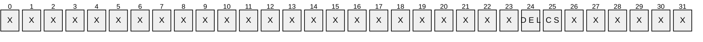

**X**: Unused. MUST be zero and ignored.

**CS (DS_ADDSID_FLAG_PRIVATE_CHK_SECURE, 0x40000000)**: If set, the server verifies whether the channel is secure and returns the result of the verification in the response.

**DEL (DS_ADDSID_FLAG_PRIVATE_DEL_SRC_OBJ, 0x80000000)**: If set, the server appends the objectSid and sIDHistory [**attributes**](#gt_attributes) of SrcPrincipal to the sIDHistory attribute of DstPrincipal, and deletes SrcPrincipal from the source [**domain**](#gt_domain).

This type is declared as follows:

typedef DWORD DRS_ADDSID_FLAGS;

<a id="Section_4.1.2.2"></a>
#### 4.1.2.2 Method-Specific Abstract Types and Procedures

<a id="Section_4.1.2.2.1"></a>
##### 4.1.2.2.1 ConnectionCtx

The ConnectionCtx [**abstract type**](#gt_abstract-type) represents a connection to a specific server with a given set of credentials. It does not imply any particular protocol or transport. It provides a means for pseudocode to compactly represent the notion of the target server and corresponding credentials for an operation.

Procedures that take a ConnectionCtx as an input perform their operations against the server represented by the ConnectionCtx, using the credentials associated with the ConnectionCtx.

<a id="Section_4.1.2.2.2"></a>
##### 4.1.2.2.2 ConnectToDC

procedure ConnectToDC(dcname: unicodestring): ConnectionCtx

Creates a [ConnectionCtx](#Section_4.1.2.2.1) for the [**DC**](#gt_domain-controller-dc) named by *dcname*, associating the credentials of the client's [**security context**](#gt_security-context), which MUST be retrieved using the method described in [MS-RPCE](../MS-RPCE/MS-RPCE.md) section 3.3.3.4.3, with the ConnectionCtx. *dcname* can be the [**Internet host name**](#gt_internet-host-name) or the NetBIOS name of the DC. If the ConnectionCtx cannot be created, the procedure returns null.

<a id="Section_4.1.2.2.3"></a>
##### 4.1.2.2.3 ConnectToDCWithCreds

procedure ConnectToDCWithCreds(

dcname: unicodestring,

username: unicodestring,

pwd: unicodestring,

domain: unicodestring): ConnectionCtx

Creates a [ConnectionCtx](#Section_4.1.2.2.1) for the [**DC**](#gt_domain-controller-dc) named by *dcname*, associating the credentials of user *username*, password *pwd*, and user-domain [**domain**](#gt_domain) with the ConnectionCtx. *dcname* can be the [**Internet host name**](#gt_internet-host-name) or the NetBIOS name of the DC. If the ConnectionCtx cannot be created, it returns null.

<a id="Section_4.1.2.2.4"></a>
##### 4.1.2.2.4 GenerateFailureAudit

procedure GenerateFailureAudit()

Generates a failure audit event on the server on which it is called if auditing is enabled. The generated audit event indicates that an operation failed. This procedure does nothing if auditing is not enabled. The content of the audit event is an implementation-specific behavior.

<a id="Section_4.1.2.2.5"></a>
##### 4.1.2.2.5 GenerateSuccessAudit

procedure GenerateSuccessAudit()

Generates a success audit event on the server on which it is called if auditing is enabled. The generated audit event indicates that an operation succeeded. This procedure does nothing if auditing is not enabled. The content of the audit event is an implementation-specific behavior.

<a id="Section_4.1.2.2.6"></a>
##### 4.1.2.2.6 GenerateSuccessAuditRemotely

procedure GenerateSuccessAuditRemotely(ctx: ConnectionCtx): boolean

If auditing is enabled on the server associated with *ctx*, the GenerateSuccessAuditRemotely procedure generates a success audit event on that server and returns true. The generated audit event indicates that an operation succeeded. Returns false if auditing is not enabled on that server. The content of the audit event is an implementation-specific behavior.<9>

<a id="Section_4.1.2.2.7"></a>
##### 4.1.2.2.7 GetKeyLength

procedure GetKeyLength(hDrs: DRS_HANDLE): integer

Returns the key length, in bits, of the encryption used on the *hDrs* connection. Returns 0 if no encryption is in use on the connection.

<a id="Section_4.1.2.2.8"></a>
##### 4.1.2.2.8 FindGC

procedure FindGC(): unicodestring

Returns the [**Internet host name**](#gt_internet-host-name) of a [**DC**](#gt_domain-controller-dc) that is a [**GC server**](#gt_global-catalog-server-gc-server) in the [**forest**](#gt_forest) (see [MS-ADTS](../MS-ADTS/MS-ADTS.md) section 6.3.6), or null if such a DC cannot be found.

<a id="Section_4.1.2.2.9"></a>
##### 4.1.2.2.9 GetPDC

procedure GetPDC(domainName: unicodestring): unicodestring

Returns the [**Internet host name**](#gt_internet-host-name) of the [**DC**](#gt_domain-controller-dc) that holds the [**PDC**](#gt_primary-domain-controller-pdc) [**FSMO role**](#gt_fsmo-role) for the [**domain**](#gt_domain) whose name is *domainName* (see [MS-ADTS](../MS-ADTS/MS-ADTS.md) section 6.1.5.4), or null if such a DC cannot be found. *domainName* can be either the [**FQDN (1)**](#gt_fully-qualified-domain-name-fqdn) or the NetBIOS name of the domain.

<a id="Section_4.1.2.2.10"></a>
##### 4.1.2.2.10 HasAdminRights

procedure HasAdminRights(ctx: ConnectionCtx) : boolean

Returns true if the credentials associated with *ctx* have administrative rights on the [**DC**](#gt_domain-controller-dc) associated with *ctx*. Possessing administrative rights is defined as having the ability to write to (that is, change the membership of) the Domain Admins [**group**](#gt_group) in the [**domain**](#gt_domain) that is the default [**domain NC**](#gt_domain-naming-context-domain-nc) on the DC associated with *ctx*.

<a id="Section_4.1.2.2.11"></a>
##### 4.1.2.2.11 IsAuditingEnabled

procedure IsAuditingEnabled (): boolean

Returns true if auditing on the server on which it is called is enabled, and returns false otherwise.

<a id="Section_4.1.2.2.12"></a>
##### 4.1.2.2.12 IsLocalRpcCall

procedure IsLocalRpcCall(hDrs: DRS_HANDLE): boolean

Returns true if the [**RPC**](#gt_remote-procedure-call-rpc) call that is being processed on *hDrs* originated from the same computer as the computer that is processing the call.

<a id="Section_4.1.2.2.13"></a>
##### 4.1.2.2.13 IsNT4SP4OrBetter

procedure IsNT4SP4OrBetter(ctx: ConnectionCtx): boolean

If the [**DC**](#gt_domain-controller-dc) named in *ctx* is running Windows NT 4.0 and is not running at least Windows NT 4.0 operating system Service Pack 4 (SP4), this procedure returns false. Otherwise, it returns true.<10>

<a id="Section_4.1.2.2.14"></a>
##### 4.1.2.2.14 IsAuditingGroupPresent

procedure IsAuditingGroupPresent(dcname: unicodestring, nETBIOSName: unicodestring): DWORD

Returns ERROR_NO_SUCH_ALIAS if the [**DC**](#gt_domain-controller-dc) represented by the *dcname* does not have a [**domain**](#gt_domain) local [**group**](#gt_group) whose sAMAccountName is the value of the *nETBIOSName* parameter appended with three dollar signs $$$. Otherwise, it returns ERROR_SUCCESS. This group is not present by default and must be created by the administrator of the [**directory**](#gt_directory) service.

<a id="Section_4.1.2.2.15"></a>
##### 4.1.2.2.15 IsWellKnownDomainRelativeSid

procedure IsWellKnownDomainRelativeSid(sid: SID): boolean

Returns true if *sid* consists of the [**domain SID**](#gt_domain-security-identifier-domain-sid) of the server's default [**domain**](#gt_domain) and of a [**RID**](#gt_relative-identifier-rid) (as specified in [MS-DTYP](../MS-DTYP/MS-DTYP.md) section 2.4.2) whose value is less than 1000, and returns false otherwise.

<a id="Section_4.1.2.2.16"></a>
##### 4.1.2.2.16 LastRID

procedure LastRID(sid: SID): Rid

Extracts and returns the [**RID**](#gt_relative-identifier-rid) from the [**SID**](#gt_sid) *sid*. See [MS-DTYP](../MS-DTYP/MS-DTYP.md) section 2.4.2.

<a id="Section_4.1.2.2.17"></a>
##### 4.1.2.2.17 RemoteQuery

procedure RemoteQuery(

ctx: ConnectionCtx,

query: unicodestring): select-return-value

Performs the select statement represented by the string *query* against the server associated with *ctx*, using the credentials associated with *ctx*. Returns the results of the select operation. The return value of this function is the same type as the return value of the select statement performed.

<a id="Section_4.1.2.3"></a>
#### 4.1.2.3 Server Behavior of the IDL_DRSAddSidHistory Method

*Informative summary of behavior*: The [IDL_DRSAddSidHistory](#Section_4.1.2) method adds the [**SIDs**](#gt_sid) associated with one [**principal**](#gt_principal) (the source principal) to the sIDHistory [**attribute**](#gt_attributes) of another principal (the destination principal). The source principal's objectSid and any SIDs in the source principal's sIDHistory are added to the destination principal's sIDHistory. This method is called on a [**DC**](#gt_domain-controller-dc) whose [**default NC**](#gt_default-naming-context-default-nc) contains the destination principal. If necessary, the destination DC will contact a DC whose default NC contains the source principal as part of executing this method.

This method has three different variants on this behavior, and the caller indicates which variant is desired by specifying a combination of flags in pmsgIn^.V1.flags.

- If the DS_ADDSID_FLAG_PRIVATE_CHK_SECURE flag is specified, the first variant is selected. In this variant, the method verifies only that the [**RPC**](#gt_remote-procedure-call-rpc) call is secure. It does not perform any further processing or manipulate the sIDHistory attribute of any [**object**](#gt_object), regardless of other flags that might be present.
- If DS_ADDSID_FLAG_PRIVATE_CHK_SECURE is not specified but DS_ADDSID_FLAG_PRIVATE_DEL_SRC_OBJ is specified, the second variant is selected. In this variant, the source and destination principals are in the same [**domain**](#gt_domain). The values of the objectSid and sIDHistory attributes of the source principal are added to the destination principal's sIDHistory attribute, and then the source principal is deleted. See [MS-ADTS](../MS-ADTS/MS-ADTS.md) section 3.1.1.5.5 for more information about the delete operation. Loosely speaking, the destination principal adopts the source principal as an "alias" and the source principal disappears.
- The third variant is selected by specifying neither DS_ADDSID_FLAG_PRIVATE_CHK_SECURE nor DS_ADDSID_FLAG_PRIVATE_DEL_SRC_OBJ. In this variant, the source and destination principals are in different [**forests**](#gt_forest). The values of the source principal's objectSid and sIDHistory attributes are copied into the destination principal's sIDHistory attribute, as in the second variant, but without deleting the source principal. Loosely speaking, the destination principal adopts the source principal as an "alias" while coexisting with the source principal.
The preceding are the only variants supported by the IDL_DRSAddSidHistory method. In particular, the case of source and destination principals in different domains within the same forest is not supported.

ULONG

IDL_DRSAddSidHistory(

[in, ref] DRS_HANDLE hDrs,

[in] DWORD dwInVersion,

[in, ref, switch_is(dwInVersion)] DRS_MSG_ADDSIDREQ *pmsgIn,

[out, ref] DWORD *pdwOutVersion,

[out, ref, switch_is(*pdwOutVersion)] DRS_MSG_ADDSIDREPLY *pmsgOut)

flags: DRS_ADDSID_FLAGS

srcPrinc: DSName

dstPrinc: DSName

srcPrincInDst: DSName

srcNc: DSName

dstNc: DSName

crSrc: DSName

crDst: DSName

partCtr: DSName

srcDomainController: unicodestring

srcCtx: ConnectionCtx

srcPrincSid: SID

srcPrincSidHistory: set of SID

rt: ULONG

ValidateDRSInput(hDrs, 20)

pdwOutVersion^ := 1

pmsgOut^.V1.dwWin32Error := ERROR_DS_INTERNAL_FAILURE

flags := pmsgIn^.V1.flags

if DS_ADDSID_FLAG_PRIVATE_CHK_SECURE in flags then

/* First mode of operation: verify connection security.

* If connecting from off-machine, connection must have 128-bit

* encryption or better. */

if (not IsLocalRpcCall(hDrs)) and

(GetKeyLength(hDrs) < 128) then

pmsgOut^.V1.dwWin32Error := ERROR_DS_MUST_RUN_ON_DST_DC

return ERROR_DS_MUST_RUN_ON_DST_DC

else

return 0

endif

endif

/* Currently, only version 1 is supported. The RPC IDL definitions

* for the interface do not allow passing in a version other than 1. */

if dwInVersion ≠ 1 then

return ERROR_INVALID_PARAMETER

endif

if DS_ADDSID_FLAG_PRIVATE_DEL_SRC_OBJ in flags then

/* Second mode of operation: add objectSid/sidHistory from source

* principal to destination principal, then delete source

* principal. */

/* Basic parameter validation */

if (pmsgIn^.V1.SrcDomain ≠ null) or

(pmsgIn^.V1.DstDomain ≠ null) or

(pmsgIn^.V1.SrcCredsUserLength ≠ 0) or

(pmsgIn^.V1.SrcCredsDomainLength ≠ 0) or

(pmsgIn^.V1.SrcCredsPasswordLength ≠ 0) or

(pmsgIn^.V1.SrcDomainController = "") or

(pmsgIn^.V1.SrcPrincipal = null) or

(pmsgIn^.V1.SrcPrincipal = "") or

(pmsgIn^.V1.DstPrincipal = null) or

(pmsgIn^.V1.DstPrincipal = "") then

pmsgOut^.V1.dwWin32Error := ERROR_DS_INTERNAL_FAILURE

return ERROR_INVALID_PARAMETER

endif

/* In this case, pmsgIn^.V1.SrcPrincipal and .DstPrincipal are

* DNs. */

srcPrinc := GetDSNameFromDN(pmsgIn^.V1.SrcPrincipal)

dstPrinc := GetDSNameFromDN(pmsgIn^.V1.DstPrincipal)

srcNc := GetObjectNC(srcPrinc)

dstNc := GetObjectNC(dstPrinc)

/* Source and destination principals must be in same domain. */

if srcNc = null or dstNc = null or srcNc ≠ dstNc then

pmsgOut^.V1.dwWin32Error := ERROR_INVALID_PARAMETER

return 0

endif

/* Destination NC must be this server's default domain NC. */

if dstNc ≠ DefaultNC() then

pmsgOut^.V1.dwWin32Error := ERROR_DS_MASTERDSA_REQUIRED

return 0

endif

/* Verify that this server has auditing enabled */

if not IsAuditingEnabled () then

pmsgOut^.V1.dwWin32Error :=

ERROR_DS_DESTINATION_AUDITING_NOT_ENABLED

return 0

endif

/* Must have the control access right. */

if not AccessCheckCAR(dstNc, Migrate-SID-History) then

GenerateFailureAudit()

pmsgOut^.V1.dwWin32Error := ERROR_DS_INSUFF_ACCESS_RIGHTS

return 0

endif

/* Destination domain must be in native mode. */

partCtr := DescendantObject(ConfigNC(), "CN=Partitions,")

if partCtr ≠ null

crDst := select one dd from subtree partCtr where

(crossRef in dd!objectClass and

dd!nCName = dstNc)

endif

if partCtr = null or crDst = null then

pmsgOut^.V1.dwWin32Error := ERROR_DS_INTERNAL_FAILURE

return 0

else

if crDst!nTMixedDomain = 1 then

pmsgOut^.V1.dwWin32Error := ERROR_DS_DST_DOMAIN_NOT_NATIVE

return 0

endif

endif

/* Validation of object state. */

if (not ObjExists(srcPrinc)) or

(not (user in srcPrinc!objectClass or

group in srcPrinc!objectClass)) or

(not ObjExists(dstPrinc)) or

(not (user in dstPrinc!objectClass or

group in dstPrinc!objectClass)) or

(srcPrinc = dstPrinc) or

(IsWellKnownDomainRelativeSid(srcPrinc!objectSid)) or

(IsWellKnownDomainRelativeSid(dstPrinc!objectSid)) then

pmsgOut^.V1.dwWin32Error := ERROR_INVALID_PARAMETER

return 0

endif

/* Check that this machine has rights to delete the source principal. */

if (not AccessCheckObject(srcPrinc, RIGHT_DELETE)) and

(not AccessCheckObject(srcPrinc.parent, RIGHT_DS_DELETE_CHILD))

then

pmsgOut^.V1.dwWin32Error := ERROR_ACCESS_DENIED

return 0

endif

/* Save the source principal's SID and SID history and then delete the principal */

srcPrincSid := srcPrinc!objectSid

srcPrincSidHistory := srcPrinc!sIDHistory

rt = RemoveObj(srcPrinc,false)

if(rt ≠ 0) then

pmsgOut^.V1.dwWin32Error := rt

return 0

endif

/* Add source principal's objectSid and sidHistory to

* destination principal's sidHistory. */

dstPrinc!sidHistory := dstPrinc!sidHistory + {srcPrincSid}

dstPrinc!sidHistory := dstPrinc!sidHistory + srcPrincSidHistory

GenerateSuccessAudit()

return 0

endif

/* Third mode of operation: add objectSid/sIDHistory from source

* principal to destination principal. Source principal is

* untouched. */

/* Basic parameter validation. */

if (pmsgIn^.V1.SrcDomain = null) or

(pmsgIn^.V1.SrcDomain = "") or

(pmsgIn^.V1.DstDomain = null) or

(pmsgIn^.V1.DstDomain = "") or

(pmsgIn^.V1.SrcCredsUserLength > 0 and

pmsgIn^.V1.SrcCredsUser = null) or

(pmsgIn^.V1.SrcCredsDomainLength > 0 and

pmsgIn^.V1.SrcCredsDomain = null) or

(pmsgIn^.V1.SrcCredsPasswordLength > 0 and

pmsgIn^.V1.SrcCredsPassword = null) or

(pmsgIn^.V1.SrcDomainController = "") or

(pmsgIn^.V1.SrcPrincipal = null) or

(pmsgIn^.V1.SrcPrincipal = "") or

(pmsgIn^.V1.DstPrincipal = null) or

(pmsgIn^.V1.DstPrincipal = "") then

pmsgOut^.V1.dwWin32Error := ERROR_DS_INTERNAL_FAILURE

return ERROR_INVALID_PARAMETER

endif

/* Confirm destination domain is in forest of server. */

crDst := select one dd from subtree ConfigNC() where

(crossRef in dd!objectClass and

(dd!dnsRoot = pmsgIn^.V1.DstDomain or

dd!nETBIOSName = pmsgIn^.V1.DstDomain))

if crDst = null then

pmsgOut^.V1.dwWin32Error :=

ERROR_DS_DESTINATION_DOMAIN_NOT_IN_FOREST

return 0

endif

/* Confirm source domain is not in forest of server. */

crSrc := select one ss from subtree ConfigNC() where

(crossRef in ss!objectClass and

(ss!dnsRoot = pmsgIn^.V1.SrcDomain or

ss!nETBIOSName = pmsgIn^.V1.SrcDomain)

and FLAG_CR_NTDS_NC in ss!systemFlags

and FLAG_CR_NTDS_DOMAIN in ss!systemFlags)

if crSrc ≠ null then

pmsgOut^.V1.dwWin32Error := ERROR_DS_SOURCE_DOMAIN_IN_FOREST

return 0

endif

/* Destination NC must be this server's default domain NC. */

if crDst!nCName ≠ DefaultNC() then

pmsgOut^.V1.dwWin32Error := ERROR_DS_MASTERDSA_REQUIRED

return 0

endif

/* Destination domain must be in native mode. */

if crDst!nTMixedDomain = 1 then

pmsgOut^.V1.dwWin32Error := ERROR_DS_DST_DOMAIN_NOT_NATIVE

return 0

endif

dstNC := crDst!nCName

/* Verify this server has auditing enabled for destination domain. */

if not IsAuditingEnabled () then

pmsgOut^.V1.dwWin32Error :=

ERROR_DS_DESTINATION_AUDITING_NOT_ENABLED

return 0

endif

/* Must have the control access right. */

if not AccessCheckCAR(dstNc, Migrate-SID-History) then

GenerateFailureAudit()

pmsgOut^.V1.dwWin32Error := ERROR_DS_INSUFF_ACCESS_RIGHTS

return 0

endif

/* Retrieve destination principal.

* In this case, pmsgIn^.V1.DstPrincipal is a SAM name. */

dstPrinc := select one o from subtree DefaultNC() where

(o!sAMAccountName = pmsgIn^.V1.DstPrincipal)

if dstPrinc = null then

pmsgOut^.V1.dwWin32Error := ERROR_DS_OBJ_NOT_FOUND

return 0

endif

/* Locate a source DC if one wasn't supplied. Source DC must be

* the PDC FSMO role owner. */

srcDomainController := pMsgin^.V1.SrcDomainController

if srcDomainController = null then

srcDomainController := GetPDC(pmsgIn^.V1.SrcDomain)

else

if srcDomainController ≠ GetPDC(pmsgIn^.V1.SrcDomain) then

pmsgOut^.V1.dwWin32Error := ERROR_INVALID_DOMAIN_ROLE

return 0

endif

endif

if srcDomainController = null then

pmsgOut^.V1.dwWin32Error := ERROR_DS_CANT_FIND_DC_FOR_SRC_DOMAIN

return 0

endif

/* Connect to source DC, using supplied credentials if applicable. */

if (pmsgIn^.V1.SrcCredsUserLength = 0) and

(pmsgIn^.V1.SrcCredsPasswordLength = 0) and

(pmsgIn^.V1.SrcCredsDomainLength = 0) then

srcCtx := ConnectToDC(srcDomainController)

else

srcCtx := ConnectToDCWithCreds(srcDomainController,

pmsgIn^.V1.SrcCredsUser, pmsgIn^.V1.SrcCredsPassword,

pmsgIn^.V1.SrcCredsDomain)

endif

if (srcCtx = null) then

pmsgOut^.V1.dwWin32Error := ERROR_DS_CANT_FIND_DC_FOR_SRC_DOMAIN

return 0

endif

/* Confirm client has administrative rights on source DC. */

if not HasAdminRights(srcCtx) then

pmsgOut^.V1.dwWin32Error := ERROR_DS_INSUFF_ACCESS_RIGHTS

return 0

endif

/* Retrieve source principal from source DC using the remote connection.

* In this case, pmsgIn^.V1.SrcPrincipal is a SAM name.

* Example: If pmsgIn^.V1.SrcPrincipal value is username1 then

* following query is executed in the source DC:

* select one o from subtree dc.defaultNC where (o!sAMAccountName = "username1")

*/

srcPrinc := RemoteQuery(srcCtx,

"select one o from subtree dc.defaultNC where (o!sAMAccountName = "

+ '"' + pmsgIn^.V1.SrcPrincipal + '"' + ")"

)

if srcPrinc = null then

pmsgOut^.V1.dwWin32Error := ERROR_DS_OBJ_NOT_FOUND

return 0

endif

/* Source principal must be user (which includes computer) or

* group.*/

if not (group in srcPrinc!objectClass or

user in srcPrinc!objectClass) then

pmsgOut^.V1.dwWin32Error := ERROR_DS_SRC_OBJ_NOT_GROUP_OR_USER

return 0

endif

srcPrincSid := srcPrinc!objectSid

srcPrincSidHistory := srcPrinc!sIDHistory

/* Verify that no principal other than the destination

* principal exists in the destination forest that contains

* a SID that matches the source principal. */

if IsGC() or IsAdlds() then

srcPrincInDst := select one o from subtree DefaultNC() where

(o ≠ dstPrinc) and

((o!objectSid = srcPrincSid) or

(o!objectSid in srcPrincSidHistory) or

(srcPrincSid in o!sIDHistory)) or

((srcPrincSidHistory ∩ o!sIDHistory) ≠ {}))

if srcPrincInDst ≠ null then

pmsgOut^.V1.dwWin32Error := ERROR_DS_SRC_SID_EXISTS_IN_FOREST

return 0

endif

else

/* The current DC is not a GC server.

* We need to locate a GC server and perform an IDL_DRSCrackNames query against it in order

for the SID search to be Forest scoped */

gcDomainController : unicodestring

hDrsGc: DRS_HANDLE

crackMsgIn: DRS_MSG_CRACKREQ_V1

crackOut: DS_NAME_RESULTW

gcDomainController := FindGC()

if gcDomainController = null then

return STATUS_DS_GC_NOT_AVAILABLE

endif

/* Bind to GC */

hDrsGc := BindToDSA(gcDomainController)

if hDrsGc = null then

pmsgOut^.V1.dwWin32Error := STATUS_DS_GC_NOT_AVAILABLE

return 0

endif

crackMsgIn.dwFlags := DS_NAME_FLAG_GCVERIFY

crackMsgIn.formatOffered := DS_STRING_SID_NAME

crackMsgIn.formatDesired := DS_UNIQUE_ID_NAME

crackMsgIn.cNames := 1

crackMsgIn.rpNames[0] := srcPrincSid

crackNamesErr := IDL_DRSCrackNames(

hDrsGc,

dwInVersion,

crackMsgIn,

pdwOutVersion,

ADR(crackOut))

if crackNamesErr ≠ 0 then

if crackNamesErr = DS_NAME_ERROR_NOT_UNIQUE then

pmsgOut^.V1.dwWin32Error := ERROR_DS_SRC_SID_EXISTS_IN_FOREST

return 0

elseif crackNamesErr ≠ DS_NAME_ERROR_NOT_FOUND and

crackNamesErr ≠ DS_NAME_ERROR_DOMAIN_ONLY then

pmsgOut^.V1.dwWin32Error := ERROR_DS_INTERNAL_FAILURE

return 0

endif

if crackOut.rItems ≠ null and

crackOut.rItems[0].pName ≠ dstPrinc!objectGUID then

pmsgOut^.V1.dwWin32Error := ERROR_DS_SRC_SID_EXISTS_IN_FOREST

return 0

endif

UnbindFromDSA(hDrsGc)

endif

/* Confirm source domain has auditing enabled and generate an audit

* event on it. */

if not GenerateSuccessAuditRemotely(srcCtx)

pmsgOut^.V1.dwWin32Error := ERROR_DS_SOURCE_AUDITING_NOT_ENABLED

return 0

endif

/* Verify that if source domain is running Windows NT 4.0, it is

* running at least Service Pack 4 of that operating system. */

if not IsNT4SP4OrBetter(srcCtx)

pmsgOut^.V1.dwWin32Error := ERROR_DS_SRC_DC_MUST_BE_SP4_OR_GREATER

return 0

endif

/* Verify that if source domain has a domain local group srcDomainNetBIOSName$$$

*/

if IsAuditingGroupPresent(srcDomainController, pmsgIn^.V1.SrcDomain) = ERROR_NO_SUCH_ALIAS

pmsgOut^.V1.dwWin32Error := ERROR_NO_SUCH_ALIAS

return 0

endif

/* Source and destination principals must both be computer, or both

* be user, or both be group. The order is important: although

* computer objects are user objects, the case is disallowed where

* one principal is a computer and the other principal is a user

* but not a computer. */

if ((computer in srcPrinc!objectClass and

not computer in dstPrinc!objectClass) or

(computer in dstPrinc!objectClass and

not computer in srcPrinc!objectClass)) or

((user in srcPrinc!objectClass and

not user in dstPrinc!objectClass) or

(user in dstPrinc!objectClass and

not user in srcPrinc!objectClass)) or

((group in srcPrinc!objectClass and

not group in dstPrinc!objectClass) or

(group in dstPrinc!objectClass and

not group in srcPrinc!objectClass)) then

pmsgOut^.V1.dwWin32Error :=

ERROR_DS_SRC_AND_DST_OBJECT_CLASS_MISMATCH

return 0

endif

/* Class-specific object state tests.

* Note that computer is a subclass of user, so the following test

* applies to both user and computer objects. */

if user in srcPrinc!objectClass then

if srcPrinc!userAccountControl ∩ {ADS_UF_NORMAL_ACCOUNT,

ADS_UF_WORKSTATION_TRUST_ACCOUNT,

ADS_UF_SERVER_TRUST_ACCOUNT} ≠

dstPrinc!userAccountControl ∩ {ADS_UF_NORMAL_ACCOUNT,

ADS_UF_WORKSTATION_TRUST_ACCOUNT,

ADS_UF_SERVER_TRUST_ACCOUNT} then

pmsgOut^.V1.dwWin32Error :=

ERROR_DS_SRC_AND_DST_OBJECT_CLASS_MISMATCH

return 0

endif

if group in srcPrinc!objectClass and

srcPrinc!groupType ≠ dstPrinc!groupType then

pmsgOut^.V1.dwWin32Error :=

ERROR_DS_SRC_AND_DST_OBJECT_CLASS_MISMATCH

return 0

endif

/* Check if source principal is built-in principal. */

if IsBuiltinPrincipal(srcPrinc!objectSid) then

pmsgOut^.V1.dwWin32Error := ERROR_DS_UNWILLING_TO_PERFORM

return 0

endif

/* If source principal has well-known domain-relative SID

* make sure final RIDs of source and destination principals

* are the same. */

if IsWellKnownDomainRelativeSid(srcPrinc!objectSid) then

if LastRID(srcPrinc!objectSid) ≠ LastRID(dstPrinc!objectSid)

pmsgOut^.V1.dwWin32Error := ERROR_DS_UNWILLING_TO_PERFORM

return 0

endif

endif

/* Add source principal's objectSid and sIDHistory to

* destination principal's sidHistory. */

dstPrinc!sIDHistory := dstPrinc!sIDHistory + {srcPrincSid}

dstPrinc!sIDHistory := dstPrinc!sIDHistory + srcPrincSidHistory

GenerateSuccessAudit()

return 0

<a id="Section_4.1.2.4"></a>
#### 4.1.2.4 Examples of the IDL_DRSAddSidHistory Method

<a id="Section_4.1.2.4.1"></a>
##### 4.1.2.4.1 Calling IDL_DRSAddSidHistory with DS_ADDSID_FLAG_PRIVATE_CHK_SECURE Flags

This flag is used when the caller wants to check whether an [**RPC**](#gt_remote-procedure-call-rpc) call to DC1 is secure.

<a id="Section_4.1.2.4.1.1"></a>
###### 4.1.2.4.1.1 Client Request

A client invokes the IDL_DRSAddSidHistory method against DC1 with the following parameters ([DRS_HANDLE](#Section_5.40) to DC1 omitted):

- *dwInVersion* = 1
- *pmsgIn* = DRS_MSG_ADDSIDREQ_V1
- Flags = 0x40000000
<a id="Section_4.1.2.4.1.2"></a>
###### 4.1.2.4.1.2 Server Response

The server returns a code of 0 and the following values:

- *pdwOutVersion* = 1
- *pmsgOut* = DRS_MSG_ADDSIDREPLY_V1
- dwWin32Error: 0
<a id="Section_4.1.2.4.1.3"></a>
###### 4.1.2.4.1.3 Final State

There are no changes in state.

<a id="Section_4.1.2.4.2"></a>
##### 4.1.2.4.2 Calling IDL_DRSAddSidHistory with DS_ADDSID_FLAG_PRIVATE_DEL_SRC_OBJ Flags

In this example, the user "Kim Akers" has an account in [**domain**](#gt_domain) DC=contoso, DC=com with a Windows NT 4.0 account name "CONTOSO\kimakers". There is another account in the same domain for the user "Kim Akers" with the Windows NT 4.0 account name "CONTOSO\kimakers1". The domain administrator wants to add a [**SID**](#gt_sid) of "CONTOSO\Kimakers1" account to the SIDHistory of "CONTOSO\kimakers" and delete "CONTOSO\Kimakers1".

<a id="Section_4.1.2.4.2.1"></a>
###### 4.1.2.4.2.1 Initial State

Querying the [**user object**](#gt_user-object) whose sAMAccountName is kimakers in the [**domain NC**](#gt_domain-naming-context-domain-nc) DC=CONTOSO, DC=COM on DC1:

- ldap_search_s("DC=contoso,DC=com", *wholeSubtree*, "(sAMAccountName=kimakers)", [*objectClass*, *distinguishedName*, *sAMAccountName*, *objectSid*, *sIDHistory*])
- Result <0>: (null)
- Matched DNs:
- Getting 1 entry:
- >> Dn: CN=Kim Akers,CN=Users,DC=contoso,DC=com
- 4> objectClass: top; person; organizationalPerson; user;
- 1> distinguishedName: CN=Kim Akers,CN=Users,DC=contoso,DC=com;
- 1> sAMAccountName: KimAkers;
- 1> objectSid: S-1-5-21-254470460-2440132622-709970653-1144
Querying the user object whose sAMAccountName is kimakers1 in the domain NC DC=CONTOSO, DC=COM on DC1:

- ldap_search_s("DC=contoso,DC=com", *wholeSubtree*, "(sAMAccountName=kimakers1)", [*objectClass*, *distinguishedName*, *sAMAccountName*, *objectSid*, *sIDHistory*])
- Result <0>: (null)
- Matched DNs:
- Getting 1 entries:
- >> Dn: CN=Kim Akers1,CN=Users,DC=contoso,DC=com
- 4> objectClass: top; person; organizationalPerson; user;
- 1> distinguishedName: CN=Kim Akers1,CN=Users,DC=contoso,DC=com;
- 1> sAMAccountName: KimAkers1;
- 1> objectSid: S-1-5-21-254470460-2440132622-709970653-1129;
<a id="Section_4.1.2.4.2.2"></a>
###### 4.1.2.4.2.2 Client Request

A client invokes the **IDL_DRSAddSidHistory** method against DC1 with the following parameters ([DRS_HANDLE](#Section_5.40) to DC1 omitted):

- *dwInVersion* = 1
- *pmsgIn* = DRS_MSG_ADDSIDREQ_V1
- Flags = 0x80000000
- SrcPrincipal = "CN=Kim Akers1,CN=Users,DC=contoso,DC=com"
- DstPrincipal = "CN=Kim Akers,CN=Users,DC=contoso,DC=com"
<a id="Section_4.1.2.4.2.3"></a>
###### 4.1.2.4.2.3 Server Response

The server returns a code of 0 and the following values:

- *pdwOutVersion* = 1
- *pmsgOut* = DRS_MSG_ADDSIDREPLY_V1
- dwWin32Error: 0
<a id="Section_4.1.2.4.2.4"></a>
###### 4.1.2.4.2.4 Final State

The **sIDHistory** [**attribute**](#gt_attributes) on the [**user object**](#gt_user-object) whose [**DN**](#gt_distinguished-name-dn) is "Kim Akers,CN=Users,DC=contoso,DC=com" contains one value:

- ldap_search_s("DC=contoso,DC=com", *wholeSubtree*, "(sAMAccountName=kimakers)", [*objectClass*, *distinguishedName*, *sAMAccountName*, *objectSid*, *sIDHistory*])
- Result <0>: (null)
- Matched DNs:
- Getting 1 entry:
- >> Dn: CN=Kim Akers,CN=Users,DC=contoso,DC=com
- 4> objectClass: top; person; organizationalPerson; user;
- 1> distinguishedName: CN=Kim Akers,CN=Users,DC=contoso,DC=com;
- 1> sAMAccountName: KimAkers;
- 1> objectSid: S-1-5-21-254470460-2440132622-709970653-1144;
- 1> sIDHistory: S-1-5-21-254470460-2440132622-709970653-1129;
The user object whose DN is "Kim Akers1,CN=Users,DC=contoso,DC=com" is deleted:

ldap_search_s("DC=contoso,DC=com", *wholeSubtree*, "(sAMAccountName=kimakers1)", [*objectClass*, *distinguishedName*, *sAMAccountName*, *objectSid*, *sIDHistory*])

- Result <0>: (null)
- Matched DNs:
- Getting 0 entries:
<a id="Section_4.1.2.4.3"></a>
##### 4.1.2.4.3 Calling IDL_DRSAddSidHistory with 0 in Flags

The user "Kim Akers" has an account in [**domain**](#gt_domain) DC=contoso, DC=com with a Windows NT 4.0 account name "CONTOSO\kimakers". The user has another account in a separate [**forest**](#gt_forest) in domain DC=legacycontoso,DC=com with a Windows NT 4.0 account name "LEGACYCONTOSO\kimakers1". The domain administrator wants to add the [**SID**](#gt_sid) of "LEGACYCONTOSO\Kimakers1" account to the sIDHistory of "CONTOSO\kimakers". The administrator's account name in the LEGACYCONTOSO domain is LegacyContosoAdmin with password Passw0rd123. LEGACYCONTOSO is the NetBIOS name for the LEGACYCONTOSO.com domain.

<a id="Section_4.1.2.4.3.1"></a>
###### 4.1.2.4.3.1 Initial State

Querying the [**user object**](#gt_user-object) whose sAMAccountName is kimakers in the [**domain NC**](#gt_domain-naming-context-domain-nc) DC=CONTOSO, DC=COM on DC1:

- ldap_search_s("DC=contoso,DC=com", *wholeSubtree*, "(sAMAccountName=kimakers)", [*objectClass*, *distinguishedName*, *sAMAccountName*, *objectSid*, *sIDHistory*])
- Result <0>: (null)
- Matched DNs:
- Getting 1 entry:
- Dn: CN=Kim Akers,CN=Users,DC=contoso,DC=com
- 4> objectClass: top; person; organizationalPerson; user;
- 1> distinguishedName: CN=Kim Akers,CN=Users,DC=contoso,DC=com;
- 1> sAMAccountName: KimAkers
- 1> objectSid: S-1-5-21-254470460-2440132622-709970653-1144
Querying the user object whose sAMAccountName is kimakers1 in the domain NC DC=LEGACYCONTOSO, DC=COM on DC9:

- ldap_search_s("DC=legacycontoso,DC=com", wholeSubtree, "(sAMAccountName=kimakers1)", [*objectClass*, *distinguishedName*, *sAMAccountName*, *objectSid*, *sIDHistory*])
- Result <0>: (null)
- Matched DNs:
- Getting 1 entries:
- >> Dn: CN=Kim Akers1,CN=Users,DC=legacycontoso,DC=com
- 4> objectClass: top; person; organizationalPerson; user;
- 1> distinguishedName: CN=Kim Akers1,CN=Users,DC=legacycontoso,DC=com;
- 1> sAMAccountName: KimAkers1;
- 1> objectSid: S-1-5-21-1137440724-3092688314-3181763971-1153;
<a id="Section_4.1.2.4.3.2"></a>
###### 4.1.2.4.3.2 Client Request

A client invokes the IDL_DRSAddSidHistory method against DC1 with the following parameters ([DRS_HANDLE](#Section_5.40) to DC1 omitted):

- *dwInVersion* = 1
- *pmsgIn* = DRS_MSG_ADDSIDREQ_V1
- Flags = 0
- SrcDomain = "legacycontoso.com"
- SrcPrincipal = "KimAkers1"
- SrcCredsDomain = "legacycontoso"
- SrcCredsDomainLength = 13
- SrcCredsUser = "LegacyContosoAdmin"
- SrcCredsUserLength = 18
- SrcCredsPassword = "Passw0rd123"
- SrcCredsPasswordLength = 11
- DstDomain = "contoso"
- DstPrincipal = "KimAkers"
<a id="Section_4.1.2.4.3.3"></a>
###### 4.1.2.4.3.3 Server Response

The server returns a code of 0 and the following values:

- *pdwOutVersion* = 1
*pmsgOut* = DRS_MSG_ADDSIDREPLY_V1

- dwWin32Error: 0
<a id="Section_4.1.2.4.3.4"></a>
###### 4.1.2.4.3.4 Final State

The sIDHistory [**attribute**](#gt_attributes) on the [**user object**](#gt_user-object) whose [**DN**](#gt_distinguished-name-dn) is "Kim Akers,CN=Users,DC=contoso,DC=com" contains one value:

- ldap_search_s("DC=contoso,DC=com", *wholeSubtree*, "(sAMAccountName=kimakers)", [*objectClass*, *distinguishedName*, *sAMAccountName*, *objectSid*, *sIDHistory*])
- Result <0>: (null)
- Matched DNs:
- Getting 1 entry:
- >> Dn: CN=Kim Akers,CN=Users,DC=contoso,DC=com
- 4> objectClass: top; person; organizationalPerson; user;
- 1> distinguishedName: CN=Kim Akers,CN=Users,DC=contoso,DC=com;
- 1> sAMAccountName: KimAkers;
- 1> objectSid: S-1-5-21-254470460-2440132622-709970653-1144;
- 1> sIDHistory: S-1-5-21-1137440724-3092688314-3181763971-1153;
In the [**domain NC**](#gt_domain-naming-context-domain-nc) DC=LEGACYCONTOSO, DC=COM, the user object whose sAMAccountName is kimakers1 is unchanged:

- ldap_search_s("DC=legacycontoso,DC=com", *wholeSubtree*, "(sAMAccountName=kimakers1)", [*objectClass*, *distinguishedName*, *sAMAccountName*, *objectSid*, *sIDHistory*])
- Result <0>: (null)
- Matched DNs:
- Getting 1 entries:
- >> Dn: CN=Kim Akers1,CN=Users,DC=legacycontoso,DC=com
- 4> objectClass: top; person; organizationalPerson; user;
- 1> distinguishedName: CN=Kim Akers1,CN=Users,DC=legacycontoso,DC=com;
- 1> sAMAccountName: KimAkers1;
- 1> objectSid: S-1-5-21-1137440724-3092688314-3181763971-1153;
<a id="Section_4.1.3"></a>
### 4.1.3 IDL_DRSBind (Opnum 0)

The IDL_DRSBind method creates a context handle that is necessary to call any other method in this interface.

ULONG IDL_DRSBind(

[in] handle_t rpc_handle,

[in, unique] UUID* puuidClientDsa,

[in, unique] DRS_EXTENSIONS* pextClient,

[out] DRS_EXTENSIONS** ppextServer,

[out, ref] DRS_HANDLE* phDrs

);

**rpc_handle:** An [**RPC**](#gt_remote-procedure-call-rpc) binding handle, as specified in [[C706]](https://go.microsoft.com/fwlink/?LinkId=89824).

**puuidClientDsa:** A pointer to a [**GUID**](#gt_globally-unique-identifier-guid) that identifies the caller.

**pextClient:** A pointer to client capabilities, for use in version negotiation.

**ppextServer:** A pointer to a pointer to server capabilities, for use in version negotiation.

**phDrs:** A pointer to an RPC context handle (as specified in [C706]), which can be used in calls to other methods in this interface.

**Return Values:** 0 if successful, otherwise a [**Windows error code**](#gt_windows-error-code).

**Exceptions Thrown**: This method does not throw exceptions beyond those thrown by the underlying RPC protocol.

<a id="Section_4.1.3.1"></a>
#### 4.1.3.1 Client Behavior When Sending the IDL_DRSBind Request

The client uses *puuidClientDsa* to pass an identifier. If the client uses the returned DRS_HANDLE for subsequent calls to the [IDL_DRSWriteSPN](#Section_4.1.28) method, then the client MUST pass NTDSAPI_CLIENT_GUID in *puuidClientDsa*. For any other uses, the server places no constraints on the value of *puuidClientDsa* other than those specified in section [4.1.3.2](#Section_4.1.3.2).<11>

The client uses *pextClient* to pass a properly initialized [DRS_EXTENSIONS_INT](#Section_5.39) structure to the server. If the client is a [**DC**](#gt_domain-controller-dc), it reads the value of msDS-ReplicationEpoch from its nTDSDSA [**object**](#gt_object) and assigns this value to the **dwReplEpoch** field of the DRS_EXTENSIONS_INT structure; otherwise, it sets the **dwReplEpoch** field of the DRS_EXTENSIONS_INT structure to zero. If the client is a DC, it reads the value of [**objectGUID**](#gt_objectguid) from the Config NC object and assigns this value to the **ConfigObjGUID** field of the DRS_EXTENSIONS_INT structure; otherwise, it sets the **ConfigObjGUID** field of the DRS_EXTENSIONS_INT structure to the [**NULL GUID**](#gt_null-guid) value.

The remaining information in the DRS_EXTENSIONS_INT structure must be consistent with the client's capabilities. This information affects the versions of response structures that the server returns in method calls using the [DRS_HANDLE](#Section_5.40) returned by [IDL_DRSBind](#Section_4.1.3). In descriptions of method calls that use a DRS_HANDLE, this handle is sometimes called the client's [**RPC**](#gt_remote-procedure-call-rpc) context.<12>

If a method of this protocol takes a parameter named *dwInVersion*, the client uses that parameter to specify the version of the referent of the next parameter to that method, often named *pmsgIn*. The referent of this parameter is called the method's request. The *dwInVersion* parameter is called the request version. For example, if the client passes *dwInVersion* = 7 to [IDL_DRSGetNCChanges](#Section_4.1.10), the client also passes a [DRS_MSG_GETCHGREQ_V7](#Section_4.1.10.2.5) request.

If a method of this protocol takes an integer parameter named *pdwOutVersion*, the server uses that parameter to return the version number of the referent of the next parameter to that method, often named *pmsgOut*. The referent of this parameter is called the method's response. The referent of *pdwOutVersion* is called the response version. For example, when the server returns *pdwOutVersion*^ = 9 from IDL_DRSGetNCChanges, the server also returns a [DRS_MSG_GETCHGREPLY_V9](#Section_4.1.10.2.14) response.

Most methods in this protocol are capable of generating only a certain response version from a certain request version. The following special cases apply:

- IDL_DRSGetNCChanges is capable of returning a version 6 response from version 7, version 8, and version 10 requests. However, the DRS_EXT_GETCHGREPLY_V6 bit must be set in the client's RPC context for the server to generate a version 6 response. Otherwise, the server returns ERROR_REVISION_MISMATCH. Note that whenever IDL_DRSGetNCChanges is capable of returning a version 6 response, it is also capable of returning a version 7 response, which is a compressed form of a version 6 response. Compression of IDL_DRSGetNCChanges responses is not controlled by the state of the client's RPC context; it is controlled on a per-request basis by the client; see DRS_USE_COMPRESSION in section [5.41](#Section_5.41).
- IDL_DRSGetNCChanges is capable of returning a version 9 response from version 10 requests. However, the DRS_EXT_GETCHGREPLY_V9 bit must be set in the client's RPC context for the server to generate a version 9 response. Otherwise, the server returns ERROR_REVISION_MISMATCH. Note that whenever IDL_DRSGetNCChanges is capable of returning a version 9 response, it is also capable of returning a version 7 response, which is a compressed form of a version 9 response. Compression of IDL_DRSGetNCChanges responses is not controlled by the state of the client's RPC context; it is controlled on a per-request basis by the client; see DRS_USE_COMPRESSION in section 5.41.
- [IDL_DRSAddEntry](#Section_4.1.1) can generate either a version 2 or version 3 response from either a version 2 or version 3 request. The server generates a version 3 response when DRS_EXT_ADDENTRYREPLY_V3 is set in the client's RPC context; otherwise, the server generates a version 2 response.
- [IDL_DRSDomainControllerInfo](#Section_4.1.5) has only one request version; it contains an **InfoLevel** field. The **InfoLevel**, not the *dwInputVersion*, determines the response version. Similarly, [IDL_DRSGetReplInfo](#Section_4.1.13) has two request versions, which both contain an **InfoType** field. The **InfoType**, not the *dwInputVersion*, determines the response version.
The following tables describe how the server determines the response version based on the request version, the DRS_EXTENSIONS_INT structure specified when creating the DRS_HANDLE, and in some cases, the contents of the request message.

[IDL_DRSReplicaSync](#Section_4.1.23)

| Bit Range | Field | Description |
| --- | --- | --- |
| Variable | 1 | - - |

IDL_DRSGetNCChanges

| Bit Range | Field | Description |
| --- | --- | --- |
| Variable | 4 | - 1 |
| Variable | 5 | - 1 |
| Variable | 7 | DRS_EXT_GETCHGREPLY_V6 6 |
| Variable | 8 | DRS_EXT_GETCHGREPLY_V6 6 |
| Variable | 10 | DRS_EXT_GETCHGREPLY_V6 6 |
| Variable | 10 | DRS_EXT_GETCHGREPLY_V9 9 |
| Variable | 10 | DRS_EXT_GETCHGREPLY_V9, DRS_EXT_GETCHGREPLY_V6 9 |

[IDL_DRSUpdateRefs](#Section_4.1.26)

| Bit Range | Field | Description |
| --- | --- | --- |
| Variable | 1 | - - |

[IDL_DRSReplicaAdd](#Section_4.1.19)

| Bit Range | Field | Description |
| --- | --- | --- |
| Variable | 1 | - - |
| Variable | 2 | - - |

[IDL_DRSReplicaDel](#Section_4.1.20)

| Bit Range | Field | Description |
| --- | --- | --- |
| Variable | 1 | - - |

[IDL_DRSReplicaModify](#Section_4.1.22)

| Bit Range | Field | Description |
| --- | --- | --- |
| Variable | 1 | - - |

[IDL_DRSVerifyNames](#Section_4.1.27)

| Bit Range | Field | Description |
| --- | --- | --- |
| Variable | 1 | - 1 |

[IDL_DRSGetMemberships](#Section_4.1.8)

| Bit Range | Field | Description |
| --- | --- | --- |
| Variable | 1 | - 1 |

[IDL_DRSInterDomainMove](#Section_4.1.15)

| Bit Range | Field | Description |
| --- | --- | --- |
| Variable | 2 | - 2 |

[IDL_DRSGetNT4ChangeLog](#Section_4.1.11)

| Bit Range | Field | Description |
| --- | --- | --- |
| Variable | 1 | - 1 |

[IDL_DRSCrackNames](#Section_4.1.4)

| Bit Range | Field | Description |
| --- | --- | --- |
| Variable | 1 | - 1 |

IDL_DRSWriteSPN

| Bit Range | Field | Description |
| --- | --- | --- |
| Variable | 1 | - 1 |

[IDL_DRSRemoveDsServer](#Section_4.1.18)

| Bit Range | Field | Description |
| --- | --- | --- |
| Variable | 1 | - 1 |

[IDL_DRSRemoveDsDomain](#Section_4.1.17)

| Bit Range | Field | Description |
| --- | --- | --- |
| Variable | 1 | - 1 |

IDL_DRSDomainControllerInfo

| Bit Range | Field | Description |
| --- | --- | --- |
| Variable | 1 | - request.InfoLevel 1 |

IDL_DRSAddEntry

| Bit Range | Field | Description |
| --- | --- | --- |
| Variable | 2 | - 2 |
| Variable | 3 | - 2 |
| Variable | 2 | DRS_EXT_ADDENTRYREPLY_V3 3 |
| Variable | 3 | DRS_EXT_ADDENTRYREPLY_V3 3 |

[IDL_DRSExecuteKCC](#Section_4.1.6)

| Bit Range | Field | Description |
| --- | --- | --- |
| Variable | 1 | - 1 |

IDL_DRSGetReplInfo

| Bit Range | Field | Description |
| --- | --- | --- |
| Variable | 1 | - request.InfoType 2 |
| Variable | 2 | - request.InfoType 2 |

[IDL_DRSAddSidHistory](#Section_4.1.2)

| Bit Range | Field | Description |
| --- | --- | --- |
| Variable | 1 | - 1 |

[IDL_DRSGetMemberships2](#Section_4.1.9)

| Bit Range | Field | Description |
| --- | --- | --- |
| Variable | 1 | - 1 |

[IDL_DRSReplicaVerifyObjects](#Section_4.1.24)

| Bit Range | Field | Description |
| --- | --- | --- |
| Variable | 1 | - - |

[IDL_DRSGetObjectExistence](#Section_4.1.12)

| Bit Range | Field | Description |
| --- | --- | --- |
| Variable | 1 | - 1 |

[IDL_DRSQuerySitesByCost](#Section_4.1.16)

| Bit Range | Field | Description |
| --- | --- | --- |
| Variable | 1 | - 1 |

[IDL_DRSInitDemotion](#Section_4.1.14)

| Bit Range | Field | Description |
| --- | --- | --- |
| Variable | 1 | - 1 |

[IDL_DRSReplicaDemotion](#Section_4.1.21)

| Bit Range | Field | Description |
| --- | --- | --- |
| Variable | 1 | - 1 |

[IDL_DRSFinishDemotion](#Section_4.1.7)

| Bit Range | Field | Description |
| --- | --- | --- |
| Variable | 1 | - 1 |

[IDL_DRSAddCloneDC](#Section_4.1.29)

| Bit Range | Field | Description |
| --- | --- | --- |
| Variable | 1 | - 1 |

[IDL_DRSWriteNgcKey](#Section_4.1.30)

| Bit Range | Field | Description |
| --- | --- | --- |
| Variable | 1 | - 1 |

[IDL_DRSReadNgcKey](#Section_4.1.31)

| Bit Range | Field | Description |
| --- | --- | --- |
| Variable | 1 | - 1 |

[IDL_DSAPrepareScript](#Section_4.2.1)

| Bit Range | Field | Description |
| --- | --- | --- |
| Variable | 1 | - 1 |

[IDL_DSAExecuteScript](#Section_4.2.2)

| Bit Range | Field | Description |
| --- | --- | --- |
| Variable | 1 | - 1 |

1 Possible values are 0x1, 0x2, and 0xffffffff (see section 4.1.5).

2 Possible values are detailed in section 4.1.13.

<a id="Section_4.1.3.2"></a>
#### 4.1.3.2 Server Behavior of the IDL_DRSBind Method

The server returns an error if *puuidClientDsa^* is set to the [**NULL GUID**](#gt_null-guid). Otherwise, the server retains the [**UUID**](#gt_universally-unique-identifier-uuid) passed as *puuidClientDsa^* and the [DRS_EXTENSIONS_INT](#Section_5.39) structure passed as *pextClient^*, and associates them with the [**RPC**](#gt_remote-procedure-call-rpc) context handle, *phDrs*, in an implementation-specific manner.

The server sets *ppextServer* to a DRS_EXTENSIONS_INT structure whose **dwReplEpoch** and **ConfigObjGUID** fields are initialized as described in the previous section ([Client Behavior When Sending the IDL_DRSBind Request (section 4.1.3.1)](#Section_4.1.3.1)), and whose other fields describe the server.<13> The server associates the information in *ppextServer* with the RPC context handle, *phDrs*, in an implementation-specific manner and then returns a [DRS_HANDLE](#Section_5.40) as the referent of *phDrs*.

The following tables specify the capability assertions made by a server that sets bits in the DRS_EXTENSIONS_INT structure returned from [IDL_DRSBind](#Section_4.1.3). Each row of a table gives a request version (including both *dwInVersion* and the InfoLevel of [IDL_DRSDomainControllerInfo](#Section_4.1.5) and the InfoType of [IDL_DRSGetReplInfo](#Section_4.1.13)) and the DRS_EXTENSIONS_INT bit or bits that the server sets to indicate support for that request. For instance, every server supports a version 1 request to [IDL_DRSReplicaSync](#Section_4.1.23), but a server does not support a version 5 request to [IDL_DRSGetNCChanges](#Section_4.1.10) unless it has set both the DRS_EXT_GETCHGREQ_V5 and DRS_EXT_RESTORE_USN_OPTIMIZATION bits. For [**AD LDS**](#gt_active-directory-lightweight-directory-services-ad-lds), the IDL_DRSDomainControllerInfo method is disabled regardless of the InfoLevel set by the bits.

A server supports version 4 and version 7 requests to IDL_DRSGetNCChanges only via the SMTP [**replication**](#gt_replication) transport (see [MS-SRPL](../MS-SRPL/MS-SRPL.md)). These cases are noted in the relevant table. A server supports all other requests only via the [**RPC transport**](#gt_rpc-transport).

IDL_DRSReplicaSync

| Bit Range | Field | Description |
| --- | --- | --- |
| Variable | 1 | - |

IDL_DRSGetNCChanges

| Bit Range | Field | Description |
| --- | --- | --- |
| Variable | 4 | SMTP replication transport |
| Variable | 5 | DRS_EXT_GETCHGREQ_V5 DRS_EXT_RESTORE_USN_OPTIMIZATION |
| Variable | 7 | SMTP replication transport |
| Variable | 8 | DRS_EXT_GETCHGREQ_V8 DRS_EXT_RESTORE_USN_OPTIMIZATION |
| Variable | 10 | DRS_EXT_GETCHGREQ_V10 DRS_EXT_RESTORE_USN_OPTIMIZATION |

[IDL_DRSUpdateRefs](#Section_4.1.26)

| Bit Range | Field | Description |
| --- | --- | --- |
| Variable | 1 | - |

[IDL_DRSReplicaAdd](#Section_4.1.19)

| Bit Range | Field | Description |
| --- | --- | --- |
| Variable | 1 | - |
| Variable | 2 | DRS_EXT_ASYNCREPL |

[IDL_DRSReplicaDel](#Section_4.1.20)

| Bit Range | Field | Description |
| --- | --- | --- |
| Variable | 1 | - |

[IDL_DRSReplicaModify](#Section_4.1.22)

| Bit Range | Field | Description |
| --- | --- | --- |
| Variable | 1 | - |

[IDL_DRSVerifyNames](#Section_4.1.27)

| Bit Range | Field | Description |
| --- | --- | --- |
| Variable | 1 | - |

[IDL_DRSGetMemberships](#Section_4.1.8)

| Bit Range | Field | Description |
| --- | --- | --- |
| Variable | 1 | - |

[IDL_DRSInterDomainMove](#Section_4.1.15)

| Bit Range | Field | Description |
| --- | --- | --- |
| Variable | 2 | DRS_EXT_MOVEREQ_V2 |

[IDL_DRSGetNT4ChangeLog](#Section_4.1.11)

| Bit Range | Field | Description |
| --- | --- | --- |
| Variable | 1 | - |

[IDL_DRSCrackNames](#Section_4.1.4)

| Bit Range | Field | Description |
| --- | --- | --- |
| Variable | 1 | - |

[IDL_DRSWriteSPN](#Section_4.1.28)

| Bit Range | Field | Description |
| --- | --- | --- |
| Variable | 1 | - |

[IDL_DRSRemoveDsServer](#Section_4.1.18)

| Bit Range | Field | Description |
| --- | --- | --- |
| Variable | 1 | DRS_EXT_REMOVEAPI |

[IDL_DRSRemoveDsDomain](#Section_4.1.17)

| Bit Range | Field | Description |
| --- | --- | --- |
| Variable | 1 | DRS_EXT_REMOVEAPI |

IDL_DRSDomainControllerInfo

| Bit Range | Field | Description |
| --- | --- | --- |
| Variable | 1 InfoLevel = 0x1 | DRS_EXT_DCINFO_V1 |
| Variable | 1 InfoLevel = 0x2 | DRS_EXT_DCINFO_V2 |
| Variable | 1 InfoLevel = 0x3 | DRS_EXT_LH_BETA2 |
| Variable | 1 InfoLevel = 0xffffffff | DRS_EXT_DCINFO_VFFFFFFFF |

[IDL_DRSAddEntry](#Section_4.1.1)

| Bit Range | Field | Description |
| --- | --- | --- |
| Variable | 2 | DRS_EXT_ADDENTRY_V2 |
| Variable | 3 | DRS_EXT_NONDOMAIN_NCS |

[IDL_DRSExecuteKCC](#Section_4.1.6)

| Bit Range | Field | Description |
| --- | --- | --- |
| Variable | 1 | DRS_EXT_KCC_EXECUTE |

IDL_DRSGetReplInfo

| Bit Range | Field | Description |
| --- | --- | --- |
| Variable | 1 | - |
| Variable | 2 | DRS_EXT_GETCHGREQ_V8 |
| 2 InfoType = [3..5] | DRS_EXT_POST_BETA3 | - |
| Variable | 2 InfoType = 6 | DRS_EXT_GETCHGREQ_V8 |
| 2 InfoType = [7..10] | DRS_EXT_GETCHGREPLY_V6 | - |

[IDL_DRSAddSidHistory](#Section_4.1.2)

| Bit Range | Field | Description |
| --- | --- | --- |
| Variable | 1 | DRS_EXT_ADD_SID_HISTORY |

[IDL_DRSGetMemberships2](#Section_4.1.9)

| Bit Range | Field | Description |
| --- | --- | --- |
| Variable | 1 | DRS_EXT_GETMEMBERSHIPS2 |

[IDL_DRSReplicaVerifyObjects](#Section_4.1.24)

| Bit Range | Field | Description |
| --- | --- | --- |
| Variable | 1 | DRS_EXT_WHISTLER_BETA3 |

[IDL_DRSGetObjectExistence](#Section_4.1.12)

| Bit Range | Field | Description |
| --- | --- | --- |
| Variable | 1 | DRS_EXT_WHISTLER_BETA3 |

[IDL_DRSQuerySitesByCost](#Section_4.1.16)

| Bit Range | Field | Description |
| --- | --- | --- |
| Variable | 1 | DRS_EXT_WHISTLER_BETA3 |

[IDL_DRSInitDemotion](#Section_4.1.14)

| Bit Range | Field | Description |
| --- | --- | --- |
| Variable | 1 | DRS_EXT_ADAM |

[IDL_DRSReplicaDemotion](#Section_4.1.21)

| Bit Range | Field | Description |
| --- | --- | --- |
| Variable | 1 | DRS_EXT_ADAM |

[IDL_DRSFinishDemotion](#Section_4.1.7)

| Bit Range | Field | Description |
| --- | --- | --- |
| Variable | 1 | DRS_EXT_ADAM |

[IDL_DSAPrepareScript](#Section_4.2.1)

| Bit Range | Field | Description |
| --- | --- | --- |
| Variable | 1 | - |

[IDL_DSAExecuteScript](#Section_4.2.2)

| Bit Range | Field | Description |
| --- | --- | --- |
| Variable | 1 | - |

<a id="Section_4.1.3.3"></a>
#### 4.1.3.3 Client Behavior When Receiving the IDL_DRSBind Response

The client receives a [DRS_EXTENSIONS_INT](#Section_5.39) structure from the server as the referent of *ppextServer*.

A server supports only a subset of the possible request versions, including both *dwInVersion* and the InfoLevel of [IDL_DRSDomainControllerInfo](#Section_4.1.5) and the InfoType of [IDL_DRSGetReplInfo](#Section_4.1.13). The server informs the client of its capabilities via the DRS_EXTENSIONS_INT structure returned from [IDL_DRSBind](#Section_4.1.3), as described in [Server Behavior of the IDL_DRSBind Method (section 4.1.3.2)](#Section_4.1.3.2).

The client receives a [DRS_HANDLE](#Section_5.40) as the referent of *phDrs*.

The client retains the context handle *phDrs^* for use in method calls on the drsuapi interface. Once a valid handle has been acquired by the client, the handle remains valid until either the server unilaterally breaks the [**RPC**](#gt_remote-procedure-call-rpc) connection (for example, by crashing) or until [IDL_DRSUnbind](#Section_4.1.25) has been performed.

<a id="Section_4.1.3.4"></a>
#### 4.1.3.4 Examples of the IDL_DRSBind Method

The [**LDAP**](#gt_lightweight-directory-access-protocol-ldap) Server on DC2.CONTOSO.COM is binding to the [**directory**](#gt_directory) server DC1.CONTOSO.COM.

<a id="Section_4.1.3.4.1"></a>
##### 4.1.3.4.1 Initial State

Querying the nTDSDSA [**objects**](#gt_object) for the root domain NC DC=CONTOSO, DC=COM for DC1 and DC2 respectively:

- ldap_search_s("CN=NTDS Settings,CN=DC1,CN=Servers,CN=Default-First-Site-Name,CN=Sites,CN=Configuration,DC=contoso,DC=com", *baseObject*, "(objectClass=*)", [*objectClass, cn, distinguishedName, objectGUID, msDS-Behavior-Version*])
- Result <0>: (null)
- Matched DNs:
- Getting 1 entries:
- >> Dn: CN=NTDS Settings,CN=DC1,CN=Servers,CN=Default-First-Site-Name,CN=Sites,CN=Configuration,DC=contoso,DC=com
3> objectClass: top; applicationSettings; nTDSDSA;

1> cn: NTDS Settings;

1> distinguishedName: CN=NTDS Settings,CN=DC1,CN=Servers,CN=Default-First-Site-Name,CN=Sites,CN=Configuration,DC=contoso,DC=com;

1> objectGUID: c20bc312-4d35-4cc0-9903-b1073368af4a;

1> msDS-Behavior-Version: 2 = (DS_BEHAVIOR_WIN2003);

- ldap_search_s("CN=NTDS Settings,CN=DC2,CN=Servers,CN=Default-First-Site-Name,CN=Sites,CN=Configuration,DC=contoso,DC=com", *baseObject*, "(objectClass=*)", [*objectClass, cn, distinguishedName, objectGUID, msDS-Behavior-Version*])
- Result <0>: (null)
- Matched DNs:
- Getting 1 entries:
- >> Dn: CN=NTDS Settings,CN=DC2,CN=Servers,CN=Default-First-Site-Name,CN=Sites,CN=Configuration,DC=contoso,DC=com
3> objectClass: top; applicationSettings; nTDSDSA;

1> cn: NTDS Settings;

1> distinguishedName: CN=NTDS Settings, CN=DC2, CN=Servers, CN=Default-First-Site-Name, CN=Sites, CN=Configuration, DC=contoso, DC=com;

1> objectGUID: 6aad8f5a-07cc-403a-9696-9102fe1c320b;

1> msDS-Behavior-Version: 2 = (DS_BEHAVIOR_WIN2003)

<a id="Section_4.1.3.4.2"></a>
##### 4.1.3.4.2 Client Request

DC2 invokes the [IDL_DRSBind](#Section_4.1.3) method against DC1, with the following parameters ([DRS_HANDLE](#Section_5.40) to DC1 omitted):

- *puuidClientDsa* = GUID {6aad8f5a-07cc-403a-9696-9102fe1c320b}
- *pextClient*:
- cb: 0x30
- dwFlags:
- DRS_EXT_BASE
- DRS_EXT_ASYNCREPL
- DRS_EXT_REMOVEAPI
- DRS_EXT_MOVEREQ_V2
- DRS_EXT_GETCHG_DEFLATE
- DRS_EXT_DCINFO_V1
- DRS_EXT_RESTORE_USN_OPTIMIZATION
- DRS_EXT_KCC_EXECUTE
- DRS_EXT_ADDENTRY_V2
- DRS_EXT_LINKED_VALUE_REPLICATION
- DRS_EXT_DCINFO_V2
- DRS_EXT_INSTANCE_TYPE_NOT_REQ_ON_MOD
- DRS_EXT_CRYPTO_BIND
- DRS_EXT_GET_REPL_INFO
- DRS_EXT_STRONG_ENCRYPTION
- DRS_EXT_DCINFO_VFFFFFFFF
- DRS_EXT_TRANSITIVE_MEMBERSHIP
- DRS_EXT_ADD_SID_HISTORY
- DRS_EXT_POST_BETA3
- DRS_EXT_GETCHGREQ_V5
- DRS_EXT_GET_MEMBERSHIPS2
- DRS_EXT_GETCHGREQ_V6
- DRS_EXT_NONDOMAIN_NCS
- DRS_EXT_GETCHGREQ_V8
- DRS_EXT_GETCHGREPLY_V5
- DRS_EXT_GETCHGREPLY_V6
- DRS_EXT_GETCHGREPLY_V9
- DRS_EXT_WHISTLER_BETA3
- DRS_EXT_W2K3_DEFLATE
- DRS_EXT_GETCHGREQ_V10
- SiteObjGuid: [**GUID**](#gt_globally-unique-identifier-guid) {620954c7-7044-400f-9c0b-5c9154198aa6}
- Pid: 632
- dwReplEpoch:0
- dwFlagsExt: 0
- ConfigObjGUID: [**NULL GUID**](#gt_null-guid)
<a id="Section_4.1.3.4.3"></a>
##### 4.1.3.4.3 Server Response

Return code of 0 ([DRS_HANDLE](#Section_5.40) to DC1 omitted) with the following values:

- *ppextServer*:
- cb: 0x30
- dwFlags:
- DRS_EXT_BASE
- DRS_EXT_ASYNCREPL
- DRS_EXT_REMOVEAPI
- DRS_EXT_MOVEREQ_V2
- DRS_EXT_GETCHG_DEFLATE
- DRS_EXT_DCINFO_V1
- DRS_EXT_RESTORE_USN_OPTIMIZATION
- DRS_EXT_KCC_EXECUTE
- DRS_EXT_ADDENTRY_V2
- DRS_EXT_LINKED_VALUE_REPLICATION
- DRS_EXT_DCINFO_V2
- DRS_EXT_INSTANCE_TYPE_NOT_REQ_ON_MOD
- DRS_EXT_GET_REPL_INFO
- DRS_EXT_STRONG_ENCRYPTION
- DRS_EXT_DCINFO_VFFFFFFFF
- DRS_EXT_TRANSITIVE_MEMBERSHIP
- DRS_EXT_ADD_SID_HISTORY
- DRS_EXT_POST_BETA3
- DRS_EXT_GETCHGREQ_V5
- DRS_EXT_GET_MEMBERSHIPS2
- DRS_EXT_GETCHGREQ_V6
- DRS_EXT_NONDOMAIN_NCS
- DRS_EXT_GETCHGREQ_V8
- DRS_EXT_GETCHGREPLY_V5
- DRS_EXT_GETCHGREPLY_V6
- DRS_EXT_GETCHGREPLY_V9
- DRS_EXT_WHISTLER_BETA3
- DRS_EXT_W2K3_DEFLATE
- DRS_EXT_GETCHGREQ_V10
- SiteObjGuid: [**GUID**](#gt_globally-unique-identifier-guid) {620954c7-7044-400f-9c0b-5c9154198aa6}
- Pid: 632
- dwReplEpoch: 0
- dwFlagsExt: 0
- ConfigObjGUID: [**NULL GUID**](#gt_null-guid)
<a id="Section_4.1.3.4.4"></a>
##### 4.1.3.4.4 Final State

No change in state.

<a id="Section_4.1.4"></a>
### 4.1.4 IDL_DRSCrackNames (Opnum 12)

The IDL_DRSCrackNames method looks up each of a set of [**objects**](#gt_object) in the [**directory**](#gt_directory) and returns it to the caller in the requested format.

ULONG IDL_DRSCrackNames(

[in, ref] DRS_HANDLE hDrs,

[in] DWORD dwInVersion,

[in, ref, switch_is(dwInVersion)]

DRS_MSG_CRACKREQ* pmsgIn,

[out, ref] DWORD* pdwOutVersion,

[out, ref, switch_is(*pdwOutVersion)]

DRS_MSG_CRACKREPLY* pmsgOut

);

**hDrs:** [**RPC**](#gt_remote-procedure-call-rpc) context handle returned by the [IDL_DRSBind](#Section_4.1.3) method.

**dwInVersion:** Version of the request message.

**pmsgIn:** Pointer to the request message.

**pdwOutVersion:** Pointer to the version of the response message.

**pmsgOut:** Pointer to the response message.

**Return Values:** 0 if successful, otherwise a [**Windows error code**](#gt_windows-error-code).

**Exceptions Thrown**: This method might throw the following exceptions beyond those thrown by the underlying RPC protocol (as specified in [MS-RPCE](../MS-RPCE/MS-RPCE.md)): ERROR_INVALID_HANDLE, ERROR_DS_DRS_EXTENSIONS_CHANGED, ERROR_DS_DIFFERENT_REPL_EPOCHS, and ERROR_INVALID_PARAMETER.

<a id="Section_4.1.4.1"></a>
#### 4.1.4.1 Method-Specific Concrete Types

<a id="Section_4.1.4.1.1"></a>
##### 4.1.4.1.1 DRS_MSG_CRACKREQ

The DRS_MSG_CRACKREQ union defines the request messages sent to the [IDL_DRSCrackNames](#Section_4.1.4) method. Only one version, identified by *dwInVersion* = 1, is currently defined.

typedef

[switch_type(DWORD)]

union {

[case(1)]

DRS_MSG_CRACKREQ_V1 V1;

} DRS_MSG_CRACKREQ;

**V1:** Version 1 request.

<a id="Section_4.1.4.1.2"></a>
##### 4.1.4.1.2 DRS_MSG_CRACKREQ_V1

The DRS_MSG_CRACKREQ_V1 structure defines the request message sent to the [IDL_DRSCrackNames](#Section_4.1.4) method.

typedef struct {

ULONG CodePage;

ULONG LocaleId;

DWORD dwFlags;

DWORD formatOffered;

DWORD formatDesired;

[range(1,10000)] DWORD cNames;

[string, size_is(cNames)] WCHAR** rpNames;

} DRS_MSG_CRACKREQ_V1;

**CodePage:** The character set used by the client. This field SHOULD be ignored by the server.

**LocaleId:** The locale used by the client. This field SHOULD be ignored by the server.

**dwFlags:** Zero or more of the following bit flags, which are presented in little-endian byte order.


**X**: Unused. MUST be zero and ignored.

**GC (DS_NAME_FLAG_GCVERIFY, 0x00000004)**: If set, the call fails if the server is not a [**GC server**](#gt_global-catalog-server-gc-server).

**TR (DS_NAME_FLAG_TRUST_REFERRAL, 0x00000008)**: If set and the lookup fails on the server, referrals are returned to trusted [**forests**](#gt_forest) where the lookup might succeed.

**FPO (DS_NAME_FLAG_PRIVATE_RESOLVE_FPOS, 0x80000000)**: If set and the named [**object**](#gt_object) is a foreign [**security principal**](#gt_security-principal), indicate this by using the status of the lookup operation.

**formatOffered:** The format of the names in **rpNames**. This can be one of the values from [DS_NAME_FORMAT (section 4.1.4.1.3)](#Section_4.1.4.1.3) or one of the following.

| Value | Meaning |
| --- | --- |
| DS_LIST_SITES 0xFFFFFFFF | Get all [**sites**](#gt_site) in the forest. |
| DS_LIST_SERVERS_IN_SITE 0xFFFFFFFE | Get all servers in a given site. |
| DS_LIST_DOMAINS_IN_SITE 0xFFFFFFFD | Get all [**domains**](#gt_domain) in a given site. |
| DS_LIST_SERVERS_FOR_DOMAIN_IN_SITE 0xFFFFFFFC | Get all [**DCs**](#gt_domain-controller-dc) of a specified domain in a given site. |
| DS_LIST_INFO_FOR_SERVER 0xFFFFFFFB | Get DNS host name and server reference for a given DC. |
| DS_LIST_ROLES 0xFFFFFFFA | Get [**FSMO role owners**](#gt_fsmo-role-owner). |
| DS_NT4_ACCOUNT_NAME_SANS_DOMAIN 0xFFFFFFF9 | Get value of sAMAccountName [**attribute**](#gt_attributes). |
| DS_MAP_SCHEMA_GUID 0xFFFFFFF8 | Get [**LDAP**](#gt_lightweight-directory-access-protocol-ldap) display name from [**schema**](#gt_schema) [**GUID**](#gt_globally-unique-identifier-guid). The given schema GUID must be in the curly braced GUID string format as specified in [MS-DTYP](../MS-DTYP/MS-DTYP.md) section 2.3.4.3. |
| DS_LIST_DOMAINS 0xFFFFFFF7 | Get all domains in the forest. |
| DS_LIST_NCS 0xFFFFFFF6 | Get all [**NCs**](#gt_naming-context-nc) in the forest. |
| DS_ALT_SECURITY_IDENTITIES_NAME 0xFFFFFFF5 | Compares input names against the values of the **altSecurityIdentities** attribute. |
| DS_STRING_SID_NAME 0xFFFFFFF4 | String form of [**SID**](#gt_sid). |
| DS_LIST_SERVERS_WITH_DCS_IN_SITE 0xFFFFFFF3 | Get all DCs in a given site. |
| DS_LIST_GLOBAL_CATALOG_SERVERS 0xFFFFFFF1 | Get all [**GCs**](#gt_global-catalog-gc) in the forest. |
| DS_NT4_ACCOUNT_NAME_SANS_DOMAIN_EX 0xFFFFFFF0 | Get value of sAMAccountName attribute; return status DS_NAME_ERROR_NOT_FOUND if account is invalid. |
| DS_USER_PRINCIPAL_NAME_AND_ALTSECID 0xFFFFFFEF | Compares input names against the user [**principal**](#gt_principal) name and the values of the **altSecurityIdentities** attribute. |

**formatDesired:** Format of the names in the **rItems** field of the [DS_NAME_RESULTW](#Section_4.1.4.1.5) structure, which is returned inside the [DRS_MSG_CRACKREPLY](#Section_4.1.4.1.6) message. This can be one of the values from DS_NAME_FORMAT or one of the following.

| Value | Meaning |
| --- | --- |
| DS_STRING_SID_NAME 0xFFFFFFF4 | String form of a SID. |
| DS_USER_PRINCIPAL_NAME_FOR_LOGON 0xFFFFFFF2 | User principal name. |

**cNames:** Count of items in the **rpNames** array.

**rpNames:** Input names to translate.

<a id="Section_4.1.4.1.3"></a>
##### 4.1.4.1.3 DS_NAME_FORMAT

The DS_NAME_FORMAT enumeration describes the format of a name sent to or received from the [IDL_DRSCrackNames](#Section_4.1.4) method.

typedef enum

{

DS_UNKNOWN_NAME = 0,

DS_FQDN_1779_NAME = 1,

DS_NT4_ACCOUNT_NAME = 2,

DS_DISPLAY_NAME = 3,

DS_UNIQUE_ID_NAME = 6,

DS_CANONICAL_NAME = 7,

DS_USER_PRINCIPAL_NAME = 8,

DS_CANONICAL_NAME_EX = 9,

DS_SERVICE_PRINCIPAL_NAME = 10,

DS_SID_OR_SID_HISTORY_NAME = 11,

DS_DNS_DOMAIN_NAME = 12

} DS_NAME_FORMAT;

**DS_UNKNOWN_NAME:** The server looks up the name by using the algorithm specified in the LookupUnknownName procedure.

**DS_FQDN_1779_NAME:** A [**distinguished name**](#gt_distinguished-name-dn).

**DS_NT4_ACCOUNT_NAME:** Windows NT 4.0 (and prior) name format. The account name is in the format domain\user and the domain-only name is in the format domain\.

**DS_DISPLAY_NAME:** A user-friendly display name.

**DS_UNIQUE_ID_NAME:** Curly braced string representation of an objectGUID. The format of the string representation is specified in [MS-DTYP](../MS-DTYP/MS-DTYP.md) section 2.3.4.3.

**DS_CANONICAL_NAME:** A [**canonical name**](#gt_canonical-name).

**DS_USER_PRINCIPAL_NAME:** User [**principal**](#gt_principal) name.

**DS_CANONICAL_NAME_EX:** Same as DS_CANONICAL_NAME except that the rightmost forward slash (/) is replaced with a newline character (\n).

**DS_SERVICE_PRINCIPAL_NAME:** [**Service principal name (SPN)**](#gt_service-principal-name-spn).

**DS_SID_OR_SID_HISTORY_NAME:** String representation of a [**SID**](#gt_sid) (as specified in [MS-DTYP] section 2.4.2).

**DS_DNS_DOMAIN_NAME:** Not supported.

<a id="Section_4.1.4.1.4"></a>
##### 4.1.4.1.4 DS_NAME_RESULT_ITEMW

The DS_NAME_RESULT_ITEMW structure defines the translated name returned by the [IDL_DRSCrackNames](#Section_4.1.4) method.

typedef struct {

DWORD status;

[string, unique] WCHAR* pDomain;

[string, unique] WCHAR* pName;

} DS_NAME_RESULT_ITEMW,

*PDS_NAME_RESULT_ITEMW;

**status:** Status of the crack name operation for the corresponding element of the **rpNames** field in the request. The status is one of the values from the enumeration [DS_NAME_ERROR](#Section_4.1.4.1.8).

**pDomain:** DNS [**domain**](#gt_domain) name of the domain in which the named [**object**](#gt_object) resides.

**pName:** Object name in the requested format.

<a id="Section_4.1.4.1.5"></a>
##### 4.1.4.1.5 DS_NAME_RESULTW

The DS_NAME_RESULTW structure defines the translated names returned by the [IDL_DRSCrackNames](#Section_4.1.4) method.

typedef struct {

DWORD cItems;

[size_is(cItems)] PDS_NAME_RESULT_ITEMW rItems;

} DS_NAME_RESULTW,

*PDS_NAME_RESULTW;

**cItems:** The count of items in the **rItems** array.

**rItems:** Translated names that correspond one-to-one with the elements in the **rpNames** field of the request.

<a id="Section_4.1.4.1.6"></a>
##### 4.1.4.1.6 DRS_MSG_CRACKREPLY

The DRS_MSG_CRACKREPLY union defines the response messages received from the [IDL_DRSCrackNames](#Section_4.1.4) method.

typedef

[switch_type(DWORD)]

union {

[case(1)]

DRS_MSG_CRACKREPLY_V1 V1;

} DRS_MSG_CRACKREPLY;

**V1:** Version 1 reply.

<a id="Section_4.1.4.1.7"></a>
##### 4.1.4.1.7 DRS_MSG_CRACKREPLY_V1

The DRS_MSG_CRACKREPLY_V1 structure defines the response message received from the [IDL_DRSCrackNames](#Section_4.1.4) method.

typedef struct {

DS_NAME_RESULTW* pResult;

} DRS_MSG_CRACKREPLY_V1;

**pResult:** Translated form of the names.

<a id="Section_4.1.4.1.8"></a>
##### 4.1.4.1.8 DS_NAME_ERROR

This section enumerates the possible statuses of a translation operation.

| Symbolic name | Description |
| --- | --- |
| 0 DS_NAME_NO_ERROR | No error occurred during the name translation. |
| 1 DS_NAME_ERROR_RESOLVING | Generic processing error during the name translation. |
| 2 DS_NAME_ERROR_NOT_FOUND | The [**object**](#gt_object) with the specified name cannot be found. |
| 3 DS_NAME_ERROR_NOT_UNIQUE | More than one object is located with the specified name. |
| 4 DS_NAME_ERROR_NO_MAPPING | The desired output format cannot be applied to the object with the specified name. |
| 5 DS_NAME_ERROR_DOMAIN_ONLY | Only the [**domain**](#gt_domain) part of the name was translated. |
| 7 DS_NAME_ERROR_TRUST_REFERRAL | The specified name belongs to a trusted [**forest**](#gt_forest), a referral is returned. |
| 0xFFFFFFF2 DS_NAME_ERROR_IS_SID_HISTORY_UNKNOWN | The specified name matches a value in the **sidHistory** [**attribute**](#gt_attributes) of an object, but the type of the object is unknown. |
| 0xFFFFFFF3 DS_NAME_ERROR_IS_SID_HISTORY_ALIAS | Translation was successful. The specified name matches a value in the **sidHistory** attribute of an object. The object's **sAMAccountType** attribute value is either SAM_NON_SECURITY_ALIAS_OBJECT or SAM_ALIAS_OBJECT as defined in [MS-SAMR](../MS-SAMR/MS-SAMR.md) section 2.2.1.9, ACCOUNT_TYPE Values. |
| 0xFFFFFFF4 DS_NAME_ERROR_IS_SID_HISTORY_GROUP | Translation was successful. The specified name matches a value in the **sidHistory** attribute of an object. The object's **sAMAccountType** attribute value is either SAM_GROUP_OBJECT or SAM_NON_SECURITY_GROUP_OBJECT as defined in [MS-SAMR] section 2.2.1.9, ACCOUNT_TYPE Values. |
| 0xFFFFFFF5 DS_NAME_ERROR_IS_SID_HISTORY_USER | Translation was successful. The specified name matches a value in the **sidHistory** attribute of an object. The object's **sAMAccountType** attribute value is SAM_USER_OBJECT or SAM_MACHINE_ACCOUNT or SAM_TRUST_ACCOUNT as defined in [MS-SAMR] section 2.2.1.9, ACCOUNT_TYPE Values. |
| 0xFFFFFFF6 DS_NAME_ERROR_IS_SID_UNKNOWN | The specified name matches the [**objectSid**](#gt_objectsid) attribute of an object, but the type of the object is unknown. |
| 0xFFFFFFF7 DS_NAME_ERROR_IS_SID_ALIAS | Translation was successful. The specified name matches the objectSid attribute of an object. The object's **sAMAccountType** attribute value is either SAM_NON_SECURITY_ALIAS_OBJECT or SAM_ALIAS_OBJECT as defined in [MS-SAMR] section 2.2.1.9, ACCOUNT_TYPE Values. |
| 0xFFFFFFF8 DS_NAME_ERROR_IS_SID_GROUP | Translation was successful. The specified name matches the objectSid attribute of an object. The object's **sAMAccountType** attribute value is either SAM_GROUP_OBJECT or SAM_NON_SECURITY_GROUP_OBJECT as defined in [MS-SAMR] section 2.2.1.9, ACCOUNT_TYPE Values. |
| 0xFFFFFFF9 DS_NAME_ERROR_IS_SID_USER | Translation was successful. The specified name matches the objectSid attribute of an object. The object's **sAMAccountType** attribute value is SAM_USER_OBJECT or SAM_MACHINE_ACCOUNT or SAM_TRUST_ACCOUNT as defined in [MS-SAMR] section 2.2.1.9, ACCOUNT_TYPE Values. |
| 0xFFFFFFFA DS_NAME_ERROR_SCHEMA_GUID_CONTROL_RIGHT | Translation was successful. The [**GUID**](#gt_globally-unique-identifier-guid) identifies a [**control access right**](#gt_control-access-right). |
| 0xFFFFFFFB DS_NAME_ERROR_SCHEMA_GUID_CLASS | Translation was successful. The GUID identifies a classSchema object. |
| 0xFFFFFFFC DS_NAME_ERROR_SCHEMA_GUID_ATTR_SET | Translation was successful. The GUID identifies a property set. |
| 0xFFFFFFFD DS_NAME_ERROR_SCHEMA_GUID_ATTR | Translation was successful. The GUID identifies an attributeSchema object. |
| 0xFFFFFFFE DS_NAME_ERROR_SCHEMA_GUID_NOT_FOUND | The GUID cannot be resolved. |
| 0xFFFFFFFF DS_NAME_ERROR_IS_FPO | The object with the specified name is a Foreign Principal Object. |

<a id="Section_4.1.4.2"></a>
#### 4.1.4.2 Method-Specific Abstract Types and Procedures

<a id="Section_4.1.4.2.1"></a>
##### 4.1.4.2.1 CanonicalNameFromCanonicalNameEx

procedure CanonicalNameFromCanonicalNameEx(

name: unicodestring): unicodestring

This procedure converts *name* from [**extended canonical name**](#gt_extended-canonical-name) format to [**canonical name**](#gt_canonical-name) format by replacing the last newline character in *name* with a forward slash character. If *name* is not in the correct format, "domain/container/container/.../container\nleaf" (where \n designates a newline character), this procedure returns null.

<a id="Section_4.1.4.2.2"></a>
##### 4.1.4.2.2 DomainDNSNameFromDomain

procedure DomainDNSNameFromDomain(domainNC: DSName): unicodestring

If the [**domain NC**](#gt_domain-naming-context-domain-nc), whose root has the [DSName](#Section_5.49) *domainNC*, is hosted in the [**forest**](#gt_forest), this procedure returns the DNS [**domain**](#gt_domain) name of that domain NC. Otherwise, null is returned.

<a id="Section_4.1.4.2.3"></a>
##### 4.1.4.2.3 DomainFromDomainDNSName

procedure DomainFromDomainDNSName(domainName: unicodestring): DSName

If the [**DC**](#gt_domain-controller-dc) hosts an [**NC replica**](#gt_nc-replica) of the [**domain NC**](#gt_domain-naming-context-domain-nc) whose DNS [**domain**](#gt_domain) name is *domainName*, this procedure returns the [DSName](#Section_5.49) of the root of that domain NC. Otherwise, it returns null.

<a id="Section_4.1.4.2.4"></a>
##### 4.1.4.2.4 DomainNameFromCanonicalName

procedure DomainNameFromCanonicalName(

canonicalName: unicodestring): unicodestring

Given a name in canonical format, this procedure extracts and returns the [**domain**](#gt_domain) [**FQDN (1)**](#gt_fully-qualified-domain-name-fqdn). If the input is not in [**canonical name**](#gt_canonical-name) format, then null is returned. For example, when the input is "example.fabrikam.com/container/username", the returned domain FQDN (1) is "example.fabrikam.com".

<a id="Section_4.1.4.2.5"></a>
##### 4.1.4.2.5 DomainNameFromSid

procedure DomainNameFromSid(domainSid: SID): unicodestring

Looks up the [**domain SID**](#gt_domain-security-identifier-domain-sid) *domainSid* among trusted [**domains**](#gt_domain) and domains in trusted [**forests**](#gt_forest). If *domainSid* is the domain SID of a trusted domain, then the name of this domain is returned. If the input is null, then null is returned.

<a id="Section_4.1.4.2.6"></a>
##### 4.1.4.2.6 DomainNameFromUPN

procedure DomainNameFromUPN(upn: unicodestring): unicodestring

Parses and returns the [**domain**](#gt_domain) name from a UPN-formatted string *upn*. The domain name is the component after the '@'. For example, when the input is "username@example.fabrikam.com", then "example. fabrikam.com" is returned. If *upn* is not in UPN format, then null is returned.

<a id="Section_4.1.4.2.7"></a>
##### 4.1.4.2.7 DomainNetBIOSNameFromDomain

procedure DomainNetBIOSNameFromDomain(domainNC: DSName): unicodestring

If the [**domain NC**](#gt_domain-naming-context-domain-nc), whose root has the [DSName](#Section_5.49) *domainNC*, is hosted in the [**forest**](#gt_forest), this procedure returns the NetBIOS [**domain**](#gt_domain) name of that domain NC. Otherwise, null is returned.

<a id="Section_4.1.4.2.8"></a>
##### 4.1.4.2.8 DomainSidFromSid

procedure DomainSidFromSid(sid: SID): SID

Removes the last subauthority from the input [**security identifier**](#gt_sid) *sid* and returns the resulting security identifier, which is the [**domain SID**](#gt_domain-security-identifier-domain-sid). If the input is null, the procedure returns null. See [MS-DTYP](../MS-DTYP/MS-DTYP.md) section 2.4.2 for more details on SIDs.

<a id="Section_4.1.4.2.9"></a>
##### 4.1.4.2.9 CrackNames

procedure CrackNames(DRS_MSG_CRACKREQ_V1 msgIn, DS_NAME_RESULTW *pmsgOut): ULONG

The CrackNames method implements the core functionality of [IDL_DRSCrackNames](#Section_4.1.4), that is, looking up [**directory object**](#gt_directory-object) names that are provided in one format (for example, [**SPNs**](#gt_service-principal-name-spn)) and returning them in a different format (for example, [**DNs**](#gt_distinguished-name-dn)).

i: DWORD

rt: set of DSName

serverObj, siteObj, attr, class, er: DSName

guid: GUID

if msgIn.formatOffered in {

all constants in DS_NAME_FORMAT enumeration,

DS_NT4_ACCOUNT_NAME_SANS_DOMAIN,

DS_NT4_ACCOUNT_NAME_SANS_DOMAIN_EX,

DS_ALT_SECURITY_IDENTITIES_NAME,

DS_STRING_SID_NAME,

DS_USER_PRINCIPAL_NAME_AND_ALTSECID} then

/* Regular name lookup. */

for i := 0 to msgIn.cNames - 1

/* Perform the lookup based on the input format. */

msgOut^.rItems[i] := LookupName(

msgIn.dwFlags, msgIn.formatOffered, msgIn.formatDesired,

msgIn.rpNames[i])

endfor

msgOut^.cItems = msgIn.cNames

else if msgIn.formatOffered = DS_LIST_ROLES then

/* Return the list of FSMO role owners. */

i := 0

foreach role in {FSMO_SCHEMA, FSMO_DOMAIN_NAMING, FSMO_PDC,

FSMO_RID, FSMO_INFRASTRUCTURE}

msgOut^.rItems[i].pName := GetFSMORoleOwner(role).dn

msgOut^.rItems[i].status := DS_NAME_NO_ERROR

i := i + 1

endfor

msgOut^.cItems := i

else if msgIn.formatOffered = DS_LIST_SITES then

/* Return the list of known sites. */

rt := select all o from children

DescendantObject(ConfigNC(),"CN=Sites,")

where o!objectCategory = GetDefaultObjectCategory(site)

i := 0

foreach siteObj in rt

msgOut^.rItems[i].pName := siteObj.dn

msgOut^.rItems[i].status := DS_NAME_NO_ERROR

i := i + 1

endfor

msgOut^.cItems := i

else if msgIn.formatOffered = DS_LIST_SERVERS_IN_SITE then

/* Return all DCs in a site named msgIn.rpNames[0]. */

rt := select all o from subtree msgIn.rpNames[0]

where o!objectCategory = GetDefaultObjectCategory(server)

i := 0

foreach serverObj in rt

msgOut^.rItems[i].pName := serverObj.dn

msgOut^.rItems[i].status := DS_NAME_NO_ERROR

i := i + 1

endfor

msgOut^.cItems := i

else if msgIn.formatOffered = DS_LIST_DOMAINS then

/* Return all known AD domains. */

rt := select all o from

subtree DescendantObject(ConfigNC(), "CN=Partitions,")

where o!objectCategory = GetDefaultObjectCategory(crossRef)

and FLAG_CR_NTDS_DOMAIN in o!systemFlags

i := 0

foreach crObj in rt

msgOut^.rItems[i].pName := crObj!ncName.dn

msgOut^.rItems[i].status := DS_NAME_NO_ERROR

i := i + 1

endfor

msgOut^.cItems := i

else if msgIn.formatOffered = DS_LIST_NCS then

/* Return all known NCs. */

rt := select all o from

subtree DescendantObject(ConfigNC(), "CN=Partitions,")

where o!objectCategory = GetDefaultObjectCategory(crossRef)

i := 0

foreach crObj in rt

msgOut^.rItems[i].pName := crObj!ncName.dn

msgOut^.rItems[i].status := DS_NAME_NO_ERROR

i := i + 1

endfor

msgOut^.cItems := i

else if msgIn.formatOffered = DS_LIST_DOMAINS_IN_SITE then

/* Return the list of domains that are hosted by DCs in a site

* named msgIn.rpNames[0]. */

/* First find all DCs in a site named msgIn.rpNames[0]. */

rt := select all o from subtree msgIn.rpNames[0]

where o!objectCategory = GetDefaultObjectCategory(nTDSDSA)

/* Gather the list of all domains from DSA object. */

hostedDomains := null

foreach dsaObj in rt

/* Union operation eliminates duplicates. */

hostedDomains := hostedDomains + dsaObj!hasMasterNCs

endfor

i := 0

foreach domain in hostedDomains

if domain ≠ SchemaNC() and domain ≠ ConfigNC() then

msgOut^.rItems[i].pName := domain.dn

msgOut^.rItems[i].status := DS_NAME_NO_ERROR

i := i + 1

endif

endfor

msgOut^.cItems := i

else if msgIn.formatOffered = DS_LIST_SERVERS_FOR_DOMAIN_IN_SITE then

/* Return all DSAs hosting domain msgIn.rpNames[0] in a site named

* msgIn.rpNames[1]. */

rt := select all o from subtree msgIn.rpNames[1]

where o!objectCategory = GetDefaultObjectCategory(nTDSDSA)

and msgIn.rpNames[0] in o!msDS-hasMasterNCs

/* Return the list of server objects (parents of DSAs). */

i := 0

foreach dsaObj in rt

serverObj := select one o from subtree ConfigNC() where

o!objectGUID = dsaObj!parent

msgOut^.rItems[i].pName := serverObj.dn

msgOut^.rItems[i].status := DS_NAME_NO_ERROR

i := i + 1

endfor

msgOut^.cItems := i

else if msgIn.formatOffered = DS_LIST_SERVERS_WITH_DCS_IN_SITE then

/* Return all servers that have DSA objects in a site named

* msgIn.rpNames[0]. */

rt := select all o from subtree msgIn.rpNames[0]

where o!objectCategory = GetDefaultObjectCategory(nTDSDSA)

and o!hasMasterNCs ≠ null

/* Return the list of server objects (parents of DSAs). */

i := 0

foreach dsaObj in rt

serverObj := select one o from subtree ConfigNC() where

o!objectGUID = dsaObj!parent

msgOut^.rItems[i].pName := serverObj.dn

msgOut^.rItems[i].status := DS_NAME_NO_ERROR

i := i + 1

endfor

msgOut^.cItems := i

else if msgIn.formatOffered = DS_LIST_INFO_FOR_SERVER then

/* Returns the DSA object, the dnsHostName and the serverReference

* for the server specified by msgIn.rpNames[0]. */

serverObj := GetDSNameFromDN(msgIn.rpNames[0])

dsaObj := select one o from subtree msgIn.rpNames[0]

where o!objectCategory = GetDefaultObjectCategory(nTDSDSA)

if dsaObj ≠ null then

/* Ok, looks like a valid server object. */

msgOut^.rItems[0].pName := dsaObj.dn

msgOut^.rItems[0].status := DS_NAME_NO_ERROR

msgOut^.rItems[1].pName := serverObj!dnsHostName

msgOut^.rItems[1].status := DS_NAME_NO_ERROR

msgOut^.rItems[2].pName := serverObj!serverReference

msgOut^.rItems[2].status := DS_NAME_NO_ERROR

msgOut^.cItems := 3

endif

else if msgIn.formatOffered = DS_LIST_GLOBAL_CATALOG_SERVERS then

/* Returns the list of GC servers, including the info which site

* each GC belongs to. */

rt := select all o from subtree ConfigNC()

where O!objectCategory = GetDefaultObjectCategory(nTDSDSA)

and NTDSDSA_OPT_IS_GC in o!options and o!invocationId ≠ null

i := 0

foreach dsaObj in rt

/* server object is the parent of the DSA object. */

serverObj := select one o from subtree ConfigNC() where

o!objectGUID = dsaObj!parent

/* Site object is the parent of the server object. */

siteObj := select one o from subtree ConfigNC() where

o!objectGUID = serverObj!parent

msgOut^.rItems[i].pDomain := serverObj!dnsHostName

msgOut^.rItems[i].pName := leftmost RDN of siteObj.dn

msgOut^.rItems[i].status := DS_NAME_NO_ERROR

i := i+1

endfor

msgOut.cItems := i

else if msgIn.formatOffered = DS_MAP_SCHEMA_GUID then

for i := 0 to msgIn.cNames - 1

/* Map a guid contained in msgIn.rpNames[i] to attribute or class

* or propertySet.*/

/* Assume no match by default. */

msgOut^.rItems[i].status := DS_NAME_ERROR_SCHEMA_GUID_NOT_FOUND

/* Validate the string guid contained in msgIn.rpNames[i] */

guid := GuidFromString(true, msgIn.rpNames[i])

if guid ≠ null then

/* First, try to find a matching attribute. */

attr := select one o from subtree SchemaNC()

where attributeSchema in o!objectClass and

o!schemaIdGuid = msgIn.rpNames[i]

if attr ≠ null

/* Found a matching attribute object. */

msgOut^.rItems[i].pName := attr!lDAPDisplayName

msgOut^.rItems[i].status := DS_NAME_ERROR_SCHEMA_GUID_ATTR

else

/* Next, try to find a matching class. */

class := select one o from subtree SchemaNC()

where classSchema in o!objectClass

o!schemaIdGuid = msgIn.rpNames[i]

if class ≠ null

/* Found a matching class object. */

msgOut^.rItems[i].pName := class!lDAPDisplayName

msgOut^.rItems[i].status := DS_NAME_ERROR_SCHEMA_GUID_CLASS

else

/* Finally, try to find a matching extendedRight object. */

er := select one o from

subtree DescendantObject(ConfigNC(),

"CN=Extended-Rights,")

where extendedRight in o!objectClass and

o!rightsGuid = msgIn.rpNames[i]

if er ≠ null

/* Found a matching extendedRight object */

if RIGHT_DS_READ_PROPERTY in er!validAccesses or

RIGHT_DS_WRITE_PROPERTY in er!validAccesses then

msgOut^.rItems[i].pName := er!displayName

msgOut^.rItems[i].status :=

DS_NAME_ERROR_SCHEMA_GUID_ATTR_SET

else if RIGHT_DS_CONTROL_ACCESS in er!validAccesses or

RIGHT_DS_WRITE_PROPERTY_EXTENDED in er!validAccesses

then

msgOut^.rItems[i].pName := er!displayName

msgOut^.rItems[i].status :=

DS_NAME_ERROR_SCHEMA_GUID_CONTROL_RIGHT

endif

endif

endif

endif

endif

endfor

msgOut^.cItems := msgIn.cNames

endif

return ERROR_SUCCESS

<a id="Section_4.1.4.2.10"></a>
##### 4.1.4.2.10 LookupName

procedure LookupName(

flags: DWORD,

formatOffered: DWORD,

formatDesired: DWORD,

name: unicodestring): DS_NAME_RESULT_ITEMW

*Informative summary of behavior*: The LookupName procedure performs the lookup of a single *name* in a given input format and produces the output *name* in the given output format.

rt: sequence of DSName

obj: DSName

fSidHistory: boolean

result: DS_NAME_RESULT_ITEMW

names: sequence of unicodestring

domainName: unicodestring

fCanonicalEx: boolean

referredDomain: unicodestring

if formatOffered = DS_UNKNOWN_NAME then

return LookupUnknownName(flags, name, formatDesired)

endif

domainName := null

if formatOffered = DS_FQDN_1779_NAME then

rt := LookupAttr(flags, distinguishedName, name)

domainName := DomainDNSNameFromDomain(RetrieveDCSuffixFromDn(name))

else if formatOffered = DS_NT4_ACCOUNT_NAME then

rt := LookupAttr(flags, sAMAccountName,

UserNameFromNT4AccountName(name))

domainName := DomainNameFromNT4AccountName(name)

else if formatOffered = DS_USER_PRINCIPAL_NAME then

rt := LookupUPNAndAltSecID(flags, false, name)

domainName := DomainNameFromUPN(name)

else if formatOffered = DS_CANONICAL_NAME then

rt := LookupCanonicalName(name)

domainName := DomainNameFromCanonicalName(name)

else if formatOffered = DS_UNIQUE_ID_NAME then

rt := select all o from all where o!objectGuid = GuidFromString(true, name)

else if formatOffered = DS_DISPLAY_NAME then

rt := LookupAttr(flags, displayName, name)

else if formatOffered = DS_SERVICE_PRINCIPAL_NAME then

rt := LookupSPN(flags, name)

domainName := GetServiceNameFromSPN(name)

else if formatOffered in {DS_SID_OR_SID_HISTORY_NAME,

DS_STRING_SID_NAME} then

rt := LookupSID(flags, SidFromStringSid(name))

domainName := DomainNameFromSid(DomainSidFromSid(SidFromStringSid(name)))

else if formatOffered = DS_CANONICAL_NAME_EX then

rt := LookupCanonicalName(CanonicalNameFromCanonicalNameEx(name))

domainName := DomainNameFromCanonicalName(name)

else if formatOffered in {DS_NT4_ACCOUNT_NAME_SANS_DOMAIN,

DS_NT4_ACCOUNT_NAME_SANS_DOMAIN_EX} then

rt := LookupAttr(flags, sAMAccountName, name)

else if formatOffered = DS_ALT_SECURITY_IDENTITIES_NAME then

rt := LookupAttr(flags, altSecurityIdentities, name)

else if formatOffered = DS_USER_PRINCIPAL_NAME_AND_ALTSECID then

rt := LookupUPNAndAltSecID(flags, true, name)

domainName := DomainNameFromUPN(name)

else

rt := null

endif

result.pName^ := null

result.pDomain^ := null

result.status := DS_NAME_NO_ERROR

if rt = null and domainName ≠ null then

result.status := DS_NAME_ERROR_DOMAIN_ONLY

if formatOffered in {DS_NT4_ACCOUNT_NAME, DS_USER_PRINCIPAL_NAME,

DS_SERVICE_PRINCIPAL_NAME, DS_SID_OR_SID_HISTORY_NAME,

DS_STRING_SID_NAME,DS_USER_PRINCIPAL_NAME_AND_ALTSECID} then

if IsDomainNameInTrustedForest(domainName, referredDomain) then

result.pDomain^ := referredDomain

if DS_NAME_FLAG_TRUST_REFERRAL in flags then

result.status := DS_NAME_ERROR_TRUST_REFERRAL

else

result.status := DS_NAME_ERROR_DOMAIN_ONLY

endif

endif

endif

return result

endif

if rt = null then

/* No match. */

result.status := DS_NAME_ERROR_NOT_FOUND

return result

endif

if rt.length > 1 then

/* Found more than one matching object. */

result.status := DS_NAME_ERROR_NOT_UNIQUE

return result

endif

obj := rt[0]

if formatOffered = DS_NT4_ACCOUNT_NAME_SANS_DOMAIN_EX then

/* Check that the account is valid. */

if obj!userAccountControl ∩ {ADS_UF_ACCOUNTDISABLE,

ADS_UF_TEMP_DUPLICATE_ACCOUNT} ≠ {} then

result.status := DS_NAME_ERROR_NOT_FOUND

return result

endif

endif

if formatOffered = DS_STRING_SID_NAME then

/* The type of the object needs to be specified in result.status. */

/* Check if the value came from sIDHistory or objectSid. */

fSidHistory := SidFromStringSid(name) in obj!sidHistory

if obj!sAMAccountType in {SAM_USER_OBJECT, SAM_MACHINE_ACCOUNT,

SAM_TRUST_ACCOUNT} then

if fSidHistory then

result.status := DS_NAME_ERROR_IS_SID_HISTORY_USER

else

result.status := DS_NAME_ERROR_IS_SID_USER

endif

else if obj!sAMAccountType in {SAM_NON_SECURITY_GROUP_OBJECT,

SAM_GROUP_OBJECT} then

if fSidHistory then

result.status := DS_NAME_ERROR_IS_SID_HISTORY_GROUP

else

result.status := DS_NAME_ERROR_IS_SID_GROUP

endif

else if obj!sAMAccountType in {SAM_NON_SECURITY_ALIAS_OBJECT,

SAM_ALIAS_OBJECT} then

if fSidHistory then

result.status := DS_NAME_ERROR_IS_SID_HISTORY_ALIAS

else

result.status := DS_NAME_ERROR_IS_SID_ALIAS

endif

else

if fSidHistory then

result.status := DS_NAME_ERROR_IS_SID_HISTORY_UNKNOWN

else

result.status := DS_NAME_ERROR_IS_SID_UNKNOWN

endif

endif

endif

/* Found exactly one object. Construct the output name in the

* desired format. */

names := ConstructOutput(obj, formatDesired)

if formatDesired not in { DS_FQDN_1779_NAME, DS_NT4_ACCOUNT_NAME, DS_DISPLAY_NAME, DS_UNIQUE_ID_NAME, DS_CANONICAL_NAME, DS_CANONICAL_NAME_EX, DS_USER_PRINCIPAL_NAME, DS_SERVICE_PRINCIPAL_NAME, DS_STRING_SID_NAME, DS_USER_PRINCIPAL_NAME_FOR_LOGON } then

result.status := DS_NAME_ERROR_RESOLVING

return result

end if

if names = null and

foreignSecurityPrincipal in obj!objectClass and

obj!SID ≠ null and

DS_NAME_FLAG_PRIVATE_RESOLVE_FPOS in flags and

formatDesired in { DS_NT4_ACCOUNT_NAME, DS_DISPLAY_NAME,

DS_CANONICAL_NAME, DS_CANONICAL_NAME_EX, DS_USER_PRINCIPAL_NAME,

DS_USER_PRINCIPAL_NAME_FOR_LOGON, DS_SERVICE_PRINCIPAL_NAME} then

/* Found a foreign security principal for which the desired name is not

* included. Use the LSAT protocol to lookup the name. Note: For any

* desired format, it can only return either DS_CANONICAL_NAME or

* DS_CANONICAL_NAME_EX. */

if (formatDesired=DS_CANONICAL_NAME_EX) then

fCanonicalEx := true

else

fCanonicalEx := false

endif

result := LookupFPO(fCanonicalEx, obj, result)

return result

endif

if names = null then

/* Could not construct the required name format. */

result.status := DS_NAME_ERROR_NO_MAPPING

return result

endif

if names.length > 1 then

/* Too many output names. */

result.status := DS_NAME_ERROR_NOT_UNIQUE

return result

endif

result.pName^ := names[0]

result.pDomain^ := DomainDNSNameFromDomain(GetObjectNC(obj))

result.status = DS_NAME_NO_ERROR

return result

<a id="Section_4.1.4.2.11"></a>
##### 4.1.4.2.11 LookupAttr

procedure LookupAttr(

flags: DWORD,

att: ATTRTYP,

attrValue: unicodestring): set of DSName

*Informative summary of behavior*: The LookupAttr procedure is a helper function that looks up an [**object**](#gt_object) in an [**NC replica**](#gt_nc-replica) based on an attributeName=attributeValue criterion. It returns the set of objects that match the criterion.

rt: set of DSName

if DS_NAME_FLAG_GCVERIFY in flags or IsGC() then

rt := select all O from all

where attrValue in GetAttrVals(O, att, false)

else

rt := select all O from subtree DefaultNC()

where attrValue in GetAttrVals(O, att, false)

endif

return rt

<a id="Section_4.1.4.2.12"></a>
##### 4.1.4.2.12 LookupCanonicalName

procedure LookupCanonicalName(name: unicodestring): DSName

*Informative summary of behavior*: The LookupCanonicalName procedure is a helper function that looks up an [**object**](#gt_object) based on its [**canonical name**](#gt_canonical-name) by walking down the [**NC replica**](#gt_nc-replica) from the [**NC**](#gt_naming-context-nc) root and looking up objects by *name*.

curObj: DSName

label: unicodestring

ParseCanonicalName(name, label, name)

curObj := DomainFromDomainDNSName(label)

while name ≠ null and curObj ≠ null

ParseCanonicalName(name, label, name)

curObj := select one O from children curObj where O!name=label

if curObj = null then

return null

endif

endwhile

return curObj

<a id="Section_4.1.4.2.13"></a>
##### 4.1.4.2.13 GetCanonicalName

procedure GetCanonicalName(

obj: DSName, extended: boolean): unicodestring

*Informative summary of behavior*: The GetCanonicalName function constructs the [**canonical name**](#gt_canonical-name) of an [**object**](#gt_object) by walking up its ancestors to the [**NC**](#gt_naming-context-nc) root.

result: unicodestring

if obj = GetDomainNC(obj) then

return DomainDNSNameFromDomain(obj)

endif

/* Recurse into parent, obtain non-extended canonical name. */

result := GetCanonicalName(obj!parent, false)

if extended = true then

result := result + "\n"

else

result := result + "/"

endif

result := result + obj!name

return result

<a id="Section_4.1.4.2.14"></a>
##### 4.1.4.2.14 LookupSPN

procedure LookupSPN(flags: DWORD, name: unicodestring): set of DSName

*Informative summary of behavior*: LookupSPN is a helper function that implements the [**service principal name (SPN)**](#gt_service-principal-name-spn) lookup algorithm.

rt: set of DSName

obj: DSName

dcGuid: GUID

spnMappings: set of unicodestring

mappedSpn: unicodestring

/* First, try to look up the SPN directly. */

rt := LookupAttr(flags, servicePrincipalName, name)

if rt ≠ null then

return rt

endif

/* Obtain SPN mappings value. */

obj := DescendantObject(ConfigNC(),

"CN=Directory Service,CN=Windows NT,CN=Services,")

spnMappings := obj!sPNMappings

if spnMappings ≠ null

mappedSpn := MapSPN(name, spnMappings)

if mappedSpn ≠ null then

/* try to lookup a mapped SPN */

rt := LookupAttr(flags, servicePrincipalName, mappedSpn)

if rt ≠ null then

return rt

endif

endif

endif

/* Try to find replication SPN, which might not be present in our

* NC replicas yet. */

if GetServiceClassFromSPN(name) = DRS_SPN_CLASS and

GetServiceNameFromSPN(name) =

DomainNameFromDN(DefaultNC()!distinguishedName) then

/* Yes, it looks like a replication SPN. Try to find DC by guid. */

dcGuid := GuidFromString(false, GetInstanceNameFromSPN(name))

if dcGuid ≠ null then

/* Find DSA object with this objectGUID value. */

obj := select one o from subtree ConfigNC()

where o!objectGUID = dcGuid

if obj ≠ null then

/* Get the server object. */

obj := obj!parent

if obj ≠ null then

/* server!serverReference points to the DC's computer

* object.*/

rt := {obj!serverReference}

endif

endif

endif

endif

return rt

<a id="Section_4.1.4.2.15"></a>
##### 4.1.4.2.15 LookupSID

procedure LookupSID(flags: DWORD, sid: SID): set of DSName

*Informative summary of behavior*: The LookupSID procedure is a helper function that implements the [**SID**](#gt_sid) lookup algorithm.

rt1, rt2: set of DSName

rt1 := LookupAttr(flags, objectSid, sid)

rt2 := LookupAttr(flags, sIDHistory, sid)

return rt1 + rt2

<a id="Section_4.1.4.2.16"></a>
##### 4.1.4.2.16 LookupUnknownName

procedure LookupUnknownName(

flags: DWORD,

name: unicodestring,

formatDesired: DWORD): DS_NAME_RESULT_ITEMW

*Informative summary of behavior*: The server uses LookupUnknownName to look up names of format DS_UNKNOWN_NAME. LookupUnknownName looks up the *name* by trying formats in the specific order listed in the `foreach` statement shown below until a lookup succeeds and produces the output *name* in the given output format.

result: DS_NAME_RESULT_ITEMW

format: DWORD

/* Attempt to resolve in the following formats in this specific

* order. */

foreach format in {DS_FQDN_1779_NAME, DS_USER_PRINCIPAL_NAME,

DS_NT4_ACCOUNT_NAME, DS_CANONICAL_NAME,

DS_UNIQUE_ID_NAME, DS_DISPLAY_NAME,

DS_SERVICE_PRINCIPAL_NAME,

DS_SID_OR_SID_HISTORY_NAME,

DS_CANONICAL_NAME_EX}

result := LookupName(flags, format, formatDesired, name)

if result.status ≠ DS_NAME_ERROR_NOT_FOUND then

return result

endif

endfor

return result

<a id="Section_4.1.4.2.17"></a>
##### 4.1.4.2.17 LookupUPNAndAltSecID

procedure LookupUPNAndAltSecID(

flags: DWORD,

IncludingAltSecID: boolean,

name: unicodestring): set of DSName

*Informative summary of behavior*: Returns [DSName](#Section_5.49)s of [**objects**](#gt_object), with the given value as a value of userPrincipalName, altSecurityIdentities, or sAMAccountName.

rt, rt1, rt2: set of DSName

/* Try lookup by userPrincipalName and altSecurityIdentities

* or by only userPrincipalName depending on what is

* requested */

if IncludingAltSecID then

rt1 := LookupAttr(flags, userPrincipalName, name)

rt2 := LookupAttr(flags, altSecurityIdentities, name)

rt := rt1 + rt2

else

rt := LookupAttr(flags, userPrincipalName, name)

endif

if rt ≠ null then

return rt

endif

/* Finally, attempt to parse the name as simpleName@domain and

* search for

* sAMAccountName=simpleName. */

name := UserNameFromUPN(name)

if name ≠ null then

rt := LookupAttr(flags, sAMAccountName, name)

endif

return rt

<a id="Section_4.1.4.2.18"></a>
##### 4.1.4.2.18 LookupFPO

procedure LookupFPO(

fCanonicalEx: boolean,

obj: DSName,

result: DS_NAME_RESULT_ITEMW

): DS_NAME_RESULT_ITEMW

*Informative summary of behavior*: LookupFPO is a helper function that attempts to resolve the domain and account name of an [**object**](#gt_object), with an appropriate status value.

pReferencedDomain: PLSAPR_REFERENCED_DOMAIN_LIST

TranslatedName: LSAPR_TRANSLATED_NAMES_EX

NtStatus: NTSTATUS

pReferencedDomain := null

TranslatedName := null

NtStatus := TranslateFPOToName(obj, ADR(pReferencedDomain),

ADR(TranslatedName))

if (NtStatus = 0x0 and pReferencedDomain ≠ null and TranslatedName ≠ null)

then

result.pDomain^ :=

pReferencedDomains^.Domains[TranslatedName.DomainIndex].Name

if fCanonicalNameEx then

result.pName^ := result.pDomain^ + {"\n"} + TranslatedName.Name

else

result.pName^ := result.pDomain^ + {"\"} + TranslatedName.Name

endif

result.status := DS_NAME_ERROR_IS_FPO

return result

else

result.status := DS_NAME_ERROR_RESOLVING

endif

/* leave result as-is. */

return result

<a id="Section_4.1.4.2.19"></a>
##### 4.1.4.2.19 MapSPN

procedure MapSPN(spn: unicodestring,

spnMappings: set of unicodestring):

unicodestring

The MapSPN procedure performs an [**SPN**](#gt_service-principal-name-spn) mapping operation on *spn* according to the map specified in *spnMappings*, and returns the mapped version of *spn*. The mapping operation is used to change the [**service class**](#gt_service-class) of the SPN. An SPN service class is the first part of an SPN; for example, "ldap" is the service class of the SPN "ldap/fabrikam.com".

Each value of *spnMappings* consists of an alias, followed by an equals sign (=), followed by a comma-separated list of one or more SPN service classes. Thus, each value must be in the following format:

alias=serviceClass1,serviceClass2,serviceClass3,...,serviceClassN

If the service class portion of *spn* corresponds to one of the serviceClassX values in value *v* of *spnMappings*, then the return value of this procedure is the SPN value this is constructed from *spn* by substituting the alias value from *v* as the service class of *spn*. If no mapping is found (that is, if there is no such *v*), or if *spn* is not an SPN, then null is returned.

For example, suppose that *spnMappings* is the following set:

{"ldap=ldap,otherldap", "host=alerter,appmgmt,cisvc"}

If spn is "alerter/fabrikam.com", then the procedure returns "host/fabrikam.com".

<a id="Section_4.1.4.2.20"></a>
##### 4.1.4.2.20 ParseCanonicalName

procedure ParseCanonicalName(

name: unicodestring,

var firstPart: unicodestring,

var remainder: unicodestring)

The ParseCanonicalName procedure parses the first label from the [**canonical name**](#gt_canonical-name) string *name* and returns the first label in *firstPart* and the *remainder* of the string in *remainder*. For example, *name* = "container1/container2/leaf" is parsed as *firstPart*:= "container1" and *remainder*:= "container2/leaf". As another example, *name* = "example.fabrikam.com/container/username" is parsed as *firstPart*:= "example.fabrikam.com" and *remainder*:= "container/username". If *name* does not contain a slash character, then it is parsed as *firstPart*:= *name* and *remainder*:= null.

<a id="Section_4.1.4.2.21"></a>
##### 4.1.4.2.21 RetrieveDCSuffixFromDn

procedure RetrieveDCSuffixFromDn(dn: unicodestring): unicodestring

The RetrieveDCSuffixFromDn procedure parses the [**distinguished name (DN)**](#gt_distinguished-name-dn) syntactically and returns the suffix that consists entirely of the DN components whose [**attribute**](#gt_attributes) type is "DC". For example, given "CN=Administrator,CN=Users,DC=fabrikam,DC=com", this procedure would return "DC=fabrikam,DC=com".

<a id="Section_4.1.4.2.22"></a>
##### 4.1.4.2.22 UserNameFromUPN

procedure UserNameFromUPN(upn: unicodestring): unicodestring

Parses and returns the user name from a UPN-formatted string *upn*. The user name is the component before the '@'. For example, when the input is "username@example.fabrikam.com", then "username" is returned. If the input is not in UPN format, then null is returned.

<a id="Section_4.1.4.2.23"></a>
##### 4.1.4.2.23 TranslateFPOToName

procedure TranslateFPOToName(

obj: DSName,

ppReferencedDomains: PLSAPR_REFERENCED_DOMAIN_LIST*,

pTranslatedNames: PLSAPR_TRANSLATED_NAMES_EX

): NTSTATUS

*Informative summary of behavior:* The TranslateFPOToName procedure performs an LsarLookupSids2 call ([MS-LSAT](../MS-LSAT/MS-LSAT.md) section 3.1.4.10) to translate *obj* to its Windows NT 4.0 account name and [**domain**](#gt_domain).

hlsaPolicy: LSAPR_HANDLE

mappedCount: unsigned long

systemName: unicodeString

objectAttributes: LSAPR_OBJECT_ATTRIBUTES

desiredAccess: DWORD

sidEnumBuffer: LSAPR_SID_ENUM_BUFFER

sidInfo: LSAPR_SID_INFORMATION

NtStatus: NTSTATUS

sidEnumBuffer.Entries := 1

sidInfo.Sid := obj!Sid

sidEnumBuffer.SidInfo := ADR(sidInfo)

systemName := ""

objectAttributes.Length := 0

objectAttributes.RootDirectory := null

objectAttributes.ObjectName := null

objectAttributes.attributes := 0

objectAttributes.SecurityDescriptor := null

objectAttributes.SecurityQualityOfService := null

desiredAccess := 0x00000800

NtStatus := LsarOpenPolicy2(systemName, ADR(objectAttributes),

desiredAccess, ADR(hlsaPolicy))

if 0x0 = NtStatus then

NtStatus := LsarLookupSids2(hlsaPolicy, ADR(sidEnumBuffer),

ppReferencedDomains, pTranslatedNames,

0x1, ADR(mappedCount), 0x0, 0x2)

endif

If hlsaPolicy ≠ null

LsarClose(ADR(hlsaPolicy))

return NtStatus

<a id="Section_4.1.4.2.24"></a>
##### 4.1.4.2.24 ConstructOutput

procedure ConstructOutput(

obj: DSName,

formatDesired: DWORD): set of unicodestring

*Informative summary of behavior*: ConstructOutput is a helper function that constructs the name of the [**object**](#gt_object) in the required output format. Note that the returned set of values might be empty or might contain more than one value. These situations are handled by the caller function, [LookupName (section 4.1.4.2.10)](#Section_4.1.4.2.10).

if formatDesired = DS_FQDN_1779_NAME then

return {obj!distinguishedName}

else if formatDesired = DS_NT4_ACCOUNT_NAME then

if obj!sAMAccountName ≠ null then

return {DomainNetBIOSNameFromDomain(GetObjectNC(obj)) + "\" +

obj!sAMAccountName}

else if IsDomainOnly(obj) then

return {DomainNetBIOSNameFromDomain(GetObjectNC(obj)) + "\"}

else if formatDesired = DS_USER_PRINCIPAL_NAME then

return {obj!userPrincipalName}

else if formatDesired = DS_CANONICAL_NAME then

return {GetCanonicalName(obj, false)}

else if formatDesired = DS_UNIQUE_ID_NAME then

return {GuidToString(obj!objectGUID)}

else if formatDesired = DS_DISPLAY_NAME then

return {obj!displayName}

else if formatDesired = DS_SERVICE_PRINCIPAL_NAME then

return obj!servicePrincipalName

else if formatDesired = DS_CANONICAL_NAME_EX then

return {GetCanonicalName(obj, true)}

else if formatDesired = DS_STRING_SID_NAME then

return {StringSidFromSid(obj!objectSid)}

else if formatDesired = DS_USER_PRINCIPAL_NAME_FOR_LOGON then

/* If UPN is set, then return it. */

if obj!userPrincipalName ≠ null then

return {obj!userPrincipalName}

endif

return {obj!sAMAccountName + "@" +

DomainDNSNameFromDomain(GetObjectNC(obj))}

endif

/* Otherwise, unknown format. */

return null

<a id="Section_4.1.4.2.25"></a>
##### 4.1.4.2.25 IsDomainOnly

*Informative summary of behavior*: The function determines whether the given DSName is one of the [**domain NCs**](#gt_domain-naming-context-domain-nc) present in the [**forest**](#gt_forest).

procedure IsDomainOnly(obj: DSName): boolean

cr: DSName

/* Confirm that obj is a domainNC in the forest of the server. */

cr := select one domainNC from subtree ConfigNC() where

(crossRef in domainNC!objectClass and

domainNC!nCName = obj!distinguishedName)

if cr = null then

return FALSE

else

return TRUE

endif

<a id="Section_4.1.4.3"></a>
#### 4.1.4.3 Server Behavior of the IDL_DRSCrackNames Method

*Informative summary of behavior*: The IDL_DRSCrackNames method is a generic method that is used to look up information in the [**directory**](#gt_directory). The most common usage is looking up [**directory object**](#gt_directory-object) names that are provided in one format (for example, [**SPNs**](#gt_service-principal-name-spn)) and returning them in a different format (for example, [**DNs**](#gt_distinguished-name-dn)). One special mode occurs when the input format is not specified, in which case the server tries to "guess" the format of the name by following some heuristics. The method can also be used to look up generic information in the directory, such as the list of [**sites**](#gt_site) or the list of servers in a specific site.

ULONG

IDL_DRSCrackNames(

[in, ref] DRS_HANDLE hDrs,

[in] DWORD dwInVersion,

[in, ref, switch_is(dwInVersion)] DRS_MSG_CRACKREQ *pmsgIn,

[out, ref] DWORD *pdwOutVersion,

[out, ref, switch_is(*pdwOutVersion)]

DRS_MSG_CRACKREPLY *pmsgOut)

msgIn: DRS_MSG_CRACKREQ_V1

msgOut: DS_NAME_RESULTW

ULONG result

ValidateDRSInput(hDrs, 12)

pdwOutVersion^ := 1

pmsgOut^.V1.pResult^.cItems := 0

pmsgOut^.V1.pResult^.rItems := null

if dwInVersion ≠ 1 then

return ERROR_INVALID_PARAMETER

endif

msgIn := pmsgIn^.V1

if DS_NAME_FLAG_GCVERIFY in msgIn.dwFlags and

not IsGC() then

return ERROR_DS_GCVERIFY_ERROR

endif

/* Enable FPO resolution for non-DC callers. */

if ClientUUID(hDrs) = NTDSAPI_CLIENT_GUID then

msgIn.dwFlags := msgIn.dwFlags + {DS_NAME_FLAG_PRIVATE_RESOLVE_FPOS}

endif

result = CrackNames(pmsgIn^.V1, ADR(msgOut))

if(result = ERROR_SUCCESS) then

pmsgOut^.V1.pResult := ADR(msgOut)

endif

return result

<a id="Section_4.1.4.4"></a>
#### 4.1.4.4 Examples of the IDL_DRSCrackNames Method

When user "Kim Akers" logs on to the computer MS1.Contoso.com using her Windows NT 4.0 account name "CONTOSO\kimakers", the [**domain controller**](#gt_domain-controller-dc) needs to obtain a [**fully qualified domain name (FQDN) (1)**](#gt_fully-qualified-domain-name-fqdn) that corresponds to the Windows NT 4.0 account name. The domain controller DC1 calls IDL_DRSCrackNames to translate the Windows NT 4.0 account name to an FQDN (1).

<a id="Section_4.1.4.4.1"></a>
##### 4.1.4.4.1 Initial State

Querying the [**user object**](#gt_user-object) with name KimAkers in the [**domain NC**](#gt_domain-naming-context-domain-nc) DC=CONTOSO, DC=COM on DC1:

- ldap_search_s("CN=Kim Akers,CN=Users,DC=contoso,DC=com", *baseObject*, "(objectClass=user)", [*objectClass, distinguishedName, sAMAccountName*])
- Result <0>: (null)
- Matched DNs:
- Getting 1 entries:
- >> Dn: CN=Kim Akers,CN=Users,DC=contoso,DC=com
- 4> objectClass: top; person; organizationalPerson; user;
- 1> distinguishedName: CN=Kim Akers,CN=Users,DC=contoso,DC=com;
- 1> sAMAccountName: KimAkers
Querying the [**crossRef object**](#gt_crossref-object) for the domain NC CONTOSO.COM on DC1 by performing the following [**LDAP**](#gt_lightweight-directory-access-protocol-ldap) search:

- ldap_search_s("CN=CONTOSO,CN=Partitions,CN=Configuration,DC=contoso,DC=com", baseObject, "(objectClass=crossRef)", [objectClass, nCName, dnsRoot, nETBIOSName])
- Result <0>: (null)
- Matched DNs:
- Getting 1 entries:
- >> Dn: CN=CONTOSO,CN=Partitions,CN=Configuration,DC=contoso,DC=com
- 2> objectClass: top; crossRef;
- 1> nCName: DC=contoso,DC=com;
- 1> dnsRoot: contoso.com;
- 1> nETBIOSName: CONTOSO;
<a id="Section_4.1.4.4.2"></a>
##### 4.1.4.4.2 Client Request

DC1 invokes the IDL_DRSCrackNames method against itself with the following parameters ([DRS_HANDLE](#Section_5.40) to DC1 omitted):

- *dwInVersion* = 1
- *pmsgIn* = DRS_MSG_CRACKREQ_V1
- CodePage = 0x4e4
- LocaleId = US-EN
- dwFlags = 0
- formatOffered = DS_NT4_ACCOUNT_NAME
- formatDesired = DS_FQDN_1779_NAME
- cNames: 1
- rpNames: "CONTOSO\kimakers"
<a id="Section_4.1.4.4.3"></a>
##### 4.1.4.4.3 Server Response

Returns code of 0 and the following values:

- *pdwMessageOut* = 1
*pmsgOut* = DRS_MSG_CRACKREPLY_V1

- pResult: DS_NAME_RESULTW
- cNames: 1
- rItems: DS_NAME_RESULT_ITEMW
- pDomain: "contoso.com"
- pName: "CN=Kim Akers,CN=Users,DC=contoso,DC=com"
- status: DS_NAME_NO_ERROR
<a id="Section_4.1.4.4.4"></a>
##### 4.1.4.4.4 Final State

The final state is the same as the initial state; there is no change.

<a id="Section_4.1.5"></a>
### 4.1.5 IDL_DRSDomainControllerInfo (Opnum 16)

The IDL_DRSDomainControllerInfo method retrieves information about [**DCs**](#gt_domain-controller-dc) in a given [**domain**](#gt_domain).

ULONG IDL_DRSDomainControllerInfo(

[in, ref] DRS_HANDLE hDrs,

[in] DWORD dwInVersion,

[in, ref, switch_is(dwInVersion)]

DRS_MSG_DCINFOREQ* pmsgIn,

[out, ref] DWORD* pdwOutVersion,

[out, ref, switch_is(*pdwOutVersion)]

DRS_MSG_DCINFOREPLY* pmsgOut

);

**hDrs:** [**RPC**](#gt_remote-procedure-call-rpc) context handle returned by the [IDL_DRSBind](#Section_4.1.3) method.

**dwInVersion:** Version of the request message.

**pmsgIn:** Pointer to the request message.

**pdwOutVersion:** Pointer to the version of the response message.

**pmsgOut:** Pointer to the response message.

**Return Values:** 0 if successful, otherwise a [**Windows error code**](#gt_windows-error-code).

**Exceptions Thrown**: This method might throw the following exceptions beyond those thrown by the underlying RPC protocol (as specified in [MS-RPCE](../MS-RPCE/MS-RPCE.md)): ERROR_INVALID_HANDLE, ERROR_DS_DRS_EXTENSIONS_CHANGED, ERROR_DS_DIFFERENT_REPL_EPOCHS, and ERROR_INVALID_PARAMETER.

<a id="Section_4.1.5.1"></a>
#### 4.1.5.1 Method-Specific Concrete Types

<a id="Section_4.1.5.1.1"></a>
##### 4.1.5.1.1 DRS_MSG_DCINFOREQ

The DRS_MSG_DCINFOREQ union defines the request messages sent to the [IDL_DRSDomainControllerInfo](#Section_4.1.5) method. Only one version, identified by *dwInVersion* = 1, is currently defined.

typedef

[switch_type(DWORD)]

union {

[case(1)]

DRS_MSG_DCINFOREQ_V1 V1;

} DRS_MSG_DCINFOREQ,

*PDRS_MSG_DCINFOREQ;

**V1:** Version 1 request.

<a id="Section_4.1.5.1.2"></a>
##### 4.1.5.1.2 DRS_MSG_DCINFOREQ_V1

The DRS_MSG_DCINFOREQ_V1 structure defines the request message sent to the [IDL_DRSDomainControllerInfo](#Section_4.1.5) method.

typedef struct {

[string] WCHAR* Domain;

DWORD InfoLevel;

} DRS_MSG_DCINFOREQ_V1;

**Domain:** The [**domain**](#gt_domain) for which the client requests information. The domain can be an [**FQDN (1)**](#gt_fully-qualified-domain-name-fqdn) or a [**NetBIOS domain name**](#gt_netbios-domain-name).

**InfoLevel:** The response version requested by the client: 1, 2, 3, or 0xFFFFFFFF. The responses at InfoLevel 1, 2, and 3 all contain information about [**DCs**](#gt_domain-controller-dc) in the given domain. The information at InfoLevel 1 is a subset of the information at InfoLevel 2, which is a subset of the information at InfoLevel 3. InfoLevel 3 includes information about the [**RODCs**](#gt_read-only-domain-controller-rodc) in the given domain. InfoLevel 0xFFFFFFFF server returns information about the active [**LDAP connections**](#gt_ldap-connection).

<a id="Section_4.1.5.1.3"></a>
##### 4.1.5.1.3 DRS_MSG_DCINFOREPLY

The DRS_MSG_DCINFOREPLY union defines the response messages received from the [IDL_DRSDomainControllerInfo](#Section_4.1.5) method.

typedef

[switch_type(DWORD)]

union {

[case(1)]

DRS_MSG_DCINFOREPLY_V1 V1;

[case(2)]

DRS_MSG_DCINFOREPLY_V2 V2;

[case(3)]

DRS_MSG_DCINFOREPLY_V3 V3;

[case(0xFFFFFFFF)]

DRS_MSG_DCINFOREPLY_VFFFFFFFF VFFFFFFFF;

} DRS_MSG_DCINFOREPLY;

**V1:** Version 1 response.

**V2:** Version 2 response.

**V3:** Version 3 response.

**VFFFFFFFF:** Version 0xFFFFFFFF response.

<a id="Section_4.1.5.1.4"></a>
##### 4.1.5.1.4 DRS_MSG_DCINFOREPLY_V1

The DRS_MSG_DCINFOREPLY_V1 structure defines the response message received from the [IDL_DRSDomainControllerInfo](#Section_4.1.5) method, when the client has requested InfoLevel = 1.

typedef struct {

[range(0,10000)] DWORD cItems;

[size_is(cItems)] DS_DOMAIN_CONTROLLER_INFO_1W* rItems;

} DRS_MSG_DCINFOREPLY_V1;

**cItems:** Count of items in the **rItems** array.

**rItems:** [**DC**](#gt_domain-controller-dc) information.

<a id="Section_4.1.5.1.5"></a>
##### 4.1.5.1.5 DRS_MSG_DCINFOREPLY_V2

The DRS_MSG_DCINFOREPLY_V2 structure defines the response message received from the [IDL_DRSDomainControllerInfo](#Section_4.1.5) method, when the client has requested InfoLevel = 2.

typedef struct {

[range(0,10000)] DWORD cItems;

[size_is(cItems)] DS_DOMAIN_CONTROLLER_INFO_2W* rItems;

} DRS_MSG_DCINFOREPLY_V2;

**cItems:** Count of items in the **rItems** array.

**rItems:** [**DC**](#gt_domain-controller-dc) information.

<a id="Section_4.1.5.1.6"></a>
##### 4.1.5.1.6 DRS_MSG_DCINFOREPLY_V3

The DRS_MSG_DCINFOREPLY_V3 structure defines the response message received from the [IDL_DRSDomainControllerInfo](#Section_4.1.5) method when the client has requested InfoLevel = 3.

typedef struct {

[range(0,10000)] DWORD cItems;

[size_is(cItems)] DS_DOMAIN_CONTROLLER_INFO_3W* rItems;

} DRS_MSG_DCINFOREPLY_V3;

**cItems:** Count of items in the **rItems** array.

**rItems:** [**DC**](#gt_domain-controller-dc) information.

<a id="Section_4.1.5.1.7"></a>
##### 4.1.5.1.7 DRS_MSG_DCINFOREPLY_VFFFFFFFF

The DRS_MSG_DCINFOREPLY_VFFFFFFFF structure defines the response message received from the [IDL_DRSDomainControllerInfo](#Section_4.1.5) method, when the client has requested InfoLevel = 0xFFFFFFFF.

typedef struct {

[range(0,10000)] DWORD cItems;

[size_is(cItems)] DS_DOMAIN_CONTROLLER_INFO_FFFFFFFFW* rItems;

} DRS_MSG_DCINFOREPLY_VFFFFFFFF;

**cItems:** The count of items in the **rItems** array.

**rItems:** Information about the active [**LDAP connections**](#gt_ldap-connection).

<a id="Section_4.1.5.1.8"></a>
##### 4.1.5.1.8 DS_DOMAIN_CONTROLLER_INFO_1W

The DS_DOMAIN_CONTROLLER_INFO_1W structure defines [**DC**](#gt_domain-controller-dc) information that is returned as a part of the response to an InfoLevel = 1 request. The struct contains information about a single DC in the [**domain**](#gt_domain).

typedef struct {

[string, unique] WCHAR* NetbiosName;

[string, unique] WCHAR* DnsHostName;

[string, unique] WCHAR* SiteName;

[string, unique] WCHAR* ComputerObjectName;

[string, unique] WCHAR* ServerObjectName;

BOOL fIsPdc;

BOOL fDsEnabled;

} DS_DOMAIN_CONTROLLER_INFO_1W;

**NetbiosName:** NetBIOS name of the DC.

**DnsHostName:** DNS host name of the DC.

**SiteName:** [**RDN**](#gt_relative-distinguished-name-rdn) of the site [**object**](#gt_object).

**ComputerObjectName:** [**DN**](#gt_distinguished-name-dn) of the computer object that corresponds to the DC.

**ServerObjectName:** DN of the server object that corresponds to the DC.

**fIsPdc:** True if and only if the DC is the [**PDC**](#gt_primary-domain-controller-pdc) [**FSMO role owner**](#gt_fsmo-role-owner).

**fDsEnabled:** A Boolean value that indicates whether or not the machine is a domain controller. This value MUST be TRUE.

<a id="Section_4.1.5.1.9"></a>
##### 4.1.5.1.9 DS_DOMAIN_CONTROLLER_INFO_2W

The DS_DOMAIN_CONTROLLER_INFO_2W structure defines [**DC**](#gt_domain-controller-dc) information that is returned as a part of the response to an InfoLevel = 2 request. The struct contains information about a single DC in the [**domain**](#gt_domain).

typedef struct {

[string, unique] WCHAR* NetbiosName;

[string, unique] WCHAR* DnsHostName;

[string, unique] WCHAR* SiteName;

[string, unique] WCHAR* SiteObjectName;

[string, unique] WCHAR* ComputerObjectName;

[string, unique] WCHAR* ServerObjectName;

[string, unique] WCHAR* NtdsDsaObjectName;

BOOL fIsPdc;

BOOL fDsEnabled;

BOOL fIsGc;

GUID SiteObjectGuid;

GUID ComputerObjectGuid;

GUID ServerObjectGuid;

GUID NtdsDsaObjectGuid;

} DS_DOMAIN_CONTROLLER_INFO_2W;

**NetbiosName:** NetBIOS name of the DC.

**DnsHostName:** DNS host name of the DC.

**SiteName:** [**RDN**](#gt_relative-distinguished-name-rdn) of the site [**object**](#gt_object).

**SiteObjectName:** [**DN**](#gt_distinguished-name-dn) of the site object.

**ComputerObjectName:** DN of the computer object that corresponds to the DC.

**ServerObjectName:** DN of the server object that corresponds to the DC.

**NtdsDsaObjectName:** DN of the nTDSDSA object that corresponds to the DC.

**fIsPdc:** True if and only if the DC is the [**PDC**](#gt_primary-domain-controller-pdc) [**FSMO role owner**](#gt_fsmo-role-owner).

**fDsEnabled:** A Boolean value that indicates whether or not the machine is a domain controller. This value MUST be TRUE.

**fIsGc:** True if and only if the DC is also a [**GC**](#gt_global-catalog-gc).

**SiteObjectGuid:** The objectGUID [**attribute**](#gt_attributes) of the site object.

**ComputerObjectGuid:** The objectGUID attribute of the computer object that corresponds to the DC.

**ServerObjectGuid:** The objectGUID attribute of the server object that corresponds to the DC.

**NtdsDsaObjectGuid:** The objectGUID attribute of the nTDSDSA object that corresponds to the DC.

<a id="Section_4.1.5.1.10"></a>
##### 4.1.5.1.10 DS_DOMAIN_CONTROLLER_INFO_3W

The DS_DOMAIN_CONTROLLER_INFO_3W structure defines [**DC**](#gt_domain-controller-dc) information that is returned as a part of the response to an InfoLevel = 3 request. The struct contains information about a single DC in the [**domain**](#gt_domain).

typedef struct {

[string, unique] WCHAR* NetbiosName;

[string, unique] WCHAR* DnsHostName;

[string, unique] WCHAR* SiteName;

[string, unique] WCHAR* SiteObjectName;

[string, unique] WCHAR* ComputerObjectName;

[string, unique] WCHAR* ServerObjectName;

[string, unique] WCHAR* NtdsDsaObjectName;

BOOL fIsPdc;

BOOL fDsEnabled;

BOOL fIsGc;

BOOL fIsRodc;

GUID SiteObjectGuid;

GUID ComputerObjectGuid;

GUID ServerObjectGuid;

GUID NtdsDsaObjectGuid;

} DS_DOMAIN_CONTROLLER_INFO_3W;

**NetbiosName:** NetBIOS name of the DC.

**DnsHostName:** DNS host name of the DC.

**SiteName:** [**RDN**](#gt_relative-distinguished-name-rdn) of the [**site object**](#gt_site-object).

**SiteObjectName:** [**DN**](#gt_distinguished-name-dn) of the site object.

**ComputerObjectName:** DN of the [**computer object**](#gt_computer-object) that corresponds to the DC.

**ServerObjectName:** DN of the [**server object**](#gt_server-object) that corresponds to the DC.

**NtdsDsaObjectName:** DN of the [**nTDSDSA object**](#gt_ntdsdsa-object) that corresponds to the DC.

**fIsPdc:** True if and only if the DC is the [**PDC**](#gt_primary-domain-controller-pdc) [**FSMO role owner**](#gt_fsmo-role-owner).

**fDsEnabled:** A Boolean value that indicates whether or not the machine is a domain controller. This value MUST be TRUE.

**fIsGc:** True if and only if the DC is also a [**GC**](#gt_global-catalog-gc).

**fIsRodc:** True if and only if the DC is an [**RODC**](#gt_read-only-domain-controller-rodc).

**SiteObjectGuid:** objectGUID of the site object.

**ComputerObjectGuid:** objectGUID of the computer object that corresponds to the DC.

**ServerObjectGuid:** objectGUID of the server object that corresponds to the DC.

**NtdsDsaObjectGuid:** objectGUID of the nTDSDSA object that corresponds to the DC.

<a id="Section_4.1.5.1.11"></a>
##### 4.1.5.1.11 DS_DOMAIN_CONTROLLER_INFO_FFFFFFFFW

The DS_DOMAIN_CONTROLLER_INFO_FFFFFFFFW structure defines [**DC**](#gt_domain-controller-dc) information that is returned as a part of the response to an InfoLevel = 0xFFFFFFFF request. The struct contains information about a single [**LDAP connection**](#gt_ldap-connection) to the current server.

typedef struct {

DWORD IPAddress;

DWORD NotificationCount;

DWORD secTimeConnected;

DWORD Flags;

DWORD TotalRequests;

DWORD Reserved1;

[string, unique] WCHAR* UserName;

} DS_DOMAIN_CONTROLLER_INFO_FFFFFFFFW;

**IPAddress:** The IPv4 address of the client that established the LDAP connection to the server. If the client is connected with IPv6, this field MUST be zero.

**NotificationCount:** Number of [**LDAP**](#gt_lightweight-directory-access-protocol-ldap) notifications enabled on the server.

**secTimeConnected:** Total time in number of seconds that the connection is established.

**Flags:** Zero or more of the bit flags from [LDAP_CONN_PROPERTIES](#Section_5.114) indicating the properties of this connection.

**TotalRequests:** Total number of LDAP requests made on this LDAP connection.

**Reserved1:** Unused. MUST be 0 and ignored.

**UserName:** Name of the [**security principal**](#gt_security-principal) that established the LDAP connection.

<a id="Section_4.1.5.2"></a>
#### 4.1.5.2 Server Behavior of the IDL_DRSDomainControllerInfo Method

*Informative summary of behavior*: The [IDL_DRSDomainControllerInfo](#Section_4.1.5) method supports four information levels. For levels 1, 2, and 3, the server returns information for the [**DCs**](#gt_domain-controller-dc) in the [**domain**](#gt_domain) of the server. For level 0xffffffff, the server returns information about the [**LDAP connections**](#gt_ldap-connection) on the server that are currently open.

Regular read access checks apply to the information that is returned to the caller. Therefore, if the caller does not have [**read permission**](#gt_read-permission) on data that needs to be returned, this data is not included in the response. See [MS-ADTS](../MS-ADTS/MS-ADTS.md) section 3.1.1.4.3 for more information about access check behavior in read operations.

For information about the Windows versions in which information levels were introduced and supported, see the following behavior note.<14>

**Note** The server behavior of the IDL_DRSDomainControllerInfo method uses the [CrackNames](#Section_4.1.4.2.9) procedure defined in section 4.1.4.2.9.

ULONG

IDL_DRSDomainControllerInfo(

[in, ref] DRS_HANDLE hDrs,

[in] DWORD dwInVersion,

[in, ref, switch_is(dwInVersion)] DRS_MSG_DCINFOREQ *pmsgIn,

[out, ref] DWORD *pdwOutVersion,

[out, ref, switch_is(*pdwOutVersion)] DRS_MSG_DCINFOREPLY *pmsgOut)

msgIn: DRS_MSG_DCINFOREQ_V1

infoLevel, i: integer

domainName: unicodestring

dcSet: set of DSName

serversContainer, crObj, dcObj, dsaObj, svrObj, siteObj, obj, v: DSName

lc: DS_DOMAIN_CONTROLLER_INFO_FFFFFFFFW

rI1: ADDRESS OF DS_DOMAIN_CONTROLLER_INFO_1W

rI2: ADDRESS OF DS_DOMAIN_CONTROLLER_INFO_2W

rI3: ADDRESS OF DS_DOMAIN_CONTROLLER_INFO_3W

found: boolean

crackMsgIn: DRS_MSG_CRACKREQ_V1

crackOut: DS_NAME_RESULTW

outV: DWORD

userAccountControl: set of integer

ValidateDRSInput(hDrs, 16)

msgIn := pmsgIn^.V1

infoLevel := msgIn.InfoLevel

domainName := msgIn.Domain

pdwOutVersion^ := infoLevel

if infoLevel = 1 then

pmsgOut^.V1.cItems := 0

pmsgOut^.V1.rItems := null

else if infoLevel = 2 then

pmsgOut^.V2.cItems := 0

pmsgOut^.V2.rItems := null

else if infoLevel = 3 then

pmsgOut^.V3.cItems := 0

pmsgOut^.V3.rItems := null

else if infoLevel = 0xFFFFFFFF then

pmsgOut^.VFFFFFFFF.cItems := 0

pmsgOut^.VFFFFFFFF.rItems := null

endif

if dwInVersion ≠ 1 then

return ERROR_INVALID_PARAMETER

endif

if not (infoLevel in {1,2,3,0xFFFFFFFF}) then

return ERROR_INVALID_PARAMETER

endif

if infoLevel = 0xFFFFFFFF then

/* Enumerate the LDAP connections. */

if not IsMemberOfBuiltinAdminGroup() then

return ERROR_ACCESS_DENIED

endif

pmsgOut^.VFFFFFFFF.cItems := number(dc.ldapConnections)

i := 0

foreach lc in dc.ldapConnections

pmsgOut^.VFFFFFFFF.rItems[i].IPAddress := lc.iPAddress

pmsgOut^.VFFFFFFFF.rItems[i].NotificationCount :=

lc.notificationCount

pmsgOut^.VFFFFFFFF.rItems[i].secTimeConnected :=

lc.secTimeConnected

pmsgOut^.VFFFFFFFF.rItems[i].Flags := lc.flags

pmsgOut^.VFFFFFFFF.rItems[i].TotalRequests := lc.totalRequests

pmsgOut^.VFFFFFFFF.rItems[i].UserName := lc.userName

pmsgOut^.VFFFFFFFF.rItems[i].Reserved1 := 0

i := i + 1

endfor

return 0

endif

/* Verify that the given domain name matches the default domain NC.

* First check if it is the nETBiosName or dNSHostName of the default

* domain NC by searching for the crossRef object. If this doesn't

* find a match, call IDL_DRSCrackNames to check if the given

* domain name is a name for the default domain NC. */

crObj := select one v from children

DescendantObject(ConfigNC(), "CN=Partitions,")

where

(v!dnsRoot = domainName or v!nETBiosName = domainName)

and

v!nCName = DefaultNC()

found := (crObj ≠ null)

if not found then

/* Not found; use IDL_DRSCrackNames to resolve the name. */

crackMsgIn.dwFlags := 0

crackMsgIn.formatOffered := DS_UNKNOWN_NAME

crackMsgIn.formatDesired := DS_FQDN_1779_NAME

crackMsgIn.cNames := 3

crackMsgIn.rpNames[0] := domainName

crackMsgIn.rpNames[1] := domainName + "\"

crackMsgIn.rpNames[2] := domainName + "/"

/* Call IDL_DRSCrackNames as a local procedure. */

CrackNames(crackMsgIn, ADR(crackOut))

i := 0

while i < 3 and not found

if crackOut.rItems[i].status = DS_NAME_NO_ERROR

then

if crackOut.rItems[i].pName = DefaultNC().dn

then

found := true

else

return ERROR_INVALID_PARAMETER

endif

endif

i := i + 1

endwhile

endif

if not found then

return ERROR_DS_OBJ_NOT_FOUND

endif

/* Enumerate the DCs in the domain. */

if infoLevel = 3 then

/* client requests to return RODCs too */

userAccountControl :=

{ADS_UF_SERVER_TRUST_ACCOUNT, ADS_UF_PARTIAL_SECRETS_ACCOUNT}

else

userAccountControl := {ADS_UF_SERVER_TRUST_ACCOUNT}

endif

dcSet := select all v from subtree DefaultNC() where

v!objectCategory = GetDefaultObjectCategory(computer)

and (userAccountControl ∩ v!userAccountControl ≠ null)

if infoLevel = 1 then

pmsgOut^.V1.cItems := number(dcSet)

i := 0

foreach dcObj in dcSet

rI1 := ADR(pmsgOut^.V1.rItems[i])

rI1^.DnsHostName := dcObj!dNSHostName

rI1^.ComputerObjectName := dcObj.dn

/* sAMAccountName excluding the "$" at the end. */

rI1^.NetbiosName := SubString(dcObj!sAMAccountName, 0,

dcObj!samAccountName.length-1)

rI1^.fDsEnabled := true

/* select a server object from the serverReferenceBL, it is

preferred that the server object has a child object with

CN "NTDS Settings" */

svrObj :=

select one v from all where v.dn in dcObj!serverReferenceBL

and DescendantObject(v, "CN=NTDS Settings") ≠ null

if svrObj = null then

svrObj :=

select one v from all where v.dn in dcObj!serverReferenceBL

endif

if svrObj ≠ null then

rI1^.ServerObjectName := svrObj.dn

serversContainer :=

select one o from all where o!objectGUID = svrObj!parent

siteObj := serversContainer!parent

rI1^.SiteObjectName := siteObj.dn

dsaObj := DescendantObject(v, "CN=NTDS Settings,")

rI1^.fIsPdc := (dsaObj = GetFSMORoleOwner(FSMO_PDC))

endif

i := i + 1

endfor

else

if infoLevel = 2 then

pmsgOut^.V2.cItems := number(dcSet)

i := 0

foreach dcObj in dcSet

rI2 := ADR(pmsgOut^.V2.rItems[i])

rI2^.DnsHostName := dcObj!dNSHostName

rI2^.ComputerObjectName := dcObj.dn

/* sAMAccountName excluding the "$" at the end. */

rI2^.NetbiosName := SubString(dcObj!samAccountName, 0,

dcObj!samAccountName.length-1)

rI2^.ComputerObjectGUID := dcObj.guid

rI2^.fDsEnabled := true

/* select a server object from the serverReferenceBL, it is

preferred that the server object has a child object with

CN "NTDS Settings" */

svrObj :=

select one v from all where v.dn in dcObj!serverReferenceBL

and DescendantObject(v, "CN=NTDS Settings") ≠ null

if svrObj = null then

svrObj :=

select one v from all where v.dn in dcObj!serverReferenceBL

endif

if svrObj ≠ null then

rI2^.ServerObjectName := svrObj.dn

rI2^.ServerObjectGuid := svrObj.guid

serversContainer :=

select one o from all where o!objectGUID = svrObj!parent

siteObj := serversContainer!parent

rI2^.SiteObjectName := siteObj.dn

rI2^.SiteObjectGUID := siteObj.guid

dsaObj := DescendantObject(v, "CN=NTDS Settings,")

rI2^.NtdsDsaObjectGUID := dsaObj.guid

rI2^.fIsGc := (NTDSDSA_OPT_IS_GC in dsaObj!options)

rI2^.fIsPdc := (dsaObj = GetFSMORoleOwner(FSMO_PDC))

endif

i := i + 1

endfor

else

/* infoLevel = 3 */

pmsgOut^.V3.cItems := number(dcSet)

i := 0

foreach dcObj in dcSet

rI3 := ADR(pmsgOut^.V3.rItems[i])

rI3^.DnsHostName := dcObj!dNSHostName

rI3^.ComputerObjectName := dcObj.dn

/* sAMAccountName excluding the "$" at the end. */

rI3^.NetbiosName := SubString(dcObj!samAccountName, 0,

dcObj!samAccountName.length-1)

rI3^.ComputerObjectGUID := dcObj.guid

rI3^.fDsEnabled := true

/* select a server object from the serverReferenceBL, it is

preferred that the server object has a child object with

CN "NTDS Settings" */

svrObj :=

select one v from all where v.dn in dcObj!serverReferenceBL

and DescendantObject(v, "CN=NTDS Settings") ≠ null

if svrObj = null then

svrObj :=

select one v from all where v.dn in dcObj!serverReferenceBL

endif

if svrObj ≠ null then

rI3^.ServerObjectName := svrObj.dn

rI3^.ServerObjectGuid := svrObj.guid

serversContainer :=

select one o from all where o!objectGUID = svrObj!parent

siteObj := serversContainer!parent

rI3^.SiteObjectName := siteObj.dn

rI3^.SiteObjectGUID := siteObj.guid

dsaObj := DescendantObject(v, "CN=NTDS Settings,")

rI3^.NtdsDsaObjectGUID := dsaObj.guid

rI3^.fIsGC := (NTDSDSA_OPT_IS_GC in dsaObj!options)

rI3^.fIsPDC := (dsaObj = GetFSMORoleOwner(FSMO_PDC))

rI3^.fIsRodc := ((ADS_UF_PARTIAL_SECRETS_ACCOUNT ∩

dcObj!userAccountControl) ≠ null)

endif

i := i + 1

endfor

endif

endif

return 0

<a id="Section_4.1.5.3"></a>
#### 4.1.5.3 Examples of the IDL_DRSDomainControllerInfo Method

An application running on DC2 invokes the [DRSDomainControllerInfo](#Section_4.1.5) method on DC2 to retrieve the NetBIOS and DNS host names for all [**DCs**](#gt_domain-controller-dc) in the [**domain NC**](#gt_domain-naming-context-domain-nc) CONTOSO.COM.

<a id="Section_4.1.5.3.1"></a>
##### 4.1.5.3.1 Initial State

Querying the crossRef [**object**](#gt_object) for the [**domain NC**](#gt_domain-naming-context-domain-nc) CONTOSO.COM on DC2 by performing an [**LDAP**](#gt_lightweight-directory-access-protocol-ldap) search with base scope on the [**DN**](#gt_distinguished-name-dn) 'CN=CONTOSO,CN=Partitions,CN=Configuration,DC=contoso,DC=com':

- Expanding base 'CN=CONTOSO,CN=Partitions,CN=Configuration,DC=contoso,DC=com'...
- Result <0>: (null)
- Matched DNs:
- Getting 1 entries:
- >> Dn: CN=CONTOSO,CN=Partitions,CN=Configuration,DC=contoso,DC=com
- 2> objectClass: top; crossRef;
- 1> nCName: DC=contoso,DC=com;
- 1> dnsRoot: contoso.com;
- 1> nETBIOSName: CONTOSO;
Querying the DC1 computer object in domain NC DC=CONTOSO, DC=COM by performing an LDAP search with base scope on the DN 'CN=DC1,OU=Domain Controllers,DC=contoso,DC=com':

- Expanding base 'CN=DC1,OU=Domain Controllers,DC=contoso,DC=com'...
- Result <0>: (null)
- Matched DNs:
- Getting 1 entries:
- >> Dn: CN=DC1,OU=Domain Controllers,DC=contoso,DC=com
- 5> objectClass: top; person; organizationalPerson; user; computer;
- 1> cn: DC1;
- 1> distinguishedName: CN=DC1, OU=Domain Controllers, DC=contoso, DC=com;
- 1> instanceType: 0x4 = ( IT_WRITE );
- 1> whenCreated: 07/10/2006 18:04:35 Pacific Standard Daylight Time;
- 1> whenChanged: 07/15/2006 19:39:05 Pacific Standard Daylight Time;
- 1> uSNCreated: 12291;
- 1> uSNChanged: 24577;
- 1> name: DC1;
- 1> objectGUID: ac1993e1-0377-4161-893e-ccd2a98e1bba;
- 1> userAccountControl: (UF_SERVER_TRUST_ACCOUNT | UF_TRUSTED_FOR_DELEGATION );
- 1> badPwdCount: 0;
- 1> codePage: 0;
- 1> countryCode: 0;
- 1> badPasswordTime: 01/01/1601 00:00:00 UNC ;
- 1> lastLogoff: 01/01/1601 00:00:00 UNC ;
- 1> lastLogon: 07/17/2006 19:47:40 Pacific Standard Daylight Time;
- 1> localPolicyFlags: 0;
- 1> pwdLastSet: 07/10/2006 18:04:35 Pacific Standard Daylight Time;
- 1> primaryGroupID: 516;
- 1> objectSid: S-1-5-21-254470460-2440132622-709970653-1001;
- 1> accountExpires: 09/14/30828 02:48:05 UNC ;
- 1> logonCount: 17;
- 1> sAMAccountName: DC1$;
- 1> sAMAccountType: 805306369;
- 1> operatingSystem: Windows Server 2003 operating system;
- 1> operatingSystemVersion: 5.2 (3790);
- 1> operatingSystemServicePack: Service Pack 1;
- 1> serverReferenceBL: CN=DC1,CN=Servers, CN=Default-First-Site-Name,CN=Sites,CN=Configuration,DC=contoso,DC=com;
- 1> dNSHostName: DC1.contoso.com;
- 1> rIDSetReferences: CN=RID Set,CN=DC1,OU=Domain Controllers, DC=contoso, DC=com;
- 15> servicePrincipalName: ldap/DC1.contoso.com/NDNC5.contoso.com; ldap/DC1.contoso.com/NDNC2.contoso.com; ldap/DC1.contoso.com/NDNC1.contoso.com; GC/DC1.contoso.com/contoso.com; HOST/DC1.contoso.com/CONTOSO; HOST/DC1; HOST/DC1.contoso.com; HOST/DC1.contoso.com/contoso.com; E3514235-4B06-11D1-AB04-00C04FC2DCD2/c20bc312-4d35-4cc0-9903-b1073368af4a/contoso.com; ldap/c20bc312-4d35-4cc0-9903-b1073368af4a._msdcs.contoso.com; ldap/DC1.contoso.com/CONTOSO; ldap/DC1; ldap/DC1.contoso.com; ldap/DC1.contoso.com/contoso.com; NtFrs-88f5d2bd-b646-11d2-a6d3-00c04fc9b232/DC1.contoso.com;
- 1> objectCategory: CN=Computer, CN=Schema, CN=Configuration, DC=contoso, DC=com;
- 1> isCriticalSystemObject: TRUE;
- 1> frsComputerReferenceBL: CN=DC1, CN=Domain System Volume (SYSVOL share),CN=File Replication Service,CN=System,DC=contoso,DC=com;
- 1> lastLogonTimestamp: 07/11/2006 04:02:42 Pacific Std Daylight Time;
Querying the DC1 computer object in domain NC DC=CONTOSO, DC=COM by performing an LDAP search with base scope on the DN 'CN=DC2,OU=Domain Controllers,DC=contoso,DC=com':

- Expanding base 'CN=DC2,OU=Domain Controllers,DC=contoso,DC=com'...
- Result <0>: (null)
- Matched DNs:
- Getting 1 entries:
- >> Dn: CN=DC2,OU=Domain Controllers,DC=contoso,DC=com
- 5> objectClass: top; person; organizationalPerson; user; computer;
- 1> cn: DC2;
- 1> distinguishedName: CN=DC2, OU=Domain Controllers, DC=contoso, DC=com;
- 1> instanceType: 0x4 = ( IT_WRITE );
- 1> whenCreated: 07/10/2006 18:12:01 Pacific Standard Daylight Time;
- 1> whenChanged: 07/16/2006 13:46:14 Pacific Standard Daylight Time;
- 1> displayName: DC2$;
- 1> uSNCreated: 13711;
- 1> uSNChanged: 28819;
- 1> name: DC2;
- 1> objectGUID: 09697f46-2458-4b26-a4e9-aa36059421c4;
- 1> userAccountControl: (UF_SERVER_TRUST_ACCOUNT | UF_TRUSTED_FOR_DELEGATION );
- 1> badPwdCount: 0;
- 1> codePage: 0;
- 1> countryCode: 0;
- 1> badPasswordTime: 01/01/1601 00:00:00 UNC ;
- 1> lastLogoff: 01/01/1601 00:00:00 UNC ;
- 1> lastLogon: 07/17/2006 20:38:08 Pacific Standard Daylight Time;
- 1> localPolicyFlags: 0;
- 1> pwdLastSet: 07/10/2006 18:12:02 Pacific Standard Daylight Time;
- 1> primaryGroupID: 516;
- 1> objectSid: S-1-5-21-254470460-2440132622-709970653-1102;
- 1> accountExpires: 09/14/30828 02:48:05 UNC ;
- 1> logonCount: 8;
- 1> sAMAccountName: DC2$;
- 1> sAMAccountType: 805306369;
- 1> operatingSystem: Windows Server 2003;
- 1> operatingSystemVersion: 5.2 (3790);
- 1> operatingSystemServicePack: Service Pack 1;
- 1> serverReferenceBL: CN=DC2,CN=Servers,CN=Default-First-Site-Name,CN=Sites,CN=Configuration,DC=contoso,DC=com;
- 1> dNSHostName: DC2.contoso.com;
- 1> rIDSetReferences: CN=RID Set,CN=DC2,OU=Domain Controllers, DC=contoso, DC=com;
- 14> servicePrincipalName: ldap/DC2.contoso.com/NDNC5.contoso.com; ldap/DC2.contoso.com/NDNC2.contoso.com; ldap/6aad8f5a-07cc-403a-9696-9102fe1c320b._msdcs.contoso.com; ldap/DC2.contoso.com/CONTOSO; ldap/DC2; ldap/DC2.contoso.com; ldap/DC2.contoso.com/contoso.com; NtFrs-88f5d2bd-b646-11d2-a6d3-00c04fc9b232/DC2.contoso.com; HOST/DC2.contoso.com/CONTOSO; HOST/DC2.contoso.com/contoso.com; C/DC2.contoso.com/contoso.com; E3514235-4B06-11D1-AB04-00C04FC2DCD2/6aad8f5a-07cc-403a-9696-9102fe1c320b/contoso.com;
- HOST/DC2; HOST/DC2.contoso.com;
- 1> objectCategory: CN=Computer, CN=Schema, CN=Configuration, DC=contoso, DC=com;
- 1> isCriticalSystemObject: TRUE;
- 1> frsComputerReferenceBL: CN=DC2,CN=Domain System Volume (SYSVOL share),CN=File Replication Service,CN=System,DC=contoso,DC=com;
- 4> dSCorePropagationData: 07/10/2006 18:14:51 Pacific Standard Daylight Time; 07/10/2006 18:14:51 Pacific Standard Time Pacific Daylight Time; 07/10/2006 18:14:51 Pacific Standard Time Pacific Daylight Time; 01/08/1601 07:15:13 Pacific Standard Time Pacific Daylight Time;
- 1> lastLogonTimestamp: 07/10/2006 19:52:48 Pacific Std Daylight Time;
<a id="Section_4.1.5.3.2"></a>
##### 4.1.5.3.2 Client Request

DC2 invokes the [IDL_DRSDomainControllerInfo](#Section_4.1.5) method against itself with the following parameters ([DRS_HANDLE](#Section_5.40) to DC2 is omitted):

- *dwInVersion* = 1
- *pmsgIn* = [DRS_MSG_DCINFOREQ_V1](#Section_4.1.5.1.2)
- Domain = "contoso.com"
- InfoLevel = 1
<a id="Section_4.1.5.3.3"></a>
##### 4.1.5.3.3 Server Response

Return code of 0 and the following values:

- *pdwOutVersion^* = 1
- *pmsgOut* = [DRS_MSG_DCINFOREPLY_V1](#Section_4.1.5.1.4)
- cItems: 2
- rItems[0]: [DS_DOMAIN_CONTROLLER_INFO_1W](#Section_4.1.5.1.8)
- NetbiosName: "DC1"
- DnsHostName: "DC1.contoso.com"
- SiteName: "Default-First-Site-Name"
- ComputerObjectName: "CN=DC1, OU=Domain Controllers,DC=contoso,DC=com"
- ServerObjectName: "CN=DC1,CN=Servers, CN=Default-First-Site-Name,CN=Sites, CN=Configuration, DC=contoso,DC=com"
- fIsPdc: 1
- fDsEnabled: 1
- rItems[1]: DS_DOMAIN_CONTROLLER_INFO_1W
- NetbiosName: "DC2"
- DnsHostName: "DC2.contoso.com"
- SiteName: "Default-First-Site-Name"
- ComputerObjectName: "CN=DC2, OU=Domain Controllers,DC=contoso,DC=com"
- ServerObjectName: "CN=DC2,CN=Servers, CN=Default-First-Site-Name,CN=Sites, CN=Configuration, DC=contoso,DC=com"
- fIsPdc: 0
- fDsEnabled: 1
<a id="Section_4.1.5.3.4"></a>
##### 4.1.5.3.4 Final State

The final state is the same as the initial state; there is no change.

<a id="Section_4.1.6"></a>
### 4.1.6 IDL_DRSExecuteKCC (Opnum 18)

The IDL_DRSExecuteKCC method validates the [**replication**](#gt_replication) interconnections of [**DCs**](#gt_domain-controller-dc) and [**updates**](#gt_update) them if necessary.

ULONG IDL_DRSExecuteKCC(

[in, ref] DRS_HANDLE hDrs,

[in] DWORD dwInVersion,

[in, ref, switch_is(dwInVersion)]

DRS_MSG_KCC_EXECUTE* pmsgIn

);

**hDrs:** The [**RPC**](#gt_remote-procedure-call-rpc) context handle returned by the [IDL_DRSBind](#Section_4.1.3) method.

**dwInVersion:** The version of the request message.

**pmsgIn:** A pointer to the request message.

**Return Values:** 0 if successful, otherwise a [**Windows error code**](#gt_windows-error-code).

**Exceptions Thrown**: This method might throw the following exceptions beyond those thrown by the underlying RPC protocol (as specified in [MS-RPCE](../MS-RPCE/MS-RPCE.md)): ERROR_INVALID_HANDLE, ERROR_DS_DRS_EXTENSIONS_CHANGED, ERROR_DS_DIFFERENT_REPL_EPOCHS, and ERROR_INVALID_PARAMETER.

<a id="Section_4.1.6.1"></a>
#### 4.1.6.1 Method-Specific Concrete Types

<a id="Section_4.1.6.1.1"></a>
##### 4.1.6.1.1 DRS_MSG_KCC_EXECUTE

The DRS_MSG_KCC_EXECUTE union defines the request messages sent to the [IDL_DRSExecuteKCC](#Section_4.1.6) method. Only one version, identified by *dwInVersion* = 1, is currently defined.

typedef

[switch_type(DWORD)]

union {

[case(1)]

DRS_MSG_KCC_EXECUTE_V1 V1;

} DRS_MSG_KCC_EXECUTE;

**V1:** Version 1 request.

<a id="Section_4.1.6.1.2"></a>
##### 4.1.6.1.2 DRS_MSG_KCC_EXECUTE_V1

The DRS_MSG_KCC_EXECUTE_V1 structure defines the request message sent to the [IDL_DRSExecuteKCC](#Section_4.1.6) method.

typedef struct {

DWORD dwTaskID;

DWORD dwFlags;

} DRS_MSG_KCC_EXECUTE_V1;

**dwTaskID:** MUST be 0.

**dwFlags:** Zero or more of the following bit flags, which are presented in little-endian byte order.

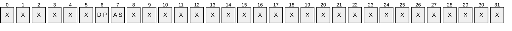

**X**: Unused. MUST be zero and ignored.

**AS (DS_KCC_FLAG_ASYNC_OP, 0x00000001)**: Request the [**KCC**](#gt_knowledge-consistency-checker-kcc) to run, then return immediately.

**DP (DS_KCC_FLAG_DAMPED, 0x00000002)**: Request the KCC to run unless there is already such a request pending according to implementation-defined rules. Implementations MAY choose to ignore this flag and always request the KCC to run.

<a id="Section_4.1.6.2"></a>
#### 4.1.6.2 Method-Specific Abstract Types and Procedures

<a id="Section_4.1.6.2.1"></a>
##### 4.1.6.2.1 ExecuteKCCTasks

procedure ExecuteKCCTasks(): ULONG

This procedure executes the tasks necessary for maintaining the [**replication**](#gt_replication) topology between [**DCs**](#gt_domain-controller-dc). These tasks include activities such as maintenance of kCCFailedLinks and kCCFailedConnections, maintenance of intrasite and intersite connections, and [**updates**](#gt_update) of [**RODC**](#gt_read-only-domain-controller-rodc) [**objects**](#gt_object) (as appropriate). See [MS-ADTS](../MS-ADTS/MS-ADTS.md) section 6.2.2 for a full list of these tasks.

If an error occurs, a [**Windows error code**](#gt_windows-error-code) is returned. If successful, the method returns 0.

<a id="Section_4.1.6.3"></a>
#### 4.1.6.3 Server Behavior of the IDL_DRSExecuteKCC Method

*Informative summary of behavior*: The [IDL_DRSExecuteKCC](#Section_4.1.6) method triggers the execution of tasks that generate and maintain the [**replication**](#gt_replication) topology between [**DCs**](#gt_domain-controller-dc).<15> See [MS-ADTS](../MS-ADTS/MS-ADTS.md) section 6.2.2 for more information related to the tasks performed by the [**KCC**](#gt_knowledge-consistency-checker-kcc) upon receipt of an IDL_DRSExecuteKCC request.

ULONG

IDL_DRSExecuteKCC(

[in, ref] DRS_HANDLE hDrs,

[in] DWORD dwInVersion,

[in, ref, switch_is(dwInVersion)]

DRS_MSG_KCC_EXECUTE *pmsgIn)

msgIn: DRS_MSG_KCC_EXECUTE_V1

ValidateDRSInput(hDrs, 18)

/* Validate the request version */

if dwInVersion ≠ 1 then

return ERROR_DS_DRA_INVALID_PARAMETER

endif

msgIn := pmsgIn^.V1

if msgIn.dwTaskID ≠ 0 then

return ERROR_INVALID_PARAMETER

endif

if not AccessCheckCAR(ConfigNC(), DS-Replication-Manage-Topology)

then

return ERROR_DS_DRA_ACCESS_DENIED

endif

if msgIn.dwFlags = DS_KCC_FLAG_ASYNC_OP then

Asynchronous Processing: Initiate a logical thread of control

to process the remainder of this request asynchronously

return 0

endif

return ExecuteKCCTasks()

<a id="Section_4.1.7"></a>
### 4.1.7 IDL_DRSFinishDemotion (Opnum 27)

The IDL_DRSFinishDemotion method either performs one or more steps toward the complete removal of a [**DC**](#gt_domain-controller-dc) from an [**AD LDS**](#gt_active-directory-lightweight-directory-services-ad-lds) [**forest**](#gt_forest), or it undoes the effects of the first phase of removal (performed by [IDL_DRSInitDemotion](#Section_4.1.14)). This method is supported by AD LDS only.

ULONG IDL_DRSFinishDemotion(

[in, ref] DRS_HANDLE hDrs,

[in] DWORD dwInVersion,

[in, ref, switch_is(dwInVersion)]

DRS_MSG_FINISH_DEMOTIONREQ* pmsgIn,

[out, ref] DWORD* pdwOutVersion,

[out, ref, switch_is(*pdwOutVersion)]

DRS_MSG_FINISH_DEMOTIONREPLY* pmsgOut

);

**hDrs:** The [**RPC**](#gt_remote-procedure-call-rpc) context handle returned by the [IDL_DRSBind](#Section_4.1.3) method.

**dwInVersion:** The version of the request message.

**pmsgIn:** A pointer to the request message.

**pdwOutVersion:** A pointer to the version of the response message.

**pmsgOut:** A pointer to the response message.

**Return Values:** 0 if successful, otherwise a [**Windows error code**](#gt_windows-error-code).

**Exceptions Thrown**: This method might throw the following exceptions beyond those thrown by the underlying RPC protocol (as specified in [MS-RPCE](../MS-RPCE/MS-RPCE.md)): ERROR_INVALID_HANDLE, ERROR_DS_DRS_EXTENSIONS_CHANGED, ERROR_DS_DIFFERENT_REPL_EPOCHS, and ERROR_INVALID_PARAMETER.

<a id="Section_4.1.7.1"></a>
#### 4.1.7.1 Method-Specific Concrete Types

<a id="Section_4.1.7.1.1"></a>
##### 4.1.7.1.1 DRS_MSG_FINISH_DEMOTIONREQ

The DRS_MSG_FINISH_DEMOTIONREQ union defines the request messages sent to the [IDL_DRSFinishDemotion](#Section_4.1.7) method. Only one version, identified by *dwInVersion* = 1, is currently defined.

typedef

[switch_type(DWORD)]

union {

[case(1)]

DRS_MSG_FINISH_DEMOTIONREQ_V1 V1;

} DRS_MSG_FINISH_DEMOTIONREQ;

**V1:** Version 1 request. Currently, only one version is defined.

<a id="Section_4.1.7.1.2"></a>
##### 4.1.7.1.2 DRS_MSG_FINISH_DEMOTIONREQ_V1

The DRS_MSG_FINISH_DEMOTIONREQ_V1 structure defines the request message sent to the [IDL_DRSFinishDemotion](#Section_4.1.7) method.

typedef struct {

DWORD dwOperations;

UUID uuidHelperDest;

[string] LPWSTR szScriptBase;

} DRS_MSG_FINISH_DEMOTIONREQ_V1;

**dwOperations:** Zero or more of the following bit flags, which are presented in little-endian byte order.

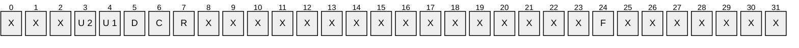

**X**: Unused. MUST be zero and ignored.

**R (DS_DEMOTE_ROLLBACK_DEMOTE, 0x00000001)**: Undo the effects of [IDL_DRSInitDemotion](#Section_4.1.14). If present, any other flags present (except for DS_DEMOTE_OPT_FAIL_ON_UNKNOWN) are ignored.

**C (DS_DEMOTE_COMMIT_DEMOTE, 0x00000002)**: Discontinue being a [**DC**](#gt_domain-controller-dc) for the current DC instance by stopping all [**AD LDS**](#gt_active-directory-lightweight-directory-services-ad-lds) protocols.

**D (DS_DEMOTE_DELETE_CSMETA, 0x00000004)**: Delete the nTDSDSA [**object**](#gt_object) for this DC; see [RemoveADLDSServer (section 4.1.7.2.1)](#Section_4.1.7.2.1).

**U1 (DS_DEMOTE_UNREGISTER_SCPS, 0x00000008)**: Delete any serviceConnectionPoint objects for this DC from [**AD DS**](#gt_active-directory-domain-services-ad-ds); see [RemoveADLDSSCP (section 4.1.7.2.2)](#Section_4.1.7.2.2).

**U2 (DS_DEMOTE_UNREGISTER_SPNS, 0x00000010)**: Delete any AD LDS [**SPNs**](#gt_service-principal-name-spn) from the object (in the external AD DS [**domain**](#gt_domain)) that corresponds to the [**security principal**](#gt_security-principal) that the AD LDS service is running as; see [RemoveADLDSSPNs (section 4.1.7.2.3)](#Section_4.1.7.2.3).

**F (DS_DEMOTE_OPT_FAIL_ON_UNKNOWN_OP, 0x80000000)**: If this flag is present, then the request fails.

**uuidHelperDest:** Unused. Must be [**NULL GUID**](#gt_null-guid) and ignored.

**szScriptBase:** The path name of the folder in which to store SPN unregistration scripts. Required when DS_DEMOTE_UNREGISTER_SPNS is specified in **dwOperations**.

<a id="Section_4.1.7.1.3"></a>
##### 4.1.7.1.3 DRS_MSG_FINISH_DEMOTIONREPLY

The DRS_MSG_FINISH_DEMOTIONREPLY union defines the response messages received from the [IDL_DRSFinishDemotion](#Section_4.1.7) method. Only one version, identified by *pdwOutVersion^* = 1, is currently defined.

typedef

[switch_type(DWORD)]

union {

[case(1)]

DRS_MSG_FINISH_DEMOTIONREPLY_V1 V1;

} DRS_MSG_FINISH_DEMOTIONREPLY;

**V1:** Version 1 reply.

<a id="Section_4.1.7.1.4"></a>
##### 4.1.7.1.4 DRS_MSG_FINISH_DEMOTIONREPLY_V1

The DRS_MSG_FINISH_DEMOTIONREPLY_V1 structure defines the response message received from the [IDL_DRSFinishDemotion](#Section_4.1.7) method.

typedef struct {

DWORD dwOperationsDone;

DWORD dwOpFailed;

DWORD dwOpError;

} DRS_MSG_FINISH_DEMOTIONREPLY_V1;

**dwOperationsDone:** The set of operations that were successfully performed. This can include the following values: DS_DEMOTE_ROLLBACK_DEMOTE, DS_DEMOTE_COMMIT_DEMOTE, DS_DEMOTE_DELETE_CSMETA, DS_DEMOTE_UNREGISTER_SCPS, DS_DEMOTE_UNREGISTER_SPNS. This MUST include any value from the input element DRS_MSG_FINISH_DEMOTIONREQ_V1.dwOperations whose corresponding operations (see pseudocode in section [4.1.7.3](#Section_4.1.7.3)) succeeded.

**dwOpFailed:** The set of operations that failed during demotion. This can include the same values as the **dwOperationsDone** field. This MUST include any value from the input element DRS_MSG_FINISH_DEMOTIONREQ_V1.dwOperations whose corresponding operations (see pseudocode in section 4.1.7.3) failed.

**dwOpError:** The Win32 error code (as specified in [MS-ERREF](../MS-ERREF/MS-ERREF.md) section 2.2) of the first failed operation (if any), from the following operations: DS_DEMOTE_ROLLBACK_DEMOTE, DS_DEMOTE_COMMIT_DEMOTE, DS_DEMOTE_DELETE_CSMETA, or DS_DEMOTE_UNREGISTER_SCPS.

<a id="Section_4.1.7.2"></a>
#### 4.1.7.2 Method-Specific Abstract Types and Procedures

<a id="Section_4.1.7.2.1"></a>
##### 4.1.7.2.1 RemoveADLDSServer

procedure RemoveADLDSServer(): DWORD

The RemoveADLDSServer procedure connects to any available [**replication**](#gt_replication) partner and uses the [IDL_DRSRemoveDsServer](#Section_4.1.18) method to delete the nTDSDSA [**object**](#gt_object) that corresponds to this [**DC**](#gt_domain-controller-dc). If no replication partner is available, or if a replication partner is available and either no such nTDSDSA object exists or the deletion is successful, RemoveADLDSServer returns ERROR_SUCCESS; otherwise, it returns a Win32 error.

<a id="Section_4.1.7.2.2"></a>
##### 4.1.7.2.2 RemoveADLDSSCP

procedure RemoveADLDSSCP(): DWORD

The RemoveADLDSSCP procedure connects to an [**AD DS**](#gt_active-directory-domain-services-ad-ds) [**DC**](#gt_domain-controller-dc) and deletes any serviceConnectionPoint [**object**](#gt_object) that was created in AD DS for this [**AD LDS**](#gt_active-directory-lightweight-directory-services-ad-lds) DC. See [MS-ADTS](../MS-ADTS/MS-ADTS.md) section 6.3.8 for more details on AD LDS serviceConnectionPoint objects. If no such serviceConnectionPoint object exists or if the deletion is successful, RemoveADLDSSCP returns ERROR_SUCCESS; otherwise, it returns a Win32 error.

<a id="Section_4.1.7.2.3"></a>
##### 4.1.7.2.3 RemoveADLDSSPNs

procedure RemoveADLDSSPNs(szScriptBase: unicodestring): boolean

The RemoveADLDSSPNs procedure connects to an [**AD DS**](#gt_active-directory-domain-services-ad-ds) [**DC**](#gt_domain-controller-dc) and attempts to delete any [**SPN**](#gt_service-principal-name-spn) values registered for the [**AD LDS**](#gt_active-directory-lightweight-directory-services-ad-lds) DC on the [**object**](#gt_object) (in the external AD DS [**domain**](#gt_domain)) that corresponds to the [**security principal**](#gt_security-principal) that the AD LDS service is running as. Sections [2.2.3.2](#Section_2.2.3.2) and [2.2.4.2](#Section_2.2.4.2) specify the SPN values removed by this procedure. If no such SPN values exist or the deletion is successful, RemoveADLDSSPNs returns TRUE; otherwise, it returns FALSE, indicating that a batch file was created in the folder specified by the *szScriptBase* parameter. This batch file contains commands that an administrator can run to clean up the SPNs.

**Note** When the procedure fails to create a batch file for any reason, RemoveADLDSSPNs returns TRUE.

<a id="Section_4.1.7.3"></a>
#### 4.1.7.3 Server Behavior of the IDL_DRSFinishDemotion Method

*Informative summary of behavior*: The [IDL_DRSFinishDemotion](#Section_4.1.7) method either performs one or more steps toward the complete removal of a [**DC**](#gt_domain-controller-dc) from an [**AD LDS**](#gt_active-directory-lightweight-directory-services-ad-lds) [**forest**](#gt_forest), or it undoes the effects of the first phase of removal (performed by [IDL_DRSInitDemotion](#Section_4.1.14)).<16>

ULONG

IDL_DRSFinishDemotion(

[in, ref] DRS_HANDLE hDrs,

[in] DWORD dwInVersion,

[in, ref, switch_is(dwInVersion)]

DRS_MSG_FINISH_DEMOTIONREQ* pmsgIn,

[out, ref] DWORD *pdwOutVersion,

[out, ref, switch_is(*pdwOutVersion)]

DRS_MSG_FINISH_DEMOTIONREPLY* pmsgOut

)

msgIn: DRS_MSG_FINISH_DEMOTIONREQ_V1

msgOut: DRS_MSG_FINISH_DEMOTIONREPLY_V1

ret: DWORD

res: boolean

ValidateDRSInput(hDrs, 27)

if dwInVersion ≠ 1 then

return ERROR_INVALID_PARAMETER

endif

if pmsgIn = null then

return ERROR_INVALID_PARAMETER

endif

msgIn := pmsgIn^.V1

if DS_DEMOTE_OPT_FAIL_ON_UNKNOWN_OP in msgIn.dwOperations then

/* unknown operation bit is set */

return ERROR_INVALID_PARAMETER

endif

if DS_DEMOTE_UNREGISTER_SPNS in msgIn.dwOperations

and msgIn.szScriptBase = null then

/* szScriptBase must be specified when UNREGISTER_SPN is

* requested */

return ERROR_INVALID_PARAMETER

endif

if not IsMemberOfBuiltinAdminGroup() then

/* only BA is allowed to demote an AD LDS service */

return ERROR_DS_DRA_ACCESS_DENIED

endif

pdwOutVersion^ := 1

msgOut.dwOperationDone := 0

msgOut.dwOpFailed := 0

msgOut.dwOpError := ERROR_SUCCESS

if DS_DEMOTE_ROLLBACK_DEMOTE in msgIn.dwOperations then

/* Begin operations corresponding to dwOperations value of DS_DEMOTE_ROLLBACK_DEMOTE */

/* undo the effects of IDL_DRSInitDemotion */

dc.fEnableUpdates := TRUE

msgOut.dwOperationDone :=

msgOut.dwOperationDone + {DS_DEMOTE_ROLLBACK_DEMOTE}

msgOut.dwOpError := ERROR_SUCCESS

/* no other operations are allowed on rollback */

/* End operations corresponding to dwOperations value of DS_DEMOTE_ROLLBACK_DEMOTE */

else

if DS_DEMOTE_COMMIT_DEMOTE in msgIn.dwOperations then

/* Begin operations corresponding to dwOperations value of DS_DEMOTE_COMMIT_DEMOTE */

After this call to IDL_DRSFinishDemotion completes, the server must discontinue being a DC, which for AD LDS means stopping the MS-DRSR protocol, the MS-DSSP protocol, the LDAP protocol, and if they are already enabled also the MS-ADCAP protocol, the WS-Enumeration protocol, the WS-Transfer protocol, the MS-WSTIM protocol, the MS-WSDS protocol, and the MS-WSPELD protocol. In addition, the state model, constraints and processing rules, and so on, in MS-ADTS must also be stopped.

msgOut.dwOperationDone :=

msgOut.dwOperationDone + {DS_DEMOTE_COMMIT_DEMOTE}

msgOut.dwOpError := ERROR_SUCCESS

/* End operations corresponding to dwOperations value of DS_DEMOTE_COMMIT_DEMOTE */

endif

if DS_DEMOTE_DELETE_CSMETA in msgIn.dwOperations then

/* Begin operations corresponding to dwOperations value of DS_DEMOTE_DELETE_CSMETA */

ret := RemoveADLDSServer()

if ret = ERROR_SUCCESS then

msgOut.dwOperationDone :=

msgOut.dwOperationDone + {DS_DEMOTE_DELETE_CSMETA}

else

msgOut.dwOpFailed =

msgOut.dwOpFailed + {DS_DEMOTE_DELETE_CSMETA}

if msgOut.dwOpError = ERROR_SUCCESS then

msgOut.dwOpError := ret

endif

endif

/* End operations corresponding to dwOperations value of DS_DEMOTE_DELETE_CSMETA */

endif

if DS_DEMOTE_UNREGISTER_SCPS in msgIn.dwOperations then

/* Begin operations corresponding to dwOperations value of DS_DEMOTE_UNREGISTER_SCPS */

ret := RemoveADLDSSCP()

if ret = ERROR_SUCCESS then

msgOut.dwOperationDone :=

msgOut.dwOperationDone + {DS_DEMOTE_UNREGISTER_SCPS}

else

msgOut.dwOpFailed =

msgOut.dwOpFailed + {DS_DEMOTE_UNREGISTER_SCPS}

if msgOut.dwOpError = ERROR_SUCCESS then

msgOut.dwOpError := ret

endif

endif

/* End operations corresponding to dwOperations value of DS_DEMOTE_UNREGISTER_SCPS */

endif

if DS_DEMOTE_UNREGISTER_SPNS in msgIn.dwOperations then

/* Begin operations corresponding to dwOperations value of DS_DEMOTE_UNREGISTER_SPNS */

res := RemoveADLDSSPNs(msgIn.szScriptBase)

if res = TRUE then

msgOut.dwOperationDone :=

msgOut.dwOperationDone + {DS_DEMOTE_UNREGISTER_SPNS}

else

msgOut.dwOpFailed =

msgOut.dwOpFailed + {DS_DEMOTE_UNREGISTER_SPNS}

endif

/* End operations corresponding to dwOperations value of DS_DEMOTE_UNREGISTER_SPNS */

endif

endif

pmsgOut^ := msgOut

pdwMsgOut^ := 1

return ERROR_SUCCESS

<a id="Section_4.1.8"></a>
### 4.1.8 IDL_DRSGetMemberships (Opnum 9)

The IDL_DRSGetMemberships method retrieves [**group**](#gt_group) membership for an [**object**](#gt_object).

ULONG IDL_DRSGetMemberships(

[in, ref] DRS_HANDLE hDrs,

[in] DWORD dwInVersion,

[in, ref, switch_is(dwInVersion)]

DRS_MSG_REVMEMB_REQ* pmsgIn,

[out, ref] DWORD* pdwOutVersion,

[out, ref, switch_is(*pdwOutVersion)]

DRS_MSG_REVMEMB_REPLY* pmsgOut

);

**hDrs:** [**RPC**](#gt_remote-procedure-call-rpc) context handle returned by the [IDL_DRSBind](#Section_4.1.3) method.

**dwInVersion:** Version of the request message.

**pmsgIn:** Pointer to the request message.

**pdwOutVersion:** Pointer to the version of the response message.

**pmsgOut:** Pointer to the response message.

**Return Values:** 0 if successful, otherwise a [**Windows error code**](#gt_windows-error-code).

**Exceptions Thrown**: This method might throw the following exceptions beyond those thrown by the underlying RPC protocol (as specified in [MS-RPCE](../MS-RPCE/MS-RPCE.md)): ERROR_INVALID_HANDLE, ERROR_DS_DRS_EXTENSIONS_CHANGED, ERROR_DS_DIFFERENT_REPL_EPOCHS, and ERROR_INVALID_PARAMETER.

<a id="Section_4.1.8.1"></a>
#### 4.1.8.1 Method-Specific Concrete Types

<a id="Section_4.1.8.1.1"></a>
##### 4.1.8.1.1 DRS_MSG_REVMEMB_REQ

The DRS_MSG_REVMEMB_REQ union defines the request messages sent to the [IDL_DRSGetMemberships](#Section_4.1.8) method. Only one version, identified by *dwInVersion* = 1, is currently defined.

typedef

[switch_type(DWORD)]

union {

[case(1)]

DRS_MSG_REVMEMB_REQ_V1 V1;

} DRS_MSG_REVMEMB_REQ;

**V1:** Version 1 request. Currently only one version is defined.

<a id="Section_4.1.8.1.2"></a>
##### 4.1.8.1.2 DRS_MSG_REVMEMB_REQ_V1

The DRS_MSG_REVMEMB_REQ_V1 structure defines the request message sent to the [IDL_DRSGetMemberships](#Section_4.1.8) method.

typedef struct {

[range(1,10000)] ULONG cDsNames;

[size_is(cDsNames,)] DSNAME** ppDsNames;

DWORD dwFlags;

[range(1,7)] REVERSE_MEMBERSHIP_OPERATION_TYPE OperationType;

DSNAME* pLimitingDomain;

} DRS_MSG_REVMEMB_REQ_V1;

**cDsNames:** The count of items in the **ppDsNames** array.

**ppDsNames:** The [DSName](#Section_5.49) of the [**object**](#gt_object) whose reverse membership is being requested, plus the DSNames of [**groups**](#gt_group) of the appropriate type(s) of which it is already known to be a member.

**dwFlags:** Zero or more of the following bit flags, which are presented in little-endian byte order.

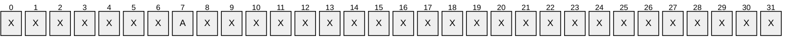

**X**: Unused. MUST be zero and ignored.

**A (DRS_REVMEMB_FLAG_GET_ATTRIBUTES, 0x00000001):** Query the [**attributes**](#gt_attributes) that correspond to the group membership.

**OperationType:** The type of group membership evaluation to be performed.

**pLimitingDomain:** [**Domain**](#gt_domain) filter; resulting objects that are not from this domain are neither returned nor followed transitively.

<a id="Section_4.1.8.1.3"></a>
##### 4.1.8.1.3 REVERSE_MEMBERSHIP_OPERATION_TYPE

The REVERSE_MEMBERSHIP_OPERATION_TYPE enumeration defines the type of reverse membership evaluation.

typedef enum

{

RevMembGetGroupsForUser = 1,

RevMembGetAliasMembership,

RevMembGetAccountGroups,

RevMembGetResourceGroups,

RevMembGetUniversalGroups,

GroupMembersTransitive,

RevMembGlobalGroupsNonTransitive

} REVERSE_MEMBERSHIP_OPERATION_TYPE;

**RevMembGetGroupsForUser:** Nontransitive membership in [**groups**](#gt_group) that are confined to a given [**domain**](#gt_domain), excluding built-in groups and domain-local groups. See [MS-ADSC](../MS-ADSC/MS-ADSC.md) section 2.14.

**RevMembGetAliasMembership:** Nontransitive membership in domain-local groups that are confined to a given domain.

**RevMembGetAccountGroups:** Transitive membership in all account groups in a given domain, excluding built-in groups.

**RevMembGetResourceGroups:** Transitive membership in all domain-local groups in a given domain, excluding built-in groups.

**RevMembGetUniversalGroups:** Transitive membership in all [**universal groups**](#gt_universal-group), excluding built-in groups.

**GroupMembersTransitive:** Transitive closure of members of a group based on the information present in the server's [**NC replicas**](#gt_nc-replica), including the primary group.

**RevMembGlobalGroupsNonTransitive:** Non-transitive membership in [**global groups**](#gt_global-group), excluding built-in groups.

<a id="Section_4.1.8.1.4"></a>
##### 4.1.8.1.4 DRS_MSG_REVMEMB_REPLY

The DRS_MSG_REVMEMB_REPLY union defines the response messages received from the [IDL_DRSGetMemberships](#Section_4.1.8) method. Only one version, identified by *pdwOutVersion^* = 1, is currently defined.

typedef

[switch_type(DWORD)]

union {

[case(1)]

DRS_MSG_REVMEMB_REPLY_V1 V1;

} DRS_MSG_REVMEMB_REPLY;

**V1:** Version 1 reply.

<a id="Section_4.1.8.1.5"></a>
##### 4.1.8.1.5 DRS_MSG_REVMEMB_REPLY_V1

The DRS_MSG_REVMEMB_REPLY_V1 structure defines the response message received from the [IDL_DRSGetMemberships](#Section_4.1.8) method.

typedef struct {

ULONG errCode;

[range(0,10000)] ULONG cDsNames;

[range(0,10000)] ULONG cSidHistory;

[size_is(cDsNames,)] DSNAME** ppDsNames;

[size_is(cDsNames)] DWORD* pAttributes;

[size_is(cSidHistory,)] NT4SID** ppSidHistory;

} DRS_MSG_REVMEMB_REPLY_V1;

**errCode:** 0 on success. On failure, this can be one of the following.

| Value | Meaning |
| --- | --- |
| STATUS_INSUFFICIENT_RESOURCES 0xC000009A | Insufficient system resources exist to complete the request. |
| STATUS_TOO_MANY_CONTEXT_IDS 0xC000015A | The number of [**groups**](#gt_group) is greater than the number that can be returned to the caller. |

**cDsNames:** Count of items in the **ppDsNames** array.

**cSidHistory:** Count of items in the **ppSidHistory** array.

**ppDsNames:** The filtered group membership. This list contains the combined membership for all the names specified in ppDsNames field of the input [DRS_MSG_REVMEMB_REQ_V1](#Section_4.1.8.1.2) structure.

**pAttributes:** Properties of the returned groups. Values are chosen from SE_GROUP values.

**ppSidHistory:** [**SID**](#gt_sid) history of the returned groups.

<a id="Section_4.1.8.1.6"></a>
##### 4.1.8.1.6 SE_GROUP Values

[**Attributes**](#gt_attributes) of a security [**group**](#gt_group).

| Symbolic name | Value |
| --- | --- |
| SE_GROUP_MANDATORY | 0x00000001 |
| SE_GROUP_ENABLED_BY_DEFAULT | 0x00000002 |
| SE_GROUP_ENABLED | 0x00000004 |

<a id="Section_4.1.8.2"></a>
#### 4.1.8.2 Method-Specific Abstract Types and Procedures

<a id="Section_4.1.8.2.1"></a>
##### 4.1.8.2.1 Arc and ArcSet

type Arc = [initial: DSName, final: DSName]

type ArcSet = set of Arc

<a id="Section_4.1.8.2.2"></a>
##### 4.1.8.2.2 Closure

procedure Closure(

vSet: set of DSName,

aSet: ArcSet,

v: DSName): set of DSName

The Closure procedure returns the set of vertices that can be reached from vertex *v* in the directed graph that consists of vertex set *vSet* and arc set *aSet*. A vertex *u* can be reached from *v* if and only if there is a sequence *v*[0], *v*[1], ... , *v*[*k*], where *v*[0]=*v*, *v*[*k*]=*u*, and *v*[*i*] is in *vSet* and [initial:*v*[*i*-1], final:*v*[*i]*) is in *aSet* for *i*=1,2,...,*k*.

<a id="Section_4.1.8.2.3"></a>
##### 4.1.8.2.3 DomainOf

procedure DomainOf(o: DSName): DSName

The DomainOf procedure returns the [DSName](#Section_5.49) of the [**domain NC**](#gt_domain-naming-context-domain-nc) to which the given DSName *o* belongs. It returns null upon failure.

<a id="Section_4.1.8.2.4"></a>
##### 4.1.8.2.4 GetDSNameOfEnterpriseRODCsGroup

procedure GetDSNameOfEnterpriseReadonlyDomainControllerGroup(): DSName

This procedure constructs a [**SID**](#gt_sid) s consisting of the [**domain SID**](#gt_domain-security-identifier-domain-sid) of the root domain and the [**relative identifier (RID)**](#gt_relative-identifier-rid) of the Enterprise Read-only Domain Controllers Group (as defined in [MS-ADTS](../MS-ADTS/MS-ADTS.md) section 6.1.1.6.14), and returns the **DSName** of the [**object**](#gt_object) *o* for which *o*! **objectSid** = *s*. If no such object *o* exists, this procedure returns null.

<a id="Section_4.1.8.2.5"></a>
##### 4.1.8.2.5 GetDSNameFromPrimaryGroupId

procedure GetDSNameFromPrimaryGroupId(rid: Rid): DSName

This procedure constructs a [**SID**](#gt_sid) s consisting of the [**domain SID**](#gt_domain-security-identifier-domain-sid) of the [**DC's**](#gt_domain-controller-dc) default [**domain**](#gt_domain) and the given relative identifier **rid**, and returns the [DSName](#Section_5.49) of the [**object**](#gt_object) *o* for which *o*!objectSid = *s*. If no such object *o* exists, then this procedure will return null.

<a id="Section_4.1.8.2.6"></a>
##### 4.1.8.2.6 IsMatchedGroup

procedure IsMatchedGroup(

w: DSName,

op: REVERSE_MEMBERSHIP_OPERATION_TYPE,

limitingDomain: DSName): boolean

*Informative summary of behavior*: The IsMatchedGroup procedure checks whether an [**object**](#gt_object) should be included in the result for the specified [IDL_DRSGetMemberships](#Section_4.1.8) operation.

limitToDomain, filteroutBuiltin, result: boolean

w: DSName

limitToDomain := (op ≠ RevMembGetUniversalGroups) and

(limitingDomain ≠ null)

filteroutBuiltin := (op ≠ RevMembGetAliasMembership)

result := (GROUP_TYPE_SECURITY_ENABLED in w!groupType)

and ((not limitToDomain) or (limitingDomain = DomainOf(w)))

and ((not filteroutBuiltin) or (not IsBuiltinPrincipal(w.sid)))

and ((op ≠ RevMembGetGroupsForUser)

or (w!groupType ∩ {GROUP_TYPE_RESOURCE_GROUP,

GROUP_TYPE_APP_BASIC_GROUP,

GROUP_TYPE_APP_QUERY_GROUP} = {}))

and ((op ≠ RevMembGetAliasMembership)

or (w!groupType ∩ {GROUP_TYPE_RESOURCE_GROUP,

GROUP_TYPE_APP_BASIC_GROUP,

GROUP_TYPE_APP_QUERY_GROUP} ≠ {}))

and ((op ≠ RevMembGetAccountGroups)

or (GROUP_TYPE_ACCOUNT_GROUP in w!groupType))

and ((op ≠ RevMembGetResouceGroups)

or (GROUP_TYPE_RESOURCE_GROUP in w!groupType))

and ((op ≠ RevMembGetUniversalGroups)

or (GROUP_TYPE_UNIVERSAL_GROUP in w!groupType))

and ((op ≠ RevMembGlobalGroupsNonTransitive)

or (GROUP_TYPE_ACCOUNT_GROUP in w!groupType))

return result

<a id="Section_4.1.8.2.7"></a>
##### 4.1.8.2.7 Neighbors

procedure Neighbors(

vSet: set of DSName,

aSet: ArcSet,

v: DSName): set of DSName

The Neighbors procedure returns the set of vertices adjacent to vertex *v* in the directed graph that consists of vertex set *vSet* and arc set *aSet*. A vertex *u* is adjacent to *v* if *u* is in *vSet* and [initial:*v*, final:*u*] is in *aSet*. Note that because this is a directed graph, the fact that vertex *u* is adjacent to vertex *v* does not imply that vertex *v* is adjacent to vertex *u*.

<a id="Section_4.1.8.3"></a>
#### 4.1.8.3 Server Behavior of the IDL_DRSGetMemberships Method

*Informative summary of behavior*: The [IDL_DRSGetMemberships](#Section_4.1.8) method constructs a directed graph G(V,A). The vertex set of the graph includes all the [**objects**](#gt_object) in the scope of the [**forest**](#gt_forest) if the server is a [**GC**](#gt_global-catalog-gc), or in the scope of the default [**domain NC**](#gt_domain-naming-context-domain-nc) otherwise. The arc set of the graph includes all the tuples [initial: *u*,final: *v*] if *u* is a member of *v* and both *u* and *v* are in the scope. This graph represents the membership relation in the given scope.

For a GroupMembersTransitive request, a reversed graph of G is used because member relation is queried rather than membership. The reversed graph has the same vertex set as G, but the arcs in the arc set are in the opposite direction as those in A.

For other types of requests, a subgraph of G is used. The vertex set of this subgraph consists of only the [DSName](#Section_5.49) values of interest for that particular request type, and the arc set is reduced to the arcs that link two vertices in the vertex set of the subgraph.

Starting from the graph, this method computes a set of objects for each DSName in the input parameters. The set could be either transitive closure of the object or the immediate neighbors of the object in the graph, depending on the type of request. The union of these sets is returned as the result.

ULONG

IDL_DRSGetMemberships(

[in, ref] DRS_HANDLE hDrs,

[in] DWORD dwInVersion,

[in, ref, switch_is(dwInVersion)] DRS_MSG_REVMEMB_REQ *pmsgIn,

[out, ref] DWORD *pdwOutVersion,

[out, ref, switch_is(*pdwOutVersion)]

DRS_MSG_REVMEMB_REPLY *pmsgOut)

msgIn: DRS_MSG_REVMEMB_REQ_V1

vSet, wSet, uSet: set of DSName

aSet, aSetR: ArcSet

u,v,w: DSName

op, i: integer

transitive: boolean

t: SID

ValidateDRSInput(hDrs, 9)

pdwOutVersion^ := 1

pmsgOut^.V1.errCode := 0

pmsgOut^.V1.cDsNames := 0

pmsgOut^.V1.cSidHistory := 0

pmsgOut^.V1.ppDsNames := null

pmsgOut^.V1.pAttributes := null

pmsgOut^.V1.ppSidHistory := null

msgIn := pmsgIn^.V1

if dwInVersion ≠ 1 then

return ERROR_DS_DRA_INVALID_PARAMETER

endif

if not AccessCheckCAR(DefaultNC(), DS-Replication-Get-Changes) then

return ERROR_DS_DRA_ACCESS_DENIED

endif

op := msgIn.OperationType

if (op = RevMembGetUniversalGroups) and not IsGC() then

return ERROR_DS_GC_REQUIRED

endif

/* Construct a membership graph. */

/* Vertices */

if IsGC() then

vSet := select all v from all where true

else

vSet := select all v from subtree DefaultNC() where true

Endif

/* Edges */

aSet := {}

aSetR := {}

foreach v in vSet

foreach u in vSet

if (u in v!memberOf)

or (u = GetDSNameFromPrimaryGroupId(v!primaryGroupId)) then

aSet := aSet + {[initial: v, final: u]}

aSetR := aSetR + {[initial: u, final: v]}

endif

endfor

endfor

/* Calculate GroupMembersTransitive. */

if op = GroupMembersTransitive then

wSet := {}

for i := 0 to msgIn.ppDsNames.cDsNames - 1

u := msgIn.ppDsNames[i]

if u in vSet then

wSet := wSet + (Closure(uSet, aSetR, u) - {u})

endif

endfor

foreach w in wSet

pmsgOut^.V1.ppDsNames[pmsgOut^.V1.cDsNames] := w

pmsgOut^.V1.cDsNames:= pmsgOut^.V1.cDsNames + 1

endfor

return 0

endif

/* Calculate all other cases (where op ≠ GroupMembersInTransitive).*/

transitive := op in {RevMembGetAccountGroups,

RevMembGetResourceGroups,

RevMembGetUniversalGroups}

/* Get the initial result set from the graph. */

wSet := {}

for i := 0 to msgIn.ppDsNames.cDsNames - 1

u := msgIn.ppDsNames[i]

if u in vSet then

/* Get the subgraph by applying the predicate IsMatchedGroup

* on each element in the vertex set, plus u itself. */

uSet := {u} + select all v from vSet where

IsMatchedGroup(v, op, msgIn.pLimitingDomain^)

if transitive then

wSet := wSet + (Closure(uSet, aSet, u) - {u})

else

wSet := wSet + (Neighbors(uSet, aSet, u) - {u})

endif

if((u!userAccountControl & ADS_UF_WORKSTATION_TRUST_ACCOUNT =

ADS_UF_WORKSTATION_TRUST_ACCOUNT) and

(u!userAccountControl & ADS_UF_PARTIAL_SECRETS_ACCOUNT =

ADS_UF_PARTIAL_SECRETS_ACCOUNT))

wSet := wSet + GetDSNameOfEnterpriseRODCsGroup()

endif

endif

endfor

/* Construct the result message. */

pmsgOut^.V1.cSidHistory := 0

pmsgOut^.V1.cDsNames := 0

foreach w in wSet

foreach t in w!sIDHistory

if not (t in pmsgOut^.V1.ppSidHistory) then

pmsgOut^.V1.ppSidHistory[pmsgOut^.V1.cSidHistory] := t

pmsgOut^.V1.cSidHistory := pmsgOut^.V1.cSidHistory + 1

endif

endfor

pmsgOut^.V1.ppDsNames[pmsgOut^.V1.cDsNames] := w

if (DRS_REVMEMB_FLAG_GET_ATTRIBUTES in msgIn.dwFlags) then

pmsgOut^.V1.pAttributes[pmsgOut^.V1.cDsNames] :=

{SE_GROUP_MANDATORY,SE_GROUP_ENABLED_BY_DEFAULT,

SE_GROUP_ENABLED}

else

pmsgOut^.V1.pAttributes[pmsgOut^.V1.cDsNames] := 0

endif

pmsgOut^.V1.cDsNames := pmsgOut^.V1.cDsNames + 1

endfor

return 0

<a id="Section_4.1.9"></a>
### 4.1.9 IDL_DRSGetMemberships2 (Opnum 21)

The IDL_DRSGetMemberships2 method retrieves [**group**](#gt_group) memberships for a sequence of [**objects**](#gt_object).

ULONG IDL_DRSGetMemberships2(

[in, ref] DRS_HANDLE hDrs,

[in] DWORD dwInVersion,

[in, ref, switch_is(dwInVersion)]

DRS_MSG_GETMEMBERSHIPS2_REQ* pmsgIn,

[out, ref] DWORD* pdwOutVersion,

[out, ref, switch_is(*pdwOutVersion)]

DRS_MSG_GETMEMBERSHIPS2_REPLY* pmsgOut

);

**hDrs:** The [**RPC**](#gt_remote-procedure-call-rpc) context handle returned by the [IDL_DRSBind](#Section_4.1.3) method.

**dwInVersion:** Version of the request message.

**pmsgIn:** Pointer to the request message.

**pdwOutVersion:** Pointer to the version of the response message.

**pmsgOut:** Pointer to the response message.

**Return Values:** 0 if successful; otherwise, a [**Windows error code**](#gt_windows-error-code).

**Exceptions Thrown**: This method might throw the following exceptions beyond those thrown by the underlying RPC protocol (as specified in [MS-RPCE](../MS-RPCE/MS-RPCE.md)): ERROR_INVALID_HANDLE, ERROR_DS_DRS_EXTENSIONS_CHANGED, ERROR_DS_DIFFERENT_REPL_EPOCHS, and ERROR_INVALID_PARAMETER.

<a id="Section_4.1.9.1"></a>
#### 4.1.9.1 Method-Specific Concrete Types

<a id="Section_4.1.9.1.1"></a>
##### 4.1.9.1.1 DRS_MSG_GETMEMBERSHIPS2_REQ

The DRS_MSG_GETMEMBERSHIPS2_REQ union defines request messages sent to the [IDL_DRSGetMemberships2](#Section_4.1.9) method. Only one version, identified by *dwInVersion* = 1, is currently defined.

typedef

[switch_type(DWORD)]

union {

[case(1)]

DRS_MSG_GETMEMBERSHIPS2_REQ_V1 V1;

} DRS_MSG_GETMEMBERSHIPS2_REQ;

**V1:** Version 1 request.

<a id="Section_4.1.9.1.2"></a>
##### 4.1.9.1.2 DRS_MSG_GETMEMBERSHIPS2_REQ_V1

The DRS_MSG_GETMEMBERSHIPS2_REQ_V1 structure defines the request message sent to the [IDL_DRSGetMemberships2](#Section_4.1.9) method.

typedef struct {

[range(1,10000)] ULONG Count;

[size_is(Count)] DRS_MSG_REVMEMB_REQ_V1* Requests;

} DRS_MSG_GETMEMBERSHIPS2_REQ_V1;

**Count:** Count of items in the **Requests** array.

**Requests:** Sequence of reverse membership requests.

<a id="Section_4.1.9.1.3"></a>
##### 4.1.9.1.3 DRS_MSG_GETMEMBERSHIPS2_REPLY

The DRS_MSG_GETMEMBERSHIPS2_REPLY union defines response messages received from the [IDL_DRSGetMemberships2](#Section_4.1.9) method. Only one version, identified by *pdwOutVersion^* = 1, is currently defined.

typedef

[switch_type(DWORD)]

union {

[case(1)]

DRS_MSG_GETMEMBERSHIPS2_REPLY_V1 V1;

} DRS_MSG_GETMEMBERSHIPS2_REPLY;

**V1:** Version 1 response.

<a id="Section_4.1.9.1.4"></a>
##### 4.1.9.1.4 DRS_MSG_GETMEMBERSHIPS2_REPLY_V1

The DRS_MSG_GETMEMBERSHIPS2_REPLY_V1 structure defines the response message received from the [IDL_DRSGetMemberships2](#Section_4.1.9) method.

typedef struct {

[range(0,10000)] ULONG Count;

[size_is(Count)] DRS_MSG_REVMEMB_REPLY_V1* Replies;

} DRS_MSG_GETMEMBERSHIPS2_REPLY_V1;

**Count:** Count of items in the **Replies** array.

**Replies:** Sequence of reverse membership replies, in the same order as the **Requests** field of the request message.

<a id="Section_4.1.9.2"></a>
#### 4.1.9.2 Server Behavior of the IDL_DRSGetMemberships2 Method

*Informative summary of behavior*: The [IDL_DRSGetMemberships2](#Section_4.1.9) method is merely a way to execute a series of [IDL_DRSGetMemberships](#Section_4.1.8) [**RPC**](#gt_remote-procedure-call-rpc) calls via a single RPC request.

ULONG

IDL_DRSGetMemberships2(

[in, ref] DRS_HANDLE hDrs,

[in] DWORD dwInVersion,

[in, ref, switch_is(dwInVersion)]

DRS_MSG_GETMEMBERSHIPS2_REQ *pmsgIn,

[out, ref] DWORD *pdwOutVersion,

[out, ref, switch_is(*pdwOutVersion)]

DRS_MSG_GETMEMBERSHIPS2_REPLY *pmsgOut)

error, i: ULONG

dummyVersion: DWORD

ValidateDRSInput(hDrs, 21)

pdwOutVersion^ := 1

pMsgOut^.V1.Count := 0

pMsgOut^.V1.Replies := null

if dwInVersion ≠ 1 then

return ERROR_DS_DRA_INVALID_PARAMETER

endif

pmsgOut^.V1.Count := pmsgIn^.V1.Count

for i := 0 to pmsgIn^.V1.Count - 1

/* Call IDL_DRSGetMemberships as a local procedure. */

error := IDL_DRSGetMemberships(null, 1, ADR(pmsgIn^.V1.Request[i]),

ADR(dummyVersion), ADR(pmsgOut^.V1.Replies[i]))

if error ≠ 0 then

return error

endif

endfor

return 0

<a id="Section_4.1.10"></a>
### 4.1.10 IDL_DRSGetNCChanges (Opnum 3)

The IDL_DRSGetNCChanges method replicates [**updates**](#gt_update) from an [**NC replica**](#gt_nc-replica) on the server.

ULONG IDL_DRSGetNCChanges(

[in, ref] DRS_HANDLE hDrs,

[in] DWORD dwInVersion,

[in, ref, switch_is(dwInVersion)]

DRS_MSG_GETCHGREQ* pmsgIn,

[out, ref] DWORD* pdwOutVersion,

[out, ref, switch_is(*pdwOutVersion)]

DRS_MSG_GETCHGREPLY* pmsgOut

);

**hDrs:** The [**RPC**](#gt_remote-procedure-call-rpc) context handle returned by the [IDL_DRSBind](#Section_4.1.3) method.

**dwInVersion:** Version of the request message.

**pmsgIn:** A pointer to the request message.

**pdwOutVersion:** A pointer to the version of the response message.

**pmsgOut:** A pointer to the response message.

**Return Values:** 0 if successful, otherwise a [**Windows error code**](#gt_windows-error-code).

**Exceptions Thrown**: This method might throw the following exceptions beyond those thrown by the underlying RPC protocol (as specified in [MS-RPCE](../MS-RPCE/MS-RPCE.md)): ERROR_INVALID_HANDLE, ERROR_DS_DRS_EXTENSIONS_CHANGED, ERROR_DS_DIFFERENT_REPL_EPOCHS, and ERROR_INVALID_PARAMETER.

<a id="Section_4.1.10.1"></a>
#### 4.1.10.1 Overview

A client [**DC**](#gt_domain-controller-dc) sends an [IDL_DRSGetNCChanges](#Section_4.1.10) request (*msgIn*, of a type in the union [DRS_MSG_GETCHGREQ](#Section_4.1.10.2.1)) to a server to replicate [**directory objects**](#gt_directory-object) in a given [**NC**](#gt_naming-context-nc) from the server [**NC replica**](#gt_nc-replica) to the client NC replica.

The response (*msgOut*, of a type in the union [DRS_MSG_GETCHGREPLY](#Section_4.1.10.2.9)) contains a set of [**updates**](#gt_update) that the client is to apply to its NC replica. Commonly, this set of updates is too large to send in a single response; in this case, multiple IDL_DRSGetNCChanges requests and responses must be sent before the server sends a response that indicates no additional updates are available.

This sequence of requests and responses is called a [**replication cycle**](#gt_replication-cycle), or "cycle". A client DC can request an action on a [**FSMO role**](#gt_fsmo-role) (for example, a change in the [**FSMO role owner**](#gt_fsmo-role-owner)) by using a special replication cycle called an [**extended operation**](#gt_extended-operation).

<a id="Section_4.1.10.1.1"></a>
##### 4.1.10.1.1 Cycle Start and Finish

There are five types of [**cycle**](#gt_replication-cycle) starts:

- The client explicitly signals the start of a special single-response cycle when it requests an [**extended operation**](#gt_extended-operation). Such cycles always consist of a single response which sets msgOut.fMoreData = false.
- The client explicitly signals the start of a cycle by sending msgIn.uuidInvocIdSrc = 0 or msgIn.usnvecFrom = 0.
- The client sends values of msgIn.uuidInvocIdSrc and msgIn.usnvecFrom that were returned by the server as msgOut.uuidInvocIdSrc and msgOut.usnvecTo in the final message of some other cycle.
- The server detects either that msgIn.uuidInvocIdSrc ≠ [dc](#Section_4.1.29.2.3).invocationId or that msgIn.uuidInvocIdSrc and msgIn.usnvecFrom were not returned by the server in the final message of some other cycle.
- The server implementation MAY<17> declare the supplied values of msgIn.uuidInvocIdSrc and msgIn.usnvecFrom as too stale to use.
If the server starts a new cycle based on items 4 or 5, the server ignores msgIn.usnvecFrom, treating it as though it were zero.

The fields msgOut.usnvecTo and msgIn.usnvecFrom have the same type, [USN_VECTOR](#Section_5.210). The internal format of USN_VECTOR is determined entirely by the server implementation and is subject only to the requirement that msgIn.usnvecFrom = 0 represents the start of a cycle. The server MAY<18> use USN_VECTOR to encode the start of a cycle.

Any server response message with msgOut.fMoreData = false is the final response in a cycle.

<a id="Section_4.1.10.1.2"></a>
##### 4.1.10.1.2 Cycle Goal

For any [**cycle**](#gt_replication-cycle) that is not an [**extended operation**](#gt_extended-operation), the goal of the server is to send [**updates**](#gt_update) such that at the conclusion of the cycle, the client [**NC replica**](#gt_nc-replica) contains all updates that were present in the server NC replica at the start of the cycle. More concretely, if *cycleStartUtd* is the server's *msgIn.pNC^!*replUpToDateVector on receipt of the first request in a cycle where *msgIn.ulExtendedOp* = 0, then the final response in the cycle MUST contain *msgOut.pUpToDateVecSrc* such that HasUpdateKnowledge(*msgOut.pUpToDateVecSrc^*, *cycleStartUtd*) = true:

procedure HasUpdateKnowledge(

utd1: UPTODATE_VECTOR_V2_EXT,

utd2: UPTODATE_VECTOR_V2_EXT): boolean

begin

i: integer

j: integer

/* Return true if and only if utd1 asserts the presence of all

* updates asserted by utd2. */

for i := 0 to utd2.cNumCursors - 1

j := select one k from [0 .. utd1.cNumCursors - 1] where

utd1.rgCursors[k].uuidDsa = utd2.rgCursors[i].uuidDsa

if j = null or utd1.rgCursors[j].usnHighPropUpdate <

utd2.rgCursors[i].usnHighPropUpdate then

return false

endif

endfor

return true

end HasUpdateKnowledge

The server MAY<19> advance the cycle goal on each request such that it includes updates that the server has applied since the first request in the cycle.

The cycle goal includes a cursor *c* for the server [**DC**](#gt_domain-controller-dc) such that:

- *c.uuidDsa* is the value of the invocationId [**attribute**](#gt_attributes) of the server's nTDSDSA [**object**](#gt_object).
- *c.usnHighPropUpdate* is the highest [**USN**](#gt_update-sequence-number-usn) such that the server can assert that, including the updates in this response, the client has applied any update with [**stamp**](#gt_stamp) s where *s.uuidOriginating* = *c.uuidDsa* and *s.usnOriginating* ≤ *c.usnHighPropUpdate*. If the server has originated no updates in the [**NC**](#gt_naming-context-nc), it MAY<20> set *c.usnHighPropUpdate* to 0.
- *c.timeLastSyncSuccess* is the time at which the server sends the final response.
<a id="Section_4.1.10.1.3"></a>
##### 4.1.10.1.3 Extended Operations

The [**extended operation**](#gt_extended-operation) specified by *msgIn.ulExtendedOp* is one of the following:

- Request Role (EXOP_FSMO_REQ_ROLE, EXOP_FSMO_REQ_PDC, EXOP_FSMO_RID_REQ_ROLE): Changes the [**FSMO role owner**](#gt_fsmo-role-owner) from the server to the client [**DC**](#gt_domain-controller-dc), and then adds all changed [**objects**](#gt_object) and [**link values**](#gt_link-value) in the [**FSMO role**](#gt_fsmo-role) to the response, including but not limited to the FSMO role owner change.<21>
- Abandon Role (EXOP_FSMO_ABANDON_ROLE): Performs a chained request to the current FSMO role owner to make the server DC the FSMO role owner. This request is sent to help avoid entering a state in which no DC considers itself the owner of the role.<22>
- Allocate [**RIDs**](#gt_relative-identifier-rid) (EXOP_FSMO_REQ_RID_ALLOC): Allocates a new block of RIDs to the client DC.<23>
- Replicate Single Object (EXOP_REPL_OBJ): Adds any changes to the specified object to the response.<24>
- Replicate Single Object including Secret Data (EXOP_REPL_SECRETS): Adds any changes to the specified object to the response. In addition, it also adds the secret [**attribute**](#gt_attributes) values of the specified object to the response, regardless of whether they have recent changes. See the IsSecretAttribute procedure in section [4.1.10.3.11](#Section_4.1.10.3.11) for a list of these attributes.<25>
<a id="Section_4.1.10.2"></a>
#### 4.1.10.2 Method-Specific Concrete Types

<a id="Section_4.1.10.2.1"></a>
##### 4.1.10.2.1 DRS_MSG_GETCHGREQ

The DRS_MSG_GETCHGREQ union defines request messages that are sent to the [IDL_DRSGetNCChanges](#Section_4.1.10) method. There are no V1, V2, V3, V6, or V9 messages.

typedef

[switch_type(DWORD)]

union {

[case(4)]

DRS_MSG_GETCHGREQ_V4 V4;

[case(5)]

DRS_MSG_GETCHGREQ_V5 V5;

[case(7)]

DRS_MSG_GETCHGREQ_V7 V7;

[case(8)]

DRS_MSG_GETCHGREQ_V8 V8;

[case(10)]

DRS_MSG_GETCHGREQ_V10 V10;

[case(11)]

DRS_MSG_GETCHGREQ_V11 V11;

} DRS_MSG_GETCHGREQ;

**V4:** Version 4 request (Windows 2000 operating system SMTP [**replication**](#gt_replication) [MS-SRPL](../MS-SRPL/MS-SRPL.md)).

**V5:** Version 5 request (Windows 2000 [**RPC**](#gt_remote-procedure-call-rpc) replication).

**V7:** Version 7 request (Windows Server 2003 SMTP replication [MS-SRPL]).

**V8:** Version 8 request (Windows Server 2003 RPC replication).

**V10:** Version 10 request (Windows Server 2008 R2 operating system RPC replication).

**V11**: Version 11 request (Windows Server v1803 operating system RPC replication).

<a id="Section_4.1.10.2.2"></a>
##### 4.1.10.2.2 DRS_MSG_GETCHGREQ_V3

The DRS_MSG_GETCHGREQ_V3 structure defines a portion of the request message that is sent to the [IDL_DRSGetNCChanges](#Section_4.1.10) method as part of SMTP [**replication**](#gt_replication) ([MS-SRPL](../MS-SRPL/MS-SRPL.md)). This is not a complete request message; it is embedded in [DRS_MSG_GETCHGREQ_V4](#Section_4.1.10.2.3) and [DRS_MSG_GETCHGREQ_V7](#Section_4.1.10.2.5).<26>

typedef struct {

UUID uuidDsaObjDest;

UUID uuidInvocIdSrc;

[ref] DSNAME* pNC;

USN_VECTOR usnvecFrom;

[unique] UPTODATE_VECTOR_V1_EXT* pUpToDateVecDestV1;

[unique] PARTIAL_ATTR_VECTOR_V1_EXT* pPartialAttrVecDestV1;

SCHEMA_PREFIX_TABLE PrefixTableDest;

ULONG ulFlags;

ULONG cMaxObjects;

ULONG cMaxBytes;

ULONG ulExtendedOp;

} DRS_MSG_GETCHGREQ_V3;

**uuidDsaObjDest:** [**DSA GUID**](#gt_dsa-guid) of the client [**DC**](#gt_domain-controller-dc).

**uuidInvocIdSrc:** [**Invocation ID**](#gt_invocation-id) of the server DC.

**pNC:** [**NC**](#gt_naming-context-nc) root of the [**replica**](#gt_replica) to replicate or the [**FSMO role object**](#gt_fsmo-role-object) for an [**extended operation**](#gt_extended-operation).

**usnvecFrom:** Data that is used to correlate calls to IDL_DRSGetNCChanges.

**pUpToDateVecDestV1:** [**Stamp**](#gt_stamp) filter describing [**updates**](#gt_update) that the client has already applied.

**pPartialAttrVecDestV1:** A set of one or more [**attributes**](#gt_attributes) whose values are to be replicated to the client's partial replica.

**PrefixTableDest:** [**Prefix table**](#gt_prefix-table) with which to convert the [ATTRTYP](#Section_5.14) values in pPartialAttrVecDestV1 to [**OIDs**](#gt_object-identifier-oid).

**ulFlags:** A [DRS_OPTIONS](#Section_5.41) bit field.

**cMaxObjects:** An approximate cap on the number of [**objects**](#gt_object) to include in the reply.

**cMaxBytes:** An approximate cap on the number of bytes to include in the reply.

**ulExtendedOp:** 0 or an EXOP_REQ code (section [4.1.10.2.22](#Section_4.1.10.2.22)).

<a id="Section_4.1.10.2.3"></a>
##### 4.1.10.2.3 DRS_MSG_GETCHGREQ_V4

The DRS_MSG_GETCHGREQ_V4 structure defines the request message sent to the [IDL_DRSGetNCChanges](#Section_4.1.10) method. This message version is a superset of [DRS_MSG_GETCHGREQ_V3](#Section_4.1.10.2.2).<27>

typedef struct {

UUID uuidTransportObj;

[ref] MTX_ADDR* pmtxReturnAddress;

DRS_MSG_GETCHGREQ_V3 V3;

} DRS_MSG_GETCHGREQ_V4;

**uuidTransportObj:** The objectGUID of the interSiteTransport [**object**](#gt_object) that identifies the transport by which to send the reply.

**pmtxReturnAddress:** The transport-specific address to which to send the reply.

**V3:** Version 3 request.

<a id="Section_4.1.10.2.4"></a>
##### 4.1.10.2.4 DRS_MSG_GETCHGREQ_V5

The DRS_MSG_GETCHGREQ_V5 structure defines the request message sent to the [IDL_DRSGetNCChanges](#Section_4.1.10) method.

typedef struct {

UUID uuidDsaObjDest;

UUID uuidInvocIdSrc;

[ref] DSNAME* pNC;

USN_VECTOR usnvecFrom;

[unique] UPTODATE_VECTOR_V1_EXT* pUpToDateVecDestV1;

ULONG ulFlags;

ULONG cMaxObjects;

ULONG cMaxBytes;

ULONG ulExtendedOp;

ULARGE_INTEGER liFsmoInfo;

} DRS_MSG_GETCHGREQ_V5;

**uuidDsaObjDest:** [**DSA GUID**](#gt_dsa-guid) of the client [**DC**](#gt_domain-controller-dc).

**uuidInvocIdSrc**: [**Invocation ID**](#gt_invocation-id) of the server DC.

**pNC:** [**NC**](#gt_naming-context-nc) root of the [**replica**](#gt_replica) to replicate or the [**FSMO role object**](#gt_fsmo-role-object) for an [**extended operation**](#gt_extended-operation).

**usnvecFrom:** Data used to correlate calls to IDL_DRSGetNCChanges.

**pUpToDateVecDestV1:** [**Stamp**](#gt_stamp) filter that describes [**updates**](#gt_update) the client has already applied.

**ulFlags:** [DRS_OPTIONS](#Section_5.41) bit field.

**cMaxObjects:** Approximate cap on the number of [**objects**](#gt_object) to include in the reply.

**cMaxBytes:** Approximate cap on the number of bytes to include in the reply.

**ulExtendedOp:** 0 or an extended operation request code (section [4.1.10.2.22](#Section_4.1.10.2.22)).

**liFsmoInfo:** 0 or a value specific to the requested extended operation.

<a id="Section_4.1.10.2.5"></a>
##### 4.1.10.2.5 DRS_MSG_GETCHGREQ_V7

The DRS_MSG_GETCHGREQ_V7 structure defines the request message sent to the [IDL_DRSGetNCChanges](#Section_4.1.10) method. This message version is a superset of [DRS_MSG_GETCHGREQ_V4](#Section_4.1.10.2.3).<28>

typedef struct {

UUID uuidTransportObj;

[ref] MTX_ADDR* pmtxReturnAddress;

DRS_MSG_GETCHGREQ_V3 V3;

[unique] PARTIAL_ATTR_VECTOR_V1_EXT* pPartialAttrSet;

[unique] PARTIAL_ATTR_VECTOR_V1_EXT* pPartialAttrSetEx;

SCHEMA_PREFIX_TABLE PrefixTableDest;

} DRS_MSG_GETCHGREQ_V7;

**uuidTransportObj:** The objectGUID of the interSiteTransport [**object**](#gt_object) that identifies the transport by which to send the reply.

**pmtxReturnAddress:** Transport-specific address to which to send the reply.

**V3:** Version 3 request.

**pPartialAttrSet:** A set of one or more [**attributes**](#gt_attributes) whose values are to be replicated to the client's partial replica, or null if the client has a full [**replica**](#gt_replica).

**pPartialAttrSetEx:** A set of one or more attributes whose values are to be added to the client's existing partial replica, or null.

**PrefixTableDest:** [**Prefix table**](#gt_prefix-table) with which to convert the [ATTRTYP](#Section_5.14) values in **pPartialAttrSet** and **pPartialAttrSetEx** to [**OIDs**](#gt_object-identifier-oid).

<a id="Section_4.1.10.2.6"></a>
##### 4.1.10.2.6 DRS_MSG_GETCHGREQ_V8

The DRS_MSG_GETCHGREQ_V8 structure defines the request message sent to the [IDL_DRSGetNCChanges](#Section_4.1.10) method. This message version is a superset of [DRS_MSG_GETCHGREQ_V5](#Section_4.1.10.2.4).

typedef struct {

UUID uuidDsaObjDest;

UUID uuidInvocIdSrc;

[ref] DSNAME* pNC;

USN_VECTOR usnvecFrom;

[unique] UPTODATE_VECTOR_V1_EXT* pUpToDateVecDest;

ULONG ulFlags;

ULONG cMaxObjects;

ULONG cMaxBytes;

ULONG ulExtendedOp;

ULARGE_INTEGER liFsmoInfo;

[unique] PARTIAL_ATTR_VECTOR_V1_EXT* pPartialAttrSet;

[unique] PARTIAL_ATTR_VECTOR_V1_EXT* pPartialAttrSetEx;

SCHEMA_PREFIX_TABLE PrefixTableDest;

} DRS_MSG_GETCHGREQ_V8;

**uuidDsaObjDest:** [**DSA GUID**](#gt_dsa-guid) of the client [**DC**](#gt_domain-controller-dc).

**uuidInvocIdSrc:** [**Invocation ID**](#gt_invocation-id) of the server DC.

**pNC:** [**NC**](#gt_naming-context-nc) root of the [**replica**](#gt_replica) to replicate or the [**FSMO role object**](#gt_fsmo-role-object) for an [**extended operation**](#gt_extended-operation).

**usnvecFrom:** Data used to correlate calls to IDL_DRSGetNCChanges.

**pUpToDateVecDest:** [**Stamp**](#gt_stamp) filter describing [**updates**](#gt_update) the client has already applied.

**ulFlags:** A [DRS_OPTIONS](#Section_5.41) bit field.

**cMaxObjects:** Approximate cap on the number of [**objects**](#gt_object) to include in the reply.

**cMaxBytes:** Approximate cap on the number of bytes to include in the reply.

**ulExtendedOp:** 0 or an extended operation request code (section [4.1.10.2.22](#Section_4.1.10.2.22)).

**liFsmoInfo:** 0 or a value specific to the requested extended operation.

**pPartialAttrSet:** A set of one or more [**attributes**](#gt_attributes) whose values are to be replicated to the client's partial replica, or null if the client has a full replica.

**pPartialAttrSetEx:** A set of one or more attributes whose values are to be added to the client's existing partial replica, or null.

**PrefixTableDest:** [**Prefix table**](#gt_prefix-table) with which to convert the [ATTRTYP](#Section_5.14) values in **pPartialAttrSet** and **pPartialAttrSetEx** to [**OIDs**](#gt_object-identifier-oid).

<a id="Section_4.1.10.2.7"></a>
##### 4.1.10.2.7 DRS_MSG_GETCHGREQ_V10

The DRS_MSG_GETCHGREQ_V10 structure defines the request message sent to the [IDL_DRSGetNCChanges](#Section_4.1.10) method. This message version is a superset of [DRS_MSG_GETCHGREQ_V8](#Section_4.1.10.2.6).

typedef struct {

UUID uuidDsaObjDest;

UUID uuidInvocIdSrc;

[ref] DSNAME* pNC;

USN_VECTOR usnvecFrom;

[unique] UPTODATE_VECTOR_V1_EXT* pUpToDateVecDest;

ULONG ulFlags;

ULONG cMaxObjects;

ULONG cMaxBytes;

ULONG ulExtendedOp;

ULARGE_INTEGER liFsmoInfo;

[unique] PARTIAL_ATTR_VECTOR_V1_EXT* pPartialAttrSet;

[unique] PARTIAL_ATTR_VECTOR_V1_EXT* pPartialAttrSetEx;

SCHEMA_PREFIX_TABLE PrefixTableDest;

ULONG ulMoreFlags;

} DRS_MSG_GETCHGREQ_V10;

**uuidDsaObjDest:** [**DSA GUID**](#gt_dsa-guid) of the client [**DC**](#gt_domain-controller-dc).

**uuidInvocIdSrc:** [**Invocation ID**](#gt_invocation-id) of the server DC.

**pNC:** [**NC**](#gt_naming-context-nc) root of the [**replica**](#gt_replica) to replicate or the [**FSMO role object**](#gt_fsmo-role-object) for an [**extended operation**](#gt_extended-operation).

**usnvecFrom:** Data used to correlate calls to IDL_DRSGetNCChanges.

**pUpToDateVecDest:** [**Stamp**](#gt_stamp) filter describing [**updates**](#gt_update) the client has already applied.

**ulFlags:** A [DRS_OPTIONS](#Section_5.41) bit field.

**cMaxObjects:** Approximate cap on the number of [**objects**](#gt_object) to include in the reply.

**cMaxBytes:** Approximate cap on the number of bytes to include in the reply.

**ulExtendedOp:** 0 or an extended operation request code (section [4.1.10.2.22](#Section_4.1.10.2.22)).

**liFsmoInfo:** 0 or a value specific to the requested extended operation.

**pPartialAttrSet:** A set of one or more [**attributes**](#gt_attributes) whose values are to be replicated to the client's partial replica, or null if the client has a full replica.

**pPartialAttrSetEx:** A set of one or more attributes whose values are to be added to the client's existing partial replica, or null.

**PrefixTableDest:** [**Prefix table**](#gt_prefix-table) with which to convert the [ATTRTYP](#Section_5.14) values in **pPartialAttrSet** and **pPartialAttrSetEx** to [**OIDs**](#gt_object-identifier-oid).

**ulMoreFlags:** A [DRS_MORE_GETCHGREQ_OPTIONS](#Section_5.42) bit field.

<a id="Section_4.1.10.2.8"></a>
##### 4.1.10.2.8 DRS_MSG_GETCHGREQ_V11

The DRS_MSG_GETCHGREQ_V11 structure defines the request message sent to the [IDL_DRSGetNCChanges](#Section_4.1.10) method. This message version is a superset of [DRS_MSG_GETCHGREQ_V10](#Section_4.1.10.2.7).

typedef struct {

UUID uuidDsaObjDest;

UUID uuidInvocIdSrc;

[ref] DSNAME* pNC;

USN_VECTOR usnvecFrom;

[unique] UPTODATE_VECTOR_V1_EXT* pUpToDateVecDest;

ULONG ulFlags;

ULONG cMaxObjects;

ULONG cMaxBytes;

ULONG ulExtendedOp;

ULARGE_INTEGER liFsmoInfo;

[unique] PARTIAL_ATTR_VECTOR_V1_EXT* pPartialAttrSet;

[unique] PARTIAL_ATTR_VECTOR_V1_EXT* pPartialAttrSetEx;

SCHEMA_PREFIX_TABLE PrefixTableDest;

ULONG ulMoreFlags;

GUID correlationID;

[unique] VAR_SIZE_BUFFER_WITH_VERSION* pReservedBuffer;

} DRS_MSG_GETCHGREQ_V11;

**uuidDsaObjDest:** [**DSA GUID**](#gt_dsa-guid) of the client [**DC**](#gt_domain-controller-dc).

**uuidInvocIdSrc:** [**Invocation ID**](#gt_invocation-id) of the server DC.

**pNC:** [**NC**](#gt_naming-context-nc) root of the [**replica**](#gt_replica) to replicate or the [**FSMO role object**](#gt_fsmo-role-object) for an [**extended operation**](#gt_extended-operation).

**usnvecFrom:** Data used to correlate calls to IDL_DRSGetNCChanges.

**pUpToDateVecDest:** [**Stamp**](#gt_stamp) filter describing [**updates**](#gt_update) the client has already applied.

**ulFlags:** A [DRS_OPTIONS](#Section_5.41) bit field.

**cMaxObjects:** Approximate cap on the number of [**objects**](#gt_object) to include in the reply.

**cMaxBytes:** Approximate cap on the number of bytes to include in the reply.

**ulExtendedOp:** 0 or an extended operation request code (section [4.1.10.2.22](#Section_4.1.10.2.22)).

**liFsmoInfo:** 0 or a value specific to the requested extended operation.

**pPartialAttrSet:** A set of one or more [**attributes**](#gt_attributes) whose values are to be replicated to the client's partial replica, or null if the client has a full replica.

**pPartialAttrSetEx:** A set of one or more attributes whose values are to be added to the client's existing partial replica, or null.

**PrefixTableDest:** [**Prefix table**](#gt_prefix-table) with which to convert the [ATTRTYP](#Section_5.14) values in **pPartialAttrSet** and **pPartialAttrSetEx** to [**OIDs**](#gt_object-identifier-oid).

**ulMoreFlags:** A [DRS_MORE_GETCHGREQ_OPTIONS](#Section_5.42) bit field.

**correlationID**: An identifier for the operation that the DC can use for implementation-defined troubleshooting. There are no normative constraints on this value, nor does the value figure in any normative processing rules.

**pReservedBuffer**: A pointer to a VAR_SIZE_BUFFER_WITH_VERSION structure (section [5.219](#Section_5.219)). MUST be a null pointer.

<a id="Section_4.1.10.2.9"></a>
##### 4.1.10.2.9 DRS_MSG_GETCHGREPLY

The DRS_MSG_GETCHGREPLY union defines the response messages received from the [IDL_DRSGetNCChanges](#Section_4.1.10) method. There are no V3, V4, V5, or V8 messages.

typedef

[switch_type(DWORD)]

union {

[case(1)]

DRS_MSG_GETCHGREPLY_V1 V1;

[case(2)]

DRS_MSG_GETCHGREPLY_V2 V2;

[case(6)]

DRS_MSG_GETCHGREPLY_V6 V6;

[case(7)]

DRS_MSG_GETCHGREPLY_V7 V7;

[case(9)]

DRS_MSG_GETCHGREPLY_V9 V9;

} DRS_MSG_GETCHGREPLY;

**V1:** Version 1 response (Windows 2000).

**V2:** Version 2 response (compressed V1).

**V6:** Version 6 response (Windows Server 2003).

**V7:** Version 7 response (compressed V6 or V9).

**V9**: Version 9 response (V6 with additional link-value metadata).

<a id="Section_4.1.10.2.10"></a>
##### 4.1.10.2.10 DRS_MSG_GETCHGREPLY_V1

The DRS_MSG_GETCHGREPLY_V1 structure defines the response message received from the [IDL_DRSGetNCChanges](#Section_4.1.10) method.

typedef struct {

UUID uuidDsaObjSrc;

UUID uuidInvocIdSrc;

[unique] DSNAME* pNC;

USN_VECTOR usnvecFrom;

USN_VECTOR usnvecTo;

[unique] UPTODATE_VECTOR_V1_EXT* pUpToDateVecSrcV1;

SCHEMA_PREFIX_TABLE PrefixTableSrc;

ULONG ulExtendedRet;

ULONG cNumObjects;

ULONG cNumBytes;

[unique] REPLENTINFLIST* pObjects;

BOOL fMoreData;

} DRS_MSG_GETCHGREPLY_V1;

**uuidDsaObjSrc:** [**DSA GUID**](#gt_dsa-guid) of the server [**DC**](#gt_domain-controller-dc).

**uuidInvocIdSrc:** [**Invocation ID**](#gt_invocation-id) of the server DC.

**pNC:** The [**NC**](#gt_naming-context-nc) root of the [**replica**](#gt_replica) to replicate or the [**FSMO role object**](#gt_fsmo-role-object) for an [**extended operation**](#gt_extended-operation).

**usnvecFrom:** Data used to correlate calls to IDL_DRSGetNCChanges.

**usnvecTo:** Data used to correlate calls to IDL_DRSGetNCChanges.

**pUpToDateVecSrcV1:** [**Stamp**](#gt_stamp) filter that describes [**updates**](#gt_update) the server has already applied.

**PrefixTableSrc:** Table for translating [ATTRTYP](#Section_5.14) values in the response to [**OIDs**](#gt_object-identifier-oid).

**ulExtendedRet:** 0 or an EXOP_ERR code (section [4.1.10.2.21](#Section_4.1.10.2.21)).

**cNumObjects:** Count of items in the **pObjects** linked list.

**cNumBytes:** Size in bytes of items in or referenced by elements in the **pObjects** linked list.

**pObjects:** Linked list of [**object**](#gt_object) updates that the client applies to its [**NC replica**](#gt_nc-replica).

**fMoreData:** False if and only if this is the last response in a [**replication cycle**](#gt_replication-cycle).

<a id="Section_4.1.10.2.11"></a>
##### 4.1.10.2.11 DRS_MSG_GETCHGREPLY_V2

The DRS_MSG_GETCHGREPLY_V2 structure defines the compressed [DRS_MSG_GETCHGREPLY_V1](#Section_4.1.10.2.10) message received from the [IDL_DRSGetNCChanges](#Section_4.1.10) method.

typedef struct {

DRS_COMPRESSED_BLOB CompressedV1;

} DRS_MSG_GETCHGREPLY_V2;

**CompressedV1:** Compressed DRS_MSG_GETCHGREPLY_V1 response.

<a id="Section_4.1.10.2.12"></a>
##### 4.1.10.2.12 DRS_MSG_GETCHGREPLY_V6

The DRS_MSG_GETCHGREPLY_V6 structure defines the response message received from the [IDL_DRSGetNCChanges](#Section_4.1.10) method. This message version is a superset of [DRS_MSG_GETCHGREPLY_V1](#Section_4.1.10.2.10).

typedef struct {

UUID uuidDsaObjSrc;

UUID uuidInvocIdSrc;

[unique] DSNAME* pNC;

USN_VECTOR usnvecFrom;

USN_VECTOR usnvecTo;

[unique] UPTODATE_VECTOR_V2_EXT* pUpToDateVecSrc;

SCHEMA_PREFIX_TABLE PrefixTableSrc;

ULONG ulExtendedRet;

ULONG cNumObjects;

ULONG cNumBytes;

[unique] REPLENTINFLIST* pObjects;

BOOL fMoreData;

ULONG cNumNcSizeObjects;

ULONG cNumNcSizeValues;

[range(0,1048576)] DWORD cNumValues;

[size_is(cNumValues)] REPLVALINF_V1* rgValues;

DWORD dwDRSError;

} DRS_MSG_GETCHGREPLY_V6;

**uuidDsaObjSrc:** [**DSA GUID**](#gt_dsa-guid) of the server [**DC**](#gt_domain-controller-dc).

**uuidInvocIdSrc:** [**Invocation ID**](#gt_invocation-id) of the server DC.

**pNC:** The [**NC**](#gt_naming-context-nc) root of the [**replica**](#gt_replica) to replicate or the [**FSMO role object**](#gt_fsmo-role-object) for an [**extended operation**](#gt_extended-operation).

**usnvecFrom:** Data used to correlate calls to IDL_DRSGetNCChanges.

**usnvecTo:** Data used to correlate calls to IDL_DRSGetNCChanges.

**pUpToDateVecSrc:** [**Stamp**](#gt_stamp) filter that describes [**updates**](#gt_update) the server has already applied.

**PrefixTableSrc:** Table for translating [ATTRTYP](#Section_5.14) values in the response to [**OIDs**](#gt_object-identifier-oid).

**ulExtendedRet:** 0 or an extended operation error code (section [4.1.10.2.21](#Section_4.1.10.2.21)).

**cNumObjects:** Count of items in the **pObjects** linked list.

**cNumBytes:** Size in bytes of items in or referenced by elements in the **pObjects** linked list.

**pObjects:** Linked list of [**object**](#gt_object) updates that the client applies to its [**NC replica**](#gt_nc-replica).

**fMoreData:** False if and only if this is the last response in a [**replication cycle**](#gt_replication-cycle).

**cNumNcSizeObjects:** Estimated number of objects in the server's NC replica.

**cNumNcSizeValues:** Estimated number of [**link values**](#gt_link-value) in the server's NC replica.

**cNumValues:** Count of items in the **rgValues** array.

**rgValues:** Link value updates for the client to apply to its NC replica.

**dwDRSError:** 0 if successful, otherwise a [**Windows error code**](#gt_windows-error-code).

<a id="Section_4.1.10.2.13"></a>
##### 4.1.10.2.13 DRS_MSG_GETCHGREPLY_V7

The DRS_MSG_GETCHGREPLY_V7 structure defines a compressed [DRS_MSG_GETCHGREPLY_V6](#Section_4.1.10.2.12) or [**DRS_MSG_GETCHGREPLY_V9**](#Section_4.1.10.2.14) message received from the [IDL_DRSGetNCChanges](#Section_4.1.10) method.

typedef struct {

DWORD dwCompressedVersion;

DRS_COMP_ALG_TYPE CompressionAlg;

DRS_COMPRESSED_BLOB CompressedAny;

} DRS_MSG_GETCHGREPLY_V7;

**dwCompressedVersion:** Version of the response in **CompressedAny**; MUST be set to 6 or 9.

**CompressionAlg:** Algorithm used to compress the response.

**CompressedAny:** Compressed DRS_MSG_GETCHGREPLY_V6 or DRS_MSG_GETCHGREPLY_V9 response.

<a id="Section_4.1.10.2.14"></a>
##### 4.1.10.2.14 DRS_MSG_GETCHGREPLY_V9

The **DRS_MSG_GETCHGREPLY_V9** structure defines the response message received from the [IDL_DRSGetNCChanges](#Section_4.1.10) method. This message version contains all the same elements as a [DRS_MSG_GETCHGREPLY_V6](#Section_4.1.10.2.12) structure except that the data type of **rgValues** is changed from REPLVALINF_V1* to REPLVALINF_V3*. The data in a [REPLVALINF_V3](#Section_5.168) structure is a superset of the data in a [**REPLVALINF_V1**](#Section_5.167) structure. Therefore, the data in the **DRS_MSG_GETCHGREPLY_V9** structure is a superset of the data in the DRS_MSG_GETCHGREPLY_V6 structure.

typedef struct {

UUID uuidDsaObjSrc;

UUID uuidInvocIdSrc;

[unique] DSNAME* pNC;

USN_VECTOR usnvecFrom;

USN_VECTOR usnvecTo;

[unique] UPTODATE_VECTOR_V2_EXT* pUpToDateVecSrc;

SCHEMA_PREFIX_TABLE PrefixTableSrc;

ULONG ulExtendedRet;

ULONG cNumObjects;

ULONG cNumBytes;

[unique] REPLENTINFLIST* pObjects;

BOOL fMoreData;

ULONG cNumNcSizeObjects;

ULONG cNumNcSizeValues;

[range(0,1048576)] DWORD cNumValues;

[size_is(cNumValues)] REPLVALINF_V3* rgValues;

DWORD dwDRSError;

} DRS_MSG_GETCHGREPLY_V9;

**uuidDsaObjSrc:** [**DSA GUID**](#gt_dsa-guid) of the server [**DC**](#gt_domain-controller-dc).

**uuidInvocIdSrc:** [**Invocation ID**](#gt_invocation-id) of the server DC.

**pNC:** The [**NC**](#gt_naming-context-nc) root of the [**replica**](#gt_replica) to replicate or the [**FSMO role object**](#gt_fsmo-role-object) for an [**extended operation**](#gt_extended-operation).

**usnvecFrom:** Data used to correlate calls to IDL_DRSGetNCChanges.

**usnvecTo:** Data used to correlate calls to IDL_DRSGetNCChanges.

**pUpToDateVecSrc:** [**Stamp**](#gt_stamp) filter that describes [**updates**](#gt_update) the server has already applied.

**PrefixTableSrc:** Table for translating [ATTRTYP](#Section_5.14) values in the response to [**OIDs**](#gt_object-identifier-oid).

**ulExtendedRet:** 0 or an extended operation error code (section [4.1.10.2.21](#Section_4.1.10.2.21)).

**cNumObjects:** Count of items in the **pObjects** linked list.

**cNumBytes:** Size in bytes of items in or referenced by elements in the **pObjects** linked list.

**pObjects:** Linked list of [**object**](#gt_object) updates that the client applies to its [**NC replica**](#gt_nc-replica).

**fMoreData:** False if and only if this is the last response in a [**replication cycle**](#gt_replication-cycle).

**cNumNcSizeObjects:** Estimated number of objects in the server's NC replica.

**cNumNcSizeValues:** Estimated number of [**link values**](#gt_link-value) in the server's NC replica.

**cNumValues:** Count of items in the **rgValues** array.

**rgValues:** Link value updates for the client to apply to its NC replica.

**dwDRSError:** 0 if successful, otherwise a [**Windows error code**](#gt_windows-error-code).

<a id="Section_4.1.10.2.15"></a>
##### 4.1.10.2.15 DRS_MSG_GETCHGREPLY_NATIVE

The **DRS_MSG_GETCHGREPLY_NATIVE** structure is an alias for the [**DRS_MSG_GETCHGREPLY_V9**](#Section_4.1.10.2.14) data structure.

<a id="Section_4.1.10.2.16"></a>
##### 4.1.10.2.16 DRS_MSG_GETCHGREPLY_NATIVE_VERSION_NUMBER

DRS_MSG_GETCHGREPLY_NATIVE_VERSION_NUMBER is a constant. Its value is 9, and it indicates the message version aliased by [**DRS_MSG_GETCHGREPLY_NATIVE**](#Section_4.1.10.2.15).

<a id="Section_4.1.10.2.17"></a>
##### 4.1.10.2.17 COMPRESSED_DATA

The COMPRESSED_DATA structure defines a sequence of compressed (if **cbDecompressedSize** ≠ **cbCompressedSize**) or uncompressed (if **cbDecompressedSize** = **cbCompressedSize**) bytes.

typedef struct {

ULONG cbDecompressedSize;

ULONG cbCompressedSize;

BYTE data[];

} COMPRESSED_DATA;

**cbDecompressedSize:** Decompressed size of data.

**cbCompressedSize:** Compressed size of data.

**data:** Data stream. The data is padded with zeros, if necessary, so that the block ends on a double word boundary.

<a id="Section_4.1.10.2.18"></a>
##### 4.1.10.2.18 DRS_COMP_ALG_TYPE

The DRS_COMP_ALG_TYPE enumeration is a [**concrete type**](#gt_concrete-type) for identifying a compression algorithm.

typedef enum

{

DRS_COMP_ALG_NONE = 0,

DRS_COMP_ALG_UNUSED = 1,

DRS_COMP_ALG_MSZIP = 2,

DRS_COMP_ALG_WIN2K3 = 3

} DRS_COMP_ALG_TYPE;

**DRS_COMP_ALG_NONE:** No compression.

**DRS_COMP_ALG_UNUSED:** Unused. MUST not be used.

**DRS_COMP_ALG_MSZIP:** MSZIP algorithm.

**DRS_COMP_ALG_WIN2K3:** Windows Server 2003 compression.

<a id="Section_4.1.10.2.19"></a>
##### 4.1.10.2.19 DRS_COMPRESSED_BLOB

The DRS_COMPRESSED_BLOB structure defines a [**concrete type**](#gt_concrete-type) that results from marshaling a data structure into a byte stream by using [**RPC**](#gt_remote-procedure-call-rpc) and compressing that byte stream.

typedef struct {

DWORD cbUncompressedSize;

DWORD cbCompressedSize;

[size_is(cbCompressedSize)] BYTE* pbCompressedData;

} DRS_COMPRESSED_BLOB;

**cbUncompressedSize:** Size in bytes of the uncompressed byte stream.

**cbCompressedSize:** Size in bytes of the **pbCompressedData** array.<29>

**pbCompressedData:** Compressed byte stream.

**Padding**: Data is padded with zeros, if necessary, so that the block ends on an alignment boundary of [LONG](#Section_5.121).

<a id="Section_4.1.10.2.20"></a>
##### 4.1.10.2.20 ENCRYPTED_PAYLOAD

The ENCRYPTED_PAYLOAD packet is the [**concrete type**](#gt_concrete-type) for a value of an encrypted [**attribute**](#gt_attributes).

typedef struct {

UCHAR Salt[16];

ULONG CheckSum;

UCHAR EncryptedData[];

} ENCRYPTED_PAYLOAD;

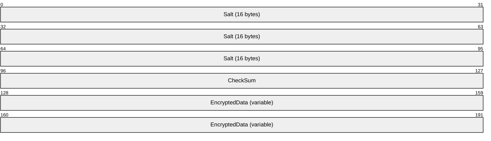

**Salt (16 bytes):** A 128-bit randomly generated value.

**CheckSum (4 bytes):** A 32-bit [**CRC32**](#gt_9cb45a36-92bb-4c14-b2fd-2ad7e2979bfd) [**checksum**](#gt_checksum) of the data that is encrypted along with the data.

**EncryptedData (variable):** A variable-length byte array that represents the encrypted value.

<a id="Section_4.1.10.2.21"></a>
##### 4.1.10.2.21 EXOP_ERR Codes

The following values are error codes for an [**extended operation**](#gt_extended-operation) request to the [IDL_DRSGetNCChanges](#Section_4.1.10) method.

**EXOP_ERR_SUCCESS** (0x00000001)

**EXOP_ERR_UNKNOWN_OP** (0x00000002)

**EXOP_ERR_FSMO_NOT_OWNER** (0x00000003)

**EXOP_ERR_UPDATE_ERR** (0x00000004)

**EXOP_ERR_EXCEPTION** (0x00000005)

**EXOP_ERR_UNKNOWN_CALLER** (0x00000006)

**EXOP_ERR_RID_ALLOC** (0x00000007)

**EXOP_ERR_FSMO_OWNER_DELETED** (0x00000008)

**EXOP_ERR_FSMO_PENDING_OP** (0x00000009)

**EXOP_ERR_MISMATCH** (0x0000000A)

**EXOP_ERR_COULDNT_CONTACT** (0x0000000B)

**EXOP_ERR_FSMO_REFUSING_ROLES** (0x0000000C)

**EXOP_ERR_DIR_ERROR** (0x0000000D)

**EXOP_ERR_FSMO_MISSING_SETTINGS** (0x0000000E)

**EXOP_ERR_ACCESS_DENIED** (0x0000000F)

**EXOP_ERR_PARAM_ERR** (0x00000010)

<a id="Section_4.1.10.2.22"></a>
##### 4.1.10.2.22 EXOP_REQ Codes

The following values are request codes for [**extended operation**](#gt_extended-operation).

**EXOP_FSMO_REQ_ROLE** (0x00000001)

**EXOP_FSMO_REQ_RID_ALLOC** (0x00000002)

**EXOP_FSMO_RID_REQ_ROLE** (0x00000003)

**EXOP_FSMO_REQ_PDC** (0x00000004)

**EXOP_FSMO_ABANDON_ROLE** (0x00000005)

**EXOP_REPL_OBJ** (0x00000006)

**EXOP_REPL_SECRETS** (0x00000007)

<a id="Section_4.1.10.2.23"></a>
##### 4.1.10.2.23 PROPERTY_META_DATA

The PROPERTY_META_DATA structure contains [**attribute**](#gt_attributes) and [**stamp**](#gt_stamp) information. For more details, see section [4.1.10.5.9](#Section_4.1.10.5.9).

The binary portion of the DNBinary value of the msDS-RevealedUsers attribute contains this structure.

typedef struct PROPERTY_META_DATA {

ATTRTYP attrType;

PROPERTY_META_DATA_EXT propMetadataExt;

LONGLONG llUnused;

} PROPERTY_META_DATA;

**attrType:** The attribute whose value was revealed.

**propMetadataExt:** The stamp of the revealed attribute value. See PROPERTY_META_DATA_EXT in section [5.155](#Section_5.155).

**llUnused:** An implementation-specific value. The specific value has no significance.

<a id="Section_4.1.10.3"></a>
#### 4.1.10.3 Method-Specific Abstract Types and Procedures

<a id="Section_4.1.10.3.1"></a>
##### 4.1.10.3.1 AbstractLinkValStampFromConcreteLinkValStamp

procedure AbstractLinkValStampFromConcreteLinkValStamp(

concreteStamp: VALUE_META_DATA_EXT_NATIVE) : LinkValueStamp

*Informative summary of behavior*: The AbstractLinkValStampFromConcreteLinkValStamp procedure converts a [**VALUE_META_DATA_EXT_NATIVE**](#Section_5.217) [**concrete type**](#gt_concrete-type) to a [LinkValueStamp](#Section_5.118).

linkValueStamp : LinkValueStamp

linkValueStamp := concreteStamp.MetaData

linkValueStamp.timeCreated := concreteStamp.timeCreated

linkValueStamp.timeExpired := concreteStamp.timeExpired

return linkValueStamp

<a id="Section_4.1.10.3.2"></a>
##### 4.1.10.3.2 AbstractPASFromConcretePAS

procedure AbstractPASFromConcretePAS(

concretePAS: PARTIAL_ATTR_VECTOR_V1_EXT,

prefixTable: PrefixTable): sequence of ATTRTYP

*Informative summary of behavior*: The AbstractPASFromConcretePAS procedure translates a concrete [PARTIAL_ATTR_VECTOR_V1_EXT](#Section_5.146) to a sequence of [ATTRTYP](#Section_5.14), using *prefixTable* to translate the *concretePAS* entries.

abstractPAS: sequence of ATTRTYP

i: DWORD

for i := 0 to (concretePAS.cAttrs - 1)

abstractPAS[i] := LocalAttidFromRemoteAttid(

prefixTable, concretePAS.rgPartialAttr[i])

endfor

return abstractPAS

<a id="Section_4.1.10.3.3"></a>
##### 4.1.10.3.3 AbstractUTDFromConcreteUTD

procedure AbstractUTDFromConcreteUTD(

concreteUTD: UPTODATE_VECTOR_V2_EXT): sequence of ReplUpToDateVector

*Informative summary of behavior*: The AbstractUTDFromConcreteUTD procedure translates the [UPTODATE_VECTOR_V2_EXT](#Section_5.205) structure to the [ReplUpToDateVector](#Section_5.166) [**abstract type**](#gt_abstract-type).

abstractUTD: ReplUpToDateVector

for i := 0 to (concreteUTD.length - 1)

abstractUTD[i].uuidDsa := concreteUTD.rgCursors[i].uuidDsa

abstractUTD[i].usnHighPropUpdate :=

concreteUTD.rgCursors[i].usnHighPropUpdate

abstractUTD[i].timeLastSyncSuccess :=

concreteUTD.rgCursors[i].timeLastSyncSuccess

endfor

return concreteUTD

<a id="Section_4.1.10.3.4"></a>
##### 4.1.10.3.4 AttributeAndStamp

type AttributeAndStamp = [attribute: ATTRTYP, stamp: AttributeStamp]

This [**abstract type**](#gt_abstract-type) encapsulates the [ATTRTYP](#Section_5.14) of an [**attribute**](#gt_attributes) (based on [dc](#Section_4.1.29.2.3).*prefixTable*) and its associated [AttributeStamp](#Section_5.11) on an [**object**](#gt_object).

<a id="Section_4.1.10.3.5"></a>
##### 4.1.10.3.5 AttributeStampCompare

procedure AttributeStampCompare(

stamp1: AttributeStamp,

stamp2: AttributeStamp): integer

*Informative summary of behavior*: The AttributeStampCompare procedure compares two [AttributeStamp](#Section_5.11) values, *stamp1* and *stamp2*. If *stamp1* is greater than *stamp2*, the procedure returns an integer with a value greater than 0. If *stamp1* is equal to *stamp2*, the procedure returns 0. If *stamp1* is less than *stamp2*, then the procedure returns an integer value less than 0. Refer to section 5.11 for details on the comparison of AttributeStamps.

<a id="Section_4.1.10.3.6"></a>
##### 4.1.10.3.6 ConcretePASFromAbstractPAS

procedure ConcretePASFromAbstractPAS(

abstractPAS: sequence of ATTRTYP) : PARTIAL_ATTR_VECTOR_V1_EXT

*Informative summary of behavior*: The ConcretePASFromAbstractPAS procedure translates a sequence of [ATTRTYP](#Section_5.14) to [PARTIAL_ATTR_VECTOR_V1_EXT](#Section_5.146). This translation does not require a [**prefix table**](#gt_prefix-table).

concretePAS : PARTIAL_ATTR_VECTOR_V1_EXT

i: DWORD

concretePAS.dwVersion := 1

concretePAS.dwReserved1 := 0

concretePAS.cAttrs := abstractPAS.length

for i := 0 to (abstractPAS.length - 1)

concretePAS.rgPartialAttr[i] := abstractPAS[i]

endfor

return concretePAS

<a id="Section_4.1.10.3.7"></a>
##### 4.1.10.3.7 ConcreteUTDFromAbstractUTD

procedure ConcreteUTDFromAbstractUTD(

abstractUTD: sequence of ReplUpToDateVector):

UPTODATE_VECTOR_V1_EXT

*Informative summary of behavior*: The ConcreteUTDFromAbstractUTD procedure translates a sequence of abstract [ReplUpToDateVector](#Section_5.166) tuples to [UPTODATE_VECTOR_V1_EXT](#Section_5.204).

concreteUTD: UPTODATE_VECTOR_V1_EXT

concreteUTD.dwVersion := 1

concreteUTD.dwReserved1 := 0

concreteUTD.dwReserved2 := 0

concreteUTD.cNumCursors := abstractUTD.length

for i := 0 to (abstractUTD.length - 1)

concreteUTD.rgCursors[i].uuidDsa := abstractUTD[i].uuidDsa

concreteUTD.rgCursors[i].usnHighPropUpdate :=

abstractUTD[i].usnHighPropUpdate

endfor

return concreteUTD

<a id="Section_4.1.10.3.8"></a>
##### 4.1.10.3.8 GetNCChangesNativeReply

procedure GetNCChangesNativeReply(

replyMessage: DRS_MSG_GETCHGREPLY,

version: DWORD): DRS_MSG_GETCHGREPLY_NATIVE

*Informative summary of behavior*: The GetNCChangesNativeReply procedure transforms a [DRS_MSG_GETCHGREPLY](#Section_4.1.10.2.9) of *version* 1, 6, or 9 to a [DRS_MSG_GETCHGREPLY_NATIVE](#Section_4.1.10.2.15) structure. DRS_MSG_GETCHGREPLY_NATIVE is a superset of the data in [**DRS_MSG_GETCHGREPLY_V1**](#Section_4.1.10.2.10), [**DRS_MSG_GETCHGREPLY_V6**](#Section_4.1.10.2.12), and [**DRS_MSG_GETCHGREPLY_V9**](#Section_4.1.10.2.14).

msgReplyNative: DRS_MSG_GETCHGREPLY_NATIVE

i: DWORD

if (version = 1) then

msgReplyNative := 0

msgReplyNative := replyMessage.V1

msgReplyNative.pUpToDateVecSrc^.dwVersion := 2

msgReplyNative.pUpToDateVecSrc^.cNumCursors :=

replyMessage.V1.pUpToDateVecSrcV1^.cNumCursors

for i := 0 to (replyMessage.V1.pUpToDateVecSrcV1^.cNumCursors - 1)

msgReplyNative.pUpToDateVecSrc^.rgCursors[i] :=

replyMessage.V1.pUpToDateVecSrcV1^.rgCursors[i]

msgReplyNative.pUpToDateVecSrc^.rgCursors[i].timeLastSyncSuccess := 0

endfor

else if (version = 6) then

msgReplyNative := 0

msgReplyNative := replyMessage.V6

msgReplyNative.rgValues :=

ReplValInfNativeListFromReplValInfV1List(replyMessage.V6.rgValues)

else

msgReplyNative = replyMessage.V9

endif

return msgReplyNative

<a id="Section_4.1.10.3.9"></a>
##### 4.1.10.3.9 GetStampsForUpdate

procedure GetStampsForUpdate(

replEntinfList: REPLENTINFLIST,

prefixTable: PrefixTable): set of AttributeAndStamp

*Informative summary of behavior*: The GetStampsForUpdate procedure retrieves the [AttributeStamp](#Section_5.11) associated with an [**attribute**](#gt_attributes) in the [REPLENTINFLIST](#Section_5.162) [**update**](#gt_update) and constructs a set of [AttributeAndStamp](#Section_4.1.10.3.4) tuples.

tupleEntry: AttributeAndStamp

attrStamps: set of AttributeStamp

i: DWORD

for i := 0 to (replEntinfList.pMetaDataExt.cNumProps - 1)

tupleEntry.attribute := LocalAttidFromRemoteAttid(

prefixTable, replEntinfList.Entinf.AttrBlock.pAttr[i].attrTyp)

tupleEntry.stamp := AbstractAttrStampFromConcereteAttrStamp(

replEntinfList.pMetaDataExt.rgMetaData[i])

attrStamps := attrStamps + {tupleEntry}

endfor

return attrStamps

<a id="Section_4.1.10.3.10"></a>
##### 4.1.10.3.10 GetWellKnownObject

procedure GetWellKnownObject(

nc: DSName,

guid: GUID): DSName

*Informative summary of behavior*: The GetWellKnownObject procedure returns the [DSName](#Section_5.49) of the well-known [**object**](#gt_object) with the given *guid* in a specified [**NC replica**](#gt_nc-replica).

attrVals: set of attribute value

attrVal: DNBinary

attrVals := {nc!wellKnownObjects}

for each attrVal in attrVals do

if (attrVal.binary = guid) then

return attrVal.dn

endif

endfor

return null

<a id="Section_4.1.10.3.11"></a>
##### 4.1.10.3.11 IsSecretAttribute

procedure IsSecretAttribute(attribute : ATTRTYP): boolean

The IsSecretAttribute procedure returns true if *attribute* is an [**attribute**](#gt_attributes) that contains [**secret data**](#gt_secret-data). Otherwise, the procedure returns false.

return (attribute in

{currentValue, dBCSPwd, initialAuthIncoming, initialAuthOutgoing,

lmPwdHistory, ntPwdHistory, priorValue, supplementalCredentials,

trustAuthIncoming, trustAuthOutgoing, unicodePwd} )

<a id="Section_4.1.10.3.12"></a>
##### 4.1.10.3.12 IsUserIncluded

procedure IsUserIncluded(

userSid: SID

groupOrAccountSid: SID)

The IsUserIncluded procedure returns true if *userSid* = *groupOrAccountSid*, or if the [**object**](#gt_object) identified by *userSid* is a member of the set returned by [IDL_DRSGetMemberships (section 4.1.8)](#Section_4.1.8) with the GroupMembersTransitive option applied to the object identified by *groupOrAccountSid*.

<a id="Section_4.1.10.3.13"></a>
##### 4.1.10.3.13 ObjAtts

type ObjAtts = [obj: DSName, atts: sequence of ATTRTYP]

The ObjAtts [**abstract type**](#gt_abstract-type) encapsulates the identity of an [**object**](#gt_object) (*obj*) and a sequence of [ATTRTYP](#Section_5.14) values (*atts*, based on [dc](#Section_4.1.29.2.3).*prefixTable*) for [**attributes**](#gt_attributes) of that object.

<a id="Section_4.1.10.3.14"></a>
##### 4.1.10.3.14 ObjAttVal

type ObjAttVal = [obj: DSName; att: ATTRTYP, val: attribute value]

The ObjAttVal [**abstract type**](#gt_abstract-type) encapsulates the identity of an [**object**](#gt_object) (*obj*), the [ATTRTYP](#Section_5.14) of an [**attribute**](#gt_attributes) of that object (*att*, based on [dc](#Section_4.1.29.2.3).*prefixTable*), and a value of that attribute (*val*).

<a id="Section_4.1.10.3.15"></a>
##### 4.1.10.3.15 PerformModifyDNOperation

procedure PerformModifyDNOperation(

currentDN: DN,

newParentObject: DSName,

newRDN: RDN)

The PerformModifyDNOperation procedure performs a Modify DN operation on an [**object**](#gt_object) with the [**DN**](#gt_distinguished-name-dn) **currentDN** by setting its new parent to **newParentObject** and by setting its new [**RDN**](#gt_relative-distinguished-name-rdn) value to **newRDN**. See [MS-ADTS](../MS-ADTS/MS-ADTS.md) section 3.1.1.5.4 for more details.

<a id="Section_4.1.10.3.16"></a>
##### 4.1.10.3.16 RemoveAttrVal

procedure RemoveAttrVal(

obj: DSName,

attr: ATTRTYP,

attributeValue: attribute value)

The RemoveAttrVal procedure removes the value *attributeValue* from the [**attribute**](#gt_attributes) *attr* on the [**object**](#gt_object) with [DSName](#Section_5.49) *obj*.

<a id="Section_4.1.10.3.17"></a>
##### 4.1.10.3.17 SetAttrStamp

procedure SetAttrStamp(

obj: DSName,

attr: ATTRTYP,

stamp: AttributeStamp)

The SetAttrStamp procedure sets the [AttributeStamp](#Section_5.11) for the [**attribute**](#gt_attributes) *attr* on the [**object**](#gt_object) *obj* to *stamp*.

<a id="Section_4.1.10.3.18"></a>
##### 4.1.10.3.18 SetAttrVal

procedure SetAttrVal(

obj: DSName,

attr: ATTRTYP,

attributeValue: attribute value)

The SetAttrVal procedure sets the value *attributeValue* for the [**attribute**](#gt_attributes) *attr* on the [**object**](#gt_object) *obj*.

<a id="Section_4.1.10.3.19"></a>
##### 4.1.10.3.19 SetLinkStamp

procedure SetLinkStamp(

obj: DSName,

attr: ATTRTYP,

val: attribute value,

stamp: AttributeStamp)

The SetLinkStamp procedure sets the [LinkValueStamp](#Section_5.118) for the [**attribute**](#gt_attributes) value *val* on the attribute *attr* on the [**object**](#gt_object) *obj* to *stamp*.

<a id="Section_4.1.10.4"></a>
#### 4.1.10.4 Client Behavior When Sending the IDL_DRSGetNCChanges Request

*Informative summary of behavior*: The following three tasks can be accomplished by sending an [IDL_DRSGetNCChanges](#Section_4.1.10) request to a server:

- Replicate [**objects**](#gt_object) from the server's [**NC replica**](#gt_nc-replica). The [ReplicateNCRequestMsg](#Section_4.1.10.4.1) procedure specifies the process of building [DRS_MSG_GETCHGREQ](#Section_4.1.10.2.1) to perform this task.
- Replicate a single object from the server's NC replica. The [ReplSingleObjRequestMsg](#Section_4.1.10.4.2) procedure specifies the process of building DRS_MSG_GETCHGREQ to perform this task.
- Perform [**extended operations**](#gt_extended-operation). The [PerformExtendedOpRequestMsg](#Section_4.1.10.4.3) procedure specifies the process of building DRS_MSG_GETCHGREQ to perform this task.
After the [**DC**](#gt_domain-controller-dc) constructs the request message, it sends the message by using the specified transport: SMTP (as specified in [MS-SRPL](../MS-SRPL/MS-SRPL.md)) if *rf* ≠ null and if *rf.uuidTransport* is the objectGUID of the interSiteTransport object *t*, where *t*!cn = "SMTP"; otherwise, the IP transport ([**RPC**](#gt_remote-procedure-call-rpc) over TCP).

<a id="Section_4.1.10.4.1"></a>
##### 4.1.10.4.1 ReplicateNCRequestMsg

procedure ReplicateNCRequestMsg(

hDrs: DRS_HANDLE,

version: DWORD,

nc: DSName,

rf: RepsFrom,

ulFlags: ULONG,

ulMoreFlags: ULONG,

cMaxObjects: ULONG,

cMaxBytes: ULONG,

var msgRequest: DRS_MSG_GETCHGREQ)

*Informative summary of behavior*: The client sends an [IDL_DRSGetNCChanges](#Section_4.1.10) request to a server to replicate the server's changes in an [**NC replica**](#gt_nc-replica). The ReplicateNCRequestMsg procedure specifies how the client constructs the request message for this operation.

The procedure has the following arguments:

- *hDrs*: The [DRS_HANDLE](#Section_5.40) that is derived by sending an [IDL_DRSBind](#Section_4.1.3) message to the server.
- *version*: The version number of the input message negotiated between the client and server.
- *nc*: The [DSName](#Section_5.49) of the root of the NC replica that is to be replicated.
- *rf*: The [RepsFrom](#Section_5.172) that corresponds to the server from which to replicate.
- *ulFlags*: Zero or more of the following bit flags. The client MUST supply the same flags for each request in a given [**replication cycle**](#gt_replication-cycle), with the exception of DRS_ADD_REF, DRS_GET_ANC, DRS_USE_COMPRESSION, and DRS_GET_NC_SIZE.
- **DRS_ADD_REF**: Requests that the server add an entry to the repsTo [**attribute**](#gt_attributes) for the client on the root [**object**](#gt_object) of the NC replica that is being replicated.
- **DRS_WRIT_REP**: Indicates that the client contains (or is constructing) a full, [**writable NC replica**](#gt_51db485c-dcf6-4845-99b3-2df414ef0aa9).
- **DRS_ASYNC_REP**: Requests that the server send only the root object of the NC replica.
- **DRS_CRITICAL_ONLY**: Signals the server not to send objects *o* where *o*!isCriticalSystemObject is absent or *o*!isCriticalSystemObject is false.
- **DRS_GET_ANC**: Signals the server to send all [**updates**](#gt_update) for each [**ancestor object**](#gt_ancestor-object) of object *o* before sending updates for object *o*.
- **DRS_GET_NC_SIZE**: Signals the server to set *cNumNcSizeObjects* in *pmsgOut* to an estimate of the number of objects in its NC replica.
- **DRS_FULL_SYNC_PACKET**: Requests that the server send all attributes of the objects in its reply, rather than sending only the updated attributes.
- **DRS_SYNC_FORCED**: Signals the server to honor the request even if its [**replication**](#gt_replication) has otherwise been disabled.
- **DRS_USE_COMPRESSION**: Requests that the server reply by using one of the compressed reply versions ([DRS_MSG_GETCHGREPLY_V2](#Section_4.1.10.2.11) or [DRS_MSG_GETCHGREPLY_V7](#Section_4.1.10.2.5)).
- **DRS_SYNC_PAS**: Indicates replication of additional attributes to the partial [**replica**](#gt_replica) already present on the client.
- **DRS_SPECIAL_SECRET_PROCESSING**: Requests that the server not ship attribute values of attributes that contain [**secret data**](#gt_secret-data). Servers prior to Windows Server 2008 operating system ignore this flag.
- **DRS_GET_ALL_GROUP_MEMBERSHIP**: Requests that the server ship all [**group**](#gt_group) membership. If this flag is not specified, the server ships only [**universal group**](#gt_universal-group) membership. Servers prior to Windows Server 2008 ignore this flag.
- **DRS_REF_GCSPN**: Requests that the server add an entry to repsTo for the client on the root object of the NC replica that is being replicated. When repsTo is set using this flag, the notifying client [**DC**](#gt_domain-controller-dc) contacts the server DC using the [**service principal name**](#gt_service-principal-name-spn) that begins with "GC" (section [2.2.3.2](#Section_2.2.3.2)).
- *ulMoreFlags*: Zero or more of the following bit flags. The client MUST supply the same flags for each request in a given replication cycle, with the exception of DRS_GET_TGT.
- **DRS_GET_TGT**: Signals the server to send all updates for the [**target object**](#gt_target-object) of a [**link value**](#gt_link-value) update before sending the link value update.
- *cMaxObjects*: Recommended limit on the number of objects to include in the reply.
- *cMaxBytes*: Recommended limit on the number of bytes to include in the reply.
- *msgRequest*: The procedure populates corresponding fields in this structure depending on the value that is passed in the *version* parameter.
msgIn: DRS_MSG_GETCHGREQ_V10

msgRequest: DRS_MSG_GETCHGREQ

prefixEntry: PrefixTableEntry

partialAttrSetSeq: sequence of DSName

schemaSignature: sequence of BYTE

ncType: ULONG

/* NTDSDSA_OPT_DISABLE_INBOUND_REPL defined in

* [MS-ADTS] section 6.1.1.2.2.1.2.1.1, "nTDSDSA Object"*/

if NTDSDSA_OPT_DISABLE_INBOUND_REPL in DSAObj()!options and

not DRS_SYNC_FORCED in ulFlags then

return ERROR_DS_DRA_SINK_DISABLED

endif

if IsAdlds() and ServerExtensions(hDrs).ConfigObjGUID ≠ NULLGUID and ServerExtensions(hDrs).ConfigObjGUID ≠ ConfigNC().GUID then

return ERROR_DS_DIFFERENT_REPL_EPOCHS;

endif

msgIn.ulMoreFlags := ulMoreFlags

msgIn.cMaxObjects := cMaxObjects

msgIn.cMaxBytes := cMaxBytes

msgIn.ulExtendedOp := 0

msgIn.uuidDsaObjDest := dc.serverGuid

msgIn.pNC := ADR(nc)

msgIn.liFsmoInfo := 0

if (ObjExists(nc)) then

msgIn.pUpToDateVecDest :=

ConcreteUTDFromAbstractUTD(nc!replUpToDateVector)

else

msgIn.pUpToDateVecDest := null

endif

/* Fill usnvecFrom and uuidInvocIdSrc fields.

* usnvecFrom: This field contains the value of the usnVec field in

* RepsFrom tuple corresponding to the IDL_DRSGetNCChanges server

* DC, or zeros if no such repsFrom is present.

* uuidInvocIdSrc: If the usnvecFrom field is not zeros, this field

* MUST contain the uuidInvocId from the same tuple from which the

* usnVec field was retrieved. Otherwise, this field contains

* zeros.*/

if (rf = null) then

msgIn.usnvecFrom := 0

msgIn.uuidInvocIdSrc := 0

else

msgIn.usnvecFrom := rf.usnVec

msgIn.uuidInvocIdSrc := rf.uuidInvocId

endif

if AmIRODC()then

if DRS_WRIT_REP in ulFlags then

return ERROR_DS_DRA_INVALID_PARAMETER

endif

ext := ServerExtensions(hDrs)

if not DRS_EXT_LH_BETA2 in ext.dwFlags and

msgIn.pNC^ = SchemaNC() then

ulFlags := ulFlags + {DRS_WRIT_REP}

endif

endif

ncType = GetNCType(nc)

if not NCT_GC_PARTIAL in ncType then

ulFlags := ulFlags + {DRS_GET_ALL_GROUP_MEMBERSHIP}

endif

msgIn.ulFlags := ulFlags

if (DRS_WRIT_REP in ulFlags) or

(not DRS_SYNC_PAS in ulFlags) then

msgIn.pPartialAttrSetEx := null

else

msgIn.pPartialAttrSetEx := ConcretePASFromAbstractPAS(rf.pasData)

endif

/* set msgIn.pPartialAttrSet field */

if ObjExists(nc) and nc!partialAttributeSet ≠ null then

msgIn.pPartialAttrSet := ConcretePASFromAbstractPAS(

nc!partialAttributeSet)

else

if (NCT_GC_PARTIAL in ncType and

NCT_FILTERED_ATTRIBUTE_SET in ncType)} then

msgIn.pPartialAttrSet := FilteredGCPAS()

else if NCT_FILTERED_ATTRIBUTE_SET in ncType then

msgIn.pPartialAttrSet := FilteredPAS()

else if NCT_GC_PARTIAL in ncType then

msgIn.pPartialAttrSet := GCPAS()

else

msgIn.pPartialAttrSet := null

endif

endif

msgIn.PrefixTableDest = ConcretePTFromAbstractPT(dc.prefixTable)

/* Add schema signature to msgIn.PrefixTableDest */

schemaSignature := SchemaInfo()

prefixEntry.ndx := 0

prefixEntry.prefix.length := schemaSignature.length

prefixEntry.prefix.element := elements of schemaSignature

Append prefixEntry to msgIn.PrefixTableDest.pPrefixEntry

msgIn.PrefixTableDest.PrefixCount :=

msgIn.PrefixTableDest.PrefixCount + 1

if version = 5 then

msgRequest.V5 := msgIn

msgRequest.V5.pUpToDateVecDestV1 := msgIn.pUpToDateVecDest

else if version = 8 then

msgRequest.V8 := msgIn

else

msgRequest.V10 := msgIn

endif

<a id="Section_4.1.10.4.2"></a>
##### 4.1.10.4.2 ReplSingleObjRequestMsg

procedure ReplSingleObjRequestMsg(

hDrs: DRS_HANDLE,

version: DWORD,

nc: DSName,

object: DSName,

rf: RepsFrom,

ulFlags: ULONG,

ulMoreFlags: ULONG,

cMaxObjects: ULONG,

cMaxBytes: ULONG,

fWithSecrets: boolean,

var msgRequest: DRS_MSG_GETCHGREQ): DWORD

*Informative summary of behavior*: The client can send an [IDL_DRSGetNCChanges](#Section_4.1.10) request to the server to replicate changes from a single [**object**](#gt_object). The ReplSingleObjRequestMsg procedure specifies how the request message is constructed for this operation. The arguments for this method are the same as those for the procedure [ReplicateNCRequestMsg](#Section_4.1.10.4.1), with the following exceptions:

- *object*: The [DSName](#Section_5.49) of the object that should be replicated.
- *fWithSecrets*: The object's secret [**attributes**](#gt_attributes) should be replicated. Only [**RODCs**](#gt_read-only-domain-controller-rodc) need to make, and can make, this request.
The procedure returns a [**Windows error code**](#gt_windows-error-code) if it cannot construct *msgRequest*.

msgRequest: DRS_MSG_GETCHGREQ

msgIn: DRS_MSG_GETCHGREQ_V10

ncType: ULONG

/* An NC replica with root of DSName nc must already exist on the

client */

if (not PartialGCReplicaExists(nc) and

not FullReplicaExists(nc)) then

return ERROR_DS_DRA_BAD_NC

endif

/* Only RODCs are allowed to request secrets explicitly */

if fWithSecrets and not AmIRODC() then

return ERROR_INVALID_PARAMETER

endif

if fWithSecrets then

msgIn.ulExtendedOp := EXOP_REPL_SECRETS

else

msgIn.ulExtendedOp := EXOP_REPL_OBJ

endif

if AmIRODC()then

if DRS_WRIT_REP in ulFlags then

return ERROR_INVALID_PARAMETER

endif

ext := ServerExtensions(hDrs)

if not DRS_EXT_LH_BETA2 in ext.dwFlags and

msgIn.pNC^ = SchemaNC() then

ulFlags := ulFlags + {DRS_WRIT_REP}

endif

endif

ncType = GetNCType(nc)

if not NCT_GC_PARTIAL in ncType then

ulFlags := ulFlags + {DRS_GET_ALL_GROUP_MEMBERSHIP}

endif

msgIn.ulFlags := ulFlags

msgIn.ulMoreFlags := ulMoreFlags

msgIn.cMaxObjects := cMaxObjects

msgIn.cMaxBytes := cMaxBytes

msgIn.uuidDsaObjDest := dc.serverGuid

msgIn.pNC := ADR(object)

msgIn.liFsmoInfo := 0

msgIn.pUpToDateVecDest :=

ConcreteUTDFromAbstractUTD(nc!replUpToDateVector)

msgIn.pPartialAttrSetEx := null

/* set msgIn.pPartialAttrSet field */

if ObjExists(nc) and nc!partialAttributeSet ≠ null then

msgIn.pPartialAttrSet := ConcretePASFromAbstractPAS(

nc!partialAttributeSet)

else

if (NCT_GC_PARTIAL in ncType and

NCT_FILTERED_ATTRIBUTE_SET in ncType)} then

msgIn.pPartialAttrSet := FilteredGCPAS()

else if NCT_FILTERED_ATTRIBUTE_SET in ncType then

msgIn.pPartialAttrSet := FilteredPAS()

else if NCT_GC_PARTIAL in ncType then

msgIn.pPartialAttrSet := GCPAS()

else

msgIn.pPartialAttrSet := null

endif

endif

msgIn.PrefixTableDest = ConcretePTFromAbstractPT(dc.prefixTable)

/* Fill usnvecFrom and uuidInvocIdSrc fields.

* usnvecFrom: This field contains the value of the usnVec field in

* RepsFrom tuple corresponding to the IDL_DRSGetNCChanges server

* DC, or zeros if no such repsFrom is present.

* uuidInvocIdSrc: If the usnvecFrom field is not zeros, this field

* MUST contain the uuidInvocId from the same tuple from which the

* usnVec fieldwas retrieved. Otherwise, this field contains

* zeros.*/

if (rf = null) then

msgIn.usnvecFrom := 0

msgIn.uuidInvocIdSrc := 0

else

msgIn.usnvecFrom := rf.usnVec

msgIn.uuidInvocIdSrc := rf.uuidInvocId

endif

if version = 5 then

msgRequest.V5 := msgIn

msgRequest.V5.pUpToDateVecDestV1 := msgIn.pUpToDateVecDest

else if version = 8 then

msgRequest.V8 := msgIn

else

msgRequest.V10 := msgIn

endif

return 0

<a id="Section_4.1.10.4.3"></a>
##### 4.1.10.4.3 PerformExtendedOpRequestMsg

procedure PerformExtendedOpRequestMsg (

hDrs: DRS_HANDLE,

version: DWORD,

nc: DSName,

roleOwnerObject: DSName,

rf: RepsFrom,

ulFlags: ULONG,

ulMoreFlags: ULONG,

ulExtendedOp: ULONG,

cMaxObjects: ULONG,

cMaxBytes: ULONG,

var msgRequest: DRS_MSG_GETCHGREQ): DWORD

*Informative summary of behavior*: A client sends an [IDL_DRSGetNCChanges](#Section_4.1.10) request to a server to perform an [**extended operation**](#gt_extended-operation). The procedure PerformExtendedOpRequestMsg specifies how the request message is constructed for this operation.

The arguments for this method are the same as those for the procedure [ReplicateNCRequestMsg](#Section_4.1.10.4.1), with the following exceptions:

- *ulExtendedOp*: The requested extended operation. The client MUST supply the same value of this field for each request in a given [**replication cycle**](#gt_replication-cycle). The possible values are:
- EXOP_FSMO_REQ_ROLE, for a [**FSMO role owner**](#gt_fsmo-role-owner) transfer.
- EXOP_FSMO_REQ_RID_ALLOC, for a [**RID**](#gt_relative-identifier-rid) allocation from the RID Master FSMO role owner.
- EXOP_FSMO_RID_REQ_ROLE, for transfer of the RID Master [**FSMO role**](#gt_fsmo-role).
- EXOP_FSMO_REQ_PDC, for transfer of the [**PDC**](#gt_primary-domain-controller-pdc) FSMO role.
- EXOP_FSMO_ABANDON_ROLE, to request the server to request an extended operation role transfer from the client.
- *roleOwnerObject*: The client sets this value based on the value of *ulExtendedOp*, as per the following table:
| ulExtendedOp | roleOwnerObject |
| --- | --- |
| EXOP_FSMO_REQ_ROLE | The [DSName](#Section_5.49) of the [**FSMO role object**](#gt_fsmo-role-object). |
| EXOP_FSMO_REQ_RID_ALLOC | The value of the rIDManagerReference [**attribute**](#gt_attributes) of [DefaultNC](#Section_5.31)(). |
| EXOP_FSMO_RID_REQ_ROLE | The value of the rIDManagerReference attribute of DefaultNC(). |
| EXOP_FSMO_REQ_PDC | DefaultNC(). |
| EXOP_FSMO_ABANDON_ROLE | The DSName of the FSMO role object. |

The procedure returns a [**Windows error code**](#gt_windows-error-code) if it not able to construct *msgRequest*.

msgIn: DRS_MSG_GETCHGREQ_V10

serverObj: DSName

computerObj: DSName

ridSetReferences: DSName

/* An NC replica with root nc must already exist on the client */

if (not MasterReplicaExists(nc)) then

return ERROR_DS_DRA_BAD_NC

endif

msgIn.ulFlags := ulFlags

msgIn.ulMoreFlags := ulMoreFlags

msgIn.cMaxObjects := cMaxObjects

msgIn.cMaxBytes := cMaxBytes

msgIn.ulExtendedOp := ulExtendedOp

msgIn.uuidDsaObjDest := dc.serverGuid

msgIn.pNC := ADR(roleOwnerObject)

msgIn.pUpToDateVecDest :=

ConcreteFromAbstractUTD(nc!replUpToDateVector)

msgIn.pPartialAttrSetEx := null

msgIn.pPartialAttrSet := null

msgIn.PrefixTableDest := 0

if (ulExtendedOp = EXOP_FSMO_REQ_RID_ALLOC) then

serverObj := DSAObj()!parent

computerObj := serverObject!serverReference

ridSetReferences := computerObj!ridSetReferences

if ((not ridSetReferences = null) and

(ridSetReferences!isDeleted = false)) and

(not ridSetReferences!rIDNextRid = null) and

(not ridSetReferences!rIDNextRid = 0) and

(not ridSetReferences!rIDAllocationPool = null)) then

msgIn.liFsmoInfo := ridSetReferences!rIDAllocationPool

else

msgIn.liFsmoInfo := 0

endif

else

msgIn.liFsmoInfo := 0

endif

/* Fill usnvecFrom and uuidInvocIdSrc fields.

* usnvecFrom: This field contains the value of the usnVec field in

* RepsFrom tuple corresponding to the IDL_DRSGetNCChanges server

* DC, or zeros if no such repsFrom is present.

* uuidInvocIdSrc: If the usnvecFrom field is not zeros, this field

* MUST contain the uuidInvocId from the same tuple from which the

* usnVec field was retrieved. Otherwise, this field contains

* zeros.*/

if (rf = null) then

msgIn.usnvecFrom := 0

msgIn.uuidInvocIdSrc := 0

else

msgIn.usnvecFrom := rf.usnVec

msgIn.uuidInvocIdSrc := rf.uuidInvocId

endif

if version = 5 then

msgRequest.V5 := msgIn

msgRequest.V5.pUpToDateVecDestV1 := msgIn.pUpToDateVecDest

else if version = 8 then

msgRequest.V8 := msgIn

else

msgRequest.V10 := msgIn

endif

return 0

<a id="Section_4.1.10.5"></a>
#### 4.1.10.5 Server Behavior of the IDL_DRSGetNCChanges Method

*Informative summary of behavior*: The IDL_DRSGetNCChanges method returns a response for a single request in a [**cycle**](#gt_replication-cycle).

This method is invoked through the drsuapi [**RPC**](#gt_remote-procedure-call-rpc) interface. It is also invoked as a local procedure for requests that are received using the SMTP transport ([MS-SRPL](../MS-SRPL/MS-SRPL.md)).

ULONG

IDL_DRSGetNCChanges(

[in, ref] DRS_HANDLE hDrs,

[in] DWORD dwInVersion,

[in, ref, switch_is(dwInVersion)]

DRS_MSG_GETCHGREQ *pmsgIn,

[out, ref] DWORD *pdwOutVersion,

[out, ref, switch_is(*pdwOutVersion)]

DRS_MSG_GETCHGREPLY *pmsgOut)

err: ULONG

msgIn: DRS_MSG_GETCHGREQ_V10

ncRoot: DSName

obj: DSName

msgOut: DRS_MSG_GETCHGREPLY_NATIVE

schemaSignature: sequence of BYTE

prefixEntry: PrefixTableEntry

responseSmtpAddress: unicodestring

fullReplicaFlags: set of integer

fullReplicaRequest : boolean

ValidateDRSInput(hDrs, 3)

pdwOutVersion^ := 1

pmsgOut^ := 0

err := TransformInput(hDrs, dwInVersion, pmsgIn^, msgIn,

pdwOutVersion, responseSmtpAddress)

if err ≠ 0 then

return err

endif

/* Perform access checks. */

if msgIn.pNC = null then

return ERROR_DS_DRA_INVALID_PARAMETER

endif

ncRoot := GetObjectNC(msgIn.pNC^)

if ncRoot = null then

return ERROR_DS_CANT_FIND_EXPECTED_NC

endif

if IsGetNCChangesPermissionGranted(msgIn) == FALSE then

return ERROR_DRA_ACCESS_DENIED

endif

/* Validate inputs. */

obj := msgIn.pNC^

if AmILHServer() = false then

/* Downlevel OS does not understand

DRS_SPECIAL_SECRET_PROCESSING flags. They just ignore it.

*/

msgIn.ulFlags := msgIn.ulFlags - {DRS_SPECIAL_SECRET_PROCESSING}

endif

if msgIn.ulExtendedOp = 0 then

/* Validate normal replication request. */

if not FullReplicaExists(obj) and not PartialGCReplicaExists(obj)

then

return ERROR_DS_CANT_FIND_EXPECTED_NC

endif

else

/* Validate extended operation request. */

if not ObjExists(obj) then

return ERROR_DS_CANT_FIND_EXPECTED_NC

endif

endif

if AmILHServer() then

if (msgIn.pPartialAttrSet = null and

msgIn.pPartialAttrSetEx = null) then

fullReplicaRequest := true

else

fullReplicaRequest := false

endif

else

if (DRS_WRITE_REP in msgIn.ulFlags) then

fullReplicaRequest := true

else

fullReplicaRequest := false

endif

endif

if (fullReplicaRequest) then

/* Validate Full Replica request. */

if not IT_WRITE in obj!instanceType then

return ERROR_DRA_SOURCE_IS_PARTIAL

endif

if DRS_SYNC_PAS in msgIn.ulFlags then

return ERROR_INVALID_PARAMETER

endif

else

/* Validate Partial Replica request. */

if msgIn.pPartialAttrSet = null

or msgIn.pPartialAttrSet.cAttrs = 0 then

return ERROR_INVALID_PARAMETER

endif

if DRS_SYNC_PAS in msgIn.ulFlags and

(msgIn.pPartialAttrSetEx = null

or msgIn.pPartialAttrSetEx.cAttrs = 0) then

return ERROR_INVALID_PARAMETER

endif

if msgIn.PrefixTableDest.PrefixCount = 0 then

return ERROR_INVALID_PARAMETER

endif

endif

if IT_NC_GOING in ncRoot!instanceType

/* NC replica is no longer accepting requests. */

return ERROR_DRA_NO_REPLICA

endif

if msgIn.uuidInvocIdSrc ≠ DSAObj()!invocationId then

msgIn.usnvecFrom := 0

endif

/* Construct response. */

if msgIn.ulExtendedOp = 0 then

/* Perform normal replication. */

err := GetReplChanges(hDrs, null, null, msgIn, msgOut)

else

/* Perform extended operation. Errors are returned in

* msgOut.ulExtendedErr. */

ProcessFsmoRoleRequest(hDrs, msgIn, msgOut)

err := 0

endif

if err = 0 then

msgOut.pNC := msgIn.pNC

msgOut.usnvecFrom := msgIn.usnvecFrom

msgOut.uuidDsaObjSrc := dc.serverGuid

msgOut.PrefixTableSrc := ConcretePTFromAbstractPT(dc.prefixTable)

msgOut.uuidInvocIdSrc := DSAObj()!invocationId

/* Sort msgOut.rgValues into ascending order. */

SortResponseLinks(msgOut)

/* Add schema signature to msgOut.PrefixTableSrc. */

schemaSignature := SchemaInfo()

prefixEntry.ndx := 0

prefixEntry.prefix.length := schemaSignature.length

prefixEntry.prefix.element := elements of schemaSignature

Append prefixEntry to msgOut.PrefixTableSrc.pPrefixEntry

msgOut.PrefixTableSrc.PrefixCount :=

msgOut.PrefixTableSrc.PrefixCount+1

err := TransformOutput(msgOut, msgIn.ulFlags, pdwOutVersion^,

pmsgOut)

endif

if responseSmtpAddress ≠ null then

Send the response using using the SMTP transport to

responseSmtpAddress

endif

return err

<a id="Section_4.1.10.5.1"></a>
##### 4.1.10.5.1 TransformInput

procedure TransformInput(

hDrs: DRS_HANDLE,

requestVersion: DWORD,

requestUnion: DRS_MSG_GETCHGREQ,

var nativeRequest: DRS_MSG_GETCHGREQ_V10,

pdwOutVersion: ADDRESS OF DWORD,

var responseSmtpAddress: unicodestring): ULONG

*Informative summary of behavior*: The TransformInput procedure transforms the received request message into a V10 request, which is a superset of the supported request messages.

optionalFeatures: sequence of msDS-OptionalFeature objects /* [MS-ADSC] */

extClient: DRS_EXTENSIONS_INT

extServer: DRS_EXTENSIONS_INT

optionalFeatureBit: integer

extClient := ClientExtensions(hDrs)

responseSmtpAddress := null

if requestVersion < dc.minimumGetChangesRequestVersion

return ERROR_REVISION_MISMATCH

if requestVersion = 10

/* Windows Server 2008 R2 RPC request. */

nativeRequest := requestUnion.V10

if DRS_EXT_GETCHGREPLY_V9 in extClient.dwFlags then

pdwOutVersion^ = 9

else if DRS_EXT_GETCHGREPLY_V6 in extClient.dwFlags then

pdwOutVersion^ = 6

else

return ERROR_REVISION_MISMATCH

endif

else if requestVersion = 8

/* Windows Server 2003 RPC request. */

nativeRequest := requestUnion.V8

nativeRequest.ulMoreFlags := 0

if not DRS_EXT_GETCHGREPLY_V6 in extClient.dwFlags then

return ERROR_REVISION_MISMATCH

else

pdwOutVersion^ := 6

endif

else if requestVersion = 7 then

/* Windows Server 2003 SMTP request. */

responseSmtpAddress := requestUnion.V7.pmtxReturnAddress^.mtx_name

nativeRequest := requestUnion.V7.V3

nativeRequest.pUpToDateVecDest :=

requestUnion.V7.V3.pUpToDateVecDestV1

nativeRequest.pPartialAttrSet := requestUnion.V7.pPartialAttrSet

nativeRequest.pPartialAttrSetEx :=

requestUnion.V7.pPartialAttrSetEx

nativeRequest.PrefixTableDest := requestUnion.V7.PrefixTableDest

nativeRequest.ulMoreFlags := 0

if not DRS_EXT_GETCHGREPLY_V6 in extClient.dwFlags then

return ERROR_REVISION_MISMATCH

else

pdwOutVersion^ := 6

endif

else if requestVersion = 5 then

/* Windows 2000 RPC request. */

nativeRequest := requestUnion.V5

nativeRequest.pUpToDateVecDest :=

requestUnion.V5.pUpToDateVecDestV1

nativeRequest.pPartialAttrSetEx := null

nativeRequest.PrefixTableDest :=

ConcretePTFromAbstractPT(dc.prefixTable)

nativeRequest.ulMoreFlags := 0

if ({DRS_WRIT_REP} ∩ requestUnion.V5.ulFlags) = null then

nativeRequest.pPartialAttrSet := GCPAS()

endif

pdwOutVersion^ := 1

else if requestVersion = 4 then

/* Windows 2000 SMTP request. */

responseSmtpAddress := requestUnion.V4.pmtxReturnAddress^.mtx_name

nativeRequest := requestUnion.V4.V3

nativeRequest.pUpToDateVecDest :=

requestUnion.V4.V3.pUpToDateVecDestV1

if ({DRS_WRIT_REP} ∩ requestUnion.V4.V3.ulFlags) = null then

nativeRequest.pPartialAttrSet := GCPAS()

endif

nativeRequest.pPartialAttrSetEx := null

nativeRequest.ulMoreFlags := 0

pdwOutVersion^ := 1

else

/* Unsupported request. */

return ERROR_REVISION_MISMATCH

endif

if ({DRS_WRIT_REP} ∩ nativeRequest.ulFlags) ≠ null then

nativeRequest.ulFlags :=

nativeRequest.ulFlags + {DRS_GET_ALL_GROUP_MEMBERSHIP}

endif

if (responseSmtpAddress = null) ≠ (not DRS_MAIL_REP in

nativeRequest.ulFlags) then

return ERROR_INVALID_PARAMETER

endif

extServer := ServerExtensions(hDrs)

optionalFeatures := list of msDS-OptionalFeature objects from the

Optional Features container /* [MS-ADTS] section 6.1.1.2.4.1.3 */

foreach feature in optionalFeatures

if (GetOptionalFeatureBit(feature!msDS-OptionalFeatureGUID, optionalFeatureBit))

if (optionalFeatureBit in extServer.dwFlagsEx) and

optionalFeatureBit not in extClient.dwExtCaps then

/* Feature is enabled on the server but the client

is not capable of supporting it */

return ERROR_REVISION_MISMATCH

endif

endif

/* NOTE: The behavior of the server is undefined if */

/* procedure GetOptionalFeatureBit() returns false. */

endfor

return 0

<a id="Section_4.1.10.5.2"></a>
##### 4.1.10.5.2 GetReplChanges

procedure GetReplChanges(

hDrs: DRS_HANDLE,

searchFilter: LDAPString,

dirSyncFlags: ULONG,

msgIn: DRS_MSG_GETCHGREQ_V10,

var msgOut: DRS_MSG_GETCHGREPLY_NATIVE): ULONG

*Informative summary of behavior*: The GetReplChanges procedure processes an [**LDAP**](#gt_lightweight-directory-access-protocol-ldap) Search request with LDAP_SERVER_DIRSYNC_OID control or a normal [**replication**](#gt_replication) request; that is, an [IDL_DRSGetNCChanges](#Section_4.1.10) request that is not a [**FSMO role**](#gt_fsmo-role) request. It adds changed [**objects**](#gt_object) and [**link values**](#gt_link-value) to the response, subject to the scope (*msgIn.pNC^*, *msgIn.ulFlags*), filter criteria (*msgIn.pUpToDateVecDest*, *msgIn.ulFlags*, *msgIn.pPartialAttrSet*, *msgIn.pPartialAttrSetEx*, *searchFilter*, *dirSyncFlags*), response limits (*msgIn.cMaxObjects*, *msgIn.cMaxBytes*), and the previous server cookie (*msgIn.usnvecFrom*) in the request. It returns 0 if successful, otherwise a [**Windows error code**](#gt_windows-error-code).

err: ULONG

ncRoot: DSName

pUtd: ADDRESS OF UPTODATE_VECTOR_V1_EXT

scope: set of DSName

attribute: ATTRTYP

partialAttrs: set of ATTRTYP

partialAttrsEx: set of ATTRTYP

changedObjs: set of ObjAtts

changedLinks: set of ObjAttVal

responseObjs: set of ObjAtts

responseLinks: set of ObjAttVal

anc: ObjAtts

clientDSA : DSName

updRefs: DRS_MSG_UPDREFS_V1 /* See IDL_DRSUpdateRefs structures. */

tgt: DSName

if AmIRODC() then

return ERROR_DS_DRA_SOURCE_DISABLED

endif

/* check whether outbound replication is disabled */

/* NTDSDSA_OPT_DISABLE_OUTBOUND_REPL defined in

* [MS-ADTS] section 6.1.1.2.2.1.2.1.1, "nTDSDSA Object" */

if NTDSDSA_OPT_DISABLE_OUTBOUND_REPL in DSAObj()!options and

not DRS_SYNC_FORCED in msgIn.ulFlags and

not dirSyncFlags then

return ERROR_DS_DRA_SOURCE_DISABLED

endif

ncRoot := GetObjectNC(msgIn.pNC^)

/* Determine stamp filter to apply to the response. */

if DRS_FULL_SYNC_PACKET in msgIn.ulFlags then

pUtd := null

else

pUtd := msgIn.pUpToDateVecDest

endif

/* Determine attribute filters to apply to the response. */

if msgIn.pPartialAttrSet = null

partialAttrs := null

else

partialAttrs := {}

foreach id in msgIn.pPartialAttrSet

attribute := LocalAttidFromRemoteAttid(msgIn.PrefixTableDest, id)

if (not IT_WRITE in ncRoot!instanceType) and

(not attribute in ncRoot!partialAttributeSet) then

return ERROR_DS_DRA_INCOMPATIBLE_PARTIAL_SET

endif

partialAttrs := partialAttrs + { attribute }

endfor

endif

if msgIn.pPartialAttrSetEx = null

partialAttrsEx := null

else

partialAttrsEx := {}

foreach id in msgIn.pPartialAttrSetEx

attribute := LocalAttidFromRemoteAttid(msgIn.PrefixTableDest, id)

if (not IT_WRITE in ncRoot!instanceType) and

(not attribute in ncRoot!partialAttributeSet) then

return ERROR_DS_DRA_INCOMPATIBLE_PARTIAL_SET

endif

partialAttrsEx:= partialAttrsEx + { attribute }

endfor

endif

/* Get nTDSDSA of the client */

clientDSA := select one o from ConfigNC() where

o!objectGUID = msgIn.uuidDsaObjDest

/* Get the set of all objects that are in scope. */

scope := GetReplScope(msgIn, searchFilter)

/* Get object and link value changes in scope. */

GetChangesInScope(scope, pUtd, msgIn.ulExtendedOp, partialAttrs,

partialAttrsEx, dirSyncFlags, changedObjs, changedLinks)

/* Choose subsets of changedObjs and changedLinks to include in this

* response. Set usnvecTo and fMoreData in out to indicate the

* subset to return in the next response, if any. */

GetResponseSubset(msgIn, changedObjs, changedLinks, msgOut,

responseObjs, responseLinks)

/* Add responseObjs to response. */

foreach o in responseObjs

if DRS_GET_ANC in msgIn.ulFlags then

/* Ancestors predicate: insert any changes to parent before any

* changes to child. */

foreach n in Ancestors of o.obj, most distant ancestor first

anc := select one a from changedObjs where a.obj = n

if anc ≠ null then

err := AddObjToResponse(

hDrs, anc, ncRoot, msgIn.ulFlags, 0, clientDSA, msgOut)

if err ≠ 0 then

return err

endif

endif

endfor

endif

err := AddObjToResponse(

hDrs, o, ncRoot, msgIn.ulFlags, 0, clientDSA, msgOut)

if err ≠ 0 then

return err

endif

endfor

/* Add responseLinks to response. */

foreach v in responseLinks

if DRS_GET_ANC in msgIn.ulFlags then

/* Ancestors predicate: insert any changes to object before any

* changes to its link values. */

anc := select one a from changedObjs where a.obj = v.obj

if anc ≠ null then

err := AddObjToResponse(hDrs, anc, ncRoot,

msgIn.ulFlags, 0, clientDSA, msgOut)

if err ≠ 0 then

return err

endif

endif

endif

if DRS_GET_TGT in msgIn.ulMoreFlags then

/* Target predicate: insert any changes to the target object

* before any changes to the link value. */

tgt := GetDSNameFromAttrVal(v.att, v.val)

if DRS_GET_ANC in msgIn.ulFlags then

/* Ancestors predicate: insert any changes to the ancestors of

* the target before any changes to the target. */

foreach n in Ancestors of tgt, most distant ancestor first

anc := select one a from changedObjs where a.obj = n

if anc ≠ null then

err := AddObjToResponse(hDrs, anc, ncRoot,

msgIn.ulFlags, 0, clientDSA, msgOut)

if err ≠ 0 then

return err

endif

endif

endfor

endif

err := AddObjToResponse(hDrs, tgt, ncRoot,

msgIn.ulFlags, 0, clientDSA, msgOut)

if err ≠ 0 then

return err

endif

endif

AddLinkToResponse(v, msgIn, msgOut)

endfor

if not msgOut.fMoreData

msgOut.pUpToDateVecSrc := The cycle goal, as specified in

section 4.1.10.1.2.

endif

if DRS_GET_NC_SIZE in msgIn.ulFlags then

msgOut.cNumNcSizeObjects := Approximate number of objects in

NC replica msgIn.pNC^

msgOut.cNumNcSizeValues := Approximate number of link values

with stamps in NC replica msgIn.pNC^

endif

if (DRS_ADD_REF in msgIn.ulFlags and msgIn.uuidDsaObjDest ≠ NULLGUID) then

/* Client has requested the server to add a repsTo entry. */

updRefs.uuidDsaDes := msgIn.uuidDsaObjDest

updRefs.pNC := msgIn.pNC^

updRefs.pszDsaDest := NetworkAddress of DC corresponding to

msgIn.uuidDsaObjDest

updRefs.ulOptions := {DRS_ADD_REF, DRS_ASYNC_OP,

DRS_GETCHG_CHECK} +

{ msgIn.ulFlags ∩ {DRS_WRIT_REP, DRS_REF_GCSPN}}

/* Using updRefs, perform repsTo add to the specified NC replica,

* the result value is a Windows error code or 0.

err := UpdateRefs(updRefs^.V1)

if(err ≠ 0) then

return err

endif

endif

return 0

<a id="Section_4.1.10.5.3"></a>
##### 4.1.10.5.3 GetReplScope

procedure GetReplScope(

msgIn: DRS_MSG_GETCHGREQ_V10,

searchFilter: LDAPString): set of DSName

*Informative summary of behavior*: The GetReplScope procedure returns the set of [**objects**](#gt_object) considered for normal [**replication**](#gt_replication) or for an [**LDAP**](#gt_lightweight-directory-access-protocol-ldap) Search request with LDAP_SERVER_DIRSYNC_OID control: the objects in the requested [**NC replica**](#gt_nc-replica) (*msgIn.pNC^*) or a subset thereof, as indicated by the request flags (*msgIn.ulFlags*) and the search filter (*searchFilter*). If the DRS_ASYNC_REP request flag is specified, the subset includes only the [**NC**](#gt_naming-context-nc) root. If the DRS_CRITICAL_ONLY request flag is specified, the subset includes only those objects with isCriticalSystemObject = true and their ancestors.

scope: set of DSName

ncRoot: DSName

anc: DSName

ncRoot := GetObjectNC(msgIn.pNC^)

if DRS_ASYNC_REP in msgIn.ulFlags then

if (ObjectMatchesSearchFilter(ncRoot, searchFilter) = true) then

scope := {ncRoot}

endif

else if DRS_CRITICAL_ONLY in msgIn.ulFlags then

scope := select all o from subtree-ts-included ncRoot where

o!isCriticalSystemObject = true

foreach o in scope

foreach anc in Ancestors of o

if not anc in scope then

if (ObjectMatchesSearchFilter(anc, searchFilter) = true) then

scope := scope + {anc}

endif

endif

endif

endfor

else

scope := select all o from subtree-ts-included ncRoot where true

foreach o in ncRoot!subRefs

if (ObjectMatchesSearchFilter(o, searchFilter) = true) then

scope := scope + {o}

endif

endfor

endif

return scope

<a id="Section_4.1.10.5.4"></a>
##### 4.1.10.5.4 ObjectMatchesSearchFilter

procedure ObjectMatchesSearchFilter (

o: DSNAME,

searchFilter: LDAPString) : boolean

This procedure returns true if the search filter (*searchFilter*) is null. If the search filter is not null, it returns true if the [**object**](#gt_object) whose DSNAME is "*o*" matches the search filter; otherwise it returns false. See [MS-ADTS](../MS-ADTS/MS-ADTS.md) for search filter processing, specifically section 3.1.1.3.1.3.1, Search Filters.

<a id="Section_4.1.10.5.5"></a>
##### 4.1.10.5.5 GetChangesInScope

procedure GetChangesInScope(

scope: set of DSName,

pUtd: ADDRESS OF UPTODATE_VECTOR_V1_EXT,

ulExtendedOp: DWORD,

partialAttrs: set of ATTRTYP,

partialAttrsEx: set of ATTRTYP,

dirSyncFlags: ULONG,

var changedObjs: set of ObjAtts,

var changedLinks: set of ObjAttVal)

*Informative summary of behavior*: The GetChangesInScope procedure inspects the [**objects**](#gt_object) in *scope* and returns the object and [**link value**](#gt_link-value) [**updates**](#gt_update) that are sent to the client over the course of the [**replication cycle**](#gt_replication-cycle) or as a result of processing [**LDAP**](#gt_lightweight-directory-access-protocol-ldap) Search request with LDAP_SERVER_DIRSYNC_OID control, as determined by the [**up-to-date vector**](#gt_up-to-date-vector) (*pUtd*), the [**extended operation**](#gt_extended-operation) (*ulExtendedOp*), flags (*dirSyncFlags)* associated with the LDAP_SERVER_DIRSYNC_OID control, and the partial [**replica**](#gt_replica) [**attribute**](#gt_attributes) filters (*partialAttrs* and *partialAttrsEx*).

o: DSName

a: ATTRTYP

attrsFound: set of ATTRTYP

attrsReq: set of ATTRTYP

stamp: AttributeStamp

cursor: UPTODATE_CURSOR_V2

/* Get the set of objects in scope with attribute stamps that the

* client did not have knowledge of at the beginning of this

* cycle. */

changedObjs := {}

foreach o in scope

attrsFound := {}

attrsReq := {}

foreach a of o's object class

stamp := AttrStamp(o, a)

if stamp ≠ null and

((ulExtendedOp = EXOP_REPL_SECRETS and IsSecretAttribute(a))

or not FilterAttribute(o, a, stamp, pUtd,

partialAttrs, partialAttrsEx, dirSyncFlags)) then

attrsFound := attrsFound + {a}

endif

if(a = instanceType or a = proxiedObjectName) then

attrsReq := attrsReq + {a}

endif

endfor

if attrsFound ≠ {} then

changedObjs := changedObjs + [obj: o, atts: attrsFound + attrsReq]

else if (IT_NC_HEAD in o!instanceType and pUtd ≠ null)

stamp := AttrStamp(o, uSNChanged)

cursor := select one c from pUtd^.rgCursors where c.uuidDsa =

stamp.uuidOriginating

if cursor = null or cursor.usnHighPropUpdate < stamp.usnOriginating

then

changedObjs := changedObjs + [obj: o, atts: attrsFound + attrsReq]

endif

endif

endfor

/* Get the set of link values in scope with stamps that the client

* did not have knowledge of at the beginning of this cycle. */

if (GetForestFunctionalLevel() ≥ 1 or dc.fLinkValueStampEnabled = true) then

changedLinks := {}

foreach o in scope

foreach a in Link Attributes of o's object class

foreach v in GetAttVals(o, a, true)

stamp := LinkStamp(o, a, v)

/* If v was last updated in win2k forest mode

* then it does not have LinkValueStamp associated with it.

* LinkStamp() returns null in that case and this value will

* not be added to changedLinks.

*/

if stamp ≠ null

and not FilterAttribute(o, a, stamp, pUtd,

partialAttrs, partialAttrsEx, dirSyncFlags) then

changedLinks := changedLinks + [obj: o, att: a, val: v]

endif

endfor

endfor

endfor

endif

<a id="Section_4.1.10.5.6"></a>
##### 4.1.10.5.6 FilterAttribute

procedure FilterAttribute(

o: DSName,

attribute: ATTRTYP,

s: AttributeStamp,

pUtd: ADDRESS OF UPTODATE_VECTOR_V1_EXT,

partialAttrs: set of ATTRTYP,

partialAttrsEx: set of ATTRTYP,

dirSyncFlags: ULONG): boolean

*Informative summary of behavior*: The FilterAttribute procedure determines whether an [**update**](#gt_update) ([**attribute**](#gt_attributes) or [**link value**](#gt_link-value)) that is in scope should be filtered out of the set of changes to send in the [**replication cycle**](#gt_replication-cycle). The rules are as follows:

- If the client's [**up-to-date vector**](#gt_up-to-date-vector) *pUtd* asserts that the client has already applied the update with [**stamps**](#gt_stamp), the update is filtered out, provided that *attribute* is not in the *partialAttrsEx* set. The elements of *partialAttrsEx* are not subject to filtering by the up-to-date vector.
- If *partialAttrs* is not null (indicating the client has a partial replica) and *attribute* is not in *partialAttrs* + *partialAttrsEx*, then the update is filtered out.
- If *partialAttrs* is not null, *attribute* is member, *o* is of [**class**](#gt_class) group, and *o* is not a [**universal group**](#gt_universal-group), then the update is filtered out.
- If *attribute* is the naming attribute (that is, cn for [**objects of class**](#gt_c2c67596-8d8f-42b9-9c70-1c4f7c952200) container, as shown below) for the [**object**](#gt_object) class of *o*, the update is filtered out.
- If LDAP_DIRSYNC_OBJECT_SECURITY is in *dirSyncFlags*, and the client does not have access rights to read the object, all the updates are filtered out except updates to the isDeleted and isRecycled attributes.
filtered: boolean

cursor: UPTODATE_CURSOR_V2

filtered := false

if pUtd ≠ null and partialAttrsEx ≠ null

and not attribute in partialAttrsEx then

/* Filter updates with stamps that the client's up-to-date vector

* asserts the client has already applied to its NC replica.

*/

cursor := select one c from pUtd^.rgCursors where c.uuidDsa =

s.uuidOriginating

if cursor ≠ null and cursor.usnHighPropUpdate >= s.usnOriginating

then

filtered := true

endif

endif

if not filtered and partialAttrs ≠ null then

/* Filter updates to attributes that are not in the client's

* partial replica.

*/

if not attribute in partialAttrs + partialAttrsEx then

filtered := true

endif

endif

if not filtered and partialAttrs ≠ null and attribute = member then

/* Filter updates to the member attribute from the client's

* partial replica if the group is not a universal group.

*/

if group in o!objectClass and

not GROUP_TYPE_UNIVERSAL_GROUP in o!groupType then

filtered := true

endif

endif

if not filtered then

/* Filter updates to the naming attribute of o. */

if attribute = o!rdnType then

filtered := true

endif

endif

if not filtered then

/* Filter non replicated attributes of o. */

if AttrIsNonReplicated(attribute) then

filtered := true

endif

endif

if not filtered then

/* If LDAP_DIRSYNC_OBJECT_SECURITY in dirSyncFlags, and the client does

not have access rights to read the object, all the updates are filtered

out except updates to isDeleted and isRecycled attributes. */

if LDAP_DIRSYNC_OBJECT_SECURITY in dirSyncFlags and

(AccessCheckObject(o, RIGHT_DS_LIST_OBJECT) = false or

AccessCheckObject(o.parent, RIGHT_DS_LIST_CONTENTS) = false) and

attribute ≠ isDeleted and

attribute ≠ isRecycled then

filtered := true

endif

endif

return filtered

<a id="Section_4.1.10.5.7"></a>
##### 4.1.10.5.7 GetResponseSubset

procedure GetResponseSubset(

msgIn: DRS_MSG_GETCHGREQ_V10,

changedObjs: set of ObjAtts,

changedLinks: set of ObjAttVal,

var msgOut: DRS_MSG_GETCHGREPLY_NATIVE,

var responseObjs: set of ObjAtts,

var responseLinks: set of ObjAttVal)

The GetResponseSubset procedure selects subsets of the changed [**objects**](#gt_object) and [**link values**](#gt_link-value) to include in this response. It utilizes the cookie msgIn.usnvecFrom—which is zero or a value returned to the client in a previous response—and the client-requested limits *msgIn.cMaxObjects* and *msgIn.cMaxBytes* to determine the subsets. This procedure then sets msgOut.usnvecTo to a new cookie that the client presents in its next request as msgIn.usnvecFrom.

The server SHOULD<30> choose a subset such that the response will contain no more objects than *msgIn.cMaxObjects* and no more bytes (before any compression is applied) than *msgIn.cMaxBytes*.

It is valid for the response to contain no objects or link values. It is valid for an object or a link value to appear multiple times in a single response, and the object's [**attribute**](#gt_attributes) values or the link values need not be identical. It is valid for an object or a link value to appear both in the current response and in an earlier response in the same [**cycle**](#gt_replication-cycle), and the object's attribute values or the link values need not be identical.

If the server determines, by using state that is maintained via msgIn.usnvecFrom and msgOut.usnvecTo, that inclusive of what it is sending in this response, it will have sent at least *changedObjs* and *changedLinks* to the client, then it concludes the cycle by returning with msgOut.fMoreData = false. Therefore, if this is the first response message of a cycle, the server only returns with msgOut.fMoreData = false if *responseObjs* = *changedObjs* and *responseLinks* = *changedLinks*.

Subject to resource constraints on the server, if neither *changedObjs* nor *changedLinks* increases during a sequence of calls, the server eventually returns msgOut.fMoreData = false.

<a id="Section_4.1.10.5.8"></a>
##### 4.1.10.5.8 AddObjToResponse

procedure AddObjToResponse(

hDrs: DRS_HANDLE,

o: ObjAtts,

ncRoot: DSName,

ulFlags: set of integer,

ulExtendedOp: DWORD,

clientDSA: DSName,

var msgOut: DRS_MSG_GETCHGREPLY_NATIVE) : ULONG

*Informative summary of behavior*: The AddObjToResponse procedure constructs a [REPLENTINFLIST](#Section_5.162) structure for a changed [**object**](#gt_object) and appends it to the response.

err: ULONG

re: REPLENTINFLIST

pAttr: ADDRESS OF ATTR

attribute: ATTRTYP

attrObj: DSName

attrVals: sequence of attribute values

i: DWORD

j: DWORD

err := 0

/* Construct a REPLENTINFLIST to represent the changes. */

re := all zeros

re.fIsNcPrefix := (o.obj = ncRoot)

if name in o.atts and not re.fIsNcPrefix then

re.pParentGuid := ADR(o.obj!parent)

endif

re.EntInf.pName := ADR(o.obj)

re.EntInf.AttrBlock.pAttrs := array of ATTR of size o.atts.length

re.EntInf.AttrBlock.attrCount := o.atts.length

re.pMetaDataExt := PROPERTY_META_DATA_EXT_VECTOR

with rgMetaData of size o.atts.length

re.pMetaDataExt^.cNumProps := o.atts.length

for i := 0 to o.atts.length - 1

attribute := o.atts[i]

attrObj := SchemaObj(attribute)

re.pMetaDataExt^.rgMetaData[i] = AttrStamp(o.obj, attribute)

pAttr := ADR(re.EntInf.AttrBlock.pAttrs[i])

pAttr^.attrTyp := attribute

pAttr^.AttrVal.valCount := 0

if AmILHServer() and

DRS_SPECIAL_SECRET_PROCESSING in ulFlags and

IsSecretAttribute(attribute) then

/* secret attribute, send a null value */

pAttr^.AttrVal.pAVal = null

re.pMetaDataExt^.rgMetaData[i].timeChanged = 0

else if AmILHServer() and

LDAP_DIRSYNC_OBJECT_SECURITY in ulFlags and

fCONFIDENTIAL is SET and

not AccessCheckAttr(o, attribute, RIGHT_DS_READ_PROPERTY) then

/* confidential attribute, send a null value */

pAttr^.AttrVal.pAVal = null

else if not AmILHServer() and /* W2K3 or lower */

not DRS_WRIT_REP in ulFlags and /* partial replication */

IsSecretAttribute(attribute) then

/* secret attribute in W2K3 or lower servers, send a null value */

pAttr^.AttrVal.pAVal = null

re.pMetaDataExt^.rgMetaData[i].timeChanged = 0

else

/* not special processing */

attrVals := GetAttrVals(o, attribute, false)

pAttr^.AttrVal.pAVal := ARRAY OF ATTRVAL

WITH SIZE attrVals.length

for j := 0 to attrVals.length - 1

/* If attribute is a link value attribute, then add it to the

* response here only if it does not have a LinkValueStamp

* associated with it. This can happen if the current forest

* functional level is DS_BEHAVIOR_WIN2000 or the attribute

* value attrVals[j] was last updated when the forest

* functional level was DS_BEHAVIOR_WIN2000. If the

* attribute value has a LinkValueStamp associated with it,

* then it will be sent in the response packet by method

* AddLinkToResponse. Forest functional levels are listed

* in [MS-ADTS] section 6.1.4.4,

* "msDS-Behavior-Version: Forest Functional Level".

*/

if (attrObj!linkID = null) or

((attrObj!linkID ≠ null) and

(LinkStamp(o.obj, attribute, attrVals[j]) = null) then

pAttr^.AttrVal.pAVal[j] := ATTRVALFromValue(

attrVals[j], Syntax(attribute), dc.prefixTable)

pAttr^.AttrVal.valCount := pAttr^.AttrVal.valCount + 1

endif

endfor /* j := */

endif

err := EncryptValuesIfNecessary(hDrs, pAttr^)

if err ≠ 0 then

return err

endif

/* if secrets are being sent to RODC then log it to revealed

* list */

if (EXOP_REPL_SECRETS in ulExtendedOp) then

UpdateRevealedList(clientDSA, o.obj, attribute)

endif

endfor /* i := */

/* Add re to the response. */

Add re to the end of the linked list msgOut.pObjects

msgOut.cNumObjects := msgOut.cNumObjects + 1

return err

<a id="Section_4.1.10.5.9"></a>
##### 4.1.10.5.9 UpdateRevealedList

procedure UpdateRevealedList(

rodcDSA: DSName,

revealedObject: DSName,

attribute: ATTRTYP)

*Informative summary of behavior*: The UpdateRevealedList procedure adds or [**updates**](#gt_update) an entry for the [**attribute**](#gt_attributes) *attribute* of the [**object**](#gt_object) *revealedObject* on the msDS-RevealedUsers attribute of the computer object that corresponds to the nTDSDSA object *rodcDSA*. The msDS-RevealedUsers attribute is of type DNBinary. The binary portion of the *attribute* value contains a [PROPERTY_META_DATA](#Section_4.1.10.2.23) structure in its binary form. The [**DN**](#gt_distinguished-name-dn) portion of *attribute* value contains *revealedObject*.

serverObj: DSName

computerObj: DSName

attrSchemaObj: DSName

revealedObjectsNew: set of DNBinary

obj: DNBinary

propMetadata: PROPERTY_META_DATA

propMetadataCurrent: PROPERTY_META_DATA

newRevealedObjectVal: DNBinary

/* Revealed list has entries only for secret attributes */

if not IsSecretAttribute(attribute) then

return

endif

/* Get the computer object corresponding to nTDSDSA object rodcDSA */

serverObj := rodcDSA!parent

computerObj := serverObj!serverReference

/* filter superseded entries from the msDS-RevealedUsers set */

revealedObjectsNew := {}

foreach obj in computerObj!msDS-RevealedUsers

propMetadata := loophole(obj.binary, PROPERTY_META_DATA)

if (obj.object_dn ≠ revealedObject) or

(propMetaData.attrType ≠ attribute) or

(StampCompare(propMetaData.propMetadataExt,

AttrStamp(revealedObject, attribute) > 0) then

revealedObjectsNew := revealedObjectsNew + { obj }

endif

endfor

/* add the new entry to the set */

propMetadataCurrent.attrType := attribute

propMetadataCurrent.propMetadataExt :=

AttrStamp(revealedObject, attribute)

propMetadataCurrent.llUnused := An implementation-specific value

that is of no significance to the protocol.

newRevealedObjectVal.binary :=

loophole(propMetadataCurrent, sequence of byte)

newRevealedObjectVal.object_dn:= revealedObject

revealedObjectsNew := revealedObjectsNew + { newRevealedObjectVal }

/* set attribute value to new set */

computerObj!msDS-RevealedUsers := revealedObjectsNew

<a id="Section_4.1.10.5.10"></a>
##### 4.1.10.5.10 AddLinkToResponse

procedure AddLinkToResponse(

v: ObjAttVal,

msgIn: DRS_MSG_GETCHGREQ_V10,

var msgOut: DRS_MSG_GETCHGREPLY_NATIVE)

*Informative summary of behavior*: The AddLinkToResponse procedure constructs a [REPLVALINF_NATIVE](#Section_5.169) structure for a changed [**link value**](#gt_link-value) and appends it to the response.

rv: REPLVALINF_NATIVE

rvs: sequence of REPLVALINF_NATIVE

stamp: LinkValueStamp

filterGroups: boolean

filterGroups := true;

if AmILHServer() then

if DRS_GET_ALL_GROUP_MEMBERSHIP in msgIn.ulFlags then

filterGroups := false

endif

else

if DRS_WRITE_REP in msgIn.ulFlags then

filterGroups := false

endif

endif

if filterGroups = true and

group in v.obj!objectClass and

not GROUP_TYPE_UNIVERSAL_GROUP in v.obj!groupType and

v.att = member

/* non-universal group membership is replicated out unless

explicitly requested */

return

endif

/* Construct a REPLVALINF_NATIVE to represent the changes to send. */

rv.pObject = v.obj

rv.attrType := v.att

rv.AVal := ATTRVALFromValue(v.val, Syntax(v.att), dc.prefixTable)

stamp := LinkStamp(v.obj, v.att, v.val)

rv.fIsPresent := stamp.timeDeleted = 0

rv.MetaData := stamp

/* Add rv to the response. */

if msgOut.cNumValues ≠ 0

Copy elements from msgOut.rgValues to rvs

endif

rvs[msgOut.cNumValues] := rv

msgOut.rgValues := elements of rvs

msgOut.cNumValues := msgOut.cNumValues + 1

<a id="Section_4.1.10.5.11"></a>
##### 4.1.10.5.11 EncryptValuesIfNecessary

procedure EncryptValuesIfNecessary(

hDrs: DRS_HANDLE,

var attr: ATTR) : ULONG

*Informative summary of behavior*: The EncryptValuesIfNecessary procedure encrypts the values of [**attributes**](#gt_attributes) that contain [**secret data**](#gt_secret-data). It performs the encryption by using an MD5 [**digest**](#gt_digest) (as specified in [[RFC1321]](https://go.microsoft.com/fwlink/?LinkId=90275)), a [**CRC32**](#gt_9cb45a36-92bb-4c14-b2fd-2ad7e2979bfd) [**checksum**](#gt_checksum) (as specified in [[ISO/IEC 13239]](https://go.microsoft.com/fwlink/?LinkId=98149)), and an RC4 stream cipher (as specified in [SCHNEIER] section 17.1). This encryption is in addition to the encryption that is provided by [**RPC**](#gt_remote-procedure-call-rpc) privacy.

sessionKey: sequence of BYTE

i: integer

salt: sequence of BYTE

md5Context: MD5_CTX

crc: ULONG

pPayload: ADDRESS OF ENCRYPTED_PAYLOAD

if not IsSecretAttribute(attr.attrTyp) then

/* No additional encryption necessary. */

return 0

endif

if not DRS_EXT_STRONG_ENCRYPTION in ClientExtensions(hDrs).dwFlags then

return SEC_E_ALGORITHM_MISMATCH

endif

/* Get session key associated with the RPC connection. */

sessionKey := session key associated with security context of hDrs,

as specified by [MS-RPCE] section 3.3.1.5.2, "Building and Using a

Security Context", and [MS-KILE] section 3.1.1.2, "Cryptographic

Material"

/* Encrypt each value of this attribute. */

for i := 0 to attr.AttrVal.valCount - 1

salt := randomly generated 128-bit number

/* Calculate checksum of the clear value. */

crc := CRC32 [ISO/IEC 13239] of the attr.AttrVal.pAVal[i].valLen

bytes starting at attr.AttrVal.pAVal[i].pVal

/* Compute encryption key. */

MD5Init(md5Context)

MD5Update(md5context, sessionKey, sessionKey.length)

MD5Update(md5context, salt, 16)

MD5Final(md5Context)

/* Construct payload, encrypting its contents with the exception of

* the Salt field. */

pPayload := New ENCRYPTED_PAYLOAD, sized to hold

attr.AttrVal.pAVal[i].valLen bytes in the EncryptedData field

pPayload^.Salt := salt

pPayload^.Checksum := crc

Copy attr.AttrVal.pAVal[i].valLen bytes from

attr.AttrVal.pAVal[i].pVal to pPayload^.EncryptedData

Encrypt attr.AttrVal.pAVal[i].valLen + 4 bytes starting at the

address of pPayload^.Checksum using the RC4 stream cipher

algorithm with encryption key md5Context.digest

/* Replace the clear value with the encrypted value. */

attr.AttrVal.pAVal[i].pVal := pPayload

attr.AttrVal.pAVal[i].valLen := attr.AttrVal.pAVal[i].valLen + 20

endfor

return 0

<a id="Section_4.1.10.5.12"></a>
##### 4.1.10.5.12 ProcessFsmoRoleRequest

procedure ProcessFsmoRoleRequest(

hDrs: DRS_HANDLE,

msgIn: DRS_MSG_GETCHGREQ_V10,

var msgOut: DRS_MSG_GETCHGREPLY_NATIVE)

*Informative summary of behavior*: The ProcessFsmoRoleRequest procedure performs the requested [**FSMO role**](#gt_fsmo-role) operation indicated by *msgIn.ulExtendedOp*.

fsmoObj: DSName

clientDsaObj: DSName

serverObj: DSName: DSName

rodcObj: DSNAME: DSName

clientComputerObj: DSName

clientRidSetObj: DSName

ownerDsaObj: DSName

scope: set of DSName

ridAllocLoHi: ULONGLONG

ridAllocHi: DWORD

ridReqHi: DWORD

ridAvailLoHi: ULONGLONG

ridAvailLo: DWORD

ridAvailHi: DWORD

changedObjs: set of ObjAtts

changedLinks: set of ObjAttVal

/* Specific error check when at DC functional level Win2K3 */

if (DSAObj()!msDS-Behavior-Version = DS_BEHAVIOR_WIN2003) and

(not DRS_WRIT_REP in msgIn.ulFlags) then

msgOut.ulExtendedRet := EXOP_ERR_PARAM_ERR

return

endif

fsmoObj := msgIn.pNC^

if not ObjExists(fsmoObj) then

msgOut.ulExtendedRet := EXOP_ERR_UPDATE_ERR

return

endif

if msgIn.uuidDsaObjDest = null then

msgOut.ulExtendedRet := EXOP_ERR_UPDATE_ERR

return

endif

clientDsaObj := select one o from ConfigNC()where

o!objectGUID = msgIn.uuidDsaObjDest

if clientDsaObj = null then

msgOut.ulExtendedRet := EXOP_ERR_UNKNOWN_CALLER

return

endif

scope := {}if msgIn.ulExtendedOp in {EXOP_FSMO_REQ_ROLE, EXOP_FSMO_REQ_PDC,

EXOP_FSMO_RID_REQ_ROLE} then

/* Change the FSMO role owner from the server to the client. */

if fsmoObj!fSMORoleOwner ≠ DSAObj() then

msgOut.ulExtendedRet := EXOP_ERR_FSMO_NOT_OWNER

return

endif

fsmoObj!fSMORoleOwner := clientDsaObj

scope := GetRoleScope(fsmoObj)

else if msgIn.ulExtendedOp = EXOP_FSMO_ABANDON_ROLE then

/* Request a change in the FSMO role owner from the current owner

* to the server. The server will refuse to take the FSMO role if

* it is not a full replica and cannot own FSMO. */

if AmIRODC() then

msgOut.ulExtendedRet := EXOP_ERR_FSMO_REFUSING_ROLES

endif

if fsmoObj!fSMORoleOwner ≠ DSAObj() then

ownerDsaObj := fsmoObj!fSMORoleOwner

if not ObjExists(ownerDsaObj) then

msgOut.ulExtendedRet := EXOP_ERR_UNKNOWN_CALLER

return

else if ownerDsaObj!isDeleted = true

msgOut.ulExtendedRet := EXOP_ERR_FSMO_OWNER_DELETED

return

endif

Call IDL_DRSGetNCChanges as a client to the server identified by

ownerDsaObj to perform a EXOP_FSMO_REQ_ROLE extended

operation; see the client request generation and response

processing sections

if fsmoObj!fSMORoleOwner ≠ DSAObj() then

/* Transfer failed. */

msgOut.ulExtendedRet := EXOP_ERR_COULDNT_CONTACT

return

endif

endif

else if msgIn.ulExtendedOp = EXOP_FSMO_REQ_RID_ALLOC then

/* Allocate a block of RIDs for the client DC. */

if fsmoObj ≠ DefaultNC()!rIDManagerReference then

msgOut.ulExtendedRet := EXOP_ERR_MISMATCH

return

else if fsmoObj!fSMORoleOwner ≠ DSAObj() then

msgOut.ulExtendedRet := EXOP_ERR_FSMO_NOT_OWNER

return

endif

/* Locate or create the RID Set object for the client DC. */

serverObj := clientDsaObj!parent

clientComputerObj := serverObj!serverReference

if clientComputerObj!rIDSetReferences = null then

clientRidSetObj := An implementation-defined DSName in the

default NC such that not ObjExists(clientRidSetObj)

Create object with DSName clientRidSetObj such that

rIDSet in clientRidSetObj!objectClass

/* Windows Behavior: Windows sets clientRidSetObj to be a child

* of clientComputerObj. */

clientComputerObj!rIDSetReferences := clientRidSetObj

else

clientRidSetObj := clientComputerObj!rIDSetReferences

endif

/* Get the current RID allocation for the client DC. */

ridAllocLoHi := clientRidSetObj!rIDAllocationPool

ridAvailHi := most significant 32 bits of ridAvailLoHi

ridReqHi := most significant 32 bits of msgIn.liFsmoInfo

if ridAllocLoHi = 0 or ridAvailHi = 0 or ridReqHi ≥ ridAvailHi then

/* The client DC has indeed exhausted its current allocation,

* according to our records. */

/* Get the range of RIDs that have not yet been allocated to any

* DC. */

ridAvailLoHi := fsmoObj!rIDAvailablePool

ridAvailLo := least significant 32 bits of ridAvailLoHi

ridAvailHi := most significant 32 bits of ridAvailLoHi

/* Select a subset of the unallocated RIDs and allocate them to

* the client. */

Assign a value to ridAllocHi according to any implementation-

defined policy such that ridAvailLo < ridAllocHi < ridAvailHi.

/* Windows Behavior: By default, Windows sets ridAllocHi to

* ridAvailLo + 500. */

ridAllocLoHi := ridAvailLo as least significant 32 bits and

ridAllocHi as most significant 32 bits

ridAvailLo := ridAllocHi + 1

ridAvailLoHi := ridAvailLo as least significant 32 bits and

ridAvailHi as most significant 32 bits

fsmoObj!rIDAvailablePool := ridAvailLoHi

clientRidSetObj!rIDAllocationPool := ridAllocLoHi

clientRidSetObj!rIDPreviousAllocationPool := 0

clientRidSetObj!rIDNextRID := 0

/* Windows Behavior: rIDUsedPool [MS-ADA3] is not used anywhere,

* but Windows always sets it to zero. */

clientRidSetObj!rIDUsedPool := 0

msgOut.liFsmoInfo := ridAllocLoHi

endif

scope := GetRoleScope(fsmoObj) +

{clientComputerObj, clientRidSetObj}

else if EXOP_REPL_SECRETS in msgIn.ulExtendedOp and

AmILHServer() then

/* Request replication of a single object with secret.

* Secret replication is allowed only if these three conditions

* hold:

* 1. Caller is an RODC. An RODC will always be a member of

* "Enterprise Read-Only Domain Controllers" (RID 498)

* [MS-ADTS] section 6.1.1.6.14.

* 2. The object is configured to reveal secrets.

* 3. Outbound secret replication is not disabled.

*/

serverObj := clientDsaObj!parent

rodcObj := serverObj!serverReference

if CheckGroupMembership(

GetCallerAuthorizationInfo(), SidFromStringSid("S-1-5-22"))

and RevealSecretsForUserAllowed(rodcObj, fsmoObj)

and (not NTDSDSA_OPT_DISABLE_OUTBOUND_REPL

in DSAObj()!options

or DRS_SYNC_FORCED in msgIn.ulFlags) then

scope := {fsmoObj}

else

scope := {}

endif

else if EXOP_REPL_OBJ in msgIn.ulExtendedOp

if AmILHServer() = true and

NTDSDSA_OPT_DISABLE_OUTBOUND_REPL in DSAObj()!options and

not DRS_SYNC_FORCED in msgIn.ulFlags then

/* replication of single object is disabled */

pmsgOut.dwDRSError := ERROR_DS_DRA_SOURCE_DISABLED

return

endif

/* Operation is invalid if destination is full replica but this server

* is not, or if both are partial replicas but this server does not have

* all the attributes needed by the destination in its PAS. */

if(not FullReplicaExists(GetObjectNC(msgIn.pNC^)) and

not msgIn.pPartialAttrSet = null)

msgOut.ulExtendedRet := EXOP_ERR_PARAM_ERR

return

else if not GetFilteredAttributeSet() ∩ msgIn.pPartialAttrSet = {} then

msgOut.ulExtendedRet := EXOP_ERR_PARAM_ERR

return

endif

scope := {fsmoObj}

else

/* Unrecognized request. */

msgOut.ulExtendedRet := EXOP_ERR_UNKNOWN_OP

return

endif

if scope ≠ {} then

/* Add updates in scope to the response. */

GetChangesInScope(scope, msgIn.pUpToDateVecDest, msgIn.ulExtendedOp,

msgIn.pPartialAttrSet, msgIn.pPartialAttrSet,

0, changedObjs, changedLinks)

foreach o in changedObjs

AddObjToResponse(

hDrs, o, GetObjectNC(msgIn.pNC^), msgIn.ulFlags, msgIn.ulExtendedOp, msgOut)

endfor

foreach v in changedLinks

AddLinkToResponse(v, msgIn, msgOut)

endfor

endif

msgOut.ulExtendedRet := EXOP_ERR_SUCCESS

return

<a id="Section_4.1.10.5.13"></a>
##### 4.1.10.5.13 RevealSecretsPolicy

typedef enum

{

RevealSecretsDeny = 0,

RevealSecretsAllow = 1,

RevealSecretsNoPolicy = 2

} RevealSecretsPolicy;

<a id="Section_4.1.10.5.14"></a>
##### 4.1.10.5.14 GetRevealSecretsPolicyForUser

procedure GetRevealSecretsPolicyForUser(

rodcObj: DSName, userObj: DSName): RevealSecretsPolicy

*Informative summary of behavior*: The GetRevealSecretsPolicyForUser procedure returns the policy that indicates whether the server that holds the secrets of the [**user object**](#gt_user-object) *userObj* is allowed to send those secrets to the [**RODC**](#gt_read-only-domain-controller-rodc) identified by the RODC [**object**](#gt_object) *rodcObj*. If the policy explicitly prohibits the RODC from receiving the secrets, RevealSecretsDenied is returned. If the policy explicitly allows the RODC to receive the secrets, RevealSecretsAllow is returned. In all other cases, RevealSecretsNoPolicy is returned.

neverRevealObj: DSName

revealObj: DSName

/* An RODC can always cache secrets of its own account

*/

if rodcObj = userObj /* see section 5 DSNAME for DSName equality */

then

return RevealSecretsAllow

endif

/* An RODC can always cache secrets of its own

* secondary Kerberos TGT account but not other

* secondary Kerberos TGT accounts.

* See [MS-KILE]

*/

if rodcObj!msDS-KrbTgtLink = userObj then

return RevealSecretsAllow

endif

krbtgts = select o from children DefaultNC() where

o!msDS-KrbTgtLink ≠ null

foreach krbtgt in krtgts do

if userObj = krbtg!msDS-KrbTgtLink then

return RevealSecretsDeny

endif

endfor

/* Never reveal secrets of inter-domain

* trust accounts

*/

if userObj!UserAccountControl ∩ {ADS_UF_INTERDOMAIN_TRUST_ACCOUNT}

≠ {} then

return RevealSecretsDeny

endif

/* Never reveal secrets of users reachable from

* rodcObj!msDS-NeverRevealGroup

*/

foreach neverRevealObj in rodcObj!msDS-NeverRevealGroup

if IsUserIncluded(

userObj!objectSid, neverRevealObj!objectSid) then

return RevealSecretsDeny

endif

endfor

/* Only reveal secrets of users reachable from

* rodcObj!msDS-RevealOnDemandGroup

*/

foreach revealObj in rodcObj!msDS-RevealOnDemandGroup

if IsUserIncluded(

userObj!objectSid, revealObj!objectSid) then

return RevealSecretsAllow

endif

endfor

return RevealSecretsNoPolicy

<a id="Section_4.1.10.5.15"></a>
##### 4.1.10.5.15 RevealSecretsForUserAllowed

procedure RevealSecretsForUserAllowed(

rodcObj: DSName, userObj: DSName): boolean

*Informative summary of behavior*: The RevealSecretsForUserAllowed procedure returns true if a server that holds secrets of the [**user object**](#gt_user-object) *userObj* is allowed to send those secrets to the [**RODC**](#gt_read-only-domain-controller-rodc) identified by RODC [**object**](#gt_object) *rodcObj*.

policy: RevealSecretsPolicy

allowed: boolean

policy = GetRevealSecretsPolicyForUser(rodcObj, userObj)

if (policy = RevealSecretsDeny) then

allowed := false

else if (policy = RevealSecretsAllow) then

allowed := true

else

allowed := false

endif

return allowed

<a id="Section_4.1.10.5.16"></a>
##### 4.1.10.5.16 GetRoleScope

procedure GetRoleScope(fsmoObj: DSName): set of DSName

*Informative summary of behavior*: The GetRoleScope procedure returns the set of [**objects**](#gt_object) in the [**FSMO role**](#gt_fsmo-role) identified by the [**FSMO role object**](#gt_fsmo-role-object) *fsmoObj*.

scope: set of DSName

partitionsFsmoObj: DSName

schemaFsmoObj: DSName

ridFsmoObj: DSName

pdcFsmoObj: DSName

c: DSName

r: set of DSName

partitionsFsmoObj := select one o from children ConfigNC()

where o!name = "Partitions"

schemaFsmoObj := SchemaNC()

infrastructureFsmoObj := select one o from children DefaultNC()

where o!name = "Infrastructure"

ridFsmoObj := DefaultNC()!rIDManagerReference

/* Scope always includes fsmoObj. For the PDC Emulation Role, scope

* includes only fsmoObj. */

scope := {fsmoObj}

if fsmoObj = partitionsFsmoObj then

/* Partition Naming Master Role: Add to scope the children of the

* Partitions container. */

r := select all o from children partitionsFsmoObj where true

scope := scope + r

else if fsmoObj = schemaFsmoObj then

/* Schema Master Role: Set scope to all objects in the Schema

* NC. */

scope := select all o from subtree SchemaNC() where true

else if fsmoObj = infrastructureFsmoObj then

/* Infrastructure Master Role: Add to scope all objects in the

* subtree rooted at CN=DomainUpdates,CN=System,DefaultNC(). */

c := select one o from children DefaultNC() where o!name = "System"

c := select one o from children c where o!name = "DomainUpdates"

r := select all o from subtree c where true

scope := scope + r

else if fsmoObj = ridFsmoObj then

/* RID Allocation Master Role: Add to scope all children of

* CN=Infrastructure,DefaultNC() that are of class

* infrastructureUpdate and have a value for the proxiedObjectName

* attribute. */

r := select all o from children-ts-included infrastructureFsmoObj

where infrastructureUpdate in o!objectClass and

not o!proxiedObjectName = null

scope := scope + r

endif

return scope

<a id="Section_4.1.10.5.17"></a>
##### 4.1.10.5.17 SortResponseLinks

procedure SortResponseLinks(var msgOut: DRS_MSG_GETCHGREPLY_NATIVE)

The SortResponseLinks procedure sorts the contents of *msgOut.rgValues* in ascending order according to the comparison method CompareLinks():

procedure CompareLinks(REPLVALINF_NATIVE val1, REPLVALINF_NATIVE val2): integer

begin

c: integer

dsname1: DSName

dsname2: DSName

/* Returns 1

if val1 > val2, 0 if val1 = val2, or -1 if val1 < val2. */

/* Compare by ascending host object objectGUID. */

c := result of ANSI C function memcmp()

applied to val1.pObject^.Guid and val2.pObject^.Guid,

in little-endian byte order

/* Then by ascending attribute ID. */

if c = 0 then

if val1.attrTyp < val2.attrTyp then

c := -1

else if val1.attrTyp > val2.attrType then

c := 1

endif

endif

/* Then by ascending "is present". */

if c = 0 then

if not val1.fIsPresent and val2.fIsPresent then

c := -1

else if val1.fIsPresent and not val2.fIsPresent then

c := 1

endif

endif

/* Then by ascending referenced object objectGUID. */

if c = 0 then

dsname1 := Value of val1.AVal.pVal^

dsname2 := Value of val2.AVal.pVal^

c := result of ANSI C function memcmp() applied to dsname1.Guid

and dsname2.Guid, in little-endian byte order

endif

return c

end

<a id="Section_4.1.10.5.18"></a>
##### 4.1.10.5.18 ReplValInfV1ListFromReplValInfNativeList

procedure ReplValInfV1ListFromReplValInfNativeList(

replValInfNativeList : REPLVALINF_NATIVE*) : REPLVALINF_V1*

Informative summary of behavior: The ReplValInfV1ListFromReplValInfNativeList procedure transforms a list of [REPLVALINF_NATIVE](#Section_5.169) structures into a list of [**REPLVALINF_V1**](#Section_5.167) structures. Elements in a native structure that do not exist in a V1 structure are omitted from the V1 structure.

returnList : list of REPLVALINF_V1

v1 : REPLVALINF_V1

for each e in replValInfNativeList

/* NOTE: Copy only the fields that exist in a REPLVALINF_V1 structure. */

v1 := e

add v1 to returnList

endfor

return returnList

<a id="Section_4.1.10.5.19"></a>
##### 4.1.10.5.19 ReplValInfNativeListFromReplValInfV1List

procedure ReplValInfNativeListFromReplValInfV1List(

replValInfV1List : REPLVALINF_V1*) : REPLVALINF_NATIVE*

Informative summary of behavior: The ReplValInfNativeListFromReplValInfV1List procedure transforms a list of [**REPLVALINF_V1**](#Section_5.167) structures into a list of [REPLVALINF_NATIVE](#Section_5.169) structures. Elements in a native structure that do not exist in a V1 structure are initialized to 0 or NULL values.

returnList : list of REPLVALINF_NATIVE

native : REPLVALINF_NATIVE

for each v1 in replValInfV1List

native := 0

native := v1

add native to returnList

endfor

return returnList

<a id="Section_4.1.10.5.20"></a>
##### 4.1.10.5.20 TransformOutput

procedure TransformOutput(

msgOut: DRS_MSG_GETCHGREPLY_NATIVE,

flags: DRS_OPTIONS,

pdwOutVersion: ADDRESS OF DWORD,

pmsgOut: ADDRESS OF DRS_MSG_GETCHGREPLY): ULONG

*Informative summary of behavior*: The TransformOutput procedure transforms the native reply (a superset of all supported reply messages) into the reply version supported by the client, optionally compressing it. The compression algorithms used for the DRS_COMP_ALG_WIN2K3 algorithm type are specified in section [4.1.10.5.21](#Section_4.1.10.5.21). The compression algorithm used for the DRS_COMP_ALG_MSZIP algorithm type is specified in [[RFC1951]](https://go.microsoft.com/fwlink/?LinkId=90302).

pickled: sequence of BYTE

compressed: sequence of BYTE

allowedAlgs: set of DRS_COMP_ALG_TYPE

compressAlg: DRS_COMP_ALG_TYPE

compress: boolean

/* The SMTP transport [MS-SRPL] performs its own compression. */

compress := DRS_USE_COMPRESSION in flags

and not DRS_MAIL_REP in flags

if pdwOutVersion^ < dc.minimumGetChangesReplyVersion

return ERROR_REVISION_MISMATCH

if pdwOutVersion^ = 9 or pdwOutVesion^ = 6 then

if pdwOutVersion^ = 9 then

/* Convert to V9.*/

pdwOutVersion^ := 9

pmsgOut^.V9 := msgOut

else if pdwOutVersion^ = 6 then

/* Convert to V6. */

pdwOutVersion^ := 6

pmsgOut^.V6 := msgOut

pmsgOut^.V6.rgValues := ReplValInfV1ListFromReplValInfNativeList(msgOut.rgValues)

endif

if compress then

/* Note that the only difference between the compression processing of a V2 and */

/* a V7 message is that a V7 message can use the DRS_COMP_ALG_WIN2K3 compression */

/* algorithm and a V2 message can not. */

/* Return V7 (compressed V6 or V9). */

if not DRS_EXT_GETCHGREPLY_V7 in ext.dwFlags then

return ERROR_REVISION_MISMATCH

endif

/* Serialize msgOut into a byte stream. */

pickled := Pickling of pmsgOut^.V6 or pmsgOut^.V9, as specified by

[C311] Part 2, "IDL/NDR Pickles", and

[MS-RPCE] sections 2.2.6 and 2.2.7, "Type Serialization

Version 1" and "Type Serialization Version 2"

/* Select a compression algorithm. */

allowedAlgs := {DRS_COMP_ALG_NONE, DRS_COMP_ALG_MSZIP}

if DRS_EXT_W2K3_DEFLATE in ext.dwFlags then

allowedAlgs := allowedAlgs + {DRS_COMP_ALG_WIN2K3}

endif

compressAlg := One of allowedAlgs, selected by an

implementation-defined policy.

/* Compress the serialized msgOut. */

if (compressionAlg = DRS_COMP_ALG_MSZIP) then

compressed :=

Compress pickled in accordance

with [RFC1951].

else

CompressOrDecompressWin2k3(pickled, compressed, pickled.length, TRUE)

endif

pmsgOut^.V7.dwCompressedVersion := pdwOutVersion^

pmsgOut^.V7.CompressionAlg := compressAlg

pmsgOut^.V7.CompressedAny.cbUncompressedSize := pickled.length

pmsgOut^.V7.CompressedAny.cbCompressedSize := compressed.length

pmsgOut^.V7.CompressedAny.pbCompressedData := bytes in compressed

pdwOutVersion^ := 7

endif

else

/* Return V1 (uncompressed) or V2 (compressed V1). */

/* First, convert to V1. */

pdwOutVersion^ := 1

pmsgOut^.V1 := msgOut

pmsgOut^.V1.pUpToDateVecSrc := Convert msgOut.pUpToDateVecSrc (of

type UPTODATE_VECTOR_V1_EXT) to UPTODATE_VECTOR_V2_EXT by

creating a new UPTODATE_VECTOR_V1_EXT with a V1 cursor for each

V2 cursor, sans the timeLastSyncSuccess field.

/* V1 has the NC size in the ulExtendedRet field. */

if msgOut.cNumNcSizeObjects > 0 then

pmsgOut^.V1.ulExtendedRet := msgOut.cNumNcSizeObjects

endif

if compress then

/* Serialize msgOut into a byte stream. */

pickled := Pickling of pmsgOut^.V1, as specified by

[C311] Part 2, "IDL/NDR Pickles" and

[MS-RPCE] sections 2.2.6 and 2.2.7, "Type Serialization

Version 1" and "Type Serialization Version 2"

/* Select a compression algorithm. */

allowedAlgs := {DRS_COMP_ALG_NONE, DRS_COMP_ALG_MSZIP}

compressAlg := One of allowedAlgs, selected by an

implementation-defined policy.

/* Compress the serialized msgOut. */

if (compressionAlg = DRS_COMP_ALG_MSZIP) then

compressed :=

Compress pickled in accordance

with [RFC1951].

else

CompressOrDecompressWin2k3(pickled, compressed, pickled.length, TRUE)

endif

pdwOutVersion^ := 2

pmsgOut^.V2.CompressedV1.cbUncompressedSize := pickled.length

pmsgOut^.V2.CompressedV1.cbCompressedSize := compressed.length

pmsgOut^.V2.CompressedV1.pbCompressedData := bytes in compressed

endif

endif

return 0

<a id="Section_4.1.10.5.21"></a>
##### 4.1.10.5.21 CompressOrDecompressWin2k3

procedure CompressOrDecompressWin2k3(

inputBuffer: sequence of BYTE,

inputSize: DWORD

ref outputBuffer: sequence of BYTE,

comp: BOOLEAN)

*Informative summary of behavior*: The CompressOrDecompressWin2k3 procedure compresses or decompresses data using the compression algorithm LZ77 (section [4.1.10.5.21.1](#Section_4.1.10.5.21.1)) and the basic encoding algorithm DIRECT2 (section [4.1.10.5.21.2](#Section_4.1.10.5.21.2)). The procedure has the following parameters:

- *inputBuffer*: A sequence of [BYTE](#Section_5.21) containing data to compress or decompress.
- *inputSize*: The [DWORD](#Section_5.52) value that indicates the size of *inputBuffer* in bytes.
- *outputBuffer*: A sequence of BYTE that is an empty buffer. Compressed or decompressed data is filled into this buffer.
- *comp*: A Boolean indicating whether to compress (*comp*=TRUE) or decompress (*comp*=FALSE) the *inputBuffer*.
<a id="Section_4.1.10.5.21.1"></a>
###### 4.1.10.5.21.1 LZ77 Compression Algorithm

The LZ77 compression algorithm is used to analyze input data and determine how to reduce the size of that input data by replacing redundant information with metadata. Sections of the data that are identical to sections of the data that have been encoded are replaced by a small amount of metadata that indicates how to expand those sections again. The encoding algorithm is used to take that combination of data and metadata and serialize it into a stream of bytes that can later be decoded and decompressed.

**Compression Algorithm Terminology**

The following terms are associated with the compression algorithm. Some of the terms also apply to the DIRECT2 encoding algorithm defined in the next section.

*input stream*: The sequence of bytes to be compressed.

*byte*: The basic data element in the input stream.

*coding position*: The position of the byte in the input stream that is currently being coded (the beginning of the lookahead buffer).

*lookahead buffer*: The byte sequence from the coding position to the end of the input stream.

*window*: A buffer that indicates the number of bytes from the coding position backward. A window of size W contains the last W processed bytes.

*pointer*: Information about the beginning of the match in the window (referred to as "B" in the example later in this section) and its length (referred to as "L" in the example later in this section).

*match*: The string that is used to find a match of the byte sequence between the lookahead buffer and the window.

**Using the Compression Algorithm**

To use the LZ77 compression algorithm:

- Set the coding position to the beginning of the input stream.
- Find the longest match in the window for the lookahead buffer.
- Output the P,C pair, where P is the pointer to the match in the window, and C is the first byte in the lookahead buffer that does not match.
- If the lookahead buffer is not empty, move the coding position (and the window) L+1 bytes forward.
- Return to step 2.
**Compression Process**

The compression algorithm searches the window for the longest match with the beginning of the lookahead buffer and then outputs a pointer to that match. Because even a 1-byte match might not be found, the output cannot contain only pointers. The compression algorithm solves this problem by outputting after the pointer the first byte in the lookahead buffer after the match. If no match is found, the algorithm outputs a null-pointer and the byte at the coding position.

**Compression Process Example**

The following table shows the input stream that is used for this compression example. The bytes in the input, "AABCBBABC", occupy the first nine positions of the stream.

**Input stream**

Position 1 2 3 4 5 6 7 8 9

Byte A A B C B B A B C

The following table shows the output from the compression process. The table includes the following columns:

Step: Indicates the number of the encoding step. A step in the table finishes every time that the encoding algorithm makes an output. With the compression algorithm, this process happens in each pass through step 3.

Position: Indicates the coding position. The first byte in the input stream has the coding position 1.

Match: Shows the longest match found in the window.

Byte: Shows the first byte in the lookahead buffer after the match.

Output: Presents the output in the format (B,L)C, where (B,L) is the pointer (P) to the match. This gives the following instructions to the decoder: Go back B bytes in the window and copy L bytes to the output. C is the explicit byte.

**Note** One or more pointers might be included before the explicit byte that is shown in the Byte column. That is, a metadata pointer does not always need to be followed by an explicit byte. An input stream of "ABCABCABC", for example, can be represented as "(0,0)A(0,0)B(0,0)C(3,3)(6,3)" using the (B,L)C notation, with the last two elements being pointers without explicit bytes. The compressed output can be any combination of pointers and explicit bytes.

**Compression process output**

| Bit Range | Field | Description |
| --- | --- | --- |
| Variable | 1. | 1 -- A (0,0)A |
| Variable | 2. | 2 A B (1,1)B |
| Variable | 3. | 4 -- C (0,0)C |
| Variable | 4. | 5 B B (2,1)B |
| Variable | 5. | 7 A B C (5,2)C |

The result of compression, conceptually, is the output column—that is, a series of bytes and optional metadata that indicates whether that byte is preceded by some sequence of bytes that is already in the output.

Because representing the metadata itself requires bytes in the output stream, it is inefficient to represent a single byte that has previously been encoded by two bytes of metadata (offset and length). The overhead of the metadata bytes equals or exceeds the cost of outputting the bytes directly. Therefore, the protocol considers sequences of bytes to be a match only if the sequences have three or more bytes in common.

<a id="Section_4.1.10.5.21.2"></a>
###### 4.1.10.5.21.2 DIRECT2 Encoding Algorithm

The basic notion of the DIRECT2 encoding algorithm is that data appears unchanged in the compressed representation, and metadata is encoded in the same output stream, and in line with, the data.

The key to decoding the compressed data is recognizing what bytes are metadata and what bytes are data. The decoder MUST be able to identify the presence of metadata in the compressed and encoded data stream. Bitmasks are inserted periodically in the byte stream to provide this information to the decoder.

This section describes the bitmasks that enable the decoder to distinguish data from metadata. It also describes the process of encoding the metadata.

**Bitmask**

To distinguish data from metadata in the compressed byte stream, the data stream begins with a 4-byte bitmask that indicates to the decoder whether the next byte to be processed is data (a "0" value in the bit), or if the next byte (or series of bytes) is metadata (a "1" value in the bit). If a "0" bit is encountered, the next byte in the input stream is the next byte in the output stream. If a "1" bit is encountered, the next byte or series of bytes is metadata that MUST be interpreted further.

For example, a bitmask of 0x01000000 indicates that the first seven bytes are actual data, followed by encoded metadata that starts at the eighth byte. The metadata is followed by 24 additional bytes of data. A bitmask of 0x112000000 indicates that there will be metadata in the 4th, 8th, and 11th elements (note that the actual byte positions in the compressed data might be different because metadata elements will range from 2 to 6 bytes in length), with the remaining elements being data bytes.

When the bitmask has been consumed, the next four bytes in the input stream are another bitmask.

The bitmask must also contain a "1" in the bit following the last encoded element, to indicate the end of the compressed data. For example, given a hypothetical 8-bit bitmask, the string "ABCABCDEF" is compressed as (0,0)A(0,0)B(0,0)C(3,3)D(0,0)E(0,0)F. Its bitmask would be b'00010001' (0x11). This would indicate three bytes of data, followed by metadata, followed by an additional 3 bytes, finally terminated with a "1" to indicate the end of the stream.

The final end bit is always necessary, even if an additional bitmask has to be allocated. If the string in the above example was "ABCABCDEFG", for example, it would require an additional bitmask. It would begin with the bitmask b'00010000', followed by the compressed data, and followed by another bitmask with a "1" as the next bit to indicate the end of the stream.

**Encoding Metadata**

In the output stream, actual data bytes are stored unchanged. Bitmasks are stored periodically to indicate whether the next byte or bytes are data or metadata. If the next bit in the bitmask is a "1", the next set of bytes in the input data stream is metadata (unless the last element of data was read, in which case the "1" bit would indicate the end of the stream as noted above). This metadata contains an offset back to the start of the data to be copied to the output stream, and the length of the data to be copied.

To represent the metadata as efficiently as possible, the encoding of that metadata is not fixed in length. The encoding algorithm supports the largest possible floating compression window to increase the probability of finding a large match; the larger the window, the greater the number of bytes that are needed for the offset. The encoding algorithm also supports the longest possible match; the longer the match length, the greater the number of bytes that are needed to encode the length.

**Metadata Offset**

The protocol assumes the metadata is two bytes in length. The three low-order bits are used to encode the length. The high-order 13 bits are a first complement of the offset, which is represented as a negative signed value in 2's complement. The offset is only encoded with those 13 bits. This value cannot be extended and defines the maximum size of the compression floating window. For example, the metadata 0x0018 is converted into the offset b'000000000011', and the length b'000'. The offset is '-4', computed by inverting the offset bits, treating the result as a 2's complement, and converting it to an integer.

**Match Length**

Unlike the metadata offset, the match length is extensible. If the length is less than 10 bytes, it is encoded in the three low-order bits of the 2-byte metadata. Although three bits seems to allow for a maximum length of six (the value b'111' is reserved), because the minimum match is three bytes, these three bits actually allow for the expression of lengths from three to nine. The match length goes from L = b'000' + 3 bytes, to L = b'110' + 3 bytes. Because smaller lengths are much more common than the larger lengths, the algorithm tries to optimize for smaller lengths. To encode a length between three and nine, we use the three bits that are "in-line" in the 2-byte metadata.

If the length of the match is greater than nine bytes, an initial bit pattern of b'111' is put in the three bits. This does not signify a length of 10 bytes, but instead a length that is greater than or equal to 10, which is included in the low-order nibble of the following byte.

Every other time that the length is greater than nine, an additional byte follows the initial 2-byte metadata. The first time that the additional byte is included, the low-order nibble is used as the additive length. The high-order nibble is "reserved" for the next metadata instance when the length is greater than nine. Therefore, the first time that the decoder encounters a length that is greater than nine, it reads the next byte from the data stream and the low-order nibble is extracted and used to compute the length for this metadata instance. The high-order nibble is remembered and used the next time that the decoder encounters a metadata length that is greater than nine. The third time that a length that is greater than nine is encountered, another extra byte is added after the 2-byte metadata, with the low-order nibble used for this length and the high-order nibble reserved for the fourth length that is greater than nine, and so on.

If the nibble from this "shared" byte is all "1s" (for example, b'1111'), another byte is added after the shared byte to hold more length. In this manner, a length of 24 is encoded as follows:

- b'111' (in the three bits in the original two bytes of metadata), plus
- b'1110' (in the nibble of the "shared' byte" of extended length)
- b'111' means 10 bytes plus b'1110', which is 14, which results in a total of 24.
If the length is more than 24, the next byte is also used in the length calculation. In this manner, a length of 25 is encoded as follows:

- b'111' (in the three bits in the original two bytes of metadata), plus
- b'1111' (in the nibble of the "shared" byte of extended length), plus
- b'00000000' (in the next byte).
This scheme is good for lengths of up to 278 (a length of 10 in the three bits in the original two bytes of metadata, plus a length of 15 in the nibble of the "shared" byte of extended length, plus a length of up to 254 in the extra byte).

A "full" (all b'1') bit pattern (b'111', b'1111', and b'11111111') means that there is more length in the following two bytes.

The final two bytes of length differ from the length information that comes earlier in the metadata. For lengths that are equal to 280 or greater, the length is calculated only from these last two bytes, and is not added to the previous length bits. The value in the last two bytes, a 16-bit integer, is three less than the metadata length. These last two bytes allow for a match length of up to 32,768 bytes + 3 bytes (the minimum match length).

The following table summarizes the length representation in metadata.

**Note** Length is computed from the bits that are included in the metadata plus the minimum match length of three.

**Length representation in metadata**

| Bit Range | Field | Description |
| --- | --- | --- |
| b'111' (three bits in the original two bytes of metadata) + b'1110' (in the high-order or lower-order nibble, as appropriate, of the shared byte) | 24 | - |
| b'111' (three bits in the original two bytes of metadata) + b'1111' (in the high-order or lower-order nibble, as appropriate, of the shared byte) + b'00000000' (in the next byte) | 25 | - |
| b'111' (three bits in the original two bytes of metadata) + b'1111' (in the high-order or lower-order nibble, as appropriate, of the shared byte) + b'00000001' (in the next byte) | 26 | - |
| b'111' (three bits in the original two bytes of metadata) + b'1111' (in the high-order or lower-order nibble, as appropriate, of the shared byte) + b'11111110' (in the next byte) | 279 | - |
| b'111' (three bits in the original two bytes of metadata) b'1111' (in the high-order or lower-order nibble, as appropriate, of the shared byte) b'11111111' (in the next byte) 0x0115 (in the next two bytes). These two bytes represent a length of 277 + 3 (minimum match length). **Note** All of the length is included in the final two bytes and is not additive, as were the previous length calculations for lengths that are smaller than 280 bytes. | 280 | - |
| b'111' (three bits in the original two bytes of metadata) b'1111' (in the high-order or lower-order nibble, as appropriate, of the shared byte) b'11111111' (in the next byte) 0x0116 (in the next two bytes). This is 278 + 3 (minimum match length). **Note** All of the length is included in the final two bytes and is not additive, as were the previous length calculations for lengths that are smaller than 280 bytes. | 281 | - |

A "full" bit pattern in that last half word does not mean that more metadata is coming after the last bytes.

The LZ77 compression algorithm produces a well-compressed encoding for small valued lengths, but as the length increases, the encoding becomes less well compressed. A match length of greater than 278 bytes requires a relatively large number of bits: 3+4+8+16. This includes three bits in the original two bytes of metadata, four bits in the nibble in the "shared" byte, eight bits in the next byte, and 16 bits in the final two bytes of metadata.

<a id="Section_4.1.10.5.22"></a>
##### 4.1.10.5.22 GetOptionalFeatureBit

procedure GetOptionalFeatureBit(featureGuid: GUID, var bit: integer): boolean

*Informative summary of behavior*: The GetOptionalFeatureBit procedure obtains the *bit* number in the dwFlagsExt and dwExtCaps fields of the DRS_EXTENSIONS_INT structure that corresponds to the [**optional feature**](#gt_optional-feature) identified by *featureGuid*.

if (featureGUID = GUID of Recycle Bin optional feature)

/* [MS-ADTS] section 6.1.1.2.4.1.3.1 */

bit := DRS_EXT_RECYCLE_BIN

return true

else

return false

endif

<a id="Section_4.1.10.6"></a>
#### 4.1.10.6 Client Behavior When Receiving the IDL_DRSGetNCChanges Response

The client processes an [IDL_DRSGetNCChanges](#Section_4.1.10) response in relation to the current state of its [**NC replica**](#gt_nc-replica) as detailed in [ProcessGetNCChangesReply](#Section_4.1.10.6.1) below. This processing, though sometimes complex, is critical to ensuring that each NC replica arrives at the same abstract state.

<a id="Section_4.1.10.6.1"></a>
##### 4.1.10.6.1 ProcessGetNCChangesReply

procedure ProcessGetNCChangesReply(

hDrs: DRS_HANDLE,

rf: RepsFrom,

msgIn: DRS_MSG_GETCHGREQ_V10,

dwOutVersion: ULONG,

msgOut: DRS_MSG_GETCHGREPLY) : ULONG

*Informative summary of behavior*: The ProcessGetNCChangesReply procedure is invoked when an [IDL_DRSGetNCChanges](#Section_4.1.10) response is received over [**RPC**](#gt_remote-procedure-call-rpc) or SMTP, as specified in [MS-SRPL](../MS-SRPL/MS-SRPL.md). Processing of a given response can be separated into five distinct phases: decompression, [**attribute**](#gt_attributes) value decryption, processing [**object**](#gt_object) [**updates**](#gt_update), processing [**link value**](#gt_link-value) updates, and updating the "watermark" information.

The arguments to this procedure are as follows:

- *hDrs*: The [DRS_HANDLE](#Section_5.40) derived by sending [IDL_DRSBind](#Section_4.1.3) to the server.
- *rf*: [RepsFrom](#Section_5.172) for the server.
- *msgIn*: IDL_DRSGetNCChanges request message sent to the server.
- *dwOutVersion*: Version of response message received from the server.
- *msgOut*: Response message received from the server.
msgReplyNative: DRS_MSG_GETCHGREPLY_NATIVE

replEntinfList: REPLENTINFLIST

continueProcessing: boolean

writableReplica: boolean

sourcePrefixTable: PrefixTable

attributesAndStamps: set of AttributeAndStamp

linkValueCount: DWORD

clientSchemaSignature: sequence of BYTE

serverSchemaSignature: sequence of BYTE

fServerSchemaMoreRecent: boolean

lastElement: DWORD

ulResult : ULONG

/* Decompress and/or translate the response to a Native response,

* as necessary. */

if (dwOutVersion = 0x2) or (dwOutVersion = 0x7) then

msgReplyNative := DecompressReplyMessage(msgOut, dwOutVersion)

else

msgReplyNative := GetNCChangesNativeReply(msgOut, dwOutVersion)

endif

ulResult := msgReplyNative.dwDRSError

if (ulResult = 0) then

sourcePrefixTable :=

AbstractPTFromConcretePT(msgReplyNative.PrefixTableSrc)

/* Check whether the schema on client and server match. */

lastElement := sourcePrefixTable.length - 1

serverSchemaSignature :=

copy sourcePrefixTable[lastElement].prefix.length bytes of data

from sourcePrefixTable[lastElement].prefix.elements

clientSchemaSignature := SchemaInfo()

if clientSchemaSignature ≠ serverSchemaSignature and

msgReplyNative.pNC^ ≠ SchemaNC())

then

return ERROR_DS_DRA_SCHEMA_MISMATCH

endif

Remove sourcePrefixTable[lastElement] from sourcePrefixTable

else

return ulResult

endif

/* If the source has the Recycle Bin optional feature enabled, then it must

* be enabled locally, unless the Schema partition is being updating.

*/

if msgReplyNative.pNC^ ≠ SchemaNC() and

ServerExtensions(hDrs).RB and not IsRecycleBinEnabled()

then

EnableRecycleBin()

return ERROR_DS_DRS_EXTENSIONS_CHANGED

endif

/* If the source has the Privileged Access Management optional feature enabled,

* then it must be enabled locally unless the Schema partition is being updated.

*/

if msgReplyNative.pNC^ ≠ SchemaNC() and

ServerExtensions(hDrs).GR9 and not IsPrivilegedAccessManagementEnabled()

then

EnablePrivilegedAccessManagement()

return ERROR_DS_DRS_EXTENSIONS_CHANGED

endif

/* Process object updates. */

replEntinfList := msgReplyNative.pObjects^

while (ulResult = 0) and (not replEntinfList = null)

/* Decrypt any encrypted attribute values. */

ulResult := DecryptValuesIfNecessary (

hDrs,

sourcePrefixTable,

replEntinfList.Entinf.AttrBlock)

if (ulResult = 0) then

attributesAndStamps := GetStampsForUpdate(

replEntinfList,

sourcePrefixTable)

/* Process objects that are moved across an NC. */

continueProcessing := PrepareCrossNCMove(

replEntinfList,

sourcePrefixTable)

endif

if continueProcessing and (ulResult = 0) then

if (DRS_WRIT_REP in msgIn.ulFlags) then

writableReplica := true

else

writableReplica := false

endif

continueProcessing := AdjustInstanceTypeAttrVal(

msgReplyNative.pNC^,

writableReplica ,

replEntinfList,

prefixTable)

endif

if continueProcessing and (ulResult = 0) then

if (not ObjExists(replEntinfList.Entinf.pName^)) then

ulResult := AddObject(

replEntinfList,

sourcePrefixTable,

attributesAndStamps)

else

ulResult := UpdateObject(

replEntinfList,

sourcePrefixTable,

attributesAndStamps)

endif

endif

replEntinfList := replEntinfList.pNextEntInf^

endwhile

/* Enable link value updates for outbound replication

* if inbound link value updates are detected from source. */

if (msgReplyNative.cNumValues > 0) then

dc.fLinkValueStampEnabled = true

endif

/* Process link value updates. */

linkValueCount := 0

while (ulResult = 0) and (linkValueCount < msgReplyNative.cNumValues)

ulResult := ProcessLinkValue(

msgReplyNative.rgValues[linkValueCount],

msgReplyNative.pNC^,

prefixTable,

msgIn.ulFlags,

msgIn.ulMoreFlags)

linkValueCount := linkValueCount + 1

endwhile

if (ulResult = ERROR_DS_DRA_MISSING_PARENT) then

Send IDL_DRSGetNCChanges message again with the same input

parameters specified in msgIn but this time with msgIn.ulFlags

containing DRS_GET_ANC field set. It is an error for this

condition to occur if (DRS_GET_ANC in msgIn.ulFlags) is true

else if (ulResult = ERROR_DS_DRA_RECYCLED_TARGET) then

Send IDL_DRSGetNCChanges message again with the same input

parameters specified in the msgIn but this time with msgIn.ulMoreFlags

containing DRS_GET_TGT field set.

else if (msgIn.ulExtendedOp = 0) then

/* Not an extended operation. Update "watermark" information. */

UpdateRepsFrom(

rf,

msgReplyNative,

dsaServer,

ulResult)

if (ulResult = 0) and (msgReplyNative.fMoreData = false) then

UpdateUTDandPAS(

msgReplyNative,

msgIn.partialAttrSetEx^)

endif

endif

return ulResult

<a id="Section_4.1.10.6.2"></a>
##### 4.1.10.6.2 EnableRecycleBin

procedure EnableRecycleBin()

*Informative summary of behavior*: The EnableRecycleBin procedure is invoked during inbound [replication](#gt_replication) if the source has the [Recycle Bin](#gt_recycle-bin) [optional feature](#gt_optional-feature) enabled but the destination does not. It adds a reference to the [object](#gt_object) representing the Recycle Bin optional feature to the msDS-EnabledFeature [attribute](#gt_attributes) of both the nTDSDSA object of the destination [DC](#gt_domain-controller-dc) and the Cross-Ref-Container [container](#gt_container). For more details, see [MS-ADTS](../MS-ADTS/MS-ADTS.md) sections 3.1.1.9, 3.1.1.9.1, and 6.1.1.2.1.

Asynchronous Processing: Initiate a logical thread of control

to process the remainder of this request asynchronously

and then return.

DSNAME rbObj := select one v from ConfigNC()

where v!objectGuid = 766ddcd8-acd0-445e-f3b9-a7f9b6744f2a

ConfigNC()!msDS-EnabledFeature :=

ConfigNC()!msDS-EnabledFeature + {rbObj}

DSAObj()!msDS-EnabledFeature :=

DSAObj()!msDS-EnabledFeature + {rbObj}

return

<a id="Section_4.1.10.6.3"></a>
##### 4.1.10.6.3 EnablePrivilegedAccessManagement

procedure EnablePrivilegedAccessManagement()

Informative summary of behavior: The EnablePrivilegedAccessManagement procedure is invoked during inbound [**replication**](#gt_replication) if the source has the [**Privileged Access Management**](#gt_privileged-access-management) [**optional feature**](#gt_optional-feature) enabled but the destination does not. It adds a reference to the [**object**](#gt_object) representing the Privileged Access Management optional feature to the msDS-EnabledFeature [**attribute**](#gt_attributes) of both the [**nTDSDSA object**](#gt_ntdsdsa-object) of the destination [**DC**](#gt_domain-controller-dc) and the Cross-Ref-Container [**container**](#gt_container). For more details, see [MS-ADTS](../MS-ADTS/MS-ADTS.md) sections 3.1.1.9, 3.1.1.9.2, and 6.1.1.2.1.

Asynchronous Processing: Initiate a logical thread of control

to process the remainder of this request asynchronously

and then return

DSNAME elObj := select one v from ConfigNC()

where v!objectGuid = ec43e873-cce8-4640-b4ab-07ffe4ab5bcd

ConfigNC()!msDS-EnabledFeature :=

ConfigNC()!msDS-EnabledFeature + {elObj}

DSAObj()!msDS-EnabledFeature :=

DSAObj()!msDS-EnabledFeature + {elObj}

return

<a id="Section_4.1.10.6.4"></a>
##### 4.1.10.6.4 PrepareCrossNCMove

procedure PrepareCrossNCMove(

replEntinfList: REPLENTINFLIST,

sourcePrefixTable: PrefixTable): boolean

*Informative summary of behavior*: The PrepareCrossNCMove procedure determines whether the [**object**](#gt_object) specified by the *replEntinfList* argument is being moved from one [**NC**](#gt_naming-context-nc) to another and, if so, performs preparatory work and/or terminates further processing of *replEntinfList*. The procedure returns true if further processing of [**replicated update**](#gt_replicated-update) in *replEntinfList* has to be performed. Otherwise, it returns false.

proxiedNameAttrVal: ATTRVAL

proxiedNameValue: DNBinary

localProxiedNameValue: DNBinary

proxyEpoch: DWORD

localProxyEpoch: DWORD

proxyObject: DSName

proxyObjectNameValue: DNBinary

isProxy: boolean

objClassVal: ATTRVAL

proxiedNameAttrVal := ENTINF_GetValue(

replEntinfList.Entinf,

proxiedObjectName,

sourcePrefixTable)

if (proxiedNameAttrVal = null) then

/* Update is not related to cross NC move. Therefore, continue

processing the replicated update. */

return true

endif

/* replEntinfList corresponds to an object that has moved across an

* NC /

proxiedNameValue := ValueFromATTRVAL(

proxiedNameAttrVal, Syntax(proxiedObjectName), sourcePrefixTable)

proxyEpoch := GetProxyEpoch(proxiedNameValue)

/* Check whether the objectClass is infrastructureUpdate. */

objClassVal := ENTINF_GetValue(replEntinfList.Entinf, objectClass,

sourcePrefixTable)

if LocalAttidFromRemoteAttid(

sourcePrefixTable, objClassVal.pAVal^.pVal^)

= infrastructureUpdate then

isProxy := true

else

isProxy := false

endif

if not isProxy then

/* Replicated update is not for an infrastructureUpdate object. */

proxyObject := replEntinfList.Entinf.pName^

if (ObjExists(proxyObject)) and

(not proxyObject!proxiedObjectName = null) then

localProxyEpoch := GetProxyEpoch(proxyObject!proxiedObjectName)

else

localProxyEpoch := 0

endif

if (localProxyEpoch > proxyEpoch) then

/* Local EPOCH value is higher. Don't continue processing the

* replicated update. */

return false

else if (localProxyEpoch < proxyEpoch) and

(ObjExists(proxyObject)) then

Expunge(proxyObject)

endif

else

proxyObjectNameValue :=

ValueFromATTRVAL(proxiedNameAttrVal.pVal,

Syntax(proxiedObjectName),

sourcePrefixTable)

proxyObject := proxyObjectNameValue.dn

if (ObjExists(proxyObject)) then

localProxiedNameValue = proxyObject!proxiedObjectName

if (localProxiedNameValue = null) then

localProxyEpoch := 0

else

localProxyEpoch := GetProxyEpoch(localProxiedNameValue)

endif

if (localProxyEpoch < proxyEpoch) then

Expunge(proxyObject)

endif

endif

endif

return true /* Continue processing the replicated update. */

<a id="Section_4.1.10.6.5"></a>
##### 4.1.10.6.5 AdjustInstanceTypeAttrVal

procedure AdjustInstanceTypeAttrVal(

ncReplicated: DSName,

writableReplica: DSName,

var replEntinfList: REPLENTINFLIST,

prefixTable: PrefixTable) : boolean

*Informative summary of behavior*: The AdjustInstanceTypeAttrVal procedure adjusts the [**attribute**](#gt_attributes) value of instanceType attribute in *replEntinfList* parameter to an appropriate value that suits the [**NC replica**](#gt_nc-replica) on the client. The procedure returns true if further processing of [**replicated update**](#gt_replicated-update) in *replEntinfList* has to be performed. Otherwise, it returns false.

instanceTypeAttrVal: ATTRVAL

instanceTypeAdjustedAttrVal: ATTRVAL

instanceTypeVal: ULONG

instanceTypeAdjustedVal: ULONG

ncSubRef: DSName

instanceTypeAttrVal := ENTINF_GetValue(replEntinfList.Entinf,

instanceType, prefixTable)

if (instanceTypeAttrVal = null) then

/* If instanceType attribute is not present in Entinf

* then there is no value to adjust. */

return true

endif

instanceTypeVal := ValueFromATTRVAL(

instanceTypeAttrVal, Syntax(instanceType), prefixTable)

if (IT_NC_HEAD in instanceTypeVal) and

(not ncReplicated = replEntinfList.Entinf.pName^)

/* If IT_NC_HEAD is set in instanceTypeVal and

* replEntinfList.Entinf.pName is not the DSName of the root of the

* NC replica that the client is replicating, then this object is

* a subordinate reference. Take this opportunity

* to ensure that ncReplicated!subRefs has an entry for this

* sub-ref object.

*/

ncSubRef := replEntinfList.Entinf.pName^

if (not ncSubRef in ncReplicated!subRefs) then

ncReplicated!subRefs := ncReplicated!subRefs + {ncSubRef}

endif

if ObjExists(ncSubRef)

/* Ensure that all sub-ref objects have the flag IT_NC_ABOVE set. */

if not IT_NC_ABOVE in ncSubRef!instanceType then

ncSubRef!instanceType := ncSubRef!instanceType + {IT_NC_ABOVE}

endif

/* If the sub-ref object corresponds to a locally instantiated

* child NC, then skip this update as the sub-ref object

* will be updated when the child NC replicates in.

*/

if PartialGCReplicaExists(ncSubRef) then

return false /* Skip processing this entry. */

endif

endif

/* If sub-ref object does not exist or exists but the child NC is not

* locally instantiated, then continue processing this entry to

* add or update the sub-ref object.

*/

instanceTypeAdjustedVal := instanceTypeVal + {IT_NC_ABOVE,

IT_UNINSTANT, IT_NC_HEAD}

else

if (not writableReplica) and

(IT_WRITE in instanceTypeVal) then

/* If the client NC replica is a partial replica then remove the

* IT_WRITE flag from the instanceTypeVal to mark the object as

* read-only.

*/

instanceTypeAdjustedVal := instanceTypeVal - {IT_WRITE}

else

instanceTypeAdjustedVal := instanceTypeVal

endif

endif

/* Set or reset instance type bits other than IT_WRITE and

* IT_NC_HEAD. */

instanceTypeAdjustedVal :=

SetResetInstanceTypeBits(instanceTypeAdjustedVal)

instanceTypeAdjustedAttrVal := ATTRVALFromValue(

instanceTypeAdjusted, Syntax(instanceType), prefixTable)

ENTINF_SetValue(replEntinfList.Entinf, instanceType,

instanceTypeAdjustedAttrVal, prefixTable)

return true

<a id="Section_4.1.10.6.6"></a>
##### 4.1.10.6.6 SetResetInstanceTypeBits

procedure SetResetInstanceTypeBits(y: DWORD): DWORD

The SetResetInstanceTypeBits procedure is an implementation-specific function that MAY<31> set or reset bits in *y* other than IT_WRITE and IT_NC_HEAD. It returns the [**updated**](#gt_update) value.

<a id="Section_4.1.10.6.7"></a>
##### 4.1.10.6.7 PerformModifyOperation

procedure PerformModifyOperation(

data: ENTINF,

updateObject: DSNAME,

prefixTable: PrefixTable): integer

The PerformModifyOperation procedure performs a modify operation with the given [ENTINF](#Section_5.53) to modify *updateObject*, an existing [**object**](#gt_object) in the [**directory**](#gt_directory). For more details, see [MS-ADTS](../MS-ADTS/MS-ADTS.md) section 3.1.1.5.3.

This operation modifies the object whose [DSNAME](#Section_5.50) is *updateObject*. If the [**DN**](#gt_distinguished-name-dn) in data.pName.StringName is not equal to the DN of *updateObject* in updateObject.StringName, then let *newParentName* be the DSNAME of the [**parent object**](#gt_parent-object) identified in data.pName.StringName, let *newRDN* be the [**RDN**](#gt_relative-distinguished-name-rdn) identified in data.pName.StringName, and call PerformModifyDNOperation(*updateObject!distinguishedName*, *newParentName*, *newRDN*). The PerformModifyDNOperation procedure call is NOT to be performed as an [**originating update**](#gt_originating-update).

For each [ATTR](#Section_5.9) **attr** in data.AttrBlock, let *attribute* be the [ATTRTYP](#Section_5.14) returned by [LocalAttidFromRemoteAttid](#Section_5.120)(*prefixTable*, attr.attrType). Then on the object modified by PerformModifyOperation, if the [**attribute**](#gt_attributes) whose ATTRTYP is *attribute* is present, all previous values are removed and replaced with the values attr.AttrVal.pAVal[0... attr.AttrVal.valCount]. If the attribute whose ATTRTYP is *attribute* is not present, it is added with the values attr.AttrVal.pAVal[0... attr.AttrVal.valCount].

The PerformModifyOperation procedure is NOT to be performed as an originating update. The AttributeAndStamp values associated with the modifed attributes must not be touched by this procedure. For more details about originating updates, see [MS-ADTS] section 3.1.1.1.9.

If the modify operation succeeds, the procedure returns 0. If the modify operation fails, the procedure returns a [**Windows error code**](#gt_windows-error-code).

<a id="Section_4.1.10.6.8"></a>
##### 4.1.10.6.8 NameObject

procedure NameObject(

replEntinfList: REPLENTINFLIST,

sourcePrefixTable: PrefixTable,

nc: DSName,

attributesAndStamps: set of AttributeAndStamp): DWORD

*Informative summary of behavior*: The NameObject procedure performs the necessary steps to identify an unused name for an [**object**](#gt_object), whether it is being added new or renamed. This procedure has the following input parameters:

- *replEntinfList*: The [**replicated update**](#gt_replicated-update) to be applied.
- *sourcePrefixTable*: The [**prefix table**](#gt_prefix-table) from the server to translate [**attribute**](#gt_attributes) IDs.
- *nc*: The root of the [**NC replica**](#gt_nc-replica) that is replicated.
- *attributesAndStamps*: The AttributeAndStamp set that corresponds to the replicated update.
The method returns a [**Windows error code**](#gt_windows-error-code) if it encounters an error while updating the object.

parentObject: DSNAME

newParentObject: DSNAME

parentObject := select one o from all-ts-included where

(o!objectGUID = replEntinfList.pParentGuid^)

if (parentObject = null) then

/* The client will stop processing the reply message. It will

* resend the IDL_DRSGetNCChanges request with DRS_GET_ANC set in

* ulFlags. It is an error for this condition to occur if the

* request already included DRS_GET_ANC in ulFlags.

*/

return ERROR_DS_DRA_MISSING_PARENT

endif

if (not GetObjectNC(parentObject) = nc) then

/* If parentObject exists in an NC replica other than that

* being replicated, the client stops processing the response.

* This condition indicates that parentObject has moved from one

* NC replica to another and that update has not yet been applied

* to the client NC replica containing parentObject.

* This will be rectified when the client replicates the NC

* replica containing parentObject.

*/

return ERROR_DS_DRA_OBJ_NC_MISMATCH

endif

/* Find an appropriate parent object for the object. If the parent

* object is deleted and if the new object is not a deleted object

* then FindBestParentObject will return DSName of "Lost and Found

* container". Otherwise, the parent object will remain the same. */

newParentObject := FindBestParentObject(parentObject, replEntinfList,

sourcePrefixTable, nc, attributesAndStamps)

/* Check whether there is a name conflict (see [MS-ADTS] section

* 3.1.1) and resolve it before adding the object. */

newObjectDN := ResolveNameConflict(replEntinfList, newParentObject,

sourcePrefixTable, attributesAndStamps)

/* Set the new DN in the ENTINF. */

Copy the value of newObjectDN to replEntinfList.Entinf.pName^.StringName

and update the value in replEntinfList.Entinf.pName^.structLen and

replEntinfList.Entinf.pName^.NameLen accordingly.

return ERROR_SUCCESS;

<a id="Section_4.1.10.6.9"></a>
##### 4.1.10.6.9 AddObject

procedure AddObject(

replEntinfList: REPLENTINFLIST,

sourcePrefixTable: PrefixTable,

nc: DSName,

attributesAndStamps: set of AttributeAndStamp): DWORD

*Informative summary of behavior*: The AddObject procedure performs a [**replicated update**](#gt_replicated-update) by adding an [**object**](#gt_object) to the [**NC replica**](#gt_nc-replica). This procedure has the following input parameters:

- *replEntinfList*: The replicated update to be applied.
- *sourcePrefixTable*: The [**prefix table**](#gt_prefix-table) from the server to translate [**attribute**](#gt_attributes) IDs.
- *nc*: The root of the NC replica that is replicated.
- *attributesAndStamps*: The [AttributeAndStamp](#Section_4.1.10.3.4) set that corresponds to the replicated update.
The procedure returns a [**Windows error code**](#gt_windows-error-code) if it encounters an error while adding the object.

newObject: DSName

dwResult: DWORD

objectClassAttr: ATTRVAL

isDeletedAttr: ATTRVAL

isDeletedValue: boolean

ncNameValue: DSName

ncNameAtt: ATTRVAL

partitionsContainer: DSName

parentObject: DSName

/* Find an appropriate and unused name for the object, updating

* replEntInfList as appropriate */

dwResult := NameObject(replEntInfList, nc, sourcePrefixTable, attributeAndStamps)

if dwResult ≠ ERROR_SUCCESS then

return dwResult

endif

/* Check if this is a cross-ref in the partitions container replicating in.*/

objectClassAttr := ENTINF_GetValue(

replEntinfList.Entinf,

objectClass,

sourcePrefixTable)

ncNameAtt := ENTINF_GetValue(

replEntinfList.Entinf,

ncName,

sourcePrefixTable)

ncNameVal := ValueFromATTRVal(ncNameAtt,Syntax(ncNameAtt),sourcePrefixTable)

partitionsContainer:= DescendantObject(ConfigNC(), "CN=Partitions,")

parentObject := replEntinfList.Entinf.pName^ stripped of the first RDN.

if(crossRef in ObjectClassAttr and parentObject = partitionsContainer)

dwResult := AddSubRef(ncNameVal)

if dwResult ≠ 0 then

return dwResult

endif

isDeletedAttr := ENTINF_GetValue(

replEntinfList.Entinf,

isDeleted,

sourcePrefixTable)

if (isDeletedAttr = null) then

isDeletedValue := false

else

isDeletedValue :=

ValueFromATTRVal(isDeletedAttr,Syntax(isDeleted),sourcePrefixTable)

endif

If(isDeleted Value)

DelSubRef(ncNameVal)

endif

endif

dwResult := PerformAddOperation(replEntinfList.Entinf, newObject,

sourcePrefixTable, FALSE)

/* Update attribute stamps. */

if (dwResult = 0) then

for each e in attributesAndStamps do

SetAttrStamp(newObject, e.attribute, e.stamp)

endfor

endif

return dwResult

<a id="Section_4.1.10.6.10"></a>
##### 4.1.10.6.10 UpdateObject

procedure UpdateObject(

replEntinfList: REPLENTINFLIST,

sourcePrefixTable: PrefixTable,

nc: DSName,

attributesAndStamps: set of AttributeAndStamp): DWORD

*Informative summary of behavior*: The UpdateObject procedure performs a [**replicated update**](#gt_replicated-update) by applying changes on an existing [**object**](#gt_object) in an [**NC replica**](#gt_nc-replica). This procedure has the following input parameters:

- *replEntinfList*: The replicated update to be applied.
- *sourcePrefixTable*: The [**prefix table**](#gt_prefix-table) from the server to translate [**attribute**](#gt_attributes) IDs.
- *nc*: The root of the NC replica that is replicated.
- *attributesAndStamps*: The [AttributeAndStamp](#Section_4.1.10.3.4) set that corresponds to the replicated update.
The method returns a [**Windows error code**](#gt_windows-error-code) if encounters an error while updating the object.

updateObject: DSName

stampRemote: AttributeStamp

stampLocal: AttributeStamp

attribute: ATTRTYP

nameAttrAndStamp: AttributeAndStamp

attrAndStamp: AttributeAndStamp

isDeletedAttrAndStamp: AttributeAndStamp

dwResult: DWORD

updateObject := replEntinfList.Entinf.pName^

/* Determine if attributesAndStamps indicates a rename operation. */

nameAttrAndStamp := select one e from attributesAndStamps where

(e.attribute = name)

if (nameAttrAndStamp = null) then

stampRemote := null

else

stampRemote := nameAttrAndStamp.stamp

endif

stampLocal := AttrStamp(updateObject, name)

if (not stampRemote = null) and

(AttributeStampCompare(stampRemote, stampLocal) > 0) then

/* This indicates that replEntinfList provides a more recent

* DN for updateObject. It is important to note here that a change

* in the name attribute is interpreted as a potential change in

* the full DN, not just the RDN. */

/* The NameObject function will find an appropriate, unused, local

* name for the object and modify the replEntInfList appropriately */

dwResult := NameObject(replEntInfList, sourcePrefixTable,

nc, attributeAndStamps)

if dwResult ≠ ERROR_SUCCESS then

return dwResult

endif

/* Perform modify operation. */

/* Compare local and remote attribute stamps and update object

* attribute only if the changes are more recent than what the

* client has seen. */

for i := 0 to (replEntinfList.Entinf.AttrBlock.attrCount-1)

attribute := LocalAttidFromRemoteAttid(

sourcePrefixTable,

replEntinfList.Entinf.AttrBlock.pAttr[i].attrTyp);

attrAndStamp := select one e from attributeAndStamps where

(e.attribute = attribute)

stampRemote := attrAndStamp.stamp

stampLocal := AttrStamp(updateObject, attribute)

if (not stampLocal = null) and

(AttributeStampCompare(stampRemote, stampLocal) <= 0) then

/* This indicates the attribute on the object in the client is

* more up to date. Do not apply the replicated update

* corresponding to that attribute.

*/

ENTINF_SetValue(replEntinfList.Entinf, attribute, null,

sourcePrefixTable)

attributesAndStamps := attributesAndStamps - {attrAndStamp}

endif

endfor

dwResult := PerformModifyOperation(replEntinfList.Entinf,

updateObject,

sourcePrefixTable

)

if dwResult ≠ ERROR_SUCCESS then

return dwResult

endif

/* Update attribute stamps on the object to those corresponding to

* the replicated updates. */

for each e in attributesAndStamps do

SetAttrStamp(updateObject, e.attribute, e.stamp)

endfor

if updateObject!isDeleted = true then

if(crossRef in updateObject!objectClass)

/* If this is a cross-ref being deleted, then the respective

* sub-ref object, if any, must also be deleted.*/

DelSubRef (updateObject!ncName)

endif

/* There might be attribute values left on this object that do not

* conform to the invariants of a tombstone or deleted-object (see

* MS-ADTS section 3.1.1.5.5). Delete the object again to create an

* originating change of any such attribute values that need it.

* This originating change will affect the metadata of updateObject,

* and can explicitly affect metadata just written to the database

* in the above SetAttrStamp procedure. */

dwResult := RemoveObj(updateObject,false)

else

isDeletedAttrAndStamp := select one e from attributesAndStamps where

(e.attribute = isDeleted)

if(isDeletedAttrAndStamp != null and crossRef in updateObject!objectClass)

/* If this is a cross-ref being undeleted, then we must also undelete

* the respective sub-ref object. */

AddSubRef (updateObject!ncName)

endif

endif

if updateObject!isRecycled = true and IsRecycleBinEnabled() then

/* There might be attribute values left on this object that do

* not conform to the invariants of a recycled-object (see MS-ADTS

* section 3.1.1.5.5). Recycle the object again to create an originating

* change of any such attribute values that need it. This

* originating change will affect the metadata of updateObject, and

* can explicitly affect metadata just written to the database in

* the above SetAttrStamp procedure. */

dwResult := RecycleObj(updateObject)

endif

return dwResult

<a id="Section_4.1.10.6.11"></a>
##### 4.1.10.6.11 FindBestParentObject

procedure FindBestParentObject(

parentObject: DSName,

replEntinfList: REPLENTINFLIST,

sourcePrefixTable: PrefixTable,

nc: DSName,

var attributesAndStamps: set of AttributeAndStamp): DSName

*Informative summary of behavior*: Given a desired [**parent object**](#gt_parent-object), the FindBestParentObject procedure validates whether the desired parent object is deleted. If the [**object**](#gt_object) that is being [**updated**](#gt_update) is not a deleted object and the desired parent object is deleted, this procedure returns the [DSName](#Section_5.49) of the [**Lost and Found container**](#gt_lost-and-found-container).

Following are the input parameters for this procedure:

- *parentObject*: The DSName of the desired parent object.
- *replEntinfList*: The [**replicated update**](#gt_replicated-update) that is to be applied.
- *sourcePrefixTable*: The [**prefix table**](#gt_prefix-table) from the server.
- *nc*: The DSName of the root of the [**NC replica**](#gt_nc-replica).
- *attributesAndStamps*: The [AttributeAndStamp](#Section_4.1.10.3.4) set that corresponds to the replicated update (can be modified by this procedure).

isDeletedAttr: ATTRVAL

isDeletedValue: boolean

attrAndStamp: AttributeAndStamp

isDeletedAttr := ENTINF_GetValue(

replEntinfList.Entinf,

isDeleted,

sourcePrefixTable)

if (isDeletedAttr = null) then

isDeletedValue := false

else

isDeletedValue := ValueFromATTRVal(

isDeletedAttr, Syntax(isDeleted), sourcePrefixTable)

endif

if isDeletedValue = false and parentObject!isDeleted = true then

/* This indicates that an object was moved/created under

* parentObject in one NC replica while parentObject was deleted

* in another NC replica. In this case move/add an object under

* the "lost and found" container.

*/

/* Remove attribute stamp for name so that the update is seen

* as an originating update. */

attrAndStamp := select one from attributesAndStamps where

(e.attribute = name)

attributesAndStamps := attributesAndStamps - {attrAndStamp}

return GetWellKnownObject(nc, GUID_LOSTANDFOUND_CONTAINER_W)

endif

return parentObject

<a id="Section_4.1.10.6.12"></a>
##### 4.1.10.6.12 ResolveNameConflict

procedure ResolveNameConflict(

replEntinfList: REPLENTINFLIST,

parentObject: DSName,

var attributesAndStamps: set of AttributeAndStamp): DN

*Informative summary of behavior*: The ResolveNameConflict procedure checks whether there is a name conflict (see [MS-ADTS](../MS-ADTS/MS-ADTS.md) section 3.1.1) while applying a [**replicated update**](#gt_replicated-update). If there is a name conflict, the procedure changes the desired [DN](#Section_5.35) of the [**object**](#gt_object) for which the replicated update is applied, or changes the DN of the existing object so that there is no name conflict. Following are the input parameters for this procedure:

*replEntinfList*: The [**update**](#gt_update) to be applied.

*parentObject*: The [DSName](#Section_5.49) of the [**parent object**](#gt_parent-object).

*attributesAndStamps*: The [AttributeAndStamp](#Section_4.1.10.3.4) set that corresponds to the replicated update (can be modified by this procedure).

objectRDN: RDN

objectDN: DN

rdnValue: unicodestring

duplicateObject: DSName

nameAttrStamp: AttributeAndStamp

guidUpdateObj: GUID

stampExistingObj: AttributeStamp

stampUpdateObj: AttributeStamp

objectRDN := leftmost RDN of replEntinfList.Entinf.pName^.StringName

rdnValue := AttributeValue portion of objectRDN (see [RFC2253])

objectDN := objectRDN followed by RDNs of

parentObject!distinguishedName

duplicateObject := select one d from children parentObject where

(d!name = rdnValue)

if (not duplicateObject = null) and

(not duplicateObject!objectGUID =

replEntinfList.Entinf.pName^.Guid^) then

/* There already exists a child object (duplicateObject) of

* parentObject whose name attribute value will be same as the name

* attribute value of the object being renamed/added. */

guidUpdateObj := replEntinfList.Entinf.pName^.Guid^

nameAttrStamp := select v from attributesAndStamps where

(v.attribute = name)

stampUpdateObj := nameAttrStamp.stamp

stampExistingObj := AttrStamp(duplicateObject, name)

if (stampExistingObj.timeChanged > stampUpdateObject.timeChanged)

or ((stampExistingObj.timeChanged =

stampUpdateObject.timeChanged)

and (existingObject!objectGUID > guidUpdateObject)) then

/* Rename the replicated object. */

newDN = MakeConflictDN(objectDN, guidUpdateObj)

/* Remove existing attribute stamp for name and add in a new one

* so that the update is seen as an originating update. */

attributesAndStamps := attributesAndStamps - {nameAttrStamp}

nameAttrStamp := originating update stamp

/* See MS-ADTS section 3.1.1.1.9 */

attributeAndStamps := attributeAndStamps + {nameAttrStamp}

return newDN

else

/* Rename the existing object. */

newDN = MakeConflictDN(

existingObject!distinguishedName,

existingObject!objectGUID)

newRDN = The left most RDN of newDN

PerformModifyDNOperation(existingObject!distinguishedName,

null, newRDN)

return objectDN

endif

else

return objectDN /* No conflict case */

endif

<a id="Section_4.1.10.6.13"></a>
##### 4.1.10.6.13 MakeConflictDN

procedure MakeConflictDN(oldDN: DN, guid: GUID): DN

The MakeConflictDN procedure is used during name conflict resolution. For more details, see section [4.1.10.6.12](#Section_4.1.10.6.12).

A conflict name for [DN](#Section_5.35) *oldDN* and [GUID](#Section_5.87) *guid* is the DN *newDN*, such that *newDN* is the same as *oldDN* with the exception of the AttributeValue portion (as specified in [[RFC2253]](https://go.microsoft.com/fwlink/?LinkId=90327)) of the first [RDN](#Section_5.158). This portion is the concatenation of:

- The AttributeValue portion of the first RDN of *oldDN*.
- The [**Unicode**](#gt_unicode) character 0x000A.
- The Unicode string "CNF:".
- The dashed string representation of guid.
For example, given *oldDN* = "CN=Engineering,DC=Fabrikam,DC=com" and *guid* = a746b716-0ac0-11d2-b376-0000f87a46c8, *newDN* is "CN=Engineering#CNF:a746b716-0ac0-11d2-b376-0000f87a46c8,DC=Fabrikam,DC=com", where the # represents the Unicode character 0x000A.

The procedure returns *newDN*.

<a id="Section_4.1.10.6.14"></a>
##### 4.1.10.6.14 ProcessLinkValue

procedure ProcessLinkValue(

replValinf: REPLVALINF_NATIVE,

nc: DSName,

sourcePrefixTable: PrefixTable,

ulFlags: ULONG,

ulMoreFlags: ULONG): DWORD

*Informative summary of behavior*: The ProcessLinkValue procedure applies the [**replicated update**](#gt_replicated-update) of a [**link value**](#gt_link-value). Following are the input parameters for this procedure.

- *replValinf*: The link value replicated update.
- *nc*: The [DSName](#Section_5.49) of the root of the [**NC replica**](#gt_nc-replica) where the replicated update is applied.
- *sourcePrefixTable*: The [**prefix table**](#gt_prefix-table) from the server.
- *ulFlags*: A [DRS_OPTIONS](#Section_5.41) bit field.
- *ulMoreFlags*: A [DRS_MORE_GETCHGREQ_OPTIONS](#Section_5.42) bit field.
updateObject: DSName

targetObject: DSName

isDeleted: boolean

attribute: ATTRTYP

attributeValue: attribute value

attributeValues: set of attribute value

newAttributeValue: attribute value

localValueStamp: LinkValueStamp

remoteValueStamp: LinkValueStamp

updateObject := replValinf.pObject^

if (not ObjExists(updateObject)) then

/* The client will stop processing the reply message. It will

* resend the IDL_DRSGetNCChanges request with DRS_GET_ANC set

* in ulFlags. It is an error for this condition to occur if the

* request already included DRS_GET_ANC in ulFlags. */

return ERROR_DS_DRA_MISSING_PARENT

endif

if (IsRecycleBinEnabled()) then

isRecycled := updateObject!isRecycled

if (isRecycled = true) then

if (DRS_GET_ANC in ulFlags) then

/* Local object is recycled, and it is up-to-date.

Replicated update is not applied on a recycled object */

return 0

else

/* Local object is recycled, but it might not be up-to-date. */

return ERROR_DS_DRA_MISSING_PARENT

endif

endif

else

isDeleted := updateObject!isDeleted

if (isDeleted = true) then

if (DRS_GET_ANC in ulFlags) then

/* Local object is deleted, and it is up-to-date.

Replicated update is not applied on a deleted object.*/

return 0

else

/* Local object is deleted, but it might not be up-to-date. */

return ERROR_DS_DRA_MISSING_PARENT

endif

endif

endif

attribute := replValinf.attrTyp

attributeValues := GetAttrVals(updateObject, attribute, true)

attributeValue := select one k from attributeValues where

(k = ValueFromATTRVAL(

sourcePrefixTable, Syntax(attribute), replValInf.pAval))

if (attributeValue = null) then

localValueStamp := null

else

/* If attributeValue was last updated when the forest functional

* level was DS_BEHAVIOR_WIN2000, no LinkValueStamp is

* associated with attributeValue. In that case the procedure

* LinkStamp() returns null.

*/

localValueStamp :=

LinkStamp(updateObject, attribute, attributeValue)

endif

remoteValueStamp := AbstractLinkValStampFromConcreteLinkValStamp(

replValinf.MetaData)

if (localValueStamp = null) or

(LinkValueStampCompare(localValueStamp, remoteValueStamp) < 0)

then

/* The replicated update is more up to date. Apply that change and

* modify the stamp. */

newAttributeValue = ValueFromATTRVAL(

sourcePrefixTable, Syntax(attribute), replValInf.pAval)

targetObject := GetDSNameFromAttrVal( replValinf.attrTyp, replValInf.pAval)

if (targetObject = null)

return ERROR_DS_INVALID_ATTRIBUTE_SYNTAX

if ((IsRecycleBinEnabled() and targetObject!isRecycled) or

(not IsRecycleBinEnabled() and targetObject!isDeleted)) then

if (DRS_GET_TGT in ulMoreFlags) then

/* nothing to do */

return 0

else

return ERROR_DS_DRA_RECYCLED_TARGET

endif

if (not attributeValue = null) then

/* Remove the old attribute value. */

RemoveAttrVal(updateObject, attribute, attributeValue)

endif

SetAttrVal(updateObject, attribute, newAttributeValue)

/* If the abstract variable timeDeleted associated with the

* attribute value has a non-zero value, it indicates that the

* value has been deleted from the NC replica. */

if (replValInf.fIsPresent = false) then

remoteValueStamp.timeDeleted := current time on the client

else

remoteValueStamp.timeDeleted := 0

endif

SetLinkStamp(updateObject, attribute, newAttributeValue,

remoteValueStamp)

endif

return 0

<a id="Section_4.1.10.6.15"></a>
##### 4.1.10.6.15 UpdateRepsFrom

procedure UpdateRepsFrom(

rf: RepsFrom,

msgReplyNative: DRS_MSG_GETCHGREPLY_NATIVE,

dsaServer: DSName,

ulResult: DWORD)

*Informative summary of behavior*: Using the UpdateRepsFrom procedure, the client [**updates**](#gt_update) the [repsFrom](#Section_5.172) abstract variable after it applies the response message received from the server. Following are the input parameters for this procedure.

- *rf:* The RepsFrom for the server.
- *msgReplyNative*: The [IDL_DRSGetNCChanges](#Section_4.1.10) response from the server.
- *dsaServer*: The [DSName](#Section_5.49) of the nTDSDSA [**object**](#gt_object) of the server.
- *ulResult*: A [**Windows error code**](#gt_windows-error-code) that indicates whether or not the [**replicated updates**](#gt_replicated-update) in the response message are applied successfully.

rfOld: RepsFrom

currentTime: DSTIME

nc: DSName

nc := msgReplyNative.pNC^

rfOld := select one v from nc!repsFrom where

(v.uuidDsa = dsaServer!objectGUID)

if rfOld ≠ null then

nc!repsFrom := nc!repsFrom - {rfOld} /* remove old entry */

endif

currentTime := current time on the client

rf.timeLastAttempt := currentTime

if (ulResult = 0) then

rf.consecutiveFailures := 0

rf.timeLastSuccess := currentTime

rf.resultLastAttempt := 0

rf.uuidInvocId := msgReplyNative.uuidInvocIdSrc

rf.usnVec := msgReplyNative.usnvecTo

rf.resultLastAttempt := 0

else

rf.consecutiveFailures := rf.consecutiveFailures + 1

rf.resultLastAttempt := ulResult

endif

nc!repsFrom := nc!repsFrom + {rfNew}

<a id="Section_4.1.10.6.16"></a>
##### 4.1.10.6.16 UpdateUTDandPAS

procedure UpdateUTDandPAS(

msgReplyNative: DRS_MSG_GETCHGREPLY_NATIVE,

partialAttrSetEx: PARTIAL_ATTR_VECTOR_V1_EXT,

nc: DSName)

*Informative summary of behavior*: If the client has applied all [**replicated updates**](#gt_replicated-update) in the response message of [IDL_DRSGetNCChanges](#Section_4.1.10) from the server, and if the [**replication cycle**](#gt_replication-cycle) is complete, then the client [**updates**](#gt_update) the replUpToDateVector and partialAttributeSet abstract [**attributes**](#gt_attributes), as specified in the UpdateUTDandPAS procedure. This procedure has the following input parameters.

- *msgReplyNative*: The IDL_DRSGetNCChanges response from the server.
- *partialAttrSetEx*: The [PARTIAL_ATTR_VECTOR_V1_EXT](#Section_5.146) structure that contains attributes to be added to the partialAttributeSet abstract variable.
- *nc*: The [DSName](#Section_5.49) of the root of the [**NC replica**](#gt_nc-replica) where the replicated update is applied.

partialAttrSetAdd: sequence of ATTRTYP

remoteCursor: UPTODATE_CURSOR_V2

localCursor: ReplUpToDateVector

newCursor: ReplUpToDateVector

nc: DSName

i: DWORD

nc := msgReplyNative.pNC^

/* Update partialAttributeSet abstract attribute. */

if (not partialAttrSetEx.cAttrs = 0) then

partialAttrSetAdd = AbstractPASFromConcretePAS(partialAttrSetEx)

nc!partialAttributeSet :=

nc!partialAttributeSet + partialAttrSetAdd

endif

/* Merge replUpToDateVector abstract attribute */

for i := 0 to msgReplyNative.pUpToDateVecSrc^.cNumCursors - 1

remoteCursor := msgReplyNative.pUpToDateVecSrc^.rgCursors[i]

localCursor := select one v from nc!replUpToDateVector where

(v.uuidDsa = remoteCursor.uuidDsa)

if (localCursor = null) then

/* An entry for the server does not exist; add it. */

newCursor.uuidDsa := remoteCursor.uuidDsa

newCursor.usnHighPropUpdate := remoteCursor.usnHighPropUpdate

newCursor.timeLastSyncSuccess := remoteCursor.timeLastSyncSuccess

nc!replUpToDateVector := nc!replUpToDateVector + {newCursor}

else

/* Update existing entry for the server. */

if (localCursor.usnHighPropUpdate <

remoteCursor.usnHighPropUpdate) then

newCursor.usnHighPropUpdate := remoteCursor.usnHighPropUpdate

newCursor.timeLastSyncSuccess :=

remoteCursor.timeLastSyncSuccess

newCursor.uuidDsa := remoteCursor.uuidDsa

nc!replUpToDateVector :=

nc!replUpToDateVector - {localCursor} + {newCursor}

endif

endif

endfor

return

<a id="Section_4.1.10.6.17"></a>
##### 4.1.10.6.17 DecryptValuesIfNecessary

procedure DecryptValuesIfNecessary(

hDrs: DRS_HANDLE,

prefixTable: PrefixTable,

var attrBlock: ATTRBLOCK): DWORD

*Informative summary of behavior*: The values of several [**attributes**](#gt_attributes) are encrypted by the server and conversely have to be decrypted by the client before processing [**object**](#gt_object) [**updates**](#gt_update). The client decrypts the encrypted data by using MD5 [**digest**](#gt_digest) (as specified in [[RFC1321]](https://go.microsoft.com/fwlink/?LinkId=90275)), a [**CRC32**](#gt_9cb45a36-92bb-4c14-b2fd-2ad7e2979bfd) [**checksum**](#gt_checksum) (as specified in [[ISO/IEC 13239]](https://go.microsoft.com/fwlink/?LinkId=98149)), and RC4 stream cipher (as specified in [SCHNEIER] section 17.1). The DecryptValuesIfNecessary procedure specifies the process of attribute value decryption.

Following are the input parameters for this method.

- *hDrs*: The [DRS_HANDLE](#Section_5.40) derived by sending [IDL_DRSBind](#Section_4.1.3) to the server.
- *prefixTable*: The [**prefix table**](#gt_prefix-table) used to translate attribute IDs.
- *attrBlock*: The [ATTRBLOCK](#Section_5.10) structure that is derived from the response of the [IDL_DRSGetNCChanges](#Section_4.1.10) message. If *attrBlock* has attribute values that need to be decrypted, then the values are decrypted in place. That is, at the end of the procedure call, the **pVal** field in the [ATTRVAL](#Section_5.16) structure refers to the decrypted attribute value.
The procedure returns a [**Windows error code**](#gt_windows-error-code) on failure. Otherwise, it returns 0.

localAttid: ATTRTYP

attr: ATTR

pPayload: ADDRESS OF ENCRYPTED_PAYLOAD

salt: sequence of BYTE

sessionKey: sequence of BYTE

i: integer

j: integer

crcComputed: ULONG

crcReceived: ULONG

md5Context: MD5_CTX

/* Get session key associated with the RPC connection. */

sessionKey := session key associated with security context of hDrs,

as specified by [MS-RPCE] section 3.3.1.5.2, "Building and Using a

Security Context", and [MS-KILE] section 3.1.1.2, "Cryptographic

Material"

for j := 0 to (attrBlock.attrCount - 1)

attr := attrBlock.pAttr[j]

localAttid = LocalAttidFromRemoteAttid(prefixTable, attr.attrTyp)

if IsSecretAttribute(localAttid) then

/* Decrypt all values of this attribute. */

for i := 0 to (attr.AttrVal.valCount - 1)

pPayload := attr.AttrVal.pAVal[i].pVal

salt := pPayload^.Salt

/* Compute encryption key. */

MD5Init(md5Context)

MD5Update(md5context, sessionKey, sessionKey.length)

MD5Update(md5context, salt, 16)

MD5Final(md5Context)

Decrypt (attr.AttrVal.pAVal[i].valLen - 16) bytes starting at

the address of pPayload^.Checksum using the RC4 stream cipher

algorithm with encryption key md5Context.digest. At the

end of this operation pPayload^.EncryptedData field contains

decrypted attribute value.

/* Calculate checksum of the clear value. */

crcComputed :=

CRC32 [ISO/IEC 13239] of the

(attr.AttrVal.pAVal[i].valLen - 20)

bytes starting at pPayload^.EncryptedData

crcReceived := pPayload^.Checksum

if (not crcComputed = crcReceived) then

/* Checksums don't match. Stop processing the reply message.

*/

return SEC_E_ALGORITHM_MISMATCH

endif

/* Modify ATTRVAL structure to have decrypted data. */

attr.AttrVal.pAVal[i].valLen :=

attr.AttrVal.pAVal[i].valLen - 20

attr.AttrVal.pAVal[i].pVal := ADR(pPayload^.EncryptedData)

endfor

endif

endfor

return 0

<a id="Section_4.1.10.6.18"></a>
##### 4.1.10.6.18 DecompressReplyMessage

procedure DecompressReplyMessage(

msgOut: DRS_MSG_GETCHREPLY,

dwOutVersion: DWORD): DRS_MSG_GETCHGREPLY_NATIVE

*Informative summary of behavior*: Compression subdivides a data stream into sequences of bytes called [**compression chunks**](#gt_compression-chunk). The DecompressReplyMessage procedure decompresses the data stream.

pInBuffer: sequence of BYTE

pOutBuffer: sequence of BYTE

cbInBufferCompress: DWORD

cbInBufferDeCompress: DWORD

if (dwOutVersion = 2) or

(dwOutVersion = 7) then

/* decompress data that is compressed.

*/

if (dwOutVersion = 2) then

pInBuffer := msgOut.V2.CompressedV1.pbCompressedData

cbInBufferCompress := msgOut.CompressedV1.cbCompressedSize

cbInBufferDeCompress := msgOut.CompressedV1.cbUncompressedSize

compressionAlg := DRS_COMP_ALG_MSZIP

else if (dwOutVersion = 7) then

pInBuffer := msgOut.V7.CompressedAny.pbCompressedData

cbInBufferCompress := msgOut.V7.CompressedAny.cbCompressedSize

cbInBufferDecompress :=

msgOut.V7.CompressedAny.cbUncompressedSize

compressionAlg := msgOut.V7.CompressionAlg

endif

DecompressMessage(pInBuffer, cbInBufferCompress, cbOutBufferCompress,

compressionAlg, pOutputBuffer)

/* pOutputBuffer now has the uncompressed data that was derived by

* serializing a DRS_GETCHGREPLY structure at the server.

* Convert the serialized data back to DRS_GETCHGREPLY structure.*/

if dwOutVersion = 2 then

dwOutVersion := 1

else

dwOutVersion := msgOut.V7.dwCompressedVersion

endif

msgOut := Unpickling of data in pOutBuffer of length cbOutBuffer,

as specified by [C311] Part 2, "IDL/NDR Pickles", and

[MS-RPCE] sections 2.2.6 and 2.2.7, "Type Serialization

Version 1" and "Type Serialization Version 2"

endif

return GetNCChangesNativeReply(msgOut, dwOutVersion)

<a id="Section_4.1.10.6.19"></a>
##### 4.1.10.6.19 DecompressMessage

procedure DecompressMessage(

pInBuffer: sequence of BYTE,

cbInBufferCompress: DWORD,

cbInBufferDecompress: DWORD,

DRS_COMP_ALG_TYPE: compressionAlg

ref pOutputBuffer: sequence of BYTE)

*Informative summary of behavior*: Compression subdivides a data stream into sequences of bytes called [**compression chunks**](#gt_compression-chunk). The DecompressMessage procedure decompresses the data stream.

The following table identifies the size of the compression chunk for each algorithm type.

| Bit Range | Field | Description |
| --- | --- | --- |
| Variable | COMP_ALG_NONE | Not applicable |
| Variable | COMP_ALG_MSZIP | 32768 |
| Variable | COMP_ALG_W2K3 | 65536 |

Each compression chunk in the compressed byte sequence is represented by means of a [COMPRESSED_DATA](#Section_4.1.10.2.17) structure.

pInBlock: ADDRESS OF COMPRESSED_DATA

cbInputProcessed: DWORD

cbDecompressedData: DWORD

if (cbInBufferCompress = cbInBufferDecompress) then

/* No decompression required here. */

pOutBuffer := pInBuffer

cbOutBuffer := cbInBufferDeCompress

else

cbInputProcessed := 0

while (cbInputProcessed ≤ cbInBufferCompress)

pInBlock := ADR(pInputBuffer[cbInputProcessed])

if (pInBlock^.cbDecompressedSize =

pInBlock^.cbCompressedSize) then

pDecompressedData := pInBlock^.data

cbDecompressedData := pInBlock^.cbDecompressedSize

else

if (compressionAlg = DRS_COMP_ALG_MSZIP) then

pDecompressedData :=

Decompress pInBlock^.data in accordance

with [RFC1951].

else

pDecompressedData := new sequence of BYTE of length

pInBlock^.cbDecompressedSize

CompressOrDecompressWin2k3(pInBlock^.data,

pInBlock^.cbDecompressedSize,

pDecompressedData, FALSE)

endif

cbDecompressedData := pInBlock^.cbDecompressedSize

endif

pOutputBuffer := Append sequence of BYTE pDeCompressedData of

size cbDecompressedData to sequence of BYTE

pOutputBuffer

cbOutputBuffer :=

cbOutputBuffer + pInBlock^.cbDecompressedSize

cbInputProcessed := cbInputProcessed +

pInBlock^.cbCompressedSize

Round up value in cbInputProcessed such that

ADR(pInBlock[cbInputProcessed]) align on double word

boundary.

endwhile

endif

<a id="Section_4.1.10.7"></a>
#### 4.1.10.7 Examples of the IDL_DRSGetNCChanges Method - Add User

<a id="Section_4.1.10.7.1"></a>
##### 4.1.10.7.1 Initial State

User "Kim Akers" is created on DC1 with the sAMAccountName "KimAkers"

ldap_add_s("CN=Kim Akers,CN=Users,DC=contoso,DC=com", [*sAMAccountName*])

Added {CN=Kim Akers,CN=Users,DC=contoso,DC=com }.

Querying the nTDSDSA [**objects**](#gt_object) for the root domain NC DC=CONTOSO, DC=COM for DC1:

- ldap_search_s("CN=NTDS Settings,CN=DC1,CN=Servers,CN=Default-First-Site-Name,CN=Sites,CN=Configuration,DC=contoso,DC=com", *baseObject*, "(objectClass=*)", [*objectClass, cn ... objectGUID*])
- Result <0>: (null)
- Matched DNs:
- Getting 1 entries:
- >> Dn: CN=NTDS Settings,CN=DC1,CN=Servers, CN=Default-First-Site-Name,CN=Sites, CN=Configuration,DC=contoso,DC=com
- 3> objectClass: top; applicationSettings; nTDSDSA;
- 1> cn: NTDS Settings;
- 1> distinguishedName: CN=NTDS Settings,CN=DC1,CN=Servers,CN=Default-First-Site-Name,CN=Sites,CN=Configuration,DC=contoso,DC=com;
- 1> objectGUID: c20bc312-4d35-4cc0-9903-b1073368af4a;
Querying the [**user object**](#gt_user-object) "CN=Kim Akers, CN=Users, DC=CONTOSO, DC=COM" on DC1:

- ldap_search_s("CN=Kim Akers,CN=Users,DC=contoso,DC=com", *baseObject*, "(objectClass=*)", [*objectClass, cn ... objectCategory*])
- Result <0>: (null)
- Matched DNs:
- Getting 1 entries:
- >> Dn: CN=Kim Akers,CN=Users,DC=contoso,DC=com
- 4> objectClass: top; person; organizationalPerson; user;
- 1> cn: Kim Akers;
- 1> sn: Dow;
- 1> givenName: Kim;
- 1> distinguishedName: CN=Kim Akers,CN=Users,DC=contoso,DC=com;
- 1> instanceType: 0x4 = ( IT_WRITE );
- 1> whenCreated: 07/17/2006 13:50:32 Pacific Standard Pacific Daylight Time;
- 1> whenChanged: 07/17/2006 13:50:33 Pacific Standard Pacific Daylight Time;
- 1> displayName: Kim Akers;
- 1> uSNCreated: 29345;
- 1> uSNChanged: 29350;
- 1> name: Kim Akers;
- 1> objectGUID: 39ab8618-d3fd-410c-b627-64b65104384d;
- 1> userAccountControl: 0x200 = ( UF_NORMAL_ACCOUNT );
- 1> badPwdCount: 0;
- 1> codePage: 0;
- 1> countryCode: 0;
- 1> badPasswordTime: 01/01/1601 00:00:00 UNC ;
- 1> lastLogoff: 01/01/1601 00:00:00 UNC ;
- 1> lastLogon: 01/01/1601 00:00:00 UNC ;
- 1> pwdLastSet: 07/17/2006 13:50:33 Pacific Standard Time Pacific Daylight Time;
- 1> primaryGroupID: 513;
- 1> objectSid: S-1-5-21-254470460-2440132622-709970653-1129;
- 1> accountExpires: 09/14/30828 02:48:05 UNC ;
- 1> logonCount: 0;
- 1> sAMAccountName: KimAkers;
- 1> sAMAccountType: SAM_NORMAL_USER_ACCOUNT;
- 1> userPrincipalName: KimAkers@contoso.com;
- 1> objectCategory: CN=Person,CN=Schema,CN=Configuration,DC=contoso,DC=com;
Querying the repsFrom [**attribute**](#gt_attributes) on the [**NC**](#gt_naming-context-nc) root object for [**domain**](#gt_domain) DC=CONTOSO, DC=COM on DC2:

- ldap_search_s("DC=contoso,DC=com", *baseObject*, "(objectclass=*)", )
- Result <0>: (null)
- Matched DNs:
- Getting 1 entries:
- >> Dn: DC=contoso,DC=com
- 1> repsFrom: dwVersion = 1, V1.cb: 276, V1.cConsecutiveFailures: 4
- V1.timeLastSuccess: 12797642625 V1.timeLastAttempt: 12797643058
V1.ulResultLastAttempt: 0x2108 V1.cbOtherDraOffset: 216

V1.cbOtherDra: 60 V1.ulReplicaFlags: 0x70

- V1.rtSchedule: <ldp:skipped> V1.usnvec.usnHighObjUpdate: 29322
V1.usnvec.usnHighPropUpdate: 29322

- V1.uuidDsaObj: c20bc312-4d35-4cc0-9903-b1073368af4a
V1.uuidInvocId: c20bc312-4d35-4cc0-9903-b1073368af4a

V1.uuidTransportObj: 00000000-0000-0000-0000-000000000000

- V1.mtx_address: c20bc312-4d35-4cc0-9903-b1073368af4a._msdcs.contoso.com
- V1.cbPASDataOffset: 0
Where V1 represents the [REPS_FROM](#Section_5.170) structure. V1.mtx_address represents the [MTX_ADDR](#Section_5.132) structure stored in the data field of the REPS_FROM structure.

Querying the user object "CN=Kim Akers, CN=Users, DC=CONTOSO, DC=COM" on DC2 returns no entries because the object is not present on DC2.

- ldap_search_s("CN=Kim Akers,CN=Users,DC=contoso,DC=com", *singleLevel*, "(objectclass=*)", *null*)
- Error: Search: No Such Object.
- Matched DNs: CN=Users,DC=contoso,DC=com
- Getting 0 entries:
<a id="Section_4.1.10.7.2"></a>
##### 4.1.10.7.2 Client Request

DC2 invokes the [IDL_DRSGetNCChanges](#Section_4.1.10) method against DC1, with the following parameters ([DRS_HANDLE](#Section_5.40) to DC1 omitted):

- *dwInVersion* = 10
- *pmsgIn* = [DRS_MSG_GETCHGREQ_V10](#Section_4.1.10.2.7)
- Destination DSA objGuid: _GUID {6aad8f5a-07cc-403a-9696-9102fe1c320b}
- Source DSA Invocation ID: _GUID {c20bc312-4d35-4cc0-9903-b1073368af4a}
- usnvecFrom: [USN_VECTOR](#Section_5.210)
- usnHighObjUpdate : 29322
- usnHighPropUpdate : 29322
- pUpToDateVecDest : [UPTODATE_VECTOR_V1_EXT](#Section_5.204)
- DSA Invoc ID: 9876730c-5844-4c94-b0bd-28458be39333, USN: 27359
- DSA Invoc ID: c20bc312-4d35-4cc0-9903-b1073368af4a, USN: 29335
- ulFlags:
- DRS_ASYNC_OP
- DRS_WRIT_REP
- DRS_INIT_SYNC
- DRS_PER_SYNC
- Max objects to return: 535
- Max bytes to return: 5357731
- Extended operation: none
- Fsmo Info: 0
- PrefixTableDest : [SCHEMA_PREFIX_TABLE](#Section_5.180)
- ulMoreFlags: 0
<a id="Section_4.1.10.7.3"></a>
##### 4.1.10.7.3 Server Response

Return code of 0 with the following values:

- *pdwOutVersion*= DRS_MSG_GETCHGREPLY_NATIVE_VERSION_NUMBER
- *pmsgOut* = [DRS_MSG_GETCHGREPLY_NATIVE](#Section_4.1.10.2.15)
- uuidDsaObjSrc: _GUID {c20bc312-4d35-4cc0-9903-b1073368af4a}
- uuidInvocIdSrc: _GUID {c20bc312-4d35-4cc0-9903-b1073368af4a}
- pNC: [DSNAME](#Section_5.50) DC=CONTOSO,DC=COM
- usnvecFrom : [USN_VECTOR](#Section_5.210)
- usnHighObjUpdate : 29322
- usnHighPropUpdate : 29322
- usnvecTo: USN_VECTOR
- usnHighObjUpdate : 29379
- usnHighPropUpdate : 29379
- pUpToDateVecSrc : [UPTODATE_VECTOR_V2_EXT](#Section_5.205)
- DSA Invoc ID: c20bc312-4d35-4cc0-9903-b1073368af4a,
- usnHighPropUpdate : 29379, timeLastSyncSuccess : 12797643933
- PrefixTableSrc : [SCHEMA_PREFIX_TABLE](#Section_5.180)
- pObjects: [REPLENTINFLIST](#Section_5.162)
- objectClass: top; person; organizationalPerson; user;
- sn: Akers;
- givenName: Kim;
- instanceType: 0x4 = ( IT_WRITE );
- whenCreated: 07/17/2006 13:50:32 Pacific Standard Daylight Time;
- whenChanged: 07/17/2006 14:05:21 Pacific Standard Daylight Time;
- displayName: Kim Akers;
- nTSecurityDescriptor: *binary data*
- objectGUID: 39ab8618-d3fd-410c-b627-64b65104384d;
- codePage: 0;
- countryCode: 0;
- dBCSPwd: *binary data*
- logonHours: 0
- unicodePwd: *binary data*
- ntPwdHistory: *binary data*
- pwdLastSet: 07/17/2006 13:50:33 Pacific Standard Daylight Time;
- sAMAccountName: KimAkers;
- sAMAccountType: SAM_NORMAL_USER_ACCOUNT;
- userPrincipalName: KimAkers@contoso.com;
- objectCategory: CN=Person, CN=Schema, CN=Configuration, DC=contoso, DC=com;
- rgValues: (null)
<a id="Section_4.1.10.7.4"></a>
##### 4.1.10.7.4 Final State

Querying the repsFrom [**attribute**](#gt_attributes) on the [**NC**](#gt_naming-context-nc) root [**object**](#gt_object) for the [**domain**](#gt_domain) DC=CONTOSO, DC=COM on DC2:

- ldap_search_s("DC=contoso,DC=com", *baseObject*, "(objectclass=*)", *repsFrom*)
- Result <0>: (null)
- Matched DNs:
- Getting 1 entries:
- >> Dn: DC=contoso,DC=com
- 1> repsFrom: dwVersion = 1, V1.cb: 276, V1.cConsecutiveFailures: 0
- V1.timeLastSuccess: 12797643933 V1.timeLastAttempt: 12797643933 V1.ulResultLastAttempt: 0x0 V1.cbOtherDraOffset: 216
- V1.cbOtherDra: 60 V1.ulReplicaFlags: 0x70
- V1.rtSchedule: <ldp:skipped> V1.usnvec.usnHighObjUpdate: 29379 V1.usnvec.usnHighPropUpdate: 29379
- V1.uuidDsaObj: c20bc312-4d35-4cc0-9903-b1073368af4a
- V1.uuidInvocId: c20bc312-4d35-4cc0-9903-b1073368af4a V1.uuidTransportObj: 00000000-0000-0000-0000-000000000000 V1.mtx_address: c20bc312-4d35-4cc0-9903-b1073368af4a._msdcs.contoso.com
- V1.cbPASDataOffset: 0 V1.PasData: version = -1, size = -1, flag = -1
Querying the [**user object**](#gt_user-object) "CN=Kim Akers, CN=Users, DC=CONTOSO,DC=COM" on DC2, which is now present:

- ldap_search_s("CN=Kim Akers,CN=Users,DC=contoso,DC=com", *baseObject*, "(objectclass=*)", [*objectClass, cn ... objectCategory*])
- Result <0>: (null)
- Matched DNs:
- Getting 1 entries:
- >> Dn: CN=Kim Akers,CN=Users,DC=contoso,DC=com
- 4> objectClass: top; person; organizationalPerson; user;
- 1> cn: Kim Akers;
- 1> sn: Akers;
- 1> givenName: Kim;
- 1> distinguishedName: CN=Kim Akers,CN=Users,DC=contoso,DC=com;
- 1> instanceType: 0x4 = ( IT_WRITE );
- 1> whenCreated: 07/17/2006 13:50:32 Pacific Standard Daylight Time;
- 1> whenChanged: 07/17/2006 14:05:21 Pacific Standard Daylight Time;
- 1> displayName: Kim Akers;
- 1> uSNCreated: 38197;
- 1> uSNChanged: 38197;
- 1> name: Kim Akers;
- 1> objectGUID: 39ab8618-d3fd-410c-b627-64b65104384d;
- 1> userAccountControl: 0x200 = ( UF_NORMAL_ACCOUNT );
- 1> codePage: 0;
- 1> countryCode: 0;
- 1> pwdLastSet: 07/17/2006 13:50:33 Pacific Standard Daylight Time;
- 1> primaryGroupID: 513;
- 1> objectSid: S-1-5-21-254470460-2440132622-709970653-1129;
- 1> accountExpires: 09/14/30828 02:48:05 UNC ;
- 1> sAMAccountName: KimAkers;
- 1> sAMAccountType: SAM_NORMAL_USER_ACCOUNT;
- 1> userPrincipalName: KimAkers@contoso.com;
- 1> objectCategory: CN=Person, CN=Schema, CN=Configuration, DC=contoso, DC=com;
<a id="Section_4.1.10.8"></a>
#### 4.1.10.8 Examples of the IDL_DRSGetNCChanges Method - Add User to a Group

<a id="Section_4.1.10.8.1"></a>
##### 4.1.10.8.1 Initial State

User "Kim Akers" is added to the [**group**](#gt_group) ([MS-ADSC](../MS-ADSC/MS-ADSC.md) section 2.14.) "GroupA" on DC1.

Querying the repsFrom [**attribute**](#gt_attributes) on the [**NC**](#gt_naming-context-nc) root [**object**](#gt_object) for the [**domain**](#gt_domain) DC=CONTOSO, DC=COM on DC2:

- ldap_search_s("DC=contoso,DC=com", *baseObject*, "(objectclass=*)", *repsFrom*)
- Result <0>: (null)
- Matched DNs:
- Getting 1 entries:
- >> Dn: DC=contoso,DC=com
- 1> repsFrom: dwVersion = 1,
V1.cb: 276, V1.cConsecutiveFailures: 3 V1.timeLastSuccess: 12797643933 V1.timeLastAttempt: 12797645671 V1.ulResultLastAttempt: 0x2108 V1.cbOtherDraOffset: 216 V1.cbOtherDra: 60 V1.ulReplicaFlags: 0x70

V1.rtSchedule: <ldp:skipped> V1.usnvec.usnHighObjUpdate: 29379 V1.usnvec.usnHighPropUpdate: 29379

V1.uuidDsaObj: c20bc312-4d35-4cc0-9903-b1073368af4a V1.uuidInvocId: c20bc312-4d35-4cc0-9903-b1073368af4a V1.uuidTransportObj: 00000000-0000-0000-0000-000000000000 V1.mtx_address: c20bc312-4d35-4cc0-9903-b1073368af4a._msdcs.contoso.com

V1.cbPASDataOffset: 0 V1.PasData: version = -1, size = -1, flag = -1 ;

Querying the group object "CN=GroupA, CN=Users, DC=CONTOSO, DC=COM" on DC1:

- ldap_search_s("CN=GroupA, CN=Users, DC=contoso, DC=com", *baseObject*, "(objectclass=*)", [*objectClass, cn ... objectCategory*])
- Result <0>: (null)
- Matched DNs:
- Getting 1 entries:
- >> Dn: CN=GroupA,CN=Users,DC=contoso,DC=com
- 2> objectClass: top; group;
- 1> cn: GroupA;
- 2> member: CN=Kim Akers,CN=Users,DC=contoso,DC=com;
- 1> distinguishedName: CN=GroupA,CN=Users,DC=contoso,DC=com;
- 1> instanceType: 0x4 = ( IT_WRITE );
- 1> whenCreated: 07/13/2006 12:25:35 Pacific Standard Daylight Time;
- 1> whenChanged: 07/17/2006 14:34:12 Pacific Standard Daylight Time;
- 1> uSNCreated: 16023;
- 1> uSNChanged: 29387;
- 1> name: GroupA;
- 1> objectGUID: 328ab893-b884-4e31-a73c-71740e261715;
- 1> objectSid: S-1-5-21-254470460-2440132622-709970653-1114;
- 1> sAMAccountName: GroupA;
- 1> sAMAccountType: 536870912;
- 1> groupType: 0x80000004 = ( GROUP_TYPE_RESOURCE_GROUP | GROUP_TYPE_SECURITY_ENABLED );
- 1> objectCategory: CN=Group,CN=Schema,CN=Configuration,DC=contoso,DC=com;
Querying the [**group object**](#gt_group-object) "CN=GroupA, CN=Users, DC=CONTOSO, DC=COM" on DC2, the member attribute value is not returned, as it is currently empty because this group has no members on DC2.

- ldap_search_s("CN=GroupA, CN=Users, DC=contoso, DC=com", *baseObject*, "(objectclass=*)", [*objectClass, cn ... objectCategory*])
- Result <0>: (null)
- Matched DNs:
- Getting 1 entries:
>> Dn: CN=GroupA,CN=Users,DC=contoso,DC=com

- 2> objectClass: top; group;
- 1> cn: GroupA;
- 1> distinguishedName: CN=GroupA,CN=Users,DC=contoso,DC=com;
- 1> instanceType: 0x4 = ( IT_WRITE );
- 1> whenCreated: 07/13/2006 12:25:35 Pacific Standard Daylight Time;
- 1> whenChanged: 07/13/2006 12:36:03 Pacific Standard Daylight Time;
- 1> uSNCreated: 26457;
- 1> uSNChanged: 26543;
- 1> name: GroupA;
- 1> objectGUID: 328ab893-b884-4e31-a73c-71740e261715;
- 1> objectSid: S-1-5-21-254470460-2440132622-709970653-1114;
- 1> sAMAccountName: GroupA;
- 1> sAMAccountType: 536870912;
- 1> groupType: 0x80000004 = ( GROUP_TYPE_RESOURCE_GROUP | GROUP_TYPE_SECURITY_ENABLED );
- 1> objectCategory: CN=Group, CN=Schema, CN=Configuration, DC=contoso, DC=com;
<a id="Section_4.1.10.8.2"></a>
##### 4.1.10.8.2 Client Request

DC2 invokes the method [IDL_DRSGetNCChanges](#Section_4.1.10) against DC1, with the following parameters ([DRS_HANDLE](#Section_5.40) to DC1 omitted):

- *dwInVersion* = 10
- *pmsgIn* = [DRS_MSG_GETCHGREQ_V10](#Section_4.1.10.2.7)
- Destination DSA objGuid: _GUID {6aad8f5a-07cc-403a-9696-9102fe1c320b}
- Source DSA Invocation ID: _GUID {c20bc312-4d35-4cc0-9903-b1073368af4a}
- usnvecFrom: [USN_VECTOR](#Section_5.210)
- usnHighObjUpdate : 29379
- usnHighPropUpdate : 29379
- pUpToDateVecDest : [UPTODATE_VECTOR_V1_EXT](#Section_5.204)
- DSA Invoc ID: c20bc312-4d35-4cc0-9903-b1073368af4a, USN: 29379
- Flags:
- DRS_ASYNC_OP
- DRS_WRIT_REP
- DRS_INIT_SYNC
- DRS_PER_SYNC
- Max objects to return: 535
- Max bytes to return: 5357731
- Extended operation: none
- Fsmo Info: 0
- PrefixTableDest : [SCHEMA_PREFIX_TABLE](#Section_5.180)
- ulMoreFlags: 0
<a id="Section_4.1.10.8.3"></a>
##### 4.1.10.8.3 Server Response

Return code of 0 with the following values:

- *pdwOutVersion*= DRS_MSG_GETCHGREPLY_NATIVE_VERSION_NUMBER
- *pmsgOut* = [DRS_MSG_GETCHGREPLY_NATIVE](#Section_4.1.10.2.15)
- uuidDsaObjSrc: _GUID {c20bc312-4d35-4cc0-9903-b1073368af4a}
- uuidInvocIdSrc: _GUID {c20bc312-4d35-4cc0-9903-b1073368af4a}
- pNC: [DSNAME](#Section_5.50) DC=CONTOSO,DC=COM
- usnvecFrom : [USN_VECTOR](#Section_5.210)
- usnHighObjUpdate : 29379
- usnHighPropUpdate : 29379
- usnvecTo: USN_VECTOR
- usnHighObjUpdate : 29389
- usnHighPropUpdate : 29389
- pUpToDateVecSrc : [UPTODATE_VECTOR_V2_EXT](#Section_5.205)
- DSA Invoc ID: c20bc312-4d35-4cc0-9903-b1073368af4a
- usnHighPropUpdate : 29389, timeLastSyncSuccess : 12797646597
- PrefixTableSrc : [SCHEMA_PREFIX_TABLE](#Section_5.180)
- pObjects: (null)
- rgValues: [REPLVALINF_NATIVE](#Section_5.169)
- pObject: CN=Kim Akers,CN=Users,DC=contoso,DC=com
- attrTyp: "member"
<a id="Section_4.1.10.8.4"></a>
##### 4.1.10.8.4 Final State

Querying the repsFrom [**attribute**](#gt_attributes) on the [**NC**](#gt_naming-context-nc) root [**object**](#gt_object) for the [**domain**](#gt_domain) DC=CONTOSO, DC=COM on DC2:

- ldap_search_s("DC=contoso,DC=com", *baseObject*, "(objectclass=*)", *repsFrom*)
- Result <0>: (null)
- Matched DNs:
- Getting 1 entries:
- >> Dn: DC=contoso,DC=com
1> repsFrom: dwVersion = 1, V1.cb: 276, V1.cConsecutiveFailures: 0

- V1.timeLastSuccess: 12797646597 V1.timeLastAttempt: 12797646597 V1.ulResultLastAttempt: 0x0 V1.cbOtherDraOffset: 216
- V1.cbOtherDra: 60 V1.ulReplicaFlags: 0x70
- V1.rtSchedule: <ldp:skipped> V1.usnvec.usnHighObjUpdate: 29389
- V1.usnvec.usnHighPropUpdate: 29389
- V1.uuidDsaObj: c20bc312-4d35-4cc0-9903-b1073368af4a
- V1.uuidInvocId: c20bc312-4d35-4cc0-9903-b1073368af4a
- V1.uuidTransportObj: 00000000-0000-0000-0000-000000000000 V1.mtx_address: c20bc312-4d35-4cc0-9903-b1073368af4a._msdcs.contoso.com
- V1.cbPASDataOffset: 0 V1.PasData: version = -1, size = -1, flag = -1 ;
Querying the group object "CN=GroupA, CN=Users, DC=CONTOSO, DC=COM" on DC2:

- ldap_search_s("CN=GroupA,CN=Users,DC=contoso,DC=com", *baseObject*, "(objectclass=*)", [*objectClass, cn ... objectCategory*])
- Result <0>: (null)
- Matched DNs:
- Getting 1 entries:
- >> Dn: CN=GroupA,CN=Users,DC=contoso,DC=com
- 2> objectClass: top; group;
- 1> cn: GroupA;
- 1> member: CN=Kim Akers,CN=Users,DC=contoso,DC=com
- 1> distinguishedName: CN=GroupA,CN=Users,DC=contoso,DC=com;
- 1> instanceType: 0x4 = ( IT_WRITE );
- 1> whenCreated: 07/13/2006 12:25:35 Pacific Standard Daylight Time;
- 1> whenChanged: 07/17/2006 14:49:46 Pacific Standard Daylight Time;
- 1> uSNCreated: 26457;
- 1> uSNChanged: 38218;
- 1> name: GroupA;
- 1> objectGUID: 328ab893-b884-4e31-a73c-71740e261715;
- 1> objectSid: S-1-5-21-254470460-2440132622-709970653-1114;
- 1> sAMAccountName: GroupA;
- 1> sAMAccountType: 536870912;
- 1> groupType: 0x80000004 = ( GROUP_TYPE_RESOURCE_GROUP | GROUP_TYPE_SECURITY_ENABLED );
- 1> objectCategory: CN=Group, CN=Schema, CN=Configuration, DC=contoso, DC=com;
<a id="Section_4.1.10.9"></a>
#### 4.1.10.9 Examples of the IDL_DRSGetNCChanges Method - Change User Password

<a id="Section_4.1.10.9.1"></a>
##### 4.1.10.9.1 Initial State

User Kim Akers changes the password by pressing CTRL+ALT+DELETE, and the password change is processed by DC1.

Querying the repsFrom [**attribute**](#gt_attributes) on the [**NC**](#gt_naming-context-nc) root [**object**](#gt_object) for [**domain**](#gt_domain) DC=CONTOSO, DC=COM on DC2:

- ldap_search_s("DC=contoso,DC=com", *baseObject*, "(objectclass=*)", *repsFrom*)
- Result <0>: (null)
- Matched DNs:
- Getting 1 entries:
- >> Dn: DC=contoso,DC=com
- 1> repsFrom: dwVersion = 1, V1.cb: 276, V1.cConsecutiveFailures: 4
- V1.timeLastSuccess: 12797646597 V1.timeLastAttempt: 12797646597 V1.ulResultLastAttempt: 0x2108 V1.cbOtherDraOffset: 216 V1.cbOtherDra: 60 V1.ulReplicaFlags: 0x70
- V1.rtSchedule: <ldp:skipped> V1.usnvec.usnHighObjUpdate: 29389 V1.usnvec.usnHighPropUpdate: 29389
- V1.uuidDsaObj: c20bc312-4d35-4cc0-9903-b1073368af4a
- V1.uuidInvocId: c20bc312-4d35-4cc0-9903-b1073368af4a
- V1.uuidTransportObj: 00000000-0000-0000-0000-000000000000 V1.mtx_address: c20bc312-4d35-4cc0-9903-b1073368af4a._msdcs.contoso.com
- V1.cbPASDataOffset: 0 V1.PasData: version = -1, size = -1, flag = -1;
Querying the [**user object**](#gt_user-object) "CN=Kim Akers, CN=Users, DC=CONTOSO,DC=COM" on DC1:

- ldap_search_s("CN=Kim Akers,CN=Users,DC=contoso,DC=com", *baseObject*, "(objectClass=*)", [*objectClass, cn ... objectCategory*])
- Result <0>: (null)
- Matched DNs:
- Getting 1 entries:
- >> Dn: CN=Kim Akers,CN=Users,DC=contoso,DC=com
- 4> objectClass: top; person; organizationalPerson; user;
- 1> cn: Kim Akers;
- 1> sn: Akers;
- 1> givenName: Kim;
- 1> distinguishedName: CN=Kim Akers,CN=Users,DC=contoso,DC=com;
- 1> instanceType: 0x4 = ( IT_WRITE );
- 1> whenCreated: 07/17/2006 13:50:32 Pacific Standard Daylight Time;
- 1> whenChanged: 07/17/2006 14:58:36 Pacific Standard Daylight Time;
- 1> displayName: Kim Akers;
- 1> uSNCreated: 29345;
- 1> memberOf: CN=GroupA,CN=Users,DC=contoso,DC=com;
- 1> uSNChanged: 29408;
- 1> name: Kim Akers;
- 1> objectGUID: 39ab8618-d3fd-410c-b627-64b65104384d;
- 1> userAccountControl: 0x200 = ( UF_NORMAL_ACCOUNT );
- 1> badPwdCount: 0;
- 1> codePage: 0;
- 1> countryCode: 0;
- 1> badPasswordTime: 01/01/1601 00:00:00 UNC ;
- 1> lastLogoff: 01/01/1601 00:00:00 UNC ;
- 1> lastLogon: 01/01/1601 00:00:00 UNC ;
- 1> pwdLastSet: 07/17/2006 14:58:36 Pacific Standard Daylight Time;
- 1> primaryGroupID: 513;
- 1> objectSid: S-1-5-21-254470460-2440132622-709970653-1129;
- 1> accountExpires: 09/14/30828 02:48:05 UNC ;
- 1> logonCount: 0;
- 1> sAMAccountName: KimAkers;
- 1> sAMAccountType: 805306368;
- 1> userPrincipalName: KimAkers@contoso.com;
- 1> objectCategory: CN=Person, CN=Schema, CN=Configuration, DC=contoso, DC=com;
Querying the user object "CN=Kim Akers, CN=Users, DC=CONTOSO,DC=COM" on DC2:

- ldap_search_s("CN=Kim Akers,CN=Users,DC=contoso,DC=com", *baseObject*, "(objectclass=*)", [*objectClass, cn ... objectCategory*])
- Result <0>: (null)
- Matched DNs:
- Getting 1 entries:
- >> Dn: CN=Kim Akers,CN=Users,DC=contoso,DC=com
- 4> objectClass: top; person; organizationalPerson; user;
- 1> cn: Kim Akers;
- 1> sn: Akers;
- 1> givenName: Kim;
- 1> distinguishedName: CN=Kim Akers,CN=Users,DC=contoso,DC=com;
- 1> instanceType: 0x4 = ( IT_WRITE );
- 1> whenCreated: 07/17/2006 13:50:32 Pacific Standard Daylight Time;
- 1> whenChanged: 07/17/2006 14:05:21 Pacific Standard Daylight Time;
- 1> displayName: Kim Akers;
- 1> uSNCreated: 38197;
- 1> memberOf: CN=GroupA,CN=Users,DC=contoso,DC=com;
- 1> uSNChanged: 38197;
- 1> name: Kim Akers;
- 1> objectGUID: 39ab8618-d3fd-410c-b627-64b65104384d;
- 1> userAccountControl: 0x200 = ( UF_NORMAL_ACCOUNT );
- 1> codePage: 0;
- 1> countryCode: 0;
- 1> pwdLastSet: 07/17/2006 13:50:33 Pacific Standard Daylight Time;
- 1> primaryGroupID: 513;
- 1> objectSid: S-1-5-21-254470460-2440132622-709970653-1129;
- 1> accountExpires: 09/14/30828 02:48:05 UNC ;
- 1> sAMAccountName: KimAkers;
- 1> sAMAccountType: 805306368;
- 1> userPrincipalName: KimAkers@contoso.com;
- 1> objectCategory: CN=Person, CN=Schema, CN=Configuration, DC=contoso,DC=com;
<a id="Section_4.1.10.9.2"></a>
##### 4.1.10.9.2 Client Request

DC2 invokes the method [IDL_DRSGetNCChanges](#Section_4.1.10) against DC1, with the following parameters ([DRS_HANDLE](#Section_5.40) to DC1 omitted):

- *dwInVersion* = 10
- *pmsgIn* = [DRS_MSG_GETCHGREQ_V10](#Section_4.1.10.2.7)
- Destination DSA objGuid: _GUID {6aad8f5a-07cc-403a-9696-9102fe1c320b}
- Source DSA Invocation ID: _GUID {c20bc312-4d35-4cc0-9903-b1073368af4a}
- usnvecFrom: [USN_VECTOR](#Section_5.210)
- usnHighPropUpdate : 29389
- usnHighObjUpdate : 29389
- pUpToDateVecDest : [UPTODATE_VECTOR_V1_EXT](#Section_5.204)
- DSA Invoc ID: c20bc312-4d35-4cc0-9903-b1073368af4a, USN: 29389
- Flags:
- DRS_ASYNC_OP
- DRS_WRIT_REP
- DRS_INIT_SYNC
- DRS_PER_SYNC
- Max objects to return: 535
- Max bytes to return: 5357731
- Extended operation: none
- Fsmo Info: 0
- PrefixTableDest : [SCHEMA_PREFIX_TABLE](#Section_5.180)
- ulMoreFlags: 0
<a id="Section_4.1.10.9.3"></a>
##### 4.1.10.9.3 Server Response

A return code of 0 with the following values:

- *pdwOutVersion*= DRS_MSG_GETCHGREPLY_NATIVE_VERSION_NUMBER
- *pmsgOut* = [DRS_MSG_GETCHGREPLY_NATIVE](#Section_4.1.10.2.15)
- uuidDsaObjSrc: _GUID {c20bc312-4d35-4cc0-9903-b1073368af4a}
- uuidInvocIdSrc: _GUID {c20bc312-4d35-4cc0-9903-b1073368af4a}
- pNC: [DSNAME](#Section_5.50) DC=CONTOSO,DC=COM
- usnvecFrom : [USN_VECTOR](#Section_5.210)
- usnHighObjUpdate : 29389
- usnHighPropUpdate : 29389
- usnvecTo : USN_VECTOR
- usnHighObjUpdate : 29438
- usnHighPropUpdate : 29438
- pUpToDateVecSrc : [UPTODATE_VECTOR_V2_EXT](#Section_5.205)
- DSA Invoc ID: c20bc312-4d35-4cc0-9903-b1073368af4a,
- usnHighPropUpdate : 29438, timeLastSyncSuccess : 12797647962
- PrefixTableSrc : [SCHEMA_PREFIX_TABLE](#Section_5.180)
- pObjects: [REPLENTINFLIST](#Section_5.162)
- instanceType: IT_WRITE
- dBCSPwd: *binary data*
- unicodePwd: *binary data*
- ntPwdHistory: *binary data*
- pwdLastSet: 07/17/2006 14:58:36 Pacific Standard Daylight Time
- supplementalCredentials: *binary data*
- lmPwdHistory: *binary data*
<a id="Section_4.1.10.9.4"></a>
##### 4.1.10.9.4 Final State

Querying the repsFrom [**attribute**](#gt_attributes) on the [**NC**](#gt_naming-context-nc) root [**object**](#gt_object) for [**domain**](#gt_domain) DC=CONTOSO, DC=COM on DC2:

- ldap_search_s("DC=contoso,DC=com", *baseObject*, "(objectclass=*)", *repsFrom*)
- Result <0>: (null)
- Matched DNs:
- Getting 1 entries:
- >>Dn: DC=contoso,DC=com
- 1> repsFrom: dwVersion = 1, V1.cb: 276, V1.cConsecutiveFailures: 0
- V1.timeLastSuccess: 12797647962 V1.timeLastAttempt: 12797647962 V1.ulResultLastAttempt: 0x0 V1.cbOtherDraOffset: 216 V1.cbOtherDra: 60 V1.ulReplicaFlags: 0x70 V1.rtSchedule: <ldp:skipped> V1.usnvec.usnHighObjUpdate: 29438 V1.usnvec.usnHighPropUpdate: 29438 V1.uuidDsaObj: c20bc312-4d35-4cc0-9903-b1073368af4a
- V1.uuidInvocId: c20bc312-4d35-4cc0-9903-b1073368af4a
- V1.uuidTransportObj: 00000000-0000-0000-0000-000000000000 V1.mtx_address: c20bc312-4d35-4cc0-9903-b1073368af4a._msdcs.contoso.com
- V1.cbPASDataOffset: 0 V1.PasData: version = -1, size = -1, flag = -1;
Querying the [**user object**](#gt_user-object) "CN=Kim Akers, CN=Users, DC=CONTOSO,DC=COM" on DC2, which has now been [**updated**](#gt_update):

- ldap_search_s("CN=Kim Akers,CN=Users,DC=contoso,DC=com", *baseObject*, "(objectclass=*)", [*objectClass, cn ... objectCategory*])
- Result <0>: (null)
- Matched DNs:
- Getting 1 entries:
- >> Dn: CN=Kim Akers,CN=Users,DC=contoso,DC=com
- 4> objectClass: top; person; organizationalPerson; user;
- 1> cn: Kim Akers;
- 1> sn: Akers;
- 1> givenName: Kim;
- 1> distinguishedName: CN=Kim Akers,CN=Users,DC=contoso,DC=com;
- 1> instanceType: 0x4 = ( IT_WRITE );
- 1> whenCreated: 07/17/2006 13:50:32 Pacific Standard Daylight Time;
- 1> whenChanged: 07/17/2006 15:12:35 Pacific Standard Daylight Time;
- 1> displayName: Kim Akers;
- 1> uSNCreated: 38197;
- 1> memberOf: CN=GroupA,CN=Users,DC=contoso,DC=com;
- 1> uSNChanged: 38270;
- 1> name: Kim Akers;
- 1> objectGUID: 39ab8618-d3fd-410c-b627-64b65104384d;
- 1> userAccountControl: 0x200 = ( UF_NORMAL_ACCOUNT );
- 1> codePage: 0;
- 1> countryCode: 0;
- 1> pwdLastSet: 07/17/2006 14:58:36 Pacific Standard Daylight Time;
- 1> primaryGroupID: 513;
- 1> objectSid: S-1-5-21-254470460-2440132622-709970653-1129;
- 1> accountExpires: 09/14/30828 02:48:05 UNC ;
- 1> sAMAccountName: KimAkers;
- 1> sAMAccountType: 805306368;
- 1> userPrincipalName: KimAkers@contoso.com;
- 1> objectCategory: CN=Person, CN=Schema, CN=Configuration, DC=contoso, DC=com;
<a id="Section_4.1.11"></a>
### 4.1.11 IDL_DRSGetNT4ChangeLog (Opnum 11)

If the server is the [**PDC emulator**](#gt_pdc-emulator) [**FSMO role owner**](#gt_fsmo-role-owner), the IDL_DRSGetNT4ChangeLog method returns either a sequence of [**PDC**](#gt_primary-domain-controller-pdc) change log entries or the NT4 [**replication**](#gt_replication) state, or both, as requested by the client.

ULONG IDL_DRSGetNT4ChangeLog(

[in, ref] DRS_HANDLE hDrs,

[in] DWORD dwInVersion,

[in, ref, switch_is(dwInVersion)]

DRS_MSG_NT4_CHGLOG_REQ* pmsgIn,

[out, ref] DWORD* pdwOutVersion,

[out, ref, switch_is(*pdwOutVersion)]

DRS_MSG_NT4_CHGLOG_REPLY* pmsgOut

);

**hDrs:** The [**RPC**](#gt_remote-procedure-call-rpc) context handle returned by the [IDL_DRSBind](#Section_4.1.3) method.

**dwInVersion:** The version of the request message.

**pmsgIn:** A pointer to the request message.

**pdwOutVersion:** A pointer to the version of the response message.

**pmsgOut:** A pointer to the response message.

**Return Values:** 0 or ERROR_MORE_DATA if successful; another [**Windows error code**](#gt_windows-error-code) if a failure occurred.

**Exceptions Thrown**: This method might throw the following exceptions beyond those thrown by the underlying RPC protocol (as specified in [MS-RPCE](../MS-RPCE/MS-RPCE.md)): ERROR_INVALID_HANDLE, ERROR_DS_DRS_EXTENSIONS_CHANGED, ERROR_DS_DIFFERENT_REPL_EPOCHS, and ERROR_INVALID_PARAMETER.

<a id="Section_4.1.11.1"></a>
#### 4.1.11.1 Method-Specific Concrete Types

<a id="Section_4.1.11.1.1"></a>
##### 4.1.11.1.1 DRS_MSG_NT4_CHGLOG_REQ

The DRS_MSG_NT4_CHGLOG_REQ union defines the request messages sent to the [IDL_DRSGetNT4ChangeLog](#Section_4.1.11) method. Only one version, identified by *dwInVersion* = 1, is currently defined.

typedef

[switch_type(DWORD)]

union {

[case(1)]

DRS_MSG_NT4_CHGLOG_REQ_V1 V1;

} DRS_MSG_NT4_CHGLOG_REQ;

**V1:** The version 1 request.

<a id="Section_4.1.11.1.2"></a>
##### 4.1.11.1.2 DRS_MSG_NT4_CHGLOG_REQ_V1

The DRS_MSG_NT4_CHGLOG_REQ_V1 structure defines the request message sent to the [IDL_DRSGetNT4ChangeLog](#Section_4.1.11) method.

typedef struct {

DWORD dwFlags;

DWORD PreferredMaximumLength;

[range(0,10485760)] DWORD cbRestart;

[size_is(cbRestart)] BYTE* pRestart;

} DRS_MSG_NT4_CHGLOG_REQ_V1;

**dwFlags:** Zero or more of the following bit flags, which are presented in little-endian byte order:

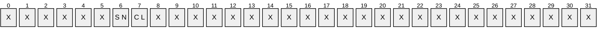

**X**: Unused. MUST be zero and ignored.

**CL (DRS_NT4_CHGLOG_GET_CHANGE_LOG, 0x00000001)**: If set, the server returns the [**PDC**](#gt_primary-domain-controller-pdc) change log.

**SN (DRS_NT4_CHGLOG_GET_SERIAL_NUMBERS, 0x00000002)**: If set, the server returns the NT4 [**replication**](#gt_replication) state.

**PreferredMaximumLength:** The maximum size, in bytes, of the change log data that is to be retrieved in a single operation.

**cbRestart:** Zero if **pRestart** = null. Otherwise, the size, in bytes, of **pRestart**^.

**pRestart:** Null to request the change log from the beginning. Otherwise, a pointer to an opaque value, returned in some previous call to IDL_DRSGetNT4ChangeLog, identifying the last change log entry returned in that previous call.

<a id="Section_4.1.11.1.3"></a>
##### 4.1.11.1.3 DRS_MSG_NT4_CHGLOG_REPLY

The DRS_MSG_NT4_CHGLOG_REPLY union defines the response messages received from the [IDL_DRSGetNT4ChangeLog](#Section_4.1.11) method. Only one version, identified by *pdwOutVersion^* = 1, is currently defined.

typedef

[switch_type(DWORD)]

union {

[case(1)]

DRS_MSG_NT4_CHGLOG_REPLY_V1 V1;

} DRS_MSG_NT4_CHGLOG_REPLY;

**V1:** The version 1 reply.

<a id="Section_4.1.11.1.4"></a>
##### 4.1.11.1.4 DRS_MSG_NT4_CHGLOG_REPLY_V1

The DRS_MSG_NT4_CHGLOG_REPLY_V1 structure defines the response message received from the [IDL_DRSGetNT4ChangeLog](#Section_4.1.11) method.

typedef struct {

[range(0,10485760)] DWORD cbRestart;

[range(0,10485760)] DWORD cbLog;

NT4_REPLICATION_STATE ReplicationState;

DWORD ActualNtStatus;

[size_is(cbRestart)] BYTE* pRestart;

[size_is(cbLog)] BYTE* pLog;

} DRS_MSG_NT4_CHGLOG_REPLY_V1;

**cbRestart:** Zero if **pRestart** = null. Otherwise, the size, in bytes, of **pRestart**^.

**cbLog:** Zero if **pRestart** = null. Otherwise, the size, in bytes, of **pLog**^.

**ReplicationState:** The [**replication**](#gt_replication) state for Windows NT 4.0 [**DCs**](#gt_domain-controller-dc).

**ActualNtStatus:** A [**STATUS code**](#gt_status-code). See the pseudo-code for interpretation.

**pRestart:** Null if no entries were returned. Otherwise, a pointer to an opaque value identifying the last entry returned in **pLog**.

**pLog:** The buffer containing the next entries from the change log.

<a id="Section_4.1.11.1.5"></a>
##### 4.1.11.1.5 NT4_REPLICATION_STATE

The NT4_REPLICATION_STATE structure defines the [**replication**](#gt_replication) state for Windows NT 4.0 [**DCs**](#gt_domain-controller-dc), whose interpretation is specified in [MS-ADTS](../MS-ADTS/MS-ADTS.md) section 3.1.1.7.1.

typedef struct {

LARGE_INTEGER SamSerialNumber;

LARGE_INTEGER SamCreationTime;

LARGE_INTEGER BuiltinSerialNumber;

LARGE_INTEGER BuiltinCreationTime;

LARGE_INTEGER LsaSerialNumber;

LARGE_INTEGER LsaCreationTime;

} NT4_REPLICATION_STATE;

**SamSerialNumber:** The Windows NT 4.0 replication [**update sequence number**](#gt_update-sequence-number-usn) for the SAM database.

**SamCreationTime:** The time at which the Windows NT 4.0 replication update sequence number for the SAM database was set to 1.

**BuiltinSerialNumber:** The Windows NT 4.0 replication update sequence number for the built-in database.

**BuiltinCreationTime:** The time at which the Windows NT 4.0 replication update sequence number for the built-in database was set to 1.

**LsaSerialNumber:** The Windows NT 4.0 replication update sequence number for the local security authority (LSA) database.

**LsaCreationTime:** The time at which the Windows NT 4.0 replication update sequence number for the LSA database was set to 1.

<a id="Section_4.1.11.2"></a>
#### 4.1.11.2 Method-Specific Abstract Types and Procedures

<a id="Section_4.1.11.2.1"></a>
##### 4.1.11.2.1 IsPDC

procedure IsPDC(): boolean

Returns true if the [**DC**](#gt_domain-controller-dc) owns the [**PDC**](#gt_primary-domain-controller-pdc) role for this [**domain**](#gt_domain), otherwise false.

<a id="Section_4.1.11.2.2"></a>
##### 4.1.11.2.2 GetWindowsErrorCode

procedure GetWindowsErrorCode(ntStatus: DWORD): DWORD

Returns the [**Windows error code**](#gt_windows-error-code) corresponding to the specified [**STATUS code**](#gt_status-code).

<a id="Section_4.1.11.3"></a>
#### 4.1.11.3 Server Behavior of the IDL_DRSGetNT4ChangeLog Method

*Informative summary of behavior*: If the server is the [**PDC emulator**](#gt_pdc-emulator) [**FSMO role owner**](#gt_fsmo-role-owner), it returns either a sequence of [**PDC**](#gt_primary-domain-controller-pdc) change log entries or the NT4 [**replication**](#gt_replication) state, or both, as requested by the client.

Multiple calls of this method might be required to retrieve the entire PDC change log. The client passes pRestart = null on the first call in a series of calls; the server returns a sequence of change log entries, including the first, a pointer to an opaque cookie, and a result code. If the server returns no change log entries, it returns null instead of a pointer to a cookie. If the server returns the result code zero, the sequence of change log entries in the response includes the final entry in the log.

The cookie encodes the serial number of the last change log entry returned. If the server returns ERROR_MORE_DATA, the final change log entry in the response was not the final entry in the change log. The client can make another call, with pRestart pointing to the cookie. The server processes this call identically to a call with pRestart = null, except that it returns change log entries starting with the entry following the last previously returned entry, as indicated by the cookie. By making enough calls the client can retrieve the entire change log.

If the client includes a cookie that is either corrupted or identifies a nonexistent change log entry (possibly because the cookie is too old), the server returns ERROR_INVALID_PARAMETER. If there are change log entries to return, but the client specifies a bound on the size of the returned change log entries that is too small to hold even a single entry, the server returns ERROR_INSUFFICIENT_BUFFER.

The NT4 replication state is a small, fixed-size structure and the server simply copies it into the response.

When the client requests both the PDC change log and the NT4 replication state, the server processes the PDC change log request first. If an error occurs during this processing the server does not process the request for NT4 replication state. If an error occurs while processing the NT4 replication state request, the server returns no indication to the client that the PDC change log request succeeded.

ULONG

IDL_DRSGetNT4ChangeLog(

[in, ref] DRS_HANDLE hDrs,

[in] DWORD dwInVersion,

[in, ref, switch_is(dwInVersion)] DRS_MSG_NT4_CHGLOG_REQ *pmsgIn,

[out, ref] DWORD *pdwOutVersion,

[out, ref, switch_is(*pdwOutVersion)]

DRS_MSG_NT4_CHGLOG_REPLY *pmsgOut)

msgIn: DRS_MSG_NT4_CHGLOG_REQ_V1

readStatus, ntStatus: DWORD

sequenceNumber: integer

nextIndexToBeReturned, lastIndexToBeReturned: integer

lastReturnedSerialNumber: LONGLONG

lastReturnedIndex: integer

pChangeLog: ADDRESS OF CHANGE_LOG_ENTRIES

ValidateDRSInput(hDrs, 11)

pdwOutVersion^ := 1

pmsgOut^.V1.cbRestart := 0

pmsgOut^.V1.cbLog := 0

pmsgOut^.V1.ReplicationState.SamSerialNumber := 0

pmsgOut^.V1.ReplicationState.SamCreationTime := 0

pmsgOut^.V1.ReplicationState.BuiltinSerialNumber := 0

pmsgOut^.V1.ReplicationState.BuiltinCreationTime := 0

pmsgOut^.V1.ReplicationState.LsaSerialNumber := 0

pmsgOut^.V1.ReplicationState.LsaCreationTime := 0

pmsgOut^.V1.ActualNtStatus := 0

pmsgOut^.V1.pRestart := null

pmsgOut^.V1.pLog := null

/* Validate the request version */

if dwInVersion ≠ 1 then

return ERROR_DS_DRA_INVALID_PARAMETER

endif

msgIn := pmsgIn^.V1

/* Access check */

if not AccessCheckCAR(DefaultNC(), DS-Replication-Get-Changes) then

return ERR0R_ACCESS_DENIED

endif

/* The DC must own the PDC role */

if not IsPDC() then

return ERROR_INVALID_DOMAIN_ROLE

endif

ntStatus := 0

readStatus := 0

if DRS_NT4_CHGLOG_GET_CHANGE_LOG in msgIn.dwFlags then

/* Return NT4 change log entries. */

/* Determine the position of the first entry in the change log that

* needs to be returned. If pRestart = null, this is the first

* entry of the change log, otherwise it is the entry following the

* entry identified in the cookie pRestart^. */

if msgIn.pRestart = null then

sequenceNumber := 1

nextIndexToBeReturned := 0

else

sequenceNumber :=

(Sequence number extracted from msgIn.pRestart^) + 1

lastReturnedSerialNumber :=

Serial number extracted from msgIn.pRestart^

lastReturnedIndex := select one i in dc.pdcChangeLog where

dc.pdcChangeLog[i].SerialNumber = lastReturnedSerialNumber

if lastReturnedIndex = null then

/* Cookie is old or corrupted.

* The STATUS code STATUS_INVALID_PARAMETER corresponds to

* the Windows error code ERROR_INVALID_PARAMETER. */

ntStatus := STATUS_INVALID_PARAMETER

else

nextIndexToBeReturned := lastReturnedIndex + 1

endif

endif

if ntStatus = 0 and nextIndexToBeReturned ≥ dc.pdcChangeLog.length

then

/* No entries to be returned, complete the response message */

pmsgOut^.V1.pLog := null

pmsgOut^.V1.cbLog := 0

pmsgOut^.V1.pRestart := null

pmsgOut^.V1.cbRestart := 0

endif

if ntStatus = 0 and

nextIndexToBeReturned < dc.pdcChangeLog.length then

/* Entries to be returned. First, determine how many entries fit

* into the response message */

lastIndexToBeReturned := the largest integer q such that

q < dc.pdcChangeLog.length and

the size in bytes of

dc.pdcChangeLog[nextIndexToBeReturned .. q]

is <= msgIn.PreferredMaximumLength

if lastIndexToBeReturned < nextIndexToBeReturned then

/* Client's PreferredMaximumLength is too small for a single

* entry, so return no entries.

* The STATUS code STATUS_BUFFER_TOO_SMALL corresponds to

* the Windows error code ERROR_INSUFFICIENT_BUFFER. */

ntStatus := STATUS_BUFFER_TOO_SMALL

else

/* Client's PreferredMaximumLength is large enough for one or

* more entries. Fill in pChangeLog^ from dc.pdcChangeLog */

pChangeLog^.Size := 0x00000010

pChangeLog^.Version := 0x00000001

pChangeLog^.SequenceNumber := sequenceNumber

pChangeLog^.Flags := 0x00000000

pChangeLog^.ChangeLogEntries :=

dc.pdcChangeLog[nextIndexToBeReturned ..

lastIndexToBeReturned]

if a fatal error occurred while retrieving dc.pdcChangeLog then

ntStatus :=

STATUS code of error that occurred, high-order bit set

end

endif

if ntStatus = 0 then

/* No errors, complete the response message */

pmsgOut^.V1.pLog := pChangeLog

pmsgOut^.V1.cbLog := size in bytes of pmsgOut^.V1.pLog^

/* Construct a new cookie */

lastReturnedSerialNumber :=

dc.pdcChangeLog[lastIndexToBeReturned].SerialNumber

pmsgOut^.V1.pRestart :=

ADDRESS OF implementation-specific struct

encapsulating lastReturnedSerialNumber and sequenceNumber

pmsgOut^.V1.cbRestart := size in bytes of pmsgOut^.V1.pRestart^

if lastIndexToBeReturned < dc.pdcChangeLog.length - 1 then

/* There are more entries to be returned.

* The STATUS code STATUS_MORE_ENTRIES corresponds to

* the Windows error code ERROR_MORE_DATA. */

ntStatus := STATUS_MORE_ENTRIES

endif

endif /* Response complete */

endif /* Entries returned */

endif /* Processed change log request */

/* Save the status code from the previous operation */

readStatus := ntStatus

if ntStatus < 0x80000000 and

DRS_NT4_CHGLOG_GET_SERIAL_NUMBERS in msgIn.dwFlags then

/* Return NT4 replication state. */

pmsgOut^.V1.ReplicationState.SamSerialNumber :=

dc.nt4ReplicationState.SamNT4ReplicationUSN

pmsgOut^.V1.ReplicationState.SamCreationTime :=

dc.nt4ReplicationState.SamCreationTime

pmsgOut^.V1.ReplicationState.BuiltinSerialNumber :=

dc.nt4ReplicationState.BuiltinNT4ReplicationUSN

pmsgOut^.V1.ReplicationState.BuiltinCreationTime :=

dc.nt4ReplicationState.BuiltinCreationTime

pmsgOut^.V1.ReplicationState.LsaSerialNumber := 1

pmsgOut^.V1.ReplicationState.LsaCreationTime :=

current time on the DC

if a fatal error occurred while retrieving NT4 replication state

then

ntStatus :=

STATUS code of error that occurred, high-order bit set

end

endif

if ntStatus < 0x80000000 then

pmsgOut^.V1.ActualStatus := readStatus

else

pmsgOut^.V1.ActualStatus := ntStatus

endif

return GetWindowsErrorCode(ntStatus)

<a id="Section_4.1.11.4"></a>
#### 4.1.11.4 Examples of the IDL_DRSGetNT4ChangeLog Method

<a id="Section_4.1.11.4.1"></a>
##### 4.1.11.4.1 Initial State

[**Domain**](#gt_domain) functional level is DS_BEHAVIOR_WIN2000 and the nTMixedDomain [**attribute**](#gt_attributes) on the [**domain NC**](#gt_domain-naming-context-domain-nc) root is 1 (see [MS-ADTS](../MS-ADTS/MS-ADTS.md) section 6.1.4.1). The [**PDC**](#gt_primary-domain-controller-pdc) role is held by DC2.

- ldap_search_s("DC=contoso,DC=com", *baseObject*, "(objectClass=*)")
- >> Dn: DC=contoso,DC=com
- 1> fSMORoleOwner: CN=NTDS Settings, CN=DC2, CN=Servers,
CN=Default-First-Site-Name, CN=Sites, CN=Configuration,

DC=contoso, DC=com;

<a id="Section_4.1.11.4.2"></a>
##### 4.1.11.4.2 Client Request

The [**PDC**](#gt_primary-domain-controller-pdc) role is transferred to DC1, which results in DC1 invoking the [IDL_DRSGetNT4ChangeLog](#Section_4.1.11) method against DC2 with the following parameters ([DRS_HANDLE](#Section_5.40) to DC2 omitted):

dwMsgVersion = 1

pmsgIn =

dwFlags: DRS_NT4_CHGLOG_GET_CHANGE_LOG +

DRS_NT4_CHGLOG_GET_SERIAL_NUMBERS

PreferredMaximumLength: 0x4000

cbRestart: 0

pRestart: null

<a id="Section_4.1.11.4.3"></a>
##### 4.1.11.4.3 Server Response

Return code of 0 with the following values:

pmsgOut = DRS_MSG_NT4_CHGLOG_REPLY_V1

cbRestart = 0x10

cbLog = 0x2d00

ReplicationState = _NT4_REPLICATION_STATE

SamSerialNumber = 0x30`00000097

SamCreationTime = 0x1c6a7a9`792f51f6

BuiltinSerialNumber = 0x30`00000054

BuiltinCreationTime = 0x1c6a7a9`792f51f6

LsaSerialNumber = 0x1

LsaCreationTime = 0x1c6a832`0a495151

ActualNtStatus = 0

pRestart = "LMEM"

pLog = pointer to actual log (log data omitted)

<a id="Section_4.1.11.4.4"></a>
##### 4.1.11.4.4 Final State

The [**PDC**](#gt_primary-domain-controller-pdc) change log entries on DC1 are synchronized with the change log entries on DC2; there is no other change in state.

<a id="Section_4.1.12"></a>
### 4.1.12 IDL_DRSGetObjectExistence (Opnum 23)

The IDL_DRSGetObjectExistence method helps the client check the consistency of [**object**](#gt_object) existence between its [**replica**](#gt_replica) of an [**NC**](#gt_naming-context-nc) and the server's replica of the same NC. Checking the consistency of object existence means identifying objects that have replicated to both replicas and that exist in one replica but not in the other. For the purposes of this method, an object *exists* within a [**NC replica**](#gt_nc-replica) if it is either an object or a [**tombstone**](#gt_tombstone).

See [IDL_DRSReplicaVerifyObjects](#Section_4.1.24) for a use of this method.

ULONG IDL_DRSGetObjectExistence(

[in, ref] DRS_HANDLE hDrs,

[in] DWORD dwInVersion,

[in, ref, switch_is(dwInVersion)]

DRS_MSG_EXISTREQ* pmsgIn,

[out, ref] DWORD* pdwOutVersion,

[out, ref, switch_is(*pdwOutVersion)]

DRS_MSG_EXISTREPLY* pmsgOut

);

**hDrs:** The [**RPC**](#gt_remote-procedure-call-rpc) context handle returned by the [IDL_DRSBind](#Section_4.1.3) method.

**dwInVersion:** The version of the request message.

**pmsgIn:** A pointer to the request message.

**pdwOutVersion:** A pointer to the version of the response message.

**pmsgOut:** A pointer to the response message.

**Return Values:** 0 if successful, otherwise a [**Windows error code**](#gt_windows-error-code).

**Exceptions Thrown**: This method might throw the following exceptions beyond those thrown by the underlying RPC protocol (as specified in [MS-RPCE](../MS-RPCE/MS-RPCE.md)): ERROR_INVALID_HANDLE, ERROR_DS_DRS_EXTENSIONS_CHANGED, ERROR_DS_DIFFERENT_REPL_EPOCHS, and ERROR_INVALID_PARAMETER.

<a id="Section_4.1.12.1"></a>
#### 4.1.12.1 Method-Specific Concrete Types

<a id="Section_4.1.12.1.1"></a>
##### 4.1.12.1.1 DRS_MSG_EXISTREQ

The DRS_MSG_EXISTREQ union defines request messages sent to the [IDL_DRSGetObjectExistence](#Section_4.1.12) method. Only one version, identified by *dwInVersion* = 1, is currently defined.

typedef

[switch_type(DWORD)]

union {

[case(1)]

DRS_MSG_EXISTREQ_V1 V1;

} DRS_MSG_EXISTREQ;

**V1:** The version 1 request.

<a id="Section_4.1.12.1.2"></a>
##### 4.1.12.1.2 DRS_MSG_EXISTREQ_V1

The DRS_MSG_EXISTREQ_V1 structure defines the request message sent to the [IDL_DRSGetObjectExistence](#Section_4.1.12) method.

typedef struct {

UUID guidStart;

DWORD cGuids;

DSNAME* pNC;

UPTODATE_VECTOR_V1_EXT* pUpToDateVecCommonV1;

UCHAR Md5Digest[16];

} DRS_MSG_EXISTREQ_V1;

**guidStart:** The objectGUID of the first [**object**](#gt_object) in the client's object sequence.

**cGuids:** The number of objects in the client's object sequence.

**pNC:** The [**NC**](#gt_naming-context-nc) containing the objects in the sequence.

**pUpToDateVecCommonV1:** The filter excluding objects from the client's object sequence.

**Md5Digest:** The [**digest**](#gt_digest) of the objectGUID values of the objects in the client's object sequence.

<a id="Section_4.1.12.1.3"></a>
##### 4.1.12.1.3 DRS_MSG_EXISTREPLY

The DRS_MSG_EXISTREPLY union defines the response message versions received from the [IDL_DRSGetObjectExistence](#Section_4.1.12) method. Only one version, identified by *pdwOutVersion^* = 1, is currently defined.

typedef

[switch_type(DWORD)]

union {

[case(1)]

DRS_MSG_EXISTREPLY_V1 V1;

} DRS_MSG_EXISTREPLY;

**V1:** The version 1 response.

<a id="Section_4.1.12.1.4"></a>
##### 4.1.12.1.4 DRS_MSG_EXISTREPLY_V1

The DRS_MSG_EXISTREPLY_V1 structure defines the response message received from the [IDL_DRSGetObjectExistence](#Section_4.1.12) method.

typedef struct {

DWORD dwStatusFlags;

[range(0,10485760)] DWORD cNumGuids;

[size_is(cNumGuids)] UUID* rgGuids;

} DRS_MSG_EXISTREPLY_V1;

**dwStatusFlags:** 1 if the [**digests**](#gt_digest) of the [**object**](#gt_object) sequences on the client and server are the same, 0 if they are different.

**cNumGuids:** The number of items in the **rgGuids** array. Zero if **dwStatusFlags** = 0.

**rgGuids:** The objectGUIDs of the objects in the server's object sequence.

<a id="Section_4.1.12.2"></a>
#### 4.1.12.2 Method-Specific Abstract Types and Procedures

The following procedure is used in specifying both the client and server behavior of [IDL_DRSGetObjectExistence](#Section_4.1.12).

<a id="Section_4.1.12.2.1"></a>
##### 4.1.12.2.1 GuidSequence

*Informative summary of behavior*: The *candidate set* of [**objects**](#gt_object) is the set of all objects and [**tombstones**](#gt_tombstone) in the local [**replica**](#gt_replica) of [**NC**](#gt_naming-context-nc) *nc*, excluding objects that have not yet replicated to both the client and server replicas of NC *nc*. The exclusion of objects created too recently is performed using the client-supplied [**up-to-date vector**](#gt_up-to-date-vector) *utd*.

A *cluster* is any subset of the candidate set such that no object in the candidate set outside the cluster has an objectGUID lying between the objectGUIDs of any two members of the cluster.

The cluster constructed by GuidSequence contains the object in the candidate set with the smallest objectGUID greater than or equal to *startGUID*. The cluster contains as many objects as possible, but no more than count.

Both the client and the server use GuidSequence to compute a cluster, create a sorted sequence of objectGUIDs of objects in the cluster, and compute a [**digest**](#gt_digest) of that sequence.

procedure GuidSequence(

startGUID: GUID,

count: ULONG,

nc: DSName,

utd: UPTODATE_VECTOR_V1_EXT,

var s: sequence of DSName,

var digest: sequence [0..15] of byte)

The procedure GuidSequence returns the following:

- A sequence *s* of objectGUIDs from the server's state.
- An MD5 digest value *digest* that is derived from the sequence *s*.
The first four parameters determine the result sequence *s* as follows:

- Construct the following set of [DSName](#Section_5.49)s:
select all o subtree-ts-included nc where

StampLessThanOrEqualUTD(AttrStamp(o, whenCreated), utd)

- Construct the [GUID](#Section_5.87) sequence *S* that contains the objectGUIDs of members of the set, sorted into ascending order by GUID value.
- Find the smallest integer *i* such that *S*[*i*] >= *startGUID*. If there is no such *i*, the result sequence *s* is empty, otherwise the result sequence *s* is as follows:
*S*[*i* .. min(*i*+count, *S*.length)-1]

The result digest is the value of ComputeDigest applied to the result sequence *s*, where ComputeDigest is specified as follows:

procedure ComputeDigest(s: sequence of GUID): sequence [0..15] of byte

md5Context : MD5_CTX

MD5Init(md5Context)

for i := 0 to s.length-1

MD5Update(md5Context, s[i], 16)

endfor

MD5Final(md5Context)

return md5Context.digest

<a id="Section_4.1.12.3"></a>
#### 4.1.12.3 Client Behavior When Sending the IDL_DRSGetObjectExistence Request

*Informative summary of behavior*: The client uses [IDL_DRSGetObjectExistence](#Section_4.1.12) to check the consistency of [**object**](#gt_object) existence between its [**replica**](#gt_replica) of an [**NC**](#gt_naming-context-nc) and another replica of the same NC. Checking the consistency of object existence means identifying objects that have replicated to both replicas, and that exist in one replica but not in the other. For the purposes of this method, an object *exists* within an [**NC replica**](#gt_nc-replica) if it is either an object or a [**tombstone**](#gt_tombstone).

IDL_DRSGetObjectExistence allows the client to perform this checking in *clusters*, as defined in the informative summary of the GuidSequence procedure (section [4.1.12.2.1](#Section_4.1.12.2.1)).

The inputs to this checking process on the client are as follows:

nc: DSName

utdClient, utdServer: UPTODATE_VECTOR_V1_EXT

guidStart: GUID

count: ULONG

**nc**: The NC containing the cluster that the client will check.

**utdClient, utdServer**: The [**up-to-date vectors**](#gt_up-to-date-vector) of the client and server for the NC *nc*, respectively. The client can obtain *utdServer* using [IDL_DRSGetReplInfo](#Section_4.1.13).

**guidStart**: The lower bound on the smallest objectGUID in the cluster that the client will check.

**count**: The upper bound on the number of objects in the cluster that the client will check.

Given these inputs, the client creates the request message to IDL_DRSGetObjectExistence as follows:<32>

msgIn: DRS_MSG_EXISTREQ_V1

s: sequence

digest: sequence [0..15] of byte

msgIn.pNC := nc

msgIn.pUpToDateVecCommonV1 := MergeUTD(utdClient, utdServer)

GuidSequence(

guidStart, count, nc, msgIn.pUpToDateVecCommonV1^, s, digest)

msgIn.guidStart := s[0]

msgIn.length := s.length

msgIn.Md5Digest := digest

pmsgIn^.V1 := msgIn

<a id="Section_4.1.12.4"></a>
#### 4.1.12.4 Server Behavior of the IDL_DRSGetObjectExistence Method

*Informative summary of behavior*: The server computes a cluster, an objectGUID sequence, and a [**digest**](#gt_digest) in the same manner as the client, but uses the server's [**NC replica**](#gt_nc-replica). If the digest computed by the server equals the digest in the client's request, the server returns dwStatusFlags = 1, otherwise the server returns dwStatusFlags = 0 and the objectGUID sequence.

ULONG IDL_DRSGetObjectExistence (

[in, ref] DRS_HANDLE hDrs,

[in] DWORD dwInVersion,

[in, ref, switch_is(dwInVersion)] DRS_MSG_EXISTREQ *pmsgIn,

[out, ref] DWORD *pdwOutVersion,

[out, ref, switch_is(*pdwOutVersion)]

DRS_MSG_EXISTREPLY *pmsgOut)

msgIn: DRS_MSG_EXISTREQ_V1

nc: DSName

s: sequence of GUID

digest: sequence [0..15] of byte

msgOut: DRS_MSG_EXISTREPLY_V1

*pdwOutVersion = 1;

ValidateDRSInput(hDrs, 23)

pdwOutVersion^ := 1

pmsgOut^.V1.dwStatusFlags := 0

pmsgOut^.V1.cNumGuids := 0

pmsgOut^.V1.rgGuids := null

if dwInVersion ≠ 0x1 then

return ERROR_DS_DRA_INVALID_PARAMETER

endif

msgIn := pmsgIn^.V1

nc := msgIn.pNC^

if not MasterReplicaExists(nc) then

return ERROR_DS_DRA_INVALID_PARAMETER

endif

if msgIn.guidStart = NULLGUID then

return ERROR_DS_DRA_INVALID_PARAMETER

endif

if not AccessCheckCAR(nc, DS-Replication-Get-Changes) then

return ERROR_DS_DRA_ACCESS_DENIED

endif

GuidSequence(msgIn.guidStart, msgIn.cGuids, nc,

msgIn.pUpToDateVecCommonV1^, s, digest)

if msgIn.Md5Digest = digest then

msgOut.dwStatusFlags := 1

msgOut.cNumGuids := 0

msgOut.rgGuids := null

else if

msgOut.dwStatusFlags := 0

msgOut.cNumGuids := s.length

for i := 0 to s.length - 1

msgOut.rgGuids[i] := s[i]

endfor

endif

pmsgOut^.V1 := msgOut

return 0

<a id="Section_4.1.12.5"></a>
#### 4.1.12.5 Client Behavior When Receiving the IDL_DRSGetObjectExistence Response

*Informative summary of behavior*: If the server response contains dwStatusFlags = 0, the client computes the difference between the client and the server sequences and takes whatever action is required.

<a id="Section_4.1.13"></a>
### 4.1.13 IDL_DRSGetReplInfo (Opnum 19)

The IDL_DRSGetReplInfo method retrieves the [**replication**](#gt_replication) state of the server.

ULONG IDL_DRSGetReplInfo(

[in, ref] DRS_HANDLE hDrs,

[in] DWORD dwInVersion,

[in, ref, switch_is(dwInVersion)]

DRS_MSG_GETREPLINFO_REQ* pmsgIn,

[out, ref] DWORD* pdwOutVersion,

[out, ref, switch_is(*pdwOutVersion)]

DRS_MSG_GETREPLINFO_REPLY* pmsgOut

);

**hDrs:** The [**RPC**](#gt_remote-procedure-call-rpc) context handle returned by the [IDL_DRSBind](#Section_4.1.3) method.

**dwInVersion:** The version of the request message.

**pmsgIn:** A pointer to the request message.

**pdwOutVersion:** A pointer to the version of the response message.

**pmsgOut:** A pointer to the response message.

**Return Values:** 0 if successful, otherwise a [**Windows error code**](#gt_windows-error-code).

**Exceptions Thrown**: This method might throw the following exceptions beyond those thrown by the underlying RPC protocol (as specified in [MS-RPCE](../MS-RPCE/MS-RPCE.md)): ERROR_INVALID_HANDLE, ERROR_DS_DRS_EXTENSIONS_CHANGED, ERROR_DS_DIFFERENT_REPL_EPOCHS, and ERROR_INVALID_PARAMETER.

<a id="Section_4.1.13.1"></a>
#### 4.1.13.1 Method-Specific Concrete Types

<a id="Section_4.1.13.1.1"></a>
##### 4.1.13.1.1 DRS_MSG_GETREPLINFO_REQ

The DRS_MSG_GETREPLINFO_REQ union defines the request message versions sent to the [IDL_DRSGetReplInfo](#Section_4.1.13) method.

typedef

[switch_type(DWORD)]

union {

[case(1)]

DRS_MSG_GETREPLINFO_REQ_V1 V1;

[case(2)]

DRS_MSG_GETREPLINFO_REQ_V2 V2;

} DRS_MSG_GETREPLINFO_REQ;

**V1:** Version 1 request.

**V2:** Version 2 request. The V2 request structure is a superset of the V1 request structure.

<a id="Section_4.1.13.1.2"></a>
##### 4.1.13.1.2 DRS_MSG_GETREPLINFO_REQ_V1

The DRS_MSG_GETREPLINFO_REQ_V1 structure defines a version 1 request message sent to the [IDL_DRSGetReplInfo](#Section_4.1.13) method.

typedef struct {

DWORD InfoType;

[string] LPWSTR pszObjectDN;

UUID uuidSourceDsaObjGuid;

} DRS_MSG_GETREPLINFO_REQ_V1;

**InfoType:** MUST be a DS_REPL_INFO code.

**pszObjectDN:** [**DN**](#gt_distinguished-name-dn) of the [**object**](#gt_object) on which the operation is to be performed. The meaning of this parameter depends on the value of the **InfoType** parameter.

**uuidSourceDsaObjGuid:** [**NULL GUID**](#gt_null-guid) or the [**DSA GUID**](#gt_dsa-guid) of a [**DC**](#gt_domain-controller-dc).

<a id="Section_4.1.13.1.3"></a>
##### 4.1.13.1.3 DRS_MSG_GETREPLINFO_REQ_V2

The DRS_MSG_GETREPLINFO_REQ_V2 structure defines a version 2 request message sent to the [IDL_DRSGetReplInfo](#Section_4.1.13) method. The V2 request structure is a superset of the V1 request structure.

typedef struct {

DWORD InfoType;

[string] LPWSTR pszObjectDN;

UUID uuidSourceDsaObjGuid;

DWORD ulFlags;

[string] LPWSTR pszAttributeName;

[string] LPWSTR pszValueDN;

DWORD dwEnumerationContext;

} DRS_MSG_GETREPLINFO_REQ_V2;

**InfoType:** MUST be a DS_REPL_INFO code.

**pszObjectDN:** [**DN**](#gt_distinguished-name-dn) of the [**object**](#gt_object) on which the operation is to be performed. The meaning of this parameter depends on the value of the **InfoType** parameter.

**uuidSourceDsaObjGuid:** [**NULL GUID**](#gt_null-guid) or the [**DSA GUID**](#gt_dsa-guid) of a [**DC**](#gt_domain-controller-dc).

**ulFlags:** Zero or more of the following bit flags, which are presented in little-endian byte order.

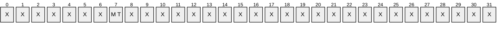

**X**: Unused. MUST be zero and ignored.

**MT (DS_REPL_INFO_FLAG_IMPROVE_LINKED_ATTRS, 0x00000001)**: Return [**attribute**](#gt_attributes) [**stamps**](#gt_stamp) for linked values.

**pszAttributeName:** Null, or the lDAPDisplayName of a [**link attribute**](#gt_link-attribute).

**pszValueDN:** Null, or the DN of the [**link value**](#gt_link-value) for which to retrieve a stamp.

**dwEnumerationContext:** Zero, or the value of **dwEnumerationContext** returned by the server on a previous call to IDL_DRSGetReplInfo. For an informative description of the sequencing issues associated with this field, see section [1.3.2](#Section_1.3.2).

<a id="Section_4.1.13.1.4"></a>
##### 4.1.13.1.4 DS_REPL_INFO Codes

DS_REPL_INFO codes indicate the type of [**replication**](#gt_replication) state information being requested.

| Value | Meaning |
| --- | --- |
| DS_REPL_INFO_NEIGHBORS 0x00000000 | Replication state data for each [**NC**](#gt_naming-context-nc) and source server pair, for all [**NC replicas**](#gt_nc-replica) hosted by this [**DC**](#gt_domain-controller-dc). |
| DS_REPL_INFO_CURSORS_FOR_NC 0x00000001 | A portion of the replication state for the NC replica of a given NC. |
| DS_REPL_INFO_METADATA_FOR_OBJ 0x00000002 | [**Stamps**](#gt_stamp) for all the [**replicated attributes**](#gt_replicated-attribute) of the given [**object**](#gt_object). |
| DS_REPL_INFO_KCC_DSA_CONNECT_FAILURES 0x00000003 | Replication state data regarding connection failures with inbound replication partners. |
| DS_REPL_INFO_KCC_DSA_LINK_FAILURES 0x00000004 | Replication state data regarding link failures with inbound replication partners. |
| DS_REPL_INFO_PENDING_OPS 0x00000005 | Replication tasks that are currently executing or that are queued to execute. |
| DS_REPL_INFO_METADATA_FOR_ATTR_VALUE 0x00000006 | Stamps for a specific [**link attribute**](#gt_link-attribute) of the given object. |
| DS_REPL_INFO_CURSORS_2_FOR_NC 0x00000007 | A portion of the replication state for the NC replica of a given NC. |
| DS_REPL_INFO_CURSORS_3_FOR_NC 0x00000008 | A portion of the replication state for the NC replica of a given NC. |
| DS_REPL_INFO_METADATA_2_FOR_OBJ 0x00000009 | Stamps for all the replicated attributes of the given object. |
| DS_REPL_INFO_METADATA_2_FOR_ATTR_VALUE 0x0000000A | Stamps for a specific link attribute of the given object. |
| DS_REPL_INFO_SERVER_OUTGOING_CALLS 0xFFFFFFFA | A list of all outstanding [**RPC**](#gt_remote-procedure-call-rpc) server call contexts. |
| DS_REPL_INFO_UPTODATE_VECTOR_V1 0xFFFFFFFB | The replication state for the NC replica of a given NC. |
| DS_REPL_INFO_CLIENT_CONTEXTS 0xFFFFFFFC | A list of all outstanding RPC client contexts. |
| DS_REPL_INFO_REPSTO 0xFFFFFFFE | Replication state data for each NC and destination server (which is notified of changes) pair, for all NC replicas hosted by this DC. |

<a id="Section_4.1.13.1.5"></a>
##### 4.1.13.1.5 DRS_MSG_GETREPLINFO_REPLY

The DRS_MSG_GETREPLINFO_REPLY union defines response messages received from the [IDL_DRSGetReplInfo](#Section_4.1.13) method.

typedef

[switch_type(DWORD)]

union {

[case(0)]

DS_REPL_NEIGHBORSW* pNeighbors;

[case(1)]

DS_REPL_CURSORS* pCursors;

[case(2)]

DS_REPL_OBJ_META_DATA* pObjMetaData;

[case(3)]

DS_REPL_KCC_DSA_FAILURESW* pConnectFailures;

[case(4)]

DS_REPL_KCC_DSA_FAILURESW* pLinkFailures;

[case(5)]

DS_REPL_PENDING_OPSW* pPendingOps;

[case(6)]

DS_REPL_ATTR_VALUE_META_DATA* pAttrValueMetaData;

[case(7)]

DS_REPL_CURSORS_2* pCursors2;

[case(8)]

DS_REPL_CURSORS_3W* pCursors3;

[case(9)]

DS_REPL_OBJ_META_DATA_2* pObjMetaData2;

[case(10)]

DS_REPL_ATTR_VALUE_META_DATA_2* pAttrValueMetaData2;

[case(0xFFFFFFFA)]

DS_REPL_SERVER_OUTGOING_CALLS* pServerOutgoingCalls;

[case(0xFFFFFFFB)]

UPTODATE_VECTOR_V1_EXT* pUpToDateVec;

[case(0xFFFFFFFC)]

DS_REPL_CLIENT_CONTEXTS* pClientContexts;

[case(0xFFFFFFFE)]

DS_REPL_NEIGHBORSW* pRepsTo;

} DRS_MSG_GETREPLINFO_REPLY;

**pNeighbors:** Neighbor information.

**pCursors:** Cursors for an [**NC replica**](#gt_nc-replica).

**pObjMetaData:** [**Attribute**](#gt_attributes) [**stamps**](#gt_stamp).

**pConnectFailures:** Connection failure data.

**pLinkFailures:** Link failure data.

**pPendingOps:** Pending operations in the [**replication**](#gt_replication) queue.

**pAttrValueMetaData:** [**Link value stamps**](#gt_link-value-stamp).

**pCursors2:** Cursors for an NC replica.

**pCursors3:** Cursors for an NC replica.

**pObjMetaData2:** Attribute stamps.

**pAttrValueMetaData2:** Link value stamps.

**pServerOutgoingCalls:** Outstanding requests from this [**DC**](#gt_domain-controller-dc) to other DCs.

**pUpToDateVec:** Cursors for an NC replica.

**pClientContexts:** Active [**RPC**](#gt_remote-procedure-call-rpc) client connections.

**pRepsTo:** Neighbor information.

<a id="Section_4.1.13.1.6"></a>
##### 4.1.13.1.6 DS_REPL_NEIGHBORSW

The DS_REPL_NEIGHBORSW structure defines a set of [**replication**](#gt_replication) neighbors. This structure is a concrete representation of a sequence of [RepsFrom](#Section_5.172) or [RepsTo](#Section_5.173) values.

typedef struct {

DWORD cNumNeighbors;

DWORD dwReserved;

[size_is(cNumNeighbors)] DS_REPL_NEIGHBORW rgNeighbor[];

} DS_REPL_NEIGHBORSW;

**cNumNeighbors:** The count of items in the **rgNeighbor** array.

**dwReserved:** Unused. MUST be 0 and ignored.

**rgNeighbor:** A set of replication neighbors.

<a id="Section_4.1.13.1.7"></a>
##### 4.1.13.1.7 DS_REPL_NEIGHBORW

The DS_REPL_NEIGHBORW structure defines a [**replication**](#gt_replication) neighbor. This structure is a concrete representation of a [RepsFrom](#Section_5.172) or [RepsTo](#Section_5.173) value.

typedef struct {

[string] LPWSTR pszNamingContext;

[string] LPWSTR pszSourceDsaDN;

[string] LPWSTR pszSourceDsaAddress;

[string] LPWSTR pszAsyncIntersiteTransportDN;

DWORD dwReplicaFlags;

DWORD dwReserved;

UUID uuidNamingContextObjGuid;

UUID uuidSourceDsaObjGuid;

UUID uuidSourceDsaInvocationID;

UUID uuidAsyncIntersiteTransportObjGuid;

USN usnLastObjChangeSynced;

USN usnAttributeFilter;

FILETIME ftimeLastSyncSuccess;

FILETIME ftimeLastSyncAttempt;

DWORD dwLastSyncResult;

DWORD cNumConsecutiveSyncFailures;

} DS_REPL_NEIGHBORW;

**pszNamingContext:** The [**NC**](#gt_naming-context-nc) root of the [**NC replica**](#gt_nc-replica).

**pszSourceDsaDN:** The [**DN**](#gt_distinguished-name-dn) of the server [**DC**](#gt_domain-controller-dc) nTDSDSA [**object**](#gt_object).

**pszSourceDsaAddress:** The [NetworkAddress](#Section_5.134) of the server DC.

**pszAsyncIntersiteTransportDN:** The DN of the interSiteTransport object corresponding to the transport used to communicate with the server DC.

**dwReplicaFlags:** The [DRS_OPTIONS](#Section_5.41) flags.

**dwReserved:** Unused. MUST be 0 and ignored.

**uuidNamingContextObjGuid:** The objectGUID of the NC root.

**uuidSourceDsaObjGuid:** The [**DSA GUID**](#gt_dsa-guid) of the server DC.

**uuidSourceDsaInvocationID:** The [**invocation ID**](#gt_invocation-id) associated with the server DC.

**uuidAsyncIntersiteTransportObjGuid:** The objectGUID of the interSiteTransport object corresponding to the transport used to communicate with the server DC.

**usnLastObjChangeSynced:** An implementation-specific value.

**usnAttributeFilter:** An implementation-specific value.

**ftimeLastSyncSuccess:** The time of the last successful replication from the server DC.

**ftimeLastSyncAttempt:** The time of the last attempt to replicate from the server DC.

**dwLastSyncResult:** 0, or the [**Windows error code**](#gt_windows-error-code), as specified in [MS-ERREF](../MS-ERREF/MS-ERREF.md) section 2.2, resulting from the last sync attempt.

**cNumConsecutiveSyncFailures:** The number of consecutive failures to replicate from the server DC.

<a id="Section_4.1.13.1.8"></a>
##### 4.1.13.1.8 DS_REPL_CURSORS

The DS_REPL_CURSORS structure defines a set of [**replication**](#gt_replication) cursors for a given [**NC replica**](#gt_nc-replica). This structure is a concrete representation of a sequence of [ReplUpToDateVector](#Section_5.166) values.

typedef struct {

DWORD cNumCursors;

DWORD dwReserved;

[size_is(cNumCursors)] DS_REPL_CURSOR rgCursor[];

} DS_REPL_CURSORS;

**cNumCursors:** The count of items in the **rgCursor** array.

**dwReserved:** Unused. MUST be 0 and ignored.

**rgCursor:** A set of replication cursors.

<a id="Section_4.1.13.1.9"></a>
##### 4.1.13.1.9 DS_REPL_CURSOR

The DS_REPL_CURSOR structure defines a [**replication**](#gt_replication) cursor for a given [**NC replica**](#gt_nc-replica). This structure is a concrete representation of a [ReplUpToDateVector](#Section_5.166) value.

typedef struct {

UUID uuidSourceDsaInvocationID;

USN usnAttributeFilter;

} DS_REPL_CURSOR;

**uuidSourceDsaInvocationID:** The [**invocation ID**](#gt_invocation-id) of a [**DC**](#gt_domain-controller-dc).

**usnAttributeFilter:** The [**update sequence number (USN)**](#gt_update-sequence-number-usn) at which an [**update**](#gt_update) was applied on the DC.

<a id="Section_4.1.13.1.10"></a>
##### 4.1.13.1.10 DS_REPL_CURSORS_2

The DS_REPL_CURSORS_2 structure defines a set of [**replication**](#gt_replication) cursors for a given [**NC replica**](#gt_nc-replica). This structure is a concrete representation of a sequence of [ReplUpToDateVector](#Section_5.166) values; it is a superset of [DS_REPL_CURSORS](#Section_4.1.13.1.8).

typedef struct {

DWORD cNumCursors;

DWORD dwEnumerationContext;

[size_is(cNumCursors)] DS_REPL_CURSOR_2 rgCursor[];

} DS_REPL_CURSORS_2;

**cNumCursors:** The count of items in the **rgCursor** array.

**dwEnumerationContext:** The value a client uses to populate the **dwEnumerationContext** field of the request on a future call to [IDL_DRSGetReplInfo](#Section_4.1.13) to retrieve additional results. For an informative description of the sequencing issues associated with this field, see section [1.3.2](#Section_1.3.2).

**rgCursor:** A set of replication cursors.

<a id="Section_4.1.13.1.11"></a>
##### 4.1.13.1.11 DS_REPL_CURSOR_2

The DS_REPL_CURSOR_2 structure defines a [**replication**](#gt_replication) cursor for a given [**NC replica**](#gt_nc-replica). This structure is a concrete representation of a [ReplUpToDateVector](#Section_5.166) value; it is a superset of [DS_REPL_CURSOR](#Section_4.1.13.1.9).

typedef struct {

UUID uuidSourceDsaInvocationID;

USN usnAttributeFilter;

FILETIME ftimeLastSyncSuccess;

} DS_REPL_CURSOR_2;

**uuidSourceDsaInvocationID:** The [**invocation ID**](#gt_invocation-id) of a [**DC**](#gt_domain-controller-dc).

**usnAttributeFilter:** The [**USN**](#gt_update-sequence-number-usn) at which an [**update**](#gt_update) was applied on the DC.

**ftimeLastSyncSuccess:** The time at which the last successful replication occurred from the DC identified by uuidDsa. Used for [**replication latency**](#gt_replication-latency) reporting only.

<a id="Section_4.1.13.1.12"></a>
##### 4.1.13.1.12 DS_REPL_CURSORS_3W

The DS_REPL_CURSORS_3W structure defines a [**replication**](#gt_replication) cursor for a given [**NC replica**](#gt_nc-replica). This structure is a concrete representation of a sequence of [ReplUpToDateVector](#Section_5.166) values; it is a superset of [DS_REPL_CURSORS_2](#Section_4.1.13.1.10).

typedef struct {

DWORD cNumCursors;

DWORD dwEnumerationContext;

[size_is(cNumCursors)] DS_REPL_CURSOR_3W rgCursor[];

} DS_REPL_CURSORS_3W;

**cNumCursors:** The count of items in the **rgCursor** array.

**dwEnumerationContext:** The value a client uses to populate the **dwEnumerationContext** field of the request on a future call to [IDL_DRSGetReplInfo](#Section_4.1.13) to retrieve additional results. For an informative description of the sequencing issues associated with this field, see section [1.3.2](#Section_1.3.2).

**rgCursor:** A set of replication cursors.

<a id="Section_4.1.13.1.13"></a>
##### 4.1.13.1.13 DS_REPL_CURSOR_3W

The DS_REPL_CURSOR_3W structure defines a [**replication**](#gt_replication) cursor for a given [**NC replica**](#gt_nc-replica). This structure is a concrete representation of a [ReplUpToDateVector](#Section_5.166) value; it is a superset of [DS_REPL_CURSOR_2](#Section_4.1.13.1.10).

typedef struct {

UUID uuidSourceDsaInvocationID;

USN usnAttributeFilter;

FILETIME ftimeLastSyncSuccess;

[string] LPWSTR pszSourceDsaDN;

} DS_REPL_CURSOR_3W;

**uuidSourceDsaInvocationID:** The [**invocation ID**](#gt_invocation-id) of a [**DC**](#gt_domain-controller-dc).

**usnAttributeFilter:** The [**USN**](#gt_update-sequence-number-usn) at which an [**update**](#gt_update) was applied on the DC.

**ftimeLastSyncSuccess:** The time at which the last successful replication occurred from the DC identified by uuidDsa. Used for [**replication latency**](#gt_replication-latency) reporting only.

**pszSourceDsaDN:** The [**DN**](#gt_distinguished-name-dn) of the nTDSDSA [**object**](#gt_object) with an invocationId of **uuidSourceDsaInvocationID**.

<a id="Section_4.1.13.1.14"></a>
##### 4.1.13.1.14 DS_REPL_OBJ_META_DATA

The DS_REPL_OBJ_META_DATA structure defines a set of [**attribute**](#gt_attributes) [**stamps**](#gt_stamp) for a given [**object**](#gt_object). This structure is a concrete representation of the sequence of [AttributeStamp](#Section_5.11) values for all attributes of a given object.

typedef struct {

DWORD cNumEntries;

DWORD dwReserved;

[size_is(cNumEntries)] DS_REPL_ATTR_META_DATA rgMetaData[];

} DS_REPL_OBJ_META_DATA;

**cNumEntries:** The count of items in the **rgMetaData** array.

**dwReserved:** Unused. MUST be 0 and ignored.

**rgMetaData:** A set of attribute stamps.

<a id="Section_4.1.13.1.15"></a>
##### 4.1.13.1.15 DS_REPL_ATTR_META_DATA

The DS_REPL_ATTR_META_DATA structure defines an [**attribute**](#gt_attributes) [**stamp**](#gt_stamp) for a given [**object**](#gt_object). This structure is a concrete representation of an [AttributeStamp](#Section_5.11).

typedef struct {

[string] LPWSTR pszAttributeName;

DWORD dwVersion;

FILETIME ftimeLastOriginatingChange;

UUID uuidLastOriginatingDsaInvocationID;

USN usnOriginatingChange;

USN usnLocalChange;

} DS_REPL_ATTR_META_DATA;

**pszAttributeName:** The lDAPDisplayName of the attribute to which the stamp corresponds.

**dwVersion:** The stamp version.

**ftimeLastOriginatingChange:** The date and time at which the last [**originating update**](#gt_originating-update) was made.

**uuidLastOriginatingDsaInvocationID:** The [**invocation ID**](#gt_invocation-id) of the [**DC**](#gt_domain-controller-dc) that performed the last originating update.

**usnOriginatingChange:** The [**USN**](#gt_update-sequence-number-usn) assigned to the last originating update by the DC that performed it.

**usnLocalChange:** An implementation-specific value.

<a id="Section_4.1.13.1.16"></a>
##### 4.1.13.1.16 DS_REPL_OBJ_META_DATA_2

The DS_REPL_OBJ_META_DATA_2 structure defines a set of [**attribute**](#gt_attributes) [**stamps**](#gt_stamp) for a given [**object**](#gt_object). This structure is a concrete representation of the sequence of [AttributeStamp](#Section_5.11) values for all attributes of a given object; it is a superset of [DS_REPL_OBJ_META_DATA](#Section_4.1.13.1.14).

typedef struct {

DWORD cNumEntries;

DWORD dwReserved;

[size_is(cNumEntries)] DS_REPL_ATTR_META_DATA_2 rgMetaData[];

} DS_REPL_OBJ_META_DATA_2;

**cNumEntries:** The count of items in the **rgMetaData** array.

**dwReserved:** Unused. MUST be 0 and ignored.

**rgMetaData:** A set of attribute stamps.

<a id="Section_4.1.13.1.17"></a>
##### 4.1.13.1.17 DS_REPL_ATTR_META_DATA_2

The DS_REPL_ATTR_META_DATA_2 structure defines an [**attribute**](#gt_attributes) [**stamp**](#gt_stamp) for a given [**object**](#gt_object). This structure is a concrete representation of an [AttributeStamp](#Section_5.11); it is a superset of [DS_REPL_ATTR_META_DATA](#Section_4.1.13.1.15).

typedef struct {

[string] LPWSTR pszAttributeName;

DWORD dwVersion;

FILETIME ftimeLastOriginatingChange;

UUID uuidLastOriginatingDsaInvocationID;

USN usnOriginatingChange;

USN usnLocalChange;

[string] LPWSTR pszLastOriginatingDsaDN;

} DS_REPL_ATTR_META_DATA_2;

**pszAttributeName:** The lDAPDisplayName of the attribute to which the stamp corresponds.

**dwVersion:** The stamp version.

**ftimeLastOriginatingChange:** The date and time at which the last [**originating update**](#gt_originating-update) was made.

**uuidLastOriginatingDsaInvocationID:** The [**invocation ID**](#gt_invocation-id) of the [**DC**](#gt_domain-controller-dc) that performed the last originating update.

**usnOriginatingChange:** The [**USN**](#gt_update-sequence-number-usn) assigned to the last originating update by the DC that performed it.

**usnLocalChange:** An implementation-specific value.

**pszLastOriginatingDsaDN:** The [**DN**](#gt_distinguished-name-dn) of the nTDSDSA object with an invocationId of uuidLastOriginatingDsaInvocationID.

<a id="Section_4.1.13.1.18"></a>
##### 4.1.13.1.18 DS_REPL_KCC_DSA_FAILURESW

The DS_REPL_KCC_DSA_FAILURESW structure defines a set of [**DCs**](#gt_domain-controller-dc) that are in an error state with respect to [**replication**](#gt_replication). This structure is a concrete representation of [KCCFailedConnections](#Section_5.111) and [KCCFailedLinks](#Section_5.112).

typedef struct {

DWORD cNumEntries;

DWORD dwReserved;

[size_is(cNumEntries)] DS_REPL_KCC_DSA_FAILUREW rgDsaFailure[];

} DS_REPL_KCC_DSA_FAILURESW;

**cNumEntries:** The count of items in the **rgDsaFailure** array.

**dwReserved:** Unused. MUST be 0 and ignored.

**rgDsaFailure:** An array of [DS_REPL_KCC_DSA_FAILUREW](#Section_4.1.13.1.19) structures.

<a id="Section_4.1.13.1.19"></a>
##### 4.1.13.1.19 DS_REPL_KCC_DSA_FAILUREW

The DS_REPL_KCC_DSA_FAILUREW structure defines a [**DC**](#gt_domain-controller-dc) that is in a [**replication**](#gt_replication) error state. This structure is a concrete representation of a tuple in a [KCCFailedConnections](#Section_5.111) or [KCCFailedLinks](#Section_5.112) sequence.

typedef struct {

[string] LPWSTR pszDsaDN;

UUID uuidDsaObjGuid;

FILETIME ftimeFirstFailure;

DWORD cNumFailures;

DWORD dwLastResult;

} DS_REPL_KCC_DSA_FAILUREW;

**pszDsaDN:** The [**DN**](#gt_distinguished-name-dn) of the [**nTDSDSA object**](#gt_ntdsdsa-object) corresponding to the DC.

**uuidDsaObjGuid:** The [**DSA GUID**](#gt_dsa-guid) of the DC.

**ftimeFirstFailure:** The date and time at which the DC entered an error state.

**cNumFailures:** The number of errors that have occurred.

**dwLastResult:** The [**Windows error code**](#gt_windows-error-code), as specified in [MS-ERREF](../MS-ERREF/MS-ERREF.md) section 2.2, for the last error.

<a id="Section_4.1.13.1.20"></a>
##### 4.1.13.1.20 DS_REPL_PENDING_OPSW

The DS_REPL_PENDING_OPSW structure defines a sequence of [**replication**](#gt_replication) operations to be processed by a [**DC**](#gt_domain-controller-dc). This structure is a concrete representation of [ReplicationQueue](#Section_5.164).

typedef struct {

FILETIME ftimeCurrentOpStarted;

DWORD cNumPendingOps;

[size_is(cNumPendingOps)] DS_REPL_OPW rgPendingOp[];

} DS_REPL_PENDING_OPSW;

**ftimeCurrentOpStarted:** The time when the current operation started.

**cNumPendingOps:** The number of items in the **rgPendingOp** array.

**rgPendingOp:** The sequence of replication operations to be performed.

<a id="Section_4.1.13.1.21"></a>
##### 4.1.13.1.21 DS_REPL_OPW

The DS_REPL_OPW structure defines a [**replication**](#gt_replication) operation to be processed by a [**DC**](#gt_domain-controller-dc). This structure is a concrete representation of a tuple in a [ReplicationQueue](#Section_5.164) sequence.

typedef struct {

FILETIME ftimeEnqueued;

ULONG ulSerialNumber;

ULONG ulPriority;

DS_REPL_OP_TYPE OpType;

ULONG ulOptions;

[string] LPWSTR pszNamingContext;

[string] LPWSTR pszDsaDN;

[string] LPWSTR pszDsaAddress;

UUID uuidNamingContextObjGuid;

UUID uuidDsaObjGuid;

} DS_REPL_OPW;

**ftimeEnqueued:** The date and time at which the operation was requested.

**ulSerialNumber:** The unique ID associated with the operation.

**ulPriority:** A ULONG specifying the priority value of this operation. Tasks with a higher priority value are executed first. The priority is calculated by the server based on the type of operation and its parameters.

**OpType:** An integer that indicates the type of operation, as defined in [DS_REPL_OP_TYPE (section 5.46)](#Section_5.46).

**ulOptions:** The [DRS_OPTIONS](#Section_5.41) flags.

**pszNamingContext:** The [**NC**](#gt_naming-context-nc) root of the relevant [**NC replica**](#gt_nc-replica).

**pszDsaDN:** The [**DN**](#gt_distinguished-name-dn) of the relevant DC's nTDSDSA [**object**](#gt_object).

**pszDsaAddress:** The [NetworkAddress](#Section_5.134) of the relevant DC.

**uuidNamingContextObjGuid:** The objectGUID of the NC root of the relevant NC replica.

**uuidDsaObjGuid:** The [**DSA GUID**](#gt_dsa-guid) of the DC.

<a id="Section_4.1.13.1.22"></a>
##### 4.1.13.1.22 DS_REPL_ATTR_VALUE_META_DATA

The DS_REPL_ATTR_VALUE_META_DATA structure defines a sequence of [**link value stamps**](#gt_link-value-stamp). This structure is a concrete representation of a sequence of [LinkValueStamp](#Section_5.118) values.

typedef struct {

DWORD cNumEntries;

DWORD dwEnumerationContext;

[size_is(cNumEntries)] DS_REPL_VALUE_META_DATA rgMetaData[];

} DS_REPL_ATTR_VALUE_META_DATA;

**cNumEntries:** The number of items in **rgMetaData** array.

**dwEnumerationContext:** The value a client uses to populate the **dwEnumerationContext** field of the request on a future call to [IDL_DRSGetReplInfo](#Section_4.1.13) to retrieve additional results. For an informative description of the sequencing issues associated with this field, see section [1.3.2](#Section_1.3.2).

**rgMetaData:** The sequence of link value stamps.

<a id="Section_4.1.13.1.23"></a>
##### 4.1.13.1.23 DS_REPL_VALUE_META_DATA

The DS_REPL_VALUE_META_DATA structure defines a [**link value stamp**](#gt_link-value-stamp). This structure is a concrete representation of a [LinkValueStamp](#Section_5.118).

typedef struct {

[string] LPWSTR pszAttributeName;

[string] LPWSTR pszObjectDn;

DWORD cbData;

[size_is(cbData), ptr] BYTE* pbData;

FILETIME ftimeDeleted;

FILETIME ftimeCreated;

DWORD dwVersion;

FILETIME ftimeLastOriginatingChange;

UUID uuidLastOriginatingDsaInvocationID;

USN usnOriginatingChange;

USN usnLocalChange;

} DS_REPL_VALUE_META_DATA;

**pszAttributeName:** The lDAPDisplayName of the [**attribute**](#gt_attributes).

**pszObjectDn:** The [**DN**](#gt_distinguished-name-dn) of the [**object**](#gt_object).

**cbData:** The size, in bytes, of the **pbData** array.

**pbData:** The binary_value portion of the attribute value if the attribute is of syntax Object(DN-Binary), or the string_value portion of the attribute value if the attribute is of syntax Object(DN-String); null otherwise.

**ftimeDeleted:** The date and time at which the last [**replicated update**](#gt_replicated-update) was made that deleted the value, or 0 if the value is not currently deleted.

**ftimeCreated:** The date and time at which the first [**originating update**](#gt_originating-update) was made.

**dwVersion:** The [**stamp**](#gt_stamp) version.

**ftimeLastOriginatingChange:** The date and time at which the last originating update was made.

**uuidLastOriginatingDsaInvocationID:** The [**invocation ID**](#gt_invocation-id) of the [**DC**](#gt_domain-controller-dc) that performed the last originating update.

**usnOriginatingChange:** The [**USN**](#gt_update-sequence-number-usn) assigned to the last originating update by the DC that performed the [**update**](#gt_update).

**usnLocalChange:** An implementation-specific value.

<a id="Section_4.1.13.1.24"></a>
##### 4.1.13.1.24 DS_REPL_ATTR_VALUE_META_DATA_2

The DS_REPL_ATTR_VALUE_META_DATA_2 structure defines a sequence of [**link value stamps**](#gt_link-value-stamp). This structure is a concrete representation of a sequence of [LinkValueStamp](#Section_5.118) values; it is a superset of [DS_REPL_ATTR_VALUE_META_DATA](#Section_4.1.13.1.22).

typedef struct {

DWORD cNumEntries;

DWORD dwEnumerationContext;

[size_is(cNumEntries)] DS_REPL_VALUE_META_DATA_2 rgMetaData[];

} DS_REPL_ATTR_VALUE_META_DATA_2;

**cNumEntries:** The number of items in the **rgMetaData** array.

**dwEnumerationContext:** The value a client uses to populate the **dwEnumerationContext** field of the request on a future call to [IDL_DRSGetReplInfo](#Section_4.1.13) to retrieve additional results. For an informative description of the sequencing issues associated with this field, see section [1.3.2](#Section_1.3.2).

**rgMetaData:** The sequence of link value stamps.

<a id="Section_4.1.13.1.25"></a>
##### 4.1.13.1.25 DS_REPL_VALUE_META_DATA_2

The DS_REPL_VALUE_META_DATA_2 structure defines a [**link value stamp**](#gt_link-value-stamp). This structure is a concrete representation of [LinkValueStamp](#Section_5.118); it is a superset of [DS_REPL_VALUE_META_DATA](#Section_4.1.13.1.23).

typedef struct {

[string] LPWSTR pszAttributeName;

[string] LPWSTR pszObjectDn;

DWORD cbData;

[size_is(cbData), ptr] BYTE* pbData;

FILETIME ftimeDeleted;

FILETIME ftimeCreated;

DWORD dwVersion;

FILETIME ftimeLastOriginatingChange;

UUID uuidLastOriginatingDsaInvocationID;

USN usnOriginatingChange;

USN usnLocalChange;

[string] LPWSTR pszLastOriginatingDsaDN;

} DS_REPL_VALUE_META_DATA_2;

**pszAttributeName:** The lDAPDisplayName of the [**attribute**](#gt_attributes).

**pszObjectDn:** The [**DN**](#gt_distinguished-name-dn) of the [**object**](#gt_object).

**cbData:** The size, in bytes, of the **pbData** array.

**pbData:** The binary_value portion of the attribute value if the attribute is of syntax Object(DN-Binary), or the string_value portion of the attribute value if the attribute is of syntax Object(DN-String); null otherwise.

**ftimeDeleted:** The date and time at which the last [**replicated update**](#gt_replicated-update) was made that deleted the value, or 0 if the value is not currently deleted.

**ftimeCreated:** The date and time at which the first [**originating update**](#gt_originating-update) was made.

**dwVersion:** The [**stamp**](#gt_stamp) version.

**ftimeLastOriginatingChange:** The date and time at which the last originating update was made.

**uuidLastOriginatingDsaInvocationID:** The [**invocation ID**](#gt_invocation-id) of the [**DC**](#gt_domain-controller-dc) that performed the last originating update.

**usnOriginatingChange:** The [**USN**](#gt_update-sequence-number-usn) assigned to the last originating update by the DC that performed the [**update**](#gt_update).

**usnLocalChange:** An implementation-specific value.

**pszLastOriginatingDsaDN:** The DN of the [**nTDSDSA object**](#gt_ntdsdsa-object) with an invocationId of **uuidLastOriginatingDsaInvocationID**.

<a id="Section_4.1.13.1.26"></a>
##### 4.1.13.1.26 DS_REPL_CLIENT_CONTEXTS

The DS_REPL_CLIENT_CONTEXTS structure defines a set of active [**RPC**](#gt_remote-procedure-call-rpc) client connections. This structure is a concrete representation of [RPCClientContexts](#Section_5.177).

typedef struct {

[range(0,10000)] DWORD cNumContexts;

DWORD dwReserved;

[size_is(cNumContexts)] DS_REPL_CLIENT_CONTEXT rgContext[];

} DS_REPL_CLIENT_CONTEXTS;

**cNumContexts:** The number of items in the **rgContext** array.

**dwReserved:** Unused. MUST be 0 and ignored.

**rgContext:** A set of active RPC client connections.

<a id="Section_4.1.13.1.27"></a>
##### 4.1.13.1.27 DS_REPL_CLIENT_CONTEXT

The DS_REPL_CLIENT_CONTEXT structure defines an active [**RPC**](#gt_remote-procedure-call-rpc) client connection. This structure is a concrete representation of a tuple in an [RPCClientContexts](#Section_5.177) sequence.

typedef struct {

ULONGLONG hCtx;

LONG lReferenceCount;

BOOL fIsBound;

UUID uuidClient;

DSTIME timeLastUsed;

ULONG IPAddr;

int pid;

} DS_REPL_CLIENT_CONTEXT;

**hCtx:** The unique ID of the client context.

**lReferenceCount:** The number of references to the context.

**fIsBound:** True if and only if the context has not yet been closed by the [IDL_DRSUnbind](#Section_4.1.25) method.

**uuidClient:** Zeros, or the value pointed to by the *puuidClientDsa* parameter to [IDL_DRSBind](#Section_4.1.3).

**timeLastUsed:** The date and time at which this context was last used in an RPC method call.

**IPAddr:** The IPv4 address of the client. If the client is connected with IPv6, this field MUST be 0.

**pid:** The process ID specified by the client in the *pextClient* parameter to IDL_DRSBind.

<a id="Section_4.1.13.1.28"></a>
##### 4.1.13.1.28 DS_REPL_SERVER_OUTGOING_CALLS

The DS_REPL_SERVER_OUTGOING_CALLS structure defines a set of outstanding requests from this [**DC**](#gt_domain-controller-dc) to other DCs. This structure is a concrete representation of [RPCOutgoingContexts](#Section_5.178).

typedef struct {

[range(0,256)] DWORD cNumCalls;

DWORD dwReserved;

[size_is(cNumCalls)] DS_REPL_SERVER_OUTGOING_CALL rgCall[];

} DS_REPL_SERVER_OUTGOING_CALLS;

**cNumCalls:** The number of items in the **rgCall** array.

**dwReserved:** Unused. MUST be 0 and ignored.

**rgCall:** A set of outstanding requests from this DC to other DCs.

<a id="Section_4.1.13.1.29"></a>
##### 4.1.13.1.29 DS_REPL_SERVER_OUTGOING_CALL

The DS_REPL_SERVER_OUTGOING_CALL structure defines an outstanding request from this [**DC**](#gt_domain-controller-dc) to another DC. This structure is a concrete representation of a tuple from an [RPCOutgoingContexts](#Section_5.178) sequence.

typedef struct {

[string] LPWSTR pszServerName;

BOOL fIsHandleBound;

BOOL fIsHandleFromCache;

BOOL fIsHandleInCache;

DWORD dwThreadId;

DWORD dwBindingTimeoutMins;

DSTIME dstimeCreated;

DWORD dwCallType;

} DS_REPL_SERVER_OUTGOING_CALL;

**pszServerName:** The [NetworkAddress](#Section_5.134) of the server.

**fIsHandleBound:** True if and only if the [IDL_DRSBind](#Section_4.1.3) method has completed and the [IDL_DRSUnbind](#Section_4.1.25) method has not yet been called.

**fIsHandleFromCache:** True if and only if the context handle used was retrieved from the cache.

**fIsHandleInCache:** True if and only if the context handle is still in the cache.

**dwThreadId:** The thread ID of the thread that is using the context.

**dwBindingTimeoutMins:** If the context is set to be canceled, the time-out in minutes.

**dstimeCreated:** The date and time when the context was created.

**dwCallType:** The call that the client is waiting on. MUST be one of the values in the following table.

| Value | Meaning |
| --- | --- |
| 2 | IDL_DRSBind |
| 3 | IDL_DRSUnbind |
| 4 | [IDL_DRSReplicaSync](#Section_4.1.23) |
| 5 | [IDL_DRSGetNCChanges](#Section_4.1.10) |
| 6 | [IDL_DRSUpdateRefs](#Section_4.1.26) |
| 7 | [IDL_DRSReplicaAdd](#Section_4.1.19) |
| 8 | [IDL_DRSReplicaDel](#Section_4.1.20) |
| 9 | [IDL_DRSVerifyNames](#Section_4.1.27) |
| 10 | [IDL_DRSGetMemberships](#Section_4.1.8) |
| 11 | [IDL_DRSInterDomainMove](#Section_4.1.15) |
| 12 | [IDL_DRSGetNT4ChangeLog](#Section_4.1.11) |
| 13 | [IDL_DRSCrackNames](#Section_4.1.4) |
| 14 | [IDL_DRSAddEntry](#Section_4.1.1) |
| 15 | [IDL_DRSGetMemberships2](#Section_4.1.9) |
| 16 | [IDL_DRSGetObjectExistence](#Section_4.1.12) |
| 17 | [IDL_DRSGetReplInfo](#Section_4.1.13) |
| 18 | [IDL_DRSWriteSPN](#Section_4.1.28) |

<a id="Section_4.1.13.2"></a>
#### 4.1.13.2 Method-Specific Abstract Types and Procedures

<a id="Section_4.1.13.2.1"></a>
##### 4.1.13.2.1 GetDNFromInvocationID

procedure GetDNFromInvocationID(invocationID: GUID): DN

Returns the [**DN**](#gt_distinguished-name-dn) of the nTDSDSA [**object**](#gt_object) that has the specified [**invocation ID**](#gt_invocation-id). If there is no such nTDSDSA object, the results are unconstrained and the resulting behavior of protocol elements that use this returned DN are also unconstrained.

<a id="Section_4.1.13.2.2"></a>
##### 4.1.13.2.2 GetDNFromObjectGuid

procedure GetDNFromObjectGuid(guid: GUID): DN

Returns the [**DN**](#gt_distinguished-name-dn) of the [**object**](#gt_object) with the specified object [**GUID**](#gt_globally-unique-identifier-guid). This is represented by the following expression.

obj := select one o from all where (o!objectGUID = guid)

return obj.dn

<a id="Section_4.1.13.2.3"></a>
##### 4.1.13.2.3 GetNCs

procedure GetNCs(): set of DSName

Returns a set containing the [DSName](#Section_5.49)s of all [**NCs**](#gt_naming-context-nc) hosted by this server.

<a id="Section_4.1.13.2.4"></a>
##### 4.1.13.2.4 GetUpToDatenessVector

procedure GetUpToDatenessVector(nc: DSName): sequence of ReplUpToDateVector

Returns a sequence of [ReplUpToDateVector (section 5.166)](#Section_5.166), sorted in ascending order by the **uuidDsa** field. The entries are retrieved from *nc*!replUpToDateVector plus an additional entry with **uuidDsa** set to the [**invocation ID**](#gt_invocation-id) of this server, **usnHighPropUpdate** set to rootDSE!highestCommittedUSN, and **timeLastSyncSuccess** set to the current time.

<a id="Section_4.1.13.3"></a>
#### 4.1.13.3 Server Behavior of the IDL_DRSGetReplInfo Method

*Informative summary of behavior*: This method retrieves the [**replication**](#gt_replication) state information of a [**DC**](#gt_domain-controller-dc). Based on the value of the **InfoType** field in the request message, different information is returned, which is summarized in the definition of DS_REPL_INFO in section [4.1.13.1.4](#Section_4.1.13.1.4).

ULONG

IDL_DRSGetReplInfo(

[in, ref] DRS_HANDLE hDrs,

[in] DWORD dwInVersion,

[in, ref, switch_is(dwInVersion)]

DRS_MSG_GETREPLINFO_REQ *pmsgIn,

[out, ref] DWORD *pdwOutVersion,

[out, ref, switch_is(*pdwOutVersion)]

DRS_MSG_GETREPLINFO_REPLY *pmsgOut)

msgIn: DRS_MSG_GETREPLINFO_REQ_V2

infoType: DWORD

fAccessGranted: boolean

infoTypeValid: boolean

defaultNC: DSName

object: DSName

enumerationContext: DWORD

baseIndex: DWORD

endIndex: DWORD

ncs: set of DSName

nc: DSName

i, j: DWORD

r: RepsFrom

q: RepsTo

pNeighbor: ADDRESS OF DS_REPL_NEIGHBORW

utd: sequence of ReplUpToDateVector

pCursor: ADDRESS OF DS_REPL_CURSOR

pCursor2: ADDRESS OF DS_REPL_CURSOR_2

pCursor3: ADDRESS OF DS_REPL_CURSOR_3W

a: ATTRTYP

attr: ATTRTYP

attrs: set of ATTRTYP

attrsSeq: sequence of ATTRTYP

s: AttributeStamp

stamp: LinkValueStamp

pObjMetaData: ADDRESS OF DS_REPL_OBJ_META_DATA

pObjMetaData2: ADDRESS OF DS_REPL_OBJ_META_DATA_2

values: set of attribute value

valuesSeq: sequence of attribute value

ls: LinkValueStamp

pAttrValueMetaData: ADDRESS OF DS_REPL_ATTR_VALUE_META_DATA

pAttrValueMetaData2: ADDRESS OF DS_REPL_ATTR_VALUE_META_DATA_2

pFailedConnection: ADDRESS OF DS_REPL_KCC_DSA_FAILUREW

pFailedLink: ADDRESS OF DS_REPL_KCC_DSA_FAILUREW

pPendingOp: ADDRESS OF DS_REPL_OPW

pClientContext: ADDRESS OF DS_REPL_CLIENT_CONTEXT

pOutgoingContext: ADDRESS OF DS_REPL_SERVER_OUTGOING_CALL

v: attribute value

ValidateDRSInput(hDrs, 19)

if dwInVersion = 1 then

infoType = pmsgIn^ V1.InfoType

else

infoType = pmsgIn^ V2.InfoType

endif

pdwOutVersion^ := infoType

if infoType = DS_REPL_INFO_NEIGHBORS then

pmsgOut^.pNeighbors := null

else if infoType = DS_REPL_INFO_CURSORS_FOR_NC then

pmsgOut^.pCursors := null

else if infoType = DS_REPL_INFO_METADATA_FOR_OBJ then

pmsgOut^.pObjMetaData := null

else if infoType = DS_REPL_INFO_KCC_DSA_CONNECT_FAILURES then

pmsgOut^.pConnectFailures := null

else if infoType = DS_REPL_INFO_KCC_DSA_LINK_FAILURES then

pmsgOut^.pLinkFailures := null

else if infoType = DS_REPL_INFO_PENDING_OPS then

pmsgOut^.pPendingOps := null

else if infoType = DS_REPL_INFO_METADATA_FOR_ATTR_VALUE then

pmsgOut^.pAttrValueMetaData := null

else if infoType = DS_REPL_INFO_CURSORS_2_FOR_NC then

pmsgOut^.pCursors2 := null

else if infoType = DS_REPL_INFO_CURSORS_3_FOR_NC then

pmsgOut^.pCursors3 := null

else if infoType = DS_REPL_INFO_METADATA_2_FOR_OBJ then

pmsgOut^.pObjMetaData2 := null

else if infoType = DS_REPL_INFO_METADATA_2_FOR_ATTR_VALUE then

pmsgOut^.pAttrValueMetaData2 := null

else if infoType = DS_REPL_INFO_SERVER_OUTGOING_CALLS then

pmsgOut^.pServerOutgoingCalls := null

else if infoType = DS_REPL_INFO_UPTODATE_VECTOR_V1 then

pmsgOut^.pUpToDateVec := null

else if infoType = DS_REPL_INFO_CLIENT_CONTEXTS then

pmsgOut^.pClientContexts := null

else if infoType = DS_REPL_INFO_REPSTO then

pmsgOut^.pRepsTo := null

endif

/* Validate the version of the request message */

if (dwInVersion ≠ 1 and dwInVersion ≠ 2) then

return ERROR_REVISION_MISMATCH

endif

if dwInVersion = 1 then

msgIn := pmsgIn^.V1

else

msgIn := pmsgIn^.V2

endif

/* For some of the request types, paging is supported. For these

* cases, a starting index into the result set is needed based on

* what has already been returned in a previous call. Only version 2

* request messages provide a mechanism for the client to supply the

* context information from a previous call. */

if dwInVersion = 1 then

baseIndex := 0

else

if msgIn.dwEnumerationContext = 0xffffffff then

/* No more data is available. */

return ERROR_NO_MORE_ITEMS

endif

baseIndex := msgIn.dwEnumerationContext

endif

/* Perform the necessary access checks. */

defaultNC := DefaultNC()

fAccessGranted := false

infoTypeValid := false

object := msgIn.pszObjectDN

if (infoType = DS_REPL_INFO_NEIGHBORS and object ≠ null) then

infoTypeValid := true

fAccessGranted :=

AccessCheckAttr(object, repsFrom, RIGHT_DS_READ_PROPERTY) or

AccessCheckCAR(object, DS-Replication-Manage-Topology) or

AccessCheckCAR(object, DS-Replication-Monitor-Topology)

endif

if (infoType = DS_REPL_INFO_NEIGHBORS and object = null) then

infoTypeValid := true

fAccessGranted :=

AccessCheckAttr(defaultNC, repsFrom, RIGHT_DS_READ_PROPERTY) or

AccessCheckCAR(defaultNC, DS-Replication-Manage-Topology) or

AccessCheckCAR(defaultNC, DS-Replication-Monitor-Topology)

endif

if (infoType = DS_REPL_INFO_REPSTO and object ≠ null) then

infoTypeValid := true

fAccessGranted :=

AccessCheckAttr(object, repsTo, RIGHT_DS_READ_PROPERTY) or

AccessCheckCAR(object, DS-Replication-Manage-Topology) or

AccessCheckCAR(object, DS-Replication-Monitor-Topology)

endif

if (infoType = DS_REPL_INFO_REPSTO and object = null) then

infoTypeValid := true

fAccessGranted :=

AccessCheckAttr(defaultNC, repsTo, RIGHT_DS_READ_PROPERTY) or

AccessCheckCAR(defaultNC, DS-Replication-Manage-Topology) or

AccessCheckCAR(defaultNC, DS-Replication-Monitor-Topology)

endif

if (infoType in {DS_REPL_INFO_CURSORS_FOR_NC,

DS_REPL_INFO_CURSORS_2_FOR_NC,

DS_REPL_INFO_CURSORS_3_FOR_NC,

DS_REPL_INFO_UPTODATE_VECTOR_V1} and

object ≠ null) then

infoTypeValid := true

fAccessGranted :=

AccessCheckAttr(

object, replUpToDateVector, RIGHT_DS_READ_PROPERTY) or

AccessCheckCAR(object, DS-Replication-Manage-Topology) or

AccessCheckCAR(object, DS-Replication-Monitor-Topology)

endif

if infoType in {DS_REPL_INFO_METADATA_FOR_OBJ,

DS_REPL_INFO_METADATA_2_FOR_OBJ,

DS_REPL_INFO_METADATA_FOR_ATTR_VALUE,

DS_REPL_INFO_METATDATA_2_FOR_ATTR_VALUE} then

if object = null then

return ERROR_INVALID_PARAMETER

endif

if not ObjExists(object) then

if object.dn = null then

return ERROR_DS_DRA_BAD_DN

else

return ERROR_DS_OBJ_NOT_FOUND

endif

endif

infoTypeValid := true

fAccessGranted :=

AccessCheckAttr(object,

replPropertyMetaData,

RIGHT_DS_READ_PROPERTY) or

AccessCheckCAR(object, DS-Replication-Manage-Topology) or

AccessCheckCAR(object, DS-Replication-Monitor-Topology)

endif

if infoType in {DS_REPL_INFO_PENDING_OPS,

DS_REPL_INFO_KCC_DSA_CONNECT_FAILURES,

DS_REPL_INFO_KCC_DSA_LINK_FAILURES,

DS_REPL_INFO_CLIENT_CONTEXTS,

DS_REPL_INFO_SERVER_OUTGOING_CALLS} then

infoTypeValid := true

fAccessGranted :=

AccessCheckCAR(defaultNC, DS-Replication-Manage-Topology) or

AccessCheckCAR(defaultNC, DS-Replication-Monitor-Topology)

endif

if not infoTypeValid then

return ERROR_INVALID_PARAMETER

endif

if not fAccessGranted then

return ERROR_DS_DRA_ACCESS_DENIED

endif

/* Based on the type of information requested, the corresponding

* information is retrieved and the response message constructed */

/* DS_REPL_INFO_NEIGHBORS/DS_REPL_INFO_REPSTO */

if infoType in {DS_REPL_INFO_NEIGHBORS, DS_REPL_INFO_REPSTO}

/* If an object is specified, it must be an NC root. */

nc := object

if nc ≠ null then

ncs := {nc}

else

ncs := GetNCs()

endif

if infoType = DS_REPL_INFO_NEIGHBORS then

i := 0

j := 0

foreach nc in ncs

foreach r in nc!repsFrom

/* The ordering of ncs hosted by the server and the values of

* repsFrom for each nc is arbitrary but consistent from call

* to call on a server. */

/* If a source server GUID is specified, only information for

* that server is returned. */

If (msgIn.uuidSourceDsaGuid = NULLGUID or

msgIn.uuidSourceDsaGuid = r.uuidDsa) then

if i >= baseIndex then

pNeighbor := ADR(pmsgOut^.pNeighbors^.rgNeighbor[j])

pNeighbor^.pszSourceDsaAddress := r.naDsa

pNeighbor^.uuidSourceDsaObjGuid := r.uuidDsa

pNeighbor^.pszSourceDsaDN :=

GetDNFromObjectGuid(r.uuidDsa)

pNeighbor^.pszNamingContext := nc!distinguishedName

/* If a naming context is specified in the request,

* the uuidNamingContextObjGuid field of the response

* is set to the NULL GUID. */

if object ≠ null then

pNeighbor^.uuidNamingContextObjGuid := NULLGUID

else

pNeighbor^.uuidNamingContextObjGuid := nc!objectGUID

endif

pNeighbor^.pszAsyncIntersiteTransportDN :=

GetDNFromObjectGuid(r.uuidTransportObj)

pNeighbor^.uuidSourceDsaInvocationID := r.uuidInvocId

pNeighbor^.uuidAsyncIntersiteTransportObjGuid :=

r.uuidTransportObj

pNeighbor^.usnLastObjChangeSynced :=

r.usnVec.usnHighObjUpdate

pNeighbor^.usnAttributeFilter :=

r.usnVec.usnHighPropUpdate

pNeighbor^.ftimeLastSyncSuccess := r.timeLastSuccess

pNeighbor^.ftimeLastSyncAttempt := r.timeLastAttempt

pNeighbor^.dwLastSyncResult := r.ulResultLastAttempt

pNeighbor^.cNumConsecutiveSyncFailures :=

r.cConsecutiveFailures

/* Only a subset of the possible DRS_OPTIONS in r.options

* are preserved in pNeighbor^.dwReplicaFlags.

* See section 5.169 repsFrom, RepsFrom for more info. */

pNeighbor^.dwReplicaFlags := {}

foreach flag in { DRS_WRIT_REP,

DRS_INIT_SYNC,

DRS_PER_SYNC,

DRS_MAIL_REP,

DRS_DISABLE_AUTO_SYNC,

DRS_DISABLE_PERIODIC_SYNC,

DRS_USE_COMPRESSION,

DRS_TWOWAY_SYNC,

DRS_NONGC_RO_REP,

DRS_FULL_SYNC_IN_PROGRESS,

DRS_FULL_SYNC_PACKET,

DRS_REF_GCSPN,

DRS_NEVER_SYNCED,

DRS_SPECIAL_SECRET_PROCESSING,

DRS_PREEMPTED,

DRS_NEVER_NOTIFY,

DRS_SYNC_PAS}

if flag in r.options then

pNeighbor^.dwReplicaFlags := pNeighbor^.dwReplicaFlags + flag

endif

endfor

j := j + 1

endif

i := i + 1

endif

endfor

endfor

pmsgOut^.pNeighbors^.cNumNeighbors := j

else

/* DS_REPL_INFO_REPSTO case. */

i := 0

j := 0

foreach nc in ncs

foreach q in nc!repsTo

/* The ordering of ncs hosted by the server and the values of

* repsTo for each nc is arbitrary but consistent from call

* to call on a server. */

if i >= baseIndex then

pNeighbor := ADR(pmsgOut^.pRepsTo^.rgNeighbor[j])

pNeighbor^.pszSourceDsaAddress := q.naDsa

pNeighbor^.ftimeLastSyncSuccess := q.timeLastSuccess

pNeighbor^.ftimeLastSyncAttempt := q.timeLastAttempt

pNeighbor^.dwLastSyncResult := q.ulResultLastAttempt

pNeighbor^.cNumConsecutiveSyncFailures :=

q.cConsecutiveFailures

pNeighbor^.uuidSourceDsaObjGuid := q.uuidDsa

pNeighbor^.pszSourceDsaDN := GetDNFromObjectGuid(q.uuidDsa)

pNeighbor^.pszNamingContext := nc!distinguishedName

/* If a naming context is specified in the request,

* the uuidNamingContextObjGuid field of the response

* is set to the NULL GUID. */

if object ≠ null then

pNeighbor^.uuidNamingContextObjGuid := NULLGUID

else

pNeighbor^.uuidNamingContextObjGuid := nc!objectGUID

endif

/* Only a subset of the possible DRS_OPTIONS in q.options

* are preserved in pNeighbor^.dwReplicaFlags.

* See section 5.170 repsTo, RepsTo for more info. */

pNeighbor^.dwReplicaFlags := {}

foreach flag in { DRS_WRIT_REP,

DRS_INIT_SYNC,

DRS_PER_SYNC,

DRS_MAIL_REP,

DRS_DISABLE_AUTO_SYNC,

DRS_DISABLE_PERIODIC_SYNC,

DRS_USE_COMPRESSION,

DRS_TWOWAY_SYNC,

DRS_NONGC_RO_REP,

DRS_FULL_SYNC_IN_PROGRESS,

DRS_FULL_SYNC_PACKET,

DRS_REF_GCSPN,

DRS_NEVER_SYNCED,

DRS_SPECIAL_SECRET_PROCESSING,

DRS_PREEMPTED,

DRS_NEVER_NOTIFY,

DRS_SYNC_PAS}

if flag in q.options then

pNeighbor^.dwReplicaFlags := pNeighbor^.dwReplicaFlags + flag

endif

endfor

j := j + 1

endif

i := i + 1

endfor

endfor

pmsgOut^.pRepsTo^.cNumNeighbors := j

endif

endif

/* DS_REPL_INFO_METADATA_FOR_OBJ/DS_REPL_INFO_METADATA_2_FOR_OBJ */

if infoType in {DS_REPL_INFO_METADATA_FOR_OBJ,

DS_REPL_INFO_METADATA_2_FOR_OBJ) then

/* Enumerate all the replicated attributes */

attrsSeq := ReplicatedAttributes()

i := 0

j := 0

while (i < attrsSeq.length)

attr := attrsSeq[i]

s := AttrStamp(object, attr)

if (IsForwardLinkAttribute(attr) and

dwInVersion = 2 and

DS_REPL_INFO_FLAG_IMPROVE_LINKED_ATTRS in msgIn.ulFlags)

then

ls := null

foreach v in GetAttrVals(object, attr, true)

stamp := LinkStamp(object, attr, v)

/* If v was last updated in win2k forest mode

* then it does not have LinkValueStamp associated with it.

* LinkStamp() returns null in that case. */

if stamp ≠ null and LinkValueStampCompare(stamp, ls) > 0 then

ls := stamp;

endif

endfor

if s = null then

s := 0 /* An AttributeStamp with 0 for all fields. */

endif

/* Improve the stamp with the link value stamp. */

s.dwVersion := ls.dwVersion

s.timeChanged := ls.timeChanged

s.uuidOriginating := NULLGUID

s.usnOriginating := ls.usnOriginating

endif

if s ≠ null then

if i >= baseIndex

if infoType = DS_REPL_INFO_METADATA_FOR_OBJ then

pObjMetaData := ADR(pmsgOut^.pObjMetaData^.rgMetaData[j])

pObjMetaData^.pszAttributeName := attr

pObjMetaData^.dwVersion := s.dwVersion

pObjMetaData^.ftimeLastOriginatingChange := s.timeChanged

pObjMetaData^.uuidLastOriginatingDsaInvocationID :=

s.uuidOriginating

pObjMetaData^.usnOriginatingChange := s.usnOriginating

pObjMetaData^.usnLocalChange :=

An implementation-specific value that the server

maintains for replicated attributes

else

pObjMetaData2 := ADR(pmsgOut^.pObjMetaData2^.rgMetaData[j])

pObjMetaData2^.pszAttributeName := attr

pObjMetaData2^.dwVersion := s.dwVersion

pObjMetaData2^.ftimeLastOriginatingChange := s.timeChanged

pObjMetaData2^.uuidLastOriginatingDsaInvocationID :=

s.uuidOriginating

pObjMetaData2^.usnOriginatingChange := s.usnOriginating

pObjMetaData2^.usnLocalChange :=

An implementation-specific value that the server

maintains for replicated attributes

pObjMetaData2^.pszLastOriginatingDsaDN :=

GetDNFromInvocationID(s.uuidOriginating)

endif

j := j + 1

endif

i := i + 1

endif

endwhile

if infoType = DS_REPL_INFO_METADATA_FOR_OBJ then

pmsgOut^.pObjMetaData^.cNumEntries = j

else

pmsgOut^.pObjMetaData2^.cNumEntries = j

endif

endif

/* DS_REPL_INFO_CURSORS_FOR_NC */

if infoType = DS_REPL_INFO_CURSORS_FOR_NC then

/* The NC root object must be specified */

nc := object

/* Parameter validation */

if nc = null then

return ERROR_INVALID_PARAMETER

endif

if not FullReplicaExists(nc) and

not PartialGCReplicaExists(nc) then

return ERROR_DS_DRA_BAD_NC

endif

utd := GetUpToDatenessVector(nc)

i := baseIndex

j := 0

while i < utd.length

pCursor := ADR(pmsgOut^.pCursors^.rgCursor[j])

pCursor^.uuidSourceDsaInvocationID := utd[i].uuidDsa

pCursor^.usnAttributeFilter := utd[i].usnHighPropUpdate

i := i + 1

j := j + 1

endwhile

pmsgOut^.pCursors^.cNumCursors := j

endif

/* DS_REPL_INFO_CURSORS_2_FOR_NC/ DS_REPL_INFO_CURSORS_3_FOR_NC */

if infoType in {DS_REPL_INFO_CURSORS_2_FOR_NC,

DS_REPL_INFO_CURSORS_3_FOR_NC} then

/* The NC root object must be specified. */

nc := object

/* Parameter validation. */

if (nc = null) then

return ERROR_INVALID_PARAMETER

endif

if not FullReplicaExists(nc) and

not PartialGCReplicaExists(nc) then

return ERROR_DS_DRA_BAD_NC

endif

i := baseIndex

j := 0

utd := GetUpToDatenessVector(nc)

/* A maximum of 1000 items will be sent in each call. */

if utd.length - baseIndex - 1 > 1000 then

endIndex = baseIndex + 1000

else

endIndex = utd.length

endif

while i < endIndex

if infoType = DS_REPL_INFO_CURSORS_2_FOR_NC then

pCursor2 := ADR(pmsgOut^.pCursors2^.rgCursor[j])

pCursor2^.uuidSourceDsaInvocationID := utd[i].uuidDsa

pCursor2^.usnAttributeFilter := utd[i].usnHighPropUpdate

pCursor2^.ftimeLastSyncSucess := utd[i].timeLastSyncSuccess

else

pCursor3 := ADR(pmsgOut^.pCursor3^.rgCursor[j])

pCursor3^.uuidSourceDsaInvocationID := utd[i].uuidDsa

pCursor3^.usnAttributeFilter := utd[i].usnHighPropUpdate

pCursor3^.ftimeLastSyncSucess := utd[i].timeLastSyncSuccess

pCursor3^.pszSourceDsaDN :=

GetDNFromInvocationID(utd[i].uuidDsa)

endif

j := j + 1

i := i + 1

endwhile

if infoType = DS_REPL_INFO_CURSORS_2_NC then

pmsgOut^.pCursors2^.cNumCursors := j

else

pmsgOut^.pCursors3^.cNumCursors := j

endif

if i < utd.length - 1 then

/* Not all items could be sent back in this call, so save the

* index of the first item to be sent in the next call. */

If infoType = DS_REPL_INFO_CURSORS_2_NC then

pmsgOut^.pCursor2^.dwEnumerationContext := i

else

pmsgOut^.pCursors3^.dwEnumerationContext := i

endif

else

/* No more data is available. */

If infoType = DS_REPL_INFO_CURSORS_2_NC then

pmsgOut^.pCursor2^.dwEnumerationContext := 0xffffffff

else

pmsgOut^.pCursors3^.dwEnumerationContext := 0xffffffff

endif

endif

endif

/* DS_REPL_INFO_UPTODATE_VECTOR_V1 */

if infoType = DS_REPL_INFO_UPTODATE_VECTOR_V1 then

/* The NC root object must be specified. */

nc := object

/* Parameter validation. */

if (nc = null) then

return ERROR_INVALID_PARAMETER

endif

utd := GetUpToDatenessVector(nc)

for i := 0 to utd.length - 1

pCursor := ADR(pmsgOut^.pUpToDateVec^.rgCursors[i])

pCursor^.uuidSourceDsaInvocationID := utd[i].uuidDsa

pCursor^.usnAttributeFilter := utd[i].usnHighPropUpdate

endfor

pmsgOut^.pUpToDateVec^.cNumCursors := utd.length

endif

/* DS_REPL_INFO_METADATA_FOR_ATTR_VALUE/

* DS_REPL_INFO_METADATA_2_FOR_ATTR_VALUE */

if infoType in {DS_REPL_INFO_METADATA_FOR_ATTR_VALUE,

DS_REPL_INFO_METADATA_2_FOR_ATTR_VALUE} then

/* If the attribute name is specified it must be a link

* attribute. */

attrs := select all a in Link Attributes of object

if (pmsgIn^.V2.pszAttributeNameValue ≠ null and

pmsgIn^.V2.pszAttributeNameValue not in attrs) then

return ERROR_DS_WRONG_LINKED_ATT_SYNTAX

endif

/* If the attribute name is not specified, replication state for a

* link attribute of the object which has a value is returned. */

if (pmsgIn^.V2.pszAttributeNameValue ≠ null) then

attr := pmsgIn^.V2.pszAttributeNameValue

else

attrsSeq := select all a in attrs where

GetAttrVals(object, a, true) ≠ null

attr := attrsSeq[0]

endif

if attr ≠ null then

valuesSeq := GetAttrVals(object, attr, true)

/* If a start value has been specified, then start at the first

* occurrence of that value in the sequence of values, otherwise

* start at the index determined from the enumeration context

* which specifies the index of the next value to be returned. */

if (pmsgIn^.V2.pszValueDN ≠ null and

Syntax(attr) = Object(DS-DN)) then

i := index of pmsgIn^.V2.pszValueDN in valuesSeq

else

i := baseIndex

endif

j := 0

while (i < valuesSeq.length and j < 1000)

ls := LinkStamp(object, attr, valuesSeq[i])

if infoType = DS_REPL_INFO_METADATA_FOR_ATTR_VALUE then

pAttrValueMetaData :=

ADR(pmsgOut^.pAttrValueMetaData^.rgMetadata[j])

pAttrValueMetaData^.pszAttributeName := attr

pAttrValueMetaData^.pszObjectDN := object!distinguishedName

if (Syntax(attr) = Object(DN-Binary) or

Syntax(attr) = Object(DN-String)) then

pAttrValueMetaData^.cbData :=

length of data associated with valuesSeq[i]

pAttrValueMetaData^.pbData := data associated with

valuesSeq[i]

endif

pAttrValueMetaData^.ftimeCreated := ls.timeCreated

pAttrValueMetaData^.ftimeDeleted := ls.timeDeleted

pAttrValueMetaData^.dwVersion := ls.dwVersion

pAttrValueMetaData^.ftimeLastOriginatingChange :=

ls.timeChanged

pAttrValueMetaData^.uuidLastOriginatingDsaInvocationID :=

ls.uuidOriginating

pAttrValueMetaData^.usnOriginatingChange := ls.usnOriginating

pAttrValueMetaData^.usnLocalChange :=

implementation-specific value maintained for each link

attribute value

else

pAttrValueMetaData2 :=

ADR(pmsgOut^.pAttrValueMetaData2^.rgMetadata[j])

pAttrValueMetaData2^.pszAttributeName := attr

pAttrValueMetaData2^.pszObjectDN := object!distinguishedName

if (Syntax(attr) = Object(DN-Binary) or

Syntax(attr) = Object(DN-String)) then

pAttrValueMetaData2^.cbData :=

length of data associated with valuesSeq[i]

pAttrValueMetaData2^.pbData :=

data associated with valuesSeq[i]

endif

pAttrValueMetaData2^.ftimeCreated := ls.timeCreated

pAttrValueMetaData2^.ftimeDeleted := ls.timeDeleted

pAttrValueMetaData2^.dwVersion := ls.dwVersion

pAttrValueMetaData2^.ftimeLastOriginatingChange :=

ls.timeChanged

pAttrValueMetaData2^.uuidLastOriginatingDsaInvocationID :=

ls.uuidOriginating

pAttrValueMetaData2^.usnOriginatingChange :=

ls.usnOriginating

pAttrValueMetaData2^.usnLocalChange :=

implementation-specific value maintained for each

link attribute value

pAttrValueMetaData2^.pszLastOriginatingDsaDN :=

GetDNFromInvocationID(ls.uuidOriginating)

endif

i := i + 1

j := j + 1

endwhile

if infoType = DS_REPL_INFO_METADATA_FOR_ATTR_VALUE then

if i < valuesSeq.length - 1 then

/* Since there are more entries to be returned, save the index

* of the first value to be returned in the next call. */

pmsgOut^.pAttrValueMetaData^.dwEnumerationContext := i

else

/* No more data is available. */

pmsgOut^.pAttrValueMetaData^.dwEnumerationContext :=

0xffffffff

endif

pmsgOut^.pAttrValueMetaData^.cNumEntries = j

else

if i < valuesSeq.length - 1 then

/* Since there are more entries to be returned, save the index

* of the first value to be returned in the next call. */

pmsgOut^.pAttrValueMetaData2^.dwEnumerationContext := i

else

/* No more data is available. */

pmsgOut^.pAttrValueMetaData2^.dwEnumerationContext :=

0xffffffff

endif

pmsgOut^.pAttrValueMetaData2^.cNumEntries = j

endif

endif

endif

/* DS_REPL_INFO_KCC_DSA_CONNECT_FAILURES */

if infoType = DS_REPL_INFO_KCC_DSA_CONNECT_FAILURES then

i := 0

foreach t in dc.kccFailedConnections

pConnectionFailure :=

ADR(pmsgOut^.pConnectionFailures^.rgDsaFailure[i])

pConnectionFailure^.pszDsaDN := t.DsaDN

pConnectionFailure^.uuidDsaObjGuid := t.UUIDDsa

pConnectionFailure^.fTimeFirstFailure := t.TimeFirstFailure

pConnectionFailure^.cNumFailures := t.FailureCount

pConnectionFailure^.dwLastResult := t.LastResult

i := i + 1

endfor

pmsgOut^.pConnectionFailures^.cNumEntries := i

endif

/* DS_REPL_INFO_KCC_DSA_LINK_FAILURES */

if infoType = DS_REPL_INFO_KCC_DSA_LINK_FAILURES then

i := 0

foreach t in dc.kccFailedLinks

pConnectionLink := ADR(pmsgOut^.pLinkFailures^.rgDsaFailure[i])

pConnectionLink^.pszDsaDN := t.DsaDN

pConnectionLink^.uuidDsaObjGuid := t.UUIDDsa

pConnectionLink^.fTimeFirstFailure := t.TimeFirstFailure

pConnectionLink^.cNumFailures := t.FailureCount

pConnectionLink^.dwLastResult := t.LastResult

i := i + 1

endfor

pmsgOut^.pConnectionLinks^.cNumEntries := i

endif

/* DS_REPL_INFO_PENDING_OPS */

if infoType = DS_REPL_INFO_PENDING_OPS then

i := 0

foreach t in dc.replicationQueue

pPendingOp := ADR(pmsgOut^.pPendingOps^.rgPendingOp[i])

pPendingOp^.fTimeEnqueued := t.TimeEnqueued

pPendingOp^.ulSerailNumber := t.SerialNumber

pPendingOp^.ulPriority := t.Priority

pPendingOp^.OpType := t.OperationType

pPendingOp^.ulOptions := t.Options

pPendingOp^.pszNamingContext := t.NamingContext

pPendingOp^.pszDsaDN := t.DsaDN

pPendingOp^.pszDsaAddress := t.DsaAddress

pPendingOp^.uuidNamingContextObjGuid := t.UUIDNC

pPendingOp^.uuidDsaObjGuid := t.UUIDDsa

i := i + 1

endfor

pmsgOut^.pPendingOps^.cNumPendingOps := i

pmsgOut^.pPendingOps^.fTimeCurrentOpStarted := time when current

operation was started

endif

/* DS_REPL_INFO_CLIENT_CONTEXTS */

if infoType = DS_REPL_INFO_CLIENT_CONTEXTS then

i := 0

foreach t in dc.rpcClientContexts

pClientContext := ADR(pmsgOut^.pClientContexts^.rgContext[i])

pClientContext^.hCtx := t.BindingContext

pClientContext^.lReferenceCount := t.RefCount

pClientContext^.fIsBound := t.IsBound

pClientContext^.uuidClient := t.UUIDClient

pClientContext^.timeLastUsed := t.TimeLastUsed

pClientContext^.IPAddr := t.IPAddress

pClientContext^.pid := t.PID

i := i + 1

endfor

pmsgOut^.pClientContexts^.cNumContexts := i

endif

/* DS_REPL_INFO_SERVER_OUTGOING_CALLS */

if infoType = DS_REPL_INFO_SERVER_OUTGOING_CALLS then

i := 0

foreach t in dc.rpcOutgoingContexts

pOutgoingContext =

ADR(pmsgOut^.pServerOutgoingCalls^.rgCall[i])

pOutgoingContext^.pszServerName := t.ServerName

pOutgoingContext^.fIsHandleBound := t.IsBound

pOutgoingContext^.fIsHandleFromCache := t.HandleFromCache

pOutgoingContext^.fIsHandleInCache := t.HandleInCache

pOutgoingContext^.dwThreadId := t.ThreadId

pOutgoingContext^.dwBindingTimeoutMins := t.BindingTimeOut

pOutgoingContext^.dstimeCreated := t.CreateTime

pOutgoingContext^.dwCallType := t.CallType

i := i + 1

endfor

pmsgOut^.pServerOutgoingCalls^.cNumCalls := i

endif

return 0

<a id="Section_4.1.13.4"></a>
#### 4.1.13.4 Examples of the IDL_DRSGetReplInfo Method

<a id="Section_4.1.13.4.1"></a>
##### 4.1.13.4.1 Calling IDL_DRSGetReplInfo with infoType DS_REPL_INFO_NEIGHBORS to find replication neighbors for a specified NC

In this example, the [**domain**](#gt_domain) administrator wants to see which source [**DCs**](#gt_domain-controller-dc) DC1 receives [**replication**](#gt_replication) [**updates**](#gt_update) from for the [**domain NC**](#gt_domain-naming-context-domain-nc) CONTOSO.COM. The domain administrator does so by issuing a request to DC1 with **pszObjectDN** set to the [**DN**](#gt_distinguished-name-dn) of the domain NC.

<a id="Section_4.1.13.4.1.1"></a>
###### 4.1.13.4.1.1 Initial State

Querying the [**NC**](#gt_naming-context-nc) root [**object**](#gt_object) for [**domain NC**](#gt_domain-naming-context-domain-nc) CONTOSO.COM on DC1:

- ldap_search_s("DC=contoso,DC=com", baseObject, "(objectClass=domainDNS)", [objectClass, repsFrom])
- Getting 1 entry:
- Dn: DC=contoso,DC=com
- 3> objectClass: top; domain; [**domainDNS**](#gt_domaindns);
- 1> repsFrom: dwVersion: 2 v1.cb: 492 v1.cConsecutive Failures: 0 v1.timeLastSuccess: 12924402382 v1.timeLastAttempt: 12924402382 v1.ulResultLastAttempt: 0 v1.cbOtherDraOffset: 216v1.cbOtherDra: 276v1.ulReplicaFlags: 112 v1.rtSchedule: <skipped> v1.usnvec.usnHighObjUpdate: 19332 v1.usnvec.usnHighPropUpdate: 19332 v1.pszUuidDsaObj: 12626d52-1da7-4a40-a490-987c0880c3fe v1.pszUuidInvocId: 44a2959c-bb0d-4b2e-b106-fd8235288ee4 v1.pszUuidTransportObj: 00000000-0000-0000-0000-000000000000 v1.cbPASDataOffset: 0 v1~PasData: (none) v2~pdsa_rpc_inst v2.pszDSIServer 12626d52-1da7-4a40-a490-987c0880c3fe._msdcs.contoso.com v2.pszDSIAnnotation (null) v2.pszDSIInstance 12626d52-1da7-4a40-a490-987c0880c3fe._msdcs.contoso.com v2.pguidDSIInstance (null);
<a id="Section_4.1.13.4.1.2"></a>
###### 4.1.13.4.1.2 Client Request

The client invokes the [IDL_DRSGetReplInfo (section 4.1.13)](#Section_4.1.13) method against DC1 with the following parameters ([DRS_HANDLE](#Section_5.40) to DC1 omitted):

- *dwInVersion* = 2
- *pmsgIn* = DRS_MSG_GETREPLINFO_REQ_V2
- InfoType = DS_REPL_INFO_NEIGHBORS
- pszObjectDN = "DC=contoso,DC=com"
- uuidSourceDsaObjGuid = 00000000-0000-0000-0000-000000000000
- ulFlags = 0x0
- pszAttributeName = (null)
- pszValueDN = (null)
- dwEnumerationContext = 0
<a id="Section_4.1.13.4.1.3"></a>
###### 4.1.13.4.1.3 Server Response

A return code of 0 with the following values:

- *pdwOutVersion* = DS_REPL_INFO_NEIGHBORS
- *pmsgOut* = DS_REPL_NEIGHBORSW
- cNumNeighbors = 1
- dwReserved = 0
- rgNeighbor = DS_REPL_NEIGHBORW[]
- rgNeighbor[0]
- pszNamingContext = DC=contoso,dc=com
- pszSourceDsaDN = CN=NTDS Settings,CN=DC2,CN=Servers,CN=Default-First-Site-Name,CN=Sites,CN=Configuration,DC=contoso,DC=com
- pszSourceDsaAddress = 12626d52-1da7-4a40-a490-987c0880c3fe._msdcs.contoso.com
- pszAsyncIntersiteTransportDN = (null)
- dwReplicaFlags = 0x0
- dwReserved = 0
- uuidNamingContextObjGuid = 00000000-0000-0000-0000-000000000000
- uuidSourceDsaObjGuid = 12626d52-1da7-4a40-a490-987c0880c3fe
- uidSourceDsaInvocationID = 44a2959c-bb0d-4b2e-b106-fd8235288ee4
- uuidAsyncIntersiteTransportObjGuid = 00000000-0000-0000-0000-000000000000
- usnLastObjChangeSynced = 20002
- usnAttributeFilter = 20002
- ftimeLastSyncSuccess.dwLowDateTime = 0x4aaeb00
- ftimeLastSyncSuccess.dwHighDateTime = 0x1cb2ad2
- ftimeLastSyncAttempt.dwLowDateTime = 0x4aaeb00
- ftimeLastSyncAttempt.dwHighDateTime = 0x1cb2ad2
- dwLastSyncResult = 0
- cNumConsecutiveSyncFailures = 0
<a id="Section_4.1.13.4.1.4"></a>
###### 4.1.13.4.1.4 Final State

The final state is the same as the initial state; there is no change.

<a id="Section_4.1.13.4.2"></a>
##### 4.1.13.4.2 Calling IDL_DRSGetReplInfo with infoType DS_REPL_INFO_NEIGHBORS to find the naming contexts for which a DC receives updates from a replication neighbor

In this example, the [**domain**](#gt_domain) administrator wants to see the [**NCs**](#gt_naming-context-nc) for which DCA1 receives [**replication**](#gt_replication) [**updates**](#gt_update) from DC1. The domain administrator does so by issuing a request to DCA1 with **pszObjectDN** set to null and **uuidSourceDsaObjGuid** set to the [**DSA GUID**](#gt_dsa-guid) of DC1.

<a id="Section_4.1.13.4.2.1"></a>
###### 4.1.13.4.2.1 Initial State

Querying the [**nTDSDSA object**](#gt_ntdsdsa-object) for DC1 on DCA1:

- ldap_search_s("CN=NTDS Settings,CN=DC1,CN=Servers,CN=Default-First-Site-Name,CN=Sites,CN=Configuration,DC=contoso,DC=com", baseObject, "(objectClass=*)", [objectClass, objectGUID])
- Getting 1 entry:
- >> Dn: CN=NTDS Settings,CN=DC1,CN=Servers,CN=Default-First-Site-Name,CN=Sites,CN=Configuration,DC=contoso,DC=com
- 3> objectClass: top; applicationSettings; nTDSDSA;
- 1> objectGUID: 2e235fab-353c-46fc-8afd-437e9d0188b3;
Querying the [**NC**](#gt_naming-context-nc) root object for config NC CN=Configuration,DC=contoso,DC=com on DCA1:

- ldap_search_s("CN=Configuration,DC=contoso,DC=com", baseObject, "(objectClass=*)", [objectClass, repsFrom])
- Getting 1 entry:
- >> Dn: CN=Configuration,DC=contoso,DC=com
- 2> objectClass: top; configuration;
- 1> repsFrom: dwVersion: 2 v1.cb: 492 v1.cConsecutive Failures: 0 v1.timeLastSuccess: 12924750622 v1.timeLastAttempt: 12924750622 v1.ulResultLastAttempt: 0 v1.cbOtherDraOffset: 216v1.cbOtherDra: 276v1.ulReplicaFlags: 805306448 v1.rtSchedule: <skipped> v1.usnvec.usnHighObjUpdate: 24573 v1.usnvec.usnHighPropUpdate: 24573 v1.pszUuidDsaObj: 2e235fab-353c-46fc-8afd-437e9d0188b3 v1.pszUuidInvocId: 2e235fab-353c-46fc-8afd-437e9d0188b3 v1.pszUuidTransportObj: 00000000-0000-0000-0000-000000000000 v1.cbPASDataOffset: 0 v1~PasData: (none) v2~pdsa_rpc_inst v2.pszDSIServer 2e235fab-353c-46fc-8afd-437e9d0188b3._msdcs.contoso.com v2.pszDSIAnnotation (null) v2.pszDSIInstance 2e235fab-353c-46fc-8afd-437e9d0188b3._msdcs.contoso.com v2.pguidDSIInstance (null);
Querying the NC root [**object**](#gt_object) for [**schema NC**](#gt_schema-naming-context-schema-nc) CN=Schema,CN=Configuration,DC=contoso,DC=com on DCA1:

- ldap_search_s("CN=Schema,CN=Configuration,DC=contoso,DC=com", baseObject, "(objectClass=*)", [objectClass, repsFrom])
- Getting 1 entry:
- >> Dn: CN=Schema,CN=Configuration,DC=contoso,DC=com
- 2> objectClass: top; dMD;
- 1> repsFrom: dwVersion: 2 v1.cb: 492 v1.cConsecutive Failures: 0 v1.timeLastSuccess: 12924750622 v1.timeLastAttempt: 12924750622 v1.ulResultLastAttempt: 0 v1.cbOtherDraOffset: 216v1.cbOtherDra: 276v1.ulReplicaFlags: 2952790096 v1.rtSchedule: <skipped> v1.usnvec.usnHighObjUpdate: 24573 v1.usnvec.usnHighPropUpdate: 24573 v1.pszUuidDsaObj: 2e235fab-353c-46fc-8afd-437e9d0188b3 v1.pszUuidInvocId: 2e235fab-353c-46fc-8afd-437e9d0188b3 v1.pszUuidTransportObj: 00000000-0000-0000-0000-000000000000 v1.cbPASDataOffset: 0 v1~PasData: (none) v2~pdsa_rpc_inst v2.pszDSIServer 2e235fab-353c-46fc-8afd-437e9d0188b3._msdcs.contoso.com v2.pszDSIAnnotation (null) v2.pszDSIInstance 2e235fab-353c-46fc-8afd-437e9d0188b3._msdcs.contoso.com v2.pguidDSIInstance (null);
Querying the NC root object for NC DC=ForestDnsZones,DC=contoso,DC=com on DCA1:

- ldap_search_s("DC=ForestDnsZones,DC=contoso,DC=com ", baseObject, "(objectClass=*)", [objectClass, repsFrom])
- Getting 1 entry:
- >> Dn: DC=ForestDnsZones,DC=contoso,DC=com
- 3> objectClass: top; domain; domainDNS;
- 1> repsFrom: dwVersion: 2 v1.cb: 492 v1.cConsecutive Failures: 0 v1.timeLastSuccess: 12924750622 v1.timeLastAttempt: 12924750622 v1.ulResultLastAttempt: 0 v1.cbOtherDraOffset: 216v1.cbOtherDra: 276v1.ulReplicaFlags: 805306448 v1.rtSchedule: <skipped> v1.usnvec.usnHighObjUpdate: 24573 v1.usnvec.usnHighPropUpdate: 24573 v1.pszUuidDsaObj: 2e235fab-353c-46fc-8afd-437e9d0188b3 v1.pszUuidInvocId: 2e235fab-353c-46fc-8afd-437e9d0188b3 v1.pszUuidTransportObj: 00000000-0000-0000-0000-000000000000 v1.cbPASDataOffset: 0 v1~PasData: (none) v2~pdsa_rpc_inst v2.pszDSIServer 2e235fab-353c-46fc-8afd-437e9d0188b3._msdcs.contoso.com v2.pszDSIAnnotation (null) v2.pszDSIInstance 2e235fab-353c-46fc-8afd-437e9d0188b3._msdcs.contoso.com v2.pguidDSIInstance (null);
<a id="Section_4.1.13.4.2.2"></a>
###### 4.1.13.4.2.2 Client Request

The client invokes the [IDL_DRSGetReplInfo (section 4.1.13)](#Section_4.1.13) method against DCA1 with the following parameters ([DRS_HANDLE](#Section_5.40) to DC1 omitted):

- *dwInVersion* = 2
- *pmsgIn* = DRS_MSG_GETREPLINFO_REQ_V2
- InfoType = DS_REPL_INFO_NEIGHBORS
- pszObjectDN = (null)
- uuidSourceDsaObjGuid = 2e235fab-353c-46fc-8afd-437e9d0188b3
- ulFlags = 0x0
- pszAttributeName = (null)
- pszValueDN = (null)
- dwEnumerationContext = 0
<a id="Section_4.1.13.4.2.3"></a>
###### 4.1.13.4.2.3 Server Response

A return code of 0 with the following values:

- *pdwOutVersion* = DS_REPL_INFO_NEIGHBORS
- *pmsgOut* = DS_REPL_NEIGHBORSW
- cNumNeighbors = 3
- dwReserved = 0
- rgNeighbor = DS_REPL_NEIGHBORW[]
- rgNeighbor[0]
- pszNamingContext = CN=Configuration,DC=contoso,DC=com
- pszSourceDsaDN = CN=NTDS Settings,CN=DC1,CN=Servers,CN=Default-First-Site-Name,CN=Sites,CN=Configuration,DC=contoso,DC=com
- pszSourceDsaAddress = 2e235fab-353c-46fc-8afd-437e9d0188b3._msdcs.contoso.com
- pszAsyncIntersiteTransportDN = (null)
- dwReplicaFlags = 0x0
- dwReserved = 0
- uuidNamingContextObjGuid = 64f4ed75-28b1-42f3-b7c9-6ac234db9a9e
- uuidSourceDsaObjGuid = 2e235fab-353c-46fc-8afd-437e9d0188b3
- uidSourceDsaInvocationID = 2e235fab-353c-46fc-8afd-437e9d0188b3
- uuidAsyncIntersiteTransportObjGuid = 00000000-0000-0000-0000-000000000000
- usnLastObjChangeSynced = 24523
- usnAttributeFilter = 24523
- ftimeLastSyncSuccess.dwLowDateTime = 0xf7e80900
- ftimeLastSyncSuccess.dwHighDateTime = 0x1cb2de9
- ftimeLastSyncAttempt.dwLowDateTime = 0xf7e80900
- ftimeLastSyncAttempt.dwHighDateTime = 0x1cb2de9
- dwLastSyncResult = 0
- cNumConsecutiveSyncFailures = 0
- rgNeighbor[1]
- pszNamingContext = CN=Schema,CN=Configuration,DC=contoso,DC=com
- pszSourceDsaDN = CN=NTDS Settings,CN=DC1,CN=Servers,CN=Default-First-Site-Name,CN=Sites,CN=Configuration,DC=contoso,DC=com
- pszSourceDsaAddress = 2e235fab-353c-46fc-8afd-437e9d0188b3._msdcs.contoso.com
- pszAsyncIntersiteTransportDN = (null)
- dwReplicaFlags = 0x0
- dwReserved = 0
- uuidNamingContextObjGuid = f3ba2060-2d67-43e6-a334-54a8f1ecc78a
- uuidSourceDsaObjGuid = 2e235fab-353c-46fc-8afd-437e9d0188b3
- uidSourceDsaInvocationID = 2e235fab-353c-46fc-8afd-437e9d0188b3
- uuidAsyncIntersiteTransportObjGuid = 00000000-0000-0000-0000-000000000000
- usnLastObjChangeSynced = 24523
- usnAttributeFilter = 24523
- ftimeLastSyncSuccess.dwLowDateTime = 0xf7e80900
- ftimeLastSyncSuccess.dwHighDateTime = 0x1cb2de9
- ftimeLastSyncAttempt.dwLowDateTime = 0xf7e80900
- ftimeLastSyncAttempt.dwHighDateTime = 0x1cb2de9
- dwLastSyncResult = 0
- cNumConsecutiveSyncFailures = 0
- rgNeighbor[2]
- pszNamingContext = DC=ForestDnsZones,DC=contoso,DC=com
- pszSourceDsaDN = CN=NTDS Settings,CN=DC1,CN=Servers,CN=Default-First-Site-Name,CN=Sites,CN=Configuration,DC=contoso,DC=com
- pszSourceDsaAddress = 2e235fab-353c-46fc-8afd-437e9d0188b3._msdcs.contoso.com
- pszAsyncIntersiteTransportDN = (null)
- dwReplicaFlags = 0x0
- dwReserved = 0
- uuidNamingContextObjGuid = 7fafd728-d866-4cf3-915f-78ff680603d4
- uuidSourceDsaObjGuid = 2e235fab-353c-46fc-8afd-437e9d0188b3
- uidSourceDsaInvocationID = 2e235fab-353c-46fc-8afd-437e9d0188b3
- uuidAsyncIntersiteTransportObjGuid = 00000000-0000-0000-0000-000000000000
- usnLastObjChangeSynced = 24523
- usnAttributeFilter = 24523
- ftimeLastSyncSuccess.dwLowDateTime = 0xf7e80900
- ftimeLastSyncSuccess.dwHighDateTime = 0x1cb2de9
- ftimeLastSyncAttempt.dwLowDateTime = 0xf7e80900
- ftimeLastSyncAttempt.dwHighDateTime = 0x1cb2de9
- dwLastSyncResult = 0
- cNumConsecutiveSyncFailures = 0
<a id="Section_4.1.13.4.2.4"></a>
###### 4.1.13.4.2.4 Final State

The final state is the same as the initial state; there is no change.

<a id="Section_4.1.13.4.3"></a>
##### 4.1.13.4.3 Calling IDL_DRSGetReplInfo with infoType DS_REPL_INFO_REPSTO to find replication neighbors for a specified NC

In this example, the [**domain**](#gt_domain) administrator verifies which [**DCs**](#gt_domain-controller-dc) DC1 sends [**replication**](#gt_replication) [**updates**](#gt_update) to for the [**domain NC**](#gt_domain-naming-context-domain-nc) CONTOSO.COM. The domain administrator does this by issuing a request to DC1 with **pszObjectDN** set to the [**DN**](#gt_distinguished-name-dn) of the domain NC.

<a id="Section_4.1.13.4.3.1"></a>
###### 4.1.13.4.3.1 Initial State

Querying the [**NC**](#gt_naming-context-nc) root [**object**](#gt_object) for [**domain NC**](#gt_domain-naming-context-domain-nc) CONTOSO.COM on DC1:

- ldap_search_s("DC=contoso,DC=com", baseObject, "(objectClass=domainDNS)", [objectClass, repsTo])
- Getting 1 entry:
- >> Dn: DC=contoso,DC=com
- 3> objectClass: top; domain; domainDNS;
- 1> repsTo: dwVersion: 2 v1.cb: 492 v1.cConsecutive Failures: 0 v1.timeLastSuccess: 12924828300 v1.timeLastAttempt: 12924828300 v1.ulResultLastAttempt: 0 v1.cbOtherDraOffset: 216v1.cbOtherDra: 276v1.ulReplicaFlags: 16 v1.rtSchedule: <skipped> v1.usnvec.usnHighObjUpdate: 0 v1.usnvec.usnHighPropUpdate: 0 v1.pszUuidDsaObj: 12626d52-1da7-4a40-a490-987c0880c3fe v1.pszUuidInvocId: 00000000-0000-0000-0000-000000000000 v1.pszUuidTransportObj: 00000000-0000-0000-0000-000000000000 v1.cbPASDataOffset: 0 v1~PasData: (none) v2~pdsa_rpc_inst v2.pszDSIServer 12626d52-1da7-4a40-a490-987c0880c3fe._msdcs.contoso.com v2.pszDSIAnnotation (null) v2.pszDSIInstance 12626d52-1da7-4a40-a490-987c0880c3fe._msdcs.contoso.com v2.pguidDSIInstance (null);
<a id="Section_4.1.13.4.3.2"></a>
###### 4.1.13.4.3.2 Client Request

The client invokes the [IDL_DRSGetReplInfo (section 4.1.13)](#Section_4.1.13) method against DC1 with the following parameters ([DRS_HANDLE](#Section_5.40) to DC1 omitted):

- *dwInVersion* = 2
- *pmsgIn* = DRS_MSG_GETREPLINFO_REQ_V2
- InfoType = DS_REPL_INFO_REPSTO
- pszObjectDN = DC=contoso,DC=com
- uuidSourceDsaObjGuid = 00000000-0000-0000-0000-000000000000
- ulFlags = 0x0
- pszAttributeName = (null)
- pszValueDN = (null)
- dwEnumerationContext = 0
<a id="Section_4.1.13.4.3.3"></a>
###### 4.1.13.4.3.3 Server Response

A return code of 0 with the following values:

- *pdwOutVersion* = DS_REPL_INFO_REPSTO
- *pmsgOut* = DS_REPL_NEIGHBORSW
- cNumNeighbors = 1
- dwReserved = 0
- rgNeighbor = DS_REPL_NEIGHBORW[]
- rgNeighbor[0]
- pszNamingContext = DC=contoso,DC=com
- pszSourceDsaDN = CN=NTDS Settings,CN=DC2,CN=Servers,CN=Default-First-Site-Name,CN=Sites,CN=Configuration,DC=contoso,DC=com
- pszSourceDsaAddress = 12626d52-1da7-4a40-a490-987c0880c3fe._msdcs.contoso.com
- pszAsyncIntersiteTransportDN = (null)
- dwReplicaFlags = 0x0
- dwReserved = 0
- uuidNamingContextObjGuid = 00000000-0000-0000-0000-000000000000
- uuidSourceDsaObjGuid = 12626d52-1da7-4a40-a490-987c0880c3fe
- uidSourceDsaInvocationID = 00000000-0000-0000-0000-000000000000
- uuidAsyncIntersiteTransportObjGuid = 00000000-0000-0000-0000-000000000000
- usnLastObjChangeSynced = 0
- usnAttributeFilter = 0
- ftimeLastSyncSuccess.dwLowDateTime = 0x6a6bee00
- ftimeLastSyncSuccess.dwHighDateTime = 0x1cb2ea9
- ftimeLastSyncAttempt.dwLowDateTime = 0x6a6bee00
- ftimeLastSyncAttempt.dwHighDateTime = 0x1cb2ea9
- dwLastSyncResult = 0
- cNumConsecutiveSyncFailures = 0
<a id="Section_4.1.13.4.3.4"></a>
###### 4.1.13.4.3.4 Final State

The final state is the same as the initial state; there is no change.

<a id="Section_4.1.13.4.4"></a>
##### 4.1.13.4.4 Calling IDL_DRSGetReplInfo with infoType DS_REPL_INFO_CURSORS_3_FOR_NC

In this example, the [**domain**](#gt_domain) administrator wants to view the [**replication**](#gt_replication) state on DC2 relative to the [**config NC**](#gt_configuration-naming-context-config-nc) CN=Configuration,DC=contoso,DC=com. The domain administrator does this by issuing a request to DC1 with **pszObjectDN** set to the [**DN**](#gt_distinguished-name-dn) of the config NC.

<a id="Section_4.1.13.4.4.1"></a>
###### 4.1.13.4.4.1 Initial State

Querying the [**NC**](#gt_naming-context-nc) root [**object**](#gt_object) for the [**config NC**](#gt_configuration-naming-context-config-nc) CN=Configuration,DC=contoso,DC=com on DC2:

- ldap_search_s("CN=Configuration,DC=contoso,DC=com", baseObject, "(objectClass=configuration)", [objectClass, replUpToDateVector])
- Getting 1 entry:
- >> Dn: CN=Configuration,DC=contoso,DC=com
- 2> objectClass: top; configuration;
- 1> replUpToDateVector: dwVersion: 2, dwReserved1: 0, V2.cNumCursors: 2, V2.dwReserved2: 0, rgCursors: {uuidDsa: 2e235fab-353c-46fc-8afd-437e9d0188b3, usnHighPropUpdate: 22378, timeLastSyncSuccess: 07/26/2010 16:00:19}, {uuidDsa: e4dfc4c0-381c-48c9-a563-cb27db448753, usnHighPropUpdate: 18177, timeLastSyncSuccess: 07/26/2010 16:02:32};
<a id="Section_4.1.13.4.4.2"></a>
###### 4.1.13.4.4.2 Client Request

The client invokes the [IDL_DRSGetReplInfo (section 4.1.13)](#Section_4.1.13) method against DC2 with the following parameters ([DRS_HANDLE](#Section_5.40) to DC2 omitted):

- *dwInVersion* = 2
- *pmsgIn* = DRS_MSG_GETREPLINFO_REQ_V2
- InfoType = DS_REPL_INFO_CURSORS_3_FOR_NC
- pszObjectDN = CN=Configuration,DC=contoso,dc=com
- uuidSourceDsaObjGuid = 00000000-0000-0000-0000-000000000000
- ulFlags = 0x0
- pszAttributeName = (null)
- pszValueDN = (null)
- dwEnumerationContext = 0
<a id="Section_4.1.13.4.4.3"></a>
###### 4.1.13.4.4.3 Server Response

A return code of 0 with the following values:

- *pdwOutVersion* = DS_REPL_INFO_CURSORS_3_FOR_NC
- *pmsgOut* = DS_REPL_CURSORS_3W
- cNumCursors = 3
- dwEnumerationContext = 0xffffffff
- rgCursor = DS_REPL_CURSOR_3W[]
- rgCursor[0]
- usnAttributeFilter = 22378
- uuidSourceDsaInvocationID = 2e235fab-353c-46fc-8afd-437e9d0188b3
- ftimeLastSyncSuccess.dwLowDateTime = 0x517f0380
- ftimeLastSyncSuccess.dwHighDateTime = 0x1cb2d16
- pszSourceDsaDN = CN=NTDS Settings,CN=DC1,CN=Servers,CN=Default-First-Site-Name,CN=Sites,CN=Configuration,DC=contoso,DC=com
- rgCursor[1]
- usnAttributeFilter = 43601
- uuidSourceDsaInvocationID = 44a2959c-bb0d-4b2e-b106-fd8235288ee4
- ftimeLastSyncSuccess.dwLowDateTime = 0xaf135000
- ftimeLastSyncSuccess.dwHighDateTime = 0x1cb2d16
- pszSourceDsaDN = CN=NTDS Settings,CN=DC2,CN=Servers,CN=Default-First-Site-Name,CN=Sites,CN=Configuration,DC=contoso,DC=com
- rgCursor[2]
- usnAttributeFilter = 18177
- uuidSourceDsaInvocationID = e4dfc4c0-381c-48c9-a563-cb27db448753
- ftimeLastSyncSuccess.dwLowDateTime = 0xa0c53400
- ftimeLastSyncSuccess.dwHighDateTime = 0x1cb2d16
- pszSourceDsaDN = CN=NTDS Settings,CN=DCA1,CN=Servers,CN=Default-Second-Site-Name,CN=Sites,CN=Configuration,DC=contoso,DC=com
<a id="Section_4.1.13.4.4.4"></a>
###### 4.1.13.4.4.4 Final State

The final state is the same as the initial state; there is no change.

<a id="Section_4.1.13.4.5"></a>
##### 4.1.13.4.5 Calling IDL_DRSGetReplInfo with infoType DS_REPL_INFO_METADATA_2_FOR_OBJ

In this example, the [**domain**](#gt_domain) administrator wants to view the [**replication**](#gt_replication) state of the organizational unit OU1 on DC1.

<a id="Section_4.1.13.4.5.1"></a>
###### 4.1.13.4.5.1 Initial State

Querying OU1 on DC1:

- ldap_search_s("OU=OU1,DC=contoso,DC=com", baseObject, "(objectClass=*)", [*])
- Getting 1 entry:
- >> Dn: OU=OU1,DC=contoso,DC=com
- 1> distinguishedName: OU=OU1,DC=contoso,DC=com;
- 3> dSCorePropagationData: 7/27/2010 10:20:24 PM Pacific Daylight Time; 7/27/2010 10:20:23 PM Pacific Daylight Time; 0x0 = ( ), 0x0 = ( );
- 1> instanceType: 0x4 = ( WRITE );
- 1> name:OU1;
- 1> objectCategory: CN=Organizational-Unit,CN=Schema,CN=Configuration,DC=contoso,DC=com;
- 2> objectClass: top; organizationalUnit;
- 1> objectGUID: 1a0c2e8f-2747-4e38-80fb-074e2dd3df8c;
- 1> ou: OU1;
- 1> uSNChanged: 25426;
- 1> uSNCreated: 25424;
- 1> whenChanged: 7/27/2010 10:20:23 PM Pacific Daylight Time;
- 1> whenCreated: 7/27/2010 10:20:23 PM Pacific Daylight Time;
<a id="Section_4.1.13.4.5.2"></a>
###### 4.1.13.4.5.2 Client Request

The client invokes the [IDL_DRSGetReplInfo (section 4.1.13)](#Section_4.1.13) method against DC2 with the following parameters ([DRS_HANDLE](#Section_5.40) to DC1 omitted):

- *dwInVersion* = 2
- *pmsgIn* = DRS_MSG_GETREPLINFO_REQ_V2
- InfoType = DS_REPL_INFO_METADATA_2_FOR_OBJ
- pszObjectDN = OU=OU1,DC=contoso,dc=com
- uuidSourceDsaObjGuid = 00000000-0000-0000-0000-000000000000
- ulFlags = 0x0
- pszAttributeName = (null)
- pszValueDN = (null)
- dwEnumerationContext = 0
<a id="Section_4.1.13.4.5.3"></a>
###### 4.1.13.4.5.3 Server Response

A return code of 0 with the following values:

- *pdwOutVersion* = DS_REPL_INFO_METADATA_2_FOR_OBJ
- *pmsgOut* = DS_REPL_OBJ_META_DATA_2
- cNumEntries = 7
- dwReserved = 0
- rgMetaData = DS_REPL_ATTR_META_DATA_2[]
- rgMetaData[0]
- pszAttributeName = objectClass
- dwVersion = 1
- ftimeLastOriginatingChange.dwLowDateTime = 0x94270580
- ftimeLastOriginatingChange.dwHighDateTime = 0x1cb2e14
- uuidLastOriginatingDsaInvocationID = 2e235fab-353c-46fc-8afd-437e9d0188b3
- usnOriginatingChange = 25424
- usnLocalChange = 25424
- pszLastOriginatingDsaDN = CN=NTDS Settings,CN=DC1,CN=Servers,CN=Default-First-Site-Name,CN=Sites,CN=Configuration,DC=contoso,DC=com
- rgMetaData[1]
- pszAttributeName = ou
- dwVersion = 1
- ftimeLastOriginatingChange.dwLowDateTime = 0x94270580
- ftimeLastOriginatingChange.dwHighDateTime = 0x1cb2e14
- uuidLastOriginatingDsaInvocationID = 2e235fab-353c-46fc-8afd-437e9d0188b3
- usnOriginatingChange = 25424
- usnLocalChange = 25424
- pszLastOriginatingDsaDN = CN=NTDS Settings,CN=DC1,CN=Servers,CN=Default-First-Site-Name,CN=Sites,CN=Configuration,DC=contoso,DC=com
- rgMetaData[2]
- pszAttributeName = instanceType
- dwVersion = 1
- ftimeLastOriginatingChange.dwLowDateTime = 0x94270580
- ftimeLastOriginatingChange.dwHighDateTime = 0x1cb2e14
- uuidLastOriginatingDsaInvocationID = 2e235fab-353c-46fc-8afd-437e9d0188b3
- usnOriginatingChange = 25424
- usnLocalChange = 25424
- pszLastOriginatingDsaDN = CN=NTDS Settings,CN=DC1,CN=Servers,CN=Default-First-Site-Name,CN=Sites,CN=Configuration,DC=contoso,DC=com
- rgMetaData[3]
- pszAttributeName = whenCreated
- dwVersion = 1
- ftimeLastOriginatingChange.dwLowDateTime = 0x94270580
- ftimeLastOriginatingChange.dwHighDateTime = 0x1cb2e14
- uuidLastOriginatingDsaInvocationID = 2e235fab-353c-46fc-8afd-437e9d0188b3
- usnOriginatingChange = 25424
- usnLocalChange = 25424
- pszLastOriginatingDsaDN = CN=NTDS Settings,CN=DC1,CN=Servers,CN=Default-First-Site-Name,CN=Sites,CN=Configuration,DC=contoso,DC=com
- rgMetaData[4]
- pszAttributeName = nTSecurityDescriptor
- dwVersion = 2
- ftimeLastOriginatingChange.dwLowDateTime = 0x94270580
- ftimeLastOriginatingChange.dwHighDateTime = 0x1cb2e14
- uuidLastOriginatingDsaInvocationID = 2e235fab-353c-46fc-8afd-437e9d0188b3
- usnOriginatingChange = 25426
- usnLocalChange = 25426
- pszLastOriginatingDsaDN = CN=NTDS Settings,CN=DC1,CN=Servers,CN=Default-First-Site-Name,CN=Sites,CN=Configuration,DC=contoso,DC=com
- rgMetaData[5]
- pszAttributeName = name
- dwVersion = 1
- ftimeLastOriginatingChange.dwLowDateTime = 0x94270580
- ftimeLastOriginatingChange.dwHighDateTime = 0x1cb2e14
- uuidLastOriginatingDsaInvocationID = 2e235fab-353c-46fc-8afd-437e9d0188b3
- usnOriginatingChange = 25424
- usnLocalChange = 25424
- pszLastOriginatingDsaDN = CN=NTDS Settings,CN=DC1,CN=Servers,CN=Default-First-Site-Name,CN=Sites,CN=Configuration,DC=contoso,DC=com
- rgMetaData[6]
- pszAttributeName = objectCategory
- dwVersion = 1
- ftimeLastOriginatingChange.dwLowDateTime = 0x94270580
- ftimeLastOriginatingChange.dwHighDateTime = 0x1cb2e14
- uuidLastOriginatingDsaInvocationID = 2e235fab-353c-46fc-8afd-437e9d0188b3
- usnOriginatingChange = 25424
- usnLocalChange = 25424
- pszLastOriginatingDsaDN = CN=NTDS Settings,CN=DC1,CN=Servers,CN=Default-First-Site-Name,CN=Sites,CN=Configuration,DC=contoso,DC=com
<a id="Section_4.1.13.4.5.4"></a>
###### 4.1.13.4.5.4 Final State

The final state is the same as the initial state; there is no change.

<a id="Section_4.1.13.4.6"></a>
##### 4.1.13.4.6 Calling IDL_DRSGetReplInfo with infoType DS_REPL_INFO_METADATA_2_FOR_ATTR_VALUE to view the replication metadata for all values of a link value attribute

In this example, the [**domain**](#gt_domain) administrator requires viewing the [**replication**](#gt_replication) state of the [**link value**](#gt_link-value) [**attribute**](#gt_attributes) member of the [**group**](#gt_group) GroupB on DC2.

<a id="Section_4.1.13.4.6.1"></a>
###### 4.1.13.4.6.1 Initial State

Querying the GroupB on DC2:

- ldap_search_s("CN=GroupB,CN=Users,DC=contoso,DC=com", baseObject, "(objectClass=group)", [objectClass, member])
- Getting 1 entry:
- >> Dn: CN=GroupB,CN=Users,DC=contoso,DC=com
- 3> member: CN=GroupC,CN=Users,DC=contoso,DC=com; CN=GroupA,CN=Users,DC=contoso,DC=com; CN=Kim Akers,CN=Users,DC=contoso,DC=com;
- 2> objectClass: top; group;
<a id="Section_4.1.13.4.6.2"></a>
###### 4.1.13.4.6.2 Client Request

The client invokes the [IDL_DRSGetReplInfo (section 4.1.13)](#Section_4.1.13) method against DC2 with the following parameters ([DRS_HANDLE](#Section_5.40) to DC2 omitted):

- *dwInVersion* = 2
- *pmsgIn* = DRS_MSG_GETREPLINFO_REQ_V2
- InfoType = DS_REPL_INFO_METADATA_2_FOR_ATTR_VALUE
- pszObjectDN = CN=GroupB,CN=Users,DC=contoso,dc=com
- uuidSourceDsaObjGuid = 00000000-0000-0000-0000-000000000000
- ulFlags = 0x0
- pszAttributeName = member
- pszValueDN = (null)
- dwEnumerationContext = 0
<a id="Section_4.1.13.4.6.3"></a>
###### 4.1.13.4.6.3 Server Response

A return code of 0 with the following values:

- *pdwOutVersion* = DS_REPL_INFO_METADATA_2_FOR_ATTR_VALUE
- *pmsgOut* = DS_REPL_ATTR_VALUE_META_DATA_2
- cNumEntries = 3
- dwEnumerationContext = 0xffffffff
- rgMetaData = DS_REPL_VALUE_META_DATA_2[]
- rgMetaData[0]
- pszAttributeName = member
- pszObjectDn = CN=Kim Akers,CN=Users,DC=contoso,DC=com
- cbData = 0
- pbData = null
- ftimeDeleted.dwLowDateTime = 0x0
- ftimeDeleted.dwHighDateTime = 0x0
- ftimeCreated.dwLowDateTime = 0xc3a4dd80
- ftimeCreated.dwHighDateTime = 0x1cb2ab5
- dwVersion = 1
- ftimeLastOriginatingChange.dwLowDateTime = 0xc3a4dd80
- ftimeLastOriginatingChange.dwHighDateTime = 0x1cb2ab5
- uuidLastOriginatingDsaInvocationID = 2e235fab-353c-46fc-8afd-437e9d0188b3
- usnOriginatingChange = 15399
- usnLocalChange = 19212
- pszLastOriginatingDsaDN = CN=NTDS Settings,CN=DC1,CN=Servers,CN=Default-First-Site-Name,CN=Sites,CN=Configuration,DC=contoso,DC=com
- rgMetaData[1]
- pszAttributeName = member
- pszObjectDn = CN=GroupA,CN=Users,DC=contoso,DC=com
- cbData = 0
- pbData = null
- ftimeDeleted.dwLowDateTime = 0x0
- ftimeDeleted.dwHighDateTime = 0x0
- ftimeCreated.dwLowDateTime = 0x2fb77680
- ftimeCreated.dwHighDateTime = 0x1cb2e13
- dwVersion = 1
- ftimeLastOriginatingChange.dwLowDateTime = 0x2fb77680
- ftimeLastOriginatingChange.dwHighDateTime = 0x1cb2e13
- uuidLastOriginatingDsaInvocationID = 2e235fab-353c-46fc-8afd-437e9d0188b3
- usnOriginatingChange = 25384
- usnLocalChange = 46509
- pszLastOriginatingDsaDN = CN=NTDS Settings,CN=DC1,CN=Servers,CN=Default-First-Site-Name,CN=Sites,CN=Configuration,DC=contoso,DC=com
- rgMetaData[2]
- pszAttributeName = member
- pszObjectDn = CN=GroupC,CN=Users,DC=contoso,DC=com
- cbData = 0
- pbData = null
- ftimeDeleted.dwLowDateTime = 0x0
- ftimeDeleted.dwHighDateTime = 0x0
- ftimeCreated.dwLowDateTime = 0x2fb77680
- ftimeCreated.dwHighDateTime = 0x1cb2e13
- dwVersion = 1
- ftimeLastOriginatingChange.dwLowDateTime = 0x2fb77680
- ftimeLastOriginatingChange.dwHighDateTime = 0x1cb2e13
- uuidLastOriginatingDsaInvocationID = 2e235fab-353c-46fc-8afd-437e9d0188b3
- usnOriginatingChange = 25385
- usnLocalChange = 46508
- pszLastOriginatingDsaDN = CN=NTDS Settings,CN=DC1,CN=Servers,CN=Default-First-Site-Name,CN=Sites,CN=Configuration,DC=contoso,DC=com
<a id="Section_4.1.13.4.6.4"></a>
###### 4.1.13.4.6.4 Final State

The final state is the same as the initial state; there is no change.

<a id="Section_4.1.13.4.7"></a>
##### 4.1.13.4.7 Calling IDL_DRSGetReplInfo with infoType DS_REPL_INFO_METADATA_2_FOR_ATTR_VALUE to view the replication metadata for a specific value of a link value attribute

In this example, the [**domain**](#gt_domain) administrator wants to view the [**replication**](#gt_replication) state of [**link value**](#gt_link-value) [**attribute**](#gt_attributes) member of the [**group**](#gt_group) GroupB on DC2. Specifically, the domain administrator is interested in the member value corresponding to Kim Akers' account. The domain administrator does so by issuing a request to DC2 with **pszObjectDN** set to the [**DN**](#gt_distinguished-name-dn) of GroupB, **pszAttributeName** set to member, and **pszValueDN** set to the DN of Kim Akers' user account.

<a id="Section_4.1.13.4.7.1"></a>
###### 4.1.13.4.7.1 Initial State

Querying the GroupB on DC2:

- ldap_search_s("CN=GroupB,CN=Users,DC=contoso,DC=com", baseObject, "(objectClass=group)", [objectClass, member])
- Getting 1 entry:
- >> Dn: CN=GroupB,CN=Users,DC=contoso,DC=com
- 3> member: CN=GroupC,CN=Users,DC=contoso,DC=com; CN=GroupA,CN=Users,DC=contoso,DC=com; CN=Kim Akers,CN=Users,DC=contoso,DC=com;
- 2> objectClass: top; group;
<a id="Section_4.1.13.4.7.2"></a>
###### 4.1.13.4.7.2 Client Request

The client invokes the [IDL_DRSGetReplInfo (section 4.1.13)](#Section_4.1.13) method against DC2 with the following parameters ([DRS_HANDLE](#Section_5.40) to DC2 omitted):

- *dwInVersion* = 2
- *pmsgIn* = DRS_MSG_GETREPLINFO_REQ_V2
- InfoType = DS_REPL_INFO_METADATA_2_FOR_ATTR_VALUE
- pszObjectDN = CN=GroupB,CN=Users,DC=contoso,dc=com
- uuidSourceDsaObjGuid = 00000000-0000-0000-0000-000000000000
- ulFlags = 0x0
- pszAttributeName = member
- pszValueDN = CN=Kim Akers,CN=Users,DC=contoso,DC=com
- dwEnumerationContext = 0
<a id="Section_4.1.13.4.7.3"></a>
###### 4.1.13.4.7.3 Server Response

A return code of 0 with the following values:

- *pdwOutVersion* = DS_REPL_INFO_METADATA_2_FOR_ATTR_VALUE
- *pmsgOut* = DS_REPL_ATTR_VALUE_META_DATA_2
- cNumEntries = 1
- dwEnumerationContext = 0x1
- rgMetaData = DS_REPL_VALUE_META_DATA_2[]
- rgMetaData[0]
- pszAttributeName = member
- pszObjectDn = CN=Kim Akers,CN=Users,DC=contoso,DC=com
- cbData = 0
- pbData = null
- ftimeDeleted.dwLowDateTime = 0x0
- ftimeDeleted.dwHighDateTime = 0x0
- ftimeCreated.dwLowDateTime = 0xc3a4dd80
- ftimeCreated.dwHighDateTime = 0x1cb2ab5
- dwVersion = 1
- ftimeLastOriginatingChange.dwLowDateTime = 0xc3a4dd80
- ftimeLastOriginatingChange.dwHighDateTime = 0x1cb2ab5
- uuidLastOriginatingDsaInvocationID = 2e235fab-353c-46fc-8afd-437e9d0188b3
- usnOriginatingChange = 15399
- usnLocalChange = 19212
- pszLastOriginatingDsaDN = CN=NTDS Settings,CN=DC1,CN=Servers,CN=Default-First-Site-Name,CN=Sites,CN=Configuration,DC=contoso,DC=com
<a id="Section_4.1.13.4.7.4"></a>
###### 4.1.13.4.7.4 Final State

The final state is the same as the initial state; there is no change.

<a id="Section_4.1.13.4.8"></a>
##### 4.1.13.4.8 Calling IDL_DRSGetReplInfo with infoType DS_REPL_INFO_KCC_DSA_CONNECT_FAILURES

In this example, the [**domain**](#gt_domain) administrator verifies whether DC1 has any [**replication**](#gt_replication) failures.

<a id="Section_4.1.13.4.8.1"></a>
###### 4.1.13.4.8.1 Initial State

DC2 is a [**replication**](#gt_replication) neighbor of DC1. DC2 is offline and DC1 is unable to contact DC2 to query its replication state.

<a id="Section_4.1.13.4.8.2"></a>
###### 4.1.13.4.8.2 Client Request

The client invokes the [IDL_DRSGetReplInfo (section 4.1.13)](#Section_4.1.13) method against DC1 with the following parameters ([DRS_HANDLE](#Section_5.40) to DC1 omitted):

- *dwInVersion* = 2
- *pmsgIn* = DRS_MSG_GETREPLINFO_REQ_V2
- InfoType = DS_REPL_INFO_KCC_DSA_CONNECT_FAILURES
- pszObjectDN = (null)
- uuidSourceDsaObjGuid = 00000000-0000-0000-0000-000000000000
- ulFlags = 0x0
- pszAttributeName = (null)
- pszValueDN = (null)
- dwEnumerationContext = 0
<a id="Section_4.1.13.4.8.3"></a>
###### 4.1.13.4.8.3 Server Response

A return code of 0 with the following values:

- *pdwOutVersion* = DS_REPL_INFO_KCC_DSA_CONNECT_FAILURES
- *pmsgOut* = DS_REPL_KCC_DSA_FAILURESW
- cNumEntries = 1
- dwReserved = 0
- rgDsaFailure = DS_REPL_KCC_DSA_FAILUREW[]
- rgDsaFailure[0]
- pszDsaDN = CN=NTDS Settings,CN=DC2,CN=Servers,CN=Default-First-Site-Name,CN=Sites,CN=Configuration,DC=contoso,DC=com
- uuidDsaObjGuid = 12626d52-1da7-4a40-a490-987c0880c3fe
- ftimeFirstFailure.dwLowDateTime = 0xcefc4100
- ftimeFirstFailure.dwHighDateTime = 0x1cb2d21
- cNumFailures = 2
- dwLastResult = 1722
<a id="Section_4.1.13.4.8.4"></a>
###### 4.1.13.4.8.4 Final State

The final state is the same as the [initial state (section 4.1.13.4.8.1)](#Section_4.1.13.4.8.1); there is no change.

<a id="Section_4.1.13.4.9"></a>
##### 4.1.13.4.9 Calling IDL_DRSGetReplInfo with infoType DS_REPL_INFO_PENDING_OPS

In this example, the [**domain**](#gt_domain) administrator verifies whether DC1 has any pending operations in its [**replication**](#gt_replication) queue.

<a id="Section_4.1.13.4.9.1"></a>
###### 4.1.13.4.9.1 Initial State

DC2 is a [**replication**](#gt_replication) neighbor of DC1. DC1 is syncing [**updates**](#gt_update) from DC2.

<a id="Section_4.1.13.4.9.2"></a>
###### 4.1.13.4.9.2 Client Request

The client invokes the [IDL_DRSGetReplInfo (section 4.1.13)](#Section_4.1.13) method against DC1 with the following parameters ([DRS_HANDLE](#Section_5.40) to DC1 omitted):

- *dwInVersion* = 2
- *pmsgIn* = DRS_MSG_GETREPLINFO_REQ_V2
- InfoType = DS_REPL_INFO_PENDING_OPS
- pszObjectDN = (null)
- uuidSourceDsaObjGuid = 00000000-0000-0000-0000-000000000000
- ulFlags = 0x0
- pszAttributeName = (null)
- pszValueDN = (null)
- dwEnumerationContext = 0
<a id="Section_4.1.13.4.9.3"></a>
###### 4.1.13.4.9.3 Server Response

A return code of 0 with the following values:

- *pdwOutVersion* = DS_REPL_INFO_PENDING_OPS
- *pmsgOut* = DS_REPL_PENDING_OPSW
- ftimeCurrentOpStarted.dwLowDateTime = 0x2546bc80
- ftimeCurrentOpStarted.dwHighDateTime = 0x1cb2ea7
- cNumPendingOps = 1
- rgPendingOp = DS_REPL_OPW[]
- rgPendingOp[0]
- ftimeEnqueued.dwLowDateTime = 0x2546bc80
- ftimeEnqueued.dwHighDateTime = 0x2546bc80
- ulSerialNumber = 2343
- ulPriority = 250
- OpType = DS_REPL_OP_TYPE_SYNC
- ulOptions = 524291
- pszNamingContext = DC=contoso,DC=com
- pszDsaDN = CN=NTDS Settings,CN=DC2,CN=Servers,CN=Default-First-Site-Name,CN=Sites,CN=Configuration,DC=contoso,DC=com
- pszDsaAddress = 12626d52-1da7-4a40-a490-987c0880c3fe._msdcs.contoso.com
- uuidNamingContextObjGuid = 8f3cea57-61ff-46cb-aa17-6c1683c33020
- uuidDsaObjGuid = 12626d52-1da7-4a40-a490-987c0880c3fe
<a id="Section_4.1.13.4.9.4"></a>
###### 4.1.13.4.9.4 Final State

The final state is the same as the [initial state (section 4.1.13.4.9.1)](#Section_4.1.13.4.9.1); there is no change.

<a id="Section_4.1.14"></a>
### 4.1.14 IDL_DRSInitDemotion (Opnum 25)

The IDL_DRSInitDemotion method performs the first phase of the removal of a [**DC**](#gt_domain-controller-dc) from an [**AD LDS**](#gt_active-directory-lightweight-directory-services-ad-lds) [**forest**](#gt_forest). This method is supported only by AD LDS.

ULONG IDL_DRSInitDemotion(

[in, ref] DRS_HANDLE hDrs,

[in] DWORD dwInVersion,

[in, ref, switch_is(dwInVersion)]

DRS_MSG_INIT_DEMOTIONREQ* pmsgIn,

[out, ref] DWORD* pdwOutVersion,

[out, ref, switch_is(*pdwOutVersion)]

DRS_MSG_INIT_DEMOTIONREPLY* pmsgOut

);

**hDrs:** The [**RPC**](#gt_remote-procedure-call-rpc) context handle returned by the [IDL_DRSBind](#Section_4.1.3) method.

**dwInVersion:** The version of the request message.

**pmsgIn:** A pointer to the request message.

**pdwOutVersion:** A pointer to the version of the response message.

**pmsgOut:** A pointer to the response message.

**Return Values:** 0 if successful, otherwise a [**Windows error code**](#gt_windows-error-code).

**Exceptions Thrown**: This method might throw the following exceptions beyond those thrown by the underlying RPC protocol (as specified in [MS-RPCE](../MS-RPCE/MS-RPCE.md)): ERROR_INVALID_HANDLE, ERROR_DS_DRS_EXTENSIONS_CHANGED, ERROR_DS_DIFFERENT_REPL_EPOCHS, and ERROR_INVALID_PARAMETER.

<a id="Section_4.1.14.1"></a>
#### 4.1.14.1 Method-Specific Concrete Types

<a id="Section_4.1.14.1.1"></a>
##### 4.1.14.1.1 DRS_MSG_INIT_DEMOTIONREQ

The DRS_MSG_INIT_DEMOTIONREQ union defines request messages sent to the [IDL_DRSInitDemotion](#Section_4.1.14) method. Only one version, identified by *dwInVersion* = 1, is currently defined.

typedef

[switch_type(DWORD)]

union {

[case(1)]

DRS_MSG_INIT_DEMOTIONREQ_V1 V1;

} DRS_MSG_INIT_DEMOTIONREQ;

**V1:** Version 1 request. Currently, only one version is defined.

<a id="Section_4.1.14.1.2"></a>
##### 4.1.14.1.2 DRS_MSG_INIT_DEMOTIONREQ_V1

The DRS_MSG_INIT_DEMOTIONREQ_V1 structure defines a request message sent to the [IDL_DRSInitDemotion](#Section_4.1.14) method.

typedef struct {

DWORD dwReserved;

} DRS_MSG_INIT_DEMOTIONREQ_V1;

**dwReserved:** Unused. MUST be 0.

<a id="Section_4.1.14.1.3"></a>
##### 4.1.14.1.3 DRS_MSG_INIT_DEMOTIONREPLY

The DRS_MSG_INIT_DEMOTIONREPLY union defines the response messages received from the [IDL_DRSInitDemotion](#Section_4.1.14) method. Only one version, identified by *pdwOutVersion^* = 1, is currently defined.

typedef

[switch_type(DWORD)]

union {

[case(1)]

DRS_MSG_INIT_DEMOTIONREPLY_V1 V1;

} DRS_MSG_INIT_DEMOTIONREPLY;

**V1:** Version 1 reply.

<a id="Section_4.1.14.1.4"></a>
##### 4.1.14.1.4 DRS_MSG_INIT_DEMOTIONREPLY_V1

The DRS_MSG_INIT_DEMOTIONREPLY_V1 structure defines a response message received from the [IDL_DRSInitDemotion](#Section_4.1.14) method.

typedef struct {

DWORD dwOpError;

} DRS_MSG_INIT_DEMOTIONREPLY_V1;

**dwOpError:** A Win32 error code, as specified in [MS-ERREF](../MS-ERREF/MS-ERREF.md) section 2.2.

<a id="Section_4.1.14.2"></a>
#### 4.1.14.2 Server Behavior of the IDL_DRSInitDemotion Method

*Informative summary of behavior*: Performs the first phase of the removal of a [**DC**](#gt_domain-controller-dc) from an [**AD LDS**](#gt_active-directory-lightweight-directory-services-ad-lds) [**forest**](#gt_forest). This phase consists of disabling both originating and [**replicated updates**](#gt_replicated-update) to the AD LDS DC.<33>

ULONG

IDL_DRSInitDemotion(

[in, ref] DRS_HANDLE hDrs,

[in] DWORD dwInVersion,

[in, ref, switch_is(dwInVersion)]

DRS_MSG_INIT_DEMOTIONREQ* pmsgIn,

[out, ref] DWORD *pdwOutVersion,

[out, ref, switch_is(*pdwOutVersion)]

DRS_MSG_INIT_DEMOTIONREPLY* pmsgOut

)

msgIn: DRS_MSG_INIT_DEMOTIONREQ_V1

ret: DWORD

ValidateDRSInput(hDrs, 25)

pmsgOut^.V1.dwOpError := 0

if dwInVersion ≠ 1 then

return ERROR_INVALID_PARAMETER

endif

if pmsgIn = null then

return ERROR_INVALID_PARAMETER

endif

if pmsgIn^.V1.dwReserved ≠ 0 then

return ERROR_INVALID_PARAMETER

endif

msgIn := pmsgIn^.V1

if not IsMemberOfBuiltinAdminGroup() then

/* only BA is allowed to demote an AD LDS service */

return ERROR_DS_DRA_ACCESS_DENIED

endif

dc.fEnableUpdates := FALSE

pmsgOut^.V1.dwOpError := ERROR_SUCCESS

pdwOutVersion^ := 1

return ERROR_SUCCESS

<a id="Section_4.1.15"></a>
### 4.1.15 IDL_DRSInterDomainMove (Opnum 10)

The IDL_DRSInterDomainMove method is a helper method used in a cross-[**NC**](#gt_naming-context-nc) move [**LDAP**](#gt_lightweight-directory-access-protocol-ldap) operation.

ULONG IDL_DRSInterDomainMove(

[in, ref] DRS_HANDLE hDrs,

[in] DWORD dwInVersion,

[in, ref, switch_is(dwInVersion)]

DRS_MSG_MOVEREQ* pmsgIn,

[out, ref] DWORD* pdwOutVersion,

[out, ref, switch_is(*pdwOutVersion)]

DRS_MSG_MOVEREPLY* pmsgOut

);

**hDrs:** The [**RPC**](#gt_remote-procedure-call-rpc) context handle returned by the [IDL_DRSBind](#Section_4.1.3) method.

**dwInVersion:** The version of the request message.

**pmsgIn:** A pointer to the request message.

**pdwOutVersion:** A pointer to the version of the response message.

**pmsgOut:** A pointer to the response message.

**Return Values:** 0 if successful, otherwise a [**Windows error code**](#gt_windows-error-code).

**Exceptions Thrown**: This method might throw the following exceptions beyond those thrown by the underlying RPC protocol (as specified in [MS-RPCE](../MS-RPCE/MS-RPCE.md)): ERROR_INVALID_HANDLE, ERROR_DS_DRS_EXTENSIONS_CHANGED, ERROR_DS_DIFFERENT_REPL_EPOCHS, and ERROR_INVALID_PARAMETER.

<a id="Section_4.1.15.1"></a>
#### 4.1.15.1 Method-Specific Concrete Types

<a id="Section_4.1.15.1.1"></a>
##### 4.1.15.1.1 DRS_MSG_MOVEREQ

The DRS_MSG_MOVEREQ union defines the request messages sent to the [IDL_DRSInterDomainMove](#Section_4.1.15) method.

typedef

[switch_type(DWORD)]

union {

[case(1)]

DRS_MSG_MOVEREQ_V1 V1;

[case(2)]

DRS_MSG_MOVEREQ_V2 V2;

} DRS_MSG_MOVEREQ;

**V1:** The version 1 request (obsolete).

**V2:** The version 2 request.

<a id="Section_4.1.15.1.2"></a>
##### 4.1.15.1.2 DRS_MSG_MOVEREQ_V1

The DRS_MSG_MOVEREQ_V1 structure defines a request message sent to the [IDL_DRSInterDomainMove](#Section_4.1.15) method. This request version is obsolete.<34>

typedef struct {

char* pSourceDSA;

ENTINF* pObject;

UUID* pParentUUID;

SCHEMA_PREFIX_TABLE PrefixTable;

ULONG ulFlags;

} DRS_MSG_MOVEREQ_V1;

**pSourceDSA:** The [NetworkAddress](#Section_5.134) of the client [**DC**](#gt_domain-controller-dc).

**pObject:** The [**object**](#gt_object) to be moved.

**pParentUUID:** The objectGUID of the new [**parent object**](#gt_parent-object).

**PrefixTable:** The [**prefix table**](#gt_prefix-table) with which to translate the [ATTRTYP](#Section_5.14) values in **pObject** to [**OIDs**](#gt_object-identifier-oid).

**ulFlags:** Unused. MUST be 0 and ignored.

<a id="Section_4.1.15.1.3"></a>
##### 4.1.15.1.3 DRS_MSG_MOVEREQ_V2

The DRS_MSG_MOVEREQ_V2 structure defines a request message sent to the [IDL_DRSInterDomainMove](#Section_4.1.15) method.

typedef struct {

DSNAME* pSrcDSA;

ENTINF* pSrcObject;

DSNAME* pDstName;

DSNAME* pExpectedTargetNC;

DRS_SecBufferDesc* pClientCreds;

SCHEMA_PREFIX_TABLE PrefixTable;

ULONG ulFlags;

} DRS_MSG_MOVEREQ_V2;

**pSrcDSA:** The client [**DC**](#gt_domain-controller-dc) nTDSDSA [**object**](#gt_object).

**pSrcObject:** The object to be moved.

**pDstName:** The name the object will have in the destination [**domain**](#gt_domain).

**pExpectedTargetNC:** The [**NC**](#gt_naming-context-nc) to which **pSrcObject** is being moved.

**pClientCreds:** The credentials of the user initiating the call.

**PrefixTable:** The [**prefix table**](#gt_prefix-table) with which to translate the [ATTRTYP](#Section_5.14) values in **pSrcObject** to [**OIDs**](#gt_object-identifier-oid).

**ulFlags:** Unused. MUST be 0 and ignored.

<a id="Section_4.1.15.1.4"></a>
##### 4.1.15.1.4 DRS_MSG_MOVEREPLY

The DRS_MSG_MOVEREPLY union defines the response messages received from the [IDL_DRSInterDomainMove](#Section_4.1.15) method.

typedef

[switch_type(DWORD)]

union {

[case(1)]

DRS_MSG_MOVEREPLY_V1 V1;

[case(2)]

DRS_MSG_MOVEREPLY_V2 V2;

} DRS_MSG_MOVEREPLY;

**V1:** The version 1 response (obsolete).

**V2:** The version 2 response.

<a id="Section_4.1.15.1.5"></a>
##### 4.1.15.1.5 DRS_MSG_MOVEREPLY_V1

The DRS_MSG_MOVEREPLY_V1 structure defines a response message received from the [IDL_DRSInterDomainMove](#Section_4.1.15) method. This response version is obsolete.<35>

typedef struct {

ENTINF** ppResult;

SCHEMA_PREFIX_TABLE PrefixTable;

ULONG* pError;

} DRS_MSG_MOVEREPLY_V1;

**ppResult:** The [**object**](#gt_object) as it appears following the move operation.

**PrefixTable:** The [**prefix table**](#gt_prefix-table) with which to translate the [ATTRTYP](#Section_5.14) values in ppResult to [**OIDs**](#gt_object-identifier-oid).

**pError:** 0 if successful, or non-zero if a fatal error occurred.

<a id="Section_4.1.15.1.6"></a>
##### 4.1.15.1.6 DRS_MSG_MOVEREPLY_V2

The DRS_MSG_MOVEREPLY_V2 structure defines a response message received from the [IDL_DRSInterDomainMove](#Section_4.1.15) method.

typedef struct {

ULONG win32Error;

[unique] DSNAME* pAddedName;

} DRS_MSG_MOVEREPLY_V2;

**win32Error:** 0 if successful, or non-zero if a fatal error occurred.

**pAddedName:** The name of the [**object**](#gt_object) in its new [**domain**](#gt_domain).

<a id="Section_4.1.15.2"></a>
#### 4.1.15.2 Method-Specific Abstract Types and Procedures

<a id="Section_4.1.15.2.1"></a>
##### 4.1.15.2.1 AttrIsBacklink

procedure AttrIsBacklink(attr: ATTRTYP): boolean

Returns true if the [**attribute**](#gt_attributes) *attr* is a back link, and returns false otherwise.

return SchemaObj(attr)!linkID mod 2 = 1

<a id="Section_4.1.15.2.2"></a>
##### 4.1.15.2.2 AttrIsConstructed

procedure AttrIsConstructed(attr: ATTRTYP): boolean

Returns true if the [**attribute**](#gt_attributes) *attr* is a [**constructed attribute**](#gt_constructed-attribute), and returns false otherwise.

return FLAG_ATTR_IS_CONSTRUCTED in SchemaObj(attr)!systemFlags

<a id="Section_4.1.15.2.3"></a>
##### 4.1.15.2.3 AttrIsNonReplicated

procedure AttrIsNonReplicated(attr: ATTRTYP): boolean

Returns true if the [**attribute**](#gt_attributes) *attr* is a [**nonreplicated attribute**](#gt_nonreplicated-attribute), and returns false otherwise.

return FLAG_ATTR_NOT_REPLICATED in SchemaObj(attr)!systemFlags

<a id="Section_4.1.15.2.4"></a>
##### 4.1.15.2.4 AuthorizationInfoFromClientCredentials

procedure AuthorizationInfoFromClientCredentials(

credBuffer: DRS_SecBufferDesc,

var token: ClientAuthorizationInfo): DWORD

Generates a [ClientAuthorizationInfo](#Section_5.25) *token* (which is a security token) from client credentials *credBuffer*. See [MS-DTYP](../MS-DTYP/MS-DTYP.md) section 2.5.3 for more details. Returns 0 if it succeeds, or a [**Windows error code**](#gt_windows-error-code) if it fails.

<a id="Section_4.1.15.2.5"></a>
##### 4.1.15.2.5 ImpersonateAuthorizationInfo

procedure ImpersonateAuthorizationInfo(token: ClientAuthorizationInfo)

Impersonates a set of client credentials. This affects the outcome of all subsequent [AccessCheckAttr](#Section_5.2), [AccessCheckCAR](#Section_5.3), [AccessCheckObject](#Section_5.4), [AccessCheckWriteToSpnAttribute](#Section_5.5), and related calls, until [RevertToSelf](#Section_4.1.15.2.7) is called.

<a id="Section_4.1.15.2.6"></a>
##### 4.1.15.2.6 IsApplicationNC

procedure IsApplicationNC(nc: DSName): boolean

Returns true if and only if *nc* is an [**application NC**](#gt_application-naming-context-application-nc).

<a id="Section_4.1.15.2.7"></a>
##### 4.1.15.2.7 RevertToSelf

procedure RevertToSelf()

Undoes the effect of [ImpersonateAuthorizationInfo](#Section_4.1.15.2.5). After the RevertToSelf procedure is called, the [**security context**](#gt_security-context) is restored to what it was before ImpersonateAuthorizationInfo was called.

<a id="Section_4.1.15.3"></a>
#### 4.1.15.3 Server Behavior of the IDL_DRSInterDomainMove Method

*Informative summary of behavior*: [IDL_DRSInterDomainMove](#Section_4.1.15) is used during a cross-[**NC**](#gt_naming-context-nc) move operation. This is a special [**object**](#gt_object) move operation because it involves moving an object from one [**DC**](#gt_domain-controller-dc) into another. A normal move operation moves the object within one NC on one DC; a cross-NC move involves two DCs. IDL_DRSInterDomainMove is an intermediate step in the cross-NC move operation, which is initiated by an [**LDAP**](#gt_lightweight-directory-access-protocol-ldap) call. The IDL_DRSInterDomainMove call is done by the "source" DC to the "target" DC in order to move the object with all of its data from one [**NC replica**](#gt_nc-replica) into another.

**Note** IDL_DRSInterDomainMove transfers data that is normally not readable by the end user (such as password hashes and other secrets).

During the move, the [ENTINF](#Section_5.53) structure that contains the object data is constructed by the source DC and passed to the target DC. The target DC enforces certain constraints, transforms the data according to the processing rules, and then either creates the object in its NC replica or [**updates**](#gt_update) the existing object. For more information on cross-NC move operations, see [MS-ADTS](../MS-ADTS/MS-ADTS.md) section 3.1.1.5.4.2.

ULONG

IDL_DRSInterDomainMove(

[in, ref] DRS_HANDLE hDrs,

[in] DWORD dwInVersion,

[in, ref, switch_is(dwInVersion)]

DRS_MSG_MOVEREQ *pmsgIn,

[out, ref] DWORD *pdwOutVersion,

[out, ref, switch_is(*pdwOutVersion)]

DRS_MSG_MOVEREPLY *pmsgOut)

msgIn: DRS_MSG_MOVEREQ_V2

lastPrefixTableEntry: PrefixTableEntry

prefixTable: PrefixTable

dwErr: DWORD

clientCreds: ClientAuthorizationInfo

callerCreds: ClientAuthorizationInfo

O: ENTINF

existingObj: DSName

attribute: ATTRTYP

proxyEpoch: DWORD

ValidateDRSInput(hDrs, 10)

pdwOutVersion^ := 2

msgOut^.V2.win32error := ERROR_DS_GENERIC_ERROR

msgOut^.V2.pAddedName := null

if dwInVersion ≠ 2 then

return ERROR_DS_DRA_INVALID_PARAMETER

endif

msgIn := pmsgIn^.V2

if msgIn.pExpectedTargetNC ≠ DefaultNC() then

return ERROR_DS_DST_NC_MISMATCH

endif

if msgIn.PrefixTable.PrefixCount < 1 then

return ERROR_SCHEMA_MISMATCH

endif

/* Remember last prefix table entry, and remove it from the prefix

* table.*/

lastPrefixTableEntry :=

msgIn.PrefixTable.pPrefixEntry[msgIn.PrefixTable.PrefixCount]

msgIn.PrefixTable.PrefixCount := msgIn.PrefixTable.PrefixCount-1

/* Perform a binary comparison of the value from the last

* prefixTable entry with the SchemaInfo.*/

if lastPrefixTableEntry.oid ≠ SchemaInfo() then

return ERROR_SCHEMA_MISMATCH

endif

prefixTable := AbstractPTFromConcretePT(msgIn.PrefixTable)

/* Convert client creds into ClientAuthorizationInfo format. */

dwErr := AuthorizationInfoFromClientCredentials(msgIn.pClientCreds,

clientCreds)

if dwErr ≠ ERROR_SUCCESS then

return dwErr

endif

/* Check that the caller (the "source" DC) is actually a DC by

* checking Enterprise Domain Controllers SID in its token. */

callerCreds := GetCallerAuthorizationInfo()

if not CheckGroupMembership(callerCreds, SidFromStringSid("S-1-5-9"))

then

return ERROR_DS_DRA_ACCESS_DENIED

endif

/* Validate input ENTINF. */

O := msgIn.pSrcObject^

if ADS_UF_SERVER_TRUST_ACCOUNT in

ENTINF_GetValue(

O, userAccountControl, prefixTable) or

ADS_UF_PARTIAL_SECRETS_ACCOUNT in

ENTINF_GetValue(

O, userAccountControl, prefixTable) or

ADS_UF_INTERDOMAIN_TRUST_ACCOUNT in

ENTINF_GetValue(

O, userAccountControl, prefixTable) then

/* Disallowed to move DC accounts and trust objects. */

return ERROR_DS_ILLEGAL_XDOM_MOVE_OPERATION

endif

existingObj := select one obj from all where

(obj!distinguishedName = ENTINF_GetValue(O, distinguishedName,

prefixTable))

if existingObj ≠ null and

existingObj!objectGUID ≠

ENTINF_GetValue(O, objectGUID, prefixTable) then

/* There's already an object with the same DN but different GUID.*/

return ERROR_DS_SRC_GUID_MISMATCH

endif

existingObj := select one obj from all where

(obj!objectGUID = ENTINF_GetValue(O, objectGUID, prefixTable))

if existingObj ≠ null and existingObj!proxiedObjectName ≠

ENTINF_GetValue(O, proxiedObjectName, prefixTable) then

/* There's already an object with the same guid,

* but proxiedObjectName is different - not allowed. */

return ERROR_DS_EPOCH_MISMATCH

endif

if IsApplicationNC(GetObjectNC(O.pName^)) then

return ERROR_DS_INTERNAL_FAILURE

endif

/* Scan through the ENTINF and throw away any attributes that are not

* supposed to be moved. */

foreach attribute in ENTINF_EnumerateAttributes(O, prefixTable)

if AttrIsBacklink(attribute) or AttrIsNonReplicated(attribute) or

AttrIsConstructed(attribute) then

ENTINF_SetValue(O, attribute, null, prefixTable)

endif

if attribute in {

adminCount, badPasswordTime, badPwdCount, creationTime,

distinguishedName, domainReplica, instanceType,

isCriticalSystemObject, isDeleted, lastLogoff, lastLogon,

lastLogonTimestamp, lockoutTime, logonCount, modifiedCount,

modifiedCountAtLastProm, msDS-Cached-Membership,

msDS-Cached-Membership-Time-Stamp, msDS-Site-Affinity, nextRid,

nTSecurityDescriptor, objectCategory, operatorCount,

primaryGroupID, proxiedObjectName, replPropertyMetaData,

revision, rid, sAMAccountType, serverState, subRefs,

systemFlags, uASCompat, uSNChanged, uSNCreated,

uSNDSALastObjRemoved, uSNLastObjRem, whenChanged, whenCreated}

then

ENTINF_SetValue(O, attribute, null, prefixTable)

endif

endfor

if ENTINF_GetValue(O, userAccountControl, prefixTable) ≠ null then

/* Reset lockout bit. */

ENTINF_SetValue(O, userAccountControl,

ENTINF_GetValue(O, userAccountControl) - {ADS_UF_LOCKOUT},

prefixTable)

endif

if ENTINF_GetValue(O, pwdLastSet, prefixTable) ≠ null and

ENTINF_GetValue(O, pwdLastSet, prefixTable) ≠ 0 then

/* If pwdLastSet is set to non-zero, then change it to -1. */

ENTINF_SetValue(O, pwdLastSet, (LONGLONG)-1, prefixTable)

endif

/* Append objectSid to sIDHistory. */

ENTINF_SetValue(O, sidHistory,

ENTINF_GetValue(O, sidHistory, prefixTable)

+ {ENTINF_GetValue(O, objectSid, prefixTable)})

/* Compute the new proxiedObjectName value. */

if ENTINF_GetValue(O, proxiedObjectName, prefixTable) ≠ null and

GetProxyType(ENTINF_GetValue(O, proxiedObjectName)) =

PROXY_TYPE_MOVED_OBJECT then

/* There's already a valid proxiedObjectName on the object,

* so just increment the epoch value. */

proxyEpoch := GetProxyEpoch(ENTINF_GetValue(O, proxiedObjectName,

prefixTable))+1

else

/* No valid proxiedObjectName, so start a new one. */

proxyEpoch := 1

endif

/* Stamp the new proxiedObjectName value into ENTINF. */

ENTINF_SetValue(O,

proxiedObjectName,

MakeProxyValue(msgIn.pSrcNC^,

PROXY_TYPE_MOVED_OBJECT,

proxyEpoch),

prefixTable)

if existingObj ≠ null then

/* Purge existing object, it is about to be overwritten. */

Expunge(existingObj)

endif

ImpersonateAuthorizationInfo(clientCreds)

O.pName := msgIn.pDstName

dwErr :=

PerformAddOperation(

O,

msgOut^.V2.pAddedName^,

AbstractPTFromConcretePT(msgIn.PrefixTable),

TRUE)

RevertToSelf()

msgOut^.V2.win32error := dwErr

return dwErr

<a id="Section_4.1.15.4"></a>
#### 4.1.15.4 Examples of the IDL_DRSInterDomainMove Method

In this example, a user is moved from the [**domain NC**](#gt_domain-naming-context-domain-nc) ASIA.CONTOSO.COM to the domain NC CONTOSO.COM.

<a id="Section_4.1.15.4.1"></a>
##### 4.1.15.4.1 Initial State

Querying the [**user object**](#gt_user-object) for "Aaron Con" in the [**domain NC**](#gt_domain-naming-context-domain-nc) ASIA.CONTOSO.COM on DCA1, prior to the move:

- ldap_search_s("CN=Aaron Con,CN=Users,DC=asia,DC=contoso,DC=com", *singleLevel*, "(objectclass=*)", [*objectClass, cn, ... objectCategory*])
- Getting 1 entries:
- >> Dn: CN=Aaron Con,CN=Users,DC=asia,DC=contoso,DC=com
- 4> objectClass: top; person; organizationalPerson; user;
- 1> cn: Aaron Con;
- 1> sn: Con;
- 1> givenName: Aaron;
- 1> distinguishedName: CN=Aaron Con, CN=Users, DC=asia, DC=contoso, DC=com;
- 1> instanceType: 0x4 = ( IT_WRITE );
- 1> whenCreated: 07/12/2006 17:25:53 Pacific Std Daylight Time;
- 1> whenChanged: 07/12/2006 17:25:54 Pacific Std Daylight Time;
- 1> displayName: Aaron Con;
- 1> uSNCreated: 13798;
- 1> uSNChanged: 13803;
- 1> name: Aaron Con;
- 1> objectGUID: 45a6999f-31eb-40ab-a2e5-906ccd86d5eb;
- 1> userAccountControl: 0x200 = ( UF_NORMAL_ACCOUNT );
- 1> badPwdCount: 0;
- 1> codePage: 0;
- 1> countryCode: 0;
- 1> badPasswordTime: 01/01/1601 00:00:00 UNC ;
- 1> lastLogoff: 01/01/1601 00:00:00 UNC ;
- 1> lastLogon: 01/01/1601 00:00:00 UNC ;
- 1> pwdLastSet: 07/12/2006 17:25:53 Pacific Std Pacific Daylight Time;
- 1> primaryGroupID: 513;
- 1> objectSid: S-1-5-21-1880045291-2375173688-894673254-1109;
- 1> accountExpires: 09/14/30828 02:48:05 UNC ;
- 1> logonCount: 0;
- 1> sAMAccountName: aaroncon;
- 1> sAMAccountType: 805306368;
- 1> userPrincipalName: aaroncon@asia.contoso.com;
- 1> objectCategory: CN=Person, CN=Schema, CN=Configuration, DC=contoso, DC=com;
Querying the user object for "Aaron Con" in the domain NC CONTOSO.COM on DC1 prior to the move yields no results, as follows:

- ldap_search_s("CN=Aaron Con,CN=Users,DC=contoso,DC=com", *oneLevel*, "(objectclass=*)", [*objectClass, cn, ... objectCategory*])
- Error: Search: No Such Object.
- Matched DNs: CN=Users,DC=contoso,DC=com
- Getting 0 entries:
<a id="Section_4.1.15.4.2"></a>
##### 4.1.15.4.2 Client Request

An [**LDAP**](#gt_lightweight-directory-access-protocol-ldap) client invokes the [IDL_DRSInterDomainMove](#Section_4.1.15) method against a [**DC**](#gt_domain-controller-dc) named DCA1.ASIA.CONTOSO.COM with the following parameters ([DRS_HANDLE](#Section_5.40) to DCA1 omitted):

- *dwInVersion* = 2
- *pmsgIn* = DRS_MSG_MOVEREQ_V2
- pSrcDSA: CN=NTDS Settings,CN=DCA1,CN=Servers, CN=Default-First-Site-Name,CN=Sites, CN=Configuration,DC=contoso,DC=com
- pSrcObject: ENTINF
- objectClass: top; person; organizationalPerson; user
- cn: Aaron Con
- sn: Con
- givenName: Aaron
- instanceType: IT_WRITE
- whenCreated: 07/12/2006 17:25:53 Pacific Std Time Pacific Daylight Time;
- whenChanged: 07/12/2006 17:25:54 Pacific Std Time Pacific Daylight Time;
- displayName: Aaron Con;
- uSNCreated: 13798;
- uSNChanged: 13803;
- objectGUID: 45a6999f-31eb-40ab-a2e5-906ccd86d5eb;
- userAccountControl: 0x200 = ( UF_NORMAL_ACCOUNT );
- badPwdCount: 0;
- countryCode: 0;
- badPasswordTime: 01/01/1601 00:00:00 UNC ;
- lastLogoff: 01/01/1601 00:00:00 UNC ;
- lastLogon: 01/01/1601 00:00:00 UNC ;
- dBCSPwd: *Binary data*
- unicodePwd: *Binary data*
- supplementalCredentials: *none*
- pwdLastSet: 07/12/2006 17:25:53 Pacific Std Time Pacific Daylight Time;
- primaryGroupID: 513;
- objectSid: S-1-5-21-1880045291-2375173688-894673254-1109;
- accountExpires: 09/14/30828 02:48:05 UNC ;
- logonCount: 0;
- sAMAccountName: aaroncon;
- sAMAccountType: SAM_NORMAL_USER_ACCOUNT;
- userPrincipalName: aaroncon@asia.contoso.com;
- objectCategory: CN=Person, CN=Schema, CN=Configuration, DC=contoso, DC=com;
- nTSecurityDescriptor: *Binary data*
- replPropertyMetaData: *omitted*
- pDstName: CN=Aaron Con,CN=Users,DC=contoso,DC=com
- pExpectedTargetNC: DC=contoso,DC=com
- pClientCreds: [DRS_SecBufferDesc](#Section_5.44)
- PrefixTable: [SCHEMA_PREFIX_TABLE](#Section_5.180)
- ulFlags: None
<a id="Section_4.1.15.4.3"></a>
##### 4.1.15.4.3 Server Response

Return code of 0 with the following values:

- *pdwOutVersion* = 2
- *pmsgOut* = [DRS_MSG_MOVEREPLY_V2](#Section_4.1.15.1.6)
- pAddedName: CN=Aaron Con,CN=Users,DC=contoso,DC=com
<a id="Section_4.1.15.4.4"></a>
##### 4.1.15.4.4 Final State

After the move, the [**user object**](#gt_user-object) for "Aaron Con" is not present on [**domain NC**](#gt_domain-naming-context-domain-nc) ASIA.CONTOSO.COM, querying DCA1, as follows:

- ldap_search_s("CN=Aaron Con,CN=Users,DC=asia,DC=contoso,DC=com", *singleLevel*, "(objectclass=*)", [*distinguishedName, objectGUID, userAccountControl, objectSid, sAMAccountName, userPrincipalName*])
- Error: Search: No Such Object.
- Matched DNs: CN=Users,DC=asia,DC=contoso,DC=com
- Getting 0 entries:
After the move, the user object for "Aaron Con" is now present on domain NC CONTOSO.COM, querying DC1:

- ldap_search_s("CN=Aaron Con,CN=Users, DC=contoso,DC=com", *oneLevel*, "(objectclass=*)", [*cn, distinguishedName ... proxiedObjectName, dSCorePropagationData*])
- Matched DNs:
- Getting 1 entries:
- >> Dn: CN=Aaron Con,CN=Users,DC=contoso,DC=com
- 4> objectClass: top; person; organizationalPerson; user;
- 1> cn: Aaron Con;
- 1> sn: Con;
- 1> givenName: Aaron;
- 1> distinguishedName: CN=Aaron Con,CN=Users,DC=contoso,DC=com;
- 1> instanceType: 0x4 = ( IT_WRITE );
- 1> whenCreated: 07/12/2006 17:32:04 Pacific Standard Daylight Time;
- 1> whenChanged: 07/12/2006 17:32:04 Pacific Standard Daylight Time;
- 1> displayName: Aaron Con;
- 1> uSNCreated: 15366;
- 1> uSNChanged: 15369;
- 1> name: Aaron Con;
- 1> objectGUID: 45a6999f-31eb-40ab-a2e5-906ccd86d5eb;
- 1> userAccountControl: 0x200 = ( UF_NORMAL_ACCOUNT );
- 1> badPwdCount: 0;
- 1> codePage: 0;
- 1> countryCode: 0;
- 1> badPasswordTime: 01/01/1601 00:00:00 UNC ;
- 1> lastLogoff: 01/01/1601 00:00:00 UNC ;
- 1> lastLogon: 01/01/1601 00:00:00 UNC ;
- 1> pwdLastSet: 07/12/2006 17:32:04 Pacific Standard Daylight Time;
- 1> primaryGroupID: 513;
- 1> objectSid: S-1-5-21-254470460-2440132622-709970653-1111;
- 1> accountExpires: 09/14/30828 02:48:05 UNC ;
- 1> logonCount: 0;
- 1> sAMAccountName: aaroncon;
- 1> sAMAccountType: 805306368;
- 1> sIDHistory: S-1-5-21-1880045291-2375173688-894673254-1109;
- 1> userPrincipalName: aaroncon@asia.contoso.com;
- 1> objectCategory: CN=Person, CN=Schema, CN=Configuration, DC=contoso, DC=com;
- 1> proxiedObjectName: B:16:0000000000000001:DC=asia, DC=contoso, DC=com;
- 1> dSCorePropagationData: 07/12/2006 17:32:04 Pacific Standard Daylight Time; 07/12/2006 17:32:04 Pacific Standard Time Pacific Daylight Time; 01/01/1601 01:08:16 UNC ;
<a id="Section_4.1.16"></a>
### 4.1.16 IDL_DRSQuerySitesByCost (Opnum 24)

The IDL_DRSQuerySitesByCost method determines the communication cost from a "from" [**site**](#gt_site) to one or more "to" sites.

ULONG IDL_DRSQuerySitesByCost(

[in, ref] DRS_HANDLE hDrs,

[in] DWORD dwInVersion,

[in, ref, switch_is(dwInVersion)]

DRS_MSG_QUERYSITESREQ* pmsgIn,

[out, ref] DWORD* pdwOutVersion,

[out, ref, switch_is(*pdwOutVersion)]

DRS_MSG_QUERYSITESREPLY* pmsgOut

);

**hDrs:** The [**RPC**](#gt_remote-procedure-call-rpc) context handle returned by the [IDL_DRSBind](#Section_4.1.3) method.

**dwInVersion:** The version of the request message.

**pmsgIn:** A pointer to the request message.

**pdwOutVersion:** A pointer to the version of the response message.

**pmsgOut:** A pointer to the response message.

**Return Values:** 0 if successful, or a [**Windows error code**](#gt_windows-error-code) if a failure occurs.

**Exceptions Thrown**: This method might throw the following exceptions beyond those thrown by the underlying RPC protocol (as specified in [MS-RPCE](../MS-RPCE/MS-RPCE.md)): ERROR_INVALID_HANDLE, ERROR_DS_DRS_EXTENSIONS_CHANGED, ERROR_DS_DIFFERENT_REPL_EPOCHS, and ERROR_INVALID_PARAMETER.

<a id="Section_4.1.16.1"></a>
#### 4.1.16.1 Method-Specific Concrete Types

<a id="Section_4.1.16.1.1"></a>
##### 4.1.16.1.1 DRS_MSG_QUERYSITESREQ

The DRS_MSG_QUERYSITESREQ union defines the request message versions sent to the [IDL_DRSQuerySitesByCost](#Section_4.1.16) method. Only one version, identified by *dwInVersion* = 1, is currently defined.

typedef

[switch_type(DWORD)]

union {

[case(1)]

DRS_MSG_QUERYSITESREQ_V1 V1;

} DRS_MSG_QUERYSITESREQ;

**V1:** The version 1 request.

<a id="Section_4.1.16.1.2"></a>
##### 4.1.16.1.2 DRS_MSG_QUERYSITESREQ_V1

The DRS_MSG_QUERYSITESREQ_V1 structure defines a request message sent to the [IDL_DRSQuerySitesByCost](#Section_4.1.16) method.

typedef struct {

[string] const WCHAR* pwszFromSite;

[range(1,10000)] DWORD cToSites;

[string, size_is(cToSites)] WCHAR** rgszToSites;

DWORD dwFlags;

} DRS_MSG_QUERYSITESREQ_V1;

**pwszFromSite:** The [**RDN**](#gt_relative-distinguished-name-rdn) of the site [**object**](#gt_object) of the "from" [**site**](#gt_site).

**cToSites:** The number of items in the **rgszToSites** array (the count of "to" sites).

**rgszToSites:** The RDNs of the site objects of the "to" sites.

**dwFlags:** Unused. MUST be 0 and ignored.

<a id="Section_4.1.16.1.3"></a>
##### 4.1.16.1.3 DRS_MSG_QUERYSITESREPLY

The DRS_MSG_QUERYSITESREPLY union defines the response messages received from the [IDL_DRSQuerySitesByCost](#Section_4.1.16) method.

typedef

[switch_type(DWORD)]

union {

[case(1)]

DRS_MSG_QUERYSITESREPLY_V1 V1;

} DRS_MSG_QUERYSITESREPLY;

**V1:** The version 1 response.

<a id="Section_4.1.16.1.4"></a>
##### 4.1.16.1.4 DRS_MSG_QUERYSITESREPLY_V1

The DRS_MSG_QUERYSITESREPLY_V1 structure defines a response message received from the [IDL_DRSQuerySitesByCost](#Section_4.1.16) method.

typedef struct {

[range(0,10000)] DWORD cToSites;

[size_is(cToSites)] DRS_MSG_QUERYSITESREPLYELEMENT_V1* rgCostInfo;

DWORD dwFlags;

} DRS_MSG_QUERYSITESREPLY_V1;

**cToSites:** The number of items in the **rgCostInfo** array.

**rgCostInfo:** The sequence of computed [**site**](#gt_site) costs, in the same order as the **rgszToSites** field in the request message.

**dwFlags:** Unused. MUST be 0 and ignored.

<a id="Section_4.1.16.1.5"></a>
##### 4.1.16.1.5 DRS_MSG_QUERYSITESREPLYELEMENT_V1

The DRS_MSG_QUERYSITESREPLYELEMENT_V1 structure defines the computed cost of communication between two [**sites**](#gt_site).

typedef struct {

DWORD dwErrorCode;

DWORD dwCost;

} DRS_MSG_QUERYSITESREPLYELEMENT_V1;

**dwErrorCode:** 0 if this "from-to" computation was successful, or ERROR_DS_OBJ_NOT_FOUND if the "to" site does not exist.

**dwCost:** The communication cost between the "from" site and this "to" site, or 0xFFFFFFFF if the sites are not connected.

<a id="Section_4.1.16.2"></a>
#### 4.1.16.2 Method-Specific Abstract Types and Procedures

<a id="Section_4.1.16.2.1"></a>
##### 4.1.16.2.1 ValidateSiteRDN

procedure ValidateSiteRDN(s: unicodestring): boolean

*Informative summary of behavior*: The ValidateSiteRDN procedure returns 0 if *s* is a valid [**RDN**](#gt_relative-distinguished-name-rdn) for a site [**object**](#gt_object), and returns an appropriate error otherwise. A valid RDN has the following characteristics:

- Is not null.
- Does not have 0 length.
- Does not have a length greater than 64.
- Contains no occurrences of the equal sign (=) or comma (,).
if s = null or s.length = 0 then

return ERROR_DS_DRA_INVALID_PARAMETER

endif

if s.Length > 64 then

return ERROR_DS_NAME_TOO_LONG

endif

if s contains (=) or s contains (,) then

return ERROR_DS_DRA_INVALID_PARAMETER

endif

return 0

<a id="Section_4.1.16.2.2"></a>
##### 4.1.16.2.2 WeightedArc and WeightedArcSet

type WeightedArc = [initial: DSName, final: DSName, cost: integer]

type WeightedArcSet = set of WeightedArc

The cost field of a WeightedArc is positive.

<a id="Section_4.1.16.2.3"></a>
##### 4.1.16.2.3 MinWeightPath

procedure MinWeightPath(

vSet: set of DSName,

aSet: WeightedArcSet): WeightedArcSet

Returns a WeightedArcSet where, for each WeightedArc *a*:

- *a.initial* and *a.final* are vertices in *vSet*
- *a.final* is reachable from *a.initia*l in the graph G = (*vSet*, *aSet*)
- *a.cost* is the cost of the minimum-cost path in G from *a.initial* to *a.final*.
<a id="Section_4.1.16.3"></a>
#### 4.1.16.3 Server Behavior of the IDL_DRSQuerySitesByCost Method

*Informative summary of behavior*: Given a [**site**](#gt_site) *fromSite* and an array of sites *toSites*, the server returns an array that contains the cost from *fromSite* to each element of *toSite*, where the cost is defined as follows.

The server computes a weighted graph G = (V, A). Each vertex in V corresponds to a site [**object**](#gt_object). Each arc in A corresponds to a siteLink object that connects two vertices in V; the weight of an arc is the value of [**attribute**](#gt_attributes) cost on the arc's siteLink object. The cost of a path in the graph is the sum of the arc weights on the path. The cost from one site to another is the minimum-cost path between the two sites.

The model just described corresponds to fully transitive communications between sites: If site *a* communicates with site *b* and site *b* communicates with site *c*, then site *a* communicates with site *c* by routing through *b*. Replication can be configured to restrict transitive communication to sites specified in the same siteLinkBridge object. Suppose there is a siteLink object for site *a* and site *b*, and a siteLink object for site *b* and site *c*, but no siteLink object for site *a* and site *c*. If both of the siteLink objects are specified on the same siteLinkBridge object, site *a* can communicate with site *c* by routing through *b*. If no such siteLinkBridge object exists, site *a* cannot communicate with site *c*.

To calculate the cost when siteLinkBridge objects are used, let *nBridges* be the number of siteLinkBridge objects. For each k in the subrange [0 .. *nBridges*-1], construct a weighted graph G[k] = (V, A[k]) using siteLinkBridge object b[k]. Graph G[k] has the same vertex set as G, but its arc set A[k] is a subset of A, including only the arcs listed in attribute siteLinkList on siteLinkBridge object b[k]. Then the cost from site *a* to site *c* is the minimum of the following costs:

- The cost of the arc, if any, from *a* to *c* in G.
- For each k in the subrange [0 .. *nBridges*-1], the cost of the minimum cost path, if any, from *a* to *c* in G[k].
Any authenticated user can perform this operation; no access checking is performed.<36>

ULONG

IDL_DRSQuerySitesByCost(

[in, ref] DRS_HANDLE hDrs,

[in] DWORD dwInVersion,

[in, ref, switch_is(dwInVersion)]

DRS_MSG_QUERYSITESREQ *pmsgIn,

[out, ref] DWORD *pdwOutVersion,

[out, ref, switch_is(*pdwOutVersion)]

DRS_MSG_QUERYSITESREPLY *pmsgOut)

msgIn: DRS_MSG_QUERYSITESREQ_V1

vSet, slSet, sbSet : set of DSName

aSet, aSetB, aSetC, aSetD: WeightedArcSet

siteContainer, ipObject, fromSite, toSite: DSName

u, v, sl, sb: DSName

i, c: integer

min: WeightedArc

ul : ULONG

ValidateDRSInput(hDrs, 24)

pdwOutVersion^ := 1

pmsgOut^.V1.cToSites := 0

pmsgOut^.V1. rgCostInfo := null

pmsgOut^.V1.dwFlags := 0

/* Perform input validation,

* initialize siteContainer, ipObject, fromSite. */

if dwInVersion ≠ 1 then

return ERROR_DS_DRA_INVALID_PARAMETER

endif

msgIn := pmsgIn^.V1

ul := ValidateSiteRDN(msgIn.pwszFromSite)

if 0 ≠ ul then

return ul

endif

if msgIn.cToSites > 0 and msgIn.rgszToSites = null then

return ERROR_INVALID_PARAMETER

endif

for i := 0 to msgIn.cToSites – 1

ul := ValidateSiteRDN(msgIn.rgszToSites[i])

if 0 ≠ ul then

return ul

endif

endfor

siteContainer := DescendantObject(ConfigNC(), "CN=Sites,")

ipObject := DescendantObject(ConfigNC(),

"CN=IP,CN=Inter-Site Transports,CN=Sites,")

fromSite := select one v from children siteContainer where

site in v!objectClass and v!name = msgIn.pwszFromSite

if fromSite = null then

return ERROR_DS_OBJ_NOT_FOUND

endif

/* Construct the vertex set vSet. */

vSet := select all v from children siteContainer where

site in v!objectClass

if vSet = {} then

return ERROR_DS_OBJ_NOT_FOUND

endif

/* Construct the arc set aSet. */

slSet := select all v from children ipObject where

siteLink in v!objectClass

foreach sl in slSet

foreach u in sl!siteList

foreach v in sl!siteList - {u}

aSet := aSet + {[initial: u, final: v, cost: sl!cost]}

endfor

endfor

endfor

/* Construct minimum-cost arc set aSetC.

* See [MS-ADTS] section 6.1.1.2.2.3.1, "IP Transport Container", for

* the definition of the NTDSTRANSPORT_OPT_BRIDGES_REQUIRED option. */

if NTDSTRANSPORT_OPT_BRIDGES_REQUIRED in ipObject!options then

/* Perform construction using siteLinkBridge objects.

* Initial minimum cost is the cost of a direct arc if any. */

aSetC := aSet

sbSet := select all v from children ipObject where

siteLinkBridge in v!objectclass

foreach sb in sbSet

/* Compute the minimum cost using this siteLinkBridge. */

aSetB := {}

foreach sl in sb!siteLinkList

foreach u in sl!siteList

foreach v in sl!siteList - {u}

aSetB := aSetB + {[initial: u, final: v, cost: sl!cost)}

endfor

endfor

endfor

aSetD := MinWeightPath(vSet, aSetB)

/* Here aSetD contains the minimum cost arc set using this

* siteLinkBridge. Improve the current minimum cost using

* aSetD. */

foreach [initial: u, final: v, cost: c] in aSetD

min := select one t from aSetC where

t.initial = u and t.final = v

if min = null then

aSetC := aSetC + {[initial: u, final: v, cost: c)}

else if min.cost > c then

aSetC := aSetC - {[initial: u, final: v, cost: min.cost]}

+ {[initial: u, final: v, cost: c)}

endif

endfor

endfor

else

/* Fully transitive network, ignore siteLinkBridge objects. */

aSetC := MinWeightPath(vSet, aSet)

endif

/* Construct result message. */

pdwOutVersion^ := 1

pmsgOut^.V1.cToSites := msgIn.cToSites

pmsgOut^.V1.dwFlags := 0

for i:= 0 to msgIn.cToSites - 1

toSite := select one v from children siteContainer where

site in v!objectClass and v!name = msgIn.rgszToSites[i]

if not (toSite in vSet) then

pmsgOut^.V1.rgCostInfo[i].dwErrorCode := ERROR_DS_OBJ_NOT_FOUND

pmsgOut^.V1.rgCostInfo[i].dwCost := 0xffffffff

else

min := select one t from aSetC where

t.initial = fromSite and t.final = toSite

if min ≠ null then

pmsgOut^.V1.rgCostInfo[i].dwErrorCode := 0

pmsgOut^.V1.rgCostInfo[i].dwCost := min.cost

else

pmsgOut^.V1.rgCostInfo[i].dwErrorCode = 0

pmsgOut^.V1.rgCostInfo[i].dwCost := 0xffffffff

endif

endif

endfor

return 0

<a id="Section_4.1.16.4"></a>
#### 4.1.16.4 Examples of IDL_DRSQuerySitesByCost Method

<a id="Section_4.1.16.4.1"></a>
##### 4.1.16.4.1 Nontransitive Communication Using siteLinkBridge

Determines the nontransitive communication cost "from" [**site**](#gt_site) DC1 "to" sites DC2, DC3, and DC4. A site graph is displayed in the following figure.


Figure 2: Site graph for a nontransitive network

| VERTEX | ARC | ARC WEIGHT |
| --- | --- | --- |
| DC1 | SL1 SL2 SLB0 (SL1, SL3) | 8 3 13 |
| DC2 | SL1 SL3 | 8 5 |
| DC3 | SL2 SL4 | 3 7 |
| DC4 | SL3 SL4 SLB0 (SL1, SL3) | 7 13 |

<a id="Section_4.1.16.4.1.1"></a>
###### 4.1.16.4.1.1 Initial State

Querying the [**site object**](#gt_site-object) for [**domain NC**](#gt_domain-naming-context-domain-nc) CONTOSO.COM by performing an [**LDAP**](#gt_lightweight-directory-access-protocol-ldap) search with Base [**DN**](#gt_distinguished-name-dn) "CN=Configuration,DC=contoso,DC=com".

- ldap_search_s(ld, "CN=Configuration,DC=contoso,DC=com", 2, "(objectclass=site)", attrList, 0, &msg)
- Result <0>: (null)
- Matched DNs:
- Getting 4 entries:
- >> Dn: CN=DC1,CN=Sites,CN=Configuration,DC=contoso,DC=com
- 1> cn: DC1;
- 1> distinguishedName: CN=DC1,CN=Sites,CN=Configuration,DC=contoso,DC=com;
- 1> instanceType: 0x4 = (WRITE);
- 1> location: DC1;
- 1> name: DC1;
- 1> objectCategory: CN=Site,CN=Schema,CN=Configuration,DC=contoso,DC=com;
- 2> objectClass: top; site;
- 1> objectGUID: 3540d101-be2d-4630-b75e-1343c2a39dc8;
- 1> showInAdvancedViewOnly: TRUE;
- 1> systemFlags: 0x42000000 = (CONFIG_ALLOW_RENAME | DISALLOW_MOVE_ON_DELETE);
- 1> uSNChanged: 41007;
- 1> uSNCreated: 36885;
- 1> whenChanged: 06/08/2010 19:04:05 Pacific Standard Time;
- 1> whenCreated: 06/08/2010 13:53:19 Pacific Standard Time;
- >> Dn: CN=DC2,CN=Sites,CN=Configuration,DC=contoso,DC=com
- 1> cn: DC2;
- 1> distinguishedName: CN=DC2,CN=Sites,CN=Configuration,DC=contoso,DC=com;
- 1> dSCorePropagationData: 0x0 = ( );
- 1> instanceType: 0x4 = (WRITE);
- 1> location: DC2;
- 1> name: DC2
- 1> objectCategory: CN=Site,CN=Schema,CN=Configuration,DC=contoso,DC=com;
- 2> objectClass: top; site;
- 1> objectGUID: 7dd0525e-f00a-4c1d-9eec-d6df02625a59;
- 1> showInAdvancedViewOnly: TRUE;
- 1> systemFlags: 0x42000000 = (CONFIG_ALLOW_RENAME | DISALLOW_MOVE_ON_DELETE);
- 1> uSNChanged: 40991;
- 1> uSNCreated: 40991
- 1> whenChanged: 06/08/2010 18:39:43 Pacific Standard Time;
- 1> whenCreated: 06/08/2010 18:39:43 Pacific Standard Time;
- >> Dn: CN=DC3,CN=Sites,CN=Configuration,DC=contoso,DC=com
- 1> cn: DC3;
- 1> distinguishedName: CN=DC3,CN=Sites,CN=Configuration,DC=contoso,DC=com;
- 1> dSCorePropagationData: 0x0 = ( );
- 1> instanceType: 0x4 = (WRITE);
- 1> location: DC3;
- 1> name: DC3;
- 1> objectCategory: CN=Site,CN=Schema,CN=Configuration,DC=contoso,DC=com;
- 2> objectClass: top; site;
- 1> objectGUID: dbdff472-a414-44c2-8206-a619e5eee583;
- 1> showInAdvancedViewOnly: TRUE;
- 1> systemFlags: 0x42000000 = (CONFIG_ALLOW_RENAME | DISALLOW_MOVE_ON_DELETE);
- 1> uSNChanged: 40997;
- 1> uSNCreated: 40997;
- 1> whenChanged: 06/08/2010 18:53:31 Pacific Standard Time;
- 1> whenCreated: 06/08/2010 18:53:31 Pacific Standard Time;
- >> Dn: CN=DC4,CN=Sites,CN=Configuration,DC=contoso,DC=com
- 1> cn: DC4;
- 1> distinguishedName: CN=DC4,CN=Sites,CN=Configuration,DC=contoso,DC=com;
- 1> dSCorePropagationData: 0x0 = ( );
- 1> instanceType: 0x4 = (WRITE);
- 1> location: DC4;
- 1> name: DC4;
- 1> objectCategory: CN=Site,CN=Schema,CN=Configuration,DC=contoso,DC=com;
- 2> objectClass: top; site;
- 1> objectGUID: c15325f5-881b-417a-80cf-8e3530885613;
- 1> showInAdvancedViewOnly: TRUE;
- 1> systemFlags: 0x42000000 = (CONFIG_ALLOW_RENAME | DISALLOW_MOVE_ON_DELETE);
- 1> uSNChanged: 41002;
- 1> uSNCreated: 41002;
- 1> whenChanged: 06/08/2010 18:59:28 Pacific Standard Time;
- 1> whenCreated: 06/08/2010 18:59:28 Pacific Standard Time;
Querying the siteLink [**object**](#gt_object) for domain NC CONTOSO.COM by performing an LDAP search with Base DN "CN=Configuration,DC=contoso,DC=com".

- ldap_search_s(ld, "CN=Configuration,DC=contoso,DC=com", 2, "(objectclass=sitelink)", attrList, 0, &msg)
- Result <0>: (null)
- Matched DNs:
- Getting 4 entries:
- >> Dn: CN=SL1, CN=IP, CN=Inter-Site Transports, CN=Sites, CN=Configuration, DC=contoso, DC=com
- 1> cn: SL1;
- 1> cost: 8;
- 1> distinguishedName: CN=SL1, CN=IP, CN=Inter-Site Transports, CN=Sites, CN=Configuration, DC=contoso, DC=com;
- 1> instanceType: 0x4 = ( WRITE );
- 1> name: SL1;
- 1> objectCategory: CN=Site-Link,CN=Schema,CN=Configuration,DC=contoso,DC=com;
- 2> objectClass: top; siteLink;
- 1> objectGUID: bd4ba671-90fb-4f4b-ab5d-76c9451d300c;
- 1> replInterval: 180;
- 2> siteList : CN=DC2,CN=Sites, CN=Configuration, DC=contoso, DC=com; CN=DC1, CN=Sites, CN=Configuration, DC=contoso, DC=com;
- 1> systemFlags: 0x40000000 = ( CONFIG_ALLOW_RENAME );
- 1> uSNChanged: 41010;
- 1> uSNCreated: 36896;
- 1> whenChanged: 06/08/2010 19:04:37 Pacific Standard Time;
- 1> whenCreated: 06/08/2010 14:01:17 Pacific Standard Time;
- >> Dn: CN=SL2, CN=IP, CN=Inter-Site Transports, CN=Sites, CN=Configuration, DC=contoso, DC=com
- 1> cn: SL2;
- 1> cost: 3;
- 1> distinguishedName: CN=SL2, CN=IP, CN=Inter-Site Transports, CN=Sites, CN=Configuration, DC=contoso, DC=com;
- 1> dSCorePropagationData: 0x0 = ( );
- 1> instanceType: 0x4 = ( WRITE );
- 1> name: SL2;
- 1> objectCategory: CN=Site-Link,CN=Schema,CN=Configuration,DC=contoso,DC=com;
- 2> objectClass: top; siteLink;
- 1> objectGUID: a8906f5f-0c46-4276-87c6-34e60c6c0d63;
- 1> replInterval: 180;
- 2> siteList: CN=DC3, CN=Sites, CN=Configuration, DC=contoso, DC=com; CN=DC1, CN=Sites, CN=Configuration,DC=contoso,DC=com;
- 1> systemFlags: 0x40000000 = ( CONFIG_ALLOW_RENAME );
- 1> uSNChanged: 41014;
- 1> uSNCreated: 41014;
- 1> whenChanged: 06/08/2010 19:05:29 Pacific Standard Time;
- 1> whenCreated: 06/08/2010 19:05:29 Pacific Standard Time;
- >> Dn: CN=SL3, CN=IP, CN=Intersite Transports, CN=Sites, CN=Configuration, DC=contoso, DC=com
- 1> cn: SL3;
- 1> cost: 5;
- 1> distinguishedName: CN=SL3, CN=IP, CN=Inter-Site Transports, CN=Sites, CN=Configuration, DC=contoso, DC=com;
- 1> dSCorePropagationData: 0x0 = ( );
- 1> instanceType: 0x4 = ( WRITE);
- 1> name: SL3;
- 1> objectCategory: CN=Site-Link, CN=Schema, CN=Configuration, DC=contoso, DC=com;
- 2> objectClass: top; siteLink;
- 1> objectGUID: 33f2a214-bea7-4061-8ecf-eca598837bc3;
- 1> replInterval: 180;
- 2> siteList: CN=DC4,CN=Sites, CN=Configuration, DC=contoso, DC=com; CN=DC2, CN=Sites, CN=Configuration, DC=contoso, DC=com;
- 1> systemFlags: 0x40000000 = ( CONFIG_ALLOW_RENAME);
- 1> uSNChanged: 41017;
- 1> uSNCreated: 41017;
- 1> whenChanged: 06/08/2010 19:05:51 Pacific Standard Time;
- 1> whenCreated: 06/08/2010 19:05:51 Pacific Standard Time;
- >> Dn: CN=SL4, CN=IP, CN=Inter-Site Transports, CN=Sites, CN=Configuration, DC=contoso, DC=com
- 1> cn: SL4;
- 1> cost: 7;
- 1> distinguishedName: CN=SL4, CN=IP, CN=Inter-Site Transports, CN=Sites, CN=Configuration, DC=contoso, DC=com;
- 1> dSCorePropagationData: 0x0 = ( );
- 1> instanceType: 0x4 = ( WRITE );
- 1> name: SL4;
- 1> objectCategory: CN=Site-Link,CN=Schema,CN=Configuration,DC=contoso,DC=com;
- 2> objectClass: top; siteLink;
- 1> objectGUID: 3c3e2aa6-03b3-4aab-a0b2-a689a7636619;
- 1> replInterval: 180;
- 2> siteList: CN=DC4, CN=Sites, CN=Configuration, DC=contoso, DC=com; CN=DC3, CN=Sites, CN=Configuration, DC=contoso, DC=com;
- 1> systemFlags: 0x40000000 = ( CONFIG_ALLOW_RENAME );
- 1> uSNChanged: 41020;
- 1> uSNCreated: 41020;
- 1> whenChanged: 06/08/2010 19:06:13 Pacific Standard Time;
- 1> whenCreated: 06/08/2010 19:06:13 Pacific Standard Time;
Querying the siteLinkBridge object for domain NC CONTOSO.COM by performing an LDAP search with Base DN "CN=Configuration,DC=contoso,DC=com".

- ldap_search_s(ld, "CN=Configuration,DC=contoso,DC=com", 2, "(objectclass=sitelinkbridge)", attrList, 0, &msg)
- Result <0>: (null)
- Matched DNs:
- Getting 1 entry:
- >> Dn: CN=SLB0, CN=IP, CN=Inter-Site Transports, CN=Sites, CN=Configuration, DC=contoso, DC=com
- 1> cn: SLB0;
- 1> distinguishedName: CN=SLB0, CN=IP, CN=Inter-Site Transports, CN=Sites, CN=Configuration, DC=contoso, DC=com;
- 1> dSCorePropagationData (2): 06/08/2010 17:06:09 Pacific Standard Time; 0x1 = (NEW_SD);
- 1> instanceType: 0x4 = (WRITE);
- 1> name: SLB0;
- 1> objectCategory: CN=Site-Link-Bridge,CN=Schema,CN=Configuration,DC=contoso,DC=com;
- 2> objectClass: top; siteLinkBridge;
- 1> objectGUID: 6ed39e2c-0bb4-4fe7-9cb1-5b4e82d1a5e2;
- 2> siteLinkList: CN=SL1, CN=IP, CN=Inter-Site Transports, CN=Sites, CN=Configuration, DC=contoso,DC=com; CN=SL3, CN=IP, CN=Inter-Site Transports, CN=Sites, CN=Configuration, DC=contoso, DC=com;
- 1> systemFlags: 0x40000000 = ( CONFIG_ALLOW_RENAME );
- 1> uSNChanged: 36899;
- 1> uSNCreated: 36899;
- 1> whenChanged: 06/08/2010 14:05:25 Pacific Standard Time;
- 1> whenCreated: 06/08/2010 14:05:25 Pacific Standard Time;
<a id="Section_4.1.16.4.1.2"></a>
###### 4.1.16.4.1.2 Client Request

A client invokes the [IDL_DRSQuerySitesByCost](#Section_4.1.16) method against Contoso with the following parameters ([DRS_HANDLE](#Section_5.40) to DC1 is omitted):

- *dwInVersion* =1
- *pmsgIn* = DRS_MSG_QUERYSITESREQ_V1
- pwszFromSite = "DC1"
- cToSites =3
- rgszToSites = {"DC2", "DC3", "DC4"}
- dwFlags =0
<a id="Section_4.1.16.4.1.3"></a>
###### 4.1.16.4.1.3 Server Response

- *pdwOutVersion^* = 1
- *pmsgOut* = DRS_MSG_QUERYSITESREPLY_V1
- cToSites =3
- rgCostInfo[0]: DRS_MSG_QUERYSITESREPLYELEMENT_V1
- dwErrorCode =0
- dwCost: =8
- rgCostInfo[1]: DRS_MSG_QUERYSITESREPLYELEMENT_V
- dwErrorCode =0
- dwCost: =3
- rgCostInfo[2]: DRS_MSG_QUERYSITESREPLYELEMENT_V1
- dwErrorCode =0
- dwCost: =13
- dwFlags =0
<a id="Section_4.1.16.4.1.4"></a>
###### 4.1.16.4.1.4 Final State

The final state is the same as the initial state; there is no change.

<a id="Section_4.1.16.4.2"></a>
##### 4.1.16.4.2 Transitive Communication

Determines the transitive communication cost from [**site**](#gt_site) DC1 to sites DC2, DC3, and DC4. A site graph is displayed in the following figure.


Figure 3: Site graph for a transitive network

| VERTEX | ARC | ARC WEIGHT |
| --- | --- | --- |
| DC | SL1 SL2 | 8 3 |
| DC2 | SL1 SL3 | 8 5 |
| DC3 | SL2 SL4 | 3 7 |
| DC4 | SL3 SL4 | 5 7 |

<a id="Section_4.1.16.4.2.1"></a>
###### 4.1.16.4.2.1 Initial State

Querying the [**site object**](#gt_site-object) for [**domain NC**](#gt_domain-naming-context-domain-nc) CONTOSO.COM by performing an [**LDAP**](#gt_lightweight-directory-access-protocol-ldap) search with Base [**DN**](#gt_distinguished-name-dn) "CN=Configuration,DC=contoso,DC=com".

- ldap_search_s(ld, "CN=Configuration,DC=contoso,DC=com", 2, "(objectclass=site)", attrList, 0, &msg)
- Result <0>: (null)
- Matched DNs;
- Getting 4 entries;
- >> Dn: CN=DC1,CN=Sites,CN=Configuration,DC=contoso,DC=com
- 1> cn: DC1;
- 1> distinguishedName: CN=DC1,CN=Sites,CN=Configuration,DC=contoso,DC=com;
- 1> instanceType: 0x4 = (WRITE);
- 1> location: DC1;
- 1> name: DC1;
- 1> objectCategory: CN=Site,CN=Schema,CN=Configuration,DC=contoso,DC=com;
- 2> objectClass: top; site;
- 1> objectGUID: 3540d101-be2d-4630-b75e-1343c2a39dc8;
- 1> showInAdvancedViewOnly: TRUE;
- 1> systemFlags: 0x42000000 = (CONFIG_ALLOW_RENAME | DISALLOW_MOVE_ON_DELETE);
- 1> uSNChanged: 41007;
- 1> uSNCreated: 36885;
- 1> whenChanged: 06/08/2010 19:04:05 Pacific Standard Time;
- 1> whenCreated: 06/08/2010 13:53:19 Pacific Standard Time;
- >> Dn: CN=DC2,CN=Sites,CN=Configuration,DC=contoso,DC=com
- 1> cn: DC2;
- 1> distinguishedName: CN=DC2,CN=Sites,CN=Configuration,DC=contoso,DC=com;
- 1> dSCorePropagationData: 0x0 = ( );
- 1> instanceType: 0x4 = (WRITE);
- 1> location: DC2;
- 1> name: DC2;
- 1> objectCategory: CN=Site,CN=Schema,CN=Configuration,DC=contoso,DC=com;
- 2> objectClass: top; site;
- 1> objectGUID: 7dd0525e-f00a-4c1d-9eec-d6df02625a59;
- 1> showInAdvancedViewOnly: TRUE;
- 1> systemFlags: 0x42000000 = (CONFIG_ALLOW_RENAME | DISALLOW_MOVE_ON_DELETE);
- 1> uSNChanged: 40991;
- 1> uSNCreated: 40991;
- 1> whenChanged: 06/08/2010 18:39:43 Pacific Standard Time;
- 1> whenCreated: 06/08/2010 18:39:43 Pacific Standard Time;
- >> Dn: CN=DC3,CN=Sites,CN=Configuration,DC=contoso,DC=com
- 1> cn: DC3;
- 1> distinguishedName: CN=DC3,CN=Sites,CN=Configuration,DC=contoso,DC=com;
- 1> dSCorePropagationData: 0x0 = ( );
- 1> instanceType: 0x4 = (WRITE);
- 1> location: DC3;
- 1> name: DC3;
- 1> objectCategory: CN=Site,CN=Schema,CN=Configuration,DC=contoso,DC=com;
- 2> objectClass: top; site;
- 1> objectGUID: dbdff472-a414-44c2-8206-a619e5eee583;
- 1> showInAdvancedViewOnly: TRUE;
- 1> systemFlags: 0x42000000 = (CONFIG_ALLOW_RENAME | DISALLOW_MOVE_ON_DELETE);
- 1> uSNChanged: 40997;
- 1> uSNCreated: 40997;
- 1> whenChanged: 06/08/2010 18:53:31 Pacific Standard Time;
- 1> whenCreated: 06/08/2010 18:53:31 Pacific Standard Time;
- >> Dn: CN=DC4,CN=Sites,CN=Configuration,DC=contoso,DC=com
- > cn: DC4;
- 1> distinguishedName: CN=DC4,CN=Sites,CN=Configuration,DC=contoso,DC=com;
- 1> dSCorePropagationData: 0x0 = ( );
- 1> instanceType: 0x4 = (WRITE);
- 1> location: DC4;
- 1> name: DC4;
- 1> objectCategory: CN=Site,CN=Schema,CN=Configuration,DC=contoso,DC=com;
- 2> objectClass: top; site;
- 1> objectGUID: c15325f5-881b-417a-80cf-8e3530885613;
- 1> showInAdvancedViewOnly: TRUE;
- 1> systemFlags: 0x42000000 = (CONFIG_ALLOW_RENAME | DISALLOW_MOVE_ON_DELETE);
- 1> uSNChanged: 41002;
- 1> uSNCreated: 41002;
- 1> whenChanged: 06/08/2010 18:59:28 Pacific Standard Time;
- 1> whenCreated: 06/08/2010 18:59:28 Pacific Standard Time;
Querying the siteLink [**object**](#gt_object) for domain NC CONTOSO.COM by performing an LDAP search with Base DN "CN=Configuration,DC=contoso,DC=com".

- ldap_search_s(ld, "CN=Configuration,DC=contoso,DC=com", 2, "(objectclass=sitelink)", attrList, 0, &msg)
- Result <0>: (null)
- Matched DNs;
- Getting 4 entries:
- >> Dn: CN=SL1, CN=IP, CN=Inter-Site Transports, CN=Sites, CN=Configuration, DC=contoso, DC=com
- 1> cn: SL1;
- 1> cost: 8;
- 1> distinguishedName: CN=SL1, CN=IP, CN=Inter-Site Transports, CN=Sites, CN=Configuration, DC=contoso, DC=com;
- 1> instanceType: 0x4 = ( WRITE );
- 1> name: SL1;
- 1> objectCategory: CN=Site-Link,CN=Schema,CN=Configuration,DC=contoso,DC=com;
- 2> objectClass: top; siteLink;
- 1> objectGUID: bd4ba671-90fb-4f4b-ab5d-76c9451d300c;
- 1> replInterval: 180;
- 2> siteList : CN=DC2,CN=Sites, CN=Configuration, DC=contoso, DC=com; CN=DC1, CN=Sites, CN=Configuration, DC=contoso, DC=com;
- 1> systemFlags: 0x40000000 = ( CONFIG_ALLOW_RENAME );
- 1> uSNChanged: 41010;
- 1> uSNCreated: 36896;
- 1> whenChanged: 06/08/2010 19:04:37 Pacific Standard Time;
- 1> whenCreated: 06/08/2010 14:01:17 Pacific Standard Time;
- >> Dn: CN=SL2, CN=IP, CN=Inter-Site Transports, CN=Sites, CN=Configuration, DC=contoso, DC=com;
- 1> cn: SL2;
- 1> cost: 3;
- 1> distinguishedName: CN=SL2, CN=IP, CN=Inter-Site Transports, CN=Sites, CN=Configuration, DC=contoso, DC=com;
- 1> dSCorePropagationData: 0x0 = ( );
- 1> instanceType: 0x4 = ( WRITE );
- 1> name: SL2;
- 1> objectCategory: CN=Site-Link,CN=Schema,CN=Configuration,DC=contoso,DC=com;
- 2> objectClass: top; siteLink;
- 1> objectGUID: a8906f5f-0c46-4276-87c6-34e60c6c0d63;
- 1> replInterval: 180;
- 2> siteList: CN=DC3, CN=Sites, CN=Configuration, DC=contoso, DC=com; CN=DC1, CN=Sites, CN=Configuration,DC=contoso,DC=com;
- 1> systemFlags: 0x40000000 = ( CONFIG_ALLOW_RENAME );
- 1> uSNChanged: 41014;
- 1> uSNCreated: 41014;
- 1> whenChanged: 06/08/2010 19:05:29 Pacific Standard Time;
- 1> whenCreated: 06/08/2010 19:05:29 Pacific Standard Time;
- >> Dn: CN=SL3, CN=IP, CN=Inter-Site Transports, CN=Sites, CN=Configuration, DC=contoso, DC=com
- 1> cn: SL3;
- 1> cost: 5;
- 1> distinguishedName: CN=SL3, CN=IP, CN=Inter-Site Transports, CN=Sites, CN=Configuration, DC=contoso, DC=com;
- 1> dSCorePropagationData: 0x0 = ( );
- 1> instanceType: 0x4 = ( WRITE );
- 1> name: SL3;
- 1> objectCategory: CN=Site-Link, CN=Schema, CN=Configuration, DC=contoso, DC=com;
- 2> objectClass: top; siteLink;
- 1> objectGUID: 33f2a214-bea7-4061-8ecf-eca598837bc3;
- 1> replInterval: 180;
- 2> siteList: CN=DC4,CN=Sites, CN=Configuration, DC=contoso, DC=com; CN=DC2, CN=Sites, CN=Configuration, DC=contoso, DC=com;
- 1> systemFlags: 0x40000000 = ( CONFIG_ALLOW_RENAME );
- 1> uSNChanged: 41017;
- 1> uSNCreated: 41017;
- 1> whenChanged: 06/08/2010 19:05:51 Pacific Standard Time;
- 1> whenCreated: 06/08/2010 19:05:51 Pacific Standard Time;
- >> Dn: CN=SL4, CN=IP, CN=Inter-Site Transports, CN=Sites, CN=Configuration, DC=contoso, DC=com
- 1> cn: SL4;
- 1> cost: 7;
- 1> distinguishedName: CN=SL4, CN=IP, CN=Inter-Site Transports, CN=Sites, CN=Configuration, DC=contoso, DC=com;
- 1> dSCorePropagationData: 0x0 = ( );
- 1> instanceType: 0x4 = ( WRITE );
- 1> name: SL4;
- 1> objectCategory: CN=Site-Link,CN=Schema,CN=Configuration,DC=contoso,DC=com;
- 2> objectClass: top; siteLink;
- 1> objectGUID: 3c3e2aa6-03b3-4aab-a0b2-a689a7636619;
- 1> replInterval: 180;
- 2> siteList: CN=DC4, CN=Sites, CN=Configuration, DC=contoso, DC=com; CN=DC3, CN=Sites, CN=Configuration, DC=contoso, DC=com;
- 1> systemFlags: 0x40000000 = ( CONFIG_ALLOW_RENAME );
- 1> uSNChanged: 41020;
- 1> uSNCreated: 41020;
- 1> whenChanged: 06/08/2010 19:06:13 Pacific Standard Time;
- 1> whenCreated: 06/08/2010 19:06:13 Pacific Standard Time;
<a id="Section_4.1.16.4.2.2"></a>
###### 4.1.16.4.2.2 Client Request

A client invokes the [IDL_DRSQuerySitesByCost](#Section_4.1.16) method against Contoso with the following parameters ([DRS_HANDLE](#Section_5.40) to DC1 is omitted):

- *dwInVersion* = 1
- *pmsgIn* = DRS_MSG_QUERYSITESREQ_V1
- pwszFromSite = "DC1"
- cToSites =3
- rgszToSites = {"DC2", "DC3", "DC4"}
- dwFlags =0
<a id="Section_4.1.16.4.2.3"></a>
###### 4.1.16.4.2.3 Server Response

- *pdwOutVersion^* = 1
- *pmsgOut* = DRS_MSG_QUERYSITESREPLY_V1
- cToSites =3
- rgCostInfo[0]: DRS_MSG_QUERYSITESREPLYELEMENT_V1
- dwErrorCode = 0
- dwCost: = 8
- rgCostInfo[1]: DRS_MSG_QUERYSITESREPLYELEMENT_V1
- dwErrorCode = 0
- dwCost: = 3
- rgCostInfo[2]: DRS_MSG_QUERYSITESREPLYELEMENT_V1
- dwErrorCode = 0
- dwCost: = 10
- dwFlags = 0
<a id="Section_4.1.16.4.2.4"></a>
###### 4.1.16.4.2.4 Final State

The final state is the same as the initial state; there is no change.

<a id="Section_4.1.17"></a>
### 4.1.17 IDL_DRSRemoveDsDomain (Opnum 15)

The IDL_DRSRemoveDsDomain method removes the representation (also known as metadata) of a [**domain**](#gt_domain) from the [**directory**](#gt_directory).

ULONG IDL_DRSRemoveDsDomain(

[in, ref] DRS_HANDLE hDrs,

[in] DWORD dwInVersion,

[in, ref, switch_is(dwInVersion)]

DRS_MSG_RMDMNREQ* pmsgIn,

[out, ref] DWORD* pdwOutVersion,

[out, ref, switch_is(*pdwOutVersion)]

DRS_MSG_RMDMNREPLY* pmsgOut

);

**hDrs:** The [**RPC**](#gt_remote-procedure-call-rpc) context handle returned by the [IDL_DRSBind](#Section_4.1.3) method.

**dwInVersion:** The version of the request message. This must be set to 1, because this is the only version supported.

**pmsgIn:** A pointer to the request message.

**pdwOutVersion:** A pointer to the version of the response message. The value must be 1 because that is the only version supported.

**pmsgOut:** A pointer to the response message.

**Return Values:** 0 if successful, or a [**Windows error code**](#gt_windows-error-code) if a failure occurs.

**Exceptions Thrown**: This method might throw the following exceptions beyond those thrown by the underlying RPC protocol (as specified in [MS-RPCE](../MS-RPCE/MS-RPCE.md)): ERROR_INVALID_HANDLE, ERROR_DS_DRS_EXTENSIONS_CHANGED, ERROR_DS_DIFFERENT_REPL_EPOCHS, and ERROR_INVALID_PARAMETER.

<a id="Section_4.1.17.1"></a>
#### 4.1.17.1 Method-Specific Concrete Types

<a id="Section_4.1.17.1.1"></a>
##### 4.1.17.1.1 DRS_MSG_RMDMNREQ

The DRS_MSG_RMDMNREQ union defines the request messages sent to the [IDL_DRSRemoveDsDomain](#Section_4.1.17) method. Only one version, identified by *dwInVersion* = 1, is currently defined.

typedef

[switch_type(DWORD)]

union {

[case(1)]

DRS_MSG_RMDMNREQ_V1 V1;

} DRS_MSG_RMDMNREQ;

**V1:** The version 1 request.

<a id="Section_4.1.17.1.2"></a>
##### 4.1.17.1.2 DRS_MSG_RMDMNREQ_V1

The DRS_MSG_RMDMNREQ_V1 structure defines a request message sent to the [IDL_DRSRemoveDsDomain](#Section_4.1.17) method.

typedef struct {

[string] LPWSTR DomainDN;

} DRS_MSG_RMDMNREQ_V1;

**DomainDN:** The [**DN**](#gt_distinguished-name-dn) of the [**NC**](#gt_naming-context-nc) root of the [**domain NC**](#gt_domain-naming-context-domain-nc) to remove.

<a id="Section_4.1.17.1.3"></a>
##### 4.1.17.1.3 DRS_MSG_RMDMNREPLY

The DRS_MSG_RMDMNREPLY union defines the response messages received from the [IDL_DRSRemoveDsDomain](#Section_4.1.17) method. Only one version, identified by *pdwOutVersion^* = 1, is currently defined.

typedef

[switch_type(DWORD)]

union {

[case(1)]

DRS_MSG_RMDMNREPLY_V1 V1;

} DRS_MSG_RMDMNREPLY;

**V1:** The version 1 response.

<a id="Section_4.1.17.1.4"></a>
##### 4.1.17.1.4 DRS_MSG_RMDMNREPLY_V1

The DRS_MSG_RMDMNREPLY_V1 structure defines a response message received from the [IDL_DRSRemoveDsDomain](#Section_4.1.17) method.

typedef struct {

DWORD Reserved;

} DRS_MSG_RMDMNREPLY_V1;

**Reserved:** Unused. MUST be 0 and ignored.

<a id="Section_4.1.17.2"></a>
#### 4.1.17.2 Method-Specific Abstract Types and Procedures

<a id="Section_4.1.17.2.1"></a>
##### 4.1.17.2.1 HasNCReplicated

procedure HasNCReplicated(nc: DSName): boolean

Returns true if the [**DC's**](#gt_domain-controller-dc) [**NC replica**](#gt_nc-replica) of the [**NC**](#gt_naming-context-nc) specified by *nc* has replicated at least once with another DC that hosts that NC since the DC was booted; otherwise, returns false.

<a id="Section_4.1.17.3"></a>
#### 4.1.17.3 Server Behavior of the IDL_DRSRemoveDsDomain Method

*Informative summary of behavior*: Removes the crossRef [**object**](#gt_object) that defines a [**domain NC**](#gt_domain-naming-context-domain-nc). Fails if any [**DC**](#gt_domain-controller-dc) is currently hosting this [**domain**](#gt_domain) as its [**default NC**](#gt_default-naming-context-default-nc), as indicated by the state of that DC's nTDSDSA object. Fails if the server is not the Domain Naming [**FSMO role owner**](#gt_fsmo-role-owner) for the [**forest**](#gt_forest).

The removal of the crossRef object signals any DC currently hosting a partial [**replica**](#gt_replica) of the removed domain NC to remove that replica from its state.

This method undoes the effects of the IDL_DRSAddEntry method when IDL_DRSAddEntry is used to create a crossRef object.

The IDL_DRSRemoveDsServer method removes the state within a forest, including the state on a DC's nTDSDSA object, associated with hosting a domain as a default NC on some DC. Therefore, IDL_DRSRemoveDsServer can be used to establish a precondition for the success of IDL_DRSRemoveDsDomain.

ULONG

IDL_DRSRemoveDsDomain(

[in, ref] DRS_HANDLE hDrs,

[in] DWORD dwInVersion,

[in, ref, switch_is(dwInVersion)]

DRS_MSG_RMDMNREQ *pmsgIn,

[out, ref] DWORD *pdwOutVersion,

[out, ref, switch_is(*pdwOutVersion)]

DRS_MSG_RMDMNREPLY *pmsgOut);

domainDN: unicodestring

otherNtdsdsa: DSName

cr: DSName

rt: ULONG

ValidateDRSInput(hDrs, 15)

pdwOutVersion^ := 1

pmsgOut^.V1.Reserved := 0

if dwInVersion ≠ 1 then

return ERROR_INVALID_PARAMETER

endif

domainDN := pmsgIn^.V1.DomainDN

if domainDN = null or domainDN = "" then

return ERROR_INVALID_PARAMETER

endif

/* This function cannot be called on a DC for the domain

* to be removed. */

if DefaultNC().dn = domainDN then

return ERROR_DS_ILLEGAL_MOD_OPERATION

endif

/* Make sure no DCs still have NC replicas of this domain NC. */

otherNtdsdsa := select one o from ConfigNC() where

(nTDSDSA in o!objectClass) and

(domainDN in o!hasMasterNCs or

domainDN in o!msDS-hasMasterNCs)

if otherNtdsdsa ≠ null then

return ERROR_DS_NC_STILL_HAS_DSAS

endif

/* Find the crossRef object for the domain named by domainDN. */

cr := select one o from ConfigNC() where

(o!nCName = domainDN) and (crossRef in o!objectClass)

if cr = null then

return ERROR_DS_NO_CROSSREF_FOR_NC

endif

/* Make sure we are the Domain Naming FSMO role owner */

if GetFSMORoleOwner(FSMO_DOMAIN_NAMING) ≠ DSAObj()) then

/* We are not the Domain Naming FSMO role owner */

return ERROR_DS_OBJ_NOT_FOUND

else

/* We are the Domain Naming FSMO role owner. If the Config NC

* has not replicated at least once since startup, our ownership

* of the NC is not considered to be verified, so exit

* with an error. */

if not HasNCReplicated(ConfigNC()) then

return ERROR_DS_ROLE_NOT_VERIFIED;

endif

endif

if (not AccessCheckObject(cr, RIGHT_DELETE)) and

(not AccessCheckObject(cr.parent, RIGHT_DS_DELETE_CHILD)) then

return ERROR_ACCESS_DENIED

endif

rt:= RemoveObj(cr,false)

if rt ≠ 0 then

return rt

endif

DelSubRef(cr!ncName)

return 0

<a id="Section_4.1.18"></a>
### 4.1.18 IDL_DRSRemoveDsServer (Opnum 14)

The IDL_DRSRemoveDsServer method removes the representation (also known as metadata) of a [**DC**](#gt_domain-controller-dc) from the [**directory**](#gt_directory).

ULONG IDL_DRSRemoveDsServer(

[in, ref] DRS_HANDLE hDrs,

[in] DWORD dwInVersion,

[in, ref, switch_is(dwInVersion)]

DRS_MSG_RMSVRREQ* pmsgIn,

[out, ref] DWORD* pdwOutVersion,

[out, ref, switch_is(*pdwOutVersion)]

DRS_MSG_RMSVRREPLY* pmsgOut

);

**hDrs:** The [**RPC**](#gt_remote-procedure-call-rpc) context handle returned by the [IDL_DRSBind](#Section_4.1.3) method.

**dwInVersion:** The version of the request message. Must be set to 1 because that is the only version supported.

**pmsgIn:** A pointer to the request message.

**pdwOutVersion:** A pointer to the version of the response message. The value must be 1 because that is the only version supported.

**pmsgOut:** A pointer to the response message.

**Return Values:** 0 if successful or a [**Windows error code**](#gt_windows-error-code) if a failure occurs.

**Exceptions Thrown**: This method might throw the following exceptions beyond those thrown by the underlying RPC protocol (as specified in [MS-RPCE](../MS-RPCE/MS-RPCE.md)): ERROR_INVALID_HANDLE, ERROR_DS_DRS_EXTENSIONS_CHANGED, ERROR_DS_DIFFERENT_REPL_EPOCHS, and ERROR_INVALID_PARAMETER.

<a id="Section_4.1.18.1"></a>
#### 4.1.18.1 Method-Specific Concrete Types

<a id="Section_4.1.18.1.1"></a>
##### 4.1.18.1.1 DRS_MSG_RMSVRREQ

The DRS_MSG_RMSVRREQ union defines the request messages sent to the [IDL_DRSRemoveDsServer](#Section_4.1.18) method. Only one version, identified by *dwInVersion* = 1, is currently defined.

typedef

[switch_type(DWORD)]

union {

[case(1)]

DRS_MSG_RMSVRREQ_V1 V1;

} DRS_MSG_RMSVRREQ;

**V1:** The version 1 request.

<a id="Section_4.1.18.1.2"></a>
##### 4.1.18.1.2 DRS_MSG_RMSVRREQ_V1

The DRS_MSG_RMSVRREQ_V1 structure defines a request message sent to the [IDL_DRSRemoveDsServer](#Section_4.1.18) method.

typedef struct {

[string] LPWSTR ServerDN;

[string] LPWSTR DomainDN;

BOOL fCommit;

} DRS_MSG_RMSVRREQ_V1;

**ServerDN:** The [**DN**](#gt_distinguished-name-dn) of the server [**object**](#gt_object) of the [**DC**](#gt_domain-controller-dc) to remove.

**DomainDN:** The DN of the [**NC**](#gt_naming-context-nc) root of the [**domain**](#gt_domain) that the DC to be removed belongs to. Can be set to null if the client does not want the server to compute the value of pmsgOut^.V1.fLastDCInDomain.

**fCommit:** True if the DC's metadata should actually be removed from the [**directory**](#gt_directory). False if the metadata should not be removed. (This is used by a client that wants to determine the value of pmsgOut^.V1.fLastDcInDomain without altering the directory.)

<a id="Section_4.1.18.1.3"></a>
##### 4.1.18.1.3 DRS_MSG_RMSVRREPLY

The DRS_MSG_RMSVRREPLY union defines the response messages received from the [IDL_DRSRemoveDsServer](#Section_4.1.18) method.

typedef

[switch_type(DWORD)]

union {

[case(1)]

DRS_MSG_RMSVRREPLY_V1 V1;

} DRS_MSG_RMSVRREPLY;

**V1:** The version 1 response.

<a id="Section_4.1.18.1.4"></a>
##### 4.1.18.1.4 DRS_MSG_RMSVRREPLY_V1

The DRS_MSG_RMSVRREPLY_V1 structure defines a response message received from the [IDL_DRSRemoveDsServer](#Section_4.1.18) method. Only one version, identified by *pdwOutVersion^* = 1, is currently defined.

typedef struct {

BOOL fLastDcInDomain;

} DRS_MSG_RMSVRREPLY_V1;

**fLastDcInDomain:** True if the [**DC**](#gt_domain-controller-dc) is the last DC in its [**domain**](#gt_domain), and pmsgIn^.V1.DomainDN was set to the [**DN**](#gt_distinguished-name-dn) of the [**NC**](#gt_naming-context-nc) root of the domain to which the DC belongs. Otherwise, false.

<a id="Section_4.1.18.2"></a>
#### 4.1.18.2 Server Behavior of the IDL_DRSRemoveDsServer Method

*Informative summary of behavior*: Removes the metadata defining a [**DC**](#gt_domain-controller-dc), which consists of the tree of [**objects**](#gt_object) rooted at the DC's nTDSDSA object as well as the rIDSet objects and DRS [**SPNs**](#gt_service-principal-name-spn) associated with the DC's computer object. This method is typically used when a DC is demoted. As part of the demotion process, the DC being demoted calls this method on another DC (either in the same [**domain**](#gt_domain), if such a DC exists, or in the parent domain, if there are no other DCs in the same domain but there is a parent domain) to remove the metadata of the DC being demoted from the [**forest**](#gt_forest). Alternatively, if a DC is removed from the domain without being properly demoted (for example, if the DC suffers a fatal hardware failure), a client can make this call to remove the metadata of the now-nonexistent DC. When pmsgIn^.V1.DomainDN is specified, this method also computes whether the DC is the last [**replica**](#gt_replica) of its default [**domain NC**](#gt_domain-naming-context-domain-nc).

The behavior of this method has two variants. If pmsgIn^.V1.fCommit is false, the method is read-only with regard to abstract state; that is, it does not make any changes to the [**directory**](#gt_directory) contents. In this mode, the main purpose of the method is to compute *pmsgOut^.V1.fLastDcInDomain* (and so there is little point to calling the method in this mode without setting pmsgIn^.V1.DomainDN). For example, prior to removing the DC's metadata, a client application might try to determine whether any DCs would be left in the domain, so that it can warn the user if the user is removing the last DC in the domain.

When pmsgIn^.V1.fCommit is true, the second variant of the behavior is performed. In this mode, the method actually removes the DC metadata. *The* pmsgOut^.V1.fLastDcInDomain value is also computed in this mode (provided that pmsgIn^.V1.DomainDN was passed in). This method undoes the effects of the IDL_DRSAddEntry method when IDL_DRSAddEntry is used to create an nTDSDSA object. The removal of the DC's metadata signals other DCs in the forest that this particular DC no longer exists.

ULONG

IDL_DRSRemoveDsServer(

[in, ref] DRS_HANDLE hDrs,

[in] DWORD dwInVersion,

[in, ref, switch_is(dwInVersion)]

DRS_MSG_RMSVRREQ *pmsgIn,

[out, ref] DWORD *pdwOutVersion,

[out, ref, switch_is(*pdwOutVersion)]

DRS_MSG_RMSVRREPLY *pmsgOut);

serverDn: unicodestring

domainDn: unicodestring

server: DSName

ntdsdsa: DSName

otherNtdsdsa: DSName

spnsToRemove: set of unicodestring

computerDn: unicodestring

computer: DSName

objectsToDelete: set of DSName

rt: ULONG

RODCKrbtgtAcct: DSName

accountList: set of DSName

ValidateDRSInput(hDrs, 14)

serverDn := pmsgIn^.V1.ServerDN

domainDn := pmsgIn^.V1.DomainDN

pdwOutVersion^ := 1

pmsgOut^.V1.fLastDcInDomain = false

/* Basic parameter validation */

if dwInVersion ≠ 1 then

return ERROR_INVALID_PARAMETER

endif

if serverDn = null or serverDn = "" then

return ERROR_INVALID_PARAMETER

endif

/* Note that DomainDN can be null, but it cannot be empty. */

if domainDn = "" then

return ERROR_INVALID_PARAMETER

endif

/* Compute fLastDcInDomain if domainDn is non-null. */

if domainDn ≠ null then

otherNtdsdsa := select one o from subtree ConfigNC() where

(o!objectCategory = nTDSDSA)

and

(domainDn in o!hasMasterNCs or domainDn in o!msDS-hasMasterNCs)

and

(o ≠ ntdsdsa)

if otherNtdsdsa = null then

pmsgOut^.V1.fLastDcInDomain = true

else

pmsgOut^.V1.fLastDcInDomain = false

endif

endif

/* If nothing to commit, processing is complete. */

if not pmsgIn^.V1.fCommit then

return 0

endif

ntdsdsa := DescendantObject([dn: serverDn], "CN=NTDS Settings,")

if ntdsdsa = null then

return ERROR_DS_CANT_FIND_DSA_OBJ

endif

/* Perform the actual DC metadata removal. */

/* Locate the computer object for the DC's account. */

server := ntdsdsa!parent

computerDn := server!serverReference

computer := null

if computerDn ≠ null then

computer := GetDSNameFromDN(computerDn)

endif

/* Remove the subtree of objects rooted at the DC's ntdsDsa object.*/

if not AccessCheckObject(ntdsdsa, RIGHT_DS_DELETE_TREE) then

return ERROR_ACCESS_DENIED

endif

rt := RemoveObj(ntdsdsa,true)

if rt ≠ 0 then

return rt

endif

/* If the DC's computer account exists, remove rIDSet objects and

* remove the DRS SPNs from the computer object. */

if computer ≠ null then

foreach r in computer!rIDSetReferences

if (not AccessCheckObject(r, RIGHT_DELETE)) and

(not AccessCheckObject(r.parent, RIGHT_DS_DELETE_CHILD)) then

return ERROR_ACCESS_DENIED

endif

RemoveObj(r, false)

endfor

foreach spn in computer!servicePrincipalName

if StartsWith(spn, "ldap/") or

StartsWith(spn, "GC/") or

StartsWith(spn, "E3514235-4B06-11D1-AB04-00C04FC2DCD2/") or

StartsWith(spn, "RPC/") then

spnsToRemove := spnsToRemove + {spn}

endif

endfor

- /* Cleanup for read-only domain controllers */

- /* Clear the KrbTgtLink from computer and delete its object */

- /* Get the msDS-KrbTgtLink attribute from the object */
- RODCKrbtgtAcct := computer!msDS-KrbTgtLink

- /* Delet the attribute from the object */
- Computer!msDS-KrbTgtLink := null

- /* Remove the KrbTgtLink */
- RemoveObj(RODCKrbTgtLink, false)

- /* Delete RODC policies */
- computer!msDS-NeverRevealGroup := null
- computer!msDS-RevealOnDemandGroup := null
- computer!msDS-RevealedUsers := null

- /* Delete msDS-AuthenticatedToAccountList links */
- accountList := { computer!msDS-AuthenticatedToAccountList }

- foreach entry in accountList
- entry!msDS-AuthenticatedAtDC := entry!msDS-AuthenticatedAtDC – computer
- endfor

if not AccessCheckAttr(computer, servicePrincipalName,

RIGHT_DS_WRITE_PROPERTY) then

return ERROR_ACCESS_DENIED

endif

computer!servicePrincipalName :=

computer!servicePrincipalName - spnsToRemove

endif

return 0

<a id="Section_4.1.19"></a>
### 4.1.19 IDL_DRSReplicaAdd (Opnum 5)

The IDL_DRSReplicaAdd method adds a [**replication**](#gt_replication) source reference for the specified [**NC**](#gt_naming-context-nc).

ULONG IDL_DRSReplicaAdd(

[in, ref] DRS_HANDLE hDrs,

[in] DWORD dwVersion,

[in, ref, switch_is(dwVersion)]

DRS_MSG_REPADD* pmsgAdd

);

**hDrs:** The [**RPC**](#gt_remote-procedure-call-rpc) context handle returned by the [IDL_DRSBind](#Section_4.1.3) method.

**dwVersion:** The version of the request message.

**pmsgAdd:** A pointer to the request message.

**Return Values:** 0 if successful, otherwise a [**Windows error code**](#gt_windows-error-code).

**Exceptions Thrown**: This method might throw the following exceptions beyond those thrown by the underlying RPC protocol (as specified in [MS-RPCE](../MS-RPCE/MS-RPCE.md)): ERROR_INVALID_HANDLE, ERROR_DS_DRS_EXTENSIONS_CHANGED, ERROR_DS_DIFFERENT_REPL_EPOCHS, and ERROR_INVALID_PARAMETER.

<a id="Section_4.1.19.1"></a>
#### 4.1.19.1 Method-Specific Concrete Types

<a id="Section_4.1.19.1.1"></a>
##### 4.1.19.1.1 DRS_MSG_REPADD

The DRS_MSG_REPADD union defines request messages that are sent to the [IDL_DRSReplicaAdd](#Section_4.1.19) method.

typedef

[switch_type(DWORD)]

union {

[case(1)]

DRS_MSG_REPADD_V1 V1;

[case(2)]

DRS_MSG_REPADD_V2 V2;

[case(3)]

DRS_MSG_REPADD_V3 V3;

} DRS_MSG_REPADD;

**V1:** The version 1 request.

**V2:** The version 2 request (a superset of V1).

**V3**: The version 3 request (a superset of V2).

<a id="Section_4.1.19.1.2"></a>
##### 4.1.19.1.2 DRS_MSG_REPADD_V1

The DRS_MSG_REPADD_V1 structure defines a request message sent to the [IDL_DRSReplicaAdd](#Section_4.1.19) method.

typedef struct {

[ref] DSNAME* pNC;

[ref] [string] char* pszDsaSrc;

REPLTIMES rtSchedule;

ULONG ulOptions;

} DRS_MSG_REPADD_V1;

**pNC:** The [**NC**](#gt_naming-context-nc) root of the NC to replicate.

**pszDsaSrc:** The transport-specific [NetworkAddress](#Section_5.134) of the [**DC**](#gt_domain-controller-dc) from which to replicate [**updates**](#gt_update).

**rtSchedule:** The schedule used to perform periodic [**replication**](#gt_replication).

**ulOptions:** Zero or more [DRS_OPTIONS](#Section_5.41) flags.

<a id="Section_4.1.19.1.3"></a>
##### 4.1.19.1.3 DRS_MSG_REPADD_V2

The DRS_MSG_REPADD_V2 structure defines a request message sent to the [IDL_DRSReplicaAdd](#Section_4.1.19) method. This request version is a superset of V1.

typedef struct {

[ref] DSNAME* pNC;

[unique] DSNAME* pSourceDsaDN;

[unique] DSNAME* pTransportDN;

[ref] [string] char* pszSourceDsaAddress;

REPLTIMES rtSchedule;

ULONG ulOptions;

} DRS_MSG_REPADD_V2;

**pNC:** The [**NC**](#gt_naming-context-nc) root of the NC to replicate.

**pSourceDsaDN:** The nTDSDSA [**object**](#gt_object) for the [**DC**](#gt_domain-controller-dc) from which to replicate changes.

**pTransportDN:** The interSiteTransport object that identifies the network transport over which [**replication**](#gt_replication) is to be performed.

**pszSourceDsaAddress:** The transport-specific [NetworkAddress](#Section_5.134) of the DC from which to replicate [**updates**](#gt_update).

**rtSchedule:** The schedule used to perform periodic replication.

**ulOptions:** Zero or more [DRS_OPTIONS](#Section_5.41) flags.

<a id="Section_4.1.19.1.4"></a>
##### 4.1.19.1.4 DRS_MSG_REPADD_V3

The DRS_MSG_REPADD_V3 structure defines a request message sent to the [IDL_DRSReplicaAdd](#Section_4.1.19) method. This request version is a superset of V2.

typedef struct {

[ref] DSNAME* pNC;

[unique] DSNAME* pSourceDsaDN;

[unique] DSNAME* pTransportDN;

[ref] [string] char* pszSourceDsaAddress;

REPLTIMES rtSchedule;

ULONG ulOptions;

GUID correlationID;

[unique] VAR_SIZE_BUFFER_WITH_VERSION* pReservedBuffer;

} DRS_MSG_REPADD_V3;

**pNC:** The [**NC**](#gt_naming-context-nc) root of the NC to replicate.

**pSourceDsaDN:** The nTDSDSA [**object**](#gt_object) for the [**DC**](#gt_domain-controller-dc) from which to replicate changes.

**pTransportDN:** The interSiteTransport object that identifies the network transport over which [**replication**](#gt_replication) is to be performed.

**pszSourceDsaAddress:** The transport-specific [NetworkAddress](#Section_5.134) of the DC from which to replicate [**updates**](#gt_update).

**rtSchedule:** The schedule used to perform periodic replication.

**ulOptions:** Zero or more [DRS_OPTIONS](#Section_5.41) flags.

**correlationID**: An identifier for the operation that the DC can use for implementation-defined troubleshooting. There are no normative constraints on this value, nor does the value figure in any normative processing rules.

**pReservedBuffer**: A pointer to a VAR_SIZE_BUFFER_WITH_VERSION structure (section [5.219](#Section_5.219)). MUST be a null pointer.

<a id="Section_4.1.19.2"></a>
#### 4.1.19.2 Server Behavior of the IDL_DRSReplicaAdd Method

*Informative summary of behavior*: The server adds a value to the repsFrom of the specified [**NC replica**](#gt_nc-replica). If ulOptions contains DRS_ASYNC_OP, the server processes the request asynchronously. The client can be an administrative client or another [**DC**](#gt_domain-controller-dc). The client includes DRS_WRIT_REP in ulOptions if the specified NC replica is writable at the server. The client includes DRS_NONGC_RO_REP and DRS_SPECIAL_SECRET_PROCESSING in ulOptions if the specified NC replica is a read-only full [**replica**](#gt_replica) on a [**read-only DC**](#gt_read-only-domain-controller-rodc). The server adds a value to [repsFrom](#Section_5.172), and the value has replicaFlags derived from ulOptions (see below), serverAddress equal to pszSourceDsaAddress (pszDsaSrc if V1), and schedule equal to rtSchedule. If ulOptions contains DRS_ASYNC_REP but not DRS_MAIL_REP or DRS_NEVER_NOTIFY, the server sends a request to the DC specified by pszSourceDsaAddress to add a value to the repsTo of the specified NC replica by calling IDL_DRSUpdateRefs. Finally, the server begins a [**replication cycle**](#gt_replication-cycle) by sending an IDL_DRSGetNCChanges request.

ULONG

IDL_DRSReplicaAdd(

[in, ref] DRS_HANDLE hDrs,

[in] DWORD dwVersion,

[in, ref, switch_is(dwVersion)] DRS_MSG_REPADD *pmsgAdd);

options: DRS_OPTIONS

nc: DSName

partitionsObj: DSName

cr: DSName

rf: RepsFrom

msgIn: DRS_MSG_REPADD_V2

updRefs: DRS_MSG_UPDREFS /* See IDL_DRSUpdateRefs structures. */

hDrsSrc: DRS_HANDLE

msgRequest: DRS_MSG_GETCHGREQ

msgOut: DRS_MSG_GETCHGREPLY

outVersion: DWORD

cMaxObjects: ULONG

cMaxBytes: ULONG

versionRequestMsg: DWORD

err: ULONG

ValidateDRSInput(hDrs, 5)

/* Validate the version */

if dwVersion ≠ 1 and dwVersion ≠ 2 then

return ERROR_DS_DRA_INVALID_PARAMETER

endif

if dwVersion = 1 then

msgIn := pmsgAdd^.V1

msgIn.pszSourceDsaAddress = pmsgAdd^.V1.pszDsaSrc

else

msgIn := pmsgAdd^.V2

endif

if msgIn.pNC = null

or msgIn.pszSourceDsaAddress = null

or msgIn.pszSourceDsaAddress = "" then

return ERROR_DS_DRA_INVALID_PARAMETER

endif

options := msgIn.ulOptions

nc := msgIn.pNC^

partitionsObj :=

select one o from children ConfigNC() where o!name = "Partitions"

cr := select o from children partitionsObj where o!nCName = nc

if cr = null then

return ERROR_DS_DRA_BAD_NC

endif

if options - {DRS_ASYNC_OP, DRS_CRITICAL_ONLY, DRS_ASYNC_REP,

DRS_WRIT_REP, DRS_INIT_SYNC, DRS_PER_SYNC, DRS_MAIL_REP,

DRS_NONGC_RO_REP, DRS_SPECIAL_SECRET_PROCESSING, DRS_DISABLE_AUTO_SYNC,

DRS_DISABLE_PERIODIC_SYNC, DRS_USE_COMPRESSION, DRS_NEVER_NOTIFY,

DRS_TWOWAY_SYNC} ≠ {} then

return ERROR_DS_DRA_INVALID_PARAMETER

endif

if AmIRODC() and DRS_WRIT_REP in options then

return ERROR_DS_DRA_INVALID_PARAMETER

endif

if AmIRODC() and DRS_MAIL_REP in options then

return ERROR_DS_DRA_INVALID_PARAMETER

endif

if DRS_MAIL_REP in options and not DRS_ASYNC_REP in options then

return ERROR_DS_DRA_INVALID_PARAMETER

endif

if ObjExists(nc) then

if not AccessCheckCAR(nc, DS-Replication-Manage-Topology) then

return ERROR_DS_DRA_ACCESS_DENIED

endif

else

if not AccessCheckCAR(DefaultNC(), DS-Replication-Manage-Topology)

then

return ERROR_DS_DRA_ACCESS_DENIED

endif

endif

if DRS_ASYNC_OP in options then

Asynchronous Processing: Initiate a logical thread of control

to process the remainder of this request asynchronously

return 0

endif

if ObjExists(nc) then

if (IT_WRITE in nc!instanceType) ≠ (DRS_WRIT_REP in options) then

return ERROR_DS_DRA_BAD_INSTANCE_TYPE

endif

/* Disallow addition if server already replicates from this

* source */

if (select one v from nc!repsFrom

where v.serverAddress = msgIn.pszSourceDsaAddress) ≠ null

then

return ERROR_DS_DRA_DN_EXISTS

endif

endif

if DRS_ASYNC_REP in options then

if msgIn.pSourceDsaDN = null

or not ObjExists(msgIn.pSourceDsaDN^)

then

return ERROR_DS_DRA_INVALID_PARAMETER

endif

endif

if DRS_MAIL_REP in options then

if msgIn.pTransportDN = null

or not ObjExists(msgIn.pTransportDN^)

then

return ERROR_DS_DRA_INVALID_PARAMETER

endif

endif

/* Construct RepsFrom value. */

if msgIn.pSourceDsaDN ≠ null then

rf.uuidDsa := msgIn.pSourceDsaDN^!objectGUID

endif

if msgIn.pTransportDN ≠ null then

rf.uuidTransportObj := msgIn.pTransportDN^!objectGUID

endif

rf.replicaFlags := msgIn.ulOptions ∩ {DRS_DISABLE_AUTO_SYNC,

DRS_DISABLE_PERIODIC_SYNC, DRS_INIT_SYNC, DRS_MAIL_REP,

DRS_NEVER_NOTIFY, DRS_PER_SYNC, DRS_TWOWAY_SYNC,

DRS_USE_COMPRESSION, DRS_WRIT_REP, DRS_NONGC_RO_REP,

DRS_SPECIAL_SECRET_PROCESSING }

rf.schedule := msgIn.rtSchedule^

rf.serverAddress := msgIn.pszSourceDsaAddress^

rf.timeLastAttempt := current time

nc!repsFrom := nc!repsFrom + {rf}

if msgIn.ulOptions ∩ {DRS_ASYNC_REP, DRS_NEVER_NOTIFY, DRS_MAIL_REP}

= {DRS_ASYNC_REP} then

/* Enable replication notifications by requesting the server DC

* to add a repsTo for this DC. */

updRefs.pNC^ := ADR(nc)

updRefs.pszDsaDest := NetworkAddress of this DC

updRefs.uuidDsaObjDest := dc.serverGuid

updRefs.ulOptions := {DRS_ASYNC_OP, DRS_ADD_REF, DRS_DEL_REF}

if DRS_WRIT_REP in msgIn.ulOptions then

updRefs.ulOptions := updRefs.ulOptions + {DRS_WRIT_REP}

endif

hDrsSrc := BindToDSA(msgIn.pSourceDsaDN)

if hDrsSrc ≠ null then

ret := IDL_DRSUpdateRefs(hDrsSrc, 1, ADR(updRefs))

UnbindFromDSA(hDrsSrc)

endif

endif

/* Perform a replication cycle as a client of IDL_DRSGetNCChanges. */

versionRequestMsg := The version number of the input message negotiated between the

client and server (section 4.1.10.4.1).

cMaxObjects := Implementation-specific value.

cMaxBytes := Implementation-specific value.

- /* Form the first request */
- ReplicateNCRequestMsg(
- hDrsSrc,
- versionRequestMsg,
- nc,
- rf,
- options,
- cMaxObjects,
- cMaxBytes,
- ADDR(msgRequest))

- err := IDL_DRSGetNCChanges(
- hDrsSrc,
- versionRequestMsg,
- msgRequest,
- ADDR(outVersion),
- ADDR(msgOut))

- if err = 0
- and not DRS_MAIL_REP in msgIn.ulOptions
- then

- Wait for the response, process it (section 4.1.10.6), send the next request, etc.
- until the replication cycle is complete.

- If there are any failures from this replication attempt, err is assigned an
- appropriate error value.

- endif
return err

<a id="Section_4.1.20"></a>
### 4.1.20 IDL_DRSReplicaDel (Opnum 6)

The IDL_DRSReplicaDel method deletes a [**replication**](#gt_replication) source reference for the specified [**NC**](#gt_naming-context-nc).

ULONG IDL_DRSReplicaDel(

[in, ref] DRS_HANDLE hDrs,

[in] DWORD dwVersion,

[in, ref, switch_is(dwVersion)]

DRS_MSG_REPDEL* pmsgDel

);

**hDrs:** The [**RPC**](#gt_remote-procedure-call-rpc) context handle returned by [IDL_DRSBind](#Section_4.1.3).

**dwVersion:** The version of the request message.

**pmsgDel:** A pointer to the request message.

**Return Values:** 0 if successful, otherwise a [**Windows error code**](#gt_windows-error-code).

**Exceptions Thrown**: This method might throw the following exceptions beyond those thrown by the underlying RPC protocol (as specified in [MS-RPCE](../MS-RPCE/MS-RPCE.md)): ERROR_INVALID_HANDLE, ERROR_DS_DRS_EXTENSIONS_CHANGED, ERROR_DS_DIFFERENT_REPL_EPOCHS, and ERROR_INVALID_PARAMETER.

<a id="Section_4.1.20.1"></a>
#### 4.1.20.1 Method-Specific Concrete Types

<a id="Section_4.1.20.1.1"></a>
##### 4.1.20.1.1 DRS_MSG_REPDEL

The DRS_MSG_REPDEL union defines the request messages sent to the [IDL_DRSReplicaDel](#Section_4.1.20) method. Only one version, identified by *dwVersion* = 1, is currently defined.

typedef

[switch_type(DWORD)]

union {

[case(1)]

DRS_MSG_REPDEL_V1 V1;

} DRS_MSG_REPDEL;

**V1:** The version 1 request.

<a id="Section_4.1.20.1.2"></a>
##### 4.1.20.1.2 DRS_MSG_REPDEL_V1

The DRS_MSG_REPDEL_V1 structure defines a request message sent to the [IDL_DRSReplicaDel](#Section_4.1.20) method.

typedef struct {

[ref] DSNAME* pNC;

[string] char* pszDsaSrc;

ULONG ulOptions;

} DRS_MSG_REPDEL_V1;

**pNC:** A pointer to [DSName](#Section_5.49) of the root of an [**NC replica**](#gt_nc-replica) on the server.

**pszDsaSrc:** The transport-specific [NetworkAddress](#Section_5.134) of a [**DC**](#gt_domain-controller-dc).

**ulOptions:** The [DRS_OPTIONS](#Section_5.41) flags.

<a id="Section_4.1.20.2"></a>
#### 4.1.20.2 Server Behavior of the IDL_DRSReplicaDel Method

*Informative summary of behavior*: When DRS_NO_SOURCE is not specified, the server removes a value from the repsFrom of the specified [**NC replica**](#gt_nc-replica). If ulOptions contains DRS_ASYNC_OP, the server processes the request asynchronously. The client has to include DRS_WRIT_REP in ulOptions if the specified NC replica is a writable [**replica**](#gt_replica). The server removes the value from repsFrom whose serverAddress matches pszDsaSrc. If ulOptions does not contain DRS_LOCAL_ONLY, the server sends a request to the [**DC**](#gt_domain-controller-dc) specified by pszDsaSrc to remove this DC from the values in repsTo of the specified NC replica by calling IDL_DRSUpdateRefs.

When DRS_NO_SOURCE is specified, the server [**expunges**](#gt_expunge) the NC replica and all its children. This operation returns an error and the expunge does not occur if the repsFrom or repsTo [**attributes**](#gt_attributes) are present on the NC replica. However, if ulOptions contains DRS_REF_OK, it is permitted for repsTo to be present. If ulOptions contains DRS_ASYNC_OP, the server processes the request asynchronously. The client has to include DRS_WRIT_REP in ulOptions if the specified NC replica is writable. If ulOptions contains DRS_ASYNC_REP, the server expunges the [**objects**](#gt_object) asynchronously.

ULONG

IDL_DRSReplicaDel(

[in, ref] DRS_HANDLE hDrs,

[in] DWORD dwVersion,

[in, ref, switch_is(dwVersion)] DRS_MSG_REPDEL *pmsgDel);

options: DRS_OPTIONS

nc: DSName

cr: DSName

srcDSA: DSName

hDrsSrc: DRS_HANDLE

rf: RepsFrom

msgIn: DRS_MSG_REPDEL_V1

updRefs: DRS_MSG_UPDREFS /* See IDL_DRSUpdateRefs structures. */

rt: ULONG

ValidateDRSInput(hDrs, 6)

msgIn := pmsgDel^.V1

/* Validate the NC */

if msgIn.pNC = null then

return ERROR_DS_DRA_INVALID_PARAMETER

endif

nc := msgIn.pNC^

if not ObjExists(nc) then

return ERROR_DS_DRA_BAD_NC

endif

if not AccessCheckCAR(nc, DS-Replication-Manage-Topology) then

return ERROR_DS_DRA_ACCESS_DENIED

endif

options := msgIn.ulOptions

/* Any request that includes invalid options is rejected. */

if options - {DRS_ASYNC_OP, DRS_WRIT_REP, DRS_MAIL_REP,DRS_ASYNC_REP,

DRS_IGNORE_ERROR, DRS_LOCAL_ONLY, DRS_NO_SOURCE, DRS_REF_OK} ≠ {} then

return ERROR_DS_DRA_INVALID_PARAMETER

endif

if DRS_NO_SOURCE in options then

/* Expunging local copy of an NC. */

/* Do not permit removal of nonroot or uninstantiated NCs. */

if (IT_NC_HEAD not in nc!instanceType or

IT_UNINSTANT in nc!instanceType) then

return ERROR_DS_DRA_BAD_NC

endif

/* NC must not replicate from any other DC. */

if (select one v from nc!repsFrom where (true)) ≠ null then

return ERROR_DS_DRA_INVALID_PARAMETER

endif

/* NC must not replicate to any other DC. */

if (select one v from nc!repsTo where (true)) ≠ null

and (not DRS_REF_OK in options) then

return ERROR_DS_DRA_OBJ_IS_REP_SOURCE

endif

/* Do not permit removal of important NCs. */

if IT_WRITE in nc!instanceType

and (nc = DefaultNC()

or nc = ConfigNC()

or nc = SchemaNC()) then

return ERROR_DS_DRA_INVALID_PARAMETER

endif

if DRS_ASYNC_REP in options then

Asynchronous Processing: Initiate a logical thread of control

to process the remainder of this request asynchronously

return 0

endif

/* Expunge the subtree rooted at dn and pertaining to the same NC.

* If the subtree includes a sub-ref object for a locally instantiated NC,

* remove the IT_NC_ABOVE flag from the sub-ref object instanceType

* attribute.

*

*/

foreach o in (select all v from subtree nc where GetObjectNC(v) = nc)

if(IT_NC_HEAD in o!instanceType and

IT_UNINSTANT not in o!instanceType) then

o!instanceType = o!instanceType – {IT_NC_ABOVE}

else

Expunge(o)

endif

endfor

/* If the root of the NC being expunged is a sub-ref object itself, then it

* might need to be preserved.

*/

/* Check whether there is stil a crossref object for the given nc. */

cr := select one v from subtree ConfigNC()

where v!ncName = nc and crossRef in v!objectClass

if(cr == NULL)

if(IT_NC_ABOVE in nc!instanceType) then

nc!instanceType = {IT_NC_ABOVE, IT_UNINSTANT,IT_NC_HEAD}

endif

rt := RemoveObj(nc,false)

if rt ≠ 0 then

return rt

endif

else

if(IT_NC_ABOVE in nc!instanceType) then

nc!instanceType = {IT_NC_ABOVE, IT_UNINSTANT,IT_NC_HEAD}

else

Expunge(nc)

endif

endif

return 0

else /* not DRS_NO_SOURCE in options */

/* Removing a single source from repsFrom, but leaving NC replica

* on DC. */

if msgIn.pszDsaSrc = null or

msgIn.pszDsaSrc^ = "" or

(IsAdlds() and

GetDSNameFromNetworkAddress(msgIn.pszDsaSrc^) = null) then

return ERROR_DS_DRA_INVALID_PARAMETER

endif

if DRS_ASYNC_OP in options then

Asynchronous Processing: Initiate a logical thread of control

to process the remainder of this request asynchronously

return 0

endif

rf := select one v from nc!repsFrom

where (v.serverAddress = msgIn.pszDsaSrc)

if rf = null then

return ERROR_DS_DRA_NO_REPLICA

endif

nc!repsFrom := nc!repsFrom - {rf}

if (not DRS_LOCAL_ONLY in options)

and (not DRS_MAIL_REP in rf.options) then

/* Disable replication notifications by requesting the server DC

* specified by msgIn.pszDsaSrc to remove this DC

* from its repsTo. */

updRefs.pNC^ := ADR(nc)

updRefs.pszDsaDest := NetworkAddress of this DC

updRefs.uuidDsaDest := dc.serverGuid

updRefs.ulOptions := {DRS_ASYNC_OP, DRS_DEL_REF}

if DRS_WRIT_REP in msgIn.ulOptions then

updRefs.ulOptions := updRefs.ulOptions + {DRS_WRIT_REP}

endif

srcDSA := GetDSNameFromNetworkAddr(msgnIn.pszDsaSrc)

hDrsSrc := BindToDSA(srcDSA)

if hDrsSrc ≠ null then

ret := IDL_DRSUpdateRefs(hDrsSrc, 1, ADR(updRefs))

UnbindFromDSA(hDrsSrc)

endif

endif

return 0

endif

<a id="Section_4.1.21"></a>
### 4.1.21 IDL_DRSReplicaDemotion (Opnum 26)

The IDL_DRSReplicaDemotion method replicates off all changes to the specified [**NC**](#gt_naming-context-nc) and moves any [**FSMOs**](#gt_flexible-single-master-operation-fsmo) held to another server.

ULONG IDL_DRSReplicaDemotion(

[in, ref] DRS_HANDLE hDrs,

[in] DWORD dwInVersion,

[in, ref, switch_is(dwInVersion)]

DRS_MSG_REPLICA_DEMOTIONREQ* pmsgIn,

[out, ref] DWORD* pdwOutVersion,

[out, ref, switch_is(*pdwOutVersion)]

DRS_MSG_REPLICA_DEMOTIONREPLY* pmsgOut

);

**hDrs:** The [**RPC**](#gt_remote-procedure-call-rpc) context handle returned by the [IDL_DRSBind](#Section_4.1.3) method.

**dwInVersion:** The version of the request message.

**pmsgIn:** A pointer to the request message.

**pdwOutVersion:** A pointer to the version of the response message.

**pmsgOut:** A pointer to the response message.

**Return Values:** 0 if successful, otherwise a [**Windows error code**](#gt_windows-error-code).

**Exceptions Thrown**: This method might throw the following exceptions beyond those thrown by the underlying RPC protocol (as specified in [MS-RPCE](../MS-RPCE/MS-RPCE.md)): ERROR_INVALID_HANDLE, ERROR_DS_DRS_EXTENSIONS_CHANGED, ERROR_DS_DIFFERENT_REPL_EPOCHS, and ERROR_INVALID_PARAMETER.

<a id="Section_4.1.21.1"></a>
#### 4.1.21.1 Method-Specific Concrete Types

<a id="Section_4.1.21.1.1"></a>
##### 4.1.21.1.1 DRS_MSG_REPLICA_DEMOTIONREQ

The DRS_MSG_REPLICA_DEMOTIONREQ union defines the request messages sent to the [IDL_DRSReplicaDemotion](#Section_4.1.21) method. Only one version, identified by *dwInVersion* = 1, is currently defined.

typedef

[switch_type(DWORD)]

union {

[case(1)]

DRS_MSG_REPLICA_DEMOTIONREQ_V1 V1;

} DRS_MSG_REPLICA_DEMOTIONREQ;

**V1:** The version 1 request. Only one version is defined.

<a id="Section_4.1.21.1.2"></a>
##### 4.1.21.1.2 DRS_MSG_REPLICA_DEMOTIONREQ_V1

The DRS_MSG_REPLICA_DEMOTIONREQ_V1 structure defines a request message sent to the [IDL_DRSReplicaDemotion](#Section_4.1.21) method.

typedef struct {

DWORD dwFlags;

UUID uuidHelperDest;

[ref] DSNAME* pNC;

} DRS_MSG_REPLICA_DEMOTIONREQ_V1;

**dwFlags:** Zero or more of the following bit flags, which are presented in little-endian byte order.

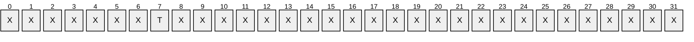

**X**: Unused. MUST be zero.

**T (DS_REPLICA_DEMOTE_TRY_ALL_SRCS, 0x00000001)**: MUST be set.

**uuidHelperDest:** Unused. Must be [**NULL GUID**](#gt_null-guid) and ignored.

**pNC:** The [DSNAME](#Section_5.50) of the [**NC**](#gt_naming-context-nc) to replicate off.

<a id="Section_4.1.21.1.3"></a>
##### 4.1.21.1.3 DRS_MSG_REPLICA_DEMOTIONREPLY

The DRS_MSG_REPLICA_DEMOTIONREPLY union defines the response messages received from the [IDL_DRSReplicaDemotion](#Section_4.1.21) method. Only one version, identified by *pdwOutVersion^* = 1, is currently defined.

typedef

[switch_type(DWORD)]

union {

[case(1)]

DRS_MSG_REPLICA_DEMOTIONREPLY_V1 V1;

} DRS_MSG_REPLICA_DEMOTIONREPLY;

V1: The version 1 reply.

<a id="Section_4.1.21.1.4"></a>
##### 4.1.21.1.4 DRS_MSG_REPLICA_DEMOTIONREPLY_V1

The DRS_MSG_REPLICA_DEMOTIONREPLY_V1 structure defines a response message received from the [IDL_DRSReplicaDemotion](#Section_4.1.21) method.

typedef struct {

DWORD dwOpError;

} DRS_MSG_REPLICA_DEMOTIONREPLY_V1;

**dwOpError:** The Win32 error code, as specified in [MS-ERREF](../MS-ERREF/MS-ERREF.md) section 2.2.

<a id="Section_4.1.21.2"></a>
#### 4.1.21.2 Method-Specific Abstract Types and Procedures

<a id="Section_4.1.21.2.1"></a>
##### 4.1.21.2.1 ReplicationPartners()

procedure ReplicationPartners(nc: DSNAME): sequence of DSNAME

The [**DC**](#gt_domain-controller-dc) D executing this procedure hosts a portion of [**forest**](#gt_forest) F. This procedure computes the set of all DCs in F that host the specified [**NC**](#gt_naming-context-nc), excluding D. It returns this set as a sequence in an arbitrary order.

<a id="Section_4.1.21.2.2"></a>
##### 4.1.21.2.2 AbandonAllFSMORoles()

procedure AbandonAllFSMORoles(nc: DSNAME): DWORD

The AbandonAllFSMORoles procedure abandons any [**FSMO roles**](#gt_fsmo-role) represented in the supplied [**NC**](#gt_naming-context-nc) that are held by this [**DC**](#gt_domain-controller-dc). The new holder of the FSMO roles is arbitrary. AbandonAllFSMORoles returns a Win32 error value.

targetDSAs: sequence of DSNAME

fsmoContainer: DSNAME

ret: DWORD

bGivenAway: boolean

i: integer

hDRS: DRS_HANDLE

msgReq: DRS_MSG_GETCHGREQ_V10

msgUpd: DRS_MSG_GETCHGREPLY_NATIVE

if nc = ConfigNC() then

/* check domain naming FSMO role */

fsmoContainer := DescendantObject(ConfigNC(), "CN=Partitions,")

else if nc = SchemaNC() then

/* check schema master FSMO role */

fsmoContainer := SchemaNC()

else

/* application NCs don't hold FSMOs */

return ERROR_SUCCESS

endif

/* check if we hold the fsmo */

if fsmoContainer!fSMORoleOwner ≠ DSAObj() then

/* we do not own the role! All's well */

return ERROR_SUCCESS

endif

/* yes, we own the role! Let's give it away */

bGivenAway := false

targetDSAs := ReplicationPartners(nc)

i := 0

while not bGivenAway

if i ≥ targetDSAs.length then

/* no more replication partners that would take our FSMO! */

return ERROR_DS_UNABLE_TO_SURRENDER_ROLES

endif

hDRS := BindToDSA(targetDSAs[i])

if hDRS ≠ null then

/* the targetDSA appears to be up. Let's try to transfer the

* role */

/* Perform an IDL_DRSGetNCChanges(EXOP_FSMO_ABANDON_ROLE) call */

msgReq.uuidDsaObjDest := dc.serverGuid

msgReq.pNC := ADDR(fsmoContainer)

msgReq.ulFlags := DRS_WRIT_REP

msgReq.ulExtendedOp := EXOP_FSMO_ABANDON_ROLE

ret :=

IDL_DRSGetNCChanges(hDRS, 8, ADDR(msgReq), 6, ADDR(msgUpd))

if ret = ERROR_SUCCESS then

/* successfully given away */

bGivenAway := true

endif

UnbindFromDSA(hDRS)

endif

i := i + 1

endwhile

/* if execution got here, the role was given away */

return ERROR_SUCCESS

<a id="Section_4.1.21.2.3"></a>
##### 4.1.21.2.3 ReplicateOffChanges()

procedure ReplicateOffChanges(nc: DSNAME): DWORD

The ReplicateOffChanges procedure replicates all local changes in the [**NC**](#gt_naming-context-nc) to a randomly selected [**replication**](#gt_replication) partner.

targetDSAs: sequence of DSNAME

ret: DWORD

bReplicated: boolean

i: integer

msgSyncReq: DRS_MSG_REPSYNC_V1

msgAddReq: DRS_MSG_REPADD_V2

hDRS: DRS_HANDLE

bReplicated := false

targetDSAs := ReplicationPartners(nc)

i := 0

while not bReplicated

if i ≥ targetDSAs.length then

/* no more replication partners that host the NC! */

return ERROR_DS_CANT_FIND_DSA_OBJ

endif

hDRS := BindToDSA(targetDSAs[i])

if hDRS ≠ null then

/* the targetDSA appears to be up. Let's try to replicate to

* it */

/* Invoke IDL_DRSReplicaSync to get changes from us */

msgSyncReq.pszDsaSrc := NetworkAddress of targetDSA

msgSyncReq.uuidDsaSrc := dc.serverGuid

msgSyncReq.pNC := ADDR(nc)

msgSyncReq.ulOptions := DRS_WRIT_REP

ret := IDL_DRSReplicaSync(hDRS, 1,ADR(msgSyncReq))

if ret = ERROR_DS_DRA_NO_REPLICA then

/* the targetDSA does not currently have replication agreement

(repsFrom) with this DC. Tell it to add one */

msgAddReq.pNC := ADDR(nc)

msgAddReq.pszSourceDsaAddress := NetworkAddress of this DC

msgAddReq.ulOptions := DRS_WRIT_REP

msgAddReq.pSourceDsaDN := null

msgAddReq.pTransportDN := null

ret := IDL_DRSReplicaAdd(hDRS, 2,ADR(msgAddReq))

endif

UnbindFromDSA(hDRS)

if ret = ERROR_SUCCESS then

/* success! */

bReplicated := true

endif

endif

i := i + 1

endwhile

/* if execution got here, then the changes were successfully replicated off */

return ERROR_SUCCESS

<a id="Section_4.1.21.3"></a>
#### 4.1.21.3 Server Behavior of the IDL_DRSReplicaDemotion Method

*Informative summary of behavior*: For a given [**NC**](#gt_naming-context-nc), the [IDL_DRSReplicaDemotion](#Section_4.1.21) method replicates out any changes that had not previously been replicated out. It also abandons any NC-specific [**FSMO roles**](#gt_fsmo-role) that are owned by this [**DC**](#gt_domain-controller-dc). This function accomplishes nothing when the DC being demoted is the last DC in the [**forest**](#gt_forest).

ULONG

IDL_DRSReplicaDemotion(

[in, ref] DRS_HANDLE hDrs,

[in] DWORD dwInVersion,

[in, ref, switch_is(dwInVersion)]

DRS_MSG_REPLICA_DEMOTIONREQ* pmsgIn,

[out, ref] DWORD *pdwOutVersion,

[out, ref, switch_is(*pdwOutVersion)]

DRS_MSG_REPLICA_DEMOTIONREPLY* pmsgOut

)

msgIn: DRS_MSG_REPLICA_DEMOTIONREQ_V1

ret: DWORD

nc: DSNAME

ValidateDRSInput(hDrs, 26)

pdwOutVersion^ := 1

pmsgOut^.V1.dwOpError := ERROR_DS_CODE_INCONSISTENCY

if dwInVersion ≠ 1 then

return ERROR_INVALID_PARAMETER

endif

msgIn := pmsgIn^.V1

if msgIn.pNC = null or

msgIn.dwFlags ≠ DS_REPLICA_DEMOTE_TRY_ALL_SRCS then

return ERROR_INVALID_PARAMETER

endif

if not IsMemberOfBuiltinAdminGroup() then

/* only BA is allowed to demote an AD LDS service */

return ERROR_DS_DRA_ACCESS_DENIED

endif

nc := msgIn.pNC^

ret := AbandonAllFSMORoles(nc)

if ret = ERROR_SUCCESS then

ret := ReplicateOffChanges(nc)

endif

if ret = ERROR_SUCCESS then

/* mark instanceType as going and not coming */

nc!instanceType := nc!instanceType + {IT_NC_GOING} - {IT_NC_COMING}

/* remove any repsFrom */

nc!repsFrom := null

endif

pmsgOut^.V1.dwOpError := ret

pdwMsgOut^ := 1

return ERROR_SUCCESS

<a id="Section_4.1.22"></a>
### 4.1.22 IDL_DRSReplicaModify (Opnum 7)

The IDL_DRSReplicaModify method [**updates**](#gt_update) the value for repsFrom for the [**NC replica**](#gt_nc-replica).

ULONG IDL_DRSReplicaModify(

[in, ref] DRS_HANDLE hDrs,

[in] DWORD dwVersion,

[in, ref, switch_is(dwVersion)]

DRS_MSG_REPMOD* pmsgMod

);

**hDrs:** The [**RPC**](#gt_remote-procedure-call-rpc) context handle returned by [IDL_DRSBind](#Section_4.1.3).

**dwVersion:** The version of the request message.

**pmsgMod:** A pointer to the request message.

**Return Values:** 0 if successful, or a [**Windows error code**](#gt_windows-error-code) if a failure occurs.

**Exceptions Thrown**: This method might throw the following exceptions beyond those thrown by the underlying RPC protocol (as specified in [MS-RPCE](../MS-RPCE/MS-RPCE.md)): ERROR_INVALID_HANDLE, ERROR_DS_DRS_EXTENSIONS_CHANGED, ERROR_DS_DIFFERENT_REPL_EPOCHS, and ERROR_INVALID_PARAMETER.

<a id="Section_4.1.22.1"></a>
#### 4.1.22.1 Method-Specific Concrete Types

<a id="Section_4.1.22.1.1"></a>
##### 4.1.22.1.1 DRS_MSG_REPMOD

The DRS_MSG_REPMOD union defines the request messages for the [IDL_DRSReplicaModify](#Section_4.1.22) method. Only one version, identified by *dwVersion* = 1, is currently defined.

typedef

[switch_type(DWORD)]

union {

[case(1)]

DRS_MSG_REPMOD_V1 V1;

} DRS_MSG_REPMOD;

**V1:** The version 1 request.

<a id="Section_4.1.22.1.2"></a>
##### 4.1.22.1.2 DRS_MSG_REPMOD_V1

The DRS_MSG_REPMOD_V1 structure defines a request message for the [IDL_DRSReplicaModify](#Section_4.1.22) method.

typedef struct {

[ref] DSNAME* pNC;

UUID uuidSourceDRA;

[unique, string] char* pszSourceDRA;

REPLTIMES rtSchedule;

ULONG ulReplicaFlags;

ULONG ulModifyFields;

ULONG ulOptions;

} DRS_MSG_REPMOD_V1;

**pNC:** A pointer to the [DSName](#Section_5.49) of the root of an [**NC replica**](#gt_nc-replica) on the server.

**uuidSourceDRA:** The [**DSA GUID**](#gt_dsa-guid).

**pszSourceDRA:** The transport-specific [NetworkAddress](#Section_5.134) of a [**DC**](#gt_domain-controller-dc).

**rtSchedule:** The periodic [**replication**](#gt_replication) schedule.

**ulReplicaFlags:** The [DRS_OPTIONS](#Section_5.41) flags for the repsFrom value.

**ulModifyFields:** The fields to [**update**](#gt_update)(presented in little-endian byte order).

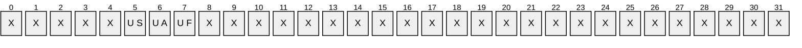

**X**: Unused. MUST be zero and ignored.

**UF (DRS_UPDATE_FLAGS, 0x00000001)**: Updates the flags associated with the server.

**UA (DRS_UPDATE_ADDRESS, 0x00000002)**: Updates the transport-specific address associated with the server.

**US (DRS_UPDATE_SCHEDULE, 0x00000004)**: Updates the replication schedule associated with the server.

**ulOptions:** The DRS_OPTIONS flags for execution of this method.

<a id="Section_4.1.22.2"></a>
#### 4.1.22.2 Server Behavior of the IDL_DRSReplicaModify Method

*Informative summary of behavior*: The server replaces fields in the repsFrom of the specified [**NC replica**](#gt_nc-replica). If ulOptions contains DRS_ASYNC_OP, the server processes the request asynchronously. The client has to include DRS_WRIT_REP in ulOptions if the specified NC replica is a full [**replica**](#gt_replica). The server optionally replaces (as specified by ulModifyFields) serverAddress, schedule, and replicaFlags in repsFrom with the corresponding value from pszSourceDRA, rtSchedule, and ulReplicaFlags.

ULONG

IDL_DRSReplicaModify(

[in, ref] DRS_HANDLE hDrs,

[in] DWORD dwVersion,

[in, ref, switch_is(dwVersion)]

DRS_MSG_REPMOD *pmsgMod);

options: DRS_OPTIONS

nc: DSName

rf: RepsFrom

msgIn: DRS_MSG_REPMOD_V1

ValidateDRSInput(hDrs, 7)

msgIn := pmsgMod^.V1

/* Validate input parameters */

if msgIn.pNC = null

or msgIn.pNC^ = ""

or (msgIn.pszSourceDRA = null

and msgIn.uuidSourceDRA = null)

or (DRS_UPDATE_ADDRESS in msgIn.ulModifyFields

and (msgIn.pszSourceDRA = null

or msgIn.pszSourceDRA = ""))

or (DRS_UPDATE_SCHEDULE in msgIn.ulModifyFields

and msgIn.rtSchedule = null)

or msgIn.ulModifyFields = 0

or msgIn.ulModifyFields -

{DRS_UPDATE_ADDRESS, DRS_UPDATE_SCHEDULE, DRS_UPDATE_FLAGS}

≠ {}

or msgIn.ulOptions – {DRS_ASYNC_OP} ≠ {} then

return ERROR_DS_DRA_INVALID_PARAMETER

endif

/* Validate the specified NC */

options := msgIn.ulOptions

nc := msgIn.pNC^

if not ObjExists(nc) then

return ERROR_DS_DRA_BAD_NC

endif

if not AccessCheckCAR(nc, DS-Replication-Manage-Topology) then

return ERROR_DS_DRA_ACCESS_DENIED

endif

if DRS_ASYNC_OP in options then

Asynchronous Processing: Initiate a logical thread of control

to process the remainder of this request asynchronously

return 0

endif

/* Find the specified repsFrom. */

if (msgIn.uuidSourceDRA ≠ null ) then

rf := select one v from nc!repsFrom

where (v.uuidDsa = msgIn.uuidSourceDRA)

else

rf := select one v from nc!repsFrom

where (v.serverAddress = msgIn.pszSourceDRA)

end if

if rf = null then

return ERROR_DS_DRA_NO_REPLICA

endif

/* Update the specified repsFrom. */

nc!repsFrom := nc!repsFrom - {rf}

if DRS_UPDATE_ADDRESS in msgIn.ulModifyFields then

rf.serverAddress := msgIn.pszSourceDRA

endif

if DRS_UPDATE_SCHEDULE in msgIn.ulModifyFields then

rf.schedule := msgIn.rtSchedule

endif

if DRS_UPDATE_FLAGS in msgIn.ulModifyFields then

rf.replicaFlags := msgIn.ulReplicaFlags

endif

nc!repsFrom := nc!repsFrom + {rf}

return 0

<a id="Section_4.1.23"></a>
### 4.1.23 IDL_DRSReplicaSync (Opnum 2)

The IDL_DRSReplicaSync method triggers [**replication**](#gt_replication) from another [**DC**](#gt_domain-controller-dc).

ULONG IDL_DRSReplicaSync(

[in, ref] DRS_HANDLE hDrs,

[in] DWORD dwVersion,

[in, ref, switch_is(dwVersion)]

DRS_MSG_REPSYNC* pmsgSync

);

**hDrs:** The [**RPC**](#gt_remote-procedure-call-rpc) context handle returned by the [IDL_DRSBind](#Section_4.1.3) method.

**dwVersion:** The version of the request message.

**pmsgSync:** A pointer to the request message.

**Return Values:** 0 if successful, otherwise a [**Windows error code**](#gt_windows-error-code).

**Exceptions Thrown**: This method might throw the following exceptions beyond those thrown by the underlying RPC protocol (as specified in [MS-RPCE](../MS-RPCE/MS-RPCE.md)): ERROR_INVALID_HANDLE, ERROR_DS_DRS_EXTENSIONS_CHANGED, ERROR_DS_DIFFERENT_REPL_EPOCHS, and ERROR_INVALID_PARAMETER.

<a id="Section_4.1.23.1"></a>
#### 4.1.23.1 Method-Specific Concrete Types

<a id="Section_4.1.23.1.1"></a>
##### 4.1.23.1.1 DRS_MSG_REPSYNC

The DRS_MSG_REPSYNC union defines the request messages sent to the [IDL_DRSReplicaSync](#Section_4.1.23) method. Only one version, identified by *dwVersion* = 1, is currently defined.

typedef

[switch_type(DWORD)]

union {

[case(1)]

DRS_MSG_REPSYNC_V1 V1;

[case(2)]

DRS_MSG_REPSYNC_V2 V2;

} DRS_MSG_REPSYNC;

**V1:** The version 1 request.

**V2**: The version 2 request.

<a id="Section_4.1.23.1.2"></a>
##### 4.1.23.1.2 DRS_MSG_REPSYNC_V1

The DRS_MSG_REPSYNC_V1 structure defines a request message sent to the [IDL_DRSReplicaSync](#Section_4.1.23) method.

typedef struct {

[ref] DSNAME* pNC;

UUID uuidDsaSrc;

[unique] [string] char* pszDsaSrc;

ULONG ulOptions;

} DRS_MSG_REPSYNC_V1;

**pNC:** A pointer to [DSName](#Section_5.49) of the root of an [**NC replica**](#gt_nc-replica) on the server.

**uuidDsaSrc:** The [**DSA GUID**](#gt_dsa-guid).

**pszDsaSrc:** The transport-specific [NetworkAddress](#Section_5.134) of a [**DC**](#gt_domain-controller-dc).

**ulOptions:** The [DRS_OPTIONS](#Section_5.41) flags.

<a id="Section_4.1.23.1.3"></a>
##### 4.1.23.1.3 DRS_MSG_REPSYNC_V2

The DRS_MSG_REPSYNC_V2 structure defines a request message sent to the [IDL_DRSReplicaSync](#Section_4.1.23) method.

typedef struct {

[ref] DSNAME* pNC;

UUID uuidDsaSrc;

[unique] [string] char* pszDsaSrc;

ULONG ulOptions;

GUID correlationID;

[unique] VAR_SIZE_BUFFER_WITH_VERSION* pReservedBuffer;

} DRS_MSG_REPSYNC_V2;

**pNC:** A pointer to [DSName](#Section_5.49) of the root of an [**NC replica**](#gt_nc-replica) on the server.

**uuidDsaSrc:** The [**DSA GUID**](#gt_dsa-guid).

**pszDsaSrc:** The transport-specific [NetworkAddress](#Section_5.134) of a [**DC**](#gt_domain-controller-dc).

**ulOptions:** The [DRS_OPTIONS](#Section_5.41) flags.

**correlationID**: An identifier for the operation that the DC can use for implementation-defined troubleshooting. There are no normative constraints on this value, nor does the value figure in any normative processing rules.

**pReservedBuffer**: A pointer to a VAR_SIZE_BUFFER_WITH_VERSION structure (section [5.219](#Section_5.219)). MUST be a null pointer.

<a id="Section_4.1.23.2"></a>
#### 4.1.23.2 Server Behavior of the IDL_DRSReplicaSync Method

*Informative summary of behavior*: The server starts or resumes a [**replication cycle**](#gt_replication-cycle) by sending an IDL_DRSGetNCChanges request to the specified [**DC**](#gt_domain-controller-dc). If ulOptions contains DRS_ASYNC_OP, the server performs this operation asynchronously.

ULONG

IDL_DRSReplicaSync(

[in, ref] DRS_HANDLE hDrs,

[in] DWORD dwVersion,

[in, ref, switch_is(dwVersion)]

DRS_MSG_REPSYNC *pmsgSync);

options: DRS_OPTIONS

nc: DSName

rf: sequence of RepsFrom

msgIn: DRS_MSG_REPSYNC_V1

err: ULONG

ValidateDRSInput(hDrs, 2)

/* Validate the version */

if dwVersion ≠ 1 then

return ERROR_DS_DRA_INVALID_PARAMETER

endif

msgIn := pmsgSync^.V1

/* Validate input params */

options := msgIn.ulOptions

if msgIn.pNC = null

or (not DRS_SYNC_ALL in options /* See product behavior note below.*/

and msgIn.uuidDsaSrc = null

and msgIn.pszDsaSrc = null) then

return ERROR_DS_DRA_INVALID_PARAMETER

endif

/* Validate the specified NC. */

nc := msgIn.pNC^

if not ObjExists(nc) then

return ERROR_DS_DRA_BAD_NC

endif

if (DRS_SYNC_BYNAME in options and msgIn.pszDsaSrc = null)

or (not DRS_SYNC_BYNAME in options and msgIn.uuidDsaSrc = null)

or (not DRS_SYNC_BYNAME in options and msgIn.uuidDsaSrc = NULLGUID) then

return ERROR_DS_DRA_INVALID_PARAMETER

endif

if AccessCheckCAR(nc, DS-Replication-Synchronize) then

return ERROR_DS_DRA_ACCESS_DENIED

endif

if DRS_ASYNC_OP in options then

Asynchronous Processing: Initiate a logical thread of control

to process the remainder of this request asynchronously

return 0

endif

rf := select all v in nc!repsFrom

where DRS_SYNC_ALL in options

or (DRS_SYNC_BYNAME in options

and v.naDsa = msgIn.pszDsaSrc)

or (not DRS_SYNC_BYNAME in options

and v.uuidDsa = msgIn.uuidDsaSrc)

if rf = null then

return ERROR_DS_DRA_NO_REPLICA

endif

foreach r in rf

msgRequest: DRS_MSG_GETCHGREQ

cMaxObjects: ULONG

cMaxBytes: ULONG

versionRequestMsg: DWORD

outVersion: DWORD

msgOut: DRS_MSG_GETCHGREPLY

versionRequestMsg := The version number of the input message negotiated between the

client and server (section 4.1.10.4.1).

cMaxObjects := Implementation-specific value.

cMaxBytes := Implementation-specific value.

if DRS_UPDATE_NOTIFICATION in options

and not DRS_TWOWAY_SYNC in options

and DRS_NEVER_NOTIFY in r.V2.ulReplicaFlags then

return ERROR_DS_DRA_NO_REPLICA

endif

/* Replicate nc from the DC specified by r.uuidDsa. */

ReplicateNCRequestMsg(

hDrs,

versionRequestMsg,

nc,

r,

options,

cMaxObjects,

cMaxBytes,

ADDR(msgRequest))

err := IDL_DRSGetNCChanges(

hDrsSrc,

versionRequestMsg,

msgRequest,

ADDR(outVersion),

ADDR(msgOut))

if err = 0

and not DRS_MAIL_REP in msgIn.ulOptions

then

Wait for the response, process it (section 4.1.10.6), send the next request,

etc., until the replication cycle is complete.

If there are any failures from this replication attempt, assign an

appropriate error value to err, and then break out of the for loop.

endif

endfor

return err

For information about Windows support for the DRS_SYNC_ALL flag, see the product behavior note in section [5.41](#Section_5.41).

<a id="Section_4.1.24"></a>
### 4.1.24 IDL_DRSReplicaVerifyObjects (Opnum 22)

The IDL_DRSReplicaVerifyObjects method verifies the existence of [**objects**](#gt_object) in an [**NC replica**](#gt_nc-replica) by comparing against a [**replica**](#gt_replica) of the same [**NC**](#gt_naming-context-nc) on a reference [**DC**](#gt_domain-controller-dc), optionally deleting any objects that do not exist on the reference DC.

ULONG IDL_DRSReplicaVerifyObjects(

[in, ref] DRS_HANDLE hDrs,

[in] DWORD dwVersion,

[in, ref, switch_is(dwVersion)]

DRS_MSG_REPVERIFYOBJ* pmsgVerify

);

**hDrs:** The [**RPC**](#gt_remote-procedure-call-rpc) context handle returned by the [IDL_DRSBind](#Section_4.1.3) method.

**dwVersion:** The version of the request message.

**pmsgVerify:** A pointer to the request message.

**Return Values:** 0 if successful, otherwise a [**Windows error code**](#gt_windows-error-code).

**Exceptions Thrown**: This method might throw the following exceptions beyond those thrown by the underlying RPC protocol (as specified in [MS-RPCE](../MS-RPCE/MS-RPCE.md)): ERROR_INVALID_HANDLE, ERROR_DS_DRS_EXTENSIONS_CHANGED, ERROR_DS_DIFFERENT_REPL_EPOCHS, and ERROR_INVALID_PARAMETER.

<a id="Section_4.1.24.1"></a>
#### 4.1.24.1 Method-Specific Concrete Types

<a id="Section_4.1.24.1.1"></a>
##### 4.1.24.1.1 DRS_MSG_REPVERIFYOBJ

The DRS_MSG_REPVERIFYOBJ union defines the request messages sent to the [IDL_DRSReplicaVerifyObjects](#Section_4.1.24) method. Only one version, identified by *dwVersion* = 1, is currently defined.

typedef

[switch_type(DWORD)]

union {

[case(1)]

DRS_MSG_REPVERIFYOBJ_V1 V1;

} DRS_MSG_REPVERIFYOBJ;

**V1:** The version 1 request.

<a id="Section_4.1.24.1.2"></a>
##### 4.1.24.1.2 DRS_MSG_REPVERIFYOBJ_V1

The DRS_MSG_REPVERIFYOBJ_V1 structure defines a request message sent to the [IDL_DRSReplicaVerifyObjects](#Section_4.1.24) method.

typedef struct {

[ref] DSNAME* pNC;

UUID uuidDsaSrc;

ULONG ulOptions;

} DRS_MSG_REPVERIFYOBJ_V1;

**pNC:** The [**NC**](#gt_naming-context-nc) to verify.

**uuidDsaSrc:** The objectGUID of the [**nTDSDSA object**](#gt_ntdsdsa-object) for the reference [**DC**](#gt_domain-controller-dc).

**ulOptions:** 0 to [**expunge**](#gt_expunge) each [**object**](#gt_object) that is not verified, or 1 to log an event that identifies each such object.

<a id="Section_4.1.24.2"></a>
#### 4.1.24.2 Method-Specific Abstract Types and Procedures

<a id="Section_4.1.24.2.1"></a>
##### 4.1.24.2.1 GetRemoteUTD

procedure GetRemoteUTD(

dsa: DSName,

nc: DSName,

var uTDVec: UPTODATE_VECTOR_V1_EXT

): ULONG

The GetRemoteUTD procedure uses the [IDL_DRSGetReplInfo](#Section_4.1.13) method to remotely retrieve the [UPTODATE_VECTOR_V1_EXT](#Section_5.204) for the [**NC**](#gt_naming-context-nc) with the [DSName](#Section_5.49) *nc* from the [**DC**](#gt_domain-controller-dc) whose nTDSDSA [**object**](#gt_object) has the DSName *dsa*. The procedure returns either an implementation-specific value from the client implementation of the IDL_DRSGetReplInfo method, or the value returned by the remote server's IDL_DRSGetReplInfo method.

<a id="Section_4.1.24.2.2"></a>
##### 4.1.24.2.2 ObjectExistsAtDC

procedure ObjectExistsAtDC(o: DSName, dsa: DSName): boolean

The ObjectExistsAtDC procedure checks that the [**object**](#gt_object) *o* exists on the [**DC**](#gt_domain-controller-dc) whose nTDSDSA object has the [DSName](#Section_5.49) *dsa* by verifying that the DC holds an object *o'* whose [**objectGUID**](#gt_objectguid) value is equal to that of object *o*. If the object exists, the procedure returns true; otherwise, the procedure returns false.

<a id="Section_4.1.24.3"></a>
#### 4.1.24.3 Server Behavior of the IDL_DRSReplicaVerifyObjects Method

*Informative summary of behavior*: Let N be the [**NC**](#gt_naming-context-nc) pNC^, and let the reference [**DC**](#gt_domain-controller-dc) be the DC corresponding to the nTDSDSA [**object**](#gt_object) uuidDsaSrc.

For the purposes of this method, an object *exists* within an [**NC replica**](#gt_nc-replica) if it is either an object or a [**tombstone**](#gt_tombstone).

Let S be the set of objects that exists in N at the server running IDL_DRSReplicaVerifyObjects at the time IDL_DRSReplicaVerifyObjects begins processing. Let the set S' be S minus the members of S that have never existed in N at the reference DC when IDL_DRSReplicaVerifyObjects begins processing. The members of (S - S') are objects recently added to N on the server, since otherwise they would have replicated to the reference DC. The set S' is computable using the replUpToDateVector for N at the server and at the reference DC.

For each object *o* in S' that does not exist in N at the reference DC while IDL_DRSReplicaVerifyObjects is processing, either [expunge](#Section_5.58) *o* at the server (if ulOptions = 0) or log an administrator-visible event at the server (if ulOptions = 1).

If an object goes out of existence in N at the reference DC during processing of IDL_DRSReplicaVerifyObjects, then there is no requirement on whether IDL_DRSReplicaVerifyObjects should or should not expunge or log the object at the server.

ULONG IDL_DRSReplicaVerifyObjects(

[in, ref] DRS_HANDLE hDrs,

[in] DWORD dwVersion,

[in, ref, switch_is(dwVersion)]

DRS_MSG_REPVERIFYOBJ *pmsgVerify)

err: ULONG

msgIn: DRS_MSG_REPVERIFYOBJ_V1

nc, refDsa, o: DSName

uTDServer, uTDRef, uTDMerge: UPTODATE_VECTOR_V1_EXT

sPrime: set of DSName

ValidateDRSInput(hDrs, 22)

/* Perform input validation and access check */

if dwVersion ≠ 0x1 then

return ERROR_DS_DRA_INVALID_PARAMETER

endif

msgIn := pmsgVerify^.V1

if msgIn.pNC = null or

msgIn.uuidDsaSrc = NULLGUID then

return ERROR_DS_DRA_INVALID_PARAMETER

endif

nc := msgIn.pNC^

if not FullReplicaExists(nc) and

not PartialGCReplicaExists(nc) then

return ERROR_DS_DRA_BAD_NC

endif

if not AccessCheckCAR(nc, DS-Replication-Manage-Topology) then

return ERROR_DS_DRA_ACCESS_DENIED

endif

refDsa := select one object o from subtree ConfigNC() where

o!objectGUID = msgIn.uuidDsaSrc and nTDSDSA in o!objectClass

if refDsa = null then

return ERROR_DS_DRA_INVALID_PARAMETER

endif

/* Compute the set S' */

uTDServer := nc!replUpToDateVector

err := GetRemoteUTD(refDsa, nc, uTDRef)

if err ≠ 0 then

return err

endif

uTDMerge := MergeUTD(uTDServer, uTDRef)

sPrime := select all objects o from subtree-ts-included nc where

StampLessThanOrEqualUTD(AttrStamp(o, whenCreated), uTDMerge)

/* Process the set S' */

for each o in sPrime

if not ObjectExistsAtDC(o, refDSA) then

if msgIn.ulOptions = 0 then

Expunge(o)

else if msgIn.ulOptions = 1 then

Log a message: o exists on server but does not exist on refDsa

endif

endfor

return 0

Windows behavior about the for loop is specified in the following citation:<37>

<a id="Section_4.1.24.4"></a>
#### 4.1.24.4 Examples of the IDL_DRSReplicaVerifyObjects Method

A client that has bound to DC1 is removing all [**lingering objects**](#gt_lingering-object) on this [**directory**](#gt_directory) server with respect to DC2.

<a id="Section_4.1.24.4.1"></a>
##### 4.1.24.4.1 Initial State

A client has bound to DC1.CONTOSO.COM using the [IDL_DRSBind](#Section_4.1.3) method and received a [DRS_HANDLE](#Section_5.40) to DC1.

Consider the following [**objects**](#gt_object) under the Users [**container**](#gt_container), "CN=Users,DC=CONTOSO,DC=COM", listed by their [DSName](#Section_5.49):

| Users at DC1 | Users at DC2 | Notes |
| --- | --- | --- |
| <GUID=f5ef2f4b-a3db-464c-8403-b27aa00b0d5d>;<SID=S-1-5-21-1583212203-607051668-819563750-1107>;CN=Kim Akers, CN=Users,DC=CONTOSO,DC=COM | <GUID=f5ef2f4b-a3db-464c-8403-b27aa00b0d5d>;<SID=S-1-5-21-1583212203-607051668-819563750-1107>;CN=Kim Akers, CN=Users,DC=CONTOSO,DC=COM | Objects are identical. |
| <GUID=89430510-48eb-4e68-aeb1-98a9471f1938>;<SID=S-1-5-21-1583212203-607051668-819563750-1111>; CN=Josh Bailey,CN=Users,DC=CONTOSO,DC=COM | - | "Josh Bailey" was created on DC1 and has not been replicated to DC2 yet. |
| <GUID=833a118e-035f-4702-b67e-9e7c1ada2f57>;<SID=S-1-5-21-1583212203-607051668-819563750-1108>;CN= Eva Corets,CN=Users,DC=CONTOSO,DC=COM | - | "Eva Corets" is a [**lingering object**](#gt_lingering-object) on DC1. |
| <GUID=3cb4b6cf-f220-472a-bd2f-5f1399232ca6>;<SID=S-1-5-21-1583212203-607051668-819563750-1109>;CN= Jim Daly,CN=Users,DC=CONTOSO,DC=COM | <GUID=3cb4b6cf-f220-472a-bd2f-5f1399232ca6>;<SID=S-1-5-21-1583212203-607051668-819563750-1109>;CN= Jim Daly,CN=Users,DC=CONTOSO,DC=COM | The mail [**attribute**](#gt_attributes) of "Jim Daly" has been modified on DC1 but this change has not replicated to DC2 yet. |
| - | <GUID=46c1b351-da31-49f2-8437-8d82df024972>;<SID=S-1-5-21-1583212203-607051668-819563750-1604>; CN=Ebru Ersan,CN=Users,DC=CONTOSO,DC=COM | "Ebru Ersan" was created on DC2 and has not been replicated to DC1 yet. |
| - | <GUID=8df1f9bb-7551-46c3-b9c2-c905e9463542>;<SID=S-1-5-21-1583212203-607051668-819563750-1110>; CN= Kari Furse,CN=Users,DC=CONTOSO,DC=COM | "Kari Furse" is a lingering object on DC2. |

Relevant entries of the DS_REPL_ATTR_META_DATA structure for each object listed above are also captured below to further demonstrate the differences between DC1 and DC2.

Relevant metadata entries for "CN=Kim Akers,CN=Users,DC=CONTOSO,DC=COM" at DC1:

| usnLocalChange | uuidLastOriginatingDsaInvocationID | usnOriginatingChange | ftimeLastOriginatingChange | dwVersion | pszAttributeName |
| --- | --- | --- | --- | --- | --- |
| 13964 | 4875e25f-11a9-4c70-abf4-5fb39529f84b | 13964 | 5/21/2010 18:08:30 | 1 | whenCreated |

Relevant metadata entries for "CN=Josh Bailey,CN=Users,DC=CONTOSO,DC=COM" at DC1:

| usnLocalChange | uuidLastOriginatingDsaInvocationID | usnOriginatingChange | ftimeLastOriginatingChange | dwVersion | pszAttributeName |
| --- | --- | --- | --- | --- | --- |
| 14112 | 4875e25f-11a9-4c70-abf4-5fb39529f84b | 14112 | 5/21/2010 19:11:09 | 1 | whenCreated |

Relevant metadata entries for "CN=Eva Corets,CN=Users,DC=CONTOSO,DC=COM" at DC1:

| usnLocalChange | uuidLastOriginatingDsaInvocationID | usnOriginatingChange | ftimeLastOriginatingChange | dwVersion | pszAttributeName |
| --- | --- | --- | --- | --- | --- |
| 9071 | 4875e25f-11a9-4c70-abf4-5fb39529f84b | 9071 | 1/15/2009 11:05:42 | 1 | whenCreated |

Relevant metadata entries for "CN=Jim Daly,CN=Users,DC=CONTOSO,DC=COM" at DC1:

| usnLocalChange | uuidLastOriginatingDsaInvocationID | usnOriginatingChange | ftimeLastOriginatingChange | dwVersion | pszAttributeName |
| --- | --- | --- | --- | --- | --- |
| 14085 | 4875e25f-11a9-4c70-abf4-5fb39529f84b | 14085 | 5/21/2010 19:06:32 | 1 | whenCreated |
| 14118 | 4875e25f-11a9-4c70-abf4-5fb39529f84b | 14118 | 5/21/2010 19:12:51 | 1 | mail |

Relevant metadata entries for "CN=Kim Akers,CN=Users,DC=CONTOSO,DC=COM" at DC2:

| usnLocalChange | uuidLastOriginatingDsaInvocationID | usnOriginatingChange | ftimeLastOriginatingChange | dwVersion | pszAttributeName |
| --- | --- | --- | --- | --- | --- |
| 12324 | 4875e25f-11a9-4c70-abf4-5fb39529f84b | 13964 | 5/21/2010 18:08:30 | 1 | whenCreated |

Relevant metadata entries for "CN=Jim Daly,CN=Users,DC=CONTOSO,DC=COM" at DC2:

| usnLocalChange | uuidLastOriginatingDsaInvocationID | usnOriginatingChange | ftimeLastOriginatingChange | dwVersion | pszAttributeName |
| --- | --- | --- | --- | --- | --- |
| 12432 | 4875e25f-11a9-4c70-abf4-5fb39529f84b | 14085 | 5/21/2010 19:06:32 | 1 | whenCreated |

Relevant metadata entries for "CN=Ebru Ersan,CN=Users,DC=CONTOSO,DC=COM" at DC2:

| usnLocalChange | uuidLastOriginatingDsaInvocationID | usnOriginatingChange | ftimeLastOriginatingChange | dwVersion | pszAttributeName |
| --- | --- | --- | --- | --- | --- |
| 12451 | 7526f625-51db-4022-8150-59c0286efd82 | 12451 | 5/21/2010 19:19:14 | 1 | whenCreated |

Relevant metadata entries for "CN=Kari Furse,CN=Users,DC=CONTOSO,DC=COM" at DC2:

| usnLocalChange | uuidLastOriginatingDsaInvocationID | usnOriginatingChange | ftimeLastOriginatingChange | dwVersion | pszAttributeName |
| --- | --- | --- | --- | --- | --- |
| 441 | 4875e25f-11a9-4c70-abf4-5fb39529f84b | 5099 | 11/1/2008 04:29:47 | 1 | whenCreated |

The [UPTODATE_VECTOR_V1_EXT](#Section_5.204) structures on DC1 and DC2 are also needed for the [IDL_DRSReplicaVerifyObjects](#Section_4.1.24) method:

- On DC1:
**dwVersion:** 1

**dwReserved1:** 0

**cNumCursors:** 2

**dwReserved2:** 0

**rgCursors:** An array of UPTODATE_CURSOR_V1:

- First entry:
**uuidDsa:** 4875e25f-11a9-4c70-abf4-5fb39529f84b

**usnHighPropUpdate:** 14621

- Second entry:
**uuidDsa:** 7526f625-51db-4022-8150-59c0286efd82

**usnHighPropUpdate:** 12448

- On DC2:
**dwVersion:** 1

**dwReserved1:** 0

**cNumCursors:** 2

**dwReserved2:** 0

**rgCursors:** An array of [UPTODATE_CURSOR_V1](#Section_5.202):

- First entry:
**uuidDsa:** 4875e25f-11a9-4c70-abf4-5fb39529f84b

**usnHighPropUpdate:** 14107

- Second entry:
**uuidDsa:** 7526f625-51db-4022-8150-59c0286efd82

**usnHighPropUpdate:** 12992

- Finally, also relevant to IDL_DRSReplicaVerifyObjects is the [**nTDSDSA object**](#gt_ntdsdsa-object) for DC2 as seen on DC1:
- Dn: CN=NTDS Settings,CN=DC2,CN=Servers,CN=Default-First-Site-Name,CN=Sites,CN=Configuration,DC=CONTOSO,DC=COM
- 3> objectClass: top; applicationSettings; nTDSDSA;
- 1> cn: NTDS Settings;
- 1> distinguishedName: CN=NTDS Settings,CN=DC2,CN=Servers,CN=Default-First-Site-Name,CN=Sites,CN=Configuration,DC=CONTOSO,DC=COM;
- 1> objectGUID: e845e047-3850-4a82-8811-a0b9250863c6;
<a id="Section_4.1.24.4.2"></a>
##### 4.1.24.4.2 Client Request

A client invokes the [IDL_DRSReplicaVerifyObjects](#Section_4.1.24) method on DC1 with the following parameters ([DRS_HANDLE](#Section_5.40) to DC1 omitted):

- *dwVersion*: 1
- *pmsgVerify*:
**pNC:** Pointer to the [DSName](#Section_5.49) structure for DC=CONTOSO,DC=COM

**uuidDsaSrc:** e845e047-3850-4a82-8811-a0b9250863c6

**ulOptions:** 0

<a id="Section_4.1.24.4.3"></a>
##### 4.1.24.4.3 Server Response

The server returns a code of 0.

<a id="Section_4.1.24.4.4"></a>
##### 4.1.24.4.4 Final State

The IDL_DRSReplicaVerifyObjects method has removed all [**lingering objects**](#gt_lingering-object) on DC1 (but not on DC2). The following table compares the Users [**container**](#gt_container) on DC1 and DC2 after the IDL_DRSReplicaVerifyObjects method has been successfully returned.

| Users at DC1 | Users at DC2 | Notes |
| --- | --- | --- |
| <GUID=f5ef2f4b-a3db-464c-8403-b27aa00b0d5d>;<SID=S-1-5-21-1583212203-607051668-819563750-1107>;CN=Kim Akers, CN=Users,DC=CONTOSO,DC=COM | <GUID=f5ef2f4b-a3db-464c-8403-b27aa00b0d5d>;<SID=S-1-5-21-1583212203-607051668-819563750-1107>;CN=Kim Akers, CN=Users,DC=CONTOSO,DC=COM | [**Objects**](#gt_object) are identical. |
| GUID=89430510-48eb-4e68-aeb1-98a9471f1938>;<SID=S-1-5-21-1583212203-607051668-819563750-1111>; CN=Josh Bailey,CN=Users,DC=CONTOSO,DC=COM | - | "Josh Bailey" was created on DC1 and has not been replicated to DC2 yet. |
| - | - | "Eva Corets" was a lingering object on DC1 and has been [**expunged**](#gt_expunge). |
| <GUID=3cb4b6cf-f220-472a-bd2f-5f1399232ca6>;<SID=S-1-5-21-1583212203-607051668-819563750-1109>;CN= Jim Daly,CN=Users,DC=CONTOSO,DC=COM | <GUID=3cb4b6cf-f220-472a-bd2f-5f1399232ca6>;<SID=S-1-5-21-1583212203-607051668-819563750-1109>;CN= Jim Daly,CN=Users,DC=CONTOSO,DC=COM | The mail [**attribute**](#gt_attributes) of "Jim Daly" has been modified on DC1 but this change has not replicated to DC2 yet. |
| - | <GUID=46c1b351-da31-49f2-8437-8d82df024972>;<SID=S-1-5-21-1583212203-607051668-819563750-1604>; CN=Ebru Ersan,CN=Users,DC=CONTOSO,DC=COM | "Ebru Ersan" was created on DC2 and has not been replicated to DC1 yet. |
| - | <GUID=8df1f9bb-7551-46c3-b9c2-c905e9463542>;<SID=S-1-5-21-1583212203-607051668-819563750-1110>; CN= Kari Furse,CN=Users,DC=CONTOSO,DC=COM | "Kari Furse" is a lingering object on DC2. |

<a id="Section_4.1.25"></a>
### 4.1.25 IDL_DRSUnbind (Opnum 1)

The IDL_DRSUnbind method destroys a context handle previously created by the [IDL_DRSBind](#Section_4.1.3) method.

ULONG IDL_DRSUnbind(

[in, out, ref] DRS_HANDLE* phDrs

);

**phDrs:** A pointer to the [**RPC**](#gt_remote-procedure-call-rpc) context handle returned by the IDL_DRSBind method. The value is set to null on return.

**Return Values:** 0 if successful, or a [**Windows error code**](#gt_windows-error-code) if a failure occurs.

**Exceptions Thrown**: This method might throw the following exception beyond those thrown by the underlying RPC protocol (as specified in [MS-RPCE](../MS-RPCE/MS-RPCE.md)): ERROR_INVALID_HANDLE.

<a id="Section_4.1.25.1"></a>
#### 4.1.25.1 Server Behavior of the IDL_DRSUnbind Method

*Informative summary of behavior*: The server releases any resources associated with the context handle, making the context handle unusable by the client. The server sets *phDrs* to null.

ULONG

IDL_DRSUnbind(

[in, out, ref] DRS_HANDLE *phDrs)

ValidateDRSInput(hDrs, 1)

phDrs^ := null

return 0

<a id="Section_4.1.26"></a>
### 4.1.26 IDL_DRSUpdateRefs (Opnum 4)

The IDL_DRSUpdateRefs method adds or deletes a value from the repsTo of a specified [**NC replica**](#gt_nc-replica).

ULONG IDL_DRSUpdateRefs(

[in, ref] DRS_HANDLE hDrs,

[in] DWORD dwVersion,

[in, ref, switch_is(dwVersion)]

DRS_MSG_UPDREFS* pmsgUpdRefs

);

**hDrs:** The [**RPC**](#gt_remote-procedure-call-rpc) context handle returned by the [IDL_DRSBind](#Section_4.1.3) method.

**dwVersion:** The version of the request message.

**pmsgUpdRefs:** A pointer to the request message.

**Return Values:** 0 if successful, otherwise a [**Windows error code**](#gt_windows-error-code).

**Exceptions Thrown**: This method might throw the following exceptions beyond those thrown by the underlying RPC protocol (as specified in [MS-RPCE](../MS-RPCE/MS-RPCE.md)): ERROR_INVALID_HANDLE, ERROR_DS_DRS_EXTENSIONS_CHANGED, ERROR_DS_DIFFERENT_REPL_EPOCHS, and ERROR_INVALID_PARAMETER.

<a id="Section_4.1.26.1"></a>
#### 4.1.26.1 Method-Specific Concrete Types

<a id="Section_4.1.26.1.1"></a>
##### 4.1.26.1.1 DRS_MSG_UPDREFS

The DRS_MSG_UPDREFS union defines the request message versions sent to the [IDL_DRSUpdateRefs](#Section_4.1.26) method. Only one version, identified by *dwVersion* = 1, is currently defined.

typedef

[switch_type(DWORD)]

union {

[case(1)]

DRS_MSG_UPDREFS_V1 V1;

[case(2)]

DRS_MSG_UPDREFS_V2 V2;

} DRS_MSG_UPDREFS;

**V1:** The version 1 request.

**V2**: The version 2 request.

<a id="Section_4.1.26.1.2"></a>
##### 4.1.26.1.2 DRS_MSG_UPDREFS_V1

The DRS_MSG_UPDREFS_V1 structure defines a request message sent to the [IDL_DRSUpdateRefs](#Section_4.1.26) method.

typedef struct {

[ref] DSNAME* pNC;

[ref] [string] char* pszDsaDest;

UUID uuidDsaObjDest;

ULONG ulOptions;

} DRS_MSG_UPDREFS_V1;

**pNC:** A pointer to the [DSNAME](#Section_5.50) of the root of an [**NC replica**](#gt_nc-replica) on the server.

**pszDsaDest:** The transport-specific [NetworkAddress](#Section_5.134) of a [**DC**](#gt_domain-controller-dc).

**uuidDsaObjDest:** The [**DSA GUID**](#gt_dsa-guid).

**ulOptions:** The [DRS_OPTIONS](#Section_5.41) that control the [**update**](#gt_update).

<a id="Section_4.1.26.1.3"></a>
##### 4.1.26.1.3 DRS_MSG_UPDREFS_V2

The DRS_MSG_UPDREFS_V2 structure defines a request message sent to the [IDL_DRSUpdateRefs](#Section_4.1.26) method.

typedef struct {

[ref] DSNAME* pNC;

[ref] [string] char* pszDsaDest;

UUID uuidDsaObjDest;

ULONG ulOptions;

GUID correlationID;

[unique] VAR_SIZE_BUFFER_WITH_VERSION* pReservedBuffer;

} DRS_MSG_UPDREFS_V2;

**pNC:** A pointer to the [DSNAME](#Section_5.50) of the root of an [**NC replica**](#gt_nc-replica) on the server.

**pszDsaDest:** The transport-specific [NetworkAddress](#Section_5.134) of a [**DC**](#gt_domain-controller-dc).

**uuidDsaObjDest:** The [**DSA GUID**](#gt_dsa-guid).

**ulOptions:** The [DRS_OPTIONS](#Section_5.41) that control the [**update**](#gt_update).

**correlationID**: An identifier for the operation that the DC can use for implementation-defined troubleshooting. There are no normative constraints on this value, nor does the value figure in any normative processing rules.

**pReservedBuffer**: A pointer to a VAR_SIZE_BUFFER_WITH_VERSION structure (section [5.219](#Section_5.219)). MUST be a null pointer.

<a id="Section_4.1.26.2"></a>
#### 4.1.26.2 Server Behavior of the IDL_DRSUpdateRefs Method

*Informative summary of behavior*: If ulOptions contains DRS_ADD_REF, the server adds a value to the repsTo of the specified [**NC replica**](#gt_nc-replica); if ulOptions contains DRS_DEL_REF, the server deletes a value. If these options are combined, the Delete operation is done before the Add operation; if a corresponding value does not already exist, this is the same as if ulOptions contained DRS_ADD_REF but not DRS_DEL_REF. The client includes DRS_WRIT_REP in ulOptions if the specified NC replica is writable. The client specifies both **pszDsaDest** and **uuidDsaObjDest** to identify the value to be added or removed. If ulOptions contains DRS_ASYNC_OP, the server processes the request asynchronously. If the server adds a value to repsTo, the value has ulReplicaFlags equal to ulOptions ∩ {DRS_WRIT_REP}.

ULONG IDL_DRSUpdateRefs(

[in, ref] DRS_HANDLE hDrs,

[in] DWORD dwVersion,

[in, ref, switch_is(dwVersion)] DRS_MSG_UPDREFS *pmsgUpdRefs);

msgIn: DRS_MSG_UPDREFS_V1

options: DRS_OPTIONS

err: DWORD

nc: DSName

ValidateDRSInput(hDrs, 4)

if dwVersion ≠ 1 then

return ERROR_DS_DRA_INVALID_PARAMETER

endif

msgIn := pmsgUpdRefs^.V1

options := msgIn.ulOptions

if msgIn.pNC = null or

(msgIn.pszDsaDest = null) or

(msgIn.uuidDsaObjDest = null) or

(options ∩ {DRS_ADD_REF, DRS_DEL_REF} = null)

return ERROR_DS_DRA_INVALID_PARAMETER

endif

nc := msgIn.pNC^

if (options – {DRS_ASYNC_OP, DRS_GETCHG_CHECK, DRS_WRIT_REP, DRS_DEL_REF, DRS_ADD_REF, DRS_REF_GCSPN} != 0) then

return ERROR_DS_DRA_INVALID_PARAMETER

if ((DRS_WRIT_REP in options) and not (IT_WRITE in nc!instanceType)) or

not ObjExists(nc) then

return ERROR_DS_DRA_BAD_NC

endif

if not AccessCheckCAR(nc, DS-Replication-Manage-Topology) then

return ERROR_DS_DRA_ACCESS_DENIED

endif

/* Perform repsTo value add, delete, or combination of add/delete to the specified NC replica,

* the result value is a Windows error code or 0

result := UpdateRefs(pmsgIn^.V1)

if(result ≠ ERROR_SUCCESS) then

return result

endif

/* If DRS_GETCHG_CHECK is specified, ERROR_DS_DRA_REF_NOT_FOUND and

* ERROR_DS_DRA_REF_ALREADY_EXISTS are ignored. */

if DRS_GETCHG_CHECK in options and

(err = ERROR_DS_DRA_REF_NOT_FOUND or err = ERROR_DS_DRA_REF_ALREADY_EXISTS) then

err := 0

endif

return err

<a id="Section_4.1.26.3"></a>
#### 4.1.26.3 Examples of the IDL_DRSUpdateRefs Method

<a id="Section_4.1.26.3.1"></a>
##### 4.1.26.3.1 Adding a repsTo Entry

This example shows how to add a new **repsTo** entry by calling [IDL_DRSUpdateRefs (section 4.1.26)](#Section_4.1.26) with the *DRS_ADD_REF* parameter.

<a id="Section_4.1.26.3.1.1"></a>
###### 4.1.26.3.1.1 Initial State

The repsTo [**attribute**](#gt_attributes) on the [**NC**](#gt_naming-context-nc) root [**object**](#gt_object) for [**domain NC**](#gt_domain-naming-context-domain-nc) CONTOSO.COM on DC1 does not contain a value:

ldap_search_s("DC=CONTOSO,DC=COM", *baseObject*, "(objectclass=*)", [*repsTo*])

Result <0>: (null)

Matched DNs:

Getting 1 entry:

>> Dn: DC=CONTOSO,DC=COM

<a id="Section_4.1.26.3.1.2"></a>
###### 4.1.26.3.1.2 Client Request

DC2 invokes the IDL_DRSUpdateRefs method against DC1, with the following parameters ([DRS_HANDLE](#Section_5.40) to DC1 omitted):

- *dwVersion* = 1
- *pmsgUpdRefs* = 0x0006fe08 ; Pointer to the following structure:
- pNC: Pointer to the DSNAME structure for DC=CONTOSO,DC=COM
- pszDsaDest: "5fe84f18-3765-4ca3-b895-47802a7ab74f._msdcs.CONTOSO.COM"
- uuidDsaObjDest: 5fe84f18-3765-4ca3-b895-47802a7ab74f
- ulOptions: DRS_WRIT_REP | DRS_ADD_REF
<a id="Section_4.1.26.3.1.3"></a>
###### 4.1.26.3.1.3 Server Response

Return code of 0.

<a id="Section_4.1.26.3.1.4"></a>
###### 4.1.26.3.1.4 Final State

The repsTo [**attribute**](#gt_attributes) on the [**NC**](#gt_naming-context-nc) root [**object**](#gt_object) for [**domain NC**](#gt_domain-naming-context-domain-nc) CONTOSO.COM on DC1 contains one value:

ldap_search_s("DC=CONTOSO,DC=COM", *baseObject*, "(objectclass=*)", [*repsTo*])

Result <0>: (null)

Matched DNs:

Getting 1 entry:

>> Dn: DC=CONTOSO,DC=COM

1> repsTo: dwVersion = 2,

- V2.cb: 592, V2.cConsecutiveFailures: 0, V2.timeLastSuccess: 12924245513,
- V2.timeLastAttempt: 0, V2.ulResultLastAttempt: 0,
- V2.cbOtherDraOffset: 216,
- V2.cbOtherDra: 376, V2.ulReplicaFlags: 16, V2.rtSchedule: <ldp:skipped>,
- V2.usnvec.usnHighObjUpdate: 0, V2.usnvec.usnHighPropUpdate: 0,
- V2.uuidDsaObj: 5fe84f18-3765-4ca3-b895-47802a7ab74f
- V2.uuidInvocId: 00000000-0000-0000-0000-000000000000
- V2.uuidTransportObj: 00000000-0000-0000-0000-000000000000
- V2.cbPASDataOffset: 0
- V2~PasData: (none)
- v2~pdsa_rpc_inst
- v2.pszDSIServer 5fe84f18-3765-4ca3-b895-47802a7ab74f._msdcs.CONTOSO.COM
- v2.pszDSIAnnotation (null)
- v2.pszDSIInstance 5fe84f18-3765-4ca3-b895-47802a7ab74f._msdcs.CONTOSO.COM
- v2.pguidDSIInstance (null);
<a id="Section_4.1.26.3.2"></a>
##### 4.1.26.3.2 Replacing a repsTo Entry

This example shows how to semantically [**update**](#gt_update) an existing **repsTo** entry by calling [IDL_DRSUpdateRefs](#Section_4.1.26) with the *DRS_ADD_REF* and *DRS_DEL_REF* parameters.

<a id="Section_4.1.26.3.2.1"></a>
###### 4.1.26.3.2.1 Initial State

The ldap search

ldap_search_s(ld, "DC=CONTOSO,DC=com", 0, "(objectclass=*)",[repsTo])

returns

Getting 1 entry:

>> Dn: DC=CONTOSO,DC=COM

repsTo (2): dwVersion = 2

- v2.cb: 592, v2.cConsecutive Failures: 0, v2.timeLastSuccess: 12924315918,
- V2.timeLastAttempt: 12924315918, V2.ulResultLastAttempt:0,
- V2.cbOtherDraOffset: 216,
- V2.cbOtherDra: 376, V2.ulReplicaFlags: 16, V2.rtSchedule: <ldp:skipped>,
- V2.usnvec.usnHighObjUpdate: 0, v2.usnvec.usnHighPropUpdate:0
- V2.pszUuidDsaObj: 5fe84f18-3765-4ca3-b895-47802a7ab74f
- V2.pszUuidInvocId: 00000000-0000-0000-0000-000000000000
- V2.pszUuidTransportObj: 00000000-0000-0000-0000-000000000000
- V2.cbPASDataOffset: 0 v2~PasData: (none)
- V2~pdsa_rpc_inst
- V2.pszDSIServer 5fe84f18-3765-4ca3-b895-47802a7ab74f._msdcs.CONTOSO.COM
- V2.pszDSIAnnotation (null)
- V2.pszDSIInstance 5fe84f18-3765-4ca3-b895-47802a7ab74f._msdcs.CONTOSO.COM
- V2.pguidDSIInstance (null)
<a id="Section_4.1.26.3.2.2"></a>
###### 4.1.26.3.2.2 Client Request

A client invokes the [IDL_DRSUpdateRefs (section 4.1.26)](#Section_4.1.26) method against DC1 with the following parameters ([DRS_HANDLE](#Section_5.40) to DC1 omitted).

- *dwVersion* = 1
- *pmsgUpdRefs* = 0x0006fe08 ; Pointer to the following structure:
- pNC: Pointer to the DSNAME structure for DC=CONTOSO,DC=COM
- pszDsaDest : "5fe84f18-3765-4ca3-b895-47802a7ab74f._msdcs.contoso.com"
- uuidDsaObjDest: _GUID { 5fe84f18-3765-4ca3-b895-47802a7ab74f }
- ulOptions: DRS_WRIT_REP | DRS_DEL_REF | DRS_ADD_REF
<a id="Section_4.1.26.3.2.3"></a>
###### 4.1.26.3.2.3 Server Response

Return code of 0.

<a id="Section_4.1.26.3.2.4"></a>
###### 4.1.26.3.2.4 Final State

The ldap search

ldap_search_s(ld, "DC=CONTOSO,DC=com", 0, "(objectclass=*)",[repsTo])

returns

Getting 1 entry:

>> Dn: DC=CONTOSO,DC=COM

repsTo (2): dwVersion = 2,

- v2.cb: 592, v2.cConsecutive Failures: 0, v2.timeLastSuccess: 12924320155
- V2.timeLastAttempt: 0, V2.ulResultLastAttempt: 0,
- V2.cbOtherDraOffset: 216,
- V2.cbOtherDra: 376, V2.ulReplicaFlags: 16, V2.rtSchedule: <ldp:skipped>,
- V2.usnvec.usnHighObjUpdate: 0, v2.usnvec.usnHighPropUpdate:0
- V2.pszUuidDsaObj: 5fe84f18-3765-4ca3-b895-47802a7ab74f
- V2.pszUuidInvocId: 00000000-0000-0000-0000-000000000000
- V2.pszUuidTransportObj: 00000000-0000-0000-0000-000000000000
- V2.cbPASDataOffset: 0 v2~PasData: (none)
- v2~pdsa_rpc_inst
- v2.pszDSIServer 5fe84f18-3765-4ca3-b895-47802a7ab74f._msdcs.CONTOSO.COM
- v2.pszDSIAnnotation (null)
- v2.pszDSIInstance 5fe84f18-3765-4ca3-b895-47802a7ab74f._msdcs.CONTOSO.COM
- v2.pguidDSIInstance (null);
<a id="Section_4.1.27"></a>
### 4.1.27 IDL_DRSVerifyNames (Opnum 8)

The IDL_DRSVerifyNames method resolves a sequence of [**object**](#gt_object) identities.

ULONG IDL_DRSVerifyNames(

[in, ref] DRS_HANDLE hDrs,

[in] DWORD dwInVersion,

[in, ref, switch_is(dwInVersion)]

DRS_MSG_VERIFYREQ* pmsgIn,

[out, ref] DWORD* pdwOutVersion,

[out, ref, switch_is(*pdwOutVersion)]

DRS_MSG_VERIFYREPLY* pmsgOut

);

**hDrs:** The [**RPC**](#gt_remote-procedure-call-rpc) context handle returned by the [IDL_DRSBind](#Section_4.1.3) method.

**dwInVersion:** The version of the request message.

**pmsgIn:** A pointer to the request message.

**pdwOutVersion:** A pointer to the version of the response message.

**pmsgOut:** A pointer to the response message.

**Return Values:** 0 if successful, otherwise a [**Windows error code**](#gt_windows-error-code).

**Exceptions Thrown**: This method might throw the following exceptions beyond those thrown by the underlying RPC protocol (as specified in [MS-RPCE](../MS-RPCE/MS-RPCE.md)): ERROR_INVALID_HANDLE, ERROR_DS_DRS_EXTENSIONS_CHANGED, ERROR_DS_DIFFERENT_REPL_EPOCHS, and ERROR_INVALID_PARAMETER.

<a id="Section_4.1.27.1"></a>
#### 4.1.27.1 Method-Specific Concrete Types

<a id="Section_4.1.27.1.1"></a>
##### 4.1.27.1.1 DRS_MSG_VERIFYREQ

The DRS_MSG_VERIFYREQ union defines the request messages sent to the [IDL_DRSVerifyNames](#Section_4.1.27) method. Only one version, identified by *dwInVersion* = 1, is currently defined.

typedef

[switch_type(DWORD)]

union {

[case(1)]

DRS_MSG_VERIFYREQ_V1 V1;

} DRS_MSG_VERIFYREQ;

**V1:** The version 1 request.

<a id="Section_4.1.27.1.2"></a>
##### 4.1.27.1.2 DRS_MSG_VERIFYREQ_V1

The DRS_MSG_VERIFYREQ_V1 structure defines a request message sent to the [IDL_DRSVerifyNames](#Section_4.1.27) method.

typedef struct {

DWORD dwFlags;

[range(1,10000)] DWORD cNames;

[size_is(cNames)] DSNAME** rpNames;

ATTRBLOCK RequiredAttrs;

SCHEMA_PREFIX_TABLE PrefixTable;

} DRS_MSG_VERIFYREQ_V1;

**dwFlags:** The type of name to be verified; MUST have one of the following values:

| Value | Meaning |
| --- | --- |
| DRS_VERIFY_DSNAMES 0x00000000 | Verify DSName values. |
| DRS_VERIFY_SIDS 0x00000001 | Verify objectSid values. |
| DRS_VERIFY_SAM_ACCOUNT_NAMES 0x00000002 | Verify sAMAccountName values. |
| DRS_VERIFY_FPOS 0x00000003 | Verify foreign [**principal**](#gt_principal) [**object**](#gt_object) names. |

**cNames:** The number of items in the **rpNames** array.

**rpNames:** An array of pointers to [DSNames](#Section_5.49) that need to be verified.

**RequiredAttrs:** The list of [**attributes**](#gt_attributes) to be retrieved for each name that is verified.

**PrefixTable:** The [**prefix table**](#gt_prefix-table) used to translate [ATTRTYP](#Section_5.14) values in **RequiredAttrs** to [OID](#Section_5.142) values.

<a id="Section_4.1.27.1.3"></a>
##### 4.1.27.1.3 DRS_MSG_VERIFYREPLY

The DRS_MSG_VERIFYREPLY union defines the response messages received from the [IDL_DRSVerifyNames](#Section_4.1.27) method. Only one version, identified by *pdwOutVersion^* = 1, is currently defined.

typedef

[switch_type(DWORD)]

union {

[case(1)]

DRS_MSG_VERIFYREPLY_V1 V1;

} DRS_MSG_VERIFYREPLY;

**V1:** The version 1 reply.

<a id="Section_4.1.27.1.4"></a>
##### 4.1.27.1.4 DRS_MSG_VERIFYREPLY_V1

The DRS_MSG_VERIFYREPLY_V1 structure defines a response message received from the [IDL_DRSVerifyNames](#Section_4.1.27) method.

typedef struct {

DWORD error;

[range(0,10000)] DWORD cNames;

[size_is(cNames)] ENTINF* rpEntInf;

SCHEMA_PREFIX_TABLE PrefixTable;

} DRS_MSG_VERIFYREPLY_V1;

**error:** Unused. MUST be 0 and ignored.

**cNames:** The number of items in the **rpEntInf** array.

**rpEntInf:** An array of [ENTINF](#Section_5.53) structures that contain the [**attributes**](#gt_attributes) requested in the **RequiredAttrs** field of the input [DRS_MSG_VERIFYREQ_V1](#Section_4.1.27.1.2) structure if the corresponding name is verified.

**PrefixTable:** The [**prefix table**](#gt_prefix-table) used to translate [ATTRTYP](#Section_5.14) values in the response to [**OIDs**](#gt_object-identifier-oid).

<a id="Section_4.1.27.2"></a>
#### 4.1.27.2 Server Behavior of the IDL_DRSVerifyNames Method

*Informative summary of behavior*: The server resolves each of a sequence of [**object**](#gt_object) names and returns its [**DSName**](#gt_dsname) and the values of zero or more of its [**attributes**](#gt_attributes). The type of the input object name is indicated by the **dwFlags** field in the request. The [IDL_DRSVerifyNames](#Section_4.1.27) method verifies the names of both deleted and normal objects.

ULONG

IDL_DRSVerifyNames(

[in, ref] DRS_HANDLE hDrs,

[in] DWORD dwInVersion,

[in, ref, switch_is(dwInVersion)]

DRS_MSG_VERIFYREQ *pmsgIn,

[out, ref] DWORD *pdwOutVersion,

[out, ref, switch_is(*pdwOutVersion)]

DRS_MSG_VERIFYREPLY *pmsgOut);

msgIn: DRS_MSG_VERIFYREQ_V1

msgOut: DRS_MSG_VERIFYREPLY_V1

nc, d: DSName

o: sequence of DSName

i, j, k: int

domainName, username: unicodestring

done: boolean

attribute: ATTRTYP

FilterPAS: PARTIAL_ATTR_VECTOR_V1_EXT

GCPas: PARTIAL_ATTR_VECTOR_V1_EXT

referredDomain: unicodestring

ValidateDRSInput(hDrs, 8)

pdwOutVersion^ := 1

pmsgOut^.V1.error := 0

pmsgOut^.V1.cNames := 0

pmsgOut^.V1.rpEntInf := null

pmsgOut^.V1.PrefixTable.PrefixCount := 0

pmsgOut^.V1.PrefixTable.pPrefixEntry := null

/* Perform input validation and access check */

if dwInVersion ≠ 0x1 then

return ERROR_DS_DRA_INVALID_PARAMETER

endif

msgIn := pmsgIn^.V1

if msgIn.dwFlags ≠ DRS_VERIFY_DSNAMES and

msgIn.dwFlags ≠ DRS_VERIFY_SAM_ACCOUNT_NAMES and

msgIn.dwFlags ≠ DRS_VERIFY_SIDS and

msgIn.dwFlags ≠ DRS_VERIFY_FPOS then

return ERROR_DS_DRA_INVALID_PARAMETER

endif

if msgIn.cNames > 0 and msgIn.rpNames = null then

return ERROR_DS_DRA_INVALID_PARAMETER

endif

if (msgIn.dwFlags = DRS_VERIFY_SIDS or

msgIn.dwFlags = DRS_VERIFY_SAM_ACCOUNT_NAMES or

msgIn.dwFlags = DRS_VERIFY_FPOS) and

not IsGC() then

return ERROR_DS_GC_REQUIRED

endif

if msgIn.dwFlags = DRS_VERIFY_DSNAMES and not IsGC() then

for i := 0 to msgIn.cNames-1

if DefaultNC() ≠ GetObjectNC(msgIn.rpNames[i]^) then

return ERROR_DS_GC_REQUIRED

endif

endfor

endif

/* Compute output */

msgOut.PrefixTable := dc.prefixTable

for i := 0 to msgIn.cNames - 1

d := msgIn.rpNames[i]

o := null

done := false

if msgIn.dwFlags = DRS_VERIFY_SAM_ACCOUNT_NAMES then

domainName := DomainNameFromNT4AccountName(d.dn)

username := UserNameFromNT4AccountName(d.dn)

if domainName ≠ null and username ≠ null and

IsDomainNameInTrustedForest(domainName, referredDomain) then

/* Provide a hint as to which forest this name could be coming

* from. Note that 0xFFFF0009 is a hardcoded attribute ID

* recognized by clients of this method. This attribute ID does

* not correspond to any attribute defined in the schema. */

msgOut.rpEntInf[i].pName := null

msgOut.rpEntInf[i].AttrBlock.AttrCount := 1

msgOut.rpEntInt[i].AttrBlock.pAttr[0].AttrTyp := 0xFFFF0009

msgOut.rpEntInf[i].AttrBlock.pAttr[0].AttrVal.valCount := 1

msgOut.rpEntInf[i].AttrBlock.pAttr[0].AttrVal.pAVal[0].valLen

:= Length in characters of domainName, excluding any

terminating null

msgOut.rpEntInf[i].AttrBlock.pAttr[0].AttrVal.pAVal[0].pAVal :=

referredDomain

done := true

endif

endif

if not done

/* locate object or objects in question */

if msgIn.dwFlags = DRS_VERIFY_DSNAMES then

if ObjExists(d) then

o := {d}

endif

else if msgIn.dwFlags = DRS_VERIFY_SIDS then

o := select all v from all-ts-included

where v!objectSid = d.sid and

foreignSecurityPrincipal not in v!objectClass

else if msgIn.dwFlags = DRS_VERIFY_SAM_ACCOUNT_NAMES then

if domainName ≠ null and username ≠ null then

nc := select one v from all

where v!nETBIOSName = domainName and GetObjectNC(v)= v

/* The following query returns both normal objects

and tombstones */

o := select all v from subtree-ts-included nc where

v!sAMAccountName = username

else

o := select all v from all-ts-included

where v!userPrincipalName =

d.dn

endif

else if msgIn.dwFlags = DRS_VERIFY_FPOS then

o := select all v from all-ts-included

where v!objectSid = d.sid

and foreignSecurityPrincipal in v!objectClass

endif

/* Compute returned info and get requested attributes */

if o.length = 1 and AccessCheckCAR(GetObjectNC(o[0]), DS-Replication-Get-Changes) then

msgOut.rpEntInf[i].pName = o[0]!distinguishedName

if MasterReplicaExists(GetObjectNC(o[0])) then

msgOut.rpEntInf[i].ulFlags := ENTINF_FROM_MASTER

else

msgOut.rpEntEnf[i].ulFlags := 0

endif

msgOut.rpEntInf[i].AttrBlock.AttrCount :=

msgIn.RequiredAttrs.AttrCount

FilterPas := FilteredPAS()

GCPas := GCPAS()

for j := 0 to msgIn.RequiredAttrs.AttrCount - 1

if AmILHServer() then

if (not (msgIn.RequiredAttrs.pAttr[j].AttrType in FilterPas

&&

msgIn.RequiredAttrs.pAttr[j].AttrType in GCPas))

then

/* skip requested attributes not part of both FilterPAS

and GCPas */

msgOut.rpEntInf[i] := null

continue;

endif

else

/* pre-LH server */

if (not (msgIn.RequiredAttrs.pAttr[j].AttrType in GCPas))

then

/* skip requested attributes not part of GCPas */

msgOut.rpEntInf[i] := null

continue;

endif

endif

attribute := LocalAttidFromRemoteAttid(

msgIn.PrefixTable,

msgIn.RequiredAttrs.pAttr[j].attrTyp)

msgOut.rpEntInf[i].AttrBlock.pAttr[j].attrTyp := attribute

k := 0

foreach val in GetAttrVals(o, attribute, false)

msgOut.rpEntInf[i].AttrBlock.pAttr[j].AttrVal.pAVal :=

ADR(ATTRVALFromValue(val,

Syntax(attribute),

dc.prefixTable))

msgOut.rpEntInf[i].AttrBlock.pAttr[j].AttrVal.valCount :=

k + 1

endfor

endfor

else

msgOut.rpEntInf[i] := null

endif

endif

endfor /* i := */

pmsgOut^.V1 := msgOut

return 0

<a id="Section_4.1.27.3"></a>
#### 4.1.27.3 Examples of the IDL_DRSVerifyNames Method

<a id="Section_4.1.27.3.1"></a>
##### 4.1.27.3.1 Initial State

Querying the [**user object**](#gt_user-object) JaneDow on DC=CONTOSO, DC=COM

- ldap_search_s("CN=JaneDow,CN=Users,DC=contoso,DC=com", *baseObject*, "(objectClass=*)", [*objectGUID, objectSid, sAMAccountName, sAMAccountType*])
- Getting 1 entries:
- >> Dn: CN=JaneDow,CN=Users,DC=contoso,DC=com
- 1> objectGUID: 772cf177-00f8-45ed-9c72-5e5206bead02;
- 1> objectSid: S-1-5-21-3263199975-614030967-162443871-1603;
- 1> sAMAccountName: JaneDow;
- 1> sAMAccountType: SAM_NORMAL_USER_ACCOUNT;
<a id="Section_4.1.27.3.2"></a>
##### 4.1.27.3.2 Client Request

To get a user's [**SID**](#gt_sid), DC2 invokes the [IDL_DRSVerifyNames](#Section_4.1.27) method against DC1 with the following parameters ([DRS_HANDLE](#Section_5.40) to DC1 omitted):

- *dwInVersion* = 1
- *pmsgIn* = [DRS_MSG_VERIFYREQ_V1](#Section_4.1.27.1.2)
- dwFlags: 2
- cNames: 1
- rpNames: [DSNAME](#Section_5.50)
- StringName: "CN=Jane Dow,CN=Users,DC=contoso,DC=com"
- RequiredAttrs: [ATTRBLOCK](#Section_5.10)
- attrCount: 3
- pAttr: [ATTR](#Section_5.9)
- sAMAccountType
- objectSid
- sAMAccountName
<a id="Section_4.1.27.3.3"></a>
##### 4.1.27.3.3 Server Response

The server responds with a return code of 0 and the following values:

- *pMsgOut* = DRS_MSG_VERIFYREPLY_V1
- cNames: 1
- rpEntInf: [ENTINF](#Section_5.53)
- pName: [DSNAME](#Section_5.50)
- Guid: GUID {772cf177-00f8-45ed-9c72-5e5206bead02}
- SID: S-1-5-21-3263199975-614030967-162443871-1603
- String Name: "CN=Jane Dow,CN=Users,DC=contoso,DC=com"
- ulFlags: ENTINF_FROM_MASTER
- AttrBlock: [ATTRBLOCK](#Section_5.10)
- sAMAccountType: 0x30000000
- objectSid: S-1-5-21-3263199975-614030967-162443871-1603
- sAMAccountName: JaneDow
- PrefixTable: [SCHEMA_PREFIX_TABLE](#Section_5.180)
<a id="Section_4.1.27.3.4"></a>
##### 4.1.27.3.4 Final State

No change in state.

<a id="Section_4.1.28"></a>
### 4.1.28 IDL_DRSWriteSPN (Opnum 13)

The IDL_DRSWriteSPN method [**updates**](#gt_update) the set of [**SPNs**](#gt_service-principal-name-spn) on an [**object**](#gt_object).

ULONG IDL_DRSWriteSPN(

[in, ref] DRS_HANDLE hDrs,

[in] DWORD dwInVersion,

[in, ref, switch_is(dwInVersion)]

DRS_MSG_SPNREQ* pmsgIn,

[out, ref] DWORD* pdwOutVersion,

[out, ref, switch_is(*pdwOutVersion)]

DRS_MSG_SPNREPLY* pmsgOut

);

**hDrs:** The [**RPC**](#gt_remote-procedure-call-rpc) context handle returned by the [IDL_DRSBind](#Section_4.1.3) method.

**dwInVersion:** The version of the request message. Must be set to 1, because that is the only version supported.

**pmsgIn:** A pointer to the request message.

**pdwOutVersion:** A pointer to the version of the response message. The value must be 1 because that is the only version supported.

**pmsgOut:** A pointer to the response message.

**Return Values:** 0 if successful, or a [**Windows error code**](#gt_windows-error-code) if a failure occurs.

**Exceptions Thrown**: This method might throw the following exceptions beyond those thrown by the underlying RPC protocol (as specified in [MS-RPCE](../MS-RPCE/MS-RPCE.md)): ERROR_INVALID_HANDLE, ERROR_DS_DRS_EXTENSIONS_CHANGED, ERROR_DS_DIFFERENT_REPL_EPOCHS, and ERROR_INVALID_PARAMETER.

<a id="Section_4.1.28.1"></a>
#### 4.1.28.1 Method-Specific Concrete Types

<a id="Section_4.1.28.1.1"></a>
##### 4.1.28.1.1 DRS_MSG_SPNREQ

The DRS_MSG_SPNREQ union defines the request messages sent to the [IDL_DRSWriteSPN](#Section_4.1.28) method. Only one version, identified by *dwInVersion* = 1, is currently defined.

typedef

[switch_type(DWORD)]

union {

[case(1)]

DRS_MSG_SPNREQ_V1 V1;

} DRS_MSG_SPNREQ;

**V1:** The version 1 request.

<a id="Section_4.1.28.1.2"></a>
##### 4.1.28.1.2 DRS_MSG_SPNREQ_V1

The DRS_MSG_SPNREQ_V1 structure defines a request message sent to the [IDL_DRSWriteSPN](#Section_4.1.28) method.

typedef struct {

DWORD operation;

DWORD flags;

[string] const WCHAR* pwszAccount;

[range(0,10000)] DWORD cSPN;

[string, size_is(cSPN)] const WCHAR** rpwszSPN;

} DRS_MSG_SPNREQ_V1;

**operation:** The [**SPN**](#gt_service-principal-name-spn) operation to perform. MUST be one of the DS_SPN_OPERATION values.

**flags:** Unused. MUST be 0 and ignored.

**pwszAccount:** The [**DN**](#gt_distinguished-name-dn) of the [**object**](#gt_object) to modify.

**cSPN:** The number of items in the **rpwszSPN** array.

**rpwszSPN:** The SPN values.

<a id="Section_4.1.28.1.3"></a>
##### 4.1.28.1.3 DRS_MSG_SPNREPLY

The DRS_MSG_SPNREPLY union defines the response messages received from the [IDL_DRSWriteSPN](#Section_4.1.28) method. Only one version, identified by *pdwOutVersion^* = 1, is currently defined.

typedef

[switch_type(DWORD)]

union {

[case(1)]

DRS_MSG_SPNREPLY_V1 V1;

} DRS_MSG_SPNREPLY;

**V1:** The version 1 response.

<a id="Section_4.1.28.1.4"></a>
##### 4.1.28.1.4 DRS_MSG_SPNREPLY_V1

The DRS_MSG_SPNREPLY_V1 structure defines a response message received from the [IDL_DRSWriteSPN](#Section_4.1.28) method.

typedef struct {

DWORD retVal;

} DRS_MSG_SPNREPLY_V1;

**retVal:** 0, or a [**Windows error code**](#gt_windows-error-code).

<a id="Section_4.1.28.1.5"></a>
##### 4.1.28.1.5 DS_SPN_OPERATION

The DS_SPN_OPERATION type indicates the operation to perform.

This type is declared as follows:

typedef DWORD DS_SPN_OPERATION;

It must be one of the following values.

| Value | Meaning |
| --- | --- |
| DS_SPN_ADD_SPN_OP (0x00000000) | Adds the specified values to the existing set of [**SPNs**](#gt_service-principal-name-spn). |
| DS_SPN_REPLACE_SPN_OP (0x00000001) | Removes all the existing SPNs, then adds the specified values. If the set of specified values is empty (**cSPN** is zero), no values are added. |
| DS_SPN_DELETE_SPN_OP (0x00000002) | Removes all the existing SPNs. |

<a id="Section_4.1.28.2"></a>
#### 4.1.28.2 Method-Specific Abstract Types and Procedures

<a id="Section_4.1.28.2.1"></a>
##### 4.1.28.2.1 ExecuteWriteSPNRemotely

procedure ExecuteWriteSPNRemotely(

DWORD dwInVersion,

DRS_MSG_SPNREQ *pmsgIn,

DWORD *pdwOutVersion,

DRS_MSG_SPNREPLY *pmsgOut): ULONG

This procedure is executed only on an [**RODC**](#gt_read-only-domain-controller-rodc). It finds a [**DC**](#gt_domain-controller-dc) that holds a [**full NC replica**](#gt_full-nc-replica) of the [**domain NC**](#gt_domain-naming-context-domain-nc) of the RODC, performs the [IDL_DRSWriteSPN](#Section_4.1.28) [**RPC**](#gt_remote-procedure-call-rpc) method call with the given parameters against the DC in the client's [**security context**](#gt_security-context), and returns the value returned by that RPC call.

<a id="Section_4.1.28.3"></a>
#### 4.1.28.3 Server Behavior of the IDL_DRSWriteSPN Method

*Informative summary of behavior*: The [IDL_DRSWriteSPN](#Section_4.1.28) method [**updates**](#gt_update) the servicePrincipalName [**attribute**](#gt_attributes) of an [**object**](#gt_object). The values of this multivalued attribute are called [**service principal names (SPNs)**](#gt_service-principal-name-spn). The IDL_DRSWriteSPN method does one of three things:

- Adds a non-empty set of SPNs to the object's servicePrincipalName. If a member of the set is already present on the object's servicePrincipalName, it is ignored.
- Removes all current values from the object's servicePrincipalName, then adds a (possibly empty) set of SPNs to the object's servicePrincipalName.
- Removes a non-empty set of SPNs from the object's servicePrincipalName. If a member of the set is not present on the object's servicePrincipalName, it is ignored.
The effect of this method can be achieved by an [**LDAP**](#gt_lightweight-directory-access-protocol-ldap) Modify operation to the servicePrincipalName attribute of an object. Some manipulations of the servicePrincipalName attribute that cannot be performed using this method can be performed using LDAP Modify. For example, an LDAP Modify can remove one specific SPN from the servicePrincipalName attribute while adding another SPN to the servicePrincipalName attribute in the same transaction; IDL_DRSWriteSPN cannot do this.

ULONG

IDL_DRSWriteSPN(

[in, ref] DRS_HANDLE hDrs,

[in] DWORD dwInVersion,

[in, ref, switch_is(dwInVersion)]

DRS_MSG_SPNREQ *pmsgIn,

[out, ref] DWORD *pdwOutVersion,

[out, ref, switch_is(*pdwOutVersion)]

DRS_MSG_SPNREPLY *pmsgOut);

accountDN: unicodestring

account: DSName

err: DWORD

operation: DS_SPN_OPERATION

cSPN: integer

spnSet: set of unicodestring

instanceName: unicodestring

ValidateDRSInput(hDrs, 13)

pdwOutVersion^ := 1

pmsgOut^.V1.retVal := 0

/* Input parameter validation */

if dwInVersion ≠ 1 then

pmsgOut^.V1.retVal := ERROR_INVALID_PARAMETER

return ERROR_INVALID_PARAMETER

endif

/* Input parameter validation */

if ClientUUID(hDrs) ≠ NTDSAPI_CLIENT_GUID

pmsgOut^.V1.retVal := ERROR_INVALID_PARAMETER

return ERROR_INVALID_PARAMETER

endif

/* RODCs do not perform originating updates */

if AmIRODC() then

return ExecuteWriteSPNRemotely(dwInVersion,

pmsgIn, pdwOutVersion, pmsgOut);

endif

accountDN := pmsgIn^.V1.pwszAccount

operation := pmsgIn^.V1.operation

cSPN := pmsgIn^.V1.cSPN

spnSet := pmsgIn^.V1.rpwszSPN

if accountDN = null or accountDN = "" then

pmsgOut^.V1.retVal := ERROR_INVALID_PARAMETER

return ERROR_INVALID_PARAMETER

endif

if not operation in [DS_SPN_ADD_SPN_OP .. DS_SPN_DELETE_SPN_OP] then

pmsgOut^.V1.retVal := ERROR_INVALID_FUNCTION

return ERROR_INVALID_FUNCTION

endif

/* DS_SPN_REPLACE_SPN_OP permits 0 SPNs to be specified (meaning

* "delete all SPNs"). Other operations require >=1 SPNs to be

* specified. */

if (operation ≠ DS_SPN_REPLACE_SPN_OP) and (cSPN = 0) then

pmsgOut^.V1.retVal := ERROR_INVALID_PARAMETER

return ERROR_INVALID_PARAMETER

endif

/* The empty string is an invalid SPN. */

foreach spn in spnSet

if spn = null or spn = "" then

pmsgOut^.V1.retVal := ERROR_INVALID_PARAMETER

return ERROR_INVALID_PARAMETER

endif

endfor

account := GetDSNameFromDN(accountDN);

if not ObjExists(account) then

pmsgOut^.V1.retVal := ERROR_DS_OBJ_NOT_FOUND

return ERROR_DS_OBJ_NOT_FOUND

endif

/* Perform access checks */

err = AccessCheckWriteToSpnAttribute(account, spnSet)

if err ≠ ERROR_SUCCESS then

pmsgOut^.V1.retVal := err

return err

endif

if (operation = DS_SPN_DELETE_SPN_OP) then

/* Remove specified SPNs */

foreach spn in spnSet

if spn in account!servicePrincipalName then

account!servicePrincipalName :=

account!servicePrincipalName - {spn}

endif

endfor

return 0

endif

if (operation = DS_SPN_ADD_SPN_OP) then

/* Add specified SPNs */

foreach spn in spnSet

account!servicePrincipalName :=

account!servicePrincipalName + {spn}

endfor

return 0

endif

/* Must be DS_SPN_REPLACE_SPN_OP.

* Remove all existing SPNs, then add in the specified SPNs. */

account!servicePrincipalName := {null}

foreach spn in spnSet

account!servicePrincipalName :=

account!servicePrincipalName + {spn}

endfor

return 0

<a id="Section_4.1.29"></a>
### 4.1.29 IDL_DRSAddCloneDC (Opnum 28)

The IDL_DRSAddCloneDC method is used to create a new [**DC**](#gt_domain-controller-dc) [**object**](#gt_object) by copying [**attributes**](#gt_attributes) from an existing DC object.

ULONG IDL_DRSAddCloneDC(

[in, ref] DRS_HANDLE hDrs,

[in] DWORD dwInVersion,

[in, ref, switch_is(dwInVersion)]

DRS_MSG_ ADDCLONEDCREQ* pmsgIn,

[out, ref] DWORD* pdwOutVersion,

[out, ref, switch_is(*pdwOutVersion)]

DRS_MSG_ ADDCLONEDCREPLY* pmsgOut

);

**hDrs:** The [**RPC**](#gt_remote-procedure-call-rpc) context handle returned by the [IDL_DRSBind](#Section_4.1.3) method.

**dwInVersion:** The version of the request message.

**pmsgIn:** A pointer to the request message.

**pdwOutVersion:** A pointer to the version of the response message.

**pmsgOut:** A pointer to the response message.

**Return Values:** 0 if successful, otherwise a [**Windows error code**](#gt_windows-error-code).

**Exceptions Thrown**: This method might throw the following exceptions beyond those thrown by the underlying RPC protocol (as specified in [MS-RPCE](../MS-RPCE/MS-RPCE.md)): ERROR_INVALID_HANDLE, ERROR_DS_DRS_EXTENSIONS_CHANGED, and ERROR_INVALID_PARAMETER.

<a id="Section_4.1.29.1"></a>
#### 4.1.29.1 Method-Specific Concrete Types

<a id="Section_4.1.29.1.1"></a>
##### 4.1.29.1.1 DRS_MSG_ADDCLONEDCREQ

The DRS_MSG_ADDCLONEDCREQ union defines the request messages sent to the [IDL_DRSAddCloneDC](#Section_4.1.29) method.

typedef

[switch_type(DWORD)]

union {

[case(1)]

DRS_MSG_ADDCLONEDCREQ_V1 V1;

} DRS_MSG_ADDCLONEDCREQ;

**V1:** The version 1 request.

<a id="Section_4.1.29.1.2"></a>
##### 4.1.29.1.2 DRS_MSG_ADDCLONEDCREQ_V1

The DRS_MSG_ADDCLONEDCREQ_V1 structure defines a request message sent to the [IDL_DRSAddCloneDC](#Section_4.1.29) method.

typedef struct {

[string] const WCHAR* pwszCloneDCName;

[string] const WCHAR* pwszSite;

} DRS_MSG_ADDCLONEDCREQ_V1;

**pwszCloneDCName:** The new [**DC**](#gt_domain-controller-dc) name.

**pwszSite:** The [**RDN**](#gt_relative-distinguished-name-rdn) of the [**site**](#gt_site) the new DC will be placed into.

<a id="Section_4.1.29.1.3"></a>
##### 4.1.29.1.3 DRS_MSG_ADDCLONEDCREPLY

The DRS_MSG_ADDCLONEDCREPLY union defines the response messages received from the [IDL_DRSAddCloneDC](#Section_4.1.29) method.

typedef

[switch_type(DWORD)]

union {

[case(1)]

DRS_MSG_ADDCLONEDCREPLY_V1 V1;

} DRS_MSG_ADDCLONEDCREPLY;

**V1:** The version 1 response.

<a id="Section_4.1.29.1.4"></a>
##### 4.1.29.1.4 DRS_MSG_ADDCLONEDCREPLY_V1

The DRS_MSG_ADDCLONEDCREPLY_V1 structure defines a response message received from the [IDL_DRSAddCloneDC](#Section_4.1.29) method.

typedef struct {

[string] WCHAR* pwszCloneDCName;

[string] WCHAR* pwszSite;

[range(0,1024)] DWORD cPasswordLength;

[size_is(cPasswordLength)] WCHAR* pwsNewDCAccountPassword;

} DRS_MSG_ADDCLONEDCREPLY_V1;

**pwszCloneDCName:** The new [**DC's**](#gt_domain-controller-dc) name.

**pwszSite:** The [**site**](#gt_site) containing the new DC.

**cPasswordLength:** The length of the **pwsNewDCAccountPassword** member.

**pwsNewDCAccountPassword:** The password of the new DC account.

<a id="Section_4.1.29.2"></a>
#### 4.1.29.2 Method-Specific Abstract Types and Procedures

<a id="Section_4.1.29.2.1"></a>
##### 4.1.29.2.1 GetKeyLength

procedure GetKeyLength(hDrs: DRS_HANDLE): integer

Returns the key length, in bits, of the encryption used on the *hDrs* connection. Returns 0 if no encryption is in use on the connection.

<a id="Section_4.1.29.2.2"></a>
##### 4.1.29.2.2 DNMap

type DNMap : Map {originalObj : DSName} to {newObj : DSName}

A map from one [**DN**](#gt_distinguished-name-dn) to another DN.

<a id="Section_4.1.29.2.3"></a>
##### 4.1.29.2.3 DCInfo

This [**abstract type**](#gt_abstract-type) stores information about a [**domain controller**](#gt_domain-controller-dc).

typedef struct {

string Name;

string dnsHostName;

SID Sid;

} DCInfo;

**Name**: The DC's name.

**dnsHostName**: The DC's DNS host name.

**Sid**: The DC's [**SID**](#gt_sid).

<a id="Section_4.1.29.2.4"></a>
##### 4.1.29.2.4 TranslationInfo

Represents translation from the original [**domain controller**](#gt_domain-controller-dc) to the new domain controller.

typedef struct {

DCInfo OriginalDC;

DCInfo NewDC;

DNMap objMap;

} TranslationInfo;

**originalDC**: The original DC's information.

**newDC**: The new DC's information.

**objMap**: The map of the original DC-related [**DNs**](#gt_distinguished-name-dn) to the new DC-related DN.

<a id="Section_4.1.29.2.5"></a>
##### 4.1.29.2.5 ReplaceName

ReplaceName(stringValue : string, originalName : string, newName : string) : string

Replaces all occurrences of *originalName* in *stringValue* with *newName*, and returns the resulting string.

<a id="Section_4.1.29.2.6"></a>
##### 4.1.29.2.6 ReplaceSIDInSecurityDescriptor

ReplaceSIDInSecurityDescriptor(sd : SECURITY_DESCRIPTOR, originalSid : SID, newSid : SID)

: SECURITY_DESCRIPTOR

Creates a copy of [**security descriptor**](#gt_security-descriptor) *sd*, replaces all occurrences of *originalSid* with *newSid* in the security descriptor, and returns the new security descriptor.

<a id="Section_4.1.29.2.7"></a>
##### 4.1.29.2.7 GetPrincipalSid

GetPrincipalSid(clientCreds : ClientAuthorizationInfo) : SID

Returns the user-[**SID**](#gt_sid) part of the *clientCreds* [**abstract type**](#gt_abstract-type).

<a id="Section_4.1.29.2.8"></a>
##### 4.1.29.2.8 GenerateNewKrbTgtAcct

GenerateNewKrbTgtAcct() : DSName

Generates a Kerb Tgt user account in the [**local domain controller (local DC)**](#gt_local-domain-controller-local-dc) using the same steps as [MS-ADTS](../MS-ADTS/MS-ADTS.md) section 3.1.1.3.4.1.23. The following steps are performed by this abstract procedure:

- Creates a new [**user object**](#gt_user-object).
- Selects a value in the range [1 .. 65535] that is not currently present as a value of the msDS-SecondaryKrbTgtNumber [**attribute**](#gt_attributes) on any [**object**](#gt_object) in this [**domain**](#gt_domain), and assigns the value to the msDS-SecondaryKrbTgtNumber attribute of the created object. If no such value exists, the result is the error *other* / *ERROR_NO_SYSTEM_RESOURCES*.
- The selected value for msDS-SecondaryKrbTgtNumber is appended (in decimal form) to the string "krbtgt", and the resulting string is assigned to the sAMAccountName attribute on the created object.
- The userAccountControl bits ADS_UF_ACCOUNT_DISABLE and ADS_UF_DONT_EXPIRE_PASSWD are set on the object's userAccountControl attribute.
- The object's account password is set to a randomly generated value that satisfies all criteria in [MS-SAMR](../MS-SAMR/MS-SAMR.md) section 3.1.1.7.2 and is processed as described in [MS-SAMR] section 3.1.1.8.5.
- Returns the [**DSName**](#gt_dsname) of the created object.
<a id="Section_4.1.29.2.9"></a>
##### 4.1.29.2.9 DuplicateObject

Procedure DuplicateObject (

originalObj : DSName,

newObjParent : DSName,

newObjRdn : string,

tlInfo : TranslationInfo) : DSName

*Informative summary of behavior*: This procedure creates a new [**object**](#gt_object) by copying data from an existing object. When copying data, it replaces any reference to the original [**DC**](#gt_domain-controller-dc) in the object data with a reference to the new DC. The new object is created under *newObjectParent* and its [**RDN**](#gt_relative-distinguished-name-rdn) is set to *newObjRdn*.

Procedure DuplicateObject (

originalObj : DSName,

newObjParent : DSName,

newObjRdn : string,

tlInfo : TranslationInfo) : DSName

newObj : DSName

forwardLinkAttribute : string

referenceObj : DSName

newObj!distinguishedName := newObjRdn + ',' +

newObjParent!distinguishedName

foreach attribute in originalObj!attr

if attribute in {

objectClass, objectCategory, userAccountControl,

hasMasterNCs, msDS-hasMasterNCs, dMDLocation, msDS-HasDomainNCs,

options, systemFlags, showInAdvancedViewOnly,

msDS-NeverRevealGroup, msDS-RevealOnDemandGroup,

msDS-RevealedUsers, managedBy, msDS-Behavior-Version,

msDS-HasDomainNCs, msDS-hasFullReplicaNCs, enabledConnection,

fromServer} then

newObj!attribute := originalObj!attribute

else if attribute in {sAMAccountName, dNSHostName} then

newObj!attribute.Value := ReplaceName(originalObj!attribute.Value,

tlInfo.originalDC.Name, tlInfo.newDC.Name)

else if attribute in {serverReference, msDS-KrbTgtLink,

msDFSR-ComputerReference} then

/* replace reference to original DC-related object with new

DC object using objMap*/

newObj!attribute.Value :=

tlInfo.objMap[originalObj!distinguishedName]

else if attribute = servicePrincipalName then

foreach servicePrincipalName in originalDC!servicePrincipalName

newServicePrincipalName : string

newServicePrincipalName := servicePrincipalName

if newServicePrincipalName contains tlInfo.OriginalDC.Name then

newServicePrincipalName :=

ReplaceName(newServicePrincipalName,

tlInfo.OriginalDC.Name,

tlInfo.NewDC.Name)

newObj!servicePricipalName :=

newObj!servicePricipalName +

{newServicePrincipalName}

else if newServicePrincipalName

contains(tlInfo.originalDC.dnsHostName) then

newServicePrincipalName :=

ReplaceName(newServicePrincipalName,

tlInfo.OriginalDC.dnsHostName,

tlInfo.newDC.dnsHostName)

newObj!servicePricipalName :=

newObj!servicePricipalName +

{newServicePrincipalName}

endif

endfor

else if attribute = invocationId then

newObj!invocationId := a random guid

else if attribute = nTSecurityDescriptor then

if tlInfo.newDC.Sid ≠ null then

newObj!nTSecurityDescriptor := ReplaceSIDInSecurityDescriptor (

originalDC!nTSecurityDescriptor, tlInfo.originalDC.Sid,

tlInfo.newDC.Sid)

endif

endif

endfor

/* If a back link points to the original DC object, update the forward

link in the referenced object

*/

foreach attribute in originalObj!Attributes

if attribute in {memberOf, msDS-NC-RO-Replica-Locations-BL} then

if attribute = isMemberOf then

forwardLinkAttribute := member

else if attribute = msDS-NC-RO-Replica-Locations-BL then

forwardLinkAttribute := msDS-NC-RO-Replica-Locations

endIf

if tlInfo.objMap.Keys.exists(originalObj!attribute) then

referenceObj := tlInfo.objMap[originalObj!attribute]

else

referenceObj := select o from all

where o!distinguishedName = originalObj!attribute

endif

referenceObj!forwardLinkAttribute := newObj

endif

endfor

return newObj

<a id="Section_4.1.29.3"></a>
#### 4.1.29.3 Server Behavior of the IDL_DRSAddCloneDC Method

*Informative summary of behavior*: The [IDL_DRSAddCloneDC](#Section_4.1.29) method is used to create a new [**domain controller (DC)**](#gt_domain-controller-dc) by duplicating the states of the original DC. The states of a DC are composed of [**computer**](#gt_computer-object), server, NTDS settings, FRS, DFSR, and connection [**objects**](#gt_object) that are maintained for each DC. When duplicating an object, this [**RPC**](#gt_remote-procedure-call-rpc) method replaces all references to the original DC with corresponding objects of the new DC. The caller has to have the [**control access right**](#gt_control-access-right) DS-Clone-Domain-Controller on the [**default NC**](#gt_default-naming-context-default-nc). When called, this RPC method:

- Validates that the caller has permission to perform the operation.
- Creates new account and other objects for the new domain controller account by copying information from the existing domain controller.
- Returns the name, [**site**](#gt_site), and password for the new domain controller to the client.
ULONG

IDL_DRSAddCloneDC(

[in, ref] DRS_HANDLE hDrs,

[in] DWORD dwInVersion,

[in, ref, switch_is(dwInVersion)]

DRS_MSG_ADDCLONEDCREQ *pmsgIn,

[out, ref] DWORD *pdwOutVersion,

[out, ref, switch_is(*pdwOutVersion)]

DRS_MSG_ADDCLONEDCREPLY *pmsgOut)

msgIn: DRS_MSG_ADDCLONEDCREQ_V1

clientCreds: ClientAuthorizationInfo

tlInfo: TranslationInfo

callerSid: SID

isRodc: boolean

computerObj: DSName

originalDCSrvObj: DSName

originalDCSiteObj: DSName

originalDCServersObj: DSName

originalDSAObj: DSName

newDCComputerObj: DSName

newDCSiteObj: DSName

newDCServersObj: DSName

newDCServerObj: DSName

newDSAObj: DSName

ValidateDRSInput(hDrs, 28)

pdwOutVersion^ := 1

pmsgOut^.V1.pwszCloneDCName := null

pmsgOut^.V1.pwszSite := null

pmsgOut^.V1.cPasswordLength := 0

pmsgOut^.V1.pwsNewDCAccountPassword := null

if dwInVersion ≠ 1 then

return ERROR_DS_DRA_INVALID_PARAMETER

endif

msgIn := pmsgIn^.V1

if GetKeyLength(hDrs) < 128 then

return ERROR_DS_STRONG_AUTH_REQUIRED

endif

if not AccessCheckCAR(DefaultNC(), DS-Clone-Domain-Controller) then

return ERROR_DS_DRA_ACCESS_DENIED

endif

/* Check that the caller (the "source" DC) is actually a DC by

* checking Enterprise Domain Controllers or Enterprise Read-Only Domain

* Controllers SID in its token. */

clientCreds := GetCallerAuthorizationInfo()

if not CheckGroupMembership(clientCreds, SidFromStringSid("S-1-5-9")) then

if not CheckGroupMembership(clientCreds, SidFromStringSid("S-1-5-498"))

then

return ERROR_DS_DRA_ACCESS_DENIED

else

isRodc := true

endif

endif

/* The DC must own the PDC role */

if GetFSMORoleOwner(FSMO_PDC) ≠ DSAObj() then

return ERROR_INVALID_DOMAIN_ROLE

endif

callerSid := GetPrincipalSid(clientCreds)

/* get the original DC computer object */

computerObj := select one obj from all where

(obj!objectSid = callerSid)

tlInfo.OriginalDC.Name := computerObj!sAMAccountName.Remove('$')

/* generate cloned DC name if not specified */

if (msgIn.pwszCloneDCName = null)

found : boolean

newDCName : string

/* Generate new name by appendling '–CL' and 4 digits to the original

* DC name */

found := false

For suffix = 0000 to 9999 do

newDCName := tlInfo.OriginalDC.Name[0 .. 8] + '-CL' + suffix

if not exists(

select o from all where o!sAMAccountName = (newDCName + '$')

) then

found := true

break

endif

endfor

if not found then

return ERROR_DS_UNWILLING_TO_PERFORM

endif

tlInfo.newDC.Name := newDCName

else

tlInfo.newDC.Name := msgIn.pwszCloneDCName

endIf

tlInfo.OriginalDC.Sid := computerObj!objectSid

tlInfo.OriginalDC.dnsHostName := computerObj!dNSHostName

if isRodc then

newKrbTgtAcct : DSName

newKrbTgtAcct := GenerateNewKrbTgtAcct()

tlInfo.objMap[computerObj!msDS-KrbTgtLink] := newKrbTgtAcct

endif

/* Duplicate original DC computer object */

newDCComputerObj := DuplicateObject(computerObj, computerObj!parent,

"cn=" + tlInfo.newDC.Name, tlInfo)

tlInfo.objMap[compuerObj!distinguishedName] :=

newDCComputerObj!distinguishedName

tlInfo.NewDC.Sid := newDCComputerObj!objectSid

tlInfo.NewDC.dnsHostName := newDCComputerObj!dNSHostName

/* Get the original DC server object */

originalDCSrvObj := select one v from ConfigNC()

where v.dn in computerObj!serverReferenceBL

originalDCServersObj := originalDCSrvObj!parent

originalDCSiteObj := originalDCSrvObj!parent

/* use the specified site for the new DC.

* use the original DC site if the site is not specified */

if (msgIn.pwszSite ≠ null) then

siteContainer: DSName

siteContainer := DescendantObject(ConfigNC(), "CN=Sites,")

newDCSiteObj := select one v from siteContainer!children

where v!name = msgIn.pwszSite

if newDCSiteObj = null

return ERROR_NO_SUCH_SITE

endIf

else

newDCSiteObj := originalDCSiteObj

endIf

newDCServersObj := DescendantObject(newDCSiteObj, "CN=Servers")

/* Duplicate the original DC servers object if the servers object is not

* present in the new DC site */

if not exists newDCServersObj then

newDCServersObj := DuplicateObject(originalDCServersObj,

newDCSiteObj, "CN=Servers", tlInfo)

endIf

tlInfo.objMap[originalDCServersObj!distinguishedName] :=

newDCServersObj!distinguishedName

/* Duplicate the server object */

newDCServerObj := DescendantObject(newDCServersObj,

"CN=" + tlInfo.newDC.Name)

if not exists newDCServerObj then

newDCServerObj := DuplicateObject(originalDCSrvObj, newDCServersObj,

"CN=" + tlInfo.newDC.Name, tlInfo)

endIf

tlInfo.objMap[originalDCSrvObj!distinguishedName] :=

newDCServerObj!distinguishedName

/* Duplicate the NTDS settings object */

originalDSAObj := DescendantObject(originalDCSrvObj,

"CN=NTDS Settings")

newDSAObj := DuplicateObject(originalDSAObj, newDCServerObj,

"CN=NTDS Settings", tlInfo)

tlInfo.objMap[originalDSAObj!distinguishedName] :=

newDSAObj!distinguishedName

if isRodc then

newConnObj: DSName

topologyObj: DSName

originalDFSRObj: DSName

newDFSRObj: DSName

frsSysvolObj: DSName

originalFRSObj: DSName

newfrsObj : DSName

foreach obj in originalDSAObj!children where

obj!objectClass = "ntdsConnection"

newConnObj := DuplicateObject(obj, newDSAObj,

"CN=" + tlInfo.newDC.Name, tlInfo)

objMap[obj!distinguishedName] := newConnObj!distinguishedName

endfor

/* Duplicate DFSR topology object */

topologyObj := DescendantObject(DefaultNC(),

"CN=Topology,CN=Domain System Volume,CN=DFSR-GlobalSettings,CN=System")

originalDFSRObj := DescendantObject(topologyObj,

"CN=" + tlInfo.OriginalDC.Name)

if originalDFSRObj ≠ null then

newDFSRObj = DuplicateObject(originalDFSRObj, topologyObj,

"CN="+ tlInfo.newDC.Name, tlInfo)

endIf

/* Duplicate FRS object */

frsSysvolObj = DescendantObject(DefaultNC(),

"CN=Domain System Volume (SYSVOL share),CN=File Replication Service,CN=System")

originalFRSObj = DescendantObject(frsSysvolObj,

"CN=" + tlInfo.OriginalDC.Name)

if originalFRSObj ≠ null then

newfrsObj = DuplicateObject(originalFRSObj, frsSysVolObj,

"CN=" + tlInfo.newDC.Name, tlInfo)

endIf

endif

pmsgOut^.V1.pwszCloneDCname := tlInfo.newDC.Name

pmsgOut^.V1.cPasswordLength := 120

pmsgOut^.V1.pwsNewDCAccountPassword:= a 120-byte sequence of randomly

generated characters between ASCII 32 (space) and ASCII 122 ('z')

pmsgOut^.V1.pwszSite := newDCSiteObj!name

return 0

<a id="Section_4.1.29.4"></a>
#### 4.1.29.4 Examples of the IDL_DRSAddCloneDC Method

DC1 invokes the [IDL_DRSAddCloneDC](#Section_4.1.29) method on the [**PDC**](#gt_primary-domain-controller-pdc) to create a cloned [**domain controller**](#gt_domain-controller-dc) account "DC1Clone1" in the CONTOSO.COM [**domain NC**](#gt_domain-naming-context-domain-nc).

<a id="Section_4.1.29.4.1"></a>
##### 4.1.29.4.1 Initial State

Querying the DC1 [**computer object**](#gt_computer-object) in [**domain NC**](#gt_domain-naming-context-domain-nc) DC=CONTOSO, DC=COM by performing an [**LDAP**](#gt_lightweight-directory-access-protocol-ldap) search with base scope on the [**DN**](#gt_distinguished-name-dn) "CN=DC1,OU=Domain Controllers,DC=contoso,DC=com":

- Expanding base 'CN=DC1,OU=Domain Controllers,DC=contoso,DC=com'...
- Result <0>: (null)
- Matched DNs:
- Getting 1 entries:
- >> Dn: CN=DC1,OU=Domain Controllers,DC=contoso,DC=com
- 5> objectClass: top; person; organizationalPerson; user; computer;
- 1> cn: DC1;
- 1> distinguishedName: CN=DC1, OU=Domain Controllers, DC=contoso, DC=com;
- 1> instanceType: 0x4 = ( IT_WRITE );
- 1> whenCreated: 07/10/2006 18:04:35 Pacific Standard Daylight Time;
- 1> whenChanged: 07/15/2006 19:39:05 Pacific Standard Daylight Time;
- 1> uSNCreated: 12291;
- 1> uSNChanged: 24577;
- 1> name: DC1;
- 1> objectGUID: ac1993e1-0377-4161-893e-ccd2a98e1bba;
- 1> userAccountControl: (UF_SERVER_TRUST_ACCOUNT | UF_TRUSTED_FOR_DELEGATION );
- 1> badPwdCount: 0;
- 1> codePage: 0;
- 1> countryCode: 0;
- 1> badPasswordTime: 01/01/1601 00:00:00 UNC ;
- 1> lastLogoff: 01/01/1601 00:00:00 UNC ;
- 1> lastLogon: 07/17/2006 19:47:40 Pacific Standard Daylight Time;
- 1> localPolicyFlags: 0;
- 1> pwdLastSet: 07/10/2006 18:04:35 Pacific Standard Daylight Time;
- 1> primaryGroupID: 516;
- 1> objectSid: S-1-5-21-254470460-2440132622-709970653-1001;
- 1> accountExpires: 09/14/30828 02:48:05 UNC ;
- 1> logonCount: 17;
- 1> sAMAccountName: DC1$;
- 1> sAMAccountType: 805306369;
- 1> operatingSystem: Windows Server 2003;
- 1> operatingSystemVersion: 5.2 (3790);
- 1> operatingSystemServicePack: Service Pack 1;
- 1> serverReferenceBL: CN=DC1,CN=Servers, CN=Default-First-Site-Name,CN=Sites,CN=Configuration,DC=contoso,DC=com;
- 1> dNSHostName: DC1.contoso.com;
- 1> rIDSetReferences: CN=RID Set,CN=DC1,OU=Domain Controllers, DC=contoso, DC=com;
- 15> servicePrincipalName: ldap/DC1.contoso.com/NDNC5.contoso.com; ldap/DC1.contoso.com/NDNC2.contoso.com; ldap/DC1.contoso.com/NDNC1.contoso.com; GC/DC1.contoso.com/contoso.com; HOST/DC1.contoso.com/CONTOSO; HOST/DC1; HOST/DC1.contoso.com; HOST/DC1.contoso.com/contoso.com; E3514235-4B06-11D1-AB04-00C04FC2DCD2/c20bc312-4d35-4cc0-9903-b1073368af4a/contoso.com; ldap/c20bc312-4d35-4cc0-9903-b1073368af4a._msdcs.contoso.com; ldap/DC1.contoso.com/CONTOSO; ldap/DC1; ldap/DC1.contoso.com; ldap/DC1.contoso.com/contoso.com; NtFrs-88f5d2bd-b646-11d2-a6d3-00c04fc9b232/DC1.contoso.com;
- 1> objectCategory: CN=Computer, CN=Schema, CN=Configuration, DC=contoso, DC=com;
- 1> isCriticalSystemObject: TRUE;
- 1> frsComputerReferenceBL: CN=DC1, CN=Domain System Volume (SYSVOL share),CN=File Replication Service,CN=System,DC=contoso,DC=com;
- 1> lastLogonTimestamp: 07/11/2006 04:02:42 Pacific Std Daylight Time;
Querying the DC1 configuration [**objects**](#gt_object) in [**config NC**](#gt_configuration-naming-context-config-nc) CN=Configuration, DC=CONTOSO, DC=COM by performing an LDAP search with subtree scope on the DN "CN=DC1, CN=DC1,CN=Servers,CN=Default-First-Site-Name,CN=Sites,CN=Configuration,DC=contoso,DC=com":

- ldap_search_s(ld, "CN=ALPHA10,CN=Servers,CN=Default-First-Site-Name,CN=Sites,CN=Configuration,DC=contoso,DC=com", 2, "(objectClass=*)", attrList, 0, &msg)
- Getting 5 entries:
- >>Dn: CN=DC1,CN=Servers,CN=Default-First-Site-Name,CN=Sites,CN=Configuration,DC=contoso,DC=com
- 1> cn: DC1;
- 1> distinguishedName: CN=DC1,CN=Servers,CN=Default-First-Site-Name,CN=Sites,CN=Configuration,DC=contoso,DC=com;
- 1> dNSHostName: DC1.mohkhan-TEST10.nttest.microsoft.com;
- 1> dSCorePropagationData: 0x0 = ( );
- 1> instanceType: 0x4 = ( WRITE );
- 1> name: DC1;
- 1> objectCategory: CN=Server,CN=Schema,CN=Configuration,DC=contoso,DC=com;
- 2> objectClass: top; server;
- 1> objectGUID: 75568225-7ec6-4d83-a72d-82d19c0799c5;
- 1> serverReference: CN=DC1,OU=Domain Controllers,DC=contoso,DC=com;
- 1> showInAdvancedViewOnly: TRUE;
- 1> systemFlags: 0x52000000 = ( CONFIG_ALLOW_RENAME | CONFIG_ALLOW_LIMITED_MOVE | DISALLOW_MOVE_ON_DELETE );
- 1> uSNChanged: 7763;
- 1> uSNCreated: 7747;
- 1> whenChanged: 7/21/2011 2:51:29 PM Pacific Daylight Time;
- 1> whenCreated: 7/21/2011 2:18:57 PM Pacific Daylight Time;
- >> Dn: CN=NTDS Settings,CN=DC1,CN=Servers,CN=Default-First-Site-Name,CN=Sites,CN=Configuration,DC=contoso,DC=com
- 1> cn: NTDS Settings;
- 1> distinguishedName: CN=NTDS Settings,CN=DC1,CN=Servers,CN=Default-First-Site-Name,CN=Sites,CN=Configuration,DC=contoso,DC=com;
- 1> dMDLocation: CN=Schema,CN=Configuration,DC=contoso,DC=com;
- 1> dSCorePropagationData: 0x0 = ( );
- 3> hasMasterNCs: CN=Schema,CN=Configuration,DC=contoso,DC=com; CN=Configuration,DC=contoso,DC=com; DC=contoso,DC=com;
- 1> instanceType: 0x4 = ( WRITE );
- 1> invocationId: 64ef4da2-e442-4d8b-98d9-933609051bec;
- 1> msDS-Behavior-Version: 5;
- 1> msDS-HasDomainNCs: DC=contoso,DC=com;
- 3> msDS-HasInstantiatedNCs: B:8:0000000D:CN=Schema,CN=Configuration,DC=contoso,DC=com; B:8:0000000D:CN=Configuration,DC=contoso,DC=com; B:8:00000005:DC=contoso,DC=com;
- 3> msDS-hasMasterNCs: N=Schema,CN=Configuration,DC=contoso,DC=com; CN=Configuration,DC=contoso,DC=com; DC=contoso,DC=com;
- 1> name: NTDS Settings;
- 1> objectCategory: CN=NTDS-DSA,CN=Schema,CN=Configuration,DC=contoso,DC=com;
- 3> objectClass: top; applicationSettings; nTDSDSA;
- 1> objectGUID: 64ef4da2-e442-4d8b-98d9-933609051bec;
- 1> options: 0x1 = ( IS_GC );
- 1> serverReferenceBL: CN=DC1,CN=Domain System Volume (SYSVOL share),CN=File Replication Service,CN=System,DC=contoso,DC=com;
- 1> showInAdvancedViewOnly: TRUE;
- 1> systemFlags: 0x2000000 = ( DISALLOW_MOVE_ON_DELETE );
- 1> uSNChanged: 7777;
- 1> uSNCreated: 7755;
- 1> whenChanged: 7/21/2011 2:51:29 PM Pacific Daylight Time;
- 1> whenCreated: 7/21/2011 2:18:57 PM Pacific Daylight Time;
- >> Dn: CN=a00d8e30-9afb-47de-80e3-06f53ffd88bd,CN=NTDS Settings,CN=DC1,CN=Servers,CN=Default-First-Site-Name,CN=Sites,CN=Configuration,DC=contoso,DC=com
- 1> cn: a00d8e30-9afb-47de-80e3-06f53ffd88bd;
- 1> distinguishedName: CN=a00d8e30-9afb-47de-80e3-06f53ffd88bd,CN=NTDS Settings,CN=DC1,CN=Servers,CN=Default-First-Site-Name,CN=Sites,CN=Configuration,DC=contoso,DC=com;
- 1> dSCorePropagationData: 0x0 = ( );
- 1> enabledConnection: TRUE;
- 1> fromServer: CN=NTDS Settings,CN=DC2,CN=Servers,CN=Default-First-Site-Name,CN=Sites,CN=Configuration,DC=contoso,DC=com;
- 1> instanceType: 0x4 = ( WRITE );
- 3> mS-DS-ReplicatesNCReason: B:8:00000008:CN=Schema,CN=Configuration,DC=contoso,DC=com; B:8:00000008:DC=contoso,DC=com; B:8:00000008:CN=Configuration,DC=contoso,DC=com;
- 3> name: a00d8e30-9afb-47de-80e3-06f53ffd88bd;
- 1> objectCategory: CN=NTDS-Connection,CN=Schema,CN=Configuration,DC=contoso,DC=com;
- 3> objectClass: top; leaf; nTDSConnection;
- 1> objectGUID: 9a3269e9-8bae-4bc2-a201-865d1b4785c6;
- 1> options: 0x1 = ( IS_GENERATED );
- 1> schedule: Size: 188, Bandwidth: 0, NumberOfSchedules: 1, Schedules[0].Type: 0, Schedules[0].Offset: 20 1000.1000.1000.1000.... 0.1000.1000.1000.1000.1000.1000.1000.1000.1000. ;
- 1> showInAdvancedViewOnly: TRUE;
- 1> systemFlags: 0x60000000 = ( CONFIG_ALLOW_RENAME | CONFIG_ALLOW_MOVE );
- 1> uSNChanged: 41448;
- 1> uSNCreated: 12337;
- 1> whenChanged: 7/22/2011 3:25:14 PM Pacific Daylight Time;
- 1> whenCreated: 7/21/2011 2:54:55 PM Pacific Daylight Time;
<a id="Section_4.1.29.4.2"></a>
##### 4.1.29.4.2 Client Request

DC1 invokes the [IDL_DRSAddCloneDC](#Section_4.1.29) method against the [**PDC**](#gt_primary-domain-controller-pdc) with the following parameters ([DRS_HANDLE](#Section_5.40) is omitted):

- *dwInVersion* = 1
- *pmsgIn* = DRS_MSG_ADDCLONEDCREQ_V1
- pwszCloneDCName = "DC1Clone1"
- pwszSite = Site1
- Here Site1 is an existing site.
<a id="Section_4.1.29.4.3"></a>
##### 4.1.29.4.3 Server Response

Return code of 0 and the following values:

- *pdwOutVersion^* = 1
- *pmsgOut* = DRS_MSG_ADDCLONEDCREPLY_V1
- pwszCloneDCname: DC1Clone1
- pwszSite: Site1
- cPasswordLength: 120
- pwsNewDCAccountPassword: "a;adoba01>...4ei1283-0"
<a id="Section_4.1.29.4.4"></a>
##### 4.1.29.4.4 Final State

After the clone operation, [**objects**](#gt_object) for a new [**domain controller**](#gt_domain-controller-dc) "DC1Clone1" are present in the CONTOSO.COM [**domain**](#gt_domain), querying the [**PDC**](#gt_primary-domain-controller-pdc) as follows:

- Expanding base 'CN=DC1CLONE1,OU=Domain Controllers,DC=contoso,DC=com'...
- Result <0>: (null)
- Matched DNs:
- Getting 1 entries:
- >> Dn: CN=DC1CLONE1,OU=Domain Controllers,DC=contoso,DC=com
- 5> objectClass: top; person; organizationalPerson; user; computer;
- 1> cn: DC1CLONE1;
- 1> distinguishedName: CN=DC1CLONE1, OU=Domain Controllers, DC=contoso, DC=com;
- 1> instanceType: 0x4 = ( IT_WRITE );
- 1> whenCreated: 07/27/2011 18:04:35 Pacific Standard Daylight Time;
- 1> whenChanged: 07/27/2011 19:39:05 Pacific Standard Daylight Time;
- 1> uSNCreated: 12291;
- 1> uSNChanged: 24577;
- 1> name: DC1CLONE1;
- 1> objectGUID: b6734e82-727f-49e9-a1f5-f08ad23cb3ff;
- 1> userAccountControl: (UF_SERVER_TRUST_ACCOUNT | UF_TRUSTED_FOR_DELEGATION );
- 1> codePage: 0;
- 1> countryCode: 0;
- 1> localPolicyFlags: 0;
- 1> pwdLastSet: 07/10/2006 18:04:35 Pacific Standard Daylight Time;
- 1> primaryGroupID: 516;
- 1> objectSid: S-1-5-21-254470460-2440132622-709970653-1051;
- 1> accountExpires: 09/14/30828 02:48:05 UNC ;
- 1> sAMAccountName: DC1CLONE1$;
- 1> sAMAccountType: 805306369;
- 1> serverReferenceBL: CN=DC1CLONE1,CN=Servers, CN=Site1,CN=Sites,CN=Configuration,DC=contoso,DC=com;
- 1> dNSHostName: DC1CLONE1.contoso.com;
- 15> servicePrincipalName: ldap/DC1CLONE1.contoso.com/NDNC5.contoso.com; ldap/DC1CLONE1.contoso.com/NDNC2.contoso.com; ldap/DC1CLONE1.contoso.com/NDNC1.contoso.com; GC/DC1CLONE1.contoso.com/contoso.com; HOST/DC1CLONE1.contoso.com/CONTOSO; HOST/DC1CLONE1; HOST/DC1CLONE1.contoso.com; HOST/DC1CLONE1.contoso.com/contoso.com; E3514235-4B06-11D1-AB04-00C04FC2DCD2/c20bc312-4d35-4cc0-9903-b1073368af4a/contoso.com; ldap/c20bc312-4d35-4cc0-9903-b1073368af4a._msdcs.contoso.com; ldap/DC1CLONE1.contoso.com/CONTOSO; ldap/DC1CLONE1; ldap/DC1CLONE1.contoso.com; ldap/DC1CLONE1.contoso.com/contoso.com; NtFrs-88f5d2bd-b646-11d2-a6d3-00c04fc9b232/DC1CLONE1.contoso.com;
- 1> objectCategory: CN=Computer, CN=Schema, CN=Configuration, DC=contoso, DC=com;
- 1> isCriticalSystemObject: TRUE;
- 1> frsComputerReferenceBL: CN=DC1CLONE1, CN=Domain System Volume (SYSVOL share),CN=File Replication Service,CN=System,DC=contoso,DC=com;
Querying the DC1CLONE1 configuration objects in [**config NC**](#gt_configuration-naming-context-config-nc) CN=Configuration, DC=CONTOSO, DC=COM by performing an [**LDAP**](#gt_lightweight-directory-access-protocol-ldap) search with subtree scope on the [**DN**](#gt_distinguished-name-dn) "CN=DC1CLONE1, CN=DC1CLONE1,CN=Servers,CN=Site1,CN=Sites,CN=Configuration,DC=contoso,DC=com":

- ldap_search_s(ld, "CN=ALPHA10,CN=Servers,CN=Site1,CN=Sites,CN=Configuration,DC=contoso,DC=com", 2, "(objectClass=*)", attrList, 0, &msg)
- Getting 5 entries:
- >>Dn: CN=DC1CLONE1,CN=Servers,CN=Site1,CN=Sites,CN=Configuration,DC=contoso,DC=com
- 1> cn: DC1CLONE1;
- 1> distinguishedName: CN=DC1CLONE1,CN=Servers,CN=Site1,CN=Sites,CN=Configuration,DC=contoso,DC=com;
- 1> dNSHostName: DC1CLONE1.mohkhan-TEST10.nttest.microsoft.com;
- 1> dSCorePropagationData: 0x0 = ( );
- 1> instanceType: 0x4 = ( WRITE );
- 1> name: DC1CLONE1;
- 1> objectCategory: CN=Server,CN=Schema,CN=Configuration,DC=contoso,DC=com;
- 2> objectClass: top; server;
- 1> objectGUID: 9d308291-d1c8-41cd-a32b-8aa62746a9b9;
- 1> serverReference: CN=DC1CLONE1,OU=Domain Controllers,DC=contoso,DC=com;
- 1> showInAdvancedViewOnly: TRUE;
- 1> systemFlags: 0x52000000 = ( CONFIG_ALLOW_RENAME | CONFIG_ALLOW_LIMITED_MOVE | DISALLOW_MOVE_ON_DELETE );
- 1> uSNChanged: 17763;
- 1> uSNCreated: 17747;
- 1> whenChanged: 7/21/2011 12:51:29 PM Pacific Daylight Time;
- 1> whenCreated: 7/21/2011 12:18:57 PM Pacific Daylight Time;
- >> Dn: CN=NTDS Settings,CN=DC1CLONE1,CN=Servers,CN=Site1,CN=Sites,CN=Configuration,DC=contoso,DC=com
- 1> cn: NTDS Settings;
- 1> distinguishedName: CN=NTDS Settings,CN=DC1CLONE1,CN=Servers,CN=Site1,CN=Sites,CN=Configuration,DC=contoso,DC=com;
- 1 > dMDLocation: CN=Schema,CN=Configuration,DC=contoso,DC=com;
- 1> dSCorePropagationData: 0x0 = ( );
- 3> hasMasterNCs: CN=Schema,CN=Configuration,DC=contoso,DC=com; CN=Configuration,DC=contoso,DC=com; DC=contoso,DC=com;
- 1> instanceType: 0x4 = ( WRITE );
- 1> invocationId: 5a2a4503-ffad-4884-a420-a0fafbc0efbe;
- 1> msDS-Behavior-Version: 5;
- 1> msDS-HasDomainNCs: DC=contoso,DC=com;
- 3> msDS-HasInstantiatedNCs: B:8:0000000D:CN=Schema,CN=Configuration,DC=contoso,DC=com; B:8:0000000D:CN=Configuration,DC=contoso,DC=com; B:8:00000005:DC=contoso,DC=com;
- 3> msDS-hasMasterNCs: N=Schema,CN=Configuration,DC=contoso,DC=com; CN=Configuration,DC=contoso,DC=com; DC=contoso,DC=com;
- 1> name: NTDS Settings;
- 1> objectCategory: CN=NTDS-DSA,CN=Schema,CN=Configuration,DC=contoso,DC=com;
- 3> objectClass: top; applicationSettings; nTDSDSA;
- 1> objectGUID: cbd9c90a-0758-4cf2-987e-fa44768ab78d;
- 1> options: 0x1 = ( IS_GC );
- 1> serverReferenceBL: CN=DC1CLONE1,CN=Domain System Volume (SYSVOL share),CN=File Replication Service,CN=System,DC=contoso,DC=com;
- 1> showInAdvancedViewOnly: TRUE;
- 1> systemFlags: 0x2000000 = ( DISALLOW_MOVE_ON_DELETE );
- 1> uSNChanged: 17777;
- 1> uSNCreated: 17755;
- 1> whenChanged: 7/21/2011 12:51:29 PM Pacific Daylight Time;
- 1> whenCreated: 7/21/2011 12:18:57 PM Pacific Daylight Time;
<a id="Section_4.1.30"></a>
### 4.1.30 IDL_DRSWriteNgcKey (Opnum 29)

The IDL_DRSWriteNgcKey method composes and [**updates**](#gt_update) the msDS-KeyCredentialLink value on an [**object**](#gt_object).

ULONG IDL_DRSWriteNgcKey(

[in, ref] DRS_HANDLE hDrs,

[in] DWORD dwInVersion,

[in, ref, switch_is(dwInVersion)]

DRS_MSG_WRITENGCKEYREQ* pmsgIn,

[out, ref] DWORD* pdwOutVersion,

[out, ref, switch_is(*pdwOutVersion)]

DRS_MSG_WRITENGCKEYREPLY* pmsgOut

);

**hDrs**: The [**RPC**](#gt_remote-procedure-call-rpc) context handle returned by the [IDL_DRSBind](#Section_4.1.3) method.

**dwInVersion**: The version of the request message. Must be set to 1, because that is the only version supported.

**pmsgIn**: A pointer to the request message.

**pdwOutVersion**: A pointer to the version of the response message. The value must be 1 because that is the only version supported.

**pmsgOut**: A pointer to the response message.

**Return Values**: 0 if successful, or a [**Windows error code**](#gt_windows-error-code) if a failure occurs.

**Exceptions Thrown**: This method might throw the following exceptions beyond those thrown by the underlying RPC protocol (as specified in [MS-RPCE](../MS-RPCE/MS-RPCE.md)): ERROR_INVALID_HANDLE, ERROR_DS_DRS_EXTENSIONS_CHANGED, and ERROR_INVALID_PARAMETER.

<a id="Section_4.1.30.1"></a>
#### 4.1.30.1 Method-Specific Concrete Types

<a id="Section_4.1.30.1.1"></a>
##### 4.1.30.1.1 DRS_MSG_WRITENGCKEYREQ

The DRS_MSG_WRITENGCKEYREQ union defines the request messages sent to the IDL_DRSWriteNgcKey method. Only one version, identified by *dwInVersion* = 1, is currently defined.

typedef

[switch_type(DWORD)]

union {

[case(1)]

DRS_MSG_WRITENGCKEYREQ_V1 V1;

} DRS_MSG_WRITENGCKEYREQ;

**V1**: The version 1 request.

<a id="Section_4.1.30.1.2"></a>
##### 4.1.30.1.2 DRS_MSG_WRITENGCKEYREQ_V1

The DRS_MSG_WRITENGCKEYREQ_V1 structure defines a request message sent to the IDL_DRSWriteNgcKey method.

typedef struct _DRS_MSG_WRITENGCKEYREQ_V1{

[string] const WCHAR* pwszAccount;

[range(0,0xFFFF)] DWORD cNgcKey;

[size_is(cNgcKey)] UCHAR * pNgcKey;

} DRS_MSG_WRITENGCKEYREQ_V1;

**pwszAccount**: The [**DN**](#gt_distinguished-name-dn) of the [**object**](#gt_object) to modify.

**cNgcKey**: The number of bytes in the pNgcKey array.

**pNgcKey**: The NGC key value.

<a id="Section_4.1.30.1.3"></a>
##### 4.1.30.1.3 DRS_MSG_WRITENGCKEYREPLY

The DRS_MSG_WRITENGCKEYREPLY union defines the response messages received from the IDL_DRSWriteNgcKey method. Only one version, identified by *pdwOutVersion^* = 1, is currently defined.

typedef

[switch_type(DWORD)]

union {

[case(1)]

DRS_MSG_WRITENGCKEYREPLY_V1 V1;

} DRS_MSG_WRITENGCKEYREPLY;

**V1**: The version 1 response.

<a id="Section_4.1.30.1.4"></a>
##### 4.1.30.1.4 DRS_MSG_WRITENGCKEYREPLY_V1

The DRS_MSG_WRITENGCKEYREPLY_V1 structure defines a response message received from the IDL_DRSWriteNgcKey method.

typedef struct _DRS_MSG_WRITENGCKEYREPLY_V1{

DWORD retVal;

} DRS_MSG_WRITENGCKEYREPLY_V1;

**retVal**: 0, or a [**Windows error code**](#gt_windows-error-code).

<a id="Section_4.1.30.2"></a>
#### 4.1.30.2 Method-Specific Abstract Types and Procedures

<a id="Section_4.1.30.2.1"></a>
##### 4.1.30.2.1 AccessCheckWriteToKeyCredentialLinkAttribute

procedure AccessCheckWriteToKeyCredentialLinkAttribute (

obj: DSName,

newValue: boolean) : ULONG

The AccessCheckWriteToKeyCredentialLinkAttribute procedure performs an access check to determine if the client [**security context**](#gt_security-context), which MUST be retrieved using the method described in [MS-RPCE](../MS-RPCE/MS-RPCE.md) section 3.3.3.4.3, has the right to modify the msDS-KeyCredentialLink [**attribute**](#gt_attributes) of [**object**](#gt_object) *obj* taking into consideration both regular and extended write property rights.

if AccessCheckAttr(obj,

msDS-KeyCredentialLink,

RIGHT_DS_WRITE_PROPERTY) then

return ERROR_SUCCESS

else

if AccessCheckAttr(obj,

msDS-KeyCredentialLink,

RIGHT_DS_WRITE_PROPERTY_EXTENDED) then

/* Extended write access permits the attribute to be written */

* provided certain constraints are met. */

isSelf: boolean

existingValue: boolean

if (!(computer in obj!objectClass))

return ERROR_DS_INSUFF_ACCESS_RIGHTS

endif

if (obj!ObjectSid = ClientAuthorizationInfo!UserSid)

isSelf := true

else

isSelf := false

endif

if (obj!msDS-KeyCredentialLink = NULL)

existingValue := false

else

existingValue := true

endif

if (!isSelf && newValue)

return ERROR_DS_INSUFF_ACCESS_RIGHTS

endif

if (newValue && existingValue)

return ERROR_DS_INSUFF_ACCESS_RIGHTS

endif

return ERROR_SUCCESS

endif

<a id="Section_4.1.30.2.2"></a>
##### 4.1.30.2.2 ComposeKeyCredentialLinkForComputer

procedure ComposeKeyCredentialLinkForComputer (

obj: DSName,

keyValue: array of UCHAR) : DNBinary

The ComposeKeyCredentialLinkForComputer procedure builds a DNBinary for an msDS-KeyCredentialLink. Note that the following pseudocode uses the KEYCREDENTIALLINK_BLOB and KEYCREDENTIALLINK_ENTRY structures and related constants ([MS-ADTS] section 2.2.20).

keyDNBinary : DNBinary

keyBinary: array of UCHAR

keyBlob: KEYCREDENTIALLINK_BLOB

keyEntry: KEYCREDENTIALLINK_ENTRY

hashOffset: DWORD

hashValueOffset: DWORD

now: FILETIME

now := Current time as FILETIME

keyBlob!Version := KEY_CREDENTIAL_LINK_VERSION_2

// Write the header

keyBinary := keyBlob

// Add KeyID

keyEntry!Length := 32

keyEntry!Identifier := KeyID

keyEntry!Value := SHA256(keyValue)

keyBinary := keyBinary + keyEntry

// Add KeyHash

keyEntry!Length := 32

keyEntry!Identifier := KeyHash

keyEntry!Value := 32-byte array of UCHAR

// Store the location of the hash

hashOffset := length(keyBinary)

keyBinary := keyBinary + keyEntry

// Store the location where the hash data starts

hashValueOffset := length(keyBinary)

// Add KeyMaterial

keyEntry!Length = length(keyValue)

keyEntry!Identifier = KeyMaterial

keyEntry!Value = keyValue

keyBinary := keyBinary + keyEntry

// Add KeyUsage

keyEntry!Length := 1

keyEntry!Identifier := KeyUsage

keyEntry!Value := 1

keyBinary := keyBinary + keyEntry

// Add KeySource

keyEntry!Length := 1

keyEntry!Identifier := KeySource

keyEntry!Value := 0

keyBinary := keyBinary + keyEntry

// Add KeyApproximateLastLogonTimeStamp

keyEntry!Length := sizeof(FILETIME)

keyEntry!Identifier := KeyApproximateLastLogonTimeStamp

keyEntry!Value := now

keyBinary := keyBinary + keyEntry

// Add KeyCreationTime

keyEntry!Length := sizeof(FILETIME)

keyEntry!Identifier := KeyCreationTime

keyEntry!Value := now

keyBinary := keyBinary + keyEntry

// Compute and store the KeyHash value now that all subsequent fields are present

keyEntry := keyBinary + hashOffset

keyEntry!Value := SHA256(keyBinary[hashValueOffset .. (length(keyBinary)-1)])

keyDNBinary!DN := obj

keyDNBinary!Binary := keyBinary

return keyDNBinary

<a id="Section_4.1.30.3"></a>
#### 4.1.30.3 Server Behavior of the IDL_DRSWriteNgcKey Method

*Informative summary of behavior*: The IDL_DRSWriteNgcKey method sets the msDS-KeyCredentialLink [**attribute**](#gt_attributes) of an [**object**](#gt_object). The IDL_DRSWriteNgcKey method replaces any existing msDS-KeyCredentialLink attributes on the object with a new value. In this new value, the [**DN**](#gt_distinguished-name-dn) portion is the portion set to the account and the binary portion is set to a KEYCREDENTIALLINK_BLOB with the following KEYCREDENTIALLINK_ENTRY entries set. (See [MS-ADTS](../MS-ADTS/MS-ADTS.md) section 2.2.20 for structures and constants.)

- KeyID – Value set to a SHA256 hash of the pNgcKey.
- KeyHash – Value set as defined in [MS-ADTS] section 2.2.20.6.
- KeyMaterial – Value set to the pNgcKey array.
- KeyUsage - Value set to KEY_USAGE_NGC.
- KeySource – Value set to KEY_SOURCE_AD.
- KeyApproximateLastLogonTimeStamp – Value set to the current time.
- KeyCreationTime – Value set to the current time.
The effect of this method can be achieved by an [**LDAP**](#gt_lightweight-directory-access-protocol-ldap) Modify operation to the msDS-KeyCredentialLink attribute of an object.

ULONG IDL_DRSWriteNgcKey(

[in, ref] DRS_HANDLE hDrs,

[in] DWORD dwInVersion,

[in, ref, switch_is(dwInVersion)]

DRS_MSG_WRITENGCKEYREQ* pmsgIn,

[out, ref] DWORD* pdwOutVersion,

[out, ref, switch_is(*pdwOutVersion)]

DRS_MSG_WRITENGCKEYREPLY* pmsgOut);

accountDN: unicodestring

account: DSName

keyValue : array of UCHAR

err: DWORD

key: DNBinary

ValidateDRSInput(hDrs, 29)

pdwOutVersion^ := 1

pmsgOut^.V1.retVal := 0

/* Input parameter validation */

if dwInVersion ≠ 1 then

pmsgOut^.V1.retVal := ERROR_INVALID_PARAMETER

return ERROR_INVALID_PARAMETER

endif

/* Input parameter validation */

if ClientUUID(hDrs) ≠ NTDSAPI_CLIENT_GUID

pmsgOut^.V1.retVal := ERROR_INVALID_PARAMETER

return ERROR_INVALID_PARAMETER

endif

accountDN := pmsgIn^.V1.pwszAccount

keyValue := pmsgIn^.V1.pNgcKey

if accountDN = null or accountDN = "" then

pmsgOut^.V1.retVal := ERROR_INVALID_PARAMETER

return ERROR_INVALID_PARAMETER

endif

account := GetDSNameFromDN(accountDN);

if not ObjExists(account) then

pmsgOut^.V1.retVal := ERROR_DS_OBJ_NOT_FOUND

return ERROR_DS_OBJ_NOT_FOUND

endif

/* Perform access checks */

err = AccessCheckWriteToKeyCredentialLinkAttribute(account, true)

if err ≠ ERROR_SUCCESS then

pmsgOut^.V1.retVal := err

return err

endif

key := ComposeKeyCredentialLinkForComputer(account, keyValue);

account!msDS-KeyCredentialLink := key

return 0

<a id="Section_4.1.31"></a>
### 4.1.31 IDL_DRSReadNgcKey (Opnum 30)

The IDL_DRSReadNgcKey method reads and parses the msDS-KeyCredentialLink value on an [**object**](#gt_object).

ULONG IDL_DRSReadNgcKey(

[in, ref] DRS_HANDLE hDrs,

[in] DWORD dwInVersion,

[in, ref, switch_is(dwInVersion)]

DRS_MSG_READNGCKEYREQ* pmsgIn,

[out, ref] DWORD* pdwOutVersion,

[out, ref, switch_is(*pdwOutVersion)]

DRS_MSG_READNGCKEYREPLY* pmsgOut

);

**hDrs**: The [**RPC**](#gt_remote-procedure-call-rpc) context handle returned by the [IDL_DRSBind](#Section_4.1.3) method.

**dwInVersion**: The version of the request message. Must be set to 1, because that is the only version supported.

**pmsgIn**: A pointer to the request message.

**pdwOutVersion**: A pointer to the version of the response message. The value must be 1 because that is the only version supported.

**pmsgOut**: A pointer to the response message.

**Return Values**: 0 if successful, or a [**Windows error code**](#gt_windows-error-code) if a failure occurs.

**Exceptions Thrown**: This method might throw the following exceptions beyond those thrown by the underlying RPC protocol (as specified in [MS-RPCE](../MS-RPCE/MS-RPCE.md)): ERROR_INVALID_HANDLE, ERROR_DS_DRS_EXTENSIONS_CHANGED, and ERROR_INVALID_PARAMETER.

<a id="Section_4.1.31.1"></a>
#### 4.1.31.1 Method-Specific Concrete Types

<a id="Section_4.1.31.1.1"></a>
##### 4.1.31.1.1 DRS_MSG_READNGCKEYREQ

The DRS_MSG_READNGCKEYREQ union defines the request messages sent to the IDL_DRSReadNgcKey method. Only one version, identified by *dwInVersion* = 1, is currently defined.

typedef

[switch_type(DWORD)]

union {

[case(1)]

DRS_MSG_READNGCKEYREQ_V1 V1;

} DRS_MSG_READNGCKEYREQ;

**V1**: The version 1 request.

<a id="Section_4.1.31.1.2"></a>
##### 4.1.31.1.2 DRS_MSG_READNGCKEYREQ_V1

The DRS_MSG_READNGCKEYREQ_V1 structure defines a request message sent to the IDL_DRSReadNgcKey method.

typedef struct _DRS_MSG_READNGCKEYREQ_V1{

[string] const WCHAR* pwszAccount;

} DRS_MSG_READNGCKEYREQ_V1;

**pwszAccount**: The [**DN**](#gt_distinguished-name-dn) of the [**object**](#gt_object) to read.

<a id="Section_4.1.31.1.3"></a>
##### 4.1.31.1.3 DRS_MSG_READNGCKEYREPLY

The DRS_MSG_READNGCKEYREPLY union defines the response messages received from the IDL_DRSReadNgcKey method. Only one version, identified by *pdwOutVersion^* = 1, is currently defined.

typedef

[switch_type(DWORD)]

union {

[case(1)]

DRS_MSG_READNGCKEYREPLY_V1 V1;

} DRS_MSG_READNGCKEYREPLY;

**V1**: The version 1 response.

<a id="Section_4.1.31.1.4"></a>
##### 4.1.31.1.4 DRS_MSG_READNGCKEYREPLY_V1

The DRS_MSG_READNGCKEYREPLY_V1 structure defines a response message received from the IDL_DRSReadNgcKey method.

typedef struct _DRS_MSG_READNGCKEYREPLY_V1{

DWORD retVal;

[range(0,0xFFFF)] DWORD cNgcKey;

[size_is(cNgcKey)] UCHAR * pNgcKey;

} DRS_MSG_READNGCKEYREPLY_V1;

**retVal**: Zero, or a [**Windows error code**](#gt_windows-error-code).

**cNgcKey**: The number of bytes in the **pNgcKey** array.

**pNgcKey**: The NGC key value.

<a id="Section_4.1.31.2"></a>
#### 4.1.31.2 Server Behavior of the IDL_DRSReadNgcKey Method

*Informative summary of behavior*: The IDL_DRSReadNgcKey method reads the msDS-KeyCredentialLink [**attribute**](#gt_attributes) values of an [**object**](#gt_object), attempts to parses the msDS-KeyCredentialLink attribute on the object and returns the KeyMaterial field ([MS-ADTS](../MS-ADTS/MS-ADTS.md) section 2.2.20.6) from the first entry that is successfully parsed. The order in which the values are parsed is implementation specific. Note that the following pseudocode uses the KEYCREDENTIALLINK_BLOB and KEYCREDENTIALLINK_ENTRY structures and related constants ([MS-ADTS] section 2.2.20).

ULONG IDL_DRSReadNgcKey(

[in, ref] DRS_HANDLE hDrs,

[in] DWORD dwInVersion,

[in, ref, switch_is(dwInVersion)]

DRS_MSG_READNGCKEYREQ* pmsgIn,

[out, ref] DWORD* pdwOutVersion,

[out, ref, switch_is(*pdwOutVersion)]

DRS_MSG_READNGCKEYREPLY* pmsgOut);

accountDN: unicodestring

account: DSName

keyValue : array of UCHAR

err: DWORD

key: DNBinary

keyBinary: array of BYTE

keyBlob: KEYCREDENTIALLINK_BLOB

keyEntry: KEYCREDENTIALLINK_ENTRY

offset: DWORD

ValidateDRSInput(hDrs, 30)

pdwOutVersion^ := 1

pmsgOut^.V1.retVal := 0

/* Input parameter validation */

if dwInVersion ≠ 1 then

pmsgOut^.V1.retVal := ERROR_INVALID_PARAMETER

return ERROR_INVALID_PARAMETER

endif

/* Input parameter validation */

if ClientUUID(hDrs) ≠ NTDSAPI_CLIENT_GUID

pmsgOut^.V1.retVal := ERROR_INVALID_PARAMETER

return ERROR_INVALID_PARAMETER

endif

accountDN := pmsgIn^.V1.pwszAccount

if accountDN = null or accountDN = "" then

pmsgOut^.V1.retVal := ERROR_INVALID_PARAMETER

return ERROR_INVALID_PARAMETER

endif

account := GetDSNameFromDN(accountDN);

if not ObjExists(account) then

pmsgOut^.V1.retVal := ERROR_DS_OBJ_NOT_FOUND

return ERROR_DS_OBJ_NOT_FOUND

endif

/* Perform access checks */

if (!AccessCheckAttr(account,

msDS-KeyCredentialLink,

RIGHT_DS_READ_PROPERTY)) then

return ERROR_DS_INSUFF_ACCESS_RIGHTS

endif

keyValue := NULL

foreach (key in obj!msDS-KeyCredentialLink)

keyBinary := key!Binary

offset := 0

keyBlob := keyBinary

offset := offset + sizeof(keyBlob)

if (keyBlob!Version != KEY_CREDENTIAL_LINK_VERSION_2)

continue

endif

while (offset < length(keyBinary))

keyEntry := keyBinary[offset]

offset :=

offset +

sizeof(keyEntry!Length) +

sizeof(keyEntry!Identifier) +

keyEntry!Length

if (keyEntry!Identifer = KeyMaterial)

keyValue := keyEntry!Value

break

endif

endwhile

if (keyValue != NULL)

break

endif

endfor

if (keyValue == NULL)

return ERROR_DS_OBJ_NOT_FOUND

endif

pmsgOut^.V1.pNgcKey := keyValue

pmsgOut^.V1.cNgcKey := length(keyValue)

return 0

<a id="Section_4.2"></a>
## 4.2 dsaop RPC Interface

This section specifies the methods for the dsaop [**RPC**](#gt_remote-procedure-call-rpc) interface of the DRS Remote Protocol, in addition to the processing rules. This interface is available only when msDS-UpdateScript contains a valid value, where the validation criterion is implementation-specific.

Methods in RPC Opnum Order

| Method | Description |
| --- | --- |
| [IDL_DSAPrepareScript](#Section_4.2.1) | Prepares the [**DC**](#gt_domain-controller-dc) to run a maintenance script. Opnum: 0 |
| [IDL_DSAExecuteScript](#Section_4.2.2) | Executes a maintenance script. Opnum: 1 |

For information on the order of method calls, see section [1.3.2](#Section_1.3.2).

All methods MUST NOT throw exceptions.

<a id="Section_4.2.1"></a>
### 4.2.1 IDL_DSAPrepareScript (Opnum 0)

The IDL_DSAPrepareScript method prepares the [**DC**](#gt_domain-controller-dc) to run a maintenance script.

ULONG IDL_DSAPrepareScript(

[in] handle_t hRpc,

[in] DWORD dwInVersion,

[in, ref, switch_is(dwInVersion)]

DSA_MSG_PREPARE_SCRIPT_REQ* pmsgIn,

[out, ref] DWORD* pdwOutVersion,

[out, ref, switch_is(*pdwOutVersion)]

DSA_MSG_PREPARE_SCRIPT_REPLY* pmsgOut

);

**hRpc:** The [**RPC**](#gt_remote-procedure-call-rpc) binding handle, as specified in [[C706]](https://go.microsoft.com/fwlink/?LinkId=89824).

**dwInVersion:** The version of the request message.

**pmsgIn:** A pointer to the request message.

**pdwOutVersion:** A pointer to the version of the response message.

**pmsgOut:** A pointer to the response message.

**Return Values:** 0 if successful, or a [**Windows error code**](#gt_windows-error-code) if a failure occurs.

<a id="Section_4.2.1.1"></a>
#### 4.2.1.1 Method-Specific Concrete Types

<a id="Section_4.2.1.1.1"></a>
##### 4.2.1.1.1 DSA_MSG_PREPARE_SCRIPT_REQ

The DSA_MSG_PREPARE_SCRIPT_REQ union defines the request messages sent to the [IDL_DSAPrepareScript](#Section_4.2.1) method.

typedef

[switch_type(DWORD)]

union {

[case(1)]

DSA_MSG_PREPARE_SCRIPT_REQ_V1 V1;

} DSA_MSG_PREPARE_SCRIPT_REQ;

**V1:** The version 1 request.

<a id="Section_4.2.1.1.2"></a>
##### 4.2.1.1.2 DSA_MSG_PREPARE_SCRIPT_REQ_V1

The DSA_MSG_PREPARE_SCRIPT_REQ_V1 structure defines a request message sent to the [IDL_DSAPrepareScript](#Section_4.2.1) method.

typedef struct {

DWORD Reserved;

} DSA_MSG_PREPARE_SCRIPT_REQ_V1;

**Reserved:** Unused. MUST be 0 and ignored.

<a id="Section_4.2.1.1.3"></a>
##### 4.2.1.1.3 DSA_MSG_PREPARE_SCRIPT_REPLY

The DSA_MSG_PREPARE_SCRIPT_REPLY union defines the response messages received from the [IDL_DSAPrepareScript](#Section_4.2.1) method.

typedef

[switch_type(DWORD)]

union {

[case(1)]

DSA_MSG_PREPARE_SCRIPT_REPLY_V1 V1;

} DSA_MSG_PREPARE_SCRIPT_REPLY;

**V1:** The version 1 response.

<a id="Section_4.2.1.1.4"></a>
##### 4.2.1.1.4 DSA_MSG_PREPARE_SCRIPT_REPLY_V1

The DSA_MSG_PREPARE_SCRIPT_REPLY_V1 structure defines a response message received from the [IDL_DSAPrepareScript](#Section_4.2.1) method.

typedef struct {

DWORD dwOperationStatus;

[string] LPWSTR pwErrMessage;

[range(0,1024)] DWORD cbPassword;

[size_is(cbPassword)] BYTE* pbPassword;

[range(0,10485760)] DWORD cbHashBody;

[size_is(cbHashBody)] BYTE* pbHashBody;

[range(0,10485760)] DWORD cbHashSignature;

[size_is(cbHashSignature)] BYTE* pbHashSignature;

} DSA_MSG_PREPARE_SCRIPT_REPLY_V1;

**dwOperationStatus:** 0 if successful, or a [**Windows error code**](#gt_windows-error-code) if a fatal error occurred.

**pwErrMessage:** Null if successful, or a description of an error if a fatal error occurred.

**cbPassword:** The count, in bytes, of the **pbPassword** array.

**pbPassword:** The password.

**cbHashBody:** The count, in bytes, of the **pbHashBody** array.

**pbHashBody:** The hash of the script value.

**cbHashSignature:** The count, in bytes, of the **pbHashSignature** array.

**pbHashSignature:** The script signature.

<a id="Section_4.2.1.2"></a>
#### 4.2.1.2 Method-Specific Abstract Types and Procedures

<a id="Section_4.2.1.2.1"></a>
##### 4.2.1.2.1 GetKeyLengthHandleT

procedure GetKeyLengthHandleT(hRpc: handle_t): integer

Returns the key length, in bits, of the encryption used on the *hRpc* connection. Returns 0 if no encryption is in use on the connection.

<a id="Section_4.2.1.2.2"></a>
##### 4.2.1.2.2 PrepareScriptInProgress

procedure PrepareScriptInProgress(): boolean

Returns true if an instance of the [IDL_DSAPrepareScript](#Section_4.2.1)() method is already executing, and false otherwise.

<a id="Section_4.2.1.2.3"></a>
##### 4.2.1.2.3 PrepareScriptVerifyScript

procedure PrepareScriptVerifyScript(pc: DSName): boolean

Executes an [**NC**](#gt_naming-context-nc) Rename(*pc*!msDS-UpdateScript, false), as specified in [MS-ADTS](../MS-ADTS/MS-ADTS.md) section 3.1.1.12. Returns true if the return value of NC Rename is 0 and false otherwise.

<a id="Section_4.2.1.2.4"></a>
##### 4.2.1.2.4 PrepareScriptHashBody

procedure PrepareScriptHashBody(pc: DSName): sequence of BYTE

Returns a [**SHA1 hash**](#gt_sha1-hash) of the value of *pc*!msDS-UpdateScript.

<a id="Section_4.2.1.2.5"></a>
##### 4.2.1.2.5 PrepareScriptHashSignature

procedure PrepareScriptHashSignature(pc: DSName): sequence of BYTE

Returns a [**SHA1 hash**](#gt_sha1-hash) of the value formed by appending the [**GUID**](#gt_globally-unique-identifier-guid) {0916C8E3-3431-4586-AF77-44BD3B16F961} to the value of *pc*!msDS-UpdateScript.

<a id="Section_4.2.1.2.6"></a>
##### 4.2.1.2.6 PrepareScriptGeneratePassword

procedure PrepareScriptGeneratePassword(): sequence of BYTE

Returns a randomly generated password for use in a subsequent call to [IDL_DSAExecuteScript](#Section_4.2.2).

<a id="Section_4.2.1.3"></a>
#### 4.2.1.3 Server Behavior of the IDL_DSAPrepareScript Method

*Informative summary of behavior*: The [IDL_DSAPrepareScript](#Section_4.2.1) method prepares for a subsequent call to [IDL_DSAExecuteScript](#Section_4.2.2). The [**partitions container**](#gt_partitions-container) that is a [**child object**](#gt_9b04b599-9dca-48f1-aa9e-08e254d20553) of the root of the [**configuration NC**](#gt_configuration-naming-context-config-nc) is altered as follows:

- The value of msDS-UpdateScript is validated.
- If valid, a password is generated and stored in the value for msDS-ExecuteScriptPassword.
The password, a hash of the value stored in msDS-UpdateScript, and a hash of that same value with the [**GUID**](#gt_globally-unique-identifier-guid) {0916C8E3-3431-4586-AF77-44BD3B16F961} appended are returned to the client. The returned password value is later passed back by the client in a call to IDL_DSAExecuteScript as a form of authorization.

ULONG

IDL_DSAPrepareScript(

[in] handle_t hRpc,

[in] DWORD dwInVersion,

[in, ref, switch_is(dwInVersion)]

DSA_MSG_PREPARE_SCRIPT_REQ *pmsgIn,

[out, ref] DWORD *pdwOutVersion,

[out, ref, switch_is(*pdwOutVersion)]

DSA_MSG_PREPARE_SCRIPT_REPLY *pmsgOut);

pc: DSName

msgIn: DSA_MSG_PREPARE_SCRIPT_REQ_V1

byteseq: sequence of BYTE

/* Returned message will be version 1 */

pdwOutVersion^ := 1

pmsgOut^V1.dwOperationStatus := ERROR_DS_INTERNAL_FAILURE

pmsgOut^V1.pwErrMessage := null

pmsgOut^V1.cbPassword := 0

pmsgOut^V1.pbPassword := null

pmsgOut^V1.cbHashBody := 0

pmsgOut^V1.pbHashBody := null

pmsgOut^V1.cbHashSignature := 0

pmsgOut^V1.pbHashSignature := null

/* Validate the version */

if dwInVersion ≠ 1 then

return ERROR_INVALID_PARAMETER

endif

msgIn := pmsgIn^.V1

/* Validate input params */

if msgIn.Reserved ≠ 0 then

return ERROR_INVALID_PARAMETER

endif

/* Only 1 instance of this call can be running. */

if PrepareScriptInProgress() then

pmsgOut^.V1.dwOperationStatus := ERROR_ACCESS_DENIED

pmsgOut^.V1.pwErrMessage := human-readable description of the error

return 0

endif

/* Locate the Partitions container directly beneath ConfigNC */

pc := DescendantObject(ConfigNC(), "CN=Partitions,")

/* Forest functionality level must be Win2K3 or above */

if pc!msDS-Behavior-Version = null or

pc!msDS-Behavior-Version < DS_BEHAVIOR_WIN2003 then

return ERROR_DS_NOT_SUPPORTED

endif

/* Security checks */

if not AccessCheckAttr(

pc, msDS-UpdateScript, RIGHT_DS_WRITE_PROPERTY) then

pmsgOut^.V1.dwOperationStatus := ERROR_DS_AUTHORIZATION_FAILED

pmsgOut^.V1.pwErrMessage := human-readable description of the error

return 0

endif

if not AccessCheckCAR(pc, DS-Execute-Intentions-Script) then

pmsgOut^.V1.dwOperationStatus := ERROR_DS_AUTHORIZATION_FAILED

pmsgOut^.V1.pwErrMessage := human-readable description of the error

return 0

endif

if GetKeyLengthHandleT(hRpc) < 128 then

pmsgOut^.V1.dwOperationStatus := ERROR_DS_STRONG_AUTH_REQUIRED

pmsgOut^.V1.pwErrMessage := human-readable description of the error

return 0

endif

/* Validate stored script */

if not PrepareScriptVerifyScript(pc) then

pmsgOut^.V1.dwOperationStatus := ERROR_DS_INVALID_SCRIPT

pmsgOut^.V1.pwErrMessage := human-readable description of the error

return 0

endif

/* Generate and return password for subsequent call to

* IDL_DSAExecuteScript() */

pc!msDS-ExecuteScriptPassword := PrepareScriptGeneratePassword()

/* Return password and hashes */

byteseq := pc!msDS-ExecuteScriptPassword

pmsgOut^.V1.pbPassword := byteseq

pmsgOut^.V1.cbPassword := byteseq.length

byteseq := PrepareScriptHashBody(pc)

pmsgOut^.V1.pbHashBody := byteseq

pmsgOut^.V1.cbHashBody := byteseq.length

byteseq := PrepareScriptHashSignature(pc)

pmsgOut^.V1.pbHashSignature := byteseq

pmsgOut^.V1.cbHashSignature := byteseq.length

pmsgOut^.V1.dwOperationStatus := 0

return 0

<a id="Section_4.2.2"></a>
### 4.2.2 IDL_DSAExecuteScript (Opnum 1)

The IDL_DSAExecuteScript method executes a maintenance script.

ULONG IDL_DSAExecuteScript(

[in] handle_t hRpc,

[in] DWORD dwInVersion,

[in, ref, switch_is(dwInVersion)]

DSA_MSG_EXECUTE_SCRIPT_REQ* pmsgIn,

[out, ref] DWORD* pdwOutVersion,

[out, ref, switch_is(*pdwOutVersion)]

DSA_MSG_EXECUTE_SCRIPT_REPLY* pmsgOut

);

**hRpc:** The [**RPC**](#gt_remote-procedure-call-rpc) binding handle, as specified in [[C706]](https://go.microsoft.com/fwlink/?LinkId=89824).

**dwInVersion:** The version of the request message.

**pmsgIn:** A pointer to the request message.

**pdwOutVersion:** A pointer to the version of the response message.

**pmsgOut:** A pointer to the response message.

**Return Values:** 0 if successful, or a [**Windows error code**](#gt_windows-error-code) if a failure occurs.

<a id="Section_4.2.2.1"></a>
#### 4.2.2.1 Method-Specific Concrete Types

<a id="Section_4.2.2.1.1"></a>
##### 4.2.2.1.1 DSA_MSG_EXECUTE_SCRIPT_REQ

The DSA_MSG_EXECUTE_SCRIPT_REQ union defines the request messages sent to the [IDL_DSAExecuteScript](#Section_4.2.2) method.

typedef

[switch_type(DWORD)]

union {

[case(1)]

DSA_MSG_EXECUTE_SCRIPT_REQ_V1 V1;

} DSA_MSG_EXECUTE_SCRIPT_REQ;

**V1:** The version 1 request.

<a id="Section_4.2.2.1.2"></a>
##### 4.2.2.1.2 DSA_MSG_EXECUTE_SCRIPT_REQ_V1

The DSA_MSG_EXECUTE_SCRIPT_REQ_V1 structure defines a request message sent to the [IDL_DSAExecuteScript](#Section_4.2.2) method.

typedef struct {

DWORD Flags;

[range(1,1024)] DWORD cbPassword;

[size_is(cbPassword)] BYTE* pbPassword;

} DSA_MSG_EXECUTE_SCRIPT_REQ_V1;

**Flags:** Unused. MUST be 0 and ignored.

**cbPassword:** The count, in bytes, of the **pbPassword** array.

**pbPassword:** The password.

<a id="Section_4.2.2.1.3"></a>
##### 4.2.2.1.3 DSA_MSG_EXECUTE_SCRIPT_REPLY

The DSA_MSG_EXECUTE_SCRIPT_REPLY union defines the response messages received from the [IDL_DSAExecuteScript](#Section_4.2.2) method.

typedef

[switch_type(DWORD)]

union {

[case(1)]

DSA_MSG_EXECUTE_SCRIPT_REPLY_V1 V1;

} DSA_MSG_EXECUTE_SCRIPT_REPLY;

**V1:** The version 1 request.

<a id="Section_4.2.2.1.4"></a>
##### 4.2.2.1.4 DSA_MSG_EXECUTE_SCRIPT_REPLY_V1

The DSA_MSG_EXECUTE_SCRIPT_REPLY_V1 structure defines a response message received from the [IDL_DSAExecuteScript](#Section_4.2.2) method.

typedef struct {

DWORD dwOperationStatus;

[string] LPWSTR pwErrMessage;

} DSA_MSG_EXECUTE_SCRIPT_REPLY_V1;

**dwOperationStatus:** 0 if successful, or a [**Windows error code**](#gt_windows-error-code) if a fatal error occurred.

**pwErrMessage:** Null if successful, or a description of the error if a fatal error occurred.

<a id="Section_4.2.2.2"></a>
#### 4.2.2.2 Method-Specific Abstract Types and Procedures

<a id="Section_4.2.2.2.1"></a>
##### 4.2.2.2.1 ExecuteScriptInProgress

procedure ExecuteScriptInProgress(): boolean

Returns true if an instance of the [IDL_DSAExecuteScript](#Section_4.2.2) method is already executing, and false otherwise.

<a id="Section_4.2.2.2.2"></a>
##### 4.2.2.2.2 ExecuteScript

procedure ExecuteScript(pc: DSName): ULONG

Executes an [**NC**](#gt_naming-context-nc) Rename(*pc*!msDS-UpdateScript, true), as specified in [MS-ADTS](../MS-ADTS/MS-ADTS.md) section 3.1.1.12. Returns the return value of the NC Rename.

<a id="Section_4.2.2.3"></a>
#### 4.2.2.3 Server Behavior of the IDL_DSAExecuteScript Method

*Informative summary of behavior*: The value of the [**attribute**](#gt_attributes) msDS-UpdateScript is executed as a transacted sequence of [**updates**](#gt_update). The [**RPC**](#gt_remote-procedure-call-rpc) call is not authenticated using normal means (that is, it can be performed by an anonymous caller). However, the password value passed by the caller has to match the password that was obtained by a prior call to the [IDL_DSAPrepareScript](#Section_4.2.1) method on the same [**DC**](#gt_domain-controller-dc).

ULONG

IDL_DSAExecuteScript(

[in] handle_t hRpc,

[in] DWORD dwInVersion,

[in, ref, switch_is(dwInVersion)]

DSA_MSG_EXECUTE_SCRIPT_REQ *pmsgIn,

[out, ref] DWORD *pdwOutVersion,

[out, ref, switch_is(*pdwOutVersion)]

DSA_MSG_EXECUTE_SCRIPT_REPLY *pmsgOut);

pc: DSName

msgIn: DSA_MSG_EXECUTE_SCRIPT_REQ_V1

/* returned message is version 1 */

pdwOutVersion^ := 1

pmsgOut^.V1.dwOperationStatus := ERROR_DS_INTERNAL_FAILURE

pmsgOut^.V1.pwErrMessage := null

/* Validate the version */

if dwInVersion ≠ 1 then

return ERROR_INVALID_PARAMETER

endif

msgIn := pmsgIn^.V1

/* Only 1 instance of this call can be running. */

if ExecuteScriptInProgress() then

pmsgOut^.V1.dwOperationStatus := ERROR_ACCESS_DENIED

pmsgOut^.V1.pwErrMessage := human-readable description of the error

return 0

endif

pc := DescendantObject(ConfigNC(), "CN=Partitions,")

/* Forest functionality level must be Win2K3 or above */

if pc!msDS-Behavior-Version = null or

pc!msDS-Behavior-Version < DS_BEHAVIOR_WIN2003 then

return ERROR_DS_NOT_SUPPORTED

endif

/* Passwords match? */

if pc!msDS-ExecuteScriptPassword ≠ msgIn.pbPassword then

pmsgOut^.V1.dwOperationStatus := ERROR_DS_AUTHORIZATION_FAILED

pmsgOut^.V1.pwErrMessage := human-readable description of the error

return 0

endif

/* Execute and delete the script. */

pmsgOut^.V1.dwOperationStatus := ExecuteScript(pc)

if pmsgOut^.V1.dwOperationStatus = 0 then

/* Script executed successfully. Remove the script value */

pc!msDS-UpdateScript := null

else

pmsgOut^.V1.pwErrMessage := human-readable description of the error

endif

return 0

<a id="Section_5"></a>
# 5 Common Data Types, Variables, and Procedures

This section contains types that are used by two or more [drsuapi](#Section_4.1) or [dsaop](#Section_4.2) methods, or types that are used in this specification but normatively specified in other specifications. It also contains types and procedures used only within the specification. This section is arranged in order by type or procedure name.

The specification of message syntax in this section is normative for syntax only. The behavior descriptions for types representing messages are informative. Consult the behavior description for each method that uses a type for the normative specification of behavior related to that type.

"Hand-marshaled" types are types passed as [**BLOBs**](#gt_binary-large-object-blob) through [**RPC**](#gt_remote-procedure-call-rpc) and types stored as BLOBs in the [**directory**](#gt_directory). Any type that is "hand-marshaled" is specified pictorially in this section to emphasize the layout of any multibyte quantities it contains. The layout is always little-endian. If a type is both "hand-marshaled" and marshaled by RPC, then an [**IDL**](#gt_interface-definition-language-idl) specification of the type is given in addition to the pictorial specification.

This specification uses the definitions of RPC base types. Additional data types used in this protocol are specified in this section.

Note that values of some types are marshaled by RPC as structures in some cases and as little-endian byte arrays in other cases. An example is [DSName](#Section_5.49), which can be marshaled as a DSName *pObject field of an [ENTINF](#Section_5.53), or as a [UCHAR](#Section_5.195) *pVal field of an [ATTRVAL](#Section_5.16). Where such cases exist, the structure is defined both in [**MIDL**](#gt_microsoft-interface-definition-language-midl) syntax and in a byte diagram, and the byte array cases are clearly identified so that big-endian architectures can perform the necessary byte swapping. (For example, see ATTRVAL conversions.)

<a id="Section_5.1"></a>
## 5.1 AbstractPTFromConcretePT

procedure AbstractPTFromConcretePT(

concretePrefixTable: SCHEMA_PREFIX_TABLE): PrefixTable

*Informative summary of behavior*: The AbstractPTFromConcretePT procedure translates the [SCHEMA_PREFIX_TABLE](#Section_5.180) structure to an abstract [PrefixTable](#Section_5.153).

prefixTable: PrefixTable

i: DWORD

for i := 0 to (concretePrefixTable.PrefixCount - 1)

prefixTable[i].prefixString :=

concretePrefixTable. pPrefixTableEntry[i].prefix

prefixTable[i].prefixIndex :=

concretePrefixTable.pPrefixTableEntry[i].ndx

endfor

return concretePrefixTable

<a id="Section_5.2"></a>
## 5.2 AccessCheckAttr

procedure AccessCheckAttr(

dsName: DSName, attr: ATTRTYP, right: Right): boolean

The AccessCheckAttr procedure returns true if *dsName* identifies an [**object**](#gt_object) within an [**NC replica**](#gt_nc-replica) hosted by the server, and if the client's [**security context**](#gt_security-context), which MUST be retrieved using the method described in [MS-RPCE](../MS-RPCE/MS-RPCE.md) section 3.3.3.4.3, has the access indicated by the access right **right** to the [**attribute**](#gt_attributes) **attr** on that object according to the algorithm specified in [MS-DTYP](../MS-DTYP/MS-DTYP.md) section 2.5.3.2. The procedure returns false otherwise.

See [MS-ADTS](../MS-ADTS/MS-ADTS.md) section 5.1.3 for the specification of this procedure.

See [MS-ADTS] section 5.1.3.2 for the list of symbolic names for access rights (for example, RIGHT_DS_WRITE_PROPERTY) and the numeric value of each.

<a id="Section_5.3"></a>
## 5.3 AccessCheckCAR

procedure AccessCheckCAR(dsName: DSName; right: Right): boolean

The AccessCheckCAR procedure returns true if *dsName* identifies an [**object**](#gt_object) within an [**NC replica**](#gt_nc-replica) hosted by the server, and if the client's [**security context**](#gt_security-context), which MUST be retrieved using the method described in [MS-RPCE](../MS-RPCE/MS-RPCE.md) section 3.3.3.4.3, has the access indicated by the [**control access right**](#gt_control-access-right) **right** on that object according to the algorithm specified in [MS-DTYP](../MS-DTYP/MS-DTYP.md) section 2.5.3.2. It returns false otherwise.

See [MS-ADTS](../MS-ADTS/MS-ADTS.md) section 5.1.3 for the specification of this procedure.

See [MS-ADTS] section 5.1.3.2.1 for the list of symbolic names for control access rights (for example, DS-Replication-Manage-Topology) and the numeric value of each.

<a id="Section_5.4"></a>
## 5.4 AccessCheckObject

procedure AccessCheckObject(dsName: DSName, right: Right): boolean

The AccessCheckObject procedure returns true if *dsName* identifies an [**object**](#gt_object) within an [**NC replica**](#gt_nc-replica) hosted by the server, and if the client's [**security context**](#gt_security-context), which MUST be retrieved using the method described in [MS-RPCE](../MS-RPCE/MS-RPCE.md) section 3.3.3.4.3, has the access indicated by the access right **right** on that object according to the algorithm specified in [MS-DTYP](../MS-DTYP/MS-DTYP.md) section 2.5.3.2. The procedure returns false otherwise.

See [MS-ADTS](../MS-ADTS/MS-ADTS.md) section 5.1.3 for the specification of this procedure.

See [MS-ADTS] section 5.1.3.2 for the list of symbolic names for access rights (for example, RIGHT_DS_DELETE_CHILD) and the numeric value of each.

<a id="Section_5.5"></a>
## 5.5 AccessCheckWriteToSpnAttribute

procedure AccessCheckWriteToSpnAttribute(

obj: DSName, spnSet: set of unicodestring) : boolean

The AccessCheckWriteToSpnAttribute procedure performs an access check to determine if the client [**security context**](#gt_security-context), which MUST be retrieved using the method described in [MS-RPCE](../MS-RPCE/MS-RPCE.md) section 3.3.3.4.3, has the right to modify the servicePrincipalName [**attribute**](#gt_attributes) of [**object**](#gt_object) *obj* with the [**SPN**](#gt_service-principal-name-spn) values specified in *spnSet*, taking into consideration both regular and extended write property rights.

if AccessCheckAttr(obj,

servicePrincipalName,

RIGHT_DS_WRITE_PROPERTY) then

return ERROR_SUCCESS

else

if AccessCheckAttr(obj,

servicePrincipalName,

RIGHT_DS_WRITE_PROPERTY_EXTENDED) then

/* Extended write access permits the attribute to be written */

* provided the proposed SPNs meet certain constraints. */

foreach spn in spnSet

if not Is2PartSPN(spn) then

if (Is3PartSPN(spn) and IsDCAccount(obj)) then

/* Three part SPNs are permitted for DC computer accounts */

/* However, in addition to the constraints on 2 part SPNs,*/

/* the service name must meet additional constraints */

serviceName := GetServiceNameFromSPN(spn)

if not IsValidServiceName(obj, serviceName)

return ERROR_DS_INVALID_ATTRIBUTE_SYNTAX

endif

else

return ERROR_DS_INVALID_ATTRIBUTE_SYNTAX

endif

endif

instanceName := GetInstanceNameFromSPN(spn)

if (instanceName ≠ obj!dNSHostName) and

(not instanceName + "$" = obj!sAMAccountName) and

(not instanceName in obj!msDS-AdditionalDnsHostName) and

(not instanceName + "$" in

obj!msDS-AdditionalSamAccountName) then

/* If this is a DC computer account */

/* the instance name might be a GUID based dns host name */

if IsDCAccount(obj) then

if not IsGUIDBasedDNSName(obj, instanceName)then

return ERROR_DS_INVALID_ATTRIBUTE_SYNTAX

endif

else

return ERROR_DS_INVALID_ATTRIBUTE_SYNTAX

endif

endif

endfor

return ERROR_SUCCESS

endif

return ERROR_DS_INSUFF_ACCESS_RIGHTS

endif

<a id="Section_5.6"></a>
## 5.6 AddSubRef

procedure AddSubRef(childNC: DSName): DWORD

*Informative summary of behavior*: This procedure creates a [**sub-ref object**](#gt_subordinate-reference-object-sub-ref-object) to the [**NC**](#gt_naming-context-nc) named by *childNC*, if appropriate.

parentNC, parentObj: DSName

srAtt: ENTINF

err: DWORD

err:= 0

/* Find the parent NC */

parentNC := GetObjectNC(ChildNC)

/* If the parent NC is not instantiated locally, return */

if not FullReplicaExists(parentNC) and

not PartialGCReplicaExists(parentNC) then

return err

endif

/* If child does not exist, create it */

if !ObjExists(childNC) then

/* Create a subordinate reference object */

ENTINF_SetValue(srAtt, instanceType,

{IT_NC_HEAD | IT_UNINSTANT | IT_NC_ABOVE}, dc.prefixTable)

ENTINF_SetValue(srAtt, objectClass, top,prefixTable)

ENTINF_SetValue(srAtt, objectCategory,SchemaObj(top), dc.prefixTable)

ENTINF_SetValue(srAtt, distinguishedName, childNC,prefixTable)

err := PerformAddOperation(srAtt,childNC, dc.prefixTable, TRUE)

if(err != 0)

return err

endif

else

if (childNC!isDeleted)

/*The cross-ref is being undeleted. Undelete the sub-ref object also.*/

UndeleteObject(childNC)

endif

endif

/* Ensure that the subordinate reference object is listed in the parent's

subRefs attribute*/

if (not childNC in parentNC!subRefs) then

parentNC!subRefs := parentNC!subRefs + {childNC}

endif

return err

<a id="Section_5.7"></a>
## 5.7 AmIRODC

procedure AmIRODC() : boolean

The AmIRODC procedure returns true if the [**DC**](#gt_domain-controller-dc) is an [**RODC**](#gt_read-only-domain-controller-rodc).

return DSAObj()!objectCategory = SchemaObj(nTDSDSARO)

<a id="Section_5.8"></a>
## 5.8 AmILHServer

procedure AmILHServer() : boolean

The AmILHServer procedure returns true if the local machine is Windows Server 2008 operating system or later.

/* DS_BEHAVIOR_WIN2008 defined in [MS-ADTS]

* section 6.1.4.2, "msDS-Behavior-Version: DC Functional Level" */

return DSAObj()!msDS-Behavior-Version ≥ DS_BEHAVIOR_WIN2008

<a id="Section_5.9"></a>
## 5.9 ATTR

The ATTR structure defines a [**concrete type**](#gt_concrete-type) for the identity and values of an [**attribute**](#gt_attributes).

typedef struct {

ATTRTYP attrTyp;

ATTRVALBLOCK AttrVal;

} ATTR;

**attrTyp:** An attribute.

**AttrVal:** The sequence of values for this attribute.

<a id="Section_5.10"></a>
## 5.10 ATTRBLOCK

The ATTRBLOCK structure defines a [**concrete type**](#gt_concrete-type) for a set of [**attributes**](#gt_attributes) and their values.

typedef struct {

[range(0,1048576)] ULONG attrCount;

[size_is(attrCount)] ATTR* pAttr;

} ATTRBLOCK;

**attrCount:** The number of items in the pAttr array.

**pAttr:** An array of attributes and their values.

<a id="Section_5.11"></a>
## 5.11 AttributeStamp

AttributeStamp is an [**abstract type**](#gt_abstract-type) that contains information about the last [**originating update**](#gt_originating-update) to an [**attribute**](#gt_attributes). It is a tuple of the following:

- **dwVersion**: A 32-bit integer. Set to 1 when a value for the attribute is set for the first time. On each subsequent originating update, if the current value of **dwVersion** is less than 0xFFFFFFFF, then increment it by 1; otherwise set it to 0.
- **timeChanged**: The date and time at which the last originating update was made.
- **uuidOriginating**: The [**invocation ID**](#gt_invocation-id) of the [**DC**](#gt_domain-controller-dc) that performed the last originating update.
- **usnOriginating**: The [**USN**](#gt_update-sequence-number-usn) assigned to the last originating update by the DC that performed it.
**Comparisons**

Version Comparison: The following procedure is used for comparing the **dwVersion** fields of two **AttributeStamps**:

procedure CompareVersions(x: DWORD, y: DWORD): int

*Informative summary of behavior*: This procedure compares two **dwVersions** and returns an integer that is used in AttributeStamp following comparisons.

if x = y then

return 0

elseif x > 0x7FFFFFFF then

if y = (x – 0x80000000) then

return 1

elseif (y < (x – 0x7FFFFFFF)) or (x < y) then

return -1

else

return 1

endif

elseif x < 0x7FFFFFFF then

if y = (x + 0x80000000) then

return -1

elseif (x < y) and (y < (x – 0x7FFFFFFF)) then

return -1

else

return 1

endif

else

if y = 0xFFFFFFFF then

return -1

elseif x < y then

return -1

else

return 1

endif

endif

AttributeStamp Comparison: Given two **AttributeStamps** *x* and *y*, let *d* be the result of the procedure CompareVersions(x.dwVersion, y.dwVersion).

*x* is said to be equal to *y* if any of the following is true:

- *x* is null and *y* is null
- *d* = 0 and x.timeChanged = y.timeChanged and x.uuidOriginating = y.uuidOriginating
*x* is said to be greater than *y* if any of the following is true:

- *x* is not null and *y* is null
- *d* > 0
- *d* = 0 and x.timeChanged > y.timeChanged
- *d* = 0 and x.timeChanged = y.timeChanged and x.uuidOriginating > y.uuidOriginating
*x* is said to be less than *y* if any of the following is true:

- *x* is null and *y* is not null
- *d* < 0
- *d* = 0 and x.timeChanged < y.timeChanged
- *d* = 0 and x.timeChanged = y.timeChanged and x.uuidOriginating < y.uuidOriginating
**Conversions**

A value *x* of type **AttributeStamp** can be converted to and from its wire format *y* of type [PROPERTY_META_DATA_EXT](#Section_5.155) by associating the values of fields in *x* with the values of the like-named fields in *y*.

<a id="Section_5.12"></a>
## 5.12 AttributeSyntax

AttributeSyntax is an [**abstract type**](#gt_abstract-type) that represents an [**LDAP**](#gt_lightweight-directory-access-protocol-ldap) [**attribute syntax**](#gt_attribute-syntax). The valid values are the names from the LDAP Syntax Name column of the table in section [5.16.2](#Section_5.16.2), for example, "Object(DS-DN)" and "Object(DN-Binary)".

<a id="Section_5.13"></a>
## 5.13 AttrStamp

procedure AttrStamp(o: DSName, attr: ATTRTYP) : AttributeStamp

The AttrStamp procedure returns the [AttributeStamp](#Section_5.11) for the [**attribute**](#gt_attributes) whose [ATTRTYP](#Section_5.14) is *attr* on the [**object**](#gt_object) whose [DSName](#Section_5.49) is *o*.

<a id="Section_5.14"></a>
## 5.14 ATTRTYP

ATTRTYP is a [**concrete type**](#gt_concrete-type) for a compact representation of an [**OID**](#gt_object-identifier-oid).

This type is declared as follows:

typedef ULONG ATTRTYP;

Section [5.16.4](#Section_5.16.4) specifies the procedures that map between ATTRTYP and OID with the aid of a [SCHEMA_PREFIX_TABLE](#Section_5.180).

<a id="Section_5.15"></a>
## 5.15 AttrtypFromSchemaObj

procedure AttrtypFromSchemaObj(o: DSName): ATTRTYP

Given the [**dsname**](#gt_dsname) *o* of an attributeSchema or classSchema [**object**](#gt_object), the AttrtypFromSchemaObj procedure returns the [ATTRTYP](#Section_5.14) that identifies this [**schema**](#gt_schema) object on this [**DC**](#gt_domain-controller-dc).

if o!msDS-IntId ≠ null then

return o!msDS-IntId

endif

if attributeSchema in o!objectClass then

return MakeAttid(dc.prefixTable, o!attributeID)

else

return MakeAttid(dc.prefixTable, o!governsID)

endif

<a id="Section_5.16"></a>
## 5.16 ATTRVAL

The ATTRVAL structure defines a [**concrete type**](#gt_concrete-type) for the value of a single [**attribute**](#gt_attributes).

typedef struct {

[range(0,26214400)] ULONG valLen;

[size_is(valLen)] UCHAR* pVal;

} ATTRVAL;

**valLen:** The size, in bytes, of the **pVal** array.

**pVal:** The value of the attribute. The encoding of the attribute varies by syntax, as described in the following sections.

<a id="Section_5.16.1"></a>
### 5.16.1 Concrete Value Representations

This section defines types used for concrete value representations. In addition to the types described here, the following types are also used for concrete value representations:

- [ATTRTYP (section 5.14)](#Section_5.14)
- [DSNAME (section 5.50)](#Section_5.50)
- [DSTIME (section 5.51)](#Section_5.51)
- [SYNTAX_ADDRESS (section 5.192)](#Section_5.192)
- [SYNTAX_DISTNAME_BINARY (section 5.193)](#Section_5.193)
<a id="Section_5.16.1.1"></a>
#### 5.16.1.1 INT32

The INT32 type is a 4-byte integer in little-endian form. See [MS-DTYP](../MS-DTYP/MS-DTYP.md) section 2.2.22 for its definition.

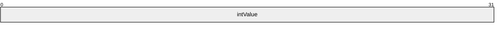

**intValue (4 bytes):** A 32-bit signed number in little-endian byte order.

<a id="Section_5.16.1.2"></a>
#### 5.16.1.2 INT64

The INT64 type is an 8-byte integer in little-endian form. See [MS-DTYP](../MS-DTYP/MS-DTYP.md) section 2.2.23 for its definition.

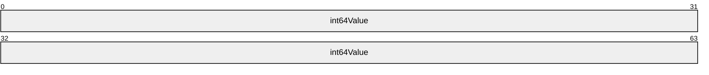

**int64Value (8 bytes):** A 64-bit signed number in little-endian byte order.

<a id="Section_5.16.1.3"></a>
#### 5.16.1.3 OctetString

The OctetString represents an array of bytes. The number of bytes in the array equals the valLen field of the [ATTRVAL](#Section_5.16) structure.

<a id="Section_5.16.1.4"></a>
#### 5.16.1.4 String8

The String8 type is an array of ASCII characters. Each character is encoded as a single byte. The number of bytes in the array equals the valLen field of the [ATTRVAL](#Section_5.16) structure.

<a id="Section_5.16.1.5"></a>
#### 5.16.1.5 String16

The String16 type is an array of [**Unicode**](#gt_unicode) characters. Each Unicode character is encoded as 2 bytes. The number of bytes in the array equals the valLen field of the [ATTRVAL](#Section_5.16) structure.

The byte ordering is little-endian.

<a id="Section_5.16.1.6"></a>
#### 5.16.1.6 SECURITY_DESCRIPTOR

The SECURITY_DESCRIPTOR structure is an NT [**security descriptor**](#gt_security-descriptor) in self-relative format, as specified in [MS-DTYP](../MS-DTYP/MS-DTYP.md) section 2.4.6.

The data is stored in little-endian byte order.

<a id="Section_5.16.1.7"></a>
#### 5.16.1.7 SID

The **SID** type is an NT [**security identifier (SID)**](#gt_sid) structure, as specified in [MS-DTYP](../MS-DTYP/MS-DTYP.md) section 2.4.2.

The data is stored in little-endian byte order.

<a id="Section_5.16.2"></a>
### 5.16.2 Abstract Value Representations

The abstract data model utilizes a representation of data values that is used by [**LDAP**](#gt_lightweight-directory-access-protocol-ldap), minus the BER encoding. Several of these syntaxes are adopted from [[RFC2252]](https://go.microsoft.com/fwlink/?LinkId=90326).

The following table lists all the supported syntaxes and how they are represented in the model. Some syntaxes share an [**OID**](#gt_object-identifier-oid), so the syntaxes in the table are identified by name, not OID.

| LDAP syntax name (OID) | [RFC2252] name | Reference section in [RFC2252] or in this document |
| --- | --- | --- |
| Boolean (2.2.5.8) | Boolean | [RFC2252] section 6.4 |
| Enumeration (2.5.5.9) | INTEGER | [RFC2252] section 6.16 |
| Integer (2.5.5.9) | INTEGER | [RFC2252] section 6.16 |
| LargeInteger (2.5.5.16) | INTEGER | [RFC2252] section 6.16 |
| Object(Presentation-Address) (2.5.5.13) | Presentation Address | [RFC2252] section 6.28 |
| Object(Replica-Link) (2.5.5.10) | Binary | [RFC2252] section 6.2 |
| String(IA5) (2.5.5.5) | IA5 String | [RFC2252] section 6.15 |
| String(Numeric) (2.5.5.6) | Numeric String | [RFC2252] section 6.23 |
| String(Object-Identifier) (2.5.5.2) | OID | [RFC2252] section 6.25 |
| String(Octet) (2.5.5.10) | Binary | [RFC2252] section 6.2 |
| String(Printable) (2.5.5.5) | Printable String | [RFC2252] section 6.29 |
| String(Unicode) (2.5.5.12) | Directory String | [RFC2252] section 6.10 |
| String(UTC-Time) (2.5.5.11) | UTC Time | [RFC2252] section 6.31 |
| String(Generalized-Time) (2.5.5.11) | Generalized Time | [RFC2252] section 6.14 |
| Object(DS-DN) (2.5.5.1) | - | Section [5.16.2.1](#Section_5.16.2.1) |
| Object(DN-String) (2.5.5.14) | - | Section [5.16.2.2](#Section_5.16.2.2) |
| Object(DN-Binary) (2.5.5.7) | - | Section [5.16.2.3](#Section_5.16.2.3) |
| Object(Access-Point) (2.5.5.14) | - | Section [5.16.2.4](#Section_5.16.2.4) |
| Object(OR-Name) (2.5.5.7) | - | Section [5.16.2.5](#Section_5.16.2.5) |
| String(NT-Sec-Desc) (2.5.5.15) | - | Section [5.16.2.6](#Section_5.16.2.6) |
| String(SID) (2.5.5.17) | - | Section [5.16.2.7](#Section_5.16.2.7) |
| String(Teletex) (2.5.5.4) | - | Section [5.16.2.8](#Section_5.16.2.8) |

The LDAP syntaxes that are not defined in [RFC2252] are described in the following sections.

<a id="Section_5.16.2.1"></a>
#### 5.16.2.1 Object(DS-DN)

A value with the Object(DS-DN) syntax is a UTF-8 string in the following format:

<GUID=*guid_value*>;<SID=*sid_value*>;*dn*

where:

- *guid_value* is the value of the [**object's**](#gt_object) objectGUID [**attribute**](#gt_attributes).
- *sid_value* is the value of the object's objectSid attribute in its binary format (as specified in [MS-DTYP](../MS-DTYP/MS-DTYP.md) section 2.4.2).
- *dn* is the string representation of a [**DN**](#gt_distinguished-name-dn) (as specified by [[RFC2252]](https://go.microsoft.com/fwlink/?LinkId=90326) section 6.9, and further specified by [[RFC2253]](https://go.microsoft.com/fwlink/?LinkId=90327)).
For reference to objects that do not have an objectSid, the format is as follows:

<GUID=*guid_value*>;*dn*

where *guid_value* and *dn* have the same meaning as in the previous case.

<a id="Section_5.16.2.2"></a>
#### 5.16.2.2 Object(DN-String)

A value with the Object(DN-String) syntax is a UTF-8 string in the following format:

S:*char_count*:*string_value*:*object_DN*

where:

- S is a string literal that MUST be present.
- Each : is a string literal that MUST be present.
- *char_count* is the number of characters in the *string_value* string.
- *object_DN* is an [**object reference**](#gt_object-reference) in the format of [Object(DS-DN)](#Section_5.16.2.1).
<a id="Section_5.16.2.3"></a>
#### 5.16.2.3 Object(DN-Binary)

A value with the Object(DN-Binary) syntax is a UTF-8 string in the following format:

B:*char_count*:*binary_value*:*object_DN*

where:

- B is a string literal that MUST be present.
- Each : is a string literal that MUST be present.
- *char_count* is the number of hexadecimal digits in *binary_value*.
- *binary_value* is the hexadecimal representation of a binary value.
- *object_DN* is an [**object reference**](#gt_object-reference) in the format of [Object(DS-DN)](#Section_5.16.2.1).
<a id="Section_5.16.2.4"></a>
#### 5.16.2.4 Object(Access-Point)

A value with the Object(Access-Point) syntax is a UTF-8 string in the following format:

*presentation_address*#X500:*object_DN*

where:

- #X500 is a string literal that MUST be present.
- : is a string literal that MUST be present.
- *presentation_address* is a value encoded in the Object(Presentation-Address) syntax.
- *object_DN* is an [**object reference**](#gt_object-reference) in the format of [Object(DS-DN)](#Section_5.16.2.1).
<a id="Section_5.16.2.5"></a>
#### 5.16.2.5 Object(OR-Name)

A value with the Object(OR-Name) syntax is a UTF-8 string in the following format:

*object_DN*

where: *object_DN* is an [**object reference**](#gt_object-reference) in the format of [Object(DS-DN)](#Section_5.16.2.1).

<a id="Section_5.16.2.6"></a>
#### 5.16.2.6 String(NT-Sec-Desc)

A value with the String(NT-Sec-Desc) syntax contains a Windows [**security descriptor**](#gt_security-descriptor) in self-relative binary form. The binary form is that of a SECURITY_DESCRIPTOR structure and is documented in [MS-DTYP](../MS-DTYP/MS-DTYP.md) section 2.4.6.

<a id="Section_5.16.2.7"></a>
#### 5.16.2.7 String(Sid)

A value with the String(Sid) syntax is a Windows [**SID**](#gt_sid) in binary form. The binary form is that of a SID structure and is specified in [MS-DTYP](../MS-DTYP/MS-DTYP.md) section 2.4.2.

<a id="Section_5.16.2.8"></a>
#### 5.16.2.8 String(Teletex)

A value with the String(Teletex) syntax is a UTF-8 string restricted to characters with values between 0x20 and 0x7e, inclusive.

<a id="Section_5.16.3"></a>
### 5.16.3 Converting Between Abstract and Concrete Value Representations

The type [ATTRVAL](#Section_5.16) is an encoding that several methods use to send individual [**directory**](#gt_directory) [**attribute**](#gt_attributes) values across the network. When an attribute has multiple values, and all those values need to be sent, this is performed by sending multiple ATTRVALs.

An ATTRVAL that encodes an [**OID**](#gt_object-identifier-oid) requires a [**prefix table**](#gt_prefix-table) for decoding. In some cases, the prefix table accompanies the ATTRVAL in the same [**RPC**](#gt_remote-procedure-call-rpc) request or response. In other cases, a predefined prefix table is sufficient. The process of creating the ATTRVAL for an OID can add an entry to the prefix table that will accompany the ATTRVAL.

The abstract directory model specified in [MS-ADTS](../MS-ADTS/MS-ADTS.md) section 3.1.1 represents individual attribute values in the form used by [**LDAP**](#gt_lightweight-directory-access-protocol-ldap) (see [[RFC2252]](https://go.microsoft.com/fwlink/?LinkId=90326)), minus the BER encoding. In short, values are represented as strings in a variety of formats. The [**abstract type**](#gt_abstract-type) [Value](#Section_5.214) is used to represent an attribute value in the model. Section [5.16.2](#Section_5.16.2) specifies the abstract representation for each LDAP syntax.

Therefore, this specification requires procedures that convert between the concrete ATTRVAL encoding and the abstract Value encoding, creating a prefix table while creating the ATTRVAL, and reading a prefix table while decoding the ATTRVAL. These procedures have the following signatures:

procedure ATTRVALFromValue(

v: Value, s: AttributeSyntax, var t: PrefixTable) : ATTRVAL

procedure ValueFromATTRVAL(

a: ATTRVAL, s: AttributeSyntax, t: PrefixTable) : Value

where:

- *s* is an LDAP attribute syntax from the table in section 5.16.2.
- *t* is an abstract [PrefixTable](#Section_5.153) [**object**](#gt_object), representing a prefix table.
ATTRVALFromValue mutates its input PrefixTable object *t*; ValueFromATTRVAL does not.

Apart from the prefix table complication, these two procedures are straightforward given the two value representations. These procedures obey the mappings shown in the following table for converting between abstract and concrete value representations.

| LDAP syntax name | Encoding of ATTRVAL payload |
| --- | --- |
| Boolean (2.2.5.8) | INT32 |
| Enumeration (2.5.5.9) | INT32 |
| Integer (2.5.5.9) | INT32 |
| LargeInteger (2.5.5.16) | INT64 |
| Object(Presentation-Address) (2.5.5.13) | [SYNTAX_ADDRESS](#Section_5.192) |
| Object(Replica-Link) (2.5.5.10) | OctetString |
| String(IA5) (2.5.5.5) | String8 |
| String(Numeric) (2.5.5.6) | String8 |
| String(Object-Identifier) (2.5.5.2) | [ATTRTYP](#Section_5.14) |
| String(Octet) (2.5.5.10) | OctetString |
| String(Printable) (2.5.5.5) | String8 |
| String(Unicode) (2.5.5.12) | String16 |
| String(UTC-Time) (2.5.5.11) | [DSTIME](#Section_5.51) |
| String(Generalized-Time) (2.5.5.11) | DSTIME |
| Object(DS-DN) (2.5.5.1) | [DSName](#Section_5.49) |
| Object(DN-String) (2.5.5.14) | [SYNTAX_DISTNAME_BINARY](#Section_5.193) |
| Object(DN-Binary) (2.5.5.7) | SYNTAX_DISTNAME_BINARY |
| Object(Access-Point) (2.5.5.14) | SYNTAX_DISTNAME_BINARY |
| Object(OR-Name) (2.5.5.7) | SYNTAX_DISTNAME_BINARY |
| String(NT-Sec-Desc) (2.5.5.15) | SECURITY_DESCRIPTOR |
| String(SID) (2.5.5.17) | [SID](#Section_5.16.1.7) |
| String(Teletex) (2.5.5.4) | String8 |

Since the preceding procedures require a prefix table, a procedure to produce a prefix table is also required, as follows:

procedure NewPrefixTable() : PrefixTable

The special case value conversion between ATTRTYP and [OID](#Section_5.142) is provided by the following two procedures:

procedure MakeAttid(t: PrefixTable, o: OID) : ATTRTYP

procedure OidFromAttid(t: PrefixTable, attr: ATTRTYP) : OID

These three procedures, specified in section [5.16.4](#Section_5.16.4), describe the algorithm for converting values of type OID to and from their ATTRVAL payload representation using a PrefixTable.

The conversion between an abstract Value representation and a concrete ATTRVAL representation is specified in the following sections, which are organized by abstract value type. In the examples shown:

- **LDAP Value** represents the LDAP value.
- **valLen** represents the value in the **valLen** field of the ATTRVAL structure.
- **payload** represents the data in the payload (the referent of pVal in the ATTRVAL structure).
Because prefix tables are communicated over the wire, the [ConcretePTFromAbstractPT](#Section_5.28) and [AbstractPTFromConcretePT](#Section_5.1) procedures are defined to convert between the abstract PrefixTable and the concrete [SCHEMA_PREFIX_TABLE](#Section_5.180).

<a id="Section_5.16.3.1"></a>
#### 5.16.3.1 Boolean

The Boolean [**LDAP**](#gt_lightweight-directory-access-protocol-ldap) [**attribute**](#gt_attributes) value FALSE corresponds to an INT32 with value 0. The Boolean LDAP attribute value TRUE corresponds to an INT32 with a nonzero value. INT32 is in little-endian format. The valLen field of [ATTRVAL](#Section_5.16) equals 4.

Example:

LDAP value: TRUE

INT32 value 0x1

valLen: 4.

payload:

01 00 00 00 ....

<a id="Section_5.16.3.2"></a>
#### 5.16.3.2 Enumeration and Integer

The Enumeration and the Integer [**LDAP**](#gt_lightweight-directory-access-protocol-ldap) syntax types are represented in the same manner. The LDAP representation of the integer as a string expressed in base-10 notation corresponds to an [INT32](#Section_5.16.1.1), which is in little-endian format. The valLen field of [ATTRVAL](#Section_5.16) equals 4.

Example:

LDAP value: 5

INT32 value: 0x5

valLen: 4,

payload:

05 00 00 00 ....

<a id="Section_5.16.3.3"></a>
#### 5.16.3.3 LargeInteger

The [**LDAP**](#gt_lightweight-directory-access-protocol-ldap) representation of the integer as a string expressed in base-10 notation corresponds to an [INT64](#Section_5.16.1.2), which is in little-endian format. The valLen field of [ATTRVAL](#Section_5.16) equals 8.

Example:

LDAP value: 12605

INT64 value: Hexadecimal 0x313d

valLen: 8,

payload:

3d 31 00 00 00 00 00 00 =1......

<a id="Section_5.16.3.4"></a>
#### 5.16.3.4 Object(Presentation-Address)

To convert from the [**LDAP**](#gt_lightweight-directory-access-protocol-ldap) representation to the [SYNTAX_ADDRESS](#Section_5.192) representation, the UTF-8 encoded string is converted to a UCS-16 encoded [**Unicode**](#gt_unicode) string. The resulting string is not null-terminated. The dataLen field of SYNTAX_ADDRESS equals the length of the Unicode string in bytes, plus 4. The valLen field of [ATTRVAL](#Section_5.16) equals the dataLen field of SYNTAX_ADDRESS.

Example:

LDAP value: 12345 (Unicode string encoded as UTF-8)

This represents the following SYNTAX_ADDRESS struct:

+0x000 dataLen : 0xe

+0x004 uVal : L"12345"

valLen: 14

payload:

0e 00 00 00 31 00 32 00 33 00 34 00 35 00 ....1.2.3.4.5.

<a id="Section_5.16.3.5"></a>
#### 5.16.3.5 Object(Replica-Link) String (Octet)

The representation used in [**LDAP**](#gt_lightweight-directory-access-protocol-ldap) syntax and encoding of the [ATTRVAL](#Section_5.16) payload is the same. Therefore, the payload is set to the same value. The valLen field of ATTRVAL equals the length of the byte array.

<a id="Section_5.16.3.6"></a>
#### 5.16.3.6 String(IA5) String(Printable) String(Numeric) String(Teletex)

The representation used in [**LDAP**](#gt_lightweight-directory-access-protocol-ldap) syntax and encoding of the [ATTRVAL](#Section_5.16) payload is the same. Therefore, the payload is set to the same value. The string is not null-terminated. The valLen field of ATTRVAL equals the number of bytes in the string.

Example:

LDAP value: 123456789

This represents an ASCII string "123456789"

valLen: 9

payload:

31 32 33 34 35 36 37 38 39 123456789

<a id="Section_5.16.3.7"></a>
#### 5.16.3.7 String(Unicode)

To convert from the [**LDAP**](#gt_lightweight-directory-access-protocol-ldap) representation to the [**Unicode**](#gt_unicode) syntax representation, the UTF-8 encoded string is converted to a UCS-16 encoded String16. Each Unicode character is in little-endian format. The resulting string is not null-terminated. The valLength field of [ATTRVAL](#Section_5.16) equals the total number of bytes in the Unicode string.

Example:

LDAP value: Administrator (Unicode string encoded in UTF-8)

valLen: 26

payload:

41 00 64 00 6d 00 69 00 6e 00 69 00 73 00 74 00 A.d.m.i.n.i.s.t.

72 00 61 00 74 00 6f 00 72 00 r.a.t.o.r.

<a id="Section_5.16.3.8"></a>
#### 5.16.3.8 String(Object-Identifier)

Conversion from the [**LDAP**](#gt_lightweight-directory-access-protocol-ldap) representation to [ATTRTYP](#Section_5.14) is performed via the [MakeAttid](#Section_5.124) function. The length of the valLen field in [ATTRVAL](#Section_5.16) equals 4.

Conversion from ATTRTYP to LDAP representation is performed by the [OidFromAttid](#Section_5.144) procedure.

Example:

LDAP value: 2.5.6.5

This corresponds to ATTRTYP value: 0x00010005.

valLen: 4

payload:

05 00 01 00 ....

<a id="Section_5.16.3.9"></a>
#### 5.16.3.9 String(UTC-Time) and String(Generalized-Time)

For both the String(UTC-Time) and String(Generalized-Time) [**LDAP**](#gt_lightweight-directory-access-protocol-ldap) syntaxes, the time expressed in the LDAP value corresponds to [DSTIME](#Section_5.51). It is in little-endian format. The valLen field of [ATTRVAL](#Section_5.16) equals 8.

LDAP value: 20060609211106.0Z (06/09/2006 14:11:06 PST).

This corresponds to DSTIME value: 0x2fa9a74ea

valLen: 8,

payload:

ea 74 9a fa 02 00 00 00 .t......

<a id="Section_5.16.3.10"></a>
#### 5.16.3.10 Object(DS-DN)

The [**LDAP**](#gt_lightweight-directory-access-protocol-ldap) representation of Object(DS-DN) is defined in section [5.16.2.1](#Section_5.16.2.1). This corresponds to [DSName](#Section_5.49) as follows:

The *dn* part of the LDAP representation is converted to a UCS-16 encoded [**Unicode**](#gt_unicode) string. Then, the attributeValue component (defined in [[RFC2253]](https://go.microsoft.com/fwlink/?LinkId=90327)) of each [**RDN**](#gt_relative-distinguished-name-rdn) in the [**DN**](#gt_distinguished-name-dn) is canonicalized according to the following rules:

- The first leading space, if any, is escaped as a backslash (\) followed by a space.
- Any carriage return or line-feed characters are escaped as a backslash followed by the 2-digit hexadecimal value of that character, as specified in [RFC2253] section 2.4.
- Any of the following characters—number sign (#), plus sign (+), comma (,), semicolon (;), quotation mark ("), left angle bracket (<), equal sign (=), right angle bracket (>), and backslash (\)—are escaped as a backslash followed by the character.
- The trailing space, if any, is escaped as a backslash followed by a space.
The resulting string (including a terminating null character) is inserted into the StringName field of the [DSNAME](#Section_5.50). The length of the string, in Unicode characters, is inserted into the NameLen field. The length of the string in the NameLen field does not include the terminating null character. The value of *guid_value* in LDAP representation is expressed as a [**GUID**](#gt_globally-unique-identifier-guid) and inserted into the Guid field of the DSNAME structure. If the *sid_value* is present, it is copied into the Sid field of the DSNAME and the SidLen field is set to the length, in bytes, of the [**SID**](#gt_sid). If the *sid_value* part is not present, then the SidLen field is set to 0. The valLen field of [ATTRVAL](#Section_5.16) equals the length of the DSNAME structure. All the multibyte quantities in the DSNAME are stored in little-endian format.

Example:

LDAP Value: <GUID=3ceab4a1-fc47-4a71-8195-454faa6423a3>; <SID=01050000000000051500000089598d33d3c56b6894e1f2e6f4010000>;CN=Administrator,OU=Users,DC=test,DC=com

This corresponds to the following DSNAME:

+0x000 structLen : 0x8a

+0x004 SidLen : 0x1c

+0x008 Guid : 3ceab4a1-fc47-4a71-8195-454faa6423a3

+0x018 Sid : S-1-5-21-864901513-1751893459-3874677140-500

+0x034 NameLen : 0x28

+0x038 StringName : L"CN=Administrator,OU=Users,DC=test,DC=com"

valLen: 138,

payload:

8a 00 00 00 1c 00 00 00 a1 b4 ea 3c 47 fc 71 4a ...........<G.qJ

81 95 45 4f aa 64 23 a3 01 05 00 00 00 00 00 05 ..EO.d#.........

15 00 00 00 89 59 8d 33 d3 c5 6b 68 94 e1 f2 e6 .....Y.3..kh....

f4 01 00 00 28 00 00 00 43 00 4e 00 3d 00 41 00 ....(...C.N.=.A.

64 00 6d 00 69 00 6e 00 69 00 73 00 74 00 72 00 d.m.i.n.i.s.t.r.

61 00 74 00 6f 00 72 00 2c 00 4f 00 55 00 3d 00 a.t.o.r.,.O.U.=.

55 00 73 00 65 00 72 00 73 00 2c 00 44 00 43 00 U.s.e.r.s.,.D.C.

3d 00 74 00 65 00 73 00 74 00 2c 00 44 00 43 00 =.t.e.s.t.,.D.C.

3d 00 63 00 6f 00 6d 00 00 00 =.c.o.m...

<a id="Section_5.16.3.11"></a>
#### 5.16.3.11 Object(DN-Binary)

The [**LDAP**](#gt_lightweight-directory-access-protocol-ldap) representation of the [**attribute**](#gt_attributes) value corresponds to [SYNTAX_DISTNAME_BINARY](#Section_5.193). The *object_DN* portion of the LDAP representation is treated as if it were in Object(DS-DN) syntax and converted to the [DSNAME](#Section_5.50) syntax representation, as explained in section [5.16.2.3](#Section_5.16.2.3). The *binary_value* portion of the LDAP representation is converted to the binary value (an array of bytes) and stored in the byteVal field of the [SYNTAX_ADDRESS](#Section_5.192) structure. The dataLen field of SYNTAX_ADDRESS is set to the length of the array, in bytes, plus 4, where 4 is the length of the dataLen field.

Padding is added between the DSNAME and SYNTAX_ADDRESS structures so that the length of DSNAME plus padding modulo 4 equals 0. The padding is an array of bytes, each byte of value 0. The valLen field of [ATTRVAL](#Section_5.16) equals the length of the DSNAME structure, plus the number of bytes added for padding, plus the length of the SYNTAX_ADDRESS structure.

All the multibyte quantities in the DSNAME and SYNTAX_ADDRESS structures are stored in little-endian format.

Example where padding is required because DSNAME is not 4-byte aligned:

LDAP value:

B:8:00000005:<GUID=2d8b0ce6-aa32-4f31-a6e8-88343e6244a5>;<SID=010100001cd509a018459359>;DC=test,DC=com

Representation of data as SYNTAX_DISTNAME_BINARY:

+0x000 Name : DSNAME

+0x000 structLen : 0x56

+0x004 SidLen : 0xc

+0x008 Guid : 2d8b0ce6-aa32-4f31-a6e8-88343e6244a5

+0x018 Sid : S-1-483723680-1502823704

+0x034 NameLen : 0xe

+0x038 StringName : "DC=test,DC=com"

+0x058 Data : SYNTAX_ADDRESS

+0x000 dataLen : 8

+0x004 byteVal : 00 00 00 05

valLength: 96

payload:

56 00 00 00 0c 00 00 00 e6 0c 8b 2d 32 aa 31 4f V..........-2.1O

a6 e8 88 34 3e 62 44 a5 01 01 00 00 1c d5 09 a0 ...4>bD.........

18 45 93 59 00 00 00 00 00 00 00 00 00 00 00 00 .E.Y............

00 00 00 00 0e 00 00 00 44 00 43 00 3d 00 74 00 ........D.C.=.t.

65 00 73 00 74 00 2c 00 44 00 43 00 3d 00 63 00 e.s.t.,.D.C.=.c.

6f 00 6d 00 00 00 00 00 08 00 00 00 00 00 00 05 o.m.............

Example where padding is not required because DSNAME is 4-byte aligned:

LDAP value:

B:8:0000000D:<GUID= ff432fe0-8c94-43cf-915c-286b197b0164>;<SID=010100001a180dba5ec27614>;DC=test1,DC=test,DC=com.

Representation of data as SYNTAX_DISTNAME_BINARY:

+0x000 Name : DSNAME

+0x000 structLen : 0x68

+0x004 SidLen : 0xc

+0x008 Guid : ff432fe0-8c94-43cf-915c-286b197b0164

+0x018 Sid : S-1-437783994-343327326

+0x034 NameLen : 0x17

+0x038 StringName : "DC=test1,DC=test,DC=com"

+0x068 Data : SYNTAX_ADDRESS

+0x000 dataLen : 0x74003d

+0x004 byteVal : 00 00 00 0d

68 00 00 00 0c 00 00 00 e0 2f 43 ff 94 8c cf 43 h......../C....C

91 5c 28 6b 19 7b 01 64 01 01 00 00 1a 18 0d ba .\(k.{.d........

5e c2 76 14 00 00 00 00 00 00 00 00 00 00 00 00 ^.v.............

00 00 00 00 17 00 00 00 44 00 43 00 3d 00 74 00 ........D.C.=.t.

65 00 73 00 74 00 31 00 2c 00 44 00 43 00 3d 00 e.s.t.1.,.D.C.=.

74 00 65 00 73 00 74 00 2c 00 44 00 43 00 3d 00 t.e.s.t.,.D.C.=.

63 00 6f 00 6d 00 00 00 08 00 00 00 00 00 00 0d c.o.m...........

<a id="Section_5.16.3.12"></a>
#### 5.16.3.12 Object(DN-String)

The [**LDAP**](#gt_lightweight-directory-access-protocol-ldap) representation of the [**attribute**](#gt_attributes) value corresponds to [SYNTAX_DISTNAME_BINARY](#Section_5.193). The *object_DN* portion of the LDAP representation is treated as if it were in Object(DS-DN) syntax and converted to the [DSNAME](#Section_5.50) representation, as explained in section [5.16.2.2](#Section_5.16.2.2). The result is stored in the Name field of that structure. The *string_value* portion of the LDAP representation is converted to a UCS-16 encoded [**Unicode**](#gt_unicode) string and stored in the byteVal field of the [SYNTAX_ADDRESS](#Section_5.192) structure. The dataLen field of SYNTAX_ADDRESS is set to the length of the string, in bytes, plus 4, where 4 is the length of the dataLen field. Enough padding is added between the DSNAME and SYNTAX_ADDRESS structures such that the length of DSNAME plus padding modulo 4 equals 0. The padding is an array of bytes of value 0. The valLen field of [ATTRVAL](#Section_5.16) equals the length of the DSNAME structure, plus the number of bytes added for padding, plus the length of the SYNTAX_ADDRESS structure. All the multibyte quantities in the DSNAME and SYNTAX_ADDRESS structures are stored in little-endian format.

Example:

LDAP value:

S:7:Unicode:<GUID=2d8b0ce6-aa32-4f31-a6e8-88343e6244a5>;<SID=010100001cd509a018459359>;DC=test,DC=com

This represents data as SYNTAX_DISTNAME_BINARY

(note the structure SYNTAX_ADDRESS is 4-byte aligned):

+0x000 Name : DSNAME

+0x000 structLen : 0x56

+0x004 SidLen : 0xc

+0x008 Guid : 2d8b0ce6-aa32-4f31-a6e8-88343e6244a5

+0x018 Sid : S-1-483723680-1502823704

+0x034 NameLen : 0xe

+0x038 StringName : "DC=test,DC=com"

+0x058 Data : SYNTAX_ADDRESS

+0x000 dataLen : 0x12

+0x004 uVal : "Unicode"

valLength: 106

payload:

56 00 00 00 0c 00 00 00 e6 0c 8b 2d 32 aa 31 4f V..........-2.1O

a6 e8 88 34 3e 62 44 a5 01 01 00 00 1c d5 09 a0 ...4>bD.........

18 45 93 59 00 00 00 00 00 00 00 00 00 00 00 00 .E.Y............

00 00 00 00 0e 00 00 00 44 00 43 00 3d 00 74 00 ........D.C.=.t.

65 00 73 00 74 00 2c 00 44 00 43 00 3d 00 63 00 e.s.t.,.D.C.=.c.

6f 00 6d 00 00 00 00 00 12 00 00 00 55 00 6e 00 o.m.........U.n.

69 00 63 00 6f 00 64 00 65 00 i.c.o.d.e.

<a id="Section_5.16.3.13"></a>
#### 5.16.3.13 Object(OR-Name)

The [**LDAP**](#gt_lightweight-directory-access-protocol-ldap) representation of the [**attribute**](#gt_attributes) value corresponds to [SYNTAX_DISTNAME_BINARY](#Section_5.193). The *object_DN* of the LDAP representation is treated as if it were in Object(DS-DN) syntax and converted to the [DSNAME](#Section_5.50) syntax representation, as explained in section [5.16.2.5](#Section_5.16.2.5).

<a id="Section_5.16.3.14"></a>
#### 5.16.3.14 Object(Access-Point)

The [**LDAP**](#gt_lightweight-directory-access-protocol-ldap) representation of the [**attribute**](#gt_attributes) value corresponds to [SYNTAX_DISTNAME_BINARY](#Section_5.193). The *object_DN* portion of the LDAP representation is treated as if it were in Object(DS-DN) syntax and converted to the [DSNAME](#Section_5.50) syntax representation, as explained in section [5.16.2.4](#Section_5.16.2.4). The *presentation_address* portion of the LDAP representation is treated as if it were in the Object(Presentation-Address) syntax and converted to the [SYNTAX_ADDRESS](#Section_5.192) representation. All the multibyte quantities in the DSNAME and SYNTAX_ADDRESS structures are stored in little-endian format.

<a id="Section_5.16.3.15"></a>
#### 5.16.3.15 String(Sid)

The representation used in [**LDAP**](#gt_lightweight-directory-access-protocol-ldap) syntax and encoding of [ATTRVAL](#Section_5.16) payload is the same. Therefore the payload is set to the same value. The valLen field of ATTRVAL equals the number of bytes in the payload. It is always 28. All the multibyte quantities in the [SID](#Section_5.16.1.7) structure are stored in little-endian format.

Example:

LDAP Value: 01050000000000051500000089598d33d3c56b6894e1f2e6f4010000

valLen: 28

payLoad:

01 05 00 00 00 00 00 05 15 00 00 00 89 59 8d 33 .............Y.3

d3 c5 6b 68 94 e1 f2 e6 f4 01 00 00 ..kh........

<a id="Section_5.16.3.16"></a>
#### 5.16.3.16 String(NT-Sec-Desc)

The representation used in [**LDAP**](#gt_lightweight-directory-access-protocol-ldap) syntax and encoding of [ATTRVAL](#Section_5.16) payload is the same. Therefore the payload is set to the same value. The valLen field of ATTRVAL equals the number of bytes in the payload. All the multibyte quantities in the [**security descriptor**](#gt_security-descriptor) structure are stored in little-endian format.

LDAP value: (binary blob, represented in hex format here)

0100048c7000000080000000000000001400000004005c0003000000050028000001000001000000531a72ab2f1ed011981900aa0040529b01010000000000050a00000000121800ff010f0001020000000000052000000020020000001214009400020001010000000000050b000000010200001cd509a01845935900020000010200001cd509a01845935900020000

This represents the following self-relative security descriptor

value:

SD Revision: 1

SD Control: 0x8c04

SE_DACL_PRESENT

SE_DACL_AUTO_INHERITED

SE_SACL_AUTO_INHERITED

SE_SELF_RELATIVE

Owner: S-1-483723680-1502823704-512

Group: S-1-483723680-1502823704-512

DACL:

Revision 4

Size: 92 bytes

# Aces: 3

Ace[0]

Ace Type: 0x5 - ACCESS_ALLOWED_OBJECT_ACE_TYPE

Ace Size: 40 bytes

Ace Flags: 0x0

Object Ace Mask: 0x00000100

ACTRL_DS_CONTROL_ACCESS

Object Ace Flags: 0x1

ACE_OBJECT_TYPE_PRESENT

Object Ace Type:

Change Password-ab721a53-1e2f-11d0-9819-00aa0040529b

Object Ace Sid: NT AUTHORITY\SELF [S-1-5-10]

Ace[1]

Ace Type: 0x0 - ACCESS_ALLOWED_ACE_TYPE

Ace Size: 24 bytes

Ace Flags: 0x12

CONTAINER_INHERIT_ACE

INHERITED_ACE

Ace Mask: 0x000f01ff

DELETE

READ_CONTROL

WRITE_DAC

WRITE_OWNER

ACTRL_DS_CREATE_CHILD

ACTRL_DS_DELETE_CHILD

ACTRL_DS_LIST

ACTRL_DS_SELF

ACTRL_DS_READ_PROP

ACTRL_DS_WRITE_PROP

ACTRL_DS_DELETE_TREE

ACTRL_DS_LIST_OBJECT

ACTRL_DS_CONTROL_ACCESS

Ace Sid: BUILTIN\Administrators [S-1-5-32-544]

Ace[2]

Ace Type: 0x0 - ACCESS_ALLOWED_ACE_TYPE

Ace Size: 20 bytes

Ace Flags: 0x12

CONTAINER_INHERIT_ACE

INHERITED_ACE

Ace Mask: 0x00020094

READ_CONTROL

ACTRL_DS_LIST

ACTRL_DS_READ_PROP

ACTRL_DS_LIST_OBJECT

Ace Sid: NT AUTHORITY\Authenticated Users [S-1-5-11]

valLen: 144

paylaod:

01 00 04 8c 70 00 00 00 80 00 00 00 00 00 00 00 ....p...........

14 00 00 00 04 00 5c 00 03 00 00 00 05 00 28 00 ......\.......(.

00 01 00 00 01 00 00 00 53 1a 72 ab 2f 1e d0 11 ........S.r./...

98 19 00 aa 00 40 52 9b 01 01 00 00 00 00 00 05 .....@R.........

0a 00 00 00 00 12 18 00 ff 01 0f 00 01 02 00 00 ................

00 00 00 05 20 00 00 00 20 02 00 00 00 12 14 00 .... ... .......

94 00 02 00 01 01 00 00 00 00 00 05 0b 00 00 00 ................

01 02 00 00 1c d5 09 a0 18 45 93 59 00 02 00 00 .........E.Y....

01 02 00 00 1c d5 09 a0 18 45 93 59 00 02 00 00 .........E.Y....

<a id="Section_5.16.4"></a>
### 5.16.4 ATTRTYP-to-OID Conversion

This section describes the prefix mapping mechanism that allows the one-to-one mapping between [**OIDs**](#gt_object-identifier-oid) and a 32-bit integer ([ATTRTYP](#Section_5.14)).

An OID can be represented in the binary form, with a BER encoding scheme. The standard BER encoding of an object identifier consists of three components, because the end-of-contents component is not present. Only the third component (contents octets) is used here; other components are omitted.

**Note** The BER encoding of an OID is described in [[ITUX690]](https://go.microsoft.com/fwlink/?LinkId=89924) section 8.19. To avoid ambiguity, the non-encoded form of the OID is referred to as the original form in this section.

The prefix of an OID is the [**binary OID**](#gt_binary-oid), excluding the last one or two bytes. If the number following the final period (.) in the original form of the OID is less than 128, only the last byte is excluded; otherwise, the last two bytes are excluded.

A **PrefixTable** is a sequence of tuples defined as follows.

type PrefixTable = sequence of [

prefixString: unicodestring,

prefixIndex: integer

]

where:

- *prefixString* is the prefix of an OID.
- *prefixIndex* is an integer in the range [0 .. 0x0000ffff].
The integer *prefixIndex* is called the prefix index of *prefixString*. To allow one-to-one mappings between the prefix strings and the prefix indexes in the table, each *prefixString* MUST occur at most once in the table, and each *prefixIndex* MUST occur at most once in the table.

An ATTRTYP is a 32-bit, unsigned integer. If *attr* is an ATTRTYP, define attr.upperWord to be the most significant 16 bits, and attr.lowerWord to be the least significant 16 bits.

The following types and helper procedures are used for mapping between OIDs and ATTRTYP.

procedure ToBinary(st: unicodestring) : sequence of BYTE

Converts a string to a binary OID representation. For example, "\x55\x06" is the binary OID \x55\x06.

procedure CatBinary(o: sequence of BYTE, b: BYTE) : sequence of BYTE

Concatenates a byte onto a binary OID. For example, \x02 concatenated onto \x55\x06 is \x55\x06\x02.

procedure ToStringOID(o: sequence of BYTE) : unicodestring

Converts a binary OID to its string representation, as described in [ITUX690] section 8.19; returns null if the conversion fails. For example, the binary OID \x55\x06\x02 is converted to the OID string "2.5.6.2".

procedure ToBinaryOID(s: unicodestring) : sequence of BYTE

Converts an OID string representation to a binary OID, as described in [ITUX690] section 8.19; returns null if the conversion fails. For example, the OID string "2.5.6.2" is converted to the binary form \x55\x06\x02.

procedure ToByte(i: integer) : BYTE

Converts an integer into a byte representation, truncating to the least significant digits, if needed. For example, 2 converts to \x02.

procedure SubBinary(b: sequence of BYTE,

start: integer, end: integer) : sequence of BYTE

Returns the sequence [*start* .. *end*] of bytes in *b*.

procedure AddPrefixTableEntry(var t: PrefixTable, o: sequence of BYTE)

Sets *t*[*t*.length].prefixString to *o*. Generates a random number between 0 and 65535 that is unique in the values of *prefixIndex* in *t*, and sets *t*[*t*.length].prefixIndex to the generated random number. Increases *t*.length by one.

procedure ToInteger(s: unicodestring) : integer

Converts a string to its integer representation. For example, "127" is 127. Strings with non-numeric characters are not defined for this procedure.

The following procedures are used for mapping between object identifiers and ATTRTYP representations.

procedure MakeAttid(var t: PrefixTable, o: OID): ATTRTYP

*Informative summary of behavior*: This procedure converts an OID to a corresponding ATTRTYP representation.

lastValueString: unicodestring

lastValue, lowerWord: integer

binaryOID, oidPrefix: sequence of BYTE

attr: ATTRTYP

pos: integer

/* get the last value in the original OID: the value

* after the last '.'*/

lastValueString := SubString(o,

FindCharRev(o, o.length,'.'),

o.length)

lastValue := ToInteger(lastValueString)

/* convert the dotted form of OID into a BER encoded binary

* format. The BER encoding of OID is described in section

* 8.19 of [ITUX690]*/

binaryOID := ToBinaryOid(o)

/* get the prefix of the OID*/

if lastValue < 128 then

oidPrefix := SubBinary(binaryOID, 0, binaryOID.length - 2)

else

oidPrefix := SubBinary(binaryOID, 0, binaryOID.length - 3)

endif

/* search the prefix in the prefix table, if none found, add

* one entry for the new prefix.*/

fToAdd := true

for i := 0 to t.length

if ToBinary(t[i].prefixString) = oidPrefix then

fToAdd := false

pos := i

endif

endfor

if fToAdd then

pos := t.length

AddPrefixTableEntry(t, oidPrefix)

endif

/*compose the attid*/

lowerWord := lastValue mod 16384

if lastValue ≥ 16384 then

/*mark it so that it is known to not be the whole lastValue*/

lowerWord := lowerWord + 32768

endif

upperWord := t[pos].prefixIndex

attr := upperWord * 65536 + lowerWord

return attr

procedure OidFromAttid(t: PrefixTable, attr: ATTRTYP): OID

*Informative summary of behavior*: This procedure converts an ATTRTYP representation to a corresponding OID.

i, upperWord, lowerWord: integer

binaryOID: sequence of BYTE

binaryOID = null

/* separate the ATTRTYP into two parts*/

upperWord := attr / 65536

lowerWord := attr mod 65536

/* search in the prefix table to find the upperWord, if found,

* construct the binary OID by appending lowerWord to the end of

* found prefix.*/

for i := 0 to t.length

if t[i].prefixIndex = upperWord then

if lowerWord < 128 then

binaryOID := CatBinary(ToBinary(t[i].prefixString),

ToByte(lowerWord))

else

if lowerWord ≥ 32768 then

lowerWord := lowerWord - 32768

endif

binaryOID := CatBinary(ToBinary(t[i].prefixString),

ToByte(((lowerWord / 128) mod 128) + 128))

binaryOID := CatBinary(binaryOID, ToByte(lowerWord mod 128))

endif

endif

endfor

if binaryOID = null then

return null

else

return ToStringOID(binaryOID)

endif

procedure NewPrefixTable( ): PrefixTable

This procedure creates a new **PrefixTable**, inserts the following tuples into the table, and returns the table as the result.

| Bit Range | Field | Description |
| --- | --- | --- |
| Variable | "\x55\x4" | 2 0 |
| Variable | "\x55\x6" | 2 1 |
| Variable | "\x2A\x86\x48\x86\xF7\x14\x01\x02" | 8 2 |
| Variable | "\x2A\x86\x48\x86\xF7\x14\x01\x03" | 8 3 |
| Variable | "\x60\x86\x48\x01\x65\x02\x02\x01" | 8 4 |
| Variable | "\x60\x86\x48\x01\x65\x02\x02\x03" | 8 5 |
| Variable | "\x60\x86\x48\x01\x65\x02\x01\x05" | 8 6 |
| Variable | "\x60\x86\x48\x01\x65\x02\x01\x04" | 8 7 |
| Variable | "\x55\x5" | 2 8 |
| Variable | "\x2A\x86\x48\x86\xF7\x14\x01\x04" | 8 9 |
| Variable | "\x2A\x86\x48\x86\xF7\x14\x01\x05" | 8 10 |
| Variable | "\x09\x92\x26\x89\x93\xF2\x2C\x64" | 8 19 |
| Variable | "\x60\x86\x48\x01\x86\xF8\x42\x03" | 8 20 |
| Variable | "\x09\x92\x26\x89\x93\xF2\x2C\x64\x01" | 9 21 |
| Variable | "\x60\x86\x48\x01\x86\xF8\x42\x03\x01" | 9 22 |
| Variable | "\x2A\x86\x48\x86\xF7\x14\x01\x05\xB6\x58" | 10 23 |
| Variable | "\x55\x15" | 2 24 |
| Variable | "\x55\x12" | 2 25 |
| Variable | "\x55\x14" | 2 26 |

The following examples show the correspondence between [OID](#Section_5.142) and ATTRTYP by using the **PrefixTable** returned by the procedure [NewPrefixTable](#Section_5.135).

OID: 2.5.4.6 (countryName attribute)

Binary: \x55\x04\x06

Prefix string: "\x55\x04"

Prefix index: 0

ATTRTYP: 0x00000006

OID: 2.5.6.2 (country class)

Binary: \x55\x06\x02

Prefix string: "\x55\x06"

Prefix index: 1

ATTRTYP: 0x00010002

OID: 1.2.840.113556.1.2.1 (instanceType attribute)

Binary: \x2A\x86\x48\x86\xF7\x14\x01\x02\x01

Prefix string: "\x2A\x86\x48\x86\xF7\x14\x01\x02"

Prefix index: 2

ATTRTYP: 0x00020001

OID: 1.2.840.113556.1.3.23 (container class)

Binary: \x2A\x86\x48\x86\xF7\x14\x01\x03\x17

Prefix string: "\x2A\x86\x48\x86\xF7\x14\x01\x03"

Prefix index: 3

ATTRTYP: 0x00030017

OID: 2.5.5.1 (attribute syntax: distinguished name)

Binary: \x55\x5\x1

Prefix string: "\x55\x5"

Prefix index: 8

ATTRTYP: 0x00080001

OID: 1.2.840.113556.1.4.1 (RDN attribute)

Binary: \x2A\x86\x48\x86\xF7\x14\x01\x04\x01

Prefix string: "\x2A\x86\x48\x86\xF7\x14\x01\x04"

Prefix index: 9

ATTRTYP: 0x00090001

OID: 1.2.840.113556.1.5.1 (securityObject class)

Binary: \x2A\x86\x48\x86\xF7\x14\x01\x05\x01

Prefix string: "\x2A\x86\x48\x86\xF7\x14\x01\x05"

Prefix index: 10

ATTRTYP: 0x000a0001

OID: 0.9.2342.19200300.100.1.1 (uid attribute)

Binary: \x09\x92\x26\x89\x93\xF2\x2C\x64\x01\x01

Prefix string: "\x09\x92\x26\x89\x93\xF2\x2C\x64\x01"

Prefix index: 21

ATTRTYP: 0x00150001

OID: 2.16.840.1.113730.3.1.1 (carLicense attribute)

Binary: \x60\x86\x48\x01\x86\xF8\x42\x03\x01\x01

Prefix string: "\x60\x86\x48\x01\x86\xF8\x42\x03\x01"

Prefix index: 22

ATTRTYP: 0x00160001

OID: 1.2.840.113556.1.5.7000.53 (crossRefContainer class)

Binary: \x2A\x86\x48\x86\xF7\x14\x01\x05\xB6\x58\x35

Prefix string: "\x2A\x86\x48\x86\xF7\x14\x01\x05\xB6\x58"

Prefix index: 23

ATTRTYP: 0x00170035

OID: 2.5.21.2 (ditContentRules attribute)

Binary: \x55\x15\x02

Prefix string: "\x55\x15"

Prefix index: 24

ATTRTYP: 0x00180002

OID: 2.5.18.1 (createTimeStamp attribute)

Binary: \x55\x12\x01

Prefix string: "\x55\x12"

Prefix index: 25

ATTRTYP: 0x00190001

OID: 2.5.20.1 (subSchema class)

Binary: \x55\x14\x01

Prefix string: "\x55\x14"

Prefix index: 26

ATTRTYP: 0x001a0001

<a id="Section_5.17"></a>
## 5.17 ATTRVALBLOCK

The ATTRVALBLOCK structure defines a [**concrete type**](#gt_concrete-type) for a sequence of [**attribute**](#gt_attributes) values.

typedef struct {

[range(0,10485760)] ULONG valCount;

[size_is(valCount)] ATTRVAL* pAVal;

} ATTRVALBLOCK;

**valCount:** The number of items in the pAVal array.

**pAVal:** The sequence of attribute values.

<a id="Section_5.18"></a>
## 5.18 ATTRVALFromValue

procedure ATTRVALFromValue(v: Value,

s: Syntax,

var t: PrefixTable) : ATTRVAL

The ATTRVALFromValue procedure converts a value in the abstract [Value](#Section_5.214) encoding *v* of syntax *s* into a concrete [ATTRVAL](#Section_5.16), using the [**prefix table**](#gt_prefix-table) represented by *t*. This procedure can mutate the supplied prefix table.

See section [5.16.3](#Section_5.16.3) for the specification of this procedure.

<a id="Section_5.19"></a>
## 5.19 BindToDSA()

procedure BindToDSA(dsa: DSNAME): DRS_HANDLE

The BindToDSA procedure establishes an [**RPC**](#gt_remote-procedure-call-rpc) connection to the target [**DC**](#gt_domain-controller-dc) represented by its [**DSA object**](#gt_ntdsdsa-object). It also performs the [IDL_DRSBind](#Section_4.1.3) call. It returns the RPC handle on success or null on failure.

<a id="Section_5.20"></a>
## 5.20 BOOL

A [**concrete type**](#gt_concrete-type) for a Boolean value, as specified in [MS-DTYP](../MS-DTYP/MS-DTYP.md) section 2.2.3.

<a id="Section_5.21"></a>
## 5.21 BYTE

A [**concrete type**](#gt_concrete-type) for a single byte, as specified in [MS-DTYP](../MS-DTYP/MS-DTYP.md) section 2.2.6.

<a id="Section_5.22"></a>
## 5.22 CHANGE_LOG_ENTRIES

CHANGE_LOG_ENTRIES is a [**concrete type**](#gt_concrete-type), normatively specified in [MS-ADTS](../MS-ADTS/MS-ADTS.md) section 3.1.1.7.3; the type of the pmsgOut.V1.pLog field of the IDL_DRSGetNT4ChangeLog response. The following five fields within this type are used in specifying IDL_DRSGetNT4ChangeLog server behavior:

**Size**: MUST be 0x00000010.

**Version**: MUST be 0x00000001.

**SequenceNumber**: The sequence number for the buffer. MUST be set to 0x00000001 in a response to an IDL_DRSGetNT4ChangeLog request with pmsgIn.V1.pRestart = null. The value of pmsgOut.V1.pRestart in any IDL_DRSGetNT4ChangeLog response MUST encapsulate SequenceNumber. In a response to an IDL_DRSGetNT4ChangeLog request with pmsgIn.V1.pRestart ≠ null, SequenceNumber is the value encapsulated in pmsgIn.V1.pRestart, plus one.

**Flags**: MUST be 0x00000000.

**ChangeLogEntries**: A pointer to an array of [CHANGELOG_ENTRY](#Section_5.23).

<a id="Section_5.23"></a>
## 5.23 CHANGELOG_ENTRY

CHANGELOG_ENTRY is a [**concrete type**](#gt_concrete-type) that is defined in [MS-NRPC](../MS-NRPC/MS-NRPC.md) section 3.5.4.6.4, with more information in [MS-ADTS](../MS-ADTS/MS-ADTS.md) section 3.1.1.7.1.2. The abstract variable [dc](../MS-NRPC/MS-NRPC.md).pdcChangeLog is a sequence of CHANGELOG_ENTRY. The following two fields within this type are used in specifying IDL_DRSGetNT4ChangeLog server behavior:

**ChangeLogEntrySize**: A [DWORD](#Section_5.52) containing the size, in bytes, of the CHANGELOG_ENTRY structure.

**SerialNumber**: A [LARGE_INTEGER](#Section_5.113) containing the serial number of the [**update**](#gt_update) represented in this CHANGELOG_ENTRY.

<a id="Section_5.24"></a>
## 5.24 CheckGroupMembership

procedure CheckGroupMembership(

token: ClientAuthorizationInfo,

groupSid: SID): boolean

The CheckGroupMembership procedure returns true only if the user represented by *token* is a member of the [**group**](#gt_group) whose [**SID**](#gt_sid) is *groupSid*. For more details, see [MS-DTYP](../MS-DTYP/MS-DTYP.md) section 2.5.3.

<a id="Section_5.25"></a>
## 5.25 ClientAuthorizationInfo

ClientAuthorizationInfo is an [**abstract type**](#gt_abstract-type) that represents a client's [**security context**](#gt_security-context) that contains authorization information for a client.

<a id="Section_5.26"></a>
## 5.26 ClientExtensions

procedure ClientExtensions(hDrs: DRS_HANDLE): DRS_EXTENSIONS_INT

The ClientExtensions server procedure gets the client extensions presented in the IDL_DRSBind call that created *hDrs*. Any fields not specified by the client in the *pextClient* parameter to IDL_DRSBind (such that *pextClient^.cb* is less than the offset of the end of the field of [DRS_EXTENSIONS_INT](#Section_5.39)) are set to 0.

<a id="Section_5.27"></a>
## 5.27 ClientUUID

procedure ClientUUID(hDrs: DRS_HANDLE): UUID

The ClientUUID procedure returns the [**GUID**](#gt_globally-unique-identifier-guid) that identifies the caller presented in the [IDL_DRSBind](#Section_4.1.3) call that created *hDrs*.

<a id="Section_5.28"></a>
## 5.28 ConcretePTFromAbstractPT

procedure ConcretePTFromAbstractPT(

prefixTable: PrefixTable): SCHEMA_PREFIX_TABLE

*Informative summary of behavior*: The ConcretePTFromAbstractPT procedure translates abstract [PrefixTable](#Section_5.153) to a [SCHEMA_PREFIX_TABLE](#Section_5.180) structure.

prefixCount: ULONG

concretePrefixTable: SCHEMA_PREFIX_TABLE

prefixCount := prefixTable.length

concretePrefixTable.PrefixCount := prefixCount

for i := 0 to (prefixTable.length - 1)

concretePrefixTable.pPrefixTableEntry[i].prefix :=

prefixTable[i].prefixString

concretePrefixTable.pPrefixTableEntry[i].ndx :=

prefixTable[i].prefixIndex

endfor

return concretePrefixTable

<a id="Section_5.29"></a>
## 5.29 ConfigNC

procedure ConfigNC(): DSName

The ConfigNC procedure returns the [**dsname**](#gt_dsname) of [dc](#Section_4.1.29.2.3).configNC.

<a id="Section_5.30"></a>
## 5.30 dc, DC

A global variable that represents the state of a [**DC**](#gt_domain-controller-dc), as defined in [MS-ADTS](../MS-ADTS/MS-ADTS.md) section 3.1.1.1.9, and the type of that variable. That definition is repeated here for convenience:

type **DC** = [

*serverGuid*: [GUID](#Section_5.87),

*invocationId*: GUID,

*usn*: 64-bit integer,

*prefixTable*: [PrefixTable](#Section_5.153),

*defaultNC*: [**domain**](#gt_domain) [**NC replica**](#gt_nc-replica),

*configNC*: config NC replica,

*schemaNC*: [**schema**](#gt_schema) NC replica,

*partialDomainNCs*: set of partial domain NC replica,

*appNCs*: set of application NC replica,

*pdcChangeLog*: [PdcChangeLog](#Section_5.150),

*nt4ReplicationState*: [NT4ReplicationState](#Section_5.136),

*ldapConnections*: [LDAPConnections](#Section_5.116),

*replicationQueue*: [ReplicationQueue](#Section_5.164),

*kccFailedConnections*: [KCCFailedConnections](#Section_5.111),

*kccFailedLinks*: [KCCFailedLinks](#Section_5.112),

*rpcClientContexts*: [RPCClientContexts](#Section_5.177),

*rpcOutgoingContexts*: [RPCOutgoingContexts](#Section_5.178),

*fLinkValueStampEnabled*: boolean,

*nt4EmulatorEnabled*: boolean,

*fEnableUpdates*: boolean,

*minimumGetChangesReplyVersion*: integer,

*minimumGetChangesRequestVersion*: integer

]

The *ldapConnections*, *replicationQueue*, *kccFailedConnections*, *kccFailedLinks*, *rpcClientContexts*, and *rpcOutgoingContexts* fields are volatile state. Each volatile field is set to the empty sequence on server startup. The other fields are persistent state, [**updated**](#gt_update) by using transactions.

The variable dc is the only global variable in this specification. It contains the state of the server:

dc: DC

<a id="Section_5.31"></a>
## 5.31 DefaultNC

procedure DefaultNC(): DSName

The DefaultNC procedure returns the [**dsname**](#gt_dsname) of the [dc](#Section_4.1.29.2.3).defaultNC.

<a id="Section_5.32"></a>
## 5.32 DelSubRef

procedure DelSubRef(childNC: DSName)

*Informative summary of behavior*: This procedure deletes a [**sub-ref object**](#gt_subordinate-reference-object-sub-ref-object) for the [**NC**](#gt_naming-context-nc) *childNC*, if it exists.

parentNC: DSName

rt: ULONG

/* If the sub-ref object is not instantiated, delete it */

if(IT_UNINSTANT in childNC!instanceType)

then

rt:=RemoveObj(childNC, false)

/* Ignore rt because there are no possible errors returned by RemoveObj

while deleting a subref object. RemoveObj always returns success in this

procedure */

else

/* Otherwise, just prevent continuation referrals from being

* generated by removing childNC from the parent's subRefs list.

*/

parentNC := GetObjectNC(ChildNC)

parentNC!subRefs := parentNC!subRefs – {childNC}

endif

<a id="Section_5.33"></a>
## 5.33 DescendantObject

procedure DescendantObject(

ancestor: DSName, rdns: unicodestring): DSName

The DescendantObject procedure constructs a [**DN**](#gt_distinguished-name-dn) string by concatenating *rdns* and *ancestor*.dn, and then verifies the existence of the descendant [**object**](#gt_object). It returns the [DSName](#Section_5.49) if the descendant exists, and null otherwise.

<a id="Section_5.34"></a>
## 5.34 DomainNameFromDN

procedure DomainNameFromDN(

dn: unicodestring): unicodestring

The DomainNameFromDN procedure returns the [**fully qualified domain name (FQDN) (1)**](#gt_fully-qualified-domain-name-fqdn) of the [**crossRef object**](#gt_crossref-object) identified by *dn*, or null if no matching crossRef object exists.

<a id="Section_5.35"></a>
## 5.35 DN

DN is an [**abstract type**](#gt_abstract-type) that is a *unicodestring* (section [3.4.3](#Section_3.4.3)) that contains a [**DN**](#gt_distinguished-name-dn) of the form specified in [[RFC2253]](https://go.microsoft.com/fwlink/?LinkId=90327).

<a id="Section_5.36"></a>
## 5.36 DNBinary

DNBinary is an [**abstract type**](#gt_abstract-type) that represents the [**concrete type**](#gt_concrete-type) [SYNTAX_DISTNAME_BINARY](#Section_5.193). It consists of the following tuple:

type DNBinary = [dn: [DSName](#Section_5.49), binary: sequence of [BYTE](#Section_5.21)]

<a id="Section_5.37"></a>
## 5.37 DomainNameFromNT4AccountName

procedure DomainNameFromNT4AccountName(

nt4AccountName: unicodestring): unicodestring

If *nt4AccountName* is a name in Windows NT 4.0 operating system account name format, that is, two components separated by a backslash (for example, "DOMAIN\username"), the DomainNameFromNT4AccountName procedure returns the first component (the [**domain**](#gt_domain) name, or "DOMAIN" in this example). If the *nt4AccountName* is not in this format, null is returned.

<a id="Section_5.38"></a>
## 5.38 DRS_EXTENSIONS

The DRS_EXTENSIONS structure defines a [**concrete type**](#gt_concrete-type) for capabilities information used in version negotiation.

typedef struct {

[range(1,10000)] DWORD cb;

[size_is(cb)] BYTE rgb[];

} DRS_EXTENSIONS;

**cb:** The size, in bytes, of the **rgb** array.

**rgb:** To [**RPC**](#gt_remote-procedure-call-rpc), this field is a string of **cb** bytes. It is interpreted by the client and the server as the first **cb** bytes of a [DRS_EXTENSIONS_INT](#Section_5.39) structure that follow the **cb** field of that structure. The fields of the DRS_EXTENSIONS_INT structure are in little-endian byte order. Since both DRS_EXTENSIONS and DRS_EXTENSIONS_INT begin with a **DWORD cb**, a field in DRS_EXTENSIONS_INT is at the same offset in DRS_EXTENSIONS as it is in DRS_EXTENSIONS_INT.

<a id="Section_5.39"></a>
## 5.39 DRS_EXTENSIONS_INT

The DRS_EXTENSIONS_INT structure is a [**concrete type**](#gt_concrete-type) for structured capabilities information used in version negotiation.

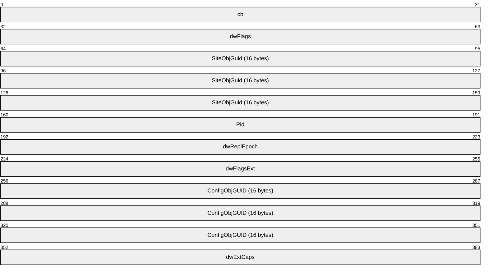

**cb (4 bytes):** The count of bytes in the fields **dwFlags** through **dwExtCaps**, inclusive.<38><39><40> This field allows the DRS_EXTENSIONS_INT structure to be extended by including new fields at the end of the structure.

**dwFlags (4 bytes):** The **dwFlags** field contains individual bit flags that describe the capabilities of the [**DC**](#gt_domain-controller-dc) that produced the DRS_EXTENSIONS_INT structure.<41>

The following table lists the bit flags, which are presented in little-endian byte order.

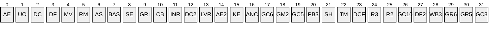

**BAS (DRS_EXT_BASE, 0x00000001)**: Unused. SHOULD be 1 and MUST be ignored.

**AS (DRS_EXT_ASYNCREPL, 0x00000002)**: If present, signifies that the DC supports [DRS_MSG_REPADD_V2](#Section_4.1.19.1.3).

**RM (DRS_EXT_REMOVEAPI, 0x00000004)**: If present, signifies that the DC supports [IDL_DRSRemoveDsServer](#Section_4.1.18) and [IDL_DRSRemoveDsDomain](#Section_4.1.17).

**MV (DRS_EXT_MOVEREQ_V2, 0x00000008)**: If present, signifies that the DC supports [DRS_MSG_MOVEREQ_V2](#Section_4.1.15.1.3).

**DF (DRS_EXT_GETCHG_DEFLATE, 0x00000010)**: If present, signifies that the DC supports [DRS_MSG_GETCHGREPLY_V2](#Section_4.1.10.2.11).

**DC (DRS_EXT_DCINFO_V1, 0x00000020)**: If present, signifies that the DC supports [IDL_DRSDomainControllerInfo](#Section_4.1.5).

**UO (DRS_EXT_RESTORE_USN_OPTIMIZATION, 0x00000040)**: Unused. SHOULD be 1 and MUST be ignored.

**AE (DRS_EXT_ADDENTRY, 0x00000080)**: If present, signifies that the DC supports [IDL_DRSAddEntry](#Section_4.1.1).

**KE (DRS_EXT_KCC_EXECUTE, 0x00000100)**: If present, signifies that the DC supports [IDL_DRSExecuteKCC](#Section_4.1.6).

**AE2 (DRS_EXT_ADDENTRY_V2, 0x00000200)**: If present, signifies that the DC supports [DRS_MSG_ADDENTRYREQ_V2](#Section_4.1.1.1.3).

**LVR (DRS_EXT_LINKED_VALUE_REPLICATION, 0x00000400)**: If present, signifies that the DC supports [**link value**](#gt_link-value) [**replication**](#gt_replication), and this support is enabled.

**DC2 (DRS_EXT_DCINFO_V2, 0x00000800)**: If present, signifies that the DC supports [DRS_MSG_DCINFOREPLY_V2](#Section_4.1.5.1.5).

**INR (DRS_EXT_INSTANCE_TYPE_NOT_REQ_ON_MOD, 0x00001000)**: Unused. SHOULD be 1 and MUST be ignored.

**CB (DRS_EXT_CRYPTO_BIND, 0x00002000)**: A client-only flag. If present, it indicates that the [**security provider**](#gt_security-provider) used for the connection supports [**session keys**](#gt_session-key) through [**RPC**](#gt_remote-procedure-call-rpc) (example, Kerberos connections with mutual [**authentication**](#gt_authentication) enable RPC to expose session keys, but NTLM connections do not enable RPC to expose session keys).

**GRI (DRS_EXT_GET_REPL_INFO, 0x00004000)**: If present, signifies that the DC supports [IDL_DRSGetReplInfo](#Section_4.1.13).

**SE (DRS_EXT_STRONG_ENCRYPTION, 0x00008000)**: If present, signifies that the DC supports additional 128-bit encryption for passwords over the wire. DCs MUST NOT replicate passwords to other DCs that do not support this extension.

**DCF (DRS_EXT_DCINFO_VFFFFFFFF, 0x00010000)**: If present, signifies that the DC supports [DRS_MSG_DCINFOREPLY_VFFFFFFFF](#Section_4.1.5.1.7).

**TM (DRS_EXT_TRANSITIVE_MEMBERSHIP, 0x00020000)**: If present, signifies that the DC supports [IDL_DRSGetMemberships](#Section_4.1.8).

**SH (DRS_EXT_ADD_SID_HISTORY, 0x00040000)**: If present, signifies that the DC supports [IDL_DRSAddSidHistory](#Section_4.1.2).

**PB3 (DRS_EXT_POST_BETA3, 0x00080000)**: Reserved. MUST be set to 1 and ignored.

**GC5 (DRS_EXT_GETCHGREQ_V5, 0x00100000)**: If present, signifies that the DC supports [DRS_MSG_GETCHGREQ_V5](#Section_4.1.10.2.4).

**GM2(DRS_EXT_GETMEMBERSHIPS2, 0x00200000)**: If present, signifies that the DC supports [IDL_DRSGetMemberships2](#Section_4.1.9).

**GC6 (DRS_EXT_GETCHGREQ_V6, 0x00400000)**: Unused. This bit was used for a pre-release version of Windows. No released version of Windows references it. This bit can be set or unset with no change in behavior.

**ANC (DRS_EXT_NONDOMAIN_NCS, 0x00800000)**: If present, signifies that the DC supports [**application NCs**](#gt_application-naming-context-application-nc).

**GC8 (DRS_EXT_GETCHGREQ_V8, 0x01000000)**: If present, signifies that the DC supports [DRS_MSG_GETCHGREQ_V8](#Section_4.1.10.2.6).

**GR5 (DRS_EXT_GETCHGREPLY_V5, 0x02000000)**: Unused. SHOULD be 1 and MUST be ignored.

**GR6 (DRS_EXT_GETCHGREPLY_V6, 0x04000000)**: If present, signifies that the DC supports [DRS_MSG_GETCHGREPLY_V6](#Section_4.1.10.2.12).

**WB3 (DRS_EXT_WHISTLER_BETA3, 0x08000000)**: If present, signifies that the DC supports [DRS_MSG_ADDENTRYREPLY_V3](#Section_4.1.1.1.8), [DRS_MSG_REPVERIFYOBJ](#Section_4.1.24.1.1), [DRS_MSG_GETCHGREPLY_V7](#Section_4.1.10.2.13), and [DRS_MSG_QUERYSITESREQ_V1](#Section_4.1.16.1.2).

**DF2 (DRS_EXT_W2K3_DEFLATE, 0x10000000)**: If present, signifies that the DC supports the W2K3 AD deflation library.

**GC10 (DRS_EXT_GETCHGREQ_V10, 0x20000000)**: If present, signifies that the DC supports [DRS_MSG_GETCHGREQ_V10](#Section_4.1.10.2.7).

**R2 (DRS_EXT_RESERVED_FOR_WIN2K_OR_DOTNET_PART2, 0x40000000)**: Unused. MUST be 0 and ignored.

**R3 (DRS_EXT_RESERVED_FOR_WIN2K_OR_DOTNET_PART3, 0x80000000)**: Unused. MUST be 0 and ignored.

**SiteObjGuid (16 bytes):** A [**GUID**](#gt_globally-unique-identifier-guid). The [**objectGUID**](#gt_objectguid) of the [**site object**](#gt_site-object) of which the DC's [**DSA object**](#gt_ntdsdsa-object) is a descendant. For non-DC client callers, this field SHOULD be set to zero.

**Pid (4 bytes):** A 32-bit, signed integer value that specifies a process identifier. The client sets the **Pid** field to the current client process, or the server sets the **Pid** to the current server process. This is for informational and debugging purposes only. The assignment of this field is implementation-specific.<42>

**dwReplEpoch (4 bytes):** A 32-bit, unsigned integer value that specifies the [**replication epoch**](#gt_replication-epoch). This value is set to zero by all client callers. The server sets this value by assigning the value of msDS-ReplicationEpoch from its nTDSDSA object. If **dwReplEpoch** is not included in DRS_EXTENSIONS_INT, the value is considered to be zero.<43>

**dwFlagsExt (4 bytes):** An extension of the **dwFlags** field that contains individual bit flags. These bit flags determine which extended capabilities are enabled in the DC that produced the DRS_EXTENSIONS_INT structure. For non-DC client callers, no bits SHOULD be set. If **dwFlagsExt** is not included in DRS_EXTENSIONS_INT, all bit flags are considered unset.

The following table lists the bit flags, which are presented in little-endian byte order.<44>

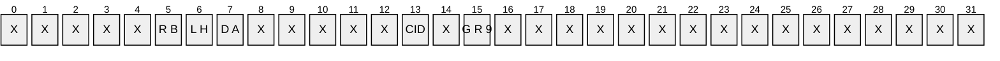

**DA (DRS_EXT_ADAM, 0x00000001)**: If present, signifies that the DC supports [DRS_MSG_REPSYNC_V1](#Section_4.1.23.1.2), [DRS_MSG_UPDREFS_V1](#Section_4.1.26.1.2), [DRS_MSG_INIT_DEMOTIONREQ_V1](#Section_4.1.14.1.2), [DRS_MSG_REPLICA_DEMOTIONREQ_V1](#Section_4.1.21.1.2), and [DRS_MSG_FINISH_DEMOTIONREQ_V1](#Section_4.1.7.1.2).

**LH (DRS_EXT_LH_BETA2, 0x00000002)**: If present, signifies that the DC supports the DRS_SPECIAL_SECRET_PROCESSING and DRS_GET_ALL_GROUP_MEMBERSHIP flags as well as **InfoLevel** 3 in [DRS_MSG_DCINFOREQ_V1](#Section_4.1.5.1.2).

**RB (DRS_EXT_RECYCLE_BIN, 0x00000004)**: If present, signifies that the DC has enabled the [**Recycle Bin**](#gt_recycle-bin) [**optional feature**](#gt_optional-feature).

**GR9 (DRS_EXT_GETCHGREPLY_V9, 0x00000100)**: If present, signifies that the DC supports [**DRS_MSG_GETCHGREPLY_V9**](#Section_4.1.10.2.14).

**CID (DRS_EXT_RPC_CORRELATIONID_1, 0x00000400)**: If present, signifies that the DC supports DRS_MSG_GETCHGREQ_V11 (section [4.1.10.2.8](#Section_4.1.10.2.8)), DRS_MSG_REPADD_V3 (section [4.1.19.1.4](#Section_4.1.19.1.4)), DRS_MSG_REPSYNC_V2 (section [4.1.23.1.3](#Section_4.1.23.1.3)), and DRS_MSG_UPDREFS_V2 (section [4.1.26.1.3](#Section_4.1.26.1.3)).

**ConfigObjGUID (16 bytes):** A GUID. This field is set to zero by all client callers. The server sets this field by assigning it the value of the objectGUID of the [**config NC**](#gt_configuration-naming-context-config-nc) [**object**](#gt_object). If **ConfigObjGUID** is not included in DRS_EXTENSIONS_INT, the value is considered to be the [**NULL GUID**](#gt_null-guid) value.<45>

**dwExtCaps (4 bytes):** A mask for the **dwFlagsExt** field that contains individual bit flags. These bit flags describe the potential extended capabilities of the DC that produced the DRS_EXTENSIONS_INT structure. For non-DC client callers, no bits SHOULD be set. If neither **dwFlagsExt** nor **dwExtCaps** is included in DRS_EXTENSIONS_INT, all bits in **dwExtCaps** are considered unset. If **dwFlagsExt** is included in DRS_EXTENSIONS_INT but **dwExtCaps** is not, all relevant bits in **dwExtCaps** (as explained below) are implicitly set.<46>

Each bit in **dwExtCaps** corresponds exactly to each bit in **dwFlagsExt**. If the DC that produced the DRS_EXTENSIONS_INT structure supports a capability described by a bit in the **dwFlagsExt** field (that is, the bit either is or could potentially be set), then the corresponding bit in **dwExtCaps** MUST be set. If a bit in **dwExtCaps** is not set, it is assumed that the corresponding bit in **dwFlagsExt** will not and cannot be set.

**Note** The **dwExtCaps** field is relevant only for capabilities that are labeled as "optional features" in the bit descriptions of **dwFlagsExt**. The bits in **dwExtCaps** that correspond to capabilities in **dwFlagsExt** that are not labeled as "optional features" MUST NOT be different from the setting of the **dwFlagsExt** bits. Currently, the capabilities represented by the DA and LH bits fit into this category.

<a id="Section_5.40"></a>
## 5.40 DRS_HANDLE

DRS_HANDLE is a [**concrete type**](#gt_concrete-type) for an [**RPC**](#gt_remote-procedure-call-rpc) context handle (as specified in [[C706]](https://go.microsoft.com/fwlink/?LinkId=89824)) for use in calls to methods in the drsuapi RPC interface.

This type is declared as follows:

typedef [context_handle] void* DRS_HANDLE;

For the specification of IDL_DRSBind, see section [4.1.3](#Section_4.1.3).

Methods in the dsaop RPC interface do not use context handles.

<a id="Section_5.41"></a>
## 5.41 DRS_OPTIONS

DRS_OPTIONS is a [**concrete type**](#gt_concrete-type) for a set of options sent to and received from various drsuapi methods.

This type is declared as follows:

typedef unsigned long DRS_OPTIONS;

It is a bit field, presented in little-endian byte order, that contains the following values.

Seven elements of the set are interpreted differently by different methods; such elements have multiple symbolic names.

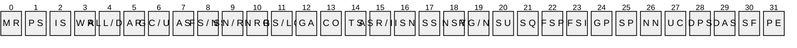

**X**: Unused. MUST be zero and ignored.

**AS (DRS_ASYNC_OP, 0x00000001)**: Perform the operation asynchronously.

**GC (DRS_GETCHG_CHECK, 0x00000002)**: Treat ERROR_DS_DRA_REF_NOT_FOUND and ERROR_DS_DRA_REF_ALREADY_EXISTS as success for calls to [IDL_DRSUpdateRefs (section 4.1.26)](#Section_4.1.26).

**UN (DRS_UPDATE_NOTIFICATION, 0x00000002)**: Identifies a call to [IDL_DRSReplicaSync](#Section_4.1.23) that was generated due to a [**replication**](#gt_replication) notification. See [MS-ADTS](../MS-ADTS/MS-ADTS.md) section 3.1.1.5.1.6 for more details on replication notifications. This flag is ignored by the server.

**AR (DRS_ADD_REF, 0x00000004)**: Register a client [**DC**](#gt_domain-controller-dc) for notifications of [**updates**](#gt_update) to the [**NC replica**](#gt_nc-replica).

**ALL (DRS_SYNC_ALL, 0x00000008)**: Replicate from all server DCs.

**DR (DRS_DEL_REF, 0x00000008)**: Deregister a client DC from notifications of updates to the NC replica.

**WR (DRS_WRIT_REP, 0x00000010)**: Replicate a writable [**replica**](#gt_replica), not a read-only partial replica or read-only full replica.

**IS (DRS_INIT_SYNC, 0x00000020):** Perform replication at startup.

**PS (DRS_PER_SYNC, 0x00000040):** Perform replication periodically.

**MR (DRS_MAIL_REP, 0x00000080)**: Perform replication using SMTP as a transport.

**ASR (DRS_ASYNC_REP, 0x00000100)**: Populate the NC replica asynchronously.

**IE (DRS_IGNORE_ERROR, 0x00000100)**: Ignore errors.

**TS (DRS_TWOWAY_SYNC, 0x00000200)**: Inform the server DC to replicate from the client DC.

**CO (DRS_CRITICAL_ONLY, 0x00000400)**: Replicate only [**system-critical objects**](#gt_97fbce29-609a-4a1e-83cf-e242ca23b21e).

**GA (DRS_GET_ANC, 0x00000800):** Include updates to [**ancestor objects**](#gt_ancestor-object) before updates to their descendants.

**GS (DRS_GET_NC_SIZE, 0x00001000)**: Get the approximate size of the server NC replica.

**LO (DRS_LOCAL_ONLY, 0x00001000)**: Perform the operation locally without contacting any other DC.

**NRR (DRS_NONGC_RO_REP, 0x00002000)**: Replicate a read-only full replica. Not a writable or partial replica.

**SN (DRS_SYNC_BYNAME, 0x00004000)**: Choose the source server by network name.

**RF (DRS_REF_OK, 0x00004000)**: Allow the NC replica to be removed even if other DCs use this DC as a replication server DC.

**FS (DRS_FULL_SYNC_NOW, 0x00008000)**: Replicate all updates in the [**replication cycle**](#gt_replication-cycle), even those that would normally be filtered.

**NS (DRS_NO_SOURCE, 0x00008000)**: The NC replica has no server DCs.

**FSI (DRS_FULL_SYNC_IN_PROGRESS, 0x00010000)**: When the flag DRS_FULL_SYNC_NOW is received in a call to IDL_DRSReplicaSync, the flag DRS_FULL_SYNC_IN_PROGRESS is sent in the associated calls to [IDL_DRSGetNCChanges](#Section_4.1.10) until the replication cycle completes. This flag is ignored by the server.

**FSP (DRS_FULL_SYNC_PACKET, 0x00020000)**: Replicate all updates in the replication request, even those that would normally be filtered.

**SQ (DRS_SYNC_REQUEUE, 0x00040000)**: This flag is specific to the Microsoft client implementation of IDL_DRSGetNCChanges. It is used to identify whether the call was placed in the replicationQueue more than once due to implementation-specific errors. This flag is ignored by the server.

**SU (DRS_SYNC_URGENT, 0x00080000)**: Perform the requested replication immediately; do not wait for any timeouts or delays. For information about urgent replication, see [MS-ADTS] section 3.1.1.5.1.7.

**RG (DRS_REF_GCSPN, 0x00100000)**: Requests that the server add an entry to repsTo for the client on the root [**object**](#gt_object) of the NC replica that is being replicated. When repsTo is set using this flag, the notifying client DC contacts the server DC using the [**service principal name**](#gt_service-principal-name-spn) that begins with "GC" (section [2.2.3.2](#Section_2.2.3.2)).

**ND (DRS_NO_DISCARD, 0x00100000)**: This flag is specific to the Microsoft implementation. It identifies when the client DC is to call the requested IDL_DRSReplicaSync method individually, without overlapping other outstanding calls to IDL_DRSReplicaSync. This flag is ignored by the server.

**NSY (DRS_NEVER_SYNCED, 0x00200000)**: There is no successfully completed replication from this source server.

**SS (DRS_SPECIAL_SECRET_PROCESSING, 0x00400000):** Do not replicate [**attribute**](#gt_attributes) values of attributes that contain [**secret data**](#gt_secret-data).

**ISN (DRS_INIT_SYNC_NOW, 0x00800000):** Perform initial replication now.

**PE (DRS_PREEMPTED, 0x01000000):** The replication attempt is preempted by a higher priority replication request.

**SF (DRS_SYNC_FORCED, 0x02000000):** Force replication, even if the replication system is otherwise disabled.

**DAS (DRS_DISABLE_AUTO_SYNC, 0x04000000):** Disable replication induced by update notifications.

**DPS (DRS_DISABLE_PERIODIC_SYNC, 0x08000000)**: Disable periodic replication.

**UC (DRS_USE_COMPRESSION, 0x10000000)**: Compress response messages.

**NN (DRS_NEVER_NOTIFY, 0x20000000)**: Do not send update notifications.

**SP (DRS_SYNC_PAS, 0x40000000):** Expand the partial attribute set of the partial replica.

**GP (DRS_GET_ALL_GROUP_MEMBERSHIP, 0x80000000)**: Replicate all kinds of [**group**](#gt_group) membership. If this flag is not present non[**universal group**](#gt_universal-group) membership will not be replicated.

For information about the Windows versions in which these flags were introduced, supported, or deprecated, see the following behavior note.<47>

<a id="Section_5.42"></a>
## 5.42 DRS_MORE_GETCHGREQ_OPTIONS

DRS_MORE_GETCHGREQ_OPTIONS is a [**concrete type**](#gt_concrete-type) for a set of extra options sent to the [IDL_DRSGetNCChanges](#Section_4.1.10) method.

This type is declared as follows:

typedef unsigned long DRS_MORE_GETCHGREQ_OPTIONS;

It is a bit field, presented in little-endian byte order, which contains the following values.

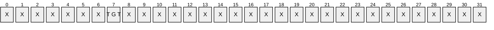

**X**: Unused. MUST be zero and ignored.

**TGT (DRS_GET_TGT, 0x00000001)**: Include [**updates**](#gt_update) to the [**target object**](#gt_target-object) of a [**link value**](#gt_link-value) before updates to the link value.

<a id="Section_5.43"></a>
## 5.43 DRS_SecBuffer

DRS_SecBuffer is a [**concrete type**](#gt_concrete-type) for a buffer that contains [**authentication**](#gt_authentication) data.

typedef struct {

[range(0,10000)] unsigned long cbBuffer;

unsigned long BufferType;

[size_is(cbBuffer)] BYTE* pvBuffer;

} DRS_SecBuffer;

**cbBuffer:** The size, in bytes, of the pvBuffer array.

**BufferType:** A bit field, presented in little-endian byte order, that contains the following values:

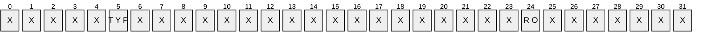

**X**: Unused. MUST be zero and ignored.

**TYP**: Can be one of the following values:

| Value | Meaning |
| --- | --- |
| SECBUFFER_EMPTY 0x00000000 | A placeholder in the buffer array. The caller can supply several such entries in the array, and the security package can return data in them. |
| SECBUFFER_DATA 0x00000001 | Used for common data. The security package can read this data and write it, for example, to encrypt some or all of it. |
| SECBUFFER_TOKEN 0x00000002 | This buffer is used to indicate the security token portion of the message. This is read-only for input parameters or read/write for output parameters. |
| SECBUFFER_PKG_PARAMS 0x00000003 | These are transport-to-package–specific parameters. For example, the Netware redirector can supply the [**server object**](#gt_server-object) identifier, while DCE [**RPC**](#gt_remote-procedure-call-rpc) can supply an association [**UUID**](#gt_universally-unique-identifier-uuid), and so on. |
| SECBUFFER_MISSING 0x00000004 | The security package uses this value to indicate the number of missing bytes in a particular message. The **pvBuffer** member is ignored in this type. |
| SECBUFFER_EXTRA 0x00000005 | The security package uses this value to indicate the number of extra or unprocessed bytes in a message. |
| SECBUFFER_STREAM_TRAILER 0x00000006 | Indicates a protocol-specific trailer for a particular record. |
| SECBUFFER_STREAM_HEADER 0x00000007 | Indicates a protocol-specific header for a particular record. |

**RO (SECBUFFER_READONLY, 0x80000000)**: The buffer is read-only. This flag is intended for sending header data to the security package for [**checksumming**](#gt_checksum). The package can read this buffer but cannot modify it.

**pvBuffer:** Authentication data.

<a id="Section_5.44"></a>
## 5.44 DRS_SecBufferDesc

**DRS_SecBufferDesc** is a Generic Security Service (GSS) Kerberos [**authentication**](#gt_authentication) token, as specified in [[RFC1964]](https://go.microsoft.com/fwlink/?LinkId=90304).

typedef struct {

unsigned long ulVersion;

[range(0,10000)] unsigned long cBuffers;

[size_is(cBuffers)] DRS_SecBuffer* Buffers;

} DRS_SecBufferDesc;

**ulVersion:** MUST be 0.

**cBuffers:** The number of items in the Buffers array.

**Buffers:** Buffers that contain authentication data.

<a id="Section_5.45"></a>
## 5.45 DRS_SPN_CLASS

A *unicodestring* constant (section [3.4.3](#Section_3.4.3)) that is used as the [**service class**](#gt_service-class) in the [**SPN**](#gt_service-principal-name-spn) for a [**DC**](#gt_domain-controller-dc). It has the value "E3514235-4B06-11D1-AB04-00C04FC2DCD2".

<a id="Section_5.46"></a>
## 5.46 DS_REPL_OP_TYPE

DS_REPL_OP_TYPE is a [**concrete type**](#gt_concrete-type) for the [**replication**](#gt_replication) operation type.

typedef enum

{

DS_REPL_OP_TYPE_SYNC = 0,

DS_REPL_OP_TYPE_ADD,

DS_REPL_OP_TYPE_DELETE,

DS_REPL_OP_TYPE_MODIFY,

DS_REPL_OP_TYPE_UPDATE_REFS

} DS_REPL_OP_TYPE;

**DS_REPL_OP_TYPE_SYNC:** Sync [**NC replica**](#gt_nc-replica) from server [**DC**](#gt_domain-controller-dc).

**DS_REPL_OP_TYPE_ADD:** Add NC replica server DC.

**DS_REPL_OP_TYPE_DELETE:** Remove NC replica server DC.

**DS_REPL_OP_TYPE_MODIFY:** Modify NC replica server DC.

**DS_REPL_OP_TYPE_UPDATE_REFS:** Update NC replica client DC.

<a id="Section_5.47"></a>
## 5.47 DSAObj

procedure DSAObj(): DSName

The DSAObj procedure returns the [**dsname**](#gt_dsname) of the [**DC's**](#gt_domain-controller-dc) nTDSDSA [**object**](#gt_object).

return select one o from children ConfigNC()

where o!objectGUID = dc.serverGUID

<a id="Section_5.48"></a>
## 5.48 DSA_RPC_INST

The DSA_RPC_INST structure is a [**concrete type**](#gt_concrete-type) that represents a [**DC**](#gt_domain-controller-dc).

typedef struct _DSA_RPC_INST {

DWORD cb;

DWORD cbpszServerOffset;

DWORD cbpszAnnotationOffset;

DWORD cbpszInstanceOffset;

DWORD cbpguidInstanceOffset;

} DSA_RPC_INST,

*PDSA_RPC_INST;

**cb:** The total number of bytes in the DSA_RPC_INST structure.

**cbpszServerOffset:** The offset from the start of the DSA_RPC_INST structure to a location that specifies the start of the server name of this instance.

**cbpszAnnotationOffset:** The offset from the start of the DSA_RPC_INST structure to a location that specifies the start of the annotation of this instance.

**cbpszInstanceOffset:** The offset from the start of the DSA_RPC_INST structure to a location that specifies the start of the NetworkAddress (section [5.134](#Section_5.134)) of this instance.

**cbpguidInstanceOffset:** The offset from the start of the DSA_RPC_INST structure to a location that specifies the start of the [**GUID**](#gt_globally-unique-identifier-guid) for the instance.

<a id="Section_5.49"></a>
## 5.49 DSName

DSName is an [**abstract type**](#gt_abstract-type) for representing a [**dsname**](#gt_dsname). It corresponds to the concrete representation [DSNAME](#Section_5.50). It consists of a tuple that identifies an [**object**](#gt_object) in the [**directory**](#gt_directory). This tuple is discussed in [MS-ADTS](../MS-ADTS/MS-ADTS.md) section 3.1.1.1.5. For this document, the fields of the tuple are defined as follows:

type DSName = [dn: StringName , guid: GUID, sid: Sid]

The *dn* field corresponds to the **StringName** field of the DSNAME structure and contains the [**DN**](#gt_distinguished-name-dn) of the object.

The *guid* field corresponds to the **Guid** field of the DSNAME structure and contains the value of the object's objectGUID [**attribute**](#gt_attributes).

The *sid* field corresponds to the **Sid** field of the DSNAME structure. If the object possesses an objectSid attribute, it contains the value of the object's objectSid attribute. If the object does not possess an objectSid attribute, the field is null.

<a id="Section_5.50"></a>
## 5.50 DSNAME

DSNAME is a [**concrete type**](#gt_concrete-type) for representing a [DSName](#Section_5.49), identifying a [**directory object**](#gt_directory-object) using the values of one or more of its [**LDAP**](#gt_lightweight-directory-access-protocol-ldap) [**attributes**](#gt_attributes): objectGUID, objectSid, or distinguishedName.

typedef struct {

unsigned long structLen;

unsigned long SidLen;

GUID Guid;

NT4SID Sid;

unsigned long NameLen;

[range(0, 10485761)] [size_is(NameLen + 1)]

WCHAR StringName[];

} DSNAME;

**structLen:** The length, in bytes, of the entire data structure.

**SidLen:** The number of bytes in the Sid field used to represent the [**object's**](#gt_object) objectSid attribute value. Zero indicates that the DSNAME does not identify the objectSid value of the directory object.

**Guid:** The value of the object's objectGUID attribute specified as a GUID structure, which is defined in [MS-DTYP](../MS-DTYP/MS-DTYP.md) section 2.3.4. If the values for all fields in the GUID structure are zero, this indicates that the DSNAME does not identify the objectGUID value of the directory object.

**Sid:** The value of the object's objectSid attribute, its [**security identifier**](#gt_sid), specified as a **SID** structure, which is defined in [MS-DTYP] section 2.4.2. The size of this field is exactly 28 bytes, regardless of the value of **SidLen**, which specifies how many bytes in this field are used. Note that this is smaller than the theoretical size limit of a **SID**, which is 68 bytes. While Windows publishes a general SID format, Windows never uses that format in its full generality. 28 bytes is sufficient for a Windows SID.

**NameLen:** The number of characters in the **StringName** field, not including the terminating null character, used to represent the object's distinguishedName attribute value. Zero indicates that the DSNAME does not identify the distinguishedName value of the directory object.

**StringName:** A null-terminated [**Unicode**](#gt_unicode) value of the object's distinguishedName attribute, as specified in [MS-ADTS](../MS-ADTS/MS-ADTS.md) section 3.1.1.1.4. This field always contains at least one character: the terminating null character. Each Unicode value is encoded as 2 bytes. The byte ordering is little-endian.<48>

The following table shows an alternative representation of this structure.

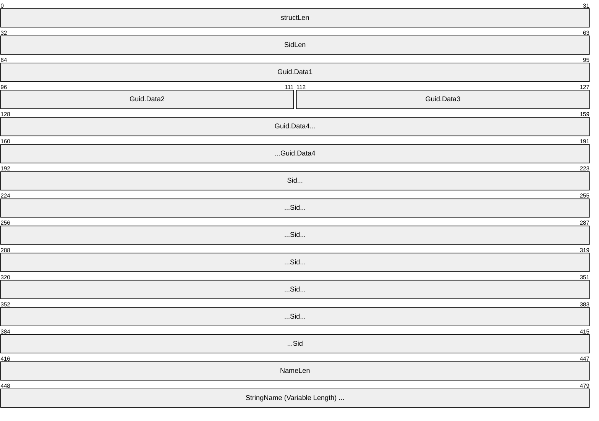

**Note** All fields have little-endian byte ordering.

<a id="Section_5.50.1"></a>
### 5.50.1 DSNAME Equality

When comparing [DSNAME](#Section_5.50) elements for equality, an implementation must be aware that multiple [**attributes**](#gt_attributes) can be specified. DSNAME values x and y are equal only if one of the following conditions holds:

- x.Guid is not zeros and y.Guid is not zeros and x.Guid = y.Guid
- All of the following are true:
- x.Guid is zeros or y.Guid is zeros.
- x.StringLen ≠ 0.
- The number of [**RDNs**](#gt_relative-distinguished-name-rdn) in x is the same as in y.
- For each RDN xi in x and RDN yi in y (see [[RFC2253]](https://go.microsoft.com/fwlink/?LinkId=90327)):
- AttributeType of xi = AttributeType of yi.
- AttributeValue of xi = AttributeValue of yi, without regard to case differences, Hiragana and Katakana character differences, and nonspacing characters.
- All of the following are true:
- x.Guid is zeros.
- y.Guid is zeros.
- x.StringLen = 0.
- y.StringLen = 0.
- x.SidLen ≠ 0.
- x.SidLen = y.SidLen.
- x.Sid and y.Sid contain identical values in the first x.SidLen array items.
<a id="Section_5.51"></a>
## 5.51 DSTIME

**DSTIME** is a [**concrete type**](#gt_concrete-type) for time expressed as the number of seconds since January 1, 1601, 12:00:00 A.M.

This type is declared as follows:

typedef LONGLONG DSTIME;

The following diagram shows an alternative representation of this type.

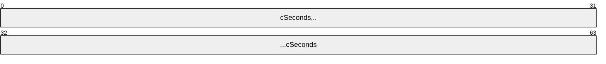

**Note** Byte ordering is little-endian.

<a id="Section_5.52"></a>
## 5.52 DWORD

A [**concrete type**](#gt_concrete-type) for a 32-bit, unsigned integer, as specified in [MS-DTYP](../MS-DTYP/MS-DTYP.md) section 2.2.9.

<a id="Section_5.53"></a>
## 5.53 ENTINF

ENTINF is a [**concrete type**](#gt_concrete-type) for the identity and [**attributes**](#gt_attributes) (some or all) of a given [**object**](#gt_object).

typedef struct {

DSNAME* pName;

unsigned long ulFlags;

ATTRBLOCK AttrBlock;

} ENTINF;

**pName:** The identity of the object.

**ulFlags:** A flags field that supports the following flags, which are presented in little-endian byte order.

```mermaid
packet-beta
  0-0: "X"
  1-1: "X"
  2-2: "X"
  3-3: "X"
  4-4: "X"
  5-5: "X"
  6-6: "D O"
  7-7: "M"
  8-8: "X"
  9-9: "X"
  10-10: "X"
  11-11: "X"
  12-12: "X"
  13-13: "X"
  14-14: "X"
  15-15: "X"
  16-16: "X"
  17-17: "X"
  18-18: "X"
  19-19: "X"
  20-20: "X"
  21-21: "X"
  22-22: "X"
  23-23: "R M"
  24-24: "X"
  25-25: "X"
  26-26: "X"
  27-27: "X"
  28-28: "X"
  29-29: "X"
  30-30: "X"
  31-31: "X"
```

**X**: Unused. MUST be zero and ignored.

**M (ENTINF_FROM_MASTER, 0x00000001)**: Retrieved from a full [**replica**](#gt_replica).

**DO (ENTINF_DYNAMIC_OBJECT, 0x00000002)**: A [**dynamic object**](#gt_dynamic-object).

**RM (ENTINF_REMOTE_MODIFY, 0x00010000)**: A remote modify request to IDL_DRSAddEntry (section [4.1.1.3](#Section_4.1.1.3)).

**AttrBlock:** Some of all of the attributes for this object, as determined by the particular method. See section [1.3.3](#Section_1.3.3) for an overview of methods using type ENTINF.

<a id="Section_5.54"></a>
## 5.54 ENTINF_GetValue

procedure ENTINF_GetValue (

entInf: ENTINF,

attribute: ATTRTYP,

prefixTable: PrefixTable): ATTRVAL

*Informative summary of behavior*: The ENTINF_GetValue procedure scans an [ENTINF](#Section_5.53) structure and returns the first [ATTRVAL](#Section_5.16) structure for the requested *attribute*. The *attribute* parameter is based on [dc](#Section_4.1.29.2.3).prefixTable, while the [**attributes**](#gt_attributes) within *entInf* are based on the *prefixTable* parameter.

attrType: ATTRTYP

oid : OID

oid := OidFromAttid(dc.prefixTable, attribute)

attrType := MakeAttid(prefixTable, oid)

for each i in [0 .. entInf.AttrBlock.attrCount -1] do

if (entInf.AttrBlock.pAttr[i].attrTyp = attrType) and

(entInf.AttrBlock.pAttr[i].AttrVal.valCount > 0) then

return entInf.AttrBlock.pAttr[i].AttrVal.pAVal[0]

endif

endfor

return null

<a id="Section_5.55"></a>
## 5.55 ENTINF_SetValue

procedure ENTINF_SetValue (

var entInf: ENTINF,

attribute: ATTRTYP,

attrVal: ATTRVAL,

prefixTable: PrefixTable)

The ENTINF_SetValue procedure [**updates**](#gt_update) an [**attribute**](#gt_attributes) value within the [ENTINF](#Section_5.53). If *attrVal* is null, then the attribute is removed from the list (if it exists). If the value is non-null, then the attribute value is updated or added to the list (when a value is not already present). The *attribute* and *attrVal* parameters are based on [dc](#Section_4.1.29.2.3).prefixTable, while the attributes within *entInf* are based on the *prefixTable* parameter.

<a id="Section_5.56"></a>
## 5.56 ENTINF_EnumerateAttributes

procedure ENTINF_EnumerateAttributes(

e: ENTINF,

prefixTable: PrefixTable): set of ATTRTYP

The ENTINF_EnumerateAttributes procedure returns the list of [**attributes**](#gt_attributes) (based on [dc](#Section_4.1.29.2.3).prefixTable) that are present in the [ENTINF](#Section_5.53) *e*. Attributes within *e* are based on the *prefixTable* parameter.

<a id="Section_5.57"></a>
## 5.57 ENTINFLIST

ENTINFLIST is a [**concrete type**](#gt_concrete-type) for a list of [ENTINF](#Section_5.53) entries.

typedef struct ENTINFLIST {

struct ENTINFLIST* pNextEntInf;

ENTINF Entinf;

} ENTINFLIST;

**pNextEntInf:** The next ENTINFLIST in the sequence, or null.

**Entinf:** An ENTINF entry.

<a id="Section_5.58"></a>
## 5.58 Expunge

procedure Expunge(obj: DSName)

The Expunge procedure physically removes an [**object**](#gt_object) whose [DSName](#Section_5.49) is *obj* from the [**directory**](#gt_directory), without enforcing referential integrity constraints. The object is immediately removed without undergoing conversion to a [**tombstone**](#gt_tombstone).

<a id="Section_5.59"></a>
## 5.59 FILETIME

FILETIME is a [**concrete type**](#gt_concrete-type) for a time, as specified in [MS-DTYP](../MS-DTYP/MS-DTYP.md) section 2.3.3.

<a id="Section_5.60"></a>
## 5.60 FilteredGCPAS

procedure FilteredGCPAS() : PARTIAL_ATTR_VECTOR_V1_EXT^

*Informative summary of behavior*: The FilteredGCPAS procedure returns a reference to an instance of structure [PARTIAL_ATTR_VECTOR_V1_EXT](#Section_5.146) that contains the list of [**attributes**](#gt_attributes) that can be present, based on the [**schema**](#gt_schema), on a filtered [**GC**](#gt_global-catalog-gc) [**replica**](#gt_replica).

attrSetSeq: sequence of DSName

filteredAttributeSet: sequence of ATTRTYP

pPartialAttrVector: PARTIAL_ATTR_VECTOR_V1_EXT^

attrId: ATTRTYP

i, j:int

attrSetSeq := select o from subtree SchemaNC() where

(attributeSchema in o!objectClass) and

(o!isMemberOfPartialAttributeSet = true)

filteredAttributeSet := GetFilteredAttributeSet()

pPartialAttrVector = new PARTIAL_ATTR_VECTOR_V1_EXT sized to hold

(attrSetSeq.length - filteredAttributeSet.length) entries in

its rgPartialAttr field

pPartialAttrVector^.dwVersion := 1

-

j := 0

for i := 0 to attrSetSeq.length-1

attrId = AttrtypFromSchemaObj(attrSetSeq[i]);

if (not attrId in filteredAttributeSet) then

/* attribute is not in the filtered list */

partialAttrVector^.rgPartialAttr[j]:= attrId

j := j + 1

endif

endfor

pPartialAttrVector^.cattrs := j

return pPartialAttrVector^

<a id="Section_5.61"></a>
## 5.61 FilteredPAS

procedure FilteredPAS() : PARTIAL_ATTR_VECTOR_V1_EXT

*Informative summary of behavior*: The FilteredPAS procedure returns a reference to an instance of structure [PARTIAL_ATTR_VECTOR_V1_EXT](#Section_5.146) that contains the list of [**attributes**](#gt_attributes) that can be present, based on the [**schema**](#gt_schema), on a filtered [**NC replica**](#gt_nc-replica).

attrSetSeq: sequence of DSName

filteredAttributeSet: sequence of ATTRTYP

pPartialAttrVector: PARTIAL_ATTR_VECTOR_V1_EXT^

attrId: ATTRTYP

i, j: int

attrSetSeq := select o from subtree SchemaNC() where

(attributeSchema in o!objectClass) and

(o!systemFlags ∩

{FLAG_ATTR_NOT_REPLICATED,

FLAG_ATTR_IS_CONSTRUCTED} = null)

filteredAttributeSet := GetFilteredAttributeSet()

pPartialAttrVector = new PARTIAL_ATTR_VECTOR_V1_EXT sized to hold

(attrSetSeq.length - filteredAttributeSet.length) entries in

its rgPartialAttr field

pPartialAttrVector^.dwVersion := 1

for i := 0 to attrSetSeq.length-1

attrId = AttrtypFromSchemaObj(attrSetSeq [i]);

if (not attrId in filteredAttributeSet = null) then

/* attribute is not in the filtered list */

pPartialAttrVector^.rgPartialAttr[j]:= attrId

j := j + 1

endif

endfor

pPartialAttrVector^.cAttrs := j

return pPartialAttrVector^

<a id="Section_5.62"></a>
## 5.62 FindChar

procedure FindChar(

s: unicodestring, start: integer, c: UCHAR): integer

*Informative summary of behavior*: The FindChar procedure returns the zero-based index of the first occurrence of *c* in the portion of *s* between the *start* and the end of *s*.

If *s* = null, *start* < 0 or *start* > *s*.length-1, this procedure returns -1. Otherwise, let *s* be represented as the sequence of characters {*s*[0], ... *s*[*s*.length - 1]}. Let i be such that i >= *start*, i <= *s*.length -1, *s*[i] = *c*, and *s*[start] ≠ *c*, ..., *s*[i-1] ≠ *c*. If such an *i* exists, this procedure returns *i*. Otherwise, this procedure returns -1.

<a id="Section_5.63"></a>
## 5.63 FindCharRev

procedure FindCharRev(

s: unicodestring,

start: integer,

c: UCHAR): integer

*Informative summary of behavior*: The FindCharRev procedure returns the zero-based index of the last occurrence of *c* in the portion of s between the start and the end of *s*.

If *s* = null, *start* < 0 or *start* > *s*.length-1, this procedure returns -1. Otherwise, let *s* be represented as the sequence of characters {*s*[0], ... *s*[*s*.length - 1]}. Let i be such that *i* >= *start*, *i* <= *s*.length -1, *s*[i] = *c*, and s[i+1] ≠ *c*, ..., *s*[*s*.length - 1] ≠ *c*. If such an *i* exists, this procedure returns *i*. Otherwise, this procedure returns -1.

<a id="Section_5.64"></a>
## 5.64 FOREST_TRUST_INFORMATION

FOREST_TRUST_INFORMATION is a [**concrete type**](#gt_concrete-type) for state information about trust relationships with other [**forests**](#gt_forest). This data is stored in [**objects of class**](#gt_c2c67596-8d8f-42b9-9c70-1c4f7c952200) trustedDomain in the [**domain NC**](#gt_domain-naming-context-domain-nc) [**replica**](#gt_replica) of the forest root domain. Specifically, the msDS-TrustForestTrustInfo [**attribute**](#gt_attributes) on such [**objects**](#gt_object) contains information about the trusted forest or realm. The structure of the information contained in this attribute is represented in the following manner.

```mermaid
packet-beta
  0-31: "Version"
  32-63: "RecordCount"
  64-127: "Records (variable)"
```

**Version (4 bytes):** The version of the data structure. The only supported version of the data structure is 1.

**RecordCount (4 bytes):** The number of records present in the data structure.

**Records (variable):** Variable-length records that each contain a specific type of data about the forest trust relationship.

**Note** Records are not necessarily aligned to 32-bit boundaries. Each record starts at the next byte after the previous record ends.

Each record is represented as described in section [5.64.1](#Section_5.64.1).

**Note** All fields have little-endian byte ordering.

<a id="Section_5.64.1"></a>
### 5.64.1 Record

Each Record is represented in the following manner.

```mermaid
packet-beta
  0-31: "RecordLen"
  32-63: "Flags"
  64-127: "Timestamp"
  128-135: "RecordType"
  136-191: "ForestTrustData (variable)"
```

**RecordLen (4 bytes):** The length, in bytes, of the entire record.

**Flags (4 bytes):** Individual bit flags that control how the [**forest**](#gt_forest) trust information in this record can be used.

If **RecordType** = 0 or 1, the **Flags** field can have one or more of the following bits, which are presented in little-endian byte order.

```mermaid
packet-beta
  0-0: "X"
  1-1: "X"
  2-2: "X"
  3-3: "X"
  4-4: "X"
  5-5: "TDC"
  6-6: "TDA"
  7-7: "TDN"
  8-8: "X"
  9-9: "X"
  10-10: "X"
  11-11: "X"
  12-12: "X"
  13-13: "X"
  14-14: "X"
  15-15: "X"
  16-16: "X"
  17-17: "X"
  18-18: "X"
  19-19: "X"
  20-20: "X"
  21-21: "X"
  22-22: "X"
  23-23: "X"
  24-24: "X"
  25-25: "X"
  26-26: "X"
  27-27: "X"
  28-28: "X"
  29-29: "X"
  30-30: "X"
  31-31: "X"
```

**X**: Unused. Must be zero and ignored.

**TDN (LSA_TLN_DISABLED_NEW, 0x00000001)**: The entry is not yet enabled.

**TDA (LSA_TLN_DISABLED_ADMIN, 0x00000002)**: The entry is disabled by the administrator.

**TDC (LSA_TLN_DISABLED_CONFLICT, 0x00000004)**: The entry is disabled due to a conflict with another trusted [**domain**](#gt_domain).

If **RecordType** = 2, the **Flags** field can have one or more of the following bits, which are presented in little-endian byte order.

```mermaid
packet-beta
  0-0: "X"
  1-1: "X"
  2-2: "X"
  3-3: "X"
  4-4: "N D C"
  5-5: "N D A"
  6-6: "S D C"
  7-7: "S D A"
  8-8: "X"
  9-9: "X"
  10-10: "X"
  11-11: "X"
  12-12: "X"
  13-13: "X"
  14-14: "X"
  15-15: "X"
  16-16: "X"
  17-17: "X"
  18-18: "X"
  19-19: "X"
  20-20: "X"
  21-21: "X"
  22-22: "X"
  23-23: "X"
  24-24: "X"
  25-25: "X"
  26-26: "X"
  27-27: "X"
  28-28: "X"
  29-29: "X"
  30-30: "X"
  31-31: "X"
```

**X**: Unused. MUST be zero and ignored.

**SDA (LSA_SID_DISABLED_ADMIN, 0x00000001)**: The entry is disabled for [**SID**](#gt_sid)-based matches by the administrator.

**SDC (LSA_SID_DISABLED_CONFLICT, 0x00000002)**: The entry is disabled due to a SID conflict with another trusted domain.

**NDA (LSA_NB_DISABLED_ADMIN, 0x00000004)**: The entry is disabled for NetBIOS name-based matches by the administrator.

**NDC (LSA_NB_DISABLED_CONFLICT, 0x00000008)**: The entry is disabled due to a NetBIOS domain name conflict with another trusted domain.

For RecordType = 2, NETBIOS_DISABLED_MASK is defined as a mask on the lower 4 bits of the **Flags** field.

For all record types, LSA_FTRECORD_DISABLED_REASONS is defined as a mask on the lower 16 bits of the **Flags** field. Unused bits covered by the mask are reserved for future use.

**Timestamp (8 bytes):** A [FILETIME (section 5.59)](#Section_5.59) that contains the time when this entry was created.

**RecordType (1 byte):** An 8-bit value that specifies the type of record contained in this specific entry. The allowed values are specified in section [5.65](#Section_5.65).

**ForestTrustData (variable):** A variable length, type-specific record, depending on the RecordType value, that contains the specific type of data about the forest trust relationship.

**Important** The type-specific ForestTrustData record is not necessarily aligned to a 32-bit boundary. Each record starts at the byte following the **RecordType** field.

There are three different type-specific records. Depending on the value of the **RecordType** field, the structure of the type-specific record differs as described below.

- If RecordType = 0 or RecordType = 1, then the type-specific record is represented in the following manner.
```mermaid
packet-beta
  0-31: "NameLen"
  32-63: "Name (variable length)..."
```

**NameLen**: The length, in bytes, of the **Name** field.

**Name**: The top-level name of the trusted forest, in UTF-8 format.

- If RecordType = 2, then the type-specific record is represented in the following manner. Note that the record contains the following structures one after another. It is important to note that none of the data shown below is necessarily aligned to 32-bit boundaries.
```mermaid
packet-beta
  0-31: "SidLen"
  32-63: "Sid (variable length)..."
  64-95: "DnsNameLen"
  96-127: "DnsName (variable length)..."
  128-159: "NetbiosNameLen"
  160-191: "NetbiosName (variable length)..."
```

**SidLen**: The length, in bytes, of the **Sid** field.

**Sid**: The SID of a domain in the trusted forest, specified as a [SID](../MS-DTYP/MS-DTYP.md) structure, which is defined in [MS-DTYP](../MS-DTYP/MS-DTYP.md) section 2.4.2.

**DnsNameLen**: The length, in bytes, of the **DnsName** field.

**DnsName**: The [**FQDN (1)**](#gt_fully-qualified-domain-name-fqdn) of a domain in the trusted forest, in UTF-8 format.

**NetbiosNameLen**: The length, in bytes, of the **NetbiosName** field.

**NetbiosName**: The NetBIOS name of a domain in the trusted forest, in UTF-8 format.

- If RecordType is not one of the preceding values, then the type-specific record is represented in the following manner.
```mermaid
packet-beta
  0-31: "BinaryDataLen"
  32-63: "BinaryData (variable length)..."
```

**BinaryDataLen**: The length, in bytes, of the **BinaryData** field.

**BinaryData**: Trusted forest data.

<a id="Section_5.64.2"></a>
### 5.64.2 Determining If a Name Is in a Trusted Forest

This section describes procedures that use the [**forest**](#gt_forest) trust information contained in the msDS-TrustForestTrustInfo [**attribute**](#gt_attributes) to determine if a given [**domain**](#gt_domain) is in a trusted forest.

The procedures described in this section use the following data structures.

struct {

ULONG RecordCount;

PX_FOREST_TRUST_RECORD *Entries;

} X_FOREST_TRUST_INFORMATION;

struct {

ULONG Flags;

FOREST_TRUST_RECORD_TYPE ForestTrustType;

LARGE_INTEGER Time;

union {

LPWSTR TopLevelName;

X_FOREST_TRUST_DOMAIN_INFO DomainInfo;

X_FOREST_TRUST_BINARY_DATA Data;

} ForestTrustData;

} X_FOREST_TRUST_RECORD, *PX_FOREST_TRUST_RECORD;

struct {

SID *Sid;

LPWSTR DnsName;

LPWSTR NetbiosName;

} X_FOREST_TRUST_DOMAIN_INFO;

struct {

ULONG Length;

BYTE *Buffer;

} X_FOREST_TRUST_BINARY_DATA;

The X_FOREST_TRUST_INFORMATION structure previously defined is used by the procedure to determine if a given domain is in a trusted forest. To unmarshal the content of the msDS-TrustForestTrustInfo attribute into this structure, the UnmarshalForestTrustInfo procedure described below can be used.

procedure ExtractString(

buffer: sequence of BYTE,

index: DWORD, size: DWORD): unicodestring;

The sequence [*index* .. *index* + *size*] of bytes in *buffer* is interpreted as a UTF-8 string, and a corresponding *unicodestring* (section [3.4.3](#Section_3.4.3)) is returned.

procedure ExtractSid(

buffer: sequence of BYTE,

index: DWORD, size: DWORD): SID;

The sequence [*index* .. *index* + *size*] of bytes in *buffer* is converted into a [SID](#Section_5.16.1.7) structure and returned.

procedure ExtractBinary(

buffer: sequence of BYTE,

index: DWORD, size: DWORD): sequence of BYTE;

The sequence [*index* .. *index* + *size*] of bytes in *buffer* is returned.

procedure UnmarshalForestTrustInfo

(inputBuffer: sequence of BYTE,

var forestTrustInfo: X_FOREST_TRUST_INFORMATION): boolean

*Informative summary of behavior*: The UnmarshalForestTrustInfo procedure unmarshals the byte stream *inputBuffer*, which holds the content of a msDS-TrustForestTrustInfo attribute that contains forest trust information, as described in FOREST_TRUST_INFORMATION, into the forestTrustInfo structure.

index: DWORD

pdwVersion: ADDRESS OF DWORD

pdwRecordCount: ADDRESS OF DWORD

i: DWORD

pwdRecordLength: ADDRESS OF DWORD

pTrustRecord: ADDRESS OF X_FOREST_TRUST_RECORD

pulTime: ADDRESS OF ULONGLONG

pType: ADDRESS OF BYTE

pSid: ADDRESS OF SID

pString: ADDRESS OF unicodestring

pdwSize: ADDRESS OF DWORD

index := 0

pdwVersion := ADR(inputBuffer[index])

if pdwVersion^ ≠ 1 then

return false

endif

index := index + 4

pdwRecordCount := ADR(inputBuffer[index])

forestTrustInfo.RecordCount := pdwRecordCount^

index := index + 4

/* Extract each record */

for i:= 0 to pdwRecordCount^

/* First 4 bytes of the record is the length */

pdwRecordLength := ADR(inputBuffer[index])

index := index + 4

pTrustRecord := forestTrustInfo.Entries[i]

/* Next 4 bytes of the record are the flags */

pdwFlags := ADR(inputBuffer[index])

pTrustRecord^.Flags := pdwFlags^

index := index + 4

/* Next 8 bytes of the record represent the Time field */

pulTime := ADR(inputBuffer[index])

pTrustRecord^.Time := pulTime^

index := index + 8

/* Next byte represents trust type */

pType := ADR(inputBuffer[index])

pTrustRecord^.ForestTrustType := pType^

index := index + 1

if (pTrustRecord^.ForestTrustType = ForestTrustTopLevelName or

pTrustRecord^.ForestTrustType = ForestTrustTopLevelNameEx)

then

/* Next 4 bytes represent the size of the top level name */

pdwSize := ADR(inputBuffer[index])

index := index + 4

/* Extract the top level name; index is at the start of name */

pTrustRecord^.TopLevelName :=

ExtractString(inputBuffer, index, pdwSize^)

index := index + pdwSize^

else

if (pTrustRecord^.ForestTrustType = ForestTrustDomainInfo)

then

/* Next 4 bytes represent the size of the sid */

pdwSize := ADR(inputBuffer[index])

index := index + 4

/* Extract the sid; index is at the start of sid */

pTrustRecord^.DomainInfo.Sid :=

ExtractSid(inputBuffer, index, pdwSize^)

index := index + pdwSize^

/* Next 4 bytes represent the size of the dns domain name */

pdwSize := ADR(inputBuffer[index])

index := index + 4

/* Extract the dns domain name; index is at start of name */

pTrustRecord^.DomainInfo.DnsName :=

ExtractString(inputBuffer, index, pdwSize^)

index := index + pdwSize^

/* Next 4 bytes represent the size of the netbios

* domain name */

pdwSize := ADR(inputBuffer[index])

index := index + 4

/* Extract the netbios domain name; index is at the start

* of name */

pTrustRecord^.DomainInfo.NetbiosName :=

ExtractString(inputBuffer, index, pdwSize^)

index := index + pdwSize^

else

/* Next 4 bytes represent the size of the binary data */

pdwSize := ADR(inputBuffer[index])

pTrustRecord^.Data.Length := pdwSize^

index := index + 4

/* Extract the binary data; index is at the start of data */

pTrustRecord^.Data.Buffer :=

ExtractBinary(inputbuffer, index, pdwSize^)

index := index + pdwSize^

endif

endif

/* index is now at the beginning of the next record */

endfor

return true

The following procedures are used to determine if a given domain *name*, [**SID**](#gt_sid), or UPN is in a trusted forest. Since they make use of forest trust information data stored in [**objects**](#gt_object) in the [**NC replica**](#gt_nc-replica) of the forest root domain (see FOREST_TRUST_INFORMATION), these functions only work on [**GC servers**](#gt_global-catalog-server-gc-server) or [**DCs**](#gt_domain-controller-dc) in the forest root domain.

procedure IsDomainNameInTrustedForest(name: unicodestring,

referredDomain: unicodestring): boolean

*Informative summary of behavior*: The IsDomainNameInTrustedForest procedure determines if the domain with the name given by *name* is in a trusted forest. The input *name* can be a DNS or a NetBIOS name.

if IsDomainDnsNameInTrustedForest(name, referredDomain) then

return true

endIf

if IsDomainNetbiosNameInTrustedForest(name, referredDomain) then

return true

endIf

return false

procedure IsDomainSidInTrustedForest(sid: SID): boolean

*Informative summary of behavior*: The IsDomainSidInTrustedForest procedure determines if the domain with the SID given by *sid* is in a trusted forest.

tdos: set of DSName

f: X_FOREST_TRUST_INFORMATION

b: boolean

tdos := select all o in Children ForestRootDomainNC() where

trustedDomain in o!objectClass and

o!trustAttributes & 0x00000008 ≠ 0 and

o!msDS-TrustForestTrustInfo ≠ null

foreach o in tdos

if not UnmarshalForestTrustInfo(o!msDS-TrustForestTrustInfo, f)

then

return false

else

foreach e in f.Entries

if (e.ForestTrustType = ForestTrustDomainInfo and

e.DomainInfo.Sid = sid and

LSA_FTRECORD_DISABLED_REASONS not in e.Flags) then

b := true

foreach g in f.Entries

if (g.ForestTrustType = ForestTrustTopLevelNameEx and

LSA_FTRECORD_DISABLED_REASONS not in g.Flags and

(g.TopLevelName = e.DomainInfo.DnsName or

IsSubdomainOf(e.DomainInfo.DnsName, g.TopLevelName))) then

b := false

break

endif

endfor

if b then

return true

endif

endif

endfor

endif

endfor

return false

procedure IsUPNInTrustedForest(upn: unicodestring): boolean

*Informative summary of behavior*: The IsUPNInTrustedForest procedure determines if the domain containing the account with the UPN given by *upn* is in a trusted forest.

interpret upn as being in the format "username@domainName"

return IsNamespaceInTrustedDomain(domainName, trustedForestName)

The IsDomainNameInTrustedForest procedure uses the following helper procedures to determine if a domain is in a trusted forest.

procedure IsSubdomainOf(subdomainName: unicodestring,

superiordomainName: unicodestring): boolean

The IsSubdomainOf procedure takes a pair of [**domain names**](#gt_domain-name) and returns true if *subdomainName* is a subdomain of *superiordomainName* as described in [[RFC1034]](https://go.microsoft.com/fwlink/?LinkId=90263) section 3.1, and false otherwise.

procedure ForestTrustOwnsName(f: X_FOREST_TRUST_INFORMATION, name: unicodestring): boolean

/* if the name matches or is a subdomain of one in the exclusion list, the

* forest does not own this name */

foreach e in f.Entries

if (e.ForestTrustType = ForestTrustTopLevelNameEx and

(e.TopLevelName = name or

IsSubdomainOf(name, e.TopLevelName))) then

return false

endif

endfor

/* if a suffix of the name is in the inclusion list and is

* not disabled, the forest owns this name */

foreach e in f.Entries

if (e.ForestTrustType = ForestTrustTopLevelName and

LSA_FTRECORD_DISABLED_REASONS not in e.Flags and

(e.TopLevelName = name or

IsSubdomainOf(name, e.TopLevelName))) then

return true

endif

endfor

return false

procedure IsDomainDnsNameInTrustedForest(name: unicodestring,

var referredDomain: unicodestring) : boolean

tdos: set of DSName

f: X_FOREST_TRUST_INFORMATION

/* Get all the objects that represent trusted domains */

tdos := select all o in Children ForestRootDomainNC() where

trustedDomain in o!objectClass and

o!trustAttributes & 0x00000008 ≠ 0 and

o!msDS-TrustForestTrustInfo ≠ null

foreach o in tdos

if not UnmarshalForestTrustInfo(o!msDS-TrustForestTrustInfo, f)

then

return false

else

foreach e in f.Entries

if (e.ForestTrustType = ForestTrustDomainInfo and

e.DomainInfo.DnsName = name and

LSA_SID_DISABLED_ADMIN not in e.Flags and

LSA_SID_DISABLED_CONFLICT not in e.Flags and

ForestTrustOwnsName(f, e.DomainInfo.DnsName) then

referredDomain := o!trustPartner

return true

endif

endfor

endif

endfor

return false

procedure IsDomainNetbiosNameInTrustedForest

(name: unicodestring, var referredDomain: unicodestring): boolean

tdos: set of DSName

f: X_FOREST_TRUST_INFORMATION

/* Get all the objects that represent trusted domains */

tdos := select all o in Children ForestRootDomainNC() where

trustedDomain in o!objectClass and

o!trustAttributes & 0x00000008 ≠ 0 and

o!msDS-TrustForestTrustInfo ≠ null

foreach o in tdos

if not UnmarshalForestTrustInfo(o!msDS-TrustForestTrustInfo, f)

then

return false

else

foreach e in f.Entries

if (e.ForestTrustType = ForestTrustDomainInfo and

e.DomainInfo.NetbiosName = name and

NETBIOS_DISABLED_MASK not in e.Flags and

ForestTrustOwnsName(f, e.DomainInfo.DnsName) then

referredDomain := o!trustPartner

return true

endif

endfor

endif

endfor

return false

The IsUPNInTrustedForest procedure uses the following helper procedure to determine if a UPN is in a trusted forest.

procedure IsNamespaceInTrustedDomain

(name: unicodestring, var trustedForestName: unicodestring): boolean

tdos: set of DSName

f: X_FOREST_TRUST_INFORMATION

b: boolean

dnsParent: unicodestring

parents: set of unicodestring

/* if name is A.B.C, parents has the values A.B.C, B.C, and C */

parents := DNS parents of name

foreach dnsParent in parents

/* Get all the objects that represent trusted domains */

tdos := select all o in Children ForestRootDomainNC() where

trustedDomain in o!objectClass and

o!trustAttributes & 0x00000008 ≠ 0 and

o!msDS-TrustForestTrustInfo ≠ null

foreach o in tdos

if not UnmarshalForestTrustInfo(o!msDS-TrustForestTrustInfo, f)

then

return false

else

foreach e in f.Entries

if (e.ForestTrustType = ForestTrustTopLevelName and

e.TopLevelName = dnsParent and

LSA_FTRECORD_DISABLED_REASONS not in e.Flags) then

b := true

foreach g in f.Entries

if (g.ForestTrustType = ForestTrustTopLevelNameEx and

LSA_FTRECORD_DISABLED_REASONS not in g.Flags and

(g.TopLevelName = dnsParent or

IsSubdomainOf(dnsParent, g.TopLevelName))) then

b := false

break

endif

endfor

if (b) then

trustedForestName := o!trustPartner

return true

endif

endif

endfor

endif

endfor

endfor

return false

<a id="Section_5.65"></a>
## 5.65 FOREST_TRUST_RECORD_TYPE

FOREST_TRUST_RECORD_TYPE is a [**concrete type**](#gt_concrete-type) for specifying the type of record contained in a [**forest**](#gt_forest) trust information ([FOREST_TRUST_INFORMATION](#Section_5.64)) entry. The allowed values are specified by the following enumerated list.

typedef enum

{

ForestTrustTopLevelName = 0,

ForestTrustTopLevelNameEx = 1,

ForestTrustDomainInfo = 2

} FOREST_TRUST_RECORD_TYPE;

<a id="Section_5.66"></a>
## 5.66 ForestRootDomainNC

procedure ForestRootDomainNC(): DSName

The ForestRootDomainNC procedure returns the [DSName](#Section_5.49) of the [**forest root domain NC**](#gt_forest-root-domain-nc).

<a id="Section_5.67"></a>
## 5.67 FullReplicaExists

procedure FullReplicaExists(nc : DSName) : boolean

The FullReplicaExists procedure returns true if the [**NC replica**](#gt_nc-replica) with root *nc* is a full [**replica**](#gt_replica).

if not ObjExists(nc) then

return false

endif

return nc in (DSAObj()!msDS-hasMasterNCs +

DSAObj()!msDS-hasFullReplicaNCs)

<a id="Section_5.68"></a>
## 5.68 GCPAS

procedure GCPAS() : PARTIAL_ATTR_VECTOR_V1_EXT

*Informative summary of behavior*: The GCPAS procedure returns a reference to an instance of the [PARTIAL_ATTR_VECTOR_V1_EXT](#Section_5.146) structure, which contains the list of [**attributes**](#gt_attributes) that can be present, based on the [**schema**](#gt_schema), on a [**GC**](#gt_global-catalog-gc) [**NC replica**](#gt_nc-replica).

partialAttrSetSeq: sequence of DSName

pPartialAttrVector: PARTIAL_ATTR_VECTOR_V1_EXT^

partialAttrSetSeq := select o from subtree SchemaNC() where

(o!isMemberOfPartialAttributeSet = true)

pPartialAttrVector = new PARTIAL_ATTR_VECTOR_V1_EXT sized to hold

partialAttrSetSeq.length entries in its rgPartialAttr

field

pPartialAttrVector^.dwVersion := 1

pPartialAttrVector^.cAttrs := partialAttrSetSeq.length

for i := 0 to partialAttrSetSeq.length-1

pPartialAttrVector^.rgPartialAttr[i]:=

AttrtypFromSchemaObj(partialAttrSetSeq[i])

endfor

return pPartialAttrVector

<a id="Section_5.69"></a>
## 5.69 GetFilteredAttributeSet

procedure GetFilteredAttributeSet() : sequence of ATTRTYP

*Informative summary of behavior*: The GetFilteredAttributeSet procedure returns a sequence of [ATTRTYP](#Section_5.14) that represents the list of [**attributes**](#gt_attributes) that cannot be present on a filtered [**NC replica**](#gt_nc-replica)

filteredAttrSet: sequence of ATTRTYP

filteredAttrSetObjSeq: sequence of DSName

i: int

filteredAttrSetObjSeq := select o from subtree SchemaNC() where

(fRODCFilteredAttribute in o!searchFlags) and

(not FLAG_ATTR_REQ_PARTIAL_SET_MEMBER in

o!systemFlags) and

(not o!systemOnly = true) and

(not AttrtypFromSchemaObj(o) in

{currentValue, dBCSPwd, unicodePwd,

ntPwdHistory, priorValue,

supplementalCredentials, trustAuthIncoming,

trustAuthOutgoing, lmPwdHistory,

initialAuthIncoming, initialAuthOutgoing,

msDS-ExecuteScriptPassword, displayName,

codePage, creationTime, lockoutDuration,

lockOutObservationWindow, logonHours,

lockoutThreshold, maxPwdAge, minPwdAge,

minPwdLength, netbiosName, pwdProperties,

pwdHistoryLength, pwdLastSet,

securityIdentifier, trustDirection,

trustPartner, trustPosixOffset, trustType,

rid, domainReplica, accountExpires,

ntMixedDomain, OperatingSystem,

OperationSystemVersion,

operatingSystemServicePack, fsmoRoleOwner,

trustAttributes, trustParent, flatName,

sidHistory, dnsHostName, lockoutTime,

servicePrincipalName, isCriticalSystemObject,

msDS-TrustForestTrustInfo, msDS-SPNSuffixes,

msDS-AdditionalDnsHostName, msDS-

AdditionalSamAccountName, msDS-

AllowedToDelegateTo, msDS-KrbTgtLink, msDS-

AuthenticatedAtDC, msDS-

SupportedEncryptionTypes})

for i := 0 to filteredAttrSetObjSeq.length-1

filteredAttrSet[i]:=

AttrtypFromSchemaObj(filteredAttrSetObjSeq [i])

endfor

return filteredAttrSet

<a id="Section_5.70"></a>
## 5.70 GetNCType

procedure GetNCType(nc: DSName) : ULONG

*Informative summary of behavior*: The GetNCType procedure returns the type of the [**NC replica**](#gt_nc-replica).

ncType: ULONG

ncType = 0;

if not AmIRODC() then

if not nc = ConfigNC() and

not nc = SchemaNC() and

not nc = DefaultNC() and

IsApplicationNC(nc) = false then

/* the NC replica correspond to a GC partition */

ncType := ncType + {NCT_GC_PARTIAL}

endif

else if

if nc = ConfigNC() or

nc = DefaultNC() or

ApplicationNC(nc) = true then

ncType := ncType + {NCT_FILTERED_ATTRIBUTE_SET,

NCT_SPECIAL_SECRET_PROCESSING }

else if nc = SchemaNC() then

ncType := 0

else

ncType := ncType + {NCT_FILTERED_ATTRIBUTE_SET,

NCT_GC_PARTIAL}

endif

endif

return ncType

<a id="Section_5.71"></a>
## 5.71 GetAttrVals

procedure GetAttrVals(

o: DSName,

att: ATTRTYP,

includeDeletedLinks: boolean): set of attribute value

The GetAttrVals procedure constructs a set V that contains each value of the [**attribute**](#gt_attributes) *att* from [**object**](#gt_object) *o*.

If *att* is not a [**link attribute**](#gt_link-attribute), the value of *includeDeletedLinks* is ignored. If *att* is a link attribute and *includeDeletedLinks* = false, the set includes only those values *v* of *att* such that [LinkStamp](#Section_5.117)(*o*, *att*, *v*).timeDeleted = 0. If *att* is a link attribute and *includeDeletedLinks* = true, the set contains all values *v* of *att*, even those such that LinkStamp(*o*, *att*, *v*).timeDeleted ≠ 0.

If the V is empty, null is returned. Otherwise, V is returned.

<a id="Section_5.72"></a>
## 5.72 GetCallerAuthorizationInfo

procedure GetCallerAuthorizationInfo(): ClientAuthorizationInfo

The GetCallerAuthorizationInfo procedure returns the [ClientAuthorizationInfo](#Section_5.25) (a security token) of the current caller. For more details, see [MS-DTYP](../MS-DTYP/MS-DTYP.md) section 2.5.3.

<a id="Section_5.73"></a>
## 5.73 GetDefaultObjectCategory

procedure GetDefaultObjectCategory(class: ATTRTYP): DSName

The GetDefaultObjectCategory procedure returns the defaultObjectCategory value for the [**object class**](#gt_object-class) *class*.

classObj: DSName

classObj := SchemaObj(class)

return classObj!defaultObjectCategory

<a id="Section_5.74"></a>
## 5.74 GetDomainNC

procedure GetDomainNC(o: DSName): DSName

The GetDomainNC procedure returns one of the following:

- The [DSName](#Section_5.49) of the [**NC**](#gt_naming-context-nc) in which the [**object**](#gt_object) whose DSName is *o* is located if *o* is in an application partition.
- The DSName of the NC that is the root for the [**domain**](#gt_domain) where *o* is located if *o* is in a domain partition.
- NULL if the NC is not found or it is not of the [**DN**](#gt_distinguished-name-dn) form specified in [[RFC2253]](https://go.microsoft.com/fwlink/?LinkId=90327).
<a id="Section_5.75"></a>
## 5.75 GetDSNameFromAttrVal

procedure GetDSNameFromAttrVal(attrTyp: ATTRTYP, attrVal: ATTRVAL): DSName

The GetDSNameFromAttrVal procedure extracts the [**DSName**](#gt_dsname) from the [ATTRVAL](#Section_5.16) *attrVal* based on its syntax, which is determined from the [ATTRTYP](#Section_5.14) *attrTyp*. If the syntax is not one of Object(DS-DN), Object(DN-String), or Object(DN-Binary), this procedure returns a null DSName.

<a id="Section_5.76"></a>
## 5.76 GetDSNameFromDN

procedure GetDSNameFromDN(dn: unicodestring): DSName

The GetDSNameFromDN procedure produces a [DSName](#Section_5.49) from *dn*. Let *d* represent the returned DSName. It is the case that d.dn = *dn*. If there is an [**object**](#gt_object) *o* in an [**NC replica**](#gt_nc-replica) hosted by the server such that *o*!distinguishedName = *dn*, then d.guid =*o*!objectGUID; otherwise, all fields of d.guid are zero. Furthermore, if *o*!objectSid ≠ null, then d.sid = *o*!o[objectSid](#Section_5.16.2.1); otherwise d.sid = null.

<a id="Section_5.77"></a>
## 5.77 GetDSNameFromNetworkAddress

procedure GetDSNameFromNetworkAddress(n: NetworkAddress): DSName

The GetDSNameFromNetworkAddress procedure produces a [DSName](#Section_5.49) from the [NetworkAddress](#Section_5.134) *n*. If *n* is an [**FQDN (1)**](#gt_fully-qualified-domain-name-fqdn) such that, for a [**DSA object**](#gt_ntdsdsa-object) *d*, there is a [**server object**](#gt_server-object) *s* such that *d*!parent = *s* and *s*!dnsHostName = *n*, then return the [**DSName**](#gt_dsname) of *d*. If *n* is in the format <DC-name>:<DC-identifier> as described in section 5.134, return the DSName of the DC's DSA object. Otherwise return NULL.

<a id="Section_5.78"></a>
## 5.78 GetForestFunctionalLevel

procedure GetForestFunctionalLevel(): integer

The GetForestFunctionalLevel procedure returns the [**forest**](#gt_forest) functional level (see [MS-ADTS](../MS-ADTS/MS-ADTS.md) section 6.1.4.4).

partitionsContainer: DSName

partitionsContainer:= DescendantObject(ConfigNC(), "CN=Partitions,")

if partitionsContainer!msDS-Behavior-Version = null then

return DS_BEHAVIOR_WIN2000

else

return partitionsContainer!msDS-Behavior-Version

endif

<a id="Section_5.79"></a>
## 5.79 GetFSMORoleOwner

procedure GetFSMORoleOwner(role: integer): DSName

The GetFSMORoleOwner procedure returns the [DSName](#Section_5.49) of the nTDSDSA [**object**](#gt_object) of the [**DC**](#gt_domain-controller-dc) that owns the [**FSMO role**](#gt_fsmo-role) specified by *role*. The following table lists the valid values for *role*.

| Symbolic constant | Value |
| --- | --- |
| FSMO_SCHEMA | 1 |
| FSMO_DOMAIN_NAMING | 2 |
| FSMO_PDC | 3 |
| FSMO_RID | 4 |
| FSMO_INFRASTRUCTURE | 5 |

<a id="Section_5.80"></a>
## 5.80 GetInstanceNameFromSPN

procedure GetInstanceNameFromSPN(spn: unicodestring): unicodestring

The GetInstanceNameFromSPN procedure syntactically extracts and returns the instance name from a two-part or three-part [**SPN**](#gt_service-principal-name-spn). The instance name is the second part of the SPN. For example, dc-01.fabrikam.com is the instance name in the two-part SPN "ldap/dc-01.fabrikam.com" and in the three-part SPN "ldap/dc-01.fabrikam.com/fabrikam.com".

<a id="Section_5.81"></a>
## 5.81 GetObjectNC

procedure GetObjectNC(o: DSName): DSName

The GetObjectNC procedure returns the [DSName](#Section_5.49) of the [**NC**](#gt_naming-context-nc) in which the [**object**](#gt_object) whose DSName is *o* is located, or returns NULL if the NC is not found or it is not of the [**DN**](#gt_distinguished-name-dn) form specified in [[RFC2253]](https://go.microsoft.com/fwlink/?LinkId=90327).

<a id="Section_5.82"></a>
## 5.82 GetProxyEpoch

procedure GetProxyEpoch(dnbinValue: DNBinary): DWORD

The GetProxyEpoch procedure returns the decoded proxy epoch field from the *dnbinValue*, which is a proxiedObjectName value.

<a id="Section_5.83"></a>
## 5.83 GetProxyType

procedure GetProxyType(dnbinValue: DNBinary): DWORD

The GetProxyType procedure returns the decoded proxy type field from the *dnbinValue*, which is a proxiedObjectName value.

<a id="Section_5.84"></a>
## 5.84 GetServiceClassFromSPN

procedure GetServiceClassFromSPN(spn: unicodestring): unicodestring

The GetServiceClassFromSPN procedure syntactically extracts and returns the [**service class**](#gt_service-class) from a two-part or three-part [**SPN**](#gt_service-principal-name-spn). The service class is the first part of the SPN. For example, "ldap" is the service class in the two-part SPN "ldap/dc-01.fabrikam.com" and in the three-part SPN "ldap/dc-01.fabrikam.com/fabrikam.com".

<a id="Section_5.85"></a>
## 5.85 GetServiceNameFromSPN

procedure GetServiceNameFromSPN(spn: unicodestring): unicodestring

The GetServiceNameFromSPN procedure syntactically extracts and returns the service name from a three-part [**SPN**](#gt_service-principal-name-spn). If the supplied SPN is a two-part SPN, it will return null. The service name is the third part of the SPN. For example, "fabrikam.com" is the service name in the three-part SPN "ldap/dc-01.fabrikam.com/fabrikam.com".

<a id="Section_5.86"></a>
## 5.86 groupType Bit Flags

The groupType bit flags can appear in values of the groupType [**attribute**](#gt_attributes) that define a group type. The bit flags are presented below in little-endian byte order.

```mermaid
packet-beta
  0-0: "X"
  1-1: "X"
  2-2: "Q G"
  3-3: "B G"
  4-4: "U G"
  5-5: "R G"
  6-6: "A G"
  7-7: "X"
  8-8: "X"
  9-9: "X"
  10-10: "X"
  11-11: "X"
  12-12: "X"
  13-13: "X"
  14-14: "X"
  15-15: "X"
  16-16: "X"
  17-17: "X"
  18-18: "X"
  19-19: "X"
  20-20: "X"
  21-21: "X"
  22-22: "X"
  23-23: "X"
  24-24: "S E"
  25-25: "X"
  26-26: "X"
  27-27: "X"
  28-28: "X"
  29-29: "X"
  30-30: "X"
  31-31: "X"
```

**X**: Unused. MUST be zero and ignored.

**AG (GROUP_TYPE_ACCOUNT_GROUP, 0x00000002)**: The account [**group**](#gt_group) type.

**RG (GROUP_TYPE_RESOURCE_GROUP, 0x00000004)**: The resource group type.

**UG (GROUP_TYPE_UNIVERSAL_GROUP, 0x00000008)**: The [**universal group**](#gt_universal-group) type.

**BG (GROUP_TYPE_APP_BASIC_GROUP, 0x00000010)**: The application basic group type.

**QG (GROUP_TYPE_APP_QUERY_GROUP, 0x00000020)**: The application query group type.

**SE (GROUP_TYPE_SECURITY_ENABLED, 0x80000000)**: The group is security-enabled.

<a id="Section_5.87"></a>
## 5.87 GUID

A [**concrete type**](#gt_concrete-type), as specified in [[C706]](https://go.microsoft.com/fwlink/?LinkId=89824) and [MS-DTYP](../MS-DTYP/MS-DTYP.md) section 2.3.4.

The type [**GUID**](#gt_globally-unique-identifier-guid) has a well-defined null value, which is called the [**NULL GUID**](#gt_null-guid). The constant [NULLGUID](#Section_5.140) is equal to this value.

When comparing two GUID values, each GUID value is treated as an octet string in little-endian byte order.

Two GUID values g1 and g2 are equal if they are octet-for-octet identical.

Value g1 is less than value g2 only if there exists an N (where N is less than the size of the GUID type in octets) such that octets 0...N-1 of g1 and g2 are identical, and octet N of g1 is less than octet N of g2.

Value g1 is greater than value g2 only if there exists an N (where N is less than the size of the GUID type in octets) such that octets 0...N-1 of g1 and g2 are identical, and octet N of g1 is greater than octet N of g2.

<a id="Section_5.88"></a>
## 5.88 GuidFromString

procedure GuidFromString(BracedFormat: boolean,

strGuid: unicodestring): GUID

The GuidFromString procedure converts the string representation of a [**GUID**](#gt_globally-unique-identifier-guid) specified in *strGuid* (for example, "{12AA5F43-C776-4D63-B347-1175DF806200}" or "12aa5f43-c776-4d63-b347-1175df806200") to a binary GUID. When *BracedFormat* is true, to be a valid string representation of a GUID, *strGuid* MUST be in the curly braced GUID string format as defined in [MS-DTYP](../MS-DTYP/MS-DTYP.md) section 2.3.4.3. When *BraceFormat* is false, to be a valid string representation of a GUID, *strGuid* MUST be in the string GUID format as defined in [[RFC4122]](https://go.microsoft.com/fwlink/?LinkId=90460). If *strGuid* is not a valid string representation of a GUID, null is returned.

<a id="Section_5.89"></a>
## 5.89 GuidToString

procedure GuidToString(guid: GUID): unicodestring

The GuidToString procedure converts *guid* to the concatenation of "{", the string representation defined in [[RFC4122]](https://go.microsoft.com/fwlink/?LinkId=90460) section 3, and "}"; for example, {12aa5f43-c776-4d63-b347-1175df806200}.

<a id="Section_5.90"></a>
## 5.90 handle_t

handle_t is a [**concrete type**](#gt_concrete-type) for an [**RPC**](#gt_remote-procedure-call-rpc) binding handle, as specified in [[C706]](https://go.microsoft.com/fwlink/?LinkId=89824) section 4.2.9.7 and [MS-DTYP](../MS-DTYP/MS-DTYP.md) section 2.1.3.

<a id="Section_5.91"></a>
## 5.91 instanceType Bit Flags

The instanceType bit flags are bits that can appear in values of the instanceType [**attribute**](#gt_attributes). The bit flags are presented in little-endian byte order.

```mermaid
packet-beta
  0-0: "X"
  1-1: "X"
  2-2: "N G"
  3-3: "N C"
  4-4: "N A"
  5-5: "W R"
  6-6: "UI"
  7-7: "N H"
  8-8: "X"
  9-9: "X"
  10-10: "X"
  11-11: "X"
  12-12: "X"
  13-13: "X"
  14-14: "X"
  15-15: "X"
  16-16: "X"
  17-17: "X"
  18-18: "X"
  19-19: "X"
  20-20: "X"
  21-21: "X"
  22-22: "X"
  23-23: "X"
  24-24: "X"
  25-25: "X"
  26-26: "X"
  27-27: "X"
  28-28: "X"
  29-29: "X"
  30-30: "X"
  31-31: "X"
```

**X**: Unused. MUST be zero and ignored.

**NH (IT_NC_HEAD, 0x00000001)**: The [**object**](#gt_object) is the root of an [**NC**](#gt_naming-context-nc).

**UI (IT_UNINSTANT, 0x00000002)**: The [**NC replica**](#gt_nc-replica) has not yet been instantiated.

**WR (IT_WRITE, 0x00000004)**: The object is writable.

**NA (IT_NC_ABOVE, 0x00000008)**: The [**DC**](#gt_domain-controller-dc) hosts the NC above this one. The IT_NC_HEAD bit must also be set.

**NC (IT_NC_COMING, 0x00000010)**: The NC replica is in the process of being constructed for the first time via [**replication**](#gt_replication). IT_NC_HEAD must also be set.

**NG (IT_NC_GOING, 0x00000020)**: The NC replica is in the process of being removed from the DC. IT_NC_HEAD must also be set.

<a id="Section_5.92"></a>
## 5.92 Is2PartSPN

procedure Is2PartSPN(spn: unicodestring): boolean

The Is2PartSPN procedure returns true if *spn* is an [**SPN**](#gt_service-principal-name-spn) consisting of two parts, and false otherwise.

<a id="Section_5.93"></a>
## 5.93 Is3PartSPN

procedure Is3PartSPN(spn: unicodestring): boolean

The Is3PartSPN procedure returns true if *spn* is an [**SPN**](#gt_service-principal-name-spn) consisting of three parts, and false otherwise.

<a id="Section_5.94"></a>
## 5.94 IsAdlds

procedure IsAdlds() : boolean

If the [**local DC**](#gt_local-domain-controller-local-dc) is running [**Active Directory**](#gt_active-directory) as [**AD LDS**](#gt_active-directory-lightweight-directory-services-ad-lds), this procedure returns TRUE. It returns FALSE otherwise.

<a id="Section_5.95"></a>
## 5.95 IsBuiltinPrincipal

procedure IsBuiltinPrincipal(sid: SID): boolean

The IsBuiltinPrincipal procedure returns true if *sid* is the [**SID**](#gt_sid) of a [**built-in security principal**](#gt_232336e6-3c6a-4c6b-8c35-52bbcf3c090a), and returns false if it is not.

<a id="Section_5.96"></a>
## 5.96 IsDomainNameInTrustedForest

procedure IsDomainNameInTrustedForest(name: unicodestring,

var referredDomain: unicodestring) : boolean

The IsDomainNameInTrustedForest procedure returns true if the [**domain**](#gt_domain) identified by *name* is in a [**forest**](#gt_forest) trusted by the caller's forest, as determined by the [FOREST_TRUST_INFORMATION](#Section_5.64) state of the caller's forest, and false otherwise. The *name* parameter can be either an [**FQDN (1)**](#gt_fully-qualified-domain-name-fqdn) or a NetBIOS name of a domain. If the IsDomainNameInTrustedForest procedure returns true, the *referredDomain* parameter value will be set to the FQDN (1) of the root domain of the forest of the domain specified by the *name* parameter. If the IsDomainNameInTrustedForest procedure returns false, the value of the *referredDomain* parameter remains unchanged.

See section 5.64 for the specification of this procedure.

<a id="Section_5.97"></a>
## 5.97 IsDomainSidInTrustedForest

procedure IsDomainSidInTrustedForest(sid: SID): boolean

The IsDomainSidInTrustedForest procedure returns true if the [**domain**](#gt_domain) identified by *sid* is in a [**forest**](#gt_forest) trusted by the caller's forest, as determined by the [FOREST_TRUST_INFORMATION](#Section_5.64) state of the caller's forest, and false otherwise. The *sid* parameter is the [**SID**](#gt_sid) of a domain.

See section [5.64.2](#Section_5.64.2) for the specification of this procedure.

<a id="Section_5.98"></a>
## 5.98 IsDCAccount

procedure IsDCAccount(o: DSName): boolean

The IsDCAccount procedure returns true if the [**object**](#gt_object) represents the computer account of a [**DC**](#gt_domain-controller-dc).

<a id="Section_5.99"></a>
## 5.99 IsForwardLinkAttribute

procedure IsForwardLinkAttribute (att:ATTYTYP): Boolean

The IsForwardLinkAttribute procedure returns true if the given [ATTRTYP](#Section_5.14) represents a [**forward link attribute**](#gt_forward-link-attribute). Forward link attribute is defined in [MS-ADTS](../MS-ADTS/MS-ADTS.md) section 3.1.1.1.6.

<a id="Section_5.100"></a>
## 5.100 IsGC

procedure IsGC(): boolean

The IsGC procedure returns true if the [**DC**](#gt_domain-controller-dc) on which it is called is a [**global catalog server**](#gt_global-catalog-server-gc-server) as defined in [MS-ADTS](../MS-ADTS/MS-ADTS.md) section 3.1.1.1.10 or is in a [**forest**](#gt_forest) that contains only one [**domain**](#gt_domain). Otherwise, the procedure returns false.

<a id="Section_5.101"></a>
## 5.101 IsGetNCChangesPermissionGranted

procedure IsGetNCChangesPermissionGranted(

msgIn: DRS_MSG_GETCHGREQ_V10) : boolean

*Informative summary of behavior*: The IsGetNCChangesPermissionGranted procedure returns true if the source [**DC**](#gt_domain-controller-dc) has permission to replicate [**objects**](#gt_object) and its [**attributes**](#gt_attributes) from the [**NC replica**](#gt_nc-replica), as defined in *msgIn*.

ncRoot: DSName

clientDsaObj: DSName

serverObj: DSName

cachedAt: DSName

cachedUser: DSName

fRevealSecret: boolean

fRevealFilteredSet: boolean

ncRoot := GetObjectNC(msgIn.pNC^)

if not AccessCheckCAR(ncRoot, Ds-Replication-Get-Changes) then

return false

endif

fRevealSecret := true

if IsRevealSecretRequest(msgIn) then

if AccessCheckCAR(ncRoot, Ds-Replication-Get-Changes-All) = false

then

if (msgIn.ulExtendedOp = EXOP_REPL_SECRETS) then

clientDsaObj := select one o from ConfigNC()where

o!objectGUID = msgIn.uuidDsaObjDest

serverObj := clientDsaObj!parent

cachedAt := serverObj!serverReference

cachedUser := msgIn.pNC^

fRevealSecret := RevealSecretsForUserAllowed(

cachedAt, cachedUser)

else

fRevealSecret := false

endif

endif

endif

fRevealFilteredSet := true

if IsRevealFilteredAttr(msgIn) then

if (AccessCheckCAR(ncRoot, Ds-Replication-Get-Changes-All) = false

and

AccessCheckCAR(ncRoot, Ds-Replication-Get-Changes-In-Filtered-Set)

= false) then

fRevealFilteredSet := false

endif

endif

if (fRevealSecret = false) or (fRevealFilteredSet = false)

return false

else

return true

endif

<a id="Section_5.102"></a>
## 5.102 IsGUIDBasedDNSName

procedure IsGUIDBasedDNSName(o: DSName, instanceName: unicodestring):

boolean

The IsGUIDBasedDNSName procedure returns true if *instanceName* is the DNS host name of the [**DC**](#gt_domain-controller-dc), identified by *o*, constructed in the form "<DSA GUID>._msdcs.<DNS forest name>".

<a id="Section_5.103"></a>
## 5.103 IsMemberOfBuiltinAdminGroup

procedure IsMemberOfBuiltinAdminGroup(): boolean

The IsMemberOfBuiltinAdminGroup procedure returns true if the client [**security context**](#gt_security-context), which MUST be retrieved using the method described in [MS-RPCE](../MS-RPCE/MS-RPCE.md) section 3.3.3.4.3, is a member of the BUILTIN\Administrators [**group**](#gt_group), and false if it is not. The BUILTIN\Administrators group is the group with the [**SID**](#gt_sid) S-1-5-32-544. [MS-SAMR](../MS-SAMR/MS-SAMR.md) section 3.1.4.2 describes the accounts included in the built-in Administrators group by default.

<a id="Section_5.104"></a>
## 5.104 IsRecycleBinEnabled

procedure IsRecycleBinEnabled(): boolean

*Informative summary of behavior*: The IsRecycledBinEnabled procedure returns true if the [Recycle Bin](#gt_recycle-bin) [optional feature](#gt_optional-feature) is enabled. Otherwise, it returns false. For more details, see [MS-ADTS](../MS-ADTS/MS-ADTS.md) sections 3.1.1.9, 3.1.1.9.1, and 6.1.1.2.1

recycleBinFeatureGuid: GUID

scope: DSNAME

recycleBinFeatureGuid := {766ddcd8-acd0-445e-f3b9-a7f9b6744f2a}

scope := DSName of the nTDSDSA object

return IsOptionalFeatureEnabled (scope, recycleBinFeatureGuid)

<a id="Section_5.105"></a>
## 5.105 IsRevealFilteredAttribute

procedure IsRevealFilteredAttribute(

DRS_MSG_GETCHGREQ_V10 msgIn) : boolean

*Informative summary of behavior*: The IsRevealFilteredAttribute procedure returns true if the source [**DC**](#gt_domain-controller-dc) is requesting [**attributes**](#gt_attributes) in the filtered set.

filteredAttrSet: sequence of ATTRTYP

i: int

filteredAttrSet := GetFilteredAttributeSet()

for i := 0 to msgIn.pPartialAttrSet.cAttrs - 1

if msgIn.pPartialAttrSet.rgPartialAttr[i]) in

filteredAttrSet then

return true;

endif

endfor

for i := 0 to msgIn.pPartialAttrSetEx.cAttrs - 1

if msgIn.pPartialAttrSetEx.rgPartialAttr[i]) in

filteredAttrSet then

return true;

endif

endfor

return false;

<a id="Section_5.106"></a>
## 5.106 IsPrivilegedAccessManagementEnabled

procedure IsPrivilegedAccessManagementEnabled(): boolean

Informative summary of behavior: The IsPrivilegedAccessManagementEnabled procedure returns true if the [**Privileged Access Management**](#gt_privileged-access-management) [**optional feature**](#gt_optional-feature) is enabled. Otherwise, it returns false. For more information, see [MS-ADTS](../MS-ADTS/MS-ADTS.md) sections 3.1.1.9, 3.1.1.9.2, and 6.1.1.2.1.

privilegedAccessManagementFeatureGuid: GUID

scope: DSNAME

privilegedAccessManagementFeatureGuid := {ec43e873-cce8-4640-b4ab-07ffe4ab5bcd}

scope := DSName of the nTDSDSA object

return IsOptionalFeatureEnabled (scope, privilegedAccessManagementFeatureGuid)

<a id="Section_5.107"></a>
## 5.107 IsRevealSecretRequest

procedure IsRevealSecretRequest(DRS_MSG_GETCHGREQ_V10 msgIn)

: boolean

*Informative summary of behavior*: The IsRevealSecretRequest procedure returns true if the source [**DC**](#gt_domain-controller-dc) is requesting secret [**attributes**](#gt_attributes).

if AmILHServer() = false then

if (DRS_WRITE_REP in msgIn.ulFlags) then

return true

else

return false

endif

/* if source DC is requesting FSMO related operation then it is same

as a reveal secret request */

if (msgIn.ulExtendedOp = EXOP_FSMO_REQ_ROLE or

msgIn.ulExtendedOp = EXOP_FSMO_REQ_RID_ALLOC or

msgIn.ulExtendedOp = EXOP_FSMO_RID_REQ_ROLE or

msgIn.ulExtendedOp = EXOP_FSMO_REQ_PDC or

msgIn.ulExtendedOp = EXOP_FSMO_ABANDON_ROLE) then

return true

endif

/* if source DC is requesting for special secrets processing then it

implies that it is not requesting for secrets */

if ({DRS_SPECIAL_SECRET_PROCESSING} ∩ msgIn.ulFlags) then

return false

endif

if (msgIn.ulExtendedOp = EXOP_REPL_SECRETS or

msgIn.pAttributeSet = null then /* requesting all attributes that

includes secrets*/

return true

endif

for i := 0 to msgIn.pPartialAttrSet.cAttrs - 1

if IsSecretAttribute(msgIn.pPartialAttrSet.rgPartialAttr[i]) then

return true;

endif

endfor

for i := 0 to msgIn.pPartialAttrSetEx.cAttrs - 1

if IsSecretAttribute(msgIn.pPartialAttrSetEx.rgPartialAttr[i]) then

return true;

endif

endfor

return false;

<a id="Section_5.108"></a>
## 5.108 IsServerExtensionsChanged

procedure IsServerExtensionsChanged(

ServerExtensions: DRS_EXTENSIONS_INT): boolean;

The IsServerExtensionsChanged procedure returns true if the supplied extensions are different from the current server extensions. Otherwise, it returns false.

<a id="Section_5.109"></a>
## 5.109 IsUPNInTrustedForest

prodecure IsUPNInTrustedForest(upn: unicodestring): boolean

The IsUPNInTrustedForest procedure returns true if the [**domain**](#gt_domain) containing the account identified by *upn* is in a [**forest**](#gt_forest) trusted by the caller's forest, as determined by the [FOREST_TRUST_INFORMATION](#Section_5.64) state of the caller's forest, and false otherwise. The *upn* parameter is the UPN of an account in a domain.

See section 5.64 for the specification of this procedure.

<a id="Section_5.110"></a>
## 5.110 IsValidServiceName

procedure IsValidServiceName(o: DSName, serviceName: unicodestring):

boolean

The IsValidServiceName procedure returns true if the name *serviceName* is a valid service name in an [**SPN**](#gt_service-principal-name-spn) for the [**DC**](#gt_domain-controller-dc) represented by computer [**object**](#gt_object) *o*.

A valid service name can be one of the following:

- For [**GC**](#gt_global-catalog-gc) SPNs, the service name must be the DNS [**forest**](#gt_forest) name.
- For other [**classes**](#gt_class) of SPNs, the service name must be either the DNS [**domain**](#gt_domain) name of the DC's default domain or the DNS domain name of an [**application NC**](#gt_application-naming-context-application-nc) hosted by the DC.
<a id="Section_5.111"></a>
## 5.111 KCCFailedConnections

KCCFailedConnections is an [**abstract type**](#gt_abstract-type) consisting of a sequence of tuples, one tuple for each [**DC**](#gt_domain-controller-dc) for which the connection attempt failed. Each tuple contains the following fields:

- **DsaDN**: A *unicodestring* (section [3.4.3](#Section_3.4.3)) that contains the [**DN**](#gt_distinguished-name-dn) of the nTDSDSA [**object**](#gt_object) that corresponds to the DC.
- **UUIDDsa**: A [GUID](#Section_5.87) that contains the [**DSA GUID**](#gt_dsa-guid) of the DC.
- **TimeFirstFailure**: A [FILETIME](#Section_5.59) that contains the time when the [**KCC**](#gt_knowledge-consistency-checker-kcc) noticed the first failure while contacting the DC.
- **FailureCount**: An integer that contains the total number of failures the KCC encountered while contacting the DC.
- **LastResult**: A [DWORD](#Section_5.52) that contains a [**Windows error code**](#gt_windows-error-code), as specified in [MS-ERREF](../MS-ERREF/MS-ERREF.md) section 2.2, that indicates the reason for the last failure.
The global variable [dc](#Section_4.1.29.2.3) for a DC has an associated field dc.kccFailedConnections, which maintains the DC's KCCFailedConnections state.

<a id="Section_5.112"></a>
## 5.112 KCCFailedLinks

KCCFailedLinks is an [**abstract type**](#gt_abstract-type) that consists of a sequence of tuples, one tuple for each neighboring [**DC**](#gt_domain-controller-dc) for which a connection attempt failed.

The fields of the tuple are the same as the fields of the [KCCFailedConnections](#Section_5.111) tuple.

The global variable [dc](#Section_4.1.29.2.3) for a DC has an associated field dc.kccFailedLinks, which maintains the DC's KCCFailedLinks state.

<a id="Section_5.113"></a>
## 5.113 LARGE_INTEGER

A [**concrete type**](#gt_concrete-type) for a 64-bit signed integer, as specified in [MS-DTYP](../MS-DTYP/MS-DTYP.md) section 2.3.5.

<a id="Section_5.114"></a>
## 5.114 LDAP_CONN_PROPERTIES

LDAP_CONN_PROPERTIES is a [**concrete type**](#gt_concrete-type) that contains bit flags that identify properties of an [**LDAP connection**](#gt_ldap-connection). The bit flags are presented below in little-endian byte order.

```mermaid
packet-beta
  0-0: "M D 5"
  1-1: "S P L"
  2-2: "N G O"
  3-3: "G S S"
  4-4: "G C"
  5-5: "U D P"
  6-6: "S S L"
  7-7: "B N D"
  8-8: "X"
  9-9: "X"
  10-10: "X"
  11-11: "X"
  12-12: "X"
  13-13: "X"
  14-14: "S L"
  15-15: "S G N"
  16-16: "X"
  17-17: "X"
  18-18: "X"
  19-19: "X"
  20-20: "X"
  21-21: "X"
  22-22: "X"
  23-23: "X"
  24-24: "X"
  25-25: "X"
  26-26: "X"
  27-27: "X"
  28-28: "X"
  29-29: "X"
  30-30: "X"
  31-31: "X"
```

**X**: Unused. MUST be zero and ignored.

**BND (0x00000001)**: A bind has been performed on this LDAP connection.

**SSL (0x00000002)**: The LDAP connection corresponds to a Secure Sockets Layer (SSL) connection.

**UDP (0x00000004)**: The LDAP connection corresponds to a User Datagram Protocol (UDP) connection.

**GC (0x00000008)**: The LDAP connection was made through the [**GC**](#gt_global-catalog-gc) port.

**GSS (0x00000010)**: The Generic Security Services Application Programming Interface (GSS-API) security package was used for [**authentication**](#gt_authentication).

**NGO (0x00000020)**: The Simple and Protected GSS-API Negotiation (SPNEGO) security package was used for authentication.

**SPL (0x00000040)**: The [**LDAP**](#gt_lightweight-directory-access-protocol-ldap) bind corresponds to LDAP simple bind.

**MD5 (0x00000080)**: The Digest-MD5 security package was used for authentication.

**SGN (0x00000100)**: Signing is enabled on the LDAP connection.

**SL (0x00000200)**: Sealing is enabled on the LDAP connection.

<a id="Section_5.115"></a>
## 5.115 LDAP_SERVER_DIRSYNC_OID LDAP Search Control

This section describes LDAP_SERVER_DIRSYNC_OID control processing. See [MS-ADTS](../MS-ADTS/MS-ADTS.md) section 3.1.1.3.4.1.3 for more details.

<a id="Section_5.115.1"></a>
### 5.115.1 Abstract Types

<a id="Section_5.115.1.1"></a>
#### 5.115.1.1 AttributeList

Type AttributeList = [next: AttributeList,

value: AttributeListElement]

AttributeList is an [**abstract type**](#gt_abstract-type) that contains information about the [**attributes**](#gt_attributes) of an [**object**](#gt_object). It is a tuple of the following:

**next**: The next tuple.

**value**: An attribute type and its value(s).

<a id="Section_5.115.1.2"></a>
#### 5.115.1.2 AttributeListElement

Type AttributeListElement = [type: LDAPString,

vals: AttributeVals]

AttributeListElement is an [**abstract type**](#gt_abstract-type) that contains information about an [**attribute**](#gt_attributes) of an [**object**](#gt_object). It is a tuple of the following:

**type**: Attribute type.

**vals**: Attribute values.

<a id="Section_5.115.1.3"></a>
#### 5.115.1.3 AttributeVals

Type AttributeVals = [next: AttributeVals,

value: LDAPString]

AttributeVals is an [**abstract type**](#gt_abstract-type) that contains information about the value(s) of an [**attribute**](#gt_attributes). It is a tuple of the following:

**next**: The next tuple.

**value**: An attribute value.

<a id="Section_5.115.1.4"></a>
#### 5.115.1.4 Control

Type Control = [controlType: LDAPString, criticality: BOOL,

controlValue: LDAPString]

Control is an [**abstract type**](#gt_abstract-type) that contains information about an [**LDAP**](#gt_lightweight-directory-access-protocol-ldap) control. It is a tuple of the following:

**controlType**: LDAP control [**OID**](#gt_object-identifier-oid).

**criticality**: LDAP control criticality.

**controlValue**: LDAP control value.

<a id="Section_5.115.1.5"></a>
#### 5.115.1.5 DirSyncControlValue

Type DirSyncControlValue = [flags: ULONG, size: ULONG, cookie: LDAPString]

DirSyncControlValue is an [**abstract type**](#gt_abstract-type) that contains information about the LDAP_SERVER_DIRSYNC_OID control value. It is a tuple of the following:

**flags**: Flags, as described in [MS-ADTS](../MS-ADTS/MS-ADTS.md) section 3.1.1.3.4.1.3.

**size**: In the request control value, this field indicates the maximum number of bytes expected in the reply. In the reply control value, it is set to 0.

**cookie**: A cookie value.

<a id="Section_5.115.1.6"></a>
#### 5.115.1.6 DirSyncSearchArg

Type DirSyncSearchArg = [pObject: LDAPString, pFilter: LDAPString,

pSelection: ATTRBLOCK, sizeLimit: ULONG]

DirSyncSearchArg is an [**abstract type**](#gt_abstract-type) that contains information about the [**LDAP**](#gt_lightweight-directory-access-protocol-ldap) search request. It is a tuple of the following:

**pObject**: The LDAP search base [**object**](#gt_object) [**DN**](#gt_distinguished-name-dn).

**pFilter**: The string representation, as defined in [[RFC2254]](https://go.microsoft.com/fwlink/?LinkId=90328), of the LDAP search filter.

**pSelection**: The [**attribute**](#gt_attributes) selection info in the LDAP search request.

**sizelimit**: The size limit in the LDAP search request.

<a id="Section_5.115.1.7"></a>
#### 5.115.1.7 LDAPString

Type LDAPString = [length: ULONG, value: * UCHAR]

LDAPString is an [**abstract type**](#gt_abstract-type) that contains information about a string of unsigned characters. It is a tuple of the following:

**length**: The number of unsigned characters in **value**.

**value**: The string of unsigned characters that can contain null characters.

<a id="Section_5.115.1.8"></a>
#### 5.115.1.8 SearchResultEntry

Type SearchResultEntry = [objectName: LDAPString,

attributes: AttributeList]

SearchResultEntry is an [**abstract type**](#gt_abstract-type) that contains information about a search result entry. It is a tuple of the following:

**objectName**: The [**object**](#gt_object) [**DN**](#gt_distinguished-name-dn).

**attributes**: The list of the [**attributes**](#gt_attributes) of object.

<a id="Section_5.115.1.9"></a>
#### 5.115.1.9 SearchResultEntryList

Type SearchResultEntryList = [next: SearchResultEntryList,

entry: SearchResultEntry]

SearchResultEntryList is an [**abstract type**](#gt_abstract-type) that contains information about search result entries. It is a tuple of the following:

**next**: The next tuple.

**entry**: An entry in the search result.

<a id="Section_5.115.2"></a>
### 5.115.2 Concrete Types

<a id="Section_5.115.2.1"></a>
#### 5.115.2.1 Cookie

The Cookie structure is a [**concrete type**](#gt_concrete-type) that contains information about the cookie in the LDAP_SERVER_DIRSYNC_OID control value.

typedef struct {

UCHAR signature[4];

ULONG version;

FILETIME creationTime;

ULONGLONG reserved;

ULONG utdVectorSize;

USN_VECTOR usnVector;

UUID uuidSourceDsaInvocationID;

UCHAR utdVector[variable];

} Cookie;

**signature:** Cookie signature.

**version:** The version number.

**creationTime:** The creation time.

**reserved:** Unused.

**utdVectorSize:** The [**up-to-date vector**](#gt_up-to-date-vector) size.

**usnVector:** The [**USN**](#gt_update-sequence-number-usn) vector.

**uuidSourceDsaInvocationID:** The [**invocation ID**](#gt_invocation-id) (a [**UUID**](#gt_universally-unique-identifier-uuid)) of the source DSA.

**utdVector:** The up-to-date vector.

<a id="Section_5.115.3"></a>
### 5.115.3 ProcessDirSyncSearchRequest

procedure ProcessDirSyncSearchRequest(

[in] searchArg: DirSyncSearchArg,

[in] dirSyncControlValue: DirSyncControlValue,

[out] searchResultEntryList: SearchResultEntryList,

[out] dirSyncResponseControl: Control

) : ULONG

*Informative summary of behavior*: The ProcessDirSyncSearchRequest procedure processes an [**LDAP**](#gt_lightweight-directory-access-protocol-ldap) search request with an LDAP_SERVER_DIRSYNC_OID control. It creates a list of search result entries and the LDAP_SERVER_DIRSYNC_OID response control.

err: ULONG

msgIn: DRS_MSG_GETCHGREQ_V10

msgOut: DRS_MSG_GETCHGREPLY_NATIVE

filter: LDAPString

replFlags: ULONG

/* Transform the LDAP search request with LDAP_SERVER_DIRSYNC_OID control to

a replication GetChanges request. */

err := DirSyncReqToGetChgReq(searchArg, dirSyncControlValue, msgIn)

if err ≠ 0 then

return err

endif

replFlags := dirSyncControlValue.flags

filter := searchArg.pfilter

/* Perform access checks unless client has specified object-level security */

if not (LDAP_DIRSYNC_OBJECT_SECURITY in replFlags) then

err := SecurityCheckForChanges(msgIn, filter)

if err ≠ 0 then

return err

endif

endif

/* Perform normal replication (Get replication changes). */

err := GetReplChanges(null, filter, replFlags, msgIn, msgOut)

if err ≠ 0 then

return err

endif

/* Transform the replication GetChanges reply to reply for the LDAP search

request with LDAP_SERVER_DIRSYNC_OID control. */

err := GetChgReplyToSearchResult(msgOut, searchResultEntryList,

dirSyncResponseControl)

if err ≠ 0 then

return err

endif

return 0 /* success */

<a id="Section_5.115.4"></a>
### 5.115.4 DirSyncReqToGetChgReq

procedure DirSyncReqToGetChgReq(

[in] searchArg: DirSyncSearchArg,

[in] dirSyncControlValue: DirSyncControlValue,

[out] nativeRequest: DRS_MSG_GETCHGREQ_V10

): ULONG

*Informative summary of behavior*: The DirSyncReqToGetChgReq procedure transforms the received [**LDAP**](#gt_lightweight-directory-access-protocol-ldap) search request with an LDAP_SERVER_DIRSYNC_OID control message into a [DRS_MSG_GETCHGREQ_V10](#Section_4.1.10.2.7) request.

baseObjectDsName: DSNAME

replFlags: ULONG

ulSizeLimit: ULONG

ulMaxBytes: ULONG

errCode: ULONG

/* Validate input */

/* If the base of the search is not the root of an NC,

return unwillingToPerform */

baseObjectDsName := GetDSNameFromDN (searchArg.pObject)

if baseObjectDsName ≠ GetObjectNC(baseObjectDsName) then

return unwillingToPerform

endif

nativeRequest.pNC := baseObjectDsName

nativeRequest.ulFlags := 0

nativeRequest.ulMoreFlags := 0

replFlags := dirSyncControlValue.flags

if (LDAP_DIRSYNC_ANCESTORS_FIRST_ORDER in replFlags) then

nativeRequest.ulFlags := nativeRequest.ulFlags + {DRS_GET_ANC}

endif

ulSizeLimit := 1000

if (searchArg.sizeLimit) then

ulSizeLimit := min(searchArg.sizeLimit, ulSizeLimit)

endif

nativeRequest.cMaxObjects = max (ulSizeLimit, 100)

ulMaxBytes := dirSyncControlValue.size

if (ulMaxBytes = 0) then

ulMaxBytes := 1024*1024

endif

nativeRequest.cMaxBytes := ulMaxBytes

cookie := dirSyncControlValue.cookie

errCode := GetUsnUtdVectorFromCookie (cookie, nativeRequest)

if (errCode ≠ 0) then

return errCode

endif

/* Handle attribute selection */

copy the list of required attributes, if present, from searchArg.pSelection

to nativeRequest.pPartialAttrSet

return 0 /* success */

<a id="Section_5.115.5"></a>
### 5.115.5 GetChgReplyToSearchResult

procedure GetChgReplyToSearchResult (

[in] chgReply: DRS_MSG_GETCHGREPLY_NATIVE,

[out] searchResultEntryList: SearchResultEntryList,

[out] dirSyncResponseControl: Control)

*Informative summary of behavior*: The GetChgReplyToSearchResult procedure generates a list of search result entries (*searchResultEntryList*) and an LDAP_SERVER_DIRSYNC_OID response control (*dirSyncResponseControl*) from a DRS_MSG_GETCHGREPLY_NATIVE structure.

The arguments to this procedure are as follows:

- *chgReply*: A DRS_MSG_GETCHGREPLY_NATIVE message generated by the GetReplChanges function.
- *searchResultEntryList*: A list of search result entries.
- *dirSyncResponseControl*: The control that is sent back to the client.

objCount: ULONG

valCount: ULONG

replEntinfList: REPLENTINFLIST

responseControlValue: DirSyncControlValue

objectGuid: GUID

attrType: ATTRTYP

minCookieLength: ULONG

utdVectorSize: ULONG

objCount := chgReply.cNumObjects

valCount := chgReply.cNumValues

/* Process object updates. */

replEntinfList := chgReply.pObjects

while (not replEntinfList = null)

TransformEntinfToSearchEntry(replEntinfList.Entinf,

searchResultEntryList.entry)

Add objectGUID attribute with value =

replEntinfList.Entinf.pName.Guid to

searchResultEntryList.entry

Add parentGUID attribute with value =

replEntinfList.pParentGuid to

searchResultEntryList.entry

replEntinfList := replEntinfList.pNextEntInf

searchResultEntryList := searchResultEntryList.next

endwhile

/* Process value updates. */

foreach distinct object GUID objectGuid, referred by replValInf,

in chgReply.rgValues

TransformReplValInfNativeListToSearchEntry(

replValInf.pObject, chgReply, searchResultEntryList.entry)

Add objectGUID attribute with value =

replValInf.pObject.Guid to

searchResultEntryList.entry

searchResultEntryList := searchResultEntryList.next

endfor

/* Construct LDAP_SERVER_DIRSYNC_OID response control */

dirSyncResponseControl.value.controlType := LDAP_SERVER_DIRSYNC_OID

dirSyncResponseControl.value.criticality := false

responseControlValue := GetResponseDirSyncControlValue (chgReply)

dirSyncResponseControl.value.controlValue :=

BER encoding of the responseControlValue

return

<a id="Section_5.115.6"></a>
### 5.115.6 TransformEntinfToSearchEntry

procedure TransformEntinfToSearchEntry (

[in] entinf: ENTINF

[out] searchResultEntry: SearchResultEntry

)

*Informative summary of behavior*: The TransformEntinfToSearchEntry procedure transforms an ENTINF structure (*entinf*) into a SearchResultEntry structure (*searchResultEntry*).

attrList: AttributeList

attrVals: AttributeVals

TransformDSNameToLdapDN (entinf.pName, searchResultEntry.objectName)

attrList := searchResultEntry.attributes

foreach i in [0 .. entInf.AttrBlock.attrCount -1] do

attrList.value.type := LDAPDisplayNameFromAttrTyp (

entInf.AttrBlock.pAttr[i].attrTyp)

attrVals := attrList.value.vals

foreach j in [0 .. entInf.AttrBlock. pAttr[i].AttrVal.valCount -1] do

attrVals.value := ValueFromATTRVAL(

entInf.AttrBlock.pAttr[i].AttrVal.pAVal[j],

Syntax(entInf.AttrBlock.pAttr[i].attrTyp),

dc.prefixTable)

attrVals := attrVals.next

endfor

attrList := attrList.next

endfor

return

<a id="Section_5.115.7"></a>
### 5.115.7 TransformReplValInfNativeListToSearchEntry

procedure TransformReplValInfNativeListToSearchEntry (

[in] o: DSNAME,

[in] chgReply: DRS_MSG_GETCHGREPLY_NATIVE,

[out] searchResultEntry: SEARCH_RESULT_ENRTY

)

*Informative summary of behavior*: The TransformReplValInfNativeListToSearchEntry procedure transforms, for [**object**](#gt_object) *o*, the [**attribute**](#gt_attributes) values in the REPLVALINF_NATIVE list (*chgReply*.**rgValues**) to an AttributeList structure in *searchResultEntry*.

attrList: AttributeList

attrVals: AttributeVals

attributeType: ATTRTYP

TransformDSNameToLdapDN (o, searchResultEntry.objectName)

attrList := searchResultEntry.attributes

foreach distinct attribute attrType of the object o in

chgReply.rgValues

attrList.value.type := LDAPDisplayNameFromAttrTyp (attrType)

attrVals := attrList.value.vals

foreach attribute value replAttrVal of the attribute attrType

of the object o in chgReply.rgValues

attrVals.value := ValueFromATTRVAL(replAttrVal,

attrType,

dc.prefixTable)

attrVals := attrVals.next

endfor

attrList := attrList.next

endfor

return

<a id="Section_5.115.8"></a>
### 5.115.8 TransformDSNameToLdapDN

procedure TransformDSNameToLdapDN (

[in] dsName: DSNAME

[out] dn: LDAPString

)

*Informative summary of behavior*: The TransformDSNameToLdapDN procedure transforms a DSNAME to an LDAPString [**DN**](#gt_distinguished-name-dn).

dn.length := dsName.NameLen

dn.value := dsName.StringName

return

<a id="Section_5.115.9"></a>
### 5.115.9 LDAPDisplayNameFromAttrTyp

Procedure LDAPDisplayNameFromAttrTyp (

[in] attrTyp: ATTRTYP

) : LDAPString

*Informative summary of behavior*: The LDAPDisplayNameFromAttrTyp procedure transforms an [**attribute**](#gt_attributes) type (ATTRTYP) to an attribute name that is used by the [**LDAP**](#gt_lightweight-directory-access-protocol-ldap) clients.

oid : OID

attributeDisplayName: LDAPString

attrObj: DSName

oid := OidFromAttid(dc.prefixTable, attrTyp)

attrObj := select o from subtree SchemaNC() where

(attributeSchema in o!objectClass) and

(o!attributeID = oid)

attrDisplayname := attrObj!LDAPDisplayName

return attrDisplayName

<a id="Section_5.115.10"></a>
### 5.115.10 GetResponseDirSyncControlValue

procedure GetResponseDirSyncControlValue (

[in] chgReply: DRS_MSG_GETCHGREPLY_NATIVE

) : DirSyncControlValue

*Informative summary of behavior*: The GetResponseDirSyncControlValue procedure creates an LDAP_SERVER_DIRSYNC_OID control value, to be returned in the response LDAP_SERVER_DIRSYNC_OID control, from a DRS_MSG_GETCHGREPLY_NATIVE structure (*chgReply*).

The arguments to this procedure are as follows:

- *chgReply*: A DRS_MSG_GETCHGREPLY_NATIVE message generated by the GetReplChanges function.

replControlValue: DirSyncControlValue

minCookieLength: ULONG

utdVectorSize: ULONG

pUpToDateVecSrcV1: UPTODATE_VECTOR_V1_EXT

/* Construct LDAP_SERVER_DIRSYNC_OID response control value */

replControlValue.flag := chgReply.fMoreData

replControlValue.size := 0 /* must be ignored by the client */

/* minimum possible cookie size in bytes; that is, the size of a cookie

when a UTD vector is not present in the cookie. */

minCookieLength := 17*4

pUpToDateVecSrcV1 := If necessary, convert chgReply.pUpToDateVecSrc (of

type UPTODATE_VECTOR_V2_EXT) to UPTODATE_VECTOR_V1_EXT by

creating a new UPTODATE_VECTOR_V1_EXT with a UPTODATE_CURSOR_V1

cursor for each UPTODATE_CURSOR_V2 cursor, ignoring the

timeLastSyncSuccess field in UPTODATE_CURSOR_V2.

utdVectorSize := 16 /* offsetof(UPTODATE_VECTOR,V1.rgCursors[0]) */

+ (pUpToDateVecSrcV1.V1.cNumCursors *

sizeof(UPTODATE_CURSOR_V1))

replControlValue.cookie.length := minCookieLength + utdVectorSize replControlValue.cookie.value.signature := "SDSM"

replControlValue.cookie.value.version := 3

replControlValue.cookie.value.creationTime := current system time

replControlValue.cookie.value.utdVectorSize := utdVectorSize

replControlValue.cookie.value.usnVector := chgReply.usnvecTo

replControlValue.cookie.value.uuidSourceDsaInvocationID :=

chgReply.uuidInvocIdSrc

copy utdVectorSize bytes from pUpToDateVecSrcV1 to

replControlValue.cookie.value.utdVector

return replControlValue

<a id="Section_5.115.11"></a>
### 5.115.11 GetUsnUtdVectorFromCookie

procedure GetUsnUtdVectorFromCookie(

[in] replCookie: LDAPString,

[in/out] nativeRequest: DRS_MSG_GETCHGREQ_V10

): ULONG

*Informative summary of behavior*: The GetUsnUtdVectorFromCookie procedure extracts the [**USN**](#gt_update-sequence-number-usn) vector and the UTD vector from an LDAP_SERVER_DIRSYNC_OID control value (*replCookie*) and sets the USN vector **from** (*nativeRequest*.**usnvecFrom**) and UTD vector **destination** (*nativeRequest*.**pUpToDateVecDest**).

utdVectorSize: ULONG

minCookieLength: ULONG

/* minimum possible cookie size in bytes; that is, the size of a cookie

when a UTD vector is not present in the cookie. */

minCookieLength := 17*4

/* Validate cookie, and extract USN and UTD vectors. */

If (replCookie.length ≠ 0) then

If (replCookie.length < minCookieLength)

or

(replCookie.value.signature ≠ "SDSM")

or

(replCookie.value.version ≠ 3)

return protocolError

endif

utdVectorSize := replCookie.value.utdVectorSize

if (utdVectorSize < sizeof(UPTODATE_VECTOR_V1_EXT)

or

replCookie.length < minCookieLength +

utdVectorSize) then

utdVectorSize := 0

endif

if (replCookie.value.uuidSourceDsaInvocationId =

DSAObj()!invocationId) then

nativeRequest.usnvecFrom := replCookie.value.usnVector

endif

if (utdVectorSize > 0) then

Copy utdVectorSize bytes from replCookie.value.utdVector

to nativeRequest.pUpToDateVecDest

/* some more validation */

if (nativeRequest.pUpToDateVecDest.dwVersion ≠ 1

or

16 /* (offsetof(UPTODATE_VECTOR,V1.rgCursors[0]) */

+ (nativeRequest.pUpToDateVecDest.V1.cNumCursors

* sizeof(UPTODATE_CURSOR_V1))) ≠ utdVectorSize

or

replCookie.length ≠ minCookieLength

+ utdVectorSize) then

return protocolError

endif

Endif

endif

return 0 /* success */

<a id="Section_5.115.12"></a>
### 5.115.12 SecurityCheckForChanges

procedure SecurityCheckForChanges(

[in] msgIn: DRS_MSG_GETCHGREQ_V10,

[in] filter: LDAPString

): ULONG

*Informative summary of behavior*: The SecurityCheckForChanges procedure checks whether an LDAP_SERVER_DIRSYNC_OID control client has access rights to read the changes in an [**NC**](#gt_naming-context-nc) (*msgIn*.**pNC**).

attrVecInFilter: PARTIAL_ATTR_VECTOR_V1_EXT

if AccessCheckCAR(msgIn.pNC, Ds-Replication-Get-Changes) = false then

return insufficientAccessRights

endif

if msgIn.pPartialAttrSet.cAttrs ≠ 0 and

IsFilteredAttributePresent(msgIn.pPartialAttrSet) = true and

AccessCheckCAR(msgIn.pNC,

Ds-Replication-Get-Changes-In-Filtered-Set) = false and

AccessCheckCAR(msgIn.pNC,

Ds-Replication-Get-Changes-All) = false

then

return insufficientAccessRights

endif

/* Handle attributes in filter */

copy the list of attributes, if present, from filter to attrVecInFilter

if attrVecInFilter.cAttrs ≠ 0 and

IsFilteredAttributePresent(attrVecInFilter) = true and

AccessCheckCAR(msgIn.pNC,

Ds-Replication-Get-Changes-In-Filtered-Set) = false and

AccessCheckCAR(msgIn.pNC,

Ds-Replication-Get-Changes-All) = false

then

return insufficientAccessRights

endif

return 0 /* success */

<a id="Section_5.115.13"></a>
### 5.115.13 IsFilteredAttributePresent

procedure IsFilteredAttributePresent(

[in] attrVec: PARTIAL_ATTR_VECTOR_V1_EXT

) : boolean

*Informative summary of behavior*: The IsFilteredAttributePresent procedure returns true if an [**attribute**](#gt_attributes) from the filtered set is present in *attrVec*; otherwise, it returns false.

filteredAttrSet: sequence of ATTRTYP

i: int

filteredAttrSet := GetFilteredAttributeSet()

for i := 0 to attrVec.cAttrs - 1

if attrVec.rgPartialAttr[i] in filteredAttrSet then

return true

endif

endfor

return false

<a id="Section_5.116"></a>
## 5.116 LDAPConnections

LDAPConnections is an [**abstract type**](#gt_abstract-type) for the [**LDAP connections**](#gt_ldap-connection) associated with a [**DC**](#gt_domain-controller-dc). It is a sequence of tuples, one tuple per LDAP connection currently open. Each tuple contains the following fields:

- **iPAddress**: A [DWORD](#Section_5.52) that contains the IPv4 address of the client machine that established the connection.
- **notificationCount**: An integer that contains the number of [**LDAP**](#gt_lightweight-directory-access-protocol-ldap) notifications enabled on the connection.
- **secTimeConnected**: An integer that contains the time, in seconds, that the connection has been open.
- **flags**: A DWORD that contains the [LDAP_CONN_PROPERTIES](#Section_5.114) bit flags that identify properties of the connection.
- **totalRequests**: An integer that contains the total number of LDAP requests processed on the connection.
- **userName**: A *unicodestring* (section [3.4.3](#Section_3.4.3)) that contains the name of the [**security principal**](#gt_security-principal) that opened the connection.
- **fschemaUpgradeInProgress**: A Boolean that specifies certain constraint validations are skipped when adding, updating, or removing [**directory objects**](#gt_directory-object) on the opened connection. The skipped constraint validations are documented in the applicable constraint sections in [MS-ADTS](../MS-ADTS/MS-ADTS.md).
The global variable [dc](#Section_4.1.29.2.3) for a DC has an associated field dc.ldapConnections, which maintains the DC's LDAPConnections state.

<a id="Section_5.117"></a>
## 5.117 LinkStamp

procedure LinkStamp(

o: DSName;

att: ATTRTYP;

val: attribute value): LinkValueStamp

The LinkStamp procedure returns the [LinkValueStamp](#Section_5.118) associated with the last [**update**](#gt_update) to add or remove value *val* from the [**forward link attribute**](#gt_forward-link-attribute) att of [**object**](#gt_object) *o*. If *val* was last updated when the [**forest**](#gt_forest) functional level was DS_BEHAVIOR_WIN2000 (see [MS-ADTS](../MS-ADTS/MS-ADTS.md) section 6.1.4.4), no LinkValueStamp is associated with *val*, and LinkStamp returns null.

<a id="Section_5.118"></a>
## 5.118 LinkValueStamp

LinkValueStamp is an [**abstract type**](#gt_abstract-type) that denotes information about the last [**update**](#gt_update) to a [**link value**](#gt_link-value) of an [**object**](#gt_object). It is a tuple that consists of all the fields in [AttributeStamp](#Section_5.11), plus the following additional fields:

- **timeCreated**: The date and time at which the first [**originating update**](#gt_originating-update) was made.
- **timeDeleted**: The date and time at which the last [**replicated update**](#gt_replicated-update) was made that deleted the value, or 0 if the value is not currently deleted.
- **timeExpired**: The date and time at which the value must be removed from the state of the [**DC**](#gt_domain-controller-dc).
**Comparisons**

Values of LinkValueStamp are partially ordered. Let d be the result of x.dwVersion - y.dwVersion, cast as a 32-bit integer. Then given two [**stamps**](#gt_stamp) *x* and *y*, *x* is said to be greater than *y* if any of the following is true:

- *x* is not null and *y* is null
- x.timeCreated > y.timeCreated
- x.timeCreated = y.timeCreated and *d* > 0
- x.timeCreated = y.timeCreated and *d* = 0 and x.timeChanged > y.timeChanged
- x.timeCreated = y.timeCreated and *d* = 0 and x.timeChanged = y.timeChanged and x.uuidOriginating > y.uuidOriginating
**Conversions**

A value *x* of type LinkValueStamp can be converted to and from its wire format *y* of type [PROPERTY_META_DATA_EXT](#Section_5.155) by associating the values of fields in *x* with the values of the like-named fields in *y* and y.MetaData.

**Note** The value of timeDeleted does not appear in the wire format. On the wire, the PROPERTY_META_DATA_EXT value always appears as a value of the MetaData field of a [REPLVALINF_V1](#Section_5.167) or [REPLVALINF_V3](#Section_5.168) structure. Given value *x* of type LinkValueStamp and value *z* of type REPLVALINF_V1 or REPLVALINF_V3, z.fIsPresent is TRUE if x.timeDeleted is 0 and FALSE if x.timeDeleted is nonzero.

**Note** The value of timeExpired does not appear in the REPLVALINF_V1 wire format. In cases where the REPLVALINF_V1 wire format is used, the value of timeExpired is not returned to the caller.

<a id="Section_5.119"></a>
## 5.119 LinkValueStampCompare

procedure LinkValueStampCompare(

LinkValueStamp stamp1,

LinkValueStamp stamp2): integer

*Informative summary of behavior*: The LinkValueStampCompare procedure compares two [LinkValueStamps](#Section_5.118), *stamp1* and *stamp2*. If *stamp1* > *stamp2* then the procedure returns an integer with a value greater than 0. If *stamp1* = *stamp2* then the procedure returns 0. If *stamp1* < *stamp2* then the procedure returns an integer value less than 0.

d: integer

d := 0

if stamp1.dwVersion ≠ 0 and stamp2.dwVersion = 0 then

d := 1

else if stamp1.dwVersion = 0 and stamp2.dwVersion ≠ 0 then

d := -1

endif

if d = 0 then

if stamp1.timeCreated > stamp2.timeCreated then

d := 1

else if stamp1.timeCreated < stamp2.timeCreated then

d := -1

endif

endif

if d = 0 then

/* The value of d will be the re result of stamp1.dwVersion -

* stamp2.dwVersion, cast as a 32-bit integer. For example, if

* stamp1.dwVersion is 1 and stamp2.dwVersion is 3, d is -2. If

* stamp1.dwVersion is 5 and stamp2.dwVersion is 0xFFFFFFFA,

* d is 11.

*/

d := stamp1.dwVersion - stamp2.dwVersion

endif

if d = 0 then

if stamp1.timeChanged > stamp2.timeChanged then

d := 1

else if stamp1.timeChanged < stamp2.timeChanged then

d := -1

endif

endif

if d = 0 then

if stamp1.uuidOriginating > stamp2.uuidOriginating then

d := 1

else if stamp1.uuidOriginating < stamp2.uuidOriginating then

d := -1

endif

endif

return d

<a id="Section_5.120"></a>
## 5.120 LocalAttidFromRemoteAttid

procedure LocalAttidFromRemoteAttid(

remotePT: PrefixTable,

remoteAttid : ATTRTYP) : ATTRTYP

*Informative summary of behavior*: The LocalAttidFromRemoteAttid procedure converts the [**attribute**](#gt_attributes) ID *remoteAttid* based on the [**prefix table**](#gt_prefix-table) *remotePT* to an attribute ID based on [dc](#Section_4.1.29.2.3).prefixTable.

oid : OID

oid := OidFromAttid(remotePT, remoteAttid)

return MakeAttid(dc.prefixTable, oid)

<a id="Section_5.121"></a>
## 5.121 LONG

A [**concrete type**](#gt_concrete-type) for a 32-bit, signed integer, as specified in [MS-DTYP](../MS-DTYP/MS-DTYP.md) section 2.2.27.

<a id="Section_5.122"></a>
## 5.122 LONGLONG

A [**concrete type**](#gt_concrete-type) for a 64-bit, signed integer, as specified in [MS-DTYP](../MS-DTYP/MS-DTYP.md) section 2.2.28.

<a id="Section_5.123"></a>
## 5.123 LPWSTR

A [**concrete type**](#gt_concrete-type) for a pointer to a string of double-byte [**Unicode**](#gt_unicode) characters, as specified in [MS-DTYP](../MS-DTYP/MS-DTYP.md) section 2.2.36.

<a id="Section_5.124"></a>
## 5.124 MakeAttid

procedure MakeAttid(var t: PrefixTable, o: OID) : ATTRTYP

The MakeAttid procedure translates an abstract [OID](#Section_5.142) *o* to a concrete [ATTRTYP](#Section_5.14), using the [**prefix table**](#gt_prefix-table) specified by *t*. This procedure can mutate the supplied prefix table. See section [5.16.4](#Section_5.16.4) for the specification of this procedure.

<a id="Section_5.125"></a>
## 5.125 MakeProxyValue

procedure MakeProxyValue(

dnPart: DSName,

proxyType: DWORD,

proxyEpoch: DWORD): DNBinary

The MakeProxyValue procedure constructs and returns a value in the proxiedObjectName format (section [5.157](#Section_5.157)) from the provided parts. Let *d* be the returned [DNBinary](#Section_5.36). *d.dn* equals *dnPart* and *d.binary* is constructed from *proxyType* and *proxyEpoch*.

<a id="Section_5.126"></a>
## 5.126 MasterReplicaExists

procedure MasterReplicaExists(nc : DSName) : boolean

The MasterReplicaExists procedure returns true only if the [**NC replica**](#gt_nc-replica) with root *nc* is a [**writable NC replica**](#gt_51db485c-dcf6-4845-99b3-2df414ef0aa9).

If not ObjExists(nc) then

return false

endif

return nc in DSAObj()!msDS-hasMasterNCs

<a id="Section_5.127"></a>
## 5.127 MD5_CTX

MD5_CTX is an [**abstract type**](#gt_abstract-type) defined in [[RFC1321]](https://go.microsoft.com/fwlink/?LinkId=90275).

<a id="Section_5.128"></a>
## 5.128 MD5Final

procedure MD5Final(var context: MD5_CTX)

The MD5Final procedure performs the MD5Final algorithm, as specified in [[RFC1321]](https://go.microsoft.com/fwlink/?LinkId=90275).

<a id="Section_5.129"></a>
## 5.129 MD5Init

procedure MD5Init(var context: MD5_CTX)

The MD5Init procedure performs the MD5Init algorithm, as specified in [[RFC1321]](https://go.microsoft.com/fwlink/?LinkId=90275).

<a id="Section_5.130"></a>
## 5.130 MD5Update

procedure MD5Update(

var context: MD5_CTX,

input: sequence of BYTE,

inputLen: integer)

The MD5Update procedure performs the MD5Update algorithm, as specified in [[RFC1321]](https://go.microsoft.com/fwlink/?LinkId=90275).

<a id="Section_5.131"></a>
## 5.131 MergeUTD

procedure MergeUTD(

utd1: UPTODATE_VECTOR_V1_EXT,

utd2: UPTODATE_VECTOR_V1_EXT): UPTODATE_VECTOR_V1_EXT

*Informative summary of behavior*: The client does not want to include [**objects**](#gt_object) in the inconsistency-detection process that have not yet replicated. To meet this goal, it uses the MergeUTD procedure to compute an [UPTODATE_VECTOR_V1_EXT](#Section_5.204) that has minimal pairwise values for each uuidDsa.

MergeUTD is specified by the following normative semantics:

For every uuidDsa that is in both *utd1* and *utd2*, add the uuidDsa to the returned UPTODATE_VECTOR_V1_EXT with a corresponding [**USN**](#gt_update-sequence-number-usn) value such that the USN is the smaller of the USNs corresponding to the uuidDsa in *utd1* and *utd2*.

<a id="Section_5.132"></a>
## 5.132 MTX_ADDR

The MTX_ADDR structure defines a [**concrete type**](#gt_concrete-type) for the network name of a [**DC**](#gt_domain-controller-dc).

typedef struct {

[range(1,256)] unsigned long mtx_namelen;

[size_is(mtx_namelen)] char mtx_name[];

} MTX_ADDR;

**mtx_namelen:** A 32-bit, unsigned integer that specifies the number of bytes in **mtx_name**, including a terminating null character.

**mtx_name:** The UTF-8 encoding of a [NetworkAddress](#Section_5.134).

The following table shows an alternative representation of this structure.

```mermaid
packet-beta
  0-31: "mtx_namelen"
  32-63: "mtx_name (variable length) ..."
```

<a id="Section_5.133"></a>
## 5.133 NCType Bits

Bit flags, presented in little-endian byte order, describing **NCType**.

```mermaid
packet-beta
  0-0: "X"
  1-1: "X"
  2-2: "X"
  3-3: "X"
  4-4: "X"
  5-5: "F P"
  6-6: "G P"
  7-7: "S P"
  8-8: "X"
  9-9: "X"
  10-10: "X"
  11-11: "X"
  12-12: "X"
  13-13: "X"
  14-14: "X"
  15-15: "X"
  16-16: "X"
  17-17: "X"
  18-18: "X"
  19-19: "X"
  20-20: "X"
  21-21: "X"
  22-22: "X"
  23-23: "X"
  24-24: "X"
  25-25: "X"
  26-26: "X"
  27-27: "X"
  28-28: "X"
  29-29: "X"
  30-30: "X"
  31-31: "X"
```

**X**: Unused. MUST be zero and ignored.

**SP (NCT_SPECIAL_SECRET_PROCESSING, 0x00000001)**: The [**NC replica**](#gt_nc-replica) requests special secret processing while replicating [**objects**](#gt_object).

**GP (NCT_GC_PARTIAL, 0x00000002)**: Objects in the NC replica can only have [**attributes**](#gt_attributes) that are specified in the [**GC partial attribute set**](#gt_gc-partial-attribute-set-pas).

**FP (NCT_FILTERED_ATTRIBUTE_SET, 0x00000004)**: Objects in the NC replica do not have attributes defined in the [**filtered attribute set**](#gt_filtered-attribute-set).

<a id="Section_5.134"></a>
## 5.134 NetworkAddress

NetworkAddress is an [**abstract type**](#gt_abstract-type) for the transport-specific address of a [**DC**](#gt_domain-controller-dc) represented as a string. For the SMTP transport, the address is an SMTP address (as specified in [[RFC2821]](https://go.microsoft.com/fwlink/?LinkId=90384) and [MS-SRPL](../MS-SRPL/MS-SRPL.md)). For the [**RPC transport**](#gt_rpc-transport) in [**AD DS**](#gt_active-directory-domain-services-ad-ds), the NetworkAddress is a fully qualified DNS name corresponding to the DC.

For the RPC transport in [**AD LDS**](#gt_active-directory-lightweight-directory-services-ad-lds), the NetworkAddress is a UTF-8 string in the following format:

- <DC-name>:<DC-identifier>
In the preceding format:

- <DC-name> is an IP address in the UTF-8 format, a fully qualified DNS name, or a NetBIOS name.
- <DC-identifier> is either a [**GUID**](#gt_globally-unique-identifier-guid) or an integer. The GUID corresponds to the [**objectGUID**](#gt_objectguid) [**attribute**](#gt_attributes) of the DC's nTDSDSA [**object**](#gt_object). The integer is the **ldapPort** attribute of the DC's nTDSDSA object.
- The colon (":") is the literal separator between the DC-name and the DC-identifier.
A NetworkAddress is stored as an mtx_name within an [MTX_ADDR](#Section_5.132) structure or in a location that is pointed to by the **cbpszInstanceOffset** member of the [DSA_RPC_INST](#Section_5.48) structure, which in turn is stored within a [REPS_TO](#Section_5.171) structure. The concrete representation of NetworkAddress in these concrete structures is the same as the abstract representation described above.

<a id="Section_5.135"></a>
## 5.135 NewPrefixTable

procedure NewPrefixTable() : PrefixTable

The NewPrefixTable procedure creates a new [PrefixTable](#Section_5.153) that contains a set of default prefixes. See section [5.16.4](#Section_5.16.4) for the specification of this procedure.

<a id="Section_5.136"></a>
## 5.136 Nt4ReplicationState

Nt4ReplicationState is an [**abstract type**](#gt_abstract-type) for the [**replication**](#gt_replication) state for Windows NT 4.0 BDCs. It is a tuple that contains the following fields:

- **SamNT4ReplicationUSN**: A [USN](#Section_5.209) that records the replication [**update sequence number**](#gt_update-sequence-number-usn) for SAM database [**updates**](#gt_update) that are relevant to the Windows NT 4.0 replication protocol. Relevant updates are described in [MS-ADTS](../MS-ADTS/MS-ADTS.md) section 3.1.1.7.2.2.
- **SamCreationTime**: A [FILETIME](#Section_5.59) at which the Windows NT 4.0 replication update sequence number for the SAM database was set to 1.
- **BuiltinNT4ReplicationUSN**: A USN that records the replication update sequence number for built-in database updates that are relevant to the Windows NT 4.0 replication protocol. The built-in database contains the [**objects**](#gt_object) for [**built-in principals**](#gt_built-in-principal).
- **BuiltinCreationTime**: A FILETIME at which the replication update sequence number for the built-in database was set to 1.
The global variable [dc](../MS-ADTS/MS-ADTS.md) for a [**DC**](#gt_domain-controller-dc) has an associated field dc.nt4ReplicationState. When a DC owns the [**PDC**](#gt_primary-domain-controller-pdc) [**FSMO role**](#gt_fsmo-role), this field contains its Nt4ReplicationState. [MS-ADTS] section 3.1.1.7.1.1 describes how the components of dc.nt4ReplicationState are maintained and used to support replication via the Windows NT 4.0 replication mechanism. As an implementation-specific behavior, other DCs might maintain the dc.nt4ReplicationState field as well.

<a id="Section_5.137"></a>
## 5.137 NT4SID

The NT4SID structure defines a [**concrete type**](#gt_concrete-type) for a [**SID**](#gt_sid).

typedef struct {

char Data[28];

} NT4SID;

**Data:** Bytes that make up a SID structure, as specified in [MS-DTYP](../MS-DTYP/MS-DTYP.md) section 2.4.2, in little-endian byte order.

<a id="Section_5.138"></a>
## 5.138 NTSAPI_CLIENT_GUID

NTDSAPI_CLIENT_GUID is a value of type [**GUID**](#gt_globally-unique-identifier-guid) that is defined as {e24d201a-4fd6-11d1-a3da-0000f875ae0d}.

<a id="Section_5.139"></a>
## 5.139 NTDSTRANSPORT_OPT Values

The valid system flags used on [**directory objects**](#gt_directory-object) are specified in [MS-ADTS](../MS-ADTS/MS-ADTS.md) section 6.1.1.2.2.3.1.

<a id="Section_5.140"></a>
## 5.140 NULLGUID

NULLGUID is a value of type [GUID](#Section_5.87) that is entirely zero, that is, {00000000-0000-0000-0000-000000000000}. This is a constant representation of the [**NULL GUID**](#gt_null-guid) value.

<a id="Section_5.141"></a>
## 5.141 ObjExists

procedure ObjExists(dsName: DSName): boolean

The ObjExists procedure returns true if *dsName* identifies an [**object**](#gt_object) in some [**NC replica**](#gt_nc-replica) hosted by the server.

rt: DSName

rt:= select one v from all where v = dsName

if (rt = null) then

return false

else

return true

endif

<a id="Section_5.142"></a>
## 5.142 OID

[**OID**](#gt_object-identifier-oid) is an [**abstract type**](#gt_abstract-type) for representing values of type String(Object-Identifier). Values of this type are a dotted decimal *unicodestring* (section [3.4.3](#Section_3.4.3)), for example, "1.2.840.113556.1.4.159".

<a id="Section_5.143"></a>
## 5.143 OID_t

The OID_t structure defines a [**concrete type**](#gt_concrete-type) for an [OID](#Section_5.142) or a prefix of an OID; it is a component of type [PrefixTableEntry](#Section_5.154).

typedef struct {

[range(0,10000)] unsigned int length;

[size_is(length)] BYTE* elements;

} OID_t;

**length:** The size, in bytes, of the elements array.

**elements:** An array of bytes that constitute an OID or a prefix of an OID.

<a id="Section_5.144"></a>
## 5.144 OidFromAttid

procedure OidFromAttid(t: PrefixTable, attr: ATTRTYP) : OID

The OidFromAttid procedure translates a concrete [ATTRTYP](#Section_5.14) *attr* to an abstract [OID](#Section_5.142), using the [**prefix table**](#gt_prefix-table) specified by *t*. See section [5.16.4](#Section_5.16.4) for the specification of this procedure.

<a id="Section_5.145"></a>
## 5.145 parent

parent is an abstract [**attribute**](#gt_attributes) that is present on every [**object**](#gt_object), as specified in [MS-ADTS](../MS-ADTS/MS-ADTS.md) section 3.1.1.1.3. This attribute is part of the state model but is not exposed in the [**Active Directory**](#gt_active-directory) [**schema**](#gt_schema).

<a id="Section_5.146"></a>
## 5.146 PARTIAL_ATTR_VECTOR_V1_EXT

The PARTIAL_ATTR_VECTOR_V1_EXT structure defines a [**concrete type**](#gt_concrete-type) for a set of [**attributes**](#gt_attributes) to be replicated to a given partial [**replica**](#gt_replica).

typedef struct {

DWORD dwVersion;

DWORD dwReserved1;

[range(1,1048576)] DWORD cAttrs;

[size_is(cAttrs)] ATTRTYP rgPartialAttr[];

} PARTIAL_ATTR_VECTOR_V1_EXT;

**dwVersion:** The version of this structure; MUST be 1.

**dwReserved1:** Unused. MUST be 0 and ignored.

**cAttrs:** The number of attributes in the rgPartialAttr array.

**rgPartialAttr:** The attributes in the set.

<a id="Section_5.147"></a>
## 5.147 partialAttributeSet

The abstract, nonreplicated, single-valued [**attribute**](#gt_attributes) partialAttributeSet is an optional attribute on the [**NC**](#gt_naming-context-nc) root of every partial [**replica**](#gt_replica).

The [**abstract type**](#gt_abstract-type) set of [ATTRTYP](#Section_5.14) simplifies the specification of methods that read and write the attribute partialAttributeSet. Reading the attribute partialAttributeSet returns a single value, which is of type set of ATTRTYP. Each element in the set is an attribute that is in the subset of attributes replicated to the partial replica.

<a id="Section_5.148"></a>
## 5.148 PartialGCReplicaExists

procedure PartialGCReplicaExists(nc : DSName) : boolean

The PartialGCReplicaExists procedure returns true if the [**NC replica**](#gt_nc-replica) with root *nc* is a [**partial NC replica**](#gt_partial-nc-replica).

if not ObjExists(nc) then

return false

endif

return nc in DSAObj()!hasPartialReplicaNCs

<a id="Section_5.149"></a>
## 5.149 PAS_DATA

**PAS_DATA** is a [**concrete type**](#gt_concrete-type) for a list of [**attributes**](#gt_attributes) in a [**partial attribute set**](#gt_partial-attribute-set-pas).

```mermaid
packet-beta
  0-31: "version"
  32-63: "size"
  64-95: "flag"
  96-159: "pas (variable)"
```

**version (4 bytes):** The version of the structure; MUST be 1.

**size (4 bytes):** The size of the entire structure.

**flag (4 bytes):** Unused. MUST be 0 and ignored.

**pas (variable):** A [PARTIAL_ATTR_VECTOR_V1_EXT](#Section_5.146) structure, which specifies the additional attributes being requested as part of a PAS [**cycle**](#gt_replication-cycle).

<a id="Section_5.150"></a>
## 5.150 PdcChangeLog

PdcChangeLog is an [**abstract type**](#gt_abstract-type) for a sequence of [CHANGELOG_ENTRY](#Section_5.23) [**objects**](#gt_object). The change log is used to support [**replication**](#gt_replication) of certain [**Active Directory**](#gt_active-directory) changes to Windows NT 4.0 BDCs, and is specified in [MS-ADTS](../MS-ADTS/MS-ADTS.md) section 3.1.1.7.

The global variable [dc](#Section_4.1.29.2.3) for a [**DC**](#gt_domain-controller-dc) has an associated field dc.pdcChangeLog. When a DC owns the [**PDC**](#gt_primary-domain-controller-pdc) [**FSMO role**](#gt_fsmo-role), this field contains its change log. As an implementation-specific behavior, other DCs might maintain the dc.pdcChangeLog field as well.

<a id="Section_5.151"></a>
## 5.151 PerformAddOperation

procedure PerformAddOperation(

data: ENTINF,

var newObjectName: DSName,

prefixTable: PrefixTable,

boolean: fAsOriginating): integer

The PerformAddOperation procedure performs an add operation with the given [ENTINF](#Section_5.53) to create a new [**object**](#gt_object) in the [**directory**](#gt_directory). For more details, see [MS-ADTS](../MS-ADTS/MS-ADTS.md) section 3.1.1.5.2.

The resulting object has the [DSNAME](#Section_5.50) *data*.pName.

For each [ATTR](#Section_5.9) **attr** in *data*.AttrBlock, let *attribute* be the [ATTRTYP](#Section_5.14) returned by [LocalAttidFromRemoteAttid](#Section_5.120)(*prefixTable*, attr.attrType). Then the object created by PerformAddOperation has an [**attribute**](#gt_attributes) whose ATTRTYP is *attribute* and that has the values attr.AttrVal.pAVal[0... attr.AttrVal.valCount].

If data.ulFlags ∩ {ENTINF_DYNAMIC_OBJECT} = {ENTINF_DYNAMIC_OBJECT}, the resulting object is created as a [**dynamic object**](#gt_dynamic-object).

If *fAsOriginating* is true, then add the object as an originating [**update**](#gt_update). See [MS-ADTS] section 3.1.1.1.9.

If the add operation succeeds, the [DSName](#Section_5.49) of the created object is returned in *newObjectName* and the procedure returns 0. If the add operation fails, the procedure returns a [**Windows error code**](#gt_windows-error-code).

<a id="Section_5.152"></a>
## 5.152 PerformAddOperationAsSystem

procedure PerformAddOperationAsSystem(

data: ENTINF,

prefixTable: PrefixTable,

var newObjectName: DSNAME): integer

The PerformAddOperationAsSystem procedure is identical to [PerformAddOperation](#Section_5.151), except that the add operation is performed as the system. When an operation is performed as the system, all access checks are bypassed and [**schema**](#gt_schema) constraints are not enforced.

<a id="Section_5.153"></a>
## 5.153 PrefixTable

PrefixTable is an [**abstract type**](#gt_abstract-type) for a [**prefix table**](#gt_prefix-table). See section [5.16.4](#Section_5.16.4) for the specification of this type.

<a id="Section_5.154"></a>
## 5.154 PrefixTableEntry

The PrefixTableEntry structure defines a [**concrete type**](#gt_concrete-type) for mapping a range of [ATTRTYP](#Section_5.14) values to and from [OID](#Section_5.142)s. It is a component of the type [SCHEMA_PREFIX_TABLE](#Section_5.180).

typedef struct {

unsigned long ndx;

OID_t prefix;

} PrefixTableEntry;

**ndx:** The index assigned to the prefix.

**prefix:** An OID or a prefix of an OID.

<a id="Section_5.155"></a>
## 5.155 PROPERTY_META_DATA_EXT

The PROPERTY_META_DATA_EXT structure defines a [**concrete type**](#gt_concrete-type) for the [**stamp**](#gt_stamp) of the last [**originating update**](#gt_originating-update) to an [**attribute**](#gt_attributes).

typedef struct {

DWORD dwVersion;

DSTIME timeChanged;

UUID uuidDsaOriginating;

USN usnOriginating;

} PROPERTY_META_DATA_EXT;

**dwVersion:** The version of the attribute values, starting at 1 and increasing by one with each originating update.

**timeChanged:** The time at which the originating update was performed.

**uuidDsaOriginating:** The invocationId of the [**DC**](#gt_domain-controller-dc) that performed the originating update.

**usnOriginating:** The [**USN**](#gt_update-sequence-number-usn) of the DC assigned to the originating update.

<a id="Section_5.156"></a>
## 5.156 PROPERTY_META_DATA_EXT_VECTOR

The PROPERTY_META_DATA_EXT_VECTOR structure defines a [**concrete type**](#gt_concrete-type) for a sequence of [**attribute**](#gt_attributes) [**stamps**](#gt_stamp).

typedef struct {

[range(0,1048576)] DWORD cNumProps;

[size_is(cNumProps)] PROPERTY_META_DATA_EXT rgMetaData[];

} PROPERTY_META_DATA_EXT_VECTOR;

**cNumProps:** The number of items in the **rgMetaData** array.

**rgMetaData:** An array of attribute stamps.

<a id="Section_5.157"></a>
## 5.157 proxiedObjectName Value Format

Values of the proxiedObjectName [**attribute**](#gt_attributes) are of [DNBinary](#Section_5.36) type. The binary portion is composed of two [DWORD](#Section_5.52)s, which are stored in big-endian format. The first DWORD contains the "proxy type" value. The following table lists the valid values for the first DWORD.

| Symbolic name | Value | Meaning |
| --- | --- | --- |
| PROXY_TYPE_MOVED_OBJECT | 0x0 | An [**object**](#gt_object) that was cross-[**NC**](#gt_naming-context-nc) moved. |
| PROXY_TYPE_PROXY | 0x1 | Used by the reference [**update**](#gt_update) task. For more details, see [MS-ADTS](../MS-ADTS/MS-ADTS.md) section 3.1.1.6.2. |

The second DWORD is the "proxy epoch" value, which is a DWORD counter value that is used by the cross-NC move operation.

<a id="Section_5.158"></a>
## 5.158 RDN

[**RDN**](#gt_relative-distinguished-name-rdn) is an [**abstract type**](#gt_abstract-type) for representing the relative distinguished name (RDN) (as specified in [[RFC2253]](https://go.microsoft.com/fwlink/?LinkId=90327)).

<a id="Section_5.159"></a>
## 5.159 rdnType

rdnType is an abstract [**attribute**](#gt_attributes) present on every [**object**](#gt_object). The rdnType of an object is the [**RDN**](#gt_relative-distinguished-name-rdn) attribute of the object, that is, an [ATTRTYP](#Section_5.14) that identifies the attributeSchema object of the RDN attribute. rdnType is not represented in the [**schema**](#gt_schema) and does not replicate in the normal way.

On an originating Add, the new object's rdnType is derived from the most specific structural [**object class**](#gt_object-class) of the new object.

On a replicated Add, rdnType is derived as follows:

- If the [**forest**](#gt_forest) functional level is less than DS_BEHAVIOR_WIN2003, rdnType is derived from the [**objectClass**](#gt_objectclass) of the object, which replicates.
- If the forest functional level is DS_BEHAVIOR_WIN2003 or greater, rdnType is derived from the [**DN**](#gt_distinguished-name-dn) of the object, which replicates.
<a id="Section_5.160"></a>
## 5.160 RecycleObj

procedure RecycleObj(o: DSName)

The RecycleObj procedure transforms, as described in [MS-ADTS](../MS-ADTS/MS-ADTS.md) section 3.1.1.5.5, the [**object**](#gt_object) whose DSName is *o* into a [**recycled-object**](#gt_recycled-object). All appropriate [**attributes**](#gt_attributes) (possibly including distinguishedName) are changed or removed from the object to conform to the invariants of [MS-ADTS] section 3.1.1.5.5. Any changes that need to be made to the object are performed as an [**originating update**](#gt_originating-update), except for changes required to remove linked attribute values, which are simply removed from the [**directory**](#gt_directory). Attributes and values that already conform to the invariants are not changed. See [MS-ADTS] section 3.1.1.1.9 for more details on originating updates.

<a id="Section_5.161"></a>
## 5.161 RemoveObj

procedure RemoveObj(o: DSName,treeDeletion: boolean): ULONG

The RemoveObj procedure performs a delete operation on the [object](#gt_object) whose [DSName](#Section_5.49) is *o*. If the value of parameter *treeDeletion* is true, then the tree-delete variation of the operation is performed. As described in [MS-ADTS](../MS-ADTS/MS-ADTS.md) section 3.1.1.5.5, the delete operation transforms the targeted object into a [deleted-object](#gt_deleted-object) or a [tombstone](#gt_tombstone), depending on the state of the [Recycle Bin](#gt_recycle-bin) [optional feature](#gt_optional-feature). The tree-delete operation performs, as described in [MS-ADTS] section 3.1.1.5.5.7.3, a delete operation on all objects in the subtree rooted at the [target object](#gt_target-object). All appropriate [attributes](#gt_attributes) (possibly including distinguishedName) are changed or removed from the deleted objects to conform to the invariants of [MS-ADTS] section 3.1.1.5.5. Any changes that need to be made to the objects are performed as an [originating update](#gt_originating-update), except for changes required to remove linked attribute values, which are simply removed from the [directory](#gt_directory). Attributes and values that already conform to the invariants are not changed. See [MS-ADTS] section 3.1.1.1.9 for more details on originating updates. If the delete operation succeeds, 0 is returned. Otherwise, this procedure returns an error code, as specified in [MS-ADTS] section 3.1.1.5.5, that indicates the reason for the failure.

<a id="Section_5.162"></a>
## 5.162 REPLENTINFLIST

The REPLENTINFLIST structure defines a [**concrete type**](#gt_concrete-type) for [**updates**](#gt_update) to one or more [**attributes**](#gt_attributes) of a given [**object**](#gt_object).

typedef struct REPLENTINFLIST {

struct REPLENTINFLIST* pNextEntInf;

ENTINF Entinf;

BOOL fIsNCPrefix;

UUID* pParentGuid;

PROPERTY_META_DATA_EXT_VECTOR* pMetaDataExt;

} REPLENTINFLIST;

**pNextEntInf:** The next REPLENTINFLIST in the sequence, or null.

**Entinf:** The object and its updated attributes.

**fIsNCPrefix:** TRUE only if the object is an [**NC**](#gt_naming-context-nc) root.

**pParentGuid:** The value of the objectGUID attribute of the parent of the object, or null if not known or not specified.

**pMetaDataExt:** The [**stamps**](#gt_stamp) for the attributes specified in Entinf.AttrBlock. Entinf.AttrBlock and pMetaDataExt.rgMetaData are parallel arrays. For a given integer *i* in [0 .. Entinf.AttrBlock.attrCount], the stamp for the attribute described by Entinf.AttrBlock.pAttr^[*i*] is pMetaDataExt^.rgMetaData[*i*].

<a id="Section_5.163"></a>
## 5.163 ReplicatedAttributes

procedure ReplicatedAttributes(): Set of ATTRTYP

The ReplicatedAttributes procedure returns the set of [ATTRTYP](#Section_5.14) of all [**attributes**](#gt_attributes) in the [**schema**](#gt_schema) excluding [**nonreplicated attributes**](#gt_nonreplicated-attribute). See [MS-ADTS](../MS-ADTS/MS-ADTS.md) section 3.1.1.2.3 for more details on nonreplicated attributes.

<a id="Section_5.164"></a>
## 5.164 ReplicationQueue

ReplicationQueue is an [**abstract type**](#gt_abstract-type) for queued pending [**replication**](#gt_replication) operations. It is a sequence of tuples, one tuple for each queued replication operation that is pending. Each tuple contains the following fields:

- **TimeEnqueued**: A [FILETIME](#Section_5.59) that contains the time when the operation was enqueued.
- **SerialNumber**: A [ULONG](#Section_5.197) that contains a unique identifier associated with the operation.
- **Priority**: A ULONG that contains the priority of the operation. Tasks with a higher priority value are executed first. The priority is calculated by the server based on the type of operation and its parameters.
- **OperationType**: An integer that indicates the type of operation, as defined in [DS_REPL_OP_TYPE](#Section_5.46).
- **Options**: A [DRS_OPTIONS](#Section_5.41) that contains options associated with the replication operation.
- **NamingContext**: A *unicodestring* (section [3.4.3](#Section_3.4.3)) that contains the [**NC**](#gt_naming-context-nc) root of the [**NC replica**](#gt_nc-replica) associated with the operation.
- **DsaDN**: A *unicodestring* (section 3.4.3) that contains the [**DN**](#gt_distinguished-name-dn) of the nTDSDSA [**object**](#gt_object) of the [**DC**](#gt_domain-controller-dc) associated with the operation.
- **DsaAddress**: A *unicodestring* (section 3.4.3) that contains the network address of the DC associated with the operation.
- **UUIDNC**: A [GUID](#Section_5.87) that contains the objectGUID of the NC root of the NC replica associated with the operation.
- **UUIDDsa**: A GUID that contains the [**DSA GUID**](#gt_dsa-guid) of the DC associated with the operation.
The global variable [dc](#Section_4.1.29.2.3) for a DC has an associated field dc.replicationQueue, which maintains the DC's ReplicationQueue state.

<a id="Section_5.165"></a>
## 5.165 REPLTIMES

The REPLTIMES structure defines a [**concrete type**](#gt_concrete-type) for times at which periodic [**replication**](#gt_replication) occurs.

typedef struct {

UCHAR rgTimes[84];

} REPLTIMES;

**rgTimes:** A byte array of length 84 that is used to set periodic replication times. Each bit in this byte array represents a 15-minute period for which replication can be scheduled within a one-week period. The replication schedule begins on Sunday 12:00:00 AM UTC. Each byte in the array represents a two-hour period of a week in ascending order, starting Sunday 12:00:00 AM UTC. The most significant bit of a byte represents the earliest 15-minute period in the two-hour period, and the rest of the bits in the byte represent their respective 15-minute periods in this order.

The following diagram shows an alternative representation of this structure.

```mermaid
packet-beta
  0-63: "rgTimes..."
  64-95: "...rgTimes"
```

<a id="Section_5.166"></a>
## 5.166 replUpToDateVector, ReplUpToDateVector

The [**nonreplicated attribute**](#gt_nonreplicated-attribute) replUpToDateVector is an optional [**attribute**](#gt_attributes) on the [**NC**](#gt_naming-context-nc) root of every [**NC replica**](#gt_nc-replica).

The [**abstract type**](#gt_abstract-type) ReplUpToDateVector simplifies the specification of methods that read and write the replUpToDateVector attribute. Reading the replUpToDateVector attribute produces one or more ReplUpToDateVector values.

The ReplUpToDateVector type is a tuple with the following fields:

- **uuidDsa**: The [**invocation ID**](#gt_invocation-id) of the [**DC**](#gt_domain-controller-dc) that assigned usnHighPropUpdate.
- **usnHighPropUpdate**: A [USN](#Section_5.209) at which an [**update**](#gt_update) was applied on the DC identified by uuidDsa.
- **timeLastSyncSuccess**: The time at which the last successful [**replication**](#gt_replication) occurred from the DC identified by uuidDsa; for [**replication latency**](#gt_replication-latency) reporting only.
Given an NC replica r, if c is an element of r!replUpToDateVector, then all updates made by c.uuidDsa with [**USN**](#gt_update-sequence-number-usn) <= c.usnHighPropUpdate have been applied to r.

<a id="Section_5.167"></a>
## 5.167 REPLVALINF_V1

The REPLVALINF_V1 structure defines a [**concrete type**](#gt_concrete-type) for the identity and [**stamp**](#gt_stamp) of a [**link value**](#gt_link-value).

typedef struct {

DSNAME* pObject;

ATTRTYP attrTyp;

ATTRVAL Aval;

BOOL fIsPresent;

VALUE_META_DATA_EXT_V1 MetaData;

} REPLVALINF_V1;

**pObject:** Identifies the [**object**](#gt_object) with the [**attribute**](#gt_attributes) that contains the link value.

**attrTyp:** An attribute that contains the link value.

**Aval:** The link value.

**fIsPresent:** FALSE if and only if the link value has been removed from the attribute.

**MetaData:** The stamp associated with the link value.

<a id="Section_5.168"></a>
## 5.168 REPLVALINF_V3

The REPLVALINF_V3 structure defines a [**concrete type**](#gt_concrete-type) for the identity and [**stamp**](#gt_stamp) of a [**link value**](#gt_link-value). This structure contains all the same elements as a [**REPLVALINF_V1**](#Section_5.167) structure except that the data type of MetaData is changed from [**VALUE_META_DATA_EXT_V1**](#Section_5.215) to [**VALUE_META_DATA_EXT_V3**](#Section_5.216). Because **VALUE_META_DATA_EXT_V3** is a superset of **VALUE_META_DATA_EXT_V1**, this structure is a superset of the **REPLVALINF_V1** structure.

typedef struct {

DSNAME* pObject;

ATTRTYP attrTyp;

ATTRVAL Aval;

BOOL fIsPresent;

VALUE_META_DATA_EXT_V3 MetaData;

} REPLVALINF_V3;

**pObject**: Identifies the [**object**](#gt_object) with the [**attribute**](#gt_attributes) that contains the link value.

**attrTyp**: An attribute that contains the link value.

**Aval**: The link value.

**fIsPresent**: FALSE if and only if the link value has been removed from the attribute.

**MetaData**: The stamp associated with the link value.

<a id="Section_5.169"></a>
## 5.169 REPLVALINF_NATIVE

The REPLVALINF_NATIVE structure is an alias for the [**REPLVALINF_V3**](#Section_5.168) data structure.

<a id="Section_5.170"></a>
## 5.170 REPS_FROM

The nonreplicated, multivalued [**attribute**](#gt_attributes) repsFrom is an optional attribute on the root [**object**](#gt_object) of every [**NC replica**](#gt_nc-replica). It is stored with the structure of the REPS_FROM [**concrete type**](#gt_concrete-type), which is represented by the following diagram.

**Note** In the following field descriptions, the source [**DC**](#gt_domain-controller-dc) refers to the DC identified by the uuidDsaObj.

```mermaid
packet-beta
  0-31: "dwVersion"
  32-63: "dwReserved0"
  64-95: "cb"
  96-127: "cConsecutiveFailures"
  128-191: "timeLastSuccess"
  192-255: "timeLastAttempt"
  256-287: "ulResultLastAttempt"
  288-319: "cbOtherDraOffset"
  320-351: "cbOtherDra"
  352-383: "ulReplicaFlags"
  384-479: "rtSchedule (84 bytes)"
  480-511: "dwReserved1"
  512-607: "usnVec (24 bytes)"
  608-703: "uuidDsaObj (16 bytes)"
  704-799: "uuidInvocId (16 bytes)"
  800-895: "uuidTransportObj (16 bytes)"
  896-927: "dwReserved"
  928-959: "cbPasDataOffset"
  960-1023: "data (variable)"
```

**dwVersion (4 bytes):** The version of this structure. The value must be 1 or 2.<49>

**dwReserved0 (4 bytes):** Unused. MUST be 0 and ignored.

**cb (4 bytes):** The total number of bytes in the REPS_FROM structure.

**cConsecutiveFailures (4 bytes):** An unsigned long that contains the number of consecutive failures that have occurred while replicating from the source DC.

**timeLastSuccess (8 bytes):** A [DSTIME](#Section_5.51) that contains the time of the last successful [**replication**](#gt_replication) [**cycle**](#gt_replication-cycle) with the source DC.

**timeLastAttempt (8 bytes):** A DSTIME that contains the time of the last replication attempt with the source DC.

**ulResultLastAttempt (4 bytes):** A Win32 error code, as specified in [MS-ERREF](../MS-ERREF/MS-ERREF.md) section 2.2, that represents the result of the last replication attempt with the source DC.

**cbOtherDraOffset (4 bytes):** The offset from the start of the structure to a location in the data field, specifying the start of a structure that contains a [NetworkAddress](#Section_5.134) for the source DC. If **dwVersion** is 1, it is an [MTX_ADDR](#Section_5.132) structure. If **dwVersion** is 2, it is a [DSA_RPC_INST](#Section_5.48) structure.

**cbOtherDra (4 bytes):** The size of the structure pointed to by **cbOtherDraOffset**.

**ulReplicaFlags (4 bytes):** A ULONG. This field contains a set of [DRS_OPTIONS](#Section_5.41) that are applicable when replicating from the source DC.

**rtSchedule (84 bytes):** A [REPLTIMES](#Section_5.165) structure. If periodic replication is enabled (ulReplicaFlags contains DRS_PER_SYNC), this field identifies the 15-minute intervals within each week when a replication cycle is initiated with the source DC.

**dwReserved1 (4 bytes):** Unused. MUST be 0 and ignored.

**usnVec (24 bytes):** A [USN_VECTOR](#Section_5.210) structure. This holds 0 or the usnvecTo field from the response to the last IDL_DRSGetNCChanges replication request sent to the source DC.

**uuidDsaObj (16 bytes):** A GUID that is the [**DSA GUID**](#gt_dsa-guid) of the source DC.

**uuidInvocId (16 bytes):** A GUID that contains the [**invocation ID**](#gt_invocation-id) of the source DC.

**uuidTransportObj (16 bytes):** A GUID that contains the objectGUID of the interSiteTransport object that corresponds to the transport used for communication with the source DC.

**dwReserved (4 bytes):** Unused. MUST be 0 and ignored.

**cbPasDataOffset (4 bytes):** The offset from the start of the structure to a location in the data field, specifying the start of a PAS_DATA structure.

**data (variable):** The storage for the rest of the structure. The structures pointed to by **cbOtherDraOffset** and **cbPasDataOffset** are packed into this field and can be referenced using the offsets.

<a id="Section_5.171"></a>
## 5.171 REPS_TO

The nonreplicated, multivalued [**attribute**](#gt_attributes) repsTo is an optional attribute on the root [**object**](#gt_object) of every [**NC replica**](#gt_nc-replica). It is stored with the structure of the REPS_TO [**concrete type**](#gt_concrete-type), which is represented by the following diagram.

This structure is used for both repsTo values and repsFrom values. Many of the fields are unused in repsTo values, and some of the field names are misleading (for example, **timeLastSuccess**).

```mermaid
packet-beta
  0-31: "dwVersion"
  32-63: "dwReserved0"
  64-95: "cb"
  96-127: "cConsecutiveFailures"
  128-191: "timeLastSuccess"
  192-255: "timeLastAttempt"
  256-287: "ulResultLastAttempt"
  288-319: "cbOtherDraOffset"
  320-351: "cbOtherDra"
  352-383: "ulReplicaFlags"
  384-479: "rtSchedule (84 bytes)"
  480-511: "dwReserved1"
  512-607: "usnVec (24 bytes)"
  608-703: "uuidDsaObj (16 bytes)"
  704-799: "uuidInvocId (16 bytes)"
  800-895: "uuidTransportObj (16 bytes)"
  896-927: "dwReserved"
  928-959: "cbPasDataOffset"
  960-1023: "data (variable)"
```

**dwVersion (4 bytes):** The version of this structure. The value must be 1 or 2.<50>

**dwReserved0 (4 bytes):** Unused. MUST be 0 and ignored.

**cb (4 bytes):** The total number of bytes in the REPS_TO structure.

**cConsecutiveFailures (4 bytes):** An unsigned long that contains the number of unsuccessful consecutive attempts to send a [**replication**](#gt_replication) notification to the [**DC**](#gt_domain-controller-dc) identified by uuidDsaObj.

**timeLastSuccess (8 bytes):** A [DSTIME](#Section_5.51) structure that contains the time when the last successful replication notification to the DC identified by uuidDsaObj was sent, or 0 if no replication notification has been sent successfully.

**timeLastAttempt (8 bytes):** A DSTIME structure that contains the last time when an attempt was made to send a replication notification to the DC identified by uuidDsaObj, or 0 if no attempt has been made.

**ulResultLastAttempt (4 bytes):** An unsigned long that contains the result of the last attempt to send a replication notification to the DC identified by uuidDsaObj. It has a value of 0 if the last notification was sent successfully or a [**Windows error code**](#gt_windows-error-code) (as specified in [MS-ERREF](../MS-ERREF/MS-ERREF.md) section 2.2) otherwise.

**cbOtherDraOffset (4 bytes):** The offset from the start of the structure to a location in the data field, specifying the start of a structure that contains a [NetworkAddress](#Section_5.134). If **dwVersion** is 1, it is an [MTX_ADDR](#Section_5.132) structure. If **dwVersion** is 2, it is a [DSA_RPC_INST](#Section_5.48) structure.

**cbOtherDra (4 bytes):** The size of the structure pointed to by **cbOtherDraOffset**.

**ulReplicaFlags (4 bytes):** A ULONG. This set contains DRS_WRIT_REP (section [5.41](#Section_5.41)) if this [**replica**](#gt_replica) is writable. This set never contains any other elements.

**rtSchedule (84 bytes):** A [REPLTIMES](#Section_5.165) structure. Not used.

**dwReserved1 (4 bytes):** Unused. MUST be 0 and ignored.

**usnVec (24 bytes):** A [USN_VECTOR](#Section_5.210) structure. Not used.

**uuidDsaObj (16 bytes):** A [**GUID**](#gt_globally-unique-identifier-guid). A [**DSA GUID**](#gt_dsa-guid) that identifies a DC.

**uuidInvocId (16 bytes):** A GUID. Not used.

**uuidTransportObj (16 bytes):** A GUID. Not used.

**dwReserved (4 bytes):** Unused. MUST be 0 and ignored.

**cbPasDataOffset (4 bytes):** Not used.

**data (variable):** The storage for the rest of the structure. The structure pointed to by **cbOtherDraOffset** is packed into this field and can be referenced using the offset.

<a id="Section_5.172"></a>
## 5.172 repsFrom, RepsFrom

The nonreplicated, multivalued [**attribute**](#gt_attributes) repsFrom is an optional attribute on the root [**object**](#gt_object) of every [**NC replica**](#gt_nc-replica). It is stored with the structure [REPS_FROM](#Section_5.170).

The [**abstract type**](#gt_abstract-type) RepsFrom simplifies the specification of methods that read and write the attribute repsFrom. Reading the attribute repsFrom produces one or more RepsFrom values using the conversions from REPS_FROM specified below. Writing a RepsFrom value to the attribute repsFrom stores a REPS_FROM using the reverse conversion.

The type RepsFrom is a tuple with the following fields:

**naDsa:** A [NetworkAddress](#Section_5.134) that corresponds to cbOtherDraOffset and cbOtherDra in REPS_FROM. This is a NetworkAddress of the [**DC**](#gt_domain-controller-dc).

**uuidDsa:** A [GUID](#Section_5.87) that corresponds to uuidDsaObj in REPS_FROM. This is the [**DSA GUID**](#gt_dsa-guid) of the DC.

**options:** A [ULONG](#Section_5.197) that corresponds to ulReplicaFlags in REPS_FROM. This set contains one or more of the following values chosen from [DRS_OPTIONS](#Section_5.41):

- DRS_WRIT_REP: The [**replica**](#gt_replica) is a full (read/write) replica of the [**NC**](#gt_naming-context-nc).
- DRS_INIT_SYNC: The replica must be replicated from the DC identified by uuidDsa when the DC hosting this replica is started.
- DRS_PER_SYNC: Periodically replicate the NC replica from the DC identified by uuidDsa, as defined by the periodic [**replication**](#gt_replication) schedule.
- DRS_MAIL_REP: Replicate the NC replica from the DC identified by uuidDsa via SMTP (see [MS-SRPL](../MS-SRPL/MS-SRPL.md)).
- DRS_DISABLE_AUTO_SYNC: Disable notification-based replication of the NC replica from the DC identified by uuidDsa.
- DRS_DISABLE_PERIODIC_SYNC: Disable periodic replication of the NC replica from the DC identified by uuidDsa.
- DRS_USE_COMPRESSION: Replication response messages sent along this communication path must be compressed.
- DRS_TWOWAY_SYNC: At the end of a replication [**cycle**](#gt_replication-cycle), replication must be triggered in the opposite direction.
The following additional values are preserved if they are present when reading **ulReplicaFlags**, but are otherwise ignored by the protocol:

- DRS_NONGC_RO_REP: Replicate a read-only full replica. Not a writable or partial replica.
- DRS_FULL_SYNC_IN_PROGRESS: When the flag DRS_FULL_SYNC_NOW is received in a call to IDL_DRSReplicaSync, the flag DRS_FULL_SYNC_IN_PROGRESS is sent in the associated calls to IDL_DRSGetNCChanges until the replication cycle completes. This flag is ignored by the server.
- DRS_FULL_SYNC_PACKET: Replicate all [**updates**](#gt_update) in the replication request, even those that would normally be filtered.
- DRS_REF_GCSPN: Requests that the server add an entry to repsTo for the client on the root object of the NC replica that is being replicated. When repsTo is set using this flag, the notifying client DC contacts the server DC using the [**service principal name**](#gt_service-principal-name-spn) that begins with "GC" (section [2.2.3.2](#Section_2.2.3.2)).
- DRS_NEVER_SYNCED: There is no successfully completed replication from this source server.
- DRS_SPECIAL_SECRET_PROCESSING: Do not replicate attribute values of attributes that contain [**secret data**](#gt_secret-data).
- DRS_PREEMPTED: The replication attempt is preempted by a higher priority replication request.
- DRS_NEVER_NOTIFY: Do not send update notifications.
- DRS_SYNC_PAS: Expand the [**partial attribute set**](#gt_partial-attribute-set-pas) of the partial replica.
**schedule:** A [REPLTIMES](#Section_5.165) that corresponds to rtSchedule in REPS_FROM. This contains the periodic replication schedule.

**uuidInvocId:** A GUID that contains the [**invocation ID**](#gt_invocation-id) of the source DC.

**usnVec:** A [USN_VECTOR](#Section_5.210) that corresponds to the usnVec in REPS_FROM. This holds 0 or the usnvecTo field from the response to the last IDL_DRSGetNCChanges replication request sent to the DC identified by uuidDsa.

**uuidTransport:** A GUID that corresponds to uuidTransportObj in REPS_FROM. This is the objectGUID of the interSiteTransport object that corresponds to the transport used for communication with the DC identified by uuidDsa.

**consecutiveFailures:** A [DWORD](#Section_5.52) that corresponds to cConsecutiveFailures in REPS_FROM. It is the number of consecutive failures during replication from the DC identified by uuidDsa.

**timeLastSuccess:** A DWORD that corresponds to timeLastSuccess in REPS_FROM. It is the time of the last successful replication from the DC identified by uuidDsa.

**timeLastAttempt:** A DWORD that corresponds to timeLastAttempt in REPS_FROM. It is the time of the last replication attempt with the DC identified by uuidDsa.

**resultLastAttempt:** The result of the last replication attempt with the DC identified by uuidDsa.

**pasData:** A [PAS_DATA](#Section_5.149) value that corresponds to **cbPasDataOffset** in REPS_FROM. Contains the list of attributes (being added to the partial attribute set for the NC on this DC) that are being requested from the DC identified by uuidDsa as part of a PAS replication cycle.

When converting a RepsFrom to a REPS_FROM, assign zeros to all unused fields of REPS_FROM. If naDsa is an empty string, set cbOtherDra to 0 and cbOtherDraOffset to 0. If pasData.pas.cAttrs is 0, set cbPasDataOffset to 0.

<a id="Section_5.173"></a>
## 5.173 repsTo, RepsTo

The nonreplicated, multivalued [**attribute**](#gt_attributes) repsTo is an optional attribute on the root [**object**](#gt_object) of every [**NC replica**](#gt_nc-replica). It is stored as the structure [REPS_TO](#Section_5.171).

The [**abstract type**](#gt_abstract-type) RepsTo simplifies the specification of methods that read and write the attribute repsTo. Reading the attribute repsTo produces one or more RepsTo values using the conversions from REPS_TO specified below. Writing a RepsTo value to the attribute repsTo stores a REPS_TO using the reverse conversion.

The type RepsTo is a tuple with the following fields:

**naDsa:** A [NetworkAddress](#Section_5.134) that corresponds to cbOtherDraOffset and cbOtherDra in REPS_TO. This is the NetworkAddress of a [**DC**](#gt_domain-controller-dc).

**uuidDsa:** A [GUID](#Section_5.87) that corresponds to uuidDsaObj in REPS_TO. This is the [**DSA GUID**](#gt_dsa-guid) of the target DC.

**options:** Bit flags chosen from [DRS_OPTIONS](#Section_5.41) that correspond to ulReplicaFlags in REPS_TO. This set contains the DRS_WRIT_REP value if this [**replica**](#gt_replica) is writable.

The following additional values are preserved if they are present when reading ulReplicaFlags, but are otherwise ignored by the protocol:

- DRS_INIT_SYNC: The replica must be replicated from the DC identified by uuidDsa when the DC hosting this replica is started.
- DRS_PER_SYNC: Periodically replicate the NC replica from the DC identified by uuidDsa, as defined by the periodic [**replication**](#gt_replication) schedule.
- DRS_MAIL_REP: Replicate the NC replica from the DC identified by uuidDsa via SMTP (see [MS-SRPL](../MS-SRPL/MS-SRPL.md)).
- DRS_DISABLE_AUTO_SYNC: Disable notification-based replication of the NC replica from the DC identified by uuidDsa.
- DRS_DISABLE_PERIODIC_SYNC: Disable periodic replication of the NC replica from the DC identified by uuidDsa.
- DRS_USE_COMPRESSION: Replication response messages sent along this communication path must be compressed.
- DRS_TWOWAY_SYNC: At the end of a [**replication cycle**](#gt_replication-cycle), replication must be triggered in the opposite direction.
- DRS_NONGC_RO_REP: Replicate a read-only full replica. Not a writable or partial replica.
- DRS_FULL_SYNC_IN_PROGRESS: When the flag DRS_FULL_SYNC_NOW is received in a call to IDL_DRSReplicaSync, the flag DRS_FULL_SYNC_IN_PROGRESS is sent in the associated calls to IDL_DRSGetNCChanges until the replication cycle completes. This flag is ignored by the server.
- DRS_FULL_SYNC_PACKET: Replicate all [**updates**](#gt_update) in the replication request, even those that would normally be filtered.
- DRS_REF_GCSPN: Requests that the server add an entry to repsTo for the client on the root object of the NC replica that is being replicated. When repsTo is set using this flag, the notifying client DC contacts the server DC using the [**service principal name**](#gt_service-principal-name-spn) that begins with "GC" (section [2.2.3.2](#Section_2.2.3.2)).
- DRS_NEVER_SYNCED: There is no successfully completed replication from this source server.
- DRS_SPECIAL_SECRET_PROCESSING: Do not replicate attribute values of attributes that contain [**secret data**](#gt_secret-data).
- DRS_PREEMPTED: The replication attempt is preempted by a higher priority replication request.
- DRS_NEVER_NOTIFY: Do not send update notifications.
- DRS_SYNC_PAS: Expand the [**partial attribute set**](#gt_partial-attribute-set-pas) of the partial replica.
**resultLastAttempt:** A [DWORD](#Section_5.52) that corresponds to ulResultLastAttempt in REPS_TO. Contains the result of the last attempt to send a replication notification to the DC identified by uuidDsa. It has a value of 0 if the last notification was sent successfully and a [**Windows error code**](#gt_windows-error-code) otherwise.

**consecutiveFailures:** A DWORD that corresponds to cConsecutiveFailures in REPS_TO. Contains the number of unsuccessful consecutive attempts to send a replication notification to the DC identified by uuidDsa.

**timeLastAttempt:** A [DSTIME](#Section_5.51) that corresponds to timeLastAttempt in REPS_TO. Contains the last time when an attempt was made to send a replication notification to the DC identified by uuidDsa, or 0 if no attempt has been made.

**timeLastSuccess:** A DSTIME that corresponds to timeLastSuccess in REPS_TO. Contains the time when the last successful replication notification to the DC identified by uuidDsa was sent, or 0 if no replication notification has been successfully sent.

When converting a RepsTo to a REPS_TO, assign zeros to all unused fields of REPS_TO. If naDsa is an empty string, set cbOtherDra to 0 and cbOtherDraOffset to 0.

<a id="Section_5.174"></a>
## 5.174 Rid

Rid is an [**abstract type**](#gt_abstract-type) that consists of an integer that represents the [**relative identifier (RID)**](#gt_relative-identifier-rid) component of a [**SID**](#gt_sid), as specified in [MS-DTYP](../MS-DTYP/MS-DTYP.md) section 2.4.2.

<a id="Section_5.175"></a>
## 5.175 Right

Right is an [**abstract type**](#gt_abstract-type) that represents an access right (for example, RIGHT_DS_WRITE_PROPERTY) or a [**control access right**](#gt_control-access-right) (for example, DS-Replication-Manage-Topology) on an [**object**](#gt_object). The complete set of access right values is specified in [MS-ADTS](../MS-ADTS/MS-ADTS.md) section 5.1.3.2, and the complete set of control access right values is specified in [MS-ADTS] section 5.1.3.2.1.

**Note** Since access rights and control access rights are non-overlapping sets, there is no ambiguity in having one type represent rights of both kinds.

<a id="Section_5.176"></a>
## 5.176 RIGHT Values

The valid access rights used in [**ACLs**](#gt_access-control-list-acl) in [**security descriptors**](#gt_security-descriptor) are defined in [MS-ADTS](../MS-ADTS/MS-ADTS.md) section 5.1.3.2.

<a id="Section_5.177"></a>
## 5.177 RPCClientContexts

RPCClientContexts is an [**abstract type**](#gt_abstract-type) that is a sequence of tuples, one tuple per [**RPC**](#gt_remote-procedure-call-rpc) context for an incoming RPC session to the [**DC**](#gt_domain-controller-dc). Each tuple contains the following fields:

- **BindingContext**: A [ULONGLONG](#Section_5.198) that contains a unique identifier for the context.
- **RefCount**: An integer that is used to reference count the number of references to the context.
- **IsBound**: A Boolean value that is true if IDL_DRSUnbind has not yet been called on the RPC context represented by this tuple, and false otherwise.
- **UUIDClient**: A [GUID](#Section_5.87) that contains the value that was passed in as the puuidClientDsa argument of IDL_DRSBind while establishing the context.
- **TimeLastUsed**: A [FILETIME](#Section_5.59) that contains the last time a session corresponding to the context was used in an RPC method call.
- **IPAddress**: A [DWORD](#Section_5.52) that contains the IPv4 address of the client associated with the context.
- **PID**: An integer that contains the process ID passed in by the client as the pextClient argument of IDL_DRSBind while establishing the context.
The global variable [dc](#Section_4.1.29.2.3) for a DC has an associated field dc.rpcClientContexts, which maintains the DC's RPCClientContexts state.

<a id="Section_5.178"></a>
## 5.178 RPCOutgoingContexts

RPCOutgoingContexts is an [**abstract type**](#gt_abstract-type) that is a sequence of tuples, one tuple per [**RPC**](#gt_remote-procedure-call-rpc) context for an outgoing RPC session from the [**DC**](#gt_domain-controller-dc). Each tuple contains the following fields:

- **ServerName**: A *unicodestring* (section [3.4.3](#Section_3.4.3)) that contains the host name of the server.
- **IsBound**: A Boolean value that is true if IDL_DRSUnbind has not yet been called on the RPC context represented by this tuple, and false otherwise.
- **HandleFromCache**: A Boolean value that is true if the context handle was retrieved from the cache, and false otherwise.
- **HandleInCache**: A Boolean value that is true if the context handle is still in the cache, and false otherwise.
- **ThreadId**: An integer that contains the thread ID of the thread that is using the context.
- **BindingTimeOut**: An integer. If the context is set to be canceled, then this field contains the time-out, in minutes.
- **CreateTime**: A [DSTIME](#Section_5.51) value that contains the time when the context was created.
- **CallType**: An integer that indicates the type of RPC call that the DC is waiting on. See DS_REPL_SERVER_OUTGOING_CALL for possible values.
The global variable [dc](#Section_4.1.29.2.3) for a DC has an associated field dc.rpcOutgoingContexts, which maintains the DC's RPCOutgoingContexts state.

<a id="Section_5.179"></a>
## 5.179 sAMAccountType Values

sAMAccountType values describe information about various account type [**objects**](#gt_object). See [MS-SAMR](../MS-SAMR/MS-SAMR.md) section 2.2.1.9 for descriptions of these values.

| Symbolic name | Value |
| --- | --- |
| SAM_GROUP_OBJECT | 0x10000000 |
| SAM_NON_SECURITY_GROUP_OBJECT | 0x10000001 |
| SAM_ALIAS_OBJECT | 0x20000000 |
| SAM_NON_SECURITY_ALIAS_OBJECT | 0x20000001 |
| SAM_USER_OBJECT | 0x30000000 |
| SAM_MACHINE_ACCOUNT | 0x30000001 |
| SAM_TRUST_ACCOUNT | 0x30000002 |

Only the values used by this protocol are contained in this table.

<a id="Section_5.180"></a>
## 5.180 SCHEMA_PREFIX_TABLE

The SCHEMA_PREFIX_TABLE structure defines the [**concrete type**](#gt_concrete-type) for a table to map [ATTRTYP](#Section_5.14) values to and from [OID](#Section_5.142)s.

typedef struct {

[range(0,1048576)] DWORD PrefixCount;

[size_is(PrefixCount)] PrefixTableEntry* pPrefixEntry;

} SCHEMA_PREFIX_TABLE;

**PrefixCount:** The number of items in the **pPrefixEntry** array.

**pPrefixEntry:** An array of [PrefixTableEntry](#Section_5.154) items in the table.

<a id="Section_5.181"></a>
## 5.181 SchemaInfo

procedure SchemaInfo(): sequence of BYTE

The SchemaInfo procedure returns the value of the schemaInfo attribute on the object [dc](#Section_4.1.29.2.3).schemaNC or a default value if that attribute has no value.

if dc.schemaNC()!schemaInfo = null then

return (21 hexadecimal digits: "FF0000000000000000000000000000000000000000")

else

return dc.SchemaNC()!schemaInfo

endif

<a id="Section_5.182"></a>
## 5.182 SchemaNC

procedure SchemaNC(): DSName

The SchemaNC procedure returns the [DSName](#Section_5.49) of [dc](#Section_4.1.29.2.3).schemaNC.

<a id="Section_5.183"></a>
## 5.183 SchemaObj

procedure SchemaObj(att: ATTRTYP): DSName

Given the [ATTRTYP](#Section_5.14) *att* of an attributeSchema or classSchema [**object**](#gt_object) on this [**DC**](#gt_domain-controller-dc), the SchemaObj procedure returns the [**dsname**](#gt_dsname) of the attributeSchema or the classSchema object.

return select one o from children SchemaNC()

where AttrtypFromSchemaObj(o) = att

<a id="Section_5.184"></a>
## 5.184 ServerExtensions

procedure ServerExtensions(hDrs: DRS_HANDLE): DRS_EXTENSIONS_INT

The ServerExtensions procedure returns the server extensions presented in the IDL_DRSBind call that created *hDrs*. Any fields not specified by the server in the *ppextServer*^ parameter of IDL_DRSBind are set to 0.

<a id="Section_5.185"></a>
## 5.185 SID

A [**concrete type**](#gt_concrete-type) for the Windows NT operating system **SID** structure, as specified in [MS-DTYP](../MS-DTYP/MS-DTYP.md) section 2.4.2.

<a id="Section_5.186"></a>
## 5.186 SidFromStringSid

procedure SidFromStringSid(stringSID: unicodestring): SID

The SidFromStringSid procedure converts the string representation of a [**SID**](#gt_sid) specified in *stringSID* (for example, S-1-5-3) to the [SID](../MS-DTYP/MS-DTYP.md) type, as specified in [MS-DTYP](../MS-DTYP/MS-DTYP.md) section 2.4.2. See [MS-DTYP] section 2.4.2.1 for the string representation of a SID.

<a id="Section_5.187"></a>
## 5.187 StampLessThanOrEqualUTD

procedure StampLessThanOrEqualUTD(

stamp: AttributeStamp,

utd: UPTODATE_VECTOR_V1_EXT) : boolean

*Informative summary of behavior*: The StampLessThanOrEqualUTD procedure is used to determine if an [**attribute**](#gt_attributes) has already replicated (or should have already replicated).

i: integer

for i := 0 to utd.cNumCursors - 1

if utd.rgCursors[i].uuidDsa = stamp.uuidOriginating) and

(utd.rgCursors[i].usn >= stamp.usnOriginating) then

return true

endif

endfor

return false

<a id="Section_5.188"></a>
## 5.188 StartsWith

procedure StartsWith(s: unicodestring, p: unicodestring): boolean

The StartsWith procedure returns true if the string *p* is a prefix of string *s* and returns false otherwise.

<a id="Section_5.189"></a>
## 5.189 StringSidFromSid

procedure StringSidFromSid(sid: SID): unicodestring

The StringSidFromSid procedure converts a binary [SID](../MS-DTYP/MS-DTYP.md) specified in *sid* to the string representation of a [**SID**](#gt_sid) (for example, S-1-5-3). See [MS-DTYP](../MS-DTYP/MS-DTYP.md) section 2.4.2.1 for the string representation of a SID.

<a id="Section_5.190"></a>
## 5.190 SubString

procedure SubString(

s: unicodestring, start: integer, length: integer): unicodestring

The SubString procedure returns the portion of *s* beginning at the zero-based index *start* and containing length characters. If *start* is less than zero or greater than *s*.*length*-1, returns null. If *length* + *start* is greater than *s*.*length*, then *length* is treated as if it equals *s*.*length* - *start*.

<a id="Section_5.191"></a>
## 5.191 Syntax

procedure Syntax(attr: ATTRTYP): AttributeSyntax

The Syntax procedure returns the syntax of the [**attribute**](#gt_attributes) *attr*.

<a id="Section_5.192"></a>
## 5.192 SYNTAX_ADDRESS

The SYNTAX_ADDRESS packet is the [**concrete type**](#gt_concrete-type) for a sequence of bytes or [**Unicode**](#gt_unicode) characters.

```mermaid
packet-beta
  0-31: "dataLen"
  32-95: "byteVal (variable)"
```

**dataLen (4 bytes):** The size of the entire structure (including this field), in bytes.

**byteVal (variable):** The byte or character data.

The following structure definition shows an alternative representation of this data type.

typedef struct {

DWORD dataLen;

union {

BYTE byteVal[];

wchar_t uVal[];

};

} SYNTAX_ADDRESS;

<a id="Section_5.193"></a>
## 5.193 SYNTAX_DISTNAME_BINARY

The SYNTAX_DISTNAME_BINARY packet is the [**concrete type**](#gt_concrete-type) for a combination of a [DSNAME](#Section_5.50) and a binary or character data buffer.

```mermaid
packet-beta
  0-31: "structLen"
  32-63: "SidLen"
  64-159: "Guid (16 bytes)"
  160-255: "Sid (28 bytes)"
  256-287: "NameLen"
  288-351: "StringName (variable)"
  352-415: "Padding (variable)"
  416-447: "dataLen"
  448-511: "byteVal (variable)"
```

**structLen (4 bytes):** The length of the structure, in bytes, up to and including the field StringName.

**SidLen (4 bytes):** The number of bytes in the [**Sid**](#gt_sid) field used to represent the [**object's**](#gt_object) objectSid [**attribute**](#gt_attributes) value. Zero indicates that the SYNTAX_DISTNAME_BINARY does not identify the objectSid value of the [**directory object**](#gt_directory-object).

**Guid (16 bytes):** The value of the object's objectGUID attribute specified as a [**GUID**](#gt_globally-unique-identifier-guid) structure, which is defined in [MS-DTYP](../MS-DTYP/MS-DTYP.md) section 2.3.4. If the values for all fields in the GUID structure are zero, this indicates that the SYNTAX_DISTNAME_BINARY does not identify the objectGUID value of the directory object.

**Sid (28 bytes):** The value of the object's objectSid attribute, its security identifier specified as a SID structure, which is defined in [MS-DTYP] section 2.4.2. The size of this field is exactly 28 bytes, regardless of the value of SidLen, which specifies how many bytes in this field are used.

**NameLen (4 bytes):** The number of characters in the StringName field, not including the terminating null character, used to represent the object's distinguishedName attribute value. Zero indicates that the SYNTAX_DISTNAME_BINARY does not identify the distinguishedName value of the directory object.

**StringName (variable):** The null-terminated [**Unicode**](#gt_unicode) value of the object's distinguishedName attribute, as specified in [MS-ADTS](../MS-ADTS/MS-ADTS.md) section 3.1.1.1.4. This field always contains at least one character: the terminating null character. Each Unicode value is encoded as 2 bytes. The byte ordering is little-endian.

**Padding (variable):** The padding (bytes with value zero) to align the field dataLen at a double word boundary.

**dataLen (4 bytes):** The length of the remaining structure, including this field, in bytes.

**byteVal (variable):** An array of bytes.

**Note** All fields have little-endian byte ordering.

The following structure definition shows an alternative representation of this data type.

typedef struct {

DSNAME Name;

SYNTAX_ADDRESS Data;

} SYNTAX_DISTNAME_BINARY;

<a id="Section_5.194"></a>
## 5.194 systemFlags Values

The valid system flags used on [**directory objects**](#gt_directory-object) are defined in [MS-ADTS](../MS-ADTS/MS-ADTS.md) section 2.2.10.

<a id="Section_5.195"></a>
## 5.195 UCHAR

A [**concrete type**](#gt_concrete-type), as defined in [MS-DTYP](../MS-DTYP/MS-DTYP.md) section 2.2.45. A UCHAR is an 8-bit, unsigned quantity.

<a id="Section_5.196"></a>
## 5.196 ULARGE_INTEGER

ULARGE_INTEGER is a [**concrete type**](#gt_concrete-type) for a 64-bit, unsigned integer.

typedef struct {

ULONGLONG QuadPart;

} ULARGE_INTEGER;

<a id="Section_5.197"></a>
## 5.197 ULONG

A [**concrete type**](#gt_concrete-type) for a 32-bit, unsigned integer, as specified in [MS-DTYP](../MS-DTYP/MS-DTYP.md) section 2.2.51.

<a id="Section_5.198"></a>
## 5.198 ULONGLONG

A [**concrete type**](#gt_concrete-type) for a 64-bit, unsigned integer, as specified in [MS-DTYP](../MS-DTYP/MS-DTYP.md) section 2.2.55.

<a id="Section_5.199"></a>
## 5.199 UndeleteObject

procedure UndeleteObject(

obj: DSNAME,

attributesAndStamps: set of AttributeAndStamp)

For each attStamp in *attributesAndStamps*, the UndeleteObject procedure performs an [**originating update**](#gt_originating-update) to *obj* such that the value(s) of attStamp.[**attribute**](#gt_attributes) do not change, but AttrStamp(obj, attStamp.attribute).dwVersion > attStamp.stamp.dwVersion. The effect of this [**update**](#gt_update) to *obj* is such that this [DC's](#Section_c7f1df49ea514e1aa8af063ac3f5e219) values for these attributes replicate out to other DCs and overwrite the updates with [**stamps**](#gt_stamp) in *attributesAndStamps*.

<a id="Section_5.200"></a>
## 5.200 UnbindFromDSA()

procedure UnbindFromDSA(hDRS: DRS_HANDLE)

The UnbindFromDSA procedure closes the [**RPC**](#gt_remote-procedure-call-rpc) connection that was established by the [BindToDSA](#Section_5.19) procedure.

<a id="Section_5.201"></a>
## 5.201 UpdateRefs

procedure UpdateRefs(DRS_MSG_UPDREFS_V1 msgIn): ULONG

The UpdateRefs method implements the core functionality of [IDL_DRSUpdateRefs](#Section_4.1.26), that is, adds or deletes a value from the repsTo of a specified [**NC replica**](#gt_nc-replica).

err: DWORD

nc: DSName

rt: RepsTo

nc := msgIn.pNC^

/* If ulOptions contains DRS_ASYNC_OP, the server processes the request asynchronously.

if DRS_ASYNC_OP in msgIn.ulOptions then

Asynchronous Processing: Initiate a logical thread of control

to process the remainder of this request asynchronously

return ERROR_SUCCESS

endif

/* If DRS_DEL_REF is specified, the return value is that associated with the DRS_DEL_REF

if DRS_DEL_REF in msgIn.ulOptions then

rt := select one v from nc!repsTo where

(v.naDsa = msgIn.pszDsaDest or

v.uuidDsa = msgIn.uuidDsaObjDest)

if rt = null then

err := ERROR_DS_DRA_REF_NOT_FOUND

else

nc!repsTo := nc!repsTo - {rt}

err := ERROR_SUCCESS

endif

endif

/* If DRS_DEL_REF and DRS_ADD_REF are both specified, the return

* value is that associated with the DRS_ADD_REF. */

if DRS_ADD_REF in msgIn.ulOptions then

rt := select one v from nc!repsTo where

(v.naDsa = msgIn.pszDsaDest or

v.uuidDsa = msgIn.uuidDsaObjDest)

if rt = null then

rt.naDsa := msgIn.pszDsaDest

rt.uuidDsa := msgIn.uuidDsaObjDest

rt.options := msgIn.ulOptions ∩ {DRS_WRIT_REP}

rt.timeLastAttempt := 0

rt.timeLastSuccess := current time

rt.consecutiveFailures := 0

rt.resultLastAttempt := 0

nc!repsTo := nc!repsTo + {rt}

err := ERROR_SUCCESS

else

err := ERROR_DS_DRA_REF_ALREADY_EXISTS

endif

endif

return err

<a id="Section_5.202"></a>
## 5.202 UPTODATE_CURSOR_V1

The UPTODATE_CURSOR_V1 structure is a [**concrete type**](#gt_concrete-type) for the [**replication**](#gt_replication) state relative to a given [**DC**](#gt_domain-controller-dc).

typedef struct {

UUID uuidDsa;

USN usnHighPropUpdate;

} UPTODATE_CURSOR_V1;

**uuidDsa:** The invocationId of the DC performing the [**update**](#gt_update).

**usnHighPropUpdate:** The [**USN**](#gt_update-sequence-number-usn) of the update on the updating DC.

A cursor c with c.uuidDsa = x and c.usnHighPropUpdate = y indicates a replication state that includes all changes originated by DC x at USN less than or equal to y.

<a id="Section_5.203"></a>
## 5.203 UPTODATE_CURSOR_V2

The UPTODATE_CURSOR_V2 structure defines a [**concrete type**](#gt_concrete-type) for the [**replication**](#gt_replication) state relative to a given [**DC**](#gt_domain-controller-dc).

typedef struct {

UUID uuidDsa;

USN usnHighPropUpdate;

DSTIME timeLastSyncSuccess;

} UPTODATE_CURSOR_V2;

**uuidDsa:** The invocationId of the DC performing the [**update**](#gt_update).

**usnHighPropUpdate:** The [**USN**](#gt_update-sequence-number-usn) of the update on the updating DC.

**timeLastSyncSuccess:** The time at which the last successful replication occurred from the DC identified by **uuidDsa**; for [**replication latency**](#gt_replication-latency) reporting only.

A cursor c with c.uuidDsa = x and c.usnHighPropUpdate = y indicates a replication state that includes all changes originated by DC x at USN less than or equal to y.

<a id="Section_5.204"></a>
## 5.204 UPTODATE_VECTOR_V1_EXT

The UPTODATE_VECTOR_V1_EXT structure defines a [**concrete type**](#gt_concrete-type) for the [**replication**](#gt_replication) state relative to a set of [**DCs**](#gt_domain-controller-dc).

typedef struct {

DWORD dwVersion;

DWORD dwReserved1;

[range(0,1048576)] DWORD cNumCursors;

DWORD dwReserved2;

[size_is(cNumCursors)] UPTODATE_CURSOR_V1 rgCursors[];

} UPTODATE_VECTOR_V1_EXT;

**dwVersion:** The version of this structure; MUST be 1.

**dwReserved1:** Unused. MUST be 0 and ignored.

**cNumCursors:** The number of items in the **rgCursors** array.

**dwReserved2:** Unused. MUST be 0 and ignored.

**rgCursors:** An array of [UPTODATE_CURSOR_V1](#Section_5.202). The items in this field MUST be sorted in increasing order of the **uuidDsa** field.

<a id="Section_5.205"></a>
## 5.205 UPTODATE_VECTOR_V2_EXT

The UPTODATE_VECTOR_V2_EXT structure defines a [**concrete type**](#gt_concrete-type) for the [**replication**](#gt_replication) state relative to a set of [**DCs**](#gt_domain-controller-dc).

typedef struct {

DWORD dwVersion;

DWORD dwReserved1;

[range(0,1048576)] DWORD cNumCursors;

DWORD dwReserved2;

[size_is(cNumCursors)] UPTODATE_CURSOR_V2 rgCursors[];

} UPTODATE_VECTOR_V2_EXT;

**dwVersion:** The version of this structure; MUST be 2.

**dwReserved1:** Unused. MUST be 0 and ignored.

**cNumCursors:** The number of items in the **rgCursors** array.

**dwReserved2:** Unused. MUST be 0 and ignored.

**rgCursors:** An array of [UPTODATE_CURSOR_V2](#Section_5.203). The items in this field MUST be sorted in increasing order of the **uuidDsa** field.

<a id="Section_5.206"></a>
## 5.206 userAccountControl Bits

The userAccountControl bits are bit flags that describe various qualities of a security account. The bit flags are presented below in little-endian byte order.

```mermaid
packet-beta
  0-0: "X"
  1-1: "X"
  2-2: "X"
  3-3: "L O"
  4-4: "X"
  5-5: "X"
  6-6: "A D"
  7-7: "X"
  8-8: "X"
  9-9: "X"
  10-10: "S T"
  11-11: "W T"
  12-12: "I D"
  13-13: "X"
  14-14: "N A"
  15-15: "D A"
  16-16: "X"
  17-17: "X"
  18-18: "X"
  19-19: "X"
  20-20: "X"
  21-21: "X"
  22-22: "X"
  23-23: "X"
  24-24: "X"
  25-25: "X"
  26-26: "X"
  27-27: "X"
  28-28: "X"
  29-29: "P S"
  30-30: "X"
  31-31: "X"
```

**X**: Unused. MUST be zero and ignored.

**AD (ADS_UF_ACCOUNTDISABLE, 0x00000002)**: The account is disabled.

**LO (ADS_UF_LOCKOUT, 0x00000010)**: The account is temporarily locked out.

**DA (ADS_UF_TEMP_DUPLICATE_ACCOUNT, 0x00000100)**: This is an account for a user whose primary account is in another [**domain**](#gt_domain).

**NA (ADS_UF_NORMAL_ACCOUNT, 0x00000200)**: The default account type that represents a typical user.

**ID (ADS_UF_INTERDOMAIN_TRUST_ACCOUNT, 0x00000800)**: The account for a domain-to-domain trust.

**WT (ADS_UF_WORKSTATION_ACCOUNT, 0x00001000)**: The computer account for a computer that is a member of this domain.

**ST (ADS_UF_SERVER_TRUST_ACCOUNT, 0x00002000)**: The computer account for a [**DC**](#gt_domain-controller-dc).

**PS (ADS_UF_PARTIAL_SECRETS_ACCOUNT, 0x04000000)**: The computer account for an [**RODC**](#gt_read-only-domain-controller-rodc).

<a id="Section_5.207"></a>
## 5.207 UserNameFromNT4AccountName

procedure UserNameFromNT4AccountName(

nt4AccountName: unicodestring): unicodestring

If *nt4AccountName* is a name in Windows NT 4.0 account name format, that is, two components separated by a backslash (for example, "DOMAIN\username"), the UserNameFromNT4AccountName procedure returns the second component (the user name, or "username" in this example). If the *nt4AccountName* is not in this format, null is returned.

<a id="Section_5.208"></a>
## 5.208 USHORT

A [**concrete type**](#gt_concrete-type) for a 16-bit, unsigned integer, as specified in [MS-DTYP](../MS-DTYP/MS-DTYP.md) section 2.2.58.

<a id="Section_5.209"></a>
## 5.209 USN

[**USN**](#gt_update-sequence-number-usn) is a [**concrete type**](#gt_concrete-type) for the variable *usn* specified in [MS-ADTS](../MS-ADTS/MS-ADTS.md) section 3.1.1.1.9 and present in the [dc](../MS-ADTS/MS-ADTS.md) global variable.

This type is declared as follows:

typedef LONGLONG USN;

<a id="Section_5.210"></a>
## 5.210 USN_VECTOR

The USN_VECTOR structure defines a [**concrete type**](#gt_concrete-type) for the cookie (section [1.3.2](#Section_1.3.2)) used to pass state between calls to IDL_DRSGetNCChanges.

typedef struct {

USN usnHighObjUpdate;

USN usnReserved;

USN usnHighPropUpdate;

} USN_VECTOR;

**usnHighObjUpdate:** A [**USN**](#gt_update-sequence-number-usn).

**usnReserved:** A USN.

**usnHighPropUpdate:** A USN.

The USN_VECTOR type, as shown, is used in the DRS [**IDL**](#gt_interface-definition-language-idl). However, only the size of USN_VECTOR (24 bytes) and the representation of its null value (24 zero bytes) are standardized for interoperability.

<a id="Section_5.211"></a>
## 5.211 UUID

[**UUID**](#gt_universally-unique-identifier-uuid) is a type that is equivalent to the [GUID](#Section_5.87) type.

<a id="Section_5.212"></a>
## 5.212 ValidateDRSDemotionInput

procedure ValidateDRSDemotionInput(hDrs: DRS_HANDLE, opnum: integer)

*Informative summary of behavior*: The ValidateDRSDemotionInput procedure performs certain checks based on the input and throws an exception, if needed.

The server MUST raise an ERROR_INVALID_PARAMETER exception when *opnum* = 25 and IsAdlds() == false.

The server SHOULD raise an ERROR_INVALID_PARAMETER exception when *opnum* = 26 and IsAdlds() == false.<51>

The server MUST raise an ERROR_INVALID_PARAMETER exception when *opnum* = 27 and IsAdlds() == false.

<a id="Section_5.213"></a>
## 5.213 ValidateDRSInput

procedure ValidateDRSInput(hDrs: DRS_HANDLE, opnum: integer)

*Informative summary of behavior*: The ValidateDRSInput procedure performs certain checks based on the input and throws an exception, if needed.

if opnum = 0 then

return

endif

if (hDrs = null) then

raise ERROR_INVALID_HANDLE exception

endif

if (ClientUUID(hDrs) ≠ NTDSAPI_CLIENT_GUID) and

(IsServerExtensionsChanged(ServerExtensions(hDrs)) and

opnum ≠ 1

then

raise ERROR_DS_DRS_EXTENSIONS_CHANGED exception

endif

if (ClientUUID(hDrs) ≠ NTDSAPI_CLIENT_GUID) and

(ClientExtensions(hDrs).dwReplEpoch ≠ DSAObj()!msDS-ReplicationEpoch) and

opnum ≠ 1

then

raise ERROR_DS_DIFFERENT_REPL_EPOCHS exception

endif

if IsAdlds() and

(opnum = 9 or /*IDL_DRSGetMemberships*/

opnum = 10 or /*IDL_DRSInterDomainMove*/

opnum = 11 or /*IDL_DRSGetNT4ChangeLog*/

opnum = 13 or /*IDL_DRSWriteSPN*/

opnum = 15 or /*IDL_DRSRemoveDsDomain*/

opnum = 16 or /*IDL_DRSDomainControllerInfo*/

opnum = 20 or /*IDL_DRSAddSidHistory*/

opnum = 21 or /*IDL_DRSGetMemberships2*/

opnum = 24 /*IDL_DRSQuerySitesByCost*/)

then

raise ERROR_INVALID_PARAMETER exception

endif

if AmIRODC() and

(opnum = 3 or /*IDL_DRSGetNCChanges*/

opnum = 10 or /*IDL_DRSInterDomainMove*/

opnum = 11 or /*IDL_DRSGetNT4ChangeLog*/

opnum = 14 or /*IDL_DRSRemoveDsServer*/

opnum = 15 or /*IDL_DRSRemoveDsDomain*/

opnum = 17 or /*IDL_DRSAddEntry*/

opnum = 20 /*IDL_DRSAddSidHistory*/)

then

raise ERROR_INVALID_PARAMETER exception

endif

ValidateDRSDemotionInput(hDrs, opnum)

<a id="Section_5.214"></a>
## 5.214 Value

Value is an [**abstract type**](#gt_abstract-type) for [**attribute**](#gt_attributes) values used for abstract value representation (see section [5.16.2](#Section_5.16.2)).

<a id="Section_5.215"></a>
## 5.215 VALUE_META_DATA_EXT_V1

The VALUE_META_DATA_EXT_V1 structure defines a [**concrete type**](#gt_concrete-type) for the [**stamp**](#gt_stamp) of a [**link value**](#gt_link-value).

typedef struct {

DSTIME timeCreated;

PROPERTY_META_DATA_EXT MetaData;

} VALUE_META_DATA_EXT_V1;

**timeCreated:** The date and time at which the first [**originating update**](#gt_originating-update) was made.

**MetaData:** The remainder of the stamp; has the same PROPERTY_META_DATA_EXT type as used for the stamp of an [**attribute**](#gt_attributes).

<a id="Section_5.216"></a>
## 5.216 VALUE_META_DATA_EXT_V3

The VALUE_META_DATA_EXT_V3 structure defines a [**concrete type**](#gt_concrete-type) for the [**stamp**](#gt_stamp) of a [**link value**](#gt_link-value). This structure is a superset of the [VALUE_META_DATA_EXT_V1](#Section_5.215) structure.

typedef struct {

DSTIME timeCreated;

PROPERTY_META_DATA_EXT MetaData;

DWORD unused1;

DWORD unused2;

DWORD unused3;

DSTIME timeExpired;

} VALUE_META_DATA_EXT_V3;

**timeCreated**: The date and time at which the first [**originating update**](#gt_originating-update) was made.

**MetaData**: The remainder of the stamp; has the same PROPERTY_META_DATA_EXT type as used for the stamp of an [**attribute**](#gt_attributes).

**unused1**: Unused. MUST be 0 and ignored

**unused2**: Unused. MUST be 0 and ignored

**unused3**: Unused. MUST be 0 and ignored

**timeExpired**: The date and time at which the link value must be removed from the state of the [**DC**](#gt_domain-controller-dc).

<a id="Section_5.217"></a>
## 5.217 VALUE_META_DATA_EXT_NATIVE

The VALUE_META_DATA_EXT_NATIVE structure is an alias for the [**VALUE_META_DATA_EXT_V3**](#Section_5.216) data structure.

<a id="Section_5.218"></a>
## 5.218 ValueFromATTRVAL

procedure ValueFromATTRVAL(

a: ATTRVAL, s: Syntax, t: PrefixTable) : Value

The ValueFromATTRVAL procedure converts a value of syntax *s* expressed as a concrete [ATTRVAL](#Section_5.16) *a* into the abstract [Value](#Section_5.214) encoding, using the [**prefix table**](#gt_prefix-table) represented by *t*.

See section [5.16.3](#Section_5.16.3) for the specification of this procedure.

<a id="Section_5.219"></a>
## 5.219 VAR_SIZE_BUFFER_WITH_VERSION

The VAR_SIZE_BUFFER_WITH_VERSION structure defines a [**concrete type**](#gt_concrete-type) that is used to pass byte buffers to certain messages. The exact byte pattern is dependent on the structure in which this structure is being used.

typedef struct _VAR_SIZE_BUFFER_WITH_VERSION

{

ULONG ulVersion;

ULONG cbByteBuffer;

ULONGLONG ullPadding;

[size_is(cbByteBuffer)] BYTE rgbBuffer[];

} VAR_SIZE_BUFFER_WITH_VERSION;

**ulVersion**: The version of the buffer that is being sent. Handling of this field is performed by the specific message that is using this structure.

**cbByteBuffer**: The size, in bytes, of the data in the **rgbBuffer** field.

**ullPadding**: Used to align the array of bytes in the **rgbBuffer** field to an 8-byte boundary.

**rgbBuffer**: An array of bytes. The content of the array depends on the specific message that is using this structure. Starts on an 8-byte boundary.

<a id="Section_5.220"></a>
## 5.220 WCHAR

A [**concrete type**](#gt_concrete-type), as specified in [MS-DTYP](../MS-DTYP/MS-DTYP.md) section 2.2.60. A WCHAR is a 16-bit, unsigned integer in little-endian byte order that is used to store a double-byte [**Unicode**](#gt_unicode) character. A WCHAR * is a pointer to a null-terminated Unicode string.

<a id="Section_6"></a>
# 6 Security

<a id="Section_6.1"></a>
## 6.1 Security Considerations for Implementers

General security considerations for this protocol are specified in section [2.2](#Section_2.2). Security considerations for an individual method are specified in the subsection of section [4](#Section_4) that describes the behavior of that method.

<a id="Section_6.2"></a>
## 6.2 Index of Security Parameters

| Security parameter | Section |
| --- | --- |
| [**SPNs**](#gt_service-principal-name-spn) for [**DC**](#gt_domain-controller-dc)-to-DC [**authentication**](#gt_authentication) | Section [2.2.3.2](#Section_2.2.3.2) |
| SPNs for client-to-DC authentication | Section [2.2.4.2](#Section_2.2.4.2) |

<a id="Section_7"></a>
# 7 Appendix A: Full IDL

For ease of implementation, the full IDL is provided below, where "ms-dtyp.idl" refers to the IDL found in [MS-DTYP](../MS-DTYP/MS-DTYP.md) Appendix A.

import "ms-dtyp.idl";

[

uuid (e3514235-4b06-11d1-ab04-00c04fc2dcd2), version(4.0),

pointer_default (unique)

]

interface drsuapi

{

typedef LONGLONG DSTIME;

typedef [context_handle] void * DRS_HANDLE;

typedef struct {

char Data[28];

} NT4SID;

typedef struct {

unsigned long structLen;

unsigned long SidLen;

GUID Guid;

NT4SID Sid;

unsigned long NameLen;

[range(0, 10485761)] [size_is(NameLen + 1)] WCHAR StringName[];

} DSNAME;

typedef LONGLONG USN;

typedef struct {

USN usnHighObjUpdate;

USN usnReserved;

USN usnHighPropUpdate;

} USN_VECTOR;

typedef struct {

UUID uuidDsa;

USN usnHighPropUpdate;

} UPTODATE_CURSOR_V1;

typedef struct {

DWORD dwVersion;

DWORD dwReserved1;

[range(0,1048576)] DWORD cNumCursors;

DWORD dwReserved2;

[size_is(cNumCursors)] UPTODATE_CURSOR_V1 rgCursors[];

} UPTODATE_VECTOR_V1_EXT;

typedef struct {

[range(0,10000)] unsigned int length;

[size_is(length)] BYTE *elements;

} OID_t;

typedef struct {

unsigned long ndx;

OID_t prefix;

} PrefixTableEntry;

typedef struct {

[range(0,1048576)] DWORD PrefixCount;

[size_is(PrefixCount)] PrefixTableEntry *pPrefixEntry;

} SCHEMA_PREFIX_TABLE;

typedef ULONG ATTRTYP;

typedef struct {

DWORD dwVersion;

DWORD dwReserved1;

[range(1,1048576)] DWORD cAttrs;

[size_is(cAttrs)] ATTRTYP rgPartialAttr[];

} PARTIAL_ATTR_VECTOR_V1_EXT;

typedef struct {

[range(1,256)] unsigned long mtx_namelen;

[size_is(mtx_namelen)] char mtx_name[];

} MTX_ADDR;

typedef struct {

[range(0,26214400)] ULONG valLen;

[size_is(valLen)] UCHAR *pVal;

} ATTRVAL;

typedef struct {

[range(0, 10485760)] ULONG valCount;

[size_is(valCount)] ATTRVAL *pAVal;

} ATTRVALBLOCK;

typedef struct {

ATTRTYP attrTyp;

ATTRVALBLOCK AttrVal;

} ATTR;

typedef struct {

[range(0, 1048576)] ULONG attrCount;

[size_is(attrCount)] ATTR *pAttr;

} ATTRBLOCK;

typedef struct {

DSNAME *pName;

unsigned long ulFlags;

ATTRBLOCK AttrBlock;

} ENTINF;

typedef struct {

DWORD dwVersion;

DSTIME timeChanged;

UUID uuidDsaOriginating;

USN usnOriginating;

} PROPERTY_META_DATA_EXT;

typedef struct {

[range(0,1048576)] DWORD cNumProps;

[size_is(cNumProps)] PROPERTY_META_DATA_EXT rgMetaData[];

} PROPERTY_META_DATA_EXT_VECTOR;

typedef struct REPLENTINFLIST {

struct REPLENTINFLIST * pNextEntInf;

ENTINF Entinf;

BOOL fIsNCPrefix;

UUID* pParentGuid;

PROPERTY_META_DATA_EXT_VECTOR* pMetaDataExt;

} REPLENTINFLIST;

typedef struct {

UUID uuidDsa;

USN usnHighPropUpdate;

DSTIME timeLastSyncSuccess;

} UPTODATE_CURSOR_V2;

typedef struct {

DWORD dwVersion;

DWORD dwReserved1;

[range(0,1048576)] DWORD cNumCursors;

DWORD dwReserved2;

[size_is(cNumCursors)] UPTODATE_CURSOR_V2 rgCursors[];

} UPTODATE_VECTOR_V2_EXT;

typedef struct {

DSTIME timeCreated;

PROPERTY_META_DATA_EXT MetaData;

} VALUE_META_DATA_EXT_V1;

typedef struct {

DSTIME timeCreated;

PROPERTY_META_DATA_EXT MetaData;

DWORD unused1;

DWORD unused2;

DWORD unused3;

DSTIME timeExpired;

} VALUE_META_DATA_EXT_V3;

typedef struct {

DSNAME *pObject;

ATTRTYP attrTyp;

ATTRVAL Aval;

BOOL fIsPresent;

VALUE_META_DATA_EXT_V1 MetaData;

} REPLVALINF_V1;

typedef struct {

DSNAME *pObject;

ATTRTYP attrTyp;

ATTRVAL Aval;

BOOL fIsPresent;

VALUE_META_DATA_EXT_V3 MetaData;

} REPLVALINF_V3;

typedef struct {

UCHAR rgTimes[84];

} REPLTIMES;

typedef struct {

DWORD status;

[string,unique] WCHAR *pDomain;

[string,unique] WCHAR *pName;

} DS_NAME_RESULT_ITEMW, *PDS_NAME_RESULT_ITEMW;

typedef struct {

DWORD cItems;

[size_is(cItems)] PDS_NAME_RESULT_ITEMW rItems;

} DS_NAME_RESULTW, *PDS_NAME_RESULTW;

typedef struct {

[string,unique] WCHAR *NetbiosName;

[string,unique] WCHAR *DnsHostName;

[string,unique] WCHAR *SiteName;

[string,unique] WCHAR *ComputerObjectName;

[string,unique] WCHAR *ServerObjectName;

BOOL fIsPdc;

BOOL fDsEnabled;

} DS_DOMAIN_CONTROLLER_INFO_1W;

typedef struct {

[string,unique] WCHAR *NetbiosName;

[string,unique] WCHAR *DnsHostName;

[string,unique] WCHAR *SiteName;

[string,unique] WCHAR *SiteObjectName;

[string,unique] WCHAR *ComputerObjectName;

[string,unique] WCHAR *ServerObjectName;

[string,unique] WCHAR *NtdsDsaObjectName;

BOOL fIsPdc;

BOOL fDsEnabled;

BOOL fIsGc;

GUID SiteObjectGuid;

GUID ComputerObjectGuid;

GUID ServerObjectGuid;

GUID NtdsDsaObjectGuid;

} DS_DOMAIN_CONTROLLER_INFO_2W;

typedef struct {

[string, unique] WCHAR* NetbiosName;

[string, unique] WCHAR* DnsHostName;

[string, unique] WCHAR* SiteName;

[string, unique] WCHAR* SiteObjectName;

[string, unique] WCHAR* ComputerObjectName;

[string, unique] WCHAR* ServerObjectName;

[string, unique] WCHAR* NtdsDsaObjectName;

BOOL fIsPdc;

BOOL fDsEnabled;

BOOL fIsGc;

BOOL fIsRodc;

GUID SiteObjectGuid;

GUID ComputerObjectGuid;

GUID ServerObjectGuid;

GUID NtdsDsaObjectGuid;

} DS_DOMAIN_CONTROLLER_INFO_3W;

typedef struct {

DWORD IPAddress;

DWORD NotificationCount;

DWORD secTimeConnected;

DWORD Flags;

DWORD TotalRequests;

DWORD Reserved1;

[string,unique] WCHAR *UserName;

} DS_DOMAIN_CONTROLLER_INFO_FFFFFFFFW;

typedef struct ENTINFLIST {

struct ENTINFLIST *pNextEntInf;

ENTINF Entinf;

} ENTINFLIST;

typedef struct {

DWORD dsid;

DWORD extendedErr;

DWORD extendedData;

USHORT problem;

ATTRTYP type;

BOOL valReturned;

ATTRVAL Val;

} INTFORMPROB_DRS_WIRE_V1;

typedef struct _PROBLEMLIST_DRS_WIRE_V1 {

struct _PROBLEMLIST_DRS_WIRE_V1 *pNextProblem;

INTFORMPROB_DRS_WIRE_V1 intprob;

} PROBLEMLIST_DRS_WIRE_V1;

typedef struct {

DSNAME *pObject;

ULONG count;

PROBLEMLIST_DRS_WIRE_V1 FirstProblem;

} ATRERR_DRS_WIRE_V1;

typedef struct {

DWORD dsid;

DWORD extendedErr;

DWORD extendedData;

USHORT problem;

DSNAME *pMatched;

} NAMERR_DRS_WIRE_V1;

typedef struct {

UCHAR nameRes;

UCHAR unusedPad;

USHORT nextRDN;

} NAMERESOP_DRS_WIRE_V1;

typedef struct _DSA_ADDRESS_LIST_DRS_WIRE_V1 {

struct _DSA_ADDRESS_LIST_DRS_WIRE_V1 *pNextAddress;

RPC_UNICODE_STRING *pAddress;

} DSA_ADDRESS_LIST_DRS_WIRE_V1;

typedef struct CONTREF_DRS_WIRE_V1 {

DSNAME *pTarget;

NAMERESOP_DRS_WIRE_V1 OpState;

USHORT aliasRDN;

USHORT RDNsInternal;

USHORT refType;

USHORT count;

DSA_ADDRESS_LIST_DRS_WIRE_V1 *pDAL;

struct CONTREF_DRS_WIRE_V1 *pNextContRef;

BOOL bNewChoice;

UCHAR choice;

} CONTREF_DRS_WIRE_V1;

typedef struct {

DWORD dsid;

DWORD extendedErr;

DWORD extendedData;

CONTREF_DRS_WIRE_V1 Refer;

} REFERR_DRS_WIRE_V1;

typedef struct {

DWORD dsid;

DWORD extendedErr;

DWORD extendedData;

USHORT problem;

} SECERR_DRS_WIRE_V1;

typedef struct {

DWORD dsid;

DWORD extendedErr;

DWORD extendedData;

USHORT problem;

} SVCERR_DRS_WIRE_V1;

typedef struct {

DWORD dsid;

DWORD extendedErr;

DWORD extendedData;

USHORT problem;

} UPDERR_DRS_WIRE_V1;

typedef struct {

DWORD dsid;

DWORD extendedErr;

DWORD extendedData;

USHORT problem;

} SYSERR_DRS_WIRE_V1;

typedef [switch_type(DWORD)] union {

[case(1)] ATRERR_DRS_WIRE_V1 AtrErr;

[case(2)] NAMERR_DRS_WIRE_V1 NamErr;

[case(3)] REFERR_DRS_WIRE_V1 RefErr;

[case(4)] SECERR_DRS_WIRE_V1 SecErr;

[case(5)] SVCERR_DRS_WIRE_V1 SvcErr;

[case(6)] UPDERR_DRS_WIRE_V1 UpdErr;

[case(7)] SYSERR_DRS_WIRE_V1 SysErr;

} DIRERR_DRS_WIRE_V1;

typedef struct {

[string] LPWSTR pszNamingContext;

[string] LPWSTR pszSourceDsaDN;

[string] LPWSTR pszSourceDsaAddress;

[string] LPWSTR pszAsyncIntersiteTransportDN;

DWORD dwReplicaFlags;

DWORD dwReserved;

UUID uuidNamingContextObjGuid;

UUID uuidSourceDsaObjGuid;

UUID uuidSourceDsaInvocationID;

UUID uuidAsyncIntersiteTransportObjGuid;

USN usnLastObjChangeSynced;

USN usnAttributeFilter;

FILETIME ftimeLastSyncSuccess;

FILETIME ftimeLastSyncAttempt;

DWORD dwLastSyncResult;

DWORD cNumConsecutiveSyncFailures;

} DS_REPL_NEIGHBORW;

typedef struct {

DWORD cNumNeighbors;

DWORD dwReserved;

[size_is(cNumNeighbors)] DS_REPL_NEIGHBORW rgNeighbor[];

} DS_REPL_NEIGHBORSW;

typedef struct {

UUID uuidSourceDsaInvocationID;

USN usnAttributeFilter;

} DS_REPL_CURSOR;

typedef struct {

DWORD cNumCursors;

DWORD dwReserved;

[size_is(cNumCursors)] DS_REPL_CURSOR rgCursor[];

} DS_REPL_CURSORS;

typedef struct {

[string] LPWSTR pszAttributeName;

DWORD dwVersion;

FILETIME ftimeLastOriginatingChange;

UUID uuidLastOriginatingDsaInvocationID;

USN usnOriginatingChange;

USN usnLocalChange;

} DS_REPL_ATTR_META_DATA;

typedef struct {

[string] LPWSTR pszDsaDN;

UUID uuidDsaObjGuid;

FILETIME ftimeFirstFailure;

DWORD cNumFailures;

DWORD dwLastResult;

} DS_REPL_KCC_DSA_FAILUREW;

typedef struct {

DWORD cNumEntries;

DWORD dwReserved;

[size_is(cNumEntries)] DS_REPL_KCC_DSA_FAILUREW rgDsaFailure[];

} DS_REPL_KCC_DSA_FAILURESW;

typedef struct {

DWORD cNumEntries;

DWORD dwReserved;

[size_is(cNumEntries)] DS_REPL_ATTR_META_DATA rgMetaData[];

} DS_REPL_OBJ_META_DATA;

typedef enum {

DS_REPL_OP_TYPE_SYNC = 0,

DS_REPL_OP_TYPE_ADD,

DS_REPL_OP_TYPE_DELETE,

DS_REPL_OP_TYPE_MODIFY,

DS_REPL_OP_TYPE_UPDATE_REFS

} DS_REPL_OP_TYPE;

typedef struct {

FILETIME ftimeEnqueued;

ULONG ulSerialNumber;

ULONG ulPriority;

DS_REPL_OP_TYPE OpType;

ULONG ulOptions;

[string] LPWSTR pszNamingContext;

[string] LPWSTR pszDsaDN;

[string] LPWSTR pszDsaAddress;

UUID uuidNamingContextObjGuid;

UUID uuidDsaObjGuid;

} DS_REPL_OPW;

typedef struct {

FILETIME ftimeCurrentOpStarted;

DWORD cNumPendingOps;

[size_is(cNumPendingOps)] DS_REPL_OPW rgPendingOp[];

} DS_REPL_PENDING_OPSW;

typedef struct {

[string] LPWSTR pszAttributeName;

[string] LPWSTR pszObjectDn;

DWORD cbData;

[size_is(cbData), ptr] BYTE *pbData;

FILETIME ftimeDeleted;

FILETIME ftimeCreated;

DWORD dwVersion;

FILETIME ftimeLastOriginatingChange;

UUID uuidLastOriginatingDsaInvocationID;

USN usnOriginatingChange;

USN usnLocalChange;

} DS_REPL_VALUE_META_DATA;

typedef struct {

DWORD cNumEntries;

DWORD dwEnumerationContext;

[size_is(cNumEntries)] DS_REPL_VALUE_META_DATA rgMetaData[];

} DS_REPL_ATTR_VALUE_META_DATA;

typedef struct {

UUID uuidSourceDsaInvocationID;

USN usnAttributeFilter;

FILETIME ftimeLastSyncSuccess;

} DS_REPL_CURSOR_2;

typedef struct {

DWORD cNumCursors;

DWORD dwEnumerationContext;

[size_is(cNumCursors)] DS_REPL_CURSOR_2 rgCursor[];

} DS_REPL_CURSORS_2;

typedef struct {

UUID uuidSourceDsaInvocationID;

USN usnAttributeFilter;

FILETIME ftimeLastSyncSuccess;

[string] LPWSTR pszSourceDsaDN;

} DS_REPL_CURSOR_3W;

typedef struct {

DWORD cNumCursors;

DWORD dwEnumerationContext;

[size_is(cNumCursors)] DS_REPL_CURSOR_3W rgCursor[];

} DS_REPL_CURSORS_3W;

typedef struct {

[string] LPWSTR pszAttributeName;

DWORD dwVersion;

FILETIME ftimeLastOriginatingChange;

UUID uuidLastOriginatingDsaInvocationID;

USN usnOriginatingChange;

USN usnLocalChange;

[string] LPWSTR pszLastOriginatingDsaDN;

} DS_REPL_ATTR_META_DATA_2;

typedef struct {

DWORD cNumEntries;

DWORD dwReserved;

[size_is(cNumEntries)] DS_REPL_ATTR_META_DATA_2 rgMetaData[];

} DS_REPL_OBJ_META_DATA_2;

typedef struct {

[string] LPWSTR pszAttributeName;

[string] LPWSTR pszObjectDn;

DWORD cbData;

[size_is(cbData), ptr] BYTE *pbData;

FILETIME ftimeDeleted;

FILETIME ftimeCreated;

DWORD dwVersion;

FILETIME ftimeLastOriginatingChange;

UUID uuidLastOriginatingDsaInvocationID;

USN usnOriginatingChange;

USN usnLocalChange;

[string] LPWSTR pszLastOriginatingDsaDN;

} DS_REPL_VALUE_META_DATA_2;

typedef struct {

DWORD cNumEntries;

DWORD dwEnumerationContext;

[size_is(cNumEntries)] DS_REPL_VALUE_META_DATA_2 rgMetaData[];

} DS_REPL_ATTR_VALUE_META_DATA_2;

typedef struct {

[range(1,10000)] DWORD cb;

[size_is(cb)] BYTE rgb[];

} DRS_EXTENSIONS;

typedef struct {

UUID uuidDsaObjDest;

UUID uuidInvocIdSrc;

[ref] DSNAME *pNC;

USN_VECTOR usnvecFrom;

[unique] UPTODATE_VECTOR_V1_EXT *pUpToDateVecDestV1;

[unique] PARTIAL_ATTR_VECTOR_V1_EXT *pPartialAttrVecDestV1;

SCHEMA_PREFIX_TABLE PrefixTableDest;

ULONG ulFlags;

ULONG cMaxObjects;

ULONG cMaxBytes;

ULONG ulExtendedOp;

} DRS_MSG_GETCHGREQ_V3;

typedef struct {

UUID uuidTransportObj;

[ref] MTX_ADDR *pmtxReturnAddress;

DRS_MSG_GETCHGREQ_V3 V3;

} DRS_MSG_GETCHGREQ_V4;

typedef struct {

UUID uuidTransportObj;

[ref] MTX_ADDR *pmtxReturnAddress;

DRS_MSG_GETCHGREQ_V3 V3;

[unique] PARTIAL_ATTR_VECTOR_V1_EXT *pPartialAttrSet;

[unique] PARTIAL_ATTR_VECTOR_V1_EXT *pPartialAttrSetEx;

SCHEMA_PREFIX_TABLE PrefixTableDest;

} DRS_MSG_GETCHGREQ_V7;

typedef struct {

UUID uuidDsaObjSrc;

UUID uuidInvocIdSrc;

[unique] DSNAME *pNC;

USN_VECTOR usnvecFrom;

USN_VECTOR usnvecTo;

[unique] UPTODATE_VECTOR_V1_EXT *pUpToDateVecSrcV1;

SCHEMA_PREFIX_TABLE PrefixTableSrc;

ULONG ulExtendedRet;

ULONG cNumObjects;

ULONG cNumBytes;

[unique] REPLENTINFLIST* pObjects;

BOOL fMoreData;

} DRS_MSG_GETCHGREPLY_V1;

typedef struct {

UUID uuidDsaObjSrc;

UUID uuidInvocIdSrc;

[unique] DSNAME *pNC;

USN_VECTOR usnvecFrom;

USN_VECTOR usnvecTo;

[unique] UPTODATE_VECTOR_V2_EXT *pUpToDateVecSrc;

SCHEMA_PREFIX_TABLE PrefixTableSrc;

ULONG ulExtendedRet;

ULONG cNumObjects;

ULONG cNumBytes;

[unique] REPLENTINFLIST *pObjects;

BOOL fMoreData;

ULONG cNumNcSizeObjects;

ULONG cNumNcSizeValues;

[range(0,1048576)] DWORD cNumValues;

[size_is(cNumValues)] REPLVALINF_V1 *rgValues;

DWORD dwDRSError;

} DRS_MSG_GETCHGREPLY_V6;

typedef struct {

UUID uuidDsaObjSrc;

UUID uuidInvocIdSrc;

[unique] DSNAME *pNC;

USN_VECTOR usnvecFrom;

USN_VECTOR usnvecTo;

[unique] UPTODATE_VECTOR_V2_EXT *pUpToDateVecSrc;

SCHEMA_PREFIX_TABLE PrefixTableSrc;

ULONG ulExtendedRet;

ULONG cNumObjects;

ULONG cNumBytes;

[unique] REPLENTINFLIST *pObjects;

BOOL fMoreData;

ULONG cNumNcSizeObjects;

ULONG cNumNcSizeValues;

[range(0,1048576)] DWORD cNumValues;

[size_is(cNumValues)] REPLVALINF_V3 *rgValues;

DWORD dwDRSError;

} DRS_MSG_GETCHGREPLY_V9;

typedef struct {

DWORD cbUncompressedSize;

DWORD cbCompressedSize;

[size_is(cbCompressedSize)] BYTE *pbCompressedData;

} DRS_COMPRESSED_BLOB;

typedef struct {

UUID uuidDsaObjDest;

UUID uuidInvocIdSrc;

[ref] DSNAME *pNC;

USN_VECTOR usnvecFrom;

[unique] UPTODATE_VECTOR_V1_EXT *pUpToDateVecDestV1;

ULONG ulFlags;

ULONG cMaxObjects;

ULONG cMaxBytes;

ULONG ulExtendedOp;

ULARGE_INTEGER liFsmoInfo;

} DRS_MSG_GETCHGREQ_V5;

typedef struct {

UUID uuidDsaObjDest;

UUID uuidInvocIdSrc;

[ref] DSNAME *pNC;

USN_VECTOR usnvecFrom;

[unique] UPTODATE_VECTOR_V1_EXT *pUpToDateVecDest;

ULONG ulFlags;

ULONG cMaxObjects;

ULONG cMaxBytes;

ULONG ulExtendedOp;

ULARGE_INTEGER liFsmoInfo;

[unique] PARTIAL_ATTR_VECTOR_V1_EXT *pPartialAttrSet;

[unique] PARTIAL_ATTR_VECTOR_V1_EXT *pPartialAttrSetEx;

SCHEMA_PREFIX_TABLE PrefixTableDest;

} DRS_MSG_GETCHGREQ_V8;

typedef struct {

UUID uuidDsaObjDest;

UUID uuidInvocIdSrc;

[ref] DSNAME *pNC;

USN_VECTOR usnvecFrom;

[unique] UPTODATE_VECTOR_V1_EXT *pUpToDateVecDest;

ULONG ulFlags;

ULONG cMaxObjects;

ULONG cMaxBytes;

ULONG ulExtendedOp;

ULARGE_INTEGER liFsmoInfo;

[unique] PARTIAL_ATTR_VECTOR_V1_EXT *pPartialAttrSet;

[unique] PARTIAL_ATTR_VECTOR_V1_EXT *pPartialAttrSetEx;

SCHEMA_PREFIX_TABLE PrefixTableDest;

ULONG ulMoreFlags;

} DRS_MSG_GETCHGREQ_V10;

typedef struct {

ULONG ulVersion;

ULONG cbByteBuffer;

ULONGLONG ullPadding;

[size_is(cbByteBuffer)] BYTE rgbBuffer[];

} VAR_SIZE_BUFFER_WITH_VERSION;

typedef struct {

UUID uuidDsaObjDest;

UUID uuidInvocIdSrc;

[ref] DSNAME *pNC;

USN_VECTOR usnvecFrom;

[unique] UPTODATE_VECTOR_V1_EXT *pUpToDateVecDest;

ULONG ulFlags;

ULONG cMaxObjects;

ULONG cMaxBytes;

ULONG ulExtendedOp;

ULARGE_INTEGER liFsmoInfo;

[unique] PARTIAL_ATTR_VECTOR_V1_EXT *pPartialAttrSet;

[unique] PARTIAL_ATTR_VECTOR_V1_EXT *pPartialAttrSetEx;

SCHEMA_PREFIX_TABLE PrefixTableDest;

ULONG ulMoreFlags;

GUID correlationID;

[unique] VAR_SIZE_BUFFER_WITH_VERSION *pReservedBuffer;

} DRS_MSG_GETCHGREQ_V11;

typedef [switch_type(DWORD)] union {

[case(4)] DRS_MSG_GETCHGREQ_V4 V4;

[case(5)] DRS_MSG_GETCHGREQ_V5 V5;

[case(7)] DRS_MSG_GETCHGREQ_V7 V7;

[case(8)] DRS_MSG_GETCHGREQ_V8 V8;

[case(10)] DRS_MSG_GETCHGREQ_V10 V10;

[case(11)] DRS_MSG_GETCHGREQ_V11 V11;

} DRS_MSG_GETCHGREQ;

typedef struct {

DRS_COMPRESSED_BLOB CompressedV1;

} DRS_MSG_GETCHGREPLY_V2;

typedef enum {

DRS_COMP_ALG_NONE = 0,

DRS_COMP_ALG_UNUSED = 1,

DRS_COMP_ALG_MSZIP = 2,

DRS_COMP_ALG_WIN2K3 = 3

} DRS_COMP_ALG_TYPE;

typedef struct {

DWORD dwCompressedVersion;

DRS_COMP_ALG_TYPE CompressionAlg;

DRS_COMPRESSED_BLOB CompressedAny;

} DRS_MSG_GETCHGREPLY_V7;

typedef [switch_type(DWORD)] union {

[case(1)] DRS_MSG_GETCHGREPLY_V1 V1;

[case(2)] DRS_MSG_GETCHGREPLY_V2 V2;

[case(6)] DRS_MSG_GETCHGREPLY_V6 V6;

[case(7)] DRS_MSG_GETCHGREPLY_V7 V7;

[case(9)] DRS_MSG_GETCHGREPLY_V9 V9;

} DRS_MSG_GETCHGREPLY;

typedef struct {

[ref] DSNAME *pNC;

UUID uuidDsaSrc;

[unique] [string] char *pszDsaSrc;

ULONG ulOptions;

} DRS_MSG_REPSYNC_V1;

typedef struct {

[ref] DSNAME *pNC;

UUID uuidDsaSrc;

[unique] [string] char *pszDsaSrc;

ULONG ulOptions;

GUID correlationID;

[unique] VAR_SIZE_BUFFER_WITH_VERSION *pReservedBuffer;

} DRS_MSG_REPSYNC_V2;

typedef [switch_type(DWORD)] union

{

[case(1)] DRS_MSG_REPSYNC_V1 V1;

[case(2)] DRS_MSG_REPSYNC_V2 V2;

} DRS_MSG_REPSYNC;

typedef struct {

[ref] DSNAME *pNC;

[ref] [string] char *pszDsaDest;

UUID uuidDsaObjDest;

ULONG ulOptions;

} DRS_MSG_UPDREFS_V1;

typedef struct {

[ref] DSNAME *pNC;

[ref] [string] char *pszDsaDest;

UUID uuidDsaObjDest;

ULONG ulOptions;

GUID correlationID;

[unique] VAR_SIZE_BUFFER_WITH_VERSION* pReservedBuffer;

} DRS_MSG_UPDREFS_V2;

typedef [switch_type(DWORD)] union {

[case(1)] DRS_MSG_UPDREFS_V1 V1;

[case(2)] DRS_MSG_UPDREFS_V2 V2;

} DRS_MSG_UPDREFS;

typedef struct {

[ref] DSNAME *pNC;

[ref] [string] char *pszDsaSrc;

REPLTIMES rtSchedule;

ULONG ulOptions;

} DRS_MSG_REPADD_V1;

typedef struct {

[ref] DSNAME *pNC;

[unique] DSNAME *pSourceDsaDN;

[unique] DSNAME *pTransportDN;

[ref] [string] char *pszSourceDsaAddress;

REPLTIMES rtSchedule;

ULONG ulOptions;

} DRS_MSG_REPADD_V2;

typedef struct {

[ref] DSNAME *pNC;

[unique] DSNAME *pSourceDsaDN;

[unique] DSNAME *pTransportDN;

[ref] [string] char *pszSourceDsaAddress;

REPLTIMES rtSchedule;

ULONG ulOptions;

GUID correlationID;

[unique] VAR_SIZE_BUFFER_WITH_VERSION* pReservedBuffer;

} DRS_MSG_REPADD_V3;

typedef [switch_type(DWORD)] union {

[case(1)] DRS_MSG_REPADD_V1 V1;

[case(2)] DRS_MSG_REPADD_V2 V2;

[case(3)] DRS_MSG_REPADD_V3 V3;

} DRS_MSG_REPADD;

typedef struct {

[ref] DSNAME *pNC;

[string] char *pszDsaSrc;

ULONG ulOptions;

} DRS_MSG_REPDEL_V1;

typedef [switch_type(DWORD)] union {

[case(1)] DRS_MSG_REPDEL_V1 V1;

} DRS_MSG_REPDEL;

typedef struct {

[ref] DSNAME *pNC;

UUID uuidSourceDRA;

[unique, string] char *pszSourceDRA;

REPLTIMES rtSchedule;

ULONG ulReplicaFlags;

ULONG ulModifyFields;

ULONG ulOptions;

} DRS_MSG_REPMOD_V1;

typedef [switch_type(DWORD)] union {

[case(1)] DRS_MSG_REPMOD_V1 V1;

} DRS_MSG_REPMOD;

typedef struct {

DWORD dwFlags;

[range(1,10000)] DWORD cNames;

[size_is(cNames)] DSNAME **rpNames;

ATTRBLOCK RequiredAttrs;

SCHEMA_PREFIX_TABLE PrefixTable;

} DRS_MSG_VERIFYREQ_V1;

typedef [switch_type(DWORD)] union {

[case(1)] DRS_MSG_VERIFYREQ_V1 V1;

} DRS_MSG_VERIFYREQ;

typedef struct {

DWORD error;

[range(0,10000)] DWORD cNames;

[size_is(cNames)] ENTINF *rpEntInf;

SCHEMA_PREFIX_TABLE PrefixTable;

} DRS_MSG_VERIFYREPLY_V1;

typedef [switch_type(DWORD)] union {

[case(1)] DRS_MSG_VERIFYREPLY_V1 V1;

} DRS_MSG_VERIFYREPLY;

typedef enum {

RevMembGetGroupsForUser=1,

RevMembGetAliasMembership,

RevMembGetAccountGroups,

RevMembGetResourceGroups,

RevMembGetUniversalGroups,

GroupMembersTransitive,

RevMembGlobalGroupsNonTransitive

} REVERSE_MEMBERSHIP_OPERATION_TYPE;

typedef struct {

[range(1,10000)] ULONG cDsNames;

[size_is(cDsNames,)] DSNAME **ppDsNames;

DWORD dwFlags;

[range(1,7)] REVERSE_MEMBERSHIP_OPERATION_TYPE OperationType;

DSNAME *pLimitingDomain;

} DRS_MSG_REVMEMB_REQ_V1;

typedef [switch_type(DWORD)] union {

[case(1)] DRS_MSG_REVMEMB_REQ_V1 V1;

} DRS_MSG_REVMEMB_REQ;

typedef struct {

ULONG errCode;

[range(0,10000)] ULONG cDsNames;

[range(0,10000)] ULONG cSidHistory;

[size_is(cDsNames,)] DSNAME **ppDsNames;

[size_is(cDsNames)] DWORD *pAttributes;

[size_is(cSidHistory,)] NT4SID **ppSidHistory;

} DRS_MSG_REVMEMB_REPLY_V1;

typedef [switch_type(DWORD)] union {

[case(1)] DRS_MSG_REVMEMB_REPLY_V1 V1;

} DRS_MSG_REVMEMB_REPLY;

typedef struct {

char *pSourceDSA;

ENTINF *pObject;

UUID *pParentUUID;

SCHEMA_PREFIX_TABLE PrefixTable;

ULONG ulFlags;

} DRS_MSG_MOVEREQ_V1;

typedef struct {

[range(0,10000)] unsigned long cbBuffer;

unsigned long BufferType;

[size_is(cbBuffer)] BYTE *pvBuffer;

} DRS_SecBuffer;

typedef struct {

unsigned long ulVersion;

[range(0,10000)] unsigned long cBuffers;

[size_is(cBuffers)] DRS_SecBuffer *Buffers;

} DRS_SecBufferDesc;

typedef struct {

DSNAME *pSrcDSA;

ENTINF *pSrcObject;

DSNAME *pDstName;

DSNAME *pExpectedTargetNC;

DRS_SecBufferDesc *pClientCreds;

SCHEMA_PREFIX_TABLE PrefixTable;

ULONG ulFlags;

} DRS_MSG_MOVEREQ_V2;

typedef [switch_type(DWORD)] union {

[case(1)] DRS_MSG_MOVEREQ_V1 V1;

[case(2)] DRS_MSG_MOVEREQ_V2 V2;

} DRS_MSG_MOVEREQ;

typedef struct {

ENTINF **ppResult;

SCHEMA_PREFIX_TABLE PrefixTable;

ULONG *pError;

} DRS_MSG_MOVEREPLY_V1;

typedef struct {

ULONG win32Error;

[unique] DSNAME *pAddedName;

} DRS_MSG_MOVEREPLY_V2;

typedef [switch_type(DWORD)] union {

[case(1)] DRS_MSG_MOVEREPLY_V1 V1;

[case(2)] DRS_MSG_MOVEREPLY_V2 V2;

} DRS_MSG_MOVEREPLY;

typedef struct {

ULONG CodePage;

ULONG LocaleId;

DWORD dwFlags;

DWORD formatOffered;

DWORD formatDesired;

[range(1,10000)] DWORD cNames;

[string, size_is(cNames)] WCHAR **rpNames;

} DRS_MSG_CRACKREQ_V1;

typedef [switch_type(DWORD)] union {

[case(1)] DRS_MSG_CRACKREQ_V1 V1;

} DRS_MSG_CRACKREQ;

typedef struct {

DS_NAME_RESULTW *pResult;

} DRS_MSG_CRACKREPLY_V1;

typedef [switch_type(DWORD)] union {

[case(1)] DRS_MSG_CRACKREPLY_V1 V1;

} DRS_MSG_CRACKREPLY;

typedef struct {

DWORD dwFlags;

DWORD PreferredMaximumLength;

[range(0,10485760)] DWORD cbRestart;

[size_is(cbRestart)] BYTE *pRestart;

} DRS_MSG_NT4_CHGLOG_REQ_V1;

typedef [switch_type(DWORD)] union {

[case(1)] DRS_MSG_NT4_CHGLOG_REQ_V1 V1;

} DRS_MSG_NT4_CHGLOG_REQ;

typedef struct {

LARGE_INTEGER SamSerialNumber;

LARGE_INTEGER SamCreationTime;

LARGE_INTEGER BuiltinSerialNumber;

LARGE_INTEGER BuiltinCreationTime;

LARGE_INTEGER LsaSerialNumber;

LARGE_INTEGER LsaCreationTime;

} NT4_REPLICATION_STATE;

typedef struct {

[range(0,10485760)] DWORD cbRestart;

[range(0,10485760)] DWORD cbLog;

NT4_REPLICATION_STATE ReplicationState;

DWORD ActualNtStatus;

[size_is(cbRestart)] BYTE *pRestart;

[size_is(cbLog)] BYTE *pLog;

} DRS_MSG_NT4_CHGLOG_REPLY_V1;

typedef [switch_type(DWORD)] union {

[case(1)] DRS_MSG_NT4_CHGLOG_REPLY_V1 V1;

} DRS_MSG_NT4_CHGLOG_REPLY;

typedef struct {

DWORD operation;

DWORD flags;

[string] const WCHAR *pwszAccount;

[range(0,10000)] DWORD cSPN;

[string, size_is(cSPN)] const WCHAR **rpwszSPN;

} DRS_MSG_SPNREQ_V1;

typedef [switch_type(DWORD)] union {

[case(1)] DRS_MSG_SPNREQ_V1 V1;

} DRS_MSG_SPNREQ;

typedef struct {

DWORD retVal;

} DRS_MSG_SPNREPLY_V1;

typedef [switch_type(DWORD)] union {

[case(1)] DRS_MSG_SPNREPLY_V1 V1;

} DRS_MSG_SPNREPLY;

typedef struct {

[string] LPWSTR ServerDN;

[string] LPWSTR DomainDN;

BOOL fCommit;

} DRS_MSG_RMSVRREQ_V1;

typedef [switch_type(DWORD)] union {

[case(1)] DRS_MSG_RMSVRREQ_V1 V1;

} DRS_MSG_RMSVRREQ;

typedef struct {

BOOL fLastDcInDomain;

} DRS_MSG_RMSVRREPLY_V1;

typedef [switch_type(DWORD)] union {

[case(1)] DRS_MSG_RMSVRREPLY_V1 V1;

} DRS_MSG_RMSVRREPLY;

typedef struct {

[string] LPWSTR DomainDN;

} DRS_MSG_RMDMNREQ_V1;

typedef [switch_type(DWORD)] union {

[case(1)] DRS_MSG_RMDMNREQ_V1 V1;

} DRS_MSG_RMDMNREQ;

typedef struct {

DWORD Reserved;

} DRS_MSG_RMDMNREPLY_V1;

typedef [switch_type(DWORD)] union {

[case(1)] DRS_MSG_RMDMNREPLY_V1 V1;

} DRS_MSG_RMDMNREPLY;

typedef struct {

[string] WCHAR *Domain;

DWORD InfoLevel;

} DRS_MSG_DCINFOREQ_V1;

typedef [switch_type(DWORD)] union {

[case(1)] DRS_MSG_DCINFOREQ_V1 V1;

} DRS_MSG_DCINFOREQ, *PDRS_MSG_DCINFOREQ;

typedef struct {

[range(0,10000)] DWORD cItems;

[size_is(cItems)] DS_DOMAIN_CONTROLLER_INFO_1W *rItems;

} DRS_MSG_DCINFOREPLY_V1;

typedef struct {

[range(0,10000)] DWORD cItems;

[size_is(cItems)] DS_DOMAIN_CONTROLLER_INFO_2W *rItems;

} DRS_MSG_DCINFOREPLY_V2;

typedef struct {

[range(0,10000)] DWORD cItems;

[size_is(cItems)] DS_DOMAIN_CONTROLLER_INFO_3W* rItems;

} DRS_MSG_DCINFOREPLY_V3;

typedef struct {

[range(0,10000)] DWORD cItems;

[size_is(cItems)] DS_DOMAIN_CONTROLLER_INFO_FFFFFFFFW *rItems;

} DRS_MSG_DCINFOREPLY_VFFFFFFFF;

typedef [switch_type(DWORD)] union {

[case(1)] DRS_MSG_DCINFOREPLY_V1 V1;

[case(2)] DRS_MSG_DCINFOREPLY_V2 V2;

[case(3)] DRS_MSG_DCINFOREPLY_V3 V3;

[case(0xFFFFFFFF)] DRS_MSG_DCINFOREPLY_VFFFFFFFF VFFFFFFFF;

} DRS_MSG_DCINFOREPLY;

typedef struct {

[ref] DSNAME *pObject;

ATTRBLOCK AttrBlock;

} DRS_MSG_ADDENTRYREQ_V1;

typedef struct {

ENTINFLIST EntInfList;

} DRS_MSG_ADDENTRYREQ_V2;

typedef struct {

ENTINFLIST EntInfList;

DRS_SecBufferDesc *pClientCreds;

} DRS_MSG_ADDENTRYREQ_V3;

typedef [switch_type(DWORD)] union {

[case(1)] DRS_MSG_ADDENTRYREQ_V1 V1;

[case(2)] DRS_MSG_ADDENTRYREQ_V2 V2;

[case(3)] DRS_MSG_ADDENTRYREQ_V3 V3;

} DRS_MSG_ADDENTRYREQ;

typedef struct {

GUID Guid;

NT4SID Sid;

DWORD errCode;

DWORD dsid;

DWORD extendedErr;

DWORD extendedData;

USHORT problem;

} DRS_MSG_ADDENTRYREPLY_V1;

typedef struct {

GUID objGuid;

NT4SID objSid;

} ADDENTRY_REPLY_INFO;

typedef struct {

[unique] DSNAME *pErrorObject;

DWORD errCode;

DWORD dsid;

DWORD extendedErr;

DWORD extendedData;

USHORT problem;

[range(0,10000)] ULONG cObjectsAdded;

[size_is(cObjectsAdded)] ADDENTRY_REPLY_INFO *infoList;

} DRS_MSG_ADDENTRYREPLY_V2;

typedef struct {

DWORD dwRepError;

DWORD errCode;

[switch_is(errCode)] DIRERR_DRS_WIRE_V1 *pErrInfo;

} DRS_ERROR_DATA_V1;

typedef [switch_type(DWORD)] union {

[case(1)] DRS_ERROR_DATA_V1 V1;

} DRS_ERROR_DATA;

typedef struct {

DSNAME *pdsErrObject;

DWORD dwErrVer;

[switch_is(dwErrVer)] DRS_ERROR_DATA *pErrData;

[range(0,10000)] ULONG cObjectsAdded;

[size_is(cObjectsAdded)] ADDENTRY_REPLY_INFO *infoList;

} DRS_MSG_ADDENTRYREPLY_V3;

typedef [switch_type(DWORD)] union {

[case(1)] DRS_MSG_ADDENTRYREPLY_V1 V1;

[case(2)] DRS_MSG_ADDENTRYREPLY_V2 V2;

[case(3)] DRS_MSG_ADDENTRYREPLY_V3 V3;

} DRS_MSG_ADDENTRYREPLY;

typedef struct {

DWORD dwTaskID;

DWORD dwFlags;

} DRS_MSG_KCC_EXECUTE_V1;

typedef [switch_type(DWORD)] union {

[case(1)] DRS_MSG_KCC_EXECUTE_V1 V1;

} DRS_MSG_KCC_EXECUTE;

typedef struct {

ULONGLONG hCtx;

LONG lReferenceCount;

BOOL fIsBound;

UUID uuidClient;

DSTIME timeLastUsed;

ULONG IPAddr;

int pid;

} DS_REPL_CLIENT_CONTEXT;

typedef struct {

[range(0,10000)] DWORD cNumContexts;

DWORD dwReserved;

[size_is(cNumContexts)] DS_REPL_CLIENT_CONTEXT rgContext[];

} DS_REPL_CLIENT_CONTEXTS;

typedef struct {

[string] LPWSTR pszServerName;

BOOL fIsHandleBound;

BOOL fIsHandleFromCache;

BOOL fIsHandleInCache;

DWORD dwThreadId;

DWORD dwBindingTimeoutMins;

DSTIME dstimeCreated;

DWORD dwCallType;

} DS_REPL_SERVER_OUTGOING_CALL;

typedef struct {

[range(0, 256)] DWORD cNumCalls;

DWORD dwReserved;

[size_is(cNumCalls)] DS_REPL_SERVER_OUTGOING_CALL rgCall[];

} DS_REPL_SERVER_OUTGOING_CALLS;

typedef struct {

DWORD InfoType;

[string] LPWSTR pszObjectDN;

UUID uuidSourceDsaObjGuid;

} DRS_MSG_GETREPLINFO_REQ_V1;

typedef struct {

DWORD InfoType;

[string] LPWSTR pszObjectDN;

UUID uuidSourceDsaObjGuid;

DWORD ulFlags;

[string] LPWSTR pszAttributeName;

[string] LPWSTR pszValueDN;

DWORD dwEnumerationContext;

} DRS_MSG_GETREPLINFO_REQ_V2;

typedef [switch_type(DWORD)] union {

[case(1)] DRS_MSG_GETREPLINFO_REQ_V1 V1;

[case(2)] DRS_MSG_GETREPLINFO_REQ_V2 V2;

} DRS_MSG_GETREPLINFO_REQ;

typedef [switch_type(DWORD)] union {

[case(0)] DS_REPL_NEIGHBORSW *pNeighbors;

[case(1)] DS_REPL_CURSORS *pCursors;

[case(2)] DS_REPL_OBJ_META_DATA *pObjMetaData;

[case(3)] DS_REPL_KCC_DSA_FAILURESW *pConnectFailures;

[case(4)] DS_REPL_KCC_DSA_FAILURESW *pLinkFailures;

[case(5)] DS_REPL_PENDING_OPSW *pPendingOps;

[case(6)] DS_REPL_ATTR_VALUE_META_DATA *pAttrValueMetaData;

[case(7)] DS_REPL_CURSORS_2 *pCursors2;

[case(8)] DS_REPL_CURSORS_3W *pCursors3;

[case(9)] DS_REPL_OBJ_META_DATA_2 *pObjMetaData2;

[case(10)] DS_REPL_ATTR_VALUE_META_DATA_2 *pAttrValueMetaData2;

[case(0xFFFFFFFA)]

DS_REPL_SERVER_OUTGOING_CALLS *pServerOutgoingCalls;

[case(0xFFFFFFFB)] UPTODATE_VECTOR_V1_EXT *pUpToDateVec;

[case(0xFFFFFFFC)] DS_REPL_CLIENT_CONTEXTS *pClientContexts;

[case(0xFFFFFFFE)] DS_REPL_NEIGHBORSW *pRepsTo;

} DRS_MSG_GETREPLINFO_REPLY;

typedef struct {

DWORD Flags;

[string] WCHAR *SrcDomain;

[string] WCHAR *SrcPrincipal;

[string, ptr] WCHAR *SrcDomainController;

[range(0,256)] DWORD SrcCredsUserLength;

[size_is(SrcCredsUserLength)] WCHAR *SrcCredsUser;

[range(0,256)] DWORD SrcCredsDomainLength;

[size_is(SrcCredsDomainLength)] WCHAR *SrcCredsDomain;

[range(0,256)] DWORD SrcCredsPasswordLength;

[size_is(SrcCredsPasswordLength)] WCHAR *SrcCredsPassword;

[string] WCHAR *DstDomain;

[string] WCHAR *DstPrincipal;

} DRS_MSG_ADDSIDREQ_V1;

typedef [switch_type(DWORD)] union {

[case(1)] DRS_MSG_ADDSIDREQ_V1 V1;

} DRS_MSG_ADDSIDREQ;

typedef struct {

DWORD dwWin32Error;

} DRS_MSG_ADDSIDREPLY_V1;

typedef [switch_type(DWORD)] union {

[case(1)] DRS_MSG_ADDSIDREPLY_V1 V1;

} DRS_MSG_ADDSIDREPLY;

typedef struct {

[range(1, 10000)] ULONG Count;

[size_is(Count)] DRS_MSG_REVMEMB_REQ_V1 *Requests;

} DRS_MSG_GETMEMBERSHIPS2_REQ_V1;

typedef [switch_type(DWORD)] union {

[case(1)] DRS_MSG_GETMEMBERSHIPS2_REQ_V1 V1;

} DRS_MSG_GETMEMBERSHIPS2_REQ;

typedef struct {

[range(0, 10000)] ULONG Count;

[size_is(Count)] DRS_MSG_REVMEMB_REPLY_V1 *Replies;

} DRS_MSG_GETMEMBERSHIPS2_REPLY_V1;

typedef [switch_type(DWORD)] union {

[case(1)] DRS_MSG_GETMEMBERSHIPS2_REPLY_V1 V1;

} DRS_MSG_GETMEMBERSHIPS2_REPLY;

typedef struct {

[ref] DSNAME *pNC;

UUID uuidDsaSrc;

ULONG ulOptions;

} DRS_MSG_REPVERIFYOBJ_V1;

typedef [switch_type(DWORD)] union {

[case(1)] DRS_MSG_REPVERIFYOBJ_V1 V1;

} DRS_MSG_REPVERIFYOBJ;

typedef struct {

UUID guidStart;

DWORD cGuids;

DSNAME *pNC;

UPTODATE_VECTOR_V1_EXT *pUpToDateVecCommonV1;

UCHAR Md5Digest[16];

} DRS_MSG_EXISTREQ_V1;

typedef [switch_type(DWORD)] union {

[case(1)] DRS_MSG_EXISTREQ_V1 V1;

} DRS_MSG_EXISTREQ;

typedef struct {

DWORD dwStatusFlags;

[range(0,10485760)] DWORD cNumGuids;

[size_is(cNumGuids)] UUID *rgGuids;

} DRS_MSG_EXISTREPLY_V1;

typedef [switch_type(DWORD)] union {

[case(1)] DRS_MSG_EXISTREPLY_V1 V1;

} DRS_MSG_EXISTREPLY;

typedef struct {

[string] const WCHAR *pwszFromSite;

[range(1,10000)] DWORD cToSites;

[string, size_is(cToSites)] WCHAR **rgszToSites;

DWORD dwFlags;

} DRS_MSG_QUERYSITESREQ_V1;

typedef [switch_type(DWORD)] union {

[case(1)] DRS_MSG_QUERYSITESREQ_V1 V1;

} DRS_MSG_QUERYSITESREQ;

typedef struct {

DWORD dwErrorCode;

DWORD dwCost;

} DRS_MSG_QUERYSITESREPLYELEMENT_V1;

typedef struct {

[range(0,10000)] DWORD cToSites;

[size_is(cToSites)] DRS_MSG_QUERYSITESREPLYELEMENT_V1 *rgCostInfo;

DWORD dwFlags;

} DRS_MSG_QUERYSITESREPLY_V1;

typedef [switch_type(DWORD)] union {

[case(1)] DRS_MSG_QUERYSITESREPLY_V1 V1;

} DRS_MSG_QUERYSITESREPLY;

typedef struct {

DWORD dwReserved;

} DRS_MSG_INIT_DEMOTIONREQ_V1;

typedef [switch_type(DWORD)] union {

[case(1)] DRS_MSG_INIT_DEMOTIONREQ_V1 V1;

} DRS_MSG_INIT_DEMOTIONREQ;

typedef struct {

DWORD dwOpError;

} DRS_MSG_INIT_DEMOTIONREPLY_V1;

typedef [switch_type(DWORD)] union {

[case(1)] DRS_MSG_INIT_DEMOTIONREPLY_V1 V1;

} DRS_MSG_INIT_DEMOTIONREPLY;

typedef struct {

DWORD dwFlags;

UUID uuidHelperDest;

[ref] DSNAME* pNC;

} DRS_MSG_REPLICA_DEMOTIONREQ_V1;

typedef [switch_type(DWORD)] union {

[case(1)] DRS_MSG_REPLICA_DEMOTIONREQ_V1 V1;

} DRS_MSG_REPLICA_DEMOTIONREQ;

typedef struct {

DWORD dwOpError;

} DRS_MSG_REPLICA_DEMOTIONREPLY_V1;

typedef [switch_type(DWORD)] union {

[case(1)] DRS_MSG_REPLICA_DEMOTIONREPLY_V1 V1;

} DRS_MSG_REPLICA_DEMOTIONREPLY;

typedef struct {

DWORD dwOperations;

UUID uuidHelperDest;

[string] LPWSTR szScriptBase;

} DRS_MSG_FINISH_DEMOTIONREQ_V1;

typedef [switch_type(DWORD)] union {

[case(1)] DRS_MSG_FINISH_DEMOTIONREQ_V1 V1;

} DRS_MSG_FINISH_DEMOTIONREQ;

typedef struct {

DWORD dwOperationsDone;

DWORD dwOpFailed;

DWORD dwOpError;

} DRS_MSG_FINISH_DEMOTIONREPLY_V1;

typedef [switch_type(DWORD)] union {

[case(1)] DRS_MSG_FINISH_DEMOTIONREPLY_V1 V1;

} DRS_MSG_FINISH_DEMOTIONREPLY;

typedef struct {

[string] const WCHAR *pwszCloneDCName;

[string] const WCHAR *pwszSite;

} DRS_MSG_ADDCLONEDCREQ_V1;

typedef [switch_type(DWORD)] union {

[case(1)] DRS_MSG_ADDCLONEDCREQ_V1 V1;

} DRS_MSG_ADDCLONEDCREQ;

typedef struct {

[string] WCHAR *pwszCloneDCName;

[string] WCHAR *pwszSite;

[range(0,1024)] DWORD cPasswordLength;

[size_is(cPasswordLength)] WCHAR *pwsNewDCAccountPassword;

} DRS_MSG_ADDCLONEDCREPLY_V1;

typedef [switch_type(DWORD)] union {

[case(1)] DRS_MSG_ADDCLONEDCREPLY_V1 V1;

} DRS_MSG_ADDCLONEDCREPLY;

typedef struct _DRS_MSG_WRITENGCKEYREQ_V1{

[string] const WCHAR* pwszAccount;

[range(0,0xFFFF)] DWORD cNgcKey;

[size_is(cNgcKey)] UCHAR * pNgcKey;

} DRS_MSG_WRITENGCKEYREQ_V1;

typedef

[switch_type(DWORD)]

union {

[case(1)]

DRS_MSG_WRITENGCKEYREQ_V1 V1;

} DRS_MSG_WRITENGCKEYREQ;

typedef struct _DRS_MSG_WRITENGCKEYREPLY_V1{

DWORD retVal;

} DRS_MSG_WRITENGCKEYREPLY_V1;

typedef

[switch_type(DWORD)]

union {

[case(1)]

DRS_MSG_WRITENGCKEYREPLY_V1 V1;

} DRS_MSG_WRITENGCKEYREPLY;

typedef struct _DRS_MSG_READNGCKEYREQ_V1{

[string] const WCHAR* pwszAccount;

} DRS_MSG_READNGCKEYREQ_V1;

typedef

[switch_type(DWORD)]

union {

[case(1)]

DRS_MSG_READNGCKEYREQ_V1 V1;

} DRS_MSG_READNGCKEYREQ;

typedef struct _DRS_MSG_READNGCKEYREPLY_V1{

DWORD retVal;

[range(0,0xFFFF)] DWORD cNgcKey;

[size_is(cNgcKey)] UCHAR * pNgcKey;

} DRS_MSG_READNGCKEYREPLY_V1;

typedef

[switch_type(DWORD)]

union {

[case(1)]

DRS_MSG_READNGCKEYREPLY_V1 V1;

} DRS_MSG_READNGCKEYREPLY;

// opnum 0

ULONG

IDL_DRSBind(

[in] handle_t rpc_handle,

[in, unique] UUID *puuidClientDsa,

[in, unique] DRS_EXTENSIONS *pextClient,

[out] DRS_EXTENSIONS **ppextServer,

[out, ref] DRS_HANDLE *phDrs);

// opnum 1

ULONG

IDL_DRSUnbind(

[in, out, ref] DRS_HANDLE *phDrs);

// opnum 2

ULONG

IDL_DRSReplicaSync(

[in, ref] DRS_HANDLE hDrs,

[in] DWORD dwVersion,

[in, ref, switch_is(dwVersion)] DRS_MSG_REPSYNC *pmsgSync);

// opnum 3

ULONG

IDL_DRSGetNCChanges(

[in, ref] DRS_HANDLE hDrs,

[in] DWORD dwInVersion,

[in, ref, switch_is(dwInVersion)] DRS_MSG_GETCHGREQ *pmsgIn,

[out, ref] DWORD *pdwOutVersion,

[out, ref, switch_is(*pdwOutVersion)]

DRS_MSG_GETCHGREPLY *pmsgOut);

// opnum 4

ULONG

IDL_DRSUpdateRefs(

[in, ref] DRS_HANDLE hDrs,

[in] DWORD dwVersion,

[in, ref, switch_is(dwVersion)] DRS_MSG_UPDREFS *pmsgUpdRefs);

// opnum 5

ULONG

IDL_DRSReplicaAdd(

[in, ref] DRS_HANDLE hDrs,

[in] DWORD dwVersion,

[in, ref, switch_is(dwVersion)] DRS_MSG_REPADD *pmsgAdd);

// opnum 6

ULONG

IDL_DRSReplicaDel(

[in, ref] DRS_HANDLE hDrs,

[in] DWORD dwVersion,

[in, ref, switch_is(dwVersion)] DRS_MSG_REPDEL *pmsgDel);

// opnum 7

ULONG

IDL_DRSReplicaModify(

[in, ref] DRS_HANDLE hDrs,

[in] DWORD dwVersion,

[in, ref, switch_is(dwVersion)] DRS_MSG_REPMOD *pmsgMod);

// opnum 8

ULONG

IDL_DRSVerifyNames(

[in, ref] DRS_HANDLE hDrs,

[in] DWORD dwInVersion,

[in, ref, switch_is(dwInVersion)] DRS_MSG_VERIFYREQ *pmsgIn,

[out, ref] DWORD *pdwOutVersion,

[out, ref, switch_is(*pdwOutVersion)]

DRS_MSG_VERIFYREPLY *pmsgOut);

// opnum 9

ULONG

IDL_DRSGetMemberships(

[in, ref] DRS_HANDLE hDrs,

[in] DWORD dwInVersion,

[in, ref, switch_is(dwInVersion)] DRS_MSG_REVMEMB_REQ *pmsgIn,

[out, ref] DWORD *pdwOutVersion,

[out, ref, switch_is(*pdwOutVersion)]

DRS_MSG_REVMEMB_REPLY *pmsgOut);

// opnum 10

ULONG

IDL_DRSInterDomainMove(

[in, ref] DRS_HANDLE hDrs,

[in] DWORD dwInVersion,

[in, ref, switch_is(dwInVersion)] DRS_MSG_MOVEREQ *pmsgIn,

[out, ref] DWORD *pdwOutVersion,

[out, ref, switch_is(*pdwOutVersion)] DRS_MSG_MOVEREPLY *pmsgOut);

// opnum 11

ULONG

IDL_DRSGetNT4ChangeLog(

[in, ref] DRS_HANDLE hDrs,

[in] DWORD dwInVersion,

[in, ref, switch_is(dwInVersion)] DRS_MSG_NT4_CHGLOG_REQ *pmsgIn,

[out, ref] DWORD *pdwOutVersion,

[out, ref, switch_is(*pdwOutVersion)]

DRS_MSG_NT4_CHGLOG_REPLY *pmsgOut);

// opnum 12

ULONG

IDL_DRSCrackNames(

[in, ref] DRS_HANDLE hDrs,

[in] DWORD dwInVersion,

[in, ref, switch_is(dwInVersion)] DRS_MSG_CRACKREQ *pmsgIn,

[out, ref] DWORD *pdwOutVersion,

[out, ref, switch_is(*pdwOutVersion)]

DRS_MSG_CRACKREPLY *pmsgOut);

// opnum 13

ULONG

IDL_DRSWriteSPN(

[in, ref] DRS_HANDLE hDrs,

[in] DWORD dwInVersion,

[in, ref, switch_is(dwInVersion)] DRS_MSG_SPNREQ *pmsgIn,

[out, ref] DWORD *pdwOutVersion,

[out, ref, switch_is(*pdwOutVersion)] DRS_MSG_SPNREPLY *pmsgOut);

// opnum 14

ULONG

IDL_DRSRemoveDsServer(

[in, ref] DRS_HANDLE hDrs,

[in] DWORD dwInVersion,

[in, ref, switch_is(dwInVersion)] DRS_MSG_RMSVRREQ *pmsgIn,

[out, ref] DWORD *pdwOutVersion,

[out, ref, switch_is(*pdwOutVersion)]

DRS_MSG_RMSVRREPLY *pmsgOut);

// opnum 15

ULONG

IDL_DRSRemoveDsDomain(

[in, ref] DRS_HANDLE hDrs,

[in] DWORD dwInVersion,

[in, ref, switch_is(dwInVersion)] DRS_MSG_RMDMNREQ *pmsgIn,

[out, ref] DWORD *pdwOutVersion,

[out, ref, switch_is(*pdwOutVersion)]

DRS_MSG_RMDMNREPLY *pmsgOut);

// opnum 16

ULONG

IDL_DRSDomainControllerInfo(

[in, ref] DRS_HANDLE hDrs,

[in] DWORD dwInVersion,

[in, ref, switch_is(dwInVersion)] DRS_MSG_DCINFOREQ *pmsgIn,

[out, ref] DWORD *pdwOutVersion,

[out, ref, switch_is(*pdwOutVersion)]

DRS_MSG_DCINFOREPLY *pmsgOut);

// opnum 17

ULONG

IDL_DRSAddEntry(

[in, ref] DRS_HANDLE hDrs,

[in] DWORD dwInVersion,

[in, ref, switch_is(dwInVersion)] DRS_MSG_ADDENTRYREQ *pmsgIn,

[out, ref] DWORD *pdwOutVersion,

[out, ref, switch_is(*pdwOutVersion)]

DRS_MSG_ADDENTRYREPLY *pmsgOut);

// opnum 18

ULONG

IDL_DRSExecuteKCC(

[in, ref] DRS_HANDLE hDrs,

[in] DWORD dwInVersion,

[in, ref, switch_is(dwInVersion)] DRS_MSG_KCC_EXECUTE *pmsgIn);

// opnum 19

ULONG

IDL_DRSGetReplInfo(

[in, ref] DRS_HANDLE hDrs,

[in] DWORD dwInVersion,

[in, ref, switch_is(dwInVersion)] DRS_MSG_GETREPLINFO_REQ *pmsgIn,

[out, ref] DWORD *pdwOutVersion,

[out, ref, switch_is(*pdwOutVersion)]

DRS_MSG_GETREPLINFO_REPLY *pmsgOut);

// opnum 20

ULONG

IDL_DRSAddSidHistory(

[in, ref] DRS_HANDLE hDrs,

[in] DWORD dwInVersion,

[in, ref, switch_is(dwInVersion)] DRS_MSG_ADDSIDREQ *pmsgIn,

[out, ref] DWORD *pdwOutVersion,

[out, ref, switch_is(*pdwOutVersion)]

DRS_MSG_ADDSIDREPLY *pmsgOut);

// opnum 21

ULONG

IDL_DRSGetMemberships2(

[in, ref] DRS_HANDLE hDrs,

[in] DWORD dwInVersion,

[in, ref, switch_is(dwInVersion)]

DRS_MSG_GETMEMBERSHIPS2_REQ *pmsgIn,

[out, ref] DWORD *pdwOutVersion,

[out, ref, switch_is(*pdwOutVersion)]

DRS_MSG_GETMEMBERSHIPS2_REPLY *pmsgOut);

// opnum 22

ULONG

IDL_DRSReplicaVerifyObjects(

[in, ref] DRS_HANDLE hDrs,

[in] DWORD dwVersion,

[in, ref, switch_is(dwVersion)] DRS_MSG_REPVERIFYOBJ *pmsgVerify);

// opnum 23

ULONG

IDL_DRSGetObjectExistence (

[in, ref] DRS_HANDLE hDrs,

[in] DWORD dwInVersion,

[in, ref, switch_is(dwInVersion)] DRS_MSG_EXISTREQ *pmsgIn,

[out, ref] DWORD *pdwOutVersion,

[out, ref, switch_is(*pdwOutVersion)]

DRS_MSG_EXISTREPLY *pmsgOut);

// opnum 24

ULONG

IDL_DRSQuerySitesByCost(

[in, ref] DRS_HANDLE hDrs,

[in] DWORD dwInVersion,

[in, ref, switch_is(dwInVersion)] DRS_MSG_QUERYSITESREQ *pmsgIn,

[out, ref] DWORD *pdwOutVersion,

[out, ref, switch_is(*pdwOutVersion)]

DRS_MSG_QUERYSITESREPLY *pmsgOut);

// opnum 25

ULONG

IDL_DRSInitDemotion(

[in, ref] DRS_HANDLE hDrs,

[in] DWORD dwInVersion,

[in, ref, switch_is(dwInVersion)]

DRS_MSG_INIT_DEMOTIONREQ* pmsgIn,

[out, ref] DWORD* pdwOutVersion,

[out, ref, switch_is(*pdwOutVersion)]

DRS_MSG_INIT_DEMOTIONREPLY* pmsgOut);

// opnum 26

ULONG

IDL_DRSReplicaDemotion(

[in, ref] DRS_HANDLE hDrs,

[in] DWORD dwInVersion,

[in, ref, switch_is(dwInVersion)]

DRS_MSG_REPLICA_DEMOTIONREQ* pmsgIn,

[out, ref] DWORD* pdwOutVersion,

[out, ref, switch_is(*pdwOutVersion)]

DRS_MSG_REPLICA_DEMOTIONREPLY* pmsgOut);

// opnum 27

ULONG

IDL_DRSFinishDemotion(

[in, ref] DRS_HANDLE hDrs,

[in] DWORD dwInVersion,

[in, ref, switch_is(dwInVersion)]

DRS_MSG_FINISH_DEMOTIONREQ* pmsgIn,

[out, ref] DWORD* pdwOutVersion,

[out, ref, switch_is(*pdwOutVersion)]

DRS_MSG_FINISH_DEMOTIONREPLY* pmsgOut);

// opnum 28

ULONG

IDL_DRSAddCloneDC (

[in, ref] DRS_HANDLE hDrs,

[in] DWORD dwInVersion,

[in, ref, switch_is(dwInVersion)]

DRS_MSG_ADDCLONEDCREQ* pmsgIn,

[out, ref] DWORD * pdwOutVersion,

[out, ref, switch_is(*pdwOutVersion)]

DRS_MSG_ADDCLONEDCREPLY* pmsgOut

);

// opnum 29

ULONG

IDL_DRSWriteNgcKey(

[in, ref] DRS_HANDLE hDrs,

[in] DWORD dwInVersion,

[in, ref, switch_is(dwInVersion)]

DRS_MSG_WRITENGCKEYREQ* pmsgIn,

[out, ref] DWORD* pdwOutVersion,

[out, ref, switch_is(*pdwOutVersion)]

DRS_MSG_WRITENGCKEYREPLY* pmsgOut

);

// opnum 30

ULONG

IDL_DRSReadNgcKey(

[in, ref] DRS_HANDLE hDrs,

[in] DWORD dwInVersion,

[in, ref, switch_is(dwInVersion)]

DRS_MSG_READNGCKEYREQ* pmsgIn,

[out, ref] DWORD* pdwOutVersion,

[out, ref, switch_is(*pdwOutVersion)]

DRS_MSG_READNGCKEYREPLY* pmsgOut

);

}

// This is the "real" ntdscript interface.

[

uuid(7c44d7d4-31d5-424c-bd5e-2b3e1f323d22), version(1.0),

pointer_default (unique)

]

interface dsaop

{

typedef struct {

DWORD Flags;

[range(1,1024)] DWORD cbPassword;

[size_is(cbPassword)] BYTE *pbPassword;

} DSA_MSG_EXECUTE_SCRIPT_REQ_V1;

typedef [switch_type(DWORD)] union {

[case(1)] DSA_MSG_EXECUTE_SCRIPT_REQ_V1 V1;

} DSA_MSG_EXECUTE_SCRIPT_REQ;

typedef struct {

DWORD dwOperationStatus;

[string] LPWSTR pwErrMessage;

} DSA_MSG_EXECUTE_SCRIPT_REPLY_V1;

typedef [switch_type(DWORD)] union {

[case(1)] DSA_MSG_EXECUTE_SCRIPT_REPLY_V1 V1;

} DSA_MSG_EXECUTE_SCRIPT_REPLY;

typedef struct {

DWORD Reserved;

} DSA_MSG_PREPARE_SCRIPT_REQ_V1;

typedef [switch_type(DWORD)] union {

[case(1)] DSA_MSG_PREPARE_SCRIPT_REQ_V1 V1;

} DSA_MSG_PREPARE_SCRIPT_REQ;

typedef struct {

DWORD dwOperationStatus;

[string] LPWSTR pwErrMessage;

[range(0,1024)] DWORD cbPassword;

[size_is(cbPassword)] BYTE *pbPassword;

[range(0,10485760)] DWORD cbHashBody;

[size_is(cbHashBody)] BYTE *pbHashBody;

[range(0,10485760)] DWORD cbHashSignature;

[size_is(cbHashSignature)] BYTE *pbHashSignature;

} DSA_MSG_PREPARE_SCRIPT_REPLY_V1;

typedef [switch_type(DWORD)] union {

[case(1)] DSA_MSG_PREPARE_SCRIPT_REPLY_V1 V1;

} DSA_MSG_PREPARE_SCRIPT_REPLY;

// opnum 0

ULONG

IDL_DSAPrepareScript(

[in] handle_t hRpc,

[in] DWORD dwInVersion,

[in, ref, switch_is(dwInVersion)]

DSA_MSG_PREPARE_SCRIPT_REQ *pmsgIn,

[out, ref] DWORD *pdwOutVersion,

[out, ref, switch_is(*pdwOutVersion)]

DSA_MSG_PREPARE_SCRIPT_REPLY *pmsgOut);

// opnum 1

ULONG

IDL_DSAExecuteScript(

[in] handle_t hRpc,

[in] DWORD dwInVersion,

[in, ref, switch_is(dwInVersion)]

DSA_MSG_EXECUTE_SCRIPT_REQ *pmsgIn,

[out, ref] DWORD *pdwOutVersion,

[out, ref, switch_is(*pdwOutVersion)]

DSA_MSG_EXECUTE_SCRIPT_REPLY *pmsgOut);

}

<a id="Section_8"></a>
# 8 Appendix B: Product Behavior

The information in this specification is applicable to the following Microsoft products or supplemental software. References to product versions include released service packs.

The terms "earlier" and "later", when used with a product version, refer to either all preceding versions or all subsequent versions, respectively. The term "through" refers to the inclusive range of versions. Applicable Microsoft products are listed chronologically in this section.

The following tables show the relationships between Microsoft product versions or supplemental software and the roles they perform.

| Windows Client releases | Client role | Server role |
| --- | --- | --- |
| Windows 2000 Professional operating system | Yes | Yes |
| Windows XP operating system | Yes | Yes |
| Windows Vista operating system | Yes | Yes |
| Windows 7 operating system | Yes | Yes |
| Windows 8 operating system | Yes | Yes |
| Windows 8.1 operating system | Yes | Yes |
| Windows 10 operating system | Yes | Yes |
| Windows 11 operating system | Yes | Yes |

| Windows Server releases | Client role | Server role |
| --- | --- | --- |
| Windows 2000 Server operating system | Yes | Yes |
| Windows Server 2003 operating system | Yes | Yes |
| Windows Server 2003 R2 operating system | Yes | Yes |
| Windows Server 2008 operating system | Yes | Yes |
| Windows Server 2008 R2 operating system | Yes | Yes |
| Windows Server 2012 operating system | Yes | Yes |
| Windows Server 2012 R2 operating system | Yes | Yes |
| Windows Server 2016 operating system | Yes | Yes |
| Windows Server operating system | Yes | Yes |
| Windows Server 2019 operating system | Yes | Yes |
| Windows Server 2022 operating system | Yes | Yes |
| Windows Server 2025 operating system | Yes | Yes |

Exceptions, if any, are noted in this section. If an update version, service pack or Knowledge Base (KB) number appears with a product name, the behavior changed in that update. The new behavior also applies to subsequent updates unless otherwise specified. If a product edition appears with the product version, behavior is different in that product edition.

Unless otherwise specified, any statement of optional behavior in this specification that is prescribed using the terms "SHOULD" or "SHOULD NOT" implies product behavior in accordance with the SHOULD or SHOULD NOT prescription. Unless otherwise specified, the term "MAY" implies that the product does not follow the prescription.

<1> Section 2.1: Applicable Windows Server releases listen only on the [**RPC**](#gt_remote-procedure-call-rpc)-over-TCP protocol sequence. Windows clients attempt to connect using only the RPC-over-TCP protocol sequence.

<2> Section 2.2.2: Windows 2000 Server, Windows Server 2003, Windows Server 2003 R2, Windows Server 2008, and Windows Server 2008 R2 [**AD DS**](#gt_active-directory-domain-services-ad-ds) [**DCs**](#gt_domain-controller-dc) do not store the "RPC" [**SPN**](#gt_service-principal-name-spn).

<3> Section 2.2.3: Windows implements DC-to-DC interaction with an SPN with [**service class**](#gt_service-class) "E3514235-4B06-11D1-AB04-00C04FC2DCD2". See [DRS_SPN_CLASS](#Section_5.45).

<4> Section 2.2.4.2: SPN "ldap/<NetBIOS hostname>/<NetBIOS domain name>" is available in Windows Server 2008 R2 and later.

<5> Section 4.1: All [**IDL**](#gt_interface-definition-language-idl) methods and their associated [**concrete types**](#gt_concrete-type) have existed in the drsuapi RPC interface since Windows 2000 operating system except those listed in the following table. All IDL methods and their associated concrete types continue to exist in this interface in subsequent versions of Windows according to the applicability list at the beginning of this section.

| Data type or IDL method | Section | Introduced in Windows Server release |
| --- | --- | --- |
| DRS_MSG_GETCHGREQ_V7 support | [4.1.10.2.5](#Section_4.1.10.2.5) | Windows Server 2003 |
| DRS_MSG_GETREPLINFO_REQ_V2 | [4.1.13.1.3](#Section_4.1.13.1.3) | Windows Server 2003 |
| DRS_MSG_DCINFOREPLY_V3 | [4.1.5.1.6](#Section_4.1.5.1.6) | Windows Server 2008 |
| DS_DOMAIN_CONTROLLER_INFO_3W | [4.1.5.1.10](#Section_4.1.5.1.10) | Windows Server 2008 |
| DRS_MSG_GETCHGREQ_V8 support | [4.1.10.2.6](#Section_4.1.10.2.6) | Windows Server 2003 |
| DRS_MSG_GETCHGREQ_V10 support | [4.1.10.2.7](#Section_4.1.10.2.7) | Windows Server 2008 R2 |
| DRS_MSG_GETCHGREPLY_V6 support | [4.1.10.2.12](#Section_4.1.10.2.12) | Windows Server 2003 |
| DRS_MSG_GETCHGREPLY_V7 support | [4.1.10.2.13](#Section_4.1.10.2.13) | Windows Server 2003 |
| DRS_MSG_GETCHGREPLY_V9 support | [4.1.10.2.14](#Section_4.1.10.2.14) | Windows Server 2016 |
| DRS_MSG_ADDENTRYREQ_V3 support | [4.1.1.1.4](#Section_4.1.1.1.4) | Windows Server 2003 |
| DRS_MSG_ADDENTRYREPLY_V3 support | [4.1.1.1.8](#Section_4.1.1.1.8) | Windows Server 2003 |
| IDL_DRSGetObjectExistence | [4.1.12](#Section_4.1.12) | Windows Server 2003 |
| IDL_DRSReplicaVerifyObjects | [4.1.24](#Section_4.1.24) | Windows Server 2003 |
| IDL_DRSFinishDemotion | [4.1.7](#Section_4.1.7) | Windows Server 2008 |
| IDL_DRSInitDemotion | [4.1.14](#Section_4.1.14) | Windows Server 2008 |
| IDL_DRSReplicaDemotion | [4.1.21](#Section_4.1.21) | Windows Server 2008 |
| IDL_DRSAddCloneDC | [4.1.29](#Section_4.1.29) | Windows Server 2012 |
| IDL_DRSWriteNgcKey | [4.1.30](#Section_4.1.30) | Windows Server 2016 |
| IDL_DRSReadNgcKey | [4.1.31](#Section_4.1.31) | Windows Server 2016 |
| DRS_MSG_GETCHGREQ_V11 support | [4.1.10.2.8](#Section_4.1.10.2.8) | Windows Server v1803 operating system |
| DRS_MSG_REPADD_V3 support | [4.1.19.1.4](#Section_4.1.19.1.4) | Windows Server v1803 |
| DRS_MSG_REPSYNC_V2 support | [4.1.23.1.3](#Section_4.1.23.1.3) | Windows Server v1803 |
| DRS_MSG_UPDREFS_V2 support | [4.1.26.1.3](#Section_4.1.26.1.3) | Windows Server v1803 |

<6> Section 4.1.1.1.2: Though this request version appears in the IDL, Windows DCs do not support it. It was never supported in any of the applicable Windows Server releases.

<7> Section 4.1.1.1.6: Though this response version appears in the IDL, Windows DCs do not support it.

<8> Section 4.1.1.3: This operation is only supported by [**AD LDS**](#gt_active-directory-lightweight-directory-services-ad-lds) and AD DS in Windows Server 2008 and later.

<9> Section 4.1.2.2.6: The function determines whether auditing is enabled on the server by querying the LSA information policy on the server associated with *ctx* and by confirming that the information policy is set to generate both success and failure audits for the "account management" audit category. To achieve this, the LsarOpenPolicy2, LsarQueryInformationPolicy, and LsarClose messages in [MS-LSAD](../MS-LSAD/MS-LSAD.md) are used ([MS-LSAD] sections 3.1.4.4.1, 3.1.4.4.4, and 3.1.4.9.4). The **srcDomainController** variable in the [IDL_DRSAddSidHistory](#Section_4.1.2) method is used as the *SystemName* parameter to LsarOpenPolicy2, and the *DesiredAccess* parameter to LsarOpenPolicy2 is set to (POLICY_VIEW_AUDIT_INFORMATION + POLICY_VIEW_LOCAL_INFORMATION). On success, the *PolicyHandle* acquired from the LsarOpenPolicy2 message is passed to LsarQueryInformationPolicy with PolicyAuditEventsInformation as the information [**class**](#gt_class). The check to determine whether success and failure audits are enabled for "account management" is achieved by performing the following evaluation:

PolicyInformation^.PolicyAuditEventsInfo.EventAuditingOptions[6] ∩

{ POLICY_AUDIT_EVENT_SUCCESS, POLICY_AUDIT_EVENT_FAILURE } =

{ POLICY_AUDIT_EVENT_SUCCESS, POLICY_AUDIT_EVENT_FAILURE }

where *PolicyInformation* is the result from the LsarQueryInformationPolicy message. *PolicyHandle* is then closed by using the LsarClose message.

The function generates an audit on the DC associated with *ctx* by adding the source [**principal**](#gt_principal) *(pmsgIn^.V1.SrcPrincipal*, where *pmsgIn* is a parameter to the IDL_DRSAddSidHistory method, which in turn calls this method) to the [**group**](#gt_group) *srcDomainFlatName*$$$ on the DC associated with *ctx*, where *srcDomainFlatName* is the NetBIOS name of the [**domain**](#gt_domain) to which the source principal belongs. After adding the principal to the group, it then removes the principal from the group, leaving the group in its original state but having generated an audit event as a side effect of manipulating the group's membership.

<10> Section 4.1.2.2.13: This test is implemented in two steps. First, it is determined if the DC associated with *ctx* is running at least Windows 2000. This is determined by whether a SamrConnect5 or SamrConnect4 API call (as specified in [MS-SAMR](../MS-SAMR/MS-SAMR.md)) to the DC is successful. If it is, the DC is running at least Windows 2000, and the function returns true.

Otherwise, the DC is considered to be running Windows NT 4.0 operating system. The function then connects to the registry service on the DC named in *ctx* and queries the value of the "CSDVersion" registry value on the "HKEY_LOCAL_MACHINE\SOFTWARE\Microsoft\Windows NT\CurrentVersion" registry key. If the value is not equal to any of the following strings, the function returns true; otherwise, it returns false:

- Service Pack 0
- Service Pack 1
- Service Pack 2
- Service Pack 3
If the registry service on the DC could not be contacted, or if the registry key or registry value does not exist, the function returns false.

<11> Section 4.1.3.1: Windows non-DC client callers always pass NTDSAPI_CLIENT_GUID in *puuidClientDsa*. If a Windows DC client caller uses the returned DRS_HANDLE for subsequent calls to the [IDL_DRSWriteSPN](#Section_4.1.28) method, then the client passes NTDSAPI_CLIENT_GUID in *puuidClientDsa*. In any other cases, Windows DC client callers pass DC!serverGuid in *puuidClientDsa*.

<12> Section 4.1.3.1: Windows non-DC client callers always set the **dwFlags** field of the [DRS_EXTENSIONS_INT](#Section_5.39) structure to zero. Windows non-DC client callers always set the **SiteObjGuid** field of the DRS_EXTENSIONS_INT structure to the [**NULL GUID**](#gt_null-guid) value. Windows non-DC client callers always set the **Pid** field of the DRS_EXTENSIONS_INT structure to an implementation-specific, client-local process identifier (PID).

Windows non-DC clients do not include the following fields in the DRS_EXTENSIONS_INT structure. In addition, the following fields are included by Windows DC clients only if the clients are running the corresponding versions of Windows.

| Bit Range | Field | Description |
| --- | --- | --- |
| Variable | **ConfigObjGUID** | Windows DC clients running Windows Server 2003 R2 (AD LDS only) and Windows Server 2008 and later. |
| Variable | **dwFlagsExt** | Windows DC clients running Windows Server 2003 R2 (AD LDS only) and Windows Server 2008 and later. |
| Variable | **dwExtCaps** | Windows DC clients running Windows Server 2012 R2 and later. |

<13> Section 4.1.3.2: The **ConfigObjGUID** and **dwFlagsExt** fields in the DRS_EXTENSIONS_INT structure are included only by servers running Windows Server 2003 R2 (AD LDS only) and Windows Server 2008 and later.

<14> Section 4.1.5.2: All of the information levels listed in section [4.1.5.2](#Section_4.1.5.2) have existed in the [drsuapi RPC interface](#Section_4.1) since Windows 2000, except as noted in the following table.

| Infolevel | Introduced in Windows Server release |
| --- | --- |
| 3 | Windows Server 2008 |

<15> Section 4.1.6.3: The Windows implementation of this method puts the [**KCC**](#gt_knowledge-consistency-checker-kcc) execution requests in a local-machine work queue. If DS_KCC_FLAG_DAMPED is specified in the call to [IDL_DRSExecuteKCC](#Section_4.1.6) and there is already a request pending, the execution request is not added to the queue in order to reduce redundant requests.

<16> Section 4.1.7.3: The Windows implementation of the IDL_DRSFinishDemotion method causes the underlying RPC protocol [MS-RPCE](../MS-RPCE/MS-RPCE.md) to throw an RPC_S_INVALID_TAG exception when returning ERROR_INVALID_PARAMETER.

<17> Section 4.1.10.1.1: The Windows implementation never declares msgIn.uuidInvocIdSrc and msgIn.usnvecFrom that are otherwise valid to be stale.

<18> Section 4.1.10.1.1: The internal format of [USN_VECTOR](#Section_5.210) identifies the start of a [**cycle**](#gt_replication-cycle).

<19> Section 4.1.10.1.2: The goal is advanced on each request of a cycle.

<20> Section 4.1.10.1.2: *c.usnHighPropUpdate* is never set to 0.

<21> Section 4.1.10.1.3: The Request Role [**extended operation**](#gt_extended-operation) is supported by Windows 2000 Server and later.

<22> Section 4.1.10.1.3: The Abandon Role extended operation is supported by Windows 2000 Server and later.

<23> Section 4.1.10.1.3: The Allocate [**RIDs**](#gt_relative-identifier-rid) extended operation is supported by Windows 2000 Server and later.

<24> Section 4.1.10.1.3: The Replicate Single Object extended operation is supported by Windows Server 2003 and later.

<25> Section 4.1.10.1.3: The Replicate Single Object including Secret Data extended operation is supported by Windows Server 2008 and later.

<26> Section 4.1.10.2.2: Though this request version appears in the IDL, Windows DCs never send this request version by means of RPC. It exists solely to support SMTP [**replication**](#gt_replication) (see [MS-SRPL](../MS-SRPL/MS-SRPL.md)).

<27> Section 4.1.10.2.3: Although this request version appears in the IDL, Windows DCs never send this request version using RPC. It exists solely to support SMTP replication ([MS-SRPL]).

<28> Section 4.1.10.2.5: Though this request version appears in the IDL, Windows DCs never send this request version using RPC. It exists solely to support SMTP replication ([MS-SRPL]).

<29> Section 4.1.10.2.19: Windows Server 2003, Windows Server 2003 R2, Windows Server 2008, and Windows Server 2008 R2 enforce the following range for the **cbCompressedSize** member: "[range(1,10485760)]".

<30> Section 4.1.10.5.7: The server tests the response against the limits after adding each [**object**](#gt_object) and link to the response, unless the object is a [**parent object**](#gt_parent-object) that is being included because of the Ancestors predicate (see the [GetReplChanges](#Section_4.1.10.5.2) method). If the test shows that the response has exceeded one of the limits, the server stops adding to the response. The server might return more objects or bytes than the limits.

<31> Section 4.1.10.6.6: Windows [DCs](#Section_c7f1df49ea514e1aa8af063ac3f5e219) assign the remainder of the bits in values of *o*!instanceType for a given object *o* as follows:

- IT_UNINSTANT: Set if and only if *o* is an [**NC**](#gt_naming-context-nc) root and its [**NC replica**](#gt_nc-replica) is not present on the DC.
- IT_NC_ABOVE: Set if and only if *o* is an NC root and the DC has an NC replica with NC root *p* such that *p* is the parent of *o*.
- IT_NC_COMING: Set if and only if *o* is an NC root and the DC has not yet completed the first replication cycle for that NC replica.
- IT_NC_GOING: Set if and only if *o* is an NC root and the DC is in the process of removing its [**replica**](#gt_replica) of the NC.
<32> Section 4.1.12.3: Windows uses count = 1000.

<33> Section 4.1.14.2: The Windows implementation of the **IDL_DRSInitDemotion** method causes the underlying RPC protocol (as specified in [MS-RPCE]) to throw an RPC_S_INVALID_TAG exception when returning ERROR_ACCESS_DENIED.

<34> Section 4.1.15.1.2: Although this request version appears in the IDL, Windows DCs do not support it. It was never supported in any of the applicable Windows Server releases.

<35> Section 4.1.15.1.5: Although this response version appears in the IDL, Windows DCs do not support it.

<36> Section 4.1.16.3: The server returns the error ERROR_DS_GENERIC_ERROR if the Intersite Messaging Service is not running on the server.

<37> Section 4.1.24.3: The Windows implementation of the for loop uses IDL_DRSGetObjectExistence to determine if object *o* exists at *refDsa*, and logs a message to the Windows Event Log.

<38> Section 5.39: In Windows 2000 Server, the **cb** field contains the count of bytes in the fields **dwFlags** through **Pid**, inclusive, which is the size of the structure in that version minus the 4 bytes of the **cb** field.

<39> Section 5.39: In AD DS and AD LDS servers running Windows Server 2003, and in AD DS servers running Windows Server 2003 R2, the **cb** field contains the count of bytes in the fields **dwFlags** through **dwReplEpoch**, inclusive, which is the size of the structure in those versions minus the 4 bytes of the **cb** field.

<40> Section 5.39: In Windows Server 2003 R2 (AD LDS only), Windows Server 2008, Windows Server 2008 R2, and Windows Server 2012, the **cb** field contains the count of bytes in the fields **dwFlags** through **ConfigObjGUID**, inclusive, which is the size of the structure in those versions minus the 4 bytes of the **cb** field.

<41> Section 5.39: Client callers set dwFlags to zero.

<42> Section 5.39: This field contains the process ID of the client or server process, depending on which is current.

<43> Section 5.39: The **dwReplEpoch** field in the DRS_EXTENSIONS_INT structure is included only by servers running Windows Server 2003 and later.

<44> Section 5.39: The **ConfigObjGUID** and **dwFlagsExt** fields in the DRS_EXTENSIONS_INT structure are included only by AD DS servers running Windows Server 2008 and later, and by AD LDS servers running Windows Server 2003 R2 and later.

<45> Section 5.39: The **ConfigObjGUID** and **dwFlagsExt** fields in the DRS_EXTENSIONS_INT structure are included only by AD DS servers running Windows Server 2008 and later, and by AD LDS servers running Windows Server 2003 R2 and later.

<46> Section 5.39: The **dwExtCaps** field in the DRS_EXTENSIONS_INT structure is included only by AD DS and AD LDS servers running Windows Server 2012 R2 and later.

<47> Section 5.41: All the DRS_OPTIONS listed in section [5.41](#Section_5.41) have existed in the drsuapi RPC interface since Windows 2000 except those listed in the following table.

| Flag | Introduced in Windows Server release |
| --- | --- |
| DRS_SYNC_PAS | Windows Server 2003 |

This flag is ignored inbound on the operating systems that are prior to its introduction.

All the DRS_OPTIONS listed in section 5.41 continue to exist in this interface in subsequent versions of Windows according to the applicability list at the beginning of this section, except those listed in the following table.

| Flag | Deprecated in Windows Server release |
| --- | --- |
| DRS_SYNC_ALL | Windows Server 2012 |

This flag is not to be used on the operating system from which it was removed or on subsequent versions of the operating system. If this flag is used on a deprecated platform, the error code ERROR_DS_DRA_INVALID_PARAMETER will be returned.

The following pseudocode specifies how to unmask the flags that are unsupported for each operating system.

msgReq.ulFlags &= msgReq.ulFlags & allowedFlagsForSpecificOS

<48> Section 5.50: No range is supported on any member of DSNAME in Windows 2000 Server. A range of 0 to 10485760 is supported on the **NameLen** member of DSNAME in Windows Server 2003 and Windows Server 2003 R2. A range of 0 to 10485761 is supported on the **StringName** member of DSNAME in Windows Server 2008 and later.

<49> Section 5.170: Windows 2000 Server, Windows Server 2003, and Windows Server 2003 R2 AD DS DCs have a value of 1 in the dwVersion field. Windows Server 2008 and later AD DS DCs have a value of 2 in the dwVersion field. Windows Server 2003 R2 and later AD LDS DCs have a value of 2 in the **dwVersion** field.

<50> Section 5.171: Windows 2000 Server, Windows Server 2003, and Windows Server 2003 R2 AD DS DCs have a value of 1 in the dwVersion field. Windows Server 2008 and later AD DS DCs have a value of 2 in the **dwVersion** field. Windows Server 2003 R2 and later AD LDS DCs have a value of 2 in the **dwVersion** field.

<51> Section 5.212: Windows Server 2008 and Windows Server 2008 R2 do not raise an ERROR_INVALID_PARAMETER exception when *opnum*==26 and IsAdlds() == false. Instead, the method **IDL_DRSReplicaDemotion (section 4.1.21)** executes, and the effects vary depending on the NC specified in *pmsgIn.V1*.*pNC*.

If *pmsgIn.V1.pNC* contains the [**DSNAME**](#Section_5.50) of the [**default NC**](#gt_default-naming-context-default-nc), then:

- The return code from **IDL_DRSReplicaDemotion** is ERROR_SUCCESS.
- Only the [**FSMO roles**](#gt_fsmo-role) contained within the [**domain NC**](#gt_domain-naming-context-domain-nc), as described in [MS-ADTS](../MS-ADTS/MS-ADTS.md) section 3.1.1.1.11, FSMO Roles, are transferred to a replication partner.
- *pmsgIn.V1.pNC*!repsFrom values are not removed.
If *pmsgIn.V1.pNC* contains the **DSNAME** of the [**config NC**](#gt_configuration-naming-context-config-nc), then:

- The return code from **IDL_DRSReplicaDemotion** is ERROR_INVALID_DOMAINNAME.
- No FSMO roles are transferred.
- *pmsgIn.V1.pNC*!repsFrom values are not removed.
If *pmsgIn.V1.pNC* contains the **DSNAME** of the [**schema NC**](#gt_schema-naming-context-schema-nc), then:

- The return code from **IDL_DRSReplicaDemotion** is ERROR_INVALID_DOMAINNAME.
- No FSMO roles are transferred.
- *pmsgIn.V1.pNC*!repsFrom values are not removed.
If *pmsgIn.V1.pNC* contains the **DSNAME** of a domain NC and *pmsgIn.V1.pNC*!instanceType does not contain IT_WRITE, then:

- The return code from **IDL_DRSReplicaDemotion** is ERROR_NO_SUCH_DOMAIN.
- No FSMO roles are transferred.
- *pmsgIn.V1.pNC*!repsFrom values are not removed.
If *pmsgIn.V1.pNC* contains the **DSNAME** of an [**application NC**](#gt_application-naming-context-application-nc), then:

- The return code from **IDL_DRSReplicaDemotion** is ERROR_NO_SUCH_DOMAIN.
- No FSMO roles are transferred.
- *pmsgIn.V1.pNC*!repsFrom values are not removed.
<a id="Section_9"></a>
# 9 Change Tracking

This section identifies changes that were made to this document since the last release. Changes are classified as Major, Minor, or None.

The revision class **Major** means that the technical content in the document was significantly revised. Major changes affect protocol interoperability or implementation. Examples of major changes are:

- A document revision that incorporates changes to interoperability requirements.
- A document revision that captures changes to protocol functionality.
The revision class **Minor** means that the meaning of the technical content was clarified. Minor changes do not affect protocol interoperability or implementation. Examples of minor changes are updates to clarify ambiguity at the sentence, paragraph, or table level.

The revision class **None** means that no new technical changes were introduced. Minor editorial and formatting changes may have been made, but the relevant technical content is identical to the last released version.

The changes made to this document are listed in the following table. For more information, please contact [dochelp@microsoft.com](mailto:dochelp@microsoft.com).

| Section | Description | Revision class |
| --- | --- | --- |
| [4.1.15.3](#Section_4.1.15.3) Server Behavior of the IDL_DRSInterDomainMove Method | 30475 : Added ADS_UF_PARTIAL_SECRETS_ACCOUNT to the process of validating the input ENTINF. | Major |

<a id="revision-history"></a>

## Revision History

| Date | Version | Revision Class | Comments |
| --- | --- | --- | --- |
| 3/2/2007 | 1.0 | New | Version 1.0 release |
| 4/3/2007 | 1.1 | Minor | Version 1.1 release |
| 5/11/2007 | 1.2 | Minor | Version 1.2 release |
| 6/1/2007 | 1.2.1 | Editorial | Changed language and formatting in the technical content. |
| 7/3/2007 | 1.3 | Minor | Added informative reference; minor updates to content. |
| 8/10/2007 | 1.3.1 | Editorial | Changed language and formatting in the technical content. |
| 9/28/2007 | 1.4 | Minor | Revised references. |
| 10/23/2007 | 2.0 | Major | Updated and revised the technical content. |
| 1/25/2008 | 2.0.1 | Editorial | Changed language and formatting in the technical content. |
| 3/14/2008 | 2.1 | Minor | Clarified the meaning of the technical content. |
| 6/20/2008 | 2.2 | Minor | Clarified the meaning of the technical content. |
| 7/25/2008 | 3.0 | Major | Updated and revised the technical content. |
| 8/29/2008 | 4.0 | Major | Updated and revised the technical content. |
| 10/24/2008 | 5.0 | Major | Updated and revised the technical content. |
| 12/5/2008 | 6.0 | Major | Updated and revised the technical content. |
| 1/16/2009 | 7.0 | Major | Updated and revised the technical content. |
| 2/27/2009 | 8.0 | Major | Updated and revised the technical content. |
| 4/10/2009 | 9.0 | Major | Updated and revised the technical content. |
| 5/22/2009 | 10.0 | Major | Updated and revised the technical content. |
| 7/2/2009 | 11.0 | Major | Updated and revised the technical content. |
| 8/14/2009 | 12.0 | Major | Updated and revised the technical content. |
| 9/25/2009 | 13.0 | Major | Updated and revised the technical content. |
| 11/6/2009 | 14.0 | Major | Updated and revised the technical content. |
| 12/18/2009 | 15.0 | Major | Updated and revised the technical content. |
| 1/29/2010 | 16.0 | Major | Updated and revised the technical content. |
| 3/12/2010 | 17.0 | Major | Updated and revised the technical content. |
| 4/23/2010 | 18.0 | Major | Updated and revised the technical content. |
| 6/4/2010 | 19.0 | Major | Updated and revised the technical content. |
| 7/16/2010 | 20.0 | Major | Updated and revised the technical content. |
| 8/27/2010 | 21.0 | Major | Updated and revised the technical content. |
| 10/8/2010 | 22.0 | Major | Updated and revised the technical content. |
| 11/19/2010 | 23.0 | Major | Updated and revised the technical content. |
| 1/7/2011 | 24.0 | Major | Updated and revised the technical content. |
| 2/11/2011 | 24.0 | None | No changes to the meaning, language, or formatting of the technical content. |
| 3/25/2011 | 25.0 | Major | Updated and revised the technical content. |
| 5/6/2011 | 25.0 | None | No changes to the meaning, language, or formatting of the technical content. |
| 6/17/2011 | 25.1 | Minor | Clarified the meaning of the technical content. |
| 9/23/2011 | 26.0 | Major | Updated and revised the technical content. |
| 12/16/2011 | 27.0 | Major | Updated and revised the technical content. |
| 3/30/2012 | 28.0 | Major | Updated and revised the technical content. |
| 7/12/2012 | 29.0 | Major | Updated and revised the technical content. |
| 10/25/2012 | 30.0 | Major | Updated and revised the technical content. |
| 1/31/2013 | 31.0 | Major | Updated and revised the technical content. |
| 8/8/2013 | 32.0 | Major | Updated and revised the technical content. |
| 11/14/2013 | 33.0 | Major | Updated and revised the technical content. |
| 2/13/2014 | 33.0 | None | No changes to the meaning, language, or formatting of the technical content. |
| 5/15/2014 | 33.0 | None | No changes to the meaning, language, or formatting of the technical content. |
| 6/30/2015 | 34.0 | Major | Significantly changed the technical content. |
| 10/16/2015 | 34.0 | None | No changes to the meaning, language, or formatting of the technical content. |
| 7/14/2016 | 35.0 | Major | Significantly changed the technical content. |
| 6/1/2017 | 36.0 | Major | Significantly changed the technical content. |
| 9/15/2017 | 37.0 | Major | Significantly changed the technical content. |
| 12/1/2017 | 38.0 | Major | Significantly changed the technical content. |
| 3/16/2018 | 39.0 | Major | Significantly changed the technical content. |
| 9/12/2018 | 40.0 | Major | Significantly changed the technical content. |
| 4/7/2021 | 41.0 | Major | Significantly changed the technical content. |
| 6/25/2021 | 42.0 | Major | Significantly changed the technical content. |
| 10/10/2023 | 43.0 | Major | Significantly changed the technical content. |
| 4/23/2024 | 44.0 | Major | Significantly changed the technical content. |
| 11/21/2025 | 45.0 | Major | Significantly changed the technical content. |
