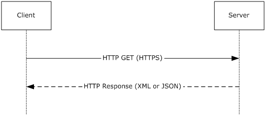

# [MS-DVRD]: Device Registration Discovery Protocol

Table of Contents

1 Introduction

- [1 Introduction](#Section_1)
  - [1.1 Glossary](#Section_1.1)
  - [1.2 References](#Section_1.2)
    - [1.2.1 Normative References](#Section_1.2.1)
    - [1.2.2 Informative References](#Section_1.2.2)
  - [1.3 Overview](#Section_1.3)
  - [1.4 Relationship to Other Protocols](#Section_1.4)
  - [1.5 Prerequisites/Preconditions](#Section_1.5)
  - [1.6 Applicability Statement](#Section_1.6)
  - [1.7 Versioning and Capability Negotiation](#Section_1.7)
  - [1.8 Vendor-Extensible Fields](#Section_1.8)
  - [1.9 Standards Assignments](#Section_1.9)

2 Messages

- [2 Messages](#Section_2)
  - [2.1 Transport](#Section_2.1)
  - [2.2 Common Data Types](#Section_2.2)
    - [2.2.1 Namespaces](#Section_2.2.1)
    - [2.2.2 HTTP Headers](#Section_2.2.2)
      - [2.2.2.1 Accept](#Section_2.2.2.1)
    - [2.2.3 Common URI Parameters](#Section_2.2.3)
      - [2.2.3.1 api-version](#Section_2.2.3.1)
    - [2.2.4 Complex Types](#Section_2.2.4)
      - [2.2.4.1 AuthenticationService](#Section_2.2.4.1)
      - [2.2.4.2 DeviceRegistrationService](#Section_2.2.4.2)
      - [2.2.4.3 Discovery](#Section_2.2.4.3)
      - [2.2.4.4 OAuth2](#Section_2.2.4.4)
      - [2.2.4.5 IdentityProviderService](#Section_2.2.4.5)
      - [2.2.4.6 DeviceJoinService](#Section_2.2.4.6)
      - [2.2.4.7 WebBrowserZones](#Section_2.2.4.7)
      - [2.2.4.8 Intranet](#Section_2.2.4.8)
      - [2.2.4.9 Trusted](#Section_2.2.4.9)
      - [2.2.4.10 Untrusted](#Section_2.2.4.10)
      - [2.2.4.11 KeyProvisioningService](#Section_2.2.4.11)

3 Protocol Details

- [3 Protocol Details](#Section_3)
  - [3.1 IHttpDiscoveryService Server Details](#Section_3.1)
    - [3.1.1 Abstract Data Model](#Section_3.1.1)
    - [3.1.2 Timers](#Section_3.1.2)
    - [3.1.3 Initialization](#Section_3.1.3)
    - [3.1.4 Higher-Layer Triggered Events](#Section_3.1.4)
    - [3.1.5 Message Processing Events and Sequencing Rules](#Section_3.1.5)
      - [3.1.5.1 contract?api-version={api-version}](#Section_3.1.5.1)
        - [3.1.5.1.1 GET](#Section_3.1.5.1.1)
          - [3.1.5.1.1.1 Request Body](#Section_3.1.5.1.1.1)
          - [3.1.5.1.1.2 Response Body](#Section_3.1.5.1.1.2)
          - [3.1.5.1.1.3 Processing Details](#Section_3.1.5.1.1.3)
    - [3.1.6 Timer Events](#Section_3.1.6)
    - [3.1.7 Other Local Events](#Section_3.1.7)

4 Protocol Examples

- [4 Protocol Examples](#Section_4)
  - [4.1 Client Request](#Section_4.1)
    - [4.1.1 Protocol Version 1.0](#Section_4.1.1)
    - [4.1.2 Protocol Version 1.2](#Section_4.1.2)
  - [4.2 Server Response (XML)](#Section_4.2)
    - [4.2.1 Protocol Version 1.0](#Section_4.2.1)
    - [4.2.2 Protocol Version 1.2](#Section_4.2.2)
  - [4.3 Server Response (JSON)](#Section_4.3)
    - [4.3.1 Protocol Version 1.0](#Section_4.3.1)
    - [4.3.2 Protocol Version 1.2](#Section_4.3.2)

5 Security

- [5 Security](#Section_5)
  - [5.1 Security Considerations for Implementers](#Section_5.1)
  - [5.2 Index of Security Parameters](#Section_5.2)

6 Appendix A: Full XML Schema

- [6 Appendix A: Full XML Schema](#Section_6)
  - [6.1 http://schemas.datacontract.org/2004/07/Microsoft.DeviceRegistration.Entities Schema](#Section_6.1)
    - [6.1.1 Version 1.0](#Section_6.1.1)
    - [6.1.2 Version 1.2](#Section_6.1.2)
  - [6.2 http://tempuri.org Schema](#Section_6.2)

7 Appendix B: Product Behavior

- [7 Appendix B: Product Behavior](#Section_7)

8 Change Tracking

- [8 Change Tracking](#Section_8)

For the legal notice and IP terms, see [LEGAL.md](../LEGAL.md).
Last updated: 4/23/2024.
See [Revision History](#revision-history) for full version history.

# 1 Introduction

The discovery of information needed to register devices is accomplished through the protocol defined in this specification, the Device Registration Discovery Protocol (DVRD). Registration of a device in the [**device registration service**](#gt_device-registration-service) (**DRS**) by using the information provided by the Device Registration Discovery Protocol is handled by the Device Registration Enrollment Protocol [MS-DVRE](../MS-DVRE/MS-DVRE.md).

Sections 1.5, 1.8, 1.9, 2, and 3 of this specification are normative. All other sections and examples in this specification are informative.

## 1.1 Glossary

This document uses the following terms:

**Augmented Backus-Naur Form (ABNF)**: A modified version of Backus-Naur Form (BNF), commonly used by Internet specifications. ABNF notation balances compactness and simplicity with reasonable representational power. ABNF differs from standard BNF in its definitions and uses of naming rules, repetition, alternatives, order-independence, and value ranges. For more information, see [[RFC5234]](https://go.microsoft.com/fwlink/?LinkId=123096).

**device registration service**: A service that allows registration of computing devices on a corporate network. These devices might not be controlled by the administrator of the network.

**Hypertext Transfer Protocol Secure (HTTPS)**: An extension of HTTP that securely encrypts and decrypts web page requests. In some older protocols, "Hypertext Transfer Protocol over Secure Sockets Layer" is still used (Secure Sockets Layer has been deprecated). For more information, see [[SSL3]](https://go.microsoft.com/fwlink/?LinkId=90534) and [[RFC5246]](https://go.microsoft.com/fwlink/?LinkId=129803).

**JavaScript Object Notation (JSON)**: A text-based, data interchange format that is used to transmit structured data, typically in Asynchronous JavaScript + XML (AJAX) web applications, as described in [[RFC7159]](https://go.microsoft.com/fwlink/?linkid=842522). The JSON format is based on the structure of ECMAScript (Jscript, JavaScript) objects.

**OAuth**: The OAuth 2.0 authorization framework [[RFC6749]](https://go.microsoft.com/fwlink/?LinkId=301486).

**relying party (RP)**: A web application or service that consumes security tokens issued by a security token service (STS).

**Transport Layer Security (TLS)**: A security protocol that supports confidentiality and integrity of messages in client and server applications communicating over open networks. TLS supports server and, optionally, client authentication by using X.509 certificates (as specified in [[X509]](https://go.microsoft.com/fwlink/?LinkId=90590)). TLS is standardized in the IETF TLS working group.

**XML**: The Extensible Markup Language, as described in [[XML1.0]](https://go.microsoft.com/fwlink/?LinkId=90599).

**MAY, SHOULD, MUST, SHOULD NOT, MUST NOT:** These terms (in all caps) are used as defined in [[RFC2119]](https://go.microsoft.com/fwlink/?LinkId=90317). All statements of optional behavior use either MAY, SHOULD, or SHOULD NOT.

## 1.2 References

Links to a document in the Microsoft Open Specifications library point to the correct section in the most recently published version of the referenced document. However, because individual documents in the library are not updated at the same time, the section numbers in the documents may not match. You can confirm the correct section numbering by checking the [Errata](https://go.microsoft.com/fwlink/?linkid=850906).

### 1.2.1 Normative References

We conduct frequent surveys of the normative references to assure their continued availability. If you have any issue with finding a normative reference, please contact [dochelp@microsoft.com](mailto:dochelp@microsoft.com). We will assist you in finding the relevant information.

[RFC2119] Bradner, S., "Key words for use in RFCs to Indicate Requirement Levels", BCP 14, RFC 2119, March 1997, [https://www.rfc-editor.org/info/rfc2119](https://go.microsoft.com/fwlink/?LinkId=90317)

[RFC2616] Fielding, R., Gettys, J., Mogul, J., et al., "Hypertext Transfer Protocol -- HTTP/1.1", RFC 2616, June 1999, [https://www.rfc-editor.org/info/rfc2616](https://go.microsoft.com/fwlink/?LinkId=90372)

[RFC4234] Crocker, D., Ed., and Overell, P., "Augmented BNF for Syntax Specifications: ABNF", RFC 4234, October 2005, [https://www.rfc-editor.org/info/rfc4234](https://go.microsoft.com/fwlink/?LinkId=90462)

[RFC4346] Dierks, T., and Rescorla, E., "The Transport Layer Security (TLS) Protocol Version 1.1", RFC 4346, April 2006, [https://www.rfc-editor.org/info/rfc4346](https://go.microsoft.com/fwlink/?LinkId=90474)

[RFC6749] Hardt, D., Ed., "The OAuth 2.0 Authorization Framework", RFC 6749, October 2012, [https://www.rfc-editor.org/info/rfc6749](https://go.microsoft.com/fwlink/?LinkId=301486)

[XMLNS] Bray, T., Hollander, D., Layman, A., et al., Eds., "Namespaces in XML 1.0 (Third Edition)", W3C Recommendation, December 2009, [https://www.w3.org/TR/2009/REC-xml-names-20091208/](https://go.microsoft.com/fwlink/?LinkId=191840)

[XMLSCHEMA1] Thompson, H., Beech, D., Maloney, M., and Mendelsohn, N., Eds., "XML Schema Part 1: Structures", W3C Recommendation, May 2001, [https://www.w3.org/TR/2001/REC-xmlschema-1-20010502/](https://go.microsoft.com/fwlink/?LinkId=90608)

### 1.2.2 Informative References

[MS-DVRE] Microsoft Corporation, "[Device Registration Enrollment Protocol](../MS-DVRE/MS-DVRE.md)".

[MS-DVRJ] Microsoft Corporation, "[Device Registration Join Protocol](../MS-DVRJ/MS-DVRJ.md)".

[MS-KPP] Microsoft Corporation, "[Key Provisioning Protocol](../MS-KPP/MS-KPP.md)".

## 1.3 Overview

This document defines a protocol for returning information about a server that implements the Device Registration Enrollment Protocol [MS-DVRE](../MS-DVRE/MS-DVRE.md) as structured RESTful resources.

The Device Registration Discovery Protocol is a single REST-based endpoint that returns XML or JavaScript Object Notation (JSON) formatted data in the response message. This information can be used to connect and register a device with a server that implements the Device Registration Enrollment Protocol.

This document defines and uses the following terms:

**Server**: Refers to the server that implements the REST web service that accepts and responds to device registration discovery requests using the Device Registration Discovery Protocol.

**Client**: Refers to the client that creates and sends a discovery request to the server using the Device Registration Discovery Protocol.

**Device registration service (DRS) server**: Refers to the server that implements the Device Registration Enrollment Protocol [MS-DVRE] for device registration.

**OAuth2 server**: Refers to the server that implements the OAuth2 protocol [[RFC6749]](https://go.microsoft.com/fwlink/?LinkId=301486) and provides authentication services for the [**device registration service**](#gt_device-registration-service) (**DRS**) server.

Figure 1: Device discovery sequence

## 1.4 Relationship to Other Protocols

The following figure illustrates the relationship of this protocol to other protocols.

Figure 2: Protocols related to the Device Registration Discovery Protocol

## 1.5 Prerequisites/Preconditions

The protocol defined in this document does not provide a mechanism for a client to discover the existence and location of arbitrary data services (of the server). It is a prerequisite that the client obtain a URI to the server before the protocol can be used.

Neither the protocol defined in this document nor its base protocols define an authentication or authorization scheme.

## 1.6 Applicability Statement

This protocol defines a means for exposing information about a DRS server as structured RESTful resources. This protocol is applicable to both Internet and intranet client-server scenarios.

## 1.7 Versioning and Capability Negotiation

The protocol provides a URI parameter for specifying the desired version. See section [2.2.3.1](#Section_2.2.3.1).

## 1.8 Vendor-Extensible Fields

This protocol does not provide any mechanism for capability negotiation beyond that specified in section [1.7](#Section_1.7).

## 1.9 Standards Assignments

This protocol has not been assigned any standard parameters.

# 2 Messages

## 2.1 Transport

The Device Registration Discovery Protocol consists of a single RESTful web service.

- HTTPS over TCP/IP [[RFC2616]](https://go.microsoft.com/fwlink/?LinkId=90372)
The protocol MUST operate on the following URI endpoint.

| Web service | Location |
| --- | --- |
| Discovery Web Service | https://<server>:<server port>/EnrollmentServer/contract |

All client messages to the server MUST use [**Hypertext Transfer Protocol over Secure Sockets Layer (HTTPS)**](#gt_9239bd88-9747-44a6-83a6-473f53f175a7) and provide server authentication, which MUST use [**Transport Layer Security (TLS)**](#gt_transport-layer-security-tls) 1.1 [[RFC4346]](https://go.microsoft.com/fwlink/?LinkId=90474) or greater.

## 2.2 Common Data Types

### 2.2.1 Namespaces

This specification defines and references various XML namespaces by using the mechanisms specified in [[XMLNS]](https://go.microsoft.com/fwlink/?LinkId=191840). Although this specification associates a specific XML namespace prefix for each XML namespace that is used, the choice of any particular XML namespace prefix is implementation-specific and not significant for interoperability.

| Prefix | NameSpaces URI | Reference |
| --- | --- | --- |
| tns | http://schemas.datacontract.org/2004/07/Microsoft.DeviceRegistration.Entities | This specification |
| xs | http://www.w3.org/2001/XMLSchema | [[XMLSCHEMA1]](https://go.microsoft.com/fwlink/?LinkId=90608) |
| tns1 | http://tempuri.org | This specification |
| a | http://schemas.microsoft.com/2003/10/Serialization/Arrays | - |

### 2.2.2 HTTP Headers

This protocol accesses the HTTP headers listed in the following table.

| Header | Description |
| --- | --- |
| Accept | Specifies the format of the response body. |

The following sections define the syntax of the HTTP headers by using the [**Augmented Backus-Naur Form (ABNF)**](#gt_augmented-backus-naur-form-abnf) syntax [[RFC4234]](https://go.microsoft.com/fwlink/?LinkId=90462).

#### 2.2.2.1 Accept

The Accept HTTP header is optional. This header is used by the client in the request to specify the format of the response body.

The format of the Accept header is as follows.

Accept = "application/json" / "application/xml"

### 2.2.3 Common URI Parameters

The following table summarizes the set of Common URI Parameters defined by this specification.

| URI parameter | Description |
| --- | --- |
| api-version | An integer that indicates the data version that is expected by the client. |

#### 2.2.3.1 api-version

The *api-version* parameter is an integer that indicates the data version that is expected by the client. This parameter MUST be included in all client requests.

String = *(%x20-7E)

api-version = String

### 2.2.4 Complex Types

The following table summarizes the set of common XML schema complex type definitions defined by this specification.

| Complex Type | Description |
| --- | --- |
| AuthenticationService | Information about the authentication services and schemes that are supported by the [**device registration service**](#gt_device-registration-service) (**DRS**) server. See section [2.2.4.1](#Section_2.2.4.1). This type is included with the Device Registration Discovery Protocol (DVRD) versions 1.0 and 1.2.<1> |
| DeviceRegistrationService | Information about the DRS server. See section [2.2.4.2](#Section_2.2.4.2). This type is included with DVRD versions 1.0 and 1.2. |
| Discovery | The root element. See section [2.2.4.3](#Section_2.2.4.3). This type is included with DVRD versions 1.0 and 1.2. |
| IdentityProviderService | Information about the identity provider server. See section [2.2.4.5](#Section_2.2.4.5). This type is included with DVRD versions 1.0 and 1.2. |
| OAuth2 | Information about the OAuth2 server. See section [2.2.4.4](#Section_2.2.4.4). This type is included with DVRD versions 1.0 and 1.2. |
| DeviceJoinService | Information about the DRS join server. See section [2.2.4.6](#Section_2.2.4.6). This type is included with DVRD version 1.2. |
| WebBrowserZones | Information about the browser Web zone required by the client. See section [2.2.4.7](#Section_2.2.4.7). This type is included with DVRD version 1.2. |
| Intranet | Information about the browser Intranet Web zone settings required by the client. See section [2.2.4.8](#Section_2.2.4.8). This type is included with DVRD version 1.2. |
| Trusted | Information about the browser Trusted Web zone settings required by the client. See section [2.2.4.9](#Section_2.2.4.9). This type is included with DVRD version 1.2. |
| Untrusted | Information about the browser Untrusted Web zone settings required by the client. See section [2.2.4.10](#Section_2.2.4.10). This type is included with DVRD version 1.2. |
| KeyProvisioningService | Information about the key provisioning server. See section [2.2.4.11](#Section_2.2.4.11). This type is included with DVRD version 1.2. |

#### 2.2.4.1 AuthenticationService

The AuthenticationService type contains metadata about all of the authentication schemes that are supported and allowed by the DRS server.

**Namespace:** http://schemas.datacontract.org/2004/07/Microsoft.DeviceRegistration.Entities

<xs:element name="AuthenticationService">

<xs:complexType>

<xs:sequence>

<xs:element name="OAuth2">

<xs:complexType>

<xs:sequence>

<xs:element name="AuthCodeEndpoint" type="xs:anyURI" />

<xs:element name="TokenEndpoint" type="xs:anyURI" />

</xs:sequence>

</xs:complexType>

</xs:element>

</xs:sequence>

</xs:complexType>

</xs:element>

**OAuth2:** The top-level object for [**OAuth**](#gt_oauth). See section [2.2.4.4](#Section_2.2.4.4).

#### 2.2.4.2 DeviceRegistrationService

The DeviceRegistrationService type contains metadata about the DRS server. This information, along with the information from AuthenticationService (section [2.2.4.1](#Section_2.2.4.1)), can be used to connect and authenticate to the DRS server.

**Namespace:** http://schemas.datacontract.org/2004/07/Microsoft.DeviceRegistration.Entities

<xs:element name="DeviceRegistrationService">

<xs:complexType>

<xs:sequence>

<xs:element name="RegistrationEndpoint" type="xs:anyURI" />

<xs:element name="RegistrationResourceId" type="xs:string" />

<xs:element name="ServiceVersion" type="xs:decimal" />

</xs:sequence>

</xs:complexType>

</xs:element>

**RegistrationEndpoint:** The URL of the SOAP web service hosted on the DRS server.

**RegistrationResourceId:** The [**relying party**](#gt_relying-party-rp) identity of the DRS server as defined by the identity provider or federation provider.

**ServiceVersion:** A decimal that indicates the discovery data version. This MUST match the version that was requested by the client. See section [2.2.3.1](#Section_2.2.3.1).

#### 2.2.4.3 Discovery

The root element.

**Namespace:** http://schemas.datacontract.org/2004/07/Microsoft.DeviceRegistration.Entities

- <xs:complexType name="Discovery">
- <xs:sequence>
- <xs:element minOccurs="0" maxOccurs="1" name="DeviceRegistrationService" nillable="true" type="tns:DeviceRegistrationService"/>
- <xs:element minOccurs="0" maxOccurs="1" name="AuthenticationService" nillable="true" type="tns:AuthenticationService"/>
- <xs:element minOccurs="0" maxOccurs="1" name="IdentityProviderService" nillable="true" type="tns:IdentityProviderService"/>
- <xs:element minOccurs="0" maxOccurs="1" name="WebBrowserZones" nillable="true" type="tns:WebBrowserZones"/>
- <xs:element minOccurs="0" maxOccurs="1" name="DeviceJoinService" nillable="true" type="tns:DeviceJoinService"/>
- <xs:element minOccurs="0" maxOccurs="1" name="KeyProvisioningService" nillable="true" type="tns:KeyProvisioningService"/>
- </xs:sequence>
- </xs:complexType>
**AuthenticationService:** The top-level object for AuthenticationService. See section [2.2.4.1](#Section_2.2.4.1).

**DeviceRegistrationService:** The top-level object for DeviceRegistrationService. See section [2.2.4.2](#Section_2.2.4.2).

**IdentityProviderService:** The top-level object for IdentityProviderService. See section [2.2.4.5](#Section_2.2.4.5).

**WebBrowserZones:** The top-level object for WebBrowserZones. See section [2.2.4.7](#Section_2.2.4.7).

**DeviceJoinService**: The top-level object for DeviceJoinService. See section [2.2.4.6](#Section_2.2.4.6).

**KeyProvisioningService**: The top-level object for KeyProvisioningService. See section [2.2.4.11](#Section_2.2.4.11).

#### 2.2.4.4 OAuth2

The OAuth2 type contains the information needed to connect to the OAuth2 server [[RFC6749]](https://go.microsoft.com/fwlink/?LinkId=301486).

**Namespace:** http://schemas.datacontract.org/2004/07/Microsoft.DeviceRegistration.Entities

<xs:element name="OAuth2">

<xs:complexType>

<xs:sequence>

<xs:element name="AuthCodeEndpoint" type="xs:anyURI" />

<xs:element name="TokenEndpoint" type="xs:anyURI" />

</xs:sequence>

</xs:complexType>

</xs:element>

**AuthCodeEndpoint:** The URL of the authorization endpoint on the OAuth2 server. This endpoint is used to request an authorization code.

**TokenEndpoint:** The URL of the token endpoint on the OAuth2 server. This endpoint is used to request access tokens in exchange for an authorization code.

#### 2.2.4.5 IdentityProviderService

The IdentityProviderService type contains metadata about the identity server that is used by the DRS server.

**Namespace:** http://schemas.datacontract.org/2004/07/Microsoft.DeviceRegistration.Entities

<xs:element name="IdentityProviderService">

<xs:complexType>

<xs:sequence>

<xs:element name="PassiveAuthEndpoint" type="xs:anyURI" />

</xs:sequence>

</xs:complexType>

</xs:element>

**PassiveAuthEndpoint:** The URL of the passive authentication endpoint of the identity provider.

#### 2.2.4.6 DeviceJoinService

The DeviceJoinService type contains metadata about the DRS REST-based join server [MS-DVRJ](../MS-DVRJ/MS-DVRJ.md).

**Namespace**: http://schemas.datacontract.org/2004/07/Microsoft.DeviceRegistration.Entities

<xs:element name="DeviceJoinService">

<xs:complexType>

<xs:sequence>

<xs:element name="JoinEndpoint" type="xs:anyURI" />

<xs:element name="JoinResourceId" type="xs:string" />

<xs:element name="ServiceVersion" type="xs:decimal" />

</xs:sequence>

</xs:complexType>

</xs:element>

**JoinEndpoint**: The URL of the REST-based Web service hosted on the DRS server.

**JoinResourceId**: The [**relying party**](#gt_relying-party-rp) identity of the DRS server as defined by the identity provider or federation provider.

**ServiceVersion**: A decimal that indicates the discovery data version.

#### 2.2.4.7 WebBrowserZones

The WebBrowserZones type contains metadata about the settings that a client Web browser MUST have in order to use the Device Registration Enrollment Protocol [MS-DVRE](../MS-DVRE/MS-DVRE.md) and the Device Registration Join Protocol [MS-DVRJ](../MS-DVRJ/MS-DVRJ.md).

**Intranet**: The top-level object for the Intranet object. See section [2.2.4.8](#Section_2.2.4.8).

**Trusted**: The top-level object for the Trusted object. See section [2.2.4.9](#Section_2.2.4.9).

**Untrusted**: The top-level object for the Untrusted object. See section [2.2.4.10](#Section_2.2.4.10).

#### 2.2.4.8 Intranet

A child of the WebBrowserZones complex type (section [2.2.4.7](#Section_2.2.4.7)).

The values of the Endpoints object MUST be added to the client Web browser intranet zone site list.

<xs:element name="Intranet">

<xs:complexType>

<xs:sequence>

<xs:element name="Endpoints">

<xs:complexType>

<xs:sequence>

<xs:element ref="a:anyURI" />

</xs:sequence>

</xs:complexType>

</xs:element>

</xs:sequence>

</xs:complexType>

</xs:element>

#### 2.2.4.9 Trusted

A child of the WebBrowserZones complex type (section [2.2.4.7](#Section_2.2.4.7)).

The values of the Endpoints object MUST be added to the client Web browser trusted zone site list.

<xs:element name="Trusted">

<xs:complexType>

<xs:sequence>

<xs:element name="Endpoints">

<xs:complexType>

<xs:sequence>

<xs:element ref="a:anyURI" />

</xs:sequence>

</xs:complexType>

</xs:element>

</xs:sequence>

</xs:complexType>

</xs:element>

#### 2.2.4.10 Untrusted

A child of the WebBrowserZones complex type (section [2.2.4.7](#Section_2.2.4.7)).

The values of the Endpoints object MUST be added to the client Web browser untrusted zone site list.

<xs:element name="Untrusted">

<xs:complexType>

<xs:sequence>

<xs:element name="Endpoints">

<xs:complexType>

<xs:sequence>

<xs:element ref="a:anyURI" />

</xs:sequence>

</xs:complexType>

</xs:element>

</xs:sequence>

</xs:complexType>

</xs:element>

#### 2.2.4.11 KeyProvisioningService

The KeyProvisioningService type contains metadata about the DRS REST-based key provisioning server [MS-KPP](../MS-KPP/MS-KPP.md).

**Namespace**: http://schemas.datacontract.org/2004/07/Microsoft.DeviceRegistration.Entities

<xs:element name="KeyProvisioningService">

<xs:complexType>

<xs:sequence>

<xs:element name="KeyProvisionEndpoint" type="xs:anyURI" />

<xs:element name="KeyProvisionResourceId" type="xs:string" />

<xs:element name="ServiceVersion" type="xs:decimal" />

</xs:sequence>

</xs:complexType>

</xs:element>

**KeyProvisionEndpoint**: The URL of the REST-based Web service that is hosted on the DRS server.

**KeyProvisionResourceId**: The [**relying party**](#gt_relying-party-rp) identity of the DRS server as defined by the identity provider or federation provider.

**ServiceVersion**: A decimal that indicates the discovery data version.

# 3 Protocol Details

## 3.1 IHttpDiscoveryService Server Details

### 3.1.1 Abstract Data Model

The following information MUST be maintained on the server.

**RegistrationEndpoint**: See section [2.2.4.2](#Section_2.2.4.2) for DeviceRegistrationService.

**RegistrationResourceId**: See section 2.2.4.2 for DeviceRegistrationService.

**ServiceVersion**: See section 2.2.4.2, section [2.2.4.6](#Section_2.2.4.6), and section [2.2.4.11](#Section_2.2.4.11).

**AuthCodeEndpoint**: See section [2.2.4.4](#Section_2.2.4.4) for OAuth2.

**TokenEndpoint**: See section 2.2.4.4 for OAuth2.

**PassiveAuthEndpoint**: See section [2.2.4.5](#Section_2.2.4.5) for IdentityProviderService.

**JoinEndpoint**: See section 2.2.4.6 for DeviceJoinService.

**JoinResourceId**: See section 2.2.4.6 for DeviceJoinService.

**KeyProvisionEndpoint**: See section 2.2.4.11 for KeyProvisioningService.

**KeyProvisionResourceId**: See section 2.2.4.11 for KeyProvisioningService.

**Endpoints**: See section [2.2.4.7](#Section_2.2.4.7) for WebBrowserZones.

### 3.1.2 Timers

None.

### 3.1.3 Initialization

The server that implements the Device Registration Discovery Protocol must be initialized. Any databases or tables that contain the information needed in the Device Registration Discovery Protocol response MUST be initialized.

### 3.1.4 Higher-Layer Triggered Events

None.

### 3.1.5 Message Processing Events and Sequencing Rules

| Resource | Description |
| --- | --- |
| contract?api-version={api-version} | An object that represents the endpoints and authentication policies for a DRS server. |

#### 3.1.5.1 contract?api-version={api-version}

**api-version:** An integer that indicates the data version expected by the client. This parameter MUST be included in all client requests. See section [2.2.3.1](#Section_2.2.3.1).

The following HTTP method is allowed to be performed on this resource.

| HTTP method | Description |
| --- | --- |
| GET | Get connection and authentication metadata for the DRS server. |

##### 3.1.5.1.1 GET

This operation is transported by an HTTP **GET**.

The operation can be invoked through the following URI:

contract?api-version={version}

###### 3.1.5.1.1.1 Request Body

The request body SHOULD be empty. Any content MUST be ignored by the server.

###### 3.1.5.1.1.2 Response Body

The response body is encoded in either XML or JSON format. The format is controlled by the Accept header defined in section [2.2.2.1](#Section_2.2.2.1).

<xs:element name="DiscoverResponse" nillable="true" xmlns:q1="http://schemas.datacontract.org/2004/07/Microsoft.DeviceRegistration.Entities" type="q1:Discovery"/>

###### 3.1.5.1.1.3 Processing Details

- The server MUST respond only to requests that have established TLS server authentication.
- For version 1.0 of the protocol, the server MUST respond only to requests that have an *api-version* URI parameter that contains the string "1.0".
- For version 1.2 of the protocol, the server MUST respond only to requests that have an *api-version* URI parameter that contains the string "1.2".
- If the Accept header is present in the request, the server MUST allow only the Accept header values as defined in section [2.2.2.1](#Section_2.2.2.1). If the Accept header is not present, the response format in step 5 below MUST be XML. Any other header value MUST return an HTTP error code in the 400 range. The body of the message response in this case is insignificant to the protocol; clients MUST halt processing upon receiving an HTTP error.
- The server MUST construct a response in either XML or JSON format based on the value of the Accept header (section 2.2.2.1), or in XML format if the Accept header is not present. The response MUST include all of the complex types defined in section [2.2.4](#Section_2.2.4), and use the corresponding values defined in section [3.1.1](#Section_3.1.1).
- If the server encounters an error in message processing, the server MUST return an HTTP error code in the 400 range. The body of the message response is insignificant to the protocol. Clients MUST halt processing upon receiving an HTTP error.

### 3.1.6 Timer Events

None.

### 3.1.7 Other Local Events

None.

# 4 Protocol Examples

## 4.1 Client Request

The following sections contain the request examples from the client.

### 4.1.1 Protocol Version 1.0

Client request for DVRD version 1.0:

https://enterpriseregistration.contoso.com/enrollmentserver/contract?api-version=1.0

### 4.1.2 Protocol Version 1.2

Client request for DVRD version 1.2:

https://enterpriseregistration.contoso.com/enrollmentserver/contract?api-version=1.2

## 4.2 Server Response (XML)

The following sections contain the response examples from the server in [**XML**](#gt_xml) format.

### 4.2.1 Protocol Version 1.0

Server response for DVRD version 1.0 in [**XML**](#gt_xml) format:

<Discovery

xmlns="http://schemas.datacontract.org/2004/07/Microsoft.DeviceRegistration.Entities"

xmlns:i="http://www.w3.org/2001/XMLSchema-instance">

<DeviceRegistrationService>

<RegistrationEndpoint>

https://sts.contoso.com/EnrollmentServer/DeviceEnrollmentWebService.svc

</RegistrationEndpoint>

<RegistrationResourceId>

urn:ms-drs:sts.contoso.com

</RegistrationResourceId>

<ServiceVersion>1.0</ServiceVersion>

</DeviceRegistrationService>

<AuthenticationService>

<OAuth2>

<AuthCodeEndpoint>

https://sts.contoso.com/adfs/oauth2/authorize

</AuthCodeEndpoint>

<TokenEndpoint>

https://sts.contoso.com/adfs/oauth2/token

</TokenEndpoint>

</OAuth2>

</AuthenticationService>

<IdentityProviderService>

<PassiveAuthEndpoint>

https://sts.contoso.com/adfs/ls

</PassiveAuthEndpoint>

</IdentityProviderService>

</Discovery>

### 4.2.2 Protocol Version 1.2

Server response for DVRD version 1.2 in [**XML**](#gt_xml) format:

<Discovery xmlns="http://schemas.datacontract.org/2004/07/Microsoft.DeviceRegistration.Entities" xmlns:i="http://www.w3.org/2001/XMLSchema-instance">

<DeviceRegistrationService>

<RegistrationEndpoint>https://sts.contoso.com/EnrollmentServer/DeviceEnrollmentWebService.svc</RegistrationEndpoint>

<RegistrationResourceId>urn:ms-drs:434DF4A9-3CF2-4C1D-917E-2CD2B72F515A</RegistrationResourceId>

<ServiceVersion>1.0</ServiceVersion>

</DeviceRegistrationService>

<AuthenticationService>

<OAuth2>

<AuthCodeEndpoint>https://sts.contoso.com/adfs/oauth2/authorize</AuthCodeEndpoint>

<TokenEndpoint>https://sts.contoso.com/adfs/oauth2/token</TokenEndpoint>

</OAuth2>

</AuthenticationService>

<IdentityProviderService>

<PassiveAuthEndpoint>https://sts.contoso.com/adfs/ls</PassiveAuthEndpoint>

</IdentityProviderService>

<DeviceJoinService>

<JoinEndpoint>https://sts.contoso.com/EnrollmentServer/device/</JoinEndpoint>

<JoinResourceId>urn:ms-drs:434DF4A9-3CF2-4C1D-917E-2CD2B72F515A</JoinResourceId>

<ServiceVersion>1.0</ServiceVersion>

</DeviceJoinService>

<WebBrowserZones>

<Intranet>

<Endpoints xmlns:a="http://schemas.microsoft.com/2003/10/Serialization/Arrays">

<a:anyURI>https://sts.contoso.com/</a:anyURI>

</Endpoints>

</Intranet>

<Trusted i:nil="true"/>

<Untrusted i:nil="true"/>

</WebBrowserZones>

<KeyProvisioningService>

<KeyProvisionEndpoint>https://sts.contoso.com/EnrollmentServer/key/</KeyProvisionEndpoint>

<KeyProvisionResourceId>urn:ms-drs:434DF4A9-3CF2-4C1D-917E-2CD2B72F515A</KeyProvisionResourceId>

<ServiceVersion>1.0</ServiceVersion>

</KeyProvisioningService>

</Discovery>

## 4.3 Server Response (JSON)

The following sections contain the response examples from the server in [**JSON**](#gt_javascript-object-notation-json) format.

**Note** Line breaks and spaces have been added for clarity.

### 4.3.1 Protocol Version 1.0

Server response for DVRD version 1.0 in [**JSON**](#gt_javascript-object-notation-json) format:

{

"DeviceRegistrationService": {

"RegistrationEndpoint": "https:\/\/sts.contoso.com\/EnrollmentServer\/DeviceEnrollmentWebService.svc",

"RegistrationResourceId": "urn:ms-drs:sts.contoso.com",

"ServiceVersion": "1.0"

},

"AuthenticationService": {

"OAuth2": {

"AuthCodeEndpoint": "https:\/\/sts.contoso.com\/adfs\/oauth2\/authorize",

"TokenEndpoint": "https:\/\/sts.contoso.com\/adfs\/oauth2\/token"

}

},

"IdentityProviderService": { "PassiveAuthEndpoint": "https:\/\/sts.contoso.com\/adfs\/ls" }

}

### 4.3.2 Protocol Version 1.2

Server response for DVRD version 1.2 in [**JSON**](#gt_javascript-object-notation-json) format:

{

"DeviceRegistrationService": {

"RegistrationEndpoint": "https:\/\/sts.contoso.com\/EnrollmentServer\/DeviceEnrollmentWebService.svc",

"RegistrationResourceId": "urn:ms-drs:434DF4A9-3CF2-4C1D-917E-2CD2B72F515A",

"ServiceVersion": "1.0"

},

"AuthenticationService": {

"OAuth2": {

"AuthCodeEndpoint": "https:\/\/sts.contoso.com\/adfs\/oauth2\/authorize",

"TokenEndpoint": "https:\/\/sts.contoso.com\/adfs\/oauth2\/token"

}

},

"IdentityProviderService": { "PassiveAuthEndpoint": "https:\/\/sts.contoso.com\/adfs\/ls" },

"DeviceJoinService": {

"JoinEndpoint": "https:\/\/sts.contoso.com\/EnrollmentServer\/device\/",

"JoinResourceId": "urn:ms-drs:434DF4A9-3CF2-4C1D-917E-2CD2B72F515A",

"ServiceVersion": "1.0"

},

"WebBrowserZones": {

"Intranet": { "Endpoints": [ "https:\/\/sts.contoso.com\/" ] },

"Trusted": null,

"Untrusted": null

},

"KeyProvisioningService": {

"KeyProvisionEndpoint": "https:\/\/sts.contoso.com\/EnrollmentServer\/key\/",

"KeyProvisionResourceId": "urn:ms-drs:434DF4A9-3CF2-4C1D-917E-2CD2B72F515A",

"ServiceVersion": "1.0"

}

}

# 5 Security

## 5.1 Security Considerations for Implementers

The Device Registration Discovery Protocol uses HTTPS as a transport. Using Secure Sockets Layer (SSL) server certificate verification ensures that the client is communicating with the real server and closes any possible man-in-the-middle attacks.

## 5.2 Index of Security Parameters

None.

# 6 Appendix A: Full XML Schema

For ease of implementation, the following sections provide the full XML schemas for this protocol.

| Schema name | Prefix | Section |
| --- | --- | --- |
| http://schemas.datacontract.org/2004/07/Microsoft.DeviceRegistration.Entities | tns | [6.1](#Section_6.1) |
| http://tempuri.org | tns1 | [6.2](#Section_6.2) |

## 6.1 http://schemas.datacontract.org/2004/07/Microsoft.DeviceRegistration.Entities Schema

The following sections contain the XML schemas for the tns namespace of the Device Registration Discovery Protocol.

### 6.1.1 Version 1.0

XML schema for the tns namespace of DVRD version 1.0:

<xs:schema

xmlns:a="http://schemas.microsoft.com/2003/10/Serialization/Arrays"

xmlns:xs="http://www.w3.org/2001/XMLSchema"

xmlns:tns="http://schemas.datacontract.org/2004/07/Microsoft.DeviceRegistration.Entities"

targetNamespace="http://schemas.datacontract.org/2004/07/Microsoft.DeviceRegistration.Entities">

<xs:element name="Discovery">

<xs:complexType>

<xs:sequence>

<xs:element name="DeviceRegistrationService">

<xs:complexType>

<xs:sequence>

<xs:element name="RegistrationEndpoint" type="xs:anyURI" />

<xs:element name="RegistrationResourceId" type="xs:string" />

<xs:element name="ServiceVersion" type="xs:decimal" />

</xs:sequence>

</xs:complexType>

</xs:element>

<xs:element name="AuthenticationService">

<xs:complexType>

<xs:sequence>

<xs:element name="OAuth2">

<xs:complexType>

<xs:sequence>

<xs:element name="AuthCodeEndpoint" type="xs:anyURI" />

<xs:element name="TokenEndpoint" type="xs:anyURI" />

</xs:sequence>

</xs:complexType>

</xs:element>

</xs:sequence>

</xs:complexType>

</xs:element>

<xs:element name="IdentityProviderService">

<xs:complexType>

<xs:sequence>

<xs:element name="PassiveAuthEndpoint" type="xs:anyURI" />

</xs:sequence>

</xs:complexType>

</xs:element>

</xs:sequence>

</xs:complexType>

</xs:element>

</xs:schema>

### 6.1.2 Version 1.2

XML schema for the tns namespace of DVRD version 1.2:

<xs:schema

xmlns:a="http://schemas.microsoft.com/2003/10/Serialization/Arrays"

xmlns:xs="http://www.w3.org/2001/XMLSchema"

xmlns:tns="http://schemas.datacontract.org/2004/07/Microsoft.DeviceRegistration.Entities"

targetNamespace="http://schemas.datacontract.org/2004/07/Microsoft.DeviceRegistration.Entities">

<xs:import namespace="http://schemas.microsoft.com/2003/10/Serialization/Arrays" />

<xs:element name="Discovery">

<xs:complexType>

<xs:sequence>

<xs:element name="DeviceRegistrationService">

<xs:complexType>

<xs:sequence>

<xs:element name="RegistrationEndpoint" type="xs:anyURI" />

<xs:element name="RegistrationResourceId" type="xs:string" />

<xs:element name="ServiceVersion" type="xs:decimal" />

</xs:sequence>

</xs:complexType>

</xs:element>

<xs:element name="AuthenticationService">

<xs:complexType>

<xs:sequence>

<xs:element name="OAuth2">

<xs:complexType>

<xs:sequence>

<xs:element name="AuthCodeEndpoint" type="xs:anyURI" />

<xs:element name="TokenEndpoint" type="xs:anyURI" />

</xs:sequence>

</xs:complexType>

</xs:element>

</xs:sequence>

</xs:complexType>

</xs:element>

<xs:element name="IdentityProviderService">

<xs:complexType>

<xs:sequence>

<xs:element name="PassiveAuthEndpoint" type="xs:anyURI" />

</xs:sequence>

</xs:complexType>

</xs:element>

<xs:element name="DeviceJoinService">

<xs:complexType>

<xs:sequence>

<xs:element name="JoinEndpoint" type="xs:anyURI" />

<xs:element name="JoinResourceId" type="xs:string" />

<xs:element name="ServiceVersion" type="xs:decimal" />

</xs:sequence>

</xs:complexType>

</xs:element>

<xs:element name="WebBrowserZones">

<xs:complexType>

<xs:sequence>

<xs:element name="Intranet">

<xs:complexType>

<xs:sequence>

<xs:element name="Endpoints">

<xs:complexType>

<xs:sequence>

<xs:element ref="a:anyURI" />

</xs:sequence>

</xs:complexType>

</xs:element>

</xs:sequence>

</xs:complexType>

</xs:element>

<xs:element name="Trusted">

<xs:complexType>

<xs:sequence>

<xs:element name="Endpoints">

<xs:complexType>

<xs:sequence>

<xs:element maxOccurs="unbounded" ref="a:anyURI" />

</xs:sequence>

</xs:complexType>

</xs:element>

</xs:sequence>

</xs:complexType>

</xs:element>

<xs:element name="Untrusted">

<xs:complexType>

<xs:sequence>

<xs:element name="Endpoints">

<xs:complexType>

<xs:sequence>

<xs:element ref="a:anyURI" />

</xs:sequence>

</xs:complexType>

</xs:element>

</xs:sequence>

</xs:complexType>

</xs:element>

</xs:sequence>

</xs:complexType>

</xs:element>

<xs:element name="KeyProvisioningService">

<xs:complexType>

<xs:sequence>

<xs:element name="KeyProvisionEndpoint" type="xs:anyURI" />

<xs:element name="KeyProvisionResourceId" type="xs:string" />

<xs:element name="ServiceVersion" type="xs:decimal" />

</xs:sequence>

</xs:complexType>

</xs:element>

</xs:sequence>

</xs:complexType>

</xs:element>

</xs:schema>

## 6.2 http://tempuri.org Schema

XML schema for the tns1 namespace of the Device Registration Discovery Protocol:

<xs:schema xmlns:tns1="http://tempuri.org" targetNamespace="http://tempuri.org" xmlns:xs="http://www.w3.org/2001/XMLSchema">

<xs:element name="DiscoverResponse" nillable="true" xmlns:q1="http://schemas.datacontract.org/2004/07/Microsoft.DeviceRegistration.Entities" type="q1:Discovery"/>

</xs:schema>

# 7 Appendix B: Product Behavior

The information in this specification is applicable to the following Microsoft products or supplemental software. References to product versions include updates to those products.

The following tables show the relationships between Microsoft product versions or supplemental software and the roles they perform.

| Windows Client releases | Client role | IHttpDiscoveryService Server role |
| --- | --- | --- |
| Windows 8.1 operating system | Yes | No |
| Windows 10 operating system | Yes | No |
| Windows 11 operating system | Yes | No |

| Windows Server releases | Client role | IHttpDiscoveryService Server role |
| --- | --- | --- |
| Windows Server 2012 R2 operating system | No | Yes |
| Windows Server 2016 operating system | Yes * | Yes |
| Windows Server operating system | Yes * | Yes |
| Windows Server 2019 operating system | Yes * | Yes |
| Windows Server 2022 operating system | Yes * | Yes |
| Windows Server 2025 operating system | Yes | Yes |

* For version 1.0 of the Device Registration Discovery Protocol, this product does not implement the client role.

Exceptions, if any, are noted in this section. If an update version, service pack or Knowledge Base (KB) number appears with a product name, the behavior changed in that update. The new behavior also applies to subsequent updates unless otherwise specified. If a product edition appears with the product version, behavior is different in that product edition.

Unless otherwise specified, any statement of optional behavior in this specification that is prescribed using the terms "SHOULD" or "SHOULD NOT" implies product behavior in accordance with the SHOULD or SHOULD NOT prescription. Unless otherwise specified, the term "MAY" implies that the product does not follow the prescription.

<1> Section 2.2.4: The following table shows which versions of the Device Registration Discovery Protocol are supported by various Windows operating system versions.

| URI parameter | Description |
| --- | --- |
| Windows 8.1, Windows Server 2012 R2 | 1.0 |
| Windows 10 | 1.2 |
| Windows Server 2016, Windows Server operating system, Windows Server 2019 | 1.0, 1.2 |

# 8 Change Tracking

This section identifies changes that were made to this document since the last release. Changes are classified as Major, Minor, or None.

The revision class **Major** means that the technical content in the document was significantly revised. Major changes affect protocol interoperability or implementation. Examples of major changes are:

- A document revision that incorporates changes to interoperability requirements.
- A document revision that captures changes to protocol functionality.
The revision class **Minor** means that the meaning of the technical content was clarified. Minor changes do not affect protocol interoperability or implementation. Examples of minor changes are updates to clarify ambiguity at the sentence, paragraph, or table level.

The revision class **None** means that no new technical changes were introduced. Minor editorial and formatting changes may have been made, but the relevant technical content is identical to the last released version.

The changes made to this document are listed in the following table. For more information, please contact [dochelp@microsoft.com](mailto:dochelp@microsoft.com).

| Section | Description | Revision class |
| --- | --- | --- |
| [7](#Section_7) Appendix B: Product Behavior | Added Windows Server 2025 to the list of applicable products. | Major |

## Revision History

| Date | Version | Revision Class | Comments |
| --- | --- | --- | --- |
| 8/8/2013 | 1.0 | New | Released new document. |
| 11/14/2013 | 1.0 | None | No changes to the meaning, language, or formatting of the technical content. |
| 2/13/2014 | 1.0 | None | No changes to the meaning, language, or formatting of the technical content. |
| 5/15/2014 | 2.0 | Major | Significantly changed the technical content. |
| 6/30/2015 | 3.0 | Major | Significantly changed the technical content. |
| 10/16/2015 | 3.0 | None | No changes to the meaning, language, or formatting of the technical content. |
| 7/14/2016 | 4.0 | Major | Significantly changed the technical content. |
| 6/1/2017 | 5.0 | Major | Significantly changed the technical content. |
| 9/15/2017 | 6.0 | Major | Significantly changed the technical content. |
| 12/1/2017 | 6.0 | None | No changes to the meaning, language, or formatting of the technical content. |
| 9/12/2018 | 7.0 | Major | Significantly changed the technical content. |
| 4/7/2021 | 8.0 | Major | Significantly changed the technical content. |
| 6/25/2021 | 9.0 | Major | Significantly changed the technical content. |
| 4/23/2024 | 10.0 | Major | Significantly changed the technical content. |
