# [MS-FAX]: Fax Server and Client Remote Protocol

Table of Contents

<details>
<summary>1 Introduction</summary>

- [1 Introduction](#Section_1)
  - [1.1 Glossary](#Section_1.1)
  - [1.2 References](#Section_1.2)
    - [1.2.1 Normative References](#Section_1.2.1)
    - [1.2.2 Informative References](#Section_1.2.2)
  - [1.3 Overview](#Section_1.3)
    - [1.3.1 Fax Server Protocol](#Section_1.3.1)
    - [1.3.2 Fax Client Protocol](#Section_1.3.2)
  - [1.4 Relationship to Other Protocols](#Section_1.4)
  - [1.5 Prerequisites/Preconditions](#Section_1.5)
  - [1.6 Applicability Statement](#Section_1.6)
  - [1.7 Versioning and Capability Negotiation](#Section_1.7)
  - [1.8 Vendor-Extensible Fields](#Section_1.8)
  - [1.9 Standards Assignments](#Section_1.9)
</details>

<details>
<summary>2 Messages</summary>

- [2 Messages](#Section_2)
  - [2.1 Transport](#Section_2.1)
  - [2.2 Common Data Types](#Section_2.2)
    - [2.2.1 Common Custom-Marshaling Rules](#Section_2.2.1)
      - [2.2.1.1 Single Data Type Instance](#Section_2.2.1.1)
      - [2.2.1.2 Array of N Data Type Instances](#Section_2.2.1.2)
      - [2.2.1.3 Marshaling Referenced Data Types](#Section_2.2.1.3)
    - [2.2.2 FAX_ENUM_MESSAGE_FOLDER](#Section_2.2.2)
    - [2.2.3 FAX_ENUM_CONFIG_OPTION](#Section_2.2.3)
    - [2.2.4 FAX_ENUM_PERSONAL_PROF_TYPES](#Section_2.2.4)
    - [2.2.5 FAX_JOB_ENTRY](#Section_2.2.5)
    - [2.2.6 _FAX_JOB_ENTRY](#Section_2.2.6)
    - [2.2.7 FAX_PORT_INFO](#Section_2.2.7)
    - [2.2.8 _FAX_PORT_INFO](#Section_2.2.8)
    - [2.2.9 FAX_ROUTING_METHOD](#Section_2.2.9)
    - [2.2.10 FAX_DEVICE_STATUS](#Section_2.2.10)
    - [2.2.11 FAX_LOG_CATEGORY](#Section_2.2.11)
    - [2.2.12 FAX_COVERPAGE_INFO_EXW](#Section_2.2.12)
    - [2.2.13 FAX_JOB_PARAMW](#Section_2.2.13)
    - [2.2.14 FAX_JOB_PARAM_EXW](#Section_2.2.14)
    - [2.2.15 FAX_MESSAGE_PROPS](#Section_2.2.15)
    - [2.2.16 FAX_OUTBOX_CONFIG](#Section_2.2.16)
    - [2.2.17 _FAX_OUTBOX_CONFIG](#Section_2.2.17)
    - [2.2.18 FAX_REASSIGN_INFO](#Section_2.2.18)
    - [2.2.19 FAX_SERVER_ACTIVITY](#Section_2.2.19)
    - [2.2.20 _FAX_SERVER_ACTIVITY](#Section_2.2.20)
    - [2.2.21 FAX_SPECIFIC_ACCESS_RIGHTS](#Section_2.2.21)
    - [2.2.22 FAX_VERSION](#Section_2.2.22)
    - [2.2.23 _FAX_VERSION](#Section_2.2.23)
    - [2.2.24 FAX_ACCOUNT_INFO_0](#Section_2.2.24)
    - [2.2.25 FAX_ACTIVITY_LOGGING_CONFIGW](#Section_2.2.25)
    - [2.2.26 _FAX_ACTIVITY_LOGGING_CONFIGW](#Section_2.2.26)
    - [2.2.27 FAX_ARCHIVE_CONFIGW](#Section_2.2.27)
    - [2.2.28 FAX_CONFIGURATIONW](#Section_2.2.28)
    - [2.2.29 _FAX_CONFIGURATIONW](#Section_2.2.29)
    - [2.2.30 FAX_DEVICE_PROVIDER_INFO](#Section_2.2.30)
    - [2.2.31 FAX_GENERAL_CONFIG](#Section_2.2.31)
    - [2.2.32 FAX_GLOBAL_ROUTING_INFOW](#Section_2.2.32)
    - [2.2.33 _FAX_GLOBAL_ROUTING_INFOW](#Section_2.2.33)
    - [2.2.34 FAX_JOB_ENTRY_EX_1](#Section_2.2.34)
    - [2.2.35 FAX_JOB_ENTRY_EXW](#Section_2.2.35)
    - [2.2.36 FAX_JOB_STATUS](#Section_2.2.36)
    - [2.2.37 FAX_MESSAGE_1](#Section_2.2.37)
    - [2.2.38 FAX_MESSAGEW](#Section_2.2.38)
    - [2.2.39 RPC_FAX_OUTBOUND_ROUTING_GROUPW](#Section_2.2.39)
    - [2.2.40 _RPC_FAX_OUTBOUND_ROUTING_GROUPW](#Section_2.2.40)
    - [2.2.41 RPC_FAX_OUTBOUND_ROUTING_RULEW](#Section_2.2.41)
    - [2.2.42 _RPC_FAX_OUTBOUND_ROUTING_RULEW](#Section_2.2.42)
      - [2.2.42.1 _FAX_RULE_DESTINATION_DEVICE_ID](#Section_2.2.42.1)
      - [2.2.42.2 _FAX_RULE_DESTINATION_GROUP_NAME](#Section_2.2.42.2)
    - [2.2.43 FAX_PRINTER_INFOW](#Section_2.2.43)
    - [2.2.44 FAX_PERSONAL_PROFILEW](#Section_2.2.44)
    - [2.2.45 FAX_PORT_INFO_EXW](#Section_2.2.45)
    - [2.2.46 _FAX_PORT_INFO_EXW](#Section_2.2.46)
    - [2.2.47 FAX_RECEIPTS_CONFIGW](#Section_2.2.47)
    - [2.2.48 _FAX_RECEIPTS_CONFIGW](#Section_2.2.48)
    - [2.2.49 FAX_ROUTING_EXTENSION_INFO](#Section_2.2.49)
    - [2.2.50 FAX_TAPI_LINECOUNTRY_ENTRYW](#Section_2.2.50)
    - [2.2.51 FAX_TAPI_LINECOUNTRY_LISTW](#Section_2.2.51)
    - [2.2.52 Fax-Specific Errors](#Section_2.2.52)
    - [2.2.53 FAX_ENUM_MSG_FLAGS](#Section_2.2.53)
    - [2.2.54 FAX_ENUM_RULE_STATUS](#Section_2.2.54)
    - [2.2.55 FAX_ENUM_DEVICE_RECEIVE_MODE](#Section_2.2.55)
    - [2.2.56 FAX_ENUM_SMTP_AUTH_OPTIONS](#Section_2.2.56)
    - [2.2.57 FAX_ENUM_PROVIDER_STATUS](#Section_2.2.57)
    - [2.2.58 FAX_ENUM_JOB_OP](#Section_2.2.58)
    - [2.2.59 FAX_ENUM_GROUP_STATUS](#Section_2.2.59)
    - [2.2.60 FAX_JOB_EXTENDED_STATUS_ENUM](#Section_2.2.60)
    - [2.2.61 FAX_TIME](#Section_2.2.61)
    - [2.2.62 _FAX_TIME](#Section_2.2.62)
    - [2.2.63 FAX_ENUM_EVENT_TYPE](#Section_2.2.63)
    - [2.2.64 FAX_ENUM_DEVICE_STATUS](#Section_2.2.64)
    - [2.2.65 FAX_ENUM_PRIORITY_TYPE](#Section_2.2.65)
    - [2.2.66 FAX_EVENT](#Section_2.2.66)
    - [2.2.67 FAX_EVENT_EX](#Section_2.2.67)
      - [2.2.67.1 FAX_EVENT_EX_JOB_INFO](#Section_2.2.67.1)
      - [2.2.67.2 FAX_EVENT_EX_CONFIG_TYPE](#Section_2.2.67.2)
      - [2.2.67.3 FAX_EVENT_EX_ACTIVITY_INFO](#Section_2.2.67.3)
      - [2.2.67.4 FAX_EVENT_EX_NEW_CALL](#Section_2.2.67.4)
      - [2.2.67.5 FAX_EVENT_EX_QUEUE_STATES](#Section_2.2.67.5)
      - [2.2.67.6 FAX_EVENT_EX_DEVICE_STATUS](#Section_2.2.67.6)
    - [2.2.68 FAX_EVENT_EX_1](#Section_2.2.68)
      - [2.2.68.1 FAX_EVENT_EX_1_JOB_INFO](#Section_2.2.68.1)
      - [2.2.68.2 FAX_EVENT_EX_1_CONFIG_TYPE](#Section_2.2.68.2)
      - [2.2.68.3 FAX_EVENT_EX_1_ACTIVITY_INFO](#Section_2.2.68.3)
      - [2.2.68.4 FAX_EVENT_EX_1_NEW_CALL](#Section_2.2.68.4)
      - [2.2.68.5 FAX_EVENT_EX_1_QUEUE_STATES](#Section_2.2.68.5)
      - [2.2.68.6 FAX_EVENT_EX_1_DEVICE_STATUS](#Section_2.2.68.6)
    - [2.2.69 FAX_EVENT_DEVICE_STATUS](#Section_2.2.69)
    - [2.2.70 FAX_EVENT_JOB_1](#Section_2.2.70)
    - [2.2.71 FAX_ENUM_JOB_EVENT_TYPE](#Section_2.2.71)
    - [2.2.72 FAX_EVENT_NEW_CALL](#Section_2.2.72)
    - [2.2.73 FAX_ENUM_CONFIG_TYPE](#Section_2.2.73)
    - [2.2.74 FAX Data Types](#Section_2.2.74)
    - [2.2.75 PRODUCT_SKU_TYPE](#Section_2.2.75)
    - [2.2.76 FAX_ENUM_DELIVERY_REPORT_TYPES](#Section_2.2.76)
    - [2.2.77 FAX_ENUM_JOB_FIELDS](#Section_2.2.77)
    - [2.2.78 FAX_ENUM_COVERPAGE_FORMATS](#Section_2.2.78)
    - [2.2.79 FAX_SPECIFIC_ACCESS_RIGHTS_2](#Section_2.2.79)
    - [2.2.80 FAX_EVENT_JOB](#Section_2.2.80)
    - [2.2.81 FAX_RULE_DESTINATION](#Section_2.2.81)
    - [2.2.82 FAX_MAX_RPC_BUFFER](#Section_2.2.82)
    - [2.2.83 ALL_FAX_USER_ACCESS_RIGHTS](#Section_2.2.83)
    - [2.2.84 Generic Outbound Routing Rule Constants](#Section_2.2.84)
    - [2.2.85 Protocol and Fax API Version Constants](#Section_2.2.85)
    - [2.2.86 MAX_FAX_STRING_LEN](#Section_2.2.86)
    - [2.2.87 Default Routing Methods](#Section_2.2.87)
    - [2.2.88 FAX_TAPI_LOCATIONS](#Section_2.2.88)
    - [2.2.89 FAX_TAPI_LOCATION_INFO](#Section_2.2.89)
    - [2.2.90 FAX_SECURITY_DESCRIPTOR](#Section_2.2.90)
</details>

<details>
<summary>3 Protocol Details</summary>

- [3 Protocol Details](#Section_3)
  - [3.1 Fax Server Details](#Section_3.1)
    - [3.1.1 Abstract Data Model](#Section_3.1.1)
    - [3.1.2 Timers](#Section_3.1.2)
    - [3.1.3 Initialization](#Section_3.1.3)
    - [3.1.4 Message Processing Events and Sequencing Rules](#Section_3.1.4)
      - [3.1.4.1 Fax Server Interface](#Section_3.1.4.1)
        - [3.1.4.1.1 Sequencing Rules](#Section_3.1.4.1.1)
        - [3.1.4.1.2 FAX_Abort (Opnum 9)](#Section_3.1.4.1.2)
        - [3.1.4.1.3 FAX_AccessCheck (Opnum 25)](#Section_3.1.4.1.3)
        - [3.1.4.1.4 FAX_AccessCheckEx2 (Opnum 101)](#Section_3.1.4.1.4)
        - [3.1.4.1.5 FAX_AddOutboundGroup (Opnum 51)](#Section_3.1.4.1.5)
        - [3.1.4.1.6 FAX_AddOutboundRule (Opnum 56)](#Section_3.1.4.1.6)
        - [3.1.4.1.7 FAX_CheckServerProtSeq (Opnum 26)](#Section_3.1.4.1.7)
        - [3.1.4.1.8 FAX_CheckValidFaxFolder (Opnum 86)](#Section_3.1.4.1.8)
        - [3.1.4.1.9 FAX_ClosePort (Opnum 3)](#Section_3.1.4.1.9)
        - [3.1.4.1.10 FAX_ConnectFaxServer (Opnum 80)](#Section_3.1.4.1.10)
        - [3.1.4.1.11 FAX_ConnectionRefCount (Opnum 1)](#Section_3.1.4.1.11)
        - [3.1.4.1.12 FAX_CreateAccount (Opnum 93)](#Section_3.1.4.1.12)
        - [3.1.4.1.13 FAX_DeleteAccount (Opnum 94)](#Section_3.1.4.1.13)
        - [3.1.4.1.14 FAX_EnableRoutingMethod (Opnum 14)](#Section_3.1.4.1.14)
        - [3.1.4.1.15 FAX_EndCopy (Opnum 72)](#Section_3.1.4.1.15)
        - [3.1.4.1.16 FAX_EndMessagesEnum (Opnum 64)](#Section_3.1.4.1.16)
        - [3.1.4.1.17 FAX_EndServerNotification (Opnum 75)](#Section_3.1.4.1.17)
        - [3.1.4.1.18 FAX_EnumAccounts (Opnum 95)](#Section_3.1.4.1.18)
        - [3.1.4.1.19 FAX_EnumerateProviders (Opnum 45)](#Section_3.1.4.1.19)
        - [3.1.4.1.20 FAX_EnumGlobalRoutingInfo (Opnum 17)](#Section_3.1.4.1.20)
        - [3.1.4.1.21 FAX_EnumJobs (Opnum 4)](#Section_3.1.4.1.21)
        - [3.1.4.1.22 FAX_EnumJobsEx (Opnum 28)](#Section_3.1.4.1.22)
        - [3.1.4.1.23 FAX_EnumJobsEx2 (Opnum 88)](#Section_3.1.4.1.23)
        - [3.1.4.1.24 FAX_EnumMessages (Opnum 65)](#Section_3.1.4.1.24)
        - [3.1.4.1.25 FAX_EnumMessagesEx (Opnum 91)](#Section_3.1.4.1.25)
        - [3.1.4.1.26 FAX_EnumOutboundGroups (Opnum 54)](#Section_3.1.4.1.26)
        - [3.1.4.1.27 FAX_EnumOutboundRules (Opnum 59)](#Section_3.1.4.1.27)
        - [3.1.4.1.28 FAX_EnumPorts (Opnum 10)](#Section_3.1.4.1.28)
        - [3.1.4.1.29 FAX_EnumPortsEx (Opnum 48)](#Section_3.1.4.1.29)
        - [3.1.4.1.30 FAX_EnumRoutingExtensions (Opnum 78)](#Section_3.1.4.1.30)
        - [3.1.4.1.31 FAX_EnumRoutingMethods (Opnum 13)](#Section_3.1.4.1.31)
        - [3.1.4.1.32 FAX_GetAccountInfo (Opnum 96)](#Section_3.1.4.1.32)
        - [3.1.4.1.33 FAX_GetActivityLoggingConfiguration (Opnum 43)](#Section_3.1.4.1.33)
        - [3.1.4.1.34 FAX_GetArchiveConfiguration (Opnum 41)](#Section_3.1.4.1.34)
        - [3.1.4.1.35 FAX_GetConfigOption (Opnum 104)](#Section_3.1.4.1.35)
        - [3.1.4.1.36 FAX_GetConfiguration (Opnum 19)](#Section_3.1.4.1.36)
        - [3.1.4.1.37 FAX_GetCountryList (Opnum 30)](#Section_3.1.4.1.37)
        - [3.1.4.1.38 FAX_GetDeviceStatus (Opnum 8)](#Section_3.1.4.1.38)
        - [3.1.4.1.39 FAX_GetExtensionData (Opnum 49)](#Section_3.1.4.1.39)
        - [3.1.4.1.40 FAX_GetGeneralConfiguration (Opnum 97)](#Section_3.1.4.1.40)
        - [3.1.4.1.41 FAX_GetJob (Opnum 5)](#Section_3.1.4.1.41)
        - [3.1.4.1.42 FAX_GetJobEx (Opnum 29)](#Section_3.1.4.1.42)
        - [3.1.4.1.43 FAX_GetJobEx2 (Opnum 87)](#Section_3.1.4.1.43)
        - [3.1.4.1.44 FAX_GetLoggingCategories (Opnum 21)](#Section_3.1.4.1.44)
        - [3.1.4.1.45 FAX_GetMessage (Opnum 66)](#Section_3.1.4.1.45)
        - [3.1.4.1.46 FAX_GetMessageEx (Opnum 89)](#Section_3.1.4.1.46)
        - [3.1.4.1.47 FAX_GetOutboxConfiguration (Opnum 38)](#Section_3.1.4.1.47)
        - [3.1.4.1.48 FAX_GetPageData (Opnum 7)](#Section_3.1.4.1.48)
        - [3.1.4.1.49 FAX_GetPersonalCoverPagesOption (Opnum 40)](#Section_3.1.4.1.49)
        - [3.1.4.1.50 FAX_GetPersonalProfileInfo (Opnum 31)](#Section_3.1.4.1.50)
        - [3.1.4.1.51 FAX_GetPort (Opnum 11)](#Section_3.1.4.1.51)
        - [3.1.4.1.52 FAX_GetPortEx (Opnum 46)](#Section_3.1.4.1.52)
        - [3.1.4.1.53 FAX_GetQueueStates (Opnum 32)](#Section_3.1.4.1.53)
        - [3.1.4.1.54 FAX_GetReceiptsConfiguration (Opnum 34)](#Section_3.1.4.1.54)
        - [3.1.4.1.55 FAX_GetReceiptsOptions (Opnum 36)](#Section_3.1.4.1.55)
        - [3.1.4.1.56 FAX_GetRecipientsLimit (Opnum 84)](#Section_3.1.4.1.56)
        - [3.1.4.1.57 FAX_GetRoutingInfo (Opnum 15)](#Section_3.1.4.1.57)
        - [3.1.4.1.58 FAX_GetSecurity (Opnum 23)](#Section_3.1.4.1.58)
        - [3.1.4.1.59 FAX_GetSecurityEx (Opnum 81)](#Section_3.1.4.1.59)
        - [3.1.4.1.60 FAX_GetSecurityEx2 (Opnum 99)](#Section_3.1.4.1.60)
        - [3.1.4.1.61 FAX_GetServerActivity (Opnum 76)](#Section_3.1.4.1.61)
        - [3.1.4.1.62 FAX_GetServerSKU (Opnum 85)](#Section_3.1.4.1.62)
        - [3.1.4.1.63 FAX_GetServicePrinters (Opnum 0)](#Section_3.1.4.1.63)
        - [3.1.4.1.64 FAX_GetVersion (Opnum 37)](#Section_3.1.4.1.64)
        - [3.1.4.1.65 FAX_OpenPort (Opnum 2)](#Section_3.1.4.1.65)
        - [3.1.4.1.66 FAX_ReadFile (Opnum 71)](#Section_3.1.4.1.66)
        - [3.1.4.1.67 FAX_ReAssignMessage (Opnum 102)](#Section_3.1.4.1.67)
        - [3.1.4.1.68 FAX_RefreshArchive (Opnum 82)](#Section_3.1.4.1.68)
        - [3.1.4.1.69 FAX_RegisterServiceProviderEx (Opnum 60)](#Section_3.1.4.1.69)
        - [3.1.4.1.70 FAX_RemoveMessage (Opnum 67)](#Section_3.1.4.1.70)
        - [3.1.4.1.71 FAX_RemoveOutboundGroup (Opnum 53)](#Section_3.1.4.1.71)
        - [3.1.4.1.72 FAX_RemoveOutboundRule (Opnum 57)](#Section_3.1.4.1.72)
        - [3.1.4.1.73 FAX_SendDocumentEx (Opnum 27)](#Section_3.1.4.1.73)
        - [3.1.4.1.74 FAX_SetActivityLoggingConfiguration (Opnum 44)](#Section_3.1.4.1.74)
        - [3.1.4.1.75 FAX_SetArchiveConfiguration (Opnum 42)](#Section_3.1.4.1.75)
        - [3.1.4.1.76 FAX_SetConfiguration (Opnum 20)](#Section_3.1.4.1.76)
        - [3.1.4.1.77 FAX_SetConfigWizardUsed (Opnum 77)](#Section_3.1.4.1.77)
        - [3.1.4.1.78 FAX_SetDeviceOrderInGroup (Opnum 55)](#Section_3.1.4.1.78)
        - [3.1.4.1.79 FAX_SetExtensionData (Opnum 50)](#Section_3.1.4.1.79)
        - [3.1.4.1.80 FAX_SetGeneralConfiguration (Opnum 98)](#Section_3.1.4.1.80)
        - [3.1.4.1.81 FAX_SetGlobalRoutingInfo (Opnum 18)](#Section_3.1.4.1.81)
        - [3.1.4.1.82 FAX_SetJob (Opnum 6)](#Section_3.1.4.1.82)
        - [3.1.4.1.83 FAX_SetLoggingCategories (Opnum 22)](#Section_3.1.4.1.83)
        - [3.1.4.1.84 FAX_SetMessage (Opnum 103)](#Section_3.1.4.1.84)
        - [3.1.4.1.85 FAX_SetOutboundGroup (Opnum 52)](#Section_3.1.4.1.85)
        - [3.1.4.1.86 FAX_SetOutboundRule (Opnum 58)](#Section_3.1.4.1.86)
        - [3.1.4.1.87 FAX_SetOutboxConfiguration (Opnum 39)](#Section_3.1.4.1.87)
        - [3.1.4.1.88 FAX_SetPort (Opnum 12)](#Section_3.1.4.1.88)
        - [3.1.4.1.89 FAX_SetPortEx (Opnum 47)](#Section_3.1.4.1.89)
        - [3.1.4.1.90 FAX_SetQueue (Opnum 33)](#Section_3.1.4.1.90)
        - [3.1.4.1.91 FAX_SetReceiptsConfiguration (Opnum 35)](#Section_3.1.4.1.91)
        - [3.1.4.1.92 FAX_SetRecipientsLimit (Opnum 83)](#Section_3.1.4.1.92)
        - [3.1.4.1.93 FAX_SetRoutingInfo (Opnum 16)](#Section_3.1.4.1.93)
        - [3.1.4.1.94 FAX_SetSecurity (Opnum 24)](#Section_3.1.4.1.94)
        - [3.1.4.1.95 FAX_SetSecurityEx2 (Opnum 100)](#Section_3.1.4.1.95)
        - [3.1.4.1.96 FAX_StartCopyMessageFromServer (Opnum 69)](#Section_3.1.4.1.96)
        - [3.1.4.1.97 FAX_StartCopyToServer (Opnum 68)](#Section_3.1.4.1.97)
        - [3.1.4.1.98 FAX_StartMessagesEnum (Opnum 63)](#Section_3.1.4.1.98)
        - [3.1.4.1.99 FAX_StartMessagesEnumEx (Opnum 90)](#Section_3.1.4.1.99)
        - [3.1.4.1.100 FAX_StartServerNotification (Opnum 73)](#Section_3.1.4.1.100)
        - [3.1.4.1.101 FAX_StartServerNotificationEx (Opnum 74)](#Section_3.1.4.1.101)
        - [3.1.4.1.102 FAX_StartServerNotificationEx2 (Opnum 92)](#Section_3.1.4.1.102)
        - [3.1.4.1.103 FAX_UnregisterRoutingExtension (Opnum 62)](#Section_3.1.4.1.103)
        - [3.1.4.1.104 FAX_UnregisterServiceProviderEx (Opnum 61)](#Section_3.1.4.1.104)
        - [3.1.4.1.105 FAX_WriteFile (Opnum 70)](#Section_3.1.4.1.105)
      - [3.1.4.2 FaxObs Server Interface](#Section_3.1.4.2)
        - [3.1.4.2.1 Sequencing Rules](#Section_3.1.4.2.1)
        - [3.1.4.2.2 FaxObs_ConnectionRefCount (Opnum 0)](#Section_3.1.4.2.2)
        - [3.1.4.2.3 FaxObs_GetVersion (Opnum 1)](#Section_3.1.4.2.3)
        - [3.1.4.2.4 FaxObs_GetInstallType (Opnum 2)](#Section_3.1.4.2.4)
        - [3.1.4.2.5 FaxObs_OpenPort (Opnum 3)](#Section_3.1.4.2.5)
        - [3.1.4.2.6 FaxObs_ClosePort (Opnum 4)](#Section_3.1.4.2.6)
        - [3.1.4.2.7 FaxObs_SendDocument (Opnum 5)](#Section_3.1.4.2.7)
        - [3.1.4.2.8 FaxObs_GetQueueFileName (Opnum 6)](#Section_3.1.4.2.8)
        - [3.1.4.2.9 FaxObs_EnumJobs (Opnum 7)](#Section_3.1.4.2.9)
        - [3.1.4.2.10 FaxObs_GetJob (Opnum 8)](#Section_3.1.4.2.10)
        - [3.1.4.2.11 FaxObs_SetJob (Opnum 9)](#Section_3.1.4.2.11)
        - [3.1.4.2.12 FaxObs_GetPageData (Opnum 10)](#Section_3.1.4.2.12)
        - [3.1.4.2.13 FaxObs_GetDeviceStatus (Opnum 11)](#Section_3.1.4.2.13)
        - [3.1.4.2.14 FaxObs_Abort (Opnum 12)](#Section_3.1.4.2.14)
        - [3.1.4.2.15 FaxObs_EnumPorts (Opnum 13)](#Section_3.1.4.2.15)
        - [3.1.4.2.16 FaxObs_GetPort (Opnum 14)](#Section_3.1.4.2.16)
        - [3.1.4.2.17 FaxObs_SetPort (Opnum 15)](#Section_3.1.4.2.17)
        - [3.1.4.2.18 FaxObs_EnumRoutingMethods (Opnum 16)](#Section_3.1.4.2.18)
        - [3.1.4.2.19 FaxObs_EnableRoutingMethod (Opnum 17)](#Section_3.1.4.2.19)
        - [3.1.4.2.20 FaxObs_GetRoutingInfo (Opnum 18)](#Section_3.1.4.2.20)
        - [3.1.4.2.21 FaxObs_SetRoutingInfo (Opnum 19)](#Section_3.1.4.2.21)
        - [3.1.4.2.22 FaxObs_EnumGlobalRoutingInfo (Opnum 20)](#Section_3.1.4.2.22)
        - [3.1.4.2.23 FaxObs_SetGlobalRoutingInfo (Opnum 21)](#Section_3.1.4.2.23)
        - [3.1.4.2.24 FaxObs_GetConfiguration (Opnum 22)](#Section_3.1.4.2.24)
        - [3.1.4.2.25 FaxObs_SetConfiguration (Opnum 23)](#Section_3.1.4.2.25)
        - [3.1.4.2.26 FaxObs_GetLoggingCategories (Opnum 24)](#Section_3.1.4.2.26)
        - [3.1.4.2.27 FaxObs_SetLoggingCategories (Opnum 25)](#Section_3.1.4.2.27)
        - [3.1.4.2.28 FaxObs_GetTapiLocations (Opnum 26)](#Section_3.1.4.2.28)
        - [3.1.4.2.29 FaxObs_SetTapiLocations (Opnum 27)](#Section_3.1.4.2.29)
        - [3.1.4.2.30 FaxObs_GetMapiProfiles (Opnum 28)](#Section_3.1.4.2.30)
        - [3.1.4.2.31 FaxObs_StartClientServer (Opnum 29)](#Section_3.1.4.2.31)
        - [3.1.4.2.32 FaxObs_GetSecurityDescriptor (Opnum 31)](#Section_3.1.4.2.32)
        - [3.1.4.2.33 FaxObs_SetSecurityDescriptor (Opnum 32)](#Section_3.1.4.2.33)
        - [3.1.4.2.34 FaxObs_GetSecurityDescriptorCount (Opnum 33)](#Section_3.1.4.2.34)
        - [3.1.4.2.35 FaxObs_AccessCheck (Opnum 34)](#Section_3.1.4.2.35)
    - [3.1.5 Timer Events](#Section_3.1.5)
    - [3.1.6 Other Local Events](#Section_3.1.6)
  - [3.2 Fax Client Details](#Section_3.2)
    - [3.2.1 Abstract Data Model](#Section_3.2.1)
    - [3.2.2 Timers](#Section_3.2.2)
    - [3.2.3 Initialization](#Section_3.2.3)
    - [3.2.4 Message Processing Events and Sequencing Rules](#Section_3.2.4)
      - [3.2.4.1 Sequencing Rules](#Section_3.2.4.1)
      - [3.2.4.2 FAX_ClientEventQueue (Opnum 1)](#Section_3.2.4.2)
      - [3.2.4.3 FAX_ClientEventQueueEx (Opnum 3)](#Section_3.2.4.3)
      - [3.2.4.4 FAX_CloseConnection (Opnum 2)](#Section_3.2.4.4)
      - [3.2.4.5 FAX_OpenConnection (Opnum 0)](#Section_3.2.4.5)
    - [3.2.5 Timer Events](#Section_3.2.5)
    - [3.2.6 Other Local Events](#Section_3.2.6)
</details>

<details>
<summary>4 Protocol Examples</summary>

- [4 Protocol Examples](#Section_4)
  - [4.1 Message Exchanges While Sending a Fax](#Section_4.1)
  - [4.2 Message Exchanges During Querying Server Configuration](#Section_4.2)
  - [4.3 Message Exchanges During Enumerating Fax Jobs](#Section_4.3)
  - [4.4 Message Exchanges During Modifying Fax Jobs](#Section_4.4)
  - [4.5 Message Exchanges During Adding an Outbound Routing Rule](#Section_4.5)
  - [4.6 Message Exchanges During Registering and Unregistering for Server Notifications](#Section_4.6)
  - [4.7 Message Exchanges During Granting Security Privileges to a User](#Section_4.7)
</details>

<details>
<summary>5 Security</summary>

- [5 Security](#Section_5)
  - [5.1 Security Considerations for Implementers](#Section_5.1)
  - [5.2 Index of Security Parameters](#Section_5.2)
</details>

<details>
<summary>6 Appendix A: Full IDL</summary>

- [6 Appendix A: Full IDL](#Section_6)
  - [6.1 Appendix A.1: faxdatatypes.idl](#Section_6.1)
  - [6.2 Appendix A.2: fax.idl](#Section_6.2)
  - [6.3 Appendix A.3: faxobs.idl](#Section_6.3)
  - [6.4 Appendix A.4: faxclient.idl](#Section_6.4)
</details>

<details>
<summary>7 Appendix B: Product Behavior</summary>

- [7 Appendix B: Product Behavior](#Section_7)
</details>

<details>
<summary>8 Change Tracking</summary>

- [8 Change Tracking](#Section_8)
</details>

For the legal notice and IP terms, see [LEGAL.md](../LEGAL.md).
Last updated: 4/23/2024.
See [Revision History](#revision-history) for full version history.

<a id="Section_1"></a>
# 1 Introduction

The Fax Server and Client Remote Protocol Specification defines a protocol that is referred to as the Fax Server and Client Remote Protocol. This is a client/server protocol based on [**remote procedure call (RPC)**](#gt_remote-procedure-call-rpc) that is used to send faxes and manage the fax server and its queues.

Sections 1.5, 1.8, 1.9, 2, and 3 of this specification are normative. All other sections and examples in this specification are informative.

<a id="Section_1.1"></a>
## 1.1 Glossary

This document uses the following terms:

<a id="gt_activity-logging"></a>
**activity logging**: A log provided by the fax service that can log incoming and outgoing fax activity such as job identifiers, submission time, banner contents, status, call time, file name, and other fax-specific information. This activity logging is configurable by the fax server administrator.

<a id="gt_archive"></a>
**archive**: The Fax Archive Folder, as described in section 3.1.1.

<a id="gt_area-code"></a>
**area code**: A nonzero positive 32-bit integer identifying an area within a country. This protocol makes no assumptions regarding specific integer values and the areas or the countries they identify.

<a id="gt_authenticated-user-identity"></a>
**authenticated user identity**: The principal that is provided by the underlying protocol. See retrieval of client identity in [MS-RPCE](../MS-RPCE/MS-RPCE.md) sections 3.2.3.4.2 and 3.3.3.4.3 for details.

<a id="gt_authentication-level"></a>
**authentication level**: A numeric value indicating the level of authentication or message protection that [**remote procedure call (RPC)**](#gt_remote-procedure-call-rpc) will apply to a specific message exchange. For more information, see [[C706]](https://go.microsoft.com/fwlink/?LinkId=89824) section 13.1.2.1 and [MS-RPCE].

<a id="gt_authentication-service-as"></a>
**Authentication Service (AS)**: A service that issues ticket granting tickets (TGTs), which are used for authenticating principals within the realm or domain served by the [**Authentication Service**](#gt_authentication-service-as).

<a id="gt_broadcast"></a>
**broadcast**: An action of sending the same fax to multiple [**recipients**](#gt_recipient).

<a id="gt_caller-id"></a>
**Caller ID**: A Caller ID, as described in section 3.1.1.

<a id="gt_connection-handle"></a>
**connection handle**: A GUID that represents a unique connection that is made to a previously loaded and reported Analysis Services model. The Usage Reporting Service generates a unique handle for each connection and returns that GUID to the model's client application.

<a id="gt_coordinated-universal-time-utc"></a>
**Coordinated Universal Time (UTC)**: A high-precision atomic time standard that approximately tracks Universal Time (UT). It is the basis for legal, civil time all over the Earth. Time zones around the world are expressed as positive and negative offsets from UTC. In this role, it is also referred to as Zulu time (Z) and Greenwich Mean Time (GMT). In these specifications, all references to UTC refer to the time at UTC-0 (or GMT).

<a id="gt_country-code"></a>
**country code**: A nonzero positive 32-bit integer identifying a country or region. This protocol makes no assumptions between specific integer values and the countries and/or regions they identify. For more information about typical country code values see [[E164]](https://go.microsoft.com/fwlink/?LinkId=89855).

<a id="gt_csid"></a>
**CSID**: See called subscriber identifier (CSID).

<a id="gt_default-outbound-rule"></a>
**default outbound rule**: An [**outbound rule**](#gt_outbound-rule) mapping all countries and all areas to all devices. This [**routing rule**](#gt_routing-rule) is present by default when the fax server is installed and enables faxes to be sent by any device independently of the destination. This rule cannot be removed.

<a id="gt_device-or-port"></a>
**device (or port)**: A fax device that is used by the fax service to send or receive faxes.

<a id="gt_dynamic-endpoint"></a>
**dynamic endpoint**: A network-specific server address that is requested and assigned at run time. For more information, see [C706].

<a id="gt_endpoint"></a>
**endpoint**: A network-specific address of a remote procedure call (RPC) server process for remote procedure calls. The actual name and type of the endpoint depends on the [**RPC**](#gt_remote-procedure-call-rpc) protocol sequence that is being used. For example, for RPC over TCP (RPC Protocol Sequence ncacn_ip_tcp), an endpoint might be TCP port 1025. For RPC over Server Message Block (RPC Protocol Sequence ncacn_np), an endpoint might be the name of a named pipe. For more information, see [C706].

<a id="gt_fax-body"></a>
**fax body**: The fax pages other than the cover page.

<a id="gt_fax-console"></a>
**Fax Console**: The fax service user interface that is used to manage incoming and outgoing faxes.

<a id="gt_fax-document"></a>
**fax document**: A fax that has not yet been submitted to a fax server. A [**fax document**](#gt_fax-document) can consist of a cover page and body, but must include at least a cover page or body.

<a id="gt_fax-job"></a>
**fax job**: An inbound or outbound fax transmission that is awaiting transmission in the Fax Queue; the Fax Jobs are qualified as inbound or outbound based on this. The Fax Jobs are further qualified as follows: queued qualifies a Fax Job as awaiting transmission, and active qualifies a Fax Job as in process of being sent or received by the fax server.

<a id="gt_fax-message"></a>
**fax message**: A fax that a fax server has completely received or transmitted, and [**archived**](#gt_archive) to the Fax Archive Folder described in [MS-FAX] section 3.1.1.

<a id="gt_fax-queue"></a>
**fax queue**: A list containing faxes that are being processed (jobs). There is an outgoing [**queue**](#gt_queue) (usually called Outbox in the [**Fax Console**](#gt_fax-console)) containing the faxes that are being sent. There also is an incoming [**queue**](#gt_queue) (usually called Incoming in the [**Fax Console**](#gt_fax-console)) containing faxes that are being received. For more information, see section 3.1.1.

<a id="gt_fax-routing-extension"></a>
**Fax Routing Extension**: A Fax Routing Extension, as described in section 3.1.1.

<a id="gt_fax-routing-method"></a>
**fax routing method**: A Fax Routing Method, as described in section 3.1.1.

<a id="gt_fax-service-provider-fsp"></a>
**fax service provider (FSP)**: A DLL that is used by the fax service and that exposes one or more fax devices to the service. The DLL coordinates between the fax service and the fax device.

<a id="gt_fully-qualified-domain-name-fqdn"></a>
**fully qualified domain name (FQDN)**: An unambiguous domain name that gives an absolute location in the Domain Name System's (DNS) hierarchy tree, as defined in [[RFC1035]](https://go.microsoft.com/fwlink/?LinkId=90264) section 3.1 and [[RFC2181]](https://go.microsoft.com/fwlink/?LinkId=127732) section 11.

<a id="gt_general-configuration"></a>
**general configuration**: A set of properties on the fax server that defines the overall fax service behavior. These properties include the number of retries that should be attempted while sending a fax, the delay between each retry, the number of days unsent jobs are retained, branding, and application of telephone discount rates. These properties are configurable.

<a id="gt_globally-unique-identifier-guid"></a>
**globally unique identifier (GUID)**: A term used interchangeably with [**universally unique identifier (UUID)**](#gt_universally-unique-identifier-uuid) in Microsoft protocol technical documents (TDs). Interchanging the usage of these terms does not imply or require a specific algorithm or mechanism to generate the value. Specifically, the use of this term does not imply or require that the algorithms described in [[RFC4122]](https://go.microsoft.com/fwlink/?LinkId=90460) or [C706] must be used for generating the [**GUID**](#gt_globally-unique-identifier-guid). See also [**universally unique identifier (UUID)**](#gt_universally-unique-identifier-uuid).

<a id="gt_handle"></a>
**handle**: Any token that can be used to identify and access an object such as a device, file, or a window.

<a id="gt_interface-definition-language-idl"></a>
**Interface Definition Language (IDL)**: The International Standards Organization (ISO) standard language for specifying the interface for remote procedure calls. For more information, see [C706] section 4.

<a id="gt_network-data-representation-ndr"></a>
**Network Data Representation (NDR)**: A specification that defines a mapping from [**Interface Definition Language (IDL)**](#gt_interface-definition-language-idl) data types onto octet streams. [**NDR**](#gt_network-data-representation-ndr) also refers to the runtime environment that implements the mapping facilities (for example, data provided to [**NDR**](#gt_network-data-representation-ndr)). For more information, see [MS-RPCE] and [C706] section 14.

<a id="gt_notification-context"></a>
**notification context**: The context returned from the fax client (acting as the [**RPC**](#gt_remote-procedure-call-rpc) server) to the fax server (acting as the [**RPC**](#gt_remote-procedure-call-rpc) client) for a successful FAX_OpenConnection method call. The fax client uses this context to identify a connection made to a fax server to receive notifications from this fax server. The context is opaque to the fax server. The fax server calls the FAX_CloseConnection method to request the fax client to close this context.

<a id="gt_outbound-group"></a>
**outbound group**: A group that specifies the [**routing group**](#gt_routing-group) by which the fax service sends a fax for which the routing rule applies. A [**routing group**](#gt_routing-group) must be created before it is specified in a [**routing rule**](#gt_routing-rule).

<a id="gt_outbound-rule"></a>
**outbound rule**: A [**routing rule**](#gt_routing-rule) that specifies whether a fax is sent by using either a specific device or a group of devices. If the telephone number for an outgoing fax matches the area code and country/region code of a [**routing rule**](#gt_routing-rule), the fax service sends the fax according to the matching [**routing rule**](#gt_routing-rule).

<a id="gt_policy"></a>
**policy**: A set of rules that governs all interactions with an object such as a document or item.

<a id="gt_print-queue"></a>
**print queue**: The logical entity to which jobs can be submitted for a particular print device. Associated with a print queue is a print driver, a user's print configuration in the form of a DEVMODE structure, and a system print configuration stored in the system registry.

<a id="gt_printer-driver"></a>
**printer driver**: The interface component between the operating system and the printer device. It is responsible for processing the application data into a page description language (PDL) that can be interpreted by the printer device.

<a id="gt_queue"></a>
**queue**: An object that holds messages passed between applications or messages passed between Message Queuing and applications. In general, applications can send messages to queues and read messages from queues.

<a id="gt_recipient"></a>
**recipient**: The [**recipient**](#gt_recipient) of a [**fax message**](#gt_fax-message).

<a id="gt_registry"></a>
**registry**: A local system-defined database in which applications and system components store and retrieve configuration data. It is a hierarchical data store with lightly typed elements that are logically stored in tree format. Applications use the registry API to retrieve, modify, or delete registry data. The data stored in the registry varies according to the version of the operating system.

<a id="gt_remote-procedure-call-rpc"></a>
**remote procedure call (RPC)**: A communication protocol used primarily between client and server. The term has three definitions that are often used interchangeably: a runtime environment providing for communication facilities between computers (the RPC runtime); a set of request-and-response message exchanges between computers (the RPC exchange); and the single message from an RPC exchange (the RPC message). For more information, see [C706].

<a id="gt_routing"></a>
**routing**: The main actions performed by the fax routing methods, including (but not limited to): printing faxes, storing faxes, emailing faxes, and processing received fax files.

<a id="gt_routing-group"></a>
**routing group**: A routing group, as described in section 3.1.1.

<a id="gt_routing-rule"></a>
**routing rule**: A rule that specifies how a fax is processed (sent or received) by a specific device or by a group of devices.

<a id="gt_rpc-context-handle"></a>
**RPC context handle**: A representation of state maintained between a remote procedure call (RPC) client and server. The state is maintained on the server on behalf of the client. An RPC context handle is created by the server and given to the client. The client passes the RPC context handle back to the server in method calls to assist in identifying the state. For more information, see [C706].

<a id="gt_security-descriptor"></a>
**security descriptor**: A data structure containing the security information associated with a securable object. A [**security descriptor**](#gt_security-descriptor) identifies an object's owner by its security identifier (SID). If access control is configured for the object, its [**security descriptor**](#gt_security-descriptor) contains a discretionary access control list (DACL) with SIDs for the security principals who are allowed or denied access. Applications use this structure to set and query an object's security status. The [**security descriptor**](#gt_security-descriptor) is used to guard access to an object as well as to control which type of auditing takes place when the object is accessed. The [**security descriptor**](#gt_security-descriptor) format is specified in [MS-DTYP](../MS-DTYP/MS-DTYP.md) section 2.4.6; a string representation of [**security descriptors**](#gt_security-descriptor), called SDDL, is specified in [MS-DTYP] section 2.5.1.

<a id="gt_security-provider"></a>
**security provider**: A pluggable security module that is specified by the protocol layer above the [**remote procedure call (RPC)**](#gt_remote-procedure-call-rpc) layer, and will cause the [**RPC**](#gt_remote-procedure-call-rpc) layer to use this module to secure messages in a communication session with the server. The security provider is sometimes referred to as an authentication service. For more information, see [C706] and [MS-RPCE].

<a id="gt_share"></a>
**share**: A resource offered by a Common Internet File System (CIFS) server for access by CIFS clients over the network. A [**share**](#gt_share) typically represents a directory tree and its included files (referred to commonly as a "disk share" or "file share") or a printer (a "print share"). If the information about the [**share**](#gt_share) is saved in persistent store (for example, Windows registry) and reloaded when a file server is restarted, then the [**share**](#gt_share) is referred to as a "sticky share". Some [**share**](#gt_share) names are reserved for specific functions and are referred to as special [**shares**](#gt_share): IPC$, reserved for interprocess communication, ADMIN$, reserved for remote administration, and A$, B$, C$ (and other local disk names followed by a dollar sign), assigned to local disk devices.

<a id="gt_simple-mail-transfer-protocol-smtp"></a>
**Simple Mail Transfer Protocol (SMTP)**: A member of the TCP/IP suite of protocols that is used to transport Internet messages, as described in [[RFC5321]](https://go.microsoft.com/fwlink/?LinkId=144740).

<a id="gt_stock-keeping-unit-sku"></a>
**Stock Keeping Unit (SKU)**: A unique identifier for a distinct product or service that is used as a source of revenue. For example, a SKU can represent a retail product such as software that is sold through a channel, a subscription program, or an online service such as MSDN.

<a id="gt_subscription-context"></a>
**subscription context**: The context returned from the fax server to the fax client for a successful FAX_StartServerNotification, FAX_StartServerNotificationEx, or FAX_StartServerNotificationEx2 method call. The fax server uses this context to identify a fax client's subscription for notifications. To deliver a notification to the subscribed client, the fax server (acting as the [**RPC**](#gt_remote-procedure-call-rpc) client) calls one of the following methods on the client (acting as the [**RPC**](#gt_remote-procedure-call-rpc) server): FAX_ClientEventQueue or FAX_ClientEventQueueEx. The context is opaque to the fax client. The fax client closes this context by calling FAX_EndServerNotification.

<a id="gt_tagged-image-file-format-tiff"></a>
**Tagged Image File Format (TIFF)**: A high-resolution, tag-based graphics format. TIFF is used for the universal interchange of digital graphics.

<a id="gt_transmitting-subscriber-identifier-tsid"></a>
**transmitting subscriber identifier (TSID)**: A [**TSID**](#gt_transmitting-subscriber-identifier-tsid), as described in section 3.1.1.

<a id="gt_universal-naming-convention-unc"></a>
**Universal Naming Convention (UNC)**: A string format that specifies the location of a resource. For more information, see [MS-DTYP] section 2.2.57.

<a id="gt_universally-unique-identifier-uuid"></a>
**universally unique identifier (UUID)**: A 128-bit value. UUIDs can be used for multiple purposes, from tagging objects with an extremely short lifetime, to reliably identifying very persistent objects in cross-process communication such as client and server interfaces, manager entry-point vectors, and [**RPC**](#gt_remote-procedure-call-rpc) objects. UUIDs are highly likely to be unique. UUIDs are also known as [**globally unique identifiers (GUIDs)**](#gt_globally-unique-identifier-guid) and these terms are used interchangeably in the Microsoft protocol technical documents (TDs). Interchanging the usage of these terms does not imply or require a specific algorithm or mechanism to generate the UUID. Specifically, the use of this term does not imply or require that the algorithms described in [RFC4122] or [C706] must be used for generating the UUID.

<a id="gt_user-account"></a>
**user account**: See fax user account.

<a id="gt_utc-coordinated-universal-time"></a>
**UTC (Coordinated Universal Time)**: A high-precision atomic time standard that approximately tracks Universal Time (UT). It is the basis for legal, civil time all over the Earth. Time zones around the world are expressed as positive and negative offsets from UTC. In this role, it is also referred to as Zulu time (Z) and Greenwich Mean Time (GMT). In these specifications, all references to UTC refer to the time at UTC–0 (or GMT).

<a id="gt_utf-16le"></a>
**UTF-16LE**: The Unicode Transformation Format - 16-bit, Little Endian encoding scheme. It is used to encode Unicode characters as a sequence of 16-bit codes, each encoded as two 8-bit bytes with the least-significant byte first.

<a id="gt_virtual-fax-device"></a>
**virtual fax device**: A fax device that does not connect to a physical (real) phone line. A software fax simulator device is an example of a virtual fax device.

<a id="gt_well-known-endpoint"></a>
**well-known endpoint**: A preassigned, network-specific, stable address for a particular client/server instance. For more information, see [C706].

**MAY, SHOULD, MUST, SHOULD NOT, MUST NOT:** These terms (in all caps) are used as defined in [[RFC2119]](https://go.microsoft.com/fwlink/?LinkId=90317). All statements of optional behavior use either MAY, SHOULD, or SHOULD NOT.

<a id="Section_1.2"></a>
## 1.2 References

Links to a document in the Microsoft Open Specifications library point to the correct section in the most recently published version of the referenced document. However, because individual documents in the library are not updated at the same time, the section numbers in the documents may not match. You can confirm the correct section numbering by checking the [Errata](https://go.microsoft.com/fwlink/?linkid=850906).

<a id="Section_1.2.1"></a>
### 1.2.1 Normative References

We conduct frequent surveys of the normative references to assure their continued availability. If you have any issue with finding a normative reference, please contact [dochelp@microsoft.com](mailto:dochelp@microsoft.com). We will assist you in finding the relevant information.

[C706] The Open Group, "DCE 1.1: Remote Procedure Call", C706, August 1997, [https://publications.opengroup.org/c706](https://go.microsoft.com/fwlink/?LinkId=89824)

**Note** Registration is required to download the document.

[MS-DTYP] Microsoft Corporation, "[Windows Data Types](../MS-DTYP/MS-DTYP.md)".

[MS-ERREF] Microsoft Corporation, "[Windows Error Codes](../MS-ERREF/MS-ERREF.md)".

[MS-RPCE] Microsoft Corporation, "[Remote Procedure Call Protocol Extensions](../MS-RPCE/MS-RPCE.md)".

[MS-SMB] Microsoft Corporation, "[Server Message Block (SMB) Protocol](../MS-SMB/MS-SMB.md)".

[RFC2119] Bradner, S., "Key words for use in RFCs to Indicate Requirement Levels", BCP 14, RFC 2119, March 1997, [https://www.rfc-editor.org/info/rfc2119](https://go.microsoft.com/fwlink/?LinkId=90317)

<a id="Section_1.2.2"></a>
### 1.2.2 Informative References

[MS-EMFPLUS] Microsoft Corporation, "[Enhanced Metafile Format Plus Extensions](../MS-EMFPLUS/MS-EMFPLUS.md)".

[MS-MSRP] Microsoft Corporation, "[Messenger Service Remote Protocol](../MS-MSRP/MS-MSRP.md)".

[MS-RPRN] Microsoft Corporation, "[Print System Remote Protocol](../MS-RPRN/MS-RPRN.md)".

[MSDN-AUTHN] Microsoft Corporation, "Authentication-Service Constants", [http://msdn.microsoft.com/en-us/library/aa373556.aspx](https://go.microsoft.com/fwlink/?LinkId=89957)

[MSDN-CSIDL] Microsoft Corporation, "CSIDL", [http://msdn.microsoft.com/en-us/library/bb762494(VS.85).aspx](https://go.microsoft.com/fwlink/?LinkId=165974)

[MSDN-EnumPrinters] Microsoft Corporation, "EnumPrinters function", [http://msdn.microsoft.com/en-us/library/dd162692(VS.85).aspx](https://go.microsoft.com/fwlink/?LinkID=207330)

[MSDN-FAX_LOG_CATEGORY] Microsoft Corporation, "FAX_LOG_CATEGORY structure", [http://msdn.microsoft.com/en-us/library/ms690890.aspx](https://go.microsoft.com/fwlink/?LinkId=90003)

[MSDN-FRE] Microsoft Corporation, "Fax Routing Extension Registration", [http://msdn.microsoft.com/en-us/library/ms693451(VS.85).aspx](https://go.microsoft.com/fwlink/?LinkId=162676)

[MSDN-FRM] Microsoft Corporation, "Fax Routing Methods", [http://msdn.microsoft.com/en-us/library/ms691955.aspx](https://go.microsoft.com/fwlink/?LinkId=90010)

[MSDN-FSCAR] Microsoft Corporation, "Fax Service Client API Reference", [http://msdn.microsoft.com/en-us/library/ms692335.aspx](https://go.microsoft.com/fwlink/?LinkId=90011)

[MSDN-MAPIPRF] Microsoft Corporation, "MAPI Profiles", [http://msdn.microsoft.com/en-us/library/cc765895.aspx](https://go.microsoft.com/fwlink/?LinkId=162960)

[MSDN-PRNAPI] Microsoft Corporation, "Print Spooler API Functions", [http://msdn.microsoft.com/en-us/library/dd162861(VS.85).aspx](https://go.microsoft.com/fwlink/?LinkId=207863)

[MSDN-REPEV] Microsoft Corporation, "Managing the Lifetime of Remote .NET Objects with Leasing and Sponsorship", [https://msdn.microsoft.com/en-us/library/23bk23zc(v=vs.100).aspx](https://go.microsoft.com/fwlink/?LinkId=94435)

[MSDN-SAR] Microsoft Corporation, "Standard Access Rights", [http://msdn.microsoft.com/en-us/library/aa379607.aspx](https://go.microsoft.com/fwlink/?LinkId=90120)

[MSDN-TAPI2.2] Microsoft Corporation, "Telephony Application Programming Interface Version 2.2", [http://msdn.microsoft.com/en-us/library/ms737220(VS.85).aspx](https://go.microsoft.com/fwlink/?LinkId=119989)

[MSDN-TAPIADDR] Microsoft Corporation, "Canonical Addresses", [http://msdn.microsoft.com/en-us/library/ms726017(VS.85).aspx](https://go.microsoft.com/fwlink/?LinkId=162965)

[RFC3302] Parsons, G., and Rafferty, J., "Tag Image File Format (TIFF) - image/tiff MIME Sub-Type Registration", RFC 3302, September 2002, [https://www.rfc-editor.org/info/rfc3302](https://go.microsoft.com/fwlink/?LinkId=90416)

<a id="Section_1.3"></a>
## 1.3 Overview

The Fax Server and Client Remote Protocol manages and sends faxes, manages the fax server and its [**queues**](#gt_queue), and allows fax clients to act as [**RPC**](#gt_remote-procedure-call-rpc) servers so that they can accept status notifications from fax servers acting as clients.

<a id="Section_1.3.1"></a>
### 1.3.1 Fax Server Protocol

The Fax Server and Client Remote Protocol can be used to submit and manage faxes. It can be further used to change configuration on the fax server, for example, setting the Inbound [**routing rules**](#gt_routing-rule)/[**Outbound Groups**](#gt_outbound-group). The Fax Server and Client Remote Protocol can be used to change settings—such as whether the fax service [**archives**](#gt_archive) the faxes it sends or receives, the number of days the fax service keeps an archive, or the number of rings before a call is answered. Practically everything that manages the behavior of the fax server can be controlled by using the Fax Server and Client Remote Protocol.

This protocol can be used either locally, where both the client and server are on the same machine, or remotely, where the client and server are on different machines.

Fax server provides for custom [**Fax Service Providers (FSPs)**](#gt_fax-service-provider-fsp) via the following [**RPC**](#gt_remote-procedure-call-rpc) calls:

- FAX_RegisterServiceProviderEx
- FAX_UnRegisterServiceProviderEx
For these RPC calls, the vendor needs to register or unregister the FSP by using a [**GUID**](#gt_globally-unique-identifier-guid).

<a id="Section_1.3.2"></a>
### 1.3.2 Fax Client Protocol

The Fax Server and Client Remote Protocol is used for notifications. When activity occurs on the server—for example, when a new fax is received, a change occurs in the status of an outgoing fax, or a change occurs in configuration—events are generated. Clients that register for these events can act like [**RPC**](#gt_remote-procedure-call-rpc) servers, with the fax server as the RPC client, and get these events with the event type and event data as described in section [3.2](#Section_3.2).

This can be used either locally, where both the client and server are on the same machine, or remotely, where the client and server are on different machines.

<a id="Section_1.4"></a>
## 1.4 Relationship to Other Protocols

The Fax Server and Client Remote Protocol is dependent on the following protocols:

- [**RPC**](#gt_remote-procedure-call-rpc)
- TCP/IP (for RPC over TCP/IP)
- Named pipes
- Messenger Service
No protocols are dependent on the Fax Server and Client Remote Protocol.

<a id="Section_1.5"></a>
## 1.5 Prerequisites/Preconditions

The Fax Server and Client Remote Protocol defines [**RPC**](#gt_remote-procedure-call-rpc) interfaces, and therefore has the prerequisites specified in [MS-RPCE](../MS-RPCE/MS-RPCE.md) section 1.5 as being common to RPC interfaces.

It is assumed that the protocol client has obtained the name of a server that supports the Fax Server and Client Remote Protocol before this protocol is invoked.

<a id="Section_1.6"></a>
## 1.6 Applicability Statement

The Fax Server and Client Remote Protocol is applicable only for operations between a computer that functions as a client and a computer that functions as a fax server. The protocol is intended for communicating status, setting configuration, and submitting jobs and notification data between fax server and client applications.

The protocol can be used in a broad set of scenarios ranging from a home-use scenario, where one computer makes its fax server available for use by other computers, to an enterprise-use scenario where a fax server provides faxing services for many computers.

<a id="Section_1.7"></a>
## 1.7 Versioning and Capability Negotiation

This section describes the versioning and capability negotiation performed during this protocol.

- Supported Transports: The Fax Server and Client Remote Protocol uses [**RPC**](#gt_remote-procedure-call-rpc) over TCP only.
- Protocol Versions: There are four versions of this protocol and the associated fax API. Section [2.2.85](#Section_2.2.85) defines the identifiers of these four protocol and API versions.
When the fax client calls **FAX_ConnectFaxServer** (section [3.1.4.1.10](#Section_3.1.4.1.10)) to create a new connection to a fax server, the fax client communicates its protocol and API version. On return, the fax server answers with its own protocol and API version. The **FAX_ConnectFaxServer** section describes the fax-specific error codes that are defined for each protocol and fax API version. The methods that are to be implemented differently, depending on the protocol and fax API version, have these differences documented in their respective subsections.

There are two server interfaces and one client interface for this protocol. Both server interfaces share the same RPC [**UUID**](#gt_universally-unique-identifier-uuid) and version numbers, but are otherwise incompatible with each other. The **FaxObs Server Interface** (section [3.1.4.2](#Section_3.1.4.2)) is a now obsolete interface implemented by server implementations of the first version of this protocol. The **Fax Server Interface** (section [3.1.4.1](#Section_3.1.4.1)) is the current interface implemented by subsequent versions up to and including the current version of this protocol. All clients implement the same FAX client interface (section [3.2.4](#Section_3.2.4)).

- A server in a domain uses the default server principal name for the Simple and Protected GSSAPI Negotiation Mechanism (SPNEGO) [**security provider**](#gt_security-provider), the [**Authentication Service (AS)**](#gt_authentication-service-as) constant RPC_C_AUTHN_LEVEL_PKT_PRIVACY. For general information concerning Windows AS constants, see [[MSDN-AUTHN]](https://go.microsoft.com/fwlink/?LinkId=89957).
- An RPC client uses the default server principal name for the SPNEGO security provider, the AS constant RPC_C_AUTHN_LEVEL_PKT_PRIVACY. An RPC client always uses the packet [**authentication level**](#gt_authentication-level), as specified in [MS-RPCE](../MS-RPCE/MS-RPCE.md) section 3.3.1.5.2.
- Localization: The protocol does not contain locale-specific information.
- Capability Negotiation: No capability negotiation mechanism is built into the protocol.
<a id="Section_1.8"></a>
## 1.8 Vendor-Extensible Fields

There are no vendor-extensible fields.

<a id="Section_1.9"></a>
## 1.9 Standards Assignments

| Parameter | Value | Reference |
| --- | --- | --- |
| [**RPC**](#gt_remote-procedure-call-rpc) [**UUID**](#gt_universally-unique-identifier-uuid) for the Fax Client interface | 6099fc12-3eff-11d0-abd0-00c04fd91a4e | [[C706]](https://go.microsoft.com/fwlink/?LinkId=89824), Appendix A |
| RPC UUID for SHAREDFAX (Fax Server and FaxObs Server) interfaces | ea0a3165-4834-11d2-a6f8-00c04fa346cc | [C706], Appendix A |
| String for named pipe for [**well-known endpoint**](#gt_well-known-endpoint) for local connections | SHAREDFAX | Section [2.1](#Section_2.1) |
| String for named pipe for well-known endpoint for server connections | \\<server machine name>\\SHAREDFAX | Section 2.1 |
| Pipe name | \PIPE\SHAREDFAX | Section 2.1 |

<a id="Section_2"></a>
# 2 Messages

<a id="Section_2.1"></a>
## 2.1 Transport

The Fax Server and Client Remote Protocol uses the transport [**RPC**](#gt_remote-procedure-call-rpc) over SMB, as specified in [MS-RPCE](../MS-RPCE/MS-RPCE.md) section 2.1.1.1.<1>

This protocol uses RPC [**well-known endpoints**](#gt_well-known-endpoint). This is a named pipe that has the value server machine name followed by SHAREDFAX for remote and SHAREDFAX for local.

This protocol uses RPC [**dynamic endpoints**](#gt_dynamic-endpoint), as specified in [[C706]](https://go.microsoft.com/fwlink/?LinkId=89824).

This protocol MUST use the [**UUIDs**](#gt_universally-unique-identifier-uuid) as specified in section [1.9](#Section_1.9).

<a id="Section_2.2"></a>
## 2.2 Common Data Types

The Fax Server and Client Remote Protocol MUST specify that the [**RPC**](#gt_remote-procedure-call-rpc) runtime support only the Network Data Representation (NDR) 20 transfer syntax, as specified in [[C706]](https://go.microsoft.com/fwlink/?LinkId=89824) part 3. NDR is a specification that defines a mapping from Interface Definition Language (IDL) data types onto octet streams; 20 is the format label for NDR specification. For more information, see [C706] part 4 and [MS-RPCE](../MS-RPCE/MS-RPCE.md).

This protocol MUST enable the **ms_union** extension as specified in [MS-RPCE] section 2.2.4.5.

In addition to the RPC base types and definitions specified in [C706] and [MS-DTYP](../MS-DTYP/MS-DTYP.md), additional data types are defined in the following sections.

All types defined in the following sections MUST be aligned on an 8-byte boundary. If the size of a type is not an integral multiple of 8 bytes, the data MUST be padded at the end to ensure that its total length is an integral multiple of 8 bytes. The padding bytes, when present, SHOULD be filled with values of zero.

All character strings are Unicode [**UTF-16LE**](#gt_utf-16le) and, unless specifically noted, all strings are case-sensitive. All character strings MUST be null-terminated.

Some methods of the Fax Server and Client Remote Protocol use byte arrays to transmit or receive specific common data types defined here. In some cases, such a byte-array is used to transmit or receive an array of instances of a common data type.

All common data types that are standard marshaled are defined here using IDL. All common data types that are custom marshaled (using byte-arrays) by one or more protocol methods are defined by diagrams describing the custom-marshaled representation of the respective data type.

This protocol specification uses curly-braced string GUIDs as specified in [MS-DTYP] section 2.3.4.3.

<a id="Section_2.2.1"></a>
### 2.2.1 Common Custom-Marshaling Rules

A custom-marshaled data type is represented as a single **Fixed_Portion** block followed by a single **Variable_Data** block. For each field in the **Variable_Data** block, a corresponding offset value is specified in a field of the **Fixed_Portion** block. A **Variable_Data** field is located by adding that offset value to the address of the start of the **Fixed_Portion** block.

An array of custom-marshaled data types is represented as a sequence of **Fixed_Portion** blocks followed by a single **Variable_Data** block. For each field in the **Variable_Data** block, a corresponding offset value is specified in a field of a **Fixed_Portion** block. A **Variable_Data** field is located by adding that offset value to the address of the start of the first **Fixed_Portion** block.

The following rules apply to the fields in custom-marshaled data structures:

- Each **Fixed_Portion** block MUST be aligned to an 8-byte boundary; and the padding bytes, when present, SHOULD be filled with values of zero.
- Each **Variable_Data** block MUST be aligned to an 8-byte boundary; and the padding bytes, when present, SHOULD be filled with values of zero.
- The order of fields in the **Fixed_Portion** block is defined by the specific structure layout.
- Data fields in the **Variable_Data** block can appear in arbitrary order.
- One or more offsets in **Fixed_Portion** blocks can locate the same field in the **Variable_Data** block; or there can be a one-to-one correspondence between offsets and **Variable_Data** fields.
- The **Variable_Data** fields SHOULD be packed tightly in the **Variable_Data** block; however, code that processes a custom-marshaled structure MUST be prepared to correctly handle data that is not tightly packed and that includes unused space.
- The **Variable_Data** block SHOULD be empty if no offset fields reference **Variable_Data** fields.
- The offset values in the **Fixed_Portion** block, and all other fields in the **Fixed_Portion** and **Variable_Data** blocks greater than 1 byte in size are marshaled in little-endian byte order.
- A NULL pointer field in the original structure is marshaled as an offset value of zero in the **Fixed_Portion** block, and the respective optional field in the **Variable_Data** block is not present unless specifically noted.
- All enumeration fields are custom marshaled as 32-bit (**DWORD** ([MS-DTYP](../MS-DTYP/MS-DTYP.md) section 2.2.9)) fields.
The following subsections describe the arrangement of the **Fixed_Portion** and **Variable_Data** blocks used when marshaling a data type or array of data types in a single byte-array buffer passed as an argument to a method call.

<a id="Section_2.2.1.1"></a>
#### 2.2.1.1 Single Data Type Instance

In this case the custom-marshaled data contains one **Fixed_Portion** block followed by the **Variable_Data** block.

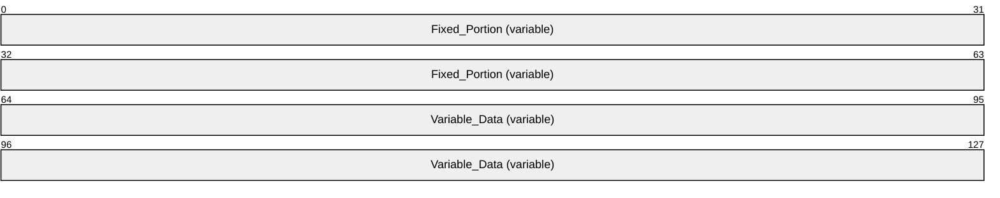

**Fixed_Portion (variable):** A sequence of fields, each with a fixed-length data type.

**Variable_Data (variable):** A sequence of zero or more optional fields (or variable-length fields). The data in this field is referenced by offset from the **Fixed_Portion** block.

<a id="Section_2.2.1.2"></a>
#### 2.2.1.2 Array of N Data Type Instances

In this case, the custom-marshaled data contains *N* **Fixed_Portion** blocks (one for each structure) followed by the **Variable_Data** block containing data referenced by offsets from all *N* **Fixed_Portion** blocks.


**Fixed_Portion_1 (variable):** The **Fixed_Portion** of the first data type instance in the array.

**Fixed_Portion_N (variable):** The **Fixed_Portion** of the last data type instance in the array.

**Variable_Data (variable):** A sequence of zero or more optional fields (or variable-length fields). The data in this field is referenced by offset from the **Fixed_Portion** blocks.

<a id="Section_2.2.1.3"></a>
#### 2.2.1.3 Marshaling Referenced Data Types

This section describes an array of N data type instances, each referencing by offset another data type instance.

In this case, the custom-marshaled data contains *N* **Fixed_Portion** blocks (one for each main data type instance), followed by *M* additional **Fixed_Portion** blocks (one for each referenced data type instances), followed by the **Variable_Data** block containing data referenced by offset from all **Fixed_Portion** blocks. The order in which the referenced data type instances **Fixed_Portion** block arrays are marshaled is the order in which the corresponding offset fields are defined in the main data type instance.

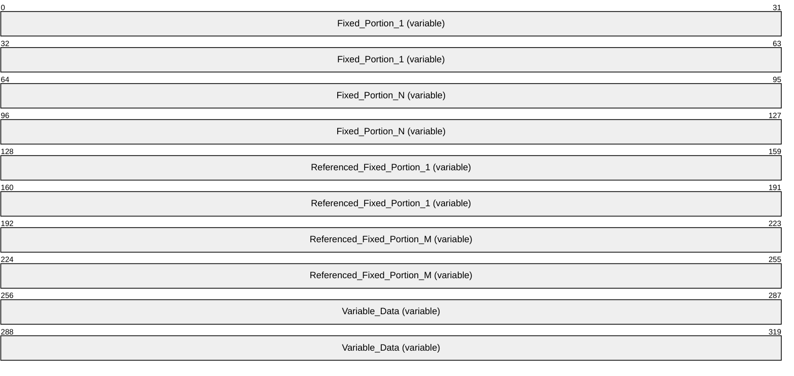

**Fixed_Portion_1 (variable):** The **Fixed_Portion** block of the first data type instance in the array.

**Fixed_Portion_N (variable):** The **Fixed_Portion** block of the last data type instance in the array.

**Referenced_Fixed_Portion_1 (variable):** The **Fixed_Portion** block of the first referenced data type instance in the array.

**Referenced_Fixed_Portion_M (variable):** The **Fixed_Portion** block of the last referenced data type instance in the array.

**Variable_Data (variable):** A sequence of zero or more optional fields (or variable-length fields). The data in this field is referenced by offset from the **Fixed_Portion** blocks and the **Referenced_Fixed_Portion** blocks.

<a id="Section_2.2.2"></a>
### 2.2.2 FAX_ENUM_MESSAGE_FOLDER

The **FAX_ENUM_MESSAGE_FOLDER** enumeration defines possible locations for a [**fax message**](#gt_fax-message).

typedef enum

{

FAX_MESSAGE_FOLDER_INBOX = 0x00000000,

FAX_MESSAGE_FOLDER_SENTITEMS = 0x00000001,

FAX_MESSAGE_FOLDER_QUEUE = 0x00000002

} FAX_ENUM_MESSAGE_FOLDER;

**FAX_MESSAGE_FOLDER_INBOX:** The incoming fax transmission [**archive**](#gt_archive), defined in section [3.1.1](#Section_3.1.1).

**FAX_MESSAGE_FOLDER_SENTITEMS:** The outgoing fax transmission archive, defined in section 3.1.1.

**FAX_MESSAGE_FOLDER_QUEUE:** The Outgoing and Incoming [**fax queue**](#gt_fax-queue), defined in section 3.1.1.

<a id="Section_2.2.3"></a>
### 2.2.3 FAX_ENUM_CONFIG_OPTION

The **FAX_ENUM_CONFIG_OPTION** enumeration identifies the configuration option to be returned by the **FAX_GetConfigOption** (section [3.1.4.1.35](#Section_3.1.4.1.35)) method.

typedef enum

{

FAX_CONFIG_OPTION_ALLOW_PERSONAL_CP = 0x00000000,

FAX_CONFIG_OPTION_QUEUE_STATE = 0x00000001,

FAX_CONFIG_OPTION_ALLOWED_RECEIPTS = 0x00000002,

FAX_CONFIG_OPTION_INCOMING_FAXES_PUBLIC = 0x00000003

} FAX_ENUM_CONFIG_OPTION;

**FAX_CONFIG_OPTION_ALLOW_PERSONAL_CP:** Represents whether the server allows personal cover pages.

**FAX_CONFIG_OPTION_QUEUE_STATE:** Corresponds to the state of the queue in **Queue State**.

**FAX_CONFIG_OPTION_ALLOWED_RECEIPTS:** Corresponds to the type of receipts the server is configured to send.

**FAX_CONFIG_OPTION_INCOMING_FAXES_PUBLIC:** Corresponds to the viewing permissions of incoming faxes.

<a id="Section_2.2.4"></a>
### 2.2.4 FAX_ENUM_PERSONAL_PROF_TYPES

The **FAX_ENUM_PERSONAL_PROF_TYPES** enumeration defines values to indicate **personal profile** types.

typedef enum

{

RECIPIENT_PERSONAL_PROF = 1,

SENDER_PERSONAL_PROF = 2

} FAX_ENUM_PERSONAL_PROF_TYPES;

**RECIPIENT_PERSONAL_PROF:** Indicates a [**recipient**](#gt_recipient) profile.

**SENDER_PERSONAL_PROF:** Indicates a sender profile.

<a id="Section_2.2.5"></a>
### 2.2.5 FAX_JOB_ENTRY

The **FAX_JOB_ENTRY** structure describes one [**fax job**](#gt_fax-job). The structure includes information about the job type and status, the recipient's and the sender's **personal profiles** (section [3.1.1](#Section_3.1.1)), scheduling and delivery settings, and the page count.

This structure is used as an input argument for the **FaxObs_SetJob** (section [3.1.4.2.11](#Section_3.1.4.2.11)) method.

typedef struct {

DWORD SizeOfStruct;

DWORD JobId;

LPCWSTR UserName;

DWORD JobType;

DWORD QueueStatus;

DWORD Status;

DWORD Size;

DWORD PageCount;

LPCWSTR RecipientNumber;

LPCWSTR RecipientName;

LPCWSTR Tsid;

LPCWSTR SenderName;

LPCWSTR SenderCompany;

LPCWSTR SenderDept;

LPCWSTR BillingCode;

DWORD ScheduleAction;

SYSTEMTIME ScheduleTime;

DWORD DeliveryReportType;

LPCWSTR DeliveryReportAddress;

LPCWSTR DocumentName;

} FAX_JOB_ENTRY,

*PFAX_JOB_ENTRY;

**SizeOfStruct:** A **DWORD** ([MS-DTYP](../MS-DTYP/MS-DTYP.md) section 2.2.9) that indicates the size, in bytes, of the **FAX_JOB_ENTRY** structure. This value MUST be 92 or 136 bytes. When filled in on a 32-bit implementation, this value SHOULD be 92 bytes. When filled in on a 64-bit implementation, this value SHOULD be 136 bytes.

**JobId:** A **DWORD** that indicates a unique number that identifies the fax jobs of interest. This is the same kind of job identifier number as the *JobId* parameter for the **FAX_SetJob** (section [3.1.4.1.82](#Section_3.1.4.1.82)) function.

**UserName:** A null-terminated character string that contains the name of the fax user account that submitted the fax job, if known; otherwise, a NULL pointer.

**JobType:** A **DWORD** that indicates the type of the fax job of interest. This field is one of the following values, which are defined in section 3.1.1.

| Value/code | Meaning |
| --- | --- |
| 0x00000000 | The job type is JT_UNKNOWN. |
| 0x00000001 | The job type is JT_SEND. |
| 0x00000002 | The job type is JT_RECEIVE. |
| 0x00000003 | The job type is JT_ROUTING. |
| 0x00000004 | The job type is JT_FAIL_RECEIVE. |

**QueueStatus:** A **DWORD** variable containing a set of bit flags indicating the job status of the fax job identified by the **JobId** field. This value MUST be a bitwise OR combination of one or more of the **Job Status** values listed in section 3.1.1.

**Status:** A **DWORD** that specifies the status of the fax [**device (or port)**](#gt_device-or-port) that received or sent the fax job described by this structure, captured at the time the job information was recorded. This member SHOULD be ignored when this structure is used as an input argument for the **FaxObs_SetJob** method. This value MUST be one of the following predefined device status codes.

| Value/code | Meaning |
| --- | --- |
| FPS_UNKNOWN 0x00000000 | The status of the device is unknown. |
| FPS_DIALING 0x20000001 | The device is dialing a fax number. |
| FPS_SENDING 0x20000002 | The device is sending a [**fax document**](#gt_fax-document). |
| FPS_RECEIVING 0x20000004 | The device is receiving a fax document. |
| FPS_COMPLETED 0x20000008 | The device completed sending or receiving a fax transmission. |
| FPS_HANDLED 0x20000010 | The fax service processed the outbound fax document; the [**fax service provider (FSP)**](#gt_fax-service-provider-fsp) will transmit the fax document. |
| FPS_UNAVAILABLE 0x20000020 | The device is not available because it is in use by another application. |
| FPS_BUSY 0x20000040 | The device encountered a busy signal. |
| FPS_NO_ANSWER 0x20000080 | The receiving device did not answer the call. |
| FPS_BAD_ADDRESS 0x20000100 | The device dialed an invalid fax number. |
| FPS_NO_DIAL_TONE 0x20000200 | The sending device cannot complete the call because it does not detect a dial tone. |
| FPS_DISCONNECTED 0x20000400 | The fax call was disconnected by the sender or the caller. |
| FPS_FATAL_ERROR 0x20000800 | The device has encountered a fatal protocol error. |
| FPS_NOT_FAX_CALL 0x20001000 | The device received a call that was a data call or a voice call. |
| FPS_CALL_DELAYED 0x20002000 | The device delayed a fax call because the sending device received a busy signal multiple times. The device cannot retry the call because dialing restrictions exist (some countries and regions restrict the number of retry attempts when a number is busy). |
| FPS_CALL_BLACKLISTED 0x20004000 | The device could not complete a call because the telephone number was blocked or reserved; emergency numbers such as 911 are blocked. |
| FPS_INITIALIZING 0x20008000 | The device is initializing a call. |
| FPS_OFFLINE 0x20010000 | The device is offline and unavailable. |
| FPS_RINGING 0x20020000 | The device is ringing. |
| FPS_AVAILABLE 0x20100000 | The device is available. |
| FPS_ABORTING 0x20200000 | The device is aborting a fax job. |
| FPS_ROUTING 0x20400000 | The device is [**routing**](#gt_routing) a received fax document. |
| FPS_ANSWERED 0x20800000 | The device answered a new call. |

**Size:** A **DWORD** variable that indicates the total size, in bytes, of the fax document to transmit, if known, or zero otherwise. The size, if known, includes the size of the cover page, if a cover page is present, and the size of the [**fax body**](#gt_fax-body), if a fax body is present. The size MUST NOT exceed 4 gigabytes.

**PageCount:** A **DWORD** that indicates the total number of pages in the fax transmission, including the cover page, if any, and the fax body, if any, of the fax submitted with this fax job. If the fax is sent to multiple recipients, this total number of pages is the number of fax pages sent to each individual recipient (not the sum of the fax pages sent to all recipients).

**RecipientNumber:** A null-terminated character string that contains the fax number of the recipient of the fax transmission, if known, or a NULL pointer otherwise. This information comes from the recipient's **personal profile**.

**RecipientName:** A null-terminated character string that contains the name of the recipient of the fax, if known, or a NULL pointer otherwise. This information comes from the recipient's **personal profile**.

**Tsid:** A null-terminated character string that contains the [**transmitting subscriber identifier (TSID)**](#gt_transmitting-subscriber-identifier-tsid), if known, or a NULL pointer otherwise. This information comes from the sender's **personal profile**.

**SenderName:** A null-terminated character string that contains the fax sender name, if known, or a NULL pointer otherwise. This information comes from the sender's **personal profile**.

**SenderCompany:** A null-terminated character string that contains the fax sender company, if known, or a NULL pointer otherwise. This information comes from the sender's **personal profile**.

**SenderDept:** A null-terminated character string that contains the fax sender department, if known, or a NULL pointer otherwise. This information comes from the sender's **personal profile**.

**BillingCode:** A null-terminated character string that contains the fax billing code, if known, or a NULL pointer otherwise.

**ScheduleAction:** A **DWORD** that indicates when the fax is to be sent. This can be one of the following values:

| Value/code | Meaning |
| --- | --- |
| JSA_NOW 0x00000000 | The fax is to be sent as soon as a fax device is available. |
| JSA_SPECIFIC_TIME 0x00000001 | The fax is to be sent at the time specified by the **ScheduleTime** field of this **FAX_JOB_ENTRY** structure. |
| JSA_DISCOUNT_PERIOD 0x00000002 | The fax is to be sent during the discount rate period. The **FaxObs_GetConfiguration** (section [3.1.4.2.24](#Section_3.1.4.2.24)) method can be called to retrieve the discount period for the fax server. |

**ScheduleTime:** A **SYSTEMTIME** ([MS-DTYP] section 2.3.13) structure indicating the local date and time to send the fax, in [**Coordinated Universal Time (UTC)**](#gt_coordinated-universal-time-utc) format. This parameter MUST be ignored unless the *ScheduleAction* parameter is set to 1 (JSA_SPECIFIC_TIME).

**DeliveryReportType:** A **DWORD** variable that indicates the fax delivery report type. This value MUST be one of the **FAX_ENUM_DELIVERY_REPORT_TYPES** (section [2.2.76](#Section_2.2.76)) enumeration values. The DRT_ATTACH_FAX value can be combined with the DRT_EMAIL value by an OR operation.

**DeliveryReportAddress:** A null-terminated character string that contains the email address for the delivery report, if known, or a NULL pointer otherwise.

**DocumentName:** A null-terminated character string that contains the document name, if known, or a NULL pointer otherwise.

<a id="Section_2.2.6"></a>
### 2.2.6 _FAX_JOB_ENTRY

The **_FAX_JOB_ENTRY** structure is the custom-marshaled variant of the **FAX_JOB_ENTRY** (section [2.2.5](#Section_2.2.5)) structure and describes one [**fax job**](#gt_fax-job). The structure includes information about the job type and status, the **personal profiles** (section [3.1.1](#Section_3.1.1)) of the [**recipient**](#gt_recipient) and sender, scheduling and delivery settings, and the page count. The **SizeOfStruct**, **RecipientNumber**, and **QueueStatus** fields in the **Fixed_Portion** block MUST NOT be 0. Except for these fields and the **JobId** field, all fields of this structure are optional, and if the respective information is not available, the fields in the **Fixed_Portion** block MUST be zero.

An application can call the **FAX_GetJob** (section [3.1.4.1.41](#Section_3.1.4.1.41)) method to retrieve information about a specified job at the server, information which is returned in a **_FAX_JOB_ENTRY** structure.

An application can call the **FAX_EnumJobs** function (section [3.1.4.1.21](#Section_3.1.4.1.21)) to enumerate all [**queued**](#gt_queue) and active fax jobs (see **Fax Queue** in section 3.1.1 for details) on the fax server of interest. The **FAX_EnumJobs** function returns an array of **_FAX_JOB_ENTRY** structures. Each structure describes one fax job in detail.

This structure is also returned as a single structure by the **FaxObs_GetJob** (section [3.1.4.2.10](#Section_3.1.4.2.10)) method and as an array of structures by the **FaxObs_EnumJobs** (section [3.1.4.2.9](#Section_3.1.4.2.9)) method.

This data structure is custom marshaled as follows and uses the custom-marshaling rules defined in section [2.2.1](#Section_2.2.1).


**Fixed_Portion (92 bytes):**

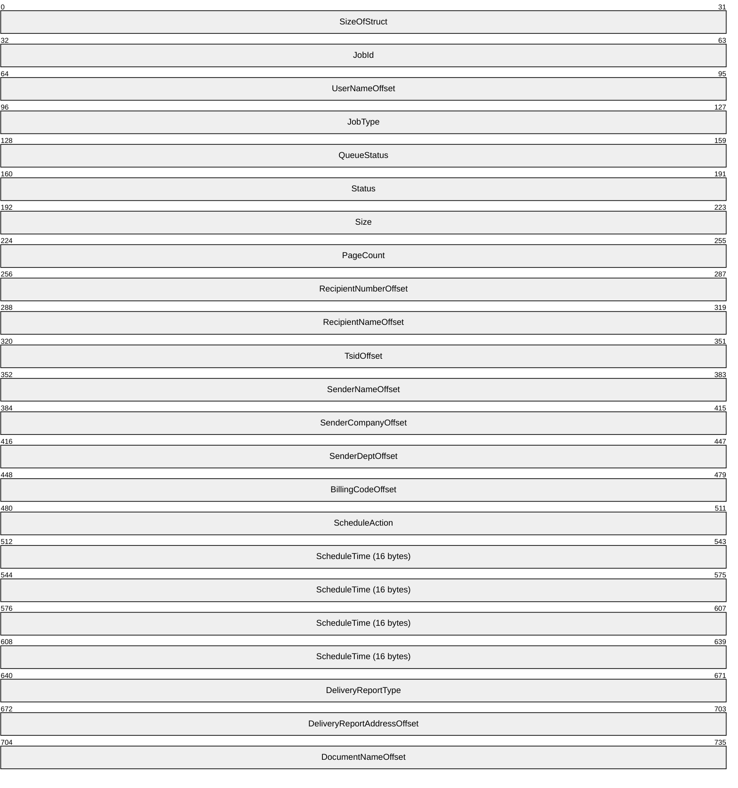

**SizeOfStruct (4 bytes):** A **DWORD** ([MS-DTYP](../MS-DTYP/MS-DTYP.md) section 2.2.9) that indicates the size, in bytes, of the **_FAX_JOB_ENTRY** structure. MUST be set to 92 bytes.

**JobId (4 bytes):** A **DWORD** that indicates a unique number that identifies the fax jobs of interest. This is the same kind of job identifier number as the *JobId* parameter for the **FAX_SetJob** (section [3.1.4.1.82](#Section_3.1.4.1.82)) function.

**UserNameOffset (4 bytes):** Offset to the **UserName** field in the **Variable_Data** portion of the structure.

**JobType (4 bytes):** A **DWORD** variable that indicates the type of the fax job of interest. This field is one of the following values, which are defined in section 3.1.1.

| Value/code | Meaning |
| --- | --- |
| 0x00000000 | The job type is JT_UNKNOWN. |
| 0x00000001 | The job type is JT_SEND. |
| 0x00000002 | The job type is JT_RECEIVE. |
| 0x00000003 | The job type is JT_ ROUTING. |
| 0x00000004 | The job type is JT_FAIL_RECEIVE. |
| 0x00000020 | The job type is JT_BROADCAST.<2> |

**QueueStatus (4 bytes):** A **DWORD** variable containing a set of bit flags indicating the job status of the fax job identified by the **JobId** field. This field MUST be a bitwise OR combination of one or more of the **Job Status** values listed in section 3.1.1.

**Status (4 bytes):** A **DWORD** that specifies the status of the fax device that received or sent the fax job described by this structure, captured at the time the job information was recorded. This value MUST be one of the following predefined device status codes.

| Value/code | Meaning |
| --- | --- |
| FPS_UNKNOWN 0x00000000 | The status of the device is unknown. |
| FPS_DIALING 0x20000001 | The device is dialing a fax number. |
| FPS_SENDING 0x20000002 | The device is sending a [**fax document**](#gt_fax-document). |
| FPS_RECEIVING 0x20000004 | The device is receiving a fax document. |
| FPS_COMPLETED 0x20000008 | The device completed sending or receiving a fax transmission. |
| FPS_HANDLED 0x20000010 | The fax service processed the outbound fax document; the [**fax service provider (FSP)**](#gt_fax-service-provider-fsp) will transmit the fax document. |
| FPS_UNAVAILABLE 0x20000020 | The device is not available because it is in use by another application. |
| FPS_BUSY 0x20000040 | The device encountered a busy signal. |
| FPS_NO_ANSWER 0x20000080 | The receiving device did not answer the call. |
| FPS_BAD_ADDRESS 0x20000100 | The device dialed an invalid fax number. |
| FPS_NO_DIAL_TONE 0x20000200 | The sending device cannot complete the call because it does not detect a dial tone. |
| FPS_DISCONNECTED 0x20000400 | The fax call was disconnected by the sender or the caller. |
| FPS_FATAL_ERROR 0x20000800 | The device has encountered a fatal protocol error. |
| FPS_NOT_FAX_CALL 0x20001000 | The device received a call that was a data call or a voice call. |
| FPS_CALL_DELAYED 0x20002000 | The device delayed a fax call because the sending device received a busy signal multiple times. The device cannot retry the call because dialing restrictions exist (some countries and regions restrict the number of retry attempts when a number is busy). |
| FPS_CALL_BLACKLISTED 0x20004000 | The device could not complete a call because the telephone number was blocked or reserved; emergency numbers such as 911 are blocked. |
| FPS_INITIALIZING 0x20008000 | The device is initializing a call. |
| FPS_OFFLINE 0x20010000 | The device is offline and unavailable. |
| FPS_RINGING 0x20020000 | The device is ringing. |
| FPS_AVAILABLE 0x20100000 | The device is available. |
| FPS_ABORTING 0x20200000 | The device is aborting a fax job. |
| FPS_ROUTING 0x20400000 | The device is [**routing**](#gt_routing) a received fax document. |
| FPS_ANSWERED 0x20800000 | The device answered a new call. |

**Size (4 bytes):** A **DWORD** variable that indicates the total size, in bytes, of the fax document received or sent, including the size of the cover page, if a cover page is present, and the size of the [**fax body**](#gt_fax-body), if a fax body is present. The size MUST NOT exceed 4 gigabytes.

**PageCount (4 bytes):** A **DWORD** variable that indicates the total number of pages in the fax transmission.

**RecipientNumberOffset (4 bytes):** Offset to the **RecipientNumber** field in the **Variable_Data** portion of the structure.

**RecipientNameOffset (4 bytes):** Offset to the **RecipientName** field in the **Variable_Data** portion of the structure.

**TsidOffset (4 bytes):** Offset to the **Tsid** field in the **Variable_Data** portion of the structure.

**SenderNameOffset (4 bytes):** Offset to the **SenderName** field in the **Variable_Data** portion of the structure.

**SenderCompanyOffset (4 bytes):** Offset to the **SenderCompany** field in the **Variable_Data** portion of the structure.

**SenderDeptOffset (4 bytes):** Offset to the **SenderDepth** field in the **Variable_Data** portion of the structure.

**BillingCodeOffset (4 bytes):** Offset to the **BillingCode** field in the **Variable_Data** portion of the structure.

**ScheduleAction (4 bytes):** A **DWORD** variable that indicates how the fax was configured or is configured to be sent if this job is an outgoing fax transmission; otherwise, this parameter SHOULD be ignored. This value can be one of the following values.

| Value/code | Meaning |
| --- | --- |
| JSA_NOW 0x00000000 | The fax is to be sent as soon as a fax device is available. |
| JSA_SPECIFIC_TIME 0x00000001 | The fax is to be sent at the time specified by the **ScheduleTime** field of this **_FAX_JOB_ENTRY** structure. |
| JSA_DISCOUNT_PERIOD 0x00000002 | The fax is to be sent during the discount rate period. The **FAX_GetConfiguration** (section [3.1.4.1.36](#Section_3.1.4.1.36)) or the **FaxObs_GetConfiguration** (section [3.1.4.2.24](#Section_3.1.4.2.24)) method can be called to retrieve the discount period for the fax server. |

**ScheduleTime (16 bytes):** A **SYSTEMTIME** ([MS-DTYP] section 2.3.13) structure indicating the local date and time when the fax was sent or configured to be sent, in [**UTC**](#gt_coordinated-universal-time-utc) format. This parameter SHOULD be ignored unless the *ScheduleAction* parameter is set to 1 (JSA_SPECIFIC_TIME) and this job is an outgoing fax transmission.

**DeliveryReportType (4 bytes):** A **DWORD** variable that indicates the fax delivery report type. This value can be one of the **FAX_ENUM_DELIVERY_REPORT_TYPES** (section [2.2.76](#Section_2.2.76)) enumeration values. The DRT_ATTACH_FAX value can be combined with the DRT_EMAIL value in one value by an OR operation.

**DeliveryReportAddressOffset (4 bytes):** Offset to the **DeliveryReportAddress** field in the **Variable_Data** portion of the structure.

**DocumentNameOffset (4 bytes):** Offset to the **DocumentName** field in the **Variable_Data** portion of the structure.

**Variable_Data (variable):**

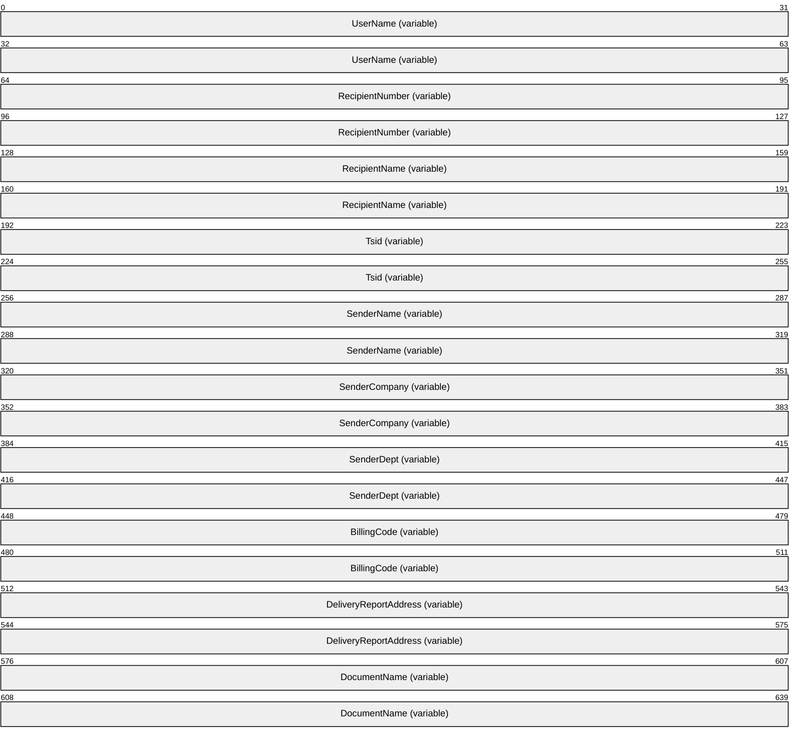

**UserName (variable):** A null-terminated character string that contains the name of the fax user account that submitted the fax job.

**RecipientNumber (variable):** A null-terminated character string that contains the fax number of the recipient of the fax transmission. This information comes from the recipient's **personal profile**.

**RecipientName (variable):** A null-terminated character string that contains the name of the recipient of the fax. This information comes from the recipient's **personal profile**.

**Tsid (variable):** A null-terminated character string that contains the transmitting subscriber identifier (TSID). This information comes from the sender's **personal profile**.

**SenderName (variable):** A null-terminated character string that contains the fax sender name. This information comes from the sender's **personal profile**.

**SenderCompany (variable):** A null-terminated character string that contains the fax sender company. This information comes from the sender's **personal profile**.

**SenderDept (variable):** A null-terminated character string that contains the fax sender department. This information comes from the sender's **personal profile**.

**BillingCode (variable):** A null-terminated character string that contains the fax billing code.

**DeliveryReportAddress (variable):** A null-terminated character string that contains the email address for the delivery report.

**DocumentName (variable):** A null-terminated character string that contains the document name.

<a id="Section_2.2.7"></a>
### 2.2.7 FAX_PORT_INFO

The **FAX_PORT_INFO** structure describes one fax port. The data includes, among other items, a device identifier, the port's name and current status, and subscriber identifiers.

A fax client application passes the **FAX_PORT_INFO** in a call to the **FAX_SetPort** (section [3.1.4.1.88](#Section_3.1.4.1.88)) function to modify the configuration of the fax port of interest.

This structure is also used as an input argument for the **FaxObs_SetPort** (section [3.1.4.2.17](#Section_3.1.4.2.17)) method.

typedef struct {

DWORD SizeOfStruct;

DWORD DeviceId;

DWORD State;

DWORD Flags;

DWORD Rings;

DWORD Priority;

[string] LPCWSTR DeviceName;

[string] LPCWSTR Tsid;

[string] LPCWSTR Csid;

} FAX_PORT_INFO,

*PFAX_PORT_INFO;

**SizeOfStruct:** A **DWORD** ([MS-DTYP](../MS-DTYP/MS-DTYP.md) section 2.2.9) that holds the size of the structure, in bytes. This value MUST be 36 bytes or 48 bytes. When filled in on a 32-bit implementation, this value SHOULD be 36 bytes. When filled in on a 64-bit implementation, this value SHOULD be 48 bytes.

**DeviceId:** A **DWORD** variable that holds the line identifier for the fax device (port) of interest.

**State:** A **DWORD** variable that holds a fax device status code or value. This member can be one of the following predefined device status codes.

| Value/code | Meaning |
| --- | --- |
| FPS_DIALING 0x20000001 | The device is dialing a fax number. |
| FPS_SENDING 0x20000002 | The device is sending a [**fax document**](#gt_fax-document). |
| FPS_RECEIVING 0x20000004 | The device is receiving a fax document. |
| FPS_COMPLETED 0x20000008 | The device completed sending or receiving a fax transmission. |
| FPS_HANDLED 0x20000010 | The fax service processed the outbound fax document; the [**fax service provider (FSP)**](#gt_fax-service-provider-fsp) will transmit the fax document. |
| FPS_UNAVAILABLE 0x20000020 | The device is not available because it is in use by another application. |
| FPS_BUSY 0x20000040 | The device encountered a busy signal. |
| FPS_NO_ANSWER 0x20000080 | The receiving device did not answer the call. |
| FPS_BAD_ADDRESS 0x20000100 | The device dialed an invalid fax number. |
| FPS_NO_DIAL_TONE 0x20000200 | The sending device cannot complete the call because it does not detect a dial tone. |
| FPS_DISCONNECTED 0x20000400 | The fax call was disconnected by the sender or the caller. |
| FPS_FATAL_ERROR 0x20000800 | The device has encountered a fatal protocol error. |
| FPS_NOT_FAX_CALL 0x20001000 | The device received a call that was a data call or a voice call. |
| FPS_CALL_DELAYED 0x20002000 | The device delayed a fax call because the sending device received a busy signal multiple times. The device cannot retry the call because dialing restrictions exist (some countries and regions restrict the number of retry attempts when a number is busy). |
| FPS_CALL_BLACKLISTED 0x20004000 | The device could not complete a call because the telephone number was blocked or reserved; emergency numbers such as 911 are blocked. |
| FPS_INITIALIZING 0x20008000 | The device is initializing a call. |
| FPS_OFFLINE 0x20010000 | The device is offline and unavailable. |
| FPS_RINGING 0x20020000 | The device is ringing. |
| FPS_AVAILABLE 0x20100000 | The device is available. |
| FPS_ABORTING 0x20200000 | The device is aborting a fax job. |
| FPS_ROUTING 0x20400000 | The device is [**routing**](#gt_routing) a received fax document. |
| FPS_ANSWERED 0x20800000 | The device answered a new call. |

**Flags:** A **DWORD** variable that holds a set of bit flags that specify the capability of the fax port. This member can be a bitwise OR combination of the following flag values.

| Value/code | Meaning |
| --- | --- |
| FPF_RECEIVE 0x00000001 | The device can receive faxes. |
| FPF_SEND 0x00000002 | The device can send faxes. |
| FPF_VIRTUAL 0x00000004 | The device is a [**virtual fax device**](#gt_virtual-fax-device). Note that the implementer cannot set a device to be virtual. When **FAX_GetPort** (section [3.1.4.1.51](#Section_3.1.4.1.51)) is called, the FAX_PORT_INFO flag's FPF_VIRTUAL value indicates whether the device is virtual. When **FAX_SetPort** (section 3.1.4.1.88) is called, the service will only relate to the FPF_RECEIVE and FPF_SEND values. |

**Rings:** A **DWORD** variable that holds the number of times an incoming fax call rings before the specified device answers the call. Values can be from 0 to 99 inclusive. This value SHOULD be ignored unless the FPF_RECEIVE port capability bit flag is set.

**Priority:** A **DWORD** variable that holds the priority that determines the relative order in which available fax devices send outgoing transmissions. Values for this member can be 1 through n, where n is the value of the *PortsReturned* parameter returned by a call to the **FAX_EnumPorts** (section [3.1.4.1.28](#Section_3.1.4.1.28)) function. When the fax server initiates an outgoing fax transmission, it attempts to select the device with the highest priority and FPF_SEND port capability. If that device is not available, the server selects the next available device that follows in rank order, and so on. The value of the **Priority** member has no effect on incoming transmissions.

**DeviceName:** A pointer to a constant null-terminated character string that holds the name of the fax device of interest.

**Tsid:** A pointer to a constant null-terminated character string that holds the [**transmitting subscriber identifier (TSID)**](#gt_transmitting-subscriber-identifier-tsid). This identifier is usually a telephone number. Only English letters, numeric symbols, and punctuation marks (ASCII range 0x20 to 0x7F) can be used in a TSID.

**Csid:** A pointer to a constant null-terminated character string that holds the called subscriber identifier ([**CSID**](#gt_csid)). This identifier is usually a telephone number. Only English letters, numeric symbols, and punctuation marks (ASCII range 0x20 to 0x7F) can be used in a CSID.

<a id="Section_2.2.8"></a>
### 2.2.8 _FAX_PORT_INFO

The **_FAX_PORT_INFO** data structure is the custom-marshaled variant of the **FAX_PORT_INFO** (section [2.2.7](#Section_2.2.7)) data structure. This structure describes one fax port. The data includes, among other items, a device identifier, the port's name and current status, and subscriber identifiers.

If an application calls the **FAX_EnumPorts** (section [3.1.4.1.28](#Section_3.1.4.1.28)) function to enumerate all the fax devices currently attached to a fax server, the function returns a byte array of **_FAX_PORT_INFO** structures. Each structure describes one device in detail.

If an application calls the **FAX_GetPort** (section [3.1.4.1.51](#Section_3.1.4.1.51)) function to query one device, that function returns information about the device in one **_FAX_PORT_INFO**.

This structure is also returned as a single structure by the **FaxObs_GetPort** (section [3.1.4.2.16](#Section_3.1.4.2.16)) method and as an array of structures by the **FaxObs_EnumPorts** (section [3.1.4.2.15](#Section_3.1.4.2.15)) method.

This data structure is custom marshaled as follows and uses the custom-marshaling rules defined in section [2.2.1](#Section_2.2.1).


**Fixed_Portion (36 bytes):**


**SizeOfStruct (4 bytes):** A **DWORD** ([MS-DTYP](../MS-DTYP/MS-DTYP.md) section 2.2.9) that holds the size of the **Fixed_Portion** block, in bytes. This value MUST be 36 bytes.

**DeviceId (4 bytes):** See the **DeviceId** field for **FAX_PORT_INFO**.

**State (4 bytes):** See the **State** field for **FAX_PORT_INFO**.

**Flags (4 bytes):** See the **Flags** field for **FAX_PORT_INFO**.

**Rings (4 bytes):** See the **Rings** field for **FAX_PORT_INFO**.

**Priority (4 bytes):** See the **Priority** field for **FAX_PORT_INFO**.

**DeviceNameOffset (4 bytes):** Offset to the **DeviceName** field in the **Variable_Data** portion of the structure.

**TsidOffset (4 bytes):** Offset to the **Tsid** field in the **Variable_Data** portion of the structure.

**CsidOffset (4 bytes):** Offset to the **Csid** field in the **Variable_Data** portion of the structure.

**Variable_Data (variable):**


**DeviceName (variable):** A null-terminated string that holds the name of the fax device of interest.

**Tsid (variable):** A null-terminated string that holds the transmitting subscriber identifier (TSID) with same description as for the **Tsid** field of **FAX_PORT_INFO**.

**Csid (variable):** A null-terminated string that holds the called subscriber identifier (CSID) with same description as for the **Csid** field of **FAX_PORT_INFO**.

<a id="Section_2.2.9"></a>
### 2.2.9 FAX_ROUTING_METHOD

The **FAX_ROUTING_METHOD** structure contains information about one [**fax routing method**](#gt_fax-routing-method) as it pertains to one fax device. This information describes one fax routing method (section [3.1.1](#Section_3.1.1)). The data indicates (among other items) whether the fax routing method is enabled for the device, and the name of the binary that exports the [**routing**](#gt_routing) method. It also includes the [**GUID**](#gt_globally-unique-identifier-guid) and function name that uniquely identify the routing method and the method's user-friendly name.

A fax client application can call the **FAX_EnumRoutingMethods** (section [3.1.4.1.31](#Section_3.1.4.1.31)) or **FaxObs_EnumRoutingMethods** (section [3.1.4.2.18](#Section_3.1.4.2.18)) functions to enumerate all of the fax routing methods associated with a specific fax device. These functions each return an array of **FAX_ROUTING_METHOD** structures. Each structure describes one fax routing method in detail.

Call the **FAX_EnableRoutingMethod** (section [3.1.4.1.14](#Section_3.1.4.1.14)) or the **FaxObs_EnableRoutingMethod** (section [3.1.4.2.19](#Section_3.1.4.2.19)) functions to enable or disable a fax routing method for a specific fax device.

This data structure is custom marshaled as follows and uses the custom-marshaling rules defined in section [2.2.1](#Section_2.2.1).


**Fixed_Portion (36 bytes):**


**SizeOfStruct (4 bytes):** A **DWORD** ([MS-DTYP](../MS-DTYP/MS-DTYP.md) section 2.2.9) value that holds the size of the **Fixed_Portion** block, in bytes. This value MUST be 36 bytes.

**DeviceId (4 bytes):** A **DWORD** that holds the line identifier for the fax device (port) of interest.

**Enabled (4 bytes):** A Boolean that indicates whether the fax routing method is enabled or disabled for the fax device of interest. If this value is equal to TRUE, the fax routing method is enabled for the device.

**DeviceNameOffset (4 bytes):** Offset to the **DeviceName** field in the **Variable_Data** block of the structure.

**GuidOffset (4 bytes):** Offset to the **Guid** field in the **Variable_Data** block of the structure.

**FriendlyNameOffset (4 bytes):** Offset to the **FriendlyName** field in the **Variable_Data** block of the structure.

**FunctionNameOffset (4 bytes):** Offset to the **FunctionName** field in the **Variable_Data** block of the structure.

**ExtensionImageNameOffset (4 bytes):** Offset to the **ExtensionImageName** field in the **Variable_Data** block of the structure.

**ExtensionFriendlyNameOffset (4 bytes):** Offset to the **ExtensionFriendlyName** field in the **Variable_Data** block of the structure.

**Variable_Data (variable):**

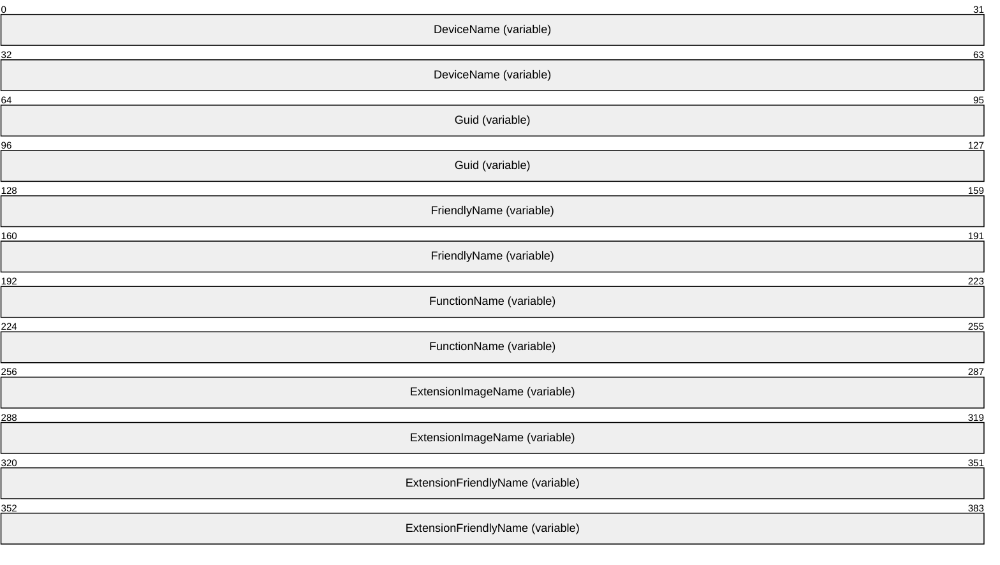

**DeviceName (variable):** A null-terminated character string that holds the name of the fax device.

**Guid (variable):** A null-terminated character string that holds the GUID that uniquely identifies the fax routing method.

**FriendlyName (variable):** A null-terminated character string that holds the user-friendly name to display for the fax routing method.

**FunctionName (variable):** A null-terminated character string that holds the name of the function that executes the specified fax routing procedure. The fax routing extension binary identified by the **ExtensionImageName** field exports the function.

**ExtensionImageName (variable):** A null-terminated character string that holds the name of the fax routing extension binary that implements the fax routing method.

**ExtensionFriendlyName (variable):** A null-terminated character string that holds the user-friendly name to display for the fax routing extension binary.

<a id="Section_2.2.10"></a>
### 2.2.10 FAX_DEVICE_STATUS

The **FAX_DEVICE_STATUS** structure contains information about the current status of a fax device. In addition to the status, the structure includes data about whether the device is currently sending or receiving a fax transmission, device and subscriber identifiers, sender and [**recipient**](#gt_recipient) names, and [**routing**](#gt_routing) information.

The fax client application can call the **FAX_GetDeviceStatus** (section [3.1.4.1.38](#Section_3.1.4.1.38)) function to retrieve status information for the fax device of interest. The function returns the information in a **FAX_DEVICE_STATUS**.

This structure is also returned by the **FaxObs_GetDeviceStatus** (section [3.1.4.2.13](#Section_3.1.4.2.13)) method.

This data structure is custom marshaled as follows and uses the custom-marshaling rules defined in section [2.2.1](#Section_2.2.1).


**Fixed_Portion (88 bytes):**

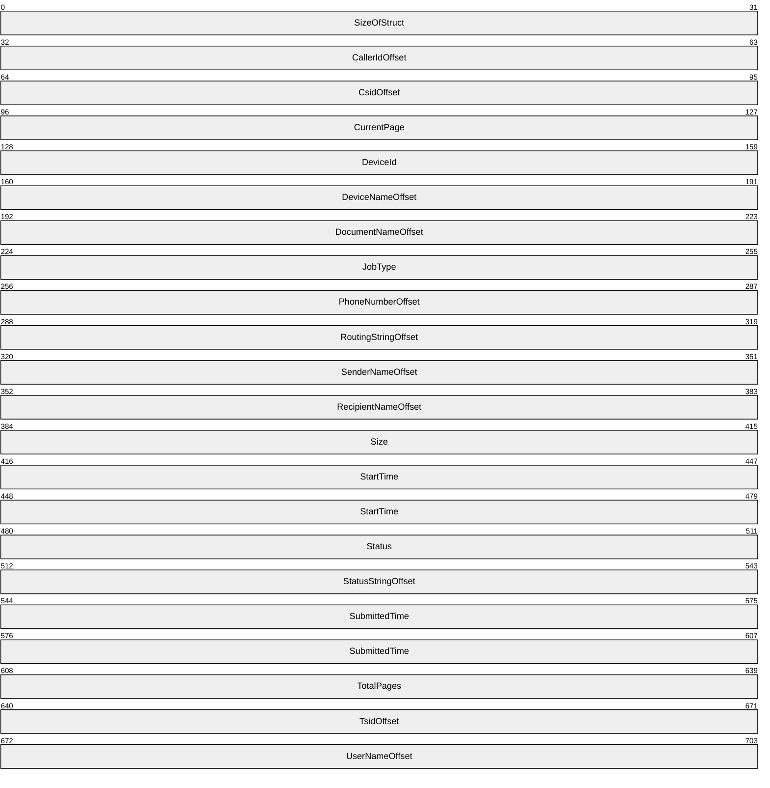

**SizeOfStruct (4 bytes):** A **DWORD** [MS-DTYP](../MS-DTYP/MS-DTYP.md) (section 2.2.9) that holds the size of the **Fixed_Portion** block, in bytes. This value MUST be 88 bytes.

**CallerIdOffset (4 bytes):** Offset to the **CallerId** field in the **Variable_Data** portion of the structure. If the **JobType** field is not equal to the JT_RECEIVE job type, this field SHOULD be zero.

**CsidOffset (4 bytes):** Offset to the **Csid** field in the **Variable_Data** portion of the structure.

**CurrentPage (4 bytes):** A **DWORD** that holds the current page number of the fax transmission, if any, that the fax device is currently sending or receiving. If the device is not sending or receiving a fax, this field MUST be zero.

**DeviceId (4 bytes):** A **DWORD** that holds the line identifier for the fax device (port) of interest.

**DeviceNameOffset (4 bytes):** Offset to the **DeviceName** field in the **Variable_Data** portion of the structure.

**DocumentNameOffset (4 bytes):** Offset to the **DocumentName** field in the **Variable_Data** portion of the structure.

**JobType (4 bytes):** A **DWORD** that holds the type of [**fax job**](#gt_fax-job) that is currently active on the device. This field is one of the following values.

| Value/code | Meaning |
| --- | --- |
| JT_UNKNOWN 0x00000000 | The fax device is in an unknown or idle state. |
| JT_SEND 0x00000001 | The fax device is sending a [**fax document**](#gt_fax-document). |
| JT_RECEIVE 0x00000002 | The fax device is receiving a fax document. |

**PhoneNumberOffset (4 bytes):** Offset to the **PhoneNumber** field in the **Variable_Data** portion of the structure. If the **JobType** field is not equal to the JT_SEND job type, this field SHOULD be zero.

**RoutingStringOffset (4 bytes):** If the **JobType** field is not equal to the JT_RECEIVE job type, this field SHOULD be zero. Otherwise, this field MAY be a nonzero offset to the **RoutingString** field in the **Variable_Data** portion of the structure.

**SenderNameOffset (4 bytes):** Offset to the **SenderName** field in the **Variable_Data** portion of the structure.

**RecipientNameOffset (4 bytes):** Offset to the **RecipientName** field in the **Variable_Data** portion of the structure.

**Size (4 bytes):** A **DWORD** that holds the size, in bytes, of the active fax document. If the **JobType** field is JT_SEND, this field SHOULD contain the total size of the active fax document being transmitted at the device, including the size of the cover page and the size of the [**fax body**](#gt_fax-body), if present. Otherwise, this field SHOULD be zero.

**StartTime (8 bytes):** A **FILETIME** ([MS-DTYP] section 2.3.3) structure that specifies the starting time of the current fax job. The time is expressed in [**Coordinated Universal Time (UTC)**](#gt_coordinated-universal-time-utc).

**Status (4 bytes):** A **DWORD** variable that holds a fax device status code or value. This field is one of the following predefined device status codes.

| Value/code | Meaning |
| --- | --- |
| FPS_DIALING 0x20000001 | The device is dialing a fax number. |
| FPS_SENDING 0x20000002 | The device is sending a fax document. |
| FPS_RECEIVING 0x20000004 | The device is receiving a fax document. |
| FPS_COMPLETED 0x20000008 | The device completed sending or receiving a fax transmission. |
| FPS_HANDLED 0x20000010 | The fax service processed the outbound fax document; the [**fax service provider (FSP)**](#gt_fax-service-provider-fsp) will transmit the fax document. |
| FPS_UNAVAILABLE 0x20000020 | The device is not available because it is in use by another application. |
| FPS_BUSY 0x20000040 | The device encountered a busy signal. |
| FPS_NO_ANSWER 0x20000080 | The receiving device did not answer the call. |
| FPS_BAD_ADDRESS 0x20000100 | The device dialed an invalid fax number. |
| FPS_NO_DIAL_TONE 0x20000200 | The sending device cannot complete the call because it does not detect a dial tone. |
| FPS_DISCONNECTED 0x20000400 | The fax call was disconnected by the sender or the caller. |
| FPS_FATAL_ERROR 0x20000800 | The device has encountered a fatal protocol error. |
| FPS_NOT_FAX_CALL 0x20001000 | The device received a call that was a data call or a voice call. |
| FPS_CALL_DELAYED 0x20002000 | The device delayed a fax call because the sending device received a busy signal multiple times. The device cannot retry the call because dialing restrictions exist (some countries and regions restrict the number of retry attempts when a number is busy). |
| FPS_CALL_BLACKLISTED 0x20004000 | The device could not complete a call because the telephone number was blocked or reserved; emergency numbers such as 911 are blocked. |
| FPS_INITIALIZING 0x20008000 | The device is initializing a call. |
| FPS_OFFLINE 0x20010000 | The device is offline and unavailable. |
| FPS_RINGING 0x20020000 | The device is ringing. |
| FPS_AVAILABLE 0x20100000 | The device is available. |
| FPS_ABORTING 0x20200000 | The device is aborting a fax job. |
| FPS_ROUTING 0x20400000 | The device is routing a received fax document. |
| FPS_ANSWERED 0x20800000 | The device answered a new call. |

**StatusStringOffset (4 bytes):** Offset to the **StatusString** field in the **Variable_Data** portion of the structure. This field can be set to zero.<3>

**SubmittedTime (8 bytes):** A **FILETIME** that holds the time the client submitted the fax document for transmission to the [**fax queue**](#gt_fax-queue). The time is expressed in UTC.

**TotalPages (4 bytes):** A **DWORD** that holds the total number of pages in the fax transmission.

**TsidOffset (4 bytes):** Offset to the **Tsid** field in the **Variable_Data** portion of the structure.

**UserNameOffset (4 bytes):** Offset to the **UserName** field in the **Variable_Data** portion of the structure.

**Variable_Data (variable):**

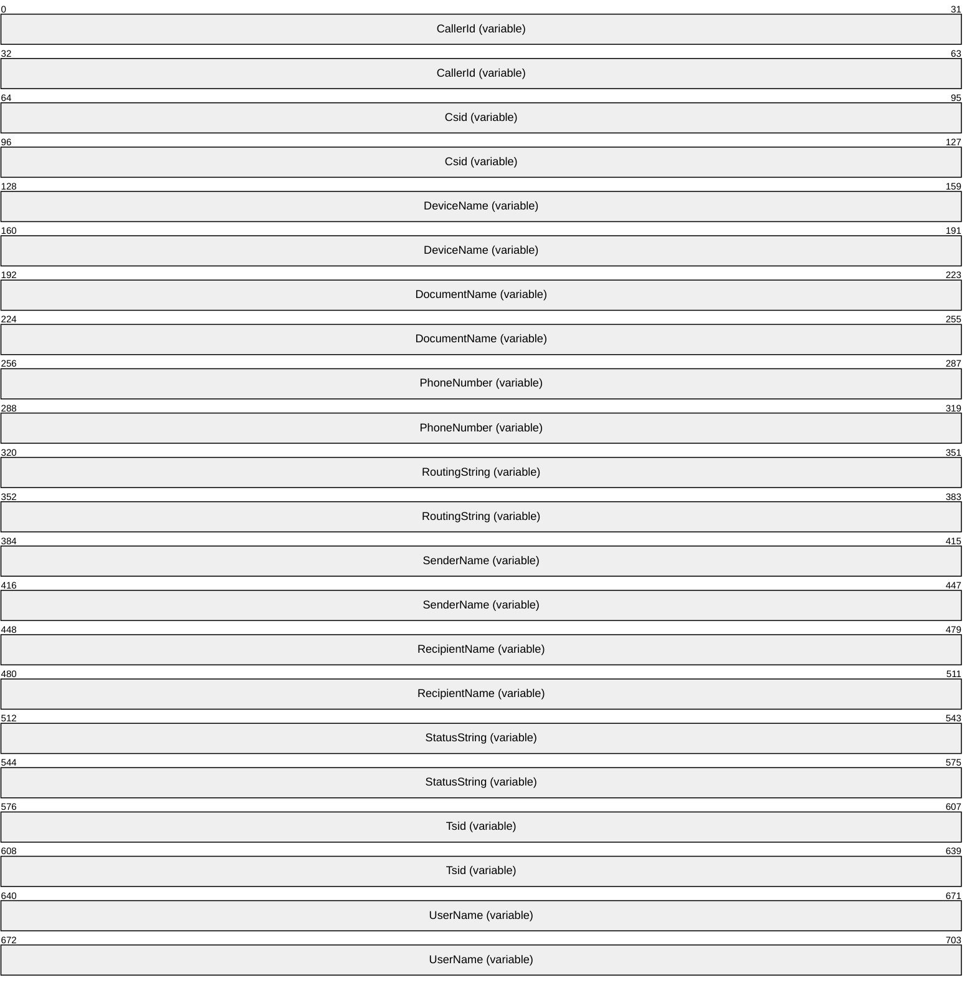

**CallerId (variable):** If the **JobType** field is equal to the JT_RECEIVE job type, this is a null-terminated character string that contains the **caller ID** of the calling device that sent the active fax document.

**Csid (variable):** A null-terminated character string that holds the called subscriber identifier of the device.

**DeviceName (variable):** A null-terminated character string that holds the name of the fax device of interest.

**DocumentName (variable):** A null-terminated character string that holds the document name to associate with the fax document that the device is currently sending or receiving.

**PhoneNumber (variable):** If the **JobType** field is equal to the JT_SEND job type, this is a null-terminated character string that holds the fax number dialed for the outgoing fax transmission.

**RoutingString (variable):** If the **JobType** field is equal to the JT_RECEIVE job type, this is a null-terminated character string that holds the **routing string** (section [3.1.1](#Section_3.1.1)) for an incoming fax.

**SenderName (variable):** A null-terminated character string that holds the name of the sender who initiated the fax transmission.

**RecipientName (variable):** A null-terminated character string that holds the name of the recipient of the fax transmission.

**StatusString (variable):** A null-terminated character string that holds a textual description of the fax device status.

**Tsid (variable):** A null-terminated character string that holds the [**transmitting subscriber identifier (TSID)**](#gt_transmitting-subscriber-identifier-tsid). This identifier is usually a telephone number.

**UserName (variable):** A null-terminated character string that holds the name of the client's fax user account that submitted the active fax job. When this structure is returned by the **FAX_GetDeviceStatus** (section 3.1.4.1.38) method, this account is the client's fax user account that called the **FAX_SendDocumentEx** (section [3.1.4.1.73](#Section_3.1.4.1.73)) method. When this structure is returned by the **FaxObs_GetDeviceStatus** (section 3.1.4.2.13) method, this account is the client's **Fax User Account** that called the **FaxObs_SendDocument** (section [3.1.4.2.7](#Section_3.1.4.2.7)) method.

<a id="Section_2.2.11"></a>
### 2.2.11 FAX_LOG_CATEGORY

The **FAX_LOG_CATEGORY** structure describes one logging category. Each logging category is identified by a numeric identifier and is described by a user-friendly name. The fax server associates with each logging category a configurable severity-level threshold that controls which logged events will cause entries to be written to the event log. If the current severity-level threshold for the event's category is lower than the event's severity level, the fax server SHOULD NOT write a corresponding entry into the log. The fax client application passes an array of **FAX_LOG_CATEGORY** structures in a call to the **FAX_SetLoggingCategories** (section [3.1.4.1.83](#Section_3.1.4.1.83)) function to modify the current logging categories for the fax server of interest. The **FAX_GetLoggingCategories** (section [3.1.4.1.44](#Section_3.1.4.1.44)) function returns the current settings in an array of **FAX_LOG_CATEGORY** structures.

An array of this structure is sent as an input argument for the **FaxObs_SetLoggingCategories** (section [3.1.4.2.27](#Section_3.1.4.2.27)) method, and this structure is sent as an output parameter for the **FaxObs_GetLoggingCategories** (section [3.1.4.2.26](#Section_3.1.4.2.26)) method.

This data structure is custom marshaled as follows and uses the custom-marshaling rules defined in section [2.2.1](#Section_2.2.1).

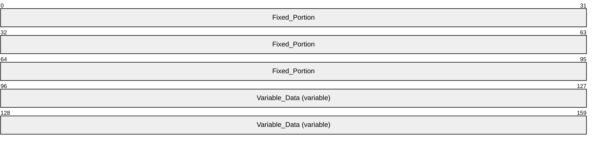

**Fixed_Portion (12 bytes):**

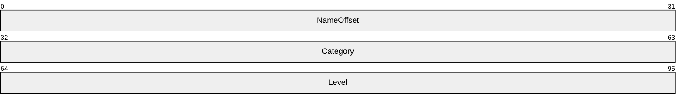

**NameOffset (4 bytes):** Offset to the **Name** field in the **Variable_Data** portion of the structure

**Category (4 bytes):** A **DWORD** ([MS-DTYP](../MS-DTYP/MS-DTYP.md) section 2.2.9) that holds a unique value that identifies a logging category for the events the fax server writes. Each event to be written by the fax server SHOULD have a logging category preassigned to it. The fax server SHOULD write the respective logging category when writing an event, so that the accumulated events could be organized by the administrator by using the logging categories. This field MUST be one of the following predefined values.<4>

| Value/code | Meaning |
| --- | --- |
| FAXLOG_CATEGORY_INIT 1 | A fax service initialization or termination event. |
| FAXLOG_CATEGORY_OUTBOUND 2 | An outgoing fax transmission event such as sending a fax. |
| FAXLOG_CATEGORY_INBOUND 3 | An incoming fax transmission event such as receiving a fax or routing a fax. |
| FAXLOG_CATEGORY_UNKNOWN 4 | An unknown event. |

**Level (4 bytes):** A **DWORD** that holds the current severity-level threshold for the logging category identified by *Category*. If the current severity-level threshold for the event's category is lower than the event's severity level, the fax server SHOULD NOT write a corresponding entry into the log. This field MUST contain one of the following predefined severity-level values.

| Value/code | Meaning |
| --- | --- |
| FAXLOG_LEVEL_NONE 0 | The fax server MUST NOT log events. |
| FAXLOG_LEVEL_MIN 1 | The fax server SHOULD log only the most severe failure events. |
| FAXLOG_LEVEL_MED 2 | The fax server SHOULD log most events (this level does not include some informational and warning events). |
| FAXLOG_LEVEL_MAX 3 | The fax server MUST log all events. |

**Variable_Data (variable):**

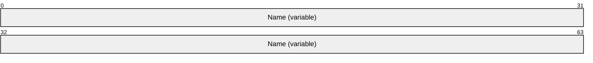

**Name (variable):** A null-terminated character string that contains the name for the logging category.

<a id="Section_2.2.12"></a>
### 2.2.12 FAX_COVERPAGE_INFO_EXW

The **FAX_COVERPAGE_INFO_EXW** structure is used as an argument for the **FAX_SendDocumentEx** (section [3.1.4.1.73](#Section_3.1.4.1.73)) call that specifies information about the fax cover page used when sending a fax.

typedef struct {

DWORD dwSizeOfStruct;

DWORD dwCoverPageFormat;

[string] LPWSTR lpwstrCoverPageFileName;

BOOL bServerBased;

[string] LPWSTR lpwstrNote;

[string] LPWSTR lpwstrSubject;

} FAX_COVERPAGE_INFO_EXW,

*PFAX_COVERPAGE_INFO_EXW,

*LPCFAX_COVERPAGE_INFO_EXW;

**dwSizeOfStruct:** A **DWORD** ([MS-DTYP](../MS-DTYP/MS-DTYP.md) section 2.2.9) value that holds the total size of the structure, in bytes. This value MUST be 24 or 40 bytes. When filled in on a 32-bit implementation, this value SHOULD be 24 bytes. When filled in on a 64-bit implementation, this value SHOULD be 40 bytes.

**dwCoverPageFormat:** A **DWORD** that indicates the format of the cover page template. This MUST be one of the values defined in **FAX_ENUM_COVERPAGE_FORMATS** (section [2.2.78](#Section_2.2.78)) enumeration. The required file format for the cover page template is described in **FAX_SendDocumentEx** (section 3.1.4.1.73) method.

**lpwstrCoverPageFileName:** A pointer to a null-terminated character string that holds the file name of the cover page template. This file name SHOULD NOT include any path separators. If **bServerBased** is FALSE, the file extension MUST be ".cov", and except for the terminating null character, the character string MUST contain only characters representing valid hexadecimal digits: "0123456789abcdefABCDEF". If **bServerBased** is TRUE the file extension SHOULD be ".cov". The cover page file MUST be present in the fax **server queue directory** when the **FAX_SendDocumentEx** call is made. If no cover-page information is available, this pointer MUST be NULL.

**bServerBased:** A Boolean that indicates whether the cover page template specified by the *lpwstrCoverPageFileName* parameter is a new personal cover page template (when set to FALSE) or a server-based cover page template (when set to TRUE). For more details on the semantics of TRUE and FALSE, see **FAX_SendDocumentEx**.

**lpwstrNote:** A pointer to a null-terminated character string that holds the content for the **note** field of the cover page.

**lpwstrSubject:** A pointer to a null-terminated character string that holds the content for the **subject** field.

<a id="Section_2.2.13"></a>
### 2.2.13 FAX_JOB_PARAMW

The **FAX_JOB_PARAMW** structure contains information about a fax job, including information about the **personal profiles** (section [3.1.1](#Section_3.1.1)) for the sender and the recipient of the fax. This structure is used as an input argument for the **FaxObs_SendDocument** (section [3.1.4.2.7](#Section_3.1.4.2.7)) method.

typedef struct {

DWORD SizeOfStruct;

[string] LPCWSTR RecipientNumber;

[string] LPCWSTR RecipientName;

[string] LPCWSTR Tsid;

[string] LPCWSTR SenderName;

[string] LPCWSTR SenderCompany;

[string] LPCWSTR SenderDept;

[string] LPCWSTR BillingCode;

DWORD ScheduleAction;

SYSTEMTIME ScheduleTime;

DWORD DeliveryReportType;

[string] LPCWSTR DeliveryReportAddress;

[string] LPCWSTR DocumentName;

HCALL CallHandle;

DWORD_PTR Reserved[3];

} FAX_JOB_PARAMW,

*PFAX_JOB_PARAMW;

**SizeOfStruct:** A **DWORD** ([MS-DTYP](../MS-DTYP/MS-DTYP.md) section 2.2.9) that contains the size, in bytes, of this structure. This value MUST be 80 or 136 bytes. When filled in on a 32-bit implementation, this value SHOULD be 80 bytes. When filled in on a 64-bit implementation, this value SHOULD be 136 bytes.

**RecipientNumber:** A null-terminated character string that holds the fax number of the fax transmission recipient.

**RecipientName:** A null-terminated character string that holds the name of the fax transmission recipient.

**Tsid:** A null-terminated character string that holds the [**transmitting subscriber identifier (TSID)**](#gt_transmitting-subscriber-identifier-tsid). The valid characters for a TSID string are the English letters, the numeric symbols, and the punctuation marks (ASCII range 0x20 to 0x7F).

**SenderName:** A null-terminated character string that holds the name of the fax transmission sender.

**SenderCompany:** A null-terminated character string that holds the name of the fax transmission sender's company.

**SenderDept:** A null-terminated character string that holds the name of the fax transmission sender's department.

**BillingCode:** A null-terminated character string that holds an optional billing code for the fax transmission.

**ScheduleAction:** A **DWORD** variable that indicates when the fax is to be sent. This value can be one of the following values:

| Value/code | Meaning |
| --- | --- |
| JSA_NOW 0x00000000 | The fax is to be sent as soon as a fax device is available. |
| JSA_SPECIFIC_TIME 0x00000001 | The fax is to be sent at the time specified by the **ScheduleTime** member of this structure. |
| JSA_DISCOUNT_PERIOD 0x00000002 | The fax is to be sent during the discount rate period. The **FaxObs_GetConfiguration** (section [3.1.4.2.24](#Section_3.1.4.2.24)) method can be called to retrieve the discount period for the fax server. |

**ScheduleTime:** A **SYSTEMTIME** ([MS-DTYP] section 2.3.13) structure indicating the local date and time to send the fax, in [**UTC**](#gt_coordinated-universal-time-utc) format. This member is used when the **ScheduleAction** member is set to 0x00000001 (JSA_SPECIFIC_TIME), and is otherwise ignored.

**DeliveryReportType:** A **DWORD** variable that indicates the fax delivery report type. This value can be one of the **FAX_ENUM_DELIVERY_REPORT_TYPES** (section [2.2.76](#Section_2.2.76)) enumeration values. The DRT_ATTACH_FAX value can be combined with the DRT_EMAIL value in one value by using an OR operation.

**DeliveryReportAddress:** A null-terminated character string. Contains the email address for the delivery report when the **DeliveryReportType** member is set to 0x00000001 (DRT_E_MAIL). Otherwise, this pointer value can be NULL.

**DocumentName:** A null-terminated character string that holds the document name. A NULL pointer value specifies that no document name is specified for this fax job.

**CallHandle:** An unsigned 32-bit integer value containing an optional TAPI call handle. For more information about TAPI, see [[MSDN-TAPI2.2]](https://go.microsoft.com/fwlink/?LinkId=119989). For more information about this member, see **FaxObs_SendDocument**.

**Reserved:** A table of three 32-bit unsigned integer fields (on 32-bit implementations), or 64-bit unsigned integer fields (on 64-bit implementations). If the first value, **Reserved[0],** is zero, then all values in this table SHOULD be ignored.

If the fax job is a normal job sent to one fax device (port), the **Reserved** values SHOULD be as follows:

- **Reserved[0]** SHOULD be set to zero or to 0xFFFFFFFF (on 32-bit) or 0x00000000FFFFFFFF (on 64-bit).
- **Reserved[1]** SHOULD contain a device identifier such as the value contained by the **DeviceId** member of a valid **FAX_PORT_INFO** (section [2.2.7](#Section_2.2.7)) or **_FAX_PORT_INFO** (section [2.2.8](#Section_2.2.8)) structure, describing one fax port (device).
- **Reserved[2]** SHOULD be ignored.
If the fax job is part of a broadcast sequence executed by the client to send the same fax to multiple recipients, the *Reserved* values SHOULD be as follows:

- **Reserved[0]** SHOULD be set to 0xFFFFFFFE (on 32-bit) or 0x00000000FFFFFFFE (on 64-bit).
- **Reserved[1]** SHOULD be set to one of the following two values:
- A value of 1 (0x00000001 on 32-bit or 0x0000000000000001 on 64-bit) for the first **FaxObs_SendDocument** method call made by the client to start the broadcast sequence.
- A value of 2 (0x00000002 on 32-bit or 0x0000000000000002 on 64-bit) for the second and following **FaxObs_SendDocument** method calls made by the client to continue and complete a started broadcast sequence.
- **Reserved[2]** SHOULD be set to one of the following two values:
- If **Reserved[1]** is set to a value of 1, **Reserved[2]** SHOULD be set to zero.
- If **Reserved[1]** is set to a value of 2, **Reserved[2]** SHOULD contain the job identifier returned by the **FaxObs_SendDocument** call that started the broadcast sequence.
For more information about this member, see the **FaxObs_SendDocument** method.

<a id="Section_2.2.14"></a>
### 2.2.14 FAX_JOB_PARAM_EXW

The **FAX_JOB_PARAM_EXW** structure defines information about the new job to create when sending a [**fax message**](#gt_fax-message).

typedef struct {

DWORD dwSizeOfStruct;

DWORD dwScheduleAction;

SYSTEMTIME tmSchedule;

DWORD dwReceiptDeliveryType;

[string] LPWSTR lpwstrReceiptDeliveryAddress;

FAX_ENUM_PRIORITY_TYPE Priority;

HCALL hCall;

DWORD_PTR dwReserved[4];

[string] LPWSTR lpwstrDocumentName;

DWORD dwPageCount;

} FAX_JOB_PARAM_EXW,

*PFAX_JOB_PARAM_EXW,

*LPCFAX_JOB_PARAM_EXW;

**dwSizeOfStruct:** A **DWORD** ([MS-DTYP](../MS-DTYP/MS-DTYP.md) section 2.2.9) that contains the size, in bytes, of this structure. MUST be set to 44 bytes on 32-bit implementations, and MUST be set to 64 bytes on 64-bit implementations.

**dwScheduleAction:** A **DWORD** that MUST specify when to send the fax. This member MUST be one of the following values.

| Value/code | Meaning |
| --- | --- |
| JSA_NOW 0 | Send the fax as soon as a device is available. |
| JSA_SPECIFIC_TIME 1 | Send the fax at the time specified by the **tmSchedule** member. |
| JSA_DISCOUNT_PERIOD 2 | Send the fax during the discount rate period. Call the **FAX_GetConfiguration** (section [3.1.4.1.36](#Section_3.1.4.1.36)) function to retrieve the discount period for the fax server. |

**tmSchedule:** A **SYSTEMTIME** ([MS-DTYP] section 2.3.13) structure that contains the date and time to send the fax. The time MUST be specified in [**UTC**](#gt_coordinated-universal-time-utc). This parameter SHOULD be ignored unless **dwScheduleAction** is set to 1 (JSA_SPECIFIC_TIME). If the time specified has already passed, the method behaves as if 0 (JSA_NOW) was specified.

**dwReceiptDeliveryType:** A **DWORD** that holds the type of receipt delivered to the sender when the fax is successfully sent and when the fax transmission fails. It can also specify if a receipt will be sent for each [**recipient**](#gt_recipient) or for all the recipients together. The value of this parameter MUST be a logical combination of one of the delivery method flags and optionally one of the delivery grouping flags as specified in **FAX_ENUM_DELIVERY_REPORT_TYPES** (section [2.2.76](#Section_2.2.76)). The fax client MUST NOT use the DRT_INBOX value if the protocol version reported by the server is FAX_API_VERSION_2 (0x00020000) or FAX_API_VERSION_3 (0x00030000). For more information, see **FAX_ConnectFaxServer** (section [3.1.4.1.10](#Section_3.1.4.1.10)).

**lpwstrReceiptDeliveryAddress:** A pointer to a constant, null-terminated character string. If the **dwReceiptDeliveryType** member contains the DRT_EMAIL or DRT_ATTACH_FAX flag, the string SHOULD be the address to which the delivery receipt (DR) or non-delivery receipt (NDR) SHOULD be sent. If the **dwReceiptDeliveryType** member is equal to DRT_INBOX, the string SHOULD be the name of the MAPI profile to which the DR or NDR SHOULD be sent. For more information about MAPI, refer to [[MSDN-MAPIPRF]](https://go.microsoft.com/fwlink/?LinkId=162960). If the **dwReceiptDeliveryType** member is equal to DRT_MSGBOX, the string SHOULD be the computer name to send the receipt to as a text message containing a character string, as described in Messenger Service Remote Protocol Specification [MS-MSRP](../MS-MSRP/MS-MSRP.md) section 3.2.4.1. If the **dwReceiptDeliveryType** member is set to DRT_NONE, the pointer SHOULD be NULL.

**Priority:** A value specifying the priority level of the outgoing fax.

**hCall:** Reserved.

**Note** This value MUST be set to NULL.

**dwReserved:** This field SHOULD be set to zero.

**lpwstrDocumentName:** A null-terminated character string that holds the **document name**. A NULL pointer value specifies that no **document name** is specified for this fax job.

**dwPageCount:** A **DWORD** value that holds the number of pages in the [**fax document**](#gt_fax-document) pointed to by the *lpcwstrFileName* parameter of the **FAX_SendDocumentEx** (section [3.1.4.1.73](#Section_3.1.4.1.73)) method. This value MUST be used only for fax documents in [**TIFF**](#gt_tagged-image-file-format-tiff), which is the only supported format.

<a id="Section_2.2.15"></a>
### 2.2.15 FAX_MESSAGE_PROPS

The **FAX_MESSAGE_PROPS** structure defines the properties of a [**fax message**](#gt_fax-message) that can be set.

typedef struct {

DWORD dwValidityMask;

DWORD dwMsgFlags;

} FAX_MESSAGE_PROPS,

*PFAX_MESSAGE_PROPS;

**dwValidityMask:** A **DWORD** ([MS-DTYP](../MS-DTYP/MS-DTYP.md) section 2.2.9) value that defines a bitwise combination of valid fields in the structure.

| Value/code | Meaning |
| --- | --- |
| FAX_MSG_PROP_FIELD_MSG_FLAGS 0x0001 | Indicates whether the value in dwMsgFlags is valid. If this bit is set, the value in dwMsgFlags is valid. |

**dwMsgFlags:** A **DWORD** bitmask that specifies the state to which the message flags are set.

| Value/code | Meaning |
| --- | --- |
| FAX_MSG_FLAG_READ 0x00000001 | Determines whether this fax message is marked as read. If this bit is set, the message is marked as read. If this bit is reset, the message is marked as unread. |

<a id="Section_2.2.16"></a>
### 2.2.16 FAX_OUTBOX_CONFIG

The **FAX_OUTBOX_CONFIG** structure defines information about outbox settings of the fax server. This data structure is used as a parameter to the **FAX_SetOutboxConfiguration** (section [3.1.4.1.87](#Section_3.1.4.1.87)) method.

typedef struct {

DWORD dwSizeOfStruct;

BOOL bAllowPersonalCP;

BOOL bUseDeviceTSID;

DWORD dwRetries;

DWORD dwRetryDelay;

FAX_TIME dtDiscountStart;

FAX_TIME dtDiscountEnd;

DWORD dwAgeLimit;

BOOL bBranding;

} FAX_OUTBOX_CONFIG,

*PFAX_OUTBOX_CONFIG;

**dwSizeOfStruct:** A **DWORD** ([MS-DTYP](../MS-DTYP/MS-DTYP.md) section 2.2.9) value that holds the total size of the structure, in bytes. This value MUST be 36 bytes.

**bAllowPersonalCP:** A Boolean that indicates whether fax client applications can include a user-designed cover page template with the fax transmission. If this member is TRUE, the client can provide a personal cover page template. If this member is FALSE, the client MUST use a common cover page stored on the fax server.

**bUseDeviceTSID:** A Boolean variable that indicates whether the fax server MAY use the devices [**transmitting subscriber identifier**](#gt_transmitting-subscriber-identifier-tsid) instead of the value specified when submitting a new job. If this member is TRUE, the server SHOULD use the devices transmitting subscriber identifier.

**dwRetries:** A **DWORD** that holds the number of times the fax server will attempt to retransmit an outgoing fax if the initial transmission fails.

**dwRetryDelay:** A **DWORD** that holds the minimum number of minutes that will elapse between retransmission attempts by the fax server.

**dtDiscountStart:** A **FAX_TIME** (section [2.2.61](#Section_2.2.61)) structure that MUST specify the hour and minute at which the discount period begins. The discount period applies only to outgoing transmissions.

**dtDiscountEnd:** A **FAX_TIME** structure that holds the hour and minute at which the discount period ends. The discount period applies only to outgoing transmissions.

**dwAgeLimit:** A **DWORD** variable that holds the number of days the fax server will keep unsuccessful fax messages in its outbox [**queue**](#gt_queue). If a [**fax message**](#gt_fax-message) stays in the outbox queue longer than the value specified, it MAY be automatically deleted. If this value is zero, the time limit MUST NOT be used.

**bBranding:** A Boolean that indicates whether the fax server generates a brand (banner) at the top of outgoing fax transmissions. If this member is TRUE, the fax server SHOULD generate a brand that contains transmission-related information such as the transmitting subscriber identifier, date, time, and page count.

<a id="Section_2.2.17"></a>
### 2.2.17 _FAX_OUTBOX_CONFIG

The **_FAX_OUTBOX_CONFIG** data type is the custom-marshaled variant of the **FAX_OUTBOX_CONFIG** (section [2.2.16](#Section_2.2.16)) data structure. The **_FAX_OUTBOX_CONFIG** data type is returned from the **FAX_GetOutboxConfiguration** (section [3.1.4.1.47](#Section_3.1.4.1.47)) method.

This data structure is custom marshaled as follows and uses the custom-marshaling rules defined in section [2.2.1](#Section_2.2.1).

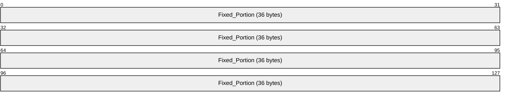

**Fixed_Portion (36 bytes):**


**dwSizeOfStruct (4 bytes):** A **DWORD** ([MS-DTYP](../MS-DTYP/MS-DTYP.md) section 2.2.9) that holds the size of the structure. MUST be set to 36 bytes.

**bAllowPersonalCP (4 bytes):** A Boolean that indicates whether fax client applications can include a user-designed cover page template with the fax transmission. If this field is TRUE, the client can provide a personal cover page template. If this field is FALSE, the client MUST use a common cover page template stored on the fax server.

**bUseDeviceTSID (4 bytes):** A Boolean variable that indicates whether the fax server can use the device's [**transmitting subscriber identifier**](#gt_transmitting-subscriber-identifier-tsid) instead of the value specified when a new job is submitted. If this field is TRUE, the server SHOULD use the device's transmitting subscriber identifier.

**dwRetries (4 bytes):** A **DWORD** that holds the number of times the fax server will attempt to retransmit an outgoing fax if the initial transmission fails.

**dwRetryDelay (4 bytes):** A **DWORD** that holds the minimum number of minutes that will elapse between retransmission attempts by the fax server.

**dtDiscountStart (4 bytes):** A **FAX_TIME** (section [2.2.61](#Section_2.2.61)) structure that holds the hour and minute at which the discount period begins. The discount period applies only to outgoing transmissions.

**dtDiscountEnd (4 bytes):** A **FAX_TIME** that holds the hour and minute at which the discount period ends. The discount period applies only to outgoing transmissions.

**dwAgeLimit (4 bytes):** A **DWORD** variable that holds the number of days the fax server will keep unsuccessful fax messages in its outbox [**queue**](#gt_queue). If a fax message stays in the outbox queue longer than the value specified, it MAY be automatically deleted. If this value is zero, the time limit MUST NOT be used.

**bBranding (4 bytes):** A Boolean that indicates whether the fax server has to generate a brand (banner) at the top of outgoing fax transmissions. If this field is TRUE, the fax server generates a brand that contains transmission-related information such as the transmitting subscriber identifier, date, time, and page count.

<a id="Section_2.2.18"></a>
### 2.2.18 FAX_REASSIGN_INFO

The **FAX_REASSIGN_INFO** structure contains information about the reassignment of a fax.

typedef struct {

[string] LPCWSTR lpcwstrRecipients;

[string] LPCWSTR lpcwstrSenderName;

[string] LPCWSTR lpcwstrSenderFaxNumber;

[string] LPCWSTR lpcwstrSubject;

BOOL bHasCoverPage;

} FAX_REASSIGN_INFO,

*PFAX_REASSIGN_INFO;

**lpcwstrRecipients:** A pointer to a constant, null-terminated character string that holds an array of intended recipients to which the fax message can be assigned. The recipients are separated by a semicolon. Each recipient refers to a **Fax User Account**.

**lpcwstrSenderName:** A pointer to a constant null-terminated character string that describes the sender name for the received fax.

**lpcwstrSenderFaxNumber:** A pointer to a constant null-terminated character string that describes the sender fax number for the received fax.

**lpcwstrSubject:** A pointer to a constant, null-terminated character string that describes the subject of the received fax.

**bHasCoverPage:** Boolean value that indicates whether the fax includes a cover page. If this member is TRUE, the fax SHOULD include a cover page.

<a id="Section_2.2.19"></a>
### 2.2.19 FAX_SERVER_ACTIVITY

The **FAX_SERVER_ACTIVITY** structure defines information about the server's [**fax queue**](#gt_fax-queue) activity and the events reported by the fax server. This structure is used as an argument for **FAX_GetServerActivity** (section [3.1.4.1.61](#Section_3.1.4.1.61)).

typedef struct {

DWORD dwSizeOfStruct;

DWORD dwIncomingMessages;

DWORD dwRoutingMessages;

DWORD dwOutgoingMessages;

DWORD dwDelegatedOutgoingMessages;

DWORD dwQueuedMessages;

DWORD dwErrorEvents;

DWORD dwWarningEvents;

DWORD dwInformationEvents;

} FAX_SERVER_ACTIVITY,

*PFAX_SERVER_ACTIVITY;

**dwSizeOfStruct:** A **DWORD** ([MS-DTYP](../MS-DTYP/MS-DTYP.md) section 2.2.9) value that holds the total size of the structure, in bytes. This value MUST be 36 bytes.

**dwIncomingMessages:** A **DWORD** that indicates the number of messages currently being received by the fax server. This variable MAY also be set to the count of the number of incoming messages that were successfully received and are currently being routed using an inbound [**routing**](#gt_routing) method. If the routing fails, the incoming job SHOULD be marked for a routing retry and the **dwRoutingMessages** member used to count this job when the routing restarts. If this value is nonzero, stopping the server MAY result in the loss of incoming messages.

**dwRoutingMessages:** A **DWORD** that indicates the number of incoming messages being rerouted after a routing failure.

**dwOutgoingMessages:** A **DWORD** that indicates the number of messages currently being sent by the fax server. If this value is nonzero, stopping the server MAY result in the loss of outgoing messages.

**dwDelegatedOutgoingMessages:** A **DWORD** that indicates the number of messages currently being sent by a [**Fax Service Provider**](#gt_fax-service-provider-fsp) on behalf of the fax server. The fax server is not currently sending these messages.

**dwQueuedMessages:** A **DWORD** that indicates the number of outgoing messages waiting to be processed in the server's fax queue.

**dwErrorEvents:** A **DWORD** that indicates the number of error entries added to the system event log since the last time the fax server was started.

**dwWarningEvents:** A **DWORD** that indicates the number of warning entries added to the system event log since the last time the fax server was started.

**dwInformationEvents:** A **DWORD** that indicates the number of information entries added to the system event log since the last time the fax server was started.

<a id="Section_2.2.20"></a>
### 2.2.20 _FAX_SERVER_ACTIVITY

The **_FAX_SERVER_ACTIVITY** data type is the custom-marshaled variant of the **FAX_SERVER_ACTIVITY** data structure described in section [2.2.19](#Section_2.2.19). The **_FAX_SERVER_ACTIVITY** defines information about the server's [**fax queue**](#gt_fax-queue) activity and the events reported by the fax server. This structure is used as a union field of the **FAX_EVENT_EX** (section [2.2.67](#Section_2.2.67)) and **FAX_EVENT_EX_1** (section [2.2.68](#Section_2.2.68)) structures.

This data structure is custom marshaled as follows and uses the custom-marshaling rules defined in section [2.2.1](#Section_2.2.1).

```mermaid
packet-beta
  0-127: "Fixed_Portion (36 bytes)"
```

**Fixed_Portion (36 bytes):**

```mermaid
packet-beta
  0-31: "dwSizeOfStruct"
  32-63: "dwIncomingMessages"
  64-95: "dwRoutingMessages"
  96-127: "dwOutgoingMessages"
  128-159: "dwDelegatedOutgoingMessage"
  160-191: "dwQueuedMessages"
  192-223: "dwErrorEvents"
  224-255: "dwWarningEvents"
  256-287: "dwInformationEvents"
```

**dwSizeOfStruct (4 bytes):** A **DWORD** ([MS-DTYP](../MS-DTYP/MS-DTYP.md) section 2.2.9) value that holds the total size of the structure, in bytes. MUST be set to 36 bytes.

**dwIncomingMessages (4 bytes):** See the **dwIncomingMessages** field for **FAX_SERVER_ACTIVITY**.

**dwRoutingMessages (4 bytes):** See the **dwRoutingMessages** field for **FAX_SERVER_ACTIVITY**.

**dwOutgoingMessages (4 bytes):** See the **dwOutgoingMessages** field for **FAX_SERVER_ACTIVITY**.

**dwDelegatedOutgoingMessage (4 bytes):** See the **dwDelegatedOutgoingMessage** field for **FAX_SERVER_ACTIVITY**.

**dwQueuedMessages (4 bytes):** See the **dwQueuedMessages** field for **FAX_SERVER_ACTIVITY**.

**dwErrorEvents (4 bytes):** See the **dwErrorEvents** field for **FAX_SERVER_ACTIVITY**.

**dwWarningEvents (4 bytes):** See the **dwWarningEvents** field for **FAX_SERVER_ACTIVITY**.

**dwInformationEvents (4 bytes):** See the **dwInformation** field for **FAX_SERVER_ACTIVITY**.

<a id="Section_2.2.21"></a>
### 2.2.21 FAX_SPECIFIC_ACCESS_RIGHTS

The **FAX_SPECIFIC_ACCESS_RIGHTS** enumeration defines specific access rights, which provide security when users query and manage fax jobs, fax devices, and [**fax documents**](#gt_fax-document).

typedef enum

{

FAX_ACCESS_SUBMIT = 0x0001,

FAX_ACCESS_SUBMIT_NORMAL = 0x0002,

FAX_ACCESS_SUBMIT_HIGH = 0x0004,

FAX_ACCESS_QUERY_JOBS = 0x0008,

FAX_ACCESS_MANAGE_JOBS = 0x0010,

FAX_ACCESS_QUERY_CONFIG = 0x0020,

FAX_ACCESS_MANAGE_CONFIG = 0x00040,

FAX_ACCESS_QUERY_IN_ARCHIVE = 0x00080,

FAX_ACCESS_MANAGE_IN_ARCHIVE = 0x0100,

FAX_ACCESS_QUERY_OUT_ARCHIVE = 0x0200,

FAX_ACCESS_MANAGE_OUT_ARCHIVE = 0x0400,

FAX_GENERIC_READ = FAX_ACCESS_QUERY_JOBS | FAX_ACCESS_QUERY_CONFIG | FAX_ACCESS_QUERY_IN_ARCHIVE | FAX_ACCESS_QUERY_OUT_ARCHIVE,

FAX_GENERIC_WRITE = FAX_ACCESS_MANAGE_JOBS | FAX_ACCESS_MANAGE_CONFIG | FAX_ACCESS_MANAGE_IN_ARCHIVE | FAX_ACCESS_MANAGE_OUT_ARCHIVE,

FAX_GENERIC_EXECUTE = FAX_ACCESS_SUBMIT,

FAX_GENERIC_ALL = FAX_ACCESS_SUBMIT | FAX_ACCESS_SUBMIT_NORMAL | FAX_ACCESS_SUBMIT_HIGH | FAX_ACCESS_QUERY_JOBS | FAX_ACCESS_MANAGE_JOBS | FAX_ACCESS_QUERY_CONFIG | FAX_ACCESS_MANAGE_CONFIG | FAX_ACCESS_QUERY_IN_ARCHIVE | FAX_ACCESS_MANAGE_IN_ARCHIVE | FAX_ACCESS_QUERY_OUT_ARCHIVE | FAX_ACCESS_MANAGE_OUT_ARCHIVE

} FAX_SPECIFIC_ACCESS_RIGHTS;

**FAX_ACCESS_SUBMIT:** The user can submit low priority fax messages. The user can view and manage his own messages in the server's [**queue**](#gt_queue) and outgoing [**archive**](#gt_archive).

**FAX_ACCESS_SUBMIT_NORMAL:** The user can submit normal priority fax messages. The user can view and manage his own messages in the server's queue and outgoing archive.

**FAX_ACCESS_SUBMIT_HIGH:** The user can submit high-priority fax messages. The user can view and manage his own messages in the server's queue and outgoing archive.

**FAX_ACCESS_QUERY_JOBS:** The user can query all the jobs (incoming or outgoing) in the server's queue.

**FAX_ACCESS_MANAGE_JOBS:** The user can manage all the jobs (incoming or outgoing) in the server's queue.

**FAX_ACCESS_QUERY_CONFIG:** The user can view the fax server's configuration.

**FAX_ACCESS_MANAGE_CONFIG:** The user can change the fax server's configuration.

**FAX_ACCESS_QUERY_IN_ARCHIVE:** The user can view all messages in the incoming messages archive.

**FAX_ACCESS_MANAGE_IN_ARCHIVE:** The user can manage all messages in the incoming messages archive.

**FAX_ACCESS_QUERY_OUT_ARCHIVE:** The user can view all messages in the outgoing messages archive.

**FAX_ACCESS_MANAGE_OUT_ARCHIVE:** The user can manage all messages in the outgoing messages archive.

**FAX_GENERIC_READ:** Access rights needed to read faxes.

**FAX_GENERIC_WRITE:** Access rights needed to write faxes.

**FAX_GENERIC_EXECUTE:** Access rights needed to execute faxes.

**FAX_GENERIC_ALL:** All access rights.

<a id="Section_2.2.22"></a>
### 2.2.22 FAX_VERSION

The **FAX_VERSION** structure contains information about the version of the fax server components. This structure is used by **FAX_GetVersion** (section [3.1.4.1.64](#Section_3.1.4.1.64)).

typedef struct {

DWORD dwSizeOfStruct;

BOOL bValid;

WORD wMajorVersion;

WORD wMinorVersion;

WORD wMajorBuildNumber;

WORD wMinorBuildNumber;

DWORD dwFlags;

} FAX_VERSION,

*PFAX_VERSION;

**dwSizeOfStruct:** A **DWORD** ([MS-DTYP](../MS-DTYP/MS-DTYP.md) section 2.2.9) value that holds the total size of the structure, in bytes. This value MUST be 20 bytes.

**bValid:** A Boolean value indicating the validity of the version information returned.

**Note** This value MUST be set to false if no version information is returned in this structure.

**wMajorVersion:** A **WORD** containing the major version number of the fax server component.

**wMinorVersion:** A **WORD** containing the minor version number of the fax server component.

**wMajorBuildNumber:** A **WORD** containing the major build number of the fax server component.

**wMinorBuildNumber:** A **WORD** containing the minor build number of the fax server component.

**dwFlags:** A **DWORD** that MUST contain one of the following values.

| Value/code | Meaning |
| --- | --- |
| 0x00000000 | Indicates that the server component was built in release mode. **Note** If built in release mode, this value MUST be zero, which is the default. |
| FAX_VER_FLAG_CHECKED 0x00000001 | Indicates that the server component was built in debug mode. |
| FAX_VER_FLAG_EVALUATION 0x00000002 | Indicates that the server component was built for evaluation purposes. Reserved for future use. |

<a id="Section_2.2.23"></a>
### 2.2.23 _FAX_VERSION

The **_FAX_VERSION** structure is the custom-marshaled variant of the **FAX_VERSION** (section [2.2.22](#Section_2.2.22)) structure. The **_FAX_VERSION** contains the same information about the version of the fax server components as contained in the **FAX_VERSION**. The **_FAX_VERSION** is embedded in the **FAX_ROUTING_EXTENSION_INFO** (section [2.2.49](#Section_2.2.49)) and **FAX_DEVICE_PROVIDER_INFO** (section [2.2.30](#Section_2.2.30)) structures.

This data structure is custom marshaled as follows and uses the custom-marshaling rules defined in section [2.2.1](#Section_2.2.1).

```mermaid
packet-beta
  0-127: "Fixed_Portion (20 bytes)"
```

**Fixed_Portion (20 bytes):**

```mermaid
packet-beta
  0-31: "dwSizeOfStruct"
  32-63: "bValid"
  64-79: "wMajorVersion"
  80-95: "wMinorVersion"
  96-111: "wMajorBuildNumber"
  112-127: "wMinorBuildNumber"
  128-159: "dwFlags"
```

**dwSizeOfStruct (4 bytes):** A **DWORD** ([MS-DTYP](../MS-DTYP/MS-DTYP.md) section 2.2.9) value that holds the total size of the structure, in bytes. This value MUST be 20 bytes.

**bValid (4 bytes):** See the **bValid** field for **FAX_VERSION**.

**wMajorVersion (2 bytes):** See the **wMajorVersion** field for **FAX_VERSION**.

**wMinorVersion (2 bytes):** See the **wMinorVersion** field for **FAX_VERSION**.

**wMajorBuildNumber (2 bytes):** See the **wMajorBuildNumber** field for **FAX_VERSION**.

**wMinorBuildNumber (2 bytes):** See the **wMinorBuildNumber** field for **FAX_VERSION**.

**dwFlags (4 bytes):** See the **dwFlags** field for **FAX_VERSION**.

<a id="Section_2.2.24"></a>
### 2.2.24 FAX_ACCOUNT_INFO_0

A **FAX_ACCOUNT_INFO_0** structure describes one **Fax User Account**. An array of the **FAX_ACCOUNT_INFO_0** data type can be passed as an out parameter (as a byte array) in a **FAX_EnumAccounts** (section [3.1.4.1.18](#Section_3.1.4.1.18)) call. This data type can also be passed as an out parameter (as a byte array) in a **FAX_GetAccountInfo** (section [3.1.4.1.32](#Section_3.1.4.1.32)) call and as an in parameter in a **FAX_CreateAccount** (section [3.1.4.1.12](#Section_3.1.4.1.12)) call.

This data structure is custom marshaled as follows and uses the custom-marshaling rules defined in section [2.2.1](#Section_2.2.1).

```mermaid
packet-beta
  0-63: "Fixed_Portion"
  64-127: "Variable_Data (variable)"
```

**Fixed_Portion (8 bytes):**

```mermaid
packet-beta
  0-31: "dwSizeOfStruct"
  32-63: "lpcwstrAccountNameOffset"
```

**dwSizeOfStruct (4 bytes):** A **DWORD** ([MS-DTYP](../MS-DTYP/MS-DTYP.md) section 2.2.9) value that holds the size of the **Fixed_Portion** block, in bytes. This value MUST be 8 bytes.

**lpcwstrAccountNameOffset (4 bytes):** Offset to the **lpcwstrAccountName** field in the **Variable_Data** block of the structure.

**Variable_Data (variable):**

```mermaid
packet-beta
  0-63: "lpcwstrAccountName (variable)"
```

**lpcwstrAccountName (variable):** A null-terminated character string that holds the name of the fax account. The account name that **lpcwstrAccountName** indicates MUST be in one of the following formats.

| Format | Description |
| --- | --- |
| <machine_name>\<user_name> | For a local user with machine_name as the local machine's name. |
| <domain_name>\<user_name> | For a remote (not local) user. |

<a id="Section_2.2.25"></a>
### 2.2.25 FAX_ACTIVITY_LOGGING_CONFIGW

The **FAX_ACTIVITY_LOGGING_CONFIGW** structure is used as an input parameter for the **FAX_SetActivityLoggingConfiguration** (section [3.1.4.1.74](#Section_3.1.4.1.74)) call.

typedef struct {

DWORD dwSizeOfStruct;

BOOL bLogIncoming;

BOOL bLogOutgoing;

[string] LPWSTR lpwstrDBPath;

} FAX_ACTIVITY_LOGGING_CONFIGW,

*PFAX_ACTIVITY_LOGGING_CONFIGW;

**dwSizeOfStruct:** A **DWORD** ([MS-DTYP](../MS-DTYP/MS-DTYP.md) section 2.2.9) value that holds the size of this structure, in bytes. This value MUST be 16 bytes or 28 bytes. When filled in on a 32-bit implementation, this value SHOULD be 16 bytes. When filled in on a 64-bit implementation, this value SHOULD be 28 bytes.

**bLogIncoming:** A Boolean flag that indicates whether incoming fax activities are logged.

**bLogOutgoing:** A Boolean flag that indicates whether outgoing fax activities are logged.

**lpwstrDBPath:** A pointer to a null-terminated character string that holds the directory on the server where the [**activity logging**](#gt_activity-logging) database files reside. <5>

<a id="Section_2.2.26"></a>
### 2.2.26 _FAX_ACTIVITY_LOGGING_CONFIGW

The **_FAX_ACTIVITY_LOGGING_CONFIGW** structure is used as an output parameter for the **FAX_GetActivityLoggingConfiguration** (section [3.1.4.1.33](#Section_3.1.4.1.33)) method call.

This data structure is custom marshaled as follows and uses the custom-marshaling rules defined in section [2.2.1](#Section_2.2.1).

```mermaid
packet-beta
  0-127: "Fixed_Portion (16 bytes)"
  128-191: "Variable_Data (variable)"
```

**Fixed_Portion (16 bytes):**

```mermaid
packet-beta
  0-31: "dwSizeOfStruct"
  32-63: "bLogIncoming"
  64-95: "bLogOutgoing"
  96-127: "lpwstrDBPathOffset"
```

**dwSizeOfStruct (4 bytes):** A **DWORD** ([MS-DTYP](../MS-DTYP/MS-DTYP.md) section 2.2.9) that holds the size of this structure, in bytes. This value MUST be set to 16 bytes.

**bLogIncoming (4 bytes):** A Boolean flag that indicates whether incoming fax activities are logged.

**bLogOutgoing (4 bytes):** A Boolean flag that indicates whether outgoing fax activities are logged.

**lpwstrDBPathOffset (4 bytes):** An offset to the **lpwstrDBPath** field in the **Variable_Data** block of the structure.

**Variable_Data (variable):**

```mermaid
packet-beta
  0-63: "lpwstrDBPath (variable)"
```

**lpwstrDBPath (variable):** A null-terminated character string that holds the directory on the server where the **activity logging** database files reside.

<a id="Section_2.2.27"></a>
### 2.2.27 FAX_ARCHIVE_CONFIGW

The **FAX_ARCHIVE_CONFIGW** data type can be passed as an out parameter (as a byte array) in a **FAX_GetArchiveConfiguration** (section [3.1.4.1.34](#Section_3.1.4.1.34)) call and as an in parameter for **FAX_SetArchiveConfiguration** (section [3.1.4.1.75](#Section_3.1.4.1.75)).

This data structure is custom marshaled as follows and uses the custom-marshaling rules defined in section [2.2.1](#Section_2.2.1).

```mermaid
packet-beta
  0-127: "Fixed_Portion (40 bytes)"
  128-191: "Variable_Data (variable)"
```

**Fixed_Portion (40 bytes):**

```mermaid
packet-beta
  0-31: "dwSizeOfStruct"
  32-63: "bUseArchive"
  64-95: "lpcstrFolderOffset"
  96-127: "bSizeQuotaWarning"
  128-159: "dwSizeQuotaHighWatermark"
  160-191: "dwSizeQuotaLowWatermark"
  192-223: "dwAgeLimit"
  224-255: "Padding"
  256-319: "dwlArchiveSize"
```

**dwSizeOfStruct (4 bytes):** A **DWORD** ([MS-DTYP](../MS-DTYP/MS-DTYP.md) section 2.2.9) value that holds the size of the **Fixed_Portion** block, in bytes. This value MUST be 40 bytes.

**bUseArchive (4 bytes):** A Boolean value that indicates whether archiving is turned on for the specified folder name.

**lpcstrFolderOffset (4 bytes):** Offset to the **lpcstrFolder** field in the **Variable_Data** block of the structure.

**bSizeQuotaWarning (4 bytes):** A Boolean value that indicates whether the fax server SHOULD issue an event log warning if the [**archive**](#gt_archive) quota exceeds the watermarks defined by the **dwSizeQuotaHighWatermark** and **dwSizeQuotaLowWatermark** fields.

**dwSizeQuotaHighWatermark (4 bytes):** A **DWORD** that holds the high watermark of the archive size limit.

**dwSizeQuotaLowWatermark (4 bytes):** A **DWORD** that holds the low watermark of the archive size limit.

**dwAgeLimit (4 bytes):** A **DWORD** that holds the number of days the fax server will keep fax messages in the archive.

**Padding (4 bytes):** Padding for data alignment of the **Fixed_Portion** block to an 8-byte boundary.

**dwlArchiveSize (8 bytes):** A **DWORDLONG** ([MS-DTYP] section 2.2.13) that holds the size, in bytes, of the archive.

**Variable_Data (variable):**

```mermaid
packet-beta
  0-63: "lpwstrFolder (variable)"
```

**lpwstrFolder (variable):** A null-terminated character string that holds the archive folder name.

<a id="Section_2.2.28"></a>
### 2.2.28 FAX_CONFIGURATIONW

The **FAX_CONFIGURATIONW** structure is used as an input parameter for the **FAX_SetConfiguration** (section [3.1.4.1.76](#Section_3.1.4.1.76)) and **FaxObs_SetConfiguration** (section [3.1.4.2.25](#Section_3.1.4.2.25)) methods to change the current fax server configuration settings. Along with the **FAX_GENERAL_CONFIG** (section [2.2.31](#Section_2.2.31)) structure, this data structure describes the general configuration of the fax server.

typedef struct {

DWORD SizeOfStruct;

DWORD Retries;

DWORD RetryDelay;

DWORD DirtyDays;

BOOL Branding;

BOOL UseDeviceTsid;

BOOL ServerCp;

BOOL PauseServerQueue;

FAX_TIME StartCheapTime;

FAX_TIME StopCheapTime;

BOOL ArchiveOutgoingFaxes;

[string] LPCWSTR ArchiveDirectory;

[string] LPCWSTR ProfileName;

} FAX_CONFIGURATIONW,

*PFAX_CONFIGURATIONW;

**SizeOfStruct:** A **DWORD** ([MS-DTYP](../MS-DTYP/MS-DTYP.md) section 2.2.9) value that holds the total size of the structure, in bytes. This value MUST be either 52 or 64 bytes. When filled in on a 32-bit implementation, this value SHOULD be 52 bytes. When filled in on a 64-bit implementation, this value SHOULD be 64 bytes.

**Retries:** A **DWORD** variable that contains the value of the **fax transmission retries** fax server configuration setting (section [3.1.1](#Section_3.1.1)).

**RetryDelay:** A **DWORD** variable that contains the value of the **fax transmission retry delay** fax server configuration setting.

**DirtyDays:** A **DWORD** variable that contains the value of the **dirty days** fax server configuration setting.

**Branding:** A Boolean flag that specifies whether the fax server generates a brand (banner) at the top of outgoing fax transmissions. If this member is TRUE, the fax server generates a brand that contains transmission-related information like the [**transmitting subscriber identifier**](#gt_transmitting-subscriber-identifier-tsid), date, time, and page count. This flag configures the **Branding** fax server configuration setting.

**UseDeviceTsid:** A Boolean flag that specifies whether the fax server uses the device's transmitting subscriber identifier instead of the value specified in the Tsid member of the **FAX_JOB_PARAMW** (section [2.2.13](#Section_2.2.13)) structure. If this member is TRUE, the server uses the device's transmitting subscriber identifier. This flag configures the "use of the device's TSID" fax server configuration setting.

**ServerCp:** A Boolean flag that specifies whether fax client applications can include a user-designed cover page template with the fax transmission. If this member is TRUE, the client MUST use a common cover page template stored on the fax server. If this member is FALSE, the client can use a personal cover page template. This flag configures the **personal cover page support** fax server configuration setting.

**PauseServerQueue:** A Boolean flag that specifies whether the fax server has paused the outgoing [**fax queue**](#gt_fax-queue). If this member is TRUE, the outgoing fax queue is paused and the **Queue State** (section 3.1.1) is set to FAX_OUTBOX_PAUSED (0x00000004). If this field is FALSE, the outgoing fax queue is not paused, and the **Queue State** is either 0x00000000 or FAX_OUTBOX_BLOCKED (0x00000002).

**StartCheapTime:** Contains a **FAX_TIME** (section [2.2.61](#Section_2.2.61)) structure that indicates the hour and minute values of the current **start cheap time** fax server configuration setting.

**StopCheapTime:** Contains a **FAX_TIME** that indicates the hour and minute values of the current **stop cheap time** fax server configuration setting.

**ArchiveOutgoingFaxes:** A Boolean flag that specifies whether the fax server [**archives**](#gt_archive) fax transmissions. If this member is TRUE, the server archives transmissions in the directory specified by the **ArchiveDirectory** member. This flag configures the **Archive Enabled** fax server configuration setting.<6>

**ArchiveDirectory:** A pointer to a constant, null-terminated character string that holds the fully qualified path of the **Fax Archive Folder** fax server configuration setting. The path can be a UNC path or a path that begins with a drive letter. The fax server ignores this member if the **ArchiveOutgoingFaxes** member is FALSE. This member can be NULL if the **ArchiveOutgoingFaxes** member is FALSE.<7>

**ProfileName:** Reserved (not used) when this structure is used for **FAX_SetConfiguration** (section 3.1.4.1.76).

When used for **FaxObs_SetConfiguration** (section 3.1.4.2.25), this member is a null-terminated character string containing the **profile name** fax server configuration setting.

<a id="Section_2.2.29"></a>
### 2.2.29 _FAX_CONFIGURATIONW

The **_FAX_CONFIGURATIONW** data type is the custom-marshaled variant of the **FAX_CONFIGURATIONW** (section [2.2.28](#Section_2.2.28)) structure. This data type is used as an output parameter (as a byte array) for **FAX_GetConfiguration** (section [3.1.4.1.36](#Section_3.1.4.1.36)) and **FaxObs_GetConfiguration** (section [3.1.4.2.24](#Section_3.1.4.2.24)) to return the current fax server configuration settings. Along with the **FAX_GENERAL_CONFIG** (section [2.2.31](#Section_2.2.31)) data structure, this data structure describes the general configuration of the fax server.

This data structure is custom marshaled as follows and uses the custom-marshaling rules defined in section [2.2.1](#Section_2.2.1).

```mermaid
packet-beta
  0-127: "Fixed_Portion (52 bytes)"
  128-191: "Variable_Data (variable)"
```

**Fixed_Portion (52 bytes):**

```mermaid
packet-beta
  0-31: "SizeOfStruct"
  32-63: "Retries"
  64-95: "RetryDelay"
  96-127: "DirtyDays"
  128-159: "Branding"
  160-191: "UseDeviceTsid"
  192-223: "ServerCp"
  224-255: "PauseServerQueue"
  256-287: "Fixed_Portion_of_StartCheapTime"
  288-319: "Fixed_Portion_of_StopCheapTime"
  320-351: "ArchiveOutgoingFaxes"
  352-383: "ArchiveDirectoryOffset"
  384-415: "ProfileNameOffset"
```

**SizeOfStruct (4 bytes):** A **DWORD** ([MS-DTYP](../MS-DTYP/MS-DTYP.md) section 2.2.9) that contains the size, in bytes, of the structure. MUST be set to 52 bytes.

**Retries (4 bytes):** A **DWORD** variable that contains the value of the **fax transmission retries** fax server configuration setting (section [3.1.1](#Section_3.1.1)).

**RetryDelay (4 bytes):** A **DWORD** variable that contains the value of the **fax transmission retry delay** fax server configuration setting.

**DirtyDays (4 bytes):** A **DWORD** variable that contains the value of the **dirty days** fax server configuration setting.

**Branding (4 bytes):** A Boolean flag that specifies whether the fax server generates a brand (banner) at the top of outgoing fax transmissions. If this field is TRUE, the fax server generates a brand that contains transmission-related information like the transmitting subscriber identifier, date, time, and page count. This flag configures the **Branding** fax server configuration setting.

**UseDeviceTsid (4 bytes):** A Boolean flag that specifies whether the fax server uses the device's transmitting subscriber identifier instead of the value specified in the **Tsid** field of the **FAX_JOB_PARAMW** (section [2.2.13](#Section_2.2.13)) structure. If this field is TRUE, the server uses the device's transmitting subscriber identifier. This flag configures the "use of the device's TSID" fax server configuration setting.

**ServerCp (4 bytes):** A Boolean flag that specifies whether fax client applications can include a user-designed cover page template with the fax transmission. If this field is TRUE, the client MUST use a common cover page template stored on the fax server. If this field is FALSE, the client can use a personal cover page template. This flag configures the **personal cover page support** fax server configuration setting.

**PauseServerQueue (4 bytes):** A Boolean flag that specifies whether the fax server has paused the outgoing [**fax queue**](#gt_fax-queue). If this field is TRUE, the outgoing fax queue is paused and the **Queue State** (section 3.1.1) is set to FAX_OUTBOX_PAUSED (0x00000004). If this field is FALSE, the outgoing fax queue is not paused, and the **Queue State** is either 0x00000000 or FAX_OUTBOX_BLOCKED (0x00000002).

**Fixed_Portion_of_StartCheapTime (4 bytes):** The **Fixed_Portion** block of a **_FAX_TIME** (section [2.2.62](#Section_2.2.62)) structure that indicates the hour and minute values of the current **start cheap time** fax server configuration setting.

**Fixed_Portion_of_StopCheapTime (4 bytes):** The **Fixed_Portion** block of a **_FAX_TIME** that indicates the hour and minute values of the **stop cheap time** fax server configuration setting.

**ArchiveOutgoingFaxes (4 bytes):** A Boolean flag that specifies whether the fax server archives fax transmissions. If this field is TRUE, the server archives fax transmissions. This flag corresponds to the **Archive Enabled** fax server configuration setting.

**ArchiveDirectoryOffset (4 bytes):** The optional offset to the **ArchiveDirectory** field in the **Variable_Data** block. The fax server SHOULD ignore this field and set it to zero if the **ArchiveOutgoingFaxes** field is FALSE.<8>

**ProfileNameOffset (4 bytes):** Offset to the **ProfileName** field in the **Variable_Data** block.

**Variable_Data (variable):**

```mermaid
packet-beta
  0-63: "ArchiveDirectory (variable)"
  64-127: "ProfileName (variable)"
```

**ArchiveDirectory (variable):** A null-terminated character string that holds the fully qualified path of the **Fax Archive Folder** fax server configuration setting. The path can be a UNC path or a path that begins with a drive letter.

**ProfileName (variable):** Reserved and MUST be ignored when this structure is used for **FAX_GetConfiguration** (section 3.1.4.1.36).

When used for **FaxObs_GetConfiguration** (section 3.1.4.2.24), this member is a null-terminated character string containing the **profile name** fax server configuration setting.

<a id="Section_2.2.30"></a>
### 2.2.30 FAX_DEVICE_PROVIDER_INFO

An array of the **FAX_DEVICE_PROVIDER_INFO** data type can be passed as an out parameter (as a byte array) in a **FAX_EnumerateProviders** (section [3.1.4.1.19](#Section_3.1.4.1.19)) call.

This data structure is custom marshaled as follows and uses the custom-marshaling rules defined in section [2.2.1](#Section_2.2.1).

```mermaid
packet-beta
  0-127: "Fixed_Portion (52 bytes)"
  128-191: "Variable_Data (variable)"
```

**Fixed_Portion (52 bytes):**

```mermaid
packet-beta
  0-31: "dwSizeOfStruct"
  32-63: "lpcwstrFriendlyNameOffset"
  64-95: "lpcwstrImageNameOffset"
  96-127: "lpcwstrProviderNameOffset"
  128-159: "lpcwstrGUIDOffset"
  160-191: "dwCapabilities"
  192-319: "Version_Fixed_Portion (20 bytes)"
  320-351: "Status"
  352-383: "dwLastError"
```

**dwSizeOfStruct (4 bytes):** A **DWORD** ([MS-DTYP](../MS-DTYP/MS-DTYP.md) section 2.2.9) that holds the size, in bytes, of the structure. MUST be set to 52 bytes.

**lpcwstrFriendlyNameOffset (4 bytes):** Offset to the **lpcwstrFriendlyName** field in the **Variable_Data** portion of the structure.

**lpcwstrImageNameOffset (4 bytes):** Offset to the **lpcwstrImageName** field in the **Variable_Data** portion of the structure.

**lpcwstrProviderNameOffset (4 bytes):** Offset to the **lpcwstrProviderName** field in the **Variable_Data** portion of the structure.

**lpcwstrGUIDOffset (4 bytes):** Offset to the **lpcwstrGUID** field in the **Variable_Data** portion of the structure.

**dwCapabilities (4 bytes):** A **DWORD** variable that holds the bitwise combination of capabilities of the [**FSP**](#gt_fax-service-provider-fsp). This value MUST be set to zero.

**Version_Fixed_Portion (20 bytes):** A **FAX_VERSION** (section [2.2.22](#Section_2.2.22)) structure that holds the version of the fax service execution components.

**Status (4 bytes):** A **FAX_ENUM_PROVIDER_STATUS** (section [2.2.57](#Section_2.2.57)) enumeration which holds the status of the FSP.

**dwLastError (4 bytes):** A **DWORD** that holds the error code that was encountered while the provider was loaded and initialized.

**Variable_Data (variable):**

```mermaid
packet-beta
  0-63: "lpcwstrFriendlyName (variable)"
  64-127: "lpcwstrImageName (variable)"
  128-191: "lpcwstrProviderName (variable)"
  192-255: "lpcwstrGUID (variable)"
```

**lpcwstrFriendlyName (variable):** A null-terminated string, which holds the FSP's user-friendly name suitable for display.

**lpcwstrImageName (variable):** A null-terminated string which holds the full path and file name for the FSP execution components.<9>

**lpcwstrProviderName (variable):** A null-terminated string which holds the name of the telephony service provider associated with the devices for the FSP.

**lpcwstrGUID (variable):** A null-terminated string which holds the [**GUID**](#gt_globally-unique-identifier-guid) for the FSP.

<a id="Section_2.2.31"></a>
### 2.2.31 FAX_GENERAL_CONFIG

The **FAX_GENERAL_CONFIG** data type can be passed as a byte–array parameter to **FAX_SetGeneralConfiguration** (section [3.1.4.1.80](#Section_3.1.4.1.80)) and **FAX_GetGeneralConfiguration** (section [3.1.4.1.40](#Section_3.1.4.1.40)) to change or to return the current fax server configuration settings.

This data structure is custom marshaled as follows and uses the custom-marshaling rules defined in section [2.2.1](#Section_2.2.1).

```mermaid
packet-beta
  0-127: "Fixed_Portion (88 bytes)"
  128-191: "Variable_Data (variable)"
```

**Fixed_Portion (88 bytes):**

```mermaid
packet-beta
  0-31: "dwSizeOfStruct"
  32-63: "bUseArchive"
  64-95: "lpcwstrArchiveLocationOffset"
  96-127: "bSizeQuotaWarning"
  128-159: "dwSizeQuotaHighWaterMark"
  160-191: "dwSizeQuotaLowWaterMark"
  192-223: "dwArchiveAgeLimit"
  224-255: "Padding"
  256-319: "dwlArchiveSize"
  320-351: "dwQueueAgeLimit"
  352-383: "dwRetries"
  384-415: "dwRetryDelay"
  416-447: "bUseDeviceTSID"
  448-479: "Fixed_Portion of dtDiscountStart"
  480-511: "Fixed_Portion of dtDiscountEnd"
  512-543: "bBranding"
  544-575: "bAllowPersonalCP"
  576-607: "dwQueueState"
  608-639: "bAutoCreateAccountOnConnect"
  640-671: "bIncomingFaxesArePublic"
  672-703: "Padding"
```

**dwSizeOfStruct (4 bytes):** A **DWORD** ([MS-DTYP](../MS-DTYP/MS-DTYP.md) section 2.2.9) value containing the size, in bytes, of the structure. MUST be set to 88 bytes.

**bUseArchive (4 bytes):** A Boolean value that indicates whether the fax server uses an [**archive**](#gt_archive) to store fax messages after they are successfully sent or received. If this field is TRUE, the fax server MUST archive fax messages. This flag corresponds to the **Archive Enabled** fax server configuration setting (section [3.1.1](#Section_3.1.1)).

**lpcwstrArchiveLocationOffset (4 bytes):** Offset to the **lpcwstrArchiveLocation** field in the **Variable_Data** block of the structure.

**bSizeQuotaWarning (4 bytes):** A Boolean value that indicates whether the fax server MAY issue an implementation-specific warning if the archive quota exceeds the watermarks defined by the **dwSizeQuotaHighWatermark** and **dwSizeQuotaLowWatermark** fields. If this field is TRUE, the fax server can issue an implementation-specific warning. This flag configures the **size quota warning** fax server configuration setting (section 3.1.1).

**dwSizeQuotaHighWaterMark (4 bytes):** A **DWORD** value that holds the current value of the fax server configuration setting (section 3.1.1). If the size of the archive exceeds this value, and if the **bSizeQuotaWarning** field is set to TRUE, an implementation-specific warning can be issued.

**dwSizeQuotaLowWaterMark (4 bytes):** A **DWORD** value that holds the current value of the **size quota low watermark** fax server configuration setting (section 3.1.1). If the size of the archive falls below this value, and if the **bSizeQuotaWarning** field is set to TRUE, an implementation-specific warning can be issued.

**dwArchiveAgeLimit (4 bytes):** A **DWORD** value that holds the current value of the **Archive Age Limit** fax server configuration setting (section 3.1.1).

**Padding (4 bytes):** Padding for data alignment to an 8-byte boundary.

**dwlArchiveSize (8 bytes):** A **DWORDLONG** ([MS-DTYP] section 2.2.13) value that holds the actual size of the archived data contained in the **Fax Archive Folder** (section 3.1.1).

**dwQueueAgeLimit (4 bytes):** A **DWORD** value that specifies the current **queue age limit** fax server configuration setting (section 3.1.1). For an outgoing fax job, after this period elapses for a fax job and the fax job is still not transmitted to its destination, the fax server SHOULD delete the respective fax job from the outgoing [**fax queue**](#gt_fax-queue). For an incoming fax job, after this period elapses for a fax job, the fax server SHOULD delete the respective fax job from the incoming fax queue. If **bUseArchive** is TRUE, meaning that the **Archive Enabled** fax server configuration setting is enabled, the fax server SHOULD archive incoming and outgoing fax messages regardless of whether the time period described by this value (for the **queue age limit** fax server configuration setting) elapses.

**dwRetries (4 bytes):** A **DWORD** value that specifies the current value of the **fax transmission retries** fax server configuration setting (section 3.1.1).

**dwRetryDelay (4 bytes):** A **DWORD** value that specifies the current value of the **fax transmission retry delay** fax server configuration setting (section 3.1.1).

**bUseDeviceTSID (4 bytes):** A Boolean value that specifies the current value of the **use device's TSID** fax server configuration setting (section 3.1.1).

**Fixed_Portion of dtDiscountStart (4 bytes):** The **Fixed_Portion** block of a **FAX_TIME** (section [2.2.61](#Section_2.2.61)) structure that holds the hour and minute values of the **start cheap time** fax server configuration setting (section 3.1.1).

**Fixed_Portion of dtDiscountEnd (4 bytes):** The **Fixed_Portion** block of a **FAX_TIME** that holds the hour and minute values of the **stop cheap time** fax server configuration setting (section 3.1.1).

**bBranding (4 bytes):** A Boolean value that specifies the current value of the **Branding** server configuration setting (section 3.1.1). If this field is TRUE, the fax server SHOULD generate an implementation-specific brand that contains transmission-related information, such as the [**transmitting subscriber identifier**](#gt_transmitting-subscriber-identifier-tsid), date, time, and page count.

**bAllowPersonalCP (4 bytes):** A Boolean value that specifies the current value of the **personal cover page support** fax server configuration setting (section 3.1.1). If this field is TRUE, the client can provide a personal cover page template. If this field is FALSE, the client MUST use a common cover page template stored on the fax server.

**dwQueueState (4 bytes):** A **DWORD** value that contains the current value of the **Queue State** (section 3.1.1). If this value is zero, both the incoming and outgoing [**queues**](#gt_queue) MUST be unblocked; otherwise, this value MUST be a combination of one or more of the following flags.

| Value/code | Meaning |
| --- | --- |
| FAX_INCOMING_BLOCKED 0x00000001 | Fax service will not receive new incoming faxes. |
| FAX_OUTBOX_BLOCKED 0x00000002 | Fax service will reject submissions of new outgoing faxes to its queue. |
| FAX_OUTBOX_PAUSED 0x00000004 | Fax service will not remove and execute outgoing fax jobs from its queue. |

**bAutoCreateAccountOnConnect (4 bytes):** A Boolean value that contains the current value of the **Automatic Account Creation** fax server configuration setting (section 3.1.1). A value of TRUE indicates that the setting is enabled; FALSE means that the setting is disabled. For more details, see section [3.1.4.1.10](#Section_3.1.4.1.10).

**bIncomingFaxesArePublic (4 bytes):** A Boolean value that contains the current value of the **incoming fax viewing permission** setting (section 3.1.1). When this setting is TRUE, all incoming faxes SHOULD be accessible for viewing by all users. When it is FALSE, only users whose accounts have FAX_ACCESS_MANAGE_RECEIVE_FOLDER permission MUST be able to view the incoming faxes.

**Padding (4 bytes):** Padding for data alignment to an 8-byte boundary.

**Variable_Data (variable):**

```mermaid
packet-beta
  0-63: "lpcwstrArchiveLocation (variable)"
```

**lpcwstrArchiveLocation (variable):** A null-terminated character string that indicates the archives folder location on the fax server file system. The portion preceding the terminating null character of this string MUST NOT end in a backslash (\) character.

<a id="Section_2.2.32"></a>
### 2.2.32 FAX_GLOBAL_ROUTING_INFOW

An array of the **FAX_GLOBAL_ROUTING_INFOW** structure is used as an input parameter to **FAX_SetGlobalRoutingInfo** (section [3.1.4.1.81](#Section_3.1.4.1.81)) and **FaxObs_SetGlobalRoutingInfo** (section [3.1.4.2.23](#Section_3.1.4.2.23)).

typedef struct {

DWORD SizeOfStruct;

DWORD Priority;

[string] LPCWSTR Guid;

[string] LPCWSTR FriendlyName;

[string] LPCWSTR FunctionName;

[string] LPCWSTR ExtensionImageName;

[string] LPCWSTR ExtensionFriendlyName;

} FAX_GLOBAL_ROUTING_INFOW,

*PFAX_GLOBAL_ROUTING_INFOW;

**SizeOfStruct:** A **DWORD** ([MS-DTYP](../MS-DTYP/MS-DTYP.md) section 2.2.9) that holds the total size of the structure, in bytes. This value MUST be 28 bytes or 48 bytes. When filled in on a 32-bit implementation, this value SHOULD be 28 bytes. When filled in on a 64-bit implementation, this value SHOULD be 48 bytes.

**Priority:** A **DWORD** variable that holds the priority of the [**fax routing method**](#gt_fax-routing-method). The priority determines the relative order in which the fax service calls the fax routing methods when the service receives a [**fax document**](#gt_fax-document). Values for this member MUST be 1 through the maximum **DWORD** value (0xFFFFFFFF or 4,294,967,295), where 1 is the highest priority.

**Guid:** A pointer to a constant, null-terminated character string that holds the [**GUID**](#gt_globally-unique-identifier-guid) that uniquely identifies the fax routing method of interest.

**FriendlyName:** A pointer to a constant, null-terminated character string that holds the user-friendly name to display for the fax routing method.

**FunctionName:** A pointer to a null-terminated character string that holds the name of the function that executes the specified fax routing method.

**ExtensionImageName:** A pointer to a constant, null-terminated character string that holds the name of the [**fax routing extensions**](#gt_fax-routing-extension) that implements the fax routing method.

**ExtensionFriendlyName:** A pointer to a constant, null-terminated character string that holds the user-friendly name to display for the fax routing extensions that implement the fax routing method.

<a id="Section_2.2.33"></a>
### 2.2.33 _FAX_GLOBAL_ROUTING_INFOW

The **_FAX_GLOBAL_ROUTING_INFOW** structure is the custom-marshaled variant of the **FAX_GLOBAL_ROUTING_INFOW** data structure described in (section [2.2.32](#Section_2.2.32)). A byte array of this structure is used as an output parameter in **FAX_EnumGlobalRoutingInfo** (section [3.1.4.1.20](#Section_3.1.4.1.20)) and in **FaxObs_EnumGlobalRoutingInfo** (section [3.1.4.2.22](#Section_3.1.4.2.22)).

This data structure is custom marshaled as follows and uses the custom-marshaling rules defined in section [2.2.1](#Section_2.2.1).

```mermaid
packet-beta
  0-127: "Fixed_Portion (28 bytes)"
  128-191: "Variable_Data (variable)"
```

**Fixed_Portion (28 bytes):**

```mermaid
packet-beta
  0-31: "SizeOfStruct"
  32-63: "Priority"
  64-95: "GuidOffset"
  96-127: "FriendlyNameOffset"
  128-159: "FunctionName"
  160-191: "ExtensionImageNameOffset"
  192-223: "ExtensionFriendlyNameOffset"
```

**SizeOfStruct (4 bytes):** A **DWORD** ([MS-DTYP](../MS-DTYP/MS-DTYP.md) section 2.2.9) that holds the size of the **Fixed_Portion** block, in bytes. This value MUST be 28 bytes.

**Priority (4 bytes):** See the **Priority** field for the **FAX_GLOBAL_ROUTING_INFOW** (section 2.2.32) structure.

**GuidOffset (4 bytes):** Offset to the **Guid** field in the **Variable_Data** portion of the structure.

**FriendlyNameOffset (4 bytes):** Offset to the **FriendlyName** field in the **Variable_Data** portion of the structure.

**FunctionName (4 bytes):** Offset to the **FunctionName** field in the **Variable_Data** portion of the structure.

**ExtensionImageNameOffset (4 bytes):** Offset to the **ExtensionImageName** field in the **Variable_Data** portion of the structure.

**ExtensionFriendlyNameOffset (4 bytes):** Offset to the **ExtensionFriendlyName** field in the **Variable_Data** portion of the structure.

**Variable_Data (variable):**

```mermaid
packet-beta
  0-63: "Guid (variable)"
  64-127: "FriendlyName (variable)"
  128-191: "FunctionName (variable)"
  192-255: "ExtensionImageName (variable)"
  256-319: "ExtensionFriendlyName (variable)"
```

**Guid (variable):** A null-terminated character string that holds the [**GUID**](#gt_globally-unique-identifier-guid) that uniquely identifies the [**fax routing method**](#gt_fax-routing-method) of interest.

**FriendlyName (variable):** A null-terminated character string that holds the user-friendly name to display for the fax routing method.

**FunctionName (variable):** A null-terminated character string that holds the name of the function that executes the specified fax routing method.

**ExtensionImageName (variable):** A null-terminated character string that holds the name of the [**fax routing extensions**](#gt_fax-routing-extension) that implements the fax routing method.

**ExtensionFriendlyName (variable):** A null-terminated character string that holds the user-friendly name to display for the fax routing extensions that implements the fax routing method.

<a id="Section_2.2.34"></a>
### 2.2.34 FAX_JOB_ENTRY_EX_1

An array of the **FAX_JOB_ENTRY_EX_1** data type can be passed as an out parameter (as a byte array) in the **FAX_EnumJobsEx2** (section [3.1.4.1.23](#Section_3.1.4.1.23)) call. The data type can also be passed as an out parameter in the **FAX_GetJobEx2** (section [3.1.4.1.43](#Section_3.1.4.1.43)).

The **dwSizeOfStruct** and **lpcwstrRecipientNumberOffset** fields in the **Fixed_Portion** block MUST NOT be 0. With the exception of these fields and the **dwlMessageId** field, all fields of this structure are optional, and if the respective information is not available, the fields in the **Fixed_Portion** block MUST be zero.

This data structure is custom marshaled as follows and uses the custom-marshaling rules defined in section [2.2.1](#Section_2.2.1).

```mermaid
packet-beta
  0-127: "Fixed_Portion (104 bytes)"
  128-191: "Variable_Data (variable)"
```

**Fixed_Portion (104 bytes):**

```mermaid
packet-beta
  0-31: "dwSizeOfStruct"
  32-63: "dwValidityMask"
  64-127: "dwlMessageId"
  128-191: "dwlBroadcastId"
  192-223: "lpcwstrRecipientNumberOffset"
  224-255: "lpcwstrRecipientNameOffset"
  256-287: "lpcwstrSenderUserNameOffset"
  288-319: "lpcwstrBillingCodeOffset"
  320-447: "tmOriginalScheduleTime (16 bytes)"
  448-575: "tmSubmissionTime (16 bytes)"
  576-607: "Priority"
  608-639: "dwDeliveryReportType"
  640-671: "lpcwstrDocumentNameOffset"
  672-703: "lpcwstrSubjectOffset"
  704-735: "pStatusOffset"
  736-767: "bHasCoverPage"
  768-799: "lpcwstrReceiptAddressOffset"
  800-831: "dwScheduleAction"
```

**dwSizeOfStruct (4 bytes):** A **DWORD** ([MS-DTYP](../MS-DTYP/MS-DTYP.md) section 2.2.9) value that holds the size of the structure, in bytes. MUST be set to 104.

**dwValidityMask (4 bytes):** A **DWORD** value that holds a bitwise OR combination of valid fields from the **FAX_ENUM_JOB_FIELDS** (section [2.2.77](#Section_2.2.77)) enumeration.

**dwlMessageId (8 bytes):** A **DWORDLONG** ([MS-DTYP] section 2.2.13) value that holds the unique identifier of the job.

**dwlBroadcastId (8 bytes):** A **DWORDLONG** value that holds the **Broadcast Identifier** (section [3.1.1](#Section_3.1.1)).

**lpcwstrRecipientNumberOffset (4 bytes):** Offset to the **lpcwstrRecipientNumber** field in the **Variable_Data** portion of the structure.

**lpcwstrRecipientNameOffset (4 bytes):** Offset to the **lpcwstrRecipientName** field in the **Variable_Data** portion of the structure.

**lpcwstrSenderUserNameOffset (4 bytes):** Offset to the **lpcwstrSenderUserName** field in the **Variable_Data** portion of the structure.

**lpcwstrBillingCodeOffset (4 bytes):** Offset to the **lpcwstrBillingCode** field in the **Variable_Data** portion of the structure.

**tmOriginalScheduleTime (16 bytes):** If the fax was sent using JSA_SPECIFIC_TIME, this field holds a **SYSTEMTIME** ([MS-DTYP] section 2.3.13) structure that contains the date and time originally used to send the fax. The time specified MUST be expressed in [**UTC**](#gt_coordinated-universal-time-utc). Used for outgoing faxes only.

**tmSubmissionTime (16 bytes):** A **SYSTEMTIME** that contains the date and time the fax message was submitted for sending. The time specified MUST be expressed in UTC. Used for outgoing faxes only.

**Priority (4 bytes):** A **FAX_ENUM_PRIORITY_TYPE** (section [2.2.65](#Section_2.2.65)) value that describes the priority of the fax transmission. Used for outgoing faxes only.

**dwDeliveryReportType (4 bytes):** A **DWORD** value that holds the type of receipt that will be delivered to the sender when the fax is successfully sent or when the fax transmission fails. It can also specify whether a receipt will be sent for each [**recipient**](#gt_recipient) or for all of the recipients together. This field MUST be one of the values defined in the **FAX_ENUM_DELIVERY_REPORT_TYPES** (section [2.2.76](#Section_2.2.76)) enumeration.

**lpcwstrDocumentNameOffset (4 bytes):** Offset to the **lpcwstrDocumentName** field in the **Variable_Data** portion of the structure.

**lpcwstrSubjectOffset (4 bytes):** Offset to the **lpcwstrSubject** field in the **Variable_Data** portion of the structure.

**pStatusOffset (4 bytes):** Offset to the **Fixed_Portion** of **pStatus** in the **Variable_Data** portion of the structure.

**bHasCoverPage (4 bytes):** Boolean value that specifies whether the fax has a cover page. If this value is TRUE, the fax SHOULD have a cover page.

**lpcwstrReceiptAddressOffset (4 bytes):** Offset to the **lpcwstrRecipientAddress** field in the **Variable_Data** portion of the structure.

**dwScheduleAction (4 bytes):** A **DWORD** value that specifies when to send the fax. This field MUST have one of the following values.

| Value/code | Meaning |
| --- | --- |
| JSA_NOW 0x00000000 | Send the fax as soon as a device is available. |
| JSA_SPECIFIC_TIME 0x00000001 | Send the fax at the time specified by the **tmOriginalScheduleTime** field. |
| JSA_DISCOUNT_PERIOD 0x00000002 | Send the fax during the discount rate period. |

**Variable_Data (variable):**

```mermaid
packet-beta
  0-127: "Fixed_Portion of pStatus (120 bytes, optional)"
  128-191: "lpcwstrRecipientNumber (variable)"
  192-255: "lpcwstrRecipientName (variable)"
  256-319: "lpcwstrSenderUserName (variable)"
  320-383: "lpcwstrBillingCode (variable)"
  384-447: "lpcwstrDocumentName (variable)"
  448-511: "lpcwstrSubject (variable)"
  512-575: "lpcwstrReceiptAddress (variable)"
  576-639: "Variable_Data of pStatus (variable)"
```

**Fixed_Portion of pStatus (120 bytes):** The **Fixed_Portion** block of the **FAX_JOB_STATUS** (section [2.2.36](#Section_2.2.36)) structure containing the job's dynamic status information. When this data structure is used in an array of structures, the **Fixed_Portion** of pStatus is omitted from here and is placed as a **Referenced_Fixed_Portion** block as described in section [2.2.1.3](#Section_2.2.1.3).

**lpcwstrRecipientNumber (variable):** A null-terminated character string that holds the fax number of the fax transmission recipient. This information comes from the recipient's **personal profile** (section 3.1.1).

**lpcwstrRecipientName (variable):** A null-terminated character string that holds the name of the fax transmission recipient. This information comes from the recipient's **personal profile**.

**lpcwstrSenderUserName (variable):** A null-terminated character string that holds the name of the sender of an outgoing fax job. Used for outgoing faxes only. This information comes from the recipient's **personal profile**.

**lpcwstrBillingCode (variable):** A null-terminated character string that holds an application-specific or server-specific billing code that applies to the fax transmission. Billing codes are optional. Used for outgoing faxes only.

**lpcwstrDocumentName (variable):** A null-terminated character string that holds a document name to associate with the fax document. Used for outgoing faxes only.

**lpcwstrSubject (variable):** A null-terminated character string that holds the subject used in the fax cover page. Used for outgoing faxes only.

**lpcwstrReceiptAddress (variable):** A null-terminated character string that holds an email address to which the fax service sends the delivery receipt when the job is finished. If the **dwDeliveryReportType** field is equal to DRT_EMAIL, the string is the address to which the delivery receipt (DR) or non-delivery receipt (NDR) is sent. If the **dwDeliveryReportType** field is not equal to DRT_EMAIL, this string MUST NOT be present (its pointer MUST be NULL).

**Variable_Data of pStatus (variable):** The **Variable_Data** block of the **FAX_JOB_STATUS** containing the job's dynamic status information. When this data structure is used in an array of structures, the **Variable_Data** of **pStatus** is omitted from here and its data fields are placed as specified in section 2.2.1 in the **Variable_Data** block for the structure array described in section 2.2.1.3, along with the **Variable_Data of pStatus** fields for the other **FAX_JOB_ENTRY_EX_1** structures in the array.

<a id="Section_2.2.35"></a>
### 2.2.35 FAX_JOB_ENTRY_EXW

An array of the **FAX_JOB_ENTRY_EXW** data type can be passed as an out parameter (as a byte array) in the **FAX_EnumJobsEx** (section [3.1.4.1.22](#Section_3.1.4.1.22)) calls. The data type can also be passed as an out parameter in the **FAX_GetJobEx** (section [3.1.4.1.42](#Section_3.1.4.1.42)) calls.

The **dwSizeOfStruct** and **lpcwstrRecipientNumberOffset** fields in the **Fixed_Portion** block MUST NOT be 0. Except for these fields and the **dwlMessageId** field, all fields of this structure are optional, and if the respective information is not available, the fields in the **Fixed_Portion** block MUST be zero.

This data structure is custom marshaled as follows and uses the custom-marshaling rules defined in section [2.2.1](#Section_2.2.1).

```mermaid
packet-beta
  0-127: "Fixed_Portion (96 bytes)"
  128-191: "Variable_Data (variable)"
```

**Fixed_Portion (96 bytes):**

```mermaid
packet-beta
  0-31: "dwSizeOfStruct"
  32-63: "dwValidityMask"
  64-127: "dwlMessageId"
  128-191: "dwlBroadcastId"
  192-223: "lpcwstrRecipientNumberOffset"
  224-255: "lpcwstrRecipientNameOffset"
  256-287: "lpcwstrSenderUserNameOffset"
  288-319: "lpcwstrBillingCodeOffset"
  320-447: "tmOriginalScheduleTime (16 bytes)"
  448-575: "tmSubmissionTime (16 bytes)"
  576-607: "Priority"
  608-639: "dwDeliveryReportType"
  640-671: "lpcwstrDocumentNameOffset"
  672-703: "lpcwstrSubjectOffset"
  704-735: "pStatus"
  736-767: "Padding"
```

**dwSizeOfStruct (4 bytes):** A **DWORD** ([MS-DTYP](../MS-DTYP/MS-DTYP.md) section 2.2.9) value that specifies the size, in bytes, of the structure. MUST be set to 96 bytes.

**dwValidityMask (4 bytes):** A **DWORD** value that holds a bitwise combination of valid fields in the **FAX_ENUM_JOB_FIELDS** (section [2.2.77](#Section_2.2.77)) enumeration.

**dwlMessageId (8 bytes):** A **DWORDLONG** ([MS-DTYP] section 2.2.13) value that specifies the unique identifier of the job.

**dwlBroadcastId (8 bytes):** A **DWORDLONG** value that holds the **Broadcast Identifier** (section [3.1.1](#Section_3.1.1)).

**lpcwstrRecipientNumberOffset (4 bytes):** Offset to the **lpcwstrRecipientNumber** field in the **Variable_Data** portion of the structure.

**lpcwstrRecipientNameOffset (4 bytes):** Offset to the **lpcwstrRecipientName** field in the **Variable_Data** portion of the structure.

**lpcwstrSenderUserNameOffset (4 bytes):** Offset to the **lpcwstrSenderUserName** field in the **Variable_Data** portion of the structure.

**lpcwstrBillingCodeOffset (4 bytes):** Offset to the **lpcwstrBillingCode** field in the **Variable_Data** portion of the structure.

**tmOriginalScheduleTime (16 bytes):** If the fax job described by this structure was created by using the JSA_SPECIFIC_TIME (the **dwScheduleAction** field in the **FAX_JOB_PARAM_EXW** (section [2.2.14](#Section_2.2.14)) structure submitted as the *lpJobParams* argument to the **FAX_SendDocumentEx** (section [3.1.4.1.73](#Section_3.1.4.1.73)) call that created the fax job), this field specifies a **SYSTEMTIME** ([MS-DTYP] section 2.3.13) structure that contains the date and time originally used to send the fax. The time specified is expressed in [**UTC**](#gt_coordinated-universal-time-utc). Used for outgoing faxes only.

**tmSubmissionTime (16 bytes):** A **SYSTEMTIME** that contains the date and time the fax message was submitted for sending. The time specified is expressed in UTC. Used for outgoing faxes only.

**Priority (4 bytes):** A **FAX_ENUM_PRIORITY_TYPE** (section [2.2.65](#Section_2.2.65)) enumeration value that contains the priority of the fax transmission. Used for outgoing faxes only.

**dwDeliveryReportType (4 bytes):** A **DWORD** value that specifies the type of receipt that will be delivered to the sender when the fax is successfully sent or when the fax transmission fails. It can also specify whether a receipt will be sent for each [**recipient**](#gt_recipient) or for all of the recipients together. This field normally contains one of the values defined in **FAX_ENUM_DELIVERY_REPORT_TYPES** (section 2.2.76) enumeration.

**lpcwstrDocumentNameOffset (4 bytes):** Offset to the **lpcwstrDocumentName** field in the **Variable_Data** portion of the structure.

**lpcwstrSubjectOffset (4 bytes):** Offset to the **lpcwstrSubject** field in the **Variable_Data** portion of the structure.

**pStatus (4 bytes):** Offset to the **Fixed_Portion** of the **pStatus** field in the **Variable_Data** portion of the structure.

**Padding (4 bytes):** Padding for data alignment to 8-byte boundary.

**Variable_Data (variable):**

```mermaid
packet-beta
  0-127: "Fixed_Portion of pStatus (120 bytes)"
  128-191: "lpcwstrRecipientNumber (variable)"
  192-255: "lpcwstrRecipientName (variable)"
  256-319: "lpcwstrSenderUserName (variable)"
  320-383: "lpcwstrBillingCode (variable)"
  384-447: "lpcwstrDocumentName (variable)"
  448-511: "lpcwstrSubject (variable)"
  512-575: "Variable_Data of pStatus (variable)"
```

**Fixed_Portion of pStatus (120 bytes):** The **Fixed_Portion** of the **FAX_JOB_STATUS** (section [2.2.36](#Section_2.2.36)) structure containing the job's dynamic status information. When this data structure is used in an array of structures, the **Fixed_Portion** of **pStatus** is omitted from here and is placed as a **Referenced_Fixed_Portion** block as described in section [2.2.1.3](#Section_2.2.1.3).

**lpcwstrRecipientNumber (variable):** A null-terminated character string that holds the fax number of the fax transmission recipient. This information comes from the recipient's **personal profile** (section 3.1.1).

**lpcwstrRecipientName (variable):** A null-terminated character string that holds the name of the fax transmission recipient. This information comes from the recipient's **personal profile**.

**lpcwstrSenderUserName (variable):** A null-terminated character string that holds the name of the sender of an outgoing fax job. Used for outgoing faxes only. This information comes from the sender's **personal profile**.

**lpcwstrBillingCode (variable):** A null-terminated character string that holds an application-specific or a server-specific billing code that applies to the fax transmission. Billing codes are optional. Used for outgoing faxes only.

**lpcwstrDocumentName (variable):** A null-terminated character string that holds a document name to associate with the fax document. Used for outgoing faxes only.

**lpcwstrSubject (variable):** A null-terminated character string that holds the subject used in the fax cover page. Used for outgoing faxes only.

**Variable_Data of pStatus (variable):** The **Variable_Data** of the **FAX_JOB_STATUS** structure containing the job's dynamic status information. When this data structure is used in an array of structures, the **Variable_Data** of pStatus is omitted from here and is placed in the **Variable_Data** block for the structure array as described in section 2.2.1.3.

<a id="Section_2.2.36"></a>
### 2.2.36 FAX_JOB_STATUS

The **FAX_JOB_STATUS** data type can be passed as a pointer reference inside **FAX_JOB_ENTRY_EXW** (section [2.2.35](#Section_2.2.35)) or **FAX_JOB_ENTRY_EX_1** (section [2.2.34](#Section_2.2.34)).

This data structure is custom marshaled as follows and uses the custom-marshaling rules defined in section [2.2.1](#Section_2.2.1).

```mermaid
packet-beta
  0-127: "Fixed_Portion (120 bytes)"
  128-191: "Variable_Data (variable)"
```

**Fixed_Portion (120 bytes):**

```mermaid
packet-beta
  0-31: "dwSizeOfStruct"
  32-63: "dwValidityMask"
  64-95: "dwJobID"
  96-127: "dwJobType"
  128-159: "dwQueueStatus"
  160-191: "dwExtendedStatus"
  192-223: "lpcwstrExtendedStatusOffset"
  224-255: "dwSize"
  256-287: "dwPageCount"
  288-319: "dwCurrentPage"
  320-351: "lpcwstrTsidOffset"
  352-383: "lpcwstrCsidOffset"
  384-511: "tmScheduleTime (16 bytes)"
  512-639: "tmTransmissionStartTime (16 bytes)"
  640-767: "tmTransmissionEndTime (16 bytes)"
  768-799: "dwDeviceID"
  800-831: "lpcwstrDeviceNameOffset"
  832-863: "dwRetries"
  864-895: "lpcwstrCallerIDOffset"
  896-927: "lpcwstrRoutingInfoOffset"
  928-959: "dwAvailableJobOperations"
```

**dwSizeOfStruct (4 bytes):** A **DWORD** ([MS-DTYP](../MS-DTYP/MS-DTYP.md) section 2.2.9) that indicates the size, in bytes, of the structure. MUST be set to 120 bytes.

**dwValidityMask (4 bytes):** A **DWORD** value that holds a bitwise OR of valid fields in **FAX_ENUM_JOB_FIELDS** (section [2.2.77](#Section_2.2.77)).

**dwJobID (4 bytes):** A **DWORD** that contains the session job identifier of the fax job.

**dwJobType (4 bytes):** A **DWORD** that holds the type of the fax job. It is one of the following values; see section [3.1.1](#Section_3.1.1) for more information.

| Value/code | Meaning |
| --- | --- |
| 0x00000000 | The job type is JT_UNKNOWN. |
| 0x00000001 | The jobtype is JT_SEND. |
| 0x00000002 | The job type is JT_RECEIVE. |
| 0x00000003 | The job type is JT_ROUTING. |
| 0x00000004 | The job type is JT_FAIL_RECEIVE. |
| 0x00000020 | The job type is JT_BROADCAST.<10> |

**dwQueueStatus (4 bytes):** A **DWORD** that holds a bitwise OR combination of the **Job Status** bit flags listed in section 3.1.1.

**dwExtendedStatus (4 bytes):** A **DWORD** that holds a predefined fax-extended status code as described in the following table.

| Value/code | Meaning |
| --- | --- |
| JS_EX_NONE 0x00000000 | No extended status code is available. |
| JS_EX_DISCONNECTED 0x00000001 | The sender or the caller disconnected the fax call. |
| JS_EX_INITIALIZING 0x00000002 | The device is initializing a call. |
| JS_EX_DIALING 0x00000003 | The device is dialing a fax number. |
| JS_EX_TRANSMITTING 0x00000004 | The device is sending a [**fax document**](#gt_fax-document). |
| JS_EX_ANSWERED 0x00000005 | The device answered a new call. |
| JS_EX_RECEIVING 0x00000006 | The device is receiving a fax document. |
| JS_EX_LINE_UNAVAILABLE 0x00000007 | The device is not available because it is in use by another application. |
| JS_EX_BUSY 0x00000008 | The device encountered a busy signal. |
| JS_EX_NO_ANSWER 0x00000009 | The receiving device did not answer the call. |
| JS_EX_BAD_ADDRESS 0x0000000A | The device dialed an invalid fax number. |
| JS_EX_NO_DIAL_TONE 0x0000000B | The sending device cannot complete the call because it does not detect a dial tone. |
| JS_EX_FATAL_ERROR 0x0000000C | The device has encountered a fatal protocol error. |
| JS_EX_CALL_DELAYED 0x0000000D | The device delayed a fax call because the sending device received a busy signal multiple times. The device cannot retry the call because dialing restrictions exist (some countries and regions restrict the number of retry attempts when a number is busy). |
| JS_EX_CALL_BLACKLISTED 0x0000000E | The device could not complete a call because the telephone number was blocked or reserved; emergency numbers such as 911 are blocked. |
| JS_EX_NOT_FAX_CALL 0x0000000F | The device received a call that was a data call or a voice call. |
| JS_EX_PARTIALLY_RECEIVED 0x00000010 | The incoming fax was partially received. Some (but not all) of the pages are available. |
| JS_EX_HANDLED 0x00000011 | The fax service processed the outbound fax document; the [**fax service provider (FSP)**](#gt_fax-service-provider-fsp) MAY transmit the fax document. |
| JS_EX_CALL_COMPLETED 0x00000012 | The call was completed successfully. |
| JS_EX_CALL_ABORTED 0x00000013 | The call was terminated. |

**lpcwstrExtendedStatusOffset (4 bytes):** Offset to the **lpcwstrExtendedStatus** field in the **Variable_Data** portion of the structure. If this offset is zero, the extended status is a standard extended status described by a greater than zero **dwExtendedStatus**. If this offset is not zero, the offset points to a valid NULL-terminated character string in the **Variable_Data** of this structure that describes a proprietary (custom) extended status for the respective FSP.

**dwSize (4 bytes):** A **DWORD** that holds the size, in bytes, of the fax document to transmit.

**dwPageCount (4 bytes):** A **DWORD** that holds the total number of pages in the fax transmission.

**dwCurrentPage (4 bytes):** A **DWORD** that holds the index of the page that the fax device is currently sending or receiving in the fax transmission. This page index is a 1-based index value (1 for the first page transmitted, 2 for the second, and so on; it is not 0 for the first page transmitted, 1 for the second page transmitted, and so on).

**lpcwstrTsidOffset (4 bytes):** Offset to the **lpcwstrTsid** field in the **Variable_Data** portion of the structure.

**lpcwstrCsidOffset (4 bytes):** Offset to the **lpcwstrCsid** field in the **Variable_Data** portion of the structure.

**tmScheduleTime (16 bytes):** For outgoing faxes only. This field is a **SYSTEMTIME** ([MS-DTYP] section 2.3.13) structure that holds the date and time to send the fax message. This time is expressed in [**Coordinated Universal Time**](#gt_utc-coordinated-universal-time) ([**UTC**](#gt_coordinated-universal-time-utc)).

**tmTransmissionStartTime (16 bytes):** A **SYSTEMTIME** that holds the date and time when the fax message’s transmission started. This time is expressed in UTC.

**tmTransmissionEndTime (16 bytes):** A **SYSTEMTIME** that holds the date and time when the fax message’s transmission ended. This time is expressed in UTC.

**dwDeviceID (4 bytes):** A **DWORD** that holds the identifier of the device used to receive or send the fax messages.

**lpcwstrDeviceNameOffset (4 bytes):** Offset to the **lpcwstrDeviceName** field in the **Variable_Data** portion of the structure.

**dwRetries (4 bytes):** For outgoing faxes only. This field is a **DWORD** that holds the number of failed transmission retries counted for the current fax job.

**lpcwstrCallerIDOffset (4 bytes):** Offset to the **lpcwstrCallerId** field in the **Variable_Data** portion of the structure.

**lpcwstrRoutingInfoOffset (4 bytes):** Offset to the **lpcwstrRoutingInfo** field in the **Variable_Data** portion of the structure.

**dwAvailableJobOperations (4 bytes):** A **DWORD** containing a bitwise combination of values defined in **FAX_ENUM_JOB_OP** (section [2.2.58](#Section_2.2.58)). This combination value describes the operations available on the current job. The access rights of the caller are not taken into account.

**Variable_Data (variable):**

```mermaid
packet-beta
  0-63: "lpcwstrExtendedStatus (variable)"
  64-127: "lpcwstrTsid (variable)"
  128-191: "lpcwstrCsid (variable)"
  192-255: "lpcwstrDeviceName (variable)"
  256-319: "lpcwstrCallerID (variable)"
  320-383: "lpcwstrRoutingInfo (variable)"
```

**lpcwstrExtendedStatus (variable):** A null-terminated string that holds a fax-extended status provided by the Fax Service Provider (FSP). If this field is not present, the extended status MUST be a standard extended status described by a greater than zero **dwExtendedStatus**. If this field is present it MUST contain a valid NULL-terminated character string that describes a proprietary (custom) extended status for the respective FSP.

**lpcwstrTsid (variable):** A null-terminated character string that holds the identifier of the transmitting subscriber. This identifier can be a telephone number.

**lpcwstrCsid (variable):** A null-terminated character string that holds the called subscriber identifier. This identifier can be a telephone number.

**lpcwstrDeviceName (variable):** A null-terminated character string that holds the name of the device used to receive or send the fax message.

**lpcwstrCallerID (variable):** For incoming faxes only. A null-terminated character string that contains the caller ID of the calling device that sent the fax. This string can include the telephone number of the calling device.

**lpcwstrRoutingInfo (variable):** For incoming faxes only. A null-terminated character string that identifies the routing string for the fax. This string can include the telephone number of the called device.

<a id="Section_2.2.37"></a>
### 2.2.37 FAX_MESSAGE_1

An array of the **FAX_MESSAGE_1** data type can be passed as an out parameter (as a byte array) in the **FAX_EnumMessagesEx** (section [3.1.4.1.25](#Section_3.1.4.1.25)) call. This data type can also be passed as an out parameter (as a byte array) in **FAX_GetMessageEx** (section [3.1.4.1.46](#Section_3.1.4.1.46)).

This data structure is custom marshaled as follows and uses the custom-marshaling rules defined in section [2.2.1](#Section_2.2.1).

```mermaid
packet-beta
  0-127: "Fixed_Portion (192 bytes)"
  128-191: "Variable_Data (variable)"
```

**Fixed_Portion (192 bytes):**

```mermaid
packet-beta
  0-31: "dwSizeOfStruct"
  32-63: "dwValidityMask"
  64-127: "dwlMessageId"
  128-191: "dwlBroadcastId"
  192-223: "dwJobType"
  224-255: "dwQueueStatus"
  256-287: "dwExtendedStatus"
  288-319: "lpcwstrExtendedStatusOffset"
  320-351: "dwSize"
  352-383: "dwPageCount"
  384-415: "lpcwstrRecipientNumberOffset"
  416-447: "lpcwstrRecipientNameOffset"
  448-479: "lpcwstrSenderNumberOffset"
  480-511: "lpcwstrSenderNameOffset"
  512-543: "lpcwstrTsidOffset"
  544-575: "lpcwstrCsidOffset"
  576-607: "lpcwstrSenderUserNameOffset"
  608-639: "lpcwstrBillingCodeOffset"
  640-767: "tmOriginalScheduleTime (16 bytes)"
  768-895: "tmSubmissionTime (16 bytes)"
  896-1023: "tmTransmissionStartTime (16 bytes)"
  1024-1151: "tmTransmissionEndTime (16 bytes)"
  1152-1183: "lpcwstrDeviceNameOffset"
  1184-1215: "Priority"
  1216-1247: "dwRetries"
  1248-1279: "lpcwstrDocumentNameOffset"
  1280-1311: "lpcwstrSubjectOffset"
  1312-1343: "lpcwstrCallerIDOffset"
  1344-1375: "lpcwstrRoutingInfoOffset"
  1376-1407: "bHasCoverPage"
  1408-1439: "dwReceiptType"
  1440-1471: "lpcwstrReceiptAddressOffset"
  1472-1503: "bServerReceiveFolder"
  1504-1535: "dwMsgFlags"
```

**dwSizeOfStruct (4 bytes):** A **DWORD** ([MS-DTYP](../MS-DTYP/MS-DTYP.md) section 2.2.9) value that holds the size of the **Fixed_Portion** block, in bytes. This value MUST be 192 bytes.

**dwValidityMask (4 bytes):** A **DWORD** value that defines a bitwise combination of valid fields in **FAX_ENUM_JOB_FIELDS** (section [2.2.77](#Section_2.2.77)).

**dwlMessageId (8 bytes):** A **DWORDLONG** ([MS-DTYP] section 2.2.13) value that specifies the unique identifier of the fax message.

**dwlBroadcastId (8 bytes):** A **DWORDLONG** value that contains the **Broadcast Identifier** (section [3.1.1](#Section_3.1.1)) if this fax message originates from a broadcast fax job; otherwise, 0.

**dwJobType (4 bytes):** A **DWORD** that specifies the job type of the [**archived**](#gt_archive) fax.

| Value/code | Meaning |
| --- | --- |
| JT_SEND 0x00000002 | Job is an outgoing fax transmission. |
| JT_RECEIVE 0x00000004 | Job is an incoming fax transmission. |

**dwQueueStatus (4 bytes):** A **DWORD** value that contains a set of bit flags that indicate the last job status, recorded by the fax server just before the message was archived. This value MUST be a bitwise OR combination of one or more of the **Job Status** values listed in section 3.1.1.

**dwExtendedStatus (4 bytes):** A **DWORD** value that specifies extended status information.

| Value/code | Meaning |
| --- | --- |
| JS_EX_DISCONNECTED 0x00000001 | The sender or the caller disconnected the fax call. |
| JS_EX_INITIALIZING 0x00000002 | The device is initializing a call. |
| JS_EX_DIALING 0x00000003 | The device is dialing a fax number. |
| JS_EX_TRANSMITTING 0x00000004 | The device is sending a [**fax document**](#gt_fax-document). |
| JS_EX_ANSWERED 0x00000005 | The device answered a new call. |
| JS_EX_RECEIVING 0x00000006 | The device is receiving a fax document. |
| JS_EX_LINE_UNAVAILABLE 0x00000007 | The device is not available because it is in use by another application. |
| JS_EX_BUSY 0x00000008 | The device encountered a busy signal. |
| JS_EX_NO_ANSWER 0x00000009 | The receiving device did not answer the call. |
| JS_EX_BAD_ADDRESS 0x0000000A | The device dialed an invalid fax number. |
| JS_EX_NO_DIAL_TONE 0x0000000B | The sending device cannot complete the call because it does not detect a dial tone. |
| JS_EX_FATAL_ERROR 0x0000000C | The device has encountered a fatal protocol error. |
| JS_EX_CALL_DELAYED 0x0000000D | The device delayed a fax call because the sending device received a busy signal multiple times. The device cannot retry the call because dialing restrictions exist (some countries and regions restrict the number of retry attempts when a number is busy). |
| JS_EX_CALL_BLACKLISTED 0x0000000E | The device could not complete a call because the telephone number was blocked or reserved; emergency numbers such as 911 are blocked. |
| JS_EX_NOT_FAX_CALL 0x0000000F | The device received a call that was a data call or a voice call. |
| JS_EX_PARTIALLY_RECEIVED 0x00000010 | The incoming fax was partially received. Some (but not all) of the pages are available. |
| JS_EX_HANDLED 0x00000011 | The fax service processed the outbound fax document; the [**FSP**](#gt_fax-service-provider-fsp) will transmit the fax document. |
| JS_EX_CALL_COMPLETED 0x00000012 | The call was completed successfully. |
| JS_EX_CALL_ABORTED 0x00000013 | The call was terminated. |

**lpcwstrExtendedStatusOffset (4 bytes):** Offset to the **lpcwstrExtendedStatus** field in the **Variable_Data** portion of the structure. If this field is zero, **dwExtendedStatus** MUST be one of the predefined extended statuses. If the field is not zero, **dwExtendedStatus** is the extended status code as provided by the FSP.

**dwSize (4 bytes):** A **DWORD** value that specifies the size, in bytes, of the fax document.

**dwPageCount (4 bytes):** A **DWORD** value that specifies the total number of pages in the fax transmission.

**lpcwstrRecipientNumberOffset (4 bytes):** Offset to the **lpcwstrRecipientNumber** field in the **Variable_Data** portion of the structure.

**lpcwstrRecipientNameOffset (4 bytes):** Offset to the **lpcwstrRecipientName** field in the **Variable_Data** portion of the structure.

**lpcwstrSenderNumberOffset (4 bytes):** Offset to the **lpcwstrSenderNumber** field in the **Variable_Data** portion of the structure.

**lpcwstrSenderNameOffset (4 bytes):** Offset to the **lpcwstrSenderName** field in the **Variable_Data** portion of the structure.

**lpcwstrTsidOffset (4 bytes):** Offset to the **lpcwstrTsid** field in the **Variable_Data** portion of the structure.

**lpcwstrCsidOffset (4 bytes):** Offset to the **lpcwstrCsid** field in the **Variable_Data** portion of the structure.

**lpcwstrSenderUserNameOffset (4 bytes):** Offset to the **lpcwstrSenderUserName** field in the **Variable_Data** portion of the structure. Used for outgoing faxes only; otherwise, SHOULD be zero.

**lpcwstrBillingCodeOffset (4 bytes):** Offset to the **lpcwstrBillingCode** field in the **Variable_Data** portion of the structure. Billing codes are optional. Used for outgoing faxes only; otherwise, SHOULD be zero.

**tmOriginalScheduleTime (16 bytes):** If the fax was sent using 1 (JSA_SPECIFIC_TIME was the value of the **dwScheduleAction** field in the **FAX_JOB_PARAM_EXW** (section [2.2.14](#Section_2.2.14)) structure submitted as the *lpJobParams* argument to the **FAX_SendDocumentEx** (section [3.1.4.1.73](#Section_3.1.4.1.73)) call that created the fax job), this field specifies a **SYSTEMTIME** ([MS-DTYP] section 2.3.13) structure that specifies the date and time originally used to send the fax. The time specified is expressed in [**UTC**](#gt_coordinated-universal-time-utc). Used for outgoing faxes only. This field is valid only if the **FAX_JOB_FIELD_ORIGINAL_SCHEDULE_TIME** bit is set in **dwValidityMask**; otherwise, the value of this field SHOULD be ignored.

**tmSubmissionTime (16 bytes):** A **SYSTEMTIME** that specifies the date and time the fax message was submitted for sending. The time specified is expressed in UTC. Used for outgoing faxes only. This field is valid only if the **FAX_JOB_FIELD_SUBMISSION_TIME** bit is set in **dwValidityMask**; otherwise, the value of this field SHOULD be ignored.

**tmTransmissionStartTime (16 bytes):** A **SYSTEMTIME** that specifies the start date and time the fax message was last transmitted. The time specified is expressed in UTC.

**tmTransmissionEndTime (16 bytes):** A **SYSTEMTIME** that specifies the end date and time the fax message was last transmitted. The time specified is expressed in UTC.

**lpcwstrDeviceNameOffset (4 bytes):** Offset to the **lpcwstrDeviceName** field in the **Variable_Data** portion of the structure.

**Priority (4 bytes):** A **FAX_ENUM_PRIORITY_TYPE** (section [2.2.65](#Section_2.2.65)) value that contains the priority of the fax transmission. Used for outgoing faxes only.

**dwRetries (4 bytes):** A **DWORD** value that specifies the number of failed transmission retries counted for a fax job. Used for outgoing faxes only.

**lpcwstrDocumentNameOffset (4 bytes):** Offset to the **lpcwstrDocumentName** field in the **Variable_Data** portion of the structure. Used for outgoing faxes only; otherwise, SHOULD be zero.

**lpcwstrSubjectOffset (4 bytes):** Offset to the **lpcwstrSubject** field in the **Variable_Data** portion of the structure. Used for outgoing faxes only; otherwise, SHOULD be zero.

**lpcwstrCallerIDOffset (4 bytes):** Offset to the **lpcwstrCallerID** field in the **Variable_Data** portion of the structure. Used for incoming faxes only; otherwise, SHOULD be zero.

**lpcwstrRoutingInfoOffset (4 bytes):** Offset to the **lpcwstrRoutingInfo** field in the **Variable_Data** portion of the structure. Used for incoming faxes only; otherwise, SHOULD be zero.

**bHasCoverPage (4 bytes):** Boolean value that specifies whether the fax has a cover page. If this value is TRUE, the fax can have a cover page.

**dwReceiptType (4 bytes):** A **DWORD** value that specifies the type of receipt delivered to the sender when a fax is successfully sent and when a fax transmission fails. It can also specify whether a receipt will be sent for each [**recipient**](#gt_recipient) or for all recipients. This field can have one of the following values.

| Value/code | Meaning |
| --- | --- |
| frtNONE 0x00000000 | No receipt is sent. |
| frtMAIL 0x00000001 | Receipt is sent to the email address specified in **lpcwstrReceiptAddress**. This receipt type provides detailed information on delivery status for each recipient. |
| frtMSGBOX 0x00000004 | Receipt is sent to the sender by means of a text message containing a character string sent to the sender's computer as described in Messenger Service Remote Protocol Specification [MS-MSRP](../MS-MSRP/MS-MSRP.md) section 3.2.4.1. This receipt type indicates only how many transmissions were completed successfully and how many failed. |

**lpcwstrReceiptAddressOffset (4 bytes):** Offset to the **lpcwstrReceiptAddress** field in the **Variable_Data** portion of the structure.

**bServerReceiveFolder (4 bytes):** Boolean value that specifies whether the fax has been assigned or SHOULD be sent to the server receive folder. If this value is TRUE, the fax is sent to the server receive folder. If it is FALSE, the fax is sent to the appropriate account.

**dwMsgFlags (4 bytes):** Bitmask that specifies the state of various message flags. See **FAX_MESSAGE_PROPS** (section [2.2.15](#Section_2.2.15)).

| Value | Meaning |
| --- | --- |
| FAX_MSG_FLAG_READ 0x00000001 | Indicates whether this message is marked as read. The message is marked as read if this bit is set. The default is unread for inbox messages and read for sent messages. |

**Variable_Data (variable):**

```mermaid
packet-beta
  0-63: "lpcwstrExtendedStatus (variable)"
  64-127: "lpcwstrRecipientNumber (variable)"
  128-191: "lpcwstrRecipientName (variable)"
  192-255: "lpcwstrsendernumber (variable)"
  256-319: "lpcwstrSenderName (variable)"
  320-383: "lpcwstrTsid (variable)"
  384-447: "lpcwstrCsid (variable)"
  448-511: "lpcwstrSenderUserName (variable)"
  512-575: "lpcwstrBillingCode (variable)"
  576-639: "lpcwstrDeviceName (variable)"
  640-703: "lpcwstrDocumentName (variable)"
  704-767: "lpcwstrSubject (variable)"
  768-831: "lpcwstrCallerID (variable)"
  832-895: "lpcwstrRoutingInfo (variable)"
  896-959: "lpcwstrReceiptAddress (variable)"
```

**lpcwstrExtendedStatus (variable):** Null-terminated character string that specifies a fax-extended status string provided by the FSP.

**lpcwstrRecipientNumber (variable):** Null-terminated character string that specifies the fax number of the fax transmission recipient. This information is stored with the fax message as part of the recipient's **personal profile** (section 3.1.1).

**lpcwstrRecipientName (variable):** Null-terminated character string that specifies the name of the fax transmission recipient. This information is stored with the fax message as part of the recipient's **personal profile**.

**lpcwstrsendernumber (variable):** Null-terminated character string that specifies the fax number of the fax transmission sender. This information is stored with the fax message as part of the sender's **personal profile**.

**lpcwstrSenderName (variable):** Null-terminated character string that specifies the name of the fax transmission sender. This information is stored with the fax message as part of the sender's **personal profile**.

**lpcwstrTsid (variable):** Null-terminated character string that specifies the transmitting subscriber identifier. This information is stored with the fax message as part of the sender's **personal profile**.

**lpcwstrCsid (variable):** Null-terminated character string that specifies the called subscriber identifier. This information is stored with the fax message as part of the recipient's **personal profile**.

**lpcwstrSenderUserName (variable):** Null-terminated character string that specifies the name of the fax transmission sender of an outgoing fax job. This information is stored with the fax message as part of the sender's **personal profile**.

**lpcwstrBillingCode (variable):** Null-terminated character string that specifies a billing code that applies to the fax transmission.

**lpcwstrDeviceName (variable):** Null-terminated character string value that specifies the name of the device used to receive or send the fax document. The device can no longer exist.

**lpcwstrDocumentName (variable):** Null-terminated character string that holds the document name of the fax.

**lpcwstrSubject (variable):** Null-terminated character string that specifies the subject used on the fax cover page.

**lpcwstrCallerID (variable):** Null-terminated character string that specifies the caller ID of the calling device that sent the fax.

**lpcwstrRoutingInfo (variable):** Null-terminated character string that contains the routing string for the fax.

**lpcwstrReceiptAddress (variable):** Null-terminated character string that specifies an email address to which the fax service sends the delivery receipt when the job is finished.

<a id="Section_2.2.38"></a>
### 2.2.38 FAX_MESSAGEW

An array of the **FAX_MESSAGEW** data type is passed as an out parameter (as a byte array) in the **FAX_EnumMessages** (section [3.1.4.1.24](#Section_3.1.4.1.24)) call. This data type is also passed as an out parameter (as a byte array) in **FAX_GetMessage** (section [3.1.4.1.45](#Section_3.1.4.1.45)).

This data structure is custom marshaled as follows and uses the custom-marshaling rules defined in section [2.2.1](#Section_2.2.1).

```mermaid
packet-beta
  0-127: "Fixed_Portion (176 bytes)"
  128-255: "Variable_Data (variable)"
```

**Fixed_Portion (176 bytes):**

```mermaid
packet-beta
  0-31: "dwSizeOfStruct"
  32-63: "dwValidityMask"
  64-127: "dwlMessageId"
  128-191: "dwlBroadcastId"
  192-223: "dwJobType"
  224-255: "dwQueueStatus"
  256-287: "dwExtendedStatus"
  288-319: "lpcwstrExtendedStatusOffset"
  320-351: "dwSize"
  352-383: "dwPageCount"
  384-415: "lpcwstrRecipientNumberOffset"
  416-447: "lpcwstrRecipientNameOffset"
  448-479: "LpcwstrSenderNumberOffset"
  480-511: "lpcwstrSenderNameOffset"
  512-543: "lpcwstrTsidOffset"
  544-575: "lpcwstrCsidOffset"
  576-607: "lpcwstrSenderUserNameOffset"
  608-639: "lpcwstrBillingCodeOffset"
  640-767: "tmOriginalScheduleTime"
  768-895: "tmSubmissionTime"
  896-1023: "tmTransmissionStartTime"
  1024-1151: "tmTransmissionEndTime"
  1152-1183: "lpcwstrDeviceNameOffset"
  1184-1215: "Priority"
  1216-1247: "dwRetries"
  1248-1279: "lpcwstrDocumentNameOffset"
  1280-1311: "lpcwstrSubjectOffset"
  1312-1343: "lpcwstrCallerIDOffset"
  1344-1375: "lpcwstrRoutingInfoOffset"
  1376-1407: "Padding"
```

**dwSizeOfStruct (4 bytes):** A **DWORD** ([MS-DTYP](../MS-DTYP/MS-DTYP.md) section 2.2.9) value that holds the size of the **Fixed_Portion** block, in bytes. This value MUST be 176 bytes.

**dwValidityMask (4 bytes):** A **DWORD** value that defines a bitwise combination of valid fields in **FAX_ENUM_JOB_FIELDS** (section [2.2.77](#Section_2.2.77)).

**dwlMessageId (8 bytes):** A **DWORDLONG** ([MS-DTYP] section 2.2.13) value that specifies the unique identifier of the fax message.

**dwlBroadcastId (8 bytes):** A **DWORDLONG** value that holds the **Broadcast Identifier** (section [3.1.1](#Section_3.1.1)).

**dwJobType (4 bytes):** A **DWORD** that specifies the job type of the [**archived**](#gt_archive) fax.

| Value/code | Meaning |
| --- | --- |
| JT_SEND 0x00000002 | Job is an outgoing fax transmission. |
| JT_RECEIVE 0x00000004 | Job is an incoming fax transmission. |

**dwQueueStatus (4 bytes):** A **DWORD** value that contains a set of bit flags that indicate the last job status, recorded by the fax server just before the message was archived. This value MUST be a bitwise OR combination of one or more of the **Job Status** values listed in section 3.1.1.

**dwExtendedStatus (4 bytes):** A **DWORD** value that specifies extended status information.

| Value/code | Meaning |
| --- | --- |
| 0x00000000 | No extended status. |
| JS_EX_DISCONNECTED 0x00000001 | The sender or the caller disconnected the fax call. |
| JS_EX_INITIALIZING 0x00000002 | The device is initializing a call. |
| JS_EX_DIALING 0x00000003 | The device is dialing a fax number. |
| JS_EX_TRANSMITTING 0x00000004 | The device is sending a [**fax document**](#gt_fax-document). |
| JS_EX_ANSWERED 0x00000005 | The device answered a new call. |
| JS_EX_RECEIVING 0x00000006 | The device is receiving a fax document. |
| JS_EX_LINE_UNAVAILABLE 0x00000007 | The device is not available because it is in use by another application. |
| JS_EX_BUSY 0x00000008 | The device encountered a busy signal. |
| JS_EX_NO_ANSWER 0x00000009 | The receiving device did not answer the call. |
| JS_EX_BAD_ADDRESS 0x0000000A | The device dialed an invalid fax number. |
| JS_EX_NO_DIAL_TONE 0x0000000B | The sending device cannot complete the call because it does not detect a dial tone. |
| JS_EX_FATAL_ERROR 0x0000000C | The device has encountered a fatal protocol error. |
| JS_EX_CALL_DELAYED 0x0000000D | The device delayed a fax call because the sending device received a busy signal multiple times. The device cannot retry the call because dialing restrictions exist (some countries and regions restrict the number of retry attempts when a number is busy). |
| JS_EX_CALL_BLACKLISTED 0x0000000E | The device could not complete a call because the telephone number was blocked or reserved; emergency numbers such as 911 are blocked. |
| JS_EX_NOT_FAX_CALL 0x0000000F | The device received a call that was a data call or a voice call. |
| JS_EX_PARTIALLY_RECEIVED 0x00000010 | The incoming fax was partially received. Some (but not all) of the pages are available. |
| JS_EX_HANDLED 0x00000011 | The fax service processed the outbound fax document; the [**fax service provider (FSP)**](#gt_fax-service-provider-fsp) will transmit the document. |
| JS_EX_CALL_COMPLETED 0x00000012 | The call was completed successfully. |
| JS_EX_CALL_ABORTED 0x00000013 | The call was terminated. |

**lpcwstrExtendedStatusOffset (4 bytes):** Offset to the **lpcwstrExtendedStatus** field in the **Variable_Data** portion of the structure. If this field is zero, **dwExtendedStatus** MUST be one of the predefined extended statuses. If the field is not zero, **dwExtendedStatus** is the extended status code as provided by the FSP.

**dwSize (4 bytes):** A **DWORD** value that specifies the size, in bytes, of the fax document.

**dwPageCount (4 bytes):** A **DWORD** value that specifies the total number of pages in the fax transmission.

**lpcwstrRecipientNumberOffset (4 bytes):** Offset to the **lpcwstrRecipientNumber** field in the **Variable_Data** portion of the structure.

**lpcwstrRecipientNameOffset (4 bytes):** Offset to the **lpcwstrRecipientName** field in the **Variable_Data** portion of the structure.

**lpcwstrSenderNumberOffset (4 bytes):** Offset to the **lpcwstrSenderNumber** field in the **Variable_Data** portion of the structure. Used for outgoing faxes only; otherwise, SHOULD be zero.

**lpcwstrSenderNameOffset (4 bytes):** Offset to the **lpcwstrSenderName** field in the **Variable_Data** portion of the structure.

**lpcwstrTsidOffset (4 bytes):** Offset to the **lpcwstrTsid** field in the **Variable_Data** portion of the structure.

**lpcwstrCsidOffset (4 bytes):** Offset to the **lpcwstrCsid** field in the **Variable_Data** portion of the structure.

**lpcwstrSenderUserNameOffset (4 bytes):** Offset to the **lpcwstrSenderUserName** field in the **Variable_Data** portion of the structure.

**lpcwstrBillingCodeOffset (4 bytes):** Offset to the **lpcwstrBillingCode** field in the **Variable_Data** portion of the structure. Billing codes are optional. Used for outgoing faxes only; otherwise, SHOULD be zero.

**tmOriginalScheduleTime (16 bytes):** If the fax was sent using 1 (JSA_SPECIFIC_TIME was the value of the **dwScheduleAction** field in the **FAX_JOB_PARAM_EXW** (section [2.2.14](#Section_2.2.14)) structure submitted as the *lpJobParams* argument to the **FAX_SendDocumentEx** (section [3.1.4.1.73](#Section_3.1.4.1.73)) call that created the fax job), this field specifies a **SYSTEMTIME** ([MS-DTYP] section 2.3.13) structure that specifies the date and time originally used to send the fax. The time specified is expressed in [**UTC**](#gt_coordinated-universal-time-utc). Used for outgoing faxes only. This field is valid only if the **FAX_JOB_FIELD_ORIGINAL_SCHEDULE_TIME** bit is set in **dwValidityMask**; otherwise, the value of this field SHOULD be ignored.

**tmSubmissionTime (16 bytes):** A **SYSTEMTIME** that specifies the date and time the fax message was submitted for sending. The time specified is expressed in UTC. Used for outgoing faxes only. This field is valid only if the **FAX_JOB_FIELD_SUBMISSION_TIME** bit is set in **dwValidityMask**; otherwise, the value of this field SHOULD be ignored.

**tmTransmissionStartTime (16 bytes):** A **SYSTEMTIME** that specifies the start date and time the fax message was last transmitted. The time specified is expressed in UTC.

**tmTransmissionEndTime (16 bytes):** A **SYSTEMTIME** that specifies the end date and time the fax message was last transmitted. The time specified is expressed in UTC.

**lpcwstrDeviceNameOffset (4 bytes):** Offset to the **lpcwstrDeviceName** field in the **Variable_Data** portion of the structure.

**Priority (4 bytes):** A **FAX_ENUM_PRIORITY_TYPE** (section [2.2.65](#Section_2.2.65)) value that contains the priority of the fax transmission. Used for outgoing faxes only.

**dwRetries (4 bytes):** A **DWORD** value that specifies the number of failed transmission retries counted for a fax job. Used for outgoing faxes only.

**lpcwstrDocumentNameOffset (4 bytes):** Offset to the **lpcwstrDocumentName** field in the **Variable_Data** portion of the structure. Used for outgoing faxes only; otherwise, SHOULD be zero.

**lpcwstrSubjectOffset (4 bytes):** Offset to the **lpcwstrSubject** field in the **Variable_Data** portion of the structure. Used for outgoing faxes only; otherwise, SHOULD be zero.

**lpcwstrCallerIDOffset (4 bytes):** Offset to the **lpcwstrCallerID** field in the **Variable_Data** portion of the structure. Used for incoming faxes only; otherwise, SHOULD be zero.

**lpcwstrRoutingInfoOffset (4 bytes):** Offset to the **lpcwstrRoutingInfo** field in the **Variable_Data** portion of the structure. Used for incoming faxes only; otherwise, SHOULD be zero.

**Padding (4 bytes):** Padding for data alignment to 8-byte boundary.

**Variable_Data (variable):**

```mermaid
packet-beta
  0-127: "lpcwstrExtendedStatus (variable)"
  128-255: "lpcwstrRecipientNumber (variable)"
  256-383: "lpcwstrRecipientName (variable)"
  384-511: "lpcwstrSenderNumber (variable)"
  512-639: "lpcwstrSenderName (variable)"
  640-767: "lpcwstrTsid (variable)"
  768-895: "lpcwstrCsid (variable)"
  896-1023: "lpcwstrSenderUserName (variable)"
  1024-1151: "lpcwstrBillingCode (variable)"
  1152-1279: "lpcwstrDeviceName (variable)"
  1280-1407: "lpcwstrDocumentName (variable)"
  1408-1535: "lpcwstrSubject (variable)"
  1536-1663: "lpcwstrCallerID (variable)"
  1664-1791: "lpcwstrRoutingInfo (variable)"
```

**lpcwstrExtendedStatus (variable):** Null-terminated character string that holds a fax-extended status string provided by the FSP.

**lpcwstrRecipientNumber (variable):** Null-terminated character string that holds the fax number of the fax transmission recipient. This information is stored with the fax message as part of the recipient's **personal profile** (section 3.1.1).

**lpcwstrRecipientName (variable):** Null-terminated character string that holds the name of the fax transmission recipient. This information is stored with the fax message as part of the recipient's **personal profile**.

**lpcwstrSenderNumber (variable):** Null-terminated character string that holds the fax number of the fax transmission sender. This information is stored with the fax message as part of the sender's **personal profile**.

**lpcwstrSenderName (variable):** Null-terminated character string that holds the name of the fax transmission sender. This information is stored with the fax message as part of the sender's **personal profile**.

**lpcwstrTsid (variable):** Null-terminated character string that holds the transmitting subscriber identifier. This information is stored with the fax message as part of the sender's **personal profile**.

**lpcwstrCsid (variable):** Null-terminated character string that holds the called subscriber identifier. This information is stored with the fax message as part of the recipient's **personal profile**.

**lpcwstrSenderUserName (variable):** Null-terminated character string that holds the name of the sender of an outgoing fax job. This information is stored with the fax message as part of the sender's **personal profile**.

**lpcwstrBillingCode (variable):** Null-terminated character string that holds a billing code that applies to the fax transmission. This information is stored with the fax message as part of the sender's **personal profile**.

**lpcwstrDeviceName (variable):** Null-terminated character string value that holds the name of the device used to receive or send the fax document. The device might no longer exist.

**lpcwstrDocumentName (variable):** Null-terminated character string that holds the document name of the fax message.

**lpcwstrSubject (variable):** Null-terminated character string that holds the subject used on the fax cover page.

**lpcwstrCallerID (variable):** Null-terminated character string that holds the caller ID of the calling device that sent the fax.

**lpcwstrRoutingInfo (variable):** Null-terminated character string that holds the routing string for the fax.

<a id="Section_2.2.39"></a>
### 2.2.39 RPC_FAX_OUTBOUND_ROUTING_GROUPW

The **RPC_FAX_OUTBOUND_ROUTING_GROUPW** data type is used as an input argument for **FAX_SetOutboundGroup** (section [3.1.4.1.85](#Section_3.1.4.1.85)). The group name contained by this structure describes one **Routing Group** (section [3.1.1](#Section_3.1.1)).

For reference, the data type definition is shown as follows.

typedef struct {

DWORD dwSizeOfStruct;

[string] LPWSTR lpwstrGroupName;

[range(0,FAX_MAX_DEVICES_IN_GROUP)]

DWORD dwNumDevices;

[unique, size_is(dwNumDevices)]

LPDWORD lpdwDevices;

FAX_ENUM_GROUP_STATUS Status;

} RPC_FAX_OUTBOUND_ROUTING_GROUPW,

*PRPC_FAX_OUTBOUND_ROUTING_GROUPW;

**dwSizeOfStruct:** A **DWORD** ([MS-DTYP](../MS-DTYP/MS-DTYP.md) section 2.2.9) value that holds the total size of the structure, in bytes. This value MUST be 20 or 40 bytes. When filled in on a 32-bit implementation, this value SHOULD be 20 bytes. When filled in on a 64-bit implementation, this value SHOULD be 40 bytes.

**lpwstrGroupName:** A null-terminated character string containing the group name. The length of this string MUST be between 1 and 128 characters, excluding the length of the terminating null character. The group name is case-insensitive.

**dwNumDevices:** A **DWORD** value that holds the number of devices in the group. The value MUST be in the range between 0 and 1,000. The *dwNumDevices* parameter also indicates the length of the *lpdwDevices* array, which is not larger than the actual number of devices.

**lpdwDevices:** A pointer to a **DWORD** array which contains **dwNumDevices** entries. Each **DWORD** value specifies one device identifier in the group. A device MUST only appear once in a group's device list. A single device can belong to one or more groups. Groups are not set to store invalid devices. The order of the devices in the array determines the order the devices are to be used to send faxes, when the group is selected.

**Status:** Current status of the group from the enumeration **FAX_ENUM_GROUP_STATUS** (section [2.2.59](#Section_2.2.59)).

<a id="Section_2.2.40"></a>
### 2.2.40 _RPC_FAX_OUTBOUND_ROUTING_GROUPW

The **_RPC_FAX_OUTBOUND_ROUTING_GROUPW** data type is used as an array of structures passed as an output byte-array argument for **FAX_EnumOutboundGroups** (section [3.1.4.1.26](#Section_3.1.4.1.26)). The group name contained by this structure describes one **Routing Group** (section [3.1.1](#Section_3.1.1)).

This data structure is custom marshaled as follows and uses the custom-marshaling rules defined in section [2.2.1](#Section_2.2.1).

```mermaid
packet-beta
  0-127: "Fixed_Portion (16 bytes)"
  128-191: "Variable_Data (variable)"
```

**Fixed_Portion (16 bytes):**

```mermaid
packet-beta
  0-31: "dwSizeOfStruct"
  32-63: "lpwstrGroupNameOffset"
  64-95: "dwNumDevices"
  96-127: "lpdwDevicesOffset"
  128-159: "Status"
```

**dwSizeOfStruct (4 bytes):** A **DWORD** ([MS-DTYP](../MS-DTYP/MS-DTYP.md) section 2.2.9) value that holds the size, in bytes, of this structure. MUST be set to 16 bytes.

**lpwstrGroupNameOffset (4 bytes):** Offset to the **lpwstrGroupName** field in the **Variable_Data** of the data type.

**dwNumDevices (4 bytes):** A **DWORD** value that holds the number of devices in the group. The value MUST be in the range between 0 and 1,000. The *dwNumDevices* parameter also indicates the length of the *lpdwDevices* array, which MUST NOT be larger than the actual number of devices.

**lpdwDevicesOffset (4 bytes):** Offset to the **lpdwDevices** field in the **Variable_Data** block of the structure.

**Status (4 bytes):** Current status of the group from the enumeration FAX_ENUM_GROUP_STATUS (section [2.2.59](#Section_2.2.59)).

**Variable_Data (variable):**

```mermaid
packet-beta
  0-63: "lpwstrGroupName (variable)"
  64-127: "lpdwDevices (variable)"
```

**lpwstrGroupName (variable):** A null-terminated character string containing the group name. The length of this string MUST be between 1 and 128 characters, excluding the length of the terminating null character. The group name is case-insensitive.

**lpdwDevices (variable):** A pointer to an array which contains **dwNumDevices** entries. Each **DWORD** value specifies one device identifier in the group. A device MUST appear only once in a group's device list. A single device can belong to one or more groups. Groups are not set to store invalid devices. The order of the devices in the array determines the order the devices are to be used to send faxes, when the group is selected.

<a id="Section_2.2.41"></a>
### 2.2.41 RPC_FAX_OUTBOUND_ROUTING_RULEW

The **RPC_FAX_OUTBOUND_ROUTING_RULEW** data type is used as an input argument for **FAX_SetOutboundRule** (section [3.1.4.1.86](#Section_3.1.4.1.86)). The information contained in this structure describes one routing rule in the **Configuration of the Routing Rules** (section [3.1.1](#Section_3.1.1)).

For reference, the data type definition is as follows.

typedefstruct{

DWORD dwSizeOfStruct;

DWORD dwAreaCode;

DWORD dwCountryCode;

[string] LPWSTR lpwstrCountryName;

[switch_is(bUseGroup)] FAX_RULE_DESTINATION Destination;

BOOL bUseGroup;

}RPC_FAX_OUTBOUND_ROUTING_RULEW,

*RPC_PFAX_OUTBOUND_ROUTING_RULEW;

**dwSizeOfStruct:** A **DWORD** ([MS-DTYP](../MS-DTYP/MS-DTYP.md) section 2.2.9) value that holds the total size of the structure, in bytes. This value MUST be 24 or 40 bytes. When filled in on a 32-bit implementation, this value SHOULD be 24 bytes. When filled in on a 64-bit implementation this value SHOULD be 40 bytes.

**dwAreaCode:** A **DWORD** that contains the [**area code**](#gt_area-code) of the rule. A value of zero indicates the special any-area value ROUTING_RULE_AREA_CODE_ANY. The **dwAreaCode** and **dwCountryCode** members MUST form a unique key. This value is unrestricted.

**dwCountryCode:** A **DWORD** that contains the country/region code of the rule. A value of zero indicates the special any-country, any-region value ROUTING_RULE_COUNTRY_CODE_ANY. The **dwAreaCode** and **dwCountryCode** numeric values MUST form a unique key. Clients can obtain valid values with the **FAX_GetCountryList** (section [3.1.4.1.37](#Section_3.1.4.1.37)) method.

**lpwstrCountryName:** A pointer to a null-terminated string that contains the country/region name indicated by the *dwCountryCode* parameter if known; otherwise, a NULL pointer. If **dwCountryCode** is zero, this pointer MUST be NULL.

**Destination:** A **FAX_RULE_DESTINATION** (section [2.2.81](#Section_2.2.81)) union that contains the destination of the rule. When bUseGroup is FALSE, this union value MUST hold a device identifier; otherwise, this union value MUST represent the name of an outbound [**routing**](#gt_routing) group of devices.

**bUseGroup:** A Boolean value that indicates whether the group is used in the destination. If TRUE, the group MUST be used as the rule's destination. If FALSE, the device MUST be used as the rule's destination.

<a id="Section_2.2.42"></a>
### 2.2.42 _RPC_FAX_OUTBOUND_ROUTING_RULEW

The **_RPC_FAX_OUTBOUND_ROUTING_RULEW** data type is used as an array of structures passed as an output byte-array argument for **FAX_EnumOutboundRules** (section [3.1.4.1.27](#Section_3.1.4.1.27)). The information contained in each **_RPC_FAX_OUTBOUND_ROUTING_RULEW** structure describes one routing rule in the **Configuration of the Routing Rules** (section [3.1.1](#Section_3.1.1)).

This data structure is custom marshaled as follows and uses the custom-marshaling rules defined in section [2.2.1](#Section_2.2.1).

```mermaid
packet-beta
  0-127: "Fixed_Portion (24 bytes)"
  128-191: "Variable_Data (variable)"
```

**Fixed_Portion (24 bytes):**

```mermaid
packet-beta
  0-31: "dwSizeOfStruct"
  32-63: "dwAreaCode"
  64-95: "dwCountryCode"
  96-127: "lpwstrCountryNameOffset"
  128-159: "Fixed_Portion of Destination"
  160-191: "bUseGroup"
```

**dwSizeOfStruct (4 bytes):** A **DWORD** ([MS-DTYP](../MS-DTYP/MS-DTYP.md) section 2.2.9) that holds the size of this structure. MUST be set to 24 bytes.

**dwAreaCode (4 bytes):** A **DWORD** that holds the area code of the rule. A value of zero indicates the special any-area value ROUTING_RULE_AREA_CODE_ANY. The **dwAreaCode** and **dwCountryCode** fields MUST form a unique key. This value is unrestricted.

**dwCountryCode (4 bytes):** A **DWORD** that holds the country/region code of the rule. A value of zero indicates the special any-country, any-region value ROUTING_RULE_COUNTRY_CODE_ANY. The **dwAreaCode** and **dwCountryCode** numeric values MUST form a unique key. Clients can obtain valid values with the **FAX_GetCountryList** (section [3.1.4.1.37](#Section_3.1.4.1.37)) method.

**lpwstrCountryNameOffset (4 bytes):** Offset to the **lpwstrCountryname** field in the **Variable_Data** block of this structure, containing the country/region name indicated by the **dwCountryCode** field if known; otherwise, it is zero. If **dwCountryCode** is zero, this offset MUST be zero.

**Fixed_Portion of Destination (4 bytes):** The **Fixed_Portion** of a union that specifies the destination of the rule. When **bUseGroup** is FALSE, this union MUST be a **_FAX_RULE_DESTINATION_DEVICE_ID** (section [2.2.42.1](#Section_2.2.42.1)) structure containing a device identifier; otherwise, it MUST be a **_FAX_RULE_DESTINATION_GROUP_NAME** (section [2.2.42.2](#Section_2.2.42.2)) structure containing the name of an outbound [**routing**](#gt_routing) group of devices.

**bUseGroup (4 bytes):** A Boolean value that indicates whether the group is used in the destination. If TRUE, the group MUST be used as the rule's destination. If FALSE, the device MUST be used as the rule's destination.

**Variable_Data (variable):**

```mermaid
packet-beta
  0-63: "lpwstrCountryName (variable)"
  64-127: "Variable_Data_of_Destination (variable)"
```

**lpwstrCountryName (variable):** A null-terminated string that specifies the country/region name indicated by the **dwCountryCode** field.

**Variable_Data_of_Destination (variable):** The **Variable_Data**, if any, of the **Destination** union that specifies the destination of the rule.

<a id="Section_2.2.42.1"></a>
#### 2.2.42.1 _FAX_RULE_DESTINATION_DEVICE_ID

The **_FAX_RULE_DESTINATION_DEVICE_ID** data structure is custom marshaled as follows and uses the custom-marshaling rules defined in section [2.2.1](#Section_2.2.1).

```mermaid
packet-beta
  0-31: "Fixed_Portion"
```

**Fixed_Portion (4 bytes):**

```mermaid
packet-beta
  0-31: "dwDeviceId"
```

**dwDeviceId (4 bytes):** A **DWORD** ([MS-DTYP](../MS-DTYP/MS-DTYP.md) section 2.2.9) value that contains the unique identifier (UID) of the device.

<a id="Section_2.2.42.2"></a>
#### 2.2.42.2 _FAX_RULE_DESTINATION_GROUP_NAME

The **_FAX_RULE_DESTINATION_GROUP_NAME** data structure is custom marshaled as follows and uses the custom-marshaling rules defined in section [2.2.1](#Section_2.2.1).

```mermaid
packet-beta
  0-31: "Fixed_Portion"
  32-95: "Variable_Data (variable)"
```

**Fixed_Portion (4 bytes):**

```mermaid
packet-beta
  0-31: "lpwstrGroupNameOffset"
```

**lpwstrGroupNameOffset (4 bytes):** Offset to the **lpwstrGroupName** field in the **Variable_Data** block of the structure.

**Variable_Data (variable):**

```mermaid
packet-beta
  0-63: "lpwstrGroupName (variable)"
```

**lpwstrGroupName (variable):** A null-terminated string that uniquely identifies a new group name. The group name is case-insensitive.

<a id="Section_2.2.43"></a>
### 2.2.43 FAX_PRINTER_INFOW

An array of the **FAX_PRINTER_INFOW** data type can be passed as an out parameter (as a byte array) in the **FAX_GetServicePrinters** (section [3.1.4.1.63](#Section_3.1.4.1.63)) call.

This data structure is custom marshaled as follows and uses the custom-marshaling rules defined in section [2.2.1](#Section_2.2.1).

```mermaid
packet-beta
  0-127: "Fixed_Portion (16 bytes)"
  128-191: "Variable_Data (variable)"
```

**Fixed_Portion (16 bytes):**

```mermaid
packet-beta
  0-31: "lpwstrPrinterNameOffset"
  32-63: "lpwstrServerNameOffset"
  64-95: "lpwstrDriverNameOffset"
  96-127: "Padding"
```

**lpwstrPrinterNameOffset (4 bytes):** Offset to the **lpwstrPrinterName** field in the **Variable_Data** block.

**lpwstrServerNameOffset (4 bytes):** Offset to the **lpwstrServerName** field in the **Variable_Data** block.

**lpwstrDriverNameOffset (4 bytes):** Offset to the **lpwstrDriverName** field in the **Variable_Data** block.

**Padding (4 bytes):** Padding for data alignment of the **Fixed_Portion** block to an 8-byte boundary.

**Variable_Data (variable):**

```mermaid
packet-beta
  0-63: "lpwstrPrinterName (variable)"
  64-127: "lpwstrServerName (variable)"
  128-191: "lpwstrDriverName (variable)"
```

**lpwstrPrinterName (variable):** A null-terminated character string that holds the printer name.

**lpwstrServerName (variable):** A null-terminated character string that holds the name of the server where the printer is attached.

**lpwstrDriverName (variable):** A null-terminated character string that holds the name of the driver for this printer.

<a id="Section_2.2.44"></a>
### 2.2.44 FAX_PERSONAL_PROFILEW

The **FAX_PERSONAL_PROFILEW** structure contains information describing one **personal profile** (section [3.1.1](#Section_3.1.1)). This structure is used by **FAX_GetPersonalProfileInfo** (section [3.1.4.1.50](#Section_3.1.4.1.50)) to return information about the **personal profile** of the sender or the recipient of a fax message. This structure is also used to specify the sender’s and the receiver’s **personal profiles** for **FAX_SendDocumentEx** (section [3.1.4.1.73](#Section_3.1.4.1.73)). This structure is described below.

This data structure is custom marshaled as follows and uses the custom-marshaling rules defined in section [2.2.1](#Section_2.2.1).

All fields of this structure except **dwSizeOfStruct** in the **Fixed_Portion** block are optional. If the respective information is not available, the offset fields in the **Fixed_Portion** block MUST be zero.

```mermaid
packet-beta
  0-127: "Fixed_Portion (68 bytes)"
  128-191: "Variable_Data (variable)"
```

**Fixed_Portion (68 bytes):**

```mermaid
packet-beta
  0-31: "dwSizeOfStruct"
  32-63: "lpwstrNameOffset"
  64-95: "lpwstrFaxNumberOffset"
  96-127: "lpwstrCompanyOffset"
  128-159: "lpwstrStreetAddressOffset"
  160-191: "lpwstrCityOffset"
  192-223: "lpwstrStateOffset"
  224-255: "lpwstrZipOffset"
  256-287: "lpwstrCountryOffset"
  288-319: "lpwstrTitleOffset"
  320-351: "lpwstrDepartmentOffset"
  352-383: "lpwstrOfficeLocationOffset"
  384-415: "lpwstrHomePhoneOffset"
  416-447: "lpwstrOfficePhoneOffset"
  448-479: "lpwstrEmailOffset"
  480-511: "lpwstrBillingCodeOffset"
  512-543: "lpwstrTSIDOffset"
```

**dwSizeOfStruct (4 bytes):** A **DWORD** ([MS-DTYP](../MS-DTYP/MS-DTYP.md) section 2.2.9) value that holds the size of the **Fixed_Portion** block, in bytes. This value MUST be 68 bytes.

**lpwstrNameOffset (4 bytes):** Offset to the **lpwstrName** field in the **Variable_Data** portion of the structure.

**lpwstrFaxNumberOffset (4 bytes):** Offset to the **lpwstrFaxNumber** field in the **Variable_Data** portion of the structure.

**lpwstrCompanyOffset (4 bytes):** Offset to the **lpwstrCompany** field in the **Variable_Data** portion of the structure.

**lpwstrStreetAddressOffset (4 bytes):** Offset to the **lpwstrStreetAddress** field in the **Variable_Data** portion of the structure.

**lpwstrCityOffset (4 bytes):** Offset to the **lpwstrCity** field in the **Variable_Data** portion of the structure.

**lpwstrStateOffset (4 bytes):** Offset to the **lpwstrState** field in the **Variable_Data** portion of the structure.

**lpwstrZipOffset (4 bytes):** Offset to the **lpwstrZip** field in the **Variable_Data** portion of the structure.

**lpwstrCountryOffset (4 bytes):** Offset to the **lpwstrCountry** field in the **Variable_Data** portion of the structure.

**lpwstrTitleOffset (4 bytes):** Offset to the **lpwstrTitle** field in the **Variable_Data** portion of the structure.

**lpwstrDepartmentOffset (4 bytes):** Offset to the **lpwstrDepartment** field in the **Variable_Data** portion of the structure.

**lpwstrOfficeLocationOffset (4 bytes):** Offset to the **lpwstrOfficeLocation** field in the **Variable_Data** portion of the structure.

**lpwstrHomePhoneOffset (4 bytes):** Offset to the **lpwstrHomePhone** field in the **Variable_Data** portion of the structure.

**lpwstrOfficePhoneOffset (4 bytes):** Offset to the **lpwstrOfficePhone** field in the **Variable_Data** portion of the structure.

**lpwstrEmailOffset (4 bytes):** Offset to the **lpwstrEmail** field in the **Variable_Data** portion of the structure.

**lpwstrBillingCodeOffset (4 bytes):** Offset to the **lpwstrBillingCode** field in the **Variable_Data** portion of the structure.

**lpwstrTSIDOffset (4 bytes):** Offset to the **lpwstrTSID** field in the **Variable_Data** portion of the structure.

**Variable_Data (variable):**

```mermaid
packet-beta
  0-127: "lpwstrName (variable)"
  128-255: "lpwstrFaxNumber (variable)"
  256-383: "lpwstrCompany (variable)"
  384-511: "lpwstrStreetAddress (variable)"
  512-639: "lpwstrCity (variable)"
  640-767: "lpwstrState (variable)"
  768-895: "lpwstrZip (variable)"
  896-1023: "lpwstrCountry (variable)"
  1024-1151: "lpwstrTitle (variable)"
  1152-1279: "lpwstrDepartment (variable)"
  1280-1407: "lpwstrOfficeLocation (variable)"
  1408-1535: "lpwstrHomePhone (variable)"
  1536-1663: "lpwstrOfficePhone (variable)"
  1664-1791: "lpwstrEmail (variable)"
  1792-1919: "lpwstrBillingCode (variable)"
  1920-2047: "lpwstrTSID (variable)"
```

**lpwstrName (variable):** Null-terminated character string containing the recipient or sender name.

**lpwstrFaxNumber (variable):** Null-terminated character string containing the fax number associated with this profile.

**lpwstrCompany (variable):** Null-terminated character string containing the name of the company for which the person associated with this profile works.

**lpwstrStreetAddress (variable):** Null-terminated character string containing the street address associated with this profile.

**lpwstrCity (variable):** Null-terminated character string containing the name of the city associated with this profile.

**lpwstrState (variable):** Null-terminated character string containing the name of the state associated with this profile.

**lpwstrZip (variable):** Null-terminated character string containing the ZIP code associated with this profile.

**lpwstrCountry (variable):** Null-terminated character string containing the name of the country/region associated with this profile.

**lpwstrTitle (variable):** Null-terminated character string containing the title of the person associated with this profile.

**lpwstrDepartment (variable):** Null-terminated character string containing the name of the department in which the person associated with this profile works.

**lpwstrOfficeLocation (variable):** Null-terminated character string containing the office location of the person associated with this profile.

**lpwstrHomePhone (variable):** Null-terminated character string containing the home telephone number of the person associated with this profile.

**lpwstrOfficePhone (variable):** Null-terminated character string containing the office telephone number of the person associated with this profile.

**lpwstrEmail (variable):** Null-terminated character string containing the email address of the person associated with this profile.

**lpwstrBillingCode (variable):** Null-terminated character string containing the billing code associated with this profile.

**lpwstrTSID (variable):** Null-terminated character string containing the transmitting subscriber identifier (TSID) associated with this profile.

<a id="Section_2.2.45"></a>
### 2.2.45 FAX_PORT_INFO_EXW

The **FAX_PORT_INFO_EXW** structure defines information about a single fax device, known as a port. This structure is used for **FAX_SetPortEx** (section [3.1.4.1.89](#Section_3.1.4.1.89)).

typedef struct {

DWORD dwSizeOfStruct;

DWORD dwDeviceID;

[string] LPCWSTR lpcwstrDeviceName;

[string] LPWSTR lpwstrDescription;

[string] LPCWSTR lpcwstrProviderName;

[string] LPCWSTR lpcwstrProviderGUID;

BOOL bSend;

FAX_ENUM_DEVICE_RECEIVE_MODE ReceiveMode;

DWORD dwStatus;

DWORD dwRings;

[string] LPWSTR lpwstrCsid;

[string] LPWSTR lpwstrTsid;

} FAX_PORT_INFO_EXW,

*PFAX_PORT_INFO_EXW;

**dwSizeOfStruct: DWORD** ([MS-DTYP](../MS-DTYP/MS-DTYP.md) section 2.2.9) value that holds the total size of the structure, in bytes. This value MUST be 48 or 72 bytes. When filled in on a 32-bit implementation, this value SHOULD be 48 bytes. When filled in on a 64-bit implementation, this value SHOULD be 72 bytes.

**dwDeviceID:** A **DWORD** that holds the line identifier for the specified fax device (port).

**lpcwstrDeviceName:** A null-terminated character string that holds the name of the fax device.

**lpwstrDescription:** A null-terminated character string that holds the description of the fax device. The length of this string MUST NOT exceed **MAX_FAX_STRING_LEN** (section [2.2.86](#Section_2.2.86)) characters, including the length of the terminating null character.

**lpcwstrProviderName:** A null-terminated character string that holds the name of the fax device provider.

**lpcwstrProviderGUID:** A null-terminated character string that holds the [**GUID**](#gt_globally-unique-identifier-guid) of the fax device provider.

**bSend:** A Boolean value that indicates whether the fax device is enabled to send faxes.

**ReceiveMode:** An **FAX_ENUM_DEVICE_RECEIVE_MODE** (section [2.2.55](#Section_2.2.55)) enumeration value that indicates whether the fax device is enabled to receive faxes and whether the calls are manually or automatically answered.

**dwStatus:** A **DWORD** that holds the current status of the device. It SHOULD contain any combination of values from the **FAX_ENUM_DEVICE_STATUS** (section [2.2.64](#Section_2.2.64)) enumeration or 0 (meaning: status unknown).

**dwRings:** A **DWORD** that holds the number of times an incoming fax call rings before the specified device answers the call.

**lpwstrCsid:** A null-terminated character string that holds the called subscriber identifier for faxes sent using this device. This identifier can be a telephone number.

**lpwstrTsid:** A null-terminated character string that holds the [**transmitting subscriber identifier**](#gt_transmitting-subscriber-identifier-tsid) for faxes sent using this device. This identifier can be a telephone number.

<a id="Section_2.2.46"></a>
### 2.2.46 _FAX_PORT_INFO_EXW

The **_FAX_PORT_INFO_EXW** data type is the custom-marshaled variant of the **FAX_PORT_INFO_EXW** (section [2.2.45](#Section_2.2.45)) structure. This data type is used for **FAX_EnumPortsEx** (section [3.1.4.1.29](#Section_3.1.4.1.29)) and **FAX_GetPortEx** (section [3.1.4.1.52](#Section_3.1.4.1.52)).

This data structure is custom marshaled as follows and uses the custom-marshaling rules defined in section [2.2.1](#Section_2.2.1).

```mermaid
packet-beta
  0-127: "Fixed_Portion (48 bytes)"
  128-191: "Variable_Data (variable)"
```

**Fixed_Portion (48 bytes):**

```mermaid
packet-beta
  0-31: "dwSizeOfStruct"
  32-63: "dwDeviceID"
  64-95: "lpcwstrDeviceNameOffset"
  96-127: "lpwstrDescriptionOffset"
  128-159: "lpcwstrProviderNameOffset"
  160-191: "lpcwstrProviderGUIDOffset"
  192-223: "bSend"
  224-255: "ReceiveMode"
  256-287: "dwStatus"
  288-319: "dwRings"
  320-351: "lpwstrCsidOffset"
  352-383: "lpwstrTsidOffset"
```

**dwSizeOfStruct (4 bytes):** A **DWORD** ([MS-DTYP](../MS-DTYP/MS-DTYP.md) section 2.2.9) value that holds the size of the **Fixed_Portion** block, in bytes. This value MUST be 48 bytes.

**dwDeviceID (4 bytes):** A **DWORD** that holds the line identifier for the specified fax device (port).

**lpcwstrDeviceNameOffset (4 bytes):** Offset to the **lpcwstrDeviceName** field in the **Variable_Data** block.

**lpwstrDescriptionOffset (4 bytes):** Offset to the **lpcwstrDescription** field in the **Variable_Data** block.

**lpcwstrProviderNameOffset (4 bytes):** Offset to the **lpcwstrProviderName** field in the **Variable_Data** block

**lpcwstrProviderGUIDOffset (4 bytes):** Offset to the **lpcwstrProviderGUID** field in the **Variable_Data** block.

**bSend (4 bytes):** A Boolean value that indicates whether the fax device is enabled to send faxes.

**ReceiveMode (4 bytes):** An **FAX_ENUM_DEVICE_RECEIVE_MODE** (section [2.2.55](#Section_2.2.55)) enumerated value that indicates whether the fax device is enabled to receive faxes and whether the calls are manually or automatically answered.

**dwStatus (4 bytes):** A **DWORD** that holds the current status of the device. It SHOULD contain any combination of values from the **FAX_ENUM_DEVICE_STATUS** (section [2.2.64](#Section_2.2.64)) enumeration or 0 (meaning: status unknown).

**dwRings (4 bytes):** A **DWORD** that holds the number of times an incoming fax call rings before the specified device answers the call.

**lpwstrCsidOffset (4 bytes):** Offset to the **lpcwstrCsid** field in the **Variable_Data** block

**lpwstrTsidOffset (4 bytes):** Offset to the **lpcwstrTsid** field in the c block.

**Variable_Data (variable):**

```mermaid
packet-beta
  0-63: "lpcwstrDeviceName (variable)"
  64-127: "lpwstrDescription (variable)"
  128-191: "lpcwstrProviderName (variable)"
  192-255: "lpcwstrProviderGUID (variable)"
  256-319: "lpwstrCsid (variable)"
  320-383: "lpwstrTsid (variable)"
```

**lpcwstrDeviceName (variable):** A null-terminated character string that holds the name of the fax device.

**lpwstrDescription (variable):** A null-terminated character string that holds the description of the fax device. The length of this string MUST NOT exceed **MAX_FAX_STRING_LEN** (section [2.2.86](#Section_2.2.86)) characters, including the length of the terminating null character.

**lpcwstrProviderName (variable):** A null-terminated character string that holds the name of the fax device provider.

**lpcwstrProviderGUID (variable):** A null-terminated character string that holds the GUID of the fax device provider.

**lpwstrCsid (variable):** A null-terminated character string that holds the called subscriber identifier for faxes sent using this device. This identifier can be a telephone number.

**lpwstrTsid (variable):** A null-terminated character string that holds the transmitting subscriber identifier for faxes sent using this device. This identifier can be a telephone number.

<a id="Section_2.2.47"></a>
### 2.2.47 FAX_RECEIPTS_CONFIGW

The **FAX_RECEIPTS_CONFIGW** structure defines the format for the receipt settings of the fax server. This structure is used by **FAX_SetReceiptsConfiguration** (section [3.1.4.1.91](#Section_3.1.4.1.91)). The information contained by this structure describes the **delivery receipt support** fax server configuration (section [3.1.1](#Section_3.1.1)).

typedef struct {

DWORD dwSizeOfStruct;

DWORD dwAllowedReceipts;

FAX_ENUM_SMTP_AUTH_OPTIONS SMTPAuthOption;

[string] LPWSTR lpwstrReserved;

[string] LPWSTR lpwstrSMTPServer;

DWORD dwSMTPPort;

[string] LPWSTR lpwstrSMTPFrom;

[string] LPWSTR lpwstrSMTPUserName;

[string] LPWSTR lpwstrSMTPPassword;

BOOL bIsToUseForMSRouteThroughEmailMethod;

} FAX_RECEIPTS_CONFIGW,

*PFAX_RECEIPTS_CONFIGW;

**dwSizeOfStruct:** A **DWORD** ([MS-DTYP](../MS-DTYP/MS-DTYP.md) section 2.2.9) value that holds the total size of the structure, in bytes. This value MUST be 40 or 72 bytes. When filled in on a 32-bit implementation, this value SHOULD be 40 bytes. When filled in on a 64-bit implementation, this value SHOULD be 72 bytes.

**dwAllowedReceipts:** A **DWORD** that holds the type of receipts that the server supports. This member MUST be one of the values defined in **FAX_ENUM_DELIVERY_REPORT_TYPES** (section [2.2.76](#Section_2.2.76)).

**SMTPAuthOption:** A type of [**SMTP**](#gt_simple-mail-transfer-protocol-smtp) authentication that the server will use for SMTP connections. The options MUST be one of the enumerations defined in **FAX_ENUM_SMTP_AUTH_OPTIONS** (section [2.2.56](#Section_2.2.56)).

**lpwstrReserved:** A reserved pointer, which MUST be set to NULL.

**lpwstrSMTPServer:** A null-terminated character string that holds the SMTP server name.

**dwSMTPPort:** A **DWORD** that holds the port number of the SMTP server.

**lpwstrSMTPFrom:** A null-terminated character string that holds the SMTP email address of the sender of the fax receipt messages.

**lpwstrSMTPUserName:** A null-terminated character string that holds the user name to use for Basic-authenticated SMTP connections.

**lpwstrSMTPPassword:** A null-terminated character string that holds the password to use for Basic-authenticated SMTP connections. For anonymous access, no user name and password is required. For Basic and Integrated authentication, a cleartext password is sent over the wire. It is for the server to use the password that depends on the authentication mode.

**bIsToUseForMSRouteThroughEmailMethod:** If set to TRUE, the [**routing**](#gt_routing) extension MUST use the DRT_EMAIL receipts settings to route incoming faxes by email.

<a id="Section_2.2.48"></a>
### 2.2.48 _FAX_RECEIPTS_CONFIGW

The **_FAX_RECEIPTS_CONFIGW** data type is the custom-marshaled variant of the **FAX_RECEIPTS_CONFIGW** (section [2.2.47](#Section_2.2.47)) structure. This data type is used by **FAX_GetReceiptsConfiguration** (section [3.1.4.1.54](#Section_3.1.4.1.54)).

This data structure is custom marshaled as follows and uses the custom-marshaling rules defined in section [2.2.1](#Section_2.2.1).

```mermaid
packet-beta
  0-127: "Fixed_Portion (40 bytes)"
  128-191: "Variable_Data (variable)"
```

**Fixed_Portion (40 bytes):**

```mermaid
packet-beta
  0-31: "dwSizeOfStruct"
  32-63: "dwAllowedReceipts"
  64-95: "SMTPAuthOption"
  96-127: "lpwstrReservedOffset"
  128-159: "lpwstrSMTPServerOffset"
  160-191: "dwSMTPPort"
  192-223: "lpwstrSMTPFromOffset"
  224-255: "lpwstrSMTPUserNameOffset"
  256-287: "lpwstrSMTPPasswordOffset"
  288-319: "bIsToUseForMSRouteThroughEmailMethod"
```

**dwSizeOfStruct (4 bytes):** A **DWORD** ([MS-DTYP](../MS-DTYP/MS-DTYP.md) section 2.2.9) value that holds the size of the **Fixed_Portion** block, in bytes. This value MUST be 40 bytes.

**dwAllowedReceipts (4 bytes):** A **DWORD** that holds the type of receipts that the server supports. This field MUST be one of the values defined in **FAX_ENUM_DELIVERY_REPORT_TYPES** (section [2.2.76](#Section_2.2.76)).

**SMTPAuthOption (4 bytes):** A type of [**SMTP**](#gt_simple-mail-transfer-protocol-smtp) authentication that the server will use for SMTP connections. The options MUST be one of the enumerations defined in **FAX_ENUM_SMTP_AUTH_OPTIONS** (section [2.2.56](#Section_2.2.56)).

**lpwstrReservedOffset (4 bytes):** A **reserved** offset value which MUST be set to zero and otherwise ignored.

**lpwstrSMTPServerOffset (4 bytes):** Offset to the **lpwstrSMTPServer** field in the **Variable_Data** block.

**dwSMTPPort (4 bytes):** A **DWORD** that holds the port number of the SMTP server.

**lpwstrSMTPFromOffset (4 bytes):** Offset to the **lpwstrSMTPFrom** field in the **Variable_Data** block.

**lpwstrSMTPUserNameOffset (4 bytes):** Offset to the **lpwstrSMTPUserName** field in the **Variable_Data** block.

**lpwstrSMTPPasswordOffset (4 bytes):** Offset to the **lpwstrSMTPPassword** field in the **Variable_Data** block. For anonymous access, no user name and password is required and this offset SHOULD be zero.

**bIsToUseForMSRouteThroughEmailMethod (4 bytes):** If set to TRUE, the [**routing**](#gt_routing) extension MUST use the **DRT_EMAIL** receipts settings to route incoming faxes by email.

**Variable_Data (variable):**

```mermaid
packet-beta
  0-63: "lpwstrSMTPServer (variable)"
  64-127: "lpwstrSMTPFrom (variable)"
  128-191: "lpwstrSMTPUserName (variable)"
  192-255: "lpwstrSMTPPassword (variable)"
```

**lpwstrSMTPServer (variable):** A null-terminated character string that holds the SMTP server name.

**lpwstrSMTPFrom (variable):** A null-terminated character string that holds the SMTP email address of the sender of the fax receipt messages.

**lpwstrSMTPUserName (variable):** A null-terminated character string that holds the user name to use for Basic-authenticated SMTP connections.

**lpwstrSMTPPassword (variable):** A null-terminated character string that holds the password to use for Basic-authenticated SMTP connections. For anonymous access, no user name and password is required. For Basic and Integrated authentication, a clear text password is sent over the wire. It is for the server to use the password that depends on the authentication mode.

<a id="Section_2.2.49"></a>
### 2.2.49 FAX_ROUTING_EXTENSION_INFO

The **FAX_ROUTING_EXTENSION_INFO** data type defines the format in which the [**routing**](#gt_routing) extensions are enumerated and can be returned by a call to **FAX_EnumRoutingExtensions** (section [3.1.4.1.30](#Section_3.1.4.1.30)). The call can return a pointer to an array of routing extensions, where each element of the array is of this type. The information contained in each **FAX_ROUTING_EXTENSION_INFO** structure describes one **Fax Routing Extension** (section [3.1.1](#Section_3.1.1)).

This data structure is custom marshaled as follows and uses the custom-marshaling rules defined in section [2.2.1](#Section_2.2.1).

```mermaid
packet-beta
  0-127: "Fixed_Portion (44 bytes)"
  128-191: "Variable_Data (variable)"
```

**Fixed_Portion (44 bytes):**

```mermaid
packet-beta
  0-31: "dwSizeOfStruct"
  32-63: "lpcwstrFriendlyNameOffset"
  64-95: "lpcwstrImageNameOffset"
  96-127: "lpcwstrExtensionNameOffset"
  128-255: "Version (20 bytes)"
  256-287: "Status"
  288-319: "dwLastError"
```

**dwSizeOfStruct (4 bytes):** A **DWORD** ([MS-DTYP](../MS-DTYP/MS-DTYP.md) section 2.2.9) that holds the size, in bytes, of the size of the structure. MUST be set to 44 bytes.

**lpcwstrFriendlyNameOffset (4 bytes):** Offset to the **lpcwstrFriendlyName** field in the **Variable_Data** portion of the structure.

**lpcwstrImageNameOffset (4 bytes):** Offset to the **lpcwstrImageName** field in the **Variable_Data** portion of the structure.

**lpcwstrExtensionNameOffset (4 bytes):** Offset to the **lpcwstrExtensionName** field in the **Variable_Data** portion of the structure.

**Version (20 bytes):** A **FAX_VERSION** (section [2.2.22](#Section_2.2.22)) structure that holds version information for the fax routing execution component.<11>

**Status (4 bytes):** A **FAX_ENUM_PROVIDER_STATUS** (section [2.2.57](#Section_2.2.57)) enumeration which holds load status of the fax extension.

**dwLastError (4 bytes):** A **DWORD** value that holds the Win32 error code that was encountered while the extension was loaded and initialized.

**Variable_Data (variable):**

```mermaid
packet-beta
  0-63: "lpcwstrFriendlyName (variable)"
  64-127: "lpcwstrImageName (variable)"
  128-191: "lpcwstrExtensionName (variable)"
```

**lpcwstrFriendlyName (variable):** A null-terminated string which holds the [**FSP**](#gt_fax-service-provider-fsp) user-friendly name, suitable for display.

**lpcwstrImageName (variable):** A null-terminated string which holds the full path and file name for the FSP binary.

**lpcwstrExtensionName (variable):** A null-terminated string which holds the name of the telephony service provider associated with the devices for the FSP.

<a id="Section_2.2.50"></a>
### 2.2.50 FAX_TAPI_LINECOUNTRY_ENTRYW

The **FAX_TAPI_LINECOUNTRY_ENTRYW** data type defines the arrangement of data inside the **FAX_TAPI_LINECOUNTRY_LISTW** (section [2.2.51](#Section_2.2.51)) structure, which can be passed as an out parameter to **FAX_GetCountryList** (section [3.1.4.1.37](#Section_3.1.4.1.37)). This structure holds information about a specific country/region in the array of **FAX_TAPI_LINECOUNTRY_LISTW**.

This data structure is custom marshaled as follows and uses the custom-marshaling rules defined in section [2.2.1](#Section_2.2.1).

```mermaid
packet-beta
  0-127: "Fixed_Portion (16 bytes)"
  128-191: "Variable_Data (variable)"
```

**Fixed_Portion (16 bytes):**

```mermaid
packet-beta
  0-31: "dwCountryID"
  32-63: "dwCountryCode"
  64-95: "lpcwstrCountryNameOffset"
  96-127: "lpcwstrLongDistanceRuleOffset"
```

**dwCountryID (4 bytes):** A **DWORD** ([MS-DTYP](../MS-DTYP/MS-DTYP.md) section 2.2.9) that holds the country/region identifier.

**dwCountryCode (4 bytes):** A **DWORD** that holds the country/region code.

**lpcwstrCountryNameOffset (4 bytes):** Offset to the **lpwstrCountryName** field in the **Variable_Data** block.

**lpcwstrLongDistanceRuleOffset (4 bytes):** Offset to the **lpwstrLongDistanceRule** field in the **Variable_Data** block.

**Variable_Data (variable):**

```mermaid
packet-beta
  0-63: "lpcwstrCountryName (variable)"
  64-127: "lpcwstrLongDistanceRule (variable)"
```

**lpcwstrCountryName (variable):** A null-terminated character string that holds the country/region name.

**lpcwstrLongDistanceRule (variable):** A null-terminated character string that holds the dialing rule for directly dialed calls to other areas in the same country/region.

<a id="Section_2.2.51"></a>
### 2.2.51 FAX_TAPI_LINECOUNTRY_LISTW

The **FAX_TAPI_LINECOUNTRY_LISTW** data type defines the structure that **FAX_GetCountryList** (section [3.1.4.1.37](#Section_3.1.4.1.37)) can use to return the list of countries/regions from TAPI. For more information about TAPI, see [[MSDN-TAPI2.2]](https://go.microsoft.com/fwlink/?LinkId=119989). The structure has a pointer to a list of countries/regions, with each country/region's data defined by a **FAX_TAPI_LINECOUNTRY_ENTRYW** (section [2.2.50](#Section_2.2.50)) structure.

This data structure is custom marshaled as follows and uses the custom-marshaling rules defined in section [2.2.1](#Section_2.2.1).

```mermaid
packet-beta
  0-63: "Fixed_Portion"
  64-127: "Variable_Data (variable)"
```

**Fixed_Portion (8 bytes):**

```mermaid
packet-beta
  0-31: "dwNumCountries"
  32-63: "LineCountryEntriesOffset"
```

**dwNumCountries (4 bytes):** A **DWORD** ([MS-DTYP](../MS-DTYP/MS-DTYP.md) section 2.2.9) that holds the number of countries/regions in the list.

**LineCountryEntriesOffset (4 bytes):** Offset to the **ListCountryEntries** field in the **Variable_Data**.

**Variable_Data (variable):**

```mermaid
packet-beta
  0-63: "LineCountryEntries (variable)"
```

**LineCountryEntries (variable):** An array of **dwNumCountries FAX_TAPI_LINECOUNTRY_ENTRYW** structures describing the list of countries and regions. This array is custom marshaled within the **Variable_Data** block for the **FAX_TAPI_LINECOUNTRY_LISTW** data type as shown in section [2.2.1.2](#Section_2.2.1.2).

<a id="Section_2.2.52"></a>
### 2.2.52 Fax-Specific Errors

The following **fax-specific errors** can be returned by the server to the client and are of data type **DWORD** ([MS-DTYP](../MS-DTYP/MS-DTYP.md) section 2.2.9).

| Return value/code | Description |
| --- | --- |
| FAX_ERR_SRV_OUTOFMEMORY 0x1B59 | The fax server failed to allocate memory.<12> |
| FAX_ERR_GROUP_NOT_FOUND 0x1B5A | The fax server failed to locate an outbound [**routing group**](#gt_routing-group) by name.<13> |
| FAX_ERR_BAD_GROUP_CONFIGURATION 0x1B5B | The fax server encountered an outbound routing group with bad configuration.<14> |
| FAX_ERR_GROUP_IN_USE 0x1B5C | The fax server cannot remove an outbound routing group because it is in use by one or more outbound [**routing rules**](#gt_routing-rule).<15> |
| FAX_ERR_RULE_NOT_FOUND 0x1B5D | The fax server failed to locate an outbound routing rule by country/region code and area code.<16> |
| FAX_ERR_DIRECTORY_IN_USE 0x1B5F | The fax server cannot use the same folder for both the inbox and the sent-items [**archives**](#gt_archive).<17> |
| FAX_ERR_FILE_ACCESS_DENIED 0x1B60 | The fax server cannot access the specified file or folder.<18> |
| FAX_ERR_MESSAGE_NOT_FOUND 0x1B61 | The fax server cannot find the job or message by its ID, or the client's **Fax User Account** does not have sufficient rights to access the job or message identified by this ID.<19> |
| FAX_ERR_DEVICE_NUM_LIMIT_EXCEEDED 0x1B62 | The fax server cannot complete the operation because the number of active fax devices allowed for this version of the server operating system has been exceeded.<20> |
| FAX_ERR_NOT_SUPPORTED_ON_THIS_SKU 0x1B63 | The fax server cannot complete the operation if it is running on a client operating system, and the operation requires a server operating system.<21> |
| FAX_ERR_VERSION_MISMATCH 0x1B64 | The fax client/server versions mismatch.<22> |
| FAX_ERR_RECIPIENTS_LIMIT 0x1B65 | The limit on the number of recipients for a single fax [**broadcast**](#gt_broadcast) was reached.<23> |

<a id="Section_2.2.53"></a>
### 2.2.53 FAX_ENUM_MSG_FLAGS

The **FAX_ENUM_MSG_FLAGS** enumeration defines the possible flags that specify the read or unread status of a fax message.

typedef enum

{

FAX_MSG_FLAG_READ = 0x00000001

} FAX_ENUM_MSG_FLAGS;

**FAX_MSG_FLAG_READ:** Indicates whether this message is marked as read. The message MUST be marked as read if this bit is set. The default MAY be unread for an inbox message and read for a sent message.

<a id="Section_2.2.54"></a>
### 2.2.54 FAX_ENUM_RULE_STATUS

The **FAX_ENUM_RULE_STATUS** enumeration defines the possible status values for an outbound [**routing rule**](#gt_routing-rule).

typedef enum

{

FAX_RULE_STATUS_VALID = 0x00000000,

FAX_RULE_STATUS_EMPTY_GROUP = 0x00000001,

FAX_RULE_STATUS_ALL_GROUP_DEV_NOT_VALID = 0x00000002,

FAX_RULE_STATUS_SOME_GROUP_DEV_NOT_VALID = 0x00000003,

FAX_RULE_STATUS_BAD_DEVICE = 0x00000004

} FAX_ENUM_RULE_STATUS;

**FAX_RULE_STATUS_VALID:** Indicates this outbound routing rule is valid.

**FAX_RULE_STATUS_EMPTY_GROUP:** Indicates the rule's destination group has no devices.

**FAX_RULE_STATUS_ALL_GROUP_DEV_NOT_VALID:** Indicates that all devices in the rule's destination group are invalid.

**FAX_RULE_STATUS_SOME_GROUP_DEV_NOT_VALID:** Indicates the rule's destination group has some invalid devices.

**FAX_RULE_STATUS_BAD_DEVICE:** Indicates the rule's destination device is not valid.

<a id="Section_2.2.55"></a>
### 2.2.55 FAX_ENUM_DEVICE_RECEIVE_MODE

The **FAX_ENUM_DEVICE_RECEIVE_MODE** enumeration constants describe the receive mode for a fax device.

typedef enum

{

FAX_DEVICE_RECEIVE_MODE_OFF = 0,

FAX_DEVICE_RECEIVE_MODE_AUTO = 1,

FAX_DEVICE_RECEIVE_MODE_MANUAL = 2

} FAX_ENUM_DEVICE_RECEIVE_MODE;

**FAX_DEVICE_RECEIVE_MODE_OFF:** Do not answer incoming calls.

**FAX_DEVICE_RECEIVE_MODE_AUTO:** Automatically answer incoming calls after the specified number of rings.

**FAX_DEVICE_RECEIVE_MODE_MANUAL:** Manually answer incoming calls.

<a id="Section_2.2.56"></a>
### 2.2.56 FAX_ENUM_SMTP_AUTH_OPTIONS

The **FAX_ENUM_SMTP_AUTH_OPTIONS** enumeration defines the type of authentication used for [**SMTP**](#gt_simple-mail-transfer-protocol-smtp) connections.

typedef enum

{

FAX_SMTP_AUTH_ANONYMOUS = 0,

FAX_SMTP_AUTH_BASIC = 1,

FAX_SMTP_AUTH_NTLM = 2

} FAX_ENUM_SMTP_AUTH_OPTIONS;

**FAX_SMTP_AUTH_ANONYMOUS:** The server will send fax transmission receipts using a non-authenticated SMTP server. The server's name and port are defined in the **FAX_RECEIPTS_CONFIGW** (section [2.2.47](#Section_2.2.47)) structure.

**FAX_SMTP_AUTH_BASIC:** The server will send fax transmission receipts using a basic (plain text) authenticated SMTP server. The server's name, port, user name, and password are defined in the **FAX_RECEIPTS_CONFIGW**.

**FAX_SMTP_AUTH_NTLM:** The server will send fax transmission receipts using an NTLM-authenticated SMTP server. The server's name, port, user name, and password are defined in the **FAX_RECEIPTS_CONFIGW**.

<a id="Section_2.2.57"></a>
### 2.2.57 FAX_ENUM_PROVIDER_STATUS

The **FAX_ENUM_PROVIDER_STATUS** enumeration defines load status types for [**Fax Service Providers (FSPs)**](#gt_fax-service-provider-fsp).

typedef enum

{

FAX_PROVIDER_STATUS_SUCCESS = 0x00000000,

FAX_PROVIDER_STATUS_SERVER_ERROR = 0x00000001,

FAX_PROVIDER_STATUS_BAD_GUID = 0x00000002,

FAX_PROVIDER_STATUS_BAD_VERSION = 0x00000003,

FAX_PROVIDER_STATUS_CANT_LOAD = 0x00000004,

FAX_PROVIDER_STATUS_CANT_LINK = 0x00000005,

FAX_PROVIDER_STATUS_CANT_INIT = 0x00000006

} FAX_ENUM_PROVIDER_STATUS;

**FAX_PROVIDER_STATUS_SUCCESS:** The provider was successfully loaded, linked, and initialized.

**FAX_PROVIDER_STATUS_SERVER_ERROR:** Error encountered while trying to load, link, and initialize the provider. This is a server-related error. For more information about the error code, see the **dwLastError** member of the **FAX_DEVICE_PROVIDER_INFO** (section [2.2.30](#Section_2.2.30)) or **FAX_ROUTING_EXTENSION_INFO** (section [2.2.49](#Section_2.2.49)) structures.

**FAX_PROVIDER_STATUS_BAD_GUID:** Error encountered while parsing the installation data of the device provider. The [**GUID**](#gt_globally-unique-identifier-guid) of the device provider is invalid.

**FAX_PROVIDER_STATUS_BAD_VERSION:** Error encountered while parsing the installation data of the device provider. The API version of the device provider is invalid.

**FAX_PROVIDER_STATUS_CANT_LOAD:** Error encountered while loading the provider's binary. Place the corresponding error in the **dwLastError** member of the **FAX_DEVICE_PROVIDER_INFO** or **FAX_ROUTING_EXTENSION_INFO** structures.

**FAX_PROVIDER_STATUS_CANT_LINK:** Error encountered while linking to routines exported by the device provider. Place the corresponding error in the dwLastError member of the **FAX_DEVICE_PROVIDER_INFO** or **FAX_ROUTING_EXTENSION_INFO** structures.<24>

**FAX_PROVIDER_STATUS_CANT_INIT:** Error encountered while calling the initialization function of the provider. Place the corresponding error in the **dwLastError** member of the **FAX_DEVICE_PROVIDER_INFO** or **FAX_ROUTING_EXTENSION_INFO** structures.

<a id="Section_2.2.58"></a>
### 2.2.58 FAX_ENUM_JOB_OP

The **FAX_ENUM_JOB_OP** enumeration specifies the possible operations available on the current job. Security considerations (that is, access rights of the caller) are not taken into account.

typedef enum

{

FAX_JOB_OP_VIEW = 0x00000001,

FAX_JOB_OP_PAUSE = 0x00000002,

FAX_JOB_OP_RESUME = 0x00000004,

FAX_JOB_OP_RESTART = 0x00000008,

FAX_JOB_OP_DELETE = 0x00000010,

FAX_JOB_OP_RECIPIENT_INFO = 0x00000020,

FAX_JOB_OP_SENDER_INFO = 0x00000040

} FAX_ENUM_JOB_OP;

**FAX_JOB_OP_VIEW:** Indicates that the job can be viewed.

**FAX_JOB_OP_PAUSE:** Indicates that the job can be paused.

**FAX_JOB_OP_RESUME:** Indicates that the job can be resumed.

**FAX_JOB_OP_RESTART:** Indicates that the job can be restarted.

**FAX_JOB_OP_DELETE:** Indicates that the job can be deleted.

**FAX_JOB_OP_RECIPIENT_INFO:** Indicates that the job has [**recipient**](#gt_recipient) info.

**FAX_JOB_OP_SENDER_INFO:** Indicates that the job has sender info.

<a id="Section_2.2.59"></a>
### 2.2.59 FAX_ENUM_GROUP_STATUS

The **FAX_ENUM_GROUP_STATUS** enumeration defines status types for outbound [**routing groups**](#gt_routing-group).

typedef enum

{

FAX_GROUP_STATUS_ALL_DEV_VALID = 0x00000000,

FAX_GROUP_STATUS_EMPTY = 0x00000001,

FAX_GROUP_STATUS_ALL_DEV_NOT_VALID = 0x00000002,

FAX_GROUP_STATUS_SOME_DEV_NOT_VALID = 0x00000003

} FAX_ENUM_GROUP_STATUS;

**FAX_GROUP_STATUS_ALL_DEV_VALID:** All the devices in the group are valid and available for sending outgoing faxes.

**FAX_GROUP_STATUS_EMPTY :** The group is empty (does not contain any devices), and does not have any [**routing rules**](#gt_routing-rule) added.

**FAX_GROUP_STATUS_ALL_DEV_NOT_VALID :** All the devices in the group are not available for sending outgoing faxes. Devices could be unavailable if they do not exist or are offline.

**FAX_GROUP_STATUS_SOME_DEV_NOT_VALID:** Some (but not all) of the devices in the group are not available for sending outgoing faxes. Devices could be unavailable if they do not exist or are offline.

<a id="Section_2.2.60"></a>
### 2.2.60 FAX_JOB_EXTENDED_STATUS_ENUM

The **FAX_JOB_EXTENDED_STATUS_ENUM** enumeration defines the extended status values for a fax job. These are basic values provided for developers of an [**FSP**](#gt_fax-service-provider-fsp). However, with the exception of fjesPARTIALLY_RECEIVED, these values or other proprietary values that can be developed for a specific FSP are not recognized or interpreted by the fax server.

typedef enum

{

fjesNONE = 0,

fjesDISCONNECTED = 1,

fjesINITIALIZING = 2,

fjesDIALING = 3,

fjesTRANSMITTING = 4,

fjesANSWERED = 5,

fjesRECEIVING = 6,

fjesLINE_UNAVAILABLE = 7,

fjesBUSY = 8,

fjesNO_ANSWER = 9,

fjesBAD_ADDRESS = 10,

fjesNO_DIAL_TONE = 11,

fjesFATAL_ERROR = 12,

fjesCALL_DELAYED = 13,

fjesCALL_BLACKLISTED = 14,

fjesNOT_FAX_CALL = 15,

fjesPARTIALLY_RECEIVED = 16,

fjesHANDLED = 17,

fjesCALL_COMPLETED = 18,

fjesCALL_ABORTED = 19,

fjesPROPRIETARY = 0x01000000

} FAX_JOB_EXTENDED_STATUS_ENUM;

**fjesNONE:** No extended status value.

**fjesDISCONNECTED:** The sender or the caller disconnected the fax call.

**fjesINITIALIZING:** The device is initializing a call.

**fjesDIALING:** The device is dialing a fax number.

**fjesTRANSMITTING:** The device is sending a fax.

**fjesANSWERED:** The device answered a new call.

**fjesRECEIVING:** The device is receiving a fax.

**fjesLINE_UNAVAILABLE:** The device is not available because it is in use by another application.

**fjesBUSY:** The device encountered a busy signal.

**fjesNO_ANSWER:** The receiving device did not answer the call.

**fjesBAD_ADDRESS:** The device dialed an invalid fax number.

**fjesNO_DIAL_TONE:** The sending device cannot complete the call because it does not detect a dial tone.

**fjesFATAL_ERROR:** The device has encountered a fatal protocol error.

**fjesCALL_DELAYED:** The device delayed a fax call because the sending device received a busy signal multiple times. The device cannot retry the call because dialing restrictions exist (some countries/regions restrict the number of retry attempts when a number is busy).

**fjesCALL_BLACKLISTED:** The device could not complete a call because the telephone number was blocked or reserved; emergency numbers such as 911 are blocked.

**fjesNOT_FAX_CALL:** The device received a call that was a data call or a voice call.

**fjesPARTIALLY_RECEIVED:** The incoming fax was partially received. Some (but not all) of the pages are available.

**fjesHANDLED:** The fax service processed the outbound fax; the FSP will transmit the fax.

**fjesCALL_COMPLETED:** The call was completed.

**fjesCALL_ABORTED:** The call was aborted.

**fjesPROPRIETARY:** Obsolete.

<a id="Section_2.2.61"></a>
### 2.2.61 FAX_TIME

The **FAX_TIME** structure represents a time, using individual members for the current hour and minute. The time is expressed in [**Coordinated Universal Time**](#gt_utc-coordinated-universal-time) ([**UTC**](#gt_coordinated-universal-time-utc)). This structure is used in **_FAX_CONFIGURATIONW** (section [2.2.29](#Section_2.2.29)), **_FAX_OUTBOX_CONFIG** (section [2.2.17](#Section_2.2.17)), **FAX_GENERAL_CONFIG** (section [2.2.31](#Section_2.2.31)) structures.

typedef struct {

WORD Hour;

WORD Minute;

} FAX_TIME,

*PFAX_TIME;

**Hour:** A 16-bit unsigned integer that holds the current hour. This value MUST be between 0 and 23 inclusive.

**Minute:** A 16-bit unsigned integer that holds the current minute. This value MUST be between 0 and 59 inclusive.

<a id="Section_2.2.62"></a>
### 2.2.62 _FAX_TIME

The **_FAX_TIME** data type is the custom marshaled variant of the **FAX_TIME** (section [2.2.61](#Section_2.2.61)) data structure. The **_FAX_TIME** is used in **FAX_GENERAL_CONFIG** (section [2.2.31](#Section_2.2.31)) data type and the custom marshaled types **_FAX_CONFIGURATIONW** (section [2.2.29](#Section_2.2.29)) and **_FAX_OUTBOX_CONFIG** (section [2.2.17](#Section_2.2.17)).

This data structure is custom marshaled as follows, and uses the custom-marshaling rules defined in section [2.2.1](#Section_2.2.1).

```mermaid
packet-beta
  0-31: "Fixed_Portion"
```

**Fixed_Portion (4 bytes):**

```mermaid
packet-beta
  0-15: "Hour"
  16-31: "Minute"
```

**Hour (2 bytes):** A 16-bit unsigned integer that holds the current hour. This value MUST be between 0 and 23 inclusive.

**Minute (2 bytes):** A 16-bit unsigned integer that holds the current minute. This value MUST be between 0 and 59 inclusive.

<a id="Section_2.2.63"></a>
### 2.2.63 FAX_ENUM_EVENT_TYPE

The **FAX_ENUM_EVENT_TYPE** enumeration defines types of events that the caller can specify to receive.<25>

typedef enum

{

FAX_EVENT_TYPE_LEGACY = 0x00000000,

FAX_EVENT_TYPE_IN_QUEUE = 0x00000001,

FAX_EVENT_TYPE_OUT_QUEUE = 0x00000002,

FAX_EVENT_TYPE_CONFIG = 0x00000004,

FAX_EVENT_TYPE_ACTIVITY = 0x00000008,

FAX_EVENT_TYPE_QUEUE_STATE = 0x00000010,

FAX_EVENT_TYPE_IN_ARCHIVE = 0x00000020,

FAX_EVENT_TYPE_OUT_ARCHIVE = 0x00000040,

FAX_EVENT_TYPE_FXSSVC_ENDED = 0x00000080,

FAX_EVENT_TYPE_DEVICE_STATUS = 0x00000100,

FAX_EVENT_TYPE_NEW_CALL = 0x00000200,

FAX_EVENT_TYPE_LOCAL_ONLY = 0x80000000

} FAX_ENUM_EVENT_TYPE;

**FAX_EVENT_TYPE_LEGACY:** The type used for all legacy events. Legacy events are events that are requested by fax API version FAX_API_VERSION_0 (0x00000000) and FAX_API_VERSION_1 (0x00010000) fax clients to protocol version FAX_API_VERSION_2 (0x00020000) and FAX_API_VERSION_3 (0x00030000) fax servers. For more information, see **FAX_ConnectFaxServer** (section [3.1.4.1.10](#Section_3.1.4.1.10)), **FAX_StartServerNotification** (section [3.1.4.1.100](#Section_3.1.4.1.100)), **FAX_StartServerNotificationEx** (section [3.1.4.1.101](#Section_3.1.4.1.101)), **FaxObs_StartClientServer** (section [3.1.4.2.31](#Section_3.1.4.2.31)), and **FAX_ClientEventQueue** (section [3.2.4.2](#Section_3.2.4.2)) methods. A legacy event signaled with a **FAX_ClientEventQueue** call is described by a **FAX_EVENT** (section [2.2.66](#Section_2.2.66)) structure that does not include a member that describes the event type (the legacy events do not have event types; thus the need to describe their type by a common, generic, **FAX_ENUM_EVENT_TYPE** (section 2.2.63) value). This value SHOULD NOT be supported by protocol version FAX_API_VERSION_0 (0x00000000) and FAX_API_VERSION_1 (0x00010000) fax servers.<26>

The following **FAX_ENUM_EVENT_TYPE** values describe the type of the extended events. For more information about extended events, see the **FAX_StartServerNotificationEx**, **FAX_StartServerNotificationEx2** (section [3.1.4.1.102](#Section_3.1.4.1.102)), and **FAX_ClientEventQueueEx** (section [3.2.4.3](#Section_3.2.4.3)) methods. An extended event signaled with a **FAX_ClientEventQueueEx** call is described by a **FAX_EVENT_EX** (section [2.2.67](#Section_2.2.67)) or **FAX_EVENT_EX_1** (section [2.2.68](#Section_2.2.68)) structure, each of these structures including a member (called **EventType** for **FAX_EVENT_EX** and **EventType4** for **FAX_EVENT_EX_1**) containing the **FAX_ENUM_EVENT_TYPE** value describing the type of the respective extended event.

**FAX_EVENT_TYPE_IN_QUEUE:** Requests notification about fax jobs in the incoming [**queue**](#gt_queue). Whenever the state of an incoming fax job changes, a notification of that type is issued.

**FAX_EVENT_TYPE_OUT_QUEUE:** Requests notification about fax jobs in the outgoing queue. Whenever the state of an outgoing fax job changes, a notification of that type is issued.

**FAX_EVENT_TYPE_CONFIG:** Requests notifications about fax server configuration changes. Whenever the configuration of the fax server changes, a notification of that type is issued.

**FAX_EVENT_TYPE_ACTIVITY:** Requests notifications about the fax server activity. Whenever the activity state of the fax server changes, a notification of that type is issued.

**FAX_EVENT_TYPE_QUEUE_STATE:** Requests notifications about the fax **Queue State** (section [3.1.1](#Section_3.1.1)). Whenever the state of the [**fax queue**](#gt_fax-queue) changes, a notification of that type is issued.

**FAX_EVENT_TYPE_IN_ARCHIVE:** Requests notifications about the removal of fax messages from the incoming messages [**archive**](#gt_archive). Whenever a message is removed from the archive, the archive type and the message unique identifier are issued in a notification message.

**FAX_EVENT_TYPE_OUT_ARCHIVE:** Requests notifications about the removal of fax messages from the outgoing messages archive. Whenever a message is removed from the archive, the archive type and the message unique identifier are issued in a notification message.

**FAX_EVENT_TYPE_FXSSVC_ENDED:** Specifies the shutdown of the fax server.

**FAX_EVENT_TYPE_DEVICE_STATUS:** Specifies that the status of a device has changed.

**FAX_EVENT_TYPE_NEW_CALL:** Specifies that a new incoming call was detected by the fax service.

**FAX_EVENT_TYPE_LOCAL_ONLY:** Specifies that the fax client (acting as [**RPC**](#gt_remote-procedure-call-rpc) server) needs to accept only local (same computer) notifications.<27>

<a id="Section_2.2.64"></a>
### 2.2.64 FAX_ENUM_DEVICE_STATUS

The **FAX_ENUM_DEVICE_STATUS** enumeration defines the possible status values of a fax device.

typedef enum

{

FAX_DEVICE_STATUS_POWERED_OFF = 0x00000001,

FAX_DEVICE_STATUS_SENDING = 0x00000002,

FAX_DEVICE_STATUS_RECEIVING = 0x00000004,

FAX_DEVICE_STATUS_RINGING = 0x00000008

} FAX_ENUM_DEVICE_STATUS;

**FAX_DEVICE_STATUS_POWERED_OFF:** The device is powered off. This status MUST NOT be combined with any other status.

**FAX_DEVICE_STATUS_SENDING:** The device is currently sending one or more fax jobs.

**FAX_DEVICE_STATUS_RECEIVING:** The device is currently receiving one or more fax jobs.

**FAX_DEVICE_STATUS_RINGING:** The device is currently ringing.

<a id="Section_2.2.65"></a>
### 2.2.65 FAX_ENUM_PRIORITY_TYPE

The **FAX_ENUM_PRIORITY_TYPE** enumeration defines types of priorities for outgoing faxes.

typedef enum

{

FAX_PRIORITY_TYPE_LOW = 0x00000000,

FAX_PRIORITY_TYPE_NORMAL = 0x00000001,

FAX_PRIORITY_TYPE_HIGH = 0x00000002

} FAX_ENUM_PRIORITY_TYPE;

**FAX_PRIORITY_TYPE_LOW:** The fax is sent with a low priority.

**FAX_PRIORITY_TYPE_NORMAL:** The fax is sent with a normal priority.

**FAX_PRIORITY_TYPE_HIGH:** The fax is sent with a high priority.

<a id="Section_2.2.66"></a>
### 2.2.66 FAX_EVENT

The **FAX_EVENT** structure represents the contents of an input/output (I/O) completion packet. The fax server sends the completion packet to notify a fax client application about an asynchronous fax server event.

typedef struct {

DWORD SizeOfStruct;

FILETIME TimeStamp;

DWORD DeviceId;

DWORD EventId;

DWORD JobId;

} FAX_EVENT,

*PFAX_EVENT;

**SizeOfStruct:** A **DWORD** ([MS-DTYP](../MS-DTYP/MS-DTYP.md) section 2.2.9) value that holds the total size of the structure, in bytes. This value MUST be 24 bytes.

**TimeStamp:** Specifies a **FILETIME** ([MS-DTYP] section 2.3.3) structure that contains the time at which the fax server generated the event.

**DeviceId:** Specifies a **DWORD** variable that indicates the line identifier for the fax device (port) of interest.

**EventId:** Specifies a **DWORD** variable that identifies the current asynchronous event that occurred within the fax server. The following table lists the possible events and their meanings.

| Value/code | Meaning |
| --- | --- |
| FEI_DIALING 0x00000001 | The sending device is dialing a fax number. |
| FEI_SENDING 0x00000002 | The sending device is transmitting a page of fax data. |
| FEI_RECEIVING 0x00000003 | The receiving device is receiving a page of fax data. |
| FEI_COMPLETED 0x00000004 | The device has completed a fax transmission call. |
| FEI_BUSY 0x00000005 | The sending device has encountered a busy signal. |
| FEI_NO_ANSWER 0x00000006 | The receiving device does not answer. |
| FEI_BAD_ADDRESS 0x00000007 | The sending device cannot complete the call because the fax number is invalid. |
| FEI_NO_DIAL_TONE 0x00000008 | The sending device cannot complete the call because it does not detect a dial tone. |
| FEI_DISCONNECTED 0x00000009 | The device cannot complete the call because a fax device was disconnected or because the fax call itself was disconnected. |
| FEI_FATAL_ERROR 0x0000000A | The device encountered a fatal protocol error. |
| FEI_NOT_FAX_CALL 0x0000000B | The modem device received a data call or a voice call. |
| FEI_CALL_DELAYED 0x0000000C | The sending device received a busy signal multiple times. The device cannot retry the call because dialing restrictions exist (some countries and regions restrict the number of retry attempts when a number is busy). |
| FEI_CALL_BLACKLISTED 0x0000000D | The device cannot complete the call because the telephone number is blocked or reserved; numbers such as 911 are blocked. |
| FEI_RINGING 0x0000000E | The receiving device is ringing. |
| FEI_ABORTING 0x0000000F | The device is aborting a fax job. |
| FEI_ROUTING 0x00000010 | The receiving device is [**routing**](#gt_routing) a received [**fax document**](#gt_fax-document). |
| FEI_MODEM_POWERED_ON 0x000000011 | The modem device was turned on. |
| FEI_MODEM_POWERED_OFF 0x000000012 | The modem device was turned off. |
| FEI_IDLE 0x000000013 | The device is idle. |
| FEI_FAXSVC_ENDED 0x000000014 | The fax service has terminated. For more information, see the following Remarks section. |
| FEI_ANSWERED 0x000000015 | The receiving device answered a new call. |
| FEI_JOB_QUEUED 0x000000016 | The fax job has been [**queued**](#gt_queue). |
| FEI_DELETED 0x00000017 | The fax job has been processed. The job identifier for the job is no longer valid. |
| FEI_INITIALIZING 0x00000018 | The modem device is being initialized. |
| FEI_LINE_UNAVAILABLE 0x00000019 | The device cannot complete the call because the requested line is unavailable. |
| FEI_HANDLED 0x0000001A | The fax job has been processed. |
| FEI_FAXSVC_STARTED 0x0000001B | The fax service has started. For more information, see the following Remarks section. Interchangeable with FEI_NEVENTS. |
| FEI_NEVENTS 0x0000001B | The total number of fax events received. For more information, see the following Remarks section. Interchangeable with FEI_FAXSVC_STARTED. |

**JobId:** Specifies a unique number that identifies the fax job of interest. If this member is equal to the value 0xffffffff, it indicates an inactive fax job. Note that this number is not a print spooler identification number.

After a fax client application receives the FEI_FAXSVC_ENDED message from the fax service, it will no longer receive fax events. To resume receiving fax events, the application MUST call the FaxInitializeEventQueue function again when the fax service restarts. The application can determine whether the fax service is running by using the service control manager.

If the application receives events by means of notification messages, it can use the FEI_NEVENTS event. If the message is between the application's base window message and the base window message + FEI_NEVENTS, then the application can process the message as a fax window message. An application specifies the base window message by using the *MessageStart* parameter in the FaxInitializeEventQueue function; the base window message MUST be greater than the WM_USER message.

<a id="Section_2.2.67"></a>
### 2.2.67 FAX_EVENT_EX

The **FAX_EVENT_EX** structure defines information about asynchronous events delivered to applications that have registered to receive notification of fax events. This structure is passed as a byte array argument to **FAX_ClientEventQueueEx** (section [3.2.4.3](#Section_3.2.4.3)).

This data structure is custom marshaled as follows and uses the custom-marshaling rules defined in section [2.2.1](#Section_2.2.1).

```mermaid
packet-beta
  0-127: "Fixed_Portion (56 bytes)"
  128-191: "Variable_Data (variable)"
```

**Fixed_Portion (56 bytes):**

```mermaid
packet-beta
  0-31: "dwSizeOfStruct"
  32-95: "TimeStamp"
  96-127: "EventType"
  128-255: "Fixed_Portion_of_EventInfo (40 bytes)"
```

**dwSizeOfStruct (4 bytes):** A **DWORD** ([MS-DTYP](../MS-DTYP/MS-DTYP.md) section 2.2.9) that contains the size, in bytes, of this structure. MUST be set to 56 bytes.

**TimeStamp (8 bytes):** A **FILETIME** ([MS-DTYP] section 2.3.3) structure that contains the time the fax server generated the event.

**EventType (4 bytes):** One of the **FAX_ENUM_EVENT_TYPE** (section [2.2.63](#Section_2.2.63)) values that indicates the type of event. Only a single bit is set in this value, thus there is notification for only a single event per value. This field defines which field of the **EventInfo** union is used. For the FAX_EVENT_TYPE_FXSSVC_ENDED event, none of the **EventInfo** union fields are used. This field MUST NOT be set to FAX_EVENT_TYPE_LEGACY.

**Fixed_Portion_of_EventInfo (40 bytes):** The **Fixed_Portion** of a union containing information according to the event type.

For the FAX_EVENT_TYPE_IN_QUEUE, FAX_EVENT_TYPE_OUT_QUEUE, FAX_EVENT_TYPE_IN_ARCHIVE, and FAX_EVENT_TYPE_OUT_ARCHIVE events specified in the **FAX_ENUM_EVENT_TYPE** enumeration, the union contains a **FAX_EVENT_EX_JOB_INFO** (section [2.2.67.1](#Section_2.2.67.1)) structure with status about an existing job in the [**queue**](#gt_queue) or [**archives**](#gt_archive).

For the FAX_EVENT_TYPE_CONFIG event, the union contains a **FAX_EVENT_EX_CONFIG_TYPE** (section [2.2.67.2](#Section_2.2.67.2)) enumeration value that indicates the type of the configuration that has changed. The receiver of this notification SHOULD call **FAX_GetConfiguration** (section [3.1.4.1.36](#Section_3.1.4.1.36)) to get the new configuration.

For the FAX_EVENT_TYPE_ACTIVITY event, the union contains a **FAX_EVENT_EX_ACTIVITY_INFO** (section [2.2.67.3](#Section_2.2.67.3)) structure that contains information about the server activity that has changed.

For the FAX_EVENT_TYPE_NEW_CALL event, the union contains a **FAX_EVENT_EX_NEW_CALL** (section [2.2.67.4](#Section_2.2.67.4)) structure that contains information about the new incoming call detected by the fax service.

For the FAX_EVENT_TYPE_QUEUE_STATE event, the union contains a **FAX_EVENT_EX_QUEUE_STATES** (section [2.2.67.5](#Section_2.2.67.5)) structure with the queue status.

For the FAX_EVENT_TYPE_DEVICE_STATUS event, the union contains a **FAX_EVENT_EX_DEVICE_STATUS** (section [2.2.67.6](#Section_2.2.67.6)) structure that indicates the status of the fax device.

The six possible variants for the **Fixed_Portion** blocks of the **EventInfo** union are described in the next six subsections. The size of the **EventInfo** field is always 40 bytes, including padding. The size of 40 bytes is dictated by the size of the largest **Fixed_Portion** field in the union.

**Variable_Data (variable):**

```mermaid
packet-beta
  0-63: "Variable_Data of EventInfo (variable)"
```

**Variable_Data of EventInfo (variable):** The **Variable_Data** of the **EventInfo** union. The six possible variants for the **Variable_Data** blocks of the **EventInfo** union are described in the next six sub-sections.

<a id="Section_2.2.67.1"></a>
#### 2.2.67.1 FAX_EVENT_EX_JOB_INFO

The **FAX_EVENT_EX_JOB_INFO** data structure is custom marshaled as follows and uses the custom-marshaling rules defined in section [2.2.1](#Section_2.2.1).

```mermaid
packet-beta
  0-127: "Fixed_Portion (40 bytes)"
  128-191: "Variable_Data (variable)"
```

**Fixed_Portion (40 bytes):**

```mermaid
packet-beta
  0-127: "Fixed_Portion of JobInfo (16 bytes)"
  128-255: "Padding (24 bytes)"
```

**Fixed_Portion of JobInfo (16 bytes):** The **Fixed_Portion** of a **FAX_EVENT_JOB** (section [2.2.80](#Section_2.2.80)) structure describing the status of an existing job in the queue or archives.

**Padding (24 bytes):** Padding to align the size of the **Fixed_Portion** of this data structure to the required size of 40 bytes. For more information, see **FAX_EVENT_EX** (section [2.2.67](#Section_2.2.67)).

**Variable_Data (variable):**

```mermaid
packet-beta
  0-63: "Variable_Data of JobInfo (variable)"
```

**Variable_Data of JobInfo (variable):** The **Variable_Data** of a **FAX_EVENT_JOB** describing the status of an existing job in the queue or archives.

<a id="Section_2.2.67.2"></a>
#### 2.2.67.2 FAX_EVENT_EX_CONFIG_TYPE

The **FAX_EVENT_EXCONFIG_TYPE** data structure is custom marshaled as follows and uses the custom-marshaling rules defined in section [2.2.1](#Section_2.2.1).

```mermaid
packet-beta
  0-127: "Fixed_Portion (40 bytes)"
```

**Fixed_Portion (40 bytes):**

```mermaid
packet-beta
  0-31: "ConfigType"
  32-159: "Padding (36 bytes)"
```

**ConfigType (4 bytes):** The **ConfigType** field contains a **FAX_ENUM_CONFIG_TYPE** (section [2.2.73](#Section_2.2.73)) enumeration value that indicates the type of the configuration that has changed. The receiver of this notification SHOULD call **FAX_GetConfiguration** (section [3.1.4.1.36](#Section_3.1.4.1.36)) to get the new configuration.

**Padding (36 bytes):** Padding to align the size of the **Fixed_Portion** of this data structure to the required size of 40 bytes. For more information, see **FAX_EVENT_EX** (section [2.2.67](#Section_2.2.67)).

<a id="Section_2.2.67.3"></a>
#### 2.2.67.3 FAX_EVENT_EX_ACTIVITY_INFO

The **FAX_EVENT_EX_ACTIVITY_INFO** data structure is custom marshaled as follows and uses the custom-marshaling rules defined in section [2.2.1](#Section_2.2.1).

```mermaid
packet-beta
  0-127: "Fixed_Portion (40 bytes)"
```

**Fixed_Portion (40 bytes):**

```mermaid
packet-beta
  0-127: "Fixed_Portion of ActivityInfo (40 bytes)"
```

**Fixed_Portion of ActivityInfo (40 bytes):** Contains a **FAX_SERVER_ACTIVITY** (section [2.2.19](#Section_2.2.19)) structure that contains information about the server activity that has changed. This event SHOULD only be sent when the message counters in the server activity structure change. No event is sent when an event log entry is added on the server.

<a id="Section_2.2.67.4"></a>
#### 2.2.67.4 FAX_EVENT_EX_NEW_CALL

The **FAX_EVENT_EX_NEW_CALL** data structure is custom marshaled as follows and uses the custom-marshaling rules defined in section [2.2.1](#Section_2.2.1).

```mermaid
packet-beta
  0-127: "Fixed_Portion (40 bytes)"
```

**Fixed_Portion (40 bytes):**

```mermaid
packet-beta
  0-95: "Fixed_Portion of NewCall"
  96-223: "Padding (28 bytes)"
```

**Fixed_Portion of NewCall (12 bytes):** A **FAX_EVENT_NEW_CALL** (section [2.2.72](#Section_2.2.72)) structure that contains information about the new incoming call detected by the fax service.

**Padding (28 bytes):** Padding to align the size of the **Fixed_Portion** of this data structure to the required size of 40 bytes. For more information, see **FAX_EVENT_EX** (section [2.2.67](#Section_2.2.67)).

<a id="Section_2.2.67.5"></a>
#### 2.2.67.5 FAX_EVENT_EX_QUEUE_STATES

The **FAX_EVENT_EX_QUEUE_STATES** data structure is custom marshaled as follows and uses the custom-marshaling rules defined in section [2.2.1](#Section_2.2.1).

```mermaid
packet-beta
  0-127: "Fixed_Portion (40 bytes)"
```

**Fixed_Portion (40 bytes):**

```mermaid
packet-beta
  0-31: "dwQueueStates"
  32-159: "Padding (36 bytes)"
```

**dwQueueStates (4 bytes):** The **dwQueueStates** field contains the queue status. If this value is zero, both the incoming and outgoing queues are unblocked; otherwise, this value is a combination of one or more of the following values.

| Value/code | Meaning |
| --- | --- |
| FAX_INCOMING_BLOCKED 0x00000001 | The incoming faxes queue is blocked. The fax server will not answer any new incoming faxes. |
| FAX_OUTBOX_BLOCKED 0x00000002 | The outbox queue is blocked. The fax server will not accept submission of new faxes. If the outbox is not paused, faxes in the queue are still being processed. |
| FAX_OUTBOX_PAUSED 0x00000004 | The outbox queue is paused. The fax server will not start sending outgoing faxes from the queue. Fax transmissions in progress are not affected. If the outbox is not blocked, the fax server still accepts submission of new faxes to the queue. |

**Padding (36 bytes):** Padding to align the size of the **Fixed_Portion** of this data structure to the required size of 40 bytes. For more information, see **FAX_EVENT_EX** (section [2.2.67](#Section_2.2.67)).

<a id="Section_2.2.67.6"></a>
#### 2.2.67.6 FAX_EVENT_EX_DEVICE_STATUS

The **FAX_EVENT_EX_DEVICE_STATUS** data structure is custom marshaled as follows, and uses the custom marshaling rules defined in section [2.2.1](#Section_2.2.1).

```mermaid
packet-beta
  0-127: "Fixed_Portion (40 bytes)"
```

**Fixed_Portion (40 bytes):**

```mermaid
packet-beta
  0-63: "DeviceStatus"
  64-191: "Padding (32 bytes)"
```

**DeviceStatus (8 bytes):** The **DeviceStatus** field contains a **FAX_EVENT_DEVICE_STATUS** (section [2.2.69](#Section_2.2.69)) structure that indicates the status of the fax device.

**Padding (32 bytes):** Padding to align the size of the **Fixed_Portion** of this data structure to the required size of 40 bytes. For more information, see **FAX_EVENT_EX** (section [2.2.67](#Section_2.2.67)).

<a id="Section_2.2.68"></a>
### 2.2.68 FAX_EVENT_EX_1

The **FAX_EVENT_EX_1** structure defines information about asynchronous events delivered to applications that have been registered to receive notifications of fax events. This structure is passed as a byte array argument to **FAX_ClientEventQueueEx** (section [3.2.4.3](#Section_3.2.4.3)) and it requires custom marshaling.

This data structure is custom marshaled as follows and uses the custom-marshaling rules defined in section [2.2.1](#Section_2.2.1).

```mermaid
packet-beta
  0-127: "Fixed_Portion (56 bytes)"
  128-191: "Variable_Data (variable)"
```

**Fixed_Portion (56 bytes):**

```mermaid
packet-beta
  0-31: "dwSizeOfStruct"
  32-95: "TimeStamp"
  96-127: "EventType4"
  128-255: "Fixed_Portion of EventInfo (40 bytes)"
```

**dwSizeOfStruct (4 bytes):** A **DWORD** ([MS-DTYP](../MS-DTYP/MS-DTYP.md) section 2.2.9) containing the size, in bytes, of this structure. MUST be set to 56 bytes.

**TimeStamp (8 bytes):** A **FILETIME** structure, as defined in [MS-DTYP] section 2.3.3, that contains the time when the fax server generated the event.

**EventType4 (4 bytes):** One of the **FAX_ENUM_EVENT_TYPE** (section [2.2.63](#Section_2.2.63)) values that indicates the type of event. Only a single bit is set in this value; therefore, notification occurs for only a single event per value. This field defines which field of the **EventInfo** union is used. For the **FAX_EVENT_TYPE_FXSSVC_ENDED** event type, none of the **EventInfo** union fields are used. This field MUST NOT be set to FAX_EVENT_TYPE_LEGACY.

**Fixed_Portion of EventInfo (40 bytes):** The **Fixed_Portion** of a union containing information according to the event type:

For the FAX_EVENT_TYPE_IN_QUEUE, FAX_EVENT_TYPE_OUT_QUEUE, FAX_EVENT_TYPE_IN_ARCHIVE, and FAX_EVENT_TYPE_OUT_ARCHIVE events (specified in the **FAX_ENUM_EVENT_TYPE** enumeration), the union contains a **FAX_EVENT_EX_1_JOB_INFO** (section [2.2.68.1](#Section_2.2.68.1)) structure with status information about an existing job in the [**queue**](#gt_queue) or [**archives**](#gt_archive).

For the FAX_EVENT_TYPE_CONFIG event, the union contains a **FAX_EVENT_EX_1_CONFIG_TYPE** (section [2.2.68.2](#Section_2.2.68.2)) structure that indicates the type of the configuration that has changed.

For the FAX_EVENT_TYPE_ACTIVITY event, the union contains a **FAX_EVENT_EX_1_ACTIVITY_INFO** (section [2.2.68.3](#Section_2.2.68.3)) structure that contains information about the server activity that has changed.

For the FAX_EVENT_TYPE_NEW_CALL event, the union contains a **FAX_EVENT_EX_1_NEW_CALL** (section [2.2.68.4](#Section_2.2.68.4)) structure that contains information about the new incoming call detected by the fax service.

For the FAX_EVENT_TYPE_QUEUE_STATE event, the union contains the **FAX_EVENT_EX_1_QUEUE_STATES** (section [2.2.68.5](#Section_2.2.68.5)) structure with the queue status.

For the FAX_EVENT_TYPE_DEVICE_STATUS event, the union contains a **FAX_EVENT_EX_1_DEVICE_STATUS** (section [2.2.68.6](#Section_2.2.68.6)) structure that indicates the status of the fax devices.

The six possible variants for the **Fixed_Portion** blocks of the **EventInfo** union are described in the following six sub-sections. The size of the **EventInfo** field is always 40 bytes, including padding. The size of 40 bytes is dictated by the size of the largest **Fixed_Portion** field in the union.

**Variable_Data (variable):**

```mermaid
packet-beta
  0-63: "Variable_Data of EventInfo (variable)"
```

**Variable_Data of EventInfo (variable):** The **Variable_Data** of the **EventInfo** union. The six possible variants for the **Variable_Data** blocks of the **EventInfo** union are described in the following six subsections.

<a id="Section_2.2.68.1"></a>
#### 2.2.68.1 FAX_EVENT_EX_1_JOB_INFO

The **FAX_EVENT_EX_1_JOB_INFO** data structure is custom marshaled as follows and uses the custom-marshaling rules defined in section [2.2.1](#Section_2.2.1).

```mermaid
packet-beta
  0-127: "Fixed_Portion (40 bytes)"
  128-191: "Variable_Data (variable)"
```

**Fixed_Portion (40 bytes):**

```mermaid
packet-beta
  0-127: "Fixed_Portion of JobInfo (24 bytes)"
  128-255: "Padding (16 bytes)"
```

**Fixed_Portion of JobInfo (24 bytes):** The **Fixed_Portion** of a **FAX_EVENT_JOB_1** (section [2.2.70](#Section_2.2.70)) structure with status about an existing job in the queue or archives.

**Padding (16 bytes):** Padding to align the size of the **Fixed_Portion** of this data structure to the required size of 40 bytes. For more information, see **FAX_EVENT_EX_1** (section [2.2.68](#Section_2.2.68)).

**Variable_Data (variable):**

```mermaid
packet-beta
  0-63: "Variable_Data of JobInfo (variable)"
```

**Variable_Data of JobInfo (variable):** The **Variable_Data** of a **FAX_EVENT_JOB_1** with status about an existing job in the [**queue**](#gt_queue) or [**archives**](#gt_archive).

<a id="Section_2.2.68.2"></a>
#### 2.2.68.2 FAX_EVENT_EX_1_CONFIG_TYPE

The **FAX_EVENT_EX_1_CONFIG_TYPE** data structure is custom marshaled as follows and uses the custom-marshaling rules defined in section [2.2.1](#Section_2.2.1).

```mermaid
packet-beta
  0-127: "Fixed_Portion (40 bytes)"
```

**Fixed_Portion (40 bytes):**

```mermaid
packet-beta
  0-31: "ConfigType"
  32-159: "Padding (36 bytes)"
```

**ConfigType (4 bytes):** The **ConfigType** field contains a **FAX_ENUM_CONFIG_TYPE** (section [2.2.73](#Section_2.2.73)) enumeration value that indicates the type of configuration that has changed. The receiver of this notification SHOULD call **FAX_GetConfiguration** (section [3.1.4.1.36](#Section_3.1.4.1.36)) to get the new configuration.

**Padding (36 bytes):** Padding to align the size of the **Fixed_Portion** of this data structure to the required size of 40 bytes. For more information, see **FAX_EVENT_EX_1** (section [2.2.68](#Section_2.2.68)).

<a id="Section_2.2.68.3"></a>
#### 2.2.68.3 FAX_EVENT_EX_1_ACTIVITY_INFO

The **FAX_EVENT_EX_1_ACTIVITY_INFO** data structure is custom marshaled as follows and uses the custom-marshaling rules defined in section [2.2.1](#Section_2.2.1).

```mermaid
packet-beta
  0-127: "Fixed_Portion (40 bytes)"
```

**Fixed_Portion (40 bytes):**

```mermaid
packet-beta
  0-127: "Fixed_Portion of ActivityInfo (40 bytes)"
```

**Fixed_Portion of ActivityInfo (40 bytes):** The **Fixed_Portion** of a **FAX_SERVER_ACTIVITY** (section [2.2.19](#Section_2.2.19)) structure that contains information about the server activity that has changed. This event SHOULD only be sent when the messages counters in the server activity structure change. No event is sent when an event log entry is added on the server.

<a id="Section_2.2.68.4"></a>
#### 2.2.68.4 FAX_EVENT_EX_1_NEW_CALL

The **FAX_EVENT_EX_1_NEW_CALL** data structure is custom marshaled as follows and uses the custom-marshaling rules defined in section [2.2.1](#Section_2.2.1).

```mermaid
packet-beta
  0-127: "Fixed_Portion (40 bytes)"
```

**Fixed_Portion (40 bytes):**

```mermaid
packet-beta
  0-95: "Fixed_Portion of NewCall"
  96-223: "Padding (28 bytes)"
```

**Fixed_Portion of NewCall (12 bytes):** The **Fixed_Portion** of a **FAX_EVENT_NEW_CALL** (section [2.2.72](#Section_2.2.72)) structure that contains information about the new incoming call detected by the fax service.

**Padding (28 bytes):** Padding to align the size of the **Fixed_Portion** of this data structure to the required size of 40 bytes. For more information, see **FAX_EVENT_EX_1** (section [2.2.68](#Section_2.2.68)).

<a id="Section_2.2.68.5"></a>
#### 2.2.68.5 FAX_EVENT_EX_1_QUEUE_STATES

The **FAX_EVENT_EX_1_QUEUE_STATES** data structure is custom marshaled as follows and uses the custom-marshaling rules defined in section [2.2.1](#Section_2.2.1).

```mermaid
packet-beta
  0-127: "Fixed_Portion (40 bytes)"
```

**Fixed_Portion (40 bytes):**

```mermaid
packet-beta
  0-31: "dwQueueStates"
  32-159: "Padding (36 bytes)"
```

**dwQueueStates (4 bytes):** The **dwQueueStates** field contains the queue status. If this value is zero, both the incoming and outgoing queues are unblocked; otherwise, this value is a combination of one or more of the following values.

| Value/code | Meaning |
| --- | --- |
| 0x00000000 | Both the incoming and outgoing [**queues**](#gt_queue) are unblocked. |
| FAX_INCOMING_BLOCKED 0x00000001 | The incoming faxes queue is blocked. The fax server will not answer any new incoming faxes. |
| FAX_OUTBOX_BLOCKED 0x00000002 | The outbox queue is blocked. The fax server will not accept submission of new faxes. If the outbox is not paused, faxes in the queue are still being processed. |
| FAX_OUTBOX_PAUSED 0x00000004 | The outbox queue is paused. The fax server will not start sending outgoing faxes from the queue. Fax transmissions in progress are not affected. If the outbox is not blocked, the fax server still accepts submission of new faxes to the queue. |

**Padding (36 bytes):** Padding to align the size of the **Fixed_Portion** of this data structure to the required size of 40 bytes. For more information, see **FAX_EVENT_EX_1** (section [2.2.68](#Section_2.2.68))

<a id="Section_2.2.68.6"></a>
#### 2.2.68.6 FAX_EVENT_EX_1_DEVICE_STATUS

The **FAX_EVENT_EX_1_DEVICE_STATUS** data structure is custom marshaled as follows and uses the custom-marshaling rules defined in section [2.2.1](#Section_2.2.1).

```mermaid
packet-beta
  0-127: "Fixed_Portion (40 bytes)"
```

**Fixed_Portion (40 bytes):**

```mermaid
packet-beta
  0-63: "DeviceStatus"
  64-191: "Padding (32 bytes)"
```

**DeviceStatus (8 bytes):** The **DeviceStatus** field contains a **FAX_EVENT_DEVICE_STATUS** (section [2.2.69](#Section_2.2.69)) structure that indicates the status of the fax device.

**Padding (32 bytes):** Padding to align the size of the **Fixed_Portion** of this data structure to the required size of 40 bytes. For more information, see **FAX_EVENT_EX_1** (section [2.2.68](#Section_2.2.68)).

<a id="Section_2.2.69"></a>
### 2.2.69 FAX_EVENT_DEVICE_STATUS

The **FAX_EVENT_DEVICE_STATUS** structure defines information about the status of a fax device. This structure is embedded in the **FAX_EVENT_EX** (section [2.2.67](#Section_2.2.67)) and **FAX_EVENT_EX_1** (section [2.2.68](#Section_2.2.68)) structures as a union field.

This data structure is custom marshaled as follows and uses the custom-marshaling rules defined in section [2.2.1](#Section_2.2.1).

```mermaid
packet-beta
  0-63: "Fixed_Portion"
```

**Fixed_Portion (8 bytes):**

```mermaid
packet-beta
  0-31: "dwDeviceId"
  32-63: "dwNewStatus"
```

**dwDeviceId (4 bytes):** A **DWORD** ([MS-DTYP](../MS-DTYP/MS-DTYP.md) section 2.2.9) value indicating the identification number of the device that had a status change.

**dwNewStatus (4 bytes):** A **DWORD** value indicating the new status. The value is a combination of values from **FAX_ENUM_DEVICE_STATUS** (section [2.2.64](#Section_2.2.64)).

<a id="Section_2.2.70"></a>
### 2.2.70 FAX_EVENT_JOB_1

The **FAX_EVENT_JOB_1** structure defines information about notifications regarding a single job in the server's [**queue**](#gt_queue). This structure is embedded in the **FAX_EVENT_EX** (section [2.2.67](#Section_2.2.67)) and **FAX_EVENT_EX_1** (section [2.2.68](#Section_2.2.68)) structures as a union field.

This data structure is custom marshaled as follows and uses the custom-marshaling rules defined in section [2.2.1](#Section_2.2.1).

```mermaid
packet-beta
  0-127: "Fixed_Portion (24 bytes)"
  128-191: "Variable_Data (variable)"
```

**Fixed_Portion (24 bytes):**

```mermaid
packet-beta
  0-63: "dwlMessageId"
  64-95: "Type"
  96-127: "pJobDataOffset"
  128-159: "bServerReceiveFolder"
  160-191: "Padding"
```

**dwlMessageId (8 bytes):** A **DWORDLONG** ([MS-DTYP](../MS-DTYP/MS-DTYP.md) section 2.2.13) value that contains the unique identifier of the job.

**Type (4 bytes):** Specifies the type of information about the job. This is one of the FAX_ENUM_JOB_EVENT_TYPE (section 2.2.71) enumeration values.

**pJobDataOffset (4 bytes):** If the **Type** field contains the FAX_JOB_EVENT_TYPE_STATUS value from the **FAX_ENUM_JOB_EVENT_TYPE** (section [2.2.71](#Section_2.2.71)) enumeration, this field contains an offset to the **Fixed_Portion** of the **pJobData** field in the **Variable_Data** of the structure holding a **FAX_JOB_STATUS** (section [2.2.36](#Section_2.2.36)) structure that contains the current status of the job. Otherwise, this offset is zero.

**bServerReceiveFolder (4 bytes):** A **BOOL** ([MS-DTYP] section 2.2.3) value that indicates whether the job is still in the server's receive folder.

| Value | Meaning |
| --- | --- |
| 1 | The job is still in the server's receive folder; it has not been reassigned yet. |
| 0 | The job has been reassigned and is no longer in the server's receive folder. |

**Padding (4 bytes):** Padding for data alignment to 8-byte boundary.

**Variable_Data (variable):**

```mermaid
packet-beta
  0-127: "Fixed_Portion of pStatus (120 bytes, optional)"
  128-191: "Variable_Data of pStatus (variable)"
```

**Fixed_Portion of pStatus (120 bytes):** The **Fixed_Portion** of a **FAX_JOB_STATUS** that contains the current status of the job.

**Variable_Data of pStatus (variable):** The **Variable_Data** of a **FAX_JOB_STATUS** that contains the current status of the job.

<a id="Section_2.2.71"></a>
### 2.2.71 FAX_ENUM_JOB_EVENT_TYPE

The **FAX_ENUM_JOB_EVENT_TYPE** enumeration defines types of events for a single job.

typedef enum

{

FAX_JOB_EVENT_TYPE_ADDED = 0x00000000,

FAX_JOB_EVENT_TYPE_REMOVED = 0x00000001,

FAX_JOB_EVENT_TYPE_STATUS = 0x00000002,

FAX_JOB_EVENT_TYPE_CHANGED = 0x00000003

} FAX_ENUM_JOB_EVENT_TYPE;

**FAX_JOB_EVENT_TYPE_ADDED:** A job was added to the [**queue**](#gt_queue) or a message was added to the [**archive**](#gt_archive).

**FAX_JOB_EVENT_TYPE_REMOVED:** A job was removed from the queue or a message was removed from the archive.

**FAX_JOB_EVENT_TYPE_STATUS:** The job has changed its status. This does not apply to archive messages.

**FAX_JOB_EVENT_TYPE_CHANGED:** An archives message has changed.

<a id="Section_2.2.72"></a>
### 2.2.72 FAX_EVENT_NEW_CALL

The **FAX_EVENT_NEW_CALL** structure defines notifications regarding a new incoming call. This structure is embedded in the **FAX_EVENT_EX** (section [2.2.67](#Section_2.2.67)) and **FAX_EVENT_EX_1** (section [2.2.68](#Section_2.2.68)) structures as a union field.

This data structure is custom marshaled as follows and uses the custom-marshaling rules defined in section [2.2.1](#Section_2.2.1).

```mermaid
packet-beta
  0-95: "Fixed_Portion"
  96-159: "Variable_Data (variable)"
```

**Fixed_Portion (12 bytes):**

```mermaid
packet-beta
  0-31: "hCall"
  32-63: "dwDeviceId"
  64-95: "lpwstrCallerIdOffset"
```

**hCall (4 bytes):** Call handle of the new incoming call.

**dwDeviceId (4 bytes):** Identifier of the fax device on which the new incoming call has arrived.

**lpwstrCallerIdOffset (4 bytes):** Offset to the **lpwstrCallerId** field in the **Variable_Data** block of the structure holding a null-terminated Unicode string that contains the [**caller ID**](#gt_caller-id) for the incoming call. It is set to zero if no caller ID information is available.

**Variable_Data (variable):**

```mermaid
packet-beta
  0-63: "lpwstrCallerId (variable)"
```

**lpwstrCallerId (variable):** A null-terminated Unicode string that contains the caller ID for the incoming call.

<a id="Section_2.2.73"></a>
### 2.2.73 FAX_ENUM_CONFIG_TYPE

The **FAX_ENUM_CONFIG_TYPE** enumeration indicates the type of configuration that has changed during a **FAX_ENUM_EVENT_TYPE** (section [2.2.63](#Section_2.2.63)) event.

typedef enum

{

FAX_CONFIG_TYPE_RECEIPTS = 0x00000000,

FAX_CONFIG_TYPE_ACTIVITY_LOGGING = 0x00000001,

FAX_CONFIG_TYPE_OUTBOX = 0x00000002,

FAX_CONFIG_TYPE_SENTITEMS = 0x00000003,

FAX_CONFIG_TYPE_INBOX = 0x00000004,

FAX_CONFIG_TYPE_SECURITY = 0x00000005,

FAX_CONFIG_TYPE_EVENTLOGS = 0x00000006,

FAX_CONFIG_TYPE_DEVICES = 0x00000007,

FAX_CONFIG_TYPE_OUT_GROUPS = 0x00000008,

FAX_CONFIG_TYPE_OUT_RULES = 0x00000009,

FAX_CONFIG_TYPE_GENERAL_CONFIG = 0x0000000A

} FAX_ENUM_CONFIG_TYPE;

**FAX_CONFIG_TYPE_RECEIPTS:** The receipt configuration has changed.

**FAX_CONFIG_TYPE_ACTIVITY_LOGGING:** The [**activity logging**](#gt_activity-logging) configuration has changed.

**FAX_CONFIG_TYPE_OUTBOX:** The outbox configuration has changed.

**FAX_CONFIG_TYPE_SENTITEMS:** The sent items [**archive**](#gt_archive) configuration has changed.

**FAX_CONFIG_TYPE_INBOX:** The Inbox configuration has changed.

**FAX_CONFIG_TYPE_SECURITY:** The security configuration has changed.

**FAX_CONFIG_TYPE_EVENTLOGS:** The event log configuration has changed.

**FAX_CONFIG_TYPE_DEVICES:** The device configuration has changed.

**FAX_CONFIG_TYPE_OUT_GROUPS:** The outbound [**routing groups**](#gt_routing-group) configuration has changed.

**FAX_CONFIG_TYPE_OUT_RULES:** The outbound [**routing rules**](#gt_routing-rule) configuration has changed.

**FAX_CONFIG_TYPE_GENERAL_CONFIG:** The [**general configuration**](#gt_general-configuration) has changed.

<a id="Section_2.2.74"></a>
### 2.2.74 FAX Data Types

The **FAX Data Types** for the fax server and client interfaces.

typedef [context_handle] HANDLE RPC_FAX_HANDLE;

typedef [ref] RPC_FAX_HANDLE* PRPC_FAX_HANDLE;

typedef [context_handle] HANDLE RPC_FAX_PORT_HANDLE;

typedef RPC_FAX_PORT_HANDLE* PRPC_FAX_PORT_HANDLE;

typedef [context_handle] HANDLE RPC_FAX_SVC_HANDLE;

typedef RPC_FAX_SVC_HANDLE* PRPC_FAX_SVC_HANDLE;

typedef [context_handle] HANDLE RPC_FAX_MSG_ENUM_HANDLE;

typedef RPC_FAX_MSG_ENUM_HANDLE* PRPC_FAX_MSG_ENUM_HANDLE;

typedef [context_handle] HANDLE RPC_FAX_COPY_HANDLE;

typedef RPC_FAX_COPY_HANDLE* PRPC_FAX_COPY_HANDLE;

typedef [context_handle] HANDLE RPC_FAX_EVENT_HANDLE;

typedef RPC_FAX_EVENT_HANDLE* PRPC_FAX_EVENT_HANDLE;

typedef [context_handle] HANDLE RPC_FAX_EVENT_EX_HANDLE;

typedef RPC_FAX_EVENT_EX_HANDLE* PRPC_FAX_EVENT_EX_HANDLE;

#ifdef SERVER_STUB

typedef [range(0, RPC_COPY_BUFFER_SIZE)] DWORD RANGED_DWORD;

typedef RANGED_DWORD * LPRANGED_DWORD;

#else

typedef DWORD* LPRANGED_DWORD;

#endif

**RPC_FAX_HANDLE:** A context handle used in fax client interfaces.

**PRPC_FAX_HANDLE:** A pointer to a context handle that is used in fax client interfaces.

**RPC_FAX_PORT_HANDLE:** An [**RPC**](#gt_remote-procedure-call-rpc) context handle that references a specified fax port.

**PRPC_FAX_PORT_HANDLE:** A pointer to a context handle that references a specified fax port.

**RPC_FAX_SVC_HANDLE:** A fax service context [**handle**](#gt_handle).

**PRPC_FAX_SVC_HANDLE:** A pointer to a fax service context handle.

**RPC_FAX_MSG_ENUM_HANDLE:** A message enumeration handle.

**PRPC_FAX_MSG_ENUM_HANDLE:** A pointer to a message enumeration handle.

**RPC_FAX_COPY_HANDLE:** A context handle for a file.

**PRPC_FAX_COPY_HANDLE:** A pointer to a context handle for a file.

**RPC_FAX_EVENT_HANDLE:** A [**notification context**](#gt_notification-context) handle.

**PRPC_FAX_EVENT_HANDLE:** A pointer to a notification context handle.

**RPC_FAX_EVENT_EX_HANDLE:** A [**subscription context**](#gt_subscription-context) handle.

**PRPC_FAX_EVENT_EX_HANDLE:** A pointer to a subscription context handle.

**RANGED_DWORD:** A ranged **DWORD** ([MS-DTYP](../MS-DTYP/MS-DTYP.md) section 2.2.9), see section [6.2](#Section_6.2) for specific usage.

**LPRANGED_DWORD:** A pointer to a ranged **DWORD**, see section 6.2 for specific usage.

<a id="Section_2.2.75"></a>
### 2.2.75 PRODUCT_SKU_TYPE

The **PRODUCT_SKU_TYPE** enumeration provides values that identify the different [**Stock Keeping Unit (SKU)**](#gt_stock-keeping-unit-sku) versions of an operating system.<28>

typedef enum

{

PRODUCT_SKU_UNKNOWN = 0x00000000,

PRODUCT_SKU_PERSONAL = 0x00000001,

PRODUCT_SKU_PROFESSIONAL = 0x00000002,

PRODUCT_SKU_SERVER = 0x00000004,

PRODUCT_SKU_ADVANCED_SERVER = 0x00000008,

PRODUCT_SKU_DATA_CENTER = 0x00000010,

PRODUCT_SKU_DESKTOP_EMBEDDED = 0x00000020,

PRODUCT_SKU_SERVER_EMBEDDED = 0x00000040,

PRODUCT_SKU_WEB_SERVER = 0x00000080

} PRODUCT_SKU_TYPE;

**PRODUCT_SKU_UNKNOWN:** The operating system is unknown.

**PRODUCT_SKU_PERSONAL:** Client Personal Edition.

**PRODUCT_SKU_PROFESSIONAL:** Client Professional Edition.

**PRODUCT_SKU_SERVER:** Server Standard Edition.

**PRODUCT_SKU_ADVANCED_SERVER:** Server Advanced Edition

**PRODUCT_SKU_DATA_CENTER:** Server Datacenter Edition.

**PRODUCT_SKU_DESKTOP_EMBEDDED:** Client Embedded Edition.

**PRODUCT_SKU_SERVER_EMBEDDED:** Server Embedded Edition.

**PRODUCT_SKU_WEB_SERVER:** Server Web Server Edition.

<a id="Section_2.2.76"></a>
### 2.2.76 FAX_ENUM_DELIVERY_REPORT_TYPES

The **FAX_ENUM_DELIVERY_REPORT_TYPES** enumeration defines the type of receipt delivered to the sender when the fax is successfully sent and when the fax transmission fails. It MAY also specify whether a receipt will be sent for each [**recipient**](#gt_recipient) or for all the recipients together. The value of this parameter MUST be a logical combination of one of the delivery method flags and optionally one of the delivery grouping flags.

typedef enum

{

DRT_NONE = 0x00000000,

DRT_EMAIL = 0x00000001,

DRT_INBOX = 0x00000002,

DRT_MSGBOX = 0x00000004,

DRT_GRP_PARENT = 0x00000008,

DRT_ATTACH_FAX = 0x00000010

} FAX_ENUM_DELIVERY_REPORT_TYPES;

**DRT_NONE:** Delivery method flag indicating that the receipt MUST NOT be sent.

**DRT_EMAIL:** Delivery method flag indicating that the receipt MUST be sent by email. The email address will be that of the sender.

**DRT_INBOX:** Delivery method flag indicating that the receipt MUST be sent to a MAPI profile described in [[MSDN-MAPIPRF]](https://go.microsoft.com/fwlink/?LinkId=162960). This receipt type is available only in **FAX_API_VERSION_0** (0x00000000) and **FAX_API_VERSION_1** (0x00010000) protocol versions.

**DRT_MSGBOX:** Delivery method flag indicating that the receipt MUST be sent by means of a text message containing a character string sent to the sender's computer as described in Messenger Service Remote Protocol Specification [MS-MSRP](../MS-MSRP/MS-MSRP.md) section 3.2.4.1.<29>

**DRT_GRP_PARENT:** Delivery grouping flag. The format of the receipt is dependent on the delivery method and is implementation-specific. DRT_EMAIL and DRT_INBOX will provide a detailed status for each recipient. The detailed status is server implementation-specific and can include information such as the name of the fax sender, the name of the fax recipient, the fax number, the number of fax pages, the time when the fax was sent, and the name of the fax device used to send the fax. DRT_MSGBOX will indicate only the number of recipients for which the transmission completed successfully and the number of recipients for which the transmission failed. If this flag is not set, the receipt SHOULD be sent for each recipient. This delivery grouping flag can be combined with any of the delivery method flags described in this section.

**DRT_ATTACH_FAX:** Delivery grouping flag indicating that a fax [**Tagged Image File Format (TIFF)**](#gt_tagged-image-file-format-tiff) file MUST be attached to the receipt. This delivery grouping flag MUST NOT be combined with any delivery method flag except DRT_EMAIL.

<a id="Section_2.2.77"></a>
### 2.2.77 FAX_ENUM_JOB_FIELDS

The **FAX_ENUM_JOB_FIELDS** enumeration defines bit fields of valid fields in a job or message structure.

typedef enum

{

FAX_JOB_FIELD_JOB_ID = 0x00000001,

FAX_JOB_FIELD_TYPE = 0x00000002,

FAX_JOB_FIELD_QUEUE_STATUS = 0x00000004,

FAX_JOB_FIELD_STATUS_EX = 0x00000008,

FAX_JOB_FIELD_SIZE = 0x00000010,

FAX_JOB_FIELD_PAGE_COUNT = 0x00000020,

FAX_JOB_FIELD_CURRENT_PAGE = 0x00000040,

FAX_JOB_FIELD_RECIPIENT_PROFILE = 0x00000080,

FAX_JOB_FIELD_SCHEDULE_TIME = 0x00000100,

FAX_JOB_FIELD_ORIGINAL_SCHEDULE_TIME = 0x00000200,

FAX_JOB_FIELD_SUBMISSION_TIME = 0x00000400,

FAX_JOB_FIELD_TRANSMISSION_START_TIME = 0x00000800,

FAX_JOB_FIELD_TRANSMISSION_END_TIME = 0x00001000,

FAX_JOB_FIELD_PRIORITY = 0x00002000,

FAX_JOB_FIELD_RETRIES = 0x00004000,

FAX_JOB_FIELD_DELIVERY_REPORT_TYPE = 0x00008000,

FAX_JOB_FIELD_SENDER_PROFILE = 0x00010000,

FAX_JOB_FIELD_STATUS_SUB_STRUCT = 0x00020000,

FAX_JOB_FIELD_DEVICE_ID = 0x00040000,

FAX_JOB_FIELD_MESSAGE_ID = 0x00080000,

FAX_JOB_FIELD_BROADCAST_ID = 0x00100000,

FAX_JOB_FIELD_RECEIPT_TYPE = 0x00200000,

FAX_JOB_FIELD_SERVER_RECEIVE_FOLDER = 0x00400000,

FAX_JOB_FIELD_MESSAGE_FLAGS = 0x00800000

} FAX_ENUM_JOB_FIELDS;

**FAX_JOB_FIELD_JOB_ID:** The presence of this flag indicates that the **job ID** field is valid.

**FAX_JOB_FIELD_TYPE:** The presence of this flag indicates that the **job type** field is valid.

**FAX_JOB_FIELD_QUEUE_STATUS:** The presence of this flag indicates that the **queue status** field is valid.

**FAX_JOB_FIELD_STATUS_EX:** The presence of this flag indicates that the **extended status** field is valid.

**FAX_JOB_FIELD_SIZE:** The presence of this flag indicates that the **size** field is valid.

**FAX_JOB_FIELD_PAGE_COUNT:** The presence of this flag indicates that the **page count** field is valid.

**FAX_JOB_FIELD_CURRENT_PAGE:** The presence of this flag indicates that the **current page** field is valid.

**FAX_JOB_FIELD_RECIPIENT_PROFILE:** The presence of this flag indicates that the **recipient profile** field is valid.

**FAX_JOB_FIELD_SCHEDULE_TIME:** The presence of this flag indicates that the **schedule time** field is valid.

**FAX_JOB_FIELD_ORIGINAL_SCHEDULE_TIME:** The presence of this flag indicates that the **original schedule time** field is valid.

**FAX_JOB_FIELD_SUBMISSION_TIME:** The presence of this flag indicates that the **submission time** field is valid.

**FAX_JOB_FIELD_TRANSMISSION_START_TIME:** The presence of this flag indicates that the **transmission start time** field is valid.

**FAX_JOB_FIELD_TRANSMISSION_END_TIME:** The presence of this flag indicates that the **transmission end time** field is valid.

**FAX_JOB_FIELD_PRIORITY:** The presence of this flag indicates that the **priority** field is valid.

**FAX_JOB_FIELD_RETRIES:** The presence of this flag indicates that the **retries** field is valid.

**FAX_JOB_FIELD_DELIVERY_REPORT_TYPE:** The presence of this flag indicates that the **delivery report** field is valid.

**FAX_JOB_FIELD_SENDER_PROFILE:** The presence of this flag indicates that the **sender profile** field is valid.

**FAX_JOB_FIELD_STATUS_SUB_STRUCT:** The presence of this flag indicates that the **status** field is valid.

**FAX_JOB_FIELD_DEVICE_ID:** The presence of this flag indicates that the **device id** field is valid.

**FAX_JOB_FIELD_MESSAGE_ID:** The presence of this flag indicates that the **message id** field is valid.

**FAX_JOB_FIELD_BROADCAST_ID:** The presence of this flag indicates that the **broadcast id** field is valid.

**FAX_JOB_FIELD_RECEIPT_TYPE:** The presence of this flag indicates that the **receipt type** field is valid.

**FAX_JOB_FIELD_SERVER_RECEIVE_FOLDER:** The presence of this flag indicates that the **server receive folder** field is valid.

**FAX_JOB_FIELD_MESSAGE_FLAGS:** The presence of this flag indicates that the **message flag** field is valid.

<a id="Section_2.2.78"></a>
### 2.2.78 FAX_ENUM_COVERPAGE_FORMATS

The **FAX_ENUM_COVERPAGE_FORMAT** enumeration defines the types of cover page templates that the server MUST support. Each cover page MUST be described by one of the following values:

typedef enum

{

FAX_COVERPAGE_FMT_COV = 0x00000001,

FAX_COVERPAGE_FMT_COV_SUBJECT_ONLY = 0x00000002

} FAX_ENUM_COVERPAGE_FORMATS;

**FAX_COVERPAGE_FMT_COV:** Indicates it is a normal cover-page template.

**FAX_COVERPAGE_FMT_COV_SUBJECT_ONLY:** Indicates it is a subject-only cover-page template.

<a id="Section_2.2.79"></a>
### 2.2.79 FAX_SPECIFIC_ACCESS_RIGHTS_2

The **FAX_SPECIFIC_ACCESS_RIGHTS_2** enumeration defines specific access rights, which provide security when users query and manage fax jobs, fax devices, and [**fax document**](#gt_fax-document). The access rights specified below define access rights in addition to those specified in **FAX_SPECIFIC_ACCESS_RIGHTS** (section [2.2.21](#Section_2.2.21)).

typedef enum

{

FAX_ACCESS_QUERY_OUT_JOBS = 0x0008,

FAX_ACCESS_MANAGE_OUT_JOBS = 0x0010,

FAX_ACCESS_QUERY_ARCHIVES = 0x0080,

FAX_ACCESS_MANAGE_ARCHIVES = 0x0100,

FAX_ACCESS_MANAGE_RECEIVE_FOLDER = 0x0200,

FAX_GENERIC_READ_2 = FAX_ACCESS_QUERY_CONFIG | FAX_ACCESS_MANAGE_RECEIVE_FOLDER,

FAX_GENERIC_WRITE_2 = FAX_ACCESS_MANAGE_CONFIG,

FAX_GENERIC_EXECUTE_2 = FAX_ACCESS_SUBMIT,

FAX_GENERIC_ALL_2 = FAX_ACCESS_SUBMIT | FAX_ACCESS_SUBMIT_NORMAL | FAX_ACCESS_SUBMIT_HIGH | FAX_ACCESS_QUERY_OUT_JOBS |

FAX_ACCESS_MANAGE_OUT_JOBS | FAX_ACCESS_QUERY_CONFIG |

FAX_ACCESS_MANAGE_CONFIG | FAX_ACCESS_QUERY_ARCHIVES |

FAX_ACCESS_MANAGE_ARCHIVES

} FAX_SPECIFIC_ACCESS_RIGHTS_2;

**FAX_ACCESS_QUERY_OUT_JOBS:** The user MAY view all the outgoing jobs in the server's [**queue**](#gt_queue).

**FAX_ACCESS_MANAGE_OUT_JOBS:** The user MAY manage all the outgoing jobs in the server's queue.

**FAX_ACCESS_QUERY_ARCHIVES:** The user MAY view all the messages (Inbox and Sent Items) in the server's [**archive**](#gt_archive).

**FAX_ACCESS_MANAGE_ARCHIVES:** The user MAY manage all the messages (Inbox and Sent Items) in the server's archive.

**FAX_ACCESS_MANAGE_RECEIVE_FOLDER:** The user MAY view and manage the server's incoming queue.

**FAX_GENERIC_READ_2:** Access rights needed to read faxes.

**FAX_GENERIC_WRITE_2:** Access rights needed to write faxes.

**FAX_GENERIC_EXECUTE_2:** Access rights needed to execute faxes.

**FAX_GENERIC_ALL_2:** All access rights.

<a id="Section_2.2.80"></a>
### 2.2.80 FAX_EVENT_JOB

The **FAX_EVENT_JOB** structure defines information about notifications regarding a single job in the server's [**queue**](#gt_queue). This structure is embedded in the **FAX_EVENT_EX** (section [2.2.67)](#Section_2.2.67) structure as a union field.

This data structure is custom marshaled as follows and uses the custom-marshaling rules defined in section [2.2.1](#Section_2.2.1).

```mermaid
packet-beta
  0-127: "Fixed_Portion (16 bytes)"
  128-191: "Variable_Data (variable)"
```

**Fixed_Portion (16 bytes):**

```mermaid
packet-beta
  0-63: "dwlMessageId"
  64-95: "Type"
  96-127: "pJobDataOffset"
```

**dwlMessageId (8 bytes):** A **DWORDLONG** ([MS-DTYP](../MS-DTYP/MS-DTYP.md) section 2.2.13) value that contains the unique identifier of the job.

**Type (4 bytes):** Specifies the type of information about the job. This will be one of the **FAX_ENUM_JOB_EVENT_TYPE** (section [2.2.71](#Section_2.2.71)) enumeration values.

**pJobDataOffset (4 bytes):** If the **Type** field contains the FAX_JOB_EVENT_TYPE_STATUS value from the **FAX_ENUM_JOB_EVENT_TYPE**, this field contains an offset to the **Fixed_Portion** of a **FAX_JOB_STATUS** (section [2.2.36](#Section_2.2.36)) structure that contains the current status of the job. Otherwise, this field is zero.

**Variable_Data (variable):**

```mermaid
packet-beta
  0-127: "Fixed_Portion of pStatus (120 bytes)"
  128-191: "Variable_Data of pStatus (variable)"
```

**Fixed_Portion of pStatus (120 bytes):** The **Fixed_Portion** of a **FAX_JOB_STATUS** that contains the current status of the job.

**Variable_Data of pStatus (variable):** The **Variable_Data** of a **FAX_JOB_STATUS** that contains the current status of the job.

<a id="Section_2.2.81"></a>
### 2.2.81 FAX_RULE_DESTINATION

The **FAX_RULE_DESTINATION** union defines information about the outbound [**routing**](#gt_routing) destination.

typedef

[switch_type(int)]

union {

[case(0)]

DWORD dwDeviceId;

[default]

[string] LPWSTR lpwstrGroupName;

} FAX_RULE_DESTINATION;

**dwDeviceId:** A **DWORD** ([MS-DTYP](../MS-DTYP/MS-DTYP.md) section 2.2.9) value that contains the unique identifier (UID) of the device.

**lpwstrGroupName:** A pointer to a null-terminated string that uniquely identifies a new group name. This value cannot be NULL. The group name is expected to be case-insensitive.

<a id="Section_2.2.82"></a>
### 2.2.82 FAX_MAX_RPC_BUFFER

The **FAX_MAX_RPC_BUFFER** constant defines the largest buffer size that the client can use for buffers of variable length.

#define FAX_MAX_RPC_BUFFER 0x100000

<a id="Section_2.2.83"></a>
### 2.2.83 ALL_FAX_USER_ACCESS_RIGHTS

The **ALL_FAX_USER_ACCESS_RIGHTS** constant defines a combination of the fax-specific FAX_GENERIC_ALL_2 access rights (**FAX_SPECIFIC_ACCESS_RIGHTS_2** in section [2.2.79](#Section_2.2.79)) and several standard access rights which are described below.

| Standard access rights | Description |
| --- | --- |
| READ_CONTROL 0x00020000 | Read access to the owner, group, and discretionary access control list (**ACL** ([MS-DTYP](../MS-DTYP/MS-DTYP.md) section 2.4.5)) of the **SECURITY_DESCRIPTOR** ([MS-DTYP] section 2.4.6). |
| WRITE_DAC 0x00040000 | Write access to the **ACL**. |
| WRITE_OWNER 0x00080000 | Write access to the owner. |

The constant definition is as follows.

#define ALL_FAX_USER_ACCESS_RIGHTS (READ_CONTROL | WRITE_DAC | WRITE_OWNER | FAX_GENERIC_ALL_2)

<a id="Section_2.2.84"></a>
### 2.2.84 Generic Outbound Routing Rule Constants

The generic outbound [**routing rule**](#gt_routing-rule) constants define generic outbound routing rules for the country dialing code (ROUTING_RULE_COUNTRY_CODE_ANY) and the area dialing code (ROUTING_RULE_AREA_CODE_ANY). They are defined as follows.

| Constant/value | Description |
| --- | --- |
| ROUTING_RULE_COUNTRY_CODE_ANY 0 | Any [**country code**](#gt_country-code), or all countries. |
| ROUTING_RULE_AREA_CODE_ANY 0 | Any area code, or all area codes. |

<a id="Section_2.2.85"></a>
### 2.2.85 Protocol and Fax API Version Constants

These constants define identifiers for the four different versions of this protocol and the associated fax API.<30> They are defined as follows.

| Constant/value | Description |
| --- | --- |
| FAX_API_VERSION_0 0x00000000 | First version of this protocol and API. |
| FAX_API_VERSION_1 0x00010000 | Second version of this protocol and API. |
| FAX_API_VERSION_2 0x00020000 | Third version of this protocol and API. |
| FAX_API_VERSION_3 0x00030000 | Fourth version of this protocol and API. |

Servers that implement the FAX_API_VERSION_0 version of the protocol (and therefore, the first API version) MUST implement the **FaxObs Server Interface** (section [3.1.4.2](#Section_3.1.4.2)).

Servers that implement the FAX_API_VERSION_1, FAX_API_VERSION_2, and FAX_API_VERSION_3 protocol versions (and associated API versions) MUST implement the **Fax Server Interface** (section [3.1.4.1](#Section_3.1.4.1)).

<a id="Section_2.2.86"></a>
### 2.2.86 MAX_FAX_STRING_LEN

The **MAX_FAX_STRING_LEN** constant defines the maximum number of characters that the client can use for null-terminated character strings sent in structure fields or method call parameters. This constant is used in data types such as **FAX_PORT_INFO_EXW** (section [2.2.45](#Section_2.2.45)) and method calls such as **FAX_RegisterServiceProviderEx** (section [3.1.4.1.69](#Section_3.1.4.1.69)).

#define MAX_FAX_STRING_LEN 253

<a id="Section_2.2.87"></a>
### 2.2.87 Default Routing Methods

A fax server's initial state SHOULD reflect the preregistration of a default inbound routing extension and its default routing methods. The default routing methods SHOULD be identified with the GUID values listed in the following table.

| Routing method GUID | Description |
| --- | --- |
| REGVAL_RM_EMAIL_GUID {6bbf7bfe-9af2-11d0-abf7-00c04fd91a4e} | Routing incoming faxes to be sent by email. The routing method configuration data for this method is a null-terminated character string containing an **EmailID**. |
| REGVAL_RM_FOLDER_GUID {92041a90-9af2-11d0-abf7-00c04fd91a4e} | Routing incoming faxes to be saved to a file folder. The routing method configuration data for this method is a null-terminated character string containing a **Folder name**. |
| REGVAL_RM_PRINTING_GUID {aec1b37c-9af2-11d0-abf7-00c04fd91a4e} | Routing incoming faxes to be sent to a printer and printed. The routing method configuration data for this method is a null-terminated character string containing a **Printer name**. |
| REGVAL_RM_INBOX_GUID {9d3d0c32-9af2-11d0-abf7-00c04fd91a4e} | Routing incoming faxes to be sent to a MAPI client. The routing method configuration data for this method is a null-terminated character string containing a MAPI **profile name**. For more information about MAPI profiles, refer to [[MSDN-MAPIPRF]](https://go.microsoft.com/fwlink/?LinkId=162960). This default routing method is supported only by FAX_API_VERSION_0 fax servers. |

Any mechanisms for registering additional routing extensions are local to the server and are implementation-dependent.<31>

<a id="Section_2.2.88"></a>
### 2.2.88 FAX_TAPI_LOCATIONS

The **FAX_TAPI_LOCATIONS** structure describes one TAPI location. This structure is used in the **FAX_TAPI_LOCATION_INFO** (section [2.2.89](#Section_2.2.89)) structure. For more information about TAPI, see [[MSDN-TAPI2.2]](https://go.microsoft.com/fwlink/?LinkId=119989).

This data structure is custom marshaled as follows and uses the custom-marshaling rules defined in section [2.2.1](#Section_2.2.1).

```mermaid
packet-beta
  0-127: "Fixed_Portion (24 bytes)"
  128-191: "Variable_Data (variable)"
```

**Fixed_Portion (24 bytes):**

```mermaid
packet-beta
  0-31: "PermanentLocationID"
  32-63: "LocationNameOffset"
  64-95: "CountryCode"
  96-127: "AreaCode"
  128-159: "NumTollPrefixes"
  160-191: "TollPrefixesOffset"
```

**PermanentLocationID (4 bytes):** A **DWORD** ([MS-DTYP](../MS-DTYP/MS-DTYP.md) section 2.2.9) that holds a numeric identifier of the TAPI location described by this structure. This value is used to uniquely identify the current TAPI location in the array of **FAX_TAPI_LOCATIONS** specified by the **TapiLocations Variable_Data** member of a **FAX_TAPI_LOCATION_INFO**.

**LocationNameOffset (4 bytes):** Offset to the **LocationName** field in the **Variable_Data** block of the structure.

**CountryCode (4 bytes):** A **DWORD** containing the country code for this TAPI location.

**AreaCode (4 bytes):** A **DWORD** containing the area code for this TAPI location.

**NumTollPrefixes (4 bytes):** A **DWORD** containing the number of toll prefixes contained in the **TollPrefixes** field in the **Variable_Data** block of the structure.

**TollPrefixesOffset (4 bytes):** Offset to the **TollPrefixes** field in the **Variable_Data** block of the structure.

**Variable_Data (variable):**

```mermaid
packet-beta
  0-63: "LocationName (variable)"
  64-127: "TollPrefixes (variable)"
```

**LocationName (variable):** A null-terminated character string containing the friendly name of the TAPI location described by this structure.

**TollPrefixes (variable):** An optional null-terminated character string containing one or multiple toll prefixes separated by a "," character. A toll prefix is a number and is represented in this string with decimal-digit characters.

<a id="Section_2.2.89"></a>
### 2.2.89 FAX_TAPI_LOCATION_INFO

The **FAX_TAPI_LOCATION_INFO** structure describes the configuration of all TAPI locations for a fax server. This structure is used as an input argument for the **FaxObs_SetTapiLocations** (section [3.1.4.2.29](#Section_3.1.4.2.29)) method and is returned by the **FaxObs_GetTapiLocations** (section [3.1.4.2.28](#Section_3.1.4.2.28)) method. The structure contains an array of **FAX_TAPI_LOCATIONS** (section [2.2.88](#Section_2.2.88)) structures. Each of these structures describes one TAPI location of the fax server, and also contains information about which of these TAPI locations is the current location. For more information about TAPI, see [[MSDN-TAPI2.2]](https://go.microsoft.com/fwlink/?LinkId=119989).

This data structure is custom marshaled as follows and uses the custom marshaling rules defined in section [2.2.1](#Section_2.2.1).

```mermaid
packet-beta
  0-95: "Fixed_Portion"
  96-159: "Variable_Data (variable)"
```

**Fixed_Portion (12 bytes):**

```mermaid
packet-beta
  0-31: "CurrentLocationID"
  32-63: "NumLocations"
  64-95: "TapiLocationsOffset"
```

**CurrentLocationID (4 bytes):** A **DWORD** ([MS-DTYP](../MS-DTYP/MS-DTYP.md) section 2.2.9) that holds the value of the **PermanentLocationID** member of the **FAX_TAPI_LOCATIONS** from the list referenced by **TapiLocationsOffset**. This **FAX_TAPI_LOCATIONS** represents the current TAPI location for the server.

**NumLocations (4 bytes):** A **DWORD** that holds the number of **FAX_TAPI_LOCATIONS** in the list referenced by **TapiLocationsOffset**.

**TapiLocationsOffset (4 bytes):** Offset to the **TapiLocations** field in the **Variable_Data** block of the structure.

**Variable_Data (variable):**

```mermaid
packet-beta
  0-63: "TapiLocations (variable)"
```

**TapiLocations (variable):** An array of **FAX_TAPI_LOCATIONS**, custom marshaled as described in section [2.2.1.2](#Section_2.2.1.2).

<a id="Section_2.2.90"></a>
### 2.2.90 FAX_SECURITY_DESCRIPTOR

The **FAX_SECURITY_DESCRIPTOR** structure describes a fax security descriptor. This structure is used as an input argument for the **FaxObs_SetSecurityDescriptor** (section [3.1.4.2.33](#Section_3.1.4.2.33)) method and is returned by the **FaxObs_GetSecurityDescriptor** (section [3.1.4.2.32](#Section_3.1.4.2.32)) method.

This data structure is custom marshaled as follows and uses the custom-marshaling rules defined in section [2.2.1](#Section_2.2.1).

```mermaid
packet-beta
  0-95: "Fixed_Portion"
  96-159: "Variable_Data (variable)"
```

**Fixed_Portion (12 bytes):**

```mermaid
packet-beta
  0-31: "Id"
  32-63: "FriendlyNameOffset"
  64-95: "SecurityDescriptorOffset"
```

**Id (4 bytes):** A **DWORD** ([MS-DTYP](../MS-DTYP/MS-DTYP.md) section 2.2.9) containing a numeric identifier for the fax security descriptor. This value MUST be 0.

**FriendlyNameOffset (4 bytes):** Offset to the **FriendlyName** field in the **Variable_Data** block of the structure.

**SecurityDescriptorOffset (4 bytes):** Offset to the **SecurityDescriptor** field in the **Variable_Data** block of the structure.

**Variable_Data (variable):**

```mermaid
packet-beta
  0-63: "FriendlyName (variable)"
  64-127: "SecurityDescriptor (variable)"
```

**FriendlyName (variable):** A null-terminated character string containing the friendly name for the fax security descriptor described by this structure.

**SecurityDescriptor (variable):** A **SECURITY_DESCRIPTOR** structure as described in [MS-DTYP] section 2.4.6.

<a id="Section_3"></a>
# 3 Protocol Details

The client side of this protocol is simply a pass-through. That is, there are no additional timers or other states required on the client side of this protocol. Calls made by the higher-layer protocol or application are passed directly to the transport, and the results returned by the transport are passed directly back to the higher-layer protocol or application.

<a id="Section_3.1"></a>
## 3.1 Fax Server Details

<a id="Section_3.1.1"></a>
### 3.1.1 Abstract Data Model

This section describes a conceptual model of data organization that a possible implementation would maintain to participate in this protocol.

The following descriptions pertain to the server **Fax Queue**.

**Archive Age Limit:** Fax server configuration settings that allow a fax client to configure the fax server to keep faxes in the **Fax Archive Folder** for a length of time, as opposed to keeping the faxes indefinitely. The fax server initializes the **Archive Age Limit** to be disabled. The **Archive Age Limit** setting persists after shutdown or restart of the fax server.<32>

**Archive Enabled:** Fax server configuration setting that allows a fax client to configure whether the fax server archives faxes to the **Fax Archive Folder**. There is one **Archive Enabled** setting, and it applies to both the **Incoming Archive** and the **Outgoing Archive**. The fax server initializes the **Archive Enabled** setting to 1 (enabled).<33> The fax client can disable and re-enable the **Archive Enabled** setting. The **Archive Enabled** setting persists after shutdown or restart of the fax server.<34>

**Automatic Account Creation:** Fax server configuration setting that enables the fax server to automatically create a new **Fax User Account** when a fax client connects to the fax server. This setting persists after shutdown or restart of the fax server.<35>

**Branding:** Fax server configuration setting that causes the fax server to generate a fax server implementation-specific brand (banner) at the top of all outgoing fax transmissions. This setting persists after shutdown or restart of the fax server.<36>

**Caller ID:** A null-terminated character string that identifies the origin of a [**fax message**](#gt_fax-message). This string contains the sender's fax number optionally followed by a name associated with this fax number. The **Caller ID** string is sent when the fax transmission is being set up but before the fax is received by the recipient. The maximum length of this string is 260 characters, including the length of the terminating null character.

**Broadcast Identifier:** A **DWORDLONG** ([MS-DTYP](../MS-DTYP/MS-DTYP.md) section 2.2.13) value that uniquely identifies a broadcast fax. All **Fax Jobs** and all fax messages created for the same broadcast operation share the same **Broadcast Identifier**. The fax server generates the **Broadcast Identifier** when a broadcast fax is sent and stores the **Broadcast Identifier** with each **Fax Job** in the queue, including the **Fax Jobs** generated by the fax server for each individual recipient included in the broadcast. The **Broadcast Identifiers** persist with the fax messages archived in the **Fax Archive Folder**.

**Configuration of the Routing Rules:** The list of routing rules for the fax server configuration; each entry in the list includes the following settings:

- The area code of the routing rule.
- The country code of the routing rule.
- The name of the routing group or the **device identifier** specifying where the routing rule applies.
The **Configuration of the Routing Rules** persists after shutdown or restart of the fax server.<37>

**Connection Handle:** A handle created by the fax server to identify a connection to a fax client. The **Connection Handle** element is associated with an RPC binding handle on the fax server. A [**connection handle**](#gt_connection-handle) is opened when a new connection to a fax client is made (with the RPC binding handle submitted by the fax client) and closed when the connection to the fax client is terminated. The fax server retains the connection handle for the entire duration of a connection with a fax client. The fax client only uses the connection handle to disconnect from the fax server. Connection handles do not persist after shutdown or restart of the fax server.

**Copy Handle:** A handle created by the fax server to identify a copy operation started by the fax client to copy data to a file in the **server queue directory,** copy data from a fax message in the **Fax Archive Folder**, or copy data from a **Fax Job** in the **server queue directory**. The **Copy Handle** element is associated on the fax server with an RPC binding handle.

A copy handle is opened when a new copy operation is started at the request of the fax client, with the RPC binding handle submitted by the fax client and closed when the copy operation is terminated. The fax server retains a **copy handle** for the entire duration of a copy operation with a fax client. The fax client uses the **copy handle** to copy data and to terminate the copy operation. A handle value of 0 or NULL indicates an invalid copy handle. The **Copy Handle** element does not persist after shutdown or restart of the fax server.

**CSID:** A null-terminated character string that identifies the fax [**recipient**](#gt_recipient) that receives a fax. The **CSID** is transmitted to a fax sender by the receiving fax device when an incoming fax is detected. The **CSID** can be a combination of the fax number and business name. The **CSID** can be the same as the **TSID**. The fax server maintains a **CSID** for each **Fax Port**. The **CSID** of a **Fax Port** persists after shutdown or restart of the fax server.

**Current page number:** A **DWORD** ([MS-DTYP] section 2.2.9) that holds the number of the page in the fax transmission that a fax device is currently sending or receiving. The **current page number** for the first page in the fax transmission is one. If the respective fax device is not currently transmitting a fax, the **current page number** is zero.

**Delivery receipt support:** Fax server configuration setting to indicate how the fax sender gets notified when a fax is successfully sent or when the fax transmission fails. **Delivery receipt support** can be configured in one of the following ways: not to send any delivery receipt, to send the receipt to an email address, to send the receipt to a MAPI profile described in [[MSDN-MAPIPRF]](https://go.microsoft.com/fwlink/?LinkId=162960), or by means of a text message containing a character string sent to the sender's computer as described in the Messenger Service Remote Protocol Specification ([MS-MSRP](../MS-MSRP/MS-MSRP.md) section 3.2.4.1). Sending the receipt to a MAPI profile is supported only in FAX_API_VERSION_0 and FAX_API_VERSION_1 protocol versions. This setting persists after shutdown or restart of the fax server.<38>

**Device identifier:** See **line identifier**.

**Dirty days:** Fax server configuration setting that configures the maximum number of days the fax server keeps unsent fax jobs in the outgoing [**fax queue**](#gt_fax-queue). This setting persists after shutdown or restart of the fax server.<39>

**Document name:** A null-terminated character string containing the name of the fax document in a **Fax Job**. The fax server maintains an optional **document name** for each **Fax Job**. The **document name** is specified by the fax client when the fax client requests the fax server to send a new **Fax Job**. The **document names** do not persist after shutdown or restart of the fax server.

**Fax access rights:** Access rights applicable to the **fax user account**. The **fax access rights** are based on and include the standard access rights [[MSDN-SAR]](https://go.microsoft.com/fwlink/?LinkId=90120) and include specific **fax access rights** for fax-specific purposes such as permission to send a fax. The **fax access rights** are applied to the **fax user account** using implementation-specific functionality. The **fax access rights** applied to a **fax user account** persist after shutdown or restart of the fax server.

**Fax Archive Folder:** A file folder (or other type of collection storage) where successfully processed faxes are stored. This item is also known as a fax archive or simply archive. There are two kinds of fax archives, the **Outgoing Archive** and **Incoming Archive**; described later in this list. The default location and name of the **Fax Archive Folder** are specific to each fax server implementation. <40>

**Fax Job:** Also mentioned as a *job*. An inbound or outbound fax transmission that is awaiting transmission in the **Fax Queue**; the **Fax Jobs** are qualified as *inbound* or *outbound* based on this. The **Fax Jobs** are further qualified as follows: *queued* qualifies a **Fax Job** as awaiting transmission, and *active* qualifies a **Fax Job** as in process of being sent or received by the fax server.

**Fax number:** See **Telephone number**.

**Fax Port:** A logical representation of the connection, of a fax device, to the fax server. A **Fax Port** is uniquely identified on the fax server by a **Line Identifier**. The fax client uses the **Line Identifier** of a **Fax Port** to obtain a **Fax Port Handle** from the fax server and uses this handle to access the **Fax Port**. A **Fax Port** is in an open state if the **Fax Port** has one or more opened fax port handles. Otherwise, the **Fax Port** is in a closed state.

For each **Fax Port** installed on the fax server, the fax server maintains the following settings:

- The **Line Identifier** uniquely identifying the **Fax Port** on the fax server.
- The name of the fax device connected to the fax server through the **Fax Port**.
- The current status of the **Fax Port**, describing the current fax operation, if any, executed by the fax device connected to the fax server through the **Fax Port**.
- The priority of the **Fax Port** to send faxes compared with the other **Fax Ports** on the fax server.
- The **TSID** of the fax device connected to the fax server through the **Fax Port**.
- The **CSID** of the fax device connected to the fax server through the **Fax Port**.
- The number of phone rings that triggers a call to be answered by the fax device connected to the fax server through the **Fax Port.**
- The type of the fax device connected to the fax server through the **Fax Port**, as a combination of any the following attributes: the device can send faxes, the device can receive faxes, or the device is a [**virtual fax device**](#gt_virtual-fax-device).
- The list of **Fax Routing Methods** currently enabled for the fax device connected to the fax server through the **Fax Port**.
The **Fax Ports** persist after shutdown or restart of the fax server.<41>

**Fax port handle:** A handle created by the fax server to identify an open **Fax Port**. When a fax client opens a **Fax Port** on the fax server, the fax server returns the **fax port handle** to the fax client, and the fax client uses the **fax port handle** for subsequent calls acting on the respective open **Fax Port**. The **fax port handle** is closed by the fax server when the fax client closes the **Fax Port** or when the connection with the fax client is terminated. The **fax port handles** do not persist after shutdown or restart of the fax server.

**Fax print queue:** A [**print queue**](#gt_print-queue) that can be shared from the computer that is both a fax server and a print server, and that can be installed on the computer that is both a print client and a fax client, as described by the Print System Remote Protocol [MS-RPRN](../MS-RPRN/MS-RPRN.md). The [**printer driver**](#gt_printer-driver) installed on the client computer prints each document to a local [**TIFF**](#gt_tagged-image-file-format-tiff) file. Then the fax client can use the local TIFF file as the cover page or the [**fax body**](#gt_fax-body) of a fax job to be transmitted through the fax server using this protocol. <42>

**Fax Queue:** A list of fax jobs. There are two kinds of fax queues, the **Incoming Queue** and the **Outgoing Queue**, described here.

**Incoming Queue:** Contains the fax jobs that are in the process of being received or are waiting for [**routing**](#gt_routing) to their destination by a routing provider. Usually called Incoming in the [**Fax Console**](#gt_fax-console).

**Outgoing Queue:** Contains the fax jobs that are waiting for transmission or are in the process of being transmitted. Usually called Outbox in the Fax Console.

**Fax Routing Extension:** A server implementation-specific binary module that exports one or more **Fax Routing Methods**.

For each **Fax Routing Extension**, the fax server maintains the following settings:

- The friendly name of the **Fax Routing Extension**.
- The image name of the **Fax Routing Extension**.
- The list of **Fax Routing Methods** contained in the **Fax Routing Extension**.
The fax server's initial state reflects the preregistration of a default inbound **Fax Routing Extension** and its default **Fax Routing Methods** (section [2.2.87](#Section_2.2.87)). The **Fax Routing Extensions** persist after shutdown or restart of the fax server. <43>

**Fax Routing Method:** A function exported by a **Fax Routing Extension** that implements an operation such as (but not limited to) printing, storing, or emailing a fax. The fax server can be configured to apply a routing method to all faxes received or sent through a fax device or a [**routing group**](#gt_routing-group).

For each **Fax Routing Method**, the fax server maintains the following settings:

- The friendly name of the routing method.
- The name of the function contained by the routing method.
- The identifier of the routing method.
- The priority of the routing method.
The **Fax Routing Methods** persist after shutdown or restart of the fax server. <44>

**Fax transmission retries:** Fax server configuration setting that configures the maximum number of times the fax server attempts to retransmit a fax job from the outgoing fax queue if the initial transmission of the respective fax jobs fails. After the maximum number of retries the fax job is still not successfully transmitted, the fax server leaves the fax job in the outgoing fax queue pending manual intervention from the server's administrator, or until the **queue age limit** period, if enabled on the fax server, elapses, and the fax server deletes the fax job. The **fax transmission retries** setting persists after shutdown or restart of the fax server.<45>

**Fax transmission retry delay:** Fax server configuration setting that configures the minimum delay time interval, in minutes, between two consecutive **fax transmission retries**. The **fax transmission retry delay** setting persists after shutdown or restart of the fax server.<46>

**Fax User Account:** An entry in a fax server-maintained list of operating-system users authorized to send and receive faxes via the fax server. Each **fax user account** contains a data structure that holds an implementation-specific identifier for the [**authenticated user identity**](#gt_authenticated-user-identity). The fax server creates the first **fax user account** at the time of the fax server's installation. <47> The **fax user accounts** persist after shutdown or restart of the fax server.

**Incoming Archive:** Fax archive stored in the **Fax Archive Folder** containing faxes that have been successfully received by the fax server. Usually this archive is called Inbox in the Fax Console. There is one **Incoming Archive** on each fax server.

**Incoming fax viewing permission:** Fax server configuration setting indicating whether the incoming faxes can be viewed by all users or only by users whose accounts have proper access rights to do so. This setting persists after shutdown or restart of the fax server.<48>

**Job Identifier:** Also mentioned as a *Job ID*. A **DWORD** value that uniquely identifies a **Fax Job** in the fax server's **Fax Queue**. The **Fax Jobs** in the fax server's **Fax Queue** and their **job identifiers** do not persist after shutdown or restart of the fax server.

**Job Status:** A **DWORD** that describes the current status of a **Fax Job**. This **DWORD** value contains a bitwise OR combination of one or more of the following permissible flag values.

| Value/code | Meaning |
| --- | --- |
| JS_PENDING 0x00000001 | The **Fax Job** is in the queue and is pending to be processed by the fax server. |
| JS_INPROGRESS 0x00000002 | The **Fax Job** is in process of being sent or received. |
| JS_DELETING 0x00000004 | The **Fax Job** is in process of being deleted. |
| JS_FAILED 0x00000008 | The **Fax Job** failed. |
| JS_PAUSED 0x00000010 | The **Fax Job** is paused. |
| JS_NOLINE 0x00000020 | The **Fax Job** cannot be sent because no line is available. |
| JS_RETRYING 0x00000040 | The **Fax Job** failed and is in process of being retried. |
| JS_RETRIES_EXCEEDED 0x00000080 | The fax server exceeded the maximum number of **fax transmission retries** for this **Fax Job**. The **Fax Job** will not be sent. |
| JS_COMPLETED 0x00000100 | The **Fax Job** is complete. |
| JS_CANCELED 0x00000200 | The **Fax Job** is canceled. |
| JS_CANCELING 0x00000400 | The **Fax Job** is in process of being canceled. |
| JS_ROUTING 0x00000800 | The **Fax Job** is in process of being routed. |

**Job type:** A **DWORD** that describes the type of a **Fax Job** and specifies whether the job is inbound (to be received, or received), outbound (to be sent, or sent), being routed (inbound or outbound), or unknown. The following are the permissible values for the **job type**.

| Value | Meaning |
| --- | --- |
| JT_UNKNOWN 0x00000000 | The job type is unknown. This value indicates that the fax server has not yet scheduled the job. |
| JT_SEND 0x00000001 | The job is an outgoing fax transmission. |
| JT_RECEIVE 0x00000002 | The job is an incoming fax transmission. |
| JT_ROUTING 0x00000003 | The fax server tried to route the fax transmission, but routing failed. The fax server will attempt to route the job again. |
| JT_FAIL_RECEIVE 0x00000004 | The fax server failed to receive the job. |
| JT_BROADCAST 0x00000020 | The job is an outgoing broadcast message. This value is not available on servers that implement the **FAX_API_VERSION_0** version of the protocol. <49> |

**Line identifier:** A unique identifier of a **Fax Port** on the fax server. The fax server maintains a **line identifier** for the duration that the respective **Fax Port** exists. The **line identifiers** persist after shutdown or restart of the fax server.

**Message identifier:** Also mentioned as a *message ID*. A **DWORDLONG** that uniquely identifies a fax message on the fax server, in archived message or queued job form. When the fax server sends a fax to multiple recipients, the fax server generates a **message identifier** representing the fax message to be sent to all recipients, and one or more additional message identifiers, one for each individual fax message copy to be sent to each recipient. The **message identifiers** do not persist after shutdown or restart of the fax server.

**Outgoing Archive:** Fax archive stored in the **Fax Archive Folder** containing faxes that have been successfully sent by the fax server. Usually this archive is called Sent Items in the Fax Console. There is one **Outgoing Archive** on each fax server.

**Personal cover page support:** Fax server configuration setting that when enabled, allows fax clients to provide user-designed cover page templates with outgoing faxes. Otherwise, clients can only use one of the common cover page templates stored in the server. The same cover page template can be reused for multiple fax jobs. This setting persists after shutdown or restart of the fax server.<50>

**Personal profile:** Information describing a user who receives or sends a fax through the fax server. When the fax client requests a new fax to be sent through the fax server, the fax client submits one **personal profile** describing the sender of the fax, and one or more **personal profiles** describing the recipients of the fax, including the **telephone number** to be dialed for each recipient. The fax server stores the **personal profiles** of the sender and the recipient with each **Fax Job** in the queue pending to be sent. The **personal profiles** of the sender and the recipient persist with each fax message archived in the **Fax Archive Folder**.

For each **personal profile**, the fax server maintains the following data:

- The user's name to be printed on the faxes sent from or to this user, if available.
- The **telephone number** to dial when sending a fax to this user.
- The title of the user, if available.
- The home address of the user, if available, containing a street address, a city name, a ZIP code, and/or a country name.
- The user's home phone number, if available.
- An email address of the user, if available.
- The user's company name, if available.
- The user's department name, if available.
- The user's office location, if available.
- The user's office phone number, if available.
- A billing code, if any.
- A **TSID** associated with this profile, if any.
**Port access mode:** A **fax port handle** attribute specified by the fax client when opening a **Fax Port**. This attribute specifies the subsequent operations that the fax server allows the fax client to perform using the **fax port handle**. The **port access mode** persists for the duration that the **Fax Port** is kept open by the fax client. The **fax port access modes** do not persist after shutdown or restart of the fax server.

**Profile name:** A fax server configuration setting that identifies one MAPI profile configured on the fax server for the default routing method identified by the REGVAL_RM_INBOX_GUID routing method, described in section 2.2.87. The fax server can contain more than one MAPI profile, out of which only one profile is configured at one time for the **profile name** setting. The **profile name** setting persists after shutdown or restart of the fax server.<51> The **profile name** setting is supported only by FAX_API_VERSION_0 fax servers. For more information about MAPI profiles, see [MSDN-MAPIPRF].

**Queue Age Limit:** Fax server configuration settings that allow a fax client to configure the fax server to keep faxes in the **Fax Queues** for a finite time. The fax server initializes the **Queue Age Limit** to disabled. The **Archive Enabled** setting takes precedence over the **queue age limit** setting. The **queue age limit** setting persists after shutdown or restart of the fax server.<52>

**Queue State:** A **DWORD** that stores the current state of the fax incoming and outgoing fax queues. If the **Queue State** is zero, both the incoming and outgoing fax queues are unblocked. Otherwise, the **Queue State** is described by a bitwise OR combination of one or more of the following permissible flag values.<53>

| Value/code | Meaning |
| --- | --- |
| FAX_INCOMING_BLOCKED 0x00000001 | The fax service will not receive new incoming faxes. The incoming fax queue is blocked. |
| FAX_OUTBOX_BLOCKED 0x00000002 | The fax service will reject submissions of new outgoing faxes to its outgoing fax queue. The outgoing fax queue is blocked. |
| FAX_OUTBOX_PAUSED 0x00000004 | The fax service will not dequeue and execute outgoing fax jobs from its outgoing fax queue. The outgoing fax queue is paused. |

**Routing Group:** A group of fax devices connected to the fax server and for which the same routing rules are applied. The fax server maintains a list of one or more **Routing Group** elements. This list is initialized by the fax server to contain at least the special routing group named "<All devices>" representing all fax devices installed on the fax server.

For each routing group, the fax server stores the following settings:

- The name of the routing group
- The list of the **Line Identifiers** representing the fax devices in the group, except for the default special group named "<All devices>"
- The list of **Fax Routing Methods** currently enabled for routing groups,
which persist after shutdown or restart of the fax server.<54>

**Routing string:** A null-terminated character string that contains a Canonical Phone Address described by [[MSDN-TAPIADDR]](https://go.microsoft.com/fwlink/?LinkId=162965), where additional routing information, if present, is contained by the **Subaddress** field (described by [MSDN-TAPIADDR]). A **routing string** describes the inbound routing destination, if any, of a fax being received by a fax device.<55>The **routing strings** do not persist after shutdown or restart of the fax server.

**Rules map:** The list of all [**outbound rules**](#gt_outbound-rule) added to a fax server and not yet removed. The **rules map** persists after shutdown or restart of the fax server.

**Server queue:** See **Fax Queue**.

**Server queue directory:** Also mentioned as the fax queue directory. The folder on the fax server where the **Fax Queue** is stored. The location and name of this folder are specific to each fax server implementation. If not otherwise specified, this folder refers to both the **Incoming Queue** and the **Outgoing Queue**.<56>

**Size quota high watermark:** Fax server configuration setting that configures the high watermark of the archive quota, expressed in megabytes (MB). The fax server uses the **size quota high watermark** to determine when to issue a **size quota warning**. This setting persists after shutdown or restart of the fax server.<57>

**Size quota low watermark:** Fax server configuration setting that configures the low watermark of the archive quota, expressed in megabytes (MB). The fax server uses the **size quota low watermark** to determine when to issue a **size quota warning**. This setting persists after shutdown or restart of the fax server.<58>

**Size quota warning:** Fax server configuration setting that enables the fax server to issue an implementation-specific warning if the archive quota exceeds **size quota high watermark** or falls below the **size quota low watermark**. This setting persists after shutdown or restart of the fax server.<59>

**Start cheap time:** Fax server configuration setting that configures the start time for the fax server's discount period applying to outgoing fax transmissions. The time value is expressed in UTC as a number of hours and a number of minutes. Equal time values (hours and minutes) for the **start cheap time** and **stop cheap time** settings mean that the fax server has no discount period for outgoing fax transmissions. The fax server uses the discount period, if any, to schedule the fax's pending transmission in the **Outgoing Queue**. If there is a discount period, if an outgoing fax is queued during the discount period, the fax is scheduled to be immediately sent; if the fax is queued after the discount period passed, the fax is scheduled for the next day; and if the fax is queued before the discount period, the fax is scheduled for the discount period. A value of **stop cheap time** before **start cheap time** indicates that the discount time elapses from one day to another past midnight. This setting persists after shutdown or restart of the fax server.<60>

**Subscriber identifier:** A **TSID** or **CSID**.

**Stop cheap time:** Fax server configuration setting that configures the stop time for the fax server's discount period applying to outgoing fax transmissions. The time value is expressed in UTC as a number of hours and a number of minutes. Together with the **start cheap time**, this setting configures the discount period for outgoing fax transmissions. This setting persists after shutdown or restart of the fax server.<61>

**Telephone number:** A null-terminated character string containing the telephone number dialed by a fax device when sending a fax.

**TSID:** A null-terminated character string that identifies the fax recipient that sends a fax. The **TSID** is sent by the transmitting fax device when it sends a fax to a receiving fax device. This string can be a combination of the fax or telephone number and the name of the business. The **TSID** can be the same as the **CSID**. The fax server maintains a **TSID** for each **Fax Port**. The **TSID** of a **Fax Port** persists after shutdown or restart of the fax server.

**Use device's TSID:** Fax server configuration setting that configures the fax server to use the fax device's **TSID** instead of the **TSID** specified by the fax client when submitting a fax job for transmission. This setting persists after shutdown or restart of the fax server.<62>

<a id="Section_3.1.2"></a>
### 3.1.2 Timers

No protocol timer events are required on the client beyond the timers required in the underlying [**RPC**](#gt_remote-procedure-call-rpc) protocol.

<a id="Section_3.1.3"></a>
### 3.1.3 Initialization

The server MUST listen on a [**well-known endpoint**](#gt_well-known-endpoint), as specified in [[C706]](https://go.microsoft.com/fwlink/?LinkId=89824).

<a id="Section_3.1.4"></a>
### 3.1.4 Message Processing Events and Sequencing Rules

<a id="Section_3.1.4.1"></a>
#### 3.1.4.1 Fax Server Interface

This protocol MUST specify to the [**RPC**](#gt_remote-procedure-call-rpc) runtime that it is to perform a strict [**Network Data Representation (NDR)**](#gt_network-data-representation-ndr) data consistency check at target level 5.0 ([MS-RPCE](../MS-RPCE/MS-RPCE.md) section 3).

This protocol MUST specify to the RPC runtime via the **type_strict_context_handle** attribute, which rejects the use of context handles created by a method that creates a different type of context handle ([MS-RPCE] section 3).

Methods in RPC Opnum Order

| Method | Description |
| --- | --- |
| [FAX_GetServicePrinters](#Section_3.1.4.1.63) | This method is called by the client to obtain a list of printers that are visible to the fax service. Opnum: 0 |
| [FAX_ConnectionRefCount](#Section_3.1.4.1.11) | This method is called by the client to connect, disconnect, or release a connection between the fax client and the fax server. Opnum: 1 |
| [FAX_OpenPort](#Section_3.1.4.1.65) | This method is called by the client to open a fax port and obtain a fax port handle for subsequent use in other fax methods. Opnum: 2 |
| [FAX_ClosePort](#Section_3.1.4.1.9) | This method is called by the client to close an opened fax port. Opnum: 3 |
| [FAX_EnumJobs](#Section_3.1.4.1.21) | This method is called by the client to enumerate all the fax jobs on the specified fax server. Opnum: 4 |
| [FAX_GetJob](#Section_3.1.4.1.41) | This method is called by the client to retrieve information about a specified fax job. Opnum: 5 |
| [FAX_SetJob](#Section_3.1.4.1.82) | This method is called by the client to pause, resume, cancel, or restart a specified fax job. Opnum: 6 |
| [FAX_GetPageData](#Section_3.1.4.1.48) | This method is called by the client to retrieve data in the first page of an outgoing fax job. Opnum: 7 |
| [FAX_GetDeviceStatus](#Section_3.1.4.1.38) | This method is called by the client to retrieve information about a specified fax device (port). Opnum: 8 |
| [FAX_Abort](#Section_3.1.4.1.2) | This method is called by the client to abort a specified fax job on the server. Opnum: 9 |
| [FAX_EnumPorts](#Section_3.1.4.1.28) | This method is called by the client to enumerate and obtain information about all the devices (ports) on the server. Opnum: 10 |
| [FAX_GetPort](#Section_3.1.4.1.51) | This method is called by the client to retrieve port status information for a specified port at the server. Opnum: 11 |
| [FAX_SetPort](#Section_3.1.4.1.88) | This method is called by the client to set fax device information for a specified port at the server. Opnum: 12 |
| [FAX_EnumRoutingMethods](#Section_3.1.4.1.31) | This method is called by the client to enumerate all the [**routing**](#gt_routing) methods for a specified fax port that are registered with the fax server. Opnum: 13 |
| [FAX_EnableRoutingMethod](#Section_3.1.4.1.14) | This method is called by the client to enable or disable a fax routing method for a specified fax device (port). Opnum: 14 |
| [FAX_GetRoutingInfo](#Section_3.1.4.1.57) | This method is called by the client to retrieve information regarding a specified fax routing method. Opnum: 15 |
| [FAX_SetRoutingInfo](#Section_3.1.4.1.93) | This method is called by the client to set routing information for a specified [**fax routing method**](#gt_fax-routing-method). Opnum: 16 |
| [FAX_EnumGlobalRoutingInfo](#Section_3.1.4.1.20) | This method is called by the client to enumerate global routing information. Opnum: 17 |
| [FAX_SetGlobalRoutingInfo](#Section_3.1.4.1.81) | This method is called by the client to set global routing properties like the routing method priority. Opnum: 18 |
| [FAX_GetConfiguration](#Section_3.1.4.1.36) | This method is called by the client to obtain the configuration settings on the fax server. Opnum: 19 |
| [FAX_SetConfiguration](#Section_3.1.4.1.76) | This method is called by the client to change the configuration settings on the fax server. Opnum: 20 |
| [FAX_GetLoggingCategories](#Section_3.1.4.1.44) | This method is called by the client to obtain the current logging categories for the fax server. Opnum: 21 |
| [FAX_SetLoggingCategories](#Section_3.1.4.1.83) | This method is called by the client to modify the current logging categories for the fax server. Opnum: 22 |
| [FAX_GetSecurity](#Section_3.1.4.1.58) | This method is called by the client to retrieve information regarding the fax server's security descriptor. Opnum: 23 |
| [FAX_SetSecurity](#Section_3.1.4.1.94) | This method is called by the client to set the fax server's security descriptor. Opnum: 24 |
| [FAX_AccessCheck](#Section_3.1.4.1.3) | This method is called by the client to check whether it has access permissions to do a particular server operation. Opnum: 25 |
| [FAX_CheckServerProtSeq](#Section_3.1.4.1.7) | This method is called by the client to validate whether a specified protocol sequence is supported by the fax server. Opnum: 26 |
| [FAX_SendDocumentEx](#Section_3.1.4.1.73) | This method is called by the client to send a specified fax job. Opnum: 27 |
| [FAX_EnumJobsEx](#Section_3.1.4.1.22) | This method is called by the client to enumerate a specified set of jobs on the server's [**queue**](#gt_queue). Opnum: 28 |
| [FAX_GetJobEx](#Section_3.1.4.1.42) | This method is called by the client to retrieve information regarding a specified job at the server. Opnum: 29 |
| [FAX_GetCountryList](#Section_3.1.4.1.37) | This method is called by the client to retrieve the list of country/region information defined on the server. Opnum: 30 |
| [FAX_GetPersonalProfileInfo](#Section_3.1.4.1.50) | This method is called by the client to retrieve information on the **personal profile** (section [3.1.1](#Section_3.1.1)) of a user from the specified [**fax message**](#gt_fax-message) present in the described message folder. Opnum: 31 |
| [FAX_GetQueueStates](#Section_3.1.4.1.53) | This method is called by the client to retrieve the state of the fax queues at the server. Opnum: 32 |
| [FAX_SetQueue](#Section_3.1.4.1.90) | This method is called by the client to change the state of the server queue. Opnum: 33 |
| [FAX_GetReceiptsConfiguration](#Section_3.1.4.1.54) | This method is called by the client to obtain the receipts configuration information on the fax server. Opnum: 34 |
| [FAX_SetReceiptsConfiguration](#Section_3.1.4.1.91) | This method is called by the client to set the receipt configuration information on the fax server. Opnum: 35 |
| [FAX_GetReceiptsOptions](#Section_3.1.4.1.55) | This method is called by the client to the retrieve the supported receipt options on the fax server. Opnum: 36 |
| [FAX_GetVersion](#Section_3.1.4.1.64) | This method is called by the client to get the version of the fax server it is connected to. Opnum: 37 |
| [FAX_GetOutboxConfiguration](#Section_3.1.4.1.47) | This method is called by the client to retrieve the outbox configuration at the server. Opnum: 38 |
| [FAX_SetOutboxConfiguration](#Section_3.1.4.1.87) | This method is called by the client to set the outbox configuration at the server. Opnum: 39 |
| [FAX_GetPersonalCoverPagesOption](#Section_3.1.4.1.49) | This method is called by the client to retrieve information about the supported personal cover-page options. Opnum: 40 |
| [FAX_GetArchiveConfiguration](#Section_3.1.4.1.34) | This method is called by the client to retrieve the [**archive**](#gt_archive) configuration for a specific fax folder on the fax server. Opnum: 41 |
| [FAX_SetArchiveConfiguration](#Section_3.1.4.1.75) | This method is called by the client to set the archive configuration for a specific fax folder on the fax server. Opnum: 42 |
| [FAX_GetActivityLoggingConfiguration](#Section_3.1.4.1.33) | This method is called by the client to retrieve the current [**activity logging**](#gt_activity-logging) configuration. Opnum: 43 |
| [FAX_SetActivityLoggingConfiguration](#Section_3.1.4.1.74) | This method is called by the client to set the activity logging configuration. Opnum: 44 |
| [FAX_EnumerateProviders](#Section_3.1.4.1.19) | This method is called by the client to enumerate all the [**fax service providers (FSPs)**](#gt_fax-service-provider-fsp) that are installed on the server. Opnum: 45 |
| [FAX_GetPortEx](#Section_3.1.4.1.52) | This method is called by the client to retrieve port status information for a specified port at the server. Opnum: 46 |
| [FAX_SetPortEx](#Section_3.1.4.1.89) | This method is called by the fax client to set fax device information for a specified port at the server. Opnum: 47 |
| [FAX_EnumPortsEx](#Section_3.1.4.1.29) | This method is called by the client to enumerate detailed port state information for each device connected to the fax server. Opnum: 48 |
| [FAX_GetExtensionData](#Section_3.1.4.1.39) | This method is called by the client to retrieve the extension data for a device. Opnum: 49 |
| [FAX_SetExtensionData](#Section_3.1.4.1.79) | This method is called by the client to write the extension data for a device. Opnum: 50 |
| [FAX_AddOutboundGroup](#Section_3.1.4.1.5) | This method is called by the client to add a new outbound [**routing group**](#gt_routing-group) on the fax server. Opnum: 51 |
| [FAX_SetOutboundGroup](#Section_3.1.4.1.85) | This method is called by the client to set a new device list to an existing outbound routing group. Opnum: 52 |
| [FAX_RemoveOutboundGroup](#Section_3.1.4.1.71) | This method is called by the client to remove an existing outbound routing group from the fax server. Opnum: 53 |
| [FAX_EnumOutboundGroups](#Section_3.1.4.1.26) | This method is called by the client to enumerate the outbound routing groups on the fax server. Opnum: 54 |
| [FAX_SetDeviceOrderInGroup](#Section_3.1.4.1.78) | This method is called by the client to set the order of a single device in a group of outbound routing devices. Opnum: 55 |
| [FAX_AddOutboundRule](#Section_3.1.4.1.6) | This method is called by the client to add a new outbound [**routing rule**](#gt_routing-rule). Opnum: 56 |
| [FAX_RemoveOutboundRule](#Section_3.1.4.1.72) | This method is called by the client to remove an existing outbound routing rule. Opnum: 57 |
| [FAX_SetOutboundRule](#Section_3.1.4.1.86) | This method is called by the client to set the information about an individual fax outbound routing rule. Opnum: 58 |
| [FAX_EnumOutboundRules](#Section_3.1.4.1.27) | This method is called by the client to enumerate all the outbound routing rules that are present on the fax server. Opnum: 59 |
| [FAX_RegisterServiceProviderEx](#Section_3.1.4.1.69) | This method is called by the client to register a fax service provider (FSP) with the fax service. Opnum: 60 |
| [FAX_UnregisterServiceProviderEx](#Section_3.1.4.1.104) | This method is called by the client to unregister a fax service provider (FSP) from the fax service. Opnum: 61 |
| [FAX_UnregisterRoutingExtension](#Section_3.1.4.1.103) | This method is called by the client to unregister an existing inbound routing extension. Opnum: 62 |
| [FAX_StartMessagesEnum](#Section_3.1.4.1.98) | This method is called by the client to obtain a messages enumeration handle to start an enumeration of messages in one of the archives. Opnum: 63 |
| [FAX_EndMessagesEnum](#Section_3.1.4.1.16) | This method is called by the client to end an enumeration of messages for a specified message enumeration handle. Opnum: 64 |
| [FAX_EnumMessages](#Section_3.1.4.1.24) | This method is called by the client to obtain information about the messages by using a specified message enumeration handle. Opnum: 65 |
| [FAX_GetMessage](#Section_3.1.4.1.45) | This method is called by the client to obtain the contents and size of a specified message. Opnum: 66 |
| [FAX_RemoveMessage](#Section_3.1.4.1.70) | This method is called by the client to remove a message from a specific **Fax Archive Folder**. Opnum: 67 |
| [FAX_StartCopyToServer](#Section_3.1.4.1.97) | This method is called by the client to obtain a copy handle to start copying a file to the **server queue directory** for which the client's fax user account has access to submit faxes. Opnum: 68 |
| [FAX_StartCopyMessageFromServer](#Section_3.1.4.1.96) | This method is called by the client to obtain a copy handle to start copying a message from the server's archive or queue to the client. Opnum: 69 |
| [FAX_WriteFile](#Section_3.1.4.1.105) | This method is called by the client to copy data (in chunks) to a file in the **server queue directory** by using a copy handle. Opnum: 70 |
| [FAX_ReadFile](#Section_3.1.4.1.66) | This method is called by the client to copy data (in chunks) from a file on the server using a copy handle. Opnum: 71 |
| [FAX_EndCopy](#Section_3.1.4.1.15) | This method is called by the client to end the copy process from or to the server for a specified copy handle. Opnum: 72 |
| [FAX_StartServerNotification](#Section_3.1.4.1.100) | This method is called by the client to obtain a fax event handle to start receiving notifications about legacy fax events from the server. Opnum: 73 |
| [FAX_StartServerNotificationEx](#Section_3.1.4.1.101) | This method is called by the client to obtain a fax event handle to start receiving notifications about extended or legacy fax events from the server. Opnum: 74 |
| [FAX_EndServerNotification](#Section_3.1.4.1.17) | This method is called by the client to stop the notifications about fax events from the server for a specified fax event handle. Opnum: 75 |
| [FAX_GetServerActivity](#Section_3.1.4.1.61) | This method is called by the client to retrieve the status of the [**fax queue**](#gt_fax-queue) activity and event log reports. Opnum: 76 |
| [FAX_SetConfigWizardUsed](#Section_3.1.4.1.77) | This method is called by the client to set a value in the [**registry**](#gt_registry), indicating whether the configuration wizard was used. Opnum: 77 |
| [FAX_EnumRoutingExtensions](#Section_3.1.4.1.30) | This method is called by the client to enumerate all the routing extensions that are registered with the fax server. Opnum: 78 |
| Opnum79NotUsedOnWire | Reserved for local use. Opnum: 79 |
| [FAX_ConnectFaxServer](#Section_3.1.4.1.10) | This method is called by the client to create an initial connection to the server. Opnum: 80 |
| [FAX_GetSecurityEx](#Section_3.1.4.1.59) | This method is called by the client to retrieve information about the fax security descriptor from the fax server. Opnum: 81 |
| [FAX_RefreshArchive](#Section_3.1.4.1.68) | This method is called by the client to notify the server that the archive folder has changed and SHOULD be refreshed. Opnum: 82 |
| [FAX_SetRecipientsLimit](#Section_3.1.4.1.92) | This method is called by the client to set the recipients limit of a single [**broadcast**](#gt_broadcast) job. Opnum: 83 |
| [FAX_GetRecipientsLimit](#Section_3.1.4.1.56) | This method is called by the client to retrieve the recipients limit of a single broadcast job. Opnum: 84 |
| [FAX_GetServerSKU](#Section_3.1.4.1.62) | This method is called by the client to retrieve the [**SKU**](#gt_stock-keeping-unit-sku) of the fax server operating system. Opnum: 85 |
| [FAX_CheckValidFaxFolder](#Section_3.1.4.1.8) | This method is called by the client to check whether the specified path is accessible to the fax server. Opnum: 86 |
| [FAX_GetJobEx2](#Section_3.1.4.1.43) | This method is called by the client to retrieve information about a specified job. Opnum: 87 |
| [FAX_EnumJobsEx2](#Section_3.1.4.1.23) | This method is called by the client to enumerate a specified set of jobs on the server's queue for a specific fax account. Opnum: 88 |
| [FAX_GetMessageEx](#Section_3.1.4.1.46) | This method is called by the client to retrieve a particular message from one of the specified fax message archives. Opnum: 89 |
| [FAX_StartMessagesEnumEx](#Section_3.1.4.1.99) | This method is called by the client to obtain a message enumeration handle to start an enumeration of messages in one of the archives. Opnum: 90 |
| [FAX_EnumMessagesEx](#Section_3.1.4.1.25) | This method is called by the client to obtain information about the messages by using a specified message enumeration handle. Opnum: 91 |
| [FAX_StartServerNotificationEx2](#Section_3.1.4.1.102) | This method is called by the client to obtain a fax event handle to start receiving notifications about extended fax events from the server. Opnum: 92 |
| [FAX_CreateAccount](#Section_3.1.4.1.12) | This method is called by the client to create a new fax account on the server. Opnum: 93 |
| [FAX_DeleteAccount](#Section_3.1.4.1.13) | This method is called by the client to delete a specified fax account from the server. Opnum: 94 |
| [FAX_EnumAccounts](#Section_3.1.4.1.18) | This method is called by the client to enumerate all the fax accounts on the server. Opnum: 95 |
| [FAX_GetAccountInfo](#Section_3.1.4.1.32) | This method is called by the client to retrieve information about a specified account. Opnum: 96 |
| [FAX_GetGeneralConfiguration](#Section_3.1.4.1.40) | This method is called by the client to retrieve information regarding the [**general configuration**](#gt_general-configuration) at the server. Opnum: 97 |
| [FAX_SetGeneralConfiguration](#Section_3.1.4.1.80) | This method is called by the client to set the general configuration options for the server. Opnum: 98 |
| [FAX_GetSecurityEx2](#Section_3.1.4.1.60) | This method is called by the client to retrieve information about the fax security descriptor from the fax server. Opnum: 99 |
| [FAX_SetSecurityEx2](#Section_3.1.4.1.95) | This method is called by the client to set the security descriptor of the fax server. Opnum: 100 |
| [FAX_AccessCheckEx2](#Section_3.1.4.1.4) | This method is called by the client to check whether it has access permissions for a particular server operation. Opnum: 101 |
| [FAX_ReAssignMessage](#Section_3.1.4.1.67) | This method is called by the client to assign the specified fax message to a set of users. Opnum: 102 |
| [FAX_SetMessage](#Section_3.1.4.1.84) | This method is called by the client to set message properties for a specified message. Opnum: 103 |
| [FAX_GetConfigOption](#Section_3.1.4.1.35) | This method is called by the client to retrieve a configuration setting at the server. Opnum: 104 |

In the table above, the term "Reserved for local use" means that the client MUST NOT send the opnum. The server behavior is undefined.<63>

All methods MUST NOT throw exceptions except those that are thrown by the underlying RPC protocol [MS-RPCE].

<a id="Section_3.1.4.1.1"></a>
##### 3.1.4.1.1 Sequencing Rules

The successful outcome of a series of RPC method calls depends on the sequence of calls made, because state is maintained on the server throughout the method invocations. It is valid to call RPC methods concurrently; when this happens, the server MUST ensure that it remains in a consistent state while processing the concurrent method calls. The outcome of concurrent calls is as expected according to the current state of the server when the calls were made.

The following methods are used by the fax client to connect to, disconnect from, or release a connection from the fax server.

- **FAX_ConnectionRefCount** (section [3.1.4.1.11](#Section_3.1.4.1.11))
- **FAX_ConnectFaxServer** (section [3.1.4.1.10](#Section_3.1.4.1.10))
The **FAX_ConnectFaxServer** method or the **FAX_ConnectionRefCount** method MUST be called by the client to connect to the fax server before the following methods are called. **FAX_ConnectionRefCount** MUST be called to close this connection.

- **FAX_GetServicePrinters** (section [3.1.4.1.63](#Section_3.1.4.1.63))
- **FAX_EnumJobs** (section [3.1.4.1.21](#Section_3.1.4.1.21))
- **FAX_GetJob** (section [3.1.4.1.41](#Section_3.1.4.1.41))
- **FAX_SetJob** (section [3.1.4.1.82](#Section_3.1.4.1.82))
- **FAX_GetPageData** (section [3.1.4.1.48](#Section_3.1.4.1.48))
- **FAX_Abort** (section [3.1.4.1.2](#Section_3.1.4.1.2))
- **FAX_EnumPorts** (section [3.1.4.1.28](#Section_3.1.4.1.28))
- **FAX_EnumGlobalRoutingInfo** (section [3.1.4.1.20](#Section_3.1.4.1.20))
- **FAX_SetGlobalRoutingInfo** (section [3.1.4.1.81](#Section_3.1.4.1.81))
- **FAX_GetConfiguration** (section [3.1.4.1.36](#Section_3.1.4.1.36))
- **FAX_SetConfiguration** (section [3.1.4.1.76](#Section_3.1.4.1.76))
- **FAX_GetLoggingCategories** (section [3.1.4.1.44](#Section_3.1.4.1.44))
- **FAX_SetLoggingCategories** (section [3.1.4.1.83](#Section_3.1.4.1.83))
- **FAX_GetSecurity** (section [3.1.4.1.58](#Section_3.1.4.1.58))
- **FAX_SetSecurity** (section [3.1.4.1.94](#Section_3.1.4.1.94))
- **FAX_AccessCheck** (section [3.1.4.1.3](#Section_3.1.4.1.3))
- **FAX_CheckServerProtSeq** (section [3.1.4.1.7](#Section_3.1.4.1.7))
- **FAX_SendDocumentEx** (section [3.1.4.1.73](#Section_3.1.4.1.73))
- **FAX_EnumJobsEx** (section [3.1.4.1.22](#Section_3.1.4.1.22))
- **FAX_GetJobEx** (section [3.1.4.1.42](#Section_3.1.4.1.42))
- **FAX_GetCountryList** (section [3.1.4.1.37](#Section_3.1.4.1.37))
- **FAX_GetPersonalProfileInfo** (section [3.1.4.1.50](#Section_3.1.4.1.50))
- **FAX_GetQueueStates** (section [3.1.4.1.53](#Section_3.1.4.1.53))
- **FAX_SetQueue** (section [3.1.4.1.90](#Section_3.1.4.1.90))
- **FAX_GetReceiptsConfiguration** (section [3.1.4.1.54](#Section_3.1.4.1.54))
- **FAX_SetReceiptsConfiguration** (section [3.1.4.1.91](#Section_3.1.4.1.91))
- **FAX_GetReceiptsOptions** (section [3.1.4.1.55](#Section_3.1.4.1.55))
- **FAX_GetVersion** (section [3.1.4.1.64](#Section_3.1.4.1.64))
- **FAX_GetOutboxConfiguration** (section [3.1.4.1.47](#Section_3.1.4.1.47))
- **FAX_SetOutboxConfiguration** (section [3.1.4.1.87](#Section_3.1.4.1.87))
- **FAX_GetPersonalCoverPagesOption** (section [3.1.4.1.49](#Section_3.1.4.1.49))
- **FAX_GetArchiveConfiguration** (section [3.1.4.1.34](#Section_3.1.4.1.34))
- **FAX_SetArchiveConfiguration** (section [3.1.4.1.75](#Section_3.1.4.1.75))
- **FAX_GetActivityLoggingConfiguration** (section [3.1.4.1.33](#Section_3.1.4.1.33))
- **FAX_SetActivityLoggingConfiguration** (section [3.1.4.1.74](#Section_3.1.4.1.74))
- **FAX_EnumerateProviders** (section [3.1.4.1.19](#Section_3.1.4.1.19))
- **FAX_GetPortEx** (section [3.1.4.1.52](#Section_3.1.4.1.52))
- **FAX_SetPortEx** (section [3.1.4.1.89](#Section_3.1.4.1.89))
- **FAX_EnumPortsEx** (section [3.1.4.1.29](#Section_3.1.4.1.29))
- **FAX_GetExtensionData** (section [3.1.4.1.39](#Section_3.1.4.1.39))
- **FAX_SetExtensionData** (section [3.1.4.1.79](#Section_3.1.4.1.79))
- **FAX_AddOutboundGroup** (section [3.1.4.1.5](#Section_3.1.4.1.5))
- **FAX_SetOutboundGroup** (section [3.1.4.1.85](#Section_3.1.4.1.85))
- **FAX_RemoveOutboundGroup** (section [3.1.4.1.71](#Section_3.1.4.1.71))
- **FAX_EnumOutboundGroups** (section [3.1.4.1.26](#Section_3.1.4.1.26))
- **FAX_SetDeviceOrderInGroup** (section [3.1.4.1.78](#Section_3.1.4.1.78))
- **FAX_AddOutboundRule** (section [3.1.4.1.6](#Section_3.1.4.1.6))
- **FAX_RemoveOutboundRule** section [3.1.4.1.72](#Section_3.1.4.1.72))
- **FAX_SetOutboundRule** (section [3.1.4.1.86](#Section_3.1.4.1.86))
- **FAX_EnumOutboundRules** (section [3.1.4.1.27](#Section_3.1.4.1.27))
- **FAX_RegisterServiceProviderEx** (section [3.1.4.1.69](#Section_3.1.4.1.69))
- **FAX_UnregisterServiceProviderEx** (section [3.1.4.1.104](#Section_3.1.4.1.104))
- **FAX_UnregisterRoutingExtension** (section [3.1.4.1.103](#Section_3.1.4.1.103))
- **FAX_GetMessage** (section [3.1.4.1.45](#Section_3.1.4.1.45))
- **FAX_RemoveMessage** (section [3.1.4.1.70](#Section_3.1.4.1.70))
- **FAX_GetServerActivity** (section [3.1.4.1.61](#Section_3.1.4.1.61))
- **FAX_SetConfigWizardUsed** (section [3.1.4.1.77](#Section_3.1.4.1.77))
- **FAX_EnumRoutingExtensions** (section [3.1.4.1.30](#Section_3.1.4.1.30))
- **FAX_GetSecurityEx** (section [3.1.4.1.59](#Section_3.1.4.1.59))
- **FAX_RefreshArchive** (section [3.1.4.1.68](#Section_3.1.4.1.68))
- **FAX_SetRecipientsLimit** (section [3.1.4.1.92](#Section_3.1.4.1.92))
- **FAX_GetRecipientsLimit** (section [3.1.4.1.56](#Section_3.1.4.1.56))
- **FAX_GetServerSKU** (section [3.1.4.1.62](#Section_3.1.4.1.62))
- **FAX_CheckValidFaxFolder** (section [3.1.4.1.8](#Section_3.1.4.1.8))
- **FAX_GetJobEx2** (section [3.1.4.1.43](#Section_3.1.4.1.43))
- **FAX_EnumJobsEx2** (section [3.1.4.1.23](#Section_3.1.4.1.23))
- **FAX_GetMessageEx** (section [3.1.4.1.46](#Section_3.1.4.1.46))
- **FAX_CreateAccount** (section [3.1.4.1.12](#Section_3.1.4.1.12))
- **FAX_DeleteAccount** (section [3.1.4.1.13](#Section_3.1.4.1.13))
- **FAX_EnumAccounts** (section [3.1.4.1.18](#Section_3.1.4.1.18))
- **FAX_GetAccountInfo** (section [3.1.4.1.32](#Section_3.1.4.1.32))
- **FAX_GetGeneralConfiguration** (section [3.1.4.1.40](#Section_3.1.4.1.40))
- **FAX_SetGeneralConfiguration** (section [3.1.4.1.80](#Section_3.1.4.1.80))
- **FAX_GetSecurityEx2** (section [3.1.4.1.60](#Section_3.1.4.1.60))
- **FAX_SetSecurityEx2** (section [3.1.4.1.95](#Section_3.1.4.1.95))
- **FAX_AccessCheckEx2** (section [3.1.4.1.4](#Section_3.1.4.1.4))
- **FAX_ReAssignMessage** (section [3.1.4.1.67](#Section_3.1.4.1.67))
- **FAX_SetMessage** (section [3.1.4.1.84](#Section_3.1.4.1.84))
- **FAX_GetConfigOption** (section [3.1.4.1.35](#Section_3.1.4.1.35))
The following methods MUST be used by the fax client to open or close a fax port.

- **FAX_OpenPort** (section [3.1.4.1.65](#Section_3.1.4.1.65))
- **FAX_ClosePort** (section [3.1.4.1.9](#Section_3.1.4.1.9))
The **FAX_OpenPort** method MUST be called to open a fax port and obtain a fax port handle for use with the following methods. The port MUST be closed using **FAX_ClosePort**.

- **FAX_GetDeviceStatus** (section [3.1.4.1.38](#Section_3.1.4.1.38))
- **FAX_GetPort** section [3.1.4.1.51](#Section_3.1.4.1.51))
- **FAX_SetPort** (section [3.1.4.1.88](#Section_3.1.4.1.88))
- **FAX_EnumRoutingMethods** (section [3.1.4.1.31](#Section_3.1.4.1.31))
- **FAX_EnableRoutingMethod** (section [3.1.4.1.14](#Section_3.1.4.1.14))
- **FAX_GetRoutingInfo** (section [3.1.4.1.57](#Section_3.1.4.1.57))
- **FAX_SetRoutingInfo** (section [3.1.4.1.93](#Section_3.1.4.1.93))
The following methods MUST be used by the fax client to start or stop enumerating messages in one of the archives on the fax server.

- **FAX_StartMessagesEnum** (section [3.1.4.1.98](#Section_3.1.4.1.98))
- **FAX_StartMessagesEnumEx** (section [3.1.4.1.99](#Section_3.1.4.1.99))
- **FAX_EndMessagesEnum** (section [3.1.4.1.16](#Section_3.1.4.1.16))
The **FAX_StartMessagesEnum** method or the **FAX_StartMessagesEnumEx** method MUST be called to obtain a fax message enumeration handle for use with the following methods. **FAX_EndMessagesEnum** MUST be called to stop the message enumeration.

- **FAX_EnumMessages** (section [3.1.4.1.24](#Section_3.1.4.1.24))
- **FAX_EnumMessagesEx** (section [3.1.4.1.25](#Section_3.1.4.1.25))
The following methods MUST be used by the fax client to start or stop copying a file to or a message from the fax server.

- **FAX_StartCopyToServer** (section [3.1.4.1.97](#Section_3.1.4.1.97))
- **FAX_StartCopyMessageFromServer** (section [3.1.4.1.96](#Section_3.1.4.1.96))
- **FAX_EndCopy** (section [3.1.4.1.15](#Section_3.1.4.1.15))
The **FAX_StartCopyToServer** method or the **FAX_StartCopyMessageFromServer** method MUST be called to obtain a copy handle for use with the following methods. **FAX_EndCopy** MUST be called to stop the copy operation and close the copy handle. The contents of one file are split and copied in one or several parts (chunks), each individual part (chunk) copied with a separate **FAX_WriteFile** or **FAX_ReadFile** method call, in a sequence, until the entire file contents are copied.<64> After the entire contents of the file are copied, the fax client MUST call the **FAX_EndCopy** method as described in the previous sequencing rule.

- **FAX_WriteFile** (section [3.1.4.1.105](#Section_3.1.4.1.105))
- **FAX_ReadFile** (section [3.1.4.1.66](#Section_3.1.4.1.66))
The following methods MUST be used by the fax client to start or stop notifications from the fax server.

- **FAX_StartServerNotification** (section [3.1.4.1.100](#Section_3.1.4.1.100))
- **FAX_StartServerNotificationEx** (section [3.1.4.1.101](#Section_3.1.4.1.101))
- **FAX_EndServerNotification** (section [3.1.4.1.17](#Section_3.1.4.1.17))
- **FAX_StartServerNotificationEx2** (section [3.1.4.1.102](#Section_3.1.4.1.102))
<a id="Section_3.1.4.1.2"></a>
##### 3.1.4.1.2 FAX_Abort (Opnum 9)

The **FAX_Abort (Opnum 9)** method is called by the client to abort the specified [**fax job**](#gt_fax-job) on the server. The value for the *JobId* parameter can be obtained using one of the following methods: **FAX_EnumJobs** (section [3.1.4.1.21](#Section_3.1.4.1.21)), **FAX_EnumJobsEx** (section [3.1.4.1.22](#Section_3.1.4.1.22)), or **FAX_EnumJobsEx2** (section [3.1.4.1.23](#Section_3.1.4.1.23)).

In response, the server MUST validate that the job identifier specified by the *JobId* argument is for a valid job. The server MUST validate that the client's fax user account has write access to the job. On success, the server MUST terminate the specified fax job that is [**queued**](#gt_queue) or in progress.

error_status_t FAX_Abort(

[in] handle_t hBinding,

[in] DWORD JobId

);

**hBinding:** The RPC binding handle for this call. The client SHOULD reuse the RPC binding handle used as an input *hBinding* argument for the **FAX_ConnectFaxServer** (section [3.1.4.1.10](#Section_3.1.4.1.10)) or **FAX_ConnectionRefCount** (section [3.1.4.1.11](#Section_3.1.4.1.11)) method call used to connect to the fax server.

**JobId:** A unique number that identifies the fax job to terminate.

**Return Values:** This method MUST return 0x00000000 (ERROR_SUCCESS) for success; otherwise, it MUST return either one of the following error codes, one of the fax-specific errors that are defined in section [2.2.52](#Section_2.2.52), or one of the other standard errors defined in [MS-ERREF](../MS-ERREF/MS-ERREF.md) section 2.2.

| Return value/code | Description |
| --- | --- |
| ERROR_ACCESS_DENIED 0x00000005 | Access is denied. This error code is returned when any of the following conditions happen: The client's fax user account does not have **FAX_ACCESS_MANAGE_RECEIVE_FOLDER** permission, and the specified *JobId* represents an incoming fax job. The client's fax user account does not have **FAX_ACCESS_MANAGE_OUT_JOBS** permission, and the specified *JobId* represents an outgoing fax job of a different user. |
| ERROR_INVALID_PARAMETER 0x00000057 | The parameter is incorrect. This error code is returned under any of the following conditions: The fax job identified by the specified *JobId* is not found. The specified job has already been canceled or is in the process of being canceled. The type of the fax job specified by the *JobId* parameter is JT_BROADCAST (the description of the **dwJobType** member of the **FAX_JOB_STATUS** structure specified in section [2.2.36](#Section_2.2.36)). |
| ERROR_INVALID_OPERATION 0x000010DD | The operation is invalid. This error code is returned under any of the following conditions: The specified *JobId* represents an incoming fax job (the **dwJobType** member of the **FAX_JOB_STATUS** describing the job is set to 0x0002), which is being routed (the **dwQueueStatus** member of the **FAX_JOB_STATUS** describing the job is set to JS_ROUTING) and cannot be aborted at this stage. The specified *JobId* represents a fax job in progress (the **dwJobType** member of the **FAX_JOB_STATUS** describing the job is set to 0x0003), which the fax server failed to route (the **dwQueueStatus** member of the **FAX_JOB_STATUS** describing the job is set to JS_IN_PROGRESS) and cannot be aborted at this stage. |

**Exceptions Thrown:** No exceptions are thrown except those that are thrown by the underlying [**RPC**](#gt_remote-procedure-call-rpc) protocol [MS-RPCE](../MS-RPCE/MS-RPCE.md).

<a id="Section_3.1.4.1.3"></a>
##### 3.1.4.1.3 FAX_AccessCheck (Opnum 25)

The **FAX_AccessCheck (Opnum 25)** method is called when the client needs to check whether the client's fax user account has certain access permissions on the server.

In response, the server MUST validate the access rights specified by the client against the actual specific access rights of the client's fax user account. On success, the server SHOULD return the access rights specified by the client that are granted to the client's fax user account.

error_status_t FAX_AccessCheck(

[in] handle_t hBinding,

[in] DWORD AccessMask,

[out, ref] BOOL* pfAccess,

[in, out, unique] LPDWORD lpdwRights

);

**hBinding:** The RPC binding handle for this call. The client SHOULD reuse the RPC binding handle used as an input *hBinding* argument for the **FAX_ConnectFaxServer** (section [3.1.4.1.10](#Section_3.1.4.1.10)) or **FAX_ConnectionRefCount** (section [3.1.4.1.11](#Section_3.1.4.1.11)) method call used to connect to the fax server.

**AccessMask:** A **DWORD** ([MS-DTYP](../MS-DTYP/MS-DTYP.md) section 2.2.9) variable that MUST contain a set of bit flags that define the fax access permissions specified by the client to be validated against the access permissions of the client's fax user account. This parameter can be any bitwise OR combination of fax-specific access rights, standard access rights, and fax-generic access rights. For a list of standard access rights, see [[MSDN-SAR]](https://go.microsoft.com/fwlink/?LinkId=90120).

| Fax-generic access rights | Meaning |
| --- | --- |
| FAX_GENERIC_EXECUTE 0x00000001 | Identical to the FAX_ACCESS_SUBMIT access right. |
| FAX_GENERIC_READ 0x000002A8 | Includes the read-only rights that are granted by the following specific access rights: FAX_ACCESS_QUERY_JOBS FAX_ACCESS_QUERY_CONFIG FAX_ACCESS_QUERY_IN_ARCHIVE FAX_ACCESS_QUERY_OUT_ARCHIVE |
| FAX_GENERIC_WRITE 0x00000550 | Includes the management rights that are granted by the following specific access rights: FAX_ACCESS_MANAGE_JOBS FAX_ACCESS_MANAGE_CONFIG FAX_ACCESS_MANAGE_IN_ARCHIVE FAX_ACCESS_MANAGE_OUT_ARCHIVE |
| FAX_GENERIC_ALL 0x000007FF | Includes all the following specific fax permissions: FAX_ACCESS_SUBMIT FAX_ACCESS_SUBMIT_NORMAL FAX_ACCESS_SUBMIT_HIGH FAX_ACCESS_QUERY_JOBS FAX_ACCESS_MANAGE_JOBS FAX_ACCESS_QUERY_CONFIG FAX_ACCESS_MANAGE_CONFIG FAX_ACCESS_QUERY_IN_ARCHIVE FAX_ACCESS_MANAGE_IN_ARCHIVE FAX_ACCESS_QUERY_OUT_ARCHIVE FAX_ACCESS_MANAGE_OUT_ARCHIVE |

| Fax-specific access rights | Description |
| --- | --- |
| FAX_ACCESS_SUBMIT 0x00000001 | Grants permission to send a low-priority fax transmission to one or more recipients. |
| FAX_ACCESS_SUBMIT_NORMAL 0x00000002 | Grants permission to send a normal-priority fax transmission to one or more recipients. |
| FAX_ACCESS_SUBMIT_HIGH 0x00000004 | Grants permission to send a high-priority fax transmission to one or more recipients. |
| FAX_ACCESS_QUERY_JOBS 0x00000008 | Grants permission to view all the incoming and outgoing faxes in the Incoming and Outbox [**queues**](#gt_queue), including those that belong to other users. By default, without this permission, non-administrator users can view their own outgoing messages in the Outbox queue but cannot view the Incoming queue. Also, non-administrator users cannot view incoming or outgoing faxes that belong to other users. |
| FAX_ACCESS_MANAGE_JOBS 0x00000010 | Grants permission to manage all the incoming and outgoing faxes in the Incoming and Outbox queues, including those that belong to other users. By default, without this permission, non-administrator users can manage their own outgoing messages in the Outgoing queue (defined in section [3.1.1](#Section_3.1.1)) but cannot manage the Incoming queue. Also, non-administrator users cannot manage incoming or outgoing faxes that belong to other users. |
| FAX_ACCESS_QUERY_CONFIG 0x00000020 | Grants permission to view the properties of the Fax Service. By default, non-administrator users do not have this permission. Without this permission, users cannot view any of the tree nodes, except for the cover page node in the Fax Service Manager. |
| FAX_ACCESS_MANAGE_CONFIG 0x00000040 | Grants permission to modify the properties of the fax service. By default, non-administrator users do not have this permission. |
| FAX_ACCESS_QUERY_IN_ARCHIVE 0x00000080 | Grants permission to view all successfully received messages in the Inbox [**archive**](#gt_archive). By default, without this permission, non-administrator users cannot view archived incoming faxes. |
| FAX_ACCESS_MANAGE_IN_ARCHIVE 0x00000100 | Grants permission to manage all successfully received messages in the Inbox archive. By default, without this permission, non-administrator users cannot manage archived incoming faxes. |
| FAX_ACCESS_QUERY_OUT_ARCHIVE 0x00000200 | Grants permission to view all successfully sent messages in the Sent Items archive, including those belonging to other users. By default, without this permission, non-administrator users can view archives of their own sent messages but cannot view archives that belong to other users. |
| FAX_ACCESS_MANAGE_OUT_ARCHIVE 0x00000400 | Grants permission to manage all successfully sent messages in the Sent Items archive, including those that belong to other users. By default, without this permission, non-administrator users can manage archives of their own sent messages but cannot manage archives that belong to other users. |

| Standard access rights | Descriptiion |
| --- | --- |
| DELETE 0x00010000 | Delete access. |
| READ_CONTROL 0x00020000 | Read access to the owner, group, and discretionary access control list (ACL) of the security descriptor. |
| WRITE_DAC 0x00040000 | Write access to the ACL. |
| WRITE_OWNER 0x00080000 | Write access to the owner. |
| SYNCHRONIZE 0x00100000 | Allow use of the object for synchronization. |

| Miscellaneous access rights | Description |
| --- | --- |
| MAXIMUM_ALLOWED 0x02000000 | Maximum allowed access rights for this server. |

**pfAccess:** A pointer to a **BOOL** ([MS-DTYP] section 2.2.3) to receive the access check return value. This value MUST be TRUE if the client's fax user account has all of the fax access rights specified by the *AccessMask* parameter; otherwise, this value MUST be FALSE. If the value submitted by the client for the *AccessMask* is zero, the value pointed to by the *pfAccess* parameter SHOULD be FALSE on return.

**lpdwRights:** A pointer to a **DWORD** value to receive the fax access rights that this caller is verified to have of those requested in the *AccessMask* parameter. This value MUST be a **DWORD** bitwise OR combination of fax-specific access rights, standard access rights, and/or fax-generic access rights limited to those specified by the client in the *AccessMask*. In order for the client to be verified for the maxiumum allowed rights, the caller MUST set the *AccessMask* to 0x02000000 (MAXIMUM_ALLOWED) and the server SHOULD set this output value to the actual rights that this caller is verified to have.

**Return Values:** This method MUST return 0x00000000 (ERROR_SUCCESS) for success; otherwise, it MUST return one of the following error codes, one of the fax-specific errors that are defined in section [2.2.52](#Section_2.2.52), or one of the other standard errors defined in [MS-ERREF](../MS-ERREF/MS-ERREF.md) section 2.2.

| Return value/code | Description |
| --- | --- |
| ERROR_ACCESS_DENIED 0x00000005 | Access is denied. The user does not have a valid fax user account on the server.<65> |
| ERROR_INVALID_PARAMETER 0x00000057 | The parameter is incorrect. The *pfAccess* argument is NULL,<66> or the access mask specified by the *AccessMask* argument contains invalid fax-specific access rights. |

**Exceptions Thrown:** No exceptions are thrown except those that are thrown by the underlying [**RPC**](#gt_remote-procedure-call-rpc) protocol [MS-RPCE](../MS-RPCE/MS-RPCE.md).

<a id="Section_3.1.4.1.4"></a>
##### 3.1.4.1.4 FAX_AccessCheckEx2 (Opnum 101)

The **FAX_AccessCheckEx2 (Opnum 101)** method is called by the client when the client needs to check whether the client's fax user account has certain access permissions on the server.

In response, the server MUST validate the access rights specified by the client against the actual access rights granted to the client's fax user account. On success, the server SHOULD return the access rights specified by the client that are granted to the client's fax user account.

Protocol versions FAX_API_VERSION_0 (0x00000000), FAX_API_VERSION_1 (0x00010000), and FAX_API_VERSION_2 (0x00020000) fax servers SHOULD NOT implement this call. The fax client MUST NOT call this method if the protocol version reported by the server is FAX_API_VERSION_0 (0x00000000), FAX_API_VERSION_1 (0x00010000), or FAX_API_VERSION_2 (0x00020000). For more information, see **FAX_ConnectFaxServer** section [3.1.4.1.10](#Section_3.1.4.1.10)).

error_status_t FAX_AccessCheckEx2(

[in] handle_t hBinding,

[in] DWORD AccessMask,

[out, ref] BOOL* pfAccess,

[in, out, unique] LPDWORD lpdwRights

);

**hBinding:** The RPC binding handle for this call. The client SHOULD reuse the RPC binding handle used as an input *hBinding* argument for the **FAX_ConnectFaxServer** (section 3.1.4.1.10) or **FAX_ConnectionRefCount** (section [3.1.4.1.11](#Section_3.1.4.1.11)) method call used to connect to the fax server.

**AccessMask:** A **DWORD** ([MS-DTYP](../MS-DTYP/MS-DTYP.md) section 2.2.9) variable that contains a set of bit flags specified by the client to be validated. Zero is a valid value for this parameter and means that no access rights are specified by the client to be validated. This parameter can be any combination of fax-specific access rights, standard access rights, and fax-generic access rights. If this parameter is set to 0x02000000 (MAXIMUM_ALLOWED), on return, the *lpdwRights* parameter SHOULD receive the maximum access rights granted to the client's fax user account.

| Fax-generic access rights | Description |
| --- | --- |
| FAX_GENERIC_EXECUTE_2 0x00000001 | Includes the read-only rights granted by the FAX_ACCESS_SUBMIT access right. |
| FAX_GENERIC_READ_2 0x00000020 | Includes the read-only rights granted by the FAX_ACCESS_QUERY_CONFIG access right. |
| FAX_GENERIC_WRITE_2 0x00000040 | Includes the read-only rights granted by the FAX_ACCESS_MANAGE_CONFIG access right. |
| FAX_GENERIC_ALL_2 0x000003FF | Includes the read-only rights granted by the following fax-specific access rights: FAX_ACCESS_SUBMIT FAX_ACCESS_SUBMIT_NORMAL FAX_ACCESS_SUBMIT_HIGH FAX_ACCESS_QUERY_OUT_JOBS FAX_ACCESS_MANAGE_OUT_JOBS FAX_ACCESS_QUERY_CONFIG FAX_ACCESS_MANAGE_CONFIG FAX_ACCESS_QUERY_ARCHIVES FAX_ACCESS_MANAGE_ARCHIVES FAX_ACCESS_MANAGE_RECEIVE_FOLDER |

| Fax-specific access rights | Description |
| --- | --- |
| FAX_ACCESS_SUBMIT 0x00000001 | Grants permission to send a low-priority fax transmission to one or more recipients. |
| FAX_ACCESS_SUBMIT_NORMAL 0x00000002 | Grants permission to send a normal-priority fax transmission to one or more recipients. |
| FAX_ACCESS_SUBMIT_HIGH 0x00000004 | Grants permission to send a high-priority fax transmission to one or more recipients. |
| FAX_ACCESS_QUERY_OUT_JOBS 0x00000008 | Grants permission to view the outgoing faxes in the [**fax queue**](#gt_fax-queue). By default, no users have this permission. |
| FAX_ACCESS_MANAGE_OUT_JOBS 0x00000010 | Grants permission to manage the outgoing faxes in the fax queue by using such operations as pause, resume, restart, and delete (section [3.1.4.1.82](#Section_3.1.4.1.82)). By default, no users have this permission. |
| FAX_ACCESS_QUERY_CONFIG 0x00000020 | Grants permission to view the properties of the Fax Service and to enumerate accounts, and to read any account configuration information. By default, non-administrator users do not have this permission. Without it, users cannot view any of the tree nodes, except for the cover page node in the Fax Service Manager. |
| FAX_ACCESS_MANAGE_CONFIG 0x00000040 | Grants permission to modify the properties of the fax service. By default, non-administrator users do not have this permission. |
| FAX_ACCESS_QUERY_ARCHIVES 0x00000080 | Grants permission to view the sent and received fax messages in the [**archives**](#gt_archive). By default, no users have this permission. |
| FAX_ACCESS_MANAGE_ARCHIVES 0x00000100 | Grants permission to manage the sent and received fax messages in the archives by using such operations as delete (section [3.1.4.1.70](#Section_3.1.4.1.70)) and copy (sections [3.1.4.1.96](#Section_3.1.4.1.96), [3.1.4.1.97](#Section_3.1.4.1.97), and [3.1.4.1.15](#Section_3.1.4.1.15)). By default, no users have this permission. |
| FAX_ACCESS_MANAGE_RECEIVE_FOLDER 0x00000200 | When global [**routing**](#gt_routing) is not enabled, this permission allows the user to delete any messages. When global routing is active, it allows the user to see the contents of all receive folder faxes, to delete faxes, and to cancel receive transmissions in progress. |

**pfAccess:** A pointer to a Boolean value that receives the access check return value. This value MUST be TRUE if the client's fax user account has all of the fax access rights specified by the *AccessMask* parameter; otherwise, this value MUST be FALSE. If the value submitted by the client for the *AccessMask* is zero, the value pointed to by the *pfAccess* parameter SHOULD be FALSE on return.

**lpdwRights:** A pointer to a **DWORD** value that receives the fax access rights that this caller is verified to have of those requested in the *AccessMask* parameter. This value MUST be a **DWORD** bitwise OR combination of fax-specific access rights, standard access rights, and/or fax-generic access rights limited to those specified by the client in the *AccessMask*. In order for the client to be verified for the maximum allowed rights, the caller MUST set the *AccessMask* to 0x02000000 (MAXIMUM_ALLOWED) and the server SHOULD set this output value to the actual rights that this caller is verified to have.

**Return Values:** This method MUST return 0x00000000 (ERROR_SUCCESS) for success; otherwise, it MUST return one of the following error codes, one of the fax-specific errors that are defined in section [2.2.52](#Section_2.2.52), or one of the other standard errors defined in [MS-ERREF](../MS-ERREF/MS-ERREF.md) section 2.2.

| Return value/code | Description |
| --- | --- |
| ERROR_ACCESS_DENIED 0x00000005 | Access is denied. The caller does not have the required permissions for this request (the caller does not have a valid fax user account). |
| ERROR_INVALID_PARAMETER 0x00000057 | The parameter is incorrect. This error code is returned under any of the following conditions: The pointer specified in the *pfAccess* parameter is NULL. The fax access rights specified in the *lpdwRights* parameter contain invalid access values. |

**Exceptions Thrown:** No exceptions are thrown except those that are thrown by the underlying [**RPC**](#gt_remote-procedure-call-rpc) protocol [MS-RPCE](../MS-RPCE/MS-RPCE.md).

<a id="Section_3.1.4.1.5"></a>
##### 3.1.4.1.5 FAX_AddOutboundGroup (Opnum 51)

The **FAX_AddOutboundGroup (Opnum 51)** method is called by the client to add a new outbound [**routing group**](#gt_routing-group).

In response, the server MUST check for the client's **fax user account** access to write [**outbound groups**](#gt_outbound-group). The server MUST check for duplicate group names in a case-insensitive manner. On success, the server MUST add a new outbound routing group to the fax server. Devices can be added to a newly created group by using **FAX_SetOutboundGroup** (section [3.1.4.1.85](#Section_3.1.4.1.85)).<67>

error_status_t FAX_AddOutboundGroup(

[in] handle_t hFaxHandle,

[in, string, ref] LPCWSTR lpwstrGroupName

);

**hFaxHandle:** The RPC binding handle for this call. The client SHOULD reuse the RPC binding handle used as an input *hBinding* argument for the **FAX_ConnectFaxServer** (section [3.1.4.1.10](#Section_3.1.4.1.10)) or **FAX_ConnectionRefCount** (section 3.1.4.1.11) method call used to connect to the fax server.

**lpwstrGroupName:** A pointer to a null-terminated character string that uniquely identifies a new group name. This value cannot be **NULL**. The group name is expected to be case-insensitive.

**Return Values:** This method MUST return 0x00000000 (ERROR_SUCCESS) for success; otherwise, it MUST return one of the following error codes, one of the fax-specific errors that are defined in section [2.2.52](#Section_2.2.52), or one of the other standard errors defined in [MS-ERREF](../MS-ERREF/MS-ERREF.md) section 2.2.

| Return value/code | Description |
| --- | --- |
| ERROR_ACCESS_DENIED 0x00000005 | Access is denied. The client's fax user account does not have the FAX_ACCESS_MANAGE_CONFIG access rights. |
| ERROR_DUP_NAME 0x00000034 | The group name specified by the *lpwstrGroupName* parameter is "< All devices>". |
| ERROR_INVALID_PARAMETER 0x00000057 | The fax server tried to return FAX_ERR_NOT_SUPPORTED_ON_THIS_SKU, but the client fax API version FAX_API_VERSION_0 (described in section 3.1.4.1.10) does not support this error code. |
| ERROR_BUFFER_OVERFLOW 0x0000006F | The length of the character string specified by the *lpwstrGroupName* parameter, excluding the length of the terminating null terminator, is equal to or greater than 128 characters. |
| ERROR_REGISTRY_CORRUPT 0x000003F7 | The fax server cannot store the new outbound routing group configuration in the [**registry**](#gt_registry). The registry could be corrupted. |
| FAX_ERR_NOT_SUPPORTED_ON_THIS_SKU 0x00001B63 | The fax client module API version (described in section 3.1.4.1.10) is FAX_API_VERSION_1 or above, and the fax server is running on a version of the operating system that does not support the requested operation.<68> |

**Exceptions Thrown:** No exceptions are thrown except those by the underlying [**RPC**](#gt_remote-procedure-call-rpc) protocol [MS-RPCE](../MS-RPCE/MS-RPCE.md).

<a id="Section_3.1.4.1.6"></a>
##### 3.1.4.1.6 FAX_AddOutboundRule (Opnum 56)

The **FAX_AddOutboundRule (Opnum 56)** method is called by the client to add a new outbound rule for the specified outbound group to the fax server’s rules map. The value for the *dwDeviceId* parameter can be obtained using the **FAX_EnumPorts** (section [3.1.4.1.28](#Section_3.1.4.1.28)) method or the **FAX_EnumPortsEx** (section [3.1.4.1.29](#Section_3.1.4.1.29)) method.

In response, if bUseGroup is **TRUE**, the server MUST validate that the group name is valid; if bUseGroup is **FALSE**, the server MUST validate that the device ID is for a valid device. The server MUST validate that the client's fax user account has access to add an outbound [**routing rule**](#gt_routing-rule).

On success, the server MUST add an outbound rule to the fax server.

error_status_t FAX_AddOutboundRule(

[in] handle_t hFaxHandle,

[in] DWORD dwAreaCode,

[in] DWORD dwCountryCode,

[in] DWORD dwDeviceId,

[in, string, unique] LPCWSTR lpwstrGroupName,

[in] BOOL bUseGroup

);

**hFaxHandle:** The RPC binding handle for this call. The client SHOULD reuse the RPC binding handle used as an input *hBinding* argument for the **FAX_ConnectFaxServer** (section [3.1.4.1.10](#Section_3.1.4.1.10)) or **FAX_ConnectionRefCount** (section [3.1.4.1.11](#Section_3.1.4.1.11)) method call used to connect to the fax server.

**dwAreaCode:** The area code of the rule. A value of zero indicates the special any-area value ROUTING_RULE_AREA_CODE_ANY. The combination of the *dwAreaCode* and *dwCountryCode* parameters is a unique key.

**dwCountryCode:** The country/region code of the rule. The value of this argument MUST NOT be zero. A value of zero indicates the special any-country, any-region value ROUTING_RULE_COUNTRY_CODE_ANY, which is not valid for this argument. The combination of *dwAreaCode* and *dwCountryCode* is a unique key.

**dwDeviceId:** The destination device of the rule. This value is valid only if the *bUseGroup* parameter is **FALSE**. The value of *dwDeviceId* MUST be greater than zero.

**lpwstrGroupName:** The destination group of the rule. This value is valid only if *bUseGroup* is **TRUE**.

**bUseGroup:** A Boolean value that specifies whether the group SHOULD be used as the destination.

**Return Values:** This method MUST return 0x00000000 (ERROR_SUCCESS) for success; otherwise, it MUST return one of the following error codes, one of the fax-specific errors that are defined in section [2.2.52](#Section_2.2.52), or one of the other standard errors defined in [MS-ERREF](../MS-ERREF/MS-ERREF.md) section 2.2.

| Return value/code | Description |
| --- | --- |
| ERROR_ACCESS_DENIED 0x00000005 | Access is denied. The client's fax user account does not have authorization required for this call (FAX_ACCESS_MANAGE_CONFIG). |
| ERROR_BAD_UNIT 0x00000014 | The system cannot find the device specified by the *dwDeviceId* argument. |
| ERROR_GEN_FAILURE 0x0000001F | The fax server encountered an exception while processing the character string specified by the *lpwstrGroupName* argument. |
| ERROR_INVALID_PARAMETER 0x00000057 | The parameter is incorrect. This error code is returned when any of the following conditions are met: The country code specified with the *dwCountryCode* argument is ROUTING_RULE_COUNTRY_CODE_ANY (not a valid rule dialing location). The *lpwstrGroupName* argument value is NULL. The value of the *dwDeviceId* argument is 0. The fax server needs to return FAX_ERR_NOT_SUPPORTED_ON_THIS_SKU, but the client fax API version (FAX_API_VERSION_0, described in section 3.1.4.1.10) does not support this error code. |
| ERROR_BUFFER_OVERFLOW 0x0000006F | The destination group of the rule specified by the *lpwstrGroupName* argument is longer than the maximum supported value of 128 characters (excluding the terminating null character). |
| ERROR_REGISTRY_CORRUPT 0x000003F7 | The [**registry**](#gt_registry) is corrupted. The structure of one of the files containing registry data is corrupted, or the system's memory image of the file is corrupted, or the file could not be recovered because the alternate copy or log was absent or corrupted. |
| FAX_ERR_BAD_GROUP_CONFIGURATION 0x00001B5B | The fax server encountered an outbound [**routing group**](#gt_routing-group) with a bad configuration, or the group device list is empty; the status for the new rule object created by the server based on the specified dialing location and device ID is FAX_RULE_STATUS_ALL_GROUP_DEV_NOT_VALID or FAX_RULE_STATUS_EMPTY_GROUP. |
| FAX_ERR_NOT_SUPPORTED_ON_THIS_SKU 0x00001B63 | The fax client module API version (described in section 3.1.4.1.10) is FAX_API_VERSION_1 or above, and the fax server is running on a version of the operating system that does not support the requested operation.<69> |

**Exceptions Thrown:** No exceptions are thrown except those that are thrown by the underlying [**RPC**](#gt_remote-procedure-call-rpc) protocol [MS-RPCE](../MS-RPCE/MS-RPCE.md).

<a id="Section_3.1.4.1.7"></a>
##### 3.1.4.1.7 FAX_CheckServerProtSeq (Opnum 26)

The **FAX_CheckServerProtSeq (Opnum 26)** method is called by the client to validate whether a specified protocol sequence is supported by the server.<70> In response, the server MUST validate the specified protocol sequence.

Protocol version FAX_API_VERSION_2 (0x00020000) and FAX_API_VERSION_3 (0x00030000) fax servers SHOULD fail this call by returning ERROR_NOT_SUPPORTED (0x00000032). The fax client SHOULD NOT call this method if the protocol version reported by the server is FAX_API_VERSION_2 (0x00020000) or FAX_API_VERSION_3 (0x00030000). For more information, see **FAX_ConnectFaxServer** (section [3.1.4.1.10](#Section_3.1.4.1.10)).

error_status_t FAX_CheckServerProtSeq(

[in] handle_t hbinding,

[in, out, unique] LPDWORD lpdwProtSeq

);

**hbinding:** The RPC binding handle for this call. The client SHOULD reuse the RPC binding handle used as an input *hBinding* argument for the **FAX_ConnectFaxServer** or **FAX_ConnectionRefCount** (section [3.1.4.1.11](#Section_3.1.4.1.11)) method call used to connect to the fax server.

**lpdwProtSeq:** A variable into which the requested sequence is specified. If the specified protocol sequence is supported, upon return, *lpdwProtSeq* contains the value for this validated sequence.

| Value/code | Meaning |
| --- | --- |
| RPC_PROT_TCP_IP 1 | Check the protocol sequence for TCP/IP. |
| RPC_PROT_SPX 2 | Check the protocol sequence for IPX/SPX. |

**Return Values:** This method MUST return 0x00000000 (ERROR_SUCCESS) for success; otherwise, it MUST return one of the following error codes, one of the fax-specific errors that are defined in section [2.2.52](#Section_2.2.52), or one of the other standard errors defined in [MS-ERREF](../MS-ERREF/MS-ERREF.md) section 2.2.

| Return value/code | Description |
| --- | --- |
| ERROR_INVALID_PARAMETER 0x00000057 | The parameter is incorrect. The *lpdwProtSeq* argument specified is NULL. |
| RPC_S_PROTSEQ_NOT_SUPPORTED 0x0000006A7 | The protocol sequence specified by the *lpdwProtSeq* argument is not supported. |

**Exceptions Thrown:** No exceptions are thrown except those that are thrown by the underlying [**RPC**](#gt_remote-procedure-call-rpc) protocol [MS-RPCE](../MS-RPCE/MS-RPCE.md).

<a id="Section_3.1.4.1.8"></a>
##### 3.1.4.1.8 FAX_CheckValidFaxFolder (Opnum 86)

The **FAX_CheckValidFaxFolder (Opnum 86)** method is called by the client to check whether the specified path is accessible to the fax server.

In response, the server MUST validate the folder path. The server MUST validate that the client’s fax user account has correct access rights (ALL_FAX_USER_ACCESS_RIGHTS) and that the folder is not the same as any of the folders used for persistence of the incoming and outgoing fax queues. On success, the server MUST confirm that the specified path is accessible for use by the Fax Service.

Protocol version FAX_API_VERSION_0 (0x00000000) and FAX_API_VERSION_1 (0x00010000) fax servers SHOULD NOT implement this call. The fax client MUST NOT call this method if the protocol version reported by the server is FAX_API_VERSION_0 (0x00000000) or FAX_API_VERSION_1 (0x00010000). For more information, see **FAX_ConnectFaxServer** (section [3.1.4.1.10](#Section_3.1.4.1.10)).

error_status_t FAX_CheckValidFaxFolder(

[in] handle_t hBinding,

[in, string, ref] LPCWSTR lpcwstrPath

);

**hBinding:** The RPC binding handle for this call. The client SHOULD reuse the RPC binding handle used as an input *hBinding* argument for the **FAX_ConnectFaxServer** or **FAX_ConnectionRefCount** (section [3.1.4.1.11](#Section_3.1.4.1.11)) method call used to connect to the fax server.

**lpcwstrPath:** A pointer to a null-terminated character string that contains the path to validate, specified as a complete file path. The path can be a UNC path or a path that begins with a drive letter. The path MUST contain a file name. The length of the path, including the terminating null character, MUST be under 180 characters.

**Return Values:** This method MUST return 0x00000000 (ERROR_SUCCESS) for success; otherwise, it MUST return one of the following error codes, one of the fax-specific errors that are defined in section [2.2.52](#Section_2.2.52), or one of the other standard errors defined in [MS-ERREF](../MS-ERREF/MS-ERREF.md) section 2.2.

| Return value/code | Description |
| --- | --- |
| ERROR_FILE_NOT_FOUND 0x00000002 | The path specified by the *lpcwstrPath* argument has a valid structure (the folder path is valid), but the file does not exist. |
| ERROR_PATH_NOT_FOUND 0x00000003 | The path specified by the *lpcwstrPath* argument has a valid structure, but the folder path does not exist. |
| ERROR_ACCESS_DENIED 0x00000005 | Access is denied. The client's fax user account does not have sufficient rights for this operation (ALL_FAX_USER_ACCESS_RIGHTS). |
| ERROR_INVALID_PARAMETER 0x00000057 | The *lpcwstrPath* argument is NULL, or the path specified by the *lpcwstrPath* argument is incomplete. |
| ERROR_BUFFER_OVERFLOW 0x0000006F | The length of the path (including length of the terminating null character) specified by the *lpcwstrPath* argument exceeds 180 characters. |
| FAX_ERR_DIRECTORY_IN_USE 0x00001B5F | The path specified by the *lpcwstrPath* argument points to a folder currently in use by the fax server, such as the **server queue directory** or the **Fax Archive Folder** (section [3.1.1](#Section_3.1.1)). |

**Exceptions Thrown:** No exceptions are thrown except those that are thrown by the underlying [**RPC**](#gt_remote-procedure-call-rpc) protocol [MS-RPCE](../MS-RPCE/MS-RPCE.md).

<a id="Section_3.1.4.1.9"></a>
##### 3.1.4.1.9 FAX_ClosePort (Opnum 3)

The **FAX_ClosePort (Opnum 3)** method is called by the client to close an open fax port. The client passes FaxPortHandle, which it received from a call to **FAX_OpenPort** (section [3.1.4.1.65](#Section_3.1.4.1.65)).

In response, the server MUST validate that the port handle specified by the *FaxPortHandle* argument is a valid open port handle returned by a call to **FAX_OpenPort**. On success, the server MUST close the specified port.

error_status_t FAX_ClosePort(

[in, out] PRPC_FAX_PORT_HANDLE FaxPortHandle

);

**FaxPortHandle:** A pointer to a fax port handle.

**Return Values:** This method MUST return 0x00000000 (ERROR_SUCCESS) for success; otherwise, it MUST return one of the following error codes, one of the fax-specific errors that are defined in section [2.2.52](#Section_2.2.52), or one of the other standard errors defined in [MS-ERREF](../MS-ERREF/MS-ERREF.md) section 2.2.

| Return value/code | Description |
| --- | --- |
| ERROR_INVALID_HANDLE 0x00000006 | *FaxPortHandle* is not a valid open port handle returned by *FAX_OpenPort*. <71> |
| ERROR_INVALID_PARAMETER 0x00000057 | The **RPC_FAX_PORT_HANDLE** fax data type referenced by the *FaxPortHandle* parameter is set to a NULL pointer value.<72> |

**Exceptions Thrown:** No exceptions are thrown except those that are thrown by the underlying [**RPC**](#gt_remote-procedure-call-rpc) protocol [MS-RPCE](../MS-RPCE/MS-RPCE.md).

<a id="Section_3.1.4.1.10"></a>
##### 3.1.4.1.10 FAX_ConnectFaxServer (Opnum 80)

The **FAX_ConnectFaxServer (Opnum 80)** method is called by the client to create a connection to the fax server.

Protocol version FAX_API_VERSION_0 (0x00000000) fax servers SHOULD NOT implement this method.

If the underlying RPC layer fails this call by returning RPC_S_PROCNUM_OUT_OF_RANGE (0x000006D1), the fax client SHOULD consider the server protocol (and API version) to be FAX_API_VERSION_0 and MAY retry this request by switching to the **FaxObs Server Interface** (section [3.1.4.2](#Section_3.1.4.2)) and calling the **FaxObs_ConnectionRefCount** (section [3.1.4.2.2](#Section_3.1.4.2.2)) method.

In response, if the **bAutoCreateAccountOnConnect** field of the **FAX_GENERAL_CONFIG** (section [2.2.31](#Section_2.2.31)) structure is set to FALSE, the server MUST validate whether the calling user's authenticated user identity has a fax user account associated on the fax server and MUST validate whether this client's fax user account has any fax user access rights. On success, the server MUST create a connection handle.

The client MUST call the **FAX_ConnectionRefCount** (section [3.1.4.1.11](#Section_3.1.4.1.11)) method at the end of the session to disconnect the session and close the connection handle. This call MUST include a value of 0x00000000 for the *Connect* argument as well as the connection handle returned by the server via the **FAX_ConnectFaxServer** (section 3.1.4.1.10) method as the *Handle* argument.

If the **bAutoCreateAccountOnConnect** field of the **FAX_GENERAL_CONFIG** is set to FALSE and the calling user's [**authenticated user identity**](#gt_authenticated-user-identity) does not have a fax user account associated on the fax server, **FAX_ConnectFaxServer** MUST fail with ERROR_ACCESS_DENIED.

If the **bAutoCreateAccountOnConnect** field of the **FAX_GENERAL_CONFIG** is set to TRUE and the calling user’s authenticated user identity does not have a fax user account associated on the fax server, **FAX_ConnectFaxServer** MUST create a new fax user account with the default fax user access rights described in section [3.1.4.1.12](#Section_3.1.4.1.12).

If this call is successful, the client SHOULD retain the [**RPC**](#gt_remote-procedure-call-rpc) binding handle used for the *hBinding* argument and reuse it as the RPC binding handle input argument for all subsequent fax server calls made, until the connection with the server is disconnected.

error_status_t FAX_ConnectFaxServer(

[in] handle_t hBinding,

[in] DWORD dwClientAPIVersion,

[out, ref] LPDWORD lpdwServerAPIVersion,

[out, ref] PRPC_FAX_SVC_HANDLE pHandle

);

**hBinding:** The RPC binding handle that is provided by the client RPC layer when the RPC call is made.

**dwClientAPIVersion:** A **DWORD** ([MS-DTYP](../MS-DTYP/MS-DTYP.md) section 2.2.9) that MUST contain the protocol version (fax API version) of the client module. This value MUST be one of the constants defined in section [2.2.85](#Section_2.2.85) (**Protocol and Fax API Version Constants**). The value determines the specific FAX_ERR error codes that can be returned by the fax server, as described in the following table. If the fax server receives from the fax client a version number greater than the server’s version number, the server MUST accept the request and MUST consider the client version to be the same as the version supported by the fax server.

| Value | Meaning |
| --- | --- |
| FAX_API_VERSION_0 0x00000000 | No FAX_ERR_* values can be returned. |
| FAX_API_VERSION_1 0x00010000 | FAX_ERR_* values in the FAX_ERR 7001-7012 range can be returned. |
| FAX_API_VERSION_2 0x00020000 | FAX_ERR_* values in the FAX_ERR 7001-7013 range can be returned. |
| FAX_API_VERSION_3 0x00030000 | FAX_ERR_* values in the FAX_ERR 7001-7013 range can be returned. |

**lpdwServerAPIVersion:** A pointer to a **DWORD** that contains the protocol and fax API version of the fax server that is reported back by the fax server to the fax client. This value MUST be one of the constants defined in section 2.2.85.

The fax client SHOULD use this value to determine which fax specific error codes are to be expected from the fax server, and also to determine which fax server methods are implemented by the fax server. The methods which are to be implemented differently depending on the protocol and fax API version have version differences documented in their respective subsections.

**pHandle:** The connection handle returned by the fax server. The client MUST use this connection handle as the Handle argument for the **FAX_ConnectionRefCount** call made to disconnect from the fax server at the end of the session.

**Return Values:** This method MUST return 0x00000000 (ERROR_SUCCESS) for success; otherwise, it MUST return the following error code, one of the fax-specific errors that are defined in section [2.2.52](#Section_2.2.52), or one of the other standard errors defined in [MS-ERREF](../MS-ERREF/MS-ERREF.md) section 2.2.

| Return value/code | Description |
| --- | --- |
| ERROR_ACCESS_DENIED 0x00000005 | Access is denied. The **bAutoCreateAccountOnConnect** field of the **FAX_GENERAL_CONFIG** structure is set to FALSE and the calling user's authenticated user identity does not have a fax user account associated on the fax server, or the does not have any of the access rights defined in **ALL_FAX_USER_ACCESS_RIGHTS** (section [2.2.83](#Section_2.2.83)). |

**Exceptions Thrown:** No exceptions are thrown except those that are thrown by the underlying RPC protocol [MS-RPCE](../MS-RPCE/MS-RPCE.md).

<a id="Section_3.1.4.1.11"></a>
##### 3.1.4.1.11 FAX_ConnectionRefCount (Opnum 1)

The **FAX_ConnectionRefCount (Opnum 1)** method is called by the client.<73>

In response, the server MUST connect, disconnect, or release a connection between the fax client and the fax server.

If this call is successfully made with a *Connect* argument value of Connect (0x00000001), the client SHOULD retain the RPC binding handle used for the *hBinding* argument and reuse it as the RPC binding handle input argument for all subsequent fax server calls made, until the connection with the server is disconnected.

error_status_t FAX_ConnectionRefCount(

[in] handle_t hBinding,

[in, out] PRPC_FAX_SVC_HANDLE Handle,

[in] DWORD Connect,

[out] LPDWORD CanShare

);

**hBinding:** The [**RPC**](#gt_remote-procedure-call-rpc) binding handle that is provided by the client RPC layer when the RPC call is made. If the *Connect* parameter is set to Disconnect (0x00000000), the client SHOULD reuse the RPC binding handle used for the **FAX_ConnectFaxServer** (section [3.1.4.1.10](#Section_3.1.4.1.10)) call or for the previous call to this method used to connect to the fax server.

**Handle:** The connection handle that references a connection to the fax server. If *Connect* is set to 0x00000001 (Connect), a new handle is returned in this parameter. Otherwise, this parameter MUST be set to a handle returned from a previous call to this method, or to **FAX_ConnectFaxServer**.

**Connect:** A **DWORD** ([MS-DTYP](../MS-DTYP/MS-DTYP.md) section 2.2.9) value that specifies connection information.

| Value | Meaning |
| --- | --- |
| Disconnect 0x00000000 | Close the fax server connection. The handle specified in Handle MUST have been returned by a previous call to **FAX_ConnectFaxServer** or **FAX_ConnectionRefCount** with a Connect value of 1 (Connect). After this call, the handle in Handle will be invalid and MUST NOT be used in any subsequent calls. |
| Connect 0x00000001 | Connect to the fax server. Calling **FAX_ConnectionRefCount** with this value is equivalent to calling **FAX_ConnectFaxServer** with an API version of FAX_API_VERSION_0. |
| Release 0x00000002 | Release a connection to the fax server. The handle specified in *Handle* MUST have been returned by a previous call to **FAX_ConnectFaxServer** or **FAX_ConnectionRefCount** with a *Connect* value of 1 (Connect). After this call, the handle in *Handle* MUST NOT be used in any subsequent calls except a call to **FAX_ConnectionRefCount** with a *Connect* value of 0 (Disconnect). |

If **FAX_ConnectionRefCount** is called in a sequence, and varying values are given for this parameter on the same *Handle*, the following holds true:

- The call sequence SHOULD have values for the *Connect* argument in the following order:
- 1 (Connect): To obtain a valid *Handle* and connect to the fax server. (This call is optional and can be replaced by a **FAX_ConnectFaxServer** call.
- 2 (Release): Step "1 (Connect)" is mandatory for this call to succeed.
- 0 (Disconnect): Step "1 (Connect)" is mandatory for this call to succeed.
- The following sequence of calls on the same handle MUST result in an ERROR_INVALID_PARAMETER error:
- Consecutive calls with a *Connect* argument value of 2 (Release) or 0 (Disconnect) without obtaining a valid Handle in between two calls (through step "1 (Connect)" above).
- A call with a *Connect* argument value of 0 (Disconnect) following a call with a *Connect* argument value of 2 (Release).
**CanShare:** The server MUST return a nonzero value in the **DWORD** referenced by this parameter if the fax [**print queues**](#gt_print-queue) can be shared as described in section [3.1.1](#Section_3.1.1), and a zero value otherwise.<74>

| Possible value | Description |
| --- | --- |
| 0x00000000 | The fax print queues can be shared. |
| 0x00000001 — 0xFFFFFFFF | The fax print queues cannot be shared. |

**Return Values:** This method MUST return 0x00000000 (ERROR_SUCCESS) for success; otherwise, it MUST return one of the following error codes, one of the fax-specific errors that are defined in section [2.2.52](#Section_2.2.52), or one of the other standard errors defined in [MS-ERREF](../MS-ERREF/MS-ERREF.md) section 2.2.

| Return value/code | Description |
| --- | --- |
| ERROR_ACCESS_DENIED 0x00000005 | Access is denied. The *Connect* parameter is set to a value of 0x00000001 (Connect), and the client's fax user account does not have the ALL_FAX_USER_ACCESS_RIGHTS access rights required for the connect operation. |
| ERROR_INVALID_PARAMETER 0x00000057 | The parameter is incorrect. This error code is returned if any of the following conditions are met: The *Connect* parameter is set to a value of 0x00000000 (Disconnect) or to a value of 0x00000002 (Release), and the *Handle* parameter is set to a NULL value.<75> The *Connect* parameter is set to a value of 0x00000001 (Connect), and the *CanShare* parameter is set to a NULL pointer value.<76> The *Connect* parameter is set to a value other than 0x00000000 (Disconnect), 0x00000001 (Connect), or 0x00000002 (Release). |

Fax clients call this method to connect or disconnect from the fax server.

**Exceptions Thrown:** No exceptions are thrown except those that are thrown by the underlying RPC protocol, [MS-RPCE](../MS-RPCE/MS-RPCE.md).

<a id="Section_3.1.4.1.12"></a>
##### 3.1.4.1.12 FAX_CreateAccount (Opnum 93)

The **FAX_CreateAccount (Opnum 93**) method is called by the client to request a new fax user account to be created based on an existing valid operating system user account.

Protocol version FAX_API_VERSION_0 (0x00000000), FAX_API_VERSION_1 (0x00010000), and FAX_API_VERSION_2 (0x00020000) fax servers SHOULD NOT implement this call. The fax client MUST NOT call this method if the protocol version reported by the server is FAX_API_VERSION_0 (0x00000000), FAX_API_VERSION_1 (0x00010000), or FAX_API_VERSION_2 (0x00020000). For more information, see **FAX_ConnectFaxServer** (section [3.1.4.1.10](#Section_3.1.4.1.10)).

The server MUST validate that the client's fax user account has access to create an account. On success, the server MUST create a new fax account. The server SHOULD apply the following default fax access rights, depending on the [**authenticated user identity**](#gt_authenticated-user-identity) of the [**user account**](#gt_user-account) described by the **FAX_ACCOUNT_INFO_0** (section [2.2.24](#Section_2.2.24)) structure,<77> and return ERROR_SUCCESS. The function MUST return ERROR_ALREADY_EXISTS if the account already exists.

| Authenticated user identity | Default fax user access rights |
| --- | --- |
| Administrator | WRITE_OWNER \| WRITE_DAC \| READ_CONTROL \| FAX_ACCESS_SUBMIT \| FAX_ACCESS_SUBMIT_NORMAL \| FAX_ACCESS_SUBMIT_HIGH \| FAX_ACCESS_QUERY_CONFIG \| FAX_ACCESS_MANAGE_CONFIG \| FAX_ACCESS_QUERY_ARCHIVES |
| Standard user | READ_CONTROL \| FAX_ACCESS_SUBMIT \| FAX_ACCESS_SUBMIT_NORMAL |
| Interactive logon user | READ_CONTROL \| FAX_ACCESS_SUBMIT \| FAX_ACCESS_SUBMIT_NORMAL \| FAX_ACCESS_SUBMIT_HIGH \| FAX_ACCESS_QUERY_CONFIG \| FAX_ACCESS_MANAGE_RECEIVE_FOLDER |

The client SHOULD free the returned *Buffer*.

error_status_t FAX_CreateAccount(

[in] handle_t hBinding,

[in] DWORD level,

[in, ref, size_is(BufferSize)] const LPBYTE Buffer,

[in, range(0,FAX_MAX_RPC_BUFFER)]

DWORD BufferSize

);

**hBinding:** The RPC binding handle for this call. The client SHOULD reuse the RPC binding handle used as an input *hBinding* argument for the **FAX_ConnectFaxServer** or **FAX_ConnectionRefCoun**t (section [3.1.4.1.11](#Section_3.1.4.1.11)) method call used to connect to the fax server.

**level:** A **DWORD** ([MS-DTYP](../MS-DTYP/MS-DTYP.md) section 2.2.9) value that indicates the type of structure to return in *Buffer*. The value passed in this parameter MUST be zero.

**Buffer:** A pointer to a **FAX_ACCOUNT_INFO_0** that contains fax account information. The **lpcwstrAccountName** member of the **FAX_ACCOUNT_INFO_0** MUST be set to the name of the operating system user account for which the new fax user account is to be created, using the same account name. The format of the user account name string is described in section 2.2.24 (**FAX_ACCOUNT_INFO_0**).

**BufferSize:** A **DWORD** value that indicates the return size, in bytes, of the buffer that is pointed to by the *Buffer* parameter. The maximum size is **FAX_MAX_RPC_BUFFER**(section [2.2.82](#Section_2.2.82)).

**Return Values:** This method MUST return 0 (ERROR_SUCCESS) for success; otherwise, it MUST return one of the following error codes, one of the fax-specific errors that are defined in section [2.2.52](#Section_2.2.52), or one of the other standard errors that are defined in [MS-ERREF](../MS-ERREF/MS-ERREF.md) section 2.2.

| Return value/code | Description |
| --- | --- |
| ERROR_ACCESS_DENIED 0x00000005 | Access is denied. The client's fax user account does not have the FAX_ACCESS_MANAGE_CONFIG access right. |
| ERROR_INVALID_PARAMETER 0x00000057 | The parameter is incorrect. This value is returned when any of the following conditions are true: The *Buffer* parameter is NULL. The *BufferSize* parameter is 0. The *level* parameter is greater than zero. The account name, as pointed to by the account information contained in *Buffer*, is NULL or is specified using an invalid format. |
| ERROR_ALREADY_EXISTS 0x000000B7 | The fax account already exists. |
| ERROR_INVALID_HANDLE_STATE 0x00000649 | The handle is in an invalid state. |

The account name contained in the **lpcwstrAccountName** member of the **FAX_ACCOUNT_INFO_0**, as pointed to by the *Buffer* parameter, MUST be in one of the following formats. Any other format is invalid.

| Format | Description |
| --- | --- |
| <machine_name>\<user_name> | For a local user with machine_name as the local machine's name. |
| <domain_name>\<user_name> | For a nonlocal user. |

**Exceptions Thrown:** No exceptions are thrown except those that are thrown by the underlying [**RPC**](#gt_remote-procedure-call-rpc) protocol [MS-RPCE](../MS-RPCE/MS-RPCE.md).

<a id="Section_3.1.4.1.13"></a>
##### 3.1.4.1.13 FAX_DeleteAccount (Opnum 94)

The **FAX_DeleteAccount (Opnum 94)** method is called by the client to delete a fax user account previously created with **FAX_CreateAccount** (section [3.1.4.1.12](#Section_3.1.4.1.12)).

Protocol version FAX_API_VERSION_0 (0x00000000), FAX_API_VERSION_1 (0x00010000), and FAX_API_VERSION_2 (0x00020000) fax servers SHOULD NOT implement this call. The fax client MUST NOT call this method if the protocol version reported by the server is FAX_API_VERSION_0 (0x00000000), FAX_API_VERSION_1 (0x00010000), or FAX_API_VERSION_2 (0x00020000). For more information, see **FAX_ConnectFaxServer** (section [3.1.4.1.10](#Section_3.1.4.1.10)).

On success, the server MUST delete the specified fax account. The server MUST validate that the client's fax user account has access to delete **fax user accounts** on the fax server. The client can delete any **fax user accounts** or the current **fax user account**. Any subsequent operations on the deleted **fax user accounts** MUST be failed by the server with the error code **ERROR_ACCESS_DENIED**. The fax server SHOULD allow deleting a **fax user account** even if the underlying operating system's user account has been deleted after this **fax user account** was created.

error_status_t FAX_DeleteAccount(

[in] handle_t hBinding,

[in, string, unique] LPCWSTR lpcwstrAccountName

);

**hBinding:** The RPC binding handle for this call. The client SHOULD reuse the RPC binding handle used as an input *hBinding* argument for the **FAX_ConnectFaxServer** or **FAX_ConnectionRefCount** (section [3.1.4.1.11](#Section_3.1.4.1.11)) method call used to connect to the fax server.

**lpcwstrAccountName:** A pointer to a constant, null-terminated character string that contains the name of the account to delete. The value for this parameter can be obtained using the **FAX_EnumAccounts** (section [3.1.4.1.18](#Section_3.1.4.1.18)) method.

**Return Values:** This method MUST return 0 (ERROR_SUCCESS) for success; otherwise, it MUST return one of the following error codes, a fax-specific error defined in section [2.2.52](#Section_2.2.52), or one of the standard errors that are defined in [MS-ERREF](../MS-ERREF/MS-ERREF.md) section 2.2.

| Return error value/code | Description |
| --- | --- |
| ERROR_ACCESS_DENIED 0x00000005 | Access is denied. The client's fax user account does not have the FAX_ACCESS_MANAGE_CONFIG access right. |
| ERROR_INVALID_PARAMETER 0x00000057 | The parameter is incorrect. The account name pointed to by the *lpcwstrAccountName* parameter is NULL or improperly formatted. |

The account name that *lpcwstrAccountName* indicates MUST be in one of the following formats. Any other format is invalid.

| Format | Description |
| --- | --- |
| <machine_name>\<user_name> | For a local user with machine_name as the local machine's name. |
| <domain_name>\<user_name> | For a remote (not local) user. |

**Exceptions Thrown:** No exceptions are thrown except those that are thrown by the underlying [**RPC**](#gt_remote-procedure-call-rpc) protocol, [MS-RPCE](../MS-RPCE/MS-RPCE.md).

<a id="Section_3.1.4.1.14"></a>
##### 3.1.4.1.14 FAX_EnableRoutingMethod (Opnum 14)

The **FAX_EnableRoutingMethod (Opnum 14)** method is called by the client for a specified fax device (port).

The user is expected to set the proper configuration settings on the client before enabling any [**routing**](#gt_routing) method. For example, in order to enable email, the user SHOULD specify the proper [**SMTP**](#gt_simple-mail-transfer-protocol-smtp) details, and the client SHOULD then call the **FAX_SetReceiptsConfiguration** (section [3.1.4.1.91](#Section_3.1.4.1.91)) method, with the **bIsToUseForMSRouteThroughEmailMethod** value in the *pReceipts* parameter set to true. Also, the user can ensure that the proper routing method destinations, such as EmailID, Printer, and Folder values, have been specified. The client can use the **FAX_SetExtensionData** (section [3.1.4.1.79](#Section_3.1.4.1.79)) method to set the EmailID, Printer, and Folder once the user has entered the proper values.

On success, the server MUST enable or disable a [**fax routing method**](#gt_fax-routing-method) for a specific fax device. The server MUST validate that the client's fax user account has access to enable or disable routing methods. The *RoutingGUID* parameter MUST be for a valid routing method.

error_status_t FAX_EnableRoutingMethod(

[in] RPC_FAX_PORT_HANDLE FaxPortHandle,

[in, string, unique] LPCWSTR RoutingGuid,

[in] BOOL Enabled

);

**FaxPortHandle:** An [**RPC**](#gt_remote-procedure-call-rpc) context handle that references a specified fax port. This parameter MUST NOT be NULL.

**RoutingGuid:** A curly-braced [**GUID**](#gt_globally-unique-identifier-guid) string that MUST specify the GUID that uniquely identifies the fax routing method upon which to act. For more information about routing methods, see [[MSDN-FRM]](https://go.microsoft.com/fwlink/?LinkId=90010). The routing methods and the associated curly-braced GUID string values that can be used for this parameter are discoverable by calling **FAX_EnumRoutingMethods** (section [3.1.4.1.31](#Section_3.1.4.1.31)). Included in this list are the default routing methods described in section [2.2.87](#Section_2.2.87).

**Enabled:** A Boolean variable that indicates whether the application is enabling or disabling the fax routing method that is specified by the *RoutingGuid*. If this parameter is **TRUE**, the application is requesting that the server enable the routing method; if this parameter is **FALSE**, the application is requesting that the server disable the routing method.

**Return Values:** This method MUST return 0x00000000 (ERROR_SUCCESS) for success; otherwise, it MUST return one of the following error codes, one of the fax-specific errors that are defined in section [2.2.52](#Section_2.2.52), or one of the other standard errors defined in [MS-ERREF](../MS-ERREF/MS-ERREF.md) section 2.2.

| Return value/code | Description |
| --- | --- |
| ERROR_ACCESS_DENIED 0x00000005 | Access is denied. The client's fax user account does not have the FAX_ACCESS_MANAGE_CONFIG access right. |
| ERROR_INVALID_DATA 0x0000000D | The data is invalid. The GUID specified by the *RoutingGuid* parameter is not a routing method GUID. |
| ERROR_INVALID_PARAMETER 0x00000057 | The parameter is incorrect. This is returned when *RoutingGuid* is set to NULL. |

**Exceptions Thrown:** No exceptions are thrown except those that are thrown by the underlying RPC protocol, [MS-RPCE](../MS-RPCE/MS-RPCE.md).

<a id="Section_3.1.4.1.15"></a>
##### 3.1.4.1.15 FAX_EndCopy (Opnum 72)

The **FAX_EndCopy (Opnum 72)** method is called by the client to end a copy operation process from or to the server, and to close the respective copy handle.

On success, the server MUST terminate the specified copy operation previously begun with **FAX_StartCopyToServer** (section [3.1.4.1.97](#Section_3.1.4.1.97)) or **FAX_StartCopyMessageFromServer** (section [3.1.4.1.96](#Section_3.1.4.1.96)).

error_status_t FAX_EndCopy(

[in, out, ref] PRPC_FAX_COPY_HANDLE lphCopy

);

**lphCopy:** A copy handle that MUST be returned by **FAX_StartCopyToServer** or **FAX_StartCopyMessageFromServer**.

**Return Values:** This method MUST return 0x00000000 (ERROR_SUCCESS) for success; otherwise, it MUST return one of the following error codes, one of the fax-specific errors that are defined in section [2.2.52](#Section_2.2.52), or one of the other standard errors defined in [MS-ERREF](../MS-ERREF/MS-ERREF.md) section 2.2.

| Return value/code | Description |
| --- | --- |
| ERROR_INVALID_HANDLE 0x00000006 | This error code SHOULD be returned if the handle pointed to by the specified *lphCopy* parameter is not a valid handle returned by **FAX_StartCopyToServer** or **FAX_StartCopyMessageFromServer**.<78> |

**Exceptions Thrown:** No exceptions are thrown except those that are thrown by the underlying [**RPC**](#gt_remote-procedure-call-rpc) protocol, [MS-RPCE](../MS-RPCE/MS-RPCE.md).

<a id="Section_3.1.4.1.16"></a>
##### 3.1.4.1.16 FAX_EndMessagesEnum (Opnum 64)

The **FAX_EndMessagesEnum (Opnum 64)** method is called by the client.

On success, the server MUST halt the enumerating of messages in the specified [**archives**](#gt_archive).

error_status_t FAX_EndMessagesEnum(

[in, out, ref] PRPC_FAX_MSG_ENUM_HANDLE lpHandle

);

**lpHandle:** The parameter *lpHandle* MUST have been returned by **FAX_StartMessagesEnum** (section [3.1.4.1.98](#Section_3.1.4.1.98)).

**Return Values:** This method MUST return 0x00000000 (ERROR_SUCCESS) for success; otherwise, it MUST return one of the following error codes, one of the fax-specific errors that are defined in section [2.2.52](#Section_2.2.52), or one of the other standard errors defined in [MS-ERREF](../MS-ERREF/MS-ERREF.md) section 2.2.

| Return value/code | Description |
| --- | --- |
| ERROR_INVALID_HANDLE 0x00000006 | This error code SHOULD be returned if the handle pointed to by the specified *lpHandle* parameter is not a valid handle returned by **FAX_StartMessagesEnum**.<79> |
| ERROR_INVALID_PARAMETER 0x00000057 | This error SHOULD be returned if the handle pointed to by the specified *lpHandle* is NULL.<80> |

**Exceptions Thrown:** No exceptions are thrown except those that are thrown by the underlying [**RPC**](#gt_remote-procedure-call-rpc) protocol, [MS-RPCE](../MS-RPCE/MS-RPCE.md).

<a id="Section_3.1.4.1.17"></a>
##### 3.1.4.1.17 FAX_EndServerNotification (Opnum 75)

The **FAX_EndServerNotification (Opnum 75)** method is called by the client to stop the notifications from the server, which were initiated by a call to **FAX_StartServerNotification** (section [3.1.4.1.100](#Section_3.1.4.1.100)), **FAX_StartServerNotificationEx** (section [3.1.4.1.101](#Section_3.1.4.1.101)), or **FAX_StartServerNotificationEx2** (section [3.1.4.1.102](#Section_3.1.4.1.102)).

On success, the server MUST stop notifying the client of events.

error_status_t FAX_EndServerNotification(

[in, out, ref] PRPC_FAX_EVENT_EX_HANDLE lpHandle

);

**lpHandle:** A pointer to a previously registered [**subscription context**](#gt_subscription-context) handle. The *lpHandle* parameter MUST match the one supplied by the server when the **FAX_StartServerNotification** family of calls is in use.

**Return Values:** This method MUST return 0x00000000 (ERROR_SUCCESS) for success; otherwise, it MUST return one of the following error codes, one of the fax-specific errors that are defined in section [2.2.52](#Section_2.2.52), or one of the other standard errors defined in [MS-ERREF](../MS-ERREF/MS-ERREF.md) section 2.2.

| Return value/code | Description |
| --- | --- |
| ERROR_INVALID_DATA 0x0000000D | This error SHOULD be returned if the *lpHandle* parameter is not a valid handle obtained using the **FAX_StartServerNotification** method, the **FAX_StartServerNotificationEx** method, or the **FAX_StartServerNotificationEx2** method.<81> |
| ERROR_INVALID_PARAMETER 0x00000057 | *lpHandle* is specified as NULL.<82> |

To stop notifications, the client SHOULD call **FAX_EndServerNotification**; the server SHOULD call **FAX_CloseConnection** section [3.2.4.4](#Section_3.2.4.4)) to close the connection.

**Exceptions Thrown:** No exceptions are thrown except those that are thrown by the underlying [**RPC**](#gt_remote-procedure-call-rpc) protocol, [MS-RPCE](../MS-RPCE/MS-RPCE.md).

<a id="Section_3.1.4.1.18"></a>
##### 3.1.4.1.18 FAX_EnumAccounts (Opnum 95)

The **FAX_EnumAccounts (Opnum 95)** method is called by the client to enumerate all the fax accounts on the server.

Protocol version FAX_API_VERSION_0 (0x00000000), FAX_API_VERSION_1 (0x00010000), and FAX_API_VERSION_2 (0x00020000) fax servers SHOULD NOT implement this call. The fax client MUST NOT call this method if the protocol version reported by the server is FAX_API_VERSION_0 (0x00000000), FAX_API_VERSION_1 (0x00010000), or FAX_API_VERSION_2 (0x00020000). For more information, see **FAX_ConnectFaxServer** (section [3.1.4.1.10](#Section_3.1.4.1.10)).

The server MUST validate that the client's fax user account has access to receive an enumeration of the accounts. The *Buffer*, *BufferSize*, and *lpdwAccounts* parameters MUST NOT be NULL. On success, the server MUST enumerate all existing fax accounts and return the enumerated accounts in *Buffer*.

error_status_t FAX_EnumAccounts(

[in] handle_t hBinding,

[in] DWORD level,

[out, size_is(,*BufferSize)] LPBYTE* Buffer,

[out, ref] LPDWORD BufferSize,

[out, ref] LPDWORD lpdwAccounts

);

**hBinding:** The RPC binding handle for this call. The client SHOULD reuse the RPC binding handle used as an input *hBinding* argument for the **FAX_ConnectFaxServer** or **FAX_ConnectionRefCount** (section [3.1.4.1.11](#Section_3.1.4.1.11)) method call used to connect to the fax server.

**level:** A **DWORD** ([MS-DTYP](../MS-DTYP/MS-DTYP.md) section 2.2.9) value that indicates the type of structure that is pointed to by *Buffer*. The value passed in this parameter MUST be zero.

**Buffer:** A pointer to an array of **FAX_ACCOUNT_INFO_0** (section [2.2.24](#Section_2.2.24)) structures that contain fax account information.

**BufferSize:** A pointer to a **DWORD** value that specifies the size, in bytes, of the buffer that is pointed to by the *Buffer* parameter.

**lpdwAccounts:** A **DWORD** that contains the number of accounts whose information is being returned.

**Return Values:** This method MUST return 0x00000000 (ERROR_SUCCESS) for success; otherwise, it MUST return one of the following error codes, one of the fax-specific errors that are defined in section [2.2.52](#Section_2.2.52), or one of the other standard errors defined in [MS-ERREF](../MS-ERREF/MS-ERREF.md) section 2.2.

| Return value/code | Description |
| --- | --- |
| ERROR_ACCESS_DENIED 0x00000005 | The client's fax user account does not have the access right FAX_ACCESS_QUERY_CONFIG to perform this operation. |
| ERROR_NOT_ENOUGH_MEMORY 0x00000008 | The fax server failed to allocate the amount of memory needed to process this request. |
| ERROR_INVALID_PARAMETER 0x00000057 | The parameter is incorrect. This error code is returned if any of the following conditions are met: The value specified for the *level* parameter is not equal to zero. The pointer specified by the *Buffer* parameter is NULL.<83> The value pointed to by the *BufferSize* parameter is zero.<84> The pointer specified by the *lpdwAccounts* parameter is NULL.<85> |

The account name that *lpcwstrAccountName* indicates MUST be in one of the following formats. Any other format is invalid.

| Format | Description |
| --- | --- |
| <machine_name>\<user_name> | For a local user with machine_name as the local machine's name. |
| <domain_name>\<user_name> | For a nonlocal user. |

**Exceptions Thrown:** No exceptions are thrown except those that are thrown by the underlying [**RPC**](#gt_remote-procedure-call-rpc) protocol, [MS-RPCE](../MS-RPCE/MS-RPCE.md).

<a id="Section_3.1.4.1.19"></a>
##### 3.1.4.1.19 FAX_EnumerateProviders (Opnum 45)

The **FAX_EnumerateProviders (Opnum 45)** method is called by the client to enumerate all the [**FSPs**](#gt_fax-service-provider-fsp) installed on the server.

The server MUST validate that the client's fax user account has access to enumerate providers. The *Buffer* parameter MUST NOT be NULL. On success, the server MUST return the FSPs installed on the fax server.

The client SHOULD free the returned buffer.

error_status_t FAX_EnumerateProviders(

[in] handle_t hFaxHandle,

[out, size_is(, *BufferSize)] LPBYTE* Buffer,

[out, ref] LPDWORD BufferSize,

[out, ref] LPDWORD lpdwNumProviders

);

**hFaxHandle:** The RPC binding handle for this call. The client SHOULD reuse the RPC binding handle used as an input *hBinding* argument for the **FAX_ConnectFaxServer** (section [3.1.4.1.10](#Section_3.1.4.1.10)) or **FAX_ConnectionRefCount** (section [3.1.4.1.11](#Section_3.1.4.1.11)) method call used to connect to the fax server.

**Buffer:** A pointer to the address of a buffer to receive an array of **FAX_DEVICE_PROVIDER_INFO** (section [2.2.30](#Section_2.2.30)) structures. Each structure contains information about one fax device provider, as it pertains to the entire fax service.

**BufferSize:** A pointer to a **DWORD** ([MS-DTYP](../MS-DTYP/MS-DTYP.md) section 2.2.9) in which to return the size, in bytes, of the buffer.

**lpdwNumProviders:** A pointer to a **DWORD** variable to receive the number of **FAX_DEVICE_PROVIDER_INFO** that the method returns in *Buffer*. This number MUST be equal to the total number of FSPs installed on the target server.

**Return Values:** This method MUST return 0x00000000 (ERROR_SUCCESS) for success; otherwise, it MUST return one of the following error codes, one of the fax-specific errors that are defined in section [2.2.52](#Section_2.2.52), or one of the other standard errors defined in [MS-ERREF](../MS-ERREF/MS-ERREF.md) section 2.2.

| Return value/code | Description |
| --- | --- |
| ERROR_ACCESS_DENIED 0x00000005 | Access is denied. The client's fax user account does not have the **FAX_ACCESS_QUERY_CONFIG** access rights required for this operation. |
| ERROR_INVALID_PARAMETER 0x00000057 | The parameter is incorrect. This error is returned if the *BufferSize* and/or the *lpdwNumProviders* parameters are set to NULL pointer values. |
| ERROR_INTERNAL_ERROR 0x0000054F | The fax server failed to custom marshal the array of **FAX_DEVICE_PROVIDER_INFO** structures to be returned to the client. |
| FAX_ERR_SRV_OUTOFMEMORY 0x00001B59 | The fax server failed to allocate sufficient memory for the return buffer to hold the **FAX_DEVICE_PROVIDER_INFO** to be returned to the client. |

**Exceptions Thrown:** No exceptions are thrown except those that are thrown by the underlying [**RPC**](#gt_remote-procedure-call-rpc) protocol, [MS-RPCE](../MS-RPCE/MS-RPCE.md).

<a id="Section_3.1.4.1.20"></a>
##### 3.1.4.1.20 FAX_EnumGlobalRoutingInfo (Opnum 17)

The **FAX_EnumGlobalRoutingInfo (Opnum 17)** method is called by the client to enumerate global [**routing**](#gt_routing) information.

The server MUST validate that the client's fax user account has access to enumerate the global routing information. On success, the server MUST return all the [**fax routing methods**](#gt_fax-routing-method) associated with a specific fax server in RoutingInfoBuffer.

The client SHOULD free the returned buffer.

error_status_t FAX_EnumGlobalRoutingInfo(

[in] handle_t hBinding,

[out, size_is(, *RoutingInfoBufferSize)]

LPBYTE* RoutingInfoBuffer,

[out, ref] LPDWORD RoutingInfoBufferSize,

[out, ref] LPDWORD MethodsReturned

);

**hBinding:** The RPC binding handle for this call. The client SHOULD reuse the RPC binding handle used as an input *hBinding* argument for the **FAX_ConnectFaxServer** (section [3.1.4.1.10](#Section_3.1.4.1.10)) or **FAX_ConnectionRefCount** (section [3.1.4.1.11](#Section_3.1.4.1.11)) method call used to connect to the fax server.

**RoutingInfoBuffer:** A pointer to the address of a buffer to receive an array of **_FAX_GLOBAL_ROUTING_INFOW** (section [2.2.33](#Section_2.2.33)) structures. Each structure contains information about one fax routing method, as it pertains to the entire Fax Service.

**RoutingInfoBufferSize:** A variable to return the size, in bytes, of the routing information buffer.

**MethodsReturned:** A pointer to a **DWORD** ([MS-DTYP](../MS-DTYP/MS-DTYP.md) section 2.2.9) variable to receive the number of **_FAX_GLOBAL_ROUTING_INFOW** that the method returns in the *RoutingInfoBuffer* parameter. This number SHOULD equal the total number of fax routing methods installed on the target server.

**Return Values:** This method MUST return 0x00000000 (ERROR_SUCCESS) for success; otherwise, it MUST return one of the following error codes, one of the fax-specific errors that are defined in section [2.2.52](#Section_2.2.52), or one of the other standard errors defined in [MS-ERREF](../MS-ERREF/MS-ERREF.md) section 2.2.

| Return value/code | Description |
| --- | --- |
| ERROR_INVALID_FUNCTION 0x00000001 | The server failed to enumerate the routing methods. |
| ERROR_ACCESS_DENIED 0x00000005 | Access is denied. The client's fax user account does not have the **FAX_ACCESS_QUERY_CONFIG** access rights required for this operation. |
| ERROR_NOT_ENOUGH_MEMORY 0x00000008 | The server cannot allocate sufficient memory to hold the array of **_FAX_GLOBAL_ROUTING_INFOW** structures to be returned to the client. |
| ERROR_INVALID_PARAMETER 0x00000057 | The *RoutingInfoBuffer* parameter is set to a NULL pointer value.<86> |
| ERROR_INTERNAL_ERROR 0x0000054F | The server failed to custom marshal the array of _**FAX_GLOBAL_ROUTING_INFOW** structures to be returned to the client. |

**Exceptions Thrown:** No exceptions are thrown except those that are thrown by the underlying [**RPC**](#gt_remote-procedure-call-rpc) protocol, [MS-RPCE](../MS-RPCE/MS-RPCE.md).

<a id="Section_3.1.4.1.21"></a>
##### 3.1.4.1.21 FAX_EnumJobs (Opnum 4)

The **FAX_EnumJobs (Opnum 4)** method is called by the client to enumerate all the fax jobs on the specified fax server.

In response, the server MUST validate whether the client's fax user account has access to enumerate the jobs. On success, the server MUST return information about all the [**queued**](#gt_queue) and active jobs in *Buffer*. It MUST also return the total size of the buffer in which the information is returned and the total number of enumerated jobs.

The client SHOULD free the returned buffer.

error_status_t FAX_EnumJobs(

[in] handle_t hBinding,

[out, size_is(,*BufferSize)] LPBYTE* Buffer,

[out, ref] LPDWORD BufferSize,

[out, ref] LPDWORD JobsReturned

);

**hBinding:** The RPC binding handle for this call. The client SHOULD reuse the RPC binding handle used as an input *hBinding* argument for the **FAX_ConnectFaxServer** (section [3.1.4.1.10](#Section_3.1.4.1.10)) or **FAX_ConnectionRefCount** (section [3.1.4.1.11](#Section_3.1.4.1.11)) method call used to connect to the fax server.

**Buffer:** A pointer to the address of a buffer to receive an array of **_FAX_JOB_ENTRY** (section [2.2.6](#Section_2.2.6)) structures.

**BufferSize:** A variable to return the size, in bytes, of the job information buffer.

**JobsReturned:** A pointer to a **DWORD** ([MS-DTYP](../MS-DTYP/MS-DTYP.md) section 2.2.9) variable to receive the number of **_FAX_JOB_ENTRY** that the method returns in the *Buffer* parameter.

**Return Values:** This method MUST return 0x00000000 (ERROR_SUCCESS) for success; otherwise, it MUST return one of the following error codes, one of the fax-specific errors that are defined in section [2.2.52](#Section_2.2.52), or one of the other standard errors defined in [MS-ERREF](../MS-ERREF/MS-ERREF.md) section 2.2.

| Return value/code | Description |
| --- | --- |
| ERROR_ACCESS_DENIED 0x00000005 | Access is denied. The client's fax user account does not have the FAX_ACCESS_QUERY_JOBS access right. |
| ERROR_NOT_ENOUGH_MEMORY 0x00000008 | The server cannot allocate sufficient memory to hold the array of **FAX_JOB_ENTRY** (section [2.2.5](#Section_2.2.5)) structures to be returned to the client. |
| ERROR_INVALID_PARAMETER 0x00000057 | The parameter is incorrect. The *Buffer* parameter is set to a NULL pointer value.<87> |
| ERROR_INTERNAL_ERROR 0x0000054F | The server failed to custom marshal the array of **FAX_JOB_ENTRY** to be returned to the client. |

**Exceptions Thrown:** No exceptions are thrown except those that are thrown by the underlying [**RPC**](#gt_remote-procedure-call-rpc) protocol, [MS-RPCE](../MS-RPCE/MS-RPCE.md).

<a id="Section_3.1.4.1.22"></a>
##### 3.1.4.1.22 FAX_EnumJobsEx (Opnum 28)

The **FAX_EnumJobsEx (Opnum 28)** method is called by the client to enumerate a specified set of jobs on the server's [**queue**](#gt_queue). The type of jobs to enumerate is described by the *dwJobTypes* argument.

In response, the server MUST validate whether the client's fax user account has access to enumerate the jobs. On success, the server MUST return information about all the jobs of the specified type. It MUST also return the total size of the buffer in which the information is returned and the total number of enumerated jobs.

The client SHOULD free the returned buffer.

error_status_t FAX_EnumJobsEx(

[in] handle_t hBinding,

[in] DWORD dwJobTypes,

[out, size_is(, *BufferSize)] LPBYTE* Buffer,

[out, ref] LPDWORD BufferSize,

[out, ref] LPDWORD lpdwJobs

);

**hBinding:** The RPC binding handle for this call. The client SHOULD reuse the RPC binding handle used as an input *hBinding* argument for the **FAX_ConnectFaxServer** (section [3.1.4.1.10](#Section_3.1.4.1.10)) or **FAX_ConnectionRefCount** (section [3.1.4.1.11](#Section_3.1.4.1.11)) method call used to connect to the fax server.

**dwJobTypes:** A **DWORD** ([MS-DTYP](../MS-DTYP/MS-DTYP.md) section 2.2.9) value. The *dwJobTypes* parameter SHOULD be a bitwise combination of job types defined in section [3.1.1](#Section_3.1.1). Only jobs that are of the requested types SHOULD be returned in the buffer. If zero is passed as a value for the parameter (0 is not a valid job type), the server will return success, but with a zero-byte buffer.

**Buffer:** A pointer to the address of a buffer to receive an array of **FAX_JOB_ENTRY_EXW** (section [2.2.35](#Section_2.2.35)) structures followed by an array of the same number of **FAX_JOB_STATUS** (section [2.2.36](#Section_2.2.36)) structures, followed by other data pointed at from these structures (from pointer type fields). Each **FAX_JOB_ENTRY_EXW** and **FAX_JOB_STATUS** pair describes one [**fax job**](#gt_fax-job). For each returned **FAX_JOB_ENTRY_EXW**, if the **pStatus** pointer is not NULL, it MUST point to one of the **FAX_JOB_STATUS** in the buffer. If the **pStatus** pointer is NULL, the **FAX_JOB_STATUS** attached to the current **FAX_JOB_ENTRY_EXW** is located at the corresponding index position in the structure array. This data is serialized on the wire. The field length MUST be clamped to 32 bits before serialization.

For example, when three jobs are successfully enumerated, the call returns ERROR_SUCCESS with a value of 3 for the **lpdwJobs* output argument. The returned data is arranged in memory as follows, from the start of the address specified by the *Buffer* parameter:

| Bit Range | Field | Description |
| --- | --- | --- |
| Variable | **FAX_JOB_ENTRY_EXW** | sizeof(FAX_JOB_ENTRY_EXW) The first **FAX_JOB_ENTRY_EXW** in the buffer, corresponding to the first **FAX_JOB_STATUS** in the buffer if *pStatus* is NULL in this **FAX_JOB_ENTRY_EXW**. |
| Variable | **FAX_JOB_ENTRY_EXW** | sizeof(FAX_JOB_ENTRY_EXW) The second **FAX_JOB_ENTRY_EXW** in the buffer, corresponding to the second **FAX_JOB_STATUS** in the buffer if *pStatus* is NULL in this **FAX_JOB_ENTRY_EXW**. |
| Variable | **FAX_JOB_ENTRY_EXW** | sizeof(FAX_JOB_ENTRY_EXW) The third **FAX_JOB_ENTRY_EXW** in the buffer, corresponding to the third **FAX_JOB_STATUS** in the buffer if *pStatus* is NULL in this **FAX_JOB_ENTRY_EXW**. |
| Variable | **FAX_JOB_STATUS** | sizeof(FAX_JOB_STATUS) The first **FAX_JOB_STATUS** in the buffer, corresponding to the first **FAX_JOB_ENTRY_EXW** in the buffer if *pStatus* is NULL in this **FAX_JOB_ENTRY_EXW**. |
| Variable | **FAX_JOB_STATUS** | sizeof(FAX_JOB_STATUS) The second **FAX_JOB_STATUS** in the buffer, corresponding to the second **FAX_JOB_ENTRY_EXW** in the buffer if *pStatus* is NULL in this **FAX_JOB_ENTRY_EXW**. |
| Variable | **FAX_JOB_STATUS** | sizeof(FAX_JOB_STATUS) The third **FAX_JOB_STATUS** in the buffer, corresponding to the third **FAX_JOB_ENTRY_EXW** in the buffer if *pStatus* is NULL in this **FAX_JOB_ENTRY_EXW**. |
| Variable | Other data | *BufferSize – (3 * (sizeof(FAX_JOB_ENTRY_EXW) + sizeof(FAX_JOB_STATUS))) Data pointed at by pointer fields in **FAX_JOB_ENTRY_EXW** and **FAX_JOB_STATUS** at the beginning of the buffer. |

**BufferSize:** A variable to return the size, in bytes, of the buffer.

**lpdwJobs:** A pointer to a **DWORD** ([MS-DTYP] section 2.2.9) variable to receive the number of **FAX_JOB_ENTRY_EXW** and **FAX_JOB_STATUS** that the method returns in the *Buffer* parameter.

**Return Values:** This method MUST return 0x00000000 (ERROR_SUCCESS) for success; otherwise, it MUST return one of the following error codes, one of the fax-specific errors that are defined in section [2.2.52](#Section_2.2.52), or one of the other standard errors defined in [MS-ERREF](../MS-ERREF/MS-ERREF.md) section 2.2.

| Return value/code | Description |
| --- | --- |
| ERROR_ACCESS_DENIED 0x00000005 | Access is denied. The client's fax user account does not have any of the access rights defined in **ALL_FAX_USER_ACCESS_RIGHTS** (section [2.2.83](#Section_2.2.83)) when enumerating jobs of type JT_SEND. The client's fax user account does not have the **FAX_ACCESS_MANAGE_RECEIVE_FOLDER** access right when enumerating jobs of type **JT_RECEIVE** or **JT_ROUTING**. |
| ERROR_NOT_ENOUGH_MEMORY 0x00000008 | Not enough storage is available to process this command. |
| ERROR_INVALID_PARAMETER 0x00000057 | At least one of the following arguments has been specified as NULL: *Buffer*, *BufferSize*, or *lpdwJobs*.<88> |

**Exceptions Thrown:** No exceptions are thrown except those that are thrown by the underlying [**RPC**](#gt_remote-procedure-call-rpc) protocol, [MS-RPCE](../MS-RPCE/MS-RPCE.md).

<a id="Section_3.1.4.1.23"></a>
##### 3.1.4.1.23 FAX_EnumJobsEx2 (Opnum 88)

The **FAX_EnumJobsEx2 (Opnum 88)** method is called by the client to enumerate a specified set of jobs on the server's [**queue**](#gt_queue) for a specific fax account. The type of jobs to enumerate is described by the *dwJobTypes* argument.

Protocol version FAX_API_VERSION_0 (0x00000000), FAX_API_VERSION_1 (0x00010000), and FAX_API_VERSION_2 (0x00020000) fax servers SHOULD NOT implement this call. The fax client MUST NOT call this method if the protocol version reported by the server is FAX_API_VERSION_0 (0x00000000), FAX_API_VERSION_1 (0x00010000), or FAX_API_VERSION_2 (0x00020000). For more information, see **FAX_ConnectFaxServer** (section [3.1.4.1.10](#Section_3.1.4.1.10)).

In response, the server MUST validate whether the client's fax user account has access to enumerate the jobs for the specified account. If the lpcwstrAccountName is not NULL, the server MUST validate the format of the account name. It MUST check for existence of account name. It MUST also verify that the level argument is set to 1.

On success, the server MUST return information about all the jobs of the specified type for the specified account. It MUST also return the total size of the buffer in which the information is returned and the total number of jobs enumerated.

The client SHOULD free the returned buffer.

error_status_t FAX_EnumJobsEx2(

[in] handle_t hBinding,

[in] BOOL fAllAccounts,

[in, string, unique] LPCWSTR lpcwstrAccountName,

[in] DWORD dwJobTypes,

[in] DWORD level,

[out, size_is(,*BufferSize)] LPBYTE* Buffer,

[out, ref] LPDWORD BufferSize,

[out, ref] LPDWORD lpdwJobs

);

**hBinding:** The RPC binding handle for this call. The client SHOULD reuse the RPC binding handle used as an input *hBinding* argument for the **FAX_ConnectFaxServer** or **FAX_ConnectionRefCount** (section [3.1.4.1.11](#Section_3.1.4.1.11)) method call used to connect to the fax server.

**fAllAccounts:** Flag indicating whether the jobs for all accounts are enumerated. If this parameter is nonzero, the jobs for all accounts are enumerated and *lpcwstrAccountName* is reset to NULL and not taken into account. Otherwise, the *lpcwstrAccountName* parameter SHOULD indicate which accounts are to be enumerated.

**lpcwstrAccountName:** Pointer to a constant, null-terminated character string that indicates which account to enumerate. If this value is set to **NULL**, the current account's jobs are enumerated. Cross-account enumeration is currently not supported. If the *fAllAccounts* parameter is nonzero, this value is reset to NULL. The value for this parameter can be obtained using the **FAX_EnumAccounts** (section [3.1.4.1.18](#Section_3.1.4.1.18)) method.

**dwJobTypes:** A **DWORD** ([MS-DTYP](../MS-DTYP/MS-DTYP.md) section 2.2.9) value that MUST consist of a bitwise combination of the job types defined in section [3.1.1](#Section_3.1.1). Only jobs that are of the requested types SHOULD be returned in the buffer.

**level:** A **DWORD** value that indicates the type of structure to return in the *Buffer* parameter. The value MUST be set to 1.

**Buffer:** Pointer to the address of a buffer that will receive an array of **FAX_JOB_ENTRY_EX_1** (section [2.2.34](#Section_2.2.34)) structures. Each structure describes one [**fax job**](#gt_fax-job).

**BufferSize:** Pointer to a **DWORD** value that returns the size, in bytes, of *Buffer*.

**lpdwJobs:** Pointer to a **DWORD** value that receives the number of **FAX_JOB_ENTRY_EX_1** that the method returns in *Buffer*.

**Return Values:** This method MUST return 0x00000000 (ERROR_SUCCESS) for success; otherwise, it MUST return one of the following error codes, one of the fax-specific errors that are defined in section [2.2.52](#Section_2.2.52), or one of the other standard errors defined in [MS-ERREF](../MS-ERREF/MS-ERREF.md) section 2.2.

| Return value/code | Description |
| --- | --- |
| ERROR_ACCESS_DENIED 0x00000005 | Access is denied. This error can be returned when any of the following conditions are true: The client's fax user account does not have any of the access rights defined in **ALL_FAX_USER_ACCESS_RIGHTS** (section [2.2.83](#Section_2.2.83)) that are required in order to enumerate jobs of type **JT_SEND** on its own account. That is, the *fAllAccounts* parameter is FALSE. The client's fax user account does not have the **FAX_ACCESS_QUERY_OUT_JOBS** access right that is required in order to enumerate jobs of type JT_SEND on all accounts. That is, *fAllAccounts* is TRUE. The client's fax user account does not have the **FAX_ACCESS_MANAGE_RECEIVE_FOLDER** access right that is required in order to enumerate jobs of type **JT_RECEIVE** or **JT_ROUTING**. |
| ERROR_NOT_ENOUGH_MEMORY 0x00000008 | Not enough storage is available to process this command. |
| ERROR_INVALID_PARAMETER 0x00000057 | The parameter is incorrect. This value is returned when any of the following conditions are true: Either the *lpwdJobs* or the *Buffer* parameter is NULL. The *BufferSize* parameter is 0. The *level* parameter is not set to 1. The *lpcwstrAccountName* parameter contains an improperly formatted account name or points to a nonexistent or other user account. |

The account name that *lpcwstrAccountName* indicates MUST be in one of the following formats. Any other format is invalid.

| Format | Description |
| --- | --- |
| <machine_name>\<user_name> | For a local user with machine_name as the local machine's name. |
| <domain_name>\<user_name> | For a nonlocal user. |

**Exceptions Thrown:** No exceptions are thrown beyond those thrown by the underlying [**RPC**](#gt_remote-procedure-call-rpc) protocol [MS-RPCE](../MS-RPCE/MS-RPCE.md).

<a id="Section_3.1.4.1.24"></a>
##### 3.1.4.1.24 FAX_EnumMessages (Opnum 65)

The **FAX_EnumMessages (Opnum 65)** method is called by the client.

In response, the server MUST validate that the hEnum argument passed by the client was created as part of a prior **FAX_StartMessagesEnum** (section [3.1.4.1.98](#Section_3.1.4.1.98)) call. The server MUST validate that the dwNumMessages argument is not zero.

On success, the server MUST return information about the messages. The server MUST also return the size of the information returned and the number of messages for which it could successfully retrieve the information. The latter value MUST NOT exceed dwNumMessages.

The client SHOULD free the returned buffer.

error_status_t FAX_EnumMessages(

[in, ref] RPC_FAX_MSG_ENUM_HANDLE hEnum,

[in] DWORD dwNumMessages,

[out, size_is(, *lpdwBufferSize)]

LPBYTE* lppBuffer,

[out, ref] LPDWORD lpdwBufferSize,

[out, ref] LPDWORD lpdwNumMessagesRetrieved

);

**hEnum:** The enumeration handle returned through the *lpHandle* output argument by **FAX_StartMessagesEnum**.

**dwNumMessages:** A **DWORD** ([MS-DTYP](../MS-DTYP/MS-DTYP.md) section 2.2.9) value indicating the maximum number of messages the caller requires to enumerate. This value MUST NOT be zero.

**lppBuffer:** A pointer to a buffer of **FAX_MESSAGEW** (section [2.2.38](#Section_2.2.38)) structures. This buffer contains *lpdwNumMessagesRetrieved* entries.

**lpdwBufferSize:** A pointer to a **DWORD** in which to return the size, in bytes, of the buffer.

**lpdwNumMessagesRetrieved:** A pointer to a **DWORD** value indicating the actual number of messages retrieved. This value SHOULD NOT exceed *dwNumMessages*.

**Return Values:** This method MUST return 0x00000000 (ERROR_SUCCESS) for success; otherwise, it MUST return one of the following error codes, one of the fax-specific errors that are defined in section [2.2.52](#Section_2.2.52), or one of the other standard errors defined in [MS-ERREF](../MS-ERREF/MS-ERREF.md) section 2.2.

| Return value/code | Description |
| --- | --- |
| ERROR_NOT_ENOUGH_MEMORY 0x00000008 | The fax server failed to allocate memory for the return buffer. |
| ERROR_INVALID_PARAMETER 0x00000057 | This error code is returned if any of the following conditions are met: One or more of the pointer values specified by the following arguments are NULL: *lppBuffer*, *lpdwBufferSize*, and *lpdwNumMessagesRetrieved*. The *hEnum* parameter is NULL.<89> The maximum number of messages, specified by the dwNumMessages argument, is set to zero. |
| ERROR_BUFFER_OVERFLOW 0x0000006F | The fax server encountered an integer overflow condition while processing the request for the maximum number of messages specified by the *dwNumMessages* argument. |
| ERROR_NO_MORE_ITEMS 0x00000103 | No more data is available. The method reached the end of the *lppBuffer* message buffer and there are no more messages to be enumerated. |
| FAX_ERR_SRV_OUTOFMEMORY 0x00001B59 | The fax server failed to allocate memory needed for internal execution of the command. |

The client expects that this method is incremental and uses an internal context cursor to point to the next set of messages to retrieve for each call. The cursor is set to point to the beginning of the messages in the [**archive**](#gt_archive) after a successful call to **FAX_StartMessagesEnum**. Each successful call to **FAX_EnumMessages** advances the cursor by the number of messages retrieved. After the cursor reaches the end of the enumeration, the method fails with the 0x00000103 (ERROR_NO_MORE_ITEMS) error code. The **FAX_EndMessagesEnum** (section [3.1.4.1.16](#Section_3.1.4.1.16)) method SHOULD then be called.

**Exceptions Thrown:** No exceptions are thrown except those that are thrown by the underlying [**RPC**](#gt_remote-procedure-call-rpc) protocol, [MS-RPCE](../MS-RPCE/MS-RPCE.md).

<a id="Section_3.1.4.1.25"></a>
##### 3.1.4.1.25 FAX_EnumMessagesEx (Opnum 91)

The **FAX_EnumMessagesEx (Opnum 91)** method is called by the client. This message differs from the **FAX_EnumMessages** (section [3.1.4.1.24](#Section_3.1.4.1.24)) in that this function takes a *level* parameter, which differentiates the type of message information structure that the function returns.

In response, the server MUST validate that the *hEnum* argument that is passed by the client was created as part of a prior **FAX_StartMessagesEnum** (section [3.1.4.1.98](#Section_3.1.4.1.98)) or **FAX_StartMessagesEnumEx** (section [3.1.4.1.99](#Section_3.1.4.1.99)) call. The server MUST validate that the *dwNumMessages* argument is not zero.

On success, the server MUST return information regarding messages. The server MUST return the size of the returned information and the number of messages for which it could successfully retrieve the information. The latter value MUST NOT exceed *dwNumMessages*. The server MUST return the level of information. This return value is decided by whether the client used **FAX_StartMessagesEnum** or **FAX_StartMessagesEnumEx** to start the enumeration of messages.

The client SHOULD free the returned buffer.

Protocol version FAX_API_VERSION_0 (0x00000000), FAX_API_VERSION_1 (0x00010000), and FAX_API_VERSION_2 (0x00020000) fax servers SHOULD NOT implement this call. The fax client MUST NOT call this method if the protocol version reported by the server is FAX_API_VERSION_0 (0x00000000), FAX_API_VERSION_1 (0x00010000), or FAX_API_VERSION_2 (0x00020000). For more information, see **FAX_ConnectFaxServer** (section [3.1.4.1.10](#Section_3.1.4.1.10)).

error_status_t FAX_EnumMessagesEx(

[in, ref] RPC_FAX_MSG_ENUM_HANDLE hEnum,

[in] DWORD dwNumMessages,

[out, size_is(,*lpdwBufferSize)]

LPBYTE* lppBuffer,

[out, ref] LPDWORD lpdwBufferSize,

[out, ref] LPDWORD lpdwNumMessagesRetrieved,

[out, ref] LPDWORD lpdwLevel

);

**hEnum:** The enumeration handle returned through the *lpHandle* output argument by **FAX_StartMessagesEnum** or **FAX_StartMessagesEnumEx**.

**dwNumMessages:** A **DWORD** ([MS-DTYP](../MS-DTYP/MS-DTYP.md) section 2.2.9) value that indicates the maximum number of messages that the caller requires to enumerate. This value MUST NOT be zero.

**lppBuffer:** A pointer to an array of **FAX_MESSAGE_1** (section [2.2.37](#Section_2.2.37)) structures that contain *lpdwNumMessagesRetrieved* entries.

**lpdwBufferSize:** A pointer to a **DWORD** value that specifies the size, in bytes, of the buffer.

**lpdwNumMessagesRetrieved:** A pointer to a **DWORD** value that indicates the actual number of retrieved messages. This value SHOULD NOT exceed *dwNumMessages*.

**lpdwLevel:** A pointer to a **DWORD** value that indicates the structure to return.

**Return Values:** This method MUST return 0x00000000 (ERROR_SUCCESS) for success; otherwise, it MUST return one of the following error codes, one of the fax-specific errors that are defined in section [2.2.52](#Section_2.2.52), or one of the other standard errors defined in [MS-ERREF](../MS-ERREF/MS-ERREF.md) section 2.2.

| Return value/code | Description |
| --- | --- |
| ERROR_NOT_ENOUGH_MEMORY 0x00000008 | The fax server failed to allocate memory for the return buffer. |
| ERROR_INVALID_PARAMETER 0x00000057 | The parameter is incorrect. This error code is returned if any of the following conditions are met: One or more of the pointer values specified by the following arguments are NULL: *lppBuffer*, *lpdwBufferSize*, *lpdwNumMessagesRetrieved*, and *lpdwLevel*. *hEnum* is NULL<90> or is an invalid handle that is not returned by a call to **FAX_StartMessagesEnum** or **FAX_StartMessagesEnumEx** <91>. *dwNumMessages* is zero. |
| ERROR_BUFFER_OVERFLOW 0x0000006F | The fax server encountered an integer overflow condition while processing the request for the maximum number of messages specified by the *dwNumMessages* argument. |
| ERROR_NO_MORE_ITEMS 0x00000103 | No more data is available. The method reached the end of the *lppBuffer* message buffer and there are no more messages to be enumerated. |
| FAX_ERR_SRV_OUTOFMEMORY 0x00001B59 | The fax server failed to allocate memory needed for internal execution of the command. |

The client implementation assumes that this method is incremental and uses an internal context cursor to point to the next set of messages to retrieve for each call. The cursor is set to point to the beginning of the messages in the archive after a successful call to **FAX_StartMessagesEnum** or **FAX_StartMessagesEnumEx**. Each successful call to **FAX_EnumMessagesEx** advances the cursor by the number of messages retrieved. After the cursor reaches the end of the enumeration, the method fails with the 0x00000103 (ERROR_NO_MORE_ITEMS) error code. The **FAX_EndMessagesEnum** (section [3.1.4.1.16](#Section_3.1.4.1.16)) method can then be called to halt the enumeration of messages.

**Exceptions Thrown:** No exceptions are thrown except those that are thrown by the underlying [**RPC**](#gt_remote-procedure-call-rpc) protocol, [MS-RPCE](../MS-RPCE/MS-RPCE.md).

<a id="Section_3.1.4.1.26"></a>
##### 3.1.4.1.26 FAX_EnumOutboundGroups (Opnum 54)

The **FAX_EnumOutboundGroups (Opnum 54)** method is called by the client.

In response, the server MUST validate that the client's fax user account has access to enumerate the outbound [**routing groups**](#gt_routing-group).

On success, the server MUST return information about all its outbound routing groups in ppData. It MUST also return the size of the information returned and the number of outbound routing groups for which it enumerated information successfully.

The client SHOULD free ppData buffer.

error_status_t FAX_EnumOutboundGroups(

[in] handle_t hFaxHandle,

[out, size_is(, *lpdwDataSize)]

LPBYTE* ppData,

[out, ref] LPDWORD lpdwDataSize,

[out, ref] LPDWORD lpdwNumGroups

);

**hFaxHandle:** The RPC binding handle for this call. The client SHOULD reuse the RPC binding handle used as an input *hBinding* argument for the **FAX_ConnectFaxServer** (section [3.1.4.1.10](#Section_3.1.4.1.10)) or **FAX_ConnectionRefCoun**t (section [3.1.4.1.11](#Section_3.1.4.1.11)) method call used to connect to the fax server.

**ppData:** The address of a pointer to a buffer containing an array of **_RPC_FAX_OUTBOUND_ROUTING_GROUPW** (section [2.2.40](#Section_2.2.40)) structures.

**lpdwDataSize:** The size, in bytes, of the returned *ppData* buffer.

**lpdwNumGroups:** The number of groups that are returned.

**Return Values:** This method MUST return 0x00000000 (ERROR_SUCCESS) for success; otherwise, it MUST return one of the following error codes, one of the fax-specific errors that are defined in section [2.2.52](#Section_2.2.52), or one of the other standard errors defined in [MS-ERREF](../MS-ERREF/MS-ERREF.md) section 2.2.

| Return value/code | Description |
| --- | --- |
| ERROR_ACCESS_DENIED 0x00000005 | Access is denied. The client's fax user account does not have the access rights (FAX_ACCESS_QUERY_CONFIG) required for this operation. |
| ERROR_INVALID_PARAMETER 0x00000057 | This error code is returned under any of the following conditions: The pointer referenced by the **ppData** argument is NULL.<92> The fax server tried to return FAX_ERR_NOT_SUPPORTED_ON_THIS_SKU, but the client fax API version (FAX_API_VERSION_0, described in section 3.1.4.1.10) does not support this error code. |
| FAX_ERR_NOT_SUPPORTED_ON_THIS_SKU 0x00001B63 | The fax client module's API version (described in section 3.1.4.1.10) is FAX_API_VERSION_1 or above, and the fax server is running. on a version of the operating system that does not support the requested operation.<93> |

**Exceptions Thrown:** No exceptions are thrown except those that are thrown by the underlying [**RPC**](#gt_remote-procedure-call-rpc) protocol, [MS-RPCE](../MS-RPCE/MS-RPCE.md).

<a id="Section_3.1.4.1.27"></a>
##### 3.1.4.1.27 FAX_EnumOutboundRules (Opnum 59)

The **FAX_EnumOutboundRules (Opnum 59)** method is called by the client to enumerate all the outbound [**routing rules**](#gt_routing-rule) that are present on the specified fax server.

In response, the server MUST validate whether the client's fax user account has access to enumerate the outbound routing rules.

On success, the server MUST use the *lpData* parameter to return information about all its outbound routing rules. It MUST also return the size of the returned information and the number of outbound routing rules for which it successfully enumerated information.

The client SHOULD free lpData.

error_status_t FAX_EnumOutboundRules(

[in] handle_t hFaxHandle,

[out, size_is(, *lpdwDataSize)]

LPBYTE* ppData,

[out, ref] LPDWORD lpdwDataSize,

[out, ref] LPDWORD lpdwNumRules

);

**hFaxHandle:** The RPC binding handle for this call. The client SHOULD reuse the RPC binding handle used as an input *hBinding* argument for the **FAX_ConnectFaxServer** (section [3.1.4.1.10](#Section_3.1.4.1.10)) or **FAX_ConnectionRefCount** (section [3.1.4.1.11](#Section_3.1.4.1.11)) method call used to connect to the fax server.

**ppData:** A pointer to a buffer containing an array of **_RPC_FAX_OUTBOUND_ROUTING_RULEW** (section [2.2.42](#Section_2.2.42)) structures.

**lpdwDataSize:** A pointer to a **DWORD** ([MS-DTYP](../MS-DTYP/MS-DTYP.md) section 2.2.9) in which to return the size, in bytes, of the *lpData* buffer.

**lpdwNumRules:** A pointer to a **DWORD** value indicating the number of rules retrieved.

**Return Values:** This method MUST return 0x00000000 (ERROR_SUCCESS) for success; otherwise, it MUST return one of the following error codes, one of the fax-specific errors that are defined in section [2.2.52](#Section_2.2.52), or one of the other standard errors defined in [MS-ERREF](../MS-ERREF/MS-ERREF.md) section 2.2.

| Return value/code | Description |
| --- | --- |
| ERROR_ACCESS_DENIED 0x00000005 | Access is denied. The client's fax user account does not have the access rights (**FAX_ACCESS_QUERY_CONFIG**) required for this operation. |
| ERROR_INVALID_PARAMETER 0x00000057 | The fax server tried to return FAX_ERR_NOT_SUPPORTED_ON_THIS_SKU but the client fax API version (FAX_API_VERSION_0, described in section 3.1.4.1.10) does not support this error code. |
| FAX_ERR_NOT_SUPPORTED_ON_THIS_SKU 0x00001B63 | The fax client module's API version (described in section 3.1.4.1.10) is FAX_API_VERSION_1 or above, and the fax server is running on a version of the operating system that does not support the requested operation.<94> |

**Exceptions Thrown:** No exceptions are thrown except those that are thrown by the underlying [**RPC**](#gt_remote-procedure-call-rpc) protocol, [MS-RPCE](../MS-RPCE/MS-RPCE.md).

<a id="Section_3.1.4.1.28"></a>
##### 3.1.4.1.28 FAX_EnumPorts (Opnum 10)

The **FAX_EnumPorts (Opnum 10)** method is called by the client to obtain port state information.

In response, the server MUST validate whether the client's fax user account has access to enumerate all the devices (ports) on the server. On success, the server MUST return information about all its devices in *PortBuffer*. It MUST also return the size of the returned information and the number of devices for which it successfully enumerated information.

The client SHOULD free the returned buffer.

error_status_t FAX_EnumPorts(

[in] handle_t hBinding,

[out, size_is(,*BufferSize)] LPBYTE* PortBuffer,

[out, ref] LPDWORD BufferSize,

[out, ref] LPDWORD PortsReturned

);

**hBinding:** The RPC binding handle for this call. The client SHOULD reuse the RPC binding handle used as an input *hBinding* argument for the **FAX_ConnectFaxServer** (section [3.1.4.1.10](#Section_3.1.4.1.10)) or **FAX_ConnectionRefCount** (section [3.1.4.1.11](#Section_3.1.4.1.11)) method call used to connect to the fax server.

**PortBuffer:** A pointer to the address of a buffer to receive an array of **_FAX_PORT_INFO** (section [2.2.8](#Section_2.2.8)) structures. Each structure describes one fax port.

**BufferSize:** A variable to return the size, in bytes, of the port buffer.

**PortsReturned:** A pointer to a **DWORD** ([MS-DTYP](../MS-DTYP/MS-DTYP.md) section 2.2.9) variable to receive the number of **_FAX_PORT_INFO** that the method returns in the *PortBuffer* parameter.

**Return Values:** This method MUST return 0x00000000 (ERROR_SUCCESS) for success; otherwise, it MUST return one of the following error codes, one of the fax-specific errors that are defined in section [2.2.52](#Section_2.2.52), or one of the other standard errors defined in [MS-ERREF](../MS-ERREF/MS-ERREF.md) section 2.2.

| Return value/code | Description |
| --- | --- |
| ERROR_ACCESS_DENIED 0x00000005 | Access is denied. The client's fax user account does not have the access rights (**FAX_ACCESS_QUERY_CONFIG**) required for this operation. |
| ERROR_NOT_ENOUGH_MEMORY 0x00000008 | Not enough storage is available to process this command. The fax server cannot allocate sufficient memory to hold the array of **_FAX_PORT_INFO** to be returned to the client. |
| ERROR_INVALID_PARAMETER 0x00000057 | The parameter is incorrect. This error code is returned if any of the following conditions are met:<95> The *PortBuffer* parameter is set to a NULL pointer value. The *PortsReturned* parameter is set to a NULL pointer value. |
| ERROR_INTERNAL_ERROR 0x0000054F | The fax server failed to custom marshal the array of **_FAX_PORT_INFO** to be returned to the client. |

**Exceptions Thrown:** No exceptions are thrown except those that are thrown by the underlying [**RPC**](#gt_remote-procedure-call-rpc) protocol, [MS-RPCE](../MS-RPCE/MS-RPCE.md).

<a id="Section_3.1.4.1.29"></a>
##### 3.1.4.1.29 FAX_EnumPortsEx (Opnum 48)

The **FAX_EnumPortsEx (Opnum 48)** method is called by the client to enumerate detailed port state information for each device that is connected to the fax server.

In response, the server MUST validate whether the client's fax user account has access to enumerate all the devices (ports) on the server. On success, the server MUST return information about all its devices in Buffer. It MUST also return the size of the returned information and the number of devices for which it successfully enumerated information.

The client SHOULD free the returned buffer.

error_status_t FAX_EnumPortsEx(

[in] handle_t hFaxHandle,

[out, size_is(, *BufferSize)] LPBYTE* Buffer,

[out, ref] LPDWORD BufferSize,

[out, ref] LPDWORD lpdwNumPorts

);

**hFaxHandle:** The RPC binding handle for this call. The client SHOULD reuse the RPC binding handle used as an input *hBinding* argument for the **FAX_ConnectFaxServer** (section [3.1.4.1.10](#Section_3.1.4.1.10)) or **FAX_ConnectionRefCount** (section [3.1.4.1.11](#Section_3.1.4.1.11)) method call used to connect to the fax server.

**Buffer:** A pointer to the address of a buffer to receive an array of **_FAX_PORT_INFO_EXW** (section [2.2.46](#Section_2.2.46)) structures. Each structure describes one fax port. The data includes, among other items, the line identifier and the current status and capability of the port.

**BufferSize:** A pointer to a **DWORD** ([MS-DTYP](../MS-DTYP/MS-DTYP.md) section 2.2.9) in which to return the size, in bytes, of the buffer.

**lpdwNumPorts:** A pointer to a **DWORD** variable that receives the number of ports that are returned by the method.

**Return Values:** This method MUST return 0x00000000 (ERROR_SUCCESS) for success; otherwise, it MUST return one of the following error codes, one of the fax-specific errors that are defined in section [2.2.52](#Section_2.2.52), or one of the other standard errors defined in [MS-ERREF](../MS-ERREF/MS-ERREF.md) section 2.2.

| Return value/code | Description |
| --- | --- |
| ERROR_ACCESS_DENIED 0x00000005 | Access is denied. The client's fax user account does not have the access rights (**FAX_ACCESS_QUERY_CONFIG**) required for this operation. |
| ERROR_NOT_ENOUGH_MEMORY 0x00000008 | Not enough storage is available to process this command. The fax server cannot allocate sufficient memory to hold the array of **_FAX_PORT_INFO_EXW** to be returned to the client. |
| ERROR_INVALID_PARAMETER 0x00000057 | The *Buffer* parameter is set to a NULL pointer value. <96> |
| ERROR_INTERNAL_ERROR 0x0000054F | The fax server failed to custom marshal the array of **_FAX_PORT_INFO_EXW** to be returned to the client. |

**Exceptions Thrown:** No exceptions are thrown except those that are thrown by the underlying [**RPC**](#gt_remote-procedure-call-rpc) protocol, [MS-RPCE](../MS-RPCE/MS-RPCE.md).

<a id="Section_3.1.4.1.30"></a>
##### 3.1.4.1.30 FAX_EnumRoutingExtensions (Opnum 78)

The **FAX_EnumRoutingExtensions (Opnum 78)** function is called by the client to enumerate all the [**routing**](#gt_routing) extensions that are registered with the specified fax server. The function returns detailed information about each of the routing extensions.

In response, the server MUST validate whether the client's fax user account has access to enumerate all the routing extensions on the server. On success, the server MUST return information about all its routing extensions in *Buffer*. The server MUST also return the size of the returned information and the number of routing extensions for which it successfully enumerated information.

The client SHOULD free the returned buffer.

error_status_t FAX_EnumRoutingExtensions(

[in] handle_t hFaxHandle,

[out, size_is(, *BufferSize)] LPBYTE* Buffer,

[out, ref] LPDWORD BufferSize,

[out, ref] LPDWORD lpdwNumExts

);

**hFaxHandle:** The RPC binding handle for this call. The client SHOULD reuse the RPC binding handle used as an input *hBinding* argument for the **FAX_ConnectFaxServer** (section [3.1.4.1.10](#Section_3.1.4.1.10)) or **FAX_ConnectionRefCount** (section [3.1.4.1.11](#Section_3.1.4.1.11)) method call used to connect to the fax server.

**Buffer:** A pointer to the address of a buffer to receive an array of **FAX_ROUTING_EXTENSION_INFO** (section [2.2.49](#Section_2.2.49)) structures. Each structure contains information about one [**fax routing extension**](#gt_fax-routing-extension), as it pertains to the entire Fax Service.

**BufferSize:** A pointer to a **DWORD** ([MS-DTYP](../MS-DTYP/MS-DTYP.md) section 2.2.9) in which to return the size, in bytes, of the buffer.

**lpdwNumExts:** A pointer to a **DWORD** variable to receive the number of **FAX_ROUTING_EXTENSION_INFO** that the method returns in the *ppRoutingExtensions* parameter. This number MUST equal the total number of fax device routing extensions that are installed on the target server.

**Return Values:** This method MUST return 0x00000000 (ERROR_SUCCESS) for success; otherwise, it MUST return one of the following error codes, one of the fax-specific errors that are defined in section [2.2.52](#Section_2.2.52), or one of the other standard errors defined in [MS-ERREF](../MS-ERREF/MS-ERREF.md) section 2.2.

| Return value/code | Description |
| --- | --- |
| ERROR_ACCESS_DENIED 0x00000005 | Access is denied. The client's fax user account does not have the access rights (**FAX_ACCESS_QUERY_CONFIG**) required for this operation. |
| ERROR_NOT_ENOUGH_MEMORY 0x00000008 | Not enough storage is available to process this command. The fax server cannot allocate sufficient memory to hold the array of **FAX_ROUTING_EXTENSION_INFO** structures to be returned to the client. |
| ERROR_INVALID_PARAMETER 0x00000057 | The *Buffer* parameter is set to a NULL pointer value. <97> |
| ERROR_INTERNAL_ERROR 0x0000054F | The fax server failed to custom marshal the array of **FAX_ROUTING_EXTENSION_INFO** structures to be returned to the client. |

**Exceptions Thrown:** No exceptions are thrown except those that are thrown by the underlying [**RPC**](#gt_remote-procedure-call-rpc) protocol, [MS-RPCE](../MS-RPCE/MS-RPCE.md).

<a id="Section_3.1.4.1.31"></a>
##### 3.1.4.1.31 FAX_EnumRoutingMethods (Opnum 13)

The **FAX_EnumRoutingMethods (Opnum 13)** method is called by the client to enumerate all the [**routing**](#gt_routing) methods for a specified port that are registered with the fax server in the fax server's list of routing methods. The client calls **Fax_OpenPort** (section [3.1.4.1.65](#Section_3.1.4.1.65)) to get the value for FaxPortHandle. The function returns detailed information about each of the enumerated routing methods.

In response, the server MUST validate that the client's fax user account has access to query configuration. The server MUST allocate memory for the routing information array to be passed out and the server MUST fill the routing information array with data.

On success, the server MUST fill the buffer with the routing information for the particular port, along with the buffer size and the number of enumerated methods.

The client SHOULD free the buffer.<98>

error_status_t FAX_EnumRoutingMethods(

[in] RPC_FAX_PORT_HANDLE FaxPortHandle,

[out, size_is(, *RoutingInfoBufferSize)]

LPBYTE* RoutingInfoBuffer,

[out, ref] LPDWORD RoutingInfoBufferSize,

[out, ref] LPDWORD PortsReturned

);

**FaxPortHandle:** An [**RPC**](#gt_remote-procedure-call-rpc) context handle that references a specified fax port.

**RoutingInfoBuffer:** A pointer to the address of a buffer to receive an array of **FAX_ROUTING_METHOD** (section [2.2.9](#Section_2.2.9)) structures. Each structure contains information about one [**fax routing method**](#gt_fax-routing-method).

**RoutingInfoBufferSize:** A variable to return the size, in bytes, of the routing method buffer.

**PortsReturned:** A pointer to a **DWORD** ([MS-DTYP](../MS-DTYP/MS-DTYP.md) section 2.2.9) variable to receive the number of **FAX_ROUTING_METHOD** that are returned by the *RoutingInfoBuffer* parameter.

**Return Values:** This method MUST return 0x00000000 (ERROR_SUCCESS) for success; otherwise, it MUST return one of the following error codes, one of the fax-specific errors that are defined in section [2.2.52](#Section_2.2.52), or one of the other standard errors defined in [MS-ERREF](../MS-ERREF/MS-ERREF.md) section 2.2.

| Return value/code | Description |
| --- | --- |
| ERROR_INVALID_FUNCTION 0x00000001 | The fax server failed to enumerate any routing methods for the fax port specified through the *FaxPortHandle* parameter. |
| ERROR_ACCESS_DENIED 0x00000005 | Access is denied. The client's fax user account does not have the access rights (**FAX_ACCESS_QUERY_CONFIG**) required for this operation. |
| ERROR_NOT_ENOUGH_MEMORY 0x00000008 | Not enough storage is available to process this command. The fax server cannot allocate sufficient memory to hold the array of **FAX_ROUTING_METHOD** to be returned to the client. |
| ERROR_INVALID_DATA 0x0000000D | This error SHOULD be returned if the *FaxPortHandle* argument is not a valid handle obtained using **FAX_OpenPort**.<99> |
| ERROR_INVALID_PARAMETER 0x00000057 | The *RoutingInfoBuffer* parameter is set to a NULL pointer value. <100> |
| ERROR_INTERNAL_ERROR 0x0000054F | The fax server failed to custom marshal the array of **FAX_ROUTING_METHOD** structures to be returned to the client. |

**Exceptions Thrown:** No exceptions are thrown except those that are thrown by the underlying RPC protocol, [MS-RPCE](../MS-RPCE/MS-RPCE.md).

<a id="Section_3.1.4.1.32"></a>
##### 3.1.4.1.32 FAX_GetAccountInfo (Opnum 96)

The **FAX_GetAccountInfo (Opnum 96)** method is called by the client to retrieve information about a specified fax user account. The fax user account for which information is retrieved is specified by the *lpcwstrAccountName* parameter, which can be obtained using the **FAX_EnumAccounts** (section [3.1.4.1.18](#Section_3.1.4.1.18)) method.

Protocol version FAX_API_VERSION_0 (0x00000000), FAX_API_VERSION_1 (0x00010000), and FAX_API_VERSION_2 (0x00020000) fax servers SHOULD NOT implement this call. The fax client MUST NOT call this method if the protocol version reported by the server is FAX_API_VERSION_0 (0x00000000), FAX_API_VERSION_1 (0x00010000), or FAX_API_VERSION_2 (0x00020000). For more information, see **FAX_ConnectFaxServer** (section [3.1.4.1.10](#Section_3.1.4.1.10)).

In response, the server MUST validate the account name that is passed in with the *lpwstrAccountName* argument. If the account name specified by the *lpwstrAccountName* argument is not the same as the logged-on user, the server MUST check whether this user account has access to query configuration as follows. If the user account specified by the *lpwstrAccountName* argument is not the caller, and it does not have the FAX_ACCESS_QUERY_CONFIG rights, the call MUST return ERROR_ACCESS_DENIED. The server MUST allocate the buffer to hold the account information.

On success, the server MUST return the detailed information about the account that is passed in the buffer as per the level specified, along with the buffer size.

The client SHOULD free the buffer.

error_status_t FAX_GetAccountInfo(

[in] handle_t hBinding,

[in, string, unique] LPCWSTR lpcwstrAccountName,

[in] DWORD level,

[out, size_is(,*BufferSize)] LPBYTE* Buffer,

[out, ref] LPDWORD BufferSize

);

**hBinding:** The RPC binding handle for this call. The client SHOULD reuse the RPC binding handle used as an input *hBinding* argument for the **FAX_ConnectFaxServer** or **FAX_ConnectionRefCount** (section [3.1.4.1.11](#Section_3.1.4.1.11)) method call used to connect to the fax server.

**lpcwstrAccountName:** A pointer to a constant, null-terminated character string that contains the name of the account for which to retrieve information.

**level:** A **DWORD** ([MS-DTYP](../MS-DTYP/MS-DTYP.md) section 2.2.9) value that indicates the type of structure that is pointed to by *Buffer*. This MUST be zero.

**Buffer:** A pointer to a **FAX_ACCOUNT_INFO_0** (section [2.2.24](#Section_2.2.24)) structure that contains fax account information.

**BufferSize:** A pointer to a **DWORD** value that specifies the size, in bytes, of the structure that is pointed to by the *Buffer* parameter.

**Return Values:** This method MUST return 0x00000000 (ERROR_SUCCESS) for success; otherwise, it MUST return one of the following error codes, one of the fax-specific errors that are defined in section [2.2.52](#Section_2.2.52), or one of the other standard errors defined in [MS-ERREF](../MS-ERREF/MS-ERREF.md) section 2.2.

| Return value/code | Description |
| --- | --- |
| ERROR_FILE_NOT_FOUND 0x00000002 | The account name specified by the *lpcwstrAccountName* parameter appears valid but does not exist. |
| ERROR_ACCESS_DENIED 0x00000005 | Access is denied. The user account specified by the *lpwstrAccountName* argument is not the caller, and it does not have the fax access rights FAX_ACCESS_QUERY_CONFIG. |
| ERROR_INVALID_PARAMETER 0x00000057 | The parameter is incorrect. The value of the level argument is greater than zero. The account name specified by *lpcwstrAccountName* is not a valid fax account name. |

The account name that *lpcwstrAccountName* indicates MUST be in one of the following formats. Any other format is invalid.

| Format | Description |
| --- | --- |
| <machine_name>\<user_name> | For a local user that has machine_name as the name of the local machine. |
| <domain_name>\<user_name> | For a nonlocal user. |

**Exceptions Thrown**: No exceptions are thrown except those that are thrown by the underlying [**RPC**](#gt_remote-procedure-call-rpc) protocol, [MS-RPCE](../MS-RPCE/MS-RPCE.md).

<a id="Section_3.1.4.1.33"></a>
##### 3.1.4.1.33 FAX_GetActivityLoggingConfiguration (Opnum 43)

The **FAX_GetActivityLoggingConfiguration (Opnum 43)** method is called by the client to retrieve the current [**activity logging**](#gt_activity-logging) configuration.

In response, the server MUST validate that the client's fax user account has access to query configuration. It MUST then allocate memory for the activity logging information to be passed out and fill it with data.

To indicate success, the server MUST return the buffer that contains the activity logging information, along with the buffer size.

The client SHOULD free the buffer.

error_status_t FAX_GetActivityLoggingConfiguration(

[in] handle_t hFaxHandle,

[out, size_is(, *BufferSize)] LPBYTE* Buffer,

[out, ref] LPDWORD BufferSize

);

**hFaxHandle:** The RPC binding handle for this call. The client SHOULD reuse the RPC binding handle used as an input *hBinding* argument for the **FAX_ConnectFaxServer** (section [3.1.4.1.10](#Section_3.1.4.1.10)) or **FAX_ConnectionRefCount** (section [3.1.4.1.11](#Section_3.1.4.1.11)) method call used to connect to the fax server.

**Buffer:** A pointer to a **_FAX_ACTIVITY_LOGGING_CONFIGW** (section [2.2.26](#Section_2.2.26)) structure.

**BufferSize:** A pointer to a **DWORD** ([MS-DTYP](../MS-DTYP/MS-DTYP.md) section 2.2.9) in which to return the size, in bytes, of the buffer.

**Return Values:** This method MUST return 0x00000000 (ERROR_SUCCESS) for success; otherwise, it MUST return one of the following error codes, one of the fax-specific errors that are defined in section [2.2.52](#Section_2.2.52), or one of the other standard errors defined in [MS-ERREF](../MS-ERREF/MS-ERREF.md) section 2.2.

| Return value/code | Description |
| --- | --- |
| ERROR_ACCESS_DENIED 0x00000005 | Access is denied. The client's fax user account does not have the access rights (**FAX_ACCESS_QUERY_CONFIG**) required for this operation. |
| ERROR_NOT_ENOUGH_MEMORY 0x00000008 | Not enough storage is available to process this command. The fax server cannot allocate sufficient memory to hold the **_FAX_ACTIVITY_LOGGING_CONFIGW** to be returned to the client. |
| ERROR_INVALID_PARAMETER 0x00000057 | The *Buffer* parameter is set to a NULL pointer value. <101> |
| ERROR_INTERNAL_ERROR 0x0000054F | The fax server failed to custom marshal the **_FAX_ACTIVITY_LOGGING_CONFIGW** to be returned to the client. |

**Exceptions Thrown:** No exceptions are thrown except those that are thrown by the underlying [**RPC**](#gt_remote-procedure-call-rpc) protocol, [MS-RPCE](../MS-RPCE/MS-RPCE.md).

<a id="Section_3.1.4.1.34"></a>
##### 3.1.4.1.34 FAX_GetArchiveConfiguration (Opnum 41)

The **FAX_GetArchiveConfiguration (Opnum 41)** method is called by the client to retrieve the current [**archive**](#gt_archive) configuration on the fax server. In response, the server returns archive configuration information about the fax server.

Protocol version FAX_API_VERSION_3 (0x00030000) fax servers SHOULD fail this call by returning ERROR_NOT_SUPPORTED (0x00000032). The fax client SHOULD NOT call this method if the protocol version reported by the server is FAX_API_VERSION_3 (0x00030000). For more information, see **FAX_ConnectFaxServer** (section [3.1.4.1.10](#Section_3.1.4.1.10)). The fax client SHOULD call **FAX_GetGeneralConfiguration** (section [3.1.4.1.40](#Section_3.1.4.1.40)) instead.

In response, the server MUST validate that the client's fax user account has access to query configuration. Then, the server MUST allocate memory for the archive configuration information to be passed out and the server MUST fill the archive configuration information with data.

To indicate success, the server MUST return the buffer that contains the archive configuration information, along with the buffer size.

The client SHOULD free the buffer.

error_status_t FAX_GetArchiveConfiguration(

[in] handle_t hFaxHandle,

[in] FAX_ENUM_MESSAGE_FOLDER Folder,

[out, size_is(, *BufferSize)] LPBYTE* Buffer,

[out, ref] LPDWORD BufferSize

);

**hFaxHandle:** The RPC binding handle for this call. The client SHOULD reuse the RPC binding handle used as an input *hBinding* argument for the **FAX_ConnectFaxServer** or **FAX_ConnectionRefCount** (section [3.1.4.1.11](#Section_3.1.4.1.11)) method call used to connect to the fax server.

**Folder:** Archive location. This MUST be either FAX_MESSAGE_FOLDER_INBOX or FAX_MESSAGE_FOLDER_SENTITEMS described in section [2.2.2](#Section_2.2.2).

**Buffer:** A pointer to a **FAX_ARCHIVE_CONFIGW** (section [2.2.27](#Section_2.2.27)) object. If the size of the archive exceeds the **dwSizeQuotaHighWatermark** value and if the **bSizeQuotaWarning** member is set to TRUE, an event log warning SHOULD be issued. If an event log warning was already issued, no more events SHOULD be issued until the size of the archive drops below the **dwSizeQuotaLowWatermark** value. If a fax message stays in the archive longer than the **dwAgeLimit** value, it MAY be automatically deleted. If the **dwAgeLimit** value is zero, the time limit MUST NOT be used.

**BufferSize:** A pointer to a **DWORD** ([MS-DTYP](../MS-DTYP/MS-DTYP.md) section 2.2.9) in which to return the size, in bytes, of the buffer.

**Return Values:** This method MUST return 0x00000000 (ERROR_SUCCESS) for success; otherwise, it MUST return one of the following error codes, one of the fax-specific errors that are defined in section [2.2.52](#Section_2.2.52), or one of the other standard errors defined in [MS-ERREF](../MS-ERREF/MS-ERREF.md) section 2.2.

| Return value/code | Description |
| --- | --- |
| ERROR_ACCESS_DENIED 0x00000005 | Access is denied. The client's fax user account does not have the access rights (**FAX_ACCESS_QUERY_CONFIG**) required for this operation. |
| ERROR_INVALID_PARAMETER 0x00000057 | The parameter is incorrect. This error code is returned if any of the following conditions are met: The *Buffer* parameter is set to a NULL pointer value. <102> The value specified for the *Folder* parameter is not FAX_MESSAGE_FOLDER_SENTITEMS or FAX_MESSAGE_FOLDER_INBOX. |
| ERROR_NOT_ENOUGH_MEMORY 0x00000008 | Not enough storage is available to process this command. The fax server cannot allocate sufficient memory to hold the **FAX_ARCHIVE_CONFIGW** to be returned to the client. |
| ERROR_NOT_SUPPORTED 0x00000032 | The fax server does not implement this method. Protocol version FAX_API_VERSION_3 (0x00030000) fax servers SHOULD fail this call by returning this error code. |

**Exceptions Thrown:** No exceptions are thrown except those that are thrown by the underlying [**RPC**](#gt_remote-procedure-call-rpc) protocol, [MS-RPCE](../MS-RPCE/MS-RPCE.md).

<a id="Section_3.1.4.1.35"></a>
##### 3.1.4.1.35 FAX_GetConfigOption (Opnum 104)

The **FAX_GetConfigOption (Opnum 104)** is called by the client to retrieve a configuration setting at the server using an RPC_REQUEST packet.

Protocol version FAX_API_VERSION_0 (0x00000000), FAX_API_VERSION_1 (0x00010000), and FAX_API_VERSION_2 (0x00020000) fax servers SHOULD NOT implement this call. The fax client MUST NOT call this method if the protocol version reported by the server is FAX_API_VERSION_0 (0x00000000), FAX_API_VERSION_1 (0x00010000), or FAX_API_VERSION_2 (0x00020000). For more information, see **FAX_ConnectFaxServer** (section [3.1.4.1.10](#Section_3.1.4.1.10)).

In response, the server MUST validate that the client's fax user account has access as follows. Use of this method does NOT require FAX_ACCESS_QUERY_CONFIG access rights. A calling user with any access control entry (ACE) on the server can use this method.

On success, the appropriate config option MUST be passed out by the server.

error_status_t FAX_GetConfigOption(

[in] handle_t hFaxHandle,

[in] FAX_ENUM_CONFIG_OPTION option,

[out] LPDWORD lpdwValue

);

**hFaxHandle:** The RPC binding handle for this call. The client SHOULD reuse the RPC binding handle used as an input *hBinding* argument for the **FAX_ConnectFaxServer** or **FAX_ConnectionRefCount** (section [3.1.4.1.11](#Section_3.1.4.1.11)) method call used to connect to the fax server.

**option:** Identifies the configuration option to be returned. This parameter MUST be a value from the **FAX_ENUM_CONFIG_OPTION** (section [2.2.3](#Section_2.2.3)) enumeration.

**lpdwValue:** A pointer to a **DWORD** ([MS-DTYP](../MS-DTYP/MS-DTYP.md) section 2.2.9) that holds the value of the configuration option upon return. The value's type depends on the configuration option that was asked for using the *option* parameter.

If *option* was set to FAX_CONFIG_OPTION_ALLOW_PERSONAL_CP, *lpdwValue* contains a **BOOL** that MUST take one of the following values.

| Value/code | Meaning |
| --- | --- |
| TRUE 0x00000001 | The server allows personal cover page templates. |
| FALSE 0x00000000 | The server allows only server-side cover page templates. |

If *option* was set to FAX_CONFIG_OPTION_QUEUE_STATE, *lpdwValue* is a **DWORD** value that MUST specify state information about the [**fax queue**](#gt_fax-queue) defined in section [3.1.1](#Section_3.1.1). If this value is zero, both the incoming and outgoing [**queues**](#gt_queue) are unblocked. Otherwise, this value MUST be a combination of one or more of the following flags.

| Value/code | Meaning |
| --- | --- |
| FAX_INCOMING_BLOCKED 0x00000001 | The incoming faxes queue is blocked. The fax server does not answer any new incoming faxes. |
| FAX_OUTBOX_BLOCKED 0x00000002 | The outbox queue is blocked. The fax server does not accept submission of new faxes. If the outbox is not paused, faxes in the queue are being processed. |
| FAX_OUTBOX_PAUSED 0x00000004 | The outbox queue is paused. The fax server will not start sending outgoing faxes from the queue. Fax transmissions in progress are not affected. If the outbox is not blocked, the fax server still accepts submission of new faxes to the queue. |

If *option* was set to FAX_CONFIG_OPTION_ALLOWED_RECEIPTS, *lpdwValue* contains a **DWORD** that MUST be a bitwise combination of one or more of the flags that are specified in **FAX_ENUM_DELIVERY_REPORT_TYPES** (section [2.2.76](#Section_2.2.76)).

If *option* was set to FAX_CONFIG_OPTION_INCOMING_FAXES_PUBLIC, *lpdwValue* contains a **BOOL** that MUST take one of the following values.

| Value/code | Meaning |
| --- | --- |
| TRUE 0x00000001 | All incoming faxes can be viewed by all fax users. |
| FALSE 0x00000000 | Incoming faxes can be viewed only by recipients. |

**Return Values:** This method MUST return 0x00000000 (ERROR_SUCCESS) for success; otherwise, it MUST return one of the following error codes, one of the fax-specific errors that are defined in section [2.2.52](#Section_2.2.52), or one of the other standard errors defined in [MS-ERREF](../MS-ERREF/MS-ERREF.md) section 2.2.

| Return value/code | Description |
| --- | --- |
| ERROR_ACCESS_DENIED 0x00000005 | Access is denied. The client's fax user account does not have any of the permissions covered by ALL_FAX_USER_ACCESS_RIGHTS. |
| ERROR_INVALID_PARAMETER 0x00000057 | This error is returned when any of the following conditions are met: The *lpdwValue* parameter is set to a **NULL** pointer value.<103> The configuration option specified by the *option* parameter is not one of the following values: FAX_CONFIG_OPTION_ALLOW_PERSONAL_CP, FAX_CONFIG_OPTION_QUEUE_STATE, FAX_CONFIG_OPTION_ALLOW_RECEIPTS or FAX_CONFIG_OPTION_INCOMING_FAXES_PUBLIC. |

Use of this method does not require FAX_ACCESS_QUERY_CONFIG access rights. A calling user with any ACE on the server can use this method.

**Exceptions Thrown:** No exceptions are thrown except those that are thrown by the underlying [**RPC**](#gt_remote-procedure-call-rpc) protocol, [MS-RPCE](../MS-RPCE/MS-RPCE.md).

<a id="Section_3.1.4.1.36"></a>
##### 3.1.4.1.36 FAX_GetConfiguration (Opnum 19)

The **FAX_GetConfiguration (Opnum 19)** method is called by the client to query the general configuration of the fax server that is described by the **_FAX_CONFIGURATIONW** (section [2.2.29](#Section_2.2.29)) structure.

In response, the server MUST validate that the client's fax user account has access to query the configuration of the fax server. It MUST then allocate memory for the configuration information to be passed out and fill it with data.

To indicate success, the server MUST return the buffer that contains the configuration information, along with the buffer size. The client SHOULD free the buffer.

error_status_t FAX_GetConfiguration(

[in] handle_t hBinding,

[out, size_is(, *BufferSize)] LPBYTE* Buffer,

[out, ref] LPDWORD BufferSize

);

**hBinding:** The RPC binding handle for this call. The client SHOULD reuse the RPC binding handle used as an input *hBinding* argument for the **FAX_ConnectFaxServer** (section [3.1.4.1.10](#Section_3.1.4.1.10)) or **FAX_ConnectionRefCount** (section [3.1.4.1.11](#Section_3.1.4.1.11)) method call used to connect to the fax server.

**Buffer:** A pointer to the address of a buffer to receive a **_FAX_CONFIGURATIONW** (section 2.2.29) structure. The structure contains the current configuration settings for the fax server.

**BufferSize:** A variable to return the size, in bytes, of the buffer.

**Return Values:** This method MUST return 0x00000000 (ERROR_SUCCESS) for success; otherwise, it MUST return one of the following error codes, one of the fax-specific errors that are defined in section [2.2.52](#Section_2.2.52), or one of the other standard errors defined in [MS-ERREF](../MS-ERREF/MS-ERREF.md) section 2.2.

| Return value/code | Description |
| --- | --- |
| ERROR_ACCESS_DENIED 0x00000005 | Access is denied. The client's fax user account does not have the **FAX_ACCESS_QUERY_CONFIG** access rights required for this operation. |
| ERROR_NOT_ENOUGH_MEMORY 0x00000008 | The server cannot allocate sufficient memory to hold the **FAX_CONFIGURATION** (section [2.2.28](#Section_2.2.28)) data structure to be returned to the client. |
| ERROR_INVALID_PARAMETER 0x00000057 | The *buffer* parameter is set to a NULL pointer value.<104> |
| ERROR_INTERNAL_ERROR 0x0000054F | The server failed to custom marshal the **FAX_CONFIGURATION** to be returned to the client. |

**Exceptions Thrown:** No exceptions are thrown except those that are thrown by the underlying [**RPC**](#gt_remote-procedure-call-rpc) protocol, [MS-RPCE](../MS-RPCE/MS-RPCE.md).

<a id="Section_3.1.4.1.37"></a>
##### 3.1.4.1.37 FAX_GetCountryList (Opnum 30)

The **FAX_GetCountryList (Opnum 30)** method is called by the client to retrieve the list of country/region information that is defined on the server. TAPI maintains this list, which contains information like the country/region name or country/region ID.

In response, the server MUST validate that the client's fax user account has any access to the fax server. It MUST then allocate memory for the country/region list array to be passed out and fill it with data. To indicate success, the server MUST return the buffer that contains the country/region list, along with the buffer size.

The client SHOULD free the buffer.

error_status_t FAX_GetCountryList(

[in] handle_t FaxHandle,

[out, size_is(, *BufferSize)] LPBYTE* Buffer,

[out, ref] LPDWORD BufferSize

);

**FaxHandle:** The RPC binding handle for this call. The client SHOULD reuse the RPC binding handle used as an input *hBinding* argument for the **FAX_ConnectFaxServer** (section [3.1.4.1.10](#Section_3.1.4.1.10)) or **FAX_ConnectionRefCount** (section [3.1.4.1.11](#Section_3.1.4.1.11)) method call used to connect to the fax server.

**Buffer:** A pointer to a buffer of type **FAX_TAPI_LINECOUNTRY_LISTW** (section [2.2.51](#Section_2.2.51)) in which to place the country/region information.

**BufferSize:** A pointer to a **DWORD** ([MS-DTYP](../MS-DTYP/MS-DTYP.md) section 2.2.9) in which to return the size, in bytes, of the buffer.

**Return Values:** This method MUST return 0x00000000 (ERROR_SUCCESS) for success; otherwise, it MUST return one of the following error codes, one of the fax-specific errors that are defined in section [2.2.52](#Section_2.2.52), or one of the other standard errors defined in [MS-ERREF](../MS-ERREF/MS-ERREF.md) section 2.2.

| Return value/code | Description |
| --- | --- |
| ERROR_ACCESS_DENIED 0x00000005 | Access is denied. The client's fax user account does not have any of the permissions covered by the **ALL_FAX_USER_ACCESS_RIGHTS** enumeration (section [2.2.83](#Section_2.2.83)). |
| ERROR_NOT_ENOUGH_MEMORY 0x00000008 | Not enough storage is available to process this command. The fax server cannot allocate sufficient memory to hold the **FAX_TAPI_LINECOUNTRY_LISTW** to be returned to the client. |
| ERROR_INVALID_PARAMETER 0x00000057 | The parameter is incorrect. This error is returned if the *Buffer* parameter is set to a NULL pointer value.<105> |
| ERROR_INTERNAL_ERROR 0x0000054F | The fax server failed to custom marshal the **FAX_TAPI_LINECOUNTRY_LISTW** to be returned to the client. |

**Exceptions Thrown:** No exceptions are thrown except those that are thrown by the underlying [**RPC**](#gt_remote-procedure-call-rpc) protocol, [MS-RPCE](../MS-RPCE/MS-RPCE.md).

<a id="Section_3.1.4.1.38"></a>
##### 3.1.4.1.38 FAX_GetDeviceStatus (Opnum 8)

The **FAX_GetDeviceStatus (Opnum 8)** method is called by the client to retrieve information about a specified fax device (port).

In response, the server MUST validate that the client's fax user account has access to query configuration. The server SHOULD validate that the *FaxPortHandle* parameter is not set to NULL. It MUST then allocate memory for the status buffer to be passed out and fill it with data.

The fax server MUST ignore the access mode of the fax port specified by the *FaxPortHandle*.

To indicate success, the server MUST return the buffer that contains the status information, along with the buffer size.

The client SHOULD free the buffer.

error_status_t FAX_GetDeviceStatus(

[in] RPC_FAX_PORT_HANDLE FaxPortHandle,

[out, size_is(,*BufferSize)] LPBYTE* StatusBuffer,

[out, ref] LPDWORD BufferSize

);

**FaxPortHandle:** An [**RPC**](#gt_remote-procedure-call-rpc) context handle that references a specified fax port. This context handle MUST be obtained using the **FAX_OpenPort** (section [3.1.4.1.65](#Section_3.1.4.1.65)) method.

**StatusBuffer:** A pointer to the address of a buffer to receive a **FAX_DEVICE_STATUS** structure. The structure describes the status of one fax device. The fax server MUST set the **SizeOfStruct** member of this structure to the correct size for the **Fixed_Portion** block of the **FAX_DEVICE_STATUS**, as described in section [2.2.10](#Section_2.2.10).

**BufferSize:** A variable to return the size, in bytes, of the data returned in the buffer referenced by the *StatusBuffer* parameter.

**Return Values:** This method MUST return 0x00000000 (ERROR_SUCCESS) for success; otherwise, it MUST return one of the following error codes, one of the fax-specific errors that are defined in section [2.2.52](#Section_2.2.52), or one of the other standard errors defined in [MS-ERREF](../MS-ERREF/MS-ERREF.md) section 2.2.

| Return value/code | Description |
| --- | --- |
| ERROR_ACCESS_DENIED 0x00000005 | Access is denied. The client's fax user account does not have the **FAX_ACCESS_QUERY_CONFIG** access rights required for this operation. |
| ERROR_NOT_ENOUGH_MEMORY 0x00000008 | The server cannot allocate sufficient memory to hold the **FAX_DEVICE_STATUS** to be returned to the client. |
| ERROR_INVALID_DATA 0x0000000D | The *FaxPortHandle* parameter is not set to a valid port handle obtained using **FAX_OpenPort**.<106> |
| ERROR_INVALID_PARAMETER 0x00000057 | The parameter is incorrect. This error code is returned under any of the following conditions: The *StatusBuffer* parameter is set to a NULL pointer value.<107> The *FaxPortHandle* parameter is set to a NULL value.<108> |
| ERROR_INTERNAL_ERROR 0x0000054F | The server failed to custom marshal the **FAX_DEVICE_STATUS** to be returned to the client. |

**Exceptions Thrown:** No exceptions are thrown except those that are thrown by the underlying RPC protocol, [MS-RPCE](../MS-RPCE/MS-RPCE.md).

<a id="Section_3.1.4.1.39"></a>
##### 3.1.4.1.39 FAX_GetExtensionData (Opnum 49)

The **FAX_GetExtensionData (Opnum 49)** method is called by the client to retrieve the private configuration data for a fax routing extension or a routing method. Such private configuration data is written with a **FAX_SetExtensionData** (section [3.1.4.1.79](#Section_3.1.4.1.79)) call. The *lpcwstrNameGUID* parameter MUST be for a valid [**routing**](#gt_routing) extension or routing method for which the client requests the private data. The value for the *dwDeviceId* parameter can be obtained from either the **FAX_EnumPorts** (section [3.1.4.1.28](#Section_3.1.4.1.28)) or the **FAX_EnumPortsEx** (section [3.1.4.1.29](#Section_3.1.4.1.29)) methods.

In response, the server MUST validate that the client's fax user account has the access rights required to query the configuration data. It MUST then allocate memory for the routing extension data to be passed out and fill it with data.

To indicate success, the server MUST return the buffer that contains the routing extension data, along with the buffer size.

The client SHOULD free the buffer.

error_status_t FAX_GetExtensionData(

[in] handle_t hFaxHandle,

[in] DWORD dwDeviceId,

[in, string, ref] LPCWSTR lpcwstrNameGUID,

[out, size_is(, *lpdwDataSize)]

LPBYTE* ppData,

[out, ref] LPDWORD lpdwDataSize

);

**hFaxHandle:** The RPC binding handle for this call. The client SHOULD reuse the RPC binding handle used as an input *hBinding* argument for the **FAX_ConnectFaxServer** (section [3.1.4.1.10](#Section_3.1.4.1.10)) or **FAX_ConnectionRefCount** (section [3.1.4.1.11](#Section_3.1.4.1.11)) method call used to connect to the fax server.

**dwDeviceId:** The device identifier. A value of zero indicates the caller requests a named data BLOB that is not associated with any specific device. This value can be used to store configurations that affect all the devices. For example, an Optical Character Recognition (OCR) routing extension might export several different routing methods that all rely on the same OCR parameters. This routing extension can associate the OCR configuration with a non-specific device so that it would become global.

**lpcwstrNameGUID:** A curly-braced [**GUID**](#gt_globally-unique-identifier-guid) string that identifies the data to return. The GUID can identify a routing extension or a routing method.Because GUIDs are unique, the server determines from the specific GUID value whether the call is requesting routing extension data or routing method data.

**ppData:** A pointer to an allocated private data buffer. This buffer contains the data that is returned by the fax server. For the default routing methods described in section [2.2.87](#Section_2.2.87), this data is a null-terminated character string containing an EmailID, Printer, or Folder name. For other routing extensions or methods the format of this data depends on the respective routing extension or routing method and SHOULD be treated as opaque binary data by the fax server.

**lpdwDataSize:** A pointer to a **DWORD** ([MS-DTYP](../MS-DTYP/MS-DTYP.md) section 2.2.9) value that returns the size, in bytes, of the data that is pointed to by the *ppData* parameter.

**Return Values:** This method MUST return 0x00000000 (ERROR_SUCCESS) for success; otherwise, it MUST return one of the following error codes, one of the fax-specific errors that are defined in section [2.2.52](#Section_2.2.52), or one of the other standard errors defined in [MS-ERREF](../MS-ERREF/MS-ERREF.md) section 2.2.

| Return value/code | Description |
| --- | --- |
| ERROR_FILE_NOT_FOUND 0x00000002 | The fax server cannot find the requested data. |
| ERROR_ACCESS_DENIED 0x00000005 | Access is denied. The client's fax user account does not have the access rights (**FAX_ACCESS_QUERY_CONFIG**) required for this operation. |
| ERROR_INVALID_PARAMETER 0x00000057 | The parameter is incorrect. This error code is returned if any of the following conditions are met: <109> The *lpcwstrNameGUID* parameter is set to a NULL pointer value. The *ppData* parameter is set to a NULL pointer value. The *lpdwDataSize* parameter is set to a NULL pointer value. The *lpcwstrNameGUID* parameter holds an invalid curly-braced GUID string. |
| ERROR_REGISTRY_CORRUPT 0x000003F7 | The registry is corrupted. The structure of one of the files that contain registry data is corrupted, or the system's memory image of the file is corrupted, or the file could not be recovered because the alternate copy or log was absent or corrupted. |

**Exceptions Thrown:** No exceptions are thrown except those that are thrown by the underlying [**RPC**](#gt_remote-procedure-call-rpc) protocol, [MS-RPCE](../MS-RPCE/MS-RPCE.md).

<a id="Section_3.1.4.1.40"></a>
##### 3.1.4.1.40 FAX_GetGeneralConfiguration (Opnum 97)

The **FAX_GetGeneralConfiguration (Opnum 97)** method is called by the client to request information about the [**general configuration**](#gt_general-configuration) at the server.

Protocol version FAX_API_VERSION_0 (0x00000000), FAX_API_VERSION_1 (0x00010000), and FAX_API_VERSION_2 (0x00020000) fax servers SHOULD NOT implement this call. The fax client MUST NOT call this method if the protocol version reported by the server is FAX_API_VERSION_0 (0x00000000), FAX_API_VERSION_1 (0x00010000), or FAX_API_VERSION_2 (0x00020000). For more information, see **FAX_ConnectFaxServer** (section [3.1.4.1.10](#Section_3.1.4.1.10)).

In response, the server MUST validate that the client's fax user account has access to query configuration. It then MUST allocate memory for the configuration information to be passed out and then fill it with data.

On success, the server MUST return the buffer that contains the configuration information as specified by the level, along with the buffer size.

The client SHOULD free the buffer.

error_status_t FAX_GetGeneralConfiguration(

[in] handle_t hBinding,

[in] DWORD level,

[out, size_is(,*BufferSize)] LPBYTE* Buffer,

[out, ref] LPDWORD BufferSize

);

**hBinding:** The RPC binding handle for this call. The client SHOULD reuse the RPC binding handle used as an input *hBinding* argument for the **FAX_ConnectFaxServer** or **FAX_ConnectionRefCount** (section [3.1.4.1.11](#Section_3.1.4.1.11)) method call used to connect to the fax server.

**level:** A **DWORD** ([MS-DTYP](../MS-DTYP/MS-DTYP.md) section 2.2.9) value that indicates the type of structure pointed to by *Buffer*. This MUST be zero.

**Buffer:** A pointer to a **FAX_GENERAL_CONFIG** (section [2.2.31](#Section_2.2.31)) structure that contains the server information to retrieve. The buffer indicated by this pointer contains the following:

- A serialized **FAX_GENERAL_CONFIG** filled by server.
- A null-terminated, wide character string that indicates the [**archive**](#gt_archive) folder location on the fax server file system.
The **lpcwstrArchiveLocation** member of the **FAX_GENERAL_CONFIG** contains the offset to this string in the buffer.

**BufferSize:** A pointer to a **DWORD** ([MS-DTYP] section 2.2.9) value that specifies the size, in bytes, of the buffer that is pointed to by the *Buffer* parameter.

**Return Values:** This method MUST return 0x00000000 (ERROR_SUCCESS) for success; otherwise, it MUST return one of the following error codes, one of the fax-specific errors that are defined in section [2.2.52](#Section_2.2.52), or one of the other standard errors defined in [MS-ERREF](../MS-ERREF/MS-ERREF.md) section 2.2.

| Return value/code | Description |
| --- | --- |
| ERROR_ACCESS_DENIED 0x00000005 | Access is denied. The client's fax user account does not have the **FAX_ACCESS_QUERY_CONFIG** access rights required for this operation. |
| ERROR_NOT_ENOUGH_MEMORY 0x00000008 | Not enough storage is available to process this command. The fax server failed to allocate sufficient memory to hold the **FAX_GENERAL_CONFIG** to be returned to the client. |
| ERROR_INVALID_PARAMETER 0x00000057 | The parameter is incorrect. The *level* parameter is set to a value other than 0. |
| ERROR_INTERNAL_ERROR 0x0000054F | The fax server failed to custom marshal the **FAX_GENERAL_CONFIG** to be returned to the client. |

**Exceptions Thrown:** No exceptions are thrown except those that are thrown by the underlying [**RPC**](#gt_remote-procedure-call-rpc) protocol, [MS-RPCE](../MS-RPCE/MS-RPCE.md).

<a id="Section_3.1.4.1.41"></a>
##### 3.1.4.1.41 FAX_GetJob (Opnum 5)

The **FAX_GetJob (Opnum 5)** method is called by the client to retrieve information regarding a specific job. The job is specified by the *JobId* parameter. The value for the *JobId* parameter can be obtained using one of the following methods: **FAX_EnumJobs** (section [3.1.4.1.21](#Section_3.1.4.1.21)), **FAX_EnumJobsEx** (section [3.1.4.1.22](#Section_3.1.4.1.22)), or **FAX_EnumJobsEx2** (section [3.1.4.1.23](#Section_3.1.4.1.23)).

In response, the server MUST validate that the job identified by *JobId* exists in the [**fax queue**](#gt_fax-queue). The server MUST validate that the client's fax user account has access to query the job identified by *JobId* as follows:

- If the job is for an outgoing fax, the client's fax user account MUST be the owner of the job or have FAX_ACCESS_QUERY_OUT_JOBS access rights.
- If the job is for an incoming fax, the client's fax user account MUST have the FAX_ACCESS_MANAGE_RECEIVE_FOLDER access rights or the incoming faxes MUST be public.
On success, the server MUST return the job information of the specified job.

The client SHOULD free the returned buffer.

error_status_t FAX_GetJob(

[in] handle_t hBinding,

[in] DWORD JobId,

[out, size_is(,*BufferSize)] LPBYTE* Buffer,

[out, ref] LPDWORD BufferSize

);

**hBinding:** The RPC binding handle for this call. The client SHOULD reuse the RPC binding handle used as an input *hBinding* argument for the **FAX_ConnectFaxServer** (section [3.1.4.1.10](#Section_3.1.4.1.10)) or **FAX_ConnectionRefCount** (section [3.1.4.1.11](#Section_3.1.4.1.11)) method call used to connect to the fax server.

**JobId:** A unique number that identifies a [**queued**](#gt_queue) or active [**fax job**](#gt_fax-job).

**Buffer:** A pointer to the address of a buffer to receive a **_FAX_JOB_ENTR**Y (section [2.2.6)](#Section_2.2.6) structure.

**BufferSize:** A variable to return the size, in bytes, of the job information buffer.

**Return Values:** This method MUST return 0x00000000 (ERROR_SUCCESS) for success; otherwise, it MUST return one of the following error codes, one of the fax-specific errors that are defined in section [2.2.52](#Section_2.2.52), or one of the other standard errors defined in [MS-ERREF](../MS-ERREF/MS-ERREF.md) section 2.2.

| Return value/code | Description |
| --- | --- |
| ERROR_ACCESS_DENIED 0x00000005 | The client's fax user account does not have access to query the job specified by the *JobId* parameter. This error can happen in any of the following cases: The job specified by the *JobId* parameter is an outgoing job; the client (the fax user account currently logged in on the client) is not the owner of this job and does not have the FAX_ACCESS_QUERY_OUT_JOBS access rights. The job specified by the *JobId* parameter is an incoming job; incoming faxes are not public and the client's fax user account does not have the FAX_ACCESS_MANAGE_RECEIVE_FOLDER rights. |
| ERROR_NOT_ENOUGH_MEMORY 0x00000008 | The server cannot allocate sufficient memory to hold the **FAX_JOB_ENTRY** (section [2.2.5](#Section_2.2.5)) structure to be returned to the client. |
| ERROR_INVALID_PARAMETER 0x00000057 | The parameter is incorrect. This error code is returned if any of the following conditions are met: The *Buffer* parameter is set to a NULL pointer value.<110> The fax job specified by the *JobId* parameter cannot be found (does not exist) in the fax server queue. The fax job specified by *JobId* cannot be queried: the job type is **JT_BROADCAST**, **JS_DELETING**, or **JS_COMPLETED**. For more information about job types, see the description of the **dwJobType** member of the **FAX_JOB_STATUS** (section [2.2.36](#Section_2.2.36)) structure. |
| ERROR_INTERNAL_ERROR 0x0000054F | The server failed to custom marshal the **FAX_JOB_ENTRY** to be returned to the client. |

**Exceptions Thrown:** No exceptions are thrown except those that are thrown by the underlying [**RPC**](#gt_remote-procedure-call-rpc) protocol, [MS-RPCE](../MS-RPCE/MS-RPCE.md).

<a id="Section_3.1.4.1.42"></a>
##### 3.1.4.1.42 FAX_GetJobEx (Opnum 29)

The **FAX_GetJobEx (Opnum 29)** is called by the client to retrieve information about a specified job at the server. The job is identified by the job message ID. The job message ID can be obtained using one of the following methods: **FAX_EnumJobs** (section [3.1.4.1.21](#Section_3.1.4.1.21)), **FAX_EnumJobsEx** (section [3.1.4.1.22](#Section_3.1.4.1.22)), or **FAX_EnumJobsEx2** (section [3.1.4.1.23](#Section_3.1.4.1.23)).

In response, the server MUST validate that the message ID is for a valid job. The server MUST validate that the client's fax user account has read access to the job.

On success, the server MUST return the queued job's job information and the size of the job information.

This method is an extended version of **FAX_GetJob** (section [3.1.4.1.41](#Section_3.1.4.1.41)), which returns a **FAX_JOB_ENTRY_EXW** (section [2.2.35](#Section_2.2.35)) structure for the specified message.

The client SHOULD free the returned buffer.

error_status_t FAX_GetJobEx(

[in] handle_t hBinding,

[in] DWORDLONG dwlMessageID,

[out, size_is(, *BufferSize)] LPBYTE* Buffer,

[out, ref] LPDWORD BufferSize

);

**hBinding:** The RPC binding handle for this call. The client SHOULD reuse the RPC binding handle used as an input *hBinding* argument for the **FAX_ConnectFaxServer** (section [3.1.4.1.10](#Section_3.1.4.1.10)) or **FAX_ConnectionRefCount** (section [3.1.4.1.11](#Section_3.1.4.1.11)) method call used to connect to the fax server.

**dwlMessageID:** A unique number that identifies a [**queued**](#gt_queue) or active fax job. The job MUST be an inbound or outbound transmission.

**Buffer:** A pointer to the address of a buffer to receive one **FAX_JOB_ENTRY_EXW** followed by one **FAX_JOB_STATUS** (section [2.2.36](#Section_2.2.36)) structure, followed by other data pointed at from these two structures (from pointer type fields). These two data structures describe one fax job. If the *pStatus* pointer field of the **FAX_JOB_ENTRY_EXW** is not NULL, it MUST point to the address of the **FAX_JOB_STATUS** in the buffer. If the *pStatus* pointer is NULL, the **FAX_JOB_STATUS** is located in the buffer immediately after the **FAX_JOB_ENTRY_EXW**. The field length MUST be clamped to 32 bits before serialization.

**BufferSize:** A variable to return the size, in bytes, of the buffer.

**Return Values:** This method MUST return 0x00000000 (ERROR_SUCCESS) for success; otherwise, it MUST return one of the following error codes, one of the fax-specific errors that are defined in section [2.2.52](#Section_2.2.52), or one of the other standard errors defined in [MS-ERREF](../MS-ERREF/MS-ERREF.md) section 2.2.

| Return value/code | Description |
| --- | --- |
| ERROR_ACCESS_DENIED 0x00000005 | Access is denied. The client's fax user account does not have the access rights required for this operation: **ALL_FAX_USER_ACCESS_RIGHTS** (section [2.2.83](#Section_2.2.83)). |
| ERROR_NOT_ENOUGH_MEMORY 0x00000008 | The server cannot allocate memory for the data to be returned to the caller. |
| ERROR_INVALID_PARAMETER 0x00000057 | This error code is returned under any of the following conditions:<111> The pointer submitted for the Buffer argument is NULL. The pointer submitted for the BufferSize argument is NULL. |
| FAX_ERR_MESSAGE_NOT_FOUND 0x00001B61 | The fax server cannot find the fax job indicated by the *dwlMessageId* argument. |

**Exceptions Thrown:** No exceptions are thrown except those that are thrown by the underlying [**RPC**](#gt_remote-procedure-call-rpc) protocol, [MS-RPCE](../MS-RPCE/MS-RPCE.md).

<a id="Section_3.1.4.1.43"></a>
##### 3.1.4.1.43 FAX_GetJobEx2 (Opnum 87)

The **FAX_GetJobEx2 (Opnum 87)** method is called by the client to retrieve information about a specified job. The job is identified by the job message ID. The job message ID can be obtained using one of the following methods: **FAX_EnumJobs** (section [3.1.4.1.21](#Section_3.1.4.1.21)), **FAX_EnumJobsEx** (section [3.1.4.1.22](#Section_3.1.4.1.22)), or **FAX_EnumJobsEx2** (section [3.1.4.1.23](#Section_3.1.4.1.23)).

Protocol version FAX_API_VERSION_0 (0x00000000), FAX_API_VERSION_1 (0x00010000), and FAX_API_VERSION_2 (0x00020000) fax servers SHOULD NOT implement this call. The fax client MUST NOT call this method if the protocol version reported by the server is FAX_API_VERSION_0 (0x00000000), FAX_API_VERSION_1 (0x00010000), or FAX_API_VERSION_2 (0x00020000). For more information, see **FAX_ConnectFaxServer** (section [3.1.4.1.10](#Section_3.1.4.1.10)).

In response, the server MUST validate that the message ID is for a valid job. The server MUST validate that the client's fax user account has read access to the job.

On success, the server MUST return the information about the specified job in a **FAX_JOB_ENTRY_EX_1** (section [2.2.34](#Section_2.2.34)) structure. This method is an extended version of **FAX_GetJob** (section [3.1.4.1.41](#Section_3.1.4.1.41)).

The client SHOULD free the returned buffer.

error_status_t FAX_GetJobEx2(

[in] handle_t hBinding,

[in] DWORDLONG dwlMessageID,

[in] DWORD level,

[out, size_is(,*BufferSize)] LPBYTE* Buffer,

[out, ref] LPDWORD BufferSize

);

**hBinding:** The RPC binding handle for this call. The client SHOULD reuse the RPC binding handle used as an input *hBinding* argument for the **FAX_ConnectFaxServer** or **FAX_ConnectionRefCount** (section [3.1.4.1.11](#Section_3.1.4.1.11)) method call used to connect to the fax server.

**dwlMessageID:** A **DWORDLONG** ([MS-DTYP](../MS-DTYP/MS-DTYP.md) section 2.2.13) value that specifies a unique number that identifies a [**queued**](#gt_queue) or active fax job. The job MUST be an inbound or outbound transmission.

**level:** A **DWORD** ([MS-DTYP] section 2.2.9) value that indicates the structure to return in *Buffer*. This value MUST be set to 1.

**Buffer:** A pointer to the address of a buffer that receives a **FAX_JOB_ENTRY_EX_1**.

**BufferSize:** A pointer to a **DWORD** value that specifies the size, in bytes, of the buffer that is pointed to by the *Buffer* parameter.

**Return Values:** This method MUST return 0x00000000 (ERROR_SUCCESS) for success; otherwise, it MUST return one of the following error codes, one of the fax-specific errors that are defined in section [2.2.52](#Section_2.2.52), or one of the other standard errors defined in [MS-ERREF](../MS-ERREF/MS-ERREF.md) section 2.2.

| Return value/code | Description |
| --- | --- |
| ERROR_ACCESS_DENIED 0x00000005 | Access is denied. This error code is returned under any of the following conditions: The client's fax user account does not have any of the permissions covered by **ALL_FAX_USER_ACCESS_RIGHTS** (section [2.2.83](#Section_2.2.83)). For an outgoing fax job, the caller is not the owner of the fax job, and the caller does not have the FAX_ACCESS_MANAGE_OUT_JOBS rights. For an incoming fax job, the caller is not the receiver of the call, incoming faxes are not public, and the client's fax user account does not have the FAX_ACCESS_MANAGE_RECEIVE_FOLDER rights. |
| ERROR_NOT_ENOUGH_MEMORY 0x00000008 | Not enough storage is available to process this command. The fax server failed to allocate sufficient memory to hold the **FAX_JOB_ENTRY_EX_1** to be returned to the client. |
| ERROR_INVALID_PARAMETER 0x00000057 | The parameter is incorrect. This error code is returned under any of the following conditions: The *Buffer* and/or *BufferSize* parameters are set to NULL pointer values.<112> The *level* parameter is set to a value other than 1. |
| ERROR_INTERNAL_ERROR 0x0000054F | The fax server failed to custom marshal the **FAX_JOB_ENTRY_EX_1** to be returned to the client. |
| FAX_ERR_MESSAGE_NOT_FOUND 0x00001B61 | This error code is returned under any of the following conditions: The fax server cannot find the fax job identified by the value of the *dwlMessageID* parameter. The user is not the owner of the fax job identified by the value of *dwlMessageID*. |

**Exceptions Thrown:** No exceptions are thrown except those that are thrown by the underlying [**RPC**](#gt_remote-procedure-call-rpc) protocol, [MS-RPCE](../MS-RPCE/MS-RPCE.md).

<a id="Section_3.1.4.1.44"></a>
##### 3.1.4.1.44 FAX_GetLoggingCategories (Opnum 21)

The **FAX_GetLoggingCategories (Opnum 21)** method is called by the client. In response, the server MUST return the current logging categories for the fax server to which the client has connected. A logging category determines the errors or other events that the fax server records in the application event log.

The client SHOULD free the returned buffer.

error_status_t FAX_GetLoggingCategories(

[in] handle_t hBinding,

[out, size_is(, *BufferSize)] LPBYTE* Buffer,

[out, ref] LPDWORD BufferSize,

[out, ref] LPDWORD NumberCategories

);

**hBinding:** The RPC binding handle for this call. The client SHOULD reuse the RPC binding handle used as an input *hBinding* argument for the **FAX_ConnectFaxServer** (section [3.1.4.1.10](#Section_3.1.4.1.10)) or **FAX_ConnectionRefCount** (section [3.1.4.1.11](#Section_3.1.4.1.11)) method call used to connect to the fax server.

**Buffer:** A pointer to the address of a buffer to receive an array of **FAX_LOG_CATEGORY** (section [2.2.11](#Section_2.2.11)) structures. The number of structures included in the array is set by **NumberCategories**. Each structure describes one current logging category. The **Name** strings are appended after the **FAX_LOG_CATEGORY** entries. The **Name** field of each **FAX_LOG_CATEGORY** is an offset indicating the location of the associated **Name** string in the buffer.<113>

**BufferSize:** A variable to return the size, in bytes, of the buffer.

**NumberCategories:** A pointer to a **DWORD** ([MS-DTYP](../MS-DTYP/MS-DTYP.md) section 2.2.9) variable to receive the number of **FAX_LOG_CATEGORY** that the method returns in the *Buffer* parameter.

**Return Values:** This method MUST return 0x00000000 (ERROR_SUCCESS) for success; otherwise, it MUST return one of the following error codes, one of the fax-specific errors that are defined in section [2.2.52](#Section_2.2.52), or one of the other standard errors defined in [MS-ERREF](../MS-ERREF/MS-ERREF.md) section 2.2.

| Return value/code | Description |
| --- | --- |
| ERROR_ACCESS_DENIED 0x00000005 | Access is denied. The client's fax user account does not have the FAX_ACCESS_QUERY_CONFIG access rights required for this operation. |
| ERROR_NOT_ENOUGH_MEMORY 0x00000008 | The server cannot allocate sufficient memory to hold the array of **FAX_LOG_CATEGORY** to be returned to the client. |
| ERROR_INVALID_PARAMETER 0x00000057 | The parameter is incorrect. This error code is returned if any of the following conditions are met: The *BufferSize* parameter is set to a NULL pointer value.<114> The *NumberCategories* parameter is set to a NULL pointer value.<115> |
| ERROR_ARITHMETIC_OVERFLOW 0x00000216 | This error code is returned if any of the following conditions are met: The total number of logging categories multiplied by the size, in bytes, of the **FAX_LOG_CATEGORY Fixed_Size** block results in a number that exceeds the maximum value for a **DWORD** (0xFFFFFFFF). The total number of logging categories multiplied by the size, in bytes, of the **FAX_LOG_CATEGORY Fixed_Size** block plus the sum of all lengths, in bytes, including NULL terminators, of all Name strings from the **Variable_Data** blocks results in a number that exceeds the maximum value for a **DWORD** (0xFFFFFFFF). |
| ERROR_INTERNAL_ERROR 0x0000054F | The server failed to custom marshal the array of **FAX_LOG_CATEGORY** to be returned to the client. |

**Exceptions Thrown:** No exceptions are thrown except those that are thrown by the underlying [**RPC**](#gt_remote-procedure-call-rpc) protocol, [MS-RPCE](../MS-RPCE/MS-RPCE.md).

<a id="Section_3.1.4.1.45"></a>
##### 3.1.4.1.45 FAX_GetMessage (Opnum 66)

The **FAX_GetMessage (Opnum 66)** method is called by the client. The [**archive**](#gt_archive) can be one of the enumerations that are defined by **FAX_ENUM_MESSAGE_FOLDER** (section [2.2.2](#Section_2.2.2)) except FAX_MESSAGE_FOLDER_QUEUE. The *dwlMessageId* parameter specifies a particular message and can be obtained using the **FAX_EnumMessages** (section [3.1.4.1.24](#Section_3.1.4.1.24)) method or the **FAX_EnumMessagesEx** (section [3.1.4.1.25](#Section_3.1.4.1.25)) method.

In response, the server MUST validate that the message ID is for a valid message. The server MUST validate that the client's fax user account has access to read the message.

On success, the server MUST return the contents of the message and also its size.

The client SHOULD free the returned buffer.

error_status_t FAX_GetMessage(

[in] handle_t hFaxHandle,

[in] DWORDLONG dwlMessageId,

[in] FAX_ENUM_MESSAGE_FOLDER Folder,

[out, size_is(, *lpdwBufferSize)]

LPBYTE* lppBuffer,

[out, ref] LPDWORD lpdwBufferSize

);

**hFaxHandle:** The RPC binding handle for this call. The client SHOULD reuse the RPC binding handle used as an input *hBinding* argument for the **FAX_ConnectFaxServer** (section [3.1.4.1.10](#Section_3.1.4.1.10)) or **FAX_ConnectionRefCount** (section [3.1.4.1.11](#Section_3.1.4.1.11)) method call used to connect to the fax server.

**dwlMessageId:** A **DWORDLONG** ([MS-DTYP](../MS-DTYP/MS-DTYP.md) section 2.2.13) value that identifies the fax message to retrieve from the archive.

**Folder:** The type of archive where the message resides. FAX_MESSAGE_FOLDER_QUEUE is an invalid value for this parameter.

**lppBuffer:** A pointer to a buffer that receives a **FAX_MESSAGEW** (section [2.2.38](#Section_2.2.38)) structure. This buffer contains the retrieved message.

**lpdwBufferSize:** A pointer to a **DWORD** ([MS-DTYP] section 2.2.9) in which to return the size, in bytes, of the buffer that is pointed to by the *lppBuffer* parameter.

**Return Values:** This method MUST return 0x00000000 (ERROR_SUCCESS) for success; otherwise, it MUST return one of the following error codes, one of the fax-specific errors that are defined in section [2.2.52](#Section_2.2.52), or one of the other standard errors defined in [MS-ERREF](../MS-ERREF/MS-ERREF.md) section 2.2.

| Return value/code | Description |
| --- | --- |
| ERROR_ACCESS_DENIED 0x00000005 | Access is denied. The client's fax user account does not have any of the permissions covered by **ALL_FAX_USER_ACCESS_RIGHTS** (section [2.2.83](#Section_2.2.83)). |
| ERROR_NOT_ENOUGH_MEMORY 0x00000008 | Not enough storage is available to process this command. The fax server failed to allocate sufficient memory to hold the **FAX_MESSAGEW** to be returned to the client. |
| ERROR_INVALID_PARAMETER 0x00000057 | The parameter is incorrect. This error code is returned when any of the following conditions are met: The *lppBuffer* or *lpdwBufferSize* parameters are set to NULL pointer values.<116> The *dwlMessageId* parameter is set to a value of 0, and the value of the specified *Folder* parameter is not FAX_MESSAGE_FOLDER_INBOX or FAX_MESSAGE_FOLDER_SENTITEMS. |
| ERROR_INTERNAL_ERROR 0x0000054F | The fax server failed to custom marshal the **FAX_MESSAGEW** to be returned to the client. |
| FAX_ERR_MESSAGE_NOT_FOUND 0x00001B61 | The fax server cannot find the job or message by its identifier. This error code is returned when any of the following conditions are met: The message identified by *dwlMessageId* is not found. The message identified by *dwlMessageId* is an unassigned incoming fax. The incoming faxes are not public (accessible to all users), and the user does not have FAX_ACCESS_MANAGE_RECEIVE_FOLDER permission. The message identified by *dwlMessageId* is for a different user, and this user does not have FAX_ACCESS_QUERY_ARCHIVES permission. |

**Exceptions Thrown:** No exceptions are thrown except those that are thrown by the underlying [**RPC**](#gt_remote-procedure-call-rpc) protocol, [MS-RPCE](../MS-RPCE/MS-RPCE.md).

<a id="Section_3.1.4.1.46"></a>
##### 3.1.4.1.46 FAX_GetMessageEx (Opnum 89)

The **FAX_GetMessageEx (Opnum 89)** method is called by the client to retrieve a particular message from one of the specified fax message [**archives**](#gt_archive). The *dwlMessageId* parameter specifies a particular message and can be obtained using the **FAX_EnumMessages** (section [3.1.4.1.24](#Section_3.1.4.1.24)) method or the **FAX_EnumMessagesEx** (section [3.1.4.1.25](#Section_3.1.4.1.25)) method. The folder value MUST be one of the enumerations that are defined by **FAX_ENUM_MESSAGE_FOLDER** (section [2.2.2](#Section_2.2.2)), except FAX_MESSAGE_FOLDER_QUEUE. This is an extended version of **FAX_GetMessage** (section [3.1.4.1.45](#Section_3.1.4.1.45)), because it takes an additional *level* parameter supporting the extended structure **FAX_MESSAGE_1** (section [2.2.37](#Section_2.2.37)).

Protocol version FAX_API_VERSION_0 (0x00000000), FAX_API_VERSION_1 (0x00010000), and FAX_API_VERSION_2 (0x00020000) fax servers SHOULD NOT implement this call. The fax client MUST NOT call this method if the protocol version reported by the server is FAX_API_VERSION_0 (0x00000000), FAX_API_VERSION_1 (0x00010000), or FAX_API_VERSION_2 (0x00020000). For more information, see **FAX_ConnectFaxServer** (section [3.1.4.1.10](#Section_3.1.4.1.10)).

In response, the server MUST validate that message ID is for a valid message. The server MUST validate that the client's fax user account has access to read the message. On success, the server MUST return the contents of the message in *lppBuffer* and also its size.

The client SHOULD free the returned buffer.

error_status_t FAX_GetMessageEx(

[in] handle_t hFaxHandle,

[in] DWORDLONG dwlMessageId,

[in] FAX_ENUM_MESSAGE_FOLDER Folder,

[in] DWORD level,

[out, size_is(,*lpdwBufferSize)]

LPBYTE* lppBuffer,

[out, ref] LPDWORD lpdwBufferSize

);

**hFaxHandle:** The RPC binding handle for this call. The client SHOULD reuse the RPC binding handle used as an input *hBinding* argument for the **FAX_ConnectFaxServer** or **FAX_ConnectionRefCount** (section [3.1.4.1.11](#Section_3.1.4.1.11)) method call used to connect to the fax server.

**dwlMessageId:** A **DWORDLONG** ([MS-DTYP](../MS-DTYP/MS-DTYP.md) section 2.2.13) value that identifies the fax message to retrieve from the archive.

**Folder:** A **FAX_ENUM_MESSAGE_FOLDER** that indicates the type of the archive where the message resides. The FAX_MESSAGE_FOLDER_QUEUE value is invalid for this parameter.

**level:** A **DWORD** ([MS-DTYP] section 2.2.9) value that indicates the type of structure to return in *lppBuffer*. The only value currently supported is 1.

**lppBuffer:** A pointer to an array of **FAX_MESSAGE_1** structures that contain the retrieved messages.

**lpdwBufferSize:** A pointer to a **DWORD** value that specifies the size, in bytes, of the buffer that is pointed to by the *lppBuffer* parameter.

**Return Values:** This method MUST return 0x00000000 (ERROR_SUCCESS) for success; otherwise, it MUST return one of the following error codes, one of the fax-specific errors that are defined in section [2.2.52](#Section_2.2.52), or one of the other standard errors defined in [MS-ERREF](../MS-ERREF/MS-ERREF.md) section 2.2.

| Return value/code | Description |
| --- | --- |
| ERROR_ACCESS_DENIED 0x00000005 | Access is denied. The client's fax user account does not have any of the permissions covered by **ALL_FAX_USER_ACCESS_RIGHTS** (section [2.2.83](#Section_2.2.83)). |
| ERROR_INVALID_PARAMETER 0x00000057 | The parameter is incorrect. This error code results under any of the following conditions: The value of the specified *level* parameter is not 1. The pointer specified by the *lppBuffer* parameter is NULL.<117> The pointer specified by the *lpdwBufferSize* parameter is NULL.<118> The value of the *dwlMessageId* parameter is specified as 0. The value of the specified *Folder* parameter is not FAX_MESSAGE_FOLDER_INBOX or FAX_MESSAGE_FOLDER_SENTITEMS. |
| FAX_ERR_SRV_OUTOFMEMORY 0x00001B59 | The fax server failed to allocate memory needed for internal execution of this operation. |
| FAX_ERR_MESSAGE_NOT_FOUND 0x00001B61 | This error code is returned under any of the following conditions: The message identified by the *dwlMessageId* parameter is not found. The message identified by *dwlMessageId* is an unassigned incoming fax. The incoming faxes are not public (accessible to all users), and the user does not have FAX_ACCESS_MANAGE_RECEIVE_FOLDER permission. The message identified by *dwlMessageId* is for a different user, and this user does not have FAX_ACCESS_QUERY_ARCHIVES permission. |

**Exceptions Thrown:** No exceptions are thrown except those that are thrown by the underlying [**RPC**](#gt_remote-procedure-call-rpc) protocol, [MS-RPCE](../MS-RPCE/MS-RPCE.md).

<a id="Section_3.1.4.1.47"></a>
##### 3.1.4.1.47 FAX_GetOutboxConfiguration (Opnum 38)

The **FAX_GetOutboxConfiguration (Opnum 38)** method is called by the client to retrieve the outbox configuration at the server.

In response, the server MUST validate that the client's fax user account has access to query the outbox configuration. On success, the server MUST return the outbox configuration in Buffer and also its size.

The client SHOULD free the returned buffer.

error_status_t FAX_GetOutboxConfiguration(

[in] handle_t hFaxHandle,

[out, size_is(, *BufferSize)] LPBYTE* Buffer,

[out, ref] LPDWORD BufferSize

);

**hFaxHandle:** The RPC binding handle for this call. The client SHOULD reuse the RPC binding handle used as an input *hBinding* argument for the **FAX_ConnectFaxServer** (section [3.1.4.1.10](#Section_3.1.4.1.10)) or **FAX_ConnectionRefCount** (section [3.1.4.1.11](#Section_3.1.4.1.11)) method call used to connect to the fax server.

**Buffer:** A pointer to a **FAX_OUTBOX_CONFIG** (section [2.2.16](#Section_2.2.16)) object.

**BufferSize:** A pointer to a **DWORD** ([MS-DTYP](../MS-DTYP/MS-DTYP.md) section 2.2.9) in which to return the size, in bytes, of the buffer.

**Return Values:** This method MUST return 0x00000000 (ERROR_SUCCESS) for success; otherwise, it MUST return one of the following error codes, one of the fax-specific errors that are defined in section [2.2.52](#Section_2.2.52), or one of the other standard errors defined in [MS-ERREF](../MS-ERREF/MS-ERREF.md) section 2.2.

| Return value/code | Description |
| --- | --- |
| ERROR_ACCESS_DENIED 0x00000005 | Access is denied. The client's fax user account does not have the FAX_ACCESS_QUERY_CONFIG access rights required for this operation. |
| ERROR_NOT_ENOUGH_MEMORY 0x00000008 | Not enough storage is available to process this command. The fax server cannot allocate sufficient memory to hold the **FAX_OUTBOX_CONFIG** to be returned to the client. |
| ERROR_INVALID_PARAMETER 0x00000057 | The parameter is incorrect. The *Buffer* parameter is set to a NULL pointer value.<119> |

**Exceptions Thrown:** No exceptions are thrown except those that are thrown by the underlying [**RPC**](#gt_remote-procedure-call-rpc) protocol, [MS-RPCE](../MS-RPCE/MS-RPCE.md).

<a id="Section_3.1.4.1.48"></a>
##### 3.1.4.1.48 FAX_GetPageData (Opnum 7)

The **FAX_GetPageData (Opnum 7)** method is called by the client to retrieve data in the first page of an outgoing fax job. The information that is returned in the buffer is an in-memory copy of the first page of the [**TIFF**](#gt_tagged-image-file-format-tiff) file. The value for the *JobId* parameter can be obtained using one of the following methods: **FAX_EnumJobs** (section [3.1.4.1.21](#Section_3.1.4.1.21)), **FAX_EnumJobsEx** (section [3.1.4.1.22](#Section_3.1.4.1.22)), or **FAX_EnumJobsEx2** (section [3.1.4.1.23](#Section_3.1.4.1.23)).

In response, the server MUST validate that the *JobId* is for a valid job. The server MUST validate that the client's fax user account has read access to the job. On success, the server MUST return the first page of data for the [**queued**](#gt_queue) or active job in the TIFF 6.0 Class F format in *Buffer*, along with the image width and height.

The client SHOULD free the returned buffer.

For information about TIFF, see [[RFC3302]](https://go.microsoft.com/fwlink/?LinkId=90416).

error_status_t FAX_GetPageData(

[in] handle_t hBinding,

[in] DWORD JobId,

[out, size_is(,*BufferSize)] LPBYTE* Buffer,

[out, ref] LPDWORD BufferSize,

[in, out] LPDWORD ImageWidth,

[in, out] LPDWORD ImageHeight

);

**hBinding:** The RPC binding handle for this call. The client SHOULD reuse the RPC binding handle used as an input *hBinding* argument for the **FAX_ConnectFaxServer** (section [3.1.4.1.10](#Section_3.1.4.1.10)) or **FAX_ConnectionRefCount** (section [3.1.4.1.11](#Section_3.1.4.1.11)) method call used to connect to the fax server.

**JobId:** A unique number that identifies the fax job that is associated with the page of data.

**Buffer:** A pointer to the address of a buffer to receive the first page of data in the [**fax document**](#gt_fax-document).

**BufferSize:** A pointer to a **DWORD** ([MS-DTYP](../MS-DTYP/MS-DTYP.md) section 2.2.9) variable to receive the size of the buffer, in bytes, pointed to by the *Buffer* parameter.

**ImageWidth:** A pointer to a **DWORD** variable to receive the width, in pixels, of the fax image.

**ImageHeight:** A pointer to a **DWORD** variable to receive the height, in pixels, of the fax image.

**Return Values:** This method MUST return 0x00000000 (ERROR_SUCCESS) for success; otherwise, it MUST return one of the following error codes, one of the fax-specific errors that are defined in section [2.2.52](#Section_2.2.52), or one of the other standard errors defined in [MS-ERREF](../MS-ERREF/MS-ERREF.md) section 2.2.

| Return value/code | Description |
| --- | --- |
| ERROR_ACCESS_DENIED 0x00000005 | Access is denied. The caller does not have the access rights required for this operation: **ALL_FAX_USER_ACCESS_RIGHTS** (section [2.2.83](#Section_2.2.83)). |
| ERROR_NOT_ENOUGH_MEMORY 0x00000008 | Not enough storage is available to process this command. |
| ERROR_INVALID_DATA 0x0000000D | The job identified by the *JobId* parameter is not an outgoing fax job or is not a valid fax job for which the fax server can extract the first page of the TIFF file. |
| ERROR_INVALID_PARAMETER 0x00000057 | The parameter is incorrect. This error code is returned under any of the following conditions: One or more of the following parameters are null pointers: *Buffer*, *ImageWidth*, *ImageHeight*.<120> The fax server cannot find the fax job indicated by *JobId*. |

**Exceptions Thrown:** No exceptions are thrown except those that are thrown by the underlying [**RPC**](#gt_remote-procedure-call-rpc) protocol, [MS-RPCE](../MS-RPCE/MS-RPCE.md).

<a id="Section_3.1.4.1.49"></a>
##### 3.1.4.1.49 FAX_GetPersonalCoverPagesOption (Opnum 40)

The **FAX_GetPersonalCoverPagesOption (Opnum 40)** method is called by the client to retrieve information about the supported personal cover-page options.

In response, the server MUST return the personal cover-page option that is supported by the server.

error_status_t FAX_GetPersonalCoverPagesOption(

[in] handle_t hFaxHandle,

[out, ref] LPBOOL lpbPersonalCPAllowed

);

**hFaxHandle:** The RPC binding handle for this call. The client SHOULD reuse the RPC binding handle used as an input *hBinding* argument for the **FAX_ConnectFaxServer** (section [3.1.4.1.10](#Section_3.1.4.1.10)) or **FAX_ConnectionRefCount** (section [3.1.4.1.11](#Section_3.1.4.1.11)) method call used to connect to the fax server.

**lpbPersonalCPAllowed:** A pointer to a **BOOL** that receives the personal cover-pages option. If **TRUE**, the server allows sending personal cover pages. Otherwise, the server does not allow personal cover pages.

**Return Values:** This method MUST return 0x00000000 (ERROR_SUCCESS) for success; otherwise, it MUST return the following error code, one of the fax-specific errors that are defined in section [2.2.52](#Section_2.2.52), or one of the other standard errors defined in [MS-ERREF](../MS-ERREF/MS-ERREF.md) section 2.2.

| Return value/code | Description |
| --- | --- |
| ERROR_ACCESS_DENIED 0x00000005 | Access is denied. The client's fax user account does not have any of the permissions covered by **ALL_FAX_USER_ACCESS_RIGHTS** (section [2.2.83](#Section_2.2.83)).<121> |

**Exceptions Thrown:** No exceptions are thrown except those that are thrown by the underlying [**RPC**](#gt_remote-procedure-call-rpc) protocol, [MS-RPCE](../MS-RPCE/MS-RPCE.md).

<a id="Section_3.1.4.1.50"></a>
##### 3.1.4.1.50 FAX_GetPersonalProfileInfo (Opnum 31)

The **FAX_GetPersonalProfileInfo (Opnum 31)** method is called by the client to retrieve information about the **personal profile** (section [3.1.1](#Section_3.1.1)) of the sender or the receiver of a fax from the specified fax message that is present in the described message folder. The Folder value MUST be one of the enumerations defined by **FAX_ENUM_MESSAGE_FOLDER** (section [2.2.2](#Section_2.2.2)) except FAX_MESSAGE_FOLDER_INBOX. The *ProfType* value MUST be one of the enumerations that are defined by **FAX_ENUM_PERSONAL_PROF_TYPES** (section [2.2.4](#Section_2.2.4)). The *dwlMessageId* parameter specifies a particular message and can be obtained using the following methods: **FAX_EnumJobs** (section [3.1.4.1.21](#Section_3.1.4.1.21)), **FAX_EnumJobsEx** (section [3.1.4.1.22](#Section_3.1.4.1.22)), **FAX_EnumMessages** (section [3.1.4.1.24](#Section_3.1.4.1.24)), or **FAX_EnumMessagesEx** (section [3.1.4.1.25](#Section_3.1.4.1.25)).

In response, the server MUST validate that the message ID is for a valid message. The server MUST validate that the client's fax user account has any of the permissions covered by **ALL_FAX_USER_ACCESS_RIGHTS** (section [2.2.83](#Section_2.2.83)) enumeration. On success, the server MUST return the profile information about the sender or [**recipient**](#gt_recipient) in *Buffer* along with the size.

The client SHOULD free the returned buffer.

error_status_t FAX_GetPersonalProfileInfo(

[in] handle_t hBinding,

[in] DWORDLONG dwlMessageId,

[in] FAX_ENUM_MESSAGE_FOLDER dwFolder,

[in] FAX_ENUM_PERSONAL_PROF_TYPES ProfType,

[out, size_is(, *BufferSize)] LPBYTE* Buffer,

[out, ref] LPDWORD BufferSize

);

**hBinding:** The RPC binding handle for this call. The client SHOULD reuse the RPC binding handle used as an input *hBinding* argument for the **FAX_ConnectFaxServer** (section [3.1.4.1.10](#Section_3.1.4.1.10)) or **FAX_ConnectionRefCount** (section [3.1.4.1.11](#Section_3.1.4.1.11)) method call used to connect to the fax server.

**dwlMessageId:** A **DWORDLONG** ([MS-DTYP](../MS-DTYP/MS-DTYP.md) section 2.2.13) that contains the message identifier for which the sender's **FAX_PERSONAL_PROFILEW** (section [2.2.44](#Section_2.2.44)) structure is retrieved.

**dwFolder:** A **FAX_ENUM_MESSAGE_FOLDER** indicating the location of the folder in which to search for the message containing the **personal profile** information.

**ProfType:** A **FAX_ENUM_PERSONAL_PROF_TYPES** indicating whether to retrieve sender or recipient **personal profile** information.

**Buffer:** A pointer to a **FAX_PERSONAL_PROFILEW** in which to place the returned recipient or sender **personal profile** information.

**BufferSize:** A pointer to a **DWORD** ([MS-DTYP] section 2.2.9) variable to receive the buffer size.

**Return Values:** This method MUST return 0x00000000 (ERROR_SUCCESS) for success; otherwise, it MUST return one of the following error codes, one of the fax-specific errors that are defined in section [2.2.52](#Section_2.2.52), or one of the other standard errors defined in [MS-ERREF](../MS-ERREF/MS-ERREF.md) section 2.2.

| Return value/code | Description |
| --- | --- |
| ERROR_ACCESS_DENIED 0x00000005 | Access is denied. The client's fax user account does not have any of the permissions covered by **ALL_FAX_USER_ACCESS_RIGHTS**. |
| ERROR_BAD_FORMAT 0x0000000B | The message identified by *dwlMessageId* is an archived sent message and there was an error in reading the message file. |
| ERROR_INVALID_PARAMETER 0x00000057 | The parameter is incorrect. This error code is returned when any of the following conditions happen: The pointer specified by the *Buffer* parameter is NULL.<122> The value of the *Folder* parameter specified is not FAX_MESSAGE_FOLDER_QUEUE or FAX_MESSAGE_FOLDER_SENTITEMS. |
| FAX_ERR_SRV_OUTOFMEMORY 0x00001B59 | The fax server failed to allocate memory needed for internal execution of this operation. |
| FAX_ERR_MESSAGE_NOT_FOUND 0x00001B61 | This error code is returned when any of the following conditions happen: The message identified by the *dwlMessageId* parameter is not found. The *dwFolder* parameter is specified as FAX_MESSAGE_FOLDER_QUEUE, but the message identified by *dwlMessageId* is not an outgoing queued message. The message identified by *dwlMessageId* is an outgoing queued message being deleted. The message identified by *dwlMessageId* is an outgoing queued message of a different user, and this user does not have FAX_ACCESS_QUERY_OUT_JOBS permission. The message identified by *dwlMessageId* is an archived sent message of a different user, and this user does not have FAX_ACCESS_QUERY_ARCHIVES permission. |

**Exceptions Thrown:** No exceptions are thrown except those that are thrown by the underlying [**RPC**](#gt_remote-procedure-call-rpc) protocol, [MS-RPCE](../MS-RPCE/MS-RPCE.md).

<a id="Section_3.1.4.1.51"></a>
##### 3.1.4.1.51 FAX_GetPort (Opnum 11)

The **FAX_GetPort (Opnum 11)** method is called by the client to retrieve port status information for a requested port at the server.

The server MUST validate that the user has the access to get port status information. The *PortBuffer* parameter MUST NOT be **NULL**. The *FaxPortHandle* parameter MUST be returned by the **Fax_OpenPort** (section [3.1.4.1.65](#Section_3.1.4.1.65)) method called by the client with the PORT_OPEN_QUERY port access mode flag specified with the *Flags* argument. On success, the server MUST return information for a specified fax port to a fax client application in *PortBuffer*.<123>

The client SHOULD free the returned buffer.

error_status_t FAX_GetPort(

[in] RPC_FAX_PORT_HANDLE FaxPortHandle,

[out, size_is(,*BufferSize)] LPBYTE* PortBuffer,

[out, ref] LPDWORD BufferSize

);

**FaxPortHandle:** An [**RPC**](#gt_remote-procedure-call-rpc) context handle that references a specified fax port.

**PortBuffer:** A pointer to the address of a buffer to receive a **_FAX_PORT_INFO** (section [2.2.8](#Section_2.2.8)) structure. The structure describes one fax port.

**BufferSize:** A variable to return the size, in bytes, of the port buffer.

**Return Values:** This method MUST return 0x00000000 (ERROR_SUCCESS) for success; otherwise, it MUST return one of the following error codes, one of the fax-specific errors that are defined in section [2.2.52](#Section_2.2.52), or one of the other standard errors defined in [MS-ERREF](../MS-ERREF/MS-ERREF.md) section 2.2.

| Return value/code | Description |
| --- | --- |
| ERROR_ACCESS_DENIED 0x00000005 | Access is denied. The client's fax user account does not have the FAX_ACCESS_QUERY_CONFIG access rights required for this operation. |
| ERROR_NOT_ENOUGH_MEMORY 0x00000008 | The server cannot allocate sufficient memory to hold the **FAX_PORT_INFO** (section [2.2.7](#Section_2.2.7)) data structure to be returned to the client. |
| ERROR_INVALID_DATA 0x0000000D | The *FaxPortHandle* parameter is not set to a valid port handle obtained using **FAX_OpenPort**.<124> |
| ERROR_INVALID_PARAMETER 0x00000057 | The parameter is incorrect. This error code is returned if any of the following conditions are met: The *PortBuffer* parameter is set to a NULL pointer value.<125> The *FaxPortHandle* parameter is set to NULL.<126> |
| ERROR_INTERNAL_ERROR 0x0000054F | The server failed to custom marshal the **FAX_PORT_INFO** to be returned to the client. |

**Exceptions Thrown:** No exceptions are thrown except those that are thrown by the underlying RPC protocol, [MS-RPCE](../MS-RPCE/MS-RPCE.md).

<a id="Section_3.1.4.1.52"></a>
##### 3.1.4.1.52 FAX_GetPortEx (Opnum 46)

The **FAX_GetPortEx (Opnum 46)** method is called by the client to retrieve port status information for a requested port at the server. The device ID that is passed in SHOULD be obtained from **FAX_EnumPorts** (section [3.1.4.1.28](#Section_3.1.4.1.28)). This method is an extended version of **FAX_GetPort** (section [3.1.4.1.51](#Section_3.1.4.1.51)).

The server MUST validate that the client's fax user account has the access to obtain port status information. The server MUST validate that the *dwDeviceId* parameter is for a valid device. The *Buffer* parameter MUST NOT be **NULL**.

On success, the server MUST return information about the specified fax port in *Buffer*.

The client SHOULD free the returned buffer.

error_status_t FAX_GetPortEx(

[in] handle_t hFaxHandle,

[in] DWORD dwDeviceId,

[out, size_is(, *BufferSize)] LPBYTE* Buffer,

[out, ref] LPDWORD BufferSize

);

**hFaxHandle:** The RPC binding handle for this call. The client SHOULD reuse the RPC binding handle used as an input *hBinding* argument for the **FAX_ConnectFaxServer** (section [3.1.4.1.10](#Section_3.1.4.1.10)) or **FAX_ConnectionRefCount** (section [3.1.4.1.11](#Section_3.1.4.1.11)) method call used to connect to the fax server.

**dwDeviceId:** A **DWORD** ([MS-DTYP](../MS-DTYP/MS-DTYP.md) section 2.2.9) that indicates a unique identifier that distinguishes the device. The value of *dwDeviceId* MUST be greater than zero.

**Buffer:** A pointer to a buffer to hold a **_FAX_PORT_INFO_EXW** (section [2.2.46](#Section_2.2.46)) structure.

**BufferSize:** A pointer to a **DWORD** in which to return the size, in bytes, of the buffer.

**Return Values:** This method MUST return 0x00000000 (ERROR_SUCCESS) for success; otherwise, it MUST return one of the following error codes, one of the fax-specific errors that are defined in section [2.2.52](#Section_2.2.52), or one of the other standard errors defined in [MS-ERREF](../MS-ERREF/MS-ERREF.md) section 2.2.

| Return value/code | Description |
| --- | --- |
| ERROR_ACCESS_DENIED 0x00000005 | Access is denied. The client's fax user account does not have the *FAX_ACCESS_QUERY_CONFIG* access rights required for this call. |
| ERROR_NOT_ENOUGH_MEMORY 0x00000008 | Not enough storage is available to process this command. The fax server cannot allocate sufficient memory to hold the **FAX_PORT_INFO_EXW** (section [2.2.45](#Section_2.2.45)) structure to be returned to the client. |
| ERROR_BAD_UNIT 0x00000014 | The system cannot find the port for the receiving device by using the line identifier specified by the **dwDeviceId** argument. |
| ERROR_INVALID_PARAMETER 0x00000057 | The parameter is incorrect. The *Buffer* parameter is set to a NULL pointer value.<127> |
| ERROR_INTERNAL_ERROR 0x0000054F | The fax server failed to custom marshal the **FAX_PORT_INFO_EXW** to be returned to the client. |

**Exceptions Thrown:** No exceptions are thrown except those that are thrown by the underlying [**RPC**](#gt_remote-procedure-call-rpc) protocol, [MS-RPCE](../MS-RPCE/MS-RPCE.md).

<a id="Section_3.1.4.1.53"></a>
##### 3.1.4.1.53 FAX_GetQueueStates (Opnum 32)

The **FAX_GetQueueStates (Opnum 32)** method is called by the client to retrieve the state of the fax queues at the server.

The *pdwQueueStates* parameter MUST NOT be **NULL**. On success, the server MUST return the state information about the fax service.

error_status_t FAX_GetQueueStates(

[in] handle_t hFaxHandle,

[out] LPDWORD pdwQueueStates

);

**hFaxHandle:** The RPC binding handle for this call. The client SHOULD reuse the RPC binding handle used as an input *hBinding* argument for the **FAX_ConnectFaxServer** (section [3.1.4.1.10](#Section_3.1.4.1.10)) or **FAX_ConnectionRefCount** (section [3.1.4.1.11](#Section_3.1.4.1.11)) method call used to connect to the fax server.

**pdwQueueStates:** A pointer to a **DWORD** ([MS-DTYP](../MS-DTYP/MS-DTYP.md) section 2.2.9) value that receives state information about the [**fax queue**](#gt_fax-queue). If this value is zero, both the incoming and outgoing [**queues**](#gt_queue) are unblocked. Otherwise, this value is a combination of one or more of the following values.

| Value/code | Meaning |
| --- | --- |
| 0x00000000 | Both the incoming and outgoing queues are unblocked. |
| FAX_INCOMING_BLOCKED 0x00000001 | The fax service will not receive new incoming faxes. |
| FAX_OUTBOX_BLOCKED 0x00000002 | The fax service will reject submissions of new outgoing faxes to its queue. |
| FAX_OUTBOX_PAUSED 0x00000004 | The fax service will not dequeue and execute outgoing fax jobs from its queue. |

**Return Values:** This method MUST return 0x00000000 (ERROR_SUCCESS) for success; otherwise, it MUST return one of the following error codes, one of the fax-specific errors that are defined in section [2.2.52](#Section_2.2.52), or one of the other standard errors defined in [MS-ERREF](../MS-ERREF/MS-ERREF.md) section 2.2.

| Return value/code | Description |
| --- | --- |
| ERROR_ACCESS_DENIED 0x00000005 | Access is denied. The client's fax user account does not have any of the permissions covered by **ALL_FAX_USER_ACCESS_RIGHTS** (section [2.2.83](#Section_2.2.83)). |
| ERROR_INVALID_PARAMETER 0x00000057 | The parameter is incorrect. The *pdwQueueStates* parameter is set to a NULL pointer value. <128> |

**Exceptions Thrown:** No exceptions are thrown except those that are thrown by the underlying [**RPC**](#gt_remote-procedure-call-rpc) protocol, [MS-RPCE](../MS-RPCE/MS-RPCE.md).

<a id="Section_3.1.4.1.54"></a>
##### 3.1.4.1.54 FAX_GetReceiptsConfiguration (Opnum 34)

The **FAX_GetReceiptsConfiguration (Opnum 34)** method is called by the client. On success, the server MUST return the receipt configuration information of the fax server.

error_status_t FAX_GetReceiptsConfiguration(

[in] handle_t hFaxHandle,

[out, size_is(, *BufferSize)] LPBYTE* Buffer,

[out, ref] LPDWORD BufferSize

);

**hFaxHandle:** The RPC binding handle for this call. The client SHOULD reuse the RPC binding handle used as an input *hBinding* argument for the **FAX_ConnectFaxServer** (section [3.1.4.1.10](#Section_3.1.4.1.10)) or **FAX_ConnectionRefCount** (section [3.1.4.1.11](#Section_3.1.4.1.11)) method call used to connect to the fax server.

**Buffer:** A pointer to a **_FAX_RECEIPTS_CONFIGW** (section [2.2.48](#Section_2.2.48)) structure.

**BufferSize:** A pointer to a **DWORD** ([MS-DTYP](../MS-DTYP/MS-DTYP.md) section 2.2.9) in which to return the size, in bytes, of the buffer.

**Return Values:** This method MUST return 0x00000000 (ERROR_SUCCESS) for success; otherwise, it MUST return one of the following error codes, one of the fax-specific errors that are defined in section [2.2.52](#Section_2.2.52), or one of the other standard errors ([MS-ERREF](../MS-ERREF/MS-ERREF.md) section 2.2).

| Return value/code | Description |
| --- | --- |
| ERROR_ACCESS_DENIED 0x00000005 | Access is denied. The client's fax user account does not have the FAX_ACCESS_QUERY_CONFIG access rights required for this operation. |
| ERROR_NOT_ENOUGH_MEMORY 0x00000008 | Not enough storage is available to process this command. The fax server cannot allocate sufficient memory to hold the **_FAX_RECEIPTS_CONFIGW** to be returned to the client. |
| ERROR_INVALID_PARAMETER 0x00000057 | The parameter is incorrect. The *Buffer* parameter is set to a NULL pointer value.<129> |
| ERROR_INTERNAL_ERROR 0x0000054F | The fax server failed to custom marshal the **_FAX_RECEIPTS_CONFIGW** to be returned to the client. |

**Exceptions Thrown:** No exceptions are thrown except those that are thrown by the underlying [**RPC**](#gt_remote-procedure-call-rpc) protocol [MS-RPCE](../MS-RPCE/MS-RPCE.md).

<a id="Section_3.1.4.1.55"></a>
##### 3.1.4.1.55 FAX_GetReceiptsOptions (Opnum 36)

The **FAX_GetReceiptsOptions (Opnum 36)** method is called by the client to retrieve the supported receipt options on the server.

The server MUST validate that the client's fax user account has the access to retrieve the receipt options. On success, the server MUST return the receipt options that are supported by the server.

error_status_t FAX_GetReceiptsOptions(

[in] handle_t hFaxHandle,

[out, ref] LPDWORD lpdwReceiptsOptions

);

**hFaxHandle:** The RPC binding handle for this call. The client SHOULD reuse the RPC binding handle used as an input *hBinding* argument for the **FAX_ConnectFaxServer** (section [3.1.4.1.10](#Section_3.1.4.1.10)) or **FAX_ConnectionRefCount** (section [3.1.4.1.11](#Section_3.1.4.1.11)) method call used to connect to the fax server.

**lpdwReceiptsOptions:** A pointer to the **DWORD** ([MS-DTYP](../MS-DTYP/MS-DTYP.md) section 2.2.9) that receives the options.

| Value/code | Meaning |
| --- | --- |
| DRT_EMAIL 1 | Allow sending the receipt by email. The email address is the email address of the sender. |
| DRT_MSGBOX 4 | Allow notification on the transmission result by sending a text message containing a character string to the sender's computer as described in Messenger Service Remote Protocol Specification [MS-MSRP](../MS-MSRP/MS-MSRP.md) section 3.2.4.1.<130> |

**Return Values:** This method MUST return 0x00000000 (ERROR_SUCCESS) for success; otherwise, it MUST return the following error code, one of the fax-specific errors that are defined in section [2.2.52](#Section_2.2.52), or one of the other standard errors defined in [MS-ERREF](../MS-ERREF/MS-ERREF.md) section 2.2.

| Return value/code | Description |
| --- | --- |
| ERROR_ACCESS_DENIED 0x00000005 | Access is denied. The client's fax user account does not have any of the permissions covered by **ALL_FAX_USER_ACCESS_RIGHTS** (section [2.2.83](#Section_2.2.83)). |

**Exceptions Thrown:** No exceptions are thrown except those that are thrown by the underlying [**RPC**](#gt_remote-procedure-call-rpc) protocol [MS-RPCE](../MS-RPCE/MS-RPCE.md).

<a id="Section_3.1.4.1.56"></a>
##### 3.1.4.1.56 FAX_GetRecipientsLimit (Opnum 84)

The **FAX_GetRecipientsLimit (Opnum 84)** method is called by the client to retrieve information about the [**recipient**](#gt_recipient) limit of a single [**broadcast**](#gt_broadcast) job.

The server MUST validate that the client's fax user account has access to retrieve the recipient limit. On success, the server MUST return the maximum number of recipients to which a fax can be sent.

Protocol version FAX_API_VERSION_0 (0x00000000) and FAX_API_VERSION_1 (0x00010000) fax servers SHOULD NOT implement this call. The fax client MUST NOT call this method if the protocol version reported by the server is FAX_API_VERSION_0 (0x00000000) or FAX_API_VERSION_1 (0x00010000). For more information, see **FAX_ConnectFaxServer** (section [3.1.4.1.10](#Section_3.1.4.1.10)).

error_status_t FAX_GetRecipientsLimit(

[in] handle_t hbinding,

[out, ref] LPDWORD lpdwRecipientsLimit

);

**hbinding:** The RPC binding handle for this call. The client SHOULD reuse the RPC binding handle used as an input *hBinding* argument for the **FAX_ConnectFaxServer** or **FAX_ConnectionRefCount** (section [3.1.4.1.11](#Section_3.1.4.1.11)) method call used to connect to the fax server.

**lpdwRecipientsLimit:** A pointer to a **DWORD** ([MS-DTYP](../MS-DTYP/MS-DTYP.md) section 2.2.9) value. This is set to the maximum number of recipients to which a fax can be sent.

**Return Values:** This method MUST return 0x00000000 (ERROR_SUCCESS) for success; otherwise, it MUST return the following error code, one of the fax-specific errors that are defined in section [2.2.52](#Section_2.2.52), or one of the other standard errors defined in [MS-ERREF](../MS-ERREF/MS-ERREF.md) section 2.2.

| Return value/code | Description |
| --- | --- |
| ERROR_ACCESS_DENIED 0x00000005 | Access is denied. The client's fax user account does not have any of the following access rights: FAX_ACCESS_SUBMIT, FAX_ACCESS_SUBMIT_NORMAL, or FAX_ACCESS_SUBMIT_HIGH. |

**Exceptions Thrown:** No exceptions are thrown except those that are thrown by the underlying [**RPC**](#gt_remote-procedure-call-rpc) protocol, [MS-RPCE](../MS-RPCE/MS-RPCE.md).

<a id="Section_3.1.4.1.57"></a>
##### 3.1.4.1.57 FAX_GetRoutingInfo (Opnum 15)

The **FAX_GetRoutingInfo (Opnum 15)** method is called by the client to retrieve information about a specified [**routing**](#gt_routing) method that is identified by the passed-in [**GUID**](#gt_globally-unique-identifier-guid).

The server MUST validate that the client's fax user account has the access to retrieve information about a routing method. The *RoutingGuid* and *RoutingInfoBuffer* parameters MUST NOT be **NULL**. The server MUST validate that the *RoutingGuid* is for a valid routing method. On success, the server MUST return the routing information for a [**fax routing method**](#gt_fax-routing-method) that is associated with a specific fax device in *RoutingInfoBuffer*.

The client SHOULD free the returned buffer.

error_status_t FAX_GetRoutingInfo(

[in] RPC_FAX_PORT_HANDLE FaxPortHandle,

[in, string, unique] LPCWSTR RoutingGuid,

[out, size_is(, *RoutingInfoBufferSize)]

LPBYTE* RoutingInfoBuffer,

[out, ref] LPDWORD RoutingInfoBufferSize

);

**FaxPortHandle:** An [**RPC**](#gt_remote-procedure-call-rpc) context handle that references a specified fax port.

**RoutingGuid:** A curly braced GUID string that specifies the GUID that uniquely identifies the fax routing method for which to obtain the routing information. Fax routing methods are defined by a [**fax routing extension**](#gt_fax-routing-extension) and the method is identified by a GUID. For more information about routing methods, see [[MSDN-FRM]](https://go.microsoft.com/fwlink/?LinkId=90010). The routing methods and the associated curly-braced GUID string values that can be used for this parameter are discoverable by calling **FAX_EnumRoutingMethods** (section [3.1.4.1.31](#Section_3.1.4.1.31)). Included in this list are the default routing methods described in **Default Routing Methods** (section [2.2.87](#Section_2.2.87)).

**RoutingInfoBuffer:** A pointer to the address of a buffer that receives the fax routing information. The buffer format and contents depend on the routing method that is identified by the *RoutingGuid*.

**RoutingInfoBufferSize:** A pointer to a **DWORD** ([MS-DTYP](../MS-DTYP/MS-DTYP.md) section 2.2.9) variable that receives the size, in bytes, of the *RoutingInfoBuffer* buffer.

**Return Values:** This method MUST return 0x00000000 (ERROR_SUCCESS) for success; otherwise, it MUST return one of the following error codes, one of the fax-specific errors that are defined in section [2.2.52](#Section_2.2.52), or one of the other standard errors defined in [MS-ERREF](../MS-ERREF/MS-ERREF.md) section 2.2.

| Return value/code | Description |
| --- | --- |
| ERROR_ACCESS_DENIED 0x00000005 | Access is denied. The client's fax user account does not have the FAX_ACCESS_QUERY_CONFIG access rights required for this operation. |
| ERROR_NOT_ENOUGH_MEMORY 0x00000008 | The server cannot allocate sufficient memory to hold the fax routing information data to be returned to the client. |
| ERROR_INVALID_DATA 0x0000000D | This error code is returned if any of the following conditions are met: The port handle specified by the *FaxPortHandle* parameter is not a valid fax port handle obtained with **FAX_OpenPort** (section [3.1.4.1.65](#Section_3.1.4.1.65)).<131> The server cannot find the routing method identified by the GUID specified by the *RoutingGuid* parameter. |
| ERROR_INVALID_PARAMETER 0x00000057 | The parameter is incorrect. This error code is returned if any of the following conditions are met: The *RoutingGuid* parameter is set to a NULL pointer value. The *RoutingInfoBuffer* parameter is set to a NULL pointer value.<132> The *FaxPortHandle* parameter is set to a NULL value.<133> |

**Exceptions Thrown:** No exceptions are thrown except those that are thrown by the underlying RPC protocol, [MS-RPCE](../MS-RPCE/MS-RPCE.md).

<a id="Section_3.1.4.1.58"></a>
##### 3.1.4.1.58 FAX_GetSecurity (Opnum 23)

The **FAX_GetSecurity (Opnum 23)** method is called by the client to retrieve information about the fax security descriptor from the fax server.

The server MUST validate that the client's fax user account has access to retrieve security information. On success, the server MUST return the fax security descriptor from the fax server in *pSecurityDescriptor*.

Protocol version FAX_API_VERSION_3 (0x00030000) fax servers SHOULD fail this call by returning ERROR_NOT_SUPPORTED (0x00000032). The fax client SHOULD NOT call this method if the protocol version reported by the server is FAX_API_VERSION_3 (0x00030000). For more information, see **FAX_ConnectFaxServer** (section [3.1.4.1.10](#Section_3.1.4.1.10)). The fax client SHOULD call the **FAX_GetSecurityEx2** (section [3.1.4.1.60](#Section_3.1.4.1.60)) method instead.

The client SHOULD free *pSecurityDescriptor*.

error_status_t FAX_GetSecurity(

[in] handle_t hBinding,

[out, size_is(, *lpdwBufferSize)]

LPBYTE* pSecurityDescriptor,

[out, ref] LPDWORD lpdwBufferSize

);

**hBinding:** The RPC binding handle for this call. The client SHOULD reuse the RPC binding handle used as an input *hBinding* argument for the **FAX_ConnectFaxServer** or **FAX_ConnectionRefCount** (section [3.1.4.1.11](#Section_3.1.4.1.11)) method call used to connect to the fax server.

**pSecurityDescriptor:** A pointer to a **SECURITY_DESCRIPTOR** ([MS-DTYP](../MS-DTYP/MS-DTYP.md) section 2.4.6) structure.

**lpdwBufferSize:** A variable to return the size, in bytes, of the security descriptor buffer.

**Return Values:** This method MUST return 0x00000000 (ERROR_SUCCESS) for success; otherwise, it MUST return one of the following error codes, one of the fax-specific errors that are defined in section [2.2.52](#Section_2.2.52), or one of the other standard errors defined in [MS-ERREF](../MS-ERREF/MS-ERREF.md) section 2.2.

| Return value/code | Description |
| --- | --- |
| ERROR_ACCESS_DENIED 0x00000005 | Access is denied. The client's fax user account does not have a permission level of at least READ_CONTROL. |
| ERROR_NOT_ENOUGH_MEMORY 0x00000008 | Not enough storage is available to process this command. |
| ERROR_INVALID_PARAMETER 0x00000057 | The parameter is incorrect. This is returned when *pSecurityDescriptor* is NULL. |
| ERROR_INVALID_SECURITY_DESCR 0x0000053A | The security descriptor structure is invalid. |

**Exceptions Thrown:** No exceptions are thrown except those that are thrown by the underlying [**RPC**](#gt_remote-procedure-call-rpc) protocol, [MS-RPCE](../MS-RPCE/MS-RPCE.md).

<a id="Section_3.1.4.1.59"></a>
##### 3.1.4.1.59 FAX_GetSecurityEx (Opnum 81)

The **FAX_GetSecurityEx (Opnum 81)** method is called by the clients to retrieve information about the fax security descriptor from the fax server.<134>

Protocol version FAX_API_VERSION_3 (0x00030000) fax servers SHOULD fail this call by returning ERROR_NOT_SUPPORTED (0x00000032). The fax client SHOULD NOT call this method if the protocol version reported by the server is FAX_API_VERSION_3 (0x00030000). For more information, see **FAX_ConnectFaxServer** (section [3.1.4.1.10](#Section_3.1.4.1.10)). The fax client SHOULD call the **FAX_GetSecurityEx2** (section [3.1.4.1.60](#Section_3.1.4.1.60)) method instead.

The server MUST validate that the client's fax user account has access to retrieve security information. On success, the server MUST return the fax security descriptor in *pSecurityDescriptor*.

The client SHOULD free *pSecurityDescriptor*.

error_status_t FAX_GetSecurityEx(

[in] handle_t hBinding,

[in] SECURITY_INFORMATION SecurityInformation,

[out, size_is(, *lpdwBufferSize)]

LPBYTE* pSecurityDescriptor,

[out, ref] LPDWORD lpdwBufferSize

);

**hBinding:** The RPC binding handle for this call. The client SHOULD reuse the RPC binding handle used as an input *hBinding* argument for the **FAX_ConnectFaxServer** or **FAX_ConnectionRefCount** (section [3.1.4.1.11](#Section_3.1.4.1.11)) method call used to connect to the fax server.

**SecurityInformation:** Defines the desired entries, which are indicated as a bitwise OR operation, in the security descriptor to return.

*SecurityInformation* MUST be a bitwise combination of the following four values only found in the **SECURITY_INFORMATION** ([MS-DTYP](../MS-DTYP/MS-DTYP.md) section 2.4.7) datatype:

- OWNER_SECURITY_INFORMATION 0x00000001
- GROUP_SECURITY_INFORMATION 0x00000002
- DACL_SECURITY_INFORMATION 0x00000004
- SACL_SECURITY_INFORMATION 0x00000008
**pSecurityDescriptor:** A pointer to a **SECURITY_DESCRIPTOR**.

**lpdwBufferSize:** A pointer to a **DWORD** ([MS-DTYP] section 2.2.9) value that indicates the size of the *pSecurityDescriptor* buffer.

**Return Values:** This method MUST return 0x00000000 (ERROR_SUCCESS) for success; otherwise, it MUST return one of the following error codes, one of the fax-specific errors that are defined in section [2.2.52](#Section_2.2.52), or one of the other standard errors defined in [MS-ERREF](../MS-ERREF/MS-ERREF.md) section 2.2.

| Return value/code | Description |
| --- | --- |
| ERROR_ACCESS_DENIED 0x00000005 | Access is denied. This error code is returned if any of the following conditions occur: The client's fax user account does not have READ_CONTROL access but the requesting *SecurityInformation* parameter contains one of these flags: GROUP_SECURITY_INFORMATION, DACL_SECURITY_INFORMATION, or OWNER_SECURITY_INFORMATION. The client's fax user account does not have ACCESS_SYSTEM_SECURITY but the *SecurityInformation* contains the flag SACL_SECURITY_INFORMATION. |
| ERROR_NOT_ENOUGH_MEMORY 0x00000008 | Not enough storage is available to process this command. |
| ERROR_INVALID_PARAMETER 0x00000057 | The parameter is incorrect. This is returned when the *pSecurityDescriptor* parameter is NULL. |
| ERROR_INVALID_SECURITY_DESCR 0x0000053A | The security descriptor structure is invalid. |

**Exceptions Thrown:** No exceptions are thrown except those that are thrown by the underlying [**RPC**](#gt_remote-procedure-call-rpc) protocol, [MS-RPCE](../MS-RPCE/MS-RPCE.md).

<a id="Section_3.1.4.1.60"></a>
##### 3.1.4.1.60 FAX_GetSecurityEx2 (Opnum 99)

The **FAX_GetSecurityEx2 (Opnum 99)** method is called by the client to retrieve information about the fax security descriptor from the fax server.

Protocol version FAX_API_VERSION_0 (0x00000000), FAX_API_VERSION_1 (0x00010000), and FAX_API_VERSION_2 (0x00020000) fax servers SHOULD NOT implement this call. The fax client MUST NOT call this method if the protocol version reported by the server is FAX_API_VERSION_0 (0x00000000), FAX_API_VERSION_1 (0x00010000), or FAX_API_VERSION_2 (0x00020000). For more information, see **FAX_ConnectFaxServer** (section [3.1.4.1.10](#Section_3.1.4.1.10)).

The server MUST validate that the client's fax user account has the access to retrieve security information. The *pSecurityDescriptor* parameter MUST NOT be **NULL**. On success, the server MUST return the fax security descriptor from the fax server in *pSecurityDescriptor*.

The client SHOULD free the returned buffer.

error_status_t FAX_GetSecurityEx2(

[in] handle_t hBinding,

[in] SECURITY_INFORMATION SecurityInformation,

[out, size_is(,*lpdwBufferSize)]

LPBYTE* pSecurityDescriptor,

[out, ref] LPDWORD lpdwBufferSize

);

**hBinding:** The RPC binding handle for this call. The client SHOULD reuse the RPC binding handle used as an input *hBinding* argument for the **FAX_ConnectFaxServer** or **FAX_ConnectionRefCount** (section [3.1.4.1.11](#Section_3.1.4.1.11)) method call used to connect to the fax server.

**SecurityInformation:** Defines the desired entries, which are indicated as a bitwise OR operation, in the security descriptor to return.

*SecurityInformation* MUST be a bitwise combination of the following four values found in the **SECURITY_INFORMATION** ([MS-DTYP](../MS-DTYP/MS-DTYP.md) section 2.4.7) datatype:

- OWNER_SECURITY_INFORMATION: 0x00000001
- GROUP_SECURITY_INFORMATION: 0x00000002
- DACL_SECURITY_INFORMATION: 0x00000004
- SACL_SECURITY_INFORMATION: 0x00000008
The requested access levels to entries by *SecurityInformation* can be a combination of the following:

- Read Control (requested if any of the bits in *SecurityInformation* is set by an OR operation with GROUP_SECURITY_INFORMATION, DACL_SECURITY_INFORMATION, and/or OWNER_SECURITY_INFORMATION)
- Request for access to set or get SACL (requested if one of the bits in *SecurityInformation* is set by an OR operation with SACL_SECURITY_INFORMATION)
For more information, see the description of the **SECURITY_INFORMATION** bit flags.

**pSecurityDescriptor:** A pointer to a **SECURITY_DESCRIPTOR**, as specified in [MS-DTYP] section 2.

**lpdwBufferSize:** A pointer to a **DWORD** ([MS-DTYP] section 2.2.9) value that indicates the size, in bytes, of the *pSecurityDescriptor* buffer.

**Return Values:** This method MUST return 0x00000000 (ERROR_SUCCESS) for success; otherwise, it MUST return one of the following error codes, one of the fax-specific errors that are defined in section [2.2.52](#Section_2.2.52), or one of the other standard errors defined in [MS-ERREF](../MS-ERREF/MS-ERREF.md) section 2.2.

| Return value/code | Description |
| --- | --- |
| ERROR_ACCESS_DENIED 0x00000005 | Access is denied. This error is returned when there is a mismatch between the access level requested (Read control, access to set/get SACL security information or both) through the bit pattern in *SecurityInformation* and the current authorized level. |
| ERROR_NOT_ENOUGH_MEMORY 0x00000008 | Not enough storage is available to process this command. |
| ERROR_INVALID_PARAMETER 0x00000057 | The parameter is incorrect. This error code is returned under any of the following conditions: The *pSecurityDescriptor* parameter is NULL. The value of the *SecurityInformation* parameter does not conform to the definition of valid bit patterns for this parameter. |
| ERROR_INVALID_SECURITY_DESCR 0x0000053A | The security descriptor structure is invalid. |

**Exceptions Thrown:** No exceptions are thrown except those that are thrown by the underlying [**RPC**](#gt_remote-procedure-call-rpc) protocol [MS-RPCE](../MS-RPCE/MS-RPCE.md).

<a id="Section_3.1.4.1.61"></a>
##### 3.1.4.1.61 FAX_GetServerActivity (Opnum 76)

The fax client application calls the **FAX_GetServerActivity (Opnum 76)** method to retrieve the status of the [**fax queue**](#gt_fax-queue) activity and event log reports.

The client MUST allocate memory for the pServerActivity argument. It MUST also set the **dwSizeOfStruct** field to the correct size, in bytes, of the **FAX_SERVER_ACTIVITY** structure as described in section [2.2.19](#Section_2.2.19).

In response, the server MUST validate that the client's fax user account has access to the server logs. On success, the server MUST return information about its activity and event logs.

error_status_t FAX_GetServerActivity(

[in] handle_t hFaxHandle,

[in, out, ref] PFAX_SERVER_ACTIVITY pServerActivity

);

**hFaxHandle:** The RPC binding handle for this call. The client SHOULD reuse the RPC binding handle used as an input *hBinding* argument for the **FAX_ConnectFaxServer** (section [3.1.4.1.10](#Section_3.1.4.1.10)) or **FAX_ConnectionRefCount** (section [3.1.4.1.11](#Section_3.1.4.1.11)) method call used to connect to the fax server.

**pServerActivity:** A pointer to a **FAX_SERVER_ACTIVITY** object.

**Return Values:** This method MUST return 0x00000000 (ERROR_SUCCESS) for success; otherwise, it MUST return one of the following error codes, one of the fax-specific errors that are defined in section [2.2.52](#Section_2.2.52), or one of the other standard errors defined in [MS-ERREF](../MS-ERREF/MS-ERREF.md) section 2.2.

| Return value/code | Description |
| --- | --- |
| ERROR_ACCESS_DENIED 0x00000005 | Access is denied. The client's fax user account does not have the FAX_ACCESS_QUERY_CONFIG access rights required for this operation. |
| ERROR_INVALID_PARAMETER 0x00000057 | The parameter is incorrect. The **dwSizeOfStruct** member of the **FAX_SERVER_ACTIVITY** specified by the *pServerActivity* parameter on input is set by the client to an incorrect value. For more details about the correct size to be filled in this member, see the **FAX_SERVER_ACTIVITY**. |

**Exceptions Thrown:** No exceptions are thrown except those that are thrown by the underlying [**RPC**](#gt_remote-procedure-call-rpc) protocol, [MS-RPCE](../MS-RPCE/MS-RPCE.md).

<a id="Section_3.1.4.1.62"></a>
##### 3.1.4.1.62 FAX_GetServerSKU (Opnum 85)

The **FAX_GetServerSKU (Opnum 85)** method is called by the client. In response, the server returns the [**SKU**](#gt_stock-keeping-unit-sku) of the fax server operating system.

The server MUST check whether the client's fax user account has permissions to know the server SKU type. On success, the server MUST return its SKU type.

Protocol version FAX_API_VERSION_0 (0x00000000) and FAX_API_VERSION_1 (0x00010000) fax servers SHOULD NOT implement this call. The fax client MUST NOT call this method if the protocol version reported by the server is FAX_API_VERSION_0 (0x00000000) or FAX_API_VERSION_1 (0x00010000). For more information, see **FAX_ConnectFaxServer** (section [3.1.4.1.10](#Section_3.1.4.1.10)).

error_status_t FAX_GetServerSKU(

[in] handle_t hbinding,

[out, ref] PRODUCT_SKU_TYPE* pServerSKU

);

**hbinding:** The RPC binding handle for this call. The client SHOULD reuse the RPC binding handle used as an input *hBinding* argument for the **FAX_ConnectFaxServer** or **FAX_ConnectionRefCount** (section [3.1.4.1.11](#Section_3.1.4.1.11)) method call used to connect to the fax server.

**pServerSKU:** A pointer to a **PRODUCT_SKU_TYPE** (section [2.2.75](#Section_2.2.75)) enumeration that receives the fax server SKU.

**Return Values:** This method MUST return 0x00000000 (ERROR_SUCCESS) for success; otherwise, it MUST return the following error code, one of the fax-specific errors that are defined in section [2.2.52](#Section_2.2.52), or one of the other standard errors defined in [MS-ERREF](../MS-ERREF/MS-ERREF.md) section 2.2.

| Return value/code | Description |
| --- | --- |
| ERROR_ACCESS_DENIED 0x00000005 | Access is denied. The client's fax user account does not have any of the permissions covered by **ALL_FAX_USER_ACCESS_RIGHTS** (section [2.2.83](#Section_2.2.83)). |

**Exceptions Thrown:** No exceptions are thrown except those that are thrown by the underlying [**RPC**](#gt_remote-procedure-call-rpc) protocol, [MS-RPCE](../MS-RPCE/MS-RPCE.md).

<a id="Section_3.1.4.1.63"></a>
##### 3.1.4.1.63 FAX_GetServicePrinters (Opnum 0)

The fax client application calls the **FAX_GetServicePrinters (Opnum 0)** method to obtain a list of printers that are visible to the fax server.

In response, the server MUST validate whether the client's fax user account has access to execute this operation. On success, the server SHOULD enumerate printers using an implementation-specific method<135> and then the server MUST return information about all the enumerated printers in a buffer containing an array of **FAX_PRINTER_INFOW** (section [2.2.43](#Section_2.2.43)) structures, each of the returned structures describing one enumerated printer. The server MUST also return the size of this information and the number of printers for which it enumerated the information successfully.

The client SHOULD free the returned buffer.

error_status_t FAX_GetServicePrinters(

[in] handle_t hBinding,

[out, size_is(,*lpdwBufferSize)]

LPBYTE* lpBuffer,

[out, ref] LPDWORD lpdwBufferSize,

[out, ref] LPDWORD lpdwPrintersReturned

);

**hBinding:** The RPC binding handle for this call. The client SHOULD reuse the RPC binding handle used as an input *hBinding* argument for the **FAX_ConnectFaxServer** (section [3.1.4.1.10](#Section_3.1.4.1.10)) or **FAX_ConnectionRefCount** (section [3.1.4.1.11](#Section_3.1.4.1.11)) method call used to connect to the fax server.

**lpBuffer:** A pointer to a buffer containing an array of **FAX_PRINTER_INFOW**.

**lpdwBufferSize:** A pointer to a **DWORD** ([MS-DTYP](../MS-DTYP/MS-DTYP.md) section 2.2.9) value containing the size, in bytes, of the buffer.

**lpdwPrintersReturned:** A pointer to a **DWORD** value indicating the number of the printers in the buffer.

**Return Values:** This method MUST return 0x00000000 (ERROR_SUCCESS) for success; otherwise, it MUST return one of the following error codes, one of the fax-specific errors that are defined in section [2.2.52](#Section_2.2.52), or one of the other standard errors defined in [MS-ERREF](../MS-ERREF/MS-ERREF.md) section 2.2.

| Return value/code | Description |
| --- | --- |
| ERROR_ACCESS_DENIED 0x00000005 | Access is denied. The client's fax user account does not have the FAX_ACCESS_QUERY_CONFIG access rights required for this operation. |
| ERROR_NOT_ENOUGH_MEMORY 0x00000008 | Not enough storage is available to process this command. The fax server failed to allocate sufficient memory to hold the array of **FAX_PRINTER_INFOW** structures to be returned to the client. |
| ERROR_INVALID_PARAMETER 0x00000057 | The parameter is incorrect. The *lpBuffer* parameter is set to a NULL pointer value.<136> |
| ERROR_INTERNAL_ERROR 0x0000054F | The fax server failed to custom marshal the array of **FAX_PRINTER_INFOW** structures to be returned to the client. |

**Exceptions Thrown:** No exceptions are thrown except those that are thrown by the underlying [**RPC**](#gt_remote-procedure-call-rpc) protocol, [MS-RPCE](../MS-RPCE/MS-RPCE.md).

<a id="Section_3.1.4.1.64"></a>
##### 3.1.4.1.64 FAX_GetVersion (Opnum 37)

The fax client application calls the **FAX_GetVersion (Opnum 37)** method to obtain the version of the fax server it is connected to.

In response, the server MUST check whether the client's fax user account has permissions to discover the fax version. On success, the server MUST return its version.

error_status_t FAX_GetVersion(

[in] handle_t hFaxHandle,

[in, out] PFAX_VERSION pVersion

);

**hFaxHandle:** The RPC binding handle for this call. The client SHOULD reuse the RPC binding handle used as an input *hBinding* argument for the **FAX_ConnectFaxServer** (section [3.1.4.1.10](#Section_3.1.4.1.10)) or **FAX_ConnectionRefCount** (section [3.1.4.1.11](#Section_3.1.4.1.11)) method call used to connect to the fax server.

**pVersion:** A pointer to a **FAX_VERSION** (section [2.2.22](#Section_2.2.22)) object.

**Return Values:** This method MUST return 0x00000000 (ERROR_SUCCESS) for success; otherwise, it MUST return the following error codes, one of the fax-specific errors that are defined in section [2.2.52](#Section_2.2.52), or one of the other standard errors defined in [MS-ERREF](../MS-ERREF/MS-ERREF.md) section 2.2.

| Return value/code | Description |
| --- | --- |
| ERROR_ACCESS_DENIED 0x00000005 | Access is denied. The client's fax user account does not have the **ALL_FAX_USER_ACCESS_RIGHTS** (section [2.2.83](#Section_2.2.83)) access rights required for this operation. |

**Exceptions Thrown:** No exceptions are thrown except those that are thrown by the underlying [**RPC**](#gt_remote-procedure-call-rpc) protocol, [MS-RPCE](../MS-RPCE/MS-RPCE.md).

<a id="Section_3.1.4.1.65"></a>
##### 3.1.4.1.65 FAX_OpenPort (Opnum 2)

The **FAX_OpenPort (Opnum 2)** method is called by the client. In response, the server opens a fax port for subsequent use in other fax methods, and it returns a fax port handle for use by the fax client application.

In response, the server MUST validate whether the client's fax user account has access to open the specified fax port. The server MUST validate that the DeviceId argument that is passed by the client is for a valid device. If the Flags argument specifies PORT_OPEN_MODIFY, the server MUST also confirm that the specified port has not yet been opened for modification, and if the port is already opened for modification, the server MUST fail the request by returning ERROR_INVALID_HANDLE. To indicate success, the server MUST return a new port handle to the client.

error_status_t FAX_OpenPort(

[in] handle_t hBinding,

[in] DWORD DeviceId,

[in] DWORD Flags,

[out] PRPC_FAX_PORT_HANDLE FaxPortHandle

);

**hBinding:** The RPC binding handle for this call. The client SHOULD reuse the RPC binding handle used as an input *hBinding* argument for the **FAX_ConnectFaxServer** (section [3.1.4.1.10](#Section_3.1.4.1.10)) or **FAX_ConnectionRefCount** (section [3.1.4.1.11](#Section_3.1.4.1.11)) method call used to connect to the fax server.

**DeviceId:** A **DWORD** ([MS-DTYP](../MS-DTYP/MS-DTYP.md) section 2.2.9) variable that is the line identifier for the device (port). The client SHOULD call the **FAX_EnumPorts** (section [3.1.4.1.28](#Section_3.1.4.1.28)) method to retrieve a valid value for this parameter.

**Flags:** A **DWORD** variable that contains a set of bit flags defining the access mode for the port.<137>

| Value/code | Meaning |
| --- | --- |
| 0x00000000 | No port access mode flags are specified. |
| PORT_OPEN_QUERY 0x00000001 | The port access mode that is required to obtain a fax port handle. This access mode is also required to call the **FAX_GetPort** (section [3.1.4.1.51](#Section_3.1.4.1.51)) method to query fax port information.<138> |
| PORT_OPEN_MODIFY 0x00000002 | The port access mode to change the configuration of a fax port. The fax server can use this port access mode to allow execution of the **FAX_SetPort** (section [3.1.4.1.88](#Section_3.1.4.1.88)) method. This access mode also includes the allowance that is associated with the PORT_OPEN_QUERY access mode.<139> |

**FaxPortHandle:** A pointer to a variable that receives a fax port handle as described in Fax Data Types (section [2.2.74](#Section_2.2.74)) which is required on subsequent calls by other fax client methods. This method SHOULD return a NULL handle to indicate an error.

**Return Values:** This method MUST return 0x00000000 (ERROR_SUCCESS) for success; otherwise, it MUST return one of the following error codes, one of the fax-specific errors that are defined in section [2.2.52](#Section_2.2.52), or one of the other standard errors defined in [MS-ERREF](../MS-ERREF/MS-ERREF.md) section 2.2.

| Return value/code | Description |
| --- | --- |
| ERROR_ACCESS_DENIED 0x00000005 | Access is denied: the client's fax user account does not have either the FAX_ACCESS_QUERY_CONFIG or the FAX_ACCESS_MANAGE_CONFIG access permissions. |
| ERROR_INVALID_HANDLE 0x00000006 | The call was made with the *Flags* argument containing the PORT_OPEN_MODIFY flag and the port is already opened to be modified by another call. |
| ERROR_BAD_UNIT 0x00000014 | The system cannot find the port for the receiving device by using the line identifier specified by the *DeviceId* argument. |
| ERROR_INVALID_PARAMETER 0x00000057 | The *FaxPortHandle* argument is NULL.<140> |

**Exceptions Thrown:** No exceptions are thrown except those that are thrown by the underlying [**RPC**](#gt_remote-procedure-call-rpc) protocol, [MS-RPCE](../MS-RPCE/MS-RPCE.md).

<a id="Section_3.1.4.1.66"></a>
##### 3.1.4.1.66 FAX_ReadFile (Opnum 71)

The fax client application calls the **FAX_ReadFile (Opnum 71)** method to copy a file from the server (in chunks).

In response, the server MUST validate that the *hCopy* context handle refers to a valid copy handle returned by **FAX_StartCopyMessageFromServer** (section [3.1.4.1.96](#Section_3.1.4.1.96)) and for which **FAX_EndCopy** (section [3.1.4.1.15](#Section_3.1.4.1.15)) has not been called. To indicate success, the server MUST copy the contents of the message specified by the *hCopy* handle into the buffer and return the buffer to the client. The server MUST also return the number of bytes it wrote successfully to the buffer. The server MUST NOT write more than *dwMaxDataSize* bytes to the buffer.

The fax client SHOULD call the **FAX_ReadFile** (section 3.1.4.1.66) method one or several times, each call reading one part (chunk) of the file.<141> The fax client SHOULD stop calling **FAX_ReadFile** when the fax server returns a zero number of bytes in the output **lpdwDataSize* argument, meaning that no more data is available to be copied from the respective file.

If the fax client calls **FAX_ReadFile** after the file is entirely copied, the fax server SHOULD return a zero number of bytes in the output **lpdwDataSize* argument and write no data in the *lpbData* buffer.

No specific access rights are required for the client's fax user account to successfully call this method.

The client MUST allocate the memory for the buffer before making the call and MUST free the buffer when done with the data written by the server in the buffer.

error_status_t FAX_ReadFile(

[in, ref] RPC_FAX_COPY_HANDLE hCopy,

[in] DWORD dwMaxDataSize,

[out, ref, size_is(*lpdwDataSize)]

LPBYTE lpbData,

[in, out, ref] LPRANGED_DWORD lpdwDataSize

);

**hCopy:** A copy handle returned by **FAX_StartCopyMessageFromServer**.

**dwMaxDataSize:** A **DWORD** ([MS-DTYP](../MS-DTYP/MS-DTYP.md) section 2.2.9) value that indicates the maximum size, in bytes, of data to be read and returned in the buffer. The caller MUST set this argument to a value greater than zero before making the call.

**lpbData:** A pointer to the buffer in which to place the data. This data MUST be allocated by the caller to be at least the size specified by the *lpdwDataSize* argument. The data to be placed in this buffer is a binary data block read from the file indicated by the *dwlMessageId* and *Folder* arguments for the **FAX_StartCopyMessageFromServer** call, which the client used to obtain the *hCopy* handle.

**lpdwDataSize:** A pointer to a **DWORD** in which to return the size, in bytes, of the data that is sent in this segment. The caller MUST set **lpdwDataSize* to the same value as *dwMaxDataSize* before making the call.

**Return Values:** This method MUST return 0x00000000 (ERROR_SUCCESS) for success; otherwise, it MUST return one of the following error codes, one of the fax-specific errors that are defined in section [2.2.52](#Section_2.2.52), or one of the other standard errors defined in [MS-ERREF](../MS-ERREF/MS-ERREF.md) section 2.2.

| Return value/code | Description |
| --- | --- |
| ERROR_INVALID_HANDLE 0x00000006 | The handle specified by the *hCopy* argument is not a valid copy handle returned by **FAX_StartCopyMessageFromServer** for which **FAX_EndCopy** has not been called.<142> |
| ERROR_INVALID_PARAMETER 0x00000057 | The parameter is incorrect. This error code is returned under any of the following conditions: The handle specified by the *hCopy* argument is NULL.<143> The value specified for the *dwMaxDataSize* argument is zero. The value specified for the **lpdwDataSize* at input (when the call is made) is different than the value specified for the *dwMaxDataSize* argument. |

**Exceptions Thrown:** No exceptions are thrown except those that are thrown by the underlying [**RPC**](#gt_remote-procedure-call-rpc) protocol, [MS-RPCE](../MS-RPCE/MS-RPCE.md).

<a id="Section_3.1.4.1.67"></a>
##### 3.1.4.1.67 FAX_ReAssignMessage (Opnum 102)

The fax client application calls the **FAX_ReAssignMessage (Opnum 102)** method to reassign the specified fax message to a set of users.<144>

Protocol version FAX_API_VERSION_0 (0x00000000), FAX_API_VERSION_1 (0x00010000), and FAX_API_VERSION_2 (0x00020000) fax servers SHOULD NOT implement this call. The fax client MUST NOT call this method if the protocol version reported by the server is FAX_API_VERSION_0 (0x00000000), FAX_API_VERSION_1 (0x00010000), or FAX_API_VERSION_2 (0x00020000). For more information, see **FAX_ConnectFaxServer** (section [3.1.4.1.10](#Section_3.1.4.1.10)).

The *dwlMessageId* parameter specifies a particular message and can be obtained using the **FAX_EnumMessages** (section [3.1.4.1.24](#Section_3.1.4.1.24)) method or the **FAX_EnumMessagesEx** (section [3.1.4.1.25](#Section_3.1.4.1.25)) methods.

The client MUST specify the recipients for a reassigned message in a semicolon (;) separated format. In response, the server MUST validate whether the **bIncomingFaxesArePublic** option in the **FAX_GENERAL_CONFIG** (section [2.2.31](#Section_2.2.31)) data structure is not set in the server configuration. The server MUST also validate whether the message that is specified by the dwlMessageId argument refers to a valid message on the server. The server MUST validate that there are [**recipient**](#gt_recipient) numbers for each of the recipients that are listed in *pReAssignInfo* structure. On success, the server MUST reassign the specified fax message.

error_status_t FAX_ReAssignMessage(

[in] handle_t hBinding,

[in] DWORDLONG dwlMessageId,

[in, ref] PFAX_REASSIGN_INFO pReAssignInfo

);

**hBinding:** The RPC binding handle for this call. The client SHOULD reuse the RPC binding handle used as an input *hBinding* argument for the **FAX_ConnectFaxServer** (section 3.1.4.1.10) or **FAX_ConnectionRefCount** (section [3.1.4.1.11](#Section_3.1.4.1.11)) method call used to connect to the fax server.

**dwlMessageId:** A **DWORDLONG** ([MS-DTYP](../MS-DTYP/MS-DTYP.md) section 2.2.13) value that specifies the identifier of the fax message to reassign.

**pReAssignInfo:** A pointer to a **FAX_REASSIGN_INFO** (section [2.2.18](#Section_2.2.18)) structure that contains reassignment information.

**Return Values:** This method MUST return 0x00000000 (ERROR_SUCCESS) for success; otherwise, it MUST return one of the following error codes, one of the fax-specific errors that are defined in section [2.2.52](#Section_2.2.52), or one of the other standard errors defined in [MS-ERREF](../MS-ERREF/MS-ERREF.md) section 2.2.

| Return value/code | Description |
| --- | --- |
| ERROR_FILE_NOT_FOUND 0x00000002 | This error code is returned under any of the following conditions: The *dwlMessageId* argument does not specify a valid message. One or more recipients specified in the **lpcwstrRecipients** field of the *pReAssignInfo* argument do not have a corresponding fax user account. |
| ERROR_ACCESS_DENIED 0x00000005 | The caller does not have the **FAX_ACCESS_MANAGE_RECEIVE_FOLDER** access rights. |
| ERROR_INVALID_PARAMETER 0x00000057 | This error code is returned under any of the following conditions: The value specified for the *dwlMessageId* parameter is zero. The **lpcwstrRecipients** member of the data structure specified by the *pReAssignInfo* parameter is set to NULL or to an empty string. |
| ERROR_BUFFER_OVERFLOW 0x0000006F | The number of recipients specified in the **lpcwstrRecipients** member of the data structure pointed at by *pReAssignInfo* is greater than FAX_MAX_RECIPIENTS (10000). |
| ERROR_INVALID_OPERATION 0x000010DD | This error code is returned under any of the following conditions: Incoming faxes are public (section 2.2.31). Reassignment is not supported when incoming faxes are public. The server does not support reassignment, or the server is configured with a policy that is currently set to disable fax message reassignment. |

**Exceptions Thrown:** No exceptions are thrown except those that are thrown by the underlying [**RPC**](#gt_remote-procedure-call-rpc) protocol [MS-RPCE](../MS-RPCE/MS-RPCE.md).

<a id="Section_3.1.4.1.68"></a>
##### 3.1.4.1.68 FAX_RefreshArchive (Opnum 82)

A fax client application calls the **FAX_RefreshArchive (Opnum 82)** method to notify the server that the [**archive**](#gt_archive) folder has been changed and SHOULD be refreshed.<145>

In response, the server MUST validate that the client's fax user account has access to the specified folder. On success, the server MUST update its data.

error_status_t FAX_RefreshArchive(

[in] handle_t hFaxHandle,

[in] FAX_ENUM_MESSAGE_FOLDER Folder

);

**hFaxHandle:** The RPC binding handle for this call. The client SHOULD reuse the RPC binding handle used as an input *hBinding* argument for the **FAX_ConnectFaxServer** (section [3.1.4.1.10](#Section_3.1.4.1.10)) or **FAX_ConnectionRefCount** (section [3.1.4.1.11](#Section_3.1.4.1.11)) method call used to connect to the fax server.

**Folder:** A value indicating the archive folder to refresh. The value can be either FAX_MESSAGE_FOLDER_INBOX or FAX_MESSAGE_FOLDER_SENTITEMS. For more information, see **FAX_ENUM_MESSAGE_FOLDER** (section [2.2.2](#Section_2.2.2)).<146>

**Return Values:** This method MUST return 0x00000000 (ERROR_SUCCESS) for success; otherwise, it MUST return one of the following error codes, one of the fax-specific errors that are defined in section [2.2.52](#Section_2.2.52), or one of the other standard errors defined in [MS-ERREF](../MS-ERREF/MS-ERREF.md) section 2.2.

| Return value/code | Description |
| --- | --- |
| ERROR_ACCESS_DENIED 0x00000005 | Access is denied. The required access level SHOULD be FAX_ACCESS_MANAGE_CONFIG. |
| ERROR_INVALID_PARAMETER 0x00000057 | The parameter is incorrect. The *folder* parameter SHOULD either be FAX_MESSAGE_FOLDER_INBOX or FAX_MESSAGE_FOLDER_SENTITEMS.<147> |

**Exceptions Thrown:** No exceptions are thrown except those that are thrown by the underlying [**RPC**](#gt_remote-procedure-call-rpc) protocol [MS-RPCE](../MS-RPCE/MS-RPCE.md).

<a id="Section_3.1.4.1.69"></a>
##### 3.1.4.1.69 FAX_RegisterServiceProviderEx (Opnum 60)

The fax client application calls the **FAX_RegisterServiceProviderEx (Opnum 60)** method to register a [**fax service provider (FSP)**](#gt_fax-service-provider-fsp) with the Fax Service. Registration takes place after the Fax Service restarts.

In response, the server MUST validate that the client's fax user account has access to register an FSP. The server MUST also validate that the guidlpcwstrGUID is not a duplicate because it MUST NOT register duplicate FSPs.

On success, the server MUST register the specified FSP.

error_status_t FAX_RegisterServiceProviderEx(

[in] handle_t hFaxHandle,

[in, string, ref] LPCWSTR lpcwstrGUID,

[in, string, ref] LPCWSTR lpcwstrFriendlyName,

[in, string, ref] LPCWSTR lpcwstrImageName,

[in, string, ref] LPCWSTR lpcwstrTspName,

[in] DWORD dwFSPIVersion,

[in] DWORD dwCapabilities

);

**hFaxHandle:** The RPC binding handle for this call. The client SHOULD reuse the RPC binding handle used as an input *hBinding* argument for the **FAX_ConnectFaxServer** (section [3.1.4.1.10](#Section_3.1.4.1.10)) or **FAX_ConnectionRefCount** (section [3.1.4.1.11](#Section_3.1.4.1.11)) method call used to connect to the fax server.

**lpcwstrGUID:** A pointer to a constant null-terminated character string that contains a valid string representation of the [**GUID**](#gt_globally-unique-identifier-guid) of the FSP.

**lpcwstrFriendlyName:** A pointer to a constant null-terminated character string to associate with the FSP execution component. This is the FSP friendly name, which is suitable for display. This value cannot exceed **MAX_FAX_STRING_LEN** (section [2.2.86](#Section_2.2.86)) characters.

**lpcwstrImageName:** A pointer to a constant null-terminated character string that specifies the full path and file name for the FSP execution component.<148> This value cannot exceed **MAX_FAX_STRING_LEN** characters.

**lpcwstrTspName:** A pointer to a constant null-terminated character string that specifies the name of the telephony service provider that is associated with the devices for the FSP. This parameter SHOULD be set to NULL if the FSP does not use a telephony service provider. This value cannot exceed **MAX_FAX_STRING_LEN** characters. This value MUST be unique across all registered FSPs.

**dwFSPIVersion:** A **DWORD** ([MS-DTYP](../MS-DTYP/MS-DTYP.md) section 2.2.9) value that specifies the API version of the FSP interface. The value MUST be 0x00010000.

**dwCapabilities:** A **DWORD** value that specifies the capabilities of the extended FSP. This value MUST be 0.

**Return Values:** This method MUST return 0x00000000 (ERROR_SUCCESS) for success; otherwise, it MUST return one of the following error codes, one of the fax-specific errors that are defined in section [2.2.52](#Section_2.2.52), or one of the other standard errors defined in [MS-ERREF](../MS-ERREF/MS-ERREF.md) section 2.2.

| Return value/code | Description |
| --- | --- |
| ERROR_ACCESS_DENIED 0x00000005 | Access is denied. The client's fax user account does not have the authorization for FAX_ACCESS_MANAGE_CONFIG required for this operation. |
| ERROR_INVALID_PARAMETER 0x00000057 | The parameter is incorrect. This error code is returned if any of the following conditions are met: The *lpcwstrGuid* parameter contains an invalid GUID. The *dwFSPIVersion* parameter is set to a value other than 0x00010000. The *dwCapabilities* parameter is set to a value other than 0. The file path specified by the *lpcwstrImageName* parameter does not exist, or the fax server does not have access to the file. |
| ERROR_BUFFER_OVERFLOW 0x0000006F | The length of the *lpcwstrFriendlyName*, *lpcwstrImageName* or *lpcwstrTspName* character strings exceeds **MAX_FAX_STRING_LEN** characters, excluding the length of the NULL string terminator. |
| ERROR_ALREADY_EXISTS 0x000000B7 | An FSP is already registered with the same GUID (specified by the *lpcwstrGUID* parameter) or with the same telephony service provider (specified by the *lpcwstrTspName* parameter). |
| ERROR_REGISTRY_CORRUPT 0x000003F7 | The registry is corrupted. The structure of one of the files that contains registry data is corrupted, or the system's memory image of the file is corrupted, or the file could not be recovered because the alternate copy or log was absent or corrupted. |

**Exceptions Thrown:** No exceptions are thrown except those that are thrown by the underlying [**RPC**](#gt_remote-procedure-call-rpc) protocol [MS-RPCE](../MS-RPCE/MS-RPCE.md).

<a id="Section_3.1.4.1.70"></a>
##### 3.1.4.1.70 FAX_RemoveMessage (Opnum 67)

The fax client application calls the **FAX_RemoveMessage (Opnum 67)** method to remove a message from a specific **Fax Archive Folder**. The *dwlMessageId* parameter specifies a particular message and can be obtained using the **FAX_EnumMessages** (section [3.1.4.1.24](#Section_3.1.4.1.24)) method or the **FAX_EnumMessagesEx** (section [3.1.4.1.25](#Section_3.1.4.1.25)) method.

In response, the server MUST validate whether the client's fax user account has access to remove a message from the server. The server MUST also validate whether the dwlMessageId argument refers to a valid message in the folder that is specified by the *Folder* parameter and whether the client's fax user account has access to this message.

On success, the server MUST remove the specified fax message from the specified [**archive**](#gt_archive) folder.

error_status_t FAX_RemoveMessage(

[in] handle_t hFaxHandle,

[in] DWORDLONG dwlMessageId,

[in] FAX_ENUM_MESSAGE_FOLDER Folder

);

**hFaxHandle:** The RPC binding handle for this call. The client SHOULD reuse the RPC binding handle used as an input *hBinding* argument for the **FAX_ConnectFaxServer** (section [3.1.4.1.10](#Section_3.1.4.1.10)) or **FAX_ConnectionRefCount** (section [3.1.4.1.11](#Section_3.1.4.1.11)) method call used to connect to the fax server.

**dwlMessageId:** A **DWORDLONG** ([MS-DTYP](../MS-DTYP/MS-DTYP.md) section 2.2.13) value identifying the fax message to remove from the archive.

**Folder:** The type of the archive where the message resides. FAX_MESSAGE_FOLDER_QUEUE is an invalid value for this parameter.

**Return Values:** This method MUST return 0x00000000 (ERROR_SUCCESS) for success; otherwise, it MUST return one of the following error codes, one of the fax-specific errors that are defined in section [2.2.52](#Section_2.2.52), or one of the other standard errors defined in [MS-ERREF](../MS-ERREF/MS-ERREF.md) section 2.2.

| Return value/code | Description |
| --- | --- |
| ERROR_ACCESS_DENIED 0x00000005 | Access is denied. The caller does not have the required access rights (**ALL_FAX_USER_ACCESS_RIGHTS** (section [2.2.83](#Section_2.2.83))) for this operation. |
| ERROR_INVALID_PARAMETER 0x00000057 | This error code is returned under any of the following conditions: The value of the *dwlMessageId* parameter is 0. The value of the *Folder* parameter is not **FAX_MESSAGE_FOLDER_INBOX** or **FAX_MESSAGE_FOLDER_SENT_ITEMS**. |
| FAX_ERR_FILE_ACCESS_DENIED 0x00001B60 | The fax server failed to remove the fax message. When trying to delete the fax archived file (the file that represents the fax message to be removed), the fax server internally encountered an access denied or sharing violation error. |
| FAX_ERR_MESSAGE_NOT_FOUND 0x00001B61 | The fax server cannot find the message to be deleted (indicated by *dwlMessageId*). When trying to delete the fax archived file (the file that represents the fax message to be removed), the fax server internally encountered a file not found error. |

**Exceptions Thrown:** No exceptions are thrown except those that are thrown by the underlying [**RPC**](#gt_remote-procedure-call-rpc) protocol, [MS-RPCE](../MS-RPCE/MS-RPCE.md).

<a id="Section_3.1.4.1.71"></a>
##### 3.1.4.1.71 FAX_RemoveOutboundGroup (Opnum 53)

The fax client application calls the **FAX_RemoveOutboundGroup (Opnum 53)** method to remove an existing outbound [**routing group**](#gt_routing-group) from the fax server. The name of the group to remove is specified using the *lpwstrGroupName* parameter. The value for *lpwstrGroupName* can be obtained using **FAX_EnumOutboundGroups** (section [3.1.4.1.26](#Section_3.1.4.1.26)).<149>

In response, the server MUST validate that the lpwstrGroupName does not specify the special routing group called "<All Devices>", because this routing group cannot be removed. The client's fax user account MUST have access to manage configuration on the server. The server MUST also confirm that the group is NOT being used in a rule.

On success, the server MUST remove the specified outbound routing group.

error_status_t FAX_RemoveOutboundGroup(

[in] handle_t hFaxHandle,

[in, string, ref] LPCWSTR lpwstrGroupName

);

**hFaxHandle:** The RPC binding handle for this call. The client SHOULD reuse the RPC binding handle used as an input *hBinding* argument for the **FAX_ConnectFaxServer** (section [3.1.4.1.10](#Section_3.1.4.1.10)) or **FAX_ConnectionRefCount** (section [3.1.4.1.11](#Section_3.1.4.1.11)) method call used to connect to the fax server.

**lpwstrGroupName:** A pointer to a null-terminated string that uniquely identifies an existing group name. The group name is expected to be case-insensitive.

**Return Values:** This method MUST return 0x00000000 (ERROR_SUCCESS) for success; otherwise, it MUST return one of the following error codes, one of the fax-specific errors that are defined in section [2.2.52](#Section_2.2.52), or one of the other standard errors defined in [MS-ERREF](../MS-ERREF/MS-ERREF.md) section 2.2.

| Return value/code | Description |
| --- | --- |
| ERROR_ACCESS_DENIED 0x00000005 | Access is denied. The client's fax user account does not have the FAX_ACCESS_MANAGE_CONFIG access rights. |
| ERROR_INVALID_PARAMETER 0x00000057 | The fax server tried to return FAX_ERR_NOT_SUPPORTED_ON_THIS_SKU but the client fax API version (FAX_API_VERSION_0, described in the section 3.1.4.1.10) does not support this error code. |
| ERROR_BUFFER_OVERFLOW 0x0000006F | The group name specified by the *lpwstrGroupName* argument (excluding the length of the terminating null character) is longer than 128 characters. |
| ERROR_REGISTRY_CORRUPT 0x000003F7 | The fax server cannot access the local machine's fax routing group information in the registry. The registry could be corrupt. |
| ERROR_INVALID_OPERATION 0x000010DD | The *lpwstrGroupName* parameter specifies the special routing group "<All Devices>". |
| FAX_ERR_GROUP_NOT_FOUND 0x000001B5A | The group specified by the *lpwstrGroupName* argument cannot be found. |
| FAX_ERR_GROUP_IN_USE 0x00001B5C | The fax server cannot remove the outbound routing group identified by *lpwstrGroupName*. The outbound routing group is in use by one or more outbound [**routing rules**](#gt_routing-rule). |
| FAX_ERR_NOT_SUPPORTED_ON_THIS_SKU 0x00001B63 | The fax client module API version (described in the section 3.1.4.1.10) is FAX_API_VERSION_1 or above, and the fax server is running on a version of the operating system that does not support the requested operation.<150> |

**Exceptions Thrown:** No exceptions are thrown except those that are thrown by the underlying [**RPC**](#gt_remote-procedure-call-rpc) protocol [MS-RPCE](../MS-RPCE/MS-RPCE.md).

<a id="Section_3.1.4.1.72"></a>
##### 3.1.4.1.72 FAX_RemoveOutboundRule (Opnum 57)

The **FAX_RemoveOutboundRule (Opnum 57)** method removes an existing outbound [**routing rule**](#gt_routing-rule) from the rules map. The [**default outbound rule**](#gt_default-outbound-rule) cannot be removed.

In response, the server MUST validate that the client's fax user account has access to manage configuration. The country/region code MUST NOT be 0, because the country/region code indicates that the access corresponds to any country/region.

On success, the server MUST remove the specified outbound routing rule from the rules map.

error_status_t FAX_RemoveOutboundRule(

[in] handle_t hFaxHandle,

[in] DWORD dwAreaCode,

[in] DWORD dwCountryCode

);

**hFaxHandle:** The RPC binding handle for this call. The client SHOULD reuse the RPC binding handle used as an input *hBinding* argument for the **FAX_ConnectFaxServer** (section [3.1.4.1.10](#Section_3.1.4.1.10)) or **FAX_ConnectionRefCount** (section [3.1.4.1.11](#Section_3.1.4.1.11)) method call used to connect to the fax server.

**dwAreaCode:** The area code of the rule. The combination of the *dwAreaCode* and *dwCountryCode* parameters are a unique key.

**dwCountryCode:** The country code of the rule. The combination of *dwAreaCode* and *dwCountryCode* are a unique key.

**Return Values:** This method MUST return 0x00000000 (ERROR_SUCCESS) for success; otherwise, it MUST return one of the following error codes, one of the fax-specific errors that are defined in section [2.2.52](#Section_2.2.52), or one of the other standard errors defined in [MS-ERREF](../MS-ERREF/MS-ERREF.md) section 2.2.

| Return value/code | Description |
| --- | --- |
| ERROR_ACCESS_DENIED 0x00000005 | Access is denied. The client's fax user account does not have the required FAX_ACCESS_MANAGE_CONFIG access rights to perform this operation. |
| ERROR_INVALID_PARAMETER 0x00000057 | The parameter is incorrect. The country code specified by the *dwCountryCode* argument is ROUTING_RULE_COUNTRY_CODE_ANY. Also returned if the fax server tried to return FAX_ERR_NOT_SUPPORTED_ON_THIS_SKU but the client fax API version (FAX_API_VERSION_0, described in section 3.1.4.1.10) does not support this error code. |
| ERROR_REGISTRY_CORRUPT 0x000003F7 | The fax server encountered a registry error when attempting to remove the specified outbound rule registration. The registry could be corrupt. |
| FAX_ERR_RULE_NOT_FOUND 0x00001B5D | The fax server failed to locate an outbound routing rule by country/region code and area code. |
| FAX_ERR_NOT_SUPPORTED_ON_THIS_SKU 0x00001B63 | The fax server is running on a version of the operating system that does not support the requested operation.<151> |

**Exceptions Thrown:** No exceptions are thrown except those that are thrown by the underlying [**RPC**](#gt_remote-procedure-call-rpc) protocol [MS-RPCE](../MS-RPCE/MS-RPCE.md).

<a id="Section_3.1.4.1.73"></a>
##### 3.1.4.1.73 FAX_SendDocumentEx (Opnum 27)

The **FAX_SendDocumentEx (Opnum 27)** method is called by the client.

In response, the server MUST initiate sending of the specified document to the specified recipients and MUST create the information for the fax messages and their message identifiers.

When the fax job is successfully queued, the server SHOULD signal an FEI_JOB_QUEUED fax event (**FAX_EVENT** (section [2.2.66](#Section_2.2.66))) to the client for each recipient by calling **FAX_ClientEventQueue** (section [3.2.4.2](#Section_3.2.4.2)), and then immediately complete this call.

To succeed, the **FAX_SendDocumentEx** (section 3.1.4.1.73) method requires that at least one [**recipient**](#gt_recipient) and either a cover page or a [**fax body**](#gt_fax-body) are present. Fax servers SHOULD provide a set of cover page templates to be used by the clients. In such a case, the name of the cover page template is sent on the wire during submission of faxes. Optionally, fax clients can create and use their own cover page templates. In this latter case, the format of the cover page template MUST be Enhanced Metafile Format Plus Extensions (EMF+) [MS-EMFPLUS](../MS-EMFPLUS/MS-EMFPLUS.md), and the fax client MUST copy the cover page template to the fax **server queue directory** with a file name extension of ".cov" before making this call. The fax server converts the ".cov" file to a ".tif" using standard APIs for EMF+. The fax client can reuse the same cover page template for multiple **FAX_SendDocumentEx** calls.

error_status_t FAX_SendDocumentEx(

[in] handle_t hBinding,

[in, string, unique] LPCWSTR lpcwstrFileName,

[in] LPCFAX_COVERPAGE_INFO_EXW lpcCoverPageInfo,

[in] LPBYTE lpcSenderProfile,

[in, range(0,FAX_MAX_RECIPIENTS)]

DWORD dwNumRecipients,

[in, size_is(dwNumRecipients)] LPBYTE* lpcRecipientList,

[in] LPCFAX_JOB_PARAM_EXW lpJobParams,

[in, out, unique] LPDWORD lpdwJobId,

[out] PDWORDLONG lpdwlMessageId,

[out, size_is(dwNumRecipients)]

PDWORDLONG lpdwlRecipientMessageIds

);

**hBinding:** The RPC binding handle for this call. The client SHOULD reuse the RPC binding handle used as an input *hBinding* argument for the **FAX_ConnectFaxServer** (section [3.1.4.1.10](#Section_3.1.4.1.10)) or **FAX_ConnectionRefCount** (section [3.1.4.1.11](#Section_3.1.4.1.11)) method call used to connect to the fax server.

**lpcwstrFileName:** A pointer to a null-terminated character string that contains the name of the file, without path information, of the body of the fax in [**TIFF**](#gt_tagged-image-file-format-tiff). The body file is previously copied to the **server queue directory** using the call sequence of **FAX_StartCopyToServer** (section [3.1.4.1.97](#Section_3.1.4.1.97)) to retrieve the file name from the server, **FAX_WriteFile** (section [3.1.4.1.105](#Section_3.1.4.1.105)) to write to the file, and **FAX_EndCopy** (section [3.1.4.1.15](#Section_3.1.4.1.15)) to end the write operation. If no fax body is available, this pointer MUST be NULL.

**lpcCoverPageInfo:** A pointer to a **FAX_COVERPAGE_INFO_EXW** (section [2.2.12](#Section_2.2.12)) structure that contains the cover-page information, including the name of the cover-page file obtained from the fax server with the **FAX_StartCopyToServer** call, if available. This pointer MUST NOT be **NULL**. If no cover-page information is available, the **lpwstrCoverPageFileName** member of the structure MUST be **NULL**. If cover-page information is specified, the fax server SHOULD use the **server queue directory** to find the cover page. The fax client can add a new personal cover page template to the **server queue directory** before calling this method by using the call sequence of **FAX_StartCopyToServer** to retrieve the file name from the server, **FAX_WriteFile** to write to the file, and **FAX_EndCopy** to end the write operation. If this call sequence was used, the client SHOULD set the **bServerBased** member of the structure to FALSE; otherwise the client MUST set the **bServerBased** member to TRUE. If **bServerBased** is FALSE, the server SHOULD validate that the cover page template specified by the **lpwstrCoverPageFileName** member has a file extension of ".cov" and the file name string contains (except for the terminating null character) only characters representing valid hexadecimal digits: "0123456789abcdefABCDEF".

**lpcSenderProfile:** A pointer to a buffer containing an array of **FAX_PERSONAL_PROFILEW** (section [2.2.44](#Section_2.2.44)) structures that contain the **personal profile** (section [3.1.1](#Section_3.1.1)) of the fax sender. This pointer MUST NOT be **NULL**.

**dwNumRecipients:** A **DWORD** ([MS-DTYP](../MS-DTYP/MS-DTYP.md) section 2.2.9) that contains the number of recipients of the fax.

**lpcRecipientList:** A pointer to an array **FAX_PERSONAL_PROFILEW** that contains the **personal profiles** of the recipients of the fax. The **dwNumRecipients** member specifies the number of elements in this array.

**lpJobParams:** A pointer to a **FAX_JOB_PARAM_EXW** (section [2.2.14](#Section_2.2.14)) structure that contains the information necessary for the fax server to send the fax transmission.

**lpdwJobId:** An optional pointer to a **DWORD** to return the job identifier. This parameter is used for backward compatibility with **FaxObs_SendDocument** (section [3.1.4.2.7](#Section_3.1.4.2.7)). The fax server MUST ignore this argument if the fax client submits a **NULL** pointer value when making the call.

**lpdwlMessageId:** A pointer to a **DWORDLONG** ([MS-DTYP] section 2.2.13) that returns the unique message identifier that represents the fax message to be sent to all recipients.

**lpdwlRecipientMessageIds:** A pointer to a **DWORDLONG** array in which the server returns the unique message identifier for each individual recipient. The number of elements in this array SHOULD be at least equal to the value specified in the **dwNumRecipients** member. The elements in the array SHOULD be ordered in the same order as the elements of the *lpcRecipientList* array.

**Return Values:** This method MUST return 0x00000000 (ERROR_SUCCESS) for success; otherwise, it MUST return one of the following error codes, one of the fax-specific errors (section [2.2.52](#Section_2.2.52)) or one of the standard errors ([MS-ERREF](../MS-ERREF/MS-ERREF.md) section 2.2).

| Return value/code | Description |
| --- | --- |
| ERROR_ACCESS_DENIED 0x00000005 | Access is denied. This error is returned when any of the following conditions are met: The limit on the number of recipients for a single fax [**broadcast**](#gt_broadcast) was reached and FAX_ERR_RECIPIENTS_LIMIT couldn't be returned because this error code is unsupported by the fax client API version (FAX_API_VERSION_0 or FAX_API_VERSION_1, described in section 3.1.4.1.10). The client's fax user account does not have the required access rights to submit the fax: FAX_ACCESS_SUBMIT (for FAX_PRIORITY_TYPE_LOW), FAX_ACCESS_SUBMIT_NORMAL (for FAX_PRIORITY_TYPE_NORMAL), or FAX_ACCESS_SUBMIT_HIGH (for FAX_PRIORITY_TYPE_HIGH), where the *FAX_PRIORITY_TYPE* value comes from the **Priority** field of the specified *lpJobParams* structure. |
| ERROR_NOT_ENOUGH_MEMORY 0x00000008 | Not enough storage is available to process this command. |
| ERROR_INVALID_DATA 0x0000000D | The file specified by *lpcwstrFileName* argument is empty (has a size of 0 bytes). |
| ERROR_WRITE_PROTECT 0x00000013 | The outgoing [**fax queue**](#gt_fax-queue) is blocked: The [**queue**](#gt_queue) state is FAX_OUTBOX_BLOCKED as described in the **FAX_SetQueue** (section [3.1.4.1.90](#Section_3.1.4.1.90)) method. |
| ERROR_NOT_SUPPORTED 0x00000032 | The fax server SHOULD return this error code when the request described by the *lpJobParams* argument is not supported by the fax server.<152> |
| ERROR_INVALID_PARAMETER 0x00000057 | The parameter is incorrect. This error code is returned under any of the following conditions: One or more of the following arguments are NULL or 0: *dwNumRecipients*, *lpcSenderProfile*, *lpcRecipientList*, *lpJobParams*, *lpdwlMessageId*, *lpdwlRecipientMessageIds*,<153>*lpcCoverPageInfo*. The file name indicated by the *lpcstwrFileName* argument does not indicate a file of the expected TIFF format. The **lpwstrCoverPageFileName** field of the *lpcCoverPageInfo* structure is not in the expected COV format. The **Priority** field of the *lpJobParams* structure is not one of the following values: FAX_PRIORITY_TYPE_LOW, FAX_PRIORITY_TYPE_NORMAL, FAX_PRIORITY_TYPE_HIGH. The requested receipt delivery types are invalid (the **dwReceiptDeliveryType** field of the *lpJobParams* structure), not **DRT_EMAIL**, DRT_MSGBOX, and/or DRT_NONE. The fax server tried to return FAX_ERR_NOT_SUPPORTED_ON_THIS_SKU but the client fax API version. FAX_API_VERSION_0 (described in section 3.1.4.1.10) does not support this error code. |
| ERROR_UNSUPPORTED_TYPE 0x0000065E | Data of this type is not supported. The requested receipt delivery type specified by the **dwReceiptDeliveryType** field of the *lpJobParams* structure is not supported by the fax server. |
| FAX_ERR_NOT_SUPPORTED_ON_THIS_SKU 0x00001B63 | The fax client module API version (described in section 3.1.4.1.10) is FAX_API_VERSION_1 or above, and the fax server is running on a version of the operating system that does not support the requested operation.<154> |
| FAX_ERR_RECIPIENTS_LIMIT 0x00001B65 | The limit on the number of recipients for a single fax broadcast was reached. ERROR_ACCESS_DENIED is returned instead of this error code when the client does not support it (client-supported fax API version is FAX_API_VERSION_0 or FAX_API_VERSION_1, described in section 3.1.4.1.10). |

**Exceptions Thrown:** No exceptions are thrown except those that are thrown by the underlying [**RPC**](#gt_remote-procedure-call-rpc) protocol [MS-RPCE](../MS-RPCE/MS-RPCE.md).

<a id="Section_3.1.4.1.74"></a>
##### 3.1.4.1.74 FAX_SetActivityLoggingConfiguration (Opnum 44)

The fax client application calls the **FAX_SetActivityLoggingConfiguration (Opnum 44)** method to set options for [**activity logging**](#gt_activity-logging). This includes setting whether entries for incoming and outgoing faxes SHOULD be logged and the location of the log file.

In response, the server MUST check that the client's fax user account has access to manage server configuration. It MUST validate the logging parameters, including the path that is specified to the log file.

On success, the server MUST apply the specified logging options.

error_status_t FAX_SetActivityLoggingConfiguration(

[in] handle_t hFaxHandle,

[in, ref] const PFAX_ACTIVITY_LOGGING_CONFIGW pActivLogCfg

);

**hFaxHandle:** The RPC binding handle for this call. The client SHOULD reuse the RPC binding handle used as an input *hBinding* argument for the **FAX_ConnectFaxServer** (section [3.1.4.1.10](#Section_3.1.4.1.10)) or **FAX_ConnectionRefCount** (section [3.1.4.1.11](#Section_3.1.4.1.11)) method call used to connect to the fax server.

**pActivLogCfg:** A pointer to a **FAX_ACTIVITY_LOGGING_CONFIGW** (section [2.2.25](#Section_2.2.25)) object. The directory specified by the **lpwstrDBPath** field of this structure SHOULD be created by the caller if it does not exist.

**Return Values:** This method MUST return 0x00000000 (ERROR_SUCCESS) for success; otherwise, it MUST return one of the following error codes, one of the fax-specific errors that are defined in section [2.2.52](#Section_2.2.52), or one of the other standard errors defined in [MS-ERREF](../MS-ERREF/MS-ERREF.md) section 2.2.

| Return value/code | Description |
| --- | --- |
| ERROR_ACCESS_DENIED 0x00000005 | Access denied. This error code is returned under any of the following conditions: The client's fax user account does not have the required FAX_ACCESS_MANAGE_CONFIG authorization to manage the server configuration. The directory specified by the **lpwstrDBPath** member of the *pActivLogCfg* structure is not a valid fax folder (the fax server does not have rights to create files, write to files, enumerate files and/or delete files), the server needs to return FAX_ERR_FILE_ACCESS_DENIED, and the client does not support this error code. |
| ERROR_INVALID_PARAMETER 0x00000057 | This error code is returned under any of the following conditions: The **dwSizeOfStruct** member of the **FAX_ACTIVITY_LOGGING_CONFIGW** specified by the *pActivLogCfg* parameter is set to an incorrect value. The correct size, in bytes, described in the **FAX_ACTIVITY_LOGGING_CONFIGW** structure. The **lpwstrDBPath** field of the structure specified by the *pActivLogCfg* argument contains an empty string or is set to NULL. The **lpwstrDBPath** member of the structure specified by the *pActivLogCfg* argument does not indicate a complete path name. |
| ERROR_BUFFER_OVERFLOW 0x0000006F | The file name is too long. The **lpwstrDBPath** field of the structure specified by the *pActivityLog* argument contains a path name longer than 248 characters, not counting the terminating null character. |
| ERROR_REGISTRY_CORRUPT 0x000003F7 | The fax server cannot store the new activity logging configuration in the registry. This error can happen if the registry is corrupted. |
| FAX_ERR_FILE_ACCESS_DENIED 0x00001B60 | This error code is returned under any of the following conditions: The folder specified by the *lpwstrDBPath* member of the *pActivityLog* structure is not a valid fax folder where the server has rights to create, enumerate, write to, and delete files. The fax server cannot create a new (if different from the respective existing file) file specified by the **lpwstrDBPath** member of *pActivLogCfg*, because the server encountered an access denied (ERROR_ACCESS_DENIED) or sharing violation error (ERROR_SHARING_VIOLATION) when attempting to create the specified file. |

**Exceptions Thrown:** No exceptions are thrown except those that are thrown by the underlying [**RPC**](#gt_remote-procedure-call-rpc) protocol [MS-RPCE](../MS-RPCE/MS-RPCE.md).

<a id="Section_3.1.4.1.75"></a>
##### 3.1.4.1.75 FAX_SetArchiveConfiguration (Opnum 42)

The fax client application calls the **FAX_SetArchiveConfiguration (Opnum 42)** method to set the [**archive**](#gt_archive) configuration for a specific fax folder on the fax server.

In response, the server MUST validate that the client's fax user account has access to manage server configuration. On success, the server MUST set the specified configuration and return success.

Protocol version FAX_API_VERSION_3 (0x00030000) fax servers SHOULD fail this call by returning ERROR_NOT_SUPPORTED (0x00000032). The fax client SHOULD NOT call this method if the protocol version reported by the server is FAX_API_VERSION_3 (0x00030000). For more information, see **FAX_ConnectFaxServer** (section [3.1.4.1.10](#Section_3.1.4.1.10)). The fax client SHOULD call **FAX_SetGeneralConfiguration** (section [3.1.4.1.80](#Section_3.1.4.1.80)) instead.

error_status_t FAX_SetArchiveConfiguration(

[in] handle_t hFaxHandle,

[in] FAX_ENUM_MESSAGE_FOLDER Folder,

[in, ref] const LPBYTE pArchiveCfg

);

**hFaxHandle:** The RPC binding handle for this call. The client SHOULD reuse the RPC binding handle used as an input *hBinding* argument for the **FAX_ConnectFaxServer** or **FAX_ConnectionRefCount** (section [3.1.4.1.11](#Section_3.1.4.1.11)) method call used to connect to the fax server.

**Folder:** The archive location. The client MUST set this parameter to either FAX_MESSAGE_FOLDER_INBOX or FAX_MESSAGE_FOLDER_SENTITEMS.

**pArchiveCfg:** A pointer to a buffer containing an array of **FAX_ARCHIVE_CONFIGW** (section [2.2.27](#Section_2.2.27)) structures. If the size of the archive exceeds the **dwSizeQuotaHighWatermark** value and if the **bSizeQuotaWarning** member is set to TRUE, an event log warning SHOULD be issued. If an event log warning was already issued, no more events SHOULD be issued until the size of the archive drops below the **dwSizeQuotaLowWatermark** value. If a fax message stays in the archive longer than the **dwAgeLimit** value, it MAY be automatically deleted. If the **dwAgeLimit** value is zero, the time limit MUST NOT be used.

**Return Values:** This method MUST return 0x00000000 (ERROR_SUCCESS) for success; otherwise, it MUST return one of the following error codes, one of the fax-specific errors (section [2.2.52](#Section_2.2.52)), or one of the other standard errors ([MS-ERREF](../MS-ERREF/MS-ERREF.md) section 2.2).

| Return value/code | Description |
| --- | --- |
| ERROR_ACCESS_DENIED 0x00000005 | Access is denied. The client's fax user account does not have the required FAX_ACCESS_MANAGE_CONFIG authorization for this operation. |
| ERROR_NOT_SUPPORTED 0x00000032 | The fax server does not support this operation. This error code SHOULD be returned by the FAX_API_VERSION_3 servers. |
| ERROR_INVALID_PARAMETER 0x00000057 | The parameter is incorrect. This error code is returned under any of the following conditions: The **dwSizeOfStruct** member of the **FAX_ARCHIVE_CONFIGW** specified by the *pArchiveCfg* parameter is set to an incorrect value. The *Folder* parameter is set to a value other than FAX_MESSAGE_FOLDER_SENTITEMS and FAX_MESSAGE_FOLDER_INBOX. The **bUseArchive** member of the **FAX_ARCHIVE_CONFIGW** specified by *pArchiveCfg* is set to TRUE, and any of the three following conditions are also met: The value of the **dwSizeQuotaHighWatermark** member of the same structure is smaller than the value of the **dwSizeQuotaLowWatermark** member. The **lpcstrFolder** member of the same structure is set to NULL. The **lpcstrFolder** member of the same structure is set to point to an empty character string. |
| ERROR_BUFFER_OVERFLOW 0x0000006F | The file name is too long. The **bUseArchive** member of the **FAX_ARCHIVE_CONFIGW** specified by *pArchiveCfg* is set to a value of TRUE, and the length of the file name specified by the **lpcstrFolder** of the same structure is set to a character string longer than 180 characters, excluding the length of the null terminator. |
| ERROR_REGISTRY_CORRUPT 0x000003F7 | The fax server cannot store the new archive configuration to the registry. The registry could be corrupted. |
| FAX_ERR_DIRECTORY_IN_USE 0x00001B5F | The **bUseArchive** member of the **FAX_ARCHIVE_CONFIGW** specified by *pArchiveCfg* is set to a value of TRUE, and the file specified by the **lpcstrFolder** member of the same structure is invalid: the directory of the file is the same as the [**fax queue**](#gt_fax-queue) directory. |
| FAX_ERR_FILE_ACCESS_DENIED 0x00001B60 | The **bUseArchive** member of the **FAX_ARCHIVE_CONFIGW** specified by *pArchiveCfg* is set to a value of TRUE, and the file specified by the **lpcstrFolder** member of the same structure is invalid: the fax server encountered an access denied (**ERROR_ACCESS_DENIED**) or a sharing violation (**ERROR_SHARING_VIOLATION**) error when attempting to access the file. |

**Exceptions Thrown:** No exceptions are thrown except those that are thrown by the underlying [**RPC**](#gt_remote-procedure-call-rpc) protocol [MS-RPCE](../MS-RPCE/MS-RPCE.md).

<a id="Section_3.1.4.1.76"></a>
##### 3.1.4.1.76 FAX_SetConfiguration (Opnum 20)

The fax client application calls the **FAX_SetConfiguration (Opnum 20)** method to change the general configuration of the fax server. The **FAX_CONFIGURATIONW** (section [2.2.28](#Section_2.2.28)) structure describes the general configuration of the fax server.

In response, the server MUST validate that the client's fax user account has access to manage configuration on the server. On success, the server MUST set the specified configuration parameters.

error_status_t FAX_SetConfiguration(

[in] handle_t hBinding,

[in] const FAX_CONFIGURATIONW* FaxConfig

);

**hBinding:** The RPC binding handle for this call. The client SHOULD reuse the RPC binding handle used as an input *hBinding* argument for the **FAX_ConnectFaxServer** (section [3.1.4.1.10](#Section_3.1.4.1.10)) or **FAX_ConnectionRefCount** (section [3.1.4.1.11](#Section_3.1.4.1.11)) method call used to connect to the fax server.

**FaxConfig:** A pointer to a **FAX_CONFIGURATIONW**. The SizeOfStruct member of this structure MUST be set to the correct size, in bytes, of the **FAX_CONFIGURATIONW** described in section 2.2.28. The structure MUST be passed as a byte array buffer. The structure MUST be present at the start of the buffer. The **LPCWSTR** fields in the structure MUST store the offsets to the actual string data, which MUST be located at the end of the structure. The **LPCWSTR** strings located at the end of the buffer MUST be in the same order of occurrence in the structure. If the **Branding** structure member is TRUE, the fax server SHOULD generate a brand that contains transmission-related information, such as the transmitting subscriber identifier, date, time, and page count. If the **UseDeviceTsid** structure member is TRUE, the server SHOULD use the device's transmitting subscriber identifier. If the **ServerCp** structure member is TRUE, the client SHOULD use a common cover page stored on the fax server; if this member is FALSE, the client SHOULD use a personal cover page template. If the **PauseServerQueue** structure member is TRUE, the server SHOULD pause the outgoing [**fax queue**](#gt_fax-queue). If the **ArchiveOutgoingFaxes** structure member is TRUE, the server SHOULD archive transmissions in the directory specified by the **ArchiveDirectory** member. The fax server SHOULD ignore the **ArchiveDirectory** structure member if the **ArchiveOutgoingFaxes** member is FALSE. If the **ArchiveOutgoingFaxes** member is TRUE, the fax server SHOULD<155> validate the value of the **ArchiveDirectory** member, and if this validation succeeds, the fax server SHOULD retain the value of the **ArchiveDirectory** member and use this value as the name of the directory where the fax server will archive the future fax transmissions. The fax server SHOULD retain the discount time period submitted by the client with the **StartCheapTime** and the **StopCheapTime** structure members.<156>

**Return Values:** This method MUST return 0x00000000 (ERROR_SUCCESS) for success; otherwise, it MUST return one of the following error codes, one of the fax-specific errors that are defined in section [2.2.52](#Section_2.2.52), or one of the other standard errors defined in [MS-ERREF](../MS-ERREF/MS-ERREF.md) section 2.2.

| Return value/code | Description |
| --- | --- |
| ERROR_ACCESS_DENIED 0x00000005 | Access is denied. The client's fax user account does not have the required access rights, in this case FAX_ACCESS_MANAGE_CONFIG. |
| ERROR_INVALID_PARAMETER 0x00000057 | The parameter is incorrect. This error code is returned under any of the following conditions: The pointer specified with the *FaxConfig* argument is NULL.<157> The **dwSizeOfStruct** member of the **FAX_CONFIGURATIONW** specified by the *FaxConfig* parameter is different from the correct size, in bytes, for the **FAX_CONFIGURATIONW**, described in section 2.2.28. The **ArchiveOutgoingFaxes** member of the **FAX_CONFIGURATIONW** specified by *FaxConfig* is set to TRUE, and the **ArchiveDirectory** member of the same data structure is set to a NULL pointer value.<158> |
| ERROR_REGISTRY_CORRUPT 0x000003F7 | The registry is corrupted. The structure of one of the files that contain registry data is corrupted, or the system's memory image of the file is corrupted, or the file could not be recovered because the alternate copy or log was absent or corrupted. |

**Exceptions Thrown:** No exceptions are thrown except those that are thrown by the underlying [**RPC**](#gt_remote-procedure-call-rpc) protocol [MS-RPCE](../MS-RPCE/MS-RPCE.md).

<a id="Section_3.1.4.1.77"></a>
##### 3.1.4.1.77 FAX_SetConfigWizardUsed (Opnum 77)

The **FAX_SetConfigWizardUsed (Opnum 77)** method is called by the client. The server MUST validate that the client's fax user account has access to manage configuration information on the server. On success, the server MUST set a value in the registry indicating whether or not the configuration wizard was used. <159>

error_status_t FAX_SetConfigWizardUsed(

[in] handle_t hFaxHandle,

[in] BOOL bConfigWizardUsed

);

**hFaxHandle:** The handle that is provided by the client [**RPC**](#gt_remote-procedure-call-rpc) layer when the RPC call is made.

**bConfigWizardUsed:** A Boolean value indicating whether the fax configuration wizard was used.

**Return Values:** This method MUST return 0x00000000 (ERROR_SUCCESS) for success; otherwise, it MUST return one of the following error codes, one of the fax-specific errors that are defined in section [2.2.52](#Section_2.2.52), or one of the other standard errors defined in [MS-ERREF](../MS-ERREF/MS-ERREF.md) section 2.2.

| Return value/code | Description |
| --- | --- |
| ERROR_ACCESS_DENIED 0x00000005 | Access is denied. The caller does not have the required rights (FAX_ACCESS_MANAGE_CONFIG) to perform this operation. |
| ERROR_REGISTRY_CORRUPT 0x000003F7 | The registry is corrupted. The structure of one of the files containing registry data is corrupted, or the system's memory image of the file is corrupted. |

**Exceptions Thrown:** No exceptions are thrown except those that are thrown by the underlying RPC protocol [MS-RPCE](../MS-RPCE/MS-RPCE.md).

<a id="Section_3.1.4.1.78"></a>
##### 3.1.4.1.78 FAX_SetDeviceOrderInGroup (Opnum 55)

The **FAX_SetDeviceOrderInGroup (Opnum 55)** method is called by the client. The value for the *dwDeviceId* parameter can be obtained using the **FAX_EnumPorts** (section [3.1.4.1.28](#Section_3.1.4.1.28)) method or the **FAX_EnumPortsEx** (section [3.1.4.1.29](#Section_3.1.4.1.29)) method. The name of the group to remove is specified using the *lpwstrGroupName* parameter. The value for *lpwstrGroupName* can be obtained using **FAX_EnumOutboundGroups** (section [3.1.4.1.26](#Section_3.1.4.1.26)).

The order is the 1-based location of the device in the group. The value of 1 indicates the device is ordered first in the group. The order of devices in the group determines the order in which they are used to send outgoing faxes when the group is selected by an outbound [**routing rule**](#gt_routing-rule).

The server MUST validate that the group name length is within allowed. It MUST validate that the client's fax user account has access to manage configuration on the server. It MUST validate that dwNewOrder is within the limits of the specified group.

On success, the server MUST set the order of a single device in the specified group of outbound [**routing**](#gt_routing) devices.

error_status_t FAX_SetDeviceOrderInGroup(

[in] handle_t hFaxHandle,

[in, string, ref] LPCWSTR lpwstrGroupName,

[in] DWORD dwDeviceId,

[in] DWORD dwNewOrder

);

**hFaxHandle:** The RPC binding handle for this call. The client SHOULD reuse the RPC binding handle used as an input *hBinding* argument for the **FAX_ConnectFaxServer** (section [3.1.4.1.10](#Section_3.1.4.1.10)) or **FAX_ConnectionRefCount** (section [3.1.4.1.11](#Section_3.1.4.1.11)) method call used to connect to the fax server.

**lpwstrGroupName:** A pointer to a null-terminated string that uniquely identifies a group. Group names SHOULD be case-insensitive.

**dwDeviceId:** A **DWORD** ([MS-DTYP](../MS-DTYP/MS-DTYP.md) section 2.2.9) value specifying the identifier of the device in the group. The specified device MUST exist in the group.

**dwNewOrder:** A **DWORD** value specifying the new 1-based order of the device in the group. If there are N devices in the group, this value MUST be between 1 and N (inclusive). Other devices are moved up or down in the group to place the specified device in the specified order.

**Return Values:** This method MUST return 0x00000000 (ERROR_SUCCESS) for success; otherwise, it MUST return one of the following error codes, one of the fax-specific errors that are defined in section [2.2.52](#Section_2.2.52), or one of the other standard errors defined in [MS-ERREF](../MS-ERREF/MS-ERREF.md) section 2.2.

| Return value/code | Description |
| --- | --- |
| ERROR_ACCESS_DENIED 0x00000005 | Access is denied. The client's fax user account does not have the required FAX_ACCESS_MANAGE_CONFIG authorization for this operation. |
| ERROR_BUFFER_OVERFLOW 0x0000006F | The group name is too long. The length of the character string specified by the *lpwstrGroupName* parameter, excluding the length of the null terminator, exceeds 128 characters. |
| ERROR_INVALID_PARAMETER 0x00000057 | The parameter is incorrect. This error code is returned if any of the following conditions are met: The *dwDeviceId* or the *dwNewOrder* parameter is set to a value of 0. The fax server tried to return FAX_ERR_NOT_SUPPORTED_ON_THIS_SKU, but the client fax API version (FAX_API_VERSION_0, described in section 3.1.4.1.10) does not support this error code. |
| ERROR_REGISTRY_CORRUPT 0x000003F7 | The registry is corrupted. The structure of one of the files containing registry data is corrupted, or the system's memory image of the file is corrupted, or the file could not be recovered because the alternate copy or log was absent or corrupted. |
| FAX_ERR_BAD_GROUP_CONFIGURATION 0x00001B5B | The device specified by *dwDeviceId* does not exist in the group identified by the *lpwstrGroupName*, or the value of *dwNewOrder* is greater than the number of devices in the group. |
| FAX_ERR_NOT_SUPPORTED_ON_THIS_SKU 0x00001B63 | The fax client module API version (as described in section 3.1.4.1.10) is FAX_API_VERSION_1 or above, and the fax server is running on a version of the operating system that does not support the requested operation.<160> |

**Exceptions Thrown:** No exceptions are thrown except those that are thrown by the underlying [**RPC**](#gt_remote-procedure-call-rpc) protocol [MS-RPCE](../MS-RPCE/MS-RPCE.md).

<a id="Section_3.1.4.1.79"></a>
##### 3.1.4.1.79 FAX_SetExtensionData (Opnum 50)

The fax client application calls the **FAX_SetExtensionData (Opnum 50)** method in order to write the private data for a routing extension or routing method for one or all fax devices installed on the fax server. The corresponding method that the fax client calls to read this private data is **FAX_GetExtensionData** (section [3.1.4.1.39](#Section_3.1.4.1.39)). The value for the *dwDeviceId* parameter can be obtained using either the **FAX_EnumPorts** (section [3.1.4.1.28](#Section_3.1.4.1.28)) or **FAX_EnumPortsEx** (section [3.1.4.1.29](#Section_3.1.4.1.29)) method. The *lpcwstrNameGUID* parameter MUST be for a valid routing extension or routing method for which the client requests the private data to be written.

In response, the server MUST validate that the client's fax user account has access to manage configuration on the server.

On success, the server MUST apply the specified private routing extension data or private routing method data for the specified device.

When [**routing**](#gt_routing) method configuration data is specified, *lpcwstrNameGUID* MUST contain the GUID of the corresponding routing method.

error_status_t FAX_SetExtensionData(

[in] handle_t hFaxHandle,

[in, string] LPCWSTR lpcwstrComputerName,

[in] DWORD dwDeviceId,

[in, string] LPCWSTR lpcwstrNameGUID,

[in, ref, size_is(dwDataSize)] LPBYTE pData,

[in, range(0,FAX_MAX_RPC_BUFFER)]

DWORD dwDataSize

);

**hFaxHandle:** The RPC binding handle for this call. The client SHOULD reuse the RPC binding handle used as an input *hBinding* argument for the **FAX_ConnectFaxServer** (section [3.1.4.1.10](#Section_3.1.4.1.10)) or **FAX_ConnectionRefCoun**t (section [3.1.4.1.11](#Section_3.1.4.1.11)) method call used to connect to the fax server.

**lpcwstrComputerName:** A null-terminated character string that SHOULD hold the name of the client computer.

**dwDeviceId:** A **DWORD** ([MS-DTYP](../MS-DTYP/MS-DTYP.md) section 2.2.9) value of the unique device identifier. A value of zero indicates the caller needs to set a named data BLOB that is not associated with any specific device. This value can be used to store configurations that affect all the devices. For example, an Optical Character Recognition (OCR) routing extension might export several different routing methods that all rely on the same OCR parameters. This routing extension can associate the OCR configuration with a non-specific device so that it becomes global.

**lpcwstrNameGUID:** A curly-braced GUID string that identifies the data to set. The GUID can identify a routing extension or a routing method. Because GUIDs are unique, the server determines from the specific GUID value whether the call is requesting to set routing extension data or routing method data. If some data is already set for the specified [**GUID**](#gt_globally-unique-identifier-guid), the fax server SHOULD replace it with the new data that is pointed to by the *pData* parameter.

**pData:** A pointer to the data buffer to set. For the default routing methods described in the Default Routing Methods (section [2.2.87](#Section_2.2.87)) this data is a null-terminated character string containing an EmailID, Printer, or Folder name. For other routing extensions or methods the format of this data depends on the respective routing extension or routing method and SHOULD be treated as opaque binary data by the fax server.

**dwDataSize:** A **DWORD** value that indicates the size, in bytes, of the *pData* buffer. The maximum size is **FAX_MAX_RPC_BUFFER** (section [2.2.82](#Section_2.2.82)).

**Return Values:** This method MUST return 0x00000000 (ERROR_SUCCESS) for success; otherwise, it MUST return one of the following error codes, one of the fax-specific errors that are defined in section [2.2.52](#Section_2.2.52), or one of the other standard errors defined in [MS-ERREF](../MS-ERREF/MS-ERREF.md) section 2.2.

| Return value/code | Description |
| --- | --- |
| ERROR_ACCESS_DENIED 0x00000005 | Access is denied. The client's fax user account does not have the required FAX_ACCESS_MANAGE_CONFIG authorization for this operation. |
| ERROR_INVALID_PARAMETER 0x00000057 | The parameter is incorrect. This error code is returned if any of the following conditions are met:<161> The *lpcwstrComputerName* parameter is set to a NULL pointer value. The *lpcwstrNameGUID* parameter is set to a NULL pointer value. The *pData* parameter is set to a NULL pointer value. The *dwDataSize* parameter is set to zero. The *lpcwstrNameGUID* parameter holds an invalid curly-braced GUID string. |
| ERROR_REGISTRY_CORRUPT 0x000003F7 | The registry is corrupted. The structure of one of the files that contain registry data is corrupted, or the system's memory image of the file is corrupted, or the file could not be recovered because the alternate copy or log was absent or corrupted. |

**Exceptions Thrown**: No exceptions are thrown except those that are thrown by the underlying [**RPC**](#gt_remote-procedure-call-rpc) protocol [MS-RPCE](../MS-RPCE/MS-RPCE.md).

<a id="Section_3.1.4.1.80"></a>
##### 3.1.4.1.80 FAX_SetGeneralConfiguration (Opnum 98)

The fax client application calls the **FAX_SetGeneralConfiguration (Opnum 98)** method to set the configuration options provided for the fax service. The **FAX_GENERAL_CONFIG** (section [2.2.31](#Section_2.2.31)) structure MUST be serialized. The variable data fields, such as strings, MUST be filled with the offset to the string from the beginning of the buffer and not the actual address. In response, the server MUST validate that the client's fax user account has access to manage configuration on the server. On success, the server MUST set the requested configuration options.

Protocol version FAX_API_VERSION_0 (0x00000000), FAX_API_VERSION_1 (0x00010000), and FAX_API_VERSION_2 (0x00020000) fax servers SHOULD NOT implement this call. The fax client MUST NOT call this method if the protocol version reported by the server is FAX_API_VERSION_0 (0x00000000), FAX_API_VERSION_1 (0x00010000), or FAX_API_VERSION_2 (0x00020000). For more information, see **FAX_ConnectFaxServer** (section [3.1.4.1.10](#Section_3.1.4.1.10)).

error_status_t FAX_SetGeneralConfiguration(

[in] handle_t hBinding,

[in] DWORD level,

[in, ref, size_is(BufferSize)] const LPBYTE Buffer,

[in, range(0,FAX_MAX_RPC_BUFFER)]

DWORD BufferSize

);

**hBinding:** The RPC binding handle for this call. The client SHOULD reuse the RPC binding handle used as an input *hBinding* argument for the **FAX_ConnectFaxServer** or **FAX_ConnectionRefCoun**t (section [3.1.4.1.11](#Section_3.1.4.1.11)) method call used to connect to the fax server.

**level:** A **DWORD** ([MS-DTYP](../MS-DTYP/MS-DTYP.md) section 2.2.9) value that indicates the type of structure to return in *Buffer*. This value MUST be set to zero.

**Buffer:** A pointer to a **FAX_GENERAL_CONFIG** that contains the configuration information to set.

**BufferSize:** A pointer to a **DWORD** value that specifies the size, in bytes, of the buffer that is pointed to by the *Buffer* parameter. The maximum size is **FAX_MAX_RPC_BUFFER** (section [2.2.82](#Section_2.2.82)).

**Return Values:** This method MUST return 0x00000000 (ERROR_SUCCESS) for success; otherwise, it MUST return one of the following error codes, one of the fax-specific errors that are defined in section [2.2.52](#Section_2.2.52), or one of the other standard errors defined in [MS-ERREF](../MS-ERREF/MS-ERREF.md) section 2.2.

| Return value/code | Description |
| --- | --- |
| ERROR_ACCESS_DENIED 0x00000005 | Access is denied. The client's fax user account does not have the required FAX_ACCESS_MANAGE_CONFIG authorization for this operation. |
| ERROR_NOT_ENOUGH_MEMORY 0x00000008 | In order to process the data for custom marshaling, the server needs to make a copy of the **FAX_GENERAL_CONFIG** provided by the client; but the server cannot allocate sufficient memory to hold the copy of the **FAX_GENERAL_CONFIG**. |
| ERROR_INVALID_DATA 0x0000000D | The **lpcwstrArchiveLocationOffset** member of the **Fixed_Portion** of the **FAX_GENERAL_CONFIG** referenced by the *Buffer* parameter is set to an invalid offset value. |
| ERROR_INVALID_PARAMETER 0x00000057 | The parameter is incorrect. This error code is returned if any of the following conditions are met: The *level* parameter is set to a value greater than 0. In the **FAX_GENERAL_CONFIG** referenced by *Buffer*, the **dtDiscountStart.Hour** member is set to a value greater than or equal to 24, and the **dtDiscountStart.Minute** member is set to a value greater than or equal to 60. In the **FAX_GENERAL_CONFIG** referenced by *Buffer*, the **dtDiscountEnd.Hour** member is set to a value greater than or equal to 24, and the **dtDiscountEnd.Minute** member is set to a value greater than or equal to 60. In the **FAX_GENERAL_CONFIG** referenced by *Buffer*, the **bUseArchive** member is set to TRUE and the **lpcwstrArchiveLocationOffset** member is set to 0. In the **FAX_GENERAL_CONFIG** referenced by *Buffer*, the **dwSizeQuotaHighWaterMark** member is set to a value greater than the value of the **dwSizeQuotaLowWaterMark** member. In the **FAX_GENERAL_CONFIG** referenced by *Buffer*, the **dwQueueState** member contains one or more of the following flag values: **FAX_INCOMING_BLOCKED**, **FAX_OUTBOX_BLOCKED**, or **FAX_OUTBOX_PAUSED**. The value of the *BufferSize* parameter is less than the size required to hold the custom marshaled **FAX_GENERAL_CONFIG** structure referenced by *Buffer*. This size is specified by the **dwSizeOfStruct** member of the **FAX_GENERAL_CONFIG** referenced by *Buffer*. |
| ERROR_INTERNAL_ERROR 0x0000054F | The server failed to parse the custom marshaled **FAX_GENERAL_CONFIG**. |

**Exceptions Thrown:** No exceptions are thrown except those that are thrown by the underlying [**RPC**](#gt_remote-procedure-call-rpc) protocol [MS-RPCE](../MS-RPCE/MS-RPCE.md).

<a id="Section_3.1.4.1.81"></a>
##### 3.1.4.1.81 FAX_SetGlobalRoutingInfo (Opnum 18)

The fax client application calls the **FAX_SetGlobalRoutingInfo (Opnum 18)** method to set global routing properties such as the routing method priority.

In response, the server MUST validate that the client's fax user account has access to set the global routing information on the server. On success, the server MUST modify its [**fax routing method**](#gt_fax-routing-method) data, such as routing priority, that applies globally.

error_status_t FAX_SetGlobalRoutingInfo(

[in] handle_t hBinding,

[in] const FAX_GLOBAL_ROUTING_INFOW* RoutingInfo

);

**hBinding:** The RPC binding handle for this call. The client SHOULD reuse the RPC binding handle used as an input *hBinding* argument for the **FAX_ConnectFaxServer** (section [3.1.4.1.10](#Section_3.1.4.1.10)) or **FAX_ConnectionRefCount** (section [3.1.4.1.11](#Section_3.1.4.1.11)) method call used to connect to the fax server.

**RoutingInfo:** A pointer to a buffer that contains a **FAX_GLOBAL_ROUTING_INFOW** (section [2.2.32](#Section_2.2.32)) structure.

**Return Values:** This method MUST return 0x00000000 (ERROR_SUCCESS) for success; otherwise, it MUST return one of the following error codes, one of the fax-specific errors that are defined in section [2.2.52](#Section_2.2.52), or one of the other standard errors defined in [MS-ERREF](../MS-ERREF/MS-ERREF.md) section 2.2.

| Return value/code | Description |
| --- | --- |
| ERROR_ACCESS_DENIED 0x00000005 | Access is denied. The client's fax user account does not have the required FAX_ACCESS_MANAGE_CONFIG authorization for this operation. |
| ERROR_INVALID_DATA 0x0000000D | The fax server cannot find the routing method specified by the **Guid** structure field of the *RoutingInfo* parameter. |
| ERROR_INVALID_PARAMETER 0x00000057 | The parameter is incorrect. This error code is returned if any of the following conditions are met: The *RoutingInfo* parameter is set to a NULL pointer value. The **SizeOfStruct** structure field of *RoutingInfo* is not set to the correct size, in bytes, for the **FAX_GLOBAL_ROUTING_INFOW** structure. |

**Exceptions Thrown**: No exceptions are thrown except those that are thrown by the underlying [**RPC**](#gt_remote-procedure-call-rpc) protocol [MS-RPCE](../MS-RPCE/MS-RPCE.md).

<a id="Section_3.1.4.1.82"></a>
##### 3.1.4.1.82 FAX_SetJob (Opnum 6)

The **FAX_SetJob (Opnum 6)** method is called by the client. The value for the *JobId* parameter can be obtained using one of the following methods: **FAX_EnumJobs** (section [3.1.4.1.21](#Section_3.1.4.1.21)), **FAX_EnumJobsEx** (section [3.1.4.1.22](#Section_3.1.4.1.22)), or **FAX_EnumJobsEx2** (section [3.1.4.1.23](#Section_3.1.4.1.23)).

On success, the server MUST pause, resume, cancel, or restart the specified fax job and MUST set the **job status** (section [3.1.1](#Section_3.1.1)) to reflect the new job state.

error_status_t FAX_SetJob(

[in] handle_t hBinding,

[in] DWORD JobId,

[in] DWORD Command

);

**hBinding:** The RPC binding handle for this call. The client SHOULD reuse the RPC binding handle used as an input *hBinding* argument for the **FAX_ConnectFaxServer** (section [3.1.4.1.10](#Section_3.1.4.1.10)) or **FAX_ConnectionRefCount** (section [3.1.4.1.11](#Section_3.1.4.1.11)) method call used to connect to the fax server.

**JobId:** A **DWORD** ([MS-DTYP](../MS-DTYP/MS-DTYP.md) section 2.2.9) variable that uniquely identifies the fax job to modify.

**Command:** A **DWORD** variable that indicates the job command that the fax server is requested to perform.

| Value/code | Meaning |
| --- | --- |
| JC_DELETE 0x00000001 | The fax server MUST cancel the specified fax job. This job can be in an active or [**queued**](#gt_queue) state. This is equivalent with the **FAX_Abort** (section [3.1.4.1.2](#Section_3.1.4.1.2)) call. |
| JC_PAUSE 0x00000002 | The fax server MUST pause the specified fax job if the job status is JS_PENDING or JS_RETRYING. |
| JC_RESUME 0x00000003 | The fax server MUST resume the specified fax job if it is in a paused state and return the job status to the value it had when the job was paused: JS_PENDING or JS_RETRYING. |
| JC_RESTART 0x00000003 | The fax server MUST restart the specified fax job. |

**Note** that JC_RESUME and JC_RESTART are both defined to the same value. When receiving either a JC_RESUME or JC_RESTART **FAX_SetJob** request, the server MUST restart the job if the **Job Status** (section 3.1.1) is JS_RETRIES_EXCEEDED (**_FAX_JOB_ENTRY** (section [2.2.6](#Section_2.2.6))); otherwise, the server MUST resume the job.

**Return Values:** This method MUST return 0x00000000 (ERROR_SUCCESS) for success; otherwise, it MUST return one of the following error codes, one of the fax-specific errors that are defined in section [2.2.52](#Section_2.2.52), or one of the other standard errors defined in [MS-ERREF](../MS-ERREF/MS-ERREF.md) section 2.2.

| Return value/code | Description |
| --- | --- |
| ERROR_ACCESS_DENIED 0x00000005 | Access is denied. The client's fax user account does not have the access rights required to perform this operation: For an outgoing fax job, the client's fax user account is not the owner of the fax job and the client's fax user account does not have the FAX_ACCESS_MANAGE_OUT_JOBS rights. For an incoming fax job, incoming faxes are not public, and the client's fax user account does not have the FAX_ACCESS_MANAGE_RECEIVE_FOLDER rights. |
| ERROR_INVALID_PARAMETER 0x00000057 | The parameter is incorrect. This error code is returned under any of the following conditions: The fax job indicated by the *JobId* argument cannot be found by the fax server. The specified *Command* argument value is JC_DELETE and the fax job specified by the *JobId* argument indicates a fax job that is already in a state of being deleted or was already deleted. The specified *Command* argument value is JC_UNKNOWN (0). The specified *Command* argument value is not JC_DELETE, JC_PAUSE, or JC_RESUME/JC_RESTART. The specified *Command* argument value is JC_DELETE and the type of the fax job specified by the *JobId* parameter is **JT_BROADCAST** See the definition of the **dwJobType** member of the **FAX_JOB_STATUS** structure (section [2.2.36](#Section_2.2.36)). |
| ERROR_INVALID_OPERATION 0x000010DD | The specified *Command* argument value is JC_DELETE, and the specified JobId represents a fax job with a current job status other than JS_PENDING or JS_RETRYING. |

**Exceptions Thrown:** No exceptions are thrown except those that are thrown by the underlying [**RPC**](#gt_remote-procedure-call-rpc) protocol, [MS-RPCE](../MS-RPCE/MS-RPCE.md).

<a id="Section_3.1.4.1.83"></a>
##### 3.1.4.1.83 FAX_SetLoggingCategories (Opnum 22)

The **FAX_SetLoggingCategories (Opnum 22)** method is called by the client. On success, the server MUST modify the current logging categories for the fax server to which the client has connected. A logging category determines the errors or other events that the fax server records in the application event log.

error_status_t FAX_SetLoggingCategories(

[in] handle_t hBinding,

[in, unique, size_is(BufferSize)]

const LPBYTE Buffer,

[in, range(0,FAX_MAX_RPC_BUFFER)]

DWORD BufferSize,

[in] DWORD NumberCategories

);

**hBinding:** The RPC binding handle for this call. The client SHOULD reuse the RPC binding handle used as an input *hBinding* argument for the **FAX_ConnectFaxServer** (section [3.1.4.1.10](#Section_3.1.4.1.10)) or **FAX_ConnectionRefCount** (section [3.1.4.1.11](#Section_3.1.4.1.11)) method call used to connect to the fax server.

**Buffer:** A pointer to an array of the **FAX_LOG_CATEGORY** (section [2.2.11](#Section_2.2.11)) structure. Each structure contains the data to modify one logging category. The data includes a friendly name of the logging category, a numeric identifier for the category, and the current severity-level threshold for the category. For more information, see [[MSDN-FSCAR]](https://go.microsoft.com/fwlink/?LinkId=90011).

**BufferSize:** A variable to return the size, in bytes, of the job information buffer. This variable MUST be set to a value between 1 and 1,048,576. The maximum size is **FAX_MAX_RPC_BUFFER** (section [2.2.82](#Section_2.2.82)).

**NumberCategories:** A **DWORD** ([MS-DTYP](../MS-DTYP/MS-DTYP.md) section 2.2.9) variable that contains the number of **FAX_LOG_CATEGORY** items that the method passes in the *Buffer* parameter.

**Return Values:** This method MUST return 0x00000000 (ERROR_SUCCESS) for success; otherwise, it MUST return one of the following error codes, one of the fax-specific errors that are defined in section [2.2.52](#Section_2.2.52), or one of the other standard errors defined in [MS-ERREF](../MS-ERREF/MS-ERREF.md) section 2.2.

| Return value/code | Description |
| --- | --- |
| ERROR_ACCESS_DENIED 0x00000005 | Access is denied. The client's fax user account does not have the **FAX_ACCESS_MANAGE_CONFIG** access rights required for this call. |
| ERROR_INVALID_PARAMETER 0x00000057 | The parameter is incorrect. This error code is returned under any of the following conditions: The value specified for the *Buffer* parameter is NULL. The value specified for the *BufferSize* parameter is 0. The fax server cannot parse the **FAX_LOG_CATEGORY** pointed at by *Buffer*, possibly because the buffer data is corrupted. One of the pointer fields of one of the **FAX_LOG_CATEGORY** pointed at by *Buffer* point to memory locations outside of the memory block specified by the *Buffer* and *BufferSize* parameters. |
| ERROR_REGISTRY_CORRUPT 0x000003F7 | The registry is corrupted. The fax server cannot write to register the modified logging categories. |

**Exceptions Thrown:** No exceptions are thrown except those that are thrown by the underlying [**RPC**](#gt_remote-procedure-call-rpc) protocol [MS-RPCE](../MS-RPCE/MS-RPCE.md).

The **FAX_LOG_CATEGORY** array MUST be serialized. For more information, see [[MSDN-FAX_LOG_CATEGORY]](https://go.microsoft.com/fwlink/?LinkId=90003). The variable data fields, such as strings, SHOULD be filled with the offset to the string from the beginning of the buffer and not the actual address.

<a id="Section_3.1.4.1.84"></a>
##### 3.1.4.1.84 FAX_SetMessage (Opnum 103)

The fax client application calls the **FAX_SetMessage (Opnum 103)** method to set the specific message properties for the message identified by its ID.<162> The *dwlMessageId* parameter specifies a particular message and can be obtained using the **FAX_EnumMessages** (section [3.1.4.1.24](#Section_3.1.4.1.24)) method or the **FAX_EnumMessagesEx** (section [3.1.4.1.25](#Section_3.1.4.1.25)) method.

In response, the server MUST validate whether the client's fax user account has access to set the message properties. The server MUST also confirm if the dwlMessageId specified by the client refers to a valid message and the client's fax user account has access to this message in the specified folder. On success, the server MUST set the specified message properties, enabled using the **dwValidityMask** member of the **FAX_MESSAGE_PROPS** (section [2.2.15](#Section_2.2.15)) structure, for the fax message.

Protocol version FAX_API_VERSION_0 (0x00000000), FAX_API_VERSION_1 (0x00010000), and FAX_API_VERSION_2 (0x00020000) fax servers SHOULD NOT implement this call. The fax client MUST NOT call this method if the protocol version reported by the server is FAX_API_VERSION_0 (0x00000000), FAX_API_VERSION_1 (0x00010000), or FAX_API_VERSION_2 (0x00020000). For more information, see **FAX_ConnectFaxServer** (section [3.1.4.1.10](#Section_3.1.4.1.10)).

error_status_t FAX_SetMessage(

[in] handle_t hFaxHandle,

[in] DWORDLONG dwlMessageId,

[in] FAX_ENUM_MESSAGE_FOLDER Folder,

[in, ref] PFAX_MESSAGE_PROPS lpMessageProps

);

**hFaxHandle:** The RPC binding handle for this call. The client SHOULD reuse the RPC binding handle used as an input *hBinding* argument for the **FAX_ConnectFaxServer** or **FAX_ConnectionRefCount** (section [3.1.4.1.11](#Section_3.1.4.1.11)) method call used to connect to the fax server.

**dwlMessageId:** The unique ID number of the fax message.

**Folder:** Identifies the location of the fax message. The value in this parameter MUST come from the **FAX_ENUM_MESSAGE_FOLDER** (section [2.2.2](#Section_2.2.2)) enumeration. It can be set to the FAX_MESSAGE_FOLDER_INBOX or FAX_MESSAGE_FOLDER_SENTITEMS constant.

**lpMessageProps:** This MUST be a pointer to a **FAX_MESSAGE_PROPS**. Contains the property settings for the fax message identified by dwlMessageId.

**Return Values:** This method MUST return 0x00000000 (ERROR_SUCCESS) for success; otherwise, it MUST return one of the following error codes, one of the fax-specific errors that are defined in section [2.2.52](#Section_2.2.52), or one of the other standard errors defined in [MS-ERREF](../MS-ERREF/MS-ERREF.md) section 2.2.

| Return value/code | Description |
| --- | --- |
| ERROR_ACCESS_DENIED 0x00000005 | Access is denied. The client's fax user account does not have the **ALL_FAX_USER_ACCESS_RIGHTS** access rights required for this operation. |
| ERROR_INVALID_PARAMETER 0x00000057 | The parameter is incorrect. This error code is returned if any of the following conditions are met: The structure pointed to by the *lpMessageProps* argument contains invalid data. The *Folder* argument has an invalid value (a value other than FAX_MESSAGE_FOLDER_INBOX or FAX_MESSAGE_FOLDER_SENTITEMS). The *dwlMessageId* parameter is zero. In the structure pointed at by the *lpMessageProps* argument, the **dwValidityMask** field contains the FAX_MSG_PROP_FIELD_MSG_FLAGS, and the **dwMsgFlags** field does not contain the FAX_MSG_ALL_FLAGS flag. |
| FAX_ERR_MESSAGE_NOT_FOUND 0x00001B61 | The fax message specified by the *dwlMessageId* argument cannot be found by the fax server in the folder specified by the *Folder* argument. |

**Exceptions Thrown:** No exceptions are thrown except those that are thrown by the underlying [**RPC**](#gt_remote-procedure-call-rpc) protocol [MS-RPCE](../MS-RPCE/MS-RPCE.md).

<a id="Section_3.1.4.1.85"></a>
##### 3.1.4.1.85 FAX_SetOutboundGroup (Opnum 52)

The fax client application calls the **FAX_SetOutboundGroup (Opnum 52)** method to set a new device list to an existing group. The name of the group to remove is specified using the *lpwstrGroupName* parameter. The value for *lpwstrGroupName* can be obtained using **FAX_EnumOutboundGroups** (section [3.1.4.1.26](#Section_3.1.4.1.26)).

In response, the server MUST validate whether the client's fax user account has access to set the outbound [**routing groups**](#gt_routing-group). It MUST validate whether the **dwSizeOfStruct** field passed in pGroup is equal to the size of **RPC_FAX_OUTBOUND_ROUTING_GROUPW** (section [2.2.39](#Section_2.2.39)) structure. On success, the server MUST modify its outbound routing groups as specified by the client.

error_status_t FAX_SetOutboundGroup(

[in] handle_t hFaxHandle,

[in, ref] PRPC_FAX_OUTBOUND_ROUTING_GROUPW pGroup

);

**hFaxHandle:** The RPC binding handle for this call. The client SHOULD reuse the RPC binding handle used as an input *hBinding* argument for the **FAX_ConnectFaxServer** (section [3.1.4.1.10](#Section_3.1.4.1.10)) or **FAX_ConnectionRefCount** (section [3.1.4.1.11](#Section_3.1.4.1.11)) method call used to connect to the fax server.

**pGroup:** A pointer to an **RPC_FAX_OUTBOUND_ROUTING_GROUPW** buffer to set.

**Return Values:** This method MUST return 0x00000000 (ERROR_SUCCESS) for success; otherwise, it MUST return one of the following error codes, one of the fax-specific errors that are defined in section [2.2.52](#Section_2.2.52), or one of the other standard errors defined in [MS-ERREF](../MS-ERREF/MS-ERREF.md) section 2.2.

| Return value/code | Description |
| --- | --- |
| ERROR_ACCESS_DENIED 0x00000005 | The client's fax user account does not have the required FAX_ACCESS_MANAGE_CONFIG authorization for this operation. |
| ERROR_INVALID_PARAMETER 0x00000057 | The parameter is incorrect. This error code is returned when any of the following conditions occur: The **dwSizeOfStruct** member of the *pGroup* parameter is not equal to the correct size of the **RPC_FAX_OUTBOUND_ROUTING_GROUPW**. The **lpwstrGroupName** member of *pGroup* is set to a NULL pointer value. The **lpdwDevices** member of *pGroup* is set to NULL and the **dwNumDevices** member of the same *pGroup* is set to a value greater than zero. The fax server tried to return FAX_ERR_NOT_SUPPORTED_ON_THIS_SKU but the client fax API version (FAX_API_VERSION_0, described in section 3.1.4.1.10) does not support this error code. |
| ERROR_BUFFER_OVERFLOW 0x0000006F | The length (excluding the terminating null character) of the character string pointed at by the **lpwstrGroupName** member of *pGroup* is longer than 128 characters. |
| ERROR_REGISTRY_CORRUPT 0x000003F7 | The registry is corrupted. The structure of one of the files containing registry data is corrupted, or the system's memory image of the file is corrupted, or the file could not be recovered because the alternate copy or log was absent or corrupted. |
| FAX_ERR_NOT_SUPPORTED_ON_THIS_SKU 0x00001B63 | The fax client module API version (described in section 3.1.4.1.10) is FAX_API_VERSION_1 or above, and the fax server is running on a version of the operating system that does not support the requested operation.<163> |

**Exceptions Thrown:** No exceptions are thrown except those that are thrown by the underlying [**RPC**](#gt_remote-procedure-call-rpc) protocol [MS-RPCE](../MS-RPCE/MS-RPCE.md).

<a id="Section_3.1.4.1.86"></a>
##### 3.1.4.1.86 FAX_SetOutboundRule (Opnum 58)

A fax client application uses the **FAX_SetOutboundRule (Opnum 58)** method to set the information about an individual fax outbound [**routing rule**](#gt_routing-rule).

In response, the server MUST validate that the client's fax user account has access to set an outbound routing rule. On success, the server MUST modify its outbound routing rule as specified by the client.

error_status_t FAX_SetOutboundRule(

[in] handle_t hFaxHandle,

[in, ref] RPC_FAX_OUTBOUND_ROUTING_RULEW* pRule

);

**hFaxHandle:** The RPC binding handle for this call. The client SHOULD reuse the RPC binding handle used as an input *hBinding* argument for the **FAX_ConnectFaxServer** (section [3.1.4.1.10](#Section_3.1.4.1.10)) or **FAX_ConnectionRefCount** (section [3.1.4.1.11](#Section_3.1.4.1.11)) method call used to connect to the fax server.

**pRule:** A pointer to an **RPC_FAX_OUTBOUND_ROUTING_RULEW** (section [2.2.41](#Section_2.2.41)) buffer to set.

**Return Values:** This method MUST return 0x00000000 (ERROR_SUCCESS) for success; otherwise, it MUST return one of the following error codes, one of the fax-specific errors that are defined in section [2.2.52](#Section_2.2.52), or one of the other standard errors defined in [MS-ERREF](../MS-ERREF/MS-ERREF.md) section 2.2.

| Return value/code | Description |
| --- | --- |
| ERROR_ACCESS_DENIED 0x00000005 | Access is denied. The client's fax user account does not have the required FAX_ACCESS_MANAGE_CONFIG authorization for this operation. |
| ERROR_INVALID_PARAMETER 0x00000057 | The parameter is incorrect. This error code is returned if any of the following conditions occur: The **lpwstrGroupName** member of the **Destination** member of the *pRule* parameter is set to a NULL pointer value. The **dwDeviceId** member of the **Destination** member of *pRule* is set to zero. The fax server tried to return FAX_ERR_NOT_SUPPORTED_ON_THIS_SKU but the client fax API version (FAX_API_VERSION_0 (described in section 3.1.4.1.10) does not support this error code. |
| ERROR_BUFFER_OVERFLOW 0x0000006F | The length (excluding the terminating null character) of the character string pointed at by the **lpwstrGroupName** member of the **Destination** member of *pRule* is greater than 128 characters. |
| ERROR_REGISTRY_CORRUPT 0x000003F7 | The registry is corrupted. The structure of one of the files containing registry data is corrupted, or the system's memory image of the file is corrupted, or the file could not be recovered because the alternate copy or log was absent or corrupted. |
| FAX_ERR_BAD_GROUP_CONFIGURATION 0x00001B5B | This error code is returned if any of the following conditions occur: The fax server encountered an outbound [**routing group**](#gt_routing-group) with a bad configuration, or the group device list is empty. The status for the outbound routing rule object indicated by the specified dialing location (the **dwCountryCode** and **dwAreaCode** members of *pRule*) and group name (the **lpwstrGroupName** member of the **Destination** member of *pRule*) is FAX_GROUP_STATUS_ALL_ DEV_NOT_VALID or FAX_RULE_STATUS_EMPTY_GROUP. |
| FAX_ERR_NOT_SUPPORTED_ON_THIS_SKU 0x00001B63 | The fax client module API version (described in section 3.1.4.1.10) is FAX_API_VERSION_1 or above, and the fax server is running on a version of the operating system that does not support the requested operation.<164> |

**Exceptions Thrown:** No exceptions are thrown except those that are thrown by the underlying [**RPC**](#gt_remote-procedure-call-rpc) protocol [MS-RPCE](../MS-RPCE/MS-RPCE.md).

<a id="Section_3.1.4.1.87"></a>
##### 3.1.4.1.87 FAX_SetOutboxConfiguration (Opnum 39)

The fax client application calls the **FAX_SetOutboxConfiguration (Opnum 39)** method to set the current Outbox configuration such as the Discount Time.

In response, the server MUST validate whether the client's fax user account has access to set an outbound [**routing**](#gt_routing) configuration. On success, the server MUST modify its outbound routing configuration as specified by the client.

error_status_t FAX_SetOutboxConfiguration(

[in] handle_t hFaxHandle,

[in, ref] const PFAX_OUTBOX_CONFIG pOutboxCfg

);

**hFaxHandle:** The RPC binding handle for this call. The client SHOULD reuse the RPC binding handle used as an input *hBinding* argument for the **FAX_ConnectFaxServer** (section [3.1.4.1.10](#Section_3.1.4.1.10)) or **FAX_ConnectionRefCount** (section [3.1.4.1.11](#Section_3.1.4.1.11)) method call used to connect to the fax server.

**pOutboxCfg:** A pointer to an **FAX_OUTBOX_CONFIG** (section [2.2.16](#Section_2.2.16)) object containing configuration information.

**Return Values:** This method MUST return 0x00000000 (ERROR_SUCCESS) for success; otherwise, it MUST return one of the following error codes, one of the fax-specific errors that are defined in section [2.2.52](#Section_2.2.52), or one of the other standard errors defined in [MS-ERREF](../MS-ERREF/MS-ERREF.md) section 2.2.

| Return value/code | Description |
| --- | --- |
| ERROR_ACCESS_DENIED 0x00000005 | Access is denied. The client's fax user account does not have the required FAX_ACCESS_MANAGE_CONFIG authorization for this operation. |
| ERROR_INVALID_PARAMETER 0x00000057 | The parameter is incorrect. This error code is returned if any of the following conditions occur: The **dwSizeOfStruct** member of the structure pointed at by the *pOutboxCfg* parameter is not the correct size for the **FAX_OUTBOX_CONFIG**. The **dtDiscountStart** or **dtDiscountEnd** members of the structure pointed to by *pOutboxCfg* contain one or more invalid **Hour** (value greater than 24) or **Minute** (value greater than 60) fields. |
| ERROR_REGISTRY_CORRUPT 0x000003F7 | The registry is corrupted. The structure of one of the files containing registry data is corrupted, or the system's memory image of the file is corrupted, or the file could not be recovered because the alternate copy or log was absent or corrupted. |

**Exceptions Thrown:** No exceptions are thrown except those that are thrown by the underlying [**RPC**](#gt_remote-procedure-call-rpc) protocol [MS-RPCE](../MS-RPCE/MS-RPCE.md).

<a id="Section_3.1.4.1.88"></a>
##### 3.1.4.1.88 FAX_SetPort (Opnum 12)

A fax client application uses the **FAX_SetPort (Opnum 12)** method to set fax device information. The function sets extension configuration properties that are stored at the device level, such as enabling or disabling sending and receiving, and the auto or manual answering of calls.

In response, the server MUST validate whether the FaxPortHandle argument that is passed by the client refers to a port handle that is obtained by a call to **FAX_OpenPort** (section [3.1.4.1.65](#Section_3.1.4.1.65)) with the PORT_OPEN_MODIFY port access mode flag specified with the *Flags* argument. The server MUST validate whether the client's fax user account has access to modify the properties of this port. On success, the server MUST modify the properties of the port as specified by the client.<165>

error_status_t FAX_SetPort(

[in] RPC_FAX_PORT_HANDLE FaxPortHandle,

[in] const FAX_PORT_INFO* PortInfo

);

**FaxPortHandle:** An [**RPC**](#gt_remote-procedure-call-rpc) context handle that references a specified fax port.

**PortInfo:** A pointer to a **FAX_PORT_INFO** (section [2.2.7](#Section_2.2.7)) structure. The structure (except the **State** field, which has no purpose for this call and which the fax server SHOULD ignore) contains data to modify the configuration of the specified fax port. The client MUST set the **SizeofStruct** member of this structure to the correct size described in section 2.2.7 before it calls the **FAX_SetPort**.

**Return Values:** This method MUST return 0x00000000 (ERROR_SUCCESS) for success; otherwise, it MUST return one of the following error codes, one of the fax-specific errors that are defined in section [2.2.52](#Section_2.2.52), or one of the other standard errors defined in [MS-ERREF](../MS-ERREF/MS-ERREF.md) section 2.2.

| Return value/code | Description |
| --- | --- |
| ERROR_ACCESS_DENIED 0x00000005 | Access is denied. The client's fax user account does not have the FAX_ACCESS_MANAGE_CONFIG fax access right. |
| ERROR_INVALID_DATA 0x0000000D | The handle specified by the *FaxPortHandle* argument is not a valid fax port handle obtained by a call to **FAX_OpenPort**.<166> |
| ERROR_INVALID_PARAMETER 0x00000057 | The parameter is incorrect. This error code is returned if any of the following conditions are met: The pointer specified by the *PortInfo* argument is NULL. The handle specified by the *FaxPortHandle* argument is NULL. The requested value of the *Priority* member of the *PortInfo* parameter is 0, or is greater than the total number of installed fax devices. The size of the *PortInfo* argument specified in the **SizeOfStruct** field is not the correct size, in bytes, for the **FAX_PORT_INFO**. When FAX_ERR_DEVICE_NUM_LIMIT_EXCEEDED is to be returned, but the fax client does not support this error code (the fax client API version described in section [3.1.4.1.10](#Section_3.1.4.1.10) is FAX_API_VERSION_0). |
| FAX_ERR_DEVICE_NUM_LIMIT_EXCEEDED 0x00001B62 | The fax server cannot complete the operation because all of the following conditions are true: If the fax server has an implementation-dependent maximum number of supported devices set<167> and the number of fax devices currently connected to the server is equal to or exceeds this maximum number of supported devices. The device is not send, receive, or manual-receive enabled. |

**Exceptions Thrown:** No exceptions are thrown except those that are thrown by the underlying RPC protocol [MS-RPCE](../MS-RPCE/MS-RPCE.md).

<a id="Section_3.1.4.1.89"></a>
##### 3.1.4.1.89 FAX_SetPortEx (Opnum 47)

A fax client application uses the **FAX_SetPortEx (Opnum 47)** method to set fax device information. The function sets extension configuration properties that are stored at the device level, such as enable or disable sending and receiving, and the auto or manual answering of calls. The value for the *dwDeviceId* parameter can be obtained using the **FAX_EnumPorts** (section [3.1.4.1.28](#Section_3.1.4.1.28)) method or the **FAX_EnumPortsEx** (section [3.1.4.1.29](#Section_3.1.4.1.29)) method.

In response, the server MUST validate whether the client's fax user account has access to the server. The server MUST validate that the *dwDeviceId* that is specified by the client is for a valid device. On success, the server MUST modify the properties of the device as specified by the client.

error_status_t FAX_SetPortEx(

[in] handle_t hFaxHandle,

[in] DWORD dwDeviceId,

[in, ref] const PFAX_PORT_INFO_EXW pPortInfo

);

**hFaxHandle:** The RPC binding handle for this call. The client SHOULD reuse the RPC binding handle used as an input *hBinding* argument for the **FAX_ConnectFaxServer** (section [3.1.4.1.10](#Section_3.1.4.1.10)) or **FAX_ConnectionRefCount** (section [3.1.4.1.11](#Section_3.1.4.1.11)) method call used to connect to the fax server.

**dwDeviceId:** A unique identifier that distinguishes the device. The value of *dwDeviceId* MUST be greater than zero.

**pPortInfo:** A pointer to a buffer of type **FAX_PORT_INFO_EXW** (section [2.2.45](#Section_2.2.45)).

**Return Values:** This method MUST return 0x00000000 (ERROR_SUCCESS) for success; otherwise, it MUST return one of the following error codes, one of the fax-specific errors that are defined in section [2.2.52](#Section_2.2.52), or one of the other standard errors defined in [MS-ERREF](../MS-ERREF/MS-ERREF.md) section 2.2.

| Return value/code | Description |
| --- | --- |
| ERROR_ACCESS_DENIED 0x00000005 | Access is denied. The caller does not have the required FAX_ACCESS_MANAGE_CONFIG authorization for this operation. |
| ERROR_BAD_UNIT 0x00000014 | The fax server cannot find the device specified by the *dwDeviceId* parameter. |
| ERROR_INVALID_PARAMETER 0x00000057 | This error code is returned under any of the following conditions: The value of *dwDeviceId* is zero. The size of the structure pointed at by the *pPortInfo* parameter, or the value of the **dwSizeOfStruct** field of this structure, do not match the correct size for the **FAX_PORT_INFO_EXW**. The **ReceiveMode** field of the structure pointed at by *pPortInfo* does not contain a valid value of the **FAX_ENUM_DEVICE_RECEIVE_MODE** (section [2.2.55](#Section_2.2.55)) enumeration. The device specified by *dwDeviceId* is a virtual device (the **Flags** field of the **FAX_PORT_INFO** (section [2.2.7](#Section_2.2.7)) structure is set to FPF_VIRTUAL) and the **ReceiveMode** field of the structure pointed at by *pPortInfo* is **FAX_DEVICE_RECEIVE_MODE_MANUAL**. |
| ERROR_BUFFER_OVERFLOW 0x0000006F | The length of the **lpwstrDescription** character string field of the data structure pointed at by *pPortInfo* exceeds 253 characters, excluding the length of the NULL string terminator. |
| ERROR_REGISTRY_CORRUPT 0x000003F7 | The fax server cannot store the updated device information to Registry. The Registry might be corrupt. |
| FAX_ERR_DEVICE_NUM_LIMIT_EXCEEDED 0x00001B62 | The fax server cannot complete the operation because the number of active fax devices that are allowed for this version of the operating system was exceeded.<168> |

**Exceptions Thrown:** No exceptions are thrown except those that are thrown by the underlying [**RPC**](#gt_remote-procedure-call-rpc) protocol [MS-RPCE](../MS-RPCE/MS-RPCE.md).

<a id="Section_3.1.4.1.90"></a>
##### 3.1.4.1.90 FAX_SetQueue (Opnum 33)

The fax client application calls the **FAX_SetQueue (Opnum 33)** method to change the state of the server [**queue**](#gt_queue). In response, the server MUST validate whether the client's fax user account has authorization to set the **Queue State** of the server. On success, the server MUST set its **Queue State** as specified by the client.

error_status_t FAX_SetQueue(

[in] handle_t hFaxHandle,

[in] const DWORD dwQueueStates

);

**hFaxHandle:** The RPC binding handle for this call. The client SHOULD reuse the RPC binding handle used as an input *hBinding* argument for the **FAX_ConnectFaxServer** (section [3.1.4.1.10](#Section_3.1.4.1.10)) or **FAX_ConnectionRefCount** (section [3.1.4.1.11](#Section_3.1.4.1.11)) method call used to connect to the fax server.

**dwQueueStates:** A pointer to a **DWORD** ([MS-DTYP](../MS-DTYP/MS-DTYP.md) section 2.2.9) value that contains state information about the [**fax queue**](#gt_fax-queue). If this value is zero, both the incoming and outgoing queues are unblocked. Otherwise, this value is a combination of one or more of the following values.

| Value/code | Meaning |
| --- | --- |
| FAX_INCOMING_BLOCKED 0x00000001 | The fax service will not receive new incoming faxes. |
| FAX_OUTBOX_BLOCKED 0x00000002 | The fax service will reject submissions of new outgoing faxes to its queue. |
| FAX_OUTBOX_PAUSED 0x00000004 | The fax service will not dequeue and execute outgoing fax jobs from its queue. |

**Return Values:** This method MUST return 0x00000000 (ERROR_SUCCESS) for success; otherwise, it MUST return one of the following error codes, one of the fax-specific errors that are defined in section [2.2.52](#Section_2.2.52), or one of the other standard errors defined in [MS-ERREF](../MS-ERREF/MS-ERREF.md) section 2.2.

| Return value/code | Description |
| --- | --- |
| ERROR_ACCESS_DENIED 0x00000005 | Access is denied. The client's fax user account does not have the required FAX_ACCESS_MANAGE_CONFIG authorization for this operation. |
| ERROR_OUTOFMEMORY 0x0000000E | The fax server cannot allocate sufficient memory for a **FAX_EVENT_EX_1** (section [2.2.68](#Section_2.2.68)) structure that describes a **FAX_EVENT_QUEUE_TYPE_QUEUE_STATE** event to be signaled to the client. For more details, see **FAX_ClientEventQueueEx** (section [3.2.4.3](#Section_3.2.4.3)). |
| ERROR_INVALID_PARAMETER 0x00000057 | The parameter is incorrect. The *dwQueueStates* parameter is set to a combination of values that does not contain any of the supported values: **FAX_INCOMING_BLOCKED**, **FAX_OUTBOX_BLOCKED**, or **FAX_OUTBOX_PAUSED**. |
| ERROR_REGISTRY_CORRUPT 0x000003F7 | The registry is corrupted. The structure of one of the files containing registry data is corrupted, or the system's memory image of the file is corrupted, or the file could not be recovered because the alternate copy or log was absent or corrupted. |
| RPC_E_SYS_CALL_FAILED 0x80010100 | *dwQueueStates* includes the **FAX_OUTBOX_PAUSED** value and the fax server cannot pause the server queue, or *dwQueueStates* does not include the **FAX_OUTBOX_PAUSED** value and the fax server cannot resume the server queue. |

**Exceptions Thrown:** No exceptions are thrown except those thrown by the underlying [**RPC**](#gt_remote-procedure-call-rpc) protocol [MS-RPCE](../MS-RPCE/MS-RPCE.md).

<a id="Section_3.1.4.1.91"></a>
##### 3.1.4.1.91 FAX_SetReceiptsConfiguration (Opnum 35)

The **FAX_SetReceiptsConfiguration (Opnum 35**) method is called by the client. On success, the server MUST set the receipt configuration information that is used by the fax server to send delivery receipts for fax transmissions.<169>

error_status_t FAX_SetReceiptsConfiguration(

[in] handle_t hFaxHandle,

[in, ref] const PFAX_RECEIPTS_CONFIGW pReceipts

);

**hFaxHandle:** The RPC binding handle for this call. The client SHOULD reuse the RPC binding handle used as an input *hBinding* argument for the **FAX_ConnectFaxServer** (section [3.1.4.1.10](#Section_3.1.4.1.10)) or **FAX_ConnectionRefCount** (section [3.1.4.1.11](#Section_3.1.4.1.11)) method call used to connect to the fax server.

**pReceipts:** A pointer to a **FAX_RECEIPTS_CONFIGW** (section [2.2.47](#Section_2.2.47)) object.

**Return Values:** This method MUST return 0x00000000 (ERROR_SUCCESS) for success; otherwise, it MUST return one of the following error codes, one of the fax-specific errors that are defined in section [2.2.52](#Section_2.2.52), or one of the other standard errors defined in [MS-ERREF](../MS-ERREF/MS-ERREF.md) section 2.2.

| Return value/code | Description |
| --- | --- |
| ERROR_ACCESS_DENIED 0x00000005 | Access is denied. The client's fax user account does not have the required FAX_ACCESS_MANAGE_CONFIG authorization for this operation. |
| ERROR_NOT_SUPPORTED 0x00000032 | The **dwAllowedReceipts** member of the *pReceipts* parameter contains the **DRT_MSGBOX** flag value (described in **FAX_ENUM_DELIVERY_REPORT_TYPES**), and the fax server does not support this type of fax receipts.<170> |
| ERROR_INVALID_PARAMETER 0x00000057 | The parameter is incorrect. This error code is returned if any of the following conditions are met: The *dwSizeOfStruct* member of *pReceipts* is not equal to the correct size, in bytes, for the **FAX_RECEIPTS_CONFIGW**. The **dwAllowedReceipts** member of *pReceipts* contains one or more invalid flag values (not defined for the **FAX_ENUM_DELIVERY_REPORT_TYPES** (section [2.2.76](#Section_2.2.76)) enumeration). The following member values are set in the submitted *pReceipts*: the **DRT_EMAIL** flag is set within the **dwAllowedReceipts** member, the **bIsToUseForMSRouteThroughEmailMethod** member is set to FALSE, and the **lpwstrSMTPPasswordmember** is set to a non-NULL pointer value. In the submitted *pReceipts*, the **DRT_EMAIL** flag is set within the **dwAllowedReceipts** member or the **bIsToUseForMSRouteThroughEmailMethod** member is set to TRUE and the **SMTPAuthOption** member is set to a value lower than **FAX_SMTP_AUTH_ANONYMOUS** or greater than **FAX_SMTP_AUTH_NTLM**. The fax server tried to return FAX_ERR_NOT_SUPPORTED_ON_THIS_SKU but the client fax API version (FAX_API_VERSION_0, described in section 3.1.4.1.10) does not support this error code. |
| ERROR_REGISTRY_CORRUPT 0x000003F7 | The registry is corrupted. The structure of one of the files containing registry data is corrupted, or the system's memory image of the file is corrupted, or the file could not be recovered because the alternate copy or log was absent or corrupted. |
| FAX_ERR_NOT_SUPPORTED_ON_THIS_SKU 0x00001B63 | The fax client module API version (described in section 3.1.4.1.10) is FAX_API_VERSION_1 or above, and the fax server is running on a version of the operating system that does not support the requested operation.<171> |

**Exceptions Thrown:** No exceptions are thrown except those that are thrown by the underlying [**RPC**](#gt_remote-procedure-call-rpc) protocol [MS-RPCE](../MS-RPCE/MS-RPCE.md).

<a id="Section_3.1.4.1.92"></a>
##### 3.1.4.1.92 FAX_SetRecipientsLimit (Opnum 83)

The **FAX_SetRecipientsLimit (Opnum 83)** method is called by the client. A fax client application calls **FAX_SetRecipientsLimit** to set the [**recipient**](#gt_recipient) limit of a single [**broadcast**](#gt_broadcast) job. On success, the server MUST set the recipient limit of a single broadcast job.

Protocol version FAX_API_VERSION_0 (0x00000000) and FAX_API_VERSION_1 (0x00010000) fax servers SHOULD NOT implement this call. Protocol version FAX_API_VERSION_2 (0x00020000) and FAX_API_VERSION_3 (0x00030000) fax servers SHOULD fail this call by returning ERROR_NOT_SUPPORTED (0x00000032). The fax client MUST NOT call this method if the protocol version reported by the server is FAX_API_VERSION_0 (0x00000000) or FAX_API_VERSION_1 (0x00010000). For more information, see **FAX_ConnectFaxServer** (section [3.1.4.1.10](#Section_3.1.4.1.10)).

error_status_t FAX_SetRecipientsLimit(

[in] handle_t hbinding,

[in] DWORD dwRecipientsLimit

);

**hbinding**: The RPC binding handle for this call. The client SHOULD reuse the RPC binding handle used as an input *hBinding* argument for the **FAX_ConnectFaxServer** or **FAX_ConnectionRefCount** (section [3.1.4.1.11](#Section_3.1.4.1.11)) method call used to connect to the fax server.

**dwRecipientsLimit**: A **DWORD** ([MS-DTYP](../MS-DTYP/MS-DTYP.md) section 2.2.9) that specifies the maximum number of recipients for the fax.

**Return Values**: This method SHOULD return 0x00000032 (ERROR_NOT_SUPPORTED).

**Exceptions Thrown:** No exceptions are thrown except those that are thrown by the underlying [**RPC**](#gt_remote-procedure-call-rpc) protocol, [MS-RPCE](../MS-RPCE/MS-RPCE.md).

<a id="Section_3.1.4.1.93"></a>
##### 3.1.4.1.93 FAX_SetRoutingInfo (Opnum 16)

The **FAX_SetRoutingInfo (Opnum 16)** method is called by the client to set [**routing**](#gt_routing) information for a [**fax routing method**](#gt_fax-routing-method).

The server MUST validate that the client's fax user account has access to manage configuration on the server. The server SHOULD validate that the FaxPortHandle is not NULL. The server MUST validate that the *RoutingGuid* parameter is for a valid routing method. The routing information MUST be passed on to the corresponding routing extension as specified by the *RoutingGuid*.

On success, the server MUST modify the routing information for the fax routing method that is associated with a specific fax device.

error_status_t FAX_SetRoutingInfo(

[in] RPC_FAX_PORT_HANDLE FaxPortHandle,

[in, string, unique] LPCWSTR RoutingGuid,

[in, unique, size_is(RoutingInfoBufferSize)]

const BYTE* RoutingInfoBuffer,

[in, range(0,FAX_MAX_RPC_BUFFER)]

DWORD RoutingInfoBufferSize

);

**FaxPortHandle:** An [**RPC**](#gt_remote-procedure-call-rpc) context handle that references a specified fax port. This context handle MUST be obtained using the **FAX_OpenPort** (section [3.1.4.1.65](#Section_3.1.4.1.65)) method.

**RoutingGuid:** A curly-braced GUID string that uniquely identifies the fax routing method to set the routing information for. Fax routing methods are defined by a [**fax routing extension**](#gt_fax-routing-extension), and the method is identified by a [**GUID**](#gt_globally-unique-identifier-guid). For more information about routing methods, see [[MSDN-FRM]](https://go.microsoft.com/fwlink/?LinkId=90010).For more information about routing methods, see [MSDN-FRM]. The routing methods and the associated curly-braced GUID string values that can be used for this parameter are discoverable by calling **FAX_EnumRoutingMethods** (section [3.1.4.1.31](#Section_3.1.4.1.31)). Included in this list are the **Default Routing Methods** described in section [2.2.87](#Section_2.2.87).

**RoutingInfoBuffer:** A pointer to a buffer that contains the new fax routing information. The format and contents of this buffer depend on the routing method identified by the *RoutingGuid*.

**RoutingInfoBufferSize:** The size, in bytes, of the *RoutingInfoBuffer* buffer. The maximum size is the value **FAX_MAX_RPC_BUFFER**(section [2.2.82](#Section_2.2.82)).

**Return Values:** This method MUST return 0x00000000 (ERROR_SUCCESS) for success; otherwise, it MUST return one of the following error codes, one of the fax-specific errors that are defined in section [2.2.52](#Section_2.2.52), or one of the other standard errors defined in [MS-ERREF](../MS-ERREF/MS-ERREF.md) section 2.2.

| Return value/code | Description |
| --- | --- |
| ERROR_ACCESS_DENIED 0x00000005 | The client's fax user account does not have the FAX_ACCESS_MANAGE_CONFIG permission. |
| ERROR_INVALID_DATA 0x0000000D | This error code is returned if any of the following conditions are met: The *FaxPortHandle* parameter is not set to a valid fax port handle obtained with **FAX_OpenPort**. The *RoutingGuid* parameter is not set to a GUID representing a valid routing method. |
| ERROR_INVALID_PARAMETER 0x00000057 | This error code is returned if any of the following conditions are met: The *RoutingGuid* parameter is set to a NULL pointer value. The *RoutingInfoBuffer* parameter is set to a NULL pointer value. The *RoutingInfoBufferSize* parameter is set to a value of 0. The *FaxPortHandle* parameter is set to a NULL value.<172> |

**Exceptions Thrown:** No exceptions are thrown except those that are thrown by the underlying RPC protocol, [MS-RPCE](../MS-RPCE/MS-RPCE.md).

<a id="Section_3.1.4.1.94"></a>
##### 3.1.4.1.94 FAX_SetSecurity (Opnum 24)

The **FAX_SetSecurity (Opnum 24)** method is called by the client. On success, the server MUST set the fax server's security descriptor.

Protocol version FAX_API_VERSION_3 (0x00030000) fax servers SHOULD fail this call by returning ERROR_NOT_SUPPORTED (0x00000032). The fax client SHOULD NOT call this method if the protocol version reported by the server is FAX_API_VERSION_3 (0x00030000). For more information, see **FAX_ConnectFaxServer** (section [3.1.4.1.10](#Section_3.1.4.1.10)). The fax client SHOULD call **FAX_SetSecurityEx2** (section [3.1.4.1.95](#Section_3.1.4.1.95)) instead.

error_status_t FAX_SetSecurity(

[in] handle_t hBinding,

[in] SECURITY_INFORMATION SecurityInformation,

[in, unique, size_is(dwBufferSize)]

const LPBYTE pSecurityDescriptor,

[in, range(0,FAX_MAX_RPC_BUFFER)]

DWORD dwBufferSize

);

**hBinding:** The RPC binding handle for this call. The client SHOULD reuse the RPC binding handle used as an input *hBinding* argument for the **FAX_ConnectFaxServer** or **FAX_ConnectionRefCount** (section [3.1.4.1.11](#Section_3.1.4.1.11)) method call used to connect to the fax server.

**SecurityInformation:** Identifies the components that are included in the security descriptor. The value of this parameter is a bitwise OR combination of **SECURITY_INFORMATION** ([MS-DTYP](../MS-DTYP/MS-DTYP.md) section 2.4.7) constant values.

**pSecurityDescriptor:** A pointer to a **SECURITY_DESCRIPTOR** ([MS-DTYP] section 2.4.6) structure to be set.

**dwBufferSize:** A variable to indicate the size, in bytes, of the **pSecurityDescriptor** security descriptor buffer. The maximum size is **FAX_MAX_RPC_BUFFER** (section [2.2.82](#Section_2.2.82)).

**Return Values:** This method MUST return 0x00000000 (ERROR_SUCCESS) for success; otherwise, it MUST return one of the following error codes, one of the fax-specific errors that are defined in section [2.2.52](#Section_2.2.52), or one of the other standard errors defined in [MS-ERREF](../MS-ERREF/MS-ERREF.md) section 2.2.

| Return value/code | Description |
| --- | --- |
| ERROR_ACCESS_DENIED 0x00000005 | Access is denied. The client's fax user account does not have the access rights required for this operation. This error code is returned under any of the following conditions, listed by required access right: **WRITE_OWNER**, when the fax server is a **FAX_API_VERSION_1** server and the *SecurityInformation* parameter contains the **OWNER_SECURITY_INFORMATION** value. **WRITE_DAC**, when the fax server is a **FAX_API_VERSION_1** server and *SecurityInformation* contains the **GROUP_SECURITY_INFORMATION** or **DACL_SECURITY_INFORMATION** values. **READ_CONTROL**, when the fax server is a **FAX_API_VERSION_2** server and *SecurityInformation* contains the **GROUP_SECURITY_INFORMATION**, **DACL_SECURITY_INFORMATION**, or **OWNER_SECURITY_INFORMATION** values. **ACCESS_SYSTEM_SECURITY**, when *SecurityInformation* contains the **SACL_SECURITY_INFORMATION** value. |
| ERROR_INVALID_DATA 0x0000000D | The data contained in the buffer specified by the *pSecurityDescriptor* parameter is not a valid **SECURITY_DESCRIPTOR**. |
| ERROR_NOT_SUPPORTED 0x00000032 | The fax server does not support this operation. This error SHOULD be returned by **FAX_API_VERSION_3** servers. |
| ERROR_INVALID_PARAMETER 0x00000057 | The parameter is incorrect. This error code is returned under any of the following conditions: *pSecurityInformation* is set to a NULL pointer value. The *dwBufferSize* parameter is set to a value of 0. |
| ERROR_REGISTRY_CORRUPT 0x000003F7 | The registry is corrupted. The structure of one of the files containing registry data is corrupted, or the system's memory image of the file is corrupted, or the file could not be recovered because the alternate copy or log was absent or corrupted. |

**Exceptions Thrown:** No exceptions are thrown except those that are thrown by the underlying [**RPC**](#gt_remote-procedure-call-rpc) protocol, [MS-RPCE](../MS-RPCE/MS-RPCE.md).

The server MUST validate that the client has the following credentials to set security on the server.

| Action | Authorization |
| --- | --- |
| To set security information on the object owned by the client | The right to change the owner in the object's security descriptor (WRITE_OWNER). |
| To set group security information | The right to modify the discretionary access control list (DACL) in the object's security descriptor (WRITE_DAC). |
| To set system-wide security information | The right to modify the system access control list (SACL) in the object's security descriptor (ACCESS_SYSTEM_SECURITY). |

<a id="Section_3.1.4.1.95"></a>
##### 3.1.4.1.95 FAX_SetSecurityEx2 (Opnum 100)

The **FAX_SetSecurityEx2 (Opnum 100)** method is called by the client. On success, the server MUST set the fax server's security descriptor.

Protocol version FAX_API_VERSION_0 (0x00000000), FAX_API_VERSION_1 (0x00010000), and FAX_API_VERSION_2 (0x00020000) fax servers SHOULD NOT implement this call. The fax client MUST NOT call this method if the protocol version reported by the server is FAX_API_VERSION_0 (0x00000000), FAX_API_VERSION_1 (0x00010000), or FAX_API_VERSION_2 (0x00020000). For more information, see **FAX_ConnectFaxServer** (section [3.1.4.1.10](#Section_3.1.4.1.10)). The fax client SHOULD call **FAX_SetSecurity** (section [3.1.4.1.94](#Section_3.1.4.1.94)) instead.

error_status_t FAX_SetSecurityEx2(

[in] handle_t hBinding,

[in] SECURITY_INFORMATION SecurityInformation,

[in, unique, size_is(dwBufferSize)]

const LPBYTE pSecurityDescriptor,

[in, range(0,FAX_MAX_RPC_BUFFER)]

DWORD dwBufferSize

);

**hBinding:** The RPC binding handle for this call. The client SHOULD reuse the RPC binding handle used as an input *hBinding* argument for the **FAX_ConnectFaxServer** or **FAX_ConnectionRefCount** (section [3.1.4.1.11](#Section_3.1.4.1.11)) method call used to connect to the fax server.

**SecurityInformation:** Defines the desired entries, which are indicated as a bitwise OR operation, in the security descriptor to return.

**pSecurityDescriptor:** A pointer to a **SECURITY_DESCRIPTOR** ([MS-DTYP](../MS-DTYP/MS-DTYP.md) section 2.4.6) structure.

**dwBufferSize:** A value that indicates the size, in bytes, of the *pSecurityDescriptor* buffer. The maximum size is **FAX_MAX_RPC_BUFFER** (section [2.2.82](#Section_2.2.82)).

**Return Values:** This method MUST return 0x00000000 (ERROR_SUCCESS) for success; otherwise, it MUST return one of the following error codes, one of the fax-specific errors that are defined in section [2.2.52](#Section_2.2.52), or one of the other standard errors defined in [MS-ERREF](../MS-ERREF/MS-ERREF.md) section 2.2.

| Return value/code | Description |
| --- | --- |
| ERROR_ACCESS_DENIED 0x00000005 | Access is denied. The client's fax user account does not have the access rights required for this operation: **WRITE_OWNER**, when the *SecurityInformation* parameter contains the **OWNER_SECURITY_INFORMATION** value. **WRITE_DAC**, when *SecurityInformation* contains the **GROUP_SECURITY_INFORMATION** or **DACL_SECURITY_INFORMATION** values. **ACCESS_SYSTEM_SECURITY**, when *SecurityInformation* contains the **SACL_SECURITY_INFORMATION** value. |
| ERROR_INVALID_DATA 0x0000000D | The data is invalid. The data contained in the buffer specified by the *pSecurityDescriptor* parameter is not a valid **SECURITY_DESCRIPTOR**. |
| ERROR_OUTOFMEMORY 0x0000000E | The fax server cannot allocate sufficient memory for a properly constructed **FAX_EVENT_EX_1** (section [2.2.68](#Section_2.2.68)) structure describing a **FAX_EVENT_TYPE_CONFIG** event to be signaled to the client. A properly constructed structure has the **ConfigType** member of the **FAX_EVENT_EX_1** set to **FAX_CONFIG_TYPE_SECURITY**. For more details, see **FAX_ClientEventQueueEx** (section [3.2.4.3](#Section_3.2.4.3)). |
| ERROR_INVALID_PARAMETER 0x00000057 | The parameter is incorrect. This error code is returned under any of the following conditions: *pSecurityDescriptor* is set to a NULL pointer value. The *dwBufferSize* parameter is set to 0x00000000. *SecurityInformation* is set to a value that does not contain any of the following flags: **OWNER_SECURITY_INFORMATION**, **GROUP_SECURITY_INFORMATION**, **DACL_SECURITY_INFORMATION**, or **SACL_SECURITY_INFORMATION**. |
| ERROR_REGISTRY_CORRUPT 0x000003F7 | The registry is corrupted. The structure of one of the files that contains registry data is corrupted, or the system's memory image of the file is corrupted, or the file could not be recovered because the alternate copy or log was absent or corrupted. |

The server MUST validate that the client has the following credentials to set security on the server.

| Action | Authorization |
| --- | --- |
| Set security information on the object owned by the client. | The right to change the owner in the object's security descriptor (WRITE_OWNER). |
| Set group security information. | The right to modify the DACL in the object's security descriptor (WRITE_DAC). |
| Set system-wide security information. | The right to modify the SACL in the object's security descriptor (ACCESS_SYSTEM_SECURITY). |

**Exceptions Thrown:** No exceptions are thrown except those that are thrown by the underlying [**RPC**](#gt_remote-procedure-call-rpc) protocol, [MS-RPCE](../MS-RPCE/MS-RPCE.md).

<a id="Section_3.1.4.1.96"></a>
##### 3.1.4.1.96 FAX_StartCopyMessageFromServer (Opnum 69)

The **FAX_StartCopyMessageFromServer (Opnum 69)** method is called by the fax client to start a copy operation of a fax message from the **Fax Archive Folder** (section [3.1.1](#Section_3.1.1)) or of a fax job from the **server queue directory** (section 3.1.1).

In response, the server MUST validate the message ID and the folder. The server MUST also validate that the client's fax user account has access to query jobs in the [**queue**](#gt_queue) or query messages in the [**archive**](#gt_archive). The *dwlMessageId* parameter specifies a particular message and SHOULD be obtained from **FAX_EnumMessages** (section [3.1.4.1.24](#Section_3.1.4.1.24)) or **FAX_EnumMessagesEx** (section [3.1.4.1.25](#Section_3.1.4.1.25)).

To indicate success, the server MUST create and return a copy handle to the client.

The copy handle returned by the fax server with the *lpHandle* output argument is valid until the fax client calls **FAX_EndCopy** (section [3.1.4.1.15](#Section_3.1.4.1.15)), until the fax server is shut down or restarted, or until an implementation-specific condition occurs that invalidates the copy handle on the fax server.

error_status_t FAX_StartCopyMessageFromServer(

[in] handle_t hFaxHandle,

[in] DWORDLONG dwlMessageId,

[in] FAX_ENUM_MESSAGE_FOLDER Folder,

[out, ref] PRPC_FAX_COPY_HANDLE lpHandle

);

**hFaxHandle:** The RPC binding handle for this call. The client SHOULD reuse the RPC binding handle used as an input *hBinding* argument for the **FAX_ConnectFaxServer** (section [3.1.4.1.10](#Section_3.1.4.1.10)) or **FAX_ConnectionRefCount** (section [3.1.4.1.11](#Section_3.1.4.1.11)) method call used to connect to the fax server.

**dwlMessageId:** A **DWORDLONG** ([MS-DTYP](../MS-DTYP/MS-DTYP.md) section 2.2.13) value that indicates the message identifier to copy to the client.

**Folder:** This MUST be an enumeration value that indicates the folder from which to copy the message. For more information, see **FAX_ENUM_MESSAGE_FOLDER** (section [2.2.2](#Section_2.2.2)).

**lpHandle:** The copy handle identifying this copy operation.

**Return Values:** This method MUST return 0x00000000 (ERROR_SUCCESS) for success; otherwise, it MUST return one of the following error codes, one of the fax-specific errors that are defined in section [2.2.52](#Section_2.2.52), or one of the other standard errors defined in [MS-ERREF](../MS-ERREF/MS-ERREF.md) section 2.2.

| Return/error code values | Description |
| --- | --- |
| ERROR_INVALID_PARAMETER 0x00000057 | The parameter is incorrect. The *dwlMessageId* specified is 0 and/or the specified **Folder** enumeration value is not FAX_MESSAGE_FOLDER_QUEUE, FAX_MESSAGE_FOLDER_INBOX, or FAX_MESSAGE_FOLDER_SENTITEMS. |
| FAX_ERR_MESSAGE_NOT_FOUND 0x00001B61 | This error code is returned if any of the following conditions are met: The fax server cannot find the [**fax queue**](#gt_fax-queue) entry referenced by the specified *dwMessageId* (invalid job identifier) or the user does not have sufficient rights to access the fax queue. **FAX_MESSAGE_FOLDER_QUEUE** was specified for the *Folder* parameter, the specified message is not owned by the client's fax user account, and the client's fax user account does not have either the **FAX_ACCESS_QUERY_OUT_JOBS** permission or the **FAX_ACCESS_MANAGE_OUT_JOBS** permission. **FAX_MESSAGE_FOLDER_INBOX** was specified for *Folder*, the client's fax user account does not have the **FAX_ACCESS_MANAGE_RECEIVE_FOLDER** permission, and the bIncomingMessagesArePublic option is not specified in the server configuration. **FAX_MESSAGE_FOLDER_SENTITEMS** was specified for *Folder*, the client's fax user account does not have the **FAX_ACCESS_QUERY_ARCHIVES** permission, and the specified message is not owned by the client's fax user account. |

**Exceptions Thrown:** No exceptions are thrown except those that are thrown by the underlying [**RPC**](#gt_remote-procedure-call-rpc) protocol, [MS-RPCE](../MS-RPCE/MS-RPCE.md).

<a id="Section_3.1.4.1.97"></a>
##### 3.1.4.1.97 FAX_StartCopyToServer (Opnum 68)

The client calls the **FAX_StartCopyToServer (Opnum 68)** method to start a copy of a file to the **server queue directory** (section [3.1.1](#Section_3.1.1)) for which the client's fax user account has access to submit faxes. The server MUST generate a unique file name and create a file with that name in the **server queue directory**. Then the server MUST create a copy handle and return it to the client to indicate success.

The copy handle returned by the fax server with the *lpHandle* output argument is valid until the fax client calls **FAX_EndCopy** (section [3.1.4.1.15](#Section_3.1.4.1.15)), until the fax server is shut down or restarted, or until an implementation-specific condition occurs that invalidates the copy handle on the fax server.

error_status_t FAX_StartCopyToServer(

[in] handle_t hFaxHandle,

[in, string, ref] LPCWSTR lpcwstrFileExt,

[in, out, string, ref] LPWSTR lpwstrServerFileName,

[out, ref] PRPC_FAX_COPY_HANDLE lpHandle

);

**hFaxHandle:** The RPC binding handle for this call. The client SHOULD reuse the RPC binding handle used as an input *hBinding* argument for the **FAX_ConnectFaxServer** (section [3.1.4.1.10](#Section_3.1.4.1.10)) or **FAX_ConnectionRefCount** (section [3.1.4.1.11](#Section_3.1.4.1.11)) method call used to connect to the fax server.

**lpcwstrFileExt:** A null-terminated character string containing the extension of the file to create on the server. The only file name extensions that are supported by the server are ".tif" and ".cov".

**lpwstrServerFileName:** Pointer to the buffer that receives the null-terminated character string containing the name and specified extension of the file created on the server. The client MUST fill the buffer with any null-terminated character string of sufficient length to accommodate the character string that will be received. The server MUST overwrite this buffer with the null-terminated character string containing the name of the file on the server upon return. The server SHOULD NOT write more than 255 characters, including the terminating null character, to the returned character string.

**lpHandle:** The copy handle identifying this copy operation.

**Return Values:** This method MUST return 0x00000000 (ERROR_SUCCESS) for success; otherwise, it MUST return one of the following error codes, one of the fax-specific errors that are defined in section [2.2.52](#Section_2.2.52), or one of the other standard errors defined in [MS-ERREF](../MS-ERREF/MS-ERREF.md) section 2.2.

| Return value/code | Description |
| --- | --- |
| ERROR_ACCESS_DENIED 0x00000005 | Access is denied. The client's fax user account does not have any of the access rights required for this operation: **FAX_ACCESS_SUBMIT**, **FAX_ACCESS_SUBMIT_NORMAL**, or **FAX_ACCESS_SUBMIT_HIGH**. |
| ERROR_INVALID_PARAMETER 0x00000057 | The parameter is incorrect. This error code is returned under any of the following conditions: The *lpcwstrFileExt* parameter is set to a NULL pointer value.<173> The file extension that is specified by *lpcwstrFileExt* is not ".cov" or ".tif". |
| ERROR_BUFFER_OVERFLOW 0x0000006F | The file name is too long. The buffer specified by the *lpwstrServerFileName* parameter does not have sufficient space to accommodate the server file name. |

**Exceptions Thrown:** No exceptions are thrown except those that are thrown by the underlying [**RPC**](#gt_remote-procedure-call-rpc) protocol, [MS-RPCE](../MS-RPCE/MS-RPCE.md).

<a id="Section_3.1.4.1.98"></a>
##### 3.1.4.1.98 FAX_StartMessagesEnum (Opnum 63)

The **FAX_StartMessagesEnum (Opnum 63)** method is called by the client. On success, the server MUST start enumerating messages in one of the [**archives**](#gt_archive).

The server MUST validate that the client's fax user account has access to the server. On success, the server MUST create an enumeration handle and pass it back to the client so that the client can use the same enumeration handle for enumerating messages.

error_status_t FAX_StartMessagesEnum(

[in] handle_t hFaxHandle,

[in] FAX_ENUM_MESSAGE_FOLDER Folder,

[out, ref] PRPC_FAX_MSG_ENUM_HANDLE lpHandle

);

**hFaxHandle:** The RPC binding handle for this call. The client SHOULD reuse the RPC binding handle used as an input *hBinding* argument for the **FAX_ConnectFaxServer** (section [3.1.4.1.10](#Section_3.1.4.1.10)) or **FAX_ConnectionRefCount** (section [3.1.4.1.11](#Section_3.1.4.1.11)) method call used to connect to the fax server.

**Folder:** This MUST be a **FAX_ENUM_MESSAGE_FOLDER** (section [2.2.2](#Section_2.2.2)) enumeration that indicates the type of the archive where the message resides. The FAX_MESSAGE_FOLDER_QUEUE value is invalid for this parameter.

**lpHandle:** A pointer to an enumeration handle return value.

**Return Values:** This method MUST return 0x00000000 (ERROR_SUCCESS) for success; otherwise, it MUST return one of the following error codes, one of the fax-specific errors that are defined in section [2.2.52](#Section_2.2.52), or one of the other standard errors defined in [MS-ERREF](../MS-ERREF/MS-ERREF.md) section 2.2.

| Return value/code | Description |
| --- | --- |
| ERROR_ACCESS_DENIED 0x00000005 | Access is denied. The caller does not have the required **ALL_FAX_USERS_ACCESS_RIGHTS** access right to execute this call. |
| ERROR_INVALID_PARAMETER 0x00000057 | The parameter is incorrect. This error code is returned under any of the following conditions: The value specified for the *level* argument is not equal to 1. The value specified for the *Folder* argument is not equal to FAX_MESSAGE_FOLDER_INBOX or FAX_MESSAGE_FOLDER_SENTITEMS. The *lpcwstrAccountName* parameter is not NULL and passes validation checks but does not correspond to an existing account name. The account name specified by the *lpcwstrAccountName* argument is a valid account name but it refers to a different user than the caller. |
| ERROR_NO_MORE_ITEMS 0x00000103 | No data is available. There are no messages to be enumerated. |

**Exceptions Thrown:** No exceptions are thrown except those that are thrown by the underlying [**RPC**](#gt_remote-procedure-call-rpc) protocol, [MS-RPCE](../MS-RPCE/MS-RPCE.md).

<a id="Section_3.1.4.1.99"></a>
##### 3.1.4.1.99 FAX_StartMessagesEnumEx (Opnum 90)

The **FAX_StartMessagesEnumEx (Opnum 90)** method is called by the client. On success, the server MUST start enumerating messages in the specified [**archive**](#gt_archive) folder.

Protocol version FAX_API_VERSION_0 (0x00000000), FAX_API_VERSION_1 (0x00010000), and FAX_API_VERSION_2 (0x00020000) fax servers SHOULD NOT implement this call. The fax client MUST NOT call this method if the protocol version reported by the server is FAX_API_VERSION_0 (0x00000000), FAX_API_VERSION_1 (0x00010000), or FAX_API_VERSION_2 (0x00020000). For more information, see **FAX_ConnectFaxServer** (section [3.1.4.1.10](#Section_3.1.4.1.10)).

A fax client application calls the **FAX_StartMessagesEnumEx** to start enumerating messages from the archives. Each enumerated message has more information than those that are returned by the **FAX_StartMessagesEnum** (section [3.1.4.1.98](#Section_3.1.4.1.98)) method, namely whether or not the message has a cover page, the type of receipts selected, the email address for receipts, and the flags from **FAX_ENUM_MSG_FLAGS** (section [2.2.53](#Section_2.2.53)) enumeration.

The server MUST validate that the client's fax user account has access to the server. If this enumeration is attempted for all accounts, the server MUST validate that the client can query all accounts. On success, the server MUST create an enumeration handle and pass it back to the client so that the client can use the same enumeration handle for enumerating messages.

error_status_t FAX_StartMessagesEnumEx(

[in] handle_t hFaxHandle,

[in] BOOL fAllAccounts,

[in, string, unique] LPCWSTR lpcwstrAccountName,

[in] FAX_ENUM_MESSAGE_FOLDER Folder,

[in] DWORD level,

[out, ref] PRPC_FAX_MSG_ENUM_HANDLE lpHandle

);

**hFaxHandle:** The RPC binding handle for this call. The client SHOULD reuse the RPC binding handle used as an input *hBinding* argument for the **FAX_ConnectFaxServer** or **FAX_ConnectionRefCount** (section [3.1.4.1.11](#Section_3.1.4.1.11)) method call used to connect to the fax server.

**fAllAccounts:** A flag indicating whether the messages for all accounts are enumerated. If this parameter is nonzero, the messages for all accounts are enumerated; otherwise, the *lpcwstrAccountName* parameter indicates which account is enumerated.

**lpcwstrAccountName:** A pointer to a constant null-terminated character string that indicates which account to enumerate. If this value is set to NULL, the current account's jobs are enumerated. Cross-account enumeration is currently not supported. The value for this parameter can be obtained using the **FAX_EnumAccounts** (section [3.1.4.1.18](#Section_3.1.4.1.18)) method.

**Folder:** A **FAX_ENUM_MESSAGE_FOLDER** (section [2.2.2](#Section_2.2.2)) enumeration that indicates the type of archive where the message resides. The FAX_MESSAGE_FOLDER_QUEUE value is invalid for this parameter.

**level:** A **DWORD** ([MS-DTYP](../MS-DTYP/MS-DTYP.md) section 2.2.9) value that indicates the structure to return. This value MUST be set to 1.

**lpHandle:** A pointer to an enumeration handle return value.

**Return Values:** This method MUST return 0x00000000 (ERROR_SUCCESS) for success; otherwise, it MUST return one of the following error codes, one of the fax-specific errors that are defined in section [2.2.52](#Section_2.2.52), or one of the other standard errors defined in [MS-ERREF](../MS-ERREF/MS-ERREF.md) section 2.2.

| Return value/code | Description |
| --- | --- |
| ERROR_ACCESS_DENIED 0x00000005 | Access is denied. This error code is returned under any of the following conditions: The caller does not have the required basic access rights to execute this call (**ALL_FAX_USERS_ACCESS_RIGHTS**). The client's fax user account does not have access to query messages for all accounts. The value specified for the *fAllAccounts* parameter is not equal to zero, and the caller does not have the **FAX_ACCESS_QUERY_ARCHIVES** rights. |
| ERROR_INVALID_PARAMETER 0x00000057 | The parameter is incorrect. This error code is returned under any of the following conditions: The value specified for the level argument is not equal to 1. The value specified for the *Folder* argument is not equal to FAX_MESSAGE_FOLDER_INBOX or FAX_MESSAGE_FOLDER_SENTITEMS. The account name specified for the *lpcwstrAccountName* argument appears valid (pointer is not NULL), but the account name is not a valid fax account name. The account name specified by the *lpcwstrAccountName* argument is a valid account name, but it refers to a different user than the caller. |
| ERROR_NO_MORE_ITEMS 0x00000103 | No data is available. There are no messages to be enumerated. |

**Exceptions Thrown:** No exceptions are thrown except those that are thrown by the underlying [**RPC**](#gt_remote-procedure-call-rpc) protocol, [MS-RPCE](../MS-RPCE/MS-RPCE.md).

A fax client application calls the **FAX_StartMessagesEnumEx** function to start enumerating messages in one of the archives. The enumerated messages have more information than those that are returned by **FAX_StartMessagesEnum**, namely, whether it has a cover page, the type of receipts selected, the email address for receipts, and the flags from **FAX_ENUM_MSG_FLAGS**.

The account name that *lpcwstrAccountName* indicates MUST be in one of the following formats. Any other format is invalid.

| Format | Description |
| --- | --- |
| <machine_name>\<user_name> | For a local user that has machine_name as the local machine's name. |
| <domain_name>\<user_name> | For a nonlocal user. |

<a id="Section_3.1.4.1.100"></a>
##### 3.1.4.1.100 FAX_StartServerNotification (Opnum 73)

The **FAX_StartServerNotification (Opnum 73)** method is called by the client to get notification about legacy events. On success, the server MUST start to notify the fax client about the occurring fax events.

Protocol version FAX_API_VERSION_2 (0x00020000) and FAX_API_VERSION_3 (0x00030000) fax servers SHOULD fail this call by returning ERROR_NOT_SUPPORTED (0x00000032). The fax client SHOULD NOT call this method if the protocol version reported by the server is FAX_API_VERSION_2 (0x00020000) or FAX_API_VERSION_3 (0x00030000). For more information, see **FAX_ConnectFaxServer** (section [3.1.4.1.10](#Section_3.1.4.1.10)).

error_status_t FAX_StartServerNotification(

[in] handle_t hBinding,

[in, string, ref] LPCWSTR lpcwstrMachineName,

[in, string, ref] LPCWSTR lpcwstrEndPoint,

[in] ULONG64 Context,

[in, ref, string] LPCWSTR lpcwstrProtseqString,

[in] BOOL bEventEx,

[in] DWORD dwEventTypes,

[out, ref] PRPC_FAX_EVENT_HANDLE lpHandle

);

**hBinding:** The RPC binding handle for this call. The client SHOULD reuse the RPC binding handle used as an input *hBinding* argument for the **FAX_ConnectFaxServer** or **FAX_ConnectionRefCount** (section [3.1.4.1.11](#Section_3.1.4.1.11)) method call used to connect to the fax server.

**lpcwstrMachineName:** A pointer to a string that contains the name of the fax client machine. The machine name MUST be NULL for a local machine and a [**fully qualified domain name (FQDN)**](#gt_fully-qualified-domain-name-fqdn) for a remote machine.

**lpcwstrEndPoint:** A pointer to a string that contains the client machine [**RPC**](#gt_remote-procedure-call-rpc) server [**endpoint**](#gt_endpoint) string. The endpoint MUST be a TCP port between 1024 and 65534 (in increments of 10).

**Context:** A **ULONG64** ([MS-DTYP](../MS-DTYP/MS-DTYP.md) section 2.2.54) value that can be passed to **FAX_OpenConnection** (section [3.2.4.5](#Section_3.2.4.5)) as a notification context.

**lpcwstrProtseqString:** A pointer to a string that contains the fax client RPC server's protocol sequence string. The protocol sequence string MUST be ncalrpc for local and ncan_ip_tcp for remote.

**bEventEx:** A Boolean value that indicates which notification method to use for notifications. This parameter is always set to **FALSE**.

**dwEventTypes:** A **DWORD** ([MS-DTYP] section 2.2.9) value that indicates which events the client needs to receive. This parameter is always set to FAX_EVENT_TYPE_LEGACY. For more information, see **FAX_ENUM_EVENT_TYPE** (section [2.2.63](#Section_2.2.63)).

**lpHandle:** Returned [**subscription context**](#gt_subscription-context) handle. This handle can be used in the **FAX_EndServerNotification** (section [3.1.4.1.17](#Section_3.1.4.1.17)) method.

**Return Values:** This method MUST return 0x00000000 (ERROR_SUCCESS) for success; otherwise, it MUST return one of the following error codes, one of the fax-specific errors that are defined in section [2.2.52](#Section_2.2.52), or one of the other standard errors defined in [MS-ERREF](../MS-ERREF/MS-ERREF.md) section 2.2.

| Return value/code | Description |
| --- | --- |
| ERROR_ACCESS_DENIED 0x00000005 | The client's fax user account does not have sufficient rights for this call, which is ALL_FAX_USER_ACCESS_RIGHTS, or the user account does not exist. |
| ERROR_BAD_FORMAT 0x0000000B | The length, including the terminating null character, of the string specified by the *lpcwstrMachineName* argument is greater than 256 characters. The length, including the terminating null character, of the string specified by the *lpcwstrEndPoint* argument is greater than 11 characters. |
| ERROR_NOT_SUPPORTED 0x00000032 | The request is not supported. |

**Exceptions Thrown:** No exceptions are thrown except those that are thrown by the underlying RPC protocol, [MS-RPCE](../MS-RPCE/MS-RPCE.md).

A fax client calls **FAX_StartServerNotification** to inform the server that it needs to receive the notifications of legacy fax events. The fax server SHOULD call **FAX_OpenConnection** on the client by using the supplied endpoint, protocol sequence information, and context handle information. The server then sends the notification of legacy events to the client by using FAX_ClientEventQueue (section [3.2.4.2](#Section_3.2.4.2)). When the client no longer needs to receive notifications, it calls **FAX_EndServerNotification**, and the server SHOULD call **FAX_CloseConnection** (section [3.2.4.4](#Section_3.2.4.4)) to close the connection.

**Note** This method only supports TCP/IP as the transport protocol.

<a id="Section_3.1.4.1.101"></a>
##### 3.1.4.1.101 FAX_StartServerNotificationEx (Opnum 74)

The **FAX_StartServerNotificationEx (Opnum 74)** method is called by the client to get notification about extended or legacy events. On success, the server MUST start to notify the fax client about the occurring fax events.

error_status_t FAX_StartServerNotificationEx(

[in] handle_t hBinding,

[in, string, ref] LPCWSTR lpcwstrMachineName,

[in, string, ref] LPCWSTR lpcwstrEndPoint,

[in] ULONG64 Context,

[in, ref, string] LPCWSTR lpcwstrProtSeq,

[in] BOOL bEventEx,

[in] DWORD dwEventTypes,

[out, ref] PRPC_FAX_EVENT_EX_HANDLE lpHandle

);

**hBinding:** The RPC binding handle for this call. The client SHOULD reuse the RPC binding handle used as an input *hBinding* argument for the **FAX_ConnectFaxServer** (section [3.1.4.1.10](#Section_3.1.4.1.10)) or **FAX_ConnectionRefCount** (section [3.1.4.1.11](#Section_3.1.4.1.11)) method call used to connect to the fax server.

**lpcwstrMachineName:** A pointer to a string containing the name of the fax client machine. The machine name MUST be NULL for a local machine and an [**FQDN**](#gt_fully-qualified-domain-name-fqdn) for a remote machine.

**lpcwstrEndPoint:** A pointer to a string containing the client machine [**RPC**](#gt_remote-procedure-call-rpc) server [**endpoint**](#gt_endpoint) string. The endpoint MUST be a TCP port between 1024 and 65534 (in increments of 10).

**Context:** A **ULONG64** ([MS-DTYP](../MS-DTYP/MS-DTYP.md) section 2.2.54) value that can be passed to **FAX_OpenConnection** (section [3.2.4.5](#Section_3.2.4.5)) as a notification context.

**lpcwstrProtSeq:** A pointer to a string containing the fax client RPC server's protocol sequence string. The protocol used for sending the notifications is always TCP/IP. The protocol sequence string MUST be ncalrpc for local and respectively ncan_ip_tcp for remote. <174>

**bEventEx:** A Boolean value that indicates which notification method to use for notifications. If set to **TRUE**, the registration is for extended events (**FAX_EVENT_EX** (section [2.2.67](#Section_2.2.67))). If **FALSE**, the registration is for legacy events (**FAX_EVENT** (section [2.2.66](#Section_2.2.66))).

**dwEventTypes:** A **DWORD** ([MS-DTYP] section 2.2.9) value containing bitwise OR combination of **FAX_ENUM_EVENT_TYPE** (section [2.2.63](#Section_2.2.63)) event type flags, events the client needs to receive. During registration the client is allowed to register for multiple events, so that if any of them occur the client will get a notification. Hence bitwise ORing of events is allowed in this case. For more information, see **FAX_ENUM_EVENT_TYPE**.

**lpHandle:** The returned [**subscription context**](#gt_subscription-context) handle. This handle can be used in the **FAX_EndServerNotification** (section [3.1.4.1.17](#Section_3.1.4.1.17)) method.

**Return Values:** This method MUST return 0x00000000 (ERROR_SUCCESS) for success; otherwise, it MUST return one of the following error codes, one of the fax-specific errors that are defined in section [2.2.52](#Section_2.2.52), or one of the other standard errors defined in [MS-ERREF](../MS-ERREF/MS-ERREF.md) section 2.2.

| Return value/code | Description |
| --- | --- |
| ERROR_ACCESS_DENIED 0x00000005 | Access is denied. This error code is returned under any of the following conditions: The value specified for the *dwEventTypes* argument contains the **FAX_EVENT_TYPE_NEW_CALL** and/or **FAX_EVENT_TYPE_IN_QUEUE** flags and the caller cannot access unsigned faxes: incoming faxes are not public and the caller does not have the FAX_ACCESS_MANAGE_RECEIVE_FOLDER rights. The value specified for the *dwEventTypes* argument contains the **FAX_EVENT_TYPE_CONFIG**, **FAX_EVENT_TYPE_DEVICE_STATUS** and/or the **FAX_EVENT_TYPE_ACTIVITY** flags and the caller does not have the FAX_ACCESS_QUERY_CONFIG rights. |
| ERROR_BAD_FORMAT 0x0000000B | This error code is returned under any of the following conditions: The length of the fax client machine name specified by the *lpcwstrMachineName* argument, excluding the length of the terminating null character, is longer than 256 characters. The length of the endpoint string specified by the *lpcwstrEndPoint* argument, excluding the length of the terminating null character, is longer than or equal to 11 characters. |
| ERROR_OUTOFMEMORY 0x0000000E | Not enough storage is available to complete this operation. |
| ERROR_INVALID_PARAMETER 0x00000057 | Invalid parameter. This error code is returned under any of the following conditions: Any of these arguments specify a NULL pointer value: lcpwstrEndPoint, lpcwstrMachineName, lpHandle.<175> The value specified for the *dwEventTypes* argument is not a bitwise OR combination of the following **FAX_ENUM_EVENT_TYPE** values: FAX_EVENT_TYPE_IN_QUEUE FAX_EVENT_TYPE_OUT_QUEUE FAX_EVENT_TYPE_CONFIG FAX_EVENT_TYPE_ACTIVITY FAX_EVENT_TYPE_QUEUE_STATE FAX_EVENT_TYPE_IN_ARCHIVE FAX_EVENT_TYPE_OUT_ARCHIVE FAX_EVENT_TYPE_FXSSVC_ENDED FAX_EVENT_TYPE_DEVICE_STATUS FAX_EVENT_TYPE_NEW_CALL |

**Exceptions Thrown:** No exceptions are thrown except those that are thrown by the underlying RPC protocol, [MS-RPCE](../MS-RPCE/MS-RPCE.md).

A fax client calls **FAX_StartServerNotificationEx** to inform the server that it needs to receive the notifications of extended or legacy fax events. The fax server SHOULD call **FAX_OpenConnection** on the client by using the supplied endpoint, protocol sequence information, and context handle information. The server then sends notification of events to the client by using either **FAX_ClientEventQueueEx** (section [3.2.4.3](#Section_3.2.4.3)) or **FAX_ClientEventQueue** (section [3.2.4.2](#Section_3.2.4.2)) as specified by the *bEventEx* parameter. When the client no longer needs to receive notifications, it calls **FAX_EndServerNotification**; the server SHOULD call **FAX_CloseConnection** (section [3.2.4.4](#Section_3.2.4.4)) to close the connection.

<a id="Section_3.1.4.1.102"></a>
##### 3.1.4.1.102 FAX_StartServerNotificationEx2 (Opnum 92)

The **FAX_StartServerNotificationEx2 (Opnum 92)** method is called by the client to get notification about extended events. On success, the server MUST start to notify the fax client about the occurring fax events.

Protocol version FAX_API_VERSION_0 (0x00000000), FAX_API_VERSION_1 (0x00010000), and FAX_API_VERSION_2 (0x00020000) fax servers SHOULD NOT implement this call. The fax client MUST NOT call this method if the protocol version reported by the server is FAX_API_VERSION_0 (0x00000000), FAX_API_VERSION_1 (0x00010000), or FAX_API_VERSION_2 (0x00020000). For more information, see **FAX_ConnectFaxServer** (section [3.1.4.1.10](#Section_3.1.4.1.10)).

error_status_t FAX_StartServerNotificationEx2(

[in] handle_t hBinding,

[in, string, unique] LPCWSTR lpcwstrAccountName,

[in, string, ref] LPCWSTR lpcwstrMachineName,

[in, string, ref] LPCWSTR lpcwstrEndPoint,

[in] ULONG64 Context,

[in, ref, string] LPCWSTR lpcwstrProtseqString,

[in] DWORD dwEventTypes,

[in] DWORD level,

[out, ref] PRPC_FAX_EVENT_EX_HANDLE lpHandle

);

**hBinding:** The RPC binding handle for this call. The client SHOULD reuse the RPC binding handle used as an input *hBinding* argument for the **FAX_ConnectFaxServer** or **FAX_ConnectionRefCount** (section [3.1.4.1.11](#Section_3.1.4.1.11)) method call used to connect to the fax server.

**lpcwstrAccountName:** A pointer to a constant null-terminated character string that indicates which account to enumerate. If this value is NULL, the current account's jobs are enumerated. Cross-account enumeration currently is not supported.

**lpcwstrMachineName:** A pointer to a null-terminated string that contains the name of the fax client machine.

**lpcwstrEndPoint:** A pointer to a null-terminated string that contains the client machine [**RPC**](#gt_remote-procedure-call-rpc) server [**endpoint**](#gt_endpoint) string.

**Context:** A **ULONG64** ([MS-DTYP](../MS-DTYP/MS-DTYP.md) section 2.2.54) value that can be passed to **FAX_OpenConnection** (section [3.2.4.5](#Section_3.2.4.5)) as a notification context.

**lpcwstrProtseqString:** A pointer to a null-terminated string that contains the fax client RPC server's protocol sequence string. The protocol that is used for sending the notifications is always TCP/IP.<176>

**dwEventTypes:** A **DWORD** ([MS-DTYP] section 2.2.9) value that indicates which events the client needs to receive. For more information, see **FAX_ENUM_EVENT_TYPE** (section [2.2.63](#Section_2.2.63)). During registration the client is allowed to register for multiple events, so that if any of them occur the client will get a notification. Hence bitwise ORing of events is allowed in this case. This value cannot be FAX_EVENT_TYPE_LEGACY because the method only supports extended events.

**level:** A **DWORD** value that indicates the structure to return. The value MUST be set to 1.

**lpHandle:** A pointer to an **RPC_FAX_EVENT_EX_HANDLE** (**Fax Data Types** (section [2.2.74](#Section_2.2.74))) that returns a [**subscription context**](#gt_subscription-context) handle. This handle can be used in the **FAX_EndServerNotification** (section [3.1.4.1.17](#Section_3.1.4.1.17)) method.

**Return Values:** This method MUST return 0x00000000 (ERROR_SUCCESS) for success; otherwise, it MUST return one of the following error codes, one of the fax-specific errors that are defined in section [2.2.52](#Section_2.2.52), or one of the other standard errors defined in [MS-ERREF](../MS-ERREF/MS-ERREF.md) section 2.2.

| Return value/code | Description |
| --- | --- |
| ERROR_ACCESS_DENIED 0x00000005 | Access is denied. This error is returned when any of the following conditions occur: The *dwEventTypes* parameter is set to a value containing the **FAX_EVENT_TYPE_NEW_CALL** or **FAX_EVENT_TYPE_IN_QUEUE** flags, the incoming faxes are not public (accessible to all users), and the client's fax user account does not have the **FAX_ACCESS_MANAGE_RECEIVE_FOLDER** permission. *dwEventTypes* is set to a value containing the **FAX_EVENT_TYPE_CONFIG**, **FAX_EVENT_TYPE_DEVICE_STATUS**, or **FAX_EVENT_TYPE_ACTIVITY** flags and the client's fax user account does not have the **FAX_ACCESS_QUERY_CONFIG** permission. |
| ERROR_OUTOFMEMORY 0x0000000E | The fax server failed to allocate the memory required for the internal server's execution of this operation request. |
| ERROR_GEN_FAILURE 0x0000001F | The server threw internally an exception during the execution of this operation, and the server handled this exception. |
| ERROR_INVALID_PARAMETER 0x00000057 | The parameter is incorrect. This error code is returned under any of the following conditions: *dwEventTypes* is set to a value containing the FAX_EVENT_TYPE_LEGACY or FAX_EVENT_TYPE_LOCAL_ONLY flags, or to another value that is not a combination made exclusively from the flags valid for this operation: FAX_EVENT_TYPE_IN_QUEUE, FAX_EVENT_TYPE_OUT_QUEUE, FAX_EVENT_TYPE_CONFIG, FAX_EVENT_TYPE_ACTIVITY, FAX_EVENT_TYPE_QUEUE_STATE, FAX_EVENT_TYPE_IN_ARCHIVE, FAX_EVENT_TYPE_OUT_ARCHIVE, FAX_EVENT_TYPE_FXSSVC_ENDED, FAX_EVENT_TYPE_DEVICE_STATUS, or FAX_EVENT_TYPE_NEW_CALL. The *level* parameter is not set to 1. One or more of the following parameters are set to NULL pointer values: *lpcwstrEndpoint*, *lpcwstrMachineName*, or *lpHandle*.<177> The *lpcwstrAccountName* parameter is set to a non-null character string pointer value which does not specify a valid fax account name. *lpcwstrAccountName* is set to a non-null character string pointer value which specifies a valid fax account name for a different user than the user who is currently logged on the client. |

**Exceptions Thrown:** No exceptions are thrown except those that are thrown by the underlying RPC protocol, [MS-RPCE](../MS-RPCE/MS-RPCE.md).

The account name is the one on which to listen for events and a level that specifies the type of the structure that describes each event. The name *lpcwstrAccountName* is accessed only for account-based events.

The account name that *lpcwstrAccountName* indicates MUST be in one of the following formats. Any other format is invalid.

| Format | Description |
| --- | --- |
| <machine_name>\<user_name> | For a local user that has machine_name as the name of the local machine. |
| <domain_name>\<user_name> | For a nonlocal user. |

A fax client calls **FAX_StartServerNotificationEx2** (section 3.1.4.1.102) to inform the server that it needs to receive notifications of extended fax events. The fax server SHOULD call **FAX_OpenConnection** on the client by using the supplied endpoint, protocol sequence information, and context handle information. The server then sends notification of events to the client by using **FAX_ClientEventQueueEx** (section [3.2.4.3](#Section_3.2.4.3)). When the client no longer needs to receive notifications, it calls **FAX_EndServerNotification** (section 3.1.4.1.17), and the server SHOULD call **FAX_CloseConnection** (section [3.2.4.4](#Section_3.2.4.4)) to close the connection.

<a id="Section_3.1.4.1.103"></a>
##### 3.1.4.1.103 FAX_UnregisterRoutingExtension (Opnum 62)

The **FAX_UnregisterRoutingExtension (Opnum 62)** method unregisters an existing inbound [**routing**](#gt_routing) extension.<178>

There are no corresponding routing extension registration functions exposed to the FAX client. Registration is a non-RPC process that is done locally on the fax server using any implementation-specific method.

On success, the server MUST unregister the specified routing extension.

error_status_t FAX_UnregisterRoutingExtension(

[in] handle_t hFaxHandle,

[in, string, ref] LPCWSTR lpcwstrExtensionName

);

**hFaxHandle:** The RPC binding handle for this call. The client SHOULD reuse the RPC binding handle used as an input *hBinding* argument for the **FAX_ConnectFaxServer** (section [3.1.4.1.10](#Section_3.1.4.1.10)) or **FAX_ConnectionRefCount** (section [3.1.4.1.11](#Section_3.1.4.1.11)) method call used to connect to the fax server.

**lpcwstrExtensionName:** Specifies the name of the [**fax routing extension**](#gt_fax-routing-extension) returned by the **FAX_EnumRoutingExtensions** (section [3.1.4.1.30](#Section_3.1.4.1.30)) call as the **lpcwstrExtensionName** field of the **FAX_ROUTING_EXTENSION_INFO** (section [2.2.49](#Section_2.2.49)) structure representing the respective fax routing extension.

**Return Values:** This method MUST return 0x00000000 (ERROR_SUCCESS) for success; otherwise, it MUST return the following error code, one of the fax-specific errors that are defined in section [2.2.52](#Section_2.2.52), or one of the other standard errors defined in [MS-ERREF](../MS-ERREF/MS-ERREF.md) section 2.2.

| Return value/code | Description |
| --- | --- |
| ERROR_ACCESS_DENIED 0x00000005 | Access is denied. The client's fax user account does not have sufficient rights to perform the operation (FAX_ACCESS_MANAGE_CONFIG) or the user account does not exist. |

**Exceptions Thrown:** No exceptions are thrown except those that are thrown by the underlying [**RPC**](#gt_remote-procedure-call-rpc) protocol, [MS-RPCE](../MS-RPCE/MS-RPCE.md).

<a id="Section_3.1.4.1.104"></a>
##### 3.1.4.1.104 FAX_UnregisterServiceProviderEx (Opnum 61)

The **FAX_UnregisterServiceProviderEx (Opnum 61)** method is called when the client needs to unregister a [**fax service provider (FSP)**](#gt_fax-service-provider-fsp). In response, the server MUST validate that the client's fax user account has write access. On success, the server MUST remove the service provider for the fax server.<179>

error_status_t FAX_UnregisterServiceProviderEx(

[in] handle_t hFaxHandle,

[in, string, ref] LPCWSTR lpcwstrGUID

);

**hFaxHandle:** The RPC binding handle for this call. The client SHOULD reuse the RPC binding handle used as an input *hBinding* argument for the **FAX_ConnectFaxServer** (section 3.1.4.1.10) or **FAX_ConnectionRefCount** (section [3.1.4.1.11](#Section_3.1.4.1.11)) method call used to connect to the fax server.

**lpcwstrGUID:** A pointer to a constant null-terminated character string that contains a valid string representation of the [**GUID**](#gt_globally-unique-identifier-guid) of the fax service provider (FSP). This value can be obtained with the **FAX_EnumerateProviders** (section [3.1.4.1.19](#Section_3.1.4.1.19)) method.

**Return Values:** This method MUST return 0x00000000 (ERROR_SUCCESS) for success; otherwise, it MUST return one of the following error codes, one of the fax-specific errors that are defined in section [2.2.52](#Section_2.2.52), or one of the other standard errors defined in [MS-ERREF](../MS-ERREF/MS-ERREF.md) section 2.2.

| Return value/code | Description |
| --- | --- |
| ERROR_ACCESS_DENIED 0x00000005 | Access is denied. The caller does not have the required FAX_ACCESS_MANAGE_CONFIG authorization for this operation. |

**Exceptions Thrown:** No exceptions are thrown except those that are thrown by the underlying [**RPC**](#gt_remote-procedure-call-rpc) protocol [MS-RPCE](../MS-RPCE/MS-RPCE.md).

<a id="Section_3.1.4.1.105"></a>
##### 3.1.4.1.105 FAX_WriteFile (Opnum 70)

The **FAX_WriteFile (Opnum 70)** method is called by the client.

The server MUST validate the *hCopy* handle to be a copy handle that has been returned by a previous call to **FAX_StartCopyToServer** (section [3.1.4.1.97](#Section_3.1.4.1.97)) in the *lpHandle* output argument. The server MUST validate that the data size is not 0. On success, the server MUST copy the specified data to the file specified by the *hCopy* copy handle in the **server queue directory** (section [3.1.1](#Section_3.1.1)).

The fax client SHOULD split the contents of the file in one or multiple parts (chunks) and individually copy each part (chunk) with a **FAX_WriteFile** call<180> until the entire file contents are copied. When the entire contents of the file are copied, the fax client MUST notify the fax server by calling the **FAX_EndCopy** (section [3.1.4.1.15](#Section_3.1.4.1.15)) method as described in **Sequencing Rules** (section [3.1.4.1.1](#Section_3.1.4.1.1)).

If the fax server fails a **FAX_WriteFile** call returning ERROR_INVALID_HANDLE during a copy file operation successfully started by the fax client with **FAX_StartCopyToServer**, the fax client MAY call **FAX_StartCopyToServer** again to restart the copy file operation from the beginning of the file.

No specific access rights are required for the client's fax user account to successfully call this method.

error_status_t FAX_WriteFile(

[in, ref] RPC_FAX_COPY_HANDLE hCopy,

[in, ref, size_is(dwDataSize)] const LPBYTE lpbData,

[in, range(0, RPC_COPY_BUFFER_SIZE)] DWORD dwDataSize

);

**hCopy:** An [**RPC**](#gt_remote-procedure-call-rpc) context handle that is returned by **FAX_StartCopyToServer**.

**lpbData:** A pointer to the buffer from which to copy the file.

**dwDataSize:** A **DWORD** ([MS-DTYP](../MS-DTYP/MS-DTYP.md) section 2.2.9) value indicating the size, in bytes, of the data buffer pointed by the *lpbData* argument. This size MUST be between 1 and RPC_COPY_BUFFER_SIZE (16384) bytes.

**Return Values:** This method MUST return 0x00000000 (ERROR_SUCCESS) for success; otherwise, it MUST return one of the following error codes, one of the fax-specific errors that are defined in section [2.2.52](#Section_2.2.52), or one of the other standard errors defined in [MS-ERREF](../MS-ERREF/MS-ERREF.md) section 2.2.<181>

| Return value/code | Description |
| --- | --- |
| ERROR_INVALID_HANDLE 0x00000006 | The handle value specified by the *hCopy* argument is not a valid copy handle returned by **FAX_StartCopyToServer**. |
| ERROR_GEN_FAILURE 0x0000001F | A device attached to the system is not functioning. The call was unable to write the full amount of the data that was requested to be written. |
| ERROR_INVALID_PARAMETER 0x00000057 | The following conditions can lead to this value being returned: The parameter is incorrect. The *dwDataSize* parameter is 0. The handle value specified by the *hCopy* argument is NULL or the buffer size specified by the *dwDataSize* is zero. |

**Exceptions Thrown:** No exceptions are thrown except those that are thrown by the underlying RPC protocol, [MS-RPCE](../MS-RPCE/MS-RPCE.md).

<a id="Section_3.1.4.2"></a>
#### 3.1.4.2 FaxObs Server Interface

This protocol MUST indicate to the [**RPC**](#gt_remote-procedure-call-rpc) runtime that it is to perform a strict NDR data consistency check at target level 5.0, as specified in [MS-RPCE](../MS-RPCE/MS-RPCE.md) section 3.

This protocol MUST indicate to the RPC runtime via the **strict_context_handle** attribute that it is to reject the use of context handles created by a method of a different RPC interface than this one, as specified in section 3 of [MS-RPCE].

Methods in RPC Opnum Order

| Method | Description |
| --- | --- |
| [FaxObs_ConnectionRefCount](#Section_3.1.4.2.2) | Called by the client to connect or disconnect from the server. Opnum: 0 |
| [FaxObs_GetVersion](#Section_3.1.4.2.3) | Called by the client to obtain the version number of the server. Opnum: 1 |
| [FaxObs_GetInstallType](#Section_3.1.4.2.4) | Called by the client to obtain information about the fax server installation. Opnum: 2 |
| [FaxObs_OpenPort](#Section_3.1.4.2.5) | Called by the client to open a fax port and obtain a fax port handle. Opnum: 3 |
| [FaxObs_ClosePort](#Section_3.1.4.2.6) | Called by the client to close a fax port and release the fax port handle obtained with a **FaxObs_OpenPort** (section 3.1.4.2.5) call. Opnum: 4 |
| [FaxObs_SendDocument](#Section_3.1.4.2.7) | Called by the client to send a [**fax document**](#gt_fax-document). Opnum: 5 |
| [FaxObs_GetQueueFileName](#Section_3.1.4.2.8) | Called by the client to obtain from the server the name of a new file located in the fax **server queue directory**. The fax client can copy to this file fax data to be transmitted and submit the file name to **FaxObs_SendDocument** (section 3.1.4.2.7). Opnum: 6 |
| [FaxObs_EnumJobs](#Section_3.1.4.2.9) | Called by the client to enumerate the fax jobs on the server. Opnum: 7 |
| [FaxObs_GetJob](#Section_3.1.4.2.10) | Called by the client to retrieve information regarding a specific fax job. Opnum: 8 |
| [FaxObs_SetJob](#Section_3.1.4.2.11) | Called by the client to request a command to pause, resume, or cancel a fax job. Opnum: 9 |
| [FaxObs_GetPageData](#Section_3.1.4.2.12) | Called by the client to retrieve the data from the first page of an outgoing fax job. Opnum: 10 |
| [FaxObs_GetDeviceStatus](#Section_3.1.4.2.13) | Called by the client to retrieve information about a specified fax device (port). Opnum: 11 |
| [FaxObs_Abort](#Section_3.1.4.2.14) | Called by the client to abort the specified fax job on the server. Opnum: 12 |
| [FaxObs_EnumPorts](#Section_3.1.4.2.15) | Called by the client to enumerate the fax ports (devices) on the server and retrieve information describing these ports (devices). Opnum: 13 |
| [FaxObs_GetPort](#Section_3.1.4.2.16) | Called by the client to retrieve status information from the server about the specified fax port (device). Opnum: 14 |
| [FaxObs_SetPort](#Section_3.1.4.2.17) | Called by the client to change the configuration of a fax port (device). Opnum: 15 |
| [FaxObs_EnumRoutingMethods](#Section_3.1.4.2.18) | Called by the client to enumerate all [**routing methods**](#gt_fax-routing-method) that are registered with the server for a specified fax port (device). Opnum: 16 |
| [FaxObs_EnableRoutingMethod](#Section_3.1.4.2.19) | Called by the client to enable or disable a routing method for a fax port (device). Opnum: 17 |
| [FaxObs_GetRoutingInfo](#Section_3.1.4.2.20) | Called by the client to retrieve information about a fax routing method. Opnum: 18 |
| [FaxObs_SetRoutingInfo](#Section_3.1.4.2.21) | Called by the client to set [**routing**](#gt_routing) information for a fax routing method. Opnum: 19 |
| [FaxObs_EnumGlobalRoutingInfo](#Section_3.1.4.2.22) | Called by the client to enumerate global routing information from the server. Opnum: 20 |
| [FaxObs_SetGlobalRoutingInfo](#Section_3.1.4.2.23) | Called by the client to set global routing properties such as the routing method priority. Opnum: 21 |
| [FaxObs_GetConfiguration](#Section_3.1.4.2.24) | Called by the client to retrieve information about the fax server configuration. Opnum: 22 |
| [FaxObs_SetConfiguration](#Section_3.1.4.2.25) | Called by the client to change the fax server configuration. Opnum: 23 |
| [FaxObs_GetLoggingCategories](#Section_3.1.4.2.26) | Called by the client to retrieve the current fax logging categories from the server, Opnum: 24 |
| [FaxObs_SetLoggingCategories](#Section_3.1.4.2.27) | Called by the client to set the current fax logging categories on the server. Opnum: 25 |
| [FaxObs_GetTapiLocations](#Section_3.1.4.2.28) | Called by the client to retrieve the current and other available TAPI locations configured for the server. Opnum: 26 |
| [FaxObs_SetTapiLocations](#Section_3.1.4.2.29) | Called by the client to set the current and other available TAPI locations for the server. Opnum: 27 |
| [FaxObs_GetMapiProfiles](#Section_3.1.4.2.30) | Called by the client to retrieve the names of the current MAPI profiles from the server. Opnum: 28 |
| [FaxObs_StartClientServer](#Section_3.1.4.2.31) | Called by the client to register to receive notifications of fax events from the server, Opnum: 29 |
| Opnum30NotUsedOnWire | Reserved for local use. Opnum: 30 |
| [FaxObs_GetSecurityDescriptor](#Section_3.1.4.2.32) | Called by the client to retrieve the fax [**security descriptor**](#gt_security-descriptor) of the server. Opnum: 31 |
| [FaxObs_SetSecurityDescriptor](#Section_3.1.4.2.33) | Called by the client to set the fax security descriptor of the server. Opnum: 32 |
| [FaxObs_GetSecurityDescriptorCount](#Section_3.1.4.2.34) | Called by the client to retrieve the total number of fax security descriptors from the server. Opnum: 33 |
| [FaxObs_AccessCheck](#Section_3.1.4.2.35) | Called by the client to check whether the currently logged on client user account has access permissions top execute specific fax operations on the server. Opnum: 34 |

In the table above, the term "Reserved for local use" means that the client MUST NOT send the opnum, and the server behavior is undefined because it does not affect interoperability.<182>

All methods MUST NOT throw exceptions except those that are thrown by the underlying RPC protocol [MS-RPCE].

<a id="Section_3.1.4.2.1"></a>
##### 3.1.4.2.1 Sequencing Rules

The successful outcome of a series of [**RPC**](#gt_remote-procedure-call-rpc) method calls depends on the sequence of calls made; this is because state is maintained on the server throughout the method invocations. It is valid to call RPC methods concurrently; when this happens, the server MUST ensure that it remains in a consistent state while processing the concurrent method calls.

The client MUST call the **FaxObs_ConnectionRefCount** (section [3.1.4.2.2](#Section_3.1.4.2.2)) method to connect to the server. The client MUST call the same **FaxObs_ConnectionRefCount** method to close this connection. The client MUST successfully call the **FaxObs_ConnectionRefCount** method before calling any of the following methods:

- **FaxObs_GetVersion** (section [3.1.4.2.3](#Section_3.1.4.2.3))
- **FaxObs_GetInstallType** (section [3.1.4.2.4](#Section_3.1.4.2.4))
- **FaxObs_OpenPort** (section [3.1.4.2.5](#Section_3.1.4.2.5))
- **FaxObs_ClosePort** (section [3.1.4.2.6](#Section_3.1.4.2.6))
- **FaxObs_SendDocument** (section [3.1.4.2.7](#Section_3.1.4.2.7))
- **FaxObs_GetQueueFileName** (section [3.1.4.2.8](#Section_3.1.4.2.8))
- **FaxObs_EnumJobs** (section [3.1.4.2.9](#Section_3.1.4.2.9))
- **FaxObs_GetJob** (section [3.1.4.2.10](#Section_3.1.4.2.10))
- **FaxObs_SetJob** (section [3.1.4.2.11](#Section_3.1.4.2.11))
- **FaxObs_GetPageData** (section [3.1.4.2.12](#Section_3.1.4.2.12))
- **FaxObs_GetDeviceStatus** (section [3.1.4.2.13](#Section_3.1.4.2.13))
- **FaxObs_Abort** (section [3.1.4.2.14](#Section_3.1.4.2.14))
- **FaxObs_EnumPorts** (section [3.1.4.2.15](#Section_3.1.4.2.15))
- **FaxObs_GetPort** (section [3.1.4.2.16](#Section_3.1.4.2.16))
- **FaxObs_SetPort** (section [3.1.4.2.17](#Section_3.1.4.2.17))
- **FaxObs_EnumRoutingMethods** (section [3.1.4.2.18](#Section_3.1.4.2.18))
- **FaxObs_EnableRoutingMethod** (section [3.1.4.2.19](#Section_3.1.4.2.19))
- **FaxObs_GetRoutingInfo** (section [3.1.4.2.20](#Section_3.1.4.2.20))
- **FaxObs_SetRoutingInfo** (section [3.1.4.2.21](#Section_3.1.4.2.21))
- **FaxObs_EnumGlobalRoutingInfo** (section [3.1.4.2.22](#Section_3.1.4.2.22))
- **FaxObs_SetGlobalRoutingInfo** (section [3.1.4.2.23](#Section_3.1.4.2.23))
- **FaxObs_GetConfiguration** (section [3.1.4.2.24](#Section_3.1.4.2.24))
- **FaxObs_SetConfiguration** (section [3.1.4.2.25](#Section_3.1.4.2.25))
- **FaxObs_GetLoggingCategories** (section [3.1.4.2.26](#Section_3.1.4.2.26))
- **FaxObs_SetLoggingCategories** (section [3.1.4.2.27](#Section_3.1.4.2.27))
- **FaxObs_GetTapiLocations** (section [3.1.4.2.28](#Section_3.1.4.2.28))
- **FaxObs_SetTapiLocations** (section [3.1.4.2.29](#Section_3.1.4.2.29))
- **FaxObs_GetMapiProfiles** (section [3.1.4.2.30](#Section_3.1.4.2.30))
- **FaxObs_StartClientServer** (section [3.1.4.2.31](#Section_3.1.4.2.31))
- **FaxObs_GetSecurityDescriptor** (section [3.1.4.2.32](#Section_3.1.4.2.32))
- **FaxObs_SetSecurityDescriptor** (section [3.1.4.2.33](#Section_3.1.4.2.33))
- **FaxObs_GetSecurityDescriptorCount** (section [3.1.4.2.34](#Section_3.1.4.2.34))
- **FaxObs_AccessCheck** (section [3.1.4.2.35](#Section_3.1.4.2.35))
The client MUST call **FaxObs_OpenPort** to open a fax port and obtain a fax port handle. The client MUST call **FaxObs_ClosePort** to close a fax port and release the port handle. The client MUST successfully execute **FaxObs_OpenPort** to obtain a valid fax port handle before calling any of the following methods:

- **FaxObs_GetPort** (section 3.1.4.2.16)
- **FaxObs_SetPort** (section 3.1.4.2.17)
- **FaxObs_GetDeviceStatus** (section 3.1.4.2.13)
- **FaxObs_EnumRoutingMethods** (section 3.1.4.2.18)
- **FaxObs_EnableRoutingMethod** (section 3.1.4.2.19)
- **FaxObs_GetRoutingInfo** (section 3.1.4.2.20)
- **FaxObs_SetRoutingInfo** (section 3.1.4.2.21)
The client SHOULD call **FaxObs_EnumJobs** or **FaxObs_SendDocument** to retrieve a valid fax job identifier before calling the following methods:

- **FaxObs_GetJob** (section 3.1.4.2.10)
- **FaxObs_SetJob** (section 3.1.4.2.11)
- **FaxObs_GetPageData** (section 3.1.4.2.12)
- **FaxObs_Abort** (section 3.1.4.2.14)
<a id="Section_3.1.4.2.2"></a>
##### 3.1.4.2.2 FaxObs_ConnectionRefCount (Opnum 0)

The **FaxObs_ConnectionRefCount (Opnum 0)** method is called by the client to connect to or disconnect from the server.

In response the server MUST connect to or disconnect from the client.

If this call is successfully made with a *Connect* argument value of Connect (0x00000001), the client SHOULD retain the RPC binding handle used for the *hBinding* argument and reuse it as the RPC binding handle input argument for all subsequent fax server calls made, until the connection with the server is disconnected.

error_status_t FaxObs_ConnectionRefCount(

[in] handle_t hBinding,

[in, out] PRPC_FAX_SVC_HANDLE Handle,

[in] DWORD Connect,

[out] LPDWORD CanShare

);

**hBinding:** The RPC binding handle that is provided by the client [**RPC**](#gt_remote-procedure-call-rpc) layer when the RPC call is made. If *Connect* is set to Disconnect (0x00000000), the client SHOULD reuse the RPC binding handle used for the **FaxObs_ConnectionRefCount** call used to connect to the fax server.

**Handle:** The connection handle that references a connection between the client and the server. If *Connect* is set to 0x00000001 (Connect), a new handle is returned in this parameter. Otherwise, this parameter MUST be set to a handle returned from a previous call to this method.

**Connect:** A **DWORD** ([MS-DTYP](../MS-DTYP/MS-DTYP.md) section 2.2.9) value that specifies connection information.

| Value/code | Meaning |
| --- | --- |
| Disconnect 0x00000000 | Close the Fax Server connection. The handle specified in *Handle* MUST have been returned by a previous call to **FaxObs_ConnectionRefCount** with a *Connect* value of 0x00000001 (Connect). After this call, the handle in *Handle* will be invalid and MUST NOT be used in any subsequent calls. |
| Connect 0x00000001 | Connect to the Fax Server. |

**CanShare:** The fax server MUST return a nonzero value in the **DWORD** referenced by this parameter if the fax [**print queues**](#gt_print-queue) can be shared as described in section [3.1.1](#Section_3.1.1), and a zero value otherwise.<183>

**Return Values:** This method MUST return 0x00000000 (ERROR_SUCCESS) for success; otherwise, it MUST return one of the fax-specific errors that are defined in section [2.2.52](#Section_2.2.52) or one of the other standard errors defined in [MS-ERREF](../MS-ERREF/MS-ERREF.md) section 2.2. There are no predefined specific error codes to be returned by this method.

**Exceptions Thrown:** No exceptions are thrown except those that are thrown by the underlying RPC protocol, [MS-RPCE](../MS-RPCE/MS-RPCE.md).

<a id="Section_3.1.4.2.3"></a>
##### 3.1.4.2.3 FaxObs_GetVersion (Opnum 1)

The client calls the **FaxObs_GetVersion (Opnum 1)** method to obtain the version number of the server.

In response the server MUST return its version number.

error_status_t FaxObs_GetVersion(

[in] handle_t hBinding,

[out] LPDWORD Version

);

**hBinding:** The RPC binding handle for this call. The client SHOULD reuse the RPC binding handle used as an input *hBinding* argument for the **FaxObs_ConnectionRefCoun**t (section [3.1.4.2.2](#Section_3.1.4.2.2)) method call used to connect to the fax server.

**Version:** A pointer to a **DWORD** ([MS-DTYP](../MS-DTYP/MS-DTYP.md) section 2.2.9) value where on return from this call, the server MUST write its version number. The server MUST write to the low-order **WORD** ([MS-DTYP] section 2.2.61) of this **DWORD** value the major version number and to the high-order **WORD** the minor version number. The returned **DWORD** value format is as follows:

```mermaid
packet-beta
  0-15: "Minor version number"
  16-31: "Major version number"
```

**Return Values:** This method MUST return 0x00000000 (ERROR_SUCCESS) for success; otherwise, it MUST return the following error code, one of the fax-specific errors that are defined in section [2.2.52](#Section_2.2.52), or one of the other standard errors defined in [MS-ERREF](../MS-ERREF/MS-ERREF.md) section 2.2.

| Return value/code | Description |
| --- | --- |
| ERROR_INVALID_PARAMETER 0x00000057 | The *Version* parameter is set to a NULL pointer value.<184> |

**Exceptions Thrown:** No exceptions are thrown except those that are thrown by the underlying [**RPC**](#gt_remote-procedure-call-rpc) protocol, [MS-RPCE](../MS-RPCE/MS-RPCE.md).

<a id="Section_3.1.4.2.4"></a>
##### 3.1.4.2.4 FaxObs_GetInstallType (Opnum 2)

The client calls the **FaxObs_GetInstallType (Opnum 2)** method to obtain information about the server installation.

In response, the server MUST return information describing the type of installation, the operating system platform, and the type of the product.

error_status_t FaxObs_GetInstallType(

[in] handle_t hBinding,

[out] LPDWORD InstallType,

[out] LPDWORD InstalledPlatforms,

[out] LPDWORD ProductType

);

**hBinding:** The RPC binding handle for this call. The client SHOULD reuse the RPC binding handle used as an input *hBinding* argument for the **FaxObs_ConnectionRefCount** (section [3.1.4.2.2](#Section_3.1.4.2.2)) method call used to connect to the fax server.

**InstallType:** A pointer to a **DWORD** ([MS-DTYP](../MS-DTYP/MS-DTYP.md) section 2.2.9) value where, upon return from this call, the fax server MUST write the install type of the fax server. This value MUST be 0x00000002 for FAX_INSTALL_SERVER. The values 0x00000001, 0x00000004, and 0x00000008 are reserved for local use.

**InstalledPlatforms:** A pointer to a **DWORD** value where on return from this call, the fax server MUST write the installed platform (microprocessor type) of the fax server. This value MUST be one of the following:

| Value/code | Meaning |
| --- | --- |
| FAX_INSTALLED_PLATFORM_X86 0x00000001 | The fax server is running on an Intel x86 platform. |
| FAX_INSTALLED_PLATFORM_MIPS 0x00000002 | The fax server is running on a MIPS platform. |
| FAX_INSTALLED_PLATFORM_ALPHA 0x00000004 | The fax server is running on a DEC Alpha platform. |
| FAX_INSTALLED_PLATFORM_PPC 0x00000008 | The fax server is running on a PowerPC platform. |

**ProductType:** A pointer to a **DWORD** value where on return from this call, the fax server MUST write the installed product type of the fax server. This value MUST be one of the following:

| Value/code | Meaning |
| --- | --- |
| PRODUCT_TYPE_WINNT 0x00000001 | The fax server is a workstation-type operating system. |
| PRODUCT_TYPE_SERVER 0x00000002 | The fax server is a server-type operating system. |

**Return Values:** This method MUST return 0x00000000 (ERROR_SUCCESS) for success; otherwise, it MUST return the following error code, one of the fax-specific errors that are defined in section [2.2.52](#Section_2.2.52), or one of the other standard errors defined in [MS-ERREF](../MS-ERREF/MS-ERREF.md) section 2.2.

| Return value/code | Description |
| --- | --- |
| ERROR_INVALID_FUNCTION 0x00000001 | The fax server is unable to retrieve the requested installation information. |

**Exceptions Thrown:** No exceptions are thrown except those that are thrown by the underlying [**RPC**](#gt_remote-procedure-call-rpc) protocol, [MS-RPCE](../MS-RPCE/MS-RPCE.md).

<a id="Section_3.1.4.2.5"></a>
##### 3.1.4.2.5 FaxObs_OpenPort (Opnum 3)

The client calls the **FaxObs_OpenPort (Opnum 3)** method to open a fax port and obtain a fax port handle.

In response the server opens a fax port for subsequent use in other fax methods and returns a fax port handle for use by the client.

The server MUST validate whether the client's fax user account has access to open the specified fax port. The server MUST validate that the *DeviceId* parameter that is passed by the client is for a valid device. If the *Flags* parameter specifies PORT_OPEN_MODIFY, the server MUST also confirm that the specified port has not yet been opened for modification, and if the port is already opened for modification, the server MUST fail the request by returning ERROR_INVALID_HANDLE. To indicate success, the server MUST return a new port handle to the client.

error_status_t FaxObs_OpenPort(

[in] handle_t hBinding,

[in] DWORD DeviceId,

[in] DWORD Flags,

[out] PRPC_FAX_PORT_HANDLE FaxPortHandle

);

**hBinding:** The RPC binding handle for this call. The client SHOULD reuse the RPC binding handle used as an input *hBinding* argument for the **FaxObs_ConnectionRefCount** (section [3.1.4.2.2](#Section_3.1.4.2.2)) method call used to connect to the fax server.

**DeviceId:** A **DWORD** ([MS-DTYP](../MS-DTYP/MS-DTYP.md) section 2.2.9) variable that contains the line identifier for the receiving device (port). The client SHOULD call the **FaxObs_EnumPorts** (section [3.1.4.2.15](#Section_3.1.4.2.15)) method to retrieve a valid value for this parameter.

**Flags:** A **DWORD** variable that contains a set of bit flags defining the access mode for the port.<185>

| Value/code | Meaning |
| --- | --- |
| 0x00000000 | No port access mode flags are specified. |
| PORT_OPEN_QUERY 0x00000001 | The port access mode that is required to obtain a fax port handle. This access level is also required to call the **FaxObs_GetPort** (section [3.1.4.2.16](#Section_3.1.4.2.16)) method to query fax port information.<186> |
| PORT_OPEN_MODIFY 0x00000002 | The port access mode that allows changes to the configuration of a fax port. The fax server can use this port access mode to allow execution of the **FaxObs_SetPort** (section [3.1.4.2.17](#Section_3.1.4.2.17)) method. This access mode also includes the allowance that is associated with the PORT_OPEN_QUERY access mode.<187> |

**FaxPortHandle:** A pointer to a variable that receives a fax port handle (from the **Fax Data Types** (section [2.2.74](#Section_2.2.74)) enumeration) that is required on subsequent calls by other fax client methods.

**Return Values:** This method MUST return 0x00000000 (ERROR_SUCCESS) for success; otherwise, it MUST return one of the following error codes, one of the fax-specific errors that are defined in section [2.2.52](#Section_2.2.52), or one of the other standard errors defined in [MS-ERREF](../MS-ERREF/MS-ERREF.md) section 2.2.

| Return value/code | Description |
| --- | --- |
| ERROR_ACCESS_DENIED 0x00000005 | Access is denied. The caller does not have the FAX_PORT_QUERY access rights required for this operation. |
| ERROR_INVALID_HANDLE 0x00000006 | The call was made with the *Flags* parameter containing the PORT_OPEN_MODIFY flag, and the port is already opened to be modified by another call. |
| ERROR_BAD_UNIT 0x00000014 | The system cannot find the port for the receiving device by using the line identifier specified by the *DeviceId* parameter. |
| ERROR_INVALID_PARAMETER 0x00000057 | The *FaxPortHandle* parameter is set to a NULL pointer value.<188> |

**Exceptions Thrown:** No exceptions are thrown except those that are thrown by the underlying [**RPC**](#gt_remote-procedure-call-rpc) protocol, [MS-RPCE](../MS-RPCE/MS-RPCE.md).

<a id="Section_3.1.4.2.6"></a>
##### 3.1.4.2.6 FaxObs_ClosePort (Opnum 4)

The client calls the **FaxObs_ClosePort (Opnum 4)** method to close a fax port and release the fax port handle obtained with a **FaxObs_OpenPort** (section [3.1.4.2.5](#Section_3.1.4.2.5)) call.

On success, the server MUST close the specified port and release the handle.

error_status_t FaxObs_ClosePort(

[in, out] PRPC_FAX_PORT_HANDLE FaxPortHandle

);

**FaxPortHandle:** A pointer to a fax port handle obtained with a **FaxObs_OpenPort** call.

**Return Values:** This method MUST return 0x00000000 (ERROR_SUCCESS) for success; otherwise, it MUST return the following error code, one of the fax-specific errors that are defined in section [2.2.52](#Section_2.2.52), or one of the other standard errors defined in [MS-ERREF](../MS-ERREF/MS-ERREF.md) section 2.2.

| Return value/code | Description |
| --- | --- |
| ERROR_ACCESS_DENIED 0x00000005 | Access is denied. The client's fax user account does not have the FAX_PORT_QUERY access rights required for this operation. |

**Exceptions Thrown:** No exceptions are thrown except those that are thrown by the underlying [**RPC**](#gt_remote-procedure-call-rpc) protocol, [MS-RPCE](../MS-RPCE/MS-RPCE.md).

<a id="Section_3.1.4.2.7"></a>
##### 3.1.4.2.7 FaxObs_SendDocument (Opnum 5)

The client calls the **FaxObs_SendDocument (Opnum 5)** method to send a document.

In response, the server MUST initiate sending of the specified document to the specified recipient.

To submit a normal (not broadcast) job, the client SHOULD call **FaxObs_SendDocument**, specifying a valid *FileName* parameter value and a valid **RecipientNumber** member of the *JobParams* structure, setting the first value of the **Reserved** member of *JobParams* to zero or to 0xFFFFFFFF on 32-bit or 0x00000000FFFFFFFF on 64-bit. If the first **Reserved** value is not set to zero, the client SHOULD set the second value of the **Reserved** member of *JobParams* to the device identifier describing one fax device (port). The client can obtain the identifier for one fax device (port) by calling the **FaxObs_EnumPorts** (section [3.1.4.2.15](#Section_3.1.4.2.15)) method or the **FaxObs_GetPort** (section [3.1.4.2.16](#Section_3.1.4.2.16)) method. If the first **Reserved** value is zero, the server SHOULD ignore the other two **Reserved** values and treat this request as a normal job request. <189>

To start a broadcast sequence, the client MUST call **FaxObs_SendDocument**, specifying a valid *FileName* parameter value. The client MUST also set the first value of the **Reserved** member of *JobParams* to 0xFFFFFFFE on 32-bit or 0x00000000FFFFFFFE on 64-bit, set the second value of the **Reserved** member of *JobParams* to 0x00000001 on 32-bit or 0x0000000000000001 on 64-bit, and set the third value of the **Reserved** member of *JobParams* to zero. In this case, the server SHOULD ignore all other members of *JobParams* except the **SizeOfStruct** and **Reserved** members, queue the job to be broadcast, and on success return the new job identifier in the *FaxJobId* output parameter.

To continue and complete a broadcast sequence started as described in the preceding paragraph, the client MUST call again **FaxObs_SendDocument** once for each intended recipient. For each of these **FaxObs_SendDocument** calls, the client MUST specify a valid **RecipientNumber** member of *JobParams*. The client MUST also set the first value of the **Reserved** member of *JobParams* to 0xFFFFFFFE on 32-bit or 0x00000000FFFFFFFE on 64-bit, set the second value of the **Reserved** member of *JobParams* to 0x00000002 on 32-bit or 0x0000000000000002 on 64-bit, and set the third value of the **Reserved** member of *JobParams* to the job identifier returned by the server to the FaxObs_SendDocument call that started the broadcast sequence. In this case, the server MUST search in the queue for the job identified by the third value of the **Reserved** member of *JobParams* and initiate sending of this job to the fax recipient described by *JobParams*. The server MUST return a new job identifier for each of these **FaxObs_SendDocument** calls.

When the fax job is successfully queued, the server SHOULD signal to the client a FEI_JOB_QUEUED **FAX_EVENT** (section [2.2.66](#Section_2.2.66)) by calling **FAX_ClientEventQueue** (section [3.2.4.2](#Section_3.2.4.2)). If the FEI_JOB_QUEUED event is sent, the job identifier in the **FAX_EVENT** structure MUST match the job identifier returned by the fax server to the **FaxObs_SendDocument** call in the *FaxJobId* output parameter. If the first value of the **Reserved** field of *JobParams* is set to 0xFFFFFFFF on 32-bit or 0x00000000FFFFFFFF on 64-bit, the fax server MUST set the **DeviceId** member of the corresponding **FAX_EVENT** to the value received in the second value of this **Reserved** member. If the first value of the **Reserved** member of *JobParams* is not set to 0xFFFFFFFF (or 0x00000000FFFFFFFF), the fax server MUST set the **DeviceId** member of the corresponding **FAX_EVENT** to 0x00000000.

error_status_t FaxObs_SendDocument(

[in] handle_t hBinding,

[in, string, unique] LPCWSTR FileName,

[in] const FAX_JOB_PARAMW* JobParams,

[out] LPDWORD FaxJobId

);

**hBinding:** The RPC binding handle for this call. The client SHOULD reuse the RPC binding handle used as an input *hBinding* argument for the **FaxObs_ConnectionRefCount** (section [3.1.4.2.2](#Section_3.1.4.2.2)) method call used to connect to the fax server.

**FileName:** A null-terminated character string that contains the name of the file, without path information, of the fax document in TIFF format. The server checks the **server queue directory** for this file. Before making this call, the client can create a file on the server by calling **FaxObs_GetQueueFileName** (section [3.1.4.2.8](#Section_3.1.4.2.8)) and then provide content for the file by using a protocol outside of this specification, such as [MS-SMB](../MS-SMB/MS-SMB.md).

**JobParams:** A pointer to a **FAX_JOB_PARAMW** (section [2.2.13](#Section_2.2.13)) structure that contains the information necessary for the server to send the fax transmission, including information describing the **personal profiles** (section [3.1.1](#Section_3.1.1)) for the sender and the recipient of the fax.

**FaxJobId:** A pointer to a **DWORD** ([MS-DTYP](../MS-DTYP/MS-DTYP.md) section 2.2.9) that returns the job ID.

**Return Values:** This method MUST return 0x00000000 (ERROR_SUCCESS) for success; otherwise, it MUST return one of the following error codes, one of the fax-specific errors that are defined in section [2.2.52](#Section_2.2.52), or one of the other standard errors defined in [MS-ERREF](../MS-ERREF/MS-ERREF.md) section 2.2.

| Return value/code | Description |
| --- | --- |
| ERROR_ACCESS_DENIED 0x00000005 | Access is denied. The client's fax user account does not have the FAX_JOB_SUBMIT access rights required for this operation. |
| ERROR_INVALID_PARAMETER 0x00000057 | The parameter is incorrect. This error code is returned under any of the following conditions: The *JobParams* parameter is set to a NULL pointer value. The *FileName* parameter is set to a NULL pointer value. The *FaxJobId* parameter is set to a NULL pointer value.<190> The length of the character string specified by the *FileName* parameter (excluding the length of the terminating null character) plus the length of the [**fax queue**](#gt_fax-queue) directory path name (excluding the length of the terminating null character) exceeds 253 characters. This error can occur if the fax client is not using a file path name obtained from **FaxObs_GetQueueFileName**. Either of the following conditions are true: The first value of the **Reserved** field of the structure referenced by *JobParams* is set to 0xFFFFFFFE (32-bit) or 0x00000000FFFFFFFE (64-bit). The second value of this same **Reserved** field is set to 0x00000002 (32-bit) or 0x0000000000000002 (64-bit). The **RecipientNumber** field of the same structure is set to NULL. The first value of the **Reserved** field of the structure referenced by *JobParams* is not set to 0xFFFFFFFE (32-bit) or 0x00000000FFFFFFFE (64-bit). The **CallHandle** field of the same structure is not set to 0x00000000. The **RecipientNumber** field of the *JobParams* structure is NULL. |

**Exceptions Thrown:** No exceptions are thrown except those that are thrown by the underlying [**RPC**](#gt_remote-procedure-call-rpc) protocol, [MS-RPCE](../MS-RPCE/MS-RPCE.md).

<a id="Section_3.1.4.2.8"></a>
##### 3.1.4.2.8 FaxObs_GetQueueFileName (Opnum 6)

The client calls **FaxObs_GetQueueFileName (Opnum 6)** to obtain from the server the name of a new file located in the fax **server queue directory**. The client can copy to this file the fax data to be transmitted and submit the file name to **FaxObs_SendDocument** (section [3.1.4.2.7](#Section_3.1.4.2.7)).

The client SHOULD set the *FileNameSize* parameter to a value of 255 characters. If the client sets *FileNameSize* to a value exceeding 255 characters, the server SHOULD NOT write more than 255 characters, including the terminating null character, to the *FileName* output parameter.

The client's fax user account SHOULD have write file access under the fax **server queue directory**.<191>

In response, the fax server MUST create a new and unique file within the [**fax queue**](#gt_fax-queue) directory and return the name of this file, including the server's local directory path to the file. The file name MUST have a ".tif" extension.

The client SHOULD construct the fully qualified [**UNC**](#gt_universal-naming-convention-unc) path to the file created by the server, by appending the character string returned by this method in *FileName* to the server's [**fully qualified domain name (FQDN)**](#gt_fully-qualified-domain-name-fqdn) followed by "\fax$\queue\", where "fax$" is the name of the [**share**](#gt_share) pointing to the local fax queue directory on the server. The server MUST provide the "fax$" share upon the fax server installation.

error_status_t FaxObs_GetQueueFileName(

[in] handle_t hBinding,

[in, out, unique, size_is(FileNameSize)]

LPWSTR FileName,

[in] DWORD FileNameSize

);

**hBinding:** The RPC binding handle for this call. The client SHOULD reuse the RPC binding handle used as an input *hBinding* argument for the **FaxObs_ConnectionRefCount** (section [3.1.4.2.2](#Section_3.1.4.2.2)) method call used to connect to the fax server.

**FileName:** A buffer that MUST be allocated by the client to hold *FileNameSize* characters. On successful return from this call the server MUST write to this buffer a null-terminated character string containing the path name, including file name and extension, for a new unique file name within the fax **server queue directory**.<192>

**FileNameSize:** A **DWORD** ([MS-DTYP](../MS-DTYP/MS-DTYP.md) section 2.2.9) value that specifies the size, in characters, of the *FileName* buffer.<193>

**Return Values:** This method MUST return 0x00000000 (ERROR_SUCCESS) for success; otherwise, it MUST return one of the fax-specific errors that are defined in section [2.2.52](#Section_2.2.52) or one of the other standard errors defined in [MS-ERREF](../MS-ERREF/MS-ERREF.md) section 2.2. There are no predefined specific error codes to be returned by this method.

**Exceptions Thrown:** No exceptions are thrown except those that are thrown by the underlying [**RPC**](#gt_remote-procedure-call-rpc) protocol, [MS-RPCE](../MS-RPCE/MS-RPCE.md).

<a id="Section_3.1.4.2.9"></a>
##### 3.1.4.2.9 FaxObs_EnumJobs (Opnum 7)

The **FaxObs_EnumJobs (Opnum 7)** method is called by the client to enumerate the fax jobs on the server.

In response, the server MUST validate whether the client's fax user account has access to enumerate the jobs. On success, the server MUST allocate memory and return information about all the queued and active jobs in the *Buffer* parameter. The server MUST also return the total size of the buffer in which the information is returned and the number of enumerated jobs.

The client SHOULD free the returned buffer.

error_status_t FaxObs_EnumJobs(

[in] handle_t hBinding,

[in, out, unique, size_is(,*BufferSize)]

LPBYTE* Buffer,

[in, out] LPDWORD BufferSize,

[out] LPDWORD JobsReturned

);

**hBinding:** The RPC binding handle for this call. The client SHOULD reuse the RPC binding handle used as an input *hBinding* argument for the **FaxObs_ConnectionRefCount** (section [3.1.4.2.2](#Section_3.1.4.2.2)) method call used to connect to the fax server.

**Buffer:** A pointer to the address of the returned buffer containing an array of **_FAX_JOB_ENTRY** (section [2.2.6](#Section_2.2.6)) structures.

**BufferSize:** A variable to return the size, in bytes, of the job information buffer.

**JobsReturned:** A pointer to a **DWORD** ([MS-DTYP](../MS-DTYP/MS-DTYP.md) section 2.2.9) variable to receive the number of **_FAX_JOB_ENTRY** structures that the method returns in *Buffer*.

**Return Values:** This method MUST return 0x00000000 (ERROR_SUCCESS) for success; otherwise, it MUST return one of the following error codes, one of the fax-specific errors that are defined in section [2.2.52](#Section_2.2.52), or one of the other standard errors defined in [MS-ERREF](../MS-ERREF/MS-ERREF.md) section 2.2.

| Return value/code | Description |
| --- | --- |
| ERROR_ACCESS_DENIED 0x00000005 | Access is denied. The client's fax user account does not have the FAX_ JOB_QUERY access rights. |
| ERROR_NOT_ENOUGH_MEMORY 0x00000008 | The fax server cannot allocate memory for the data to be returned to the client. |
| ERROR_INVALID_PARAMETER 0x00000057 | The parameter is incorrect. This error code is returned when any of the following conditions are met: The *Buffer* parameter is set to a NULL pointer value. The *BufferSize* parameter is set to a NULL pointer value. <194> The *JobsReturned* parameter is set to a NULL pointer value. <195> |

**Exceptions Thrown:** No exceptions are thrown except those that are thrown by the underlying [**RPC**](#gt_remote-procedure-call-rpc) protocol, [MS-RPCE](../MS-RPCE/MS-RPCE.md).

<a id="Section_3.1.4.2.10"></a>
##### 3.1.4.2.10 FaxObs_GetJob (Opnum 8)

The **FaxObs_GetJob (Opnum 8)** method is called by the client to retrieve information regarding a specific job. The job is specified by the *JobId* parameter. The value for *JobId* can be obtained by calling the **FaxObs_EnumJobs** (section [3.1.4.2.9](#Section_3.1.4.2.9)) or **FaxObs_SendDocument** (section [3.1.4.2.7](#Section_3.1.4.2.7)) method.

In response, the server MUST validate that the *JobId* is for a valid job. The server MUST validate that the client's fax user account has read access to the job.

On success, the server MUST return the job information of the specified queued or active job along with the size.

The client SHOULD free the returned buffer.

error_status_t FaxObs_GetJob(

[in] handle_t hBinding,

[in] DWORD JobId,

[in, out, unique, size_is(,*BufferSize)]

LPBYTE* Buffer,

[in, out] LPDWORD BufferSize

);

**hBinding:** The RPC binding handle for this call. The client SHOULD reuse the RPC binding handle used as an input *hBinding* argument for the **FaxObs_ConnectionRefCount** (section [3.1.4.2.2](#Section_3.1.4.2.2)) method call used to connect to the fax server.

**JobId:** A number that uniquely identifies a queued or active fax job on the server.

**Buffer:** A pointer to the address of the returned buffer containing a **_FAX_JOB_ENTRY** (section [2.2.6](#Section_2.2.6)) structure.

**BufferSize:** A variable to return the size, in bytes, of the job information buffer.

**Return Values:** This method MUST return 0x00000000 (ERROR_SUCCESS) for success; otherwise, it MUST return one of the following error codes, one of the fax-specific errors that are defined in section [2.2.52](#Section_2.2.52), or one of the other standard errors defined in [MS-ERREF](../MS-ERREF/MS-ERREF.md) section 2.2.

| Return value/code | Description |
| --- | --- |
| ERROR_ACCESS_DENIED 0x00000005 | Access is denied. The client's fax user account does not have the FAX_JOB_QUERY access rights. |
| ERROR_NOT_ENOUGH_MEMORY 0x00000008 | The fax server cannot allocate memory for the data to be returned to the client. |

**Exceptions thrown:** No exceptions are thrown except those that are thrown by the underlying [**RPC**](#gt_remote-procedure-call-rpc) protocol, [MS-RPCE](../MS-RPCE/MS-RPCE.md).

<a id="Section_3.1.4.2.11"></a>
##### 3.1.4.2.11 FaxObs_SetJob (Opnum 9)

The **FaxObs_SetJob (Opnum 9)** method is called by the client to pause, resume, or cancel a fax job. The value for the *JobId* parameter can be obtained by calling the **FaxObs_EnumJobs** (section [3.1.4.2.9](#Section_3.1.4.2.9)) or **FaxObs_SendDocument** (section [3.1.4.2.7](#Section_3.1.4.2.7)) method.

On success, the server MUST pause, resume, or cancel the specified fax job and MUST set the **job status** (section [3.1.1](#Section_3.1.1)) to reflect the new job state.

error_status_t FaxObs_SetJob(

[in] handle_t hBinding,

[in] DWORD JobId,

[in] DWORD Command,

[in] const FAX_JOB_ENTRY* JobEntry

);

**hBinding:** The RPC binding handle for this call. The client SHOULD reuse the RPC binding handle used as an input *hBinding* argument for the **FaxObs_ConnectionRefCount** (section [3.1.4.2.2](#Section_3.1.4.2.2)) method call used to connect to the fax server.

**JobId:** A **DWORD** ([MS-DTYP](../MS-DTYP/MS-DTYP.md) section 2.2.9) containing a value that uniquely identifies the fax job to modify.

**Command:** A **DWORD** containing a job command that the fax server is requested to perform.

| Value/code | Meaning |
| --- | --- |
| JC_DELETE 0x00000001 | The fax server MUST cancel the specified fax job. This job can be in an active or queued state. This is equivalent to calling the **FaxObs_Abort** (section [3.1.4.2.14](#Section_3.1.4.2.14)) method. |
| JC_PAUSE 0x00000002 | The fax server MUST pause the specified fax job if the job's status is JS_PENDING or JS_RETRYING. |
| JC_RESUME 0x00000003 | The fax server MUST resume the specified fax job if it is in a paused state and return the job status to the value it had when the job was paused: JS_PENDING or JS_RETRYING. |

Note that JC_RESTART is defined to the same value as **JC_RESUME**. When receiving a value of 0x00000003 the server MUST treat this as a JC_RESUME request.

**JobEntry:** A pointer to a **FAX_JOB_ENTRY** (section [2.2.5](#Section_2.2.5)) structure. The fax server MUST validate this pointer to be not NULL and fail to return ERROR_INVALID_PARAMETER otherwise. Except for this validation requirement, the fax server SHOULD ignore this parameter. The fax client SHOULD submit the pointer to a valid **FAX_JOB_ENTRY**. This structure contains data obtained from **FaxObs_GetJob** (section [3.1.4.2.10](#Section_3.1.4.2.10)) or **FaxObs_EnumJobs** (section 3.1.4.2.9). This data represents the job identified by the *JobId* parameter.<196>

**Return Values:** This method MUST return 0x00000000 (ERROR_SUCCESS) for success; otherwise, it MUST return one of the following error codes, one of the fax-specific errors that are defined in section [2.2.52](#Section_2.2.52), or one of the other standard errors defined in [MS-ERREF](../MS-ERREF/MS-ERREF.md) section 2.2.

| Return value/code | Description |
| --- | --- |
| ERROR_ACCESS_DENIED 0x00000005 | Access is denied. This error code is returned under any of the following conditions: The client's fax user account does not have the FAX_ JOB_MANAGE access rights. The client's fax user account is not the owner of the fax job identified by the *JobId* parameter. |
| ERROR_INVALID_PARAMETER 0x00000057 | The parameter is incorrect. This error code is returned under any of the following conditions: The fax job indicated by *JobId* cannot be found by the fax server. The specified *Command* parameter value is not JC_DELETE, JC_PAUSE, or JC_RESUME. The specified *Command* value is JC_DELETE, the specified *JobId* represents the job for an outgoing broadcast message, and aborting outgoing broadcast messages is not supported. For more information, see **FaxObs_Abort**. The *JobId* is set to a NULL pointer value. |

**Exceptions Thrown:** No exceptions are thrown except those that are thrown by the underlying [**RPC**](#gt_remote-procedure-call-rpc) protocol, [MS-RPCE](../MS-RPCE/MS-RPCE.md).

<a id="Section_3.1.4.2.12"></a>
##### 3.1.4.2.12 FaxObs_GetPageData (Opnum 10)

The **FaxObs_GetPageData (Opnum 10)** method is called by the client to retrieve the data from the first page of an outgoing fax job. The information that is returned in the buffer is an in-memory copy of the first page of the TIFF file for the job. The value for the *JobId* parameter can be obtained by calling the **FaxObs_EnumJobs** (section [3.1.4.2.9](#Section_3.1.4.2.9)) method.

In response, the server MUST validate that the *JobId* is for a valid job. The server MUST validate that the client's fax user account has read access to the job. On success, the server MUST return the first page of data for the queued or active job in the TIFF 6.0 Class F format in *Buffer*, along with the image width and height.

The client SHOULD free the returned buffer.

For information about TIFF, see [[RFC3302]](https://go.microsoft.com/fwlink/?LinkId=90416).

error_status_t FaxObs_GetPageData(

[in] handle_t hBinding,

[in] DWORD JobId,

[in, out, unique, size_is(,*BufferSize)]

LPBYTE* Buffer,

[in, out] LPDWORD BufferSize,

[in, out] LPDWORD ImageWidth,

[in, out] LPDWORD ImageHeight

);

**hBinding:** The RPC binding handle for this call. The client SHOULD reuse the RPC binding handle used as an input *hBinding* argument for the **FaxObs_ConnectionRefCount** (section [3.1.4.2.2](#Section_3.1.4.2.2)) method call used to connect to the fax server.

**JobId:** A **DWORD** ([MS-DTYP](../MS-DTYP/MS-DTYP.md) section 2.2.9) containing the unique number identifying the fax job that is associated with the page of data.

**Buffer:** A pointer to the address of the returned buffer containing the first page of data in the fax document.

**BufferSize:** A pointer to a **DWORD** variable to receive the size, in bytes, of the buffer pointed to by the *Buffer* parameter.

**ImageWidth:** A pointer to a **DWORD** variable to receive the width, in pixels, of the fax image.

**ImageHeight:** A pointer to a **DWORD** variable to receive the height, in pixels, of the fax image.

**Return Values:** This method MUST return 0x00000000 (ERROR_SUCCESS) for success; otherwise, it MUST return one of the following error codes, one of the fax-specific errors that are defined in section [2.2.52](#Section_2.2.52), or one of the other standard errors defined in [MS-ERREF](../MS-ERREF/MS-ERREF.md) section 2.2.

| Return value/code | Description |
| --- | --- |
| ERROR_ACCESS_DENIED 0x00000005 | Access is denied. The client's fax user account does not have the FAX_JOB_QUERY access rights. |
| ERROR_NOT_ENOUGH_MEMORY 0x00000008 | The fax server cannot allocate memory for the data to be returned to the client. |
| ERROR_INVALID_DATA 0x0000000D | The job identified by the *JobId* parameter is not an outgoing fax job. |
| ERROR_INVALID_PARAMETER 0x00000057 | The parameter is incorrect. This error code is returned under any of the following conditions: One or more of the following parameters are set to NULL pointer values: *Buffer*, *BufferSize*, *ImageWidth*, and *ImageHeight*.<197> The fax server cannot find the fax job indicated by the *JobId* parameter. |

**Exceptions Thrown:** No exceptions are thrown except those that are thrown by the underlying [**RPC**](#gt_remote-procedure-call-rpc) protocol, [MS-RPCE](../MS-RPCE/MS-RPCE.md).

<a id="Section_3.1.4.2.13"></a>
##### 3.1.4.2.13 FaxObs_GetDeviceStatus (Opnum 11)

The **FaxObs_GetDeviceStatus (Opnum 11)** method is called by the client to retrieve information about a specified fax device (port).

In response, the server MUST validate that the client's fax user account has access to query configuration. The server MUST allocate memory for the status buffer to be passed out and to fill it with data.

To indicate success, the server MUST return the buffer that contains the status information, along with the buffer size.

The client SHOULD free the buffer.

error_status_t FaxObs_GetDeviceStatus(

[in] RPC_FAX_PORT_HANDLE FaxPortHandle,

[in, out, unique, size_is(,*BufferSize)]

LPBYTE* StatusBuffer,

[in, out] LPDWORD BufferSize

);

**FaxPortHandle:** An [**RPC context handle**](#gt_rpc-context-handle) that references a specified fax port. This context handle MUST be obtained using the **FaxObs_OpenPort** (section [3.1.4.2.5](#Section_3.1.4.2.5)) method.

**StatusBuffer:** A pointer to the address of the returned buffer containing a **FAX_DEVICE_STATUS** (section [2.2.10](#Section_2.2.10)) structure. The structure describes the status of one fax device.

**BufferSize:** A variable to return the size, in bytes, of the status buffer.

**Return Values:** This method MUST return 0x00000000 (ERROR_SUCCESS) for success; otherwise, it MUST return one of the following error codes, one of the fax-specific errors that are defined in section [2.2.52](#Section_2.2.52), or one of the other standard errors defined in [MS-ERREF](../MS-ERREF/MS-ERREF.md) section 2.2.

| Return value/code | Description |
| --- | --- |
| ERROR_ACCESS_DENIED 0x00000005 | Access is denied. The client's fax user account does not have the FAX_PORT_QUERY access rights. |
| ERROR_NOT_ENOUGH_MEMORY 0x00000008 | The fax server cannot allocate memory for the data to be returned to the client. |
| ERROR_INVALID_DATA 0x0000000D | This error SHOULD be returned if the *FaxPortHandle* parameter is not a valid handle obtained using **FaxObs_OpenPort**.<198> |

**Exceptions Thrown:** No exceptions are thrown except those that are thrown by the underlying [**RPC**](#gt_remote-procedure-call-rpc) protocol, [MS-RPCE](../MS-RPCE/MS-RPCE.md).

<a id="Section_3.1.4.2.14"></a>
##### 3.1.4.2.14 FaxObs_Abort (Opnum 12)

The **FaxObs_Abort (Opnum 12)** method is called by the client to abort the specified fax job on the server. The value for the *JobId* parameter can be obtained by calling the **FaxObs_EnumJobs** (section [3.1.4.2.9](#Section_3.1.4.2.9)) or **FaxObs_SendDocument** (section [3.1.4.2.7](#Section_3.1.4.2.7)) method.

In response, the server MUST validate that the job identifier specified by *JobId* is for a valid job. The server MUST validate that the client's fax user account has write access to the job. On success, the server MUST terminate the specified fax job that is queued or in progress.

error_status_t FaxObs_Abort(

[in] handle_t hBinding,

[in] DWORD JobId

);

**hBinding:** The RPC binding handle for this call. The client SHOULD reuse the RPC binding handle used as an input *hBinding* argument for the **FaxObs_ConnectionRefCount** (section [3.1.4.2.2](#Section_3.1.4.2.2)) method call used to connect to the fax server.

**JobId:** A **DWORD** ([MS-DTYP](../MS-DTYP/MS-DTYP.md) section 2.2.9) containing a unique number that identifies the fax job to terminate.

**Return Values:** This method MUST return 0x00000000 (ERROR_SUCCESS) for success; otherwise, it MUST return one of the following error codes, one of the fax-specific errors that are defined in section [2.2.52](#Section_2.2.52), or one of the other standard errors defined in [MS-ERREF](../MS-ERREF/MS-ERREF.md) section 2.2.

| Return value/code | Description |
| --- | --- |
| ERROR_ACCESS_DENIED 0x00000005 | Access is denied. This error code is returned under any of the following conditions: The client's fax user account does not have the FAX_ JOB_MANAGE access rights. The client's fax user account is not the owner of the fax job identified by the *JobId* parameter. |
| ERROR_INVALID_PARAMETER 0x00000057 | The parameter is incorrect. This error code is returned when any of the following conditions are met: The fax job identified by the specified *JobId* cannot be found by the fax server. The specified job has already been canceled or is in the process of being canceled. The specified *JobId* represents the job for an outgoing broadcast message; aborting outgoing broadcast messages is not supported. |

**Exceptions Thrown:** No exceptions are thrown except those that are thrown by the underlying [**RPC**](#gt_remote-procedure-call-rpc) protocol, [MS-RPCE](../MS-RPCE/MS-RPCE.md).

<a id="Section_3.1.4.2.15"></a>
##### 3.1.4.2.15 FaxObs_EnumPorts (Opnum 13)

The **FaxObs_EnumPorts (Opnum 13)** method is called by the client to enumerate the fax ports (devices) on the server and retrieve information describing these ports (devices).

In response, the server MUST validate that the client's fax user account has access to enumerate the ports (devices) on the server. On success, the server MUST return information about all its ports (devices) in the *PortBuffer* buffer. The server MUST also return the total size of the returned data and the number of ports (devices) it successfully enumerated.

The client SHOULD free the returned buffer.

error_status_t FaxObs_EnumPorts(

[in] handle_t hBinding,

[in, out, unique, size_is(,*BufferSize)]

LPBYTE* PortBuffer,

[in, out] LPDWORD BufferSize,

[out] LPDWORD PortsReturned

);

**hBinding:** The RPC binding handle for this call. The client SHOULD reuse the RPC binding handle used as an input *hBinding* argument for the **FaxObs_ConnectionRefCount** (section [3.1.4.2.2](#Section_3.1.4.2.2)) method call used to connect to the fax server.

**PortBuffer:** A pointer to the address of the returned buffer containing an array of **_FAX_PORT_INFO** (section [2.2.8](#Section_2.2.8)) structures. Each structure describes one fax port (device).

**BufferSize:** A variable to return the size, in bytes, of the *PortBuffer*.

**PortsReturned:** A pointer to a **DWORD** ([MS-DTYP](../MS-DTYP/MS-DTYP.md) section 2.2.9) variable to receive the number of **_FAX_PORT_INFO** that the method returns in the *PortBuffer* parameter.

**Return Values:** This method MUST return 0x00000000 (ERROR_SUCCESS) for success; otherwise, it MUST return one of the following error codes, one of the fax-specific errors that are defined in section [2.2.52](#Section_2.2.52), or one of the other standard errors defined in [MS-ERREF](../MS-ERREF/MS-ERREF.md) section 2.2.

| Return value/code | Description |
| --- | --- |
| ERROR_ACCESS_DENIED 0x00000005 | Access is denied. The client's fax user account does not have the FAX_ PORT_QUERY access rights. |
| ERROR_NOT_ENOUGH_MEMORY 0x00000008 | The fax server cannot allocate sufficient memory to hold the array of **_FAX_PORT_INFO** structures to be returned to the client. |
| ERROR_INVALID_PARAMETER 0x00000057 | The *PortsReturned* parameter is set to a NULL pointer value.<199> |

**Exceptions Thrown**: No exceptions are thrown except those that are thrown by the underlying RPC protocol, [MS-RPCE](../MS-RPCE/MS-RPCE.md).

<a id="Section_3.1.4.2.16"></a>
##### 3.1.4.2.16 FaxObs_GetPort (Opnum 14)

The **FaxObs_GetPort (Opnum 14)** method is called by the client to retrieve status information from the server about the specified fax port (device).

The server MUST validate that the client's fax user account has the access to get port (device) status information. The client MUST set the *FaxPortHandle* parameter to a valid fax port handle value returned by the **FaxObs_OpenPort** (section [3.1.4.2.5](#Section_3.1.4.2.5)) method. On success, the server MUST return information for the specified fax port in PortBuffer.

The client SHOULD free the returned buffer.

error_status_t FaxObs_GetPort(

[in] RPC_FAX_PORT_HANDLE FaxPortHandle,

[in, out, unique, size_is(,*BufferSize)]

LPBYTE* PortBuffer,

[in, out] LPDWORD BufferSize

);

**FaxPortHandle:** An [**RPC context handle**](#gt_rpc-context-handle) that references a fax port.

**PortBuffer:** A pointer to the address of the returned buffer containing a _FAX_PORT_INFO (section [2.2.8](#Section_2.2.8)) structure. The structure describes one fax port (device).

**BufferSize:** A variable to return the size, in bytes, of the port buffer.

**Return Values:** This method MUST return 0x00000000 (ERROR_SUCCESS) for success; otherwise, it MUST return one of the following error codes, one of the fax-specific errors that are defined in section [2.2.52](#Section_2.2.52), or one of the other standard errors defined in [MS-ERREF](../MS-ERREF/MS-ERREF.md) section 2.2.

| Return value/code | Description |
| --- | --- |
| ERROR_ACCESS_DENIED 0x00000005 | Access is denied. The client's fax user account does not have the FAX_PORT_QUERY access rights. |
| ERROR_NOT_ENOUGH_MEMORY 0x00000008 | The fax server cannot allocate sufficient memory to hold the **_FAX_PORT_INFO** to be returned to the client. |
| ERROR_INVALID_DATA 0x0000000D | This error SHOULD be returned if the *FaxPortHandle* argument is not a valid handle obtained using **FaxObs_OpenPort**.<200> |

**Exceptions Thrown:** No exceptions are thrown except those that are thrown by the underlying [**RPC**](#gt_remote-procedure-call-rpc) protocol, [MS-RPCE](../MS-RPCE/MS-RPCE.md).

<a id="Section_3.1.4.2.17"></a>
##### 3.1.4.2.17 FaxObs_SetPort (Opnum 15)

The client calls the **FaxObs_SetPort (Opnum 15)** method to change the configuration of a fax port (device). The function sets extension configuration properties that are stored at the device level, such as enabling or disabling sending and receiving, and the automatic or manual answering of calls.

The client MUST set the *FaxPortHandle* parameter to a valid fax port handle value returned by the **FaxObs_OpenPort** (section [3.1.4.2.5](#Section_3.1.4.2.5)) method. The server MUST validate that the client's fax user account has the access to change the port configuration. On success, the server MUST modify the properties of the port as specified by the client.

error_status_t FaxObs_SetPort(

[in] RPC_FAX_PORT_HANDLE FaxPortHandle,

[in] const FAX_PORT_INFO* PortInfo

);

**FaxPortHandle:** An [**RPC context handle**](#gt_rpc-context-handle) that references a fax port.

**PortInfo:** A pointer to a **FAX_PORT_INFO** (section [2.2.7)](#Section_2.2.7) structure. The structure contains data to modify the configuration of the specified fax port. The server MUST ignore the **State** field of this structure.

**Return Values:** This method MUST return 0x00000000 (ERROR_SUCCESS) for success; otherwise, it MUST return one of the following error codes, one of the fax-specific errors that are defined in section [2.2.52](#Section_2.2.52), or one of the other standard errors defined in [MS-ERREF](../MS-ERREF/MS-ERREF.md) section 2.2.

| Return value/code | Description |
| --- | --- |
| ERROR_ACCESS_DENIED 0x00000005 | Access is denied. The client's fax user account does not have the FAX_PORT_SET access rights. |
| ERROR_INVALID_DATA 0x0000000D | The handle specified by the *FaxPortHandle* argument is not a valid fax port handle obtained by a call to **FaxObs_OpenPort**.<201> |
| ERROR_INVALID_PARAMETER 0x00000057 | The size of **FAX_PORT_INFO**, specified in the **SizeOfStruct** field, is incorrect. |
| ERROR_DEVICE_IN_USE 0x00000964 | The specified fax port is currently sending or receiving a fax transmission. |

**Exceptions Thrown:** No exceptions are thrown except those that are thrown by the underlying [**RPC**](#gt_remote-procedure-call-rpc) protocol, [MS-RPCE](../MS-RPCE/MS-RPCE.md).

<a id="Section_3.1.4.2.18"></a>
##### 3.1.4.2.18 FaxObs_EnumRoutingMethods (Opnum 16)

The **FaxObs_EnumRoutingMethods (Opnum 16)** method is called by the client to enumerate all of the routing methods that are registered with the server for a specified port (device). The function returns detailed information about each enumerated routing method.

The client MUST set the *FaxPortHandle* parameter to a valid fax port handle value returned by the **FaxObs_OpenPort** (section [3.1.4.2.5](#Section_3.1.4.2.5)) method.

In response, the server MUST validate that the client's fax user account has access to query configuration. The server MUST allocate memory for the routing information array to be returned to the client. On success, the server MUST fill the buffer with the routing information for the specified port, along with the buffer size and the number of enumerated methods.

The client SHOULD free the buffer.

error_status_t FaxObs_EnumRoutingMethods(

[in] RPC_FAX_PORT_HANDLE FaxPortHandle,

[in, out, unique, size_is(,*RoutingInfoBufferSize)]

LPBYTE* RoutingInfoBuffer,

[in, out] LPDWORD RoutingInfoBufferSize,

[out] LPDWORD PortsReturned

);

**FaxPortHandle:** An [**RPC context handle**](#gt_rpc-context-handle) that references a fax port.

**RoutingInfoBuffer:** A pointer to the address of the returned buffer containing an array of **FAX_ROUTING_METHOD** (section [2.2.9](#Section_2.2.9)) structures. Each structure contains information about one fax routing method.

**RoutingInfoBufferSize:** A variable to return the size, in bytes, of the routing method buffer.

**PortsReturned:** A pointer to a **DWORD** ([MS-DTYP](../MS-DTYP/MS-DTYP.md) section 2.2.9) variable to receive the number of **FAX_ROUTING_METHOD** that are returned by the *RoutingInfoBuffer* parameter.

**Return Values:** This method MUST return 0x00000000 (ERROR_SUCCESS) for success; otherwise, it MUST return one of the following error codes, one of the fax-specific errors that are defined in section [2.2.52](#Section_2.2.52) or one of the other standard errors defined in [MS-ERREF](../MS-ERREF/MS-ERREF.md) section 2.2.

| Return value/code | Description |
| --- | --- |
| ERROR_INVALID_FUNCTION 0x00000001 | There are no routing methods configured on the fax server for the fax port specified through the *FaxPortHandle* parameter. |
| ERROR_ACCESS_DENIED 0x00000005 | Access is denied. The client's fax user account does not have the FAX_PORT_QUERY access rights. |
| ERROR_NOT_ENOUGH_MEMORY 0x00000008 | The fax server cannot allocate sufficient memory to hold the array of **FAX_ROUTING_METHOD** structures to be returned to the client. |
| ERROR_INVALID_DATA 0x0000000D | This error SHOULD be returned if the *FaxPortHandle* argument is not a valid handle obtained using **FaxObs_OpenPort**.<202> |
| ERROR_INVALID_PARAMETER 0x00000057 | The parameter is incorrect. This error code is returned if any of the following parameters is set to a NULL pointer value: *RoutingInfoBuffer*, *RoutingInfoBufferSize*, *PortsReturned*.<203> |

**Exceptions Thrown:** No exceptions are thrown except those that are thrown by the underlying [**RPC**](#gt_remote-procedure-call-rpc) protocol, [MS-RPCE](../MS-RPCE/MS-RPCE.md).

<a id="Section_3.1.4.2.19"></a>
##### 3.1.4.2.19 FaxObs_EnableRoutingMethod (Opnum 17)

The **FaxObs_EnableRoutingMethod (Opnum 17)** method is called by the client to enable or disable a routing method for a fax port (device).

The client MUST set the *FaxPortHandle* parameter to a valid fax port handle value returned by the **FaxObs_OpenPort** (section [3.1.4.2.5](#Section_3.1.4.2.5)) method. In response, the server MUST validate that the client's fax user account has access to enable or disable routing methods. The client MUST set the *RoutingGUID* parameter to point to a valid routing method.

On success, the server MUST enable or disable a fax routing method for the specified fax port (device).

error_status_t FaxObs_EnableRoutingMethod(

[in] RPC_FAX_PORT_HANDLE FaxPortHandle,

[in, string, unique] LPCWSTR RoutingGuid,

[in] BOOL Enabled

);

**FaxPortHandle:** An [**RPC context handle**](#gt_rpc-context-handle) that references a fax port.

**RoutingGuid:** A curly braced [**GUID**](#gt_globally-unique-identifier-guid) string that uniquely identifies the fax routing method on which to act. For more information about routing methods, see [[MSDN-FRM]](https://go.microsoft.com/fwlink/?LinkId=90010). The routing methods and their curly braced GUID string values that can be used for this parameter are discoverable by calling **FaxObs_EnumRoutingMethods** (section [3.1.4.2.18](#Section_3.1.4.2.18)). Included in this list are the default routing methods described in section [2.2.87](#Section_2.2.87).

**Enabled:** A Boolean variable that indicates whether the client request is to enable (when set to TRUE) or disable (when set to FALSE) the fax routing method specified by *RoutingGuid*.

**Return Values:** This method MUST return 0x00000000 (ERROR_SUCCESS) for success; otherwise, it MUST return one of the following error codes, one of the fax-specific errors that are defined in section [2.2.52](#Section_2.2.52), or one of the other standard errors defined in [MS-ERREF](../MS-ERREF/MS-ERREF.md) section 2.2.

| Return value/code | Description |
| --- | --- |
| ERROR_ACCESS_DENIED 0x00000005 | Access is denied. The client's fax user account does not have the FAX_PORT_SET access rights. |
| ERROR_INVALID_DATA 0x0000000D | The data is invalid. This error code is returned when any of the following conditions are met: The *FaxPortHandle* argument is not a valid handle obtained using **FaxObs_OpenPort**.<204> The GUID specified by the *RoutingGuid* parameter is not a routing method GUID. |

**Exceptions Thrown:** No exceptions are thrown except those that are thrown by the underlying [**RPC**](#gt_remote-procedure-call-rpc) protocol, [MS-RPCE](../MS-RPCE/MS-RPCE.md).

<a id="Section_3.1.4.2.20"></a>
##### 3.1.4.2.20 FaxObs_GetRoutingInfo (Opnum 18)

The **FaxObs_GetRoutingInfo (Opnum 18)** method is called by the client to retrieve information about a routing method.

The client MUST set the *FaxPortHandle* parameter to a valid fax port handle value returned by the **FaxObs_OpenPort** (section [3.1.4.2.5](#Section_3.1.4.2.5)) method.

The server MUST validate that the client's fax user account has access to retrieve information about a routing method. The server MUST validate that the *RoutingGuid* parameter is for a valid routing method. On success, the server MUST return the routing information for a fax routing method that is associated with the specified fax port (device) in the *RoutingInfoBuffer* parameter.

The client SHOULD free the returned buffer.

error_status_t FaxObs_GetRoutingInfo(

[in] RPC_FAX_PORT_HANDLE FaxPortHandle,

[in, string, unique] LPCWSTR RoutingGuid,

[in, out, unique, size_is(,*RoutingInfoBufferSize)]

LPBYTE* RoutingInfoBuffer,

[in, out] LPDWORD RoutingInfoBufferSize

);

**FaxPortHandle:** An [**RPC context handle**](#gt_rpc-context-handle) that references a specified fax port.

**RoutingGuid:** A curly braced [**GUID**](#gt_globally-unique-identifier-guid) string that uniquely identifies the fax routing method for which to obtain the routing information. Fax routing methods are defined by a fax-routing extension and each method is identified by a GUID. For more information about routing methods, see [[MSDN-FRM]](https://go.microsoft.com/fwlink/?LinkId=90010). The routing methods and their curly braced GUID string values that can be used for this parameter are discoverable by calling **FaxObs_EnumRoutingMethods** (section [3.1.4.2.18](#Section_3.1.4.2.18)). Included in this list are the default routing methods described in section [2.2.87](#Section_2.2.87).

**RoutingInfoBuffer:** A pointer to the address of the returned buffer containing the fax-routing information. The buffer format and contents depend on the routing method that is identified by *RoutingGuid*.

**RoutingInfoBufferSize:** A pointer to a **DWORD** ([MS-DTYP](../MS-DTYP/MS-DTYP.md) section 2.2.9) variable that receives the size, in bytes, of the *RoutingInfoBuffer* buffer.

**Return Values:** This method MUST return 0x00000000 (ERROR_SUCCESS) for success; otherwise, it MUST return one of the following error codes, one of the fax-specific errors that are defined in section [2.2.52](#Section_2.2.52), or one of the other standard errors defined in [MS-ERREF](../MS-ERREF/MS-ERREF.md) section 2.2.

| Return value/code | Description |
| --- | --- |
| ERROR_ACCESS_DENIED 0x00000005 | Access is denied. The client's fax user account does not have the FAX_PORT_QUERY access rights. |
| ERROR_NOT_ENOUGH_MEMORY 0x00000008 | The fax server cannot allocate sufficient memory for the data to be returned to the client. |
| ERROR_INVALID_DATA 0x0000000D | The data is invalid. This error code is returned when any of the following conditions are met: The *FaxPortHandle* argument is not a valid handle obtained using **FaxObs_OpenPort**.<205> The GUID specified by the *RoutingGuid* parameter is not a routing method GUID. |
| ERROR_INVALID_PARAMETER 0x00000057 | The parameter is incorrect. One or more of the following parameters are set to NULL pointer values: *RoutingGuid*, *RoutingInfoBuffer*, *RoutingInfoBufferSize*.<206> |

**Exceptions Thrown:** No exceptions are thrown except those that are thrown by the underlying [**RPC**](#gt_remote-procedure-call-rpc) protocol, [MS-RPCE](../MS-RPCE/MS-RPCE.md).

<a id="Section_3.1.4.2.21"></a>
##### 3.1.4.2.21 FaxObs_SetRoutingInfo (Opnum 19)

The **FaxObs_SetRoutingInfo (Opnum 19)** method is called by the client to set routing information for a fax routing method.

The client MUST set the *FaxPortHandle* parameter to a valid fax port handle value returned by the **FaxObs_OpenPort** (section [3.1.4.2.5](#Section_3.1.4.2.5)) method.

The server MUST validate that the client's fax user account has access to configure fax routing methods on the server.

On success, the server MUST modify the routing information for the fax routing method that is associated with the specified fax port (device).

error_status_t FaxObs_SetRoutingInfo(

[in] RPC_FAX_PORT_HANDLE FaxPortHandle,

[in, string, unique] LPCWSTR RoutingGuid,

[in, unique, size_is(RoutingInfoBufferSize)]

const BYTE* RoutingInfoBuffer,

[in] DWORD RoutingInfoBufferSize

);

**FaxPortHandle:** An [**RPC context handle**](#gt_rpc-context-handle) that references a specified fax port.

**RoutingGuid:** A curly braced [**GUID**](#gt_globally-unique-identifier-guid) string that uniquely identifies the fax routing method to set the routing information for. Fax routing methods are defined by a fax routing extension, and the method is identified by a GUID. For more information about routing methods, see [[MSDN-FRM]](https://go.microsoft.com/fwlink/?LinkId=90010). The routing methods and their curly braced GUID string values, which can be used for this parameter, are discoverable by calling **FaxObs_EnumRoutingMethods** (section [3.1.4.2.18](#Section_3.1.4.2.18)). Included in this list are the default routing methods described in section [2.2.87](#Section_2.2.87).

**RoutingInfoBuffer:** A pointer to a buffer that contains the fax routing information to be set. The format and contents of this buffer depend on the routing method identified by the *RoutingGuid* parameter.

**RoutingInfoBufferSize:** The size, in bytes, of the *RoutingInfoBuffer* buffer.

**Return Values:** This method MUST return 0x00000000 (ERROR_SUCCESS) for success; otherwise, it MUST return one of the following error codes, one of the fax-specific errors that are defined in section [2.2.52](#Section_2.2.52), or one of the other standard errors defined in [MS-ERREF](../MS-ERREF/MS-ERREF.md) section 2.2.

| Return value/code | Description |
| --- | --- |
| ERROR_ACCESS_DENIED 0x00000005 | Access is denied. The client's fax user account does not have the FAX_PORT_SET access rights. |
| ERROR_INVALID_DATA 0x0000000D | The data is invalid. This error code is returned when any of the following conditions are met: The *FaxPortHandle* argument is not a valid handle obtained using **FaxObs_OpenPort**.<207> The GUID specified by the *RoutingGuid* parameter is not a routing method GUID. The routing extension specified by the *RoutingGuid* or the routing extension implementing the routing method specified by the *RoutingGuid* denies the request to set the data requested by the fax client. |
| ERROR_INVALID_PARAMETER 0x00000057 | The parameter is incorrect. One or more of the following parameters are set to NULL pointer values: *RoutingGuid*, *RoutingInfoBuffer*, *RoutingInfoBufferSize*. |

**Exceptions Thrown:** No exceptions are thrown except those that are thrown by the underlying [**RPC**](#gt_remote-procedure-call-rpc) protocol, [MS-RPCE](../MS-RPCE/MS-RPCE.md).

<a id="Section_3.1.4.2.22"></a>
##### 3.1.4.2.22 FaxObs_EnumGlobalRoutingInfo (Opnum 20)

The **FaxObs_EnumGlobalRoutingInfo (Opnum 20)** method is called by the client to enumerate global routing information.

The server MUST validate that the client's fax user account has the access to enumerate the global routing information. On success, the server MUST enumerate and return information about all its fax routing methods in *RoutingInfoBuffer*.

The client SHOULD free the returned buffer.

error_status_t FaxObs_EnumGlobalRoutingInfo(

[in] handle_t hBinding,

[in, out, unique, size_is(,*RoutingInfoBufferSize)]

LPBYTE* RoutingInfoBuffer,

[in, out] LPDWORD RoutingInfoBufferSize,

[out] LPDWORD MethodsReturned

);

**hBinding:** The RPC binding handle for this call. The client SHOULD reuse the RPC binding handle used as an input *hBinding* argument for the **FaxObs_ConnectionRefCount** (section [3.1.4.2.2](#Section_3.1.4.2.2)) method call used to connect to the fax server.

**RoutingInfoBuffer:** A pointer to the address of the returned buffer containing an array of **_FAX_GLOBAL_ROUTING_INFOW** (section [2.2.33](#Section_2.2.33)) structures. Each structure contains information about one fax routing method, as it pertains to the entire fax server.

**RoutingInfoBufferSize:** A variable to return the size, in bytes, of the routing information buffer.

**MethodsReturned:** A pointer to a **DWORD** ([MS-DTYP](../MS-DTYP/MS-DTYP.md) section 2.2.9) variable to receive the number of **_FAX_GLOBAL_ROUTING_INFOW** structures that the method returns in the *RoutingInfoBuffer* parameter. This number SHOULD equal the total number of fax routing methods installed on the fax server.

**Return Values:** This method MUST return 0x00000000 (ERROR_SUCCESS) for success; otherwise, it MUST return one of the following error codes, one of the fax-specific errors that are defined in section [2.2.52](#Section_2.2.52), or one of the other standard errors defined in [MS-ERREF](../MS-ERREF/MS-ERREF.md) section 2.2.

| Return value/code | Description |
| --- | --- |
| ERROR_INVALID_FUNCTION 0x00000001 | There are no routing methods currently configured on the fax server. |
| ERROR_ACCESS_DENIED 0x00000005 | Access is denied. The client's fax user account does not have the FAX_CONFIG_QUERY access rights. |
| ERROR_NOT_ENOUGH_MEMORY 0x00000008 | The fax server cannot allocate sufficient memory to hold the array of **_FAX_GLOBAL_ROUTING_INFOW** structures to be returned to the client. |
| ERROR_INVALID_PARAMETER 0x00000057 | The parameter is incorrect. One or more of the following parameters are set to NULL pointer values: *RoutingInfoBuffer*, *RoutingInfoBufferSize*, and *MethodsReturned*. <208> |

**Exceptions Thrown:** No exceptions are thrown except those that are thrown by the underlying [**RPC**](#gt_remote-procedure-call-rpc) protocol, [MS-RPCE](../MS-RPCE/MS-RPCE.md).

<a id="Section_3.1.4.2.23"></a>
##### 3.1.4.2.23 FaxObs_SetGlobalRoutingInfo (Opnum 21)

The fax client calls the **FaxObs_SetGlobalRoutingInfo (Opnum 21)** method to set global routing properties, such as the routing method priority.

In response, the server MUST validate that the client's fax user account has access to set the global routing information. On success, the server MUST modify its global fax routing method data, such as the routing priority.

error_status_t FaxObs_SetGlobalRoutingInfo(

[in] handle_t hBinding,

[in] const FAX_GLOBAL_ROUTING_INFOW* RoutingInfo

);

**hBinding:** The RPC binding handle for this call. The client SHOULD reuse the RPC binding handle used as an input *hBinding* argument for the **FaxObs_ConnectionRefCount** (section [3.1.4.2.2](#Section_3.1.4.2.2)) method call used to connect to the fax server.

**RoutingInfo:** A pointer to a buffer that contains a **FAX_GLOBAL_ROUTING_INFOW** (section [2.2.32](#Section_2.2.32)) structure.

**Return Values:** This method MUST return 0x00000000 (ERROR_SUCCESS) for success; otherwise, it MUST return one of the following error codes, one of the fax-specific errors that are defined in section [2.2.52](#Section_2.2.52), or one of the other standard errors defined in [MS-ERREF](../MS-ERREF/MS-ERREF.md) section 2.2.

| Return value/code | Description |
| --- | --- |
| ERROR_ACCESS_DENIED 0x00000005 | Access is denied. The client's fax user account does not have the FAX_CONFIG_SET access rights. |
| ERROR_INVALID_DATA 0x0000000D | The fax server cannot find the routing method specified by the **Guid** structure field of the *RoutingInfo* parameter. |
| ERROR_INVALID_PARAMETER 0x00000057 | The parameter is incorrect. This error code is returned if any of the following conditions are met: The *RoutingInfo* is set to a NULL pointer value. The **SizeOfStruct** structure field of the *RoutingInfo* is not set to the correct size in bytes for the **FAX_GLOBAL_ROUTING_INFO**. |

**Exceptions Thrown:** No exceptions are thrown except those that are thrown by the underlying [**RPC**](#gt_remote-procedure-call-rpc) protocol, [MS-RPCE](../MS-RPCE/MS-RPCE.md).

<a id="Section_3.1.4.2.24"></a>
##### 3.1.4.2.24 FaxObs_GetConfiguration (Opnum 22)

The **FaxObs_GetConfiguration (Opnum 22)** method is called by the client to retrieve information about the configuration of the fax server.

In response, the server MUST validate that the client's fax user account has access to query configuration. The server MUST then allocate memory for the configuration information to be returned to the client and fill the buffer with data.

To indicate success, the server MUST return the buffer that contains the configuration information, along with the buffer size.

The client SHOULD free the buffer.

error_status_t FaxObs_GetConfiguration(

[in] handle_t hBinding,

[in, out, unique, size_is(,*BufferSize)]

LPBYTE* Buffer,

[in, out] LPDWORD BufferSize

);

**hBinding:** The RPC binding handle for this call. The client SHOULD reuse the RPC binding handle used as an input *hBinding* argument for the **FaxObs_ConnectionRefCount** (section [3.1.4.2.2](#Section_3.1.4.2.2)) method call used to connect to the fax server.

**Buffer:** A pointer to the address of the returned buffer containing a **_FAX_CONFIGURATIONW** (section [2.2.29](#Section_2.2.29)) structure. The structure contains the current configuration settings for the fax server.

**BufferSize:** A variable to return the size, in bytes, of the buffer.

**Return Values:** This method MUST return 0x00000000 (ERROR_SUCCESS) for success; otherwise, it MUST return one of the following error codes, one of the fax-specific errors that are defined in section [2.2.52](#Section_2.2.52), or one of the other standard errors defined in [MS-ERREF](../MS-ERREF/MS-ERREF.md) section 2.2.

| Return value/code | Description |
| --- | --- |
| ERROR_ACCESS_DENIED 0x00000005 | Access is denied. The client's fax user account does not have the FAX_CONFIG_QUERY access rights. |
| ERROR_NOT_ENOUGH_MEMORY 0x00000008 | The fax server cannot allocate sufficient memory to hold the **_FAX_CONFIGURATIONW** to be returned to the client. |
| ERROR_INVALID_PARAMETER 0x00000057 | The parameter is incorrect. This error code is returned if the *Buffer* or *BufferSize* parameters are set to NULL pointer values. |

**Exceptions Thrown:** No exceptions are thrown except those that are thrown by the underlying [**RPC**](#gt_remote-procedure-call-rpc) protocol, [MS-RPCE](../MS-RPCE/MS-RPCE.md).

<a id="Section_3.1.4.2.25"></a>
##### 3.1.4.2.25 FaxObs_SetConfiguration (Opnum 23)

The client calls the **FaxObs_SetConfiguration (Opnum 23)** method to change the fax server configuration.

In response, the server MUST validate that the client's fax user account has access to change the fax server configuration. On success, the server MUST set the specified configuration parameters.

error_status_t FaxObs_SetConfiguration(

[in] handle_t hBinding,

[in] const FAX_CONFIGURATIONW* FaxConfig

);

**hBinding:** The RPC binding handle for this call. The client SHOULD reuse the RPC binding handle used as an input *hBinding* argument for the **FaxObs_ConnectionRefCount** (section [3.1.4.2.2](#Section_3.1.4.2.2)) method call used to connect to the fax server.

**FaxConfig:** A pointer to a **FAX_CONFIGURATIONW** (section [2.2.28](#Section_2.2.28)) structure. If the **Branding** structure member is TRUE, the fax server SHOULD generate a brand that contains transmission-related information, such as the transmitting subscriber identifier, date, time, and page count. If the **UseDeviceTsid** structure member is TRUE, the server SHOULD use the device's transmitting subscriber identifier. If the **ServerCp** structure member is TRUE, the client SHOULD use a common cover page stored on the fax server; if this member is FALSE, the client SHOULD use a personal cover page template. If the **PauseServerQueue** structure member is TRUE, the server SHOULD pause the outgoing [**fax queue**](#gt_fax-queue). If the **ArchiveOutgoingFaxes** structure member is TRUE, the server SHOULD archive transmissions in the directory specified by the **ArchiveDirectory** member. The fax server SHOULD ignore the **ArchiveDirectory** structure member if the **ArchiveOutgoingFaxes** member is FALSE. The fax server SHOULD retain the discount time period submitted by the client with the **StartCheapTime** and **StopCheapTime** structure members. <209>

**Return Values:** This method MUST return 0x00000000 (ERROR_SUCCESS) for success; otherwise, it MUST return one of the following error codes, one of the fax-specific errors that are defined in section [2.2.52](#Section_2.2.52), or one of the other standard errors defined in [MS-ERREF](../MS-ERREF/MS-ERREF.md) section 2.2.

| Return value/code | Description |
| --- | --- |
| ERROR_ACCESS_DENIED 0x00000005 | Access is denied. The client's fax user account does not have the FAX_CONFIG_SET access rights. |
| ERROR_INVALID_DATA 0x0000000D | The fax server failed to add (apply) the new MAPI profile specified by the **Reserved** member of the *FaxConfig* structure. |
| ERROR_INVALID_PARAMETER 0x00000057 | The parameter is incorrect. This error code is returned under any of the following conditions: The pointer specified with the FaxConfig argument is NULL. The **dwSizeOfStruct** member of the **FAX_CONFIGURATIONW** specified by the *FaxConfig* parameter is set to an incorrect value. The **ArchiveOutgoingFaxes** member of the *FaxConfig* structure is set to TRUE and the **ArchiveDirectory** member of this same structure is set to a NULL pointer value. |

**Exceptions Thrown:** No exceptions are thrown except those that are thrown by the underlying [**RPC**](#gt_remote-procedure-call-rpc) protocol, [MS-RPCE](../MS-RPCE/MS-RPCE.md).

<a id="Section_3.1.4.2.26"></a>
##### 3.1.4.2.26 FaxObs_GetLoggingCategories (Opnum 24)

The **FaxObs_GetLoggingCategories (Opnum 24)** method is called by the client to retrieve the current logging categories from the server. A logging category determines the errors or other events that the fax server records in the application event log.

In response, the server MUST return the current logging categories.

The client SHOULD free the returned buffer.

error_status_t FaxObs_GetLoggingCategories(

[in] handle_t hBinding,

[in, out, unique, size_is(,*BufferSize)]

LPBYTE* Buffer,

[in, out] LPDWORD BufferSize,

[in, out] LPDWORD NumberCategories

);

**hBinding:** The RPC binding handle for this call. The client SHOULD reuse the RPC binding handle used as an input *hBinding* argument for the **FaxObs_ConnectionRefCount** (section [3.1.4.2.2](#Section_3.1.4.2.2)) method call used to connect to the fax server.

**Buffer:** A pointer to the address of the returned buffer containing an array of **FAX_LOG_CATEGORY** (section [2.2.11](#Section_2.2.11)) structures. The number of structures included in the array is set by *NumberCategories*. Each structure describes one current logging category. The *Name* strings are appended after the **FAX_LOG_CATEGORY** entries.

**BufferSize:** A variable to return the size, in bytes, of the buffer.

**NumberCategories:** A pointer to a **DWORD** ([MS-DTYP](../MS-DTYP/MS-DTYP.md) section 2.2.9) variable to receive the number of **FAX_LOG_CATEGORY** structures that the method returns in the *Buffer* parameter.

**Return Values:** This method MUST return 0x00000000 (ERROR_SUCCESS) for success; otherwise, it MUST return one of the following error codes, one of the fax-specific errors that are defined in section [2.2.52](#Section_2.2.52), or one of the other standard errors defined in [MS-ERREF](../MS-ERREF/MS-ERREF.md) section 2.2.

| Return value/code | Description |
| --- | --- |
| ERROR_ACCESS_DENIED 0x00000005 | Access is denied. The client's fax user account does not have the FAX_CONFIG_QUERY access rights. |
| ERROR_NOT_ENOUGH_MEMORY 0x00000008 | The fax server cannot allocate sufficient memory to hold the array of **FAX_LOG_CATEGORY** structures to be returned to the client. |
| ERROR_INVALID_PARAMETER 0x00000057 | The parameter is incorrect. This error is returned if one of more of the following parameters are set to NULL pointer values: *Buffer*, *BufferSize*, *NumberCategories*. <210> |

**Exceptions Thrown:** No exceptions are thrown except those that are thrown by the underlying [**RPC**](#gt_remote-procedure-call-rpc) protocol, [MS-RPCE](../MS-RPCE/MS-RPCE.md).

<a id="Section_3.1.4.2.27"></a>
##### 3.1.4.2.27 FaxObs_SetLoggingCategories (Opnum 25)

The **FaxObs_SetLoggingCategories (Opnum 25)** method is called by the client to set the current logging categories on the server. A logging category determines the errors or other events that the fax server records in the application event log.

On success, the server MUST modify its current logging categories.

error_status_t FaxObs_SetLoggingCategories(

[in] handle_t hBinding,

[in, unique, size_is(BufferSize)]

const LPBYTE Buffer,

[in] DWORD BufferSize,

[in] DWORD NumberCategories

);

**hBinding:** A handle that is provided by the client [**RPC**](#gt_remote-procedure-call-rpc) layer when the RPC call is made.

**Buffer:** A pointer to an array of **FAX_LOG_CATEGORY** (section [2.2.11](#Section_2.2.11)) structures. Each structure contains the data to modify one logging category. The data includes a friendly name of the logging category, a numeric identifier for the category, and the current severity-level threshold for the category. For more information, see [[MSDN-FSCAR]](https://go.microsoft.com/fwlink/?LinkId=90011).

**BufferSize:** A **DWORD** ([MS-DTYP](../MS-DTYP/MS-DTYP.md) section 2.2.9) variable that contains the size, in bytes, of the data buffer.

**NumberCategories:** A **DWORD** variable that contains the number of **FAX_LOG_CATEGORY** structures that the method passes in the *Buffer* parameter.

**Return Values:** This method MUST return 0x00000000 (ERROR_SUCCESS) for success; otherwise, it MUST return one of the following error codes, one of the fax-specific errors that are defined in section [2.2.52](#Section_2.2.52), or one of the other standard errors defined in [MS-ERREF](../MS-ERREF/MS-ERREF.md) section 2.2.

| Return value/code | Description |
| --- | --- |
| ERROR_ACCESS_DENIED 0x00000005 | Access is denied. The client's fax user account does not have the FAX_CONFIG_SET access rights. |
| ERROR_INVALID_PARAMETER 0x00000057 | The parameter is incorrect. This error code is returned under any of the following conditions: The value specified for the *Buffer* parameter is NULL. The value specified for the *BufferSize* parameter is 0. |

**Exceptions Thrown:** No exceptions are thrown except those that are thrown by the underlying RPC protocol, [MS-RPCE](../MS-RPCE/MS-RPCE.md).

<a id="Section_3.1.4.2.28"></a>
##### 3.1.4.2.28 FaxObs_GetTapiLocations (Opnum 26)

The **FaxObs_GetTapiLocations (Opnum 26)** method is called by the client to retrieve the current and other available TAPI locations configured for the server. The TAPI locations can be set by the client with the **FaxObs_SetTapiLocations** (section [3.1.4.2.29](#Section_3.1.4.2.29)) method.

A TAPI location is described by a **FAX_TAPI_LOCATIONS** (section [2.2.88](#Section_2.2.88)) data structure, which includes information such as a friendly name, country code, and area code for the respective location. For more information about TAPI see [[MSDN-TAPI2.2]](https://go.microsoft.com/fwlink/?LinkId=119989).

On success, the server MUST allocate memory for and return the data describing its current and other available TAPI locations.

The client SHOULD free the buffer.

error_status_t FaxObs_GetTapiLocations(

[in] handle_t hBinding,

[in, out, unique, size_is(,*BufferSize)]

LPBYTE* Buffer,

[in, out] LPDWORD BufferSize

);

**hBinding:** A handle that is provided by the client [**RPC**](#gt_remote-procedure-call-rpc) layer when the RPC call is made.

**Buffer:** A pointer to the address of the returned buffer containing a **FAX_TAPI_LOCATION_INFO** (section [2.2.89](#Section_2.2.89)) structure that contains a list of **FAX_TAPI_LOCATIONS**, each **FAX_TAPI_LOCATIONS** describes one location. Each structure includes information such as a friendly name, country code, and area code. The current location can be identified in this list of **FAX_TAPI_LOCATIONS** by searching for a structure with the location identifier value (contained by the **PermanentLocationID** member) described by the **CurrentLocationID** member of the **FAX_TAPI_LOCATION_INFO**.

**BufferSize:** Pointer to a **DWORD** ([MS-DTYP](../MS-DTYP/MS-DTYP.md) section 2.2.9) variable that receives the size, in bytes, of the data returned in the buffer.

**Return Values:** This method MUST return 0x00000000 (ERROR_SUCCESS) for success; otherwise, it MUST return one of the following error codes, one of the fax-specific errors that are defined in section [2.2.52](#Section_2.2.52), or one of the other standard errors defined in [MS-ERREF](../MS-ERREF/MS-ERREF.md) section 2.2.

| Return value/code | Description |
| --- | --- |
| ERROR_ACCESS_DENIED 0x00000005 | Access is denied. The client's fax user account does not have the **FAX_CONFIG_QUERY** access rights. |
| ERROR_NOT_ENOUGH_MEMORY 0x00000008 | The fax server cannot allocate sufficient memory to hold the data to be returned to the client. |
| ERROR_INVALID_PARAMETER 0x00000057 | The parameter is incorrect. This error is returned if any of the following parameters are set to a NULL pointer value: *Buffer* or *BufferSize*.<211> |

**Exceptions Thrown:** No exceptions are thrown except those that are thrown by the underlying RPC protocol, [MS-RPCE](../MS-RPCE/MS-RPCE.md).

<a id="Section_3.1.4.2.29"></a>
##### 3.1.4.2.29 FaxObs_SetTapiLocations (Opnum 27)

The **FaxObs_SetTapiLocations (Opnum 27)** method is called by the client to set the current and other available TAPI locations for the server. The TAPI locations can be retrieved by the client with the **FaxObs_GetTapiLocations** (section [3.1.4.2.28](#Section_3.1.4.2.28)) method.

A TAPI location is described by a **FAX_TAPI_LOCATIONS** (section [2.2.88](#Section_2.2.88)) data structure, which includes information such as a friendly name, country code, and area code for the respective location. For more information about TAPI, see [[MSDN-TAPI2.2]](https://go.microsoft.com/fwlink/?LinkId=119989).

On success, the server MUST apply the new locations configuration that was requested by the client.

error_status_t FaxObs_SetTapiLocations(

[in] handle_t hBinding,

[in, unique, size_is(BufferSize)]

LPBYTE Buffer,

[in] DWORD BufferSize

);

**hBinding:** A handle that is provided by the client [**RPC**](#gt_remote-procedure-call-rpc) layer when the RPC call is made.

**Buffer:** A pointer to a **FAX_TAPI_LOCATION_INFO** (section [2.2.89](#Section_2.2.89)) structure containing a list of **FAX_TAPI_LOCATIONS**, each structure describing one location. The current location is identified in this list of by the **FAX_TAPI_LOCATIONS** with the location identifier value (contained by the **PermanentLocationID** member) described by the **CurrentLocationID** member of the **FAX_TAPI_LOCATION_INFO**.

**BufferSize:** Pointer to a **DWORD** ([MS-DTYP](../MS-DTYP/MS-DTYP.md) section 2.2.9) variable that contains the size, in bytes, of the data contained in the buffer.

**Return Values:** This method MUST return 0x00000000 (ERROR_SUCCESS) for success; otherwise, it MUST return one of the following error codes, one of the fax-specific errors that are defined in section [2.2.52](#Section_2.2.52), or one of the other standard errors defined in [MS-ERREF](../MS-ERREF/MS-ERREF.md) section 2.2.

| Return value/code | Description |
| --- | --- |
| ERROR_ACCESS_DENIED 0x00000005 | Access is denied. The client's fax user account does not have the FAX_CONFIG_SET access rights. |
| ERROR_INVALID_PARAMETER 0x00000057 | The parameter is incorrect. This error is returned if the *Buffer* parameter is set to a NULL pointer value. |

**Exceptions Thrown:** No exceptions are thrown except those that are thrown by the underlying RPC protocol, [MS-RPCE](../MS-RPCE/MS-RPCE.md).

<a id="Section_3.1.4.2.30"></a>
##### 3.1.4.2.30 FaxObs_GetMapiProfiles (Opnum 28)

The **FaxObs_GetMapiProfiles (Opnum 28)** method is called by the client to retrieve the names of the current MAPI profiles set for the fax server. For more information about MAPI profiles, see [[MSDN-MAPIPRF]](https://go.microsoft.com/fwlink/?LinkId=162960).

On success, the server MUST allocate memory for, and return the list of, the current MAPI **profile names**. They MUST be formatted as a sequence of null-terminated character strings, with the sequence terminated by a single empty, null-terminated character string.

The client SHOULD free the buffer.

error_status_t FaxObs_GetMapiProfiles(

[in] handle_t hBinding,

[in, out, unique, size_is(,*BufferSize)]

LPBYTE* MapiProfiles,

[in, out] LPDWORD BufferSize

);

**hBinding:** A handle that is provided by the client [**RPC**](#gt_remote-procedure-call-rpc) layer when the RPC call is made.

**MapiProfiles:** A pointer to the address of the returned buffer. This buffer contains a sequence of null-terminated character strings; each of these strings contains the name of a MAPI profile. The sequence is terminated by an empty null-terminated character string.

**BufferSize:** Pointer to a **DWORD** ([MS-DTYP](../MS-DTYP/MS-DTYP.md) section 2.2.9) variable that receives the size, in bytes, of the data returned in the *MapiProfiles* character strings sequence.

**Return Values:** This method MUST return 0x00000000 (ERROR_SUCCESS) for success; otherwise, it MUST return one of the following error codes, one of the fax-specific errors that are defined in section [2.2.52](#Section_2.2.52), or one of the other standard errors defined in [MS-ERREF](../MS-ERREF/MS-ERREF.md) section 2.2.

| Return value/code | Description |
| --- | --- |
| ERROR_ACCESS_DENIED 0x00000005 | Access is denied. The client's fax user account does not have the FAX_CONFIG_QUERY access rights. |
| ERROR_INVALID_PARAMETER 0x00000057 | The parameter is incorrect. This error is returned if the MapiProfiles or the *BufferSize* parameters are set to NULL pointer values. <212> |

**Exceptions Thrown:** No exceptions are thrown except those that are thrown by the underlying RPC protocol, [MS-RPCE](../MS-RPCE/MS-RPCE.md).

<a id="Section_3.1.4.2.31"></a>
##### 3.1.4.2.31 FaxObs_StartClientServer (Opnum 29)

The **FaxObs_StartClientServer (Opnum 29)** method is called by the client to register itself to receive notifications of fax events from the server.

On success, the server MUST start notifying the client about the occurring fax events.

If the server receives a **FaxObs_StartClientServer** request for a client machine name and client name that are already registered to receive fax event notifications with a previously executed **FaxObs_StartClientServer** call, the fax server MUST consider the new request a success and keep the existing fax client registration.

To notify the client about a fax event, the server MUST first open a connection with the client by calling the **FAX_OpenConnection** (section [3.2.4.5](#Section_3.2.4.5)) method. Then the fax server MUST notify the client by calling the **FAX_ClientEventQueue** (section [3.2.4.2](#Section_3.2.4.2)) method. Finally, the server SHOULD close the connection with the client by calling the **FAX_CloseConnection** (section [3.2.4.4](#Section_3.2.4.4)) method. <213>

error_status_t FaxObs_StartClientServer(

[in] handle_t hBinding,

[in, string, unique] LPCWSTR MachineName,

[in, string, unique] LPCWSTR ClientName,

[in] ULONG64 Context

);

**hBinding:** A handle that is provided by the client [**RPC**](#gt_remote-procedure-call-rpc) layer when the RPC call is made.

**MachineName:** A pointer to a null-terminated character string containing the name of the fax client machine. The machine name MUST be NULL for a local machine and a [**fully qualified domain name (FQDN)**](#gt_fully-qualified-domain-name-fqdn) for a remote machine.

**ClientName:** A pointer to a null-terminated character string containing the friendly name of the fax client application. This name MUST be unique for each fax client application running on the same fax client machine.

**Context:** A **ULONG64** ([MS-DTYP](../MS-DTYP/MS-DTYP.md) section 2.2.54) value that can be passed to **FAX_OpenConnection** as a notification context. This context is equivalent to the subscription context used in the Fax Server Interface methods **FAX_StartServerNotification** (section [3.1.4.1.100](#Section_3.1.4.1.100)), **FAX_StartServerNotificationEx** (section [3.1.4.1.101](#Section_3.1.4.1.101)), and **FAX_StartServerNotificationEx2** (section [3.1.4.1.102](#Section_3.1.4.1.102)), with the difference that the **FaxObs Server Interface** (section [3.1.4.2](#Section_3.1.4.2)) does not have a method similar to **FAX_EndServerNotification** (section [3.1.4.1.17](#Section_3.1.4.1.17)) that the client calls to close this context.

**Return Values:** This method MUST return 0x00000000 (ERROR_SUCCESS) for success; otherwise, it MUST return the following error code, one of the fax-specific errors that are defined in section [2.2.52](#Section_2.2.52), or one of the other standard errors defined in [MS-ERREF](../MS-ERREF/MS-ERREF.md) section 2.2.

| Return value/code | Description |
| --- | --- |
| ERROR_NOT_ENOUGH_MEMORY 0x00000008 | The fax server cannot allocate memory necessary for the fax client connection. |

**Exceptions Thrown:** No exceptions are thrown except those that are thrown by the underlying RPC protocol, [MS-RPCE](../MS-RPCE/MS-RPCE.md).

<a id="Section_3.1.4.2.32"></a>
##### 3.1.4.2.32 FaxObs_GetSecurityDescriptor (Opnum 31)

The client calls **FaxObs_GetSecurityDescriptor (Opnum 31)** method to retrieve the fax security descriptor of the server. The client can set the fax security descriptor of the server with the **FaxObs_SetSecurityDescriptor** (section [3.1.4.2.33](#Section_3.1.4.2.33)) method.

On success, the server MUST allocate memory for the return data buffer and return a **FAX_SECURITY_DESCRIPTOR** (section [2.2.90](#Section_2.2.90)) structure.

The client SHOULD free the buffer.

error_status_t FaxObs_GetSecurityDescriptor(

[in] handle_t hBinding,

[in] DWORD Id,

[in, out, unique, size_is(,*BufferSize)]

LPBYTE* FaxSecurityDescriptor,

[in, out] LPDWORD BufferSize

);

**hBinding:** A handle that is provided by the client [**RPC**](#gt_remote-procedure-call-rpc) layer when the RPC call is made.

**Id:** A **DWORD** ([MS-DTYP](../MS-DTYP/MS-DTYP.md) section 2.2.9) containing the identifier of the security descriptor to request. The client MUST set this parameter to 0.

**FaxSecurityDescriptor:** A pointer to the address of the returned buffer containing a **FAX_SECURITY_DESCRIPTOR**.

**BufferSize:** Pointer to a **DWORD** variable containing the number of bytes returned in the *FaxSecurityDescriptor* buffer.

**Return Values:** This method MUST return 0x00000000 (ERROR_SUCCESS) for success; otherwise, it MUST return one of the following error codes, one of the fax-specific errors that are defined in section [2.2.52](#Section_2.2.52), or one of the other standard errors defined in [MS-ERREF](../MS-ERREF/MS-ERREF.md) section 2.2.

| Return value/code | Description |
| --- | --- |
| ERROR_ACCESS_DENIED 0x00000005 | Access is denied. The client's fax user account does not have the FAX_CONFIG_QUERY access rights. |
| ERROR_NOT_ENOUGH_MEMORY 0x00000008 | The server cannot allocate sufficient memory to hold the **FAX_SECURITY_DESCRIPTOR** to be returned to the client. |
| ERROR_INVALID_CATEGORY 0x00000075 | The server SHOULD return this error code if the value of the *Id* parameter is greater than 0.<214> |

**Exceptions Thrown:** No exceptions are thrown except those that are thrown by the underlying RPC protocol, [MS-RPCE](../MS-RPCE/MS-RPCE.md).

<a id="Section_3.1.4.2.33"></a>
##### 3.1.4.2.33 FaxObs_SetSecurityDescriptor (Opnum 32)

The client calls **FaxObs_SetSecurityDescriptor (Opnum 32)** method to set the fax security descriptor of the server. The client can retrieve the security descriptor of the server with the **FaxObs_GetSecurityDescriptor** (section [3.1.4.2.32](#Section_3.1.4.2.32)) method.

On success, the server MUST apply the security descriptor described in the submitted **FAX_SECURITY_DESCRIPTOR** (section [2.2.90](#Section_2.2.90)) structure.

error_status_t FaxObs_SetSecurityDescriptor(

[in] handle_t hBinding,

[in, unique, size_is(BufferSize)]

const LPBYTE FaxSecurityDescriptor,

[in] DWORD BufferSize

);

**hBinding:** A handle that is provided by the client [**RPC**](#gt_remote-procedure-call-rpc) layer when the RPC call is made.

**FaxSecurityDescriptor:** A pointer to a buffer containing a **FAX_SECURITY_DESCRIPTOR** to be set.

**BufferSize:** A **DWORD** ([MS-DTYP](../MS-DTYP/MS-DTYP.md) section 2.2.9) containing the size, in bytes, of the data pointed at by the *FaxSecurityDescriptor* parameter.

**Return Values:** This method MUST return 0x00000000 (ERROR_SUCCESS) for success; otherwise, it MUST return one of the following error codes, one of the fax-specific errors that are defined in section [2.2.52](#Section_2.2.52), or one of the other standard errors defined in [MS-ERREF](../MS-ERREF/MS-ERREF.md) section 2.2.

| Return value/code | Description |
| --- | --- |
| ERROR_ACCESS_DENIED 0x00000005 | Access is denied. The client's fax user account does not have the FAX_CONFIG_SET access rights. |
| ERROR_INVALID_DATA 0x0000000D | The security descriptor described by the **FAX_SECURITY_DESCRIPTOR** pointed at by the *FaxSecurityDecriptor* parameter is invalid. |
| ERROR_INVALID_PARAMETER 0x00000057 | The parameter is incorrect. This error code is returned under any of the following conditions: The value of the *BufferSize* parameter is less than the size of the **Fixed_Portion** block of the **FAX_SECURITY_DESCRIPTOR**. An offset into the **Fixed_Portion** block of the **FAX_SECURITY_DESCRIPTOR** pointed at by the *FaxSecurityDecriptor* points to outside of the buffer. |
| ERROR_INVALID_CATEGORY 0x00000075 | The fax server SHOULD return this error if the **Id** member of the **FAX_SECURITY_DESCRIPTOR** specified by the *FaxSecurityDescriptor* argument is set to a value greater than 0.<215> |

**Exceptions Thrown:** No exceptions are thrown except those that are thrown by the underlying RPC protocol, [MS-RPCE](../MS-RPCE/MS-RPCE.md).

<a id="Section_3.1.4.2.34"></a>
##### 3.1.4.2.34 FaxObs_GetSecurityDescriptorCount (Opnum 33)

The client calls the **FaxObs_GetSecurityDescriptorCount (Opnum 33)** method to retrieve the total number of fax security descriptors from the server.

On success, the server MUST return the total number of security descriptors. This number MUST be 1.

error_status_t FaxObs_GetSecurityDescriptorCount(

[in] handle_t hBinding,

[out] LPDWORD Count

);

**hBinding:** A handle that is provided by the client [**RPC**](#gt_remote-procedure-call-rpc) layer when the RPC call is made.

**Count:** A pointer to a **DWORD** ([MS-DTYP](../MS-DTYP/MS-DTYP.md) section 2.2.9) value containing on return the number of security descriptors. On a successful return, the server MUST set this parameter to a value of 1.

**Return Values:** This method MUST return 0x00000000 (ERROR_SUCCESS) for success; otherwise, it MUST return one of the fax-specific errors that are defined in section [2.2.52](#Section_2.2.52) or one of the other standard errors defined in [MS-ERREF](../MS-ERREF/MS-ERREF.md) section 2.2. There are no predefined error codes to be returned by this method.

**Exceptions Thrown:** No exceptions are thrown except those that are thrown by the underlying RPC protocol, [MS-RPCE](../MS-RPCE/MS-RPCE.md).

<a id="Section_3.1.4.2.35"></a>
##### 3.1.4.2.35 FaxObs_AccessCheck (Opnum 34)

The **FaxObs_AccessCheck (Opnum 34)** method is called by the client to check whether the currently logged-on client user account has access permissions to execute specific fax operations on the fax server.

In response, the server MUST validate access of the fax clients currently logged-on user account against the requested access.

error_status_t FaxObs_AccessCheck(

[in] handle_t hBinding,

[in] DWORD AccessMask,

[out] LPDWORD fAccess

);

**hBinding:** The RPC binding handle for this call. The client SHOULD reuse the RPC binding handle used as an input *hBinding* argument for the **FaxObs_ConnectionRefCount** (section [3.1.4.2.2](#Section_3.1.4.2.2)) method call used to connect to the fax server.

**AccessMask:** A **DWORD** ([MS-DTYP](../MS-DTYP/MS-DTYP.md) section 2.2.9) containing a set of bit flags that define the fax access permissions to check for the fax client user account. This parameter MUST be a bitwise OR combination of generic FaxObs access rights and specific FaxObs access rights that are described in the following tables.

| Generic FaxObs Access Rights | Description |
| --- | --- |
| FAX_WRITE 0x00020001 | Includes the read-only rights that are granted by the following specific FaxObs access rights in combination with the standard access rights STANDARD_RIGHTS_WRITE: FAX_JOB_SUBMIT |
| FAX_READ 0x00020016 | Includes the read-only rights that are granted by the following specific FaxObs access rights in combination with the standard access rights STANDARD_RIGHTS_READ: FAX_JOB_QUERY FAX_CONFIG_QUERY FAX_PORT_QUERY |
| FAX_ALL_ACCESS 0x001F007F | Includes the read-only rights that are granted by the following specific FaxObs access rights in combination with the standard access rights STANDARD_RIGHTS_ALL: FAX_JOB_SUBMIT FAX_JOB_QUERY FAX_CONFIG_QUERY FAX_CONFIG_SET FAX_PORT_QUERY FAX_PORT_SET FAX_JOB_MANAGE |

The generic FaxObs access rights are bitwise OR combination of specific FaxObs access rights and standard access rights. For more information about the standard access rights, see [[MSDN-SAR]](https://go.microsoft.com/fwlink/?LinkId=90120).

| Specific FaxObs access rights | Description |
| --- | --- |
| FAX_JOB_SUBMIT 0x00000001 | The user can submit documents to be faxed. Example method: **FaxObs_SendDocument** (section [3.1.4.2.7](#Section_3.1.4.2.7)). |
| FAX_JOB_QUERY 0x00000002 | The user can query information about submitted fax jobs. Example method: **FaxObs_EnumJobs** (section [3.1.4.2.9](#Section_3.1.4.2.9)). |
| FAX_CONFIG_QUERY 0x00000004 | The user can query the fax server configuration. Example method: **FaxObs_GetConfiguration** (section [3.1.4.2.24](#Section_3.1.4.2.24)). |
| FAX_CONFIG_SET 0x00000008 | The user can change the fax server configuration. Example method: **FaxObs_SetConfiguration** (section [3.1.4.2.25](#Section_3.1.4.2.25)). |
| FAX_PORT_QUERY 0x00000010 | The user can query information about the fax ports (devices) installed on the fax server. Example method: **FaxObs_EnumPorts** (section [3.1.4.2.15](#Section_3.1.4.2.15)). |
| FAX_PORT_SET 0x00000020 | The user can change the configuration of the fax ports (devices) installed on the fax server. Example method: **FaxObs_SetPort** (section [3.1.4.2.17](#Section_3.1.4.2.17)). |
| FAX_JOB_MANAGE 0x00000040 | The user can pause, resume, and cancel submitted fax jobs. Example method: **FaxObs_SetJob** (section [3.1.4.2.11](#Section_3.1.4.2.11)). |

**fAccess:** A pointer to a BOOL variable to receive on successful return the access check return value. A TRUE value indicates that access is allowed. A FALSE value indicates that access is denied.

**Return Values:** This method MUST return 0x00000000 (ERROR_SUCCESS) for success; otherwise, it MUST return one of the following error codes, one of the fax-specific errors that are defined in section [2.2.52](#Section_2.2.52), or one of the other standard errors defined in [MS-ERREF](../MS-ERREF/MS-ERREF.md) section 2.2.

| Return value/code | Description |
| --- | --- |
| ERROR_INVALID_PARAMETER 0x00000057 | The parameter is incorrect. This error code is returned if any of the following conditions are met: The *hBinding* parameter is set to a NULL value. <216> The *fAccess* parameter is set to a NULL pointer value. <217> |

**Exceptions Thrown:** No exceptions are thrown except those that are thrown by the underlying [**RPC**](#gt_remote-procedure-call-rpc) protocol, [MS-RPCE](../MS-RPCE/MS-RPCE.md).

<a id="Section_3.1.5"></a>
### 3.1.5 Timer Events

No protocol timer events are required on the server except the timers that are required in the underlying [**RPC**](#gt_remote-procedure-call-rpc) protocol.

<a id="Section_3.1.6"></a>
### 3.1.6 Other Local Events

This protocol does not attempt to reestablish a connection that is dropped by the lower layers.

<a id="Section_3.2"></a>
## 3.2 Fax Client Details

<a id="Section_3.2.1"></a>
### 3.2.1 Abstract Data Model

No abstract data model is required.

<a id="Section_3.2.2"></a>
### 3.2.2 Timers

This protocol uses nondefault behavior for the RPC Call Timeout timer that is defined in [MS-RPCE](../MS-RPCE/MS-RPCE.md) section 3.3.2.2.2. The timer value that this protocol uses is 30000 milliseconds and it applies to all the methods that are described in this protocol.

<a id="Section_3.2.3"></a>
### 3.2.3 Initialization

The server MUST listen on well-defined endpoints, as specified in [[C706]](https://go.microsoft.com/fwlink/?LinkId=89824).

<a id="Section_3.2.4"></a>
### 3.2.4 Message Processing Events and Sequencing Rules

The **Message Processing Events and Sequencing Rules** protocol MUST specify to the [**RPC**](#gt_remote-procedure-call-rpc) runtime that it is to perform a strict [**NDR**](#gt_network-data-representation-ndr) data consistency check at target level 5.0, as specified in [MS-RPCE](../MS-RPCE/MS-RPCE.md) section 3.

Methods in RPC Opnum Order

| Method | Description |
| --- | --- |
| [FAX_OpenConnection](#Section_3.2.4.5) | The **FAX_OpenConnection** method returns the context handle supplied by the FAX_StartServerNotification family of calls. This is done to provide a security layer, by verifying that the notifications are coming from an expected source Opnum: 0 |
| [FAX_ClientEventQueue](#Section_3.2.4.2) | The fax server (acting as an RPC client for this call) calls this function when it needs to deliver a fax event to the fax client (acting as an RPC server for this call). Opnum: 1 |
| [FAX_CloseConnection](#Section_3.2.4.4) | The fax server (acting as an RPC client for this call) calls this function when it needs to release the connection to the fax client (acting as an RPC server for this call). When the fax client calls a **FAX_EndServerNotification** (section [3.1.4.1.17](#Section_3.1.4.1.17)), the fax server MUST release the RPC connection to the fax client through this call. Opnum: 2 |
| [FAX_ClientEventQueueEx](#Section_3.2.4.3) | The fax server (acting as an RPC client for this call) calls this function when it needs to deliver a fax event to the fax client (acting as an RPC server for this call). Opnum: 3 |

All methods MUST NOT throw exceptions except those that are thrown by the underlying RPC protocol [MS-RPCE].

<a id="Section_3.2.4.1"></a>
#### 3.2.4.1 Sequencing Rules

The following methods MUST be used by the fax server to open or close a connection to the fax client. These connections are used to deliver fax events to the client:

- **FAX_OpenConnection** (section [3.2.4.5](#Section_3.2.4.5))
- **FAX_CloseConnection** (section [3.2.4.4](#Section_3.2.4.4))
**FAX_OpenConnection** MUST be called to obtain a fax client handle for use with the following methods. **FAX_CloseConnection** MUST be called to release the connection to the fax client.

- **FAX_ClientEventQueue** (section [3.2.4.2](#Section_3.2.4.2))
- **FAX_ClientEventQueueEx** (section [3.2.4.3](#Section_3.2.4.3))
<a id="Section_3.2.4.2"></a>
#### 3.2.4.2 FAX_ClientEventQueue (Opnum 1)

The **FAX_ClientEventQueue (Opnum 1)** method is called by the fax server (acting as an RPC client for this call) when it needs to deliver a legacy fax event to the fax client (acting as an RPC server for this call). The fax client registers for notifications of legacy events with the fax server by calling **FAX_StartServerNotification** (section [3.1.4.1.100](#Section_3.1.4.1.100)) or **FAX_StartServerNotificationEx** (section [3.1.4.1.101](#Section_3.1.4.1.101)). In this call, the fax client MUST pass a fax client notification context, which the fax server MUST pass back to the fax client when it sends an event. This is done to provide a security layer, by verifying that the notifications are coming from an expected source.

In response, the fax client MUST validate the notification context in the FaxPortHandle argument that is sent by the fax server to ensure that this is a valid notification context created with a successful **FAX_OpenConnection** (section [3.2.4.5](#Section_3.2.4.5)) method call for which **FAX_CloseConnection** (section [3.2.4.4](#Section_3.2.4.4)) was not already successfully called. If the validation fails, the fax client MUST abort the operation and MUST return ERROR_SUCCESS. If the notification context is valid, the fax client MUST accept notifications for fax client events. On success, the fax client MUST accept the fax event notification.

error_status_t FAX_ClientEventQueue(

[in] RPC_FAX_HANDLE FaxPortHandle,

[in] FAX_EVENT FaxEvent

);

**FaxPortHandle:** A fax data type that indicates a context handle for this call.

**FaxEvent:** A **FAX_EVENT** (section [2.2.66](#Section_2.2.66)) structure that contains the contents of an I/O completion packet. The fax server sends the completion packet to notify a fax client application about an asynchronous fax server event. Since the client is to be notified of each event separately, in this case ORing of events is not allowed.

This method MUST return 0x00000000 (ERROR_SUCCESS) for success; otherwise, it MUST return one of the following error codes, one of the fax-specific errors that are defined in section [2.2.52](#Section_2.2.52), or one of the other standard errors defined in [MS-ERREF](../MS-ERREF/MS-ERREF.md) section 2.2.

| Return value/code | Description |
| --- | --- |
| ERROR_NOT_ENOUGH_MEMORY 0x00000008 | Not enough storage is available to process this command. |

**Exceptions Thrown:** No exceptions are thrown except those that are thrown by the underlying [**RPC**](#gt_remote-procedure-call-rpc) protocol, [MS-RPCE](../MS-RPCE/MS-RPCE.md).

<a id="Section_3.2.4.3"></a>
#### 3.2.4.3 FAX_ClientEventQueueEx (Opnum 3)

The **FAX_ClientEventQueueEx (Opnum 3)** method is called by the fax server (acting as an [**RPC**](#gt_remote-procedure-call-rpc) client for this call) when it needs to deliver an extended fax event to the fax client (acting as an RPC server for this call). The fax client registers for notifications with the fax server by calling either **FAX_StartServerNotificationEx** (section [3.1.4.1.101](#Section_3.1.4.1.101)) or **FAX_StartServerNotificationEx2** (section [3.1.4.1.102](#Section_3.1.4.1.102)). In this call, the fax client MUST pass a fax client notification context, which the fax server MUST pass back to the fax client when it sends an event. This is done to provide a security layer, by verifying that the notifications are coming from an expected source.

Data in **FAX_ClientEventQueueEx** is serialized. Pointers to variable-size data (such as strings) are replaced with offsets from the beginning of the buffer.

In response, the fax client MUST validate the notification context in the hClientContext argument, which is sent by the fax server, to ensure that this is a valid notification context created with a successful **FAX_OpenConnection** (section [3.2.4.5](#Section_3.2.4.5)) method call for which **FAX_CloseConnection** (section [3.2.4.4](#Section_3.2.4.4)) was not already successfully called. If the validation fails, the fax client MUST abort the operation and MUST return ERROR_SUCCESS. If the notification context is valid, the fax client MUST accept notifications for fax client events.

error_status_t FAX_ClientEventQueueEx(

[in, ref] RPC_FAX_HANDLE hClientContext,

[in, ref, size_is(dwDataSize)] const LPBYTE lpbData,

[in] DWORD dwDataSize

);

**hClientContext:** A fax data type indicating a context handle for this call.

**lpbData:** A pointer to a **FAX_EVENT_EX** (section [2.2.67](#Section_2.2.67)) or **FAX_EVENT_EX_1** (section [2.2.68](#Section_2.2.68)) structure. The data is serialized. Pointers to variable size data (such as strings) are replaced with offsets from the beginning of the buffer. Since the client is to be notified of each event separately, in this case ORing of events is not allowed.

If the client requested extended events by calling **FAX_StartServerNotificationEx**, the client MUST use a **FAX_EVENT_EX**. If the client called FAX_StartServerNotificationEx2 to receive these events, the client MUST use a **FAX_EVENT_EX_1**.

**dwDataSize:** A **DWORD** ([MS-DTYP](../MS-DTYP/MS-DTYP.md) section 2.2.9) containing the size of the buffer pointed to by the *lpbData* parameter.

This method MUST return 0x00000000 (ERROR_SUCCESS) for success; otherwise, it MUST return one of the following error codes, one of the fax-specific errors that are defined in section [2.2.52](#Section_2.2.52), or one of the other standard errors defined in [MS-ERREF](../MS-ERREF/MS-ERREF.md) section 2.2.

| Return value/code | Description |
| --- | --- |
| ERROR_INVALID_DATA 0x0000000D | The **hClientContext** handle is not a valid subscription context handle returned by **FAX_StartServerNotificationEx** or **FAX_StartServerNotificationEx2**.<218> |
| ERROR_OUTOFMEMORY 0x0000000E | The fax client needs to make a copy of the data provided by the fax server in the **lpbData** buffer, and the fax client failed to allocate **dwDataSize** bytes to hold this copy. |
| ERROR_INTERNAL_ERROR 0x0000054F | The fax client failed to recognize the custom marshaled **FAX_EVENT_EX** or **FAX_EVENT_EX_1** provided by the fax server in the **lpbData** buffer. |

**Exceptions Thrown:** No exceptions are thrown except those that are thrown by the underlying RPC protocol, [MS-RPCE](../MS-RPCE/MS-RPCE.md).

Data in FAX_ClientEventQueueEx is serialized. Pointers to variable size data (such as strings) are replaced with offsets from the beginning of the buffer.

<a id="Section_3.2.4.4"></a>
#### 3.2.4.4 FAX_CloseConnection (Opnum 2)

The **FAX_CloseConnection (Opnum 2)** method is called by the fax server (acting as an [**RPC**](#gt_remote-procedure-call-rpc) client for this call) when it needs to release the connection to the fax client (acting as an RPC server for this call). When the fax client calls **FAX_EndServerNotification** (section [3.1.4.1.17](#Section_3.1.4.1.17)), the fax server MUST release the RPC connection to the fax client through this call.

In response, the fax client MUST validate the notification context in the FaxPortHandle argument that is sent by the fax server, to ensure that this is a valid notification context created with a successful **FAX_OpenConnection** (section [3.2.4.5](#Section_3.2.4.5)) method call for which **FAX_CloseConnection** (section 3.2.4.4) was not already successfully called. If validation fails, the fax client MUST abort the operation and MUST return ERROR_SUCCESS. If the notification context is valid, the fax client MUST close the RPC connection that is identified by the argument.

error_status_t FAX_CloseConnection(

[in, out] PRPC_FAX_HANDLE FaxHandle

);

**FaxHandle:** A pointer to an RPC_FAX_HANDLE that indicates a context handle to close. For more information about RPC_FAX_HANDLE, see **FAX Data Types** (section [2.2.74](#Section_2.2.74)).

This method returns ERROR_SUCCESS (0x00000000) for success. The ERROR_SUCCESS code is also returned for failure when the fax handle specified by the *FaxHandle* argument indicates an invalid connection context with the intent to mask the failure for a malicious caller. Otherwise, if an unexpected failure happens for a valid fax handle, the method returns one of the standard errors that are defined in [MS-ERREF](../MS-ERREF/MS-ERREF.md) section 2.2.

**Exceptions Thrown:** No exceptions are thrown except those that are thrown by the underlying RPC protocol, [MS-RPCE](../MS-RPCE/MS-RPCE.md).

<a id="Section_3.2.4.5"></a>
#### 3.2.4.5 FAX_OpenConnection (Opnum 0)

The **FAX_OpenConnection (Opnum 0)** method returns the context handle that is supplied by the **FAX_StartServerNotification** family of calls. This is done to provide a security layer, by verifying that the notifications are coming from an expected source.

In response, the fax client (acting as an [**RPC**](#gt_remote-procedure-call-rpc) server for this call) SHOULD validate the notification context referred by the Context argument to ensure this is a valid notification context previously submitted by the fax client to a **FAX_StartServerNotification** (section [3.1.4.1.100](#Section_3.1.4.1.100)), **FAX_StartServerNotificationEx** (section [3.1.4.1.101](#Section_3.1.4.1.101)), or **FAX_StartServerNotificationEx2** (section [3.1.4.1.102](#Section_3.1.4.1.102)) method call through the argument with the same name (Context). The fax client MUST validate whether the fax server (acting as an RPC client for this call) uses an authentication scheme better than RPC_C_AUTHN_LEVEL_PKT_PRIVACY. An RPC client always uses a packet [**authentication level**](#gt_authentication-level), as specified in [MS-RPCE](../MS-RPCE/MS-RPCE.md) section 3.3.1.5.2.

On success, the fax client MUST open a notification session to the fax server and MUST return the same *Context* in the FaxHandle argument that was passed by the fax server in the FaxHandle argument.

error_status_t FAX_OpenConnection(

[in] handle_t hBinding,

[in] unsigned __int64 Context,

[out] PRPC_FAX_HANDLE FaxHandle

);

**hBinding:** Handle provided by the client RPC layer when the RPC call is made.

**Context:** A **ULONG64** ([MS-DTYP](../MS-DTYP/MS-DTYP.md) section 2.2.51) containing a context information handle. This handle SHOULD match the one supplied to the server when using the **FAX_StartServerNotification** family of calls. For more information, see the following topics:

- **FAX_StartServerNotification**
- **FAX_StartServerNotificationEx**
- **FAX_StartServerNotificationEx2**
**FaxHandle:** A pointer to an RPC_FAX_HANDLE indicating a context handle to open. This value is used in other fax client calls.

This method MUST return 0x00000000 (ERROR_SUCCESS) for success; otherwise, it MUST return one of the following error codes, one of the fax-specific errors that are defined in section [2.2.52](#Section_2.2.52), or one of the other standard errors defined in [MS-ERREF] section 2.2.

| Return value/code | Description |
| --- | --- |
| ERROR_ACCESS_DENIED 0x00000005 | The method requires at least packet-level privacy. The server checks the authentication level of the client. If it is less than RPC_C_AUTHN_LEVEL_PKT_PRIVACY, refuse access. Or there are other access-related problems. |
| ERROR_INVALID_PARAMETER 0x00000057 | An invalid **AssyncInfo** structure is pointed to by the *Context* parameter or there are parameter-related problems. |

**Exceptions Thrown:** No exceptions are thrown except those thrown by the underlying RPC protocol, [MS-RPCE].

The returned PRPC_FAX_HANDLE is the *Context* parameter cast to a HANDLE.

The **FAX_OpenConnection** method returns the context handle supplied by the **FAX_StartServerNotification** family of calls. This is done to provide a security layer, by verifying that the notifications are coming from an expected source.

<a id="Section_3.2.5"></a>
### 3.2.5 Timer Events

Not applicable.

<a id="Section_3.2.6"></a>
### 3.2.6 Other Local Events

This protocol does not attempt to re-establish a connection if dropped by the lower layers.

<a id="Section_4"></a>
# 4 Protocol Examples

<a id="Section_4.1"></a>
## 4.1 Message Exchanges While Sending a Fax


Figure 1: Message exchanges during the sending of a fax

A fax client follows these steps to send a fax using the fax server:

- The client calls **FAX_ConnectFaxServer** (section [3.1.4.1.10](#Section_3.1.4.1.10)) to establish a connection to the fax server. The parameters supplied to this function are the server name and a fax connection handle object. The server tries to establish the connection and returns **false** if the call fails or sets the fax connection handle object if the call is successful.
The client performs some of the following tasks to create the fax message that needs to be sent:

- Setting the [**recipient**](#gt_recipient) information: To describe the recipients of the fax message, the client creates an array of **FAX_PERSONAL_PROFILEW** (section [2.2.44](#Section_2.2.44)). The number of elements in the array is the number of recipients for the fax message.
This structure is filled with the name of the recipient and the fax number.

- Setting the parameters of the fax transmission job: To set the parameters of the fax message transmission, the client can set the transmission-related fields, such as priority and receipt information, by using the **FAX_JOB_PARAM_EXW** (section [2.2.14](#Section_2.2.14)) structure.
- Setting the sender information: The sender's information that would be used with the fax message can be set by using the **FAX_PERSONAL_PROFILEW**.
- Setting the cover page: The fax client can set the cover page that would be used with the fax message by using the **FAX_COVERPAGE_INFO_EX** (section [2.2.12](#Section_2.2.12)) structure.
- Setting the body: The client sets the body of the fax message.
- The client calls **FAX_StartCopyToServer** (section [3.1.4.1.97](#Section_3.1.4.1.97)) to request the server to create a file. The server creates the file and returns the file handle.
- The client then uses the file handle obtained in step 3 and writes the file by using the method **FAX_WriteFile** (section [3.1.4.1.105](#Section_3.1.4.1.105)). The server writes the file to the [**queue**](#gt_queue).
- The client calls **FAX_EndCopy** (section [3.1.4.1.15](#Section_3.1.4.1.15)) to request the server to end the write operation on the file.
- The client calls the **FAX_SendDocumentEx** (section [3.1.4.1.73](#Section_3.1.4.1.73)) method to send the fax.
The server tries to queue the fax for sending and returns **false** if the call fails. If the call is successful, the method returns **true** and sets the message identifier. The client can use the message identifier to track the status of the submitted fax message and control the fax transmission.

- To end the connection to the fax server, the client calls **FAX_ConnectionRefCount** (section [3.1.4.1.11](#Section_3.1.4.1.11)) by using the *faxHandle* parameter that was obtained in step 1 and a value of 0 for the *dwConnect* argument.
<a id="Section_4.2"></a>
## 4.2 Message Exchanges During Querying Server Configuration


Figure 2: Message exchanges during the querying of server configuration

A fax client can query the server to obtain its global configuration. The client does this querying to determine the global settings of the fax server. For example, the client can query for the number of retries, retry delays, and **dirty days**, and also for the **branding** and discount rate settings that are available as part of the **FAX_CONFIGURATION** (section [2.2.28](#Section_2.2.28)) structure.

The client's fax user account needs to have query configuration access to be able to query for the configuration settings on the server.

The client follows these steps to query for the global configuration settings on the fax server:

- The client calls **FAX_ConnectFaxServer** (section [3.1.4.1.10](#Section_3.1.4.1.10)) to establish a connection to the fax server. The parameters supplied to this function are the server name and a fax connection handle object. The server tries to establish the connection and returns **false** if the call fails or sets the fax connection handle object if successful.
- The client calls **FAX_GetConfiguration** (section [3.1.4.1.36](#Section_3.1.4.1.36)) to query the fax server configuration.
- The server does an access check to determine whether the client's fax user account has the permissions to query configuration. If the access check fails, the server returns **ERROR_ACCESS_DENIED**. If the client's fax user account has the permissions to query for the server configuration and the call is successful, the server returns the **FAX_CONFIGURATION**.
- To end the connection to the fax server, the client calls **FAX_ConnectionRefCount** (section [3.1.4.1.11](#Section_3.1.4.1.11)) by using the *faxHandle* parameter that was obtained in step 1 and a value of 0 for the *dwConnect* argument.
<a id="Section_4.3"></a>
## 4.3 Message Exchanges During Enumerating Fax Jobs


Figure 3: Message exchanges when enumerating fax jobs

A fax client can query the server to obtain a list of its [**queued**](#gt_queue) and active fax jobs. To do so, the client follows these steps:

- The client calls **FAX_ConnectFaxServer** (section [3.1.4.1.10](#Section_3.1.4.1.10)) to establish a connection to the fax server. The parameters supplied to this function are the server name and a fax connection handle object. The server tries to establish the connection and returns **false** if the call fails or sets the fax connection handle object if successful.
- The client calls **FAX_EnumJobs** (section [3.1.4.1.21](#Section_3.1.4.1.21)) to query the list of fax jobs.
- The server does an access check to determine whether the client's fax user account has the permissions to enumerate server jobs. If the access check fails, the server returns **ERROR_ACCESS_DENIED**. If the client's fax user account has the permissions to query for server configuration and the call is successful, the server returns the **_FAX_JOB_ENTRY** (section [2.2.6](#Section_2.2.6)) structure.
- To end the connection to the fax server, the client calls **FAX_ConnectionRefCount** (section [3.1.4.1.11](#Section_3.1.4.1.11)) by using the *faxHandle* parameter that was obtained in step 1 and a value of 0 for the *dwConnect* argument.
When the client calls **FAX_EnumJobs**, it receives a list of jobs on the [**fax queue**](#gt_fax-queue). The client can access all the details of the jobs as defined in **_FAX_JOB_ENTRY**. If the client already has the job ID of an inbound or an outbound job, the client alternatively can call the **FAX_GetJob** (section [3.1.4.1.41](#Section_3.1.4.1.41)) function that returns the details of that particular job.

<a id="Section_4.4"></a>
## 4.4 Message Exchanges During Modifying Fax Jobs


Figure 4: Message exchanges when modifying fax jobs

A fax client cannot modify the attributes or properties of a fax transmission after the job has been [**queued**](#gt_queue). However, the client can pause, resume, cancel, or restart a queued fax job. To do so, the client follows these steps:

- The client calls **FAX_ConnectFaxServer** (section [3.1.4.1.10](#Section_3.1.4.1.10)) to establish a connection to the fax server. The parameters supplied to this function are the server name and a fax connection handle object. The server tries to establish the connection and returns **false** if the call fails or sets the fax connection handle object if successful.
- The client calls **FAX_SetJob** (section [3.1.4.1.82](#Section_3.1.4.1.82)) by using the particular job ID that the client needs to modify. As part of the method, the client passes the command that it needs to execute: delete, pause, resume, or restart.
- The server does an access check to determine whether the client's fax user account has the permissions to modify server jobs. If the access check fails, the server returns **ERROR_ACCESS_DENIED**. If the client's fax user account has the permissions to modify the job, the server does the modification and returns nonzero to indicate success or zero to indicate failure.
- To end the connection to the fax server, the client calls **FAX_ConnectionRefCount** (section [3.1.4.1.11](#Section_3.1.4.1.11)) by using the *faxHandle* parameter that was obtained in step 1 and a value of 0 for the *dwConnect* argument.
<a id="Section_4.5"></a>
## 4.5 Message Exchanges During Adding an Outbound Routing Rule


Figure 5: Message exchanges when adding an outbound routing rule

A fax client can add an outbound [**routing rule**](#gt_routing-rule) on the server. To do so, the fax client performs the following steps:

- The client calls **FAX_ConnectFaxServer** (section [3.1.4.1.10](#Section_3.1.4.1.10)) to establish a connection to the fax server. The parameters supplied to this function are the server name and a fax connection handle object. The server tries to establish the connection and returns **false** if the call fails or sets the fax connection handle object if successful.
- The client calls **FAX_AddOutboundRule** (section [3.1.4.1.6](#Section_3.1.4.1.6)) to add an outbound routing rule on the server. The client passes the following parameters:
- A handle to the fax connection
- The area code of the outbound routing rule
- The country/region code of the outbound routing rule
- The destination device ID of the rule
- The destination group of the rule
- A Boolean value that specifies whether the group is used as the destination
- The server does an access check to determine whether the client's fax user account has the permissions to add an outbound routing rule. If the access check fails, the server returns **ERROR_ACCESS_DENIED**. If the client's fax user account has the permissions to add the rule, the server does the modification and returns a zero to indicate success.
- To end the connection to the fax server, the client calls **FAX_ConnectionRefCount** (section [3.1.4.1.11](#Section_3.1.4.1.11)) by using the *faxHandle* parameter that was obtained in step 1 and a value of 0 for the *dwConnect* argument.
<a id="Section_4.6"></a>
## 4.6 Message Exchanges During Registering and Unregistering for Server Notifications


Figure 6: Message exchanges when registering and unregistering for server notifications

A fax client can inform the server that it needs to receive the notifications of fax events. To do so, the client follows these steps:

- The client calls **FAX_ConnectFaxServer** (section [3.1.4.1.10](#Section_3.1.4.1.10)) to establish a connection to the fax server. The parameters supplied to this function are the server name and a fax connection handle object. The server tries to establish the connection and returns **false** if the call fails or sets the fax connection handle object if successful.
- The client calls the **FAX_StartServerNotification** (section [3.1.4.1.100](#Section_3.1.4.1.100)) method to register for server notifications. The client passes the connection handle , the name of the fax client machine, a pointer to a string containing the client machine [**RPC**](#gt_remote-procedure-call-rpc) server [**endpoint**](#gt_endpoint), and a pointer to a string that contains the fax client RPC server's protocol sequence string, among other parameters.
- The fax server starts an RPC client and calls **Fax_OpenConnection** (section [3.2.4.5](#Section_3.2.4.5)) by using the supplied endpoint, protocol sequence information, and context handle information.
- The fax server sends a notification of events to the client by using the **Fax_ClientEventQueue** (section [3.2.4.2](#Section_3.2.4.2)) method.
- When the client no longer needs to receive notifications, it calls **FAX_EndServerNotification** (section [3.1.4.1.17](#Section_3.1.4.1.17)).
- The server calls **Fax_CloseConnection** (section [3.2.4.4](#Section_3.2.4.4)) to close the connection with the client.
- To end the connection to the fax server, the client calls **FAX_ConnectionRefCount** (section [3.1.4.1.11](#Section_3.1.4.1.11)) by using the *faxHandle* parameter that was obtained in step 1 and a value of 0 for the *dwConnect* argument.
<a id="Section_4.7"></a>
## 4.7 Message Exchanges During Granting Security Privileges to a User


Figure 7: Message exchanges when granting security privileges to a user

A user requests an additional privilege from a fax administrator (for example, a user might request permission to send high-priority faxes). The fax administrator follows these steps:

- From a client machine, the fax administrator calls **FAX_ConnectFaxServer** (section [3.1.4.1.10](#Section_3.1.4.1.10)) to establish a connection to the fax server. The parameters supplied to this function are the server name and a fax connection handle object. The server tries to establish the connection and returns false if the call fails or sets the fax connection handle object if successful.
- The client calls the **FAX_SetSecurity** (section [3.1.4.1.94](#Section_3.1.4.1.94)) method, by passing the connection handle , the components that are included in the security descriptor, and a **SECURITY_DESCRIPTOR** ([MS-DTYP](../MS-DTYP/MS-DTYP.md) section 2.4.6) structure that contains the security attributes to be set.
- The server does an access check to determine whether the client that is calling the method has the access permissions to modify the security on the fax server.
- The server sets the security as requested in the **SECURITY_DESCRIPTOR** and returns zero to indicate success.
- To end the connection to the fax server, the client calls **FAX_ConnectionRefCount** (section [3.1.4.1.11](#Section_3.1.4.1.11)) by using the *faxHandle* parameter that was obtained in step 1 and a value of 0 for the *dwConnect* argument.
<a id="Section_5"></a>
# 5 Security

<a id="Section_5.1"></a>
## 5.1 Security Considerations for Implementers

Security considerations for both authenticated and unauthenticated [**RPC**](#gt_remote-procedure-call-rpc) used in this protocol are as specified in [MS-RPCE](../MS-RPCE/MS-RPCE.md). The client always performs authenticated RPC.

The RPC connection uses the ncalrpc protocol in the case of a local fax call and ncacn_ip_tcp in the case of connection with a remote fax server. The RPC connection is made by using RPC_C_AUTHN_LEVEL_PKT_PRIVACY. The packet [**authentication level**](#gt_authentication-level) is as specified in [MS-RPCE] section 3.3.1.5.2.<219>

The server performs access control checks based on the credentials of the client's fax user account.<220>

<a id="Section_5.2"></a>
## 5.2 Index of Security Parameters

This protocol defines no security parameters.

<a id="Section_6"></a>
# 6 Appendix A: Full IDL

For ease of implementation, the full [**Interface Definition Languages (IDLs)**](#gt_interface-definition-language-idl) for all interfaces defined in this protocol are provided in this appendix.

<a id="Section_6.1"></a>
## 6.1 Appendix A.1: faxdatatypes.idl

For ease of implementation, the full [**IDL**](#gt_interface-definition-language-idl) for the data types used by the Fax Server Interface and FaxObs Server Interface is provided as follows, where "ms-dtyp.idl" is the IDL found in [MS-DTYP](../MS-DTYP/MS-DTYP.md) section 5 (Appendix A).

import "ms-dtyp.idl";

#define FAX_MAX_DEVICES_IN_GROUP 1000

typedef [context_handle] HANDLE RPC_FAX_HANDLE;

typedef [ref] RPC_FAX_HANDLE* PRPC_FAX_HANDLE;

typedef [context_handle] HANDLE RPC_FAX_PORT_HANDLE;

typedef RPC_FAX_PORT_HANDLE* PRPC_FAX_PORT_HANDLE;

typedef [context_handle] HANDLE RPC_FAX_SVC_HANDLE;

typedef RPC_FAX_SVC_HANDLE* PRPC_FAX_SVC_HANDLE;

typedef [context_handle] HANDLE RPC_FAX_MSG_ENUM_HANDLE;

typedef RPC_FAX_MSG_ENUM_HANDLE* PRPC_FAX_MSG_ENUM_HANDLE;

typedef [context_handle] HANDLE RPC_FAX_COPY_HANDLE;

typedef RPC_FAX_COPY_HANDLE* PRPC_FAX_COPY_HANDLE;

typedef [context_handle] HANDLE RPC_FAX_EVENT_HANDLE;

typedef RPC_FAX_EVENT_HANDLE* PRPC_FAX_EVENT_HANDLE;

typedef [context_handle] HANDLE RPC_FAX_EVENT_EX_HANDLE;

typedef RPC_FAX_EVENT_EX_HANDLE* PRPC_FAX_EVENT_EX_HANDLE;

#ifdef SERVER_STUB

typedef [range(0, RPC_COPY_BUFFER_SIZE)] DWORD RANGED_DWORD;

typedef RANGED_DWORD * LPRANGED_DWORD;

#else

typedef DWORD * LPRANGED_DWORD;

#endif

typedef struct {

DWORD dwSizeOfStruct;

DWORD dwCoverPageFormat;

[string] LPWSTR lpwstrCoverPageFileName;

BOOL bServerBased;

[string] LPWSTR lpwstrNote;

[string] LPWSTR lpwstrSubject;

} FAX_COVERPAGE_INFO_EXW,

*PFAX_COVERPAGE_INFO_EXW,

*LPCFAX_COVERPAGE_INFO_EXW;

typedef struct {

DWORD SizeOfStruct;

[string] LPCWSTR RecipientNumber;

[string] LPCWSTR RecipientName;

[string] LPCWSTR Tsid;

[string] LPCWSTR SenderName;

[string] LPCWSTR SenderCompany;

[string] LPCWSTR SenderDept;

[string] LPCWSTR BillingCode;

DWORD ScheduleAction;

SYSTEMTIME ScheduleTime;

DWORD DeliveryReportType;

[string] LPCWSTR DeliveryReportAddress;

[string] LPCWSTR DocumentName;

HCALL CallHandle;

DWORD_PTR Reserved[3];

} FAX_JOB_PARAMW, *PFAX_JOB_PARAMW;

typedef enum

{

FAX_DEVICE_RECEIVE_MODE_OFF = 0,

FAX_DEVICE_RECEIVE_MODE_AUTO = 1,

FAX_DEVICE_RECEIVE_MODE_MANUAL = 2

}FAX_ENUM_DEVICE_RECEIVE_MODE;

typedef enum

{

FAX_GROUP_STATUS_ALL_DEV_VALID = 0x00000000,

FAX_GROUP_STATUS_EMPTY = 0x00000001,

FAX_GROUP_STATUS_ALL_DEV_NOT_VALID = 0x00000002,

FAX_GROUP_STATUS_SOME_DEV_NOT_VALID = 0x00000003

} FAX_ENUM_GROUP_STATUS;

typedef enum

{

FAX_MESSAGE_FOLDER_INBOX = 0x00000000,

FAX_MESSAGE_FOLDER_SENTITEMS = 0x00000001,

FAX_MESSAGE_FOLDER_QUEUE = 0x00000002

} FAX_ENUM_MESSAGE_FOLDER;

typedef enum

{

RECIPIENT_PERSONAL_PROF = 1,

SENDER_PERSONAL_PROF = 2

}FAX_ENUM_PERSONAL_PROF_TYPES;

typedef enum

{

FAX_PRIORITY_TYPE_LOW = 0x00000000,

FAX_PRIORITY_TYPE_NORMAL = 0x00000001,

FAX_PRIORITY_TYPE_HIGH = 0x00000002

} FAX_ENUM_PRIORITY_TYPE;

typedef enum

{

FAX_SMTP_AUTH_ANONYMOUS = 0,

FAX_SMTP_AUTH_BASIC = 1,

FAX_SMTP_AUTH_NTLM = 2

}FAX_ENUM_SMTP_AUTH_OPTIONS;

typedef enum

{

PRODUCT_SKU_UNKNOWN = 0x00000000,

PRODUCT_SKU_PERSONAL = 0x00000001,

PRODUCT_SKU_PROFESSIONAL = 0x00000002,

PRODUCT_SKU_SERVER = 0x00000004,

PRODUCT_SKU_ADVANCED_SERVER = 0x00000008,

PRODUCT_SKU_DATA_CENTER = 0x00000010,

PRODUCT_SKU_DESKTOP_EMBEDDED = 0x00000020,

PRODUCT_SKU_SERVER_EMBEDDED = 0x00000040,

PRODUCT_SKU_WEB_SERVER = 0x00000080

}PRODUCT_SKU_TYPE;

typedef enum

{

FAX_CONFIG_OPTION_ALLOW_PERSONAL_CP = 0x00000000,

FAX_CONFIG_OPTION_QUEUE_STATE = 0x00000001,

FAX_CONFIG_OPTION_ALLOWED_RECEIPTS = 0x00000002,

FAX_CONFIG_OPTION_INCOMING_FAXES_PUBLIC = 0x00000003

}FAX_ENUM_CONFIG_OPTION;

typedef struct {

WORD Hour;

WORD Minute;

} FAX_TIME,

*PFAX_TIME;

typedef struct {

DWORD dwSizeOfStruct;

DWORD dwAllowedReceipts;

FAX_ENUM_SMTP_AUTH_OPTIONS SMTPAuthOption;

[string] LPWSTR lpwstrReserved;

[string] LPWSTR lpwstrSMTPServer;

DWORD dwSMTPPort;

[string] LPWSTR lpwstrSMTPFrom;

[string] LPWSTR lpwstrSMTPUserName;

[string] LPWSTR lpwstrSMTPPassword;

BOOL bIsToUseForMSRouteThroughEmailMethod;

} FAX_RECEIPTS_CONFIGW,

*PFAX_RECEIPTS_CONFIGW;

typedef struct {

DWORD SizeOfStruct;

DWORD Retries;

DWORD RetryDelay;

DWORD DirtyDays;

BOOL Branding;

BOOL UseDeviceTsid;

BOOL ServerCp;

BOOL PauseServerQueue;

FAX_TIME StartCheapTime;

FAX_TIME StopCheapTime;

BOOL ArchiveOutgoingFaxes;

[string] LPCWSTR ArchiveDirectory;

[string] LPCWSTR ProfileName;

} FAX_CONFIGURATIONW,

*PFAX_CONFIGURATIONW;

typedef struct {

DWORD SizeOfStruct;

DWORD Priority;

[string] LPCWSTR Guid;

[string] LPCWSTR FriendlyName;

[string] LPCWSTR FunctionName;

[string] LPCWSTR ExtensionImageName;

[string] LPCWSTR ExtensionFriendlyName;

} FAX_GLOBAL_ROUTING_INFOW,

*PFAX_GLOBAL_ROUTING_INFOW;

typedef struct {

DWORD dwSizeOfStruct;

DWORD dwScheduleAction;

SYSTEMTIME tmSchedule;

DWORD dwReceiptDeliveryType;

[string] LPWSTR lpwstrReceiptDeliveryAddress;

FAX_ENUM_PRIORITY_TYPE Priority;

HCALL hCall;

DWORD_PTR dwReserved[4];

[string] LPWSTR lpwstrDocumentName;

DWORD dwPageCount;

} FAX_JOB_PARAM_EXW,

*PFAX_JOB_PARAM_EXW,

*LPCFAX_JOB_PARAM_EXW;

typedef struct {

DWORD dwSizeOfStruct;

[string] LPWSTR lpwstrGroupName;

[range(0,FAX_MAX_DEVICES_IN_GROUP)]DWORD dwNumDevices;

[unique, size_is(dwNumDevices)] LPDWORD lpdwDevices;

FAX_ENUM_GROUP_STATUS Status;

} RPC_FAX_OUTBOUND_ROUTING_GROUPW,

*PRPC_FAX_OUTBOUND_ROUTING_GROUPW;

typedef struct {

DWORD SizeOfStruct;

DWORD DeviceId;

DWORD State;

DWORD Flags;

DWORD Rings;

DWORD Priority;

[string] LPCWSTR DeviceName;

[string] LPCWSTR Tsid;

[string] LPCWSTR Csid;

} FAX_PORT_INFO,

*PFAX_PORT_INFO;

typedef

[switch_type(int)]

union {

[case(0)]

DWORD dwDeviceId;

[default]

[string] LPWSTR lpwstrGroupName;

} FAX_RULE_DESTINATION;

typedef enum {

FAX_RULE_STATUS_VALID = 0x00000000,

FAX_RULE_STATUS_EMPTY_GROUP = 0x00000001,

FAX_RULE_STATUS_ALL_GROUP_DEV_NOT_VALID = 0x00000002,

FAX_RULE_STATUS_SOME_GROUP_DEV_NOT_VALID = 0x00000003,

FAX_RULE_STATUS_BAD_DEVICE = 0x00000004

} FAX_ENUM_RULE_STATUS;

typedef struct {

DWORD dwSizeOfStruct;

DWORD dwAreaCode;

DWORD dwCountryCode;

[string] LPWSTR lpwstrCountryName;

[switch_is(bUseGroup)] FAX_RULE_DESTINATION Destination;

BOOL bUseGroup;

} RPC_FAX_OUTBOUND_ROUTING_RULEW,

*RPC_PFAX_OUTBOUND_ROUTING_RULEW;

typedef struct {

DWORD dwSizeOfStruct;

BOOL bValid;

WORD wMajorVersion;

WORD wMinorVersion;

WORD wMajorBuildNumber;

WORD wMinorBuildNumber;

DWORD dwFlags;

} FAX_VERSION,

*PFAX_VERSION;

typedef struct {

DWORD dwSizeOfStruct;

BOOL bAllowPersonalCP;

BOOL bUseDeviceTSID;

DWORD dwRetries;

DWORD dwRetryDelay;

FAX_TIME dtDiscountStart;

FAX_TIME dtDiscountEnd;

DWORD dwAgeLimit;

BOOL bBranding;

} FAX_OUTBOX_CONFIG,

*PFAX_OUTBOX_CONFIG;

typedef struct {

DWORD dwSizeOfStruct;

BOOL bLogIncoming;

BOOL bLogOutgoing;

[string] LPWSTR lpwstrDBPath;

} FAX_ACTIVITY_LOGGING_CONFIGW,

*PFAX_ACTIVITY_LOGGING_CONFIGW;

typedef struct {

DWORD dwSizeOfStruct;

DWORD dwDeviceID;

[string] LPCWSTR lpcwstrDeviceName;

[string] LPWSTR lpwstrDescription;

[string] LPCWSTR lpcwstrProviderName;

[string] LPCWSTR lpcwstrProviderGUID;

BOOL bSend;

FAX_ENUM_DEVICE_RECEIVE_MODE ReceiveMode;

DWORD dwStatus;

DWORD dwRings;

[string] LPWSTR lpwstrCsid;

[string] LPWSTR lpwstrTsid;

} FAX_PORT_INFO_EXW,

*PFAX_PORT_INFO_EXW;

typedef struct {

DWORD dwSizeOfStruct;

DWORD dwIncomingMessages;

DWORD dwRoutingMessages;

DWORD dwOutgoingMessages;

DWORD dwDelegatedOutgoingMessages;

DWORD dwQueuedMessages;

DWORD dwErrorEvents;

DWORD dwWarningEvents;

DWORD dwInformationEvents;

} FAX_SERVER_ACTIVITY,

*PFAX_SERVER_ACTIVITY;

typedef struct {

[string] LPCWSTR lpcwstrRecipients;

[string] LPCWSTR lpcwstrSenderName;

[string] LPCWSTR lpcwstrSenderFaxNumber;

[string] LPCWSTR lpcwstrSubject;

BOOL bHasCoverPage;

} FAX_REASSIGN_INFO,

*PFAX_REASSIGN_INFO;

typedef struct {

DWORD dwValidityMask;

DWORD dwMsgFlags;

} FAX_MESSAGE_PROPS,

*PFAX_MESSAGE_PROPS;

typedef struct {

DWORD SizeOfStruct;

DWORD JobId;

LPCWSTR UserName;

DWORD JobType;

DWORD QueueStatus;

DWORD Status;

DWORD Size;

DWORD PageCount;

LPCWSTR RecipientNumber;

LPCWSTR RecipientName;

LPCWSTR Tsid;

LPCWSTR SenderName;

LPCWSTR SenderCompany;

LPCWSTR SenderDept;

LPCWSTR BillingCode;

DWORD ScheduleAction;

SYSTEMTIME ScheduleTime;

DWORD DeliveryReportType;

LPCWSTR DeliveryReportAddress;

LPCWSTR DocumentName;

} FAX_JOB_ENTRY,

*PFAX_JOB_ENTRY;

<a id="Section_6.2"></a>
## 6.2 Appendix A.2: fax.idl

For ease of implementation, the full [**IDL**](#gt_interface-definition-language-idl) is provided as follows, where "ms-faxdatatypes.idl" is the IDL listed in section [6.1](#Section_6.1) of this appendix.

import "ms-fax_faxdatatypes.idl";

[

uuid(ea0a3165-4834-11d2-a6f8-00c04fa346cc),

version(4.0),

pointer_default(unique)

]

#define HCALL DWORD

#define _FAX_RPC_LIMIT_H

#define FAX_MAX_RPC_BUFFER (1024*1024)

#define FAX_MAX_RECIPIENTS 10000

#define RPC_COPY_BUFFER_SIZE 16384

interface fax

{

error_status_t

FAX_GetServicePrinters(

[in] handle_t hBinding,

[out, size_is(,*lpdwBufferSize)] LPBYTE *lpBuffer,

[out, ref] LPDWORD lpdwBufferSize,

[out, ref] LPDWORD lpdwPrintersReturned

);

error_status_t

FAX_ConnectionRefCount(

[in] handle_t hBinding,

[in, out] PRPC_FAX_SVC_HANDLE Handle,

[in] DWORD Connect,

[out] LPDWORD CanShare

);

error_status_t

FAX_OpenPort(

[in] handle_t hBinding,

[in] DWORD DeviceId,

[in] DWORD Flags,

[out] PRPC_FAX_PORT_HANDLE FaxPortHandle

);

error_status_t

FAX_ClosePort(

[in,out] PRPC_FAX_PORT_HANDLE FaxPortHandle

);

error_status_t

FAX_EnumJobs(

[in] handle_t hBinding,

[out, size_is(,*BufferSize)] LPBYTE *Buffer,

[out, ref] LPDWORD BufferSize,

[out, ref] LPDWORD JobsReturned

);

error_status_t

FAX_GetJob(

[in] handle_t hBinding,

[in] DWORD JobId,

[out, size_is(,*BufferSize)] LPBYTE *Buffer,

[out, ref] LPDWORD BufferSize

);

error_status_t

FAX_SetJob(

[in] handle_t hBinding,

[in] DWORD JobId,

[in] DWORD Command

);

error_status_t

FAX_GetPageData(

[in] handle_t hBinding,

[in] DWORD JobId,

[out, size_is(,*BufferSize)] LPBYTE *Buffer,

[out, ref] LPDWORD BufferSize,

[in, out] LPDWORD ImageWidth,

[in, out] LPDWORD ImageHeight

);

error_status_t

FAX_GetDeviceStatus(

[in] RPC_FAX_PORT_HANDLE FaxPortHandle,

[out, size_is(,*BufferSize)] LPBYTE*StatusBuffer,

[out, ref] LPDWORD BufferSize

);

error_status_t

FAX_Abort(

[in] handle_t hBinding,

[in] DWORD JobId

);

error_status_t

FAX_EnumPorts(

[in] handle_t hBinding,

[out, size_is(,*BufferSize)] LPBYTE *PortBuffer,

[out, ref] LPDWORD BufferSize,

[out, ref] LPDWORD PortsReturned

);

error_status_t

FAX_GetPort(

[in] RPC_FAX_PORT_HANDLE FaxPortHandle,

[out, size_is(,*BufferSize)] LPBYTE *PortBuffer,

[out, ref] LPDWORD BufferSize

);

error_status_t

FAX_SetPort(

[in] RPC_FAX_PORT_HANDLE FaxPortHandle,

[in] const FAX_PORT_INFO *PortInfo

);

error_status_t

FAX_EnumRoutingMethods(

[in] RPC_FAX_PORT_HANDLE FaxPortHandle,

[out, size_is(,*RoutingInfoBufferSize)] LPBYTE *RoutingInfoBuffer,

[out, ref] LPDWORD RoutingInfoBufferSize,

[out, ref] LPDWORD PortsReturned

);

error_status_t

FAX_EnableRoutingMethod(

[in] RPC_FAX_PORT_HANDLE FaxPortHandle,

[in, string, unique] LPCWSTR RoutingGuid,

[in] BOOL Enabled

);

error_status_t

FAX_GetRoutingInfo(

[in] RPC_FAX_PORT_HANDLE FaxPortHandle,

[in, string, unique] LPCWSTR RoutingGuid,

[out, size_is(,*RoutingInfoBufferSize)] LPBYTE *RoutingInfoBuffer,

[out, ref] LPDWORD RoutingInfoBufferSize

);

error_status_t

FAX_SetRoutingInfo(

[in] RPC_FAX_PORT_HANDLE FaxPortHandle,

[in, string, unique] LPCWSTR RoutingGuid,

[in, unique, size_is(RoutingInfoBufferSize)] const BYTE *RoutingInfoBuffer,

[in, range(0,FAX_MAX_RPC_BUFFER)] DWORD RoutingInfoBufferSize

);

error_status_t

FAX_EnumGlobalRoutingInfo(

[in] handle_t hBinding,

[out, size_is(,*RoutingInfoBufferSize)] LPBYTE *RoutingInfoBuffer,

[out, ref] LPDWORD RoutingInfoBufferSize,

[out, ref] LPDWORD MethodsReturned

);

error_status_t

FAX_SetGlobalRoutingInfo(

[in] handle_t hBinding,

[in] const FAX_GLOBAL_ROUTING_INFOW *RoutingInfo

);

error_status_t

FAX_GetConfiguration(

[in] handle_t hBinding,

[out, size_is(,*BufferSize)] LPBYTE *Buffer,

[out, ref] LPDWORD BufferSize

);

error_status_t

FAX_SetConfiguration(

[in] handle_t hBinding,

[in] const FAX_CONFIGURATIONW *FaxConfig

);

error_status_t

FAX_GetLoggingCategories(

[in] handle_t hBinding,

[out, size_is(,*BufferSize)] LPBYTE *Buffer,

[out, ref] LPDWORD BufferSize,

[out, ref] LPDWORD NumberCategories

);

error_status_t

FAX_SetLoggingCategories(

[in] handle_t hBinding,

[in, unique, size_is(BufferSize)] const LPBYTE Buffer,

[in, range(0,FAX_MAX_RPC_BUFFER)] DWORD BufferSize,

[in] DWORD NumberCategories

);

error_status_t

FAX_GetSecurity(

[in] handle_t hBinding,

[out, size_is(,*lpdwBufferSize)] LPBYTE * pSecurityDescriptor,

[out, ref] LPDWORD lpdwBufferSize

);

error_status_t

FAX_SetSecurity(

[in] handle_t hBinding,

[in] SECURITY_INFORMATION SecurityInformation,

[in, unique, size_is(dwBufferSize)] const LPBYTE pSecurityDescriptor,

[in, range(0,FAX_MAX_RPC_BUFFER)] DWORD dwBufferSize

);

error_status_t

FAX_AccessCheck(

[in] handle_t hBinding,

[in] DWORD AccessMask,

[out, ref] BOOL* pfAccess,

[in, out, unique] LPDWORD lpdwRights

);

error_status_t

FAX_CheckServerProtSeq(

[in] handle_t hbinding,

[in, out, unique] LPDWORD lpdwProtSeq

);

error_status_t

FAX_SendDocumentEx

(

[in] handle_t hBinding,

[in, string, unique] LPCWSTR lpcwstrFileName,

[in] LPCFAX_COVERPAGE_INFO_EXW lpcCoverPageInfo,

[in] LPBYTE lpcSenderProfile,

[in, range(0,FAX_MAX_RECIPIENTS) ] DWORD dwNumRecipients,

[in, size_is(dwNumRecipients)] LPBYTE * lpcRecipientList,

[in] LPCFAX_JOB_PARAM_EXW lpJobParams,

[in, out, unique] LPDWORD lpdwJobId,

[out] PDWORDLONG lpdwlMessageId,

[out, size_is(dwNumRecipients)] PDWORDLONG lpdwlRecipientMessageIds

);

error_status_t

FAX_EnumJobsEx(

[in] handle_t hBinding,

[in] DWORD dwJobTypes,

[out, size_is(,*BufferSize)] LPBYTE *Buffer,

[out, ref] LPDWORD BufferSize,

[out, ref] LPDWORD lpdwJobs

);

error_status_t

FAX_GetJobEx(

[in] handle_t hBinding,

[in] DWORDLONG dwlMessageID,

[out, size_is(,*BufferSize)] LPBYTE *Buffer,

[out, ref] LPDWORD BufferSize

);

error_status_t

FAX_GetCountryList(

[in] handle_t FaxHandle,

[out, size_is(,*BufferSize)] LPBYTE *Buffer,

[out, ref] LPDWORD BufferSize

);

error_status_t

FAX_GetPersonalProfileInfo

(

[in] handle_t hBinding,

[in] DWORDLONG dwlMessageId,

[in] FAX_ENUM_MESSAGE_FOLDER dwFolder,

[in] FAX_ENUM_PERSONAL_PROF_TYPES ProfType,

[out, size_is(,*BufferSize)] LPBYTE *Buffer,

[out, ref] LPDWORD BufferSize

);

error_status_t

FAX_GetQueueStates (

[in] handle_t hFaxHandle,

[out] LPDWORD pdwQueueStates

);

error_status_t

FAX_SetQueue (

[in] handle_t hFaxHandle,

[in] const DWORD dwQueueStates

);

error_status_t

FAX_GetReceiptsConfiguration (

[in] handle_t hFaxHandle,

[out, size_is(,*BufferSize)] LPBYTE *Buffer,

[out, ref] LPDWORD BufferSize

);

error_status_t

FAX_SetReceiptsConfiguration (

[in] handle_t hFaxHandle,

[in, ref] const PFAX_RECEIPTS_CONFIGW pReceipts

);

error_status_t

FAX_GetReceiptsOptions (

[in] handle_t hFaxHandle,

[out, ref] LPDWORD lpdwReceiptsOptions

);

error_status_t

FAX_GetVersion (

[in] handle_t hFaxHandle,

[in, out] PFAX_VERSION pVersion

);

error_status_t

FAX_GetOutboxConfiguration (

[in] handle_t hFaxHandle,

[out, size_is(,*BufferSize)] LPBYTE *Buffer,

[out, ref] LPDWORD BufferSize

);

error_status_t

FAX_SetOutboxConfiguration (

[in] handle_t hFaxHandle,

[in, ref] const PFAX_OUTBOX_CONFIG pOutboxCfg

);

error_status_t

FAX_GetPersonalCoverPagesOption (

[in] handle_t hFaxHandle,

[out, ref] LPBOOL lpbPersonalCPAllowed

);

error_status_t

FAX_GetArchiveConfiguration (

[in] handle_t hFaxHandle,

[in] FAX_ENUM_MESSAGE_FOLDER Folder,

[out, size_is(,*BufferSize)] LPBYTE *Buffer,

[out, ref] LPDWORD BufferSize

);

error_status_t

FAX_SetArchiveConfiguration (

[in] handle_t hFaxHandle,

[in] FAX_ENUM_MESSAGE_FOLDER Folder,

[in, ref] const LPBYTE pArchiveCfg

);

error_status_t

FAX_GetActivityLoggingConfiguration (

[in] handle_t hFaxHandle,

[out, size_is(,*BufferSize)] LPBYTE *Buffer,

[out, ref] LPDWORD BufferSize

);

error_status_t

FAX_SetActivityLoggingConfiguration (

[in] handle_t hFaxHandle,

[in, ref] const PFAX_ACTIVITY_LOGGING_CONFIGW pActivLogCfg

);

error_status_t

FAX_EnumerateProviders (

[in] handle_t hFaxHandle,

[out, size_is(,*BufferSize)] LPBYTE *Buffer,

[out, ref] LPDWORD BufferSize,

[out, ref] LPDWORD lpdwNumProviders

);

error_status_t

FAX_GetPortEx (

[in] handle_t hFaxHandle,

[in] DWORD dwDeviceId,

[out, size_is(,*BufferSize)] LPBYTE *Buffer,

[out, ref] LPDWORD BufferSize

);

error_status_t

FAX_SetPortEx (

[in] handle_t hFaxHandle,

[in] DWORD dwDeviceId,

[in, ref] const PFAX_PORT_INFO_EXW pPortInfo

);

error_status_t

FAX_EnumPortsEx (

[in] handle_t hFaxHandle,

[out, size_is(,*BufferSize)] LPBYTE *Buffer,

[out, ref] LPDWORD BufferSize,

[out, ref] LPDWORD lpdwNumPorts

);

error_status_t

FAX_GetExtensionData (

[in] handle_t hFaxHandle,

[in] DWORD dwDeviceId,

[in,string,ref] LPCWSTR lpcwstrNameGUID,

[out, size_is(,*lpdwDataSize)] LPBYTE *ppData,

[out, ref] LPDWORD lpdwDataSize

);

error_status_t

FAX_SetExtensionData (

[in] handle_t hFaxHandle,

[in,string] LPCWSTR lpcwstrComputerName,

[in] DWORD dwDeviceId,

[in,string] LPCWSTR lpcwstrNameGUID,

[in, ref, size_is(dwDataSize)] LPBYTE pData,

[in,range(0,FAX_MAX_RPC_BUFFER)] DWORD dwDataSize

);

error_status_t

FAX_AddOutboundGroup (

[in] handle_t hFaxHandle,

[in, string,ref] LPCWSTR lpwstrGroupName

);

error_status_t

FAX_SetOutboundGroup (

[in] handle_t hFaxHandle,

[in, ref] PRPC_FAX_OUTBOUND_ROUTING_GROUPW pGroup

);

error_status_t

FAX_RemoveOutboundGroup (

[in] handle_t hFaxHandle,

[in, string, ref] LPCWSTR lpwstrGroupName

);

error_status_t

FAX_EnumOutboundGroups (

[in] handle_t hFaxHandle,

[out, size_is(,*lpdwDataSize)] LPBYTE *ppData,

[out, ref] LPDWORD lpdwDataSize,

[out, ref] LPDWORD lpdwNumGroups

);

error_status_t

FAX_SetDeviceOrderInGroup (

[in] handle_t hFaxHandle,

[in, string, ref] LPCWSTR lpwstrGroupName,

[in] DWORD dwDeviceId,

[in] DWORD dwNewOrder

);

error_status_t

FAX_AddOutboundRule (

[in] handle_t hFaxHandle,

[in] DWORD dwAreaCode,

[in] DWORD dwCountryCode,

[in] DWORD dwDeviceId,

[in, string, unique] LPCWSTR lpwstrGroupName,

[in] BOOL bUseGroup

);

error_status_t

FAX_RemoveOutboundRule (

[in] handle_t hFaxHandle,

[in] DWORD dwAreaCode,

[in] DWORD dwCountryCode

);

error_status_t

FAX_SetOutboundRule (

[in] handle_t hFaxHandle,

[in, ref] RPC_FAX_OUTBOUND_ROUTING_RULEW* pRule

);

error_status_t

FAX_EnumOutboundRules (

[in] handle_t hFaxHandle,

[out, size_is(,*lpdwDataSize)] LPBYTE *ppData,

[out, ref] LPDWORD lpdwDataSize,

[out, ref] LPDWORD lpdwNumRules

);

error_status_t

FAX_RegisterServiceProviderEx (

[in] handle_t hFaxHandle,

[in,string,ref] LPCWSTR lpcwstrGUID,

[in,string,ref] LPCWSTR lpcwstrFriendlyName,

[in,string,ref] LPCWSTR lpcwstrImageName,

[in,string,ref] LPCWSTR lpcwstrTspName,

[in] DWORD dwFSPIVersion,

[in] DWORD dwCapabilities

);

error_status_t

FAX_UnregisterServiceProviderEx (

[in] handle_t hFaxHandle,

[in,string,ref] LPCWSTR lpcwstrGUID

);

error_status_t

FAX_UnregisterRoutingExtension (

[in] handle_t hFaxHandle,

[in,string,ref] LPCWSTR lpcwstrExtensionName

);

error_status_t

FAX_StartMessagesEnum (

[in] handle_t hFaxHandle,

[in] FAX_ENUM_MESSAGE_FOLDER Folder,

[out,ref] PRPC_FAX_MSG_ENUM_HANDLE lpHandle

);

error_status_t

FAX_EndMessagesEnum (

[in,out,ref] PRPC_FAX_MSG_ENUM_HANDLE lpHandle

);

error_status_t

FAX_EnumMessages(

[in,ref] RPC_FAX_MSG_ENUM_HANDLE hEnum,

[in] DWORD dwNumMessages,

[out, size_is(,*lpdwBufferSize)] LPBYTE *lppBuffer,

[out, ref] LPDWORD lpdwBufferSize,

[out, ref] LPDWORD lpdwNumMessagesRetrieved

);

error_status_t

FAX_GetMessage (

[in] handle_t hFaxHandle,

[in] DWORDLONG dwlMessageId,

[in] FAX_ENUM_MESSAGE_FOLDER Folder,

[out, size_is(,*lpdwBufferSize)] LPBYTE *lppBuffer,

[out, ref] LPDWORD lpdwBufferSize

);

error_status_t

FAX_RemoveMessage (

[in] handle_t hFaxHandle,

[in] DWORDLONG dwlMessageId,

[in] FAX_ENUM_MESSAGE_FOLDER Folder

);

error_status_t

FAX_StartCopyToServer (

[in] handle_t hFaxHandle,

[in,string,ref] LPCWSTR lpcwstrFileExt,

[in,out,string,ref] LPWSTR lpwstrServerFileName,

[out,ref] PRPC_FAX_COPY_HANDLE lpHandle

);

error_status_t

FAX_StartCopyMessageFromServer (

[in] handle_t hFaxHandle,

[in] DWORDLONG dwlMessageId,

[in] FAX_ENUM_MESSAGE_FOLDER Folder,

[out,ref] PRPC_FAX_COPY_HANDLE lpHandle

);

error_status_t

FAX_WriteFile (

[in,ref] RPC_FAX_COPY_HANDLE hCopy,

[in,ref,size_is(dwDataSize)] const LPBYTE lpbData,

[in, range(0,RPC_COPY_BUFFER_SIZE)] DWORD dwDataSize

);

error_status_t

FAX_ReadFile (

[in,ref] RPC_FAX_COPY_HANDLE hCopy,

[in] DWORD dwMaxDataSize,

[out,ref,size_is(*lpdwDataSize)] LPBYTE lpbData,

[in,out,ref] LPRANGED_DWORD lpdwDataSize

);

error_status_t

FAX_EndCopy (

[in,out,ref] PRPC_FAX_COPY_HANDLE lphCopy

);

error_status_t

FAX_StartServerNotification(

[in] handle_t hBinding,

[in, string, ref] LPCWSTR lpcwstrMachineName,

[in, string, ref] LPCWSTR lpcwstrEndPoint,

[in] ULONG64 Context,

[in, ref, string] LPCWSTR lpcwstrProtseqString,

[in] BOOL bEventEx,

[in] DWORD dwEventTypes,

[out,ref] PRPC_FAX_EVENT_HANDLE lpHandle

);

error_status_t

FAX_StartServerNotificationEx(

[in] handle_t hBinding,

[in, string, ref] LPCWSTR lpcwstrMachineName,

[in, string, ref] LPCWSTR lpcwstrEndPoint,

[in] ULONG64 Context,

[in, ref, string] LPCWSTR lpcwstrProtSeq,

[in] BOOL bEventEx,

[in] DWORD dwEventTypes,

[out,ref] PRPC_FAX_EVENT_EX_HANDLE lpHandle

);

error_status_t

FAX_EndServerNotification (

[in,out,ref] PRPC_FAX_EVENT_EX_HANDLE lpHandle

);

error_status_t

FAX_GetServerActivity(

[in] handle_t hFaxHandle,

[in, out, ref] PFAX_SERVER_ACTIVITY pServerActivity

);

error_status_t

FAX_SetConfigWizardUsed (

[in] handle_t hFaxHandle,

[in] BOOL bConfigWizardUsed

);

error_status_t

FAX_EnumRoutingExtensions (

[in] handle_t hFaxHandle,

[out, size_is(,*BufferSize)] LPBYTE *Buffer,

[out, ref] LPDWORD BufferSize,

[out, ref] LPDWORD lpdwNumExts

);

error_status_t

FAX_ConnectFaxServer(

[in] handle_t hBinding,

[in] DWORD dwClientAPIVersion,

[out, ref] LPDWORD lpdwServerAPIVersion,

[out, ref] PRPC_FAX_SVC_HANDLE pHandle

);

error_status_t

FAX_GetSecurityEx(

[in] handle_t hBinding,

[in] SECURITY_INFORMATION SecurityInformation,

[out, size_is(,*lpdwBufferSize)] LPBYTE * pSecurityDescriptor,

[out, ref] LPDWORD lpdwBufferSize

);

error_status_t

FAX_RefreshArchive(

[in] handle_t hFaxHandle,

[in] FAX_ENUM_MESSAGE_FOLDER Folder

);

error_status_t

FAX_SetRecipientsLimit(

[in] handle_t hbinding,

[in] DWORD dwRecipientsLimit

);

error_status_t

FAX_GetRecipientsLimit(

[in] handle_t hbinding,

[out, ref] LPDWORD lpdwRecipientsLimit

);

error_status_t

FAX_GetServerSKU(

[in] handle_t hbinding,

[out, ref] PRODUCT_SKU_TYPE* pServerSKU

);

error_status_t

FAX_CheckValidFaxFolder(

[in] handle_t hBinding,

[in, string, ref] LPCWSTR lpcwstrPath

);

error_status_t

FAX_GetJobEx2(

[in] handle_t hBinding,

[in] DWORDLONG dwlMessageID,

[in] DWORD level,

[out, size_is(,*BufferSize)] LPBYTE *Buffer,

[out, ref] LPDWORD BufferSize

);

error_status_t

FAX_EnumJobsEx2(

[in] handle_t hBinding,

[in] BOOL fAllAccounts,

[in, string, unique] LPCWSTR lpcwstrAccountName,

[in] DWORD dwJobTypes,

[in] DWORD level,

[out, size_is(,*BufferSize)] LPBYTE *Buffer,

[out, ref] LPDWORD BufferSize,

[out, ref] LPDWORD lpdwJobs

);

error_status_t

FAX_GetMessageEx (

[in] handle_t hFaxHandle,

[in] DWORDLONG dwlMessageId,

[in] FAX_ENUM_MESSAGE_FOLDER Folder,

[in] DWORD level,

[out, size_is(,*lpdwBufferSize)] LPBYTE *lppBuffer,

[out, ref] LPDWORD lpdwBufferSize

);

error_status_t

FAX_StartMessagesEnumEx (

[in] handle_t hFaxHandle,

[in] BOOL fAllAccounts,

[in, string, unique] LPCWSTR lpcwstrAccountName,

[in] FAX_ENUM_MESSAGE_FOLDER Folder,

[in] DWORD level,

[out,ref] PRPC_FAX_MSG_ENUM_HANDLE lpHandle

);

error_status_t

FAX_EnumMessagesEx(

[in,ref] RPC_FAX_MSG_ENUM_HANDLE hEnum,

[in] DWORD dwNumMessages,

[out, size_is(,*lpdwBufferSize)] LPBYTE *lppBuffer,

[out, ref] LPDWORD lpdwBufferSize,

[out, ref] LPDWORD lpdwNumMessagesRetrieved,

[out, ref] LPDWORD lpdwLevel

);

error_status_t

FAX_StartServerNotificationEx2(

[in] handle_t hBinding,

[in, string, unique] LPCWSTR lpcwstrAccountName,

[in, string, ref] LPCWSTR lpcwstrMachineName,

[in, string, ref] LPCWSTR lpcwstrEndPoint,

[in] ULONG64 Context,

[in, ref, string] LPCWSTR lpcwstrProtseqString,

[in] DWORD dwEventTypes,

[in] DWORD level,

[out,ref] PRPC_FAX_EVENT_EX_HANDLE lpHandle

);

error_status_t

FAX_CreateAccount(

[in] handle_t hBinding,

[in] DWORD level,

[in, ref, size_is(BufferSize)] const LPBYTE Buffer,

[in,range(0,FAX_MAX_RPC_BUFFER)] DWORD BufferSize

);

error_status_t

FAX_DeleteAccount(

[in] handle_t hBinding,

[in, string, unique] LPCWSTR lpcwstrAccountName

);

error_status_t

FAX_EnumAccounts(

[in] handle_t hBinding,

[in] DWORD level,

[out, size_is(,*BufferSize)] LPBYTE *Buffer,

[out, ref] LPDWORD BufferSize,

[out, ref] LPDWORD lpdwAccounts

);

error_status_t

FAX_GetAccountInfo(

[in] handle_t hBinding,

[in, string, unique] LPCWSTR lpcwstrAccountName,

[in] DWORD level,

[out, size_is(,*BufferSize)] LPBYTE *Buffer,

[out, ref] LPDWORD BufferSize

);

error_status_t

FAX_GetGeneralConfiguration(

[in] handle_t hBinding,

[in] DWORD level,

[out, size_is(,*BufferSize)] LPBYTE *Buffer,

[out, ref] LPDWORD BufferSize

);

error_status_t

FAX_SetGeneralConfiguration(

[in] handle_t hBinding,

[in] DWORD level,

[in, ref, size_is(BufferSize)] const LPBYTE Buffer,

[in,range(0,FAX_MAX_RPC_BUFFER)] DWORD BufferSize

);

error_status_t

FAX_GetSecurityEx2(

[in] handle_t hBinding,

[in] SECURITY_INFORMATION SecurityInformation,

[out, size_is(,*lpdwBufferSize)] LPBYTE * pSecurityDescriptor,

[out, ref] LPDWORD lpdwBufferSize

);

error_status_t

FAX_SetSecurityEx2(

[in] handle_t hBinding,

[in] SECURITY_INFORMATION SecurityInformation,

[in, unique, size_is(dwBufferSize)] const LPBYTE pSecurityDescriptor,

[in, range(0,FAX_MAX_RPC_BUFFER)] DWORD dwBufferSize

);

error_status_t

FAX_AccessCheckEx2(

[in] handle_t hBinding,

[in] DWORD AccessMask,

[out, ref] BOOL* pfAccess,

[in, out, unique] LPDWORD lpdwRights

);

error_status_t

FAX_ReAssignMessage(

[in] handle_t hBinding,

[in] DWORDLONG dwlMessageId,

[in, ref] PFAX_REASSIGN_INFO pReAssignInfo

);

error_status_t

FAX_SetMessage(

[in] handle_t hFaxHandle,

[in] DWORDLONG dwlMessageId,

[in] FAX_ENUM_MESSAGE_FOLDER Folder,

[in, ref] PFAX_MESSAGE_PROPS lpMessageProps

);

error_status_t

FAX_GetConfigOption(

[in] handle_t hFaxHandle,

[in] FAX_ENUM_CONFIG_OPTION option,

[out] LPDWORD lpdwValue);

}

<a id="Section_6.3"></a>
## 6.3 Appendix A.3: faxobs.idl

For ease of implementation, the full [**IDL**](#gt_interface-definition-language-idl) for the FaxObs Server Interface is provided as follows, where "ms-faxdatatypes.idl" is the IDL listed in section [6.1](#Section_6.1) of this appendix.

import "ms-fax_faxdatatypes.idl";

[

uuid(ea0a3165-4834-11d2-a6f8-00c04fa346cc),

version(4.0),

pointer_default(unique)

]

interface faxobs

{

error_status_t

FaxObs_ConnectionRefCount(

[in] handle_t hBinding,

[in, out] PRPC_FAX_SVC_HANDLE Handle,

[in] DWORD Connect,

[out] LPDWORD CanShare

);

error_status_t

FaxObs_GetVersion(

[in] handle_t hBinding,

[out] LPDWORD Version

);

error_status_t

FaxObs_GetInstallType(

[in] handle_t hBinding,

[out] LPDWORD InstallType,

[out] LPDWORD InstalledPlatforms,

[out] LPDWORD ProductType

);

error_status_t

FaxObs_OpenPort(

[in] handle_t hBinding,

[in] DWORD DeviceId,

[in] DWORD Flags,

[out] PRPC_FAX_PORT_HANDLE FaxPortHandle

);

error_status_t

FaxObs_ClosePort(

[in,out] PRPC_FAX_PORT_HANDLE FaxPortHandle

);

error_status_t

FaxObs_SendDocument(

[in] handle_t hBinding,

[in, string, unique] LPCWSTR FileName,

[in] const FAX_JOB_PARAMW *JobParams,

[out] LPDWORD FaxJobId

);

error_status_t

FaxObs_GetQueueFileName(

[in] handle_t hBinding,

[in, out, unique, size_is(FileNameSize)] LPWSTR FileName,

[in] DWORD FileNameSize

);

error_status_t

FaxObs_EnumJobs(

[in] handle_t hBinding,

[in, out, unique, size_is(,*BufferSize)] LPBYTE *Buffer,

[in,out] LPDWORD BufferSize,

[out] LPDWORD JobsReturned

);

error_status_t

FaxObs_GetJob(

[in] handle_t hBinding,

[in] DWORD JobId,

[in, out, unique, size_is(,*BufferSize)] LPBYTE *Buffer,

[in,out] LPDWORD BufferSize

);

error_status_t

FaxObs_SetJob(

[in] handle_t hBinding,

[in] DWORD JobId,

[in] DWORD Command,

[in] const FAX_JOB_ENTRY *JobEntry

);

error_status_t

FaxObs_GetPageData(

[in] handle_t hBinding,

[in] DWORD JobId,

[in, out, unique, size_is(,*BufferSize)] LPBYTE *Buffer,

[in,out] LPDWORD BufferSize,

[in,out] LPDWORD ImageWidth,

[in,out] LPDWORD ImageHeight

);

error_status_t

FaxObs_GetDeviceStatus(

[in] RPC_FAX_PORT_HANDLE FaxPortHandle,

[in, out, unique, size_is(,*BufferSize)] LPBYTE*StatusBuffer,

[in,out] LPDWORD BufferSize

);

error_status_t

FaxObs_Abort(

[in] handle_t hBinding,

[in] DWORD JobId

);

error_status_t

FaxObs_EnumPorts(

[in] handle_t hBinding,

[in, out, unique, size_is(,*BufferSize)] LPBYTE *PortBuffer,

[in,out] LPDWORD BufferSize,

[out] LPDWORD PortsReturned

);

error_status_t

FaxObs_GetPort(

[in] RPC_FAX_PORT_HANDLE FaxPortHandle,

[in, out, unique, size_is(,*BufferSize)] LPBYTE *PortBuffer,

[in,out] LPDWORD BufferSize

);

error_status_t

FaxObs_SetPort(

[in] RPC_FAX_PORT_HANDLE FaxPortHandle,

[in] const FAX_PORT_INFO *PortInfo

);

error_status_t

FaxObs_EnumRoutingMethods(

[in] RPC_FAX_PORT_HANDLE FaxPortHandle,

[in, out, unique, size_is(,*RoutingInfoBufferSize)] LPBYTE *RoutingInfoBuffer,

[in,out] LPDWORD RoutingInfoBufferSize,

[out] LPDWORD PortsReturned

);

error_status_t

FaxObs_EnableRoutingMethod(

[in] RPC_FAX_PORT_HANDLE FaxPortHandle,

[in, string, unique] LPCWSTR RoutingGuid,

[in] BOOL Enabled

);

error_status_t

FaxObs_GetRoutingInfo(

[in] RPC_FAX_PORT_HANDLE FaxPortHandle,

[in, string, unique] LPCWSTR RoutingGuid,

[in, out, unique, size_is(,*RoutingInfoBufferSize)] LPBYTE *RoutingInfoBuffer,

[in,out] LPDWORD RoutingInfoBufferSize

);

error_status_t

FaxObs_SetRoutingInfo(

[in] RPC_FAX_PORT_HANDLE FaxPortHandle,

[in, string, unique] LPCWSTR RoutingGuid,

[in, unique, size_is(RoutingInfoBufferSize)] const BYTE *RoutingInfoBuffer,

[in] DWORD RoutingInfoBufferSize

);

error_status_t

FaxObs_EnumGlobalRoutingInfo(

[in] handle_t hBinding,

[in, out, unique, size_is(,*RoutingInfoBufferSize)] LPBYTE *RoutingInfoBuffer,

[in,out] LPDWORD RoutingInfoBufferSize,

[out] LPDWORD MethodsReturned

);

error_status_t

FaxObs_SetGlobalRoutingInfo(

[in] handle_t hBinding,

[in] const FAX_GLOBAL_ROUTING_INFOW *RoutingInfo

);

error_status_t

FaxObs_GetConfiguration(

[in] handle_t hBinding,

[in, out, unique, size_is(,*BufferSize)] LPBYTE *Buffer,

[in,out] LPDWORD BufferSize

);

error_status_t

FaxObs_SetConfiguration(

[in] handle_t hBinding,

[in] const FAX_CONFIGURATIONW *FaxConfig

);

error_status_t

FaxObs_GetLoggingCategories(

[in] handle_t hBinding,

[in, out, unique, size_is(,*BufferSize)] LPBYTE *Buffer,

[in,out] LPDWORD BufferSize,

[in,out] LPDWORD NumberCategories

);

error_status_t

FaxObs_SetLoggingCategories(

[in] handle_t hBinding,

[in, unique, size_is(BufferSize)] const LPBYTE Buffer,

[in] DWORD BufferSize,

[in] DWORD NumberCategories

);

error_status_t

FaxObs_GetTapiLocations(

[in] handle_t hBinding,

[in, out, unique, size_is(,*BufferSize)] LPBYTE *Buffer,

[in,out] LPDWORD BufferSize

);

error_status_t

FaxObs_SetTapiLocations(

[in] handle_t hBinding,

[in, unique, size_is(BufferSize)] LPBYTE Buffer,

[in] DWORD BufferSize

);

error_status_t

FaxObs_GetMapiProfiles(

[in] handle_t hBinding,

[in, out, unique, size_is(,*BufferSize)] LPBYTE *MapiProfiles,

[in,out] LPDWORD BufferSize

);

error_status_t

FaxObs_StartClientServer(

[in] handle_t hBinding,

[in, string, unique] LPCWSTR MachineName,

[in, string, unique] LPCWSTR ClientName,

[in] ULONG64 Context

);

void Opnum30NotUsedOnWire(void);

error_status_t

FaxObs_GetSecurityDescriptor(

[in] handle_t hBinding,

[in] DWORD Id,

[in, out, unique, size_is(,*BufferSize)] LPBYTE * FaxSecurityDescriptor,

[in, out] LPDWORD BufferSize

);

error_status_t

FaxObs_SetSecurityDescriptor(

[in] handle_t hBinding,

[in, unique, size_is(BufferSize)] const LPBYTE FaxSecurityDescriptor,

[in] DWORD BufferSize

);

error_status_t

FaxObs_GetSecurityDescriptorCount(

[in] handle_t hBinding,

[out] LPDWORD Count

);

error_status_t

FaxObs_AccessCheck(

[in] handle_t hBinding,

[in] DWORD AccessMask,

[out] LPDWORD fAccess

);

}

<a id="Section_6.4"></a>
## 6.4 Appendix A.4: faxclient.idl

For ease of implementation, the full [**IDL**](#gt_interface-definition-language-idl) for the Fax Client Interface is provided as follows, where "ms-dtyp.idl" is the IDL found in [MS-DTYP](../MS-DTYP/MS-DTYP.md) section 5 (Appendix A).

import "ms-dtyp.idl";

import "ms-fax_faxdatatypes.idl";

typedef struct {

DWORD SizeOfStruct;

FILETIME TimeStamp;

DWORD DeviceId;

DWORD EventId;

DWORD JobId;

} FAX_EVENT,

*PFAX_EVENT;

[

uuid(6099fc12-3eff-11d0-abd0-00c04fd91a4e),

version(3.0),

pointer_default(unique)

]

interface faxclient

{

error_status_t

FAX_OpenConnection(

[in] handle_t hBinding,

[in] unsigned __int64 Context,

[out] PRPC_FAX_HANDLE FaxHandle

);

error_status_t

FAX_ClientEventQueue(

[in] RPC_FAX_HANDLE FaxPortHandle,

[in] FAX_EVENT FaxEvent

);

error_status_t

FAX_CloseConnection(

[in,out] PRPC_FAX_HANDLE FaxHandle

);

error_status_t

FAX_ClientEventQueueEx(

[in, ref] RPC_FAX_HANDLE hClientContext,

[in, ref, size_is(dwDataSize)] const LPBYTE lpbData,

[in] DWORD dwDataSize

);

}

<a id="Section_7"></a>
# 7 Appendix B: Product Behavior

The information in this specification is applicable to the following Microsoft products or supplemental software. References to product versions include updates to those products.

- Microsoft BackOffice Server 2000
- Microsoft Small Business Server 2000
- Windows Small Business Server 2003 (Windows SBS) server software
- Windows Home Server server software
- Windows NT operating system
- Windows 2000 operating system
- Windows XP operating system
- Windows Server 2003 operating system
- Windows Vista operating system
- Windows Server 2008 operating system
- Windows 7 operating system
- Windows Server 2008 R2 operating system
- Windows Home Server 2011 server software
- Windows 8 operating system
- Windows Server 2012 operating system
- Windows 8.1 operating system
- Windows Server 2012 R2 operating system
- Windows 10 operating system
- Windows Server 2016 operating system
- Windows Server 2019 operating system
- Windows Server 2022 operating system
- Windows 11 operating system
- Windows Server 2025 operating system
Exceptions, if any, are noted in this section. If an update version, service pack or Knowledge Base (KB) number appears with a product name, the behavior changed in that update. The new behavior also applies to subsequent updates unless otherwise specified. If a product edition appears with the product version, behavior is different in that product edition.

Unless otherwise specified, any statement of optional behavior in this specification that is prescribed using the terms "SHOULD" or "SHOULD NOT" implies product behavior in accordance with the SHOULD or SHOULD NOT prescription. Unless otherwise specified, the term "MAY" implies that the product does not follow the prescription.

<1> Section 2.1: In Windows, the fax client opens the underlying RPC over SMB transport for communication with the fax server before calling **FAX_ConnectFaxServer** (section [3.1.4.1.10](#Section_3.1.4.1.10)) or **FAX_ConnectionRefCount** (section [3.1.4.1.11](#Section_3.1.4.1.11)) with a *Connect* argument of Connect (0x00000001) to connect with the fax server. The fax client closes the transport if the call made to connect to the fax server fails; otherwise, the fax client closes the transport after calling **FAX_ConnectionRefCount** with a *Connect* argument of Disconnect (0x00000000) to disconnect from the fax server.

The fax server opens the underlying RPC over SMB transport for communication with the fax client acting as an RPC server when the fax server executes **FAX_StartServerNotification** (section [3.1.4.1.100](#Section_3.1.4.1.100)), **FAX_StartServerNotificationEx** (section [3.1.4.1.101](#Section_3.1.4.1.101)), or **FAX_StartServerNotificationEx2** (section [3.1.4.1.102](#Section_3.1.4.1.102)) to connect to the fax client, before calling **FAX_OpenConnection** (section [3.2.4.5](#Section_3.2.4.5)). The fax server closes the transport if the method call made to connect to the fax client fails; otherwise, the fax server closes the transport when the fax server executes **FAX_EndServerNotification** (section [3.1.4.1.17](#Section_3.1.4.1.17)) to disconnect from the fax client, after calling **FAX_CloseConnection** (section [3.2.4.4](#Section_3.2.4.4)).

<2> Section 2.2.6: The JT_BROADCAST (0x00000020) job type is not defined or used in Windows NT, Windows 2000, BackOffice Server 2000, and Small Business Server 2000.

<3> Section 2.2.10: In Windows, the **StatusStringOffset** field is not used and is set to zero. The device status is indicated by the **Status** field.

<4> Section 2.2.11: On Windows, the log entries are events written to the Windows event log using the **ReportEvent** function described in [[MSDN-REPEV]](https://go.microsoft.com/fwlink/?LinkId=94435). Each logging category configured through the **Category** field of the **FAX_LOG_CATEGORY** (section [2.2.11](#Section_2.2.11)) structure is passed as the *wCategory* parameter to the respective **ReportEvent** function call.

<5> Section 2.2.25: On Windows, the full paths to the [**activity logging**](#gt_activity-logging) files are *[lpwstrDBPath]*\InboxLOG.txt for the incoming activity and *[lpwstrDBPath]*\OutboxLOG.txt for the outgoing activity, where *[lpwstrDBPath]* is the directory name indicated by the **lpwstrDBPath** field of the **FAX_ACTIVITY_LOGGING_CONFIGW** (section [2.2.25](#Section_2.2.25)) structure.

<6> Section 2.2.28: The fax server implementation of the **FAX_SetConfiguration** (section [3.1.4.1.76](#Section_3.1.4.1.76)) method ignores the value of the **ArchiveOutgoingFaxes** field of the **FAX_CONFIGURATIONW** (section [2.2.28](#Section_2.2.28)) structure. This feature is not supported on the following versions of Windows: BackOffice Server 2000, Small Business Server 2000, Windows SBS 2003, Windows Home Server, Windows NT, Windows 2000, Windows XP, or Windows Server 2003.

<7> Section 2.2.28: The fax server implementation of the **FAX_SetConfiguration** (section 3.1.4.1.76) method ignores the value of the **ArchiveDirectoryOffset** field of the **FAX_CONFIGURATIONW** (section 2.2.28) structure. This feature is not supported on the following versions of Windows: BackOffice Server 2000, Small Business Server 2000, Windows SBS 2003, Windows Home Server, Windows NT, Windows 2000, Windows XP, or Windows Server 2003.

<8> Section 2.2.29: The fax server implementation of the **FAX_GetConfiguration** (section [3.1.4.1.36](#Section_3.1.4.1.36)) method always sets to zero the value of the **ArchiveDirectoryOffset** field of the **_FAX_CONFIGURATIONW** (section [2.2.29](#Section_2.2.29)) structure's **Fixed_Portion** block. This feature is not supported on the following versions of Windows: BackOffice Server 2000, Small Business Server 2000, Windows SBS 2003, Windows Home Server, Windows NT, Windows 2000, Windows XP, or Windows Server 2003.

<9> Section 2.2.30: In Windows, this parameter holds the path to the [**FSP**](#gt_fax-service-provider-fsp) DLL.

<10> Section 2.2.36: The JT_BROADCAST (0x00000020) job type is not defined or used in Windows NT, Windows 2000, BackOffice Server 2000, and Small Business Server 2000.

<11> Section 2.2.49: In Windows, this is version information of the [**fax routing extension's**](#gt_fax-routing-extension) binary.

<12> Section 2.2.52: The FAX_ERR_SRV_OUTOFMEMORY fax-specific error code uses the same numeric value as the standard Windows error code ERROR_CTX_WINSTATION_NAME_INVALID defined in [MS-ERREF](../MS-ERREF/MS-ERREF.md) section 2.2.

<13> Section 2.2.52: The FAX_ERR_GROUP_NOT_FOUND fax-specific error code uses the same numeric value as the standard Windows error code ERROR_CTX_INVALID_PD defined in [MS-ERREF] section 2.2.

<14> Section 2.2.52: The FAX_ERR_BAD_GROUP_CONFIGURATION fax-specific error code uses the same numeric value as the standard Windows error code ERROR_CTX_PD_NOT_FOUND defined in [MS-ERREF] section 2.2.

<15> Section 2.2.52: The FAX_ERR_GROUP_IN_USE fax-specific error code uses the same numeric value as the standard Windows error code ERROR_CTX_WD_NOT_FOUND defined in [MS-ERREF] section 2.2.

<16> Section 2.2.52: The FAX_ERR_RULE_NOT_FOUND fax-specific error code uses the same numeric value as the standard Windows error code ERROR_CTX_CANNOT_MAKE_EVENTLOG_ENTRY defined in [MS-ERREF] section 2.2.

<17> Section 2.2.52: The *FAX_ERR_DIRECTORY_IN_USE* fax-specific error code uses the same numeric value as the standard Windows error code ERROR_CTX_CLOSE_PENDING defined in [MS-ERREF] section 2.2.

<18> Section 2.2.52: The FAX_ERR_FILE_ACCESS_DENIED fax-specific error code uses the same numeric value as the standard Windows error code ERROR_CTX_NO_OUTBUF defined in [MS-ERREF] section 2.2.

<19> Section 2.2.52: The FAX_ERR_MESSAGE_NOT_FOUND fax-specific error code uses the same numeric value as the standard Windows error code ERROR_CTX_MODEM_INF_NOT_FOUND defined in [MS-ERREF] section 2.2.

<20> Section 2.2.52: The FAX_ERR_DEVICE_NUM_LIMIT_EXCEEDED fax-specific error code uses the same numeric value as the standard Windows error code ERROR_CTX_INVALID_MODEMNAME defined in [MS-ERREF] section 2.2.

<21> Section 2.2.52: The FAX_ERR_NOT_SUPPORTED_ON_THIS_SKU fax-specific error code uses the same numeric value as the standard Windows error code *ERROR_CTX_MODEM_RESPONSE_ERROR* defined in [MS-ERREF] section 2.2.

Windows implementations of the fax service check local configuration data, including policy information and operating system information, to determine whether the service is running on a client operating system or a server operating system. The Windows Client operating system returns an error upon receipt of the following method calls:

- **FAX_AddOutboundGroup** (section [3.1.4.1.5](#Section_3.1.4.1.5))
- **FAX_AddOutboundRule** (section [3.1.4.1.6](#Section_3.1.4.1.6))
- **FAX_EnumOutboundGroups** (section [3.1.4.1.26](#Section_3.1.4.1.26))
- **FAX_EnumOutboundRules** (section [3.1.4.1.27](#Section_3.1.4.1.27))
- **FAX_RemoveOutboundRule** (section [3.1.4.1.72](#Section_3.1.4.1.72))
- **FAX_SendDocumentEx** (section [3.1.4.1.73](#Section_3.1.4.1.73))
- **FAX_SetDeviceOrderInGroup** (section [3.1.4.1.78](#Section_3.1.4.1.78))
- **FAX_SetOutboundGroup** (section [3.1.4.1.85](#Section_3.1.4.1.85))
- **FAX_SetOutboundRule** (section [3.1.4.1.86](#Section_3.1.4.1.86))
- **FAX_SetReceiptsConfiguration** (section [3.1.4.1.91](#Section_3.1.4.1.91))
The server returns ERROR_INVALID_PARAMETER to FAX_API_VERSION_0 to clients. The server returns FAX_ERR_NOT_SUPPORTED_ON_THIS_SKU to clients running other protocol versions.

<22> Section 2.2.52: The FAX_ERR_VERSION_MISMATCH fax-specific error code uses the same numeric value as the standard Windows error code ERROR_CTX_MODEM_RESPONSE_TIMEOUT defined in [MS-ERREF] section 2.2.

<23> Section 2.2.52: The FAX_ERR_RECIPIENTS_LIMIT fax-specific error code uses the same numeric value as the standard Windows error code ERROR_CTX_MODEM_RESPONSE_NO_CARRIER defined in [MS-ERREF] section 2.2.

<24> Section 2.2.57: In Windows, this indicates that an error was encountered while dynamically linking to one of the provider's DLL mandatory export functions.

<25> Section 2.2.63: The **FAX_ENUM_EVENT_TYPE** enumeration is not defined or used in Windows NT, Windows 2000, BackOffice Server 2000, or Small Business Server 2000.

<26> Section 2.2.63: FAX_EVENT_TYPE_LEGACY enumeration value is not supported on the following versions of Windows: BackOffice Server 2000, Small Business Server 2000, Windows SBS 2003, Windows Home Server, Windows NT, Windows 2000, and Windows XP.

<27> Section 2.2.63: FAX_EVENT_TYPE_LOCAL_ONLY enumeration value is supported in Windows XP.

<28> Section 2.2.75: For Windows, the operating system [**SKU**](#gt_stock-keeping-unit-sku) versions are identified as follows:

- PRODUCT_SKU_UNKNOWN: The operating system is unknown.
- PRODUCT_SKU_PERSONAL: Windows XP Home Edition operating system.
- PRODUCT_SKU_PROFESSIONAL: Windows XP Professional operating system.
- PRODUCT_SKU_SERVER: Windows Server 2003 Standard Edition operating system.
- PRODUCT_SKU_ADVANCED_SERVER: Windows Server 2003 Advanced Edition.
- PRODUCT_SKU_DATA_CENTER: Windows Server 2003 Datacenter Edition operating system.
- PRODUCT_SKU_DESKTOP_EMBEDDED: Windows XP Embedded Edition.
- PRODUCT_SKU_SERVER_EMBEDDED: Windows Server 2003 Embedded Edition.
- PRODUCT_SKU_WEB_SERVER: Windows Server 2003 Web Edition operating system.
<29> Section 2.2.76: DRT_MSGBOX is available on BackOffice Server 2000, Small Business Server 2000, Windows XP, Windows Server 2003, Windows Home Server, and Windows SBS 2003.

<30> Section 2.2.85: On Windows, FAX_API_VERSION_0 (0x00000000) is the fax API version used for Windows NT, Windows 2000, BackOffice Server 2000, and Small Business Server 2000. FAX_API_VERSION_1 (0x00010000) is used for Windows XP. FAX_API_VERSION_2 (0x00020000) is used for Windows Server 2003, Windows Home Server, and Windows SBS 2003. FAX_API_VERSION_3 (0x00030000) is used for all other implementations of Windows.

<31> Section 2.2.87: For more information about the registration of routing extensions on Windows, see [[MSDN-FRE]](https://go.microsoft.com/fwlink/?LinkId=162676).

<32> Section 3.1.1: In Windows, the fax server initializes the **Archive Age Limit** setting to a value of 0 (disabled) and saves the setting to Registry as a REG_DWORD value at HKEY_LOCAL_MACHINE\SOFTWARE\Microsoft\Fax\ArchiveAgeLimit.

<33> Section 3.1.1: In Windows NT 4.0 operating system, the **Archive Enabled** setting is disabled by default.

<34> Section 3.1.1: In Windows, the fax server initializes the **Archive Enabled** setting to a value of 1 (enabled) and saves the setting to Registry as a REG_DWORD value at HKEY_LOCAL_MACHINE\SOFTWARE\Microsoft\Fax\UseArchive.

<35> Section 3.1.1: In Windows, the fax server initializes the **automatic account creation** setting to a value of 1 (enabled) and saves the setting to Registry as a REG_DWORD value at HKEY_LOCAL_MACHINE\SOFTWARE\Microsoft\Fax\AutoCreateAccountOnConnect.

<36> Section 3.1.1: In Windows, the fax server initializes the **branding** setting to a value of 1 (enabled) and saves the setting to Registry as a REG_DWORD value at HKEY_LOCAL_MACHINE\SOFTWARE\Microsoft\Fax\Branding.

<37> Section 3.1.1: In Windows, the configuration of the routing rules is initialized to one rule for the group name "<All devices>" and is saved in Registry under HKEY_LOCAL_MACHINE\SOFTWARE\Microsoft\Fax\Outbound Routing\Rules\.

<38> Section 3.1.1: In Windows, the configuration of the **delivery receipt support** setting is saved in Registry under HKEY_LOCAL_MACHINE\SOFTWARE\Microsoft\Fax\Receipts\.

<39> Section 3.1.1: In Windows, the fax server ignores the **dirty days** setting and uses instead, for the same purpose, the **queue age limit** setting.

<40> Section 3.1.1: In Windows, the default location of the **Fax Archive Folder** is at %CSIDL_COMMON_APPDATA%\Microsoft\Windows NT\MSFax\, containing a subfolder named *Inbox* for the **Incoming Archive** and another subfolder named *SentItems* for the **Outgoing Archive**, where %CSIDL_COMMON_APPDATA% refers to the special Windows folder identified by CSIDL_COMMON_APPDATA described in [[MSDN-CSIDL]](https://go.microsoft.com/fwlink/?LinkId=165974).

<41> Section 3.1.1: In Windows, the fax server is initialized by default without any fax ports. When one or more fax ports are added, the fax server saves the fax port configuration in Registry under HKEY_LOCAL_MACHINE\SOFTWARE\Microsoft\Fax\{F10A5326-0261-4715-B367-2970427BBD99}\.

<42> Section 3.1.1: In Windows, a **fax print queue** is locally installed on the client computer with the Microsoft Fax [**printer driver**](#gt_printer-driver). The fax client prints to the local Microsoft Fax printer driver using the **FaxStartPrintJob** and **FaxPrintCoverPage** Fax Client API methods (for more information, see [[MSDN-FSCAR]](https://go.microsoft.com/fwlink/?LinkId=90011)) to a local [**TIFF**](#gt_tagged-image-file-format-tiff) file, or the client uses for the same purpose the Print Client API methods (for more information, see [[MSDN-PRNAPI]](https://go.microsoft.com/fwlink/?LinkId=207863)) such as **OpenPrinter**, **ClosePrinter**, or **StartDoc** to print to the Microsoft Fax printer driver as the client would print to any generic printer device.

<43> Section 3.1.1: In Windows, the configuration of the fax routing extensions and the fax routing methods is initialized to the default Microsoft Routing Extension containing the default routing methods listed in section [2.2.87](#Section_2.2.87), and is saved in Registry under HKEY_LOCAL_MACHINE\SOFTWARE\Microsoft\Fax\Routing Extensions\.

<44> Section 3.1.1: In Windows, the configuration of the fax routing extensions and the fax routing methods is initialized to the default Microsoft Routing Extension containing the default routing methods listed in section 2.2.87 and is saved in Registry under HKEY_LOCAL_MACHINE\SOFTWARE\Microsoft\Fax\Routing Extensions\.

<45> Section 3.1.1: In Windows, the fax server initializes the **fax transmission retries** setting to a value of 3 and saves the setting to Registry as a REG_DWORD value at HKEY_LOCAL_MACHINE\SOFTWARE\Microsoft\Fax\Retries.

<46> Section 3.1.1: In Windows, the fax server initializes the **fax transmission retry delay** to a value of 10 (minutes) and saves the setting to Registry as a REG_DWORD value at HKEY_LOCAL_MACHINE\ SOFTWARE\ Microsoft\Fax\Retry Delay.

<47> Section 3.1.1: In Windows, when the fax server role is installed, the user is asked to select and confirm which of the user accounts currently available on the server are to be given fax permissions along with the local administrator account, which is selected by default; once a selection is made, the fax server creates new **fax user accounts** for these user accounts, using the default fax access rights described in section [3.1.4.1.12](#Section_3.1.4.1.12).

<48> Section 3.1.1: In Windows, the fax server initializes the **incoming fax viewing permission** setting to a value of 1 (enabled) and saves the setting to Registry as a REG_DWORD value at HKEY_LOCAL_MACHINE\SOFTWARE\Microsoft\Fax\IncomingFaxesArePublic.

<49> Section 3.1.1: The JT_BROADCAST (0x00000020) job type is not defined or used in Windows NT, Windows 2000, BackOffice Server 2000, and Small Business Server 2000.

<50> Section 3.1.1: In Windows, the fax server initializes the **personal cover page support** setting to a value of 1 (enabled) and saves the setting to Registry as a REG_DWORD value at HKEY_LOCAL_MACHINE\SOFTWARE\Microsoft\Fax\AllowPersonalCoverPages.

<51> Section 3.1.1: In Windows, the fax server initializes the **profile name** setting to an empty character string value (meaning that no MAPI profile is currently selected) and saves the setting to Registry as a REG_SZ value at HKEY_LOCAL_MACHINE\SOFTWARE\Microsoft\Fax\Routing\Profile Name.

<52> Section 3.1.1: In Windows, the fax server initializes the **queue age limit** setting to a value of 0 (disabled) and saves the setting to Registry as a REG_DWORD value at HKEY_LOCAL_MACHINE\SOFTWARE\Microsoft\Fax\QueueAgeLimit.

<53> Section 3.1.1: In Windows, the fax server initializes the **Queue State** to a value of 0x00000000 (both the incoming and outgoing queues are unblocked) and persists the setting in Registry as a REG_DWORD value at HKEY_LOCAL_MACHINE\SOFTWARE\Microsoft\Fax\QueueState.

<54> Section 3.1.1: In Windows, the routing group configuration is initialized to the default "<All devices>" group and is saved in Registry under HKEY_LOCAL_MACHINE\SOFTWARE\Microsoft\Fax\Outbound Routing\Groups\.

<55> Section 3.1.1: In Windows, the fax server implementation does not support **routing strings**.

<56> Section 3.1.1: In Windows, the **Incoming Queue** and the **Outgoing Queue** are both stored under the same **server queue directory**, and the location of the **server queue directory** is at % CSIDL_COMMON_APPDATA%\Microsoft\Windows NT\MSFax\Queue\, where %CSIDL_COMMON_APPDATA% refers to the special Windows folder identified by CSIDL_COMMON_APPDATA described in [MSDN-CSIDL].

<57> Section 3.1.1: In Windows, the fax server initializes the **size quota high watermark** setting to a value of 0 (disabled) and saves the setting to Registry as a REG_DWORD value at HKEY_LOCAL_MACHINE\SOFTWARE\Microsoft\Fax\HighWatermark.

<58> Section 3.1.1: In Windows, the fax server initializes the **size quota low watermark** setting to a value of 0 (disabled) and saves the setting to Registry as a REG_DWORD value at HKEY_LOCAL_MACHINE\SOFTWARE\Microsoft\Fax\LowWatermark.

<59> Section 3.1.1: In Windows, the fax server initializes the **size quota warning** setting to a value of 0 (disabled) and saves the setting to Registry as a REG_DWORD value at HKEY_LOCAL_MACHINE\SOFTWARE\Microsoft\Fax\SizeQuotaWarn.

<60> Section 3.1.1: In Windows, the fax server initializes the **start cheap time** setting to a value of zero hours, zero minutes and saves the setting to Registry as a REG_DWORD value at HKEY_LOCAL_MACHINE\SOFTWARE\Microsoft\Fax\StartCheapTime.

<61> Section 3.1.1: In Windows, the fax server initializes the **stop cheap time** setting to a value of zero hours, zero minutes and saves the setting to Registry as a REG_DWORD value at HKEY_LOCAL_MACHINE\SOFTWARE\Microsoft\Fax\StopCheapTime.

<62> Section 3.1.1: In Windows, the fax server initializes the **use device's TSID** setting to a value of 1 (enabled) and saves the setting to Registry as a REG_DWORD value at HKEY_LOCAL_MACHINE\SOFTWARE\Microsoft\Fax\UseDeviceTsid.

<63> Section 3.1.4.1: Opnums reserved for local use apply to Windows as follows.

| Opnum | Description |
| --- | --- |
| 79 | Only used locally by Windows; never used remotely on the wire. |

<64> Section 3.1.4.1.1: In Windows, the maximum size of each part (chunk) copied in one single **FAX_WriteFile** (section [3.1.4.1.105](#Section_3.1.4.1.105)) or **FAX_ReadFile** (section [3.1.4.1.66](#Section_3.1.4.1.66)) method call is 16,384 bytes.

<65> Section 3.1.4.1.3: The implementation of the **FAX_AccessCheck** (section [3.1.4.1.3](#Section_3.1.4.1.3)) method checks for the presence of a valid fax user account and returns ERROR_ACCESS_DENIED if the calling user (the user logged on the client computer at the time the **FAX_AccessCheck** request is made) does not have a valid fax user account on the server. This feature is not supported on the following versions of Windows: BackOffice Server 2000, Small Business Server 2000, Windows SBS 2003, Windows Home Server, Windows NT, Windows 2000, Windows XP, and Windows Server 2003.

<66> Section 3.1.4.1.3: In Windows, the underlying RPC protocol [MS-RPCE](../MS-RPCE/MS-RPCE.md) implementation can stop the invalid call and throw an exception before the call reaches the fax server.

<67> Section 3.1.4.1.5: This method causes the server to create a registry entry for the newly added group in the system registry. If a group with a blank name ("") is added, no new registry key is added. This is because a registry key requires at least one character in order to exist in the registry. If a group with a blank name is added, the server returns ERROR_ACCESS_DENIED when the client calls **FAX_RemoveOutboundGroup** (section [3.1.4.1.71](#Section_3.1.4.1.71)).

<68> Section 3.1.4.1.5: A fax server running on a Windows client operating system returns an error on receipt of this method call. The fax server returns ERROR_INVALID_PARAMETER to FAX_API_VERSION_0 protocol clients. The fax server returns FAX_ERR_NOT_SUPPORTED_ON_THIS_SKU to protocol clients running other protocol versions.

<69> Section 3.1.4.1.6: A fax server running on a Windows client operating system returns an error on receipt of this method call. The fax server returns ERROR_INVALID_PARAMETER to FAX_API_VERSION_0 protocol clients. The fax server returns FAX_ERR_NOT_SUPPORTED_ON_THIS_SKU to protocol clients running other protocol versions.

<70> Section 3.1.4.1.7: The **FAX_CheckServerProtSeq** method is supported on BackOffice Server 2000, Small Business Server 2000, Windows NT, Windows 2000, and Windows XP. The method returns ERROR_NOT_SUPPORTED for all versions of Windows that are not supported.

<71> Section 3.1.4.1.9: In Windows, the underlying RPC protocol [MS-RPCE] implementation can stop the invalid call and throw an exception before the call reaches the fax server.

<72> Section 3.1.4.1.9: In Windows, the underlying RPC protocol [MS-RPCE] implementation can stop the invalid call and throw an exception before the call reaches the fax server.

<73> Section 3.1.4.1.11: The **FAX_ConnectionRefCount** method is not implemented in BackOffice Server 2000, Small Business Server 2000, Windows NT, or Windows 2000.

<74> Section 3.1.4.1.11: In Windows, the fax [**print queues**](#gt_print-queue) cannot be shared on the Small Business Server products.

<75> Section 3.1.4.1.11: In Windows, the underlying RPC protocol [MS-RPCE] implementation can stop the invalid call and throw an exception before the call reaches the fax server.

<76> Section 3.1.4.1.11: In Windows, the underlying RPC protocol [MS-RPCE] implementation can stop the invalid call and throw an exception before the call reaches the fax server.

<77> Section 3.1.4.1.12: In Windows Server 2003, Windows Home Server, and Windows SBS 2003, the default fax user access rights applied by the fax server to a new fax user account are the following.

| Authenticated user identity | Default fax user access rights |
| --- | --- |
| Administrator | WRITE_OWNER \| WRITE_DAC \| FAX_GENERIC_ALL |
| Standard user | Same as in the **FAX_CreateAccount** method (section 3.1.4.1.12) |
| Interactive logon user | READ_CONTROL \| FAX_ACCESS_SUBMIT \| FAX_ACCESS_SUBMIT_NORMAL \| FAX_ACCESS_SUBMIT_HIGH \| FAX_ACCESS_QUERY_CONFIG \| FAX_ACCESS_MANAGE_RECEIVE_FOLDER \| FAX_ACCESS_QUERY_JOBS \| FAX_ACCESS_MANAGE_JOBS \| FAX_ACCESS_QUERY_OUT_ARCHIVE \| FAX_ACCESS_QUERY_IN_ARCHIVE |

In Windows Vista and Windows Server 2008, new fax user accounts created for interactive logon users do not have the FAX_ACCESS_MANAGE_RECEIVE_FOLDER access rights, all other default fax access rights being the ones described in section 3.1.4.1.12.

In Windows NT, Windows 2000, Small Business Server 2000, BackOffice Server 2000, and Windows XP, the default fax user access rights applied by the fax server to a new fax user account are the following.

| Authenticated user identity | Default fax user access rights |
| --- | --- |
| Administrator | WRITE_OWNER \| FAX_ACCESS_SUBMIT \| FAX_ACCESS_SUBMIT_NORMAL \| FAX_ACCESS_SUBMIT_HIGH \| FAX_ACCESS_QUERY_JOBS \| FAX_ACCESS_MANAGE_JOBS \| FAX_ACCESS_QUERY_CONFIG \| FAX_ACCESS_MANAGE_CONFIG \| FAX_ACCESS_QUERY_IN_ARCHIVE \| FAX_ACCESS_MANAGE_IN_ARCHIVE \| FAX_ACCESS_QUERY_OUT_ARCHIVE \| FAX_ACCESS_MANAGE_OUT_ARCHIVE |
| Standard user | Same as in section 3.1.4.1.12 |
| Interactive logon user | READ_CONTROL \| FAX_ACCESS_SUBMIT \| FAX_ACCESS_SUBMIT_NORMAL \| FAX_ACCESS_SUBMIT_HIGH \| FAX_ACCESS_QUERY_CONFIG \| FAX_ACCESS_QUERY_JOBS \| FAX_ACCESS_MANAGE_JOBS \| FAX_ACCESS_QUERY_OUT_ARCHIVE \| FAX_ACCESS_QUERY_IN_ARCHIVE |

<78> Section 3.1.4.1.15: In Windows, the underlying RPC protocol [MS-RPCE] implementation can stop the invalid call and throw an exception before the call reaches the fax server.

<79> Section 3.1.4.1.16: In Windows, the underlying RPC protocol [MS-RPCE] implementation can stop the invalid call and throw an exception before the call reaches the fax server.

<80> Section 3.1.4.1.16: In Windows, the underlying RPC protocol [MS-RPCE] implementation can stop the invalid call and throw an exception before the call reaches the fax server.

<81> Section 3.1.4.1.17: In Windows, the underlying RPC protocol [MS-RPCE] implementation can stop the invalid call and throw an exception before the call reaches the fax server.

<82> Section 3.1.4.1.17: In Windows, the underlying RPC protocol [MS-RPCE] implementation can stop the invalid call and throw an exception before the call reaches the fax server.

<83> Section 3.1.4.1.18: In Windows, the underlying RPC protocol [MS-RPCE] implementation can stop the invalid call and throw an exception before the call reaches the fax server.

<84> Section 3.1.4.1.18: In Windows, the underlying RPC protocol [MS-RPCE] implementation can stop the invalid call and throw an exception before the call reaches the fax server.

<85> Section 3.1.4.1.18: In Windows, the underlying RPC protocol [MS-RPCE] implementation can stop the invalid call and throw an exception before the call reaches the fax server.

<86> Section 3.1.4.1.20: In Windows, the underlying RPC protocol [MS-RPCE] implementation can stop the invalid call and throw an exception before the call reaches the fax server.

<87> Section 3.1.4.1.21: In Windows, the underlying RPC protocol [MS-RPCE] implementation can stop the invalid call and throw an exception before the call reaches the fax server.

<88> Section 3.1.4.1.22: In Windows, the underlying [**RPC**](#gt_remote-procedure-call-rpc) protocol [MS-RPCE] implementation can stop the invalid call and throw an exception before the call reaches the fax server.

<89> Section 3.1.4.1.24: In Windows, the underlying RPC protocol [MS-RPCE] implementation can stop the invalid call and throw an exception before the call reaches the fax server.

<90> Section 3.1.4.1.25: In Windows, the underlying RPC protocol [MS-RPCE] implementation can stop the invalid call and throw an exception before the call reaches the fax server.

<91> Section 3.1.4.1.25: The Windows fax server implementations do not validate the *hEnum* parameter except for the NULL check.

<92> Section 3.1.4.1.26: In Windows, the underlying RPC protocol [MS-RPCE] implementation can stop the invalid call and throw an exception before the call reaches the fax server.

<93> Section 3.1.4.1.26: A fax server running on a Windows client operating system returns an error on receipt of this method call. The fax server returns ERROR_INVALID_PARAMETER to FAX_API_VERSION_0 protocol clients. The fax server returns FAX_ERR_NOT_SUPPORTED_ON_THIS_SKU to protocol clients running other protocol versions.

<94> Section 3.1.4.1.27: A fax server running on a Windows client operating system returns an error on receipt of this method call. The fax server returns ERROR_INVALID_PARAMETER to FAX_API_VERSION_0 protocol clients. The fax server returns FAX_ERR_NOT_SUPPORTED_ON_THIS_SKU to protocol clients running other protocol versions.

<95> Section 3.1.4.1.28: In Windows, the underlying RPC protocol [MS-RPCE] implementation can stop the invalid call and throw an exception before the call reaches the fax server.

<96> Section 3.1.4.1.29: In Windows, the underlying RPC protocol [MS-RPCE] implementation can stop the invalid call and throw an exception before the call reaches the fax server.

<97> Section 3.1.4.1.30: In Windows, the underlying RPC protocol [MS-RPCE] implementation can stop the invalid call and throw an exception before the call reaches the fax server.

<98> Section 3.1.4.1.31: The **FAX_EnumRoutingMethods** method is not implemented in BackOffice Server 2000, Small Business Server 2000, Windows Home Server, Windows NT, or Windows 2000.

<99> Section 3.1.4.1.31: In Windows, the underlying RPC protocol [MS-RPCE] implementation can stop the invalid call and throw an exception before the call reaches the fax server.

<100> Section 3.1.4.1.31: In Windows, the underlying RPC protocol [MS-RPCE] implementation can stop the invalid call and throw an exception before the call reaches the fax server.

<101> Section 3.1.4.1.33: In Windows, the underlying RPC protocol [MS-RPCE] implementation can stop the invalid call and throw an exception before the call reaches the fax server.

<102> Section 3.1.4.1.34: In Windows, the underlying RPC protocol [MS-RPCE] implementation can stop the invalid call and throw an exception before the call reaches the fax server.

<103> Section 3.1.4.1.35: In Windows, the underlying RPC protocol [MS-RPCE] implementation can stop the invalid call and throw an exception before the call reaches the fax server.

<104> Section 3.1.4.1.36: In Windows, the underlying RPC protocol [MS-RPCE] implementation can stop the invalid call and throw an exception before the call reaches the fax server.

<105> Section 3.1.4.1.37: In Windows, the underlying RPC protocol [MS-RPCE] implementation can stop the invalid call and throw an exception before the call reaches the fax server.

<106> Section 3.1.4.1.38: In Windows, the underlying RPC protocol [MS-RPCE] implementation can stop the invalid call and throw an exception before the call reaches the fax server.

<107> Section 3.1.4.1.38: In Windows, the underlying RPC protocol [MS-RPCE] implementation can stop the invalid call and throw an exception before the call reaches the fax server.

<108> Section 3.1.4.1.38: In Windows, the underlying RPC protocol [MS-RPCE] implementation can stop the invalid call and throw an exception before the call reaches the fax server.

<109> Section 3.1.4.1.39: In Windows, the underlying RPC protocol [MS-RPCE] implementation can stop the invalid call and throw an exception before the call reaches the fax server if any of the following parameters are set to a NULL pointer value:

- *lpcwstrNameGUID*
- *ppData*
- *lpdwDataSize*
<110> Section 3.1.4.1.41: In Windows, the underlying RPC protocol [MS-RPCE] implementation can stop the invalid call and throw an exception before the call reaches the fax server.

<111> Section 3.1.4.1.42: In Windows, the underlying RPC protocol [MS-RPCE] implementation can stop the invalid call and throw an exception before the call reaches the fax server.

<112> Section 3.1.4.1.43: In Windows, the underlying RPC protocol [MS-RPCE] implementation can stop the invalid call and throw an exception before the call reaches the fax server.

<113> Section 3.1.4.1.44: Fax servers running on 64-bit Windows operating systems send additional padding bytes between the last **Fixed_Portion** block of the last **FAX_LOG_CATEGORY** (section 2.2.11) element in the array and the **Variable_Data** block. The number of additional padding bytes is equal to the number of **FAX_LOG_CATEGORY** elements multiplied by 4 bytes. These additional padding bytes are ignored.

<114> Section 3.1.4.1.44: In Windows, the underlying RPC protocol [MS-RPCE] implementation can stop the invalid call and throw an exception before the call reaches the fax server.

<115> Section 3.1.4.1.44: In Windows, the underlying RPC protocol [MS-RPCE] implementation can stop the invalid call and throw an exception before the call reaches the fax server.

<116> Section 3.1.4.1.45: In Windows, the underlying RPC protocol [MS-RPCE] implementation can stop the invalid call and throw an exception before the call reaches the fax server.

<117> Section 3.1.4.1.46: In Windows, the underlying RPC protocol [MS-RPCE] implementation can stop the invalid call and throw an exception before the call reaches the fax server.

<118> Section 3.1.4.1.46: In Windows, the underlying RPC protocol [MS-RPCE] implementation can stop the invalid call and throw an exception before the call reaches the fax server.

<119> Section 3.1.4.1.47: In Windows, the underlying RPC protocol [MS-RPCE] implementation can stop the invalid call and throw an exception before the call reaches the fax server.

<120> Section 3.1.4.1.48: In Windows, the underlying RPC protocol [MS-RPCE] implementation can stop the invalid call and throw an exception before the call reaches the fax server.

<121> Section 3.1.4.1.49: In Windows, this error code is returned only by the Windows Server 2003 fax server implementation.

<122> Section 3.1.4.1.50: In Windows, the underlying RPC protocol [MS-RPCE] implementation can stop the invalid call and throw an exception before the call reaches the fax server.

<123> Section 3.1.4.1.51: The Windows implementation of **FAX_GetPort** does not require **FAX_OpenPort** (section [3.1.4.1.65](#Section_3.1.4.1.65)) to be executed with the PORT_OPEN_QUERY access flag.

<124> Section 3.1.4.1.51: In Windows, the underlying RPC protocol [MS-RPCE] implementation can stop the invalid call and throw an exception before the call reaches the fax server.

<125> Section 3.1.4.1.51: In Windows, the underlying RPC protocol [MS-RPCE] implementation can stop the invalid call and throw an exception before the call reaches the fax server.

<126> Section 3.1.4.1.51: In Windows, the underlying RPC protocol [MS-RPCE] implementation can stop the invalid call and throw an exception before the call reaches the fax server.

<127> Section 3.1.4.1.52: In Windows, the underlying RPC protocol [MS-RPCE] implementation can stop the invalid call and throw an exception before the call reaches the fax server.

<128> Section 3.1.4.1.53: In Windows, the underlying RPC protocol [MS-RPCE] implementation can stop the invalid call and throw an exception before the call reaches the fax server.

<129> Section 3.1.4.1.54: In Windows, the underlying RPC protocol [MS-RPCE] implementation can stop the invalid call and throw an exception before the call reaches the fax server.

<130> Section 3.1.4.1.55: The DRT_MSGBOX delivery method is supported in BackOffice Server 2000, Small Business Server 2000, Windows SBS 2003, Windows Home Server, Windows NT, Windows 2000, Windows XP, or Windows Server 2003.

<131> Section 3.1.4.1.57: In Windows, the underlying RPC protocol [MS-RPCE] implementation can stop the invalid call and throw an exception before the call reaches the fax server.

<132> Section 3.1.4.1.57: In Windows, the underlying RPC protocol [MS-RPCE] implementation can stop the invalid call and throw an exception before the call reaches the fax server.

<133> Section 3.1.4.1.57: In Windows, the underlying RPC protocol [MS-RPCE] implementation can stop the invalid call and throw an exception before the call reaches the fax server.

<134> Section 3.1.4.1.59: Implemented in Windows XP, Windows Server 2003, Windows Home Server, and Windows SBS 2003.

<135> Section 3.1.4.1.63: In Windows, the fax server enumerates printers by calling the **EnumPrinters** function [[MSDN-EnumPrinters]](https://go.microsoft.com/fwlink/?LinkID=207330) supplying the OR combination of the PRINTER_ENUM_LOCAL and PRINTER_ENUM_CONNECTIONS values for the *Flags* argument, a NULL pointer value for the *Name* argument, and a value of 2 for the *Level* argument.

<136> Section 3.1.4.1.63: In Windows, the underlying RPC protocol [MS-RPCE] implementation can stop the invalid call and throw an exception before the call reaches the fax server.

<137> Section 3.1.4.1.65: The Windows implementation of **FAX_OpenPort** does not validate the value of the *Flags* argument unless PORT_OPEN_MODIFY is requested and the specified port is in use. In this case the server returns ERROR_INVALID_HANDLE.

<138> Section 3.1.4.1.65: The Windows implementation of **FAX_GetPort** (section [3.1.4.1.51](#Section_3.1.4.1.51)) does not require that **FAX_OpenPort** is executed with the PORT_OPEN_QUERY access flag.

<139> Section 3.1.4.1.65: The Windows implementation of **FAX_SetPort** (section [3.1.4.1.88](#Section_3.1.4.1.88)) does not require that **FAX_OpenPort** is executed with the PORT_OPEN_MODIFY access flag.

<140> Section 3.1.4.1.65: In Windows, the underlying RPC protocol [MS-RPCE] implementation can stop the invalid call and throw an exception before the call reaches the fax server.

<141> Section 3.1.4.1.66: In Windows, the maximum size of each part (chunk) copied in one single **FAX_ReadFile** method call is 16,384 bytes.

<142> Section 3.1.4.1.66: In Windows, the underlying RPC protocol [MS-RPCE] implementation can stop the invalid call and throw an exception before the call reaches the fax server.

<143> Section 3.1.4.1.66: In Windows, the underlying RPC protocol [MS-RPCE] implementation can stop the invalid call and throw an exception before the call reaches the fax server.

<144> Section 3.1.4.1.67: Supported only by server editions of Windows while the client versions of Windows will return ERROR_INVALID_OPERATION.

<145> Section 3.1.4.1.68: Implemented in Windows Server 2003, Windows Home Server, Windows SBS 2003, Windows XP, Windows Vista, and Windows Server 2008 operating system.

<146> Section 3.1.4.1.68: The *Folder* parameter is used in the following versions of Windows: BackOffice Server 2000, Small Business Server 2000, Windows SBS 2003, Windows Home Server, Windows NT, Windows 2000, Windows XP, and Windows Server 2003.

<147> Section 3.1.4.1.68: In Windows, the *Folder* parameter refreshes the root archive folder. Set the value to a valid enumeration value from **FAX_ENUM_MESSAGE_FOLDER** (section [2.2.2](#Section_2.2.2)) for the RPC call to succeed.

<148> Section 3.1.4.1.69: In Windows, this is a path to the FSP DLL.

<149> Section 3.1.4.1.71: In Windows operating systems, if a group with a blank name ("") has already been added and this method is used to remove this group (*lpwstrGroupName* = ""), this method will return ERROR_ACCESS_DENIED. This is a result of an attempt to remove the blank registry key corresponding to the blank group name in the system registry. Blank registry keys do not exist, so the registry path will actually refer to the parent registry entry, which the user does not have permission to remove.

<150> Section 3.1.4.1.71: A fax server running on a Windows client operating system returns an error on receipt of this method call. The fax server returns ERROR_INVALID_PARAMETER to FAX_API_VERSION_0 protocol clients. The fax server returns FAX_ERR_NOT_SUPPORTED_ON_THIS_SKU to protocol clients running other protocol versions.

<151> Section 3.1.4.1.72: When the fax service is running on a Client Windows build (not a Server build) and the Fax Service Manager is not installed, the Windows implementation of the fax service returns the FAX_ERR_NOT_SUPPORTED_ON_THIS_SKU error to **FAX_RemoveOutboundRule** (section 3.1.4.1.72) calls (translated to ERROR_INVALID_PARAMETER for FAX_API_VERSION_0 clients). On Windows Vista, Windows Server 2008, Windows 7, and Windows Server 2008 R2, the fax service checks whether the "Microsoft-Windows-Fax-Common-EnableServerPolicy" policy exists and is set to a nonzero value. If the policy exists and is set to a nonzero value, the fax service determines that the service is running on a Server Windows build and allows the **FAX_RemoveOutboundRule** call. If the policy is set to a value of zero or if the policy does not exist, the fax service determines that the service is running on a Client Windows build and fails the **FAX_RemoveOutboundRule** call with the FAX_ERR_NOT_SUPPORTED_ON_THIS_SKU/ERROR_INVALID_PARAMETER error. On all other Windows versions, the fax service checks the operating system information for the computer it is running on to determine if the service is running on a Server or Client Windows build. If the fax service is running on a Client Windows build, the fax service fails the **FAX_RemoveOutboundRule** call with the FAX_ERR_NOT_SUPPORTED_ON_THIS_SKU/ERROR_INVALID_PARAMETER error.

<152> Section 3.1.4.1.73: Windows implementations returns ERROR_NOT_SUPPORTED to **FAX_SendDocumentEx** (section 3.1.4.1.73) for the request described by a non-NULL *hJob* and a *dwReserved*[0] value of 0xFFFF1234 in the *lpJobParams* structure argument.

<153> Section 3.1.4.1.73: In Windows, the underlying RPC protocol [MS-RPCE] implementation can stop the invalid call and throw an exception before the call reaches the fax server.

<154> Section 3.1.4.1.73: A fax server running on a Windows client operating system returns an error on receipt of this method call. The fax server returns ERROR_INVALID_PARAMETER to FAX_API_VERSION_0 protocol clients. The fax server returns FAX_ERR_NOT_SUPPORTED_ON_THIS_SKU to protocol clients running other protocol versions.

<155> Section 3.1.4.1.76: The fax server implementation of **FAX_SetConfiguration** ignores the **ArchiveOutgoingFaxes** and **ArchiveDirectory** members of the **FAX_CONFIGURATIONW** (section 2.2.28) structure, which are submitted as the *FaxConfig* parameter. This feature is not supported on BackOffice Server 2000, Small Business Server 2000, Windows SBS 2003, Windows Home Server, Windows NT, Windows 2000, Windows XP, and Windows Server 2003.

<156> Section 3.1.4.1.76: In Windows, the fax server implementation of **FAX_SetConfiguration** does not validate the **FAX_TIME** (section [2.2.61](#Section_2.2.61)) values submitted by the client through the **StartCheapTime** and **StopCheapTime FAX_CONFIGURATIONW** (section 2.2.28) structure members. The Fax Client API method **Fax_SetConfiguration** (for more details, see [MSDN-FSCAR]) does validate the same **FAX_CONFIGURATIONW** members by checking that each **Hour FAX_TIME** member value is smaller than or equal to 24 hours and that each **Minute FAX_TIME** member value is smaller than or equal to 60 minutes.

<157> Section 3.1.4.1.76: In Windows, the underlying RPC protocol [MS-RPCE] implementation can stop the invalid call and throw an exception before the call reaches the fax server.

<158> Section 3.1.4.1.76: The fax server implementation of **FAX_SetConfiguration** ignores the **ArchiveOutgoingFaxes** and **ArchiveDirectory** members of the **FAX_CONFIGURATIONW** (section 2.2.28) structure, which are submitted as the *FaxConfig* parameter. This feature is not supported on BackOffice Server 2000, Small Business Server 2000, Windows SBS 2003, Windows Home Server, Windows NT, Windows 2000, Windows XP, and Windows Server 2003.

<159> Section 3.1.4.1.77: In Windows, the registry entry set by this method is **HKEY_LOCAL_MACHINE\Software\Microsoft\Fax\Client\CfgWzdrDevice** .

<160> Section 3.1.4.1.78: A fax server running on a Windows client operating system returns an error on receipt of this method call. The fax server returns ERROR_INVALID_PARAMETER to FAX_API_VERSION_0 protocol clients. The fax server returns FAX_ERR_NOT_SUPPORTED_ON_THIS_SKU to protocol clients running other protocol versions.

<161> Section 3.1.4.1.79: In Windows, the underlying RPC protocol [MS-RPCE] implementation can stop the invalid call and throw an exception before the call reaches the fax server if any of the following parameters are set to NULL (or 0, in the case of dwDataSize):

- *pData*
- *dwDataSize*
<162> Section 3.1.4.1.84: The **FAX_SetMessage** method is not supported on BackOffice Server 2000, Small Business Server 2000, Windows SBS 2003, Windows Home Server, Windows NT, Windows 2000, Windows XP, and Windows Server 2003.

<163> Section 3.1.4.1.85: A fax server running on a Windows client operating system returns an error on receipt of this method call. The fax server returns ERROR_INVALID_PARAMETER to FAX_API_VERSION_0 protocol clients. The fax server returns FAX_ERR_NOT_SUPPORTED_ON_THIS_SKU to protocol clients running other protocol versions.

<164> Section 3.1.4.1.86: A fax server running on a Windows client operating system returns an error on receipt of this method call. The fax server returns ERROR_INVALID_PARAMETER to FAX_API_VERSION_0 protocol clients. The fax server returns FAX_ERR_NOT_SUPPORTED_ON_THIS_SKU to protocol clients running other protocol versions.

<165> Section 3.1.4.1.88: The Windows implementation of **FAX_SetPort** does not require **FAX_OpenPort** (section 3.1.4.1.65) to be executed with the PORT_OPEN_MODIFY access flag.

<166> Section 3.1.4.1.88: In Windows, the underlying RPC protocol [MS-RPCE] implementation can stop the invalid call and throw an exception before the call reaches the fax server.

<167> Section 3.1.4.1.88: The maximum number of devices is set by [**policy**](#gt_policy) on all versions of Windows, with the exceptions listed in the table below. The name of this policy is "Microsoft-Windows-Fax-Common-DeviceLimit", and the default value is 1 device.

| Platform Configuration | Device Limit |
| --- | --- |
| Windows XP and Windows Server 2003 Web Edition | The device limit is hard coded and is set to one device. |
| Windows 2000 and BackOffice Server 2000 | The device limit is hard coded and is set to two devices. |
| Windows Server 2003, Windows Server 2003 Standard Edition, Windows Home Server, and Small Business Server 2000 | The device limit is hard coded and is set to four devices. |
| Windows 2000 Communications Server Edition | The device limit is hard coded to 0xFFFFFFFF. |
| Windows NT, Windows Server 2003 Enterprise Edition, and Windows Server 2003 Datacenter Edition | There is no maximum device limit. |

.

<168> Section 3.1.4.1.89: The maximum number of devices is set by policy on all versions of Windows, with the exceptions listed in the table below. The name of this policy is "Microsoft-Windows-Fax-Common-DeviceLimit", and the default value is 1 device.

| Platfandm Configuration | Device Limit |
| --- | --- |
| Windows XP and Windows Server 2003 Web Edition | The device limit is hard coded and is set to one device. |
| Windows 2000 and BackOffice Server 2000 | The device limit is hard coded and is set to two devices. |
| Windows Server 2003, Windows Server 2003 Standard Edition, and Small Business Server 2000 | The device limit is hard coded and is set to four devices. |
| Windows 2000 | The device limit is hard coded to 0xFFFFFFFF. |
| Windows NT, Windows Server 2003, and Windows Server 2003 Datacenter Edition | There is no maximum device limit. |

<169> Section 3.1.4.1.91: The fax server implementations on BackOffice Server 2000, Small Business Server 2000, Windows SBS 2003, Windows Home Server, Windows 2000, and Windows Server 2003 do not support email receipts. DRT_MSGBOX receipts are supported.

<170> Section 3.1.4.1.91: The fax server implementations on BackOffice Server 2000, Small Business Server 2000, Windows SBS 2003, Windows Home Server, Windows 2000, and Windows Server 2003 do not support DRT_MSGBOX receipts.

<171> Section 3.1.4.1.91: A fax server running on a Windows client operating system returns an error on receipt of this method call. The fax server returns ERROR_INVALID_PARAMETER to FAX_API_VERSION_0 protocol clients. The fax server returns FAX_ERR_NOT_SUPPORTED_ON_THIS_SKU to protocol clients running other protocol versions.

<172> Section 3.1.4.1.93: In Windows, the underlying RPC protocol [MS-RPCE] implementation can stop the invalid call and throw an exception before the call reaches the fax server.

<173> Section 3.1.4.1.97: In Windows, the underlying RPC protocol [MS-RPCE] implementation can stop the invalid call and throw an exception before the call reaches the fax server.

<174> Section 3.1.4.1.101: In Windows, the underlying RPC protocol [MS-RPCE] implementation can stop the invalid call and throw an exception before the call reaches the fax server.

<175> Section 3.1.4.1.101: In Windows, the underlying RPC protocol [MS-RPCE] implementation can stop the invalid call and throw an exception before the call reaches the fax server.

<176> Section 3.1.4.1.102: In Windows, the underlying RPC protocol [MS-RPCE] implementation can stop the invalid call and throw an exception before the call reaches the fax server.

<177> Section 3.1.4.1.102: In Windows, the underlying RPC protocol [MS-RPCE] implementation can stop the invalid call and throw an exception before the call reaches the fax server.

<178> Section 3.1.4.1.103: On Windows, the fax server needs to be restarted in order for unregistration to take place.

<179> Section 3.1.4.1.104: The **FAX_UnregisterServiceProviderEx** method is not implemented in BackOffice Server 2000, Small Business Server 2000, Windows Home Server, Windows NT, Windows 2000, or Windows XP.

<180> Section 3.1.4.1.105: In Windows, the maximum size of each part (chunk) copied in one single **FAX_WriteFile** method call is 16,384 bytes.

<181> Section 3.1.4.1.105: The Windows implementation of **FAX_WriteFile** does not validate that the data size does not exceed the maximum allowed value, which is RPC_COPY_BUFFER_SIZE (16384 bytes). If the caller requests a larger data size than RPC_COPY_BUFFER_SIZE to be written with a single **FAX_WriteFile** call, the underlying RPC protocol [MS-RPCE] fails the call.

<182> Section 3.1.4.2: Opnums reserved for local use apply to Windows as follows.

| Opnum | Description |
| --- | --- |
| 30 | Only used locally by Windows, never called remotely. |

<183> Section 3.1.4.2.2: In Windows, the fax print queues cannot be shared on the Small Business Server products.

<184> Section 3.1.4.2.3: In Windows, the underlying RPC protocol [MS-RPCE] implementation can stop the invalid call and throw an exception before the call reaches the fax server.

<185> Section 3.1.4.2.5: The Windows implementation of **FaxObs_OpenPort** does not validate the value of the *Flags* parameter unless PORT_OPEN_MODIFY is requested and the specified port is in use. In this case, the server returns ERROR_INVALID_HANDLE.

<186> Section 3.1.4.2.5: The Windows implementation of **FaxObs_GetPort** (section [3.1.4.2.16](#Section_3.1.4.2.16)) does not require that [FaxObs_OpenPort](#Section_3.1.4.2.5) is executed with the PORT_OPEN_QUERY access flag.

<187> Section 3.1.4.2.5: The Windows implementation of **FaxObs_SetPort** (section [3.1.4.2.17](#Section_3.1.4.2.17)) does not require that **FaxObs_OpenPort** is executed with the PORT_OPEN_MODIFY access flag.

<188> Section 3.1.4.2.5: In Windows the underlying RPC protocol [MS-RPCE] implementation can stop the invalid call and throw an exception before the call reaches the fax server.

<189> Section 3.1.4.2.7: On Windows the implementation of the **FaxObs_SendDocument** method accepts a NULL pointer value for the **RecipientNumber** member of the *JobParams* structure. This occurs when one of the following conditions is true: the **CallHandle** member of the same structure is set to 0x00000000, or the first value of the **Reserved** field of the *JobParams* structure is set to 0xFFFFFFFF (32-bit), 0x00000000FFFFFFFF (64-bit), or zero.

<190> Section 3.1.4.2.7: In Windows the underlying RPC protocol [MS-RPCE] implementation can stop the invalid call and throw an exception before the call reaches the fax server.

<191> Section 3.1.4.2.8: In Windows, the fax server implementation of the **FaxObs_GetQueueFileName** method attempts to impersonate the client before creating the file with generic write access. If the client does not have generic write access to the location, the call fails and, in this case, there is no predefined specific error code to be returned by the server.

<192> Section 3.1.4.2.8: In Windows, the fax server implementation of this method does not validate that the *FileName* parameter is set to a valid pointer value.

<193> Section 3.1.4.2.8: In Windows, the fax server implementation of this method does not validate that the *FileNameSize* parameter is set to a value greater than zero.

<194> Section 3.1.4.2.9: In Windows, the underlying RPC protocol [MS-RPCE] implementation can stop the invalid call and throw an exception before the call reaches the fax server.

<195> Section 3.1.4.2.9: In Windows, the underlying RPC protocol [MS-RPCE] implementation can stop the invalid call and throw an exception before the call reaches the fax server.

<196> Section 3.1.4.2.11: In Windows, the fax server implementation of this method does not validate this condition.

<197> Section 3.1.4.2.12: In Windows, the underlying RPC protocol [MS-RPCE] implementation can stop the invalid call and throw an exception before the call reaches the fax server.

<198> Section 3.1.4.2.13: In Windows, the underlying RPC protocol [MS-RPCE] implementation can stop the invalid call and throw an exception before the call reaches the fax server.

<199> Section 3.1.4.2.15: In Windows the underlying RPC protocol [MS-RPCE] implementation can stop the invalid call and throw an exception before the call reaches the fax server.

<200> Section 3.1.4.2.16: In Windows the underlying RPC protocol [MS-RPCE] implementation can stop the invalid call and throw an exception before the call reaches the fax server.

<201> Section 3.1.4.2.17: In Windows the underlying RPC protocol [MS-RPCE] implementation can stop the invalid call and throw an exception before the call reaches the fax server.

<202> Section 3.1.4.2.18: In Windows the underlying RPC protocol [MS-RPCE] implementation can stop the invalid call and throw an exception before the call reaches the fax server.

<203> Section 3.1.4.2.18: In Windows the underlying RPC protocol [MS-RPCE] implementation can stop the invalid call and throw an exception before the call reaches the fax server.

<204> Section 3.1.4.2.19: In Windows, the underlying RPC protocol [MS-RPCE] implementation can stop the invalid call and throw an exception before the call reaches the fax server.

<205> Section 3.1.4.2.20: In Windows, the underlying RPC protocol [MS-RPCE] implementation can stop the invalid call and throw an exception before the call reaches the fax server.

<206> Section 3.1.4.2.20: In Windows, the underlying RPC protocol [MS-RPCE] implementation can stop the invalid call and throw an exception before the call reaches the fax server.

<207> Section 3.1.4.2.21: In Windows, the underlying RPC protocol [MS-RPCE] implementation can stop the invalid call and throw an exception before the call reaches the fax server.

<208> Section 3.1.4.2.22: In Windows the underlying RPC protocol [MS-RPCE] implementation can stop the invalid call and throw an exception before the call reaches the fax server.

<209> Section 3.1.4.2.25: In Windows, the fax server implementation of **FaxObs_SetConfiguration** does not validate the **FAX_TIME**(section 2.2.61) values submitted by the client through the **StartCheapTime** and **StopCheapTime FAX_CONFIGURATIONW**(section 2.2.28) structure members. The Fax Client API method **FaxSetConfiguration** (for more details, see [MSDN-FSCAR]) does validate the same **FAX_CONFIGURATIONW** members by checking that each **Hour FAX_TIME** structure member value is smaller than or equal to 24 hours and that each **Minute FAX_TIME** structure member value is smaller than or equal to 60 minutes.

<210> Section 3.1.4.2.26: In Windows the underlying RPC protocol [MS-RPCE] implementation can stop the invalid call and throw an exception before the call reaches the fax server.

<211> Section 3.1.4.2.28: In Windows, the underlying RPC protocol [MS-RPCE] implementation can stop the invalid call and throw an exception before the call reaches the fax server.

<212> Section 3.1.4.2.30: In Windows, the underlying RPC protocol [MS-RPCE] implementation can stop the invalid call and throw an exception before the call reaches the fax server.

<213> Section 3.1.4.2.31: In Windows, the fax server implementation does not call **FAX_CloseConnection** (section 3.2.4.4) to close a connection with the client that was opened with **FAX_OpenConnection** (section 3.2.4.5).

<214> Section 3.1.4.2.32: In Windows, the fax server implementation of this method returns ERROR_INVALID_CATEGORY when the *Id* parameter is set to a value greater than 1 but not when *Id* is set to a value of 1.

<215> Section 3.1.4.2.33: In Windows, the fax server implementation of this method returns ERROR_INVALID_CATEGORY when the **Id** member is set to a value greater than 1 but not when the **Id** member is set to a value of 1.

<216> Section 3.1.4.2.35: In Windows, the underlying RPC protocol [MS-RPCE] implementation can stop the invalid call and throw an exception before the call reaches the fax server.

<217> Section 3.1.4.2.35: In Windows, the underlying RPC protocol [MS-RPCE] implementation can stop the invalid call and throw an exception before the call reaches the fax server.

<218> Section 3.2.4.3: In Windows, the underlying RPC protocol [MS-RPCE] implementation can stop the invalid call and throw an exception before the call reaches the fax server.

<219> Section 5.1: Connection is attempted three times, twice using the RPC_C_AUTHN_LEVEL_PKT_PRIVACY [**authentication level**](#gt_authentication-level) and if the connection fails, it drops to the RPC_C_AUTHN_LEVEL_NONE authentication level. The [**AS**](#gt_authentication-service-as) used is RPC_C_AUTHN_WINNT (NTLM SPP authenticator).

<220> Section 5.1: The following access control entries are used by the fax service:

- Submit low-priority faxes: This privilege allows the user to submit low-priority fax jobs. Users can view and manage their jobs in the fax server's [**queue**](#gt_queue) and their messages in the outgoing fax [**archive**](#gt_archive).
By default, this privilege is given to interactive users, everyone, and administrators group.

- Submit normal-priority faxes: This privilege allows the user to submit normal-priority fax jobs. Users can view and manage their jobs in the fax server's queue and their messages in the outgoing fax archive.
By default, this privilege is given to interactive users, everyone, and administrators group.

- Submit high-priority faxes: This privilege allows the user to submit high-priority fax jobs. By virtue of this privilege, the user can also submit low-priority and normal-priority fax jobs. Users can view and manage their jobs in the fax server's queue and their messages in the outgoing fax archive.
By default, this privilege is given to interactive users and administrators group.

- View service configuration: This privilege allows the user to view and query the fax server's configuration data.
By default, this privilege is given to interactive users and administrators group.

- Manage service configuration: This privilege allows the user to view, and set the fax server's configuration data.
By default, this privilege is given to interactive users and administrators group.

- Manage server receive folder: This privilege allows the user to manage all the messages in the server's receive folder. This includes the right to reassign and delete messages.
By default, this privilege is given to the administrators group.

This privilege is available only in Windows Vista and is not applicable to other versions of Windows.

- View fax jobs: This privilege allows the user to view all outgoing jobs, including the jobs submitted by other users.
By default, this privilege is given to the administrators group.

- Manage fax jobs: This privilege allows the user to manage all outgoing jobs, including the jobs submitted by other users.
By default, this privilege is given to the administrators group.

- View message archives: This privilege allows the user to view all archived messages, including the archives of other users.
By default, this privilege is given to the administrators group.

- Manage message archives: This privilege allows the user to manage all archive messages, including the archives of other users.
By default, this privilege is given to the administrators group.

- View outgoing message archive: This privilege allows the user to view all outgoing archived messages, including the archives of other users.
By default, this privilege is given to the administrators group.

This privilege is not available on Windows Vista, Windows Server 2008, Windows 7, Windows Server 2008 R2, and Windows Home Server 2011. This privilege is applicable to Windows NT, Windows 2000, Windows XP, and Windows Server 2003.

- Manage outgoing message archive: This privilege allows the user to manage all outgoing archived messages, including the archives of other users.
By default, this privilege is given to the administrators group.

This privilege is not available on Windows Vista, Windows Server 2008, Windows 7, Windows Server 2008 R2, and Windows Home Server 2011. This privilege is applicable to Windows NT, Windows 2000, Windows XP, and Windows Server 2003.

- View incoming message archive: This privilege allows the user to view all incoming archived messages, including the archives of other users.
By default, this privilege is given to the administrators group.

This privilege is not available on Windows Vista, Windows Server 2008, Windows 7, Windows Server 2008 R2, and Windows Home Server 2011. This privilege is applicable to Windows NT, Windows 2000, Windows XP, and Windows Server 2003.

- Manage incoming message archive: This privilege allows the user to manage all incoming archived messages, including the archives of other users.
By default, this privilege is given to the administrators group.

This privilege is not available on Windows Vista, Windows Server 2008, Windows 7, Windows Server 2008 R2, and Windows Home Server 2011. This privilege is applicable to Windows NT, Windows 2000, Windows XP, and Windows Server 2003.

<a id="Section_8"></a>
# 8 Change Tracking

This section identifies changes that were made to this document since the last release. Changes are classified as Major, Minor, or None.

The revision class **Major** means that the technical content in the document was significantly revised. Major changes affect protocol interoperability or implementation. Examples of major changes are:

- A document revision that incorporates changes to interoperability requirements.
- A document revision that captures changes to protocol functionality.
The revision class **Minor** means that the meaning of the technical content was clarified. Minor changes do not affect protocol interoperability or implementation. Examples of minor changes are updates to clarify ambiguity at the sentence, paragraph, or table level.

The revision class **None** means that no new technical changes were introduced. Minor editorial and formatting changes may have been made, but the relevant technical content is identical to the last released version.

The changes made to this document are listed in the following table. For more information, please contact [dochelp@microsoft.com](mailto:dochelp@microsoft.com).

| Section | Description | Revision class |
| --- | --- | --- |
| [7](#Section_7) Appendix B: Product Behavior | Added Windows Server 2025 to the list of applicable products. | Major |

<a id="revision-history"></a>

## Revision History

| Date | Version | Revision Class | Comments |
| --- | --- | --- | --- |
| 12/18/2006 | 0.1 | New | Version 0.1 release |
| 3/2/2007 | 1.0 | Major | Version 1.0 release |
| 4/3/2007 | 1.1 | Minor | Version 1.1 release |
| 5/11/2007 | 1.2 | Minor | Version 1.2 release |
| 6/1/2007 | 1.2.1 | Editorial | Changed language and formatting in the technical content. |
| 7/3/2007 | 1.2.2 | Editorial | Changed language and formatting in the technical content. |
| 7/20/2007 | 1.2.3 | Editorial | Changed language and formatting in the technical content. |
| 8/10/2007 | 1.3 | Minor | Clarified the meaning of the technical content. |
| 9/28/2007 | 1.3.1 | Editorial | Changed language and formatting in the technical content. |
| 10/23/2007 | 1.4 | Minor | Updated references. |
| 11/30/2007 | 1.4.1 | Editorial | Changed language and formatting in the technical content. |
| 1/25/2008 | 1.4.2 | Editorial | Changed language and formatting in the technical content. |
| 3/14/2008 | 1.4.3 | Editorial | Changed language and formatting in the technical content. |
| 5/16/2008 | 2.0 | Major | Updated and revised the technical content. |
| 6/20/2008 | 3.0 | Major | Updated and revised the technical content. |
| 7/25/2008 | 4.0 | Major | Updated and revised the technical content. |
| 8/29/2008 | 4.1 | Minor | Clarified the meaning of the technical content. |
| 10/24/2008 | 4.1.1 | Editorial | Changed language and formatting in the technical content. |
| 12/5/2008 | 4.2 | Minor | Clarified the meaning of the technical content. |
| 1/16/2009 | 5.0 | Major | Updated and revised the technical content. |
| 2/27/2009 | 6.0 | Major | Updated and revised the technical content. |
| 4/10/2009 | 7.0 | Major | Updated and revised the technical content. |
| 5/22/2009 | 8.0 | Major | Updated and revised the technical content. |
| 7/2/2009 | 9.0 | Major | Updated and revised the technical content. |
| 8/14/2009 | 10.0 | Major | Updated and revised the technical content. |
| 9/25/2009 | 11.0 | Major | Updated and revised the technical content. |
| 11/6/2009 | 12.0 | Major | Updated and revised the technical content. |
| 12/18/2009 | 13.0 | Major | Updated and revised the technical content. |
| 1/29/2010 | 14.0 | Major | Updated and revised the technical content. |
| 3/12/2010 | 15.0 | Major | Updated and revised the technical content. |
| 4/23/2010 | 16.0 | Major | Updated and revised the technical content. |
| 6/4/2010 | 16.1 | Minor | Clarified the meaning of the technical content. |
| 7/16/2010 | 16.1 | None | No changes to the meaning, language, or formatting of the technical content. |
| 8/27/2010 | 16.1 | None | No changes to the meaning, language, or formatting of the technical content. |
| 10/8/2010 | 16.1 | None | No changes to the meaning, language, or formatting of the technical content. |
| 11/19/2010 | 16.1 | None | No changes to the meaning, language, or formatting of the technical content. |
| 1/7/2011 | 17.0 | Major | Updated and revised the technical content. |
| 2/11/2011 | 18.0 | Major | Updated and revised the technical content. |
| 3/25/2011 | 19.0 | Major | Updated and revised the technical content. |
| 5/6/2011 | 19.0 | None | No changes to the meaning, language, or formatting of the technical content. |
| 6/17/2011 | 19.1 | Minor | Clarified the meaning of the technical content. |
| 9/23/2011 | 20.0 | Major | Updated and revised the technical content. |
| 12/16/2011 | 21.0 | Major | Updated and revised the technical content. |
| 3/30/2012 | 21.0 | None | No changes to the meaning, language, or formatting of the technical content. |
| 7/12/2012 | 21.1 | Minor | Clarified the meaning of the technical content. |
| 10/25/2012 | 21.1 | None | No changes to the meaning, language, or formatting of the technical content. |
| 1/31/2013 | 21.1 | None | No changes to the meaning, language, or formatting of the technical content. |
| 8/8/2013 | 22.0 | Major | Updated and revised the technical content. |
| 11/14/2013 | 23.0 | Major | Updated and revised the technical content. |
| 2/13/2014 | 23.0 | None | No changes to the meaning, language, or formatting of the technical content. |
| 5/15/2014 | 23.0 | None | No changes to the meaning, language, or formatting of the technical content. |
| 6/30/2015 | 24.0 | Major | Significantly changed the technical content. |
| 10/16/2015 | 24.0 | None | No changes to the meaning, language, or formatting of the technical content. |
| 7/14/2016 | 24.0 | None | No changes to the meaning, language, or formatting of the technical content. |
| 6/1/2017 | 24.0 | None | No changes to the meaning, language, or formatting of the technical content. |
| 9/15/2017 | 25.0 | Major | Significantly changed the technical content. |
| 9/12/2018 | 26.0 | Major | Significantly changed the technical content. |
| 4/7/2021 | 27.0 | Major | Significantly changed the technical content. |
| 6/25/2021 | 28.0 | Major | Significantly changed the technical content. |
| 4/23/2024 | 29.0 | Major | Significantly changed the technical content. |
