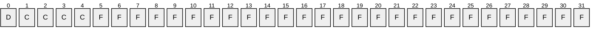
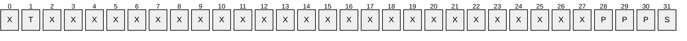
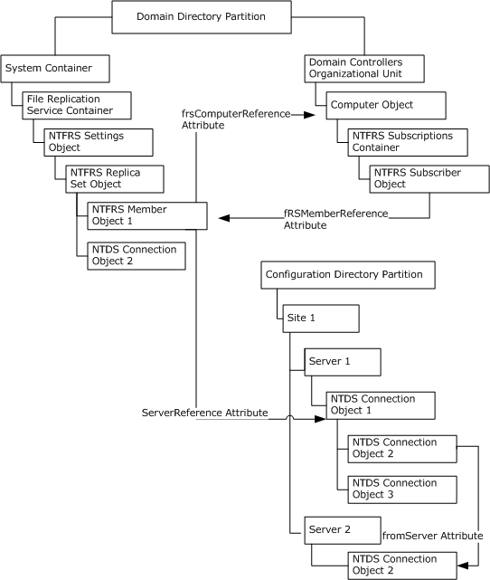
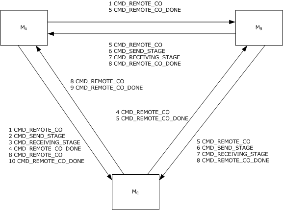

# [MS-FRS1]: File Replication Service Protocol

Table of Contents

1 Introduction

- [1 Introduction](#Section_1)
  - [1.1 Glossary](#Section_1.1)
  - [1.2 References](#Section_1.2)
    - [1.2.1 Normative References](#Section_1.2.1)
    - [1.2.2 Informative References](#Section_1.2.2)
  - [1.3 Overview](#Section_1.3)
  - [1.4 Relationship to Other Protocols](#Section_1.4)
  - [1.5 Prerequisites/Preconditions](#Section_1.5)
  - [1.6 Applicability Statement](#Section_1.6)
  - [1.7 Versioning and Capability Negotiation](#Section_1.7)
    - [1.7.1 NtFrsApi](#Section_1.7.1)
    - [1.7.2 FRSRPC](#Section_1.7.2)
  - [1.8 Vendor-Extensible Fields](#Section_1.8)
  - [1.9 Standards Assignments](#Section_1.9)

2 Messages

- [2 Messages](#Section_2)
  - [2.1 Transport](#Section_2.1)
  - [2.2 Common Data Types](#Section_2.2)
    - [2.2.1 WCHAR and PWCHAR](#Section_2.2.1)
    - [2.2.2 NtFrsApi Common Data Types](#Section_2.2.2)
      - [2.2.2.1 NTFRSAPI_INFO](#Section_2.2.2.1)
    - [2.2.3 FRSRPC Common Data Types](#Section_2.2.3)
      - [2.2.3.1 GVSN](#Section_2.2.3.1)
      - [2.2.3.2 CHANGE_ORDER_COMMAND](#Section_2.2.3.2)
      - [2.2.3.3 CO_RECORD_EXTENSION_WIN2K](#Section_2.2.3.3)
      - [2.2.3.4 CHANGE_ORDER_RECORD_EXTENSION](#Section_2.2.3.4)
      - [2.2.3.5 COMM_PACKET and PCOMM_PACKET](#Section_2.2.3.5)
      - [2.2.3.6 COMM_PACKET Elements](#Section_2.2.3.6)
        - [2.2.3.6.1 COMM_BOP](#Section_2.2.3.6.1)
        - [2.2.3.6.2 COMM_COMMAND](#Section_2.2.3.6.2)
        - [2.2.3.6.3 COMM_TO](#Section_2.2.3.6.3)
        - [2.2.3.6.4 COMM_FROM](#Section_2.2.3.6.4)
        - [2.2.3.6.5 COMM_REPLICA](#Section_2.2.3.6.5)
        - [2.2.3.6.6 COMM_CXTION](#Section_2.2.3.6.6)
        - [2.2.3.6.7 COMM_JOIN_GUID](#Section_2.2.3.6.7)
        - [2.2.3.6.8 COMM_LAST_JOIN_TIME](#Section_2.2.3.6.8)
        - [2.2.3.6.9 COMM_VVECTOR](#Section_2.2.3.6.9)
        - [2.2.3.6.10 COMM_JOIN_TIME](#Section_2.2.3.6.10)
        - [2.2.3.6.11 COMM_REPLICA_VERSION_GUID](#Section_2.2.3.6.11)
        - [2.2.3.6.12 COMM_COMPRESSION_GUID](#Section_2.2.3.6.12)
        - [2.2.3.6.13 COMM_BLOCK](#Section_2.2.3.6.13)
        - [2.2.3.6.14 COMM_BLOCK_SIZE](#Section_2.2.3.6.14)
        - [2.2.3.6.15 COMM_FILE_SIZE](#Section_2.2.3.6.15)
        - [2.2.3.6.16 COMM_FILE_OFFSET](#Section_2.2.3.6.16)
        - [2.2.3.6.17 COMM_GVSN](#Section_2.2.3.6.17)
        - [2.2.3.6.18 COMM_CO_GUID](#Section_2.2.3.6.18)
        - [2.2.3.6.19 COMM_CO_SEQUENCE_NUMBER](#Section_2.2.3.6.19)
        - [2.2.3.6.20 COMM_REMOTE_CO](#Section_2.2.3.6.20)
        - [2.2.3.6.21 COMM_CO_EXT_WIN2K](#Section_2.2.3.6.21)
        - [2.2.3.6.22 COMM_CO_EXTENSION_2](#Section_2.2.3.6.22)
        - [2.2.3.6.23 COMM_EOP](#Section_2.2.3.6.23)
      - [2.2.3.7 DATA_EXTENSION_CHECKSUM](#Section_2.2.3.7)
      - [2.2.3.8 DATA_EXTENSION_PREFIX](#Section_2.2.3.8)
      - [2.2.3.9 DATA_EXTENSION_RETRY_TIMEOUT](#Section_2.2.3.9)
      - [2.2.3.10 STAGE_HEADER](#Section_2.2.3.10)
  - [2.3 Directory Service Schema Elements](#Section_2.3)
    - [2.3.1 DFS Active Directory Configuration](#Section_2.3.1)
      - [2.3.1.1 NTFRS Settings Object](#Section_2.3.1.1)
      - [2.3.1.2 NTFRS Replica Set Object](#Section_2.3.1.2)
      - [2.3.1.3 NTFRS Member Object](#Section_2.3.1.3)
      - [2.3.1.4 NTDS Active Directory Service Agent (nTDSDSA) Object](#Section_2.3.1.4)
      - [2.3.1.5 NTDS Active Directory Service Agent Read Only (nTDSDSARO) Object](#Section_2.3.1.5)
      - [2.3.1.6 NTDS Connection Object](#Section_2.3.1.6)
      - [2.3.1.7 Computer Object](#Section_2.3.1.7)
      - [2.3.1.8 NTFRS Subscriptions Container](#Section_2.3.1.8)
      - [2.3.1.9 NTFRS Subscriber Object](#Section_2.3.1.9)
      - [2.3.1.10 Object Types](#Section_2.3.1.10)
      - [2.3.1.11 Top class](#Section_2.3.1.11)
    - [2.3.2 SYSVOL Active Directory Configuration](#Section_2.3.2)
      - [2.3.2.1 NTFRS Settings Object](#Section_2.3.2.1)
      - [2.3.2.2 NTFRS Replica Set Object](#Section_2.3.2.2)
      - [2.3.2.3 NTFRS Member Object](#Section_2.3.2.3)
      - [2.3.2.4 NTDS Connection Object](#Section_2.3.2.4)
      - [2.3.2.5 Computer Object](#Section_2.3.2.5)
      - [2.3.2.6 NTFRS Subscriptions Container](#Section_2.3.2.6)
      - [2.3.2.7 NTFRS Subscriber Object](#Section_2.3.2.7)
  - [2.4 FRS Performance Counters](#Section_2.4)
    - [2.4.1 FileReplicaConn Object](#Section_2.4.1)
    - [2.4.2 FileReplicaSet](#Section_2.4.2)

3 Protocol Details

- [3 Protocol Details](#Section_3)
  - [3.1 Common Details](#Section_3.1)
    - [3.1.1 Abstract Data Model](#Section_3.1.1)
      - [3.1.1.1 File System](#Section_3.1.1.1)
      - [3.1.1.2 Replica Set Object](#Section_3.1.1.2)
      - [3.1.1.3 Member Object (Replica Member Object)](#Section_3.1.1.3)
      - [3.1.1.4 Replica Tree](#Section_3.1.1.4)
      - [3.1.1.5 IDTable](#Section_3.1.1.5)
      - [3.1.1.6 Inbound Log Object (InLog)](#Section_3.1.1.6)
      - [3.1.1.7 Outbound Log Object (OutLog)](#Section_3.1.1.7)
      - [3.1.1.8 Connection Object](#Section_3.1.1.8)
      - [3.1.1.9 Staging File Object](#Section_3.1.1.9)
      - [3.1.1.10 Change Order Object](#Section_3.1.1.10)
        - [3.1.1.10.1 Local Change Order](#Section_3.1.1.10.1)
        - [3.1.1.10.2 Retry Change Order](#Section_3.1.1.10.2)
        - [3.1.1.10.3 Directed Change Order](#Section_3.1.1.10.3)
        - [3.1.1.10.4 Out-of-Order Change Order](#Section_3.1.1.10.4)
        - [3.1.1.10.5 Skip-VV-Update Change Order](#Section_3.1.1.10.5)
      - [3.1.1.11 Version Vector Object](#Section_3.1.1.11)
      - [3.1.1.12 Communication Packet Object](#Section_3.1.1.12)
    - [3.1.2 Timers](#Section_3.1.2)
    - [3.1.3 Initialization](#Section_3.1.3)
    - [3.1.4 Message Processing Events and Sequencing Rules](#Section_3.1.4)
    - [3.1.5 Timer Events](#Section_3.1.5)
      - [3.1.5.1 Both Short and Long DS Polling Interval Timers](#Section_3.1.5.1)
    - [3.1.6 Other Local Events](#Section_3.1.6)
  - [3.2 FRSAPI Interface](#Section_3.2)
    - [3.2.1 Abstract Data Model](#Section_3.2.1)
    - [3.2.2 Timers](#Section_3.2.2)
    - [3.2.3 Initialization](#Section_3.2.3)
    - [3.2.4 Message Processing Events and Sequencing Rules](#Section_3.2.4)
      - [3.2.4.1 NtFrsApi_Rpc_Set_DsPollingIntervalW (Opnum 4)](#Section_3.2.4.1)
      - [3.2.4.2 NtFrsApi_Rpc_Get_DsPollingIntervalW (Opnum 5)](#Section_3.2.4.2)
      - [3.2.4.3 NtFrsApi_Rpc_InfoW (Opnum 7)](#Section_3.2.4.3)
      - [3.2.4.4 NtFrsApi_Rpc_IsPathReplicated (Opnum 8)](#Section_3.2.4.4)
      - [3.2.4.5 NtFrsApi_Rpc_WriterCommand (Opnum 9)](#Section_3.2.4.5)
      - [3.2.4.6 NtFrsApi_Rpc_ForceReplication (Opnum 10)](#Section_3.2.4.6)
    - [3.2.5 Timer Events](#Section_3.2.5)
    - [3.2.6 Other Local Events](#Section_3.2.6)
  - [3.3 FRSRPC Interface](#Section_3.3)
    - [3.3.1 Abstract Data Model](#Section_3.3.1)
    - [3.3.2 Timers](#Section_3.3.2)
      - [3.3.2.1 Connection Schedule Timer](#Section_3.3.2.1)
        - [3.3.2.1.1 SYSVOL Connection ScheduleTimer](#Section_3.3.2.1.1)
        - [3.3.2.1.2 DFS Connection Schedule](#Section_3.3.2.1.2)
    - [3.3.3 Initialization](#Section_3.3.3)
    - [3.3.4 Message Processing Events and Sequencing Rules](#Section_3.3.4)
      - [3.3.4.1 Change Orders](#Section_3.3.4.1)
        - [3.3.4.1.1 File Is Added/Updated on the Upstream Partner](#Section_3.3.4.1.1)
        - [3.3.4.1.2 File Is Removed on the Upstream Partner](#Section_3.3.4.1.2)
        - [3.3.4.1.3 File Is Renamed on the Upstream Partner](#Section_3.3.4.1.3)
        - [3.3.4.1.4 Folder Is Created/Updated on the Upstream Partner](#Section_3.3.4.1.4)
        - [3.3.4.1.5 Folder Is Removed on the Upstream Partner](#Section_3.3.4.1.5)
        - [3.3.4.1.6 Folder Is Renamed on the Upstream Partner](#Section_3.3.4.1.6)
      - [3.3.4.2 FrsRpcStartPromotionParent Message (Opnum 2)](#Section_3.3.4.2)
      - [3.3.4.3 FrsNOP Message (Opnum 3)](#Section_3.3.4.3)
      - [3.3.4.4 FrsRpcSendCommPkt (Opnum 0)](#Section_3.3.4.4)
        - [3.3.4.4.1 Common Details](#Section_3.3.4.4.1)
        - [3.3.4.4.2 COMM_COMMAND Is CMD_NEED_JOIN](#Section_3.3.4.4.2)
        - [3.3.4.4.3 COMM_COMMAND Is CMD_START_JOIN](#Section_3.3.4.4.3)
        - [3.3.4.4.4 COMM_COMMAND Is CMD_JOINING](#Section_3.3.4.4.4)
          - [3.3.4.4.4.1 Connection VVJoin](#Section_3.3.4.4.4.1)
            - [3.3.4.4.4.1.1 Common Details for Initial Syncing a File and a Folder](#Section_3.3.4.4.4.1.1)
            - [3.3.4.4.4.1.2 Initial Syncing a File](#Section_3.3.4.4.4.1.2)
            - [3.3.4.4.4.1.3 Initial Syncing a Folder](#Section_3.3.4.4.4.1.3)
            - [3.3.4.4.4.1.4 CMD_VVJOIN_DONE Once Initial Sync Is Done](#Section_3.3.4.4.4.1.4)
        - [3.3.4.4.5 COMM_COMMAND Is CMD_JOINED](#Section_3.3.4.4.5)
        - [3.3.4.4.6 COMM_COMMAND Is CMD_REMOTE_CO](#Section_3.3.4.4.6)
          - [3.3.4.4.6.1 Requesting a Staging File](#Section_3.3.4.4.6.1)
          - [3.3.4.4.6.2 Acknowledging the Change Is Done](#Section_3.3.4.4.6.2)
        - [3.3.4.4.7 COMM_COMMAND Is CMD_SEND_STAGE](#Section_3.3.4.4.7)
        - [3.3.4.4.8 COMM_COMMAND Is CMD_RECEIVING_STAGE](#Section_3.3.4.4.8)
        - [3.3.4.4.9 COMM_COMMAND Is CMD_REMOTE_CO_DONE](#Section_3.3.4.4.9)
        - [3.3.4.4.10 COMM_COMMAND Is CMD_ABORT_FETCH](#Section_3.3.4.4.10)
        - [3.3.4.4.11 COMM_COMMAND Is CMD_RETRY_FETCH](#Section_3.3.4.4.11)
        - [3.3.4.4.12 COMM_COMMAND Is CMD_VVJOIN_DONE](#Section_3.3.4.4.12)
        - [3.3.4.4.13 COMM_COMMAND Is CMD_UNJOIN_REMOTE](#Section_3.3.4.4.13)
      - [3.3.4.5 FrsRpcVerifyPromotionParent (Opnum 1)](#Section_3.3.4.5)
      - [3.3.4.6 Establishing a Connection Session](#Section_3.3.4.6)
    - [3.3.5 Timer Events](#Section_3.3.5)
    - [3.3.6 Other Local Events](#Section_3.3.6)
  - [3.4 PERFFRS Interface](#Section_3.4)

4 Protocol Examples

- [4 Protocol Examples](#Section_4)
  - [4.1 Connection Establishment Sequence](#Section_4.1)
  - [4.2 Change Order Handling Sequence](#Section_4.2)
  - [4.3 COMM_PACKET](#Section_4.3)
  - [4.4 SYSVOL Initial Sync](#Section_4.4)
    - [4.4.1 Replica DC Sends Out CMD_NEED_JOIN to PDC](#Section_4.4.1)
    - [4.4.2 PDC Sends Out CMD_START_JOIN to Replica DC](#Section_4.4.2)
    - [4.4.3 Replica DC Sends Out CMD_JOINING](#Section_4.4.3)
    - [4.4.4 PDC Sends Out CMD_JOINED](#Section_4.4.4)
    - [4.4.5 PDC Sends Out CMD_REMOTE_CO](#Section_4.4.5)
    - [4.4.6 Replica DC Sends Out CMD_SEND_STAGE](#Section_4.4.6)
    - [4.4.7 PDC Sends Out CMD_RECEIVING_STAGE](#Section_4.4.7)
    - [4.4.8 Replica DC Sends Out CMD_REMOTE_CO_DONE](#Section_4.4.8)
    - [4.4.9 Once All Change Orders are Sent Out, PDC Sends Out CMD_VVJOIN_DONE](#Section_4.4.9)
    - [4.4.10 Replica DC Sends Out CMD_UNJOIN_REMOTE](#Section_4.4.10)
  - [4.5 Normal Sync](#Section_4.5)
    - [4.5.1 Copy a File](#Section_4.5.1)
      - [4.5.1.1 Upstream Partner Sends Out CMD_REMOTE_CO](#Section_4.5.1.1)
      - [4.5.1.2 Downstream Partner Sends Out CMD_SEND_STAGE 1](#Section_4.5.1.2)
      - [4.5.1.3 Upstream Partner Sends Out CMD_RECEIVING_STAGE 1](#Section_4.5.1.3)
      - [4.5.1.4 Downstream Partner Sends Out CMD_SEND_STAGE 2](#Section_4.5.1.4)
      - [4.5.1.5 Upstream Partner Sends Out CMD_RECEIVING_STAGE 2](#Section_4.5.1.5)
      - [4.5.1.6 Downstream Partner Sends Out CMD_REMOTE_CO_DONE](#Section_4.5.1.6)
    - [4.5.2 Rename a File](#Section_4.5.2)
      - [4.5.2.1 Upstream Partner Sends Out CMD_REMOTE_CO](#Section_4.5.2.1)
      - [4.5.2.2 Downstream Partner Sends Out CMD_SEND_STAGE](#Section_4.5.2.2)
      - [4.5.2.3 Upstream Partner Sends Out CMD_RECEIVING_STAGE](#Section_4.5.2.3)
      - [4.5.2.4 Downstream Partner Sends Out CMD_REMOTE_CO_DONE](#Section_4.5.2.4)
    - [4.5.3 Remove a File](#Section_4.5.3)
      - [4.5.3.1 Upstream Partner Sends Out CMD_REMOTE_CO](#Section_4.5.3.1)
      - [4.5.3.2 Downstream Partner Sends Out CMD_REMOTE_CO_DONE](#Section_4.5.3.2)
    - [4.5.4 Copy an Empty Folder](#Section_4.5.4)
      - [4.5.4.1 Upstream Partner Sends Out CMD_REMOTE_CO](#Section_4.5.4.1)
      - [4.5.4.2 Downstream Partner Sends Out CMD_SEND_STAGE](#Section_4.5.4.2)
      - [4.5.4.3 Upstream Partner Sends Out CMD_RECEIVING_STAGE](#Section_4.5.4.3)
      - [4.5.4.4 Downstream Partner Sends Out CMD_REMOTE_CO_DONE](#Section_4.5.4.4)
    - [4.5.5 Remove a Folder](#Section_4.5.5)
      - [4.5.5.1 Upstream Partner Sends Out CMD_REMOTE_CO](#Section_4.5.5.1)
      - [4.5.5.2 Downstream Partner Sends Out CMD_REMOTE_CO_DONE](#Section_4.5.5.2)
    - [4.5.6 Rename an Empty Folder](#Section_4.5.6)
      - [4.5.6.1 Upstream Partner Sends Out CMD_REMOTE_CO](#Section_4.5.6.1)
      - [4.5.6.2 Downstream Partner Sends Out CMD_SEND_STAGE](#Section_4.5.6.2)
      - [4.5.6.3 Upstream Partner Sends Out CMD_RECEIVING_STAGE](#Section_4.5.6.3)
      - [4.5.6.4 Downstream Partner Sends Out CMD_REMOTE_CO_DONE](#Section_4.5.6.4)

5 Security

- [5 Security](#Section_5)
  - [5.1 Security Considerations for Implementers](#Section_5.1)
  - [5.2 Index of Security Parameters](#Section_5.2)

6 Appendix A: Full IDL

- [6 Appendix A: Full IDL](#Section_6)
  - [6.1 Appendix A.1: frsapi.idl](#Section_6.1)
  - [6.2 Appendix A.2: frsrpc.idl](#Section_6.2)

7 Appendix B: Product Behavior

- [7 Appendix B: Product Behavior](#Section_7)

8 Change Tracking

- [8 Change Tracking](#Section_8)

For the legal notice and IP terms, see [LEGAL.md](../LEGAL.md).
Last updated: 9/16/2024.
See [Revision History](#revision-history) for full version history.

# 1 Introduction

The File Replication Service (FRS) Protocol is used to replicate files and folders among servers on the network. This protocol enables duplicate files and folders to be maintained on multiple servers. FRS is used to maintain duplicate copies of data files in the system volume (SYSVOL) system folders on multiple domain controllers in a domain. FRS is used to replicate data files among Distributed File System (DFS) shares. Detailed technical reference material for the Remote Procedure Call (RPC) interfaces, packet formats, and data structures required for interoperation using FRS are provided.

Sections 1.5, 1.8, 1.9, 2, and 3 of this specification are normative. All other sections and examples in this specification are informative.

## 1.1 Glossary

This document uses the following terms:

**Active Directory**: The Windows implementation of a general-purpose directory service, which uses LDAP as its primary access protocol. Active Directory stores information about a variety of objects in the network such as user accounts, computer accounts, groups, and all related credential information used by Kerberos [MS-KILE](../MS-KILE/MS-KILE.md). Active Directory is either deployed as Active Directory Domain Services (AD DS) or Active Directory Lightweight Directory Services (AD LDS), which are both described in [MS-ADOD](../MS-ADOD/MS-ADOD.md): Active Directory Protocols Overview.

**Active Directory object**: A set of directory objects that are used within [**Active Directory**](#gt_active-directory) as defined in [MS-ADTS](../MS-ADTS/MS-ADTS.md) section 3.1.1. An [**Active Directory object**](#gt_active-directory-object) can be identified by a dsname. See also directory object.

**Active Directory replication**: The process by which the changes that are made to [**Active Directory objects**](#gt_active-directory-object) on one [**domain controller (DC)**](#gt_domain-controller-dc) are automatically synchronized with other [**DCs**](#gt_domain-controller-dc).

**Change Order**: A message that contains information about a [**file**](#gt_file) or folder that has changed on a replica. The change order is sent to the member's [**downstream partners**](#gt_downstream-partner). If the [**downstream partners**](#gt_downstream-partner) accept the change, the [**partners**](#gt_partner) request the associated [**staging file**](#gt_staging-file). After installing the changed [**file**](#gt_file) in their individual [**replica trees**](#gt_replica-tree), the [**partners**](#gt_partner) propagate the change order to their [**downstream partners**](#gt_downstream-partner).

**Connection Join (Join)**: The process by which a [**connection session**](#gt_connection-session) is established.

**Connection Session**: After [**FRS**](#gt_file-replication-service-frs) discovers a connection from [**Active Directory**](#gt_active-directory), [**FRS**](#gt_file-replication-service-frs) establishes a connection session with the remote connection [**partner**](#gt_partner) based on the information provided by the connection object. The connection is called "joined" when a connection session is successfully established. This connection session is disconnected once the connection [**schedule**](#gt_schedule) is off (forbidding [**file**](#gt_file) replication on the connection).

**Dampening**: On receiving a [**remote change order**](#gt_remote-change-order), [**FRS**](#gt_file-replication-service-frs) has to determine if the [**change order**](#gt_change-order) is already known to the local machine by using the version vector of the local machine. If the remote change order is known, FRS drops the change order and informs the [**upstream partner**](#gt_upstream-partner). This process is called "dampening" a change order.

**DFS-R**: A service that keeps [**DFS**](#gt_distributed-file-system-dfs) and [**SYSVOL**](#gt_system-volume-sysvol) folders in sync automatically. DFS-R is a state-based, multimaster replication system that supports replication scheduling and bandwidth throttling. This is a rewrite and new version of [**FRS**](#gt_file-replication-service-frs). For more information, see [MS-FRS2](../MS-FRS2/MS-FRS2.md).

**Directed Change Order**: A [**change order**](#gt_change-order) directed to a single [**downstream partner**](#gt_downstream-partner) and produced when the [**partner**](#gt_partner) is a [**Version Vector Join (VVJoin)**](#gt_version-vector-join-vvjoin), such as during [**initial sync**](#gt_initial-sync).

**Distributed File System (DFS)**: A file system that logically groups physical shared folders located on different servers by transparently connecting them to one or more hierarchical namespaces. [**DFS**](#gt_distributed-file-system-dfs) also provides fault-tolerance and load-sharing capabilities.

**Distributed File System Replication (DFS-R)**: A service that keeps [**DFS**](#gt_distributed-file-system-dfs) folders in sync automatically. [**DFS-R**](#gt_distributed-file-system-replication-dfs-r) is a state-based, multi-master replication system that supports replication scheduling and bandwidth throttling. This is a rewrite and new version of the [**File Replication Service (FRS)**](#gt_file-replication-service-frs). For more information, see [MS-FRS2].

**domain**: A set of users and computers sharing a common namespace and management infrastructure. At least one computer member of the set has to act as a [**domain controller (DC)**](#gt_domain-controller-dc) and host a member list that identifies all members of the domain, as well as optionally hosting the [**Active Directory**](#gt_active-directory) service. The domain controller provides authentication of members, creating a unit of trust for its members. Each domain has an identifier that is shared among its members. For more information, see [MS-AUTHSOD](../MS-AUTHSOD/MS-AUTHSOD.md) section 1.1.1.5 and [MS-ADTS].

**domain controller (DC)**: The service, running on a server, that implements [**Active Directory**](#gt_active-directory), or the server hosting this service. The service hosts the data store for objects and interoperates with other [**DCs**](#gt_domain-controller-dc) to ensure that a local change to an object replicates correctly across all [**DCs**](#gt_domain-controller-dc). When [**Active Directory**](#gt_active-directory) is operating as Active Directory Domain Services (AD DS), the [**DC**](#gt_domain-controller-dc) contains full NC replicas of the configuration naming context (config NC), schema naming context (schema NC), and one of the domain NCs in its forest. If the AD DS [**DC**](#gt_domain-controller-dc) is a global catalog server (GC server), it contains partial NC replicas of the remaining domain NCs in its forest. For more information, see [MS-AUTHSOD] section 1.1.1.5.2 and [MS-ADTS]. When [**Active Directory**](#gt_active-directory) is operating as Active Directory Lightweight Directory Services (AD LDS), several AD LDS [**DCs**](#gt_domain-controller-dc) can run on one server. When [**Active Directory**](#gt_active-directory) is operating as AD DS, only one AD DS [**DC**](#gt_domain-controller-dc) can run on one server. However, several AD LDS [**DCs**](#gt_domain-controller-dc) can coexist with one AD DS [**DC**](#gt_domain-controller-dc) on one server. The AD LDS [**DC**](#gt_domain-controller-dc) contains full NC replicas of the config NC and the schema NC in its forest. The domain controller is the server side of Authentication Protocol Domain Support [MS-APDS](../MS-APDS/MS-APDS.md).

**domain functional level**: A specification of functionality available in a [**domain**](#gt_domain). Has to be less than or equal to the DC functional level of every [**domain controller (DC)**](#gt_domain-controller-dc) that hosts a replica of the domain's naming context (NC). For information on defined levels, corresponding features, information on how the domain functional level is determined, and supported domain controllers, see [MS-ADTS] sections 6.1.4.2 and 6.1.4.3. When [**Active Directory**](#gt_active-directory) is operating as Active Directory Lightweight Directory Services (AD LDS), domain functional level does not exist.

**Downstream Partner**: The [**partner**](#gt_partner) that receives [**change orders**](#gt_change-order), [**files**](#gt_file), and folders.

**endpoint**: A network-specific address of a remote procedure call (RPC) server process for remote procedure calls. The actual name and type of the endpoint depends on the [**RPC**](#gt_remote-procedure-call-rpc) protocol sequence that is being used. For example, for RPC over TCP (RPC Protocol Sequence ncacn_ip_tcp), an endpoint might be TCP port 1025. For RPC over Server Message Block (RPC Protocol Sequence ncacn_np), an endpoint might be the name of a named pipe. For more information, see [[C706]](https://go.microsoft.com/fwlink/?LinkId=89824).

**endpoint mapper**: A service on a remote procedure call (RPC) server that maintains a database of dynamic endpoints and allows clients to map an interface/object UUID pair to a local dynamic endpoint. For more information, see [C706].

**Event Time**: See File Event Time.

**file**: An entity of data in the file system that a user can access and manage. A file has to have a unique name in its directory. It consists of one or more streams of bytes that hold a set of related data, plus a set of attributes also called properties that describe the file or the data within the file. The creation time of a file is an example of a file attribute.

**file attribute**: A 32-bit bitmask containing information on a [**file's**](#gt_file) properties. For instance, 0x00000001 is used for the read-only attribute.

**File GUID**: An identifying property of a [**file**](#gt_file) or folder in a [**replica tree**](#gt_replica-tree). [**FRS**](#gt_file-replication-service-frs) creates and manages [**file**](#gt_file) [**GUIDs**](#gt_globally-unique-identifier-guid), which, along with the [**file version number**](#gt_file-version-number) and file event time, are stored in the [**IDTable**](#gt_idtable). Each [**file**](#gt_file) and folder stores its [**file GUID**](#gt_file-guid) as part of its attributes; therefore, corresponding [**files**](#gt_file) and folders across all [**replica set**](#gt_replica-set) members have the same [**file GUID**](#gt_file-guid).

**File Replication Service (FRS)**: One of the services offered by a [**domain controller (DC)**](#gt_domain-controller-dc), which is advertised through the Domain Controller Location protocol. The service being offered to clients is a replicated data storage volume that is associated with the default naming context (NC). The running or paused state of the [**FRS**](#gt_file-replication-service-frs) on a [**DC**](#gt_domain-controller-dc) is available through protocols documented in [MS-ADTS] section 6.3.

**File Version Number**: A property of a [**file**](#gt_file) and folder in a [**replica tree**](#gt_replica-tree) that is incremented each time the [**file**](#gt_file) or folder is updated. The file version number is used to resolve concurrent updates originating from more than one member of the [**replica set**](#gt_replica-set). The version number is only incremented by the member that originated the [**file**](#gt_file) update. Other members that propagate the update do not change the version number.

**filter**: A setting that excludes subfolders (and their contents) or [**files**](#gt_file) from replication. There are two types of filters: [**file**](#gt_file) filters and folder filters.

**fully qualified domain name (FQDN)**: An unambiguous domain name that gives an absolute location in the Domain Name System's (DNS) hierarchy tree, as defined in [[RFC1035]](https://go.microsoft.com/fwlink/?LinkId=90264) section 3.1 and [[RFC2181]](https://go.microsoft.com/fwlink/?LinkId=127732) section 11.

**globally unique identifier (GUID)**: A term used interchangeably with [**universally unique identifier (UUID)**](#gt_universally-unique-identifier-uuid) in Microsoft protocol technical documents (TDs). Interchanging the usage of these terms does not imply or require a specific algorithm or mechanism to generate the value. Specifically, the use of this term does not imply or require that the algorithms described in [[RFC4122]](https://go.microsoft.com/fwlink/?LinkId=90460) or [C706] have to be used for generating the GUID. See also universally unique identifier (UUID).

**IDTable**: A table of [**FRS**](#gt_file-replication-service-frs) state information that contains an entry with version and identity information for each [**file**](#gt_file) and folder in the [**replica tree**](#gt_replica-tree). It is used to keep track of all [**files**](#gt_file) in the [**replica set**](#gt_replica-set) and their histories.

**inbound**: The network traffic flowing from the client to the server.

**Inbound Connection**: For a given [**replica member**](#gt_replica-member-frs-replica), a component of the [**NT File Replication Service (NTFRS) member**](#gt_ntfrs-member) object in [**Active Directory**](#gt_active-directory) that identifies [**upstream partners**](#gt_upstream-partner). An inbound connection exists for each [**upstream partner**](#gt_upstream-partner).

**inbound log**: A queue that stores pending change orders to be processed. As entries in the queue are processed, acknowledgments are sent to the inbound partners.

**Inbound Log (InLog)**: A queue that stores pending [**change orders**](#gt_change-order) to be processed. As entries in the queue are processed, acknowledgments are sent to the [**upstream partners**](#gt_upstream-partner).

**Initial Sync**: The process a new member to the [**replica set**](#gt_replica-set) before it is allowed to synchronize with its [**downstream partners**](#gt_downstream-partner). It is also called [**VVJoin**](#gt_version-vector-join-vvjoin).

**Install (File or Folder)**: A process by which [**FRS**](#gt_file-replication-service-frs) applies a [**change order**](#gt_change-order) to the local [**file**](#gt_file) system to restore the file or folder as it is in the [**upstream partner**](#gt_upstream-partner). If the change order is for a deletion, the file or folder is deleted in the local file system; the staging file is not needed. If the change order is for a renaming, the file or folder is renamed in the local file system; the staging file is needed. If the change order is for a copying or creation, the file or folder is copied or created; the [**staging file**](#gt_staging-file) is needed. The installation of a file or folder can fail if the file or folder is already opened by another process. If the installation failed, FRS retries the installation of the file or folder at a later time.

**Interface Definition Language (IDL)**: The International Standards Organization (ISO) standard language for specifying the interface for remote procedure calls. For more information, see [C706] section 4.

**join**: A combination of data from multiple sources that is based upon a common attribute or join condition.

**Local Change Order**: A [**change order**](#gt_change-order) that is created because of a change to a [**file**](#gt_file) or folder on the local server. The local server becomes the originator of the [**change order**](#gt_change-order) and constructs a [**staging file**](#gt_staging-file).

**MD5 hash**: A hashing algorithm, as described in [[RFC1321]](https://go.microsoft.com/fwlink/?LinkId=90275), that was developed by RSA Data Security, Inc. An MD5 hash is used by the File Replication Service (FRS) to verify that a file on each replica member is identical.

**NetBIOS**: A particular network transport that is part of the LAN Manager protocol suite. [**NetBIOS**](#gt_netbios) uses a broadcast communication style that was applicable to early segmented local area networks. A protocol family including name resolution, datagram, and connection services. For more information, see [[RFC1001]](https://go.microsoft.com/fwlink/?LinkId=90260) and [[RFC1002]](https://go.microsoft.com/fwlink/?LinkId=90261).

**Normal Sync**: The synchronization among replicas after [**initial sync**](#gt_initial-sync) is done.

**NT file system (NTFS)**: A proprietary Microsoft file system. For more information, see [[MSFT-NTFS]](https://go.microsoft.com/fwlink/?LinkId=90200).

**NTFRS Member**: An object of class type nTFRSMember. Each [**NTFRS member**](#gt_ntfrs-member) object (class nTFRSMember) corresponds to a computer that is part of a [**replica set**](#gt_replica-set) (see section NTFRS Member Object as specified in section 2.3.1.3).

**objectGUID**: The attribute on an [**Active Directory**](#gt_active-directory) object whose value is a [**GUID**](#gt_globally-unique-identifier-guid) that uniquely identifies the object. The [**GUID**](#gt_globally-unique-identifier-guid) value of an object's objectGUID is assigned when the object was created and is immutable thereafter. The integrity of object references between NCs and of replication depends on the integrity of the objectGUID attribute. For a descrption of the general concept of an "object", see [MS-ADTS] section 1. For more detailed information see [MS-ADTS] section 3.1.1.1.3.

**opnum**: An operation number or numeric identifier that is used to identify a specific [**remote procedure call (RPC)**](#gt_remote-procedure-call-rpc) method or a method in an interface. For more information, see [C706] section 12.5.2.12 or [MS-RPCE](../MS-RPCE/MS-RPCE.md).

**Originator GUID**: A [**GUID**](#gt_globally-unique-identifier-guid) that is associated with each [**replica member**](#gt_replica-member-frs-replica). All [**change orders**](#gt_change-order) produced by a given [**replica member**](#gt_replica-member-frs-replica) carry the replica member's originator GUID, which is saved in the [**IDTable**](#gt_idtable). The originator GUID is not the same as the member [**GUID**](#gt_globally-unique-identifier-guid), which is the [**objectGuid**](#gt_objectguid) of the [**NTFRS member**](#gt_ntfrs-member) object in [**Active Directory**](#gt_active-directory). For more information, see [MS-ADTS] section 3.1.1.1.3.

**outbound**: Network traffic flowing from the server to the client.

**Outbound Connection**: For a given [**replica member**](#gt_replica-member-frs-replica), a component of the [**NTFRS member**](#gt_ntfrs-member) object in [**Active Directory**](#gt_active-directory) that identifies [**downstream partners**](#gt_downstream-partner). An outbound connection exists for each [**downstream partner**](#gt_downstream-partner).

**Outbound Log (OutLog)**: A table in the [**FRS**](#gt_file-replication-service-frs) database that stores pending [**change orders**](#gt_change-order) to be sent to [**downstream partners**](#gt_downstream-partner). The changes can originate locally or come from an [**upstream partner**](#gt_upstream-partner). These [**change orders**](#gt_change-order) are eventually sent to all outbound replica [**partners**](#gt_partner).

**Parent GUID**: The [**GUID**](#gt_globally-unique-identifier-guid) of the parent folder that contains a particular [**file**](#gt_file) or folder in the [**replica tree**](#gt_replica-tree).

**partner**: A computer connected to a local computer through either inbound or outbound connections.

**primary domain controller (PDC)**: A [**domain controller (DC)**](#gt_domain-controller-dc) designated to track changes made to the accounts of all computers on a [**domain**](#gt_domain). It is the only computer to receive these changes directly, and is specialized so as to ensure consistency and to eliminate the potential for conflicting entries in the [**Active Directory**](#gt_active-directory) database. A [**domain**](#gt_domain) has only one [**PDC**](#gt_primary-domain-controller-pdc).

**read-only domain controller (RODC)**: A [**domain controller (DC)**](#gt_domain-controller-dc) that does not accept originating updates. Additionally, an [**RODC**](#gt_read-only-domain-controller-rodc) does not perform outbound replication. An RODC cannot be the primary domain controller (PDC) for its domain.

**Remote Change Order**: A [**change order**](#gt_change-order) received from an inbound (or upstream) [**partner**](#gt_partner) that originated elsewhere in the [**replica set**](#gt_replica-set).

**remote procedure call (RPC)**: A communication protocol used primarily between client and server. The term has three definitions that are often used interchangeably: a runtime environment providing for communication facilities between computers (the RPC runtime); a set of request-and-response message exchanges between computers (the RPC exchange); and the single message from an RPC exchange (the RPC message). For more information, see [C706].

**Replica Member (FRS Replica)**: A member of a [**replica set**](#gt_replica-set). Replica contains machine-specific information.

**replica set**: In File Replication Service (FRS), the replication of files and directories according to a predefined topology and schedule on a specific folder. The topology and schedule are collectively called a replica set. A replica set contains a set of replicas, one for each machine that participates in replication.

**replica tree**: The local replica root folder together with all files and directories underneath it, which usually is saved as a tree structure in the file system.

**Replica Tree Root**: The folder whose "children" (that is, [**files**](#gt_file) and folders) are replicated.

**Retry Change Order**: A [**change order**](#gt_change-order) that is in some state of completion but has been blocked for some reason and has to be retried later.

**Schedule**: The frequency at which [**FRS**](#gt_file-replication-service-frs) replicates data under [**replica tree root**](#gt_replica-tree-root).

**scheduled**: A status that is applied to a list item or document that specifies a time when the item or document will be published or unpublished.

**security principal name (SPN)**: The name that identifies a security principal (for example, machinename$@domainname for a machine joined to a domain or username@domainname for a user). Domainname is resolved using the Domain Name System (DNS).

**security provider**: A pluggable security module that is specified by the protocol layer above the [**remote procedure call (RPC)**](#gt_remote-procedure-call-rpc) layer, and will cause the [**RPC**](#gt_remote-procedure-call-rpc) layer to use this module to secure messages in a communication session with the server. The security provider is sometimes referred to as an authentication service. For more information, see [C706] and [MS-RPCE].

**staging file**: The backup of the changed file or folder. It encapsulates the data and attributes associated with a replicated file or folder. By creating the staging file, File Replication Service (FRS) ensures that file data can be supplied to partners regardless of any activity that might prevent access to the original file. The staging files can be compressed to save disk space and network bandwidth during replication.

**system volume (SYSVOL)**: A shared directory that stores the server copy of the [**domain's**](#gt_domain) public files that has to be shared for common access and replication throughout a domain.

**unique identifier (UID)**: A pair consisting of a [**GUID**](#gt_globally-unique-identifier-guid) and a version sequence number to identify each resource uniquely. The UID is used to track the object for its entire lifetime through any number of times that the object is modified or renamed.

**universally unique identifier (UUID)**: A 128-bit value. UUIDs can be used for multiple purposes, from tagging objects with an extremely short lifetime, to reliably identifying very persistent objects in cross-process communication such as client and server interfaces, manager entry-point vectors, and [**RPC**](#gt_remote-procedure-call-rpc) objects. UUIDs are highly likely to be unique. UUIDs are also known as [**globally unique identifiers (GUIDs)**](#gt_globally-unique-identifier-guid) and these terms are used interchangeably in the Microsoft protocol technical documents (TDs). Interchanging the usage of these terms does not imply or require a specific algorithm or mechanism to generate the UUID. Specifically, the use of this term does not imply or require that the algorithms described in [RFC4122] or [C706] has to be used for generating the UUID.

**Upstream Partner**: The [**partner**](#gt_partner) that sends out [**change orders**](#gt_change-order), [**files**](#gt_file), and folders.

**version sequence number (VSN)**: A 64-bit unsigned number. [**Version sequence numbers**](#gt_b2063d4f-ec5f-4417-9dc8-7ab381e2beab) are assigned to global version sequence numbers as part of file metadata in monotonic increasing order.

**Version Vector Join (VVJoin)**: The process in which a [**downstream partner**](#gt_downstream-partner) joins with an [**upstream partner**](#gt_upstream-partner) for the first time. Also called [**initial sync**](#gt_initial-sync). This process is defined in section [MS-FRS1](#Section_0fa4f91494424b4993cc038674a333f1) section 3.3.4.6.

**Volatile Connection**: An [**inbound connection**](#gt_inbound-connection) created for the [**initial sync**](#gt_initial-sync) for a [**system volume (SYSVOL)**](#gt_system-volume-sysvol) [**replica set**](#gt_replica-set). After the [**initial sync**](#gt_initial-sync) is done, the volatile connection is destroyed. Volatile connections are not represented in [**Active Directory**](#gt_active-directory).

**volume sequence number (VSN) (for file replication service)**: A unique sequence number assigned to a change order to order the event sequence in a replica. It is a monotonically increasing sequence number assigned to each change that originates on a given replica member. If one change order has a smaller [**volume sequence number (VSN)**](#gt_version-sequence-number-vsn) than another change order, the change that the first change order represents occurs before the change that the second change order represents.

**MAY, SHOULD, MUST, SHOULD NOT, MUST NOT:** These terms (in all caps) are used as defined in [[RFC2119]](https://go.microsoft.com/fwlink/?LinkId=90317). All statements of optional behavior use either MAY, SHOULD, or SHOULD NOT.

## 1.2 References

Links to a document in the Microsoft Open Specifications library point to the correct section in the most recently published version of the referenced document. However, because individual documents in the library are not updated at the same time, the section numbers in the documents may not match. You can confirm the correct section numbering by checking the [Errata](https://go.microsoft.com/fwlink/?linkid=850906).

### 1.2.1 Normative References

We conduct frequent surveys of the normative references to assure their continued availability. If you have any issue with finding a normative reference, please contact [dochelp@microsoft.com](mailto:dochelp@microsoft.com). We will assist you in finding the relevant information.

[C706] The Open Group, "DCE 1.1: Remote Procedure Call", C706, August 1997, [https://publications.opengroup.org/c706](https://go.microsoft.com/fwlink/?LinkId=89824)

**Note** Registration is required to download the document.

[MS-ADA1] Microsoft Corporation, "[Active Directory Schema Attributes A-L](../MS-ADA1/MS-ADA1.md)".

[MS-ADA2] Microsoft Corporation, "[Active Directory Schema Attributes M](../MS-ADA2/MS-ADA2.md)".

[MS-ADA3] Microsoft Corporation, "[Active Directory Schema Attributes N-Z](../MS-ADA3/MS-ADA3.md)".

[MS-ADLS] Microsoft Corporation, "[Active Directory Lightweight Directory Services Schema](../MS-ADLS/MS-ADLS.md)".

[MS-ADSC] Microsoft Corporation, "[Active Directory Schema Classes](../MS-ADSC/MS-ADSC.md)".

[MS-ADTS] Microsoft Corporation, "[Active Directory Technical Specification](../MS-ADTS/MS-ADTS.md)".

[MS-BKUP] Microsoft Corporation, "[Microsoft NT Backup File Structure](../MS-BKUP/MS-BKUP.md)".

[MS-DFSNM] Microsoft Corporation, "[Distributed File System (DFS): Namespace Management Protocol](../MS-DFSNM/MS-DFSNM.md)".

[MS-DFSRH] Microsoft Corporation, "[DFS Replication Helper Protocol](../MS-DFSRH/MS-DFSRH.md)".

[MS-DRSR] Microsoft Corporation, "[Directory Replication Service (DRS) Remote Protocol](../MS-DRSR/MS-DRSR.md)".

[MS-DTYP] Microsoft Corporation, "[Windows Data Types](../MS-DTYP/MS-DTYP.md)".

[MS-ERREF] Microsoft Corporation, "[Windows Error Codes](../MS-ERREF/MS-ERREF.md)".

[MS-FRS2] Microsoft Corporation, "[Distributed File System Replication Protocol](../MS-FRS2/MS-FRS2.md)".

[MS-FSCC] Microsoft Corporation, "[File System Control Codes](../MS-FSCC/MS-FSCC.md)".

[MS-RPCE] Microsoft Corporation, "[Remote Procedure Call Protocol Extensions](../MS-RPCE/MS-RPCE.md)".

[MS-RRP] Microsoft Corporation, "[Windows Remote Registry Protocol](../MS-RRP/MS-RRP.md)".

[MS-XCA] Microsoft Corporation, "[Xpress Compression Algorithm](../MS-XCA/MS-XCA.md)".

[RFC1321] Rivest, R., "The MD5 Message-Digest Algorithm", RFC 1321, April 1992, [https://www.rfc-editor.org/info/rfc1321](https://go.microsoft.com/fwlink/?LinkId=90275)

[RFC2119] Bradner, S., "Key words for use in RFCs to Indicate Requirement Levels", BCP 14, RFC 2119, March 1997, [https://www.rfc-editor.org/info/rfc2119](https://go.microsoft.com/fwlink/?LinkId=90317)

### 1.2.2 Informative References

[SPN] Microsoft Corporation, "Service-Principal-Name Attribute", [http://msdn.microsoft.com/en-us/library/ms679785.aspx](https://go.microsoft.com/fwlink/?LinkId=90531)

## 1.3 Overview

The [**File Replication Service (FRS)**](#gt_file-replication-service-frs) Protocol is a multimaster replication protocol that is used to replicate files and folders across one or more members in an [**Active Directory**](#gt_active-directory) [**domain**](#gt_domain). It works to keep copies of a file system tree up to date on all members of a replication group, while allowing any member of the group to change the contents at any time. A particular file system tree being replicated, along with the set of machines to which it is replicated, and the topology of connections between those machines used for replication, is known as a replica set.

The topology of a [**replica set**](#gt_replica-set) is a directed graph over the machines in the set. Because the graph is directed, data only flows in one direction on any given connection. All machines in a replica set participate as a client on some connections and a server on others. As the machines in a replica set update the contents of the replicated folder, they are responsible for generating [**change orders**](#gt_change-order) that propagate around the FRS topology. This causes the other members of the replica set to be aware of and (absent a conflict) replicate the update.

Each machine in a replication set keeps a [**volume sequence number (VSN)**](#gt_version-sequence-number-vsn) that is incremented each time it generates a change order. Each member of a replica set keeps track of the highest VSN that it knows about for each member of the replica set; together they are known as a version vector. By sending its version vector to its [**upstream partners**](#gt_upstream-partner) in the replication topology, the upstream partners can efficiently determine what changes need to be sent and what changes are already known, and send only the appropriate set of change orders back to the [**downstream partner**](#gt_downstream-partner). For more information on version vectors see section [3.1.1.11](#Section_3.1.1.11).

On a given machine, FRS learns about all replica sets that it is part of, along with all its immediate partners, through a set of [**Active Directory objects**](#gt_active-directory-object). Replication topology is defined by two types of objects: Member objects represent a given participant, and connection objects that connect two endpoint member objects and define the direction of data flow along with the replication [**schedule**](#gt_schedule).

FRS detects changes made to any [**file**](#gt_file) or folder underneath the [**replica tree root**](#gt_replica-tree-root). Details of a given local change are captured in a change order construct. A change order represents an action that took place on the local file system, such as file write, creation, deletion, or rename. In addition, FRS maintains a single ID record for every file or folder underneath the replica tree root in the file system. The ID record provides the information FRS needs to locate the file on the file system. The ID record also stores any extra properties for the resource, such as [**file attributes**](#gt_file-attribute).

A new FRS participant goes through a process called [**initial sync**](#gt_initial-sync). This process creates the initial content on the new member by requesting all the data from upstream partners. New participants cannot replicate local changes until the initial sync is concluded.

At sync time, which is defined by the connection schedule, FRS establishes a connection with its upstream partner through the [**remote procedure call (RPC)**](#gt_remote-procedure-call-rpc) interface exposed by every running FRS instance (one FRS instance per server). The connection is directed, so changes flow from the upstream partner to the downstream partner. FRS receives the version vector from its downstream partner in a process called [**Version Vector Join (or VVJoin)**](#gt_version-vector-join-vvjoin), during which the upstream partner determines the changes that it needs to send to the downstream partner. For every such change, the upstream partner passes an appropriate change order to the downstream partner. The downstream partner inspects every change order it receives and decides, based on its local changes, to accept or reject the change. Typically, a change order is rejected if the local version supersedes the remote version of the resource. On accepting the change order, the downstream partner fetches the resource via one or more stage packets that carry the data as part of their payload in FrsRpcSendCommPkt method requests. Large files are partitioned into several stage packets that are serialized so that the downstream partner can reconstruct the file after receiving all the pieces.

File contents are marshaled before transfer over the wire to capture file system-specific metadata along with file data in one binary stream. The marshaled representation of a file is known as a [**staging file**](#gt_staging-file). The receiving [**partner**](#gt_partner) has to be able to unmarshal the file at its end prior to placing it in the target location on the file system. The replicated file can also be compressed when it is marshaled to save bandwidth.

If two or more users are creating files with the same file name on different replica set members, these files will have name collisions with each other as they replicate to other members. Each of these created files is a distinct object with unique content, but only one can be kept. FRS detects that a name collision has occurred when the second file is replicated to a member after a previous file has arrived. FRS then performs the last-writer-wins reconciliation between the two distinct objects. The loser gets deleted, and the delete is propagated out to the other members. The winner keeps the name and gets installed on the member.

For folders, things are a bit different because they can have files and folders underneath them. In this case, FRS again detects the name collision when the second folder is replicated to a member, and it performs last-writer-wins reconciliation; except, in this case, the winner gets a new non-conflicting file name (referred to as a morphed name), and the loser gets to keep the original folder name. The rename is replicated out so all copies of the renamed folder object get the same new name.

FRS supports four types of replica sets:

- FRS_RSTYPE_ENTERPRISE_SYSVOL (1)
- FRS_RSTYPE_DOMAIN_SYSVOL (2)
- FRS_RSTYPE_DFS (3)
- FRS_RSTYPE_OTHER (4)
FRS_RSTYPE_ENTERPRISE_SYSVOL and FRS_RSTYPE_DOMAIN_SYSVOL are used for [**SYSVOL**](#gt_system-volume-sysvol) replication.

FRS_RSTYPE_DFS is used for [**DFS replication**](#gt_distributed-file-system-replication-dfs-r). FRS_RSTYPE_OTHER is used only for testing.

The SYSVOL replica set is an [**FRS Replica**](#gt_replica-member-frs-replica) set that has all the [**DCs**](#gt_domain-controller-dc) in the domain as its members. It is created by default when a new domain is created. Every DC that is added to the domain is automatically joined as a member of this replica set. The SYSVOL replica set is mainly responsible for replicating policy data between the domain controllers.

FRS exposes two sets of RPC interfaces:

- Communication Interface—Exposes functions to implement the FRS replication protocol.
- Programming Interface—Exposes functions to implement administrative and monitoring tasks.
Each file or folder is assigned a [**GUID**](#gt_globally-unique-identifier-guid) when it is first added to a replica set. All replicas in the replica set use the same GUID to refer to the file or folder.<1>

## 1.4 Relationship to Other Protocols

The FRS Protocol relies directly on [**RPC**](#gt_remote-procedure-call-rpc), as specified in [[C706]](https://go.microsoft.com/fwlink/?LinkId=89824) and [MS-RPCE](../MS-RPCE/MS-RPCE.md) (for message transport), and Remote Registry Protocol, as specified in [MS-RRP](../MS-RRP/MS-RRP.md) (for remote performance monitoring). It relies indirectly on the Directory Replication Service (DRS) Remote Protocol to replicate its [**Active Directory objects**](#gt_active-directory-object), as specified in [MS-DRSR](../MS-DRSR/MS-DRSR.md).

[**FRS**](#gt_file-replication-service-frs) is a deprecated protocol for [**DFS**](#gt_distributed-file-system-dfs) replica sets on Windows Server 2008 R2 operating system. The Distributed File System: Replication (DFS-R) Protocol (as specified in [MS-FRS2](../MS-FRS2/MS-FRS2.md)) is used to replicate DFS/[**SYSVOL**](#gt_system-volume-sysvol) replica sets when the DFS-Replication Protocol is available. A DFS replica set is configured for replication over either this protocol or DFS-R, but not both. Functional levels are an extension of the mixed/native mode concept introduced in Windows 2000 operating system to activate new [**Active Directory**](#gt_active-directory) features after all the [**domain controllers**](#gt_domain-controller-dc) in the [**domain**](#gt_domain) or forest are running the Windows Server 2003 operating system or Windows Server 2008 operating system. When a computer running Windows Server 2003 or Windows Server 2008 is installed and promoted to a domain controller, new Active Directory features are activated by the Windows Server 2003 operating system or Windows Server 2008 operating system over its Windows 2000 counterparts, or by the Windows Server 2008 operating system over its Windows Server 2003 counterparts. Additional Active Directory features are available when all domain controllers in a domain or forest are running Windows Server 2003, and the administrator activates the corresponding functional level in the domain or forest.

To activate the new domain features, all domain controllers in the domain have to be running Windows Server 2003 or Windows Server 2008 and the administrator raises the [**domain functional level**](#gt_domain-functional-level) to Windows Server 2003 or Windows Server 2008. The functional levels are separate from the revisions of the operating system in that users can upgrade to a new operating system (for example, Windows Server 2008) but not necessarily turn on the Windows Server 2008 functional level in the domains. The domain controllers for that domain will run the Windows Server 2008 operating system but display only the earlier domain functionality (for example, Windows Server 2003). However, a domain controller in a Windows Server 2008 functional level domain has to be running the Windows Server 2008 operating system. Network clients can authenticate or access resources in the domain or forest without being affected by the Windows Server 2003 domain or forest functional levels. These levels only affect the way that domain controllers interact with each other.

For SYSVOL replica sets:

- If the domain functional level is at Windows Server 2008 level, the DFS-R Protocol is used to replicate SYSVOL replica sets, as specified in [MS-FRS2] and [MS-ADTS](../MS-ADTS/MS-ADTS.md) (section 6.1.4.3). See section [2.3](#Section_2.3) for further details.
- If the domain functional level is Windows Server 2003 or earlier, the FRS Protocol is used to replicate SYSVOL replica sets, as specified in [MS-ADTS] (section 6.1.4.3).
For DFS replica sets, administrators can decide to create either NTFRS Active Directory objects or [**DFS-R**](#gt_distributed-file-system-replication-dfs-r) Active Directory objects. A server might have some [**replica trees**](#gt_replica-tree) replicated using FRS and at the same time have other replica trees replicated using DFS-R. But a replica tree cannot be replicated by both FRS and DFS-R at the same time.

- If FRS Active Directory objects exist (see section 2.3), FRS is used to replicate replica sets.
- If DFS-R objects exist, they are used to replicate replica sets, as described in [MS-DFSRH](../MS-DFSRH/MS-DFSRH.md).

## 1.5 Prerequisites/Preconditions

[**FRS**](#gt_file-replication-service-frs) relies on the existence of a functional directory service. Machines using FRS optionally can be members of a [**domain**](#gt_domain) and have appropriate credentials to access their partners. In particular, FRS relies on [**NTFRS member objects**](#gt_ntfrs-member) being present in the domain (see section [2.3](#Section_2.3)).<2>

## 1.6 Applicability Statement

The FRS Protocol is appropriate for file and folder replication within a domain.

## 1.7 Versioning and Capability Negotiation

Versioning and capability negotiation in an [**RPC**](#gt_remote-procedure-call-rpc)-based protocol is done by using the version number on the interface itself.

### 1.7.1 NtFrsApi

The version for this [**RPC**](#gt_remote-procedure-call-rpc) interface is 1.1.

### 1.7.2 FRSRPC

The version for this [**RPC**](#gt_remote-procedure-call-rpc) interface is 1.1.

FrsRpcSendCommPkt (see section [3.3.4.4](#Section_3.3.4.4)) inside this interface has additional versioning negotiation.

FrsRpcSendCommPkt sends COMM_PACKET (see section [2.2.3.5](#Section_2.2.3.5)) packets between replication partners. Every COMM_PACKET packet contains the following two fields:

- Major (major version number of FRS; always 0)
- Minor (minor version number of FRS; see section 2.2.3.5 for details on minor version values)
On receiving an FrsRpcSendCommPkt call from partners, FRS determines the minor version number from the packet received. This minor version number indicates the capabilities of this specific partner. [**FRS**](#gt_file-replication-service-frs) cannot use any capabilities that are not available to this partner when sending packets to it through FrsRpcSendCommPkt RPC calls.<3>

## 1.8 Vendor-Extensible Fields

None.

## 1.9 Standards Assignments

[**FRS**](#gt_file-replication-service-frs) has no standards assignments. It uses the following [**UUIDs**](#gt_universally-unique-identifier-uuid) to identify its interfaces.

| Parameter | Value | Reference |
| --- | --- | --- |
| UUID for interface NtFrsApi | D049B186-814F-11D1-9A3C-00C04FC9B232 | As specified in section [3.2](#Section_3.2). |
| UUID for interface frsrpc | F5CC59B4-4264-101A-8C59-08002B2F8426 | As specified in section [3.3](#Section_3.3). |

The [**security principal name (SPN)**](#gt_security-principal-name-spn) (for more information, see [[SPN]](https://go.microsoft.com/fwlink/?LinkId=90531)) for FRS has the following value: NtFrs-88f5d2bd-b646-11d2-a6d3-00c04fc9b232/FQDN. The [**fully qualified domain name (FQDN)**](#gt_fully-qualified-domain-name-fqdn) is the fully qualified domain name of the computer. See section [2.3.1.7](#Section_2.3.1.7) for the location of the computer's FQDN in [**Active Directory**](#gt_active-directory).

# 2 Messages

## 2.1 Transport

[**FRS**](#gt_file-replication-service-frs) is [**RPC**](#gt_remote-procedure-call-rpc)-based, and both FRS interfaces MUST use the following protocol sequence:

NCACN_IP_TCP

By default, FRS replication over RPC occurs dynamically over an available port by using RPC [**endpoint mapper**](#gt_endpoint-mapper) (also known as RPCSS) which is on port 135 (see [[C706]](https://go.microsoft.com/fwlink/?LinkId=89824) part 4). This behavior can be overridden by a static port assignment so that FRS replication traffic passes through a specific port.

The protocol MUST use the underlying RPC protocol that is being used as a transport for FRS to retrieve the identity of the caller that made the method call.

FRS MUST have registered the following two [**security providers**](#gt_security-provider):<4>

- RPC_C_AUTHN_GSS_KERBEROS
- RPC_C_AUTHN_GSS_NEGOTIATE

## 2.2 Common Data Types

The following sections use [**RPC**](#gt_remote-procedure-call-rpc) base types and definitions (as specified in [[C706]](https://go.microsoft.com/fwlink/?LinkId=89824), [MS-RPCE](../MS-RPCE/MS-RPCE.md), and [MS-RPCE] section 2.2.5.3.4.3) and system base types and definitions, as specified in [MS-DTYP](../MS-DTYP/MS-DTYP.md).

This section defines a number of fields containing flags that are combined by using a logical OR operation. Except where otherwise specified, all undefined flags MUST be set to zero, and ignored on receipt.

### 2.2.1 WCHAR and PWCHAR

typedef wchar_t WCHAR, *PWCHAR;

### 2.2.2 NtFrsApi Common Data Types

The NtFrsApi interface uses the common data types specified in section [2.2](#Section_2.2). No additional common data types are required by this interface.

#### 2.2.2.1 NTFRSAPI_INFO

typedef struct NTFRSAPI_INFO {

ULONG Major;

ULONG Minor;

ULONG NtFrsMajor;

ULONG NtFrsMinor;

ULONG SizeInChars;

ULONG Flags;

ULONG TypeOfInfo;

ULONG TotalChars;

ULONG CharsToSkip;

ULONG OffsetToLines;

ULONG OffsetToFree;

ULONG Lines[1];

} NTFRSAPI_INFO,

*PNTFRSAPI_INFO;

**Major:** A 32-bit, unsigned integer specifying the major version of the ntfrsapi.dll. This field MUST be zero (0).

**Minor:** A 32-bit, unsigned integer specifying the minor version of the ntfrsapi.dll.

**NtFrsMajor:** A 32-bit, unsigned integer specifying the major version of the NtFrs Service. This field MUST be zero (0).

**NtFrsMinor:** A 32-bit, unsigned integer specifying the minor version of the NtFrs Service.

**SizeInChars:** A 32-bit, unsigned integer specifying the size of this structure.

**Flags:** A 32-bit, unsigned integer specifying the returned Blob. It MUST be one of the following values.

| Value | Meaning |
| --- | --- |
| NTFRSAPI_INFO_FLAGS_VERSION 0x00000001 | Returned Version info in the Blob is valid. |
| NTFRSAPI_INFO_FLAGS_FULL 0x00000002 | Returned Blob is full. |

**TypeOfInfo:** A 32-bit unsigned integer specifying the Information type. It MUST be one of the following values:

| Value | Meaning |
| --- | --- |
| NTFRSAPI_INFO_TYPE_VERSION 0x00000000 | Information on NtFrs Version. |
| NTFRSAPI_INFO_TYPE_SETS 0x00000001 | Information on replica sets. |
| NTFRSAPI_INFO_TYPE_DS 0x00000002 | Information on Directory Services. |
| NTFRSAPI_INFO_TYPE_MEMORY 0x00000003 | Information on memory usage. |
| NTFRSAPI_INFO_TYPE_IDTABLE 0x00000004 | Information on ID tables. |
| NTFRSAPI_INFO_TYPE_OUTLOG 0x00000005 | Information on Outlog tables. |
| NTFRSAPI_INFO_TYPE_INLOG 0x00000006 | Information on Inlog tables. |
| NTFRSAPI_INFO_TYPE_THREADS 0x00000007 | Information on thread usage. |
| NTFRSAPI_INFO_TYPE_STAGE 0x00000008 | Information on staging area. |
| NTFRSAPI_INFO_TYPE_CONFIGTABLE 0x00000009 | Information on Configuration table. |

**TotalChars:** A 32-bit unsigned integer specifying the server stored context for this call. This context can be used in subsequent calls.

**CharsToSkip:** A 32-bit unsigned integer specifying number of characters to skip over in the next call.

**OffsetToLines:** A 32-bit unsigned integer specifying the starting offset of returned data.

**OffsetToFree:** A 32-bit unsigned integer specifying the offset to next free byte in this structure.

**Lines:** A 8-bit character specifying the starting value of the variable length data buffer returned.

### 2.2.3 FRSRPC Common Data Types

The FRSRPC interface uses the common data types defined in section [2.2](#Section_2.2). It also uses the data types defined within this section.

#### 2.2.3.1 GVSN

The [**GVSN**](#gt_b2063d4f-ec5f-4417-9dc8-7ab381e2beab) structure, which contains a [**GUID**](#gt_globally-unique-identifier-guid) and a VSN associated with a [**file**](#gt_file) that might require replication, MUST be formatted as follows:

typedef struct _GVSN {

ULONGLONG VSN;

GUID GUID;

} GVSN,

*PGVSN;

**VSN:** A 64-bit, unsigned integer containing the [**VSN**](#gt_version-sequence-number-vsn) for the [**originator GUID**](#gt_originator-guid).

**GUID:** A field of type GUID that MUST contain the originator GUID.

#### 2.2.3.2 CHANGE_ORDER_COMMAND

The CHANGE_ORDER_COMMAND is referenced below in sections [2.2.3.6.20](#Section_2.2.3.6.20), [2.2.3.6.21](#Section_2.2.3.6.21), [2.2.3.6.22](#Section_2.2.3.6.22), and [2.2.3.10](#Section_2.2.3.10). It MUST be formatted as follows.

typedef struct _CHANGE_ORDER_COMMAND {

ULONG SequenceNumber;

ULONG Flags;

ULONG IFlags;

ULONG State;

ULONG ContentCmd;

ULONG LocationCmd;

ULONG FileAttributes;

ULONG FileVersionNumber;

ULONG PartnerAckSeqNumber;

ULONG Notused;

ULONGLONG FileSize;

ULONGLONG FileOffset;

ULONGLONG FrsVsn;

ULONGLONG FileUsn;

ULONGLONG JrnlUsn;

ULONGLONG JrnlFirstUsn;

ULONG OriginalReplicaNum;

ULONG NewReplicaNum;

GUID ChangeOrderGuid;

GUID OriginatorGuid;

GUID FileGuid;

GUID OldParentGuid;

GUID NewParentGuid;

GUID CxtionGuid;

ULONGLONG AckVersion;

ULONGLONG Spare2Ul1;

GUID Spare1Guid;

GUID Spare2Guid;

PWCHAR Spare1Wcs;

PWCHAR Spare2Wcs;

ULONG Extension;

PVOID Spare2Bin;

LARGE_INTEGER EventTime;

USHORT FileNameLength;

WCHAR FileName[MAX_PATH+1];

UCHAR Padding[4];

} CHANGE_ORDER_COMMAND,

*PCHANGE_ORDER_COMMAND;

**SequenceNumber:** A 32-bit, unsigned integer that specifies the sequence number in the [**change order**](#gt_change-order) command. It MUST be initialized to 0. The sequence number MUST be incremented with each change order that goes into the [**outbound log**](#gt_outbound-log-outlog). The sequence number MUST be unique per replica set per machine.

**Flags:** A 32-bit, unsigned integer that MUST contain one or more change order flags, represented as the bitwise OR of zero or more of the following values (see section [3.3.4.4](#Section_3.3.4.4)).

| Value | Meaning |
| --- | --- |
| CO_FLAG_ABORT_CO 0x00000001 | The change order is being aborted. |
| CO_FLAG_VV_ACTIVATED 0x00000002 | A version vector activate request has been made (see section [3.3.4.4.6.2](#Section_3.3.4.4.6.2)). |
| CO_FLAG_CONTENT_CMD 0x00000004 | A valid content command. |
| CO_FLAG_LOCATION_CMD 0x00000008 | A valid location command. |
| CO_FLAG_ONLIST 0x00000010 | This change order is on a change order process list. |
| CO_FLAG_LOCALCO 0x00000020 | This change order is locally generated. |
| CO_FLAG_RETRY 0x00000040 | This change order MUST be retried (see section [3.1.1.10.2](#Section_3.1.1.10.2)). |
| CO_FLAG_INSTALL_INCOMPLETE 0x00000080 | The installation of the change order on the downstream partner is incomplete. |
| CO_FLAG_OUT_OF_ORDER 0x00000200 | Do not check/update version vector. |
| CO_FLAG_NEW_FILE 0x00000400 | The file or folder inside the change order is new. An [IDTable](#Section_3.1.1.5) record MUST be created for this file or folder. If the change order fails, then delete the IDTable record just created. |
| CO_FLAG_CONTROL 0x00001000 | This is a control change order sent by a remote partner when an inbound connection starts up, so that the inbound log is scanned and any pending change orders for this connection are queued again. |
| CO_FLAG_DIRECTED_CO 0x00002000 | This change order is directed to a single connection. |
| CO_FLAG_VVJOIN_TO_ORIG 0x00040000 | This change order is from a [**replica member**](#gt_replica-member-frs-replica) identified by the originator GUID. |
| CO_FLAG_SKIP_ORIG_REC_CHK 0x00100000 | Skip the originator reconcile check. |
| CO_FLAG_MOVEIN_GEN 0x00200000 | This change order was generated as part of a subfolder MOVEIN. |
| CO_FLAG_MORPH_GEN_LEADER 0x00400000 | This is a MORPH_GEN leader, and it needs to refabricate the MORPH_GEN follower if it is retried. |
| CO_FLAG_JUST_OID_RESET 0x00800000 | Reset object ID (OID) back to its FRS-defined value. |
| CO_FLAG_COMPRESSED_STAGE 0x01000000 | The [**staging file**](#gt_staging-file) for this change order is compressed. |
| CO_FLAG_SKIP_VV_UPDATE 0x02000000 | This change order can not update the version vector. |

**IFlags:** A 32-bit, unsigned integer that contains additional flag values for the change order. The value of this field MUST be a bitwise OR of one or more of the values defined in the following table.

| Value | Meaning |
| --- | --- |
| CO_IFLAG_NONE 0x00000000 | This value is sent by the downstream replication partner if the change order is dampened. |
| CO_IFLAG_VVRETIRE_EXEC 0x00000001 | Indicates that an FRS operation, such as a file rename or copy, is complete. This IFlag value is sent by a downstream replication partner if the change order is not dampened. |
| CO_IFLAG_CO_ABORT 0x00000002 | This value is sent by the downstream replication partner if change order processing needs to be aborted. |
| CO_IFLAG_DIR_ENUM_PENDING 0x00000004 | This value is sent by the downstream replication partner if change order needs to enumerate its children as part of a sub-directory MoveIn. |

**State:** A 32-bit, unsigned integer that indicates the change order process state.

| Value | Meaning |
| --- | --- |
| 0x00000000 | This change order is entered in the log. |
| 0x00000001 | Allocating staging file space for a [**local change order**](#gt_local-change-order). |
| 0x00000002 | This local change order staging file copy has started. |
| 0x00000003 | This local change order staging file is complete. |
| 0x00000004 | Waiting to retry local change order staging file generation. |
| 0x00000005 | Allocated staging file space for a [**remote change order**](#gt_remote-change-order). |
| 0x00000006 | This remote change order staging file fetch has started. |
| 0x00000007 | This remote change order staging file fetch is complete. |
| 0x00000008 | Waiting to retry the fetch of the staging file for the remote change order. |
| 0x00000009 | File [**install**](#gt_install-file-or-folder) requested. |
| 0x0000000A | File install has started. |
| 0x0000000B | File install is complete. |
| 0x0000000C | File install is waiting to try again. |
| 0x0000000D | File install is retrying. |
| 0x0000000E | File install rename is retrying. |
| 0x0000000F | File install delete is retrying. |
| 0x00000013 | This change order is being recycled to perform a folder enumeration. |
| 0x00000014 | Request outbound propagation. |
| 0x00000015 | Request was accepted and is now in the outbound log. |
| 0x00000016 | Database state update has started. |
| 0x00000017 | Database state update has completed, and FRS is now freeing the change order. |
| 0x00000018 | This change order is being aborted. |

**ContentCmd:** A 32-bit, unsigned integer that indicates the reasons for the change. The value of this field MUST be a bitwise OR of zero or more of the values defined in the following table.

| Value | Meaning |
| --- | --- |
| REASON_DATA_OVERWRITE 0x00000001 | Overwrite a file. |
| REASON_DATA_EXTEND 0x00000002 | Extend a file. |
| REASON_DATA_TRUNCATION 0x00000004 | Truncate the data. |
| REASON_NAMED_DATA_OVERWRITE 0x00000010 | Overwrite named data. |
| REASON_NAMED_DATA_EXTEND 0x00000020 | Extend named data. |
| REASON_NAMED_DATA_TRUNCATION 0x00000040 | Truncate named data. |
| REASON_FILE_CREATE 0x00000100 | Create a file. |
| REASON_FILE_DELETE 0x00000200 | Delete a file. |
| REASON_EA_CHANGE 0x00000400 | Change the extended attribute. |
| REASON_SECURITY_CHANGE 0x00000800 | Change the security type. |
| REASON_RENAME_OLD_NAME 0x00001000 | The old name for rename operation. |
| REASON_RENAME_NEW_NAME 0x00002000 | The new name for rename operation. |
| REASON_BASIC_INFO_CHANGE 0x00008000 | Change the basic information. |
| REASON_COMPRESSION_CHANGE 0x00020000 | Change the compression. |
| REASON_ENCRYPTION_CHANGE 0x00040000 | Change the encryption. |
| REASON_OBJECT_ID_CHANGE 0x00080000 | Change the object identifier. |
| REASON_REPARSE_POINT_CHANGE 0x00100000 | Change the file reparse point. |
| REASON_STREAM_CHANGE 0x00200000 | Change the file stream. |

**LocationCmd:** File or folder location command. The location command specifies the movement of a [**file**](#gt_file) or folder in the [**replica tree**](#gt_replica-tree). The location command also specifies whether the change order describes a change for a file or a folder. The location command MUST have the following structure.

D = DirOrFile (1 bit)

C = File Location Command (4 bits)

F = Filler bits, not used (27 bits). MUST be 0. MUST be ignored on receipt.

**DirOrFile:** Bit that indicates whether the change is for a folder or for a file. The value MUST be one of the following:

| Value | Meaning |
| --- | --- |
| 0 | The change is for a file. |
| 1 | The change is for a folder. |

**Command:** File location command MUST be one of the following values:

| Value | Meaning |
| --- | --- |
| CO_LOCATION_CREATE 0x0 | Create a file or folder. |
| CO_LOCATION_DELETE 0x1 | Delete a file or folder. |
| CO_LOCATION_MOVEIN 0x2 | Rename a file or folder from a path outside the replica tree to a path inside the replica tree on the same volume. |
| CO_LOCATION_MOVEIN2 0x3 | Rename a file or folder into the [**replica set**](#gt_replica-set) after a CO_LOCATION_MOVEOUT. |
| CO_LOCATION_MOVEOUT 0x4 | Rename a file or folder from a path inside the replica tree to a path outside the replica tree on the same volume. |
| CO_LOCATION_MOVERS 0x5 | Rename a file or folder from one replica tree to another replica tree on the same volume. |
| CO_LOCATION_MOVEDIR 0x6 | Rename a file or folder from one folder to another folder in the same replica tree. |
| CO_LOCATION_NO_CMD 0x7 | No command. |

**Filler:** These bits are not used and MUST be set to 0 and ignored by the receiver.

**FileAttributes:** A 32-bit, unsigned integer that indicates [**file attributes**](#gt_file-attribute), as specified in [MS-FSCC](../MS-FSCC/MS-FSCC.md) section 2.6.

**FileVersionNumber:** A 32-bit, unsigned integer that indicates the [**file version number**](#gt_file-version-number).

**PartnerAckSeqNumber:** A 32-bit, unsigned integer that indicates the replication [**partner**](#gt_partner) acknowledgment sequence number.

**Notused:** Four padding bytes to align the following field in memory. Not used. MUST be 0. MUST be ignored on receipt.

**FileSize:** A 64-bit, unsigned integer that indicates the file size in bytes. This is the original file size before staging and compression. It is used as a hint about how much staging space will be used on the [**downstream partner**](#gt_downstream-partner). The actual compressed staging file size is passed from [**upstream partner**](#gt_upstream-partner) to downstream partner in the COMM_FILE_SIZE field in a COMM_PACKET packet whose COMM_COMMAND value is set to CMD_RECEIVING_STAGE (see section [3.3.4.4.7](#Section_3.3.4.4.7) and [3.3.4.4.8](#Section_3.3.4.4.8)).

**FileOffset:** A 64-bit, unsigned integer that MUST be 0. Not used. MUST be ignored on receipt. (COMM_FILE_OFFSET inside COMM_PACKET indicates the file offset in downloading the staging file. See section [2.2.3.6.16](#Section_2.2.3.6.16). This FileOffset field inside CHANGE_ORDER_COMMAND is not used.)

**FrsVsn:** A 64-bit, unsigned integer that indicates the originating server's [**volume sequence number**](#gt_version-sequence-number-vsn).

**FileUsn:** A 64-bit, unsigned integer that indicates internal implementation-specific data on the current replica member. This value is meaningful only on the current replica member and has no meaning on any other replica member. Once the change order is sent to another replica member, the receiving partner MUST ignore this field.<5>

**JrnlUsn:** A 64-bit, unsigned integer that indicates internal implementation-specific data on the current replica member. This value is meaningful only on the current replica member and has no meaning on any other replica member. Once the change order is sent to another replica member, the receiving partner MUST ignore this field.<6>

**JrnlFirstUsn:** A 64-bit, unsigned integer that indicates internal implementation-specific data on the current replica member. This value is meaningful only on the current replica member and has no meaning on any other replica member. Once the change order is sent to another replica member, the receiving partner MUST ignore this field.<7>

**OriginalReplicaNum:** A 32-bit, unsigned integer that indicates internal implementation specific data on the current replica member. This value is meaningful only on the current replica member and has no meaning on any other replica member. Once the change order is sent to another replica member, the receiving partner MUST ignore this field.<8>

**NewReplicaNum:** A 32-bit, unsigned integer that indicates internal implementation specific data on the current replica member. This value is meaningful only on the current replica member and has no meaning on any other replica member. Once the change order is sent to another replica member, the receiving partner MUST ignore this field.<9>

**ChangeOrderGuid:** The identifying [**GUID**](#gt_globally-unique-identifier-guid) of the change order.

**OriginatorGuid:** The GUID of the originating server.

**FileGuid:** The identifying GUID of the file.

**OldParentGuid:** The identifying GUID of the file's original parent folder.

**NewParentGuid:** The identifying GUID of the file's current parent folder.

**CxtionGuid:** The identifying GUID of the remote change order connection.

**AckVersion:** A 64-bit, unsigned integer that indicates the partner's acknowledgment version number. The downstream partner MUST preserve this value when receiving a change order from the upstream partner. The vendor can set it to any value based on the vendor's implementation or set it to 0 and ignore it.

**Spare2Ul1:** An 8-byte field that is not used and MUST be set to 8 bytes of 0x00 and MUST be ignored by the receiver.

**Spare1Guid:** A 16-byte field that is not used and MUST be set to 16 bytes of 0x00 and MUST be ignored by the receiver.

**Spare2Guid:** A 16-byte field that is not used and MUST be set to 16 bytes of 0x00 and MUST be ignored by the receiver.

**Spare1Wcs:** A 4-byte field that is not used and MUST be set to 4 bytes of 0x00 and MUST be ignored by the receiver.

**Spare2Wcs:** A 4-byte field that is not used and MUST be set to 4 bytes of 0x00 and MUST be ignored by the receiver.

**Extension:** A 4-byte field that MUST be ignored.

**Spare2Bin:** A 4-byte field that is not used and MUST be set to 4 bytes of 0x00 and MUST be ignored by the receiver.

**EventTime:** USN journal [**event time**](#gt_event-time) that MUST be in the format of FILETIME, as specified in [MS-DTYP](../MS-DTYP/MS-DTYP.md).

**FileNameLength:** A 16-bit, unsigned integer that indicates the length in bytes of **FileName** field. **FileNameLength** does not include the terminating 0 inside **FileName**.

**FileName:** MUST be a Unicode string that contains the NULL-terminated file name. It is not a whole path or a relative path, only the file name.

**Padding:** A 4-byte field (beyond the 522nd byte of **FileName**) that is not used and MUST be set to 4 bytes of 0x00 and MUST be ignored by the receiver.

#### 2.2.3.3 CO_RECORD_EXTENSION_WIN2K

The CO_RECORD_EXTENSION_WIN2K structure MUST be formatted as follows:

typedef struct _CO_RECORD_EXTENSION_WIN2K {

ULONG FieldSize;

USHORT Major;

USHORT OffsetCount;

ULONG Offset;

ULONG OffsetLast;

DATA_EXTENSION_CHECKSUM DataChecksum;

} CO_RECORD_EXTENSION_WIN2K,

*PCO_RECORD_EXTENSION_WIN2K;

**FieldSize:** A 32-bit, unsigned integer that indicates the size of structure CO_RECORD_EXTENSION_WIN2K. MUST be 0x00000028.

**Major:** Version of the CO_RECORD_EXTENSION_WIN2K structure. MUST be 0.

**OffsetCount:** MUST be 0x0001.

**Offset:** MUST be 0x00000010.

**OffsetLast:** MUST be 0.

**DataChecksum:** [DATA_EXTENSION_CHECKSUM](#Section_2.2.3.7) structure, as specified in section 2.2.3.7.

#### 2.2.3.4 CHANGE_ORDER_RECORD_EXTENSION

The CHANGE_ORDER_RECORD_EXTENSION structure MUST be formatted as follows.

typedef struct _CHANGE_ORDER_RECORD_EXTENSION {

ULONG FieldSize;

USHORT Major;

USHORT OffsetCount;

ULONG Offset[2];

ULONG OffsetLast;

ULONG Not used;

DATA_EXTENSION_CHECKSUM DataChecksum;

DATA_EXTENSION_RETRY_TIMEOUT DataRetryTimeout;

} CHANGE_ORDER_RECORD_EXTENSION,

*PCHANGE_ORDER_RECORD_EXTENSION;

**FieldSize:** Size, in bytes, of the CHANGE_ORDER_RECORD_EXTENSION structure. MUST be 0x00000048, which is the size of CHANGE_ORDER_RECORD_EXTENSION in bytes.

**Major:** A 16-bit, unsigned integer that specifies the version of the CHANGE_ORDER_RECORD_EXTENSION structure. MUST be one of the following two values.<10>

| Value | Meaning |
| --- | --- |
| CO_RECORD_EXTENSION_VERSION_WIN2K 0x0000 | Version 0 of CHANGE_ORDER_RECORD_EXTENSION. |
| CO_RECORD_EXTENSION_VERSION_1 0x0001 | Version 1 of CHANGE_ORDER_RECORD_EXTENSION. |

**OffsetCount:** MUST be 0x0002, which is the number of element in array Offset.

**Offset:** Offset[0] is the offset of the DataChecksum member from the beginning of the CHANGE_ORDER_RECORD_EXTENSION structure. MUST be 0x00000018.

**OffsetLast:** MUST be 0.

**Not used:** Four padding bytes to align the following structure in memory. Not used. MUST be 0. MUST be ignored on receipt.

**DataChecksum:** [DATA_EXTENSION_CHECKSUM](#Section_2.2.3.7) structure, as specified in section 2.2.3.7.

**DataRetryTimeout:** [DATA_EXTENSION_RETRY_TIMEOUT](#Section_2.2.3.9) structure, as specified in section 2.2.3.9.

#### 2.2.3.5 COMM_PACKET and PCOMM_PACKET

The COMM_PACKET is the primary message used to accomplish file replication through [**FRS**](#gt_file-replication-service-frs). It MUST be transmitted as the payload of the [FrsRpcSendCommPkt](#Section_3.3.4.4) method. By successively invoking FrsRpcSendCommPkt, a computer participates in a synchronous request/response-based conversation with another computer that results in replication of data files. On receiving an FrsRpcSendCommPkt call from another computer, FRS responds based on the nature of the request inside the COMM_PACKET data received (see section 3.3.4.4).

A PCOMM_PACKET is a pointer to a COMM_PACKET.

The COMM_PACKET contains information about the partner, the replication command, and data specific to that replication command, plus hash fields to verify the data's integrity. This information is contained in a series of elements within each COMM_PACKET. There MUST be no padding between each element unless it is called out in the specification.

Twelve types of COMM_PACKETS, each representing a different replication command, are sent over the wire. The replication command for the packet is indicated by the data field in the [COMM_COMMAND](#Section_2.2.3.6.2) element.

Every packet, regardless of replication command type, MUST begin with the following eight elements. There MUST be no padding between each element unless it is called out in the specification.

[COMM_BOP](#Section_2.2.3.6.1): Beginning-of-packet marker, as specified in section 2.2.3.6.1.

COMM_COMMAND: The replication command, as specified in section 2.2.3.6.2.

[COMM_TO](#Section_2.2.3.6.3): [**GUID**](#gt_globally-unique-identifier-guid) and name of the member to receive this packet, as specified in section 2.2.3.6.3.

[COMM_FROM](#Section_2.2.3.6.4): GUID and name of the member that sent this packet, as specified in section 2.2.3.6.4.

[COMM_REPLICA](#Section_2.2.3.6.5): GUID and name that identifies the [**replica set**](#gt_replica-set) to which this packet applies, as specified in section 2.2.3.6.5.

[COMM_CXTION](#Section_2.2.3.6.6): GUID and name of the connection over which this packet is transmitted, as specified in section 2.2.3.6.6.

[COMM_JOIN_GUID](#Section_2.2.3.6.7): GUID that identifies the last successful [**Join**](#gt_join) over the connection identified in the COMM_CXTION element, as specified in section 2.2.3.6.7.

[COMM_LAST_JOIN_TIME](#Section_2.2.3.6.8): Time that the Join identified by the COMM_JOIN_GUID element completed, as specified in section 2.2.3.6.8.

In addition, every packet MUST end with the following element, which MUST appear in the packet immediately after the preceding element, with no padding between it and the preceding element.

[COMM_EOP](#Section_2.2.3.6.23): End-of-Packet (EOP) marker, as specified in section 2.2.3.6.23.

FRS MUST respond to zero or more replication command-specific elements that appear between the last element in the beginning sequence and the ending element. There MUST be no padding bytes before or after any elements in the packet, so the following text gives the bit-level layout of the fields. All of the COMM_PACKET elements are defined in the following section.

The types of replication command packets are listed in the following table along with a brief description and the list of elements that are contained in the packet. Only the mandatory elements and the elements listed for that COMM_COMMAND value in the following table MUST be present for a packet with a particular COMM_COMMAND value. The mandatory elements are omitted from this table, but MUST be present in every replication command packet. FRS MUST respond to these requests, as specified in section 3.3.4.4.

| COMM_COMMAND value | Extra sequence of elements in packet (no padding between elements) | Meaning |
| --- | --- | --- |
| CMD_REMOTE_CO (0x218) | [COMM_REMOTE_CO](#Section_2.2.3.6.20) [COMM_CO_EXTENSION_2](#Section_2.2.3.6.22) | To send a remote change order to a downstream partner. |
| CMD_RECEIVING_STAGE (0x238) | [COMM_BLOCK](#Section_2.2.3.6.13) [COMM_BLOCK_SIZE](#Section_2.2.3.6.14) [COMM_FILE_SIZE](#Section_2.2.3.6.15) [COMM_FILE_OFFSET](#Section_2.2.3.6.16) [COMM_CO_GUID](#Section_2.2.3.6.18) [COMM_CO_SEQUENCE_NUMBER](#Section_2.2.3.6.19) | To transmit staging file to a downstream partner. |
| CMD_REMOTE_CO_DONE (0x250) | COMM_BLOCK_SIZE COMM_FILE_SIZE COMM_FILE_OFFSET [COMM_GVSN](#Section_2.2.3.6.17) COMM_CO_GUID COMM_CO_SEQUENCE_NUMBER COMM_REMOTE_CO COMM_CO_EXTENSION_2 | To inform the upstream partner that processing the remote change order is complete. This packet also MUST include the change order command that has completed. |
| CMD_ABORT_FETCH (0x246) | COMM_BLOCK_SIZE COMM_FILE_SIZE COMM_FILE_OFFSET COMM_CO_GUID COMM_CO_SEQUENCE_NUMBER | To inform the downstream partner that the staged file data cannot be sent. This command tells the partner to abort the fetch operation on the staging file. |
| CMD_RETRY_FETCH (0x244) | COMM_BLOCK_SIZE COMM_FILE_OFFSET COMM_CO_GUID COMM_CO_SEQUENCE_NUMBER | To inform the downstream partner that the request for the staging file data cannot be fulfilled at this time and that the request SHOULD be retried at a later time. |
| CMD_NEED_JOIN (0x121) | - | To inform the upstream partner that a Join operation is needed. |
| CMD_START_JOIN (0x122) | - | To inform the downstream partner that a Join operation is starting. |
| CMD_JOINING (0x130) | [COMM_VVECTOR](#Section_2.2.3.6.9) [COMM_JOIN_TIME](#Section_2.2.3.6.10) [COMM_REPLICA_VERSION_GUID](#Section_2.2.3.6.11) [COMM_COMPRESSION_GUID](#Section_2.2.3.6.12) | To send a version vector to an upstream partner. |
| CMD_JOINED (0x128) | - | To inform the downstream partner that Join is successful. |
| CMD_UNJOIN_REMOTE (0x148) | - | On completion of a VVJ on a connection, this command causes the upstream partner to disconnect the connection so that it can be torn down. |
| CMD_VVJOIN_DONE (0x136) | - | To inform the downstream partner that all change orders are sent out during Initial Sync. |
| CMD_SEND_STAGE (0x228) | COMM_BLOCK_SIZE COMM_FILE_SIZE COMM_FILE_OFFSET COMM_CO_GUID COMM_CO_SEQUENCE_NUMBER COMM_REMOTE_CO COMM_CO_EXTENSION_2 | To request staging data from an upstream partner. |

The structure of the COMM_PACKET MUST be as follows:

typedef struct {

unsigned long Major;

unsigned long Minor;

unsigned long CsId;

unsigned long MemLen;

[range(0,262144)] unsigned long PktLen;

unsigned long UpkLen;

[size_is(PktLen)] unsigned char* Pkt;

[ignore] void* DataName;

[ignore] void* DataHandle;

} COMM_PACKET,

*PCOMM_PACKET;

**Major:** A 32-bit, unsigned integer indicating the major version number of the FRS. This field MUST be zero (0).

**Minor:** A 32-bit unsigned integer that specifies the minor version number of FRS. The minor version number of FRS MUST be one of the following.

| Value | Meaning |
| --- | --- |
| NTFRS_COMM_MINOR_0 0x00000000 | This is the first version. |
| NTFRS_COMM_MINOR_1 0x00000001 | Supports MD5. |
| NTFRS_COMM_MINOR_2 0x00000002 | Supports trigger schedule (see section [3.3.2.1.1](#Section_3.3.2.1.1)). |
| NTFRS_COMM_MINOR_3 0x00000003 | Supports change order record extension (see section [2.2.3.6.21](#Section_2.2.3.6.21)). |
| NTFRS_COMM_MINOR_4 0x00000004 | Forces the replica number fields in a change order to be an unsigned long instead of an unsigned long PTR for 32–64 bit interoperation. Supports the use of the COMM_COMPRESSION_GUID. Supports COMM_CO_EXTENSION_2. |
| NTFRS_COMM_MINOR_5 0x00000005 | Supports change order extension COMM_CO_EXTENSION_2 when replication partner is running FRS minor version 4 or later. |
| NTFRS_COMM_MINOR_6 0x00000006 | No new capabilities. |
| NTFRS_COMM_MINOR_7 0x00000007 | No new capabilities. |
| NTFRS_COMM_MINOR_8 0x00000008 | No new capabilities. |
| NTFRS_COMM_MINOR_9 0x00000009 | No new capabilities. |

Version 0.7 or earlier is deprecated and SHOULD be used only for backward compatibility.

Subsequent versions MUST subsume all capabilities of lower versions.

**CsId:** A 32-bit, unsigned integer that MUST be set to 1.

**MemLen:** A 32-bit, unsigned integer containing the size, in bytes, of **Pkt**. Used to determine the packet length.

**PktLen:** A 32-bit, unsigned integer containing the length, in bytes, of the packet's valid data portion. Not all bytes inside **Pkt** hold valid data. The valid data inside **Pkt** is from offset 0 to PktLen.

**UpkLen:** MUST be 0.

**Pkt:** A pointer to a buffer that MUST consist of a sequence of COMM_PACKET element structures placed back to back in contiguous memory. These elements MUST be in a particular order; however, some elements can be omitted depending on the command that is being transmitted. The table earlier in this section specifies the elements that MUST exist in the **Pkt** buffer, for each supported COMM_COMMAND value.

The following table shows the order of the elements in the **Pkt** buffer. The first column shows when the element is included in the table: A – Always; V – included when a version vector is transmitted; S – included when staging data is transmitted; C – included when a [**change order**](#gt_change-order) Command is transmitted. See the first table in section 2.2.3.5 to see what element types MUST appear for each communication packet. For more information on version vectors see section [3.1.1.11](#Section_3.1.1.11).

See sections [2.2.3.6](#Section_2.2.3.6) through 2.2.3.6.23 for the definitions of the packet structures associated with each element type.

| Usage | Element type and value | Element contents |
| --- | --- | --- |
| A | COMM_BOP 0x0001 | Beginning of the packet. This element MUST be the first element in the packet. |
| A | COMM_COMMAND 0x0002 | Type of command sent in this packet. See the "Type of communication packets" table in section 2.2.3.5. |
| A | COMM_TO 0x0003 | GUID and name of the member to receive this packet. This MUST refer to either local machine or partner. |
| A | COMM_FROM 0x0004 | GUID and name of member that sent this packet. This MUST refer to either local machine or partner. |
| A | COMM_REPLICA 0x0005 | GUID and name that identifies the replica set to which this packet applies. |
| A | COMM_CXTION 0x0008 | GUID and name of the connection over which this packet is transmitted. |
| A | COMM_JOIN_GUID 0x0006 | GUID that identifies the last successful Join over the connection identified in the COMM_CXTION element. |
| A | COMM_LAST_JOIN_TIME 0x0012 | Time (see section 2.2.3.6.8) that the Join identified by the COMM_JOIN_GUID element completed. Packet element contains the time of the last Join by this connection. |
| V | COMM_VVECTOR 0x0007 | A COMM_VVECTOR element MUST be inserted into Pkt for each [**GVSN**](#gt_b2063d4f-ec5f-4417-9dc8-7ab381e2beab) structure in the version vector. There MUST be one COMM_VVECTOR element for each partner. |
| V | COMM_JOIN_TIME 0x0011 | This element MUST be initialized to the FILETIME (as specified in [MS-DTYP](../MS-DTYP/MS-DTYP.md)) when the connection is joined. |
| V | COMM_REPLICA_VERSION_GUID 0x0014 | GUID of the machine that generated the version vector. |
| V | COMM_COMPRESSION_ GUID 0x0018 | A COMM_COMPRESSION_GUID element MUST be inserted for each compression algorithm that the sending member supports (see section 2.2.3.6.12. There can be more than one COMM_COMPRESSION_GUID element. There are no other GUID values used by FRS. |
| S | COMM_BLOCK 0x0009 | Block of data from the staging file that is being transmitted. |
| S | COMM_BLOCK_SIZE 0x000A | Size in bytes of the block of data in the COMM_BLOCK element. |
| S | COMM_FILE_SIZE 0x000B | Size in bytes of the staging file being transmitted. |
| S | COMM_FILE_OFFSET 0x000C | Offset from the beginning of the staging file to the beginning of the block in the COMM_BLOCK element. |
| S | COMM_GVSN 0x000E | GVSN structure for the file being transmitted. |
| S | COMM_CO_GUID 0x000F | GUID that identifies the change order that caused the file to be transmitted. |
| S | COMM_CO_SEQUENCE_ NUMBER 0x0010 | Sequence number starting at 1 to record the order of change order commands. It MUST be used for acknowledgment. |
| C | COMM_REMOTE_CO 0x000D | Includes a remote change order command. |
| C | COMM_CO_EXT_WIN2K 0x0016 COMM_CO_EXTENSION_2 0x0017 | COMM_CO_EXT_WIN2K or a COMM_CO_EXTENSION_2 element will be in Pkt. If either partner is NTFRS_COMM_MINOR_3 or lower, the COMM_CO_EXT_WIN2K element will be used. Otherwise, the COMM_CO_EXTENSION_2 element will be used. It contains change order extensions. |
| A | COMM_EOP 0x13 | End-of-packet (EOP) element. |

**DataName:** MUST be 0.

**DataHandle:** MUST be 0.

#### 2.2.3.6 COMM_PACKET Elements

##### 2.2.3.6.1 COMM_BOP

The structure of the COMM_BOP packet element is as follows:

typedef struct _COMM_BOP {

USHORT CommType;

ULONG Length;

ULONG Data;

} COMM_BOP,

*PCOMM_BOP;

**CommType:** A 16-bit, unsigned integer that indicates the type of this [COMM_PACKET](#Section_2.2.3.5) element. MUST be set to 0x0001.

**Length:** A 32-bit, unsigned integer that indicates the length in bytes of the data following the Length field. MUST be 0x00000004.

**Data:** A 32-bit, unsigned integer that contains the data within this COMM_PACKET element. MUST be set to 0x00000000.

##### 2.2.3.6.2 COMM_COMMAND

The COMM_COMMAND element contains the communication packet type. The structure of the COMM_COMMAND packet element is as follows:

typedef struct _COMM_COMMAND {

USHORT CommType;

ULONG Length;

ULONG Data;

} COMM_COMMAND,

*PCOMM_COMMAND;

**CommType:** A 16-bit, unsigned integer that indicates the type of this [COMM_PACKET](#Section_2.2.3.5) element. MUST be set to 0x0002.

**Length:** A 32-bit, unsigned integer that indicates the length in bytes of the data following the Length field. MUST be 0x00000004.

**Data:** A 32-bit, unsigned integer that indicates the communication packet type. The value of this field MUST be one of the following.

| Value | Meaning |
| --- | --- |
| CMD_REMOTE_CO 0x00000218 | To send a [**remote change order**](#gt_remote-change-order) to a [**downstream partner**](#gt_downstream-partner). |
| CMD_RECEIVING_STAGE 0x00000238 | To transmit a [**staging file**](#gt_staging-file) to a downstream partner. |
| CMD_REMOTE_CO_DONE 0x00000250 | To inform the [**upstream partner**](#gt_upstream-partner) that processing the remote change order is complete. This packet also includes the change order command that has completed. |
| CMD_ABORT_FETCH 0x00000246 | To inform the downstream partner that the staging file data cannot be sent. This command tells the partner to abort the fetch operation on the staging file. |
| CMD_RETRY_FETCH 0x00000244 | To inform the downstream partner that the request for the staging file data cannot be fulfilled at this time and that the request has to be retried at a later time. |
| CMD_NEED_JOIN 0x00000121 | To inform the upstream partner that a Join operation is needed. |
| CMD_START_JOIN 0x00000122 | To inform the downstream partner that a Join operation is starting. |
| CMD_JOINING 0x00000130 | To send a version vector to an upstream partner. |
| CMD_JOINED 0x00000128 | To inform the downstream partner that the Join is successful. |
| CMD_UNJOIN_REMOTE 0x00000148 | To inform an upstream partner on completion of a [**version vector join (vvjoin)**](#gt_version-vector-join-vvjoin) over a [**volatile connection**](#gt_volatile-connection). This command requests that the upstream partner disconnect the connection so that it can be torn down. |
| CMD_VVJOIN_DONE 0x00000136 | To inform the downstream partner that all [**change orders**](#gt_change-order) were sent out during initial sync. |
| CMD_SEND_STAGE 0x00000228 | To request staging data from an upstream partner. |

##### 2.2.3.6.3 COMM_TO

The structure of the COMM_TO packet element is as follows:

typedef struct _COMM_TO {

USHORT CommType;

ULONG Length;

ULONG LengthGuid;

GUID Guid;

ULONG LengthName;

wchar_t Name[];

} COMM_TO,

*PCOMM_TO;

**CommType:** A 16-bit, unsigned integer that indicates the type of this [COMM_PACKET](#Section_2.2.3.5) element. MUST be set to 0x0003.

**Length:** A 32-bit, unsigned integer that indicates the length, in bytes, of the COMM_TO packet element data following the Length field.

**LengthGuid:** A 32-bit, unsigned integer indicates the length, in bytes, of the [**GUID**](#gt_globally-unique-identifier-guid) field. MUST be 0x00000010.

**Guid:** A field of type GUID that indicates the GUID of the receiving [**partner**](#gt_partner).

**LengthName:** A 32-bit, unsigned integer that indicates the length, in bytes, of the **Name** field, including the NULL terminator.

**Name:** A Unicode UTF-16 string that identifies the receiving partner. MUST be a variable-length array that contains a NULL-terminated string (0x0000) of 16-bit (Unicode) characters.

##### 2.2.3.6.4 COMM_FROM

The structure of the COMM_FROM packet element is as follows:

typedef struct _COMM_FROM {

USHORT CommType;

ULONG Length;

ULONG LengthGuid;

GUID Guid;

ULONG LengthName;

wchar_t Name[];

} COMM_FROM,

*PCOMM_FROM;

**CommType:** A 16-bit, unsigned integer that indicates the type of this [COMM_PACKET](#Section_2.2.3.5) element. MUST be set to 0x0004.

**Length:** A 32-bit, unsigned integer that indicates the length, in bytes, of the data following the Length field.

**LengthGuid:** A 32-bit, unsigned integer that indicates the length, in bytes, of the [**GUID**](#gt_globally-unique-identifier-guid) field. MUST be 0x000000010.

**Guid:** A field of type GUID that indicates the GUID of the sending partner.

**LengthName:** A 32-bit, unsigned integer that indicates the length, in bytes, of the **Name** field, including the NULL terminator.

**Name:** A Unicode UTF-16 string that identifies the sending partner. MUST be a variable-length array that contains a NULL (0x0000) terminated string of 16-bit (Unicode) characters.

##### 2.2.3.6.5 COMM_REPLICA

The structure of the COMM_REPLICA packet element is as follows.

typedef struct _COMM_REPLICA {

USHORT CommType;

ULONG Length;

ULONG LengthGuid;

GUID Guid;

ULONG LengthName;

wchar_t Name[];

} COMM_REPLICA,

*PCOMM_REPLICA;

**CommType:** A 16-bit, unsigned integer that indicates the type of this [COMM_PACKET](#Section_2.2.3.5) element. MUST be set to 0x0005.

**Length:** A 32-bit, unsigned integer that indicates the length, in bytes, of the data following the Length field.

**LengthGuid:** A 32-bit, unsigned integer that indicates the length, in bytes, of the [**GUID**](#gt_globally-unique-identifier-guid) field. MUST be 0x00000010.

**Guid:** A field of type GUID that indicates the GUID of the receiving Partner.

**LengthName:** A 32-bit, unsigned integer that indicates the length, in bytes, of the **Name** field, including the NULL terminator.

**Name:** A Unicode UTF-16 string that identifies the affected [**replica set**](#gt_replica-set). MUST BE a variable-length array that contains a NULL (0x0000) terminated string of 16-bit (Unicode) characters. There are no other constraints on the format.

##### 2.2.3.6.6 COMM_CXTION

The structure of the COMM_CXTION packet element is as follows:

typedef struct _COMM_CXTION {

USHORT CommType;

ULONG Length;

ULONG LengthGuid;

GUID Guid;

ULONG LengthName;

wchar_t Name[];

} COMM_CXTION,

*PCOMM_CXTION;

**CommType:** A 16-bit, unsigned integer that indicates the type of this [COMM_PACKET](#Section_2.2.3.5) element. MUST be set to 0x0008.

**Length:** A 32-bit, unsigned integer that indicates the length in bytes of the data following the Length field.

**LengthGuid:** A 32-bit, unsigned integer that indicates the length in bytes of the [**GUID**](#gt_globally-unique-identifier-guid) field. MUST be 0x00000010.

**Guid:** A field of type GUID that contains the GUID of the connection.

**LengthName:** A 32-bit, unsigned integer that indicates the length in bytes of the **Name** field, including the NULL terminator.

**Name:** A Unicode UTF-16 string that identifies the connection. MUST be a variable-length array that contains a NULL (0x0000) terminated string of 16-bit (Unicode) characters. There are no other constraints on the format.

##### 2.2.3.6.7 COMM_JOIN_GUID

The structure of the COMM_JOIN_GUID packet element is as follows:

typedef struct _COMM_JOIN_GUID {

USHORT CommType;

ULONG Length;

ULONG DataLength;

GUID Data;

} COMM_JOIN_GUID,

*PCOMM_JOIN_GUID;

**CommType:** A 16-bit, unsigned integer that indicates the type of this [COMM_PACKET](#Section_2.2.3.5) element. MUST be set to 0x0006.

**Length:** A 32-bit, unsigned integer that indicates the length, in bytes, of the data following the Length field. MUST be 0x00000014.

**DataLength:** A 32-bit, unsigned integer that indicates the length, in bytes, of the [**GUID**](#gt_globally-unique-identifier-guid) field. MUST be 0x00000010.

**Data:** A field of type GUID that specifies a GUID object that denotes the last [**Join**](#gt_join) on this connection. Each Join MUST be identified by a unique GUID.

##### 2.2.3.6.8 COMM_LAST_JOIN_TIME

The structure of the COMM_LAST_JOIN_TIME packet element is as follows:

typedef struct _COMM_LAST_JOIN_TIME {

USHORT CommType;

ULONG Length;

ULONGLONG Data;

} COMM_LAST_JOIN_TIME,

*PCOMM_LAST_JOIN_TIME;

**CommType:** A 16-bit, unsigned integer that indicates the type of this [COMM_PACKET](#Section_2.2.3.5) element. MUST be set to 0x0012.

**Length:** A 32-bit, unsigned integer that indicates the length, in bytes, of the data following the Length field. MUST be 0x00000008.

**Data:** A 64-bit, unsigned integer that MUST indicate the Coordinated Universal Time (UTC) time of the last successful [**connection join**](#gt_join). If the value of Data is 0x0000000000000001, the last join time is invalid. If this field contains a valid last join time, it MUST be in FILETIME format, as specified in [MS-DTYP](../MS-DTYP/MS-DTYP.md).

##### 2.2.3.6.9 COMM_VVECTOR

The structure of the COMM_VVECTOR packet element is as follows:

typedef struct _COMM_VVECTOR {

USHORT CommType;

ULONG Length;

ULONG DataLength;

GVSN Data;

} COMM_VVECTOR,

*PCOMM_VVECTOR;

**CommType:** A 16-bit, unsigned integer that indicates the type of this [COMM_PACKET](#Section_2.2.3.5) element. MUST be set to 0x0007.

**Length:** A 32-bit, unsigned integer that indicates the length in bytes of the data following the Length field. MUST be 0x0000001C.

**DataLength:** A 32-bit, unsigned integer that indicates the length in bytes of the data in the **Data** field. MUST be 0x000000018.

**Data:** The [GVSN](#Section_2.2.3.1) structure, as specified in section 2.2.3.1, being transmitted.

##### 2.2.3.6.10 COMM_JOIN_TIME

The structure of the COMM_JOIN_TIME packet element is as follows:

typedef struct _COMM_JOIN_TIME {

USHORT CommType;

ULONG Length;

ULONG DataLength;

FILETIME Data;

} COMM_JOIN_TIME,

*PCOMM_JOIN_TIME;

**CommType:** A 16-bit, unsigned integer that indicates the type of this [COMM_PACKET](#Section_2.2.3.5) element. MUST be set to 0x0011.

**Length:** A 32-bit, unsigned integer that indicates the length in bytes of the data following the Length field. MUST be 0x0000000C.

**DataLength:** A 32-bit, unsigned integer that indicates the length in bytes of the data in the **Data** field. MUST be 0x00000008.

**Data:** A FILETIME (as specified in [MS-DTYP](../MS-DTYP/MS-DTYP.md)) structure that specifies the UTC time when the [**partner**](#gt_partner) builds this communication packet.

##### 2.2.3.6.11 COMM_REPLICA_VERSION_GUID

The structure of the COMM_REPLICA_VERSION_GUID packet element is as follows:

typedef struct _COMM_REPLICA_VERSION_GUID {

USHORT CommType;

ULONG Length;

ULONG DataLength;

GUID Data;

} COMM_REPLICA_VERSION_GUID,

*PCOMM_REPLICA_VERSION_GUID;

**CommType:** A 16-bit, unsigned integer that indicates the type of this [COMM_PACKET](#Section_2.2.3.5) element. MUST be set to 0x0014.

**Length:** A 32-bit, unsigned integer that indicates the length in bytes of the data following the Length field. MUST be 0x00000014.

**DataLength:** A 32-bit, unsigned integer that indicates the length in bytes of the [**GUID**](#gt_globally-unique-identifier-guid) field. MUST be 0x00000010.

**Data:** A field of type GUID that specifies a GUID object that represents the machine that provided the version vector on the last [**Join**](#gt_join).

##### 2.2.3.6.12 COMM_COMPRESSION_GUID

The structure of the COMM_COMPRESSION_GUID packet element is as follows:

typedef struct _COMM_COMPRESSION_GUID {

USHORT CommType;

ULONG Length;

GUID Data;

} COMM_COMPRESSION_GUID,

*PCOMM_COMPRESSION_GUID;

**CommType:** A 16-bit, unsigned integer that indicates the type of this [COMM_PACKET](#Section_2.2.3.5) element. MUST be set to 0x0018.

**Length:** A 32-bit, unsigned integer that indicates the length in bytes of the data following the Length field. MUST be 0x00000010.

**Data:** A field of type GUID that contains a [**GUID**](#gt_globally-unique-identifier-guid) that represents a compression algorithm. This field MUST contain the GUID of a compression algorithm supported by the [**FRS**](#gt_file-replication-service-frs) implementation. The two machines exchanging FRS messages MUST agree on the compression algorithm represented by any GUID sent in this field. A GUID value of 00000000-0000-0000-0000-00000000000 indicates uncompressed data. A GUID value of 64d2f7d2-2695-436d-8830-8d3c58701e15 indicates LZNT1 compression, as specified in [MS-XCA](../MS-XCA/MS-XCA.md) section 2.5.<11>

##### 2.2.3.6.13 COMM_BLOCK

The COMM_BLOCK packet element structure is as follows:

typedef struct _COMM_BLOCK {

USHORT CommType;

ULONG Length;

ULONG DataLength;

UCHAR Data[];

} COMM_BLOCK,

*PCOMM_BLOCK;

**CommType:** A 16-bit, unsigned integer that indicates the type of this [COMM_PACKET](#Section_2.2.3.5) element. MUST be set to 0x0009.

**Length:** A 32-bit, unsigned integer that indicates the length in bytes of the data following the Length field. MUST be set to the sum of 4 and the length of the Data field.

**DataLength:** A 32-bit, unsigned integer that MUST indicate the length in bytes of the **Data** field.

**Data:** A binary large object (BLOB) that contains the block of [**staging file**](#gt_staging-file) data that is being transmitted.<12>

##### 2.2.3.6.14 COMM_BLOCK_SIZE

The structure of the COMM_BLOCK_SIZE packet element is as follows:

typedef struct _COMM_BLOCK_SIZE {

USHORT CommType;

ULONG Length;

ULONGLONG Data;

} COMM_BLOCK_SIZE,

*PCOMM_BLOCK_SIZE;

**CommType:** A 16-bit, unsigned integer that indicates the type of this [COMM_PACKET](#Section_2.2.3.5) element. MUST be set to 0x000A.

**Length:** A 32-bit, unsigned integer that indicates the length in bytes of the data following the Length field. MUST be 0x00000008.

**Data:** A 64-bit, unsigned integer representing the size in bytes of the data in the [COMM_BLOCK](#Section_2.2.3.6.13) element. If Data is 0, COMM_BLOCK MUST NOT be included in the packet. When sending compressed data in the COMM_BLOCK element, this field MUST contain the size of the compressed data.

##### 2.2.3.6.15 COMM_FILE_SIZE

The structure of the COMM_FILE_SIZE packet element is as follows.

typedef struct _COMM_FILE_SIZE {

USHORT CommType;

ULONG Length;

ULONGLONG Data;

} COMM_FILE_SIZE,

*PCOMM_FILE_SIZE;

**CommType:** A 16-bit, unsigned integer that indicates the type of this [COMM_PACKET](#Section_2.2.3.5) element. MUST be set to 0x000B.

**Length:** A 32-bit, unsigned integer that indicates the length in bytes of the data following the Length field. MUST be 0x00000008.

**Data:** A 64-bit, unsigned integer that specifies the total size in bytes of the staged file.

##### 2.2.3.6.16 COMM_FILE_OFFSET

The structure of the COMM_FILE_OFFSET packet element is as follows.

typedef struct _COMM_FILE_OFFSET {

USHORT CommType;

ULONG Length;

ULONGLONG Data;

} COMM_FILE_OFFSET,

*PCOMM_FILE_OFFSET;

**CommType:** A 16-bit, unsigned integer that indicates the type of this [COMM_PACKET](#Section_2.2.3.5) element. MUST be set to 0x000C.

**Length:** A 32-bit, unsigned integer that indicates the length in bytes of the data following the Length field. MUST be 0x00000008.

**Data:** A 64-bit, unsigned integer that specifies the offset of the data block in the staged file. Large staged files require multiple packets to transfer. The offset here is relative to the first byte of the staged file.

##### 2.2.3.6.17 COMM_GVSN

The structure of the COMM_GVSN packet element is as follows.

typedef struct _COMM_GVSN {

USHORT CommType;

ULONG Length;

ULONG DataLength;

GVSN Data;

} COMM_GVSN,

*PCOMM_GVSN;

**CommType:** A 16-bit, unsigned integer that indicates the type of this [COMM_PACKET](#Section_2.2.3.5) element. MUST be set to 0x000E.

**Length:** A 32-bit, unsigned integer that indicates the length in bytes of the data following the Length field. MUST be 0x0000001C.

**DataLength:** A 32-bit, unsigned integer that indicates the length in bytes of the **Data** field. MUST be 0x00000018.

**Data:** MUST be a structure of type [GVSN](#Section_2.2.3.1), as specified in section 2.2.3.1, for the [**file**](#gt_file) being transmitted.

##### 2.2.3.6.18 COMM_CO_GUID

The structure of the COMM_CO_GUID packet element is as follows.

typedef struct _COMM_CO_GUID {

USHORT CommType;

ULONG Length;

ULONG DataLength;

GUID Data;

} COMM_CO_GUID,

*PCOMM_CO_GUID;

**CommType:** A 16-bit, unsigned integer that indicates the type of this [COMM_PACKET](#Section_2.2.3.5) element. MUST be set to 0x000F.

**Length:** A 32-bit, unsigned integer that indicates the length in bytes of the data following the Length field. MUST be 0x00000014.

**DataLength:** A 32-bit, unsigned integer that indicates the length in bytes of the [**GUID**](#gt_globally-unique-identifier-guid) field. MUST be 0x00000010.

**Data:** MUST be a field of type GUID that contains the GUID that denotes the [**change order**](#gt_change-order) that is being processed.

##### 2.2.3.6.19 COMM_CO_SEQUENCE_NUMBER

The structure of the COMM_CO_SEQUENCE_NUMBER packet element is as follows.

typedef struct _COMM_CO_SEQUENCE_NUMBER {

USHORT CommType;

ULONG Length;

ULONG Data;

} COMM_CO_SEQUENCE_NUMBER,

*PCOMM_CO_SEQUENCE_NUMBER;

**CommType:** A 16-bit, unsigned integer that indicates the type of this [COMM_PACKET](#Section_2.2.3.5) element. MUST be set to 0x0010.

**Length:** A 32-bit, unsigned integer that indicates the length in bytes of the data following the Length field. MUST be 0x00000004.

**Data:** A 32-bit, unsigned integer that MUST indicate the [**change order**](#gt_change-order) sequence number (see section [2.2.3.2](#Section_2.2.3.2)). The sequence number MUST be incremented with each change order that goes into the [**outbound log**](#gt_outbound-log-outlog). The sequence number MUST be a unique per [**replica set**](#gt_replica-set) per machine.

##### 2.2.3.6.20 COMM_REMOTE_CO

The structure of the COMM_REMOTE_CO packet element is as follows.

typedef struct _COMM_REMOTE_CO {

USHORT CommType;

ULONG Length;

ULONG DataLength;

CHANGE_ORDER_COMMAND Data;

} COMM_REMOTE_CO,

*PCOMM_REMOTE_CO;

**CommType:** A 16-bit, unsigned integer that indicates the type of this [COMM_PACKET](#Section_2.2.3.5) element. MUST be set to 0x000D.

**Length:** A 32-bit, unsigned integer that indicates the length in bytes of the data following the Length field. MUST be 0x0000031C.

**DataLength:** A 32-bit, unsigned integer that indicates the length in bytes of the **Data** field. MUST be 0x00000318.

**Data:** The [CHANGE_ORDER_COMMAND](#Section_2.2.3.2) message being transmitted.

The CHANGE_ORDER_COMMAND structure defines a [**file replication service (FRS)**](#gt_file-replication-service-frs) [**change order**](#gt_change-order). See the definition of the CHANGE_ORDER_COMMAND in section 2.2.3.2.

##### 2.2.3.6.21 COMM_CO_EXT_WIN2K

The COMM_CO_EXT_WIN2K element contains a CO_RECORD_EXTENSION_WIN2K structure, which is an extension to the [CHANGE_ORDER_COMMAND](#Section_2.2.3.2) structure that is compatible with down-level clients (NTFRS_COMM_MINOR_3). The structure of the COMM_CO_EXT_WIN2K packet element is as follows.

typedef struct _COMM_CO_EXT_WIN2K {

USHORT CommType;

ULONG Length;

ULONG DataLength;

CO_RECORD_EXTENSION_WIN2K Data;

} COMM_CO_EXT_WIN2K,

*PCOMM_CO_EXT_WIN2K;

**CommType:** A 16-bit, unsigned integer that specifies the type of this [COMM_PACKET](#Section_2.2.3.5) element. MUST be 0x0016.

**Length:** A 32-bit, unsigned integer that indicates the length in bytes of the data following the Length field. MUST be 0x0000002C.

**DataLength:** A 32-bit, unsigned integer that indicates the length in bytes of the data following the DataLength field. MUST be 0x00000028.

**Data:** The [CO_RECORD_EXTENSION_WIN2K](#Section_2.2.3.3) structure being transmitted (see section 2.2.3.3).

##### 2.2.3.6.22 COMM_CO_EXTENSION_2

The COMM_CO_EXTENSION_2 element MUST contain a [CHANGE_ORDER_RECORD_EXTENSION](#Section_2.2.3.2) structure, which is an extension to the CHANGE_ORDER_COMMAND structure. The structure of the COMM_CO_EXTENSION_2 packet element is as follows.

typedef struct _COMM_CO_EXTENSION_2 {

USHORT CommType;

ULONG Length;

CHANGE_ORDER_RECORD_EXTENSION Data;

} COMM_CO_EXTENSION_2,

*PCOMM_CO_EXTENSION_2;

**CommType:** A 16-bit, unsigned integer that indicates the type of this [COMM_PACKET](#Section_2.2.3.5) element. MUST set to 0x0017.

**Length:** A 32-bit, unsigned integer that indicates the length in bytes of the data following the Length field. MUST be set to the **FieldSize** member of the [CHANGE_ORDER_RECORD_EXTENSION](#Section_2.2.3.4) structure, which is 0x00000048 (72 bytes).

**Data:** The data that is being transmitted in the form of a CHANGE_ORDER_RECORD_EXTENSION (see section 2.2.3.4).

##### 2.2.3.6.23 COMM_EOP

The structure of the COMM_EOP packet element is as follows.

typedef struct _COMM_EOP {

USHORT CommType;

ULONG Length;

ULONG Data;

} COMM_EOP,

*PCOMM_EOP;

**CommType:** A 16-bit, unsigned integer that indicates the type of this [COMM_PACKET](#Section_2.2.3.5) element. MUST be set to 0x0013.

**Length:** A 32-bit, unsigned integer that indicates the length in bytes of the data following the Length field. MUST be 0x00000004.

**Data:** A 32-bit, unsigned integer that indicates the end of the packet. MUST be set to 0xFFFFFFFF.

#### 2.2.3.7 DATA_EXTENSION_CHECKSUM

The DATA_EXTENSION_CHECKSUM structure specifies an MD5 checksum. The structure of DATA_EXTENSION_CHECKSUM is as follows.

typedef struct _DATA_EXTENSION_CHECKSUM {

DATA_EXTENSION_PREFIX Prefix;

UCHAR Data[16];

} DATA_EXTENSION_CHECKSUM,

*PDATA_EXTENSION_CHECKSUM;

**Prefix:** Contains a [DATA_EXTENSION_PREFIX](#Section_2.2.3.8) structure, as specified in section 2.2.3.8 element. The **Size** member of the DATA_EXTENSION_PREFIX structure MUST be set to 0x18. The **Type** field of the DATA_EXTENSION_PREFIX structure MUST be set to 1 to indicate the use of [**MD5 hashing**](#gt_md5-hash).

**Data:** MUST be a 128-bit MD5 digest of [**staging file**](#gt_staging-file) and attributes, as specified in [[RFC1321]](https://go.microsoft.com/fwlink/?LinkId=90275). See section [2.2.3.10](#Section_2.2.3.10) for how the MD5 digest is constructed on a staging file and attributes.

#### 2.2.3.8 DATA_EXTENSION_PREFIX

The DATA_EXTENSION_PREFIX structure contains a data component size and type. The structure of DATA_EXTENSION_PREFIX is as follows.

typedef struct _DATA_EXTENSION_PREFIX {

ULONG Size;

LONG Type;

} DATA_EXTENSION_PREFIX,

*PDATA_EXTENSION_PREFIX;

**Size:** A 32-bit, unsigned integer that specifies the size of the data component, including this prefix.

**Type:** A 32-bit, unsigned integer that specifies the type of the data component. It MUST be one of the following values.

| Value | Meaning |
| --- | --- |
| 0x00000000 | Terminates a data extension record. MUST NOT be used. |
| 0x00000001 | Data checksum record using an [**MD5 hash**](#gt_md5-hash). |
| 0x00000002 | Data retry time-out record. |

#### 2.2.3.9 DATA_EXTENSION_RETRY_TIMEOUT

The DATA_EXTENSION_RETRY_TIMEOUT structure specifies retries to a [**change order**](#gt_change-order) and the time of the first try. The structure of DATA_EXTENSION_RETRY_TIMEOUT is as follows.

typedef struct _DATA_EXTENSION_RETRY_TIMEOUT {

DATA_EXTENSION_PREFIX Prefix;

DWORD Count;

ULONG Notused;

LONGLONG FirstTryTime;

} DATA_EXTENSION_RETRY_TIMEOUT,

*PDATA_EXTENSION_RETRY_TIMEOUT;

**Prefix:** MUST be the same as [DATA_EXTENSION_PREFIX](#Section_2.2.3.8). Size MUST be set to 0x18. Type MUST be set to 2.

**Count:** A 32-bit, unsigned integer that specifies the number of retries of this change order to date.

**Notused:** Four padding bytes to align the following structure in memory. Not used. MUST be 0. MUST be ignored on receipt.

**FirstTryTime:** The UTC time of the first try of this change order. MUST be in FILETIME format.

#### 2.2.3.10 STAGE_HEADER

To prepare a file for replication to another computer, the computer that sends the file will construct a [**staging file**](#gt_staging-file). A staging file is an archive consisting of the original file contents (that is, its data) as well as metadata related to it such as security information.

The STAGE_HEADER MUST appear at the beginning of each staging file. Reparse data for the file MUST appear immediately following the STAGE_HEADER if reparse data is associated with the file. After the reparse data (if present) MUST come the file data. The file data MUST be in the Microsoft backup format, as specified in [MS-BKUP](../MS-BKUP/MS-BKUP.md). An [**MD5 hash**](#gt_md5-hash) MUST be calculated over all stream data, so the receiving system can verify the integrity of the transmitted file. If compression is enabled, the stream data MUST be compressed as 64-kilobyte blocks (the file data is read in 64-KB blocks to be compressed on each block).<13>

The overall format of a staging file is as follows.

| STAGE_HEADER |
| --- |
| Optional Reparse Data (only for reparse points) |
| - |
| File Data (might be compressed) |
| - |

The format of the STAGE_HEADER MUST be as follows.

typedef struct _STAGE_HEADER {

ULONG Major;

ULONG Minor;

ULONG DataHigh;

ULONG DataLow;

USHORT Compression;

UCHAR NotUsed[6];

FILE_NETWORK_OPEN_INFORMATION Attributes;

CHANGE_ORDER_COMMAND ChangeOrderCommand;

FILE_OBJECTID_BUFFER FileObjId;

CO_RECORD_EXTENSION_WIN2K CocExt;

GUID CompressionGuid;

ULONG EncryptedDataHigh;

ULONG EncryptedDataLow;

LARGE_INTEGER EncryptedDataSize;

BOOL ReparseDataPresent;

ULONG ReparsePointDataHigh;

ULONG ReparsePointDataLow;

ULONG Padding2;

} STAGE_HEADER,

*PSTAGE_HEADER;

**Major:** A 32-bit, unsigned integer indicating the major version of the structure. This field MUST be 0.

**Minor:** A 32-bit, unsigned integer indicating the minor version of the staging file. This field exists in all versions of the staging file.

This field MUST contain one of the following values.

| Value | Meaning |
| --- | --- |
| NTFRS_STAGE_MINOR_0 0x00000000 | Minor version is 0. This value MUST NOT be used. |
| NTFRS_STAGE_MINOR_1 0x00000001 | Minor version is 1. ChangeOrder Record extension added to stage file. |
| NTFRS_STAGE_MINOR_2 0x00000002 | Minor version is 2. Compression GUID added to stage file. |
| NTFRS_STAGE_MINOR_3 0x00000003 | Minor version is 3. Reparse Point data added to stage file. |

NTFRS_STAGE_MINOR_1 is the earliest version. NTFRS_STAGE_MINOR_0 was never used in any products, and the server MUST NOT consider it to be a valid value.<14>

The following field specifications in this section define the usage of the Minor values in the context of particular fields.

- CocExt
- CompressionGuid
- EncryptedDataHigh
- EncryptedDataLow
- EncryptedDataSize
- ReparseDataPresent
- ReparsePointDataHigh
- ReparsePointDataLow
**DataHigh:** A 32-bit, unsigned integer that specifies the higher four bytes of the offset from the beginning of the staging file to the file data. This field exists in all versions of the staging file.

**DataLow:** A 32-bit, unsigned integer that specifies the lower four bytes of the offset from the beginning of the staging file to the file data. This field exists in all versions of the staging file.

**Compression:** A 16-bit, unsigned integer that MUST be set to 0 and MUST be ignored on receipt.

**NotUsed:** Not used. MUST be 0. MUST be ignored on receipt.

**Attributes:** A structure of type FILE_NETWORK_OPEN_INFORMATION that describes the [**file**](#gt_file), as specified in [MS-FSCC](../MS-FSCC/MS-FSCC.md) section 2.4.33, for the definition of this structure. This field exists in all versions of the staging file.

**ChangeOrderCommand:** A structure of type [CHANGE_ORDER_COMMAND](#Section_2.2.3.2) that contains a copy of the [**change order**](#gt_change-order) that was used to generate this staging file. The **ChangeOrderCommand.Extension** member is always set to NULL. This field exists in all versions of the staging file.

**FileObjId:** A structure of type FILE_OBJECTID_BUFFER. For the definition of this structure, see [MS-FSCC] section 2.1.3. This field exists in all versions of the staging file. Only the **ObjectId** field of this structure is used; all other fields in this structure MUST be 0 and MUST be ignored.

**CocExt:** A [CO_RECORD_EXTENSION_WIN2K](#Section_2.2.3.3) structure. This field exists in staging file minor versions greater than or equal to NTFRS_STAGE_MINOR_1.

**CompressionGuid:** A GUID that is initialized to the [**GUID**](#gt_globally-unique-identifier-guid) for the compression algorithm used. FRS defines these GUIDs (see section [2.2.3.6.12](#Section_2.2.3.6.12)). If compression is not enabled, the GUID MUST be set to 0. This field exists in staging file minor versions greater than or equal to NTFRS_STAGE_MINOR_2.

**EncryptedDataHigh:** A 32-bit, unsigned integer. Not used. MUST be 0. MUST be ignored on receipt. This field exists in staging file minor versions greater than or equal to NTFRS_STAGE_MINOR_2.

**EncryptedDataLow:** A 32-bit, unsigned integer. Not used. MUST be 0. MUST be ignored on receipt. This field exists in staging file minor versions greater than or equal to NTFRS_STAGE_MINOR_2.

**EncryptedDataSize:** A LARGE_INTEGER. Not used. MUST be 0. MUST be ignored on receipt. This field exists in staging file minor versions greater than or equal to NTFRS_STAGE_MINOR_2.

**ReparseDataPresent:** A 32-bit, unsigned integer that is set to a nonzero value if this replicated file is a reparse point. If the file is not a reparse point, ReparseDataPresent MUST be set to zero. If the replicated file is a reparse point, ReparseDataPresent MUST be set to a nonzero value, and the staging file will contain reparse data in addition to the actual file data. This field exists in staging file minor versions equal to NTFRS_STAGE_MINOR_3.

**ReparsePointDataHigh:** A 32-bit, unsigned integer that specifies the higher four bytes of the offset from the beginning of the staging file to the reparse data. This field exists in staging file minor versions equal to NTFRS_STAGE_MINOR_3.

**ReparsePointDataLow:** A 32-bit, unsigned integer that specifies the lower four bytes of the offset from the beginning of the staging file to the reparse data. This field exists in staging file minor versions equal to NTFRS_STAGE_MINOR_3.

**Padding2:** Four bytes. Not Used. MUST be 0. MUST be ignored on receipt.

The staging file structure MUST contain the STAGE_HEADER initialized as specified above. If the file is a reparse point (ReparseDataPresent is set to nonzero in the STAGE_HEADER), the reparse data MUST exist at the offset specified by ReparsePointDataLow and ReparsePointDataHigh. After the reparse data (if present) the file data itself MUST be present. The file data can be found by the offset specified by DataLow and DataHigh.

If the replicated file is not a reparse point, the data offset MUST be set to 0x0400. If the replicated file is a reparse point, the data offset MUST be set to 0x0400 + ReparseDataLength + 0x18.

The file data MUST be processed in chunks of 64KB blocks and, if file compression is enabled (that is, the **CompressionGuid** member is set to a nonzero value), each 64KB chunk of file data is compressed using the algorithm specified by the CompressionGuid of STAGE_HEADER.

The MD5 digest is generated on all file data before compression. This includes the WIN32_STREAM_ID (as specified in [MS-BKUP]) structures. However, the first stream from the file contains a SECURITY_DESCRIPTOR structure, as specified in [MS-DTYP](../MS-DTYP/MS-DTYP.md) section 2.4.6. For the purpose of generating the MD5 digest, certain bits must be cleared. These bits are all found in the second 16-bit, unsigned integer in the SECURITY_DESCRIPTOR. To clear the proper bits, set bitwise AND 0xF3D4 to the second 16-bit, unsigned integer in the SECURITY_DESCRIPTOR.

Once the MD5 digest is calculated, the bits MUST be restored to their previous state before being compressed (if necessary). The bits MUST be written to the staging file.

## 2.3 Directory Service Schema Elements

The protocol accesses the following Directory Service schema classes and attributes listed in the following tables.

For the syntactic specifications of the following <Class> or <Class><Attribute> pairs, refer either to:

Active Directory Domain Services (AD DS) ([MS-ADA1](../MS-ADA1/MS-ADA1.md), [MS-ADA2](../MS-ADA2/MS-ADA2.md), [MS-ADA3](../MS-ADA3/MS-ADA3.md), and [MS-ADSC](../MS-ADSC/MS-ADSC.md)).

Or to:

Active Directory Lightweight Directory Services (AD LDS) ([MS-ADLS](../MS-ADLS/MS-ADLS.md)).

| Class | Attribute | Specified in |
| --- | --- | --- |
| nTFRSSettings | fRSExtensions | [MS-ADA1] (section 2.245) |
| nTFRSReplicaSet | fRSDirectoryFilter fRSDSPoll fRSExtensions fRSFileFilter fRSFlags fRSLevelLimit fRSPartnerAuthLevel fRSPrimaryMember fRSReplicaSetGUID fRSReplicaSetType fRSRootSecurity fRSServiceCommand fRSVersionGUID msFRS-Hub-Member msFRS-Topology-Pref schedule objectGUID name | [MS-ADA1] (section 2.243) [MS-ADA1] (section 2.244) [MS-ADA1] (section 2.245) [MS-ADA1] (section 2.247) [MS-ADA1] (section 2.248) [MS-ADA1] (section 2.249) [MS-ADA1] (section 2.252) [MS-ADA1] (section 2.253) [MS-ADA1] (section 2.254) [MS-ADA1] (section 2.255) [MS-ADA1] (section 2.257) [MS-ADA1] (section 2.258) [MS-ADA1] (section 2.265) [MS-ADA2] (section 2.512) [MS-ADA2] (section 2.513) [MS-ADA3] (section 2.225) [MS-ADA3] (section 2.44) [MS-ADA3] (section 2.1) |
| nTFRSMember | frsComputerReference fRSControlDataCreation fRSControlInboundBacklog fRSControlOutboundBacklog fRSExtensions fRSFlags fRSPartnerAuthLevel fRSRootSecurity fRSServiceCommand fRSUpdateTimeout | [MS-ADA1] (section 2.238) [MS-ADA1] (section 2.240) [MS-ADA1] (section 2.241) [MS-ADA1] (section 2.242) [MS-ADA1] (section 2.245) [MS-ADA1] (section 2.248) [MS-ADA1] (section 2.252) [MS-ADA1] (section 2.257) [MS-ADA1] (section 2.258) [MS-ADA1] (section 2.263) |
| nTDSDSA | fRSRootPath | [MS-ADA1] (section 2.256) |
| nTDSDSARO | fRSRootPath | [MS-ADA1] (section 2.256) |
| nTDSConnection | enabledConnection fromServer options schedule nTSecurityDescriptor objectGUID | [MS-ADA1] (section 2.221) [MS-ADA1] (section 2.237) [MS-ADA3] (section 2.59) [MS-ADA3] (section 2.225) [MS-ADA3] (section 2.37) [MS-ADA3] (section 2.44) |
| Computer | dNSHostName serverReferenceBL | [MS-ADA1] (section 2.185) [MS-ADA3] (section 2.243) |
| nTFRSSubscriptions | fRSExtensions fRSVersion fRSWorkingPath | [MS-ADA1] (section 2.245) [MS-ADA1] (section 2.264) [MS-ADA1] (section 2.266) |
| nTFRSSubscriber | fRSExtensions fRSFaultCondition fRSFlags fRSMemberReference fRSRootPath fRSServiceCommand fRSServiceCommandStatus fRSStagingPath fRSTimeLastCommand fRSTimeLastConfigChange fRSUpdateTimeout schedule | [MS-ADA1] (section 2.245) [MS-ADA1] (section 2.246) [MS-ADA1] (section 2.248) [MS-ADA1] (section 2.250) [MS-ADA1] (section 2.256) [MS-ADA1] (section 2.258) [MS-ADA1] (section 2.259) [MS-ADA1] (section 2.260) [MS-ADA1] (section 2.261) [MS-ADA1] (section 2.262) [MS-ADA1] (section 2.263) [MS-ADA3] (section 2.225) |
| TOP | frsComputerReferenceBL fRSMemberReferenceBL | [MS-ADA1] (section 2.239) [MS-ADA1] (section 2.251) |

For [**FRS**](#gt_file-replication-service-frs) to function properly, certain critical directory objects (as well as their attributes and parent containers) MUST exist in the directory. These objects, which define a replica set's topology, [**schedule**](#gt_schedule), and [**filters**](#gt_filter), MUST exist in the directory prior to starting up the FRS protocol for the first time. An implementation can perform these tasks at any time prior to first use of the FRS protocol. Directory replication (as specified in [MS-DRSR](../MS-DRSR/MS-DRSR.md)) MUST be used to replicate these objects to all [**domain controllers**](#gt_domain-controller-dc) in a [**domain**](#gt_domain); missing or corrupted objects cause FRS replication to fail.<15>

The following terms that appear in the sections below are defined as specified in [MS-ADTS](../MS-ADTS/MS-ADTS.md) section 1.1: distinguished name (DN), canonical name (CN), relative distinguished name (RDN), attribute, object, naming context.

FRS reads the following attribute for every object.

**distinguishedName:** The distinguished name for the object. This is used to identify an object.<16>

**objectGUID:** The [**unique identifier (UID)**](#gt_unique-identifier-uid) for the object. This value is a 16-byte [**GUID**](#gt_globally-unique-identifier-guid) that is set when the object is created and cannot be changed.<17>

**uSNChanged:** USN (Update Sequence Number) value assigned by the local directory for the latest change, including creation. It is 8 bytes in size.<18>

Section [2.3.1](#Section_2.3.1) describes [**DFS**](#gt_distributed-file-system-dfs) [**Active Directory**](#gt_active-directory) configuration. Section [2.3.2](#Section_2.3.2) describes [**SYSVOL**](#gt_system-volume-sysvol) Active Directory configuration.

### 2.3.1 DFS Active Directory Configuration

The following figure specifies the hierarchy of FRS-related [**Active Directory**](#gt_active-directory) containers and objects for [**DFS**](#gt_distributed-file-system-dfs) replica sets. The figure also specifies how several of these objects are linked together by using reference attributes.

Figure 1: Objects linked together by using reference attributes

#### 2.3.1.1 NTFRS Settings Object

An NTFRS settings object (class nTFRSSettings) is used to organize NTFRS [**replica set**](#gt_replica-set) objects and other NTFRS settings objects into a hierarchy of [**FRS**](#gt_file-replication-service-frs) replica sets, each subtree of which is administered by a particular user or group. An implementation SHOULD allow permissions to be set on nTFRSSettings objects as a means of controlling access to the master list of replica sets.

The top-level NTFRS settings object MUST be stored in the domain-naming context at the following RDN, within each domain's [**Active Directory**](#gt_active-directory) domain DNS object (as specified in [MS-ADSC](../MS-ADSC/MS-ADSC.md) section 2.44).

"CN=File Replication Service,CN=System"

Exactly one top-level NTFRS settings object MUST exist for each [**domain**](#gt_domain) in the forest. Each of these can contain additional NTFRS settings objects. Active Directory places no limit on the number of levels allowed. However, Active Directory can have limits on the string length of the fRSMemberReference attribute of the NTFRS Subscriber object (section [2.3.1.9](#Section_2.3.1.9)), which indirectly determines the levels allowed.

The NTFRS settings object MUST use the schema definition provided by the nTFRSSettings class definition, as specified in [MS-ADSC] section 2.211.

The attribute of this object defined for FRS is:

- fRSExtensions: Attribute not used by FRS.

#### 2.3.1.2 NTFRS Replica Set Object

Each NTFRS [**replica set**](#gt_replica-set) object (class nTFRSReplicaSet) represents a replica set. A replica set consists of a number of replicas, each of which lives on a different computer.

Each NTFRS replica set object MUST be stored in the [**domain**](#gt_domain) naming context at the following RDN, within the NTFRS settings object that is its parent:

"CN=ReplicaSetName"

Where ReplicaSetName is the name of the replica set.

The attributes of this object that [**FRS**](#gt_file-replication-service-frs) uses are:

**fRSReplicaSetType:** MUST be set to 0x00000003 for [**DFS**](#gt_distributed-file-system-dfs) replica sets.

**fRSFileFilter:** A Unicode string that can specify a comma-separated list of wildcard file name [**filters**](#gt_filter) for the replica set (* matches 0 or more characters; ? matches exactly 1 character). Any file whose name matches any of the filters SHOULD be excluded from replication. The value of this attribute SHOULD contain, at minimum: "*.tmp,*.bak,~*". The fRSFileFilter attribute is case-insensitive, and a one-space character (" ") can be present after each comma. FRS MUST NOT impose a limit on the maximum length of an extension or the list of extensions. However, the underlying file system or [**Active Directory**](#gt_active-directory) can limit the lengths. The server MUST replicate all files if the fRSFileFilter is set to the value ",".<19>

**fRSDirectoryFilter:** A Unicode string that MAY specify the names of folders whose contents SHOULD be excluded from replication (* matches 0 or more characters; ? matches exactly 1 character). The fRSDirectoryFilter attribute is case-insensitive. FRS MUST NOT impose a limit on the maximum length of an extension or the list of extensions. However, the underlying file system or Active Directory MAY limit the lengths.<20>

**fRSFlags:** Integer. When FRS has downloaded a [**file**](#gt_file) from a remote [**partner**](#gt_partner) and is trying to use the new content to over-write an existing local file with the same name that has been opened by other processes, fRSFlags specifies whether FRS MUST wait until it can open the file with write access, or FRS MUST rename the opened file out of the way in order to allow the installation of a new updated version of the file.

FRS MUST NOT rename the opened file if FRS does not have permission to delete that file. If the target file is currently open with a sharing mode that denies delete access to other opens, FRS MUST NOT [**install**](#gt_install-file-or-folder) the updated version until the file is closed. FRS MUST apply this flag only when processing an incoming file, and MUST NOT apply this flag when processing an incoming directory.

| Value | Meaning |
| --- | --- |
| <Not Set><21> | Same as 0. |
| The least significant bit is 0 | FRS MUST wait until it can open the file with write access before overwriting an opened local file. |
| The least significant bit is 1 | FRS MUST rename the opened file out of the way before overwriting an opened local file. |

**frsPrimaryMember:** The distinguishedName of the [**NTFRS member**](#gt_ntfrs-member) object, as specified in [2.3.1.3](#Section_2.3.1.3), that acts as the primary member of this replica set. The primary member of a replica is usually the first member of the replica set, which acts as the seed to populate the whole replica set. A replica set MUST have exactly one primary member. (See Section [3.3.3](#Section_3.3.3)).

**Schedule:** If set, MUST apply to all the NTDS connection objects in the replica set that do not have a [**schedule**](#gt_schedule) attribute.

The schedule attribute defines an 84-byte array that specifies the replication schedule for one week. Each bit in the byte array represents a 15-minute replication period. The possible values for each bit on the array MUST be as follows.

| Value | Meaning |
| --- | --- |
| 0 | Do not replicate during this 15-minute period. |
| 1 | Replicate during this 15-minute period. |

The first bit in the array corresponds to the 15-minute interval between 0:00 A.M. and 0:14 A.M. on Sunday.

Exactly one NTFRS replica set object MUST exist for each replica set within a domain. A domain MUST define zero or more replica sets.

The NTFRS replica set object MUST use the schema definition provided by the nTFRSReplicaSet class definition, as specified in [MS-ADSC](../MS-ADSC/MS-ADSC.md) section 2.210.

**objectGUID**: A unique identifier of the replica set.

**Name**: Uniquely identifies the replica set and specifies the replica set name.

- fRSDSPoll: Attribute not used by FRS.
- fRSExtensions: Attribute not used by FRS.
- fRSLevelLimit: Attribute not used by FRS.
- fRSPartnerAuthLevel: Attribute not used by FRS.
- fRSReplicaSetGUID: Attribute not used by FRS.
- fRSRootSecurity: Attribute not used by FRS.
- fRSServiceCommand: Attribute not used by FRS.
- fRSVersionGUIDmsFRS-Hub-Member: Attribute not used by FRS.
- msFRS-Topology-Pref: This attribute stores the preferred NTFRS topology setting. When an FRS member is added to or deleted from the replica set, adjustments are made to the connections between the FRS members in the replica set according to the value of this attribute.<22> This attribute MUST be set to one of the following values:
| Value | Topology Type | Description |
| --- | --- | --- |
| 1 | FRS_RSTOPOLOGYPREF_RING | FRS sorts members based on their site, such that members on the same site are neighbors. Then, for any two neighbors N1 and N2, it establishes a connection from N1 to N2, and from N2 to N1. |
| 2 | FRS_RSTOPOLOGYPREF_HUBSPOKE | FRS establishes a connection between each member M in the replica set, such that M is not a hub node, and the hub node H that is identified by the msFRS-Hub-Member attribute. Connections are also established between H and M. |
| 3 | FRS_RSTOPOLOGYPREF_FULLMESH | Connections are established between all pairs of members in the replica set. |
| 4 | FRS_RSTOPOLOGYPREF_CUSTOM | Connections are established interactively by the user, through a user interface. |

#### 2.3.1.3 NTFRS Member Object

Each [**NTFRS member**](#gt_ntfrs-member) object (class nTFRSMember) corresponds to a computer that is part of a [**replica set**](#gt_replica-set).

Each NTFRS member object MUST be stored in the domain naming context at the following RDN, within the NTFRS replica set object that is its parent:

"CN=memberName"

where memberName is a unique string to identify this member. It can be a [**GUID**](#gt_globally-unique-identifier-guid) or host name or any strings that is unique.

The attributes of this object that [**FRS**](#gt_file-replication-service-frs) uses are:

**frsComputerReference:** MUST be the Unicode DN of the computer object to which this NTFRS member object applies. This attribute provides a link to the computer object from the NTFRS member object.

- fRSControlDataCreation: Attribute not used by FRS.
- fRSControlInboundBacklog: Attribute not used by FRS.
- fRSControlOutboundBacklog: Attribute not used by FRS.
- fRSExtensions: Attribute not used by FRS.
- fRSFlags: Attribute not used by FRS.
- fRSPartnerAuthLevel: Attribute not used by FRS.
- fRSRootSecurity: Attribute not used by FRS.
- fRSServiceCommand: Attribute not used by FRS.
- fRSUpdateTimeout: Attribute not used by FRS.
The NTFRS member object can contain one or more NTDS connection objects (section [2.3.1.6](#Section_2.3.1.6)) that define the [**upstream partners**](#gt_upstream-partner) that a member replicates from. NTDS connection objects refer to other NTFRS member objects in the same replica set object using the fromServer attribute.

Exactly one NTFRS member object MUST exist for each computer that participates in each replica set within a domain.

The schema definition for the NTFRS member object is provided by the nTFRSMember class definition, as specified in [MS-ADSC](../MS-ADSC/MS-ADSC.md) section 2.209.

#### 2.3.1.4 NTDS Active Directory Service Agent (nTDSDSA) Object

This object represents the AD DS and Active Directory service agent (DSA) process on the server, as specified in [MS-ADSC](../MS-ADSC/MS-ADSC.md) section 2.205. This class is not used by FRS.

The attributes of this object defined for FRS are:

fRSRootPath: Attribute not used by FRS.

#### 2.3.1.5 NTDS Active Directory Service Agent Read Only (nTDSDSARO) Object

A subclass of the DSA, which is distinguished by its reduced privilege level, as specified in [MS-ADSC](../MS-ADSC/MS-ADSC.md) section 2.206. This class is not used by FRS.

The attributes of this object defined for FRS are:

fRSRootPath: Attribute not used by FRS.

#### 2.3.1.6 NTDS Connection Object

Each NTDS connection object specifies a one-way replication connection from an [**Upstream Partner**](#gt_upstream-partner) to the member object (section [2.3.1.3](#Section_2.3.1.3)) containing this NTDS Connection Object. Each NTDS connection object for a [**DFS**](#gt_distributed-file-system-dfs) [**replica set**](#gt_replica-set) MUST be stored in the domain naming context at the following RDN, within the [**NTFRS member**](#gt_ntfrs-member) object that is its parent:

"CN=connectionName"

Where connectionName is a Unicode string containing a unique name for this connection object.<23>

The attributes of this object Defined for [**FRS**](#gt_file-replication-service-frs) are:

**enabledConnection:** A Boolean value that MUST specify the state of the connection. If the connection is available for use, the value of the attribute MUST be TRUE. If the connection is not available for use, the value of the attribute MUST be FALSE.

**fromServer:** MUST be a Unicode string containing the DN of the responding member's nTFRSMember object.<24>

**Schedule:** Can specify the replication times for this connection. The format of this attribute MUST be as specified in section [2.3.1.2](#Section_2.3.1.2).

**options:** Options defines the priority of the connection.

The following MUST be used to retrieve the value of options.

**X** = Do Not Care

**P** = Priority (3 bits for connection priority class)

**S** = FRS_IGNORE_SCHEDULE (1 – Ignore; 0 – Do Not Ignore)

**T** = NTDSCONN_OPT_TWOWAY_SYNC (1 – Two way; 0 – One way)

FRS_IGNORE_SCHEDULE flag MUST be used to indicate if the [**schedule**](#gt_schedule) has to be ignored or followed for the initial [**VVJoin**](#gt_version-vector-join-vvjoin).

NTDSCONN_OPT_TWOWAY_SYNC (force sync in opposite direction at end of sync) flag MUST be used in the following way: If the NTDSCONN_OPT_TWOWAY_SYNC flag is set on the connection, FRS MUST merge (bitwise OR) the schedule on this connection with the schedule on the corresponding connection, between these two servers, that is in the opposite direction and use the resultant schedule on the connection in the opposite direction.

The use of Priority is as specified in section [3.1.5.1](#Section_3.1.5.1).<25>

Exactly one NTDS connection object MUST exist for each computer that replicates to each member of a replica set. An NTDS connection object MUST be stored in the directory under the NTFRS member object to which it is inbound. The fromServer attribute of that object MUST point to the NTFRS member object to which it is outbound.

The NTDS connection object MUST use the schema definition provided by the nTDSConnection class definition, as specified in [MS-ADSC](../MS-ADSC/MS-ADSC.md) section 2.204.

#### 2.3.1.7 Computer Object

Each computer object represents a computer in the domain. The relationship between the [**NTFRS member**](#gt_ntfrs-member) object and the computer object is indicated by the frsComputerReference attribute. This object is not specific to [**FRS**](#gt_file-replication-service-frs) and is not created by any FRS management tools.

The attributes of this object defined for FRS are:

**dNSHostName:** MUST be a Unicode string containing the computer's [**FQDN**](#gt_fully-qualified-domain-name-fqdn).

Exactly one computer object MUST exist for each computer within the domain.

The computer object MUST use the schema definition provided by the computer class definition, as specified in [MS-ADSC](../MS-ADSC/MS-ADSC.md) section 2.21.

#### 2.3.1.8 NTFRS Subscriptions Container

The NTFRS subscriptions object (class nTFRSSubscriptions) is primarily used as a container to group NTFRS subscriber objects that apply to a particular computer.

The NTFRS subscriptions object for a computer is stored under the Computer object ([2.3.1.7](#Section_2.3.1.7)).

The attributes of this object defined for FRS are:

- fRSExtensions: Attribute not used by FRS.
- fRSVersion: Attribute not used by FRS.
- fRSWorkingPath: Attribute not required for protocol. The information stored is implementation-specific and has no bearing on the operations of the protocol.<26>
Exactly one NTFRS subscriptions container MUST exist for each computer within the domain that is a member of at least one [**replica set**](#gt_replica-set) subscription.

The NTFRS subscriptions object MUST use the schema definition provided by the nTFRSSubscriptions class definition, as specified in [MS-ADSC](../MS-ADSC/MS-ADSC.md) section 2.213.

#### 2.3.1.9 NTFRS Subscriber Object

Every NTFRS subscriber object (class nTFRSSubscriber) under a computer's computer object corresponds to a [**replica set**](#gt_replica-set) that the computer is a member of.

The NTFRS subscriber object for a [**DFS**](#gt_distributed-file-system-dfs) replica set MUST be stored within a computer NTFRS subscriptions object:

"CN=ReplicaSetName"

Where ReplicaSetName is the name of a replica set in which this computer participates.

The attributes of this object defined for [**FRS**](#gt_file-replication-service-frs) are:

**fRSMemberReference**: MUST be a Unicode string that specifies the DN of the nTFRSMember object of the replica set it corresponds to.

**fRSRootPath**: MUST be a Unicode string that specifies the path to the [**replica tree root**](#gt_replica-tree-root) to replicate.

**fRSStagingPath**: MUST be a Unicode string that specifies the folder under which the [**staging files**](#gt_staging-file) are stored.

Exactly one NTFRS subscriber object MUST exist for each replica set to which a computer within the domain subscribes.

The NTFRS subscriber object MUST use the schema definition provided by the nTFRSSubscriber class definition, as specified in [MS-ADSC](../MS-ADSC/MS-ADSC.md) section 2.212.

**fRSExtensions**: Attribute not used by FRS.

**fRSFaultCondition**: Attribute not used by FRS.

**fRSFlags**: Attribute not used by FRS.

**fRSServiceCommand**: Attribute not used by FRS.

**fRSServiceCommandStatus**: Attribute not used by FRS.

**fRSTimeLastCommand**: Attribute not used by FRS.

**fRSTimeLastConfigChange**: Attribute not used by FRS.

**fRSUpdateTimeout**: Attribute not used by FRS.

**schedule**: Attribute not used by FRS.

#### 2.3.1.10 Object Types

| Attribute name | Type | Description |
| --- | --- | --- |
| Frs-Computer-Reference | DN | DN of computer object. |
| Frs-Computer-Reference-BL | DN | DS created back link. |
| FRS-Directory-Filter | String | Comma-separated wildcard string for excluded dirs (* matches 0 or more characters; ? matches exactly 1 character). |
| FRS-File-Filter | String | Comma separated wildcard string for excluded files (* matches 0 or more characters; ? matches exactly 1 character). |
| FRS-Member-Reference | DN | DN of FRS member object. |
| FRS-Member-Reference-BL | DN | DS created back link to subscriber object. |
| FRS-Primary-Member | DN | DN to primary NTFRS-Member for initial Replica Tree loading. |
| FRS-Replica-Set-Type | DWORD | Code for SYSVOL, DFS, other. |
| FRS-Root-Path | String | Path to the Replica Tree Root. |
| FRS-Staging-Path | String | File staging area. |
| FRS-Working-Path | String | Path to FRS database. |
| Schedule | Blob | On-Off replication schedule. |
| Server-Reference | DN | DN of server object (for SYSVOL). |

#### 2.3.1.11 Top class

The top level class from which all classes are derived, as specified in [MS-ADSC](../MS-ADSC/MS-ADSC.md) section 2.266.

The attributes of this object defined for FRS are:

**frsComputerReferenceBL**: Attribute value is populated by DS and is a back link to the computer object.

**fRSMemberReferenceBL**: Attribute value is populated by DS and is a back link to the member object.

### 2.3.2 SYSVOL Active Directory Configuration

[**SYSVOL**](#gt_system-volume-sysvol) replica sets have a different hierarchy of objects in [**Active Directory**](#gt_active-directory) than [**DFS**](#gt_distributed-file-system-dfs) replica sets. See [MS-ADTS](../MS-ADTS/MS-ADTS.md) for more information. This hierarchy is specified in the following figure.

Figure 2: SYSVOL replica set hierarchy of objects

#### 2.3.2.1 NTFRS Settings Object

Same as [**DFS**](#gt_distributed-file-system-dfs) replica sets.

#### 2.3.2.2 NTFRS Replica Set Object

Same as [**DFS**](#gt_distributed-file-system-dfs) replica sets with the following exception:

A domain MUST have only one NTFRS [**replica set**](#gt_replica-set) object of type [**SYSVOL**](#gt_system-volume-sysvol). The fRSReplicaSetType attribute of a SYSVOL type object MUST be set to 2.<27>

#### 2.3.2.3 NTFRS Member Object

In [**SYSVOL**](#gt_system-volume-sysvol) replica sets, the serverReference attribute of the [**NTFRS member**](#gt_ntfrs-member) object points to the NTDS Settings objects (class nTDSDSA) that contain the NTDS connection objects that this member replicates from.

#### 2.3.2.4 NTDS Connection Object

For [**SYSVOL**](#gt_system-volume-sysvol) replica sets, [**FRS**](#gt_file-replication-service-frs) uses both [**Volatile Connection**](#gt_volatile-connection) objects (section [3.3.4.2](#Section_3.3.4.2)) and connection objects that are generated by the Knowledge Consistency Checker (KCC) that are located in the NTDS settings object in the configuration naming context. This is in contrast to DFS Share replication where NTFRS MUST use connection objects mentioned in section [2.3.1.6](#Section_2.3.1.6). These connection objects are also used during [**Active Directory replication**](#gt_active-directory-replication).

For SYSVOL replica sets, the NTDS connection object is inbound to the [**NTFRS member**](#gt_ntfrs-member) object that corresponds to the NTDS settings object that the NTDS connection object is located under. It is outbound from the NTFRS member object that corresponds to the NTDS settings object that its fromServer attribute points to.<28>

#### 2.3.2.5 Computer Object

Same as [**DFS**](#gt_distributed-file-system-dfs) replica sets, with the addition of the following attribute that [**FRS**](#gt_file-replication-service-frs) MUST use for [**SYSVOL**](#gt_system-volume-sysvol) replica sets:

**serverReferenceBL:** The distinguished name of the same computer under Configuration container's Sites object, in the form "CN=ServerName,CN=Servers,CN=SiteName,CN=Sites,CN=Configuration,DC=domainnamepart". In the preceding distinguished name relative to the domain's Configuration container, SiteName represents the site in which the computer is located, and ServerName represents the host part (the portion up to the first ".") of the computer's name. [**Active Directory**](#gt_active-directory) MUST define this attribute as a multi-string value, however FRS MUST access only the first string stored in this attribute.

#### 2.3.2.6 NTFRS Subscriptions Container

Same as [**DFS**](#gt_distributed-file-system-dfs) replica sets.

#### 2.3.2.7 NTFRS Subscriber Object

Same as [**DFS**](#gt_distributed-file-system-dfs) replica sets, with the following exception.

The NTFRS subscriber object for a [**SYSVOL**](#gt_system-volume-sysvol) replica set is found in the domain naming context at the following RDN, within the computer's NTFRS subscriptions object:

"CN=Domain System Volume (SYSVOL share)"

Exactly one SYSVOL replica set subscriber object MUST be defined for each [**domain controller**](#gt_domain-controller-dc) for every domain controller to have a copy of the domain SYSVOL.

## 2.4 FRS Performance Counters

[**FRS**](#gt_file-replication-service-frs) maintains a set of performance counters. A vendor SHOULD implement the capability to respond to requests for FRS performance counters through the Windows Remote Registry Protocol, as specified in [MS-RRP](../MS-RRP/MS-RRP.md).<29>

The way these statistics are collected from the FRS server process is implementation-specific.<30>

### 2.4.1 FileReplicaConn Object

The FileReplicaConn performance object displays performance statistics of the Replicaconn object that defines replica connections to [**Distributed File System (DFS)**](#gt_distributed-file-system-dfs) roots.

All counters are of type PERF_COUNTER_COUNTER (32-bit counter) unless otherwise noted in the counter's description. PERF_COUNTER_BULK_COUNT is a 64-bit counter type. In the following table, the Counter Name field contains counter names that are exposed through the performance interface by OpenPerformanceData, as specified in [MS-RRP](../MS-RRP/MS-RRP.md).

| Counter name | Description |
| --- | --- |
| Authentications | Number of authentications performed. |
| Authentications in Error | Number of authentications performed in error. |
| Bindings | Number of bindings completed. |
| Bindings in Error | Number of bindings completed in error. |
| Communication Timeouts | Number of communications timed out. |
| Fetch Blocks Received | Number of fetch blocks received. |
| Fetch Blocks Received in Bytes | Number of fetch blocks (in bytes) received. This counter is of type PERF_COUNTER_BULK_COUNT. |
| Fetch Blocks Sent | Number of fetch blocks sent. |
| Fetch Blocks Sent in Bytes | Number of fetch blocks (in bytes) sent. This counter is of type PERF_COUNTER_BULK_COUNT. |
| Fetch Requests Received | Number of fetch requests received. |
| Fetch Requests Sent | Number of fetch requests sent. |
| Inbound Change Orders Dampened | Number of inbound Change Orders dampened. |
| Join Notifications Received | Number of Join notifications received. |
| Join Notifications Sent | Number of Join notifications sent. |
| Joins | Number of Joins. |
| Local Change Orders Sent | Number of local Change Orders sent. |
| Local Change Orders Sent at Join | Number of local Change Orders sent at Join. |
| Outbound Change Orders Dampened | Number of outbound Change Orders dampened. |
| Packets Sent | Number of packets sent. |
| Packets Sent in Bytes | Number of packets (in bytes) sent. This counter is of type PERF_COUNTER_BULK_COUNT. |
| Packets Sent in Error | Number of packets sent in error. |
| Remote Change Orders Received | Number of remote Change Orders received. |
| Remote Change Orders Sent | Number of remote Change Orders sent. |
| Unjoins | Number of unjoins. |

### 2.4.2 FileReplicaSet

The FileReplicaSet performance object displays performance statistics of the Replicaset object that defines a [**replica set**](#gt_replica-set) (that is, one or more replicas, shared volumes, or folders that store duplicates of the contents of an original share). The object reports statistics for the computer that constitute the original share. For example, in a bidirectional ring topology of three computers A, B, and C, where computer A and computer C both replicate from computer B, the FileReplicaSet counters provide data for computer B.

All counters are of type PERF_COUNTER_COUNTER, unless otherwise noted in the counter description.

| Counter name | Description |
| --- | --- |
| Authentications | Number of authentications performed. |
| Authentications in Error | Number of authentications performed in error. |
| Bindings | Number of bindings completed. |
| Bindings in Error | Number of bindings completed in error. |
| Bytes of Files Installed | Number of bytes of files installed. This counter is of type PERF_COUNTER_BULK_COUNT. |
| Bytes of Staging Fetched | Number of bytes of staging fetched. Staging is the temporary storage of files prior to replication. This counter is of type PERF_COUNTER_BULK_COUNT. |
| Bytes of Staging Generated | Number of bytes of staging generated. This counter is of type PERF_COUNTER_BULK_COUNT. |
| Bytes of Staging Regenerated | Number of bytes of staging regenerated. This counter is of type PERF_COUNTER_BULK_COUNT. |
| Change Orders Aborted | Number of Change Orders aborted. |
| Change Orders Evaporated | Number of Change Orders evaporated. |
| Change Orders Issued | Number of Change Orders issued. |
| Change Orders Morphed | Number of Change Orders morphed. |
| Change Orders Propagated | Number of Change Orders propagated. |
| Change Orders Received | Number of Change Orders received. This is an important counter to monitor. In an idle state, this counter has to be zero. |
| Change Orders Retired | Number of Change Orders retired. |
| Change Orders Retried | Number of Change Orders retried. |
| Change Orders Retried at Fetch | Number of Change Orders retried at fetch. |
| Change Orders Retried at Generate | Number of Change Orders retried at generate. |
| Change Orders Retried at Install | Number of Change Orders retried at install. |
| Change Orders Retried at Rename | Number of Change Orders retried at rename. |
| Change Orders Sent | Number of Change Orders sent. This is an important counter to monitor. In an idle state, this counter has to be zero. |
| Communication Time Outs | Number of communications timed out. |
| DS Bindings | Number of directory service bindings. |
| DS Bindings in Error | Number of directory service bindings in error. |
| DS Objects | Number of directory service objects. |
| DS Objects in Error | Number of directory service objects in error. |
| DS Polls | Number of directory service polls. |
| DS Polls with Changes | Number of directory service polls with changes. |
| DS Polls Without Changes | Number of directory service polls without changes. |
| DS Searches | Number of directory service searches. |
| DS Searches in Error | Number of directory service searches in error. |
| Fetch Blocks Received | Number of fetch blocks received. |
| Fetch Blocks Received in Bytes | Number of fetch blocks (in bytes) received. This counter is of type PERF_COUNTER_BULK_COUNT. |
| Fetch Blocks Sent | Number of fetch blocks sent. |
| Fetch Blocks Sent in Bytes | Number of fetch blocks (in bytes) sent. This counter is of type PERF_COUNTER_BULK_COUNT. |
| Fetch Requests Received | Number of fetch requests received. |
| Fetch Requests Sent | Number of fetch requests sent. |
| Files Installed | Number of files installed. This is an important counter to monitor. In an idle state, this counter has to be zero. |
| Files Installed with Error | Number of files installed with error. |
| Inbound Change Orders Dampened | Number of inbound Change Orders dampened. |
| Join Notifications Received | Number of Join notifications received. |
| Join Notifications Sent | Number of Join notifications sent. |
| Joins | Number of Joins. |
| KB of Staging Space Free | Number of kilobytes (KB) of staging space that were free. This is an important counter to monitor. In an idle state, this counter has to be 660KB. This counter is of type PERF_COUNTER_LARGE_RAWCOUNT. |
| KB of Staging Space In Use | Number of kilobytes (KB) of staging space that were in use. This is an important counter to monitor. If all available staging space is in use, replication stops. This counter is of type PERF_COUNTER_LARGE_RAWCOUNT. |
| Local Change Orders Aborted | Number of local Change Orders aborted. |
| Local Change Orders Issued | Number of local Change Orders issued. |
| Local Change Orders Morphed | Number of local Change Orders morphed. |
| Local Change Orders Propagated | Number of local Change Orders propagated. |
| Local Change Orders Retired | Number of local Change Orders retired. |
| Local Change Orders Retried | Number of local Change Orders retried. |
| Local Change Orders Retried at Fetch | Number of local Change Orders retried at fetch. |
| Local Change Orders Retried at Generate | Number of local Change Orders retried at generate. |
| Local Change Orders Retried at Install | Number of local Change Orders retried at install. |
| Local Change Orders Retried at Rename | Number of local Change Orders retried at rename. |
| Local Change Orders Sent | Number of local Change Orders sent. |
| Local Change Orders Sent At Join | Number of local Change Orders sent at Join. |
| Outbound Change Orders Dampened | Number of outbound Change Orders dampened. |
| Packets Received | Number of packets (that is, change notifications, file data, or other command packets) received. This is an important counter to monitor. In an idle state, there has to be no packets received unless a computer is having trouble Joining with other computers in the Replica Set. |
| Packets Received in Bytes | Number of packets (in bytes) received. This counter is of type PERF_COUNTER_BULK_COUNT. |
| Packets Received in Error | Number of packets received in error. |
| Packets Sent | Number of packets sent. This is an important counter to monitor. |
| Packets Sent in Bytes | Number of packets (in bytes) sent. This counter is of type PERF_COUNTER_BULK_COUNT. |
| Packets Sent in Error | Number of packets sent in error. |
| Remote Change Orders Aborted | Number of remote Change Orders aborted. |
| Remote Change Orders Issued | Number of remote Change Orders issued. |
| Remote Change Orders Morphed | Number of remote Change Orders morphed. |
| Remote Change Orders Propagated | Number of remote Change Orders propagated. |
| Remote Change Orders Received | Number of remote Change Orders received. |
| Remote Change Orders Retired | Number of remote Change Orders retired. |
| Remote Change Orders Retried | Number of remote Change Orders retried. |
| Remote Change Orders Retried at Fetch | Number of remote Change Orders retried at fetch. |
| Remote Change Orders Retried at Generate | Number of remote Change Orders retried at generate. |
| Remote Change Orders Retried at Install | Number of remote Change Orders retried at install. |
| Remote Change Orders Retried at Rename | Number of remote Change Orders retried at rename. |
| Remote Change Orders Sent | Number of remote Change Orders sent. |
| Replica Sets Created | Number of Replica Sets created. |
| Replica Sets Deleted | Number of Replica Sets deleted. |
| Replica Sets Removed | Number of Replica Sets removed. |
| Replica Sets Started | Number of Replica Sets started. |
| Staging Files Fetched | Number of [**staging files**](#gt_staging-file) fetched. |
| Staging Files Generated | Number of staging files generated. |
| Staging Files Generated with Error | Number of staging files generated with error. |
| Staging Files Regenerated | Number of staging files regenerated. |
| Threads Exited | Number of threads exited. |
| Threads Started | Number of threads started. |
| Unjoins | Number of unjoins. |
| USN Reads | Number of update sequence number (USN) reads. |
| USN Records Accepted | Number of USN records accepted. This is an important counter to monitor. Replication is triggered by entries to the USN journal. A high value on this counter, such as one every five seconds, indicates heavy replication traffic and can result in replication latency. |
| USN Records Examined | Number of USN records examined. |
| USN Records Rejected | Number of USN records rejected. |

# 3 Protocol Details

The following sections specify details of the File Replication Service (FRS) Protocol, including abstract data models, interface method syntax, and message processing rules.

## 3.1 Common Details

All constants in section 3 that begin with ERROR_ have their values defined in [MS-ERREF](../MS-ERREF/MS-ERREF.md) section 2.2.

### 3.1.1 Abstract Data Model

This section describes a conceptual model of possible data organization that an implementation maintains to participate in this protocol. The organization is provided to explain how the protocol behaves. This document does not mandate that implementations adhere to this model, as long as their external behavior is consistent with what is described in this document.

A [**replica set**](#gt_replica-set) contains a set of [**replica members**](#gt_replica-member-frs-replica). On a replica member, [**FRS**](#gt_file-replication-service-frs) maintains the following objects:

- **Replica Tree**
- **Inbound Connection**
- **Outbound Connection**
- **Partner Version Vector**
- **Outbound Connection Outbound Log**
- **IDTable**
- **Member Version Vector**
- **Inbound Log**
- **Member Outbound Log**
- **OutlogChangeHistoryTime**: The maximum time to retain the Change orders in Outbound log
- **FRSStaticPort**: A port used by FRS for replication over remote procedure calls (RPCs)
- **Staging File Generator**
- **Staging File Fetcher**
The following sections describe the elements of the data model.

#### 3.1.1.1 File System

The file system is the store where replicated files reside and are changed. The store maintains file data and organizes the data in a way that is specific to the semantics of the store.

#### 3.1.1.2 Replica Set Object

The Replica Set object represents a set of computers that replicate a specified folder tree and a common set of data among them. There will be one Replica Set object for every [**replica set**](#gt_replica-set). [**FRS**](#gt_file-replication-service-frs) maintains a list of Replica Set objects. FRS replicates files and folders inside each replica set independently.

The Replica Set object maintains the following attributes:

**frsFileFilter:** A comma-separated list of file names (can include wildcards) that do not get replicated.

**frsDirectoryFilter:** A comma-separated list of folder names (can include wildcards) that do not get replicated.

**objectGUID:** A unique identifier of the replica set.

**fRSReplicaSetType:** Either [**SYSVOL**](#gt_system-volume-sysvol) or [**DFS**](#gt_distributed-file-system-dfs) replicas.

**String:** Identifies the replica set. Sometimes cannot be unique.

#### 3.1.1.3 Member Object (Replica Member Object)

The Member object corresponds to a computer that is a part of the [**replica set**](#gt_replica-set). The Member object contains one or more Connection objects that define the [**upstream partners**](#gt_upstream-partner) that a member replicates from. [**FRS**](#gt_file-replication-service-frs) determines the set of replica sets of which the local machine is a member.

For each replica set that the local machine is a member of, the Member object of the local machine maintains the following set of attributes:

**Connection Objects:** Define the connections that this member receives [**change orders**](#gt_change-order) from or sends change orders to.

Member [**GUID**](#gt_globally-unique-identifier-guid): Uniquely identifies the member.

Replica Set GUID: Identifies the replica set to which this system belongs.

Replica Tree Root GUID: Object ID for the [**replica tree root**](#gt_replica-tree-root) in the [**IDTable**](#gt_idtable).

Replica Tree Root Path: Path to the replica tree root on the local server.

Version Vector: Current version numbers for all the files in the replica set.

A single machine cannot be a member of a given replica set more than once. When a member object is deleted from the replica set, the following configuration information is deleted from [**Active Directory**](#gt_active-directory):

- The nTFRSSubscriber object ([MS-ADSC](../MS-ADSC/MS-ADSC.md) section 2.212)
- The nTFRSMember object ([MS-ADSC] section 2.209)
- All NTDS Connection objects which have one of their endpoints as the member.

#### 3.1.1.4 Replica Tree

A [**replica tree**](#gt_replica-tree) is a local folder (including all the files and folders underneath it) that usually is saved as a tree structure in the file system. The content under a Replica Tree is kept in sync with other [**replica members**](#gt_replica-member-frs-replica).

A replica tree cannot be a subtree of another replica tree.

#### 3.1.1.5 IDTable

The [**IDTable**](#gt_idtable) object stores persistent data associated with each [**file**](#gt_file) and folder in the replica set. There is one IDTable entry for each file and folder in the replica set. This data is used to uniquely identify each file and folder, and is used to determine if the file or folder needs to be replicated. The information in the IDTable object is saved across restarts.

The IDTable maintains the following attributes:

Event Time: 64-bit integer containing the time of the last change to the file or folder.

File Name: Name of the file.

Object ID: [**GUID**](#gt_globally-unique-identifier-guid) assigned to each file or folder. The Object ID uniquely identifies the file or folder within the replica set and across all members of the replica set.

[**Originator GUID**](#gt_originator-guid): GUID assigned to the system on which the first [**change order**](#gt_change-order) originated. The originator GUID uniquely identifies the system on which the file or folder changed.

Originator Version Number: Version number of the last change for this file on the [**replica member**](#gt_replica-member-frs-replica) identified by the originator GUID.

Parent Object ID: Object ID of the folder that contains this object.

Replica Set Name: String that identifies the replica set to which the file belongs.

[**Version Number**](#gt_file-version-number): Identifies the version of the file or folder. The file version number is a monotonically increasing unsigned long that gets incremented each time the file or folder has changed and is replicated. The file version number is updated each time the file is closed after being modified. The server uniquely identifies the files on the local file system. If [**NTFS**](#gt_nt-file-system-ntfs) is being used, the server uses the reference number as the unique key to identify the files. If this protocol is being implemented on a different file system, the vendor is free to choose a way to uniquely identify a file in a file system.<31>

#### 3.1.1.6 Inbound Log Object (InLog)

The [**Inbound Log**](#gt_inbound-log) object stores pending [**change orders**](#gt_change-order) to be processed. The Inbound Log contains change orders arriving from all [**upstream partners**](#gt_upstream-partner). The change orders are logged in the order they arrive.

As entries are processed, acknowledgments are sent to the upstream partners. The Inbound Log tracks the progress of a change order and determines where to continue after a system crash or a retry of a failed operation. The information in the Inbound Log object is saved across restarts.

#### 3.1.1.7 Outbound Log Object (OutLog)

The [**outbound log**](#gt_outbound-log-outlog) object stores pending [**change orders**](#gt_change-order) to be sent to [**downstream partners**](#gt_downstream-partner). (The outbound log is different from the [**outbound connection**](#gt_outbound-connection) outbound log, which stores pending change orders to be sent only to the specific downstream partner in the outbound connection.) By default, change orders remain in the outbound log for the amount of time specified by the **OutlogChangeHistoryTime** ADM element, even if all replication Partners have received the change. The minimum limit is 1 minute. The maximum limit is 0x7FFFFFFF minutes. The outbound log is saved across restarts.<32>

#### 3.1.1.8 Connection Object

The Connection object represents a directional connection between two members. It tracks the state of each inbound and [**outbound connection**](#gt_outbound-connection) for the replica set and tracks the delivery state of each outbound [**change order**](#gt_change-order). The local member object replicates with other member objects in the direction specified in the connection objects based on the connection object's [**schedule**](#gt_schedule). Connection objects are populated when [**FRS**](#gt_file-replication-service-frs) service polls directory service (DS) for FRS configuration changes.

Each Member object maintains a list of Connection objects, each of which contains the following data about a connection.

**Direction:** Inbound or outbound.

**Session GUID:** Each [**Join**](#gt_join) on a connection is uniquely identified by a session [**GUID**](#gt_globally-unique-identifier-guid). The session GUID is used to [**retry change orders**](#gt_retry-change-order) that were accepted by a connection that has since unjoined from its partner. The change orders for a previous session are retried because they are out-of-order with respect to the change orders for the current session. In FRS, the order of change orders is maintained per session by coordinating the partners at connection establishment time.

**Join Status:** Joined or not joined. Partner version vectors if joined.

**Schedule:** See section [2.3.1.2](#Section_2.3.1.2).

**Partner GUID:** GUID that identifies the member of the replica set that this connection connects to.

**LastJoinTime:** MUST be the Join time of the current successful connection session.

For outbound connections, the Member object also has the following objects:

**Outbound Connection Outbound Log:** Change orders to be sent to the [**downstream partner**](#gt_downstream-partner). The leading (or next change order to be sent out) and trailing (or last acknowledged change order) index for the downstream partner is in the outbound connection [**outbound log**](#gt_outbound-log-outlog). The outbound connection object keeps track of its last Join time.

**Partner Version Vector:** Downstream partner's version vector.<33>

#### 3.1.1.9 Staging File Object

[**FRS**](#gt_file-replication-service-frs) uses [**staging files**](#gt_staging-file) to transfer files between Partners during replication. There is one staging file per file replicated. The staging file for a [**file**](#gt_file) to be replicated is created by first writing a STAGE_HEADER to disk. If the replicated file is a reparse point, the STAGE_HEADER is followed by the reparse data. Finally, the file data is written to the staging file. The file data in the staging file can be compressed to save disk space and network bandwidth.

FRS MUST use the format specified in [MS-BKUP](../MS-BKUP/MS-BKUP.md) section 2.1 to read and write the replicated file. When the replicated file is installed into the new file system, backup semantics are again used to reconstitute the replicated file from the contents of the staging file. The staging file is sent to [**downstream partners**](#gt_downstream-partner) on request (CMD_SEND_STAGE). See section [3.3.4.4.7](#Section_3.3.4.4.7).

The staging file object contains the following parts:

- Staging Header.
- Reparse Data: Reparse point data. This data only exists if the file is a reparse point.<34>
- File Data: Contents of the file. This data can be compressed.
For the staging header, reparse data, and file data, see section [2.2.3.10](#Section_2.2.3.10).

#### 3.1.1.10 Change Order Object

A [**change order**](#gt_change-order) is a message that contains information about a file or folder that has changed on a [**replica member**](#gt_replica-member-frs-replica). Change orders are stored in the inbound and outbound queues on each replica member. For Change Order objects, see section [2.2.3.2](#Section_2.2.3.2).

There are five types of change orders. A change order can fit into more than one category type.

##### 3.1.1.10.1 Local Change Order

A [**local change order**](#gt_local-change-order) is a [**change order**](#gt_change-order) that is created because of a change to a [**file**](#gt_file) or folder on the local server. The local server becomes the originator of the change order and constructs a [**staging file**](#gt_staging-file).

Local change orders are identified by the CO_FLAG_LOCALCO flag inside the CHANGE_ORDER_COMMAND structure Flags field.

A change order is referred to as a [**Remote Change Order**](#gt_remote-change-order) if it is not a Local Change Order.

When the [**downstream partner**](#gt_downstream-partner) receives a change order with the CO_FLAG_LOCALCO flag, the change that this change order represents originated on the [**upstream partner**](#gt_upstream-partner).

##### 3.1.1.10.2 Retry Change Order

A [**Retry Change Order**](#gt_retry-change-order) is a [**change order**](#gt_change-order) that is a retry of a previous change order that was not replicated successfully due to a temporary condition. Both local and remote change orders become Retry Change Orders when temporary failure is hit.

Retry Change Orders are identified by the CO_FLAG_RETRY flag in the change order Flags field. A Retry Change Order is also an Out-of-Order change order.

If the downstream partner cannot apply the change order because the change order corresponding to its parent folder has not arrived or been installed, then the Change Order becomes a Retry Change Order. In that case, the server SHOULD process the order further only if the following conditions are met:

- DATA_EXTENSION_RETRY_TIMEOUT.Count in CMD_REMOTE_CO is less than or equal to an implementation-specific value.<35>
- (CurrentTime - DATA_EXTENSION_RETRY_TIMEOUT.FirstTryTime) in CMD_REMOTE_CO is less than or equal to an implementation specific value.<36>

##### 3.1.1.10.3 Directed Change Order

A [**directed change order**](#gt_directed-change-order) is a [**change order**](#gt_change-order) that is directed at a single [**downstream partner**](#gt_downstream-partner) and produced when a Partner is doing a [**VVJoin**](#gt_version-vector-join-vvjoin), such as during [**initial synchronization**](#gt_initial-sync) (see section [3.1.1.11](#Section_3.1.1.11)).

Directed change orders are used by the [**upstream partner**](#gt_upstream-partner) to specify a specific downstream partner to which to send a change order.

Directed change orders are identified by the CO_FLAG_DIRECTED_CO or the CO_FLAG_VVJOIN_TO_ORIG flag in the change order Flags field.

##### 3.1.1.10.4 Out-of-Order Change Order

A [**change order**](#gt_change-order) is marked out-of-order to indicate that there was at least one more recent change order that was propagated before this change order. Every member that receives a change order marked out-of-order accepts it even though the member's version vector indicates that a more recent change has already been received. When a change order is retried by a member after a later change order for a different file is received, the retried change order is marked out-of-order and continues to be propagated to [**downstream partners**](#gt_downstream-partner). If a newer change order is received for the same [**file**](#gt_file) as the retried change order, the retried change order is out of date and is NOT propagated.

Out-of-order change orders are identified by the CO_FLAG_OUT_OF_ORDER flag inside the CHANGE_ORDER_COMMAND structure Flags field.

##### 3.1.1.10.5 Skip-VV-Update Change Order

A [**change order**](#gt_change-order) is marked Skip-VV-Update when an earlier change order is pending to send to a [**downstream partner**](#gt_downstream-partner). This indicates to the downstream partner that this change does not guarantee that it has received all the changes up to this point. It is also NOT used to update the version vector. This flag is written to the [**IDTable**](#gt_idtable) so that any future [**VVJoins**](#gt_version-vector-join-vvjoin) pick it up.

Skip-VV-Update change orders are identified by the CO_FLAG_SKIP_VV_UPDATE flag inside the CHANGE_ORDER_COMMAND structure Flags field.

#### 3.1.1.11 Version Vector Object

The version vector is a vector of tuples. Each tuple consists of an [**originator GUID**](#gt_originator-guid) and a [**Volume Sequence Number (VSN)**](#gt_version-sequence-number-vsn). There is one tuple for each member of the replica set. Each [**replica tree**](#gt_replica-tree) has its own version vector.

The originator GUID is a unique identifier for each member of the Replica Set. The VSN is the VSN of the last [**change order**](#gt_change-order) received from the member identified by the originator GUID except when the change orders are received out of order. If change orders are received out of order, the VSN in the version vector is the VSN of the most recent change order received that was not out of order.

Each member has its own originator GUID in its version vector. The VSN associated with a member's own originator GUID MUST be the VSN of the last change order that the member generated.

When a member initializes itself, it sets its own VSN to the current time (FILETIME). Using the current time ensures that all VSNs generated from the time of initialization forward will be greater than any VSN previously generated on the system. This is critical to ensure that replication continues to work properly across restarts of [**FRS**](#gt_file-replication-service-frs) on a system. Each time a change order is generated, the VSN is incremented, and the new VSN is assigned to the new change order.

The version vector is persistent. If FRS stops running, the stored version vector can be used to determine what files need to be replicated onto the Partner to bring it back up to date. This is accomplished by a [**VVJoin**](#gt_version-vector-join-vvjoin) process. In a VVJoin, the [**downstream partner**](#gt_downstream-partner) establishes a connection with an [**upstream partner**](#gt_upstream-partner). Once the connection is established, the downstream partner's version vector is sent to the Upstream Partner. The Upstream Partner compares the downstream partner's version vector to its own version vector. Any entries in the downstream partner's version vector that are older than the Upstream Partner's version vector entries cause the Upstream Partner to scan its [**IDTable**](#gt_idtable) to determine what files and folders are replicated to bring the downstream partner up to date.

Once the upstream partner determines what files and folders are replicated to the downstream partner, change orders are generated and sent to the downstream partner. Once the downstream partner receives a change order from the Upstream Partner, it determines if a [**staging file**](#gt_staging-file) is needed for this change order. If a staging file is needed, the downstream partner requests the staging file from the Upstream Partner. Once the downstream partner receives all parts of the staging file, or if a staging file is not needed, the downstream partner applies the change order on the file system and updates IDTable and version vector objects based on the change order. The downstream partner then forwards the same change order to its downstream partners.

A VVJoin takes place when a [**schedule**](#gt_schedule) initially comes online.

On receipt of a change order, the originator GUID and the VSN of the change order is checked against the version vector. This check (called version [**dampening**](#gt_dampening)) allows a member to recognize change orders for [**files**](#gt_file) or folders that have already been applied in the local replica tree.

#### 3.1.1.12 Communication Packet Object

[**FRS**](#gt_file-replication-service-frs) uses communication packet objects to send data between [**replica members**](#gt_replica-member-frs-replica) using FrsSendCommPkt during [**initial sync**](#gt_initial-sync) and [**normal sync**](#gt_normal-sync).

**Major Version:** Major version number of the COMM_PACKET structure.

**Minor Version:** Minor version number of the COMM_PACKET structure.

**Data Packet Length:** Size in bytes of the data packet.

**Data Packet Buffer:** Actual data being transmitted is packaged into elements and placed in the data packet buffer.

### 3.1.2 Timers

[**FRS**](#gt_file-replication-service-frs) periodically polls the directory service (DS) to obtain new or updated information about the replica set topology, [**schedules**](#gt_schedule), and file and folder [**filters**](#gt_filter) based on the following two timers:

- Short DS Polling Interval Timer
- Long DS Polling Interval Timer
Each time the FRS service is started, FRS polls the computer object in [**Active Directory**](#gt_active-directory) at short intervals for a period of time. If no changes in Active Directory are detected during that time period, FRS polls in long intervals until it detects configuration or subscriber list changes in Active Directory. It then goes back to polling at short intervals, again, for a period of time.<37>

The configuration change can be any of the following:

- New member joining the replica set.
- Member leaving the replica set.
- Change in the list of [**upstream partners**](#gt_upstream-partner).
- Change in the list of [**downstream partners**](#gt_downstream-partner).
- Change in the physical locations of the [**replica tree**](#gt_replica-tree) or staging folder.
- Change in the replication schedule on individual connections.
- Change in the replica set wide replication schedule.<38>

### 3.1.3 Initialization

When [**FRS**](#gt_file-replication-service-frs) is started on a new machine for the first time, the [**IDTable**](#gt_idtable) MUST be empty. If IDTable is not empty, FRS MUST assume the records in the IDTable are valid and this is not the first start of FRS on a new machine for the first time. FRS MUST poll [**Active Directory**](#gt_active-directory) periodically to discover new Replica Sets that the local machine is a member of. When a new replica set is discovered, FRS MUST scan the [**replica tree root**](#gt_replica-tree-root) to fill the IDTable.

FRS must initialize the **OutlogChangeHistoryTime** ADM element to an implementation specific value.<39>

The **FRSStaticPort** ADM element MUST be initialized to 0. If the server uses static port for the replication, the server MUST update this value to an implementation-specific port number.<40>

### 3.1.4 Message Processing Events and Sequencing Rules

No message processing events and sequencing rules.

### 3.1.5 Timer Events

#### 3.1.5.1 Both Short and Long DS Polling Interval Timers

On expiration, [**FRS**](#gt_file-replication-service-frs) MUST do the following:

- Locate the computer object for the server it is running on and enumerate the FRS Subscriber objects.
- For a given subscriber, follow the fRSMemberReference attribute to the FRS Member object.
- Read the FRS replica set object (always directly above the FRS Member object) to determine if it is a [**SYSVOL**](#gt_system-volume-sysvol) or a [**DFS**](#gt_distributed-file-system-dfs) replica set.
- Enumerate the connection objects. This process is different for SYSVOL and DFS.
For DFS replica sets, FRS MUST:

- Find all the NTDS connection objects that represent an [**inbound connection**](#gt_inbound-connection) to this member. (All NTDS connection objects that represent an inbound connection are directly under the [**NTFRS member**](#gt_ntfrs-member) object.)
- Find all the NTDS connection objects that represent an [**outbound connection**](#gt_outbound-connection) to this member. (All NTDS connection objects that represent an outbound connection have this member name in the fromServer attribute.) See section [2.3.1.6](#Section_2.3.1.6).
- Form a list of FRS member objects that have an inbound or outbound connection with this member. This list MUST be a combined list for all the replica sets that this server is a member of.
- Form a list of the computers corresponding to the members in the member list. All members have an frsComputerReference attribute pointing to the computer object.
- Find the [**FQDN**](#gt_fully-qualified-domain-name-fqdn) of each of the computers in the computer list. This is the name that FRS uses to bind to its [**upstream**](#gt_upstream-partner) and [**downstream partners**](#gt_downstream-partner).
For SYSVOL replica sets, FRS MUST:

- Find all the NTDS Connection objects that represent an inbound connection to this member. The serverReference attribute on the FRS member object points to the NTDS settings object. (All the NTDS connection objects that represent an inbound connection are directly under the NTDS settings object.)
- Find all NTDS connection objects that represent an outbound connection to this member. (All NTDS connection objects that represent an outbound connection have this member name in the fromServer attribute.)
- Form a list of member objects that have an inbound connection or outbound connection with this member. Forming the list of members is a two-step process for SYSVOL replica sets. FRS MUST:
- Form the list of NTDS settings objects.
- Find the NTFRS member objects that point to each of these NTDS settings objects. This list MUST be a combined list for all the replica sets that this server is a member of.
- Find the FQDN of each of the computers in the computer list. This is the name that FRS uses to bind to its upstream and downstream partners.
Once FRS detects a configuration change and realizes that it became a new member in a given replica set, FRS MUST:

- Add the [**replica tree**](#gt_replica-tree) root folder into the [**IDTable**](#gt_idtable).
- Generate a new [**GUID**](#gt_globally-unique-identifier-guid) to uniquely identify the local replica set member. This GUID MUST be used in version vectors to identify the local replica set member.
- Initialize the replica set object with the values discovered from Active Directory.
- Initialize all the connections of the local replica set member.
- Initialize [**inbound log**](#gt_inbound-log) and inbound log to be empty.
- Put the new replica in Seeding state, which triggers the initial sync process. (If the member is configured as a primary member, this process does not apply.)
- Start monitoring the [**replica tree root**](#gt_replica-tree-root) in the local file system to detect changes that need to be replicated out to downstream partners.
Once FRS detects a configuration change and determines that it is no longer a member in a given replica set, the following MUST be performed by FRS:

- All the connections having one [**endpoint**](#gt_endpoint) as the machine which is going to be removed are first set to Unjoined state, and then deleted.<41>
- Outbound log processing is shut down.
- Entries corresponding to this replica in the filter tables and parent file IDTable are deleted.
- Journal processing for the replica is stopped.
- Staging space is reclaimed.
- All the pre-install files and pre-install directories for the replica are deleted.
Following are some of the types of changes that trigger replication:

- [**File**](#gt_file) or folder was created.
- File or folder was deleted.
- File or folder was renamed.
- Main file data stream was overwritten.
- Main file data stream was extended.
- Main file data stream was truncated.
- Basic information was changed. Changes related to the archive flag or the last access time do not cause files to be replicated.
- Object ID was changed.
- Alternate data stream name was changed.
- Alternate data stream was overwritten.
- Alternate data stream was extended.
- Alternate data stream was truncated.
- Extended file attribute was changed.
- File permission, auditing, or ownership was changed.
- File compression attribute changed.
- File encryption changed. This type of change triggers replication only when the file is changed from encrypted to not encrypted.<42>
- Reparse point deleted or reparse point changes related to SIS or HSM.
When a change is detected, FRS MUST replicate the entire file or folder in the [**staging file**](#gt_staging-file). FRS relies on the update sequence number (USN) journal to log records of files that have changed on a [**replica member**](#gt_replica-member-frs-replica). As a result, FRS does not lose track of a changed file even if a replica member shuts down abruptly. After the replica member comes back online, FRS replicates new or updated files that originated from other replica members, as well as replicating locally created or updated files that occurred before the shutdown. This replication takes place according to the replication [**schedule**](#gt_schedule).

FRS uses the following process to determine if a file has changed:

- FRS monitors the USN journal for changes. When FRS detects a closed record for a file (a handle being closed can trigger this), FRS gathers relevant information about the recently closed file, including the file's attributes and MD5 checksum, from the file IDTable.
- FRS computes an MD5 checksum for the recently closed file. The MD5 checksum is calculated based on the file's data, including its security descriptors. File attributes are not included in this calculation. If the MD5 checksum and attributes of the recently closed file are identical to the information about the file stored in the file IDTable, the file is suppressed and not replicated. If either the MD5 checksum or the attributes are different, FRS begins the [**change order**](#gt_change-order) process.
If a file is changing frequently, the changes are suppressed using the aging cache. Changes to a file are held in the aging cache for a period of time (three seconds by default) before FRS examines the file to determine if replication is necessary. This allows multiple changes to be collapsed into one change order and prevents excessive updates from getting sent to downstream partners.

When doing [**initial sync**](#gt_initial-sync) for the [**replica set**](#gt_replica-set) member, FRS performs the following steps in order to complete a [**VVJoin**](#gt_version-vector-join-vvjoin) with each of its upstream partners:

- FRS forms a list of connections to upstream partners in order of the connection priority stored in the AD connection object (see section 2.3.1.6).
- For every connection in a given priority class (see the following table), FRS sends a NEED_JOIN request to the upstream partner. For more details on [**connection joining**](#gt_join), see section [3.3.4.6](#Section_3.3.4.6).
- A downstream partner can only perform a VVJoin with a single upstream partner at a time. Once an upstream partner responds to an FRS request, the connections to all other upstream partners are paused to prevent VVJoins from proceeding on those connections. On successful completion of the VVJoin on a connection, the connection state never goes back to initial sync. If the VVJoin failed (that is, if the partner goes offline), the connection is returned back to the list and the logic goes back to connection selection, and then performs a VVJoin again on the newly selected connection. For more details on how files and folders are replicated out to partners during initial sync, see section [3.3.4.4.1](#Section_3.3.4.4.1).
- The replica set leaves the Seeding state and becomes Online only after it has successfully completed a VVJoin with each of its upstream partners.
FRS performs initial VVJoin with one [**partner**](#gt_partner) at a time. The sequence depends on the priority class of the upstream partner. *Next class* in the table below means the class with a larger priority value (plus 1). The priority classes and their meanings follow.

| Priority class | Behavior |
| --- | --- |
| 0 | FRS MUST go to partners in the next class even if it has not successfully completed VVJoin with partners in the current class. The class has the lowest priority. |
| 1-2 | FRS MUST NOT go to partners in the next class until it has successfully completed VVJoin with every partner in the current class. 1 > 2 in priority. These classes have the highest priority. |
| 3-4 | FRS MUST NOT go to partners in the next class until it has successfully completed VVJoin with at least one partner in the current class. 3 > 4 in priority. |
| 5-7 | FRS MUST go to partners in the next class even if it has not successfully completed VVJoin with partners in the current class. 5 > 6 > 7 in priority. |

Using the priority class assigned to a connection, a sorted list of upstream partners is formed using the following priority order (highest to lowest): 1, 2, 3, 4, 5, 6, 7, 0.

FRS walks through this list and performs a VVJoin with each partner. The behavior differs based on the priority class.

Along with the priority, the FRS_IGNORE_SCHEDULE value SHOULD be used to indicate if the schedule is to be ignored or followed for the initial VVJoin.

The Options attribute on the NTDS Connection object, used to set the VVJoin priority, indicate that FRS MUST force a sync in the opposite direction at the end of a sync, and indicate whether the schedule is to be ignored. The format of the Options attribute is as specified in section 2.3.1.6.

For the SYSVOL replica set, the FRS service MUST detect the [**domain functional level**](#gt_domain-functional-level) (as specified in [MS-ADTS](../MS-ADTS/MS-ADTS.md) section 6.1.4.3) during [**Active Directory**](#gt_active-directory) Polling. FRS might not be used as the SYSVOL replication engine for some domain functional levels.<43><44>

### 3.1.6 Other Local Events

No other local events are processed.

## 3.2 FRSAPI Interface

The NtFrsApi interface provides administrative and monitoring methods. These methods are useful for tools that can observe and control [**FRS**](#gt_file-replication-service-frs) replication. The version of this interface is 1.1.

To receive incoming remote calls for this interface, the server MUST use the port specified in the **FRSStaticPort** ADM element, if it is not set to 0. Otherwise, the server MUST implement the service at a dynamically assigned endpoint. The server must use the [**UUID**](#gt_universally-unique-identifier-uuid) D049B186-814F-11D1-9A3C-00C04FC9B232.

The FRSAPI interface provides three types of methods:

- Methods used for monitoring only:
- NtFrsApi_Rpc_Get_DsPollingIntervalW
- NtFrsApi_Rpc_InfoW
- NtFrsApi_Rpc_IsPathReplicated
- NtFrsApi_Rpc_WriterCommand
- Methods used for configuring only:
- NtFrsApi_Rpc_Set_DsPollingIntervalW
- Methods used for ForceReplication to overrule the connection [**schedule**](#gt_schedule):
- NtFrsApi_Rpc_ForceReplication
[**Opnum**](#gt_opnum) values 0 through 3 and 6 MUST NOT be used over the wire by this protocol.

### 3.2.1 Abstract Data Model

This section describes a sample model of possible data organization that can be implemented to support this protocol. The purpose of this description is simply to help explain how this aspect of the protocol works. This specification does not prescribe that implementations adhere to this model as long as their external behavior is consistent with what is described throughout this document.

**IsSetDsPollingIntervalAccessCheckEnabled:** Specifies whether a user or process can change the Active Directory polling interval.

**SetDsPollingIntervalAccessRequired:** Specifies the permissions with which a user or process can change the Active Directory polling interval.

**IsGetDsPollingIntervalAccessCheckEnabled:** Specifies whether a user or process can get information about the Active Directory polling interval.

**GetDsPollingIntervalAccessRequired:** Specifies the permissions with which a user or process can get information about the Active Directory polling interval.

**IsGetInfoWAccessCheckEnabled:** Specifies whether a user or process can get internal information about FRS.

**GetInfoWAccessRequired:** Specifies the permissions with which a user or process can get internal information about FRS.

**IsWriterCommandCheckEnabled:** Specifies whether the FRS writer can issue commands.

**WriterCommandAccessRequired:** Specifies the permissions with which FRS writer can issue commands.

**IsPathReplicatedCheckEnabled:** Specifies whether a user or process can check the Path.

**ReplicatedPathAccessRequired:** Specifies the permissions with which a user or process can check the Path.

**IsForceReplicationCheckEnabled:** Specifies whether user or process can force replication.

**ForceReplicationAccessRequired:** Specifies the permissions with which a user or process can force replication.

### 3.2.2 Timers

No other timers required.

### 3.2.3 Initialization

**IsSetDsPollingIntervalAccessCheckEnabled** SHOULD<45> be initialized to "None" or to an implementation-specific value

**SetDsPollingIntervalAccessRequired** SHOULD<46> be initialized to "None" or to an implementation-specific value.

**IsGetDsPollingIntervalAccessCheckEnabled** SHOULD<47> be initialized to "None" or to an implementation-specific value.

**GetDsPollingIntervalAccessRequired** SHOULD<48> be initialized to "None" or to an implementation-specific value.

**IsGetInfoWAccessCheckEnabled** SHOULD<49> be initialized to "None" or to an implementation-specific value.

**GetInfoWAccessRequired** SHOULD<50> be initialized to "None" or to an implementation-specific value.

**IsWriterCommandCheckEnabled** SHOULD<51> be initialized to "None" or to an implementation-specific value.

**WriterCommandAccessRequired** SHOULD<52> be initialized to "None" or to an implementation-specific value.

**IsPathReplicatedCheckEnabled** SHOULD<53> be initialized to "None" or to an implementation-specific value.

**ReplicatedPathAccessRequired** SHOULD<54> be initialized to "None" or to an implementation-specific value.

**IsForceReplicationCheckEnabled** SHOULD<55> be initialized to "None" or to an implementation-specific value.

**ForceReplicationAccessRequired** SHOULD<56> be initialized to "None" or to an implementation-specific value.

### 3.2.4 Message Processing Events and Sequencing Rules

On receiving each FRSAPI message, an [**FRS**](#gt_file-replication-service-frs) server MUST verify the access check flags (specified in section [3.2.1](#Section_3.2.1)) for the corresponding request. If the flag is set to "None", the server MUST fail the call with an implementation-specific value. If the flag is set to "Disabled", the server MUST process the request without performing an access check. If the flag is set to neither "None" nor "Disabled", the server MUST perform an access check to ensure that the calling client is authorized to perform that function.<57>

Methods in RPC Opnum Order

| Method | Description |
| --- | --- |
| Opnum0NotUsedOnWire | Opnum: 0 |
| Opnum1NotUsedOnWire | Opnum: 1 |
| Opnum2NotUsedOnWire | Opnum: 2 |
| Opnum3NotUsedOnWire | Opnum: 3 |
| [NtFrsApi_Rpc_Set_DsPollingIntervalW](#Section_3.2.4.1) | Adjusts the interval at which [**Active Directory**](#gt_active-directory) is polled for updates unless both *LongInterval* and *ShortInterval* are 0, and then MUST initiate a polling cycle. Opnum: 4 |
| [NtFrsApi_Rpc_Get_DsPollingIntervalW](#Section_3.2.4.2) | Returns the current Active Directory polling intervals. Opnum: 5 |
| Opnum6NotUsedOnWire | Opnum: 6 |
| [NtFrsApi_Rpc_InfoW](#Section_3.2.4.3) | Returns internal information about FRS. Opnum: 7 |
| NtFrsApi_Rpc_IsPathReplicated | Method not used by FRS. Opnum: 8 |
| [NtFrsApi_Rpc_WriterCommand](#Section_3.2.4.5) | Deactivates or reactivates the replication of the specified Replica Set. Opnum: 9 |
| [NtFrsApi_Rpc_ForceReplication](#Section_3.2.4.6) | Triggers replication on the connection even if the [**schedule**](#gt_schedule) is off. Opnum: 10 |

All methods MUST NOT throw exceptions.

#### 3.2.4.1 NtFrsApi_Rpc_Set_DsPollingIntervalW (Opnum 4)

The NtFrsApi_Rpc_Set_DsPollingIntervalW method adjusts the interval at which [**Active Directory**](#gt_active-directory) is polled (see section [3.1.5.1](#Section_3.1.5.1)) for updates unless both *LongInterval* and *ShortInterval* are 0, and then MUST initiate a polling cycle.

unsigned long NtFrsApi_Rpc_Set_DsPollingIntervalW(

[in] handle_t Handle,

[in] unsigned long UseShortInterval,

[in] unsigned long LongInterval,

[in] unsigned long ShortInterval

);

**Handle:** Binding handle obtained when the Partner authenticates with the [**file replication service**](#gt_file-replication-service-frs).

**UseShortInterval:** If nonzero, requests that the server initiate a polling cycle using the short interval. If 0, requests that the server initiate a polling cycle using the long interval.

| Value | Meaning |
| --- | --- |
| 0x00000000 | Value in *LongInterval* is used. |
| 0x00000001 — 0xFFFFFFFF | Value in *ShortInterval* is used. |

**LongInterval:** Long interval in minutes. A 0x00000000 value indicates that the *LongInterval* MUST NOT be modified by this call.<58>

**ShortInterval:** Short interval in minutes. A 0x00000000 value indicates that the *ShortInterval* MUST NOT be modified by this call. If both ShortInterval and LongInterval are set, then the minimum of both will be used as the ShortInterval value.<59>

**Return Values:** The method MUST return 0 on success or a nonzero error code on failure. All nonzero values MUST be treated as equivalent failures unless otherwise specified.

| Return value/code | Description |
| --- | --- |
| 0x00000000 ERROR_SUCCESS | The method completed successfully. |

**Exceptions Thrown:** No exceptions are thrown beyond those thrown by the underlying RPC protocol [MS-RPCE](../MS-RPCE/MS-RPCE.md).

**Validating the NtFrsApi_Rpc_Set_DsPollingIntervalW request:** The server must validate the NtFrsApi_Rpc_Set_DsPollingIntervalW request by performing the following checks.

- If **IsSetDsPollingIntervalAccessCheckEnabled** is set to "None", the server MUST fail the call with an implementation-specific value.
- If **IsSetDsPollingIntervalAccessCheckEnabled** is set to "Disabled", the server MUST process the request without performing an access check.
- If **IsSetDsPollingIntervalAccessCheckEnabled** is set to "Enabled", the server MUST check if the calling client is authorized to perform that function. If not, the server MUST return ERROR_NOT_AUTHENTICATED.
- If **SetDsPollingIntervalAccessRequired** is set to "None", the server MUST fail the call with an implementation-specific value.
- If **SetDsPollingIntervalAccessRequired** is set to "Read", the server MUST verify that the caller has read access. If the caller does not have read access, the server MUST return FRS_ERR_INSUFFICIENT_PRIV.
- If **SetDsPollingIntervalAccessRequired** is set to "Write", the server MUST verify that the caller has write access. If the caller does not have write access, the server MUST return FRS_ERR_INSUFFICIENT_PRIV.
**Actions Triggered:** The local member MUST set the long and short polling intervals and kick off a new polling cycle. If both intervals are set, the new polling cycle MUST use the interval specified by UseShortInterval.

**Note** An Active Directory polling cycle MUST NOT be initiated if one is already in progress. An implementation can either return an error or wait for the in-progress polling cycle to complete.

#### 3.2.4.2 NtFrsApi_Rpc_Get_DsPollingIntervalW (Opnum 5)

The NtFrsApi_Rpc_Get_DsPollingIntervalW method MUST return the current [**Active Directory**](#gt_active-directory) polling intervals.

Provides the current, long, and short polling intervals. All polling intervals are in minutes.

unsigned long NtFrsApi_Rpc_Get_DsPollingIntervalW(

[in] handle_t Handle,

[out] unsigned long* Interval,

[out] unsigned long* LongInterval,

[out] unsigned long* ShortInterval

);

**Handle:** Binding handle obtained when the [**partner**](#gt_partner) authenticates with the [**file replication service**](#gt_file-replication-service-frs).

**Interval:** Current interval in minutes, which MUST be the same value as either LongInterval or ShortInterval (see section [3.1.2](#Section_3.1.2)).

**LongInterval:** Long interval in minutes.

**ShortInterval:** Short interval in minutes.

**Return Values:** The method MUST return 0 on success or a nonzero error code on failure. All nonzero values MUST be treated as equivalent failures unless otherwise specified.

| Return value/code | Description |
| --- | --- |
| 0x00000000 ERROR_SUCCESS | The method completed successfully. |

**Exceptions Thrown:** No exceptions are thrown beyond those thrown by the underlying RPC protocol [MS-RPCE](../MS-RPCE/MS-RPCE.md).

**Validating the _Rpc_Get_DsPollingIntervalW request:** The server must validate the NtFrsApi_Rpc_Get_DsPollingIntervalW request by performing the following checks.

- If **IsGetDsPollingIntervalAccessCheckEnabled** is set to "None", the server MUST fail the call with an implementation-specific value.
- If **IsGetDsPollingIntervalAccessCheckEnabled** is set to "Disabled", the server MUST process the request without performing an access check.
- If **IsGetDsPollingIntervalAccessCheckEnabled** is set to "Enabled", the server MUST check whether the calling client is authorized to perform that function. If the client is not authorized to perform that function, the server MUST return ERROR_NOT_AUTHENTICATED.
- If **GetDsPollingIntervalAccessRequired** is set to "None", the server MUST fail the call with an implementation-specific value.
- If **GetDsPollingIntervalAccessRequired** is set to "Read", the server MUST verify that the caller has read access. If the caller does not have read access, the server MUST return FRS_ERR_INSUFFICIENT_PRIV.
- If **GetDsPollingIntervalAccessRequired** is set to "Write", the server MUST verify that the caller has write access. If the caller does not have write access, the server MUST return FRS_ERR_INSUFFICIENT_PRIV.

#### 3.2.4.3 NtFrsApi_Rpc_InfoW (Opnum 7)

The NtFrsApi_Rpc_InfoW method MUST return internal information. The method is not used in server-to-server interoperation. The vendor MUST fill the BLOB with implementation-dependent data structures.

unsigned long NtFrsApi_Rpc_InfoW(

[in] handle_t Handle,

[in, range(0,65536)] unsigned long BlobSize,

[in, out, size_is(BlobSize), unique]

unsigned char* Blob

);

**Handle:** Binding handle obtained when the [**partner**](#gt_partner) authenticates with the [**file replication service (FRS)**](#gt_file-replication-service-frs).

**BlobSize:** The size of the *Blob* parameter in bytes. MUST be one of the following values, to fit the returned information in the *Blob*.

| Value | Meaning |
| --- | --- |
| NTFRSAPI_DEFAULT_INFO_SIZE (64 * 1024) | Default info size. |
| NTFRSAPI_MINIMUM_INFO_SIZE ( 1 * 1024) | Minimum info size. |

**Blob:** Custom binary format object that contains internal information about FRS. Vendors MUST choose their own implementation-dependent data structures for the *Blob* parameter to dump debug/tracing-related information. This protocol does not require a specific format for the information in this BLOB. This structure is not used for server-to-server interoperation, and the vendor can fill the BLOB with implementation-dependent data structures.<60><61>

**Return Values:** The method MUST return 0 on success or a nonzero error code on failure. All nonzero values MUST be treated as equivalent failures unless otherwise specified.

| Return value/code | Description |
| --- | --- |
| 0x00000000 ERROR_SUCCESS | The method completed successfully. |

**Exceptions Thrown:** No exceptions are thrown beyond those thrown by the underlying RPC protocol [MS-RPCE](../MS-RPCE/MS-RPCE.md).

**Validating the _NtFrsApi_Rpc_InfoW request:** The server must validate the NtFrsApi_Rpc_InfoWrequest request by performing the following checks.

- If **IsGetInfoWAccessCheckEnabled** is set to "None", the server MUST fail the call with an implementation specific value.
- If **IsGetInfoWAccessCheckEnabled** is set to "Disabled", the server MUST process the request without performing an access check.
- If **IsGetInfoWAccessCheckEnabled** is set to "Enabled", the server MUST check whether the calling client is authorized to perform that function. If the calling client is not authorized to perform that function, it MUST return ERROR_NOT_AUTHENTICATED.
- If **GetInfoWAccessRequired** is set to "None", the server MUST fail the call with an implementation specific value.
- If **GetInfoWAccessRequired** is set to "Read", the server MUST check whether the caller has read access. If the caller does not have read access, the server MUST return FRS_ERR_INSUFFICIENT_PRIV.
- If **GetInfoWAccessRequired** is set to "Write", the server MUST check whether the caller has write access. If the caller does not have read access, the server MUST return FRS_ERR_INSUFFICIENT_PRIV.
- If the server is not able to verify the parameters inside blob, then it MUST fail the call with an implementation-defined failure value FRS_ERR_INVALID_SERVICE_PARAMETER.
**Actions Triggered:** FRS MUST return the internal information about FRS. The information returned MUST be used for dumping FRS internal implementation-specific information for debugging purposes. It MUST NOT be used in initial sync, normal sync, or in any way that affects the FRS Protocol behavior. The vendor can implement this [**RPC**](#gt_remote-procedure-call-rpc) call to dump the vendor's implementation specific info. However, the structure of this information is implementation-specific and has no bearing on the operations of the protocol.<62>

#### 3.2.4.4 NtFrsApi_Rpc_IsPathReplicated (Opnum 8)

This method is not used by [**FRS**](#gt_file-replication-service-frs).

unsigned long NtFrsApi_Rpc_IsPathReplicated(

[in] handle_t Handle,

[in, string, unique] PWCHAR Path,

[in] unsigned long ReplicaSetTypeOfInterest,

[out] unsigned long* Replicated,

[out] unsigned long* Primary,

[out] unsigned long* Root,

[out] GUID* ReplicaSetGuid

);

**Handle:** Binding handle obtained when the [**partner**](#gt_partner) authenticates with the file replication service (FRS).

**Path:** Local path being queried.<63>

**ReplicaSetTypeOfInterest:** Replica set type identified by the path. The value MUST be one of the following.

| Value | Meaning |
| --- | --- |
| 0x00000000 | Indicates any [**replica set**](#gt_replica-set). |
| FRS_RSTYPE_ENTERPRISE_SYSVOL 0x00000001 | Indicates the replica set for the enterprise [**system volume (SYSVOL)**](#gt_system-volume-sysvol). |
| FRS_RSTYPE_DOMAIN_SYSVOL 0x00000002 | Indicates the replica set for the domain SYSVOL. |
| FRS_RSTYPE_DFS 0x00000003 | Indicates the replica set for the [**distributed file system**](#gt_distributed-file-system-dfs), as specified in [MS-DFSNM](../MS-DFSNM/MS-DFSNM.md). |
| FRS_RSTYPE_OTHER 0x00000004 | Indicates none of the previous types. |

**Replicated:** Boolean value that indicates if the replica set is replicated by the [**domain controller (DC)**](#gt_domain-controller-dc). The value MUST be one of the following.

| Value | Meaning |
| --- | --- |
| FALSE 0x00000000 | The *Path* parameter is not part of a replica set of the type specified in *ReplicaSetTypeOfInterest*. If this value is returned, *Primary*, *Root*, and *ReplicaSetGuid* are set to NULL. |
| TRUE 0x00000001 | The *Path* parameter is part of a replica set of the type specified in *ReplicaSetTypeOfInterest*. |

**Primary:** Indicates if the computer is the first computer for the replica set for [**initial sync**](#gt_initial-sync). The value MUST be one of the following.

| Value | Meaning |
| --- | --- |
| 0x00000000 | Current computer is not the primary computer for the matching replica set. |
| 0x00000001 | Current computer is the primary computer for the matching replica set. |
| 0x00000002 | Matching replica set does not have a primary computer. |

**Root:** A Boolean value that indicates if the path is the [**replica tree root**](#gt_replica-tree-root) for the replica set. The value MUST be one of the following.

| Value | Meaning |
| --- | --- |
| FALSE 0x00000000 | The *Path* parameter is not the replica tree root for the matching replica set. |
| TRUE 0x00000001 | The *Path* parameter is the replica tree root for the matching replica set. |

**ReplicaSetGuid:** [**GUID**](#gt_globally-unique-identifier-guid) for the matching replica set.

**Return Values:** The method MUST return 0 on success or a nonzero error code on failure. All nonzero values MUST be treated as equivalent failures unless otherwise specified.

| Return value/code | Description |
| --- | --- |
| 0x00000000 ERROR_SUCCESS | The method completed successfully. |

**Exceptions Thrown:** No exceptions are thrown beyond those thrown by the underlying RPC protocol [MS-RPCE](../MS-RPCE/MS-RPCE.md).

**Validating the NtFrsApi_Rpc IsPathReplicated request:** The server must validate the NtFrsApi_Rpc IsPathReplicated request by performing the following checks.

- If **IsPathReplicatedCheckEnabled** is set to "None", the server MUST fail the call with an implementation-specific value.
- If **IsPathReplicatedCheckEnabled** is set to "Disabled", the server MUST process the request without performing an access check.
- If **IsPathReplicatedCheckEnabled** is set to "Enabled", the server MUST check whether the calling client is authorized to perform that function. If the calling client is not authorized to perform that function, the server MUST return ERROR_NOT_AUTHENTICATED.
- If **ReplicatedPathAccessRequired** is set to "None", the server MUST fail the call with an implementation-specific value.
- If **ReplicatedPathAccessRequired** is set to "Read", the server MUST check whether the caller has read access. If the caller does not have read access, the server MUST return FRS_ERR_INSUFFICIENT_PRIV.
- If **ReplicatedPathAccessRequired** is set to "Write", the server MUST check whether the caller has write access. If the caller does not have write access, the server MUST return FRS_ERR_INSUFFICIENT_PRIV.
- If the server is not able to verify the passed in parameters, then it MUST ignore the failure and succeed the call.
**Actions Triggered:** The NtFrsApi_Rpc_IsPathReplicated method MUST return a value that specifies if a Path is part of a replica set of the type specified in the ReplicaSetTypeOfInterest parameter. The method is not used in server-to-server interoperation.

#### 3.2.4.5 NtFrsApi_Rpc_WriterCommand (Opnum 9)

The NtFrsApi_Rpc_WriterCommand method MUST deactivate or reactivate the replication of the specified Replica Set.

unsigned long NtFrsApi_Rpc_WriterCommand(

[in] handle_t Handle,

[in] unsigned long Command

);

**Handle:** [**RPC**](#gt_remote-procedure-call-rpc) binding handle obtained when the partner authenticates with the [**file replication service (FRS)**](#gt_file-replication-service-frs), as specified in [MS-RPCE](../MS-RPCE/MS-RPCE.md). For RPC binding handle transport, see section [2.1](#Section_2.1).

**Command:** A 32-bit unsigned integer that indicates if the FRS can [**install**](#gt_install-file-or-folder) new files. It MUST be one of the following.

| Value | Meaning |
| --- | --- |
| NTFRSAPI_WRITER_COMMAND_FREEZE 0x00000001 | Prevent the FRS from installing new files. FRS MUST continue sending/receiving/processing updates. However, the updates received will not be installed to the file system unless NTFRSAPI_WRITER_COMMAND_THAW is received. |
| NTFRSAPI_WRITER_COMMAND_THAW 0x00000002 | Allow the FRS to install new files. |

**Return Values:** The method MUST return 0 on success or a nonzero error code on failure. All nonzero values MUST be treated as equivalent failures unless otherwise specified.

| Return value/code | Description |
| --- | --- |
| 0x00000000 ERROR_SUCCESS | The method completed successfully. |

**Exceptions Thrown:** No exceptions are thrown beyond those thrown by the underlying RPC protocol [MS-RPCE].

**Validating the NtFrsApi_Rpc WriterCommand request:** The server must validate the NtFrsApi_Rpc WriterCommand request by performing the following checks.

- If **IsWriterCommandCheckEnabled** is set to "None", the server MUST fail the call with an implementation specific value.
- If **IsWriterCommandCheckEnabled** is set to "Disabled", the server MUST process the request without performing an access check.
- If **IsWriterCommandCheckEnabled** is set to "Enabled", the server MUST check whether the calling client is authorized to perform that function. If the calling client is not authorized to perform that function, the server MUST return ERROR_NOT_AUTHENTICATED.
- If **WriterCommandAccessRequired** is set to "None", the server MUST fail the call with an implementation-specific value.
- If **WriterCommandAccessRequired** is set to "Read", the server MUST check whether the caller has read access. If the caller does not have read access, the server MUST return FRS_ERR_INSUFFICIENT_PRIV.
- If **WriterCommandAccessRequired** is set to "Write", the server MUST check whether the caller has write access. If the caller does not have write access, the server MUST return FRS_ERR_INSUFFICIENT_PRIV.
- If the server is not able to verify the passed-in parameters, then it MUST ignore the failure and succeed the call.
**Actions Triggered:** If the command is NTFRSAPI_WRITER_COMMAND_FREEZE, FRS MUST stop installing new files for all replica sets. If the command is NTFRSAPI_WRITER_COMMAND_THAW, FRS MUST resume installing new files. When FRS is frozen, the Partner continues to participate in replication, [**change orders**](#gt_change-order) are passed between partners, and [**staging files**](#gt_staging-file) are transmitted to and from the [**partner**](#gt_partner). The staging files MUST remain in the staged state as long as FRS is frozen. Staging files can only be installed into the [**replica tree**](#gt_replica-tree) when FRS is in the thawed state.

#### 3.2.4.6 NtFrsApi_Rpc_ForceReplication (Opnum 10)

This call MUST trigger replication on the connection even if the [**schedule**](#gt_schedule) is off.

unsigned long NtFrsApi_Rpc_ForceReplication(

[in] handle_t Handle,

[in, unique] GUID* ReplicaSetGuid,

[in, unique] GUID* CxtionGuid,

[in, string, unique] PWCHAR ReplicaSetName,

[in, string, unique] PWCHAR PartnerDnsName

);

**Handle:** The binding handle that is obtained when the [**partner**](#gt_partner) authenticated with the [**file replication service (FRS)**](#gt_file-replication-service-frs).

**ReplicaSetGuid:** A pointer to the [**globally unique identifier (GUID)**](#gt_globally-unique-identifier-guid) of the [**replica set**](#gt_replica-set).

**CxtionGuid:** A pointer to the GUID of the [**upstream partner**](#gt_upstream-partner) connection.

**ReplicaSetName:** The replica set name.

**PartnerDnsName:** The fully qualified domain name of the upstream partner.

**Return Values:** The method MUST return 0 on success or a nonzero error code on failure. All nonzero values MUST be treated as equivalent failures unless otherwise specified.

| Return value/code | Description |
| --- | --- |
| 0x00000000 ERROR_SUCCESS | The method completed successfully. |

**Exceptions Thrown:** No exceptions are thrown beyond those thrown by the underlying RPC protocol [MS-RPCE](../MS-RPCE/MS-RPCE.md).

**Validating the _NtFrsApi_Rpc ForceReplication request:** The server must validate the NtFrsApi_Rpc ForceReplication request by performing the following checks.

- If **IsForceReplicationCheckEnabled** is set to "None", the server MUST fail the call with an implementation-specific value.
- If **IsForceReplicationCheckEnabled** is set to "Disabled", the server MUST process the request without performing an access check.
- If **IsForceReplicationCheckEnabled** is set to "Enabled", the server MUST check whether the calling client is authorized to perform that function. If the caller is not authorized to perform that function, the server MUST return ERROR_NOT_AUTHENTICATED.
- If **ForceReplicationAccessRequired** is set to "None", the server MUST fail the call with an implementation-specific value.
- If **ForceReplicationAccessRequired** is set to "Read", the server MUST check whether the caller has read access. If the caller does not have read access, the server MUST return FRS_ERR_INSUFFICIENT_PRIV.
- If **ForceReplicationAccessRequired** is set to "Write", the server MUST check whether the caller has write access. If the caller does not have write access, the server MUST return FRS_ERR_INSUFFICIENT_PRIV
- If the server is not able to verify the passed in parameters then it MUST ignore the failure and succeed the call.
**Actions Triggered:** The NtFrsApi_Rpc_ForceReplication method MUST force replication to occur outside the [**scheduled**](#gt_scheduled) replication activity.

### 3.2.5 Timer Events

No other timer events.

### 3.2.6 Other Local Events

No other local events are required.

## 3.3 FRSRPC Interface

The FRSRPC interface provides methods that support the initial replication activities needed when a server is promoted to a [**domain controller**](#gt_domain-controller-dc) as well as subsequent replication activities. The version for this interface is 1.1.

To receive incoming remote calls for this interface, a server MUST use the port specified in the FRSStaticPort element, if it is not set to 0. Otherwise, the server MUST implement the service at a dynamically assigned endpoint. The server MUST use the [**UUID**](#gt_universally-unique-identifier-uuid) F5CC59B4-4264-101A-8C59-08002B2F8426. NTFRS MUST be layered above TCP/IP and [**RPC**](#gt_remote-procedure-call-rpc).

### 3.3.1 Abstract Data Model

No other abstract data models required.

### 3.3.2 Timers

#### 3.3.2.1 Connection Schedule Timer

The replication [**schedule**](#gt_schedule) defines the periods during which replication takes place.

Both [**DFS**](#gt_distributed-file-system-dfs) and [**SYSVOL**](#gt_system-volume-sysvol) connection schedules are stored in an attribute associated with each NTFRS Replica Set object (see section [2.3.1.2](#Section_2.3.1.2)) and with each NTDS connection object (see section [2.3.1.6](#Section_2.3.1.6)). However, SYSVOL [**replica set**](#gt_replica-set) connections are using a trigger schedule (see section [3.3.2.1.1](#Section_3.3.2.1.1)) while DFS replica set connections are using an on/off schedule (see section [3.3.2.1.2](#Section_3.3.2.1.2)).

Replication schedules MUST be stored in Coordinated Universal Time (UTC).

##### 3.3.2.1.1 SYSVOL Connection ScheduleTimer

[**FRS**](#gt_file-replication-service-frs) MUST replicate [**SYSVOL**](#gt_system-volume-sysvol) using the same intra-site connection objects and [**schedule**](#gt_schedule) (section [2.3.2.4](#Section_2.3.2.4)) built by the DRSR, as specified in [MS-DRSR](../MS-DRSR/MS-DRSR.md), for [**Active Directory replication**](#gt_active-directory-replication).

FRS uses two types of replication schedules for SYSVOL:

- SYSVOL connection within a site. The connection is always considered to be on; any schedule MUST be ignored and the changed files replicated immediately.
- SYSVOL connection between sites. SYSVOL replication is initiated between two inter-site members at the start of the 15-minute interval, assuming the schedule is open. The connection MUST be using a trigger schedule. When a triggering schedule is used, the [**upstream partner**](#gt_upstream-partner) ignores its schedule and responds to any request by the [**downstream partner**](#gt_downstream-partner). When the schedule closes, the upstream partner unjoins the connection only after the current contents of the [**outbound log**](#gt_outbound-log-outlog), at the time of join, have been sent and acknowledged. The SYSVOL replication schedule can be configured so that replication takes place four, two, one, or zero times per hour:
- When set to four times per hour, replication MUST start at 0:00, 0:15, 0:30, and 0:45. This schedule is essentially continuous replication. 0:00 means exactly on the hour.
- When set to two times per hour, replication MUST occur at 15-minute intervals starting at 0:15 and 0:45.
- When set to one time per hour, replication MUST start at 0:00 and ends at 0:15.
- When set to zero times per hour, replication MUST NOT start.

##### 3.3.2.1.2 DFS Connection Schedule

When replication is set to be available in the [**schedule**](#gt_schedule), replication MUST occur continuously. Unlike [**SYSVOL**](#gt_system-volume-sysvol) schedules, [**DFS**](#gt_distributed-file-system-dfs) [**replica set**](#gt_replica-set) schedules are on/off schedules. As long as the schedule is open, the connection stays in the [**Joined**](#gt_join) state and [**change orders**](#gt_change-order) MUST be sent out as they are processed by the [**Upstream Partner**](#gt_upstream-partner). Any queued change orders in the upstream partner's [**outbound log**](#gt_outbound-log-outlog) MUST be sent first. When the schedule closes, [**FRS**](#gt_file-replication-service-frs) unjoins the connection.

### 3.3.3 Initialization

[**FRS**](#gt_file-replication-service-frs) MUST check [**Active Directory**](#gt_active-directory) for [**replica set**](#gt_replica-set) configurations (section [2.3](#Section_2.3)). FRS MUST check if it is the primary member of the replica set by checking the frsPrimaryMember of the NTFRS replica set object (section [2.3.1.2](#Section_2.3.1.2)):

- If FRS is the primary member of the replica set, FRS MUST scan the local [**replica tree**](#gt_replica-tree) to add each folder and file to the [**IDTable**](#gt_idtable). FRS MUST be ready to populate all its [**downstream partners**](#gt_downstream-partner) based on its IDTable.
- If FRS is not the primary member of the replica set, FRS MUST NOT scan the local replica tree. Instead, FRS MUST get its files/folders from [**upstream partners**](#gt_upstream-partner) through [**inbound connections**](#gt_inbound-connection). When FRS has received all files/folders, FRS is done with the initial synchronization. FRS MUST then start monitoring its local replica tree for changes to be added to its IDTable after the initial synchronization. FRS MUST be ready to populate its downstream partners based on its latest IDTable.
Based on the [**inbound**](#gt_inbound)/[**outbound connection**](#gt_outbound-connection) [**schedule**](#gt_schedule) (section [3.3.2.1](#Section_3.3.2.1)), FRS MUST establish connections (section [3.3.4.6](#Section_3.3.4.6)) with its upstream partners and downstream partners. On each outbound connection, when initial synchronization is done, FRS MUST construct a [**change order**](#gt_change-order) for each unknown file or folder in its IDTable to be sent to corresponding downstream partners. See [**VVJoin**](#gt_version-vector-join-vvjoin) in section [3.3.4.4.4.1](#Section_3.3.4.4.4.1) through FrsSendCommPkt when the schedule for the connection is open (section [3.3.4.4](#Section_3.3.4.4)).

### 3.3.4 Message Processing Events and Sequencing Rules

Methods in RPC Opnum Order

| Method | Description |
| --- | --- |
| [FrsRpcSendCommPkt](#Section_3.3.4.4) | Transfers [**change order**](#gt_change-order) commands, files, and folders on an [**FRS**](#gt_file-replication-service-frs) connection. Opnum: 0 |
| [FrsRpcVerifyPromotionParent](#Section_3.3.4.5) | Perform no actions and always returns ERROR_CALL_NOT_IMPLEMENTED. Opnum: 1 |
| [FrsRpcStartPromotionParent](#Section_3.3.4.2) | Requests that a server start up a [**volatile connection**](#gt_volatile-connection) for the purpose of seeding the [**system volume (SYSVOL)**](#gt_system-volume-sysvol) folder on the container. Opnum: 2 |
| [FrsNOP](#Section_3.3.4.3) | Verifies that the [**RPC**](#gt_remote-procedure-call-rpc) connection for this interface is functioning properly. Opnum: 3 |
| Opnum4NotUsedOnWire | Reserved for local use. Opnum: 4 |
| Opnum5NotUsedOnWire | Reserved for local use. Opnum: 5 |
| Opnum6NotUsedOnWire | Reserved for local use. Opnum: 6 |
| Opnum7NotUsedOnWire | Reserved for local use. Opnum: 7 |
| Opnum8NotUsedOnWire | Reserved for local use. Opnum: 8 |
| Opnum9NotUsedOnWire | Reserved for local use. Opnum: 9 |
| Opnum10NotUsedOnWire | Reserved for local use. Opnum: 10 |

All methods MUST NOT throw exceptions.

#### 3.3.4.1 Change Orders

When a change happens in the local file system for the replica tree, the upstream partner MUST construct a change order to be sent to all downstream partners through FrsSendCommPkt.

The following are the six types of changes that the upstream partner MUST monitor.

- File is added or updated (section [3.3.4.1.1](#Section_3.3.4.1.1)).
- File is removed (section [3.3.4.1.2](#Section_3.3.4.1.2)).
- File is renamed (section [3.3.4.1.3](#Section_3.3.4.1.3)).
- Folder is created or updated (section [3.3.4.1.4](#Section_3.3.4.1.4)).
- Folder is removed (section [3.3.4.1.5](#Section_3.3.4.1.5)).
- Folder is renamed (section [3.3.4.1.6](#Section_3.3.4.1.6)).
This section specifies the common details for these six types of changes.

For each type of change, the upstream partner MUST call FrsRpcSendCommPkt to send a COMM_PACKET object to a downstream partner on each outbound connection.

The COMM_PACKET object MUST be constructed as specified in section [2.2.3.5](#Section_2.2.3.5) with the following values.

**COMM_BOP**: MUST be 0.

**COMM_COMMAND**: 0x218 (CMD_REMOTE_CO).

**COMM_TO**:

- **GUID**: MUST be the ObjectGuid of the downstream partner's NTFRS member object (see section [2.3.2.3](#Section_2.3.2.3)).
- **Name**: SHOULD<64> be the [**FQDN**](#gt_fully-qualified-domain-name-fqdn) of the downstream partner.<65>
**COMM_FROM**:

- **GUID**: SHOULD be the objectGuid of the local member's NTFRS member object.<66>
- **Name**: SHOULD<67> be the FQDN of the local member.<68>
**COMM_REPLICA**:

- **GUID**: MUST be the objectGuid of the downstream partner's NTFRS member object.
- **Name**: SHOULD be the name of the NTFRS replica set object.<69>
**COMM_CXTION**:

- **GUID**: MUST be the outbound connection GUID
- **Name**: SHOULD be the downstream partner's DNS hostname.<70>
**COMM_JOIN_GUID**: MUST be the GUID of the current connection session (see section [3.1.1.5](#Section_3.1.1.5)).

**COMM_LAST_JOIN_TIME**: MUST be the Join time of the current successful connection session.

**COMM_REMOTE_CO**:

- **SequenceNumber**: A 32-bit, unsigned integer that indicates the sequence number in the change order command. It MUST be initialized to 0. The sequence number is incremented with each change order that goes into the outbound log. The sequence number is unique per replica set per machine.
- **State**: MUST be 0x14. (Request outbound propagation.)
- **Flags**: Specified in sections [3.3.4.2](#Section_3.3.4.2) through [3.3.4.6](#Section_3.3.4.6).
- **IFlags**: Specified in sections 3.3.4.2 through 3.3.4.6.
- **ContentCmd**: Specified in sections 3.3.4.2 through 3.3.4.6.
- **LocationCmd**: Specified in sections 3.3.4.2 through 3.3.4.6.
- **FileAttributes**: File attributes, as specified in [MS-FSCC](../MS-FSCC/MS-FSCC.md).
- **FileVersionNumber**: The number of times that this file is closed after being modified. It is used in conflict resolution.
- **PartnerAckSeqNumber**: MUST be the same as SequenceNumber.
- **FileSize**: For files, MUST be the file size. For folders, it MUST be 0.<71>
- **FileOffset**: MUST be 0.
- **FrsVsn**: MUST be the volume sequence number (VSN) for the file.
- **FileUsn**: A 64-bit, unsigned integer that MUST indicate the internal implementation-specific data on the current replica member. This value is only meaningful on the current replica member and has no meaning on any other replica member.
- **JrnlUsn**: A 64-bit, unsigned integer that MUST indicate the internal implementation-specific data on the current replica member. This value is only meaningful on the current replica member and has no meaning on any other replica member.
- **JrnlFirstUsn**: A 64-bit, unsigned integer that MUST indicate the internal implementation-specific data on the current replica member. This value is only meaningful on the current replica member and has no meaning on any other replica member.
- **OriginalReplicaNum**: A 32-bit, unsigned integer that MUST indicate the internal implementation-specific data on the current replica member. This value is only meaningful on the current replica member and has no meaning on any other replica member.
- **NewReplicaNum**: A 32-bit, unsigned integer that MUST indicate the internal implementation-specific data on the current replica member. This value is only meaningful on the current replica member and has no meaning on any other replica member.
- **ChangeOrderGuid**: MUST be the GUID of the change order.
- **OriginatorGuid**: MUST be the originator GUID.
- **FileGuid**: MUST be the file GUID in the IDTable.
- **OldParentGuid**: MUST be the parent GUID.
- **NewParentGuid**: MUST be the parent GUID.
- **CxtionGuid**: MUST be the connection GUID.
- **AckVersion**: A 64-bit, unsigned integer that MUST indicate the internal implementation-specific data on the current replica member. This value is only meaningful on the current replica member and has no meaning on any other replica member. After the change order is sent to another replica member, the receiving partner MUST NOT update this field.
- **Extension**: MUST be ignored.
- **EventTime**: MUST be the time stamp when the change happened in FILETIME format.<72>
- **FileNameLength**: MUST be the byte count of the FileName.
- **FileName**: MUST be the file name.
- **Spare2Ull**: MUST be 0.
- **Spare1Guid**: MUST be 0.
- **Spare2Guid**: MUST be 0.
- **Spare1Wcs**: Must be 0
- **Spare2Wcs**: MUST be 0.
- **Spare2Bin**: MUST be 0.
**COMM_CO_EXTENSION_2**: Constructed as specified in section [2.2.3.6.22](#Section_2.2.3.6.22).

**COMM_EOP**: MUST be 0xFFFFFFFF.

##### 3.3.4.1.1 File Is Added/Updated on the Upstream Partner

**Flags**:

If the staging file is not compressed: MUST be a bitwise OR of the following flags.

- CO_FLAG_LOCALCO if originating on the upstream partner.
- CO_FLAG_LOCATION_CMD if creating a file.
- CO_FLAG_CONTENT_CMD if creating a file that is non zero in size.
If the staging file is compressed: MUST be a bitwise OR of the following flags.

- CO_FLAG_COMPRESSED_STAGE
- CO_FLAG_LOCALCO if originating on the upstream partner.
- CO_FLAG_LOCATION_CMD if creating a file.
- CO_FLAG_CONTENT_CMD if creating a file that is non zero in size.
**IFlags**: MUST be 0.

**ContentCmd**: MUST be a bitwise OR of zero or more of the following flags based on the nature of the update to the file.

- REASON_BASIC_INFO_CHANGE
- REASON_DATA_EXTEND
- REASON_DATA_OVERWRITE
**LocationCmd**:

Creating a new file: MUST be 0. (CO_LOCATION_CREATE on the file.)

Updating an existing file: LocationCmd is not needed. MUST be 0xE. (CO_LOCATION_NO_CMD on file.)

For an example, see section [4.5.1](#Section_4.5.1). <73>

##### 3.3.4.1.2 File Is Removed on the Upstream Partner

**Flags**: MUST be a bitwise OR of the following flags.

- CO_FLAG_LOCALCO if originating on the upstream partner.
- CO_FLAG_LOCATION_CMD
**IFlags**: MUST be 0.

**ContentCmd**: MUST be 0.

**LocationCmd**: MUST be 0x2. (CO_LOCATION_DELETE on file.)

For an example, see section [4.5.3](#Section_4.5.3). <39>

##### 3.3.4.1.3 File Is Renamed on the Upstream Partner

**Flags**:

If the staging file is not compressed: MUST be a bitwise OR of the following flags.

- CO_FLAG_LOCALCO if originating on the upstream partner.
- CO_FLAG_CONTENT_CMD
If the staging file is compressed: MUST be a bitwise OR of the following flags.

- CO_FLAG_COMPRESSED_STAGE
- CO_FLAG_LOCALCO if originating on the upstream partner.
- CO_FLAG_CONTENT_CMD
**IFlags**: MUST be 0.

**ContentCmd**: MUST be 0x2000. (REASON_RENAME_NEW_NAME)

**LocationCmd**: MUST be 0x000E. (CO_LOCATION_NO_CMD on the file.)

For an example of renaming a file, see section [4.5.2](#Section_4.5.2).

##### 3.3.4.1.4 Folder Is Created/Updated on the Upstream Partner

**Flags**:

If the staging file is not compressed: MUST be a bitwise OR of the following flags.

- CO_FLAG_LOCALCO if originating on the upstream partner.
- CO_FLAG_LOCATION_CMD if creating a folder.
If the staging file is compressed: MUST be a bitwise OR of the following flags.

- CO_FLAG_COMPRESSED_STAGE
- CO_FLAG_LOCALCO if originating on the upstream partner.
- CO_FLAG_LOCATION_CMD if creating a folder.
- CO_FLAG_CONTENT_CMD if folder is updated.
**IFlags**: MUST be 0.

**ContentCmd**: MUST be a bitwise OR of zero or more of the following flags based on the nature of the update to the folder.

- REASON_BASIC_INFO_CHANGE
**LocationCmd**:

Creating a folder: MUST be 1. (CO_LOCATION_CREATE on folder.)

Updating an existing folder: MUST be 0xF. (CO_LOCATION_NO_CMD on folder.)

For an example, see section [4.5.4](#Section_4.5.4). <74>

##### 3.3.4.1.5 Folder Is Removed on the Upstream Partner

**Flags**: MUST be a bitwise OR of the following flags.

- CO_FLAG_LOCALCO if originating on the upstream partner.
- CO_FLAG_LOCATION_CMD
**IFlags**: MUST be 0.

**ContentCmd**: MUST be 0.

**LocationCmd**: MUST be 0x3. (CO_LOCATION_DELETE on folder.)

For an example, see section [4.4.5](#Section_4.4.5). <75>

##### 3.3.4.1.6 Folder Is Renamed on the Upstream Partner

**Flags**:

If the staging file is not compressed: MUST be a bitwise OR of the following flags.

- CO_FLAG_LOCALCO if originating on the upstream partner.
- CO_FLAG_CONTENT_CMD
If the staging file is compressed: MUST be a bitwise OR of the following flags.

- CO_FLAG_COMPRESSED_STAGE
- CO_FLAG_LOCALCO if originating on the upstream partner.
- CO_FLAG_CONTENT_CMD
**IFlags**: MUST be 0.

**ContentCmd**: MUST be 0x2000. (REASON_RENAME_NEW_NAME)

**LocationCmd**: MUST be 0xF. (CO_LOCATION_NO_CMD on the folder.)

For an example of renaming an empty folder, see section [4.5.6](#Section_4.5.6).

#### 3.3.4.2 FrsRpcStartPromotionParent Message (Opnum 2)

The FrsRpcStartPromotionParent method requests the server that is the [**Upstream Partner**](#gt_upstream-partner) to start a [**volatile connection**](#gt_volatile-connection) for the purpose of seeding the [**system volume (SYSVOL)**](#gt_system-volume-sysvol) folder on the container.

unsigned long FrsRpcStartPromotionParent(

[in] handle_t Handle,

[in, string, unique] PWCHAR ParentAccount,

[in, string, unique] PWCHAR ParentPassword,

[in, string, unique] PWCHAR ReplicaSetName,

[in, string, unique] PWCHAR ReplicaSetType,

[in, string, unique] PWCHAR CxtionName,

[in, string, unique] PWCHAR PartnerName,

[in, string, unique] PWCHAR PartnerPrincName,

[in] unsigned long PartnerAuthLevel,

[in, range(sizeof(GUID),sizeof(GUID))]

unsigned long GuidSize,

[in, size_is(GuidSize), unique]

unsigned char* CxtionGuid,

[in, size_is(GuidSize), unique]

unsigned char* PartnerGuid,

[in, out, size_is(GuidSize), unique]

unsigned char* ParentGuid

);

**Handle:** Binding handle obtained when the [**partner**](#gt_partner) authenticates with the [**file replication service**](#gt_file-replication-service-frs).

**ParentAccount:** Valid account on the [**DC**](#gt_domain-controller-dc) that functions as the parent. MUST be NULL (indicating to use the current connecting client's credential).

**ParentPassword:** Password for an account on the DC. MUST be NULL.

**ReplicaSetName:** RDN name of the [**replica set**](#gt_replica-set) that the caller requested.

**ReplicaSetType:** String that specifies the type of the replica set that the caller requested. The string MUST be treated in a case-insensitive manner, and there MUST NOT be white space in the string. The value MUST be one of the following.

| Value | Meaning |
| --- | --- |
| "Enterprise" | Enterprise Replica Set. |
| "Domain" | Domain Replica Set. |

**CxtionName:** Fully qualified domain name of the machine receiving this call.

**PartnerName:** Fully qualified domain name of the caller.

**PartnerPrincName:** Name of the caller to use for Kerberos authentication in the format of [Domain Name]\[Host Name]$.

**PartnerAuthLevel:** Authentication type and level. MUST be one of the following values. <76>

| Value | Meaning |
| --- | --- |
| 0x00000000 | Encrypted Kerberos |
| 0x00000001 | No authentication |

**GuidSize:** Size of the array allocated to hold the [**globally unique identifier (GUID)**](#gt_globally-unique-identifier-guid). MUST be 0x00000010.

**CxtionGuid:** Temporary value for the connection. The GUID is generated randomly and is not persisted in [**Active Directory**](#gt_active-directory).

**PartnerGuid:** GUID that identifies the replica set on the replication partner.

**ParentGuid:** GUID value that identifies the parent for the [**inbound connection**](#gt_inbound-connection).

**Return Values:** The method MUST return 0 on success; otherwise, it MUST return a nonzero error code, as defined by the vendor.

To create a \SYSVOL volume (required for the server to operate as a DC), the FrsRpcStartPromotionParent method requests a volatile connection on the server for the purpose of seeding a \SYSVOL folder. This is necessary because of the following: During DC promotion, the newly promoted DC creates a set of [**Active Directory objects**](#gt_active-directory-object), which includes the connection objects. When the newly promoted DC is trying to replicate the contents from another DC in the [**domain**](#gt_domain) (the process is called [**initial sync**](#gt_initial-sync)), the other DC might not know the newly created connection, either because the DS replication service has not replicated the connection out to the other DC or because the other DC has not polled the Directory Service yet. The newly created DC creates a volatile connection for only the initial sync and calls this [**RPC**](#gt_remote-procedure-call-rpc) function to inform the other DC about this volatile connection. In this way, the other DC does not reject the initial sync request. <77> Once the initial sync is completed, NTFRS starts using the connection generated by Knowledge Consistency Checker (KCC) for normal synchronization.

On receiving this message, the server MUST validate the following:

- Verify that the current local member is really a DC by querying the local member's computer object in the domain, as specified in [MS-ADSC](../MS-ADSC/MS-ADSC.md) section 2.21.
- Verify that the client MUST be really a DC by querying the client's computer object in the domain, as specified in [MS-ADSC] section 2.21.
- Verify GuidSize MUST be 0x10.
- Verify ReplicaSetName is not NULL and MUST exist on the server.
- Verify ReplicaSetType MUST be either Enterprise or Domain.
- Verify CxtionName MUST NOT be NULL.
- Verify PartnerName MUST NOT be NULL.
- Verify PartnerPrincName MUST NOT be NULL.
- Verify CxtionGuid MUST NOT be NULL.
- Verify PartnerGuid MUST NOT be NULL.
- Verify ParentGuid MUST NOT be NULL.
- Verify PartnerAuthLevel MUST be either 0 (Encrypted Kerberos) or 1 (no authentication).
If the parameter validation fails, the server MUST fail the operation with ERROR_INVALID_PARAMETER, as specified in [MS-ERREF](../MS-ERREF/MS-ERREF.md) section 2.2; otherwise, the server MUST do the following:

- Find the local replica as identified by ReplicaSetName by reading the Active Directory objects.
- Set the local replica's GUID as ParentGuid.
- Create a new connection in the local replica with the following parameters:
- Connection direction MUST be set to Outbound.
- Mark the connection to be volatile.
- Connection name MUST be set to CxtionGuid.
- Connection GUID MUST be set to CxtionGuid.
- Connection partner name MUST be set to PartnerName.
- Connection partner GUID MUST be set to PartnerGuid.
- Connection state MUST be set to unjoined state.
- The first time promotion for SYSVOL MUST wait for connection establishment request (section [3.3.4.4.4](#Section_3.3.4.4.4)).

#### 3.3.4.3 FrsNOP Message (Opnum 3)

The FrsNOP method verifies that the [**RPC**](#gt_remote-procedure-call-rpc) connection for this interface is functioning properly. This method is not used by [**FRS**](#gt_file-replication-service-frs).

unsigned long FrsNOP();

This method has no parameters.

| Return value/code | Description |
| --- | --- |
| 0x00000000 | The method MUST return 0. |

On receiving this message, the server MUST do nothing and return 0.

#### 3.3.4.4 FrsRpcSendCommPkt (Opnum 0)

The FrsRpcSendCommPkt method transfers [**change order**](#gt_change-order) commands, files, and folders on an [**FRS**](#gt_file-replication-service-frs) connection.

unsigned long FrsRpcSendCommPkt(

[in] handle_t Handle,

[in] PCOMM_PACKET CommPkt

);

**Handle:** Binding handle obtained when the [**partner**](#gt_partner) authenticates with the FRS.

**CommPkt:** Command and data sent from the replication partner.

**Return Values:** The method MUST return 0 on success or a nonzero error code on failure. For protocol purposes, all nonzero values MUST be treated as equivalent failures unless otherwise specified.

| Return value/code | Description |
| --- | --- |
| 0x00000000 ERROR_SUCCESS | The method completed successfully. |

**Exceptions Thrown:** No exceptions are thrown beyond those thrown by the underlying RPC protocol [MS-RPCE](../MS-RPCE/MS-RPCE.md).

FRS uses FrsRpcSendCommPkt to send [COMM_PACKET](#Section_2.2.3.5) objects (see section 2.2.3.5) between [**replica members**](#gt_replica-member-frs-replica) to replicate files and folders inside a Replica Set. See sections [4.1](#Section_4.1) and [4.2](#Section_4.2).

In the following section, these two sentences have the same meaning:

- Machine A sends a COMM_PACKET to machine B.
- Machine A calls the FrsRpcSendCommPkt method on machine B.
There are 12 types of COMM_PACKETs (see section [2.2.3.6.2](#Section_2.2.3.6.2)). If machine A sends a COMM_PACKET packet to machine B with COMM_PACKET.COMM_COMMAND set to CMD_XXXX, a simple way to describe this is as follows: Machine A sends CMD_XXXX to machine B.

##### 3.3.4.4.1 Common Details

On receiving an FrsRpcSendCommPkt call, the server MUST validate the COMM_PACKET object.

Major attribute MUST be 0.

MUST start with COMM_BOP and end with COMM_EOP.

CsId MUST be 1.

Command MUST be a valid value (see section [2.2.3.6.2](#Section_2.2.3.6.2)).

The values of individual elements MUST be set as specified in section [2.2.3.6](#Section_2.2.3.6). If parameter validation fails, the server MUST fail the operation immediately with an implementation-defined failure value.

If parameter validation succeeded, the server confirms the following:

- Connection identified by COMM_CXTION exists on the local [**replica member**](#gt_replica-member-frs-replica).
- Replica set identified by COMM_REPLICA exists on the local replica member.
If confirmation fails, the server MUST fail the operation immediately with an implementation-defined failure value. The client MUST tear down the established connection session and re-establish the connection session (see section [3.3.4.6](#Section_3.3.4.6)). <78>

If the preceding test passed, the server can call the client back through FrsRpcSendCommPkt with a new COMM_PACKET object to reply to the client (see sections [3.3.4.4.2](#Section_3.3.4.4.2) through [3.3.4.4.12](#Section_3.3.4.4.12)).

In the following discussion, these abbreviations (and their meanings) are used:

**P_IN:** Packet received in the original FrsRpcSendCommPkt call.

**P_OUT:** On receiving a valid FrsRpcSendCommPkt call, if a reply is needed, P_OUT represents the packet to be sent out, and the local replica member MUST reply by calling FrsRpcSendCommPkt to the original FrsRpcSendCommPkt caller.

**CO_IN:** P_IN.COMM_REMOTE_CO (The [**change order**](#gt_change-order) that is embedded in P_IN.)

**CO_OUT:** P_OUT.COMM_REMOTE_CO (The change order that is embedded in P_OUT.)

On receiving a COMM_PACKET, [**FRS**](#gt_file-replication-service-frs) MUST determine the type of packet received. If a reply is needed, FRS MUST reply with a different type of COMM_PACKET. Sections 3.3.4.4.2 through 3.3.4.4.12 specify how a response packet MUST be constructed based on the input COMM_PACKET type.

If a reply is needed, P_OUT MUST be in the following format:

**COMM_BOP:** 0.

**COMM_TO:**

- GUID: MUST be P_IN.COMM_FROM.GUID.
- Name: SHOULD<79> be [**FQDN**](#gt_fully-qualified-domain-name-fqdn) of the downstream [**partner**](#gt_partner).
**COMM_FROM:**

- GUID: MUST be P_IN.COMM_TO.GUID.
- Name: SHOULD<80> be the FQDN of the local member.
**COMM_REPLICA:**

- GUID: MUST be P_IN.COMM_FROM.GUID.
- Name: MUST be P_IN.COMM_REPLICA.Name.
**COMM_CXTION:** MUST be P_IN.COMM_CXTION.

Other elements are specified in sections 3.3.4.4.2 through 3.3.4.4.12.

**COMM_EOP:** 0xFFFFFFFF.

##### 3.3.4.4.2 COMM_COMMAND Is CMD_NEED_JOIN

The [**downstream partner**](#gt_downstream-partner) sent CMD_NEED_JOIN to inform the [**upstream partner**](#gt_upstream-partner) that a [**Join**](#gt_join) operation is needed (section [3.3.4.6](#Section_3.3.4.6)). The upstream partner MUST respond with a CMD_START_JOIN packet.

COMM_COMMAND MUST be CMD_START_JOIN (0x122).

COMM_JOIN_GUID MUST be all 0 for new connection.

COMM_LAST_JOIN_TIME MUST be 1.

Other elements are specified in section [3.3.4.4.1](#Section_3.3.4.4.1).

See sections [4.1](#Section_4.1) and [4.4.1](#Section_4.4.1) for examples of the use of this command.

##### 3.3.4.4.3 COMM_COMMAND Is CMD_START_JOIN

The [**upstream Partner**](#gt_upstream-partner) sent CMD_START_JOIN to indicate that it is alive and a [**connection session**](#gt_connection-session) MUST be established. The [**downstream partner**](#gt_downstream-partner) MUST respond with a CMD_JOINING packet to initiate the connection session establishment process.

COMM_COMMAND MUST be CMD_JOINING (0x130).

COMM_JOIN_GUID MUST be a new [**GUID**](#gt_globally-unique-identifier-guid) that is generated locally.

COMM_LAST_JOIN_TIME MUST be 1 for a new connection or MUST be the LastJoinTime value for an existing session.

COMM_VVECTOR is the local member version vector. If the local member knows m originators in its version vector, there MUST be m COMM_VVECTOR elements in the packet, one for each originator.

COMM_JOIN_TIME MUST be the current time.

COMM_REPLICA_VERSION_GUID MUST be the unique GUID that is generated for the local member when the [**replica set**](#gt_replica-set) is first initialized on the local member machine.

COMM_COMPRESSION_GUID MUST be the unique GUID (see section [2.2.3.6.12](#Section_2.2.3.6.12)).

Other elements are specified in section [3.3.4.4.1](#Section_3.3.4.4.1).

See sections [4.1](#Section_4.1) and [4.4.2](#Section_4.4.2) for examples of the use of this command.

##### 3.3.4.4.4 COMM_COMMAND Is CMD_JOINING

A [**downstream partner**](#gt_downstream-partner) sent CMD_JOINING, trying to establish a [**connection session**](#gt_connection-session) ([3.3.4.6](#Section_3.3.4.6)). The server MUST be the [**upstream partner**](#gt_upstream-partner). The server MUST have a corresponding [**outbound connection**](#gt_outbound-connection) to the downstream partner. This connection can be a [**volatile connection**](#gt_volatile-connection).

The upstream partner MUST perform additional verification for the CMD_JOINING packet.

P_IN.COMM_JOIN_GUID MUST exist and be unique, or the server MUST NOT reply to the client (section 3.3.4.6). P_IN.REPLICA_VERSION_GUID MUST exist and be unique, or the server MUST NOT reply to the client.

If the local member is still in the [**initial sync**](#gt_initial-sync) state, [**FRS**](#gt_file-replication-service-frs) MUST NOT reply to the client. FRS MUST NOT [**Join**](#gt_join) a downstream partner while in the initial sync state.

If the connection is not an outbound connection, FRS MUST NOT reply to the client.

A connection session cannot be established if the partner times are out of sync by an implementation-specific Maximum Partner Clock Skew value (unless this is a volatile connection for [**SYSVOL**](#gt_system-volume-sysvol) seeding). FRS MUST compare the time when the packet was built by the partner (P_IN.COMM_JOIN_TIME) to the time when the packet was received (the current time). If the time difference is larger than the Maximum Partner Clock Skew value, the connection session establishment process MUST fail by not replying to the client.<81>

If all tests are passed, FRS MUST set P_IN.COMM_JOIN_GUID to be its outbound-connection connection session [**GUID**](#gt_globally-unique-identifier-guid) (see section [3.1.1.5](#Section_3.1.1.5)). It MUST also set P_IN.COMM_VVECTOR to be its outbound-connection version vector.

It MUST set the outbound connection state to be JOINED. If P_IN.COMM_LAST_JOIN_TIME is 1, or the last connection session establishment time of the outbound connection is 1, FRS MUST perform a connection [**VVJoin**](#gt_version-vector-join-vvjoin).

The upstream partner MUST answer the connection session establishment request with a CMD_JOINED packet:

- COMM_COMMAND MUST be CMD_JOINED (0x128).
- COMM_JOIN_GUID MUST be P_IN.COMM_JOIN_GUID.
- COMM_LAST_JOIN_TIME MUST be the current time.
- Other elements are specified in section [3.3.4.4.1](#Section_3.3.4.4.1).
After the CMD_JOINED packet is sent:

- If a connection VVJoin needs to be performed, FRS MUST go through the process specified in the following section.
- If a connection VVJoin does not need to be performed, the upstream partner MUST send unknown change orders to the downstream partner based on the downstream partner version vector.

###### 3.3.4.4.4.1 Connection VVJoin

[**FRS**](#gt_file-replication-service-frs) MUST perform Connection [**VVJoin**](#gt_version-vector-join-vvjoin) when either of the following conditions is true:

- P_IN.COMM_LAST_JOIN_TIME is 1.
- Last connection session establishment (Join) time of the [**outbound connection**](#gt_outbound-connection) is 1.
During VVJoin, the [**upstream partner**](#gt_upstream-partner) MUST send out a CMD_REMOTE_CO packet for each [**file**](#gt_file) or folder that the [**downstream partner**](#gt_downstream-partner) does not know yet. A parent folder [**change order**](#gt_change-order) MUST be sent before its child's change order. Once all change orders that the downstream partner does not know yet are sent to the downstream partner and are processed, the upstream partner MUST send out CMD_VVJOIN_DONE to the downstream partner to indicate that the Connection VVJoin is done.

Common Details for Initial Syncing a File and a Folder

When [**initial syncing**](#gt_initial-sync) either a [**file**](#gt_file) or folder, the [**upstream partner**](#gt_upstream-partner) MUST call the [**downstream partner**](#gt_downstream-partner) through FrsRpcSendCommPkt to send a CMD_REMOTE_CO packet containing a [**change order**](#gt_change-order). Section [COMM_COMMAND Is CMD_JOINED](#Section_3.3.4.4.5) specifies what the downstream partner MUST do when receiving a CMD_REMOTE_CO packet.

The change order MUST be constructed as follows.

**SequenceNumber**: MUST be a number larger than any previous SequenceNumber in the [**outbound log**](#gt_outbound-log-outlog).

**State**: MUST be 0x14. (Request outbound propagation.)

**Flags**: Specified in sections [Initial Syncing a File](#Section_3.3.4.4.4.1.2) and [Initial Syncing a Folder](#Section_3.3.4.4.4.1.3).

**IFlags**: Specified in sections Initial Syncing a File and Initial Syncing a Folder.

**ContentCmd**: Specified in sections Initial Syncing a File and Initial Syncing a Folder.

**LocationCmd**: Specified in sections Initial Syncing a File and Initial Syncing a Folder.

**FileAttributes**: [**File attributes**](#gt_file-attribute), as specified in [MS-FSCC](../MS-FSCC/MS-FSCC.md).

**FileVersionNumber**: The number of times that this file is closed after being modified. It is used in conflict resolution (see section COMM_COMMAND Is CMD_JOINED).

**PartnerAckSeqNumber**: MUST be the same as SequenceNumber.

**FileSize**: File size. For folders, it MUST be 0.<82>

**FileOffset**: MUST be 0.

**FrsVsn**: MUST be a [**volume sequence number**](#gt_version-sequence-number-vsn) for the file.

**FileUsn**: A 64-bit, unsigned integer that MUST indicate the internal implementation-specific data on the current [**replica member**](#gt_replica-member-frs-replica).

**JrnlUsn**: A 64-bit, unsigned integer that MUST indicate the internal implementation-specific data on the current replica member.

**JrnlFirstUsn**: A 64-bit, unsigned integer that MUST indicate the internal implementation-specific data on the current replica member.

**OriginalReplicaNum**: A 32-bit, unsigned integer that MUST indicate the internal implementation-specific data on the current replica member.

**NewReplicaNum**: A 32-bit, unsigned integer that MUST indicate the internal implementation-specific data on the current replica member.

**ChangeOrderGuid**: MUST be the [**GUID**](#gt_globally-unique-identifier-guid) of the change order.

**OriginatorGuid**: MUST be the [**originator GUID**](#gt_originator-guid).

**FileGuid**: MUST be the [**file GUID**](#gt_file-guid) in the [**IDTable**](#gt_idtable).

**OldParentGuid**: MUST be the [**parent GUID**](#gt_parent-guid).

**NewParentGuid**: MUST be the parent GUID.

**CxtionGuid**: MUST be the connection GUID.

**AckVersion**: MUST be the downstream partner AckVersion. The vendor can set it to any value based on the vendor implementation, or set it to 0 and ignore it.

**Extension**: MUST be ignored.

**EventTime**: MUST be the time stamp when the change happened.<83>

**FileNameLength**: MUST be the byte number of the file name.

**FileName**: MUST be the file name.

**Spare2Ull**: MUST be 0.

**Spare1GUID**: MUST be 0.

**Spare2GUID**: MUST be 0.

**Spare1Wcs**: MUST be 0.

**Spare2Wcs**: MUST be 0.

**Spare2Bin**: MUST be 0.

Initial Syncing a File

If the [**change order**](#gt_change-order) that the [**downstream partner**](#gt_downstream-partner) has not known yet is a file, the change order MUST be constructed as follows.

**Flags**: MUST be a Bitwise OR of the following flags:

- CO_FLAG_VVJOIN_TO_ORIG
- CO_FLAG_LOCALCO
- CO_FLAG_LOCATION_CMD
**IFlags**: MUST be 0.

**ContentCmd**: MUST be 0x100 (REASON_FILE_CREATE).

**LocationCmd**: MUST be 0.

Other attributes are specified in section [3.3.4.4.4.1.1](#Section_3.3.4.4.4.1.1).

Initial Syncing a Folder

If the [**change order**](#gt_change-order) that the [**downstream partner**](#gt_downstream-partner) has not known yet is a folder, the change order MUST be constructed as follows.

**Flags**: MUST be a Bitwise OR of the following flags:

- CO_FLAG_VVJOIN_TO_ORIG
- CO_FLAG_LOCALCO
- CO_FLAG_LOCATION_CMD
**IFlags**: MUST be 0.

**ContentCmd**: MUST be 0x100 (REASON_FILE_CREATE). Other reasons can be used instead of REASON_FILE_CREATE, but REASON_FILE_CREATE is the most obvious.

**LocationCmd**: MUST be 1.

Other attributes are specified in section [3.3.4.4.4.1.1](#Section_3.3.4.4.4.1.1).

CMD_VVJOIN_DONE Once Initial Sync Is Done

Once all the [**change orders**](#gt_change-order) that the [**downstream partner**](#gt_downstream-partner) does not know are sent to the downstream partner and are processed, the [**upstream partner**](#gt_upstream-partner) MUST send out a CMD_VVJOIN_DONE communication packet through [FrsRpcSendCommPkt](#Section_3.3.4.4).

##### 3.3.4.4.5 COMM_COMMAND Is CMD_JOINED

The server MUST be the [**downstream partner**](#gt_downstream-partner) to receive this call. On receiving this packet, the [**upstream partner**](#gt_upstream-partner) MUST send out any [**change orders**](#gt_change-order) that are unknown to the downstream partner through the CMD_REMOTE_CO packet. The server (or downstream partner) MUST NOT reply to this CMD_JOINED packet. The server MUST wait for further packets from the upstream partner for either [**initial sync**](#gt_initial-sync) or [**normal sync**](#gt_normal-sync).

See sections [4.1](#Section_4.1) and [4.4.4](#Section_4.4.4) for examples of the use of this command.

##### 3.3.4.4.6 COMM_COMMAND Is CMD_REMOTE_CO

The server MUST be the [**downstream partner**](#gt_downstream-partner) to receive this call. The [**upstream partner**](#gt_upstream-partner) has sent a [**remote change order**](#gt_remote-change-order) to the downstream partner.

The downstream partner MUST determine if the remote change order is for a folder or file.

If CO_FLAG_LOCATION_CMD is set inside CO_IN.Flags:

- If CO_IN.LocationCmd.DirOrFile is 1, the remote change order is for a folder.
- If CO_IN.LocationCmd.DirOrFile is 0, the remote change order is for a file.
If CO_FLAG_LOCATION_CMD is NOT set inside CO_IN.Flags:

- If FILE_ATTRIBUTE_DIRECTORY(0x10) flag is set in CO_IN.FileAttributes, the remote change order is for a folder.
- If FILE_ATTRIBUTE_DIRECTORY(0x10) flag is NOT set in CO_IN.FileAttributes, the remote change order is for a file.
If CO_LOCATION_DELETE or CO_LOCATION_MOVEOUT flag is set in CO_IN.LocationCmd, the change order specifies a deletion for either an [**endpoint**](#gt_endpoint) file or folder.

When the change order is not for a deletion, if CO_FLAG_CONTENT_CMD is set in CO_IN.Flags, CO_IN.ContentCmd specifies the nature of the change:

- REASON_RENAME_NEW_NAME specifies a renaming.
- All other reasons are treated as a copy command.
If the change order is not a deletion or a renaming, the change order is treated as a copying.

If CO_FLAG_OUT_OF_ORDER flag is set in the change order, the change order MUST NOT be [**dampened**](#gt_dampening) (a dampened change order does not need to be processed because it does not contain new information about a file or folder).

If CO_FLAG_OUT_OF_ORDER flag is not set in the [**change order**](#gt_change-order), find the corresponding [**VSN**](#gt_version-sequence-number-vsn) for CO_IN.OriginatorGuid inside the local [**replica member**](#gt_replica-member-frs-replica) version vector. If the VSN is larger or equal to CO_IN.FrsVsn, the change order MUST be dampened.

If a change order is dampened, the downstream partner MUST send out CMD_REMOTE_CO_DONE (see section [3.3.4.4.6.2](#Section_3.3.4.4.6.2)).

If the change order is not dampened, the downstream partner MUST verify if there are any naming (multiple replica members create files or folders with the same name under the [**replica tree**](#gt_replica-tree)) or update conflicts (multiple replica members update the same files or folders). If there are conflicts, the downstream partner MUST resolve the conflicts to make data consistent among the replica members.

If identically named files are created or modified on two or more replica members, the downstream partner MUST use a "last writer wins" rule; this means that the most recently created or modified version of a file becomes the version that is replicated to the other replica members. All change orders have [**event times**](#gt_event-time) in Coordinated Universal Time (UTC).

These event times are used for comparison to the [**IDTable**](#gt_idtable):

- Event Time delta > 30 minutes: Last writer wins.
- Event Time delta <= 30 minutes: Highest version wins (that is, most prolific writer wins).
- If both the event times and versions match, the file with a larger size wins.
- If the file size also matches, the change order with a larger [**Originator GUID**](#gt_originator-guid) wins.
- If the Originator GUID also matches, the local file loses.
If identically named folders are created on two or more replica members, the downstream partner identifies the conflict during replication and renames the folder that was most recently created (using a morphed name). Both folders MUST be replicated to all servers in the [**replica set**](#gt_replica-set). The morphed names MUST have a suffix of the form _NTFRS_xxxxxxxx added to the end of the folder name, where "xxxxxxxx" represents eight random hexadecimal digits. Administrators MAY be notified about morphed names.

The downstream partner MAY<84> suppress identical files and folders that it receives more than once.

When a conflict is detected, if the change order inside P_IN loses, the change order is abandoned and the server MUST send out CMD_REMOTE_CO_DONE packet (see section 3.3.4.4.6.2).

If the change order is the winner or there is no conflict, the downstream partner MUST put this change order in the [**inbound connection**](#gt_inbound-connection) [**inbound log**](#gt_inbound-log). The downstream partner MUST check the CO_FLAG_VVJOIN_TO_ORIG flag inside P_IN.COMM_REMOTE_CO.Flags:

- If CO_FLAG_VVJOIN_TO_ORIG flag is set, the downstream partner MUST perform [**initial sync**](#gt_initial-sync).
- Otherwise, the downstream partner MUST perform [**normal sync**](#gt_normal-sync).
The downstream partner MUST determine if a [**staging file**](#gt_staging-file) is needed for CO_IN.

If CO_FLAG_LOCATION_CMD is set inside CO_IN.Flags:

- If CO_IN.LocationCmd is one of the following, a staging file MUST be needed:
- CO_LOCATION_CREATE
- CO_LOCATION_MOVEIN
- CO_LOCATION_MOVEIN2
- If CO_IN.LocationCmd is one of the following, no staging file is needed:
- CO_LOCATION_DELETE
- CO_LOCATION_MOVEOUT
- If CO_IN.LocationCmd is either CO_LOCATION_MOVERS or CO_LOCATION_MOVEDIR, the downstream partner MUST check CO_IN.ContentCmd to determine if a staging file is needed.
If the downstream partner cannot determine if a staging file is needed from CO_IN.LocationCmd, the downstream partner MUST check if the CO_FLAG_CONTENT_CMD flag is set in CO_IN.Flags:

- If CO_FLAG_CONTENT_CMD is not set in CO_IN.Flags, no staging file is needed.
- If CO_FLAG_CONTENT_CMD is set in CO_IN.Flags, the downstream partner MUST determine if one or more values are set in CO_IN.ContentCmd:
- If one or more values are set in CO_IN.ContentCmd, a staging file is needed.
- If no value is set in CO_IN.ContentCmd, a staging file is not needed.
If a staging file is not needed, the downstream partner MUST NOT request a staging file from the upstream partner. The downstream partner MUST send out the CMD_REMOTE_CO_DONE packet (see section 3.3.4.4.6.2).

If a staging file is needed, the downstream partner MUST request a staging file from the upstream partner through CMD_SEND_STAGE packets (see section [3.3.4.4.6.1](#Section_3.3.4.4.6.1)). For each CMD_SEND_STAGE packet, the upstream partner MUST send a fixed size of staging file data to the downstream partner through the CMD_RECEIVING packet. The last CMD_RECEIVING packet might have less than the fixed size of staging file data. (The downstream partner does not try to pad the last packet to make all CMD_RECEIVING packets the same size.)<85>

After all parts of the staging file are downloaded (or no staging file is required), the downstream partner MUST send the upstream partner a CMD_REMOTE_CO_DONE packet to acknowledge that the change order has been successfully processed on the downstream partner (see section 3.3.4.4.6.2). The downstream partner MUST update the local replica member version vector accordingly, except if the CO_FLAG_SKIP_VV_UPDATE flag is set in CO_IN; then this downstream partner MUST forward this change order to all other downstream partners by CMD_REMOTE_CO packet.

Both CMD_REMOTE_CO_DONE and CMD_SEND_STAGE MUST include a change order in their packets. Following are common details for those change orders (these details are not listed in sections 3.3.4.4.6.1 and 3.3.4.4.6.2).

**SequenceNumber**: MUST be a number that is larger than any change order sequence number in the current member [**outbound log**](#gt_outbound-log-outlog). The sequence number MUST start at one and MUST be incremented with each change order that goes into the outbound log. The sequence number MUST be unique per replica set per machine.

**FileAttribute**: MUST be CO_IN.FileAttribute.

**FileVersionNumber**: MUST be CO_IN.FileVersionNumber.

**PartnerAckSeqNumber**: MUST be CO_IN.PartnerAckSeqNumber.

**FileSize**: MUST be CO_IN.FileSize.

**FrsVsn**: MUST be CO_IN.FrsVsn.

**FileUSN**: A 64-bit, unsigned integer that MUST indicate the internal implementation-specific data on the current replica member. This value is only meaningful on the current replica member and has no meaning on any other replica member. Once the change order is sent to another replica member, the receiving partner MUST ignore this field.

**JrnlUSN**: A 64-bit, unsigned integer that MUST indicate the internal implementation-specific data on the current replica member. This value is only meaningful on the current replica member and has no meaning on any other replica member. Once the change order is sent to another replica member, the receiving partner MUST ignore this field.

**JrnlFirstUSN**: A 64-bit, unsigned integer that MUST indicate the internal implementation-specific data on the current replica member. This value is only meaningful on the current replica member and has no meaning on any other replica member. Once the change order is sent to another replica member, the receiving partner MUST ignore this field.

**OriginalReplicaNumber**: A 32-bit, unsigned integer that MUST indicate the internal implementation-specific data on the current replica member. This value is only meaningful on the current replica member and has no meaning on any other replica member. Once the change order is sent to another replica member, the receiving partner MUST ignore this field.

**NewReplicaNumber**: A 32-bit, unsigned integer that MUST indicate the internal implementation-specific data on the current replica member. This value is only meaningful on the current replica member and has no meaning on any other replica member. Once the change order is sent to another replica member, the receiving partner MUST ignore this field.

**ChangeOrderGuid**: MUST be CO_IN.ChangeOrderGuid.

**OriginatorGuid**: MUST be CO_IN.OriginatorGuid.

**FileGuid**: MUST be CO_IN.FileGuid.

**OldParentGuid**: MUST be the local replica tree root [**GUID**](#gt_globally-unique-identifier-guid) if the parent is the [**replica tree root**](#gt_replica-tree-root); otherwise, set it to CO_IN.OldParentGuid.

**NewParentGuid**: MUST be the local replica tree root GUID if the parent is the replica tree root; otherwise, set it to CO_IN.NewParentGuid.

**CxtionGuid**: MUST be CO_IN.CxtionGuid.

**AckVersion**: MUST be CO_IN.AckVersion.

**Flags**: Specified in sections 3.3.4.4.6.1 and 3.3.4.4.6.2.

**IFlags**: Specified in sections 3.3.4.4.6.1 and 3.3.4.4.6.2.

**State**: Specified in sections 3.3.4.4.6.1 and 3.3.4.4.6.2.

**ContentCmd**: Specified in sections 3.3.4.4.6.1 and 3.3.4.4.6.2.

**FileOffset**: Specified in sections 3.3.4.4.6.1 and 3.3.4.4.6.2.

###### 3.3.4.4.6.1 Requesting a Staging File

On receiving CMD_REMOTE_CO, if the [**downstream partner**](#gt_downstream-partner) determines that a [**staging file**](#gt_staging-file) is needed (see section [3.3.4.4.6](#Section_3.3.4.4.6)), the downstream partner MUST request the staging file by CMD_SEND_STAGE packet through [FrsRpcSendCommPkt](#Section_3.3.4.4).

The server MUST construct the CMD_SEND_STAGE packet as follows.

[COMM_COMMAND](#Section_2.2.3.6.2): MUST be 0x228 (CMD_SEND_STAGE).

[COMM_JOIN_GUID](#Section_2.2.3.6.7): MUST be P_IN.COMM_JOIN_GUID.

[COMM_LAST_JOIN_TIME](#Section_2.2.3.6.8): MUST be P_IN.COMM_LAST_JOIN_TIME.

[COMM_BLOCK_SIZE](#Section_2.2.3.6.14): MUST be 0.

[COMM_FILE_SIZE](#Section_2.2.3.6.15)

- If this is the first CMD_SEND_STAGE request to request the beginning of the staging file, then COMM_FILE_SIZE MUST be 0.
- Otherwise, COMM_FILE_SIZE MUST be the file size, which is returned from the first CMD_RECEIVING_STAGE.
[COMM_FILE_OFFSET](#Section_2.2.3.6.16): MUST be set to n*0x100, where n is the sequence number of the request, starting from 0 (0, 0x100, 0x200 …until n*0x100).

[COMM_CO_GUID](#Section_2.2.3.6.18): MUST be CO_IN.ChangeOrderGuid.

[COMM_CO_SEQUENCE_NUMBER](#Section_2.2.3.6.19): MUST be 0.

[COMM_CO_EXTENSION_2](#Section_2.2.3.6.22): If the CMD_REMOTE_CO packet is for an existing file, the **Data** field in DATA_EXTENSION_CHECKSUM SHOULD be set as specified in section [2.2.3.7](#Section_2.2.3.7). Otherwise, the **Data** field SHOULD be set to NULL.

**CO_OUT.Flags**:

When copying files.

- [**Initial Sync**](#gt_initial-sync):
Compressed staging file: MUST be a bitwise OR of the following flags:

- CO_FLAG_VVJOIN_TO_ORIG
- CO_FLAG_COMPRESSED_STAGE
- CO_FLAG_NEW_FILE
- CO_FLAG_LOCATION_CMD
- CO_FLAG_CONTENT_CMD
Uncompressed staging file: MUST be a bitwise OR of the following flags:

- CO_FLAG_VVJOIN_TO_ORIG
- CO_FLAG_NEW_FILE
- CO_FLAG_LOCATION_CMD
- CO_FLAG_CONTENT_CMD
- [**Normal Sync**](#gt_normal-sync):
Compressed staging file: MUST be a bitwise OR of the following flags:

- CO_FLAG_COMPRESSED_STAGE
- CO_FLAG_NEW_FILE (if a new file)
- CO_FLAG_LOCATION_CMD
- CO_FLAG_CONTENT_CMD
Uncompressed staging file: MUST be a bitwise OR of the following flags:

- CO_FLAG_NEW_FILE (if a new file)
- CO_FLAG_LOCATION_CMD
- CO_FLAG_CONTENT_CMD
When renaming existing file.

- Normal Sync:
Compressed staging file: MUST be a bitwise OR of the following flags:

- CO_FLAG_COMPRESSED_STAGE
- CO_FLAG_CONTENT_CMD
Uncompressed staging file: MUST be a bitwise OR of the following flags:

- CO_FLAG_CONTENT_CMD
When copying folder.

- Initial Sync: MUST be a bitwise OR of the following flags:
- CO_FLAG_VVJOIN_TO_ORIG
- CO_FLAG_NEW_FILE
- CO_FLAG_LOCATION_CMD
- Normal Sync: MUST be a bitwise OR of the following flags:
Compressed staging file:

- CO_FLAG_COMPRESSED_STAGE
- CO_FLAG_NEW_FILE (if a new folder)
- CO_FLAG_LOCATION_CMD
Uncompressed staging file: MUST be a bitwise OR of the following flags:

- CO_FLAG_NEW_FILE (if a new folder)
- CO_FLAG_LOCATION_CMD
When renaming existing folder in the same [**replica set**](#gt_replica-set).

- Normal Sync:
Compressed staging file: MUST be a bitwise OR of the following flags:

- CO_FLAG_COMPRESSED_STAGE
- CO_FLAG_CONTENT_CMD
Uncompressed staging file:

- CO_FLAG_CONTENT_CMD
**CO_OUT.IFlags**: MUST be 0.

**CO_OUT.State**:

- Initial Sync: MUST be 5 (allocating staging file space for remote [**change order**](#gt_change-order)).
- Normal Sync: MUST be 6 (remote change order staging file fetch has started).
**CO_OUT.ContentCmd**:

- Copying file: MUST be 0x2 (REASON_DATA_EXTEND).
- Renaming existing file or folder: MUST be 0x2000 (REASON_RENAME_NEW_FILE).
- Copying folder: MUST be 0.
**LocationCmd**: MUST be CO_IN.LocationCmd.

**CO_OUT.FIleOffset**: MUST be 0.

###### 3.3.4.4.6.2 Acknowledging the Change Is Done

Once the [**change order**](#gt_change-order) is processed by the local [**replica member**](#gt_replica-member-frs-replica), the server MUST send CMD_REMOTE_CO_DONE to the [**upstream partner**](#gt_upstream-partner) to indicate that the change order is processed.

The server MUST construct the CMD_REMOTE_CO_DONE packet as follows.

[COMM_COMMAND](#Section_2.2.3.6.2): MUST be 0x250 (CMD_REMOTE_CO_DONE).

[COMM_JOIN_GUID](#Section_2.2.3.6.7): MUST be P_IN.COMM_JOIN_GUID.

[COMM_LAST_JOIN_TIME](#Section_2.2.3.6.8): MUST be P_IN.COMM_LAST_JOIN_TIME.

[COMM_BLOCK_SIZE](#Section_2.2.3.6.14): MUST be 0.

[COMM_FILE_SIZE](#Section_2.2.3.6.15): MUST be 0.

[COMM_FILE_OFFSET](#Section_2.2.3.6.16): MUST be 0.

[COMM_GVSN](#Section_2.2.3.6.17): MUST be the current member GVSN.

[COMM_CO_GUID](#Section_2.2.3.6.18): MUST be CO_IN.ChangeOrderGuid.

[COMM_CO_SEQUENCE_NUMBER](#Section_2.2.3.6.19): MUST be CO_IN.PartnerAckSeqNumber.

**CO_OUT.Flags**:

When the change order is dampened (see section [3.3.4.4.5](#Section_3.3.4.4.5)).

- Compressed [**staging file**](#gt_staging-file): MUST be a bitwise OR of the following flags:
- CO_FLAG_SKIP_VV_UPDATE
- CO_FLAG_COMPRESSED_STAGE
- CO_FLAG_DIRECTED_CO
- CO_FLAG_RETRY
- CO_FLAG_CONTENT_CMD
- CO_FLAG_VV_ACTIVATED
- CO_FLAG_ABORT_CO
- Uncompressed staging file: MUST be a bitwise OR of the following flags:
- CO_FLAG_SKIP_VV_UPDATE
- CO_FLAG_DIRECTED_CO
- CO_FLAG_RETRY
- CO_FLAG_CONTENT_CMD
- CO_FLAG_VV_ACTIVATED
- CO_FLAG_ABORT_CO
When the change order is not dampened but is the conflict loser.

- Compressed staging file: MUST be a bitwise OR of the following flags:
- CO_FLAG_COMPRESSED_STAGE
- CO_FLAG_CONTENT_CMD
- CO_FLAG_VV_ACTIVATED
- CO_FLAG_ABORT_CO
- Uncompressed staging file: MUST be a bitwise OR of the following flags:
- CO_FLAG_CONTENT_CMD
- CO_FLAG_VV_ACTIVATED
- CO_FLAG_ABORT_CO
When the change order is neither dampened nor the conflict loser.

- Copying file.
[**Initial Sync**](#gt_initial-sync):

- Compressed staging file: MUST be a bitwise OR of the following flags:
- CO_FLAG_VVJOIN_TO_ORIG
- CO_FLAG_COMPRESSED_STAGE
- CO_FLAG_NEW_FILE
- CO_FLAG_LOCATION_CMD
- CO_FLAG_CONTENT_CMD
- CO_FLAG_ACTIVATED
- Uncompressed staging file: MUST be a bitwise OR of the following flags:
- CO_FLAG_VVJOIN_TO_ORIG
- CO_FLAG_NEW_FILE
- CO_FLAG_LOCATION_CMD
- CO_FLAG_CONTENT_CMD
- CO_FLAG_ACTIVATED
[**Normal Sync**](#gt_normal-sync):

- Compressed staging file: MUST be a bitwise OR of the following flags:
- CO_FLAG_COMPRESSED_STAGE
- CO_FLAG_NEW_
- FILE (if a new [**file**](#gt_file))
- CO_FLAG_LOCATION_CMD
- CO_FLAG_CONTENT_CMD
- CO_FLAG_ACTIVATED
- Uncompressed staging file: MUST be a bitwise OR of the following flags:
- CO_FLAG_NEW_FILE (if a new file)
- CO_FLAG_LOCATION_CMD
- CO_FLAG_CONTENT_CMD
- CO_FLAG_ACTIVATED
When renaming a file or folder.

- Normal Sync:
Compressed staging file: MUST be a bitwise OR of the following flags:

- CO_FLAG_COMPRESSED_STAGE
- CO_FLAG_CONTENT_CMD
- CO_FLAG_ACTIVATED
Uncompressed staging file. MUST be a bitwise OR of the following flags:

- CO_FLAG_LOCATION_CMD
- CO_FLAG_ACTIVATED
When copying a folder.

- Initial Sync:
Compressed staging file. MUST be a bitwise OR of the following flags:

- CO_FLAG_VVJOIN_TO_ORIG
- CO_FLAG_COMPRESSED_STAGE
- CO_FLAG_NEW_FILE
- CO_FLAG_LOCATION_CMD
- CO_FLAG_ACTIVATED
Uncompressed staging file. MUST be a bitwise OR of the following flags:

- CO_FLAG_VVJOIN_TO_ORIG
- CO_FLAG_NEW_FILE
- CO_FLAG_LOCATION_CMD
- CO_FLAG_ACTIVATED
- Normal Sync:
Compressed staging file: MUST be a bitwise OR of the following flags:

- CO_FLAG_COMPRESSED_STAGE
- CO_FLAG_NEW_FILE (if a new folder)
- CO_FLAG_LOCATION_CMD
- CO_FLAG_ACTIVATED
Uncompressed staging file: MUST be a bitwise OR of the following flags:

- CO_FLAG_NEW_FILE (if a new folder)
- CO_FLAG_LOCATION_CMD
- CO_FLAG_ACTIVATED
When deleting a file or folder: MUST be 0xA. bitwise OR:

- CO_FLAG_LOCATION_CMD
- CO_FLAG_VV_ACTIVATED
**CO_OUT.IFlags**:

- If change order is dampened: MUST be 0.
- If change order is not dampened: MUST be 0x1 (CO_IFLAG_VVRETIRE_EXEC).
**CO_OUT.State**:

- If change order is dampened: MUST be 8. (Waiting to retry the fetch of the staging file for the [**remote change order**](#gt_remote-change-order).)
- If change order is not dampened but is the conflict loser: MUST be 0. (Change order is entered in the log.)
- If change order is neither dampened nor the conflict loser: MUST be 0x16. (Database state update started).
**CO_OUT.ContentCmd**:

- Initial Sync: MUST be 0.
- Normal Sync: MUST be CO_IN.ContentCmd.
**LocationCmd**:

- If change order is either dampened or the conflict loser:
- If a file: MUST be 0xE.
- If a folder: MUST be 0xF.
- Otherwise: MUST be CO_IN.LocationCmd.
**CO_OUT.FileOffset**: MUST be 0.

See sections [4.2](#Section_4.2), [4.4.5](#Section_4.4.5), [4.5.1.1](#Section_4.5.1.1), [4.5.2.1](#Section_4.5.2.1), [4.5.3.1](#Section_4.5.3.1), [4.5.4.1](#Section_4.5.4.1), [4.5.5.1](#Section_4.5.5.1), and [4.5.6.1](#Section_4.5.6.1).

##### 3.3.4.4.7 COMM_COMMAND Is CMD_SEND_STAGE

The [**downstream partner**](#gt_downstream-partner) is requesting the local [**staging file**](#gt_staging-file). The [**upstream partner**](#gt_upstream-partner) MUST send the local staging file to the requesting downstream partner.

The server MUST validate the following:

- P_IN.COMM_CXTION MUST exist.
- CO_IN.ChangeOrderGuid MUST be a GUID.
- P_IN.COMM_CXTION MUST be an [**outbound connection**](#gt_outbound-connection) that has joined with the downstream partner.
If one of the above tests fails, the server MUST NOT reply to this call. If all of the above tests pass, the server MUST send CMD_RECEIVING_STAGE packet to the downstream partner:

**COMM_COMMAND:** MUST be 0x238 (CMD_RECEIVING_STAGE).

**COMM_JOIN_GUID:** MUST be P_IN.COMM_JOIN_GUID.

**COMM_LAST_JOIN_TIME:** MUST be P_IN.COMM_LAST_JOIN_TIME.

**COMM_BLOCK:**

**Stage Header:** MUST be attached if COMM_FILE_OFFSET in this packet is 0. Set the fields in the stage header as follows:

- Major MUST be set to 0.
- Minor SHOULD be set to 3. 0, 1, and 2 SHOULD NOT be used (see section [2.2.3.10](#Section_2.2.3.10)).
- DataHigh MUST be set to 0.
- DataLow MUST be set to 0x400.
- Compression MUST be set to 0.
- A structure of type FILE_NETWORK_OPEN_INFORMATION that describes the file or folder. For the definition of this structure, see [MS-FSCC](../MS-FSCC/MS-FSCC.md) section 2.4.33.
- ChangeOrderCommand MUST be copied from the CMD_SEND_STAGE, except for the following fields:
- Flags MUST bitwise OR CO_FLAG_LOCALCO if the [**change order**](#gt_change-order) originates locally on the upstream partner.
- State:
- For [**Initial Sync**](#gt_initial-sync): SHOULD be set to 5 (allocating staging file space for [**remote change order**](#gt_remote-change-order)).
- For [**Normal Sync**](#gt_normal-sync): SHOULD be set to 1 (allocating staging file space for [**local change order**](#gt_local-change-order)).
- PartnerAckSeqNumber MUST be set to the sequence number received from the upstream partner in CMD_REMOTE_CO.
- COMM_REMOTE_CO.FileUsn MUST be ignored.
- COMM_REMOTE_CO.OldParentGuid MUST be set to the local [**replica tree root**](#gt_replica-tree-root) [**GUID**](#gt_globally-unique-identifier-guid) if the parent is the replica tree root; otherwise, keep the original value from the CMD_REMOTE_CO packet received.
- COMM_REMOTE_CO.NewParentGuid MUST be set to the local replica tree root GUID if the parent is the replica tree root; otherwise, keep the original value from the CMD_REMOTE_CO packet received.
- AckVersion MUST be set to the version vector number received from the upstream partner in CMD_REMOTE_CO.
- CocExt MUST be set to 0 if the downstream partner's FRS Minor version is NTFRS_COMM_MINOR_4 or above. If the downstream partner has a FRS Minor version below NTFRS_COMM_MINOR_4, the structure MUST hold data as specified in section [2.2.3.6.21](#Section_2.2.3.6.21). <86>
- The Microsoft backup format data for the staging file being transmitted, as specified in [MS-BKUP](../MS-BKUP/MS-BKUP.md). The data can be compressed.
**COMM_BLOCK_SIZE:** MUST be the size of COMM_BLOCK.Length (see section [2.2.3.6.13](#Section_2.2.3.6.13)).

**COMM_FILE_SIZE:** MUST be the total size of the staging data and the staging header.

**COMM_FILE_OFFSET:** MUST be the P_IN.COMM_FILE_OFFSET.

**COMM_CO_GUID:** MUST be set to CO_IN.ChangeOrderGuid.

**COMM_CO_SEQUENCE_NUMBER:** MUST be 0.

See sections [4.2](#Section_4.2), [4.4.6](#Section_4.4.6), [4.5.1.2](#Section_4.5.1.2), [4.5.1.4](#Section_4.5.1.4), [4.5.2.2](#Section_4.5.2.2), [4.5.4.2](#Section_4.5.4.2), and [4.5.6.2](#Section_4.5.6.2) for examples of the use of this command.

The downstream partner will receive the CMD_ABORT_FETCH (see section [3.3.4.4.10](#Section_3.3.4.4.10)) or CMD_RETRY_FETCH (see section [3.3.4.4.11](#Section_3.3.4.4.11)) packet if the upstream partner is unable to handle the CMD_SEND_STAGE packet for any of the following reasons.

When the upstream partner receives the CMD_SEND_STAGE request then the out connection MUST be in JOINED state. If the connection is not in JOINED state then server MUST send CMD_RETRY_FETCH back to downstream partner. The downstream partner MUST perform the initial sync and then send a CMD_SEND_STAGE to the upstream partner.

If the upstream partner is unable to access the staging file due to ERROR_SHARING_VIOLATION then the upstream partner MUST send a CMD_RETRY_FETCH back to the downstream partner.

If the staging file is missing then the upstream partner MUST try to generate the missing staging file. If the upstream partner is unable to create a missing staging file with ERROR_DISK_FULL then the upstream partner MUST send CMD_RETRY_FETCH to the downstream partner. ERROR_DISK_FULL is also generated when the staging quota is reached for the replica set; the error goes away when staging quota is increased manually or staging cleanup is done by the upstream partner. If the upstream partner fails to create the staging file because of any other failure (such as an ACCESS_DENIED error) then the upstream partner MUST send a CMD_ABORT_FETCH to the downstream partner.

If the upstream partner is unable to fetch the staging file because it has already been deleted then the upstream partner MUST send a CMD_RETRY_FETCH to the downstream partner, which will cause the file to be recreated on the next CMD_SEND_STAGE request from the downstream partner.

If the upstream partner is unable to read the file due to file corruption then the upstream partner MUST delete the corrupted file and send CMD_RETRY_FETCH to the downstream partner, which will cause the file to be recreated on the next CMD_SEND_STAGE request from the downstream partner.

##### 3.3.4.4.8 COMM_COMMAND Is CMD_RECEIVING_STAGE

The [**upstream partner**](#gt_upstream-partner) is sending the [**staging file**](#gt_staging-file) to the [**downstream partner**](#gt_downstream-partner).

The server MUST validate the following:

- P_IN.COMM_CXTION MUST exist.
- CO_IN.ChangeOrderGuid MUST be a [**GUID**](#gt_globally-unique-identifier-guid).
- P_IN.COMM_CXTION MUST be an [**inbound connection**](#gt_inbound-connection) that has joined with the upstream partner.
- Validate the RPC call MUST use either RPC_C_AUTHN_GSS_KERBEROS or RPC_C_AUTH_GSS_NEGOTIATE.
If the above test fails, the server MUST NOT reply to the client.

If the above test passes:

- If all parts of the file have been sent, the server MUST extract the staging file header from the first blocks, and then link all the data together to form an array. Decompress the staging file if it is compressed. Then, perform a backup write (as specified in [MS-BKUP](../MS-BKUP/MS-BKUP.md)) to the local file system to restore the file or folder. If the server is unable to link all the data together, to decompress the staging file, or to do a backup write to the local file system, it MUST abort the request. Otherwise, the server MUST send a CMD_REMOTE_CO_DONE packet (see section [3.3.4.4.6.2](#Section_3.3.4.4.6.2)).
- If some part of the file has not been sent yet, the local member MUST acknowledge the call by a CMD_SEND_STAGE packet (see section [3.3.4.4.6.1](#Section_3.3.4.4.6.1)) to request the next sequential block of staging files from the upstream partner. (The upstream partner chops the staging file into blocks. These blocks are sent to the downstream partner one by one, starting from the first block that contains the staging header and the first part of the staging file data. A later block MUST NOT be processed unless the previous block has been downloaded successfully.)
See sections [4.2](#Section_4.2), [4.4.7](#Section_4.4.7), [4.5.1.3](#Section_4.5.1.3), [4.5.1.5](#Section_4.5.1.5), [4.5.2.3](#Section_4.5.2.3), [4.5.4.3](#Section_4.5.4.3), and [4.5.6.3](#Section_4.5.6.3) for examples of the use of this command.

##### 3.3.4.4.9 COMM_COMMAND Is CMD_REMOTE_CO_DONE

The receiving partner MUST be the [**upstream partner**](#gt_upstream-partner). This indicates the [**downstream partner**](#gt_downstream-partner) has processed this [**change order**](#gt_change-order). [**FRS**](#gt_file-replication-service-frs) MUST remove the change order from the [**Outbound Connection**](#gt_outbound-connection) [**Outbound Log (OutLog)**](#gt_outbound-log-outlog) only if the CO_FLAG_INSTALL_INCOMPLETE flag is not set. FRS MUST NOT reply to this CMD_REMOTE_CO_DONE packet.

See sections [4.2](#Section_4.2), [4.4.8](#Section_4.4.8), [4.5.1.6](#Section_4.5.1.6), [4.5.2.4](#Section_4.5.2.4), [4.5.3.2](#Section_4.5.3.2), [4.5.4.4](#Section_4.5.4.4), [4.5.5.2](#Section_4.5.5.2), and [4.5.6.4](#Section_4.5.6.4) for examples of the use of this command.

##### 3.3.4.4.10 COMM_COMMAND Is CMD_ABORT_FETCH

The receiving partner MUST be the [**downstream partner**](#gt_downstream-partner). On receiving this packet, it indicates that the [**upstream partner**](#gt_upstream-partner) cannot handle the CMD_SEND_STAGE packet now or ever. The server MUST discard the [**Remote Change Order**](#gt_remote-change-order) from the [**inbound connection**](#gt_inbound-connection) [**Inbound Log**](#gt_inbound-log) for the [**change order**](#gt_change-order) inside CMD_SEND_STAGE packet. [**FRS**](#gt_file-replication-service-frs) MUST NOT reply to this CMD_ABORT_FETCH packet.

##### 3.3.4.4.11 COMM_COMMAND Is CMD_RETRY_FETCH

The server MUST be the [**downstream partner**](#gt_downstream-partner). On receiving this packet, it indicates the [**upstream partner**](#gt_upstream-partner) cannot handle the CMD_SEND_STAGE packet now. The server MUST resend the same CMD_SEND_STAGE packet after five seconds (see section [3.3.4.4.6.1](#Section_3.3.4.4.6.1)).

In the new CMD_SEND_STAGE packet, CO_FLAG_RETRY MUST be set in the [**change order**](#gt_change-order) Flags field.

##### 3.3.4.4.12 COMM_COMMAND Is CMD_VVJOIN_DONE

This packet indicates that the [**initial sync**](#gt_initial-sync) is complete (that is, all [**change orders**](#gt_change-order) for this initial sync have been sent out to the [**downstream partner**](#gt_downstream-partner) and are processed) between the two machines. [**FRS**](#gt_file-replication-service-frs) MUST NOT reply to this packet.

See section [4.4.9](#Section_4.4.9) for an example of the use of this command.

##### 3.3.4.4.13 COMM_COMMAND Is CMD_UNJOIN_REMOTE

On receiving this packet:

- For [**Distributed File System (DFS)**](#gt_distributed-file-system-dfs) [**replica set**](#gt_replica-set) connections, the connection MUST be torn down. The [**File Replication Service (FRS)**](#gt_file-replication-service-frs) MUST stop replication on the connection. For more information, see the On/Off Schedule in section [3.3.2.1.2](#Section_3.3.2.1.2).
- For [**SYSVOL**](#gt_system-volume-sysvol) replica set connections, the connection MUST be torn down after all the [**change orders**](#gt_change-order) are installed on the [**downstream partner**](#gt_downstream-partner). FRS MUST stop replication on the connection afterward. For more information, see the Trigger Schedule in section [3.3.2.1.1](#Section_3.3.2.1.1).
FRS MUST NOT reply to this packet.

See section [4.4.10](#Section_4.4.10) for an example of the use of this command.

#### 3.3.4.5 FrsRpcVerifyPromotionParent (Opnum 1)

The FrsRpcVerifyPromotionParent method does not perform any actions. It MUST return ERROR_CALL_NOT_IMPLEMENTED.

unsigned long FrsRpcVerifyPromotionParent(

[in] handle_t Handle,

[in, string, unique] PWCHAR ParentAccount,

[in, string, unique] PWCHAR ParentPassword,

[in, string, unique] PWCHAR ReplicaSetName,

[in, string, unique] PWCHAR ReplicaSetType,

[in] unsigned long PartnerAuthLevel,

[in] unsigned long GuidSize

);

**Handle:** Binding handle obtained when the partner authenticates with the [**file replication service**](#gt_file-replication-service-frs).

**ParentAccount:** MUST be 0. MUST be ignored on receipt.

**ParentPassword:** MUST be 0. MUST be ignored on receipt.

**ReplicaSetName:** MUST be 0. MUST be ignored on receipt.

**ReplicaSetType:** MUST be 0. MUST be ignored on receipt.

**PartnerAuthLevel:** MUST be 0. MUST be ignored on receipt.

**GuidSize:** MUST be 0. MUST be ignored on receipt.

| Return value/code | Description |
| --- | --- |
| 0x00000078 ERROR_CALL_NOT_IMPLEMENTED | This function is not supported on this system. |

#### 3.3.4.6 Establishing a Connection Session

Connections are established through the FrsRpcSendCommPkt calls:

- The [**connection session**](#gt_connection-session) establishment process is started when the [**downstream partner**](#gt_downstream-partner) sends out CMD_NEED_JOIN.
- Upon receiving CMD_NEED_JOIN, the [**upstream partner**](#gt_upstream-partner) MUST reply by sending out CMD_START_JOIN to the downstream partner. The upstream partner can also start the process by sending out CMD_START_JOIN directly.
- Upon receiving CMD_START_JOIN, the downstream partner MUST reply by sending out CMD_JOINING to the upstream partner. (See section [3.3.4.4.3](#Section_3.3.4.4.3).)
- Upon receiving CMD_JOINING, the upstream partner MUST send out CMD_JOINED to the downstream partner. (See section [3.3.4.4.4](#Section_3.3.4.4.4).)
- Upon receiving CMD_JOINED, the downstream partner knows the connection is fully established and the upstream partner MUST start the Version Vector Join ([**VVJoin**](#gt_version-vector-join-vvjoin)).
The partner MUST reply in a certain time frame or the process MUST fail.<87>

To send out a CMD_NEED_JOIN packet from the downstream partner:

- **COMM_BOP:** 0.
- **COMM_COMMAND:** 0x121 (CMD_NEED_JOIN).
- **COMM_TO:**
- [**GUID**](#gt_globally-unique-identifier-guid): MUST be the objectGuid of the upstream partner [**NTFRS member**](#gt_ntfrs-member) object.
- Name: MUST be the DNS host name of the upstream partner.
- **COMM_FROM:**
- GUID: MUST be the objectGuid of the local member NTFRS member object.
- Name: MUST be the host name of the local member.
- **COMM_REPLICA:**
- GUID: MUST be the objectGuid of the upstream partner NTFRS member object.
- Name: MUST be the name of the NTFRS [**replica set**](#gt_replica-set) object.
- **COMM_CXTION:**
- GUID: MUST be the [**inbound connection**](#gt_inbound-connection) GUID.
- Name: MUST be the upstream partner DNS host name (fully qualified domain name).
- **COMM_JOIN_GUID:** MUST be 0.
- **COMM_LAST_JOIN_TIME:** MUST be 0x1.
- **COMM_EOP:** ff ff ff ff.
To send out a CMD_START_JOIN packet from the upstream partner:

- **COMM_BOP:** 0.
- **COMM_COMMAND:** 0x122 (CMD_START_JOIN).
- **COMM_TO:**
- GUID: MUST be the objectGuid of the downstream partner inbound connection object.
- Name: MUST be the DNS host name of the downstream partner.
- **COMM_FROM:**
- GUID: MUST be the objectGuid of the local member NTFRS member object.
- Name: MUST be the host name of the local member.
- **COMM_REPLICA:**
- GUID: MUST be the objectGuid of the downstream partner NTFRS member object.
- Name: MUST be the name of the NTFRS replica set object.
- **COMM_CXTION:**
- GUID: MUST be the [**outbound connection**](#gt_outbound-connection) GUID.
- Name: MUST be the downstream partner DNS host name (fully qualified domain name).
- **COMM_JOIN_GUID:** MUST be 0.
- **COMM_LAST_JOIN_TIME:** MUST be 1.
- **COMM_EOP:** ff ff ff ff.

### 3.3.5 Timer Events

Connection [**schedules**](#gt_schedule) define a set of timers that trigger [**connection session**](#gt_connection-session) establishments and tear-downs.

- If a connection session is not established and the connection schedule indicates that [**File Replication Service (FRS)**](#gt_file-replication-service-frs) has to replicate (see section [2.3.1.2](#Section_2.3.1.2)), a timer MUST be fired to instruct FRS to go through a connection session establishment process to setup a connection session ([**join**](#gt_join)).
- If a connection session is established ([**joined**](#gt_join)) and the connection schedule indicates that FRS has to not replicate (see section 2.3.1.2), a timer MUST be fired to instruct FRS to tear down the joined connection.
The connection session establishment process (join) (see section [3.3.4.6](#Section_3.3.4.6)) is a handshake between two existing partners before they begin replicating. The process begins after any of the following events:

- Connection schedule opens.
- FRS is started while the schedule is open.
- Connection session is being re-established after loss of network connectivity or a server shutdown while the schedule is open.

### 3.3.6 Other Local Events

No other local events require special processing on the client.

## 3.4 PERFFRS Interface

The PERFFRS interface enables Perfmon (or other performance monitoring tools) to check the [**FRS**](#gt_file-replication-service-frs) performance counters. It defines the [**RPC**](#gt_remote-procedure-call-rpc) interface between the Performance DLL and the ntfrs (server) application.

Since all of the RPC methods in this interface MUST NOT be called remotely, these RPC methods are out of the scope.

# 4 Protocol Examples

[**FRS**](#gt_file-replication-service-frs) uses FrsRpcSendCommPkt (see section [3.3.4.4](#Section_3.3.4.4)) to send COMM_PACKET (see section [2.2.3.5](#Section_2.2.3.5)) between [**replica members**](#gt_replica-member-frs-replica) to replicate files and folders inside a [**replica set**](#gt_replica-set).

If machine A calls the FrsRpcSendCommPkt method on machine B, in the following sections, this is called: Machine A sends COMM_PACKET packet to machine B.

There are 12 types of COMM_PACKETS (see section [2.2.3.6.2](#Section_2.2.3.6.2)):

- CMD_START_JOIN
- CMD_JOINING
- CMD_JOINED
- CMD_REMOTE_CO
- CMD_SEND_STAGE
- CMD_RECEIVING_STAGE
- CMD_REMOTE_CO_DONE
- CMD_ABORT_FETCH
- CMD_RETRY_FETCH
- CMD_UNJOIN_REMOTE
- CMD_VVJOIN_DONE
If machine A sends a COMM_PACKET to machine B, and if COMM_PACKET.COMM_COMMAND is CMD_NEED_JOIN (0x00000121), this is called: Machine A sends CMD_NEED_JOIN to machine B.

Section [4.1](#Section_4.1) gives the connection establishment sequence.

Section [4.2](#Section_4.2) gives the [**change order**](#gt_change-order) handling sequence after connections are established.

Section [4.3](#Section_4.3) gives an example to show the byte layout of COMM_PACKET.

Section [4.4](#Section_4.4) gives a complete [**initial sync**](#gt_initial-sync) example with details for every packet that is transmitted on the wire.

Section [4.5](#Section_4.5) gives a set of examples for [**normal sync**](#gt_normal-sync) with details for every packet that is transmitted on the wire, including:

- Copying a [**file**](#gt_file).
- Renaming a file.
- Removing a file.
- Copying a folder.
- Removing a folder.
- Renaming a folder.
Sections 4.4 and 4.5 are intended to provide complete examples with every byte. These examples are used on the wire for both initial sync and normal sync.

## 4.1 Connection Establishment Sequence

This example shows how a connection is established using two machines:

- MA
- MB
These two machines are members of a single [**replica set**](#gt_replica-set).

There are two connections linking the two machines:

- CAB: Connection from MA to MB.
- CBA: Connection from MB to MA.
The [**schedules**](#gt_schedule) on these two connections are always on.

The following diagram shows the connection establishment sequence (the number indicates the sequence numbers).

Figure 3: Connection establishment sequence

The connection establishment for CAB and CBA are independent of each other. Details on the connection establishment of CAB follow (the connection establishment for CBA is done in the same sequence):

- At time 1, MB sends CMD_NEED_JOIN to MA.
- At time 2, On receiving CMD_NEED_JOIN from MB, MA sends CMD_START_JOIN to MB.
- At time 3, On receiving CMD_START_JOIN from MA, MB sends CMD_JOINING to MA, which includes the current version vector of MB and a [**connection session**](#gt_connection-session) GUID (see section [3.1.1.5](#Section_3.1.1.5)) generated by MB to represent the connection session that is being established.
- At time 4, on receiving CMD_JOINING, MA retrieves the version vector of MB and the connection session [**GUID**](#gt_globally-unique-identifier-guid) generated by MB, and saves both in the connection object to be used to generate [**change orders**](#gt_change-order).

## 4.2 Change Order Handling Sequence

This example shows a [**change order**](#gt_change-order) handling sequence using three machines:

- MA
- MB
- MC
The three machines are all members of a single [**replica set**](#gt_replica-set).

The [**replica tree root**](#gt_replica-tree-root) for each of the three machines is:

- RA: C:\ReplicaRoot
- RB: E:\Mydata\ReplicaRoot2
- RC: H:\Public\Data
There are six connections linking the three machines:

- CAB: Connection from MA to MB.
- CBA: Connection from MB to MA.
- CAC: Connection from MA to MC.
- CCA: Connection from MC to MA.
- CBC: Connection from MB to MC.
- CCB: Connection from MC to MB.
The [**schedules**](#gt_schedule) on the six connections are all always on. In this example, it is assumed that all six connections have been established.

At time T1, a file F1 is created on MA. At time T2 (T2 – T1 = 2 seconds), a file F2 is created on MB. Both F1 and F2 have the same path and name relative to each of their replica tree roots:

- F1: C:\ReplicaRoot\Hello.txt
- F2: E:\MyData\ReplicaRoot2\Hello.txt
The size of F1 is eight bytes. The size of F2 is 10 bytes.

As F1 and F2 have the same name and path, each of the three machines has to resolve this as a file conflict. F2 is the winner on all three machines.

The change order handling sequence follows (the number indicates the sequence number; all the events happen after T2).

Figure 4: Change order handling sequence

At time 1:

- MA sends out the change order for F1 to MB through CAB. MA sends out the change order for F1 to MC through CAC.
At time 2:

When MC receives the change order for F1, MC checks its version vector and decides to accept this change order. At time 2, MC sends out CMD_SEND_STAGE to request the [**staging file**](#gt_staging-file) for F1 through CAC.

At time 3:

When MA receives the CMD_SEND_STAGE from MC for F1on CAC, at time 3, MA sends out CMD_RECEIVING_STAGE to send the staging file for F1 to MC through CAC. As Hello.txt is small, one CMD_RECEIVING_STAGE sends out the entire staging file for F1.

At time 4:

When MC receives CMD_RECEIVING_STAGE for F1 (because the entire staging file is downloaded), MC does two things:

- MC installs F1 and sends out CMD_REMOTE_CO_DONE to MA through CAC at time 4.
- MC moves the change order for F1 from [**inbound log**](#gt_inbound-log) to [**outbound log**](#gt_outbound-log-outlog). When the change order for F1 is in outbound log, MC sends the change order for F1 to all other machines, which is MB in this example. So, at time 4, MC sends out the change order for F1 to MB through CCB.
At time 5:

- When MB receives the change order for F1 from MA on CAB, MB checks its version vector and decides to accept this change order. However, MB finds a name conflict with F2 on MB, and F2 is the winner. MB rejects the change order for F1 by sending out CMD_REMOTE_CO with flag CO_FLAG_ABORT_CO to MA through CAB at time 5.
- When MB receives the change order for F1 from MC on CCB, MB checks its version vector and decides to accept this change order. However, MB finds a name conflict with F2 on MB, and F2 is the winner. MB rejects the change order for F1 by sending out CMD_REMOTE_CO with flag CO_FLAG_ABORT_CO to MC through CCB at time 5.
- MB sends out the change order for F2 to MA through CBA.
- MB sends out the change order for F2 to MC through CBC.
At time 6:

- When MA receives the change order for F2 from MB on CBA, MA checks its version vector and decides to accept this change order. However, MB finds a name conflict with F1 on MA, and F2 is the winner. MA determines it needs to install this change order. At time 6, MA sends out CMD_SEND_STAGE to request the staging file for F2 through CBA.
- When MC receives the change order for F2 from MB on CBC, MC checks its version vector and decides to accept this change order. However, MB finds a name conflict with F1 from MA, and F2 is the winner. MC determines it needs to install this change order. At time 6, MC sends out CMD_SEND_STAGE to request the staging file for F2 through CBC.
At time 7:

- When MB receives the CMD_SEND_STAGE from MA for F2 on CBA, at time 7, MB sends out CMD_RECEIVING_STAGE to send the staging file for F2 to MA through CBA. As Hello.txt is small, one CMD_RECEIVING_STAGE sends out the entire staging file for F2.
- When MC receives the CMD_SEND_STAGE from MB for F2 on CBC, at time 7, MB sends out CMD_RECEIVING_STAGE to send the staging file for F2 to MC through CBC. As Hello.txt is small, one CMD_RECEIVING_STAGE sends out the entire staging file for F2.
At time 8:

- When MA receives CMD_RECEIVING_STAGE for F2, because the entire staging file is downloaded, MA does two things:
- MA installs F2 and sends out CMD_REMOTE_CO_DONE to MB through CBA at time 8. Thus, F1 is overwritten by F2.
- MA moves the change order for F2 from inbound log to outbound log. When the change order for F2 is in outbound log, MA sends the change order for F2 to all other machines, which is MC in this example. So, at time 8, MA sends out the change order for F2 to MC through CAC.
- When MC receives CMD_RECEIVING_STAGE for F2, because the entire staging file is downloaded, MC does two things:
- MC installs F2 and sends out CMD_REMOTE_CO_DONE to MB through CBA at time 8. Thus, F1 is overwritten by F2.
- MC moves the change order for F2 from inbound log to outbound log. When the change order for F2 is in outbound log, MC sends the change order for F2 to all other machines, which is MA in this example. So, at time 8, MC sends out the change order for F2 to MA through CCA.
At time 9:

When MA receives the change order for F2 from MC, MA checks its version vector and decides to dampen this change order because this change order for F2 is readily known. At time 9, MA sends out CMD_REMOTE_CO_DONE with flag CO_FLAG_ABORT_CO to MC through CCA.

At time 10:

When MC receives the change order for F2 from MA, MC checks its version vector and decides to dampen this change order because this change order for F2 is readily known. At time 10, MC sends out CMD_REMOTE_CO_DONE with flag CO_FLAG_ABORT_CO to MA through CAC.

## 4.3 COMM_PACKET

This is an example to show COMM_PACKET structure:

+0x000 Major : 0

+0x004 Minor : 8

+0x008 CsId : 1

+0x00c MemLen : 0x200

+0x010 PktLen : 0x184

+0x014 UpkLen : 0

+0x018 Pkt : 0x001a2df0

+0x01c DataName : null

+0x020 DataHandle : null

The bytes CommPkt->Pkt points to are:

01 00 04 00 00 00 00 00 00 00 02 00 04 00 00 00 22 01

00 00 03 00 32 00 00 00 10 00 00 00 0c 3e 3b 8c 27 64

f6 40 8f fd a4 5a 89 cf 5d 12 1a 00 00 00 43 00 46 00

53 00 2d 00 33 00 31 00 58 00 2d 00 32 00 41 00 30 00

32 00 00 00 04 00 32 00 00 00 10 00 00 00 e7 91 90 20

91 bd 34 45 bf e1 02 02 8f 21 4c eb 1a 00 00 00 43 00

46 00 53 00 2d 00 33 00 31 00 58 00 2d 00 32 00 41 00

30 00 31 00 00 00 05 00 60 00 00 00 10 00 00 00 0c 3e

3b 8c 27 64 f6 40 8f fd a4 5a 89 cf 5d 12 48 00 00 00

44 00 4f 00 4d 00 41 00 49 00 4e 00 20 00 53 00 59 00

53 00 54 00 45 00 4d 00 20 00 56 00 4f 00 4c 00 55 00

4d 00 45 00 20 00 28 00 53 00 59 00 53 00 56 00 4f 00

4c 00 20 00 53 00 48 00 41 00 52 00 45 00 29 00 00 00

08 00 62 00 00 00 10 00 00 00 fd f7 aa 2c 59 be d9 48

87 cf 5b e1 a9 23 16 ca 4a 00 00 00 38 00 30 00 38 00

42 00 39 00 38 00 46 00 45 00 2d 00 45 00 38 00 36 00

37 00 2d 00 34 00 46 00 33 00 36 00 2d 00 42 00 34 00

39 00 44 00 2d 00 44 00 44 00 36 00 36 00 36 00 39 00

38 00 36 00 36 00 42 00 44 00 33 00 00 00 06 00 14 00

00 00 10 00 00 00 9b 2d 92 76 3d 3f 2a 62 8a 20 b2 da

fe 56 80 ef 12 00 08 00 00 00 9c 43 1d 03 ef 84 c6 01

13 00 04 00 00 00 ff ff ff ff

In CommPkt->Pkt (see section [2.2.3.5](#Section_2.2.3.5)), COMM_COMMAND (see section [2.2.3.6.2](#Section_2.2.3.6.2)) is:

02 00 04 00 00 00 22 01 00 00

This indicates a CMD_START_JOIN (0x0122) packet.

CMD_START_JOIN command is composed of the following sequence:

COMM_BOP

COMM_COMMAND

COMM_TO

COMM_FROM

COMM_REPLICA

COMM_CXTION

COMM_JOIN_GUID

COMM_LAST_JOIN_TIME

COMM_EOP

To interpret CommPkt->Pkt:

COMM_BOP:

00 1a 2d f0 01 00 04 00 00 00 00 00 00 00

Every packet starts with this.

COMM_COMMAND:

02 00 04 00 00 00 22 01 00 00

This is CMD_START_JOIN command - 0x0122.

COMM_TO:

03 00 32 00 00 00 10 00 00 00 0c 3e 3b 8c 27 64 f6 40

8f fd a4 5a 89 cf 5d 12 1a 00 00 00 43 00 46 00 53 00

2d 00 33 00 31 00 58 00 2d 00 32 00 41 00 30 00 32 00

00 00

GUID: 8c3b3e0c-6427-40f6-8ffda45a89cf5d12; name: CFS-31X-2a02

COMM_FROM:

04 00 32 00 00 00 10 00 00 00 e7 91 90 20 91 bd 34 45

bf e1 02 02 8f 21 4c eb 1a 00 00 00 43 00 46 00 53 00

2d 00 33 00 31 00 58 00 2d 00 32 00 41 00 30 00 31 00

00 00

GUID: 209091e7-bd91-4534-bfe102028f214ceb; name: CFS-31X-2a01

COMM_REPLICA:

05 00 60 00 00 00 10 00 00 00 0c 3e 3b 8c 27 64 f6 40

8f fd a4 5a 89 cf 5d 12 48 00 00 00 44 00 4f 00 4d 00

41 00 49 00 4e 00 20 00 53 00 59 00 53 00 54 00 45 00

4d 00 20 00 56 00 4f 00 4c 00 55 00 4d 00 45 00 20 00

28 00 53 00 59 00 53 00 56 00 4f 00 4c 00 20 00 53 00

48 00 41 00 52 00 45 00 29 00 00 00

GUID: 8c3b3e0c-6427-40f6-8ffda45a89cf5d12; name: DOMAIN SYSTEM VOLUME (SYSVOL SHARE)

COMM_CXTION:

08 00 62 00 00 00 10 00 00 00 fd f7 aa 2c 59 be d9 48 ..b..........,Y..H

87 cf 5b e1 a9 23 16 ca 4a 00 00 00 38 00 30 00 38 00 ..[..#..J...8.0.8.

42 00 39 00 38 00 46 00 45 00 2d 00 45 00 38 00 36 00 B.9.8.F.E.-.E.8.6.

37 00 2d 00 34 00 46 00 33 00 36 00 2d 00 42 00 34 00 7.-.4.F.3.6.-.B.4.

39 00 44 00 2d 00 44 00 44 00 36 00 36 00 36 00 39 00 9.D.-.D.D.6.6.6.9.

38 00 36 00 36 00 42 00 44 00 33 00 00 00

GUID: 2caaf7fd-be59-48d9-87cf5be1a92316ca; name: 808B98FE-E867-4F36-B49D-DD6669866BD3

COMM_JOIN_GUID:

06 00 14 00 00 00 10 00 00 00 9b 2d 92 76 3d 3f 2a 62

8a 20 b2 da fe 56 80 ef

GUID: 9b 2d 92 76 3d 3f 2a 62 8a 20 b2 da fe 56 80 ef

COMM_LAST_JOIN_TIME:

12 00 08 00 00 00 9c 43 1d 03 ef 84 c6 01

LastJoinTime: 9c431d03ef84c601.

COMM_EOP:

13 00 04 00 00 00 ff ff ff ff

Every packet ends with this.

## 4.4 SYSVOL Initial Sync

This is an example for [**initial sync**](#gt_initial-sync) for the [**SYSVOL**](#gt_system-volume-sysvol) folder:

- [**Primary domain controller (PDC)**](#gt_primary-domain-controller-pdc): SHICO-TEMP-1
- Replica [**domain controller (DC)**](#gt_domain-controller-dc): SHICO-TEMP-2
More specifically, communication packets are shown on the following connection: ConnGuid: 2d89345f-b2ac-4e89-8bdd0efa166b92e6 (from PDC to replica DC).

The following diagram shows the sequence of packets sent over the wire.

Figure 5: Sequence of packets over the wire

- Replica DC sends out CMD_NEED_JOIN to PDC.
- PDC sends out CMD_START_JOIN to replica DC.
- Replica DC sends out CMD_JOINING.
- PDC sends out CMD_JOINED.
Steps 1 through 4 show how a connection is joined.

- PDC sends out CMD_REMOTE_CO.
Step 5 is repeated until all of the change orders are sent from the PDC to the replica DC.

- Replica DC sends out CMD_SEND_STAGE.
- PDC sends out CMD_RECEIVING_STAGE.
- Replica DC sends out CMD_REMOTE_CO_DONE.
Steps 5 through 8 are repeated until all the files are replicated from PDC to replica DC.

- Once all of the change orders are sent out, the PDC sends out CMD_VVJOIN_DONE.
- Replica DC sends out CMD_UNJOIN_REMOTE. At this moment, the PDC can still send out CMD_RECEIVING_STAGE to replica DC. But there is no more CMD_REMOTE_CO.
**Note** All symbols, such as CMD_NEED_JOIN, are specified in section [3](#Section_3).

### 4.4.1 Replica DC Sends Out CMD_NEED_JOIN to PDC

COMM_BOP (4 bytes):

00 00 00 00

COMM_COMMAND (4 bytes):

21 01 00 00

COMMAND: CMD_NEED_JOIN

COMM_TO (118 bytes):

10 00 00 00 1a b2 f4 54 fd 03 74 43 8e 3b 28 75 e7 40

d9 58 5e 00 00 00 73 00 68 00 69 00 63 00 6f 00 2d 00

74 00 65 00 6d 00 70 00 2d 00 31 00 2e 00 73 00 68 00

69 00 63 00 6f 00 2d 00 6f 00 66 00 66 00 69 00 63 00

65 00 2e 00 6e 00 74 00 74 00 65 00 73 00 74 00 2e 00

6d 00 69 00 63 00 72 00 6f 00 73 00 6f 00 66 00 74 00

2e 00 63 00 6f 00 6d 00 00 0

GUID: 54f4b21a-03fd-4374-8e3b2875e740d958

Name: shico-temp-1.shico-office.nttest.microsoft.com

Notes:

54f4b21a-03fd-4374-8e3b2875e740d958 is [**objectGuid**](#gt_objectguid) of the following object:

CN=SHICO-TEMP-1,CN=Domain System Volume (SYSVOL share),CN=File Replication Service,CN=System,DC=shico-office,DC=nttest,DC=microsoft,DC=com

shico-temp-1.shico-office.nttest.microsoft.com is the DNS host name of the [**primary domain controller (PDC)**](#gt_primary-domain-controller-pdc).

COMM_FROM (50 bytes):

10 00 00 00 e6 87 d1 e5 aa 12 df 48 ab c1 d7 94 0a e0

80 4c 1a 00 00 00 53 00 48 00 49 00 43 00 4f 00 2d 00

54 00 45 00 4d 00 50 00 2d 00 32 00 00 0

GUID: e5d187e6-12aa-48df-abc1d7940ae0804c

Name: SHICO-TEMP-2

Notes:

- e5d187e6-12aa-48df-abc1d7940ae0804c is the objectGuid of the following object:
- CN=SHICO-TEMP-2,CN=Domain System Volume ([**SYSVOL**](#gt_system-volume-sysvol) share),CN=File Replication Service,CN=System,DC=shico-office,DC=nttest,DC=microsoft,DC=com
shico-temp-2 is the host name of the replica [**DC**](#gt_domain-controller-dc).

COMM_REPLICA (96 bytes):

10 00 00 00 1a b2 f4 54 fd 03 74 43 8e 3b 28 75 e7 40

d9 58 48 00 00 00 44 00 4f 00 4d 00 41 00 49 00 4e 00

20 00 53 00 59 00 53 00 54 00 45 00 4d 00 20 00 56 00

4f 00 4c 00 55 00 4d 00 45 00 20 00 28 00 53 00 59 00

53 00 56 00 4f 00 4c 00 20 00 53 00 48 00 41 00 52 00

45 00 29 00 00 0

GUID: 54f4b21a-03fd-4374-8e3b2875e740d958

Name: DOMAIN SYSTEM VOLUME (SYSVOL SHARE)

Notes:

- 54f4b21a-03fd-4374-8e3b2875e740d958 is objectGuid of the following object:
CN=SHICO-TEMP-1,CN=Domain System Volume (SYSVOL share),CN=File Replication Service,CN=System,DC=shico-office,DC=nttest,DC=microsoft,DC=com

- DOMAIN SYSTEM VOLUME (SYSVOL SHARE) is the name of the following object:
CN=Domain System Volume (SYSVOL share),CN=File Replication Service,CN=System,DC=shico-office,DC=nttest,DC=microsoft,DC=com

COMM_CXTION (118 bytes):

10 00 00 00 5f 34 89 2d ac b2 89 4e 8b dd 0e fa 16 6b

92 e6 5e 00 00 00 73 00 68 00 69 00 63 00 6f 00 2d 00

74 00 65 00 6d 00 70 00 2d 00 31 00 2e 00 73 00 68 00

69 00 63 00 6f 00 2d 00 6f 00 66 00 66 00 69 00 63 00

65 00 2e 00 6e 00 74 00 74 00 65 00 73 00 74 00 2e 00

6d 00 69 00 63 00 72 00 6f 00 73 00 6f 00 66 00 74 00

2e 00 63 00 6f 00 6d 00 00 00

GUID: 2d89345f-b2ac-4e89-8bdd0efa166b92e6

Name: shico-temp-1.shico-office.nttest.microsoft.com

Notes: In this case:

- 2d89345f-b2ac-4e89-8bdd0efa166b92e6 is the connection [**GUID**](#gt_globally-unique-identifier-guid) of the SYSVOL [**volatile connection**](#gt_volatile-connection). During DCPromo, the replica DC dynamically creates a random GUID to be used as the volatile connection GUID, and then passes this connection GUID to PDC via the CxtionGuid parameter in FrsRpcStartPromotionParent.
- shico-temp-1.shico-office.nttest.microsoft.com is the DNS host name of the PDC.
- A volatile connection is used to seed SYSVOLs after dcpromo. If there is inactivity on an [**outbound**](#gt_outbound) volatile connection for more than 30 minutes, this connection is unjoined. An unjoin on an outbound volatile connection triggers a delete on that connection. This is to prevent the case where [**staging files**](#gt_staging-file) are kept forever on the parent for a volatile connection.
COMM_JOIN_GUID (20 bytes):

10 00 00 00 00 00 00 00 00 00 00 00 00 00 00 00 00 00

00 00

GUID: 00000000-0000-0000-0000000000000000

**Note** Since the [**join**](#gt_join) has not been started, the [**connection session**](#gt_connection-session) GUID is set to all zeros.

COMM_LAST_JOIN_TIME (8 bytes):

01 00 00 00 00 00 00 00

COMM_EOP (4 bytes):

ff ff ff ff

### 4.4.2 PDC Sends Out CMD_START_JOIN to Replica DC

COMM_BOP (4 bytes):

00 00 00 00

COMM_COMMAND (4 bytes):

22 1 00 00

Command: CMD_START_JOIN

COMM_TO (118 bytes):

10 00 00 00 e6 87 d1 e5 aa 12 df 48 ab c1 d7 94 0a e0

80 4c 5e 00 00 00 73 00 68 00 69 00 63 00 6f 00 2d 00

74 00 65 00 6d 00 70 00 2d 00 32 00 2e 00 73 00 68 00

69 00 63 00 6f 00 2d 00 6f 00 66 00 66 00 69 00 63 00

65 00 2e 00 6e 00 74 00 74 00 65 00 73 00 74 00 2e 00

6d 00 69 00 63 00 72 00 6f 00 73 00 6f 00 66 00 74 00

2e 00 63 00 6f 00 6d 00 00 0

GUID: e5d187e6-12aa-48df-abc1d7940ae0804c

Name: shico-temp-2.shico-office.nttest.microsoft.com

COMM_FROM (50 bytes):

10 00 00 00 1a b2 f4 54 fd 03 74 43 8e 3b 28 75 e7 40

d9 58 1a 00 00 00 53 00 48 00 49 00 43 00 4f 00 2d 00

54 00 45 00 4d 00 50 00 2d 00 31 00 00 00

GUID: 54f4b21a-03fd-4374-8e3b2875e740d958

Name: SHICO-TEMP-1

COMM_REPLICA (96 bytes):

10 00 00 00 e6 87 d1 e5 aa 12 df 48 ab c1 d7 94 0a e0

80 4c 48 00 00 00 44 00 4f 00 4d 00 41 00 49 00 4e 00

20 00 53 00 59 00 53 00 54 00 45 00 4d 00 20 00 56 00

4f 00 4c 00 55 00 4d 00 45 00 20 00 28 00 53 00 59 00

53 00 56 00 4f 00 4c 00 20 00 53 00 48 00 41 00 52 00

45 00 29 00 00 00

GUID: e5d187e6-12aa-48df-abc1d7940ae0804c

Name: DOMAIN SYSTEM VOLUME (SYSVOL SHARE)

COMM_CXTION (118 bytes):

10 00 00 00 5f 34 89 2d ac b2 89 4e 8b dd 0e fa 16 6b

92 e6 5e 00 00 00 73 00 68 00 69 00 63 00 6f 00 2d 00

74 00 65 00 6d 00 70 00 2d 00 31 00 2e 00 73 00 68 00

69 00 63 00 6f 00 2d 00 6f 00 66 00 66 00 69 00 63 00

65 00 2e 00 6e 00 74 00 74 00 65 00 73 00 74 00 2e 00

6d 00 69 00 63 00 72 00 6f 00 73 00 6f 00 66 00 74 00

2e 00 63 00 6f 00 6d 00 00 0

GUID: 2d89345f-b2ac-4e89-8bdd0efa166b92e6

Name: shico-temp-1.shico-office.nttest.microsoft.com

COMM_JOIN_GUID (20 bytes):

10 00 00 00 00 00 00 00 00 00 00 00 00 00 00 00 00 00

00 00

GUID: 00000000-0000-0000-0000000000000000

COMM_LAST_JOIN_TIME (8 bytes):

01 00 00 00 00 00 00 0

COMM_EOP (4 bytes):

ff ff ff ff

### 4.4.3 Replica DC Sends Out CMD_JOINING

COMM_BOP (4 bytes):

00 00 00 0

COMM_COMMAND (4 bytes):

30 1 00 00

Command: CMD_JOINING

COMM_TO (118 bytes):

10 00 00 00 1a b2 f4 54 fd 03 74 43 8e 3b 28 75 e7 40

d9 58 5e 00 00 00 73 00 68 00 69 00 63 00 6f 00 2d 00

74 00 65 00 6d 00 70 00 2d 00 31 00 2e 00 73 00 68 00

69 00 63 00 6f 00 2d 00 6f 00 66 00 66 00 69 00 63 00

65 00 2e 00 6e 00 74 00 74 00 65 00 73 00 74 00 2e 00

6d 00 69 00 63 00 72 00 6f 00 73 00 6f 00 66 00 74 00

2e 00 63 00 6f 00 6d 00 00 00

[**GUID**](#gt_globally-unique-identifier-guid): 54f4b21a-03fd-4374-8e3b2875e740d958

Name: shico-temp-1.shico-office.nttest.microsoft.com

COMM_FROM (50 bytes):

10 00 00 00 e6 87 d1 e5 aa 12 df 48 ab c1 d7 94 0a e0

80 4c 1a 00 00 00 53 00 48 00 49 00 43 00 4f 00 2d 00

54 00 45 00 4d 00 50 00 2d 00 32 00 00 00

GUID: e5d187e6-12aa-48df-abc1d7940ae0804c

Name: SHICO-TEMP-2

COMM_REPLICA (96 bytes):

10 00 00 00 1a b2 f4 54 fd 03 74 43 8e 3b 28 75 e7 40

d9 58 48 00 00 00 44 00 4f 00 4d 00 41 00 49 00 4e 00

20 00 53 00 59 00 53 00 54 00 45 00 4d 00 20 00 56 00

4f 00 4c 00 55 00 4d 00 45 00 20 00 28 00 53 00 59 00

53 00 56 00 4f 00 4c 00 20 00 53 00 48 00 41 00 52 00

45 00 29 00 00 00

GUID: 54f4b21a-03fd-4374-8e3b2875e740d958

Name: DOMAIN SYSTEM VOLUME (SYSVOL SHARE)

COMM_CXTION (118 bytes):

10 00 00 00 5f 34 89 2d ac b2 89 4e 8b dd 0e fa 16 6b

92 e6 5e 00 00 00 73 00 68 00 69 00 63 00 6f 00 2d 00

74 00 65 00 6d 00 70 00 2d 00 31 00 2e 00 73 00 68 00

69 00 63 00 6f 00 2d 00 6f 00 66 00 66 00 69 00 63 00

65 00 2e 00 6e 00 74 00 74 00 65 00 73 00 74 00 2e 00

6d 00 69 00 63 00 72 00 6f 00 73 00 6f 00 66 00 74 00

2e 00 63 00 6f 00 6d 00 00 00

GUID: 2d89345f-b2ac-4e89-8bdd0efa166b92e6

Name: shico-temp-1.shico-office.nttest.microsoft.com

COMM_JOIN_GUID (20 bytes):

10 00 00 00 48 61 c2 70 db 7e c9 39 bb 75 48 7f af b2

dc d5

GUID: 70c26148-7edb-39c9-bb75487fafb2dcd5

**Note** Replica [**domain controller (DC)**](#gt_domain-controller-dc) creates this GUID.

COMM_LAST_JOIN_TIME (8 bytes):

01 00 00 00 00 00 00 00

COMM_VVECTOR (28 bytes):

18 00 00 00 e3 4e 49 5a bb 89 c6 01 fe 3d 90 ff 4b c4

b9 45 8b d0 62 f5 34 97 37 28

VSN: 0x01c689bb 5a494ee3

GUID: ff903dfe-c44b-45b9-8bd062f534973728

Notes:

- ff903dfe-c44b-45b9-8bd062f534973728 is the [**originator GUID**](#gt_originator-guid) for this Replica DC. See COMM_REPLICA_VERSION_GUID.
- The replica DC has received and processed all changes up to the [**Volume Sequence Number (VSN)**](#gt_version-sequence-number-vsn) 0x01c689bb 5a494ee3. Each volume maintains a sequence number (that increases by monotone) and adds 1 whenever a new VSN is required. During volume initialization, the VSN is initialized to the current time.
COMM_JOIN_TIME (12 bytes):

08 00 00 00 f4 e9 4 1b b5 89 c6 01

FILETIME: 0x01c689b5 1b04e9f4

COMM_REPLICA_VERSION_GUID (20 bytes):

10 00 00 00 fe 3d 90 ff 4b c4 b9 45 8b d0 62 f5 34 97

37 28

GUID: ff903dfe-c44b-45b9-8bd062f534973728

**Note** When a [**replica set**](#gt_replica-set) is initialized on a member machine, the member machine generates a new unique GUID to identify itself; ff903dfe-c44b-45b9-8bd062f534973728 is generated by the replica DC to represent the replica DC.

COMM_COMPRESSION_GUID (16 bytes):

d2 f7 d2 64 95 26 6d 43 88 30 8d 3c 58 70 1e 15

GUID: 64d2f7d2-2695-436d-88308d3c58701e15

**Note** The compression algorithm that NTFRS uses is specified in section [2.2.3.6.12](#Section_2.2.3.6.12).

COMM_EOP (4 bytes):

ff ff ff ff

### 4.4.4 PDC Sends Out CMD_JOINED

COMM_BOP (4 bytes):

00 00 00 00

COMM_COMMAND (4 bytes):

28 01 00 00

Command: CMD_JOINED

COMM_TO (118 bytes):

10 00 00 00 e6 87 d1 e5 aa 12 df 48 ab c1 d7 94 0a e0

80 4c 5e 00 00 00 73 00 68 00 69 00 63 00 6f 00 2d 00

74 00 65 00 6d 00 70 00 2d 00 32 00 2e 00 73 00 68 00

69 00 63 00 6f 00 2d 00 6f 00 66 00 66 00 69 00 63 00

65 00 2e 00 6e 00 74 00 74 00 65 00 73 00 74 00 2e 00

6d 00 69 00 63 00 72 00 6f 00 73 00 6f 00 66 00 74 00

2e 00 63 00 6f 00 6d 00 00 00

GUID: e5d187e6-12aa-48df-abc1d7940ae0804c

Name: shico-temp-2.shico-office.nttest.microsoft.com

COMM_FROM (50 bytes):

10 00 00 00 1a b2 f4 54 fd 03 74 43 8e 3b 28 75 e7 40

d9 58 1a 00 00 00 53 00 48 00 49 00 43 00 4f 00 2d 00

54 00 45 00 4d 00 50 00 2d 00 31 00 00 0

GUID: 54f4b21a-03fd-4374-8e3b2875e740d958

Name: SHICO-TEMP-1

COMM_REPLICA (96 bytes):

10 00 00 00 e6 87 d1 e5 aa 12 df 48 ab c1 d7 94 0a e0

80 4c 48 00 00 00 44 00 4f 00 4d 00 41 00 49 00 4e 00

20 00 53 00 59 00 53 00 54 00 45 00 4d 00 20 00 56 00

4f 00 4c 00 55 00 4d 00 45 00 20 00 28 00 53 00 59 00

53 00 56 00 4f 00 4c 00 20 00 53 00 48 00 41 00 52 00

45 00 29 00 00 00

GUID: e5d187e6-12aa-48df-abc1d7940ae0804c

Name: DOMAIN SYSTEM VOLUME (SYSVOL SHARE)

COMM_CXTION (118 bytes):

10 00 00 00 5f 34 89 2d ac b2 89 4e 8b dd 0e fa 16 6b

92 e6 5e 00 00 00 73 00 68 00 69 00 63 00 6f 00 2d 00

74 00 65 00 6d 00 70 00 2d 00 31 00 2e 00 73 00 68 00

69 00 63 00 6f 00 2d 00 6f 00 66 00 66 00 69 00 63 00

65 00 2e 00 6e 00 74 00 74 00 65 00 73 00 74 00 2e 00

6d 00 69 00 63 00 72 00 6f 00 73 00 6f 00 66 00 74 00

2e 00 63 00 6f 00 6d 00 00 00

GUID: 2d89345f-b2ac-4e89-8bdd0efa166b92e6

Name: shico-temp-1.shico-office.nttest.microsoft.com

COMM_JOIN_GUID (20 bytes):

10 00 00 00 48 61 c2 70 db 7e c9 39 bb 75 48 7f af b2

dc d5

GUID: 70c26148-7edb-39c9-bb75487fafb2dcd5

COMM_LAST_JOIN_TIME (8 bytes):

4e 60 39 1b b5 89 c6 01

FILETIME: 0x01c689b5 1b39604e

COMM_EOP (4 bytes):

ff ff ff ff

### 4.4.5 PDC Sends Out CMD_REMOTE_CO

COMM_BOP (4 bytes):

00 00 00 00

COMM_COMMAND (4 bytes):

18 2 00 00

Command: CMD_REMOTE_CO

COMM_TO (118 bytes):

10 00 00 00 e6 87 d1 e5 aa 12 df 48 ab c1 d7 94 0a e0

80 4c 5e 00 00 00 73 00 68 00 69 00 63 00 6f 00 2d 00

74 00 65 00 6d 00 70 00 2d 00 32 00 2e 00 73 00 68 00

69 00 63 00 6f 00 2d 00 6f 00 66 00 66 00 69 00 63 00

65 00 2e 00 6e 00 74 00 74 00 65 00 73 00 74 00 2e 00

6d 00 69 00 63 00 72 00 6f 00 73 00 6f 00 66 00 74 00

2e 00 63 00 6f 00 6d 00 00 00

[**GUID**](#gt_globally-unique-identifier-guid): e5d187e6-12aa-48df-abc1d7940ae0804c

Name: shico-temp-2.shico-office.nttest.microsoft.com

COMM_FROM (50 bytes):

10 00 00 00 1a b2 f4 54 fd 03 74 43 8e 3b 28 75 e7 40

d9 58 1a 00 00 00 53 00 48 00 49 00 43 00 4f 00 2d 00

54 00 45 00 4d 00 50 00 2d 00 31 00 00 00

GUID: 54f4b21a-03fd-4374-8e3b2875e740d958

Name: SHICO-TEMP-1

COMM_REPLICA (96 bytes):

10 00 00 00 e6 87 d1 e5 aa 12 df 48 ab c1 d7 94 0a e0

80 4c 48 00 00 00 44 00 4f 00 4d 00 41 00 49 00 4e 00

20 00 53 00 59 00 53 00 54 00 45 00 4d 00 20 00 56 00

4f 00 4c 00 55 00 4d 00 45 00 20 00 28 00 53 00 59 00

53 00 56 00 4f 00 4c 00 20 00 53 00 48 00 41 00 52 00

45 00 29 00 00 00

GUID: e5d187e6-12aa-48df-abc1d7940ae0804c

Name: DOMAIN SYSTEM VOLUME ([**SYSVOL**](#gt_system-volume-sysvol) SHARE)

COMM_CXTION (118 bytes):

10 00 00 00 5f 34 89 2d ac b2 89 4e 8b dd 0e fa 16 6b

92 e6 5e 00 00 00 73 00 68 00 69 00 63 00 6f 00 2d 00

74 00 65 00 6d 00 70 00 2d 00 31 00 2e 00 73 00 68 00

69 00 63 00 6f 00 2d 00 6f 00 66 00 66 00 69 00 63 00

65 00 2e 00 6e 00 74 00 74 00 65 00 73 00 74 00 2e 00

6d 00 69 00 63 00 72 00 6f 00 73 00 6f 00 66 00 74 00

2e 00 63 00 6f 00 6d 00 00 00

GUID: 2d89345f-b2ac-4e89-8bdd0efa166b92e6

Name: shico-temp-1.shico-office.nttest.microsoft.com

COMM_JOIN_GUID (20 bytes):

10 00 00 00 48 61 c2 70 db 7e c9 39 bb 75 48 7f af b2

dc d5

GUID: 70c26148-7edb-39c9-bb75487fafb2dcd5

COMM_LAST_JOIN_TIME (8 bytes):

4e 60 39 1b b5 89 c6 01

FILETIME: 0x01c689b5 1b39604e

COMM_REMOTE_CO (796 bytes):

18 03 00 00 03 00 00 00 28 00 04 00 00 00 00 00 14 00

00 00 00 01 00 00 01 00 00 00 10 00 00 00 00 00 00 00

03 00 00 00 00 00 00 00 00 00 00 00 00 00 00 00 00 00

00 00 00 00 00 00 7c 59 ee 3d b8 89 c6 01 f8 8d bc 00

00 00 00 00 00 00 00 00 00 00 00 00 00 00 00 00 00 00

00 00 01 00 00 00 01 00 00 00 3c 8f 6e 16 2c 97 d4 47

bf 34 e6 32 75 13 5b 2b 76 65 78 79 63 b8 da 41 b1 1a

41 63 46 eb be b3 4e c8 ec 1a 7a 35 0f 4e 99 a4 f2 ea

94 ff ab 08 e6 87 d1 e5 aa 12 df 48 ab c1 d7 94 0a e0

80 4c e6 87 d1 e5 aa 12 df 48 ab c1 d7 94 0a e0 80 4c

5f 34 89 2d ac b2 89 4e 8b dd 0e fa 16 6b 92 e6 9a 9b

34 1b b5 89 c6 01 00 00 00 00 00 00 00 00 00 00 00 00

00 00 00 00 00 00 00 00 00 00 00 00 00 00 00 00 00 00

00 00 00 00 00 00 00 00 00 00 00 00 00 00 00 00 00 00

08 c5 e8 00 00 00 00 00 2e b6 2e dc af 89 c6 01 10 00

50 00 6f 00 6c 00 69 00 63 00 69 00 65 00 73 00 00 00

00 00 00 00 00 00 00 00 00 00 00 00 00 00 00 00 00 00

00 00 00 00 00 00 00 00 00 00 00 00 00 00 00 00 00 00

00 00 00 00 00 00 00 00 00 00 00 00 00 00 00 00 00 00

00 00 00 00 00 00 00 00 00 00 00 00 00 00 00 00 00 00

00 00 00 00 00 00 00 00 00 00 00 00 00 00 00 00 00 00

00 00 00 00 00 00 00 00 00 00 00 00 00 00 00 00 00 00

00 00 00 00 00 00 00 00 00 00 00 00 00 00 00 00 00 00

00 00 00 00 00 00 00 00 00 00 00 00 00 00 00 00 00 00

00 00 00 00 00 00 00 00 00 00 00 00 00 00 00 00 00 00

00 00 00 00 00 00 00 00 00 00 00 00 00 00 00 00 00 00

00 00 00 00 00 00 00 00 00 00 00 00 00 00 00 00 00 00

00 00 00 00 00 00 00 00 00 00 00 00 00 00 00 00 00 00

00 00 00 00 00 00 00 00 00 00 00 00 00 00 00 00 00 00

00 00 00 00 00 00 00 00 00 00 00 00 00 00 00 00 00 00

00 00 00 00 00 00 00 00 00 00 00 00 00 00 00 00 00 00

00 00 00 00 00 00 00 00 00 00 00 00 00 00 00 00 00 00

00 00 00 00 00 00 00 00 00 00 00 00 00 00 00 00 00 00

00 00 00 00 00 00 00 00 00 00 00 00 00 00 00 00 00 00

00 00 00 00 00 00 00 00 00 00 00 00 00 00 00 00 00 00

00 00 00 00 00 00 00 00 00 00 00 00 00 00 00 00 00 00

00 00 00 00 00 00 00 00 00 00 00 00 00 00 00 00 00 00

00 00 00 00 00 00 00 00 00 00 00 00 00 00 00 00 00 00

00 00 00 00 00 00 00 00 00 00 00 00 00 00 00 00 00 00

00 00 00 00 00 00 00 00 00 00 00 00 00 00 00 00 00 00

00 00 00 00 00 00 00 00 00 00 00 00 00 00 00 00 00 00

00 00 00 00 00 00 00 00 00 00 00 00 00 00 00 00 00 00

00 00 00 00 00 00 00 00 00 00 00 00 00 00 00 00 00 00

00 00 00 00 00 00 00 00 00 00 00 00 00 00 00 00 00 00

00 00 00 00

Type _CHANGE_ORDER_RECORD_*

+0x000 SequenceNumber : 3 0 0 0 (3)

+0x004 Flags : 28 0 4 0

(0x40028 - CO_FLAG_VVJOIN_TO_ORIG | CO_FLAG_LOCALCO |

CO_FLAG_LOCATION_CMD)

+0x008 IFlags : 0 0 0 0 (0)

+0x00c State : 14 0 0 0

(0x14 - Request outbound propagation)

+0x010 ContentCmd : 0 1 0 0

(0x100 - REASON_FILE_CREATE)

+0x014 LocationCmd : 1 0 0 0 (1 - Folder)

+0x018 FileAttributes : 10 0 0 0

(0x10 - FILE_ATTRIBUTE_DIRECTORY)

+0x01c FileVersionNumber : 0 0 0 0 (0)

+0x020 PartnerAckSeqNumber : 3 0 0 0 0 0 0 0 (3)

+0x028 FileSize : 0 0 0 0 0 0 0 0 (0)

+0x030 FileOffset : 0 0 0 0 0 0 0 0 (0)

+0x038 FrsVsn : 7c 59 ee 3d b8 89 c6 1

(0x01c689b8 3dee597c)

+0x040 FileUsn : f8 8d bc 0 0 0 0 0

(0x00000000 00bc8df8)

+0x048 JrnlUsn : 0 0 0 0 0 0 0 0

+0x050 JrnlFirstUsn : 0 0 0 0 0 0 0 0

+0x058 OriginalReplicaNum : 1 0 0 0 (1)

+0x05c NewReplicaNum : 1 0 0 0 (1)

+0x060 ChangeOrderGuid : 3c 8f 6e 16 2c 97 d4 47

bf 34 e6 32 75 13 5b 2b

(166e8f3c-972c-47d4-bf34e63275135b2b)

+0x070 OriginatorGuid : 76 65 78 79 63 b8 da 41

b1 1a 41 63 46 eb be b3

(79786576-b863-41da-b11a416346ebbeb3)

+0x080 FileGuid : 4e c8 ec 1a 7a 35 f 4e

99 a4 f2 ea 94 ff ab 8

(1aecc84e-357a-4e0f-99a4f2ea94ffab08)

+0x090 OldParentGuid : e6 87 d1 e5 aa 12 df 48

ab c1 d7 94 a e0 80 4c

(e5d187e6-12aa-48df-abc1d7940ae0804c)

+0x0a0 NewParentGuid : e6 87 d1 e5 aa 12 df 48

ab c1 d7 94 a e0 80 4c

(e5d187e6-12aa-48df-abc1d7940ae0804c)

+0x0b0 CxtionGuid : 5f 34 89 2d ac b2 89 4e

8b dd e fa 16 6b 92 e6

(2d89345f-b2ac-4e89-8bdd0efa166b92e6)

+0x0c0 AckVersion : 9a 9b 34 1b b5 89 c6 1

(0x01c689b5 1b349b9a)

+0x0c8 Spare2Ull : 0 0 0 0 0 0 0 0

+0x0d0 Spare1Guid : 0 0 0 0 0 0 0 0 0 0 0 0 0 0 0 0

+0x0e0 Spare2Guid : 0 0 0 0 0 0 0 0 0 0 0 0 0 0 0 0

+0x0f0 Spare1Wcs : 0 0 0 0

+0x0f4 Spare2Wcs : 0 0 0 0

+0x0f8 Extension : 8 c5 e8 0

+0x0fc Spare2Bin : 0 0 0 0

+0x100 EventTime : 2e b6 2e dc af 89 c6 1

+0x108 FileNameLength : 10 0 (16 bytes)

+0x10a FileName : 50 0 6f 0 6c 0 69 0

63 0 69 0 65 0 73 0 (Policies)

Notes:

- SequenceNumber in the [**change order**](#gt_change-order) is initialized to 0. Once it is inserted into [**outbound log**](#gt_outbound-log-outlog), it assumes the largest value among all change orders in outbound log plus one.
- Spare1Wcs, Spare2Wcs, Extension, and Spare2Bin occupy 16 bytes on 32-bit architectures and occupy 32 bytes on 64-bit architectures. The CO is included in the [**staging file**](#gt_staging-file) header and in the change order comm packet, causing 32-64 interoperation problems in both the staging file processing and comm transfers between 32- and 64-bit machines. The contents of these pointers are irrelevant in both comm packets and staging files since they point to allocated buffers. To preserve the size of the change order in the staging file on 64-bit machines, the unused field Spare2Guid is unioned with the two 8-byte pointers Spare1Wcs and Spare2Wcs, saving 16 bytes. On 32-bit architectures, these fields are left separate.
COMM_CO_EXTENSION_2 (72 bytes):

48 00 00 00 01 00 02 00 18 00 00 00 30 00 00 00 00 00

00 00 00 00 00 00 18 00 00 00 01 00 00 00 00 00 00 00

00 00 00 00 00 00 00 00 00 00 00 00 18 00 00 00 02 00

00 00 00 00 00 00 00 00 00 00 5c 87 40 1b b5 89 c6 01

Type _CHANGE_ORDER_RECORD_EXTENSION_*

+0x000 FieldSize : 48 0 0 0 (0x48)

+0x004 Major : 1 0 (1)

+0x006 OffsetCount : 2 0 (2)

+0x008 Offset : 18 0 0 0 30 0 0 0 (0x00000018 and 0x00000030)

+0x010 OffsetLast : 0 0 0 0 0 0 0 0 (0)

+0x018 DataChecksum : _DATA_EXTENSION_CHECKSUM_

+0x000 Prefix : _DATA_EXTENSION_PREFIX_

+0x000 Size : 18 0 0 0 (0x18)

+0x004 Type : 1 0 0 0 (1)

+0x008 Data : 0 0 0 0 0 0 0 0 0 0 0 0 0 0 0 0

+0x030 DataRetryTimeout : _DATA_EXTENSION_RETRY_TIMEOUT_

+0x000 Prefix : _DATA_EXTENSION_PREFIX_

+0x000 Size : 18 0 0 0 (0x18)

+0x004 Type : 2 0 0 0 (2)

+0x008 Count : 0 0 0 0 0 0 0 0 (0)

+0x010 FirstTryTime : 5c 87 40 1b b5 89 c6 1

COMM_EOP (4 bytes):

ff ff ff ff

Step 5 is repeated until all of the change orders are sent from the PDC to the replica DC.

### 4.4.6 Replica DC Sends Out CMD_SEND_STAGE

COMM_BOP (4 bytes):

00 00 00 00

COMM_COMMAND (4 bytes):

28 2 00 00

Command: CMD_SEND_STAGE

COMM_TO (118 bytes):

10 00 00 00 1a b2 f4 54 fd 03 74 43 8e 3b 28 75 e7 40

d9 58 5e 00 00 00 73 00 68 00 69 00 63 00 6f 00 2d 00

74 00 65 00 6d 00 70 00 2d 00 31 00 2e 00 73 00 68 00

69 00 63 00 6f 00 2d 00 6f 00 66 00 66 00 69 00 63 00

65 00 2e 00 6e 00 74 00 74 00 65 00 73 00 74 00 2e 00

6d 00 69 00 63 00 72 00 6f 00 73 00 6f 00 66 00 74 00

2e 00 63 00 6f 00 6d 00 00 00

[**GUID**](#gt_globally-unique-identifier-guid): 54f4b21a-03fd-4374-8e3b2875e740d958

Name: shico-temp-1.shico-office.nttest.microsoft.com

COMM_FROM (50 bytes):

10 00 00 00 e6 87 d1 e5 aa 12 df 48 ab c1 d7 94 0a e0

80 4c 1a 00 00 00 53 00 48 00 49 00 43 00 4f 00 2d 00

54 00 45 00 4d 00 50 00 2d 00 32 00 00 00

GUID: e5d187e6-12aa-48df-abc1d7940ae0804c

Name: SHICO-TEMP-2

COMM_REPLICA (96 bytes):

10 00 00 00 1a b2 f4 54 fd 03 74 43 8e 3b 28 75 e7 40

d9 58 48 00 00 00 44 00 4f 00 4d 00 41 00 49 00 4e 00

20 00 53 00 59 00 53 00 54 00 45 00 4d 00 20 00 56 00

4f 00 4c 00 55 00 4d 00 45 00 20 00 28 00 53 00 59 00

53 00 56 00 4f 00 4c 00 20 00 53 00 48 00 41 00 52 00

45 00 29 00 00 00

GUID: 54f4b21a-03fd-4374-8e3b2875e740d958

Name: DOMAIN SYSTEM VOLUME ([**SYSVOL**](#gt_system-volume-sysvol) SHARE)

COMM_CXTION (118 bytes):

10 00 00 00 5f 34 89 2d ac b2 89 4e 8b dd 0e fa 16 6b

92 e6 5e 00 00 00 73 00 68 00 69 00 63 00 6f 00 2d 00

74 00 65 00 6d 00 70 00 2d 00 31 00 2e 00 73 00 68 00

69 00 63 00 6f 00 2d 00 6f 00 66 00 66 00 69 00 63 00

65 00 2e 00 6e 00 74 00 74 00 65 00 73 00 74 00 2e 00

6d 00 69 00 63 00 72 00 6f 00 73 00 6f 00 66 00 74 00

2e 00 63 00 6f 00 6d 00 00 00

GUID: 2d89345f-b2ac-4e89-8bdd0efa166b92e6

Name: shico-temp-1.shico-office.nttest.microsoft.com

COMM_JOIN_GUID (20 bytes):

10 00 00 00 48 61 c2 70 db 7e c9 39 bb 75 48 7f af b2

dc d5

GUID: 70c26148-7edb-39c9-bb75487fafb2dcd5

COMM_LAST_JOIN_TIME (8 bytes):

4e 60 39 1b b5 89 c6 01

FILETIME: 0x01c689b5 1b39604e

COMM_BLOCK_SIZE (8 bytes):

00 00 00 00 00 00 00 00

COMM_FILE_SIZE (8 bytes):

00 00 00 00 00 00 00 00

COMM_FILE_OFFSET (8 bytes):

00 00 00 00 00 00 00 00

COMM_CO_GUID (20 bytes):

10 00 00 00 3c 8f 6e 16 2c 97 d4 47 bf 34 e6 32 75 13

5b 2b

COMM_CO_SEQUENCE_NUMBER (4 bytes):

00 00 00 00

COMM_REMOTE_CO (796 bytes):

18 03 00 00 01 00 00 00 08 04 04 00 00 00 00 00 05 00

00 00 00 00 00 00 01 00 00 00 10 00 00 00 00 00 00 00

03 00 00 00 00 00 00 00 00 00 00 00 00 00 00 00 00 00

00 00 00 00 00 00 7c 59 ee 3d b8 89 c6 01 70 ed c7 00

00 00 00 00 00 00 00 00 00 00 00 00 00 00 00 00 00 00

00 00 01 00 00 00 01 00 00 00 3c 8f 6e 16 2c 97 d4 47

bf 34 e6 32 75 13 5b 2b 76 65 78 79 63 b8 da 41 b1 1a

41 63 46 eb be b3 4e c8 ec 1a 7a 35 0f 4e 99 a4 f2 ea

94 ff ab 08 bb 31 34 1e 35 5b a5 47 ae e5 55 ba 62 c2

16 d7 bb 31 34 1e 35 5b a5 47 ae e5 55 ba 62 c2 16 d7

5f 34 89 2d ac b2 89 4e 8b dd 0e fa 16 6b 92 e6 9a 9b

34 1b b5 89 c6 01 00 00 00 00 00 00 00 00 00 00 00 00

00 00 00 00 00 00 00 00 00 00 00 00 00 00 00 00 00 00

00 00 00 00 00 00 00 00 00 00 00 00 00 00 00 00 00 00

d8 49 a1 01 00 00 00 00 2e b6 2e dc af 89 c6 01 10 00

50 00 6f 00 6c 00 69 00 63 00 69 00 65 00 73 00 00 00

00 00 00 00 00 00 00 00 00 00 00 00 00 00 00 00 00 00

00 00 00 00 00 00 00 00 00 00 00 00 00 00 00 00 00 00

00 00 00 00 00 00 00 00 00 00 00 00 00 00 00 00 00 00

00 00 00 00 00 00 00 00 00 00 00 00 00 00 00 00 00 00

00 00 00 00 00 00 00 00 00 00 00 00 00 00 00 00 00 00

00 00 00 00 00 00 00 00 00 00 00 00 00 00 00 00 00 00

00 00 00 00 00 00 00 00 00 00 00 00 00 00 00 00 00 00

00 00 00 00 00 00 00 00 00 00 00 00 00 00 00 00 00 00

00 00 00 00 00 00 00 00 00 00 00 00 00 00 00 00 00 00

00 00 00 00 00 00 00 00 00 00 00 00 00 00 00 00 00 00

00 00 00 00 00 00 00 00 00 00 00 00 00 00 00 00 00 00

00 00 00 00 00 00 00 00 00 00 00 00 00 00 00 00 00 00

00 00 00 00 00 00 00 00 00 00 00 00 00 00 00 00 00 00

00 00 00 00 00 00 00 00 00 00 00 00 00 00 00 00 00 00

00 00 00 00 00 00 00 00 00 00 00 00 00 00 00 00 00 00

00 00 00 00 00 00 00 00 00 00 00 00 00 00 00 00 00 00

00 00 00 00 00 00 00 00 00 00 00 00 00 00 00 00 00 00

00 00 00 00 00 00 00 00 00 00 00 00 00 00 00 00 00 00

00 00 00 00 00 00 00 00 00 00 00 00 00 00 00 00 00 00

00 00 00 00 00 00 00 00 00 00 00 00 00 00 00 00 00 00

00 00 00 00 00 00 00 00 00 00 00 00 00 00 00 00 00 00

00 00 00 00 00 00 00 00 00 00 00 00 00 00 00 00 00 00

00 00 00 00 00 00 00 00 00 00 00 00 00 00 00 00 00 00

00 00 00 00 00 00 00 00 00 00 00 00 00 00 00 00 00 00

00 00 00 00 00 00 00 00 00 00 00 00 00 00 00 00 00 00

00 00 00 00 00 00 00 00 00 00 00 00 00 00 00 00 00 00

00 00 00 00 00 00 00 00 00 00 00 00 00 00 00 00 00 00

00 00 00 00 00 00 00 00 00 00 00 00 00 00 00 00 00 00

00 00 00 00

Type _CHANGE_ORDER_RECORD_*

+0x000 SequenceNumber : 1 0 0 0

(1 – Since this is the first Change Order placed in the Outbound Log)

+0x004 Flags : 8 4 4 0

(0x40408 – CO_FLAG_VVJOIN_TO_ORIG | CO_FLAG_NEW_FILE | CO_FLAG_LOCATION_CMD)

+0x008 IFlags : 0 0 0 0

+0x00c State : 5 0 0 0

(Allocating Staging File space for remote Change Order)

+0x010 ContentCmd : 0 0 0 0

+0x014 LocationCmd : 1 0 0 0 (1 - Folder)

+0x018 FileAttributes : 10 0 0 0

(0x10 - FILE_ATTRIBUTE_DIRECTORY)

+0x01c FileVersionNumber : 0 0 0 0

+0x020 PartnerAckSeqNumber : 3 0 0 0 0 0 0 0 (3)

+0x028 FileSize : 0 0 0 0 0 0 0 0

+0x030 FileOffset : 0 0 0 0 0 0 0 0

+0x038 FrsVsn : 7c 59 ee 3d b8 89 c6 1

(0x01c689b8 3dee597c)

+0x040 FileUsn : 70 ed c7 0 0 0 0 0

(0x00000000 00c7ed70)

+0x048 JrnlUsn : 0 0 0 0 0 0 0 0

+0x050 JrnlFirstUsn : 0 0 0 0 0 0 0 0

+0x058 OriginalReplicaNum : 1 0 0 0 (1)

+0x05c NewReplicaNum : 1 0 0 0 (1)

+0x060 ChangeOrderGuid : 3c 8f 6e 16 2c 97 d4 47

bf 34 e6 32 75 13 5b 2b

(166e8f3c-972c-47d4-bf34e63275135b2b)

+0x070 OriginatorGuid : 76 65 78 79 63 b8 da 41

b1 1a 41 63 46 eb be b3

(79786576-b863-41da-b11a416346ebbeb3)

+0x080 FileGuid : 4e c8 ec 1a 7a 35 f 4e

99 a4 f2 ea 94 ff ab 8

(1aecc84e-357a-4e0f-99a4f2ea94ffab08)

+0x090 OldParentGuid : bb 31 34 1e 35 5b a5 47

ae e5 55 ba 62 c2 16 d7

(1e3431bb-5b35-47a5-aee555ba62c216d7)

+0x0a0 NewParentGuid : bb 31 34 1e 35 5b a5 47

ae e5 55 ba 62 c2 16 d7

(1e3431bb-5b35-47a5-aee555ba62c216d7)

+0x0b0 CxtionGuid : 5f 34 89 2d ac b2 89 4e

8b dd e fa 16 6b 92 e6

(2d89345f-b2ac-4e89-8bdd0efa166b92e6)

+0x0c0 AckVersion : 9a 9b 34 1b b5 89 c6 1

(0x01c689b5 1b349b9a)

+0x0c8 Spare2Ull : 0 0 0 0 0 0 0 0

+0x0d0 Spare1Guid : 0 0 0 0 0 0 0 0 0 0 0 0 0 0 0 0

+0x0e0 Spare2Guid : 0 0 0 0 0 0 0 0 0 0 0 0 0 0 0 0

+0x0f0 Spare1Wcs : 0 0 0 0

+0x0f4 Spare2Wcs : 0 0 0 0

+0x0f8 Extension : d8 49 a1 1

+0x0fc Spare2Bin : 0 0 0 0

+0x100 EventTime : 2e b6 2e dc af 89 c6 1

+0x108 FileNameLength : 10 0 (16 bytes)

+0x10a FileName : 50 0 6f 0 6c 0 69 0

63 0 69 0 65 0 73 0 (Policies)

COMM_CO_EXTENSION_2 (72 bytes):

48 00 00 00 01 00 02 00 18 00 00 00 30 00 00 00 00 00

00 00 00 00 00 00 18 00 00 00 01 00 00 00 00 00 00 00

00 00 00 00 00 00 00 00 00 00 00 00 18 00 00 00 02 00

00 00 00 00 00 00 00 00 00 00 b4 cb e9 1b b5 89 c6 01

Type _CHANGE_ORDER_RECORD_EXTENSION_*

+0x000 FieldSize : 48 0 0 0

+0x004 Major : 1 0

+0x006 OffsetCount : 2 0

+0x008 Offset : 18 0 0 0 30 0 0 0

+0x010 OffsetLast : 0 0 0 0 0 0 0 0

+0x018 DataChecksum : _DATA_EXTENSION_CHECKSUM_

+0x000 Prefix : _DATA_EXTENSION_PREFIX_

+0x000 Size : 18 0 0 0

+0x004 Type : 1 0 0 0

+0x008 Data : 0 0 0 0 0 0 0 0 0 0 0 0 0 0 0 0

+0x030 DataRetryTimeout : _DATA_EXTENSION_RETRY_TIMEOUT_

+0x000 Prefix : _DATA_EXTENSION_PREFIX_

+0x000 Size : 18 0 0 0

+0x004 Type : 2 0 0 0

+0x008 Count : 0 0 0 0 0 0 0 0

+0x010 FirstTryTime : b4 cb e9 1b b5 89 c6 1

COMM_EOP (4 bytes):

ff ff ff ff

### 4.4.7 PDC Sends Out CMD_RECEIVING_STAGE

COMM_BOP (4 bytes):

00 00 00 00

COMM_COMMAND (4 bytes):

38 02 00 00

Command: CMD_RECEIVING_STAGE

COMM_TO (118 bytes):

10 00 00 00 e6 87 d1 e5 aa 12 df 48 ab c1 d7 94 0a e0

80 4c 5e 00 00 00 73 00 68 00 69 00 63 00 6f 00 2d 00

74 00 65 00 6d 00 70 00 2d 00 32 00 2e 00 73 00 68 00

69 00 63 00 6f 00 2d 00 6f 00 66 00 66 00 69 00 63 00

65 00 2e 00 6e 00 74 00 74 00 65 00 73 00 74 00 2e 00

6d 00 69 00 63 00 72 00 6f 00 73 00 6f 00 66 00 74 00

2e 00 63 00 6f 00 6d 00 00 00

GUID: e5d187e6-12aa-48df-abc1d7940ae0804c

Name: shico-temp-2.shico-office.nttest.microsoft.com

COMM_FROM (50 bytes):

10 00 00 00 1a b2 f4 54 fd 03 74 43 8e 3b 28 75 e7 40

d9 58 1a 00 00 00 53 00 48 00 49 00 43 00 4f 00 2d 00

54 00 45 00 4d 00 50 00 2d 00 31 00 00 00

GUID: 54f4b21a-03fd-4374-8e3b2875e740d958

Name: SHICO-TEMP-1

COMM_REPLICA (96 bytes):

10 00 00 00 e6 87 d1 e5 aa 12 df 48 ab c1 d7 94 0a e0

80 4c 48 00 00 00 44 00 4f 00 4d 00 41 00 49 00 4e 00

20 00 53 00 59 00 53 00 54 00 45 00 4d 00 20 00 56 00

4f 00 4c 00 55 00 4d 00 45 00 20 00 28 00 53 00 59 00

53 00 56 00 4f 00 4c 00 20 00 53 00 48 00 41 00 52 00

45 00 29 00 00 00

GUID: e5d187e6-12aa-48df-abc1d7940ae0804c

Name: DOMAIN SYSTEM VOLUME (SYSVOL SHARE)

COMM_CXTION (118 bytes):

10 00 00 00 5f 34 89 2d ac b2 89 4e 8b dd 0e fa 16 6b

92 e6 5e 00 00 00 73 00 68 00 69 00 63 00 6f 00 2d 00

74 00 65 00 6d 00 70 00 2d 00 31 00 2e 00 73 00 68 00

69 00 63 00 6f 00 2d 00 6f 00 66 00 66 00 69 00 63 00

65 00 2e 00 6e 00 74 00 74 00 65 00 73 00 74 00 2e 00

6d 00 69 00 63 00 72 00 6f 00 73 00 6f 00 66 00 74 00

2e 00 63 00 6f 00 6d 00 00 00

GUID: 2d89345f-b2ac-4e89-8bdd0efa166b92e6

Name: shico-temp-1.shico-office.nttest.microsoft.com

COMM_JOIN_GUID (20 bytes):

10 00 00 00 48 61 c2 70 db 7e c9 39 bb 75 48 7f af b2

dc d5

GUID: 70c26148-7edb-39c9-bb75487fafb2dcd5

COMM_LAST_JOIN_TIME (8 bytes):

4e 60 39 1b b5 89 c6 1

FILETIME: 0x01c689b5 1b39604e

COMM_BLOCK (1,266 bytes):

ee 04 00 00 00 00 00 00 03 00 00 00 00 00 00 00 00 04

00 00 00 00 00 00 00 00 00 00 f2 7a c2 29 af 89 c6 01

e4 b1 8b dc af 89 c6 01 00 a2 c9 29 af 89 c6 01 e4 b1

8b dc af 89 c6 01 00 00 00 00 00 00 00 00 00 00 00 00

00 00 00 00 10 00 00 00 00 00 00 00 01 00 00 00 08 04

04 01 00 00 00 00 05 00 00 00 00 00 00 00 01 00 00 00

10 00 00 00 00 00 00 00 03 00 00 00 00 00 00 00 00 00

00 00 00 00 00 00 00 00 00 00 00 00 00 00 7c 59 ee 3d

b8 89 c6 01 70 ed c7 00 00 00 00 00 00 00 00 00 00 00

00 00 00 00 00 00 00 00 00 00 01 00 00 00 01 00 00 00

3c 8f 6e 16 2c 97 d4 47 bf 34 e6 32 75 13 5b 2b 76 65

78 79 63 b8 da 41 b1 1a 41 63 46 eb be b3 4e c8 ec 1a

7a 35 0f 4e 99 a4 f2 ea 94 ff ab 08 bb 31 34 1e 35 5b

a5 47 ae e5 55 ba 62 c2 16 d7 bb 31 34 1e 35 5b a5 47

ae e5 55 ba 62 c2 16 d7 5f 34 89 2d ac b2 89 4e 8b dd

0e fa 16 6b 92 e6 9a 9b 34 1b b5 89 c6 01 00 00 00 00

00 00 00 00 00 00 00 00 00 00 00 00 00 00 00 00 00 00

00 00 00 00 00 00 00 00 00 00 00 00 00 00 00 00 00 00

00 00 00 00 00 00 00 00 00 00 00 00 00 00 00 00 2e b6

2e dc af 89 c6 01 10 00 50 00 6f 00 6c 00 69 00 63 00

69 00 65 00 73 00 00 00 00 00 00 00 00 00 00 00 00 00

00 00 00 00 00 00 00 00 00 00 00 00 00 00 00 00 00 00

00 00 00 00 00 00 00 00 00 00 00 00 00 00 00 00 00 00

00 00 00 00 00 00 00 00 00 00 00 00 00 00 00 00 00 00

00 00 00 00 00 00 00 00 00 00 00 00 00 00 00 00 00 00

00 00 00 00 00 00 00 00 00 00 00 00 00 00 00 00 00 00

00 00 00 00 00 00 00 00 00 00 00 00 00 00 00 00 00 00

00 00 00 00 00 00 00 00 00 00 00 00 00 00 00 00 00 00

00 00 00 00 00 00 00 00 00 00 00 00 00 00 00 00 00 00

00 00 00 00 00 00 00 00 00 00 00 00 00 00 00 00 00 00

00 00 00 00 00 00 00 00 00 00 00 00 00 00 00 00 00 00

00 00 00 00 00 00 00 00 00 00 00 00 00 00 00 00 00 00

00 00 00 00 00 00 00 00 00 00 00 00 00 00 00 00 00 00

00 00 00 00 00 00 00 00 00 00 00 00 00 00 00 00 00 00

00 00 00 00 00 00 00 00 00 00 00 00 00 00 00 00 00 00

00 00 00 00 00 00 00 00 00 00 00 00 00 00 00 00 00 00

00 00 00 00 00 00 00 00 00 00 00 00 00 00 00 00 00 00

00 00 00 00 00 00 00 00 00 00 00 00 00 00 00 00 00 00

00 00 00 00 00 00 00 00 00 00 00 00 00 00 00 00 00 00

00 00 00 00 00 00 00 00 00 00 00 00 00 00 00 00 00 00

00 00 00 00 00 00 00 00 00 00 00 00 00 00 00 00 00 00

00 00 00 00 00 00 00 00 00 00 00 00 00 00 00 00 00 00

00 00 00 00 00 00 00 00 00 00 00 00 00 00 00 00 00 00

00 00 00 00 00 00 00 00 00 00 00 00 00 00 00 00 00 00

00 00 00 00 00 00 00 00 00 00 00 00 00 00 00 00 00 00

00 00 00 00 00 00 00 00 00 00 00 00 00 00 00 00 00 00

00 00 00 00 00 00 00 00 00 00 00 00 00 00 00 00 00 00

00 00 00 00 00 00 00 00 00 00 00 00 00 00 00 00 00 00

00 00 00 00 00 00 00 00 00 00 00 00 4e c8 ec 1a 7a 35

0f 4e 99 a4 f2 ea 94 ff ab 08 00 00 00 00 00 00 00 00

00 00 00 00 00 00 00 00 00 00 00 00 00 00 00 00 00 00

00 00 00 00 00 00 00 00 00 00 00 00 00 00 00 00 00 00

00 00 00 00 00 00 00 00 00 00 00 00 00 00 00 00 00 00

00 00 00 00 00 00 00 00 00 00 00 00 00 00 00 00 00 00

00 00 00 00 00 00 00 00 d2 f7 d2 64 95 26 6d 43 88 30

8d 3c 58 70 1e 15 00 00 00 00 00 00 00 00 00 00 00 00

00 00 00 00 00 00 00 00 00 00 00 00 00 04 00 00 00 00

00 00 eb b0 20 03 00 00 00 02 00 30 78 01 83 00 40 04

20 01 00 14 9c 14 00 58 aa 24 00 18 5c 00 5c 30 00 1c

01 01 90 50 00 00 05 20 00 2c 20 00 2c 01 09 03 bc 05

12 00 1e 02 00 2c 01 02 0c 00 0e 00 00 14 00 a9 00 54

12 00 05 36 0b 01 26 0b 01 92 00 b2 a0 0a 26 00 18 03

4e 08 a6 25 01 0b 74 0b 18 01 31 a0 09 6b 02 17 00 2f

ff 58 01 1f 00 09 17 01 83 00 03 2f 10 af 0e 17 00 87

02 2f 08 a3 00 03 87 10 05 87 7d 01 b7 00 16 57 82 59

85 15 01 91 80 4b 24 28 00 bf 01 80 6d 05 01 51 00 05

02 15 00 03 57 c2 d9 22 0f 2d 80 42 bc dd 3d e9 5b 08

82 5f 11 81 98 00 e0 01 98 11 02 00 1c d2 00 01 4b 02

4a 81 31 01 85 95 82 54 62 07 02 2d 00 00 40 84 03 01

03 4e 00 c8 ec 1a 7a 35 0f 4e 99 80 a4 f2 ea 94 ff ab

08 08 0d 01 22 05

To interpret the preceding bytes, Header is dumped as follows:

Local var @ 0x3c6fb14 Type _STAGE_HEADER_

+0x000 Major : 0 0 0 0 (0)

+0x004 Minor : 3 0 0 0 (3)

+0x008 DataHigh : 0 0 0 0 (0)

+0x00c DataLow : 0 4 0 0 (0x400)

+0x010 Compression : 0 0 0 0 0 0 0 0

+0x018 Attributes : _FILE_NETWORK_OPEN_INFORMATION

+0x000 CreationTime : f2 7a c2 29 af 89 c6 1

(0x01c689af 29c27af2)

+0x008 LastAccessTime : e4 b1 8b dc af 89 c6 1

(0x01c689af dc8bb1e4)

+0x010 LastWriteTime : 0 a2 c9 29 af 89 c6 1

(0x01c689af 29c9a200)

+0x018 ChangeTime : e4 b1 8b dc af 89 c6 1

(0x01c689af dc8bb1e4)

+0x020 AllocationSize : 0 0 0 0 0 0 0 0 (0)

+0x028 EndOfFile : 0 0 0 0 0 0 0 0 (0)

+0x030 FileAttributes : 10 0 0 0 0 0 0 0 (0x10)

+0x050 ChangeOrderCommand : _CHANGE_ORDER_RECORD_

+0x000 SequenceNumber : 1 0 0 0 (1)

+0x004 Flags : 8 4 4 1

(0x01040408 - CO_FLAG_COMPRESSED_STAGE | CO_FLAG_VVJOIN_TO_ORIG | CO_FLAG_NEW_FILE | CO_FLAG_LOCATION_CMD)

+0x008 IFlags : 0 0 0 0 (0)

+0x00c State : 5 0 0 0

(0x5 – Allocating Staging File space for remote Change Order)

+0x010 ContentCmd : 0 0 0 0

+0x014 LocationCmd : 1 0 0 0 (1)

+0x018 FileAttributes : 10 0 0 0 (0x10)

+0x01c FileVersionNumber : 0 0 0 0 (0)

+0x020 PartnerAckSeqNumber : 3 0 0 0 0 0 0 0 (3)

+0x028 FileSize : 0 0 0 0 0 0 0 0 (0)

+0x030 FileOffset : 0 0 0 0 0 0 0 0 (0)

+0x038 FrsVsn : 7c 59 ee 3d b8 89 c6 1

(01c689b8 3dee597c)

+0x040 FileUsn : 70 ed c7 0 0 0 0 0 (0xc7ed70)

+0x048 JrnlUsn : 0 0 0 0 0 0 0 0 (0)

+0x050 JrnlFirstUsn : 0 0 0 0 0 0 0 0 (0)

+0x058 OriginalReplicaNum : 1 0 0 0 (1)

+0x05c NewReplicaNum : 1 0 0 0 (1)

+0x060 ChangeOrderGuid : 3c 8f 6e 16 2c 97 d4 47

bf 34 e6 32 75 13 5b 2b

(166e8f3c-972c-47d4-bf34e63275135b2b)

+0x070 OriginatorGuid : 76 65 78 79 63 b8 da 41

b1 1a 41 63 46 eb be b3

(79786576-b863-41da-b11a416346ebbeb3)

+0x080 FileGuid : 4e c8 ec 1a 7a 35 f 4e

99 a4 f2 ea 94 ff ab 8

(1aecc84e-357a-4e0f-99a4f2ea94ffab08)

+0x090 OldParentGuid : bb 31 34 1e 35 5b a5 47

ae e5 55 ba 62 c2 16 d7

(1e3431bb-5b35-47a5-aee555ba62c216d7)

+0x0a0 NewParentGuid : bb 31 34 1e 35 5b a5 47

ae e5 55 ba 62 c2 16 d7

(1e3431bb-5b35-47a5-aee555ba62c216d7)

+0x0b0 CxtionGuid : 5f 34 89 2d ac b2 89 4e

8b dd e fa 16 6b 92 e6

(2d89345f-b2ac-4e89-8bdd0efa166b92e6)

+0x0c0 AckVersion : 9a 9b 34 1b b5 89 c6 1

(0x01c689b5 1b349b9a)

+0x0c8 Spare2Ull : 0 0 0 0 0 0 0 0

+0x0d0 Spare1Guid : 0 0 0 0 0 0 0 0

0 0 0 0 0 0 0 0

+0x0e0 Spare2Guid : 0 0 0 0 0 0 0 0

0 0 0 0 0 0 0 0

+0x0f0 Spare1Wcs : 0 0 0 0

+0x0f4 Spare2Wcs : 0 0 0 0

+0x0f8 Extension : 0 0 0 0

+0x0fc Spare2Bin : 0 0 0 0

+0x100 EventTime : 2e b6 2e dc af 89 c6 1

(0x01c689af dc2eb62e)

+0x108 FileNameLength : 10 0 (0x10)

+0x10a FileName : 50 0 6f 0 6c 0 69 0 63

0 69 0 65 0 73 0 0 0 0

(Policies)

+0x368 FileObjId : _FILE_OBJECTID_BUFFER

+0x000 ObjectId : 4e c8 ec 1a 7a 35 f 4e

99 a4 f2 ea 94 ff ab 8

(1aecc84e-357a-4e0f-99a4f2ea94ffab08)

+0x010 BirthVolumeId : 0 0 0 0 0 0 0 0

0 0 0 0 0 0 0 0

+0x020 BirthObjectId : 0 0 0 0 0 0 0 0

0 0 0 0 0 0 0 0

+0x030 DomainId : 0 0 0 0 0 0 0 0

0 0 0 0 0 0 0 0

+0x3a8 CocExt : _CO_RECORD_EXTENSION_WIN2K_

+0x000 FieldSize : 0 0 0 0

+0x004 Major : 0 0

+0x006 OffsetCount : 0 0

+0x008 Offset : 0 0 0 0

+0x00c OffsetLast : 0 0 0 0

+0x010 DataChecksum : _DATA_EXTENSION_CHECKSUM_

+0x000 Prefix : 0 0 0 0 0 0 0 0

+0x008 Data : 0 0 0 0 0 0 0 0

0 0 0 0 0 0 0 0

+0x3d0 CompressionGuid : d2 f7 d2 64 95 26 6d 43

88 30 8d 3c 58 70 1e 15

(64d2f7d2-2695-436d-88308d3c58701e15)

+0x3e0 EncryptedDataHigh : 0 0 0 0 (0)

+0x3e4 EncryptedDataLow : 0 0 0 0 (0)

+0x3e8 EncryptedDataSize : 0 0 0 0 0 0 0 0 (0)

+0x3f0 ReparseDataPresent : 0 0 0 0 (0)

+0x3f4 ReparsePointDataHigh : 0 0 0 0 (0)

+0x3f8 ReparsePointDataLow : 0 4 0 0 (0x400)

The real compressed data is:

00 00 00 00 eb b0 20 03 00 00 00 02 00 30 78 01 83 00

40 04 20 01 00 14 9c 14 00 58 aa 24 00 18 5c 00 5c 30

00 1c 01 01 90 50 00 00 05 20 00 2c 20 00 2c 01 09 03

bc 05 12 00 1e 02 00 2c 01 02 0c 00 0e 00 00 14 00 a9

00 54 12 00 05 36 0b 01 26 0b 01 92 00 b2 a0 0a 26 00

18 03 4e 08 a6 25 01 0b 74 0b 18 01 31 a0 09 6b 02 17

00 2f ff 58 01 1f 00 09 17 01 83 00 03 2f 10 af 0e 17

00 87 02 2f 08 a3 00 03 87 10 05 87 7d 01 b7 00 16 57

82 59 85 15 01 91 80 4b 24 28 00 bf 01 80 6d 05 01 51

00 05 02 15 00 03 57 c2 d9 22 0f 2d 80 42 bc dd 3d e9

5b 08 82 5f 11 81 98 00 e0 01 98 11 02 00 1c d2 00 01

4b 02 4a 81 31 01 85 95 82 54 62 07 02 2d 00 00 40 84

03 01 03 4e 00 c8 ec 1a 7a 35 0f 4e 99 80 a4 f2 ea 94

ff ab 08 08 0d 01 22 05

COMM_BLOCK_SIZE (8 bytes):

ee 4 00 00 00 00 00 00

Size: 0x4ee

COMM_FILE_SIZE (8 bytes):

ee 4 00 00 00 00 00 00

Size: 0x4ee

COMM_FILE_OFFSET (8 bytes):

00 00 00 00 00 00 00 00

Offset: 0

COMM_CO_GUID (20 bytes):

10 00 00 00 3c 8f 6e 16 2c 97 d4 47 bf 34 e6 32 75 13

5b 2b

GUID: 166e8f3c-972c-47d4-bf34e63275135b2b

COMM_CO_SEQUENCE_NUMBER (4 bytes):

00 00 00 00

Sequence Number: 0

COMM_EOP (4 bytes):

ff ff ff ff

### 4.4.8 Replica DC Sends Out CMD_REMOTE_CO_DONE

COMM_BOP (4 bytes):

00 00 00 00

COMM_COMMAND (4 bytes):

50 02 00 00

Command: CMD_REMOTE_CO_DONE

COMM_TO (118 bytes):

10 00 00 00 1a b2 f4 54 fd 03 74 43 8e 3b 28 75 e7 40

d9 58 5e 00 00 00 73 00 68 00 69 00 63 00 6f 00 2d 00

74 00 65 00 6d 00 70 00 2d 00 31 00 2e 00 73 00 68 00

69 00 63 00 6f 00 2d 00 6f 00 66 00 66 00 69 00 63 00

65 00 2e 00 6e 00 74 00 74 00 65 00 73 00 74 00 2e 00

6d 00 69 00 63 00 72 00 6f 00 73 00 6f 00 66 00 74 00

2e 00 63 00 6f 00 6d 00 00 00

GUID: 54f4b21a-03fd-4374-8e3b2875e740d958

Name: shico-temp-1.shico-office.nttest.microsoft.com

COMM_FROM (50 bytes):

10 00 00 00 e6 87 d1 e5 aa 12 df 48 ab c1 d7 94 0a e0

80 4c 1a 00 00 00 53 00 48 00 49 00 43 00 4f 00 2d 00

54 00 45 00 4d 00 50 00 2d 00 32 00 00 00

GUID: e5d187e6-12aa-48df-abc1d7940ae0804c

Name: SHICO-TEMP-2

COMM_REPLICA (96 bytes):

10 00 00 00 1a b2 f4 54 fd 03 74 43 8e 3b 28 75 e7 40

d9 58 48 00 00 00 44 00 4f 00 4d 00 41 00 49 00 4e 00

20 00 53 00 59 00 53 00 54 00 45 00 4d 00 20 00 56 00

4f 00 4c 00 55 00 4d 00 45 00 20 00 28 00 53 00 59 00

53 00 56 00 4f 00 4c 00 20 00 53 00 48 00 41 00 52 00

45 00 29 00 00 00

GUID: 54f4b21a-03fd-4374-8e3b2875e740d958

Name: DOMAIN SYSTEM VOLUME (SYSVOL SHARE)

COMM_CXTION (118 bytes):

10 00 00 00 5f 34 89 2d ac b2 89 4e 8b dd 0e fa 16 6b

92 e6 5e 00 00 00 73 00 68 00 69 00 63 00 6f 00 2d 00

74 00 65 00 6d 00 70 00 2d 00 31 00 2e 00 73 00 68 00

69 00 63 00 6f 00 2d 00 6f 00 66 00 66 00 69 00 63 00

65 00 2e 00 6e 00 74 00 74 00 65 00 73 00 74 00 2e 00

6d 00 69 00 63 00 72 00 6f 00 73 00 6f 00 66 00 74 00

2e 00 63 00 6f 00 6d 00 00 00

GUID: 2d89345f-b2ac-4e89-8bdd0efa166b92e6

Name: shico-temp-1.shico-office.nttest.microsoft.com

COMM_JOIN_GUID (20 bytes):

10 00 00 00 48 61 c2 70 db 7e c9 39 bb 75 48 7f af b2

dc d5

GUID: 70c26148-7edb-39c9-bb75487fafb2dcd5

COMM_LAST_JOIN_TIME (8 bytes):

4e 60 39 1b b5 89 c6 01

FILETIME: 0x01c689b5 1b39604e

COMM_BLOCK_SIZE (8 bytes):

00 00 00 00 00 00 00 00

COMM_FILE_SIZE (8 bytes):

00 00 00 00 00 00 00 00

COMM_FILE_OFFSET (8 bytes):

00 00 00 00 00 00 00 00

COMM_GVSN (28 bytes):

18 00 00 00 7c 59 ee 3d b8 89 c6 01 76 65 78 79 63 b8

da 41 b1 1a 41 63 46 eb be b3

VSN: 7c 59 ee 3d b8 89 c6 1

GUID: 76 65 78 79 63 b8 da 41 b1 1a 41 63 46 eb be b3

COMM_CO_GUID (20 bytes):

10 00 00 00 3c 8f 6e 16 2c 97 d4 47 bf 34 e6 32 75 13

5b 2b

GUID: 3c 8f 6e 16 2c 97 d4 47 bf 34 e6 32 75 13 5b 2b

COMM_CO_SEQUENCE_NUMBER (4 bytes):

03 00 00 00

Sequence Number: 3

COMM_REMOTE_CO (796 bytes):

18 03 00 00 01 00 00 00 0a 04 04 01 01 00 00 00 16 00

00 00 00 00 00 00 01 00 00 00 10 00 00 00 00 00 00 00

03 00 00 00 00 00 00 00 00 00 00 00 00 00 00 00 00 00

00 00 00 00 00 00 7c 59 ee 3d b8 89 c6 01 80 f6 c7 00

00 00 00 00 00 00 00 00 00 00 00 00 00 00 00 00 00 00

00 00 01 00 00 00 01 00 00 00 3c 8f 6e 16 2c 97 d4 47

bf 34 e6 32 75 13 5b 2b 76 65 78 79 63 b8 da 41 b1 1a

41 63 46 eb be b3 4e c8 ec 1a 7a 35 0f 4e 99 a4 f2 ea

94 ff ab 08 bb 31 34 1e 35 5b a5 47 ae e5 55 ba 62 c2

16 d7 bb 31 34 1e 35 5b a5 47 ae e5 55 ba 62 c2 16 d7

5f 34 89 2d ac b2 89 4e 8b dd 0e fa 16 6b 92 e6 9a 9b

34 1b b5 89 c6 01 00 00 00 00 00 00 00 00 00 00 00 00

00 00 00 00 00 00 00 00 00 00 00 00 00 00 00 00 00 00

00 00 00 00 00 00 00 00 00 00 00 00 00 00 00 00 00 00

d8 49 a1 01 00 00 00 00 2e b6 2e dc af 89 c6 01 10 00

50 00 6f 00 6c 00 69 00 63 00 69 00 65 00 73 00 00 00

00 00 00 00 00 00 00 00 00 00 00 00 00 00 00 00 00 00

00 00 00 00 00 00 00 00 00 00 00 00 00 00 00 00 00 00

00 00 00 00 00 00 00 00 00 00 00 00 00 00 00 00 00 00

00 00 00 00 00 00 00 00 00 00 00 00 00 00 00 00 00 00

00 00 00 00 00 00 00 00 00 00 00 00 00 00 00 00 00 00

00 00 00 00 00 00 00 00 00 00 00 00 00 00 00 00 00 00

00 00 00 00 00 00 00 00 00 00 00 00 00 00 00 00 00 00

00 00 00 00 00 00 00 00 00 00 00 00 00 00 00 00 00 00

00 00 00 00 00 00 00 00 00 00 00 00 00 00 00 00 00 00

00 00 00 00 00 00 00 00 00 00 00 00 00 00 00 00 00 00

00 00 00 00 00 00 00 00 00 00 00 00 00 00 00 00 00 00

00 00 00 00 00 00 00 00 00 00 00 00 00 00 00 00 00 00

00 00 00 00 00 00 00 00 00 00 00 00 00 00 00 00 00 00

00 00 00 00 00 00 00 00 00 00 00 00 00 00 00 00 00 00

00 00 00 00 00 00 00 00 00 00 00 00 00 00 00 00 00 00

00 00 00 00 00 00 00 00 00 00 00 00 00 00 00 00 00 00

00 00 00 00 00 00 00 00 00 00 00 00 00 00 00 00 00 00

00 00 00 00 00 00 00 00 00 00 00 00 00 00 00 00 00 00

00 00 00 00 00 00 00 00 00 00 00 00 00 00 00 00 00 00

00 00 00 00 00 00 00 00 00 00 00 00 00 00 00 00 00 00

00 00 00 00 00 00 00 00 00 00 00 00 00 00 00 00 00 00

00 00 00 00 00 00 00 00 00 00 00 00 00 00 00 00 00 00

00 00 00 00 00 00 00 00 00 00 00 00 00 00 00 00 00 00

00 00 00 00 00 00 00 00 00 00 00 00 00 00 00 00 00 00

00 00 00 00 00 00 00 00 00 00 00 00 00 00 00 00 00 00

00 00 00 00 00 00 00 00 00 00 00 00 00 00 00 00 00 00

00 00 00 00 00 00 00 00 00 00 00 00 00 00 00 00 00 00

00 00 00 00 00 00 00 00 00 00 00 00 00 00 00 00 00 00

00 00 00 00

Type _CHANGE_ORDER_RECORD_*

+0x000 SequenceNumber : 1 0 0 0 (1)

+0x004 Flags : a 4 4 1

(0x0104040a - CO_FLAG_COMPRESSED_STAGE | CO_FLAG_VVJOIN_TO_ORIG | CO_FLAG_NEW_FILE | CO_FLAG_LOCATION_CMD | CO_FLAG_VV_ACTIVATED)

+0x008 IFlags : 1 0 0 0

(1 - VV retire has been executed)

+0x00c State : 16 0 0 0

(0x16 – Database state update started)

+0x010 ContentCmd : 0 0 0 0 (0)

+0x014 LocationCmd : 1 0 0 0 (1)

+0x018 FileAttributes : 10 0 0 0 (0x10)

+0x01c FileVersionNumber : 0 0 0 0 (0)

+0x020 PartnerAckSeqNumber : 3 0 0 0 0 0 0 0 (3)

+0x028 FileSize : 0 0 0 0 0 0 0 0 (0)

+0x030 FileOffset : 0 0 0 0 0 0 0 0 (0)

+0x038 FrsVsn : 7c 59 ee 3d b8 89 c6 1

(01c689b8 3dee597c)

+0x040 FileUsn : 80 f6 c7 0 0 0 0 0 (0xc7f680)

+0x048 JrnlUsn : 0 0 0 0 0 0 0 0 (0)

+0x050 JrnlFirstUsn : 0 0 0 0 0 0 0 0 (0)

+0x058 OriginalReplicaNum : 1 0 0 0 (1)

+0x05c NewReplicaNum : 1 0 0 0 (1)

+0x060 ChangeOrderGuid : 3c 8f 6e 16 2c 97 d4 47

bf 34 e6 32 75 13 5b 2b

(166e8f3c-972c-47d4-bf34e63275135b2b)

+0x070 OriginatorGuid : 76 65 78 79 63 b8 da 41

b1 1a 41 63 46 eb be b3

(79786576-b863-41da-b11a416346ebbeb3)

+0x080 FileGuid : 4e c8 ec 1a 7a 35 f 4e

99 a4 f2 ea 94 ff ab 8

(1aecc84e-357a-4e0f-99a4f2ea94ffab08)

+0x090 OldParentGuid : bb 31 34 1e 35 5b a5 47

ae e5 55 ba 62 c2 16 d7

(1e3431bb-5b35-47a5-aee555ba62c216d7)

+0x0a0 NewParentGuid : bb 31 34 1e 35 5b a5 47

ae e5 55 ba 62 c2 16 d7

(1e3431bb-5b35-47a5-aee555ba62c216d7)

+0x0b0 CxtionGuid : 5f 34 89 2d ac b2 89 4e

8b dd e fa 16 6b 92 e6

(2d89345f-b2ac-4e89-8bdd0efa166b92e6)

+0x0c0 AckVersion : 9a 9b 34 1b b5 89 c6 1

(0xc689b5 1b349b9a)

+0x0c8 Spare2Ull : 0 0 0 0 0 0 0 0

+0x0d0 Spare1Guid : 0 0 0 0 0 0 0 0

0 0 0 0 0 0 0 0

+0x0e0 Spare2Guid : 0 0 0 0 0 0 0 0

0 0 0 0 0 0 0 0

+0x0f0 Spare1Wcs : 0 0 0 0

+0x0f4 Spare2Wcs : 0 0 0 0

+0x0f8 Extension : d8 49 a1 1

+0x0fc Spare2Bin : 0 0 0 0

+0x100 EventTime : 2e b6 2e dc af 89 c6 1

(0x01c689af dc2eb62e)

+0x108 FileNameLength : 10 0 (16 bytes)

+0x10a FileName : 50 0 6f 0 6c 0 69 0

63 0 69 0 65 0 73 0 (Policies)

COMM_CO_EXTENSION_2 (72 bytes):

48 00 00 00 01 00 02 00 18 00 00 00 30 00 00 00 00 00

00 00 00 00 00 00 18 00 00 00 01 00 00 00 00 00 00 00

00 00 00 00 00 00 00 00 00 00 00 00 18 00 00 00 02 00

00 00 00 00 00 00 00 00 00 00 b4 cb e9 1b b5 89 c6 01

Type _CHANGE_ORDER_RECORD_EXTENSION_*

+0x000 FieldSize : 48 0 0 0

+0x004 Major : 1 0

+0x006 OffsetCount : 2 0

+0x008 Offset : 18 0 0 0 30 0 0 0

+0x010 OffsetLast : 0 0 0 0 0 0 0 0

+0x018 DataChecksum : _DATA_EXTENSION_CHECKSUM_

+0x000 Prefix : _DATA_EXTENSION_PREFIX_

+0x000 Size : 18 0 0 0

+0x004 Type : 1 0 0 0

+0x008 Data : 0 0 0 0 0 0 0 0

0 0 0 0 0 0 0 0

+0x030 DataRetryTimeout : _DATA_EXTENSION_RETRY_TIMEOUT_

+0x000 Prefix : _DATA_EXTENSION_PREFIX_

+0x000 Size : 18 0 0 0

+0x004 Type : 2 0 0 0

+0x008 Count : 0 0 0 0 0 0 0 0

+0x010 FirstTryTime : b4 cb e9 1b b5 89 c6 1

(0x01c689b5 1be9cbb4)

COMM_EOP (4 bytes):

ff ff ff ff

Steps 7 through 9 are repeated until all the files are replicated from [**PDC**](#gt_primary-domain-controller-pdc) to replica [**DC**](#gt_domain-controller-dc).

### 4.4.9 Once All Change Orders are Sent Out, PDC Sends Out CMD_VVJOIN_DONE

COMM_BOP (4 bytes):

00 00 00 00

COMM_COMMAND (4 bytes):

36 01 00 00

Command: CMD_VVJOIN_DONE

COMM_TO (118 bytes):

10 00 00 00 e6 87 d1 e5 aa 12 df 48 ab c1 d7 94 0a e0

80 4c 5e 00 00 00 73 00 68 00 69 00 63 00 6f 00 2d 00

74 00 65 00 6d 00 70 00 2d 00 32 00 2e 00 73 00 68 00

69 00 63 00 6f 00 2d 00 6f 00 66 00 66 00 69 00 63 00

65 00 2e 00 6e 00 74 00 74 00 65 00 73 00 74 00 2e 00

6d 00 69 00 63 00 72 00 6f 00 73 00 6f 00 66 00 74 00

2e 00 63 00 6f 00 6d 00 00 00

GUID: e5d187e6-12aa-48df-abc1d7940ae0804c

Name: shico-temp-2.shico-office.nttest.microsoft.com

COMM_FROM (50 bytes):

10 00 00 00 1a b2 f4 54 fd 03 74 43 8e 3b 28 75 e7 40

d9 58 1a 00 00 00 53 00 48 00 49 00 43 00 4f 00 2d 00

54 00 45 00 4d 00 50 00 2d 00 31 00 00 00

GUID: 54f4b21a-03fd-4374-8e3b2875e740d958

Name: SHICO-TEMP-1

COMM_REPLICA (96 bytes):

10 00 00 00 e6 87 d1 e5 aa 12 df 48 ab c1 d7 94 0a e0

80 4c 48 00 00 00 44 00 4f 00 4d 00 41 00 49 00 4e 00

20 00 53 00 59 00 53 00 54 00 45 00 4d 00 20 00 56 00

4f 00 4c 00 55 00 4d 00 45 00 20 00 28 00 53 00 59 00

53 00 56 00 4f 00 4c 00 20 00 53 00 48 00 41 00 52 00

45 00 29 00 00 0

GUID: e5d187e6-12aa-48df-abc1d7940ae0804c

Name: DOMAIN SYSTEM VOLUME (SYSVOL SHARE)

COMM_CXTION (118 bytes):

10 00 00 00 5f 34 89 2d ac b2 89 4e 8b dd 0e fa 16 6b

92 e6 5e 00 00 00 73 00 68 00 69 00 63 00 6f 00 2d 00

74 00 65 00 6d 00 70 00 2d 00 31 00 2e 00 73 00 68 00

69 00 63 00 6f 00 2d 00 6f 00 66 00 66 00 69 00 63 00

65 00 2e 00 6e 00 74 00 74 00 65 00 73 00 74 00 2e 00

6d 00 69 00 63 00 72 00 6f 00 73 00 6f 00 66 00 74 00

2e 00 63 00 6f 00 6d 00 00 0

GUID: 2d89345f-b2ac-4e89-8bdd0efa166b92e6

Name: shico-temp-1.shico-office.nttest.microsoft.com

COMM_JOIN_GUID (20 bytes):

10 00 00 00 48 61 c2 70 db 7e c9 39 bb 75 48 7f af b2

dc d5

GUID: 70c26148-7edb-39c9-bb75487fafb2dcd5

COMM_LAST_JOIN_TIME (8 bytes):

4e 60 39 1b b5 89 c6 01

FILETIME: 0x01c689b5 1b39604e

COMM_EOP (4 bytes):

ff ff ff ff

### 4.4.10 Replica DC Sends Out CMD_UNJOIN_REMOTE

COMM_BOP (4 bytes):

00 00 00 00

COMM_COMMAND (4 bytes):

48 1 00 00

Command: CMD_UNJOIN_REMOTE

COMM_TO (118 bytes):

10 00 00 00 1a b2 f4 54 fd 03 74 43 8e 3b 28 75 e7 40

d9 58 5e 00 00 00 73 00 68 00 69 00 63 00 6f 00 2d 00

74 00 65 00 6d 00 70 00 2d 00 31 00 2e 00 73 00 68 00

69 00 63 00 6f 00 2d 00 6f 00 66 00 66 00 69 00 63 00

65 00 2e 00 6e 00 74 00 74 00 65 00 73 00 74 00 2e 00

6d 00 69 00 63 00 72 00 6f 00 73 00 6f 00 66 00 74 00

2e 00 63 00 6f 00 6d 00 00 00

GUID: 54f4b21a-03fd-4374-8e3b2875e740d958

Name: shico-temp-1.shico-office.nttest.microsoft.com

COMM_FROM (50 bytes):

10 00 00 00 e6 87 d1 e5 aa 12 df 48 ab c1 d7 94 0a e0

80 4c 1a 00 00 00 53 00 48 00 49 00 43 00 4f 00 2d 00

54 00 45 00 4d 00 50 00 2d 00 32 00 00 00

GUID: e5d187e6-12aa-48df-abc1d7940ae0804c

Name: SHICO-TEMP-2

COMM_REPLICA (96 bytes):

10 00 00 00 1a b2 f4 54 fd 03 74 43 8e 3b 28 75 e7 40

d9 58 48 00 00 00 44 00 4f 00 4d 00 41 00 49 00 4e 00

20 00 53 00 59 00 53 00 54 00 45 00 4d 00 20 00 56 00

4f 00 4c 00 55 00 4d 00 45 00 20 00 28 00 53 00 59 00

53 00 56 00 4f 00 4c 00 20 00 53 00 48 00 41 00 52 00

45 00 29 00 00 00

GUID: 54f4b21a-03fd-4374-8e3b2875e740d958

Name: DOMAIN SYSTEM VOLUME (SYSVOL SHARE)

COMM_CXTION (118 bytes):

10 00 00 00 5f 34 89 2d ac b2 89 4e 8b dd 0e fa 16 6b

92 e6 5e 00 00 00 73 00 68 00 69 00 63 00 6f 00 2d 00

74 00 65 00 6d 00 70 00 2d 00 31 00 2e 00 73 00 68 00

69 00 63 00 6f 00 2d 00 6f 00 66 00 66 00 69 00 63 00

65 00 2e 00 6e 00 74 00 74 00 65 00 73 00 74 00 2e 00

6d 00 69 00 63 00 72 00 6f 00 73 00 6f 00 66 00 74 00

2e 00 63 00 6f 00 6d 00 00 00

GUID: 2d89345f-b2ac-4e89-8bdd0efa166b92e6

Name: shico-temp-1.shico-office.nttest.microsoft.com

COMM_JOIN_GUID (20 bytes):

10 00 00 00 48 61 c2 70 db 7e c9 39 bb 75 48 7f af b2

dc d5

GUID: 70c26148-7edb-39c9-bb75487fafb2dcd5

COMM_LAST_JOIN_TIME (8 bytes):

4e 60 39 1b b5 89 c6 1

FILETIME: 0x01c689b5 1b39604e

COMM_EOP (4 bytes):

ff ff ff ff

## 4.5 Normal Sync

SHICO-TEMP-1 and SHICO-TEMP-2 are already in sync through [**initial sync**](#gt_initial-sync). The following examples show how changes from SHICO-TEMP-1 are replicated down to SHICO-TEMP-2.

The [**upstream partner**](#gt_upstream-partner) is always SHICO-TEMP1. The [**downstream partner**](#gt_downstream-partner) is always SHICO-TEMP-2. All changes happen on connection 08f7a3f0-e05c-4994-9a60e7cd4057ec6f.

### 4.5.1 Copy a File

Copy Regedit.exe to [**SYSVOL**](#gt_system-volume-sysvol) and replicate from SHICO-TEMP-1 to SHICO-TEMP-2. Because this [**file**](#gt_file) cannot be sent in one packet, two packets are used. This is to show how files are segmented.

#### 4.5.1.1 Upstream Partner Sends Out CMD_REMOTE_CO

COMM_BOP (4 bytes):

00 00 00 00

COMM_COMMAND (4 bytes): 18 2 00 0

COMM_TO (50 bytes):

10 00 00 00 e6 87 d1 e5 aa 12 df 48 ab c1 d7 94 0a e0

80 4c 1a 00 00 00 53 00 48 00 49 00 43 00 4f 00 2d 00

54 00 45 00 4d 00 50 00 2d 00 32 00 00 00

COMM_FROM (50 bytes):

10 00 00 00 1a b2 f4 54 fd 03 74 43 8e 3b 28 75 e7 40

d9 58 1a 00 00 00 53 00 48 00 49 00 43 00 4f 00 2d 00

54 00 45 00 4d 00 50 00 2d 00 31 00 00 0

COMM_REPLICA (96 bytes):

10 00 00 00 e6 87 d1 e5 aa 12 df 48 ab c1 d7 94 0a e0

80 4c 48 00 00 00 44 00 4f 00 4d 00 41 00 49 00 4e 00

20 00 53 00 59 00 53 00 54 00 45 00 4d 00 20 00 56 00

4f 00 4c 00 55 00 4d 00 45 00 20 00 28 00 53 00 59 00

53 00 56 00 4f 00 4c 00 20 00 53 00 48 00 41 00 52 00

45 00 29 00 00 0

COMM_CXTION (98 bytes):

10 00 00 00 f0 a3 f7 08 5c e0 94 49 9a 60 e7 cd 40 57

ec 6f 4a 00 00 00 31 00 43 00 33 00 30 00 46 00 43 00

33 00 38 00 2d 00 30 00 37 00 44 00 31 00 2d 00 34 00

30 00 44 00 46 00 2d 00 38 00 37 00 37 00 42 00 2d 00

38 00 43 00 34 00 38 00 42 00 46 00 32 00 31 00 32 00

30 00 30 00 44 00 00 00

COMM_JOIN_GUID (20 bytes):

10 00 00 00 ae 1b b7 65 7a c4 40 db c9 f8 bd 7e 32 65

43 41

COMM_LAST_JOIN_TIME (8 bytes):

14 71 d5 42 f1 8f c6 01

COMM_REMOTE_CO (796 bytes):

18 03 00 00 1a 00 00 00 2c 00 00 01 00 00 00 00 14 00

00 00 03 80 00 00 00 00 00 00 20 00 00 00 00 00 00 00

1a 00 00 00 00 00 00 00 00 00 02 00 00 00 00 00 00 00

00 00 00 00 00 00 1d f8 09 e6 09 90 c6 01 60 b1 c9 00

00 00 00 00 b0 b0 c9 00 00 00 00 00 b0 b0 c9 00 00 00

00 00 01 00 00 00 01 00 00 00 4d 0c d2 35 0d b9 09 4d

bd 87 e2 c6 b0 8d 59 21 76 65 78 79 63 b8 da 41 b1 1a

41 63 46 eb be b3 de fb 44 7f b7 58 d3 4a 8d 05 2a 3a

0b ec 17 d0 e6 87 d1 e5 aa 12 df 48 ab c1 d7 94 0a e0

80 4c e6 87 d1 e5 aa 12 df 48 ab c1 d7 94 0a e0 80 4c

5e 1b 8b 23 ea ac 07 4e be ca e7 ad 76 85 16 ad 8e 89

bf 35 b5 89 c6 01 00 00 00 00 00 00 00 00 00 00 00 00

00 00 00 00 00 00 00 00 00 00 00 00 00 00 00 00 00 00

00 00 00 00 00 00 00 00 00 00 00 00 00 00 00 00 00 00

f8 1d e8 00 00 00 00 00 ca 58 93 64 f1 8f c6 01 16 00

72 00 65 00 67 00 65 00 64 00 69 00 74 00 2e 00 65 00

78 00 65 00 00 00 74 00 00 00 00 00 00 00 00 00 00 00

00 00 00 00 00 00 00 00 00 00 00 00 00 00 00 00 00 00

00 00 00 00 00 00 00 00 00 00 00 00 00 00 00 00 00 00

00 00 00 00 00 00 00 00 00 00 00 00 00 00 00 00 00 00

00 00 00 00 00 00 00 00 00 00 00 00 00 00 00 00 00 00

00 00 00 00 00 00 00 00 00 00 00 00 00 00 00 00 00 00

00 00 00 00 00 00 00 00 00 00 00 00 00 00 00 00 00 00

00 00 00 00 00 00 00 00 00 00 00 00 00 00 00 00 00 00

00 00 00 00 00 00 00 00 00 00 00 00 00 00 00 00 00 00

00 00 00 00 00 00 00 00 00 00 00 00 00 00 00 00 00 00

00 00 00 00 00 00 00 00 00 00 00 00 00 00 00 00 00 00

00 00 00 00 00 00 00 00 00 00 00 00 00 00 00 00 00 00

00 00 00 00 00 00 00 00 00 00 00 00 00 00 00 00 00 00

00 00 00 00 00 00 00 00 00 00 00 00 00 00 00 00 00 00

00 00 00 00 00 00 00 00 00 00 00 00 00 00 00 00 00 00

00 00 00 00 00 00 00 00 00 00 00 00 00 00 00 00 00 00

00 00 00 00 00 00 00 00 00 00 00 00 00 00 00 00 00 00

00 00 00 00 00 00 00 00 00 00 00 00 00 00 00 00 00 00

00 00 00 00 00 00 00 00 00 00 00 00 00 00 00 00 00 00

00 00 00 00 00 00 00 00 00 00 00 00 00 00 00 00 00 00

00 00 00 00 00 00 00 00 00 00 00 00 00 00 00 00 00 00

00 00 00 00 00 00 00 00 00 00 00 00 00 00 00 00 00 00

00 00 00 00 00 00 00 00 00 00 00 00 00 00 00 00 00 00

00 00 00 00 00 00 00 00 00 00 00 00 00 00 00 00 00 00

00 00 00 00 00 00 00 00 00 00 00 00 00 00 00 00 00 00

00 00 00 00 00 00 00 00 00 00 00 00 00 00 00 00 00 00

00 00 00 00 00 00 00 00 00 00 00 00 00 00 00 00 00 00

00 00 00 00 00 00 00 00 00 00 00 00 00 00 00 00 00 00

00 00 00 00

Type _CHANGE_ORDER_RECORD_*

+0x000 SequenceNumber : 1a 0 0 0

+0x004 Flags : 2c 0 0 1

(0x100002c - CO_FLAG_COMPRESSED_STAGE | CO_FLAG_LOCALCO |

CO_FLAG_LOCATION_CMD | CO_FLAG_CONTENT_CMD)

+0x008 IFlags : 0 0 0 0 (0x0)

+0x00c State : 14 0 0 0

(Request outbound propagation)

+0x010 ContentCmd : 3 80 0 0

(0x8003 - REASON_BASIC_INFO_CHANGE | REASON_DATA_EXTEND |

REASON_DATA_OVERWRITE)

+0x014 LocationCmd : 0 0 0 0 (0x0)

+0x018 FileAttributes : 20 0 0 0

+0x01c FileVersionNumber : 0 0 0 0

+0x020 PartnerAckSeqNumber : 1a 0 0 0 0 0 0 0

+0x028 FileSize : 0 0 2 0 0 0 0 0

+0x030 FileOffset : 0 0 0 0 0 0 0 0

+0x038 FrsVsn : 1d f8 9 e6 9 90 c6 1

+0x040 FileUsn : 60 b1 c9 0 0 0 0 0

+0x048 JrnlUsn : b0 b0 c9 0 0 0 0 0

+0x050 JrnlFirstUsn : b0 b0 c9 0 0 0 0 0

+0x058 OriginalReplicaNum : 1 0 0 0

+0x05c NewReplicaNum : 1 0 0 0

+0x060 ChangeOrderGuid : 4d c d2 35 d b9 9 4d

bd 87 e2 c6 b0 8d 59 21

+0x070 OriginatorGuid : 76 65 78 79 63 b8 da 41

b1 1a 41 63 46 eb be b3

+0x080 FileGuid : de fb 44 7f b7 58 d3 4a

8d 5 2a 3a b ec 17 d0

+0x090 OldParentGuid : e6 87 d1 e5 aa 12 df 48

ab c1 d7 94 a e0 80 4c

+0x0a0 NewParentGuid : e6 87 d1 e5 aa 12 df 48

ab c1 d7 94 a e0 80 4c

+0x0b0 CxtionGuid : 5e 1b 8b 23 ea ac 7 4e

be ca e7 ad 76 85 16 ad

+0x0c0 AckVersion : 8e 89 bf 35 b5 89 c6 1

+0x0c8 Spare2Ull : 0 0 0 0 0 0 0 0

+0x0d0 Spare1Guid : 0 0 0 0 0 0 0 0 0 0 0 0 0 0 0 0

+0x0e0 Spare2Guid : 0 0 0 0 0 0 0 0 0 0 0 0 0 0 0 0

+0x0f0 Spare1Wcs : 0 0 0 0

+0x0f4 Spare2Wcs : 0 0 0 0

+0x0f8 Extension : f8 1d e8 0

+0x0fc Spare2Bin : 0 0 0 0

+0x100 EventTime : ca 58 93 64 f1 8f c6 1

+0x108 FileNameLength : 16 0

+0x10a FileName : 72 0 65 0 67 0 65 0

64 0 69 0 74 0 2e 0

65 0 78 0 65 0 (regedit.exe)

COMM_CO_EXTENSION_2 (72 bytes):

48 00 00 00 01 00 02 00 18 00 00 00 30 00 00 00 00

00 00 00 00 00 00 00 18 00 00 00 01 00 00 00 57 68

ac c0 53 63 0b ac fb b1 81 81 1e bf 80 32 18 00 00

00 02 00 00 00 00 00 00 00 00 00 00 00 28 56 77 66

f1 8f c6 01

COMM_EOP (4 bytes):

ff ff ff ff

#### 4.5.1.2 Downstream Partner Sends Out CMD_SEND_STAGE 1

COMM_BOP (4 bytes):

00 00 00 00

COMM_COMMAND (4 bytes):

28 2 00 00

COMM_TO (50 bytes):

10 00 00 00 1a b2 f4 54 fd 03 74 43 8e 3b 28 75 e7

40 d9 58 1a 00 00 00 53 00 48 00 49 00 43 00 4f 00

2d 00 54 00 45 00 4d 00 50 00 2d 00 31 00 00 00

COMM_FROM (50 bytes):

10 00 00 00 e6 87 d1 e5 aa 12 df 48 ab c1 d7 94 0a

e0 80 4c 1a 00 00 00 53 00 48 00 49 00 43 00 4f 00

2d 00 54 00 45 00 4d 00 50 00 2d 00 32 00 00 00

COMM_REPLICA (96 bytes):

10 00 00 00 1a b2 f4 54 fd 03 74 43 8e 3b 28 75 e7

40 d9 58 48 00 00 00 44 00 4f 00 4d 00 41 00 49 00

4e 00 20 00 53 00 59 00 53 00 54 00 45 00 4d 00 20

00 56 00 4f 00 4c 00 55 00 4d 00 45 00 20 00 28 00

53 00 59 00 53 00 56 00 4f 00 4c 00 20 00 53 00 48

00 41 00 52 00 45 00 29 00 00 00

COMM_CXTION (98 bytes):

10 00 00 00 f0 a3 f7 08 5c e0 94 49 9a 60 e7 cd 40 57

ec 6f 4a 00 00 00 31 00 43 00 33 00 30 00 46 00 43 00

33 00 38 00 2d 00 30 00 37 00 44 00 31 00 2d 00 34 00

30 00 44 00 46 00 2d 00 38 00 37 00 37 00 42 00 2d 00

38 00 43 00 34 00 38 00 42 00 46 00 32 00 31 00 32 00

30 00 30 00 44 00 00 00

COMM_JOIN_GUID (20 bytes):

10 00 00 00 ae 1b b7 65 7a c4 40 db c9 f8 bd 7e 32 65

43 41

COMM_LAST_JOIN_TIME (8 bytes):

14 71 d5 42 f1 8f c6 01

COMM_BLOCK_SIZE (8 bytes):

00 00 00 00 00 00 00 00

COMM_FILE_SIZE (8 bytes):

00 00 00 00 00 00 00 00

COMM_FILE_OFFSET (8 bytes):

00 00 00 00 00 00 00 00

COMM_CO_GUID (20 bytes):

10 00 00 00 4d 0c d2 35 0d b9 09 4d bd 87 e2 c6 b0 8d

59 21

COMM_CO_SEQUENCE_NUMBER (4 bytes):

00 00 00 00

COMM_REMOTE_CO (796 bytes):

18 03 00 00 01 00 00 00 0c 04 00 01 00 00 00 00 06 00

00 00 03 80 00 00 00 00 00 00 20 00 00 00 00 00 00 00

1a 00 00 00 00 00 00 00 00 00 02 00 00 00 00 00 00 00

00 00 00 00 00 00 1d f8 09 e6 09 90 c6 01 e0 b3 d4 00

00 00 00 00 b0 b0 c9 00 00 00 00 00 b0 b0 c9 00 00 00

00 00 01 00 00 00 01 00 00 00 4d 0c d2 35 0d b9 09 4d

bd 87 e2 c6 b0 8d 59 21 76 65 78 79 63 b8 da 41 b1 1a

41 63 46 eb be b3 de fb 44 7f b7 58 d3 4a 8d 05 2a 3a

0b ec 17 d0 bb 31 34 1e 35 5b a5 47 ae e5 55 ba 62 c2

16 d7 bb 31 34 1e 35 5b a5 47 ae e5 55 ba 62 c2 16 d7

f0 a3 f7 08 5c e0 94 49 9a 60 e7 cd 40 57 ec 6f 8e 89

bf 35 b5 89 c6 01 00 00 00 00 00 00 00 00 00 00 00 00

00 00 00 00 00 00 00 00 00 00 00 00 00 00 00 00 00 00

00 00 00 00 00 00 00 00 00 00 00 00 00 00 00 00 00 00

40 50 a1 01 00 00 00 00 ca 58 93 64 f1 8f c6 01 16 00

72 00 65 00 67 00 65 00 64 00 69 00 74 00 2e 00 65 00

78 00 65 00 00 00 74 00 00 00 00 00 00 00 00 00 00 00

00 00 00 00 00 00 00 00 00 00 00 00 00 00 00 00 00 00

00 00 00 00 00 00 00 00 00 00 00 00 00 00 00 00 00 00

00 00 00 00 00 00 00 00 00 00 00 00 00 00 00 00 00 00

00 00 00 00 00 00 00 00 00 00 00 00 00 00 00 00 00 00

00 00 00 00 00 00 00 00 00 00 00 00 00 00 00 00 00 00

00 00 00 00 00 00 00 00 00 00 00 00 00 00 00 00 00 00

00 00 00 00 00 00 00 00 00 00 00 00 00 00 00 00 00 00

00 00 00 00 00 00 00 00 00 00 00 00 00 00 00 00 00 00

00 00 00 00 00 00 00 00 00 00 00 00 00 00 00 00 00 00

00 00 00 00 00 00 00 00 00 00 00 00 00 00 00 00 00 00

00 00 00 00 00 00 00 00 00 00 00 00 00 00 00 00 00 00

00 00 00 00 00 00 00 00 00 00 00 00 00 00 00 00 00 00

00 00 00 00 00 00 00 00 00 00 00 00 00 00 00 00 00 00

00 00 00 00 00 00 00 00 00 00 00 00 00 00 00 00 00 00

00 00 00 00 00 00 00 00 00 00 00 00 00 00 00 00 00 00

00 00 00 00 00 00 00 00 00 00 00 00 00 00 00 00 00 00

00 00 00 00 00 00 00 00 00 00 00 00 00 00 00 00 00 00

00 00 00 00 00 00 00 00 00 00 00 00 00 00 00 00 00 00

00 00 00 00 00 00 00 00 00 00 00 00 00 00 00 00 00 00

00 00 00 00 00 00 00 00 00 00 00 00 00 00 00 00 00 00

00 00 00 00 00 00 00 00 00 00 00 00 00 00 00 00 00 00

00 00 00 00 00 00 00 00 00 00 00 00 00 00 00 00 00 00

00 00 00 00 00 00 00 00 00 00 00 00 00 00 00 00 00 00

00 00 00 00 00 00 00 00 00 00 00 00 00 00 00 00 00 00

00 00 00 00 00 00 00 00 00 00 00 00 00 00 00 00 00 00

00 00 00 00 00 00 00 00 00 00 00 00 00 00 00 00 00 00

00 00 00 00 00 00 00 00 00 00 00 00 00 00 00 00 00 00

00 00 00 00

Type _CHANGE_ORDER_RECORD_*

+0x000 SequenceNumber : 1 0 0 0

+0x004 Flags : c 4 0 1 (0x100040c - CO_FLAG_COMPRESSED_STAGE | CO_FLAG_NEW_FILE | CO_FLAG_LOCATION_CMD | CO_FLAG_CONTENT_CMD)

+0x008 IFlags : 0 0 0 0 (0x0)

+0x00c State : 6 0 0 0 (Remote changing order staging File fetch has started)

+0x010 ContentCmd : 3 80 0 0 (0x8003 - REASON_BASIC_INFO_CHANGE | REASON_DATA_EXTEND | REASON_DATA_OVERWRITE)

+0x014 LocationCmd : 0 0 0 0 (0x0)

+0x018 FileAttributes : 20 0 0 0

+0x01c FileVersionNumber : 0 0 0 0

+0x020 PartnerAckSeqNumber : 1a 0 0 0 0 0 0 0

+0x028 FileSize : 0 0 2 0 0 0 0 0

+0x030 FileOffset : 0 0 0 0 0 0 0 0

+0x038 FrsVsn : 1d f8 9 e6 9 90 c6 1

+0x040 FileUsn : e0 b3 d4 0 0 0 0 0

+0x048 JrnlUsn : b0 b0 c9 0 0 0 0 0

+0x050 JrnlFirstUsn : b0 b0 c9 0 0 0 0 0

+0x058 OriginalReplicaNum : 1 0 0 0

+0x05c NewReplicaNum : 1 0 0 0

+0x060 ChangeOrderGuid : 4d c d2 35 d b9 9 4d bd 87 e2 c6 b0 8d 59 21

+0x070 OriginatorGuid : 76 65 78 79 63 b8 da 41 b1 1a 41 63 46 eb be b3

+0x080 FileGuid : de fb 44 7f b7 58 d3 4a 8d 5 2a 3a b ec 17 d0

+0x090 OldParentGuid : bb 31 34 1e 35 5b a5 47 ae e5 55 ba 62 c2 16 d7

+0x0a0 NewParentGuid : bb 31 34 1e 35 5b a5 47 ae e5 55 ba 62 c2 16 d7

+0x0b0 CxtionGuid : f0 a3 f7 8 5c e0 94 49 9a 60 e7 cd 40 57 ec 6f

+0x0c0 AckVersion : 8e 89 bf 35 b5 89 c6 1

+0x0c8 Spare2Ull : 0 0 0 0 0 0 0 0

+0x0d0 Spare1Guid : 0 0 0 0 0 0 0 0 0 0 0 0 0 0 0 0

+0x0e0 Spare2Guid : 0 0 0 0 0 0 0 0 0 0 0 0 0 0 0 0

+0x0f0 Spare1Wcs : 0 0 0 0

+0x0f4 Spare2Wcs : 0 0 0 0

+0x0f8 Extension : 40 50 a1 1

+0x0fc Spare2Bin : 0 0 0 0

+0x100 EventTime : ca 58 93 64 f1 8f c6 1

+0x108 FileNameLength : 16 0

+0x10a FileName : 72 0 65 0 67 0 65 0 64 0 69 0 74 0 2e 0 65 0 78 0 65 0 0 0 74 0

COMM_CO_EXTENSION_2 (72 bytes):

48 00 00 00 01 00 02 00 18 00 00 00 30 00 00 00 00 00

00 00 00 00 00 00 18 00 00 00 01 00 00 00 57 68 ac c0

53 63 0b ac fb b1 81 81 1e bf 80 32 18 00 00 00 02 00

00 00 00 00 00 00 00 00 00 00 5f a4 b4 66 f1 8f c6 01

COMM_EOP (4 bytes):

ff ff ff ff

#### 4.5.1.3 Upstream Partner Sends Out CMD_RECEIVING_STAGE 1

COMM_BOP (4 bytes):

00 00 00 00

COMM_COMMAND (4 bytes):

38 02 00 00

COMM_TO (50 bytes):

10 00 00 00 e6 87 d1 e5 aa 12 df 48 ab c1 d7 94 0a e0

80 4c 1a 00 00 00 53 00 48 00 49 00 43 00 4f 00 2d 00

54 00 45 00 4d 00 50 00 2d 00 32 00 00 00

COMM_FROM (50 bytes):

10 00 00 00 1a b2 f4 54 fd 03 74 43 8e 3b 28 75 e7 40

d9 58 1a 00 00 00 53 00 48 00 49 00 43 00 4f 00 2d 00

54 00 45 00 4d 00 50 00 2d 00 31 00 00 00

COMM_REPLICA (96 bytes):

10 00 00 00 e6 87 d1 e5 aa 12 df 48 ab c1 d7 94 0a e0

80 4c 48 00 00 00 44 00 4f 00 4d 00 41 00 49 00 4e 00

20 00 53 00 59 00 53 00 54 00 45 00 4d 00 20 00 56 00

4f 00 4c 00 55 00 4d 00 45 00 20 00 28 00 53 00 59 00

53 00 56 00 4f 00 4c 00 20 00 53 00 48 00 41 00 52 00

45 00 29 00 00 00

COMM_CXTION (98 bytes):

10 00 00 00 f0 a3 f7 08 5c e0 94 49 9a 60 e7 cd 40 57

ec 6f 4a 00 00 00 31 00 43 00 33 00 30 00 46 00 43 00

33 00 38 00 2d 00 30 00 37 00 44 00 31 00 2d 00 34 00

30 00 44 00 46 00 2d 00 38 00 37 00 37 00 42 00 2d 00

38 00 43 00 34 00 38 00 42 00 46 00 32 00 31 00 32 00

30 00 30 00 44 00 00 00

COMM_JOIN_GUID (20 bytes):

10 00 00 00 ae 1b b7 65 7a c4 40 db c9 f8 bd 7e 32 65

43 41

COMM_LAST_JOIN_TIME (8 bytes):

14 71 d5 42 f1 8f c6 01

COMM_BLOCK (65,540 bytes):

00 00 01 00 00 00 00 00 03 00 00 00 00 00 00 00 00 04

00 00 00 00 00 00 00 00 00 00 70 f6 90 64 f1 8f c6 01

ca 58 93 64 f1 8f c6 01 c0 5a d7 de e6 7a c6 01 a4 7e

5f 66 f1 8f c6 01 00 00 02 00 00 00 00 00 00 fc 01 00

00 00 00 00 20 00 00 00 00 00 00 00 01 00 00 00 2c 04

00 01 00 00 00 00 01 00 00 00 03 80 00 00 00 00 00 00

20 00 00 00 00 00 00 00 00 00 00 00 00 00 00 00 00 00

02 00 00 00 00 00 00 00 00 00 00 00 00 00 1d f8 09 e6

09 90 c6 01 60 b1 c9 00 00 00 00 00 b0 b0 c9 00 00 00

00 00 b0 b0 c9 00 00 00 00 00 01 00 00 00 01 00 00 00

4d 0c d2 35 0d b9 09 4d bd 87 e2 c6 b0 8d 59 21 76 65

78 79 63 b8 da 41 b1 1a 41 63 46 eb be b3 de fb 44 7f

b7 58 d3 4a 8d 05 2a 3a 0b ec 17 d0 e1 99 a7 ae 27 b4

22 45 81 59 5e 55 e0 93 ba 24 e1 99 a7 ae 27 b4 22 45

81 59 5e 55 e0 93 ba 24 5e 1b 8b 23 ea ac 07 4e be ca

e7 ad 76 85 16 ad 00 00 00 00 00 00 00 00 00 00 00 00

00 00 00 00 00 00 00 00 00 00 00 00 00 00 00 00 00 00

00 00 00 00 00 00 00 00 00 00 00 00 00 00 00 00 00 00

00 00 00 00 00 00 00 00 00 00 00 00 00 00 00 00 ca 58

93 64 f1 8f c6 01 16 00 72 00 65 00 67 00 65 00 64 00

69 00 74 00 02 0e 00 65 00 78 00 65 00 00 00 00 00 00

00 00 00 00 00 00 00 00 00 00 00 00 00 00 00 00 00 00

00 00 00 00 00 00 00 00 00 00 00 00 00 00 00 00 00 00

00 00 00 00 00 00 00 00 00 00 00 00 00 00 00 00 00 00

00 00 00 00 00 00 00 00 00 00 00 00 00 00 00 00 00 00

00 00 00 00 00 00 00 00 00 00 00 00 00 00 00 00 00 00

00 00 00 00 00 00 00 00 00 00 00 00 00 00 00 00 00 00

00 00 00 00 00 00 00 00 00 00 00 00 00 00 00 00 00 00

00 00 00 00 00 00 00 00 00 00 00 00 00 00 00 00 00 00

00 00 00 00 00 00 00 00 00 00 00 00 00 00 00 00 00 00

00 00 00 00 00 00 00 00 00 00 00 00 00 00 00 00 00 00

00 00 00 00 00 00 00 00 00 00 00 00 00 00 00 00 00 00

00 00 00 00 00 00 00 00 00 00 00 00 00 00 00 00 00 00

00 00 00 00 00 00 00 00 00 00 00 00 00 00 00 00 00 00

00 00 00 00 00 00 00 00 00 00 00 00 00 00 00 00 00 00

00 00 00 00 00 00 00 00 00 00 00 00 00 00 00 00 00 00

00 00 00 00 00 00 00 00 00 00 00 00 00 00 00 00 00 00

00 00 00 00 00 00 00 00 00 00 00 00 00 00 00 00 00 00

00 00 00 00 00 00 00 00 00 00 00 00 00 00 00 00 00 00

00 00 00 00 00 00 00 00 00 00 00 00 00 00 00 00 00 00

00 00 00 00 00 00 00 00 00 00 00 00 00 00 00 00 00 00

00 00 00 00 00 00 00 00 00 00 00 00 00 00 00 00 00 00

00 00 00 00 00 00 00 00 00 00 00 00 00 00 00 00 00 00

00 00 00 00 00 00 00 00 00 00 00 00 00 00 00 00 00 00

00 00 00 00 00 00 00 00 00 00 00 00 00 00 00 00 00 00

00 00 00 00 00 00 00 00 00 00 00 00 00 00 00 00 00 00

00 00 00 00 00 00 00 00 00 00 00 00 00 00 00 00 00 00

00 00 00 00 00 00 00 00 00 00 00 00 00 00 00 00 00 00

00 00 00 00 00 00 00 00 00 00 00 00 00 de fb 44 7f b7

58 d3 4a 8d 05 2a 3a 0b ec 17 d0 00 00 00 00 00 00 00

00 00 00 00 00 00 00 00 00 00 00 00 00 00 00 00 00 00

00 00 00 00 00 00 00 00 00 00 00 00 00 00 00 00 00 00

00 00 00 00 00 00 00 00 00 00 00 00 00 00 00 00 00 00

00 00 00 00 00 00 00 00 00 00 00 00 00 00 00 00 00 00

00 00 00 00 00 00 00 00 00 d2 f7 d2 64 95 26 6d 43 88

30 8d 3c 58 70 1e 15 00 00 00 00 00 00 00 00 00 00 00

00 00 00 00 00 00 00 00 00 00 00 00 00 00 04 00 00 00

00 00 00 cf bb a0 03 00 00 00 02 00 30 a0 00 30 41 05

20 01 00 04 84 14 00 60 24 15 04 80 40 00 1c 01 01 90

00 00 05 ca 20 00 2c 20 00 2c 01 05 00 20 00 3c 02 15

00 0c 57 c2 d9 22 0f 2d 40 42 bc dd 3d e9 5b 01 4e 02

10 00 60 00 04 01 3c 10 14 00 40 a9 00 12 00 01 01 01

18 00 …

… 10 8d 45 dc 50 00 73 e8 d6 f1 14 ff ff 01 17 d7 00

21 eb 58 8d 00 4d e8 e8 55 07 00 00 6a a1 02 2d e8 e8

78 04 05 2d e8 02 2d 44 52 fc 01 2d e8 e8 66 00 23 eb

80 2a 8d 4d f4 e8 68 02 03 59 50 f4 e8 79 01

To interpret the bytes above, Header is dumped as follows:

Local var @ 0x3c6fb14 Type _STAGE_HEADER_

+0x000 Major : 0 0 0 0

+0x004 Minor : 3 0 0 0

+0x008 DataHigh : 0 0 0 0

+0x00c DataLow : 0 4 0 0

+0x010 Compression : 0 0 0 0 0 0 0 0

+0x018 Attributes : _FILE_NETWORK_OPEN_INFORMATION

+0x000 CreationTime : 70 f6 90 64 f1 8f c6 1

+0x008 LastAccessTime : ca 58 93 64 f1 8f c6 1

+0x010 LastWriteTime : c0 5a d7 de e6 7a c6 1

+0x018 ChangeTime : a4 7e 5f 66 f1 8f c6 1

+0x020 AllocationSize : 0 0 2 0 0 0 0 0

+0x028 EndOfFile : 0 fc 1 0 0 0 0 0

+0x030 FileAttributes : 20 0 0 0 0 0 0 0

+0x050 ChangeOrderCommand : _CHANGE_ORDER_RECORD_

+0x000 SequenceNumber : 1 0 0 0

+0x004 Flags : 2c 4 0 1

(0x100042c - CO_FLAG_COMPRESSED_STAGE | CO_FLAG_NEW_FILE |

CO_FLAG_LOCALCO | CO_FLAG_LOCATION_CMD | CO_FLAG_CONTENT_CMD)

+0x008 IFlags : 0 0 0 0 (0x0)

+0x00c State : 1 0 0 0

(Allocating staging File space for local Change Order)

+0x010 ContentCmd : 3 80 0 0

(0x8003 - REASON_BASIC_INFO_CHANGE | REASON_DATA_EXTEND |

REASON_DATA_OVERWRITE)

+0x014 LocationCmd : 0 0 0 0 (0x0)

+0x018 FileAttributes : 20 0 0 0

+0x01c FileVersionNumber : 0 0 0 0

+0x020 PartnerAckSeqNumber : 0 0 0 0 0 0 0 0

+0x028 FileSize : 0 0 2 0 0 0 0 0

+0x030 FileOffset : 0 0 0 0 0 0 0 0

+0x038 FrsVsn : 1d f8 9 e6 9 90 c6 1

+0x040 FileUsn : 60 b1 c9 0 0 0 0 0

+0x048 JrnlUsn : b0 b0 c9 0 0 0 0 0

+0x050 JrnlFirstUsn : b0 b0 c9 0 0 0 0 0

+0x058 OriginalReplicaNum : 1 0 0 0

+0x05c NewReplicaNum : 1 0 0 0

+0x060 ChangeOrderGuid : 4d c d2 35 d b9 9 4d

bd 87 e2 c6 b0 8d 59 21

+0x070 OriginatorGuid : 76 65 78 79 63 b8 da 41

b1 1a 41 63 46 eb be b3

+0x080 FileGuid : de fb 44 7f b7 58 d3 4a

8d 5 2a 3a b ec 17 d0

+0x090 OldParentGuid : e1 99 a7 ae 27 b4 22 45

81 59 5e 55 e0 93 ba 24

+0x0a0 NewParentGuid : e1 99 a7 ae 27 b4 22 45

81 59 5e 55 e0 93 ba 24

+0x0b0 CxtionGuid : 5e 1b 8b 23 ea ac 7 4e

be ca e7 ad 76 85 16 ad

+0x0c0 AckVersion : 0 0 0 0 0 0 0 0

+0x0c8 Spare2Ull : 0 0 0 0 0 0 0 0

+0x0d0 Spare1Guid : 0 0 0 0 0 0 0 0

0 0 0 0 0 0 0 0

+0x0e0 Spare2Guid : 0 0 0 0 0 0 0 0

0 0 0 0 0 0 0 0

+0x0f0 Spare1Wcs : 0 0 0 0

+0x0f4 Spare2Wcs : 0 0 0 0

+0x0f8 Extension : 0 0 0 0

+0x0fc Spare2Bin : 0 0 0 0

+0x100 EventTime : ca 58 93 64 f1 8f c6 1

+0x108 FileNameLength : 16 0

+0x10a FileName : 72 0 65 0 67 0 65 0

64 0 69 0 74 0 2e 0

65 0 78 0 65 0

+0x368 FileObjId : _FILE_OBJECTID_BUFFER

+0x000 ObjectId : de fb 44 7f b7 58 d3 4a

8d 5 2a 3a b ec 17 d0

+0x010 BirthVolumeId : 0 0 0 0 0 0 0 0

0 0 0 0 0 0 0 0

+0x020 BirthObjectId : 0 0 0 0 0 0 0 0

0 0 0 0 0 0 0 0

+0x030 DomainId : 0 0 0 0 0 0 0 0

0 0 0 0 0 0 0 0

+0x3a8 CocExt : _CO_RECORD_EXTENSION_WIN2K_

+0x000 FieldSize : 0 0 0 0

+0x004 Major : 0 0

+0x006 OffsetCount : 0 0

+0x008 Offset : 0 0 0 0

+0x00c OffsetLast : 0 0 0 0

+0x010 DataChecksum : _DATA_EXTENSION_CHECKSUM_

+0x000 Prefix : 0 0 0 0 0 0 0 0

+0x008 Data : 0 0 0 0 0 0 0 0

0 0 0 0 0 0 0 0

+0x3d0 CompressionGuid : d2 f7 d2 64 95 26 6d 43

88 30 8d 3c 58 70 1e 15

+0x3e0 EncryptedDataHigh : 0 0 0 0

+0x3e4 EncryptedDataLow : 0 0 0 0

+0x3e8 EncryptedDataSize : 0 0 0 0 0 0 0 0

+0x3f0 ReparseDataPresent : 0 0 0 0

+0x3f4 ReparsePointDataHigh : 0 0 0 0

+0x3f8 ReparsePointDataLow : 0 4 0 0

Real compressed data:

00 00 00 00 cf bb a0 03 00 00 00 02 00 30 a0 00 30 41

05 20 01 00 04 84 14 00 60 24 15 04 80 40 00 1c 01 01

90 00 00 05 ca 20 00 2c 20 00 2c 01 05 00 20 00 3c 02

15 00 0c 57 c2 d9 22 0f 2d 40 42 bc dd 3d e9 5b 01 4e

02 10 00 60 00 04 01 3c 10 14 00 40 a9 00 12 00 01 01

01 18 00 …

… 10 8d 45 dc 50 00 73 e8 d6 f1 14 ff ff 01 17 d7 00

21 eb 58 8d 00 4d e8 e8 55 07 00 00 6a a1 02 2d e8 e8

78 04 05 2d e8 02 2d 44 52 fc 01 2d e8 e8 66 00 23 eb

80 2a 8d 4d f4 e8 68 02 03 59 50 f4 e8 79 01

COMM_BLOCK_SIZE (8 bytes):

00 00 1 00 00 00 00 00

COMM_FILE_SIZE (8 bytes):

62 5c 1 00 00 00 00 00

COMM_FILE_OFFSET (8 bytes):

00 00 00 00 00 00 00 00

COMM_CO_GUID (20 bytes):

10 00 00 00 4d 0c d2 35 0d b9 09 4d bd 87 e2 c6 b0 8d

59 21

COMM_CO_SEQUENCE_NUMBER (4 bytes):

00 00 00 00

COMM_EOP (4 bytes):

ff ff ff ff

#### 4.5.1.4 Downstream Partner Sends Out CMD_SEND_STAGE 2

COMM_BOP (4 bytes):

00 00 00 00

COMM_COMMAND (4 bytes):

28 2 00 00

COMM_TO (50 bytes):

10 00 00 00 1a b2 f4 54 fd 03 74 43 8e 3b 28 75 e7 40

d9 58 1a 00 00 00 53 00 48 00 49 00 43 00 4f 00 2d 00

54 00 45 00 4d 00 50 00 2d 00 31 00 00 00

COMM_FROM (50 bytes):

10 00 00 00 e6 87 d1 e5 aa 12 df 48 ab c1 d7 94 0a e0

80 4c 1a 00 00 00 53 00 48 00 49 00 43 00 4f 00 2d 00

54 00 45 00 4d 00 50 00 2d 00 32 00 00 00

COMM_REPLICA (96 bytes):

10 00 00 00 1a b2 f4 54 fd 03 74 43 8e 3b 28 75 e7 40

d9 58 48 00 00 00 44 00 4f 00 4d 00 41 00 49 00 4e 00

20 00 53 00 59 00 53 00 54 00 45 00 4d 00 20 00 56 00

4f 00 4c 00 55 00 4d 00 45 00 20 00 28 00 53 00 59 00

53 00 56 00 4f 00 4c 00 20 00 53 00 48 00 41 00 52 00

45 00 29 00 00 00

COMM_CXTION (98 bytes):

10 00 00 00 f0 a3 f7 08 5c e0 94 49 9a 60 e7 cd 40 57

ec 6f 4a 00 00 00 31 00 43 00 33 00 30 00 46 00 43 00

33 00 38 00 2d 00 30 00 37 00 44 00 31 00 2d 00 34 00

30 00 44 00 46 00 2d 00 38 00 37 00 37 00 42 00 2d 00

38 00 43 00 34 00 38 00 42 00 46 00 32 00 31 00 32 00

30 00 30 00 44 00 00 00

COMM_JOIN_GUID (20 bytes):

10 00 00 00 ae 1b b7 65 7a c4 40 db c9 f8 bd 7e 32 65

43 41

COMM_LAST_JOIN_TIME (8 bytes):

14 71 d5 42 f1 8f c6 01

COMM_BLOCK_SIZE (8 bytes):

00 00 00 00 00 00 00 00

COMM_FILE_SIZE (8 bytes):

62 5c 1 00 00 00 00 00

COMM_FILE_OFFSET (8 bytes):

00 00 1 00 00 00 00 00

COMM_CO_GUID (20 bytes):

10 00 00 00 4d 0c d2 35 0d b9 09 4d bd 87 e2 c6 b0 8d

59 21

COMM_CO_SEQUENCE_NUMBER (4 bytes):

00 00 00 00

COMM_REMOTE_CO (796 bytes):

18 03 00 00 01 00 00 00 0c 04 00 01 00 00 00 00 06 00

00 00 03 80 00 00 00 00 00 00 20 00 00 00 00 00 00 00

1a 00 00 00 00 00 00 00 00 00 02 00 00 00 00 00 00 00

00 00 00 00 00 00 1d f8 09 e6 09 90 c6 01 e0 b3 d4 00

00 00 00 00 b0 b0 c9 00 00 00 00 00 b0 b0 c9 00 00 00

00 00 01 00 00 00 01 00 00 00 4d 0c d2 35 0d b9 09 4d

bd 87 e2 c6 b0 8d 59 21 76 65 78 79 63 b8 da 41 b1 1a

41 63 46 eb be b3 de fb 44 7f b7 58 d3 4a 8d 05 2a 3a

0b ec 17 d0 bb 31 34 1e 35 5b a5 47 ae e5 55 ba 62 c2

16 d7 bb 31 34 1e 35 5b a5 47 ae e5 55 ba 62 c2 16 d7

f0 a3 f7 08 5c e0 94 49 9a 60 e7 cd 40 57 ec 6f 8e 89

bf 35 b5 89 c6 01 00 00 00 00 00 00 00 00 00 00 00 00

00 00 00 00 00 00 00 00 00 00 00 00 00 00 00 00 00 00

00 00 00 00 00 00 00 00 00 00 00 00 00 00 00 00 00 00

40 50 a1 01 00 00 00 00 ca 58 93 64 f1 8f c6 01 16 00

72 00 65 00 67 00 65 00 64 00 69 00 74 00 2e 00 65 00

78 00 65 00 00 00 74 00 00 00 00 00 00 00 00 00 00 00

00 00 00 00 00 00 00 00 00 00 00 00 00 00 00 00 00 00

00 00 00 00 00 00 00 00 00 00 00 00 00 00 00 00 00 00

00 00 00 00 00 00 00 00 00 00 00 00 00 00 00 00 00 00

00 00 00 00 00 00 00 00 00 00 00 00 00 00 00 00 00 00

00 00 00 00 00 00 00 00 00 00 00 00 00 00 00 00 00 00

00 00 00 00 00 00 00 00 00 00 00 00 00 00 00 00 00 00

00 00 00 00 00 00 00 00 00 00 00 00 00 00 00 00 00 00

00 00 00 00 00 00 00 00 00 00 00 00 00 00 00 00 00 00

00 00 00 00 00 00 00 00 00 00 00 00 00 00 00 00 00 00

00 00 00 00 00 00 00 00 00 00 00 00 00 00 00 00 00 00

00 00 00 00 00 00 00 00 00 00 00 00 00 00 00 00 00 00

00 00 00 00 00 00 00 00 00 00 00 00 00 00 00 00 00 00

00 00 00 00 00 00 00 00 00 00 00 00 00 00 00 00 00 00

00 00 00 00 00 00 00 00 00 00 00 00 00 00 00 00 00 00

00 00 00 00 00 00 00 00 00 00 00 00 00 00 00 00 00 00

00 00 00 00 00 00 00 00 00 00 00 00 00 00 00 00 00 00

00 00 00 00 00 00 00 00 00 00 00 00 00 00 00 00 00 00

00 00 00 00 00 00 00 00 00 00 00 00 00 00 00 00 00 00

00 00 00 00 00 00 00 00 00 00 00 00 00 00 00 00 00 00

00 00 00 00 00 00 00 00 00 00 00 00 00 00 00 00 00 00

00 00 00 00 00 00 00 00 00 00 00 00 00 00 00 00 00 00

00 00 00 00 00 00 00 00 00 00 00 00 00 00 00 00 00 00

00 00 00 00 00 00 00 00 00 00 00 00 00 00 00 00 00 00

00 00 00 00 00 00 00 00 00 00 00 00 00 00 00 00 00 00

00 00 00 00 00 00 00 00 00 00 00 00 00 00 00 00 00 00

00 00 00 00 00 00 00 00 00 00 00 00 00 00 00 00 00 00

00 00 00 00 00 00 00 00 00 00 00 00 00 00 00 00 00 00

00 00 00 00

Type _CHANGE_ORDER_RECORD_*

+0x000 SequenceNumber : 1 0 0 0

+0x004 Flags : c 4 0 1

(0x100040c - CO_FLAG_COMPRESSED_STAGE | CO_FLAG_NEW_FILE |

CO_FLAG_LOCATION_CMD | CO_FLAG_CONTENT_CMD)

+0x008 IFlags : 0 0 0 0 (0x0)

+0x00c State : 6 0 0 0

(Remote changing order staging File fetch has started)

+0x010 ContentCmd : 3 80 0 0

(0x8003 - REASON_BASIC_INFO_CHANGE | REASON_DATA_EXTEND |

REASON_DATA_OVERWRITE)

+0x014 LocationCmd : 0 0 0 0 (0x0)

+0x018 FileAttributes : 20 0 0 0

+0x01c FileVersionNumber : 0 0 0 0

+0x020 PartnerAckSeqNumber : 1a 0 0 0 0 0 0 0

+0x028 FileSize : 0 0 2 0 0 0 0 0

+0x030 FileOffset : 0 0 0 0 0 0 0 0

+0x038 FrsVsn : 1d f8 9 e6 9 90 c6 1

+0x040 FileUsn : e0 b3 d4 0 0 0 0 0

+0x048 JrnlUsn : b0 b0 c9 0 0 0 0 0

+0x050 JrnlFirstUsn : b0 b0 c9 0 0 0 0 0

+0x058 OriginalReplicaNum : 1 0 0 0

+0x05c NewReplicaNum : 1 0 0 0

+0x060 ChangeOrderGuid : 4d c d2 35 d b9 9 4d

bd 87 e2 c6 b0 8d 59 21

+0x070 OriginatorGuid : 76 65 78 79 63 b8 da 41

b1 1a 41 63 46 eb be b3

+0x080 FileGuid : de fb 44 7f b7 58 d3 4a

8d 5 2a 3a b ec 17 d0

+0x090 OldParentGuid : bb 31 34 1e 35 5b a5 47

ae e5 55 ba 62 c2 16 d7

+0x0a0 NewParentGuid : bb 31 34 1e 35 5b a5 47

ae e5 55 ba 62 c2 16 d7

+0x0b0 CxtionGuid : f0 a3 f7 8 5c e0 94 49

9a 60 e7 cd 40 57 ec 6f

+0x0c0 AckVersion : 8e 89 bf 35 b5 89 c6 1

+0x0c8 Spare2Ull : 0 0 0 0 0 0 0 0

+0x0d0 Spare1Guid : 0 0 0 0 0 0 0 0 0 0 0 0 0 0 0 0

+0x0e0 Spare2Guid : 0 0 0 0 0 0 0 0 0 0 0 0 0 0 0 0

+0x0f0 Spare1Wcs : 0 0 0 0

+0x0f4 Spare2Wcs : 0 0 0 0

+0x0f8 Extension : 40 50 a1 1

+0x0fc Spare2Bin : 0 0 0 0

+0x100 EventTime : ca 58 93 64 f1 8f c6 1

+0x108 FileNameLength : 16 0

+0x10a FileName : 72 0 65 0 67 0 65 0

64 0 69 0 74 0 2e 0

65 0 78 0 65 0

COMM_CO_EXTENSION_2 (72 bytes):

48 00 00 00 01 00 02 00 18 00 00 00 30 00 00 00 00 00

00 00 00 00 00 00 18 00 00 00 01 00 00 00 57 68 ac c0

53 63 0b ac fb b1 81 81 1e bf 80 32 18 00 00 00 02 00

00 00 00 00 00 00 00 00 00 00 5f a4 b4 66 f1 8f c6 01

COMM_EOP (4 bytes):

ff ff ff ff

#### 4.5.1.5 Upstream Partner Sends Out CMD_RECEIVING_STAGE 2

COMM_BOP (4 bytes):

00 00 00 00

COMM_COMMAND (4 bytes):

38 2 00 00

COMM_TO (50 bytes):

10 00 00 00 e6 87 d1 e5 aa 12 df 48 ab c1 d7 94 0a e0

80 4c 1a 00 00 00 53 00 48 00 49 00 43 00 4f 00 2d 00

54 00 45 00 4d 00 50 00 2d 00 32 00 00 00

COMM_FROM (50 bytes):

10 00 00 00 1a b2 f4 54 fd 03 74 43 8e 3b 28 75 e7 40

d9 58 1a 00 00 00 53 00 48 00 49 00 43 00 4f 00 2d 00

54 00 45 00 4d 00 50 00 2d 00 31 00 00 00

COMM_REPLICA (96 bytes):

10 00 00 00 e6 87 d1 e5 aa 12 df 48 ab c1 d7 94 0a e0

80 4c 48 00 00 00 44 00 4f 00 4d 00 41 00 49 00 4e 00

20 00 53 00 59 00 53 00 54 00 45 00 4d 00 20 00 56 00

4f 00 4c 00 55 00 4d 00 45 00 20 00 28 00 53 00 59 00

53 00 56 00 4f 00 4c 00 20 00 53 00 48 00 41 00 52 00

45 00 29 00 00 0

COMM_CXTION (98 bytes):

10 00 00 00 f0 a3 f7 08 5c e0 94 49 9a 60 e7 cd 40 57

ec 6f 4a 00 00 00 31 00 43 00 33 00 30 00 46 00 43 00

33 00 38 00 2d 00 30 00 37 00 44 00 31 00 2d 00 34 00

30 00 44 00 46 00 2d 00 38 00 37 00 37 00 42 00 2d 00

38 00 43 00 34 00 38 00 42 00 46 00 32 00 31 00 32 00

30 00 30 00 44 00 00 00

COMM_JOIN_GUID (20 bytes):

10 00 00 00 ae 1b b7 65 7a c4 40 db c9 f8 bd 7e 32 65

43 41

COMM_LAST_JOIN_TIME (8 bytes):

14 71 d5 42 f1 8f c6 01

COMM_BLOCK (23,654 bytes):

62 5c 00 00 85 15 f4 82 15 1d 22 ff 81 15 f4 e8 6c 80

10 5f 5e 88 c9 c2 c 8 67 5d e9 26 80 e 1 7 6f b8 8 18

00 00 e8 63 00 17 00 00 a1 f0 c1 01 01 00 33 c5 89 45

fc 8b 45 14 00 56 57 8b 7d 08 89 85 f8 20 e7 ff ff be

00 00 45 56 8d a0 85 …

… 55 10 3c 5c 3c 84 60 5c 9c 3c a8 00 3c b4 3c c0 3c

cc 3c d1 00 3c de 3c f2 3c fe 3c 1c 00 3d 20 3d 3c 3d

40 3d 5c 00 3d 60 3d 68 3d 6c 3d 84 00 3d 88 3d a4 3d

a8 3d 00 10 c0 01 00 24 e0 39 c8 30 cc 00 30 d0 30 d4

30 d8 30 dc 40 30 c4 31 c8 31 cc a0 77 d4 e0 31 ec 31

1c 32 80 03 5f 00 3f 04 ff 3f 04 3f 04 3f 04 3f 04 3f

04 3f 04 3f 04 3f 04 ff 3f 04 3f 04 3f 04 3f 04 3f 04

3f 04 3f 04 3f 04 ff 3f 04 3f 04 3f 04 3f 04 3f 04 3f

04 1f 02 1f 01 ff 1f 01 1f 01 1f 01 1f 01 1f 01 1f 01

1f 01 1f 01 ff 1f 01 1f 01 1f 01 1f 01 1f 01 1f 01 1f

01 1f 01 ff 1f 01 1f 01 1f 01 1f 01 1f 01 1f 01 1f 01

1f 01 ff 1f 01 1f 01 1f 01 1f 01 1f 01 1f 01 1f 01 1f

01 ff 1f 01 1f 01 1f 01 1f 01 1f 01 1f 01 1f 01 1f 01

ff 1f 01 1f 01 1f 01 1f 01 1f 01 1f 01 1f 01 1f 01 ff

1f 01 1f 01 1f 01 1f 01 1f 01 1f 01 1f 01 1f 01 ff 1f

01 1f 01 1f 01 1f 01 1f 01 1f 01 1f 01 1f 01 15 18 01

07 b4 00 40 38 01 de fb 44 00 7f b7 58 d3 4a 8d 05 2a

e0 3a b ec 17 d0 a8 01 af 00 1f 01 00 00

Real compressed data:

62 5c 00 00 85 15 f4 82 15 1d 22 ff 81 15 f4 e8 6c 80

10 5f 5e 88 c9 c2 0c 08 67 5d e9 26 80 0e 01 07 6f b8

08 18 00 00 e8 63 00 17 00 00 a1 f0 c1 01 01 00 33 c5

89 45 fc 8b 45 14 00 56 57 8b 7d 08 89 85 f8 20 e7 ff

ff be 00 00 45 56 8d a0 85 …

… 55 10 3c 5c 3c 84 60 5c 9c 3c a8 00 3c b4 3c c0 3c

cc 3c d1 00 3c de 3c f2 3c fe 3c 1c 00 3d 20 3d 3c 3d

40 3d 5c 00 3d 60 3d 68 3d 6c 3d 84 00 3d 88 3d a4 3d

a8 3d 00 10 c0 01 00 24 e0 39 c8 30 cc 00 30 d0 30 d4

30 d8 30 dc 40 30 c4 31 c8 31 cc a0 77 d4 e0 31 ec 31

1c 32 80 03 5f 00 3f 04 ff 3f 04 3f 04 3f 04 3f 04 3f

04 3f 04 3f 04 3f 04 ff 3f 04 3f 04 3f 04 3f 04 3f 04

3f 04 3f 04 3f 04 ff 3f 04 3f 04 3f 04 3f 04 3f 04 3f

04 1f 02 1f 01 ff 1f 01 1f 01 1f 01 1f 01 1f 01 1f 01

1f 01 1f 01 ff 1f 01 1f 01 1f 01 1f 01 1f 01 1f 01 1f

01 1f 01 ff 1f 01 1f 01 1f 01 1f 01 1f 01 1f 01 1f 01

1f 01 ff 1f 01 1f 01 1f 01 1f 01 1f 01 1f 01 1f 01 1f

01 ff 1f 01 1f 01 1f 01 1f 01 1f 01 1f 01 1f 01 1f 01

ff 1f 01 1f 01 1f 01 1f 01 1f 01 1f 01 1f 01 1f 01 ff

1f 01 1f 01 1f 01 1f 01 1f 01 1f 01 1f 01 1f 01 ff 1f

01 1f 01 1f 01 1f 01 1f 01 1f 01 1f 01 1f 01 15 18 01

07 b4 00 40 38 01 de fb 44 00 7f b7 58 d3 4a 8d 05 2a

e0 3a b ec 17 d0 a8 01 af 00 1f 01 00 00

COMM_BLOCK_SIZE (8 bytes):

62 5c 00 00 00 00 00 00

COMM_FILE_SIZE (8 bytes):

62 5c 01 00 00 00 00 00

COMM_FILE_OFFSET (8 bytes):

00 00 01 00 00 00 00 00

COMM_CO_GUID (20 bytes):

10 00 00 00 4d 0c d2 35 0d b9 9 4d bd 87 e2 c6 b0 8d

59 21

COMM_CO_SEQUENCE_NUMBER (4 bytes):

00 00 00 00

COMM_EOP (4 bytes):

ff ff ff ff

#### 4.5.1.6 Downstream Partner Sends Out CMD_REMOTE_CO_DONE

COMM_BOP (4 bytes):

00 00 00 00

COMM_COMMAND (4 bytes):

50 02 00 00

COMM_TO (50 bytes):

10 00 00 00 1a b2 f4 54 fd 03 74 43 8e 3b 28 75 e7 40

d9 58 1a 00 00 00 53 00 48 00 49 00 43 00 4f 00 2d 00

54 00 45 00 4d 00 50 00 2d 00 31 00 00 00

COMM_FROM (50 bytes):

10 00 00 00 e6 87 d1 e5 aa 12 df 48 ab c1 d7 94 0a e0

80 4c 1a 00 00 00 53 00 48 00 49 00 43 00 4f 00 2d 00

54 00 45 00 4d 00 50 00 2d 00 32 00 00 00

COMM_REPLICA (96 bytes):

10 00 00 00 1a b2 f4 54 fd 03 74 43 8e 3b 28 75 e7 40

d9 58 48 00 00 00 44 00 4f 00 4d 00 41 00 49 00 4e 00

20 00 53 00 59 00 53 00 54 00 45 00 4d 00 20 00 56 00

4f 00 4c 00 55 00 4d 00 45 00 20 00 28 00 53 00 59 00

53 00 56 00 4f 00 4c 00 20 00 53 00 48 00 41 00 52 00

45 00 29 00 00 00

COMM_CXTION (98 bytes):

10 00 00 00 f0 a3 f7 08 5c e0 94 49 9a 60 e7 cd 40 57

ec 6f 4a 00 00 00 31 00 43 00 33 00 30 00 46 00 43 00

33 00 38 00 2d 00 30 00 37 00 44 00 31 00 2d 00 34 00

30 00 44 00 46 00 2d 00 38 00 37 00 37 00 42 00 2d 00

38 00 43 00 34 00 38 00 42 00 46 00 32 00 31 00 32 00

30 00 30 00 44 00 00 00

COMM_JOIN_GUID (20 bytes):

10 00 00 00 ae 1b b7 65 7a c4 40 db c9 f8 bd 7e 32 65

43 41

COMM_LAST_JOIN_TIME (8 bytes):

14 71 d5 42 f1 8f c6 01

COMM_BLOCK_SIZE (8 bytes):

00 00 00 00 00 00 00 00

COMM_FILE_SIZE (8 bytes):

00 00 00 00 00 00 00 00

COMM_FILE_OFFSET (8 bytes):

00 00 00 00 00 00 00 00

COMM_GVSN (28 bytes):

18 00 00 00 1d f8 09 e6 09 90 c6 01 76 65 78 79 63 b8

da 41 b1 1a 41 63 46 eb be b3

COMM_CO_GUID (20 bytes):

10 00 00 00 4d 0c d2 35 0d b9 09 4d bd 87 e2 c6 b0 8d

59 21

COMM_CO_SEQUENCE_NUMBER (4 bytes):

1a 00 00 00

COMM_REMOTE_CO (796 bytes):

18 03 00 00 01 00 00 00 0e 04 00 01 01 00 00 00 16 00

00 00 03 80 00 00 00 00 00 00 20 00 00 00 00 00 00 00

1a 00 00 00 00 00 00 00 00 00 02 00 00 00 00 00 00 00

00 00 00 00 00 00 1d f8 09 e6 09 90 c6 01 20 bf d4 00

00 00 00 00 b0 b0 c9 00 00 00 00 00 b0 b0 c9 00 00 00

00 00 01 00 00 00 01 00 00 00 4d 0c d2 35 0d b9 09 4d

bd 87 e2 c6 b0 8d 59 21 76 65 78 79 63 b8 da 41 b1 1a

41 63 46 eb be b3 de fb 44 7f b7 58 d3 4a 8d 05 2a 3a

0b ec 17 d0 bb 31 34 1e 35 5b a5 47 ae e5 55 ba 62 c2

16 d7 bb 31 34 1e 35 5b a5 47 ae e5 55 ba 62 c2 16 d7

f0 a3 f7 08 5c e0 94 49 9a 60 e7 cd 40 57 ec 6f 8e 89

bf 35 b5 89 c6 01 00 00 00 00 00 00 00 00 00 00 00 00

00 00 00 00 00 00 00 00 00 00 00 00 00 00 00 00 00 00

00 00 00 00 00 00 00 00 00 00 00 00 00 00 00 00 00 00

40 50 a1 01 00 00 00 00 ca 58 93 64 f1 8f c6 01 16 00

72 00 65 00 67 00 65 00 64 00 69 00 74 00 2e 00 65 00

78 00 65 00 00 00 74 00 00 00 00 00 00 00 00 00 00 00

00 00 00 00 00 00 00 00 00 00 00 00 00 00 00 00 00 00

00 00 00 00 00 00 00 00 00 00 00 00 00 00 00 00 00 00

00 00 00 00 00 00 00 00 00 00 00 00 00 00 00 00 00 00

00 00 00 00 00 00 00 00 00 00 00 00 00 00 00 00 00 00

00 00 00 00 00 00 00 00 00 00 00 00 00 00 00 00 00 00

00 00 00 00 00 00 00 00 00 00 00 00 00 00 00 00 00 00

00 00 00 00 00 00 00 00 00 00 00 00 00 00 00 00 00 00

00 00 00 00 00 00 00 00 00 00 00 00 00 00 00 00 00 00

00 00 00 00 00 00 00 00 00 00 00 00 00 00 00 00 00 00

00 00 00 00 00 00 00 00 00 00 00 00 00 00 00 00 00 00

00 00 00 00 00 00 00 00 00 00 00 00 00 00 00 00 00 00

00 00 00 00 00 00 00 00 00 00 00 00 00 00 00 00 00 00

00 00 00 00 00 00 00 00 00 00 00 00 00 00 00 00 00 00

00 00 00 00 00 00 00 00 00 00 00 00 00 00 00 00 00 00

00 00 00 00 00 00 00 00 00 00 00 00 00 00 00 00 00 00

00 00 00 00 00 00 00 00 00 00 00 00 00 00 00 00 00 00

00 00 00 00 00 00 00 00 00 00 00 00 00 00 00 00 00 00

00 00 00 00 00 00 00 00 00 00 00 00 00 00 00 00 00 00

00 00 00 00 00 00 00 00 00 00 00 00 00 00 00 00 00 00

00 00 00 00 00 00 00 00 00 00 00 00 00 00 00 00 00 00

00 00 00 00 00 00 00 00 00 00 00 00 00 00 00 00 00 00

00 00 00 00 00 00 00 00 00 00 00 00 00 00 00 00 00 00

00 00 00 00 00 00 00 00 00 00 00 00 00 00 00 00 00 00

00 00 00 00 00 00 00 00 00 00 00 00 00 00 00 00 00 00

00 00 00 00 00 00 00 00 00 00 00 00 00 00 00 00 00 00

00 00 00 00 00 00 00 00 00 00 00 00 00 00 00 00 00 00

00 00 00 00 00 00 00 00 00 00 00 00 00 00 00 00 00 00

00 00 00 0

Type _CHANGE_ORDER_RECORD_*

+0x000 SequenceNumber : 1 0 0 0

+0x004 Flags : e 4 0 1

(0x100040e - CO_FLAG_COMPRESSED_STAGE | CO_FLAG_NEW_FILE |

CO_FLAG_LOCATION_CMD | CO_FLAG_CONTENT_CMD |

CO_FLAG_VV_ACTIVATED)

+0x008 IFlags : 1 0 0 0

(0x1 - CO_IFLAG_VVRETIRE_EXEC)

+0x00c State : 16 0 0 0

(Database state update started)

+0x010 ContentCmd : 3 80 0 0

(0x8003 - REASON_BASIC_INFO_CHANGE | REASON_DATA_EXTEND |

REASON_DATA_OVERWRITE)

+0x014 LocationCmd : 0 0 0 0 (0x0)

+0x018 FileAttributes : 20 0 0 0

+0x01c FileVersionNumber : 0 0 0 0

+0x020 PartnerAckSeqNumber : 1a 0 0 0 0 0 0 0

+0x028 FileSize : 0 0 2 0 0 0 0 0

+0x030 FileOffset : 0 0 0 0 0 0 0 0

+0x038 FrsVsn : 1d f8 9 e6 9 90 c6 1

+0x040 FileUsn : 20 bf d4 0 0 0 0 0

+0x048 JrnlUsn : b0 b0 c9 0 0 0 0 0

+0x050 JrnlFirstUsn : b0 b0 c9 0 0 0 0 0

+0x058 OriginalReplicaNum : 1 0 0 0

+0x05c NewReplicaNum : 1 0 0 0

+0x060 ChangeOrderGuid : 4d c d2 35 d b9 9 4d

bd 87 e2 c6 b0 8d 59 21

+0x070 OriginatorGuid : 76 65 78 79 63 b8 da 41

b1 1a 41 63 46 eb be b3

+0x080 FileGuid : de fb 44 7f b7 58 d3 4a

8d 5 2a 3a b ec 17 d0

+0x090 OldParentGuid : bb 31 34 1e 35 5b a5 47

ae e5 55 ba 62 c2 16 d7

+0x0a0 NewParentGuid : bb 31 34 1e 35 5b a5 47

ae e5 55 ba 62 c2 16 d7

+0x0b0 CxtionGuid : f0 a3 f7 8 5c e0 94 49

9a 60 e7 cd 40 57 ec 6f

+0x0c0 AckVersion : 8e 89 bf 35 b5 89 c6 1

+0x0c8 Spare2Ull : 0 0 0 0 0 0 0 0

+0x0d0 Spare1Guid : 0 0 0 0 0 0 0 0 0 0 0 0 0 0 0 0

+0x0e0 Spare2Guid : 0 0 0 0 0 0 0 0 0 0 0 0 0 0 0 0

+0x0f0 Spare1Wcs : 0 0 0 0

+0x0f4 Spare2Wcs : 0 0 0 0

+0x0f8 Extension : 40 50 a1 1

+0x0fc Spare2Bin : 0 0 0 0

+0x100 EventTime : ca 58 93 64 f1 8f c6 1

+0x108 FileNameLength : 16 0

+0x10a FileName : 72 0 65 0 67 0 65 0

64 0 69 0 74 0 2e 0

65 0 78 0 65 0

COMM_CO_EXTENSION_2 (72 bytes):

48 00 00 00 01 00 02 00 18 00 00 00 30 00 00 00 00 00

00 00 00 00 00 00 18 00 00 00 01 00 00 00 57 68 ac c0

53 63 0b ac fb b1 81 81 1e bf 80 32 18 00 00 00 02 00

00 00 00 00 00 00 00 00 00 00 5f a4 b4 66 f1 8f c6 01

COMM_EOP (4 bytes):

ff ff ff ff

### 4.5.2 Rename a File

On SHICO-TEMP-1, rename file file.txt to newfile.txt.

#### 4.5.2.1 Upstream Partner Sends Out CMD_REMOTE_CO

COMM_BOP (4 bytes):

00 00 00 00

COMM_COMMAND (4 bytes):

18 2 00 00

COMM_TO (50 bytes):

10 00 00 00 e6 87 d1 e5 aa 12 df 48 ab c1 d7 94 0a e0

80 4c 1a 00 00 00 53 00 48 00 49 00 43 00 4f 00 2d 00

54 00 45 00 4d 00 50 00 2d 00 32 00 00 00

COMM_FROM (50 bytes):

10 00 00 00 1a b2 f4 54 fd 03 74 43 8e 3b 28 75 e7 40

d9 58 1a 00 00 00 53 00 48 00 49 00 43 00 4f 00 2d 00

54 00 45 00 4d 00 50 00 2d 00 31 00 00 00

COMM_REPLICA (96 bytes):

10 00 00 00 e6 87 d1 e5 aa 12 df 48 ab c1 d7 94 0a e0

80 4c 48 00 00 00 44 00 4f 00 4d 00 41 00 49 00 4e 00

20 00 53 00 59 00 53 00 54 00 45 00 4d 00 20 00 56 00

4f 00 4c 00 55 00 4d 00 45 00 20 00 28 00 53 00 59 00

53 00 56 00 4f 00 4c 00 20 00 53 00 48 00 41 00 52 00

45 00 29 00 00 00

COMM_CXTION (98 bytes):

10 00 00 00 f0 a3 f7 08 5c e0 94 49 9a 60 e7 cd 40 57

ec 6f 4a 00 00 00 31 00 43 00 33 00 30 00 46 00 43 00

33 00 38 00 2d 00 30 00 37 00 44 00 31 00 2d 00 34 00

30 00 44 00 46 00 2d 00 38 00 37 00 37 00 42 00 2d 00

38 00 43 00 34 00 38 00 42 00 46 00 32 00 31 00 32 00

30 00 30 00 44 00 00 00

COMM_JOIN_GUID (20 bytes):

10 00 00 00 a5 75 98 1b fd dc 4f bb f5 c1 c8 4d e9 4e

06 e4

COMM_LAST_JOIN_TIME (8 bytes):

d0 bd 3f 36 fe 8f c6 1

COMM_REMOTE_CO (796 bytes):

18 03 00 00 23 00 00 00 24 00 00 01 00 00 00 00 14 00

00 00 00 20 00 00 0e 00 00 00 20 00 00 00 01 00 00 00

23 00 00 00 00 00 00 00 10 00 00 00 00 00 00 00 00 00

00 00 00 00 00 00 26 00 e0 ce 33 90 c6 01 58 60 ca 00

00 00 00 00 58 60 ca 00 00 00 00 00 58 60 ca 00 00 00

00 00 01 00 00 00 01 00 00 00 06 3f 87 f6 85 86 a3 4c

be 65 62 eb 66 a5 4f 3f 76 65 78 79 63 b8 da 41 b1 1a

41 63 46 eb be b3 16 79 07 75 5b c1 cf 43 9e 3b f8 1d

69 1e 0e 5f e6 87 d1 e5 aa 12 df 48 ab c1 d7 94 0a e0

80 4c e6 87 d1 e5 aa 12 df 48 ab c1 d7 94 0a e0 80 4c

03 65 f8 d9 3c da 06 4f 88 2c b8 bc e4 77 b8 b2 8e 89

bf 35 b5 89 c6 01 00 00 00 00 00 00 00 00 00 00 00 00

00 00 00 00 00 00 00 00 00 00 00 00 00 00 00 00 00 00

00 00 00 00 00 00 00 00 00 00 00 00 00 00 00 00 00 00

50 1d a2 01 00 00 00 00 5c 9e e9 38 fe 8f c6 01 16 00

6e 00 65 00 77 00 66 00 69 00 6c 00 65 00 2e 00 74 00

78 00 74 00 00 00 00 00 00 00 00 00 00 00 00 00 00 00

00 00 00 00 00 00 00 00 00 00 00 00 00 00 00 00 00 00

00 00 00 00 00 00 00 00 00 00 00 00 00 00 00 00 00 00

00 00 00 00 00 00 00 00 00 00 00 00 00 00 00 00 00 00

00 00 00 00 00 00 00 00 00 00 00 00 00 00 00 00 00 00

00 00 00 00 00 00 00 00 00 00 00 00 00 00 00 00 00 00

00 00 00 00 00 00 00 00 00 00 00 00 00 00 00 00 00 00

00 00 00 00 00 00 00 00 00 00 00 00 00 00 00 00 00 00

00 00 00 00 00 00 00 00 00 00 00 00 00 00 00 00 00 00

00 00 00 00 00 00 00 00 00 00 00 00 00 00 00 00 00 00

00 00 00 00 00 00 00 00 00 00 00 00 00 00 00 00 00 00

00 00 00 00 00 00 00 00 00 00 00 00 00 00 00 00 00 00

00 00 00 00 00 00 00 00 00 00 00 00 00 00 00 00 00 00

00 00 00 00 00 00 00 00 00 00 00 00 00 00 00 00 00 00

00 00 00 00 00 00 00 00 00 00 00 00 00 00 00 00 00 00

00 00 00 00 00 00 00 00 00 00 00 00 00 00 00 00 00 00

00 00 00 00 00 00 00 00 00 00 00 00 00 00 00 00 00 00

00 00 00 00 00 00 00 00 00 00 00 00 00 00 00 00 00 00

00 00 00 00 00 00 00 00 00 00 00 00 00 00 00 00 00 00

00 00 00 00 00 00 00 00 00 00 00 00 00 00 00 00 00 00

00 00 00 00 00 00 00 00 00 00 00 00 00 00 00 00 00 00

00 00 00 00 00 00 00 00 00 00 00 00 00 00 00 00 00 00

00 00 00 00 00 00 00 00 00 00 00 00 00 00 00 00 00 00

00 00 00 00 00 00 00 00 00 00 00 00 00 00 00 00 00 00

00 00 00 00 00 00 00 00 00 00 00 00 00 00 00 00 00 00

00 00 00 00 00 00 00 00 00 00 00 00 00 00 00 00 00 00

00 00 00 00 00 00 00 00 00 00 00 00 00 00 00 00 00 00

00 00 00 00 00 00 00 00 00 00 00 00 00 00 00 00 00 00

00 00 00 00

Type _CHANGE_ORDER_RECORD_*

+0x000 SequenceNumber : 23 0 0 0

+0x004 Flags : 24 0 0 1

(0x1000024 - CO_FLAG_COMPRESSED_STAGE | CO_FLAG_LOCALCO | CO_FLAG_CONTENT_CMD)

+0x008 IFlags : 0 0 0 0 (0x0)

+0x00c State : 14 0 0 0

(Request outbound propagation)

+0x010 ContentCmd : 0 20 0 0

(0x2000 - REASON_RENAME_NEW_NAME)

+0x014 LocationCmd : e 0 0 0 (0xe)

+0x018 FileAttributes : 20 0 0 0

+0x01c FileVersionNumber : 1 0 0 0

+0x020 PartnerAckSeqNumber : 23 0 0 0 0 0 0 0

+0x028 FileSize : 10 0 0 0 0 0 0 0

+0x030 FileOffset : 0 0 0 0 0 0 0 0

+0x038 FrsVsn : 26 0 e0 ce 33 90 c6 1

+0x040 FileUsn : 58 60 ca 0 0 0 0 0

+0x048 JrnlUsn : 58 60 ca 0 0 0 0 0

+0x050 JrnlFirstUsn : 58 60 ca 0 0 0 0 0

+0x058 OriginalReplicaNum : 1 0 0 0

+0x05c NewReplicaNum : 1 0 0 0

+0x060 ChangeOrderGuid : 6 3f 87 f6 85 86 a3 4c

be 65 62 eb 66 a5 4f 3f

+0x070 OriginatorGuid : 76 65 78 79 63 b8 da 41

b1 1a 41 63 46 eb be b3

+0x080 FileGuid : 16 79 7 75 5b c1 cf 43

9e 3b f8 1d 69 1e e 5f

+0x090 OldParentGuid : e6 87 d1 e5 aa 12 df 48

ab c1 d7 94 a e0 80 4c

+0x0a0 NewParentGuid : e6 87 d1 e5 aa 12 df 48

ab c1 d7 94 a e0 80 4c

+0x0b0 CxtionGuid : 3 65 f8 d9 3c da 6 4f

88 2c b8 bc e4 77 b8 b2

+0x0c0 AckVersion : 8e 89 bf 35 b5 89 c6 1

+0x0c8 Spare2Ull : 0 0 0 0 0 0 0 0

+0x0d0 Spare1Guid : 0 0 0 0 0 0 0 0

0 0 0 0 0 0 0 0

+0x0e0 Spare2Guid : 0 0 0 0 0 0 0 0

0 0 0 0 0 0 0 0

+0x0f0 Spare1Wcs : 0 0 0 0

+0x0f4 Spare2Wcs : 0 0 0 0

+0x0f8 Extension : 50 1d a2 1

+0x0fc Spare2Bin : 0 0 0 0

+0x100 EventTime : 5c 9e e9 38 fe 8f c6 1

+0x108 FileNameLength : 16 0

+0x10a FileName : 6e 0 65 0 77 0 66 0

69 0 6c 0 65 0 2e 0

74 0 78 0 74 0

COMM_CO_EXTENSION_2 (72 bytes):

48 00 00 00 01 00 02 00 18 00 00 00 30 00 00 00 00 00

00 00 00 00 00 00 18 00 00 00 01 00 00 00 d8 da 50 bb

7f 57 64 47 51 af 71 68 6c 89 79 b2 18 00 00 00 02 00

00 00 00 00 00 00 00 00 00 00 06 d7 c8 3a fe 8f c6 01

COMM_EOP (4 bytes):

ff ff ff ff

#### 4.5.2.2 Downstream Partner Sends Out CMD_SEND_STAGE

COMM_BOP (4 bytes):

00 00 00 00

COMM_COMMAND (4 bytes):

28 2 00 0

COMM_TO (50 bytes):

10 00 00 00 1a b2 f4 54 fd 03 74 43 8e 3b 28 75 e7 40

d9 58 1a 00 00 00 53 00 48 00 49 00 43 00 4f 00 2d 00

54 00 45 00 4d 00 50 00 2d 00 31 00 00 00

COMM_FROM (50 bytes):

10 00 00 00 e6 87 d1 e5 aa 12 df 48 ab c1 d7 94 0a e0

80 4c 1a 00 00 00 53 00 48 00 49 00 43 00 4f 00 2d 00

54 00 45 00 4d 00 50 00 2d 00 32 00 00 0

COMM_REPLICA (96 bytes):

10 00 00 00 1a b2 f4 54 fd 03 74 43 8e 3b 28 75 e7 40

d9 58 48 00 00 00 44 00 4f 00 4d 00 41 00 49 00 4e 00

20 00 53 00 59 00 53 00 54 00 45 00 4d 00 20 00 56 00

4f 00 4c 00 55 00 4d 00 45 00 20 00 28 00 53 00 59 00

53 00 56 00 4f 00 4c 00 20 00 53 00 48 00 41 00 52 00

45 00 29 00 00 00

COMM_CXTION (98 bytes):

10 00 00 00 f0 a3 f7 08 5c e0 94 49 9a 60 e7 cd 40 57

ec 6f 4a 00 00 00 31 00 43 00 33 00 30 00 46 00 43 00

33 00 38 00 2d 00 30 00 37 00 44 00 31 00 2d 00 34 00

30 00 44 00 46 00 2d 00 38 00 37 00 37 00 42 00 2d 00

38 00 43 00 34 00 38 00 42 00 46 00 32 00 31 00 32 00

30 00 30 00 44 00 00 0

COMM_JOIN_GUID (20 bytes):

10 00 00 00 a5 75 98 1b fd dc 4f bb f5 c1 c8 4d e9 4e

06 e4

COMM_LAST_JOIN_TIME (8 bytes):

d0 bd 3f 36 fe 8f c6 01

COMM_BLOCK_SIZE (8 bytes):

00 00 00 00 00 00 00 00

COMM_FILE_SIZE (8 bytes):

00 00 00 00 00 00 00 00

COMM_FILE_OFFSET (8 bytes):

00 00 00 00 00 00 00 00

COMM_CO_GUID (20 bytes):

10 00 00 00 06 3f 87 f6 85 86 a3 4c be 65 62 eb 66 a5

4f 3f

COMM_CO_SEQUENCE_NUMBER (4 bytes):

00 00 00 00

COMM_REMOTE_CO (796 bytes):

18 03 00 00 01 00 00 00 04 00 00 01 00 00 00 00 06 00

00 00 00 20 00 00 0e 00 00 00 20 00 00 00 01 00 00 00

23 00 00 00 00 00 00 00 10 00 00 00 00 00 00 00 00 00

00 00 00 00 00 00 26 00 e0 ce 33 90 c6 01 50 5a d5 00

00 00 00 00 58 60 ca 00 00 00 00 00 58 60 ca 00 00 00

00 00 01 00 00 00 01 00 00 00 06 3f 87 f6 85 86 a3 4c

be 65 62 eb 66 a5 4f 3f 76 65 78 79 63 b8 da 41 b1 1a

41 63 46 eb be b3 16 79 07 75 5b c1 cf 43 9e 3b f8 1d

69 1e 0e 5f bb 31 34 1e 35 5b a5 47 ae e5 55 ba 62 c2

16 d7 bb 31 34 1e 35 5b a5 47 ae e5 55 ba 62 c2 16 d7

f0 a3 f7 08 5c e0 94 49 9a 60 e7 cd 40 57 ec 6f 8e 89

bf 35 b5 89 c6 01 00 00 00 00 00 00 00 00 00 00 00 00

00 00 00 00 00 00 00 00 00 00 00 00 00 00 00 00 00 00

00 00 00 00 00 00 00 00 00 00 00 00 00 00 00 00 00 00

a0 45 a1 01 00 00 00 00 5c 9e e9 38 fe 8f c6 01 16 00

6e 00 65 00 77 00 66 00 69 00 6c 00 65 00 2e 00 74 00

78 00 74 00 00 00 00 00 00 00 00 00 00 00 00 00 00 00

00 00 00 00 00 00 00 00 00 00 00 00 00 00 00 00 00 00

00 00 00 00 00 00 00 00 00 00 00 00 00 00 00 00 00 00

00 00 00 00 00 00 00 00 00 00 00 00 00 00 00 00 00 00

00 00 00 00 00 00 00 00 00 00 00 00 00 00 00 00 00 00

00 00 00 00 00 00 00 00 00 00 00 00 00 00 00 00 00 00

00 00 00 00 00 00 00 00 00 00 00 00 00 00 00 00 00 00

00 00 00 00 00 00 00 00 00 00 00 00 00 00 00 00 00 00

00 00 00 00 00 00 00 00 00 00 00 00 00 00 00 00 00 00

00 00 00 00 00 00 00 00 00 00 00 00 00 00 00 00 00 00

00 00 00 00 00 00 00 00 00 00 00 00 00 00 00 00 00 00

00 00 00 00 00 00 00 00 00 00 00 00 00 00 00 00 00 00

00 00 00 00 00 00 00 00 00 00 00 00 00 00 00 00 00 00

00 00 00 00 00 00 00 00 00 00 00 00 00 00 00 00 00 00

00 00 00 00 00 00 00 00 00 00 00 00 00 00 00 00 00 00

00 00 00 00 00 00 00 00 00 00 00 00 00 00 00 00 00 00

00 00 00 00 00 00 00 00 00 00 00 00 00 00 00 00 00 00

00 00 00 00 00 00 00 00 00 00 00 00 00 00 00 00 00 00

00 00 00 00 00 00 00 00 00 00 00 00 00 00 00 00 00 00

00 00 00 00 00 00 00 00 00 00 00 00 00 00 00 00 00 00

00 00 00 00 00 00 00 00 00 00 00 00 00 00 00 00 00 00

00 00 00 00 00 00 00 00 00 00 00 00 00 00 00 00 00 00

00 00 00 00 00 00 00 00 00 00 00 00 00 00 00 00 00 00

00 00 00 00 00 00 00 00 00 00 00 00 00 00 00 00 00 00

00 00 00 00 00 00 00 00 00 00 00 00 00 00 00 00 00 00

00 00 00 00 00 00 00 00 00 00 00 00 00 00 00 00 00 00

00 00 00 00 00 00 00 00 00 00 00 00 00 00 00 00 00 00

00 00 00 00 00 00 00 00 00 00 00 00 00 00 00 00 00 00

00 00 00 00

Type _CHANGE_ORDER_RECORD_*

+0x000 SequenceNumber : 1 0 0 0

+0x004 Flags : 4 0 0 1

(0x1000004 - CO_FLAG_COMPRESSED_STAGE | CO_FLAG_CONTENT_CMD)

+0x008 IFlags : 0 0 0 0 (0x0)

+0x00c State : 6 0 0 0

(Remote changing order staging File fetch has started)

+0x010 ContentCmd : 0 20 0 0

(0x2000 - REASON_RENAME_NEW_NAME)

+0x014 LocationCmd : e 0 0 0 (0xe)

+0x018 FileAttributes : 20 0 0 0

+0x01c FileVersionNumber : 1 0 0 0

+0x020 PartnerAckSeqNumber : 23 0 0 0 0 0 0 0

+0x028 FileSize : 10 0 0 0 0 0 0 0

+0x030 FileOffset : 0 0 0 0 0 0 0 0

+0x038 FrsVsn : 26 0 e0 ce 33 90 c6 1

+0x040 FileUsn : 50 5a d5 0 0 0 0 0

+0x048 JrnlUsn : 58 60 ca 0 0 0 0 0

+0x050 JrnlFirstUsn : 58 60 ca 0 0 0 0 0

+0x058 OriginalReplicaNum : 1 0 0 0

+0x05c NewReplicaNum : 1 0 0 0

+0x060 ChangeOrderGuid : 6 3f 87 f6 85 86 a3 4c

be 65 62 eb 66 a5 4f 3f

+0x070 OriginatorGuid : 76 65 78 79 63 b8 da 41

b1 1a 41 63 46 eb be b3

+0x080 FileGuid : 16 79 7 75 5b c1 cf 43

9e 3b f8 1d 69 1e e 5f

+0x090 OldParentGuid : bb 31 34 1e 35 5b a5 47

ae e5 55 ba 62 c2 16 d7

+0x0a0 NewParentGuid : bb 31 34 1e 35 5b a5 47

ae e5 55 ba 62 c2 16 d7

+0x0b0 CxtionGuid : f0 a3 f7 8 5c e0 94 49

9a 60 e7 cd 40 57 ec 6f

+0x0c0 AckVersion : 8e 89 bf 35 b5 89 c6 1

+0x0c8 Spare2Ull : 0 0 0 0 0 0 0 0

+0x0d0 Spare1Guid : 0 0 0 0 0 0 0 0 0 0 0 0 0 0 0 0

+0x0e0 Spare2Guid : 0 0 0 0 0 0 0 0 0 0 0 0 0 0 0 0

+0x0f0 Spare1Wcs : 0 0 0 0

+0x0f4 Spare2Wcs : 0 0 0 0

+0x0f8 Extension : a0 45 a1 1

+0x0fc Spare2Bin : 0 0 0 0

+0x100 EventTime : 5c 9e e9 38 fe 8f c6 1

+0x108 FileNameLength : 16 0

+0x10a FileName : 6e 0 65 0 77 0 66 0

69 0 6c 0 65 0 2e 0

74 0 78 0 74 0

COMM_CO_EXTENSION_2 (72 bytes):

48 00 00 00 01 00 02 00 18 00 00 00 30 00 00 00 00 00

00 00 00 00 00 00 18 00 00 00 01 00 00 00 d8 da 50 bb

7f 57 64 47 51 af 71 68 6c 89 79 b2 18 00 00 00 02 00

00 00 00 00 00 00 00 00 00 00 eb 85 02 3b fe 8f c6 01

COMM_EOP (4 bytes):

ff ff ff ff

#### 4.5.2.3 Upstream Partner Sends Out CMD_RECEIVING_STAGE

COMM_BOP (4 bytes):

00 00 00 00

COMM_COMMAND (4 bytes):

38 02 00 00

COMM_TO (50 bytes):

10 00 00 00 e6 87 d1 e5 aa 12 df 48 ab c1 d7 94 0a e0

80 4c 1a 00 00 00 53 00 48 00 49 00 43 00 4f 00 2d 00

54 00 45 00 4d 00 50 00 2d 00 32 00 00 00

COMM_FROM (50 bytes):

10 00 00 00 1a b2 f4 54 fd 03 74 43 8e 3b 28 75 e7 40

d9 58 1a 00 00 00 53 00 48 00 49 00 43 00 4f 00 2d 00

54 00 45 00 4d 00 50 00 2d 00 31 00 00 00

COMM_REPLICA (96 bytes):

10 00 00 00 e6 87 d1 e5 aa 12 df 48 ab c1 d7 94 0a e0

80 4c 48 00 00 00 44 00 4f 00 4d 00 41 00 49 00 4e 00

20 00 53 00 59 00 53 00 54 00 45 00 4d 00 20 00 56 00

4f 00 4c 00 55 00 4d 00 45 00 20 00 28 00 53 00 59 00

53 00 56 00 4f 00 4c 00 20 00 53 00 48 00 41 00 52 00

45 00 29 00 00 0

COMM_CXTION (98 bytes):

10 00 00 00 f0 a3 f7 08 5c e0 94 49 9a 60 e7 cd 40 57

ec 6f 4a 00 00 00 31 00 43 00 33 00 30 00 46 00 43 00

33 00 38 00 2d 00 30 00 37 00 44 00 31 00 2d 00 34 00

30 00 44 00 46 00 2d 00 38 00 37 00 37 00 42 00 2d 00

38 00 43 00 34 00 38 00 42 00 46 00 32 00 31 00 32 00

30 00 30 00 44 00 00 00

COMM_JOIN_GUID (20 bytes):

10 00 00 00 a5 75 98 1b fd dc 4f bb f5 c1 c8 4d e9 4e

06 e4

COMM_LAST_JOIN_TIME (8 bytes):

d0 bd 3f 36 fe 8f c6 1

COMM_BLOCK (1,206 bytes):

b2 04 00 00 00 00 00 00 03 00 00 00 00 00 00 00 00 04

00 00 00 00 00 00 00 00 00 00 fa 46 f4 14 fe 8f c6 01

3e 5a 53 18 fe 8f c6 01 fc aa 7d 16 fe 8f c6 01 5c 9e

e9 38 fe 8f c6 01 10 00 00 00 00 00 00 00 0a 00 00 00

00 00 00 00 20 00 00 00 00 00 00 00 01 00 00 00 24 00

00 01 00 00 00 00 01 00 00 00 00 20 00 00 0e 00 00 00

20 00 00 00 01 00 00 00 00 00 00 00 00 00 00 00 10 00

00 00 00 00 00 00 00 00 00 00 00 00 00 00 26 00 e0 ce

33 90 c6 01 58 60 ca 00 00 00 00 00 58 60 ca 00 00 00

00 00 58 60 ca 00 00 00 00 00 01 00 00 00 01 00 00 00

06 3f 87 f6 85 86 a3 4c be 65 62 eb 66 a5 4f 3f 76 65

78 79 63 b8 da 41 b1 1a 41 63 46 eb be b3 16 79 07 75

5b c1 cf 43 9e 3b f8 1d 69 1e 0e 5f e1 99 a7 ae 27 b4

22 45 81 59 5e 55 e0 93 ba 24 e1 99 a7 ae 27 b4 22 45

81 59 5e 55 e0 93 ba 24 03 65 f8 d9 3c da 06 4f 88 2c

b8 bc e4 77 b8 b2 00 00 00 00 00 00 00 00 00 00 00 00

00 00 00 00 00 00 00 00 00 00 00 00 00 00 00 00 00 00

00 00 00 00 00 00 00 00 00 00 00 00 00 00 00 00 00 00

00 00 00 00 00 00 00 00 00 00 00 00 00 00 00 00 5c 9e

e9 38 fe 8f c6 01 16 00 6e 00 65 00 77 00 66 00 69 00

6c 00 65 00 2e 00 74 00 78 00 74 00 00 00 00 00 00 00

00 00 00 00 00 00 00 00 00 00 00 00 00 00 00 00 00 00

00 00 00 00 00 00 00 00 00 00 00 00 00 00 00 00 00 00

00 00 00 00 00 00 00 00 00 00 00 00 00 00 00 00 00 00

00 00 00 00 00 00 00 00 00 00 00 00 00 00 00 00 00 00

00 00 00 00 00 00 00 00 00 00 00 00 00 00 00 00 00 00

00 00 00 00 00 00 00 00 00 00 00 00 00 00 00 00 00 00

00 00 00 00 00 00 00 00 00 00 00 00 00 00 00 00 00 00

00 00 00 00 00 00 00 00 00 00 00 00 00 00 00 00 00 00

00 00 00 00 00 00 00 00 00 00 00 00 00 00 00 00 00 00

00 00 00 00 00 00 00 00 00 00 00 00 00 00 00 00 00 00

00 00 00 00 00 00 00 00 00 00 00 00 00 00 00 00 00 00

00 00 00 00 00 00 00 00 00 00 00 00 00 00 00 00 00 00

00 00 00 00 00 00 00 00 00 00 00 00 00 00 00 00 00 00

00 00 00 00 00 00 00 00 00 00 00 00 00 00 00 00 00 00

00 00 00 00 00 00 00 00 00 00 00 00 00 00 00 00 00 00

00 00 00 00 00 00 00 00 00 00 00 00 00 00 00 00 00 00

00 00 00 00 00 00 00 00 00 00 00 00 00 00 00 00 00 00

00 00 00 00 00 00 00 00 00 00 00 00 00 00 00 00 00 00

00 00 00 00 00 00 00 00 00 00 00 00 00 00 00 00 00 00

00 00 00 00 00 00 00 00 00 00 00 00 00 00 00 00 00 00

00 00 00 00 00 00 00 00 00 00 00 00 00 00 00 00 00 00

00 00 00 00 00 00 00 00 00 00 00 00 00 00 00 00 00 00

00 00 00 00 00 00 00 00 00 00 00 00 00 00 00 00 00 00

00 00 00 00 00 00 00 00 00 00 00 00 00 00 00 00 00 00

00 00 00 00 00 00 00 00 00 00 00 00 00 00 00 00 00 00

00 00 00 00 00 00 00 00 00 00 00 00 00 00 00 00 00 00

00 00 00 00 00 00 00 00 00 00 00 00 00 00 00 00 00 00

00 00 00 00 00 00 00 00 00 00 00 00 16 79 07 75 5b c1

cf 43 9e 3b f8 1d 69 1e 0e 5f 00 00 00 00 00 00 00 00

00 00 00 00 00 00 00 00 00 00 00 00 00 00 00 00 00 00

00 00 00 00 00 00 00 00 00 00 00 00 00 00 00 00 00 00

00 00 00 00 00 00 00 00 00 00 00 00 00 00 00 00 00 00

00 00 00 00 00 00 00 00 00 00 00 00 00 00 00 00 00 00

00 00 00 00 00 00 00 00 d2 f7 d2 64 95 26 6d 43 88 30

8d 3c 58 70 1e 15 00 00 00 00 00 00 00 00 00 00 00 00

00 00 00 00 00 00 00 00 00 00 00 00 00 04 00 00 00 00

00 00 af b0 a0 03 00 00 00 02 00 30 a0 00 30 41 05 20

01 00 04 84 14 00 60 24 15 04 80 40 00 1c 01 01 90 00

00 05 ca 20 00 2c 20 00 2c 01 05 00 20 00 3c 02 15 00

0c 57 c2 d9 22 0f 2d 40 42 bc dd 3d e9 5b 01 4e 02 10

00 60 00 04 01 3c 10 14 00 40 a9 00 12 00 01 01 01 18

00 b4 05 0b 02 26 18 03 26 08 9e 25 01 0b 80 10 18 00

ff 01 1f 00 01 3f bb 00 26 06 67 00 00 43 02 17 04 43

12 00 1c 31 03 0a 00 00 0a 00 0b 05 02 66 69 00 6c 65

2e 74 78 74 0d 0a 0e 07 04 12 01 b5 05 1d 16 79 07 75

00 5b c1 cf 43 9e 3b f8 1d 30 69 1e 0e 5f 05 17 25 07

To interpret the bytes above, Header is dumped as follows:

Local var @ 0x3c6fb14 Type _STAGE_HEADER_

+0x000 Major : 0 0 0 0

+0x004 Minor : 3 0 0 0

+0x008 DataHigh : 0 0 0 0

+0x00c DataLow : 0 4 0 0

+0x010 Compression : 0 0 0 0 0 0 0 0

+0x018 Attributes : _FILE_NETWORK_OPEN_INFORMATION

+0x000 CreationTime : fa 46 f4 14 fe 8f c6 1

+0x008 LastAccessTime : 3e 5a 53 18 fe 8f c6 1

+0x010 LastWriteTime : fc aa 7d 16 fe 8f c6 1

+0x018 ChangeTime : 5c 9e e9 38 fe 8f c6 1

+0x020 AllocationSize : 10 0 0 0 0 0 0 0

+0x028 EndOfFile : a 0 0 0 0 0 0 0

+0x030 FileAttributes : 20 0 0 0 0 0 0 0

+0x050 ChangeOrderCommand : _CHANGE_ORDER_RECORD_

+0x000 SequenceNumber : 1 0 0 0

+0x004 Flags : 24 0 0 1

(0x1000024 - CO_FLAG_COMPRESSED_STAGE | CO_FLAG_LOCALCO |

CO_FLAG_CONTENT_CMD)

+0x008 IFlags : 0 0 0 0 (0x0)

+0x00c State : 1 0 0 0

(Allocating staging File space for local Change Order)

+0x010 ContentCmd : 0 20 0 0

(0x2000 - REASON_RENAME_NEW_NAME)

+0x014 LocationCmd : e 0 0 0 (0xe)

+0x018 FileAttributes : 20 0 0 0

+0x01c FileVersionNumber : 1 0 0 0

+0x020 PartnerAckSeqNumber : 0 0 0 0 0 0 0 0

+0x028 FileSize : 10 0 0 0 0 0 0 0

+0x030 FileOffset : 0 0 0 0 0 0 0 0

+0x038 FrsVsn : 26 0 e0 ce 33 90 c6 1

+0x040 FileUsn : 58 60 ca 0 0 0 0 0

+0x048 JrnlUsn : 58 60 ca 0 0 0 0 0

+0x050 JrnlFirstUsn : 58 60 ca 0 0 0 0 0

+0x058 OriginalReplicaNum : 1 0 0 0

+0x05c NewReplicaNum : 1 0 0 0

+0x060 ChangeOrderGuid : 6 3f 87 f6 85 86 a3 4c

be 65 62 eb 66 a5 4f 3f

+0x070 OriginatorGuid : 76 65 78 79 63 b8 da 41

b1 1a 41 63 46 eb be b3

+0x080 FileGuid : 16 79 7 75 5b c1 cf 43

9e 3b f8 1d 69 1e e 5f

+0x090 OldParentGuid : e1 99 a7 ae 27 b4 22 45

81 59 5e 55 e0 93 ba 24

+0x0a0 NewParentGuid : e1 99 a7 ae 27 b4 22 45

81 59 5e 55 e0 93 ba 24

+0x0b0 CxtionGuid : 3 65 f8 d9 3c da 6 4f

88 2c b8 bc e4 77 b8 b2

+0x0c0 AckVersion : 0 0 0 0 0 0 0 0

+0x0c8 Spare2Ull : 0 0 0 0 0 0 0 0

+0x0d0 Spare1Guid : 0 0 0 0 0 0 0 0

0 0 0 0 0 0 0 0

+0x0e0 Spare2Guid : 0 0 0 0 0 0 0 0

0 0 0 0 0 0 0 0

+0x0f0 Spare1Wcs : 0 0 0 0

+0x0f4 Spare2Wcs : 0 0 0 0

+0x0f8 Extension : 0 0 0 0

+0x0fc Spare2Bin : 0 0 0 0

+0x100 EventTime : 5c 9e e9 38 fe 8f c6 1

+0x108 FileNameLength : 16 0

+0x10a FileName : 6e 0 65 0 77 0 66 0

69 0 6c 0 65 0 2e 0

74 0 78 0 74 0

+0x368 FileObjId : _FILE_OBJECTID_BUFFER

+0x000 ObjectId : 16 79 7 75 5b c1 cf 43

9e 3b f8 1d 69 1e e 5f

+0x010 BirthVolumeId : 0 0 0 0 0 0 0 0

0 0 0 0 0 0 0 0

+0x020 BirthObjectId : 0 0 0 0 0 0 0 0

0 0 0 0 0 0 0 0

+0x030 DomainId : 0 0 0 0 0 0 0 0

0 0 0 0 0 0 0 0

+0x3a8 CocExt : _CO_RECORD_EXTENSION_WIN2K_

+0x000 FieldSize : 0 0 0 0

+0x004 Major : 0 0

+0x006 OffsetCount : 0 0

+0x008 Offset : 0 0 0 0

+0x00c OffsetLast : 0 0 0 0

+0x010 DataChecksum : _DATA_EXTENSION_CHECKSUM_

+0x000 Prefix : 0 0 0 0 0 0 0 0

+0x008 Data : 0 0 0 0 0 0 0 0

0 0 0 0 0 0 0 0

+0x3d0 CompressionGuid : d2 f7 d2 64 95 26 6d 43

88 30 8d 3c 58 70 1e 15

+0x3e0 EncryptedDataHigh : 0 0 0 0

+0x3e4 EncryptedDataLow : 0 0 0 0

+0x3e8 EncryptedDataSize : 0 0 0 0 0 0 0 0

+0x3f0 ReparseDataPresent : 0 0 0 0

+0x3f4 ReparsePointDataHigh : 0 0 0 0

+0x3f8 ReparsePointDataLow : 0 4 0 0

Compressed data:

00 00 00 00 af b0 a0 03 00 00 00 02 00 30 a0 00 30 41

05 20 01 00 04 84 14 00 60 24 15 04 80 40 00 1c 01 01

90 00 00 05 ca 20 00 2c 20 00 2c 01 05 00 20 00 3c 02

15 00 0c 57 c2 d9 22 0f 2d 40 42 bc dd 3d e9 5b 01 4e

02 10 00 60 00 04 01 3c 10 14 00 40 a9 00 12 00 01 01

01 18 00 b4 05 0b 02 26 18 03 26 08 9e 25 01 0b 80 10

18 00 ff 01 1f 00 01 3f bb 00 26 06 67 00 00 43 02 17

04 43 12 00 1c 31 03 0a 00 00 0a 00 0b 05 02 66 69 00

6c 65 2e 74 78 74 0d 0a 0e 07 04 12 01 b5 05 1d 16 79

07 75 00 5b c1 cf 43 9e 3b f8 1d 30 69 1e 0e 5f 05 17

25 07

COMM_BLOCK_SIZE (8 bytes):

b2 04 00 00 00 00 00 00

COMM_FILE_SIZE (8 bytes):

b2 04 00 00 00 00 00 00

COMM_FILE_OFFSET (8 bytes):

00 00 00 00 00 00 00 00

COMM_CO_GUID (20 bytes):

10 00 00 00 06 3f 87 f6 85 86 a3 4c be 65 62 eb 66 a5

4f 3f

COMM_CO_SEQUENCE_NUMBER (4 bytes):

00 00 00 00

COMM_EOP (4 bytes):

ff ff ff ff

#### 4.5.2.4 Downstream Partner Sends Out CMD_REMOTE_CO_DONE

COMM_BOP (4 bytes):

00 00 00 00

COMM_COMMAND (4 bytes):

50 2 00 00

COMM_TO (50 bytes):

10 00 00 00 1a b2 f4 54 fd 03 74 43 8e 3b 28 75 e7 40

d9 58 1a 00 00 00 53 00 48 00 49 00 43 00 4f 00 2d 00

54 00 45 00 4d 00 50 00 2d 00 31 00 00 00

COMM_FROM (50 bytes):

10 00 00 00 e6 87 d1 e5 aa 12 df 48 ab c1 d7 94 0a e0

80 4c 1a 00 00 00 53 00 48 00 49 00 43 00 4f 00 2d 00

54 00 45 00 4d 00 50 00 2d 00 32 00 00 00

COMM_REPLICA (96 bytes):

10 00 00 00 1a b2 f4 54 fd 03 74 43 8e 3b 28 75 e7 40

d9 58 48 00 00 00 44 00 4f 00 4d 00 41 00 49 00 4e 00

20 00 53 00 59 00 53 00 54 00 45 00 4d 00 20 00 56 00

4f 00 4c 00 55 00 4d 00 45 00 20 00 28 00 53 00 59 00

53 00 56 00 4f 00 4c 00 20 00 53 00 48 00 41 00 52 00

45 00 29 00 00 00

COMM_CXTION (98 bytes):

10 00 00 00 f0 a3 f7 08 5c e0 94 49 9a 60 e7 cd 40 57

ec 6f 4a 00 00 00 31 00 43 00 33 00 30 00 46 00 43 00

33 00 38 00 2d 00 30 00 37 00 44 00 31 00 2d 00 34 00

30 00 44 00 46 00 2d 00 38 00 37 00 37 00 42 00 2d 00

38 00 43 00 34 00 38 00 42 00 46 00 32 00 31 00 32 00

30 00 30 00 44 00 00 00

COMM_JOIN_GUID (20 bytes):

10 00 00 00 a5 75 98 1b fd dc 4f bb f5 c1 c8 4d e9 4e

06 e4

COMM_LAST_JOIN_TIME (8 bytes):

d0 bd 3f 36 fe 8f c6 01

COMM_BLOCK_SIZE (8 bytes):

00 00 00 00 00 00 00 00

COMM_FILE_SIZE (8 bytes):

00 00 00 00 00 00 00 00

COMM_FILE_OFFSET (8 bytes):

00 00 00 00 00 00 00 00

COMM_GVSN (28 bytes):

18 00 00 00 26 00 e0 ce 33 90 c6 01 76 65 78 79 63 b8

da 41 b1 1a 41 63 46 eb be b3

COMM_CO_GUID (20 bytes):

10 00 00 00 06 3f 87 f6 85 86 a3 4c be 65 62 eb 66 a5

4f 3f

COMM_CO_SEQUENCE_NUMBER (4 bytes):

23 00 00 00

COMM_REMOTE_CO (796 bytes):

18 03 00 00 01 00 00 00 06 00 00 01 01 00 00 00 16 00

00 00 00 20 00 00 0e 00 00 00 20 00 00 00 01 00 00 00

23 00 00 00 00 00 00 00 10 00 00 00 00 00 00 00 00 00

00 00 00 00 00 00 26 00 e0 ce 33 90 c6 01 20 76 d5 00

00 00 00 00 58 60 ca 00 00 00 00 00 58 60 ca 00 00 00

00 00 01 00 00 00 01 00 00 00 06 3f 87 f6 85 86 a3 4c

be 65 62 eb 66 a5 4f 3f 76 65 78 79 63 b8 da 41 b1 1a

41 63 46 eb be b3 16 79 07 75 5b c1 cf 43 9e 3b f8 1d

69 1e 0e 5f bb 31 34 1e 35 5b a5 47 ae e5 55 ba 62 c2

16 d7 bb 31 34 1e 35 5b a5 47 ae e5 55 ba 62 c2 16 d7

f0 a3 f7 08 5c e0 94 49 9a 60 e7 cd 40 57 ec 6f 8e 89

bf 35 b5 89 c6 01 00 00 00 00 00 00 00 00 00 00 00 00

00 00 00 00 00 00 00 00 00 00 00 00 00 00 00 00 00 00

00 00 00 00 00 00 00 00 00 00 00 00 00 00 00 00 00 00

a0 45 a1 01 00 00 00 00 5c 9e e9 38 fe 8f c6 01 16 00

6e 00 65 00 77 00 66 00 69 00 6c 00 65 00 2e 00 74 00

78 00 74 00 00 00 00 00 00 00 00 00 00 00 00 00 00 00

00 00 00 00 00 00 00 00 00 00 00 00 00 00 00 00 00 00

00 00 00 00 00 00 00 00 00 00 00 00 00 00 00 00 00 00

00 00 00 00 00 00 00 00 00 00 00 00 00 00 00 00 00 00

00 00 00 00 00 00 00 00 00 00 00 00 00 00 00 00 00 00

00 00 00 00 00 00 00 00 00 00 00 00 00 00 00 00 00 00

00 00 00 00 00 00 00 00 00 00 00 00 00 00 00 00 00 00

00 00 00 00 00 00 00 00 00 00 00 00 00 00 00 00 00 00

00 00 00 00 00 00 00 00 00 00 00 00 00 00 00 00 00 00

00 00 00 00 00 00 00 00 00 00 00 00 00 00 00 00 00 00

00 00 00 00 00 00 00 00 00 00 00 00 00 00 00 00 00 00

00 00 00 00 00 00 00 00 00 00 00 00 00 00 00 00 00 00

00 00 00 00 00 00 00 00 00 00 00 00 00 00 00 00 00 00

00 00 00 00 00 00 00 00 00 00 00 00 00 00 00 00 00 00

00 00 00 00 00 00 00 00 00 00 00 00 00 00 00 00 00 00

00 00 00 00 00 00 00 00 00 00 00 00 00 00 00 00 00 00

00 00 00 00 00 00 00 00 00 00 00 00 00 00 00 00 00 00

00 00 00 00 00 00 00 00 00 00 00 00 00 00 00 00 00 00

00 00 00 00 00 00 00 00 00 00 00 00 00 00 00 00 00 00

00 00 00 00 00 00 00 00 00 00 00 00 00 00 00 00 00 00

00 00 00 00 00 00 00 00 00 00 00 00 00 00 00 00 00 00

00 00 00 00 00 00 00 00 00 00 00 00 00 00 00 00 00 00

00 00 00 00 00 00 00 00 00 00 00 00 00 00 00 00 00 00

00 00 00 00 00 00 00 00 00 00 00 00 00 00 00 00 00 00

00 00 00 00 00 00 00 00 00 00 00 00 00 00 00 00 00 00

00 00 00 00 00 00 00 00 00 00 00 00 00 00 00 00 00 00

00 00 00 00 00 00 00 00 00 00 00 00 00 00 00 00 00 00

00 00 00 00 00 00 00 00 00 00 00 00 00 00 00 00 00 00

00 00 00 00

Type _CHANGE_ORDER_RECORD_*

+0x000 SequenceNumber : 1 0 0 0

+0x004 Flags : 6 0 0 1

(0x1000006 - CO_FLAG_COMPRESSED_STAGE | CO_FLAG_CONTENT_CMD |

CO_FLAG_VV_ACTIVATED)

+0x008 IFlags : 1 0 0 0

(0x1 - CO_IFLAG_VVRETIRE_EXEC)

+0x00c State : 16 0 0 0

(Database state update started)

+0x010 ContentCmd : 0 20 0 0

(0x2000 - REASON_RENAME_NEW_NAME)

+0x014 LocationCmd : e 0 0 0 (0xe)

+0x018 FileAttributes : 20 0 0 0

+0x01c FileVersionNumber : 1 0 0 0

+0x020 PartnerAckSeqNumber : 23 0 0 0 0 0 0 0

+0x028 FileSize : 10 0 0 0 0 0 0 0

+0x030 FileOffset : 0 0 0 0 0 0 0 0

+0x038 FrsVsn : 26 0 e0 ce 33 90 c6 1

+0x040 FileUsn : 20 76 d5 0 0 0 0 0

+0x048 JrnlUsn : 58 60 ca 0 0 0 0 0

+0x050 JrnlFirstUsn : 58 60 ca 0 0 0 0 0

+0x058 OriginalReplicaNum : 1 0 0 0

+0x05c NewReplicaNum : 1 0 0 0

+0x060 ChangeOrderGuid : 6 3f 87 f6 85 86 a3 4c

be 65 62 eb 66 a5 4f 3f

+0x070 OriginatorGuid : 76 65 78 79 63 b8 da 41

b1 1a 41 63 46 eb be b3

+0x080 FileGuid : 16 79 7 75 5b c1 cf 43

9e 3b f8 1d 69 1e e 5f

+0x090 OldParentGuid : bb 31 34 1e 35 5b a5 47

ae e5 55 ba 62 c2 16 d7

+0x0a0 NewParentGuid : bb 31 34 1e 35 5b a5 47

ae e5 55 ba 62 c2 16 d7

+0x0b0 CxtionGuid : f0 a3 f7 8 5c e0 94 49

9a 60 e7 cd 40 57 ec 6f

+0x0c0 AckVersion : 8e 89 bf 35 b5 89 c6 1

+0x0c8 Spare2Ull : 0 0 0 0 0 0 0 0

+0x0d0 Spare1Guid : 0 0 0 0 0 0 0 0 0 0 0 0 0 0 0 0

+0x0e0 Spare2Guid : 0 0 0 0 0 0 0 0 0 0 0 0 0 0 0 0

+0x0f0 Spare1Wcs : 0 0 0 0

+0x0f4 Spare2Wcs : 0 0 0 0

+0x0f8 Extension : a0 45 a1 1

+0x0fc Spare2Bin : 0 0 0 0

+0x100 EventTime : 5c 9e e9 38 fe 8f c6 1

+0x108 FileNameLength : 16 0

+0x10a FileName : 6e 0 65 0 77 0 66 0

69 0 6c 0 65 0 2e 0

74 0 78 0 74 0

COMM_CO_EXTENSION_2 (72 bytes):

48 00 00 00 01 00 02 00 18 00 00 00 30 00 00 00 00 00

00 00 00 00 00 00 18 00 00 00 01 00 00 00 d8 da 50 bb

7f 57 64 47 51 af 71 68 6c 89 79 b2 18 00 00 00 02 00

00 00 00 00 00 00 00 00 00 00 eb 85 02 3b fe 8f c6 01

COMM_EOP (4 bytes):

ff ff ff ff

### 4.5.3 Remove a File

#### 4.5.3.1 Upstream Partner Sends Out CMD_REMOTE_CO

COMM_BOP (4 bytes):

00 00 00 00

COMM_COMMAND (4 bytes):

18 02 00 00

COMM_TO (50 bytes):

10 00 00 00 e6 87 d1 e5 aa 12 df 48 ab c1 d7 94 0a e0

80 4c 1a 00 00 00 53 00 48 00 49 00 43 00 4f 00 2d 00

54 00 45 00 4d 00 50 00 2d 00 32 00 00 00

COMM_FROM (50 bytes):

10 00 00 00 1a b2 f4 54 fd 03 74 43 8e 3b 28 75 e7 40

d9 58 1a 00 00 00 53 00 48 00 49 00 43 00 4f 00 2d 00

54 00 45 00 4d 00 50 00 2d 00 31 00 00 00

COMM_REPLICA (96 bytes):

10 00 00 00 e6 87 d1 e5 aa 12 df 48 ab c1 d7 94 0a e0

80 4c 48 00 00 00 44 00 4f 00 4d 00 41 00 49 00 4e 00

20 00 53 00 59 00 53 00 54 00 45 00 4d 00 20 00 56 00

4f 00 4c 00 55 00 4d 00 45 00 20 00 28 00 53 00 59 00

53 00 56 00 4f 00 4c 00 20 00 53 00 48 00 41 00 52 00

45 00 29 00 00 00

COMM_CXTION (98 bytes):

10 00 00 00 f0 a3 f7 08 5c e0 94 49 9a 60 e7 cd 40 57

ec 6f 4a 00 00 00 31 00 43 00 33 00 30 00 46 00 43 00

33 00 38 00 2d 00 30 00 37 00 44 00 31 00 2d 00 34 00

30 00 44 00 46 00 2d 00 38 00 37 00 37 00 42 00 2d 00

38 00 43 00 34 00 38 00 42 00 46 00 32 00 31 00 32 00

30 00 30 00 44 00 00 00

COMM_JOIN_GUID (20 bytes):

10 00 00 00 3d 83 01 59 fa fb 15 5d 1c df b4 23 53 29

6b 85

COMM_LAST_JOIN_TIME (8 bytes):

ec 57 9a 14 f1 8f c6 01

COMM_REMOTE_CO (796 bytes):

18 03 00 00 19 00 00 00 28 00 00 00 00 00 00 00 14 00

00 00 00 00 00 00 02 00 00 00 20 00 00 00 01 00 00 00

19 00 00 00 00 00 00 00 10 00 00 00 00 00 00 00 00 00

00 00 00 00 00 00 1c 90 45 84 01 90 c6 01 30 9b c9 00

00 00 00 00 30 9b c9 00 00 00 00 00 30 9b c9 00 00 00

00 00 01 00 00 00 01 00 00 00 5d 5a fd e5 03 cb 00 4d

90 f5 ba 52 9e 85 11 f7 76 65 78 79 63 b8 da 41 b1 1a

41 63 46 eb be b3 8d 4d 34 5e 48 ef 3a 4d a2 4f b9 70

d0 29 b0 64 e6 87 d1 e5 aa 12 df 48 ab c1 d7 94 0a e0

80 4c e6 87 d1 e5 aa 12 df 48 ab c1 d7 94 0a e0 80 4c

42 30 cd 7e 53 07 85 48 9c db c2 02 4f de 6c e4 8e 89

bf 35 b5 89 c6 01 00 00 00 00 00 00 00 00 00 00 00 00

00 00 00 00 00 00 00 00 00 00 00 00 00 00 00 00 00 00

00 00 00 00 00 00 00 00 00 00 00 00 00 00 00 00 00 00

68 1d e8 00 00 00 00 00 6c 48 95 17 f1 8f c6 01 1a 00

73 00 6d 00 61 00 6c 00 6c 00 66 00 69 00 6c 00 65 00

2e 00 74 00 78 00 74 00 00 00 00 00 00 00 00 00 00 00

00 00 00 00 00 00 00 00 00 00 00 00 00 00 00 00 00 00

00 00 00 00 00 00 00 00 00 00 00 00 00 00 00 00 00 00

00 00 00 00 00 00 00 00 00 00 00 00 00 00 00 00 00 00

00 00 00 00 00 00 00 00 00 00 00 00 00 00 00 00 00 00

00 00 00 00 00 00 00 00 00 00 00 00 00 00 00 00 00 00

00 00 00 00 00 00 00 00 00 00 00 00 00 00 00 00 00 00

00 00 00 00 00 00 00 00 00 00 00 00 00 00 00 00 00 00

00 00 00 00 00 00 00 00 00 00 00 00 00 00 00 00 00 00

00 00 00 00 00 00 00 00 00 00 00 00 00 00 00 00 00 00

00 00 00 00 00 00 00 00 00 00 00 00 00 00 00 00 00 00

00 00 00 00 00 00 00 00 00 00 00 00 00 00 00 00 00 00

00 00 00 00 00 00 00 00 00 00 00 00 00 00 00 00 00 00

00 00 00 00 00 00 00 00 00 00 00 00 00 00 00 00 00 00

00 00 00 00 00 00 00 00 00 00 00 00 00 00 00 00 00 00

00 00 00 00 00 00 00 00 00 00 00 00 00 00 00 00 00 00

00 00 00 00 00 00 00 00 00 00 00 00 00 00 00 00 00 00

00 00 00 00 00 00 00 00 00 00 00 00 00 00 00 00 00 00

00 00 00 00 00 00 00 00 00 00 00 00 00 00 00 00 00 00

00 00 00 00 00 00 00 00 00 00 00 00 00 00 00 00 00 00

00 00 00 00 00 00 00 00 00 00 00 00 00 00 00 00 00 00

00 00 00 00 00 00 00 00 00 00 00 00 00 00 00 00 00 00

00 00 00 00 00 00 00 00 00 00 00 00 00 00 00 00 00 00

00 00 00 00 00 00 00 00 00 00 00 00 00 00 00 00 00 00

00 00 00 00 00 00 00 00 00 00 00 00 00 00 00 00 00 00

00 00 00 00 00 00 00 00 00 00 00 00 00 00 00 00 00 00

00 00 00 00 00 00 00 00 00 00 00 00 00 00 00 00 00 00

00 00 00 00 00 00 00 00 00 00 00 00 00 00 00 00 00 00

00 00 00 0

Type _CHANGE_ORDER_RECORD_*

+0x000 SequenceNumber : 19 0 0 0

+0x004 Flags : 28 0 0 0

(0x28 - CO_FLAG_LOCALCO | CO_FLAG_LOCATION_CMD)

+0x008 IFlags : 0 0 0 0 (0x0)

+0x00c State : 14 0 0 0

(Request outbound propagation)

+0x010 ContentCmd : 0 0 0 0 (0x0)

+0x014 LocationCmd : 2 0 0 0 (0x2)

+0x018 FileAttributes : 20 0 0 0

+0x01c FileVersionNumber : 1 0 0 0

+0x020 PartnerAckSeqNumber : 19 0 0 0 0 0 0 0

+0x028 FileSize : 10 0 0 0 0 0 0 0

+0x030 FileOffset : 0 0 0 0 0 0 0 0

+0x038 FrsVsn : 1c 90 45 84 1 90 c6 1

+0x040 FileUsn : 30 9b c9 0 0 0 0 0

+0x048 JrnlUsn : 30 9b c9 0 0 0 0

+0x050 JrnlFirstUsn : 30 9b c9 0 0 0 0 0

+0x058 OriginalReplicaNum : 1 0 0 0

+0x05c NewReplicaNum : 1 0 0 0

+0x060 ChangeOrderGuid : 5d 5a fd e5 3 cb 0 4d

90 f5 ba 52 9e 85 11 f7

+0x070 OriginatorGuid : 76 65 78 79 63 b8 da 41

b1 1a 41 63 46 eb be b3

+0x080 FileGuid : 8d 4d 34 5e 48 ef 3a 4d

a2 4f b9 70 d0 29 b0 64

+0x090 OldParentGuid : e6 87 d1 e5 aa 12 df 48

ab c1 d7 94 a e0 80 4c

+0x0a0 NewParentGuid : e6 87 d1 e5 aa 12 df 48

ab c1 d7 94 a e0 80 4c

+0x0b0 CxtionGuid : 42 30 cd 7e 53 7 85 48

9c db c2 2 4f de 6c e4

+0x0c0 AckVersion : 8e 89 bf 35 b5 89 c6 1

+0x0c8 Spare2Ull : 0 0 0 0 0 0 0 0

+0x0d0 Spare1Guid : 0 0 0 0 0 0 0 0 0 0 0 0 0 0 0 0

+0x0e0 Spare2Guid : 0 0 0 0 0 0 0 0 0 0 0 0 0 0 0 0

+0x0f0 Spare1Wcs : 0 0 0 0

+0x0f4 Spare2Wcs : 0 0 0 0

+0x0f8 Extension : 68 1d e8 0

+0x0fc Spare2Bin : 0 0 0 0

+0x100 EventTime : 6c 48 95 17 f1 8f c6 1

+0x108 FileNameLength : 1a 0

+0x10a FileName : 73 0 6d 0 61 0 6c 0

6c 0 66 0 69 0 6c 0

65 0 2e 0 74 0 78 0

74 0

COMM_CO_EXTENSION_2 (72 bytes):

48 00 00 00 01 00 02 00 18 00 00 00 30 00 00 00 00 00

00 00 00 00 00 00 18 00 00 00 01 00 00 00 00 00 00 00

00 00 00 00 00 00 00 00 00 00 00 00 18 00 00 00 02 00

00 00 00 00 00 00 00 00 00 00 2e 34 a1 17 f1 8f c6 01

COMM_EOP (4 bytes):

ff ff ff ff

#### 4.5.3.2 Downstream Partner Sends Out CMD_REMOTE_CO_DONE

COMM_BOP (4 bytes):

00 00 00 00

COMM_COMMAND (4 bytes):

50 2 00 00

COMM_TO (50 bytes):

10 00 00 00 1a b2 f4 54 fd 03 74 43 8e 3b 28 75 e7 40

d9 58 1a 00 00 00 53 00 48 00 49 00 43 00 4f 00 2d 00

54 00 45 00 4d 00 50 00 2d 00 31 00 00 00

COMM_FROM (50 bytes):

10 00 00 00 e6 87 d1 e5 aa 12 df 48 ab c1 d7 94 0a e0

80 4c 1a 00 00 00 53 00 48 00 49 00 43 00 4f 00 2d 00

54 00 45 00 4d 00 50 00 2d 00 32 00 00 00

COMM_REPLICA (96 bytes):

10 00 00 00 1a b2 f4 54 fd 03 74 43 8e 3b 28 75 e7 40

d9 58 48 00 00 00 44 00 4f 00 4d 00 41 00 49 00 4e 00

20 00 53 00 59 00 53 00 54 00 45 00 4d 00 20 00 56 00

4f 00 4c 00 55 00 4d 00 45 00 20 00 28 00 53 00 59 00

53 00 56 00 4f 00 4c 00 20 00 53 00 48 00 41 00 52 00

45 00 29 00 00 00

COMM_CXTION (98 bytes):

10 00 00 00 f0 a3 f7 08 5c e0 94 49 9a 60 e7 cd 40 57

ec 6f 4a 00 00 00 31 00 43 00 33 00 30 00 46 00 43 00

33 00 38 00 2d 00 30 00 37 00 44 00 31 00 2d 00 34 00

30 00 44 00 46 00 2d 00 38 00 37 00 37 00 42 00 2d 00

38 00 43 00 34 00 38 00 42 00 46 00 32 00 31 00 32 00

30 00 30 00 44 00 00 00

COMM_JOIN_GUID (20 bytes):

10 00 00 00 3d 83 01 59 fa fb 15 5d 1c df b4 23 53 29

6b 85

COMM_LAST_JOIN_TIME (8 bytes):

ec 57 9a 14 f1 8f c6 01

COMM_BLOCK_SIZE (8 bytes):

00 00 00 00 00 00 00 00

COMM_FILE_SIZE (8 bytes):

00 00 00 00 00 00 00 00

COMM_FILE_OFFSET (8 bytes):

00 00 00 00 00 00 00 00

COMM_GVSN (28 bytes):

18 00 00 00 1c 90 45 84 01 90 c6 01 76 65 78 79 63 b8

da 41 b1 1a 41 63 46 eb be b3

COMM_CO_GUID (20 bytes):

10 00 00 00 5d 5a fd e5 03 cb 00 4d 90 f5 ba 52 9e 85 11 f7

COMM_CO_SEQUENCE_NUMBER (4 bytes):

19 00 00 00

COMM_REMOTE_CO (796 bytes):

18 03 00 00 01 00 00 00 0a 00 00 00 01 00 00 00 16 00

00 00 00 00 00 00 02 00 00 00 20 00 00 00 01 00 00 00

19 00 00 00 00 00 00 00 10 00 00 00 00 00 00 00 00 00

00 00 00 00 00 00 1c 90 45 84 01 90 c6 01 e0 7d d4 00

00 00 00 00 30 9b c9 00 00 00 00 00 30 9b c9 00 00 00

00 00 01 00 00 00 01 00 00 00 5d 5a fd e5 03 cb 00 4d

90 f5 ba 52 9e 85 11 f7 76 65 78 79 63 b8 da 41 b1 1a

41 63 46 eb be b3 8d 4d 34 5e 48 ef 3a 4d a2 4f b9 70

d0 29 b0 64 bb 31 34 1e 35 5b a5 47 ae e5 55 ba 62 c2

16 d7 bb 31 34 1e 35 5b a5 47 ae e5 55 ba 62 c2 16 d7

f0 a3 f7 08 5c e0 94 49 9a 60 e7 cd 40 57 ec 6f 8e 89

bf 35 b5 89 c6 01 00 00 00 00 00 00 00 00 00 00 00 00

00 00 00 00 00 00 00 00 00 00 00 00 00 00 00 00 00 00

00 00 00 00 00 00 00 00 00 00 00 00 00 00 00 00 00 00

60 55 a1 01 00 00 00 00 6c 48 95 17 f1 8f c6 01 1a 00

73 00 6d 00 61 00 6c 00 6c 00 66 00 69 00 6c 00 65 00

2e 00 74 00 78 00 74 00 00 00 00 00 00 00 00 00 00 00

00 00 00 00 00 00 00 00 00 00 00 00 00 00 00 00 00 00

00 00 00 00 00 00 00 00 00 00 00 00 00 00 00 00 00 00

00 00 00 00 00 00 00 00 00 00 00 00 00 00 00 00 00 00

00 00 00 00 00 00 00 00 00 00 00 00 00 00 00 00 00 00

00 00 00 00 00 00 00 00 00 00 00 00 00 00 00 00 00 00

00 00 00 00 00 00 00 00 00 00 00 00 00 00 00 00 00 00

00 00 00 00 00 00 00 00 00 00 00 00 00 00 00 00 00 00

00 00 00 00 00 00 00 00 00 00 00 00 00 00 00 00 00 00

00 00 00 00 00 00 00 00 00 00 00 00 00 00 00 00 00 00

00 00 00 00 00 00 00 00 00 00 00 00 00 00 00 00 00 00

00 00 00 00 00 00 00 00 00 00 00 00 00 00 00 00 00 00

00 00 00 00 00 00 00 00 00 00 00 00 00 00 00 00 00 00

00 00 00 00 00 00 00 00 00 00 00 00 00 00 00 00 00 00

00 00 00 00 00 00 00 00 00 00 00 00 00 00 00 00 00 00

00 00 00 00 00 00 00 00 00 00 00 00 00 00 00 00 00 00

00 00 00 00 00 00 00 00 00 00 00 00 00 00 00 00 00 00

00 00 00 00 00 00 00 00 00 00 00 00 00 00 00 00 00 00

00 00 00 00 00 00 00 00 00 00 00 00 00 00 00 00 00 00

00 00 00 00 00 00 00 00 00 00 00 00 00 00 00 00 00 00

00 00 00 00 00 00 00 00 00 00 00 00 00 00 00 00 00 00

00 00 00 00 00 00 00 00 00 00 00 00 00 00 00 00 00 00

00 00 00 00 00 00 00 00 00 00 00 00 00 00 00 00 00 00

00 00 00 00 00 00 00 00 00 00 00 00 00 00 00 00 00 00

00 00 00 00 00 00 00 00 00 00 00 00 00 00 00 00 00 00

00 00 00 00 00 00 00 00 00 00 00 00 00 00 00 00 00 00

00 00 00 00 00 00 00 00 00 00 00 00 00 00 00 00 00 00

00 00 00 00 00 00 00 00 00 00 00 00 00 00 00 00 00 00

00 00 00 00

Type _CHANGE_ORDER_RECORD_*

+0x000 SequenceNumber : 1 0 0 0

+0x004 Flags : a 0 0 0

(0xa - CO_FLAG_LOCATION_CMD | CO_FLAG_VV_ACTIVATED)

+0x008 IFlags : 1 0 0 0

(0x1 - CO_IFLAG_VVRETIRE_EXEC)

+0x00c State : 16 0 0 0

(Database state update started)

+0x010 ContentCmd : 0 0 0 0 (0x0)

+0x014 LocationCmd : 2 0 0 0 (0x2)

+0x018 FileAttributes : 20 0 0 0

+0x01c FileVersionNumber : 1 0 0 0

+0x020 PartnerAckSeqNumber : 19 0 0 0 0 0 0 0

+0x028 FileSize : 10 0 0 0 0 0 0 0

+0x030 FileOffset : 0 0 0 0 0 0 0 0

+0x038 FrsVsn : 1c 90 45 84 1 90 c6 1

+0x040 FileUsn : e0 7d d4 0 0 0 0 0

+0x048 JrnlUsn : 30 9b c9 0 0 0 0 0

+0x050 JrnlFirstUsn : 30 9b c9 0 0 0 0 0

+0x058 OriginalReplicaNum : 1 0 0 0

+0x05c NewReplicaNum : 1 0 0 0

+0x060 ChangeOrderGuid : 5d 5a fd e5 3 cb 0 4d

90 f5 ba 52 9e 85 11 f7

+0x070 OriginatorGuid : 76 65 78 79 63 b8 da 41

b1 1a 41 63 46 eb be b3

+0x080 FileGuid : 8d 4d 34 5e 48 ef 3a 4d

a2 4f b9 70 d0 29 b0 64

+0x090 OldParentGuid : bb 31 34 1e 35 5b a5 47

ae e5 55 ba 62 c2 16 d7

+0x0a0 NewParentGuid : bb 31 34 1e 35 5b a5 47

ae e5 55 ba 62 c2 16 d7

+0x0b0 CxtionGuid : f0 a3 f7 8 5c e0 94 49

9a 60 e7 cd 40 57 ec 6f

+0x0c0 AckVersion : 8e 89 bf 35 b5 89 c6 1

+0x0c8 Spare2Ull : 0 0 0 0 0 0 0 0

+0x0d0 Spare1Guid : 0 0 0 0 0 0 0 0 0 0 0 0 0 0 0 0

+0x0e0 Spare2Guid : 0 0 0 0 0 0 0 0 0 0 0 0 0 0 0 0

+0x0f0 Spare1Wcs : 0 0 0 0

+0x0f4 Spare2Wcs : 0 0 0 0

+0x0f8 Extension : 60 55 a1 1

+0x0fc Spare2Bin : 0 0 0 0

+0x100 EventTime : 6c 48 95 17 f1 8f c6 1

+0x108 FileNameLength : 1a 0

+0x10a FileName : 73 0 6d 0 61 0 6c 0

6c 0 66 0 69 0 6c 0

65 0 2e 0 74 0 78 0

74 0

COMM_CO_EXTENSION_2 (72 bytes):

48 00 00 00 01 00 02 00 18 00 00 00 30 00 00 00 00 00

00 00 00 00 00 00 18 00 00 00 01 00 00 00 00 00 00 00

00 00 00 00 00 00 00 00 00 00 00 00 18 00 00 00 02 00

00 00 00 00 00 00 00 00 00 00 e7 dd db 17 f1 8f c6 01

COMM_EOP (4 bytes):

ff ff ff ff

### 4.5.4 Copy an Empty Folder

#### 4.5.4.1 Upstream Partner Sends Out CMD_REMOTE_CO

COMM_BOP (4 bytes):

00 00 00 00

COMM_COMMAND (4 bytes):

18 2 00 00

COMM_FROM (50 bytes):

10 00 00 00 1a b2 f4 54 fd 03 74 43 8e 3b 28 75 e7 40

d9 58 1a 00 00 00 53 00 48 00 49 00 43 00 4f 00 2d 00

54 00 45 00 4d 00 50 00 2d 00 31 00 00 00

COMM_REPLICA (96 bytes):

10 00 00 00 e6 87 d1 e5 aa 12 df 48 ab c1 d7 94 0a e0

80 4c 48 00 00 00 44 00 4f 00 4d 00 41 00 49 00 4e 00

20 00 53 00 59 00 53 00 54 00 45 00 4d 00 20 00 56 00

4f 00 4c 00 55 00 4d 00 45 00 20 00 28 00 53 00 59 00

53 00 56 00 4f 00 4c 00 20 00 53 00 48 00 41 00 52 00

45 00 29 00 00 00

COMM_CXTION (98 bytes):

10 00 00 00 f0 a3 f7 08 5c e0 94 49 9a 60 e7 cd 40 57

ec 6f 4a 00 00 00 31 00 43 00 33 00 30 00 46 00 43 00

33 00 38 00 2d 00 30 00 37 00 44 00 31 00 2d 00 34 00

30 00 44 00 46 00 2d 00 38 00 37 00 37 00 42 00 2d 00

38 00 43 00 34 00 38 00 42 00 46 00 32 00 31 00 32 00

30 00 30 00 44 00 00 00

COMM_JOIN_GUID (20 bytes):

10 00 00 00 9f b1 95 83 0a d4 fc 23 d1 08 1d 2a b5 f4

65 39

COMM_LAST_JOIN_TIME (8 bytes):

06 74 70 89 f2 8f c6 01

COMM_REMOTE_CO (796 bytes):

18 03 00 00 1d 00 00 00 28 00 00 01 00 00 00 00 14 00

00 00 00 00 00 00 01 00 00 00 10 00 00 00 00 00 00 00

1d 00 00 00 00 00 00 00 00 00 00 00 00 00 00 00 00 00

00 00 00 00 00 00 20 60 ce 47 12 90 c6 01 58 d6 c9 00

00 00 00 00 80 d5 c9 00 00 00 00 00 80 d5 c9 00 00 00

00 00 01 00 00 00 01 00 00 00 e1 44 39 86 52 b6 5b 4b

bf 40 17 82 9d 17 4e 55 76 65 78 79 63 b8 da 41 b1 1a

41 63 46 eb be b3 d8 70 3b df 92 9e 42 4e a8 9b ee b7

73 9a f1 4a e6 87 d1 e5 aa 12 df 48 ab c1 d7 94 0a e0

80 4c e6 87 d1 e5 aa 12 df 48 ab c1 d7 94 0a e0 80 4c

22 99 12 28 0f 2e 2e 43 87 21 1e 45 15 7a cf 14 8e 89

bf 35 b5 89 c6 01 00 00 00 00 00 00 00 00 00 00 00 00

00 00 00 00 00 00 00 00 00 00 00 00 00 00 00 00 00 00

00 00 00 00 00 00 00 00 00 00 00 00 00 00 00 00 00 00

f8 1d e8 00 00 00 00 00 0a 96 e5 8e f2 8f c6 01 0a 00

53 00 74 00 6f 00 6e 00 65 00 00 00 74 00 2e 00 74 00

78 00 74 00 00 00 00 00 00 00 00 00 00 00 00 00 00 00

00 00 00 00 00 00 00 00 00 00 00 00 00 00 00 00 00 00

00 00 00 00 00 00 00 00 00 00 00 00 00 00 00 00 00 00

00 00 00 00 00 00 00 00 00 00 00 00 00 00 00 00 00 00

00 00 00 00 00 00 00 00 00 00 00 00 00 00 00 00 00 00

00 00 00 00 00 00 00 00 00 00 00 00 00 00 00 00 00 00

00 00 00 00 00 00 00 00 00 00 00 00 00 00 00 00 00 00

00 00 00 00 00 00 00 00 00 00 00 00 00 00 00 00 00 00

00 00 00 00 00 00 00 00 00 00 00 00 00 00 00 00 00 00

00 00 00 00 00 00 00 00 00 00 00 00 00 00 00 00 00 00

00 00 00 00 00 00 00 00 00 00 00 00 00 00 00 00 00 00

00 00 00 00 00 00 00 00 00 00 00 00 00 00 00 00 00 00

00 00 00 00 00 00 00 00 00 00 00 00 00 00 00 00 00 00

00 00 00 00 00 00 00 00 00 00 00 00 00 00 00 00 00 00

00 00 00 00 00 00 00 00 00 00 00 00 00 00 00 00 00 00

00 00 00 00 00 00 00 00 00 00 00 00 00 00 00 00 00 00

00 00 00 00 00 00 00 00 00 00 00 00 00 00 00 00 00 00

00 00 00 00 00 00 00 00 00 00 00 00 00 00 00 00 00 00

00 00 00 00 00 00 00 00 00 00 00 00 00 00 00 00 00 00

00 00 00 00 00 00 00 00 00 00 00 00 00 00 00 00 00 00

00 00 00 00 00 00 00 00 00 00 00 00 00 00 00 00 00 00

00 00 00 00 00 00 00 00 00 00 00 00 00 00 00 00 00 00

00 00 00 00 00 00 00 00 00 00 00 00 00 00 00 00 00 00

00 00 00 00 00 00 00 00 00 00 00 00 00 00 00 00 00 00

00 00 00 00 00 00 00 00 00 00 00 00 00 00 00 00 00 00

00 00 00 00 00 00 00 00 00 00 00 00 00 00 00 00 00 00

00 00 00 00 00 00 00 00 00 00 00 00 00 00 00 00 00 00

00 00 00 00 00 00 00 00 00 00 00 00 00 00 00 00 00 00

00 00 00 00

Type _CHANGE_ORDER_RECORD_*

+0x000 SequenceNumber : 1d 0 0 0

+0x004 Flags : 28 0 0 1

(0x1000028 - CO_FLAG_COMPRESSED_STAGE | CO_FLAG_LOCALCO |

CO_FLAG_LOCATION_CMD)

+0x008 IFlags : 0 0 0 0 (0x0)

+0x00c State : 14 0 0 0

(Request outbound propagation)

+0x010 ContentCmd : 0 0 0 0 (0x0)

+0x014 LocationCmd : 1 0 0 0 (0x1)

+0x018 FileAttributes : 10 0 0 0

+0x01c FileVersionNumber : 0 0 0 0

+0x020 PartnerAckSeqNumber : 1d 0 0 0 0 0 0 0

+0x028 FileSize : 0 0 0 0 0 0 0 0

+0x030 FileOffset : 0 0 0 0 0 0 0 0

+0x038 FrsVsn : 20 60 ce 47 12 90 c6 1

+0x040 FileUsn : 58 d6 c9 0 0 0 0 0

+0x048 JrnlUsn : 80 d5 c9 0 0 0 0 0

+0x050 JrnlFirstUsn : 80 d5 c9 0 0 0 0 0

+0x058 OriginalReplicaNum : 1 0 0 0

+0x05c NewReplicaNum : 1 0 0 0

+0x060 ChangeOrderGuid : e1 44 39 86 52 b6 5b 4b

bf 40 17 82 9d 17 4e 55

+0x070 OriginatorGuid : 76 65 78 79 63 b8 da 41

b1 1a 41 63 46 eb be b3

+0x080 FileGuid : d8 70 3b df 92 9e 42 4e

a8 9b ee b7 73 9a f1 4

+0x090 OldParentGuid : e6 87 d1 e5 aa 12 df 48

ab c1 d7 94 a e0 80 4c

+0x0a0 NewParentGuid : e6 87 d1 e5 aa 12 df 48

ab c1 d7 94 a e0 80 4c

+0x0b0 CxtionGuid : 22 99 12 28 f 2e 2e 43

87 21 1e 45 15 7a cf 14

+0x0c0 AckVersion : 8e 89 bf 35 b5 89 c6 1

+0x0c8 Spare2Ull : 0 0 0 0 0 0 0 0

+0x0d0 Spare1Guid : 0 0 0 0 0 0 0 0 0 0 0 0 0 0 0 0

+0x0e0 Spare2Guid : 0 0 0 0 0 0 0 0 0 0 0 0 0 0 0 0

+0x0f0 Spare1Wcs : 0 0 0 0

+0x0f4 Spare2Wcs : 0 0 0 0

+0x0f8 Extension : f8 1d e8 0

+0x0fc Spare2Bin : 0 0 0 0

+0x100 EventTime : a 96 e5 8e f2 8f c6 1

+0x108 FileNameLength : a 0

+0x10a FileName : 53 0 74 0 6f 0 6e 0

65 0 0 0 74 0 2e 0

74 0 78 0 74 0

COMM_CO_EXTENSION_2 (72 bytes):

48 00 00 00 01 00 02 00 18 00 00 00 30 00 00 00 00 00

00 00 00 00 00 00 18 00 00 00 01 00 00 00 d4 6c 7a 42

f0 06 23 4a 34 42 0f 6e d4 5d 42 01 18 00 00 00 02 00

00 00 00 00 00 00 00 00 00 00 68 93 c9 90 f2 8f c6 01

COMM_EOP (4 bytes):

ff ff ff ff

#### 4.5.4.2 Downstream Partner Sends Out CMD_SEND_STAGE

COMM_BOP (4 bytes):

00 00 00 00

COMM_COMMAND (4 bytes):

28 2 00 00

COMM_TO (50 bytes):

10 00 00 00 1a b2 f4 54 fd 03 74 43 8e 3b 28 75 e7 40

d9 58 1a 00 00 00 53 00 48 00 49 00 43 00 4f 00 2d 00

54 00 45 00 4d 00 50 00 2d 00 31 00 00 00

COMM_FROM (50 bytes):

10 00 00 00 e6 87 d1 e5 aa 12 df 48 ab c1 d7 94 0a e0

80 4c 1a 00 00 00 53 00 48 00 49 00 43 00 4f 00 2d 00

54 00 45 00 4d 00 50 00 2d 00 32 00 00 00

COMM_REPLICA (96 bytes):

10 00 00 00 1a b2 f4 54 fd 03 74 43 8e 3b 28 75 e7 40

d9 58 48 00 00 00 44 00 4f 00 4d 00 41 00 49 00 4e 00

20 00 53 00 59 00 53 00 54 00 45 00 4d 00 20 00 56 00

4f 00 4c 00 55 00 4d 00 45 00 20 00 28 00 53 00 59 00

53 00 56 00 4f 00 4c 00 20 00 53 00 48 00 41 00 52 00

45 00 29 00 00 00

COMM_CXTION (98 bytes):

10 00 00 00 f0 a3 f7 08 5c e0 94 49 9a 60 e7 cd 40 57

ec 6f 4a 00 00 00 31 00 43 00 33 00 30 00 46 00 43 00

33 00 38 00 2d 00 30 00 37 00 44 00 31 00 2d 00 34 00

30 00 44 00 46 00 2d 00 38 00 37 00 37 00 42 00 2d 00

38 00 43 00 34 00 38 00 42 00 46 00 32 00 31 00 32 00

30 00 30 00 44 00 00 00

COMM_JOIN_GUID (20 bytes):

10 00 00 00 9f b1 95 83 0a d4 fc 23 d1 8 1d 2a b5 f4

65 39

COMM_LAST_JOIN_TIME (8 bytes):

06 74 70 89 f2 8f c6 01

COMM_BLOCK_SIZE (8 bytes):

00 00 00 00 00 00 00 00

COMM_FILE_SIZE (8 bytes):

00 00 00 00 00 00 00 00

COMM_FILE_OFFSET (8 bytes):

00 00 00 00 00 00 00 00

COMM_CO_GUID (20 bytes):

10 00 00 00 e1 44 39 86 52 b6 5b 4b bf 40 17 82 9d 17

4e 55

COMM_CO_SEQUENCE_NUMBER (4 bytes):

00 00 00 00

COMM_REMOTE_CO (796 bytes):

18 03 00 00 01 00 00 00 08 04 00 01 00 00 00 00 06 00

00 00 00 00 00 00 01 00 00 00 10 00 00 00 00 00 00 00

1d 00 00 00 00 00 00 00 00 00 00 00 00 00 00 00 00 00

00 00 00 00 00 00 20 60 ce 47 12 90 c6 01 48 dd d4 00

00 00 00 00 80 d5 c9 00 00 00 00 00 80 d5 c9 00 00 00

00 00 01 00 00 00 01 00 00 00 e1 44 39 86 52 b6 5b 4b

bf 40 17 82 9d 17 4e 55 76 65 78 79 63 b8 da 41 b1 1a

41 63 46 eb be b3 d8 70 3b df 92 9e 42 4e a8 9b ee b7

73 9a f1 4a bb 31 34 1e 35 5b a5 47 ae e5 55 ba 62 c2

16 d7 bb 31 34 1e 35 5b a5 47 ae e5 55 ba 62 c2 16 d7

f0 a3 f7 08 5c e0 94 49 9a 60 e7 cd 40 57 ec 6f 8e 89

bf 35 b5 89 c6 01 00 00 00 00 00 00 00 00 00 00 00 00

00 00 00 00 00 00 00 00 00 00 00 00 00 00 00 00 00 00

00 00 00 00 00 00 00 00 00 00 00 00 00 00 00 00 00 00

a0 45 a1 01 00 00 00 00 0a 96 e5 8e f2 8f c6 01 0a 00

53 00 74 00 6f 00 6e 00 65 00 00 00 74 00 2e 00 74 00

78 00 74 00 00 00 00 00 00 00 00 00 00 00 00 00 00 00

00 00 00 00 00 00 00 00 00 00 00 00 00 00 00 00 00 00

00 00 00 00 00 00 00 00 00 00 00 00 00 00 00 00 00 00

00 00 00 00 00 00 00 00 00 00 00 00 00 00 00 00 00 00

00 00 00 00 00 00 00 00 00 00 00 00 00 00 00 00 00 00

00 00 00 00 00 00 00 00 00 00 00 00 00 00 00 00 00 00

00 00 00 00 00 00 00 00 00 00 00 00 00 00 00 00 00 00

00 00 00 00 00 00 00 00 00 00 00 00 00 00 00 00 00 00

00 00 00 00 00 00 00 00 00 00 00 00 00 00 00 00 00 00

00 00 00 00 00 00 00 00 00 00 00 00 00 00 00 00 00 00

00 00 00 00 00 00 00 00 00 00 00 00 00 00 00 00 00 00

00 00 00 00 00 00 00 00 00 00 00 00 00 00 00 00 00 00

00 00 00 00 00 00 00 00 00 00 00 00 00 00 00 00 00 00

00 00 00 00 00 00 00 00 00 00 00 00 00 00 00 00 00 00

00 00 00 00 00 00 00 00 00 00 00 00 00 00 00 00 00 00

00 00 00 00 00 00 00 00 00 00 00 00 00 00 00 00 00 00

00 00 00 00 00 00 00 00 00 00 00 00 00 00 00 00 00 00

00 00 00 00 00 00 00 00 00 00 00 00 00 00 00 00 00 00

00 00 00 00 00 00 00 00 00 00 00 00 00 00 00 00 00 00

00 00 00 00 00 00 00 00 00 00 00 00 00 00 00 00 00 00

00 00 00 00 00 00 00 00 00 00 00 00 00 00 00 00 00 00

00 00 00 00 00 00 00 00 00 00 00 00 00 00 00 00 00 00

00 00 00 00 00 00 00 00 00 00 00 00 00 00 00 00 00 00

00 00 00 00 00 00 00 00 00 00 00 00 00 00 00 00 00 00

00 00 00 00 00 00 00 00 00 00 00 00 00 00 00 00 00 00

00 00 00 00 00 00 00 00 00 00 00 00 00 00 00 00 00 00

00 00 00 00 00 00 00 00 00 00 00 00 00 00 00 00 00 00

00 00 00 00 00 00 00 00 00 00 00 00 00 00 00 00 00 00

00 00 00 0

Type _CHANGE_ORDER_RECORD_*

+0x000 SequenceNumber : 1 0 0 0

+0x004 Flags : 8 4 0 1

(0x1000408 - CO_FLAG_COMPRESSED_STAGE | CO_FLAG_NEW_FILE |

CO_FLAG_LOCATION_CMD)

+0x008 IFlags : 0 0 0 0 (0x0)

+0x00c State : 6 0 0 0

(Remote changing order staging File fetch has started)

+0x010 ContentCmd : 0 0 0 0 (0x0)

+0x014 LocationCmd : 1 0 0 0 (0x1)

+0x018 FileAttributes : 10 0 0 0

+0x01c FileVersionNumber : 0 0 0 0

+0x020 PartnerAckSeqNumber : 1d 0 0 0 0 0 0 0

+0x028 FileSize : 0 0 0 0 0 0 0 0

+0x030 FileOffset : 0 0 0 0 0 0 0 0

+0x038 FrsVsn : 20 60 ce 47 12 90 c6 1

+0x040 FileUsn : 48 dd d4 0 0 0 0 0

+0x048 JrnlUsn : 80 d5 c9 0 0 0 0 0

+0x050 JrnlFirstUsn : 80 d5 c9 0 0 0 0 0

+0x058 OriginalReplicaNum : 1 0 0 0

+0x05c NewReplicaNum : 1 0 0 0

+0x060 ChangeOrderGuid : e1 44 39 86 52 b6 5b 4b

bf 40 17 82 9d 17 4e 55

+0x070 OriginatorGuid : 76 65 78 79 63 b8 da 41

b1 1a 41 63 46 eb be b3

+0x080 FileGuid : d8 70 3b df 92 9e 42 4e

a8 9b ee b7 73 9a f1 4a

+0x090 OldParentGuid : bb 31 34 1e 35 5b a5 47

ae e5 55 ba 62 c2 16 d7

+0x0a0 NewParentGuid : bb 31 34 1e 35 5b a5 47

ae e5 55 ba 62 c2 16 d7

+0x0b0 CxtionGuid : f0 a3 f7 8 5c e0 94 49

9a 60 e7 cd 40 57 ec 6f

+0x0c0 AckVersion : 8e 89 bf 35 b5 89 c6 1

+0x0c8 Spare2Ull : 0 0 0 0 0 0 0 0

+0x0d0 Spare1Guid : 0 0 0 0 0 0 0 0 0 0 0 0 0 0 0 0

+0x0e0 Spare2Guid : 0 0 0 0 0 0 0 0 0 0 0 0 0 0 0 0

+0x0f0 Spare1Wcs : 0 0 0 0

+0x0f4 Spare2Wcs : 0 0 0 0

+0x0f8 Extension : a0 45 a1 1

+0x0fc Spare2Bin : 0 0 0 0

+0x100 EventTime : a 96 e5 8e f2 8f c6 1

+0x108 FileNameLength : a 0

+0x10a FileName : 53 0 74 0 6f 0 6e 0

65 0 0 0 74 0 2e 0

74 0 78 0 74 0

COMM_CO_EXTENSION_2 (72 bytes):

48 00 00 00 01 00 02 00 18 00 00 00 30 00 00 00 00 00

00 00 00 00 00 00 18 00 00 00 01 00 00 00 d4 6c 7a 42

f0 06 23 4a 34 42 0f 6e d4 5d 42 01 18 00 00 00 02 00

00 00 00 00 00 00 00 00 00 00 7b a0 0a 91 f2 8f c6 01

COMM_EOP (4 bytes):

ff ff ff ff

#### 4.5.4.3 Upstream Partner Sends Out CMD_RECEIVING_STAGE

COMM_BOP (4 bytes):

00 00 00 00

COMM_COMMAND (4 bytes):

38 02 00 00

COMM_TO (50 bytes):

10 00 00 00 e6 87 d1 e5 aa 12 df 48 ab c1 d7 94 0a e0

80 4c 1a 00 00 00 53 00 48 00 49 00 43 00 4f 00 2d 00

54 00 45 00 4d 00 50 00 2d 00 32 00 00 00

COMM_FROM (50 bytes):

10 00 00 00 1a b2 f4 54 fd 03 74 43 8e 3b 28 75 e7 40

d9 58 1a 00 00 00 53 00 48 00 49 00 43 00 4f 00 2d 00

54 00 45 00 4d 00 50 00 2d 00 31 00 00 00

COMM_REPLICA (96 bytes):

10 00 00 00 e6 87 d1 e5 aa 12 df 48 ab c1 d7 94 0a e0

80 4c 48 00 00 00 44 00 4f 00 4d 00 41 00 49 00 4e 00

20 00 53 00 59 00 53 00 54 00 45 00 4d 00 20 00 56 00

4f 00 4c 00 55 00 4d 00 45 00 20 00 28 00 53 00 59 00

53 00 56 00 4f 00 4c 00 20 00 53 00 48 00 41 00 52 00

45 00 29 00 00 00

COMM_CXTION (98 bytes):

10 00 00 00 f0 a3 f7 08 5c e0 94 49 9a 60 e7 cd 40 57

ec 6f 4a 00 00 00 31 00 43 00 33 00 30 00 46 00 43 00

33 00 38 00 2d 00 30 00 37 00 44 00 31 00 2d 00 34 00

30 00 44 00 46 00 2d 00 38 00 37 00 37 00 42 00 2d 00

38 00 43 00 34 00 38 00 42 00 46 00 32 00 31 00 32 00

30 00 30 00 44 00 00 00

COMM_JOIN_GUID (20 bytes):

10 00 00 00 9f b1 95 83 0a d4 fc 23 d1 08 1d 2a b5 f4

65 39

COMM_LAST_JOIN_TIME (8 bytes):

6 74 70 89 f2 8f c6 1

COMM_BLOCK (1,223 bytes):

c3 04 00 00 00 00 00 00 03 00 00 00 00 00 00 00 00 04

00 00 00 00 00 00 00 00 00 00 0a 96 e5 8e f2 8f c6 01

0a 96 e5 8e f2 8f c6 01 0a 96 e5 8e f2 8f c6 01 8a 59

af 90 f2 8f c6 01 00 00 00 00 00 00 00 00 00 00 00 00

00 00 00 00 10 00 00 00 00 00 00 00 01 00 00 00 28 04

00 01 00 00 00 00 01 00 00 00 00 00 00 00 01 00 00 00

10 00 00 00 00 00 00 00 00 00 00 00 00 00 00 00 00 00

00 00 00 00 00 00 00 00 00 00 00 00 00 00 20 60 ce 47

12 90 c6 01 58 d6 c9 00 00 00 00 00 80 d5 c9 00 00 00

00 00 80 d5 c9 00 00 00 00 00 01 00 00 00 01 00 00 00

e1 44 39 86 52 b6 5b 4b bf 40 17 82 9d 17 4e 55 76 65

78 79 63 b8 da 41 b1 1a 41 63 46 eb be b3 d8 70 3b df

92 9e 42 4e a8 9b ee b7 73 9a f1 4a e1 99 a7 ae 27 b4

22 45 81 59 5e 55 e0 93 ba 24 e1 99 a7 ae 27 b4 22 45

81 59 5e 55 e0 93 ba 24 22 99 12 28 0f 2e 2e 43 87 21

1e 45 15 7a cf 14 00 00 00 00 00 00 00 00 00 00 00 00

00 00 00 00 00 00 00 00 00 00 00 00 00 00 00 00 00 00

00 00 00 00 00 00 00 00 00 00 00 00 00 00 00 00 00 00

00 00 00 00 00 00 00 00 00 00 00 00 00 00 00 00 0a 96

e5 8e f2 8f c6 01 0a 00 53 00 74 00 6f 00 6e 00 65 00

00 00 00 00 00 00 00 00 00 00 00 00 00 00 00 00 00 00

00 00 00 00 00 00 00 00 00 00 00 00 00 00 00 00 00 00

00 00 00 00 00 00 00 00 00 00 00 00 00 00 00 00 00 00

00 00 00 00 00 00 00 00 00 00 00 00 00 00 00 00 00 00

00 00 00 00 00 00 00 00 00 00 00 00 00 00 00 00 00 00

00 00 00 00 00 00 00 00 00 00 00 00 00 00 00 00 00 00

00 00 00 00 00 00 00 00 00 00 00 00 00 00 00 00 00 00

00 00 00 00 00 00 00 00 00 00 00 00 00 00 00 00 00 00

00 00 00 00 00 00 00 00 00 00 00 00 00 00 00 00 00 00

00 00 00 00 00 00 00 00 00 00 00 00 00 00 00 00 00 00

00 00 00 00 00 00 00 00 00 00 00 00 00 00 00 00 00 00

00 00 00 00 00 00 00 00 00 00 00 00 00 00 00 00 00 00

00 00 00 00 00 00 00 00 00 00 00 00 00 00 00 00 00 00

00 00 00 00 00 00 00 00 00 00 00 00 00 00 00 00 00 00

00 00 00 00 00 00 00 00 00 00 00 00 00 00 00 00 00 00

00 00 00 00 00 00 00 00 00 00 00 00 00 00 00 00 00 00

00 00 00 00 00 00 00 00 00 00 00 00 00 00 00 00 00 00

00 00 00 00 00 00 00 00 00 00 00 00 00 00 00 00 00 00

00 00 00 00 00 00 00 00 00 00 00 00 00 00 00 00 00 00

00 00 00 00 00 00 00 00 00 00 00 00 00 00 00 00 00 00

00 00 00 00 00 00 00 00 00 00 00 00 00 00 00 00 00 00

00 00 00 00 00 00 00 00 00 00 00 00 00 00 00 00 00 00

00 00 00 00 00 00 00 00 00 00 00 00 00 00 00 00 00 00

00 00 00 00 00 00 00 00 00 00 00 00 00 00 00 00 00 00

00 00 00 00 00 00 00 00 00 00 00 00 00 00 00 00 00 00

00 00 00 00 00 00 00 00 00 00 00 00 00 00 00 00 00 00

00 00 00 00 00 00 00 00 00 00 00 00 00 00 00 00 00 00

00 00 00 00 00 00 00 00 00 00 00 00 00 00 00 00 00 00

00 00 00 00 00 00 00 00 00 00 00 00 d8 70 3b df 92 9e

42 4e a8 9b ee b7 73 9a f1 4a 00 00 00 00 00 00 00 00

00 00 00 00 00 00 00 00 00 00 00 00 00 00 00 00 00 00

00 00 00 00 00 00 00 00 00 00 00 00 00 00 00 00 00 00

00 00 00 00 00 00 00 00 00 00 00 00 00 00 00 00 00 00

00 00 00 00 00 00 00 00 00 00 00 00 00 00 00 00 00 00

00 00 00 00 00 00 00 00 d2 f7 d2 64 95 26 6d 43 88 30

8d 3c 58 70 1e 15 00 00 00 00 00 00 00 00 00 00 00 00

00 00 00 00 00 00 00 00 00 00 00 00 00 04 00 00 00 00

00 00 c0 b0 20 03 00 00 00 02 00 30 0c 01 83 00 40 04

20 01 00 04 84 14 00 58 2a 24 04 78 40 00 1c 01 01 90

00 00 94 05 20 00 2c 20 00 2c 01 05 00 20 05 00 3c 15

00 0c 57 c2 d9 22 0f 80 2d 42 bc dd 3d e9 5b 01 4e 20

02 00 cc 00 09 01 3c 10 14 40 00 a9 00 12 00 01 03 b6

05 4a 0b 01 26 1b 01 b2 00 a0 0a 26 10 96 18 03 27 08

63 25 01 0b 1b 18 01 31 3e a0 01 53 00 08 02 7b 02 17

00 2f ff 01 ac 1f 00 09 17 01 93 00 03 2f 10 0e 17 b7

00 87 02 2f 04 87 12 01 55 03 87 10 05 87 f3 90 09 01

8d 00 07 81 15 80 01 81 81 04 05 00 00 d8 70 3b df 92

9e 42 00 4e a8 9b ee b7 73 9a f1 06 4a 85 0b a5 03

To interpret the bytes above, Header is dumped as follows:

Local var @ 0x3c6fb14 Type _STAGE_HEADER_

+0x000 Major : 0 0 0 0

+0x004 Minor : 3 0 0 0

+0x008 DataHigh : 0 0 0 0

+0x00c DataLow : 0 4 0 0

+0x010 Compression : 0 0 0 0 0 0 0 0

+0x018 Attributes : _FILE_NETWORK_OPEN_INFORMATION

+0x000 CreationTime : a 96 e5 8e f2 8f c6 1

+0x008 LastAccessTime : a 96 e5 8e f2 8f c6 1

+0x010 LastWriteTime : a 96 e5 8e f2 8f c6 1

+0x018 ChangeTime : 8a 59 af 90 f2 8f c6 1

+0x020 AllocationSize : 0 0 0 0 0 0 0 0

+0x028 EndOfFile : 0 0 0 0 0 0 0 0

+0x030 FileAttributes : 10 0 0 0 0 0 0 0

+0x050 ChangeOrderCommand : _CHANGE_ORDER_RECORD_

+0x000 SequenceNumber : 1 0 0 0

+0x004 Flags : 28 4 0 1

(0x1000428 - CO_FLAG_COMPRESSED_STAGE | CO_FLAG_NEW_FILE |

CO_FLAG_LOCALCO | CO_FLAG_LOCATION_CMD)

+0x008 IFlags : 0 0 0 0 (0x0)

+0x00c State : 1 0 0 0

(Allocating staging File space for local Change Order)

+0x010 ContentCmd : 0 0 0 0 (0x0)

+0x014 LocationCmd : 1 0 0 0 (0x1)

+0x018 FileAttributes : 10 0 0 0

+0x01c FileVersionNumber : 0 0 0 0

+0x020 PartnerAckSeqNumber : 0 0 0 0 0 0 0 0

+0x028 FileSize : 0 0 0 0 0 0 0 0

+0x030 FileOffset : 0 0 0 0 0 0 0 0

+0x038 FrsVsn : 20 60 ce 47 12 90 c6 1

+0x040 FileUsn : 58 d6 c9 0 0 0 0 0

+0x048 JrnlUsn : 80 d5 c9 0 0 0 0 0

+0x050 JrnlFirstUsn : 80 d5 c9 0 0 0 0 0

+0x058 OriginalReplicaNum : 1 0 0 0

+0x05c NewReplicaNum : 1 0 0 0

+0x060 ChangeOrderGuid : e1 44 39 86 52 b6 5b 4b

bf 40 17 82 9d 17 4e 55

+0x070 OriginatorGuid : 76 65 78 79 63 b8 da 41

b1 1a 41 63 46 eb be b3

+0x080 FileGuid : d8 70 3b df 92 9e 42 4e

a8 9b ee b7 73 9a f1 4a

+0x090 OldParentGuid : e1 99 a7 ae 27 b4 22 45

81 59 5e 55 e0 93 ba 24

+0x0a0 NewParentGuid : e1 99 a7 ae 27 b4 22 45

81 59 5e 55 e0 93 ba 24

+0x0b0 CxtionGuid : 22 99 12 28 f 2e 2e 43

87 21 1e 45 15 7a cf 14

+0x0c0 AckVersion : 0 0 0 0 0 0 0 0

+0x0c8 Spare2Ull : 0 0 0 0 0 0 0 0

+0x0d0 Spare1Guid : 0 0 0 0 0 0 0 0

0 0 0 0 0 0 0 0

+0x0e0 Spare2Guid : 0 0 0 0 0 0 0 0

0 0 0 0 0 0 0 0

+0x0f0 Spare1Wcs : 0 0 0 0

+0x0f4 Spare2Wcs : 0 0 0 0

+0x0f8 Extension : 0 0 0 0

+0x0fc Spare2Bin : 0 0 0 0

+0x100 EventTime : a 96 e5 8e f2 8f c6 1

+0x108 FileNameLength : a 0

+0x10a FileName : 53 0 74 0 6f 0 6e 0 65 0

+0x368 FileObjId : _FILE_OBJECTID_BUFFER

+0x000 ObjectId : d8 70 3b df 92 9e 42 4e

a8 9b ee b7 73 9a f1 4a

+0x010 BirthVolumeId : 0 0 0 0 0 0 0 0

0 0 0 0 0 0 0 0

+0x020 BirthObjectId : 0 0 0 0 0 0 0 0

0 0 0 0 0 0 0 0

+0x030 DomainId : 0 0 0 0 0 0 0 0

0 0 0 0 0 0 0 0

+0x3a8 CocExt : _CO_RECORD_EXTENSION_WIN2K_

+0x000 FieldSize : 0 0 0 0

+0x004 Major : 0 0

+0x006 OffsetCount : 0 0

+0x008 Offset : 0 0 0 0

+0x00c OffsetLast : 0 0 0 0

+0x010 DataChecksum : _DATA_EXTENSION_CHECKSUM_

+0x000 Prefix : 0 0 0 0 0 0 0 0

+0x008 Data : 0 0 0 0 0 0 0 0

0 0 0 0 0 0 0 0

+0x3d0 CompressionGuid : d2 f7 d2 64 95 26 6d 43

88 30 8d 3c 58 70 1e 15

(64d2f7d2-2695-436d-88308d3c58701e15)

+0x3e0 EncryptedDataHigh : 0 0 0 0 (0)

+0x3e4 EncryptedDataLow : 0 0 0 0 (0)

+0x3e8 EncryptedDataSize : 0 0 0 0 0 0 0 0 (0)

+0x3f0 ReparseDataPresent : 0 0 0 0 (0)

+0x3f4 ReparsePointDataHigh : 0 0 0 0 (0)

+0x3f8 ReparsePointDataLow : 0 4 0 0 (0x400)

Real compressed data:

00 00 00 00 c0 b0 20 03 00 00 00 02 00 30 0c 01 83 00

40 04 20 01 00 04 84 14 00 58 2a 24 04 78 40 00 1c 01

01 90 00 00 94 05 20 00 2c 20 00 2c 01 05 00 20 05 00

3c 15 00 0c 57 c2 d9 22 0f 80 2d 42 bc dd 3d e9 5b 01

4e 20 02 00 cc 00 09 01 3c 10 14 40 00 a9 00 12 00 01

03 b6 05 4a 0b 01 26 1b 01 b2 00 a0 0a 26 10 96 18 03

27 08 63 25 01 0b 1b 18 01 31 3e a0 01 53 00 08 02 7b

02 17 00 2f ff 01 ac 1f 00 09 17 01 93 00 03 2f 10 0e

17 b7 00 87 02 2f 04 87 12 01 55 03 87 10 05 87 f3 90

09 01 8d 00 07 81 15 80 01 81 81 04 05 00 00 d8 70 3b

df 92 9e 42 00 4e a8 9b ee b7 73 9a f1 06 4a 85 0b a5

03

COMM_BLOCK_SIZE (8 bytes):

c3 04 00 00 00 00 00 00

COMM_FILE_SIZE (8 bytes):

c3 04 00 00 00 00 00 00

COMM_FILE_OFFSET (8 bytes):

00 00 00 00 00 00 00 00

COMM_CO_GUID (20 bytes):

10 00 00 00 e1 44 39 86 52 b6 5b 4b bf 40 17 82 9d 17

4e 55

COMM_CO_SEQUENCE_NUMBER (4 bytes):

00 00 00 0

COMM_EOP (4 bytes):

ff ff ff ff

#### 4.5.4.4 Downstream Partner Sends Out CMD_REMOTE_CO_DONE

COMM_BOP (4 bytes):

00 00 00 0

COMM_COMMAND (4 bytes):

50 2 00 0

COMM_TO (50 bytes):

10 00 00 00 1a b2 f4 54 fd 03 74 43 8e 3b 28 75 e7 40

d9 58 1a 00 00 00 53 00 48 00 49 00 43 00 4f 00 2d 00

54 00 45 00 4d 00 50 00 2d 00 31 00 00 00

COMM_FROM (50 bytes):

10 00 00 00 e6 87 d1 e5 aa 12 df 48 ab c1 d7 94 0a e0

80 4c 1a 00 00 00 53 00 48 00 49 00 43 00 4f 00 2d 00

54 00 45 00 4d 00 50 00 2d 00 32 00 00 00

COMM_REPLICA (96 bytes):

10 00 00 00 1a b2 f4 54 fd 03 74 43 8e 3b 28 75 e7 40

d9 58 48 00 00 00 44 00 4f 00 4d 00 41 00 49 00 4e 00

20 00 53 00 59 00 53 00 54 00 45 00 4d 00 20 00 56 00

4f 00 4c 00 55 00 4d 00 45 00 20 00 28 00 53 00 59 00

53 00 56 00 4f 00 4c 00 20 00 53 00 48 00 41 00 52 00

45 00 29 00 00 0

COMM_CXTION (98 bytes):

10 00 00 00 f0 a3 f7 08 5c e0 94 49 9a 60 e7 cd 40 57

ec 6f 4a 00 00 00 31 00 43 00 33 00 30 00 46 00 43 00

33 00 38 00 2d 00 30 00 37 00 44 00 31 00 2d 00 34 00

30 00 44 00 46 00 2d 00 38 00 37 00 37 00 42 00 2d 00

38 00 43 00 34 00 38 00 42 00 46 00 32 00 31 00 32 00

30 00 30 00 44 00 00 00

COMM_JOIN_GUID (20 bytes):

10 00 00 00 9f b1 95 83 0a d4 fc 23 d1 08 1d 2a b5 f4

65 39

COMM_LAST_JOIN_TIME (8 bytes):

06 74 70 89 f2 8f c6 01

COMM_BLOCK_SIZE (8 bytes):

00 00 00 00 00 00 00 00

COMM_FILE_SIZE (8 bytes):

00 00 00 00 00 00 00 00

COMM_FILE_OFFSET (8 bytes):

00 00 00 00 00 00 00 00

COMM_GVSN (28 bytes):

18 00 00 00 20 60 ce 47 12 90 c6 01 76 65 78 79 63 b8

COMM_CO_GUID (20 bytes):

10 00 00 00 e1 44 39 86 52 b6 5b 4b bf 40 17 82 9d 17

4e 55

COMM_CO_SEQUENCE_NUMBER (4 bytes):

1d 00 00 00

COMM_REMOTE_CO (796 bytes):

18 03 00 00 01 00 00 00 0a 04 00 01 01 00 00 00 16 00

00 00 00 00 00 00 01 00 00 00 10 00 00 00 00 00 00 00

1d 00 00 00 00 00 00 00 00 00 00 00 00 00 00 00 00 00

00 00 00 00 00 00 20 60 ce 47 12 90 c6 01 80 e6 d4 00

00 00 00 00 80 d5 c9 00 00 00 00 00 80 d5 c9 00 00 00

00 00 01 00 00 00 01 00 00 00 e1 44 39 86 52 b6 5b 4b

bf 40 17 82 9d 17 4e 55 76 65 78 79 63 b8 da 41 b1 1a

41 63 46 eb be b3 d8 70 3b df 92 9e 42 4e a8 9b ee b7

73 9a f1 4a bb 31 34 1e 35 5b a5 47 ae e5 55 ba 62 c2

16 d7 bb 31 34 1e 35 5b a5 47 ae e5 55 ba 62 c2 16 d7

f0 a3 f7 08 5c e0 94 49 9a 60 e7 cd 40 57 ec 6f 8e 89

bf 35 b5 89 c6 01 00 00 00 00 00 00 00 00 00 00 00 00

00 00 00 00 00 00 00 00 00 00 00 00 00 00 00 00 00 00

00 00 00 00 00 00 00 00 00 00 00 00 00 00 00 00 00 00

a0 45 a1 01 00 00 00 00 0a 96 e5 8e f2 8f c6 01 0a 00

53 00 74 00 6f 00 6e 00 65 00 00 00 74 00 2e 00 74 00

78 00 74 00 00 00 00 00 00 00 00 00 00 00 00 00 00 00

00 00 00 00 00 00 00 00 00 00 00 00 00 00 00 00 00 00

00 00 00 00 00 00 00 00 00 00 00 00 00 00 00 00 00 00

00 00 00 00 00 00 00 00 00 00 00 00 00 00 00 00 00 00

00 00 00 00 00 00 00 00 00 00 00 00 00 00 00 00 00 00

00 00 00 00 00 00 00 00 00 00 00 00 00 00 00 00 00 00

00 00 00 00 00 00 00 00 00 00 00 00 00 00 00 00 00 00

00 00 00 00 00 00 00 00 00 00 00 00 00 00 00 00 00 00

00 00 00 00 00 00 00 00 00 00 00 00 00 00 00 00 00 00

00 00 00 00 00 00 00 00 00 00 00 00 00 00 00 00 00 00

00 00 00 00 00 00 00 00 00 00 00 00 00 00 00 00 00 00

00 00 00 00 00 00 00 00 00 00 00 00 00 00 00 00 00 00

00 00 00 00 00 00 00 00 00 00 00 00 00 00 00 00 00 00

00 00 00 00 00 00 00 00 00 00 00 00 00 00 00 00 00 00

00 00 00 00 00 00 00 00 00 00 00 00 00 00 00 00 00 00

00 00 00 00 00 00 00 00 00 00 00 00 00 00 00 00 00 00

00 00 00 00 00 00 00 00 00 00 00 00 00 00 00 00 00 00

00 00 00 00 00 00 00 00 00 00 00 00 00 00 00 00 00 00

00 00 00 00 00 00 00 00 00 00 00 00 00 00 00 00 00 00

00 00 00 00 00 00 00 00 00 00 00 00 00 00 00 00 00 00

00 00 00 00 00 00 00 00 00 00 00 00 00 00 00 00 00 00

00 00 00 00 00 00 00 00 00 00 00 00 00 00 00 00 00 00

00 00 00 00 00 00 00 00 00 00 00 00 00 00 00 00 00 00

00 00 00 00 00 00 00 00 00 00 00 00 00 00 00 00 00 00

00 00 00 00 00 00 00 00 00 00 00 00 00 00 00 00 00 00

00 00 00 00 00 00 00 00 00 00 00 00 00 00 00 00 00 00

00 00 00 00 00 00 00 00 00 00 00 00 00 00 00 00 00 00

00 00 00 00 00 00 00 00 00 00 00 00 00 00 00 00 00 00

00 00 00 0

Type _CHANGE_ORDER_RECORD_*

+0x000 SequenceNumber : 1 0 0 0

+0x004 Flags : a 4 0 1

(0x100040a - CO_FLAG_COMPRESSED_STAGE | CO_FLAG_NEW_FILE |

CO_FLAG_LOCATION_CMD | CO_FLAG_VV_ACTIVATED)

+0x008 IFlags : 1 0 0 0

(0x1 - CO_IFLAG_VVRETIRE_EXEC)

+0x00c State : 16 0 0 0

(Database state update started)

+0x010 ContentCmd : 0 0 0 0 (0x0)

+0x014 LocationCmd : 1 0 0 0 (0x1)

+0x018 FileAttributes : 10 0 0 0

+0x01c FileVersionNumber : 0 0 0 0

+0x020 PartnerAckSeqNumber : 1d 0 0 0 0 0 0 0

+0x028 FileSize : 0 0 0 0 0 0 0 0

+0x030 FileOffset : 0 0 0 0 0 0 0 0

+0x038 FrsVsn : 20 60 ce 47 12 90 c6 1

+0x040 FileUsn : 80 e6 d4 0 0 0 0 0

+0x048 JrnlUsn : 80 d5 c9 0 0 0 0 0

+0x050 JrnlFirstUsn : 80 d5 c9 0 0 0 0 0

+0x058 OriginalReplicaNum : 1 0 0 0

+0x05c NewReplicaNum : 1 0 0 0

+0x060 ChangeOrderGuid : e1 44 39 86 52 b6 5b 4b

bf 40 17 82 9d 17 4e 55

+0x070 OriginatorGuid : 76 65 78 79 63 b8 da 41

b1 1a 41 63 46 eb be b3

+0x080 FileGuid : d8 70 3b df 92 9e 42 4e

a8 9b ee b7 73 9a f1 4a

+0x090 OldParentGuid : bb 31 34 1e 35 5b a5 47

ae e5 55 ba 62 c2 16 d7

+0x0a0 NewParentGuid : bb 31 34 1e 35 5b a5 47

ae e5 55 ba 62 c2 16 d7

+0x0b0 CxtionGuid : f0 a3 f7 8 5c e0 94 49

9a 60 e7 cd 40 57 ec 6f

+0x0c0 AckVersion : 8e 89 bf 35 b5 89 c6 1

+0x0c8 Spare2Ull : 0 0 0 0 0 0 0 0

+0x0d0 Spare1Guid : 0 0 0 0 0 0 0 0

0 0 0 0 0 0 0 0

+0x0e0 Spare2Guid : 0 0 0 0 0 0 0 0

0 0 0 0 0 0 0 0

+0x0f0 Spare1Wcs : 0 0 0 0

+0x0f4 Spare2Wcs : 0 0 0 0

+0x0f8 Extension : a0 45 a1 1

+0x0fc Spare2Bin : 0 0 0 0

+0x100 EventTime : a 96 e5 8e f2 8f c6 1

+0x108 FileNameLength : a 0

+0x10a FileName : 53 0 74 0 6f 0 6e 0

65 0 0 0 74 0 2e 0

74 0 78 0 74 0

COMM_CO_EXTENSION_2 (72 bytes):

48 00 00 00 01 00 02 00 18 00 00 00 30 00 00 00 00 00

00 00 00 00 00 00 18 00 00 00 01 00 00 00 d4 6c 7a 42

f0 06 23 4a 34 42 0f 6e d4 5d 42 01 18 00 00 00 02 00

00 00 00 00 00 00 00 00 00 00 7b a0 0a 91 f2 8f c6 01

COMM_EOP (4 bytes):

ff ff ff ff

### 4.5.5 Remove a Folder

#### 4.5.5.1 Upstream Partner Sends Out CMD_REMOTE_CO

COMM_BOP (4 bytes):

00 00 00 00

COMM_COMMAND (4 bytes):

18 02 00 00

COMM_TO (50 bytes):

10 00 00 00 e6 87 d1 e5 aa 12 df 48 ab c1 d7 94 0a e0

80 4c 1a 00 00 00 53 00 48 00 49 00 43 00 4f 00 2d 00

54 00 45 00 4d 00 50 00 2d 00 32 00 00 00

COMM_FROM (50 bytes):

10 00 00 00 1a b2 f4 54 fd 03 74 43 8e 3b 28 75 e7 40

d9 58 1a 00 00 00 53 00 48 00 49 00 43 00 4f 00 2d 00

54 00 45 00 4d 00 50 00 2d 00 31 00 00 00

COMM_REPLICA (96 bytes):

10 00 00 00 e6 87 d1 e5 aa 12 df 48 ab c1 d7 94 0a e0

80 4c 48 00 00 00 44 00 4f 00 4d 00 41 00 49 00 4e 00

20 00 53 00 59 00 53 00 54 00 45 00 4d 00 20 00 56 00

4f 00 4c 00 55 00 4d 00 45 00 20 00 28 00 53 00 59 00

53 00 56 00 4f 00 4c 00 20 00 53 00 48 00 41 00 52 00

45 00 29 00 00 00

COMM_CXTION (98 bytes):

10 00 00 00 f0 a3 f7 08 5c e0 94 49 9a 60 e7 cd 40 57

ec 6f 4a 00 00 00 31 00 43 00 33 00 30 00 46 00 43 00

33 00 38 00 2d 00 30 00 37 00 44 00 31 00 2d 00 34 00

30 00 44 00 46 00 2d 00 38 00 37 00 37 00 42 00 2d 00

38 00 43 00 34 00 38 00 42 00 46 00 32 00 31 00 32 00

30 00 30 00 44 00 00 00

COMM_JOIN_GUID (20 bytes):

10 00 00 00 9f b1 95 83 0a d4 fc 23 d1 08 1d 2a b5 f4

65 39

COMM_LAST_JOIN_TIME (8 bytes):

06 74 70 89 f2 8f c6 01

COMM_REMOTE_CO (796 bytes):

18 03 00 00 1e 00 00 00 28 00 00 00 00 00 00 00 14 00

00 00 00 00 00 00 03 00 00 00 10 00 00 00 01 00 00 00

1e 00 00 00 00 00 00 00 00 00 00 00 00 00 00 00 00 00

00 00 00 00 00 00 21 60 ce 47 12 90 c6 01 f0 da c9 00

00 00 00 00 f0 da c9 00 00 00 00 00 f0 da c9 00 00 00

00 00 01 00 00 00 01 00 00 00 82 04 b0 60 c1 f6 92 4c

ad 20 40 84 68 ae f0 22 76 65 78 79 63 b8 da 41 b1 1a

41 63 46 eb be b3 d8 70 3b df 92 9e 42 4e a8 9b ee b7

73 9a f1 4a e6 87 d1 e5 aa 12 df 48 ab c1 d7 94 0a e0

80 4c e6 87 d1 e5 aa 12 df 48 ab c1 d7 94 0a e0 80 4c

22 99 12 28 0f 2e 2e 43 87 21 1e 45 15 7a cf 14 8e 89

bf 35 b5 89 c6 01 00 00 00 00 00 00 00 00 00 00 00 00

00 00 00 00 00 00 00 00 00 00 00 00 00 00 00 00 00 00

00 00 00 00 00 00 00 00 00 00 00 00 00 00 00 00 00 00

f8 1d e8 00 00 00 00 00 ac 2d bc 97 f2 8f c6 01 0a 00

53 00 74 00 6f 00 6e 00 65 00 00 00 74 00 2e 00 74 00

78 00 74 00 00 00 00 00 00 00 00 00 00 00 00 00 00 00

00 00 00 00 00 00 00 00 00 00 00 00 00 00 00 00 00 00

00 00 00 00 00 00 00 00 00 00 00 00 00 00 00 00 00 00

00 00 00 00 00 00 00 00 00 00 00 00 00 00 00 00 00 00

00 00 00 00 00 00 00 00 00 00 00 00 00 00 00 00 00 00

00 00 00 00 00 00 00 00 00 00 00 00 00 00 00 00 00 00

00 00 00 00 00 00 00 00 00 00 00 00 00 00 00 00 00 00

00 00 00 00 00 00 00 00 00 00 00 00 00 00 00 00 00 00

00 00 00 00 00 00 00 00 00 00 00 00 00 00 00 00 00 00

00 00 00 00 00 00 00 00 00 00 00 00 00 00 00 00 00 00

00 00 00 00 00 00 00 00 00 00 00 00 00 00 00 00 00 00

00 00 00 00 00 00 00 00 00 00 00 00 00 00 00 00 00 00

00 00 00 00 00 00 00 00 00 00 00 00 00 00 00 00 00 00

00 00 00 00 00 00 00 00 00 00 00 00 00 00 00 00 00 00

00 00 00 00 00 00 00 00 00 00 00 00 00 00 00 00 00 00

00 00 00 00 00 00 00 00 00 00 00 00 00 00 00 00 00 00

00 00 00 00 00 00 00 00 00 00 00 00 00 00 00 00 00 00

00 00 00 00 00 00 00 00 00 00 00 00 00 00 00 00 00 00

00 00 00 00 00 00 00 00 00 00 00 00 00 00 00 00 00 00

00 00 00 00 00 00 00 00 00 00 00 00 00 00 00 00 00 00

00 00 00 00 00 00 00 00 00 00 00 00 00 00 00 00 00 00

00 00 00 00 00 00 00 00 00 00 00 00 00 00 00 00 00 00

00 00 00 00 00 00 00 00 00 00 00 00 00 00 00 00 00 00

00 00 00 00 00 00 00 00 00 00 00 00 00 00 00 00 00 00

00 00 00 00 00 00 00 00 00 00 00 00 00 00 00 00 00 00

00 00 00 00 00 00 00 00 00 00 00 00 00 00 00 00 00 00

00 00 00 00 00 00 00 00 00 00 00 00 00 00 00 00 00 00

00 00 00 00 00 00 00 00 00 00 00 00 00 00 00 00 00 00

00 00 00 00

Type _CHANGE_ORDER_RECORD_*

+0x000 SequenceNumber : 1e 0 0 0

+0x004 Flags : 28 0 0 0

(0x28 - CO_FLAG_LOCALCO | CO_FLAG_LOCATION_CMD)

+0x008 IFlags : 0 0 0 0 (0x0)

+0x00c State : 14 0 0 0

(Request outbound propagation)

+0x010 ContentCmd : 0 0 0 0 (0x0)

+0x014 LocationCmd : 3 0 0 0 (0x3)

+0x018 FileAttributes : 10 0 0 0

+0x01c FileVersionNumber : 1 0 0 0

+0x020 PartnerAckSeqNumber : 1e 0 0 0 0 0 0 0

+0x028 FileSize : 0 0 0 0 0 0 0 0

+0x030 FileOffset : 0 0 0 0 0 0 0 0

+0x038 FrsVsn : 21 60 ce 47 12 90 c6 1

+0x040 FileUsn : f0 da c9 0 0 0 0 0

+0x048 JrnlUsn : f0 da c9 0 0 0 0 0

+0x050 JrnlFirstUsn : f0 da c9 0 0 0 0 0

+0x058 OriginalReplicaNum : 1 0 0 0

+0x05c NewReplicaNum : 1 0 0 0

+0x060 ChangeOrderGuid : 82 4 b0 60 c1 f6 92 4c

ad 20 40 84 68 ae f0 22

+0x070 OriginatorGuid : 76 65 78 79 63 b8 da 41

b1 1a 41 63 46 eb be b3

+0x080 FileGuid : d8 70 3b df 92 9e 42 4e

a8 9b ee b7 73 9a f1 4a

+0x090 OldParentGuid : e6 87 d1 e5 aa 12 df 48

ab c1 d7 94 a e0 80 4c

+0x0a0 NewParentGuid : e6 87 d1 e5 aa 12 df 48

ab c1 d7 94 a e0 80 4c

+0x0b0 CxtionGuid : 22 99 12 28 f 2e 2e 43

87 21 1e 45 15 7a cf 14

+0x0c0 AckVersion : 8e 89 bf 35 b5 89 c6 1

+0x0c8 Spare2Ull : 0 0 0 0 0 0 0 0

+0x0d0 Spare1Guid : 0 0 0 0 0 0 0 0

0 0 0 0 0 0 0 0

+0x0e0 Spare2Guid : 0 0 0 0 0 0 0 0

0 0 0 0 0 0 0 0

+0x0f0 Spare1Wcs : 0 0 0 0

+0x0f4 Spare2Wcs : 0 0 0 0

+0x0f8 Extension : f8 1d e8 0

+0x0fc Spare2Bin : 0 0 0 0

+0x100 EventTime : ac 2d bc 97 f2 8f c6 1

+0x108 FileNameLength : a 0

+0x10a FileName : 53 0 74 0 6f 0 6e 0

65 0 0 0 74 0 2e 0

74 0 78 0 74 0

COMM_CO_EXTENSION_2 (72 bytes):

48 00 00 00 01 00 02 00 18 00 00 00 30 00 00 00 00 00

00 00 00 00 00 00 18 00 00 00 01 00 00 00 00 00 00 00

00 00 00 00 00 00 00 00 00 00 00 00 18 00 00 00 02 00

00 00 00 00 00 00 00 00 00 00 c8 7b ca 97 f2 8f c6 01

COMM_EOP (4 bytes):

ff ff ff ff

#### 4.5.5.2 Downstream Partner Sends Out CMD_REMOTE_CO_DONE

COMM_BOP (4 bytes):

00 00 00 00

COMM_COMMAND (4 bytes):

50 02 00 00

COMM_TO (50 bytes):

10 00 00 00 1a b2 f4 54 fd 03 74 43 8e 3b 28 75 e7 40

d9 58 1a 00 00 00 53 00 48 00 49 00 43 00 4f 00 2d 00

54 00 45 00 4d 00 50 00 2d 00 31 00 00 00

COMM_FROM (50 bytes):

10 00 00 00 e6 87 d1 e5 aa 12 df 48 ab c1 d7 94 0a e0

80 4c 1a 00 00 00 53 00 48 00 49 00 43 00 4f 00 2d 00

54 00 45 00 4d 00 50 00 2d 00 32 00 00 00

COMM_REPLICA (96 bytes):

10 00 00 00 1a b2 f4 54 fd 03 74 43 8e 3b 28 75 e7 40

d9 58 48 00 00 00 44 00 4f 00 4d 00 41 00 49 00 4e 00

20 00 53 00 59 00 53 00 54 00 45 00 4d 00 20 00 56 00

4f 00 4c 00 55 00 4d 00 45 00 20 00 28 00 53 00 59 00

53 00 56 00 4f 00 4c 00 20 00 53 00 48 00 41 00 52 00

45 00 29 00 00 00

COMM_CXTION (98 bytes):

10 00 00 00 f0 a3 f7 08 5c e0 94 49 9a 60 e7 cd 40 57

ec 6f 4a 00 00 00 31 00 43 00 33 00 30 00 46 00 43 00

33 00 38 00 2d 00 30 00 37 00 44 00 31 00 2d 00 34 00

30 00 44 00 46 00 2d 00 38 00 37 00 37 00 42 00 2d 00

38 00 43 00 34 00 38 00 42 00 46 00 32 00 31 00 32 00

30 00 30 00 44 00 00 00

COMM_JOIN_GUID (20 bytes):

10 00 00 00 9f b1 95 83 0a d4 fc 23 d1 08 1d 2a b5 f4

65 39

COMM_LAST_JOIN_TIME (8 bytes):

06 74 70 89 f2 8f c6 01

COMM_BLOCK_SIZE (8 bytes):

00 00 00 00 00 00 00 00

COMM_FILE_SIZE (8 bytes):

00 00 00 00 00 00 00 00

COMM_FILE_OFFSET (8 bytes):

00 00 00 00 00 00 00 00

COMM_GVSN (28 bytes):

18 00 00 00 21 60 ce 47 12 90 c6 01 76 65 78 79 63 b8

da 41 b1 1a 41 63 46 eb be b3

COMM_CO_GUID (20 bytes):

10 00 00 00 82 04 b0 60 c1 f6 92 4c ad 20 40 84 68 ae

f0 22

COMM_CO_SEQUENCE_NUMBER (4 bytes):

1e 00 00 00

COMM_REMOTE_CO (796 bytes):

18 03 00 00 02 00 00 00 0a 00 00 00 01 00 00 00 16 00

00 00 00 00 00 00 03 00 00 00 10 00 00 00 01 00 00 00

1e 00 00 00 00 00 00 00 00 00 00 00 00 00 00 00 00 00

00 00 00 00 00 00 21 60 ce 47 12 90 c6 01 c8 e6 d4 00

00 00 00 00 f0 da c9 00 00 00 00 00 f0 da c9 00 00 00

00 00 01 00 00 00 01 00 00 00 82 04 b0 60 c1 f6 92 4c

ad 20 40 84 68 ae f0 22 76 65 78 79 63 b8 da 41 b1 1a

41 63 46 eb be b3 d8 70 3b df 92 9e 42 4e a8 9b ee b7

73 9a f1 4a bb 31 34 1e 35 5b a5 47 ae e5 55 ba 62 c2

16 d7 bb 31 34 1e 35 5b a5 47 ae e5 55 ba 62 c2 16 d7

f0 a3 f7 08 5c e0 94 49 9a 60 e7 cd 40 57 ec 6f 8e 89

bf 35 b5 89 c6 01 00 00 00 00 00 00 00 00 00 00 00 00

00 00 00 00 00 00 00 00 00 00 00 00 00 00 00 00 00 00

00 00 00 00 00 00 00 00 00 00 00 00 00 00 00 00 00 00

d0 4c a1 01 00 00 00 00 ac 2d bc 97 f2 8f c6 01 0a 00

53 00 74 00 6f 00 6e 00 65 00 00 00 74 00 2e 00 74 00

78 00 74 00 00 00 00 00 00 00 00 00 00 00 00 00 00 00

00 00 00 00 00 00 00 00 00 00 00 00 00 00 00 00 00 00

00 00 00 00 00 00 00 00 00 00 00 00 00 00 00 00 00 00

00 00 00 00 00 00 00 00 00 00 00 00 00 00 00 00 00 00

00 00 00 00 00 00 00 00 00 00 00 00 00 00 00 00 00 00

00 00 00 00 00 00 00 00 00 00 00 00 00 00 00 00 00 00

00 00 00 00 00 00 00 00 00 00 00 00 00 00 00 00 00 00

00 00 00 00 00 00 00 00 00 00 00 00 00 00 00 00 00 00

00 00 00 00 00 00 00 00 00 00 00 00 00 00 00 00 00 00

00 00 00 00 00 00 00 00 00 00 00 00 00 00 00 00 00 00

00 00 00 00 00 00 00 00 00 00 00 00 00 00 00 00 00 00

00 00 00 00 00 00 00 00 00 00 00 00 00 00 00 00 00 00

00 00 00 00 00 00 00 00 00 00 00 00 00 00 00 00 00 00

00 00 00 00 00 00 00 00 00 00 00 00 00 00 00 00 00 00

00 00 00 00 00 00 00 00 00 00 00 00 00 00 00 00 00 00

00 00 00 00 00 00 00 00 00 00 00 00 00 00 00 00 00 00

00 00 00 00 00 00 00 00 00 00 00 00 00 00 00 00 00 00

00 00 00 00 00 00 00 00 00 00 00 00 00 00 00 00 00 00

00 00 00 00 00 00 00 00 00 00 00 00 00 00 00 00 00 00

00 00 00 00 00 00 00 00 00 00 00 00 00 00 00 00 00 00

00 00 00 00 00 00 00 00 00 00 00 00 00 00 00 00 00 00

00 00 00 00 00 00 00 00 00 00 00 00 00 00 00 00 00 00

00 00 00 00 00 00 00 00 00 00 00 00 00 00 00 00 00 00

00 00 00 00 00 00 00 00 00 00 00 00 00 00 00 00 00 00

00 00 00 00 00 00 00 00 00 00 00 00 00 00 00 00 00 00

00 00 00 00 00 00 00 00 00 00 00 00 00 00 00 00 00 00

00 00 00 00 00 00 00 00 00 00 00 00 00 00 00 00 00 00

00 00 00 00 00 00 00 00 00 00 00 00 00 00 00 00 00 00

00 00 00 0

Type _CHANGE_ORDER_RECORD_*

+0x000 SequenceNumber : 2 0 0 0

+0x004 Flags : a 0 0 0

(0xa - CO_FLAG_LOCATION_CMD | CO_FLAG_VV_ACTIVATED)

+0x008 IFlags : 1 0 0 0

(0x1 - CO_IFLAG_VVRETIRE_EXEC)

+0x00c State : 16 0 0 0

(Database state update started)

+0x010 ContentCmd : 0 0 0 0 (0x0)

+0x014 LocationCmd : 3 0 0 0 (0x3)

+0x018 FileAttributes : 10 0 0 0

+0x01c FileVersionNumber : 1 0 0 0

+0x020 PartnerAckSeqNumber : 1e 0 0 0 0 0 0 0

+0x028 FileSize : 0 0 0 0 0 0 0 0

+0x030 FileOffset : 0 0 0 0 0 0 0 0

+0x038 FrsVsn : 21 60 ce 47 12 90 c6 1

+0x040 FileUsn : c8 e6 d4 0 0 0 0 0

+0x048 JrnlUsn : f0 da c9 0 0 0 0 0

+0x050 JrnlFirstUsn : f0 da c9 0 0 0 0 0

+0x058 OriginalReplicaNum : 1 0 0 0

+0x05c NewReplicaNum : 1 0 0 0

+0x060 ChangeOrderGuid : 82 4 b0 60 c1 f6 92 4c

ad 20 40 84 68 ae f0 22

+0x070 OriginatorGuid : 76 65 78 79 63 b8 da 41

b1 1a 41 63 46 eb be b3

+0x080 FileGuid : d8 70 3b df 92 9e 42 4e

a8 9b ee b7 73 9a f1 4a

+0x090 OldParentGuid : bb 31 34 1e 35 5b a5 47

ae e5 55 ba 62 c2 16 d7

+0x0a0 NewParentGuid : bb 31 34 1e 35 5b a5 47

ae e5 55 ba 62 c2 16 d7

+0x0b0 CxtionGuid : f0 a3 f7 8 5c e0 94 49

9a 60 e7 cd 40 57 ec 6f

+0x0c0 AckVersion : 8e 89 bf 35 b5 89 c6 1

+0x0c8 Spare2Ull : 0 0 0 0 0 0 0 0

+0x0d0 Spare1Guid : 0 0 0 0 0 0 0 0

0 0 0 0 0 0 0 0

+0x0e0 Spare2Guid : 0 0 0 0 0 0 0 0

0 0 0 0 0 0 0 0

+0x0f0 Spare1Wcs : 0 0 0 0

+0x0f4 Spare2Wcs : 0 0 0 0

+0x0f8 Extension : d0 4c a1 1

+0x0fc Spare2Bin : 0 0 0 0

+0x100 EventTime : ac 2d bc 97 f2 8f c6 1

+0x108 FileNameLength : a 0

+0x10a FileName : 53 0 74 0 6f 0 6e 0

65 0 0 0 74 0 2e 0

74 0 78 0 74 0

COMM_CO_EXTENSION_2 (72 bytes):

48 00 00 00 01 00 02 00 18 00 00 00 30 00 00 00 00 00

00 00 00 00 00 00 18 00 00 00 01 00 00 00 00 00 00 00

00 00 00 00 00 00 00 00 00 00 00 00 18 00 00 00 02 00

00 00 00 00 00 00 00 00 00 00 bb 8e 0b 98 f2 8f c6 01

COMM_EOP (4 bytes):

ff ff ff ff

### 4.5.6 Rename an Empty Folder

Rename stone to newstone.

#### 4.5.6.1 Upstream Partner Sends Out CMD_REMOTE_CO

COMM_BOP (4 bytes).

00 00 00 00

COMM_COMMAND (4 bytes).

18 2 00 00

COMM_TO (50 bytes).

10 00 00 00 e6 87 d1 e5 aa 12 df 48 ab c1 d7 94 0a e0

80 4c 1a 00 00 00 53 00 48 00 49 00 43 00 4f 00 2d 00

54 00 45 00 4d 00 50 00 2d 00 32 00 00 00

COMM_FROM (50 bytes).

10 00 00 00 1a b2 f4 54 fd 03 74 43 8e 3b 28 75 e7 40

d9 58 1a 00 00 00 53 00 48 00 49 00 43 00 4f 00 2d 00

54 00 45 00 4d 00 50 00 2d 00 31 00 00 00

COMM_REPLICA (96 bytes).

10 00 00 00 e6 87 d1 e5 aa 12 df 48 ab c1 d7 94 0a e0

80 4c 48 00 00 00 44 00 4f 00 4d 00 41 00 49 00 4e 00

20 00 53 00 59 00 53 00 54 00 45 00 4d 00 20 00 56 00

4f 00 4c 00 55 00 4d 00 45 00 20 00 28 00 53 00 59 00

53 00 56 00 4f 00 4c 00 20 00 53 00 48 00 41 00 52 00

45 00 29 00 00 00

COMM_CXTION (98 bytes).

10 00 00 00 f0 a3 f7 08 5c e0 94 49 9a 60 e7 cd 40 57

ec 6f 4a 00 00 00 31 00 43 00 33 00 30 00 46 00 43 00

33 00 38 00 2d 00 30 00 37 00 44 00 31 00 2d 00 34 00

30 00 44 00 46 00 2d 00 38 00 37 00 37 00 42 00 2d 00

38 00 43 00 34 00 38 00 42 00 46 00 32 00 31 00 32 00

30 00 30 00 44 00 00 00

COMM_JOIN_GUID (20 bytes).

10 00 00 00 e9 8e c0 d0 ba 9c 1d 36 a 86 6b d8 bc 9a

87 12

COMM_LAST_JOIN_TIME (8 bytes).

1c 6f 56 8c f3 8f c6 01

COMM_REMOTE_CO (796 bytes).

18 03 00 00 20 00 00 00 24 00 00 01 00 00 00 00 14 00

00 00 00 20 00 00 0f 00 00 00 10 00 00 00 01 00 00 00

20 00 00 00 00 00 00 00 00 00 00 00 00 00 00 00 00 00

00 00 00 00 00 00 23 30 57 0b 23 90 c6 01 e8 0c ca 00

00 00 00 00 e8 0c ca 00 00 00 00 00 e8 0c ca 00 00 00

00 00 01 00 00 00 01 00 00 00 b7 45 6b 03 8d 37 f1 49

89 6e 18 99 17 d6 89 f1 76 65 78 79 63 b8 da 41 b1 1a

41 63 46 eb be b3 07 fb b3 2d 6c ed 10 49 9f f0 79 d4

cb 2f 8f cb e6 87 d1 e5 aa 12 df 48 ab c1 d7 94 0a e0

80 4c e6 87 d1 e5 aa 12 df 48 ab c1 d7 94 0a e0 80 4c

1a 0b 58 16 10 2c ae 4f 85 75 1f 3f ca 1e 94 af 8e 89

bf 35 b5 89 c6 01 00 00 00 00 00 00 00 00 00 00 00 00

00 00 00 00 00 00 00 00 00 00 00 00 00 00 00 00 00 00

00 00 00 00 00 00 00 00 00 00 00 00 00 00 00 00 00 00

f8 1d e8 00 00 00 00 00 4c 10 08 91 f3 8f c6 01 10 00

6e 00 65 00 77 00 73 00 74 00 6f 00 6e 00 65 00 00 00

00 00 00 00 00 00 00 00 00 00 00 00 00 00 00 00 00 00

00 00 00 00 00 00 00 00 00 00 00 00 00 00 00 00 00 00

00 00 00 00 00 00 00 00 00 00 00 00 00 00 00 00 00 00

00 00 00 00 00 00 00 00 00 00 00 00 00 00 00 00 00 00

00 00 00 00 00 00 00 00 00 00 00 00 00 00 00 00 00 00

00 00 00 00 00 00 00 00 00 00 00 00 00 00 00 00 00 00

00 00 00 00 00 00 00 00 00 00 00 00 00 00 00 00 00 00

00 00 00 00 00 00 00 00 00 00 00 00 00 00 00 00 00 00

00 00 00 00 00 00 00 00 00 00 00 00 00 00 00 00 00 00

00 00 00 00 00 00 00 00 00 00 00 00 00 00 00 00 00 00

00 00 00 00 00 00 00 00 00 00 00 00 00 00 00 00 00 00

00 00 00 00 00 00 00 00 00 00 00 00 00 00 00 00 00 00

00 00 00 00 00 00 00 00 00 00 00 00 00 00 00 00 00 00

00 00 00 00 00 00 00 00 00 00 00 00 00 00 00 00 00 00

00 00 00 00 00 00 00 00 00 00 00 00 00 00 00 00 00 00

00 00 00 00 00 00 00 00 00 00 00 00 00 00 00 00 00 00

00 00 00 00 00 00 00 00 00 00 00 00 00 00 00 00 00 00

00 00 00 00 00 00 00 00 00 00 00 00 00 00 00 00 00 00

00 00 00 00 00 00 00 00 00 00 00 00 00 00 00 00 00 00

00 00 00 00 00 00 00 00 00 00 00 00 00 00 00 00 00 00

00 00 00 00 00 00 00 00 00 00 00 00 00 00 00 00 00 00

00 00 00 00 00 00 00 00 00 00 00 00 00 00 00 00 00 00

00 00 00 00 00 00 00 00 00 00 00 00 00 00 00 00 00 00

00 00 00 00 00 00 00 00 00 00 00 00 00 00 00 00 00 00

00 00 00 00 00 00 00 00 00 00 00 00 00 00 00 00 00 00

00 00 00 00 00 00 00 00 00 00 00 00 00 00 00 00 00 00

00 00 00 00 00 00 00 00 00 00 00 00 00 00 00 00 00 00

00 00 00 00 00 00 00 00 00 00 00 00 00 00 00 00 00 00

00 00 00 00

Type _CHANGE_ORDER_RECORD_*

+0x000 SequenceNumber : 20 0 0 0

+0x004 Flags : 24 0 0 1

(0x1000024 -

CO_FLAG_COMPRESSED_STAGE |

CO_FLAG_LOCALCO |

CO_FLAG_CONTENT_CMD)

+0x008 IFlags : 0 0 0 0 (0x0)

+0x00c State : 14 0 0 0

(Request outbound propagation)

+0x010 ContentCmd : 0 20 0 0

(0x2000 - REASON_RENAME_NEW_NAME)

+0x014 LocationCmd : f 0 0 0 (0xf)

+0x018 FileAttributes : 10 0 0 0

+0x01c FileVersionNumber : 1 0 0 0

+0x020 PartnerAckSeqNumber : 20 0 0 0 0 0 0 0

+0x028 FileSize : 0 0 0 0 0 0 0 0

+0x030 FileOffset : 0 0 0 0 0 0 0 0

+0x038 FrsVsn : 23 30 57 b 23 90 c6 1

+0x040 FileUsn : e8 c ca 0 0 0 0 0

+0x048 JrnlUsn : e8 c ca 0 0 0 0 0

+0x050 JrnlFirstUsn : e8 c ca 0 0 0 0 0

+0x058 OriginalReplicaNum : 1 0 0 0

+0x05c NewReplicaNum : 1 0 0 0

+0x060 ChangeOrderGuid : b7 45 6b 3 8d 37 f1 49

89 6e 18 99 17 d6 89 f1

+0x070 OriginatorGuid : 76 65 78 79 63 b8 da 41

b1 1a 41 63 46 eb be b3

+0x080 FileGuid : 7 fb b3 2d 6c ed 10 49

9f f0 79 d4 cb 2f 8f cb

+0x090 OldParentGuid : e6 87 d1 e5 aa 12 df 48

ab c1 d7 94 a e0 80 4c

+0x0a0 NewParentGuid : e6 87 d1 e5 aa 12 df 48

ab c1 d7 94 a e0 80 4c

+0x0b0 CxtionGuid : 1a b 58 16 10 2c ae 4f

85 75 1f 3f ca 1e 94 af

+0x0c0 AckVersion : 8e 89 bf 35 b5 89 c6 1

+0x0c8 Spare2Ull : 0 0 0 0 0 0 0 0

+0x0d0 Spare1Guid : 0 0 0 0 0 0 0 0

0 0 0 0 0 0 0 0

+0x0e0 Spare2Guid : 0 0 0 0 0 0 0 0

0 0 0 0 0 0 0 0

+0x0f0 Spare1Wcs : 0 0 0 0

+0x0f4 Spare2Wcs : 0 0 0 0

+0x0f8 Extension : f8 1d e8 0

+0x0fc Spare2Bin : 0 0 0 0

+0x100 EventTime : 4c 10 8 91 f3 8f c6 1

+0x108 FileNameLength : 10 0

+0x10a FileName : 6e 0 65 0 77 0 73 0

74 0 6f 0 6e 0 65 0

COMM_CO_EXTENSION_2 (72 bytes).

48 00 00 00 01 00 02 00 18 00 00 00 30 00 00 00 00 00

00 00 00 00 00 00 18 00 00 00 01 00 00 00 95 2f 15 e9

3e fb bb 87 d0 ec a7 73 9f 12 14 cf 18 00 00 00 02 00

00 00 00 00 00 00 00 00 00 00 9c e6 e4 92 f3 8f c6 01

COMM_EOP (4 bytes): ff ff ff ff

#### 4.5.6.2 Downstream Partner Sends Out CMD_SEND_STAGE

COMM_BOP (4 bytes).

00 00 00 00

COMM_COMMAND (4 bytes).

28 02 00 00

COMM_TO (50 bytes).

10 00 00 00 1a b2 f4 54 fd 03 74 43 8e 3b 28 75 e7 40

d9 58 1a 00 00 00 53 00 48 00 49 00 43 00 4f 00 2d 00

54 00 45 00 4d 00 50 00 2d 00 31 00 00 00

COMM_FROM (50 bytes).

10 00 00 00 e6 87 d1 e5 aa 12 df 48 ab c1 d7 94 0a e0

80 4c 1a 00 00 00 53 00 48 00 49 00 43 00 4f 00 2d 00

54 00 45 00 4d 00 50 00 2d 00 32 00 00 00

COMM_REPLICA (96 bytes).

10 00 00 00 1a b2 f4 54 fd 03 74 43 8e 3b 28 75 e7 40

d9 58 48 00 00 00 44 00 4f 00 4d 00 41 00 49 00 4e 00

20 00 53 00 59 00 53 00 54 00 45 00 4d 00 20 00 56 00

4f 00 4c 00 55 00 4d 00 45 00 20 00 28 00 53 00 59 00

53 00 56 00 4f 00 4c 00 20 00 53 00 48 00 41 00 52 00

45 00 29 00 00 00

COMM_CXTION (98 bytes).

10 00 00 00 f0 a3 f7 08 5c e0 94 49 9a 60 e7 cd 40 57

ec 6f 4a 00 00 00 31 00 43 00 33 00 30 00 46 00 43 00

33 00 38 00 2d 00 30 00 37 00 44 00 31 00 2d 00 34 00

30 00 44 00 46 00 2d 00 38 00 37 00 37 00 42 00 2d 00

38 00 43 00 34 00 38 00 42 00 46 00 32 00 31 00 32 00

30 00 30 00 44 00 00 00

COMM_JOIN_GUID (20 bytes).

10 00 00 00 e9 8e c0 d0 ba 9c 1d 36 0a 86 6b d8 bc 9a

87 12

COMM_LAST_JOIN_TIME (8 bytes).

1c 6f 56 8c f3 8f c6 01

COMM_BLOCK_SIZE (8 bytes).

00 00 00 00 00 00 00 00

COMM_FILE_SIZE (8 bytes).

00 00 00 00 00 00 00 00

COMM_FILE_OFFSET (8 bytes).

00 00 00 00 00 00 00 00

COMM_CO_GUID (20 bytes):

10 00 00 00 b7 45 6b 03 8d 37 f1 49 89 6e 18 99 17 d6

89 f1

COMM_CO_SEQUENCE_NUMBER (4 bytes).

00 00 00 00

COMM_REMOTE_CO (796 bytes).

18 03 00 00 01 00 00 00 04 00 00 01 00 00 00 00 06 00

00 00 00 20 00 00 0f 00 00 00 10 00 00 00 01 00 00 00

20 00 00 00 00 00 00 00 00 00 00 00 00 00 00 00 00 00

00 00 00 00 00 00 23 30 57 0b 23 90 c6 01 a0 04 d5 00

00 00 00 00 e8 0c ca 00 00 00 00 00 e8 0c ca 00 00 00

00 00 01 00 00 00 01 00 00 00 b7 45 6b 03 8d 37 f1 49

89 6e 18 99 17 d6 89 f1 76 65 78 79 63 b8 da 41 b1 1a

41 63 46 eb be b3 07 fb b3 2d 6c ed 10 49 9f f0 79 d4

cb 2f 8f cb bb 31 34 1e 35 5b a5 47 ae e5 55 ba 62 c2

16 d7 bb 31 34 1e 35 5b a5 47 ae e5 55 ba 62 c2 16 d7

f0 a3 f7 08 5c e0 94 49 9a 60 e7 cd 40 57 ec 6f 8e 89

bf 35 b5 89 c6 01 00 00 00 00 00 00 00 00 00 00 00 00

00 00 00 00 00 00 00 00 00 00 00 00 00 00 00 00 00 00

00 00 00 00 00 00 00 00 00 00 00 00 00 00 00 00 00 00

40 4b a1 01 00 00 00 00 4c 10 08 91 f3 8f c6 01 10 00

6e 00 65 00 77 00 73 00 74 00 6f 00 6e 00 65 00 00 00

00 00 00 00 00 00 00 00 00 00 00 00 00 00 00 00 00 00

00 00 00 00 00 00 00 00 00 00 00 00 00 00 00 00 00 00

00 00 00 00 00 00 00 00 00 00 00 00 00 00 00 00 00 00

00 00 00 00 00 00 00 00 00 00 00 00 00 00 00 00 00 00

00 00 00 00 00 00 00 00 00 00 00 00 00 00 00 00 00 00

00 00 00 00 00 00 00 00 00 00 00 00 00 00 00 00 00 00

00 00 00 00 00 00 00 00 00 00 00 00 00 00 00 00 00 00

00 00 00 00 00 00 00 00 00 00 00 00 00 00 00 00 00 00

00 00 00 00 00 00 00 00 00 00 00 00 00 00 00 00 00 00

00 00 00 00 00 00 00 00 00 00 00 00 00 00 00 00 00 00

00 00 00 00 00 00 00 00 00 00 00 00 00 00 00 00 00 00

00 00 00 00 00 00 00 00 00 00 00 00 00 00 00 00 00 00

00 00 00 00 00 00 00 00 00 00 00 00 00 00 00 00 00 00

00 00 00 00 00 00 00 00 00 00 00 00 00 00 00 00 00 00

00 00 00 00 00 00 00 00 00 00 00 00 00 00 00 00 00 00

00 00 00 00 00 00 00 00 00 00 00 00 00 00 00 00 00 00

00 00 00 00 00 00 00 00 00 00 00 00 00 00 00 00 00 00

00 00 00 00 00 00 00 00 00 00 00 00 00 00 00 00 00 00

00 00 00 00 00 00 00 00 00 00 00 00 00 00 00 00 00 00

00 00 00 00 00 00 00 00 00 00 00 00 00 00 00 00 00 00

00 00 00 00 00 00 00 00 00 00 00 00 00 00 00 00 00 00

00 00 00 00 00 00 00 00 00 00 00 00 00 00 00 00 00 00

00 00 00 00 00 00 00 00 00 00 00 00 00 00 00 00 00 00

00 00 00 00 00 00 00 00 00 00 00 00 00 00 00 00 00 00

00 00 00 00 00 00 00 00 00 00 00 00 00 00 00 00 00 00

00 00 00 00 00 00 00 00 00 00 00 00 00 00 00 00 00 00

00 00 00 00 00 00 00 00 00 00 00 00 00 00 00 00 00 00

00 00 00 00 00 00 00 00 00 00 00 00 00 00 00 00 00 00

00 00 00 00

Type _CHANGE_ORDER_RECORD_*

+0x000 SequenceNumber : 1 0 0 0

+0x004 Flags : 4 0 0 1

(0x1000004 -

CO_FLAG_COMPRESSED_STAGE |

CO_FLAG_CONTENT_CMD)

+0x008 IFlags : 0 0 0 0 (0x0)

+0x00c State : 6 0 0 0

(Remote changing order staging

File fetch has started)

+0x010 ContentCmd : 0 20 0 0

(0x2000 - REASON_RENAME_NEW_NAME)

+0x014 LocationCmd : f 0 0 0 (0xf)

+0x018 FileAttributes : 10 0 0 0

+0x01c FileVersionNumber : 1 0 0 0

+0x020 PartnerAckSeqNumber : 20 0 0 0 0 0 0 0

+0x028 FileSize : 0 0 0 0 0 0 0 0

+0x030 FileOffset : 0 0 0 0 0 0 0 0

+0x038 FrsVsn : 23 30 57 b 23 90 c6 1

+0x040 FileUsn : a0 4 d5 0 0 0 0 0

+0x048 JrnlUsn : e8 c ca 0 0 0 0 0

+0x050 JrnlFirstUsn : e8 c ca 0 0 0 0 0

+0x058 OriginalReplicaNum : 1 0 0 0

+0x05c NewReplicaNum : 1 0 0 0

+0x060 ChangeOrderGuid : b7 45 6b 3 8d 37 f1 49

89 6e 18 99 17 d6 89 f1

+0x070 OriginatorGuid : 76 65 78 79 63 b8 da 41

b1 1a 41 63 46 eb be b3

+0x080 FileGuid : 7 fb b3 2d 6c ed 10 49

9f f0 79 d4 cb 2f 8f cb

+0x090 OldParentGuid : bb 31 34 1e 35 5b a5 47

ae e5 55 ba 62 c2 16 d7

+0x0a0 NewParentGuid : bb 31 34 1e 35 5b a5 47

ae e5 55 ba 62 c2 16 d7

+0x0b0 CxtionGuid : f0 a3 f7 8 5c e0 94 49

9a 60 e7 cd 40 57 ec 6f

+0x0c0 AckVersion : 8e 89 bf 35 b5 89 c6 1

+0x0c8 Spare2Ull : 0 0 0 0 0 0 0 0

+0x0d0 Spare1Guid : 0 0 0 0 0 0 0 0

0 0 0 0 0 0 0 0

+0x0e0 Spare2Guid : 0 0 0 0 0 0 0 0

0 0 0 0 0 0 0 0

+0x0f0 Spare1Wcs : 0 0 0 0

+0x0f4 Spare2Wcs : 0 0 0 0

+0x0f8 Extension : 40 4b a1 1

+0x0fc Spare2Bin : 0 0 0 0

+0x100 EventTime : 4c 10 8 91 f3 8f c6 1

+0x108 FileNameLength : 10 0

+0x10a FileName : 6e 0 65 0 77 0 73 0

74 0 6f 0 6e 0 65 0

COMM_CO_EXTENSION_2 (72 bytes).

48 00 00 00 01 00 02 00 18 00 00 00 30 00 00 00 00 00

00 00 00 00 00 00 18 00 00 00 01 00 00 00 95 2f 15 e9

3e fb bb 87 d0 ec a7 73 9f 12 14 cf 18 00 00 00 02 00

00 00 00 00 00 00 00 00 00 00 eb 90 2b 93 f3 8f c6 01

COMM_EOP (4 bytes).

ff ff ff ff

#### 4.5.6.3 Upstream Partner Sends Out CMD_RECEIVING_STAGE

COMM_BOP (4 bytes).

00 00 00 00

COMM_COMMAND (4 bytes).

38 02 00 00

COMM_TO (50 bytes).

10 00 00 00 e6 87 d1 e5 aa 12 df 48 ab c1 d7 94 0a e0

80 4c 1a 00 00 00 53 00 48 00 49 00 43 00 4f 00 2d 00

54 00 45 00 4d 00 50 00 2d 00 32 00 00 00

COMM_FROM (50 bytes).

10 00 00 00 1a b2 f4 54 fd 03 74 43 8e 3b 28 75 e7 40

d9 58 1a 00 00 00 53 00 48 00 49 00 43 00 4f 00 2d 00

54 00 45 00 4d 00 50 00 2d 00 31 00 00 00

COMM_REPLICA (96 bytes).

10 00 00 00 e6 87 d1 e5 aa 12 df 48 ab c1 d7 94 0a e0

80 4c 48 00 00 00 44 00 4f 00 4d 00 41 00 49 00 4e 00

20 00 53 00 59 00 53 00 54 00 45 00 4d 00 20 00 56 00

4f 00 4c 00 55 00 4d 00 45 00 20 00 28 00 53 00 59 00

53 00 56 00 4f 00 4c 00 20 00 53 00 48 00 41 00 52 00

45 00 29 00 00 00

COMM_CXTION (98 bytes).

10 00 00 00 f0 a3 f7 08 5c e0 94 49 9a 60 e7 cd 40 57

ec 6f 4a 00 00 00 31 00 43 00 33 00 30 00 46 00 43 00

33 00 38 00 2d 00 30 00 37 00 44 00 31 00 2d 00 34 00

30 00 44 00 46 00 2d 00 38 00 37 00 37 00 42 00 2d 00

38 00 43 00 34 00 38 00 42 00 46 00 32 00 31 00 32 00

30 00 30 00 44 00 00 00

COMM_JOIN_GUID (20 bytes).

10 00 00 00 e9 8e c0 d0 ba 9c 1d 36 0a 86 6b d8 bc 9a

87 12

COMM_LAST_JOIN_TIME (8 bytes).

1c 6f 56 8c f3 8f c6 01

COMM_BLOCK (1,223 bytes).

c3 04 00 00 00 00 00 00 03 00 00 00 00 00 00 00 00 04

00 00 00 00 00 00 00 00 00 00 26 2f aa f6 f2 8f c6 01

26 2f aa f6 f2 8f c6 01 26 2f aa f6 f2 8f c6 01 4c 10

08 91 f3 8f c6 01 00 00 00 00 00 00 00 00 00 00 00 00

00 00 00 00 10 00 00 00 00 00 00 00 01 00 00 00 24 00

00 01 00 00 00 00 01 00 00 00 00 20 00 00 0f 00 00 00

10 00 00 00 01 00 00 00 00 00 00 00 00 00 00 00 00 00

00 00 00 00 00 00 00 00 00 00 00 00 00 00 23 30 57 0b

23 90 c6 01 e8 0c ca 00 00 00 00 00 e8 0c ca 00 00 00

00 00 e8 0c ca 00 00 00 00 00 01 00 00 00 01 00 00 00

b7 45 6b 03 8d 37 f1 49 89 6e 18 99 17 d6 89 f1 76 65

78 79 63 b8 da 41 b1 1a 41 63 46 eb be b3 07 fb b3 2d

6c ed 10 49 9f f0 79 d4 cb 2f 8f cb e1 99 a7 ae 27 b4

22 45 81 59 5e 55 e0 93 ba 24 e1 99 a7 ae 27 b4 22 45

81 59 5e 55 e0 93 ba 24 1a 0b 58 16 10 2c ae 4f 85 75

1f 3f ca 1e 94 af 00 00 00 00 00 00 00 00 00 00 00 00

00 00 00 00 00 00 00 00 00 00 00 00 00 00 00 00 00 00

00 00 00 00 00 00 00 00 00 00 00 00 00 00 00 00 00 00

00 00 00 00 00 00 00 00 00 00 00 00 00 00 00 00 4c 10

08 91 f3 8f c6 01 10 00 6e 00 65 00 77 00 73 00 74 00

6f 00 6e 00 65 00 00 00 00 00 00 00 00 00 00 00 00 00

00 00 00 00 00 00 00 00 00 00 00 00 00 00 00 00 00 00

00 00 00 00 00 00 00 00 00 00 00 00 00 00 00 00 00 00

00 00 00 00 00 00 00 00 00 00 00 00 00 00 00 00 00 00

00 00 00 00 00 00 00 00 00 00 00 00 00 00 00 00 00 00

00 00 00 00 00 00 00 00 00 00 00 00 00 00 00 00 00 00

00 00 00 00 00 00 00 00 00 00 00 00 00 00 00 00 00 00

00 00 00 00 00 00 00 00 00 00 00 00 00 00 00 00 00 00

00 00 00 00 00 00 00 00 00 00 00 00 00 00 00 00 00 00

00 00 00 00 00 00 00 00 00 00 00 00 00 00 00 00 00 00

00 00 00 00 00 00 00 00 00 00 00 00 00 00 00 00 00 00

00 00 00 00 00 00 00 00 00 00 00 00 00 00 00 00 00 00

00 00 00 00 00 00 00 00 00 00 00 00 00 00 00 00 00 00

00 00 00 00 00 00 00 00 00 00 00 00 00 00 00 00 00 00

00 00 00 00 00 00 00 00 00 00 00 00 00 00 00 00 00 00

00 00 00 00 00 00 00 00 00 00 00 00 00 00 00 00 00 00

00 00 00 00 00 00 00 00 00 00 00 00 00 00 00 00 00 00

00 00 00 00 00 00 00 00 00 00 00 00 00 00 00 00 00 00

00 00 00 00 00 00 00 00 00 00 00 00 00 00 00 00 00 00

00 00 00 00 00 00 00 00 00 00 00 00 00 00 00 00 00 00

00 00 00 00 00 00 00 00 00 00 00 00 00 00 00 00 00 00

00 00 00 00 00 00 00 00 00 00 00 00 00 00 00 00 00 00

00 00 00 00 00 00 00 00 00 00 00 00 00 00 00 00 00 00

00 00 00 00 00 00 00 00 00 00 00 00 00 00 00 00 00 00

00 00 00 00 00 00 00 00 00 00 00 00 00 00 00 00 00 00

00 00 00 00 00 00 00 00 00 00 00 00 00 00 00 00 00 00

00 00 00 00 00 00 00 00 00 00 00 00 00 00 00 00 00 00

00 00 00 00 00 00 00 00 00 00 00 00 00 00 00 00 00 00

00 00 00 00 00 00 00 00 00 00 00 00 07 fb b3 2d 6c ed

10 49 9f f0 79 d4 cb 2f 8f cb 00 00 00 00 00 00 00 00

00 00 00 00 00 00 00 00 00 00 00 00 00 00 00 00 00 00

00 00 00 00 00 00 00 00 00 00 00 00 00 00 00 00 00 00

00 00 00 00 00 00 00 00 00 00 00 00 00 00 00 00 00 00

00 00 00 00 00 00 00 00 00 00 00 00 00 00 00 00 00 00

00 00 00 00 00 00 00 00 d2 f7 d2 64 95 26 6d 43 88 30

8d 3c 58 70 1e 15 00 00 00 00 00 00 00 00 00 00 00 00

00 00 00 00 00 00 00 00 00 00 00 00 00 04 00 00 00 00

00 00 c0 b0 20 03 00 00 00 02 00 30 0c 01 83 00 40 04

20 01 00 04 84 14 00 58 2a 24 04 78 40 00 1c 01 01 90

00 00 94 05 20 00 2c 20 00 2c 01 05 00 20 05 00 3c 15

00 0c 57 c2 d9 22 0f 80 2d 42 bc dd 3d e9 5b 01 4e 20

02 00 cc 00 09 01 3c 10 14 40 00 a9 00 12 00 01 03 b6

05 4a 0b 01 26 1b 01 b2 00 a0 0a 26 10 96 18 03 27 08

63 25 01 0b 1b 18 01 31 3e a0 01 53 00 08 02 7b 02 17

00 2f ff 01 ac 1f 00 09 17 01 93 00 03 2f 10 0e 17 b7

00 87 02 2f 04 87 12 01 55 03 87 10 05 87 f3 90 09 01

8d 00 07 81 15 80 01 81 81 04 05 00 00 07 fb b3 2d 6c

ed 10 00 49 9f f0 79 d4 cb 2f 8f 06 cb 85 0b a5 03

To interpret the bytes above, Header is dumped as follows.

Local var @ 0x3c6fb14 Type _STAGE_HEADER_

+0x000 Major : 0 0 0 0

+0x004 Minor : 3 0 0 0

+0x008 DataHigh : 0 0 0 0

+0x00c DataLow : 0 4 0 0

+0x010 Compression : 0 0 0 0 0 0 0 0

+0x018 Attributes : _FILE_NETWORK_OPEN_INFORMATION

+0x000 CreationTime : 26 2f aa f6 f2 8f c6 1

+0x008 LastAccessTime : 26 2f aa f6 f2 8f c6 1

+0x010 LastWriteTime : 26 2f aa f6 f2 8f c6 1

+0x018 ChangeTime : 4c 10 8 91 f3 8f c6 1

+0x020 AllocationSize : 0 0 0 0 0 0 0 0

+0x028 EndOfFile : 0 0 0 0 0 0 0 0

+0x030 FileAttributes : 10 0 0 0 0 0 0 0

+0x050 ChangeOrderCommand : _CHANGE_ORDER_RECORD_

+0x000 SequenceNumber : 1 0 0 0

+0x004 Flags : 24 0 0 1 (0X1000024 -

CO_FLAG_COMPRESSED_STAGE |

CO_FLAG_LOCALCO |

CO_FLAG_CONTENT_CMD)

+0x008 IFlags : 0 0 0 0 (0x0)

+0x00c State : 1 0 0 0

(Allocating staging File

space for local Change Order)

+0x010 ContentCmd : 0 20 0 0

(0x2000 - REASON_RENAME_NEW_NAME)

+0x014 LocationCmd : f 0 0 0 (0xf)

+0x018 FileAttributes : 10 0 0 0

+0x01c FileVersionNumber : 1 0 0 0

+0x020 PartnerAckSeqNumber : 0 0 0 0 0 0 0 0

+0x028 FileSize : 0 0 0 0 0 0 0 0

+0x030 FileOffset : 0 0 0 0 0 0 0 0

+0x038 FrsVsn : 23 30 57 b 23 90 c6 1

+0x040 FileUsn : e8 c ca 0 0 0 0 0

+0x048 JrnlUsn : e8 c ca 0 0 0 0 0

+0x050 JrnlFirstUsn : e8 c ca 0 0 0 0 0

+0x058 OriginalReplicaNum : 1 0 0 0

+0x05c NewReplicaNum : 1 0 0 0

+0x060 ChangeOrderGuid : b7 45 6b 3 8d 37 f1 49

89 6e 18 99 17 d6 89 f1

+0x070 OriginatorGuid : 76 65 78 79 63 b8 da 41

b1 1a 41 63 46 eb be b3

+0x080 FileGuid : 7 fb b3 2d 6c ed 10 49

9f f0 79 d4 cb 2f 8f cb

+0x090 OldParentGuid : e1 99 a7 ae 27 b4 22 45

81 59 5e 55 e0 93 ba 24

+0x0a0 NewParentGuid : e1 99 a7 ae 27 b4 22 45

81 59 5e 55 e0 93 ba 24

+0x0b0 CxtionGuid : 1a b 58 16 10 2c ae 4f

85 75 1f 3f ca 1e 94 af

+0x0c0 AckVersion : 0 0 0 0 0 0 0 0

+0x0c8 Spare2Ull : 0 0 0 0 0 0 0 0

+0x0d0 Spare1Guid : 0 0 0 0 0 0 0 0

0 0 0 0 0 0 0 0

+0x0e0 Spare2Guid : 0 0 0 0 0 0 0 0

0 0 0 0 0 0 0 0

+0x0f0 Spare1Wcs : 0 0 0 0

+0x0f4 Spare2Wcs : 0 0 0 0

+0x0f8 Extension : 0 0 0 0

+0x0fc Spare2Bin : 0 0 0 0

+0x100 EventTime : 4c 10 8 91 f3 8f c6 1

+0x108 FileNameLength : 10 0

+0x10a FileName : 6e 0 65 0 77 0 73 0

74 0 6f 0 6e 0 65 0

+0x368 FileObjId : _FILE_OBJECTID_BUFFER

+0x000 ObjectId : 7 fb b3 2d 6c ed 10 49

9f f0 79 d4 cb 2f 8f cb

+0x010 BirthVolumeId : 0 0 0 0 0 0 0 0

0 0 0 0 0 0 0 0 ()

+0x020 BirthObjectId : 0 0 0 0 0 0 0 0

0 0 0 0 0 0 0 0 ()

+0x030 DomainId : 0 0 0 0 0 0 0 0

0 0 0 0 0 0 0 0 ()

+0x3a8 CocExt : _CO_RECORD_EXTENSION_WIN2K_

+0x000 FieldSize : 0 0 0 0 ()

+0x004 Major : 0 0 ()

+0x006 OffsetCount : 0 0 ()

+0x008 Offset : 0 0 0 0 ()

+0x00c OffsetLast : 0 0 0 0 ()

+0x010 DataChecksum : _DATA_EXTENSION_CHECKSUM_

+0x000 Prefix : 0 0 0 0 0 0 0 0 ()

+0x008 Data : 0 0 0 0 0 0 0 0

0 0 0 0 0 0 0 0 ()

+0x3d0 CompressionGuid : d2 f7 d2 64 95 26 6d 43

88 30 8d 3c 58 70 1e 15

(64d2f7d2-2695-436d-88308d3c58701e15)

+0x3e0 EncryptedDataHigh : 0 0 0 0 (0)

+0x3e4 EncryptedDataLow : 0 0 0 0 (0)

+0x3e8 EncryptedDataSize : 0 0 0 0 0 0 0 0 (0)

+0x3f0 ReparseDataPresent : 0 0 0 0 (0)

+0x3f4 ReparsePointDataHigh : 0 0 0 0 (0)

+0x3f8 ReparsePointDataLow : 0 4 0 0 (0x400)

Real data.

00 00 00 00 c0 b0 20 03 00 00 00 02 00 30 0c 01 83 00

40 04 20 01 00 04 84 14 00 58 2a 24 04 78 40 00 1c 01

01 90 00 00 94 05 20 00 2c 20 00 2c 01 05 00 20 05 00

3c 15 00 0c 57 c2 d9 22 0f 80 2d 42 bc dd 3d e9 5b 01

4e 20 02 00 cc 00 09 01 3c 10 14 40 00 a9 00 12 00 01

03 b6 05 4a 0b 01 26 1b 01 b2 00 a0 0a 26 10 96 18 03

27 08 63 25 01 0b 1b 18 01 31 3e a0 01 53 00 08 02 7b

02 17 00 2f ff 01 ac 1f 00 09 17 01 93 00 03 2f 10 0e

17 b7 00 87 02 2f 04 87 12 01 55 03 87 10 05 87 f3 90

09 01 8d 00 07 81 15 80 01 81 81 04 05 00 00 07 fb b3

2d 6c ed 10 00 49 9f f0 79 d4 cb 2f 8f 06 cb 85 0b a5

03

COMM_BLOCK_SIZE (8 bytes).

c3 04 00 00 00 00 00 00

COMM_FILE_SIZE (8 bytes).

c3 4 00 00 00 00 00 00

COMM_FILE_OFFSET (8 bytes).

00 00 00 00 00 00 00 00

COMM_CO_GUID (20 bytes).

10 00 00 00 b7 45 6b 03 8d 37 f1 49 89 6e 18 99 17 d6

89 f1

COMM_CO_SEQUENCE_NUMBER (4 bytes).

00 00 00 00

COMM_EOP (4 bytes).

ff ff ff ff

#### 4.5.6.4 Downstream Partner Sends Out CMD_REMOTE_CO_DONE

COMM_BOP (4 bytes).

00 00 00 00

COMM_COMMAND (4 bytes).

50 02 00 00

COMM_TO (50 bytes).

10 00 00 00 1a b2 f4 54 fd 03 74 43 8e 3b 28 75 e7 40

d9 58 1a 00 00 00 53 00 48 00 49 00 43 00 4f 00 2d 00

54 00 45 00 4d 00 50 00 2d 00 31 00 00 00

COMM_FROM (50 bytes).

10 00 00 00 e6 87 d1 e5 aa 12 df 48 ab c1 d7 94 0a e0

80 4c 1a 00 00 00 53 00 48 00 49 00 43 00 4f 00 2d 00

54 00 45 00 4d 00 50 00 2d 00 32 00 00 00

COMM_REPLICA (96 bytes).

10 00 00 00 1a b2 f4 54 fd 03 74 43 8e 3b 28 75 e7 40

d9 58 48 00 00 00 44 00 4f 00 4d 00 41 00 49 00 4e 00

20 00 53 00 59 00 53 00 54 00 45 00 4d 00 20 00 56 00

4f 00 4c 00 55 00 4d 00 45 00 20 00 28 00 53 00 59 00

53 00 56 00 4f 00 4c 00 20 00 53 00 48 00 41 00 52 00

45 00 29 00 00 00

COMM_CXTION (98 bytes).

10 00 00 00 f0 a3 f7 08 5c e0 94 49 9a 60 e7 cd 40 57

ec 6f 4a 00 00 00 31 00 43 00 33 00 30 00 46 00 43 00

33 00 38 00 2d 00 30 00 37 00 44 00 31 00 2d 00 34 00

30 00 44 00 46 00 2d 00 38 00 37 00 37 00 42 00 2d 00

38 00 43 00 34 00 38 00 42 00 46 00 32 00 31 00 32 00

30 00 30 00 44 00 00 00

COMM_JOIN_GUID (20 bytes).

10 00 00 00 e9 8e c0 d0 ba 9c 1d 36 0a 86 6b d8 bc 9a

87 12

COMM_LAST_JOIN_TIME (8 bytes).

1c 6f 56 8c f3 8f c6 01

COMM_BLOCK_SIZE (8 bytes).

00 00 00 00 00 00 00 00

COMM_FILE_SIZE (8 bytes).

00 00 00 00 00 00 00 00

COMM_FILE_OFFSET (8 bytes).

00 00 00 00 00 00 00 00

COMM_GVSN (28 bytes).

18 00 00 00 23 30 57 0b 23 90 c6 01 76 65 78 79 63 b8

da 41 b1 1a 41 63 46 eb be b3

COMM_CO_GUID (20 bytes).

10 00 00 00 b7 45 6b 03 8d 37 f1 49 89 6e 18 99 17 d6

89 f1

COMM_CO_SEQUENCE_NUMBER (4 bytes).

20 00 00 0

COMM_REMOTE_CO (796 bytes).

18 03 00 00 01 00 00 00 06 00 00 01 01 00 00 00 16 00

00 00 00 20 00 00 0f 00 00 00 10 00 00 00 01 00 00 00

20 00 00 00 00 00 00 00 00 00 00 00 00 00 00 00 00 00

00 00 00 00 00 00 23 30 57 0b 23 90 c6 01 00 20 d5 00

00 00 00 00 e8 0c ca 00 00 00 00 00 e8 0c ca 00 00 00

00 00 01 00 00 00 01 00 00 00 b7 45 6b 03 8d 37 f1 49

89 6e 18 99 17 d6 89 f1 76 65 78 79 63 b8 da 41 b1 1a

41 63 46 eb be b3 07 fb b3 2d 6c ed 10 49 9f f0 79 d4

cb 2f 8f cb bb 31 34 1e 35 5b a5 47 ae e5 55 ba 62 c2

16 d7 bb 31 34 1e 35 5b a5 47 ae e5 55 ba 62 c2 16 d7

f0 a3 f7 08 5c e0 94 49 9a 60 e7 cd 40 57 ec 6f 8e 89

bf 35 b5 89 c6 01 00 00 00 00 00 00 00 00 00 00 00 00

00 00 00 00 00 00 00 00 00 00 00 00 00 00 00 00 00 00

00 00 00 00 00 00 00 00 00 00 00 00 00 00 00 00 00 00

40 4b a1 01 00 00 00 00 4c 10 08 91 f3 8f c6 01 10 00

6e 00 65 00 77 00 73 00 74 00 6f 00 6e 00 65 00 00 00

00 00 00 00 00 00 00 00 00 00 00 00 00 00 00 00 00 00

00 00 00 00 00 00 00 00 00 00 00 00 00 00 00 00 00 00

00 00 00 00 00 00 00 00 00 00 00 00 00 00 00 00 00 00

00 00 00 00 00 00 00 00 00 00 00 00 00 00 00 00 00 00

00 00 00 00 00 00 00 00 00 00 00 00 00 00 00 00 00 00

00 00 00 00 00 00 00 00 00 00 00 00 00 00 00 00 00 00

00 00 00 00 00 00 00 00 00 00 00 00 00 00 00 00 00 00

00 00 00 00 00 00 00 00 00 00 00 00 00 00 00 00 00 00

00 00 00 00 00 00 00 00 00 00 00 00 00 00 00 00 00 00

00 00 00 00 00 00 00 00 00 00 00 00 00 00 00 00 00 00

00 00 00 00 00 00 00 00 00 00 00 00 00 00 00 00 00 00

00 00 00 00 00 00 00 00 00 00 00 00 00 00 00 00 00 00

00 00 00 00 00 00 00 00 00 00 00 00 00 00 00 00 00 00

00 00 00 00 00 00 00 00 00 00 00 00 00 00 00 00 00 00

00 00 00 00 00 00 00 00 00 00 00 00 00 00 00 00 00 00

00 00 00 00 00 00 00 00 00 00 00 00 00 00 00 00 00 00

00 00 00 00 00 00 00 00 00 00 00 00 00 00 00 00 00 00

00 00 00 00 00 00 00 00 00 00 00 00 00 00 00 00 00 00

00 00 00 00 00 00 00 00 00 00 00 00 00 00 00 00 00 00

00 00 00 00 00 00 00 00 00 00 00 00 00 00 00 00 00 00

00 00 00 00 00 00 00 00 00 00 00 00 00 00 00 00 00 00

00 00 00 00 00 00 00 00 00 00 00 00 00 00 00 00 00 00

00 00 00 00 00 00 00 00 00 00 00 00 00 00 00 00 00 00

00 00 00 00 00 00 00 00 00 00 00 00 00 00 00 00 00 00

00 00 00 00 00 00 00 00 00 00 00 00 00 00 00 00 00 00

00 00 00 00 00 00 00 00 00 00 00 00 00 00 00 00 00 00

00 00 00 00 00 00 00 00 00 00 00 00 00 00 00 00 00 00

00 00 00 00 00 00 00 00 00 00 00 00 00 00 00 00 00 00

00 00 00 00

Type _CHANGE_ORDER_RECORD_*

+0x000 SequenceNumber : 1 0 0 0

+0x004 Flags : 6 0 0 1

(0X1000006 -

CO_FLAG_COMPRESSED_STAGE |

CO_FLAG_CONTENT_CMD |

CO_FLAG_VV_ACTIVATED)

+0x008 IFlags : 1 0 0 0

(0x1 - CO_IFLAG_VVRETIRE_EXEC)

+0x00c State : 16 0 0 0

(Database state update started)

+0x010 ContentCmd : 0 20 0 0

(0x2000 - REASON_RENAME_NEW_NAME)

+0x014 LocationCmd : f 0 0 0 (0xf)

+0x018 FileAttributes : 10 0 0 0

+0x01c FileVersionNumber : 1 0 0 0

+0x020 PartnerAckSeqNumber : 20 0 0 0

+0x028 FileSize : 0 0 0 0 0 0 0 0

+0x030 FileOffset : 0 0 0 0 0 0 0 0

+0x038 FrsVsn : 23 30 57 b 23 90 c6 1

+0x040 FileUsn : 0 20 d5 0 0 0 0 0

+0x048 JrnlUsn : e8 c ca 0 0 0 0 0

+0x050 JrnlFirstUsn : e8 c ca 0 0 0 0 0

+0x058 OriginalReplicaNum : 1 0 0 0

+0x05c NewReplicaNum : 1 0 0 0

+0x060 ChangeOrderGuid : b7 45 6b 3 8d 37 f1 49

89 6e 18 99 17 d6 89 f1

+0x070 OriginatorGuid : 76 65 78 79 63 b8 da 41

b1 1a 41 63 46 eb be b3

+0x080 FileGuid : 7 fb b3 2d 6c ed 10 49

9f f0 79 d4 cb 2f 8f cb

+0x090 OldParentGuid : bb 31 34 1e 35 5b a5 47

ae e5 55 ba 62 c2 16 d7

+0x0a0 NewParentGuid : bb 31 34 1e 35 5b a5 47

ae e5 55 ba 62 c2 16 d7

+0x0b0 CxtionGuid : f0 a3 f7 8 5c e0 94 49

9a 60 e7 cd 40 57 ec 6f

+0x0c0 AckVersion : 8e 89 bf 35 b5 89 c6 1

+0x0c8 Spare2Ull : 0 0 0 0 0 0 0 0

+0x0d0 Spare1Guid : 0 0 0 0 0 0 0 0

0 0 0 0 0 0 0 0

+0x0e0 Spare2Guid : 0 0 0 0 0 0 0 0

0 0 0 0 0 0 0 0

+0x0f0 Spare1Wcs : 0 0 0 0

+0x0f4 Spare2Wcs : 0 0 0 0

+0x0f8 Extension : 40 4b a1 1

+0x0fc Spare2Bin : 0 0 0 0

+0x100 EventTime : 4c 10 8 91 f3 8f c6 1

+0x108 FileNameLength : 10 0 (16 bytes)

+0x10a FileName : 6e 0 65 0 77 0 73 0

74 0 6f 0 6e 0 65 0

COMM_CO_EXTENSION_2 (72 bytes).

48 00 00 00 01 00 02 00 18 00 00 00 30 00 00 00 00 00

00 00 00 00 00 00 18 00 00 00 01 00 00 00 95 2f 15 e9

3e fb bb 87 d0 ec a7 73 9f 12 14 cf 18 00 00 00 02 00

00 00 00 00 00 00 00 00 00 00 eb 90 2b 93 f3 8f c6 01

COMM_EOP (4 bytes).

ff ff ff ff

# 5 Security

The following sections specify security considerations for implementers of the File Replication Service Protocol Specification.

## 5.1 Security Considerations for Implementers

[**FRS**](#gt_file-replication-service-frs) uses [**MD5 hashes**](#gt_md5-hash) of [**file**](#gt_file) contents to determine whether files are identical across replicas. MD5 is no longer considered a cryptographically secure hash function; thus, it might be computationally feasible to produce two files with different content that have the same hash value. Consider this when deploying FRS in an environment where files in the replicated folders can be created by untrustworthy sources.

## 5.2 Index of Security Parameters

| Security parameter | Section |
| --- | --- |
| Transport security | [2.1](#Section_2.1) |
| ACLs on [**Active Directory**](#gt_active-directory) objects | [3.1.1](#Section_3.1.1) |

# 6 Appendix A: Full IDL

The [**FRS**](#gt_file-replication-service-frs) protocol contains two interfaces, whose [**IDL**](#gt_interface-definition-language-idl) definitions are listed in this section. The IDL definitions for these interfaces import the "ms-dtyp.idl" file, as specified in [MS-DTYP](../MS-DTYP/MS-DTYP.md) section 5.

## 6.1 Appendix A.1: frsapi.idl

The [**IDL**](#gt_interface-definition-language-idl) definition for this interface imports the "ms-dtyp.idl" file, as specified in [MS-DTYP](../MS-DTYP/MS-DTYP.md) section 5.

import "ms-dtyp.idl";

[

uuid (D049B186-814F-11D1-9A3C-00C04FC9B232), version(1.1),

pointer_default (unique)

] interface NtFrsApi

{

// This method is not used over the wire

unsigned long Opnum0NotUsedOnWire(

void

);

// This method is not used over the wire

unsigned long Opnum1NotUsedOnWire(

void

);

// This method is not used over the wire

unsigned long Opnum2NotUsedOnWire(

void

);

// This method is not used over the wire

unsigned long Opnum3NotUsedOnWire(

void

);

unsigned long NtFrsApi_Rpc_Set_DsPollingIntervalW(

[in] handle_t Handle,

[in] unsigned long UseShortInterval,

[in] unsigned long LongInterval,

[in] unsigned long ShortInterval

);

unsigned long NtFrsApi_Rpc_Get_DsPollingIntervalW(

[in] handle_t Handle,

[out] unsigned long *Interval,

[out] unsigned long *LongInterval,

[out] unsigned long *ShortInterval

);

// This method is not used over the wire

unsigned long Opnum6NotUsedOnWire(

void

);

unsigned long NtFrsApi_Rpc_InfoW(

[in] handle_t Handle,

[in, range(0,65536)] unsigned long BlobSize,

[in, out, size_is(BlobSize), unique] unsigned char *Blob

);

unsigned long NtFrsApi_Rpc_IsPathReplicated(

[in] handle_t Handle,

[in, string, unique] PWCHAR Path,

[in] unsigned long ReplicaSetTypeOfInterest,

[out] unsigned long *Replicated,

[out] unsigned long *Primary,

[out] unsigned long *Root,

[out] GUID *ReplicaSetGuid

);

unsigned long NtFrsApi_Rpc_WriterCommand(

[in] handle_t Handle,

[in] unsigned long Command

);

unsigned long NtFrsApi_Rpc_ForceReplication(

[in] handle_t Handle,

[in, unique] GUID *ReplicaSetGuid,

[in, unique] GUID *CxtionGuid,

[in, string, unique] PWCHAR ReplicaSetName,

[in, string, unique] PWCHAR PartnerDnsName

);

}

## 6.2 Appendix A.2: frsrpc.idl

The [**IDL**](#gt_interface-definition-language-idl) definition for this interface imports the "ms-dtyp.idl" file, as specified in [MS-DTYP](../MS-DTYP/MS-DTYP.md) section 5.

import "ms-dtyp.idl";

[

uuid (F5CC59B4-4264-101A-8C59-08002B2F8426), version(1.1),

pointer_default (unique)

] interface frsrpc

{

typedef struct _COMM_PACKET {

unsigned long Major;

unsigned long Minor;

unsigned long CsId;

unsigned long MemLen;

[range(0, 256 * 1024)] unsigned long PktLen;

unsigned long UpkLen;

[size_is(PktLen)] unsigned char *Pkt;

[ignore] void *DataName;

[ignore] void *DataHandle;

} COMM_PACKET, *PCOMM_PACKET;

unsigned long

FrsRpcSendCommPkt(

[in] handle_t Handle,

[in] PCOMM_PACKET CommPkt

);

unsigned long

FrsRpcVerifyPromotionParent(

[in] handle_t Handle,

[in, string, unique] PWCHAR ParentAccount,

[in, string, unique] PWCHAR ParentPassword,

[in, string, unique] PWCHAR ReplicaSetName,

[in, string, unique] PWCHAR ReplicaSetType,

[in] unsigned long PartnerAuthLevel,

[in] unsigned long GuidSize

);

unsigned long

FrsRpcStartPromotionParent(

[in] handle_t Handle,

[in, string, unique] PWCHAR ParentAccount,

[in, string, unique] PWCHAR ParentPassword,

[in, string, unique] PWCHAR ReplicaSetName,

[in, string, unique] PWCHAR ReplicaSetType,

[in, string, unique] PWCHAR CxtionName,

[in, string, unique] PWCHAR PartnerName,

[in, string, unique] PWCHAR PartnerPrincName,

[in] unsigned long PartnerAuthLevel,

[in, range(sizeof(GUID),sizeof(GUID))] unsigned long GuidSize,

[in, size_is(GuidSize), unique] unsigned char *CxtionGuid,

[in, size_is(GuidSize), unique] unsigned char *PartnerGuid,

[in, out, size_is(GuidSize), unique] unsigned char *ParentGuid

);

unsigned long FrsNOP();

// This method is not implemented

unsigned long Opnum4NotUsedOnWire(

void

);

// This method is not implemented

unsigned long Opnum5NotUsedOnWire(

void

);

// This method is not implemented

unsigned long Opnum6NotUsedOnWire(

void

);

// This method is not implemented

unsigned long Opnum7NotUsedOnWire(

void

);

// This method is not implemented

unsigned long Opnum8NotUsedOnWire(

void

);

// This method is not implemented

unsigned long Opnum9NotUsedOnWire(

void

);

// This method is not implemented

unsigned long Opnum10NotUsedOnWire(

void

);

}

# 7 Appendix B: Product Behavior

The information in this specification is applicable to the following Microsoft products or supplemental software. References to product versions include updates to those products.

The terms "earlier" and "later", when used with a product version, refer to either all preceding versions or all subsequent versions, respectively. The term "through" refers to the inclusive range of versions. Applicable Microsoft products are listed chronologically in this section.

**Windows Server**

- Windows 2000 Server operating system
- Windows Server 2003 operating system
- Windows Server 2008 operating system
- Windows Server 2008 R2 operating system
- Windows Server 2012 operating system
- Windows Server 2012 R2 operating system
- Windows Server 2016 operating system
- Windows Server operating system
- Windows Server 2019 operating system
- Windows Server 2022 operating system
- Windows Server 2025 operating system
Exceptions, if any, are noted in this section. If an update version, service pack or Knowledge Base (KB) number appears with a product name, the behavior changed in that update. The new behavior also applies to subsequent updates unless otherwise specified. If a product edition appears with the product version, behavior is different in that product edition.

Unless otherwise specified, any statement of optional behavior in this specification that is prescribed using the terms "SHOULD" or "SHOULD NOT" implies product behavior in accordance with the SHOULD or SHOULD NOT prescription. Unless otherwise specified, the term "MAY" implies that the product does not follow the prescription.

<1> Section 1.3: Windows FRS uses File Object ID as the ID of the files and folders inside a replica set (as specified in [MS-FSCC](../MS-FSCC/MS-FSCC.md) section 2.1.3). To get the object ID, FRS first checks if the file or folder already has an object ID. If an object ID does not exist, FRS creates a new [**GUID**](#gt_globally-unique-identifier-guid) and saves it on the file or folder. If an object ID already exists, FRS can either use it or reset it to a new value if an object ID is already set on a remote machine for the same file.

<2> Section 1.5: The Windows implementation of [**FRS**](#gt_file-replication-service-frs) works with [**Active Directory**](#gt_active-directory), as specified in [MS-ADTS](../MS-ADTS/MS-ADTS.md).

<3> Section 1.7.2: The FRS versions used in Windows operating systems is in the following table.

| Windows Server releases | FRS version |
| --- | --- |
| Windows 2000 Server | 0.3 |
| Windows 2000 Server operating system Service Pack 3 (SP3) QFE | 0.6 |
| Windows 2000 Server SP3 QFE+1 | 0.7 |
| Windows Server 2003 | 0.8 |
| Windows Server 2008 | 0.8 |
| Windows 2000 Server operating system Service Pack 4 (SP4) | 0.9 |
| Windows Server 2008 R2 and later | 0.9 |

**Note** Although Windows 2000 Server is an earlier version of Windows than Windows Server 2003, Windows 2000 Server SP4 was released after the initial release of Windows Server 2003—thus has a later version number.

<4> Section 2.1: Windows FRS runs under the security context of the local system account.

<5> Section 2.2.3.2: The [**file**](#gt_file) or folder USN number in the NTFS file system.

<6> Section 2.2.3.2: Latest USN number contributing to this [**change order**](#gt_change-order).

<7> Section 2.2.3.2: First USN number contributing to this change order.

<8> Section 2.2.3.2: Old local replica set ID number.

<9> Section 2.2.3.2: New local replica set ID number.

<10> Section 2.2.3.4: The value 0 is used for Windows 2000 Server. The value 1 is used for Windows Server 2003, Windows Server 2008, Windows Server 2008 R2 operating system, Windows Server 2012 operating system, and Windows Server 2012 R2. There is no difference in the content or handling of version 0 and version 1 of CHANGE_ORDER_RECORD_EXTENSION.

<11> Section 2.2.3.6.12: These are the only two values used by Windows.

<12> Section 2.2.3.6.13: The maximal size of data in bytes is 0x10000. Windows sends, and expects to receive, at most 0x10000 bytes of Data.

<13> Section 2.2.3.10: By default, Windows has staging file compression enabled. Staging file compression can be disabled by setting registry key [HKLM\SYSTEM\CurrentControlSet\Services\NtFrs\Parameters\Compress Staging Files] to 0.

<14> Section 2.2.3.10: Windows 2000 Server uses a Minor value of NTFRS_STAGE_MINOR_1. Windows 2000 Server SP3 and Windows 2000 operating system Service Pack 4 (SP4) use a Minor value of NTFRS_STAGE_MINOR_2. Windows Server 2003 and later use a Minor value of NTFRS_STAGE_MINOR_3.

<15> Section 2.3: Windows FRS creates the objects in the directory after the first reboot during [**DC**](#gt_domain-controller-dc) promotion. The objects mentioned above are created by administrators through Active Directory tools. In Windows, these objects are created by administrators using the [**DFS**](#gt_distributed-file-system-dfs) user interface or DCPromo.exe.

<16> Section 2.3: Windows also uses [**objectGuid**](#gt_objectguid) and uSNChanged attributes for every object.

<17> Section 2.3: Windows uses objectGuid and distinguishedName to identify this object in its internal memory structure, as specified in [MS-ADSC](../MS-ADSC/MS-ADSC.md) section 2.266.

<18> Section 2.3: Windows uses uSNChanged to calculate a checksum on all [**Active Directory objects'**](#gt_active-directory-object) uSNChanged value returned by an Active Directory poll. It then waits until two polling cycles return the same check sum before using the DS data. This avoids using a set of Active Directory objects that is still changing, as specified in [MS-ADSC] section 2.266.

<19> Section 2.3.1.2: If no value is set for this attribute, the Windows implementation of FRS uses a value of "*.tmp,*.bak,~*", which is also the default value for this attribute in Active Directory.

When the filter changes, FRS applies the new filter to all files and folders that are subsequentially modified or created.

FRS will not replicate old files that were excluded before but are allowed with the new filter. FRS will replicate these files only when there are some changes made to the old files.

Similarly, files that were replicated before the filter changed will not be deleted by FRS, but they will be excluded thereafter.

For example, if a filter is changed from "*.tmp, *.bak" to "*.tmp, *.doc", then FRS will not replicate any previously created *.bak files, but any changes made to existing *.bak file or any new *.bak file will be replicated. Similarly, any previously replicated *.doc file will not be removed from any member. However, any new or changed *.doc file will not be replicated out by FRS after the filter change.

FRS does not replicate NTFS mount points, nor does it replicate files and folders that have been encrypted by the Encrypting File System (EFS).

<20> Section 2.3.1.2: Windows does not specify a default value for this attribute in Active Directory.

<21> Section 2.3.1.2: Windows does not set this value by default.

<22> Section 2.3.1.2: This attribute is only available on Windows 2000 Server and Windows Server 2003.

<23> Section 2.3.1.6: Windows sets the default value of the attribute to FRS working path where FRS will store its implementation-specific data.

<24> Section 2.3.1.6: Windows sets the default value of the attribute to FRS working path where FRS will store its implementation-specific data.

<25> Section 2.3.1.6: Windows sets the default priority for DFS replica set replication to 7.

<26> Section 2.3.1.8: Windows sets the default value of the attribute to FRS working path where FRS will store its implementation-specific data.

<27> Section 2.3.2.2: The default replica set name for a [**SYSVOL**](#gt_system-volume-sysvol) object is "Domain System Volume (SYSVOL share)"; however, any name can be used, and the name can be changed during promotion. Windows creates the following two attributes in Active Directory, but never reads or uses them after creation:

- frsReplicaSetGUID: Binary {00000000-0000-0000-0000-00000000000}
- frsVersionGuid: Binary {00000000-0000-0000-0000-00000000000}
<28> Section 2.3.2.4: Windows sets the default priority, as indicated by the priority bits in the NTDS Connection object's Options attribute, for SYSVOL replica set replication to 0.

<29> Section 2.4: Windows responds to requests for FRS performance counter statistics through the Windows Remote Registry Protocol.

<30> Section 2.4: Windows collects these statistics by querying the implementation-specific internal data structures inside the FRS process memory space.

<31> Section 3.1.1.5: Windows uses the [**NTFS**](#gt_nt-file-system-ntfs) file reference number as the unique key to identify the file in NTFS.

<32> Section 3.1.1.7: Change orders remain in the [**outbound log**](#gt_outbound-log-outlog) for seven days. This value is saved as minutes inside the registry using 4 bytes.

<33> Section 3.1.1.8: In Windows Server 2008 operating system and later [**read-only domain controllers (RODCs)**](#gt_read-only-domain-controller-rodc) are supported. To support RODCs in Windows Server 2008 operating system and later no [**outbound connections**](#gt_outbound-connection) are created for the RODC Member objects. Because no outbound connections exist for RODC members, no changes on RODCs can ever be replicated out.

<34> Section 3.1.1.9: The only type of reparse point that is replicated as a reparse point by Windows implementations of FRS is IO_REPARSE_TAG_SYMLINK. Reparse point types IO_REPARSE_TAG_SIS and IO_REPARSE_TAG_HSM are replicated as normal files rather than as reparse points. No other reparse point types (IO_REPARSE_TAG_MOUNT_POINT, IO_REPARSE_TAG_DFS, and so on) are replicated, neither as reparse points nor as normal files.

<35> Section 3.1.1.10.2: The default value is 3,000, which is stored in the following registry entry: HKEY_LOCAL_MACHINE\SYSTEM\CurrentControlSet\Services\NtFrs\Parameters\ Maximum CO Retry Count.

<36> Section 3.1.1.10.2: The default value is 10,080 (which is 7 days expressed in minutes), stored in the following registry entry: HKEY_LOCAL_MACHINE\SYSTEM\CurrentControlSet\Services\NtFrs\Parameters\Maximum CO Retry Timeout In Minutes.

<37> Section 3.1.2: For domain controllers, the default short and long polling intervals are 5 minutes each. Domain controllers always use the short interval, regardless of the long interval setting.

For member servers, the default short polling interval is 5 minutes, and the long polling interval is 60 minutes.

<38> Section 3.1.2: If there have been no FRS configuration changes in Active Directory after the completion of eight short polling intervals, FRS automatically begins polling according to the long polling interval. If one of the following events occurs, the polling cycle is reset:

- Replica Member is added or removed (see section [3.1.1.3](#Section_3.1.1.3)).
- Connection is added or removed.
- [**Schedule**](#gt_schedule) is changed.
- File or folder filter is changed.
<39> Section 3.1.3: In Windows implementations, change orders remain in the outbound log for seven days by default. This value is saved as minutes inside the registry entry [HKEY_LOCAL_MACHINE\SYSTEM\CurrentControlSet\Services\NtFrs\Parameters\Outlog Change History In Minutes].

<40> Section 3.1.3: Windows-based servers use the registry entry RPC TCP/IP Port Assignment under [HKLM\SYSTEM\CurrentControlSet\Services\NtFrs\Parameters\] to restrict replication traffic to a specific port.

<41> Section 3.1.5.1: Windows modifies the following registry entries when removing a machine from the replica set:[HKLM\System\CurrentControlSet\Services\NtFrs\Parameters\Replica Sets\<ReplicaSetGuid>] is deleted and [HKLM\System\CurrentControlSet\Services\NtFrs\Parameters\Cumulative Replica Sets\<ReplicaSetGuid>] is deleted. Also, values are added to [HKLM\SYSTEM\CurrentControlSet\Control\BackupRestore\FilesNotToBackup] (or [HKLM\SOFTWARE\Microsoft\Windows NT\CurrentVersion\FilesNotToBackup] if the former does not exist) and [HKLM\\SYSTEM\CurrentControlSet\Control\BackupRestore\KeysNotToRestore] to ensure that NtBackup does not back up the files of the deleted replica and does not restore the deleted registry keys of deleted replica.

<42> Section 3.1.5.1: Encrypting File System (EFS)–encrypted files and folders are not replicated by the Windows implementation of FRS.

<43> Section 3.1.5.1: Windows Server 2008 and Windows Server 2008 R2, with domain functional level set to DS_BEHAVIOR_2000 or DS_BEHAVIOR_2003, use FRS to replicate the SYSVOL replica sets. Windows 2000 operating system and Windows Server 2003 will always use FRS to replicate SYSVOL replica sets.

<44> Section 3.1.5.1: Windows FRS also creates the [**DFSR**](#gt_4ee9457f-e894-4c1d-8a0b-fbbf20fad5d6) SYSVOL replica set object in the DS, and then starts the DFSR service and allows it to replicate the SYSVOL replica set, as specified in [MS-DFSRH](../MS-DFSRH/MS-DFSRH.md). If the [**domain functional level**](#gt_domain-functional-level) is DS_BEHAVIOR_WIN2008, DS_BEHAVIOR_WIN2008R2, DS_BEHAVIOR_WIN2012, DS_BEHAVIOR_WIN2012R2, or DS_BEHAVIOR_WIN2016 (as specified in [MS-ADTS] section 6.1.4.3), FRS removes the SYSVOL replica set object in the Directory Service (DS) and stops replicating the SYSVOL replica set. DFSR, not FRS, is used to replicate the SYSVOL replica set when the domain functional level is DS_BEHAVIOR_WIN2008, DS_BEHAVIOR_WIN2008R2, DS_BEHAVIOR_WIN2012, DS_BEHAVIOR_WIN2012R2, or DS_BEHAVIOR_WIN2016.

<45> Section 3.2.3: Windows enables or disables the user or process to change the Active Directory polling interval, according to the value of the registry subkey under [HKLM\SYSTEM\CurrentControlSet\Services\NtFrs\Parameters\Access Checks\Set Ds Polling Interval\Access, checks are [Enabled or Disabled]].

If the registry subkey is not present, Windows considers **IsSetDsPollingIntervalAccessCheckEnabled** to have a value of "Enabled".

<46> Section 3.2.3: Windows allows the user or process to change the access to read/write, according to the value of the registry subkey under [HKLM\SYSTEM\CurrentControlSet\Services\NtFrs\Parameters\Access Checks\Set Ds Polling Interval\Access, checks require [Full Control or Read]].

If the registry subkey is not present, Windows considers **SetDsPollingIntervalAccessRequired** to have a value of "Read".

<47> Section 3.2.3: Windows enables or disables the user or process to get the information about the Active Directory polling interval, according to the value of the registry subkey under [HKLM\SYSTEM\CurrentControlSet\Services\NtFrs\Parameters\Access Checks\Get Ds Polling Interval\Access, checks are [Enabled or Disabled]].

If the registry subkey is not present, Windows considers **IsGetDsPollingIntervalAccessCheckEnabled** to have a value of "Enabled".

<48> Section 3.2.3: Windows allows the user or process to change the access to read/write, according to the value of the registry subkey under [HKLM\SYSTEM\CurrentControlSet\Services\NtFrs\Parameters\Access Checks\Get Ds Polling Interval\Access, checks require [Full Control or Read]].

If the registry subkey is not present, Windows considers **GetDsPollingIntervalAccessRequired** to have a value of "Read".

<49> Section 3.2.3: Windows enables or disables the user or process to get the internal information about FRS, according to the value of the registry subkey under [HKLM\SYSTEM\CurrentControlSet\Services\NtFrs\Parameters\Access Checks\Get Internal Information\Access, checks are [Enabled or Disabled]].

If the registry subkey is not present, Windows considers **IsGetInfoWAccessCheckEnabled** to have a value of "Enabled".

<50> Section 3.2.3: Windows allows the user or process to change the access to read/write, according to the value of the registry subkey under [HKLM\SYSTEM\CurrentControlSet\Services\NtFrs\Parameters\Access Checks\Get Internal Information\Access, checks require [Full Control or Read]].

If the registry subkey is not present, Windows considers **GetInfoWAccessRequired** to have a value of "Read".

<51> Section 3.2.3: Windows enables or disables the FRS writer to issue commands. according to the value of the registry subkey under [HKLM\SYSTEM\CurrentControlSet\Services\NtFrs\Parameters\Access Checks\Writer Commands\Access, checks are [Enabled or Disabled]].

If the registry subkey is not present, Windows considers **IsWriterCommandCheckEnabled** to have a value of "Enabled".

<52> Section 3.2.3: Windows allows the user or process to change the access to read/write, according to the value of the registry subkey under [HKLM\SYSTEM\CurrentControlSet\Services\NtFrs\Parameters\Access Checks\Writer Commands\Access, checks require [Full Control or Read]].

If the registry subkey is not present, Windows considers **WriterCommandAccessRequired** to have a value of "Read".

<53> Section 3.2.3: Windows enables or disables the FRS writer to issue commands. according to the value of the registry subkey under [HKLM\SYSTEM\CurrentControlSet\Services\NtFrs\Parameters\Access Checks\Is Path Replicated\Access, checks are [Enabled or Disabled]].

If the registry subkey is not present, Windows considers **IsPathReplicatedCheckEnabled** to have a value of "Enabled".

<54> Section 3.2.3: Windows allows the user or process to change the access to read/write, according to the value of the registry subkey under [HKLM\SYSTEM\CurrentControlSet\Services\NtFrs\Parameters\Access Checks\Is Path Replicated\Access, checks require [Full Control or Read]].

If the registry subkey is not present, Windows considers **ReplicatedPathAccessRequired** to have a value of "Read".

<55> Section 3.2.3: Windows enables or disables the FRS writer to issue commands, according to the value of the registry subkey under [HKLM\SYSTEM\CurrentControlSet\Services\NtFrs\Parameters\Access Checks\Force Replication\Access, checks are [Enabled or Disabled]].

If the registry subkey is not present, Windows considers **IsForceReplicationCheckEnabled** to have a value of "Enabled".

<56> Section 3.2.3: Windows allows the user or process to change the access to read/write, according to the value of the registry subkey under [HKLM\SYSTEM\CurrentControlSet\Services\NtFrs\Parameters\Access Checks\Force Replication\Access, checks require [Full Control or Read]].

If the registry subkey is not present, Windows considers **ForceReplicationAccessRequired** to have a value of "Read".

<57> Section 3.2.4: Windows enables or disables the access check on each FRSAPI message according to the value of the registry subkey that is associated with the message under [HKLM\SYSTEM\CurrentControlSet\Services\NtFrs\Parameters\Access Checks\FunctionName\Access checks are [Enabled or Disabled]].

If the access check is enabled for an FRS message, Windows restricts user access to this FRS message by impersonating the caller with an RPC impersonation level of RPC_C_IMPL_LEVEL_IMPERSONATE, as specified in [MS-RPCE](../MS-RPCE/MS-RPCE.md) section 2.2.1.1.9, and opening the key [HKLM\SYSTEM\CurrentControlSet\Services\NtFrs\Parameters\Access Checks\FunctionName\Access checks require [Full Control or Read]] with the access specified in the key.

FunctionName is one of the following:

- Set Ds Polling Interval
- Get Ds Polling Interval
- Get Internal Information
- Is Path Replicated
- Writer Commands
- Force Replication
<58> Section 3.2.4.1: Windows implementation persists the long interval in a registry key to use it across service restarts. This value persisted in registry is in the range of 0 to 0x00008BCF inclusive. Any value higher is truncated to 0x00008BCF.

<59> Section 3.2.4.1: Windows implementation persists the short interval in a registry key to use it across service restarts. This value persisted in registry is in the range of 0 to 0x00008BCF inclusive. Any value higher is truncated to 0x00008BCF.

<60> Section 3.2.4.3: The following information is returned inside the BLOB by this method in Windows FRS:

- Version information
- Active replica sets
- DS objects related to the local machine
- Memory usage
- [**IDTable**](#gt_idtable)
- Outbound log
- [**Inbound log**](#gt_inbound-log)
<61> Section 3.2.4.3: Windows FRS uses [NTFRSAPI_INFO](#Section_2.2.2.1) data structures (as specified in section 2.2.2.1) in *Blob*. This field is transmitted across the wire as a BLOB, and is not marshaled by [**RPC**](#gt_remote-procedure-call-rpc). Data in the Windows BLOB includes memory usage, outbound log, and so on).

<62> Section 3.2.4.3: Windows supplies the following information in this call:

- FRS version information
- FRS internal information on replica sets
- FRS internal information on DS
- FRS internal information on memory usage
- FRS internal information on Jet DB tables
- IDTable
- Outbound log table
- Inbound log table
<63> Section 3.2.4.4: The path is in the following formats (there is no Windows-based client tool that uses this method):

- [DriveLetter]:\[FolderPath]
- \??\Volume{Volume GUID}\[FolderPath]
- \\.\Volume{Volume GUID}\[FolderPath]
- \\?\Volume{Volume GUID}\[FolderPath]
<64> Section 3.3.4.1: Windows-based servers send the [**NetBIOS**](#gt_netbios) name whenever the upstream partner fails to find the [**FQDN**](#gt_fully-qualified-domain-name-fqdn) of the downstream partner.

<65> Section 3.3.4.1: In Windows implementations, the FRS server does not validate the parameter and requires the client to send the correct data, as specified in section [2.2.3.6.3](#Section_2.2.3.6.3).

<66> Section 3.3.4.1: In Windows implementations, the FRS server does not validate the parameter and requires the client to send the correct data, as specified in section [2.2.3.6.4](#Section_2.2.3.6.4).

<67> Section 3.3.4.1: Windows-based servers send the NetBIOS name whenever the upstream partner fails to find the FQDN.

<68> Section 3.3.4.1: In Windows implementations, the FRS server does not validate the parameter and requires the client to send the correct data, as specified in section 2.2.3.6.4.

<69> Section 3.3.4.1: In Windows implementations, the FRS server does not validate the parameter and requires the client to send the correct data, as specified in section [2.2.3.6.5](#Section_2.2.3.6.5).

<70> Section 3.3.4.1: In Windows implementations, the FRS server does not validate the parameter and requires the client to send the correct data, as specified in section [2.2.3.6.6](#Section_2.2.3.6.6).

<71> Section 3.3.4.1: In Windows the volume allocation size for the staging file is used.

<72> Section 3.3.4.1: In Windows this field specifies the time stamp of the update sequence number (USN) change.

<73> Section 3.3.4.1.1: In Windows, the FRS also uses CO_LOCATION_MOVEIN, CO_LOCATION_MOVEIN2, and CO_LOCATION_MOVEDIR.

<74> Section 3.3.4.1.4: In Windows, the FRS also uses CO_LOCATION_MOVEIN, CO_LOCATION_MOVEIN2, and CO_LOCATION_MOVEDIR.

<75> Section 3.3.4.1.5: In Windows, the FRS also uses CO_LOCATION_MOVEOUT.

<76> Section 3.3.4.2: Windows sets PartnerAuthLevel to 0x0.

<77> Section 3.3.4.2: Newly created DCs create [**volatile connections**](#gt_volatile-connection) to improve the speed of [**initial sync**](#gt_initial-sync).

<78> Section 3.3.4.4.1: For non-connection establishment communications: If the client is an [**upstream partner**](#gt_upstream-partner), the timeout is at least 30 seconds. If the client is a [**downstream partner**](#gt_downstream-partner), the timeout is at least 60 seconds.

<79> Section 3.3.4.4.1: Windows-based servers use the NetBIOS name whenever the upstream partner fails to find the FQDN of the downstream partner.

<80> Section 3.3.4.4.1: Windows-based servers send the NetBIOS name whenever the upstream partner fails to find the FQDN.

<81> Section 3.3.4.4.4: Default Maximum Partner Clock Skew is 30 minutes and is configurable through the Windows registry.

<82> Section 3.3.4.4.4.1.1: Volume allocation size for the staging file is used.

<83> Section 3.3.4.4.4.1.1: The time stamp of the update sequence number (USN) change.

<84> Section 3.3.4.4.6: In Windows implementations, the registry key [HKLM\SYSTEM\CurrentControlSet\Services\NtFrs\Parameters\ Suppress Identical Updates to Files] can be created or updated to 0 to force identical updates to replicate.

<85> Section 3.3.4.4.6: The Windows downstream partner sends 65,536 bytes of [**staging file**](#gt_staging-file) data in the CMD_RECEIVING packet.

<86> Section 3.3.4.4.7: In Windows, the CocExt structure is only filled for downstream partners that are running Windows 2000 Server. Windows 2000 Server partners will have a FRS Minor version of NTFRS_COMM_MINOR_3 or below.

<87> Section 3.3.4.6: If the server does not reply to the client in 10 seconds, the client tries again. The client doubles the interval every retry and stops retrying after 1 hour.

# 8 Change Tracking

No table of changes is available. The document is either new or has had no changes since its last release.

## Revision History

| Date | Version | Revision Class | Comments |
| --- | --- | --- | --- |
| 3/2/2007 | 1.0 | Major | Updated and revised the technical content. |
| 4/3/2007 | 1.1 | Minor | Clarified the meaning of the technical content. |
| 5/11/2007 | 2.0 | Major | Updated technical content |
| 6/1/2007 | 2.1 | Minor | Clarified the meaning of the technical content. |
| 7/3/2007 | 2.1.1 | Editorial | Changed language and formatting in the technical content. |
| 8/10/2007 | 2.1.2 | Editorial | Changed language and formatting in the technical content. |
| 9/28/2007 | 2.1.3 | Editorial | Changed language and formatting in the technical content. |
| 10/23/2007 | 2.1.4 | Editorial | Changed language and formatting in the technical content. |
| 1/25/2008 | 2.1.5 | Editorial | Changed language and formatting in the technical content. |
| 3/14/2008 | 2.1.6 | Editorial | Changed language and formatting in the technical content. |
| 6/20/2008 | 3.0 | Major | Updated and revised the technical content. |
| 7/25/2008 | 3.0.1 | Editorial | Changed language and formatting in the technical content. |
| 8/29/2008 | 4.0 | Major | Updated and revised the technical content. |
| 10/24/2008 | 4.0.1 | Editorial | Changed language and formatting in the technical content. |
| 12/5/2008 | 5.0 | Major | Updated and revised the technical content. |
| 1/16/2009 | 6.0 | Major | Updated and revised the technical content. |
| 2/27/2009 | 7.0 | Major | Updated and revised the technical content. |
| 4/10/2009 | 8.0 | Major | Updated and revised the technical content. |
| 5/22/2009 | 9.0 | Major | Updated and revised the technical content. |
| 7/2/2009 | 9.0.1 | Editorial | Changed language and formatting in the technical content. |
| 8/14/2009 | 9.0.2 | Editorial | Changed language and formatting in the technical content. |
| 9/25/2009 | 10.0 | Major | Updated and revised the technical content. |
| 11/6/2009 | 11.0 | Major | Updated and revised the technical content. |
| 12/18/2009 | 11.1 | Minor | Clarified the meaning of the technical content. |
| 1/29/2010 | 12.0 | Major | Updated and revised the technical content. |
| 3/12/2010 | 12.0.1 | Editorial | Changed language and formatting in the technical content. |
| 4/23/2010 | 13.0 | Major | Updated and revised the technical content. |
| 6/4/2010 | 14.0 | Major | Updated and revised the technical content. |
| 7/16/2010 | 15.0 | Major | Updated and revised the technical content. |
| 8/27/2010 | 15.0 | None | No changes to the meaning, language, or formatting of the technical content. |
| 10/8/2010 | 15.0 | None | No changes to the meaning, language, or formatting of the technical content. |
| 11/19/2010 | 15.0 | None | No changes to the meaning, language, or formatting of the technical content. |
| 1/7/2011 | 15.0 | None | No changes to the meaning, language, or formatting of the technical content. |
| 2/11/2011 | 15.0 | None | No changes to the meaning, language, or formatting of the technical content. |
| 3/25/2011 | 15.0 | None | No changes to the meaning, language, or formatting of the technical content. |
| 5/6/2011 | 16.0 | Major | Updated and revised the technical content. |
| 6/17/2011 | 17.0 | Major | Updated and revised the technical content. |
| 9/23/2011 | 18.0 | Major | Updated and revised the technical content. |
| 12/16/2011 | 19.0 | Major | Updated and revised the technical content. |
| 3/30/2012 | 20.0 | Major | Updated and revised the technical content. |
| 7/12/2012 | 21.0 | Major | Updated and revised the technical content. |
| 10/25/2012 | 21.0 | None | No changes to the meaning, language, or formatting of the technical content. |
| 1/31/2013 | 22.0 | Major | Updated and revised the technical content. |
| 8/8/2013 | 23.0 | Major | Updated and revised the technical content. |
| 11/14/2013 | 24.0 | Major | Updated and revised the technical content. |
| 2/13/2014 | 24.0 | None | No changes to the meaning, language, or formatting of the technical content. |
| 5/15/2014 | 24.0 | None | No changes to the meaning, language, or formatting of the technical content. |
| 6/30/2015 | 25.0 | Major | Significantly changed the technical content. |
| 10/16/2015 | 25.0 | None | No changes to the meaning, language, or formatting of the technical content. |
| 7/14/2016 | 25.0 | None | No changes to the meaning, language, or formatting of the technical content. |
| 6/1/2017 | 25.0 | None | No changes to the meaning, language, or formatting of the technical content. |
| 9/15/2017 | 26.0 | Major | Significantly changed the technical content. |
| 9/12/2018 | 27.0 | Major | Significantly changed the technical content. |
| 4/7/2021 | 28.0 | Major | Significantly changed the technical content. |
| 4/23/2024 | 29.0 | Major | Significantly changed the technical content. |
| 9/16/2024 | 29.0 | None | No changes to the meaning, language, or formatting of the technical content. |
