# [MS-FRS2]: Distributed File System Replication Protocol

Table of Contents

1 Introduction

- [1 Introduction](#Section_1)
  - [1.1 Glossary](#Section_1.1)
  - [1.2 References](#Section_1.2)
    - [1.2.1 Normative References](#Section_1.2.1)
    - [1.2.2 Informative References](#Section_1.2.2)
  - [1.3 Overview](#Section_1.3)
  - [1.4 Relationship to Other Protocols](#Section_1.4)
  - [1.5 Prerequisites/Preconditions](#Section_1.5)
  - [1.6 Applicability Statement](#Section_1.6)
  - [1.7 Versioning and Capability Negotiation](#Section_1.7)
  - [1.8 Vendor-Extensible Fields](#Section_1.8)
  - [1.9 Standards Assignments](#Section_1.9)

2 Messages

- [2 Messages](#Section_2)
  - [2.1 Transport](#Section_2.1)
    - [2.1.1 Client Authentication Requirements](#Section_2.1.1)
    - [2.1.2 Server-Side Binding](#Section_2.1.2)
  - [2.2 Message Syntax](#Section_2.2)
    - [2.2.1 Common Data Types](#Section_2.2.1)
      - [2.2.1.1 Constants](#Section_2.2.1.1)
        - [2.2.1.1.1 FRS_COMMUNICATION_PROTOCOL_VERSION](#Section_2.2.1.1.1)
        - [2.2.1.1.2 CONFIG_RDC_VERSION](#Section_2.2.1.1.2)
        - [2.2.1.1.3 CONFIG_RDC_VERSION_COMPATIBLE](#Section_2.2.1.1.3)
        - [2.2.1.1.4 CONFIG_RDC_MAX_LEVELS](#Section_2.2.1.1.4)
        - [2.2.1.1.5 CONFIG_RDC_MAX_NEEDLENGTH](#Section_2.2.1.1.5)
        - [2.2.1.1.6 CONFIG_RDC_NEED_QUEUE_SIZE](#Section_2.2.1.1.6)
        - [2.2.1.1.7 CONFIG_RDC_HORIZONSIZE_MIN](#Section_2.2.1.1.7)
        - [2.2.1.1.8 CONFIG_RDC_HORIZONSIZE_MAX](#Section_2.2.1.1.8)
        - [2.2.1.1.9 CONFIG_RDC_HASHWINDOWSIZE_MIN](#Section_2.2.1.1.9)
        - [2.2.1.1.10 CONFIG_RDC_HASHWINDOWSIZE_MAX](#Section_2.2.1.1.10)
        - [2.2.1.1.11 CONFIG_RDC_SIMILARITY_DATASIZE](#Section_2.2.1.1.11)
        - [2.2.1.1.12 CONFIG_TRANSPORT_MAX_BUFFER_SIZE](#Section_2.2.1.1.12)
        - [2.2.1.1.13 CONFIG_FILEHASH_DATASIZE](#Section_2.2.1.1.13)
        - [2.2.1.1.14 FRS_UPDATE_FLAG_GHOSTED_HEADER](#Section_2.2.1.1.14)
        - [2.2.1.1.15 FRS_UPDATE_FLAG_DATA](#Section_2.2.1.1.15)
        - [2.2.1.1.16 TRUE](#Section_2.2.1.1.16)
        - [2.2.1.1.17 FALSE](#Section_2.2.1.1.17)
        - [2.2.1.1.18 FRS_UPDATE_FLAG_CLOCK_DECREMENTED](#Section_2.2.1.1.18)
        - [2.2.1.1.19 FRS_XPRESS_FILE_HEADER_SIZE](#Section_2.2.1.1.19)
        - [2.2.1.1.20 XPRESS_RDC_MIN_GET_DATA_BUFFER_SIZE](#Section_2.2.1.1.20)
        - [2.2.1.1.21 XPRESS_RDC_MIN_GET_DATA_BUFFER_SIZE_WITH_FILE_HEADER](#Section_2.2.1.1.21)
        - [2.2.1.1.22 XPRESS_RDC_MAX_NB_NEEDS_FOR_COMPRESSION](#Section_2.2.1.1.22)
        - [2.2.1.1.23 X_CONFIG_XPRESS_BLOCK_SIZE](#Section_2.2.1.1.23)
      - [2.2.1.2 Enumerations](#Section_2.2.1.2)
        - [2.2.1.2.1 TransportFlags](#Section_2.2.1.2.1)
        - [2.2.1.2.2 RDC_FILE_COMPRESSION_TYPES](#Section_2.2.1.2.2)
        - [2.2.1.2.3 RDC_CHUNKER_ALGORITHM](#Section_2.2.1.2.3)
        - [2.2.1.2.4 UPDATE_REQUEST_TYPE](#Section_2.2.1.2.4)
        - [2.2.1.2.5 UPDATE_STATUS](#Section_2.2.1.2.5)
        - [2.2.1.2.6 RECORDS_STATUS](#Section_2.2.1.2.6)
        - [2.2.1.2.7 VERSION_REQUEST_TYPE](#Section_2.2.1.2.7)
        - [2.2.1.2.8 VERSION_CHANGE_TYPE](#Section_2.2.1.2.8)
        - [2.2.1.2.9 FRS_REQUESTED_STAGING_POLICY](#Section_2.2.1.2.9)
      - [2.2.1.3 Simple Type Definitions](#Section_2.2.1.3)
        - [2.2.1.3.1 FRS_REPLICA_SET_ID](#Section_2.2.1.3.1)
        - [2.2.1.3.2 FRS_CONTENT_SET_ID](#Section_2.2.1.3.2)
        - [2.2.1.3.3 FRS_DATABASE_ID](#Section_2.2.1.3.3)
        - [2.2.1.3.4 FRS_MEMBER_ID](#Section_2.2.1.3.4)
        - [2.2.1.3.5 FRS_CONNECTION_ID](#Section_2.2.1.3.5)
        - [2.2.1.3.6 EPOQUE](#Section_2.2.1.3.6)
        - [2.2.1.3.7 BYTE_PIPE](#Section_2.2.1.3.7)
      - [2.2.1.4 Aggregate Definitions](#Section_2.2.1.4)
        - [2.2.1.4.1 FRS_VERSION_VECTOR](#Section_2.2.1.4.1)
        - [2.2.1.4.2 FRS_EPOQUE_VECTOR](#Section_2.2.1.4.2)
        - [2.2.1.4.3 FRS_ID_GVSN](#Section_2.2.1.4.3)
        - [2.2.1.4.4 FRS_UPDATE](#Section_2.2.1.4.4)
        - [2.2.1.4.5 FRS_UPDATE_CANCEL_DATA](#Section_2.2.1.4.5)
        - [2.2.1.4.6 FRS_RDC_SOURCE_NEED](#Section_2.2.1.4.6)
        - [2.2.1.4.7 FRS_RDC_PARAMETERS_FILTERMAX](#Section_2.2.1.4.7)
        - [2.2.1.4.8 FRS_RDC_PARAMETERS_FILTERPOINT](#Section_2.2.1.4.8)
        - [2.2.1.4.9 FRS_RDC_PARAMETERS_GENERIC](#Section_2.2.1.4.9)
        - [2.2.1.4.10 FRS_RDC_PARAMETERS](#Section_2.2.1.4.10)
        - [2.2.1.4.11 FRS_RDC_FILEINFO](#Section_2.2.1.4.11)
        - [2.2.1.4.12 FRS_ASYNC_VERSION_VECTOR_RESPONSE](#Section_2.2.1.4.12)
        - [2.2.1.4.13 FRS_ASYNC_RESPONSE_CONTEXT](#Section_2.2.1.4.13)
        - [2.2.1.4.14 PFRS_SERVER_CONTEXT](#Section_2.2.1.4.14)
        - [2.2.1.4.15 XPRESS Block](#Section_2.2.1.4.15)
          - [2.2.1.4.15.1 XPRESS Block Header](#Section_2.2.1.4.15.1)
  - [2.3 Directory Service Schema Elements](#Section_2.3)
    - [2.3.1 msDFSR-LocalSettings](#Section_2.3.1)
    - [2.3.2 msDFSR-Subscriber](#Section_2.3.2)
    - [2.3.3 msDFSR-Subscription](#Section_2.3.3)
    - [2.3.4 msDFSR-GlobalSettings](#Section_2.3.4)
    - [2.3.5 msDFSR-ReplicationGroup](#Section_2.3.5)
    - [2.3.6 msDFSR-Content](#Section_2.3.6)
    - [2.3.7 msDFSR-ContentSet](#Section_2.3.7)
    - [2.3.8 msDFSR-Topology](#Section_2.3.8)
    - [2.3.9 msDFSR-Member](#Section_2.3.9)
    - [2.3.10 Computer](#Section_2.3.10)
    - [2.3.11 msDFSR-Connection](#Section_2.3.11)
    - [2.3.12 nTDSConnection](#Section_2.3.12)

3 Protocol Details

- [3 Protocol Details](#Section_3)
  - [3.1 Common Details](#Section_3.1)
    - [3.1.1 Abstract Data Model](#Section_3.1.1)
      - [3.1.1.1 Compression](#Section_3.1.1.1)
      - [3.1.1.2 Decompression](#Section_3.1.1.2)
    - [3.1.2 Timers](#Section_3.1.2)
    - [3.1.3 Initialization](#Section_3.1.3)
    - [3.1.4 Message Processing Events and Sequencing Rules](#Section_3.1.4)
    - [3.1.5 Timer Events](#Section_3.1.5)
    - [3.1.6 Other Local Events](#Section_3.1.6)
  - [3.2 Server Details](#Section_3.2)
    - [3.2.1 Abstract Data Model](#Section_3.2.1)
    - [3.2.2 Timers](#Section_3.2.2)
    - [3.2.3 Initialization](#Section_3.2.3)
    - [3.2.4 Message Processing Events and Sequencing Rules](#Section_3.2.4)
      - [3.2.4.1 FrsTransport Methods](#Section_3.2.4.1)
        - [3.2.4.1.1 CheckConnectivity (Opnum 0)](#Section_3.2.4.1.1)
        - [3.2.4.1.2 EstablishConnection (Opnum 1)](#Section_3.2.4.1.2)
        - [3.2.4.1.3 EstablishSession (Opnum 2)](#Section_3.2.4.1.3)
        - [3.2.4.1.4 RequestUpdates (Opnum 3)](#Section_3.2.4.1.4)
        - [3.2.4.1.5 RequestVersionVector (Opnum 4)](#Section_3.2.4.1.5)
        - [3.2.4.1.6 AsyncPoll (Opnum 5)](#Section_3.2.4.1.6)
        - [3.2.4.1.7 RequestRecords (Opnum 6)](#Section_3.2.4.1.7)
        - [3.2.4.1.8 UpdateCancel (Opnum 7)](#Section_3.2.4.1.8)
        - [3.2.4.1.9 RawGetFileData (Opnum 8)](#Section_3.2.4.1.9)
        - [3.2.4.1.10 RdcGetSignatures (Opnum 9)](#Section_3.2.4.1.10)
        - [3.2.4.1.11 RdcPushSourceNeeds (Opnum 10)](#Section_3.2.4.1.11)
        - [3.2.4.1.12 RdcGetFileData (Opnum 11)](#Section_3.2.4.1.12)
        - [3.2.4.1.13 RdcClose (Opnum 12)](#Section_3.2.4.1.13)
        - [3.2.4.1.14 InitializeFileTransferAsync (Opnum 13)](#Section_3.2.4.1.14)
          - [3.2.4.1.14.1 Custom Marshaling Format](#Section_3.2.4.1.14.1)
          - [3.2.4.1.14.2 Compressed Data Format](#Section_3.2.4.1.14.2)
        - [3.2.4.1.15 RawGetFileDataAsync (Opnum 15)](#Section_3.2.4.1.15)
        - [3.2.4.1.16 RdcGetFileDataAsync (Opnum 16)](#Section_3.2.4.1.16)
        - [3.2.4.1.17 RdcFileDataTransferKeepAlive (Opnum 17)](#Section_3.2.4.1.17)
    - [3.2.5 Timer Events](#Section_3.2.5)
    - [3.2.6 Other Local Events](#Section_3.2.6)
  - [3.3 Client Details](#Section_3.3)
    - [3.3.1 Abstract Data Model](#Section_3.3.1)
      - [3.3.1.1 Connection State Machine](#Section_3.3.1.1)
      - [3.3.1.2 Replicated Folder Session State Machine](#Section_3.3.1.2)
      - [3.3.1.3 Slow Sync](#Section_3.3.1.3)
      - [3.3.1.4 Raw File Transfer](#Section_3.3.1.4)
      - [3.3.1.5 RDC File Transfer](#Section_3.3.1.5)
    - [3.3.2 Timers](#Section_3.3.2)
    - [3.3.3 Initialization](#Section_3.3.3)
    - [3.3.4 Message Processing Events and Sequencing Rules](#Section_3.3.4)
      - [3.3.4.1 DisConnected](#Section_3.3.4.1)
      - [3.3.4.2 EstablishConnection Completes](#Section_3.3.4.2)
      - [3.3.4.3 EstablishSession Completes](#Section_3.3.4.3)
      - [3.3.4.4 RequestVersionVector Completes](#Section_3.3.4.4)
      - [3.3.4.5 AsyncPoll Completes](#Section_3.3.4.5)
      - [3.3.4.6 RequestUpdates Completes](#Section_3.3.4.6)
        - [3.3.4.6.1 Requesting Updates (State Transitions)](#Section_3.3.4.6.1)
        - [3.3.4.6.2 Processing Updates](#Section_3.3.4.6.2)
      - [3.3.4.7 File Downloads](#Section_3.3.4.7)
        - [3.3.4.7.1 stagingPolicy Parameter](#Section_3.3.4.7.1)
      - [3.3.4.8 InitializeFileTransferAsync Completes](#Section_3.3.4.8)
      - [3.3.4.9 RawGetFileData Completes](#Section_3.3.4.9)
      - [3.3.4.10 RdcClose Completes](#Section_3.3.4.10)
      - [3.3.4.11 RawGetFileDataAsync Completes](#Section_3.3.4.11)
      - [3.3.4.12 RdcGetSignatures Completes](#Section_3.3.4.12)
      - [3.3.4.13 RdcPushSourceNeeds Completes](#Section_3.3.4.13)
      - [3.3.4.14 RdcGetFileData Completes](#Section_3.3.4.14)
      - [3.3.4.15 RdcGetFileDataAsync Completes](#Section_3.3.4.15)
      - [3.3.4.16 Request Records Completes](#Section_3.3.4.16)
        - [3.3.4.16.1 Requesting Records (State Transitions)](#Section_3.3.4.16.1)
        - [3.3.4.16.2 Processing Records](#Section_3.3.4.16.2)
      - [3.3.4.17 UpdateCancel](#Section_3.3.4.17)
      - [3.3.4.18 AsyncPoll Completes for REQUEST_SUBORDINATE_SYNC](#Section_3.3.4.18)
    - [3.3.5 Timer Events](#Section_3.3.5)
    - [3.3.6 Other Local Events](#Section_3.3.6)

4 Protocol Examples

- [4 Protocol Examples](#Section_4)
  - [4.1 Abstract Protocol Examples](#Section_4.1)
    - [4.1.1 Basic Content Distribution](#Section_4.1.1)
    - [4.1.2 Version Chain Vector Logic - Two Machines](#Section_4.1.2)
    - [4.1.3 Version Chain Vector Logic - Three Machines](#Section_4.1.3)
    - [4.1.4 Concurrent Updates and Tombstones](#Section_4.1.4)
    - [4.1.5 Directory Moves](#Section_4.1.5)
    - [4.1.6 Name Conflicts](#Section_4.1.6)
  - [4.2 Examples with Wire-Format Arguments](#Section_4.2)
    - [4.2.1 RequestVersionVector](#Section_4.2.1)
    - [4.2.2 Requesting Updates](#Section_4.2.2)
    - [4.2.3 Marshaled Data Format](#Section_4.2.3)
    - [4.2.4 Ordering on UIDs and GVSNs](#Section_4.2.4)
  - [4.3 Configuration](#Section_4.3)
    - [4.3.1 Example Objects in the DFS-R Object Hierarchy](#Section_4.3.1)

5 Security

- [5 Security](#Section_5)
  - [5.1 Security Considerations for Implementers](#Section_5.1)
  - [5.2 Index of Security Parameters](#Section_5.2)

6 Appendix A: Full IDL

- [6 Appendix A: Full IDL](#Section_6)

7 Appendix B: Product Behavior

- [7 Appendix B: Product Behavior](#Section_7)

8 Change Tracking

- [8 Change Tracking](#Section_8)

For the legal notice and IP terms, see [LEGAL.md](../LEGAL.md).
Last updated: 4/23/2024.
See [Revision History](#revision-history) for full version history.

# 1 Introduction

The Distributed File System: Replication (DFS-R) Protocol is a [**remote procedure call (RPC)**](#gt_remote-procedure-call-rpc) that replicates files between servers. [**DFS-R**](#gt_member-dfs-r) enables creation of multimaster optimistic file replication systems. It is multimaster, because files can be changed by any member that participates in replicating shared files. It is optimistic, because files can be updated without any prior consensus or serialization. Therefore, files can be changed by any member without requiring the member to prevent other members from changing the files.

DFS-R is designed to replicate files, attributes, and file metadata. DFS-R is intended to interoperate with the user-level [**file system**](#gt_file-system) semantics: Files are replicated when the applications that modify them close the files. File replication is designed to be performed asynchronously, such that updates made on one member are processed at the rate at which the receiving machine is able to receive the updates, without any real-time restrictions on when the changes must be propagated. DFS-R allows user-level file system operations to continue independent of protocol operations.

Sections 1.5, 1.8, 1.9, 2, and 3 of this specification are normative. All other sections and examples in this specification are informative.

## 1.1 Glossary

This document uses the following terms:

**access control list (ACL)**: A list of access control entries (ACEs) that collectively describe the security rules for authorizing access to some resource; for example, an object or set of objects.

**Active Directory**: The Windows implementation of a general-purpose directory service, which uses LDAP as its primary access protocol. [**Active Directory**](#gt_active-directory) stores information about a variety of objects in the network such as user accounts, computer accounts, groups, and all related credential information used by Kerberos [MS-KILE](../MS-KILE/MS-KILE.md). [**Active Directory**](#gt_active-directory) is either deployed as Active Directory Domain Services (AD DS) or Active Directory Lightweight Directory Services (AD LDS), which are both described in [MS-ADOD](../MS-ADOD/MS-ADOD.md): Active Directory Protocols Overview.

**authentication level**: A numeric value indicating the level of authentication or message protection that [**remote procedure call (RPC)**](#gt_remote-procedure-call-rpc) will apply to a specific message exchange. For more information, see [[C706]](https://go.microsoft.com/fwlink/?LinkId=89824) section 13.1.2.1 and [MS-RPCE](../MS-RPCE/MS-RPCE.md).

**Authentication Service (AS)**: A service that issues ticket granting tickets (TGTs), which are used for authenticating principals within the realm or domain served by the [**Authentication Service**](#gt_authentication-service-as).

**client**: In DFS-R, a replicating machine acts as a client when it receives replicated files from its upstream partner. Use of the terminology [**client**](#gt_client) stipulates that the machine contact its upstream server, and is responsible for initiating communication related to receiving replicated files. It does not imply anything about the operating system version or the function of the machine.

**connection**: In DFS-R, a pair of client and server replication partners.

**database**: In [**Distributed File System Replication (DFS-R)**](#gt_distributed-file-system-replication-dfs-r), the database maintained by the Microsoft implementation of [**DFS-R**](#gt_member-dfs-r) maintains the local version chain vector and one record for each resource that is tracked, including [**tombstones**](#gt_tombstone) for deleted resources, such that deletion of files can be propagated in a timely fashion.

**DFS-R**: A service that keeps DFS and SYSVOL folders in sync automatically. DFS-R is a state-based, multimaster replication system that supports replication scheduling and bandwidth throttling. This is a rewrite and new version of FRS. For more information, see [MS-FRS2](#Section_9914bdd4957943a79f2d9efe2e162944).

**Distributed File System Replication (DFS-R)**: A service that keeps DFS folders in sync automatically. [**DFS-R**](#gt_member-dfs-r) is a state-based, multi-master replication system that supports replication scheduling and bandwidth throttling. This is a rewrite and new version of the File Replication Service (FRS). For more information, see [MS-FRS2].

**dynamic endpoint**: A network-specific server address that is requested and assigned at run time. For more information, see [C706].

**Fence**: An auxiliary time stamp included in an update.

**File data**: The data stream of the replicated content.

**file system**: A system that enables applications to store and retrieve files on storage devices. Files are placed in a hierarchical structure. The file system specifies naming conventions for files and the format for specifying the path to a file in the tree structure. Each file system consists of one or more drivers and DLLs that define the data formats and features of the file system. File systems can exist on the following storage devices: diskettes, hard disks, jukeboxes, removable optical disks, and tape backup units.

**fully qualified domain name (FQDN)**: An unambiguous domain name that gives an absolute location in the Domain Name System's (DNS) hierarchy tree, as defined in [[RFC1035]](https://go.microsoft.com/fwlink/?LinkId=90264) section 3.1 and [[RFC2181]](https://go.microsoft.com/fwlink/?LinkId=127732) section 11.

**Global Version Sequence Numbers (GVSN)**: A GVSN is a pair: Machine identifier and [**version sequence number (VSN)**](#gt_version-sequence-number-vsn). Although two machines might assign the same [**VSN**](#gt_version-sequence-number-vsn), because they have different machine identifiers, the associated GVSNs differ. A GVSN is used to identify a unique version of a unique resource. In other words, no two different resources ever get assigned the same GVSN, and no two different updates to the same resource ever get assigned the same GVSN.

**hash**: The collision-resistant substrate of a sequence of bytes. Well-known hash algorithms for computing hashes include MD4, MD5, and SHA-1.

**Interface Definition Language (IDL)**: The International Standards Organization (ISO) standard language for specifying the interface for remote procedure calls. For more information, see [C706] section 4.

**little-endian**: Multiple-byte values that are byte-ordered with the least significant byte stored in the memory location with the lowest address.

**logical connection**: The state maintained on client and server in association with a connectionId.

**member (DFS-R)**: In the Distributed File System Replication Protocol, a computer participating in replication.

**Microsoft Interface Definition Language (MIDL)**: The Microsoft implementation and extension of the OSF-DCE [**Interface Definition Language (IDL)**](#gt_interface-definition-language-idl). [**MIDL**](#gt_microsoft-interface-definition-language-midl) can also mean the [**Interface Definition Language (IDL)**](#gt_interface-definition-language-idl) compiler provided by Microsoft. For more information, see [MS-RPCE].

**NT file system (NTFS)**: A proprietary Microsoft file system. For more information, see [[MSFT-NTFS]](https://go.microsoft.com/fwlink/?LinkId=90200).

**persist**: The process of storing data in a memory medium that does not require electricity to maintain the data that it stores. Examples of such mediums are hard disks, CDs, non-volatile RAM, and memory sticks.

**Persistent Storage**: Nonvolatile storage mediums, such as magnetic disks, tapes, and optical disks.

**principal name**: The computer or user name that is maintained and authenticated by the [**Active Directory**](#gt_active-directory) directory service.

**RDC FilterMax algorithm**: The algorithm that [**RDC**](#gt_remote-differential-compression-rdc) uses to determine the cut points in a file. The [**RDC FilterMax algorithm**](#gt_rdc-filtermax-algorithm) has the property that it will often find cut points that result in identical chunks being found in differing files, even when the files differ by insertions and deletions of bytes, not simply by length-preserving byte modifications. See section 3.1.5.1.

**read-only replicated folders**: A folder where local changes are not replicated out and reverted by replicating back previous content.

**remote differential compression (RDC)**: Any of a class of compression algorithms that are designed to compare two files residing on different machines without requiring one of the files to be transmitted in its entirety to the other machine. For more information, see [MS-RDC](../MS-RDC/MS-RDC.md).

**remote procedure call (RPC)**: A communication protocol used primarily between client and server. The term has three definitions that are often used interchangeably: a runtime environment providing for communication facilities between computers (the RPC runtime); a set of request-and-response message exchanges between computers (the RPC exchange); and the single message from an RPC exchange (the RPC message). For more information, see [C706].

**replica set**: In File Replication Service (FRS), the replication of files and directories according to a predefined topology and schedule on a specific folder. The topology and schedule are collectively called a replica set. A replica set contains a set of replicas, one for each machine that participates in replication.

**replicated folder**: The root of a replicated tree. All files and subfolders (recursively) are replicated.

**replication group**: A container for a set of replicated folders sharing the same connections to replication partners.

**replication session**: The state that is maintained when replicating files in the context of a replicated folder and connection.

**selective single master**: A replication mode in which changes from only a single machine propagate to other machines.

**server**: A replicating machine that sends replicated files to a partner (client). The term "server" refers to the machine acting in response to requests from partners that want to receive replicated files.

**SHA-1 hash**: A hashing algorithm as specified in [[FIPS180-2]](https://go.microsoft.com/fwlink/?LinkId=89868) that was developed by the National Institute of Standards and Technology (NIST) and the National Security Agency (NSA).

**slow sync**: The nominator for a synchronization subprotocol that is used to perform a consistency check between the databases of two partners.

**tombstone**: In Distributed File System Replication (DFS-R), an update pertaining to a file deletion.

**topology**: The structure of the connections between members.

**unique identifier (UID)**: A pair consisting of a GUID and a version sequence number to identify each resource uniquely. The UID is used to track the object for its entire lifetime through any number of times that the object is modified or renamed.

**universally unique identifier (UUID)**: A 128-bit value. UUIDs can be used for multiple purposes, from tagging objects with an extremely short lifetime, to reliably identifying very persistent objects in cross-process communication such as client and server interfaces, manager entry-point vectors, and [**RPC**](#gt_remote-procedure-call-rpc) objects. UUIDs are highly likely to be unique. UUIDs are also known as globally unique identifiers (GUIDs) and these terms are used interchangeably in the Microsoft protocol technical documents (TDs). Interchanging the usage of these terms does not imply or require a specific algorithm or mechanism to generate the UUID. Specifically, the use of this term does not imply or require that the algorithms described in [[RFC4122]](https://go.microsoft.com/fwlink/?LinkId=90460) or [C706] must be used for generating the UUID.

**version chain vector**: A data structure that maps machine GUIDs to sets of version sequence numbers.

**version sequence number (VSN)**: A 64-bit unsigned number. [**Version sequence numbers**](#gt_version-sequence-number-vsn) are assigned to global version sequence numbers as part of file metadata in monotonic increasing order.

**volume**: A group of one or more partitions that forms a logical region of storage and the basis for a file system. A [**volume**](#gt_volume) is an area on a storage device that is managed by the file system as a discrete logical storage unit. A partition contains at least one [**volume**](#gt_volume), and a volume can exist on one or more partitions.

**volume sequence number (VSN) (for file replication service)**: A unique sequence number assigned to a change order to order the event sequence in a replica. It is a monotonically increasing sequence number assigned to each change that originates on a given replica member. If one change order has a smaller [**volume sequence number (VSN)**](#gt_version-sequence-number-vsn) than another change order, the change that the first change order represents occurs before the change that the second change order represents.

**MAY, SHOULD, MUST, SHOULD NOT, MUST NOT:** These terms (in all caps) are used as defined in [[RFC2119]](https://go.microsoft.com/fwlink/?LinkId=90317). All statements of optional behavior use either MAY, SHOULD, or SHOULD NOT.

## 1.2 References

Links to a document in the Microsoft Open Specifications library point to the correct section in the most recently published version of the referenced document. However, because individual documents in the library are not updated at the same time, the section numbers in the documents may not match. You can confirm the correct section numbering by checking the [Errata](https://go.microsoft.com/fwlink/?linkid=850906).

### 1.2.1 Normative References

We conduct frequent surveys of the normative references to assure their continued availability. If you have any issue with finding a normative reference, please contact [dochelp@microsoft.com](mailto:dochelp@microsoft.com). We will assist you in finding the relevant information.

[C706] The Open Group, "DCE 1.1: Remote Procedure Call", C706, August 1997, [https://publications.opengroup.org/c706](https://go.microsoft.com/fwlink/?LinkId=89824)

**Note** Registration is required to download the document.

[MS-ADA1] Microsoft Corporation, "[Active Directory Schema Attributes A-L](../MS-ADA1/MS-ADA1.md)".

[MS-ADA2] Microsoft Corporation, "[Active Directory Schema Attributes M](../MS-ADA2/MS-ADA2.md)".

[MS-ADA3] Microsoft Corporation, "[Active Directory Schema Attributes N-Z](../MS-ADA3/MS-ADA3.md)".

[MS-ADLS] Microsoft Corporation, "[Active Directory Lightweight Directory Services Schema](../MS-ADLS/MS-ADLS.md)".

[MS-ADSC] Microsoft Corporation, "[Active Directory Schema Classes](../MS-ADSC/MS-ADSC.md)".

[MS-ADTS] Microsoft Corporation, "[Active Directory Technical Specification](../MS-ADTS/MS-ADTS.md)".

[MS-BKUP] Microsoft Corporation, "[Microsoft NT Backup File Structure](../MS-BKUP/MS-BKUP.md)".

[MS-DTYP] Microsoft Corporation, "[Windows Data Types](../MS-DTYP/MS-DTYP.md)".

[MS-FRS1] Microsoft Corporation, "[File Replication Service Protocol](../MS-FRS1/MS-FRS1.md)".

[MS-FSCC] Microsoft Corporation, "[File System Control Codes](../MS-FSCC/MS-FSCC.md)".

[MS-KILE] Microsoft Corporation, "[Kerberos Protocol Extensions](../MS-KILE/MS-KILE.md)".

[MS-LSAD] Microsoft Corporation, "[Local Security Authority (Domain Policy) Remote Protocol](../MS-LSAD/MS-LSAD.md)".

[MS-NLMP] Microsoft Corporation, "[NT LAN Manager (NTLM) Authentication Protocol](../MS-NLMP/MS-NLMP.md)".

[MS-RDC] Microsoft Corporation, "[Remote Differential Compression Algorithm](../MS-RDC/MS-RDC.md)".

[MS-RPCE] Microsoft Corporation, "[Remote Procedure Call Protocol Extensions](../MS-RPCE/MS-RPCE.md)".

[MS-XCA] Microsoft Corporation, "[Xpress Compression Algorithm](../MS-XCA/MS-XCA.md)".

[RFC2119] Bradner, S., "Key words for use in RFCs to Indicate Requirement Levels", BCP 14, RFC 2119, March 1997, [https://www.rfc-editor.org/info/rfc2119](https://go.microsoft.com/fwlink/?LinkId=90317)

[RFC3986] Berners-Lee, T., Fielding, R., and Masinter, L., "Uniform Resource Identifier (URI): Generic Syntax", STD 66, RFC 3986, January 2005, [https://www.rfc-editor.org/info/rfc3986](https://go.microsoft.com/fwlink/?LinkId=90453)

### 1.2.2 Informative References

[MSDN-RPC] Microsoft Corporation, "Remote Procedure Call", [http://msdn.microsoft.com/en-us/library/aa378651.aspx](https://go.microsoft.com/fwlink/?LinkId=90075)

## 1.3 Overview

The Distributed File System: Replication ([**DFS-R**](#gt_member-dfs-r)) Protocol is used to implement a multimaster file replication system. In this system, no single computer is a master, but rather all computers in the replication system share their knowledge by exchanging [**version chain vectors**](#gt_version-chain-vector), updates, and files. A computer can take dual roles as both a [**client**](#gt_client) and a [**server**](#gt_server). As a client, a computer retrieves replicated metadata and replicated files from a server. Conversely, as a server, a computer serves replicated metadata and replicated files to a client.

DFS-R takes a three-tiered approach to file replication:

- Version chain vectors are retrieved from a server to determine which file versions are known to the server but not to the client. The protocol requires that a server ensures that the [**global version sequence numbers (GVSN)**](#gt_global-version-sequence-numbers-gvsn) of all replicated files and file metadata that it maintains in [**persistent storage**](#gt_persistent-storage) (that is, saved to disk) are eventually included in its version chain vector, such that the state of a server's knowledge can be determined by examining the version chain vectors alone.
- Updates, which summarize file metadata, are retrieved from a server. The client uses the version chain vector received from the server to limit the set of updates that are retrieved from the server. To retrieve all updates known to the server but not to the client, it is sufficient to request updates with a [**GVSN**](#gt_version-sequence-number-vsn) range over the version chain vector received from the server less the version chain vector maintained by the client. The updates contain [**file system**](#gt_file-system) information about the replicated files but not about the [**file data**](#gt_file-data). The information includes the coordinates of the file in terms of a [**unique identifier (UID)**](#gt_unique-identifier-uid) identifying the file across different versions of the file, the GVSN (identifying a particular version of the file on a particular machine), a reference to the file's parent directory in terms of a UID for the parent resource (directories are treated as files), and a file name.
- File data is retrieved if a client determines that the file data corresponding to a received update is required to be downloaded in order for the client to synchronize with the server.
The process of retrieving updates alternates with retrieving version chain vectors. A client first registers a callback with the server to retrieve the latest version chain vector from the server. When receiving the server's version chain vector, the client retrieves all updates pertaining to it, using successive calls to the server. Finally, when a client cannot retrieve more updates from the version chain vector, it registers another callback with the server to retrieve the server's version chain vector the next time that the version vector, for more information on version vectors see [MS-FRS1](../MS-FRS1/MS-FRS1.md) section 3.1.1.11, changes relative to the last time that the callback was registered.

File data can be downloaded at the same time the client retrieves version chain vectors and updates. File downloads thus proceed as an independent process of synchronizing version chain vectors and updates. The client specifies which file data to download based on the UID in the file metadata.

Clients can update their previously saved version chain vector based on the server's version chain vector after a completed synchronization; that is, when all updates pertaining to a version chain vector have been processed and all file data that is required by a client to synchronize with a server has been downloaded. A client's version chain vector is updated by taking the union of its version chain vector and the server's version chain vector.

The version chain vectors themselves are an abstract measure of the knowledge of a member. They record the versions of files a [**member (DFS-R)**](#gt_member-dfs-r) has received, processed, and either discarded or stored in persistent storage. A member can combine its version chain vector with that of a partner by taking the union of the two vectors. The resulting version chain vector will also include the versions of files that the partner, and by transitivity, all its partners, have processed. The difference between the version chain vectors from two members determines a superset of the set of updates required to synchronize one member with the contents from the other member.

To enable replication across multiple [**replicated folders**](#gt_replicated-folder), clients and servers isolate all activities that belong to one replicated folder in a [**replication session**](#gt_replication-session). Thus, DFS-R contains a separate layer for establishing replication activity for each replicated folder.

To summarize DFS-R at the level of detail described so far, the following sequence of activities occur for a client computer:

- A client establishes a [**connection**](#gt_connection) with a server.
- For each (in parallel) replicated folder that is shared between the client and the server, the client establishes a replication session.
- For each replication session, the client requests the server version chain vectors.
- When the client receives a version chain vector from the server, it calculates the versions that are not known to it and requests updates from the server pertaining to these versions.
- The client processes updates from the server as it receives them. While processing a requested update, the client machine can decide that the server updates correspond to file content that it needs to retrieve. It then requests the file from the server.
- The client registers a request for updated version chain vectors from the server when the client has received all updates from the previous version chain vector.
At a very high level, this sequence of events can be summarized as shown in the following sequence diagram.

Figure 1: DFS-R replication sequence

Sections [2](#Section_2) and [3](#Section_3) specify DFS-R.

The detailed specification introduces several additional messages and layers. Most noteworthy are the following:

- The [RequestRecords](#Section_3.2.4.1.7) method is used for retrieving UID and GVSN pairs for each replicated file on the server. This method is used as part of a synchronization protocol ([**Slow Sync**](#gt_slow-sync)) that simply polls the entire content of the server's store of updates in order to synchronize. The Slow Sync protocol acts as an alternative protocol to the main synchronization protocol described in the beginning of this section.
- [**Remote differential compression (RDC)**](#gt_remote-differential-compression-rdc) is a file transfer protocol used for efficiently retrieving file data. For more information, see [MS-RDC](../MS-RDC/MS-RDC.md).
- AsyncPoll is used for polling version chain vectors using a single pending asynchronous [**RPC**](#gt_remote-procedure-call-rpc) call.

## 1.4 Relationship to Other Protocols

The Distributed File System: Replication (DFS-R) Protocol uses [**RPC**](#gt_remote-procedure-call-rpc), as specified in [[C706]](https://go.microsoft.com/fwlink/?LinkId=89824) and [MS-RPCE](../MS-RPCE/MS-RPCE.md), for all synchronization communication. [**DFS-R**](#gt_member-dfs-r) relies on authenticated, encrypted RPC traffic and therefore uses the NT LAN Manager (NTLM) (as specified in [MS-NLMP](../MS-NLMP/MS-NLMP.md)) and Kerberos (as specified in [MS-KILE](../MS-KILE/MS-KILE.md)) protocols, which are integral to [MS-RPCE]. It uses [**Active Directory**](#gt_active-directory) to manage configuration. It uses [**RDC**](#gt_remote-differential-compression-rdc) to retrieve file data. Windows implementations of DFS-R also provide a WMI interface that is used for monitoring the state of a member. The WMI interface serves an additional role in versions of DFS-R on the Windows client, where it is used for injecting configurations.

## 1.5 Prerequisites/Preconditions

[**DFS-R**](#gt_member-dfs-r) uses configuration information that is stored in [**Active Directory**](#gt_active-directory). Active Directory supplies the [**principal names**](#gt_principal-name) of the replication partners and DFS-R uses these trusted names for authenticating all replication traffic (which is over [**RPC**](#gt_remote-procedure-call-rpc)). The principal names are given by the computer objects in Active Directory. Section [2.3](#Section_2.3) specifies the configuration objects in Active Directory that are used by DFS-R.

## 1.6 Applicability Statement

The Distributed File System: Replication (DFS-R) Protocol is used to replicate files in [**Active Directory**](#gt_active-directory) environments. Support for these scenarios differs depending on the operating system in use.

## 1.7 Versioning and Capability Negotiation

This document covers versioning issues in the following areas:

- Supported Transports: The Distributed File System: Replication (DFS-R) Protocol is implemented on top of [**RPC**](#gt_remote-procedure-call-rpc) over TCP/IP, as specified in section [2.1](#Section_2.1).
- Protocol Versions: DFS-R negotiates versioning as part of an RPC message; EstablishConnection is specified in section [3.2.4.1.2](#Section_3.2.4.1.2). This document specifies versions 0x00050000, 0x00050002, 0x00050003, and 0x00050004.
- Security and authentication methods: DFS-R supports the NTLM (as specified in [MS-NLMP](../MS-NLMP/MS-NLMP.md)) and Kerberos (as specified in [MS-KILE](../MS-KILE/MS-KILE.md)) authentication methods. These are specified in section 2.1.
- Localization: DFS-R does not expose any functionality that is localization-dependent.
- Capability negotiation: DFS-R performs explicit capability negotiation as part of the protocol-version negotiation. Furthermore, on Windows, [**RDC**](#gt_remote-differential-compression-rdc) similarity (as specified in [MS-RDC](../MS-RDC/MS-RDC.md) section 3.1.5.4) is enabled only for Enterprise SKUs, as specified in sections [2.2.1.2.1](#Section_2.2.1.2.1) and 3.2.4.1.2.
DFS-R registers itself with RPC using a single [**UUID**](#gt_universally-unique-identifier-uuid), as specified in section 2.1. It always uses the same RPC Protocol version 1.0 and negotiates specific extensions using the custom protocol negotiation scheme that uses the method EstablishConnection (section 3.2.4.1.2) to establish the further set of methods that can be used between a DFS-R client and a [**server**](#gt_server). All but two methods can be used in the current two existing protocol versions, 0x00050000 and 0x00050002. The methods applicable to both protocol versions are specified in sections [3.2.4.1.1](#Section_3.2.4.1.1) through [3.2.4.1.14](#Section_3.2.4.1.14). The only method that is specific to protocol version 0x00050002 is specified in section [3.2.4.1.15](#Section_3.2.4.1.15). The capability of using similarity for speeding up downloads of RDC files can be controlled by using flags specified in section 2.2.1.2.1; the flags are communicated using the EstablishConnection method.

## 1.8 Vendor-Extensible Fields

None.

## 1.9 Standards Assignments

| Parameter | Value | Reference |
| --- | --- | --- |
| Universally unique identifier (UUID) | 897e2e5f-93f3-4376-9c9c-fd2277495c27 | Section [6](#Section_6) |

# 2 Messages

## 2.1 Transport

DFS-R uses authenticated and encrypted [**RPC**](#gt_remote-procedure-call-rpc) for all replication traffic. The UUID of the RPC interface for the Distributed File System Replication protocol is 897e2e5f-93f3-4376-9c9c-fd2277495c27. The RPC interface version number is 1.0.

All traffic MUST be authenticated and encrypted using LAN Manager or Kerberos over TCP/IP, which requires that the [**client**](#gt_client) specify to use the protocol sequence associated with RPC over TCP/IP, and requires that the client specify packet privacy and authentication negotiation.

Both the client and the [**server**](#gt_server) MUST require authentication and encryption.

The following is a summary of the relevant parameters:

- Protocol sequence: Ncacn_ip_tcp
- DFSR_ENDPOINT_GUID: 5bc1ed07-f5f5-485f-9dfd-6fd0acf9a23c
- Authentication level: RPC_C_AUTHN_LEVEL_PKT_PRIVACY
- Authentication service (one of): RPC_C_AUTHN_GSS_NEGOTIATE, RPC_C_AUTHN_GSS_KERBEROS, or RPC_C_AUTHN_WINNT
A server can specify a static port for all DFS-R RPC traffic, or it can use [**dynamic endpoints**](#gt_dynamic-endpoint) and rely on the endpoint mapper to relay inbound requests that use the endpoint GUID into the DFS-R service.<1>

As part of mutual authentication, a client MUST furthermore specify its [**principal name**](#gt_principal-name) when establishing a binding handle to allow a server to authenticate RPC calls. This part of the negotiation is handled opaquely by an RPC runtime that supports principal names, such as the Remote Procedure Call Extensions runtime. Recall that principal names are managed in [**Active Directory**](#gt_active-directory).

### 2.1.1 Client Authentication Requirements

An implementation of the Distributed File System: Replication (DFS-R) Protocol MUST require the security provider used by [**RPC**](#gt_remote-procedure-call-rpc) to mutually authenticate against the [**server**](#gt_server).

The DFS-R [**client**](#gt_client) specifies that RPC mutually authenticate against the server. The client further specifies to RPC that the server can impersonate but cannot delegate. For more information about Quality of Service (QoS), see [[MSDN-RPC]](https://go.microsoft.com/fwlink/?LinkId=90075).

It follows from the previous requirements that a client authentication call MUST use the following arguments when setting the authentication information on a binding handle.

- Authentication level: RPC_C_AUTHN_LEVEL_PKT_PRIVACY
- Authn service (one of): RPC_C_AUTHN_GSS_NEGOTIATE, RPC_C_AUTHN_GSS_KERBEROS, or RPC_C_AUTHN_WINNT
- Authn identity: NULL
- Authorization service implemented by server: RPC_C_AUTHZ_NONE

### 2.1.2 Server-Side Binding

As specified in section [2.1](#Section_2.1), the [**RPC**](#gt_remote-procedure-call-rpc) [**server**](#gt_server) side of DFS-R uses DFSR_ENDPOINT_GUID with the RPC policy that specifies endpoint flags to "don't fail". DFSR_ENDPOINT_GUID is used to ensure that the RPC runtime system can delegate incoming RPC calls to the correct executable. Also, as specified in section 2.1, a server can bind on a static port or can use the endpoint [**UUID**](#gt_universally-unique-identifier-uuid) to register a [**dynamic endpoint**](#gt_dynamic-endpoint).<2>

## 2.2 Message Syntax

All multiple-byte integers represented in this document are in least-significant-byte-first order, called [**little-endian**](#gt_little-endian).

### 2.2.1 Common Data Types

#### 2.2.1.1 Constants

Most of the following constants are used to define the allowable limits of parameters in the structures and function arguments of the interface. In these cases, the [**RPC**](#gt_remote-procedure-call-rpc) library directly enforces these limits.

Some definitions are to provide only a symbolic name to various constants.

##### 2.2.1.1.1 FRS_COMMUNICATION_PROTOCOL_VERSION

#define FRS_COMMUNICATION_PROTOCOL_VERSION_W2K3R2 0x00050000

#define FRS_COMMUNICATION_PROTOCOL_VERSION_LONGHORN_SERVER 0x00050002

#define FRS_COMMUNICATION_PROTOCOL_WIN8_SERVER 0x00050003

#define FRS_COMMUNICATION_PROTOCOL_WINBLUE_SERVER 0x00050004

These values specify the currently implemented [**DFS-R**](#gt_member-dfs-r) protocol version numbers. The protocol version is a 32 bit integer value in which the high 16 bits represent the major version number and the low 16 bits represent the minor version number. <3>

##### 2.2.1.1.2 CONFIG_RDC_VERSION

#define CONFIG_RDC_VERSION (1)

This indicates the major version of [**RDC**](#gt_remote-differential-compression-rdc). The major version increases when new features or capabilities are added. This version MUST be version 1.

##### 2.2.1.1.3 CONFIG_RDC_VERSION_COMPATIBLE

#define CONFIG_RDC_VERSION_COMPATIBLE (1)

This indicates the minimum version of the [**RDC**](#gt_remote-differential-compression-rdc) protocol that can work correctly with this version. The version MUST be 1.

##### 2.2.1.1.4 CONFIG_RDC_MAX_LEVELS

#define CONFIG_RDC_MAX_LEVELS (8)

This indicates the maximum depth of signature generation and [**RDC**](#gt_remote-differential-compression-rdc) recursion.

##### 2.2.1.1.5 CONFIG_RDC_MAX_NEEDLENGTH

#define CONFIG_RDC_MAX_NEEDLENGTH (65536)

This indicates the maximum allowed length of an [**RDC**](#gt_remote-differential-compression-rdc) need. An RDC need is an offset length-pair that prescribes a range of data that a client requests from the server.

##### 2.2.1.1.6 CONFIG_RDC_NEED_QUEUE_SIZE

#define CONFIG_RDC_NEED_QUEUE_SIZE (20)

This indicates the maximum number of source needs that can be in a single request.

##### 2.2.1.1.7 CONFIG_RDC_HORIZONSIZE_MIN

#define CONFIG_RDC_HORIZONSIZE_MIN (128)

This indicates the minimum allowable [**RDC**](#gt_remote-differential-compression-rdc) horizon parameter used by RDC.

##### 2.2.1.1.8 CONFIG_RDC_HORIZONSIZE_MAX

#define CONFIG_RDC_HORIZONSIZE_MAX (1024*16)

This indicates the maximum allowable [**RDC**](#gt_remote-differential-compression-rdc) horizon parameter used by RDC.

##### 2.2.1.1.9 CONFIG_RDC_HASHWINDOWSIZE_MIN

#define CONFIG_RDC_HASHWINDOWSIZE_MIN (2)

This indicates the minimum allowable [**RDC**](#gt_remote-differential-compression-rdc) [**hash**](#gt_hash) window parameter used by RDC.

##### 2.2.1.1.10 CONFIG_RDC_HASHWINDOWSIZE_MAX

#define CONFIG_RDC_HASHWINDOWSIZE_MAX (96)

This indicates the maximum allowable [**RDC**](#gt_remote-differential-compression-rdc) [**hash**](#gt_hash) window parameter used by RDC.

##### 2.2.1.1.11 CONFIG_RDC_SIMILARITY_DATASIZE

#define CONFIG_RDC_SIMILARITY_DATASIZE (16)

This indicates the size, in bytes, of the similarity data.

##### 2.2.1.1.12 CONFIG_TRANSPORT_MAX_BUFFER_SIZE

#define CONFIG_TRANSPORT_MAX_BUFFER_SIZE (262144)

This indicates the maximal buffer size allowed by a [**client**](#gt_client) for requesting file contents. When a client requests pieces of a file, such as in a basic transfer of file contents and when requesting portions of a file or file metadata over [**RDC**](#gt_remote-differential-compression-rdc), it creates an [**RPC**](#gt_remote-procedure-call-rpc) call with a buffer as an argument. The maximum allocated size of this buffer is bound by this constant.

##### 2.2.1.1.13 CONFIG_FILEHASH_DATASIZE

#define CONFIG_FILEHASH_DATASIZE (20)

This indicates the size, in bytes, of the full file [**hash**](#gt_hash).

##### 2.2.1.1.14 FRS_UPDATE_FLAG_GHOSTED_HEADER

#define FRS_UPDATE_FLAG_GHOSTED_HEADER (0x04)

The update request is for ghosted header only. A ghosted header consists of the portion of a file data that excludes the main data stream. Section [3.2.4.1.14](#Section_3.2.4.1.14) specifies the required format of the data stream transmitted by DFS-R. In this context, [MS-BKUP](../MS-BKUP/MS-BKUP.md) specifies the format of the backup data stream, which is part of the transmitted data stream. The main data stream is composed of bytes identified by the DATA stream ID, as specified in [MS-BKUP].

Notice that hexadecimal notation for flags is used. Flags can be combined using the bitwise OR operation.

##### 2.2.1.1.15 FRS_UPDATE_FLAG_DATA

#define FRS_UPDATE_FLAG_DATA (0x08)

The update request is for file data only.

##### 2.2.1.1.16 TRUE

#define TRUE 1

The truth value TRUE. In DFS-R Booleans are of type long.

##### 2.2.1.1.17 FALSE

#define FALSE 0

The truth value FALSE.

##### 2.2.1.1.18 FRS_UPDATE_FLAG_CLOCK_DECREMENTED

#define FRS_UPDATE_FLAG_CLOCK_DECREMENTED (0x10)

The presence of this bitmask value in an [FRS_UPDATE](#Section_2.2.1.4.4) structure's **flags** field indicates that the update is the result of a dirty shutdown on the remote partner, and the clock has been decremented by the remote partner. The client MAY assign a new [**GVSN**](#gt_version-sequence-number-vsn) when installing an update with that flag.

##### 2.2.1.1.19 FRS_XPRESS_FILE_HEADER_SIZE

#define FRS_XPRESS_FILE_HEADER_SIZE (0x4)

The size of the FileHeader, as specified in section [3.2.4.1.12](#Section_3.2.4.1.12).

##### 2.2.1.1.20 XPRESS_RDC_MIN_GET_DATA_BUFFER_SIZE

#define XPRESS_RDC_MIN_GET_DATA_BUFFER_SIZE (0x2410)

The minimum size of the buffer required to hold the fragment headers, the block header, and one compressed block, as specified in section [3.2.4.1.12](#Section_3.2.4.1.12).

##### 2.2.1.1.21 XPRESS_RDC_MIN_GET_DATA_BUFFER_SIZE_WITH_FILE_HEADER

#define XPRESS_RDC_MIN_GET_DATA_BUFFER_SIZE_WITH_FILE_HEADER

(FRS_XPRESS_FILE_HEADER_SIZE + XPRESS_RDC_MIN_GET_DATA_BUFFER_SIZE)

The minimum size of the buffer passed to the [RdcGetFileData](#Section_3.2.4.1.12) method, as specified in section 3.2.4.1.12.

##### 2.2.1.1.22 XPRESS_RDC_MAX_NB_NEEDS_FOR_COMPRESSION

#define XPRESS_RDC_MAX_NB_NEEDS_FOR_COMPRESSION (128)

The maximum number of fragments in the list of fragments, as specified in section [3.2.4.1.12](#Section_3.2.4.1.12).

##### 2.2.1.1.23 X_CONFIG_XPRESS_BLOCK_SIZE

#define X_CONFIG_XPRESS_BLOCK_SIZE (8192)

The size of the compression block.

#### 2.2.1.2 Enumerations

##### 2.2.1.2.1 TransportFlags

The TransportFlags enumerated type has only one flag defined, TRANSPORT_SUPPORTS_RDC_SIMILARITY.

typedef enum

{

TRANSPORT_SUPPORTS_RDC_SIMILARITY = 1

} TransportFlags;

**TRANSPORT_SUPPORTS_RDC_SIMILARITY:** This bitmask flag value is used to indicate to a client that a [**DFS-R**](#gt_member-dfs-r) server is capable of using the similarity features of [**RDC**](#gt_remote-differential-compression-rdc) (as specified in [MS-RDC](../MS-RDC/MS-RDC.md), section 3.1.5.4).

##### 2.2.1.2.2 RDC_FILE_COMPRESSION_TYPES

The RDC_FILE_COMPRESSION_TYPES enumerated type identifies the data compression algorithm used for the file transfer.

typedef enum

{

RDC_UNCOMPRESSED = 0,

RDC_XPRESS = 1

} RDC_FILE_COMPRESSION_TYPES;

**RDC_UNCOMPRESSED:** Data is not compressed. This value MUST be sent whenever an RDC_FILE_COMPRESSION_TYPES enum value is required.

**RDC_XPRESS:** Not used.

##### 2.2.1.2.3 RDC_CHUNKER_ALGORITHM

The RDC_CHUNKER_ALGORITHM enumerated type identifies the [**RDC**](#gt_remote-differential-compression-rdc) chunking algorithm used to generate the signatures for the file to be transferred.

typedef enum

{

RDC_FILTERGENERIC = 0,

RDC_FILTERMAX = 1,

RDC_FILTERPOINT = 2,

RDC_MAXALGORITHM = 3

} RDC_CHUNKER_ALGORITHM;

**RDC_FILTERGENERIC:** Not used.

**RDC_FILTERMAX:** [**RDC FilterMax algorithm**](#gt_rdc-filtermax-algorithm) is used. This value MUST be sent whenever an RDC_CHUNKER_ALGORITHM enum value is required.

**RDC_FILTERPOINT:** Not used.

**RDC_MAXALGORITHM:** Not used.

##### 2.2.1.2.4 UPDATE_REQUEST_TYPE

The UPDATE_REQUEST_TYPE enumerated type specifies the type of updates being requested when the client calls the [RequestUpdates](#Section_3.3.4.6) method.

typedef enum

{

UPDATE_REQUEST_ALL = 0,

UPDATE_REQUEST_TOMBSTONES = 1,

UPDATE_REQUEST_LIVE = 2

} UPDATE_REQUEST_TYPE;

**UPDATE_REQUEST_ALL:** Request all updates that pertain to a [**version chain vector**](#gt_version-chain-vector).

**UPDATE_REQUEST_TOMBSTONES:** Request only tombstone updates that pertain to a version chain vector.

**UPDATE_REQUEST_LIVE:** Request only non-tombstone updates that pertain to a version chain vector.

##### 2.2.1.2.5 UPDATE_STATUS

In response to a request for updates, a server MUST use a value of the UPDATE_STATUS enumerated type to specify whether it was able to send all updates that pertain to an argument [**version chain vector**](#gt_version-chain-vector).

typedef enum

{

UPDATE_STATUS_DONE = 2,

UPDATE_STATUS_MORE = 3

} UPDATE_STATUS;

**UPDATE_STATUS_DONE:** There are no more updates that pertain to the argument version chain vector. In other words, the server does not have any updates whose versions belong to the version chain vector passed in by the client.

**UPDATE_STATUS_MORE:** There are potentially more updates ([**tombstone**](#gt_tombstone), if the client requested tombstones; live, if the client requested live) from the argument version chain vector.

##### 2.2.1.2.6 RECORDS_STATUS

The RECORDS_STATUS enumerated type is used for an output parameter of a [**Slow Sync**](#gt_slow-sync) request. It indicates whether the server has more records in the scope of the [**replicated folder**](#gt_replicated-folder) over which Slow Sync is performed.

typedef enum

{

RECORDS_STATUS_DONE = 0,

RECORDS_STATUS_MORE = 1

} RECORDS_STATUS;

**RECORDS_STATUS_DONE:** No more records are waiting to be transmitted on the server.

**RECORDS_STATUS_MORE:** More records are waiting to be transmitted on the server.

##### 2.2.1.2.7 VERSION_REQUEST_TYPE

The VERSION_REQUEST_TYPE enumerated value is used to indicate what role the client version vector request has. For more information on version vectors see [MS-FRS1](../MS-FRS1/MS-FRS1.md) section 3.1.1.11.

typedef enum

{

REQUEST_NORMAL_SYNC = 0,

REQUEST_SLOW_SYNC = 1,

REQUEST_SUBORDINATE_SYNC = 2

} VERSION_REQUEST_TYPE;

**REQUEST_NORMAL_SYNC:** Indicates that the client requests a version vector from the server for standard synchronization.

**REQUEST_SLOW_SYNC:** Indicates that the client requests a version vector from the server for [**Slow Sync**](#gt_slow-sync).

**REQUEST_SUBORDINATE_SYNC:** Indicates that the client requests a version vector from the server for [**selective single master**](#gt_selective-single-master) mode.

##### 2.2.1.2.8 VERSION_CHANGE_TYPE

A client version vector request uses a value of VERSION_CHANGE_TYPE to indicate whether it is requesting a [**version chain vector**](#gt_version-chain-vector) change notification or a full version chain vector.

typedef enum

{

CHANGE_NOTIFY = 0,

CHANGE_ALL = 2

} VERSION_CHANGE_TYPE;

**CHANGE_NOTIFY:** The client requests notification only for a change of the server’s version chain vector.

**CHANGE_ALL:** The client requests to receive the full version vector of the server.

##### 2.2.1.2.9 FRS_REQUESTED_STAGING_POLICY

The FRS_REQUESTED_STAGING_POLICY enumerated type indicates the staging policy for the server to use.

typedef enum

{

SERVER_DEFAULT = 0,

STAGING_REQUIRED = 1,

RESTAGING_REQUIRED = 2

} FRS_REQUESTED_STAGING_POLICY;

**SERVER_DEFAULT:** The client indicates to the server that the server is free to use or bypass its cache.

**STAGING_REQUIRED:** The client indicates to the server to store the served content in its cache.

**RESTAGING_REQUIRED:** The client indicates to the server to purge existing content from its cache.

#### 2.2.1.3 Simple Type Definitions

In addition to the types defined in this section, DFS-R also uses the DWORDLONG, ULONGLONG, and WCHAR type, as specified in [MS-DTYP](../MS-DTYP/MS-DTYP.md).

##### 2.2.1.3.1 FRS_REPLICA_SET_ID

UID for a [**replica set**](#gt_replica-set).

This type is declared as follows:

typedef GUID FRS_REPLICA_SET_ID;

##### 2.2.1.3.2 FRS_CONTENT_SET_ID

UID for a content set.

This type is declared as follows:

typedef GUID FRS_CONTENT_SET_ID;

##### 2.2.1.3.3 FRS_DATABASE_ID

UID for a DFS-R database.

This type is declared as follows:

typedef GUID FRS_DATABASE_ID;

##### 2.2.1.3.4 FRS_MEMBER_ID

UID for a [**member (DFS-R)**](#gt_member-dfs-r).

This type is declared as follows:

typedef GUID FRS_MEMBER_ID;

##### 2.2.1.3.5 FRS_CONNECTION_ID

UID for a DFS-R connection.

This type is declared as follows:

typedef GUID FRS_CONNECTION_ID;

##### 2.2.1.3.6 EPOQUE

The EPOQUE data type is used only in the [FRS_EPOQUE_VECTOR (section 2.2.1.4.2)](#Section_2.2.1.4.2). The FRS_EPOQUE_VECTOR is not used in protocol versions 0x00050000 and 0x00050002. However, proper [**MIDL**](#gt_microsoft-interface-definition-language-midl) marshaling of the parameters that are passed over the wire depends upon the type information provided by the MIDL. Therefore, these redundant type definitions are included here.

This type is declared as follows:

typedef SYSTEMTIME EPOQUE;

##### 2.2.1.3.7 BYTE_PIPE

A byte pipe, as defined by [**RPC**](#gt_remote-procedure-call-rpc).

This type is declared as follows:

typedef pipe byte BYTE_PIPE;

#### 2.2.1.4 Aggregate Definitions

In addition to the types defined in this section, DFS-R also uses the GUID and FILETIME types, as specified in [MS-DTYP](../MS-DTYP/MS-DTYP.md) (sections 2.3.4.1 and 2.3.3, respectively).

##### 2.2.1.4.1 FRS_VERSION_VECTOR

An entry of a [**version chain vector**](#gt_version-chain-vector).

typedef struct _FRS_VERSION_VECTOR {

GUID dbGuid;

DWORDLONG low;

DWORDLONG high;

} FRS_VERSION_VECTOR;

**dbGuid:** The GUID for the [**database**](#gt_database) originating the versions in the interval (low, high).

**low:** Lower bound for [**VSN**](#gt_version-sequence-number-vsn) interval.

**high:** Upper bound for VSN interval. The value of this member SHOULD be greater than the value of the **low** member.<4>

The number indicated by "low" is excluded from the version chain vector. The number indicated by "high" is included in the version chain vector. Thus, [low, high] indicates a half-open interval of unsigned integers. The [**GVSNs**](#gt_global-version-sequence-numbers-gvsn) that are included in this entry are the following: { (dbGuid, low+1), …, (dbGuid, high) }.

##### 2.2.1.4.2 FRS_EPOQUE_VECTOR

An entry of an epoque vector.

typedef struct _FRS_EPOQUE_VECTOR {

GUID machine;

EPOQUE epoque;

} FRS_EPOQUE_VECTOR;

**machine:** Unused. MUST be 0. MUST be ignored on receipt.

**epoque:** Unused. MUST be 0. MUST be ignored on receipt.

Epoque vectors are attributes of the response payload, as specified in section [2.2.1.4.12](#Section_2.2.1.4.12).

##### 2.2.1.4.3 FRS_ID_GVSN

A ([**UID**](#gt_unique-identifier-uid), [**GVSN**](#gt_version-sequence-number-vsn)) pair.

typedef struct _FRS_ID_GVSN {

GUID uidDbGuid;

DWORDLONG uidVersion;

GUID gvsnDbGuid;

DWORDLONG gvsnVersion;

} FRS_ID_GVSN;

An FRS_ID_GVSN encodes a pair that consists of a UID and a GVSN. It is used as part of the messages for [**Slow Sync**](#gt_slow-sync).

##### 2.2.1.4.4 FRS_UPDATE

A structure that contains file metadata related to a particular file being processed by [**Distributed File System Replication (DFS-R)**](#gt_distributed-file-system-replication-dfs-r).

typedef struct _FRS_UPDATE {

long present;

long nameConflict;

unsigned long attributes;

FILETIME fence;

FILETIME clock;

FILETIME createTime;

FRS_CONTENT_SET_ID contentSetId;

unsigned char hash[CONFIG_FILEHASH_DATASIZE];

unsigned char rdcSimilarity[CONFIG_RDC_SIMILARITY_DATASIZE];

GUID uidDbGuid;

DWORDLONG uidVersion;

GUID gvsnDbGuid;

DWORDLONG gvsnVersion;

GUID parentDbGuid;

DWORDLONG parentVersion;

[string] WCHAR name[260+1];

long flags;

} FRS_UPDATE;

**present:** Indicates whether the file exists or has been deleted. The value MUST be either 0 or 1.

| Value | Meaning |
| --- | --- |
| 0x00000000 | File has been deleted. |
| 0x00000001 | File exists. |

**nameConflict:** Set if this update was [**tombstone**](#gt_tombstone) due to a name conflict. The value MUST be either 0 or 1. This field MUST be 0 if **present** is 1.

**attributes:** The file's attributes.

**fence:** The [**fence**](#gt_fence) clock.

**clock:** Logical, last change clock.

**createTime:** File creation time.

**contentSetId:** The content set ID ([**replicated folder**](#gt_replicated-folder)) that this file belongs to.

**hash:** The [**SHA-1 hash**](#gt_sha-1-hash) of the file.

**rdcSimilarity:** The similarity [**hash**](#gt_hash) of the file. The value will be all zeros if the similarity data was not computed. See [MS-RDC](../MS-RDC/MS-RDC.md), 3.1.5.4.

**uidDbGuid:** The GUID portion of the file's [**UID**](#gt_unique-identifier-uid). Same as the [**database**](#gt_database) GUID of the replicated folder where this file originated.

**uidVersion:** The [**VSN**](#gt_version-sequence-number-vsn) portion of the file's UID. This is assigned when the file is created.

**gvsnDbGuid:** The GUID portion of the file's [**GVSN**](#gt_version-sequence-number-vsn). Same as the database GUID of the replicated folder where this file was last updated.

**gvsnVersion:** The VSN portion of the file's GVSN. This is assigned when the file was last updated.

**parentDbGuid:** The GUID portion of the UID of the file's parent. Same as the database GUID of the replicated folder where this file's parent originated.

**parentVersion:** The VSN portion of the UID of the file's parent. This is assigned when the parent of the file was created.

**name:** The file name, in UTF-16 form, of the file.

**flags:** A flags bitmask. The value SHOULD be 0 or FRS_UPDATE_FLAG_CLOCK_DECREMENTED. The client MUST ignore any bits other than FRS_UPDATE_FLAG_CLOCK_DECREMENTED.

| Value | Meaning |
| --- | --- |
| 0x00000000 | The update is normal. |
| FRS_UPDATE_FLAG_CLOCK_DECREMENTED 0x00000010 | The update is the result of a dirty shutdown on the remote partner and the clock has been decremented by the remote partner. The client MAY assign a new GVSN when installing an update with this flag. |

##### 2.2.1.4.5 FRS_UPDATE_CANCEL_DATA

A structure that contains information about updates that were not processed by a client.

typedef struct _FRS_UPDATE_CANCEL_DATA {

FRS_UPDATE blockingUpdate;

FRS_CONTENT_SET_ID contentSetId;

FRS_DATABASE_ID gvsnDatabaseId;

FRS_DATABASE_ID uidDatabaseId;

FRS_DATABASE_ID parentDatabaseId;

DWORDLONG gvsnVersion;

DWORDLONG uidVersion;

DWORDLONG parentVersion;

unsigned long cancelType;

long isUidValid;

long isParentUidValid;

long isBlockerValid;

} FRS_UPDATE_CANCEL_DATA;

**blockingUpdate:** All **integer** fields MUST be set to zero and all **string** fields MUST be set to empty.

**contentSetId:** The content set where the blocking update resides.

**gvsnDatabaseId:** The GUID part of the [**GVSN**](#gt_version-sequence-number-vsn) of the update that could not be processed.

**uidDatabaseId:** Unused. MUST be set to zero by the client and MUST be ignored on receipt by the server.

**parentDatabaseId:** Unused. MUST be set to zero by the client and MUST be ignored on receipt by the server.

**gvsnVersion:** The [**VSN**](#gt_version-sequence-number-vsn) part of the GVSN of the update that could not be processed.

**uidVersion:** Unused. MUST be set to zero by the client and MUST be ignored on receipt by the server.

**parentVersion:** Unused. MUST be set to zero by the client and MUST be ignored on receipt by the server.

**cancelType:** The cause for canceling the processing of the update. It MUST be set to the following value.

| Value | Meaning |
| --- | --- |
| UNSPECIFIED 0x00000001 | No reason is indicated by the client. The GVSN and [**UID**](#gt_unique-identifier-uid) indicate which update was not processed by the client. |

**isUidValid:** MUST be zero.

**isParentUidValid:** MUST be zero.

**isBlockerValid:** MUST be zero.

##### 2.2.1.4.6 FRS_RDC_SOURCE_NEED

A file range specification for [**RDC**](#gt_remote-differential-compression-rdc) downloads.

typedef struct _FRS_RDC_SOURCE_NEED {

ULONGLONG needOffset;

ULONGLONG needSize;

} FRS_RDC_SOURCE_NEED;

**needOffset:** The offset in the marshaled source file.

**needSize:** The number of data (uncompressed), in bytes, to retrieve.

The client uses this structure to request source data from the server when downloading a file with RDC.

##### 2.2.1.4.7 FRS_RDC_PARAMETERS_FILTERMAX

Configuration parameters for the [**RDC FilterMax algorithm**](#gt_rdc-filtermax-algorithm).

typedef struct _FRS_RDC_PARAMETERS_FILTERMAX {

[range(CONFIG_RDC_HORIZONSIZE_MIN, CONFIG_RDC_HORIZONSIZE_MAX)]

unsigned short horizonSize;

[range(CONFIG_RDC_HASHWINDOWSIZE_MIN, CONFIG_RDC_HASHWINDOWSIZE_MAX)]

unsigned short windowSize;

} FRS_RDC_PARAMETERS_FILTERMAX;

**horizonSize:** See [MS-RDC](../MS-RDC/MS-RDC.md) for the definition of the *horizon* parameter of the FilterMax algorithm.

**windowSize:** See [MS-RDC] for the definition of the [**hash**](#gt_hash) window parameter of the FilterMax algorithm.

##### 2.2.1.4.8 FRS_RDC_PARAMETERS_FILTERPOINT

Configuration for the FilterPoint [**RDC**](#gt_remote-differential-compression-rdc) algorithm. This algorithm and its configuration parameters are not used.

typedef struct _FRS_RDC_PARAMETERS_FILTERPOINT {

unsigned short minChunkSize;

unsigned short maxChunkSize;

} FRS_RDC_PARAMETERS_FILTERPOINT;

**minChunkSize:** Unused. MUST be 0 and MUST be ignored on receipt.

**maxChunkSize:** Unused. MUST be 0 and MUST be ignored on receipt.

##### 2.2.1.4.9 FRS_RDC_PARAMETERS_GENERIC

Binary large object (BLOB) for alternate [**RDC**](#gt_remote-differential-compression-rdc) algorithms.

typedef struct _FRS_RDC_PARAMETERS_GENERIC {

unsigned short chunkerType;

byte chunkerParameters[64];

} FRS_RDC_PARAMETERS_GENERIC;

**chunkerType:** The **chunkerType** MUST be RDC_FILTERMAX, as specified in section [2.2.1.2.3](#Section_2.2.1.2.3).

**chunkerParameters:** Not used. This is a generic parameter block, which allows for space in future protocol versions.

##### 2.2.1.4.10 FRS_RDC_PARAMETERS

Union of [**RDC**](#gt_remote-differential-compression-rdc) algorithm options.

typedef struct {

unsigned short rdcChunkerAlgorithm;

[switch_is(rdcChunkerAlgorithm)]

union {

[case(RDC_FILTERGENERIC)]

FRS_RDC_PARAMETERS_GENERIC filterGeneric;

[case(RDC_FILTERMAX)]

FRS_RDC_PARAMETERS_FILTERMAX filterMax;

[case(RDC_FILTERPOINT)]

FRS_RDC_PARAMETERS_FILTERPOINT filterPoint;

} u;

} FRS_RDC_PARAMETERS;

**rdcChunkerAlgorithm:** MUST be RDC_FILTERMAX, as specified in section [2.2.1.2.3](#Section_2.2.1.2.3), for compatibility.

**filterGeneric:** Placeholder only to fill out the enumeration. Never used, because **rdcChunkerAlgorithm** MUST NOT have this value.

**filterMax:** The parameters, as specified in [MS-RDC](../MS-RDC/MS-RDC.md), necessary for the [**RDC FilterMax algorithm**](#gt_rdc-filtermax-algorithm).

**filterPoint:** Never used because **rdcChunkerAlgorithm** MUST NOT have this value.

The server returns an array of these structures, one each for each level of RDC signatures that are available. The client uses these parameters to ensure that the local signatures match the signatures that will be returned from the server.

##### 2.2.1.4.11 FRS_RDC_FILEINFO

File information specific to [**RDC**](#gt_remote-differential-compression-rdc) downloads.

typedef struct _FRS_RDC_FILEINFO {

DWORDLONG onDiskFileSize;

DWORDLONG fileSizeEstimate;

unsigned short rdcVersion;

unsigned short rdcMinimumCompatibleVersion;

[range(0, CONFIG_RDC_MAX_LEVELS)]

byte rdcSignatureLevels;

RDC_FILE_COMPRESSION_TYPES compressionAlgorithm;

[size_is(rdcSignatureLevels)] FRS_RDC_PARAMETERS rdcFilterParameters[*];

} FRS_RDC_FILEINFO;

**onDiskFileSize:** An estimate for the on-disk, compressed, marshaled source file. The server SHOULD make this estimate as accurate as possible, but the protocol does not require that it be exact.<5>

**fileSizeEstimate:** An estimate for the on-disk, uncompressed, unmarshaled source file. The server SHOULD make this estimate as accurate as possible, but the protocol does not require that it be exact.<6>

**rdcVersion:** The current RDC version. It MUST be CONFIG_RDC_VERSION.

**rdcMinimumCompatibleVersion:** The minimum version of the client-side RDC that is compatible with the server-side RDC (rdcVersion). It MUST be CONFIG_RDC_VERSION_COMPATIBLE.

**rdcSignatureLevels:** The depth of the RDC signatures that are available for the client to retrieve. The server MUST allow the client to get signatures at least to this depth (using [RdcGetSignatures (section 3.2.4.1.10)](#Section_3.2.4.1.10)).<7>

A value of 0 indicates that the file to be served is not suitable for the RDC protocol, or a non-RDC file transfer is required.

**compressionAlgorithm:** This field MUST be set to RDC_UNCOMPRESSED and MUST be ignored on receipt. Despite the name of this field, data compression is always used as specified in section [3.2.4.1.14](#Section_3.2.4.1.14).

**rdcFilterParameters:** The array of RDC chunker parameters used, one each for the levels of RDC signatures that are available.

##### 2.2.1.4.12 FRS_ASYNC_VERSION_VECTOR_RESPONSE

[**Version chain vector**](#gt_version-chain-vector) response payload.

typedef struct _FRS_ASYNC_VERSION_VECTOR_RESPONSE {

ULONGLONG vvGeneration;

unsigned long versionVectorCount;

[size_is(versionVectorCount)] FRS_VERSION_VECTOR* versionVector;

unsigned long epoqueVectorCount;

[size_is(epoqueVectorCount)] FRS_EPOQUE_VECTOR* epoqueVector;

} FRS_ASYNC_VERSION_VECTOR_RESPONSE;

**vvGeneration:** The time stamp associated with the version chain vector on the server. The time stamp is incremented every time a server updates its version chain vector. This gives a way to track whether a client has the newest version of the version chain vector known to the server.

**versionVectorCount:** Number of elements in the **versionVector** array.

**versionVector:** An array of [FRS_VERSION_VECTOR](#Section_2.2.1.4.1) triples.

**epoqueVectorCount:** Number of elements in the epoqueVector array.

**epoqueVector:** An array of FRS_EPOQUE_VECTOR pairs.

##### 2.2.1.4.13 FRS_ASYNC_RESPONSE_CONTEXT

[**Version chain vector**](#gt_version-chain-vector) response payload envelope.

typedef struct _FRS_ASYNC_RESPONSE_CONTEXT {

unsigned long sequenceNumber;

DWORD status;

FRS_ASYNC_VERSION_VECTOR_RESPONSE result;

} FRS_ASYNC_RESPONSE_CONTEXT;

**sequenceNumber:** Sequence number that associates the response context with a version vector request.

**status:** Error/success status of version vector request.

**result:** Response payload, comprising a version chain vector.

##### 2.2.1.4.14 PFRS_SERVER_CONTEXT

Context handle that represents the requested file replication operation.

This type is declared as follows:

typedef [context_handle] void* PFRS_SERVER_CONTEXT;

##### 2.2.1.4.15 XPRESS Block

A block of potentially compressed data.

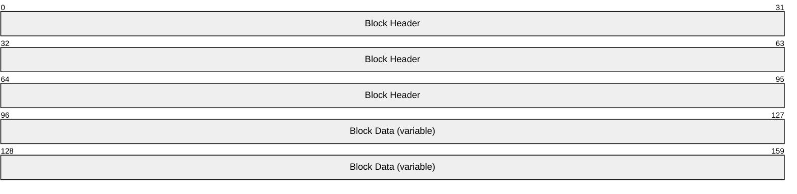

**Block Header (12 bytes):** An XPRESS Block Header (as specified in section [2.2.1.4.15.1](#Section_2.2.1.4.15.1)) containing information about the block data.

**Block Data (variable):** If the values of the **Block Compressed Size** and **Block Uncompressed Size** fields in the XPRESS block's header (specified in section 2.2.1.4.15.1) are equal, then the block data has not been compressed. In this case the uncompressed data is obtained by copying bytes from the **Block Data** field without modification.

If the value of the **Block Compressed Size** field is less than the value of the **Block Uncompressed Size** field, then the data has been compressed. For more information about decompressing compressed data, see section [3.1.1.2](#Section_3.1.1.2).

###### 2.2.1.4.15.1 XPRESS Block Header

Stores information about the data stored in an XPRESS Block.

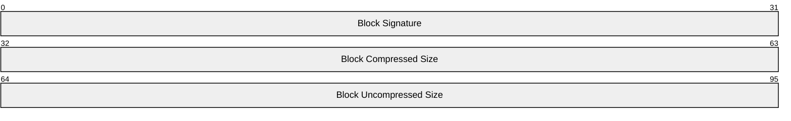

**Block Signature (4 bytes):** MUST be composed of the four bytes 0x58, 0x42, 0x4c, and 0x4f (or 'X', 'B', 'L', and 'O' in ASCII) as follows.

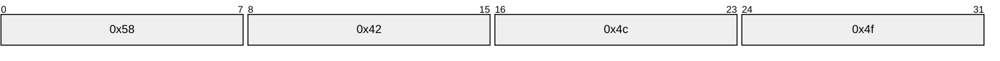

**Block Compressed Size (4 bytes):** A 32-bit unsigned integer specifying the size of the XPRESS Block's data in bytes, regardless of whether it is compressed. The value of the **Block Compressed Size** field MUST be less than or equal to the value of the **Block Uncompressed Size** field and greater than 0.

**Block Uncompressed Size (4 bytes):** A 32-bit unsigned integer specifying the size of the XPRESS Block's data when uncompressed. The **Block Uncompressed Size** field MUST be less than or equal to 8,192 bytes.

## 2.3 Directory Service Schema Elements

DFS-R is configured using [**Active Directory**](#gt_active-directory) objects. File replication proceeds between computers within the same forest whose [**principal names**](#gt_principal-name) are maintained and authenticated by Active Directory. File [**ACLs**](#gt_access-control-list-acl) are replicated fully as participating computers are expected to use Active Directory to identify ACLs.

The protocol accesses the following Directory Service schema classes and attributes listed in the following table(s).

For the syntactic specifications of the following <Class> or <Class><Attribute> pairs, refer either to:

Active Directory Domain Services (AD DS) ([MS-ADA1](../MS-ADA1/MS-ADA1.md), [MS-ADA2](../MS-ADA2/MS-ADA2.md), [MS-ADA3](../MS-ADA3/MS-ADA3.md), and [MS-ADSC](../MS-ADSC/MS-ADSC.md)).

Or to:

Active Directory Lightweight Directory Services (AD LDS) ([MS-ADLS](../MS-ADLS/MS-ADLS.md)).

| Class | Attribute |
| --- | --- |
| msDFSR-LocalSettings | msDFSR-Version |
| msDFSR-Subscriber | msDFSR-MemberReference |
| msDFSR-Subscription | msDFSR-ConflictPath msDFSR-ConflictSizeInMB msDFSR-ContentSetGuid msDFSR-Enabled msDFSR-Extension msDFSR-Options msDFSR-ReadOnly msDFSR-RootFence msDFSR-RootPath msDFSR-StagingPath msDFSR-StagingSizeInMb msDFSR-DefaultCompressionExclusionFilter |
| msDFSR-GlobalSettings | No attribute. |
| msDFSR-ReplicationGroup | msDFSR-Options msDFSR-ReplicationGroupType msDFSR-Schedule msDFSR-TombstoneExpiryInMin nTSecurityDescriptor objectGUID |
| msDFSR-Content | No attribute. |
| msDFSR-ContentSet | description msDFSR-DirectoryFilter msDFSR-FileFilter objectGUID |
| msDFSR-Topology | No attribute. |
| msDFSR-Member | msDFSR-ComputerReference msDFSR-Keywords objectGUID |
| Computer | DNSHostName |
| msDFSR-Connection | FromServer msDFSR-Enabled msDFSR-Keywords msDFSR-Options msDFSR-RdcEnabled msDFSR-RdcMinFileSizeInKb msDFSR-Schedule objectGUID |
| nTDSConnection | FromServer enabledConnection schedule objectGUID |

[**DFS-R**](#gt_member-dfs-r) relies on global configuration information (stored in Active Directory) for proper functioning.

These objects prescribe configuration information, in particular the following:

- **replicaSetId:** The GUID of [**replication groups**](#gt_replication-group). They are configured as the GUID of an object under the path msDFSR-GlobalSettings/msDFSR-ReplicationGroup.
- **connectionId:** The GUID of connections. They are configured as the GUID of an object under the path msDFSR-GlobalSettings/msDFSR-ReplicationGroup/msDFSR-Member/msDFSR-Connection or msDFSR-GlobalSettings/msDFSR-ReplicationGroup/msDFSR-Member/nTDSConnection.
- **contentSetId:** The GUID of a [**replicated folder**](#gt_replicated-folder). They are configured as the GUID of an object under msDFSR-GlobalSettings/msDFSR-ReplicationGroup/msDFSR-Content/msDFSR-ContentSet.
- **Principal names:** The principal authenticated computer names. Computer objects form the basis of an Active Directory configuration.
These are used in the [**RPC**](#gt_remote-procedure-call-rpc) messages and MUST be known to both the server and the client in order for partners to establish trust, communication, and which folders are replicated among them. This section summarizes the set of configuration parameters that are used in Active Directory to configure DFS-R.

An object layout example is illustrated in section [4.3.1](#Section_4.3.1).

### 2.3.1 msDFSR-LocalSettings

This object encapsulates the [**DFS-R**](#gt_member-dfs-r) settings that are local to a specific computer, and is stored as a child of the computer object representing that specific computer in the directory. By default, the DFSR-LocalSettings object for non-domain controllers will be stored at the following relative directory path.

"CN=DFSR LocalSettings, CN=<computer name>, CN=Computers"

And, by default, the DFSR-LocalSettings object for domain controllers will be stored at the following relative directory path.

"CN=DFSR-LocalSettings, CN=<computer name>, OU=Domain Controllers"

Attributes of this object that are relevant for DFS-R are as follows.

**msDFSR-Version**: Optional, implementation-defined.<8>

Exactly one top-level DFS-R LocalSettings object MUST exist for each computer that is configured for replication. Each of these can contain one or more subscriber objects.

[**ACLs**](#gt_access-control-list-acl) are set on msDFSR-LocalSettings and will be inherited by any child subscriber objects.

The schema definition for this object is provided by the msDFSR-LocalSettings class definition, as specified in [MS-ADSC](../MS-ADSC/MS-ADSC.md). ACLs are set on msDFSR-LocalSettings to protect changing or disclosing configuration information.

### 2.3.2 msDFSR-Subscriber

Objects of this class exist under the msDFSR-LocalSettings object and imply that this computer subscribes to a certain [**replication group**](#gt_replication-group).

The following attribute of this object is relevant to [**DFS-R**](#gt_member-dfs-r):

- **msDFSR-MemberReference:** Forward link to msDFSR-Member object in msDFSR—Settings tree. It MUST exist.
Each msDFSR-Subscriber object can contain a reference to one or more msDFSR-Subscription objects. At most, one msDFSR-Member object MUST be referenced from an msDFSR-Subscriber object.

The schema definition for this object is as specified by the msDFSR-Subscriber class definition in [MS-ADTS](../MS-ADTS/MS-ADTS.md).

### 2.3.3 msDFSR-Subscription

Each subscription object represents a [**replicated folder**](#gt_replicated-folder) in the [**replication group**](#gt_replication-group) that its parent subscribes to. Objects of this class exist on the msDFSR-Subscriber objects and imply that the computer uses the [**topology**](#gt_topology) specified by the msDFSR-Subscriber object to replicate the folder specified by the attributes of the msDFSR-Subscription object.

The following attributes of this object are relevant to DFS-R:

- **msDFSR-ContentSetGUID:** ContentSet object GUID MUST exist.
- **msDFSR-RootPath:** Full path of the replicated folder root directory MUST exist.
- **msDFSR-RootFence:** Time stamp.
- **msDFSR-StagingPath:** Full path of the replicated folder staging directory.
- **msDFSR-StagingSizeInMb:** The maximum size of the staging directory, in megabytes. Optional.
- **msDFSR-ConflictPath:** Full path of the folder used to store files for which there are replication conflicts.
- **msDFSR-ConflictSizeInMB:** The maximum size of the conflicts folder, in megabytes.
- **msDFSR-Enabled:** Enable and disable replicated folder without removing it from the system.
- **msDFSR-Options:** Bit Flags to control optional behavior. The following bits are used:
- 0x1: Set if the replicated folder is designated as primary.
- All other bits are ignored and SHOULD be set to 0.
- **msDFSR-Extension:** In version 0x00050000 of the Distributed File System: Replication (DFS-R) Protocol, MUST be set to 0 and MUST be ignored on receipt. In version 0x00050002 or later of DFS-R, contains a string that specifies a file name pattern to be used to exclude some files from data compression.<9>
- **msDFSR-ReadOnly**: Specifies whether a replicated folder is configured as read-only. This flag is set to 1 if the replicated folder is configured read-only and set to 0 for regular replicated folders. If this flag is set to 1 for a particular replicated folder, DFS-R will roll back changes that occur locally on that replicated folder, instead of replicating them out to other servers in the replication group. This behavior is also known as [**read-only replicated folders**](#gt_read-only-replicated-folders). <10>
- This flag is optional and if not set, DFSR MUST default to treating the replicated folder as a read-write replicated folder. <11>
- **msDFSR-DefaultCompressionExclusionFilter**: A comma-separated string listing the file extensions that are not to be compressed by DFSR. The extension * is used to specify that all files are not to be compressed by DFSR. The empty string is used to specify that all files are to be compressed by DFSR. <12>
Each msDFSR-Subscription object MUST contain a reference to one msDFSR-Content object. At most, one msDFSR-Content object MUST be referenced from an msDFSR-Subscription object.

The schema definition for this object is as specified by the msDFSR-Subscription class definition in [MS-ADSC](../MS-ADSC/MS-ADSC.md).

### 2.3.4 msDFSR-GlobalSettings

Replication [**topology**](#gt_topology) configurations are grouped under the msDFSR-GlobalSettings object.

The top-level DFS-R global settings object is found in the domain naming context at the following RDN with each domain's [**Active Directory**](#gt_active-directory) domainDNS [MS-ADSC](../MS-ADSC/MS-ADSC.md) object:

"CN=DFS GlobalSettings, CN=System"

There are no attributes in this container that are significant to DFS-R.

[**ACLs**](#gt_access-control-list-acl) MAY be set on msDFSR-GlobalSettings and inherited on child objects. There MUST be exactly one msDFSR-GlobalSettings object for every domain where DFS-R is configured for replication.

The schema definition for this object is provided by the msDFSR-GlobalSettings class definition in [MS-ADSC] section 2.109.

### 2.3.5 msDFSR-ReplicationGroup

Container for content and [**topology**](#gt_topology) objects. It is found under the msDFSR-GlobalSettings object.

The following attributes of this object are relevant to DFS-R:

- **msDFSR-ReplicationGroupType:** The [**replication group**](#gt_replication-group) type; default is Other=0 (OTHER=0, SYSVOL=1, PROTECTION=2, DISTRIBUTION=3). It MUST exist.
- **msDFSR-TombstoneExpiryInMin:** The replication group or [**replicated folder**](#gt_replicated-folder) tombstones expiration, in minutes.
- **msDFSR-Schedule:** Replication schedule consisting of time intervals where replication is enabled and which contains the bandwidth throttling settings.
- **objectGUID:** The replication group GUID. This corresponds directly to the ID GUID that appears in the [**RPC**](#gt_remote-procedure-call-rpc) interface. It MUST exist.
- **msDFSR-Options:** Bit flags to control certain behavior. The following bits are used:
- 0x1: Controls how the schedule is interpreted. If 0, the schedule is interpreted in UTC time zone. If 1, the schedule is interpreted in the local time zone.
- All other bits are ignored and SHOULD be set to 0.
- **nTSecurityDescriptor:** To be used in an implementation-dependent manner.<13>
Each msDFSR-ReplicationGroup MUST appear as a reference under msDFSR-GlobalSettings. It MUST contain an msDFSR-Content reference and an msDFSR-Topology reference. There MUST be at most one msDFSR-Content and at most one msDFSR-Topology child object under each msDFSR-ReplicationGroup object.

The schema definition for this object is as specified by the msDFSR-ReplicationGroup class definition in [MS-ADSC](../MS-ADSC/MS-ADSC.md) section 2.112.

### 2.3.6 msDFSR-Content

Container of [**replication group**](#gt_replication-group) [**replicated folder**](#gt_replicated-folder) objects.

There are no attributes in this container that are relevant to DFS-R.

Each msDFSR-Content MAY contain references to one or more msDFSR-ContentSet objects. [**ACLs**](#gt_access-control-list-acl) MAY be set on msDFSR-Content and inherited on child objects.

The schema definition for this object is as specified by the msDFSR-Content class definition in [MS-ADSC](../MS-ADSC/MS-ADSC.md) section 2.107.

### 2.3.7 msDFSR-ContentSet

Subscriber objects on multiple machines link to the same msDFSR-ContentSet, machine-specific attributes that are stored in the subscriber object as outlined before. The msDFSR-ContentSet object, however, stores the global attributes (policies) that are shared for all subscriber machines.

Attributes of this object are the following:

- **objectGUID:** The content set GUID. This attribute MUST exist.
- **description:** A string to be used in an implementation-dependent manner. Used only for informative purposes.
- **msDFSR-FileFilter:** A comma-separated list of 0 or more wildcard file name filters for the [**replica set**](#gt_replica-set). Any file whose name matches any of the filters SHOULD be excluded from replication. The value of this attribute SHOULD contain, at a minimum, "*.tmp,*.bak, ~*".<14>
- **msDFSR-DirectoryFilter:** A comma-separated list of 0 or more wildcard folder name filters for the replica set. Any folder whose name matches any of the filters SHOULD be excluded from replication.
The schema definition for this object is as specified by the msDFSR-ContentSet class definition in [MS-ADSC](../MS-ADSC/MS-ADSC.md) section 2.108.

### 2.3.8 msDFSR-Topology

Container for all [**topology**](#gt_topology) objects—namely, members and connections.

There are no relevant attributes of the msDFSR-Topology object, it is only relevant as a container for msDFSR-Member objects.

Each msDFSR-Topology MAY contain references to one or more msDFSR-Member objects.

The schema definition for this object is as specified by the msDFSR-Topology class definition in [MS-ADSC](../MS-ADSC/MS-ADSC.md) section 2.115.

### 2.3.9 msDFSR-Member

Member objects represent a computer object in a [**replication group**](#gt_replication-group). Each computer that participates in a replication group MUST have one corresponding [**member (DFS-R)**](#gt_member-dfs-r) object.

The following attributes of this object are relevant to DFS-R:

- **objectGUID:** The member (DFS-R) GUID. This corresponds directly to the member GUID that appears in the [**RPC**](#gt_remote-procedure-call-rpc) interface. MUST exist.
- **msDFSR-ComputerReference:** Distinguished name (DN) of the computer object associated with this member object. MUST exist.
- **msDFSR-Keywords:** A string to be used in an implementation-dependent manner.<15>
Each msDFSR-Member object contains 0 or more Connection objects, specified by connectionId in section [2.3](#Section_2.3). An msDFSR-Member object can contain more than one Connection object with the same partner. DFS-R picks only one such [**connection**](#gt_connection) by sorting connections alphabetically (by converting the connection GUID to a string) and picks the first one.

The schema definition for this object is as specified by the msDFSR-Member class definition in [MS-ADSC](../MS-ADSC/MS-ADSC.md) section 2.111.

### 2.3.10 Computer

The following attribute of this object is relevant to DFS-R:

- **DNSHostName:** String that specifies the [**fully qualified domain name (FQDN)**](#gt_fully-qualified-domain-name-fqdn) of the partner. The format of an FQDN follows the format of FQDN used in URIs. This format is specified in [[RFC3986]](https://go.microsoft.com/fwlink/?LinkId=90453).

### 2.3.11 msDFSR-Connection

Each object of this class represents a directional [**connection**](#gt_connection) between two machines only.

The following attributes of this object are relevant to [**DFS-R**](#gt_member-dfs-r):

- **objectGUID:** The connection GUID. This attribute MUST exist.
- **FromServer:** DN of the inbound partner (other msDFSR-Member object). MUST exist.
- **msDFSR-Enabled:** Boolean that specifies whether this connection is enabled or disabled.
- **msDFSR-Schedule:** A binary attribute that contains the replication schedule, as defined below.
- **msDFSR-Keywords:** A string to be used in an implementation-dependent manner.<16>
- **msDFSR-RdcEnabled:** Enable or disable [**RDC**](#gt_remote-differential-compression-rdc) transfers on a connection.
- **msDFSR-RdcMinFileSizeInKB:** Minimum size threshold for enabling RDC transfers.
- **msDFSR-Options:** Bit flags to control certain behavior. The following bits are used:
- 0x1: Controls how the schedule is interpreted. If 0, the schedule is interpreted in UTC time zone. If 1, the schedule is interpreted in the local time zone.
- All other bits are ignored and SHOULD be set to 0.
Each msDFSR-Connection object MUST NOT use the same msDFSR-Member object as the client and server.

The schema definition for this object is as specified by the msDFSR-Connection class definition in [MS-ADSC](../MS-ADSC/MS-ADSC.md) section 2.106.

A Schedule is a binary attribute of size 336 bytes (2*24*7) that represents a schedule for a week. Each hour is represented as a 16-bit integer. Every hour is divided into four quarters, each of which occupies 4 bits. A schedule starts out specifying the time windows, starting from Sunday midnight in either UTC or system local time.

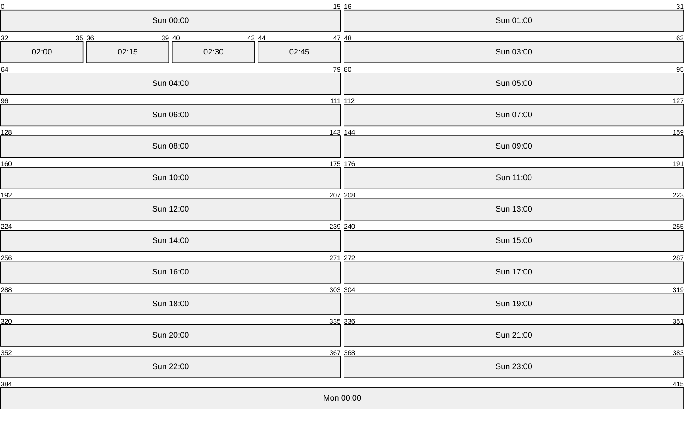

The 4 bits that store the schedule data for each quarter hour contain one of the 16 values ranging from 0x0 to 0xF. A value of 0x0 indicates that the replication schedule is off for that quarter-hour in the schedule. A value of 0xF indicates that replication is on for that quarter-hour in the schedule with full bandwidth. The levels in between are used in an implementation-defined way.<17>

### 2.3.12 nTDSConnection

The schema definition for this object is as specified by the nTDSConnection class definition in [MS-ADSC](../MS-ADSC/MS-ADSC.md) section 2.204. Each object of this class represents a directional connection between two machines only.

Each nTDSConnection object MUST NOT use the same msDFSR-Member object as the client and server.

The following attributes of this object are relevant to DFS-R.

- **objectGUID**: The connection GUID. This attribute MUST exist.
- **FromServer**: DN of the inbound partner (other msDFSR-Member object). This attribute MUST exist.
- **enabledConnection**: A Boolean that specifies whether this [**connection**](#gt_connection) is enabled or disabled.
- **schedule**: A binary attribute that contains the replication schedule, as defined in section [2.3.11](#Section_2.3.11).

# 3 Protocol Details

## 3.1 Common Details

The following diagram illustrates the main components of the Distributed File System: Replication (DFS-R) Protocol synchronization core.

The left side of the figure illustrates the [**server**](#gt_server) actions and the right side summarizes the [**client**](#gt_client) state machines. On the server, file creations, changes, and deletions are picked up from the [**file system**](#gt_file-system) and inserted into a [**database**](#gt_database). Changes to the database trigger [**version chain vector**](#gt_version-chain-vector) change notifications that are managed by a Join module, as depicted on the upper left of the figure. In response, the client, which maintains an inbound [**connection**](#gt_connection) (also known as InConnection), requests the server's version chain vector, and then requests updates for the changes that are not already known to the client. The server sends the updates to the client, which are managed by a Meet module, as depicted on the lower right of the figure. The Meet module resolves name conflicts (different files created on multiple replication partners that have the same filename) and downloads and installs the updated file contents, which are served by the server's outbound connection (also known as OutConnection), to the local file system.

Figure 2: Main components of the DFS-R synchronized core

The main protocol of DFS-R is initiated by the client, and is used to transfer metadata and data from the server (upstream partner) to the client. DFS-R can be configured to replicate in both directions, in which case there are two separate instances of the protocol operating between a pair of machines. Each machine, then, is both a client and a server.

### 3.1.1 Abstract Data Model

This section describes a conceptual model of possible data organization that an implementation maintains to participate in this protocol. The described organization is provided to facilitate the explanation of how the protocol behaves. This document does not mandate that implementations adhere to this model as long as their external behavior is consistent with that described in this document.

The overview, as specified in section [3.1](#Section_3.1), indicates a possible organization. These implementations are slightly elaborated on here because they can help in understanding the Distributed File System: Replication (DFS-R) Protocol in context. An implementation is in no way bound by this organization.

**InConnection:** A [**logical connection**](#gt_logical-connection) object maintained by the client to group state pertaining to a configured connection with the [**server**](#gt_server).

**File Replication Store:** The store where replicated files reside and are changed. The store maintains file data and organizes the data in a way that is specific to the semantics of the store.

**Database:** A store that holds the metadata of replicated files, including updates and [**version chain vectors**](#gt_version-chain-vector).

#### 3.1.1.1 Compression

Many of the [FrsTransport methods](#Section_3.2.4.1) use the LZ77+Huffman Compression algorithm, specified in [MS-XCA](../MS-XCA/MS-XCA.md) section 2.1, to compress data. This document does not mandate that implementations adhere to this model as long as their external behavior is consistent with what is described in this document.

#### 3.1.1.2 Decompression

FrsTransport methods that compress data will always return information specifying the size of the original data. It is the caller’s responsibility to determine whether the returned data is compressed. If the size of the compressed data buffer that is returned by the server in bytes is equal to the size in bytes of the original uncompressed data, then the buffer returned by the server contains uncompressed data.

LZ77+Huffman Decompression algorithm, specified in [MS-XCA](../MS-XCA/MS-XCA.md) section 2.2, is used to decompress the data.

### 3.1.2 Timers

DFS-R is primarily an event-driven protocol. Actions are taken in response to external stimulus, such as changes in the **File Replication Store**. This implementation contains a few implementation-specific timers. These timers are summarized separately for the client and server behaviors in sections [3.3.2](#Section_3.3.2) and [3.2.2](#Section_3.2.2).

### 3.1.3 Initialization

Both clients and servers initialize by obtaining their configuration. Sections [3.3.3](#Section_3.3.3) and [3.2.3](#Section_3.2.3) specify client-specific and server-specific initialization.

### 3.1.4 Message Processing Events and Sequencing Rules

Section [3.3.1](#Section_3.3.1) summarizes the client state machine for synchronization. Section [3.1.1](#Section_3.1.1) summarizes the corresponding server sequencing.

### 3.1.5 Timer Events

Timer events are documented separately for clients and servers.

### 3.1.6 Other Local Events

[**Volume**](#gt_volume) dismounts and errors. The per-replicated folder state gets reset when encountering errors that prevent processing files on the volume on which they reside. At the protocol level, such events result in discontinuing per-replicated folder replication activity. On the server side, this amounts to failing RPC calls that are specific to the particular replicated folders. Locally, volume state is rechecked based on a periodic timer. Remotely, a client attempts to reestablish per-replicated folder sessions by using the EstablishSession RPC call. The call is retried using an exponential backoff scheme with a maximal time-out of 5 minutes. That is, retries are first attempted with a delay of 1 second, then a delay of 2 seconds, then delays of 4, 8, 16, 32, 64, 128, and 256 seconds, and are then followed by delays of 300 seconds.<18>

## 3.2 Server Details

### 3.2.1 Abstract Data Model

**Outbound Connection:** A [**logical connection**](#gt_logical-connection) object maintained by the [**server**](#gt_server) to represent a connection between itself and a [**client**](#gt_client) in a particular [**replication group**](#gt_replication-group). All of the client’s replication requests to the server in the related replication group are made in the context of this logical connection. An outbound [**connection**](#gt_connection) is created when a client issues a call to the [EstablishConnection](#Section_3.2.4.1.2) method.

DFS-R servers terminate logical connections that have been disabled or removed from the updated configuration.<19>

**Replicated Folder Session:** A logical session maintained by the server for a [**replicated folder**](#gt_replicated-folder). Every replicated folder session is associated with a single outbound connection, where the replicated folder session’s replicated folder and the outbound connection’s connection both exist in the same replication group. All further client calls pertaining to the associated replicated folder are made within the context of its replicated folder session. A replicated folder session is created when a client issues a call to the [EstablishSession](#Section_3.3.4.3) method.

### 3.2.2 Timers

**Version vector request time-out:** The server tears down connection associations when a client establishes a session, but the client does not request version vectors in a timely fashion. Logically, there is no requirement that the client requests version vectors within a time limit, so the default time-out is 12 hours.

**Time-outs on open file handles:** When a client requests to initialize a file transfer, the server opens a context handle, which indirectly causes resources, such as file handles, to be kept open on the server. <20>

### 3.2.3 Initialization

None. Servers await connection attempts from configured clients.

### 3.2.4 Message Processing Events and Sequencing Rules

#### 3.2.4.1 FrsTransport Methods

Methods in RPC Opnum Order

| Method | Description |
| --- | --- |
| [CheckConnectivity](#Section_3.2.4.1.1) | Called by a client to check whether the server is reachable and has been configured to replicate with the client. Opnum: 0 |
| [EstablishConnection](#Section_3.2.4.1.2) | Establishes a [**logical connection**](#gt_logical-connection) from a client to a server. Opnum: 1 |
| [EstablishSession](#Section_3.3.4.3) | Establishes a logical relationship on the server for a [**replicated folder**](#gt_replicated-folder). Opnum: 2 |
| [RequestUpdates](#Section_3.3.4.6) | Obtains file metadata in the form of updates from a server. Opnum: 3 |
| [RequestVersionVector](#Section_4.2.1) | Obtains the [**version chain vector**](#gt_version-chain-vector) [**persisted**](#gt_persist) on a server. Opnum: 4 |
| [AsyncPoll](#Section_3.3.4.5) | Registers an asynchronous callback for a server to provide version chain vectors. Opnum: 5 |
| [RequestRecords](#Section_3.2.4.1.7) | Retrieves [**UIDs**](#gt_unique-identifier-uid) and [**GVSNs**](#gt_global-version-sequence-numbers-gvsn) that a server persists. Opnum: 6 |
| [UpdateCancel](#Section_3.3.4.17) | Used by a client to indicate to a server that it could not process an update. Opnum: 7 |
| [RawGetFileData](#Section_3.3.4.9) | Transfers successive segments from a file. Opnum: 8 |
| [RdcGetSignatures](#Section_3.3.4.12) | Obtains [**RDC**](#gt_remote-differential-compression-rdc) signature data from a server. Opnum: 9 |
| [RdcPushSourceNeeds](#Section_3.3.4.13) | Registers requests for file ranges on a server. Opnum: 10 |
| [RdcGetFileData](#Section_3.2.4.1.12) | Obtains file ranges whose requests have previously been registered on a server. Opnum: 11 |
| [RdcClose](#Section_3.3.4.10) | Informs the server that the server context information can be released. Opnum: 12 |
| [InitializeFileTransferAsync](#Section_3.2.4.1.14) | Used by a client to start a file download. Opnum: 13 |
| Opnum14NotUsedOnWire | Reserved for local use. Opnum: 14 |
| [RawGetFileDataAsync](#Section_3.2.4.1.15) | Used instead of calling RawGetFileData multiple times to obtain file data. This method is not applicable for protocol version 0x00050000. Opnum: 15 |
| [RdcGetFileDataAsync](#Section_3.3.4.15) | Used instead of calling RdcGetFileData multiple times to obtain file data. This method is not applicable for protocol version 0x00050000. Opnum: 16 |
| [RdcFileDataTransferKeepAlive](#Section_3.2.4.1.17) | Informs the server to keep the context information alive. This method is not applicable for protocol versions 0x00050000 and 0x00050002. Opnum: 17 |

In the previous table, the term "Reserved for local use" means that the client MUST NOT send the opnum, and the server behavior is undefined as it does not affect interoperability. <21>

##### 3.2.4.1.1 CheckConnectivity (Opnum 0)

The CheckConnectivity method determines whether a server can establish an outbound connection (see the [EstablishConnection](#Section_3.2.4.1.2) method specified in section 3.2.4.1.2).

DWORD CheckConnectivity(

[in] FRS_REPLICA_SET_ID replicaSetId,

[in] FRS_CONNECTION_ID connectionId

);

**replicaSetId:** The GUID of the outbound connection’s [**replication group**](#gt_replication-group) (see the **objectGUID** attribute specified in section [2.3.5](#Section_2.3.5)).

**connectionId:** The GUID of the outbound connection (see the **objectGUID** attribute specified in section [2.3.11](#Section_2.3.11)) in the specified replication group.

**Return Values:** The method MUST return 0 on success or a nonzero error code on failure. All nonzero values MUST be treated as equivalent failures unless otherwise specified.

| Return value/code | Description |
| --- | --- |
| 0x00000000 ERROR_SUCCESS | The method completed successfully. The server is ready to establish the specified outbound connection. |

**Exceptions Thrown:** No exceptions are thrown beyond those thrown by the underlying RPC protocol [MS-RPCE](../MS-RPCE/MS-RPCE.md).

**Validating the connectivity check request:** The server validates the connectivity check request by performing the following checks.

- If the server is not a member of the specified replication group it MUST fail the call with an implementation-defined failure value.
- If the specified connection does not exist in the specified replication group's configuration, then the server MUST fail the call with an implementation-defined failure value.
- If the specified connection is disabled (see the **msDFSR-Enabled** attribute specified in section 2.3.11), then the server MUST fail the call with an implementation-defined value.
- If the server is not the specified connection’s outbound partner, then the server MUST fail the call with an implementation-defined failure value.
**Actions Triggered:** Upon successfully verifying the connection check request, the server MUST determine whether it is ready to process a call to the EstablishConnection method. The details of this test are implementation-specific. If the server is ready to process a call to the EstablishConnection method for the specified connection, then the server MUST complete the call successfully by returning ERROR_SUCCESS. If the server is not ready to process a call to the EstablishConnection method for the specified connection, then the server MUST fail the call with an implementation-defined failure value.

##### 3.2.4.1.2 EstablishConnection (Opnum 1)

The EstablishConnection method establishes an outbound connection, uniquely identified by a replication group ID/connection ID pair, from a client to a server. An outbound connection to the server is required before most other operations can be performed.

DWORD EstablishConnection(

[in] FRS_REPLICA_SET_ID replicaSetId,

[in] FRS_CONNECTION_ID connectionId,

[in] DWORD downstreamProtocolVersion,

[in] DWORD downstreamFlags,

[out] DWORD* upstreamProtocolVersion,

[out] DWORD* upstreamFlags

);

**replicaSetId:** The GUID of the outbound connection's [**replication group**](#gt_replication-group) (see the **objectGUID** attribute specified in section [2.3.5](#Section_2.3.5)).

**connectionId:** The GUID of the outbound connection (see the **objectGUID** attribute specified in section [2.3.11](#Section_2.3.11)) in the specified replication group.

**downstreamProtocolVersion:** Identifies the version of the [**DFS-R**](#gt_member-dfs-r) protocol implemented by the client. Currently implemented protocol versions are specified in section [2.2.1.1.1](#Section_2.2.1.1.1).

**downstreamFlags:** This parameter is unused and SHOULD be set to 0 by the client. <22>

**upstreamProtocolVersion:** Receives the version of the DFS-R protocol implemented by the server. Currently implemented protocol versions are specified in section 2.2.1.1.1.

**upstreamFlags:** A flags bitmask. The server MUST set the TRANSPORT_SUPPORTS_RDC_SIMILARITY bit flag to 1 if the server supports [**RDC**](#gt_remote-differential-compression-rdc) similarity (as specified in [MS-RDC](../MS-RDC/MS-RDC.md) section 3.1.5.4). Otherwise, the server MUST clear this bitmask (set all bits to 0). The client MUST ignore any bit flags other than TRANSPORT_SUPPORTS_RDC_SIMILARITY.

**Return Values:** The method MUST return 0 on success or a nonzero error code on failure. For protocol purposes all nonzero values MUST be treated as equivalent failures unless otherwise specified.

| Return value/code | Description |
| --- | --- |
| 0x00000000 ERROR_SUCCESS | The method completed successfully. |
| 0x0000235A FRS_ERROR_INCOMPATIBLE_VERSION | The client's DFS-R protocol version is not compatible with the server's DFS-R protocol version. |
| 0x00002342 FRS_ERROR_CONNECTION_INVALID | The connection is invalid. |

**Exceptions Thrown:** No exceptions are thrown beyond those thrown by the underlying RPC protocol [MS-RPCE](../MS-RPCE/MS-RPCE.md).

**Validating the connection request:** The server validates the connection request by performing the following checks:

- If the server is not a member of the specified replication group it MUST fail the call with an implementation-defined failure value.
- If the specified connection does not exist in the specified replication group's configuration and the replication group's type (see the **msDFSR-ReplicationGroupType** attribute specified in section 2.3.5) is not SYSVOL, then the server MUST fail the call with FRS_ERROR_CONNECTION_INVALID.
- If the replication group's type is SYSVOL and the specified connection does not exist in the specified replication group's configuration and there is no Member object in the specified replication group's configuration, the server MUST fail the request with FRS_ERROR_CONNECTION_INVALID.
- If the replication group's type is SYSVOL and the client is not a domain controller in the same domain as the server, or if the server is not a domain controller, then the server MUST fail the call with FRS_ERROR_CONNECTION_INVALID.
- If the specified connection is disabled (see the **msDFSR-Enabled** attribute specified in section 2.3.11) then the server MUST fail the call with FRS_ERROR_CONNECTION_INVALID.
- If the server is not the specified connection's outbound partner, or the client is not the connection's inbound partner (see the **FromServer** attribute specified in section 2.3.11) then the server MUST fail the call with FRS_ERROR_CONNECTION_INVALID.
- If the client's protocol version number is 0x00050001, or if the client's protocol's major version number (see section 2.2.1.1.1) is not equal to the server protocol's major version number, then the server MUST fail the call with the FRS_ERROR_INCOMPATIBLE_VERSION failure value.
**Actions Triggered:** Upon successfully validating the connection request, the server establishes an outbound connection with the client.

If the specified connection does not exist in the specified replication group's configuration and the replication group's type is SYSVOL and there is a Member object in the specified replication group's configuration, then the server MUST behave as if the replication group's configuration contains an enabled connection in which the server is the connection's outbound partner and the client is the connection's inbound partner.

The server MUST ensure that no more than one outbound connection for a unique replicaSetId / connectionId pair exists with the client at the same time. If an outbound connection with the client already exists for the same unique replicaSetId / connectionId pair, the server MUST replace the pre-existing connection with a new connection. The pre-existing outbound connection MUST be torn down by the server, and all outstanding calls associated with the pre-existing connection MUST be completed with an implementation-defined failure value.

##### 3.2.4.1.3 EstablishSession (Opnum 2)

The EstablishSession method is used to establish a [**replicated folder**](#gt_replicated-folder) session between the client and server after the client has successfully established an outbound connection with the server via a call to the [EstablishConnection](#Section_3.2.4.1.2) method. A replicated folder session with the server is required before most other operations associated with the specified replicated folder can be performed.

DWORD EstablishSession(

[in] FRS_CONNECTION_ID connectionId,

[in] FRS_CONTENT_SET_ID contentSetId

);

**connectionId:** The GUID of an outbound connection (see the **objectGUID** attribute specified in section [2.3.11](#Section_2.3.11)) that the client established by a previous call to the EstablishConnection method.

**contentSetId:** The GUID of the replicated folder (see the **objectGUID** specified in section [2.3.7](#Section_2.3.7)) in the specified connection's [**replication group**](#gt_replication-group).

**Return Values:** The method MUST return 0 on success or a nonzero error code on failure. For protocol purposes all nonzero values MUST be treated as equivalent failures unless otherwise specified.

| Return value/code | Description |
| --- | --- |
| 0x00000000 ERROR_SUCCESS | The method completed successfully. |
| 0x00002342 FRS_ERROR_CONNECTION_INVALID | The connection is invalid. |
| 0x00002375 FRS_ERROR_CONTENTSET_READ_ONLY | The replicated folder is read-only. |

**Exceptions Thrown:** No exceptions are thrown beyond those thrown by the underlying RPC protocol [MS-RPCE](../MS-RPCE/MS-RPCE.md).

**Validating the session request:** The server validates the session request by performing the following checks:

- If an outbound connection for the specified connection is not established between the client and server (see the EstablishConnection method) then the server MUST fail the call with the FRS_ERROR_CONNECTION_INVALID failure value.
- If the server is not currently participating in the replication of the specified replicated folder, then the server MUST fail the call with an implementation-defined failure value.
- If the specified replicated folder is read-only (see the **msDFSR-ReadOnly** attribute specified in section [2.3.3](#Section_2.3.3)) then the server MUST fail the call with the FRS_ERROR_CONTENTSET_READ_ONLY failure value.
- If the specified replicated folder is disabled (see the **msDFSR-Enabled** attribute specified in section 2.3.3) then the server MUST fail the call with an implementation-defined failure value.
**Actions Triggered:** Upon successfully validating the session request, the server establishes a replicated folder session for the specified replicated folder with the client.

The server MUST ensure that no more than one replicated folder session for a unique *connectionId* / *contentSetId* pair exists with the client at the same time. If a replicated folder session with the client already exists for the same unique *connectionId* / *contentSetId* pair, the server MUST replace the pre-existing session with a new session. The pre-existing replicated folder session MUST be torn down by the server, and all outstanding calls associated with the pre-existing session MUST be completed with an implementation-defined failure value.

##### 3.2.4.1.4 RequestUpdates (Opnum 3)

The RequestUpdates method is used to obtain a specified set of updates (replicated file metadata) from a server.

DWORD RequestUpdates(

[in] FRS_CONNECTION_ID connectionId,

[in] FRS_CONTENT_SET_ID contentSetId,

[in, range(0,256)] DWORD creditsAvailable,

[in, range(0,1)] long hashRequested,

[in, range(UPDATE_REQUEST_ALL, UPDATE_REQUEST_LIVE)]

UPDATE_REQUEST_TYPE updateRequestType,

[in] unsigned long versionVectorDiffCount,

[in, size_is(versionVectorDiffCount)]

FRS_VERSION_VECTOR* versionVectorDiff,

[out, size_is(creditsAvailable), length_is(*updateCount)]

FRS_UPDATE* frsUpdate,

[out] DWORD* updateCount,

[out] UPDATE_STATUS* updateStatus,

[out] GUID* gvsnDbGuid,

[out] DWORDLONG* gvsnVersion

);

**connectionId:** The GUID of an outbound connection (see the **objectGUID** attribute specified in section [2.3.11](#Section_2.3.11)) that the client established by a previous call to the [EstablishConnection](#Section_3.2.4.1.2) method.

**contentSetId:** The GUID of the [**replicated folder**](#gt_replicated-folder) (see the **objectGUID** attribute specified in section [2.3.7](#Section_2.3.7)) in the specified connection's [**replication group**](#gt_replication-group).

**creditsAvailable:** The maximum number of updates that the client can receive in the *frsUpdate* buffer.

**hashRequested:** The client sets the *hashRequested* parameter to TRUE to request that the server compute the hash (see the **hash** field of the [FRS_UPDATE](#Section_2.2.1.4.4) structure specified in section 2.2.1.4.4) for each update that it sends, or FALSE if the hashes are not desired. The server SHOULD compute hashes when hashes are requested, although it is not required to do so. Computing a file's **hash** requires DFS-R to read the file's data. It is possible that another process has already opened the file for exclusive access, which prevents DFS-R from computing the file **hash**. In this scenario, the DFS-R server does not compute the **hash** even if the client requested that it does.

**updateRequestType:** The value from the [UPDATE_REQUEST_TYPE](#Section_2.2.1.2.4) enumeration that indicates the type of replication updates requested.

**versionVectorDiffCount:** The number of items specified in the *versionVectorDiff* parameter.

**versionVectorDiff:** The set of [FRS_VERSION_VECTOR](#Section_2.2.1.4.1) structures that specifies what updates the client requires from the server. This parameter specifies the difference between the client's version vector and the client's most recent copy of the server's version vector obtained from a previous call to the [RequestVersionVector](#Section_4.2.1) method.

**frsUpdate:** The set of FRS_UPDATE structures that describes the update that occurred to each of the files to be replicated.

**updateCount:** The number of updates that the server wrote into the *frsUpdate* buffer.

**updateStatus:** The value from the [UPDATE_STATUS](#Section_2.2.1.2.5) enumeration that specifies if all of the requested updates have been sent by the server.

**gvsnDbGuid:** The [**GVSN**](#gt_version-sequence-number-vsn) GUID (as specified in [MS-DTYP](../MS-DTYP/MS-DTYP.md) section 2.3.4) for the last field in the *versionVectorDiff* that was processed.

**gvsnVersion:** The version of the *gvsnDbGuid*.

**Return Values:** The method MUST return 0 on success or a nonzero error code on failure. For protocol purposes all nonzero values MUST be treated as equivalent failures unless otherwise specified.

| Return value/code | Description |
| --- | --- |
| 0x00000000 ERROR_SUCCESS | The method completed successfully. |
| 0x00002344 FRS_ERROR_CONTENTSET_NOT_FOUND | The content set was not found. |

**Exceptions Thrown:** No exceptions are thrown beyond those thrown by the underlying RPC protocol [MS-RPCE](../MS-RPCE/MS-RPCE.md).

**Validating the updates request:** The server validates the updates request by performing the following checks.

- If an outbound connection for the specified connection is not established between the client and server (see the EstablishConnection method) then the server MUST fail the call an implementation-defined failure value.
- If a replicated folder session for the specified replicated folder is not established between the client and server (see the [EstablishSession](#Section_3.3.4.3) method) then the server MUST fail the call with the FRS_ERROR_CONTENTSET_NOT_FOUND failure value.
- If the contents of the *versionVectorDiff* parameter are invalid (see section 2.2.1.4.1 for the FRS_VERSION_VECTOR structure requirements) then the server MUST fail the call with an implementation-defined failure value.
**Actions Triggered:** Upon successfully validating the update request, the server MUST send as many of the requested updates as fit in the *frsUpdate* buffer. The server sends records for the [**GVSNs**](#gt_global-version-sequence-numbers-gvsn) that are known to the server, appear in the specified *versionVectorDiff* parameter, and are of the type specified by the *updateRequestType* parameter.

The server MUST scan through the database for the updates.

If the value of the *updateRequestType* parameter is UPDATE_REQUEST_TOMBSTONES, the server SHOULD<23> send version vector tombstone updates as follows:

- When a particular update is not stale,<24> set the **present** field of the **FRS_UPDATE** structure specified in section 2.2.1.4.4 to 1.
- When a particular update is stale,<25> set the **present** field of the **FRS_UPDATE** structure specified in section 2.2.1.4.4 to 0.
If the value of the *updateRequestType* parameter is UPDATE_REQUEST_ALL and there are tombstone updates to send, the server MUST place the tombstone updates ahead of the live updates in the *frsUpdate* buffer.

The server MUST indicate to the client if there are more of the requested updates to be retrieved by setting the *updateStatus* parameter to one of the following values.

- **UPDATE_STATUS_DONE:** There are no more updates in the scope of the supplied [**version chain vector**](#gt_version-chain-vector).
- **UPDATE_STATUS_MORE:** There are potentially more updates from the supplied version chain vector.
If all of the requested updates could not be sent to the client because of credit limitations, the *gvsnDbGuid* and *gvsnVersion* parameters allow the server to indicate to the client how much of the *versionVectorDiff* has been processed during this call. The returned GVSN (formed by the parameter pair *gvsnDbGuid* / *gvsnVersion*) is a cursor into the *versionVectorDiff*. The cursor MUST be set to the last GVSN covered by *versionVectorDiff* that was considered for populating the *frsUpdate* buffer. The cursor is used by the client to determine which remaining updates it requests during subsequent calls to the RequestUpdates method.

##### 3.2.4.1.5 RequestVersionVector (Opnum 4)

The RequestVersionVector method is used to obtain the [**version chain vector**](#gt_version-chain-vector) [**persisted**](#gt_persist) on a server or to request notification when the server's version chain vector changes.

DWORD RequestVersionVector(

[in] DWORD sequenceNumber,

[in] FRS_CONNECTION_ID connectionId,

[in] FRS_CONTENT_SET_ID contentSetId,

[in, range(REQUEST_NORMAL_SYNC,REQUEST_SUBORDINATE_SYNC)]

VERSION_REQUEST_TYPE requestType,

[in, range(CHANGE_NOTIFY,CHANGE_ALL)]

VERSION_CHANGE_TYPE changeType,

[in] ULONGLONG vvGeneration

);

**sequenceNumber:** The sequence number for this request. The sequence number is used to pair the version vector request with the asynchronous response in [AsyncPoll](#Section_3.3.4.5). During a given session, the client SHOULD supply a unique sequence number for each call to this function or else they will not be able to match server responses via the AsyncPoll method to the original version vector request.

**connectionId:** The GUID of an outbound connection (see the **objectGUID** attribute specified in section [2.3.11](#Section_2.3.11)) that the client established by a previous call to the [EstablishConnection](#Section_3.2.4.1.2) method.

**contentSetId:** The GUID of the [**replicated folder**](#gt_replicated-folder) (see the **objectGUID** attribute specified in section [2.3.7](#Section_2.3.7)) in the specified connection's [**replication group**](#gt_replication-group).

**requestType:** The value from the [VERSION_REQUEST_TYPE](#Section_2.2.1.2.7) enumeration that describes the type of replication sync to perform.

**changeType:** The value from the [VERSION_CHANGE_TYPE](#Section_2.2.1.2.8) enumeration that indicates whether to notify change only or send the entire version chain vector.

**vvGeneration:** The *vvGeneration* parameter is used to calibrate what incarnation of the server's version chain vector is known to the client. The client supplies the last generation number that it received from the server when the *requestType* parameter is set to REQUEST_NORMAL_SYNC. Otherwise the client MUST supply zero.

**Return Values:** This method MUST return 0 on success or a nonzero error code on failure. For protocol purposes all nonzero values MUST be treated as equivalent failures unless otherwise specified.

| **Return value/code** | Description |
| --- | --- |
| 0x00000000 ERROR_SUCCESS | The method completed successfully. |

**Exceptions Thrown:** No exceptions are thrown beyond those thrown by the underlying RPC protocol [MS-RPCE](../MS-RPCE/MS-RPCE.md).

**Validating the version vector request:** The server validates the version vector request by performing the following checks:

- If an outbound connection for the specified connection is not established between the client and server (see the EstablishConnection method) then the server MUST fail the call with an implementation-defined failure value.
- If a replicated folder session for the specified replicated folder is not established between the client and server (see the [EstablishSession](#Section_3.3.4.3) method) then the server MUST fail the call with an implementation-defined failure value.
- If the value of the *requestType* parameter is REQUEST_SLOW_SYNC or REQUEST_SUBORDINATE_SYNC and the value of the *vvGeneration* parameter is not zero, then the server MUST fail the call with an implementation-defined failure value.
- If the value of the *requestType* parameter is REQUEST_SLOW_SYNC or REQUEST_SUBORDINATE_SYNC and the value of the *changeType* parameter is not CHANGE_ALL, then the server MUST fail the call with an implementation-defined failure value.
- If the value of the *requestType* parameter is REQUEST_SUBORDINATE_SYNC and the server's [**DFS-R**](#gt_member-dfs-r) protocol version is not FRS_COMMUNICATION_PROTOCOL_VERSION_LONGHORN_SERVER, then the server MUST fail the call with an implementation-defined failure value.
- If the value of the *changeType* parameter is not CHANGE_NOTIFY or CHANGE_ALL, then the server fails the call with an implementation-defined failure value.
**Actions Triggered when the requestType parameter is NORMAL_SYNC and the changeType parameter is CHANGE_NOTIFY:** The server MUST keep a time stamp on its own version vector. When the server modifies its version vector (in a way visible to clients), the time stamp is incremented. The server communicates its version vector time stamp information to the client when it responds to AsyncPoll requests.

The supplied *vvGeneration* parameter is used to control when an AsyncPoll request can be completed by the server. The AsyncPoll request MUST be completed by the server when its version vector time stamp supersedes the time stamp passed in as the *vvGeneration* parameter of the version vector request. The server MUST NOT provide any version vector with the callback.

**Actions Triggered when the changeType parameter is CHANGE_ALL:** The client requests to receive the full version vector of the server. The server communicates its version vector information to the client when it responds to AsyncPoll requests.

**Remarks:**The client SHOULD have an outstanding call to AsyncPoll. If the client does not have an outstanding AsyncPoll request, then the server MUST queue up any response until an AsyncPoll is received such that a response can be sent.

**Sequence number for this request:** The sequence number is used to pair the version vector request with the asynchronous response in AsyncPoll. The asynchronous response from the server that corresponds to a version vector request MUST contain the same sequence number that was created by the client. A client SHOULD therefore not have two or more outstanding asynchronous requests with the same sequence number.

##### 3.2.4.1.6 AsyncPoll (Opnum 5)

The AsyncPoll method is used to register an asynchronous callback, associated with an outbound connection, which the server uses to provide [**version chain vectors**](#gt_version-chain-vector) and notifications of version chain vector changes to the client.

DWORD AsyncPoll(

[in] FRS_CONNECTION_ID connectionId,

[out] FRS_ASYNC_RESPONSE_CONTEXT* response

);

**connectionId:** The GUID of an outbound connection (see the **objectGUID** attribute specified in section [2.3.11](#Section_2.3.11)) that the client established by a previous call to the [EstablishConnection](#Section_3.2.4.1.2) method.

**response:** The [FRS_ASYNC_RESPONSE_CONTEXT](#Section_2.2.1.4.13) structure that contains the context for the requested poll.

**Return Values:** This method MUST return 0 on success or a nonzero error code on failure. For protocol purposes all nonzero values MUST be treated as equivalent failures unless otherwise specified.

| Return value/code | Description |
| --- | --- |
| 0x00000000 ERROR_SUCCESS | The method completed successfully. |

**Exceptions Thrown:** No exceptions are thrown beyond those thrown by the underlying RPC protocol [MS-RPCE](../MS-RPCE/MS-RPCE.md).

**Validating the asynchronous poll request:** The server validates the asynchronous poll request by performing the following checks:

- If an outbound connection for the specified connection is not established between the client and server (see the EstablishConnection method), then the server MUST fail the call with an implementation-defined failure value.
**Actions Triggered:** Upon successfully validating the asynchronous poll request, the server MUST register the callback with the specified outbound connection.

The server invokes the callback in response to a client call to the [RequestVersionVector](#Section_4.2.1) method. The conditions under which the callback is invoked are determined by the type of the version vector request issued by the client. See the RequestVersionVector method specified in section 3.2.4.1.5 for more information.

The client SHOULD NOT issue more than one call to the AsyncPoll method for a particular outbound connection without an intervening call to the RequestVersionVector method. The server MUST ensure that no more than one AsyncPoll callback is registered with an outbound connection at the same time. If an AsyncPoll request is already registered with the outbound connection, the server MUST replace the pre-existing AsyncPoll callback with the new AsyncPoll callback. The pre-existing callback MUST be completed with an implementation-defined failure value.

##### 3.2.4.1.7 RequestRecords (Opnum 6)

The RequestRecords method is used to request all ([**UID**](#gt_unique-identifier-uid), [**GVSN**](#gt_version-sequence-number-vsn)) pairs that correspond to live (non-tombstone) records on the server for a specified [**replicated folder**](#gt_replicated-folder) during slow sync (see section [3.3.1.3](#Section_3.3.1.3)).

DWORD RequestRecords(

[in] FRS_CONNECTION_ID connectionId,

[in] FRS_CONTENT_SET_ID contentSetId,

[in] FRS_DATABASE_ID uidDbGuid,

[in] DWORDLONG uidVersion,

[in, out] DWORD* maxRecords,

[out] DWORD* numRecords,

[out] DWORD* numBytes,

[out, size_is(,*numBytes)] byte** compressedRecords,

[out] RECORDS_STATUS* recordsStatus

);

**connectionId:** The GUID of an outbound connection (see the **objectGUID** attribute specified in section [2.3.11](#Section_2.3.11)) that the client established by a previous call to the [EstablishConnection](#Section_3.2.4.1.2) method.

**contentSetId:** The GUID of the replicated folder (see the **objectGUID** attribute specified in section [2.3.7](#Section_2.3.7)) in the specified connection's [**replication group**](#gt_replication-group).

**uidDbGuid:** A UID database GUID. This parameter, along with the *uidVersion* parameter, specifies an iterator into the server's records. A value of zero specifies a request for all of a replicated folder's records from the server.

**uidVersion:** A UID version. The parameter, along with *uidDbGuid* parameter, specifies an iterator into the server's records. A value of zero specifies a request for all of a replicated folder's records from the server.

**maxRecords:** The maximum number of records that the server can send to the client. The server returns the lesser of the client-specified value and the maximum number of records that the server is capable of sending.<26>

**numRecords:** The number of records written into the *compressedRecords* buffer by the server.

**numBytes:** The size, in bytes, of the *compressedRecords* buffer.

**compressedRecords:** The data records, compressed using the algorithm specified in section [3.1.1.1](#Section_3.1.1.1).

The *compressedRecords* bytes correspond to an array of [FRS_ID_GVSN](#Section_2.2.1.4.3) entries. DFS-R uses custom marshaling in this RPC call to compress the set of transmitted records. The size of the FRS_ID_GVSN array is given by the *numRecords* parameter. The decompression algorithm specified in section [3.1.1.2](#Section_3.1.1.2) can be used to decompress the received data into a buffer of sizeof(FRS_ID_GVSN)**numRecords* bytes, which can be re-interpreted as an array of FRS_ID_GVSN entries.

**recordsStatus:** The value from the [RECORDS_STATUS](#Section_2.2.1.2.6) enumeration that indicates whether more update records are available.

**Return Values:** This method MUST return 0 on success or a nonzero error code on failure. For protocol purposes all nonzero values MUST be treated as equivalent failures unless otherwise specified.

| Return value/code | Description |
| --- | --- |
| 0x00000000 ERROR_SUCCESS | The method completed successfully. |
| 0x00002344 FRS_ERROR_CONTENTSET_NOT_FOUND | The content set was not found. |
| 0x000024FE FRS_ERROR_CSMAN_OFFLINE | The server is not currently participating in the replication of the specified replicated folder. |

**Exceptions Thrown:** No exceptions are thrown beyond those thrown by the underlying RPC protocol [MS-RPCE](../MS-RPCE/MS-RPCE.md).

**Validating the asynchronous records request:** The server validates the records request by performing the following checks:

- If an outbound connection for the specified connection is not established between the client and server (see the EstablishConnection method) then the server MUST fail the call with an implementation-defined failure value.
- If a replicated folder session for the specified replicated folder is not established between the client and server (see the [EstablishSession](#Section_3.3.4.3) method) then the server MUST fail the call with the FRS_ERROR_CONTENTSET_NOT_FOUND failure value.
- If the server is no longer participating in the replication of the specified replicated folder, then the server SHOULD fail the call the FRS_ERROR_CSMAN_OFFLINE failure value.<27>
**Actions Triggered:** Upon successfully validating the records request the server MUST send as many of the requested records as possible, up to a limit of the lesser of the client-specified *maxRecords* parameter value and the maximum number of records the server is capable of sending.

The server MUST send records starting at the record immediately following the record whose UID iterator is formed by the pair (uidDbGuid, uidVersion). If the iterator is zero then the server MUST begin returning records from the first of the replicated folder's records.

If the iterator, formed by the pair (uidDbGuid, uidVersion), is not zero and there are no more records to send following the cursor, then the server MUST return 0 records. If there are no more records to send, the server MUST set the value of the *recordsStatus* parameter to RECORDS_STATUS_DONE. If there are more records to send, the server MUST set the value of the *recordsStatus* parameter to RECORDS_STATUS_MORE.

**Remarks:** Provided that the [**persistent store**](#gt_persistent-storage) on a server is unchanged between calls to RequestRecords, a server MUST be able to fill in all updates present in its persistent store in the course of repeated calls to RequestRecords. When all updates have been supplied in the RequestRecords call, the server MUST be able to resend all updates again if another round of RequestRecords arrives.

##### 3.2.4.1.8 UpdateCancel (Opnum 7)

The UpdateCancel method is used by a client to indicate to a server that it could not process an update.

DWORD UpdateCancel(

[in] FRS_CONNECTION_ID connectionId,

[in] FRS_UPDATE_CANCEL_DATA cancelData

);

**connectionId:** The GUID of the connection ID that represents a specific replication partnership.

**cancelData:** The [FRS_UPDATE_CANCEL_DATA](#Section_2.2.1.4.5) structure that describes an update to cancel.

**Return Values:** This method MUST return 0 on success or a nonzero error code on failure. For protocol purposes all nonzero values MUST be treated as equivalent failures unless otherwise specified.

| Return value/code | Description |
| --- | --- |
| 0x00000000 ERROR_SUCCESS | The method completed successfully. |
| 0x00002344 FRS_ERROR_CONTENTSET_NOT_FOUND | The content set was not found. |

**Exceptions Thrown:** No exceptions are thrown beyond those thrown by the underlying RPC protocol [MS-RPCE](../MS-RPCE/MS-RPCE.md).

**Validating the update cancel request:** The server MUST validate the update cancel request by performing the following checks.

- If an outbound connection for the specified connection is not established between the client and server (see the [EstablishConnection](#Section_3.2.4.1.2) method) then the server MUST fail the call with an implementation-defined failure value.
- If a replicated folder session for the replicated folder specified by **contentSetId** field of the *cancelData* parameter is not established between the client and server (see the [EstablishSession](#Section_3.3.4.3) method) then the server MUST fail the call with the FRS_ERROR_CONTENTSET_NOT_FOUND failure value.
- If the input parameter *cancelData* is not valid (see section 2.2.1.4.5 for a definition of a valid FRS_UPDATE_CANCEL_DATA structure), then the server MUST fail the call with an implementation-defined failure value.
**Actions Triggered:** The server MUST record the [**GVSN**](#gt_version-sequence-number-vsn) from the call. The server MUST include the GVSN, supplied in the UpdateCancel method call when completing subsequent or outstanding [RequestVersionVector](#Section_4.2.1) method calls for the [**replicated folder**](#gt_replicated-folder).

**Remarks:** A replicated folder session MUST have been established with the server for the replicated folder specified in the UpdateCancel call.

##### 3.2.4.1.9 RawGetFileData (Opnum 8)

The RawGetFileData method is used to transfer successive segments of compressed marshaled data for a file from the server to the client. This method does not use the Remote Differential Compression Algorithm (as specified in [MS-RDC](../MS-RDC/MS-RDC.md)) to transfer data.

DWORD RawGetFileData(

[in, out] PFRS_SERVER_CONTEXT* serverContext,

[out, size_is(bufferSize), length_is(*sizeRead)]

byte* dataBuffer,

[in, range(0, CONFIG_TRANSPORT_MAX_BUFFER_SIZE)]

DWORD bufferSize,

[out] DWORD* sizeRead,

[out] long* isEndOfFile

);

**serverContext:** The context handle that represents the requested file replication operation. The client MUST specify a pointer to a server context that was retrieved by a previously successful call to the [InitializeFileTransferAsync](#Section_3.2.4.1.14) method. The server MUST NOT change the value of serverContext and then return the same serverContext that was passed in.

**dataBuffer:** The file data received from the server.

**bufferSize:** The size, in bytes, of *dataBuffer*.

**sizeRead:** The size, in bytes, of the file data returned in *dataBuffer*.

**isEndOfFile:** The value is TRUE if the end of the specified file has been reached and there is no more file data to replicate to the client; otherwise, the value is FALSE.

**Return Values:** This method MUST return 0 on success or a nonzero error code on failure. For protocol purposes all nonzero values MUST be treated as equivalent failures unless otherwise specified.

| Return value/code | Description |
| --- | --- |
| 0x00000000 ERROR_SUCCESS | The method completed successfully. |
| 0x00000057 ERROR_INVALID_PARAMETER | The context is invalid. |
| 0x00002344 FRS_ERROR_CONTENTSET_NOT_FOUND | The content set was not found. |

**Exceptions Thrown:** No exceptions are thrown beyond those thrown by the underlying RPC protocol [MS-RPCE](../MS-RPCE/MS-RPCE.md).

**Validating the file transfer request:** The server MUST validate the file transfer request by performing the following checks.

- If the specified server context was not retrieved by a previously successful call to the InitializeFileTransferAsync method, then the server MUST fail the call with the ERROR_INVALID_PARAMETER failure value.
- If the server has already completed transferring the file associated with the server context, the server MUST fail the call with an implementation-defined failure value.
- If the server is not currently participating in the replication of the [**replicated folder**](#gt_replicated-folder) that is associated with the specified server context, then the server MUST fail the call with the FRS_ERROR_CONTENTSET_NOT_FOUND failure value.
**Actions Triggered:** Upon successfully validating the file transfer request, the server retrieves the next segment of the file’s marshaled data.

**Remarks:** If the *bufferSize* parameter is zero then the server MAY complete the call successfully with the *sizeRead* parameter set to zero, or fail the call with an implementation-defined failure value. <28>

The data returned in the *dataBuffer* parameter is a continuation of the data returned by a previous call to the InitializeFileTransferAsync method.

##### 3.2.4.1.10 RdcGetSignatures (Opnum 9)

The RdcGetSignatures method is used to obtain a file's [**RDC**](#gt_remote-differential-compression-rdc) signature data from the server.

DWORD RdcGetSignatures(

[in] PFRS_SERVER_CONTEXT serverContext,

[in, range(1, CONFIG_RDC_MAX_LEVELS)]

byte level,

[in] DWORDLONG offset,

[out, size_is(length), length_is(*sizeRead)]

byte* buffer,

[in, range(1, CONFIG_RDC_MAX_NEEDLENGTH)]

DWORD length,

[out] DWORD* sizeRead

);

**serverContext:** The context handle that represents the requested file replication operation. The client MUST specify a server context that was retrieved by a previously successful call to [InitializeFileTransferAsync](#Section_3.2.4.1.14) method in which the client set the *rdcDesired* parameter to TRUE.

**level:** The RDC recursion level being requested. A client MUST specify a number in the range of 1 to x, where x is the value of the **rdcSignatureLevels** field of the **rdcInfo** structure that was returned by the InitializeFileTransferAsync method call associated with the specified server context.

**offset:** The zero-based offset, in bytes, at which to retrieve data from the file.

**buffer:** The file signature data received from the server.

**length:** The size, in bytes, of *buffer*.

**sizeRead:** The size, in bytes, of the file data returned in *buffer*.

**Return Values:** This method MUST return 0 on success or a nonzero error code on failure. For protocol purposes all nonzero values MUST be treated as equivalent failures unless otherwise specified.

| Return value/code | Description |
| --- | --- |
| 0x00000000 ERROR_SUCCESS | The method completed successfully. |
| 0x00000057 ERROR_INVALID_PARAMETER | The context is invalid. |
| 0x00002344 FRS_ERROR_CONTENTSET_NOT_FOUND | The content set was not found. |
| 0x0000234B FRS_ERROR_RDC_GENERIC | Unknown error in RDC. |

**Exceptions Thrown:** No exceptions are thrown beyond those thrown by the underlying RPC protocol [MS-RPCE](../MS-RPCE/MS-RPCE.md).

This method uses the Remote Differential Compression Algorithm, as specified in [MS-RDC](../MS-RDC/MS-RDC.md), when replicating a changed file.

**Validating the signature request:** The server MUST validate the signature request by performing the following checks.

- If the specified server context was not retrieved by a previously successful call to the InitializeFileTransferAsync method, then the server MUST fail the call with the ERROR_INVALID_PARAMETER failure value.
- If the server has already completed transferring the file associated with the server context, the server MUST fail the call with an implementation-defined failure value.
- If the specified server context was retrieved via a call to the InitializeFileTransferAsync method in which the client set the *rdcDesired* parameter to FALSE, then the server MUST fail the call with an implementation-defined failure value.
- If the specified server context was retrieved via a call to the InitializeFileTransferAsync method in which the server set the **rdcSignatureLevels** field to zero in the *rdcFileInfo* output parameter (see section [2.2.1.4.11](#Section_2.2.1.4.11)), then the server MUST fail the call with an implementation-defined failure value.
- If the server is not currently participating in the replication of the [**replicated folder**](#gt_replicated-folder) that is associated with the specified server context, then the server MUST fail the call with the FRS_ERROR_CONTENTSET_NOT_FOUND failure value.
- If the value of the *level* parameter is not in the range 1 to x, where x is the value of the **rdcSignatureLevels** field of the *rdcFileInfo* output parameter (see section 2.2.1.4.11) that was returned by the InitializeFileTransferAsync method call associated with the specified server context, then the server MUST fail the call with an implementation-defined failure value.
- If offset is beyond the end of the file then the server MUST fail the call with an implementation-defined failure value.
**Actions Triggered:** Upon successfully validating the signature request, the server returns a buffer of RDC signature information for the specified level and the specified file. The server MUST return as many bytes as requested, except when the end of file is reached. In this case, the server MUST return as many bytes as remain in the file from the specified offset, which can be zero bytes.

**Remarks:** The server MUST allow the client to read randomly from all available signature streams.

The format of the signature data is as specified in [MS-RDC].

##### 3.2.4.1.11 RdcPushSourceNeeds (Opnum 10)

The RdcPushSourceNeeds method is used to register requests for file ranges on a server.

DWORD RdcPushSourceNeeds(

[in] PFRS_SERVER_CONTEXT serverContext,

[in, size_is(needCount)] FRS_RDC_SOURCE_NEED* sourceNeeds,

[in, range(0, CONFIG_RDC_NEED_QUEUE_SIZE)]

DWORD needCount

);

**serverContext:** The context handle that represents the requested file replication operation. The client MUST specify a server context that was retrieved by a previously successful call to the [InitializeFileTransferAsync](#Section_3.2.4.1.14) method in which the client set the *rdcDesired* parameter to TRUE.

**sourceNeeds:** The pointer to a set of [FRS_RDC_SOURCE_NEED](#Section_2.2.1.4.6) structures that indicate the offsets and lengths of file data that is sent from the server to the client.

**needCount:** The number of FRS_RDC_SOURCE_NEED structures pointed to by *sourceNeeds*.

**Return Values:** This method MUST return 0 on success or a nonzero error code on failure. For protocol purposes all nonzero values MUST be treated as equivalent failures unless otherwise specified.

| Return value/code | Description |
| --- | --- |
| 0x00000000 ERROR_SUCCESS | The method completed successfully. |
| 0x00000057 ERROR_INVALID_PARAMETER | The context is invalid. |
| 0x00002344 FRS_ERROR_CONTENTSET_NOT_FOUND | The content set was not found. |

**Exceptions Thrown:** No exceptions are thrown beyond those thrown by the underlying RPC protocol [MS-RPCE](../MS-RPCE/MS-RPCE.md).

**Validating the RDC source needs request:** The server MUST validate the request by performing the following checks.

- If the specified server context was not retrieved by a previously successful call to the InitializeFileTransferAsync method, then the server MUST fail the call with the ERROR_INVALID_PARAMETER failure value.
- If the server has already completed transferring the file associated with the server context, the server MUST fail the call with an implementation-defined failure value.
- If the specified server context was retrieved via a call to the InitializeFileTransferAsync method in which the client set the *rdcDesired* parameter to FALSE, then the server MUST fail the call with an implementation-defined failure value.
- If the specified server context was retrieved via a call to the InitializeFileTransferAsync method in which the server set the **rdcSignatureLevels** field to zero in the *rdcFileInfo* output parameter (see section [2.2.1.4.11](#Section_2.2.1.4.11)), then the server MUST fail the call with an implementation-defined failure value.
- If the server is not currently participating in the replication of the [**replicated folder**](#gt_replicated-folder) that is associated with the specified server context, then the server MUST fail the call with the FRS_ERROR_CONTENTSET_NOT_FOUND failure value.
**Actions Triggered:** Upon successfully validating the [**RDC**](#gt_remote-differential-compression-rdc) source needs request, the server queues up the requested file offset/length pairs, also known as RDC source needs. The number of RDC source needs queued by the server MUST NOT exceed the value of CONFIG_RDC_NEED_QUEUE_SIZE. The client MAY send multiple RdcPushSourceNeeds requests. If the server receives a request that causes the total number of RDC source needs already in the queue plus the value of the *needCount* parameter to be greater than the value of CONFIG_RDC_NEED_QUEUE_SIZE, then the server MUST fail the request with an implementation-defined failure value.

The server uses the queued RDC source needs to form a stream of data from the marshaled source file. The format of this data stream is specified in section [3.2.4.1.12](#Section_3.2.4.1.12) and is returned in the buffer supplied by the RdcGetFileData method or the [RdcGetFileDataAsync](#Section_3.3.4.15) method.

**Remarks:** If the *needSize* parameter in FRS_RDC_SOURCE_NEED has a value of zero, then the server SHOULD fail the request to queue RDC source needs, with an implementation-defined failure value.

If the *needCount* parameter has a value of zero, then the server SHOULD complete the call successfully, or MAY fail the call with an implementation-defined failure value.

If any of the RDC source needs in the *sourceNeeds* buffer specifies a range of data that is not part of the marshaled source file, then the server completes this call successfully and will fail the call to the RdcGetFileData method or the RdcGetFileDataAsync method when the RDC source needs are processed.

##### 3.2.4.1.12 RdcGetFileData (Opnum 11)

The RdcGetFileData method is used to obtain file ranges whose requests have previously been queued on a server by calling the [RdcPushSourceNeeds](#Section_3.3.4.13) method.

DWORD RdcGetFileData(

[in] PFRS_SERVER_CONTEXT serverContext,

[out, size_is(bufferSize), length_is(*sizeReturned)]

byte* dataBuffer,

[in, range(0, CONFIG_TRANSPORT_MAX_BUFFER_SIZE)]

DWORD bufferSize,

[out] DWORD* sizeReturned

);

**serverContext:** The context handle that represents the requested file replication operation. The client MUST specify a server context that was retrieved by a previously successful call to the [InitializeFileTransferAsync](#Section_3.2.4.1.14) method in which the client set the *rdcDesired* parameter to TRUE.

**dataBuffer:** The file data received from the server.

**bufferSize:** The size, in bytes, of *dataBuffer*

**sizeReturned:** The size, in bytes, of the file data returned in *dataBuffer*.

**Return Values:** This method MUST return 0 on success or a nonzero error code on failure. For protocol purposes all nonzero values MUST be treated as equivalent failures unless otherwise specified.

| Return value/code | Description |
| --- | --- |
| 0x00000000 ERROR_SUCCESS | The method completed successfully. |
| 0x00000057 ERROR_INVALID_PARAMETER | The context is invalid. |
| 0x0000234B FRS_ERROR_RDC_GENERIC | Unknown error in [**RDC**](#gt_remote-differential-compression-rdc). |
| 0x00002358 FRS_ERROR_XPRESS_INVALID_DATA | The compressed data is invalid. |

**Exceptions Thrown:** No exceptions are thrown beyond those thrown by the underlying RPC protocol [MS-RPCE](../MS-RPCE/MS-RPCE.md).

**Validating the RDC file data request:** The server MUST validate the request by performing the following checks.

- If the specified server context was not retrieved by a previously successful call to the InitializeFileTransferAsync method, then the server MUST fail the call with the ERROR_INVALID_PARAMETER failure value.
- If the server has already completed transferring the file associated with the server context, the server MUST fail the call with an implementation-defined failure value.
- If the specified server context was retrieved via a call to the InitializeFileTransferAsync method in which the client set the *rdcDesired* parameter to FALSE, then the server MUST fail the call with an implementation-defined failure value.
- If the specified server context was retrieved via a call to the InitializeFileTransferAsync method in which the server set the **rdcSignatureLevels** field to zero in the *rdcFileInfo* output parameter (see section [2.2.1.4.11](#Section_2.2.1.4.11)), then the server MUST fail the call with an implementation-defined failure value.
- If the server is not currently participating in the replication of the [**replicated folder**](#gt_replicated-folder) that is associated with the specified server context, then the server MUST fail the call with the FRS_ERROR_CONTENTSET_NOT_FOUND failure value.
- If *bufferSize* is less than XPRESS_RDC_MIN_GET_DATA_BUFFER_SIZE_WITH_FILE_HEADER then the server MUST fail the call with an implementation-defined failure value
- If the server detects that the compressed data of the staged file is corrupted then the server MUST fail the call with FRS_ERROR_XPRESS_INVALID_DATA. Refer to section [3.3.4.7.1](#Section_3.3.4.7.1) for more information about the staging area.
**Actions Triggered:** Upon successfully validating the RDC file data request, the server serves file data from the source needs that were queued by the RdcPushSourceNeeds method.

**Remarks:** If the RDC source needs requested by the client through one or multiple calls to the RdcPushSourceNeeds method have already been processed and retrieved by the client through a series of calls to the RdcGetFileData method, then the server MUST complete the call successfully and set the *sizeReturned* parameter to zero to indicate that the server has completed the transfer of the previously requested source needs.

If the client has not called the RdcPushSourceNeeds method before calling the RdcGetFileData method, then the server MUST complete the call successfully and set the *sizeReturned* parameter to zero to indicate that the server has completed the transfer of the file associated with the server context.

The *dataBuffer* parameter is large enough to hold at least the FileHeader and one data block as explained below in the dataBuffer format section. A data block cannot be partially returned in dataBuffer. The server stops filling up dataBuffer when there is not enough space left to write the next data block, or when there are no more data blocks to send.

**Format of dataBuffer:** The format of the *dataBuffer* parameter is as follows.

- FileHeader
- DataBlock1
- DataBlock2
A data block is composed of the following.

- Fragment Header
- List of fragments <optional>
- XPRESS Block
**FileHeader:** Consists of the four bytes 0x46, 0x52, 0x44, and 0x43 (in ASCII, that is 'F', 'R', 'D', and 'C').

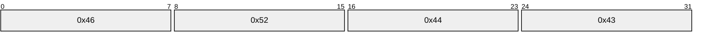

**Fragment Header:** Consists of a 4-byte number, numberOfFragments, which is the number of data fragments to follow. This value MUST be no greater than XPRESS_RDC_MAX_NB_NEEDS_FOR_COMPRESSION.

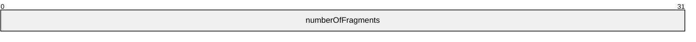

**Fragment:** The list of fragments consists of 0 or more instances of the following structure.

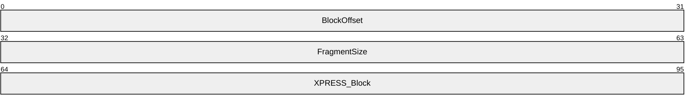

**BlockOffset:** A starting offset into the uncompressed bytes from the XPRESS Block portion. The valid range of this field is 0 to X_CONFIG_XPRESS_BLOCK_SIZE-1.

**FragmentSize:** The number of uncompressed bytes that the server instructs the client to extract. The uncompressed bytes start from BlockOffset and include at most, X_CONFIG_XPRESS_BLOCK_SIZE-blockOffset-1 bytes. The valid range of this field is 1 to X_CONFIG_XPRESS_BLOCK_SIZE. Additionally, for each fragment, the sum of the **BlockOffset** field and the **FragmentSize** field MUST be less or equal to X_CONFIG_XPRESS_BLOCK_SIZE.

**XPRESS Block:** Following the optional list of fragments is a variable size XPRESS Block, as specified in section [2.2.1.4.15](#Section_2.2.1.4.15).

All the data is tightly packed—no padding bytes are added for alignment purposes.

##### 3.2.4.1.13 RdcClose (Opnum 12)

The RdcClose method informs the server that the server context information can be released.

DWORD RdcClose(

[in, out] PFRS_SERVER_CONTEXT* serverContext

);

**serverContext:** The context handle that represents the requested file replication operation. The client MUST specify a server context that was retrieved by a previously successful call to the [InitializeFileTransferAsync](#Section_3.2.4.1.14) method.

**Return Values:** This method MUST return 0 on success or a nonzero error code on failure. For protocol purposes all nonzero values MUST be treated as equivalent failures unless otherwise specified.

| Return value/code | Description |
| --- | --- |
| 0x00000000 ERROR_SUCCESS | The method completed successfully. |
| 0x00000057 ERROR_INVALID_PARAMETER | The context is invalid. |

**Exceptions Thrown:** No exceptions are thrown beyond those thrown by the underlying RPC protocol [MS-RPCE](../MS-RPCE/MS-RPCE.md).

**Validating the close context request:** The server MUST validate the request by performing the following checks.

- If the specified server context was not retrieved by a previously successful call to the InitializeFileTransferAsync method, then the server MUST fail the call with the ERROR_INVALID_PARAMETER failure value.
- If the server has already closed the server context, the server MUST fail the call with an implementation-defined failure value.
**Actions Triggered:** The server closes and cleans up all resources associated with the server context. The serverContext MUST not be used any more by the client after a successful call to the RdcClose method.

##### 3.2.4.1.14 InitializeFileTransferAsync (Opnum 13)

The InitializeFileTransferAsync method is used by a client to start a file download. The client supplies an update to specify which file to download. The server provides its latest version of the update and initial file contents. The server returns information about the file currently being replicated and the first buffer of data from that file (if any).

DWORD InitializeFileTransferAsync(

[in] FRS_CONNECTION_ID connectionId,

[in, out] FRS_UPDATE* frsUpdate,

[in, range(0,1)] long rdcDesired,

[in, out] FRS_REQUESTED_STAGING_POLICY* stagingPolicy,

[out] PFRS_SERVER_CONTEXT* serverContext,

[out] FRS_RDC_FILEINFO** rdcFileInfo,

[out, size_is(bufferSize), length_is(*sizeRead)]

byte* dataBuffer,

[in, range(0, CONFIG_TRANSPORT_MAX_BUFFER_SIZE)]

DWORD bufferSize,

[out] DWORD* sizeRead,

[out] long* isEndOfFile

);

**connectionId:** The GUID of an outbound connection (see the **objectGUID** attribute specified in section [2.3.11](#Section_2.3.11)) that the client established by a previous call to the [EstablishConnection](#Section_3.2.4.1.2) method.

**frsUpdate:** The [FRS_UPDATE](#Section_2.2.1.4.4) structure that contains information about the file being replicated. The fields for the [**UID**](#gt_unique-identifier-uid) in *frsUpdate* MUST be set to the UID of the file to be downloaded. All other fields are cleared (zeroed out) or can have the values provided by the server in the response to a [RequestUpdates](#Section_3.3.4.6) call. On return, all fields of *frsUpdate* MUST contain the values that are held by the server.

**rdcDesired:** The value is TRUE if [**RDC**](#gt_remote-differential-compression-rdc) has to be used when replicating this file; otherwise, the value is FALSE.

**stagingPolicy:** The [FRS_REQUESTED_STAGING_POLICY](#Section_2.2.1.2.9) enumeration value that indicates the type of staging requested. If the client-supplied value of *rdcDesired* is TRUE and the client-supplied value of *stagingPolicy* is SERVER_DEFAULT, then the server MUST set *stagingPolicy* to STAGING_REQUIRED. If the client-supplied value of *rdcDesired* is FALSE and the client-supplied value of *stagingPolicy* is STAGING_REQUIRED, then the server MUST set *stagingPolicy* to STAGING_REQUIRED. If the client-supplied value of *rdcDesired* is FALSE and the client-supplied value of *stagingPolicy* is RESTAGING_REQUIRED, then the server MUST set *stagingPolicy* to RESTAGING_REQUIRED.

**serverContext:** The context handle that represents the requested file replication operation.

**rdcFileInfo:** The [FRS_RDC_FILEINFO](#Section_2.2.1.4.11) structure that describes the file whose replication is in progress.

**dataBuffer:** The file data received from the server.

**bufferSize:** The size, in bytes, of *dataBuffer*. CONFIG_TRANSPORT_MAX_BUFFER_SIZE is 262,144.

**sizeRead:** The size, in bytes, of the file data returned in *dataBuffer*.

**isEndOfFile:** The value is TRUE if the end of the specified file has been reached and there is no more file data to replicate to the client; otherwise, the value is FALSE.

**Return Values:** This method MUST return 0 on success or a nonzero error code on failure. For protocol purposes all nonzero values MUST be treated as equivalent failures unless otherwise specified.

| Return value/code | Description |
| --- | --- |
| 0x00000000 ERROR_SUCCESS | The method completed successfully. |
| 0x00002342 FRS_ERROR_CONNECTION_INVALID | The connection is invalid. |
| 0x00002344 FRS_ERROR_CONTENTSET_NOT_FOUND | The content set was not found. |
| 0x0000234B FRS_ERROR_RDC_GENERIC | Unknown error in RDC. |
| 0x00002358 FRS_ERROR_XPRESS_INVALID_DATA | The compressed data is invalid. |

**Exceptions Thrown:** No exceptions are thrown beyond those thrown by the underlying RPC protocol [MS-RPCE](../MS-RPCE/MS-RPCE.md).

**Validating the file transfer request:** The server MUST validate the file transfer request by performing the following checks.

- If an outbound connection for the specified connection is not established between the client and server (see the EstablishConnection method) then the server MUST fail the call with the FRS_ERROR_CONNECTION_INVALID failure value.
- If a [**replicated folder**](#gt_replicated-folder) session for the contentSetId specified in *frsUpdate* is not established between the client and server (see the EstablishSession method), then the server MUST fail the call with the FRS_ERROR_CONTENTSET_NOT_FOUND failure value.
- If the file on the server has been deleted and if the corresponding file metadata has been updated with the present flag set to 0 then the server MUST fail the call with an implementation-defined failure value.
- If the information stored in its database for the file associated with the requested UID in the supplied update is not in sync with the **File Replication Store**, or the server is performing operations on the database records that prevent the file from being replicated until those operations complete, then the server MUST fail the call with an implementation-defined failure value. <29>
- If the server detects that the compressed data of the staged file is corrupted then the server MUST fail the call with FRS_ERROR_XPRESS_INVALID_DATA. Refer to section [3.3.4.7.1](#Section_3.3.4.7.1) for more information about the staging area.
**Actions Triggered:** Upon successfully validating the file transfer request, the server MUST retrieve the file data associated with the requested UID in the supplied update. The server MUST then send the file data in the way that the client has specified if possible (using RDC or not using RDC). The server sends file data by providing as much marshaled and compressed data as fits into the output buffer provided in the InitializeFileTransferAsync method call. The remaining marshaled and compressed file data is sent in response to subsequent client calls to retrieve file contents. The server MUST provide the file metadata that is associated with the file that it serves. It does so by providing its own view of the update associated with the requested UID in the return value of *frsUpdate*.

**Remarks:** File data in *dataBuffer* is transferred over the wire in a format that is composed of two layers.

- A stream of file data that consists of a custom marshaled format (as specified in section [3.2.4.1.14.1](#Section_3.2.4.1.14.1)). The custom marshaled format encapsulates file data compatible with [MS-BKUP](../MS-BKUP/MS-BKUP.md) and file metadata compatible with formats specified in [MS-FSCC](../MS-FSCC/MS-FSCC.md).
- An encapsulation of the marshaled file data stream using the compressed data format (as specified in section [3.2.4.1.14.2](#Section_3.2.4.1.14.2)) generated by the compression algorithm specified in section [3.1.1.1](#Section_3.1.1.1). Even if the marshaled file data stream is not compressed by the server, it is still encapsulated using the compressed data format.
The format of the backup stream is as specified in [MS-BKUP], and the format of the compressed marshaled stream is as specified in sections 3.2.4.1.14.1 and 3.2.4.1.14.2.

If bufferSize is zero then the server SHOULD complete the call successfully with sizeRead set to zero, or fail the call with an implementation-defined failure value.

In the case where the client requests an RDC transfer, the server informs the client of the RDC parameters that were used for the signatures for the file being transferred. Typically, the parameters are different for the first recursion level and for all other levels <30> The server limits the number of simultaneous outstanding file downloads and returns an implementation-defined failure value when a file download is attempted while a configured threshold<31> of simultaneous downloads has been reached.

If a client issues multiple simultaneous calls to any of the RPC methods taking a server context as an input parameter ([RawGetFileData](#Section_3.3.4.9), [RdcGetSignatures](#Section_3.3.4.12), [RdcPushSourceNeeds](#Section_3.3.4.13), [RdcGetFileData](#Section_3.2.4.1.12), [RawGetFileDataAsync](#Section_3.2.4.1.15) or [RdcGetFileDataAsync](#Section_3.3.4.15)) with the same server context, then the server MUST ensure that only the first call is processed and all other calls are failed with an implementation-defined failure value.

###### 3.2.4.1.14.1 Custom Marshaling Format

The encapsulated marshaled format is a byte stream that encodes a sequence of headers that describe the type and length of the marshaled data that is encoded between the headers. A header is a structure of type MARSHAL_BLOCK_HEADER.

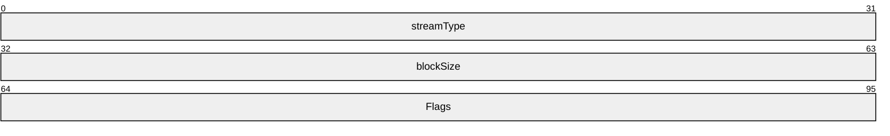

**streamType:** An enumeration, which MUST be one of the following values.

| Value | Meaning |
| --- | --- |
| MS_TYPE_META_DATA | 0x00000001 |
| MS_TYPE_COMPRESSION_DATA | 0x00000002 |
| MS_TYPE_REPARSE_DATA | 0x00000003 |
| MS_TYPE_FLAT_DATA | 0x00000004 |
| MS_TYPE_SECURITY_DATA | 0x00000006 |

Stream type 0x00000005 is not used.

**blockSize:** The number of bytes of data in the chunk following the header.

**Flags:** The bitmask, with the HEADER_FLAGS_END_OF_STREAM bit (0x00000001) set if the end of the stream being marshaled has been reached. All other bits MUST be set to 0.

The HEADER_FLAGS_END_OF_STREAM bit indicates that an end of the stream that is being marshaled has been reached. For instance, if a stream requires multiple chunks, only the last header from that stream MUST have the HEADER_FLAGS_END_OF_STREAM bit set; all other headers MUST have the flags set to 0.

The data MUST be tightly packed. There MUST NOT be any additional bytes of padding.

The format of the data between the headers depends on the value of streamType. These formats are described as follows.

**MS_TYPE_META_DATA (1):** The metadata is written to the top of the marshaled file. The metadata contains information used by the marshaler and other processing code. It consists of data of the following format.

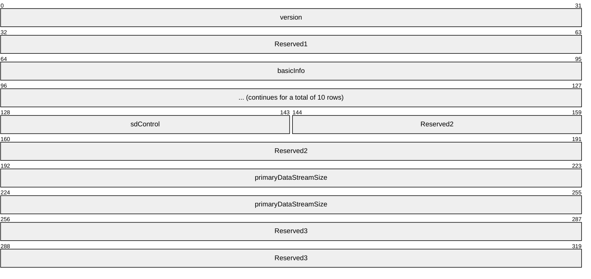

**version:** The marshaler version. It MUST be 3.

**Reserved 1:** Unused, 4 bytes for alignment. MUST be 0. MUST be ignored on receipt.

**basicInfo:** The FILE_BASIC_INFORMATION structure, as specified in [MS-FSCC](../MS-FSCC/MS-FSCC.md) section 2.4.7. It contains file times that are stamped on replicated files.

**sdControl:** The original SD control bits of the file being transferred. The format conforms to the format for SECURITY_DESCRIPTOR_CONTROL, as specified in [MS-LSAD](../MS-LSAD/MS-LSAD.md) section 2.2.3.3.

**Reserved2:** Unused, 6 bytes for alignment. MUST be 0. MUST be ignored on receipt.

**primaryDataStreamSize:** A 64-bit unsigned integer. Only used in version 0x00050002 or later. It contains the absolute new end-of-file position as a byte offset from the start of the file, as specified in [MS-FSCC] section 2.4.41 (FileStandardInformation).

**Reserved3:** Unused, pads 8 bytes. MUST be 0. MUST be ignored on receipt.

**MS_TYPE_COMPRESSION_DATA (2):** Defines which compression algorithm is used to store the file in compressed format on disk. DFS-R replicates the compression attribute as well as the compression algorithm to allow that files get compressed uniformly among replication partners.

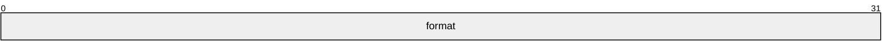

**format:** This SHOULD be the value of the **CompressionFormat** field of the FILE_COMPRESSION_INFORMATION structure, as specified in [MS-FSCC] section 2.4.9.

**MS_TYPE_REPARSE_DATA (3):** Reparse point data from reparse points that are replicated by DFS-R.<32> The data that follows a header tagged by MS_TYPE_REPARSE_DATA MUST be of a format compatible with the reply format of FSCTL_GET_REPARSE_POINT, as specified in [MS-FSCC] section 2.3.28.

**MS_TYPE_FLAT_DATA (4):** A sequence of bytes that represents the file. This sequence complies with the format of an NT Backup File, as specified in [MS-BKUP](../MS-BKUP/MS-BKUP.md), section 2.1.

This is the last data stream of the marshaled data. The MARSHAL_BLOCK_HEADER of this stream, blockSize and Flags are set to 0. The client reads the stream as specified in [MS-BKUP], section 2.1, until there is no more data received from the server.<33>

A file's security information is sent using the MS_TYPE_SECURITY_DATA stream, and not sent as part of the [MS-BKUP] formatted MS_TYPE_FLAT_DATA stream.

**MS_TYPE_SECURITY_DATA (6):** A sequence of bytes that complies with the format of SECURITY_DESCRIPTOR. For more information, see [MS-LSAD] section 2.2.3.3.

**File hash:** DFS-R defines the [**hash**](#gt_hash) of a marshaled file to be the [**SHA-1 hash**](#gt_sha-1-hash) of only the chunks associated with the following.

- MS_TYPE_FLAT_DATA
- MS_TYPE_SECURITY_DATA
Changes to, for instance, the time stamps that are transferred in chunks associated with MS_TYPE_META_DATA, do not incur a change of the hash. Also, notice that the hash is computed only for the chunks and does not include the headers.

The file hash is included in the hash field of FRS_UPDATE.

###### 3.2.4.1.14.2 Compressed Data Format

The compressed data stream starts with a header, which is followed by a series of one or more XPRESS Blocks (as specified in section [2.2.1.4.15](#Section_2.2.1.4.15)) containing the stream's data.

The data stream header MUST consist of a 4-byte signature, composed of the four bytes 0x46, 0x52, 0x53, and 0x58 (in ASCII, that is 'F', 'R', 'S', and 'X') as follows.

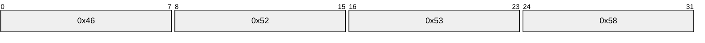

The size of the uncompressed XPRESS block data MUST be equal to 8192 bytes, except for the last block of a file transfer, which can be smaller, and except when this data is from the [RdcGetFileData](#Section_3.2.4.1.12) method (see section 3.2.4.1.12).

##### 3.2.4.1.15 RawGetFileDataAsync (Opnum 15)

The RawGetFileDataAsync method is used instead of calling [RawGetFileData](#Section_3.3.4.9) multiple times to obtain file data. As specified in [MS-RPCE](../MS-RPCE/MS-RPCE.md), the specification for asynchronous [**RPC**](#gt_remote-procedure-call-rpc), an RPC client pulls file data from the byte pipe until receiving an end-of-file notification from the pipe.

DWORD RawGetFileDataAsync(

[in] PFRS_SERVER_CONTEXT serverContext,

[out] BYTE_PIPE* bytePipe

);

**serverContext:** The context handle that represents the requested file replication operation. The client MUST specify a server context that was retrieved by a previously successful call to the [InitializeFileTransferAsync](#Section_3.2.4.1.14) method.

**bytePipe:** The asynchronous RPC byte pipe that contains returned file data.

**Return Values:** This method MUST return 0 on success or a nonzero error code on failure. For protocol purposes all nonzero values MUST be treated as equivalent failures unless otherwise specified.

| Return value/code | Description |
| --- | --- |
| 0x00000000 ERROR_SUCCESS | The method completed successfully. |
| 0x00000057 ERROR_INVALID_PARAMETER | The context is invalid. |
| 0x00002344 FRS_ERROR_CONTENTSET_NOT_FOUND | The content set was not found. |

**Exceptions Thrown:** No exceptions are thrown beyond those thrown by the underlying RPC protocol [MS-RPCE].

**Validating the file transfer request:** The server MUST validate the file transfer request by performing the same checks as the RawGetFileData method, except for the checks related to input parameters that exist in the RawGetFileData method, but not in the RawGetFileDataAsync method.

**Actions Triggered:** Upon successfully receiving the file transfer request, the server retrieves the entire file's marshaled data.

**Remarks:** The data stream returned by RawGetFileDataAsync is identical to the format of the data received by a single call to RawGetFileData if RawGetFileData is passed a buffer large enough to hold all the data returned by the pipe.

##### 3.2.4.1.16 RdcGetFileDataAsync (Opnum 16)

The RdcGetFileDataAsync method is used instead of calling [RdcGetFileData](#Section_3.2.4.1.12) multiple times to obtain file data. As specified in [MS-RPCE](../MS-RPCE/MS-RPCE.md), the specification for asynchronous [**RPC**](#gt_remote-procedure-call-rpc), an RPC client pulls file data from the byte pipe until receiving an end-of-file notification from the pipe.

DWORD RdcGetFileDataAsync(

[in] PFRS_SERVER_CONTEXT serverContext,

[out] BYTE_PIPE* bytePipe

);

**serverContext:** The context handle that represents the requested file replication operation. The client MUST specify a server context that was retrieved by a previously successful call to the [InitializeFileTransferAsync](#Section_3.2.4.1.14) method in which the client set the *rdcDesired* parameter to TRUE.

**bytePipe:** The asynchronous RPC byte pipe that contains returned file data.

**Return Values:** This method MUST return 0 on success or a nonzero error code on failure. For protocol purposes all nonzero values MUST be treated as equivalent failures unless otherwise specified.

| Return value/code | Description |
| --- | --- |
| 0x00000000 ERROR_SUCCESS | The method completed successfully. |
| 0x00000057 ERROR_INVALID_PARAMETER | The context is invalid. |
| 0x00002344 FRS_ERROR_CONTENTSET_NOT_FOUND | The content set was not found. |
| 0x0000234B FRS_ERROR_RDC_GENERIC | Unknown error in [**RDC**](#gt_remote-differential-compression-rdc). |
| 0x00002358 FRS_ERROR_XPRESS_INVALID_DATA | The compressed data is invalid. |

**Exceptions Thrown:** No exceptions are thrown beyond those thrown by the underlying RPC protocol [MS-RPCE].

**Validating the file transfer request:** The server MUST validate the file transfer request by performing the same checks as the RdcGetFileData method, except for the checks related to input parameters that exist in the RdcGetFileData method but not in the RdcGetFileDataAsync method.

**Actions Triggered:** Upon successfully validating the RDC file data request, the server serves file data from the source needs that were queued by the [RdcPushSourceNeeds](#Section_3.3.4.13) method.

**Remarks:** The data stream returned by the RdcGetFileDataAsync method is identical to the format of the data received by a single call to the RdcGetFileData method if the RdcGetFileData method is passed a buffer large enough to hold all the data returned by the pipe.

##### 3.2.4.1.17 RdcFileDataTransferKeepAlive (Opnum 17)

The RdcFileDataTransferKeepAlive method is used to keep the server context alive.

DWORD RdcFileDataTransferKeepAlive(

[in] PFRS_SERVER_CONTEXT serverContext

);

**serverContext:** The context handle that represents the requested file replication operation that was retrieved by a previously successful call to the [InitializeFileTransferAsync](#Section_3.2.4.1.14) method.

**Return Values:** This method MUST return 0 on success or a nonzero error code on failure. For protocol purposes all nonzero values MUST be treated as equivalent failures unless otherwise specified.

| Return value/code | Description |
| --- | --- |
| 0x00000000 ERROR_SUCCESS | The method completed successfully. |
| 0x00000057 ERROR_INVALID_PARAMETER | The context is invalid. |
| 0x00002344 FRS_ERROR_CONTENTSET_NOT_FOUND | The content set was not found. |
| 0x0000234B FRS_ERROR_RDC_GENERIC | Unknown error in [**RDC**](#gt_remote-differential-compression-rdc). |
| 0x0000234B FRS_ERROR_IN_BACKUP_RESTORE | Paused for backup or restore. |

The server MUST validate the request by performing the following checks:

- If the *serverContext* is being used in another request and the server is still processing that request, the server MUST fail the call with ERROR_INVALID_PARAMETER.
- If *serverContext* is not available, the server MUST fail the call with FRS_ERROR_CONTENTSET_NOT_FOUND.
- If the server is not currently participating in replication of the replicated folder that is associated with the specified *serverContext*, the server MUST fail the call with FRS_ERROR_CONTENTSET_NOT_FOUND.
- If the server is processing a VSS backup or restore operation, the server MUST fail the call with FRS_ERROR_IN_BACKUP_RESTORE.
**Actions Triggered**: The server MUST reset and start the time-outs on the open file handles timer. The server MUST return ERROR_SUCCESS to the client.

### 3.2.5 Timer Events

**Version vector request time-out:** Upon a version vector request time-out, the server tears down its state associated with the logical connection. Pending asynchronous calls on the connection are completed with an error (ERROR_ACCESS_DENIED), and new calls that assume the presence of the connection object fail with the same error code as well.

**Time-outs on open file handles:** When a context handle is determined stale by a server, it closes all states associated with the context handle. Subsequent calls by a client on the context handle fail with ERROR_INVALID_PARAMETER.

### 3.2.6 Other Local Events

None.

## 3.3 Client Details

In the Distributed File System: Replication (DFS-R) Protocol, the client is responsible for driving the state machine to receive and process [**version chain vectors**](#gt_version-chain-vector), updates, and file transfers. A high-level view of the main state machine maintained by the client is depicted in the following figure. It is intended as an example of a DFS-R client. In this instance, the client first requests a notification of a version vector change, then after receiving the notification, it requests the actual version vector.

The client uses a credit system to control the number of synchronization instances that it is performing at any given time. A state, GetCredits, is included in the following figure to indicate that the client manages the number of version vectors that it requests. The client also uses a credit system to control the processing of updates that are received but are not yet processed at any given time.

A DFS-R server MUST be agnostic to the specific way that a client chooses to throttle processing updates, as shown in the following state diagram.

Figure 3: Main state machine maintained by the client

To prepare the ground for the detailed walk-through, review the following sequence diagram, which is a refinement of the high-level sequence diagram, as specified in section [1.3](#Section_1.3). The additional call [AsyncPoll](#Section_3.3.4.5), which carries the version chain vector response payload, was added, and a file transfer call sequence is illustrated. Furthermore, asynchronous [**RPC**](#gt_remote-procedure-call-rpc) replies are given explicitly for the asynchronous RPC messages.

Figure 4: File transfer call sequence

The refined synopsis proceeds as a client as follows:

- Establishes a [**logical connection**](#gt_logical-connection) with a [**server**](#gt_server).
- Registers one asynchronous poll with the server for each logical connection.
- For each [**replicated folder**](#gt_replicated-folder) that is shared between the client and the server, the client establishes a [**replication session**](#gt_replication-session).
- For each replication session, the client requests the server version chain vectors.
- The server completes an asynchronous poll request when it is ready with the version chain vector payload in response to the version chain vector request.
- When receiving an asynchronous poll response, a client SHOULD field a new asynchronous poll request to handle other or later-version vector requests.
- When the client receives a version chain vector from the server, it calculates the versions that are not known to it and requests updates from the server pertaining to these versions.
- When the client receives updates from the server, it processes these. While processing a requested update, the client machine can decide that the server updates correspond to file content that it needs to replicate in. It then requests the server to send the file.
- A file transfer starts with an initialization of file transfer ([InitializeFileTransferAsync](#Section_3.2.4.1.14)). This establishes a context handle for the file transfer.
- A raw file transfer proceeds when the client requests chunks of a file by using the context handle.
- When the file transfer has been completed by reaching the end of file or as a result of cancellation, a client MUST close the context handle by using RdcClose.
- The client registers a request for updated version chain vectors from the server when it has received all updates from the previous version chain vector.
For detailed summaries of the set of state machines that clarify their relative dependencies, see diagrams in sections [3.3.1.1](#Section_3.3.1.1), [3.3.1.2](#Section_3.3.1.2), [3.3.1.3](#Section_3.3.1.3), [3.3.1.4](#Section_3.3.1.4), and [3.3.1.5](#Section_3.3.1.5).

### 3.3.1 Abstract Data Model

This section describes a conceptual model of possible data organization that an implementation maintains to participate in this protocol. The described organization is provided to facilitate the explanation of how the protocol behaves. This document does not mandate that implementations adhere to this model as long as their external behavior is consistent with that described in this document.

#### 3.3.1.1 Connection State Machine

The following state diagram specifies the state machine to be referred to when DFS-R establishes a connection. It introduces the following connection states.

- **Disconnected:** A client is not connected. When transitioning to the Disconnected state from the Connected or Polling state, the client terminates all [**replicated folder**](#gt_replicated-folder) sessions associated with this connection (see section [3.3.1.2](#Section_3.3.1.2)).
- **Connected:** A client has established a [**connection**](#gt_connection) successfully.
- **Polling:** A client has registered an asynchronous poll.

Figure 5: State machine referred to when DFS-R establishes a connection

#### 3.3.1.2 Replicated Folder Session State Machine

The Distributed File System: Replication (DFS-R) Protocol requires that a client establishes a session for each [**replicated folder**](#gt_replicated-folder) that is configured on a connection. All replication activity takes place within one such session. The following state diagram specifies the state machine for replicating content on replicated folder. In this initial state, it is assumed that the state machine that establishes a connection has reached its terminal state. It introduces the following replicated folder session states.

- **Restart:** A client has not established a [**replication session**](#gt_replication-session) for a replicated folder. When transitioning to the Restart state following a session error or a session termination, the client cancels or waits for all outstanding RPC calls for the given replicated folder to complete before calling the [EstablishSession](#Section_3.3.4.3) method again.
- **InSession:** The client has established a replicated folder session with the server for a replicated folder.
- **Requesting Version Vector:** The client has registered a request for notification when the server's [**version chain vector**](#gt_version-chain-vector) changes.
- **Poll Again:** The client has been notified of a version chain vector change by the server and has registered a request for the server's version chain vector.
- **Requesting Updates:** The client has received the server's version chain vector and is requesting updates based on the received version chain vector.

Figure 6: Main update request state machine

#### 3.3.1.3 Slow Sync

[**Slow Sync**](#gt_slow-sync) is a secondary means to ensure the consistency of the data between each pair of machines. The main part of the Distributed File System Replication (DFS-R) protocol of exchanging version vectors can in some circumstances, such as garbage collection of tombstone updates, leave inconsistencies between machines undetected. The slow sync process is periodically run on a client for each [**replicated folder**](#gt_replicated-folder) to detect and correct such inconsistencies. <34>

When specifying the Slow Sync protocol, the following states are referred to.

- **SlowSyncInit:** The client starts a slow sync with the server for a particular replicated folder by requesting a [**version chain vector**](#gt_version-chain-vector) from the server via the [RequestVersionVector](#Section_4.2.1) method, setting *requestType* to REQUEST_SLOW_SYNC.
- **SlowSync Requesting Version Vector:** The client is waiting for the server's asynchronous callback to the [AsyncPoll](#Section_3.3.4.5) method to supply the requested version chain vector.
- **SlowSync Poll Again:** The client registers an additional poll with the server.
- **SlowSync Request Records:** The client requests all of the replicated folder's non-tombstone update records from the server and processes them.
The state transitions associated with Slow Sync are shown in the following state diagram.

Figure 7: Slow Sync state machine

#### 3.3.1.4 Raw File Transfer

A direct file transfer (one that does not use [**RDC**](#gt_remote-differential-compression-rdc)) starts by a call to [InitializeFileTransferAsync](#Section_3.2.4.1.14) with rdcDesired set to 0. The transfer might be fully finished when this call completes, or it might have to be finished by using either [RawGetFileData](#Section_3.3.4.9) or [RawGetFileDataAsync](#Section_3.2.4.1.15). When the server signals the end of file, the client uses [RdcClose](#Section_3.3.4.10) to dispose of the context handle associated with the file download. The state transitions associated with a raw file download are illustrated in the following state diagram.

Figure 8: Raw file transfer state machine

#### 3.3.1.5 RDC File Transfer

A transfer over the [**RDC**](#gt_remote-differential-compression-rdc) protocol starts and finishes similarly to a direct file transfer. The client first uses an [InitializeFileTransferAsync](#Section_3.2.4.1.14) to establish a context handle for the file, and then calls [RdcGetSignatures](#Section_3.3.4.12) to retrieve the signatures (possibly at recursive levels) that pertain to the file being transferred. To retrieve file data at given offsets and lengths, the client uses [RdcPushSourceNeeds](#Section_3.3.4.13) to indicate which data ranges are requested from the file to be transferred. Notice that several ranges might be coalesced in a single call to RdcPushSourceNeeds. To retrieve actual file data, the client uses separate calls, [RdcGetFileData](#Section_3.2.4.1.12), or a single call to [RdcGetFileDataAsync](#Section_3.3.4.15). When the file transfer is done, the client is required to use [RdcClose](#Section_3.3.4.10) to context handle gracefully.

RDC allows the application to choose the recursion depth arbitrarily. Choosing an optimum recursion depth is difficult because many factors are involved, including the available network bandwidth and network latency, the speed and load of the disk storage systems on the server and client machines, as well as available CPU time for computing signatures, if necessary.<35>

There are few constraints on the order in which a client uses these APIs. Signature data and file data can be downloaded concurrently.

The DFS-R server requires that the client follow the following rules:

- A client initializes RDC transfer using InitializeFileTransferAsync, specifying that it wants to perform a download using RDC.
- If a server determines that the file to be served is not suitable for the RDC protocol, it sets rdcSignatureLevels to 0 in the [FRS_RDC_FILEINFO](#Section_2.2.1.4.11) structure. The client then has to complete the download by using a direct transfer, as if it had not requested the RDC protocol.
- A client serializes its calls to RdcGetSignatures, RdcPushSourceNeeds, RdcGetFileData, or RdcGetFileDataAsync.
- The accumulated amount of data requested using RdcGetFileData or RdcGetFileDataAsync never exceeds the length of the intervals pushed by RdcPushSourceNeeds. The DFS-R server is otherwise free to fail all subsequent requests on that context handle.
- RdcClose terminates a context handle and no further requests can be made on the context handle following this call. The RPC runtime furthermore enforces this constraint, as shown in the following state diagram.

Figure 9: RDC file transfer state machine

The client has to call either RdcGetFileData or RdcGetFileDataAsync, but cannot call both.

### 3.3.2 Timers

<36>

### 3.3.3 Initialization

For each configured connection, a client creates a separate state machine, as specified in the figure in section [3.3.1.1](#Section_3.3.1.1), and enters the DisConnected state in each state machine.

When a Connection object is added or removed, clients either establish (when added) or terminate (when removed) [**logical connection**](#gt_logical-connection) objects. Clients can delay establishing a connection based on a configured schedule.

### 3.3.4 Message Processing Events and Sequencing Rules

In DFS-R, the client initiates all communication with the server. Only in a few cases does the server trigger a callback into the client when completing asynchronous [**RPC**](#gt_remote-procedure-call-rpc) messages. For uniformity, the message processing events are presented as triggered by a successful call to [EstablishConnection](#Section_3.2.4.1.2). All subsequent actions and messages are triggered by replies by the server. The initial client state is DisConnected.

#### 3.3.4.1 DisConnected

**Message Handling:** None.

**Actions Triggered:** A client MUST, possibly with a delay induced by a schedule, call [EstablishConnection](#Section_3.2.4.1.2) to establish connection objects with each configured inbound connection. For SYSVOL replication, the client MUST set connectionId to objectGUID of nTDSConnection object. Otherwise, the client MUST set connectionId to objectGUID of msDFSR-Connection object.

**Sequencing:** All [**RPC**](#gt_remote-procedure-call-rpc) traffic, other than [CheckConnectivity](#Section_3.2.4.1.1), with the server has to have been preceded by an EstablishConnection method.

**Error Handling:** None.

#### 3.3.4.2 EstablishConnection Completes

Upon successful completion, the client has established an outbound connection with the server.

**Actions Triggered:** The client MUST transition from the Disconnected connection state to the Connected connection state. See section [3.3.1.1](#Section_3.3.1.1) for a summary of the connection state machine.

Following the transition to the Connected connection state, the client MUST call the [AsyncPoll](#Section_3.3.4.5) method to register a callback with the server, then transition to the Polling connection state. The client MUST call the [EstablishSession](#Section_3.3.4.3) method for each [**replicated folder**](#gt_replicated-folder) that is part of the specified connection’s [**replication group**](#gt_replication-group).

**Sequencing:** The [EstablishConnection](#Section_3.2.4.1.2) method MUST be invoked by the client only in the disconnected state.

**Error Handling:** The following table summarizes the set of errors returned by the EstablishConnection method that cause a client to behave in specific ways.

| Error code | Client response |
| --- | --- |
| 0x00000000 ERROR_SUCCESS | The client MUST perform the actions listed under the Actions Triggered heading. |
| All non-zero error codes | The client MUST transition to the Disconnected connection state. The client SHOULD try to re-establish the connection by calling the EstablishConnection method after a time-out interval of its choice. |

#### 3.3.4.3 EstablishSession Completes

Upon successful completion the client has established a [**replicated folder**](#gt_replicated-folder) session with the server.

**Actions Triggered:** The client MUST transition the replicated folder from the Restart session state to the InSession session state. See section [3.3.1.2](#Section_3.3.1.2) for a summary of the replicated folder session state machine.

Following the transition to the InSession replicated folder session state, the client MUST register a request for a [**version chain vector**](#gt_version-chain-vector) change notification by calling the [RequestVersionVector](#Section_4.2.1) method and then transition to the Requesting Version Vector replicated folder session state.

**Sequencing:** A client MUST NOT call the [EstablishSession](#Section_3.3.4.3) method until it has established an outbound connection with the server for a particular connection by successfully calling the [EstablishConnection](#Section_3.2.4.1.2) method. After a connection is established, a client SHOULD call the EstablishSession.

**Error Handling:** The following table summarizes the set of errors returned by the EstablishSession method that cause a client to behave in specific ways.

| Error code | Client response |
| --- | --- |
| 0x00000000 ERROR_SUCCESS | The client MUST perform the actions listed under the Actions Triggered heading. |
| 0x00002342 FRS_ERROR_CONNECTION_INVALID | The client MUST transition to the Disconnected connection state. The client SHOULD try to re-establish the connection by calling the EstablishConnection method after a time-out interval of its choice. |
| 0x00002375 FRS_ERROR_CONTENTSET_READ_ONLY | The client MUST remain in the Polling connection state, but SHOULD not call the EstablishSession method again for this replicated folder. |
| 0x000006A4 – 0x00000788 RPC errors | The client MUST transition to the Disconnected connection state. The client SHOULD try to re-establish the connection by calling the EstablishConnection method after a time-out interval of its choice. |
| All other non-zero error codes | The client MUST remain in the Polling connection state and SHOULD call the EstablishSession method again for this replicated folder, after a time-out interval of its choice. |

#### 3.3.4.4 RequestVersionVector Completes

Upon successful completion the client has requested a [**version chain vector**](#gt_version-chain-vector) / version chain vector change notification from the server.

**Actions Triggered:** The client MUST wait for the corresponding [AsyncPoll](#Section_3.3.4.5) request to complete.

**Error Handling:** The following table summarizes the set of errors returned by the [RequestVersionVector](#Section_4.2.1) method that cause a client to behave in specific ways.

| Error code | Client response |
| --- | --- |
| 0x00000000 ERROR_SUCCESS | The client MUST perform the actions listed under the Actions Triggered heading. |
| All non-zero error codes | The client MUST transition to the Disconnected connection state. The client SHOULD try to re-establish the connection by calling the [EstablishConnection](#Section_3.2.4.1.2) method after a time-out interval of its choice. |

#### 3.3.4.5 AsyncPoll Completes

Upon successful completion the server has responded to a previous call by the client to the [RequestVersionVector](#Section_4.2.1) method for a particular [**replicated folder**](#gt_replicated-folder).

**Actions Triggered:** The client MUST register another [AsyncPoll](#Section_3.3.4.5) callback for the connection on which the AsyncPoll method completed.

Subsequent actions are dependent on the type of version vector request that triggered this AsyncPoll completion.

**REQUEST_NORMAL_SYNC:** If the client’s replicated folder session state is currently Requesting Version Vector, then the AsyncPoll completion indicates that the server’s version vector has changed to contain versions that are not known to the client. The client MUST request the changed version vector from the server by calling the RequestVersionVector method with the *changeType* parameter equal to CHANGE_ALL and then MUST enter the Poll Again replicated folder session state.

If the client’s replicated folder session state is currently Poll Again then the AsyncPoll completion indicates that the server has sent its [**version chain vector**](#gt_version-chain-vector) to the client. The client MUST enter the Requesting Updates replicated folder session state. The client MUST then request updates pertaining to the version chain vector received from the server. The client uses calls to the [RequestUpdates](#Section_3.3.4.6) method to retrieve updates from the server.

If the client’s replicated folder session state is neither Requesting Version Vector nor Poll Again, then the client MUST ignore the reply from the server.

**REQUEST_SLOW_SYNC:** If the client's [**slow sync**](#gt_slow-sync) state is currently Requesting Version Vector then the client MUST transition to the Request Records slow sync state (see section [3.3.1.3](#Section_3.3.1.3)) and MUST call the [RequestRecords](#Section_3.2.4.1.7) method to request the replicated folder's live update records from the server.

If the client’s slow sync state is not Requesting Version Vector then the client MUST ignore the response from the server.

**Error Handling:** The following table summarizes the set of errors returned by the AsyncPoll method upon invocation that cause a client to behave in specific ways. (This is the only asynchronous RPC call whose errors are handled differently during invocation and asynchronous completion).

| Error code | Client response |
| --- | --- |
| 0x00000000 ERROR_SUCCESS | The client MUST perform the actions listed under the Actions Triggered heading. |
| All non-zero error codes | The client SHOULD try to call AsyncPoll again after a time-out interval of its choice. |

The following table summarizes the set of errors returned by the AsyncPoll method upon asynchronous completion that cause a client to behave in specific ways.

| Error code | Client response |
| --- | --- |
| 0x00000000 ERROR_SUCCESS | The client MUST perform the actions listed under the Actions Triggered heading. |
| All non-zero error codes | The client MUST transition to the Disconnected connection state. The client SHOULD try to re-establish the connection by calling the [EstablishConnection](#Section_3.2.4.1.2) method after a time-out interval of its choice. |

#### 3.3.4.6 RequestUpdates Completes

Upon successful completion, the server has returned at least some of the requested updates to the client.

**Actions Triggered:** Upon an asynchronous callback from the [RequestUpdates](#Section_3.3.4.6) method while in the Requesting Updates [**replicated folder**](#gt_replicated-folder) session state, the client MUST queue received updates and process them as specified in section [3.3.4.6.2](#Section_3.3.4.6.2).

Because it is possible that not all updates could be sent in response to one RequestUpdates method call, the client MUST follow the state transitions specified in section [3.3.4.6.1](#Section_3.3.4.6.1) to ensure that it receives updates held by the server.

**Error Handling:** The following table summarizes the set of errors returned by the RequestUpdates method that cause a client to behave in specific ways.

| Error code | Client response |
| --- | --- |
| 0x00000000 ERROR_SUCCESS | The client MUST perform the actions listed under the Actions Triggered heading. |
| 0x00002344 FRS_ERROR_CONTENTSET_NOT_FOUND | The client MUST remain in the Polling connection state and enter the Restart replicated folder session state. |
| All other non-zero error codes | The client MUST transition to the Disconnected connection state. The client SHOULD try to re-establish the connection by calling the [EstablishConnection](#Section_3.2.4.1.2) method after a time-out interval of its choice. |

##### 3.3.4.6.1 Requesting Updates (State Transitions)

To obtain all updates whose [**GVSNs**](#gt_global-version-sequence-numbers-gvsn) are contained in a [**version chain vector**](#gt_version-chain-vector) VV, the client might have to call the [RequestUpdates](#Section_3.3.4.6) method multiple times. The client is expected to maintain a state machine of the following form.

Initially; set updateRequestType = UPDATE_REQUEST_ALL and versionVectorDiff = VV.

In response to the completion of RequestUpdates method calls, the client updates updateRequestType and versionVectorDiff according to the following state transitions.

State Transitions for Requesting Updates

| in updateRequestType | out updateStatus | State transition |
| --- | --- | --- |
| UPDATE_REQUEST_ALL | UPDATE_STATUS_DONE | Done. All updates from VV will have been received if the client followed this protocol. |
| UPDATE_REQUEST_ALL | UPDATE_STATUS_MORE | Set updateRequestType to UPDATE_REQUEST_TOMBSTONES. Remove all entries from versionVectorDiff that are lexicographically less than or equal to (gvsnDbGuid, gvsnVersion). |
| UPDATE_REQUEST_TOMBSTONES | UPDATE_STATUS_DONE | Set updateRequestType to UPDATE_REQUEST_LIVE and set versionVectorDiff = VV. |
| UPDATE_REQUEST_TOMBSTONES | UPDATE_STATUS_MORE | The value of updateRequestType remains UPDATE_REQUEST_TOMBSTONES. Remove all entries from versionVectorDiff that are lexicographically less than or equal to (gvsnDbGuid, gvsnVersion). |
| UPDATE_REQUEST_LIVE | UPDATE_STATUS_DONE | Done. All updates from VV will have been received if the client followed this protocol. |
| UPDATE_REQUEST_LIVE | UPDATE_STATUS_MORE | The value of updateRequestType remains UPDATE_REQUEST_LIVE. Remove all entries from versionVectorDiff that are lexicographically less than or equal to (gvsnDbGuid, gvsnVersion). |

Recall that GVSNs are ordered by the lexicographic extension of the byte-wise ordering on GUIDs and unsigned comparison of [**VSNs**](#gt_version-sequence-number-vsn). The ordering on GVSNs is used to prune VV in the previously mentioned protocol by treating version chain vectors as sets of GVSNs, and then by removing elements that are lexicographically less than or equal to a given [**GVSN**](#gt_version-sequence-number-vsn).

##### 3.3.4.6.2 Processing Updates

DFS-R ensures convergence by imposing a total ordering on updates. A total ordering is obtained from the fields (**fence**, **attributes**, **createTime**, **clock**, **uidDbGuid**, **uidVersion**, **gvsnDbGuid**, and **gvsnVersion**).

An update with a higher value of **fence** supersedes updates with lower **fence** values; otherwise, the **fence** values are equal.

An update with the directory attribute set in the **attributes** field supersedes updates that do not have the directory attribute set; otherwise, these attributes coincide.

An update with a higher value of the **createTime** supersedes updates with lower values;<37> otherwise, the create times are the same.

An update with a higher value of the **clock** field supersedes updates with a lower value; otherwise, the **clock** fields are the same.

An update with the lexicographically highest **uidDbGuid** supersedes one with a lower value. GUIDs are compared using a lexicographic left-to-right comparison of each byte, where each byte is treated as an unsigned 8-bit number. The C-standard routine, memcmp, can for instance be used to realize this ordering as a positive return value from this routine stipulates that a GUID is lexicographically largest. If the **uidDbGuid** coincide, comparison proceeds to version numbers.

An update with the largest value of **uidVersion** supersedes an update with a lower value of **uidVersion**. Recall that [**VSNs**](#gt_version-sequence-number-vsn) are unsigned 64-bit numbers. Otherwise, if the versions are the same.

An update with the lexicographically largest **gvsnDbGuid** supersedes one with a lower value; otherwise, if the GUIDs are the same.

An update with the largest **gvsnVersion** supersedes an update with a lower **gvsnVersion**; otherwise, the two updates have the same [**GVSN**](#gt_version-sequence-number-vsn), which a well-behaved implementation of DFS-R would allow only if the updates are in fact identical. That is, a well-behaved implementation of DFS-R treats the fields, except for the file [**hashes**](#gt_hash), of an update as immutable after it is created. Furthermore, at most one machine creates an update with a given GVSN.

To ensure convergence, a replicating [**member (DFS-R)**](#gt_member-dfs-r) MUST store one update per [**UID**](#gt_unique-identifier-uid) that is maximal with respect to the previously mentioned lexicographic ordering. A replicating member MUST implement a conflict resolution strategy according to standard **File Replication Store** semantics of updates. The minimal set of **File Replication Store** conflicts follow.

**Dangling child conflict:** An update is a dangling child if its present field is nonzero; it is not a [**replicated folder**](#gt_replicated-folder) root; and its parent present field is 0.

A well-formed set of updates does not contain any of the previously mentioned conflicts and such that whenever update1.parentDbGuid = update2.uidDbGuid, update1.parentVersion = update2.uidVersion and update1.present, then update2.attributes contains the 0x00000010 bit. That is, the bitwise-and with the attribute and the mask 0x00000010 equals 0x00000010. A client MUST maintain a well-formed set of updates.

A dangling-child conflict MUST be resolved by ensuring that parents are saved in [**persistent storage**](#gt_persistent-storage) prior to their children. Absence of dangling children is then enforced as a protocol invariant.

In addition to dangling-child conflicts, a client MAY also resolve cycle and name conflicts.

**Cycle conflict:** An update update1 introduces a directory cycle if there is a sequence update1, update2 ,…, . updatek such update1.present is nonzero and updatei.parentDbGuid = update(i+1).uidDbGuid, updatei.parentVersion = update(i+1).uidVersion, for I = 1…k, and update1 = updatek.

A cycle conflict MAY be resolved by creating an update with a fresh GVSN and a higher clock value that retains the old parent. To ensure convergence using this scheme in the presence of cycle conflicts, a client MUST process received updates in ancestral order—parents before children.<38>

**File name conflict:** Two file updates, update1 and update2, are in name conflict if their **parentDbGuid** and **parentVersion** field values are the same, they both have the **present** field set to a nonzero value, and their **name** fields are equal according to an implementation-specific string comparison, but their **uidDbGuid** or **uidDbVersion** values are different.

If a client decides to resolve a file name conflict, it MUST generate a new update for the conflict loser with a fresh GVSN, a clock value that is higher than the name conflict loser, set the **present** field set to 0 and the **nameConflict** field set to 1. To guarantee convergence, a client MUST NOT supersede any update with **nameConflict** set to 1 by any update that sets **present** to 1. Name conflicts are resolved. File names are compared using case-insensitive string comparison. Language-specific collation policies are not used when comparing file names.

**Directory name conflict:** Two directory updates, update1 and update2, are in name conflict if their **parentDbGuid** and **parentVersion** field values are the same, they both have the present field set to a nonzero value, and their **name** fields are equal according to an implementation-specific string comparison, but their **uidDbGuid** or **uidDbVersion** values are different.<39>

If a client decides to resolve a directory name conflict, it MUST set the conflict loser's **createTime**, **uidDbGuid**, and **uidDbVersion** values equal to the corresponding conflict winner field values. The conflict loser's **uidVisible** field MUST be set to 1. All files and directories whose parent was the conflict loser MUST be updated such that their **parentDbGuid** and **parentVersion** fields are set to the **uidDbGuid** and **uidDbVersion** values of the conflict winner.

**Reserved UIDs:** DFS-R reserves a number of UIDs for designated resources.

**The UID of replicated folder roots:** The UID of replicated folder roots is fixed by using version 1 and the GUID of the replicated folder, that is:

- uidDbGuid = {GUID Replicated Folder}
- uidVersion = 1
The GUID of the replicated folder is present in the configuration for DFS-R.

**The UID of version vector tombstones:** DFS-R allows members to garbage collect entries in their version vectors. When a member determines that a GUID m1, which is in the domain of a [**version chain vector**](#gt_version-chain-vector), is stale, it MAY generate an update whose UID consists of the following:

- uidDbGuid = bitwise XOR({GUID of Replicated Folder}, m1)
- uidVersion = 2
The update's **present** field is set to 0, and the update is broadcast to replication partners. If a replication partner determines that m1 is not stale, it MAY<40> generate an update that subsumes the broadcasted update with the **present** field set to 1 (a nonzero value). If a member is not originating updates for a long period and wants to ensure that replication partners do not erroneously determine that it is stale, it SHOULD<41> periodically generate this update, with the present field set to 1, for each of its own replicated folders.

VSNs 0–8 are reserved; therefore, the versions of all other UIDs that correspond to replicated files MUST start with at least version 9.

#### 3.3.4.7 File Downloads

If a client receives an update whose gvsnVersion is larger than any corresponding update that it already has for the same [**UID**](#gt_unique-identifier-uid) and if the received update has the **present** field set to a nonzero value, the client MUST download and [**persist**](#gt_persist) file contents pertaining to the file. The client MUST either use raw file transfer or use [**RDC**](#gt_remote-differential-compression-rdc) file transfer to download the file. A file transfer with either protocol is initiated by a call to [InitializeFileTransferAsync](#Section_3.2.4.1.14).

##### 3.3.4.7.1 stagingPolicy Parameter

A staging area refers to a cache containing serialized replicated files. The cache need not be kept consistent with the **File Replication Store**. It is up to the client to detect possible inconsistencies and instruct the server how to recover using FRS_REQUESTED_STAGING_POLICY. In other cases, a client can find itself unable to download a file directly from the [**replicated folder**](#gt_replicated-folder) because network latency and bandwidth limitations repeatedly cause the download to fail. In such cases, a client SHOULD use STAGING_REQUIRED to instruct the server to use this more suitable strategy. Clients set STAGING_REQUIRED when encountering return errors ERROR_SHARING_VIOLATION when attempting to download files from a server.

This does not affect the format of the data sent. The server SHOULD honor the request.

#### 3.3.4.8 InitializeFileTransferAsync Completes

Upon successful completion, the client MUST proceed to download the full file contents.

**Actions Triggered:** If the server context handle returned by the [InitializeFileTransferAsync](#Section_3.2.4.1.14) method is set to 0, the entire contents of the downloaded file fit in the buffer provided as part of the output parameters of the InitializeFileTransferAsync method. The client MUST assume that the returned value of *frsUpdate* holds the authoritative metadata for the file contents that correspond to the time that the file download took place.

**Sequencing:** If the returned context handle is nonzero, the client MUST proceed to download the file contents fully.

- If the call to the InitializeFileTransferAsync method had set the *rdcDesired* parameter to one and the server sets the **rdcSignatureLevels** member in the [FRS_RDC_FILEINFO](#Section_2.2.1.4.11) structure to a number greater than zero, the client MUST proceed by downloading the file contents over the [**RDC**](#gt_remote-differential-compression-rdc) Protocol. It MUST use the FRS_RDC_FILEINFO structure to obtain signatures at the level dictated by rdcFileInfo. Signatures on the server are retrieved by calling the [RdcGetSignatures](#Section_3.3.4.12) method.
- The client MUST ensure that the parameters of the remote signatures match the parameters of the local signatures. If the parameters do not match, the client MUST either generate signatures with the correct parameters or download the file contents using the **RawGetFileData** method or the **RawGetFileDataAsync** method.
- If the call to the InitializeFileTransferAsync method had set the *rdcDesired* parameter to 0 or if the server set the **rdcSignatureLevels** member in the FRS_RDC_FILEINFO structure to 0, the client MUST proceed by downloading the file contents using the [RawGetFileData](#Section_3.3.4.9) method or the [RawGetFileDataAsync](#Section_3.2.4.1.15) method.
Recall that the RawGetFileDataAsync method is supported only in protocol version 0x00050002.

**Error Handling:** The following table summarizes the set of errors returned by the InitializeFileTransferAsync method that cause a client to behave in specific ways. A client MUST retry the download on all other error codes.

| Error code | Client response |
| --- | --- |
| 0x00000000 ERROR_SUCCESS | The client MUST perform the actions listed under the Actions Triggered heading. |
| 0x00002342 FRS_ERROR_CONNECTION_INVALID | The client MUST transition to the Disconnected connection state. The client SHOULD try to re-establish the connection by calling the [EstablishConnection](#Section_3.2.4.1.2) method after a time-out interval of its choice. |
| 0x00002344 FRS_ERROR_CONTENTSET_NOT_FOUND | The client MUST remain in the Polling connection state and enter the Restart [**replicated folder**](#gt_replicated-folder) session state. |
| 0x0000234B FRS_ERROR_RDC_GENERIC | The client MUST retry the download, setting the *rdcDesired* parameter to 0. |
| 0x00002358 FRS_ERROR_XPRESS_INVALID_DATA | The client MUST retry the download, setting the *stagingPolicy* parameter to RESTAGING_REQUIRED. |
| Any other non-zero error code | The client MUST retry the download. |

#### 3.3.4.9 RawGetFileData Completes

Upon successful completion, the client has received the next buffer of marshaled data (as specified in section [3.2.4.1.14](#Section_3.2.4.1.14)) from the file identified by the specified server context.

The marshaled file data received from this call does not use the Remote Differential Compression Algorithm (as specified in [MS-RDC](../MS-RDC/MS-RDC.md)) when replicating a changed file.

**Actions Triggered:** In order to receive the full file contents, the client MUST create another call to the [RawGetFileData](#Section_3.3.4.9) method if the output value of the *isEndOfFile* parameter is 0. If the output value of *isEndOfFile* is 1, the client MUST call the [RdcClose](#Section_3.3.4.10) method on the context handle associated with the file download.

**Sequencing:** The client MUST NOT issue another call to the RawGetFileData method on the same file before the previous call has completed.

**Error Handling:** The following table summarizes the set of errors returned by the RawGetFileData method that cause a client to behave in specific ways. A client MUST retry the download on all other error codes.

| Error code | Client response |
| --- | --- |
| 0x00000000 ERROR_SUCCESS | The client MUST perform the actions listed under the Actions Triggered heading. |
| 0x00002344 FRS_ERROR_CONTENTSET_NOT_FOUND | The client MUST remain in the Polling connection state and enter the Restart [**replicated folder**](#gt_replicated-folder) session state. |
| 0x000006A4 – 0x00000788 RPC errors | The client MUST transition to the Disconnected connection state. The client SHOULD try to re-establish the connection by calling the [EstablishConnection](#Section_3.2.4.1.2) method after a time-out interval of its choice. |
| Any other non-zero error code | The client MUST retry the download. |

#### 3.3.4.10 RdcClose Completes

Upon successful completion, the client has terminated the file transfer associated with the specified server context.

**Actions Triggered:** None.

**Sequencing:** A client MUST NOT use the context handle after it has been closed using the [RdcClose](#Section_3.3.4.10) method.

**Error Handling:** The following table summarizes the set of errors returned by the RdcClose method that cause a client to behave in specific ways.

| Error code | Client response |
| --- | --- |
| 0x00000000 ERROR_SUCCESS | The client MUST perform the actions listed under the Actions Triggered heading. |
| 0x000006A4 – 0x00000788 RPC errors | The client MUST transition to the Disconnected connection state and destroy any client context associated with the server context. |

#### 3.3.4.11 RawGetFileDataAsync Completes

Recall that the [RawGetFileDataAsync](#Section_3.2.4.1.15) method is supported only in protocol version 0x00050002.

Upon successful completion, the client has received the entire marshaled data (as specified in section [3.2.4.1.14](#Section_3.2.4.1.14)) from the file identified by the specified server context.

The marshaled file data received from this call does not use the Remote Differential Compression Algorithm (as specified in [MS-RDC](../MS-RDC/MS-RDC.md)) when replicating a changed file.

**Actions Triggered:** The client MUST [**persist**](#gt_persist) the data received in the call and MUST call the [RdcClose](#Section_3.3.4.10) method to dispose of the context handle.

**Sequencing:** The client MUST NOT issue any other method call with this server context except RdcClose.

**Error Handling:** Same as for the [RawGetFileData](#Section_3.3.4.9) method.

#### 3.3.4.12 RdcGetSignatures Completes

Upon successful completion, the client has received the requested signature data for the specified [**RDC**](#gt_remote-differential-compression-rdc) recursion level.

This method uses the Remote Differential Compression Algorithm, as specified in [MS-RDC](../MS-RDC/MS-RDC.md), when replicating a changed file.

**Actions Triggered:** For a given level, if the previous completed call set the value of the output parameter *sizeRead* equal to the value of the input parameter *length* then the client has not received the full signature contents and the client MUST create another call to the [RdcGetSignatures](#Section_3.3.4.12) method with the same input level.

When making multiple calls to the RdcGetSignatures method for a given level, the value of the input parameter *offset* MUST be the sum of the values of the output parameter *sizeRead* for all the previous completed calls.

The client can use the requested signature data to reconstruct the file being downloaded by using the RDC Algorithm. After comparing the source signatures to the seed signatures (as specified in [MS-RDC]), the client produces a list of needs (list of file ranges that the client needs in order to reconstruct the file). The client separates the seed and source needs and then sends the source needs to the server with the [RdcPushSourceNeeds](#Section_3.3.4.13) method.

Thus, file reconstruction proceeds by submitting further calls to the RdcGetSignatures method or calling the RdcPushSourceNeeds method with data ranges of bytes that the client requests to be downloaded.

**Sequencing:** None.

**Error Handling:** The following table summarizes the set of errors returned by the RdcGetSignatures method that cause a client to behave in specific ways.

| Error code | Client response |
| --- | --- |
| 0x00000000 ERROR_SUCCESS | The client MUST perform the actions listed under the Actions Triggered heading. |
| 0x00002344 FRS_ERROR_CONTENTSET_NOT_FOUND | The client MUST remain in the Polling connection state and enter the Restart [**replicated folder**](#gt_replicated-folder) session state. |
| 0x0000234B FRS_ERROR_RDC_GENERIC | The client MUST retry the download, setting the *rdcDesired* parameter to 0. |
| 0x000006A4 – 0x00000788 RPC errors | The client MUST transition to the Disconnected connection state. The client SHOULD try to re-establish the connection by calling the [EstablishConnection](#Section_3.2.4.1.2) method after a time-out interval of its choice. |
| Any other non-zero error code | The client MUST retry the download. |

#### 3.3.4.13 RdcPushSourceNeeds Completes

The source needs specify byte ranges from the marshaled source file being transferred.

Upon successful completion, the client has requested a set of data ranges from the source file being transferred.

**Actions Triggered:** A client MUST call the [RdcGetFileData](#Section_3.2.4.1.12) method or the [RdcGetFileDataAsync](#Section_3.3.4.15) method in order to obtain the file data specified by the [RdcPushSourceNeeds](#Section_3.3.4.13) method calls.

**Sequencing:** This method is used after a server context is established with the [InitializeFileTransferAsync](#Section_3.2.4.1.14) method of the **FrsTransport** interface.

The client MAY call this function multiple times but MUST NOT exceed more than CONFIG_RDC_NEED_QUEUE_SIZE (see section [2.2.1.1.6](#Section_2.2.1.1.6)) source needs outstanding before retrieving them with the RdcGetFileData method or the RdcGetFileDataAsync method.

**Error Handling:** The following table summarizes the set of errors returned by the RdcPushSourceNeeds method that cause a client to behave in specific ways.

| Error code | Client response |
| --- | --- |
| 0x00000000 ERROR_SUCCESS | The client MUST perform the actions listed under the Actions Triggered heading. |
| 0x00002344 FRS_ERROR_CONTENTSET_NOT_FOUND | The client MUST remain in the Polling connection state and enter the Restart [**replicated folder**](#gt_replicated-folder) session state. |
| 0x000006A4 – 0x00000788 RPC errors | The client MUST transition to the Disconnected connection state. The client SHOULD try to re-establish the connection by calling the [EstablishConnection](#Section_3.2.4.1.2) method after a time-out interval of its choice. |
| Any other non-zero error code | The client MUST retry the download. |

#### 3.3.4.14 RdcGetFileData Completes

This method uses the Remote Differential Compression Algorithm (as specified in [MS-RDC](../MS-RDC/MS-RDC.md)) when replicating a changed file. The data stream returned by the [RdcGetFileData](#Section_3.2.4.1.12) method is composed of ranges from the marshaled source file.

Upon successful completion, the client has successfully received file data as specified by previous calls to the [RdcPushSourceNeeds](#Section_3.3.4.13) method.

**Actions Triggered:** The data stream is broken into blocks of compressed and uncompressed data. To receive all the source data requested by the RdcPushSourceNeeds method call, a client MUST call the RdcGetFileData method, possibly repeatedly, until the server returns zero as the value of the RdcGetFileData method’s *sizeReturned* output parameter.

**Sequencing:** This method is used after a server context is established via the [InitializeFileTransferAsync](#Section_3.2.4.1.14) method and after the set of source needs for this file has been sent to the server via the RdcPushSourceNeeds method.

**Error Handling:** The following table summarizes the set of errors returned by the RdcGetFileData method that cause a client to behave in specific ways.

| Error code | Client response |
| --- | --- |
| 0x00000000 ERROR_SUCCESS | The client MUST perform the actions listed under the Actions Triggered heading. |
| 0x00002344 FRS_ERROR_CONTENTSET_NOT_FOUND | The client MUST remain in the Polling connection state (as specified in section [3.3.1.1](#Section_3.3.1.1)) and enter the Restart [**replicated folder**](#gt_replicated-folder) session state (as specified in section [3.3.1.2](#Section_3.3.1.2)). |
| 0x00002358 FRS_ERROR_XPRESS_INVALID_DATA | The client MUST retry the download, setting the *stagingPolicy* parameter to RESTAGING_REQUIRED. |
| 0x000006A4 – 0x00000788 RPC errors | The client MUST transition to the Disconnected connection state. The client SHOULD try to re-establish the connection by calling the [EstablishConnection](#Section_3.2.4.1.2) method after a time-out interval of its choice. |
| Any other non-zero error code | The client MUST retry the download. |

#### 3.3.4.15 RdcGetFileDataAsync Completes

Recall that [RdcGetFileDataAsync](#Section_3.3.4.15) is supported only in protocol version 0x00050002.

**Message Handling:** Upon successful completion, the client has successfully received file data, as requested by previous calls to the [RdcPushSourceNeeds](#Section_3.3.4.13) method.

**Actions Triggered:** The client MUST [**persist**](#gt_persist) the data received in the call and MUST call the [RdcClose](#Section_3.3.4.10) method to dispose of the context handle.

**Sequencing:** The client MUST NOT issue any other method call with this server context except RdcClose.

**Error Handling:** Same as for the [RdcGetFileData](#Section_3.2.4.1.12) method.

#### 3.3.4.16 Request Records Completes

Upon successful completion the server has returned at least some of the requested records to the client.

**Actions Triggered:** Upon an asynchronous callback from the [RequestRecords](#Section_3.2.4.1.7) method while in the Request Records [**slow sync**](#gt_slow-sync) state, the client MUST queue the received records and process them as specified in section [3.3.4.16.2](#Section_3.3.4.16.2).

If the client’s slow sync state is not Request Records, then the client MUST ignore the reply from the server.

Because it is possible that not all records could be sent in response to one RequestRecords method call, the client MUST follow the state transitions specified in section [3.3.4.16.1](#Section_3.3.4.16.1) to ensure that it receives all records held by the server.

**Error Handling:** The following table summarizes the set of errors returned by RequestRecords that cause a client to behave in specific ways.

| Error code | Client Response |
| --- | --- |
| 0x00000000 ERROR_SUCCESS | The client MUST perform the actions listed under the Actions Triggered heading. |
| 0x00002344 FRS_ERROR_CONTENTSET_NOT_FOUND | The client MUST abort the ongoing slow sync. |
| 0x000024FE FRS_ERROR_CSMAN_OFFLINE | The client MUST abort the ongoing slow sync. |
| All other non-zero error codes | The client SHOULD retry the records request after a timeout of its choice.<42> |

##### 3.3.4.16.1 Requesting Records (State Transitions)

To obtain all records for live (non-tombstone) updates on the server, the client might have to call the [RequestRecords](#Section_3.2.4.1.7) method multiple times. The client is expected to maintain a state machine of the following form.

Initially the client MUST set uidDbGuid = zeroed GUID and uidVersion = 0.

In response to the completion of RequestRecords method calls, the client updates uidDbGuid and uidVersion according to the following state transitions.

**State Transitions for Requesting Records**

Let rec be the last FRS_ID_GVSN record in the *compressedRecords* buffer that was returned by the previous call to RequestRecords.

| out (uidDbGuid, uidVersion) | State transition |
| --- | --- |
| (x,y) Ignored | Done. All records for live updates will have been received if the client followed this protocol. |
| (x,y) | Call the RequestRecords method again, setting the *uidDbGuid* parameter to rec.uidDbGuid and setting the *uidVersion* parameter to rec.uidVersion. |

##### 3.3.4.16.2 Processing Records

For each record received from the server that is contained in both the server and client version vectors, the client determines whether there is a mismatch.

If the [**UID**](#gt_unique-identifier-uid) of the record is not saved in [**persistent storage**](#gt_persistent-storage) locally, this record is a mismatch.

Otherwise, if the [**GVSN**](#gt_version-sequence-number-vsn) of the record does not match the GVSN of the corresponding record in the local [**database**](#gt_database), this record is a mismatch.

If the record was found to be a mismatch, the client engages in a resolution process. The policy for this resolution is implementation-dependent. <43>

#### 3.3.4.17 UpdateCancel

Upon successful completion, the client has notified the server that an update received from the server could not be processed by the client.

**Actions Triggered:** The client does not have to perform any further actions.

**Sequencing:** This method is used if, at any time, the client is unable to process an update. It guarantees that the server will return that update again the next time the client calls [RequestVersionVector](#Section_4.2.1).

**Error Handling:** The following table summarizes the set of errors returned by the [UpdateCancel](#Section_3.3.4.17) method that cause a client to behave in specific ways.

| Error code | Client Response |
| --- | --- |
| 0x00000000 ERROR_SUCCESS | The client MUST perform the actions listed under the Actions Triggered heading. |
| 0x00002344 FRS_ERROR_CONTENTSET_NOT_FOUND | The client MUST remain in the Polling connection state and enter the Restart [**replicated folder**](#gt_replicated-folder) session state. |
| Any other non-zero error code | The client MUST transition to the Disconnected connection state. The client SHOULD try to re-establish the connection by calling the [EstablishConnection](#Section_3.2.4.1.2) method after a time-out interval of its choice. |

#### 3.3.4.18 AsyncPoll Completes for REQUEST_SUBORDINATE_SYNC

A client can specify REQUEST_SUBORDINATE_SYNC in the requestType associated with a [**version chain vector**](#gt_version-chain-vector) request at any time. When such a version chain vector request is issued and how this version chain vector is used are both implementation specific.<44>

### 3.3.5 Timer Events

**Connection schedules:** When a client enters a connection schedule, it uses EstablishConnection to create a fresh logical connection with the server.

**Update throttle time-outs:** Client maintains a throttle in the frequency for requesting new updates. This is entirely for the purpose of ensuring that frequently changing files do not overwhelm the network.

### 3.3.6 Other Local Events

None.

# 4 Protocol Examples

## 4.1 Abstract Protocol Examples

In the following examples, two machines—A and B—synchronize a common [**replicated folder**](#gt_replicated-folder) using the DFS-R synchronization protocol. The examples are intended to illustrate the use of the basic DFS-R components and data structures.

Assume that machine A starts with a [**database**](#gt_database) that has a designated record for the replicated folder root. A designated machine R, the replicated folder root, owns this resource. The fields of the root record in the database maintained by DFS-R include the [**GVSN**](#gt_version-sequence-number-vsn), [**UID**](#gt_unique-identifier-uid), fid (a file reference number to identify the replicated folder root directory on the **File Replication Store**), the name of the replicated folder directory, and a pointer to a parent record, which for the root is null.

{gvsn = (R,0), uid = (R,0), fid = 57, name = "share", parent = null}.

The GVSN and the UID are the same here. This is a general rule: UID coincides with the GVSN value that corresponds to the first occurrence (creation) of resource. The GVSN representation has been reused to generate UIDs; by taking advantage of that machine, version number combinations are globally unique. The [**version chain vector**](#gt_version-chain-vector) of machine A consists of the map: {}, and its local version sequence number count is initially at 0. The state of machine B is similar, except that the fid field associated with the share is most likely different.

### 4.1.1 Basic Content Distribution

Suppose that machine A creates two files, a and b, under the [**replicated folder**](#gt_replicated-folder) root. DFS-R updates the [**database**](#gt_database) accordingly. In particular, the global version of A is incremented and this [**gvsn**](#gt_global-version-sequence-numbers-gvsn) value is assigned to the newly created resource. During the next communication, session machine A realizes by comparing [**version chain vectors**](#gt_version-chain-vector) that something happened on A that B does not know. Consequently, A sends all the updates that correspond to unknown gvsn values. Thus, the file creation (edition, renaming, or deletion) operation is propagated to B.

In more detail, when the local updates are processed by FRS, A's database will look like the following figure.

Figure 10: Database contents of machine A

The mapping {R 0} is implicit in the version chain vector. In general, version chain vectors map to 0 on machines that are not part of the provided domain. When A joins with B, it sends {A 2} to B.

Figure 11: Sending the version vector to machine B

Based on this information, B computes the set difference between its version chain vector, which is empty, and the version chain vector {A 2} received from A. The set difference is {A 2}. B then requests updates that come from the set difference. Responding to the update request, A sends the two records for a and b to B. B determines that it needs to asks A to also send the contents of the files a and b to it. After receiving the content, it can insert those files into its local version of the share and update its database.

Figure 12: Database contents of machine B after file replication

### 4.1.2 Version Chain Vector Logic - Two Machines

Machines A and B are initially synchronized, and they have the same [**version chain vectors**](#gt_version-chain-vector) (these are intended to be synonyms)—for example, {A20, B30}. When a replicated file is edited on A, the version of A is incremented. Therefore, A's version chain vector now is {A21, B30}. Also, the [**GVSN**](#gt_version-sequence-number-vsn) (A21) is assigned to the resource. During the next communication session, the difference between the version chain vectors is computed first. In this case, it is {A21}, exactly the [**gvsn**](#gt_global-version-sequence-numbers-gvsn) index of the edited resource. In the end of the session, after the new content is propagated to B, B's version chain vector is updated to {A21, B30} to reflect new state.

### 4.1.3 Version Chain Vector Logic - Three Machines

Assume now that the network has three machines, A, B, and C, and they are configured such that machine B receives updates from machine A, machine C from machine B, and machine A from machine C.

Initially, the replicated content on the machines is synchronized, and the [**version chain vector**](#gt_version-chain-vector) on all the machines is {A20, B30, C50}. Then, two files are created on A, and at the same time, another file is edited on B. Therefore, the version chain vectors become the values in the following table.

| Machine A | Machine B | Machine C |
| --- | --- | --- |
| {A22, B30, C50} | {A20, B31, C50} | {A20, B30, C50} |

B meets A session: The difference of the version chain vectors is {A21, A22}, so B requests these resources from A and, when completed, updates its own version chain vector. The difference is the set of [**GVSN**](#gt_version-sequence-number-vsn) values in the other machines vector that are not covered by this example's version chain vector. Values (like B31, in this case) are not processed because the protocol is one way directed (not symmetric).

| Machine A | Machine B | Machine C |
| --- | --- | --- |
| {A22, B30, C50} | {A22, B31, C50} | {A20, B30, C50} |

C meets B session: In this case, the difference is {A21, A22, B31}, so resources marked with these GVSN values are communicated to C. The version chain vectors are now the values in the following table.

| Machine A | Machine B | Machine C |
| --- | --- | --- |
| {A22, B30, C50} | {A22, B31, C50} | {A22, B31, C50} |

A meets C session: The computed difference is {B31}. Since the last session between A and C, machine C has also gotten resources corresponding to A21 and A22 values. Yet, the version chain vectors turn out to be sufficient to recognize that these two resources do not need to be sent to A. Finally, the version chain vectors are identical again, and the content is synchronized on the machines.

| Machine A | Machine B | Machine C |
| --- | --- | --- |
| {A22, B31, C50} | {A22, B31, C50} | {A22, B31, C50} |

### 4.1.4 Concurrent Updates and Tombstones

Machines can update different content concurrently, and synchronization propagates such changes seamlessly when there are no conflicts. For instance, A could modify a, and B could delete b.

Figure 13: Database contents of machine A and machine B, showing tombstone on machine B

As usual, a session with A as server starts by A sending the updated [**version chain vector**](#gt_version-chain-vector) to B. A session with B as server starts with B sending its version chain vector to A. B can take advantage of knowing that A knows at least {A 2} by sending a smaller version chain vector. In general, B sends its entire version chain vector.

Figure 14: Version chain vector exchange between machine A and machine B

The machines now exchange updates based on the version chain vectors.

Figure 15: File replication sequence, showing tombstone replication

Data for a [**tombstone**](#gt_tombstone) is naturally not transmitted. The content on the two machines is then reconciled after synchronization.

Figure 16: Database contents of machine A and machine B after replication, showing tombstone on machine A

### 4.1.5 Directory Moves

FRS associates [**UIDs**](#gt_unique-identifier-uid) with resources. They identify resources irrespective of their names or location in the **File Replication Store**. A replicated directory p, for instance, can be renamed to q, while a child gets created under p on a different machine without encountering a conflict.

FRS furthermore associates a [**hash**](#gt_hash) with each record to summarize the content on disk. File transmission is redundant if the hash is unchanged between different versions. The hash obviously changes in unpredictable ways when small changes are made to files. The implementation of FRS-2 uses [**RDC**](#gt_remote-differential-compression-rdc) to minimize network overhead on small file changes. In the following example, the content of directory p did not change when it was renamed to q. The [**database**](#gt_database) record, therefore, still has the old hash for p—namely, 42. Consequently, only A needs to request content for b from B.

Figure 17: Example of "directory move" file replication sequence between machine A and machine B

### 4.1.6 Name Conflicts

If two machines create files with the same names, they will have a different [**UID**](#gt_unique-identifier-uid) to distinguish them as name conflicting files. Machines handle name conflicts by creating a [**tombstone**](#gt_tombstone) for the name conflict loser. Whether the tombstone also requires deleting content immediately depends on where the name conflict is detected. The same name conflict can also be detected on multiple machines. Each machine then generates a tombstone for the loser but in the end, only one tombstone prevails in the final [**database**](#gt_database).

This example examines the case where the name conflict is first resolved by a machine that has the name conflict winner. It then sends the conflict winner before the tombstone to the machine that owns the loser. This causes another tombstone to be created before the original name conflict tombstone arrives. The example illustrates how a single tombstone eventually prevails and how FRS deals with races that can cause it to perform distributed decisions.

Initially both A and B have a file named a under the share root.

Figure 18: Database contents of machine A and machine B

A starts by sending updates to B. B decides that its version supersedes the version of *a* received from A, so it generates a tombstone for A's update.

Figure 19: Machine B database contents after receipt of superseded version of file from machine A

Now, it is B's turn to send updates to A. This time, B sends the name conflict winner before the tombstone. Machine A will resolve the name conflict similarly to B, but A will have to generate its own tombstone. (A might not know the fate of its version on B.)

Figure 20: Database contents of machine A after generation of tombstone for old version of file A

When B sends its own tombstone for *a—*the tombstone with version (B,2)*—*this tombstone will be compared against the tombstone created by A and conflict resolution chooses a winner. The following figure illustrates the case where A's tombstone wins, and B has not yet synced again with A to update the version of the tombstone.

Figure 21: Database contents of machine A and machine B, showing tombstone conflict

## 4.2 Examples with Wire-Format Arguments

### 4.2.1 RequestVersionVector

The client can engage in a sequence of calls.

The following table shows the call [RequestVersionVector](#Section_4.2.1) with arguments.

| sequenceNumber | 23 |
| --- | --- |
| requestType | REQUEST_NORMAL_SYNC |
| changeType | CHANGE_ALL |
| vvGeneration | 0 |

The server then responds with a callback to [AsyncPoll](#Section_3.3.4.5), where the *return* parameter of AsyncPoll is populated.

| sequenceNumber | 23 |
| --- | --- |
| status | status |
| vvResponse | - |

To obtain the next server version vector, the client can then call the following.

| sequenceNumber | 103 | Fresh sequence number |
| --- | --- | --- |
| requestType | REQUEST_NORMAL_SYNC | - |
| changeType | CHANGE_ALL | - |
| vvGeneration | 45 | The generation returned by the previous call |

The client uses the value of *vvGeneration* returned by the server to ensure that the server does not immediately invoke the AsyncPoll callback with the same [**version chain vector**](#gt_version-chain-vector), but waits until the server has made a change to its version chain vector that supersedes the version chain vector returned in the first response.

### 4.2.2 Requesting Updates

Suppose that versionVectorDiff in a request for updates consists of the following.

{ { guid1, 10, 200 }, { guid1, 203, 300 }, { guid2, 12, 203} }

The server returns gvsnDbGuid=guid1; gvsnVersion=272, (together with a full frsUpdate array). All FRS_UPDATEs whose versions belong to the delta.

{ {guid1, 10, 200 }, { guid1, 203, 272 } }

MUST be included in the return value of the initial call.

To further exemplify the functionality of the [RequestUpdates](#Section_3.3.4.6) method, a client can receive all updates whose [**GVSN**](#gt_version-sequence-number-vsn) belong to the previously mentioned [**version chain vector**](#gt_version-chain-vector) VV by using a sequence of calls.

The following table shows the initial call to the RequestUpdates method with parameters.

| creditsAvailable | 256 |
| --- | --- |
| hashRequested | FALSE |
| updateRequestType | UPDATE_REQUEST_ALL |
| versionVectorDiffCount | 3 |
| versionVectorDiff (VV) | { { guid1, 10, 200 }, { guid1, 203, 300 }, { guid2, 12, 203} } |

In one possible scenario, the server supplies the output parameters.

| frsUpdate | An array of *updateCount* updates. |
| --- | --- |
| updateCount | The number of valid entries in the *frsUpdate* array. |
| updateState | UPDATE_STATUS_MORE. The server sent some of the updates whose versions lie within VV, but there are more to be retrieved. |
| gvsnDbGuid | guid1 |
| gvsnVersion | 272 |

The client then makes another call to the RequestUpdates method to get more updates from VV.

| creditsAvailable | 256 |
| --- | --- |
| hashRequested | FALSE |
| updateRequestType | UPDATE_REQUEST_TOMBSTONES |
| versionVectorDiffCount | 2 |
| versionVectorDiff | { { guid1, 272, 300 }, { guid2, 12, 203} } |

The server responds with the following output parameters.

| frsUpdate | An array of 0 updates. |
| --- | --- |
| updateCount | 0 as there are no tombstones to send. |
| updateState | UPDATE_STATUS_DONE. The server sent all of the available tombstones whose versions lie within VV. |
| gvsnDbGuid | A zeroed GUID |
| gvsnVersion | 0 |

The client then makes another call to the RequestUpdates method to get the live updates from VV.

| creditsAvailable | 256 |
| --- | --- |
| hashRequested | FALSE |
| updateRequestType | UPDATE_REQUEST_LIVE |
| versionVectorDiffCount | 3 |
| versionVectorDiff (VV) | { { guid1, 10, 200 }, { guid1, 203, 300 }, { guid2, 12, 203} } |

The server responds with the following output parameters.

| frsUpdate | An array of *updateCount* updates. |
| --- | --- |
| updateCount | The number of valid entries in the *frsUpdate* array. |
| updateState | UPDATE_STATUS_MORE. The server sent some of the updates whose versions lie within VV, but there are more to be retrieved. |
| gvsnDbGuid | guid1 |
| gvsnVersion | 272 |

The client then makes another call to the RequestUpdates method to get the remaining live updates.

| creditsAvailable | 256 |
| --- | --- |
| hashRequested | FALSE |
| updateRequestType | UPDATE_REQUEST_LIVE |
| versionVectorDiffCount | 2 |
| versionVectorDiff | { { guid1, 272, 300 }, { guid2, 12, 203} } |

The server responds with the following output parameters.

| frsUpdate | An array of *updateCount* updates. |
| --- | --- |
| updateCount | The number of valid entries in the *frsUpdate* array. |
| updateState | UPDATE_STATUS_DONE. There are no more live updates to send. |
| gvsnDbGuid | A zeroed GUID |
| gvsnVersion | 0 |

### 4.2.3 Marshaled Data Format

As an illustration, a marshaled data stream can look like the following table.

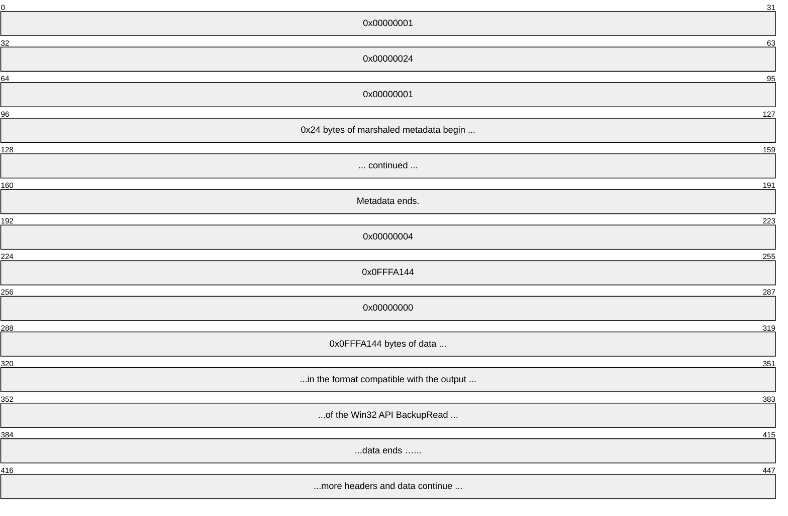

### 4.2.4 Ordering on UIDs and GVSNs

Suppose that the first byte in guid1 is 0xFA and the first byte in guid2 is 0xFB, then:

(guid1, 0x0000000000000001) < (guid1, 0x0000000000000002)

and

(guid1, 0x0000000000000005) < (guid2, 0x0000000000000004)

## 4.3 Configuration

### 4.3.1 Example Objects in the DFS-R Object Hierarchy

The following figure illustrates the object hierarchy required in [**Active Directory**](#gt_active-directory) for storing configuration parameters for Windows implementations of DFS-R.

Figure 22: DFS-R object hierarchy in Active Directory

# 5 Security

## 5.1 Security Considerations for Implementers

Chunk [**hashes**](#gt_hash) used in the [**RDC**](#gt_remote-differential-compression-rdc) sub-protocol are computed using a cryptographically weak hash. To check the integrity of a file transfer using RDC, DFS-R furthermore uses a stronger hash, a [**SHA1**](#gt_sha-1-hash) hash (160-bit) for checking that the assembled file coincides with the source file on the server. A client that manages content from multiple [**replicated folders**](#gt_replicated-folder) with different access rights takes into account the scope of these integrity checks. For instance, if seed files are permitted across replicated folders, an attack scenario, however constructed, is to inject a seed file, which is different from, but whose chunk hashes and file hash coincide with, a particular plaintext.

## 5.2 Index of Security Parameters

DFS-R uses authenticated encrypted [**RPC**](#gt_remote-procedure-call-rpc) for all replication communication. The relevant security parameters in this context are shown in the following table.

| Security parameter | Section |
| --- | --- |
| [**Authentication level**](#gt_authentication-level) | [2.1](#Section_2.1) |
| [**Authentication service**](#gt_authentication-service-as) | 2.1 |

# 6 Appendix A: Full IDL

The Distributed File System: Replication (DFS-R) Protocol contains one interface, whose [**IDL**](#gt_interface-definition-language-idl) definition is listed in this section. The IDL definition for this interface imports the "ms-dtyp.idl" file, as specified in [MS-DTYP](../MS-DTYP/MS-DTYP.md) section 2.2.5.3.4.3.

import "ms-dtyp.idl";

#define FRS_COMMUNICATION_PROTOCOL_VERSION_W2K3R2 0x00050000

#define FRS_COMMUNICATION_PROTOCOL_VERSION_LONGHORN_SERVER 0x00050002

#define FRS_COMMUNICATION_PROTOCOL_WIN8_SERVER 0x00050003

#define FRS_COMMUNICATION_PROTOCOL_WINBLUE_SERVER 0x00050004

#define CONFIG_RDC_VERSION (1)

#define CONFIG_RDC_VERSION_COMPATIBLE (1)

#define CONFIG_FILEHASH_DATASIZE (20)

#define CONFIG_RDC_SIMILARITY_DATASIZE (16)

#define CONFIG_RDC_HORIZONSIZE_MIN (128)

#define CONFIG_RDC_HORIZONSIZE_MAX (1024*16)

#define CONFIG_RDC_HASHWINDOWSIZE_MIN (2)

#define CONFIG_RDC_HASHWINDOWSIZE_MAX (96)

#define CONFIG_RDC_MAX_LEVELS (8)

#define CONFIG_RDC_MAX_NEEDLENGTH (65536)

#define CONFIG_TRANSPORT_MAX_BUFFER_SIZE (262144)

#define CONFIG_RDC_NEED_QUEUE_SIZE (20)

#define TRUE 1

#define FALSE 0

typedef GUID FRS_REPLICA_SET_ID;

typedef GUID FRS_CONTENT_SET_ID;

typedef GUID FRS_DATABASE_ID;

typedef GUID FRS_MEMBER_ID;

typedef GUID FRS_CONNECTION_ID;

typedef SYSTEMTIME EPOQUE;

typedef struct _FRS_VERSION_VECTOR {

GUID dbGuid;

DWORDLONG low;

DWORDLONG high;

} FRS_VERSION_VECTOR;

typedef struct _FRS_EPOQUE_VECTOR {

GUID machine;

EPOQUE epoque;

} FRS_EPOQUE_VECTOR;

typedef struct _FRS_ID_GVSN {

GUID uidDbGuid;

DWORDLONG uidVersion;

GUID gvsnDbGuid;

DWORDLONG gvsnVersion;

} FRS_ID_GVSN;

typedef struct _FRS_UPDATE {

long present;

long nameConflict;

unsigned long attributes;

FILETIME fence;

FILETIME clock;

FILETIME createTime;

FRS_CONTENT_SET_ID contentSetId;

unsigned char hash[CONFIG_FILEHASH_DATASIZE];

unsigned char rdcSimilarity[CONFIG_RDC_SIMILARITY_DATASIZE];

GUID uidDbGuid;

DWORDLONG uidVersion;

GUID gvsnDbGuid;

DWORDLONG gvsnVersion;

GUID parentDbGuid;

DWORDLONG parentVersion;

[string] WCHAR name[260+1];

long flags;

} FRS_UPDATE;

typedef struct _FRS_UPDATE_CANCEL_DATA {

FRS_UPDATE blockingUpdate;

FRS_CONTENT_SET_ID contentSetId;

FRS_DATABASE_ID gvsnDatabaseId;

FRS_DATABASE_ID uidDatabaseId;

FRS_DATABASE_ID parentDatabaseId;

DWORDLONG gvsnVersion;

DWORDLONG uidVersion;

DWORDLONG parentVersion;

unsigned long cancelType;

long isUidValid;

long isParentUidValid;

long isBlockerValid;

} FRS_UPDATE_CANCEL_DATA;

typedef struct _FRS_RDC_SOURCE_NEED {

ULONGLONG needOffset;

ULONGLONG needSize;

} FRS_RDC_SOURCE_NEED;

typedef enum

{

TRANSPORT_SUPPORTS_RDC_SIMILARITY = 1

} TransportFlags;

typedef enum

{

RDC_UNCOMPRESSED = 0,

RDC_XPRESS = 1

} RDC_FILE_COMPRESSION_TYPES;

typedef enum

{

RDC_FILTERGENERIC = 0,

RDC_FILTERMAX = 1,

RDC_FILTERPOINT = 2,

RDC_MAXALGORITHM = 3

} RDC_CHUNKER_ALGORITHM;

typedef enum

{

UPDATE_REQUEST_ALL = 0,

UPDATE_REQUEST_TOMBSTONES = 1,

UPDATE_REQUEST_LIVE = 2

} UPDATE_REQUEST_TYPE;

typedef enum

{

UPDATE_STATUS_DONE = 2,

UPDATE_STATUS_MORE = 3

} UPDATE_STATUS;

typedef enum

{

RECORDS_STATUS_DONE = 0,

RECORDS_STATUS_MORE = 1

} RECORDS_STATUS;

typedef enum

{

REQUEST_NORMAL_SYNC = 0,

REQUEST_SLOW_SYNC = 1,

REQUEST_SUBORDINATE_SYNC = 2

} VERSION_REQUEST_TYPE;

typedef enum

{

CHANGE_NOTIFY = 0,

CHANGE_ALL = 2

} VERSION_CHANGE_TYPE;

typedef enum

{

SERVER_DEFAULT = 0,

STAGING_REQUIRED = 1,

RESTAGING_REQUIRED = 2

} FRS_REQUESTED_STAGING_POLICY;

typedef struct _FRS_RDC_PARAMETERS_FILTERMAX

{

[range(CONFIG_RDC_HORIZONSIZE_MIN, CONFIG_RDC_HORIZONSIZE_MAX)]

unsigned short horizonSize;

[range(CONFIG_RDC_HASHWINDOWSIZE_MIN, CONFIG_RDC_HASHWINDOWSIZE_MAX)]

unsigned short windowSize;

} FRS_RDC_PARAMETERS_FILTERMAX;

typedef struct _FRS_RDC_PARAMETERS_FILTERPOINT

{

unsigned short minChunkSize;

unsigned short maxChunkSize;

} FRS_RDC_PARAMETERS_FILTERPOINT;

typedef struct _FRS_RDC_PARAMETERS_GENERIC

{

unsigned short chunkerType;

byte chunkerParameters[64];

} FRS_RDC_PARAMETERS_GENERIC;

typedef struct

{

unsigned short rdcChunkerAlgorithm;

[switch_is(rdcChunkerAlgorithm)] union

{

[case(RDC_FILTERGENERIC)] FRS_RDC_PARAMETERS_GENERIC filterGeneric;

[case(RDC_FILTERMAX)] FRS_RDC_PARAMETERS_FILTERMAX filterMax;

[case(RDC_FILTERPOINT)] FRS_RDC_PARAMETERS_FILTERPOINT filterPoint;

} u;

} FRS_RDC_PARAMETERS;

typedef struct _FRS_RDC_FILEINFO

{

DWORDLONG onDiskFileSize;

DWORDLONG fileSizeEstimate;

unsigned short rdcVersion;

unsigned short rdcMinimumCompatibleVersion;

[range(0, CONFIG_RDC_MAX_LEVELS)]

byte rdcSignatureLevels;

RDC_FILE_COMPRESSION_TYPES compressionAlgorithm;

[size_is(rdcSignatureLevels)]

FRS_RDC_PARAMETERS rdcFilterParameters[*];

} FRS_RDC_FILEINFO;

typedef struct _FRS_ASYNC_VERSION_VECTOR_RESPONSE {

ULONGLONG vvGeneration;

unsigned long versionVectorCount;

[size_is(versionVectorCount)]

FRS_VERSION_VECTOR * versionVector;

unsigned long epoqueVectorCount;

[size_is(epoqueVectorCount)]

FRS_EPOQUE_VECTOR * epoqueVector;

} FRS_ASYNC_VERSION_VECTOR_RESPONSE;

typedef struct _FRS_ASYNC_RESPONSE_CONTEXT {

unsigned long sequenceNumber;

DWORD status;

FRS_ASYNC_VERSION_VECTOR_RESPONSE result;

} FRS_ASYNC_RESPONSE_CONTEXT;

#define FRS_UPDATE_FLAG_GHOSTED_HEADER = 0x04;

#define FRS_UPDATE_FLAG_DATA = 0x08;

#define FRS_UPDATE_FLAG_CLOCK_DECREMENTED = 0x10;

typedef pipe byte BYTE_PIPE;

[

uuid(897e2e5f-93f3-4376-9c9c-fd2277495c27),

version(1.0)

]

interface FrsTransport

{

DWORD

CheckConnectivity(

[in] FRS_REPLICA_SET_ID replicaSetId,

[in] FRS_CONNECTION_ID connectionId

);

DWORD

EstablishConnection(

[in] FRS_REPLICA_SET_ID replicaSetId,

[in] FRS_CONNECTION_ID connectionId,

[in] DWORD downstreamProtocolVersion,

[in] DWORD downstreamFlags,

[out] DWORD *upstreamProtocolVersion,

[out] DWORD *upstreamFlags

);

DWORD

EstablishSession(

[in] FRS_CONNECTION_ID connectionId,

[in] FRS_CONTENT_SET_ID contentSetId

);

DWORD

RequestUpdates(

[in] FRS_CONNECTION_ID connectionId,

[in] FRS_CONTENT_SET_ID contentSetId,

[in, range(0,256)] DWORD creditsAvailable,

[in, range(0,1)] long hashRequested,

[in, range(UPDATE_REQUEST_ALL, UPDATE_REQUEST_LIVE)] UPDATE_REQUEST_TYPE updateRequestType,

[in] unsigned long versionVectorDiffCount,

[in, size_is(versionVectorDiffCount)]

FRS_VERSION_VECTOR *versionVectorDiff,

[out, size_is(creditsAvailable), length_is(*updateCount)] FRS_UPDATE *frsUpdate,

[out] DWORD *updateCount,

[out] UPDATE_STATUS *updateStatus,

[out] GUID *gvsnDbGuid,

[out] DWORDLONG *gvsnVersion

);

DWORD

RequestVersionVector(

[in] DWORD sequenceNumber,

[in] FRS_CONNECTION_ID connectionId,

[in] FRS_CONTENT_SET_ID contentSetId,

[in, range(REQUEST_NORMAL_SYNC,REQUEST_SUBORDINATE_SYNC)] VERSION_REQUEST_TYPE requestType,

[in, range(CHANGE_NOTIFY,CHANGE_ALL)] VERSION_CHANGE_TYPE changeType,

[in] ULONGLONG vvGeneration

);

DWORD

AsyncPoll(

[in] FRS_CONNECTION_ID connectionId,

[out] FRS_ASYNC_RESPONSE_CONTEXT* response

);

DWORD

RequestRecords(

[in] FRS_CONNECTION_ID connectionId,

[in] FRS_CONTENT_SET_ID contentSetId,

[in] FRS_DATABASE_ID uidDbGuid,

[in] DWORDLONG uidVersion,

[in, out] DWORD *maxRecords,

[out] DWORD *numRecords,

[out] DWORD *numBytes,

[out, size_is(,*numBytes)] byte **compressedRecords,

[out] RECORDS_STATUS *recordsStatus

);

DWORD

UpdateCancel(

[in] FRS_CONNECTION_ID connectionId,

[in] FRS_UPDATE_CANCEL_DATA cancelData

);

typedef [context_handle] void * PFRS_SERVER_CONTEXT;

DWORD

RawGetFileData(

[in, out] PFRS_SERVER_CONTEXT *serverContext,

[out, size_is(bufferSize), length_is(*sizeRead)] byte *dataBuffer,

[in, range(0, CONFIG_TRANSPORT_MAX_BUFFER_SIZE)] DWORD bufferSize,

[out] DWORD *sizeRead,

[out] long *isEndOfFile

);

DWORD

RdcGetSignatures(

[in] PFRS_SERVER_CONTEXT serverContext,

[in, range(1, CONFIG_RDC_MAX_LEVELS)] byte level,

[in] DWORDLONG offset,

[out, size_is(length), length_is(*sizeRead)] byte *buffer,

[in, range(1, CONFIG_RDC_MAX_NEEDLENGTH)] DWORD length,

[out] DWORD *sizeRead

);

DWORD

RdcPushSourceNeeds(

[in] PFRS_SERVER_CONTEXT serverContext,

[in, size_is(needCount)] FRS_RDC_SOURCE_NEED *sourceNeeds,

[in, range(0, CONFIG_RDC_NEED_QUEUE_SIZE)] DWORD needCount

);

DWORD

RdcGetFileData(

[in] PFRS_SERVER_CONTEXT serverContext,

[out, size_is(bufferSize), length_is(*sizeReturned)] byte *dataBuffer,

[in, range(0, CONFIG_TRANSPORT_MAX_BUFFER_SIZE)] DWORD bufferSize,

[out] DWORD *sizeReturned

);

DWORD

RdcClose(

[in, out] PFRS_SERVER_CONTEXT *serverContext

);

DWORD

InitializeFileTransferAsync(

[in] FRS_CONNECTION_ID connectionId,

[in, out] FRS_UPDATE *frsUpdate,

[in, range(0,1)] long rdcDesired,

[in,out] FRS_REQUESTED_STAGING_POLICY *stagingPolicy,

[out] PFRS_SERVER_CONTEXT *serverContext,

[out] FRS_RDC_FILEINFO **rdcFileInfo,

[out, size_is(bufferSize), length_is(*sizeRead)] byte *dataBuffer,

[in, range(0, CONFIG_TRANSPORT_MAX_BUFFER_SIZE)] DWORD bufferSize,

[out] DWORD *sizeRead,

[out] long *isEndOfFile

);

DWORD Opnum14NotUsedOnWire (void);

DWORD

RawGetFileDataAsync(

[in] PFRS_SERVER_CONTEXT serverContext,

[out] BYTE_PIPE* bytePipe

);

DWORD

RdcGetFileDataAsync(

[in] PFRS_SERVER_CONTEXT serverContext,

[out] BYTE_PIPE* bytePipe

);

DWORD

RdcFileDataTransferKeepAlive(

[in] PFRS_SERVER_CONTEXT serverContext

);

}

# 7 Appendix B: Product Behavior

The information in this specification is applicable to the following Microsoft products or supplemental software. References to product versions include updates to those products.

- Windows Server 2003 R2 operating system
- Windows Vista operating system
- Windows Server 2008 operating system
- Windows Server 2008 R2 operating system
- Windows Server 2012 operating system
- Windows Server 2012 R2 operating system
- Windows Server 2016 operating system
- Windows Server operating system
- Windows Server 2019 operating system
- Windows Server 2022 operating system
- Windows Server 2025 operating system
Exceptions, if any, are noted in this section. If an update version, service pack or Knowledge Base (KB) number appears with a product name, the behavior changed in that update. The new behavior also applies to subsequent updates unless otherwise specified. If a product edition appears with the product version, behavior is different in that product edition.

Unless otherwise specified, any statement of optional behavior in this specification that is prescribed using the terms "SHOULD" or "SHOULD NOT" implies product behavior in accordance with the SHOULD or SHOULD NOT prescription. Unless otherwise specified, the term "MAY" implies that the product does not follow the prescription.

<1> Section 2.1: The default behavior of a Windows-based server is to use [**dynamic endpoints**](#gt_dynamic-endpoint). Static ports can be specified on a connection using the attribute DNSHostName, as specified in section [2.3.10](#Section_2.3.10).

<2> Section 2.1.2: The default behavior of a Windows-based server is to use dynamic endpoints. Static ports can be specified on a connection using the attribute DNSHostName specified in section 2.3.10.

<3> Section 2.2.1.1.1: Windows Server 2003 R2 identifies its [**DFS-R**](#gt_member-dfs-r) protocol version as 0x00050000. Windows Server 2008 and Windows Server 2008 R2 both identify their DFS-R protocol version as 0x00050002. Windows Server 2012 identifies its DFS-R protocol version as 0x00050003. Windows Server 2012 R2 operating system and later identify their DFS-R protocol version as 0x00050004.

<4> Section 2.2.1.4.1: Windows Server 2003 R2 servers do not perform this check.

<5> Section 2.2.1.4.11: The parameter **onDiskFileSize** is computed from the size of a cached version of the marshaled, compressed file.

<6> Section 2.2.1.4.11: The parameter **fileSizeEstimate** is computed based on the allocated byte ranges for the main data stream of a file.

<7> Section 2.2.1.4.11: The way that Windows computes **rdcSignatureLevels** is specified in [MS-RDC](../MS-RDC/MS-RDC.md).

<8> Section 2.3.1: If not present or not equal to "1.0.0.0", Windows replaces it with "1.0.0.0".

<9> Section 2.3.3: In version 0x00050002, 0x00050003, and 0x00050004 of the Distributed File System: Replication (DFS-R) Protocol, it contains a comma-separated list of 0 or more strings that specify which files are not compressed. Each string can be a file name or can be a file name with the initial portion replaced by the wild card character "*". There is no escape character; therefore, it is not possible to specify a file name with a comma.

<10> Section 2.3.3: Windows Server 2008 R2 operating system and later are the only versions of DFS-R that support read-only [**replicated folders**](#gt_replicated-folder).

<11> Section 2.3.3: This flag is set to 1 on Windows Server 2008 read-only domain controllers that are using DFSR for SYSVOL replication. In addition, on Windows Server 2008 R2 operating system and later this flag is set to 1 to configure a replicated folder as read-only.

<12> Section 2.3.3: Windows Server 2003 R2 does not have the msDFSR-DefaultCompressionExclusionFilter attribute. The list of default excluded compression extensions is hard-coded: .wma, .wmv, .zip, .jpg, .mpg, .mpeg, .m1v, .mp2, .mp3, .mpa, .cab, .wav, .snd, .au, .asf, .wm, .avi, .z, .gz, .tgz, and .frx.

<13> Section 2.3.5: Windows uses this security descriptor as a template for setting the security descriptor on the DFS-R WMI provider.

<14> Section 2.3.7: If no value is set for this attribute, Windows uses a value of "*.tmp,*.bak,~*".

<15> Section 2.3.9: Windows configuration tools allow an arbitrary string to be stored here; otherwise, ignore this field.

<16> Section 2.3.11: Windows configuration tools allow an arbitrary string to be stored here; otherwise, ignore this field.

<17> Section 2.3.11: Windows approximates its bandwidth usage and attempts to limit it based on the setting in the schedule. If the setting in the schedule is 0xF, Windows does not attempt to limit its bandwidth usage. Windows attempts to limit its bandwidth usage for the connection for all values from 0x1 to 0xE, according to the following table.

| Bit Range | Field | Description |
| --- | --- | --- |
| Variable | 1 | 16 |
| Variable | 2 | 64 |
| Variable | 3 | 128 |
| Variable | 4 | 256 |
| Variable | 5 | 512 |
| Variable | 6 | 1,024 |
| Variable | 7 | 2,048 |
| Variable | 8 | 4,096 |
| Variable | 9 | 8,192 |
| Variable | 10 | 16,384 |
| Variable | 11 | 32,768 |
| Variable | 12 | 65,536 |
| Variable | 13 | 131,072 |
| Variable | 14 | 262,144 |

<18> Section 3.1.6: Sharing violations DFS-R in Windows Server 2003 R2 operating system and later accesses files based on [**NT file system (NTFS)**](#gt_nt-file-system-ntfs) semantics. This implies respecting NTFS sharing semantics, which means that if other applications have files open denying shared read access, DFS-R cannot read these files from disk. Similarly, if applications have files open that deny shared delete access, DFS-R cannot update these files (by renaming the old version of these files to a temporary name and renaming a new version of the file). DFS-R in Windows Server 2003 R2 relies on internal timers (that use an exponential backoff scheme with a maximal time-out of 5 minutes) to re-attempt the [**file system**](#gt_file-system) operations that it requires.

<19> Section 3.2.1: Windows injects configuration changes into DFS-R over [**Active Directory**](#gt_active-directory) in Windows Server 2003 R2 operating system and later.

<20> Section 3.2.2: Windows-based servers maintain a 30-minute time-out for inactivity on an open context handle before closing it.

<21> Section 3.2.4.1: Gaps in the opnum numbering sequence apply to Windows as follows.

| Opnum | Description |
| --- | --- |
| 14 | Just returns ERROR_NOT_IMPLEMENTED. It is never used. |

<22> Section 3.2.4.1.2: DFS-R client implementations on enterprise SKUs of Windows Server 2003 R2 operating system and later set the TRANSPORT_SUPPORTS_RDC_SIMILARITY bit in the *downstreamFlags* parameter to 1 when calling [EstablishConnection](#Section_3.2.4.1.2).

<23> Section 3.2.4.1.4: Windows Server 2003 R2, Windows Server 2008, and Windows Server 2008 R2 operating system do not generate version vector tombstone updates.

<24> Section 3.2.4.1.4: Windows-based servers generate a version vector tombstone update for all replicated folders every time the service starts up and every 15 days thereafter.

<25> Section 3.2.4.1.4: For each GUID (m1), Windows-based servers generate a version vector tombstone update when the last refresh within a set of updates, whose GVSN shares the same GUID (m1), took place more than 60 days ago.

<26> Section 3.2.4.1.7: Windows Server 2003 R2 operating system and later implementations of DFS-R never return more than 1365 = 64 KB / size of(FRS_ID_GVSN) records, even if the client specifies a larger value in the *maxRecords* parameter.

<27> Section 3.2.4.1.7: Windows Server 2003 R2 and Windows Server 2008 do not verify this condition.

<28> Section 3.2.4.1.9: The default behavior of a Windows-based server is to complete the request successfully and set the *sizeRead* parameter to zero on return.

<29> Section 3.2.4.1.14: DFS-R with version 0x00050002 or later uses an implementation-defined failure value when performing operations on the database, such as the deletion of a directory tree, an NTFS journal wrap recovery, an NTFS journal loss recovery, or a dirty shutdown recovery, which prevents the file from being replicated until the operation is completed.

<30> Section 3.2.4.1.14: DFS-R in Windows Server 2003 R2 operating system and later always uses the following values.

HorizonSize, level 11024

Hash Window Size, level 148

HorizonSize, level 2+ 128

Hash Window Size, level 2+2

<31> Section 3.2.4.1.14: By default, Windows-based servers set the value to 16 which can be modified by the registry key [HKLM\SYSTEM\CurrentControlSet\Services\DFSR\Parameters\Settings\UpdateWorkerThreadCount].

<32> Section 3.2.4.1.14.1: The only type of reparse point that is replicated as a reparse point by Windows implementations of DFS-R is IO_REPARSE_TAG_SYMLINK. Reparse point types IO_REPARSE_TAG_SIS and IO_REPARSE_TAG_HSM are replicated as normal files rather than as reparse points. No other reparse point types (IO_REPARSE_TAG_MOUNT_POINT, IO_REPARSE_TAG_DFS, and so on) are replicated, neither as reparse points nor normal files.

<33> Section 3.2.4.1.14.1: Windows implementations of DFS-R do not marshal or send a file's Object ID Backup Stream.

<34> Section 3.3.1.3: In Windows, Slow Sync is initiated by the client once a week.

<35> Section 3.3.1.5: DFS-R uses the following algorithm to compute [**RDC**](#gt_remote-differential-compression-rdc) recursion depth.

h := 18 / horizonSize0

depth := 0

minSizeLevel := 65536

WHILE (depth < 8) AND (size > minSizeLevel)

size := size * h + 24

h := 18 / (2 * horizonSize1)

minSizeLevel := 32768

depth := depth + 1

ENDWHILE

The various constants used are the following.

- 18 is the size, in bytes, of an RDC signature (16-byte [**hash**](#gt_hash) and 2-byte length).
- 65,536 is the minimum size, in bytes, of a file that will be considered for RDC transfer.
- 32,768 is the minimum size, in bytes, of a signature file that allows increasing the recursion level.
- 24 is the size, in bytes, of the RDC signature file header.
- horizonSize0 is 1,024. Used for calculating RDC signatures of the file data.
- horizonSize1 is 256. Used for calculating all recursive levels of RDC signatures.
<36> Section 3.3.2: Connection schedules. Clients establish and terminate connections based on configured schedules. The only observed effect on the server is that clients could periodically reconnect to it. Connection schedules can be configured externally to Windows with a 15-minute granularity.

<37> Section 3.3.4.6.2: On the following servers without the QFE 353495, an update with a lower value of **createTime** supersedes updates with higher values.

- Windows Server 2003 R2
- Windows Server 2008
- Windows Server 2008 R2
Servers with two different behaviors cannot be mixed.

<38> Section 3.3.4.6.2: Cycle conflicts are resolved on Windows implementations of DFS-R.

<39> Section 3.3.4.6.2: On the following servers without the QFE 353495, directory name conflicts are handled in the same way as file name conflicts.

- Windows Server 2003 R2
- Windows Server 2008
- Windows Server 2008 R2
<40> Section 3.3.4.6.2: For each GUID (m1), Windows implementations of DFS-R generate a version vector [**tombstone**](#gt_tombstone) update (with present set to 0) when the last refresh within a set of updates, whose [**GVSN**](#gt_version-sequence-number-vsn) shares the same GUID (m1), took place more than 60 days ago. Version vector tombstones are subsumed if the machine originating the GUID (m1) on the version vector tombstone receives the version vector tombstone.

<41> Section 3.3.4.6.2: Windows-based servers generate a version vector tombstone update, with present set to 1, for all replicated folders every time the service starts up and every 15 days thereafter. This interval can be modified using the Registry Key GcDbSendAliveIntervalInSeconds under \HKEY_LOCAL_MACHINE\SYSTEM\CurrentControlSet\Services\DFSR\Parameters\Settings\.

The following servers do not generate this update:

- Windows Server 2003 R2
- Windows Server 2008
- Windows Server 2008 R2
<42> Section 3.3.4.16: Windows Server 2003 R2 operating system and later implementations of DFS-R will retry the records request up to a maximum of 128 retries before aborting the ongoing slow sync.

<43> Section 3.3.4.16.2: In Windows, the resolution is to reanimate missing records. That is, updates whose [**UIDs**](#gt_unique-identifier-uid) are not in the client's store are downloaded from the server.

<44> Section 3.3.4.18: DFS-R clients with version 0x00050002 use REQUEST_SUBORDINATE_SYNC to retrieve the server’s [**version chain vector**](#gt_version-chain-vector) in response to changes on the client's file system. The server’s version chain vector is used to synchronize the clients back to a state where they are a mirror image of the server, thus deleting possibly new files on the clients, as opposed to replicating these out. This behavior is also known as [**read-only replicated folders**](#gt_read-only-replicated-folders).

# 8 Change Tracking

This section identifies changes that were made to this document since the last release. Changes are classified as Major, Minor, or None.

The revision class **Major** means that the technical content in the document was significantly revised. Major changes affect protocol interoperability or implementation. Examples of major changes are:

- A document revision that incorporates changes to interoperability requirements.
- A document revision that captures changes to protocol functionality.
The revision class **Minor** means that the meaning of the technical content was clarified. Minor changes do not affect protocol interoperability or implementation. Examples of minor changes are updates to clarify ambiguity at the sentence, paragraph, or table level.

The revision class **None** means that no new technical changes were introduced. Minor editorial and formatting changes may have been made, but the relevant technical content is identical to the last released version.

The changes made to this document are listed in the following table. For more information, please contact [dochelp@microsoft.com](mailto:dochelp@microsoft.com).

| Section | Description | Revision class |
| --- | --- | --- |
| [7](#Section_7) Appendix B: Product Behavior | Added Windows Server 2025 to the list of applicable products. | Major |

## Revision History

| Date | Version | Revision Class | Comments |
| --- | --- | --- | --- |
| 3/2/2007 | 1.0 | New | Version 1.0 release |
| 4/3/2007 | 1.1 | Minor | Version 1.1 release |
| 5/11/2007 | 1.2 | Minor | Version 1.2 release |
| 6/1/2007 | 1.2.1 | Editorial | Changed language and formatting in the technical content. |
| 7/3/2007 | 1.2.2 | Editorial | Changed language and formatting in the technical content. |
| 8/10/2007 | 1.2.3 | Editorial | Changed language and formatting in the technical content. |
| 9/28/2007 | 1.2.4 | Editorial | Changed language and formatting in the technical content. |
| 10/23/2007 | 1.3 | Minor | Updated to use data types in MS-DTYP. |
| 1/25/2008 | 1.3.1 | Editorial | Changed language and formatting in the technical content. |
| 3/14/2008 | 2.0 | Major | Updated and revised the technical content. |
| 6/20/2008 | 3.0 | Major | Updated and revised the technical content. |
| 7/25/2008 | 3.0.1 | Editorial | Changed language and formatting in the technical content. |
| 8/29/2008 | 4.0 | Major | Updated and revised the technical content. |
| 10/24/2008 | 5.0 | Major | Updated and revised the technical content. |
| 12/5/2008 | 6.0 | Major | Updated and revised the technical content. |
| 1/16/2009 | 7.0 | Major | Updated and revised the technical content. |
| 2/27/2009 | 8.0 | Major | Updated and revised the technical content. |
| 4/10/2009 | 9.0 | Major | Updated and revised the technical content. |
| 5/22/2009 | 10.0 | Major | Updated and revised the technical content. |
| 7/2/2009 | 10.1 | Minor | Clarified the meaning of the technical content. |
| 8/14/2009 | 10.1.1 | Editorial | Changed language and formatting in the technical content. |
| 9/25/2009 | 10.2 | Minor | Clarified the meaning of the technical content. |
| 11/6/2009 | 10.2.1 | Editorial | Changed language and formatting in the technical content. |
| 12/18/2009 | 10.2.2 | Editorial | Changed language and formatting in the technical content. |
| 1/29/2010 | 11.0 | Major | Updated and revised the technical content. |
| 3/12/2010 | 12.0 | Major | Updated and revised the technical content. |
| 4/23/2010 | 13.0 | Major | Updated and revised the technical content. |
| 6/4/2010 | 13.0.1 | Editorial | Changed language and formatting in the technical content. |
| 7/16/2010 | 13.0.1 | None | No changes to the meaning, language, or formatting of the technical content. |
| 8/27/2010 | 14.0 | Major | Updated and revised the technical content. |
| 10/8/2010 | 15.0 | Major | Updated and revised the technical content. |
| 11/19/2010 | 16.0 | Major | Updated and revised the technical content. |
| 1/7/2011 | 16.0 | None | No changes to the meaning, language, or formatting of the technical content. |
| 2/11/2011 | 16.0 | None | No changes to the meaning, language, or formatting of the technical content. |
| 3/25/2011 | 16.0 | None | No changes to the meaning, language, or formatting of the technical content. |
| 5/6/2011 | 16.0 | None | No changes to the meaning, language, or formatting of the technical content. |
| 6/17/2011 | 16.1 | Minor | Clarified the meaning of the technical content. |
| 9/23/2011 | 16.1 | None | No changes to the meaning, language, or formatting of the technical content. |
| 12/16/2011 | 17.0 | Major | Updated and revised the technical content. |
| 3/30/2012 | 18.0 | Major | Updated and revised the technical content. |
| 7/12/2012 | 19.0 | Major | Updated and revised the technical content. |
| 10/25/2012 | 19.0 | None | No changes to the meaning, language, or formatting of the technical content. |
| 1/31/2013 | 19.0 | None | No changes to the meaning, language, or formatting of the technical content. |
| 8/8/2013 | 20.0 | Major | Updated and revised the technical content. |
| 11/14/2013 | 21.0 | Major | Updated and revised the technical content. |
| 2/13/2014 | 22.0 | Major | Updated and revised the technical content. |
| 5/15/2014 | 23.0 | Major | Updated and revised the technical content. |
| 6/30/2015 | 24.0 | Major | Significantly changed the technical content. |
| 10/16/2015 | 25.0 | Major | Significantly changed the technical content. |
| 7/14/2016 | 26.0 | Major | Significantly changed the technical content. |
| 6/1/2017 | 26.0 | None | No changes to the meaning, language, or formatting of the technical content. |
| 9/15/2017 | 27.0 | Major | Significantly changed the technical content. |
| 12/1/2017 | 27.0 | None | No changes to the meaning, language, or formatting of the technical content. |
| 9/12/2018 | 28.0 | Major | Significantly changed the technical content. |
| 4/7/2021 | 29.0 | Major | Significantly changed the technical content. |
| 4/23/2024 | 30.0 | Major | Significantly changed the technical content. |
