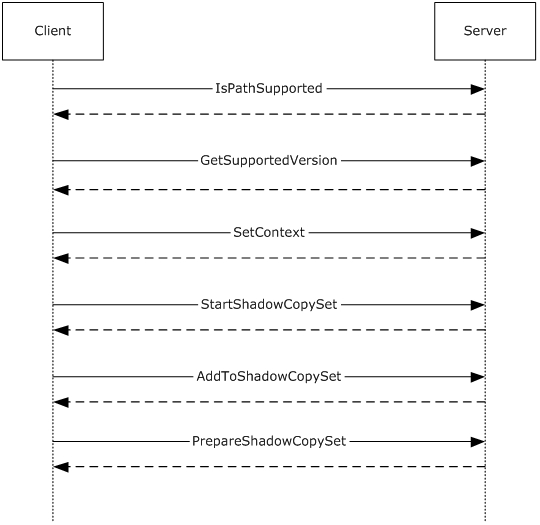
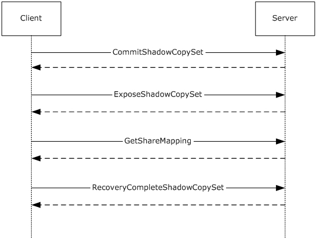

# [MS-FSRVP]: File Server Remote VSS Protocol

Table of Contents

1 Introduction

- [1 Introduction](#Section_1)
  - [1.1 Glossary](#Section_1.1)
  - [1.2 References](#Section_1.2)
    - [1.2.1 Normative References](#Section_1.2.1)
    - [1.2.2 Informative References](#Section_1.2.2)
  - [1.3 Overview](#Section_1.3)
  - [1.4 Relationship to Other Protocols](#Section_1.4)
  - [1.5 Prerequisites/Preconditions](#Section_1.5)
  - [1.6 Applicability Statement](#Section_1.6)
  - [1.7 Versioning and Capability Negotiation](#Section_1.7)
  - [1.8 Vendor Extensible Fields](#Section_1.8)
  - [1.9 Standards Assignments](#Section_1.9)

2 Messages

- [2 Messages](#Section_2)
  - [2.1 Transport](#Section_2.1)
  - [2.2 Common Data Types](#Section_2.2)
    - [2.2.1 Structures](#Section_2.2.1)
      - [2.2.1.1 FSSAGENT_SHARE_MAPPING_1](#Section_2.2.1.1)
    - [2.2.2 Constants](#Section_2.2.2)
      - [2.2.2.1 SHADOW_COPY_ATTRIBUTES](#Section_2.2.2.1)
      - [2.2.2.2 CONTEXT_VALUES](#Section_2.2.2.2)
      - [2.2.2.3 SHADOW_COPY_COMPATIBILITY_VALUES](#Section_2.2.2.3)
      - [2.2.2.4 FSRVP_VERSION_VALUES](#Section_2.2.2.4)
    - [2.2.3 Unions](#Section_2.2.3)
      - [2.2.3.1 FSSAGENT_SHARE_MAPPING](#Section_2.2.3.1)
    - [2.2.4 Error Codes](#Section_2.2.4)

3 Protocol Details

- [3 Protocol Details](#Section_3)
  - [3.1 FileServerVssAgent Server Details](#Section_3.1)
    - [3.1.1 Abstract Data Model](#Section_3.1.1)
      - [3.1.1.1 Global](#Section_3.1.1.1)
      - [3.1.1.2 Per ShadowCopySet](#Section_3.1.1.2)
      - [3.1.1.3 Per ShadowCopy](#Section_3.1.1.3)
      - [3.1.1.4 Per MappedShare](#Section_3.1.1.4)
    - [3.1.2 Timers](#Section_3.1.2)
    - [3.1.3 Initialization](#Section_3.1.3)
    - [3.1.4 Message Processing Events and Sequencing Rules](#Section_3.1.4)
      - [3.1.4.1 GetSupportedVersion (Opnum 0)](#Section_3.1.4.1)
      - [3.1.4.2 SetContext (Opnum 1)](#Section_3.1.4.2)
      - [3.1.4.3 StartShadowCopySet (Opnum 2)](#Section_3.1.4.3)
      - [3.1.4.4 AddToShadowCopySet (Opnum 3)](#Section_3.1.4.4)
      - [3.1.4.5 CommitShadowCopySet (Opnum 4)](#Section_3.1.4.5)
      - [3.1.4.6 ExposeShadowCopySet (Opnum 5)](#Section_3.1.4.6)
      - [3.1.4.7 RecoveryCompleteShadowCopySet (Opnum 6)](#Section_3.1.4.7)
      - [3.1.4.8 AbortShadowCopySet (Opnum 7)](#Section_3.1.4.8)
      - [3.1.4.9 IsPathSupported (Opnum 8)](#Section_3.1.4.9)
      - [3.1.4.10 IsPathShadowCopied (Opnum 9)](#Section_3.1.4.10)
      - [3.1.4.11 GetShareMapping (Opnum 10)](#Section_3.1.4.11)
      - [3.1.4.12 DeleteShareMapping (Opnum 11)](#Section_3.1.4.12)
      - [3.1.4.13 PrepareShadowCopySet (Opnum 12)](#Section_3.1.4.13)
    - [3.1.5 Timer Events](#Section_3.1.5)
    - [3.1.6 Other Local Events](#Section_3.1.6)
  - [3.2 FileServerVssAgent Client Details](#Section_3.2)
    - [3.2.1 Abstract Data Model](#Section_3.2.1)
      - [3.2.1.1 Global](#Section_3.2.1.1)
      - [3.2.1.2 Per ShadowCopySet](#Section_3.2.1.2)
      - [3.2.1.3 Per ShadowCopy](#Section_3.2.1.3)
    - [3.2.2 Timers](#Section_3.2.2)
    - [3.2.3 Initialization](#Section_3.2.3)
    - [3.2.4 Message Processing Events and Sequencing Rules](#Section_3.2.4)
      - [3.2.4.1 Application Queries Shadow Copy Support for a Share](#Section_3.2.4.1)
      - [3.2.4.2 Application Requests Shadow Copy Preparation For a Share](#Section_3.2.4.2)
        - [3.2.4.2.1 Starting a Shadow Copy Set](#Section_3.2.4.2.1)
        - [3.2.4.2.2 Adding Shadow Copies to the Shadow Copy Set](#Section_3.2.4.2.2)
      - [3.2.4.3 Application Requests Committing a Shadow Copy Set](#Section_3.2.4.3)
      - [3.2.4.4 Application Requests Exposing a Shadow Copy Set](#Section_3.2.4.4)
      - [3.2.4.5 Application Updates Recovery Status of a Shadow Copy Set](#Section_3.2.4.5)
      - [3.2.4.6 Application Aborts a Shadow Copy Set](#Section_3.2.4.6)
      - [3.2.4.7 Application Queries Shadow Copy Information of a Share](#Section_3.2.4.7)
      - [3.2.4.8 Application Requests Deleting Shadow Copy Of a Share](#Section_3.2.4.8)
      - [3.2.4.9 Application Requests Shutdown of Client](#Section_3.2.4.9)
    - [3.2.5 Timer Events](#Section_3.2.5)
    - [3.2.6 Other Local Events](#Section_3.2.6)

4 Protocol Examples

- [4 Protocol Examples](#Section_4)
  - [4.1 Shadow Copy Preparation](#Section_4.1)
  - [4.2 Shadow Copy Creation](#Section_4.2)
  - [4.3 Shadow Copy Deletion](#Section_4.3)

5 Security

- [5 Security](#Section_5)
  - [5.1 Security Considerations for Implementers](#Section_5.1)
  - [5.2 Index of Security Parameters](#Section_5.2)

6 Appendix A: Full IDL

- [6 Appendix A: Full IDL](#Section_6)

7 Appendix B: Product Behavior

- [7 Appendix B: Product Behavior](#Section_7)

8 Change Tracking

- [8 Change Tracking](#Section_8)

For the legal notice and IP terms, see [LEGAL.md](../LEGAL.md).
Last updated: 11/19/2024.
See [Revision History](#revision-history) for full version history.

# 1 Introduction

The File Server Remote VSS Protocol (FSRVP) is a remote procedure call (RPC)-based protocol that is used for creating shadow copies of file shares on a remote computer. This protocol facilitates the backup applications' tasks in performing application-consistent backup and restore of VSS-aware applications storing data on network file shares.

Sections 1.5, 1.8, 1.9, 2, and 3 of this specification are normative. All other sections and examples in this specification are informative.

## 1.1 Glossary

This document uses the following terms:

**endpoint**: A network-specific address of a remote procedure call (RPC) server process for remote procedure calls. The actual name and type of the endpoint depends on the RPC protocol sequence that is being used. For example, for RPC over TCP (RPC Protocol Sequence ncacn_ip_tcp), an endpoint might be TCP port 1025. For RPC over Server Message Block (RPC Protocol Sequence ncacn_np), an endpoint might be the name of a named pipe. For more information, see [[C706]](https://go.microsoft.com/fwlink/?LinkId=89824).

**file store**: An area on a storage device that is managed as a discrete logical storage unit on which a shadow copy can be taken. The file store is backed by a system (typically a file system) that provides the ability to create, query and modify resources accessed as files.

**file system**: A system that enables applications to store and retrieve files on storage devices. Files are placed in a hierarchical structure. The file system specifies naming conventions for files and the format for specifying the path to a file in the tree structure. Each file system consists of one or more drivers and DLLs that define the data formats and features of the file system. File systems can exist on the following storage devices: diskettes, hard disks, jukeboxes, removable optical disks, and tape backup units.

**fully qualified domain name (FQDN)**: An unambiguous domain name that gives an absolute location in the Domain Name System's (DNS) hierarchy tree, as defined in [[RFC1035]](https://go.microsoft.com/fwlink/?LinkId=90264) section 3.1 and [[RFC2181]](https://go.microsoft.com/fwlink/?LinkId=127732) section 11.

**HRESULT**: An integer value that indicates the result or status of an operation. A particular HRESULT can have different meanings depending on the protocol using it. See [MS-ERREF](../MS-ERREF/MS-ERREF.md) section 2.1 and specific protocol documents for further details.

**indexing**: The process of extracting text or properties from files and storing the extracted values in an index or property cache.

**Interface Definition Language (IDL)**: The International Standards Organization (ISO) standard language for specifying the interface for remote procedure calls. For more information, see [C706] section 4.

**Microsoft Interface Definition Language (MIDL)**: The Microsoft implementation and extension of the OSF-DCE [**Interface Definition Language (IDL)**](#gt_interface-definition-language-idl). [**MIDL**](#gt_microsoft-interface-definition-language-midl) can also mean the [**Interface Definition Language (IDL)**](#gt_interface-definition-language-idl) compiler provided by Microsoft. For more information, see [MS-RPCE](../MS-RPCE/MS-RPCE.md).

**shadow copy**: A duplicate of data held on a volume at a well-defined instant in time.

**shadow copy utility**: A utility on the client and server which creates and manages the shadow copies of shares.

**volume shadow copy service (VSS)**: A service that coordinates the actions required to create a consistent snapshot of backup data without affecting the running of the application that is using the data.

**VSS writer**: A component of an application that guarantees a consistent data to back up.

**MAY, SHOULD, MUST, SHOULD NOT, MUST NOT:** These terms (in all caps) are used as defined in [[RFC2119]](https://go.microsoft.com/fwlink/?LinkId=90317). All statements of optional behavior use either MAY, SHOULD, or SHOULD NOT.

## 1.2 References

Links to a document in the Microsoft Open Specifications library point to the correct section in the most recently published version of the referenced document. However, because individual documents in the library are not updated at the same time, the section numbers in the documents may not match. You can confirm the correct section numbering by checking the [Errata](https://go.microsoft.com/fwlink/?linkid=850906).

### 1.2.1 Normative References

We conduct frequent surveys of the normative references to assure their continued availability. If you have any issue with finding a normative reference, please contact [dochelp@microsoft.com](mailto:dochelp@microsoft.com). We will assist you in finding the relevant information.

[C706] The Open Group, "DCE 1.1: Remote Procedure Call", C706, August 1997, [https://publications.opengroup.org/c706](https://go.microsoft.com/fwlink/?LinkId=89824)

**Note** Registration is required to download the document.

[MS-CIFS] Microsoft Corporation, "[Common Internet File System (CIFS) Protocol](../MS-CIFS/MS-CIFS.md)".

[MS-DTYP] Microsoft Corporation, "[Windows Data Types](../MS-DTYP/MS-DTYP.md)".

[MS-ERREF] Microsoft Corporation, "[Windows Error Codes](../MS-ERREF/MS-ERREF.md)".

[MS-RPCE] Microsoft Corporation, "[Remote Procedure Call Protocol Extensions](../MS-RPCE/MS-RPCE.md)".

[MS-SMB2] Microsoft Corporation, "[Server Message Block (SMB) Protocol Versions 2 and 3](../MS-SMB2/MS-SMB2.md)".

[MS-SMB] Microsoft Corporation, "[Server Message Block (SMB) Protocol](../MS-SMB/MS-SMB.md)".

[MS-SRVS] Microsoft Corporation, "[Server Service Remote Protocol](../MS-SRVS/MS-SRVS.md)".

[RFC2119] Bradner, S., "Key words for use in RFCs to Indicate Requirement Levels", BCP 14, RFC 2119, March 1997, [https://www.rfc-editor.org/info/rfc2119](https://go.microsoft.com/fwlink/?LinkId=90317)

### 1.2.2 Informative References

[MSDN-SHADOW] Microsoft Corporation, "Volume Shadow Copy Service", [http://msdn.microsoft.com/en-us/library/bb968832(VS.85).aspx](https://go.microsoft.com/fwlink/?LinkId=125176)

## 1.3 Overview

The File Server Remote VSS Protocol is designed to remotely create shadow copies of file shares hosted on a file server. This facilitates applications hosting their data on a file server to back up and restore their application state. The client-side implementation of this protocol typically runs on an application server and the server-side implementation runs on a file server. This protocol is modeled in such way that the client-side and server-side implementation can be integrated with existing volume [**shadow copy**](#gt_shadow-copy) creation utilities.

## 1.4 Relationship to Other Protocols

This protocol depends on RPC and SMB for its transport. This protocol uses RPC over named pipes, as specified in section [2.1](#Section_2.1). Named pipes use the SMB protocols, as specified in [MS-CIFS](../MS-CIFS/MS-CIFS.md), [MS-SMB](../MS-SMB/MS-SMB.md), and [MS-SMB2](../MS-SMB2/MS-SMB2.md).

## 1.5 Prerequisites/Preconditions

The File Server Remote VSS Protocol is an RPC interface and, as a result, has the prerequisites that are described in [MS-RPCE](../MS-RPCE/MS-RPCE.md) section 1.5 as being common to RPC interfaces.

## 1.6 Applicability Statement

The File Server Remote VSS Protocol is applicable in environments in which shadow-copy-aware applications store or manage data on remote file shares.

## 1.7 Versioning and Capability Negotiation

This document covers versioning in the following areas:

- Protocol Versions: This protocol currently supports one version. The operations listed in section [3.1.4](#Section_3.1.4) are applicable for version 1 of the protocol as defined in section [2.2.2.4](#Section_2.2.2.4). The client queries the minimum and maximum versions supported by server through the RPC method **GetSupportedVersion (Opnum 0)**.

## 1.8 Vendor Extensible Fields

None.

## 1.9 Standards Assignments

| Parameter | Value | Reference |
| --- | --- | --- |
| UUID for FileServerVssAgent | a8e0653c-2744-4389-a61d-7373df8b2292 | [[C706]](https://go.microsoft.com/fwlink/?LinkId=89824) |
| Named Pipe | \\pipe\FssagentRpc | Section [2.1](#Section_2.1) |

# 2 Messages

## 2.1 Transport

The RPC methods that the File Server Remote VSS Protocol exposes are available on one [**endpoint**](#gt_endpoint):

- **FssagentRpc** named pipe (RPC protseqs ncacn_np), as specified in [MS-RPCE](../MS-RPCE/MS-RPCE.md) section 2.1.1.2.
The File Server Remote VSS Protocol endpoint is available only on RPC over named pipes.

This protocol MUST use the UUID as specified in section [1.9](#Section_1.9). The RPC version number is 3.0.

This protocol allows any user to establish a connection to the RPC server. The protocol requires the underlying RPC protocol to retrieve the identity of the caller that made the method call, as specified in [MS-RPCE] section 3.3.3.4.3. The server SHOULD use this identity to perform method-specific access checks as specified in section [3.1.4](#Section_3.1.4).

## 2.2 Common Data Types

In addition to RPC base types defined in [[C706]](https://go.microsoft.com/fwlink/?LinkId=89824) and [MS-RPCE](../MS-RPCE/MS-RPCE.md), the data types that follow are defined in the [**Microsoft Interface Definition Language (MIDL)**](#gt_microsoft-interface-definition-language-midl) specification for this RPC interface.

The following data types are specified in [MS-DTYP](../MS-DTYP/MS-DTYP.md):

| Data type name | Section |
| --- | --- |
| BOOL | [MS-DTYP] section 2.2.3 |
| DWORD | [MS-DTYP] section 2.2.9 |
| GUID | [MS-DTYP] section 2.3.4.3 |
| LONGLONG | [MS-DTYP] section 2.2.28 |
| LPWSTR | [MS-DTYP] section 2.2.36 |

### 2.2.1 Structures

| Structure name | Section | Description |
| --- | --- | --- |
| FSSAGENT_SHARE_MAPPING_1 | [2.2.1.1](#Section_2.2.1.1) | The structure used to represent the mapping of a file share to its [**shadow copy**](#gt_shadow-copy) in protocol version 1. |

#### 2.2.1.1 FSSAGENT_SHARE_MAPPING_1

This structure contains the mapping information for a file share to its [**shadow copy**](#gt_shadow-copy).

typedef struct _FSSAGENT_SHARE_MAPPING_1 {

GUID ShadowCopySetId;

GUID ShadowCopyId;

[string] LPWSTR ShareNameUNC;

[string] LPWSTR ShadowCopyShareName;

LONGLONG CreationTimestamp;

} FSSAGENT_SHARE_MAPPING_1, *PFSSAGENT_SHARE_MAPPING_1;

**ShadowCopySetId:** The GUID of the shadow copy set.

**ShadowCopyId:** The GUID of the shadow copy.

**ShareNameUNC:** The name of the share in UNC format.

**ShadowCopyShareName:** The name of the share exposing the shadow copy of the base share identified by ShareNameUNC, in UNC format.

**CreationTimestamp:** The time at which the shadow copy of the share is created. This MUST be a 64-bit integer value containing the number of 100-nanosecond intervals since January 1, 1601 (UTC).

### 2.2.2 Constants

#### 2.2.2.1 SHADOW_COPY_ATTRIBUTES

The following table lists the valid values for the attributes of a [**shadow copy**](#gt_shadow-copy).

| Value | Meaning |
| --- | --- |
| ATTR_PERSISTENT (0x00000001) | The shadow copy is persistent across reboots of the server. |
| ATTR_NO_AUTO_RECOVERY (0x00000002) | The shadow copy is created as read-only. The client is not allowed to modify its contents. |
| ATTR_NO_AUTO_RELEASE (0x00000008) | The shadow copy is not automatically deleted when all references to the shadow copy are released. |
| ATTR_NO_WRITERS (0x00000010) | The shadow copy is created without application-specific participation. |
| ATTR_AUTO_RECOVERY (0x00400000) | The shadow copy is created as read-write. The client is allowed to modify its contents between the **ExposeShadowCopySet** and **RecoveryCompleteShadowCopySet** operations, after which the shadow copy becomes and remains read-only. |

#### 2.2.2.2 CONTEXT_VALUES

The context of a [**shadow copy**](#gt_shadow-copy) is a combination of zero or more attribute values, as defined in section [2.2.2.1](#Section_2.2.2.1). The following table lists the valid context values for the shadow copy operations. The client can additionally include either the ATTR_AUTO_RECOVERY or ATTR_NO_AUTO_RECOVERY attribute in any of the following contexts.

| Value | Meaning |
| --- | --- |
| CTX_BACKUP (0x00000000) | Specifies an auto-release, non-persistent shadow copy. |
| CTX_FILE_SHARE_BACKUP (0x00000010) | Specifies an auto-release, non-persistent shadow copy created without writer involvement. It is a combination of the following shadow copy attributes: ATTR_NO_WRITERS |
| CTX_NAS_ROLLBACK (0x00000019) | Specifies a persistent, non-auto-release shadow copy without writer involvement. It is a combination of the following shadow copy attributes: ATTR_PERSISTENT ATTR_NO_AUTO_RELEASE ATTR_NO_WRITERS |
| CTX_APP_ROLLBACK (0x00000009) | Specifies a persistent, non-auto-release shadow copy. It is a combination of the following shadow copy attributes: ATTR_PERSISTENT ATTR_NO_AUTO_RELEASE |

#### 2.2.2.3 SHADOW_COPY_COMPATIBILITY_VALUES

The following table lists the valid values for [**shadow copy**](#gt_shadow-copy) compatibility.

| Value | Meaning |
| --- | --- |
| DISABLE_DEFRAG (0x00000001) | The provider managing the shadow copies for the specified path does not support defragmentation operations on the [**file store**](#gt_file-store) containing the path. |
| DISABLE_CONTENTINDEX (0x00000002) | The provider managing the shadow copies for the specified path does not support [**indexing**](#gt_indexing) on the file store containing the path. |

#### 2.2.2.4 FSRVP_VERSION_VALUES

The following table lists the valid values for the protocol versions supported by a server.

| Value | Meaning |
| --- | --- |
| FSRVP_RPC_VERSION_1 (0x00000001) | Version 1 of the FSRVP protocol. |

### 2.2.3 Unions

| Union name | Section | Description |
| --- | --- | --- |
| FSSAGENT_SHARE_MAPPING | [2.2.3.1](#Section_2.2.3.1) | This union contains information mapping a share to its [**shadow copy**](#gt_shadow-copy) based on the level value. |

#### 2.2.3.1 FSSAGENT_SHARE_MAPPING

The **FSSAGENT_SHARE_MAPPING** union contains mapping information for a share to its [**shadow copy**](#gt_shadow-copy) based on the level value.

typedef [switch_type(unsigned long)] union _FSSAGENT_SHARE_MAPPING {

[case(1)]

PFSSAGENT_SHARE_MAPPING_1 ShareMapping1;

[default]

;

} FSSAGENT_SHARE_MAPPING, *PFSSAGENT_SHARE_MAPPING;

**ShareMapping1:** A pointer to an **FSSAGENT_SHARE_MAPPING_1** structure, as specified in section [2.2.1.1](#Section_2.2.1.1).

### 2.2.4 Error Codes

The following error codes are specific to File Server Remote VSS Protocol (FSRVP) in addition to the [**HRESULT**](#gt_hresult) values as defined in [MS-ERREF](../MS-ERREF/MS-ERREF.md) section 2.1.

| Return value/code | Description |
| --- | --- |
| FSRVP_E_BAD_STATE (0x80042301) | A method call was invalid because of the state of the server. (For example, calling **AddToShadowCopySet (Opnum 3)** before **StartShadowCopySet (Opnum 2)**.) |
| FSRVP_E_SHADOW_COPY_SET_IN_PROGRESS (0x80042316) | A call was made to either **SetContext (Opnum 1)** or **StartShadowCopySet (Opnum 2)** while the creation of another [**shadow copy**](#gt_shadow-copy) set is in progress. |
| FSRVP_E_NOT_SUPPORTED (0x8004230C) | The [**file store**](#gt_file-store) which contains the share to be shadow copied is not supported by the server. |
| FSRVP_E_WAIT_TIMEOUT (0x00000102) | The wait for a shadow copy commit or expose operation has timed out. |
| FSRVP_E_WAIT_FAILED (0xFFFFFFFF) | The wait for a shadow copy commit expose operation has failed. |
| FSRVP_E_OBJECT_ALREADY_EXISTS (0x8004230DL) | The specified object already exists. |
| FSRVP_E_OBJECT_NOT_FOUND (0x80042308) | The specified object does not exist. |
| FSRVP_E_UNSUPPORTED_CONTEXT (0x8004231B) | The specified context value is invalid. |
| FSRVP_E_SHADOWCOPYSET_ID_MISMATCH (0x80042501) | The provided ShadowCopySetId does not exist. |

# 3 Protocol Details

The methods in this RPC interface MUST return ZERO (0x00000000) or a nonerror [**HRESULT**](#gt_hresult) (as specified in [MS-ERREF](../MS-ERREF/MS-ERREF.md) section 2.1) to indicate success or a nonzero error code as specified in section [2.2.4](#Section_2.2.4), to indicate failure. Unless otherwise specified in section [3.2.4](#Section_3.2.4), the client-side of the File Server Remote VSS Protocol MUST NOT interpret returned error codes and MUST simply return error codes to the invoking application.

The following diagram describes the typical client and server environments and the interactions between various components.

Figure 1: FSRVP client and server environments and components

The application server hosts VSS writers that are components of the applications accessing their data from a remote file share. The backup/restore tools interact with the [**shadow copy utility**](#gt_shadow-copy-utility) on the application server to perform backup of the application's data on the remote file server. When the storage location supplied by the backup tool is a UNC path, the shadow copy utility directs the backup requests to the FSRVP client. The FSRVP client exchanges messages with the FSRVP server on the file server to query, create, or delete the shadow copies. The FSRVP server acts as a backup tool on the file server and interacts with the local shadow copy utility to respond to client's requests. The server's processing behavior is outlined in section [3.1](#Section_3.1) and the client's processing behavior is outlined in section [3.2](#Section_3.2).<1>

## 3.1 FileServerVssAgent Server Details

The server implementing this interface responds to the client's requests as specified in section [3.1.4](#Section_3.1.4). Upon the client's request, the server initiates a [**shadow copy**](#gt_shadow-copy) set (see section [3.1.1.2](#Section_3.1.1.2)) and performs shadow copy operations on that set.

### 3.1.1 Abstract Data Model

This section describes a conceptual model of possible data organization that an implementation maintains to participate in this protocol. The organization is provided to facilitate the explanation of how the protocol behaves. This specification does not mandate that implementations adhere to this model as long as their external behaviors are consistent with that described in this specification.

#### 3.1.1.1 Global

The server implements the following properties:

**ContextSet:** A Boolean value that, when set to TRUE, indicates that the shadow copy operation is in progress and the client has set a valid context for the shadow copy operations by calling the **SetContext** method, as specified in section [3.1.4.2](#Section_3.1.4.2).

**CurrentContext**: Indicates the context to be used for the subsequent [**shadow copy**](#gt_shadow-copy) operations. This MUST be set to one of the values specified in section [2.2.2.2](#Section_2.2.2.2).

**GlobalShadowCopySetTable**: A table of shadow copy sets, as specified in section [3.1.1.2](#Section_3.1.1.2). The table is indexed by **ShadowCopySetId**.

**MinServerVersion**: The minimum version of the protocol supported by the server. This MUST be set to one of the values specified in section [2.2.2.4](#Section_2.2.2.4).

**MaxServerVersion**: The maximum version of the protocol supported by the server. This MUST be set to one of the values specified in section 2.2.2.4.

**ShadowCopyClientAddress**: The IP address of the client, in a string format, that has set the context for shadow copy operation.

**ShadowCopyClientRetryCount**: A numeric value that indicates the count of **SetContext** retry attempts.

#### 3.1.1.2 Per ShadowCopySet

The **ShadowCopySet** element consists of the following properties:

**ShadowCopySetId**: The GUID of the [**shadow copy**](#gt_shadow-copy) set.

**Status**: The status of the shadow copy set. This MUST be one of "Started", "Added", "CreationInProgress", "Committed", "Exposed", or "Recovered".

**Context**: The attributes used for creation of this shadow copy set. This MUST be set to one of the values defined in section [2.2.2.2](#Section_2.2.2.2).

**ShadowCopyList**: A list of **ShadowCopy** objects, as specified in section [3.1.1.3](#Section_3.1.1.3).

#### 3.1.1.3 Per ShadowCopy

The **ShadowCopy** element consists of the following properties:

**ShadowCopyId**: The GUID of the [**shadow copy**](#gt_shadow-copy).

**VolumeName**: The unique name that identifies the server object store on which this shadow copy is created.

**CreationTimeStamp**: The timestamp containing the time that the client initiated the creation of this shadow copy.

**ShareMappingList**: A list of **ShareMapping** objects, as specified in section [3.1.1.4](#Section_3.1.1.4). Each entry in the list is for a share mapped to this shadow copy.

#### 3.1.1.4 Per MappedShare

The **MappedShare** element consists of the following properties:

**ShareName:** The UNC name of the file share.

**ShadowCopyShareName**: The name of the share exposing the [**shadow copy**](#gt_shadow-copy) of the base share (identified by *ShareName*).

**IsExposed**: A Boolean value indicating whether the shadow copy is exposed.

### 3.1.2 Timers

**Message Sequence Timer**: This timer controls the amount of time the server waits between successive messages received from the client. The values taken by this timer for individual messages are specified in section [3.1.4](#Section_3.1.4).

### 3.1.3 Initialization

The server MUST initialize **ContextSet** to FALSE.

The server MUST initialize **CurrentContext** to zero.

The server MUST initialize the **GlobalShadowCopySetTable** to an empty table.

The server MUST populate the **GlobalShadowCopySetTable** with the **ShadowCopySet** entries read from the implementation-specific configuration store.

The server MUST initialize **MinServerVersion** to one of the values specified in section [2.2.2.4](#Section_2.2.2.4), based on a local configuration policy.<2>

The server MUST initialize **MaxServerVersion** to one of the values specified in section 2.2.2.4, based on a local configuration policy.<3>

### 3.1.4 Message Processing Events and Sequencing Rules

This interface defines the following methods:

| Method | Description |
| --- | --- |
| [GetSupportedVersion](#Section_3.1.4.1) | Gets the minimum and maximum versions of the protocol that the server supports. Opnum: 0 |
| [SetContext](#Section_3.1.4.2) | Sets the context for the current [**shadow copy**](#gt_shadow-copy) creation process. Opnum: 1 |
| [StartShadowCopySet](#Section_3.1.4.3) | Initiates a new shadow copy set for shadow copy creation. Opnum: 2 |
| [AddToShadowCopySet](#Section_3.1.4.4) | Adds a share to an existing shadow copy set. Opnum: 3 |
| [CommitShadowCopySet](#Section_3.1.4.5) | Commits a given shadow copy set. Opnum: 4 |
| [ExposeShadowCopySet](#Section_3.1.4.6) | Exposes all the shadow copies in a shadow copy set as file shares on the file server. Opnum: 5 |
| [RecoveryCompleteShadowCopySet](#Section_3.1.4.7) | Indicates to the server that the [**VSS writers**](#gt_vss-writer) have recovered the data associated with the file shares in a shadow copy set. Opnum: 6 |
| [AbortShadowCopySet](#Section_3.1.4.8) | Deletes a given shadow copy set on the server. Opnum: 7 |
| [IsPathSupported](#Section_3.1.4.9) | Queries whether a given share is supported by the server for shadow copy operations. Opnum: 8 |
| [IsPathShadowCopied](#Section_3.1.4.10) | Queries whether a shadow copy already exists for a share. Opnum: 9 |
| [GetShareMapping](#Section_3.1.4.11) | Gets the shadow copy information for a given file share on the server after the shadow copy of the share is exposed. Opnum: 10 |
| [DeleteShareMapping](#Section_3.1.4.12) | Deletes the mapping of a shadow copy for a share from a shadow copy set. Opnum: 11 |
| [PrepareShadowCopySet](#Section_3.1.4.13) | Ensures that the server is finished with preparations to create the shadow copy set. Opnum: 12 |

All methods MUST NOT throw exceptions.

The server MUST enforce the following security measures to verify that the caller has the required permissions to execute any method:

- The security provider as RPC_C_AUTHN_GSS_NEGOTIATE or RPC_C_AUTHN_GSS_KERBEROS or RPC_C_AUTHN_WINNT, as specified in [MS-RPCE](../MS-RPCE/MS-RPCE.md) section 2.2.1.1.7.
- The authentication level as RPC_C_AUTHN_LEVEL_PKT_INTEGRITY or RPC_C_AUTHN_LEVEL_PKT_PRIVACY, as specified in [MS-RPCE] section 2.2.1.1.8.
The server can perform additional implementation-specific<4> checks to verify that the caller has permission.

If the caller does not have the required permissions, then the server MUST fail the call and return E_ACCESSDENIED. The details on how to determine the identity of the caller for the purpose of performing an access check are specified in [MS-RPCE] section 3.3.3.4.3.

For all methods, unless otherwise specified, if any of the parameters is NULL, the server MUST fail the call with E_INVALIDARG.

For all methods, when the server returns ZERO to the client, the server MUST persist all state information into an implementation-specific configuration store.

#### 3.1.4.1 GetSupportedVersion (Opnum 0)

The **GetSupportedVersion** method is invoked by the client to get the minimum and maximum versions of the protocol that the server supports.

DWORD GetSupportedVersion(

[out] DWORD* MinVersion,

[out] DWORD* MaxVersion);

**MinVersion:** The minimum version of the protocol that the server supports.

**MaxVersion:** The maximum version of the protocol that the server supports.

**Return Values:** The method returns one of the values specified in section [2.2.4](#Section_2.2.4). The most common error codes are listed below.

| Return value/code | Description |
| --- | --- |
| 0x80070005 E_ACCESSDENIED | The caller does not have the permissions to perform the operation. |

The server MUST set *MinVersion* to the global **MinServerVersion**, *MaxVersion* to the global **MaxServerVersion**, and MUST return ZERO to the caller.

#### 3.1.4.2 SetContext (Opnum 1)

The **SetContext** method sets the context for the current [**shadow copy**](#gt_shadow-copy) creation process.

DWORD SetContext(

[in] handle_t hBinding,

[in] unsigned long Context);

**hBinding:** An RPC binding handle (as defined in [[C706]](https://go.microsoft.com/fwlink/?LinkId=89824)).

**Context:** The context to be used for the shadow copy operations. It MUST be set to one of the CONTEXT_VALUES specified in section [2.2.2.2](#Section_2.2.2.2).

**Return Values:** The method returns one of the values as specified in section [2.2.4](#Section_2.2.4). The most common error codes are listed below.

| Return value/code | Description |
| --- | --- |
| 0x80070005 E_ACCESSDENIED | The caller does not have the permissions to perform the operation. |
| 0x8004231B FSRVP_E_UNSUPPORTED_CONTEXT | The context value specified is invalid. |
| 0x80042316 FSRVP_E_SHADOW_COPY_SET_IN_PROGRESS | Creation of another shadow copy set is in progress. |

If the *Context* parameter contains an invalid value, the server MUST fail the call with FSRVP_E_UNSUPPORTED_CONTEXT.

The server MUST get the requestor client address corresponding to the *hBinding* parameter as specified in [C706] section 2.12.1.

If **ContextSet** is TRUE, the server MUST process as follows:

- If the requestor client address is not the same as **ShadowCopyClientAddress**, the server MUST fail the call with FSRVP_E_SHADOW_COPY_SET_IN_PROGRESS.
- Otherwise, if the requestor client address is the same as **ShadowCopyClientAddress**, the server MUST process as follows:
- Remove the **ShadowCopySet** if a **ShadowCopySet** exists in the **GlobalShadowCopySetTable** where **ShadowCopySet.Status** is not equal to "Recovered".
- Set **ContextSet** to FALSE.
- Set **ShadowCopyClientAddress** to NULL.
- Increment the **ShadowCopyClientRetryCount**.
- If **ShadowCopyClientRetryCount** exceeds the implementation-specific count<5>, the server MUST fail the call with FSRVP_E_SHADOW_COPY_SET_IN_PROGRESS.
Otherwise, if **ContextSet** is FALSE, set **ShadowCopyClientRetryCount** to 0.

The server MUST set **ShadowCopyClientAddress** to the retrieved requestor client address.

The server MUST update **CurrentContext** to Context, set **ContextSet** to TRUE, start the Message Sequence Timer (as specified in section [3.1.2](#Section_3.1.2)) with a timeout value of 180 seconds, and return ZERO to the caller.

#### 3.1.4.3 StartShadowCopySet (Opnum 2)

The **StartShadowCopySet** method is called by the client to initiate a new [**shadow copy**](#gt_shadow-copy) set for shadow copy creation.<6>

DWORD StartShadowCopySet(

[in] handle_t hBinding,

[in] GUID ClientShadowCopySetId,

[out] GUID* pShadowCopySetId);

**hBinding:** An RPC binding handle (as defined in [[C706]](https://go.microsoft.com/fwlink/?LinkId=89824)).

**ClientShadowCopySetId:** The GUID assigned by the client for the shadow copy set.<7>

**pShadowCopySetId:** The GUID of the shadow copy set, assigned by the server.

**Return Values:** The method returns one of the values specified in section [2.2.4](#Section_2.2.4). The most common error codes are listed in the following table:

| Return value/code | Description |
| --- | --- |
| 0x80070005 E_ACCESSDENIED | The caller does not have the permissions to perform the operation. |
| 0x80070057 E_INVALIDARG | One or more arguments are invalid. |
| 0x80042316 FSRVP_E_SHADOW_COPY_SET_IN_PROGRESS | **StartShadowCopySet (Opnum 2)** was called while the creation of another shadow copy set was in progress. |

If **ContextSet** is FALSE, the server MUST fail the call with FSRVP_E_BAD_STATE.

If there is a **ShadowCopySet** in the **GlobalShadowCopySetTable** where **ShadowCopySet.Status** is not equal to "Recovered", the server MUST fail the call with FSRVP_E_SHADOW_COPY_SET_IN_PROGRESS.

The server MUST stop the Message Sequence Timer specified in section [3.1.2](#Section_3.1.2).

The server MUST create a new **ShadowCopySet**, as specified in section [3.1.1.2](#Section_3.1.1.2), with the following values, and insert it into **GlobalShadowCopySetTable**:

- **ShadowCopySetId** is set to a unique GUID generated by the server.
- **Status** is set to "Started".
- **Context** is set to **CurrentContext**.
- **ShadowCopyList** is set to an empty list.
The server MUST set *pShadowCopySetId* to **ShadowCopySetId,** start the Message Sequence Timer specified in section 3.1.2 with a timeout value of 180 seconds, and return ZERO to the caller.

#### 3.1.4.4 AddToShadowCopySet (Opnum 3)

The **AddToShadowCopySet** method adds a share to an existing [**shadow copy**](#gt_shadow-copy) set.

DWORD AddToShadowCopySet(

[in] handle_t hBinding,

[in] GUID ClientShadowCopyId,

[in] GUID ShadowCopySetId,

[in] [string] LPWSTR ShareName,

[out] GUID* pShadowCopyId);

**hBinding:** An RPC binding handle (as defined in [[C706]](https://go.microsoft.com/fwlink/?LinkId=89824)).

**ClientShadowCopyId:** The GUID for the shadow copy, assigned by the client.<8>

**ShadowCopySetId:** The GUID of the shadow copy set to which *ShareName* is to be added. This GUID is assigned by the server.

**ShareName:** The name of the share, in UNC format, for which a shadow copy is required.

**pShadowCopyId:** The GUID of the shadow copy associated with the share.

**Return Values:** The method returns one of the values specified in section [2.2.4](#Section_2.2.4). The most common error codes are listed in the following table:

| Return value/code | Description |
| --- | --- |
| 0x80070005 E_ACCESSDENIED | The caller does not have permission to perform the operation. |
| 0x80070057 E_INVALIDARG | One or more arguments are invalid. |
| 0x8004230C FSRVP_E_NOT_SUPPORTED | The [**file store**](#gt_file-store) that contains the share to be shadow copied is not supported by the server. |
| 0x80042301 FSRVP_E_BAD_STATE | The method call is invalid because of the state of the server. |
| 0x8004230D FSRVP_E_OBJECT_ALREADY_EXISTS | The object already exists. |
| 0x80042501 FSRVP_E_SHADOWCOPYSET_ID_MISMATCH | The provided ShadowCopySetId does not exist. |

The server MUST verify that the share identified by *ShareName* exists on the server, in an implementation-specific manner. If the share does not exist, the server MUST fail the call with FSRVP_E_OBJECT_NOT_FOUND.

The server MUST identify the object store on which the *ShareName* is hosted, in an implementation-defined manner. If the object store contains mount points below the share root directory, or if the object store is not supported by the underlying [**shadow copy utility**](#gt_shadow-copy-utility), the server MUST fail the call with FSRVP_E_NOT_SUPPORTED.

The server MUST look up the **ShadowCopySet** from **GlobalShadowCopysetTable** using the index *ShadowCopySetId.* If no shadow copy set is found, the server MUST fail the call with FSRVP_E_SHADOWCOPYSET_ID_MISMATCH.

If **ShadowCopySet.Status** is not "Started" or "Added", the server MUST fail the call with FSRVP_E_BAD_STATE.

The server MUST stop the Message Sequence Timer as specified in section [3.1.2](#Section_3.1.2).

The server MUST look up the **ShadowCopy** in **ShadowCopySet.ShadowCopyList** where **ShadowCopy.VolumeName** matches the file store (typically a [**file system**](#gt_file-system)) on which the share identified by *ShareName* is hosted. If an entry is found, the server MUST fail the call with FSRVP_E_OBJECT_ALREADY_EXISTS and start the Message Sequence Timer as specified in section 3.1.2 with a time-out value of 180 seconds. If no entry is found, the server MUST create a new **ShadowCopy** object, as specified in section [3.1.1.3](#Section_3.1.1.3), with the following values, and insert it into the **ShadowCopySet**:

- **ShadowCopyId** is set to a unique GUID generated by the server.
- **VolumeName** is set to an implementation-specific value identifying the file store on the server that is exposed through the share.
- **CreationTimeStamp** is set to the current time.
- **ShareMappingList** is set to an empty list.
The server MUST create a new **MappedShare** object (as specified in section [3.1.1.4](#Section_3.1.1.4)) with the following values, and insert it into **ShadowCopy.ShareMappingList**.

- **ShareName** is set to *ShareName*.
- **ShadowCopyShareName** is set to an empty string.
- **IsExposed** is set to FALSE.
The server MUST set **ShadowCopySet.Status** to "Added".

The server MUST set *pShadowCopyId* to **ShadowCopy.ShadowCopyId,** start the Message Sequence Timer (as specified in section 3.1.2) with a time-out value of 1800 seconds, and return ZERO to the caller.

#### 3.1.4.5 CommitShadowCopySet (Opnum 4)

The **CommitShadowCopySet** method is invoked by the client to commit a given [**shadow copy**](#gt_shadow-copy) set.

DWORD CommitShadowCopySet(

[in] handle_t hBinding,

[in] GUID ShadowCopySetId,

[in] unsigned long TimeOutInMilliseconds);

**hBinding:** An RPC binding handle (as defined in [[C706]](https://go.microsoft.com/fwlink/?LinkId=89824)).

**ShadowCopySetId:** The GUID of the shadow copy set, assigned by the server.

**TimeOutInMilliseconds:** The time in milliseconds that the server MUST wait for the shadow copy commit process.

**Return Values:** The method returns one of the values specified in section [2.2.4](#Section_2.2.4). The most common error codes are listed below.

| Return value/code | Description |
| --- | --- |
| 0x80070005 E_ACCESSDENIED | The caller does not have the permissions to perform the operation. |
| 0x80070057 E_INVALIDARG | One or more arguments are invalid. |
| 0x80042301 FSRVP_E_BAD_STATE | The method call is invalid because of the state of the server. |
| 0x80042500 FSSAGENT_E_TIMEOUT | The wait for the shadow copy commit operation has timed out. |
| 0xFFFFFFFF FSRVP_E_WAIT_FAILED | The wait for shadow copy commit operation has failed. |
| 0x80042501 FSRVP_E_SHADOWCOPYSET_ID_MISMATCH | The provided ShadowCopySetId does not exist. |

The server MUST look up the **ShadowCopySet** from **GlobalShadowCopysetTable** using the index *ShadowCopySetId.* If no entry is found, the server MUST fail the call with FSRVP_E_SHADOWCOPYSET_ID_MISMATCH.

If **ShadowCopySet.Status** is not "Added*"* or "CreationinProgress", the server MUST fail the call with FSRVP_E_BAD_STATE.

The server MUST stop the Message Sequence Timer as specified in section [3.1.2](#Section_3.1.2).

The server MUST set **ShadowCopySet.Status** to "CreationInProgress", MUST start the shadow copy commit in the underlying [**shadow copy utility**](#gt_shadow-copy-utility)**,** and MUST wait for the completion of the shadow copy commit process.

If the wait for the commit process fails, the server MUST set **ShadowCopySet.Status** to "Added", start the Message Sequence Timer as specified in section 3.1.2 with a timeout value of 180 seconds, and fail the call with FSRVP_E_WAIT_FAILED.

If the commit operation for all shadow copies in this set does not complete within **TimeOutInMilliseconds**, the server MUST start the Message Sequence Timer as specified in section 3.1.2 with a timeout value of 180 seconds, and return FSSAGENT_E_TIMEOUT.

If the commit operation for any shadow copy returns an error, the server MUST start the Message Sequence Timer as specified in section 3.1.2 with a timeout value of 180 seconds, and return the same error code to the caller.

If the shadow copy commit operation for all shadow copies in this set completes within **TimeOutInMilliseconds,** the server MUST update **ShadowCopySet.Status** to "Committed", start the Message Sequence Timer as specified in section 3.1.2 with a timeout value of 180 seconds, and return ZERO to the caller.

#### 3.1.4.6 ExposeShadowCopySet (Opnum 5)

The **ExposeShadowCopySet** method exposes all the shadow copies in a [**shadow copy**](#gt_shadow-copy) set as file shares on the file server.

DWORD ExposeShadowCopySet(

[in] handle_t hBinding,

[in] GUID ShadowCopySetId,

[in] unsigned long TimeOutInMilliseconds);

**hBinding:** An RPC binding handle (as defined in [[C706]](https://go.microsoft.com/fwlink/?LinkId=89824)).

**ShadowCopySetId:** The GUID of the shadow copy set.

**TimeOutInMilliseconds:** The maximum time, in milliseconds, for which the server MUST wait for completion of the expose operation.

**Return Values:** The method returns one of the values specified in section [2.2.4](#Section_2.2.4). The most common error codes are listed in the following table.

| Return value/code | Description |
| --- | --- |
| 0x80070005 E_ACCESSDENIED | The caller does not have the permissions to perform the operation. |
| 0x80070057 E_INVALIDARG | One or more arguments are invalid. |
| 0x80042301 FSRVP_E_BAD_STATE | The method call is invalid because of the server's state. |
| 0x80042501 FSRVP_E_SHADOWCOPYSET_ID_MISMATCH | The provided ShadowCopySetId does not exist. |

The server MUST look up the **ShadowCopySet** from **GlobalShadowCopysetTable** using the index *ShadowCopySetId.* If no shadow copy set is found, the server MUST fail the call with FSRVP_E_SHADOWCOPYSET_ID_MISMATCH.

If **ShadowCopySet.Status** is not "Committed", the server MUST fail the call with FSRVP_E_BAD_STATE.

The server MUST stop the Message Sequence Timer specified in section [3.1.2](#Section_3.1.2).

The server MUST initiate the shadow copy expose process for the **ShadowCopySet**, which includes the following steps:

- For each **ShadowCopy** in **ShadowCopySet.ShadowCopyList**:
- For each **MappedShare** in **ShadowCopy.ShareMappingList**:
- Expose the shadow copy of the share as a new share with a UNC name of the form \\hostname\sharename@{ShadowCopy.ShadowCopyId}. The hostname portion of the path can be different from the hostname portion of **MappedShare.ShareName**. The sharename portion (prior to the @ suffix) of the exposed share name MUST match the sharename portion of **MappedShare.ShareName**.<9>
- Set the access permissions for the exposed shadow copy share to be same as that of **MappedShare.ShareName**
- If the ATTR_AUTO_RECOVERY bit is set in **ShadowCopySet.Context**, enable read-write mode for the exposed shadow copy share until a **RecoveryCompleteShadowCopySet** message is received.
- Set **MappedShare.ShadowCopyShareName** to the share name of the shadow copy exposed as above, and set **ShareMapping.IsExposed** to TRUE.
The server MUST wait for the completion of the expose process for the entire ShadowCopySet.

If the wait for the expose process fails, the server MUST start the Message Sequence Timer as specified in section 3.1.2 with a timeout value of 180 seconds, and fail the call with FSRVP_E_WAIT_FAILED.

If the expose operation does not complete within *TimeOutInMilliseconds,* the server MUST start the Message Sequence Timer as specified in section 3.1.2 with a timeout value of 180 seconds, and fail the call with FSRVP_E_WAIT_TIMEOUT.

If the expose operation returns success within *TimeOutInMilliseconds,* the server MUST update **ShadowCopySet.Status** to "Exposed", start the Message Sequence Timer as specified in section 3.1.2 with a timeout value of 180 seconds, and return ZERO to the caller.

If the expose operation returns an error within *TimeOutInMilliseconds*, the server MUST start the Message Sequence Timer as specified in section 3.1.2 with a timeout value of 180 seconds, and fail the call with the same error code.

#### 3.1.4.7 RecoveryCompleteShadowCopySet (Opnum 6)

The **RecoveryCompleteShadowCopySet** method is invoked by the client to indicate to the server that the data associated with the file shares in a [**shadow copy**](#gt_shadow-copy) set have been recovered by the [**VSS writers**](#gt_vss-writer).

DWORD RecoveryCompleteShadowCopySet(

[in] handle_t hBinding,

[in] GUID ShadowCopySetId);

**hBinding:** An RPC binding handle (as defined in [[C706]](https://go.microsoft.com/fwlink/?LinkId=89824)).

**ShadowCopySetId:** The GUID of the shadow copy set.

**Return Values:** The method returns one of the values as specified in section [2.2.4](#Section_2.2.4). The most common error codes are listed in the following table:

| Return value/code | Description |
| --- | --- |
| 0x00000000 ZERO | The operation completed successfully. |
| 0x80070005 E_ACCESSDENIED | The caller does not have the permissions to perform the operation. |
| 0x80070057 E_INVALIDARG | One or more arguments are invalid. |
| 0x80042301 FSRVP_E_BAD_STATE | The method call is invalid because of the server's state. |
| 0x80042501 FSRVP_E_SHADOWCOPYSET_ID_MISMATCH | The provided ShadowCopySetId does not exist. |

The server MUST look up the **ShadowCopySet** from **GlobalShadowCopysetTable** using the index *ShadowCopySetId.* If no shadow copy set is found, the server MUST fail the call with FSRVP_E_SHADOWCOPYSET_ID_MISMATCH.

If **ShadowCopySet.Status** is not "Exposed", the server MUST fail the call with FSRVP_E_BAD_STATE.

The server MUST stop the Message Sequence Timer specified in section [3.1.2](#Section_3.1.2).

If ATTR_NO_AUTO_RECOVERY bit in **ShadowCopySet.Context** is not set, for each **ShadowCopy** in **ShadowCopySet.ShadowCopyList**, the server MUST set the shadow copy identified by **ShadowCopy.ShadowCopyId** to read-only.

The server MUST update **ShadowCopySet.Status** to "Recovered", set **ContextSet** to FALSE, set **ShadowCopyClientAddress** to NULL, and return ZERO to the caller.

#### 3.1.4.8 AbortShadowCopySet (Opnum 7)

The **AbortShadowCopySet** method is invoked by the client to delete a given [**shadow copy**](#gt_shadow-copy) set on the server.

DWORD AbortShadowCopySet(

[in] handle_t hBinding,

[in] GUID ShadowCopySetId);

**hBinding:** An RPC binding handle (as defined in [[C706]](https://go.microsoft.com/fwlink/?LinkId=89824)).

**ShadowCopySetId:** The GUID of the shadow copy set.

**Return Values:** The method returns one of the values as specified in section [2.2.4](#Section_2.2.4). The most common error codes are listed in the following table.

| Return value/code | Description |
| --- | --- |
| 0x80070005 E_ACCESSDENIED | The caller does not have the permissions to perform the operation. |
| 0x80070057 E_INVALIDARG | One or more arguments are invalid. |
| 0x80042301 FSRVP_E_BAD_STATE | The method call is invalid because of the server's state. |
| 0x80042501 FSRVP_E_SHADOWCOPYSET_ID_MISMATCH | The provided ShadowCopySetId does not exist. |

The server MUST fail the call with E_INVALIDARG if **ShadowCopySetId** is set to NULL.

The server MUST look up the **ShadowCopySet** from **GlobalShadowCopysetTable** using the index *ShadowCopySetId.* If no shadow copy set is found, the server MUST fail the call with FSRVP_E_SHADOWCOPYSET_ID_MISMATCH.

The server MUST attempt to abort the shadow copy set. If the process returns an error, the server MUST fail the call with the same error code.

The server MUST delete **ShadowCopySet** from **GlobalShadowCopySetTable** and free the **ShadowCopySet** object. The server MUST set **ContextSet** to FALSE, set **ShadowCopyClientAddress** to NULL, and return ZERO to the caller.

#### 3.1.4.9 IsPathSupported (Opnum 8)

The **IsPathSupported** method is invoked by the client to query if a given share is supported by the server for [**shadow copy**](#gt_shadow-copy) operations.

DWORD IsPathSupported(

[in] handle_t hBinding,

[in] [string] LPWSTR ShareName,

[out] BOOL* SupportedByThisProvider,

[out] [string] LPWSTR* OwnerMachineName);

**hBinding:** An RPC binding handle (as defined in [[C706]](https://go.microsoft.com/fwlink/?LinkId=89824)).

**ShareName:** The full path of the share in UNC format.

**SupportedByThisProvider:** A Boolean, when set to TRUE, that indicates that shadow copies of this share are supported by the server.

**OwnerMachineName:** The name of the server machine to which the client MUST connect to create shadow copies of the specified *ShareName*.

**Return Values:** The method returns one of the values as specified in section [2.2.4](#Section_2.2.4). The most common error codes are listed in the following table:

| Return value/code | Description |
| --- | --- |
| 0x80070005 E_ACCESSDENIED | The caller does not have the permissions to perform the operation. |
| 0x80070057 E_INVALIDARG | One or more arguments are invalid. |
| 0x8004230CL FSRVP_E_NOT_SUPPORTED | The [**file store**](#gt_file-store) that contains the share to be shadow copied is not supported by the server. |

The server MUST verify that the share identified by *ShareName* exists on the server, by invoking the event as specified in [MS-SMB2](../MS-SMB2/MS-SMB2.md) section 3.3.4.16 or [MS-CIFS](../MS-CIFS/MS-CIFS.md) section 3.3.4.12. If the share does not exist, the server MUST fail the call with FSRVP_E_OBJECT_NOT_FOUND.

The server MUST identify the file store on which the *ShareName* is hosted, in an implementation-defined manner. If the object store has mount points underneath or if the file store is not supported by the underlying [**shadow copy utility**](#gt_shadow-copy-utility), the server MUST fail the call with FSRVP_E_NOT_SUPPORTED.

The server MUST set *OwnerMachineName* to the name of the server which it requires the client to connect to create shadow copies for the specified *ShareName.* The server MUST set *SupportedByThisProvider* to TRUE and return ZERO to the caller.

#### 3.1.4.10 IsPathShadowCopied (Opnum 9)

The **IsPathShadowCopied** method is invoked by the client to query if any [**shadow copy**](#gt_shadow-copy) for a share already exists.

DWORD IsPathShadowCopied(

[in] handle_t hBinding,

[in] [string] LPWSTR ShareName,

[out] BOOL* ShadowCopyPresent,

[out] long* ShadowCopyCompatibility);

**hBinding:** An RPC binding handle (as defined in [[C706]](https://go.microsoft.com/fwlink/?LinkId=89824)).

**ShareName:** The full path of the share in UNC format.

**ShadowCopyPresent:** This value is set to TRUE if the *ShareName* specified has a shadow copy; otherwise set to FALSE.

**ShadowCopyCompatibility:** This value indicates whether certain I/O operations on the [**file store**](#gt_file-store) containing the shadow copy are disabled. This MUST be zero or a combination of the values as specified in section [2.2.2.3](#Section_2.2.2.3).

**Return Values:** The method returns one of the values as specified in section [2.2.4](#Section_2.2.4). The most common error codes are listed in the following table.

| Return value/code | Description |
| --- | --- |
| 0x00000000 ZERO | The operation completed successfully. |
| 0x80070005 E_ACCESSDENIED | The caller does not have the permissions to perform the operation. |
| 0x80070057 E_INVALIDARG | One or more arguments are invalid. |

The server MUST verify that the share identified by *ShareName* exists on the server by invoking the event as specified in [MS-SMB2](../MS-SMB2/MS-SMB2.md) section 3.3.4.16 or [MS-CIFS](../MS-CIFS/MS-CIFS.md) section 3.3.4.12. If the share does not exist, the server MUST fail the call with FSRVP_E_OBJECT_NOT_FOUND.

The server MUST identify the file store on which the *ShareName* share is hosted, in an implementation-defined manner.

For each **ShadowCopySet** in the **GlobalShadowCopySetTable**, where **ShadowCopySet.Status** is "Committed", "Exposed", or "Recovered", the server MUST iterate over all the **ShadowCopy** objects in **ShadowCopySet.ShadowCopyList** and verify if any **ShadowCopy** exists where **ShadowCopy.VolumeName** matches the file store on which *ShareName* is hosted. If no entry is found, the server MUST set *ShadowCopyPresent* to FALSE. If an entry is found, the server MUST do the following:

- Set *ShadowCopyPresent* to TRUE.
- Query the properties of the file store in an implementation-defined manner.
- If the shadow copy provider does not support defragmentation operations on the file store, set the DISABLE_DEFRAG bit of *ShadowCopyCompatibility*.
- If the shadow copy provider does not support [**indexing**](#gt_indexing) (see the definition in section [1.1](#Section_1.1)) on the file store, the server MUST set the DISABLE_CONTENTINDEX bit of *ShadowCopyCompatibility*.
The server MUST return ZERO to the caller.

#### 3.1.4.11 GetShareMapping (Opnum 10)

The **GetShareMapping** method is invoked by the client to get the [**shadow copy**](#gt_shadow-copy) information on a given file share on the server after the shadow copy of the share has been exposed.

DWORD GetShareMapping(

[in] handle_t hBinding,

[in] GUID ShadowCopyId,

[in] GUID ShadowCopySetId,

[in] [string] LPWSTR ShareName,

[in] DWORD Level,

[out] [switch_is(Level)] PFSSAGENT_SHARE_MAPPING ShareMapping);

**hBinding:** An RPC binding handle (as defined in [[C706]](https://go.microsoft.com/fwlink/?LinkId=89824)).

**ShadowCopyId:** The GUID of the shadow copy associated with the share.

**ShadowCopySetId:** The GUID of the shadow copy set.

**ShareName:** The name of the share in UNC format.

**Level:** The information level of the share mapping data. This parameter MUST be one of the following values.

| Value | Meaning |
| --- | --- |
| 1 | FSSAGENT_SHARE_MAPPING_1 |

**ShareMapping:** A pointer to an FSSAGENT_SHARE_MAPPING structure, as specified in section [2.2.3.1](#Section_2.2.3.1).

**Return Values:** The method returns one of the values as specified in section [2.2.4](#Section_2.2.4). The most common error codes are listed in the following table:

| Return value/code | Description |
| --- | --- |
| 0x80070005 E_ACCESSDENIED | The caller does not have the permissions to perform the operation. |
| 0x80070057 E_INVALIDARG | One or more arguments are invalid. |
| 0x80042501 FSRVP_E_SHADOWCOPYSET_ID_MISMATCH | The provided ShadowCopySetId does not exist. |

If the value of **Level** is invalid, the server MUST fail the call with E_INVALIDARG.

The server MUST look up the **ShadowCopySet** from **GlobalShadowCopysetTable** using the index *ShadowCopySetId.* If no shadow copy set is found, the server MUST fail the call with FSRVP_E_SHADOWCOPYSET_ID_MISMATCH.

If **ShadowCopySet.Status** is not "Exposed*"*, the server SHOULD<10> fail the call with FSRVP_E_BAD_STATE.

The server MUST stop the Message Sequence Timer specified in section [3.1.2](#Section_3.1.2).

The server MUST look up the **ShadowCopy** in **ShadowCopySet.ShadowCopyList** where **ShadowCopy.ShadowCopyId** matches *ShadowCopyId*. If no entry is found, the server MUST fail the call with E_INVALIDARG.

The server MUST look up the **MappedShare** in **ShadowCopy.ShareMappingList** where **MappedShare.ShareName** matches *ShareName*. If no entry is found, the server MUST fail the call with E_INVALIDARG.

If the value of **Level** is 1, the server MUST update the **ShareMapping1** structure of the *ShareMapping* parameter as follows:

- **ShareMapping1.ShadowCopySetId** is set to **ShadowCopySet.ShadowCopySetId**.
- **ShareMapping1.ShadowCopyId** is set to **ShadowCopy.ShadowCopyId**.
- **ShareMapping1.ShareNameUNC** is set to **MappedShare.ShareName**.
- If **MappedShare.IsExposed** is TRUE, **ShareMapping1.ShadowCopyShareName** is set to **MappedShare.ShadowCopyShareName**. Otherwise, **ShareMapping1.ShadowCopyShareName** is set to NULL.
- **ShareMapping1.CreationTimeStamp** is set to **ShadowCopy.CreationTimeStamp**.
The server MUST start the Message Sequence Timer as specified in section 3.1.2 with a timeout value of 1800 seconds, and return ZERO to the caller.

#### 3.1.4.12 DeleteShareMapping (Opnum 11)

The **DeleteShareMapping** method deletes the mapping of a share's [**shadow copy**](#gt_shadow-copy) from a shadow copy set.

DWORD DeleteShareMapping(

[in] handle_t hBinding,

[in] GUID ShadowCopySetId,

[in] GUID ShadowCopyId,

[in] [string] LPWSTR ShareName);

**hBinding:** An RPC binding handle (as defined in [[C706]](https://go.microsoft.com/fwlink/?LinkId=89824)).

**ShadowCopySetId:** The GUID of the shadow copy set.

**ShadowCopyId:** The GUID of the shadow copy.

**ShareName:** The name of the share for which the share mapping is to be deleted.

**Return Values:** The method returns one of the values as specified in section [2.2.4](#Section_2.2.4). The most common error codes are listed in the following table:

| Return value/code | Description |
| --- | --- |
| 0x80070005 E_ACCESSDENIED | The caller does not have the permissions to perform the operation. |
| 0x80070057 E_INVALIDARG | One or more arguments are invalid. |
| 0x80042308 FSRVP_E_OBJECT_NOT_FOUND | The specified object does not exist. |
| 0x80042501 FSRVP_E_SHADOWCOPYSET_ID_MISMATCH | The provided ShadowCopySetId does not exist. |

The server MUST fail the call with E_INVALIDARG if **ShadowCopySetId**, **ShadowCopyId**, or **ShareName** is set to NULL.

The server MUST look up the **ShadowCopySet** from **GlobalShadowCopysetTable** using the index *ShadowCopySetId.* If no shadow copy set is found, the server MUST fail the call with FSRVP_E_OBJECT_NOT_FOUND.

If **ShadowCopySet.Status** is not "Exposed" or "Recovered", the server MUST fail the call with FSRVP_E_BAD_STATE.

The server MUST look up the **ShadowCopy** in **ShadowCopySet.ShadowCopyList** where **ShadowCopy.ShadowCopyId** matches "ShadowCopyId". If no entry is found, the server MUST fail the call with FSRVP_E_OBJECT_NOT_FOUND.

The server MUST look up the **ShareMapping** in **ShadowCopy.ShareMappingList** where **ShareMapping.ShareName** matches "ShareName". If no entry is found, the server MUST fail the call with FSRVP_E_OBJECT_NOT_FOUND.

The server MUST delete the file share identified by **MappedShare. ShadowCopyShareName.**

The server MUST delete the **MappedShare** from **ShadowCopy.ShareMappingList** and free the **MappedShare** object.

If **ShadowCopy.ShareMappingList** is now empty, the server SHOULD remove the shadow copy for the [**file store**](#gt_file-store) identified by **ShadowCopy.VolumeName** and MUST delete **ShadowCopy** from **ShadowCopySet.ShadowCopyList** and free the **ShadowCopy** object.

If the **ShadowCopySet.ShadowCopyList** is now empty, the server MUST remove the **ShadowCopySet** from **GlobalShadowCopySetTable** and free the **ShadowCopySet** object.

The server MUST return ZERO to the caller.

#### 3.1.4.13 PrepareShadowCopySet (Opnum 12)

The **PrepareShadowCopySet** method is invoked by the client to ensure that the server has completed preparation for creating the [**shadow copy**](#gt_shadow-copy) set.

DWORD PrepareShadowCopySet(

[in] handle_t hBinding,

[in] GUID ShadowCopySetId,

[in] unsigned long TimeOutInMilliseconds);

**hBinding:** An RPC binding handle (as defined in [[C706]](https://go.microsoft.com/fwlink/?LinkId=89824)).

**ShadowCopySetId:** The GUID of the shadow copy set, assigned by the server.

**TimeOutInMilliseconds:** The time in milliseconds for which the server MUST wait for the shadow copy preparation process to complete.

**Return Values:** The method returns one of the values as specified in section [2.2.4](#Section_2.2.4). The most common error codes are listed below.

| Return value/code | Description |
| --- | --- |
| 0x80070005 E_ACCESSDENIED | The caller does not have permission to perform the operation. |
| 0x80070057 E_INVALIDARG | One or more arguments are invalid. |
| 0x80042301 FSRVP_E_BAD_STATE | The method call is invalid because of the state of the server. |
| 0x00000102 FSRVP_E_WAIT_TIMEOUT | The wait for shadow copy preparation operation has timed out. |
| 0xFFFFFFFF FSRVP_E_WAIT_FAILED | The wait for shadow copy preparation operation has failed. |
| 0x80042501 FSRVP_E_SHADOWCOPYSET_ID_MISMATCH | The provided ShadowCopySetId does not exist. |

The server MUST look up the **ShadowCopySet** from **GlobalShadowCopysetTable** using the index *ShadowCopySetId.* If no entry is found, the server MUST fail the call with FSRVP_E_SHADOWCOPYSET_ID_MISMATCH.

If **ShadowCopySet.Status** is not "Added*"*, the server MUST fail the call with FSRVP_E_BAD_STATE.

The server MUST stop the Message Sequence Timer specified in section [3.1.2](#Section_3.1.2).

The server MUST start the shadow copy preparation process in the underlying [**shadow copy utility**](#gt_shadow-copy-utility) and MUST wait for the completion of the operation.

If the wait for the preparation operation fails, the server MUST start the Message Sequence Timer as specified in section 3.1.2 with a timeout value of 180 seconds, and fail the call with FSRVP_E_WAIT_FAILED.

If the preparation operation for does not complete within **TimeOutInMilliseconds**, the server MUST start the Message Sequence Timer as specified in section 3.1.2 with a timeout value of 180 seconds, and return FSRVP_E_WAIT_TIMEOUT.

If the preparation operation returns an error, the server MUST start the Message Sequence Timer as specified in section 3.1.2 with a timeout value of 180 seconds, and fail the call with the same error code.

If the shadow copy preparation operation completes within **TimeOutInMilliseconds,** the server MUST start the Message Sequence Timer as specified in section 3.1.2 with a timeout value of 1800 seconds, and return ZERO to the caller.

### 3.1.5 Timer Events

**Message Sequence Timer elapses:** When the Message Sequence Timer elapses, the server MUST delete the **ShadowCopySet** in the **GlobalShadowCopySetTable** where **ShadowCopySet.Status** is not equal to "Recovered", **ContextSet** MUST be set to FALSE, **ShadowCopyClientAddress** MUST be set to NULL, and the **ShadowCopySet** object MUST be freed.

### 3.1.6 Other Local Events

None.

## 3.2 FileServerVssAgent Client Details

### 3.2.1 Abstract Data Model

This section describes a conceptual model of possible data organization that an implementation maintains to participate in this protocol. The organization is provided to facilitate the explanation of how the protocol behaves. This specification does not mandate that implementations adhere to this model as long as their external behaviors are consistent with that described in this specification.

#### 3.2.1.1 Global

The client implements the following properties:

**CurrentContext**: Indicates the context to be used for the subsequent [**shadow copy**](#gt_shadow-copy) operations. This MUST be set to one of the values as specified in section [2.2.2.2](#Section_2.2.2.2).

**GlobalShadowCopySetTable**: A table of shadow copy sets, as specified in section [3.2.1.2](#Section_3.2.1.2). The table is indexed by **ShadowCopySetId** and **ServerName**.

**PrepareTimeout**: The time in milliseconds that the client waits for the completion of the shadow copy preparation operation on the server.

**CommitTimeout**: The time in milliseconds that the client waits for the completion of the shadow copy commit operation on the server.

**ExposeTimeout**: The time in milliseconds that the client waits for the completion of the shadow copy expose operation on the server.

**ClientVersion**: The maximum protocol version supported by the client.

#### 3.2.1.2 Per ShadowCopySet

The **ShadowCopySet** element consists of the following properties:

**ShadowCopySetId**: The GUID of the [**shadow copy**](#gt_shadow-copy) set, as supplied by the [**shadow copy utility**](#gt_shadow-copy-utility).

**ServerShadowCopySetId**: The GUID of the shadow copy set, as returned by the server.

**ServerName**: The server on which this **ShadowCopySet** exists.

**Status**: The status of the shadow copy set. This MUST be one of the following: "Started", "Added", "Committed", "Exposed", or "Recovered".

**Context**: The attributes used for creation of this shadow copy set. The valid values for this field are defined in section [2.2.2.2](#Section_2.2.2.2).

**ShadowCopyList**: A list of **ShadowCopy** objects, as specified in section [3.2.1.3](#Section_3.2.1.3).

#### 3.2.1.3 Per ShadowCopy

The **ShadowCopy** element consists of the following properties:

**ShadowCopyId**: The GUID of the [**shadow copy**](#gt_shadow-copy), as supplied by the [**shadow copy utility**](#gt_shadow-copy-utility).

**ServerShadowCopySetId**: The GUID of the shadow copy created on the server for this share.

**ServerName**: A name of the server that this shadow copy is created on.

**ShareName**: The name of the share in UNC format.

**ExposedName**: The exposed name of the shadow copy associated with this share.

**CreationTimeStamp**: The timestamp containing the time that the client initiated the creation of this shadow copy.

### 3.2.2 Timers

The FSRVP client uses non-default behavior for the RPC Call Timeout timer defined in [MS-RPCE](../MS-RPCE/MS-RPCE.md) section 3.3.2.2.2. The timer value that the client uses is 180,000 milliseconds; this value applies to all the method calls.

### 3.2.3 Initialization

The client MUST set **CurrentContext** to zero.

The client MUST initialize **GlobalShadowCopySetTable** to an empty table.

The client MUST read the configuration store and populate the entries in **GlobalShadowCopySetTable**.

The client MUST set **PrepareTimeout** to an implementation-specific value.<11>

The client MUST set **CommitTimeout** to an implementation-specific value.<12>

The client MUST set **ExposeTimeout** to an implementation-specific value.<13>

The client MUST set **ClientVersion** to one of the values specified in section [2.2.2.4](#Section_2.2.2.4), based on a local configuration policy.<14>

### 3.2.4 Message Processing Events and Sequencing Rules

After the FSRVP client is initialized, it is subsequently driven by the higher-layer events described in the following sections.

#### 3.2.4.1 Application Queries Shadow Copy Support for a Share

The caller provides the following:

- **ShareName** in UNC format
The client MUST derive the server name from the hostname part of the UNC **ShareName** provided by the caller.

The client MUST establish an RPC connection to the FSRVP service running on the server, as specified in section [2.1](#Section_2.1).

The client MUST call the **IsPathSupported** method, with *ShareName* set to the **ShareName** supplied by the caller.

The client MUST return the value of the parameters *SupportedByThisProvider* and *OwnerMachineName*, which are returned by the server, to the calling application.

#### 3.2.4.2 Application Requests Shadow Copy Preparation For a Share

The caller provides the following:

- **ShareName** in UNC format.
- **Context**: The set of context values as specified in section [2.2.2.2](#Section_2.2.2.2).
- **ShadowCopySetId**: The GUID of the [**shadow copy**](#gt_shadow-copy) set.
- **ShadowCopyId**: The GUID of the shadow copy.
- **IsLastShareToAdd**: A Boolean; when set to TRUE, it indicates that this is the last share to be added to the shadow copy set.
The client MUST derive the server name from the hostname part of the UNC **ShareName** provided by the caller.

The client MUST establish an RPC connection to the FSRVP service running on the server, as specified in section [2.1](#Section_2.1).

The client MUST look up **ShadowCopySet** in **GlobalShadowCopySetTable** where **ShadowCopySet.ServerName** matches the server name identified from the caller-supplied **ShareName** and **ShadowCopySet.ShadowCopySetId** matches the caller-supplied **ShadowCopySetId**. If an entry is found, the client processing MUST be continued from section [3.2.4.2.2](#Section_3.2.4.2.2). If no entry is found, the client processing MUST be continued from section [3.2.4.2.1](#Section_3.2.4.2.1).

##### 3.2.4.2.1 Starting a Shadow Copy Set

The client MUST call the RPC **IsPathSupported** method, with *ShareName* set to the **ShareName** supplied by the caller. If the server returns FALSE in the *SupportedByThisProvider* parameter, the client MUST return an implementation-defined error to the caller.

The client MUST close the existing RPC connection to the server and MUST establish a new RPC connection to the server using the *OwnerMachineName* returned by the server in the previous step.

The client MUST call the RPC **GetSupportedVersion** method. If the *MinVersion* returned by the server is greater than **ClientVersion**, the client MUST return an implementation-defined error to the caller. The client MUST choose the highest value between *MinVersion* and *MaxVersion* that is equal to or less than **ClientVersion** as the protocol version to be used**.**

The client MUST call the RPC **SetContext** method, with *Context* set by the caller-supplied Context value. If the server returns an error, the client MUST return the same error code to the caller. If the server returns ZERO, the client MUST set **CurrentContext** to the context value supplied by the caller.

The client MUST call an RPC **StartShadowCopySet** message, with *ClientShadowCopySetId* set to the caller-supplied **ShadowCopySetId**. If the server returns an error, the client MUST return the same error code to the caller. If the server returns ZERO, the client MUST create a new **ShadowCopySet**, as specified in section [3.2.1.2](#Section_3.2.1.2), with the following values, and insert it into **GlobalShadowCopySetTable**.

- **ShadowCopySetId** is set to the caller-supplied *ShadowCopySetId.*
- **ServerShadowCopySetId** is set to the *ShadowCopySetId* returned by the server.
- **ServerName** is set to the server name identified from the caller-supplied *ShareName*.
- **Status** is set to "Started".
- **Context** is set to **CurrentContext**.
- **ShadowCopyList** is set to an empty list.
- **PathFormat** is set to either "Hostname" or "[**FQDN**](#gt_fully-qualified-domain-name-fqdn)" based on a local configuration policy.<15>

##### 3.2.4.2.2 Adding Shadow Copies to the Shadow Copy Set

If **ShadowCopySet.Status** is not "Started" or "Added", the client MUST return an implementation-defined error code to the caller.

The client MUST normalize the UNC **ShareName** supplied by the caller into the format specified by **ShadowCopySet.PathFormat** in an implementation-specific manner. The client MUST verify whether a duplicate entry exists in **ShadowCopySet.ShadowCopyList,** where **ShadowCopy.ShareName** matches the normalized path. If such an entry exists, the client MUST return FSRVP_E_OBJECT_ALREADY_EXISTS to the caller.

The client MUST call the RPC **AddToShadowCopySet** method, with *ClientShadowCopyId* set to the caller-supplied **ShadowCopyId**, *ShadowCopySetId* set to **ShadowCopySet.ServerShadowCopySetId**, and *ShareName* set to the caller-supplied **ShareName**. If the server returns an error, the client MUST return the same error code to the caller. If the server returns ZERO, the client MUST create a new **ShadowCopy**, as specified in section [3.2.1.3](#Section_3.2.1.3), with the following values:

- **ShadowCopyId** is set to the caller-supplied **ShadowCopyId**.
- **ServerShadowCopyId** is set to the *ShadowCopyId* returned by the server.
- **ServerName** is set to the server name identified from the caller-supplied *ShareName*.
- **ShareName** is set to the caller-supplied *ShareName*.
- **ExposedName** is set to an empty string.
- **CreationTimeStamp** is set to zero.
If **IsLastShareToAdd** is TRUE, the client MUST perform the following:

- The client MUST call an RPC **PrepareShadowCopySet** message, with *ShadowCopySetId* set to **ShadowCopySet.ServerShadowCopySetId** and *TimeOutInMilliSeconds* set to **PrepareTimeout.**
- If the server returns an error, the client MUST return the same error code to the caller.
The client MUST return ZERO to the caller.

#### 3.2.4.3 Application Requests Committing a Shadow Copy Set

The caller provides the following:

- **ShadowCopySetId** in GUID format
The client MUST look up **ShadowCopySet** in **GlobalShadowCopySetTable** where **ShadowCopySet.ShadowCopySetId** matches the caller-supplied **ShadowCopySetId**. If no entry is found, the client MUST return an implementation-defined error to the caller.

The client MUST call the RPC **CommitShadowCopySet** method, with *ShadowCopySetId* set to **ShadowCopySet.ServerShadowCopySetId** and *TimeOutInMilliSeconds* set to **CommitTimeout**.

If the server returns an error, the client MUST return the same error code to the caller.

If the server returns ZERO, the client MUST set **ShadowCopySet.Status** to "Committed" and return ZERO to the caller.

#### 3.2.4.4 Application Requests Exposing a Shadow Copy Set

The caller provides the following:

- **ShadowCopySetId** in GUID format
The client MUST look up **ShadowCopySet** in **GlobalShadowCopySetTable** where **ShadowCopySet.ShadowCopySetId** matches the caller-supplied **ShadowCopySetId**. If no entry is found, the client MUST return an implementation-defined error to the caller.

If **ShadowCopySet.Status** is not "Committed", the client MUST return an implementation-defined error to the caller.

The client MUST call the RPC **ExposeShadowCopySet** method, with *ShadowCopySetId* set to **ShadowCopySet.ServerShadowCopySetId** and *TimeOutInMilliSeconds* set to **ExposeTimeout**. If the server returns an error, the client MUST return the same error code to the caller. If the server returns ZERO, the client MUST set **ShadowCopySet.Status** to "Exposed".

Then, for each **ShadowCopy** in **ShadowCopySet.ShadowCopyLis**t, the client MUST call the **GetShareMapping** method with *ShadowCopyId* set to **ShadowCopy.ServerShadowCopyId**, *ShadowCopySetId* set to **ShadowCopySet.ServerShadowCopySetId**, and *ShareName* set to **ShadowCopy.ShareName**. If the server returns an error, the client MUST return the same error code to the caller. If the server returns ZERO, the client MUST do the following:

- Set **ShadowCopy.ExposedName** to **ShareMapping.ShadowCopyShareName**.
- Set **ShadowCopy.CreationTimeStamp** to **ShareMapping.CreationTimestamp**.

#### 3.2.4.5 Application Updates Recovery Status of a Shadow Copy Set

The caller provides the following:

- **ShadowCopySetId** in GUID format
The client MUST look up **ShadowCopySet** in **GlobalShadowCopySetTable** where **ShadowCopySet.ShadowCopySetId** matches the caller-supplied **ShadowCopySetId**. If no entry is found, the client MUST return an implementation-defined error to the caller.

If **ShadowCopySet.Status** is not "Exposed", the client MUST return an implementation-defined error to the caller.

The client MUST call the RPC **RecoveryCompleteShadowCopySet** method, with *ShadowCopySetId* set to **ShadowCopySet.ServerShadowCopySetId**. If the server returns an error, the client MUST return the same error code to the caller. If the server returns ZERO, the client MUST set **ShadowCopySet.Status** to "Recovered" and return ZERO to the caller.

#### 3.2.4.6 Application Aborts a Shadow Copy Set

The caller provides the following:

- **ShadowCopySetId** in GUID format
The client MUST look up **ShadowCopySet** in **GlobalShadowCopySetTable** where **ShadowCopySet.ShadowCopySetId** matches the caller-supplied **ShadowCopySetId**. If no entry is found, the client MUST return an implementation-defined error to the caller.

The client MUST call the RPC **AbortShadowCopySet** method, with *ShadowCopySetId* set to **ShadowCopySet.ServerShadowCopySetId**. If the server returns an error, the client MUST return the same error code to the caller. If the server returns ZERO, the client MUST remove **ShadowCopySet** from **GlobalShadowCopySetTable**, free the **ShadowCopySet** object, and return ZERO to the caller.

#### 3.2.4.7 Application Queries Shadow Copy Information of a Share

The caller provides the following:

- **ShareName** in UNC format.
- **ShadowCopySetId**: The GUID of the [**shadow copy**](#gt_shadow-copy) set.
- **ShadowCopyId**: The GUID of the shadow copy.
The client MUST look up **ShadowCopySet** in **GlobalShadowCopySetTable** where **ShadowCopySet.ShadowCopyId** matches the caller-supplied **ShadowCopySetId**. If no entry is found, the client MUST return an implementation-defined error to the caller.

The client MUST look up **ShadowCopy ShadowCopySet.ShadowCopyList**, where **ShadowCopy.ShareName** matched the caller-supplied share name. If no entry exists, the client MUST return an implementation-defined error to the caller.

The client MUST generate a handle to the **ShadowCopy** object in an implementation-specific manner and then return the handle to the caller.

#### 3.2.4.8 Application Requests Deleting Shadow Copy Of a Share

The caller provides the following:

- **Identifier**: The GUID of either a [**shadow copy**](#gt_shadow-copy) set or a shadow copy, based on the *IsShadowCopySet* parameter.
- **IsShadowCopySet**: A Boolean that when set to TRUE indicates that the *Identifier* parameter refers to a shadow copy set.
If **IsShadowCopySet** is TRUE, the client MUST perform the following:

The client MUST look up **ShadowCopySet** in **GlobalShadowCopySetTable** where **ShadowCopySet.ShadowCopySetId** matches the caller-supplied *Identifier*. If no entry is found, the client MUST return an implementation-defined error to the caller.

The client MUST call the RPC **GetSupportedVersion** method. If the *MinVersion* returned by the server is greater than **ClientVersion**, the client MUST return an implementation-specific error the caller. The client MUST choose the highest value between *MinVersion* and *MaxVersion* that is equal to or less than **ClientVersion** as the protocol version to be used.

For each **ShadowCopy** in **ShadowCopySet.ShadowCopyList**, the client MUST call the RPC **DeleteShareMapping** method, with *ShadowCopySetId* set to **ShadowCopySet.ServerShadowCopySetId**, *ShadowCopyId* set to **ShadowCopy.ServerShadowCopyId**, and *ShareName* set to **ShadowCopy.ShareName**. If the server returns an error, the client MUST return the same error code to the caller. If the server returns ZERO, the client MUST remove **ShadowCopy** from **ShadowCopySet.ShadowCopyList** and free **ShadowCopy** object. If deletion of all the shadow copies in the **ShadowCopySet** succeeds, the client returns ZERO to the caller.

If **IsShadowCopySet** is FALSE, the client MUST do the following:

- The client MUST iterate through the **ShadowCopySet** objects in **GlobalShadowCopySetTable** and look up **ShadowCopy** in **ShadowCopySet.ShadowCopyList** where **ShadowCopy.ShadowCopyId** matches the caller-supplied **Identifier**. If no entry is found, the client MUST return an implementation-defined error to the caller.
- The client MUST call the RPC **DeleteShareMapping** method, with *ShadowCopySetId* set to **ShadowCopySet.ServerShadowCopySetId**, *ShadowCopyId* set to **ShadowCopy.ServerShadowCopyId**, and *ShareName* set to **ShadowCopy.ShareName**. If the server returns an error, the client MUST return the same error code to the caller. If the server returns ZERO, the client MUST remove **ShadowCopy** from **ShadowCopySet.ShadowCopyList**, free **ShadowCopy** object and return ZERO to the caller.

#### 3.2.4.9 Application Requests Shutdown of Client

For each **ShadowCopySet** in **GlobalShadowCopySetTable** where the **ShadowCopySet.Status** is not "Recovered", the client MUST call the RPC **AbortShadowCopySet** method, with *ShadowCopySetId* set to **ShadowCopySet.ServerShadowCopySetId**.

The client MUST close the RPC connection to the server and release the binding handle.

### 3.2.5 Timer Events

Upon the expiration of RPC Call Timeout Timer, as specified in section [3.2.2](#Section_3.2.2), the client MUST close the RPC connection to the server and release the binding handle.

### 3.2.6 Other Local Events

None.

# 4 Protocol Examples

## 4.1 Shadow Copy Preparation

The following diagram illustrates the protocol message sequence for preparing a [**shadow copy**](#gt_shadow-copy) set on the server.

Figure 2: Message sequence for preparing a shadow copy set

- The client calls **IsPathSupported (Opnum 8)** to query if the share is supported by the server for shadow copy operations.
- The server processes the method and returns ZERO.
- The client calls **GetSupportedVersion (Opnum 0)** to query the minimum and maximum protocol versions supported by the server.
- The server processes the method and returns ZERO.
- The client calls **SetContext (Opnum 1)** to set the context of subsequent shadow copy operations.
- The server processes the method and returns ZERO.
- The client calls **StartShadowCopySet (Opnum 2)** to initiate a new shadow copy set on the server.
- The server processes the method and returns ZERO.
- The client calls **AddToShadowCopySet (Opnum 3)** to add a share to the shadow copy set.
- The server processes the method and returns ZERO.
- The client calls **PrepareShadowCopySet (Opnum 12)** to prepare the shadow copy set.
- The server processes the method and returns ZERO.

## 4.2 Shadow Copy Creation

The following diagram illustrates the protocol message sequence for committing a [**shadow copy**](#gt_shadow-copy) set on the server.

Figure 3: Message sequence for committing a shadow copy set

- The client calls **CommitShadowCopySet (Opnum 4)** to commit a shadow copy set.
- The server processes the method and returns ZERO.
- The client calls **ExposeShadowCopySet (Opnum 5)** to wait synchronously to expose all the shadow copies in a shadow copy set as file shares.
- The server processes the method and returns ZERO.
- The client calls **GetShareMapping (Opnum 10)** for each share in the shadow copy set to get the shadow copy information.
- The server processes the method and returns ZERO.
- The client finishes recovery work on the writeable shadow copy and calls **RecoveryCompleteShadowCopySet (Opnum 6)** to indicate to the server that the data associated with the file shares in a shadow copy set has been recovered by the [**VSS writers**](#gt_vss-writer).
- The server processes the method and returns ZERO. At this time, shadow copy creation is complete and the shadow copy is sealed as read-only.

## 4.3 Shadow Copy Deletion

The following diagram illustrates the protocol message sequence for deleting a [**shadow copy**](#gt_shadow-copy) on the server.

Figure 4: Message sequence for committing a shadow copy set

- The client calls **GetSupportedVersion (Opnum 0)** to query the minimum and maximum protocol versions supported by the server.
- The server processes the method and returns ZERO.
- The client calls **DeleteShareMapping (Opnum 11)** to delete the shadow copy associated with a share.
- The server processes the method and returns ZERO.

# 5 Security

## 5.1 Security Considerations for Implementers

This protocol allows any user to connect to the server; therefore, any security weakness in the server implementation could be exploitable. It is recommended that the server implementation enforce security on each method.

## 5.2 Index of Security Parameters

This protocol allows any user to establish a connection to the RPC server as specified in section [2.1](#Section_2.1).

# 6 Appendix A: Full IDL

For ease of implementation, the full [**IDL**](#gt_interface-definition-language-idl) is provided below, where "ms-dtyp.idl" refers to the IDL found in [MS-DTYP](../MS-DTYP/MS-DTYP.md) section 5. The syntax uses the IDL syntax extensions defined in [MS-RPCE](../MS-RPCE/MS-RPCE.md) section 2.2.4 and [MS-RPCE] section 3.1.1.5.1. For example, as noted in [MS-RPCE] section 2.2.4.9, a pointer_default declaration is not required and pointer_default(unique) is assumed.

import "ms-dtyp.idl";

[

uuid(A8E0653C-2744-4389-A61D-7373DF8B2292),

version(1.0),

ms_union,

pointer_default(unique)

]

interface FileServerVssAgent

{

typedef struct _FSSAGENT_SHARE_MAPPING_1 {

GUID ShadowCopySetId;

GUID ShadowCopyId;

[string] LPWSTR ShareNameUNC;

[string] LPWSTR ShadowCopyShareName;

LONGLONG CreationTimestamp;

} FSSAGENT_SHARE_MAPPING_1, *PFSSAGENT_SHARE_MAPPING_1;

typedef [switch_type(unsigned long)] union _FSSAGENT_SHARE_MAPPING {

[case(1)]

PFSSAGENT_SHARE_MAPPING_1 ShareMapping1;

[default]

;

} FSSAGENT_SHARE_MAPPING, *PFSSAGENT_SHARE_MAPPING;

DWORD GetSupportedVersion (

[out] DWORD *MinVersion,

[out] DWORD *MaxVersion);

DWORD SetContext (

[in] handle_t hBinding,

[in] unsigned long Context);

DWORD StartShadowCopySet (

[in] handle_t hBinding,

[in] GUID ClientShadowCopySetId,

[out] GUID *pShadowCopySetId);

DWORD AddToShadowCopySet (

[in] handle_t hBinding,

[in] GUID ClientShadowCopyId,

[in] GUID ShadowCopySetId,

[in] [string] LPWSTR ShareName,

[out] GUID *pShadowCopyId);

DWORD CommitShadowCopySet (

[in] handle_t hBinding,

[in] GUID ShadowCopySetId,

[in] unsigned long TimeOutInMilliseconds);

DWORD ExposeShadowCopySet (

[in] handle_t hBinding,

[in] GUID ShadowCopySetId,

[in] unsigned long TimeOutInMilliseconds);

DWORD RecoveryCompleteShadowCopySet (

[in] handle_t hBinding,

[in] GUID ShadowCopySetId);

DWORD AbortShadowCopySet (

[in] handle_t hBinding,

[in] GUID ShadowCopySetId);

DWORD IsPathSupported (

[in] handle_t hBinding,

[in] [string] LPWSTR ShareName,

[out] BOOL* SupportedByThisProvider,

[out] [string] LPWSTR* OwnerMachineName);

DWORD IsPathShadowCopied (

[in] handle_t hBinding,

[in] [string] LPWSTR ShareName,

[out] BOOL* ShadowCopyPresent,

[out] long* ShadowCopyCompatibility);

DWORD GetShareMapping (

[in] handle_t hBinding,

[in] GUID ShadowCopyId,

[in] GUID ShadowCopySetId,

[in] [string] LPWSTR ShareName,

[in] DWORD Level,

[out] [switch_is(Level)] PFSSAGENT_SHARE_MAPPING ShareMapping);

DWORD DeleteShareMapping (

[in] handle_t hBinding,

[in] GUID ShadowCopySetId,

[in] GUID ShadowCopyId,

[in] [string] LPWSTR ShareName);

DWORD PrepareShadowCopySet (

[in] handle_t hBinding,

[in] GUID ShadowCopySetId,

[in] unsigned long TimeOutInMilliseconds);

}

# 7 Appendix B: Product Behavior

The information in this specification is applicable to the following Microsoft products or supplemental software. References to product versions include updates to those products.

- Windows 8 operating system
- Windows Server 2012 operating system
- Windows 8.1 operating system
- Windows Server 2012 R2 operating system
- Windows 10 operating system
- Windows Server 2016 operating system
- Windows Server operating system
- Windows Server 2019 operating system
- Windows Server 2022 operating system
- Windows 11 operating system
- Windows Server 2025 operating system
Exceptions, if any, are noted in this section. If an update version, service pack or Knowledge Base (KB) number appears with a product name, the behavior changed in that update. The new behavior also applies to subsequent updates unless otherwise specified. If a product edition appears with the product version, behavior is different in that product edition.

Unless otherwise specified, any statement of optional behavior in this specification that is prescribed using the terms "SHOULD" or "SHOULD NOT" implies product behavior in accordance with the SHOULD or SHOULD NOT prescription. Unless otherwise specified, the term "MAY" implies that the product does not follow the prescription.

<1> Section 3: Windows implementations use the Volume Shadow Copy service [[MSDN-SHADOW]](https://go.microsoft.com/fwlink/?LinkId=125176) available on the application server and file server. The client implementation provides an extension to the VSS provider model by acting as File Share Shadow Copy Provider. The server implementation acts as the VSS requestor and makes use of the underlying VSS service to create shadow copies of the local volumes on which the file shares are hosted.

<2> Section 3.1.3: Windows Server 2012 operating system and later FSRVP servers set **MinServerVersion** to FSRVP_RPC_VERSION_1 (0x000000001).

<3> Section 3.1.3: Windows Server 2012 operating system and later FSRVP servers set **MaxServerVersion** to FSRVP_RPC_VERSION_1 (0x000000001).

<4> Section 3.1.4: Windows-based servers additionally check whether the caller is a member of the local administrators or backup operators group.

<5> Section 3.1.4.2: Windows Server 2012 R2 operating system and later FSRVP servers set this retry attempt limit to 5. Windows Server 2012 doesn't perform this verification.

<6> Section 3.1.4.3: At any given time, Windows-based servers allow only one [**shadow copy**](#gt_shadow-copy) set to be going through the creation process. If a client attempts to start a new shadow copy set while another set creation is in progress, Windows-based servers fail the client request with FSRVP_E_SHADOW_COPY_SET_IN_PROGRESS (0x80042316). If the following events occur in the order given, Windows-based servers fail a **StartShadowCopySet** request with FSRVP_E_SHADOW_COPY_SET_IN_PROGRESS (0x80042316):

- The client aborts a shadow copy set that is in an "Added" or "Exposed" state.
- The client attempts to start a new shadow copy set within 30 minutes of the last call to **AbortShadowCopySet**.
<7> Section 3.1.4.3: Windows clients set this field to the GUID that is exposed by the [**shadow copy utility**](#gt_shadow-copy-utility) ([**VSS**](#gt_volume-shadow-copy-service-vss)) to the backup applications. When this parameter is set to NULL, Windows-based servers fail the request with E_INVALIDARG (0x80070057).

<8> Section 3.1.4.4: Windows clients set this field to the GUID exposed by the shadow copy utility (VSS) to the backup applications. Windows-based servers ignore this parameter.

<9> Section 3.1.4.6: Windows-based servers expose the shadow copy of the share by invoking the **NetrShareAdd()** method, as specified in [MS-SRVS](../MS-SRVS/MS-SRVS.md) section 3.1.4.7.

If MappedShare.ShareName ends with "$\", then the FSRVP server creates the share as hidden by appending "$" to the exposed share name.

For example:

- If **MappedShare.ShareName** is set to \\server\thisshare$\, the exposed name would be \\<any>\thisshare$@{ShadowCopy.ShadowCopyId}$.
- If **MappedShare.ShareName** is set to \\server\thisshare\, the exposed name would be \\<any>\thisshare@{ShadowCopy.ShadowCopyId}.
<10> Section 3.1.4.11: If **ShadowCopySet.Status** is "Started", "Added", "CreationInProgress", or "Committed", Windows Server 2012 FSRVP servers return an error value of 0x80042311.

<11> Section 3.2.3: Windows clients set this timeout to 1,800,000 milliseconds.

<12> Section 3.2.3: Windows clients set this timeout to 60,000 milliseconds.

<13> Section 3.2.3: Windows clients set this timeout to 1,800,000 milliseconds.

<14> Section 3.2.3: Windows 8 operating system and later and Windows Server 2012 operating system and later FSRVP clients set ClientVersion to FSRVP_RPC_VERSION_1 (0x000000001).

<15> Section 3.2.4.2.1: Windows 8 operating system and later and Windows Server 2012 operating system and later FSRVP clients set the PathFormat to "Hostname".

# 8 Change Tracking

No table of changes is available. The document is either new or has had no changes since its last release.

## Revision History

| Date | Version | Revision Class | Comments |
| --- | --- | --- | --- |
| 12/16/2011 | 1.0 | New | Released new document. |
| 3/30/2012 | 1.1 | Minor | Clarified the meaning of the technical content. |
| 7/12/2012 | 2.0 | Major | Significantly changed the technical content. |
| 10/25/2012 | 3.0 | Major | Significantly changed the technical content. |
| 1/31/2013 | 4.0 | Major | Significantly changed the technical content. |
| 8/8/2013 | 5.0 | Major | Significantly changed the technical content. |
| 11/14/2013 | 6.0 | Major | Significantly changed the technical content. |
| 2/13/2014 | 6.0 | None | No change to the meaning, language, or formatting of the technical content. |
| 5/15/2014 | 7.0 | Major | Significantly changed the technical content. |
| 6/30/2015 | 8.0 | Major | Significantly changed the technical content. |
| 10/16/2015 | 9.0 | Major | Significantly changed the technical content. |
| 7/14/2016 | 10.0 | Major | Significantly changed the technical content. |
| 6/1/2017 | 11.0 | Major | Significantly changed the technical content. |
| 9/15/2017 | 12.0 | Major | Significantly changed the technical content. |
| 12/1/2017 | 12.0 | None | No changes to the meaning, language, or formatting of the technical content. |
| 9/12/2018 | 13.0 | Major | Significantly changed the technical content. |
| 4/7/2021 | 14.0 | Major | Significantly changed the technical content. |
| 6/25/2021 | 15.0 | Major | Significantly changed the technical content. |
| 4/23/2024 | 16.0 | Major | Significantly changed the technical content. |
| 11/19/2024 | 16.0 | None | No changes to the meaning, language, or formatting of the technical content. |
