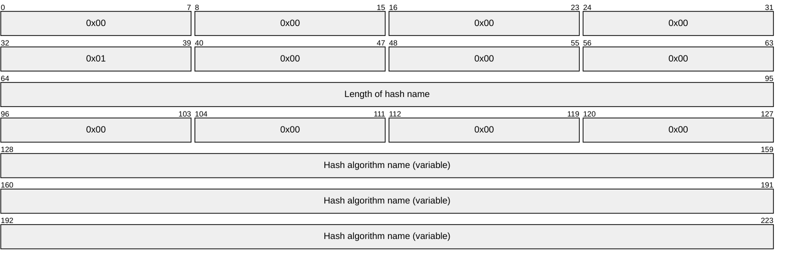
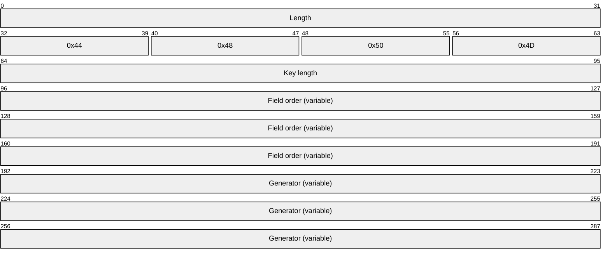
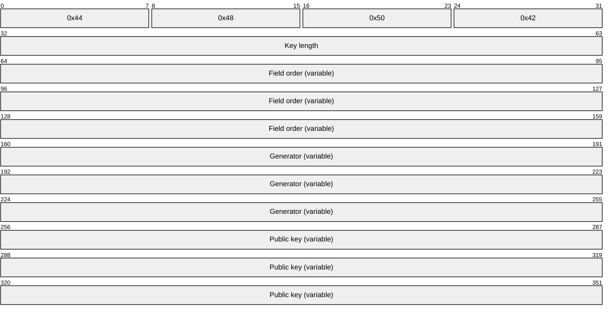
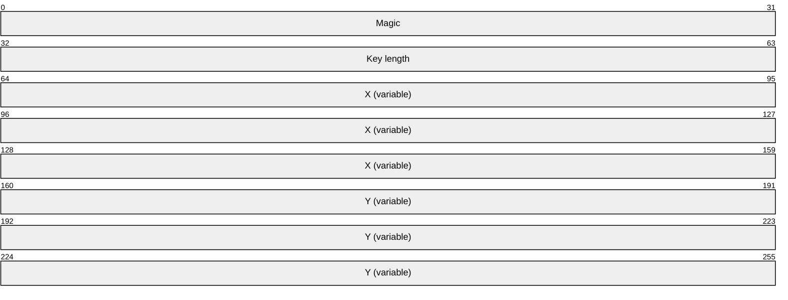
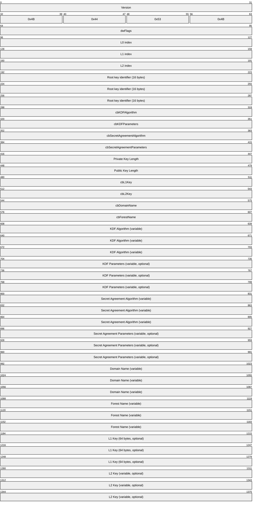

# [MS-GKDI]: Group Key Distribution Protocol

Table of Contents

1 Introduction

- [1 Introduction](#Section_1)
  - [1.1 Glossary](#Section_1.1)
  - [1.2 References](#Section_1.2)
    - [1.2.1 Normative References](#Section_1.2.1)
    - [1.2.2 Informative References](#Section_1.2.2)
  - [1.3 Overview](#Section_1.3)
  - [1.4 Relationship to Other Protocols](#Section_1.4)
  - [1.5 Prerequisites/Preconditions](#Section_1.5)
  - [1.6 Applicability Statement](#Section_1.6)
  - [1.7 Versioning and Capability Negotiation](#Section_1.7)
  - [1.8 Vendor Extensible Fields](#Section_1.8)
  - [1.9 Standards Assignments](#Section_1.9)

2 Messages

- [2 Messages](#Section_2)
  - [2.1 Transport](#Section_2.1)
  - [2.2 Common Data Types](#Section_2.2)
    - [2.2.1 KDF Parameters](#Section_2.2.1)
    - [2.2.2 FFC DH Parameters](#Section_2.2.2)
    - [2.2.3 Public Key Formats](#Section_2.2.3)
      - [2.2.3.1 FFC DH Key](#Section_2.2.3.1)
      - [2.2.3.2 ECDH Key](#Section_2.2.3.2)
    - [2.2.4 Group Key Envelope](#Section_2.2.4)
  - [2.3 Directory Service Schema Elements](#Section_2.3)

3 Protocol Details

- [3 Protocol Details](#Section_3)
  - [3.1 ISDKey Server Details](#Section_3.1)
    - [3.1.1 Abstract Data Model](#Section_3.1.1)
    - [3.1.2 Timers](#Section_3.1.2)
    - [3.1.3 Initialization](#Section_3.1.3)
    - [3.1.4 Message Processing Events and Sequencing Rules](#Section_3.1.4)
      - [3.1.4.1 GetKey (Opnum 0)](#Section_3.1.4.1)
        - [3.1.4.1.1 Creating a New Root Key](#Section_3.1.4.1.1)
        - [3.1.4.1.2 Generating a Group Key](#Section_3.1.4.1.2)
        - [3.1.4.1.3 Creating or Updating a Server Configuration Object](#Section_3.1.4.1.3)
    - [3.1.5 Timer Events](#Section_3.1.5)
    - [3.1.6 Other Local Events](#Section_3.1.6)
  - [3.2 ISDKey Client Details](#Section_3.2)
    - [3.2.1 Abstract Data Model](#Section_3.2.1)
    - [3.2.2 Timers](#Section_3.2.2)
    - [3.2.3 Initialization](#Section_3.2.3)
    - [3.2.4 Message Processing Events and Sequencing Rules](#Section_3.2.4)
      - [3.2.4.1 Client Side Processing](#Section_3.2.4.1)
      - [3.2.4.2 Retrieving a Group Key from a Server](#Section_3.2.4.2)
      - [3.2.4.3 Computing the Desired Group Key](#Section_3.2.4.3)
    - [3.2.5 Timer Events](#Section_3.2.5)
    - [3.2.6 Other Local Events](#Section_3.2.6)

4 Protocol Examples

- [4 Protocol Examples](#Section_4)

5 Security

- [5 Security](#Section_5)
  - [5.1 Security Considerations for Implementers](#Section_5.1)
  - [5.2 Index of Security Parameters](#Section_5.2)

6 Appendix A: Full IDL

- [6 Appendix A: Full IDL](#Section_6)

7 Appendix B: Product Behavior

- [7 Appendix B: Product Behavior](#Section_7)

8 Change Tracking

- [8 Change Tracking](#Section_8)

For the legal notice and IP terms, see [LEGAL.md](../LEGAL.md).
Last updated: 4/23/2024.
See [Revision History](#revision-history) for full version history.

# 1 Introduction

The Group Key Distribution Protocol is used by clients to obtain cryptographic keys that correspond to arbitrary [**security descriptors**](#gt_security-descriptor) that can be evaluated by an [**Active Directory**](#gt_active-directory) [**domain controller (DC)**](#gt_domain-controller-dc). These keys can then be used by the client for various purposes, including encrypting data such that it can only be decrypted by a desired set of [**security principals**](#gt_security-principal).

Familiarity with cryptography concepts such as asymmetric and symmetric cryptography is required for a complete understanding of this specification. For more information about cryptography concepts, see [[CRYPTO]](https://go.microsoft.com/fwlink/?LinkId=89841).

Sections 1.5, 1.8, 1.9, 2, and 3 of this specification are normative. All other sections and examples in this specification are informative.

## 1.1 Glossary

This document uses the following terms:

**access control entry (ACE)**: An entry in an access control list (ACL) that contains a set of user rights and a security identifier (SID) that identifies a principal for whom the rights are allowed, denied, or audited.

**Active Directory**: The Windows implementation of a general-purpose directory service, which uses LDAP as its primary access protocol. [**Active Directory**](#gt_active-directory) stores information about a variety of [**objects**](#gt_object) in the network such as user accounts, computer accounts, groups, and all related credential information used by Kerberos [MS-KILE](../MS-KILE/MS-KILE.md). [**Active Directory**](#gt_active-directory) is either deployed as Active Directory Domain Services (AD DS) or Active Directory Lightweight Directory Services (AD LDS), which are both described in [MS-ADOD](../MS-ADOD/MS-ADOD.md): Active Directory Protocols Overview.

**authentication level**: A numeric value indicating the level of authentication or message protection that [**remote procedure call (RPC)**](#gt_remote-procedure-call-rpc) will apply to a specific message exchange. For more information, see [[C706]](https://go.microsoft.com/fwlink/?LinkId=89824) section 13.1.2.1 and [MS-RPCE](../MS-RPCE/MS-RPCE.md).

**big-endian**: Multiple-byte values that are byte-ordered with the most significant byte stored in the memory location with the lowest address.

**binary large object (BLOB)**: A collection of binary data stored as a single entity in a database.

**common name (CN)**: A string attribute of a certificate that is one component of a [**distinguished name (DN)**](#gt_distinguished-name-dn). In Microsoft Enterprise uses, a CN has to be unique within the forest where it is defined and any forests that share trust with the defining forest. The website or email address of the certificate owner is often used as a common name. Client applications often refer to a certification authority (CA) by the CN of its signing certificate.

**container**: An [**object**](#gt_object) in the directory that can serve as the parent for other [**objects**](#gt_object). In the absence of schema constraints, all [**objects**](#gt_object) would be [**containers**](#gt_container). The schema allows only [**objects**](#gt_object) of specific classes to be [**containers**](#gt_container).

**distinguished name (DN)**: A name that uniquely identifies an object by using the [**relative distinguished name (RDN)**](#gt_relative-distinguished-name-rdn) for the object, and the names of container objects and domains that contain the object. The distinguished name (DN) identifies the object and its location in a tree.

**domain**: A set of users and computers sharing a common namespace and management infrastructure. At least one computer member of the set has to act as a [**domain controller (DC)**](#gt_domain-controller-dc) and host a member list that identifies all members of the domain, as well as optionally hosting the [**Active Directory**](#gt_active-directory) service. The domain controller provides authentication of members, creating a unit of trust for its members. Each domain has an identifier that is shared among its members. For more information, see [MS-AUTHSOD](../MS-AUTHSOD/MS-AUTHSOD.md) section 1.1.1.5 and [MS-ADTS](../MS-ADTS/MS-ADTS.md).

**domain controller (DC)**: The service, running on a server, that implements [**Active Directory**](#gt_active-directory), or the server hosting this service. The service hosts the data store for [**objects**](#gt_object) and interoperates with other [**DCs**](#gt_domain-controller-dc) to ensure that a local change to an [**object**](#gt_object) replicates correctly across all [**DCs**](#gt_domain-controller-dc). When [**Active Directory**](#gt_active-directory) is operating as Active Directory Domain Services (AD DS), the [**DC**](#gt_domain-controller-dc) contains full NC replicas of the configuration naming context (config NC), schema naming context (schema NC), and one of the domain NCs in its [**forest**](#gt_forest). If the AD DS [**DC**](#gt_domain-controller-dc) is a global catalog server (GC server), it contains partial NC replicas of the remaining domain NCs in its [**forest**](#gt_forest). For more information, see [MS-AUTHSOD] section 1.1.1.5.2 and [MS-ADTS]. When [**Active Directory**](#gt_active-directory) is operating as Active Directory Lightweight Directory Services (AD LDS), several AD LDS [**DCs**](#gt_domain-controller-dc) can run on one server. When [**Active Directory**](#gt_active-directory) is operating as AD DS, only one AD DS [**DC**](#gt_domain-controller-dc) can run on one server. However, several AD LDS [**DCs**](#gt_domain-controller-dc) can coexist with one AD DS [**DC**](#gt_domain-controller-dc) on one server. The AD LDS [**DC**](#gt_domain-controller-dc) contains full NC replicas of the config NC and the schema NC in its [**forest**](#gt_forest). The domain controller is the server side of Authentication Protocol Domain Support [MS-APDS](../MS-APDS/MS-APDS.md).

**Domain Name System (DNS)**: A hierarchical, distributed database that contains mappings of domain names to various types of data, such as IP addresses. DNS enables the location of computers and services by user-friendly names, and it also enables the discovery of other information stored in the database.

**dynamic endpoint**: A network-specific server address that is requested and assigned at run time. For more information, see [C706].

**forest**: In the [**Active Directory**](#gt_active-directory) directory service, a [**forest**](#gt_forest) is a set of naming contexts (NCs) consisting of one schema NC, one config NC, and one or more domain NCs. Because a set of NCs can be arranged into a tree structure, a [**forest**](#gt_forest) is also a set of one or several trees of NCs.

**globally unique identifier (GUID)**: A term used interchangeably with [**universally unique identifier (UUID)**](#gt_universally-unique-identifier-uuid) in Microsoft protocol technical documents (TDs). Interchanging the usage of these terms does not imply or require a specific algorithm or mechanism to generate the value. Specifically, the use of this term does not imply or require that the algorithms described in [[RFC4122]](https://go.microsoft.com/fwlink/?LinkId=90460) or [C706] must be used for generating the [**GUID**](#gt_globally-unique-identifier-guid). See also [**universally unique identifier (UUID)**](#gt_universally-unique-identifier-uuid).

**group key**: A group seed key or group public key associated with a specified security descriptor in an Active Directory forest.

**group key identifier**: A triple that identifies the time period for which a group key was intended. A fully-specified group key identifier needs all three elements of the triple set to non-negative integer values. All group key identifiers returned by the server of this protocol are fully specified. One or more elements of the triple can be set to -1 in a client request to signify that any value of those elements is acceptable to the client. Within an Active Directory forest, a group key is identified uniquely by the combination of its associated security descriptor, its root key identifier, and its group key identifier.

**group private key**: A private key associated with a specified security descriptor in an Active Directory forest. It corresponds to the group public key for the same security descriptor and is derived from the group seed key for that security descriptor through a deterministic algorithm.

**group public key**: A public key associated with a specified security descriptor in an Active Directory forest. It corresponds to the group private key for the same security descriptor and is derived from the group seed key for that security descriptor through a deterministic algorithm.

**Interface Definition Language (IDL)**: The International Standards Organization (ISO) standard language for specifying the interface for remote procedure calls. For more information, see [C706] section 4.

**key derivation**: The act of deriving a cryptographic key from another value (for example, the derivation of a cryptographic key from a password).

**little-endian**: Multiple-byte values that are byte-ordered with the least significant byte stored in the memory location with the lowest address.

**Network Data Representation (NDR)**: A specification that defines a mapping from [**Interface Definition Language (IDL)**](#gt_interface-definition-language-idl) data types onto octet streams. [**NDR**](#gt_network-data-representation-ndr) also refers to the runtime environment that implements the mapping facilities (for example, data provided to [**NDR**](#gt_network-data-representation-ndr)). For more information, see [MS-RPCE] and [C706] section 14.

**object**: A set of attributes, each with its associated values. For more information on objects, see [MS-ADTS] section 1 or [MS-DRSR](../MS-DRSR/MS-DRSR.md) section 1.

**private key**: One of a pair of keys used in public-key cryptography. The private key is kept secret and is used to decrypt data that has been encrypted with the corresponding public key. For an introduction to this concept, see [[CRYPTO]](https://go.microsoft.com/fwlink/?LinkId=89841) section 1.8 and [[IEEE1363]](https://go.microsoft.com/fwlink/?LinkId=89899) section 3.1.

**public key**: One of a pair of keys used in public-key cryptography. The public key is distributed freely and published as part of a digital certificate. For an introduction to this concept, see [CRYPTO] section 1.8 and [IEEE1363] section 3.1.

**read-only domain controller (RODC)**: A [**domain controller (DC)**](#gt_domain-controller-dc) that does not accept originating updates. Additionally, an [**RODC**](#gt_read-only-domain-controller-rodc) does not perform outbound [**replication**](#gt_replication). An RODC cannot be the primary domain controller (PDC) for its domain.

**relative distinguished name (RDN)**: An attribute-value pair used in the distinguished name of an object. For more information, see [[RFC2251]](https://go.microsoft.com/fwlink/?LinkId=90325).

**remote procedure call (RPC)**: A communication protocol used primarily between client and server. The term has three definitions that are often used interchangeably: a runtime environment providing for communication facilities between computers (the RPC runtime); a set of request-and-response message exchanges between computers (the RPC exchange); and the single message from an RPC exchange (the RPC message). For more information, see [C706].

**replication**: The process of propagating the effects of all originating writes to any replica of a naming context (NC), to all replicas of the NC. If originating writes cease and replication continues, all replicas converge to a common application-visible state.

**root key**: A type of seed key, which can be used by Group Key Distribution Protocol servers to derive group keys for any combination of security descriptor and group key identifier in an Active Directory forest. Each root key is associated with a GUID, known as its root key identifier.

**root key identifier**: A GUID that identifies a root key, for use by a Group Key Distribution Protocol server in deriving group keys.

**RPC protocol sequence**: A character string that represents a valid combination of a [**remote procedure call (RPC)**](#gt_remote-procedure-call-rpc) protocol, a network layer protocol, and a transport layer protocol, as described in [C706] and [MS-RPCE].

**security context**: An abstract data structure that contains authorization information for a particular [**security principal**](#gt_security-principal) in the form of a Token/Authorization Context (see [MS-DTYP](../MS-DTYP/MS-DTYP.md) section 2.5.2). A server uses the authorization information in a [**security context**](#gt_security-context) to check access to requested resources. A [**security context**](#gt_security-context) also contains a key identifier that associates mutually established cryptographic keys, along with other information needed to perform secure communication with another security principal.

**security descriptor**: A data structure containing the security information associated with a securable [**object**](#gt_object). A [**security descriptor**](#gt_security-descriptor) identifies an [**object's**](#gt_object) owner by its security identifier (SID). If access control is configured for the [**object**](#gt_object), its [**security descriptor**](#gt_security-descriptor) contains a discretionary access control list (DACL) with SIDs for the [**security principals**](#gt_security-principal) who are allowed or denied access. Applications use this structure to set and query an [**object's**](#gt_object) security status. The [**security descriptor**](#gt_security-descriptor) is used to guard access to an [**object**](#gt_object) as well as to control which type of auditing takes place when the [**object**](#gt_object) is accessed. The [**security descriptor**](#gt_security-descriptor) format is specified in [MS-DTYP] section 2.4.6; a string representation of [**security descriptors**](#gt_security-descriptor), called SDDL, is specified in [MS-DTYP] section 2.5.1.

**security principal**: A unique entity, also referred to as a principal, that can be authenticated by [**Active Directory**](#gt_active-directory). It frequently corresponds to a human user, but also can be a service that offers a resource to other security principals. Other security principals might be a group, which is a set of principals. Groups are supported by [**Active Directory**](#gt_active-directory).

**seed key**: A cryptographically random quantity that can be used to derive one or more cryptographic keys for use with specific cryptographic algorithms.

**server configuration**: An Active Directory object that contains a set of configuration parameters to be used when creating or updating a root key. A server configuration object is required in Active Directory with the RDN described in section 1.9 for successful operation of the Group Key Distribution Protocol.

**Unicode string**: A Unicode 8-bit string is an ordered sequence of 8-bit units, a Unicode 16-bit string is an ordered sequence of 16-bit code units, and a Unicode 32-bit string is an ordered sequence of 32-bit code units. In some cases, it could be acceptable not to terminate with a terminating null character. Unless otherwise specified, all [**Unicode strings**](#gt_unicode-string) follow the UTF-16LE encoding scheme with no Byte Order Mark (BOM).

**universally unique identifier (UUID)**: A 128-bit value. UUIDs can be used for multiple purposes, from tagging objects with an extremely short lifetime, to reliably identifying very persistent objects in cross-process communication such as client and server interfaces, manager entry-point vectors, and [**RPC**](#gt_remote-procedure-call-rpc) objects. UUIDs are highly likely to be unique. UUIDs are also known as [**globally unique identifiers (GUIDs)**](#gt_globally-unique-identifier-guid) and these terms are used interchangeably in the Microsoft protocol technical documents (TDs). Interchanging the usage of these terms does not imply or require a specific algorithm or mechanism to generate the UUID. Specifically, the use of this term does not imply or require that the algorithms described in [RFC4122] or [C706] must be used for generating the UUID.

**MAY, SHOULD, MUST, SHOULD NOT, MUST NOT:** These terms (in all caps) are used as defined in [[RFC2119]](https://go.microsoft.com/fwlink/?LinkId=90317). All statements of optional behavior use either MAY, SHOULD, or SHOULD NOT.

## 1.2 References

Links to a document in the Microsoft Open Specifications library point to the correct section in the most recently published version of the referenced document. However, because individual documents in the library are not updated at the same time, the section numbers in the documents may not match. You can confirm the correct section numbering by checking the [Errata](https://go.microsoft.com/fwlink/?linkid=850906).

### 1.2.1 Normative References

We conduct frequent surveys of the normative references to assure their continued availability. If you have any issue with finding a normative reference, please contact [dochelp@microsoft.com](mailto:dochelp@microsoft.com). We will assist you in finding the relevant information.

[C706] The Open Group, "DCE 1.1: Remote Procedure Call", C706, August 1997, [https://publications.opengroup.org/c706](https://go.microsoft.com/fwlink/?LinkId=89824)

**Note** Registration is required to download the document.

[FIPS180-3] FIPS PUBS, "Secure Hash Standard (SHS)", FIPS PUB 180-3, October 2008, [https://csrc.nist.gov/csrc/media/publications/fips/180/3/archive/2008-10-31/documents/fips180-3_final.pdf](https://go.microsoft.com/fwlink/?LinkId=180409)

[FIPS186] FIPS PUBS, "Digital Signature Standard (DSS)", FIPS PUB 186-3, June 2009, [https://csrc.nist.gov/csrc/media/publications/fips/186/3/archive/2009-06-25/documents/fips_186-3.pdf](https://go.microsoft.com/fwlink/?LinkId=89869)

[FIPS198-1] FIPS PUBS, "The Keyed-Hash Message Authentication Code (HMAC)", FIPS PUB 198-1, [http://csrc.nist.gov/publications/fips/fips198-1/FIPS-198-1_final.pdf](https://go.microsoft.com/fwlink/?LinkId=186032)

[MS-ADA2] Microsoft Corporation, "[Active Directory Schema Attributes M](../MS-ADA2/MS-ADA2.md)".

[MS-ADSC] Microsoft Corporation, "[Active Directory Schema Classes](../MS-ADSC/MS-ADSC.md)".

[MS-ADTS] Microsoft Corporation, "[Active Directory Technical Specification](../MS-ADTS/MS-ADTS.md)".

[MS-DTYP] Microsoft Corporation, "[Windows Data Types](../MS-DTYP/MS-DTYP.md)".

[MS-ERREF] Microsoft Corporation, "[Windows Error Codes](../MS-ERREF/MS-ERREF.md)".

[MS-NRPC] Microsoft Corporation, "[Netlogon Remote Protocol](../MS-NRPC/MS-NRPC.md)".

[MS-RPCE] Microsoft Corporation, "[Remote Procedure Call Protocol Extensions](../MS-RPCE/MS-RPCE.md)".

[MS-SPNG] Microsoft Corporation, "[Simple and Protected GSS-API Negotiation Mechanism (SPNEGO) Extension](../MS-SPNG/MS-SPNG.md)".

[RFC2119] Bradner, S., "Key words for use in RFCs to Indicate Requirement Levels", BCP 14, RFC 2119, March 1997, [https://www.rfc-editor.org/info/rfc2119](https://go.microsoft.com/fwlink/?LinkId=90317)

[RFC2743] Linn, J., "Generic Security Service Application Program Interface Version 2, Update 1", RFC 2743, January 2000, [https://www.rfc-editor.org/info/rfc2743](https://go.microsoft.com/fwlink/?LinkId=90378)

[RFC4122] Leach, P., Mealling, M., and Salz, R., "A Universally Unique Identifier (UUID) URN Namespace", RFC 4122, July 2005, [https://www.rfc-editor.org/info/rfc4122](https://go.microsoft.com/fwlink/?LinkId=90460)

[RFC4178] Zhu, L., Leach, P., Jaganathan, K., and Ingersoll, W., "The Simple and Protected Generic Security Service Application Program Interface (GSS-API) Negotiation Mechanism", RFC 4178, October 2005, [https://www.rfc-editor.org/info/rfc4178](https://go.microsoft.com/fwlink/?LinkId=90461)

[RFC5114] Lepinski, M., and Kent, S., "Additional Diffie-Hellman Groups for Use with IETF Standards", RFC5114, January 2008, [https://www.rfc-editor.org/info/rfc5114](https://go.microsoft.com/fwlink/?LinkId=221923)

[SP800-108] National Institute of Standards and Technology., "Special Publication 800-108, Recommendation for Key Derivation Using Pseudorandom Functions", October 2009, [https://csrc.nist.gov/publications/detail/sp/800-108/final](https://go.microsoft.com/fwlink/?LinkId=186039)

[SP800-56A] NIST, "Recommendation for Pair-Wise Key Establishment Schemes Using Discrete Logarithm Cryptography", March 2006, [http://csrc.nist.gov/groups/ST/toolkit/documents/SP800-56Arev1_3-8-07.pdf](https://go.microsoft.com/fwlink/?LinkId=90525)

### 1.2.2 Informative References

[CRYPTO] Menezes, A., Vanstone, S., and Oorschot, P., "Handbook of Applied Cryptography", 1997, [https://cacr.uwaterloo.ca/hac/](https://go.microsoft.com/fwlink/?LinkId=89841)

[FIPS140] FIPS PUBS, "Security Requirements for Cryptographic Modules", FIPS PUB 140-2, May 2001, [https://csrc.nist.gov/csrc/media/publications/fips/140/2/final/documents/fips1402.pdf](https://go.microsoft.com/fwlink/?LinkId=89866)

[FIPS197] FIPS PUBS, "Advanced Encryption Standard (AES)", FIPS PUB 197, November 2001, [https://nvlpubs.nist.gov/nistpubs/FIPS/NIST.FIPS.197.pdf](https://go.microsoft.com/fwlink/?LinkId=89870)

[MS-WPO] Microsoft Corporation, "[Windows Protocols Overview](../MS-WPO/MS-WPO.md)".

[MSDN-ALG] Microsoft Corporation, "CNG Algorithm Identifiers", [http://msdn.microsoft.com/en-us/library/aa375534(VS.85).aspx](https://go.microsoft.com/fwlink/?LinkId=187044)

[RFC3852] Housley, R., "Cryptographic Message Syntax (CMS)", RFC 3852, July 2004, [https://www.rfc-editor.org/info/rfc3852](https://go.microsoft.com/fwlink/?LinkId=90445)

## 1.3 Overview

The Group Key Distribution Protocol is used to obtain cryptographic keys corresponding to arbitrary [**security descriptors**](#gt_security-descriptor) that can be evaluated by an [**Active Directory**](#gt_active-directory) [**DC**](#gt_domain-controller-dc). It can be used to obtain symmetric as well as asymmetric keys for each of such security descriptors. One possible use of this protocol is to obtain shared keys for a set of [**security principals**](#gt_security-principal) that are defined by the client in the form of a security descriptor. Based on an evaluation of the client's [**security context**](#gt_security-context) and the security descriptor, the server can return an error, a [**public key**](#gt_public-key), or a [**seed key**](#gt_seed-key) that can be used to derive both the symmetric and asymmetric keys. Whenever the server returns a key of any type, it also returns metadata that includes a unique identifier for the key.

The Group Key Distribution Protocol utilizes a single [**remote procedure call (RPC)**](#gt_remote-procedure-call-rpc) method that is described in section [3.1.4.1](#Section_3.1.4.1). Conceptually, this method can be used by a client for two types of requests:

- Requesting the most recent key for a security descriptor: after evaluating the client's security context against the specified security descriptor, the server will return a seed key, a public key, or an error.
- Requesting a specific key for a security descriptor, or the key used for a set of security principals at a specific time in the past: after evaluating the client's security context against the specified security descriptor, the server will return either a seed key or an error.
Active Directory domain controllers with a DC functional level of DS_BEHAVIOR_WIN2012 or higher can serve as Group Key Distribution Protocol servers. Clients can locate Group Key Distribution Protocol servers by using the DC locator functionality, as specified in section [3.2.4.2](#Section_3.2.4.2). These servers store a small amount of state in Active Directory (sections [2.3](#Section_2.3) and [3.1.1](#Section_3.1.1)), which consists of configuration information and one or more [**root key**](#gt_root-key) [**objects**](#gt_object). Other than this, Group Key Distribution Protocol servers retain no state across RPC calls.

## 1.4 Relationship to Other Protocols

The Group Key Distribution Protocol is built on the [**RPC**](#gt_remote-procedure-call-rpc) interface, as specified in [[C706]](https://go.microsoft.com/fwlink/?LinkId=89824) and [MS-RPCE](../MS-RPCE/MS-RPCE.md), with the TCP/IP protocol sequence **ncacn_ip_tcp** as its transport.

The Group Key Distribution Protocol uses the Simple and Protected GSS-API Negotiation Mechanism (SPNEGO) Extension [MS-SPNG](../MS-SPNG/MS-SPNG.md) [[RFC4178]](https://go.microsoft.com/fwlink/?LinkId=90461) to negotiate an authentication mechanism. It uses the [**authentication level**](#gt_authentication-level) and impersonation level security extensions described in [MS-RPCE] sections 2.2.1.1.8 and 2.2.1.1.9 to pass the client's [**security context**](#gt_security-context) to the server and to prevent exposure of secrets to network eavesdroppers.

The Group Key Distribution Protocol server runs on a [**domain controller (DC)**](#gt_domain-controller-dc) in an [**Active Directory**](#gt_active-directory) [**domain**](#gt_domain), as specified in section [1.5](#Section_1.5). Clients use the DC Locator functionality described in [MS-NRPC](../MS-NRPC/MS-NRPC.md) section 3.5.4.3.1 to locate a DC.

## 1.5 Prerequisites/Preconditions

The Group Key Distribution Protocol is an [**RPC**](#gt_remote-procedure-call-rpc) interface. As a result, it has the prerequisites specified in [MS-RPCE](../MS-RPCE/MS-RPCE.md) that are common to RPC interfaces. In particular, the server has to be started and fully initialized before the protocol can start.

The Group Key Distribution Protocol is used between clients and servers. The Group Key Distribution Protocol server runs on a [**DC**](#gt_domain-controller-dc) with a DC functional level of DS_BEHAVIOR_WIN2012 or higher in an [**Active Directory**](#gt_active-directory) [**domain**](#gt_domain). The client requires the ability to locate such a DC by using the DC Locator functionality specified in [MS-NRPC](../MS-NRPC/MS-NRPC.md) section 3.5.4.3.1.

To use the Group Key Distribution Protocol, the client first establishes an authenticated RPC connection to the server's [**dynamic endpoint**](#gt_dynamic-endpoint). The client and server require appropriate credentials to set up such a session and to establish a mutually authenticated RPC connection over the session.

The Group Key Distribution Protocol requires the use of secure RPC. It is necessary for both client and server to support mutual authentication through SPNEGO [MS-SPNG](../MS-SPNG/MS-SPNG.md) [[RFC4178]](https://go.microsoft.com/fwlink/?LinkId=90461) and to also support security packages that implement impersonation support, along with packet privacy and integrity.

The server needs to maintain some state in Active Directory, which consists of a [**server configuration**](#gt_server-configuration) [**object**](#gt_object) and a set of [**root key**](#gt_root-key) objects, as specified in section [3.1.1](#Section_3.1.1). This state has to be accessible from the location specified in section [1.9](#Section_1.9) in the form of the object classes referenced in section [2.3](#Section_2.3). At a minimum, a single valid server configuration object with a version number is required to be present on the Active Directory DC. A procedure for creating or updating a server configuration object is specified in section [3.1.4.1.3](#Section_3.1.4.1.3). Any server configuration that is created or updated in this manner will be used by all servers in the Active Directory [**forest**](#gt_forest) when creating future root keys, as specified in section [3.1.4.1.1](#Section_3.1.4.1.1), but will not affect any existing root keys. This state is replicated between domain controllers by using server-to-server [**replication**](#gt_replication) mechanisms, as specified in [MS-ADTS](../MS-ADTS/MS-ADTS.md) section 6.2.

The server configuration object also needs protection from unauthorized modification, and the root key objects require protection from unauthorized disclosure or modification. The server also requires a method of generating cryptographically strong random numbers for use as root keys in this protocol.

## 1.6 Applicability Statement

The Group Key Distribution Protocol is appropriate for use when it is desirable to associate cryptographic keys with [**security descriptors**](#gt_security-descriptor) in an [**Active Directory**](#gt_active-directory) [**domain**](#gt_domain). It is only appropriate for a client to use this protocol when it has valid authentication credentials in a domain that contains at least one [**DC**](#gt_domain-controller-dc) with a DC functional level of DS_BEHAVIOR_WIN2012 or higher, as specified in section [1.5](#Section_1.5). Also, this protocol is not appropriate when protection against untrusted domain administrators is desired, as specified in section [5.1](#Section_5.1).

## 1.7 Versioning and Capability Negotiation

This specification covers versioning issues in the following areas:

**Supported Transports:** This protocol uses the [**RPC protocol sequence**](#gt_rpc-protocol-sequence) **ncacn_ip_tcp**, as specified in section [2.1](#Section_2.1).

**Protocol Versions:** This protocol has only one interface version, which is version 1.0, as specified in section 2.1.

**Security and Authentication Methods:** [MS-RPCE](../MS-RPCE/MS-RPCE.md) uses Generic Security Services (GSS) [[RFC2743]](https://go.microsoft.com/fwlink/?LinkId=90378) to negotiate the authentication mechanism with the protocol, as specified in [MS-SPNG](../MS-SPNG/MS-SPNG.md) and [[RFC4178]](https://go.microsoft.com/fwlink/?LinkId=90461). This negotiation is described in section [3.2.4.2](#Section_3.2.4.2) .

**Capability Negotiation:** This protocol does not perform any explicit capability negotiation between client and server. The [**server configuration**](#gt_server-configuration) is stored in [**Active Directory**](#gt_active-directory) and is versioned there. The processing rules for this versioning scheme are described in section [3.1.4.1](#Section_3.1.4.1). Configuration information is transferred from server to client unconditionally, as specified in section 3.1.4.1.

Currently, this protocol specifies a single version of the server configuration [**object**](#gt_object) (section 3.1.4.1), and a fixed set of configuration choices for cryptographic algorithms. When any other cryptographic algorithms are configured in the server configuration object, both server and client behavior is undefined.

## 1.8 Vendor Extensible Fields

No vendor-extensible fields are used by this protocol.

This protocol uses HRESULT values as defined in [MS-ERREF](../MS-ERREF/MS-ERREF.md) section 2.1. Vendors can define their own HRESULT values, but they MUST set the C bit (0x20000000) for each vendor-defined value, to indicate that the value is a customer code.

## 1.9 Standards Assignments

The following parameters are private Microsoft assignments.

| Parameter | Value | Reference |
| --- | --- | --- |
| UUID for ISDKey | b9785960-524f-11df-8b6d-83dcded72085 | [[C706]](https://go.microsoft.com/fwlink/?LinkId=89824) |

The following table provides the [**relative distinguished name (RDN)**](#gt_relative-distinguished-name-rdn) of the [**server configuration**](#gt_server-configuration) [**object**](#gt_object) and the [**root key**](#gt_root-key) [**container**](#gt_container) in [**Active Directory**](#gt_active-directory).

| Parameter | Value | Reference |
| --- | --- | --- |
| The RDN of the server configuration object, relative to [**forest**](#gt_forest) root. | CN=SID Key Server Configuration,CN=Server Configuration,CN=Sid Key Service,CN=Services,CN=Configuration | Section [3.1.1](#Section_3.1.1) |
| The RDN of the root key container, relative to forest root. | CN=Master Root Keys,CN=Sid Key Service,CN=Services,CN=Configuration | Section 3.1.1 |

# 2 Messages

## 2.1 Transport

The client and server MUST communicate over [**RPC**](#gt_remote-procedure-call-rpc) by using the TCP/IP protocol sequence **ncacn_ip_tcp**.

This protocol uses RPC [**dynamic endpoints**](#gt_dynamic-endpoint) as defined in [[C706]](https://go.microsoft.com/fwlink/?LinkId=89824), part 4.

The server interface MUST be identified by [**universal unique identifier (UUID)**](#gt_universally-unique-identifier-uuid) [b9785960-524f-11df-8b6d-83dcded72085], version 1.0.

The server MUST use the RPC security extensions specified in [MS-RPCE](../MS-RPCE/MS-RPCE.md). It MUST support the use of SPNEGO [MS-SPNG](../MS-SPNG/MS-SPNG.md) [[RFC4178]](https://go.microsoft.com/fwlink/?LinkId=90461) to negotiate security providers. The server MUST also register one or more security packages that can be negotiated by using this protocol.

## 2.2 Common Data Types

This protocol MUST indicate to the [**RPC**](#gt_remote-procedure-call-rpc) runtime that it supports both the [**Network Data Representation (NDR)**](#gt_network-data-representation-ndr) and **NDR64** transfer syntaxes and provides a negotiation mechanism for determining which transfer syntax will be used, as specified in [MS-RPCE](../MS-RPCE/MS-RPCE.md) section 3.

In addition to RPC base types and definitions specified in [[C706]](https://go.microsoft.com/fwlink/?LinkId=89824) and [MS-RPCE], additional data types are defined in this section.

The following data types are specified in [MS-DTYP](../MS-DTYP/MS-DTYP.md):

| Data type name | Section | Description |
| --- | --- | --- |
| FILETIME | 2.3.3 | A structure of 64-bit value that represents the number of 100-nanosecond intervals that have elapsed since January 1, 1601, Coordinated Universal Time (UTC). |
| GUID | 2.3.4.2 | A packet representation of a [**globally unique identifier (GUID)**](#gt_globally-unique-identifier-guid). |
| HRESULT | 2.2.18 | A 32-bit value that is used to describe an error or warning and contains the following fields: A 1-bit code that indicates severity, where 0 represents success and 1 represents failure. A 4-bit reserved value. An 11-bit code, also known as a facility code, that indicates responsibility for the error or warning. A 16-bit code that describes the error or warning. |
| LONG | 2.2.27 | A 32-bit signed integer, in twos-complement format (range: –2147483648 through 2147483647 decimal). The first bit (Most Significant Bit (MSB)) is the signing bit. |
| ULONG | 2.2.51 | A 32-bit unsigned integer (range: 0 through 4294967295 decimal). Because a ULONG is unsigned, its first bit (most significant bit (MSB)) is not reserved for signing. |

### 2.2.1 KDF Parameters

The following specifies the format and field descriptions for the [**key derivation**](#gt_key-derivation) function (KDF) parameters structure.

**Length of hash name (4 bytes)**: A 32-bit unsigned integer. This field MUST be the length, in bytes, of the **Hash algorithm name** field. This field is encoded using [**little-endian**](#gt_little-endian) format.

**Hash algorithm name (variable)**: A null-terminated [**Unicode string**](#gt_unicode-string) containing the name of the hash algorithm to be used with the default KDF [[SP800-108]](https://go.microsoft.com/fwlink/?LinkId=186039). Valid values for this field are as follows.

| Value | Meaning |
| --- | --- |
| L"SHA256" | The SHA-256 algorithm, as specified in [[FIPS180-3]](https://go.microsoft.com/fwlink/?LinkId=180409). |
| L"SHA384" | The SHA-384 algorithm, as specified in [FIPS180-3]. |
| L"SHA512" | The SHA-512 algorithm, as specified in [FIPS180-3]. |
| L"SHA1" | The SHA-1 algorithm, as specified in [FIPS180-3]. |

### 2.2.2 FFC DH Parameters

This structure specifies field parameters for use in deriving finite field cryptography (FFC) Diffie-Hellman (DH) ([[SP800-56A]](https://go.microsoft.com/fwlink/?LinkId=90525) section 5.7.1) keys, as specified in section [3.1.4.1.2](#Section_3.1.4.1.2).

**Length (4 bytes)**: A 32-bit unsigned integer. This field MUST be the length, in bytes, of the entire structure. This field is encoded using [**little-endian**](#gt_little-endian) format.

**Key length (4 bytes)**: A 32-bit unsigned integer. This field MUST be the length, in bytes, of the [**public key**](#gt_public-key). This field is encoded using little-endian format.

**Field order (variable)**: This is the large prime field order, and is a [**domain**](#gt_domain) parameter for the **FFC DH** algorithm ([SP800-56A] section 5.7.1). This field parameter is referred to as *p* in [SP800-56A] section 3.2. It MUST be encoded in [**big-endian**](#gt_big-endian) format. The length of this field, in bytes, MUST be equal to the value of the **Key length** field.

**Generator (variable)**: The generator of the subgroup, a domain parameter for the **FFC DH** algorithm ([SP800-56A] section 5.7.1). This field parameter is referred to as *g* in [SP800-56A] section 3.2. It MUST be encoded in big-endian format. The length of this field, in bytes, MUST be equal to the value of the **Key length** field.

### 2.2.3 Public Key Formats

The formats in this section are used by the Group Key Distribution Protocol server to return [**public keys**](#gt_public-key) to the client, as specified in section [3.1.4.1](#Section_3.1.4.1).

#### 2.2.3.1 FFC DH Key

The following specifies the format and field descriptions for the **FFC DH Key** structure.

**Key length (4 bytes)**: A 32-bit unsigned integer. The value in this field MUST be equal to the length, in bytes, of the **Public key** field. This parameter is encoded using [**little-endian**](#gt_little-endian) format.

**Field order (variable)**: This is the large prime field order, and is a [**domain**](#gt_domain) parameter for the **FFC DH** algorithm ([[SP800-56A]](https://go.microsoft.com/fwlink/?LinkId=90525) section 5.7.1). This field parameter is referred to as *p* in [SP800-56A] section 3.2. It MUST be encoded in [**big-endian**](#gt_big-endian) format. The length of this field, in bytes, MUST be equal to the value in the **Key length** field.

**Generator (variable)**: The generator of the subgroup, a domain parameter for the **FFC DH** algorithm ([SP800-56A] section 5.7.1). This field parameter is referred to as *g* in [SP800-56A] section 3.2. It MUST be encoded in big-endian format. The length of this field, in bytes, MUST be equal to the value in the **Key length** field.

**Public key (variable)**: The [**public key**](#gt_public-key) for the **FFC DH** algorithm ([SP800-56A] section 5.7.1). This field parameter is referred to as *y* in [SP800-56A] section 3.2. It MUST be encoded in big-endian format. The length of this field, in bytes, MUST be equal to the value of the **Key length** field.

#### 2.2.3.2 ECDH Key

The following specifies the format and field descriptions for the **Elliptic Curve Diffie-Hellman (ECDH)** Key structure [[RFC5114]](https://go.microsoft.com/fwlink/?LinkId=221923).

**Magic (4 bytes)**: A 32-bit unsigned integer encoded in [**little-endian**](#gt_little-endian) format, representing the **ECDH** field parameters. The following values are valid.

| Value | Meaning |
| --- | --- |
| 0x314B4345 | The values in the X and Y fields represent an **ECDH** [RFC5114] key over the elliptic curve P-256 specified in Appendix D.1.2.3 of [[FIPS186]](https://go.microsoft.com/fwlink/?LinkId=89869). |
| 0x334B4345 | The values in the X and Y fields represent an **ECDH** [RFC5114] key over the elliptic curve P-384 specified in Appendix D.1.2.4 of [FIPS186]. |
| 0x354B4345 | The values in the X and Y fields represent an **ECDH** [RFC5114] key over the elliptic curve P-521 specified in Appendix D.1.2.5 of [FIPS186]. |

**Key length (4 bytes)**: A 32-bit unsigned integer. This field MUST be the length, in bytes, of the [**public key**](#gt_public-key). This field is encoded using little-endian format.

**X (variable):** The x coordinate of the point P that represents the **ECDH** [RFC5114] public key. This parameter is referred to as *x* in [[SP800-56A]](https://go.microsoft.com/fwlink/?LinkId=90525) section 3.2. It MUST be encoded in [**big-endian**](#gt_big-endian) format. The length of this field, in bytes, MUST be equal to the value in the **Key length** field.

**Y (variable):** The y coordinate of the point P that represents the **ECDH** public key. This parameter is referred to as *y* in [SP800-56A] section 3.2. It MUST be encoded in big-endian format. The length of this field, in bytes, MUST be equal to the value in the **Key length** field.

### 2.2.4 Group Key Envelope

The following specifies the format and field descriptions for the Group Key Envelope structure.

**Version (4 bytes)**: A 32-bit unsigned integer. This field MUST be set to the version of the **root key** ADM element. This field is encoded using [**little-endian**](#gt_little-endian) format.

**dwFlags (4 bytes)**: A 32-bit unsigned integer. Bit 31 (LSB) MUST be set to 1 when this structure is being used to transport a [**public key**](#gt_public-key), otherwise set to 0. Bit 30 MUST be set to 1 when the key being transported by this structure might be used for encryption and decryption, otherwise it should only be used for decryption. This field is encoded using little-endian format.

**L0 index (4 bytes)**: A 32-bit unsigned integer. This field MUST be the **L0 index** of the key being enveloped. This field is encoded using little-endian format.

**L1 index (4 bytes)**: A 32-bit unsigned integer. This field MUST be the **L1 index** of the key being enveloped, and therefore MUST be a number between 0 and 31, inclusive. This field is encoded using little-endian format.

**L2 index (4 bytes)**: A 32-bit unsigned integer. This field MUST be the **L2 index** of the key being enveloped, and therefore MUST be a number between 0 and 31, inclusive. This field is encoded using little-endian format.

**Root key identifier (16 bytes)**: A [**GUID**](#gt_globally-unique-identifier-guid) containing the [**root key identifier**](#gt_root-key-identifier) of the key being enveloped.

**cbKDFAlgorithm (4 bytes)**: A 32-bit unsigned integer. This field MUST be the length, in bytes, of the **KDF Algorithm** field. This field is encoded using little-endian format.

**cbKDFParameters (4 bytes)**: A 32-bit unsigned integer. This field MUST be the length, in bytes, of the **KDF Parameters** field. This field is encoded using little-endian format.

**cbSecretAgreementAlgorithm (4 bytes)**: A 32-bit unsigned integer. This field MUST be the length, in bytes, of the **Secret Agreement Algorithm** field. This field is encoded using little-endian format.

**cbSecretAgreementParameters (4 bytes)**: A 32-bit unsigned integer. This field MUST be the length, in bytes, of the **Secret Agreement Parameters** field. This field is encoded using little-endian format.

**Private key length (4 bytes)**: A 32-bit unsigned integer. This field MUST be the [**private key**](#gt_private-key) length associated with the [**root key**](#gt_root-key), whose identifier is in the **Root key identifier** field. This field is encoded using little-endian format.

**Public key length (4 bytes)**: A 32-bit unsigned integer. This field MUST be the public key length associated with the root key, whose identifier is in the **Root key identifier** field. This field is encoded using little-endian format.

**cbL1Key (4 bytes)**: A 32-bit unsigned integer. This field MUST be the length, in bytes, of the **L1 key** field. This field is encoded using little-endian format. This field MUST be set to zero if bit 31 of the **dwFlags** field is set to 1, or if the **L1 index** field is set to zero and the value in the **L2 index** field is not equal to 31.

**cbL2Key (4 bytes)**: A 32-bit unsigned integer. This field MUST be the length, in bytes, of the **L2 key** field. This field is encoded using little-endian format. This field MUST be zero if the value in the **L2 index** field is equal to 31.

**cbDomainName (4 bytes)**: A 32-bit unsigned integer. This field MUST be the length, in bytes, of the **Domain name** field. This field is encoded using little-endian format.

**cbForestName (4 bytes)**: A 32-bit unsigned integer. This field MUST be the length, in bytes, of the **Forest name** field. This field is encoded using little-endian format.

**KDF Algorithm (variable)**: A null-terminated [**Unicode string**](#gt_unicode-string). This field MUST be the ADM element **KDF algorithm** name associated with the ADM element **root key**, whose identifier is in the **Root key identifier** field.

**KDF Parameters (variable, optional)**: This field MUST contain the **KDF parameters** associated with the ADM element **root key**, whose identifier is in the **Root key identifier** field, in the format specified in section [2.2.1](#Section_2.2.1). If the **cbKDFParameters** field is set to zero, this field is absent.

**Secret Agreement Algorithm (variable)**: A null-terminated Unicode string. This field MUST be the ADM element **Secret agreement algorithm** name associated with the ADM element **root key**, whose identifier is in the **Root key identifier** field.

**Secret Agreement Parameters (variable, optional)**: This field MUST contain the ADM element **Secret agreement algorithm** associated with the ADM element **root key**, whose identifier is in the **Root key identifier** field, in the format specified in section [2.2.2](#Section_2.2.2). If the **cbSecretAgreementParameters** field is set to zero, this field is absent.

**Domain Name (variable)**: A null-terminated Unicode string. This field MUST be the [**domain**](#gt_domain) name of the server in [**Domain Name System (DNS)**](#gt_domain-name-system-dns) format.

**Forest Name (variable)**: A null-terminated Unicode string. This field MUST be the [**forest**](#gt_forest) name of the server in Domain Name System (DNS) format.

**L1 key (64 bytes, optional)**: An **L1 seed key** ADM element in binary form. If the value in the **cbL1Key** field is zero, this field is absent. Otherwise, if the value in the **L2 index** field is equal to 31, this contains the **L1 key** with [**group key identifier**](#gt_group-key-identifier) (**L0 index**, **L1 index**, -1). In all other cases, this field contains the **L1 key** with group key identifier (**L0 index**, **L1 index** - 1, -1). If this field is present, its length MUST be equal to 64 bytes.

**L2 key (variable, optional)**: The **L2 seed key** ADM element or the **group public key** ADM element with group key identifier (**L0 index**, **L1 index**, **L2 index**) in binary form. If the value in the **cbL2Key** field is zero, this field is absent. If this field is present and bit 31 of the **dwFlags** field is set to 1, then the length, in bytes, of this field MUST be equal to the value of the **Public Key Length** field. If this field is present and bit 31 of the **dwFlags** field is set to 0, the length of this field MUST be equal to 64 bytes.

## 2.3 Directory Service Schema Elements

The Group Key Distribution Protocol accesses the directory service schema classes and attributes listed in the following table.

For the syntactic specifications of the following <Class> or <Class><Attribute> pairs, refer to Active Directory Domain Services (AD DS) ([MS-ADA2](../MS-ADA2/MS-ADA2.md) sections 2.532 through 2.542 and [MS-ADSC](../MS-ADSC/MS-ADSC.md) sections 2.159 and 2.160).

| Class | Attributes |
| --- | --- |
| msKds-ProvServerConfiguration | msKds-Version msKds-KDF-AlgorithmID msKds-KDF-Param msKds-SecretAgreement-AlgorithmID msKds-SecretAgreement-Param msKds-PublicKey-Length msKds-PrivateKey-Length |
| msKds-ProvRootKey | common name msKds-ProvServerConfiguration class attributes msKds-DomainID msKds-CreateTime msKds-UseStartTime msKds-RootKeyData |

# 3 Protocol Details

## 3.1 ISDKey Server Details

### 3.1.1 Abstract Data Model

This section describes a conceptual model of possible data organization that an implementation maintains to participate in this protocol. The described organization is provided to facilitate the explanation of how the protocol behaves. This document does not mandate that implementations adhere to this model as long as their external behavior is consistent with that described in this document.

The server abstract data model (ADM) is [**Active Directory**](#gt_active-directory)-based only and does not require any local variables to store state for this protocol. The server ADM consists of a **Server Configuration** [**object**](#gt_object) and **root key** objects along with their associated parameters and attributes, respectively, as specified below.

**Server Configuration (Public):** The server stores a set of configuration parameters for use when creating a new [**root key**](#gt_root-key), as specified in section [3.1.4.1.1](#Section_3.1.4.1.1). These parameters are held in persisted storage in Active Directory where they survive system restarts. They are stored in an object of the **msKds-ProvServerConfiguration** class at the location specified in section [1.9](#Section_1.9), which is the [**RDN**](#gt_relative-distinguished-name-rdn) of the **Server Configuration** object relative to the [**forest**](#gt_forest) root. The parameters are replicated to all servers in the Active Directory forest by Active Directory [**replication**](#gt_replication) mechanisms.

**Note** The Active Directory schema for the **Server Configuration** object is specified in [MS-ADSC](../MS-ADSC/MS-ADSC.md) sections 2.159 and 2.160.

The configuration consists of the following parameters:

**Configuration information version:** A version number associated with the [**server configuration**](#gt_server-configuration) format that is stored in the **msKds-Version** attribute of the **Server Configuration** object.

- **KDF algorithm:** An identifier indicating the [**key derivation**](#gt_key-derivation) function used to derive [**group keys**](#gt_group-key) from a **root key** object data element. It is stored in the **msKds-KDF-AlgorithmID** attribute of the **Server Configuration** object.
- **KDF algorithm parameters:** Additional parameters for the **KDF algorithm** data element. They are stored in the **msKds-KDF-Param** attribute of the **Server Configuration** object.
- **Secret agreement algorithm:** An identifier indicating the secret agreement algorithm to be used with the [**group public keys**](#gt_group-public-key). It is stored in the **msKds-SecretAgreement-AlgorithmID** attribute of the **Server Configuration** object.
- **Secret agreement algorithm parameters:** Additional parameters for the **secret agreement algorithm** data element. They are stored in the **msKds-SecretAgreement-Param** attribute of the **Server Configuration** object.
- **Length of secret agreement public keys:** The [**public key**](#gt_public-key) length of the **secret agreement algorithm** data element. It is stored in the **msKds-PublicKey-Length** attribute of the **Server Configuration** object.
- **Length of secret agreement private keys:** The [**private key**](#gt_private-key) length of the **secret agreement algorithm** data element. It is stored in the **msKds-PrivateKey-Length** attribute of the **Server Configuration** object.
**Root keys (Public):** The server holds zero or more **root key** objects in persisted storage in Active Directory, where these objects survive system restarts. These **root key** data elements are stored as objects of the **msKds-ProvRootKey** class inside the **root key** [**container**](#gt_container), as specified in section 1.9. They are replicated to all the servers in the Active Directory forest by Active Directory replication mechanisms.

Each **root key** data element contains the following attributes:

**Root key identifier:** A unique identifier associated with this **root key**. This identifier is stored in the **Common-Name** attribute of the **root key** object data element in Active Directory.

**Root key configuration:** The server configuration that was in force when this **root key** object was created, and which will apply to this **root key** throughout its life cycle. The configuration is stored in the following attributes of this **root key** data element in Active Directory:

- **msKds-Version**
- **msKds-KDF-AlgorithmID**
- **msKds-KDF-Param**
- **msKds-SecretAgreement-AlgorithmID**
- **msKds-SecretAgreement-Param**
- **msKds-PublicKey-Length**
- **msKds-PrivateKey-Length**
**Root key domain:** The [**distinguished name (DN)**](#gt_distinguished-name-dn) of the [**domain**](#gt_domain) in which this **root key** object was generated. It is stored in the **msKds-DomainID** attribute of this **root key** data element.

**Root key creation time:** The time at which this **root key** object was created. It is stored in the **msKds-CreateTime** attribute of this **root key** data element.

**Root key validity start time:** The time after which this **root key** object can be used. It is stored in the **msKds-UseStartTime** attribute of this **root key** data element.

**Root key data:** The actual random bits that will be used as this **root key**. It is stored in the **msKds-RootKeyData** attribute of this **root key** data element.

Note that the abstract interface notation (Public) for the **Server Configuration** and **Root key** objects indicates that these ADM elements can be directly accessed from outside this protocol. Specifically, an authorized administrator can access these data elements directly by querying Active Directory at the RDN locations specified in section 1.9.

### 3.1.2 Timers

None.

### 3.1.3 Initialization

The server MUST register a [**dynamic endpoint**](#gt_dynamic-endpoint) with the [**RPC**](#gt_remote-procedure-call-rpc) runtime. It MUST indicate to the RPC runtime that it is to negotiate [**security contexts**](#gt_security-context) using the SPNEGO protocol [MS-SPNG](../MS-SPNG/MS-SPNG.md), and MUST request the RPC runtime to reject any unauthenticated connections. The server MUST also instruct the RPC runtime to reject any connections with an [**authentication level**](#gt_authentication-level) less than RPC_C_AUTHN_LEVEL_PKT_PRIVACY.

A server in the [**Active Directory**](#gt_active-directory) [**forest**](#gt_forest) MUST initialize its **Server Configuration** and **root key** [**objects**](#gt_object) from the corresponding values persisted in the Active Directory database on the [**DC**](#gt_domain-controller-dc). It MUST also implement a means of monitoring this state for changes made through other protocols or through Active Directory server-to-server [**replication**](#gt_replication) mechanisms.

### 3.1.4 Message Processing Events and Sequencing Rules

This protocol MUST indicate to the [**RPC**](#gt_remote-procedure-call-rpc) runtime that it is to perform a strict [**NDR**](#gt_network-data-representation-ndr) data consistency check at target level 6.0, as specified in [MS-RPCE](../MS-RPCE/MS-RPCE.md) section 3.

This protocol MUST indicate to the RPC runtime that it is to reject a NULL unique or full pointer with nonzero conformant value, as specified in [MS-RPCE] section 3.

This protocol MUST indicate to the RPC runtime via the *strict_context_handle* attribute ([MS-RPCE] section 3.1.1.5.3.2.2.2), that it is to reject the use of context handles created by methods of an RPC interface that are different than the method specified herein.

The ISDKey interface for the Group Key Distribution Protocol includes the following method:

| Method | Description |
| --- | --- |
| [GetKey](#Section_3.1.4.1) | The following is the only opnum method defined by this protocol. Opnum: 0 |

#### 3.1.4.1 GetKey (Opnum 0)

The syntax for the **GetKey (Opnum 0)** method consists of the following.

HRESULT GetKey(

[in] handle_t hBinding,

[in] ULONG cbTargetSD,

[in] [size_is(cbTargetSD)] [ref] char* pbTargetSD,

[in] [unique] GUID* pRootKeyID,

[in] LONG L0KeyID,

[in] LONG L1KeyID,

[in] LONG L2KeyID,

[out] unsigned long* pcbOut,

[out] [size_is(, *pcbOut)] byte** ppbOut);

**hBinding:** This is an [**RPC**](#gt_remote-procedure-call-rpc) binding handle parameter, as specified in [[C706]](https://go.microsoft.com/fwlink/?LinkId=89824) and [MS-RPCE](../MS-RPCE/MS-RPCE.md) section 2.

**cbTargetSD:** This parameter is equal to the length, in bytes, of the [**security descriptor**](#gt_security-descriptor) supplied in *pbTargetSD*.

**pbTargetSD:** This parameter is a pointer to the security descriptor for which the [**group key**](#gt_group-key) is being requested.

**pRootKeyID:** This parameter represents the [**root key identifier**](#gt_root-key-identifier) of the requested key. It can be set to NULL.

**L0KeyID:** This parameter represents the **L0 index** of the requested **group key**. It MUST be a signed 32-bit integer greater than or equal to -1.

**L1KeyID:** This parameter represents the **L1 index** of the requested **group key**. It MUST be a signed 32-bit integer between -1 and 31 (inclusive).

**L2KeyID:** This parameter represents the **L2 index** of the requested **group key**. It MUST be a 32-bit integer between -1 and 31 (inclusive).

**pcbOut:** This parameter is an unsigned, 32-bit integer. It MUST be equal to the length, in bytes, of the data returned in *ppbOut*.

**ppbOut:** On successful processing of a request, the server MUST set this to a pointer that refers to the output key [**binary large object (BLOB)**](#gt_binary-large-object-blob), as specified in section [2.2.4](#Section_2.2.4).

**Return Values:** The server MUST return zero if it successfully processes the message received from the client; otherwise, it MUST return a nonzero value.

**Exceptions Thrown**: No exceptions are thrown beyond those thrown by the underlying RPC protocol [MS-RPCE].

Processing rules for the **GetKey** request are specified herein. In general, there are four types of requests, as follows:

- When the *pRootKeyID* parameter is equal to NULL and the values of the *L0KeyID*, *L1KeyID*, and *L2KeyID* parameters are all equal to -1, the latest group key is being requested by the caller.
- When the *pRootKeyID* parameter is equal to NULL and the values of the *L0KeyID*, *L1KeyID*, and *L2KeyID* parameters are all greater than -1, the [**seed key**](#gt_seed-key) used at a specific time in the past is being requested by the caller.
- When the *pRootKeyID* parameter is not equal to NULL and the values of the *L0KeyID*, *L1KeyID*, and *L2KeyID* parameters are all equal to -1, the latest group key derived from the specified [**root key**](#gt_root-key) is being requested by the caller.
- When the *pRootKeyID* parameter is not equal to NULL and the values of the *L0KeyID*, *L1KeyID*, and *L2KeyID* parameters are all greater than -1, a specific seed key is being requested by the caller.
When a Group Key Distribution Protocol server receives the **GetKey** request, it must first validate that the *pbTargetSD* parameter is a valid security descriptor in self-relative format. The server MUST also verify that the *L0KeyID*, *L1KeyID*, and *L2KeyID* parameters are either all equal to -1 or all greater than or equal to 0. If any of these conditions are not met, the server MUST return an error and exit.

The server MUST further validate its arguments as follows:

- Retrieve the current time in the FILETIME format specified in [MS-DTYP](../MS-DTYP/MS-DTYP.md) section 2.3.3. Construct an unsigned 64-bit number by setting the low-order word to dwLowDateTime and the high-order word to dwHighDateTime. Call this 64-bit number CurrentTime.
- Convert the CurrentTime value to a [**group key identifier**](#gt_group-key-identifier) (L0, L1, L2) as follows; the division operator in the following calculations represents integer division:
- L0 = CurrentTime / (32 * 32 * 3.6 * 1011)
- L1 = (CurrentTime mod (32 * 32 * 3.6 * 1011)) / (32 * 3.6 * 1011)
- L2 = (CurrentTime mod (32 * 3.6 * 1011)) / (3.6 * 1011)
- If (*L0KeyID*, *L1KeyID*, *L2KeyID*) is lexically greater than (L0, L1, L2), then return an error and exit.
- Otherwise, compute a group key identifier (GKID) as follows:
- If the *pRootKeyID* parameter is equal to NULL and *L0KeyID* >= 0, GKID = (*L0KeyID*, *L1KeyID*, *L2KeyID*).
- Otherwise, if the *pRootKeyID* parameter is not equal to NULL and 0 =< *L0KeyID* < L0, GKID = (*L0KeyID*, 31, 31).
- Otherwise, GKID = (L0, L1, L2).
- Using the method specified in [MS-DTYP] section 2.5.3.2, perform an access check with the *pbTargetSD* parameter value as the SecurityDescriptor, the caller's authorization context as the Token, 0x3 as the Access Request mask, and with the Object Tree and PrincipalSelfSubst SID set to NULL. If access is granted, the client is authorized to access seed keys. Otherwise, if access is not granted, proceed to step 6.
- If the *L0KeyID*, *L1KeyID*, and *L2KeyID* parameters are not all equal to -1, return an error and exit.
- Otherwise, using the method specified in [MS-DTYP] section 2.5.3.2, perform an access check with *pbTargetSD* parameter value as the SecurityDescriptor, the caller's authorization context as the Token, 0x2 as the Access Request mask, and with the Object Tree and PrincipalSelfSubst SID set to NULL. If access is granted, the client is only authorized to access [**public keys**](#gt_public-key). Otherwise, if access is not granted, return an error and exit.
The server MUST then determine whether it is running on a writable [**DC**](#gt_domain-controller-dc) or a [**read-only domain controller (RODC)**](#gt_read-only-domain-controller-rodc) via implementation-specific means. If it is running on an RODC, the server MUST process the request as a client, as specified in section [3.2.4.1](#Section_3.2.4.1). Specifically, it MUST look for a cached key using the group key identifier GKID computed in the previous step 4. If a matching key is not found in the cache, the server MUST forward the request to a writable DC with group key identifier (*L0KeyID*, *L1KeyID*, *L2KeyID*), as specified by the caller.

If the access check in the previous step 5 was successful, the server MUST return the seed key obtained from the cache or the writable DC directly to the client, without performing any of the actions specified in section [3.2.4.3](#Section_3.2.4.3). Otherwise, if a seed key is found (section 3.2.4.1), the server MUST convert it to a public key with the requested group key identifier, using the method specified in section [3.1.4.1.2](#Section_3.1.4.1.2), and return the result to the caller.

If the server is running on a writable DC, it MUST proceed as follows:

- If the *pRootKeyID* parameter is not NULL, locate the **root key** [**object**](#gt_object) whose **CN** matches the *pRootKeyID* parameter value and proceed to step 5. If no such **root key** object is found, return an error and exit.
- If the *L0KeyID*, *L1KeyID*, and *L2KeyID* parameters are all equal to -1, select the **root key** object that has the highest value in its **msKds-UseStartTime** attribute. If the set of **root keys** is empty, create a new **root key** by using the method specified in section [3.1.4.1.1](#Section_3.1.4.1.1) and proceed to step 5.
- Convert the GKID value to an unsigned 64-bit number by reversing the method specified in step 2 of the previous procedure. Let this number be denoted KeyStartTime.
- From the set of **root key** objects, select the subset of **root keys** that have the **msKds-UseStartTime** attribute value less than or equal to KeyStartTime. If this subset contains more than one **root key** object, select the one with the highest **msKds-CreateTime** attribute value. If no suitable **root key** object can be found, return an error and exit.
- Let the **root key** object selected in the above steps be denoted RK. Compute the seed key corresponding to security descriptor *pbTargetSD*, **root key** RK, and group key identifier GKID, as specified in section 3.1.4.1.2. Let this seed key be denoted SK.
- If the client is only authorized to access public keys, as determined by the access checks in steps 5 and 7 of the previous procedure, compute the public key corresponding to the SK, as specified in section 3.1.4.1.2. Return the result in the *ppbOut* parameter of the **GetKey** method, by using the format specified in section 2.2.4, and then exit.
- If the client is authorized to access seed keys, as determined by the access check in step 5 of the previous procedure, then:
- If the L2 component of GKID is equal to 31, return the **L1 seed key** corresponding to SK in the *ppbOut* parameter by using the format specified in section 2.2.4, with the **L2 key** field omitted.
- Otherwise, if the L1 component of GKID is equal to 0, return SK in the *ppbOut* parameter by using the format specified in section 2.2.4, with the **L1 key** field omitted.
- If neither of the above two cases apply, construct the return value in the *ppbOut* parameter by using the format specified in section 2.2.4, with SK in the **L2 key** field and the next older **L1 seed key** in the **L1 key** field.

##### 3.1.4.1.1 Creating a New Root Key

If the **root keys** [**container**](#gt_container) in [**Active Directory**](#gt_active-directory) on the [**DC**](#gt_domain-controller-dc) is empty when a **GetKey** request is received by the server, the server MUST create a new **root key** [**object**](#gt_object) based on the default **Server Configuration** object that is present in Active Directory (section [1.5](#Section_1.5)). If additional (new) **root keys** are required, the server MUST create them based on either the default **Server Configuration** object or an updated one that specifies optional configuration values.

**Note** The default **Server Configuration** can be overridden with specified configuration values. A procedure for creating or updating a **Server Configuration** object is specified in section [3.1.4.1.3](#Section_3.1.4.1.3). Any [**server configuration**](#gt_server-configuration) that is created or updated by the procedure in section 3.1.4.1.3 will be used by all servers in the Active Directory [**forest**](#gt_forest) when creating future **root keys**, but will not affect any existing **root keys**.

To create a new **root key** object, the server MUST proceed as follows:

- Using a cryptographically strong random number generator, generate a random 16-byte [**GUID**](#gt_globally-unique-identifier-guid).
- Using a cryptographically strong random number generator, generate 64 random bytes for use as the **root key**.
- Retrieve the current time as a FILETIME ([MS-DTYP](../MS-DTYP/MS-DTYP.md) section 2.3.3), and convert this to a single 64-bit integer.
- Retrieve the **Server Configuration** from the Active Directory location specified in section [1.9](#Section_1.9).
- Create a new Active Directory object of class **msKds-ProvRootKey** in the **root key** container specified in section 1.9, and populate the attributes of the object as follows:
- Set the [**common name (CN)**](#gt_common-name-cn) of the object to the result of step 1, represented in the string format of a [**UUID**](#gt_universally-unique-identifier-uuid) as specified in [[RFC4122]](https://go.microsoft.com/fwlink/?LinkId=90460) section 3.
- Set the **msKds-RootKeyData** attribute to the result of step 2.
- Set both the **msKds-CreateTime** and **msKds-UseStartTime** attributes of this **root key** object to the result of step 3.
- Set the **msKds-DomainID** attribute to the [**DN**](#gt_distinguished-name-dn) of the server's Active Directory [**domain**](#gt_domain).
- Set the **msKds-Version** attribute of this **root key** object to the value of the **msKds-Version** attribute in the **Server Configuration** object retrieved in step 4.
- Check for the existence of the **msKds-KDF-AlgorithmID** attribute in the **Server Configuration** object retrieved in step 4. If it is present, set the **msKds-KDF-AlgorithmID** and **msKds-KDF-Param** attributes of the **root key** object to the values of the corresponding attributes in the **Server Configuration** object. If the **msKds-KDF-AlgorithmID** attribute is not present in the **Server Configuration** object, set the **msKds-KDF-AlgorithmID** attribute of this **root key** object to the [**Unicode string**](#gt_unicode-string) value "SP800_108_CTR_HMAC", and the **msKds-KDF-Param** attribute to a **KDF Parameters** structure (section [2.2.1](#Section_2.2.1)) that has the **Hash algorithm name** field set to the null-terminated Unicode string "SHA512".
- Check for the existence of the **msKds-SecretAgreement-AlgorithmID** attribute in the **Server Configuration** object retrieved in step 4. If it is present, set the **msKds-SecretAgreement-AlgorithmID**, **msKds-SecretAgreement-Param**, **msKds-PublicKey-Length**, and **msKds-PrivateKey-Length** attributes of this **root key** object to the values of the corresponding attributes in the **Server Configuration** object. If the **msKds-SecretAgreement-AlgorithmID** attribute is not present in the **Server Configuration** object, set the **msKds-SecretAgreement-AlgorithmID** attribute of this **root key** object to the Unicode string value "DH", the **msKds-SecretAgreement-Param** attribute to a **FFC DH Parameters** structure (section [2.2.2](#Section_2.2.2)) containing the constants specified in [[RFC5114]](https://go.microsoft.com/fwlink/?LinkId=221923) section 2.3, the **msKds-PublicKey-Length** attribute to 2048, and the **msKds-PrivateKey-Length** attribute to 256.
- Add this new **root key** object to the server's state, as specified in section [3.1.1](#Section_3.1.1).

##### 3.1.4.1.2 Generating a Group Key

This section specifies the processing rules for generating a [**group key**](#gt_group-key) for a given [**security descriptor**](#gt_security-descriptor), [**root key identifier**](#gt_root-key-identifier), and [**group key identifier**](#gt_group-key-identifier). The following notational conventions are used in the processing rules in this section:

- SD — is used to denote the specified security descriptor, expressed in self-relative form, as specified in [MS-DTYP](../MS-DTYP/MS-DTYP.md) section 2.4.6.
- RKID — denotes the specified root key identifier, represented in the binary format specified in [MS-DTYP] section 2.3.4.2.
- RK — denotes the selected **root key** [**object**](#gt_object) corresponding to the root key identifier RKID. The attributes of the **root key** object are denoted in the form **RK.attributeName**, where attributeName is a particular [**Active Directory**](#gt_active-directory) attribute of the **root key** object, as specified in section [3.1.1](#Section_3.1.1). For example, **RK.msKds-Version** indicates the version of the **root key** RK.
- (L0, L1, L2) — refers to the specified group key identifier.
- Key(SD, RK, L0, L1, L2) — denotes the **group seed key** for security descriptor SD, **root key** object RK, and group key identifier (L0, L1, L2).
- PubKey(SD, RK, L0, L1, L2) — denotes the [**group public key**](#gt_group-public-key) for security descriptor SD, **root key** object RK, and group key identifier (L0, L1, L2).
- PrivKey(SD, RK, L0, L1, L2) — denotes the [**group private key**](#gt_group-private-key) for security descriptor SD, **root key** object RK, and group key identifier (L0, L1, L2).
- KDF(HashAlg, KI, Label, Context, L) — denotes an execution of the [[SP800-108]](https://go.microsoft.com/fwlink/?LinkId=186039) **KDF** in counter mode ([SP800-108] section 5.1) by using the Hash Message Authentication Code (HMAC) specified in [[FIPS198-1]](https://go.microsoft.com/fwlink/?LinkId=186032), with HashAlg as the underlying hash algorithm (as the PRF), and with KI, Label, Context, and L representing the identically named parameters specified in [SP800-108] section 5.
- SHA-1, SHA-256, SHA-384, and SHA-512 — denote the hash algorithms of the same names, as specified in [[FIPS180-3]](https://go.microsoft.com/fwlink/?LinkId=180409).
- || — this symbol refers to the concatenation operator.
In addition, the following assumptions apply unless specified otherwise:

- Each string constant is assumed to be a null-terminated [**Unicode string**](#gt_unicode-string).
- All integer constants and variables are assumed to be 32-bit integers in [**little-endian**](#gt_little-endian) format.
To generate the group key, the server MUST first check the **root key** configuration attributes of the RK object.

- Check that **RK.msKds-Version** is equal to 1. Otherwise, return an error.
- Check that **RK.msKds-KDF-AlgorithmID** is equal to "SP800_108_CTR_HMAC".
Protocol behavior for other values of the KDF algorithm ID is undefined.<1>

- Check that **RK.msKds-KDF-Param** is in the format specified in section [2.2.1](#Section_2.2.1), and that the hash algorithm name therein is equal to one of the values that follow.
Protocol behavior for other values of the KDF parameter attribute is undefined.<2>

- If **RK.msKds-KDF-Param** is equal to "SHA1", set HashAlg to SHA-1.
- If **RK.msKds-KDF-Param** is equal to "SHA256", set HashAlg to SHA-256.
- If **RK.msKds-KDF-Param** is equal to "SHA384", set HashAlg to SHA-384.
- If **RK.msKds-KDF-Param** is equal to "SHA512", set HashAlg to SHA-512.
- To derive an **L0 seed key** with a group key identifier (L0, -1, -1), the server MUST perform the following computation:
Key(SD, RK, L0, -1, -1) = KDF(HashAlg, **RK.msKds-RootKeyData**, "KDS service", RKID || L0 || 0xffffffff || 0xffffffff, 512)

- To derive an **L1 seed key** with a group key identifier (L0, 31, -1), the server MUST proceed as follows:
Key(SD, RK, L0, 31, -1) = KDF(HashAlg, Key(SD, RK, L0, -1, -1), "KDS service", RKID || L0 || 31 || 0xffffffff || SD, 512)

- To derive an **L1 seed key** with group key identifier (L0, n, -1), where n is an integer between 0 and 30 inclusive, the server MUST proceed as follows:
Key(SD, RK, L0, n, -1) = KDF(HashAlg, Key(SD, RK, L0, n+1, -1), "KDS service", RKID || L0 || n || 0xffffffff, 512)

- To derive an **L2 seed key** with a group key identifier (L0, L1, n), where n is an integer between 0 and 31 inclusive, the server MUST proceed as follows:
Key(SD, RK, L0, L1, n) = KDF(HashAlg, Key(SD, RK, L0, L1, n+1), "KDS service", RKID || L0 || L1|| n, 512); where Key(SD, RK, L0, L1, 32) = Key(SD, RK, L0, L1, -1)

To derive a **group public key** with a group key identifier (L0, L1, L2), the server MUST proceed as follows:

- First, the server MUST validate the **root key** configuration attributes related to [**public keys**](#gt_public-key):
- If **RK.msKds-SecretAgreement-AlgorithmID** is equal to "DH", **RK.msKds-SecretAgreement-Param** MUST be in the format specified in section [2.2.2](#Section_2.2.2), and the **Key length** field of **RK.msKds-SecretAgreement-Param** MUST be equal to **RK.msKds-PublicKey-Length**.
- If **RK.msKds-SecretAgreement-AlgorithmID** is equal to "ECDH_P256", "ECDH_P384" or "ECDH_P521", the **RK.msKds-SecretAgreement-Param** MUST be NULL.
Protocol behavior for other values of the secret agreement algorithm name and parameter attributes is undefined.<3>

- Having validated the **root key** configuration, the server MUST then compute the group private key in the following manner:
PrivKey(SD, RK, L0, L1, L2) = KDF(HashAlg, Key(SD, RK, L0, L1, L2), "KDS service", **RK.msKds-SecretAgreement-AlgorithmID**, **RK.msKds-PrivateKey-Length**)

**Note** If **RK.msKds-PrivateKey-Length** is not a multiple of 8, it needs to be rounded up to the next multiple of 8.

- Lastly, the server MUST compute the **group public key** PubKey(SD, RK, L0, L1, L2) as follows:
- If **RK.msKds-SecretAgreement-AlgorithmID** is equal to "DH", the server MUST compute PubKey(SD, RK, L0, L1, L2) by using the method specified in [[SP800-56A]](https://go.microsoft.com/fwlink/?LinkId=90525) section 5.6.1.1, with the group parameters specified in **RK.msKds-SecretAgreement-Param**, and with PrivKey(SD, RK, L0, L1, L2) as the [**private key**](#gt_private-key).
- If **RK.msKds-SecretAgreement-AlgorithmID** is equal to "ECDH_P256", "ECDH_P384", or "ECDH_P521", the server MUST compute PubKey(SD, RK, L0, L1, L2) by using the method specified in [SP800-56A] section 5.6.1.2, with PrivKey(SD, RK, L0, L1, L2) as the private key d, and by using the [**domain**](#gt_domain) parameters from [[FIPS186]](https://go.microsoft.com/fwlink/?LinkId=89869) Appendix D.1.2.3, D.1.2.4, or D.1.2.5, respectively.

##### 3.1.4.1.3 Creating or Updating a Server Configuration Object

As specified in section [1.5](#Section_1.5), a **Server Configuration** [**object**](#gt_object) MUST be present in the [**Active Directory**](#gt_active-directory) database for successful operation of this protocol. Server implementations MUST use the parameters configured in this object when creating a new **root key**, as specified in section [3.1.4.1.1](#Section_3.1.4.1.1). The procedure in this section specifies how to create or update a **Server Configuration** object in Active Directory.

- Locate the [**DC**](#gt_domain-controller-dc), as specified in [MS-NRPC](../MS-NRPC/MS-NRPC.md) section 3.5.4.3.1.
- To create a new **Server Configuration** object, create it in Active Directory under the Configuration Naming Context with the **msKds-ProvServerConfiguration** class (section [2.3](#Section_2.3)) at the location specified in section [1.9](#Section_1.9), by using the procedure specified in [MS-ADTS](../MS-ADTS/MS-ADTS.md) section 3.1.1.5.2.
- Populate the **Server Configuration** object attributes with the values for the parameters specified in the following table and then close the Active Directory connection.
**Note** All values in this table are optional, with exception of the required value for the **msKds-Version** parameter. If the optional values are omitted, the server will behave as specified in section [3.1.4.1.2](#Section_3.1.4.1.2).

| Parameter name | Values | Data type |
| --- | --- | --- |
| **msKds-Version** | 1 | 32-bit unsigned integer |
| **msKds-KDF-AlgorithmID** | "SP800_108_CTR_HMAC" | Unicode string |
| **msKds-KDF-Param** | KDF parameters | Section [2.2.1](#Section_2.2.1) structure |
| **msKds-SecretAgreement-AlgorithmID** | "DH", "ECDH_P256", "ECDH_P384", or "ECDH_P521" | Unicode string |
| **msKds-SecretAgreement-Param** | FFC DH parameters | Section [2.2.2](#Section_2.2.2) structure |
| **msKds-PublicKey-Length** | Defined by algorithm in use | 32-bit unsigned integer |
| **msKds-PrivateKey-Length** | Defined by algorithm in use | 32-bit unsigned integer |

- To update an existing **Server Configuration** object, locate the object in Active Directory according to its [**DN**](#gt_distinguished-name-dn) and specify the modifications to be performed by using the procedure specified in [MS-ADTS] section 3.1.1.5.3.
Refer to the data in the table of this section when updating the attributes of the **Server Configuration** object and close the Active Directory connection when complete.

**Note** Active Directory schema information for the **Server Configuration** object is specified in [MS-ADSC](../MS-ADSC/MS-ADSC.md) section 2.160.

### 3.1.5 Timer Events

None.

### 3.1.6 Other Local Events

A server in the [**Active Directory**](#gt_active-directory) [**forest**](#gt_forest) MUST update its **Server Configuration** [**object**](#gt_object) and set of **root key** objects when the corresponding objects on the Active Directory [**DC**](#gt_domain-controller-dc) are modified, either because of changes by an authorized user or as the result of Active Directory [**replication**](#gt_replication).

## 3.2 ISDKey Client Details

### 3.2.1 Abstract Data Model

This section describes a conceptual model of possible data organization that an implementation maintains to participate in this protocol. The described organization is provided to facilitate the explanation of how the protocol behaves. This document does not mandate that implementations adhere to this model as long as their external behavior is consistent with that described in this document.

**Group Key cache:** The client SHOULD cache [**group keys**](#gt_group-key) corresponding to one or more [**security descriptors**](#gt_security-descriptor). For every combination of [**Active Directory**](#gt_active-directory) [**domain**](#gt_domain) and security descriptor, the cache contains zero or more of the following:

**Group public key:** The most recent [**public key**](#gt_public-key) retrieved for this domain and security descriptor, along with its [**root key identifier**](#gt_root-key-identifier) and [**group key identifier**](#gt_group-key-identifier). There is never more than one **group public key** in the cache for any combination of domain and security descriptor. Also, there can never be a **group public key** in the cache with the same set of domain, security descriptor, root key identifier, and **L0 index** values as a **group seed key** in the cache, unless the **group public key** has a newer group key identifier.

**Group seed keys:** Each **group seed key** [**object**](#gt_object) consists of one or more of the following. There is never more than one **group seed key** object for a given combination of domain, security descriptor, root key identifier, and **L0 index**.

- **L1 seed key**: The most recent **L1 seed key** retrieved from this domain for this security descriptor and its group key identifier.
- **L2 seed key**: The most recent **L2 seed key** retrieved from this domain for this security descriptor and its group key identifier.
**Note** Each **Group public key** and **Group seed key** also contain a Boolean attribute that identifies whether the key was the current key at the time it was retrieved.

### 3.2.2 Timers

None.

### 3.2.3 Initialization

None.

### 3.2.4 Message Processing Events and Sequencing Rules

#### 3.2.4.1 Client Side Processing

The Group Key Distribution Protocol client receives requests from a higher layer. The caller requests the retrieval of a key for a given [**security descriptor**](#gt_security-descriptor), while optionally specifying a [**root key identifier**](#gt_root-key-identifier) and [**group key identifier**](#gt_group-key-identifier). The caller also specifies the name of the [**Active Directory**](#gt_active-directory) [**domain**](#gt_domain) from which to retrieve keys and provides valid user credentials for authenticating in a specific domain.

Upon receiving such a request, the client SHOULD attempt to locate a matching key in the cache, as follows:

- If the caller specified a group key identifier but did not specify a root key identifier, then do not attempt to locate a key in the cache.
- If the caller specified a root key identifier, the client must first check if a group key identifier was also specified. If the caller did not specify a group key identifier, the client converts the current time to the group key identifier, as specified in section [3.1.4.1](#Section_3.1.4.1), and uses that as the requested group key identifier. The client then attempts to find a **group seed key** in the cache that has the same domain and security descriptor, and whose group key identifier is the same as the requested group key identifier, or whose group key identifier is newer than the requested group key identifier but has the same **L0 index** field value. If such a key is found in the cache, the client uses it to derive the desired key, as specified in section [3.2.4.3](#Section_3.2.4.3), and returns the result to the caller.
- If the caller specified neither a root key identifier nor a group key identifier (for example, the group key identifier was (-1, -1, -1)), the client first converts the current time to a group key identifier, as specified in section 3.1.4.1. The client then attempts to find a **group key** in the cache that has the same domain and security descriptor, which is marked as current, and whose group key identifier is no older than the group key identifier just computed. If such a key is found in the cache, the client uses it to compute the desired key, as specified in section 3.2.4.3, and returns the result to the caller.
If no key is found in the cache, the client MUST attempt to connect to a server and retrieve a key as specified in section [3.2.4.2](#Section_3.2.4.2).

If the client fails to retrieve a key from the server, and if the caller had not specified a root key identifier, the client SHOULD attempt to find a cached **group key** with the same domain and security descriptor that is marked as current and whose group key identifier is no more than 32 L2 periods older than the current time. If such a key is found, the client SHOULD return it to the caller.

In all other cases, if the client fails to retrieve a key from the server, the client MUST return an error to the caller.

If the client successfully retrieves a key from the server, it will have received a **group key** in the format specified in section [2.2.4](#Section_2.2.4). The client MUST parse this format as follows:

- If bit 31 of the **dwFlags** field of the returned Group Key Envelope is set to 1, the value in the L2 key field is a public key with group key identifier (**L0** field, **L1** field, **L2** field).
- If bit 31 of the **dwFlags** field of the returned **Group Key Envelope** is set to 0 and the **L2 Key** field is present, the value in the **L2 key** field is an **L2 seed key** with group key identifier (**L0** field, **L1** field, **L2** field).
- If bit 31 of the **dwFlags** field of the returned **Group Key Envelope** is set to 0 and the **L1 Key** field is present, then:
- If the value in the **L2 index** field is 31, the value in the **L1 Key** field is an **L1 seed key** with group key identifier (**L0** field, **L1** field, -1).
- If the value in the **L2 index** field is not 31, the value in the **L1 Key** field is an **L1 seed key** with group key identifier (L0 field, L1 field - 1, -1).
The client SHOULD then update its **group key cache** as follows.

- If the server returned a [**public key**](#gt_public-key), then:
- Check the cache for a **group seed key** for the same domain, the same security descriptor, the same root key identifier, and the same or newer group key identifier. If such a key is found, do not update the cache.
- Check the cache for a **group public key** with the same domain, the same security descriptor, and an older group key identifier or different root key identifier. If such a key exists, replace it with the retrieved **group public key**.
- If neither of the preceding cases apply, add the retrieved **group public key** to the cache.
- If the server returned a [**seed key**](#gt_seed-key), then:
- Check the cache for a **group public key** with the same domain, the same security descriptor, the same root key identifier, and same or older group key identifier. If such a key exists, remove it from the cache and add the retrieved seed key to the cache.
- Check the cache for a seed key with the same domain, the same security descriptor, and the same root key identifier. If such a key is found and it has an older group key identifier than the retrieved key, replace it with the retrieved key. If such a key is found but it has a newer group key identifier than the retrieved key, do not update the cache.
- If neither of the preceding cases apply, add the retrieved seed key to the cache.
- If the caller for this request specified neither a root key identifier nor a group key identifier, then mark the above key with the current attribute.
Lastly, the client MUST compute the requested key, as specified in section 3.2.4.3, and return the result to the caller.

#### 3.2.4.2 Retrieving a Group Key from a Server

To retrieve a **group key** from the server, the client MUST perform a **GetKey** call, as specified in section [3.1.4.1](#Section_3.1.4.1). However, before making this call, the client MUST first perform the following:

- Locate a [**DC**](#gt_domain-controller-dc).
The client MUST locate a suitable DC by using the method specified in [MS-NRPC](../MS-NRPC/MS-NRPC.md) section 3.5.4.3.1, with the *DomainName* parameter set to the specified [**domain**](#gt_domain) name, *Flags* set to the bitwise OR of the R and U bits, and all other parameters set to zero or NULL.

- The client MUST connect to this server over [**RPC**](#gt_remote-procedure-call-rpc) with supplied user credentials. Each RPC connection to the server MUST be configured as follows:
- The client MUST indicate to the RPC runtime that it is to perform a strict [**NDR**](#gt_network-data-representation-ndr) data consistency check at target level 6.0, as specified in [MS-RPCE](../MS-RPCE/MS-RPCE.md) section 3.1.1.5.3.3.
- The client MUST indicate to the RPC runtime that it is to reject a NULL unique or full pointer with nonzero conformant value, as specified in [MS-RPCE] section 3.1.1.5.3.3.1.2.
- The client MUST instruct the RPC runtime to negotiate a [**security context**](#gt_security-context) by using the SPNEGO protocol [MS-SPNG](../MS-SPNG/MS-SPNG.md), as specified in [MS-RPCE] section 2.2.1.1.7.
- The client MUST also instruct the RPC runtime to negotiate the use of the packet privacy [**authentication level**](#gt_authentication-level), which provides both message confidentiality and integrity ([MS-RPCE] section 2.2.1.1.8).
- If the server returned is a writable DC, the client MUST instruct the RPC runtime to use the SECURITY_IMPERSONATION impersonation level, as specified in [MS-RPCE] section 2.2.1.1.9. If the server returned is an [**RODC**](#gt_read-only-domain-controller-rodc), the client MUST instruct the RPC runtime to use the SECURITY_IDENTIFICATION impersonation level, as specified in [MS-RPCE] section 2.2.1.1.9.
- Lastly, the client SHOULD request the RPC runtime to perform mutual authentication with the server.
- Perform the **GetKey** call.
After establishing and configuring the DC connection, the client MUST perform the **GetKey** call (section 3.1.4.1) with parameters specified by the caller. The client MUST treat all server errors (non-zero return codes) identically. If the **GetKey** method fails, the client MUST return an error to the caller.

#### 3.2.4.3 Computing the Desired Group Key

The [**group key**](#gt_group-key) returned by the Group Key Distribution Protocol server might not have the same [**group key identifier**](#gt_group-key-identifier) requested by the client, as specified in section [3.1.4.1](#Section_3.1.4.1). At other times, the client might find a cached key that can be used to derive the requested key, thereby avoiding a network round trip. In these cases, some processing is required on the client side to compute the key that must be returned to the caller. The client MUST compute the group key to be returned to the calling layer as follows:

- If the [**root key identifier**](#gt_root-key-identifier) was not specified in the request from the higher layer (for example, the higher layer requesting the most recent key), and the server returned a [**public key**](#gt_public-key), the client MUST return the public key to the caller.
- Otherwise, the server MUST have returned a [**seed key**](#gt_seed-key). If no root key identifier was specified in the request from the higher layer (for example, the higher layer was requesting the most recent key), then:
- If the server's response contains an **L2 key**, return that to the caller.
- Otherwise, use the **L1 key** in the server's response to derive the **L2 key** with **L2 index** 31, as specified in section [3.1.4.1.2](#Section_3.1.4.1.2), and return that to the caller.
- If the server returned a seed key in response to a request with a specified root key identifier, then:
- If the response contains an **L2 key** whose group key identifier matches the requested group key identifier, return this **L2 key** to the caller.
- Otherwise, if the response contains an **L2 key** whose group key identifier is newer than the requested group key but that has the same **L0** and **L1** indices, use this to derive the requested group key, as specified in section 3.1.4.1.2, and return the result to the caller.
- Otherwise, if the response contains an **L1** key that has the same **L0 index** and the same or greater **L1 index** as the requested group key, use this to derive the requested group key, as specified in section 3.1.4.1.2, and return the result to the caller.

### 3.2.5 Timer Events

None.

### 3.2.6 Other Local Events

None.

# 4 Protocol Examples

To illustrate the operation of the Group Key Distribution Protocol, consider the example of a program designed to send encrypted email to users within an [**Active Directory**](#gt_active-directory) [**forest**](#gt_forest) from a [**domain**](#gt_domain)-joined machine.

Given an email message and a set of recipients, the program would first construct a [**security descriptor**](#gt_security-descriptor) with one [**access control entry (ACE)**](#gt_access-control-entry-ace) per recipient that grants access mask 0x3, and a final ACE that grants access mask 0x2 to the calling user. It would then use the Group Key Distribution Protocol client functionality described in section [3.2.4.1](#Section_3.2.4.1) to request the latest key for this security descriptor. To do this, it would make a request to the **GetKey** method described in section [3.1.4.1](#Section_3.1.4.1), with the *pbTargetSD* parameter set to the security descriptor constructed herein and the *pRootKeyID* parameter set to NULL.

As a result of the **GetKey** method call, the protocol client will either return a [**public key**](#gt_public-key) or a [**seed key**](#gt_seed-key). If a seed key is returned, this example program would execute a [**key derivation**](#gt_key-derivation) function (section [2.2.1](#Section_2.2.1)) on this seed key to derive a key for a symmetric encryption algorithm such as the **Advanced Encryption Standard (AES)** [[FIPS197]](https://go.microsoft.com/fwlink/?LinkId=89870).

Next the example program would encrypt the email message by using the Cryptographic Message Syntax (CMS) [[RFC3852]](https://go.microsoft.com/fwlink/?LinkId=90445) with the public key or the above derived **AES** key, respectively. The domain name, forest name, security descriptor, [**root key identifier**](#gt_root-key-identifier), and [**group key identifier**](#gt_group-key-identifier) would be stored in the CMS [**BLOB**](#gt_binary-large-object-blob) as a key identifier attribute. The encrypted email message would then be sent by using standard methods.

The example program, running on behalf of the recipient, would then extract the domain name, security descriptor, root key identifier, and group key identifier from the CMS BLOB, and would use them to make a request for this [**group key**](#gt_group-key), as specified in section [3.2.4](#Section_3.2.4). If the recipient is authorized, the protocol client will return an **L2 seed key**. The program would then proceed as follows:

- If the email message was encrypted with an **AES** key, use the seed key to derive the **AES** key by executing a key derivation function, and decrypt the email message by using standard CMS processing rules.
- If the email message was encrypted with a public key, use the seed key to derive the [**group private key**](#gt_group-private-key) by using the method described in section [3.1.4.1.2](#Section_3.1.4.1.2), and decrypt the email message by using standard CMS processing rules [RFC3852].
The email message would then be displayed to the user.

# 5 Security

## 5.1 Security Considerations for Implementers

This protocol generates [**group keys**](#gt_group-key) from **root keys** stored in [**Active Directory**](#gt_active-directory), and distributes them on the basis of authentication to an Active Directory [**domain**](#gt_domain). Therefore, security of this protocol depends critically on the security of the Active Directory infrastructure. In particular, the protocol is not secure against an attacker who obtains administrative privileges on an Active Directory [**DC**](#gt_domain-controller-dc), or who gains access to the Active Directory database in some other way. Therefore, it is important that Active Directory domain administrators are trusted, and that access to this protocol's **root key** [**objects**](#gt_object) be restricted to these trusted administrators.

Also, since **root keys** are used to generate group keys for all [**security descriptors**](#gt_security-descriptor), it is very important to ensure the cryptographic strength of these keys. Accordingly, **root keys** have to be generated only with a cryptographically strong random number generator, and new **root keys** should be created periodically to limit the impact of **root key** compromise.

Client implementations need to restrict access to the client's **group key cache**. Moreover, an implementation needs to ensure that a **group key** corresponding to a given security descriptor cannot be read or modified by a user who would not normally be able to obtain that key. If the **group key** cache is stored on disk, it is strongly recommended that it be stored in encrypted form.

Guidance on building strong cryptographic subsystems is available in [[FIPS140]](https://go.microsoft.com/fwlink/?LinkId=89866). An overview of the Windows security architecture is available in [MS-WPO](../MS-WPO/MS-WPO.md) section 9.

Any implementation of a protocol exposes code to inputs from attackers. It is strongly advised for such code to be developed according to secure coding and development practices to avoid buffer overflows, denial-of-service attacks, escalation of privilege, and disclosure of information. For more information about these concepts, secure development best practices, and common errors, see [HOWARD].

## 5.2 Index of Security Parameters

| Security parameter | Section |
| --- | --- |
| Authentication | [1.7](#Section_1.7), [2.1](#Section_2.1) |
| Use of [**RPC**](#gt_remote-procedure-call-rpc) security | 2.1, [3.1.4](#Section_3.1.4), [3.1.3](#Section_3.1.3), [3.2.4](#Section_3.2.4) |
| Key derivation algorithm | [3.1.4.1](#Section_3.1.4.1), 3.2.4 |
| Secret agreement algorithm | 3.1.4.1, 3.2.4 |

# 6 Appendix A: Full IDL

For ease of implementation, the full [**IDL**](#gt_interface-definition-language-idl) is provided below, where "ms-dtyp.idl" refers to the IDL found in [MS-DTYP](../MS-DTYP/MS-DTYP.md) section 5. The syntax uses the IDL syntax extensions described in [MS-RPCE](../MS-RPCE/MS-RPCE.md) sections 2.2.4 and 3.1.1.5.1. For example, as noted in [MS-RPCE] section 2.2.4.9, a pointer_default declaration is not required and pointer_default(unique) is assumed.

import "ms-dtyp.idl";

[uuid(b9785960-524f-11df-8b6d-83dcded72085)]

[version(1.0)]

[pointer_default(unique)]

interface ISDKey {

HRESULT GetKey(

[in] handle_t hBinding,

[in] ULONG cbTargetSD,

[in] [size_is(cbTargetSD)] [ref] char * pbTargetSD,

[in] [unique] GUID * pRootKeyID,

[in] LONG L0KeyID,

[in] LONG L1KeyID,

[in] LONG L2KeyID,

[out] unsigned long * pcbOut,

[out] [size_is(, *pcbOut)] byte ** ppbOut);

};

# 7 Appendix B: Product Behavior

The information in this specification is applicable to the following Microsoft products or supplemental software. References to product versions include updates to those products.

- Windows 8 operating system
- Windows Server 2012 operating system
- Windows 8.1 operating system
- Windows Server 2012 R2 operating system
- Windows 10 operating system
- Windows Server 2016 operating system
- Windows Server operating system
- Windows Server 2019 operating system
- Windows Server 2022 operating system
- Windows 11 operating system
- Windows Server 2025 operating system
Exceptions, if any, are noted in this section. If an update version, service pack or Knowledge Base (KB) number appears with a product name, the behavior changed in that update. The new behavior also applies to subsequent updates unless otherwise specified. If a product edition appears with the product version, behavior is different in that product edition.

Unless otherwise specified, any statement of optional behavior in this specification that is prescribed using the terms "SHOULD" or "SHOULD NOT" implies product behavior in accordance with the SHOULD or SHOULD NOT prescription. Unless otherwise specified, the term "MAY" implies that the product does not follow the prescription.

<1> Section 3.1.4.1.2: Windows implementations can extend the protocol by supporting additional values of this attribute. An implementation that extends the protocol in such a way would typically choose its algorithm names in a manner consistent with [[MSDN-ALG]](https://go.microsoft.com/fwlink/?LinkId=187044).

<2> Section 3.1.4.1.2: Windows implementations can extend the protocol by supporting additional values of these attributes. An implementation that extends the protocol in such a way would typically choose its algorithm names in a manner consistent with [MSDN-ALG].

<3> Section 3.1.4.1.2: Windows implementations can extend the protocol by supporting additional values of these attributes. An implementation that extends the protocol in such a way would typically choose its algorithm names in a manner consistent with [MSDN-ALG].

# 8 Change Tracking

This section identifies changes that were made to this document since the last release. Changes are classified as Major, Minor, or None.

The revision class **Major** means that the technical content in the document was significantly revised. Major changes affect protocol interoperability or implementation. Examples of major changes are:

- A document revision that incorporates changes to interoperability requirements.
- A document revision that captures changes to protocol functionality.
The revision class **Minor** means that the meaning of the technical content was clarified. Minor changes do not affect protocol interoperability or implementation. Examples of minor changes are updates to clarify ambiguity at the sentence, paragraph, or table level.

The revision class **None** means that no new technical changes were introduced. Minor editorial and formatting changes may have been made, but the relevant technical content is identical to the last released version.

The changes made to this document are listed in the following table. For more information, please contact [dochelp@microsoft.com](mailto:dochelp@microsoft.com).

| Section | Description | Revision class |
| --- | --- | --- |
| [7](#Section_7) Appendix B: Product Behavior | Added Windows Server 2025 to the list of applicable products. | Major |

## Revision History

| Date | Version | Revision Class | Comments |
| --- | --- | --- | --- |
| 6/17/2011 | 0.1 | New | Received document draft from product team. |
| 12/16/2011 | 0.1 | None | No changes to the meaning, language, or formatting of the technical content. |
| 3/30/2012 | 2.0 | Major | Significantly changed the technical content. |
| 7/12/2012 | 3.0 | Major | Significantly changed the technical content. |
| 10/25/2012 | 3.0 | None | No changes to the meaning, language, or formatting of the technical content. |
| 1/31/2013 | 3.1 | Minor | Clarified the meaning of the technical content. |
| 8/8/2013 | 3.2 | Major | Significantly changed the technical content. |
| 11/14/2013 | 3.2 | None | No changes to the meaning, language, or formatting of the technical content. |
| 2/13/2014 | 3.2 | None | No changes to the meaning, language, or formatting of the technical content. |
| 5/15/2014 | 3.2 | None | No changes to the meaning, language, or formatting of the technical content. |
| 6/30/2015 | 4.0 | Major | Significantly changed the technical content. |
| 10/16/2015 | 4.0 | None | No changes to the meaning, language, or formatting of the technical content. |
| 7/14/2016 | 4.0 | None | No changes to the meaning, language, or formatting of the technical content. |
| 6/1/2017 | 4.0 | None | No changes to the meaning, language, or formatting of the technical content. |
| 9/15/2017 | 5.0 | Major | Significantly changed the technical content. |
| 9/12/2018 | 6.0 | Major | Significantly changed the technical content. |
| 4/7/2021 | 7.0 | Major | Significantly changed the technical content. |
| 6/25/2021 | 8.0 | Major | Significantly changed the technical content. |
| 2/14/2024 | 9.0 | Major | Significantly changed the technical content. |
| 4/23/2024 | 10.0 | Major | Significantly changed the technical content. |
