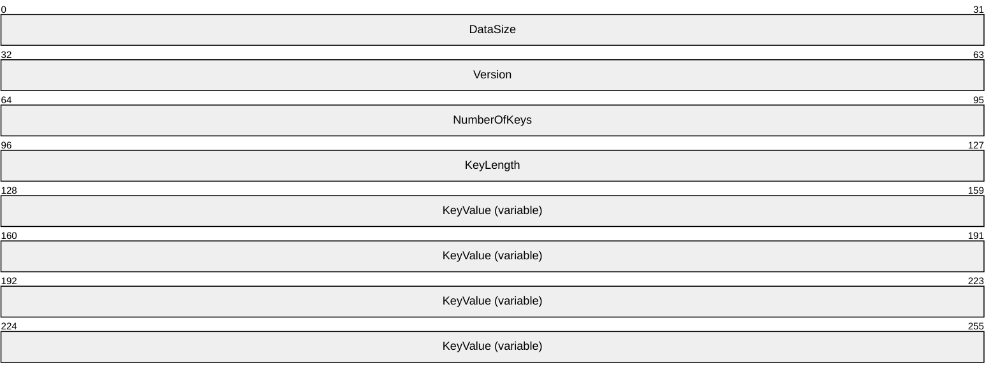
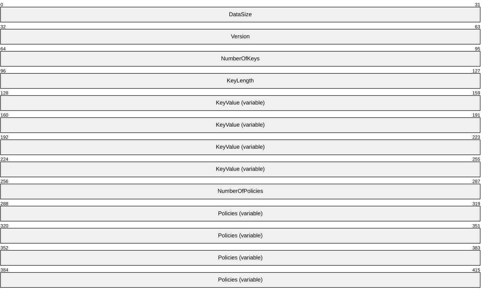
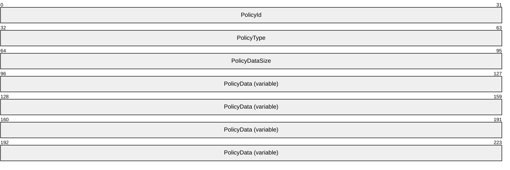

# [MS-KPS]: Key Protection Service Protocol

Table of Contents

1 Introduction

- [1 Introduction](#Section_1)
  - [1.1 Glossary](#Section_1.1)
  - [1.2 References](#Section_1.2)
    - [1.2.1 Normative References](#Section_1.2.1)
    - [1.2.2 Informative References](#Section_1.2.2)
  - [1.3 Overview](#Section_1.3)
  - [1.4 Relationship to Other Protocols](#Section_1.4)
  - [1.5 Prerequisites/Preconditions](#Section_1.5)
  - [1.6 Applicability Statement](#Section_1.6)
  - [1.7 Versioning and Capability Negotiation](#Section_1.7)
  - [1.8 Vendor-Extensible Fields](#Section_1.8)
  - [1.9 Standards Assignments](#Section_1.9)

2 Messages

- [2 Messages](#Section_2)
  - [2.1 Transport](#Section_2.1)
  - [2.2 Common Data Types](#Section_2.2)
    - [2.2.1 HTTP Methods](#Section_2.2.1)
      - [2.2.1.1 RollTransportKey](#Section_2.2.1.1)
      - [2.2.1.2 GetMetaData](#Section_2.2.1.2)
    - [2.2.2 Complex Types](#Section_2.2.2)
      - [2.2.2.1 RollTransportKeyRequest](#Section_2.2.2.1)
      - [2.2.2.2 RollTransportKeyResponse](#Section_2.2.2.2)
      - [2.2.2.3 Protector](#Section_2.2.2.3)
      - [2.2.2.4 Wrapping](#Section_2.2.2.4)
      - [2.2.2.5 Error](#Section_2.2.2.5)
      - [2.2.2.6 WrappingCollection](#Section_2.2.2.6)
      - [2.2.2.7 TransportKeySignature](#Section_2.2.2.7)
      - [2.2.2.8 GuardianSignature](#Section_2.2.2.8)
      - [2.2.2.9 KeyDerivationMethod](#Section_2.2.2.9)
      - [2.2.2.10 Signature](#Section_2.2.2.10)
      - [2.2.2.11 EncryptedData](#Section_2.2.2.11)
      - [2.2.2.12 SigningCertificateSignature](#Section_2.2.2.12)
      - [2.2.2.13 EncryptionCertificateSignature](#Section_2.2.2.13)
      - [2.2.2.14 TransportKey](#Section_2.2.2.14)
      - [2.2.2.15 Parameters](#Section_2.2.2.15)
    - [2.2.3 Simple Types](#Section_2.2.3)
      - [2.2.3.1 IngressProtector](#Section_2.2.3.1)
      - [2.2.3.2 HealthCertificate](#Section_2.2.3.2)
      - [2.2.3.3 TransferKeyEncryptionAlgorithm](#Section_2.2.3.3)
      - [2.2.3.4 WrappingKeyEncryptionAlgorithm](#Section_2.2.3.4)
      - [2.2.3.5 TransportKeyEncryptionAlgorithm](#Section_2.2.3.5)
      - [2.2.3.6 EgressProtector](#Section_2.2.3.6)
      - [2.2.3.7 EncryptedTransferKey](#Section_2.2.3.7)
      - [2.2.3.8 EncryptedWrappingKey](#Section_2.2.3.8)
      - [2.2.3.9 EncryptedTransportKeys](#Section_2.2.3.9)
      - [2.2.3.10 Version](#Section_2.2.3.10)
        - [2.2.3.10.1 Payload_V1 structure](#Section_2.2.3.10.1)
        - [2.2.3.10.2 Payload_V2 structure](#Section_2.2.3.10.2)
          - [2.2.3.10.2.1 Policy Data structure](#Section_2.2.3.10.2.1)
      - [2.2.3.11 Certificate](#Section_2.2.3.11)
      - [2.2.3.12 Algorithm](#Section_2.2.3.12)

3 Protocol Details

- [3 Protocol Details](#Section_3)
  - [3.1 Server Details](#Section_3.1)
    - [3.1.1 Abstract Data Model](#Section_3.1.1)
    - [3.1.2 Timers](#Section_3.1.2)
    - [3.1.3 Initialization](#Section_3.1.3)
    - [3.1.4 Higher-Layer Triggered Events](#Section_3.1.4)
    - [3.1.5 Message Processing Events and Sequencing Rules](#Section_3.1.5)
      - [3.1.5.1 Service APIs](#Section_3.1.5.1)
        - [3.1.5.1.1 RollTransportKey](#Section_3.1.5.1.1)
          - [3.1.5.1.1.1 Request Body](#Section_3.1.5.1.1.1)
          - [3.1.5.1.1.2 Response Body](#Section_3.1.5.1.1.2)
          - [3.1.5.1.1.3 Processing Details](#Section_3.1.5.1.1.3)
        - [3.1.5.1.2 GetMetaData](#Section_3.1.5.1.2)
          - [3.1.5.1.2.1 Request Body](#Section_3.1.5.1.2.1)
          - [3.1.5.1.2.2 Response Body](#Section_3.1.5.1.2.2)
          - [3.1.5.1.2.3 Processing Details](#Section_3.1.5.1.2.3)
    - [3.1.6 Timer Events](#Section_3.1.6)
    - [3.1.7 Other Local Events](#Section_3.1.7)
  - [3.2 Client Details](#Section_3.2)
    - [3.2.1 Abstract Data Model](#Section_3.2.1)
    - [3.2.2 Timers](#Section_3.2.2)
    - [3.2.3 Initialization](#Section_3.2.3)
    - [3.2.4 Higher-Layer Triggered Events](#Section_3.2.4)
      - [3.2.4.1 Application Requests RollTransportKey](#Section_3.2.4.1)
      - [3.2.4.2 Application Requests GetMetaData](#Section_3.2.4.2)
    - [3.2.5 Message Processing Events and Sequencing Rules](#Section_3.2.5)
      - [3.2.5.1 RollTransportKey](#Section_3.2.5.1)
      - [3.2.5.2 GetMetaData](#Section_3.2.5.2)
    - [3.2.6 Timer Events](#Section_3.2.6)
    - [3.2.7 Other Local Events](#Section_3.2.7)

4 Protocol Examples

- [4 Protocol Examples](#Section_4)

5 Security

- [5 Security](#Section_5)
  - [5.1 Security Considerations for Implementers](#Section_5.1)
  - [5.2 Index of Security Parameters](#Section_5.2)

6 Appendix A: Full XML Schema

- [6 Appendix A: Full XML Schema](#Section_6)
  - [6.1 Protector Schema](#Section_6.1)
  - [6.2 RollTransportKey Request Schema](#Section_6.2)
  - [6.3 RollTransportKey Response Schema](#Section_6.3)
  - [6.4 MetaData Resposne Schema](#Section_6.4)
  - [6.5 Crypto Schema](#Section_6.5)

7 Appendix B: Product Behavior

- [7 Appendix B: Product Behavior](#Section_7)

8 Change Tracking

- [8 Change Tracking](#Section_8)

For the legal notice and IP terms, see [LEGAL.md](../LEGAL.md).
Last updated: 4/23/2024.
See [Revision History](#revision-history) for full version history.

# 1 Introduction

This document specifies the Key Protection Service (KPS) Protocol, a component of the Host Guardian service, which provides security assurance for shielded virtual machines.

Sections 1.5, 1.8, 1.9, 2, and 3 of this specification are normative. All other sections and examples in this specification are informative.

## 1.1 Glossary

This document uses the following terms:

**base64 encoding**: A binary-to-text encoding scheme whereby an arbitrary sequence of bytes is converted to a sequence of printable ASCII characters, as described in [[RFC4648]](https://go.microsoft.com/fwlink/?LinkId=90487).

**binary large object (BLOB)**: A discrete packet of data that is stored in a database and is treated as a sequence of uninterpreted bytes.

**guardian**: An entity that is authorized to receive and decrypt a transport key created by an owner.

**HTTP 1.1**: Hypertext Transfer Protocol -- HTTP/1.1 [[RFC2616]](https://go.microsoft.com/fwlink/?LinkId=90372)

**HTTP method**: In an HTTP message, a token that specifies the method to be performed on the resource that is identified by the Request-URI, as described in [RFC2616].

**Hypertext Transfer Protocol (HTTP)**: An application-level protocol for distributed, collaborative, hypermedia information systems (text, graphic images, sound, video, and other multimedia files) on the World Wide Web.

**key protector**: A data structure used to secure transport keys by cryptographic wrapping for distribution to authorized guardians and/or owners. Every key protector has at least one owner and zero or more guardians.

**owner**: An entity that creates and signs a key protector. An owner can be expressed in a key protector as a self-signed wrapping.

**transport key**: An encryption key used to protect data. Transport keys are secured and distributed by key protectors.

**UTF-8**: A byte-oriented standard for encoding Unicode characters, defined in the Unicode standard. Unless specified otherwise, this term refers to the UTF-8 encoding form specified in [[UNICODE5.0.0/2007]](https://go.microsoft.com/fwlink/?LinkId=154659) section 3.9.

**X.509**: An ITU-T standard for public key infrastructure subsequently adapted by the IETF, as specified in [[RFC3280]](https://go.microsoft.com/fwlink/?LinkId=90414).

**MAY, SHOULD, MUST, SHOULD NOT, MUST NOT:** These terms (in all caps) are used as defined in [[RFC2119]](https://go.microsoft.com/fwlink/?LinkId=90317). All statements of optional behavior use either MAY, SHOULD, or SHOULD NOT.

## 1.2 References

Links to a document in the Microsoft Open Specifications library point to the correct section in the most recently published version of the referenced document. However, because individual documents in the library are not updated at the same time, the section numbers in the documents may not match. You can confirm the correct section numbering by checking the [Errata](https://go.microsoft.com/fwlink/?linkid=850906).

### 1.2.1 Normative References

We conduct frequent surveys of the normative references to assure their continued availability. If you have any issue with finding a normative reference, please contact [dochelp@microsoft.com](mailto:dochelp@microsoft.com). We will assist you in finding the relevant information.

[MS-HGSA] Microsoft Corporation, "[Host Guardian Service: Attestation Protocol](../MS-HGSA/MS-HGSA.md)".

[RFC2119] Bradner, S., "Key words for use in RFCs to Indicate Requirement Levels", BCP 14, RFC 2119, March 1997, [https://www.rfc-editor.org/info/rfc2119](https://go.microsoft.com/fwlink/?LinkId=90317)

[RFC2616] Fielding, R., Gettys, J., Mogul, J., et al., "Hypertext Transfer Protocol -- HTTP/1.1", RFC 2616, June 1999, [https://www.rfc-editor.org/info/rfc2616](https://go.microsoft.com/fwlink/?LinkId=90372)

[RFC2818] Rescorla, E., "HTTP Over TLS", RFC 2818, May 2000, [https://www.rfc-editor.org/info/rfc2818](https://go.microsoft.com/fwlink/?LinkId=90383)

### 1.2.2 Informative References

None.

## 1.3 Overview

Host Guardian Service is a server role that provides the security services Attestation Service and Key Protection Service. Together these two services help provide security assurance for Shielded VMs by ensuring that Shielded VMs can be run only on known and trusted fabric hosts that have a legitimate configuration. This specification defines Key Protection Service. The Attestation Service is defined in the [MS-HGSA](../MS-HGSA/MS-HGSA.md) specification.

## 1.4 Relationship to Other Protocols

For its attestation service, Key Protection Service uses the Host Guardian Service: Attestation Protocol as specified in [MS-HGSA](../MS-HGSA/MS-HGSA.md).

## 1.5 Prerequisites/Preconditions

None.

## 1.6 Applicability Statement

The Host Guardian Service includes Attestation Service and Key Protection Service as critical components that secure virtual machines in a cloud-based environment.

## 1.7 Versioning and Capability Negotiation

None.

## 1.8 Vendor-Extensible Fields

There are no vendor-extensible fields for the Key Protection Service Protocol.

## 1.9 Standards Assignments

None.

# 2 Messages

## 2.1 Transport

The Key Protection Service Protocol uses [**HTTP**](#gt_hypertext-transfer-protocol-http) or secure [**HTTP 1.1**](#gt_http-11) as transport, as specified in [[RFC2616]](https://go.microsoft.com/fwlink/?LinkId=90372) and [[RFC2818]](https://go.microsoft.com/fwlink/?LinkId=90383).

## 2.2 Common Data Types

### 2.2.1 HTTP Methods

This protocol defines the following common [**HTTP methods**](#gt_http-method) in addition to the existing set of standard HTTP methods.

| Method | Section | Description |
| --- | --- | --- |
| RollTransportKey | [2.2.1.1](#Section_2.2.1.1) | Extracts the **TransportKey** from the **IngressProtector**, generates a new transport key, creates the **EgressProtector** and returns both transport keys to the caller. |
| GetMetaData | [2.2.1.2](#Section_2.2.1.2) | Returns the metadata content containing the [**guardian**](#gt_guardian) information to the client. |

#### 2.2.1.1 RollTransportKey

The **RollTransportKey** method validates that the **IngressProtector** defined in section [2.2.3.1](#Section_2.2.3.1) is well-formed, performs Key Protection Service (KPS) checks by using an encryption algorithm in an implementation-specific manner, and generates the **EgressProtector**.

This method is invoked from the following URI:

http://<server>/keyprotection/service/{version}/rolltransportkey

#### 2.2.1.2 GetMetaData

The **GetMetaData** method provides the list of KPS-supported certificates, which are used in validating that the **KeyProtector** was properly signed by KPS or to create a new protector and encrypt the transport keys.

This method is invoked from the following URI with HTTP GET request:

http://<server>/keyprotection/service/metadata/2014-07/metadata.xml

### 2.2.2 Complex Types

The following table summarizes the set of common complex type definitions that are included in this specification and use the XML format.

| Complex type | Section | Description |
| --- | --- | --- |
| RollTransportKeyRequest | [2.2.2.1](#Section_2.2.2.1) | Contains the [**BLOB**](#gt_binary-large-object-blob) from the client with the protector descriptor and Health Certificate received after Attestation Services. |
| RollTransportKeyResponse | [2.2.2.2](#Section_2.2.2.2) | Response to the **RollTransportKeyRequest**. |
| Protector | [2.2.2.3](#Section_2.2.2.3) | Represents a protector. |
| Wrapping | [2.2.2.4](#Section_2.2.2.4) | Consists of certificates of type [**base64-encoded**](#gt_179b9392-9019-45a3-880b-26f6890522b7) strings and an encrypted transport key. |
| Error | [2.2.2.5](#Section_2.2.2.5) | Possible error codes received from methods processed by the KPS, **RollTransportKey**, and **GetMetaData**. |
| WrappingCollection | [2.2.2.6](#Section_2.2.2.6) | Defines the list of **Wrapping elements** of the transport key. |
| TransportKeySignature | [2.2.2.7](#Section_2.2.2.7) | Denotes the signature computed using a key derived from the **TransportKey** over the entire **Wrappings** element. |
| GuardianSignature | [2.2.2.8](#Section_2.2.2.8) | Denotes the signature computed using the KPS's signing certificate specified by **WrappingId** over the entire **Wrappings** element. |
| KeyDerivationMethod | [2.2.2.9](#Section_2.2.2.9) | Contains the **Algorithm** and a set of cryptographic **Parameters** used to derive the key from the **TransportKey**. |
| Signature | [2.2.2.10](#Section_2.2.2.10) | Contains the **Algorithm**, cryptographic **Parameters** and a signature value in base64-encoded format used to compute the signature. |
| EncryptedData | [2.2.2.11](#Section_2.2.2.11) | Contains the **Algorithm**, cryptographic **Parameters**, and a cipher value in base64-encoded format used for encryption. |
| SigningCertificateSignature | [2.2.2.12](#Section_2.2.2.12) | Denotes the signing certificate signature computed using the signing certificate of the parent wrapping over this wrapping’s signing certificate. |
| EncryptionCertificateSignature | [2.2.2.13](#Section_2.2.2.13) | Denotes the signature computed using this wrapping's signing certificate over this wrapping's encryption certificate. |
| TransportKey | [2.2.2.14](#Section_2.2.2.14) | A base64-encoded string of type [**UTF-8**](#gt_utf-8) format, which contains the transport key encrypted by the encryption certificate. |
| Parameters | [2.2.2.15](#Section_2.2.2.15) | Possible namespaces and process contents used to perform Key Protection Services. |

#### 2.2.2.1 RollTransportKeyRequest

The **RollTransportKeyRequest** structure is sent by the client to request the encrypted transport keys and to perform Key Protection.

<?xml version="1.0" encoding="utf-8"?>

<xs:schema targetNamespace="http://schemas.microsoft.com/kps/2014/07/service"

elementFormDefault="qualified"

xmlns="http://schemas.microsoft.com/kps/2014/07/service"

xmlns:xs="http://www.w3.org/2001/XMLSchema">

<xs:element name="RollTransportKeyRequest" type="RollTransportKeyRequest_T"/>

<xs:complexType name="RollTransportKeyRequest_T">

<xs:annotation>

<xs:documentation>RollTransportKey request.</xs:documentation>

</xs:annotation>

<xs:sequence>

<xs:element name="IngressProtector">

<xs:annotation>

<xs:documentation>The ingress protector.</xs:documentation>

</xs:annotation>

<xs:simpleType>

<xs:restriction base="xs:base64Binary">

<xs:minLength value="1"/>

</xs:restriction>

</xs:simpleType>

</xs:element>

<xs:element name="HealthCertificate">

<xs:annotation>

<xs:documentation>The health certificate.</xs:documentation>

</xs:annotation>

<xs:simpleType>

<xs:restriction base="xs:base64Binary">

<xs:minLength value="1"/>

</xs:restriction>

</xs:simpleType>

</xs:element>

<xs:element name="TransferKeyEncryptionAlgorithm">

<xs:annotation>

<xs:documentation>The algorithm to be used to encrypt the wrapping key's transfer key.</xs:documentation>

</xs:annotation>

<xs:simpleType>

<xs:restriction base="xs:anyURI">

<xs:minLength value="1"/>

</xs:restriction>

</xs:simpleType>

</xs:element>

<xs:element name="WrappingKeyEncryptionAlgorithm">

<xs:annotation>

<xs:documentation>The algorithm to be used to encrypt the transport keys' wrapping key.</xs:documentation>

</xs:annotation>

<xs:simpleType>

<xs:restriction base="xs:anyURI">

<xs:minLength value="1"/>

</xs:restriction>

</xs:simpleType>

</xs:element>

<xs:element name="TransportKeysEncryptionAlgorithm">

<xs:annotation>

<xs:documentation>The algorithm to be used to encrypt the transport keys.</xs:documentation>

</xs:annotation>

<xs:simpleType>

<xs:restriction base="xs:anyURI">

<xs:minLength value="1"/>

</xs:restriction>

</xs:simpleType>

</xs:element>

</xs:sequence>

</xs:complexType>

- </xs:schema>
**IngressProtector**: A [**base64-encoded**](#gt_179b9392-9019-45a3-880b-26f6890522b7) string of type [**UTF-8**](#gt_utf-8) format that contains the entire ingress protector as serialized to a file, as specified in section [2.2.3.1](#Section_2.2.3.1).

**HealthCertificate**: A base64-encoded binary string of type [**X.509**](#gt_x509) format.

**TransferKeyEncryptionAlgorithm**: The algorithm to be used to encrypt the wrapping key’s transfer key.

**WrappingKeyEncryptionAlgorithm:** The algorithm to be used to encrypt the transport keys’ wrapping key.

**TransportKeyEncryptionAlgorithm:** The algorithm to be used to encrypt the transport keys.

#### 2.2.2.2 RollTransportKeyResponse

The **RollTransportKeyResponse** structure is sent by the KPS with encrypted keys, which is useful in allowing the guarded host to run on a VM.

<?xml version="1.0" encoding="utf-8"?>

<xs:schema targetNamespace="http://schemas.microsoft.com/kps/2014/07/service"

elementFormDefault="qualified"

xmlns="http://schemas.microsoft.com/kps/2014/07/service"

xmlns:xs="http://www.w3.org/2001/XMLSchema">

<xs:element name="RollTransportKeyResponse" type="RollTransportKeyResponse_T"/>

<xs:complexType name="RollTransportKeyResponse_T">

<xs:annotation>

<xs:documentation>RollTransportKey response.</xs:documentation>

</xs:annotation>

<xs:sequence>

<xs:element name="EgressProtector">

<xs:annotation>

<xs:documentation>The egress protector containing the new transport key.</xs:documentation>

</xs:annotation>

<xs:simpleType>

<xs:restriction base="xs:base64Binary">

<xs:minLength value="1"/>

</xs:restriction>

</xs:simpleType>

</xs:element>

<xs:element name="EncryptedTransferKey">

<xs:annotation>

<xs:documentation>The wrapping key's transfer key encrypted by the health certificate.</xs:documentation>

</xs:annotation>

<xs:simpleType>

<xs:restriction base="xs:base64Binary">

<xs:minLength value="1"/>

</xs:restriction>

</xs:simpleType>

</xs:element>

<xs:element name="EncryptedWrappingKey">

<xs:annotation>

<xs:documentation>The transport keys' wrapping key encrypted by the transfer key.</xs:documentation>

</xs:annotation>

<xs:simpleType>

<xs:restriction base="xs:base64Binary">

<xs:minLength value="1"/>

</xs:restriction>

</xs:simpleType>

</xs:element>

<xs:element name="EncryptedTransportKeys">

<xs:annotation>

<xs:documentation>The ingress and egress transport keys encrypted by the transport keys' wrapping key.</xs:documentation>

</xs:annotation>

<xs:simpleType>

<xs:restriction base="xs:base64Binary">

<xs:minLength value="1"/>

</xs:restriction>

</xs:simpleType>

</xs:element>

</xs:sequence>

</xs:complexType>

- </xs:schema>
**EgressProtector:** A [**base64-encoded**](#gt_179b9392-9019-45a3-880b-26f6890522b7) string of type [**UTF-8**](#gt_utf-8) format that contains the entire egress protector as serialized to a file, as specified in section [2.2.3.6](#Section_2.2.3.6).

**EncryptedTransferKey:** A base64-encoded string of type UTF-8 format that contains the wrapping key's transfer key, which is encrypted by the health certificate as defined in section [2.2.3.7](#Section_2.2.3.7).

**EncryptedWrappingKey:** A base64-encoded string of type UTF-8 format that contains the transport keys’ wrapping key, which is encrypted by the transfer key as defined section [2.2.3.8](#Section_2.2.3.8).

**EncryptedTransportKeys:** A base64-encoded string of type UTF-8 format contains the ingress and egress transport keys, which are encrypted by the transport keys' wrapping key as defined in section [2.2.3.9](#Section_2.2.3.9).

#### 2.2.2.3 Protector

The **Protector** structure is the cryptographically authenticated collection of different wrappings of the transport key, signed by the **Guardian**.

- <xs:element name="Protector" type="Protector_T" />
<xs:complexType name="Protector_T">

<xs:annotation>

<xs:documentation>A protector contains a list of wrappings of the transport key.</xs:documentation>

</xs:annotation>

<xs:sequence>

<xs:element name="Wrappings" type="WrappingCollection_T" />

<xs:element name="TransportKeySignature" type="TransportKeySignature_T" />

<xs:element name="GuardianSignature" type="GuardianSignature_T" />

</xs:sequence>

<xs:attribute name="MaxOfflineUnwraps" type="xs:unsignedInt" default="0" />

- </xs:complexType>
**Wrappings:** A list of wrappings of the transport key to be included in the new protector of the type defined in section [2.2.2.4](#Section_2.2.2.4).

**TransportKeySignature**: A [**UTF-8**](#gt_utf-8) converted signature computed by using a key derived from the actual transport key over the entire **Wrappings** element of the type defined in section [2.2.2.7](#Section_2.2.2.7).

**GuardianSignature:** A UTF-8 converted signature computed by using the signing certificate specified by **WrappingId** over the entire **Wrappings** element as defined in section [2.2.2.8](#Section_2.2.2.8).

**MaxOfflineUnwraps**: A 32-bit unsigned integer when set to a non-zero value indicates that offline unwrapping of the protector is allowed.<1>

#### 2.2.2.4 Wrapping

The **Wrapping** structure consists of [**X.509**](#gt_x509) certificates of type [**base64-encoded**](#gt_179b9392-9019-45a3-880b-26f6890522b7) strings and an encryption **TransportKey**. This wrapping involves the authenticated encryption of concatenation of the ingress and egress keys.

- <xs:element name="Wrapping" type="Wrapping_T" />
- <xs:complexType name="Wrapping_T">
- <xs:sequence>
- <xs:element name="Id" type="xs:unsignedInt" />
- <xs:element name="SigningCertificate" type="Certificate_T" />
- <xs:element name="SigningCertificateSignature" type="SigningCertificateSignature_T" />
- <xs:element name="EncryptionCertificate" type="Certificate_T" />
- <xs:element name="EncryptionCertificateSignature" type="EncryptionCertificateSignature_T" />
- <xs:element name="TransportKey" type="TransportKey_T" />
- </xs:sequence>
- </xs:complexType>
**Id:** A 32-bit unsigned integer that contains the wrapping ID.

**SigningCertificate:** Signing certificate of type Certificate_T as defined in section [2.2.3.11](#Section_2.2.3.11).

**SigningCertificateSignature:** Signing certificate signature as defined in section [2.2.2.12](#Section_2.2.2.12).

**EncryptionCertificate:** Encryption certificate of type Certificate_T as defined in section 2.2.3.11.

**EncryptionCertificateSignature:** Encryption certificate signature as defined in section [2.2.2.13](#Section_2.2.2.13).

**TransportKey:** Encrypted transport key as defined in section [2.2.2.14](#Section_2.2.2.14).

#### 2.2.2.5 Error

The **Error** structure denotes the possible error codes that are received from methods processed by the Key Protection Service’s **RollTransportKey** and **GetMetaData** methods.

<xs:element name="Error" type="Error_T" />

<xs:complexType name="Error_T">

<xs:annotation>

<xs:documentation>Error response.</xs:documentation>

</xs:annotation>

<xs:sequence>

<xs:element name="Code" type="xs:string">

<xs:annotation>

<xs:documentation>Error code.</xs:documentation>

</xs:annotation>

</xs:element>

<xs:element name="Message" type="xs:string">

<xs:annotation>

<xs:documentation>Error message.</xs:documentation>

</xs:annotation>

</xs:element>

</xs:sequence>

- </xs:complexType>
**Code:** A string that represents the error response received from **RollTransportKey** or **GetMetaData**.

**Message:** A string that represents the error message of the error code received.

#### 2.2.2.6 WrappingCollection

The **WrappingCollection** structure defines the list of wrappings of the transport key.

<xs:element name="Wrappings" type="WrappingCollection_T" />

<xs:complexType name="WrappingCollection_T">

<xs:sequence>

<xs:element name="Wrapping" type="Wrapping_T" minOccurs="1" maxOccurs="unbounded" />

</xs:sequence>

- </xs:complexType>
**Wrapping:** Wrapping structure as defined in section [2.2.2.4](#Section_2.2.2.4)

#### 2.2.2.7 TransportKeySignature

The **TransportKeySignature** structure denotes the digital signature of the transport key.

<xs:element name="TransportKeySignature" type="TransportKeySignature_T" />

<xs:complexType name="TransportKeySignature_T">

<xs:annotation>

<xs:documentation>The transport key signature is computed using a key derived from the actual transport key over the entire Wrappings element after exclusive xml canonicalization (http://www.w3.org/2001/10/xml-exc-c14n#) and conversion to UTF-8.</xs:documentation>

</xs:annotation>

<xs:sequence>

<xs:element name="KeyDerivationMethod" type="KeyDerivationMethod_T" />

<xs:element name="Signature" type="Signature_T" />

</xs:sequence>

- </xs:complexType>
**KeyDerivationMethod**: Set of cryptographic parameters and algorithms needed to perform Key Protection Services as defined in section [2.2.2.9](#Section_2.2.2.9).

**Signature:** Provides details about the entity that is used for providing Key Protection Services as defined in section [2.2.2.10](#Section_2.2.2.10). This is computed using the key derived from the **TransportKey** over the entire **Wrappings** element.

#### 2.2.2.8 GuardianSignature

The **GuardianSignature** structure denotes the digital signature using the KPS signing certificate specified by **WrappingId** over the entire **Wrappings** element.

<xs:element name="GuardianSignature" type="GuardianSignature_T" />

<xs:complexType name="GuardianSignature_T">

<xs:annotation>

<xs:documentation>The guardian signature is computed using the signing certificate specified by WrappingId over the entire Wrappings element after exclusive xml canonicalization (http://www.w3.org/2001/10/xml-exc-c14n#) and conversion to UTF-8.</xs:documentation>

</xs:annotation>

<xs:sequence>

<xs:element name="Signature" type="Signature_T" />

</xs:sequence>

<xs:attribute name="WrappingId" type="xs:unsignedInt" use="required" />

- </xs:complexType>
**Signature:** The [**guardian**](#gt_guardian) signature is computed by using the KPS signing certificate’s private key of the type defined in section [2.2.2.10](#Section_2.2.2.10).

**WrappingId:** A 32-bit unsigned integer that contains a unique wrapping ID.

#### 2.2.2.9 KeyDerivationMethod

The **KeyDerivationMethod** structure denotes the set of cryptographic parameters and algorithms used to derive the key from **TransportKey**.

- <xs:element name="KeyDerivationMethod" type="KeyDerivationMethod_T" />
<xs:complexType name="KeyDerivationMethod_T">

<xs:sequence>

<xs:element name="Parameters" type="CryptoParameters_T" minOccurs="0" />

</xs:sequence>

<xs:attribute name="Algorithm" type="CryptoAlgorithm_T" use="required" />

- </xs:complexType>
**Parameters:** Set of cryptographic parameters used in deriving the key from the **TransportKey,** of the type defined in section [2.2.2.15](#Section_2.2.2.15)

**Algorithm:** Cryptographic algorithm used to derive the key from the **TransportKey,** of the type defined in section [2.2.3.12](#Section_2.2.3.12)

#### 2.2.2.10 Signature

The **Signature** structure denotes a digital signature that provides the details about the elements used to compute the signature that is used for providing Key Protection Services.

<xs:element name="Signature" type="Signature_T" />

<xs:complexType name="Signature_T">

<xs:sequence>

<xs:element name="Parameters" type="CryptoParameters_T" minOccurs="0" />

<xs:element name="SignatureValue">

<xs:simpleType>

<xs:restriction base="xs:base64Binary" />

</xs:simpleType>

</xs:element>

</xs:sequence>

<xs:attribute name="Algorithm" type="CryptoAlgorithm_T" use="required" />

- </xs:complexType>
**Parameters:** Set of cryptographic parameters used in computing the signature, of the type defined in section [2.2.2.15](#Section_2.2.2.15).

**SignatureValue:** A [**base64-encoded**](#gt_179b9392-9019-45a3-880b-26f6890522b7) binary string that represents the value of the **Signature**.

**Algorithm:** Cryptographic algorithm used in computing the signature, of the type defined in section [2.2.3.12](#Section_2.2.3.12).

#### 2.2.2.11 EncryptedData

The **EncryptedData** structure contains the **Algorithm**, cryptographic **Parameters** and a cipher value in [**base64-encoded**](#gt_179b9392-9019-45a3-880b-26f6890522b7) format used for encryption.

<xs:element name="EncryptedData" type="EncryptedData_T" />

<xs:complexType name="EncryptedData_T">

<xs:sequence>

<xs:element name="Parameters" type="CryptoParameters_T" minOccurs="0" />

<xs:element name="CipherValue">

<xs:simpleType>

<xs:restriction base="xs:base64Binary" />

</xs:simpleType>

</xs:element>

</xs:sequence>

<xs:attribute name="Algorithm" type="CryptoAlgorithm_T" use="required" />

- </xs:complexType>
**Parameters:** Set of cryptographic parameters used for encryption, of the type defined in section [2.2.2.15](#Section_2.2.2.15).

**CipherValue:** A base64-encoded binary string that holds the cipher value.

**Algorithm:** Cryptographic algorithm used for encryption, of the type defined in section [2.2.3.12](#Section_2.2.3.12).

#### 2.2.2.12 SigningCertificateSignature

The **SigningCertificateSignature** structure denotes the digital signature of the wrapping’s signing certificate computed by using the signing certificate of the specified parent wrapping ID.

<xs:element name="SigningCertificateSignature" type="SigningCertificateSignature_T" />

<xs:complexType name="SigningCertificateSignature_T">

<xs:annotation>

<xs:documentation>The signing certificate signature is computed using the signing certificate of the parent wrapping over this wrapping's signing certificate.</xs:documentation>

</xs:annotation>

<xs:sequence>

<xs:element name="Signature" type="Signature_T" />

</xs:sequence>

<xs:attribute name="ParentWrappingId" type="xs:unsignedInt" use="required" />

- </xs:complexType>
**Signature:** A digital signature as defined in section [2.2.2.10](#Section_2.2.2.10)

**ParentWrappingId:** A 32-bit unsigned integer that contains the wrapping ID of the parent.

#### 2.2.2.13 EncryptionCertificateSignature

The **EncryptionCertificateSignature** structure denotes the signature that is computed using this wrapping’s signing certificate over this wrapping’s encryption certificate.

<xs:element name="EncryptionCertificateSignature" type="EncryptionCertificateSignature_T" />

<xs:complexType name="EncryptionCertificateSignature_T">

<xs:annotation>

<xs:documentation>The encryption certificate signature is computed using this wrapping's signing certificate over this wrapping's encryption certificate.</xs:documentation>

</xs:annotation>

<xs:sequence>

<xs:element name="Signature" type="Signature_T" />

</xs:sequence>

- </xs:complexType>
**Signature:** A digital signature as defined in section [2.2.2.10](#Section_2.2.2.10)

#### 2.2.2.14 TransportKey

The **TransportKey** element is used to help protect data secured by the [**key protectors**](#gt_key-protector). This contains the [**transport key**](#gt_transport-key) encrypted by the encryption certificate.

<xs:element name="TransportKey" type="TransportKey_T" />

<xs:complexType name="TransportKey_T">

<xs:sequence>

<xs:element name="EncryptedData" type="EncryptedData_T" />

</xs:sequence>

- </xs:complexType>

#### 2.2.2.15 Parameters

The **Parameters** element denotes the cryptographic parameters used to perform Key Protection Services.

<xs:element name="Parameters" type="CryptoParameters_T"/>

<xs:complexType name="CryptoParameters_T">

<xs:sequence>

<xs:any namespace="##any" processContents="lax" minOccurs="0" maxOccurs="unbounded"/>

</xs:sequence>

- </xs:complexType>

### 2.2.3 Simple Types

The following table summarizes the set of common simple type definitions that are included in this specification.

| Simple type | Section | Description |
| --- | --- | --- |
| IngressProtector | [2.2.3.1](#Section_2.2.3.1) | The **IngressProtector** contains the entire ingress protector as serialized to a file and converted to a [**base64-encoded**](#gt_179b9392-9019-45a3-880b-26f6890522b7) string. |
| HealthCertificate | [2.2.3.2](#Section_2.2.3.2) | A base64-encoded binary string of type [**X.509**](#gt_x509) format received as input from the client for which Key Protection Services needs to be provided. |
| TransferKeyEncryptionAlgorithm | [2.2.3.3](#Section_2.2.3.3) | The algorithm to encrypt the wrapping key's transfer key. |
| WrappingKeyEncryptionAlgorithm | [2.2.3.4](#Section_2.2.3.4) | The algorithm to encrypt the transport keys’ wrapping key. |
| TransportKeyEncryptionAlgorithm | [2.2.3.5](#Section_2.2.3.5) | The algorithm to encrypt the transport keys. |
| EgressProtector | [2.2.3.6](#Section_2.2.3.6) | A base64-encoded string of type [**UTF-8**](#gt_utf-8) format, which contains the entire egress protector as serialized to a file. |
| EncryptedTransferKey | [2.2.3.7](#Section_2.2.3.7) | A base64-encoded string of type UTF-8 format, which contains the wrapping key's transfer key encrypted by the health certificate. |
| EncryptedWrappingKey | [2.2.3.8](#Section_2.2.3.8) | A base64-encoded string of type UTF-8 format, which contains the transport keys’ wrapping key that is encrypted by the transfer key. |
| EncryptedTransportKeys | [2.2.3.9](#Section_2.2.3.9) | A base64-encoded string of type UTF-8 format, which contains the ingress and egress transport keys, which are encrypted by the transport keys' wrapping key. |
| Version | [2.2.3.10](#Section_2.2.3.10) | Version of the **TransportKey** BLOB. |
| Certificate | [2.2.3.11](#Section_2.2.3.11) | Certificate used to generate the [**key protectors**](#gt_key-protector) . |
| Algorithm | [2.2.3.12](#Section_2.2.3.12) | Cryptographic algorithm used to perform Key Protection Services. |

#### 2.2.3.1 IngressProtector

The **IngressProtector** element denotes the entire ingress protector, as defined in section [2.2.2.3](#Section_2.2.2.3), as serialized to a file and converted to a [**base64-encoded**](#gt_179b9392-9019-45a3-880b-26f6890522b7) binary string.

<xs:element name="IngressProtector">

<xs:annotation>

<xs:documentation>The ingress protector.</xs:documentation>

</xs:annotation>

<xs:simpleType>

<xs:restriction base="xs:base64Binary">

<xs:minLength value="1"/>

</xs:restriction>

</xs:simpleType>

</xs:element>

#### 2.2.3.2 HealthCertificate

The **HealthCertificate** element is a [**base64-encoded**](#gt_179b9392-9019-45a3-880b-26f6890522b7) binary string of type [**X.509**](#gt_x509) format received as input from the client for which Key Protection Services needs to be provided.

<xs:element name="HealthCertificate">

<xs:annotation>

<xs:documentation>The health certificate.</xs:documentation>

</xs:annotation>

<xs:simpleType>

<xs:restriction base="xs:base64Binary">

<xs:minLength value="1"/>

</xs:restriction>

</xs:simpleType>

</xs:element>

#### 2.2.3.3 TransferKeyEncryptionAlgorithm

The **TransferKeyEncryptionAlgorithm** element denotes the algorithm to encrypt the wrapping key’s transfer key.

<xs:element name="TransferKeyEncryptionAlgorithm">

<xs:annotation>

<xs:documentation>The algorithm to be used to encrypt the wrapping key's transfer key.</xs:documentation>

</xs:annotation>

<xs:simpleType>

<xs:restriction base="xs:anyURI">

<xs:minLength value="1"/>

</xs:restriction>

</xs:simpleType>

- </xs:element>

#### 2.2.3.4 WrappingKeyEncryptionAlgorithm

The **WrappingKeyEncryptionAlgorithm** element denotes the algorithm to encrypt the transport keys’ wrapping key.

<xs:element name="WrappingKeyEncryptionAlgorithm">

<xs:annotation>

<xs:documentation>The algorithm to be used to encrypt the transport keys' wrapping key.</xs:documentation>

</xs:annotation>

<xs:simpleType>

<xs:restriction base="xs:anyURI">

<xs:minLength value="1"/>

</xs:restriction>

</xs:simpleType>

</xs:element>

#### 2.2.3.5 TransportKeyEncryptionAlgorithm

The **TransportKeyEncryptionAlgorithm** element denotes the algorithm to encrypt the transport keys.

<xs:element name="TransportKeysEncryptionAlgorithm">

<xs:annotation>

<xs:documentation>The algorithm to be used to encrypt the transport keys.</xs:documentation>

</xs:annotation>

<xs:simpleType>

<xs:restriction base="xs:anyURI">

<xs:minLength value="1"/>

</xs:restriction>

</xs:simpleType>

</xs:element>

#### 2.2.3.6 EgressProtector

The **EgressProtector** element denotes a [**base64-encoded**](#gt_179b9392-9019-45a3-880b-26f6890522b7) string of type [**UTF-8**](#gt_utf-8) format, which contains the entire egress protector, as defined in section [2.2.2.3](#Section_2.2.2.3), as serialized to a file.

<xs:element name="EgressProtector">

<xs:annotation>

<xs:documentation>The egress protector containing the new transport key.</xs:documentation>

</xs:annotation>

<xs:simpleType>

<xs:restriction base="xs:base64Binary">

<xs:minLength value="1"/>

</xs:restriction>

</xs:simpleType>

</xs:element>

#### 2.2.3.7 EncryptedTransferKey

The **EncryptedTransferKey** element denotes a [**base64-encoded**](#gt_179b9392-9019-45a3-880b-26f6890522b7) string of type [**UTF-8**](#gt_utf-8) format, which contains the wrapping key's transfer key encrypted by the health certificate.

<xs:element name="EncryptedTransferKey">

<xs:annotation>

<xs:documentation>The wrapping key's transfer key encrypted by the health certificate.</xs:documentation>

</xs:annotation>

<xs:simpleType>

<xs:restriction base="xs:base64Binary">

<xs:minLength value="1"/>

</xs:restriction>

</xs:simpleType>

- </xs:element>

#### 2.2.3.8 EncryptedWrappingKey

The **EncryptedWrappingKey** element denotes a [**base64-encoded**](#gt_179b9392-9019-45a3-880b-26f6890522b7) string of type [**UTF-8**](#gt_utf-8) format, which contains the transport keys’ wrapping key that is encrypted by the transfer key.

<xs:element name="EncryptedWrappingKey">

<xs:annotation>

<xs:documentation>The transport keys' wrapping key encrypted by the health certificate.</xs:documentation>

</xs:annotation>

<xs:simpleType>

<xs:restriction base="xs:base64Binary">

<xs:minLength value="1"/>

</xs:restriction>

</xs:simpleType>

- </xs:element>

#### 2.2.3.9 EncryptedTransportKeys

The **EncryptedTransportKeys** element denotes a [**base64-encoded**](#gt_179b9392-9019-45a3-880b-26f6890522b7) string of type [**UTF-8**](#gt_utf-8) format, which contains the ingress and egress transport keys encrypted by the transport keys’ wrapping key.

<xs:element name="EncryptedTransportKeys">

<xs:annotation>

<xs:documentation>The ingress and egress transport keys encrypted by the transport keys' wrapping key.</xs:documentation>

</xs:annotation>

<xs:simpleType>

<xs:restriction base="xs:base64Binary">

<xs:minLength value="1"/>

</xs:restriction>

</xs:simpleType>

- </xs:element>

#### 2.2.3.10 Version

The following table summarizes the list of supported API versions.

| Version | Section | Description |
| --- | --- | --- |
| V1.0 | [2.2.3.10.1](#Section_2.2.3.10.1) | Original API version. |
| V2.0 | [2.2.3.10.2](#Section_2.2.3.10.2) | Updated API version including policy information in addition to the payload in version V1.0.<2> |

##### 2.2.3.10.1 Payload_V1 structure

Payload_V1 structure represents the payload in API version V1.0.

**DataSize (4 bytes):** Total size of the **TransportKey** [**BLOB**](#gt_binary-large-object-blob).

**Version (4 bytes):** Version of the **TransportKey** BLOB set to value 1.

**NumberOfKeys (4 bytes):** Total number of keys contained in the TransportKey BLOB.

**KeyLength (4 bytes):** The size of the key in bytes.

**KeyValue (variable):** A variable-length field containing the key data.

##### 2.2.3.10.2 Payload_V2 structure

Payload_V2 structure represents the payload in API version V2.0.<3>

**DataSize (4 bytes):** Total size of the **TransportKey** [**BLOB**](#gt_binary-large-object-blob).

**Version (4 bytes):** Version of the **TransportKey** BLOB set to value 2.

**NumberOfKeys (4 bytes):** Total number of keys contained in the TransportKey BLOB.

**KeyLength (4 bytes):** The size of the key in bytes.

**KeyValue (variable):** A variable-length field containing the key data.

**NumberOfPolicies (4 bytes):** Total number of key policies contained in the **TransportKey** BLOB. If this is a non-zero value, **Policies** field contains the number of key policies indicated by this field.

**Policies (variable):** A variable-length field containing an array of key policy data elements. **NumberOfPolicies** field indicates the size of this array. Each policy data element of this array takes the form of the structure specified in section [2.2.3.10.2.1](#Section_2.2.3.10.2.1).

###### 2.2.3.10.2.1 Policy Data structure

This structure contains the key policy data sent by the KPS in the **TransportKey** [**BLOB**](#gt_binary-large-object-blob).<4>

**PolicyId (4 bytes):** The ID of the key policy. This MUST be set to 1.

**PolicyType (4 bytes):** The type of the key policy. This MUST be set to 6.

**PolicyDataSize (4 bytes):** The size of the policy data in bytes.

**PolicyData (variable):** A variable-length field containing the policy data.

#### 2.2.3.11 Certificate

The **Certificate** element is used to generate the [**key protectors**](#gt_key-protector).

- <xs:element name="Certificate" type="Certificate_T" />
- <xs:simpleType name="Certificate_T">
- <xs:annotation>
- <xs:documentation>A certificate in the DER-encoded binary X.509 format.</xs:documentation>
- </xs:annotation>
- <xs:restriction base="xs:base64Binary" />
- </xs:simpleType>

#### 2.2.3.12 Algorithm

The **Algorithm** element denotes the cryptographic algorithm identifier used to perform Key Protection Services.

<xs:element name="Algorithm" type="CryptoAlgorithm_T" use="required" />

<xs:simpleType name="CryptoAlgorithm_T">

<xs:restriction base="xs:anyURI" />

</xs:simpleType>

# 3 Protocol Details

## 3.1 Server Details

### 3.1.1 Abstract Data Model

This section describes a conceptual model of possible data organization that an implementation maintains to participate in this protocol. The described organization is provided to facilitate the explanation of how the protocol behaves. This document does not mandate that implementations adhere to this model as long as their external behavior is consistent with that described in this document.

The server implements the following:

**IngressProtector:** Contains the entire ingress protector as serialized to a file and converted to [**base64-encoded**](#gt_179b9392-9019-45a3-880b-26f6890522b7) string as defined in section [2.2.3.1](#Section_2.2.3.1).

**Protector:** A collection of different cryptographic wrappings of the transport key as defined in section [2.2.2.3](#Section_2.2.2.3).

**Wrapping:** Consists of certificates of type base64-encoded strings and the transport key.

**EgressProtector:** A base64-encoded string of type [**UTF-8**](#gt_utf-8) format, which contains the entire egress protector as serialized to a file as defined in section [2.2.3.6](#Section_2.2.3.6).

**PrimaryEncryptionCertificate:** A base64-encoded binary string of type [**X.509**](#gt_x509) format as defined in section [2.2.3.11](#Section_2.2.3.11).

**PrimarySigningCertificate:** A base64-encoded binary string of type X.509 format as defined in section 2.2.3.11.

**Error:** A string representing the error response as defined in section [2.2.2.5](#Section_2.2.2.5).

**IngressTransportKey:** Key extracted from the ingress protector.

**EgressTransportKey:** Key generated from the **RollTransportKey** [**BLOB**](#gt_binary-large-object-blob) after Protector Validation.

### 3.1.2 Timers

None.

### 3.1.3 Initialization

**IngressProtector:** MUST be set to empty.

**Protector:** MUST be set to empty.

**Wrapping:** MUST be set to empty.

**EgressProtector:** MUST be set to empty.

**PrimaryEncryptionCertificate:** MUST be set to empty.

**PrimarySigningCertificate:** MUST be set to NULL.

**Error:** MUST be set to empty.

**IngressTransportKey:** MUST be set to empty.

**EgressTransportKey:** MUST be set to empty.

### 3.1.4 Higher-Layer Triggered Events

None.

### 3.1.5 Message Processing Events and Sequencing Rules

#### 3.1.5.1 Service APIs

The following HTTP methods are allowed to be performed on this resource.

| HTTP method | Section | Description |
| --- | --- | --- |
| RollTransportKey | [3.1.5.1.1](#Section_3.1.5.1.1) | Used to protect the keys by KPS. |
| GetMetaData | [3.1.5.1.2](#Section_3.1.5.1.2) | Retrieves the list of valid certificates present in the KPS. |

##### 3.1.5.1.1 RollTransportKey

The following operations are allowed to be performed on this resource.

| HTTP method | Description |
| --- | --- |
| POST | Requests that a web server accept and store the data enclosed in the body of the request message. |

This operation is transported by an HTTP POST request.

The operation can be invoked through the following URI.

http://<server>/keyprotection/service/{version}/rolltransportkey

**Version**: Version of the **RollTransportKey** request as defined in section [2.2.3.10](#Section_2.2.3.10).

###### 3.1.5.1.1.1 Request Body

**RollTransportKey** handles the unwrapping of a **TransportKey** from a **Protector** by this KPS, as well as the generation of a new **TransportKey** and corresponding **Protector** for use in subsequent serialization of the object. The resulting new [**key protector**](#gt_key-protector) will be owned by the original **Owner**, and Key Protection Service will be the **Guardian**.

The request body for this method contains the following as defined in section [2.2.2.1](#Section_2.2.2.1).

| Entry | Type |
| --- | --- |
| HealthCertificate | A certificate in [**X.509**](#gt_x509) format that is converted to a [**base64-encoded**](#gt_179b9392-9019-45a3-880b-26f6890522b7) string. |
| IngressProtector | Entire ingress protector as serialized to a file ([**UTF-8**](#gt_utf-8) format, for example) and converted into a base64-encoded string. |
| TransferKeyEncryptionAlgorithm | The algorithm used to encrypt the wrapping key's transfer key defined in section [2.2.3.3](#Section_2.2.3.3). |
| WrappingKeyEncryptAlgorithm | The algorithm used to encrypt the wrapping key defined in section [2.2.3.4](#Section_2.2.3.4). |
| TransportKeyEncryptAlgorithm | The algorithm used to encrypt the transport key defined in section [2.2.3.5](#Section_2.2.3.5). |

###### 3.1.5.1.1.2 Response Body

The response body of this method contains the following as defined in section [2.2.2.2](#Section_2.2.2.2).

| Entry | Type |
| --- | --- |
| EgressProtector | A [**base64-encoded**](#gt_179b9392-9019-45a3-880b-26f6890522b7) string of type [**UTF-8**](#gt_utf-8) format, which contains the entire egress protector as serialized to a file as defined in section [2.2.3.6](#Section_2.2.3.6). |
| EncryptedTXBlob | The [**BLOB**](#gt_binary-large-object-blob) containing the **EncryptedTransferKey** as defined in section [2.2.3.7](#Section_2.2.3.7). |
| EncryptedTWBlob | The BLOB containing the **EncryptedWrappingKey** as defined in section [2.2.3.8](#Section_2.2.3.8). |
| EncryptedTKBlob | The BLOB containing the **EncryptedTransportKeys** as defined in section [2.2.3.9](#Section_2.2.3.9). |

A successful operation returns status code 200 (OK). Otherwise, an error is returned.

The response message for this method can result in the following status codes.

| Status code | Description |
| --- | --- |
| 200 | OK |
| 204 | No content. |

###### 3.1.5.1.1.3 Processing Details

The server MUST perform the following steps after receiving **RollTransportKey**.

- Validate the **HealthCertificate** in an implementation-specific manner and return an error “HealthCertificateException” if validation fails.
- Validate that the **IngressProtector** is in a valid XML format and return the error “InvalidProtectorException” if validation fails.
- Validate the following in the **IngressProtector** in an implementation-specific manner and return the error “InvalidProtectorException” if validation fails:
- **WrappingId** in **GuardianSignature** points to a valid wrapping.
- **Signature** fields in **GuardianSignature** and **TransportKeySignature** have valid values.
- Validate that each **Wrapping** in the **Wrappings** field of **IngressProtector** is properly constructed and signed, as follows, and return the error “InvalidWrappingException” if validation fails:
- **SigningCertificate** and **EncryptionCertificate** are valid [**X.509**](#gt_x509) certificates.
- **ParentWrappingId** in **SigningCertificateSignature** points to a valid wrapping in the protector, or to the current **Wrapping** if it is the owner.
- Current **Wrapping** chains up to the owner of the protector.
- **Signature** in **SigningCertificateSignature** is created using the **SigningCertificate** of the parent wrapping.
- **Signature** in **EncryptionCertificateSignature** is created using the **SigningCertificate** of the current wrapping.
- Verify that **Protector** has a wrapping for the KPS, process the **IngressProtector** and extract the **IngressTransportKey**, generate **EgressTransportKey**, and generate an **EgressProtector** in an implementation-specific manner.
- Sign the **EngressProtector** with the private key of the KPS’s **SigningCertificate**, as specified in section [2.2.2.8](#Section_2.2.2.8).
- Derive the key from the **TransportKey** of **EgressProtector** using the **KeyDerivationMethod**, as specified in section [2.2.2.9](#Section_2.2.2.9), and sign the **EgressProtector** with that key.
- Encrypt and sign the **TransportKey**s of both the **IngressProtector** and **TransportKey** in an implementation-specific manner.
The server MUST return the **EgressProtector** and **EncryptedTransportKeys** to the calling application*.*

##### 3.1.5.1.2 GetMetaData

The following operations are allowed to be performed on this resource.

| HTTP method | Description |
| --- | --- |
| GET | Retrieves information from the server. |

This operation is transported by an HTTP GET request.

The operation can be invoked through the following URI:

http://<server>/keyprotection/service/metadata/2014-07/metadata.xml

The list of possible certificates includes **PrimaryEncryptionCertificate**, **PrimarySigningCertificate** as defined in section [2.2.3.11](#Section_2.2.3.11), and non-primary certificates, including **OtherSigningCertificates**, as defined in section 2.2.3.11.

The KPS metadata consists of:

- Optional metadata about the [**guardian**](#gt_guardian) or [**owner**](#gt_owner).
- The KPS **PrimarySigningCertificate**.
- The KPS **PrimaryEncryptionCertificate**.
- The signature over the KPS encryption certificate by the KPS signing private key.

###### 3.1.5.1.2.1 Request Body

The following operations are allowed to be performed on this resource.

| HTTP method | Description |
| --- | --- |
| GET | Retrieves information from the server. |

This operation is transported by an HTTP GET request.

The operation can be invoked through the following URI:

http://<server>/keyprotection/service/metadata/2014-07/metadata.xml

The list of possible certificates includes **PrimaryEncryptionCertificate**, **PrimarySigningCertificate** as defined in section [2.2.3.11](#Section_2.2.3.11), and non-primary certificates, including **OtherSigningCertificates**, as defined in section 2.2.3.11.

The KPS metadata consists of:

- Optional metadata about the [**guardian**](#gt_guardian) or [**owner**](#gt_owner).
- The KPS **PrimarySigningCertificate**.
- The KPS **PrimaryEncryptionCertificate**.
The signature over the KPS encryption certificate by the KPS signing private key.

###### 3.1.5.1.2.2 Response Body

The response body of this method contains the following.

**GetMetadata** computes a new metadata document. A successful operation returns status code 200 (OK). Otherwise, an error is returned.

The response message for this method can result in the following status codes.

| Status code | Description |
| --- | --- |
| 200 | OK |
| Error | A string representing the error response as defined in section [2.2.2.5](#Section_2.2.2.5). |

###### 3.1.5.1.2.3 Processing Details

The server MUST perform the following steps after receiving **GetMetaData request**:

- Get the **PrimaryEncryptionCertificate** from the registry. If the **PrimaryEncryptionCertificate** is not found in the registry, return the error string “Primary Encryption Certificate not found”.
- Get the **PrimarySigningCertificate** from the registry. If the **PrimarySigningCertificate** is not found in the registry, return the error string “Primary Signing Certificate not found”.
- If the request includes adding **OtherSigningCertificates** to the metadata, get the non-primary signing certificates from the registry,
- Create signatures needed to generate the metadata document using the primary certificates retrieved above in an implementation-specific manner,
- Generate the metadata document and return to the calling application*.*

### 3.1.6 Timer Events

None.

### 3.1.7 Other Local Events

None.

## 3.2 Client Details

### 3.2.1 Abstract Data Model

- This section describes a conceptual model of possible data organization that an implementation maintains to participate in this protocol. The described organization is provided to facilitate the explanation of how the protocol behaves. This document does not mandate that implementations adhere to this model as long as their external behavior is consistent with that described in this document.
**Retries:** An integer that indicates the number of retries to send the **RollTransportKey** request.

### 3.2.2 Timers

None.

### 3.2.3 Initialization

**Retries:** A default value that is equivalent to the number of distinct host addresses available for the server URI.

### 3.2.4 Higher-Layer Triggered Events

The following sections describe the operations performed by the client in response to events triggered by higher-layer applications.

#### 3.2.4.1 Application Requests RollTransportKey

The application provides the following:

- Health Certificate issued by an Attestation Service as defined in [MS-HGSA](../MS-HGSA/MS-HGSA.md) and accredited by the KPS.
The client MUST perform the following:

- Create a valid XML [**BLOB**](#gt_binary-large-object-blob) containing **RollTransportKeyRequest** as defined in section [2.2.2.1](#Section_2.2.2.1).
- Perform the steps as specified in section [3.2.5.1](#Section_3.2.5.1).

#### 3.2.4.2 Application Requests GetMetaData

The application provides the following:

- A **GetMetaData** request to retrieve the list of KPS-supported certificates, as defined in section [2.2.1.2](#Section_2.2.1.2), to verify that the **Protector** was properly signed by the KPS.
The client MUST perform the following:

- Perform the steps as specified in section [3.2.5.2](#Section_3.2.5.2).

### 3.2.5 Message Processing Events and Sequencing Rules

The following sections describe the sequence of operations performed by the client in **RollTransportKey** and **GetMetaData** scenarios.

#### 3.2.5.1 RollTransportKey

The client MUST send a POST request on the **RollTransportKey** resource as specified in section [3.1.5.1.1](#Section_3.1.5.1.1) by using the URI specified.

If the client receives the **RollTransportKeyResponse** specified in section [2.2.2.2](#Section_2.2.2.2) with the status code 200(OK), the client’s health certificate is protected and the guarded host is enabled to run securely on a VM.

If the client receives an error, the client MAY retry sending the **RollTransportKey** request based on **Retries**.

#### 3.2.5.2 GetMetaData

The client MUST send a POST request on the **GetMetaData** resource as specified in section [3.1.5.1.2](#Section_3.1.5.1.2) by using the URI specified.

If the operation is successful, the client receives the metadata content with status code 200(OK).

### 3.2.6 Timer Events

None.

### 3.2.7 Other Local Events

None.

# 4 Protocol Examples

None.

# 5 Security

## 5.1 Security Considerations for Implementers

None.

## 5.2 Index of Security Parameters

None.

# 6 Appendix A: Full XML Schema

For ease of implementation, the following is the full XML schema for this protocol.

| Schema name | Prefix | Section |
| --- | --- | --- |
| Protector Schema | P | [6.1](#Section_6.1) |
| RollTransportKey Request | Req | [6.2](#Section_6.2) |
| RollTransportKey Response | Res | [6.3](#Section_6.3) |
| MetaData Response | M | [6.4](#Section_6.4) |
| Crypto Schema | Not applicable | [6.5](#Section_6.5) |

## 6.1 Protector Schema

<?xml version="1.0" encoding="utf-8"?>

<xs:schema targetNamespace="http://schemas.microsoft.com/kps/2014/07"

elementFormDefault="qualified"

xmlns="http://schemas.microsoft.com/kps/2014/07"

xmlns:xs="http://www.w3.org/2001/XMLSchema">

<xs:include schemaLocation="Crypto.xsd" />

<xs:complexType name="SigningCertificateSignature_T">

<xs:annotation>

<xs:documentation>The signing certificate signature is computed using the signing certificate of the parent wrapping (specified by ParentWrappingId) over this wrapping's signing certificate.</xs:documentation>

</xs:annotation>

<xs:sequence>

<xs:element name="Signature" type="Signature_T" />

</xs:sequence>

<xs:attribute name="ParentWrappingId" type="xs:unsignedInt" use="required" />

</xs:complexType>

<xs:complexType name="EncryptionCertificateSignature_T">

<xs:annotation>

<xs:documentation>The encryption certificate signature is computed using this wrapping's signing certificate over this wrapping's encryption certificate.</xs:documentation>

</xs:annotation>

<xs:sequence>

<xs:element name="Signature" type="Signature_T" />

</xs:sequence>

</xs:complexType>

<xs:complexType name="TransportKey_T">

<xs:sequence>

<xs:element name="EncryptedData" type="EncryptedData_T" />

</xs:sequence>

</xs:complexType>

<xs:complexType name="Wrapping_T">

<xs:sequence>

<xs:element name="Id" type="xs:unsignedInt" />

<xs:element name="SigningCertificate" type="Certificate_T" />

<xs:element name="SigningCertificateSignature" type="SigningCertificateSignature_T" />

<xs:element name="EncryptionCertificate" type="Certificate_T" />

<xs:element name="EncryptionCertificateSignature" type="EncryptionCertificateSignature_T" />

<xs:element name="TransportKey" type="TransportKey_T" />

</xs:sequence>

</xs:complexType>

<xs:complexType name="WrappingCollection_T">

<xs:sequence>

<xs:element name="Wrapping" type="Wrapping_T" minOccurs="1" maxOccurs="unbounded" />

</xs:sequence>

</xs:complexType>

<xs:complexType name="TransportKeySignature_T">

<xs:annotation>

<xs:documentation>The transport key signature is computed using a key derived from the actual transport key over the entire Wrappings element after exclusive xml canonicalization (http://www.w3.org/2001/10/xml-exc-c14n#) and conversion to UTF-8.</xs:documentation>

</xs:annotation>

<xs:sequence>

<xs:element name="KeyDerivationMethod" type="KeyDerivationMethod_T" />

<xs:element name="Signature" type="Signature_T" />

</xs:sequence>

</xs:complexType>

<xs:complexType name="GuardianSignature_T">

<xs:annotation>

<xs:documentation>The guardian signature is computed using the signing certificate specified by WrappingId over the entire Wrappings element after exclusive xml canonicalization (http://www.w3.org/2001/10/xml-exc-c14n#) and conversion to UTF-8.</xs:documentation>

</xs:annotation>

<xs:sequence>

<xs:element name="Signature" type="Signature_T" />

</xs:sequence>

<xs:attribute name="WrappingId" type="xs:unsignedInt" use="required" />

</xs:complexType>

<xs:element name="Protector" type="Protector_T" />

<xs:complexType name="Protector_T">

<xs:annotation>

<xs:documentation>A protector contains a list of wrappings of the transport key.</xs:documentation>

</xs:annotation>

<xs:sequence>

<xs:element name="Wrappings" type="WrappingCollection_T" />

<xs:element name="TransportKeySignature" type="TransportKeySignature_T" />

<xs:element name="GuardianSignature" type="GuardianSignature_T" />

</xs:sequence>

<xs:attribute name="MaxOfflineUnwraps" type="xs:unsignedInt" default="0" />

</xs:complexType>

- </xs:schema>

## 6.2 RollTransportKey Request Schema

RollTransportKey request schema is defined in section [2.2.2.1](#Section_2.2.2.1)

## 6.3 RollTransportKey Response Schema

RollTransportKey response schema is defined in section [2.2.2.2](#Section_2.2.2.2).

## 6.4 MetaData Resposne Schema

<?xml version="1.0" encoding="utf-8"?>

<xs:schema targetNamespace="http://schemas.microsoft.com/kps/2014/07"

elementFormDefault="qualified"

xmlns="http://schemas.microsoft.com/kps/2014/07"

xmlns:xs="http://www.w3.org/2001/XMLSchema"

xmlns:ds="http://www.w3.org/2000/09/xmldsig#">

<xs:import namespace="http://www.w3.org/2000/09/xmldsig#" />

<xs:include schemaLocation="Crypto.xsd" />

<xs:complexType name="GuardianInformation_T">

<xs:annotation>

<xs:documentation>The guardian information for an entity.</xs:documentation>

</xs:annotation>

<xs:sequence>

<xs:element name="Version" type="xs:unsignedInt" />

<xs:element name="EncryptionCertificate" type="Certificate_T" />

<xs:element name="SigningCertificate" type="Certificate_T" />

<xs:element name="EncryptionCertificateSignature" type="Signature_T" />

<xs:element name="SigningCertificateSelfSignature" type="Signature_T" />

<xs:element name="OtherSigningCertificates" type="CertificateCollection_T" minOccurs="0" />

</xs:sequence>

</xs:complexType>

<xs:element name="Metadata" type="Metadata_T" />

<xs:complexType name="Metadata_T">

<xs:annotation>

<xs:documentation>The metadata document contains information about the entity.</xs:documentation>

</xs:annotation>

<xs:sequence>

<xs:element name="GuardianInformation" type="GuardianInformation_T" />

<xs:element ref="ds:Signature" />

<xs:any namespace="##any" processContents="lax" minOccurs="0" maxOccurs="unbounded" />

</xs:sequence>

<xs:attribute name="ID" use="optional" type="xs:ID" />

<xs:attribute name="Version" use="required" type="xs:unsignedInt" />

<xs:anyAttribute namespace="##any" processContents="lax" />

</xs:complexType>

- </xs:schema>

## 6.5 Crypto Schema

<?xml version="1.0" encoding="utf-8"?>

<xs:schema targetNamespace="http://schemas.microsoft.com/kps/2014/07"

elementFormDefault="qualified"

xmlns="http://schemas.microsoft.com/kps/2014/07"

xmlns:xs="http://www.w3.org/2001/XMLSchema">

<xs:complexType name="CryptoParameters_T">

<xs:sequence>

<xs:any namespace="##any" processContents="lax" minOccurs="0" maxOccurs="unbounded"/>

</xs:sequence>

</xs:complexType>

<xs:simpleType name="CryptoAlgorithm_T">

<xs:restriction base="xs:anyURI" />

</xs:simpleType>

<xs:complexType name="Signature_T">

<xs:sequence>

<xs:element name="Parameters" type="CryptoParameters_T" minOccurs="0" />

<xs:element name="SignatureValue">

<xs:simpleType>

<xs:restriction base="xs:base64Binary" />

</xs:simpleType>

</xs:element>

</xs:sequence>

<xs:attribute name="Algorithm" type="CryptoAlgorithm_T" use="required" />

</xs:complexType>

<xs:element name="EncryptedData" type="EncryptedData_T" />

<xs:complexType name="EncryptedData_T">

<xs:sequence>

<xs:element name="Parameters" type="CryptoParameters_T" minOccurs="0" />

<xs:element name="CipherValue">

<xs:simpleType>

<xs:restriction base="xs:base64Binary" />

</xs:simpleType>

</xs:element>

</xs:sequence>

<xs:attribute name="Algorithm" type="CryptoAlgorithm_T" use="required" />

</xs:complexType>

<xs:complexType name="KeyDerivationMethod_T">

<xs:sequence>

<xs:element name="Parameters" type="CryptoParameters_T" minOccurs="0" />

</xs:sequence>

<xs:attribute name="Algorithm" type="CryptoAlgorithm_T" use="required" />

</xs:complexType>

<xs:simpleType name="Certificate_T">

<xs:annotation>

<xs:documentation>A certificate in the DER-encoded binary X.509 format.</xs:documentation>

</xs:annotation>

<xs:restriction base="xs:base64Binary" />

</xs:simpleType>

<xs:complexType name="CertificateCollection_T">

<xs:sequence>

<xs:element name="Certificate" type="Certificate_T" minOccurs="0" maxOccurs="unbounded" />

</xs:sequence>

</xs:complexType>

- </xs:schema>

# 7 Appendix B: Product Behavior

The information in this specification is applicable to the following Microsoft products or supplemental software. References to product versions include updates to those products.

The terms "earlier" and "later", when used with a product version, refer to either all preceding versions or all subsequent versions, respectively. The term "through" refers to the inclusive range of versions. Applicable Microsoft products are listed chronologically in this section.

**Windows Client**

- Windows 10 v1703 operating system
- Windows 11 operating system
**Windows Server**

- Windows Server 2016 operating system
- Windows Server operating system
- Windows Server 2019 operating system
- Windows Server 2022 operating system
- Windows Server 2025 operating system
Exceptions, if any, are noted in this section. If an update version, service pack or Knowledge Base (KB) number appears with a product name, the behavior changed in that update. The new behavior also applies to subsequent updates unless otherwise specified. If a product edition appears with the product version, behavior is different in that product edition.

Unless otherwise specified, any statement of optional behavior in this specification that is prescribed using the terms "SHOULD" or "SHOULD NOT" implies product behavior in accordance with the SHOULD or SHOULD NOT prescription. Unless otherwise specified, the term "MAY" implies that the product does not follow the prescription.

<1> Section 2.2.2.3: Not supported in client releases earlier than Windows 10 v1803 operating system or server releases earlier than Windows Server v1803 operating system.

<2> Section 2.2.3.10: Not supported in client releases earlier than Windows 10 v1803 or server releases earlier than Windows Server v1803.

<3> Section 2.2.3.10.2: Not supported in client releases earlier than Windows 10 v1803 or server releases earlier than Windows Server v1803.

<4> Section 2.2.3.10.2.1: Policy Data is not supported in client releases earlier than Windows 10 v1803 or server releases earlier than Windows Server v1803.

# 8 Change Tracking

This section identifies changes that were made to this document since the last release. Changes are classified as Major, Minor, or None.

The revision class **Major** means that the technical content in the document was significantly revised. Major changes affect protocol interoperability or implementation. Examples of major changes are:

- A document revision that incorporates changes to interoperability requirements.
- A document revision that captures changes to protocol functionality.
The revision class **Minor** means that the meaning of the technical content was clarified. Minor changes do not affect protocol interoperability or implementation. Examples of minor changes are updates to clarify ambiguity at the sentence, paragraph, or table level.

The revision class **None** means that no new technical changes were introduced. Minor editorial and formatting changes may have been made, but the relevant technical content is identical to the last released version.

The changes made to this document are listed in the following table. For more information, please contact [dochelp@microsoft.com](mailto:dochelp@microsoft.com).

| Section | Description | Revision class |
| --- | --- | --- |
| [7](#Section_7) Appendix B: Product Behavior | Added Windows Server 2025 to the list of applicable products. | Major |

## Revision History

| Date | Version | Revision Class | Comments |
| --- | --- | --- | --- |
| 3/16/2017 | 1.0 | New | Released new document. |
| 6/1/2017 | 2.0 | Major | Significantly changed the technical content. |
| 9/15/2017 | 3.0 | Major | Significantly changed the technical content. |
| 12/1/2017 | 3.0 | None | No changes to the meaning, language, or formatting of the technical content. |
| 3/16/2018 | 4.0 | Major | Significantly changed the technical content. |
| 9/12/2018 | 5.0 | Major | Significantly changed the technical content. |
| 5/30/2019 | 5.0 | None | No changes to the meaning, language, or formatting of the technical content. |
| 4/7/2021 | 6.0 | Major | Significantly changed the technical content. |
| 6/25/2021 | 7.0 | Major | Significantly changed the technical content. |
| 4/23/2024 | 8.0 | Major | Significantly changed the technical content. |
