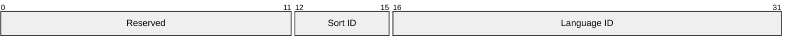

# [MS-LCID]: Windows Language Code Identifier (LCID) Reference

Table of Contents

1 Introduction

- [1 Introduction](#Section_1)
  - [1.1 Glossary](#Section_1.1)
  - [1.2 References](#Section_1.2)
    - [1.2.1 Normative References](#Section_1.2.1)
    - [1.2.2 Informative References](#Section_1.2.2)
  - [1.3 Overview](#Section_1.3)
  - [1.4 Relationship to Protocols and Other Structures](#Section_1.4)
  - [1.5 Applicability Statement](#Section_1.5)
  - [1.6 Versioning and Localization](#Section_1.6)
  - [1.7 Vendor-Extensible Fields](#Section_1.7)

2 Structures

- [2 Structures](#Section_2)
  - [2.1 Language Code Identifiers](#Section_2.1)
  - [2.2 LCID Structure](#Section_2.2)
    - [2.2.1 Locale Names without LCIDs](#Section_2.2.1)

3 Structure Examples

- [3 Structure Examples](#Section_3)

4 Security Considerations

- [4 Security Considerations](#Section_4)

5 Appendix A: Product Behavior

- [5 Appendix A: Product Behavior](#Section_5)

6 Change Tracking

- [6 Change Tracking](#Section_6)

For the legal notice and IP terms, see [LEGAL.md](../LEGAL.md).
Last updated: 4/23/2024.
See [Revision History](#revision-history) for full version history.

# 1 Introduction

This document provides an overview of language code identifiers (LCIDs), also known as culture identifiers, which are being deprecated, and the preferred alternate system of locale codes, which specify a set of locale identifiers that designate culture-specific information such as how text is sorted, how a date is formatted, and the display format for numbers and currency.

Sections 1.7 and 2 of this specification are normative. All other sections and examples in this specification are informative.

## 1.1 Glossary

This document uses the following terms:

**alternate sort**: Specifies an alternate collation for a language that has multiple methods for sorting data. For example, German has both "Dictionary" and "Phone Book" sorts. "Dictionary" sorting (de-DE) is the default for German, but developers can specify the alternate "Phone Book" sort (de-DE_phoneb) explicitly.

**Chinese BIG5 order**: Ideographs are ordered according to the code point values of the Taiwanese BIG5 industrial standard.

**Chinese radical/stroke order**: Ideographs are ordered according to radical stroke count.

**Chinese Unicode order**: Deprecated. Identical to the default sort information used for English.

**Georgian modern order**: An order for the Georgian language that places archaic characters that are no longer used at the end of the alphabet.

**Georgian traditional order**: An order for the Georgian language that intersperses archaic characters that are no longer used among the rest of the alphabet in their traditional places.

**German phone book order**: An order that equates Ä, Ö, and Ü with AE, OE, and UE, respectively (commonly used in German phone books).

**Hungarian default order**: The typical expected alphabetical order for the Hungarian language.

**Hungarian technical order**: A sort order that places capital letters before lowercase ones, unlike most sorts, which sort lowercase first.

**Japanese radical/stroke sort order**: Ideographs are ordered by their radical and stroke components, much like an ideographic dictionary might do.

**Japanese Unicode order**: Deprecated. Identical to the default sort information used for English, except that the backslash (\) is equal to the currency symbol, 0x00A5, the yen sign.

**Japanese XJIS order**: Ideographs are ordered according to the code point values of the [[JIS X 208]](https://go.microsoft.com/fwlink/?LinkId=100292) and [[JIS X 212]](https://go.microsoft.com/fwlink/?LinkId=100293) government standards.

**Korean KSC order**: Ideographs are ordered according to the Korean Hangul pronunciation, as specified in the Korean [KSC5601] government standard.

**Korean Unicode order**: Deprecated. Identical to the default sort information used for English, except that the backslash (\) is equal to the currency symbol, 0x20A9, the won sign.

**neutral locale**: A locale describing a language without any region-specific information.

**PRC Chinese phonetic order**: Ideographs are ordered according to their A to Z pronunciation order.

**PRC Chinese stroke count order**: Ideographs are ordered according to their stroke count.

**specific locale**: A locale describing a language that has a qualifying regional variant. For example, variants for English can be en-US or en-GB.

**Traditional Chinese Bopomofo order**: Ideographs are ordered by their most common Mandarin pronunciation, using the Chinese Bopomofo order of the pronunciations.

**MAY, SHOULD, MUST, SHOULD NOT, MUST NOT:** These terms (in all caps) are used as defined in [[RFC2119]](https://go.microsoft.com/fwlink/?LinkId=90317). All statements of optional behavior use either MAY, SHOULD, or SHOULD NOT.

## 1.2 References

Links to a document in the Microsoft Open Specifications library point to the correct section in the most recently published version of the referenced document. However, because individual documents in the library are not updated at the same time, the section numbers in the documents may not match. You can confirm the correct section numbering by checking the [Errata](https://go.microsoft.com/fwlink/?linkid=850906).

### 1.2.1 Normative References

We conduct frequent surveys of the normative references to assure their continued availability. If you have any issue with finding a normative reference, please contact [dochelp@microsoft.com](mailto:dochelp@microsoft.com). We will assist you in finding the relevant information.

[ISO-15924] International Organization for Standardization, "ISO 15924 Registration Authority", [http://www.unicode.org/iso15924/](https://go.microsoft.com/fwlink/?LinkId=100295)

[ISO-3166] International Organization for Standardization, "Codes for the representation of names of countries and their subdivisions -- Part1: Country codes", ISO 3166-1:2013, November 2013, [http://www.iso.org/iso/home/store/catalogue_tc/catalogue_detail.htm?csnumber=63545](https://go.microsoft.com/fwlink/?LinkId=89917)

**Note** There is a charge to download the specification.

[ISO-639] International Organization for Standardization, "Codes for the representation of names of languages -- Part 2: Alpha-3 code", ISO 639-2:1998, [http://www.iso.org/iso/iso_catalogue/catalogue_tc/catalogue_detail.htm?csnumber=4767](https://go.microsoft.com/fwlink/?LinkId=100294)

**Note** There is a charge to download this specification.

[MS-DTYP] Microsoft Corporation, "[Windows Data Types](../MS-DTYP/MS-DTYP.md)".

[RFC2119] Bradner, S., "Key words for use in RFCs to Indicate Requirement Levels", BCP 14, RFC 2119, March 1997, [https://www.rfc-editor.org/info/rfc2119](https://go.microsoft.com/fwlink/?LinkId=90317)

[RFC5646] Phillips, A, and Davis, M., "Tags for Identifying Languages", BCP 47, RFC 4646, September 2006, [https://www.rfc-editor.org/info/rfc5646](https://go.microsoft.com/fwlink/?LinkId=528682)

### 1.2.2 Informative References

[KSC5601] Korea Industrial Standards Association, "Code for Information Interchange (Hangul and Hanja)", Korean Industrial Standard, 1987, Ref. No. KS C 5601-1987.

## 1.3 Overview

The LCID structure is used to identify specific languages for the purpose of customizing software for particular languages and cultures. For example, it can specify the way dates, times, and numbers are formatted as strings. It can also specify paper sizes and preferred sort order based on language elements.

LCIDs are being deprecated, and implementers are strongly encouraged to use locale names instead. LCIDs can be used for backward compatibility, but as noted in section [2.2.1](#Section_2.2.1), there is no guarantee of LCID uniqueness when used with valid locale names not otherwise associated with an LCID.

## 1.4 Relationship to Protocols and Other Structures

This structure is related to protocols and structures that need to make special cases for specific languages and cultures.

## 1.5 Applicability Statement

This structure applies in scenarios where special cases need to be made for specific languages and cultures.

## 1.6 Versioning and Localization

This structure serves to identify particular languages, locales, and cultures.

## 1.7 Vendor-Extensible Fields

None.

# 2 Structures

## 2.1 Language Code Identifiers

LCIDs are identifiers used to specify localizable information. They are also known as culture identifiers in the Microsoft .NET Framework environment.

The name of a culture consists of its [[ISO-639]](https://go.microsoft.com/fwlink/?LinkId=100294) language code, its [[ISO-3166]](https://go.microsoft.com/fwlink/?LinkId=89917) country/region code, and an optional [[ISO-15924]](https://go.microsoft.com/fwlink/?LinkId=100295) script tag for the written language. For example, the name of the culture in which the language is Bosnian (as written in Latin script and used in the Bosnia and Herzegovina region) is bs-Latn-BA.<1><2><3>

## 2.2 LCID Structure

This protocol references commonly used data types as defined in [MS-DTYP](../MS-DTYP/MS-DTYP.md).

An LCID is a 4-byte value. The value supplied in an LCID is a standard numeric substitution for the international [[RFC5646]](https://go.microsoft.com/fwlink/?LinkId=528682) string.

The following diagram is shown in host byte order.

**Reserved (12 bits):** This field is reserved for future use. It MUST be 0.

**Sort ID (4 bits):** The sort order. In most cases, this value can be 0x0, which indicates a default sort (SORT_DEFAULT). However, other values can be used when an alternate sort is required. These alternate values are listed in the following table. For example, 0x0407 (German - Germany) becomes 0x10407 when SORT_GERMAN_PHONE_BOOK is used.

| Value | Meaning |
| --- | --- |
| SORT_CHINESE_BIG5 0x0 | [**Chinese BIG5 order**](#gt_chinese-big5-order) Default sort for Simplified Chinese locales Use with zh-TW, zh-HK, or zh-MO |
| SORT_CHINESE_PRCP 0x0 | [**PRC Chinese phonetic order**](#gt_prc-chinese-phonetic-order) Default sort for Traditional Chinese locales. Use with zn-CN or zh-SG |
| SORT_DEFAULT 0x0 | Default sort order |
| SORT_GEORGIAN_TRADITIONAL 0x0 | [**Georgian traditional order**](#gt_georgian-traditional-order) Default sort for Georgian, use with ka-GE |
| SORT_HUNGARIAN_DEFAULT 0x0 | [**Hungarian default order**](#gt_hungarian-default-order) Default sort for Hungarian, use with hu-HU |
| SORT_JAPANESE_XJIS 0x0 | [**Japanese XJIS order**](#gt_japanese-xjis-order) Use with ja-JP |
| SORT_KOREAN_KSC 0x0 | [**Korean KSC order**](#gt_korean-ksc-order) Default sort for Korean, use with ko-KR |
| SORT_CHINESE_UNICODE 0x1 | [**Chinese Unicode order**](#gt_chinese-unicode-order)<4> Do not use, deprecated |
| SORT_GEORGIAN_MODERN 0x1 | [**Georgian modern order**](#gt_georgian-modern-order) Use with ka-GE, resolves to ka-GE_modern |
| SORT_GERMAN_PHONE_BOOK 0x1 | [**German phone book order**](#gt_german-phone-book-order) Use with de-DE, resolves to de-DE_phoneb |
| SORT_HUNGARIAN_TECHNICAL 0x1 | [**Hungarian technical order**](#gt_hungarian-technical-order) Use with hu-HU, resolves to hu-HU_technl |
| SORT_JAPANESE_UNICODE 0x1 | [**Japanese Unicode order**](#gt_japanese-unicode-order)<5> Do not use, deprecated |
| SORT_KOREAN_UNICODE 0x1 | [**Korean Unicode order**](#gt_korean-unicode-order)<6> Do not use, deprecated |
| SORT_CHINESE_PRC 0x2 | [**PRC Chinese stroke count order**](#gt_prc-chinese-stroke-count-order) Use with zh-CN, resolves to zh-CN_stroke Use with zh-SG, resolves to zh-SG_stroke |
| SORT_CHINESE_BOPOMOFO 0x3 | [**Traditional Chinese Bopomofo order**](#gt_traditional-chinese-bopomofo-order) Use with zh-TW, resolves to zh-TW_pronun |
| SORT_CHINESE_RADICALSTROKE 0x4 | [**Chinese radical/stroke order**](#gt_chinese-radicalstroke-order)<7> Use with zh-HK, resolves to zh-HK_radstr Use with zh-MO, resolves to zh-MO_radstr Use with zh-TW, resolves to zh-TW_radstr |
| SORT_JAPANESE_RADICALSTROKE 0x4 | [**Japanese radical/stroke sort order**](#gt_japanese-radicalstroke-sort-order) Use with ja-JP, resolves to ja-JP_radstr |

**Language ID (2 bytes):** The language component of the LCID.<8>

| Language ID | Language tag |
| --- | --- |
| 0x0001 | ar |
| 0x0002 | bg |
| 0x0003 | ca |
| 0x0004 | zh-Hans |
| 0x0005 | cs |
| 0x0006 | da |
| 0x0007 | de |
| 0x0008 | el |
| 0x0009 | en |
| 0x000A | es |
| 0x000B | fi |
| 0x000C | fr |
| 0x000D | he |
| 0x000E | hu |
| 0x000F | is |
| 0x0010 | it |
| 0x0011 | ja |
| 0x0012 | ko |
| 0x0013 | nl |
| 0x0014 | no |
| 0x0015 | pl |
| 0x0016 | pt |
| 0x0017 | rm |
| 0x0018 | ro |
| 0x0019 | ru |
| 0x001A | hr |
| 0x001B | sk |
| 0x001C | sq |
| 0x001D | sv |
| 0x001E | th |
| 0x001F | tr |
| 0x0020 | ur |
| 0x0021 | id |
| 0x0022 | uk |
| 0x0023 | be |
| 0x0024 | sl |
| 0x0025 | et |
| 0x0026 | lv |
| 0x0027 | lt |
| 0x0028 | tg |
| 0x0029 | fa |
| 0x002A | vi |
| 0x002B | hy |
| 0x002C | az |
| 0x002D | eu |
| 0x002E | hsb |
| 0x002F | mk |
| 0x0030 | st |
| 0x0031 | ts |
| 0x0032 | tn |
| 0x0033 | ve |
| 0x0034 | xh |
| 0x0035 | zu |
| 0x0036 | af |
| 0x0037 | ka |
| 0x0038 | fo |
| 0x0039 | hi |
| 0x003A | mt |
| 0x003B | se |
| 0x003C | ga |
| 0x003D | yi, reserved |
| 0x003E | ms |
| 0x003F | kk |
| 0x0040 | ky |
| 0x0041 | sw |
| 0x0042 | tk |
| 0x0043 | uz |
| 0x0044 | tt |
| 0x0045 | bn |
| 0x0046 | pa |
| 0x0047 | gu |
| 0x0048 | or |
| 0x0049 | ta |
| 0x004A | te |
| 0x004B | kn |
| 0x004C | ml |
| 0x004D | as |
| 0x004E | mr |
| 0x004F | sa |
| 0x0050 | mn |
| 0x0051 | bo |
| 0x0052 | cy |
| 0x0053 | km |
| 0x0054 | lo |
| 0x0055 | my |
| 0x0056 | gl |
| 0x0057 | kok |
| 0x0058 | mni, reserved |
| 0x0059 | sd |
| 0x005A | syr |
| 0x005B | si |
| 0x005C | chr |
| 0x005D | iu |
| 0x005E | am |
| 0x005F | tzm |
| 0x0060 | ks |
| 0x0061 | ne |
| 0x0062 | fy |
| 0x0063 | ps |
| 0x0064 | fil |
| 0x0065 | dv |
| 0x0066 | bin, reserved |
| 0x0067 | ff |
| 0x0068 | ha |
| 0x0069 | ibb, reserved |
| 0x006A | yo |
| 0x006B | quz |
| 0x006C | nso |
| 0x006D | ba |
| 0x006E | lb |
| 0x006F | kl |
| 0x0070 | ig |
| 0x0071 | kr, reserved |
| 0x0072 | om |
| 0x0073 | ti |
| 0x0074 | gn |
| 0x0075 | haw |
| 0x0076 | la, reserved |
| 0x0077 | so, reserved |
| 0x0078 | ii |
| 0x0079 | pap, reserved |
| 0x007A | arn |
| 0x007B | Neither defined nor reserved |
| 0x007C | moh |
| 0x007D | Neither defined nor reserved |
| 0x007E | br |
| 0x007F | Reserved for invariant locale behavior |
| 0x0080 | ug |
| 0x0081 | mi |
| 0x0082 | oc |
| 0x0083 | co |
| 0x0084 | gsw |
| 0x0085 | sah |
| 0x0086 | qut |
| 0x0087 | rw |
| 0x0088 | wo |
| 0x0089 | Neither defined nor reserved |
| 0x008A | Neither defined nor reserved |
| 0x008B | Neither defined nor reserved |
| 0x008C | prs |
| 0x008D | Neither defined nor reserved |
| 0x008E | Neither defined nor reserved |
| 0x008F | Neither defined nor reserved |
| 0x0090 | Neither defined nor reserved |
| 0x0091 | gd |
| 0x0092 | ku |
| 0x0093 | quc, reserved |
| 0x0401 | ar-SA |
| 0x0402 | bg-BG |
| 0x0403 | ca-ES |
| 0x0404 | zh-TW |
| 0x0405 | cs-CZ |
| 0x0406 | da-DK |
| 0x0407 | de-DE |
| 0x0408 | el-GR |
| 0x0409 | en-US |
| 0x040A | es-ES_tradnl |
| 0x040B | fi-FI |
| 0x040C | fr-FR |
| 0x040D | he-IL |
| 0x040E | hu-HU |
| 0x040F | is-IS |
| 0x0410 | it-IT |
| 0x0411 | ja-JP |
| 0x0412 | ko-KR |
| 0x0413 | nl-NL |
| 0x0414 | nb-NO |
| 0x0415 | pl-PL |
| 0x0416 | pt-BR |
| 0x0417 | rm-CH |
| 0x0418 | ro-RO |
| 0x0419 | ru-RU |
| 0x041A | hr-HR |
| 0x041B | sk-SK |
| 0x041C | sq-AL |
| 0x041D | sv-SE |
| 0x041E | th-TH |
| 0x041F | tr-TR |
| 0x0420 | ur-PK |
| 0x0421 | id-ID |
| 0x0422 | uk-UA |
| 0x0423 | be-BY |
| 0x0424 | sl-SI |
| 0x0425 | et-EE |
| 0x0426 | lv-LV |
| 0x0427 | lt-LT |
| 0x0428 | tg-Cyrl-TJ |
| 0x0429 | fa-IR |
| 0x042A | vi-VN |
| 0x042B | hy-AM |
| 0x042C | az-Latn-AZ |
| 0x042D | eu-ES |
| 0x042E | hsb-DE |
| 0x042F | mk-MK |
| 0x0430 | st-ZA |
| 0x0431 | ts-ZA |
| 0x0432 | tn-ZA |
| 0x0433 | ve-ZA |
| 0x0434 | xh-ZA |
| 0x0435 | zu-ZA |
| 0x0436 | af-ZA |
| 0x0437 | ka-GE |
| 0x0438 | fo-FO |
| 0x0439 | hi-IN |
| 0x043A | mt-MT |
| 0x043B | se-NO |
| 0x043D | yi-001 |
| 0x043E | ms-MY |
| 0x043F | kk-KZ |
| 0x0440 | ky-KG |
| 0x0441 | sw-KE |
| 0x0442 | tk-TM |
| 0x0443 | uz-Latn-UZ |
| 0x0444 | tt-RU |
| 0x0445 | bn-IN |
| 0x0446 | pa-IN |
| 0x0447 | gu-IN |
| 0x0448 | or-IN |
| 0x0449 | ta-IN |
| 0x044A | te-IN |
| 0x044B | kn-IN |
| 0x044C | ml-IN |
| 0x044D | as-IN |
| 0x044E | mr-IN |
| 0x044F | sa-IN |
| 0x0450 | mn-MN |
| 0x0451 | bo-CN |
| 0x0452 | cy-GB |
| 0x0453 | km-KH |
| 0x0454 | lo-LA |
| 0x0455 | my-MM |
| 0x0456 | gl-ES |
| 0x0457 | kok-IN |
| 0x0458 | mni-IN, reserved |
| 0x0459 | sd-Deva-IN, reserved |
| 0x045A | syr-SY |
| 0x045B | si-LK |
| 0x045C | chr-Cher-US |
| 0x045D | iu-Cans-CA |
| 0x045E | am-ET |
| 0x045F | tzm-Arab-MA |
| 0x0460 | ks-Arab |
| 0x0461 | ne-NP |
| 0x0462 | fy-NL |
| 0x0463 | ps-AF |
| 0x0464 | fil-PH |
| 0x0465 | dv-MV |
| 0x0466 | bin-NG, reserved |
| 0x0467 | ff-NG, ff-Latn-NG |
| 0x0468 | ha-Latn-NG |
| 0x0469 | ibb-NG, reserved |
| 0x046A | yo-NG |
| 0x046B | quz-BO |
| 0x046C | nso-ZA |
| 0x046D | ba-RU |
| 0x046E | lb-LU |
| 0x046F | kl-GL |
| 0x0470 | ig-NG |
| 0x0471 | kr-Latn-NG |
| 0x0472 | om-ET |
| 0x0473 | ti-ET |
| 0x0474 | gn-PY |
| 0x0475 | haw-US |
| 0x0476 | la-VA |
| 0x0477 | so-SO |
| 0x0478 | ii-CN |
| 0x0479 | pap-029, reserved |
| 0x047A | arn-CL |
| 0x047C | moh-CA |
| 0x047E | br-FR |
| 0x0480 | ug-CN |
| 0x0481 | mi-NZ |
| 0x0482 | oc-FR |
| 0x0483 | co-FR |
| 0x0484 | gsw-FR |
| 0x0485 | sah-RU |
| 0x0486 | qut-GT, reserved |
| 0x0487 | rw-RW |
| 0x0488 | wo-SN |
| 0x048C | prs-AF |
| 0x048D | plt-MG, reserved |
| 0x048E | zh-yue-HK, reserved |
| 0x048F | tdd-Tale-CN, reserved |
| 0x0490 | khb-Talu-CN, reserved |
| 0x0491 | gd-GB |
| 0x0492 | ku-Arab-IQ |
| 0x0493 | quc-CO, reserved |
| 0x0501 | qps-ploc |
| 0x05FE | qps-ploca |
| 0x0801 | ar-IQ |
| 0x0803 | ca-ES-valencia |
| 0x0804 | zh-CN |
| 0x0807 | de-CH |
| 0x0809 | en-GB |
| 0x080A | es-MX |
| 0x080C | fr-BE |
| 0x0810 | it-CH |
| 0x0811 | ja-Ploc-JP, reserved |
| 0x0813 | nl-BE |
| 0x0814 | nn-NO |
| 0x0816 | pt-PT |
| 0x0818 | ro-MD |
| 0x0819 | ru-MD |
| 0x081A | sr-Latn-CS |
| 0x081D | sv-FI |
| 0x0820 | ur-IN |
| 0x0827 | Neither defined nor reserved |
| 0x082C | az-Cyrl-AZ, reserved |
| 0x082E | dsb-DE |
| 0x0832 | tn-BW |
| 0x083B | se-SE |
| 0x083C | ga-IE |
| 0x083E | ms-BN |
| 0x083F | kk-Latn-KZ, reserved |
| 0x0843 | uz-Cyrl-UZ, reserved |
| 0x0845 | bn-BD |
| 0x0846 | pa-Arab-PK |
| 0x0849 | ta-LK |
| 0x0850 | mn-Mong-CN, reserved |
| 0x0851 | bo-BT, reserved |
| 0x0859 | sd-Arab-PK |
| 0x085D | iu-Latn-CA |
| 0x085F | tzm-Latn-DZ |
| 0x0860 | ks-Deva-IN |
| 0x0861 | ne-IN |
| 0x0867 | ff-Latn-SN |
| 0x086B | quz-EC |
| 0x0873 | ti-ER |
| 0x09FF | qps-plocm |
| 0x0C00 | Locale without assigned LCID if the current user default locale. See section [2.2.1](#Section_2.2.1). |
| 0x0C01 | ar-EG |
| 0x0C04 | zh-HK |
| 0x0C07 | de-AT |
| 0x0C09 | en-AU |
| 0x0C0A | es-ES |
| 0x0C0C | fr-CA |
| 0x0C1A | sr-Cyrl-CS |
| 0x0C3B | se-FI |
| 0x0C50 | mn-Mong-MN |
| 0x0C51 | dz-BT |
| 0x0C5F | tmz-MA, reserved |
| 0x0C6b | quz-PE |
| 0x1000 | Locale without assigned LCID if the current user default locale. See section 2.2.1. |
| 0x1001 | ar-LY |
| 0x1004 | zh-SG |
| 0x1007 | de-LU |
| 0x1009 | en-CA |
| 0x100A | es-GT |
| 0x100C | fr-CH |
| 0x101A | hr-BA |
| 0x103B | smj-NO |
| 0x105F | tzm-Tfng-MA |
| 0x1401 | ar-DZ |
| 0x1404 | zh-MO |
| 0x1407 | de-LI |
| 0x1409 | en-NZ |
| 0x140A | es-CR |
| 0x140C | fr-LU |
| 0x141A | bs-Latn-BA |
| 0x143B | smj-SE |
| 0x1801 | ar-MA |
| 0x1809 | en-IE |
| 0x180A | es-PA |
| 0x180C | fr-MC |
| 0x181A | sr-Latn-BA |
| 0x183B | sma-NO |
| 0x1C01 | ar-TN |
| 0x1C09 | en-ZA |
| 0x1C0A | es-DO |
| 0x1C0C | fr-029 |
| 0x1C1A | sr-Cyrl-BA |
| 0x1C3B | sma-SE |
| 0x2000 | Unassigned LCID locale temporarily assigned to LCID 0x3000. See section 2.2.1. |
| 0x2001 | ar-OM |
| 0x2008 | Neither defined nor reserved |
| 0x2009 | en-JM |
| 0x200A | es-VE |
| 0x200C | fr-RE |
| 0x201A | bs-Cyrl-BA |
| 0x203B | sms-FI |
| 0x2400 | Unassigned LCID locale temporarily assigned to LCID 0x3000. See section 2.2.1. |
| 0x2401 | ar-YE |
| 0x2409 | en-029, reserved |
| 0x240A | es-CO |
| 0x240C | fr-CD |
| 0x241A | sr-Latn-RS |
| 0x243B | smn-FI |
| 0x2800 | Unassigned LCID locale temporarily assigned to LCID 0x3000. See section 2.2.1. |
| 0x2801 | ar-SY |
| 0x2809 | en-BZ |
| 0x280A | es-PE |
| 0x280C | fr-SN |
| 0x281A | sr-Cyrl-RS |
| 0x2C00 | Unassigned LCID locale temporarily assigned to LCID 0x3000. See section 2.2.1. |
| 0x2C01 | ar-JO |
| 0x2C09 | en-TT |
| 0x2C0A | es-AR |
| 0x2C0C | fr-CM |
| 0x2C1A | sr-Latn-ME |
| 0x3000 | Unassigned LCID locale temporarily assigned to LCID 0x3000. See section 2.2.1. |
| 0x3001 | ar-LB |
| 0x3009 | en-ZW |
| 0x300A | es-EC |
| 0x300C | fr-CI |
| 0x301A | sr-Cyrl-ME |
| 0x3400 | Unassigned LCID locale temporarily assigned to LCID 0x3400. See section 2.2.1. |
| 0x3401 | ar-KW |
| 0x3409 | en-PH |
| 0x340A | es-CL |
| 0x340C | fr-ML |
| 0x3800 | Unassigned LCID locale temporarily assigned to LCID 0x3800. See section 2.2.1. |
| 0x3801 | ar-AE |
| 0x3809 | en-ID, reserved |
| 0x380A | es-UY |
| 0x380C | fr-MA |
| 0x3C00 | Unassigned LCID locale temporarily assigned to LCID 0x3C00. See section 2.2.1. |
| 0x3C01 | ar-BH |
| 0x3C09 | en-HK |
| 0x3C0A | es-PY |
| 0x3C0C | fr-HT |
| 0x4000 | Unassigned LCID locale temporarily assigned to LCID 0x4000. See section 2.2.1. |
| 0x4001 | ar-QA |
| 0x4009 | en-IN |
| 0x400A | es-BO |
| 0x4400 | Unassigned LCID locale temporarily assigned to LCID 0x4400. See section 2.2.1. |
| 0x4401 | ar-Ploc-SA, reserved |
| 0x4409 | en-MY |
| 0x440A | es-SV |
| 0x4800 | Unassigned LCID locale temporarily assigned to LCID 0x4800. See section 2.2.1. |
| 0x4801 | ar-145, reserved |
| 0x4809 | en-SG |
| 0x480A | es-HN |
| 0x4C00 | Unassigned LCID locale temporarily assigned to LCID 0x4C00. See section 2.2.1. |
| 0x4C09 | en-AE |
| 0x4C0A | es-NI |
| 0x5009 | en-BH, reserved |
| 0x500A | es-PR |
| 0x5409 | en-EG, reserved |
| 0x540A | es-US |
| 0x5809 | en-JO, reserved |
| 0x580A | es-419, reserved |
| 0x5C09 | en-KW, reserved |
| 0x5C0A | es-CU |
| 0x6009 | en-TR, reserved |
| 0x6409 | en-YE, reserved |
| 0x641A | bs-Cyrl |
| 0x681A | bs-Latn |
| 0x6C1A | sr-Cyrl |
| 0x701A | sr-Latn |
| 0x703B | smn |
| 0x742C | az-Cyrl |
| 0x743B | sms |
| 0x7804 | zh |
| 0x7814 | nn |
| 0x781A | bs |
| 0x782C | az-Latn |
| 0x783B | sma |
| 0x783F | kk-Cyrl, reserved |
| 0x7843 | uz-Cyrl |
| 0x7850 | mn-Cyrl |
| 0x785D | iu-Cans |
| 0x785F | tzm-Tfng |
| 0x7C04 | zh-Hant |
| 0x7C14 | nb |
| 0x7C1A | sr |
| 0x7C28 | tg-Cyrl |
| 0x7C2E | dsb |
| 0x7C3B | smj |
| 0x7C3F | kk-Latn, reserved |
| 0x7C43 | uz-Latn |
| 0x7C46 | pa-Arab |
| 0x7C50 | mn-Mong |
| 0x7C59 | sd-Arab |
| 0x7C5C | chr-Cher |
| 0x7C5D | iu-Latn |
| 0x7C5F | tzm-Latn |
| 0x7C67 | ff-Latn |
| 0x7C68 | ha-Latn |
| 0x7C92 | ku-Arab |
| 0xF2EE | reserved |
| 0xE40C | fr-015, reserved |
| 0xEEEE | reserved |

Some locales have more than one method of sorting, such as by pronunciation or stroke count. The primary sort for each locale is provided by the identifiers in the preceding Language ID table. Alternate sorts can be selected by using one of the identifiers from the following table.

| LCID | Language tag (string name) |
| --- | --- |
| 0x0001007F | x-IV-mathan (math alphanumeric sorting) |
| 0x00010407 | de-DE_phoneb |
| 0x0001040E | hu-HU_tchncl |
| 0x00010437 | ka-GE_modern |
| 0x00020804 | zh-CN_stroke |
| 0x00021004 | zh-SG_stroke |
| 0x00021404 | zh-MO_stroke |
| 0x00030404 | zh-TW_pronun |
| 0x00040404<9> | zh-TW_radstr |
| 0x00040411 | ja-JP_radstr |
| 0x00040C04<10> | zh-HK_radstr |
| 0x00041404<11> | zh-MO_radstr |
| 0x00050804<12> | zh-CN_phoneb |
| 0x00051004<13> | zh-SG_phoneb |

### 2.2.1 Locale Names without LCIDs

Every locale name without an assigned LCID MAY be temporarily given one of the LCIDs in the following table, if the application requests an LCID.<14> These locale names include any valid [[RFC5646]](https://go.microsoft.com/fwlink/?LinkId=528682) language tag.

**Note:** LCID assignments for Locale Names without LCIDs are temporary and are not suitable for use across a protocol, or for interchange between processes or machines. These temporary LCID assignments are also unsuitable for tagging persisted data as the meaning of the LCID assignment will change over time.

| Name | Value | Conditions |
| --- | --- | --- |
| LOCALE_CUSTOM_USER_DEFAULT<15> | 0x0C00 | When an LCID without a permanent LCID assignment is also the current user locale, the protocol will respond with LOCALE_CUSTOM_USER_DEFAULT for that locale. This assignment persists until the user changes the locale. Because the meaning changes over time, applications are discouraged from persisting this data. Though this value will likely refer to the same locale for the lifetime of the current process, that is not guaranteed. This assignment is a 1-to-1 relationship between this LCID and the user’s current default locale name. |
| Transient LCIDs<16> | 0x2000, 0x2400, 0x2800, 0x2C00, 0x3000, 0x3400, 0x3800, 0x3C00, 0x4000, 0x4400, 0x4800, 0x4C00 | Some user configurations temporarily associate a locale without a permanent LCID assignment with one of these 12 transient LCIDs. This assignment is transient and it is not guaranteed; it will likely refer to the same locale for the lifetime of the process. However, this assignment will differ for other users on the machine, or other machines, and, as such, is unsuitable for use in protocols or persisted data. This assignment is a temporary 1-to-1 relationship between an LCID and a particular locale name and will round trip until that relationship changes. |
| LOCALE_CUSTOM_UNSPECIFIED<17> | 0x1000 | When an LCID is requested for a locale without a permanent LCID assignment, nor a temporary assignment as above, the protocol will respond with LOCALE_CUSTOM_UNSPECIFIED for all such locales. Because this single value is used for numerous possible locale names, it is impossible to round trip this locale, even temporarily. Applications should discard this value as soon as possible and never persist it. If the system is forced to respond to a request for LCID_CUSTOM_UNSPECIFIED, it will fall back to the current user locale. This is often incorrect but may prevent an application or component from failing. As the meaning of this temporary LCID is unstable, it should never be used for interchange or persisted data. This is a 1-to-many relationship that is very unstable. |

# 3 Structure Examples

The following are examples of LCID values.

| LCID | Language tag (string name) | Type |
| --- | --- | --- |
| 0x00000075 | haw | [**neutral locale**](#gt_neutral-locale) |
| 0x00000409 | en-US | [**specific locale**](#gt_specific-locale) |
| 0x00010407 | de-DE_phoneb | [**alternate sort**](#gt_alternate-sort) for locale |

# 4 Security Considerations

None.

# 5 Appendix A: Product Behavior

The information in this specification is applicable to the following Microsoft products or supplemental software. References to product versions include updates to those products.

The terms "earlier" and "later", when used with a product version, refer to either all preceding versions or all subsequent versions, respectively. The term "through" refers to the inclusive range of versions. Applicable Microsoft products are listed chronologically in this section.

**Windows Client**

- Windows NT operating system
- Windows 2000 operating system
- Windows XP operating system
- Windows Vista operating system
- Windows 7 operating system
- Windows 8 operating system
- Windows 8.1 operating system
- Windows 10 operating system
- Windows 11 operating system
**Windows Server**

- Windows NT
- Windows 2000
- Windows Server 2003 operating system
- Windows Server 2008 R2 operating system
- Windows Server 2012 operating system
- Windows Server 2012 R2 operating system
- Windows Server 2016 operating system
- Windows Server operating system
- Windows Server 2019 operating system
- Windows Server 2022 operating system
- Windows Server 2025 operating system
Exceptions, if any, are noted in this section. If an update version, service pack or Knowledge Base (KB) number appears with a product name, the behavior changed in that update. The new behavior also applies to subsequent updates unless otherwise specified. If a product edition appears with the product version, behavior is different in that product edition.

Unless otherwise specified, any statement of optional behavior in this specification that is prescribed using the terms "SHOULD" or "SHOULD NOT" implies product behavior in accordance with the SHOULD or SHOULD NOT prescription. Unless otherwise specified, the term "MAY" implies that the product does not follow the prescription.

<1> Section 2.1: Enabled Languages Kit (ELK) refers to a set of locales that is available through a web download. Everything that is related to a locale is available from an ELK package (including information on data formatting, such as date and time, font, keyboard layout, sorting, and currency information). Additional LCID support is available through a separate ELK package for Windows XP and Windows Vista clients and for Windows Server 2003 and Windows Server 2008 operating system servers.

<2> Section 2.1: In Windows, locales are primarily identified with numeric LCIDs.

<3> Section 2.1: Windows Server 2003 supports all languages defined for Windows 95 operating system, Windows 98 operating system, Windows Millennium Edition operating system, Windows NT 3.51 operating system, Windows NT 4.0 operating system, Windows 2000, Windows XP, and Windows Server 2003 through the ELK.

<4> Section 2.2: Supported only on Windows NT client and server releases.

<5> Section 2.2: Supported only on Windows NT client and server releases.

<6> Section 2.2: Supported only on Windows NT client and server releases.

<7> Section 2.2: Supported only on Windows 7.

<8> Section 2.2: The following table shows Language IDs and the versions of Windows in which they were first made available. Language IDs are not assigned for all Language tags, please see section 1.3 for further details.

Supported Versions Key

| Release key | Supported versions |
| --- | --- |
| Release A | First available in Windows NT 3.51. Supported in all later versions. |
| Release B | First available in Windows NT Server 4.0 operating system. Supported in all later versions. |
| Release C | First available in Windows 2000. Supported in all later versions. |
| Release D | First available in Windows XP and Windows Server 2003. Supported in all later versions. |
| Release E1 | First available in Windows XP ELK v1 for Windows XP SP2, Windows Server 2003, Windows Vista, and Windows Server 2008. Supported in all later client and server versions of Windows. |
| Release E2 | First available in Windows XP ELK v2 for Windows XP SP2, Windows Server 2003, Windows Vista, and Windows Server 2008. Supported in all later client and server versions of Windows. |
| Release V | First available in Windows Server 2008 and Windows Vista. Supported in all later versions. |
| Release 7 | First available in Windows 7 and Windows Server 2008 R2. Supported in all later versions. |
| Release 8 | First available in Windows 8 and Windows Server 2012. Supported in all later versions |
| Release 8.1 | First available in Windows 8.1 and Windows Server 2012 R2. Supported in all later versions. |
| Release 10 | First available in Windows 10 and Windows Server 2016. Supported in all later versions. |
| Release 10.1 | First available in Windows 10 v1607 operating system and Windows Server 2016. Supported in all later versions. |
| Release 10.2 | First available in Windows 10 v1703 operating system. Supported in all later versions. |
| Release 10.3 | First available in Windows 10 v1709 operating system and Windows Server operating system. Supported in all later versions. |
| Release 10.4 | First available in Windows 10 v1903 operating system and Windows Server v1903 operating system. Supported in all later versions. |
| Release 10.5 | First available in Windows 10 v2004 operating system and Windows Server v2004 operating system. Supported in all later versions. |

| Language | Location (or type) | Language ID | Language tag | Supported version |
| --- | --- | --- | --- | --- |
| Afar | - | 0x1000 | aa | Release 10 |
| Afar | Djibouti | 0x1000 | aa-DJ | Release 10 |
| Afar | Eritrea | 0x1000 | aa-ER | Release 10 |
| Afar | Ethiopia | 0x1000 | aa-ET | Release 10 |
| Afrikaans | - | 0x0036 | af | Release 7 |
| Afrikaans | Namibia | 0x1000 | af-NA | Release 10 |
| Afrikaans | South Africa | 0x0436 | af-ZA | Release B |
| Aghem | - | 0x1000 | agq | Release 10 |
| Aghem | Cameroon | 0x1000 | agq-CM | Release 10 |
| Akan | - | 0x1000 | ak | Release 10 |
| Akan | Ghana | 0x1000 | ak-GH | Release 10 |
| Albanian | - | 0x001C | sq | Release 7 |
| Albanian | Albania | 0x041C | sq-AL | Release B |
| Albanian | North Macedonia | 0x1000 | sq-MK | Release 10 |
| Alsatian | - | 0x0084 | gsw | Release 7 |
| Alsatian | France | 0x0484 | gsw-FR | Release V |
| Alsatian | Liechtenstein | 0x1000 | gsw-LI | Release 10 |
| Alsatian | Switzerland | 0x1000 | gsw-CH | Release 10 |
| Amharic | - | 0x005E | am | Release 7 |
| Amharic | Ethiopia | 0x045E | am-ET | Release V |
| Arabic | - | 0x0001 | ar | Release 7 |
| Arabic | Algeria | 0x1401 | ar-DZ | Release B |
| Arabic | Bahrain | 0x3C01 | ar-BH | Release B |
| Arabic | Chad | 0x1000 | ar-TD | Release 10 |
| Arabic | Comoros | 0x1000 | ar-KM | Release 10 |
| Arabic | Djibouti | 0x1000 | ar-DJ | Release 10 |
| Arabic | Egypt | 0x0c01 | ar-EG | Release B |
| Arabic | Eritrea | 0x1000 | ar-ER | Release 10 |
| Arabic | Iraq | 0x0801 | ar-IQ | Release B |
| Arabic | Israel | 0x1000 | ar-IL | Release 10 |
| Arabic | Jordan | 0x2C01 | ar-JO | Release B |
| Arabic | Kuwait | 0x3401 | ar-KW | Release B |
| Arabic | Lebanon | 0x3001 | ar-LB | Release B |
| Arabic | Libya | 0x1001 | ar-LY | Release B |
| Arabic | Mauritania | 0x1000 | ar-MR | Release 10 |
| Arabic | Morocco | 0x1801 | ar-MA | Release B |
| Arabic | Oman | 0x2001 | ar-OM | Release B |
| Arabic | Palestinian Authority | 0x1000 | ar-PS | Release 10 |
| Arabic | Qatar | 0x4001 | ar-QA | Release B |
| Arabic | Saudi Arabia | 0x0401 | ar-SA | Release B |
| Arabic | Somalia | 0x1000 | ar-SO | Release 10 |
| Arabic | South Sudan | 0x1000 | ar-SS | Release 10 |
| Arabic | Sudan | 0x1000 | ar-SD | Release 10 |
| Arabic | Syria | 0x2801 | ar-SY | Release B |
| Arabic | Tunisia | 0x1C01 | ar-TN | Release B |
| Arabic | U.A.E. | 0x3801 | ar-AE | Release B |
| Arabic | World | 0x1000 | ar-001 | Release 10 |
| Arabic | Yemen | 0x2401 | ar-YE | Release B |
| Armenian | - | 0x002B | hy | Release 7 |
| Armenian | Armenia | 0x042B | hy-AM | Release C |
| Assamese | - | 0x004D | as | Release 7 |
| Assamese | India | 0x044D | as-IN | Release V |
| Asturian | - | 0x1000 | ast | Release 10 |
| Asturian | Spain | 0x1000 | ast-ES | Release 10 |
| Asu | - | 0x1000 | asa | Release 10 |
| Asu | Tanzania | 0x1000 | asa-TZ | Release 10 |
| Azerbaijani (Cyrillic) | - | 0x742C | az-Cyrl | Windows 7 |
| Azerbaijani (Cyrillic) | Azerbaijan | 0x082C | az-Cyrl-AZ | Release C |
| Azerbaijani (Latin) | - | 0x002C | az | Release 7 |
| Azerbaijani (Latin) | - | 0x782C | az-Latn | Windows 7 |
| Azerbaijani (Latin) | Azerbaijan | 0x042C | az-Latn-AZ | Release C |
| Bafia | - | 0x1000 | ksf | Release 10 |
| Bafia | Cameroon | 0x1000 | ksf-CM | Release 10 |
| Bamanankan | - | 0x1000 | bm | Release 10 |
| Bamanankan (Latin) | Mali | 0x1000 | bm-Latn-ML | Release 10 |
| Bangla | - | 0x0045 | bn | Release 7 |
| Bangla | Bangladesh | 0x0845 | bn-BD | Release V |
| Bangla | India | 0x0445 | bn-IN | Release E1 |
| Basaa | - | 0x1000 | bas | Release 10 |
| Basaa | Cameroon | 0x1000 | bas-CM | Release 10 |
| Bashkir | - | 0x006D | ba | Release 7 |
| Bashkir | Russia | 0x046D | ba-RU | Release V |
| Basque | - | 0x002D | eu | Release 7 |
| Basque | Spain | 0x042D | eu-ES | Release B |
| Belarusian | - | 0x0023 | be | Release 7 |
| Belarusian | Belarus | 0x0423 | be-BY | Release B |
| Bemba | - | 0x1000 | bem | Release 10 |
| Bemba | Zambia | 0x1000 | bem-ZM | Release 10 |
| Bena | - | 0x1000 | bez | Release 10 |
| Bena | Tanzania | 0x1000 | bez-TZ | Release 10 |
| Bhojpuri | - | 0x1000 | bho | Release 11 |
| Bhojpuri (Devanagari) | - | 0x1000 | bho-Deva | Release 11 |
| Bhojpuri (Devanagari) | India | 0x1000 | bho-Deva-IN | Release 11 |
| Blin | - | 0x1000 | byn | Release 10 |
| Blin | Eritrea | 0x1000 | byn-ER | Release 10 |
| Bodo | - | 0x1000 | brx | Release 10 |
| Bodo | India | 0x1000 | brx-IN | Release 10 |
| Bosnian (Cyrillic) | - | 0x641A | bs-Cyrl | Windows 7 |
| Bosnian (Cyrillic) | Bosnia and Herzegovina | 0x201A | bs-Cyrl-BA | Release E1 |
| Bosnian (Latin) | - | 0x681A | bs-Latn | Windows 7 |
| Bosnian (Latin) | - | 0x781A | bs | Release 7 |
| Bosnian (Latin) | Bosnia and Herzegovina | 0x141A | bs-Latn-BA | Release E1 |
| Breton | - | 0x007E | br | Release 7 |
| Breton | France | 0x047E | br-FR | Release V |
| Bulgarian | - | 0x0002 | bg | Release 7 |
| Bulgarian | Bulgaria | 0x0402 | bg-BG | Release B |
| Burmese | - | 0x0055 | my | Release 8.1 |
| Burmese | Myanmar | 0x0455 | my-MM | Release 8.1 |
| Catalan | - | 0x0003 | ca | Release 7 |
| Catalan | Andorra | 0x1000 | ca-AD | Release 10 |
| Catalan | France | 0x1000 | ca-FR | Release 10 |
| Catalan | Italy | 0x1000 | ca-IT | Release 10 |
| Catalan | Spain | 0x0403 | ca-ES | Release B |
| Cebuano | - | 0x1000 | ceb | Release 10.5 |
| Cebuan (Latin) | - | 0x1000 | ceb-Latn | Release 10.5 |
| Cebuan (Latin) | Philippines | 0x1000 | ceb-Latn-PH | Release 10.5 |
| Central Atlas Tamazight (Arabic) | Morocco | 0x045F | tzm-Arab-MA | Release 10 |
| Central Atlas Tamazight (Latin) | Morocco | 0x1000 | tzm-Latn-MA | Release 10 |
| Central Kurdish | - | 0x0092 | ku | Release 8 |
| Central Kurdish | - | 0x7c92 | ku-Arab | Release 8 |
| Central Kurdish | Iraq | 0x0492 | ku-Arab-IQ | Release 8 |
| Chakma | - | 0x1000 | ccp | Release 10.5 |
| Chakma | Chakma | 0x1000 | ccp-Cakm | Release 10.5 |
| Chakma | Bangladesh | 0x1000 | ccp-Cakm-BD | Release 10.5 |
| Chakma | India | 0x1000 | ccp-Cakm-IN | Release 10.5 |
| Chechen | Russia | 0x1000 | ce-RU | Release 10.1 |
| Cherokee | - | 0x005C | chr | Release 8 |
| Cherokee | - | 0x7c5C | chr-Cher | Release 8 |
| Cherokee | United States | 0x045C | chr-Cher-US | Release 8 |
| Chiga | - | 0x1000 | cgg | Release 10 |
| Chiga | Uganda | 0x1000 | cgg-UG | Release 10 |
| Chinese (Simplified) | - | 0x0004 | zh-Hans | Release A |
| Chinese (Simplified) | - | 0x7804 | zh | Windows 7 |
| Chinese (Simplified) | People's Republic of China | 0x0804 | zh-CN | Release A |
| Chinese (Simplified) | Singapore | 0x1004 | zh-SG | Release A |
| Chinese (Traditional) | - | 0x7C04 | zh-Hant | Release A |
| Chinese (Traditional) | Hong Kong S.A.R. | 0x0C04 | zh-HK | Release A |
| Chinese (Traditional) | Macao S.A.R. | 0x1404 | zh-MO | Release D |
| Chinese (Traditional) | Taiwan | 0x0404 | zh-TW | Release A |
| Church Slavic | Russia | 0x1000 | cu-RU | Release 10.1 |
| Chuvash | - | 0x1000 | cv | Release 11 |
| Chuvash (Cyrillic) | - | 0x1000 | cv-Cyrl | Release 11 |
| Chuvash (Cyrillic) | Russia | 0x1000 | cv-Cyrl-RU | Release 11 |
| Congo Swahili | - | 0x1000 | swc | Release 10 |
| Congo Swahili | Congo DRC | 0x1000 | swc-CD | Release 10 |
| Cornish | - | 0x1000 | kw | Release 10 |
| Cornish | United Kingdom | 0x1000 | kw-GB | Release 10 |
| Corsican | - | 0x0083 | co | Release 7 |
| Corsican | France | 0x0483 | co-FR | Release V |
| Croatian | - | 0x001A | hr | Release 7 |
| Croatian | Croatia | 0x041A | hr-HR | Release A |
| Croatian (Latin) | Bosnia and Herzegovina | 0x101A | hr-BA | Release E1 |
| Czech | - | 0x0005 | cs | Release 7 |
| Czech | Czech Republic | 0x0405 | cs-CZ | Release A |
| Danish | - | 0x0006 | da | Release 7 |
| Danish | Denmark | 0x0406 | da-DK | Release A |
| Danish | Greenland | 0x1000 | da-GL | Release 10 |
| Dari | - | 0x008C | prs | Release 7 |
| Dari | Afghanistan | 0x048C | prs-AF | Release V |
| Divehi | - | 0x0065 | dv | Release 7 |
| Divehi | Maldives | 0x0465 | dv-MV | Release D |
| Duala | - | 0x1000 | dua | Release 10 |
| Duala | Cameroon | 0x1000 | dua-CM | Release 10 |
| Dutch | - | 0x0013 | nl | Release 7 |
| Dutch | Aruba | 0x1000 | nl-AW | Release 10 |
| Dutch | Belgium | 0x0813 | nl-BE | Release A |
| Dutch | Bonaire, Sint Eustatius and Saba | 0x1000 | nl-BQ | Release 10 |
| Dutch | Curaçao | 0x1000 | nl-CW | Release 10 |
| Dutch | Netherlands | 0x0413 | nl-NL | Release A |
| Dutch | Sint Maarten | 0x1000 | nl-SX | Release 10 |
| Dutch | Suriname | 0x1000 | nl-SR | Release 10 |
| Dzongkha | - | 0x1000 | dz | Release 10 |
| Dzongkha | Bhutan | 0x0C51 | dz-BT | Release 10 |
| Embu | - | 0x1000 | ebu | Release 10 |
| Embu | Kenya | 0x1000 | ebu-KE | Release 10 |
| English | - | 0x0009 | en | Release 7 |
| English | American Samoa | 0x1000 | en-AS | Release 10 |
| English | Anguilla | 0x1000 | en-AI | Release 10 |
| English | Antigua and Barbuda | 0x1000 | en-AG | Release 10 |
| English | Australia | 0x0C09 | en-AU | Release A |
| English | Austria | 0x1000 | en-AT | Release 10.1 |
| English | Bahamas | 0x1000 | en-BS | Release 10 |
| English | Barbados | 0x1000 | en-BB | Release 10 |
| English | Belgium | 0x1000 | en-BE | Release 10 |
| English | Belize | 0x2809 | en-BZ | Release B |
| English | Bermuda | 0x1000 | en-BM | Release 10 |
| English | Botswana | 0x1000 | en-BW | Release 10 |
| English | British Indian Ocean Territory | 0x1000 | en-IO | Release 10 |
| English | British Virgin Islands | 0x1000 | en-VG | Release 10 |
| English | Burundi | 0x1000 | en-BI | Release 10.1 |
| English | Cameroon | 0x1000 | en-CM | Release 10 |
| English | Canada | 0x1009 | en-CA | Release A |
| English | Caribbean | 0x2409 | en-029 | Release B |
| English | Cayman Islands | 0x1000 | en-KY | Release 10 |
| English | Christmas Island | 0x1000 | en-CX | Release 10 |
| English | Cocos [Keeling] Islands | 0x1000 | en-CC | Release 10 |
| English | Cook Islands | 0x1000 | en-CK | Release 10 |
| English | Cyprus | 0x1000 | en-CY | Release 10.1 |
| English | Denmark | 0x1000 | en-DK | Release 10.1 |
| English | Dominica | 0x1000 | en-DM | Release 10 |
| English | Eritrea | 0x1000 | en-ER | Release 10 |
| English | Europe | 0x1000 | en-150 | Release 10 |
| English | Falkland Islands | 0x1000 | en-FK | Release 10 |
| English | Finland | 0x1000 | en-FI | Release 10.1 |
| English | Fiji | 0x1000 | en-FJ | Release 10 |
| English | Gambia | 0x1000 | en-GM | Release 10 |
| English | Germany | 0x1000 | en-DE | Release 10.1 |
| English | Ghana | 0x1000 | en-GH | Release 10 |
| English | Gibraltar | 0x1000 | en-GI | Release 10 |
| English | Grenada | 0x1000 | en-GD | Release 10 |
| English | Guam | 0x1000 | en-GU | Release 10 |
| English | Guernsey | 0x1000 | en-GG | Release 10 |
| English | Guyana | 0x1000 | en-GY | Release 10 |
| English | Hong Kong | 0x3C09 | en-HK | Release 8.1 |
| English | India | 0x4009 | en-IN | Release V |
| English | Ireland | 0x1809 | en-IE | Release A |
| English | Isle of Man | 0x1000 | en-IM | Release 10 |
| English | Israel | 0x1000 | en-IL | Release 10.1 |
| English | Jamaica | 0x2009 | en-JM | Release B |
| English | Jersey | 0x1000 | en-JE | Release 10 |
| English | Kenya | 0x1000 | en-KE | Release 10 |
| English | Kiribati | 0x1000 | en-KI | Release 10 |
| English | Lesotho | 0x1000 | en-LS | Release 10 |
| English | Liberia | 0x1000 | en-LR | Release 10 |
| English | Macao SAR | 0x1000 | en-MO | Release 10 |
| English | Madagascar | 0x1000 | en-MG | Release 10 |
| English | Malawi | 0x1000 | en-MW | Release 10 |
| English | Malaysia | 0x4409 | en-MY | Release V |
| English | Maldives | 0x1000 | en-MV | Release 11 |
| English | Malta | 0x1000 | en-MT | Release 10 |
| English | Marshall Islands | 0x1000 | en-MH | Release 10 |
| English | Mauritius | 0x1000 | en-MU | Release 10 |
| English | Micronesia | 0x1000 | en-FM | Release 10 |
| English | Montserrat | 0x1000 | en-MS | Release 10 |
| English | Namibia | 0x1000 | en-NA | Release 10 |
| English | Nauru | 0x1000 | en-NR | Release 10 |
| English | Netherlands | 0x1000 | en-NL | Release 10.1 |
| English | New Zealand | 0x1409 | en-NZ | Release A |
| English | Nigeria | 0x1000 | en-NG | Release 10 |
| English | Niue | 0x1000 | en-NU | Release 10 |
| English | Norfolk Island | 0x1000 | en-NF | Release 10 |
| English | Northern Mariana Islands | 0x1000 | en-MP | Release 10 |
| English | Pakistan | 0x1000 | en-PK | Release 10 |
| English | Palau | 0x1000 | en-PW | Release 10 |
| English | Papua New Guinea | 0x1000 | en-PG | Release 10 |
| English | Pitcairn Islands | 0x1000 | en-PN | Release 10 |
| English | Puerto Rico | 0x1000 | en-PR | Release 10 |
| English | Republic of the Philippines | 0x3409 | en-PH | Release C |
| English | Rwanda | 0x1000 | en-RW | Release 10 |
| English | Saint Kitts and Nevis | 0x1000 | en-KN | Release 10 |
| English | Saint Lucia | 0x1000 | en-LC | Release 10 |
| English | Saint Vincent and the Grenadines | 0x1000 | en-VC | Release 10 |
| English | Samoa | 0x1000 | en-WS | Release 10 |
| English | Seychelles | 0x1000 | en-SC | Release 10 |
| English | Sierra Leone | 0x1000 | en-SL | Release 10 |
| English | Singapore | 0x4809 | en-SG | Release V |
| English | Sint Maarten | 0x1000 | en-SX | Release 10 |
| English | Slovenia | 0x1000 | en-SI | Release 10.1 |
| English | Solomon Islands | 0x1000 | en-SB | Release 10 |
| English | South Africa | 0x1C09 | en-ZA | Release B |
| English | South Sudan | 0x1000 | en-SS | Release 10 |
| English | St Helena, Ascension, Tristan da Cunha | 0x1000 | en-SH | Release 10 |
| English | Sudan | 0x1000 | en-SD | Release 10 |
| English | Swaziland | 0x1000 | en-SZ | Release 10 |
| English | Sweden | 0x1000 | en-SE | Release 10.1 |
| English | Switzerland | 0x1000 | en-CH | Release 10.1 |
| English | Tanzania | 0x1000 | en-TZ | Release 10 |
| English | Tokelau | 0x1000 | en-TK | Release 10 |
| English | Tonga | 0x1000 | en-TO | Release 10 |
| English | Trinidad and Tobago | 0x2c09 | en-TT | Release B |
| English | Turks and Caicos Islands | 0x1000 | en-TC | Release 10 |
| English | Tuvalu | 0x1000 | en-TV | Release 10 |
| English | Uganda | 0x1000 | en-UG | Release 10 |
| English | United Arab Emirates | 0x4C09 | en-AE | Release 10.5 |
| English | United Kingdom | 0x0809 | en-GB | Release A |
| English | United States | 0x0409 | en-US | Release A |
| English | US Minor Outlying Islands | 0x1000 | en-UM | Release 10 |
| English | US Virgin Islands | 0x1000 | en-VI | Release 10 |
| English | Vanuatu | 0x1000 | en-VU | Release 10 |
| English | World | 0x1000 | en-001 | Release 10 |
| English | Zambia | 0x1000 | en-ZM | Release 10 |
| English | Zimbabwe | 0x3009 | en-ZW | Release C |
| Esperanto | - | 0x1000 | eo | Release 10 |
| Esperanto | World | 0x1000 | eo-001 | Release 10 |
| Estonian | - | 0x0025 | et | Release 7 |
| Estonian | Estonia | 0x0425 | et-EE | Release B |
| Ewe | - | 0x1000 | ee | Release 10 |
| Ewe | Ghana | 0x1000 | ee-GH | Release 10 |
| Ewe | Togo | 0x1000 | ee-TG | Release 10 |
| Ewondo | - | 0x1000 | ewo | Release 10 |
| Ewondo | Cameroon | 0x1000 | ewo-CM | Release 10 |
| Faroese | - | 0x0038 | fo | Release 7 |
| Faroese | Denmark | 0x1000 | fo-DK | Release 10.1 |
| Faroese | Faroe Islands | 0x0438 | fo-FO | Release B |
| Filipino | - | 0x0064 | fil | Release 7 |
| Filipino | Philippines | 0x0464 | fil-PH | Release E2 |
| Finnish | - | 0x000B | fi | Release 7 |
| Finnish | Finland | 0x040B | fi-FI | Release A |
| French | - | 0x000C | fr | Release 7 |
| French | Algeria | 0x1000 | fr-DZ | Release 10 |
| French | Belgium | 0x080C | fr-BE | Release A |
| French | Benin | 0x1000 | fr-BJ | Release 10 |
| French | Burkina Faso | 0x1000 | fr-BF | Release 10 |
| French | Burundi | 0x1000 | fr-BI | Release 10 |
| French | Cameroon | 0x2c0C | fr-CM | Release 8.1 |
| French | Canada | 0x0c0C | fr-CA | Release A |
| French | Caribbean | 0x1C0C | fr-029 | Release 10 |
| French | Central African Republic | 0x1000 | fr-CF | Release 10 |
| French | Chad | 0x1000 | fr-TD | Release 10 |
| French | Comoros | 0x1000 | fr-KM | Release 10 |
| French | Congo | 0x1000 | fr-CG | Release 10 |
| French | Congo, DRC | 0x240C | fr-CD | Release 8.1 |
| French | Côte d'Ivoire | 0x300C | fr-CI | Release 8.1 |
| French | Djibouti | 0x1000 | fr-DJ | Release 10 |
| French | Equatorial Guinea | 0x1000 | fr-GQ | Release 10 |
| French | France | 0x040C | fr-FR | Release A |
| French | French Guiana | 0x1000 | fr-GF | Release 10 |
| French | French Polynesia | 0x1000 | fr-PF | Release 10 |
| French | Gabon | 0x1000 | fr-GA | Release 10 |
| French | Guadeloupe | 0x1000 | fr-GP | Release 10 |
| French | Guinea | 0x1000 | fr-GN | Release 10 |
| French | Haiti | 0x3c0C | fr-HT | Release 8.1 |
| French | Luxembourg | 0x140C | fr-LU | Release A |
| French | Madagascar | 0x1000 | fr-MG | Release 10 |
| French | Mali | 0x340C | fr-ML | Release 8.1 |
| French | Martinique | 0x1000 | fr-MQ | Release 10 |
| French | Mauritania | 0x1000 | fr-MR | Release 10 |
| French | Mauritius | 0x1000 | fr-MU | Release 10 |
| French | Mayotte | 0x1000 | fr-YT | Release 10 |
| French | Morocco | 0x380C | fr-MA | Release 8.1 |
| French | New Caledonia | 0x1000 | fr-NC | Release 10 |
| French | Niger | 0x1000 | fr-NE | Release 10 |
| French | Principality of Monaco | 0x180C | fr-MC | Release A |
| French | Reunion | 0x200C | fr-RE | Release 8.1 |
| French | Rwanda | 0x1000 | fr-RW | Release 10 |
| French | Saint Barthélemy | 0x1000 | fr-BL | Release 10 |
| French | Saint Martin | 0x1000 | fr-MF | Release 10 |
| French | Saint Pierre and Miquelon | 0x1000 | fr-PM | Release 10 |
| French | Senegal | 0x280C | fr-SN | Release 8.1 |
| French | Seychelles | 0x1000 | fr-SC | Release 10 |
| French | Switzerland | 0x100C | fr-CH | Release A |
| French | Syria | 0x1000 | fr-SY | Release 10 |
| French | Togo | 0x1000 | fr-TG | Release 10 |
| French | Tunisia | 0x1000 | fr-TN | Release 10 |
| French | Vanuatu | 0x1000 | fr-VU | Release 10 |
| French | Wallis and Futuna | 0x1000 | fr-WF | Release 10 |
| Frisian | - | 0x0062 | fy | Release 7 |
| Frisian | Netherlands | 0x0462 | fy-NL | Release E2 |
| Friulian | - | 0x1000 | fur | Release 10 |
| Friulian | Italy | 0x1000 | fur-IT | Release 10 |
| Fulah | - | 0x0067 | ff | Release 8 |
| Fulah (Latin) | - | 0x7C67 | ff-Latn | Release 8 |
| Fulah (Latin) | Burkina Faso | 0x1000 | ff-Latn-BF | Release 10.4 |
| Fulah | Cameroon | 0x1000 | ff-CM | Release 10 |
| Fulah (Latin) | Cameroon | 0x1000 | ff-Latn-CM | Release 10.4 |
| Fulah (Latin) | Gambia | 0x1000 | ff-Latn-GM | Release 10.4 |
| Fulah (Latin) | Ghana | 0x1000 | ff-Latn-GH | Release 10.4 |
| Fulah | Guinea | 0x1000 | ff-GN | Release 10 |
| Fulah (Latin) | Guinea | 0x1000 | ff-Latn-GN | Release 10.4 |
| Fulah (Latin) | Guinea-Bissau | 0x1000 | ff-Latn-GW | Release 10.4 |
| Fulah (Latin) | Liberia | 0x1000 | ff-Latn-LR | Release 10.4 |
| Fulah | Mauritania | 0x1000 | ff-MR | Release 10 |
| Fulah (Latin) | Mauritania | 0x1000 | ff-Latn-MR | Release 10.4 |
| Fulah (Latin) | Niger | 0x1000 | ff-Latn-NE | Release 10.4 |
| Fulah | Nigeria | 0x0467 | ff-NG | Release 10 |
| Fulah (Latin) | Nigeria | 0x0467 | ff-Latn-NG | Release 10.4 |
| Fulah | Senegal | 0x0867 | ff-Latn-SN | Release 8 |
| Fulah (Latin) | Sierra Leone | 0x1000 | ff-Latn-SL | Release 10.4 |
| Galician | - | 0x0056 | gl | Release 7 |
| Galician | Spain | 0x0456 | gl-ES | Release D |
| Ganda | - | 0x1000 | lg | Release 10 |
| Ganda | Uganda | 0x1000 | lg-UG | Release 10 |
| Georgian | - | 0x0037 | ka | Release 7 |
| Georgian | Georgia | 0x0437 | ka-GE | Release C |
| German | - | 0x0007 | de | Release 7 |
| German | Austria | 0x0C07 | de-AT | Release A |
| German | Belgium | 0x1000 | de-BE | Release 10 |
| German | Germany | 0x0407 | de-DE | Release A |
| German | Italy | 0x1000 | de-IT | Release 10.2 |
| German | Liechtenstein | 0x1407 | de-LI | Release B |
| German | Luxembourg | 0x1007 | de-LU | Release B |
| German | Switzerland | 0x0807 | de-CH | Release A |
| Greek | - | 0x0008 | el | Release 7 |
| Greek | Cyprus | 0x1000 | el-CY | Release 10 |
| Greek | Greece | 0x0408 | el-GR | Release A |
| Greenlandic | - | 0x006F | kl | Release 7 |
| Greenlandic | Greenland | 0x046F | kl-GL | Release V |
| Guarani | - | 0x0074 | gn | Release 8.1 |
| Guarani | Paraguay | 0x0474 | gn-PY | Release 8.1 |
| Gujarati | - | 0x0047 | gu | Release 7 |
| Gujarati | India | 0x0447 | gu-IN | Release D |
| Gusii | - | 0x1000 | guz | Release 10 |
| Gusii | Kenya | 0x1000 | guz-KE | Release 10 |
| Haryanvi | - | 0x1000 | bgc | Release 11 |
| Haryanvi (Devanagari) | - | 0x1000 | bgc-Deva | Release 11 |
| Haryanvi (Devanagari) | India | 0x1000 | bgc-Deva-IN | Release 11 |
| Hausa (Latin) | - | 0x0068 | ha | Release 7 |
| Hausa (Latin) | - | 0x7C68 | ha-Latn | Windows 7 |
| Hausa (Latin) | Ghana | 0x1000 | ha-Latn-GH | Release 10 |
| Hausa (Latin) | Niger | 0x1000 | ha-Latn-NE | Release 10 |
| Hausa (Latin) | Nigeria | 0x0468 | ha-Latn-NG | Release V |
| Hawaiian | - | 0x0075 | haw | Release 8 |
| Hawaiian | United States | 0x0475 | haw-US | Release 8 |
| Hebrew | - | 0x000D | he | Release 7 |
| Hebrew | Israel | 0x040D | he-IL | Release B |
| Hindi | - | 0x0039 | hi | Release 7 |
| Hindi | India | 0x0439 | hi-IN | Release C |
| Hindi (Latin) | - | 0x1000 | hi-Latn | Release 11 |
| Hindi (Latin) | India | 0x1000 | hi-Latn-IN | Release 11 |
| Hungarian | - | 0x000E | hu | Release 7 |
| Hungarian | Hungary | 0x040E | hu-HU | Release A |
| Icelandic | - | 0x000F | is | Release 7 |
| Icelandic | Iceland | 0x040F | is-IS | Release A |
| Igbo | - | 0x0070 | ig | Release 7 |
| Igbo | Nigeria | 0x0470 | ig-NG | Release V |
| Indonesian | - | 0x0021 | id | Release 7 |
| Indonesian | Indonesia | 0x0421 | id-ID | Release B |
| Interlingua | - | 0x1000 | ia | Release 10 |
| Interlingua | France | 0x1000 | ia-FR | Release 10 |
| Interlingua | World | 0x1000 | ia-001 | Release 10 |
| Inuktitut (Latin) | - | 0x005D | iu | Release 7 |
| Inuktitut (Latin) | - | 0x7C5D | iu-Latn | Windows 7 |
| Inuktitut (Latin) | Canada | 0x085D | iu-Latn-CA | Release E2 |
| Inuktitut (Syllabics) | - | 0x785D | iu-Cans | Windows 7 |
| Inuktitut (Syllabics) | Canada | 0x045d | iu-Cans-CA | Release V |
| Irish | - | 0x003C | ga | Windows 7 |
| Irish | Ireland | 0x083C | ga-IE | Release E2 |
| Italian | - | 0x0010 | it | Release 7 |
| Italian | Italy | 0x0410 | it-IT | Release A |
| Italian | San Marino | 0x1000 | it-SM | Release 10 |
| Italian | Switzerland | 0x0810 | it-CH | Release A |
| Italian | Vatican City | 0x1000 | it-VA | Release 10.3 |
| Japanese | - | 0x0011 | ja | Release 7 |
| Japanese | Japan | 0x0411 | ja-JP | Release A |
| Javanese | - | 0x1000 | jv | Release 8.1 |
| Javanese | Latin | 0x1000 | jv-Latn | Release 8.1 |
| Javanese | Latin, Indonesia | 0x1000 | jv-Latn-ID | Release 8.1 |
| Jola-Fonyi | - | 0x1000 | dyo | Release 10 |
| Jola-Fonyi | Senegal | 0x1000 | dyo-SN | Release 10 |
| Kabuverdianu | - | 0x1000 | kea | Release 10 |
| Kabuverdianu | Cabo Verde | 0x1000 | kea-CV | Release 10 |
| Kabyle | - | 0x1000 | kab | Release 10 |
| Kabyle | Algeria | 0x1000 | kab-DZ | Release 10 |
| Kaingang | - | 0x1000 | kgp | Release 11 |
| Kaingang (Latin) | - | 0x1000 | kgp-Latn | Release 11 |
| Kaingang (Latin) | Brazil | 0x1000 | kgp-Latn-BR | Release 11 |
| Kako | - | 0x1000 | kkj | Release 10 |
| Kako | Cameroon | 0x1000 | kkj-CM | Release 10 |
| Kalenjin | - | 0x1000 | kln | Release 10 |
| Kalenjin | Kenya | 0x1000 | kln-KE | Release 10 |
| Kamba | - | 0x1000 | kam | Release 10 |
| Kamba | Kenya | 0x1000 | kam-KE | Release 10 |
| Kannada | - | 0x004B | kn | Release 7 |
| Kannada | India | 0x044B | kn-IN | Release D |
| Kanuri (Latin) | Nigeria | 0x0471 | kr-Latn-NG | Release 10 |
| Kashmiri | - | 0x0060 | ks | Release 10 |
| Kashmiri | Perso-Arabic | 0x0460 | ks-Arab | Release 10 |
| Kashmiri | Perso-Arabic | 0x1000 | ks-Arab-IN | Release 10 |
| Kashmiri (Devanagari) | India | 0x0860 | ks-Deva-IN | Release 10 |
| Kazakh | - | 0x003F | kk | Release 7 |
| Kazakh | Kazakhstan | 0x043F | kk-KZ | Release C |
| Khmer | - | 0x0053 | km | Release 7 |
| Khmer | Cambodia | 0x0453 | km-KH | Release V |
| K'iche | - | 0x0086 | quc | Release 10 |
| K'iche | Guatemala | 0x0486 | quc-Latn-GT | Release 10 |
| Kikuyu | - | 0x1000 | ki | Release 10 |
| Kikuyu | Kenya | 0x1000 | ki-KE | Release 10 |
| Kinyarwanda | - | 0x0087 | rw | Release 7 |
| Kinyarwanda | Rwanda | 0x0487 | rw-RW | Release V |
| Kiswahili | - | 0x0041 | sw | Release 7 |
| Kiswahili | Kenya | 0x0441 | sw-KE | Release C |
| Kiswahili | Tanzania | 0x1000 | sw-TZ | Release 10 |
| Kiswahili | Uganda | 0x1000 | sw-UG | Release 10 |
| Konkani | - | 0x0057 | kok | Release 7 |
| Konkani | India | 0x0457 | kok-IN | Release C |
| Korean | - | 0x0012 | ko | Release 7 |
| Korean | Korea | 0x0412 | ko-KR | Release A |
| Korean | North Korea | 0x1000 | ko-KP | Release 10.1 |
| Koyra Chiini | - | 0x1000 | khq | Release 10 |
| Koyra Chiini | Mali | 0x1000 | khq-ML | Release 10 |
| Koyraboro Senni | - | 0x1000 | ses | Release 10 |
| Koyraboro Senni | Mali | 0x1000 | ses-ML | Release 10 |
| Kwasio | - | 0x1000 | nmg | Release 10 |
| Kwasio | Cameroon | 0x1000 | nmg-CM | Release 10 |
| Kyrgyz | - | 0x0040 | ky | Release 7 |
| Kyrgyz | Kyrgyzstan | 0x0440 | ky-KG | Release D |
| Kurdish | Perso-Arabic, Iran | 0x1000 | ku-Arab-IR | Release 10.1 |
| Lakota | - | 0x1000 | lkt | Release 10 |
| Lakota | United States | 0x1000 | lkt-US | Release 10 |
| Langi | - | 0x1000 | lag | Release 10 |
| Langi | Tanzania | 0x1000 | lag-TZ | Release 10 |
| Lao | - | 0x0054 | lo | Release 7 |
| Lao | Lao P.D.R. | 0x0454 | lo-LA | Release V |
| Latin | Vatican City | 0x0476 | la-VA | Release 10.5 |
| Latvian | - | 0x0026 | lv | Release 7 |
| Latvian | Latvia | 0x0426 | lv-LV | Release B |
| Lingala | - | 0x1000 | ln | Release 10 |
| Lingala | Angola | 0x1000 | ln-AO | Release 10 |
| Lingala | Central African Republic | 0x1000 | ln-CF | Release 10 |
| Lingala | Congo | 0x1000 | ln-CG | Release 10 |
| Lingala | Congo DRC | 0x1000 | ln-CD | Release 10 |
| Lithuanian | - | 0x0027 | lt | Release 7 |
| Lithuanian | Lithuania | 0x0427 | lt-LT | Release B |
| Low German | - | 0x1000 | nds | Release 10.2 |
| Low German | Germany | 0x1000 | nds-DE | Release 10.2 |
| Low German | Netherlands | 0x1000 | nds-NL | Release 10.2 |
| Lower Sorbian | - | 0x7C2E | dsb | Windows 7 |
| Lower Sorbian | Germany | 0x082E | dsb-DE | Release V |
| Luba-Katanga | - | 0x1000 | lu | Release 10 |
| Luba-Katanga | Congo DRC | 0x1000 | lu-CD | Release 10 |
| Luo | - | 0x1000 | luo | Release 10 |
| Luo | Kenya | 0x1000 | luo-KE | Release 10 |
| Luxembourgish | - | 0x006E | lb | Release 7 |
| Luxembourgish | Luxembourg | 0x046E | lb-LU | Release E2 |
| Luyia | - | 0x1000 | luy | Release 10 |
| Luyia | Kenya | 0x1000 | luy-KE | Release 10 |
| Macedonian | - | 0x002F | mk | Release 7 |
| Macedonian | North Macedonia | 0x042F | mk-MK | Release C |
| Machame | - | 0x1000 | jmc | Release 10 |
| Machame | Tanzania | 0x1000 | jmc-TZ | Release 10 |
| Makhuwa-Meetto | - | 0x1000 | mgh | Release 10 |
| Makhuwa-Meetto | Mozambique | 0x1000 | mgh-MZ | Release 10 |
| Makonde | - | 0x1000 | kde | Release 10 |
| Makonde | Tanzania | 0x1000 | kde-TZ | Release 10 |
| Malagasy | - | 0x1000 | mg | Release 8.1 |
| Malagasy | Madagascar | 0x1000 | mg-MG | Release 8.1 |
| Malay | - | 0x003E | ms | Release 7 |
| Malay | Brunei Darussalam | 0x083E | ms-BN | Release C |
| Malay | Malaysia | 0x043E | ms-MY | Release C |
| Malayalam | - | 0x004C | ml | Release 7 |
| Malayalam | India | 0x044C | ml-IN | Release E1 |
| Maltese | - | 0x003A | mt | Release 7 |
| Maltese | Malta | 0x043A | mt-MT | Release E1 |
| Manx | - | 0x1000 | gv | Release 10 |
| Manx | Isle of Man | 0x1000 | gv-IM | Release 10 |
| Maori | - | 0x0081 | mi | Release 7 |
| Maori | New Zealand | 0x0481 | mi-NZ | Release E1 |
| Mapudungun | - | 0x007A | arn | Release 7 |
| Mapudungun | Chile | 0x047A | arn-CL | Release E2 |
| Marathi | - | 0x004E | mr | Release 7 |
| Marathi | India | 0x044E | mr-IN | Release C |
| Masai | - | 0x1000 | mas | Release 10 |
| Masai | Kenya | 0x1000 | mas-KE | Release 10 |
| Masai | Tanzania | 0x1000 | mas-TZ | Release 10 |
| Mazanderani | Iran | 0x1000 | mzn-IR | Release 10.1 |
| Meru | - | 0x1000 | mer | Release 10 |
| Meru | Kenya | 0x1000 | mer-KE | Release 10 |
| Meta' | - | 0x1000 | mgo | Release 10 |
| Meta' | Cameroon | 0x1000 | mgo-CM | Release 10 |
| Mohawk | - | 0x007C | moh | Release 7 |
| Mohawk | Canada | 0x047C | moh-CA | Release E2 |
| Mongolian (Cyrillic) | - | 0x0050 | mn | Release 7 |
| Mongolian (Cyrillic) | - | 0x7850 | mn-Cyrl | Windows 7 |
| Mongolian (Cyrillic) | Mongolia | 0x0450 | mn-MN | Release D |
| Mongolian (Traditional Mongolian) | - | 0x7C50 | mn-Mong | Windows 7 |
| Mongolian (Traditional Mongolian) | People's Republic of China | 0x0850 | mn-Mong-CN | Release V |
| Mongolian (Traditional Mongolian) | Mongolia | 0x0C50 | mn-Mong-MN | Windows 7 |
| Morisyen | - | 0x1000 | mfe | Release 10 |
| Morisyen | Mauritius | 0x1000 | mfe-MU | Release 10 |
| Mundang | - | 0x1000 | mua | Release 10 |
| Mundang | Cameroon | 0x1000 | mua-CM | Release 10 |
| N'ko | - | 0x1000 | nqo | Release 8.1 |
| N'ko | Guinea | 0x1000 | nqo-GN | Release 8.1 |
| Nama | - | 0x1000 | naq | Release 10 |
| Nama | Namibia | 0x1000 | naq-NA | Release 10 |
| Nepali | - | 0x0061 | ne | Release 7 |
| Nepali | India | 0x0861 | ne-IN | Release 8.1 |
| Nepali | Nepal | 0x0461 | ne-NP | Release E2 |
| Ngiemboon | - | 0x1000 | nnh | Release 10 |
| Ngiemboon | Cameroon | 0x1000 | nnh-CM | Release 10 |
| Ngomba | - | 0x1000 | jgo | Release 10 |
| Ngomba | Cameroon | 0x1000 | jgo-CM | Release 10 |
| Nheengatu | - | 0x1000 | yrl | Release 11 |
| Nheengatu (Latin) | - | 0x1000 | yrl-Latn | Release 11 |
| Nheengatu (Latin) | Brazil | 0x1000 | yrl-Latn-BR | Release 11 |
| Nheengatu (Latin) | Colombia | 0x1000 | yrl-Latn-CO | Release 11 |
| Nheengatu (Latin) | Venezuela | 0x1000 | yrl-Latn-VE | Release 11 |
| Northern Luri | Iraq | 0x1000 | lrc-IQ | Release 10.1 |
| Northern Luri | Iran | 0x1000 | lrc-IR | Release 10.1 |
| North Ndebele | - | 0x1000 | nd | Release 10 |
| North Ndebele | Zimbabwe | 0x1000 | nd-ZW | Release 10 |
| Norwegian (Bokmal) | - | 0x0014 | no | Release 7 |
| Norwegian (Bokmal) | - | 0x7C14 | nb | Release 7 |
| Norwegian (Bokmal) | Norway | 0x0414 | nb-NO | Release A |
| Norwegian (Nynorsk) | - | 0x7814 | nn | Release 7 |
| Norwegian (Nynorsk) | Norway | 0x0814 | nn-NO | Release A |
| Norwegian Bokmål | Svalbard and Jan Mayen | 0x1000 | nb-SJ | Release 10 |
| Nuer | - | 0x1000 | nus | Release 10 |
| Nuer | Sudan | 0x1000 | nus-SD | Release 10 |
| Nuer | South Sudan | 0x1000 | nus-SS | Release 10.1 |
| Nyankole | - | 0x1000 | nyn | Release 10 |
| Nyankole | Uganda | 0x1000 | nyn-UG | Release 10 |
| Occitan | - | 0x0082 | oc | Release 7 |
| Occitan | France | 0x0482 | oc-FR | Release V |
| Occitan | Spain | 0x1000 | oc-ES | Release 11 |
| Odia | - | 0x0048 | or | Release 7 |
| Odia | India | 0x0448 | or-IN | Release V |
| Oromo | - | 0x0072 | om | Release 8.1 |
| Oromo | Ethiopia | 0x0472 | om-ET | Release 8.1 |
| Oromo | Kenya | 0x1000 | om-KE | Release 10 |
| Ossetian | - | 0x1000 | os | Release 10 |
| Ossetian | Cyrillic, Georgia | 0x1000 | os-GE | Release 10 |
| Ossetian | Cyrillic, Russia | 0x1000 | os-RU | Release 10 |
| Pashto | - | 0x0063 | ps | Release 7 |
| Pashto | Afghanistan | 0x0463 | ps-AF | Release E2 |
| Pashto | Pakistan | 0x1000 | ps-PK | Release 10.5 |
| Persian | - | 0x0029 | fa | Release 7 |
| Persian | Afghanistan | 0x1000 | fa-AF | Release 10 |
| Persian | Iran | 0x0429 | fa-IR | Release B |
| Polish | - | 0x0015 | pl | Release 7 |
| Polish | Poland | 0x0415 | pl-PL | Release A |
| Portuguese | - | 0x0016 | pt | Release 7 |
| Portuguese | Angola | 0x1000 | pt-AO | Release 8.1 |
| Portuguese | Brazil | 0x0416 | pt-BR | Release A |
| Portuguese | Cabo Verde | 0x1000 | pt-CV | Release 10 |
| Portuguese | Equatorial Guinea | 0x1000 | pt-GQ | Release 10.2 |
| Portuguese | Guinea-Bissau | 0x1000 | pt-GW | Release 10 |
| Portuguese | Luxembourg | 0x1000 | pt-LU | Release 10.2 |
| Portuguese | Macao SAR | 0x1000 | pt-MO | Release 10 |
| Portuguese | Mozambique | 0x1000 | pt-MZ | Release 10 |
| Portuguese | Portugal | 0x0816 | pt-PT | Release A |
| Portuguese | São Tomé and Príncipe | 0x1000 | pt-ST | Release 10 |
| Portuguese | Switzerland | 0x1000 | pt-CH | Release 10.2 |
| Portuguese | Timor-Leste | 0x1000 | pt-TL | Release 10 |
| Prussian | - | 0x1000 | prg-001 | Release 10.1 |
| Pseudo Language | Pseudo locale for east Asian/complex script localization testing | 0x05FE | qps-ploca | Release 7 |
| Pseudo Language | Pseudo locale used for localization testing | 0x0501 | qps-ploc | Release 7 |
| Pseudo Language | Pseudo locale used for localization testing of mirrored locales | 0x09FF | qps-plocm | Release 7 |
| Punjabi | - | 0x0046 | pa | Release 7 |
| Punjabi | - | 0x7C46 | pa-Arab | Release 8 |
| Punjabi | India | 0x0446 | pa-IN | Release D |
| Punjabi | Islamic Republic of Pakistan | 0x0846 | pa-Arab-PK | Release 8 |
| Quechua | - | 0x006B | quz | Release 7 |
| Quechua | Bolivia | 0x046B | quz-BO | Release E1 |
| Quechua | Ecuador | 0x086B | quz-EC | Release E1 |
| Quechua | Peru | 0x0C6B | quz-PE | Release E1 |
| Rajasthani | - | 0x1000 | raj | Release 11 |
| Rajasthani (Devanagari) | - | 0x1000 | raj-Deva | Release 11 |
| Rajasthani (Devanagari) | India | 0x1000 | raj-Deva-IN | Release 11 |
| Ripuarian | - | 0x1000 | ksh | Release 10 |
| Ripuarian | Germany | 0x1000 | ksh-DE | Release 10 |
| Romanian | - | 0x0018 | ro | Release 7 |
| Romanian | Moldova | 0x0818 | ro-MD | Release 8.1 |
| Romanian | Romania | 0x0418 | ro-RO | Release A |
| Romansh | - | 0x0017 | rm | Release 7 |
| Romansh | Switzerland | 0x0417 | rm-CH | Release E2 |
| Rombo | - | 0x1000 | rof | Release 10 |
| Rombo | Tanzania | 0x1000 | rof-TZ | Release 10 |
| Rundi | - | 0x1000 | rn | Release 10 |
| Rundi | Burundi | 0x1000 | rn-BI | Release 10 |
| Russian | - | 0x0019 | ru | Release 7 |
| Russian | Belarus | 0x1000 | ru-BY | Release 10 |
| Russian | Kazakhstan | 0x1000 | ru-KZ | Release 10 |
| Russian | Kyrgyzstan | 0x1000 | ru-KG | Release 10 |
| Russian | Moldova | 0x0819 | ru-MD | Release 10 |
| Russian | Russia | 0x0419 | ru-RU | Release A |
| Russian | Ukraine | 0x1000 | ru-UA | Release 10 |
| Rwa | - | 0x1000 | rwk | Release 10 |
| Rwa | Tanzania | 0x1000 | rwk-TZ | Release 10 |
| Saho | - | 0x1000 | ssy | Release 10 |
| Saho | Eritrea | 0x1000 | ssy-ER | Release 10 |
| Sakha | - | 0x0085 | sah | Release 7 |
| Sakha | Russia | 0x0485 | sah-RU | Release V |
| Samburu | - | 0x1000 | saq | Release 10 |
| Samburu | Kenya | 0x1000 | saq-KE | Release 10 |
| Sami (Inari) | - | 0x703B | smn | Windows 7 |
| Sami (Inari) | Finland | 0x243B | smn-FI | Release E1 |
| Sami (Lule) | - | 0x7C3B | smj | Windows 7 |
| Sami (Lule) | Norway | 0x103B | smj-NO | Release E1 |
| Sami (Lule) | Sweden | 0x143B | smj-SE | Release E1 |
| Sami (Northern) | - | 0x003B | se | Release 7 |
| Sami (Northern) | Finland | 0x0C3B | se-FI | Release E1 |
| Sami (Northern) | Norway | 0x043B | se-NO | Release E1 |
| Sami (Northern) | Sweden | 0x083B | se-SE | Release E1 |
| Sami (Skolt) | - | 0x743B | sms | Windows 7 |
| Sami (Skolt) | Finland | 0x203B | sms-FI | Release E1 |
| Sami (Southern) | - | 0x783B | sma | Windows 7 |
| Sami (Southern) | Norway | 0x183B | sma-NO | Release E1 |
| Sami (Southern) | Sweden | 0x1C3B | sma-SE | Release E1 |
| Sango | - | 0x1000 | sg | Release 10 |
| Sango | Central African Republic | 0x1000 | sg-CF | Release 10 |
| Sangu | - | 0x1000 | sbp | Release 10 |
| Sangu | Tanzania | 0x1000 | sbp-TZ | Release 10 |
| Sanskrit | - | 0x004F | sa | Release 7 |
| Sanskrit | India | 0x044F | sa-IN | Release C |
| Sardinian | - | 0x1000 | sc | Release 11 |
| Sardinian (Latin) | - | 0x1000 | sc-Latn | Release 11 |
| Sardinian (Latin) | Italy | 0x1000 | sc-Latn-IT | Release 11 |
| Scottish Gaelic | - | 0x0091 | gd | Windows 7 |
| Scottish Gaelic | United Kingdom | 0x0491 | gd-GB | Release 7 |
| Sena | - | 0x1000 | seh | Release 10 |
| Sena | Mozambique | 0x1000 | seh-MZ | Release 10 |
| Serbian (Cyrillic) | - | 0x6C1A | sr-Cyrl | Windows 7 |
| Serbian (Cyrillic) | Bosnia and Herzegovina | 0x1C1A | sr-Cyrl-BA | Release E1 |
| Serbian (Cyrillic) | Montenegro | 0x301A | sr-Cyrl-ME | Release 7 |
| Serbian (Cyrillic) | Serbia | 0x281A | sr-Cyrl-RS | Release 7 |
| Serbian (Cyrillic) | Serbia and Montenegro (Former) | 0x0C1A | sr-Cyrl-CS | Release B |
| Serbian (Latin) | - | 0x701A | sr-Latn | Windows 7 |
| Serbian (Latin) | - | 0x7C1A | sr | Release 7 |
| Serbian (Latin) | Bosnia and Herzegovina | 0x181A | sr-Latn-BA | Release E1 |
| Serbian (Latin) | Montenegro | 0x2c1A | sr-Latn-ME | Release 7 |
| Serbian (Latin) | Serbia | 0x241A | sr-Latn-RS | Release 7 |
| Serbian (Latin) | Serbia and Montenegro (Former) | 0x081A | sr-Latn-CS | Release B |
| Sesotho sa Leboa | - | 0x006C | nso | Release 7 |
| Sesotho sa Leboa | South Africa | 0x046C | nso-ZA | Release E1 |
| Setswana | - | 0x0032 | tn | Release 7 |
| Setswana | Botswana | 0x0832 | tn-BW | Release 8 |
| Setswana | South Africa | 0x0432 | tn-ZA | Release E1 |
| Shambala | - | 0x1000 | ksb | Release 10 |
| Shambala | Tanzania | 0x1000 | ksb-TZ | Release 10 |
| Shona | - | 0x1000 | sn | Release 8.1 |
| Shona | Latin | 0x1000 | sn-Latn | Release 8.1 |
| Shona | Zimbabwe | 0x1000 | sn-Latn-ZW | Release 8.1 |
| Sindhi | - | 0x0059 | sd | Release 8 |
| Sindhi | - | 0x7C59 | sd-Arab | Release 8 |
| Sindhi | Islamic Republic of Pakistan | 0x0859 | sd-Arab-PK | Release 8 |
| Sinhala | - | 0x005B | si | Release 7 |
| Sinhala | Sri Lanka | 0x045B | si-LK | Release V |
| Slovak | - | 0x001B | sk | Release 7 |
| Slovak | Slovakia | 0x041B | sk-SK | Release A |
| Slovenian | - | 0x0024 | sl | Release 7 |
| Slovenian | Slovenia | 0x0424 | sl-SI | Release A |
| Soga | - | 0x1000 | xog | Release 10 |
| Soga | Uganda | 0x1000 | xog-UG | Release 10 |
| Somali | - | 0x0077 | so | Release 8.1 |
| Somali | Djibouti | 0x1000 | so-DJ | Release 10 |
| Somali | Ethiopia | 0x1000 | so-ET | Release 10 |
| Somali | Kenya | 0x1000 | so-KE | Release 10 |
| Somali | Somalia | 0x0477 | so-SO | Release 8.1 |
| Sotho | - | 0x0030 | st | Release 8.1 |
| Sotho | South Africa | 0x0430 | st-ZA | Release 8.1 |
| South Ndebele | - | 0x1000 | nr | Release 10 |
| South Ndebele | South Africa | 0x1000 | nr-ZA | Release 10 |
| Southern Sotho | Lesotho | 0x1000 | st-LS | Release 10 |
| Spanish | - | 0x000A | es | Release 7 |
| Spanish | Argentina | 0x2C0A | es-AR | Release B |
| Spanish | Belize | 0x1000 | es-BZ | Release 10.3 |
| Spanish | Bolivarian Republic of Venezuela | 0x200A | es-VE | Release B |
| Spanish | Bolivia | 0x400A | es-BO | Release B |
| Spanish | Brazil | 0x1000 | es-BR | Release 10.2 |
| Spanish | Chile | 0x340A | es-CL | Release B |
| Spanish | Colombia | 0x240A | es-CO | Release B |
| Spanish | Costa Rica | 0x140A | es-CR | Release B |
| Spanish | Cuba | 0x5c0A | es-CU | Release 10 |
| Spanish | Dominican Republic | 0x1c0A | es-DO | Release B |
| Spanish | Ecuador | 0x300A | es-EC | Release B |
| Spanish | El Salvador | 0x440A | es-SV | Release B |
| Spanish | Equatorial Guinea | 0x1000 | es-GQ | Release 10 |
| Spanish | Guatemala | 0x100A | es-GT | Release B |
| Spanish | Honduras | 0x480A | es-HN | Release B |
| Spanish | Latin America | 0x580A | es-419 | Release 8.1 |
| Spanish | Mexico | 0x080A | es-MX | Release A |
| Spanish | Nicaragua | 0x4C0A | es-NI | Release B |
| Spanish | Panama | 0x180A | es-PA | Release B |
| Spanish | Paraguay | 0x3C0A | es-PY | Release B |
| Spanish | Peru | 0x280A | es-PE | Release B |
| Spanish | Philippines | 0x1000 | es-PH | Release 10 |
| Spanish | Puerto Rico | 0x500A | es-PR | Release B |
| Spanish | Spain | 0x040A | es-ES_tradnl | Release A |
| Spanish | Spain | 0x0c0A | es-ES | Release A |
| Spanish | United States | 0x540A | es-US | Release V |
| Spanish | Uruguay | 0x380A | es-UY | Release B |
| Standard Moroccan Tamazight | - | 0x1000 | zgh | Release 8.1 |
| Standard Moroccan Tamazight | Morocco | 0x1000 | zgh-Tfng-MA | Release 8.1 |
| Standard Moroccan Tamazight | Tifinagh | 0x1000 | zgh-Tfng | Release 8.1 |
| Swati | - | 0x1000 | ss | Release 10 |
| Swati | South Africa | 0x1000 | ss-ZA | Release 10 |
| Swati | Swaziland | 0x1000 | ss-SZ | Release 10 |
| Swedish | - | 0x001D | sv | Release 7 |
| Swedish | Åland Islands | 0x1000 | sv-AX | Release 10 |
| Swedish | Finland | 0x081D | sv-FI | Release B |
| Swedish | Sweden | 0x041D | sv-SE | Release A |
| Syriac | - | 0x005A | syr | Release 7 |
| Syriac | Syria | 0x045A | syr-SY | Release D |
| Tachelhit | - | 0x1000 | shi | Release 10 |
| Tachelhit | Tifinagh | 0x1000 | shi-Tfng | Release 10 |
| Tachelhit | Tifinagh, Morocco | 0x1000 | shi-Tfng-MA | Release 10 |
| Tachelhit (Latin) | - | 0x1000 | shi-Latn | Release 10 |
| Tachelhit (Latin) | Morocco | 0x1000 | shi-Latn-MA | Release 10 |
| Taita | - | 0x1000 | dav | Release 10 |
| Taita | Kenya | 0x1000 | dav-KE | Release 10 |
| Tajik (Cyrillic) | - | 0x0028 | tg | Release 7 |
| Tajik (Cyrillic) | - | 0x7C28 | tg-Cyrl | Windows 7 |
| Tajik (Cyrillic) | Tajikistan | 0x0428 | tg-Cyrl-TJ | Release V |
| Tamazight (Latin) | - | 0x005F | tzm | Release 7 |
| Tamazight (Latin) | - | 0x7C5F | tzm-Latn | Windows 7 |
| Tamazight (Latin) | Algeria | 0x085F | tzm-Latn-DZ | Release V |
| Tamil | - | 0x0049 | ta | Release 7 |
| Tamil | India | 0x0449 | ta-IN | Release C |
| Tamil | Malaysia | 0x1000 | ta-MY | Release 10 |
| Tamil | Singapore | 0x1000 | ta-SG | Release 10 |
| Tamil | Sri Lanka | 0x0849 | ta-LK | Release 8 |
| Tasawaq | - | 0x1000 | twq | Release 10 |
| Tasawaq | Niger | 0x1000 | twq-NE | Release 10 |
| Tatar | - | 0x0044 | tt | Release 7 |
| Tatar | Russia | 0x0444 | tt-RU | Release D |
| Telugu | - | 0x004A | te | Release 7 |
| Telugu | India | 0x044A | te-IN | Release D |
| Teso | - | 0x1000 | teo | Release 10 |
| Teso | Kenya | 0x1000 | teo-KE | Release 10 |
| Teso | Uganda | 0x1000 | teo-UG | Release 10 |
| Thai | - | 0x001E | th | Release 7 |
| Thai | Thailand | 0x041E | th-TH | Release B |
| Tibetan | - | 0x0051 | bo | Release 7 |
| Tibetan | India | 0x1000 | bo-IN | Release 10 |
| Tibetan | People's Republic of China | 0x0451 | bo-CN | Release V |
| Tigre | - | 0x1000 | tig | Release 10 |
| Tigre | Eritrea | 0x1000 | tig-ER | Release 10 |
| Tigrinya | - | 0x0073 | ti | Release 8 |
| Tigrinya | Eritrea | 0x0873 | ti-ER | Release 8 |
| Tigrinya | Ethiopia | 0x0473 | ti-ET | Release 8 |
| Tongan | - | 0x1000 | to | Release 10 |
| Tongan | Tonga | 0x1000 | to-TO | Release 10 |
| Tsonga | - | 0x0031 | ts | Release 8.1 |
| Tsonga | South Africa | 0x0431 | ts-ZA | Release 8.1 |
| Turkish | - | 0x001F | tr | Release 7 |
| Turkish | Cyprus | 0x1000 | tr-CY | Release 10 |
| Turkish | Turkey | 0x041F | tr-TR | Release A |
| Turkmen | - | 0x0042 | tk | Release 7 |
| Turkmen | Turkmenistan | 0x0442 | tk-TM | Release V |
| Ukrainian | - | 0x0022 | uk | Release 7 |
| Ukrainian | Ukraine | 0x0422 | uk-UA | Release B |
| Upper Sorbian | - | 0x002E | hsb | Release 7 |
| Upper Sorbian | Germany | 0x042E | hsb-DE | Release V |
| Urdu | - | 0x0020 | ur | Release 7 |
| Urdu | India | 0x0820 | ur-IN | Release 8.1 |
| Urdu | Islamic Republic of Pakistan | 0x0420 | ur-PK | Release C |
| Uyghur | - | 0x0080 | ug | Release 7 |
| Uyghur | People's Republic of China | 0x0480 | ug-CN | Release V |
| Uzbek | Perso-Arabic | 0x1000 | uz-Arab | Release 10 |
| Uzbek | Perso-Arabic, Afghanistan | 0x1000 | uz-Arab-AF | Release 10 |
| Uzbek (Cyrillic) | - | 0x7843 | uz-Cyrl | Windows 7 |
| Uzbek (Cyrillic) | Uzbekistan | 0x0843 | uz-Cyrl-UZ | Release C |
| Uzbek (Latin) | - | 0x0043 | uz | Release 7 |
| Uzbek (Latin) | - | 0x7C43 | uz-Latn | Windows 7 |
| Uzbek (Latin) | Uzbekistan | 0x0443 | uz-Latn-UZ | Release C |
| Vai | - | 0x1000 | vai | Release 10 |
| Vai | - | 0x1000 | vai-Vaii | Release 10 |
| Vai | Liberia | 0x1000 | vai-Vaii-LR | Release 10 |
| Vai (Latin) | Liberia | 0x1000 | vai-Latn-LR | Release 10 |
| Vai (Latin) | - | 0x1000 | vai-Latn | Release 10 |
| Valencian | Spain | 0x0803 | ca-ES-valencia | Release 8 |
| Venda | - | 0x0033 | ve | Release 10 |
| Venda | South Africa | 0x0433 | ve-ZA | Release 10 |
| Vietnamese | - | 0x002A | vi | Release 7 |
| Vietnamese | Vietnam | 0x042A | vi-VN | Release B |
| Volapük | - | 0x1000 | vo | Release 10 |
| Volapük | World | 0x1000 | vo-001 | Release 10 |
| Vunjo | - | 0x1000 | vun | Release 10 |
| Vunjo | Tanzania | 0x1000 | vun-TZ | Release 10 |
| Walser | - | 0x1000 | wae | Release 10 |
| Walser | Switzerland | 0x1000 | wae-CH | Release 10 |
| Welsh | - | 0x0052 | cy | Release 7 |
| Welsh | United Kingdom | 0x0452 | cy-GB | Release E1 |
| Wolaytta | - | 0x1000 | wal | Release 10 |
| Wolaytta | Ethiopia | 0x1000 | wal-ET | Release 10 |
| Wolof | - | 0x0088 | wo | Release 7 |
| Wolof | Senegal | 0x0488 | wo-SN | Release V |
| Xhosa | - | 0x0034 | xh | Release 7 |
| Xhosa | South Africa | 0x0434 | xh-ZA | Release E1 |
| Yangben | - | 0x1000 | yav | Release 10 |
| Yangben | Cameroon | 0x1000 | yav-CM | Release 10 |
| Yi | - | 0x0078 | ii | Release 7 |
| Yi | People's Republic of China | 0x0478 | ii-CN | Release V |
| Yiddish | World | 0x043D | yi-001 | Release 10 |
| Yoruba | - | 0x006A | yo | Release 7 |
| Yoruba | Benin | 0x1000 | yo-BJ | Release 10 |
| Yoruba | Nigeria | 0x046A | yo-NG | Release V |
| Zarma | - | 0x1000 | dje | Release 10 |
| Zarma | Niger | 0x1000 | dje-NE | Release 10 |
| Zulu | - | 0x0035 | zu | Release 7 |
| Zulu | South Africa | 0x0435 | zu-ZA | Release E1 |

<9> Section 2.2: Supported only on Windows 7.

<10> Section 2.2: Supported only on Windows 7.

<11> Section 2.2: Supported only on Windows 7.

<12> Section 2.2: Not supported in client releases earlier than Windows 10 or server releases earlier than Windows Server 2016.

<13> Section 2.2: Not supported in client releases earlier than Windows 10 or server releases earlier than Windows Server 2016.

<14> Section 2.2.1: The temporary Locale Names without LCID assignments are not supported in versions before Windows Vista and Windows Server 2008 operating system with Service Pack 2 (SP2).

<15> Section 2.2.1: Not supported in versions before Windows Vista and Windows Server 2008.

<16> Section 2.2.1: The Transient LCIDs (0x2000, 0x2400, 0x2800, 0x2C00, 0x3000, 0x3400, 0x3800, 0x3C00, 0x4000, 0x4400, 0x4800, and 0x4C00) were introduced in Windows 8 operating system and Windows Server 2012 operating system and fail in all prior versions.

<17> Section 2.2.1: Not supported in versions before Windows Vista and Windows Server 2008.

# 6 Change Tracking

This section identifies changes that were made to this document since the last release. Changes are classified as Major, Minor, or None.

The revision class **Major** means that the technical content in the document was significantly revised. Major changes affect protocol interoperability or implementation. Examples of major changes are:

- A document revision that incorporates changes to interoperability requirements.
- A document revision that captures changes to protocol functionality.
The revision class **Minor** means that the meaning of the technical content was clarified. Minor changes do not affect protocol interoperability or implementation. Examples of minor changes are updates to clarify ambiguity at the sentence, paragraph, or table level.

The revision class **None** means that no new technical changes were introduced. Minor editorial and formatting changes may have been made, but the relevant technical content is identical to the last released version.

The changes made to this document are listed in the following table. For more information, please contact [dochelp@microsoft.com](mailto:dochelp@microsoft.com).

| Section | Description | Revision class |
| --- | --- | --- |
| [2.2](#Section_2.2) LCID Structure | 11352 : Added four unassigned locales temporarily assigned to 0x3000. | Major |
| 2.2 LCID Structure | Updated for Windows 11 24H2 and Windows Server 2025. Updated the list of neutrals and locales. | Major |
| [2.2.1](#Section_2.2.1) Locale Names without LCIDs | 11352 : Added four unassigned locales temporarily assigned to 0x3000. | Major |
| [5](#Section_5) Appendix A: Product Behavior | Added Windows Server 2025 to the product applicability list. | Major |

## Revision History

| Date | Version | Revision Class | Comments |
| --- | --- | --- | --- |
| 2/14/2008 | 2.1.3 | Editorial | Changed language and formatting in the technical content. |
| 3/14/2008 | 2.1.4 | Editorial | Changed language and formatting in the technical content. |
| 6/20/2008 | 2.1.5 | Editorial | Changed language and formatting in the technical content. |
| 7/25/2008 | 2.1.6 | Editorial | Changed language and formatting in the technical content. |
| 8/29/2008 | 2.2 | Minor | Clarified the meaning of the technical content. |
| 10/24/2008 | 2.2.1 | Editorial | Changed language and formatting in the technical content. |
| 12/5/2008 | 2.3 | Minor | Clarified the meaning of the technical content. |
| 1/16/2009 | 2.3.1 | Editorial | Changed language and formatting in the technical content. |
| 2/27/2009 | 2.3.2 | Editorial | Changed language and formatting in the technical content. |
| 4/10/2009 | 2.4 | Minor | Clarified the meaning of the technical content. |
| 5/22/2009 | 2.4.1 | Editorial | Changed language and formatting in the technical content. |
| 7/2/2009 | 2.4.2 | Editorial | Changed language and formatting in the technical content. |
| 8/14/2009 | 2.4.3 | Editorial | Changed language and formatting in the technical content. |
| 9/25/2009 | 3.0 | Major | Updated and revised the technical content. |
| 11/6/2009 | 3.0.1 | Editorial | Changed language and formatting in the technical content. |
| 12/18/2009 | 3.0.2 | Editorial | Changed language and formatting in the technical content. |
| 1/29/2010 | 3.1 | Minor | Clarified the meaning of the technical content. |
| 3/12/2010 | 3.1.1 | Editorial | Changed language and formatting in the technical content. |
| 4/23/2010 | 3.1.2 | Editorial | Changed language and formatting in the technical content. |
| 6/4/2010 | 3.1.3 | Editorial | Changed language and formatting in the technical content. |
| 7/16/2010 | 3.1.3 | None | No changes to the meaning, language, or formatting of the technical content. |
| 8/27/2010 | 3.1.3 | None | No changes to the meaning, language, or formatting of the technical content. |
| 10/8/2010 | 3.1.3 | None | No changes to the meaning, language, or formatting of the technical content. |
| 11/19/2010 | 3.1.3 | None | No changes to the meaning, language, or formatting of the technical content. |
| 1/7/2011 | 3.1.3 | None | No changes to the meaning, language, or formatting of the technical content. |
| 2/11/2011 | 3.1.3 | None | No changes to the meaning, language, or formatting of the technical content. |
| 3/25/2011 | 3.1.3 | None | No changes to the meaning, language, or formatting of the technical content. |
| 5/6/2011 | 3.1.3 | None | No changes to the meaning, language, or formatting of the technical content. |
| 6/17/2011 | 3.2 | Minor | Clarified the meaning of the technical content. |
| 9/23/2011 | 3.2 | None | No changes to the meaning, language, or formatting of the technical content. |
| 12/16/2011 | 4.0 | Major | Updated and revised the technical content. |
| 3/30/2012 | 4.0 | None | No changes to the meaning, language, or formatting of the technical content. |
| 7/12/2012 | 5.0 | Major | Updated and revised the technical content. |
| 10/25/2012 | 5.0 | None | No changes to the meaning, language, or formatting of the technical content. |
| 1/31/2013 | 5.0 | None | No changes to the meaning, language, or formatting of the technical content. |
| 8/8/2013 | 6.0 | Major | Updated and revised the technical content. |
| 11/14/2013 | 6.1 | Minor | Clarified the meaning of the technical content. |
| 2/13/2014 | 6.1 | None | No changes to the meaning, language, or formatting of the technical content. |
| 5/15/2014 | 6.1 | None | No changes to the meaning, language, or formatting of the technical content. |
| 6/30/2015 | 7.0 | Major | Significantly changed the technical content. |
| 10/16/2015 | 7.0 | None | No changes to the meaning, language, or formatting of the technical content. |
| 7/14/2016 | 8.0 | Major | Significantly changed the technical content. |
| 3/16/2017 | 9.0 | Major | Significantly changed the technical content. |
| 6/1/2017 | 9.0 | None | No changes to the meaning, language, or formatting of the technical content. |
| 9/15/2017 | 10.0 | Major | Significantly changed the technical content. |
| 12/1/2017 | 11.0 | Major | Significantly changed the technical content. |
| 9/12/2018 | 12.0 | Major | Significantly changed the technical content. |
| 3/13/2019 | 13.0 | Major | Significantly changed the technical content. |
| 3/4/2020 | 14.0 | Major | Significantly changed the technical content. |
| 4/7/2021 | 14.1 | Minor | Clarified the meaning of the technical content. |
| 6/25/2021 | 15.0 | Major | Significantly changed the technical content. |
| 4/23/2024 | 16.0 | Major | Significantly changed the technical content. |
