# [MS-LLTD]: Link Layer Topology Discovery (LLTD) Protocol

Table of Contents

<details>
<summary>1 Introduction</summary>

- [1 Introduction](#Section_1)
  - [1.1 Glossary](#Section_1.1)
  - [1.2 References](#Section_1.2)
    - [1.2.1 Normative References](#Section_1.2.1)
    - [1.2.2 Informative References](#Section_1.2.2)
  - [1.3 Overview](#Section_1.3)
    - [1.3.1 Quick Discovery](#Section_1.3.1)
    - [1.3.2 Topology Discovery Tests](#Section_1.3.2)
    - [1.3.3 QoS Diagnostics: Network Test](#Section_1.3.3)
    - [1.3.4 QoS Diagnostics: Cross-Traffic Analysis](#Section_1.3.4)
    - [1.3.5 Charge](#Section_1.3.5)
      - [1.3.5.1 Frame Summary](#Section_1.3.5.1)
      - [1.3.5.2 Tracking Charge](#Section_1.3.5.2)
      - [1.3.5.3 Accumulating Charge](#Section_1.3.5.3)
      - [1.3.5.4 Charge Requirements](#Section_1.3.5.4)
      - [1.3.5.5 Consuming Charge](#Section_1.3.5.5)
  - [1.4 Relationship to Other Protocols](#Section_1.4)
  - [1.5 Prerequisites/Preconditions](#Section_1.5)
  - [1.6 Applicability Statement](#Section_1.6)
  - [1.7 Versioning and Capability Negotiation](#Section_1.7)
  - [1.8 Vendor-Extensible Fields](#Section_1.8)
  - [1.9 Standards Assignments](#Section_1.9)
</details>

<details>
<summary>2 Messages</summary>

- [2 Messages](#Section_2)
  - [2.1 Transport](#Section_2.1)
  - [2.2 Message Syntax](#Section_2.2)
    - [2.2.1 Common Data Types](#Section_2.2.1)
      - [2.2.1.1 Attributes](#Section_2.2.1.1)
        - [2.2.1.1.1 End-of-Property List Marker](#Section_2.2.1.1.1)
        - [2.2.1.1.2 Host ID](#Section_2.2.1.1.2)
        - [2.2.1.1.3 Characteristics](#Section_2.2.1.1.3)
        - [2.2.1.1.4 Physical Medium](#Section_2.2.1.1.4)
        - [2.2.1.1.5 Wireless Mode](#Section_2.2.1.1.5)
        - [2.2.1.1.6 802.11 BSSID](#Section_2.2.1.1.6)
        - [2.2.1.1.7 802.11 SSID](#Section_2.2.1.1.7)
        - [2.2.1.1.8 IPv4 Address](#Section_2.2.1.1.8)
        - [2.2.1.1.9 IPv6 Address](#Section_2.2.1.1.9)
        - [2.2.1.1.10 802.11 Maximum Operational Rate](#Section_2.2.1.1.10)
        - [2.2.1.1.11 Performance Counter Frequency](#Section_2.2.1.1.11)
        - [2.2.1.1.12 Link Speed](#Section_2.2.1.1.12)
        - [2.2.1.1.13 802.11 RSSI](#Section_2.2.1.1.13)
        - [2.2.1.1.14 Icon Image](#Section_2.2.1.1.14)
        - [2.2.1.1.15 Machine Name](#Section_2.2.1.1.15)
        - [2.2.1.1.16 Support Information](#Section_2.2.1.1.16)
        - [2.2.1.1.17 Friendly Name](#Section_2.2.1.1.17)
        - [2.2.1.1.18 Device UUID](#Section_2.2.1.1.18)
        - [2.2.1.1.19 Hardware ID](#Section_2.2.1.1.19)
        - [2.2.1.1.20 QoS Characteristics](#Section_2.2.1.1.20)
        - [2.2.1.1.21 802.11 Physical Medium](#Section_2.2.1.1.21)
        - [2.2.1.1.22 AP Association Table](#Section_2.2.1.1.22)
        - [2.2.1.1.23 Detailed Icon Image](#Section_2.2.1.1.23)
        - [2.2.1.1.24 Sees-List Working Set](#Section_2.2.1.1.24)
        - [2.2.1.1.25 Component Table](#Section_2.2.1.1.25)
        - [2.2.1.1.26 Repeater AP Lineage](#Section_2.2.1.1.26)
        - [2.2.1.1.27 Repeater AP Table](#Section_2.2.1.1.27)
    - [2.2.2 Large Data Properties](#Section_2.2.2)
      - [2.2.2.1 Icon Image](#Section_2.2.2.1)
      - [2.2.2.2 Friendly Name](#Section_2.2.2.2)
      - [2.2.2.3 Hardware ID](#Section_2.2.2.3)
      - [2.2.2.4 AP Association Table](#Section_2.2.2.4)
      - [2.2.2.5 Detailed Icon Image](#Section_2.2.2.5)
      - [2.2.2.6 Component Table](#Section_2.2.2.6)
        - [2.2.2.6.1 Component Descriptors](#Section_2.2.2.6.1)
          - [2.2.2.6.1.1 Bridge Component Descriptor](#Section_2.2.2.6.1.1)
          - [2.2.2.6.1.2 802.11 Access Point Component Descriptor](#Section_2.2.2.6.1.2)
          - [2.2.2.6.1.3 Built-in Switch Component Descriptor](#Section_2.2.2.6.1.3)
      - [2.2.2.7 Repeater AP Table](#Section_2.2.2.7)
    - [2.2.3 Base Specification](#Section_2.2.3)
      - [2.2.3.1 Demultiplex Header Format](#Section_2.2.3.1)
    - [2.2.4 Topology Discovery Tests and Quick Discovery](#Section_2.2.4)
      - [2.2.4.1 Base Header Format](#Section_2.2.4.1)
      - [2.2.4.2 Discover Upper-Level Header Format](#Section_2.2.4.2)
      - [2.2.4.3 Hello Upper-Level Header Format](#Section_2.2.4.3)
      - [2.2.4.4 Emit Upper-Level Header Format](#Section_2.2.4.4)
      - [2.2.4.5 Train Upper-Level Header Format](#Section_2.2.4.5)
      - [2.2.4.6 Probe Upper-Level Header Format](#Section_2.2.4.6)
      - [2.2.4.7 Ack Upper-Level Header Format](#Section_2.2.4.7)
      - [2.2.4.8 Query Upper-Level Header Format](#Section_2.2.4.8)
      - [2.2.4.9 QueryResp Upper-Level Header Format](#Section_2.2.4.9)
      - [2.2.4.10 Reset Upper-Level Header Format](#Section_2.2.4.10)
      - [2.2.4.11 Charge Upper-Level Header Format](#Section_2.2.4.11)
      - [2.2.4.12 Flat Upper-Level Header Format](#Section_2.2.4.12)
      - [2.2.4.13 QueryLargeTlv Upper-Level Header Format](#Section_2.2.4.13)
      - [2.2.4.14 QueryLargeTlvResp Upper-Level Header Format](#Section_2.2.4.14)
    - [2.2.5 QoS Diagnostics Specification for Network Test](#Section_2.2.5)
      - [2.2.5.1 Base Header Format](#Section_2.2.5.1)
      - [2.2.5.2 QosInitializeSink Upper-Level Header Format](#Section_2.2.5.2)
      - [2.2.5.3 QosReady Upper-Level Header Format](#Section_2.2.5.3)
      - [2.2.5.4 QosProbe Upper-Level Header Format](#Section_2.2.5.4)
      - [2.2.5.5 QosQuery Upper-Level Header Format](#Section_2.2.5.5)
      - [2.2.5.6 QosQueryResp Upper-Level Header Format](#Section_2.2.5.6)
      - [2.2.5.7 QosReset Upper-Level Header Format](#Section_2.2.5.7)
      - [2.2.5.8 QosError Upper-Level Header Format](#Section_2.2.5.8)
      - [2.2.5.9 QosAck Upper-Level Header Format](#Section_2.2.5.9)
    - [2.2.6 QoS Diagnostics Specification for Cross-Traffic Analysis](#Section_2.2.6)
      - [2.2.6.1 Base Header Format](#Section_2.2.6.1)
      - [2.2.6.2 QosCounterSnapshot Upper-Level Header Format](#Section_2.2.6.2)
      - [2.2.6.3 QosCounterResult Upper-Level Header Format](#Section_2.2.6.3)
      - [2.2.6.4 QosCounterLease Upper-Level Header Format](#Section_2.2.6.4)
</details>

<details>
<summary>3 Protocol Details</summary>

- [3 Protocol Details](#Section_3)
  - [3.1 Enumerator Details](#Section_3.1)
    - [3.1.1 Abstract Data Model](#Section_3.1.1)
    - [3.1.2 Timers](#Section_3.1.2)
    - [3.1.3 Initialization](#Section_3.1.3)
    - [3.1.4 Higher-Layer Triggered Events](#Section_3.1.4)
      - [3.1.4.1 Quick Discovery Startup](#Section_3.1.4.1)
      - [3.1.4.2 Quick Discovery Shutdown](#Section_3.1.4.2)
    - [3.1.5 Message Processing Events and Sequencing Rules](#Section_3.1.5)
      - [3.1.5.1 Receiving a Hello Frame](#Section_3.1.5.1)
        - [3.1.5.1.1 Enumerator Also Functioning in the Mapper Role](#Section_3.1.5.1.1)
    - [3.1.6 Timer Events](#Section_3.1.6)
      - [3.1.6.1 Block Timer Expiry](#Section_3.1.6.1)
        - [3.1.6.1.1 Enumerator Also Functioning in the Mapper Role](#Section_3.1.6.1.1)
    - [3.1.7 Resetting Quick Discovery](#Section_3.1.7)
    - [3.1.8 Shutting Down Quick Discovery and Returning Results](#Section_3.1.8)
    - [3.1.9 Other Local Events](#Section_3.1.9)
      - [3.1.9.1 Media Connect/Disconnect Event](#Section_3.1.9.1)
  - [3.2 Mapper Details](#Section_3.2)
    - [3.2.1 Abstract Data Model](#Section_3.2.1)
    - [3.2.2 Timers](#Section_3.2.2)
    - [3.2.3 Initialization](#Section_3.2.3)
    - [3.2.4 Higher-Layer Triggered Events](#Section_3.2.4)
      - [3.2.4.1 Startup Trigger](#Section_3.2.4.1)
      - [3.2.4.2 Retrieve a Large Data Property](#Section_3.2.4.2)
      - [3.2.4.3 Perform a Network Topology Test](#Section_3.2.4.3)
      - [3.2.4.4 Perform a Test Result Query](#Section_3.2.4.4)
      - [3.2.4.5 Query for Responder Charge](#Section_3.2.4.5)
      - [3.2.4.6 Shutdown Trigger](#Section_3.2.4.6)
    - [3.2.5 Message Processing Events and Sequencing Rules](#Section_3.2.5)
      - [3.2.5.1 Receiving an Ack Frame](#Section_3.2.5.1)
      - [3.2.5.2 Receiving a Flat Frame](#Section_3.2.5.2)
      - [3.2.5.3 Receiving a QueryResp Frame](#Section_3.2.5.3)
      - [3.2.5.4 Receiving a QueryLargeTlvResp Frame](#Section_3.2.5.4)
    - [3.2.6 Timer Events](#Section_3.2.6)
      - [3.2.6.1 Per-Responder Response Timer Expiry](#Section_3.2.6.1)
    - [3.2.7 Other Local Events](#Section_3.2.7)
      - [3.2.7.1 Enumerator Finishes Enumerating Responders](#Section_3.2.7.1)
      - [3.2.7.2 Media Connect/Disconnect Event](#Section_3.2.7.2)
  - [3.3 QoS Controller Details](#Section_3.3)
    - [3.3.1 Abstract Data Model](#Section_3.3.1)
    - [3.3.2 Timers](#Section_3.3.2)
    - [3.3.3 Initialization](#Section_3.3.3)
    - [3.3.4 Higher-Layer Triggered Events](#Section_3.3.4)
      - [3.3.4.1 Start Network Test Session](#Section_3.3.4.1)
      - [3.3.4.2 Stop Network Test Session](#Section_3.3.4.2)
    - [3.3.5 Message Processing Events and Sequencing Rules](#Section_3.3.5)
      - [3.3.5.1 Receiving a QosProbe Frame](#Section_3.3.5.1)
      - [3.3.5.2 Receiving a QosQueryResp Frame](#Section_3.3.5.2)
      - [3.3.5.3 Receiving a QosError Frame](#Section_3.3.5.3)
      - [3.3.5.4 Receiving a QosReady Frame](#Section_3.3.5.4)
      - [3.3.5.5 Receiving a QosAck Frame](#Section_3.3.5.5)
    - [3.3.6 Timer Events](#Section_3.3.6)
      - [3.3.6.1 Per-QosInitializeSink Response Timer Expiry](#Section_3.3.6.1)
      - [3.3.6.2 Per-QosProbe Response Timer Expiry](#Section_3.3.6.2)
      - [3.3.6.3 Per-QosQuery Response Timer Expiry](#Section_3.3.6.3)
      - [3.3.6.4 Per-QosReset Response Timer Expiry](#Section_3.3.6.4)
    - [3.3.7 Other Local Events](#Section_3.3.7)
      - [3.3.7.1 Media Connect/Disconnect Event](#Section_3.3.7.1)
  - [3.4 Cross-Traffic Analysis Initiator Details](#Section_3.4)
    - [3.4.1 Abstract Data Model](#Section_3.4.1)
    - [3.4.2 Timers](#Section_3.4.2)
    - [3.4.3 Initialization](#Section_3.4.3)
    - [3.4.4 Higher-Layer Triggered Events](#Section_3.4.4)
      - [3.4.4.1 Start Cross-Traffic Analysis](#Section_3.4.4.1)
      - [3.4.4.2 Request Counters](#Section_3.4.4.2)
      - [3.4.4.3 Stop Cross-Traffic Analysis](#Section_3.4.4.3)
    - [3.4.5 Message Processing Events and Sequencing Rules](#Section_3.4.5)
      - [3.4.5.1 Receiving a QosCounterResult Frame](#Section_3.4.5.1)
    - [3.4.6 Timer Events](#Section_3.4.6)
      - [3.4.6.1 Per-Interface Lease Renewal Timer Expiry](#Section_3.4.6.1)
      - [3.4.6.2 Per-Snapshot Response Timer Expiry](#Section_3.4.6.2)
    - [3.4.7 Other Local Events](#Section_3.4.7)
      - [3.4.7.1 Media Connect/Disconnect Event](#Section_3.4.7.1)
  - [3.5 Responder (Quick Discovery) Details](#Section_3.5)
    - [3.5.1 Abstract Data Model](#Section_3.5.1)
    - [3.5.2 Timers](#Section_3.5.2)
    - [3.5.3 Initialization](#Section_3.5.3)
    - [3.5.4 Higher-Layer Triggered Events](#Section_3.5.4)
    - [3.5.5 Message Processing Events and Sequencing Rules](#Section_3.5.5)
      - [3.5.5.1 Receiving a Discover Frame](#Section_3.5.5.1)
        - [3.5.5.1.1 Network Load Control](#Section_3.5.5.1.1)
          - [3.5.5.1.1.1 Load Initialization](#Section_3.5.5.1.1.1)
          - [3.5.5.1.1.2 Dynamic Behavior](#Section_3.5.5.1.1.2)
          - [3.5.5.1.1.3 Effect of Discover over Network Load Control](#Section_3.5.5.1.1.3)
      - [3.5.5.2 Receiving a Hello Frame](#Section_3.5.5.2)
      - [3.5.5.3 Receiving a Reset Frame](#Section_3.5.5.3)
      - [3.5.5.4 State Transition Rules](#Section_3.5.5.4)
    - [3.5.6 Timer Events](#Section_3.5.6)
      - [3.5.6.1 Session Inactivity Timer Expiry](#Section_3.5.6.1)
      - [3.5.6.2 Block Timer Expiry](#Section_3.5.6.2)
      - [3.5.6.3 Hello Timer Expiry](#Section_3.5.6.3)
    - [3.5.7 Other Local Events](#Section_3.5.7)
      - [3.5.7.1 Media Disconnect Event](#Section_3.5.7.1)
      - [3.5.7.2 Entering Quiescent State](#Section_3.5.7.2)
      - [3.5.7.3 Entering Pausing State](#Section_3.5.7.3)
      - [3.5.7.4 Entering Wait State](#Section_3.5.7.4)
  - [3.6 Responder (Topology Discovery) Details](#Section_3.6)
    - [3.6.1 Abstract Data Model](#Section_3.6.1)
    - [3.6.2 Timers](#Section_3.6.2)
    - [3.6.3 Initialization](#Section_3.6.3)
    - [3.6.4 Higher-Layer Triggered Events](#Section_3.6.4)
    - [3.6.5 Message Processing Events and Sequencing Rules](#Section_3.6.5)
      - [3.6.5.1 Receiving a Charge Frame](#Section_3.6.5.1)
      - [3.6.5.2 Receiving an Emit Frame](#Section_3.6.5.2)
      - [3.6.5.3 Receiving a Probe Frame](#Section_3.6.5.3)
      - [3.6.5.4 Receiving a Query Frame](#Section_3.6.5.4)
      - [3.6.5.5 Receiving a QueryLargeTlv Frame](#Section_3.6.5.5)
    - [3.6.6 Timer Events](#Section_3.6.6)
      - [3.6.6.1 Charge Timer Expiry](#Section_3.6.6.1)
      - [3.6.6.2 Emit Timer Expiry](#Section_3.6.6.2)
    - [3.6.7 Other Local Events](#Section_3.6.7)
      - [3.6.7.1 Media Disconnect Event](#Section_3.6.7.1)
      - [3.6.7.2 Entering Quiescent State](#Section_3.6.7.2)
      - [3.6.7.3 Entering Command State](#Section_3.6.7.3)
      - [3.6.7.4 Leaving Command State](#Section_3.6.7.4)
  - [3.7 QoS Sink Details](#Section_3.7)
    - [3.7.1 Abstract Data Model](#Section_3.7.1)
    - [3.7.2 Timers](#Section_3.7.2)
    - [3.7.3 Initialization](#Section_3.7.3)
    - [3.7.4 Higher-Layer Triggered Events](#Section_3.7.4)
    - [3.7.5 Message Processing Events and Sequencing Rules](#Section_3.7.5)
      - [3.7.5.1 Receiving a QosInitializeSink Frame](#Section_3.7.5.1)
      - [3.7.5.2 Receiving a QosProbe Frame](#Section_3.7.5.2)
      - [3.7.5.3 Receiving a QosQuery Frame](#Section_3.7.5.3)
      - [3.7.5.4 Receiving a QosReset Frame](#Section_3.7.5.4)
    - [3.7.6 Timer Events](#Section_3.7.6)
      - [3.7.6.1 Inactivity Timer Expiry](#Section_3.7.6.1)
    - [3.7.7 Other Local Events](#Section_3.7.7)
      - [3.7.7.1 Media Disconnect Event](#Section_3.7.7.1)
  - [3.8 Responder (QoS Cross-Traffic) Details](#Section_3.8)
    - [3.8.1 Abstract Data Model](#Section_3.8.1)
    - [3.8.2 Timers](#Section_3.8.2)
    - [3.8.3 Initialization](#Section_3.8.3)
    - [3.8.4 Higher-Layer Triggered Events](#Section_3.8.4)
    - [3.8.5 Message Processing Events and Sequencing Rules](#Section_3.8.5)
      - [3.8.5.1 Receiving a QosCounterLease Frame](#Section_3.8.5.1)
      - [3.8.5.2 Receiving a QosCounterSnapshot Frame](#Section_3.8.5.2)
    - [3.8.6 Timer Events](#Section_3.8.6)
      - [3.8.6.1 Lease Timer Expiry](#Section_3.8.6.1)
      - [3.8.6.2 Snapshot Timer Expiry](#Section_3.8.6.2)
    - [3.8.7 Other Local Events](#Section_3.8.7)
      - [3.8.7.1 Media Disconnect Event](#Section_3.8.7.1)
</details>

<details>
<summary>4 Protocol Examples</summary>

- [4 Protocol Examples](#Section_4)
  - [4.1 Example 1: Mapping a Network](#Section_4.1)
  - [4.2 Example 2: Measuring Network Capacity](#Section_4.2)
  - [4.3 Example 3: Charging a Responder](#Section_4.3)
  - [4.4 Example 4: RepeatBAND Algorithm](#Section_4.4)
    - [4.4.1 Scenario 1: No Hello/Discover Frames Received After Initial Discover Frame Moves Responder into the Pausing State](#Section_4.4.1)
    - [4.4.2 Scenario 2: Small Network - A Few Hello/Discover Frames Received During Each Round](#Section_4.4.2)
    - [4.4.3 Scenario 3: Large Network - A Steady Flow of a Few Hello/Discover Frames Received During Each Round](#Section_4.4.3)
</details>

<details>
<summary>5 Security</summary>

- [5 Security](#Section_5)
  - [5.1 Security Considerations for Implementers](#Section_5.1)
  - [5.2 Index of Security Parameters](#Section_5.2)
</details>

<details>
<summary>6 Appendix A: Product Behavior</summary>

- [6 Appendix A: Product Behavior](#Section_6)
</details>

<details>
<summary>7 Change Tracking</summary>

- [7 Change Tracking](#Section_7)
</details>

For the legal notice and IP terms, see [LEGAL.md](../LEGAL.md).
Last updated: 4/23/2024.
See [Revision History](#revision-history) for full version history.

<a id="Section_1"></a>
# 1 Introduction

This document specifies the Link Layer Topology Discovery (LLTD) Protocol, which an application or higher-layer protocol can use to facilitate discovery of link-layer topology and to diagnose various problems that are associated with a network's signal strength and bandwidth.

Sections 1.5, 1.8, 1.9, 2, and 3 of this specification are normative. All other sections and examples in this specification are informative.

<a id="Section_1.1"></a>
## 1.1 Glossary

This document uses the following terms:

<a id="gt_80211-access-point-ap"></a>
**802.11 Access Point (AP)**: Any entity that has IEEE 802.11 functionality and provides access to the distribution services, via the wireless medium for associated stations (STAs).

<a id="gt_access-point"></a>
**access point**: A network access server (NAS) that is implementing [[IEEE802.11-2012]](https://go.microsoft.com/fwlink/?LinkID=306038), connecting wireless devices to form a wireless network.

<a id="gt_authentication-protocol-ap-exchange"></a>
**Authentication Protocol (AP) exchange**: The Kerberos subprotocol called the "authentication protocol", sometimes referred to as the "Client/Server Authentication Exchange", in which the client presents a service ticket and an authenticator to a service to establish an authenticated communication session with the service (see [[RFC4120]](https://go.microsoft.com/fwlink/?LinkId=90458) section 3.2).

<a id="gt_basic-service-set-identifier-bssid"></a>
**basic service set identifier (BSSID)**: A 48-bit structure that is used to identify an entity such as the [**access point**](#gt_access-point) in a wireless network. This is typically a [**MAC address**](#gt_5f9ccdf4-2607-4855-9a72-2010aa3300bf).

<a id="gt_broadcast"></a>
**broadcast**: The sending of a frame to the Ethernet broadcast domain by an LLTD-capable station.

<a id="gt_charge"></a>
**charge**: A mechanism used to prevent Denial of Service (DoS) attacks, as described in section 1.3.5.

<a id="gt_controller"></a>
**controller**: A [**station**](#gt_station) that initiates a [**network test**](#gt_network-test) request.

<a id="gt_cross-traffic-analysis"></a>
**cross-traffic analysis**: A technique used by Quality of Service (QoS) applications to understand the nature of network activity, usually resulting in the identification of the hosts that are responsible for most of this activity.

<a id="gt_cross-traffic-analysis-initiator"></a>
**cross-traffic analysis initiator**: A [**station**](#gt_station) that initiates a [**cross-traffic analysis**](#gt_cross-traffic-analysis) request.

<a id="gt_current-transmit-credit-ctc"></a>
**Current Transmit Credit (CTC)**: The [**charge**](#gt_charge) available at a responder.

<a id="gt_enumerator"></a>
**enumerator**: A [**station**](#gt_station) that seeks all LLTD–capable [**stations**](#gt_station) on the link by using [**quick discovery**](#gt_quick-discovery).

<a id="gt_ethernet-broadcast-domain"></a>
**Ethernet broadcast domain**: The portion of a network that can receive frames destined for the special broadcast [**MAC address**](#gt_5f9ccdf4-2607-4855-9a72-2010aa3300bf) (that is, consisting of all binary 1s).

<a id="gt_flooding"></a>
**flooding**: A [**switch's**](#gt_switch) sending of a frame to all [**segments**](#gt_segment) to which it is connected. A [**switch**](#gt_switch) will flood a frame containing a [**MAC address**](#gt_5f9ccdf4-2607-4855-9a72-2010aa3300bf) for which the [**switch**](#gt_switch) does not know the corresponding [**segment**](#gt_segment).

<a id="gt_friendly-name"></a>
**friendly name**: A name for a user or object that can be read and understood easily by a human.

<a id="gt_generation-number"></a>
**generation number**: A number used by a [**mapper**](#gt_mapper) to generate fresh [**MAC addresses**](#gt_5f9ccdf4-2607-4855-9a72-2010aa3300bf) from a private range.

<a id="gt_hub"></a>
**hub**: A data link-layer network device that acts as a shared bus. All [**stations**](#gt_station) that are connected to a [**hub**](#gt_hub) are on the same [**segment**](#gt_segment); therefore, each [**station**](#gt_station) that is connected to a [**hub**](#gt_hub) sees all frames that are sent to or from all other [**stations**](#gt_station) on that [**hub**](#gt_hub). Compare this term with router and [**switch**](#gt_switch).

<a id="gt_interrupt-moderation"></a>
**interrupt moderation**: The process of delaying central processing unit (CPU) interrupts generated by a local network interface. Delaying interrupts improves system efficiency by only generating a single interrupt for multiple events instead of an individual interrupt per event. Although desirable for improved system performance, delaying interrupts impacts the measurement accuracy of timed events. The algorithm determining the length of delay is hardware specific, therefore, not in scope of this specification.

<a id="gt_isoosi-reference-model"></a>
**ISO/OSI reference model**: The [**International Organization for Standardization Open Systems Interconnection (ISO/OSI) reference model**](#gt_f01e53e1-dc80-454f-a82d-347abcb7b608) is a layered architecture (plan) that standardizes levels of service and types of interaction for computers that are exchanging information through a communications network. Also called the OSI reference model.

<a id="gt_mapper"></a>
**mapper**: A [**station**](#gt_station) that initiates a [**topology discovery test**](#gt_topology-discovery-test).

<a id="gt_media-access-control-mac-address"></a>
**Media Access Control (MAC) address**: A hardware address provided by the network interface vendor that uniquely identifies each interface on a physical network for communication with other interfaces, as specified in [[IEEE802.3]](https://go.microsoft.com/fwlink/?LinkId=89911). It is used by the media access control sublayer of the data link layer of a network connection.

<a id="gt_network-test"></a>
**network test**: Generic term to describe any technique (for example, probegap or timed probe) that is used to estimate the throughput of a network.

<a id="gt_probegap"></a>
**probegap**: A probing experiment that involves sending one or more probe packets from the initiator to the [**sink**](#gt_sink) and then back to the initiator. The intention is to gather a series of one-way delay (OWD) samples. This technique is used to estimate the available bandwidth of the network path between the initiator and [**sink**](#gt_sink) devices. Probegap is synergistic to timed probe and packet pair in the sense that the available bandwidth is calculated relative to the bottleneck bandwidth; the former cannot be calculated without knowing the latter. For an example of how probegap can be used by an application, see [[ProbeGap]](https://go.microsoft.com/fwlink/?LinkId=158845).

<a id="gt_quality-of-service-qos"></a>
**Quality of Service (QoS)**: A set of technologies that do network traffic manipulation, such as packet marking and reshaping.

<a id="gt_quick-discovery"></a>
**quick discovery**: The process of discovering [**responders**](#gt_responder) on a network.

<a id="gt_real-mac-address"></a>
**real MAC address**: A [**MAC address**](#gt_5f9ccdf4-2607-4855-9a72-2010aa3300bf) provided by the network interface vendor to uniquely identify the device on the network, as specified in [IEEE802.3].

<a id="gt_repeatband"></a>
**RepeatBAND**: A fast and scalable [**station**](#gt_station) enumeration algorithm as specified in section 3.5.6.2.

<a id="gt_responder"></a>
**responder**: An LLTD–capable [**station**](#gt_station) to which [**mappers**](#gt_mapper) and [**enumerators**](#gt_enumerator) send LLTD commands.

<a id="gt_segment"></a>
**segment**: A set of stations that see each other's link-layer frames without being changed by any device in the middle, such as a switch.

<a id="gt_service-set-identifier-ssid"></a>
**service set identifier (SSID)**: A sequence of characters that names a wireless local area network (WLAN).

<a id="gt_session"></a>
**session**: A context for managing communication over LLTD among [**stations**](#gt_station).

<a id="gt_sink"></a>
**sink**: A responder that is the target of a network test session.

<a id="gt_station"></a>
**station**: Any device that implements LLTD.

<a id="gt_switch"></a>
**switch**: A data link-layer device that propagates frames between segments and allows communication among stations on different segments. Stations that are connected through a switch see only those frames destined for their segments. Compare this term with hub and router.

<a id="gt_topology-discovery-test"></a>
**topology discovery test**: A test that an application or higher-layer protocol can use to facilitate discovering the link-layer topology of a single link in a network. That is, to facilitate discovering the set of [**segments**](#gt_segment) and [**switches**](#gt_switch), and determining which [**responders**](#gt_responder) are on which segments. Compare this term with [**quick discovery**](#gt_quick-discovery).

<a id="gt_type-length-value-tlv"></a>
**type-length-value (TLV)**: A method of organizing data that involves a Type code (16-bit), a specified length of a Value field (16-bit), and the data in the Value field (variable).

<a id="gt_ucs-2le"></a>
**UCS-2LE**: A variation of the UCS-2 string encoding format. The specification of UCS-2 in [[ISO/IEC-10646]](https://go.microsoft.com/fwlink/?LinkId=89916) represents each code point in big-endian format. In [**UCS-2LE**](#gt_ucs-2le), each code point is represented in little-endian format.

<a id="gt_universally-unique-identifier-uuid"></a>
**universally unique identifier (UUID)**: A 128-bit value. UUIDs can be used for multiple purposes, from tagging objects with an extremely short lifetime, to reliably identifying very persistent objects in cross-process communication such as client and server interfaces, manager entry-point vectors, and RPC objects. UUIDs are highly likely to be unique. UUIDs are also known as globally unique identifiers (GUIDs) and these terms are used interchangeably in the Microsoft protocol technical documents (TDs). Interchanging the usage of these terms does not imply or require a specific algorithm or mechanism to generate the UUID. Specifically, the use of this term does not imply or require that the algorithms described in [[RFC4122]](https://go.microsoft.com/fwlink/?LinkId=90460) or [[C706]](https://go.microsoft.com/fwlink/?LinkId=89824) must be used for generating the UUID.

<a id="gt_wireless-band"></a>
**wireless band**: An IEEE 802.11 [[IEEE802.11-2007]](https://go.microsoft.com/fwlink/?LinkID=89905) protocol family. For example, 802.11a is a wireless band.

**MAY, SHOULD, MUST, SHOULD NOT, MUST NOT:** These terms (in all caps) are used as defined in [[RFC2119]](https://go.microsoft.com/fwlink/?LinkId=90317). All statements of optional behavior use either MAY, SHOULD, or SHOULD NOT.

<a id="Section_1.2"></a>
## 1.2 References

Links to a document in the Microsoft Open Specifications library point to the correct section in the most recently published version of the referenced document. However, because individual documents in the library are not updated at the same time, the section numbers in the documents may not match. You can confirm the correct section numbering by checking the [Errata](https://go.microsoft.com/fwlink/?linkid=850906).

<a id="Section_1.2.1"></a>
### 1.2.1 Normative References

We conduct frequent surveys of the normative references to assure their continued availability. If you have any issue with finding a normative reference, please contact [dochelp@microsoft.com](mailto:dochelp@microsoft.com). We will assist you in finding the relevant information.

[IANAifType] IANA, "IANAifType-MIB Definitions", January 2007, [http://www.iana.org/assignments/ianaiftype-mib](https://go.microsoft.com/fwlink/?LinkId=89884)

[IEEE-EtherType] IEEE Standards Association, "IEEE EtherType Field Registration Authority Public Listing", [https://standards.ieee.org/products-services/regauth/index.html](https://go.microsoft.com/fwlink/?LinkId=89894)

[IEEE-OUI] IEEE Standards Association, "IEEE MAC Address Block Large (MA-L) Field Registration Authority Public Listing", [http://standards-oui.ieee.org/oui/oui.txt](https://go.microsoft.com/fwlink/?LinkId=89895)

[IEEE802.11-2007] Institute of Electrical and Electronics Engineers, "Telecommunications and Information Exchange Between Systems - Local and Metropolitan Area Networks - Specific Requirements - Part 11: Wireless LAN Medium Access Control (MAC) and Physical Layer (PHY) Specifications", IEEE 802.11-2007, [https://standards.ieee.org/ieee/802.11/3605/](https://go.microsoft.com/fwlink/?LinkID=89905)

**Note** Subcription Login or purchase to download this document.

[IEEE802.1Q] Institute of Electrical and Electronics Engineers, "IEEE Standard for Local and Metropolitan Area Networks: Virtual Bridged Local Area Networks", IEEE Std 802.1Q, May 2003, [https://ieeexplore.ieee.org/document/1203093](https://go.microsoft.com/fwlink/?LinkId=89909)

**Note** Sign-in or purchase required to download the PDF

[IEEE802.3] Institute of Electrical and Electronics Engineers, "Telecommunications and information exchange between systems-Local and metropolitan area networks-Specific requirements Part 3: Carrier sense multiple access with collision detection (CSMA/CD) access method and physical layer specifications", IEEE Std 802.3-2002, [https://ieeexplore.ieee.org/document/988967](https://go.microsoft.com/fwlink/?LinkId=89911)

**Note** Subscription sign-in or purchase requred to access the PDF.

[RFC1123] Braden, R., "Requirements for Internet Hosts - Application and Support", RFC 1123, October 1989, [https://www.rfc-editor.org/info/rfc1123](https://go.microsoft.com/fwlink/?LinkId=90268)

[RFC2119] Bradner, S., "Key words for use in RFCs to Indicate Requirement Levels", BCP 14, RFC 2119, March 1997, [https://www.rfc-editor.org/info/rfc2119](https://go.microsoft.com/fwlink/?LinkId=90317)

[RFC2461] Narten, T., Nordmark, E., and Simpson, W., "Neighbor Discovery for IP Version 6 (IPv6)", RFC 2461, December 1998, [https://www.rfc-editor.org/info/rfc2461](https://go.microsoft.com/fwlink/?LinkId=90358)

[RFC3022] Srisuresh, P., and Egevang, K., "Traditional IP Network Address Translator (Traditional NAT)", RFC 3022, January 2001, [https://www.rfc-editor.org/info/rfc3022](https://go.microsoft.com/fwlink/?LinkId=90403)

[RFC3513] Hinden, R. and Deering, S., "Internet Protocol Version 6 (IPv6) Addressing Architecture", RFC 3513, April 2003, [https://www.rfc-editor.org/info/rfc3513](https://go.microsoft.com/fwlink/?LinkId=90427)

[RFC826] Plummer, D., "An Ethernet Address Resolution Protocol - or - Converting Network Protocol Addresses to 48.bit Ethernet Address for Transmission on Ethernet Hardware", STD 37, RFC 826, November 1982, [https://www.rfc-editor.org/info/rfc826](https://go.microsoft.com/fwlink/?LinkId=90498)

[UPnP] UPnP Forum, "Standards", [http://upnp.org/sdcps-and-certification/standards/sdcps/](https://go.microsoft.com/fwlink/?LinkId=90553)

<a id="Section_1.2.2"></a>
### 1.2.2 Informative References

[BAND] Black, R., Donnelly, A., Gavrilescu, A., and Thaler, D., "Fast Scalable Robust Node Enumeration", [http://research.microsoft.com/~dthaler/BAND.pdf](https://go.microsoft.com/fwlink/?LinkId=89818)

[MSDN-ICO] Microsoft Corporation, "Icons in Win32", [http://msdn.microsoft.com/en-us/library/ms997538.aspx](https://go.microsoft.com/fwlink/?LinkId=90018)

[RALLY] Microsoft Corporation, "Windows Rally: Link Layer Topology Discovery protocol (LLTD)", [https://msdn.microsoft.com/en-us/library/windows/desktop/dn594471(v=vs.85).aspx](https://go.microsoft.com/fwlink/?LinkId=90254)

<a id="Section_1.3"></a>
## 1.3 Overview

This document specifies the Link Layer Topology Discovery (LLTD) Protocol, which operates over Ethernet-like media, including both wired (802.3 Ethernet) and wireless (802.11) media. As the protocol name suggests, its core functions enable applications to discover the link-layer topology of a single link in a network. That is, it is used to facilitate discovering the set of [**switches**](#gt_switch) and [**segments**](#gt_segment) that constitute the link. This protocol also has [**Quality of Service (QoS)**](#gt_quality-of-service-qos) extensions that applications can use to diagnose problems, such as those problems that involve signal strength on wireless networks or bandwidth constraints in home networks.

This protocol offers the following services, which operate independently on the network (except as noted in this document):

- [**Quick discovery**](#gt_quick-discovery).
- [**Topology discovery test**](#gt_topology-discovery-test).
- QoS diagnostics for [**network tests**](#gt_network-test).
- QoS diagnostics for [**cross-traffic analysis**](#gt_cross-traffic-analysis).
There are no dependencies or ordering restrictions between these services, except that the topology discovery test requires that quick discovery is performed first.

Additionally, the concept of [**charge**](#gt_charge) is central to this protocol. Charge is described in section [1.3.5](#Section_1.3.5).

<a id="Section_1.3.1"></a>
### 1.3.1 Quick Discovery

[**Quick discovery**](#gt_quick-discovery) is the method of enumerating LLTD-capable [**stations**](#gt_station) on the network and their various properties. Throughout this document, these LLTD-capable stations are referred to as [**responders**](#gt_responder). That is, the roles of stations involved in the quick-discovery process are as the [**enumerator**](#gt_enumerator) and the responders. All responders that participate in quick discovery implement a distributed network load balancing algorithm called [**RepeatBAND**](#gt_repeatband), as specified in section [3.5.6.2](#Section_3.5.6.2).

RepeatBAND is a scalable enumeration algorithm that allows responders to advertise their presence to enumerators without overloading the network. In this scheme, each responder independently throttles its outbound network traffic by counting the LLTD frames that it sees. Responders measure the network load due to this protocol over a number of loosely synchronized rounds, also called blocks, of approximately fixed duration. Each responder uses these load measurements to calculate a current estimate of the number of responders that are active on the network. Each responder then sends a frame in a block with a probability that depends on this estimate (for an analysis of an earlier version of this algorithm which did not accommodate multiple simultaneous enumerators, see [[BAND]](https://go.microsoft.com/fwlink/?LinkId=89818)). These frames each contain a set of properties (or [**Type-Length-Values (TLVs)**](#gt_type-length-value-tlv)) that the responders are advertising to the enumerator.

<a id="Section_1.3.2"></a>
### 1.3.2 Topology Discovery Tests

In [**topology discovery tests**](#gt_topology-discovery-test), the roles of [**stations**](#gt_station) are as the [**mapper**](#gt_mapper) and the [**responders**](#gt_responder). Topology discovery tests are an extension of [**quick discovery**](#gt_quick-discovery), and they can only be performed after quick discovery is complete. During quick discovery, a mapper temporarily fulfills the role of an [**enumerator**](#gt_enumerator) while negotiating its intention to perform topology discovery tests with all responders involved.

Each responder that participates in quick discovery associates itself with a mapper if it does not already have an active association. It is only through this association that a responder accepts and responds to the associated mapper 's topology discovery test commands. This association is also reported by each responder in all quick discovery packet exchanges. While it is the ultimate goal to have only one mapper associated with all responders in a specific [**Ethernet broadcast domain**](#gt_ethernet-broadcast-domain), this mechanism puts the onus on the mapper to ensure that it stops itself completely (and releases any active associations) if it sees a quick discovery packet from any responder that is reporting an association to another mapper.

The mapping [**session**](#gt_session) makes assumptions about the behavior of the network infrastructure that interconnects the available responders, such as [**switches**](#gt_switch) and [**hubs**](#gt_hub). Information about network interfaces and results from particular operations on responders provide the mapper with information to assess the network's topology. One key assumption made is that after a switch has learned a responder's [**segment**](#gt_segment), it does not forward traffic destined to that responder's Ethernet address to other segments.

After quick discovery, the mapper knows of available responders and the types of networks they are connected to (such as Ethernet or 802.11 wireless). If the application or higher-layer protocol sees two responders on Ethernet, it could direct this to request a responder to send Ethernet frames on the wire by using different source and destination [**MAC addresses**](#gt_5f9ccdf4-2607-4855-9a72-2010aa3300bf) and ask the other responder which of the Ethernet frames it received. The MAC addresses used are dedicated for use by this protocol.

The choice of which responder to use and the parameters of the topology discovery test are up to the application or higher-layer protocol. An implementation of this protocol merely allows applications to learn link details, with which they can construct topology maps using application-specific algorithms.

This protocol is used by such an application to request that a chosen responder send LLTD frames with a specified source and destination MAC address, where the source MAC address might or might not be the responder's own MAC address. To avoid interfering with other nodes' MAC addresses, this protocol defines a reserved range of MAC addresses that applications can use when they request that a responder use a source MAC address that it does not own.

This protocol is also used by such an application to ask other responders which test frames they have seen. This information allows the application to infer the existence of switches and hubs. For example, because a switch will remember a segment that it has seen, forwarding frames with the corresponding MAC address to that segment and [**flooding**](#gt_flooding) all segments for frames with previously unseen MAC addresses, applications can generate tests to determine whether a switch or a hub interconnects two responders.

For example, the application using this protocol might do the following. The application might direct one responder to use a specific LLTD MAC address and train a switch about the segment to which it is connected by sending a frame from that MAC address. The application might then invoke this protocol to request that a second responder send a frame to that MAC address. Finally, the application could ask a third responder for the test frames that it saw. If the third responder did not see the test frame (after multiple such tests to reduce the chance of packet loss), the application can conclude that the first and third responders are on different segments; that is, that a switch separates them.

A responder has to perform both quick discovery and topology discovery tests with different stations, where one is functioning as an enumerator and the other is functioning as a mapper.

In addition, this service also allows the mapper to ask a responder for additional property data that is too large to fit into the quick discovery responses.

<a id="Section_1.3.3"></a>
### 1.3.3 QoS Diagnostics: Network Test

QoS diagnostics for network tests facilitates the determination of a network path's bottleneck bandwidth (or "capacity"), its available bandwidth, and the existence of a prioritization mechanism in a network equipment over a network path. Each of these is a form of [**network test**](#gt_network-test) operation that can be achieved by the use of two roles: a [**controller**](#gt_controller) and a [**sink**](#gt_sink). The controller role is initiated by a local application. The sink role is implemented in a responder.

The controller's job is to manage a network test [**session**](#gt_session) by initializing and resetting the sink, sending test frames to the sink, and accepting test frames that the sink sends back.

For each network path (defined as the network link between a controller and a sink), a higher-layer application can use the time stamp and success code that is returned via the controller to compute the bandwidth. Applications can also learn about the existence of a prioritization mechanism by instructing controllers to have sinks manipulate the 802.1q tag header for returning test frames (see the T-bit and 802.1p value in the QosProbe frame defined in section [2.2.5.4](#Section_2.2.5.4)). For more information on how the tag header influences Ethernet frame routing, see [[IEEE802.1Q]](https://go.microsoft.com/fwlink/?LinkId=89909).

<a id="Section_1.3.4"></a>
### 1.3.4 QoS Diagnostics: Cross-Traffic Analysis

[**QoS**](#gt_quality-of-service-qos) diagnostics for cross-traffic analysis facilitates the detection of network traffic congestion by means of analyzing network packet counters. An application can analyze these packet counters by invoking the role of the [**cross-traffic analysis initiator**](#gt_cross-traffic-analysis-initiator). The application explicitly identifies each [**responder**](#gt_responder) from which it wants to obtain the counters. (The application might have previously learned the responders via [**quick discovery**](#gt_quick-discovery), or any other method. Hence, this service does not necessarily require that quick discovery be performed first.) The initiator's role is simply to make these counters available to the application, where possible.

Responders that support this feature maintain a history of the following counters:

- Number of bytes received.
- Number of bytes sent.
- Number of frames received.
- Number of frames sent.
Intermediate devices, such as [**access points (APs)**](#gt_access-point) and bridges, can make per-network interface counters and aggregate link counters available through this protocol. These counters allow cross-traffic detection even in the absence of responders on the segment. Examples of available network interfaces on a typical AP device are:

- [**Basic service set identifier (BSSID)**](#gt_basic-service-set-identifier-bssid) of a [**wireless band**](#gt_wireless-band). Note that multiband APs use separate BSSIDs for each band that they support.
- Wired Ethernet network interface that is usually connected to a built-in [**switch**](#gt_switch).
The aggregate (across all network interfaces on the same link) counters indicate the amount of traffic that is entering and leaving the link, which enables consideration of the capacity of the uplink in QoS wireless area network (WAN) admission decisions.

It is assumed that the bottleneck point for an AP is always the wireless link. As such, APs are not required to provide the wired local area network (LAN) counters.

<a id="Section_1.3.5"></a>
### 1.3.5 Charge

A [**mapper's**](#gt_mapper) requests have the potential to trigger non-trivial amounts of network traffic originating from the [**responders**](#gt_responder). If the requests are carried out too frequently, they could contribute to network congestion. Therefore, the mapper is required to [**charge**](#gt_charge) the responder to enable it to send out Ethernet frames at the mapper's request during [**topology discovery**](#gt_topology-discovery-test). The charge requirement spaces out the requests, mitigating Denial of Service attacks or inadvertent flooding.

Charging involves sending special frames to the responder to build up the charge. Only after enough charge has been accumulated can the mapper request the responder to carry out a topology test. Once the responder has verified that it has enough charge, it consumes the charge and fulfills the topology test.

Section [1.3.5.1](#Section_1.3.5.1) summarizes frames used during charging.

Section [1.3.5.2](#Section_1.3.5.2) summarizes how charge is tracked by responders.

Responders perform the following actions when receiving a Charge frame or Emit frame:

1) Accumulating charge from the frame (section [1.3.5.3](#Section_1.3.5.3)).

2) Determining the charge requirements for the request (section [1.3.5.4](#Section_1.3.5.4)).

3) Consuming charge (section [1.3.5.5](#Section_1.3.5.5)).

4) Sending out frames.

<a id="Section_1.3.5.1"></a>
#### 1.3.5.1 Frame Summary

The frames described in this section convey or consume [**charge**](#gt_charge). Charge frames and Emit frames can be unacknowledged or acknowledged. Charge frames and Emit frames are considered acknowledged if they contain a nonzero sequence number (see section [2.2.4](#Section_2.2.4) for frame layout). Such frames are intended to elicit a response from a [**responder**](#gt_responder) indicating receipt and processing of the Charge frame or Emit frame (using either a Flat frame or an Ack frame). Unacknowledged Charge frames and Emit frames are those with sequence numbers of zero; they do not elicit a response indicating if or how the frame was processed.

**Charge frames**: The primary purpose of the Charge frame is to transfer charge (see section [1.3.5.3](#Section_1.3.5.3)) to responders in preparation for an Emit frame containing one or more probe targets (EmiteeDesc items in the Emit frame). Acknowledged Charge frames can also instruct a responder to report its current charge using a Flat frame.

**Emit frames**: The primary purpose of an Emit frame is to request the sending of one or more Train or Probe frames by the responder. Emit frames also carry charge, but such charge is immediately consumed by fulfilling the Emit request. The only exception is when the responder does not have enough charge to satisfy the request. If this is the case, and the Emit frame was acknowledged, a Flat frame is sent to (1) notify the [**mapper**](#gt_mapper) that the request was not satisfied, and (2) report the amount of charge on the responder.

**Flat frames**: Flat frames are sent by a responder back to a mapper to indicate the responder's current charge. Flat frames are sent in response to acknowledged Charge frames or Emit frames. The amount of charge reported in the Flat frame is the charge on the responder before accumulating the charge of the Charge frame or Emit frame. Unacknowledged Charge frames or Emit frames do not elicit a Flat frame response from a responder. Flat frames consume charge. Emit frames always carry enough implicit charge to send one Flat frame, but Charge frames (which are smaller than Flat frames) have to be padded in order to carry enough charge to send the Flat frame response.

**Ack frames**: Ack frames are sent by a responder back to a mapper when it has finished processing all of the commands in an acknowledged Emit frame. Ack frames consume charge; Emit frames always carry enough implicit charge to send one Ack frame.

<a id="Section_1.3.5.2"></a>
#### 1.3.5.2 Tracking Charge

[**Charge**](#gt_charge) is represented by using two counters:

- **Frame Charge (FC):** The number of frames the responder is capable of sending (unsigned 8-bit number).
- **Byte Charge (BC):** The number of bytes the responder is capable of sending (unsigned 16-bit number).
These counters are collectively referred to as the [**Current Transmit Credit (CTC)**](#gt_current-transmit-credit-ctc).

<a id="Section_1.3.5.3"></a>
#### 1.3.5.3 Accumulating Charge

[**Charge**](#gt_charge) is accumulated by responders on receipt of a Charge frame or Emit frame. The **Frame Charge (FC)** is incremented by 1 (representing the 1 frame received). The **Byte Charge (BC)** is incremented by the combined size, in bytes, of the Destination MAC, Source MAC, EtherType, and Payload fields of the Ethernet frame encapsulating the Charge frame or Emit frame. This allows [**mappers**](#gt_mapper) to increase BC artificially by padding the Ethernet payload beyond the size required to contain the Charge frame or Emit frame being transmitted.

To limit the ability of a rogue mapper from accumulating dangerous amounts of charge (from which a Denial-of-Service could be performed on a target), responders are responsible for implementing limits on the amount of FC and BC which can be accumulated. For more information about the implementation of these limits, see sections [3.6.5.1](#Section_3.6.5.1) and [3.6.5.2](#Section_3.6.5.2).

<a id="Section_1.3.5.4"></a>
#### 1.3.5.4 Charge Requirements

[**Charge**](#gt_charge) requirements are based on how many frames are to be sent and how many bytes are in those frames. Charge requirements for each frame are: one Frame Charge (FC), and Byte Charge (BC) equivalent to the combined size, in bytes, of the Destination MAC, Source MAC, EtherType, and Payload fields of the Ethernet frame.

The number of frames to be sent varies based on whether a Charge frame or an Emit frame is received and whether that frame is unacknowledged or acknowledged. (For the definition of unacknowledged and acknowledged Charge frames and Emit frames, see section [1.3.5.1](#Section_1.3.5.1). For further details about determining charge requirements, see section [3.2.4.3](#Section_3.2.4.3).)

As an example, an acknowledged Emit frame containing 5 EmiteeDesc entries would elicit 5 Probe frames and 1 Ack frame. Probe frames and Ack frames are both 32 bytes in size. Therefore, the charge required would be 6 FC and 192 BC. (For details about how this example was calculated, see section [4.3](#Section_4.3).)

<a id="Section_1.3.5.5"></a>
#### 1.3.5.5 Consuming Charge

If the [**responder**](#gt_responder) is sending a Flat frame (which it does when failing an acknowledged Emit request or responding to an acknowledged Charge request), the amount of [**charge**](#gt_charge) consumed from the [**Current Transmit Credit (CTC)**](#gt_current-transmit-credit-ctc) is equivalent to the charge required for the outgoing Flat frame.

However, if the responder has accepted an Emit request, acknowledged or unacknowledged, the responder clears the CTC of all charge, including any charge above and beyond that required for the Emit frame. This forces the [**mapper**](#gt_mapper) to rebuild charge on the responder if any future Emit frames are to be sent.

As noted in section [3.2.4.3](#Section_3.2.4.3), unacknowledged Charge frames elicit no response and consume no charge.

<a id="Section_1.4"></a>
## 1.4 Relationship to Other Protocols

This protocol operates directly over Ethernet (including media such as 802.11 that support Ethernet encapsulation and hence appear as Ethernet to protocols) and is not used as a transport for other protocols. Therefore, it is a stand-alone protocol.

HTTP is often used in parallel with this protocol because this protocol transfers information that can be directly used by HTTP.

This protocol is part of the Windows Rally technologies for enhancing the user experience for computer and device interaction (for more information about Vista Rally, see [[RALLY]](https://go.microsoft.com/fwlink/?LinkId=90254)). This protocol does not depend on any of the other Rally technologies, nor do other Rally technologies depend on it.

<a id="Section_1.5"></a>
## 1.5 Prerequisites/Preconditions

This protocol requires that the implementation have a random number generator whose seed value does not depend solely on the current time because the time could be synchronized on the network. Indeed, for a computer with multiple network interfaces, the time is identical on each network interface. An easily available alternate seed is to use the [**MAC address**](#gt_5f9ccdf4-2607-4855-9a72-2010aa3300bf) of the network interface.

This protocol requires access to counters for the total number of bytes and packets sent and received (due to any network activity, not just the LLTD implementation) over each network interface.

<a id="Section_1.6"></a>
## 1.6 Applicability Statement

This protocol operates at Layer 2 (the link-layer) in the [**OSI reference model**](#gt_f01e53e1-dc80-454f-a82d-347abcb7b608) and is therefore not routable. The protocol is suitable only for discovering the link-layer topology of networks that constitute a single link, such as a small office network or a home network. It is not applicable for discovering the Layer 3 (network-layer) topology of a larger network, or for discovering the Layer 2 topology of a link to which the LLTD implementation is not directly attached.

LLTD is designed to scale up to 10,000 nodes on the same link.

However, LLTD assumes the total latency involved in the network and frame processing at the nodes is less than the safeguards built into the protocol. For example, the timer periods of the reset procedure as specified in section [3.1.7](#Section_3.1.7) or the timers of the [**RepeatBAND**](#gt_repeatband) algorithm specified in section [3.5.6.2](#Section_3.5.6.2). If the latency is higher, unexpected results might occur.

<a id="Section_1.7"></a>
## 1.7 Versioning and Capability Negotiation

This protocol has no capability negotiation or versioning aspects, except that messages include a version number for future extensibility.

<a id="Section_1.8"></a>
## 1.8 Vendor-Extensible Fields

This protocol defines a range of special [**MAC addresses**](#gt_5f9ccdf4-2607-4855-9a72-2010aa3300bf) that applications can use when they conduct network topology tests. This range is 0x000D3AD7F140 through 0x000D3AFFFFFF. These MAC addresses do not conflict with actual MAC addresses because the range is built from an assigned Organizationally Unique Identifier (OUI), as described in section [1.9](#Section_1.9). To minimize the probability of collisions between two such applications on the same link, while still allowing addresses that the same application uses to be similar (simply for ease in debugging), applications using this protocol SHOULD construct such MAC addresses by using the OUI, followed by a random number in the range 0xD7F2 to 0xFFFF, and leaving 8 bits that can be used to give 256 MAC addresses. This protocol contains a [**generation number**](#gt_generation-number) field that can be used as a seed in a pseudo-random number generator.

<a id="Section_1.9"></a>
## 1.9 Standards Assignments

| Parameter | Value | Reference |
| --- | --- | --- |
| Organizationally Unique Identifier (OUI) | 0x000D3A | [[IEEE-OUI]](https://go.microsoft.com/fwlink/?LinkId=89895) |
| Ether type | 0x88D9 | [[IEEE-EtherType]](https://go.microsoft.com/fwlink/?LinkId=89894) |

<a id="Section_2"></a>
# 2 Messages

The following sections specify how messages associated with this protocol are encapsulated on the wire, and common data types associated with this protocol.

<a id="Section_2.1"></a>
## 2.1 Transport

Messages associated with this protocol MUST be transported over raw Ethernet, as specified in [[IEEE802.3]](https://go.microsoft.com/fwlink/?LinkId=89911), with the value of the **Ethernet Header Ethertype** field set to 0x88D9.

<a id="Section_2.2"></a>
## 2.2 Message Syntax

The following diagram shows the position of each layer of header in this protocol.

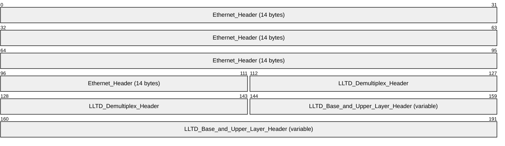

**Ethernet_Header (14 bytes):** 802.3 defined frame format, as specified in [[IEEE802.3]](https://go.microsoft.com/fwlink/?LinkId=89911), with Ethertype value set to 0x88D9.

**LLTD_Demultiplex_Header (4 bytes):** Framing that indicates message types as specified in section [2.2.3.1](#Section_2.2.3.1).

**LLTD_Base_and_Upper_Layer_Header (variable):** Service and message-specific framing header as specified in sections [2.2.4](#Section_2.2.4), [2.2.5](#Section_2.2.5), and [2.2.6](#Section_2.2.6).

<a id="Section_2.2.1"></a>
### 2.2.1 Common Data Types

<a id="Section_2.2.1.1"></a>
#### 2.2.1.1 Attributes

Attributes are used in Hello frames (as specified in section [2.2.4.3](#Section_2.2.4.3)) that [**responders**](#gt_responder) send to [**enumerators**](#gt_enumerator) during [**quick discovery**](#gt_quick-discovery).

All attributes are [**TLVs**](#gt_type-length-value-tlv) and MUST comply with the following format, except when **Type** is 0x00.

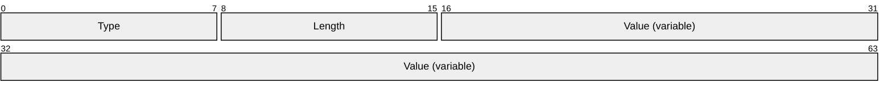

**Type (1 byte):** The **Type** field identifies each attribute. Legal values are specified in the following table, and each attribute is specified in its own subsection.

| Value | Meaning |
| --- | --- |
| 0x00 | [End-of-Property List marker (section 2.2.1.1.1)](#Section_2.2.1.1.1). |
| 0x01 | [Host ID (section 2.2.1.1.2)](#Section_2.2.1.1.2) that uniquely identifies the host on which the responder is running. |
| 0x02 | [Characteristics (section 2.2.1.1.3)](#Section_2.2.1.1.3). |
| 0x03 | [Physical Medium (section 2.2.1.1.4)](#Section_2.2.1.1.4). |
| 0x04 | [Wireless Mode (section 2.2.1.1.5)](#Section_2.2.1.1.5). |
| 0x05 | 802.11 Basic Service Set Identifier (BSSID) (section [2.2.1.1.6)](#Section_802.11). |
| 0x06 | 802.11 Service Set Identifier (SSID) (section [2.2.1.1.7)](#Section_802.11). |
| 0x07 | [IPv4 Address (section 2.2.1.1.8)](#Section_2.2.1.1.8). |
| 0x08 | [IPv6 Address (section 2.2.1.1.9)](#Section_2.2.1.1.9). |
| 0x09 | 802.11 Maximum Operational Rate (section [2.2.1.1.10)](#Section_802.11). |
| 0x0A | [Performance Counter Frequency (section 2.2.1.1.11)](#Section_2.2.1.1.11). |
| 0x0C | [Link Speed (section 2.2.1.1.12)](#Section_2.2.1.1.12). |
| 0x0D | 802.11 Received Signal Strength Indication (RSSI) (section [2.2.1.1.13)](#Section_802.11). |
| 0x0E | [Icon Image (section 2.2.1.1.14)](#Section_2.2.1.1.14). |
| 0x0F | [Machine Name (section 2.2.1.1.15)](#Section_2.2.1.1.15). |
| 0x10 | [Support Information (section 2.2.1.1.16)](#Section_2.2.1.1.16) that identifies the device manufacturer's support information. |
| 0x11 | [Friendly Name (section 2.2.1.1.17)](#Section_2.2.1.1.17). |
| 0x12 | [Device Universally Unique Identifier (UUID) (section 2.2.1.1.18)](#Section_2.2.1.1.18). |
| 0x13 | [Hardware ID (section 2.2.1.1.19)](#Section_2.2.1.1.19). |
| 0x14 | [QoS Characteristics (section 2.2.1.1.20)](#Section_2.2.1.1.20). |
| 0x15 | 802.11 Physical Medium (section [2.2.1.1.21)](#Section_802.11). |
| 0x16 | [AP Association Table (section 2.2.1.1.22)](#Section_2.2.1.1.22). |
| 0x18 | [Detailed Icon Image (section 2.2.1.1.23)](#Section_2.2.1.1.23). |
| 0x19 | [Sees-List Working Set (section 2.2.1.1.24)](#Section_2.2.1.1.24). |
| 0x1A | [Component Table (section 2.2.1.1.25)](#Section_2.2.1.1.25). |
| 0x1B | [Repeater AP Lineage (section 2.2.1.1.26)](#Section_2.2.1.1.26). |
| 0x1C | [Repeater AP Table (section 2.2.1.1.27)](#Section_2.2.1.1.27). |

**Length (1 byte):** This field specifies the length, in bytes, of the **Value** field.

**Value (variable):** This field specifies information that is specific to the attribute, as specified in the corresponding subsection.

<a id="Section_2.2.1.1.1"></a>
##### 2.2.1.1.1 End-of-Property List Marker

The End-of-Property List Marker attribute signals the end of the [**TLV**](#gt_type-length-value-tlv) list. All [**responders**](#gt_responder) MUST include this marker in every Hello frame.

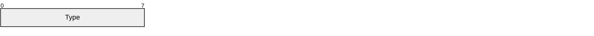

**Type (1 byte):** This field MUST be set to 0x00.

<a id="Section_2.2.1.1.2"></a>
##### 2.2.1.1.2 Host ID

The Host ID attribute uniquely identifies the host on which the [**responder**](#gt_responder) is running. All responders MUST include this attribute in all Hello frames.

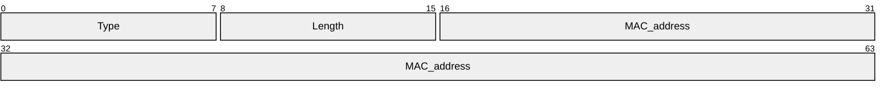

**Type (1 byte):** This field MUST be set to 0x01.

**Length (1 byte):** This field MUST be set to 0x06.

**MAC_address (6 bytes):** This field MUST be the [**MAC address**](#gt_5f9ccdf4-2607-4855-9a72-2010aa3300bf) of the host upon which the responder is running. On a host with multiple network interfaces, this field SHOULD be the lowest MAC address across the network interfaces.

<a id="Section_2.2.1.1.3"></a>
##### 2.2.1.1.3 Characteristics

The Characteristics attribute identifies various characteristics of the [**responder**](#gt_responder) host and network interface. This attribute is mandatory. All responders MUST include this attribute in all Hello frames.

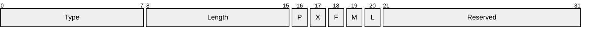

**Type (1 byte):** This field MUST be set to 0x02.

**Length (1 byte):** This field MUST be set to 0x02.

**P (1 bit):** Network interface is the public side of a network address translation (NAT), as specified in [[RFC3022]](https://go.microsoft.com/fwlink/?LinkId=90403).

**X (1 bit):** Network interface is the private side of a NAT.

**F (1 bit):** Network interface is in full duplex mode.

**M (1 bit):** Responder MUST set this field if it has a management web page accessible via the HTTP protocol. A management web page is optional. A responder MAY support it. The [**mapper**](#gt_mapper) SHOULD construct a URL from the reported IPv6 address. If one is not available, the IPv4 address MUST be used instead. The URL MUST be of the form: "http://<ip-address>/", where "<ip-address>" is either an IPv6 address in IPv6 literal notation (as specified in [[RFC3513]](https://go.microsoft.com/fwlink/?LinkId=90427) section 2.2) or an IPv4 address in four-part dotted decimal notation (as specified in [[RFC1123]](https://go.microsoft.com/fwlink/?LinkId=90268) section 2.1).

**L (1 bit):** Network interface is looping back outbound packets; the outbound packet is sent over the network interface and also looped back to the interface sending the packet (allowing other protocols bound to the interface to receive the packet).

**Reserved (11 bits):** MUST be set to zero when sent and ignored on receipt.

<a id="Section_2.2.1.1.4"></a>
##### 2.2.1.1.4 Physical Medium

The Physical Medium attribute identifies the physical medium of a network interface by using one of the IANA-published ifType object enumeration values. This attribute is mandatory. All [**responders**](#gt_responder) MUST include this attribute in all Hello frames.

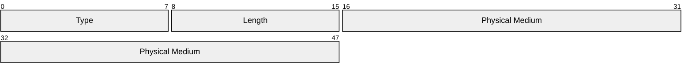

**Type (1 byte):** This field MUST be set to 0x03.

**Length (1 byte):** This field MUST be set to 0x04.

**Physical Medium (4 bytes):** This field MUST be set to the physical medium type of the network interface that the responder is using. The values are published by the Internet Assigned Numbers Authority (IANA) for the ifType object, as specified in [[IANAifType]](https://go.microsoft.com/fwlink/?LinkId=89884).

<a id="Section_2.2.1.1.5"></a>
##### 2.2.1.1.5 Wireless Mode

The Wireless Mode attribute identifies how an Institute of Electrical and Electronics Engineers (IEEE) 802.11, as specified in [[IEEE802.11-2007]](https://go.microsoft.com/fwlink/?LinkID=89905), network interface connects to the network. Implementations with [**responders**](#gt_responder) in 802.11 [**stations**](#gt_station) MUST include this attribute in all Hello frames.

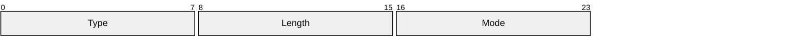

**Type (1 byte):** This field MUST be set to 0x04.

**Length (1 byte):** This field MUST be set to 0x01.

**Mode (1 byte):** This field specifies the method by which a responder's IEEE 802.11 network interface connects to the network. The following table shows valid values.

| Value | Meaning |
| --- | --- |
| 0x00 | 802.11 IBSS or ad-hoc mode, as specified in [IEEE802.11-2007]. |
| 0x01 | 802.11 infrastructure mode, as specified in [IEEE802.11-2007]. |

<a id="Section_802.11"></a>
<a id="Section_2.2.1.1.6"></a>
##### 802.11 BSSID

The 802.11 BSSID attribute specifies an IEEE 802.11 network interface's associated [**AP**](#gt_80211-access-point-ap). Implementations with [**responders**](#gt_responder) in 802.11 [**stations**](#gt_station) MUST include this attribute in all Hello frames.

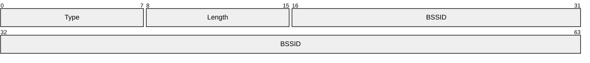

**Type (1 byte):** This field MUST be set to 0x05.

**Length (1 byte):** This field MUST be set to 0x06.

**BSSID (6 bytes):** This field specifies the [**MAC address**](#gt_5f9ccdf4-2607-4855-9a72-2010aa3300bf) of the AP with which a wireless responder's wireless network interface is associated.

<a id="Section_2.2.1.1.7"></a>
##### 2.2.1.1.7 802.11 SSID

The 802.11 SSID attribute specifies an IEEE 802.11 network interface's associated [**AP**](#gt_80211-access-point-ap). Implementations with responders in 802.11 [**stations**](#gt_station) MUST include this attribute in all Hello frames.

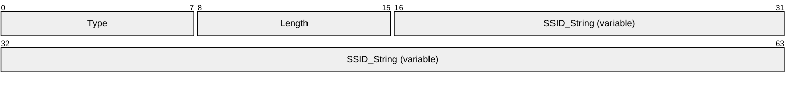

**Type (1 byte):** This field MUST be set to 0x06.

**Length (1 byte):** This field specifies the length in bytes of the **SSID_String** field.

**SSID_String (variable):** The ASCII representation of the [**SSID**](#gt_service-set-identifier-ssid) for the basic service set with which a wireless [**responder's**](#gt_responder) wireless network interface associates. Note that the string MUST NOT be null-terminated and MUST be treated as case-sensitive. The maximum length of the string is 32 characters.

<a id="Section_2.2.1.1.8"></a>
##### 2.2.1.1.8 IPv4 Address

The IPv4 Address attribute specifies an IPv4 network address of the [**responder**](#gt_responder). This attribute is optional; implementations SHOULD include it in Hello frames if they have an IPv4 address.

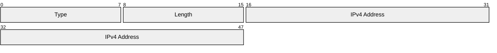

**Type (1 byte):** This field MUST be set to 0x07.

**Length (1 byte):** This field MUST be set to 0x04.

**IPv4 Address (4 bytes):** This field specifies an IPv4 address of the responder. This field's value MUST be an address of the network interface over which the frame is sent, if it has an IPv4 address. If there are multiple IPv4 addresses on the network interface, the device is free to choose any one of them. If an IPv4 address is not available on the network interface over which the frame is sent, the device MAY use an IPv4 address on a different network interface. However, if the responder sets the M bit in the [Characteristics](#Section_802.11) attribute, the address MUST be one which is reachable via the interface over which the frame is sent. If no such address exists, the responder MUST NOT include the IPv4 Address attribute.

<a id="Section_2.2.1.1.9"></a>
##### 2.2.1.1.9 IPv6 Address

The IPv6 Address attribute specifies an IPv6 network address of the [**responder**](#gt_responder). This attribute is optional; implementations SHOULD include it in all Hello frames if they have an IPv6 address.


**Type (1 byte):** This field MUST be set to 0x08.

**Length (1 byte):** This field MUST be set to 0x10.

**IPv6 Address (16 bytes):** This field specifies an IPv6 address of the responder. This field's value MUST be an address of the network interface over which the frame is sent, if it has an IPv6 address. If there are multiple IPv6 addresses on the network interface, the device is free to choose any one of them. If an IPv6 address is not available on the network interface over which the frame is sent, the device MAY use an IPv6 address on a different network interface. However, if the responder sets the MW bit in the [Characteristics](#Section_802.11) attribute, the address MUST be one which is reachable via the interface over which the frame is sent, and if there is no such address, the responder MUST NOT include the IPv6 Address attribute.

<a id="Section_2.2.1.1.10"></a>
##### 2.2.1.1.10 802.11 Maximum Operational Rate

The 802.11 Maximum Operational Rate attribute specifies the maximum data rate at which the radio can run. This attribute is optional; responders operating on 802.11 station network interfaces MAY include it in Hello frames.

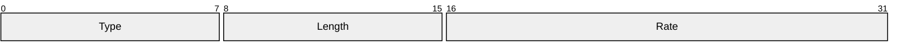

**Type (1 byte):** This field MUST be set to 0x08.

**Length (1 byte):** This field MUST be set to 0x02.

**Rate (2 bytes):** This field specifies the maximum data rate, in network byte order, at which the 802.11 interface can run, in units of 0.5 megabits per second (Mbps).

<a id="Section_2.2.1.1.11"></a>
##### 2.2.1.1.11 Performance Counter Frequency

The Performance Counter Frequency attribute specifies how fast the time stamp counters run in ticks per second. This information is particularly useful for deciphering the results from timed probe and [**probegap**](#gt_probegap) tests in the QoS diagnostics type of service. This attribute is optional; implementations SHOULD include it in all Hello frames.

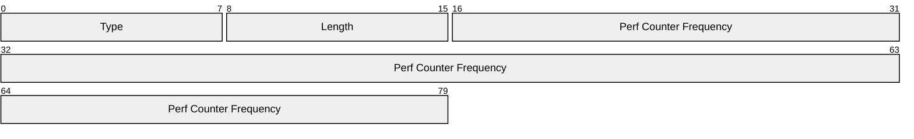

**Type (1 byte):** This field MUST be set to 0x0A.

**Length (1 byte):** This field MUST be set to 0x08.

**Perf Counter Frequency (8 bytes):** This field specifies the number of ticks per second, in network byte order, at which the responder's time stamp counters function.

<a id="Section_2.2.1.1.12"></a>
##### 2.2.1.1.12 Link Speed

The Link Speed attribute specifies the network interface's maximum speed in units of 100 bits per second (bps). This attribute is optional; implementations SHOULD include it in all Hello frames.

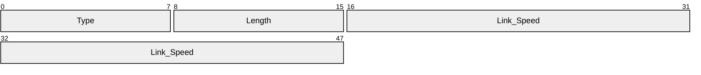

**Type (1 byte):** This field MUST be set to 0x0C.

**Length (1 byte):** This field MUST be set to 0x04.

**Link_Speed (4 bytes):** This field specifies the maximum speed, in network byte order, of the sender's network interface, in units of 100 bps.

<a id="Section_2.2.1.1.13"></a>
##### 2.2.1.1.13 802.11 RSSI

The 802.11 RSSI attribute specifies an IEEE 802.11 network interface's RSSI, as specified in [[IEEE802.11-2007]](https://go.microsoft.com/fwlink/?LinkID=89905). This attribute is optional; [**responders**](#gt_responder) operating on 802.11 station network interfaces Windows Server 2008 Datacenter operating system SHOULD<1> include it in all Hello frames.

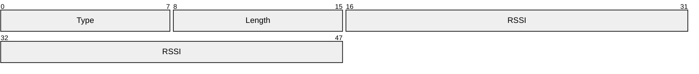

**Type (1 byte):** This field MUST be set to 0x0D.

**Length (1 byte):** This field MUST be set to 0x04.

**RSSI (4 bytes):** This field specifies an aligned integer that identifies the IEEE 802.11 network interfaces' RSSI. If the actual RSSI value is available, this field MUST be a negative value (the normal range for an RSSI value is -10 through -200), in decibels referenced to a milliwatt (dBm) in network byte order.

If the actual RSSI value is not available, but the implementation has some other estimate of the signal strength,<2> this field MUST be a value in the range 0 to 100, where a value of 50 means an "average" link quality and a value of 100 means a "perfect" link.

<a id="Section_2.2.1.1.14"></a>
##### 2.2.1.1.14 Icon Image

The Icon Image attribute specifies that the responder has an icon image that represents the host running the [**responder**](#gt_responder) and is willing to provide it if a QueryLargeTLV frame requests it. This attribute is optional; implementations MAY include it in all Hello frames.

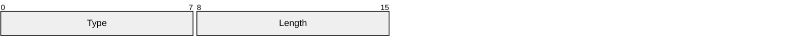

**Type (1 byte):** This field MUST be set to 0x0E.

**Length (1 byte):** This field MUST be set to 0x00.

<a id="Section_2.2.1.1.15"></a>
##### 2.2.1.1.15 Machine Name

The Machine Name attribute specifies an unterminated [**UCS-2LE**](#gt_ucs-2le) string that identifies the device's host name. This attribute is mandatory; implementations MUST include it in Hello frames.

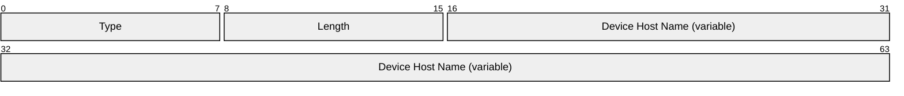

**Type (1 byte):** This field MUST be set to 0x0F.

**Length (1 byte):** This field specifies the length of the **Device Host Name** field, in bytes. This field's value MUST be in the range 2 to 32 (that is, 1 to 16 Unicode characters).

**Device Host Name (variable):** This field specifies a UCS-2LE string that specifies the device's host name, where host name SHOULD be a non-fully qualified domain name. The string MUST NOT be null-terminated.

<a id="Section_2.2.1.1.16"></a>
##### 2.2.1.1.16 Support Information

The Support Information attribute specifies the device manufacturer's support information (for example, telephone number and support URL). This attribute is optional; implementations MAY include it in Hello frames.

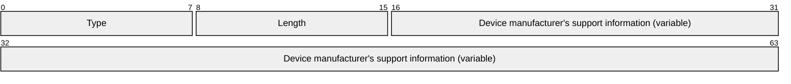

**Type (1 byte):** This field MUST be set to 0x10.

**Length (1 byte):** This field MUST specify a length of 64 octets or less.

**Device manufacturer's support information (variable):** This field specifies a UCS-2LE string that specifies the device manufacturer's support information (such as telephone number). The maximum length of the string is 32 characters or 64 octets. Note that the string MUST NOT be null-terminated.

<a id="Section_2.2.1.1.17"></a>
##### 2.2.1.1.17 Friendly Name

The Friendly Name attribute indicates that the device has a friendly name and is willing to provide it if a QueryLargeTLV frame requests it. This attribute is optional; implementations MAY include it in Hello frames.


**Type (1 byte):** This field MUST be set to 0x11.

**Length (1 byte):** This field MUST be set to 0x00.

<a id="Section_2.2.1.1.18"></a>
##### 2.2.1.1.18 Device UUID

The Device UUID attribute specifies a [**UUID**](#gt_universally-unique-identifier-uuid) and uniquely identifies a device that supports Universal Plug and Play (UPnP) [[UPnP]](https://go.microsoft.com/fwlink/?LinkId=90553). This attribute is used to identify a responder residing on a UPnP device. Devices that include UPnP functionality MAY include the Device UUID attribute in Hello frames in order to identify themselves as UPnP-capable.

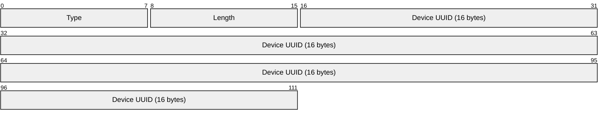

**Type (1 byte):** This field MUST be set to 0x12.

**Length (1 byte):** This field MUST be set to 0x16.

**Device UUID (16 bytes):** This field specifies the UUID that is found in the device unique service name (USN) portion of an Simple Service Discovery Protocol (SSDP) discovery response (as specified in [UPnP] section 1.2.3) in UUID binary format.

<a id="Section_2.2.1.1.19"></a>
##### 2.2.1.1.19 Hardware ID

The Hardware ID attribute is used by a responder to indicate that it has a Hardware ID property (see section [2.2.2.3](#Section_2.2.2.3)) and is willing to provide it if a QueryLargeTLV frame requests it. This attribute is optional for responders in UPnP devices; that is, implementations that include UPnP functionality MAY include it in Hello frames.

```mermaid
packet-beta
  0-7: "Type"
  8-15: "Length"
```

**Type (1 byte):** This field MUST be set to 0x13.

**Length (1 byte):** This field MUST be set to 0x00.

<a id="Section_2.2.1.1.20"></a>
##### 2.2.1.1.20 QoS Characteristics

The QoS Characteristics attribute specifies various QoS–related characteristics of the [**responder**](#gt_responder) host and network interface. This attribute is mandatory for responders that support layer 2 forwarding, VLAN tagging, or 802.1p priority tagging; implementations MUST include it in all Hello frames.

```mermaid
packet-beta
  0-7: "Type"
  8-15: "Length"
  16-16: "E"
  17-17: "Q"
  18-18: "P"
  19-31: "Reserved"
```

**Type (1 byte):** This field MUST be set to 0x14.

**Length (1 byte):** This field MUST be set to 0x04.

**E (1 bit):** This field MUST be set if the responder is not providing any Layer 2 forwarding between [**segments**](#gt_segment) on this link.

**Q (1 bit):** This field MUST be set if the interface supports 802.1q virtual local area network (VLAN) tagging, as specified in [[IEEE802.1Q]](https://go.microsoft.com/fwlink/?LinkId=89909) section 9.

**P (1 bit):** This field MUST be set if the network interface supports setting the **User Priority** field in the **Tag Control Information** of the tag header (802.1p priority tagging), as specified in [IEEE802.1Q] section 9.3.2.1

**Reserved (13 bits):** MUST be set to zero when sent and MUST be ignored on receipt.

<a id="Section_2.2.1.1.21"></a>
##### 2.2.1.1.21 802.11 Physical Medium

The 802.11 Physical Medium attribute is sent by [**responders**](#gt_responder) in 802.11 [**stations**](#gt_station) to indicate the wireless physical medium used by the station; implementations MAY <3> include it in all Hello frames.

```mermaid
packet-beta
  0-7: "Type"
  8-15: "Length"
  16-23: "PHY_Type"
```

**Type (1 byte):** This field MUST be set to 0x15.

**Length (1 byte):** This field MUST be set to 0x01.

**PHY_Type (1 byte):** A wireless responder MUST use this field to report the 802.11 physical medium in use per dot11PHYType in 802dot11-MIB, as specified in [[IEEE802.11-2007]](https://go.microsoft.com/fwlink/?LinkID=89905) Appendix D. The following table shows the valid values.

| Value | Meaning |
| --- | --- |
| 0x00 | Unknown |
| 0x01 | FHSS 2.4 gigahertz (GHz) |
| 0x02 | DSSS 2.4 GHz |
| 0x03 | IR Baseband |
| 0x04 | OFDM 5 GHz |
| 0x05 | HRDSSS |
| 0x06 | ERP |
| 0x07 — 0xFF | Reserved for future use. |

<a id="Section_2.2.1.1.22"></a>
##### 2.2.1.1.22 AP Association Table

The **AP Association Table** attribute indicates that the [**responder**](#gt_responder) is an [**AP**](#gt_80211-access-point-ap) with an AP Association Table that lists wireless hosts that are associated with it and is willing to provide it if a QueryLargeTLV frame requests it. This attribute is mandatory for [**802.11 Access Point (AP)**](#gt_80211-access-point-ap) responders; APs MUST include it in all Hello frames.

```mermaid
packet-beta
  0-7: "Type"
  8-15: "Length"
```

**Type (1 byte):** This field MUST be set to 0x16.

**Length (1 byte):** This field MUST be set to 0x00.

<a id="Section_2.2.1.1.23"></a>
##### 2.2.1.1.23 Detailed Icon Image

The presence of a Detailed Icon Image attribute indicates that the [**responder**](#gt_responder) has a Detailed Icon Image and is willing to provide it if a QueryLargeTLV requests it. A Detailed Icon Image is a high-resolution graphical representation of the device running the responder, as opposed to an [Icon Image](#Section_802.11) attribute, which is lower resolution. This attribute is optional; implementations MAY include it in Hello frames.

If a responder includes this attribute, it SHOULD also include the smaller Icon Image attribute. If space is restricted such that only one icon image is available in the responder, the responder MUST return the Icon Image in the Hello frame if the image is less than or equal to 32,768 octets, or it MUST return this Detailed Icon Image attribute in the Hello frame if the icon image is greater than 32,768 octets and less than or equal to 262,144 octets.

The Detailed Icon Image attribute MUST have the following format.

```mermaid
packet-beta
  0-7: "Type"
  8-15: "Length"
```

**Type (1 byte):** This field MUST be set to 0x18.

**Length (1 byte):** This field MUST be set to 0x00.

<a id="Section_2.2.1.1.24"></a>
##### 2.2.1.1.24 Sees-List Working Set

The Sees-List Working Set attribute specifies the maximum entry count in the [**responder's**](#gt_responder) sees-list database. This attribute is mandatory for responders that can only maintain a list of less than 2^16 entries; such implementations MUST include it in all Hello frames. Responders that have capacity to maintain at least 2^16 entries SHOULD NOT include it. The absence of this attribute indicates that the responder supports at least 2^16 entries.

```mermaid
packet-beta
  0-7: "Type"
  8-15: "Length"
  16-31: "Max Entries"
```

**Type (1 byte):** This field MUST be set to 0x19.

**Length (1 byte):** This field MUST be set to 0x02.

**Max Entries (2 bytes):** The maximum count, in network byte order, of **RecveeDesc** entries (as specified in section [2.2.4.9](#Section_2.2.4.9)) that can be stored in its sees-list database.

<a id="Section_2.2.1.1.25"></a>
##### 2.2.1.1.25 Component Table

The presence of the Component Table attribute indicates that the [**responder**](#gt_responder) has a Component Table that specifies a responder's internal components, allowing the mapper to generate a more accurate topology map, and that the responder is willing to provide it if a QueryLargeTLV requests it. Responder implementations in multifunction devices MUST include this attribute in all Hello frames.

```mermaid
packet-beta
  0-7: "Type"
  8-15: "Length"
```

**Type (1 byte):** This field MUST be set to 0x1A.

**Length (1 byte):** This field MUST be set to 0x00.

<a id="Section_2.2.1.1.26"></a>
##### 2.2.1.1.26 Repeater AP Lineage

The Repeater AP Lineage attribute specifies the address of the parent, and optionally holds the chain of parents up to the root of the 802.11 Distribution System, as specified in [[IEEE802.11-2007]](https://go.microsoft.com/fwlink/?LinkID=89905) section 5.2.2. A [**responder**](#gt_responder) in an [**access point**](#gt_access-point) operating in repeater mode MUST use this attribute to provide the address of the parent (which MUST be the same as the reported BSSID because this device is also a client) and each subsequent parent toward the root, if available.

Responders in 802.11 access points MUST include this attribute in all Hello frames.

```mermaid
packet-beta
  0-7: "Type"
  8-15: "Length"
  16-63: "Address Path to Root (variable)"
```

**Type (1 byte):** This field MUST be set to 0x1B.

**Length (1 byte):** This field MUST be set to a multiple of 6, with a maximum of 36.

6

12

18

24

30

36

**Address Path to Root (variable):** If the sender is the root of the 802.11 Distribution System, this field MUST be empty (not present). Otherwise, it MUST contain a list of up to six [**MAC addresses**](#gt_5f9ccdf4-2607-4855-9a72-2010aa3300bf), where the first address is the parent [**AP**](#gt_80211-access-point-ap) address, the second address is that AP's parent, and so forth until either the root MAC address is reached or six addresses have been included.

<a id="Section_2.2.1.1.27"></a>
##### 2.2.1.1.27 Repeater AP Table

The Repeater AP Table attribute indicates that the [**responder**](#gt_responder) has the routing table that a responder is using for packets to addresses that are not directly associated, and that the responder is willing to provide it if a QueryLargeTLV requests it. If the [**access point**](#gt_access-point) is a repeater [**AP**](#gt_80211-access-point-ap) as part of a Wireless Distribution System, this information permits the [**mapper**](#gt_mapper) to generate a more accurate topology map. This attribute is mandatory for responders in 802.11 repeater access points; such implementations MUST include it in all Hello frames.

```mermaid
packet-beta
  0-7: "Type"
  8-15: "Length"
```

**Type (1 byte):** This field MUST be set to 0x1C.

**Length (1 byte):** This field MUST be set to 0x00.

<a id="Section_2.2.2"></a>
### 2.2.2 Large Data Properties

The **QueryLargeTlvResp** frame, as specified in [2.2.4.14](#Section_2.2.4.14), is used to return (portions of) data properties that are declared as zero length in Hello frames.

<a id="Section_2.2.2.1"></a>
#### 2.2.2.1 Icon Image

The property data MUST be an icon image, at most 32,768 bytes long. The image MUST be in any image format that has a unique signature at the beginning, so that the receiver can detect the image format purely by inspecting the image. There are many file formats that meet this requirement, including GIF and JPEG. A [**responder**](#gt_responder) supports this property MAY use any such format, and the mapper MAY<4> recognize any such formats it chooses. If the image is not in a format that the [**mapper**](#gt_mapper) recognizes, the mapper MUST use a default image that it has, in place of the one it received from the responder.

<a id="Section_2.2.2.2"></a>
#### 2.2.2.2 Friendly Name

The Friendly Name property contains a non-NULL-terminated UCS-2LE string that identifies the device's [**friendly name**](#gt_friendly-name). This property's value MUST be between 2 and 64 bytes (1 and 32 characters) in length.

<a id="Section_2.2.2.3"></a>
#### 2.2.2.3 Hardware ID

The Hardware ID property contains a non-NULL-terminated UCS-2LE string. This information MUST come from the UPnP device description phase, as specified in [[UPnP]](https://go.microsoft.com/fwlink/?LinkId=90553) section 2.1.<5>

The Hardware ID MUST follow these formatting rules:

- Characters with an ASCII value less than 0x20 are not allowed.
- Characters with an ASCII value greater than 0x80 are not allowed.
- Commas are not allowed.
- All spaces " " MUST be replaced with an underscore character "_".
Note that the string MUST NOT be null-terminated.

The maximum length of the string is 200 characters (400 octets) and MUST be provided in UCS-2LE format.

<a id="Section_2.2.2.4"></a>
#### 2.2.2.4 AP Association Table

A wireless [**access point**](#gt_access-point) [**responder**](#gt_responder) uses this data object to report the wireless hosts that are associated with it. This information is particularly useful for discovering legacy wireless devices that do not implement the responder. Additionally, it allows the mapper to conclusively match wireless hosts that are associated with the same access point via different [**BSSIDs**](#gt_basic-service-set-identifier-bssid) (for example, one for each supported band).

The table MUST contain 0 or more entries for associated [**stations**](#gt_station), where each entry MUST have the following format.

```mermaid
packet-beta
  0-47: "MAC_address_of_wireless_host"
  48-63: "Max_Oper_Rate"
  64-71: "PHY_type"
  72-79: "Reserved"
```

**MAC_address_of_wireless_host (6 bytes):** MAC address of the particular 802.11 station that is associated with the [**AP**](#gt_80211-access-point-ap).

**Max_Oper_Rate (2 bytes):** The maximum operational data rate at which the selected radio can run to the given host, in network byte order. The data rate MUST be encoded in units of 0.5 Mbps.

**PHY_type (1 byte):** The physical medium type for the given host. Valid values are defined in section [2.2.1.1.21](#Section_2.2.1.1.21).

**Reserved (1 byte):** MUST be set to zero when sent and MUST be ignored on receipt.

If the size of the actual AP Association Table exceeds 409 entries, the responder MUST make only 409 entries available in this data object. It is up to the implementer to choose which stations to make available in that case.

<a id="Section_2.2.2.5"></a>
#### 2.2.2.5 Detailed Icon Image

The Detailed Icon Image property's data MUST be a high-resolution icon image, at most 262,144 bytes in length. The image format requirements are the same as specified in section [2.2.2.1](#Section_2.2.2.1).

<a id="Section_2.2.2.6"></a>
#### 2.2.2.6 Component Table

The Component Tabledata object is used by multifunction devices such as [**APs**](#gt_access-point) to report their internal components.

The table MUST be at most 4096 bytes in size and contain 0 or more entries for the sender's components, where each entry MUST begin with a header that is 2 octets in length.

```mermaid
packet-beta
  0-7: "Version"
  8-15: "Reserved"
```

**Version (1 byte):** This field MUST be set to 0x01.

**Reserved (1 byte):** MUST be set to zero when sent and MUST be ignored on receipt.

<a id="Section_2.2.2.6.1"></a>
##### 2.2.2.6.1 Component Descriptors

The [Component Table](#Section_802.11) header MUST be followed by an arbitrary number of component descriptors, each carrying a mandatory header.

```mermaid
packet-beta
  0-7: "Type"
  8-15: "Length"
```

**Type (1 byte):** This field is the component type. The following table shows the valid values.

| Value | Meaning |
| --- | --- |
| 0x00 | A bridge that interconnects all identified wireless local area network (WLAN) and LAN segments. It is assumed that the responder reporting the [Component Table](#Section_802.11) attribute is connected directly into this bridge. |
| 0x01 | This field is the 802.11 [**access point**](#gt_access-point). |
| 0x02 | This field is a built-in [**switch**](#gt_switch). If a bridge component (type 0x00) also exists, it indicates that this switch connects directly into the bridge. If a bridge component does not exist, it indicates that the switch is connected directly to the built-in responder. |

**Length (1 byte):** This field specifies the length (in octets) of the descriptor payload immediately following this header.

<a id="Section_2.2.2.6.1.1"></a>
###### 2.2.2.6.1.1 Bridge Component Descriptor

A bridge component descriptor with **Type** value 0x00 MUST have the following format.

```mermaid
packet-beta
  0-7: "Type"
  8-15: "Length"
  16-23: "Behavior"
```

**Type (1 byte):** This field MUST be set to 0x00.

**Length (1 byte):** This field MUST be set to 0x01.

**Behavior (1 byte):** This field identifies the behavior of the bridge. Valid values are the following.

| Value | Meaning |
| --- | --- |
| Hub 0x00 | All packets transitioning through the bridge are seen on the responder. |
| Switch 0x01 | Packets from LAN or WLAN are seen only on the responder if they are broadcast or explicitly targeted at the responder. |
| Internal_hub_switch 0x02 | Packets transitioning through the bridge are seen on the responder; however, the bridge learns addresses like a [**switch**](#gt_switch), provided that they initiate on components other than the responder. |

<a id="Section_2.2.2.6.1.2"></a>
###### 2.2.2.6.1.2 802.11 Access Point Component Descriptor

An 802.11 AP component descriptor with **Type** value 0x01 MUST have the following format.

```mermaid
packet-beta
  0-7: "Type"
  8-15: "Length"
  16-31: "Max_Oper_Rate"
  32-39: "PHY_type"
  40-47: "Mode"
  48-95: "BSSID"
```

**Type (1 byte):** This field MUST be set to 0x01.

**Length (1 byte):** This field MUST be set to 0x0A.

**Max_Oper_Rate (2 bytes):** The maximum operational data rate at which the radio can function, encoded in units of 0.5 Mbps in network byte order.

**PHY_type (1 byte):** This field is the physical medium type. Valid values are defined in section [2.2.1.1.21](#Section_2.2.1.1.21).

**Mode (1 byte):** This field specifies how the radio connects to the wireless network. Valid values are defined in section [2.2.1.1.5](#Section_2.2.1.1.5).

**BSSID (6 bytes):** The MAC address of the [**AP**](#gt_80211-access-point-ap) that is hosting the [**SSID**](#gt_service-set-identifier-ssid).

<a id="Section_2.2.2.6.1.3"></a>
###### 2.2.2.6.1.3 Built-in Switch Component Descriptor

A built-in switch component descriptor with **Type** value 0x02 MUST have the following format.

```mermaid
packet-beta
  0-7: "Type"
  8-15: "Length"
  16-47: "Link_Speed"
```

**Type (1 byte):** This field MUST be set to 0x01.

**Length (1 byte):** This field MUST be set to 0x04.

**Link_Speed (4 bytes):** The maximum speed of the [**switch**](#gt_switch), in units of 100 bps in network byte order.

<a id="Section_2.2.2.7"></a>
#### 2.2.2.7 Repeater AP Table

The Repeater AP Table data object is used by repeater [**access points**](#gt_access-point) to report [**station**](#gt_station) routing information.

The table MUST contain a list of 0 or more entries where each entry represents a host and [**AP**](#gt_80211-access-point-ap) pair. Each table entry is 12 octets in length, and the format MUST be the following.

```mermaid
packet-beta
  0-47: "MAC_address_of_destination_host"
  48-95: "MAC_address_of_next_hop_access_point"
```

**MAC_address_of_destination_host (6 bytes):** This field specifies the [**MAC address**](#gt_5f9ccdf4-2607-4855-9a72-2010aa3300bf) of the particular 802.11 station that is associated with another AP.

**MAC_address_of_next_hop_access_point (6 bytes):** This field MUST be one of the [**BSSID**](#gt_basic-service-set-identifier-bssid) addresses that are listed in the [AP Association Table](#Section_802.11) through which the AP can reach the destination host. The implementer is free to choose any such BSSID address.

If the size of the actual Repeater AP Table exceeds 256 entries, the responder MUST make only 256 entries available in this property. It is up to the implementer to choose which host and AP pairs are made available in that case.

<a id="Section_2.2.3"></a>
### 2.2.3 Base Specification

All implementations of this protocol MUST use and accept the following base specification format.

<a id="Section_2.2.3.1"></a>
#### 2.2.3.1 Demultiplex Header Format

The Demultiplex header format is defined as follows.

```mermaid
packet-beta
  0-7: "Version"
  8-15: "Type_of_Service"
  16-23: "Reserved"
  24-31: "Function"
```

**Version (1 byte):** This field specifies the version of the Demultiplex header. This field MUST be set to 0x01.

**Type_of_Service (1 byte):** This field specifies the intent of the sender. When a sender sends a Discover frame with Type_of_Service set to Topology discovery (0x00) or Quick discovery (0x01), any Hello frame sent by a responder in response MUST have the Type_of_Service field set to either Topology discovery (0x00) or Quick discovery (0x01).

| Value | Meaning |
| --- | --- |
| 0x00 | Topology discovery |
| 0x01 | Quick discovery |
| 0x02 | QoS diagnostics (Network Test and Cross Traffic Analysis) |

**Reserved (1 byte):** MUST be set to zero when sent and MUST be ignored on receipt.

**Function (1 byte):** This field is the type of message for a given type of service. The following functions are valid for service type 0x00.

| Value | Meaning |
| --- | --- |
| 0x00 | Discover |
| 0x01 | Hello |
| 0x02 | Emit |
| 0x03 | Train |
| 0x04 | Probe |
| 0x05 | Ack |
| 0x06 | Query |
| 0x07 | QueryResp |
| 0x08 | Reset |
| 0x09 | Charge |
| 0x0A | Flat |
| 0x0B | QueryLargeTlv |
| 0x0C | QueryLargeTlvResp |

The following functions are valid for service type 0x01.

| Value | Meaning |
| --- | --- |
| 0x00 | Discover |
| 0x01 | Hello |
| 0x08 | Reset |

The following functions are valid for service type 0x02.

| Value | Meaning |
| --- | --- |
| 0x00 | QosInitializeSink |
| 0x01 | QosReady |
| 0x02 | QosProbe |
| 0x03 | QosQuery |
| 0x04 | QosQueryResp |
| 0x05 | QosReset |
| 0x06 | QosError |
| 0x07 | QosAck |
| 0x08 | QosCounterSnapshot |
| 0x09 | QosCounterResult |
| 0x0A | QosCounterLease |

<a id="Section_2.2.4"></a>
### 2.2.4 Topology Discovery Tests and Quick Discovery

<a id="Section_2.2.4.1"></a>
#### 2.2.4.1 Base Header Format

This base header MUST be used when the Type of Service value in the [Demultiplex](#Section_2.2.3.1) header is set to 0x00 (Topology discovery) or 0x01 (Quick discovery).

The Base header MUST be the following.

```mermaid
packet-beta
  0-47: "Real_Destination_Address"
  48-95: "Real_Source_Address"
  96-111: "Sequence_Number_or_XID"
```

**Real_Destination_Address (6 bytes):** This field specifies the intended destination's [**real MAC address**](#gt_real-mac-address).

**Real_Source_Address (6 bytes):** This field specifies the sender's real MAC address. A sender MUST set the real source and destination MAC addresses to its own MAC address and its intended destination MAC address, respectively. These fields are required because the source and destination address fields of the Ethernet header are rewritten by some network devices and thus might not survive an end-to-end transmission.

**Sequence_Number_or_XID (2 bytes):** If the frame is a Discover frame or a Reset frame, this field MUST contain a transaction ID (XID). Otherwise, it MUST contain a sequence number.

A sequence number, in network byte order, correlates a response to a specific request and increments using ones-complement arithmetic. The sequence number ensures reliability of acknowledged request frames in the protocol, that is Emit, Charge, Query, and QueryLargeTlv frames. Emit and Charge frames can be both acknowledged and unacknowledged. Acknowledged frames MUST use nonzero sequence numbers. Unacknowledged frames, that is Emit, Charge, Hello, Train, and Probe frames, are frames for which the protocol does not guarantee reliability and MUST use a sequence number of zero.

An XID is used to uniquely identify the mapper or enumerator session. For a Discover Frame, the mapper MUST randomly generate two XIDs at initialization: one MUST be used for [**topology discovery tests**](#gt_topology-discovery-test), and one MUST be used for quick discovery.

With stable storage, a XID value for quick discovery SHOULD be sequential to the previous XID value for quick discovery and a XID value for topology discovery SHOULD be sequential to the previous XID value for topology discovery; without stable storage, XID values MAY be assigned at random. For a Reset frame, the XID MUST be set to zero. Sequential XIDs are preferable, because they reduce the probability of incorrect association with a previous session.

<a id="Section_2.2.4.2"></a>
#### 2.2.4.2 Discover Upper-Level Header Format

A Discover frame is broadcast by an enumerator to all [**responders**](#gt_responder) to initiate quick discovery and cause responders to start responding with Hello frames.

The Discover header MUST immediately follow the Base header.

```mermaid
packet-beta
  0-15: "Generation_Number"
  16-31: "Number_of_Stations"
  32-95: "Station_List (variable)"
```

**Generation_Number (2 bytes):** This field contains an unsigned integer in network byte order. This field allows the mapper to negotiate a generation number with the responders that respond to a Discover frame. The number allows the mapper to generate a unique range of MAC addresses that falls between 00-0D-3A-D7-F1-40 and 00-0D-3A-FF-FF-FF (the topology discovery address pool reserved for the Microsoft Corporation as specified in [[IEEE-OUI]](https://go.microsoft.com/fwlink/?LinkId=89895)), that does not conflict with those from a recent [**topology discovery test**](#gt_topology-discovery-test).

**Number_of_Stations (2 bytes):** This field specifies an unsigned integer. This field indicates the number of [**station**](#gt_station) addresses that are present in the following station list.

**Station_List (variable):** This field MUST be a sequence of 6-octet MAC addresses where the number of addresses in the sequence is given by the **Number_of_Stations** field.

<a id="Section_2.2.4.3"></a>
#### 2.2.4.3 Hello Upper-Level Header Format

Hello frames MUST be sent to the Ethernet all-ones broadcast address so all [**switches**](#gt_switch) can learn the source port of all [**responders**](#gt_responder). The **Real Destination Address** field in the Base header of the Hello frame SHOULD be set to FF-FF-FF-FF-FF-FF.

The Hello header following a Base header MUST be the following.

```mermaid
packet-beta
  0-15: "Generation_Number"
  16-63: "Current_Mapper_Address"
  64-111: "Apparent_Mapper_Address"
  112-159: "TLV_List (variable)"
```

**Generation_Number (2 bytes):** This field specifies an unsigned integer that indicates the responder's current generation number.

**Current_Mapper_Address (6 bytes):** The active mapper's [**real MAC address**](#gt_real-mac-address) as given in the **Real Source Address** field in the Base header of the Discover frame that initiated the active topology mapping request. This field MUST be set to zero if there is no active topology mapping session.

**Apparent_Mapper_Address (6 bytes):** This field specifies the mapper's MAC address as given in the **Source Address** field in the Ethernet header of the Discover frame that initiated the active topology mapping request. This field MUST be set to zero if there is no active topology mapping session.

**TLV_List (variable):** This field specifies properties (as specified in section [2.2.1.1](#Section_2.2.1.1)) that the responder knows about the network interface on which it is running. A [**TLV**](#gt_type-length-value-tlv) MUST NOT occur in the list more than once.

<a id="Section_2.2.4.4"></a>
#### 2.2.4.4 Emit Upper-Level Header Format

A [**mapper**](#gt_mapper) sends an Emit frame to a [**responder**](#gt_responder) to request that the responder transmit a set of Train or Probe frames, each with specified source and destination [**MAC addresses**](#gt_5f9ccdf4-2607-4855-9a72-2010aa3300bf), after a specified pause time, and optionally that the responder immediately acknowledge the Emit frame with an Ack frame. The pause is used because some [**switches**](#gt_switch) require approximately 150 milliseconds to update their port filtering databases, so back-to-back Train and Probe frames are not forwarded correctly.

Emit frames also carry inherent charge. See section [3.6.5.2](#Section_3.6.5.2) for details on how charge is accumulated from Emit frames.

The Emit frame following a Base header MUST have the following format.

```mermaid
packet-beta
  0-15: "Num_Descs"
  16-63: "EmiteeDescs (variable)"
```

**Num_Descs (2 bytes):** This field specifies the unsigned integer count, in network byte order, of the number of EmiteeDesc items in the **EmiteeDescs** field. This field's value MUST be in the range 1 to 105.

**EmiteeDescs (variable):** This field specifies a list of EmiteeDesc items, where each EmiteeDesc item is a 14-octet structure.

```mermaid
packet-beta
  0-7: "Type"
  8-15: "Pause"
  16-63: "Source_Address"
  64-111: "Destination_Address"
```

**Type (1 byte):** This field specifies the type of packet to emit. The following table shows valid values.

| Value | Meaning |
| --- | --- |
| 0x00 | Train |
| 0x01 | Probe |

**Pause (1 byte):** This field specifies the number of milliseconds to pause before the associated packet is emitted. The sum of the Pause values in all EmiteeDesc entries in an Emit frame MUST NOT exceed 1 second.

**Source_Address (6 bytes):** This field specifies the source MAC address of the packet to emit. The source MAC address MUST be either the responder's [**real MAC address**](#gt_real-mac-address) to which the frame is sent or a MAC address from the special MAC address range 0x000D3AD7F140 to 0x000D3AFFFFFF that is specific to this protocol.

**Destination_Address (6 bytes):** This field specifies the destination MAC address of the packet to emit. The destination address MUST NOT be a multicast address because these addresses could amplify traffic.

<a id="Section_2.2.4.5"></a>
#### 2.2.4.5 Train Upper-Level Header Format

A [**mapper**](#gt_mapper) sends an Emit request to a [**responder**](#gt_responder), sometimes commanding it to send the Train frame. This Train frame is intended to allow a [**switch**](#gt_switch) that is connected to the responder to learn the origin of a [**MAC address**](#gt_5f9ccdf4-2607-4855-9a72-2010aa3300bf). The Train frame is ignored by all responders on reception.

The Train frame has no upper-level header other than the Base header itself.

<a id="Section_2.2.4.6"></a>
#### 2.2.4.6 Probe Upper-Level Header Format

A [**mapper**](#gt_mapper) sends an Emit request to a [**responder**](#gt_responder), sometimes commanding it to send a Probe frame to another responder. This Probe frame is meant to be seen and recorded by that responder.

The Probe frame has no upper-level header other than the Base header itself.

<a id="Section_2.2.4.7"></a>
#### 2.2.4.7 Ack Upper-Level Header Format

A [**responder**](#gt_responder) sends an Ack frame to a [**mapper**](#gt_mapper) in response to an Emit request that contains a nonzero sequence number.

Ack frames are not acknowledged, but the **Sequence Number** field in the [Base](#Section_2.2.3) header MUST be nonzero; that is, the sequence number of the request that is being acknowledged.

The Ack frame has no upper-level header other than the Base header itself.

<a id="Section_2.2.4.8"></a>
#### 2.2.4.8 Query Upper-Level Header Format

A [**mapper**](#gt_mapper) sends a Query frame to a [**responder**](#gt_responder) to retrieve Probe events that the responder has observed on the wire.

The Query frame has no upper-level header other than the Base header itself.

The sequence number in the base header MUST be nonzero for Query frames, because the purpose of the Query frame is to elicit a QueryResp frame response from a responder. Responders ignore Query frames with the sequence number set to zero.

<a id="Section_2.2.4.9"></a>
#### 2.2.4.9 QueryResp Upper-Level Header Format

A [**responder**](#gt_responder) sends a QueryResp frame to a [**mapper**](#gt_mapper) in response to a Query request. It lists which recordable events (such as Ethernet source and Ethernet destination addresses from Probe frames that the responder has observed on the wire during a [**session**](#gt_session)) are available since the previous Query frame. QueryResp frames are not acknowledged but MUST set the [Base](#Section_2.2.3) header's **Sequence Number** field to match the Query frame to which they are generated in response.

The QueryResp frame that follows a Base header MUST have the following format.

```mermaid
packet-beta
  0-0: "M"
  1-1: "E"
  2-15: "Num_Descs"
  16-63: "RecveeDescs (variable)"
```

**M (1 bit):** This field MUST be set if there are more **RecveeDescs** than will fit in this frame.

**E (1 bit):** This field MUST be set if the responder is unable to store a RecveeDesc record due to lack of memory.

**Num_Descs (14 bits):** This field specifies the count of returned **RecveeDesc** structures that are included in the frame.

**RecveeDescs (variable):** This field specifies a list of **RecveeDesc** items, where each Recvee item is formatted as specified in the following table. Responders that are sending this frame MUST NOT merge identical recordable events (RecveeDescs items) even if they occur multiple times. The ordering of RecveeDesc items in this frame MUST represent arrival-time ordering.

Each RecveeDesc item MUST have the following 20-octet structure.

```mermaid
packet-beta
  0-15: "Type"
  16-63: "Real_Source_Address"
  64-111: "EthernetSource_Address"
  112-159: "Ethernet_Destination_Address"
```

**Type (2 bytes):** This field specifies the recorded protocol type. The following table shows the valid values.

| Value | Meaning |
| --- | --- |
| 0x00 | Probe |
| 0x01 | Address Resolution Protocol (ARP), as specified in [[RFC826]](https://go.microsoft.com/fwlink/?LinkId=90498), or Internet Message Control Protocol for the Internet Protocol Version 6 (ICMPv6) Neighbor Discovery, as specified in [[RFC2461]](https://go.microsoft.com/fwlink/?LinkId=90358). |

**Real_Source_Address (6 bytes):** This field specifies the real source MAC address.

For ARP, this field corresponds to the **ar$sha** field in an ARP response packet, as specified in [RFC826].

For ICMPv6, this corresponds to the optional target link-layer address option in a neighbor discovery packet, as specified in [RFC2461] section 4.

**EthernetSource_Address (6 bytes):** This field specifies the source MAC address in the Ethernet frame.

**Ethernet_Destination_Address (6 bytes):** This field specifies the destination MAC address in the Ethernet frame.

<a id="Section_2.2.4.10"></a>
#### 2.2.4.10 Reset Upper-Level Header Format

A [**mapper**](#gt_mapper) broadcasts a Reset frame to all responders to abort a mapping generation either because someone else is mapping or because mapping is over.

The Reset frame has no upper-level header other than the Base header itself.

<a id="Section_2.2.4.11"></a>
#### 2.2.4.11 Charge Upper-Level Header Format

A [**mapper**](#gt_mapper) sends a Charge frame to a [**responder**](#gt_responder) to match the number of frames and amount of bytes that is to be requested in an upcoming Emit frame. This action is intended to prevent bandwidth amplification attacks. A charge frame is not required if the upcoming Emit frame has enough inherent charge to satisfy its own request, for example, if the Emit frame requests that a single train/probe frame be transmitted.

The Charge frame has no upper-level header other than the Base header itself.

<a id="Section_2.2.4.12"></a>
#### 2.2.4.12 Flat Upper-Level Header Format

A [**responder**](#gt_responder) sends a Flat frame to a mapper in response to the following:

- An Emit frame that has a nonzero sequence number and requires more charges than the responder has. The Flat frame tells the mapper to retry the Emit request, preceded by a fixed count of Charge frames to build up the needed charge.
- A Charge frame that has a nonzero sequence number, which effectively forces the responder to report its current charge count.
Such a charge frame MUST contain enough padding to satisfy the charge required for the responder to send the Flat Frame response.

The Flat frame following a Base header MUST have the following format.

```mermaid
packet-beta
  0-31: "Current_Transmit_Credit_in_Bytes"
  32-39: "CTC_in_Packets"
```

**Current_Transmit_Credit_in_Bytes (4 bytes):** (CTC) This field specifies the value of the CTC byte counter at the responder, in network byte order.

**CTC_in_Packets (1 byte):** This field specifies the value of the CTC packet counter at the responder, in network byte order.

<a id="Section_2.2.4.13"></a>
#### 2.2.4.13 QueryLargeTlv Upper-Level Header Format

The QueryLargeTlv frame allows the mapper to query a [**responder**](#gt_responder) for [**TLV**](#gt_type-length-value-tlv) data that is too large to be included in a Hello frame. The inclusion of a zero-length TLV in the Hello frame indicates that such data is available and that the responder is willing to provide the data in a QueryLargeTlvResp response. Each QueryLargeTlv request results in a maximum of one QueryLargeTlvResp response. Repeated QueryLargeTlv requests have to be made for sufficiently large TLVs that do not fit in a single QueryLargelvVResp response frame.

The sequence number in the base header MUST be nonzero for QueryLargeTlv frames, because the purpose of the QueryLargeTlv frame is to elicit a QueryLargeTlvResp frame response from a responder. Responders ignore QueryLargeTlv frames with the sequence number set to zero.

The QueryLargeTlv frame that follows a Base header MUST have the following format.

```mermaid
packet-beta
  0-7: "Type"
  8-31: "Offset"
```

**Type (1 byte):** This field specifies the type of TLV that is requested. It MUST be one of the following values.

| Value | Meaning |
| --- | --- |
| 0x0E | [Icon image (section 2.2.2.1)](#Section_2.2.2.1) |
| 0x11 | [Friendly Name (section 2.2.2.2)](#Section_2.2.2.2) |
| 0x13 | [Hardware ID (section 2.2.2.3)](#Section_2.2.2.3) |
| 0x16 | [AP Association Table (section 2.2.2.4)](#Section_2.2.2.4) |
| 0x18 | [Detailed Icon Image (section 2.2.2.5)](#Section_2.2.2.5) |
| 0x1A | [Component Table (section 2.2.2.6)](#Section_2.2.2.6) |
| 0x1C | [Repeater AP Table (section 2.2.2.7)](#Section_2.2.2.7) |

**Offset (3 bytes):** This field specifies the offset in octets, in network byte order, within the TLV data to query.

<a id="Section_2.2.4.14"></a>
#### 2.2.4.14 QueryLargeTlvResp Upper-Level Header Format

A [**responder**](#gt_responder) sends the QueryLargeTlvResp frame to a [**mapper**](#gt_mapper) in response to a QueryLargeTlv request. It returns up to the maximum number of octets that fit into a response frame over the Ethernet media, starting from a requested offset.

The QueryLargeTlvResp header MUST immediately follow the Base header and have the following format.

```mermaid
packet-beta
  0-0: "M"
  1-1: "R"
  2-15: "Length"
  16-63: "Data (variable)"
```

**M (1 bit):** This field MUST be set if there is more data than will fit in this frame.

**R (1 bit):** MUST be set to zero when sent and MUST be ignored on receipt.

**Length (14 bits):** This field specifies the octet count, in network byte order, of data that is returned in the QueryLargeTlvResp frame. This field MUST be set to 0x00 if the QueryLargeTlv request is for an unsupported [**TLV**](#gt_type-length-value-tlv) type.

| Value | Meaning |
| --- | --- |
| QueryLargeTlv 0x00 | An unsupported TLV type |

**Data (variable):** This field specifies the information that was requested in the QueryLargeTlv frame. The format of the data objects are specified in section [2.2.2](#Section_2.2.2). This field MUST contain a portion of the requested data object, starting at the offset requested in the QueryLargeTlv frame, and contain as many bytes of the data object as will fit in the frame.

<a id="Section_2.2.5"></a>
### 2.2.5 QoS Diagnostics Specification for Network Test

<a id="Section_2.2.5.1"></a>
#### 2.2.5.1 Base Header Format

This Base header MUST be used when the Type of Service value in the [Demultiplex](#Section_2.2.3.1) header is set to 0x02 (QoS diagnostics) and the Function value is in the range 0x00 (QosInitializeSink) to 0x07 (**QosAck**).

The Base header format MUST be the following.

```mermaid
packet-beta
  0-47: "Real_Destination_Address"
  48-95: "Real_Source_Address"
  96-111: "Sequence_Number"
```

**Real_Destination_Address (6 bytes):** This field specifies the intended destination's [**real MAC address**](#gt_real-mac-address).

**Real_Source_Address (6 bytes):** This field specifies the sender's real MAC address.

A sender MUST set the real source and destination MAC addresses to its own MAC address and its intended destination MAC address, respectively. This field is required because some network devices rewrite the **Source Address** and **Destination Address** fields of the Ethernet header and thus might not survive an end-to-end transmission.

**Sequence_Number (2 bytes):** This field specifies the sequence number that correlates a response (QosReady, QosQueryResp, QosError, or QosAck) to a specific request (QosInitializeSink, QosProbe, QosQuery, or QosReset). The correlation provided by the sequence number enables request senders to ensure a response is received for a given request.

<a id="Section_2.2.5.2"></a>
#### 2.2.5.2 QosInitializeSink Upper-Level Header Format

A controller sends the QosInitializeSink frame to a [**sink**](#gt_sink) to set up a [**network test**](#gt_network-test) [**session**](#gt_session).

The QosInitializeSink header that follows the Base header MUST have the following format.

```mermaid
packet-beta
  0-7: "Interrupt_Mod"
```

**Interrupt_Mod (1 byte):** This field specifies the [**interrupt moderation**](#gt_interrupt-moderation) requirement of a network test session. The following table shows the possible values.

| Value | Meaning |
| --- | --- |
| 0x00 | Disable interrupt moderation. |
| 0xFF | Use the existing interrupt moderation setting. |

<a id="Section_2.2.5.3"></a>
#### 2.2.5.3 QosReady Upper-Level Header Format

A [**sink**](#gt_sink) sends a QosReady frame to a controller, in reply to a QosInitializeSink frame, to notify the controller that a [**network test**](#gt_network-test) [**session**](#gt_session) is successfully established.

The QosReady header that follows a Base header MUST have the following format.

```mermaid
packet-beta
  0-31: "Sink_Link_Speed"
  32-95: "Performance_Counter_Frequency"
```

**Sink_Link_Speed (4 bytes):** This field specifies the responder's link speed in 100-bit-per-second units in network byte order.

**Performance_Counter_Frequency (8 bytes):** This field allows a responder to identify how fast its time stamp counters run in ticks per second in network byte order.

<a id="Section_2.2.5.4"></a>
#### 2.2.5.4 QosProbe Upper-Level Header Format

A [**controller**](#gt_controller) sends a QosProbe frame to a [**sink**](#gt_sink) and by a sink back to a controller. It carries time stamp values that an application can use on the controller to calculate network bandwidth.

The QosProbe header that follows the Base header MUST have the following format.

```mermaid
packet-beta
  0-63: "Controller_Transmit_Timestamp"
  64-127: "Sink_Receive_Timestamp"
  128-191: "Sink_Transmit_Timestamp"
  192-199: "Test_Type"
  200-207: "Packet ID"
  208-208: "T"
  209-215: "802.1p Value"
  216-255: "Payload"
```

**Controller_Transmit_Timestamp (8 bytes):** This field specifies the time stamp, in network byte order, of the controller on transmission, in units per Performance Counter Frequency (as specified in section [2.2.1.1.11](#Section_2.2.1.1.11)).

**Sink_Receive_Timestamp (8 bytes):** This field specifies the time stamp, in network byte order, of the sink on receipt in units per Performance Counter Frequency (as specified in section 2.2.1.1.11). This field MUST be set to zero in a timed probe test. In a [**probegap**](#gt_probegap) test, this field MUST be set to zero on transmission from the controller.

**Sink_Transmit_Timestamp (8 bytes):** This field specifies the time stamp, in network byte order, of the sink on transmission in units per Performance Counter Frequency (as specified in section 2.2.1.1.11). This field MUST be set to zero in a timed probe test. In a probegap test, this field MUST be set to zero on transmission from the controller.

**Test_Type (1 byte):** This field specifies the test type in which this packet is involved. The following table shows the possible values.

| Value | Meaning |
| --- | --- |
| 0x00 | Timed probe. |
| 0x01 | probegap originating from the controller. |
| 0x02 | probegap originating from the sink. |

**Packet ID (1 byte):** The controller MUST assign an ID to the packet so it can be uniquely identified when it is returned in either a **QoSProbe** or **QosQueryResp**.

**T (1 bit):** This bit indicates whether or not the encapsulating Ethernet frame for the QueryProbe frame returned by a sink contains a tag header as specified in [[IEEE802.1Q]](https://go.microsoft.com/fwlink/?LinkId=89909) section 9. The Tag Control Information portion of the tag header is set to all zeros except the user_priority field, whose value is set from the 802.1p value. This value is only valid for probegap tests (Test_Type = 0x01), and otherwise MUST be set to zero when sent and ignored on receipt.

**802.1p Value (7 bits):** If the T flag is set, this field contains the value to be set as the user_priority field of the Tag Contol Information portion of the tag header as specified in [IEEE802.1Q] section 9 for each QosProbe packet that is reflected to the controller in the case of a probegap test. If the T flag is not set, this field MUST be set to zero when sent and MUST be ignored on receipt.

**Payload (5 bytes):** This field specifies arbitrary data that is used to pad the frame to the correct frame size. In a probegap experiment, the payload content that a sink receives MUST be duplicated on the sink's send path.

<a id="Section_2.2.5.5"></a>
#### 2.2.5.5 QosQuery Upper-Level Header Format

A [**controller**](#gt_controller) sends a QosQuery frame to a [**sink**](#gt_sink) following the last QosProbe frame in a timed probe test.

The QosQuery frame has no upper-level header other than the Base header itself. The sequence number MUST be nonzero.

<a id="Section_2.2.5.6"></a>
#### 2.2.5.6 QosQueryResp Upper-Level Header Format

A [**sink**](#gt_sink) sends the QosQueryResp frame to the [**controller**](#gt_controller), in response to a QosQuery frame. It lists QosProbe events (also known as **QosEventDesc** structures) that have been observed since the previous QosQuery frame. QosQueryResp frames MUST NOT be acknowledged. The [Base header's](#Section_17fedc2325524447b13b03895de0ebc2) **Identifier** field of the QosQueryResp MUST match the QosQuery frame that is generated in response to the QosQueryResp frame. The ordering of QosEventDesc items in this frame MUST represent the ordering of the arrival time.

The QosQueryResp header that follows the Base header MUST have the following format.

```mermaid
packet-beta
  0-0: "R"
  1-1: "E"
  2-15: "Num Events"
  16-63: "QosEventDesc list (variable)"
```

**R (1 bit):** This field MUST be set to 0x00 and MUST be ignored upon receipt.

**E (1 bit):** This field MUST be set if the responder is unable to allocate enough memory for one or more **QosEventDesc** structures.

**Num Events (14 bits):** This field specifies the count, in network byte order, of QosEventDesc items that follow. If the E bit is set, this field MUST be zero.

**QosEventDesc list (variable):** This field specifies a set of **QosEventDesc** items, where each **QosEventDesc** item is an 18-octet structure. If the **Num Events** field is zero, this field MUST NOT be present.

```mermaid
packet-beta
  0-63: "Controller_Transmit_Timestamp"
  64-127: "Sink_Receive_Timestamp"
  128-135: "Packet_ID"
  136-143: "Reserved"
```

**Controller_Transmit_Timestamp (8 bytes):** This field specifies the time stamp, in network byte order, of the controller on event transmission in units per Performance Counter Frequency.

**Sink_Receive_Timestamp (8 bytes):** This field specifies the time stamp, in network byte order, of the sink on event reception in units per Performance Counter Frequency.

**Packet_ID (1 byte):** This field specifies the value of the **Packet ID** field from the QosProbe frame that generated the event.

**Reserved (1 byte):** This field is not currently used, but it exists only to pad the structure to an even size. This field MUST be set to 0 on transmit and ignored on receipt.

<a id="Section_2.2.5.7"></a>
#### 2.2.5.7 QosReset Upper-Level Header Format

A [**controller**](#gt_controller) sends a QosReset frame to a [**sink**](#gt_sink) to terminate a network test session.

The QosReset frame has no upper-level header other than the Base header itself.

<a id="Section_2.2.5.8"></a>
#### 2.2.5.8 QosError Upper-Level Header Format

A [**sink**](#gt_sink) sends the QosError frame to notify a [**controller**](#gt_controller) that a [**network test**](#gt_network-test) [**session**](#gt_session) cannot be initiated.

The QosError header that follows the Base header MUST have the following format.

```mermaid
packet-beta
  0-15: "Error_Code"
```

**Error_Code (2 bytes):** This field specifies an error code that identifies the reason that a request failed, resulting in this response. The following table shows valid error code values.

| Value | Meaning |
| --- | --- |
| 0x00 | Insufficient resources. The responder ran out of resources while attempting to set up the session. |
| 0x01 | Busy; try again later. The responder has reached its session limit. |
| 0x02 | [**Interrupt moderation**](#gt_interrupt-moderation) not available. The interrupt moderation requirement cannot be satisfied, or the ability to control it is not available. |

<a id="Section_2.2.5.9"></a>
#### 2.2.5.9 QosAck Upper-Level Header Format

A [**sink**](#gt_sink) sends the QosAck frame to a [**controller**](#gt_controller) to notify it that a QosReset request has been processed.

The QosAck frame has no upper-level header other than the Base header itself.

<a id="Section_2.2.6"></a>
### 2.2.6 QoS Diagnostics Specification for Cross-Traffic Analysis

<a id="Section_2.2.6.1"></a>
#### 2.2.6.1 Base Header Format

This Base header MUST be used when the Type of Service value in the [Demultiplex](#Section_2.2.3.1) header is set to 0x02 (QoS diagnostics) and the Function value is in the range 0x08 ([QosCounterSnapshot](#Section_2.2.6.2)) to 0x0A (QosCounterLease).

The Base header format MUST be the following.

```mermaid
packet-beta
  0-47: "Real_Destination_Address"
  48-95: "Real_Source_Address"
  96-111: "Sequence Number"
```

**Real_Destination_Address (6 bytes):** This field specifies the intended destination's [**real MAC address**](#gt_real-mac-address). This field allows querying of per-network interface counters in wireless [**access points**](#gt_access-point). For these devices, this address field MUST identify the BSSID.

**Real_Source_Address (6 bytes):** This field specifies the sender's real MAC address. This field is necessary because the **Source Address** field of the Ethernet header is translated by some network devices and thus might not survive an end-to-end transmission.

**Sequence Number (2 bytes):** This field specifies the sequence number that correlates a response to a specific request.

For function value 0x08, this field MUST be nonzero.

<a id="Section_2.2.6.2"></a>
#### 2.2.6.2 QosCounterSnapshot Upper-Level Header Format

A cross-traffic analysis initiator sends a QosCounterSnapshot frame to a [**responder**](#gt_responder) to retrieve its history of network performance counters.

The QosCounterSnapshot header MUST immediately follow the Base header, and it MUST have the following format.

```mermaid
packet-beta
  0-7: "History_Size"
```

**History_Size (1 byte):** This field specifies the maximum number of most recent full 4-tuples to return from the history.

<a id="Section_2.2.6.3"></a>
#### 2.2.6.3 QosCounterResult Upper-Level Header Format

A [**responder**](#gt_responder) sends a QosCounterResult frame to a cross-traffic analysis initiator in response to a [QosCounterSnapshot](#Section_2.2.6.2) frame.

At most, each QosCounterResult frame reports as many full 4-tuple snapshots (see Snapshot_List definition following the QosCounterResult header illustration) as are requested in the preceding QosCounterSnapshot request. The sub-second snapshot (section [3.8.5.2](#Section_3.8.5.2)) is also returned in the QosCounterResult frame.

The QosCounterResult header immediately follows the Base header, and it MUST have the following format.

```mermaid
packet-beta
  0-7: "Subsecond_Span"
  8-15: "Byte_Scale"
  16-23: "Packet_Scale"
  24-31: "History_Size"
  32-95: "Snapshot_List (variable)"
```

**Subsecond_Span (1 byte):** This field specifies the time span (expressed as 1/256ths of a second) since the last sampling interval, taken at the time that the QosCounterSnapshot request is received. A value of zero means that the time span is less than 1/256 of a second (approximately 3.9 milliseconds).

**Byte_Scale (1 byte):** This field's value MUST be in the range 0 to 255, where a value of n indicates that all byte counters are expressed in units of (n+1) kilobytes.

**Packet_Scale (1 byte):** This field's value MUST be in the range 0 to 255, where a value of n indicates that all packet counters are expressed in units of (n+1) packets.

**History_Size (1 byte):** This field specifies the number of full 4-tuples that the responder can return. This number MUST NOT include the sub-second snapshot that is taken when the QosCounterSnapshot request is received (section 3.8.5.2).

**Snapshot_List (variable):** This field MUST include the 4-tuple snapshots that were counted by the **History Size** field, plus the sub-second snapshot. Entries in the snapshot list MUST be arranged starting with the oldest 4-tuple snapshot and ending with the sub-second 4-tuple snapshot.

Each snapshot has the following format.

```mermaid
packet-beta
  0-15: "Bytes_Received"
  16-31: "Packets_Received"
  32-47: "Bytes_Sent"
  48-63: "Packets_Sent"
```

**Note** A 1,500-byte Ethernet frame is large enough to fit 184 entries, which is more than 3 minutes of historical data.

<a id="Section_2.2.6.4"></a>
#### 2.2.6.4 QosCounterLease Upper-Level Header Format

A cross-traffic analysis initiator broadcasts a QosCounterLease frame to all [**responders**](#gt_responder) to request that they start collecting the network performance counters that are returned in the [QosCounterResult](#Section_2.2.6.3) frame.

The QosCounterLease frame has no upper-level header other than the Base header itself.

<a id="Section_3"></a>
# 3 Protocol Details

As described in section [1.3](#Section_1.3), this protocol defines the following roles:

- [Enumerator](#Section_3.1): This role MAY<6> be supported by implementations of this protocol.
- [Mapper](#Section_3.2): This role MAY<7> be supported by implementations of this protocol. If supported, the implementation MUST also support the Enumerator role.
- [QoS Controller](#Section_3.3): This role MAY<8> be supported by implementations of this protocol. If supported, the implementation MUST also support the Enumerator role.
- [Cross-Traffic Analysis Initiator](#Section_3.4): This role MAY<9> be supported by implementations of this protocol. If supported, the implementation MUST also support the Enumerator role.
- [Responder (Quick Discovery)](#Section_3.5): This role MUST be supported by implementations of this protocol.
- [Responder (Topology Discovery)](#Section_3.6): This role MUST be supported by implementations of this protocol.
- [QoS Sink](#Section_3.7): This role MUST be supported by implementations of this protocol.
- [Responder (QoS Cross-Traffic)](#Section_3.8): This role MUST be supported by implementations of this protocol.
Each role is described in the following sections.

An implementation MUST be able to execute all roles that it supports at the same time, but only as allowed by the following limitations and dependencies among the different roles:

- An initiator (enumerator, [**mapper**](#gt_mapper), QoS [**controller**](#gt_controller), or Cross-Traffic Analysis initiator) MUST at the same time act as [**responder**](#gt_responder) (Quick Discovery, Topology Discovery, QoS Sink, or QoS Cross-Traffic).
- All responder roles MUST be able to execute simultaneously, with the exception that the state machine of the Quick Discovery responder impacts the Topology Discovery as specified in the corresponding sections (see specification of Session Table in sections [3.5.1](#Section_3.5.1) and [3.6.1](#Section_3.6.1)). Specifically, the Topology Discovery responder is associated with the mapper that is selected by the Quick Discovery responder as the current mapper (see section [3.5.5.1](#Section_3.5.5.1)).
This specification covers processing rules for error conditions, such as out-of-memory conditions, to ensure that all roles maintain a consistent state. However, error conditions in one role might impact the functionality of other roles, including the ability to discover all LLTD-capable stations on the network.

<a id="Section_3.1"></a>
## 3.1 Enumerator Details

This section details the role of an [**enumerator**](#gt_enumerator) that is used in [**quick discovery**](#gt_quick-discovery). An enumerator seeks to discover all [**stations**](#gt_station) ([**responders**](#gt_responder)) on the network that are capable of using this protocol. The enumerator starts by broadcasting a Discover frame. This frame contains a set of responder [**MAC addresses**](#gt_5f9ccdf4-2607-4855-9a72-2010aa3300bf) that the enumerator has seen (initially the empty set) and an XID value that helps all responders detect an enumerator that has reset itself without notifying other responders via the Reset frame. A station MUST NOT have more than one instance of an enumerator active at any time.

An important aspect of quick discovery is avoiding the network overload that is caused by either a very large network or one of the more malicious [**mappers**](#gt_mapper). The [**RepeatBAND**](#gt_repeatband) algorithm (as specified in section [3.5.6.2](#Section_3.5.6.2)) is used for this purpose, and it forces responders to throttle their own transmissions based on seeing other responders' frames.

An enumerator MAY support multiple network interfaces. Quick discovery is a networking protocol that is bound to a specific network interface. If an enumerator supports multiple network interfaces, it MUST create a separate protocol instance for each supported network interface and the higher-layer protocol or application MUST specify the network interface to use for quick discovery. It is recommended that the higher-layer protocol or application does not initiate quick discovery on multiple network interfaces at the same time, because network interfaces might be connected to the same network and there can only be one quick discovery running on a network at any point in time, as specified in section [3.1.5.1.1](#Section_3.1.5.1.1).

Message request/response pairs that are sent during quick discovery are defined as follows.

| Sent by enumerator | Sent by responder |
| --- | --- |
| Discover | Hello |
| Reset | N/A |

<a id="Section_3.1.1"></a>
### 3.1.1 Abstract Data Model

This section describes a conceptual model of possible data organization that an implementation maintains to participate in this protocol. The described organization is provided to facilitate the explanation of how the protocol behaves. This document does not mandate that implementations adhere to this model as long as their external behaviors are consistent with those described in this document.

The data elements required in any [**enumerator**](#gt_enumerator) implementation are:

- Current Generation Number: This data element specifies the most recently accepted [**generation number**](#gt_generation-number) that a [**responder**](#gt_responder) volunteered in the Hello frame. This data element is an unsigned 16-bit value.
- Last-Seen Station List: This list holds all unique responder [**MAC addresses**](#gt_5f9ccdf4-2607-4855-9a72-2010aa3300bf) seen via Hello frames since the enumerator sent the last Discover frame.
- Seen Station List: This list holds an entry for each unique responder that was seen since the start of the [**quick discovery**](#gt_quick-discovery) process. It is keyed by the responder's MAC address and also contains a list of [**TLVs**](#gt_type-length-value-tlv) for the responder.
- DiscoveryInProgress Flag: This flag indicates whether quick discovery is currently in progress (TRUE) or not (FALSE).
- DiscoveryFrameSent Flag: A flag indicating whether the enumerator has sent out a Discover frame.
- Application Request List: A list of identifiers indicating the higher-layer protocols or applications interested in the results of the quick discovery in progress, if any.
- Cancelled Flag: A flag indicating whether the quick discovery in progress, if any, has been canceled.
- Network Medium Connected Flag: A flag indicating whether the network interface is connected to a network medium.
- Network Interface Identifier: An identifier that uniquely identifies the network interface used by the enumerator. It is set during initialization and does not change during the lifetime of the enumerator instance.
**Note** The previous conceptual data can be implemented by using a variety of techniques. An implementer can implement such data in any way it pleases.

<a id="Section_3.1.2"></a>
### 3.1.2 Timers

The [Enumerator](#Section_3.1) role has the following timer:

- Block timer: This recurring timer is used to periodically broadcast Discover frames. The timer SHOULD be set to fire at 300-millisecond intervals.
<a id="Section_3.1.3"></a>
### 3.1.3 Initialization

During initialization, the following conditions must be met:

- The Block timer MUST be stopped.
- The **Application Request List** MUST be empty.
- The **Last-Seen Station List** MUST be empty.
- The **Current Generation Number** MUST be set to zero.
- The **DiscoveryInProgress** flag MUST be FALSE.
- The **DiscoveryFrameSent** flag MUST be set to FALSE.
- The **Cancelled** flag MUST be set to FALSE.
- The **Network Medium Connected Flag** is set to TRUE if the network interface is currently connected to a network medium; otherwise it is set to FALSE.
- The **Network Interface Identifier** is set to identify the network interface that the [**enumerator**](#gt_enumerator) instance is handling during its lifetime.
<a id="Section_3.1.4"></a>
### 3.1.4 Higher-Layer Triggered Events

<a id="Section_3.1.4.1"></a>
#### 3.1.4.1 Quick Discovery Startup

When a higher-layer protocol or application requests startup of the [**quick discovery**](#gt_quick-discovery) process, the Network Medium Connected Flag is checked first. If the network is currently disconnected, the request is rejected. Otherwise, the requesting higher-layer protocol or application MUST first be added to the **Application Request List**.

If the **DiscoveryInProgress** flag is FALSE, carry out the following steps in order:

- Set the **DiscoveryInProgress** flag to TRUE.
- Set the **Cancelled** flag to FALSE.
- Set the **DiscoverFrameSent** flag to FALSE.
- Reset Quick Discovery as specified in section [3.1.7](#Section_3.1.7), which clears out the state for any previous Quick Discovery.
- Check the **Cancelled** flag (in case it changed during step 4):
- If TRUE, Quick Discovery shutdown MUST be initiated as specified in section [3.1.8](#Section_3.1.8).
- If FALSE, the Block timer MUST be started.
If the **DiscoveryInProgress** flag is TRUE, no additional steps need to be taken other than adding the application to the **Application Request List** as explained above.

<a id="Section_3.1.4.2"></a>
#### 3.1.4.2 Quick Discovery Shutdown

When a higher-layer protocol requests a shutdown of the [**quick discovery**](#gt_quick-discovery) process, and the **Cancelled** flag is FALSE, the [**enumerator**](#gt_enumerator) MUST set the **Cancelled** flag to TRUE and quick discovery shutdown MUST be initiated as specified in section [3.1.8](#Section_3.1.8).

<a id="Section_3.1.5"></a>
### 3.1.5 Message Processing Events and Sequencing Rules

The [**enumerator**](#gt_enumerator) only processes messages received on the network interface identified by the **Network Interface Identifier**. It ignores all other messages.

When an enumerator receives an LLTD frame, it MUST check the header of this protocol to determine whether it is a valid Hello frame, and it must also check whether the **DiscoverFrameSent** flag is TRUE, which indicates that the enumerator has solicited a response from [**responders**](#gt_responder). If either condition is not met, the message MUST be ignored.

<a id="Section_3.1.5.1"></a>
#### 3.1.5.1 Receiving a Hello Frame

The source Ethernet [**MAC address**](#gt_5f9ccdf4-2607-4855-9a72-2010aa3300bf) of the Hello frame (that is, the [**responder's**](#gt_responder) MAC address from the Ethernet header) MUST first be recorded in the **Last-Seen Station List**, if it is not already listed.

Also, a similar check MUST be made on the Seen Station List. If there is no existing entry in this list, the Hello frame MUST then be parsed for its [**TLV**](#gt_type-length-value-tlv) list (that is, the **TLV_List** field). If any entry in this TLV list is malformed, the frame MUST be ignored and the corresponding entry removed from the **Last-Seen Station List**. If the TLV list is valid, the [**enumerator**](#gt_enumerator) MUST attempt to add a new entry containing all of these newly-discovered details into the Seen Station List. If the enumerator cannot allocate enough memory for this new entry, it MUST immediately shut down [**quick discovery**](#gt_quick-discovery) as specified in section [3.1.8](#Section_3.1.8).

Hello frames received by the enumerator while the block timer is not running MUST be ignored. Such packets either do not belong to the current session (since a discover packet has not yet been sent by the enumerator) or have arrived after the enumerator has stopped the discovery session.

<a id="Section_3.1.5.1.1"></a>
##### 3.1.5.1.1 Enumerator Also Functioning in the Mapper Role

If the [**enumerator**](#gt_enumerator) is also functioning as a [**mapper**](#gt_mapper), it MUST also do the following.

First, upon receipt of the Hello message, it MUST immediately check whether the **Current Mapper Address** field in the Hello header is equal to the [**MAC address**](#gt_5f9ccdf4-2607-4855-9a72-2010aa3300bf) of the network interface that it received the message about. In case of inequality, the mapper MUST immediately shut down [**quick discovery**](#gt_quick-discovery) as specified in section [3.1.8](#Section_3.1.8).

Next, after all of the normal enumerator tasks are performed, it MUST decide which generation number (**Generation Number** field in Hello frame) to use for mapping, as follows. If the **Current Generation Number** is zero, the [**generation number**](#gt_generation-number) from the Hello frame MUST be incremented by one using ones-complement arithmetic (that is, it MUST advance from 0xFFFF to 0x0001 and skip 0x0000) and stored as the current generation number. Otherwise, the current generation number MUST be subtracted from the generation number in the Hello frame. If the resulting value is less than or equal to 0x7FFF, the generation number from the Hello frame MUST be incremented by one and stored as current generation number. If the resulting value is greater than 0x7FFF, the generation number that the [**responder**](#gt_responder) volunteers MUST be ignored.

If no responder volunteered a nonzero generation number, the mapper MUST select a new, nonzero generation number at random and broadcast a final Discover frame to disseminate the generation number to all responders.

This process permits a mapper to select a generation number before knowing that all possible responders have sent a Hello frame. The mapper MUST follow this process because it cannot determine when it will receive a late Hello frame.

For more information about generation numbers, see section [3.2.1](#Section_3.2.1).

<a id="Section_3.1.6"></a>
### 3.1.6 Timer Events

<a id="Section_3.1.6.1"></a>
#### 3.1.6.1 Block Timer Expiry

When the Block timer fires, the [**enumerator**](#gt_enumerator) MUST construct a Discover frame by filling the **Station List** field with entries from the **Last-Seen Station List**. If there are more entries in the list than will fit in the Discover frame, additional Discover frames MUST be created to hold these additional entries. All Discover frames are then broadcast over the network. Finally, the **Last-Seen Station List** MUST be cleared.

The **DiscoverFrameSent** flag MUST be set to TRUE after sending the Discover frames. This triggers the sending of reset frames during shutdown to clean up [**responder**](#gt_responder) state.

If the enumerator is not satisfied that it has given enough time for all responders to respond, the timer MUST be restarted. How the enumerator determines whether or not enough time has passed can be done in any implementation-specific<10> way. For example, the [**RepeatBAND**](#gt_repeatband) algorithm (as specified in section [3.5.6.2](#Section_3.5.6.2)) predicts that if the **Seen Station List** does not grow for three consecutive Block timer expirations, it can be assumed that all responders have reported.

If the enumerator is satisfied that it has given enough time for all responders to respond, it must shut down [**quick discovery**](#gt_quick-discovery) as specified in section [3.1.8](#Section_3.1.8).

The enumerator MUST set the **Generation Number** field in the Discover header to zero, unless the enumerator is also functioning in the [**Mapper**](#gt_mapper) role (as specified in section [3.1.6.1.1](#Section_3.1.6.1.1)).

<a id="Section_3.1.6.1.1"></a>
##### 3.1.6.1.1 Enumerator Also Functioning in the Mapper Role

If the [**enumerator**](#gt_enumerator) is also functioning as a mapper, it MUST populate the **Generation Number** field in the Discover header with the current [**generation number**](#gt_generation-number). Otherwise, the field MUST be set to zero.

<a id="Section_3.1.7"></a>
### 3.1.7 Resetting Quick Discovery

Resetting [**quick discovery**](#gt_quick-discovery) involves resetting session state on each [**responder**](#gt_responder). This is accomplished by the [**enumerator**](#gt_enumerator) broadcasting a Reset frame.

To reset quick discovery, the enumerator MUST broadcast a total of three Reset frames, one every 150 milliseconds. Although a single Reset frame is sufficient to reset state on any given responder, three Reset frames are broadcasted to compensate for any packet loss due to network conditions.

Quick discovery MUST reset at the following times:

- When starting quick discovery, which clears out previous session state from responders if a reset wasn't performed after the last quick discovery
- When quick discovery is aborted by a higher-layer application and the **DiscoverFrameSent** flag is TRUE
- After quick discovery has completed (only for enumerators not functioning in the [**mapper**](#gt_mapper) role)
- After [**topology discovery**](#gt_topology-discovery-test) has completed (only for enumerators functioning in the mapper role)
<a id="Section_3.1.8"></a>
### 3.1.8 Shutting Down Quick Discovery and Returning Results

When Quick Discovery has finished (either success or failure) or has been aborted, the results need to be communicated back to the higher-layer applications or protocols.

The Block timer MUST immediately be stopped if currently started.

If the **DiscoverFrameSent** flag is TRUE, the following needs to happen:

- The **DiscoverFrameSent** flag MUST be set to FALSE.
- Quick Discovery MUST be reset (see section [3.1.7](#Section_3.1.7)) unless the [**enumerator**](#gt_enumerator) is also functioning as a [**mapper**](#gt_mapper) and Quick Discovery has not been canceled (**Cancelled** flag is FALSE).
If the **Cancelled** flag is TRUE, the enumerator SHOULD signal a failure to the applications identified in the **Application Request List**.

If the **Cancelled** flag is FALSE, the enumerator SHOULD return the **Seen Station List** to the applications identified in the **Application Request List**.

The **Application Request List** MUST be cleared after returning the results.

The **DiscoveryInProgress** flag MUST be set to FALSE.

<a id="Section_3.1.9"></a>
### 3.1.9 Other Local Events

None.

<a id="Section_3.1.9.1"></a>
#### 3.1.9.1 Media Connect/Disconnect Event

When a Media Connect Event or Media Disconnect Event is received for the network interface identified by the **Network Interface Identifier**, the Network Medium Connected Flag is set accordingly.

<a id="Section_3.2"></a>
## 3.2 Mapper Details

This section details the role of a [**mapper**](#gt_mapper) [**station**](#gt_station) that is used in [**topology discovery tests**](#gt_topology-discovery-test) of this protocol. A station MUST NOT have more than one instance of a mapper operational at any time. In addition to performing the role of an [**enumerator**](#gt_enumerator), a mapper also seeks to achieve the following:

- Associate with all responders that are discovered via the [Enumerator](#Section_3.1) role.
- Negotiate a generation number with the responders.
- Determine if another mapper is active.
- Infer the network topology by sending zero or more Emit requests to one or more responders.
Message request/response pairs applicable to topology discovery tests are defined as follows.

| Sent by mapper | Sent by responder |
| --- | --- |
| Emit | Ack / Flat (*) |
| Query | QueryResp |
| QueryLargeTlv | QueryLargeTlvResp |
| Charge | Flat (*) |
| Reset | N/A |

* If the request frame does not contain a nonzero sequence number, the [**responder**](#gt_responder) does not send a response.

<a id="Section_3.2.1"></a>
### 3.2.1 Abstract Data Model

This section describes a conceptual model of possible data organization that an implementation maintains to participate in this protocol. The described organization is provided to facilitate the explanation of how the protocol behaves. This document does not mandate that implementations adhere to this model as long as their external behaviors are consistent with those specified in this document.

The data elements required in any [**mapper**](#gt_mapper) implementation are:

- Generation Number: The mapper uses generation numbers to generate fresh MAC addresses that are unknown to [**switches**](#gt_switch) in the network. This avoids the requirement of restarting switches between mapping runs, so it is critical to choose an as-yet-unused generation number. Note that mappers do not store previous generation numbers because multiple mappers can operate on a network, and they do not participate in any process to keep their generation numbers synchronized.
- Network Topology Test Session List: This data element tracks outstanding requests to [**responders**](#gt_responder) and allows unique sequence numbers for each request. It is populated after [**quick discovery**](#gt_quick-discovery) has been completed (see section [3.2.7.1](#Section_3.2.7.1)), with an entry for each discovered responder. Each entry is identified by the responder's MAC address and also contains the following additional fields:
- **Sequence Number**: This field specifies a nonzero 16-bit unsigned value to be used as the sequence number in frames sent to the responder where a response is expected (acknowledged Charge frames, acknowledged Emit frames, Query frames, and QueryLargeTlv frames). This sequence number MUST NOT be zero since responders treat a sequence number of zero to mean "no response required". When a mapper initializes this entry, it MUST use a newly generated nonzero sequence number. When issuing commands/requests (for example, a QueryLargeTlv frame), the mapper populates the sequence number in the Base header of the frame using this value. After receiving a response from the responder to the command/request, this sequence number is incremented using ones-complement arithmetic (this guarantees a nonzero value for subsequent commands/requests).
- **Pended Request**: This field specifies a request per responder for which a corresponding response is expected. A pended request is uniquely identified by its function code (the **Function** field in the [Demultiplex header](#Section_2.2.3.1)) and sequence number.
- **Network Medium Connected Flag**: A flag indicating whether the network interface is connected to a network medium.
**Note** The previous conceptual data can be implemented by using a variety of techniques. An implementer can implement such data in any way it pleases.

<a id="Section_3.2.2"></a>
### 3.2.2 Timers

The [Mapper](#Section_3.2) role has one timer:

**(Per-Responder) Response timer:** This one-shot timer, per entry in the Seen Station List, is used to ensure timely response or to detect lack of response to Emit, Query, or QueryLargeTlv requests that expect responses. An Emit Frame with a non-zero sequence number expects a response. An Emit Frame with a zero sequence number does not. Query and QueryLargeTlv Frames always contain non-zero sequence numbers and always expect responses. This process works because only one such request can be pended per [**responder**](#gt_responder).

<a id="Section_3.2.3"></a>
### 3.2.3 Initialization

During initialization, the following conditions MUST be met:

- All timers must be disabled.
- The Network Medium Connected Flag is set to TRUE if the network interface is currently connected to a network medium; otherwise it is set to FALSE.
<a id="Section_3.2.4"></a>
### 3.2.4 Higher-Layer Triggered Events

<a id="Section_3.2.4.1"></a>
#### 3.2.4.1 Startup Trigger

When a higher-layer application or protocol triggers startup of [**topology discovery tests**](#gt_topology-discovery-test), the Network Medium Connected Flag is checked first. If the network is currently disconnected, the request is rejected. Otherwise the mapper MUST assume the role of an enumerator and begin quick discovery, as specified in section [3.1.4.1](#Section_3.1.4.1).

<a id="Section_3.2.4.2"></a>
#### 3.2.4.2 Retrieve a Large Data Property

When an application or higher-layer protocol requests a large data property for a given Type and [**responder**](#gt_responder) [**MAC address**](#gt_5f9ccdf4-2607-4855-9a72-2010aa3300bf), the [**mapper**](#gt_mapper) MUST check the Network Topology Test Session List for the entry for the responder using the MAC address. If an entry does not exist, or if there is already an outstanding request for the responder (that is, the Pended Request field is not empty), then the mapper MUST ignore the request.

If an entry exists and there is no outstanding request, the mapper MUST send a QueryLargeTlv frame to that responder using the sequence number in the Sequence Number field of the entry, store the frame as the Pended Request in the Network Topology Test Session List entry, and set the Per-Responder Response timer to expire in 350 milliseconds.

<a id="Section_3.2.4.3"></a>
#### 3.2.4.3 Perform a Network Topology Test

A higher-layer application or protocol requests that LLTD perform a network topology test by supplying the [**mapper**](#gt_mapper) with the following:

- **CommandList**: A list of one or more commands that are to be sent as part of the test.
- **ResponderAddress**: The [**MAC address**](#gt_5f9ccdf4-2607-4855-9a72-2010aa3300bf) of the [**responder**](#gt_responder) that processes the commands and sends out the Train or Probe frames.
- **AcknowledgementRequired**: A flag indicating whether the higher-level application or protocol is to be notified when the responder has finished processing the commands. This controls whether the Emit frame will be unacknowledged (if the flag is set to FALSE) or acknowledged (if the flag is set to TRUE). If the Emit frame is acknowledged, it will occupy a Network Topology Test Session List entry.
Note: If a higher-layer application or protocol does not require acknowledgement of the Emit request, it has to decide on its own when to issue the follow-up Test Result Query. It could do this by waiting for a period of time relative to the cumulative pause time for the **CommandList** entries, multiplied by some factor to accommodate transmission time.

The mapper MUST ignore the request if the **ResponderAddress** is set to the broadcast address. The mapper must also validate the **CommandList**. Each entry in the **CommandList** represents an EmiteeDesc item (defined in section [2.2.4.4](#Section_2.2.4.4)) that will be placed in the Emit frame sent by the mapper to the responder, and each field must meet the validation criteria described in that section. If any entry does not meet the criteria, including that of the cumulative Pause fields from all of the commands not exceeding 1 second, then the mapper MUST ignore the request.

If **AcknowledgementRequired** is TRUE and the Network Topology Test Session List does not have an entry for the responder, or if there is already an outstanding request for the responder (that is, the Pended Request field is not empty), then the mapper MUST ignore the request. If **AcknowledgementRequired** is FALSE, then the Emit frame will not be eliciting a response from the responder, and it does not need to be tracked in the Network Topology Test Session List.

The responder needs to be charged in order to conduct the topology test (see section [1.3.5.4](#Section_1.3.5.4)).

The mapper MAY query the responder's current [**charge**](#gt_charge), as described in section [3.2.4.5](#Section_3.2.4.5), to determine charge requirements. This is not recommended as a reliable mechanism for synchronizing charge, as the responder frequently resets its charge (see section [3.6.6.1](#Section_3.6.6.1)). Implementations SHOULD assume that the responder charge is zero.

The mapper MUST send enough Charge frames to accommodate the charge requirements. It MUST then send an Emit frame to the responder, completing the charge requirements (Emit frames also carry charge). The mapper can determine the minimum charge needed, by determining how many Train frames, Probe frames, Flat frames, or Ack frames are being requested, and how many bytes are in those frames. Charge requirements for each frame are: one Frame Charge (FC), and Byte Charge (BC) equivalent to the combined size, in bytes, of the Destination MAC, Source MAC, EtherType, and Payload fields of the Ethernet frame. The following table shows the charge required for each of the frames sent by the responder on behalf of the mapper:

| Bit Range | Field | Description |
| --- | --- | --- |
| Variable | Flat | 1 FC; 37 BC section [2.2.4.12](#Section_2.2.4.12) |
| Variable | Probe | 1 FC; 32 BC section [2.2.4.6](#Section_2.2.4.6) |
| Variable | Train | 1 FC; 32 BC section [2.2.4.5](#Section_2.2.4.5) |
| Variable | Ack | 1 FC; 32 BC section [2.2.4.7](#Section_2.2.4.7) |

The following formulas summarize the charge requirements (see section 1.3.5.4 for a charge overview):

| Frame Received | Frames to Send | Charge Required |
| --- | --- | --- |
| Charge (unacknowledged) | None | None |
| Charge (acknowledged) | 1 × Flat | 1 FC; 37 BC ** |
| Emit (unacknowledged) | N × Probe/Train | N FC; N × 32 BC |
| Emit (acknowledged) | 1 × Flat or * 1 × Ack + N × Probe/Train | 1 FC; 37 BC or (1 + N) FC; (1 + N) × 32 BC |

* Acknowledged Emit frames only result in a Flat frame being sent if there is not enough charge to fulfill the request. Such a Flat frame can always be sendable, because Emit frames always carry enough implicit charge to accommodate the Flat frame.

** Charge frames are smaller than Flat frames. Mappers that request a Flat frame must pad the payload of the Ethernet frame encapsulating the acknowledged Charge frame, to at least the size of the Flat frame. Such Charge frames also result in at most a net increase in the Byte Charge (BC), because the Flat frame response consumes the Frame Charge (FC) provided by the Charge frame.

The fields in the Charge frame MUST be as follows:

- **Real_Source_Address**: Set to the [**real MAC address**](#gt_real-mac-address) of the mapper.
- **Real_Destination_Address**: Set to the real MAC address of the responder.
- **Sequence_Number_or_XID**: MUST be zero unless querying for the current charge (see section 3.2.4.5)
The fields in the Emit frame MUST be as follows:

- **Real_Source_Address**: Set to the real MAC address of the mapper.
- **Real_Destination_Address**: Set to the real MAC address of the responder.
- **Sequence_Number_or_XID**: If **AcknowledgementRequired** is TRUE, this MUST be a nonzero sequence number; otherwise it MUST be zero.
- **Num_Descs**: Set to the number of entries in the **CommandList**.
- **EmiteeDescs**: Filled with the entries in the **CommandList**.
If **AcknowledgementRequired** is TRUE, then after sending the Emit frame the mapper MUST store the frame in the Pended Request field of the responder's entry in the Network Topology Test Session List.

<a id="Section_3.2.4.4"></a>
#### 3.2.4.4 Perform a Test Result Query

When a higher-layer application or protocol directs this protocol to request a list of Probe frames seen by a given [**responder**](#gt_responder), the [**mapper**](#gt_mapper) MUST check the Network Topology Test Session List for the entry for the responder using the [**MAC address**](#gt_5f9ccdf4-2607-4855-9a72-2010aa3300bf). If an entry does not exist, or if there is already an outstanding request for the responder (that is, the Pended Request field is not empty), then the mapper MUST ignore the request.

If an entry exists and there is no outstanding request, the mapper MUST send a Query frame to that responder using the sequence number in the Sequence Number field of the entry, store the frame as the Pended Request in the Network Topology Test Session List, and set the Per-Responder Response timer to expire in 350 milliseconds.

Query frames are intended to elicit a response from the responder, so they MUST contain a nonzero sequence number; otherwise, the frame will be ignored by the responder.

<a id="Section_3.2.4.5"></a>
#### 3.2.4.5 Query for Responder Charge

[**Charge**](#gt_charge) is abstracted away from higher-layer applications and protocols. There is no direct higher-layer event to query for the [**responder**](#gt_responder) charge. However, a [**mapper**](#gt_mapper) MAY query for responder charge in response to a network topology test issued by a higher-layer application or protocol for a specific responder (see section [3.2.4.3](#Section_3.2.4.3)).

Before querying for the current charge, the mapper must first check the Network Topology Test Session List for an entry for the responder. If no entry exists, or if there is an outstanding request (the Pended Request field is not empty), then the mapper MUST NOT query for current charge and MUST ignore the higher-layer application or protocol request for the network topology test.

If there is an entry and no outstanding request, the mapper sends an acknowledged Charge frame using the sequence number in the Sequence Number field of the entry and stores the frame in the Pended Request field. Acknowledged Charge frames MUST be padded to the size of a Flat frame in order to carry enough implicit charge for the Flat frame response.

Once the Flat frame has been received, the mapper can continue to charge the responder.

<a id="Section_3.2.4.6"></a>
#### 3.2.4.6 Shutdown Trigger

When the higher-layer application or protocol that initially triggered the startup shuts down the [**topology discovery tests**](#gt_topology-discovery-test), the [**mapper**](#gt_mapper) MUST shut down [**quick discovery**](#gt_quick-discovery) as specified in section [3.1.4.2](#Section_3.1.4.2).

Any outstanding per-responder response timers MUST be stopped, and the Network Topology Test Session List MUST be cleared.

<a id="Section_3.2.5"></a>
### 3.2.5 Message Processing Events and Sequencing Rules

When a message arrives, the [**mapper**](#gt_mapper) MUST first check whether it is a valid Ack, Flat, QueryResp, or QueryLargeTlvResp frame or not. If not, it MUST be dropped.

<a id="Section_3.2.5.1"></a>
#### 3.2.5.1 Receiving an Ack Frame

Upon receipt of an Ack frame, the [**mapper**](#gt_mapper) MUST first validate the Ack frame by verifying that all of the following statements are true:

- The mapper did indeed solicit the response via an Emit frame, as tracked by the pended request state.
- The **Real Source Address** field in the Base header of the Ack frame matches the MAC address of the destination [**responder**](#gt_responder) in the Emit request.
- The **Sequence Number** field in the Base header of the Ack frame matches that used in the Emit request.
Upon successful validation, the relevant Per-Responder Response timer MUST be stopped, and the sequence number for the affected responder MUST be incremented by one using ones-complement arithmetic (that is, it MUST advance from 0xFFFF to 0x0001 and skip 0x0000) for the next request with a nonzero sequence number.

If the Ack frame completes the last test that the application requests, the mapper MUST delete the old Pended request and indicate to the application that the network tests have been completed.

<a id="Section_3.2.5.2"></a>
#### 3.2.5.2 Receiving a Flat Frame

Upon receiving a Flat Frame, the [**mapper**](#gt_mapper) MUST validate it by verifying that the following are true:

- The mapper did indeed solicit the response via an Emit or Charge frame, as tracked by the pended request state.
- The **Real Source Address** field in the Base header of the Flat frame matches the MAC address of the destination responder in the original request.
- The **Sequence Number** field in the Base header of the Flat frame matches that used in the original request.
Upon successful validation, the relevant Per-Responder Response timer MUST be stopped, and the sequence number for the affected [**responder**](#gt_responder) MUST be incremented by one using ones-complement arithmetic (that is, it MUST advance from 0xFFFF to 0x0001 and skip 0x0000) for the next request with a nonzero sequence number. The **Pended Request** entry for the Emit or Charge frame that solicited the Flat frame response MUST be cleared.

<a id="Section_3.2.5.3"></a>
#### 3.2.5.3 Receiving a QueryResp Frame

A [**responder**](#gt_responder) sends a QueryResp frame in response to a valid Query request with a nonzero sequence number. The [**mapper**](#gt_mapper) MUST validate the QueryResp frame by verifying that the following are true:

- The mapper did indeed solicit the response via a Query frame, as tracked by the pended request state.
- The **Real Source Address** field in the Base header of the QueryResp frame matches the MAC address of the destination responder in the Query request.
- The **Sequence Number** field in the Base header of the QueryResp frame matches that used in the Query request.
If the QueryResp frame is not valid, it MUST be ignored. Otherwise, it MUST be processed as follows.

The relevant Per-Responder Response timer MUST be stopped. The sequence number for the affected responder MUST be incremented by one using ones-complement arithmetic (that is, it MUST advance from 0xFFFF to 0x0001 and skip 0x0000) for the next request with a nonzero sequence number.

If the More flag in the QueryResp header is set, the mapper SHOULD follow up with a subsequent Query request. This action MUST continue until either a QueryResp frame is returned without the More flag set or the responder returns more total records than the mapper is prepared to handle.

If the Error flag in the QueryResp header is set, the mapper indicates to the higher level application that the mapping information is incomplete or inaccurate.

The **Pended Request** entry for the Query frame that solicited the QueryResp frame response MUST be cleared.

<a id="Section_3.2.5.4"></a>
#### 3.2.5.4 Receiving a QueryLargeTlvResp Frame

Upon receiving a QueryLargeTlvResp, the [**mapper**](#gt_mapper) MUST first validate it by verifying that the following are true:

- The mapper did indeed solicit the response via a QueryLargeTlv frame as tracked by the pended request state.
- The **Real Source Address** field in the Base header of the QueryLargeTlvResp frame matches the MAC address of the destination responder in the QueryLargeTlv request.
- The **Sequence Number** field in the Base header of the QueryLargeTlvResp frame matches that used in the QueryLargeTlv request.
Upon successful validation, the relevant Per-Responder Response timer MUST be stopped. The sequence number for the affected [**responder**](#gt_responder) MUST be incremented by one using ones-complement arithmetic (that is, it MUST advance from 0xFFFF to 0x0001 and skip 0x0000) for the next request with a nonzero sequence number.

The **Pended Request** entry for the QueryLargeTlv frame that solicited the QueryLargeTlvResp frame response MUST be cleared.

If the More flag in the QueryLargeTlvResp header is set, the mapper SHOULD follow up with a subsequent QueryLargeTlv request. This action MUST continue until a QueryLargeTlvResp frame is returned without the More flag set or if the responder returns more bytes than the mapper is required to accommodate for the given [**TLV**](#gt_type-length-value-tlv) type.

If a subsequent QueryLargeTlv request is sent, the mapper MUST store the frame as the Pended request in the [**topology discovery test**](#gt_topology-discovery-test) [**session**](#gt_session) and set the Per-Request Response timer to expire in 350 milliseconds. Otherwise, the mapper MUST pass the retrieved data back to the application or higher-layer protocol.

<a id="Section_3.2.6"></a>
### 3.2.6 Timer Events

<a id="Section_3.2.6.1"></a>
#### 3.2.6.1 Per-Responder Response Timer Expiry

When a Per-Responder Response Timer fires, the [**mapper**](#gt_mapper) MUST retransmit the pended request frame (the sequence number MUST be unchanged), and the timer MUST be restarted in that case.

The mapper MAY<11> give up retrying communication with the responder if the timer has fired more than once. If the mapper opts to continue with the [**topology discovery tests**](#gt_topology-discovery-test), it SHOULD NOT communicate with this [**responder**](#gt_responder) for the duration of the discovery process since the sequence numbering is likely tainted, and the responder will likely not respond.

<a id="Section_3.2.7"></a>
### 3.2.7 Other Local Events

<a id="Section_3.2.7.1"></a>
#### 3.2.7.1 Enumerator Finishes Enumerating Responders

After the [**Enumerator**](#gt_enumerator) role is fulfilled (that is, when the Block timer is stopped, as specified in section [3.1.6.1](#Section_3.1.6.1)), an entry in the Network Topology Test Session List MUST be created for each [**responder**](#gt_responder) that is discovered. The Sequence Number field MUST be initialized to a nonzero number (by means of any random number generator). All subsequent requests with a nonzero sequence number that the [**mapper**](#gt_mapper) sends MUST adhere to the defined sequence numbering rule. The Pended Request field for the initialized entry MUST be empty.

At this point, the mapper MUST indicate to the application or higher-layer protocol that it is ready to perform network topology tests.

<a id="Section_3.2.7.2"></a>
#### 3.2.7.2 Media Connect/Disconnect Event

When a Media Connect Event or Media Disconnect Event is received, the Network Medium Connected Flag is set accordingly.

<a id="Section_3.3"></a>
## 3.3 QoS Controller Details

This section details the role of a [**controller**](#gt_controller) [**station**](#gt_station) that is used in the QoS [**network test**](#gt_network-test) type of service that is associated with this protocol.

Message request/response pairs applicable to a controller are defined as follows.

| Sent by controller | Sent by sink |
| --- | --- |
| QosInitializeSink | QosError / QosReady |
| QosProbe | QosProbe (*) |
| QosQuery | QosQueryResp |
| QosReset | QosAck |

* If the request frame does not contain a nonzero sequence number, the [**sink**](#gt_sink) does not send a response.

<a id="Section_3.3.1"></a>
### 3.3.1 Abstract Data Model

This section specifies a conceptual model of possible data organization that an implementation maintains to participate in this protocol. The specified organization is provided to facilitate the explanation of how the protocol behaves. This document does not mandate that implementations adhere to this model as long as their external behaviors are consistent with those specified in this document.

The data elements required in any [**controller**](#gt_controller) implementation are:

- Network Test Session Table: A list of network test sessions MAY<12> be maintained if the controller chooses to support more than one simultaneous [**sink**](#gt_sink). Otherwise, the controller MUST instead support a single network test session. Because [**QoS**](#gt_quality-of-service-qos) sinks identify sessions based on the MAC address of the controller's network interface, QoS controller implementations MUST fail requests to initiate a test [**session**](#gt_session) with a sink with an existing session. Implementations MUST NOT allow multiple instances of the controller to be present unless the Network Test Session Table can be synchronized to prevent simultaneous requests to the same sink.
Each network test session is identified by the MAC address of the sink [**station**](#gt_station) and MUST have the following additional fields:

- **Probegap Request Table**: When a [**probegap**](#gt_probegap) test is requested by a higher-layer application or protocol, it is registered in this table. Each entry in this table MUST be identified by a unique sequence number (unsigned 16-bit value) that is then used in the received QosProbe response from the sink station. For more information about the probegap test, see section [3.3.4](#Section_3.3.4).
- **Timed-Probe Request Table**: When a timed probe test is requested by a higher-layer application or protocol, it is registered in this table. Each entry in this table MUST be identified by a unique sequence number (unsigned 16-bit value) that is then used in the received QosQueryResp response from the sink stations. For more information about the timed-probe test, see section 3.3.4.
- **Sequence Number**: Each network test in a network test session MUST be identified via a nonzero sequence number unique to that session. This field holds the sequence number to use in the Base header of the next network test frame. It is initialized with a nonzero unsigned 16-bit value and incremented every time it is used with ones complement arithmetic (that is, it MUST advance from 0xFFFF to 0x0001 and skip 0x0000).
- **Network Medium Connected Flag**: A flag indicating whether the network interface is connected to a network medium.
**Note** The previous conceptual data can be implemented by using a variety of techniques. An implementer can implement such data in any way it pleases.

<a id="Section_3.3.2"></a>
### 3.3.2 Timers

Each [Network Test](#Section_802.11) session has the following timers:

- Per-QosInitializeSink Response timer: This timer is used to ensure response (or non-response) to a QosInitializeSink request. This timer is only valid while the controller attempts to establish a network test session with the [**sink**](#gt_sink).
- Per-QosReset Response timer: This timer is used to ensure response (or non-response) to a QosReset request. This timer is only valid while the controller attempts to shut down a network test session.
Each entry in a **Probegap Request Table** has the following timer:

- Per-QosProbe Response timer: This one-shot timer is used to ensure response (or non-response) to a QosProbe request where the **Test Type** field in the QosProbe header is set to 0x01 (that is, a [**probegap**](#gt_probegap) test). This timer MUST be tied to the originating QosProbe frame by means of the corresponding entry in the **Probegap Request Table**. In other words, as long as the sink has not responded to the QosProbe frame, the timer MUST remain active.
Each entry in a **Timed-Probe Request Table** has the following timer:

- Per-QosQuery Response timer: This timer is used to ensure timely response (or non-response) to a QosQuery request. This timer MUST be tied to the originating QosQuery frame by means of the corresponding entry in the **Timed-Probe Request Table**. In other words, as long as the sink has not responded to the QosQuery frame, the timer MUST remain active.
<a id="Section_3.3.3"></a>
### 3.3.3 Initialization

During initialization, the following conditions MUST be met:

- All timers must be disabled.
- The Network Medium Connected Flag is set to TRUE if the network interface is currently connected to a network medium; otherwise it is set to FALSE.
<a id="Section_3.3.4"></a>
### 3.3.4 Higher-Layer Triggered Events

<a id="Section_3.3.4.1"></a>
#### 3.3.4.1 Start Network Test Session

A higher-layer application or protocol must first instantiate a [**network test**](#gt_network-test) [**session**](#gt_session) with a [**sink**](#gt_sink) before it can request subsequent timed probe or [**probegap**](#gt_probegap) tests with the sink.

When a higher-layer application or protocol requests a network test session with a given sink, the Network Medium Connected Flag is checked first. If the network is currently disconnected, the request is rejected. Otherwise the [**controller**](#gt_controller) MUST check whether it already has a network test session in progress to the same sink [**station**](#gt_station), and, if so, it MUST fail the request.

Otherwise, it MUST attempt to create a network test session state with a random nonzero sequence number. If it cannot create the state, it MUST fail the request.

It MUST then send a QosInitializeSink frame (see section [2.2.5.2](#Section_2.2.5.2)) to the specified sink and set the Per-QosInitializeSink Response timer to expire after 100 milliseconds. The value of the **Interrupt_Mod** field of the QosInitializeSink frame can be set by a higher-layer application or protocol. If the higher-layer application or protocol does not specify the value, 0xFF MUST be used to indicate that the existing interrupt moderation setting is to be used during tests. The fields in the base header of the QosInitializeSink frame must be set to the following:

- **Real_Source_Address** : real MAC address of the controller
- **Real_Destination_Address** : real MAC address of the sink
- **Sequence_Number** : the nonzero sequence number associated with the network test session (the session sequence number is then incremented using ones-complement arithmetic)
A timed probe test requires that the higher-layer application or protocol submit to the controller a set of one or more descriptors that identify the content of each QosProbe frame that it wants to send to the sink. When the controller receives this set, it MUST construct a QosProbe frame for each descriptor in the set. When all the frames are constructed, the controller MUST assign the next available sequence number (from the session) to all of the frames and then time stamp each frame (**Controller Transmit Timestamp** field in QosProbe header) as it is transmitted. Immediately following the last frame, the controller MUST construct a QosQuery frame with the same sequence number to be sent to the sink. The controller MUST attempt to create a new entry for the newly chosen sequence number and place it in the **Probegap Request Table**, before the QosQuery frame is sent. If a new entry cannot be created due to the lack of memory, the test request MUST be failed and all of the frames that were created MUST be deleted. The frames MUST be sent only after the appropriate entry can be created and placed in the **Probegap Request Table**. After the QosQuery frame is sent, the Per-QosQuery Response timer must be enabled and set to expire after 100 milliseconds.

A probegap test requires that the higher-layer application or protocol submit just one descriptor to be used for a timed-probe. When the controller receives this descriptor, it MUST construct a QosProbe frame using the next available sequence number (from the session). The **Controller Transmit Timestamp** field in the QosProbe header MUST be updated as the frame is transmitted. The controller MUST attempt to create a new entry for the newly chosen sequence number and place it in the **Timed-Probe Request Table**, before the QosProbe frame is sent. If a new entry cannot be created due to lack of memory, the test request MUST be failed and all of the frames that were created MUST be deleted. The frames MUST be sent only after the appropriate entry can be created and placed in the **Timed-Probe Request Table**. After the QosProbe is sent, the Per-QosProbe Response timer MUST be set to expire after 100 milliseconds.

An example of different specifications that MAY<13> be applied on QosProbe frames sent by the controller is in the size or content (the data following the QosProbe header itself; this is ignored by the controller and sink, but it can be used to exercise the network equipment in interesting ways).

For both timed probe and probegap tests, each time the next available sequence number is required, one is generated by incrementing the last used sequence number by one using ones-complement arithmetic (that is, it MUST advance from 0xFFFF to 0x0001 and skip 0x0000).

If the controller has failed the request due to any of the conditions mentioned previously, it SHOULD notify the higher-layer application or protocol of the failure. The details that are provided in the failure notification are up to the implementation. It is recommended that the controller implementation consider the nature of the failure to enable diagnostics by the higher-layer application or protocol.

<a id="Section_3.3.4.2"></a>
#### 3.3.4.2 Stop Network Test Session

When the higher-layer application or protocol for a previously-established [**network test**](#gt_network-test) [**session**](#gt_session) requests that the session be stopped, the Per-QosReset Response timer MUST be set to expire in 100 milliseconds and its logic (see section [3.3.6.4](#Section_3.3.6.4)) invoked immediately. The request to shut down a session MUST always succeed, even if the QosAck response is not received from the [**sink**](#gt_sink). The next available sequence number MUST be used by all of these QosReset frames.

<a id="Section_3.3.5"></a>
### 3.3.5 Message Processing Events and Sequencing Rules

When a message arrives, the [**controller**](#gt_controller) MUST first check whether or not it is a valid QosError, QosReady, QosProbe, QosQueryResp, or QosAck frame. If not, it MUST be dropped.

<a id="Section_3.3.5.1"></a>
#### 3.3.5.1 Receiving a QosProbe Frame

When a QosProbe frame is received, the controller MUST first verify that the **Test Type** field in the QosProbe header is set to 0x02 (that is, the [**sink**](#gt_sink) returns the [**probegap**](#gt_probegap) test result). If not, the frame MUST be ignored.

Otherwise, the [**controller**](#gt_controller) MUST attempt to locate a corresponding entry in the **Probegap Request Table** by matching its identifier against the **Sequence Number** field in the Base header of the received frame. If one is not found, the frame MUST be ignored.

Otherwise, the associated Per-QosProbe Response timer MUST be stopped. The controller MUST ensure that a high-resolution time stamp is sampled at the time the frame is received. It MUST then return this time stamp with the contents of the **Sink Receive Timestamp** and **Sink Transmit Timestamp** fields in the QosProbe header to the higher-layer application or protocol that requested the probegap test. The associated Per-QosProbe Response timer MUST then be stopped, and the corresponding entry MUST be removed from the **Probegap Request Table**.

<a id="Section_3.3.5.2"></a>
#### 3.3.5.2 Receiving a QosQueryResp Frame

When a QosQueryResp frame is received, the [**controller**](#gt_controller) MUST attempt to match the sequence number of this QosQueryResp to the identifier of an entry in the **Timed-Probe Request Table**. If one cannot be found, the QosQueryResp frame MUST be ignored.

If the count of **QosEventDesc** structures in the QosQueryResp header is greater than the count of descriptors in the array (as specified in section [2.2.5.6](#Section_2.2.5.6)) given to the controller to start the test, the QosQueryResp MUST be ignored.

Otherwise, the **QosEventDesc List** field in the QosQueryResp header MUST be returned to the higher-layer application or protocol that initiated the timed probe test.

If the QosQueryResp is processed successfully, the associated Per-QosQuery Response timer MUST be stopped and the corresponding entry MUST be removed from the **Timed-Probe Request Table**.

<a id="Section_3.3.5.3"></a>
#### 3.3.5.3 Receiving a QosError Frame

When a QosError frame is received, the [**controller**](#gt_controller) MUST attempt to match the **Sequence Number** field in the Base header and the **Source MAC address** field in the Ethernet header of the received frame against an existing [**network test**](#gt_network-test) [**session**](#gt_session). If a session cannot be found, the frame MUST be ignored.

Otherwise, the Error Code field in the QosError header MUST be used to inform the higher-layer application or protocol of why the request failed. The Per-QosInitializeSink Response timer MUST be stopped, and the corresponding network test session MUST be deleted.

<a id="Section_3.3.5.4"></a>
#### 3.3.5.4 Receiving a QosReady Frame

When a QosReady frame is received, the [**controller**](#gt_controller) MUST attempt to match the **Sequence Number** field in the Base header and the **Source MAC address** field in the Ethernet header of the received frame against an existing network test [**session**](#gt_session). If a session cannot be found, the frame MUST be ignored.

Otherwise, the controller MUST notify the higher-layer application or protocol that the network test session has been established. The Per-QosInitializeSink Response timer MUST be stopped.

<a id="Section_3.3.5.5"></a>
#### 3.3.5.5 Receiving a QosAck Frame

When a QosAck frame is received, the [**controller**](#gt_controller) MUST attempt to match the **Sequence Number** field in the Base header and the **Source MAC address** field in the Ethernet header of the received frame against an existing [**network test**](#gt_network-test) [**session**](#gt_session). If a session cannot be found, the frame MUST be ignored.

Otherwise, the controller MUST delete the associated network test session and MUST stop the Per-QosReset Response timer.

<a id="Section_3.3.6"></a>
### 3.3.6 Timer Events

<a id="Section_3.3.6.1"></a>
#### 3.3.6.1 Per-QosInitializeSink Response Timer Expiry

When this timer fires, the [**controller**](#gt_controller) SHOULD attempt to send another QosInitializeSink frame to the [**sink**](#gt_sink) and restart the timer to expire after 100 milliseconds. The fifth consecutive time that the timer expires, the controller MUST instead stop and return a time-out error result to the higher-layer application or protocol that originally requested the creation of the [**network test**](#gt_network-test) [**session**](#gt_session). The associated network test session MUST also be deleted.

<a id="Section_3.3.6.2"></a>
#### 3.3.6.2 Per-QosProbe Response Timer Expiry

When this timer fires, the [**controller**](#gt_controller) MUST NOT attempt to resend the associated QosProbe frame. Instead, it MUST return a time-out error result to the higher-layer application or protocol that initiated the [**probegap**](#gt_probegap) test and the associated entry from the **Probegap Request Table** MUST be deleted.

<a id="Section_3.3.6.3"></a>
#### 3.3.6.3 Per-QosQuery Response Timer Expiry

When this timer fires, the [**controller**](#gt_controller) SHOULD attempt to send another QosQuery frame to the [**sink**](#gt_sink) and restart the timer to expire after 100 milliseconds. The fifth consecutive time the timer expires, the controller MUST instead stop and return a time-out error result to the higher-layer application or protocol that initiated the timed probe test, and the associated entry from the **Timed-Probe Request Table** MUST be deleted.

<a id="Section_3.3.6.4"></a>
#### 3.3.6.4 Per-QosReset Response Timer Expiry

When this timer fires, the [**controller**](#gt_controller) SHOULD attempt to send another QosReset frame to the [**sink**](#gt_sink) and restart the timer to expire after 100 milliseconds. The fifth consecutive time the timer expires, it MUST stop sending the QosReset and delete the associated [**network test**](#gt_network-test) [**session**](#gt_session).

<a id="Section_3.3.7"></a>
### 3.3.7 Other Local Events

None.

<a id="Section_3.3.7.1"></a>
#### 3.3.7.1 Media Connect/Disconnect Event

When a Media Connect Event or Media Disconnect Event is received, the Network Medium Connected Flag is set accordingly.

<a id="Section_3.4"></a>
## 3.4 Cross-Traffic Analysis Initiator Details

This section details the role of a [**controller**](#gt_controller) [**station**](#gt_station) used in the QoS [**cross-traffic analysis**](#gt_cross-traffic-analysis) type of service associated with this protocol. A station MUST NOT have more than one instance of a Cross-Traffic Analysis Initiator active at any time.

Applicable message request/response pairs are defined as follows.

| Sent by initiator | Sent by sink |
| --- | --- |
| [QosCounterSnapshot](#Section_2.2.6.2) | [QosCounterResult](#Section_2.2.6.3) |
| [QosCounterLease](#Section_2.2.6.4) | N/A |

<a id="Section_3.4.1"></a>
### 3.4.1 Abstract Data Model

This section describes a conceptual model of possible data organization that an implementation maintains to participate in this protocol on a per-interface basis. The described organization is provided to facilitate the explanation of how the protocol behaves. This document does not mandate that implementations adhere to this model as long as their external behaviors are consistent with what is described in this document.

The data elements required in any implementation are:

- Lease Period: This data element specifies the time period over which the cross-traffic analysis is performed. The period SHOULD be at least 5 minutes long.
- Sequence Number: Each time a higher-layer application or protocol requests the values of the cross-traffic analysis counters from a responder, the initiator MUST generate a unique sequence number for the [QosCounterSnapshot](#Section_2.2.6.2) request that it sends to the responder. This sequence number is an unsigned 16-bit value.
- Snapshot Request Table: This table tracks the counter snapshot requests that higher-layer applications or protocols issue. Each entry in the table is identified by a unique sequence number.
- Network Medium Connected Flag: A flag indicating whether the network interface is connected to a network medium,
**Note** The previous conceptual data can be implemented by using a variety of techniques. An implementer can implement such data in any way.

<a id="Section_3.4.2"></a>
### 3.4.2 Timers

The [Cross-Traffic Analysis Initiator](#Section_3.4) role has one timer per network interface —the Per-Interface Lease Renewal timer. This recurring timer broadcasts the QosCounterLease frame. This timer remains active for as long as any higher-layer application or protocol performs cross-traffic analysis. This timer SHOULD have a lower period than the lease period so responders can keep collecting their counter histories.

Each entry in the **Snapshot Request Table** has a Per-Snapshot Response timer. This one-shot timer ensures a timely response (or non-response) to a [QosCounterSnapshot](#Section_2.2.6.2) request.

<a id="Section_3.4.3"></a>
### 3.4.3 Initialization

During initialization, the following conditions must be met:

- All timers MUST be disabled.
- The Network Medium Connected Flag is set to TRUE if the network interface is currently connected to a network medium; otherwise it is set to FALSE.
<a id="Section_3.4.4"></a>
### 3.4.4 Higher-Layer Triggered Events

<a id="Section_3.4.4.1"></a>
#### 3.4.4.1 Start Cross-Traffic Analysis

When a higher-layer application or protocol requests [**cross-traffic analysis**](#gt_cross-traffic-analysis) on a given interface, the Network Medium Connected Flag is checked first. If the network is currently disconnected, the request is rejected. Otherwise, the initiator MUST broadcast a [QosCounterLease](#Section_2.2.6.4) frame over that interface, and start the interface's periodic Lease Renewal timer. The timer SHOULD be set to expire every 3 minutes.

An initiator SHOULD support multiple higher-layer application or protocol requests simultaneously. In this case, it MUST do the initialization described above for the first request. It SHOULD NOT send a QosCounterLease frame for consecutive requests; it MUST NOT reinitialize the periodic Lease Renewal timer, but continue with the current timer period.

The Base header fields of the QosCounterLease frame MUST be set as follows.

- The **Real Source Address** field MUST be set to the [**MAC address**](#gt_5f9ccdf4-2607-4855-9a72-2010aa3300bf) of the interface of the initiator.
- The **Real Destination Address** field MUST be set to the [**broadcast**](#gt_broadcast) address.
- The **Sequence Number** field is ignored by the [**responder**](#gt_responder) and MUST be set to zero.
<a id="Section_3.4.4.2"></a>
#### 3.4.4.2 Request Counters

When a higher-layer application or protocol requests the values of the [**cross-traffic analysis**](#gt_cross-traffic-analysis) counters for a specific responder (specified by the responder's [**MAC address**](#gt_5f9ccdf4-2607-4855-9a72-2010aa3300bf) and the initiator's network interface), the initiator MUST transmit a [QosCounterSnapshot](#Section_2.2.6.2) request to that responder on the specified network interface. The next available sequence number MUST be assigned to the request, and an entry MUST be created in the Snapshot Request Table before it is sent. The Per-Snapshot Response timer MUST be set to expire in 100 milliseconds.

The higher-layer application can also specify that a special MAC address is set in the **Real Destination Address** field of the Base header of the QosCounterSnapshot request to further refine the scope of the counters that are returned. For more information, see section [3.8.5.2](#Section_3.8.5.2). Unless this special MAC address is provided, the [Cross-Traffic Analysis Initiator](#Section_3.4) MUST always set this particular field to be equal to that used in the **Source MAC Address** field in the Ethernet header.

If the cross-traffic analysis counters are requested by a higher-layer application or protocol before a request to start cross-traffic analysis has been received (see section [3.4.4.1](#Section_3.4.4.1)), then the Cross-Traffic Analysis Initiator MUST fail the request.

<a id="Section_3.4.4.3"></a>
#### 3.4.4.3 Stop Cross-Traffic Analysis

When a higher-layer application or protocol indicates that it is finished with [**cross-traffic analysis**](#gt_cross-traffic-analysis) on a given interface, the initiator MUST stop the interface's Lease Renewal timer.

If an initiator supports multiple higher-layer application or protocol requests simultaneously, it MUST stop the Lease Renewal timer only if all higher-layer applications or protocols have finished.

<a id="Section_3.4.5"></a>
### 3.4.5 Message Processing Events and Sequencing Rules

When a message arrives, the initiator MUST first check whether it is a valid [QosCounterResult](#Section_2.2.6.3) frame or not. If not, it MUST be dropped.

<a id="Section_3.4.5.1"></a>
#### 3.4.5.1 Receiving a QosCounterResult Frame

When a [QosCounterResult](#Section_2.2.6.3) frame is received, the **Sequence Number** field in the Base header of the received frame MUST be used to look up a matching sequence number identifier in the **Snapshot Request Table**. If a matching sequence number is not found, the frame MUST be ignored.

Otherwise, the result MUST be passed back to the higher-layer application or protocol that requested the snapshot in the first place. The associated entry in the Snapshot Request Table MUST then be deleted, and the Per-Snapshot Response timer MUST be disabled.

<a id="Section_3.4.6"></a>
### 3.4.6 Timer Events

<a id="Section_3.4.6.1"></a>
#### 3.4.6.1 Per-Interface Lease Renewal Timer Expiry

When this timer fires, a QosCounterLease frame MUST be broadcast over the network.

<a id="Section_3.4.6.2"></a>
#### 3.4.6.2 Per-Snapshot Response Timer Expiry

When this timer fires, the [**controller**](#gt_controller) SHOULD attempt to send another [QosCounterSnapshot](#Section_2.2.6.2) frame to the responder and reset the timer to expire after 100 milliseconds. The fifth consecutive time the timer expires, the controller MUST instead stop and return a time-out error result to the higher-layer application or protocol that initiated the request, and the associated entry from the **Snapshot Request Table** MUST be deleted.

<a id="Section_3.4.7"></a>
### 3.4.7 Other Local Events

None.

<a id="Section_3.4.7.1"></a>
#### 3.4.7.1 Media Connect/Disconnect Event

When a Media Connect Event or Media Disconnect Event is received, the Network Medium Connected Flag is set accordingly.

<a id="Section_3.5"></a>
## 3.5 Responder (Quick Discovery) Details

A [**responder**](#gt_responder) MAY support multiple network interfaces. If a responder supports multiple network interfaces, it MUST create a separate instance of the responder protocol specified in this section for each supported network interface.

The following figure shows the workings of a responder's quick discovery state engine, also known as the enumeration state engine.


Figure 1: Possible Responder's Quick Discovery states

While in Quiescent state, responders only listen to broadcast frames and wait for a Discover frame to trigger an association with a [**mapper**](#gt_mapper) (only for topology discovery) or initiate enumeration [**session**](#gt_session).

The Pausing state is critical to scalable discovery of the responders. During Pausing state, responders execute the [**RepeatBAND**](#gt_repeatband) algorithm (see section [3.5.6.2](#Section_3.5.6.2)) to estimate the overall network load and to delay the transmission of the Hello frame accordingly. The Pausing state is the only state where responders send the Hello frame. During the Wait state, the responder waits for [**enumerators**](#gt_enumerator) or the mapper to finalize their sessions via the Reset frame. Responders leave the Wait state for the Quiescent state when all enumerators have either timed out due to inactivity or have successfully sent the Reset command.

Message request/response pairs applicable to quick discovery are defined as follows.

| Sent by mapper | Sent by responder |
| --- | --- |
| Discover (as BROADCAST) | Hello (as BROADCAST) |
| Reset (as either UNICAST or BROADCAST) | N/A |

<a id="Section_3.5.1"></a>
### 3.5.1 Abstract Data Model

This section describes a conceptual model of possible data organization that an implementation maintains to participate in this protocol. The described organization is provided to facilitate the explanation of how the protocol behaves. This document does not mandate that implementations adhere to this model as long as their external behaviors are consistent with those described in this document.

The data elements required in any [**responder**](#gt_responder) implementation are:

- Enumeration state engine state: This data element specifies the current state in the enumeration state engine.
- Generation Number: This data element stores the generation number for the responder. This number is updated during quick discovery.
- Alpha: This data element specifies a [**RepeatBAND**](#gt_repeatband) constant, and it MUST be set to 45.
- Beta: This data element specifies a RepeatBAND constant, and it MUST be set to 2.
- Gamma: This data element specifies a RepeatBAND constant, and it MUST be set to 10.
- Nmax: This data element specifies a RepeatBAND constant, being the maximum number of responders on a link, and it MUST be set to 10,000.
- r: This data element specifies the observed count of Discover and Hello frames over the network during the pausing state (see section [3.5.5.1.1.2](#Section_3.5.5.1.1.2)).
- I: This data element specifies the ideal time spacing between two Hello frames seen on the network. This data element MUST be set to 6.67 milliseconds.
- N: This data element specifies an estimate of the number of responders that have yet to respond.
- Begun flag: This data element flags the presence of a new enumerator or mapper [**station**](#gt_station).
- Tb: This data element specifies a RepeatBAND constant that MUST be set to 300 milliseconds.
- Session Table: This data element stores enumerator state information and thereby enables the enumeration state engine to decide when to transmit Hello frames and when to transition to the Wait state. The table is indexed by the enumerator station's MAC address (given by the Real_Source_Address in the base header) and the type of service identifier (that is, quick discovery or topology discovery). Each entry MUST have the following fields:
- **Transaction ID (XID)**: The **XID** field is an unsigned 16-bit integer that uniquely identifies the mapper or enumerator session.
- **State**: This field specifies the current state in the Session Table State Machine, as shown in the following figure.


Figure 2: Responder's Quick Discovery Session Table State

A [**session**](#gt_session) is created for each [**enumerator**](#gt_enumerator) and [**mapper**](#gt_mapper) detected on the network, as specified in section [3.5.5.1](#Section_3.5.5.1). The Pending state refers to sessions that have not yet acknowledged the receiving of a Hello frame from the responder. The Complete state refers to sessions that have received such an acknowledgement. The Temporary state is a special state for when more than one mapper is observed on the same network. In this case, some mappers are expected to shut down until there is only one mapper left on the network, as specified in section [3.1.5.1.1](#Section_3.1.5.1.1).

- **Active Time**: This field specifies the time at which the last Discover frame was received.
- **Txc**: This field specifies the per-session Hello frame retransmission counter.
- **TXC**: This field specifies the maximum number of Hellos to retransmit per session. This is a constant and it MUST be set to 4.
**Note** The previous conceptual data can be implemented by using a variety of techniques. An implementer can implement such data in any way it pleases.

<a id="Section_3.5.2"></a>
### 3.5.2 Timers

The [Responder (Quick Discovery)](#Section_3.5) role has three timers:

- Session Inactivity timer: This periodic timer checks each session in the session table for inactivity.
- Block timer: This periodic timer operates the RepeatBAND network load control algorithm (section [3.5.6.2](#Section_3.5.6.2)). It is only active when the enumeration state engine is in the Pausing state.
- Hello timer: This one-shot timer delays the sending of a Hello frame until RepeatBAND (section 3.5.6.2) determines that it is time to send one.
<a id="Section_3.5.3"></a>
### 3.5.3 Initialization

During initialization, the following conditions must be met:

- All timers MUST be disabled.
- The enumeration state engine MUST be in Quiescent state.
- The Session Table MUST be empty.
<a id="Section_3.5.4"></a>
### 3.5.4 Higher-Layer Triggered Events

None.

<a id="Section_3.5.5"></a>
### 3.5.5 Message Processing Events and Sequencing Rules

The enumeration state engine MUST ignore any arriving message that is not explicitly identified in the following sections and pass them on to the topology discovery state engine, as detailed in section [3.6](#Section_3.6).

<a id="Section_3.5.5.1"></a>
#### 3.5.5.1 Receiving a Discover Frame

A [**responder**](#gt_responder) MUST first check if the frame's destination address matches either its own [**MAC address**](#gt_5f9ccdf4-2607-4855-9a72-2010aa3300bf) or the [**broadcast**](#gt_broadcast) address, because its network interface might have been set to promiscuous mode by the topology discovery role (see section [3.6](#Section_3.6)). Frames that do not match any of these addresses MUST be discarded.

The responder MUST attempt to match the MAC address (given by the Real_Source_Address in the base header) and type of service code of the sender against an entry in the Session Table.

If no entry exists, or the entry has a different XID, the responder MUST then attempt to create a new [**session**](#gt_session) entry. If a session entry cannot be created due to the lack of memory, the Discover frame MUST be ignored silently. The XID of the new session table entry is set to the XID of the Discover frame. If the responder's MAC address exists in the **Station List** field in the Discover frame (indicating that the responder's Hello request is being acknowledged), the state of the new session table entry MUST be set to complete. Otherwise, it MUST be set to pending. The active time MUST be set to the current time. The Xtc datum MUST be set to the value of XTC.

If a session table entry exists (and has the same XID), the active time MUST be updated. If the responder's MAC address exists in the **Station List** field in the Discover frame (indicating that the responder's Hello request is being acknowledged), the entry state MUST be set to complete. If the session table entry state is set to complete, then the responder must update the generation number with the generation number from the Discover Frame.

The responder MUST NOT set more than one session for topology discovery (as specified by the type of service) to pending or complete. If there is such a session already and the responder creates another session according to the above rules, the new Session Table entry MUST be set to the temporary state (notwithstanding the previous paragraphs of this section).

Lastly, the enumeration state engine MUST transition to the Pausing, Wait, or Quiescent state, as indicated in section [3.5.5.4](#Section_3.5.5.4).

For each Discover frame that is not discarded according to the above rules, the responder MUST increment r by one. For further specifications about the use of this counter, see section [3.5.5.1.1.2](#Section_3.5.5.1.1.2).

<a id="Section_3.5.5.1.1"></a>
##### 3.5.5.1.1 Network Load Control

Network load control and scalability of the enumeration process are handled by an algorithm called [**RepeatBAND**](#gt_repeatband) (see section [3.5.6.2](#Section_3.5.6.2)). [**Responders**](#gt_responder) send Hello frames in the Pausing state, but they do not send them immediately. Instead, responders MUST measure the network load over a number of loosely synchronized rounds, also called blocks, of approximately fixed duration Tb (the "block time").

Section [4.4](#Section_4.4) has several examples of the RepeatBAND algorithm in effect during different scenarios.

<a id="Section_3.5.5.1.1.1"></a>
###### 3.5.5.1.1.1 Load Initialization

When the enumeration state engine transitions to the Pausing state, it MUST initialize N to Nmax and set r to 0. It then MUST begin the first block round.

The [**responder**](#gt_responder) MUST NOT begin to monitor the network load until it is ready to transmit; otherwise, many similar machines might think that the network load is low and become ready simultaneously.

<a id="Section_3.5.5.1.1.2"></a>
###### 3.5.5.1.1.2 Dynamic Behavior

At the start of each round (triggered by the expiration of the Block timer) in the Pausing state, a [**responder**](#gt_responder) MUST sample its random number generator and choose a time that is uniformly distributed between 0 and N times I. If the chosen time is less than Tb, the responder MUST set the Hello timer to the chosen time. If the time is greater than or equal to Tb, the responder MUST NOT send a Hello frame in this round (because the Hello timer will not expire during the round).

During the block, the responder MUST count the Hello and Discover messages on the network (including its own transmission if any) in the variable r, so at the end of the block, the responder can use this information to update its estimate of the number of active responders, as specified in section [3.5.6.2](#Section_3.5.6.2).

<a id="Section_3.5.5.1.1.3"></a>
###### 3.5.5.1.1.3 Effect of Discover over Network Load Control

Discover frames are handled differently, depending on whether the [**enumerator**](#gt_enumerator) is known to the [**responder**](#gt_responder) (that is, a [**session**](#gt_session) already exists in the Session Table) and the responder is acknowledged.

A Discover frame is counted toward load estimation (that is, causes r to be incremented) if it results in either of the following (described in detail in section [3.5.5.1](#Section_3.5.5.1)):

- A new session being created in the Pending state.
- An existing session transitioning to the Complete state AND the enumeration state engine simultaneously transitioning out of the Pausing state because all the session entries in the Session Table are in the Complete state (see section [3.5.5.4](#Section_3.5.5.4)).
The **Txc** counter for the session MUST be set to **TXC**. If the session is causing a transition to Pausing state (see section 3.5.5.4 for how a new session impacts the state), the load control MUST be initialized as specified in section [3.5.5.1.1.1](#Section_3.5.5.1.1.1). If this new session is not causing a transition to Pausing state, the Begun flag MUST be set, which impacts load control at the end of the current block.

<a id="Section_3.5.5.2"></a>
#### 3.5.5.2 Receiving a Hello Frame

A [**responder**](#gt_responder) MUST first check if the frame's destination address matches either its own [**MAC address**](#gt_5f9ccdf4-2607-4855-9a72-2010aa3300bf) or the [**broadcast**](#gt_broadcast) address, because its network interface might have been set to promiscuous mode by the topology discovery role (see section [3.6](#Section_3.6)). Frames that do not match any of these addresses MUST be discarded.

For each Hello frame that is not discarded, the responder MUST increment r by one. For further specifications about the use of this counter, see section [3.5.5.1.1.2](#Section_3.5.5.1.1.2).

<a id="Section_3.5.5.3"></a>
#### 3.5.5.3 Receiving a Reset Frame

A [**responder**](#gt_responder) MUST first check if the destination address matches either its own [**MAC address**](#gt_5f9ccdf4-2607-4855-9a72-2010aa3300bf) or the [**broadcast**](#gt_broadcast) address, because its network interface might have been set to promiscuous mode by the topology discovery role (see section [3.6](#Section_3.6)). Frames that do not match any of these addresses MUST be discarded.

When a Reset frame is received, the responder MUST first look for a corresponding [**session**](#gt_session) entry in the Session Table by matching the **Real Source Address** field from the Base header to the [**enumerator's**](#gt_enumerator) MAC address and the **Type of Service** field from the Demultiplex header to the entry's type of service identifier.

If no corresponding session entry is found, the Reset frame MUST be ignored. If a corresponding session entry is found, it MUST be deleted. If the session table becomes empty as a result, the enumeration state engine MUST proceed to the Quiescent state.

The Quick Discovery Responder role and the Topology Discovery Responder role are coupled through the selection of the Current Mapper (see section [3.6.1](#Section_3.6.1)). If the Reset frame is for a topology discovery session entry that corresponds to the Current Mapper, the topology discovery state engine MUST also be reset to the Quiescent state. This constitutes the Reset command for the topology discovery state engine (see section 3.6). In addition, all sessions of the Session Table of the Quick Discovery Responder that are in the Temporary state MUST be reset.

<a id="Section_3.5.5.4"></a>
#### 3.5.5.4 State Transition Rules

When a new Session Table entry is created, or an existing Session Table entry is modified, or an existing Session Table entry is deleted, the topology state machine state MUST be updated according to the following rules.

If the Session Table is empty, the enumeration state engine MUST proceed to the Quiescent state. If all entries of the Session Table are in the Complete state, the enumeration state engine MUST proceed to the Wait state. In all other cases (that is, when there are Session Table entries in the Pending or Temporary state), the enumeration state engine MUST proceed to the Pausing state.

If the enumeration state engine changes its state, the rules for entering a new state (see sections [3.5.7.2](#Section_3.5.7.2), [3.5.7.3](#Section_3.5.7.3), and [3.5.7.4](#Section_3.5.7.4)) MUST be followed.

<a id="Section_3.5.6"></a>
### 3.5.6 Timer Events

<a id="Section_3.5.6.1"></a>
#### 3.5.6.1 Session Inactivity Timer Expiry

When this timer fires, each entry in the Session Table MUST be checked for inactivity as follows. If the [**session**](#gt_session) is not in the temporary state and its type of service identifier is topology discovery, and the topology discovery state engine is in the Command state, the session MUST be considered inactive if 60 seconds or more have elapsed since the active time. Otherwise, the session MUST be considered inactive if 30 seconds or more have elapsed since the active time.

If a session is considered inactive, it MUST be removed, and the enumeration state engine's state MUST be updated as specified in section [3.5.5.4](#Section_3.5.5.4).

This timer MUST be reset so it continues firing until the enumeration state engine transitions back to the Quiescent state.

<a id="Section_3.5.6.2"></a>
#### 3.5.6.2 Block Timer Expiry

When the Block timer fires (signaling the end of the block), the [**responder**](#gt_responder) MUST update the estimate of the number of active responders on the network based on the count of frames during the block and the measured length of the block (in milliseconds), which is called Ta (note that Ta is likely about the same as the period of the block timer (Tb), but on some platforms, it can be longer due to scheduling delays). The estimate MUST be calculated by using the [**RepeatBAND**](#gt_repeatband) algorithm as follows.

Value = RoundUp( r * Nold * I / Ta )

Bound = RoundUp( Nold * Gamma / (Beta * Alpha) )

Nnew = Max( Bound, Min( 100 * Nold , Value ) )

If the implementation is accomplished carefully, this value is never zero or negative and can be implemented entirely in integer arithmetic.

The responder then MUST check the Begun flag. If it is set, then the estimate N MUST be doubled. If doubling N would cause the value to exceed Nmax, then N MUST instead be set to Nmax. The Begun flag MUST then be cleared.

Finally, the responder MUST set r to zero and begin the next round.

See section [4.4](#Section_4.4) for several examples of the RepeatBAND algorithm in effect during different scenarios.

<a id="Section_3.5.6.3"></a>
#### 3.5.6.3 Hello Timer Expiry

After this timer fires, a Hello frame MUST be sent, the Txc counter MUST be decremented for each pending session in the Session Table, and each [**session**](#gt_session) in the temporary state MUST be deleted. When this counter reaches zero, the session MUST be marked complete even if it has not been acknowledged.

The generation number used in the Hello frame must be the current generation number stored by responder. If a stored generation number is not defined, the generation number SHOULD be set to zero.

<a id="Section_3.5.7"></a>
### 3.5.7 Other Local Events

<a id="Section_3.5.7.1"></a>
#### 3.5.7.1 Media Disconnect Event

When the Media Disconnect event is received, all timers MUST be disabled. The enumeration state engine MUST transition to the Quiescent state. The Session Table MUST be cleared. If the topology discovery state engine is not already in Quiescent state, it MUST transition to the Quiescent state.

<a id="Section_3.5.7.2"></a>
#### 3.5.7.2 Entering Quiescent State

When the enumeration state engine enters the Quiescent state, all timers MUST be disabled. It is assumed that the Session Table is already empty before entering this state.

<a id="Section_3.5.7.3"></a>
#### 3.5.7.3 Entering Pausing State

When the enumeration state engine enters the Pausing State, the Begun flag MUST be set to false. N MUST be set to Nmax. The Block timer MUST be started and set to expire after 300 milliseconds. The Session Inactivity timer MUST also be started and SHOULD be set to expire after 30 seconds.

The enumeration state engine MUST immediately decide, as specified in section [3.5.5.1.1.2](#Section_3.5.5.1.1.2), if a Hello timer is to be set.

<a id="Section_3.5.7.4"></a>
#### 3.5.7.4 Entering Wait State

When the enumeration state engine enters the Wait State, the Block timer and any pending Hello timer MUST be disabled.

<a id="Section_3.6"></a>
## 3.6 Responder (Topology Discovery) Details

A [**responder**](#gt_responder) MAY support multiple network interfaces. If a responder supports multiple network interfaces, it MUST create a separate instance of the responder protocol specified in this section for each supported network interface.

This section details the workings of a responder's topology discovery state engine. This state engine operates in one of three states, as outlined in the following figure (this figure is only a clarifying summary. For the complete state engine, please refer to the figure in section [3.6.1](#Section_3.6.1)).


Figure 3: Typical initial transition of Responder's topology discovery states

Responders in the Quiescent state ignore all frames that are marked for topology discovery. The Command state is reached when the enumeration state engine (see section [3.5](#Section_3.5)) successfully associates with a [**mapper**](#gt_mapper) (and only one mapper). The Command state is where responders spend most of their time during [**topology discovery tests**](#gt_topology-discovery-test). In the Command state, responders execute Emit and Query commands from the mapper and operate with the network interface in promiscuous mode. The Emit state is reached only if responders receive the Emit command. As soon as the command is fully processed, responders return to the Command state. Responders return to the Quiescent state after the Reset command or after timing out due to inactivity. The Reset command is triggered by the enumeration state engine (see section [3.5.5.3](#Section_3.5.5.3)) when certain Reset frames have been received.

It is important to note that the topology discovery state engine only processes frames after the enumeration state engine ignores them. By definition, the topology discovery state engine does not process Discover, Hello, and Reset frames. Moreover, when the topology discovery state engine is not in the Quiescent state, upon receipt of a Charge, Emit, Query, or QueryLargeTlv frame from the currently associated mapper, it MUST update the current topology discovery [**session's**](#gt_session) active time field in the enumeration state engine's Session Table.

Message request/response pairs applicable to topology discovery are defined as follows.

| Sent by mapper | Sent by responder |
| --- | --- |
| Emit | Ack / Flat (*) |
| Query | QueryResp |
| Charge | Flat (*) |
| QueryLargeTlv | QueryLargeTlvResp |

*If the request frame has a sequence number of zero, the responder does not send a response.

<a id="Section_3.6.1"></a>
### 3.6.1 Abstract Data Model

This section describes a conceptual model of possible data organization that an implementation maintains to participate in this protocol. The described organization is provided to facilitate the explanation of how the protocol behaves. This document does not mandate that implementations adhere to this model as long as their external behaviors are consistent with those described in this document.

The data elements required in any [**responder**](#gt_responder) implementation are:

- Topology State: This data element stores the current state of the topology discovery state engine, as shown in the following figure.


Figure 4: Responder's Topology Discovery state engine

- Generation Number: Knowing the correct generation number for a mapping iteration is necessary because of the way [**switches**](#gt_switch) are forced to learn addresses. By the end of quick discovery, at most one mapper is active, and the mapper knows the correct generation number and all responders that are associated to it.
- Next Sequence Number: This data element is a 16-bit unsigned value. This data element MUST be initially set to zero, which indicates an invalid sequence number value. The first request that the mapper sends (via one of the Charge, Emit, Query, or QueryLargeTLV frames) that has a nonzero **Sequence Number** field in the Base header is incremented and stored in this data element.
- Sees-List: This list MUST hold all of the information that is required to construct one or more **RecveeDesc** structures that are returned in the QueryResp packet (as specified in section [2.2.4.9](#Section_2.2.4.9)). Entries in the list MUST be stored in such a way that the oldest entry can be returned first. A responder SHOULD support up to 10,000 entries in the Sees-List.
- Last-Sent Response: The Last-Sent Response MUST be identified by the **Function Number** field in the Demultiplex header of the Request frame and the **Sequence Number** field in the Base header of the original request frame. Each time the responder sends out an Ack, Flat, QueryResp, or QueryLargeTlvResp frame, it updates this value as well as a copy of the response frame that it sent.
- Charge/CTC Counters: A responder MUST maintain its current [**charge**](#gt_charge) (see section [1.3.5.2](#Section_1.3.5.2)) or [**Current Transmit Credit (CTC)**](#gt_current-transmit-credit-ctc). The CTC holds two counters: an 8-bit unsigned integer Frame Count (FC), and a 16-bit unsigned integer Byte Count (BC). See sections [1.3.5.3](#Section_1.3.5.3) and [1.3.5.5](#Section_1.3.5.5) for an overview of how charge is accumulated and consumed.
- Emit List: This data element is a list that stores the remaining **EmiteeDescs** fields in the Emit header that need to be processed when the topology state is set to Emit.
- Emit Sequence Value: This 16-bit unsigned value stores the sequence number of the Emit frame that is being processed when the topology state is set to Emit.
- Error Flag: This is a global flag. It MUST be set to FALSE initially. It MUST be set to TRUE when a Probe frame arrives, and the responder is not able to accommodate it in the Sees-List.
- Large Data Property List: This data element is a set of large data properties, as specified in section [2.2.2](#Section_2.2.2), for the responder itself.
- Current Mapper: This data element contains the [**MAC address**](#gt_5f9ccdf4-2607-4855-9a72-2010aa3300bf) of the [**mapper**](#gt_mapper) the responder is associated with for the duration of topology discovery. The mapper associated with the responder is the sole enumerator whose entry has a state field set to Complete in the Session Table described in section [3.5.1](#Section_3.5.1), and is of the Topology discovery service type. The MAC address associated with that entry is the current mapper MAC address. If the Session Table has no entry with a state field set to Complete state, there is no current mapper. When the Session Table is updated, the current mapper MUST be updated accordingly.
**Note** The previous conceptual data can be implemented by using a variety of techniques. An implementer can implement such data in any way.

<a id="Section_3.6.2"></a>
### 3.6.2 Timers

The [Responder (Topology Discovery)](#Section_3.6) role has two timers:

- Charge timer: This one-shot timer zeroes out the CTC counters. It MUST be set to expire 1000 milliseconds after being started.
- Emit timer: This one-shot timer processes each **EmiteeDesc** field in an Emit request.
<a id="Section_3.6.3"></a>
### 3.6.3 Initialization

During initialization, the following conditions MUST be met:

- All timers MUST be disabled.
- The topology discovery state engine (topology state) MUST be in the Quiescent state.
- BC and FC counters from the CTC MUST be zero. The Sees-List MUST be empty.
- The Error flag MUST be cleared.
- The Last-Sent response MUST be zeroed.
- The Next Sequence Number MUST be zeroed.
<a id="Section_3.6.4"></a>
### 3.6.4 Higher-Layer Triggered Events

None.

<a id="Section_3.6.5"></a>
### 3.6.5 Message Processing Events and Sequencing Rules

When a message arrives, the [**responder**](#gt_responder) MUST first check whether it is a valid Charge, Emit, Query, or QueryLargeTlv frame or not. If not, it MUST be dropped.

The responder MUST check if the frame was sent from the currently associated mapper by matching the Real Source Address of the Base Header with the **Current Mapper**. If the addresses do not match, the responder MUST drop the message. Otherwise, the frame is processed as described in the following sections.

<a id="Section_3.6.5.1"></a>
#### 3.6.5.1 Receiving a Charge Frame

If the [**responder**](#gt_responder) is in the Quiescent state, the Charge frame MUST be ignored.

If the responder is in the Command or Emit state, the Active Time of the current mapping session MUST be updated to the current time. The Active Time of the session is updated irrespective of further processing rules which result in the Charge frame being discarded.

If the topology state is in the Emit state, no more processing is done with the Charge frame. Otherwise, the Charge frame is processed as follows.

If the **Sequence Number** field in the Base header of the received Charge frame is nonzero, the responder MUST check this sequence number and function number (**Function Number** field in the Demultiplex header) against the Last-Sent Response. If there is a match, the frame saved MUST be resent and no further processing is done on the Charge frame. If there is no match, and the sequence number in the frame is nonzero, the responder MUST validate this sequence number against the Next Sequence Number. If the Next Sequence Number is zero or if the numbers match, the sequence number from the Charge frame MUST be incremented by one using ones-complement arithmetic (that is, it MUST advance from 0xFFFF to 0x0001 and skip 0x0000) and store it in Next Sequence Number. Otherwise, if the numbers do not match, the responder MUST NOT continue processing the Charge frame.

The responder MUST then zero out the Last-Sent Response (and delete any saved frame).

The responder MUST then proceed to increase the [**CTC**](#gt_current-transmit-credit-ctc) counters by incrementing the Frame Charge (FC) by 1, and the Byte Charge (BC) by the combined size, in bytes, of the Destination MAC, Source MAC, EtherType, and Payload fields of the Ethernet frame encapsulating the Charge frame, as described in section [1.3.5.3](#Section_1.3.5.3). The CTC counters MUST be capped at a maximum value to prevent a rogue mapper from accumulating a large amount of [**charge**](#gt_charge) at multiple responders and releasing this charge at the same time against a target. The limits SHOULD be 65,536 BC and 64 FC. If the Charge timer is already running, the responder MUST restart the Charge timer; otherwise, it MUST start the Charge timer.

If the Charge frame is an acknowledged Charge frame (that is, it contains a nonzero sequence number), then the responder MUST also send a Flat frame in response. The Flat frame requires 1 FC and 37 BC of charge from the CTC counters. If not enough charge exists to send the Flat frame, the Charge frame MUST be ignored and the CTC counters MUST be reverted to the previous values. As mentioned in section [3.2.4.3](#Section_3.2.4.3), an acknowledged Charge frame has at most the net effect of increasing the BC, since the FC carried by the Charge frame is consumed in sending the Flat frame.

The fields in the Flat frame MUST be as follows:

- **Real_Source_Address**: Set to the **Real_Destination_Address** field of the Charge frame.
- **Real_Destination_Address**: Set to the **Real_Source_Address** field of the Charge frame.
- **Sequence_Number_or_XID**: MUST be set to the **Sequence_Number_or_XID** field of the Charge frame.
- **Current_Transmit_Credit_In_Bytes**: BC value at the time the Charge frame was received (that is, before the BC is updated with the byte count of the Charge frame).
- **CTC_in_packets**: FC value at the time the Charge frame was received (that is, before the FC is incremented to account for the Charge frame).
If the real source address (**Real Source Address** field in the Base header) of the Charge frame is not equal to the source address in the Ethernet header of the encapsulating Ethernet frame then the Flat frame MUST be broadcasted. Otherwise the destination address of the Flat frame SHOULD be set to the real source address.

When the responder sends the Flat frame, it MUST record this information in the Last-Sent Response and update the Next Sequence Number with the sequence number of the Charge frame incremented by one using ones-complement arithmetic (that is, it MUST advance from 0xFFFF to 0x0001 and skip 0x0000).

If the Charge frame is an unacknowledged Charge frame (that is, it contains a zero sequence number), then the responder MUST NOT send a Flat frame in response.

<a id="Section_3.6.5.2"></a>
#### 3.6.5.2 Receiving an Emit Frame

A [**responder**](#gt_responder) in the Quiescent state MUST ignore the Emit frame.

If the responder is in the Command or Emit state, the Active Time of the current mapping session MUST be updated to the current time. The Active Time of the session is updated irrespective of further processing rules which result in error conditions or the Emit frame being discarded.

If the topology state is in the Emit state, no more processing is done with the Emit frame. Otherwise, the Emit frame is processed as follows.

If the **Sequence Number** field in the Base header of the received Emit frame is nonzero, the responder MUST check this sequence number and function number (**Function Number** field in Demultiplex header) against the Last-Sent Response. If there is a match, the frame that is saved MUST be resent, and no further processing is done on the Emit frame.

Otherwise, if there is match with the Last-Sent Response, the Emit frame MUST then be checked for validity by testing whether all of the following are true:

- The Emit frame was not sent to the broadcast address.
- Train and Probe **Source Address** field values equal the responder's MAC address or are within the range of the OUI that is allocated for this protocol (see section [1.9](#Section_1.9)).
- Trains and Probe **Destination Address** field values are not an Ethernet broadcast or multicast address.
- The cumulative Pause value from all quadruples in the Emit frame MUST NOT exceed 1 second.
If any of the previous statements are not true, the responder MUST perform no further processing on the Emit frame.

If sequence number in the frame is nonzero, the responder MUST validate this sequence number against Next Sequence Number. If the sequence number of the frame is zero, no validation is required.

Validation against the Next Sequence Number succeeds if the Next Sequence Number is zero or if the Next Sequence Number is nonzero and matches the sequence number of the Emit frame. Otherwise, validation fails and the responder MUST perform no further processing on the Emit frame.

After validation succeeds, the responder MUST increase the [**CTC**](#gt_current-transmit-credit-ctc) by incrementing the Frame Charge (FC) by 1, and the Byte Charge (BC) by the combined size, in bytes, of the Destination MAC, Source MAC, EtherType, and Payload fields of the Ethernet frame encapsulating the Emit frame, as described in section [1.3.5.3](#Section_1.3.5.3). The CTC counters MUST be capped at a maximum value to prevent a rogue mapper from accumulating a large amount of [**charge**](#gt_charge) at multiple responders and releasing this charge at the same time against a target. The limits SHOULD be 65,536 BC and 64 FC.

To avoid amplification attacks, the responder MUST require enough CTC (in both frames and bytes) to send a Train frame or Probe frame for each entry in the **EmiteeDescs** field in the Emit frame. If the Emit frame is acknowledged (has a nonzero sequence number), enough CTC must also exist to send an Ack frame or Flat frame.

The CTC required for each frame to be sent by the responder is as follows:

| Bit Range | Field | Description |
| --- | --- | --- |
| Variable | Flat | 1 FC; 37 BC section [2.2.4.12](#Section_2.2.4.12) |
| Variable | Probe | 1 FC; 32 BC section [2.2.4.6](#Section_2.2.4.6) |
| Variable | Train | 1 FC; 32 BC section [2.2.4.5](#Section_2.2.4.5) |
| Variable | Ack | 1 FC; 32 BC section [2.2.4.7](#Section_2.2.4.7) |

If not enough CTC exists, and the Emit frame is unacknowledged (that is, the sequence number is zero), the responder MUST perform no further processing on the Emit frame and the CTC counters MUST be reverted to the previous values.

If not enough CTC exists, and the Emit frame is acknowledged (that is, a nonzero sequence number is present), a Flat frame MUST be returned to the [**mapper**](#gt_mapper). An Emit frame always contains enough inherent charge to send a Flat frame.

The fields in the Flat frame MUST be as follows:

- **Real_Source_Address**: Set to the **Real_Destination_Address** field of the Emit frame.
- **Real_Destination_Address**: Set to the **Real_Source_Address** field of the Emit frame.
- **Sequence_Number_or_XID**: MUST be set to the **Sequence_Number_or_XID** field of the Emit frame.
- **Current_Transmit_Credit_In_Bytes**: BC value at the time the Emit frame was received (that is, before the BC is updated with the byte count of the Emit frame).
- **CTC_in_packets**: FC value at the time the Emit frame was received (that is, before the FC is incremented to account for the Emit frame).
When the responder sends the Flat frame, it MUST record this information in the Last-Sent Response and update the Next Sequence Number with the sequence number of the Emit frame incremented by one using ones-complement arithmetic (that is, it MUST advance from 0xFFFF to 0x0001 and skip 0x0000). If the real source address (**Real Source Address** field in the Base header) of the Emit frame is not equal to the source address in the Ethernet header of the encapsulating Ethernet frame, then the Flat frame MUST be broadcasted. Otherwise the destination address of the Flat frame SHOULD be set to the real source address.

If enough CTC exists, the Last-Sent Response and the CTC counters MUST then be zeroed, whether or not the Emit frame is acknowledged (has a nonzero sequence number). The topology discovery state engine MUST then transition into the Emit state (by setting the topology state to Emit) while the Emit frame is being processed. The responder MUST attempt to copy the entire **EmiteeDescs** field in the Emit header into the emit list. The sequence number of the Emit frame is copied into Emit Sequence Value (even if it is zero). The Emit timer MUST be started, with the expiration time delta set to the Pause value in the first quadruple in the Emit header. If the responder fails to copy the **EmiteeDescs** field, it MUST silently ignore the Emit frame and the CTC counters MUST be zeroed.

<a id="Section_3.6.5.3"></a>
#### 3.6.5.3 Receiving a Probe Frame

Upon receiving a Probe frame, if the topology state is not in the Command or Emit state, the Probe frame MUST be ignored.

Otherwise, the topology discovery state engine MUST attempt to add a new **RecveeDesc** field to its Sees-List. If it runs out of memory, or reaches the maximum size of the Sees-List, it MUST indicate this by setting the **Error Flag** Abstract Data Model element when responding to the Query request.

The [**responder**](#gt_responder) MUST record the following information in the Sees-List entry:

- **Real Source Address** field from the Base header.
- **Source Address** field from the Ethernet header.
- **Destination Address** field from the Ethernet header.
<a id="Section_3.6.5.4"></a>
#### 3.6.5.4 Receiving a Query Frame

When a Query frame is received, the Active Time of the current mapping session MUST be updated to the current time, notwithstanding any other rule to ignore the frame in the remainder of this section.

If the topology state is not in the Command state, the Query frame MUST be ignored.

Otherwise, if the **Sequence Number** field in the Base header of the received Query frame is zero, the Query frame MUST be ignored. The [**responder**](#gt_responder) MUST check this sequence number and function number (**Function Number** field in Demultiplex header) against the Last-Sent Response. If there is a match, the saved frame MUST be resent, and no further processing is done on the Query frame.

If there is no match, the responder MUST validate this sequence number against the Next Sequence Number. If the Next Sequence Number is zero, or if the numbers match, the sequence number from the Query frame MUST be incremented by one using ones-complement arithmetic (that is, it MUST advance from 0xFFFF to 0x0001 and skip 0x0000) and stored in Next Sequence Number. Otherwise, if the numbers do not match, the Query frame MUST be ignored.

The responder MUST then zero out the Last-Sent Response (and delete any saved frame).

The responder MUST now send a QueryResp frame to the [**mapper**](#gt_mapper), including as many entries in its Sees-List as will fit in the frame. The responder MUST then remove the transmitted entries from its Sees-List. If the list contains more entries than will fit in a single QueryResp frame, the responder MUST set the More bit in the QueryResp header so that the mapper will continue sending Query frames until it has gathered all of the entries. If the real source address (**Real Source Address** field in the Base header) of the Query frame is not equal to the source address in the Ethernet header of the encapsulating Ethernet frame, then the QueryResp frame must be broadcasted. Otherwise the destination of the QueryResp frame SHOULD be set to the real source address.

If the **Error Flag** Abstract Data Model element is set, the responder MUST set the Error bit in the QueryResp header. If the Sees-List is empty, the Error flag MUST then be cleared.

When the responder sends the QueryResp frame, it MUST record this information in the Last-Sent Response.

<a id="Section_3.6.5.5"></a>
#### 3.6.5.5 Receiving a QueryLargeTlv Frame

Some [**TLV**](#gt_type-length-value-tlv) pairs can be too large to return in a single Hello frame. These TLVs are returned by using the QueryLargeTlv header. For a list of these TLVs, see the Hello and QueryLargeTlv frame formats in sections [2.2.4.3](#Section_2.2.4.3) and [2.2.4.13](#Section_2.2.4.13), respectively.

The QueryLargeTlv and QueryLargeTlvResp frames (see section [2.2.4.14](#Section_2.2.4.14)) operate in a very similar way to the Query and QueryResp frames. A QueryLargeTlv frame is sent to the [**responder's**](#gt_responder) topology discovery state engine and asks it to return as many octets as possible, starting from a specific offset, for a specific TLV type.

When a QueryLargeTlv frame is received, the Active Time of the current mapping session MUST be updated to the current time, notwithstanding any other rule to ignore the frame in the remainder of this section.

If the topology state is not in Command state, the QueryLargeTlv frame MUST be ignored.

If the **Sequence Number** field in the Base header of the received QueryLargeTlv frame is zero, the QueryLargeTlv frame MUST be ignored. Otherwise, the responder MUST check this sequence number and function number (**Function Number** field in Demultiplex header) against the Last-Sent Response. If there is a match, the saved frame MUST be resent, and no further processing is done on the QueryLargeTlv frame.

If there is no match, the responder MUST validate this sequence number against the Next Sequence Number. If the Next Sequence Number is zero, or if the numbers match, the sequence number from the QueryLargeTlv frame MUST be incremented by one using ones-complement arithmetic (that is, it MUST advance from 0xFFFF to 0x0001 and skip 0x0000) and stored in Next Sequence Number. Otherwise, if the numbers do not match, the QueryLargeTlv frame MUST be ignored.

The responder MUST then zero out the Last-Sent Response (and delete any saved frame).

The responder then MUST check whether it has a Large Data Property for the requested TLV type. If not, the responder SHOULD respond with a QueryLargeTlvResp, where the **Length** field is set to zero.

Otherwise, the responder MUST now acknowledge the QueryLargeTlv by returning the maximum possible number of octets of the requested Large Data Property that fit in a single Ethernet frame, starting from the specified offset. If there are more octets to return, the responder MUST set the More bit in the QueryLargeTlvResp frame to prompt the [**mapper**](#gt_mapper) to continue sending QueryLargeTlv frames with updated offset values until it has gathered the full TLV. The mapper does not know how large the TLV is until the final QueryLargeTlvResp frame is returned (with the More bit set to zero). If the real source address (**Real Source Address** field in the Base header) of the QueryLargeTlv frame is not equal to the source address in the Ethernet header of the encapsulating Ethernet frame, then the QueryLargeTlvResp frame must be broadcasted. Otherwise the destination of the QueryLargeTlvResp frame SHOULD be set to the real source address.

When the responder sends the QueryLargeTlvResp frame, it MUST record this information in the Last-Sent Response.

<a id="Section_3.6.6"></a>
### 3.6.6 Timer Events

<a id="Section_3.6.6.1"></a>
#### 3.6.6.1 Charge Timer Expiry

When the Charge Timer expires, the [**responder**](#gt_responder) MUST zero out the CTC counters.

<a id="Section_3.6.6.2"></a>
#### 3.6.6.2 Emit Timer Expiry

When the Emit timer expires, the first EmiteeDesc entry (as specified in section [2.2.4.4](#Section_2.2.4.4)) in the Emit List MUST be processed, which results in the sending of either a Train or Probe frame, as specified in the EmiteeDesc entry. The **Source MAC Address** field in the Ethernet header MUST be the source [**MAC address**](#gt_5f9ccdf4-2607-4855-9a72-2010aa3300bf) that is specified in the EmiteeDesc entry. The **Real Source Address** field in the Base header MUST be the MAC address of the responder itself on the network interface over which the frame is sent. Next, the processed entry MUST be removed from the Emit List. If the [**responder**](#gt_responder) fails to transmit the Train or Probe frame, it MUST transition the topology state to the Command state (by setting the topology state to Command). At this point, it is expected that the [**mapper**](#gt_mapper) retries the failed operation by sending corresponding command frames.

If the Emit List is not empty, the Emit timer MUST be reactivated with the expiration time delta set to the **Pause** field of the next entry in the Emit List.

If the Emit List is empty, the Emit Sequence Value MUST be checked. If this value is zero, the topology state MUST transition to the Command state (by setting the topology state to Command) and the Emit timer MUST be stopped.

Otherwise, if the Emit Sequence Value is nonzero, the responder MUST send an Ack response to the mapper by setting the **Sequence Number** field in the Base header of the Ack frame to the Emit Sequence Value. If the real source address (**Real Source Address** field in the Base header) of the Emit frame that contained the Emit list was not equal to the source address in the Ethernet header of the encapsulating Ethernet frame, then the Ack frame MUST be broadcasted. Otherwise the destination of the Ack frame SHOULD be set to the real source address of the Emit frame. It MUST record the Ack frame in the Last-Sent Response. The topology state MUST now transition to the Command state (by setting the topology state to Command) and the Emit timer MUST be stopped.

If at any time the topology state transitions to the Command state, and if Emit Sequence Value is nonzero, it MUST be incremented by one using ones-complement arithmetic (that is, it MUST advance from 0xFFFF to 0x0001 and skip 0x0000) and stored in Next Sequence Number.

<a id="Section_3.6.7"></a>
### 3.6.7 Other Local Events

<a id="Section_3.6.7.1"></a>
#### 3.6.7.1 Media Disconnect Event

When the Media Disconnect event is received, the topology discovery state engine MUST transition to the Quiescent state. All the side effects of entering this state MUST be observed as specified in section [3.6.7.2](#Section_3.6.7.2).

<a id="Section_3.6.7.2"></a>
#### 3.6.7.2 Entering Quiescent State

When the topology discovery state engine enters the Quiescent state, all timers MUST be disabled. CTC byte and frame counters MUST be zero. The Sees-List MUST be cleared. The Error flag MUST be cleared. The Last-Sent Response MUST be zeroed. The Next Sequence Number MUST be zeroed.

<a id="Section_3.6.7.3"></a>
#### 3.6.7.3 Entering Command State

When the topology discovery state engine enters the Command state, the Emit timer MUST be stopped, the Emit List MUST be emptied, and the BC and FC counters from the [**CTC**](#gt_current-transmit-credit-ctc) MUST be set to zero.

<a id="Section_3.6.7.4"></a>
#### 3.6.7.4 Leaving Command State

When the topology discovery state engine leaves the Command state, the Charge timer MUST be stopped.

<a id="Section_3.7"></a>
## 3.7 QoS Sink Details

A [**responder**](#gt_responder) MAY support multiple network interfaces. If a responder supports multiple network interfaces, it MUST create a separate instance of the responder protocol specified in this section for each supported network interface.

This section details the workings of a responder's QoS network test engine.

Message request/response pairs applicable to a [**sink**](#gt_sink) are defined as follows.

| Sent by controller | Sent by sink |
| --- | --- |
| QosInitializeSink | QosError / QosReady |
| QosProbe | QosProbe (*) |
| QosQuery | QosQueryResp |
| QosReset | QosAck |

*If the request frame does not contain a nonzero sequence number, the responder does not send a response.

<a id="Section_3.7.1"></a>
### 3.7.1 Abstract Data Model

This section describes a conceptual model of possible data organization that an implementation maintains to participate in this protocol. The described organization is provided to facilitate the explanation of how the protocol behaves. This document does not mandate that implementations adhere to this model as long as their external behaviors are consistent with those described in this document.

The data elements required in any [**sink**](#gt_sink) implementation are:

- **Original Interrupt Mod**: This is the starting interrupt moderation setting on the interface. It is set to one of the following values:
- InterruptModDisabled
- InterruptModEnabled
- InterruptModUnsupported
- **Current Interrupt Mod**: This is the current interrupt moderation setting on the interface. The possible values for **Current Interrupt Mod** are the same as the possible values for **Original Interrupt Mod**.
- Session List: This data element is a list of active network test sessions. A sink MUST support at least three unique network test sessions, up to a recommended maximum of ten sessions. Each network test session is identified by the real address of the controller [**station**](#gt_station), and each network test session also contains the following fields:
- **Error Flag**: This field is initially set to FALSE. Use this flag when the sink cannot allocate the memory for a sequence bucket.
- **Last Active Time**: This field specifies the time at which the last QosProbe or QosQuery frame for this network test session was received.
- **Sequence Bucket**: This field is a list of entries holding information that was obtained from incoming QosProbe frames with the **Test Type** field set to 0x00, all belonging to the same nonzero sequence number. For further specifications about using this field, see section [3.7.5.2](#Section_3.7.5.2).
- **Interrupt Mod**: This field contains the interrupt moderation setting specified in the QosInitializeSink frame that started this network test session. It is used to determine when interrupt moderation is to be re-enabled on the network interface when the session is completed.
**Note** The previous conceptual data can be implemented by using a variety of techniques. An implementer can implement such data in any way.

<a id="Section_3.7.2"></a>
### 3.7.2 Timers

The [QoS Sink](#Section_3.7) role has one timer - the Inactivity timer. This is a periodic timer that MUST operate at a period of 30 seconds. It is used to expire inactive network test sessions.

<a id="Section_3.7.3"></a>
### 3.7.3 Initialization

During initialization, the following conditions must be met:

- All timers MUST be disabled.
- The Session List MUST be initialized to empty.
- **Original Interrupt Mod** MUST be set to the interrupt moderation setting on the interface.
- **Current Interrupt Mod** MUST be set to the same value as **Original Interrupt Mod**.
<a id="Section_3.7.4"></a>
### 3.7.4 Higher-Layer Triggered Events

None.

<a id="Section_3.7.5"></a>
### 3.7.5 Message Processing Events and Sequencing Rules

When a message arrives, the [**sink**](#gt_sink) MUST first check whether it is valid according to the following criteria:

Demultiplex Header:

- Type of Service field is set to 0x02 (QoS diagnostics).
- Function field is in one of the following: QosInitializeSink (0x00), QosProbe (0x02), QosQuery (0x03), or QosReset (0x05).
Base Header:

- Real Source Address field must be a unicast MAC address.
- Real Destination Address field must be the real MAC address of the sink.
- Sequence Number field is nonzero.
Additional validation is required based on the message function and is described in detail as part of the subsequent sections.

If the message is not valid, it MUST be ignored.

<a id="Section_3.7.5.1"></a>
#### 3.7.5.1 Receiving a QosInitializeSink Frame

When a [**sink**](#gt_sink) receives a QosInitializeSink frame, it MUST first check that the **Sequence Number** field in the Base header is nonzero. If it is zero, the QosInitializeSink frame MUST be ignored. Then the sink MUST find a matching [**network test**](#gt_network-test) [**session**](#gt_session) that already exists in the sink's Session List. If one exists, it MUST immediately reply with a QosReady frame. Otherwise, processing continues as follows.

The **Interrupt_Mod** field in the QosInitializeSink header specifies the [**interrupt moderation**](#gt_interrupt-moderation) mode for the session to be established. If the **Interrupt_Mod** field equals 0xFF, the sink need not take any action. Otherwise, if the **Interrupt_Mod** field equals 0x00, interrupt moderation is to be disabled on the network interface. If **Current Interrupt Mod** is not already set to InterruptModDisabled, the sink issues a request to the network interface to disable interrupt moderation. If the network interface does not support disabling, or fails to disable, interrupt moderation, the sink MUST send a QosError frame with the Error Code value equal to 0x02. If interrupt moderation is successfully disabled, **Current Interrupt Mod** MUST be set to InterruptModDisabled.

If the sink is successful in processing the requested interrupt mode, then the sink MUST attempt to create a network test session and add it to the Session List. A sink MUST use the **Real Source Address** field in the Base header of the QosInitializeSink frame to identify the [**controller**](#gt_controller) [**station**](#gt_station). If a sink cannot support additional sessions, it MUST return a QosError frame with the Error Code value equal to 0x01. The **Interrupt Mod** field of the session table entry MUST be set to the **Interrupt_Mod** field of the QosInitializeSink frame to keep track of when the interrupt moderation mode is to be restored on session completion.

Otherwise, the sink MUST return a QosReady frame.

If the Inactivity timer has not already been started, it MUST be started as soon as the Session List is not empty.

<a id="Section_3.7.5.2"></a>
#### 3.7.5.2 Receiving a QosProbe Frame

After a [**network test**](#gt_network-test) [**session**](#gt_session) is established, the [**controller**](#gt_controller) sends one or more QosProbe frames to the [**sink**](#gt_sink) over a period of time. The exact action the sink takes in response to this frame depends on the **Test Type** field in the QosProbe header.

If the sequence number in a QosProbe frame is zero, the frame MUST be ignored.

If the value of the field is 0x01, the controller has requested that the sink participate in a [**probegap**](#gt_probegap) test. On receipt of such a frame, the sink MUST immediately copy the QosProbe frame as-is and return it to the controller with the following modifications:

- The **Source Address** and **Destination Address** fields in the Ethernet header MUST be exchanged.
- The **Real Source Address** and **Real Destination Address** fields in the Base header MUST be exchanged.
- If the **T** bit is not set in the received QosProbe header, any existing tag header MUST be removed.
If the **T** bit is set, a tag header MUST be returned. If one does not already exist in the frame, a new header MUST be added. The **user_priority** field of the **TCI (Tag Control Information)** field of the tag header must be set to the **802.1p Value** field of the received QosProbe header. The **CFI** and **VID** fields of the **TCI** field of the tag header must be set to zero.

- The **Sink Receive Timestamp** field MUST be updated with a high-resolution time stamp sampled at the earliest time possible when the QosProbe frame was received.
- The **Sink Transmit Timestamp** field MUST be updated with a high-resolution time stamp sampled at the last possible moment before the outgoing QosProbe frame is sent.
- The **Test Type** field in the outgoing QosProbe header MUST be changed to the value 0x02, which indicates to the controller that the QosProbe is sourced from a sink.
If the value of the **Test Type** field is 0x00, the controller has requested that the sink participate in a timed probe test. This test requires that a sink receive and record up to 82 consecutive QosProbe frames, all of the same sequence number. All timed probe frames following the eighty-second frame MUST be ignored completely. The collection of QosProbe records for a specific sequence number is called a sequence bucket. The sink MUST attempt to record specific bits of information from each frame in the form of an 8-octet high-resolution time stamp of the send operation on the controller side (the **Controller_Transmit_Timestamp** field of the QosProbe frame), an 8-octet high-resolution time stamp of the receive operation on the sink side (determined by the local clock of the sink at the time the QosProbe frame is received), and a 1-octet identifier (the **Packet ID** field of the QosProbe frame). The controller requests this recorded information immediately after the last QosProbe frame in the sequence is sent via the QosQuery frame. The exact number of QosProbe frames sent will vary.

In some rare cases, the QosQuery frame is dropped and the controller can resend it if needed. However, such a retransmission implies the overlapping arrival of the next series of QosProbe frames under a subsequent sequence number. Meanwhile, the QosQuery frame for the previous sequence bucket can still arrive in the near future. In view of this possibility, the sink MUST be prepared to handle at least two sequence buckets worth of recordings at any point in time up to a maximum of 10 sequence buckets where possible. As a new sequence bucket is needed, the oldest one SHOULD be cleared and reused.

In case of memory allocation failure preventing the information in the frame from being recorded, the sink MUST set the network test session's Error flag to TRUE, so that it reports the error condition in the Error bit in the QosQueryResp header when replying to a QosQuery request.

The applicable network test session's last active time MUST be updated on receipt of this frame.

<a id="Section_3.7.5.3"></a>
#### 3.7.5.3 Receiving a QosQuery Frame

Upon receipt of a QosQuery frame, the [**sink**](#gt_sink) MUST first match the **Real Source Address** field in the Base header against an existing network test session's controller [**MAC address**](#gt_5f9ccdf4-2607-4855-9a72-2010aa3300bf). If one cannot be found, the QosQuery frame MUST be ignored.

Next, the sink MUST match the **Sequence Number** field in the Base header against the sequence bucket in the associated network test session. If the **Sequence Number** is zero or if a sequence bucket cannot be found, the QosQuery frame MUST be ignored.

The sink MUST send only one QosQueryResp frame in response because there are no more records that are stored in a sequence bucket than will fit in a standard 1514-octet Ethernet frame.

If at any time the sink encounters a memory allocation failure while attempting to allocate storage for the sequence bucket, it MUST set the network test session's Error flag.

The applicable [**network test**](#gt_network-test) [**session's**](#gt_session) last active time MUST be updated on receipt of this frame.

The sink MUST not clear the sequence bucket after sending a QosQueryResp frame in case the QosQuery frame is resent by the [**controller**](#gt_controller). The sequence bucket will eventually be reused if needed (see section [3.7.5.2](#Section_3.7.5.2)).

<a id="Section_3.7.5.4"></a>
#### 3.7.5.4 Receiving a QosReset Frame

Upon receipt of a QosReset frame, the [**sink**](#gt_sink) MUST first check that the **Sequence Number** field in the Base header is nonzero. If it is zero, the OosReset frame MUST be ignored. The sink MUST attempt to match the **Real Source Address** field in the Base header of the QosReset frame against its Session List. If a [**session**](#gt_session) is found, the session must be deleted from the Session List and the sink MUST send a QosAck response. Otherwise, the sink MUST NOT send a response.

The fields of the QosAck frame SHOULD be set to the following:

- **Real_Source_Address** - **Real_Destination_Address** of the QosReset frame
- **Real_Destination_Address** - **Real_Source_Address** of the QosReset frame
- **Sequence_Number** - **Sequence_Number** of the QosReset frame
If the Session List is empty, the Inactivity timer MUST be disabled.

If the Session List is empty or all remaining sessions have the **Interrupt Mod** field of the session table entry set to 0xFF, and if **Current Interrupt Mod** does not equal **Original Interrupt Mod**, then the interrupt moderation mode on the network interface MUST be restored to **Original Interrupt Mod**. **Current Interrupt Mod** MUST then be reset to **Original Interrupt Mod**.

<a id="Section_3.7.6"></a>
### 3.7.6 Timer Events

<a id="Section_3.7.6.1"></a>
#### 3.7.6.1 Inactivity Timer Expiry

When the Inactivity timer expires, the [**sink**](#gt_sink) SHOULD<14> remove any network test [**sessions**](#gt_session) that have had at least 2 minutes of inactivity as computed from the last active time.

If the Session List is empty after removing all inactive test sessions, the Inactivity timer MUST be disabled.

If the Session List is empty or all remaining sessions have the **Interrupt Mod** field of the session table entry set to 0xFF, and if **Current Interrupt Mod** does not equal **Original Interrupt Mod**, then the interrupt moderation mode on the network interface MUST be restored to **Original Interrupt Mod**. **Current Interrupt Mod** MUST then be reset to **Original Interrupt Mod**.

<a id="Section_3.7.7"></a>
### 3.7.7 Other Local Events

<a id="Section_3.7.7.1"></a>
#### 3.7.7.1 Media Disconnect Event

When the Media Disconnect event is received, the [**sink**](#gt_sink) MUST remove all [**sessions**](#gt_session) from the Session List. All timers MUST be disabled. The interrupt moderation mode on the network interface MUST be restored to **Original Interrupt Mod**. **Current Interrupt Mod** MUST then be reset to **Original Interrupt Mod**.

<a id="Section_3.8"></a>
## 3.8 Responder (QoS Cross-Traffic) Details

This section details the workings of a [**responder's**](#gt_responder) QoS cross-traffic engine.

A responder MAY support multiple network interfaces. If a responder supports multiple network interfaces, it MUST create a separate instance of the responder protocol specified in this section for each supported network interface.

Applicable message request/response pairs are defined as follows.

| Sent by controller | Sent by responder |
| --- | --- |
| [QosCounterSnapshot](#Section_2.2.6.2) | [QosCounterResult](#Section_2.2.6.3) |
| [QosCounterLease](#Section_2.2.6.4) | N/A |

<a id="Section_3.8.1"></a>
### 3.8.1 Abstract Data Model

This section describes a conceptual model of possible data organization that an implementation maintains to participate in this protocol. The described organization is provided to facilitate the explanation of how the protocol behaves. This document does not mandate that implementations adhere to this model as long as their external behaviors are consistent with those described in this document.

The data elements required in any [**responder**](#gt_responder) implementation are:

- Counter History: This data element specifies a collection of counters for the total number of bytes and packets sent and received (due to any network activity, not just the responder). The Counter History maintains separate counters for each network interface on the device that implements the responder. Each history buffer is normally implemented as a circular-buffer. Both byte counts and packet counts use a fixed scaling factor inclusively between 1 and 256 kilobytes or packet units respectively. Each individual implementation of the protocol is free to choose its own scaling factor.<15>
All counters MUST be sampled at 1-second intervals, with each counter measured relative to that from the previous interval. Thus, when starting the measurement, the first data set is only available after the first interval has elapsed. An implementation can store the absolute counter values in the history internally and then calculate the relative values when the values are being read from the history. This requires keeping an initial counter entry in the history which does not correspond to a measurement interval.

At least 3 seconds of history MUST be maintained for each counter. Devices with sufficient spare memory SHOULD collect up to 30 seconds of history.

Each row in the collection contains the following counters:

- Number of bytes received: This counter MUST be available.
- Number of bytes sent: This counter MUST be available.
- Number of packets received: Devices SHOULD collect this counter.
- Number of packets sent: Devices SHOULD collect this counter.
A responder SHOULD use one set of timers and one counter history to serve multiple controllers (see section [3.8.2](#Section_3.8.2)).

**Note** The previous conceptual data can be implemented by using a variety of techniques. An implementer can implement such data in any way.

<a id="Section_3.8.2"></a>
### 3.8.2 Timers

The [Responder (QoS Cross-Traffic)](#Section_3.8) role has two timers:

- Lease timer: A one-shot timer that is started and renewed when a QosCounterLease frame is received. The period MUST be 5 minutes in length. This timer enforces the Lease Period. While this timer is active, the counter history is guaranteed to be available for query by the server via the [QosCounterSnapshot](#Section_2.2.6.2) request.
- Snapshot timer: This periodic timer is active only when the lease timer is running. This timer MUST have a period of 1 second.
A [**responder**](#gt_responder) SHOULD use one set of timers and one counter history to serve multiple controllers. This is transparent to the controllers as each controller has to ensure that the lease period is active at least as long as the controller intends to query the responder for the current history.

<a id="Section_3.8.3"></a>
### 3.8.3 Initialization

During initialization, the following conditions must be met:

- All timers MUST be disabled.
- The counter history MUST be empty.
<a id="Section_3.8.4"></a>
### 3.8.4 Higher-Layer Triggered Events

None.

<a id="Section_3.8.5"></a>
### 3.8.5 Message Processing Events and Sequencing Rules

When a message arrives, the [**responder**](#gt_responder) MUST first check whether it is a valid QosCounterLease or [QosCounterSnapshot](#Section_2.2.6.2) frame or not. If not, it MUST be dropped. The subsequent sections contain the validation and processing steps for these frames.

<a id="Section_3.8.5.1"></a>
#### 3.8.5.1 Receiving a QosCounterLease Frame

On receipt of this request, a [**responder**](#gt_responder) MUST set the Lease timer to expire after 5 minutes. If the timer is already running, it is restarted. If the Snapshot timer is not already running, it MUST be started as well, and set to expire after 1 second.

If a responder chooses to implement separate instances of the timers and counter history per requesting controller, it has to find the appropriate context based on the controller's MAC address, or create a new context if there is no context yet. The [**controller's**](#gt_controller) [**MAC address**](#gt_5f9ccdf4-2607-4855-9a72-2010aa3300bf) is specified by the **Real Source Address** field of the Base header. If this field does not contain a unicast address, and the responder implements per-controller contexts, the frame MUST be ignored.

The **Real Destination Address** and **Sequence Number** fields of the Base header are not used in processing the [QosCounterLease](#Section_2.2.6.4) frame, and MUST be ignored.

<a id="Section_3.8.5.2"></a>
#### 3.8.5.2 Receiving a QosCounterSnapshot Frame

When a [**responder**](#gt_responder) receives a [QosCounterSnapshot](#Section_2.2.6.2) frame, it SHOULD respond to the frame even if a Lease Period is not in effect because the server failed to send QosCounterLease frames in time to create it or to keep it going until the present time.

If the responder chooses to implement separate instances of the timers and counter history per requesting controller, it has to find the appropriate context based on the controller's MAC address. If there is no context for the requesting controller, the responder MAY simply ignore this frame.

Otherwise, the responder MUST send a [QosCounterResult](#Section_2.2.6.3) frame in response. At this point, a 4-tuple snapshot (section 2.2.6.3) is immediately taken. This is the sub-second snapshot. It is indistinguishable from all other snapshots (section [3.8.1](#Section_3.8.1)), except that the counters for the sub-second snapshot are not sampled at a full 1-second interval from the previous snapshot, resulting in a shorter interval. Additionally, the time span since the last sampling interval is recorded in the **SubSecond_Span** field. If a lease period is not in effect, the **SubSecond_Span** field MUST be set to zero. The sub-second snapshot is not added to the counter history. The QosCounterSnapshot frame carries a sequence number that MUST be quoted in the transmission of the QosCounterResult response. The QosCounterResult response MUST return at most the **History Size** field's (from the QosCounterSnapshot header) count of snapshots from the counter history, starting with the oldest snapshot available. The last snapshot in the QosCounterResult response MUST be the sub-second sample, whose existence is always implied and not reflected by the **History Size** field.

The **Real Destination Address** field in the Base header of the QosCounterSnapshot frame indicates the network interface for which the counter history is to be returned. In some cases, the **Real Destination Address** field in the Base header does not equal the destination MAC address in the Ethernet header. This is intended to be used in the case where the responder is an [**access point**](#gt_access-point) device, where the **Real Destination Address** is the BSSID address of one of its [**wireless bands**](#gt_wireless-band) or a special FF:FF:FF:FF:FF:FF address.

If the responder is not an access point device and the **Real Destination Address** field in the Base header does not match the Ethernet destination MAC address, the responder SHOULD ignore the frame. If the responder is an access point, the responder SHOULD return only the relevant counter history given the specified [**BSSID**](#gt_basic-service-set-identifier-bssid) specified by the **Real Destination Address**, or in the case of the special address, return the aggregate of the counter histories for all of its network interfaces, including the wireless bands it supports. If the address is not recognizable, the QosCounterSnapshot request MUST be ignored.

<a id="Section_3.8.6"></a>
### 3.8.6 Timer Events

<a id="Section_3.8.6.1"></a>
#### 3.8.6.1 Lease Timer Expiry

When the Lease timer fires, the Snapshot timer MUST be stopped. Any existing counter history MUST be cleared.

<a id="Section_3.8.6.2"></a>
#### 3.8.6.2 Snapshot Timer Expiry

When the Snapshot timer fires, the [**responder**](#gt_responder) MUST take a snapshot of the current number of bytes and packets that were sent and received for each network interface that is available on the device. It MUST then add this value to the appropriate counter history. If a history reaches its maximum size, the oldest snapshot MUST be removed to make room for the new snapshot.

<a id="Section_3.8.7"></a>
### 3.8.7 Other Local Events

None.

<a id="Section_3.8.7.1"></a>
#### 3.8.7.1 Media Disconnect Event

The responder does not take any special action if an interface is disconnected. If the snapshot timer is running, it will continue accumulating for all interfaces. Upon disconnection, interfaces will not have any further changes in counters but the data accumulated before the disconnect MUST be available for aggregation in case a [QosCounterSnapshot](#Section_2.2.6.2) frame is received with the special FF:FF:FF:FF:FF:FF address in the RealDestinationAddressField.

<a id="Section_4"></a>
# 4 Protocol Examples

The following sections describe several operations as used in common scenarios to illustrate the function of this protocol.

<a id="Section_4.1"></a>
## 4.1 Example 1: Mapping a Network

The following figure shows a typical network that interconnects two computers and a printer. The user might have connection problems between the two computers or between a computer and the printer for a variety of reasons, including a mismatch in IP addressing on the network. Application problems can motivate the user to generate a map of his or her network to help discover the problem.

The user designates one of the computers as a [Mapper](#Section_802.11), and the printer (R1) and laptop PC (R2) function as [**responders**](#gt_responder). They are interconnected with an Ethernet hub.


Figure 5: Typical two-computers, one-printer network

The following figure shows the protocol exchange between the mapper and the two responders that are on the network.


Figure 6: Protocol exchange between networked mapper and two responders

The following list describes each step in the protocol exchange:

- The Mapper broadcasts a Discover frame with a Generation Number of zero to determine what responders are available on the network.
- Responder 1 (R1) broadcasts a Hello frame that indicates its current Generation Number and basic information, such as Host ID, Characteristics, and Physical Medium (Ethernet in this case) in its **TLV_List**.
- The Mapper broadcasts another Discover frame with the generation number given by R1, including R1's responder in the Station List.
- Responder 2 (R2) broadcasts a Hello frame that indicates its current Generation Number of zero, and basic information, such as Host ID, Characteristics, and Physical Medium (Ethernet in this case) in its **TLV_List**.
**Note** R2 used its RepeatBAND load control mechanism (section [3.5.6.2](#Section_3.5.6.2)) to not respond to the first Discover with a Hello response.

- The Mapper broadcasts another Discover frame with the generation number given by R1, including R2's MAC address in the Station List.
- The application now invokes this protocol with a series of tests for R1. to test the network topology. The LLTD Mapper sends a Charge frame to R1 to generate sufficient byte and frame credits in R1 for a request that will follow.
- The Mapper sends an Emit frame to R1, indicating that R1 is to send a Probe frame with a Source MAC Address of 00-0D-3A-D7-F2-01 and a Destination MAC Address of 00-0D-3A-D7-F1-41.
- R1 transmits the Probe frame.
**Note** The Destination MAC Address does not address any machine in particular, so it traverses the network like a broadcast address.

- R1 sends an Ack frame to the Mapper to indicate that it has completed the Emit request. At this point, the Mapper indicates to the application that the series of tests has completed.
- The application asks this protocol to send a Query to R1 to get the list of MAC address seen by this responder.
- The application also asks this protocol to send a Query to R2 to get the list of MAC address that this responder has seen.
- R1 sends a QueryResp to the Mapper with no MAC address in the list, and the Mapper completes the application's request from step 10.
- R2 sends a QueryResp to the Mapper with an entry that indicates it saw a frame with a Source MAC Address of 00-0D-3A-D7-F2-01 and a Destination MAC Address of 00-0D-3A-D7-F1-41. The Mapper completes the application's request from step 11.
- The application decides to conduct another test and gives this protocol another set of commands for R1. The Mapper sends a Charge frame to R1 to generate sufficient byte and frame credits in R1 for a request that will follow.
- The Mapper sends an Emit frame to R1, indicating that R1 is to send a Probe frame with a Source MAC Address of 00-0D-3A-D7-F2-02 and R2's Destination MAC Address.
- R1 sends a Probe frame destined to R2 with a Source MAC Address of 00-0D-3A-D7-F2-02.
- R1 sends an Ack frame to the Mapper to indicate it has completed the Emit request. At this point, the Mapper indicates to the application that the latest test has completed.
- The application asks this protocol to send a Query to R2 to get the list of MAC addresses that this responder has seen.
- R2 sends a QueryResp to the Mapper with an entry that indicates that it saw a frame with a Source MAC Address of 00-0D-3A-D7-F2-02 and a R2's MAC address as the destination. This protocol indicates this information to the application.
**Note** R2 did not return the MAC address pair that it reported in step 13 because after sending that information in step 13, it cleared that information from memory.

- The application asks this protocol to perform another test from R2, and the Mapper sends an Emit to R2 with a Sequence Number of zero and a request for R2 to send a Probe using R2's MAC address for the source and R1's MAC address for the destination.
**Note** A zero sequence number indicates to R2 that it does not send an Ack frame to the Mapper when it has completed the Emit request. Hence, the Mapper completes the application's request immediately.

- R2 sends a Probe using R2's MAC address for the source and R1's MAC address for the destination.
- The application asks this protocol to perform another test from R1, and the Mapper sends a Charge frame to R1 to generate sufficient byte and frame credits in R1 for a request that will follow.
- The Mapper sends a second Charge frame to R1 to generate sufficient byte and frame credits in R1 for a request that will follow.
- The Mapper sends an Emit frame to R1 that requests R1 to send a Train frame using a Source MAC Address of 00-0D-3A-D7-F2-03 and R2's MAC address as the destination. The Mapper also sends a Probe frame using R1's MAC address as the Source and 00-0D-3A-D7-F2-03 as the Destination MAC Address.
- R1 sends a Train frame using a Source MAC Address of 00-0D-3A-D7-F2-03 and R2's MAC address as the destination.
- R1 sends a Probe using R1's MAC address for the Source and 00-0D-3A-D7-F2-03 as the Destination MAC Address.
- R1 sends an Ack frame to the Mapper to indicate that it has completed the Emit request, and the Mapper completes the application's request from step 22.
- The application asks this protocol to send a Query to R1 to get the list of MAC addresses that this responder has seen.
- The application also asks this protocol to send a Query to R2 to get the list of MAC addresses that this responder has seen.
- R1 sends a QueryResp to the Mapper with an entry that indicates that it saw a frame with R2's MAC address as the Source MAC address and R1's MAC address as the Destination MAC address. The Mapper completes the application's request from step 28.
- R2 sends a QueryResp to the Mapper with an entry that indicates it saw a frame with R1's MAC address as the Source MAC Address and Destination MAC Address of 00-0D-3A-D7-F2-03. The Mapper completes the application's request from step 29.
- The application finally directs this protocol to terminate the topology discovery session, and the Mapper broadcasts a Reset to indicate that the mapping session is complete.
<a id="Section_4.2"></a>
## 4.2 Example 2: Measuring Network Capacity

The following figure shows the layout of an example network that interconnects a media server and a TV with an integrated media player.


Figure 7: Example media server and TV, integrated media player network

The media server is used to stream media content to the TV. The QoS support in this protocol can be used to assess the capacity of the connection between the two endpoints to determine if adequate bandwidth is available for a requested stream. This example describes the QoS exchange associated with this protocol for testing the bandwidth using a Test Type of Timed probes.

The following figure shows the protocol exchange between the media server and the TV. Communication between the controller and the [**sink**](#gt_sink) is done using their real [**MAC addresses**](#gt_5f9ccdf4-2607-4855-9a72-2010aa3300bf) (no LLTD OUI–based MAC addresses) and the LLTD Ethertype.


Figure 8: Protocol exchange between media server and TV

The following list describes each step in the protocol exchange:

- The controller sends a QosInitializeSink header to the sink and indicates that the sink has to use its existing [**interrupt moderation**](#gt_interrupt-moderation) setting (Interrupt Mod is set to 0xFF).
- The sink returns a QosReady header to confirm the creation of a network test session. The sink indicates that the Sink Link Speed is 54 Mbps (value of 540,000 or 0x83D60) and that its time-stamp counter has an accuracy of 1 microsecond (value 1,000,000 or 0xF4240).
- The controller creates its first QosProbe frame, time stamps it, and then transmits it to the sink. The controller indicates in the QosProbe frame that the Test Type is a Timed probe. The **802.1p** field is indicated as not used. The sink time stamps this frame when it arrives and saves it for returning the header information to the controller when the controller requests it.
- The controller immediately creates a second QosProbe frame, time stamps it, and transmits it to the sink using the same parameters as in step 3. The sink time stamps this frame when it arrives and saves it for returning the header information to the controller when the controller requests it.
- The controller immediately creates a third QosProbe frame, time stamps it, and transmits it to the sink using the same parameters as in step 3. The sink time stamps this frame when it arrives and saves it for returning the header information to the controller when the controller requests it.
- The controller sends a QosQuery to the sink to retrieve the header information from the QosProbe frames.
- The sink sends a QosQueryResp to the controller and indicates that it has received three events. The QosProbe headers with both the controller and sink time stamps are included in the frame.
- The controller sends a QosReset to the sink to indicate that it is done running QoS tests.
- The sink confirms reception of the QosReset header with a QosAck header.
<a id="Section_4.3"></a>
## 4.3 Example 3: Charging a Responder

[**Mappers**](#gt_mapper) [**charge**](#gt_charge) a [**responder**](#gt_responder) with enough charge to fulfill an upcoming Emit request. There has to be enough Frame Charge (FC) and Byte Charge (BC) for each frame that would be generated by such a request.

The following example illustrates how a mapper would charge a responder.

**Calculating required charge**

A mapper is to issue a request to a responder to emit 5 Probe frames to targets on the network, and the responder is to acknowledge receipt and processing of the request. The mapper would calculate the required charge as follows.

First it would determine the necessary FC:

- 5 Probe frames + 1 Ack frame = 6 frames.
- Each frame takes 1 FC, so 6 FC is required.
Then it would determine the necessary BC:

- The required BC is the number of bytes of all the Ethernet frames for the frames to be sent. Both Ack frames and Probe frames have the following size layout:
- 14 bytes (Ethernet Header) + 4 bytes (Demultiplex Header) + 14 bytes (Base Header) = 32 bytes.
- Because there are 6 total frames to send, the required BC can be calculated as follows:
- 32 bytes per frame × 6 frames = 192 bytes.
- Each byte takes 1 BC, so 192 BC is required.
Thus, the total charge requirement is 6 FC and 192 BC.

**Charging the responder**

The mapper now charges 6 FC and 192 BC on the responder. One approach would be to send 5 unacknowledged Charge frames followed by 1 acknowledged Emit frame. The progression of charge buildup on the responder would be as follows:

| FC | BC | Frame Received |
| --- | --- | --- |
| 0 | 0 | None (initial charge) |
| 1 | 32 | 1st Charge frame at 32 bytes |
| 2 | 64 | 2nd Charge frame at 32 bytes |
| 3 | 96 | 3rd Charge frame at 32 bytes |
| 4 | 128 | 4th Charge frame at 32 bytes |
| 5 | 160 | 5th Charge frame at 32 bytes |
| 6 | 264 | Emit frame at 104 bytes* |

*The Emit frame is 32 bytes, plus 2 bytes for the number of EmiteeDesc entries, plus 5 EmiteeDesc entries at 14 bytes each. 32 + 2 + 5 × 14 = 104.

<a id="Section_4.4"></a>
## 4.4 Example 4: RepeatBAND Algorithm

This example shows the values calculated by the [**RepeatBAND**](#gt_repeatband) algorithm for a number of rounds under various scenarios.

In each example, Ta, or the time between blocks, is assumed to be Tb, or 300 (except in the first round, which starts immediately after transitioning into Pausing, where Ta is zero). N is also initialized to Nmax, or 10000, to simulate the responder transitioning into the Pausing state.

Refer to section [3.5.6.2](#Section_3.5.6.2) for the formulas used to calculate the new value of N in each round after Block Timer Expiry. Section [3.5.5.1.1.2](#Section_3.5.5.1.1.2) describes how the new value of N is used to determine whether or not the Hello timer is started.

<a id="Section_4.4.1"></a>
### 4.4.1 Scenario 1: No Hello/Discover Frames Received After Initial Discover Frame Moves Responder into the Pausing State

| Round | Nold | r | Value | Bound | Nnew | Chance of Transmission Tb / ( Nnew × i ) |
| --- | --- | --- | --- | --- | --- | --- |
| 1* | 10000 | 0 | 0 | 1112 | 1112 | 0.04 = 4% |
| 2 | 1112 | 0 | 0 | 124 | 124 | 0.36 = 36% |
| 3 | 124 | 0 | 0 | 14 | 14 | 3.19 = 319% |
| 4 | 14 | 0 | 0 | 2 | 2 | 21.42 = 2142% |
| 5 | 2 | 0 | 0 | 1 | 1 | 42.85 = 4285% |
| 6 | 1 | 0 | 0 | 1 | 1 | 42.85 = 4285% |

*This round is triggered immediately upon entering the Pausing state when a new [**session**](#gt_session) is created and the session table was previously empty.

Notice that when no Hello/Discover packets are observed by a [**responder**](#gt_responder), it will always schedule the Hello timer after round 3 at the latest. Round 3 will take place approximately 600 milliseconds after the initial Discover was received.

<a id="Section_4.4.2"></a>
### 4.4.2 Scenario 2: Small Network - A Few Hello/Discover Frames Received During Each Round

| Round | Nold | r | Value | Bound | Nnew | Chance of Transmission Tb / ( Nnew × i ) |
| --- | --- | --- | --- | --- | --- | --- |
| 1* | 10000 | 0 | 0 | 1112 | 1112 | 0.04 = 4% |
| 2 | 1112 | 5 | 75 | 124 | 124 | 0.36 = 36% |
| 3 | 124 | 2 | 14 | 14 | 14 | 3.19 = 319% |
| 4 | 14 | 0 | 1 | 2 | 2 | 21.42 = 2142% |
| 5 | 2 | 0 | 0 | 1 | 1 | 42.85 = 4285% |
| 6 | 1 | 0 | 0 | 1 | 1 | 42.85 = 4285% |

*This round is triggered immediately upon entering the Pausing state when a new [**session**](#gt_session) is created and the session table was previously empty.

In this scenario, the small number of frames seen during each block does not have any overall effect in slowing down the sending of the Hello frame. This is acceptable since the chance of congesting the network is small with the low volume of traffic being generated.

<a id="Section_4.4.3"></a>
### 4.4.3 Scenario 3: Large Network - A Steady Flow of a Few Hello/Discover Frames Received During Each Round

| Round | Nold | r | Value | Bound | Nnew | Chance of Transmission Tb / ( Nnew × i ) |
| --- | --- | --- | --- | --- | --- | --- |
| 1* | 10000 | 0 | 0 | 1112 | 1112 | 0.040 = 4% |
| 2 | 1112 | 40 | 989 | 124 | 989 | 0.045 = 4% |
| 3 | 989 | 40 | 880 | 110 | 880 | 0.051 = 5% |
| 4 | 880 | 40 | 793 | 98 | 793 | 0.057 = 5% |
| 5 | 783 | 40 | 697 | 87 | 697 | 0.064 = 6% |
| 6 | 697 | 40 | 620 | 78 | 620 | 0.072 = 7% |
| 7 | 620 | 40 | 552 | 69 | 552 | 0.081 = 8% |
| 8 | 552 | 40 | 491 | 62 | 491 | 0.091 = 9% |
| 9 | 491 | 40 | 437 | 55 | 437 | 0.102 = 10% |
| 10 | 437 | 40 | 389 | 49 | 389 | 0.115 = 11% |

*This round is triggered immediately upon entering the Pausing state when a new [**session**](#gt_session) is created and the session table was previously empty.

In this scenario, the steady stream of Hello/Discover frames witnessed by the [**responder**](#gt_responder) initially lowers the chances of the responder to 4%. However, as each round persists, the chance gets slightly higher, giving the responder a greater chance of sending the Hello and being Acknowledged by the [**enumerator**](#gt_enumerator).

<a id="Section_5"></a>
# 5 Security

The following sections specify security considerations for implementers of this protocol.

<a id="Section_5.1"></a>
## 5.1 Security Considerations for Implementers

While this protocol performs no security checks, it includes measures (the [**RepeatBAND**](#gt_repeatband) mechanism, as specified in section [3.5.6.2](#Section_3.5.6.2), and the Charge mechanism, as specified in section [3.6](#Section_3.6)) to prevent traffic amplification that could be used in a DoS attack. The intent is that an attacker can do no more harm using this protocol than the attacker could do by simply sending Ethernet frames in an environment that does not use this protocol.

<a id="Section_5.2"></a>
## 5.2 Index of Security Parameters

None.

<a id="Section_6"></a>
# 6 Appendix A: Product Behavior

The information in this specification is applicable to the following Microsoft products or supplemental software. References to product versions include updates to those products.

- Windows XP operating system
- Windows Vista operating system
- Windows Server 2008 operating system
- Windows 7 operating system
- Windows Server 2008 R2 operating system
- Windows 8 operating system
- Windows Server 2012 operating system
- Windows 8.1 operating system
- Windows Server 2012 R2 operating system
- Windows 10 operating system
- Windows Server 2016 operating system
- Windows Server operating system
- Windows Server 2019 operating system
- Windows Server 2022 operating system
- Windows 11 operating system
- Windows Server 2025 operating system
Exceptions, if any, are noted in this section. If an update version, service pack or Knowledge Base (KB) number appears with a product name, the behavior changed in that update. The new behavior also applies to subsequent updates unless otherwise specified. If a product edition appears with the product version, behavior is different in that product edition.

Unless otherwise specified, any statement of optional behavior in this specification that is prescribed using the terms "SHOULD" or "SHOULD NOT" implies product behavior in accordance with the SHOULD or SHOULD NOT prescription. Unless otherwise specified, the term "MAY" implies that the product does not follow the prescription.

<1> Section 2.2.1.1.13: In Windows, except Windows XP, if the responder service started after the 802.11 connection became active, responders only include the 802.11 RSSI attribute once the responder service has been running for some time (approximately a minute for most wireless drivers).

<2> Section 2.2.1.1.13: Some wireless drivers do not expose the RSSI but do expose a signal strength indicator between 0 and 100. Windows XP only reports the RSSI if available and does not include the attribute if it is not. Windows, except Windows XP, report the signal strength indicator as provided by the driver when the driver does not provide the actual RSSI.

<3> Section 2.2.1.1.21: Windows XP operating system Service Pack 2 (SP2) includes the 802.11 Physical Medium attribute.

<4> Section 2.2.2.1: Windows only sends ICO format images as a [**responder**](#gt_responder) and only recognizes ICO format images as a mapper. For more information about ICO, see [[MSDN-ICO]](https://go.microsoft.com/fwlink/?LinkId=90018).

<5> Section 2.2.2.3: For a UPnP device, the required information comes from the UPnP device description phase that has the XML elements that Plug and Play Extension uses to derive the PnP hardware ID string. This property is the string that Plug and Play uses to match a device with an INF file on a Windows-based computer.

<6> Section 3: Windows XP does not support the Enumerator role.

<7> Section 3: Windows XP does not support the Mapper role.

<8> Section 3: Windows clients, except Windows XP, support the QoS Controller role.

<9> Section 3: Windows clients, except Windows XP, support the Cross-Traffic Analysis Initiator role.

<10> Section 3.1.6.1: Windows, except Windows XP, stops the [**quick discovery**](#gt_quick-discovery) process when the **Seen Station List** does not grow for three consecutive Block timer expirations.

<11> Section 3.2.6.1: Windows, except Windows XP, stops retrying communication with a responder after five consecutive per-responder response timer expirations.

<12> Section 3.3.1: Windows, except Windows XP, supports up to 10 network test sessions.

<13> Section 3.3.4.1: Windows, except Windows XP, supports transmission of arbitrary QosProbe frame size with randomized or zeroed content.

<14> Section 3.7.6.1: Windows sets the period of inactivity at an aggressive 5 seconds.

<15> Section 3.8.1: Windows uses a byte scaling of 1 kilobyte and packet scaling of 1 packet.

<a id="Section_7"></a>
# 7 Change Tracking

This section identifies changes that were made to this document since the last release. Changes are classified as Major, Minor, or None.

The revision class **Major** means that the technical content in the document was significantly revised. Major changes affect protocol interoperability or implementation. Examples of major changes are:

- A document revision that incorporates changes to interoperability requirements.
- A document revision that captures changes to protocol functionality.
The revision class **Minor** means that the meaning of the technical content was clarified. Minor changes do not affect protocol interoperability or implementation. Examples of minor changes are updates to clarify ambiguity at the sentence, paragraph, or table level.

The revision class **None** means that no new technical changes were introduced. Minor editorial and formatting changes may have been made, but the relevant technical content is identical to the last released version.

The changes made to this document are listed in the following table. For more information, please contact [dochelp@microsoft.com](mailto:dochelp@microsoft.com).

| Section | Description | Revision class |
| --- | --- | --- |
| [6](#Section_6) Appendix A: Product Behavior | Added Windows Server 2025 to the list of applicable products. | Major |

<a id="revision-history"></a>

## Revision History

| Date | Version | Revision Class | Comments |
| --- | --- | --- | --- |
| 12/18/2006 | 0.01 | New | Version 0.01 release |
| 3/2/2007 | 1.0 | Major | Version 1.0 release |
| 4/3/2007 | 1.1 | Minor | Version 1.1 release |
| 5/11/2007 | 1.2 | Minor | Version 1.2 release |
| 6/1/2007 | 1.2.1 | Editorial | Changed language and formatting in the technical content. |
| 7/3/2007 | 1.2.2 | Editorial | Changed language and formatting in the technical content. |
| 7/20/2007 | 1.2.3 | Editorial | Changed language and formatting in the technical content. |
| 8/10/2007 | 1.2.4 | Editorial | Changed language and formatting in the technical content. |
| 9/28/2007 | 1.2.5 | Editorial | Changed language and formatting in the technical content. |
| 10/23/2007 | 1.2.6 | Editorial | Changed language and formatting in the technical content. |
| 11/30/2007 | 1.3 | Minor | Added introduction. |
| 1/25/2008 | 1.3.1 | Editorial | Changed language and formatting in the technical content. |
| 3/14/2008 | 1.3.2 | Editorial | Changed language and formatting in the technical content. |
| 5/16/2008 | 2.0 | Major | Updated and revised the technical content. |
| 6/20/2008 | 2.1 | Minor | Clarified the meaning of the technical content. |
| 7/25/2008 | 3.0 | Major | Updated and revised the technical content. |
| 8/29/2008 | 3.1 | Minor | Clarified the meaning of the technical content. |
| 10/24/2008 | 3.2 | Minor | Clarified the meaning of the technical content. |
| 12/5/2008 | 4.0 | Major | Updated and revised the technical content. |
| 1/16/2009 | 4.0.1 | Editorial | Changed language and formatting in the technical content. |
| 2/27/2009 | 5.0 | Major | Updated and revised the technical content. |
| 4/10/2009 | 6.0 | Major | Updated and revised the technical content. |
| 5/22/2009 | 6.0.1 | Editorial | Changed language and formatting in the technical content. |
| 7/2/2009 | 6.0.2 | Editorial | Changed language and formatting in the technical content. |
| 8/14/2009 | 6.0.3 | Editorial | Changed language and formatting in the technical content. |
| 9/25/2009 | 6.1 | Minor | Clarified the meaning of the technical content. |
| 11/6/2009 | 6.1.1 | Editorial | Changed language and formatting in the technical content. |
| 12/18/2009 | 6.1.2 | Editorial | Changed language and formatting in the technical content. |
| 1/29/2010 | 6.1.3 | Editorial | Changed language and formatting in the technical content. |
| 3/12/2010 | 6.1.4 | Editorial | Changed language and formatting in the technical content. |
| 4/23/2010 | 6.1.5 | Editorial | Changed language and formatting in the technical content. |
| 6/4/2010 | 7.0 | Major | Updated and revised the technical content. |
| 7/16/2010 | 8.0 | Major | Updated and revised the technical content. |
| 8/27/2010 | 9.0 | Major | Updated and revised the technical content. |
| 10/8/2010 | 10.0 | Major | Updated and revised the technical content. |
| 11/19/2010 | 11.0 | Major | Updated and revised the technical content. |
| 1/7/2011 | 12.0 | Major | Updated and revised the technical content. |
| 2/11/2011 | 13.0 | Major | Updated and revised the technical content. |
| 3/25/2011 | 14.0 | Major | Updated and revised the technical content. |
| 5/6/2011 | 14.0 | None | No changes to the meaning, language, or formatting of the technical content. |
| 6/17/2011 | 14.1 | Minor | Clarified the meaning of the technical content. |
| 9/23/2011 | 14.1 | None | No changes to the meaning, language, or formatting of the technical content. |
| 12/16/2011 | 15.0 | Major | Updated and revised the technical content. |
| 3/30/2012 | 15.0 | None | No changes to the meaning, language, or formatting of the technical content. |
| 7/12/2012 | 15.0 | None | No changes to the meaning, language, or formatting of the technical content. |
| 10/25/2012 | 15.0 | None | No changes to the meaning, language, or formatting of the technical content. |
| 1/31/2013 | 15.0 | None | No changes to the meaning, language, or formatting of the technical content. |
| 8/8/2013 | 16.0 | Major | Updated and revised the technical content. |
| 11/14/2013 | 16.0 | None | No changes to the meaning, language, or formatting of the technical content. |
| 2/13/2014 | 16.0 | None | No changes to the meaning, language, or formatting of the technical content. |
| 5/15/2014 | 16.0 | None | No changes to the meaning, language, or formatting of the technical content. |
| 6/30/2015 | 17.0 | Major | Significantly changed the technical content. |
| 10/16/2015 | 17.0 | None | No changes to the meaning, language, or formatting of the technical content. |
| 7/14/2016 | 17.0 | None | No changes to the meaning, language, or formatting of the technical content. |
| 6/1/2017 | 17.0 | None | No changes to the meaning, language, or formatting of the technical content. |
| 9/15/2017 | 18.0 | Major | Significantly changed the technical content. |
| 9/12/2018 | 19.0 | Major | Significantly changed the technical content. |
| 4/7/2021 | 20.0 | Major | Significantly changed the technical content. |
| 6/25/2021 | 21.0 | Major | Significantly changed the technical content. |
| 4/23/2024 | 22.0 | Major | Significantly changed the technical content. |
