# [MS-MCIS]: Content Indexing Services Protocol

Table of Contents

<details>
<summary>1 Introduction</summary>

- [1 Introduction](#Section_1)
  - [1.1 Glossary](#Section_1.1)
  - [1.2 References](#Section_1.2)
    - [1.2.1 Normative References](#Section_1.2.1)
    - [1.2.2 Informative References](#Section_1.2.2)
  - [1.3 Overview](#Section_1.3)
    - [1.3.1 Remote Administration Tasks](#Section_1.3.1)
    - [1.3.2 Remote Querying](#Section_1.3.2)
  - [1.4 Relationship to Other Protocols](#Section_1.4)
  - [1.5 Prerequisites/Preconditions](#Section_1.5)
  - [1.6 Applicability Statement](#Section_1.6)
  - [1.7 Versioning and Capability Negotiation](#Section_1.7)
  - [1.8 Vendor-Extensible Fields](#Section_1.8)
    - [1.8.1 Property IDs](#Section_1.8.1)
  - [1.9 Standards Assignments](#Section_1.9)
</details>

<details>
<summary>2 Messages</summary>

- [2 Messages](#Section_2)
  - [2.1 Transport](#Section_2.1)
  - [2.2 Message Syntax](#Section_2.2)
    - [2.2.1 Structures](#Section_2.2.1)
      - [2.2.1.1 CBaseStorageVariant](#Section_2.2.1.1)
        - [2.2.1.1.1 CBaseStorageVariant Structures](#Section_2.2.1.1.1)
          - [2.2.1.1.1.1 DECIMAL](#Section_2.2.1.1.1.1)
          - [2.2.1.1.1.2 VT_VECTOR](#Section_2.2.1.1.1.2)
          - [2.2.1.1.1.3 SAFEARRAY](#Section_2.2.1.1.1.3)
          - [2.2.1.1.1.4 SAFEARRAYBOUND](#Section_2.2.1.1.1.4)
          - [2.2.1.1.1.5 SAFEARRAY2](#Section_2.2.1.1.1.5)
      - [2.2.1.2 CFullPropSpec](#Section_2.2.1.2)
      - [2.2.1.3 CContentRestriction](#Section_2.2.1.3)
      - [2.2.1.4 CNatLanguageRestriction](#Section_2.2.1.4)
      - [2.2.1.5 CNodeRestriction](#Section_2.2.1.5)
      - [2.2.1.6 CPropertyRestriction](#Section_2.2.1.6)
      - [2.2.1.7 CScopeRestriction](#Section_2.2.1.7)
      - [2.2.1.8 CSort](#Section_2.2.1.8)
      - [2.2.1.9 CVectorRestriction](#Section_2.2.1.9)
      - [2.2.1.10 CRestriction](#Section_2.2.1.10)
      - [2.2.1.11 CColumnSet](#Section_2.2.1.11)
      - [2.2.1.12 CCategorizationSet](#Section_2.2.1.12)
      - [2.2.1.13 CCategorizationSpec](#Section_2.2.1.13)
      - [2.2.1.14 CDbColId](#Section_2.2.1.14)
      - [2.2.1.15 CDbProp](#Section_2.2.1.15)
        - [2.2.1.15.1 Database Properties](#Section_2.2.1.15.1)
      - [2.2.1.16 CDbPropSet](#Section_2.2.1.16)
      - [2.2.1.17 CPidMapper](#Section_2.2.1.17)
      - [2.2.1.18 CRowSeekAt](#Section_2.2.1.18)
      - [2.2.1.19 CRowSeekAtRatio](#Section_2.2.1.19)
      - [2.2.1.20 CRowSeekByBookmark](#Section_2.2.1.20)
      - [2.2.1.21 CRowSeekNext](#Section_2.2.1.21)
      - [2.2.1.22 CRowsetProperties](#Section_2.2.1.22)
      - [2.2.1.23 CRowVariant](#Section_2.2.1.23)
      - [2.2.1.24 CSortSet](#Section_2.2.1.24)
      - [2.2.1.25 CTableColumn](#Section_2.2.1.25)
      - [2.2.1.26 SERIALIZEDPROPERTYVALUE](#Section_2.2.1.26)
    - [2.2.2 Message Headers](#Section_2.2.2)
    - [2.2.3 Messages](#Section_2.2.3)
      - [2.2.3.1 CPMCiStateInOut](#Section_2.2.3.1)
      - [2.2.3.2 CPMSetCatStateIn](#Section_2.2.3.2)
      - [2.2.3.3 CPMSetCatStateOut](#Section_2.2.3.3)
      - [2.2.3.4 CPMUpdateDocumentsIn](#Section_2.2.3.4)
      - [2.2.3.5 CPMForceMergeIn](#Section_2.2.3.5)
      - [2.2.3.6 CPMConnectIn](#Section_2.2.3.6)
      - [2.2.3.7 CPMConnectOut](#Section_2.2.3.7)
      - [2.2.3.8 CPMCreateQueryIn](#Section_2.2.3.8)
      - [2.2.3.9 CPMCreateQueryOut](#Section_2.2.3.9)
      - [2.2.3.10 CPMGetQueryStatusIn](#Section_2.2.3.10)
      - [2.2.3.11 CPMGetQueryStatusOut](#Section_2.2.3.11)
      - [2.2.3.12 CPMGetQueryStatusExIn](#Section_2.2.3.12)
      - [2.2.3.13 CPMGetQueryStatusExOut](#Section_2.2.3.13)
      - [2.2.3.14 CPMSetBindingsIn](#Section_2.2.3.14)
      - [2.2.3.15 CPMGetRowsIn](#Section_2.2.3.15)
      - [2.2.3.16 CPMGetRowsOut](#Section_2.2.3.16)
      - [2.2.3.17 CPMRatioFinishedIn](#Section_2.2.3.17)
      - [2.2.3.18 CPMRatioFinishedOut](#Section_2.2.3.18)
      - [2.2.3.19 CPMFetchValueIn](#Section_2.2.3.19)
      - [2.2.3.20 CPMFetchValueOut](#Section_2.2.3.20)
      - [2.2.3.21 CPMGetNotify](#Section_2.2.3.21)
      - [2.2.3.22 CPMSendNotifyOut](#Section_2.2.3.22)
      - [2.2.3.23 CPMGetApproximatePositionIn](#Section_2.2.3.23)
      - [2.2.3.24 CPMGetApproximatePositionOut](#Section_2.2.3.24)
      - [2.2.3.25 CPMCompareBmkIn](#Section_2.2.3.25)
      - [2.2.3.26 CPMCompareBmkOut](#Section_2.2.3.26)
      - [2.2.3.27 CPMRestartPositionIn](#Section_2.2.3.27)
      - [2.2.3.28 CPMStopAsynchIn](#Section_2.2.3.28)
      - [2.2.3.29 CPMFreeCursorIn](#Section_2.2.3.29)
      - [2.2.3.30 CPMFreeCursorOut](#Section_2.2.3.30)
      - [2.2.3.31 CPMDisconnect](#Section_2.2.3.31)
    - [2.2.4 Errors](#Section_2.2.4)
    - [2.2.5 Standard Properties](#Section_2.2.5)
      - [2.2.5.1 Query Properties](#Section_2.2.5.1)
      - [2.2.5.2 Common Open Properties](#Section_2.2.5.2)
</details>

<details>
<summary>3 Protocol Details</summary>

- [3 Protocol Details](#Section_3)
  - [3.1 Server Details](#Section_3.1)
    - [3.1.1 Abstract Data Model](#Section_3.1.1)
    - [3.1.2 Timers](#Section_3.1.2)
    - [3.1.3 Initialization](#Section_3.1.3)
    - [3.1.4 Higher-Layer Triggered Events](#Section_3.1.4)
    - [3.1.5 Message Processing and Sequencing Rules](#Section_3.1.5)
      - [3.1.5.1 Remote Indexing Service Catalog Management](#Section_3.1.5.1)
        - [3.1.5.1.1 Receiving a CPMCiStateInOut Request](#Section_3.1.5.1.1)
        - [3.1.5.1.2 Receiving a CPMSetCatStateIn Request](#Section_3.1.5.1.2)
        - [3.1.5.1.3 Receiving a CPMUpdateDocumentsIn Request](#Section_3.1.5.1.3)
        - [3.1.5.1.4 Receiving a CPMForceMergeIn Request](#Section_3.1.5.1.4)
      - [3.1.5.2 Remote Indexing Service Querying](#Section_3.1.5.2)
        - [3.1.5.2.1 Receiving a CPMConnectIn Request](#Section_3.1.5.2.1)
        - [3.1.5.2.2 Receiving a CPMCreateQueryIn Request](#Section_3.1.5.2.2)
        - [3.1.5.2.3 Receiving a CPMGetQueryStatusIn Request](#Section_3.1.5.2.3)
        - [3.1.5.2.4 Receiving a CPMGetQueryStatusExIn Request](#Section_3.1.5.2.4)
        - [3.1.5.2.5 Receiving a CPMRatioFinishedIn Request](#Section_3.1.5.2.5)
        - [3.1.5.2.6 Receiving a CPMSetBindingsIn Request](#Section_3.1.5.2.6)
        - [3.1.5.2.7 Receiving a CPMGetRowsIn Request](#Section_3.1.5.2.7)
        - [3.1.5.2.8 Receiving a CPMFetchValueIn Request](#Section_3.1.5.2.8)
        - [3.1.5.2.9 Receiving a CPMGetNotify Request](#Section_3.1.5.2.9)
        - [3.1.5.2.10 Receiving a CPMGetApproximatePositionIn Request](#Section_3.1.5.2.10)
        - [3.1.5.2.11 Receiving a CPMCompareBmkIn Request](#Section_3.1.5.2.11)
        - [3.1.5.2.12 Receiving a CPMRestartPositionIn Request](#Section_3.1.5.2.12)
        - [3.1.5.2.13 Receiving a CPMStopAsynchIn Request](#Section_3.1.5.2.13)
        - [3.1.5.2.14 Receiving a CPMFreeCursorIn Request](#Section_3.1.5.2.14)
        - [3.1.5.2.15 Receiving a CPMDisconnect Request](#Section_3.1.5.2.15)
    - [3.1.6 Timer Events](#Section_3.1.6)
    - [3.1.7 Other Local Events](#Section_3.1.7)
  - [3.2 Client Details](#Section_3.2)
    - [3.2.1 Abstract Data Model](#Section_3.2.1)
    - [3.2.2 Timers](#Section_3.2.2)
    - [3.2.3 Initialization](#Section_3.2.3)
    - [3.2.4 Higher-Layer Triggered Events](#Section_3.2.4)
      - [3.2.4.1 Remote Indexing Service Catalog Management](#Section_3.2.4.1)
        - [3.2.4.1.1 Sending a CPMCiStateInOut Request](#Section_3.2.4.1.1)
        - [3.2.4.1.2 Sending a CPMSetCatStateIn Request](#Section_3.2.4.1.2)
        - [3.2.4.1.3 Sending a CPMUpdateDocumentsIn Request](#Section_3.2.4.1.3)
        - [3.2.4.1.4 Sending a CPMForceMergeIn Request](#Section_3.2.4.1.4)
      - [3.2.4.2 Remote Indexing Service Catalog Query Messages](#Section_3.2.4.2)
        - [3.2.4.2.1 Sending a CPMConnectIn Request](#Section_3.2.4.2.1)
        - [3.2.4.2.2 Sending a CPMCreateQueryIn Request](#Section_3.2.4.2.2)
        - [3.2.4.2.3 Sending a CPMSetBindingsIn Request](#Section_3.2.4.2.3)
        - [3.2.4.2.4 Sending a CPMGetRowsIn Request](#Section_3.2.4.2.4)
        - [3.2.4.2.5 Sending a CPMFetchValueIn Request](#Section_3.2.4.2.5)
        - [3.2.4.2.6 Sending a CPMFreeCursorIn Request](#Section_3.2.4.2.6)
        - [3.2.4.2.7 Sending a CPMDisconnect Message](#Section_3.2.4.2.7)
    - [3.2.5 Message Processing and Sequencing Rules](#Section_3.2.5)
      - [3.2.5.1 Receiving a CPMCreateQueryOut Response](#Section_3.2.5.1)
      - [3.2.5.2 Receiving a CPMGetRowsOut Response](#Section_3.2.5.2)
      - [3.2.5.3 Receiving a CPMFetchValueOut Response](#Section_3.2.5.3)
      - [3.2.5.4 Receiving a CPMFreeCursorOut Response](#Section_3.2.5.4)
    - [3.2.6 Timer Events](#Section_3.2.6)
    - [3.2.7 Other Local Events](#Section_3.2.7)
</details>

<details>
<summary>4 Protocol Examples</summary>

- [4 Protocol Examples](#Section_4)
  - [4.1 Example 1](#Section_4.1)
  - [4.2 Example 2](#Section_4.2)
</details>

<details>
<summary>5 Security</summary>

- [5 Security](#Section_5)
  - [5.1 Security Considerations for Implementers](#Section_5.1)
  - [5.2 Index of Security Parameters](#Section_5.2)
</details>

<details>
<summary>6 Appendix A: Product Behavior</summary>

- [6 Appendix A: Product Behavior](#Section_6)
</details>

<details>
<summary>7 Change Tracking</summary>

- [7 Change Tracking](#Section_7)
</details>

For the legal notice and IP terms, see [LEGAL.md](../LEGAL.md).
Last updated: 6/1/2017.
See [Revision History](#revision-history) for full version history.

<a id="Section_1"></a>
# 1 Introduction

This document is a specification of the Content Indexing Services Protocol. This protocol allows a client to communicate with a server hosting an [**indexing service**](#gt_indexing-service) to issue queries. The protocol is primarily geared toward full text queries. It also allows an administrator to remotely manage the indexing service.

Sections 1.5, 1.8, 1.9, 2, and 3 of this specification are normative. All other sections and examples in this specification are informative.

<a id="Section_1.1"></a>
## 1.1 Glossary

This document uses the following terms:

<a id="gt_binding"></a>
**binding**: A request to include a particular column in a returned rowset. The binding specifies a property to be included in the search results.

<a id="gt_bookmark"></a>
**bookmark**: A marker that uniquely identifies a [**row**](#gt_row) within a set of rows.

<a id="gt_catalog"></a>
**catalog**: The highest-level unit of organization in the [**indexing service**](#gt_indexing-service). It represents a set of [**indexed**](#gt_indexing) documents against which queries can be executed by using the [MS-MCIS](#Section_d074bb4ff75f41a3921e7964e57c0b7f).

<a id="gt_chapter"></a>
**chapter**: A range of rows within a set of rows.

<a id="gt_column"></a>
**column**: The container for a single type of information in a [**row**](#gt_row). [**Columns**](#gt_column) map to property names and specify what properties are used for the search query's [**command tree**](#gt_command-tree) elements.

<a id="gt_command-tree"></a>
**command tree**: A combination of restrictions and sort orders that are specified for a search query.

<a id="gt_cursor"></a>
**cursor**: (1) An entity that is used as a mechanism to work with one [**row**](#gt_row) or a small block of [**rows**](#gt_row) (at one time) in a set of data returned in a result set. A [**cursor**](#gt_cursor) is positioned on a single [**row**](#gt_row) within the result set. After the [**cursor**](#gt_cursor) is positioned on a [**row**](#gt_row), operations can be performed on that [**row**](#gt_row) or on a block of [**rows**](#gt_row) starting at that position.

(2) The current position within a result set.

<a id="gt_globally-unique-identifier-guid"></a>
**globally unique identifier (GUID)**: A term used interchangeably with universally unique identifier (UUID) in Microsoft protocol technical documents (TDs). Interchanging the usage of these terms does not imply or require a specific algorithm or mechanism to generate the value. Specifically, the use of this term does not imply or require that the algorithms described in [[RFC4122]](https://go.microsoft.com/fwlink/?LinkId=90460) or [[C706]](https://go.microsoft.com/fwlink/?LinkId=89824) must be used for generating the [**GUID**](#gt_globally-unique-identifier-guid). See also universally unique identifier (UUID).

<a id="gt_handle"></a>
**handle**: A token that can be used to identify and access cursors, chapters, and bookmarks.

<a id="gt_hresult"></a>
**HRESULT**: An integer value that indicates the result or status of an operation. A particular HRESULT can have different meanings depending on the protocol using it. See [MS-ERREF](../MS-ERREF/MS-ERREF.md) section 2.1 and specific protocol documents for further details.

<a id="gt_indexing"></a>
**indexing**: The process of extracting text or properties from files and storing the extracted values in an index or property cache.

<a id="gt_indexing-service"></a>
**indexing service**: A service that creates [**indexed**](#gt_indexing) [**catalogs**](#gt_catalog) for the contents and properties of file systems. Applications can search the [**catalogs**](#gt_catalog) for information from the files on the [**indexed**](#gt_indexing) file system.

<a id="gt_inverted-index"></a>
**inverted index**: A persistent structure that contains the text content pulled out of files during [**indexing**](#gt_indexing). The text in an inverted index maps from a word in a property to a list of the documents and locations within a document that contain that word.

<a id="gt_locale"></a>
**locale**: An identifier, as specified in [MS-LCID](../MS-LCID/MS-LCID.md), that specifies preferences related to language. These preferences indicate how dates and times are to be formatted, how items are to be sorted alphabetically, how strings are to be compared, and so on.

<a id="gt_named-pipe"></a>
**named pipe**: A named, one-way, or duplex pipe for communication between a pipe server and one or more pipe clients.

<a id="gt_natural-language-query"></a>
**natural language query**: A query constructed using human language instead of query syntax. The generic search service (GSS) is free to interpret the query in order to determine the best results. The interpretation is explicitly not specified in order to allow improvements over time.

<a id="gt_noise-word"></a>
**noise word**: A word that is ignored by the Windows Search service (WSS) when present in the restrictions specified for the search query, because it has little discriminatory value. English examples include "a," "and," and "the." Implementers of a generic search service (GSS) MAY choose to follow this guideline.

<a id="gt_path"></a>
**path**: When referring to a file path on a file system, a hierarchical sequence of folders. When referring to a connection to a storage device, a connection through which a machine can communicate with the storage device.

<a id="gt_property-cache"></a>
**property cache**: A cache of file or object properties extracted during indexing.

<a id="gt_restriction"></a>
**restriction**: A set of conditions that a file must meet to be included in the search results returned by the indexing service in response to a search query. A restriction narrows the focus of a search query, limiting the files that the indexing service includes in the search results only to those files matching the conditions.

<a id="gt_row"></a>
**row**: The collection of columns that contains the property values that describe a single file from the set of files that matched the restriction specified in the search query submitted to the indexing service

<a id="gt_rowset"></a>
**rowset**: A set of rows returned in the search results.

<a id="gt_sort-order"></a>
**sort order**: A set of rules in a search query that defines the ordering of rows in the search result. Each rule consists of a managed property, such as modified date or size, and a direction for order, such as ascending or descending. Multiple rules are applied sequentially.

<a id="gt_virtual-root"></a>
**virtual root**: An alternative path to a folder. A physical folder can have zero or more virtual roots. Paths that begin with a virtual root are called virtual paths. For example, /server/vanityroot might be a virtual root of C:\IIS\web\folder1. Then the file C:\IIS\web\folder1\default.htm would have a virtual path of /server/vanityroot/default.htm.

**MAY, SHOULD, MUST, SHOULD NOT, MUST NOT:** These terms (in all caps) are used as defined in [[RFC2119]](https://go.microsoft.com/fwlink/?LinkId=90317). All statements of optional behavior use either MAY, SHOULD, or SHOULD NOT.

<a id="Section_1.2"></a>
## 1.2 References

Links to a document in the Microsoft Open Specifications library point to the correct section in the most recently published version of the referenced document. However, because individual documents in the library are not updated at the same time, the section numbers in the documents may not match. You can confirm the correct section numbering by checking the [Errata](http://msdn.microsoft.com/en-us/library/dn781092.aspx).

<a id="Section_1.2.1"></a>
### 1.2.1 Normative References

We conduct frequent surveys of the normative references to assure their continued availability. If you have any issue with finding a normative reference, please contact [dochelp@microsoft.com](mailto:dochelp@microsoft.com). We will assist you in finding the relevant information.

[IEEE754] IEEE, "IEEE Standard for Binary Floating-Point Arithmetic", IEEE 754-1985, October 1985, [http://ieeexplore.ieee.org/servlet/opac?punumber=2355](https://go.microsoft.com/fwlink/?LinkId=89903)

[MS-DTYP] Microsoft Corporation, "[Windows Data Types](../MS-DTYP/MS-DTYP.md)".

[MS-ERREF] Microsoft Corporation, "[Windows Error Codes](../MS-ERREF/MS-ERREF.md)".

[MS-LCID] Microsoft Corporation, "[Windows Language Code Identifier (LCID) Reference](../MS-LCID/MS-LCID.md)".

[MS-SMB] Microsoft Corporation, "[Server Message Block (SMB) Protocol](../MS-SMB/MS-SMB.md)".

[RFC2119] Bradner, S., "Key words for use in RFCs to Indicate Requirement Levels", BCP 14, RFC 2119, March 1997, [http://www.rfc-editor.org/rfc/rfc2119.txt](https://go.microsoft.com/fwlink/?LinkId=90317)

[SALTON] Salton, G., "Automatic Text Processing: The Transformation Analysis and Retrieval of Information by Computer", 1988, ISBN: 0201122278.

[UNICODE] The Unicode Consortium, "The Unicode Consortium Home Page", [http://www.unicode.org/](https://go.microsoft.com/fwlink/?LinkId=90550)

<a id="Section_1.2.2"></a>
### 1.2.2 Informative References

[MSDN-FULLPROPSPEC] Microsoft Corporation, "FULLPROPSPEC structure", [http://msdn.microsoft.com/en-us/library/ms690996.aspx](https://go.microsoft.com/fwlink/?LinkId=103235)

[MSDN-ISQL] Microsoft Corporation, "Indexing Service Query Language", [http://msdn.microsoft.com/en-us/library/ms690538.aspx](https://go.microsoft.com/fwlink/?LinkId=101367)

[MSDN-OLEDBP] Microsoft Corporation, "OLE DB Provider for Indexing Service", [http://msdn.microsoft.com/en-us/library/ms690319.aspx](https://go.microsoft.com/fwlink/?LinkId=90055)

[MSDN-PROPSET] Microsoft Corporation, "Property Sets", [http://msdn.microsoft.com/en-us/library/ms691041.aspx](https://go.microsoft.com/fwlink/?LinkId=101368)

[MSDN-QUERYERR] Microsoft Corporation, "Query-Execution Values", [http://msdn.microsoft.com/en-us/library/ms690617.aspx](https://go.microsoft.com/fwlink/?LinkId=90070)

<a id="Section_1.3"></a>
## 1.3 Overview

A content [**indexing service**](#gt_indexing-service) helps efficiently organize the extracted features of a collection of documents. The Content Indexing Services Protocol allows a client to communicate with a server hosting an indexing service to issue queries and to allow an administrator to manage the [**indexing**](#gt_indexing) server.

When processing files, an indexing service analyzes a set of documents, extracts useful information, and then organizes the extracted information in such a way that properties of those documents can be efficiently returned in response to queries. A collection of documents that can be queried constitutes a [**catalog**](#gt_catalog) . A catalog might contain an [**inverted index**](#gt_inverted-index) (for quick word matching) and a [**property cache**](#gt_property-cache) (for quick retrieval of property values).

Conceptually, a catalog consists of a logical table of properties with the text or value and corresponding [**locale**](#gt_locale) stored in [**columns**](#gt_column) of the table. Each [**row**](#gt_row) of the table corresponds to a separate document in the scope of the catalog, and each column of the table corresponds to a property.

The specific tasks performed by the Content Indexing Services Protocol are grouped into two functional areas:

- Remote administration of indexing service catalogs
- Remote querying of indexing service catalogs
<a id="Section_1.3.1"></a>
### 1.3.1 Remote Administration Tasks

The Content Indexing Services Protocol enables the following [**indexing service**](#gt_indexing-service) catalog management tasks from a client:

- Query the current state of an indexing service [**catalog**](#gt_catalog) on the server.
- Update the state of an indexing service catalog.
- Launch the [**indexing**](#gt_indexing) process for a particular set of files.
- Initiate optimization of an index to improve query performance.
All remote administration tasks follow a simple request/response model. No state is maintained on the client for any administration call, and administrative calls can be made in any order.

<a id="Section_1.3.2"></a>
### 1.3.2 Remote Querying

The Content Indexing Services Protocol enables clients to perform search queries against a remote server hosting an [**indexing service**](#gt_indexing-service). See [[MSDN-ISQL]](https://go.microsoft.com/fwlink/?LinkId=101367) for more information about the Indexing Service Query Language.

The client initiates a search query using the following steps:

- The client requests a connection to a server hosting an indexing service.
- The client sends the following parameters for the search query:
- [**Rowset**](#gt_rowset) properties like the catalog name and configuration information
- The [**restriction**](#gt_restriction) to specify what documents are to be included and/or excluded from the search results
- The order in which the search results are to be returned
- The [**columns**](#gt_column) to be returned in the result set
- The maximum number of [**rows**](#gt_row) that are be returned for the query
- The maximum time for query execution
After the server has acknowledged the client's request to initiate the query, the client can request status information on the query, but this is not a required step.

- The client requests a result set from the server, and the server responds by sending the client the property values for files that were included in the results for the client's search query. If the value of a property is too large to fit in a single response buffer, the server will not send the property; instead, it will set the property status to deferred.
- After the client is finished with the search query, or no longer requires additional results, the client contacts the server to release the query.
- After the server has released the query, the client might send a request to disconnect from the server. The connection is then closed. Alternatively, the client might issue another query and repeat the sequence from step 2.
<a id="Section_1.4"></a>
## 1.4 Relationship to Other Protocols

The Content Indexing Services Protocol relies on the SMB protocol, as specified in [MS-SMB](../MS-SMB/MS-SMB.md), for message transport. No other protocol depends directly on the Content Indexing Services Protocol.<1>

<a id="Section_1.5"></a>
## 1.5 Prerequisites/Preconditions

It is assumed that the client has obtained the name of the server and a [**catalog**](#gt_catalog) name before this protocol is invoked. How a client does this is not addressed in this specification.

It is also assumed that the client and server have a security association that is usable with [**named pipes**](#gt_named-pipe), as specified in [MS-SMB](../MS-SMB/MS-SMB.md).

<a id="Section_1.6"></a>
## 1.6 Applicability Statement

The Content Indexing Services Protocol is designed for querying and managing catalogs on a remote server from a client.<2>

<a id="Section_1.7"></a>
## 1.7 Versioning and Capability Negotiation

This protocol has no versioning or capability negotiation mechanisms.

<a id="Section_1.8"></a>
## 1.8 Vendor-Extensible Fields

This protocol uses [**HRESULTs**](#gt_hresult) that are vendor extensible. Vendors are free to choose their own values for this field as long as the C bit (0x20000000) is set as specified in [MS-ERREF](../MS-ERREF/MS-ERREF.md) section 2.1, indicating that the value is a customer code.

This protocol also uses NTSTATUS values taken from the NTSTATUS number space specified in [MS-ERREF]. Vendors SHOULD<3> reuse those values with their indicated meaning. Choosing any other value runs the risk of a collision in the future.

<a id="Section_1.8.1"></a>
### 1.8.1 Property IDs

Properties are represented by IDs known as property IDs. Each property MUST have a [**globally unique identifier (GUID)**](#gt_globally-unique-identifier-guid), as defined in [MS-DTYP](../MS-DTYP/MS-DTYP.md) section 2.3.4.3. This identifier consists of a GUID, representing a collection of properties called a property set plus either a string or a 32-bit integer to identify the property within the set. If the integer form of ID is used, the values 0x00000000, 0xFFFFFFFF, and 0xFFFFFFFE are considered invalid.

Vendors can guarantee that their properties are uniquely defined by placing them in a property set defined by their own GUIDs.<4>

<a id="Section_1.9"></a>
## 1.9 Standards Assignments

This protocol has no standards assignments, only private assignments made by Microsoft using allocation procedures specified in other protocols.

Microsoft has allocated this protocol a [**named pipe**](#gt_named-pipe), as specified in [MS-SMB](../MS-SMB/MS-SMB.md). The pipe name is \pipe\CISKADS. See [MS-SMB].

<a id="Section_2"></a>
# 2 Messages

The following sections specify how Content Indexing Services Protocol messages are transported and specify common Content Indexing Services Protocol data types. This protocol references commonly used data types as defined in [MS-DTYP](../MS-DTYP/MS-DTYP.md).

**Note** All 2-byte, 4-byte, and 8-byte signed and unsigned integers in the following structures and messages MUST be transferred in little-endian byte order.

<a id="Section_2.1"></a>
## 2.1 Transport

All messages MUST be transported using a [**named pipe**](#gt_named-pipe), as specified in [MS-SMB](../MS-SMB/MS-SMB.md). The following pipe name is used:

- \pipe\CI_SKADS
This protocol uses the underlying SMB named pipe protocol to retrieve the identity of the caller that made the connection, as specified in [MS-SMB] section 2.2.4.9.1. The client MUST set SECURITY_IDENTIFICATION as the ImpersonationLevel in the request to open the named pipe.

<a id="Section_2.2"></a>
## 2.2 Message Syntax

Several structures and messages in the following sections refer to [**chapter**](#gt_chapter) or [**bookmark**](#gt_bookmark) handles (see [2.2.5.1](#Section_2.2.5.1)). A [**handle**](#gt_handle) is a 32-bit long opaque structure that uniquely identifies a chapter or bookmark (1).

Typically, client applications receive handle values by way of method calls; however, there is one value that does not need to be obtained from a server. DB_NULL_HCHAPTER (0x00000000) is a A chapter handle to the unchaptered rowset that contains all query results.

<a id="Section_2.2.1"></a>
### 2.2.1 Structures

This section details data structures that are defined and used by the Content Indexing Services Protocol.

The following table summarizes the data structures defined in this section.

| Structure | Description |
| --- | --- |
| [CBaseStorageVariant](#Section_2.2.1.1) | Contains the value on which to perform a match operation for a property that is specified in a [CPropertyRestriction](#Section_2.2.1.6) structure. |
| [SAFEARRAY](#Section_2.2.1.1.1.3), [SAFEARRAY2](#Section_2.2.1.1.1.5) | Contains a multidimensional array. |
| [SAFEARRAYBOUND](#Section_2.2.1.1.1.4) | Represents the bounds for a dimension of an array specified in a SAFEARRAY structure. |
| [CFullPropSpec](#Section_2.2.1.2) | Contains a property specification. |
| [CContentRestriction](#Section_2.2.1.3) | Contains a string to match for a property value in the [**property cache**](#gt_property-cache). |
| [CNatLanguageRestriction](#Section_2.2.1.4) | Contains a [**natural language query**](#gt_natural-language-query) match for a property. |
| [CNodeRestriction](#Section_2.2.1.5) | Contains an array of [**command tree**](#gt_command-tree) nodes specifying the [**restrictions**](#gt_restriction) for a query. |
| CPropertyRestriction | Contains a property value to match with an operation. |
| [CScopeRestriction](#Section_2.2.1.7) | Contains arestriction on the files to be searched. |
| [CSort](#Section_2.2.1.8) | Identifies a [**column**](#gt_column) to sort. |
| [CVectorRestriction](#Section_2.2.1.9) | Contains an array of command tree nodes specifying the restrictions for a vector space array query, as specified in [SALTON]. |
| [CRestriction](#Section_2.2.1.10) | A restriction node in a query command tree. |
| [CColumnSet](#Section_2.2.1.11) | Describes the columns to return. |
| [CCategorizationSet](#Section_2.2.1.12) | A set of [CCategorizationSpecs](#Section_2.2.1.13) where each CCategorizationSpec describes the grouping property for one level in a hiearchical result set. |
| CCategorizationSpec | Specifies the categorization property used to categorize results at one level in a hierarchical result set. |
| [CDbColId](#Section_2.2.1.14) | Contains a column identifier. |
| [CDbProp](#Section_2.2.1.15) | Contains a rowset property. |
| [CDbPropSet](#Section_2.2.1.16) | Contains a set of rowset properties. |
| [CPidMapper](#Section_2.2.1.17) | Maps from message internal property IDs (PIDs) to full prop specs. |
| [CRowSeekAt](#Section_2.2.1.18) | Contains the offset at which to retrieve [**rows**](#gt_row) in a [CPMGetRowsIn](#Section_2.2.3.15) message. |
| [CRowSeekAtRatio](#Section_2.2.1.19) | Identifies the approximate point expressed as a ratio at which to begin retrieval for a CPMGetRowsIn message. |
| [CRowSeekByBookmark](#Section_2.2.1.20) | Identifies the [**bookmarks**](#gt_bookmark) from which to retrieve rows for a CPMGetRowsIn message. |
| [CRowSeekNext](#Section_2.2.1.21) | Contains the number of rows to skip in a CPMGetRowsIn message. |
| [CRowsetProperties](#Section_2.2.1.22) | Contains the configuration information for a query and is specified as OLE-DB rowset properties. |
| [CRowVariant](#Section_2.2.1.23) | Contains the fixed-size portion of a variable-length data type stored in the [CPMGetRowsOut](#Section_2.2.3.16) message. |
| [CSortSet](#Section_2.2.1.24) | Contains the [**sort orders**](#gt_sort-order) for a query. |
| [CTableColumn](#Section_2.2.1.25) | Contains a column for the [CPMSetBindingsIn](#Section_2.2.3.14) message. |
| [SERIALIZEDPROPERTYVALUE](#Section_2.2.1.26) | Contains a serialized value. |

<a id="Section_2.2.1.1"></a>
#### 2.2.1.1 CBaseStorageVariant

The CBaseStorageVariant structure contains the value on which to perform a match operation for a property specified in the [CPropertyRestriction](#Section_2.2.1.6) structure.

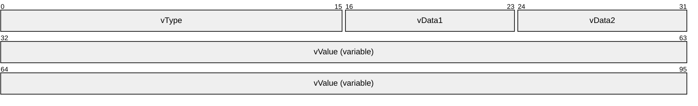

**vType (2 bytes):** A type indicator that indicates the type of **vValue**. It MUST be one of the values specified in the following table.

| Value | Meaning |
| --- | --- |
| VT_EMPTY 0x0000 | **vValue** is not present. VT_NULL (0x0001) also has the same meaning. |
| VT_I1 0x0010 | A 1-byte signed integer. |
| VT_UI1 0x0011 | A 1-byte unsigned integer. |
| VT_I2 0x0002 | A 2-byte signed integer. |
| VT_UI2 0x0012 | A 2-byte unsigned integer. |
| VT_BOOL 0x000B | A Boolean value; a 2-byte integer. **Note** Contains 0x0000 (FALSE) or 0xFFFF (TRUE). |
| VT_I4 0x0003 | A 4-byte signed integer. |
| VT_UI4 0x0013 | A 4-byte unsigned integer. |
| VT_R4 0x0004 | An IEEE 32-bit floating point number, as specified in [[IEEE754]](https://go.microsoft.com/fwlink/?LinkId=89903). |
| VT_INT 0x0016 | A 4-byte signed integer. |
| VT_UINT 0x0017 | A 4-byte unsigned integer. Note that this is identical to VT_UI4 except that VT_UINT cannot be used with VT_VECTOR (defined in the following table); the value chosen is a choice made by the higher layer that provides it to the Content Indexing Services Protocol, but the Content Indexing Services Protocol treats VT_UINT and VT_UI4 as identical, with the exception noted earlier in this paragraph. |
| VT_ERROR 0x000A | A 4-byte unsigned integer containing an [**HRESULT**](#gt_hresult) value, as specified in [MS-ERREF](../MS-ERREF/MS-ERREF.md) section 2.1. |
| VT_I8 0x0014 | An 8-byte signed integer. |
| VT_UI8 0x0015 | An 8-byte unsigned integer. |
| VT_R8 0x0005 | An IEEE 64-bit floating point number, as specified in [IEEE754]. |
| VT_CY 0x0006 | An 8-byte two's complement integer (scaled by 10,000). |
| VT_DATE 0x0007 | A 64-bit floating point number, as specified in [IEEE754], representing the number of days since 00:00:00 on December 31, 1899 (Coordinated Universal Time). |
| VT_FILETIME 0x0040 | A 64-bit integer representing the number of 100-nanosecond intervals since 00:00:00 on January 1, 1601 (Coordinated Universal Time). |
| VT_DECIMAL 0x000E | A DECIMAL structure, as specified in section [2.2.1.1.1.1](#Section_2.2.1.1.1.1). |
| VT_CLSID 0x0048 | A 16-byte binary value containing a [**GUID**](#gt_globally-unique-identifier-guid). |
| VT_BLOB 0x0041 | A 4-byte unsigned integer count of bytes in the binary large object (BLOB) followed by that many bytes of data. |
| VT_BLOB_OBJECT 0x0046 | A 4-byte unsigned integer count of bytes in the binary large object (BLOB) followed by that many bytes of data. |
| VT_BSTR 0x0008 | A 4-byte unsigned integer count of bytes in the string followed by a string, as specified in the **vValue** definition in this section. |
| VT_LPSTR 0x001E | A null-terminated ANSI string. |
| VT_LPWSTR 0x001F | A null-terminated Unicode (as specified in [[UNICODE]](https://go.microsoft.com/fwlink/?LinkId=90550)) string. |
| VT_VARIANT 0x000C | When used in a [CTableColumn](#Section_2.2.1.25) description, a [CRowVariant](#Section_2.2.1.23) structure. When not used in a CTableColumn description, a CBaseStorageVariant structure. MUST be combined with a type modifier of VT_ARRAY or VT_VECTOR. |

The following table specifies the type modifiers for **vType**. Type modifiers can be combined with **vType** by using the bitwise OR operation to change the meaning of **vValue** to indicate that it is one of two possible array types.

| Value | Meaning |
| --- | --- |
| VT_VECTOR 0x1000 | If the type indicator is combined with VT_VECTOR by using an OR operator, **vValue** is a counted array of values of the indicated type. See section [2.2.1.1.1.2](#Section_2.2.1.1.1.2). This type modifier MUST NOT be combined with the following types: VT_INT, VT_UINT, VT_DECIMAL, VT_BLOB, and VT_BLOB_OBJECT. |
| VT_ARRAY 0x2000 | If the type indicator is combined with VT_ARRAY by an OR operator, the value is a [SAFEARRAY](#Section_2.2.1.1.1.3), containing values of the indicated type. This type modifier MUST NOT be combined with the following types: VT_I8, VT_UI8, VT_FILETIME, VT_CLSID, VT_BLOB, VT_BLOB_OBJECT, VT_LPSTR, and VT_LPWSTR. |

When the VT_VARIANT **vType** is used in a CBaseStorageVariant structure, it MUST be combined with a type modifier of VT_ARRAY or VT_VECTOR. There is no such limitation when the VT_VARIANT **vType** is used in a CTableColumn structure, which specifies individual [**binding**](#gt_binding).

**vData1 (1 byte):** When **vType** is VT_DECIMAL, the value of this field is specified as the **Scale** field in section 2.2.1.1.1.1. For all other vType fields, the value MUST be set to 0x00.

**vData2 (1 byte):** When **vType** is VT_DECIMAL, the value of this field is specified as the **Sign** field in section 2.2.1.1.1.1. For all other vType fields, the value MUST be set to 0x00.

**vValue (variable):** The value for the match operation. The syntax MUST be as indicated in the **vType** field.

The following table summarizes sizes for the **vValue** field, dependent on the **vType** field for fixed-length data types. The size is in bytes.

| Bit Range | Field | Description |
| --- | --- | --- |
| Variable | VT_I1, VT_UI1 | 1 |
| Variable | VT_I2, VT_UI2, VT_BOOL | 2 |
| Variable | VT_I4, VT_UI4, VT_R4, VT_INT, VT_UINT, VT_ERROR | 4 |
| Variable | VT_I8, VT_UI8, VT_R8, VT_CY, VT_DATE, VT_FILETIME | 8 |
| Variable | VT_DECIMAL, VT_CLSID | 16 |

If **vType** is set to VT_BLOB or VT_BSTR, the structure of **vValue** is specified in the following diagram.

For **vType** set to VT_BLOB, this field is opaque binary BLOB data.

For **vType** set to VT_BSTR, this field is a set of characters in an OEM selected character set. The client and server MUST be configured to have interoperable character sets (which is not addressed in this protocol). There is no requirement that it be null-terminated.

For a **vType** set to either VT_LPSTR or VT_LPWSTR, the structure of **vValue** is shown in the following diagram with the following caveats:

- If **vType** is set to VT_LPSTR, **cLen** indicates the size of the string in system code page characters, and **string** is a null-terminated string.
- If **vType** is set to VT_LPWSTR, **cLen** indicates the size of the string in Unicode characters, and **string** is a null-terminated Unicode string.
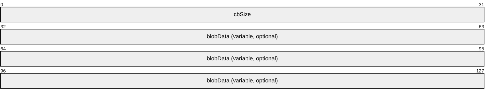

**cbSize**: A 32-bit unsigned integer. Indicates the size of the **blobData** field in bytes. If **vType** is set to VT_BSTR, **cbSize** MUST be set to 0x00000000 when the string represented is an empty string.

**blobData**: MUST be of length **cbSize**, in bytes.

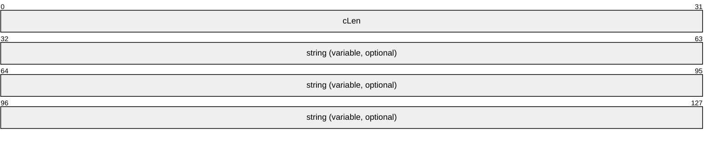

**cLen**: A 32-bit unsigned integer, indicating the size of the string field including the terminating null. A value of 0x00000000 indicates that no such string is present.

**string**: Null-terminated string. This field MUST be absent if **cLen** equals 0x00000000.

<a id="Section_2.2.1.1.1"></a>
##### 2.2.1.1.1 CBaseStorageVariant Structures

The following structures are used in the [CBaseStorageVariant](#Section_2.2.1.1) structure.

<a id="Section_2.2.1.1.1.1"></a>
###### 2.2.1.1.1.1 DECIMAL

The DECIMAL structure is used to represent an exact numeric value with a fixed precision and fixed scale.

When **vType** is set to VT_DECIMAL (0x0000E), the **vData1** and **vData2** fields of [CBaseStorageVariant](#Section_2.2.1.1) MUST be interpreted as follows.

**vData1**: The number of digits to the right of the decimal point. MUST be in the range 0 to 28.

**vData2**: The sign of the numeric value. Set to 0x00, if the sign is positive; set to 0x80, if the sign is negative.

When **vType** is set to VT_DECIMAL, the format of the **vValue** field is specified in the following diagram.

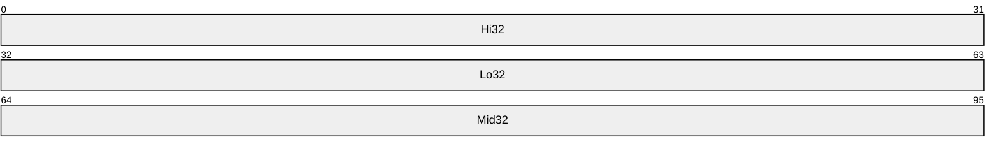

**Hi32 (4 bytes):** The highest 32 bits of the 96-bit integer.

**Lo32 (4 bytes):** The lowest 32 bits of the 96-bit integer.

**Mid32 (4 bytes):** The middle 32 bits of the 96-bit integer.

<a id="Section_2.2.1.1.1.2"></a>
###### 2.2.1.1.1.2 VT_VECTOR

The VT_VECTOR structure is used to pass one-dimensional arrays.

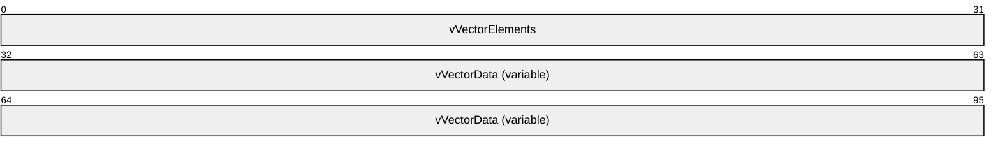

**vVectorElements (4 bytes):** Unsigned 32-bit integer, indicating the number of elements in the **vVectorData** field.

**vVectorData (variable):** An array of items that have a type indicated by **vType** with the 0x1000 bit cleared. The size of an individual fixed-length item can be obtained from the fixed-length data type table, as specified in section [2.2.1.1](#Section_2.2.1.1). The length of this field in bytes can be calculated by multiplying **vVectorElements** by the size of an individual item.

For variable-length data types, **vVectorData** contains a sequence of consecutively marshaled simple types in which the type is indicated by **vType** with the 0x1000 bit cleared. This includes a special case indicated by **vType** VT_ARRAY | VT_VARIANT (that is, 0x100C).

The elements in the **vVectorData** field MUST be separated by 0 to 3 padding bytes such that each element begins at an offset that is a multiple of 4 bytes from the beginning of the message that contains this array. If padding bytes are present, the value that they contain is arbitrary. The contents of the padding bytes MUST be ignored by the receiver.

For a **vType** set to VT_ARRAY | VT_VARIANT, the type for items in this sequence is CBaseStorageVariant.

<a id="Section_2.2.1.1.1.3"></a>
###### 2.2.1.1.1.3 SAFEARRAY

The SAFEARRAY structure is used to pass multidimensional arrays. The structure contains array size information as well as the data in the array.

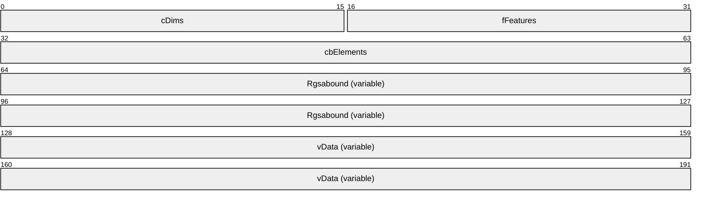

**cDims (2 bytes):** Unsigned 16-bit integer, indicating the number of dimensions of the multidimensional array.

**fFeatures (2 bytes):** A 16-bit bitfield. The values represent features defined by upper-layer applications and MUST be ignored.

**cbElements (4 bytes):** A 32-bit value that MUST be ignored by the server.

**Rgsabound (variable):** An array that contains one [SAFEARRAYBOUND](#Section_2.2.1.1.1.4) structure per dimension in the SAFEARRAY structure. This array has the leftmost dimension first and the rightmost dimension last.

**vData (variable):** A vector of marshaled items of a particular type indicated by the **vType** field of the containing [CBaseStorageVariant](#Section_2.2.1.1) with the bit 0x2000 cleared.

**vData** is marshaled similarly to VT_VECTOR, as specified in section [2.2.1.1.1.2](#Section_2.2.1.1.1.2), with the difference that the number of items is not stored in front of the vector. Instead, the number of items is calculated by multiplying the cElements value with all safe array bounds given in the **Rgsabound** field. Elements are stored in a vector in order of dimensions, iterating beginning with the right-most dimension.

The following diagram visually represents a sample two-dimensional array. The first dimension has cElements equal to 4 (represented horizontally) and lLbound equal to 0, and the second dimension has cElements equal to 2 (represented vertically) and lLbound equal to 0.

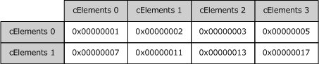

Figure 1: Two-dimensional array

Using the previous diagram, **vData** will contain the following sequence: 0x00000001, 0x00000007, 0x00000002, 0x00000011, 0x00000003, 0x00000013, 0x00000005, 0x00000017 (iterating through the rightmost dimension first, and then incrementing the next dimension). The preceding **Rgsabound** (which records cElements and lLbound) would be the following: 0x00000004, 0x00000000, 0x00000002, and 0x00000000.

<a id="Section_2.2.1.1.1.4"></a>
###### 2.2.1.1.1.4 SAFEARRAYBOUND

The SAFEARRAYBOUND structure represents the bounds of one dimension of a [SAFEARRAY](#Section_2.2.1.1.1.3) or [SAFEARRAY2](#Section_2.2.1.1.1.5) structure. Its format is as follows.

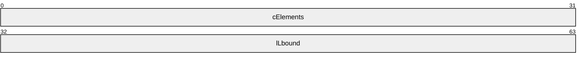

**cElements (4 bytes):** A 32-bit unsigned integer, specifying the number of elements in the dimension.

**lLbound (4 bytes):** A 32-bit unsigned integer, specifying the lower bound of the dimension.

<a id="Section_2.2.1.1.1.5"></a>
###### 2.2.1.1.1.5 SAFEARRAY2

The SAFEARRAY2 structure is used to pass multidimensional arrays in [SERIALIZEDPROPERTYVALUE](#Section_2.2.1.26). The structure contains boundary information and the data above.

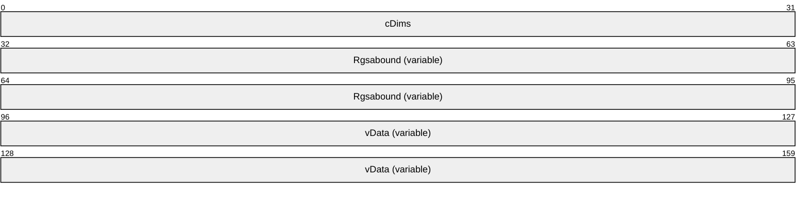

**cDims (4 bytes):** Unsigned 32-bit integer, indicating the number of dimensions of the SAFEARRAY2.

**Rgsabound (variable):** An array that contains one [SAFEARRAYBOUND](#Section_2.2.1.1.1.4) structure per dimension in the SAFEARRAY2. This array has the leftmost dimension first and the rightmost dimension last.

**vData (variable):** A vector of marshaled items of a particular type indicated by the dwType of the containing SERIALIZEDPROPERTYVALUE with bit 0x2000 cleared. The format of **vData** is the same as that specified for the **vData** field of [SAFEARRAY](#Section_2.2.1.1.1.3).

<a id="Section_2.2.1.2"></a>
#### 2.2.1.2 CFullPropSpec

The CFullPropSpec structure contains a property set [**GUID**](#gt_globally-unique-identifier-guid) and a property identifier to uniquely identify a property. A CFullPropSpec instance has a property set GUID and either an integer property ID or a string property name. For properties to match, the CFullPropSpec structure must match the [**column**](#gt_column) identifier in the index. There is no conversion between property IDs and property names. Property names are case insensitive.

For more information, see the Indexing Service definition of FULLPROPSPEC in [[MSDN-FULLPROPSPEC]](https://go.microsoft.com/fwlink/?LinkId=103235).

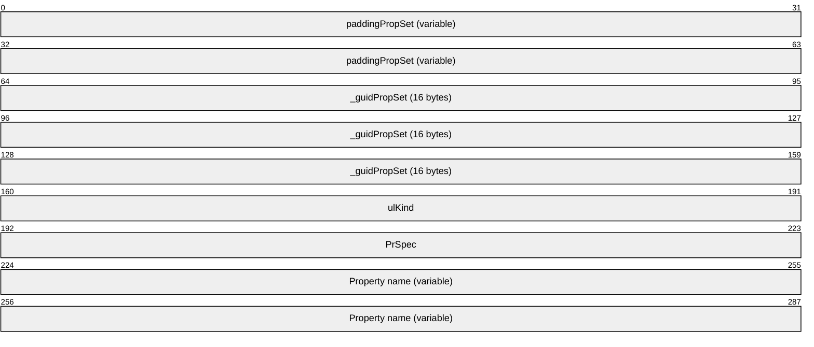

**paddingPropSet (variable):** This field MUST be 0 to 7 bytes in length. The length of this field MUST be such that the following field begins at an offset that is a multiple of 8 bytes from the beginning of the message that contains this structure. If this field is present (that is, its length is nonzero), the value that it contains is arbitrary. The content of this field MUST be ignored by the receiver.

**_guidPropSet (16 bytes):** The GUID of the property set to which the property belongs.

**ulKind (4 bytes):** A 32-bit unsigned integer. MUST be one of the following values that indicates the content of **PrSpec**.

| Value | Meaning |
| --- | --- |
| PRSPEC_LPWSTR 0x00000000 | The **PrSpec** field specifies the number of non-NULL Unicode characters in the Property name field. |
| PRSPEC_PROPID 0x00000001 | The **PrSpec** field specifies the property ID (PROPID). |

**PrSpec (4 bytes):** A 32-bit unsigned integer with a meaning as indicated by the **ulKind** field.

**Property name (variable):** If **ulKind** is set to PRSPEC_PROPID, this field MUST NOT be present. If **ulKind** is set to PRSPEC_LPWSTR, this field MUST contain a case-insensitive array of **PrSpec** non-null Unicode characters that contains the name of the property.

<a id="Section_2.2.1.3"></a>
#### 2.2.1.3 CContentRestriction

The CContentRestriction structure contains a word or phrase to match in the [**inverted index**](#gt_inverted-index) for a specific property.

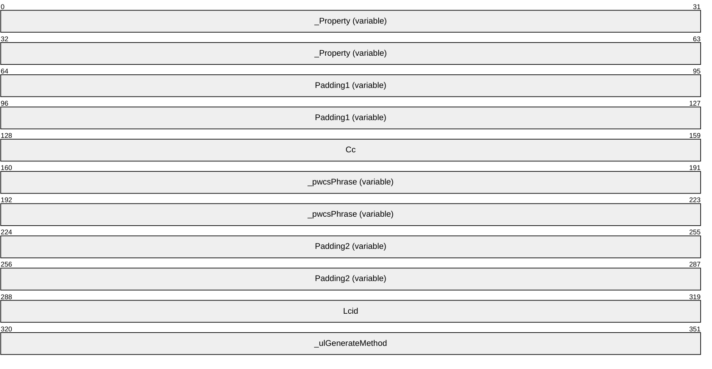

**_Property (variable):** A [CFullPropSpec](#Section_2.2.1.2) structure. This field indicates the property on which to perform a match operation.

**Padding1 (variable):** This field MUST be 0 to 3 bytes in length. The length of this field MUST be such that the following field begins at an offset that is a multiple of 4 bytes from the beginning of the message that contains this structure. If this field is present (that is, its length is nonzero), the value that it contains is arbitrary. The content of this field MUST be ignored by the receiver.

**Cc (4 bytes):** A 32-bit unsigned integer, specifying the number of characters in the **_pwcsPhrase** field.

**_pwcsPhrase (variable):** A non-null-terminated Unicode string representing the word or phrase to match for the property. This field MUST NOT be empty. The **Cc** field contains the length of the string.

**Padding2 (variable):** This field MUST be 0 to 3 bytes in length. The length of this field MUST be such that the following field begins at an offset that is a multiple of 4 bytes from the beginning of the message that contains this structure. If this field is present (that is, its length is nonzero), the value that it contains is arbitrary. The content of this field MUST be ignored by the receiver.

**Lcid (4 bytes):** A 32-bit unsigned integer, indicating the [**locale**](#gt_locale) of **_pwcsPhrase**, as specified in [MS-LCID](../MS-LCID/MS-LCID.md).

**_ulGenerateMethod (4 bytes):** A 32-bit unsigned integer, specifying the method to use when generating alternative word forms.

| Value | Meaning |
| --- | --- |
| GENERATE_METHOD_EXACT 0x00000000 | Exact match. Each word in the phrase must match exactly in the inverted index. |
| GENERATE_METHOD_PREFIX 0x00000001 | Prefix match. Each word in the phrase is considered a match if the word is a prefix of an indexed string. For example, if the word "barking" is indexed, then "bar" would match when performing a prefix match. |
| GENERATE_METHOD_INFLECT 0x00000002 | Matches inflections of a word. An inflection of a word is a variant of the root word in the same part of speech that has been modified, according to linguistic rules of a given language. For example, inflections of the verb swim in English include swim, swims, swimming, and swam. |

<a id="Section_2.2.1.4"></a>
#### 2.2.1.4 CNatLanguageRestriction

The CNatLanguageRestriction structure contains a [**natural language query**](#gt_natural-language-query) match for a property. Natural language means that the string has no formal meaning. The [**indexing service**](#gt_indexing-service) is free to match on the string in any way that it can. It can drop words, add alternative forms or make no changes.

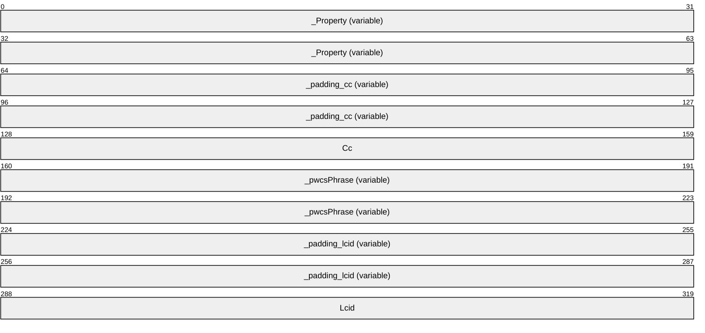

**_Property (variable):** A [CFullPropSpec](#Section_2.2.1.2) structure. This field indicates the property on which to perform the match operation.

**_padding_cc (variable):** This field MUST be 0 to 3 bytes in length. The length of this field MUST be such that the following field begins at an offset that is a multiple of 4 bytes from the beginning of the message that contains this structure. If this field is present (that is, its length is nonzero), the value that it contains is arbitrary. The content of this field MUST be ignored by the receiver.

**Cc (4 bytes):** A 32-bit unsigned integer, specifying the number of characters in the **_pwcsPhrase** field.

**_pwcsPhrase (variable):** A non-null-terminated Unicode string with the text to be searched for within the specific property. This string MUST NOT be empty. The **Cc** field contains the length of the string.

**_padding_lcid (variable):** This field MUST be 0 to 3 bytes in length. The length of this field MUST be such that the following field begins at an offset that is a multiple of 4 bytes from the beginning of the message that contains this structure. If this field is present (that is, its length is nonzero), the value that it contains is arbitrary. The content of this field MUST be ignored by the receiver.

**Lcid (4 bytes):** A 32-bit unsigned integer indicating the [**locale**](#gt_locale) of **_pwcsPhrase**, as specified in [MS-LCID](../MS-LCID/MS-LCID.md).

<a id="Section_2.2.1.5"></a>
#### 2.2.1.5 CNodeRestriction

The CNodeRestriction structure contains an array of [**command tree**](#gt_command-tree) [**restriction**](#gt_restriction) nodes for constraining the results of a query.

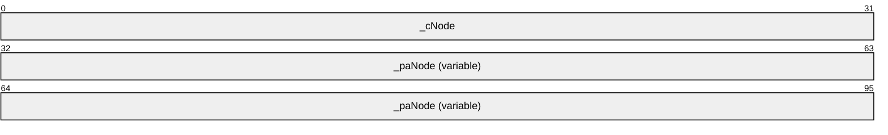

**_cNode (4 bytes):** A 32-bit unsigned integer specifying the number of [CRestriction](#Section_2.2.1.10) structures contained in the **_paNode** field.

**_paNode (variable):** An array of CRestriction structures. Structures in the array MUST be separated by 0 to 3 padding bytes such that each structure begins at an offset that is a multiple of 4 bytes from the beginning of the message that contains this array. If padding bytes are present, the value that they contain is arbitrary. The content of the padding bytes MUST be ignored by the receiver.

<a id="Section_2.2.1.6"></a>
#### 2.2.1.6 CPropertyRestriction

The CPropertyRestriction structure contains a property to get from each [**row**](#gt_row), a comparison operator, and a constant. For each row, the value returned by the specific property in the row is compared against the constant to determine if it has the relationship specified by the **_relop** field. For the comparison to be true, the data types of the values must match.

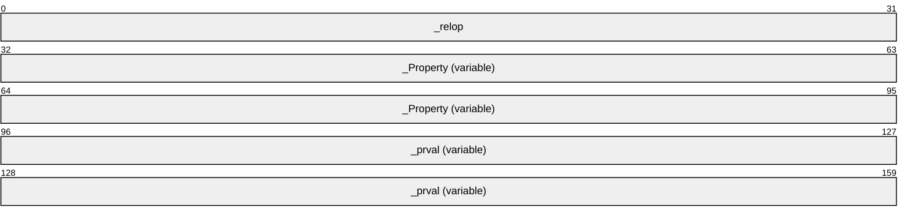

**_relop (4 bytes):** A 32-bit unsigned integer specifying the relation to perform on the property. **_relop** MUST be one of the values in the following tables.

| Value | Meaning |
| --- | --- |
| PRLT 0x00000000 | A less-than comparison. |
| PRLE 0x00000001 | A less-than-or-equal-to comparison. |
| PRGT 0x00000002 | A greater-than comparison. |
| PRGE 0x00000003 | A greater-than-or-equal-to comparison. |
| PREQ 0x00000004 | An equality comparison. |
| PRNE 0x00000005 | A not-equal comparison. |
| PRRE 0x00000006 | A regular expression comparison. |

For PRRE relations, regular expressions are expressed with a string that contains special symbols. Any character except an asterisk (*), period (.), question mark (?), or vertical bar (|) matches itself. A regular expression can be enclosed in a pair of quotation marks ("…"), and MUST be enclosed in quotation marks if the expression contains a space or a closing parenthesis.

The asterisk matches any number of characters. The period matches the end of a string. The question mark matches any one character. The vertical bar (|) is an escape character, which indicates special behavior for the characters shown in the following table. The following table explains the meanings of special characters in regular expressions.

| Character | Meaning |
| --- | --- |
| ( | An opening parenthesis opens a group. It MUST be followed by a matching closing parenthesis. |
| ) | A closing parenthesis closes a group. It MUST be preceded by a matching opening parenthesis. |
| [ | An opening bracket preceded (escaped) by a vertical bar opens a character class. It MUST be followed by a matching (nonescaped) closing square bracket. |
| { | An opening brace opens a counted match. It MUST be followed by a matching closing brace. |
| } | A closing brace closes a counted match. It MUST be preceded by a matching opening brace. |
| , | A comma separates OR clauses. |
| * | An asterisk matches zero or more occurrences of the preceding expression. |
| ? | A question mark matches zero or one occurrence of the preceding expression. |
| + | A plus sign matches one or more occurrences of the preceding expression. |
| Other | All other characters match themselves. |

The following table describes characters which, when located between brackets ([ ]), have special meanings.

| Character | Meaning |
| --- | --- |
| ^ | A caret matches everything but following classes. (It MUST be the first character in the string.) |
| ] | A closing bracket matches another closing bracket. It MAY be preceded only by a caret (^); otherwise, it closes the class. |
| - | A hyphen is a range operator. It is preceded and followed by normal characters. |
| Other | All other characters match themselves (or begin or end a range). |

The following table describes the syntax used between braces ({ }).

| Character | Meaning |
| --- | --- |
| {m} | Matches exactly m occurrences of the preceding expression (0 < m < 256). |
| {m,} | Matches at least m occurrences of the preceding expression (1 < m < 256). |
| {m, n} | Matches between m and n occurrences of the preceding expression, inclusive (0 < m < 256, 0 < n < 256). |

To match the asterisk and question mark, enclose them in brackets. For example, [*]sample matches "*sample".

| Value | Meaning |
| --- | --- |
| PRAllBits 0x00000007 | A bitwise AND that returns the value equal to **_prval**. |
| PRSomeBits 0x00000008 | A bitwise AND that returns a nonzero value. |

For vector properties, the behavior of the relational operators depends on the result of a logical **OR** using a mask and the relational operator.

If there is no mask, then the [**restriction**](#gt_restriction) is true if the relational operator holds between each element of a property value and the corresponding element in the **_prval** field. If, in addition, the two vectors have different lengths, then the vector lengths are compared using the relational operator.

If there is a mask, the possible values are as follows.

| Value | Meaning |
| --- | --- |
| PRAll 0x00000100 | The restriction is true if every element in a property value has the relationship with some element in the **_prval** field. |
| PRAny 0x00000200 | The restriction is true if any element in the property value has the relationship with some element in the **_prval** field. |

**_Property (variable):** A [CFullPropSpec](#Section_2.2.1.2) structure indicating the property on which to perform a match operation.

**_prval (variable):** A [CBaseStorageVariant](#Section_2.2.1.1) structure containing the value to relate to the property.

<a id="Section_2.2.1.7"></a>
#### 2.2.1.7 CScopeRestriction

The CScopeRestriction structure restricts the files to be returned to those that have a [**path**](#gt_path) that matches the restriction.

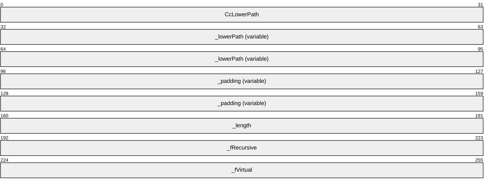

**CcLowerPath (4 bytes):** A 32-bit unsigned integer containing the number of Unicode characters in the **_lowerPath** field.

**_lowerPath (variable):** A non-null-terminated Unicode string representing the path to which the query is restricted. The **CcLowerPath** field contains the length of the string.

**_padding (variable):** This field MUST be 0 to 3 bytes in length. The length of this field MUST be such that the following field begins at an offset that is a multiple of 4 bytes from the beginning of the message that contains this structure. If this field is present (that is, its length is nonzero), the value that it contains is arbitrary. The content of this field MUST be ignored by the receiver.

**_length (4 bytes):** A 32-bit unsigned integer containing the length of **_lowerPath** in Unicode characters. This MUST be the same value as **CcLowerPath**.

**_fRecursive (4 bytes):** A 32-bit unsigned integer. MUST be set to one of the following values.

| Value | Meaning |
| --- | --- |
| 0x00000000 | The server is not to examine any subdirectories. |
| 0x00000001 | The server is to recursively examine all subdirectories of the path contained in the **_lowerPath** field. |

**_fVirtual (4 bytes):** A 32-bit unsigned integer. MUST be set to one of the following values.

| Value | Meaning |
| --- | --- |
| 0x00000000 | **_lowerPath** is a file system path. |
| 0x00000001 | **_lowerPath** is a virtual path (the URL associated with a physical directory on the file system) for a website. |

<a id="Section_2.2.1.8"></a>
#### 2.2.1.8 CSort

The CSort structure identifies a column, direction, and locale to sort by.

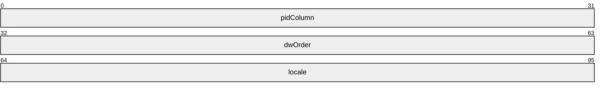

**pidColumn (4 bytes):** A 32-bit unsigned integer. This is the index in [CPidMapper](#Section_2.2.1.17) for the property to sort by.

**dwOrder (4 bytes):** A 32-bit unsigned integer. MUST be one of the following values, specifying how to sort based on the column.

| Value | Meaning |
| --- | --- |
| QUERY_SORTASCEND 0x00000000 | The rows are to be sorted in ascending order based on the values in the column specified. |
| QUERY_SORTDESCEND 0x00000001 | The rows are to be sorted in descending order based on the values in the column specified. |

**locale (4 bytes):** A 32-bit unsigned integer indicating the locale (as specified in [MS-LCID](../MS-LCID/MS-LCID.md)) of the column. The locale determines the sorting rules to use when sorting textual values. An [**indexing service**](#gt_indexing-service) SHOULD use the appropriate operating system facilities to do this.

<a id="Section_2.2.1.9"></a>
#### 2.2.1.9 CVectorRestriction

The CVectorRestriction structure contains a weighted OR operation over restriction nodes. Vector restrictions represent queries using the full-text vector space model of ranking (as specified in [SALTON]). In addition to the OR operation they also compute a rank depending on the ranking algorithm.

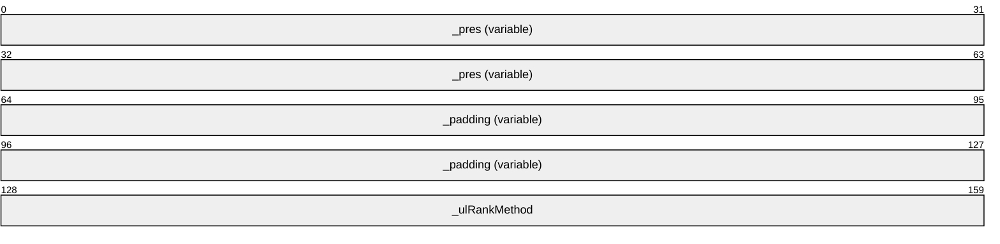

**_pres (variable):** A [CNodeRestriction](#Section_2.2.1.5) [**command tree**](#gt_command-tree) on which a ranked OR operation is to be performed.

**_padding (variable):** This field MUST be 0 to 3 bytes in length. The length of this field MUST be such that the following field begins at an offset that is a multiple of 4 bytes from the beginning of the message that contains this structure. If this field is present (that is, its length is nonzero), the value that it contains is arbitrary. The content of this field MUST be ignored by the receiver.

**_ulRankMethod (4 bytes):** A 32-bit unsigned integer specifying a ranking algorithm that MUST be set to one of the following values.

| Value | Meaning |
| --- | --- |
| VECTOR_RANK_MIN 0x00000000 | Use the minimum algorithm as specified in [SALTON]. |
| VECTOR_RANK_MAX 0x00000001 | Use the maximum algorithm as specified in [SALTON]. |
| VECTOR_RANK_INNER 0x00000002 | Use the inner product algorithm as specified in [SALTON]. |
| VECTOR_RANK_DICE 0x00000003 | Use the Dice coefficient algorithm as specified in [SALTON]. |
| VECTOR_RANK_JACCARD 0x00000004 | Use the Jaccard coefficient algorithm as specified in [SALTON]. |

<a id="Section_2.2.1.10"></a>
#### 2.2.1.10 CRestriction

The CRestriction structure contains a restriction node in a query [**command tree**](#gt_command-tree).

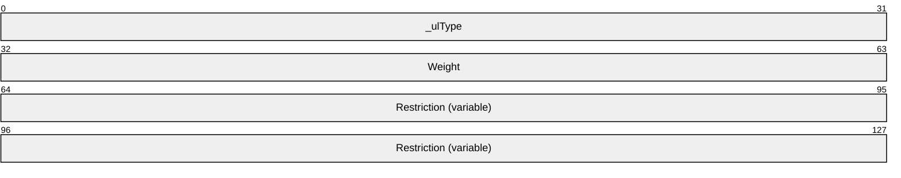

**_ulType (4 bytes):** A 32-bit unsigned integer indicating the restriction type used for the command tree node. The type determines what is found in the **Restriction** field of the structure as described in the following table. MUST be set to one of the following values.

| Value | Meaning |
| --- | --- |
| RTNone 0x00000000 | The node represents a [**noise word**](#gt_noise-word) in a vector query. |
| RTAnd 0x00000001 | The node contains a [CNodeRestriction](#Section_2.2.1.5) structure on which a logical AND operation is to be performed. |
| RTOr 0x00000002 | The node contains a CNodeRestriction structure on which a logical OR operation is to be performed. |
| RTNot 0x00000003 | The node contains a CRestriction structure on which a NOT operation is to be performed. |
| RTContent 0x00000004 | The node contains a [CContentRestriction](#Section_2.2.1.3) structure. |
| RTProperty 0x00000005 | The node contains a [CPropertyRestriction](#Section_2.2.1.6) structure. |
| RTProximity 0x00000006 | The node contains a CNodeRestriction structure with an array of CContentRestriction structures. Any other kind of restriction is undefined. The restriction requires the words or phrases found in the CContentRestriction structures to be within an [**indexing service**](#gt_indexing-service) defined range in order to be a match. The indexing service can also compute a rank based on how far apart the words or phrases are. |
| RTVector 0x00000007 | The node contains a [CVectorRestriction](#Section_2.2.1.9) structure. |
| RTNatLanguage 0x00000008 | The node contains a [CNatLanguageRestriction](#Section_2.2.1.4) structure. |
| RTScope 0x00000009 | The node contains a [CScopeRestriction](#Section_2.2.1.7) structure. |
| RTPhrase 0xFFFFFFFD | The node contains a CNodeRestriction structure on which a phrase match is to be performed. |

**Weight (4 bytes):** A 32-bit unsigned integer representing the weight of the node. Weight indicates the node's importance relative to other nodes in the query command tree. Higher weight values are more important.

**Restriction (variable):** The restriction type for the command tree node. The syntax MUST be as indicated by the **_ulType** field.

<a id="Section_2.2.1.11"></a>
#### 2.2.1.11 CColumnSet

The CColumnSet structure specifies the [**column**](#gt_column) numbers to be returned. This structure is always used in reference to a specific [CPidMapper](#Section_2.2.1.17) structure.


**count (4 bytes):** A 32-bit unsigned integer specifying the number of elements in the **indexes** array.

**indexes (variable):** An array of 4-byte unsigned integers representing zero-based indexes into the **aPropSpec** array in the corresponding CPidMapper structure. The corresponding property values are returned as columns in the result set.

<a id="Section_2.2.1.12"></a>
#### 2.2.1.12 CCategorizationSet

The CCategorizationSet structure contains information on the grouping is done at each level in a hierarchical result set.


**count (4 bytes):** A 32-bit unsigned integer containing the number of elements in the categories array.

**categories (variable):** Array of [CCategorizationSpec](#Section_2.2.1.13) structures specifying the grouping for each level in a hierarchical query. The first structure specifies the top level.

<a id="Section_2.2.1.13"></a>
#### 2.2.1.13 CCategorizationSpec

The CCategorizationSpec structure specifies how grouping is done at one level in a hierarchical query.

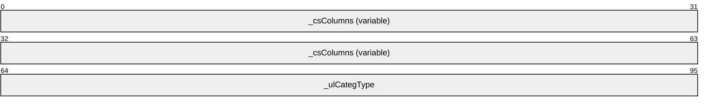

**_csColumns (variable):** A [CColumnSet](#Section_2.2.1.11) structure indicating the columns to return at that level in a hierarchical result set.

**_ulCategType (4 bytes):** A 32-bit unsigned integer that MUST be set to 0x00000000.

<a id="Section_2.2.1.14"></a>
#### 2.2.1.14 CDbColId

The CDbColId structure contains an OLE-DB Column ID.

```mermaid
packet-beta
  0-31: "eKind"
  32-95: "padding (variable)"
  96-191: "GUID (16 bytes)"
  192-223: "ulId"
  224-287: "vString (variable)"
```

**eKind (4 bytes):** MUST be set to one of the following values that indicates the contents of the **GUID**, **ulId**, and **vString** fields.

| Value | Meaning |
| --- | --- |
| DBKIND_GUID_NAME 0x00000000 | **vString** contains a property name. |
| DBKIND_GUID_PROPID 0x00000001 | **ulId** contains a 4-byte integer indicating the property ID. |
| DBKIND_PGUID_NAME 0x00000003 | **vString** contains a property name. This value MUST be treated the same as DBKIND_GUID_NAME. |
| DBKIND_PGUID_PROPID 0x00000004 | **ulId** contains a 4-byte integer indicating the property ID. This value MUST be treated the same as DBKIND_GUID_PROPID. |

**padding (variable):** This field MUST be 0 to 7 bytes in length. The length of this field MUST be such that the following field begins at an offset that is a multiple of 8 bytes from the beginning of the message that contains this structure. If this field is present (that is, its length is nonzero), the value that it contains is arbitrary. The content of this field MUST be ignored by the receiver.

**GUID (16 bytes): GUID** which uniquely identifies the property set for the property.

**ulId (4 bytes):** If **eKind** is DBKIND_GUID_PROPID, this field contains an unsigned integer specifying the property ID. If **eKind** is DBKIND_GUID_NAME, this field contains an unsigned integer specifying the number of Unicode characters contained in the **vString** field.

**vString (variable):** A non-null-terminated Unicode string representing the property name. It MUST be omitted unless the **eKind** field is set to DBKIND_GUID_NAME.

<a id="Section_2.2.1.15"></a>
#### 2.2.1.15 CDbProp

The CDbProp structure contains an OLE-DB DBPROP database property. These properties control how queries are interpreted by the [**indexing service**](#gt_indexing-service).

```mermaid
packet-beta
  0-31: "DBPROPID"
  32-63: "DBPROPOPTIONS"
  64-95: "DBPROPSTATUS"
  96-159: "colid (variable)"
  160-223: "_padding (variable)"
  224-287: "vValue (variable)"
```

**DBPROPID (4 bytes):** A 32-bit unsigned integer indicating the property ID. This field uniquely identifies each property in a particular query, but has no other interpretation. In particular, it is not a PROPID as found in the [CDbColId](#Section_2.2.1.14) structure.

**DBPROPOPTIONS (4 bytes):** Property options. This field MUST be set to 0x00000001 if the property is optional and to 0x00000000 otherwise.

**DBPROPSTATUS (4 bytes):** Property status. This field MUST be set to 0x00000000.

**colid (variable):** A CDbColId structure that defines the database property being passed.

**_padding (variable):** This field MUST be 0 to 3 bytes in length. The length of this field MUST be such that the following field begins at an offset that is a multiple of 4 bytes from the beginning of the message that contains this structure. If this field is present (that is, its length is nonzero), the value that it contains is arbitrary. The content of this field MUST be ignored by the receiver.

**vValue (variable):** A [CBaseStorageVariant](#Section_2.2.1.1) structure containing the property value.

<a id="Section_2.2.1.15.1"></a>
##### 2.2.1.15.1 Database Properties

This section details the properties that are used by the Content Indexing Services Protocol to control the behavior of the indexing service. These properties are grouped into three property sets identified in the **guidPropertySet** field of the [CDbPropSet](#Section_2.2.1.16) structure.

The following table lists the properties that are part of the DBPROPSET_FSCIFRMWRK_EXT property set.

| Value | Meaning |
| --- | --- |
| DBPROP_CI_CATALOG_NAME 0x00000002 | Specifies the name of the [**catalog**](#gt_catalog) or catalogs to query. Value MUST be a VT_LPWSTR or a VT_VECTOR \| VT_LPWSTR. |
| DBPROP_CI_INCLUDE_SCOPES 0x00000003 | Specifies one or more [**paths**](#gt_path) to be included in the query. Value MUST be a VT_LPWSTR or a VT_VECTOR \| VT_LPWSTR. |
| DBPROP_CI_SCOPE_FLAGS 0x00000004 | Specifies how the paths specified by the DBPROP_CI_INCLUDE_SCOPES property are to be treated. Value MUST be a VT_I4 or a VT_VECTOR \| VT_I4. |
| DBPROP_CI_QUERY_TYPE 0x00000007 | Specifies the type of query using a [CDbColId](#Section_2.2.1.14) structure. The structure MUST be set such that the **eKind** field contains 0x00000001 and the **GUID** and **ulID** fields are filled with zeros. |

The following table lists the flags for the DBPROP_CI_SCOPE_FLAGS property.

| Value | Meaning |
| --- | --- |
| QUERY_DEEP 0x01 | If set, indicates that files in the scope directory and all subdirectories are included in the results. If clear, only files in the scope directory are included in the results. MUST NOT be combined with QUERY_DEEP. |
| QUERY_VIRTUAL_PATH 0x02 | If set, indicates that the scope is a virtual path. If clear, indicates that the scope is a physical directory. |

The following table lists the query types for the DBPROP_CI_QUERY_TYPE property.

| Value | Meaning |
| --- | --- |
| CiNormal 0x00000000 | A regular query. |
| CiVirtualRoots 0x00000001 | The query is requesting a list of the [**virtual roots**](#gt_virtual-root) of the catalog. This value requires administrative privileges. |
| CiProperties 0x00000003 | The query is requesting a list of all of the properties supported by the indexing service. |
| CiAdminOp 0x00000004 | The query is an administrative operation. This value requires administrative privileges. |

The following table lists the properties that are part of the DBPROPSET_QUERYEXT property set.

| Value | Meaning |
| --- | --- |
| DBPROP_USECONTENTINDEX 0x00000002 | Use the inverted index to optimize the speed of evaluating content restrictions at the cost of the index possibly being out of date. Value MUST be a VT_BOOL. If TRUE, the server is allowed to fail these queries. |
| DBPROP_DEFERNONINDEXEDTRIMMING 0x00000003 | Some operations, such as filtering by scope or security, can be expensive. This flag indicates that it is acceptable to defer this filtering until the results are actually requested. Value MUST be a VT_BOOL. |
| DBPROP_USEEXTENDEDDBTYPES 0x00000004 | Indicates whether the client supports VT_VECTOR data types. If TRUE, the client supports VT_VECTOR; if FALSE, the server is to convert VT_VECTOR data types to VT_ARRAY data types. The value MUST be a VT_BOOL. |
| DBPROP_FIRSTROWS 0x00000007 | If TRUE, the indexing service returns the first rows that match. If FALSE, then rows by default are returned in order of descending rank. Value MUST be a VT_BOOL. |

The following table lists the properties that are part of the DBPROPSET_CIFRMWRKCORE_EXT property set.

| Value | Meaning |
| --- | --- |
| DBPROP_MACHINE 0x00000002 | Specifies the names of the computers on which a query is to be processed. The value MUST be either VT_BSTR or VT_ARRAY \| VT_BSTR. |
| DBPROP_CLIENT_CLSID 0x00000003 | Specifies a connection constant for the indexing service. The value can be a VT_CLSID containing 0x2A4880706FD911D0A80800A0C906241A or VT_ARRAY of STRINGS with value {2A488070-6FD9-11D0-A808-00A0C906241A}. |

The following table lists properties that are part of the DBPROPSET_MSIDXS_ROWSETEXT property set.

| Value | Meaning |
| --- | --- |
| MSIDXSPROP_ROWSETQUERYSTATUS 0x00000002 | Specifies that the client is interested in rowset status. Value MUST be set to 0. |
| MSIDXSPROP_COMMAND_LOCALE_STRING 0x00000003 | Specifies locale ID string for the query. |
| MSIDXSPROP_QUERY_RESTRICTION 0x00000004 | Ignored by the server. MUST be set to an empty BSTR. |

<a id="Section_2.2.1.16"></a>
#### 2.2.1.16 CDbPropSet

The CDbPropSet structure contains a set of properties. The first field (**guidPropertySet**) is not padded and will start where the previous structure in the message ended (as indicated by the "previous structure" entry in the following diagram). The 1-byte length of "previous structure" is arbitrary, and is not meant to suggest that **guidPropertySet** will begin on any particular boundary. However, the **cProperties** field MUST be aligned to begin at a multiple of 4 bytes from the beginning of the message, and hence, the format is depicted as follows.

```mermaid
packet-beta
  0-7: "previous structure"
  8-103: "guidPropertySet (16 bytes)"
  104-159: "_padding (variable)"
  160-191: "cProperties"
  192-255: "aProps (variable)"
```

**guidPropertySet (16 bytes):** A [**GUID**](#gt_globally-unique-identifier-guid) identifying the property set. MUST be set to the binary form corresponding to one of the following values (shown in string representation form), identifying the property set of the properties contained in the **aProps** field.

| Value/GUID | Meaning |
| --- | --- |
| DBPROPSET_CIFRMWRKCORE_EXT AFAFACA5-B5D1-11D0-8C62-00C04FC2DB8D | Content Index Framework Core Property Set. |
| DBPROPSET_FSCIFRMWRK_EXT A9BD1526-6A80-11D0-8C9D-0020AF1D740E | File System Content Index Framework Property Set. |
| DBPROPSET_MSIDXS_ROWSETEXT AA6EE6B0-E828-11D0-B23E-00AA0047FC01 | Content Index Rowset Property Set. |
| DBPROPSET_QUERYEXT A7AC77ED-F8D7-11CE-A798-0020F8008025 | Query Extension Property Set. |

**_padding (variable):** This field MUST be 0 to 3 bytes in length. The length of this field MUST be such that the following field begins at an offset that is a multiple of 4 bytes from the beginning of the message that contains this structure. If this field is present (that is, its length is nonzero), the value that it contains is arbitrary. The content of this field MUST be ignored by the receiver.

**cProperties (4 bytes):** A 32-bit unsigned integer containing the number of elements in the **aProps** array.

**aProps (variable):** An array of [CDbProp](#Section_2.2.1.15) structures containing properties. Structures in the array MUST be separated by 0 to 3 padding bytes such that each structure begins at an offset that is a multiple of 4 bytes from the beginning of the message that contains this array. If padding bytes are present, the value that they contain is arbitrary. The content of the padding bytes MUST be ignored by the receiver.

<a id="Section_2.2.1.17"></a>
#### 2.2.1.17 CPidMapper

The CPidMapper structure contains an array of property specifications and serves to map from a property offset to a full property specification. The more compact property offsets are used to name properties in other parts of the protocol. Because offsets are more compact, they allow shorter property references in other parts of the protocol.

```mermaid
packet-beta
  0-31: "count"
  32-95: "paddingPropSpec (variable)"
  96-159: "aPropSpec (variable)"
```

**count (4 bytes):** A 32-bit unsigned integer containing the number of elements in the **aPropSpec** array.

**paddingPropSpec (variable):** This field MUST be 0 to 4 bytes in length. The length of this field MUST be such that the byte offset from the beginning of the message to the first structure contained in the **aPropSpec** field is a multiple of 8. The value of the bytes can be any arbitrary value and MUST be ignored by the receiver.

**aPropSpec (variable):** An array of [CFullPropSpec](#Section_2.2.1.2) structures.

<a id="Section_2.2.1.18"></a>
#### 2.2.1.18 CRowSeekAt

The CRowSeekAt structure contains the offset at which to retrieve [**rows**](#gt_row) for a [CPMGetRowsIn](#Section_2.2.3.15) message.

```mermaid
packet-beta
  0-31: "_chapt"
  32-63: "_bmkOffset"
  64-95: "_cskip"
  96-127: "_hRegion"
```

**_chapt (4 bytes):** A 32-bit value representing the [**handle**](#gt_handle) of the rowset [**chapter**](#gt_chapter).

**_bmkOffset (4 bytes):** A 32-bit value representing the handle of the [**bookmark**](#gt_bookmark), indicating the starting position from which to skip the number of rows specified in **_cskip**, before beginning retrieval.

**_cskip (4 bytes):** A 32-bit unsigned integer containing the number of rows to skip in the rowset.

**_hRegion (4 bytes):** A 32-bit unsigned integer. This field MUST be set to 0x00000000 and MUST be ignored.

<a id="Section_2.2.1.19"></a>
#### 2.2.1.19 CRowSeekAtRatio

The CRowSeekAtRatio structure identifies the point at which to begin retrieval for a [CPMGetRowsIn](#Section_2.2.3.15) message.

```mermaid
packet-beta
  0-31: "_chapt"
  32-63: "_ulNumerator"
  64-95: "_ulDenominator"
  96-127: "_hRegion"
```

**_chapt (4 bytes):** A 32-bit value representing the handle of the rowset [**chapter**](#gt_chapter).

**_ulNumerator (4 bytes):** A 32-bit unsigned integer representing the numerator of the ratio of rows in the chapter at which to begin retrieval.

**_ulDenominator (4 bytes):** A 32-bit unsigned integer representing the denominator of the ratio of rows in the chapter at which to begin retrieval. This field MUST be greater than zero.

**_hRegion (4 bytes):** A 32-bit unsigned integer. This field MUST be set to 0x00000000 and MUST be ignored.

<a id="Section_2.2.1.20"></a>
#### 2.2.1.20 CRowSeekByBookmark

The CRowSeekByBookmark structure identifies the [**bookmarks**](#gt_bookmark) from which to begin retrieving [**rows**](#gt_row) for a [CPMGetRowsIn](#Section_2.2.3.15) message.

```mermaid
packet-beta
  0-31: "_chapt"
  32-63: "_cBookmarks"
  64-127: "_aBookmarks (variable)"
  128-159: "_maxRet"
  160-223: "_ascRet (variable)"
```

**_chapt (4 bytes):** A 32-bit value representing the [**handle**](#gt_handle) of the rowset [**chapter**](#gt_chapter).

**_cBookmarks (4 bytes):** A 32-bit unsigned integer representing the number of elements in _aBookmarks array.

**_aBookmarks (variable):** An array of bookmark handles (each represented by 4 bytes) as obtained from a [CPMGetRowsOut](#Section_2.2.3.16) message.

**_maxRet (4 bytes):** A 32-bit unsigned integer representing the number of elements in the **_ascRet** array.

**_ascRet (variable):** An array of [**HRESULT**](#gt_hresult) values. When the CRowSeekByBookmark structure is sent as part of the CPMGetRowsIn request, the number of entries in the array MUST be equal to **_maxRet**. When sent by the client, the values MUST be set to zero when sent and MUST be ignored on receipt. When sent by the server (as part of the CPMGetRowsOut message), the values in the array indicate the result status for each row retrieval.

<a id="Section_2.2.1.21"></a>
#### 2.2.1.21 CRowSeekNext

The CRowSeekNext structure contains the number of [**rows**](#gt_row) to skip for a [CPMGetRowsIn](#Section_2.2.3.15) message.

```mermaid
packet-beta
  0-31: "_chapt"
  32-63: "_cskip"
```

**_chapt (4 bytes):** A 32-bit value representing the [**handle**](#gt_handle) of the rowset [**chapter**](#gt_chapter).

**_cskip (4 bytes):** A 32-bit unsigned integer representing the number of rows to skip in the rowset.

<a id="Section_2.2.1.22"></a>
#### 2.2.1.22 CRowsetProperties

The CRowsetProperties structure contains configuration information for a query.

```mermaid
packet-beta
  0-31: "_uBooleanOptions"
  32-63: "_ulMaxOpenRows"
  64-95: "_ulMemoryUsage"
  96-127: "_cMaxResults"
  128-159: "_cCmdTimeout"
```

**_uBooleanOptions (4 bytes):** The least significant 3 bits of this field MUST contain one of the following three values.

| Value | Meaning |
| --- | --- |
| eSequential 0x00000001 | The [**cursor (1)**](#gt_cursor) can be moved only forward. |
| eLocatable 0x00000003 | The cursor can be moved to any position. |
| eScrollable 0x00000007 | The cursor can be moved to any position and fetch in any direction. |

The remaining bits MAY either be clear or set to any combination of the following values by using the bitwise OR operation.

| Value | Meaning |
| --- | --- |
| eAsynchronous 0x00000008 | The client will not wait for execution completion. |
| eFirstRows 0x00000080 | Return the first rows encountered, not the best matches. |
| eHoldRows 0x00000200 | The server MUST NOT discard rows until the client is done with a query. |
| eChaptered 0x00000800 | The rowset supports [**chapters**](#gt_chapter). |
| eUseCI 0x00001000 | Use the inverted index to evaluate content restrictions even though it can be out of date. If not set, the indexing service can opt to execute the query by going directly against the file system. |
| eDeferTrimming 0x00002000 | Nonindexed trimming operations, like scoping or security checking, can be expensive. This option gives the indexing service the option of deferring these operations until rows are actually requested. |

**_ulMaxOpenRows (4 bytes):** A 32-bit unsigned integer. MUST be set to 0x00000000. It is not used and MUST be ignored.

**_ulMemoryUsage (4 bytes):** A 32-bit unsigned integer. MUST be set to 0x00000000. It is not used and MUST be ignored.

**_cMaxResults (4 bytes):** A 32-bit unsigned integer, specifying the maximum number of rows that are to be returned for the query. If **_cMaxResults** is set to 0x00000000, then the server assumes all results are requested and behaves as if 0xFFFFFFFF was specified in **_cMaxResults**.

**_cCmdTimeout (4 bytes):** A 32-bit unsigned integer, specifying the number of seconds at which a query is to time out and automatically terminate, counting from the time the query starts executing on the server. A value of 0x00000000 means that the query is not to time out.

<a id="Section_2.2.1.23"></a>
#### 2.2.1.23 CRowVariant

The CRowVariant structure contains the fixed-size portion of a variable-length data type stored in the [CPMGetRowsOut](#Section_2.2.3.16) message.

```mermaid
packet-beta
  0-15: "vType"
  16-31: "reserved1"
  32-63: "reserved2"
  64-127: "Offset (variable)"
```

**vType (2 bytes):** A type indicator, indicating the type of **vValue**. It MUST be one of the values under the **vType** field, as specified in section [2.2.1.1](#Section_2.2.1.1).

**reserved1 (2 bytes):** Not used. Can be set to any arbitrary value and MUST be ignored on receipt.

**reserved2 (4 bytes):** Not used. Can be set to any arbitrary value and MUST be ignored on receipt.

**Offset (variable):** An offset to variable-length data (for example, a string). This MUST be a 32-bit value (4 bytes long) if 32-bit offsets are being used (per the rules in section 2.2.3.16) or a 64-bit value (8 bytes long) if 64-bit offsets are being used.

<a id="Section_2.2.1.24"></a>
#### 2.2.1.24 CSortSet

The CSortSet structure contains the [**sort order**](#gt_sort-order) of the query.

```mermaid
packet-beta
  0-31: "count"
  32-95: "sortArray (variable)"
```

**count (4 bytes):** A 32-bit unsigned integer specifying the number of elements in **sortArray**.

**sortArray (variable):** An array of [CSort](#Section_2.2.1.8) structures describing the order in which to sort the results of the query. Structures in the array MUST be separated by 0 to 3 padding bytes such that each structure has a 4-byte alignment from the beginning of a message. Such padding bytes can be set to any arbitrary value and MUST be ignored on receipt.

<a id="Section_2.2.1.25"></a>
#### 2.2.1.25 CTableColumn

The CTableColumn structure contains a column of a [CPMSetBindingsIn](#Section_2.2.3.14) message.

```mermaid
packet-beta
  0-63: "PropSpec (variable)"
  64-95: "vType"
  96-103: "ValueUsed"
  104-111: "_padding1 (optional)"
  112-127: "ValueOffset (optional)"
  128-143: "ValueSize (optional)"
  144-151: "StatusUsed"
  152-159: "_padding2 (optional)"
  160-175: "StatusOffset (optional)"
  176-183: "LengthUsed"
  184-191: "_padding3 (optional)"
  192-207: "LengthOffset (optional)"
```

**PropSpec (variable):** A [CFullPropSpec](#Section_2.2.1.2) structure.

**vType (4 bytes):** Specifies the type of data value contained in the column. For the list of values for this field, see the **vType** field in section [2.2.1.1](#Section_2.2.1.1).

**Note** The vType values specified in section 2.2.1.1 are 16-bit values. Those values are padded with zeros to 32-bit values for use in this field.

**ValueUsed (1 byte):** A 1-byte field that MUST be set to one of the following values.

| Value | Meaning |
| --- | --- |
| 0x00 | The value of the column is not transferred in the row. |
| 0x01 | The value of the column is transferred within the row. |

**_padding1 (1 byte):** A 1-byte field.

**Note** This field MUST be inserted before **ValueOffset** if, without it, **ValueOffset** would not begin at an even offset from the beginning of the message. The value of this byte is arbitrary and MUST be ignored. If **ValueUsed** is set to 0x00, this field MUST NOT be present.

**ValueOffset (2 bytes):** An unsigned 2-byte integer specifying the offset of the column value in the row. If **ValueUsed** is set to 0x00, this field MUST NOT be present.

**ValueSize (2 bytes):** An unsigned 2-byte integer specifying the size of the column value in bytes. If **ValueUsed** is set to 0x00, this field MUST NOT be present.

**StatusUsed (1 byte):** A 1-byte field that MUST be set to one of the following values.

| Value | Meaning |
| --- | --- |
| 0x00 | The status of the column is not transferred within the row. |
| 0x01 | The status of the column is transferred within the row. |

**_padding2 (1 byte):** A 1-byte field.

**Note** This field MUST be inserted before **StatusOffset** if, without it, the **StatusOffset** field would not begin at an even offset from the beginning of the message. The value of this byte is arbitrary and MUST be ignored. If **StatusUsed** is set to 0x00, this field MUST NOT be present.

**StatusOffset (2 bytes):** An unsigned 2-byte integer. Specifies the offset of the column status in the row. That is, the **StatusOffset** is relative to the beginning of each row.

If **StatusUsed** is set to 0x00, this field MUST NOT be present.

If **StatusUsed** is set to 0x01 in the request, **Status** is represented as one byte in the response by the offset specified in the **StatusOffset** request field. The status byte MUST be equal to one of the following values.

| Value | Meaning |
| --- | --- |
| 0x00 | StatusOK |
| 0x01 | StatusDeferred |
| 0x02 | StatusNull |

If the property value is absent for this row, the server MUST set the status byte to StatusNull. If the value is too big to be transferred in the [CPMGetRowsOut](#Section_2.2.3.16) message (greater than 2048 bytes), the server MUST set the status byte to StatusDeferred. Otherwise, the server MUST set the status byte to StatusOK.

**LengthUsed (1 byte):** A 1-byte field that MUST be set to one of the following values.

| Value | Meaning |
| --- | --- |
| 0x00 | The length of the column MUST NOT be transferred within the row. |
| 0x01 | The length of the column is transferred within the row. |

**_padding3 (1 byte):** A 1-byte field.

**Note** This field MUST be inserted before **LengthOffset** if, without it, **LengthOffset** would not begin at an even offset from the beginning of a message. The value of this byte is arbitrary, and MUST be ignored. If **LengthUsed** is set to 0x00, this field MUST NOT be present.

**LengthOffset (2 bytes):** An unsigned 2-byte integer specifying the offset of the column length in the row. In CPMGetRowsOut, length is represented by a 32-bit unsigned integer by the offset specified in **LengthOffset**. If **LengthUsed** is set to 0x00, this field MUST NOT be present.

<a id="Section_2.2.1.26"></a>
#### 2.2.1.26 SERIALIZEDPROPERTYVALUE

The SERIALIZEDPROPERTYVALUE structure contains a serialized value.

```mermaid
packet-beta
  0-31: "dwType"
  32-95: "rgb (variable)"
```

**dwType (4 bytes):** One of the variant types, as specified in section [2.2.1.1](#Section_2.2.1.1), that can be combined with variant type modifiers. For all variant types, except those combined with VT_ARRAY, SERIALIZEDPROPERTYVALUE has the same layout as CBaseStorageVariant. If the variant type is combined with the VT_ARRAY type modifier, [SAFEARRAY2](#Section_2.2.1.1.1.5) is used instead of [SAFEARRAY](#Section_2.2.1.1.1.3) in the **vValue** field of CBaseStorageVariant.

**rgb (variable):** Serialized value. See serialization for **vValue** in section 2.2.1.1.

<a id="Section_2.2.2"></a>
### 2.2.2 Message Headers

All Content Indexing Services Protocol messages have a 16-byte header.

The following diagram shows the Content Indexing Services Protocol message header format.

```mermaid
packet-beta
  0-31: "_msg"
  32-63: "_status"
  64-95: "_ulChecksum"
  96-127: "_ulReserved2"
```

**_msg (4 bytes):** A 32-bit integer that identifies the type of message following the header. The following table lists the Content Indexing Services Protocol messages and the integer values specified for each message. As shown in the table, some values identify two messages in the table. In those instances, the message following the header can be identified by the direction of the message flow. If the direction is client to server, the message with "In" appended to the message name is indicated. If the direction is server to client, the message with "Out" appended to the message name is indicated.

| Value | Meaning |
| --- | --- |
| 0x000000C8 | [CPMConnectIn](#Section_2.2.3.6) or [CPMConnectOut](#Section_2.2.3.7) |
| 0x000000C9 | [CPMDisconnect](#Section_2.2.3.31) |
| 0x000000CA | [CPMCreateQueryIn](#Section_2.2.3.8) or [CPMCreateQueryOut](#Section_2.2.3.9) |
| 0x000000CB | [CPMFreeCursorIn](#Section_2.2.3.29) or [CPMFreeCursorOut](#Section_2.2.3.30) |
| 0x000000CC | [CPMGetRowsIn](#Section_2.2.3.15) or [CPMGetRowsOut](#Section_2.2.3.16) |
| 0x000000CD | [CPMRatioFinishedIn](#Section_2.2.3.17) or [CPMRatioFinishedOut](#Section_2.2.3.18) |
| 0x000000CE | [CPMCompareBmkIn](#Section_2.2.3.25) or [CPMCompareBmkOut](#Section_2.2.3.26) |
| 0x000000CF | [CPMGetApproximatePositionIn](#Section_2.2.3.23) or [CPMGetApproximatePositionOut](#Section_2.2.3.24) |
| 0x000000D0 | [CPMSetBindingsIn](#Section_2.2.3.14) |
| 0x000000D1 | [CPMGetNotify](#Section_2.2.3.21) |
| 0x000000D2 | [CPMSendNotifyOut](#Section_2.2.3.22) |
| 0x000000D7 | [CPMGetQueryStatusIn](#Section_2.2.3.10) or [CPMGetQueryStatusOut](#Section_2.2.3.11) |
| 0x000000D9 | [CPMCiStateInOut](#Section_2.2.3.1) |
| 0x000000E1 | [CPMForceMergeIn](#Section_2.2.3.5) |
| 0x000000E4 | [CPMFetchValueIn](#Section_2.2.3.19) or [CPMFetchValueOut](#Section_2.2.3.20) |
| 0x000000E6 | [CPMUpdateDocumentsIn](#Section_2.2.3.4) |
| 0x000000E7 | [CPMGetQueryStatusExIn](#Section_2.2.3.12) or [CPMGetQueryStatusExOut](#Section_2.2.3.13) |
| 0x000000E8 | [CPMRestartPositionIn](#Section_2.2.3.27) |
| 0x000000E9 | [CPMStopAsynchIn](#Section_2.2.3.28) |
| 0x000000EC | [CPMSetCatStateIn](#Section_2.2.3.2) or [CPMSetCatStateOut](#Section_2.2.3.3) |

**_status (4 bytes):** An [**HRESULT**](#gt_hresult) value, indicating the status of the requested operation. When sent by the client, can be set to any arbitrary value and MUST be ignored on receipt.<5>

**_ulChecksum (4 bytes):** The **_ulChecksum** MUST be calculated as specified in section [3.2.4](#Section_3.2.4) for the following messages:

- CPMConnectIn
- CPMCreateQueryIn
- CPMSetBindingsIn
- CPMGetRowsIn
- CPMFetchValueIn
**Note** For all other messages from the client, **_ulChecksum** MUST be set to 0x00000000. A client MUST ignore the **_ulChecksum** field.

**_ulReserved2 (4 bytes):** If 32-bit offsets are being used, MUST be set to 0x00000000 and MUST be ignored by the receiver. **_ulReserved2** can be used in 64-bit scenarios, as specified in section 2.2.3.16.

<a id="Section_2.2.3"></a>
### 2.2.3 Messages

The following sections specify Content Indexing Services Protocol messages.

<a id="Section_2.2.3.1"></a>
#### 2.2.3.1 CPMCiStateInOut

The CPMCiStateInOut message contains information on the state of the indexing service. All fields are required whether this message is sent by the client or the server.

**Note** When the CPMCiStateInOut message is sent by the client, all fields except **cbStruct** MAY contain any value, and the server MUST ignore all fields except **cbStruct**.

The format of the CPMCiStateInOut message that follows the header is shown in the following diagram.

```mermaid
packet-beta
  0-31: "cbStruct"
  32-63: "cWordList"
  64-95: "cPersistentIndex"
  96-127: "cQueries"
  128-159: "cDocuments"
  160-191: "cFreshTest"
  192-223: "dwMergeProgress"
  224-255: "eState"
  256-287: "cFilteredDocuments"
  288-319: "cTotalDocuments"
  320-351: "cPendingScans"
  352-383: "dwIndexSize"
  384-415: "cUniqueKeys"
  416-447: "cSecQDocuments"
  448-479: "dwPropCacheSize"
```

**cbStruct (4 bytes):** A 32-bit unsigned integer indicating the size, in bytes, of this message (excluding the common header). MUST be set to 0x0000003C.

**cWordList (4 bytes):** A 32-bit unsigned integer indicating the number of in-memory indexes created for recently [**indexed**](#gt_indexing) documents.

**cPersistentIndex (4 bytes):** A 32-bit unsigned integer indicating the number of persisted indexes.

**cQueries (4 bytes):** A 32-bit unsigned integer indicating a number of actively running queries.

**cDocuments (4 bytes):** A 32-bit unsigned integer indicating the total number of documents waiting to be indexed.

**cFreshTest (4 bytes):** A 32-bit unsigned integer indicating the number of unique documents with information in indexes that are not fully optimized for performance.

**dwMergeProgress (4 bytes):** A 32-bit unsigned integer specifying the completion percentage of current, full optimization of indexes while optimization is in progress. MUST be less than or equal to 100.

**eState (4 bytes):** A 32-bit unsigned integer indicating the state of content indexing. MUST be zero or one or more of the CI_STATE_* constants defined in the following table.

| Value | Meaning |
| --- | --- |
| 0x00000000 | None of the following states apply. |
| CI_STATE_SHADOW_MERGE 0x00000001 | The indexing service is in the process of optimizing some of the indexes to reduce memory usage and improve query performance. |
| CI_STATE_MASTER_MERGE 0x00000002 | The indexing service is in the process of full optimization for all indexes. |
| CI_STATE_CONTENT_SCAN_REQUIRED 0x00000004 | Some documents in the inverted index have changed and the indexing service needs to determine what has been added, changed, or deleted. |
| CI_STATE_ANNEALING_MERGE 0x00000008 | The indexing service is in the process of optimizing indexes to reduce memory usage and improve query performance. This process is more comprehensive than the one identified by the CI_STATE_SHADOW_MERGE value, but it is not as comprehensive as specified by the CI_STATE_MASTER_MERGE value. Such optimizations are implementation-specific because they depend on the way that data is stored internally; the optimizations do not affect the protocol in any way other than response time. |
| CI_STATE_SCANNING 0x00000010 | The indexing service is examining a directory or a set of directories to see if any files have been added, deleted, or updated since the last time the directory was indexed. |
| CI_STATE_RECOVERING 0x00000020 | The indexing service is starting from the last saved state and is in the process of recovering. |
| CI_STATE_INDEX_MIGRATION_MERGE 0x00000040 | The indexing service is backing up inverted indexes. |
| CI_STATE_LOW_MEMORY 0x00000080 | Most of the virtual memory of the server is in use. |
| CI_STATE_HIGH_IO 0x00000100 | The level of input/output (I/O) activity on the server is relatively high. |
| CI_STATE_MASTER_MERGE_PAUSED 0x00000200 | The process of full optimization (for all indexes) in progress has been paused. This is given for informational purposes only and does not affect the Content Indexing Services Protocol. |
| CI_STATE_READ_ONLY 0x00000400 | The portion of the indexing service that picks up new documents to index has been paused. This is given for informative purposes only and does not affect the Content Indexing Services Protocol. |
| CI_STATE_BATTERY_POWER 0x00000800 | The portion of the indexing service that picks up new documents to index has been paused to conserve battery lifetime but still replies to the queries. This is given for informative purposes only and does not affect the Content Indexing Services Protocol. |
| CI_STATE_USER_ACTIVE 0x00001000 | The portion of the indexing service that picks up new documents to index has been paused due to high activity by the user (keyboard or mouse) but still replies to the queries. This is given for informative purposes only and does not affect the Content Indexing Services Protocol. |
| CI_STATE_STARTING 0x00002000 | The service is starting. Queries can be run, but scanning and notification have not been enabled yet. This is given for informative purposes only and does not affect the Content Indexing Services Protocol. |
| CI_STATE_READING_USNS 0x00004000 | The service has not read the log kept by the file system to keep track of changes to files or directories in a volume, so the inverted index might not be up to date. |

**cFilteredDocuments (4 bytes):** A 32-bit unsigned integer indicating the number of documents indexed since content indexing has been started.

**cTotalDocuments (4 bytes):** A 32-bit unsigned integer indicating the total number of documents in the system.

**cPendingScans (4 bytes):** A 32-bit unsigned integer indicating the number of pending high-level indexing operations. The meaning of this value is provider-specific, but larger numbers are expected to indicate that more indexing remains.<6>

**dwIndexSize (4 bytes):** A 32-bit unsigned integer indicating the size, in megabytes, of the index (excluding the [**property cache**](#gt_property-cache)).

**cUniqueKeys (4 bytes):** A 32-bit unsigned integer indicating the approximate number of unique keys in the [**catalog**](#gt_catalog).

**cSecQDocuments (4 bytes):** A 32-bit unsigned integer indicating the number of documents that the indexing service will attempt to index again because of a failure during the initial indexing attempt.

**dwPropCacheSize (4 bytes):** A 32-bit unsigned integer indicating the size, in megabytes, of the property cache.

<a id="Section_2.2.3.2"></a>
#### 2.2.3.2 CPMSetCatStateIn

The CPMSetCatStateIn message sets the state of a catalog. The format of the CPMSetCatStateIn message that follows the header is as follows.

```mermaid
packet-beta
  0-31: "_partID"
  32-63: "_dwNewState"
  64-127: "_CatName (variable)"
```

**_partID (4 bytes):** MUST be set to 0x00000001.

**_dwNewState (4 bytes):** MUST be set to exactly one of the following values (that is, they cannot be combined with an OR operator), indicating the new state of the catalog.

| Value | Meaning |
| --- | --- |
| CICAT_STOPPED 0x00000001 | The catalog is stopped. This state means that no new files are to be indexed, and no search queries are to be processed. |
| CICAT_READONLY 0x00000002 | The catalog is read-only. No new files are to be indexed. |
| CICAT_WRITABLE 0x00000004 | The catalog is writable. New files can be indexed, and search queries are to be processed. |
| CICAT_NO_QUERY 0x00000008 | The catalog is not available for querying. |
| CICAT_GET_STATE 0x00000010 | The state of the catalog is not to be changed, only retrieved. |
| CICAT_ALL_OPENED 0x00000020 | A check to see if all of the catalogs have been started. If so, the _dwOldState field sent in the [CPMSetCatStateOut](#Section_2.2.3.3) reply to this message will be reported as nonzero. |

**_CatName (variable):** The name of the catalog that is to have its state modified. The name MUST be a null-terminated Unicode string. This field MUST be omitted if _dwNewState is set to CICAT_ALL_OPENED.

<a id="Section_2.2.3.3"></a>
#### 2.2.3.3 CPMSetCatStateOut

The CPMSetCatStateOut message is a reply to a [CPMSetCatStateIn](#Section_2.2.3.2) message with the old state of the catalog. The format of the CPMSetCatStateOut message that follows the header is as follows.

```mermaid
packet-beta
  0-31: "_dwOldState"
```

**_dwOldState (4 bytes):** A 32-bit unsigned integer that MUST be one or more of the following flags, indicating the old state of the catalog.

| Value | Meaning |
| --- | --- |
| CI_NOT_ALL_STARTED 0x00000000 | Not all catalogs are started; at least one catalog is stopped. |
| CICAT_STOPPED 0x00000001 | The catalog is stopped. This value MUST NOT be combined with any other value. |
| CICAT_READONLY 0x00000002 | The catalog is read-only. This value MUST NOT be combined with CICAT_WRITABLE or CICAT_STOPPED. |
| CICAT_WRITABLE 0x00000004 | The catalog is writable. This value MUST NOT be combined with CICAT_READONLY or CICAT_STOPPED. |
| CICAT_NO_QUERY 0x00000008 | The catalog is not available for querying. This value MUST NOT be combined with CICAT_STOPPED. |

<a id="Section_2.2.3.4"></a>
#### 2.2.3.4 CPMUpdateDocumentsIn

The CPMUpdateDocumentsIn message directs the server to index the specified [**path**](#gt_path).

The server will reply with the message header of the CPMUpdateDocumentsIn message with the results of the request contained in the **_status** field of the message header.

The format of the CPMUpdateDocumentsIn message that follows the header is shown in the following diagram.

```mermaid
packet-beta
  0-31: "_flag (optional)"
  32-63: "_fRootPath (optional)"
  64-127: "RootPath (variable)"
```

**_flag (4 bytes):** A 32-bit unsigned integer indicating the type of update to be performed. This field MUST be present when the message is sent by the client and MUST be absent when the message is sent by the server. This field SHOULD<7> be set to one of the following values.

| Value | Meaning |
| --- | --- |
| UPD_INCREM 0x00000000 | An incremental update is to be performed. |
| UPD_FULL 0x00000001 | A full update is to be performed. |
| UPD_INIT 0x00000002 | A new initialization is to be performed. |

**_fRootPath (4 bytes):** A Boolean value indicating whether the **RootPath** field specifies a path on which to perform the update.

**Note** This field MUST be present when the message is sent by the client and MUST be absent when the message is sent by the server. This field MUST be set to 0x00000001 or 0x00000000. If set to 0x00000001, a path on which to perform the update is included in **RootPath**. If set to 0x00000000, the update is to be performed on all indexed paths.

**RootPath (variable):** The name of the path to be updated.

**Note** This field MUST be present when the message is sent by the client and **_fRootPath** is not set to 0x00000000. This field MUST be absent when the message is sent by the server. When present, the name MUST be a null-terminated Unicode string.

<a id="Section_2.2.3.5"></a>
#### 2.2.3.5 CPMForceMergeIn

The CPMForceMergeIn message requests a server to perform any maintenance necessary to improve query performance. The server will reply with the message header of the CPMForceMergeIn message with the results of the request contained in the **_status** field.

The format of the CPMForceMergeIn message that follows the header is shown in the following diagram.

```mermaid
packet-beta
  0-31: "_partID (optional)"
```

**_partID (4 bytes):** A 32-bit unsigned integer.

**Note** This field MUST be present when the message is sent by the client and MUST be absent when the message is sent by the server. When this field is present, it MUST be set to 0x00000001.

<a id="Section_2.2.3.6"></a>
#### 2.2.3.6 CPMConnectIn

The CPMConnectIn message begins a session between the client and server.

The format of the CPMConnectIn message that follows the header is shown in the following diagram.

```mermaid
packet-beta
  0-31: "_iClientVersion"
  32-63: "_fClientIsRemote"
  64-95: "_cbBlob1"
  96-159: "_paddingcbdBlob2 (variable)"
  160-191: "_cbBlob2"
  192-287: "_padding"
  288-351: "MachineName (variable)"
  352-415: "UserName (variable)"
  416-479: "_paddingcPropSets (variable)"
  480-511: "cPropSets"
  512-575: "PropertySet1 (variable)"
  576-639: "PropertySet2 (variable)"
  640-703: "_paddingExtPropset (variable)"
  704-735: "cExtPropSet"
  736-799: "aPropertySets (variable)"
```

**_iClientVersion (4 bytes):** A 32-bit integer indicating whether the server is to validate the checksum value specified in the **_ulChecksum** field of the message headers for messages sent by the client.

**Note** If the **_iClientVersion** field is set to 0x00000008 or greater, the server MUST validate the **_ulChecksum** field value for the following messages:

- CPMConnectIn
- [CPMCreateQueryIn](#Section_2.2.3.8)
- [CPMFetchValueIn](#Section_2.2.3.19)
- [CPMGetRowsIn](#Section_2.2.3.15)
- [CPMSetBindingsIn](#Section_2.2.3.14)
For how the server validates the value specified by the client in the **_ulChecksum** field for the messages previously listed, see section [3.2.4](#Section_3.2.4).

If the value is greater than 0x00000008, the client is assumed capable of handling 64-bit offsets in [CPMGetRowsOut](#Section_2.2.3.16) messages.<8>

**_fClientIsRemote (4 bytes):** A Boolean value indicating whether the client is running on a different machine from the server.

**Note** MUST be set to 0x00000001.

**_cbBlob1 (4 bytes):** A 32-bit unsigned integer indicating the size, in bytes, of the **cPropSet**, **PropertySet1**, and **PropertySet2** fields, combined.

**_paddingcbdBlob2 (variable):** This field MUST be 0 to 4 bytes in length. The length of this field MUST be such that the byte offset from the beginning of the message to the first structure contained in the **_cbBlob2** field is a multiple of 8. The value of the bytes can be any arbitrary value, and MUST be ignored by the receiver.

**_cbBlob2 (4 bytes):** A 32-bit unsigned integer indicating the size, in bytes, of the **cExPropSet** and **aPropertySet** fields combined.

**_padding (12 bytes):** Twelve bytes of padding that MAY contain arbitrary values, and MUST be ignored.

**MachineName (variable):** The machine name of the client. The name string MUST be a null-terminated array of fewer than 512 Unicode characters, including the NULL terminator.

**UserName (variable):** A string that represents the user name of the person who is running the application that invoked this protocol. The name string MUST be a null-terminated array of fewer than 512 Unicode characters when concatenated with **MachineName**.

**_paddingcPropSets (variable):** This field MUST be 0 to 7 bytes in length. The number of bytes MUST be the number required to make the byte offset of the **cPropSets** field a multiple of 8 from the beginning of the message that contains this structure. The value of the bytes can be any arbitrary value and MUST be ignored by the receiver.

**cPropSets (4 bytes):** A 32-bit unsigned integer indicating the number of [CDbPropSet](#Section_2.2.1.16) structures following this field.

**Note** This value MUST be set to 0x00000000, 0x00000001, or 0x0000002.

**PropertySet1 (variable):** A CDbPropSet structure with **guidPropertySet** containing DBPROPSET_FSCIFRMWRK_EXT (see section 2.2.1.16). This field is not present when **cPropSets** is 0x00000000.

**PropertySet2 (variable):** A CDbPropSet structure with **guidPropertySet** containing DBPROPSET_CIFRMWRKCORE_EXT (see section 2.2.1.16). This field is not present when **cPropSets** is 0x00000000 or 0x00000001.

**_paddingExtPropset (variable):** This field MUST be 0 to 7 bytes in length. The number of bytes MUST be the number required to make the byte offset of the **cExtPropSets** field from the beginning of the message that contains this structure equal a multiple of 8. The value of the bytes can be any arbitrary value, and MUST be ignored by the receiver.

**cExtPropSet (4 bytes):** A 32-bit unsigned integer indicating the number of CDbPropSet structures following this field.

**aPropertySets (variable):** An array of CDbPropSet structures specifying other properties. The number of elements in this array MUST be equal to **cExtPropSet**. An example would be DONOTCOMPUTEEXPENSIVEPROPERTIES(A7AC77ED-F8D7-11CE-A798-0020F8008025) which prevents the computation of expensive properties.<9>

<a id="Section_2.2.3.7"></a>
#### 2.2.3.7 CPMConnectOut

The CPMConnectOut message contains a response to a [CPMConnectIn](#Section_2.2.3.6) message.

The format of the CPMConnectOut message that follows the header is shown in the following diagram.

```mermaid
packet-beta
  0-31: "_serverVersion"
  32-95: "_reserved (variable)"
```

**_serverVersion (4 bytes):** A 32-bit integer, indicating whether the server can support 64-bit offsets, as specified in section [2.2.3.16](#Section_2.2.3.16).

| Value | Meaning |
| --- | --- |
| 0x00000007 | The server can send only 32-bit offsets. |
| 0x00010007 | The server can send 32-bit or 64-bit offsets. |

**_reserved (variable):** Reserved. The server can send an arbitrary number of arbitrary values, and the client MUST ignore these values, if they are present.

<a id="Section_2.2.3.8"></a>
#### 2.2.3.8 CPMCreateQueryIn

The CPMCreateQueryIn message creates a new query. The format of the CPMCreateQueryIn message that follows the header is shown in the following diagram.

```mermaid
packet-beta
  0-31: "Size"
  32-39: "CColumnSetPresent"
  40-63: "paddingCColumnSetPresent (variable)"
  64-127: "ColumnSet (variable)"
  128-135: "CRestrictionPresent"
  136-159: "paddingCRestrictionPresent (variable)"
  160-223: "Restriction (variable)"
  224-231: "CSortSetPresent"
  232-255: "paddingCSortSetPresent (variable)"
  256-319: "SortSet (variable)"
  320-327: "CCategorizationSetPresent"
  328-351: "paddingCCategorizationSetPresent (variable)"
  352-415: "CCategorizationSet (variable)"
  416-511: "RowSetProperties (20 bytes)"
  512-575: "PidMapper (variable)"
```

**Size (4 bytes):** A 32-bit unsigned integer indicating the number of bytes from the beginning of this field to the end of the message.

**CColumnSetPresent (1 byte):** A byte field indicating if the **ColumnSet** field is present. This field MUST be set to one of the following values.

| Value | Meaning |
| --- | --- |
| 0x00 | The **ColumnSet** field MUST be absent. |
| 0x01 | The **ColumnSet** field MUST be present. |

**paddingCColumnSetPresent (variable):** This field MUST be 0 to 3 bytes in length. The length of this field MUST be such that the following field begins at an offset that is a multiple of 4 bytes from the beginning of the message that contains this structure. If this field is present (that is, its length is nonzero), the value that it contains is arbitrary. The content of this field MUST be ignored by the receiver. This field MUST be absent in CColumnSetPresent is set to 0x00.

**ColumnSet (variable):** A [CColumnSet](#Section_2.2.1.11) structure containing the property offsets for properties in [CPidMapper](#Section_2.2.1.17) that are returned as a[**column**](#gt_column).

**CRestrictionPresent (1 byte):** A byte field indicating if the **Restriction** field is present.

**Note** If set to any nonzero value, the **Restriction** field MUST be present. If set to 0x00, **Restriction** MUST be absent.

**paddingCRestrictionPresent (variable):** This field MUST be 0 to 3 bytes in length. The length of this field MUST be such that the following field begins at an offset that is a multiple of 4 bytes from the beginning of the message that contains this structure. If this field is present (that is, its length is nonzero), the value that it contains is arbitrary. The content of this field MUST be ignored by the receiver. This field MUST be absent in CRestrictionPresent is set to 0x00.

**Restriction (variable):** A [CRestriction](#Section_2.2.1.10) structure containing the [**command tree**](#gt_command-tree) of the query.

**CSortSetPresent (1 byte):** A byte field indicating if the **SortSet** field is present.

**Note** If set to any nonzero value, the **SortSet** field MUST be present. If set to 0x00, **SortSet** MUST be absent.

**paddingCSortSetPresent (variable):** This field MUST be 0 to 3 bytes in length. The length of this field MUST be such that the following field begins at an offset that is a multiple of 4 bytes from the beginning of the message that contains this structure. If this field is present (that is, the length is nonzero), the value that it contains is arbitrary. The content of this field MUST be ignored by the receiver. This field MUST be absent if CSortSetPresent is set to 0x00.

**SortSet (variable):** A [CSortSet](#Section_2.2.1.24) structure indicating the [**sort order**](#gt_sort-order) of the query.

**CCategorizationSetPresent (1 byte):** A byte field indicating if the **CCategorizationSet** field is present.

**Note** If set to any nonzero value, the **CCategorizationSet** field MUST be present. If set to 0x00, **CCategorizationSet** MUST be absent.

**paddingCCategorizationSetPresent (variable):** This field MUST be 0 to 3 bytes in length. The length of this field MUST be such that the following field begins at an offset that is a multiple of 4 bytes from the beginning of the message that contains this structure. If this field is present (that is, the length is nonzero), the value that it contains is arbitrary. The content of this field MUST be ignored by the receiver. This field MUST be absent if CCategorizationSetPresent is set to 0x00.

**CCategorizationSet (variable):** A [CCategorizationSet](#Section_2.2.1.12) structure that contains the groups for the query.

**RowSetProperties (20 bytes):** A [CRowsetProperties](#Section_2.2.1.22) structure providing configuration information for the query.

**PidMapper (variable):** A CPidMapper structure that maps from property offsets to full property descriptions.

<a id="Section_2.2.3.9"></a>
#### 2.2.3.9 CPMCreateQueryOut

The CPMCreateQueryOut message contains a response to a [CPMCreateQueryIn](#Section_2.2.3.8) message.

The format of the CPMCreateQueryOut message that follows the header is shown in the following diagram.

```mermaid
packet-beta
  0-31: "_fTrueSequential"
  32-63: "_fWorkIdUnique"
  64-127: "aCursors (variable)"
```

**_fTrueSequential (4 bytes):** A 32-bit unsigned integer. MUST be set to one of the following values.

**Note** An informative value indicating if the query can be expected to provide results faster.

| Value | Meaning |
| --- | --- |
| 0x00000000 | For the query provided in CPMCreateQueryIn, there would be a bigger latency in delivering query results. |
| 0x00000001 | For the query provided in CPMCreateQueryIn, the server can use the inverted index in such a way that query results will likely be delivered faster. |

**_fWorkIdUnique (4 bytes):** A Boolean value indicating if the document identifiers pointed to by the [**cursors (2)**](#gt_cursor) are unique throughout query results. MUST be set to one of the following values.

| Value | Meaning |
| --- | --- |
| 0x00000000 | The document identifiers are unique only throughout the rowset. |
| 0x00000001 | The document identifiers are unique across multiple query results. |

**aCursors (variable):** An array of 32-bit unsigned integers representing the handles to cursors with the number of elements equal to the number of categories in the **CategorizationSet** field of the CPMCreateQueryIn message, plus one element, which represents an uncategorized cursor.

<a id="Section_2.2.3.10"></a>
#### 2.2.3.10 CPMGetQueryStatusIn

The CPMGetQueryStatusIn message requests the status of a query. The format of the CPMGetQueryStatusIn message that follows the header is shown in the following diagram.

```mermaid
packet-beta
  0-31: "_hCursor"
```

**_hCursor (4 bytes):** A 32-bit unsigned integer representing the handle from the [CPMCreateQueryOut](#Section_2.2.3.9) message identifying the query for which to retrieve status information.

<a id="Section_2.2.3.11"></a>
#### 2.2.3.11 CPMGetQueryStatusOut

The CPMGetQueryStatusOut message replies to a [CPMGetQueryStatusIn](#Section_2.2.3.10) message with the status of the query. The format of the CPMGetQueryStatusOut message that follows the header is shown in the following diagram.

```mermaid
packet-beta
  0-31: "_Status"
```

**_Status (4 bytes):** A 32-bit unsigned integer. A bitmask of values defined in the following tables that describe the query.

The following table lists STAT_* values obtained by performing a bitwise AND operation on **_Status** with 0x00000007. The result MUST be one of the following.

| Constant | Meaning |
| --- | --- |
| STAT_BUSY 0x00000000 | The asynchronous query is still running. |
| STAT_ERROR 0x00000001 | The query is in an error state. |
| STAT_DONE 0x00000002 | The query is complete. |
| STAT_REFRESH 0x00000003 | The query is complete, but updates are resulting in additional query computation. |

The following table lists additional STAT_* bits that can be set independently.

| Constant | Meaning |
| --- | --- |
| STAT_NOISE_WORDS 0x00000010 | [**Noise words**](#gt_noise-word) were replaced by wildcard characters in the content query. |
| STAT_CONTENT_OUT_OF_DATE 0x00000020 | The results of the query might be incorrect because the query involved modified but unindexed files. |
| STAT_REFRESH_INCOMPLETE 0x00000040 | The results of the query might be incorrect because the query involved modified and indexed files whose content was not included. |
| STAT_CONTENT_QUERY_INCOMPLETE 0x00000080 | The content query was too complex to complete or required enumeration instead of use of the content index. |
| STAT_TIME_LIMIT_EXCEEDED 0x00000100 | The results of the query might be incorrect because the query execution reached the maximum allowable time. |

<a id="Section_2.2.3.12"></a>
#### 2.2.3.12 CPMGetQueryStatusExIn

A client MAY use the CPMGetQueryStatusExIn message to request the status of a query and additional information such as the number of documents that have been indexed and the number of documents remaining to be indexed. The format of the CPMGetQueryStatusExIn message that follows the header is shown in the following diagram.<10>

```mermaid
packet-beta
  0-31: "_hCursor"
  32-63: "_bmk"
```

**_hCursor (4 bytes):** A 32-bit value representing the handle from the [CPMCreateQueryOut](#Section_2.2.3.9) message identifying the query for which to retrieve status information.

**_bmk (4 bytes):** A 32-bit value indicating the handle of a bookmark whose position is retrieved.

<a id="Section_2.2.3.13"></a>
#### 2.2.3.13 CPMGetQueryStatusExOut

When a [CPMGetQueryStatusExIn](#Section_2.2.3.12) message is received, the server SHOULD reply with a CPMGetQueryStatusExOut with both the query status and other status information, as outlined in the following format. The format of the CPMGetQueryStatusExOut message that follows the header is shown in the following diagram.

```mermaid
packet-beta
  0-31: "_Status"
  32-63: "_cFilteredDocuments"
  64-95: "_cDocumentsToFilter"
  96-127: "_dwRatioFinishedDenominator"
  128-159: "_dwRatioFinishedNumerator"
  160-191: "_iRowBmk"
  192-223: "_cRowsTotal"
```

**_Status (4 bytes):** One of the STAT_* values specified in section [2.2.3.11](#Section_2.2.3.11).

**_cFilteredDocuments (4 bytes):** A 32-bit unsigned integer indicating the number of documents that have been [**indexed**](#gt_indexing).

**_cDocumentsToFilter (4 bytes):** A 32-bit unsigned integer indicating the number of documents that still remain to be indexed.

**_dwRatioFinishedDenominator (4 bytes):** A 32-bit unsigned integer indicating the denominator of the ratio of documents that the query has finished processing. MUST be greater than zero.

**_dwRatioFinishedNumerator (4 bytes):** A 32-bit unsigned integer indicating the numerator of the ratio of documents that the query has finished processing.

**_iRowBmk (4 bytes):** A 32-bit unsigned integer indicating the approximate position of the bookmark in the [**rowset**](#gt_rowset) in terms of rows.

**_cRowsTotal (4 bytes):** A 32-bit unsigned integer specifying the total number of rows in the rowset.

<a id="Section_2.2.3.14"></a>
#### 2.2.3.14 CPMSetBindingsIn

The CPMSetBindingsIn message requests the [**binding**](#gt_binding) of columns to a [**rowset**](#gt_rowset). The server will reply to the CPMSetBindingsIn request message using the header section of the CPMSetBindingsIn message with the results of the request contained in the **_status** field. The format of the CPMSetBindingsIn message that follows the header is shown in the following diagram.

```mermaid
packet-beta
  0-31: "_hCursor (optional)"
  32-63: "_cbRow (optional)"
  64-95: "_cbBindingDesc (optional)"
  96-127: "_dummy (optional)"
  128-159: "cColumns (optional)"
  160-223: "aColumns (variable)"
```

**_hCursor (4 bytes):** A 32-bit value representing the handle from the [CPMCreateQueryOut](#Section_2.2.3.9) message that identifies the query for which to set bindings. This field MUST be present when the message is sent by the client and MUST be absent when the message is sent by the server.

**_cbRow (4 bytes):** A 32-bit unsigned integer indicating the size, in bytes, of a row. This field MUST be present when the message is sent by the client and MUST be absent when the message is sent by the server.

**_cbBindingDesc (4 bytes):** A 32-bit unsigned integer indicating the length, in bytes, of the fields following the **_dummy** field. This field MUST be present when the message is sent by the client and MUST be absent when the message is sent by the server.

**_dummy (4 bytes):** This field is unused and MUST be ignored. It can be set to any arbitrary value. This field MUST be present when the message is sent by the client and MUST be absent when the message is sent by the server.

**cColumns (4 bytes):** A 32-bit unsigned integer indicating the number of elements in the **aColumns** array. This field MUST be present when the message is sent by the client and MUST be absent when the message is sent by the server.

**aColumns (variable):** An array of the [CTableColumn](#Section_2.2.1.25) structures describing the columns of a row in the rowset. This field MUST be present when the message is sent by the client and MUST be absent when the message is sent by the server. Structures in the array MUST be separated by 0 to 3 padding bytes such that each structure has a 4-byte alignment from the beginning of a message. Such padding bytes can be set to any arbitrary value when sent and MUST be ignored on receipt.

<a id="Section_2.2.3.15"></a>
#### 2.2.3.15 CPMGetRowsIn

The CPMGetRowsIn message requests rows from a query. The format of the CPMGetRowsIn message that follows the header is shown in the following diagram.

```mermaid
packet-beta
  0-31: "_hCursor"
  32-63: "_cRowsToTransfer"
  64-95: "_cbRowWidth"
  96-127: "_cbSeek"
  128-159: "_cbReserved"
  160-191: "_cbReadBuffer"
  192-223: "_ulClientBase"
  224-255: "_fBwdFetch"
  256-287: "eType"
  288-351: "SeekDescription (variable)"
```

**_hCursor (4 bytes):** A 32-bit value representing the handle from the [CPMCreateQueryOut](#Section_2.2.3.9) message identifying the query for which to retrieve rows.

**_cRowsToTransfer (4 bytes):** A 32-bit unsigned integer indicating the maximum number of rows that the client requests to receive in response to this message.

**_cbRowWidth (4 bytes):** A 32-bit unsigned integer indicating the length of a row in bytes.

**_cbSeek (4 bytes):** A 32-bit unsigned integer indicating the size of the message, beginning with **eType**.

**_cbReserved (4 bytes):** A 32-bit unsigned integer indicating the offset, in bytes, of the **Rows** field in the [CPMGetRowsOut](#Section_2.2.3.16) response message. This offset begins from the first byte of the message header and MUST be set such that the **Rows** field follows the **SeekDescription** field.

**_cbReadBuffer (4 bytes):** A 32-bit unsigned integer.

**Note** This field MUST be set to the maximum of the value of **_cbRowWidth**, or 1,000 times the value of **_cRowsToTransfer** rounded up to the nearest 512-byte multiple. The value MUST NOT exceed 0x00004000.

**_ulClientBase (4 bytes):** A 32-bit unsigned integer indicating the base value to use for pointer calculations in the row buffer. If 64-bit offsets are being used, the **_ulReserved2** field of the message header is used as the upper 32 bits, and **_ulClientBase** is used as the lower 32 bits of a 64-bit value. See section 2.2.3.16.

**_fBwdFetch (4 bytes):** A 32-bit unsigned integer indicating the order in which to fetch the rows.

**Note** Rows can be fetched in an order different from that in which they are stored.

MUST be set to one of the following values.

| Value | Meaning |
| --- | --- |
| 0x00000000 | The rows are to be fetched in forward order from the bookmark. |
| 0x00000001 | The rows are to be fetched in reverse order from the bookmark. |

**eType (4 bytes):** A 32-bit unsigned integer. MUST contain one of the following values indicating the type of operation to perform.

| Value | Meaning |
| --- | --- |
| eRowSeekNext 0x00000001 | **SeekDescription** contains a [CRowSeekNext](#Section_2.2.1.21) structure. |
| eRowSeekAt 0x00000002 | **SeekDescription** contains a [CRowSeekAt](#Section_2.2.1.18) structure. |
| eRowSeekAtRatio 0x00000003 | **SeekDescription** contains a [CRowSeekAtRatio](#Section_2.2.1.19) structure. |
| eRowSeekByBookmark 0x00000004 | **SeekDescription** contains a [CRowSeekByBookmark](#Section_2.2.1.20) structure. |

**SeekDescription (variable):** This field MUST contain a structure of the type indicated by the **eType** value.

<a id="Section_2.2.3.16"></a>
#### 2.2.3.16 CPMGetRowsOut

The CPMGetRowsOut message replies to a [CPMGetRowsIn](#Section_2.2.3.15) message with the rows of a query. Servers MUST format offsets to variable-length data types in the **Row** field as follows.

- The client indicated that it was a 32-bit system (0x00000008 or less in the **_iClientVersion** field of [CPMConnectIn](#Section_2.2.3.6)): Offsets are 32-bit integers.
- The client indicated that it was a 64-bit system (**_iClientVersion** > 0x00000008 in CPMConnectIn), and the server indicated that it was a 32-bit system (**_serverVersion** set to 0x00000007 in [CPMConnectOut](#Section_2.2.3.7)): Offsets are 32-bit integers.
- The client indicated that it was a 64-bit system (**_iClientVersion** > 0x00000008 in CPMConnectIn), and the server indicated that it was a 64-bit system (**_serverVersion** set to 0x00010007 in CPMConnectOut): Offsets are 64-bit integers.
The format of the CPMGetRowsOut message that follows the header is depicted in the diagram.

```mermaid
packet-beta
  0-31: "_cRowsReturned"
  32-63: "eType"
  64-127: "SeekDescription (variable)"
  128-191: "paddingRows (variable)"
  192-255: "Rows (variable)"
```

**_cRowsReturned (4 bytes):** A 32-bit unsigned integer indicating the number of rows returned in the **Rows** field.

**eType (4 bytes):** A 32-bit unsigned integer. MUST contain one of the following values indicating the type of rowseek operation to perform.

| Value | Meaning |
| --- | --- |
| eRowsSeekNone 0x00000000 | The **SeekDescription** field is omitted from the message. |
| eRowSeekNext 0x00000001 | **SeekDescription** contains a [CRowSeekNext](#Section_2.2.1.21) structure. |
| eRowSeekAt 0x00000002 | **SeekDescription** contains a [CRowSeekAt](#Section_2.2.1.18) structure. |
| eRowSeekAtRatio 0x00000003 | **SeekDescription** contains a [CRowSeekAtRatio](#Section_2.2.1.19) structure. |
| eRowSeekByBookmark 0x00000004 | **SeekDescription** contains a [CRowSeekByBookmark](#Section_2.2.1.20) structure. |

**SeekDescription (variable):** This field MUST contain a structure of the type indicated by the **eType** field.

**paddingRows (variable):** This field MUST be of sufficient length (0 to _cbReserved-1 bytes) to pad the **Rows** field to _cbReserved offset from the beginning of a message where _cbReserved is the value in the CPMGetRowsIn message. Padding bytes used in this field can be any arbitrary value. This field MUST be ignored by the receiver.

**Rows (variable):** Row data is formatted as prescribed by column information in the most recent [CPMSetBindingsIn](#Section_2.2.3.14) message. Row order is defined by the query and MUST be stored in forward order (for example, row 1 before row 2).

Fixed-sized columns MUST be stored at the offsets specified by the most recent CPMSetBindingsIn message.

Variable-sized columns (for example, strings) MUST be stored as follows.

- The variable data is returned in reverse row/column order beginning at the end of the buffer. For example, the collection of all variable data for row 1 is at the end, and row 2 is next closest.
- The beginning of the row buffer MUST contain a [CRowVariant](#Section_2.2.1.23) for each column, stored at the offset specified in the most recent CPMSetBindingsIn message. **vType** MUST contain the data type (for example: VT_LPWSTR). If, as determined by the rules at the beginning of this section, 32-bit offsets are being used, the **Offset** field in CRowVariant MUST contain a 32-bit value that is the offset of the variable data from the beginning of the CPMGetRowsOut message plus the value of **_ulClientBase** specified in the most recent CPMGetRowsIn message. If 64-bit offsets are being used, the **Offset** field in CRowVariant MUST contain a 64-bit value that is the offset from the beginning of the CPMGetRowsOut message added to a 64-bit value composed by using **_ulClientBase** as the low 32-bit value and **_ulReserved2** as the high 32-bit value.
**Note** The beginning of the row buffer here refers to the actual offset of the beginning of the row data. That in turn depends on the structure of the data specified by the most recent call to CPMSetBindingsIn. CPMSetBindingsIn specifies the structure of the returned data with [CTableColumn](#Section_2.2.1.25) structures. The calculation of the offsets is thus dependent on the structure specified for the returned rows.

The buffer is filled in from both ends. CRowVariant structures, one for each row, are stored at the beginning of the buffer. Each of these structures points to the row data which is stored starting at the end of the buffer.

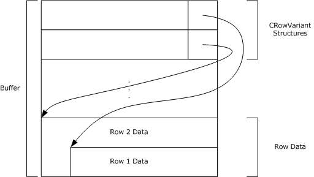

Figure 2: Structure of the row buffer

The following example presents a sample message beginning with the row buffer and formatted using 32-bit offsets. If the CPMSetBindingsIn message specified two columns (Size (VT_I4) and Title (VT_LPWSTR)), and **_ulClientBase** from CPMGetRowsIn was 0x10000, row data for two rows would appear as follows.

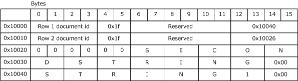

Figure 3: Example of row data format using 32-bit offsets

At the beginning of the offset, 0x10000, there are two CRowVariants, one for each column of variable data stored for each of the two rows returned. Each CRowVariant consists of the following:

- A 4 byte row identifier in which the column belongs.
- 8 unused bytes that can be set to an arbitrary value.
- A 4 byte offset into the row data where the column data can be located.
The six bytes between the last CRowVariant and the beginning of the column data stored at 0x10026 are padding.

<a id="Section_2.2.3.17"></a>
#### 2.2.3.17 CPMRatioFinishedIn

The CPMRatioFinishedIn message requests the completion percentage of a query. The format of the CPMRatioFinishedIn message that follows the header is shown in the following diagram.

```mermaid
packet-beta
  0-31: "_hCursor"
  32-63: "_fQuick"
```

**_hCursor (4 bytes):** The handle from the [CPMCreateQueryOut](#Section_2.2.3.9) message identifying the query for which to request completion information.

**_fQuick (4 bytes):** This is unused and MUST be ignored by the server.

**Note** This field MUST be set to 0x00000001.

<a id="Section_2.2.3.18"></a>
#### 2.2.3.18 CPMRatioFinishedOut

The CPMRatioFinishedOut message replies to a [CPMRatioFinishedIn](#Section_2.2.3.17) message with the completion ratio of a query. The format of the CPMRatioFinishedOut message that follows the header is shown in the following diagram.

```mermaid
packet-beta
  0-31: "_ulNumerator"
  32-63: "_ulDenominator"
  64-95: "_cRows"
  96-127: "_fNewRows"
```

**_ulNumerator (4 bytes):** A 32-bit unsigned integer indicating the numerator of the completion ratio in terms of rows.

**_ulDenominator (4 bytes):** A 32-bit unsigned integer indicating the denominator of the completion ratio in terms of row. This field MUST be greater than zero.

**_cRows (4 bytes):** A 32-bit unsigned integer indicating the total number of rows for the query.

**_fNewRows (4 bytes):** A Boolean value indicating if there are new rows available. A value of 0x00000001 indicates that new rows are available in the [**rowset**](#gt_rowset). A value of 0x00000000 indicates that the rowset does not contain any new rows. This field MUST NOT be set to any other values.

<a id="Section_2.2.3.19"></a>
#### 2.2.3.19 CPMFetchValueIn

The CPMFetchValueIn message requests a property value. As specified in section [3.2.4.2.5](#Section_3.2.4.2.5), this message is sent repeatedly to retrieve all bytes of the property, updating **_cbSoFar** for each, until the **_fMoreExists** field of the [CPMFetchValueOut](#Section_2.2.3.20) message is set to FALSE.

The format of the CPMFetchValueIn message that follows the header is shown in the following diagram.

```mermaid
packet-beta
  0-31: "_wid"
  32-63: "_cbSoFar"
  64-95: "_cbPropSpec"
  96-127: "_cbChunk"
  128-191: "PropSpec (variable)"
  192-255: "_padding (variable)"
```

**_wid (4 bytes):** A 32-bit unsigned integer representing the document ID identifying the document for which a property is fetched.

**_cbSoFar (4 bytes):** A 32-bit unsigned integer containing the number of bytes previously transferred for this property.

**Note** This field MUST be set to 0x00000000 in the first message.

**_cbPropSpec (4 bytes):** A 32-bit unsigned integer containing the size of the **PropSpec** field in bytes.

**_cbChunk (4 bytes):** A 32-bit unsigned integer containing the maximum number of bytes that the sender can accept in a CPMFetchValueOut message.<11>

**PropSpec (variable):** A [CFullPropSpec](#Section_2.2.1.2) structure specifying the property to retrieve.

**_padding (variable):** This field MUST be of the length necessary (0 to 3 bytes) to pad the message out to a multiple of 4 bytes in length. The value of the padding bytes can be any arbitrary value. This field MUST be ignored by the receiver.

<a id="Section_2.2.3.20"></a>
#### 2.2.3.20 CPMFetchValueOut

The CPMFetchValueOut message replies to a [CPMFetchValueIn](#Section_2.2.3.19) message with a property value from a previous query. As specified in section [3.1.5.2.8](#Section_3.1.5.2.8), this message is sent after each CPMFetchValueIn message until all bytes of the property are transferred.

The format of the CPMFetchValueOut message that follows the header is shown in the following diagram.

```mermaid
packet-beta
  0-31: "_cbValue"
  32-63: "_fMoreExists"
  64-95: "_fValueExists"
  96-159: "vValue (variable)"
```

**_cbValue (4 bytes):** A 32-bit unsigned integer containing the total size, in bytes, in **vValue**.

**_fMoreExists (4 bytes):** A Boolean value indicating whether there are additional CPMFetchValueOut messages available.

| Value | Meaning |
| --- | --- |
| 0x00000000 | There are no additional data available. |
| 0x00000001 | There are additional data available. |

**_fValueExists (4 bytes):** A Boolean value indicating whether there is a value for the property.

| Value | Meaning |
| --- | --- |
| 0x00000000 | A value for the property does not exist. |
| 0x00000001 | A value for the property exists. |

**vValue (variable):** A portion of a byte array containing a [SERIALIZEDPROPERTYVALUE](#Section_2.2.1.26) where the offset of the beginning of the portion is the value of **_cbSoFar** in CPMFetchValueIn. The length of the portion, indicated by the **_cbValue** field, MUST be less than or equal to the valure of **_cbChunk** in CPMFetchValueIn.

<a id="Section_2.2.3.21"></a>
#### 2.2.3.21 CPMGetNotify

The CPMGetNotify message MAY request that the client be notified of rowset changes.

The message MUST NOT include a body; only the message header (as specified in section [2.2.2](#Section_2.2.2)) is to be sent.

<a id="Section_2.2.3.22"></a>
#### 2.2.3.22 CPMSendNotifyOut

The CPMSendNotifyOut message SHOULD notify the client of a change to the results of a query.

This message is sent only when a change occurs and a CPMGetNotify message has been received. The format of the CPMSendNotifyOut message that follows the header is shown in the following diagram.

```mermaid
packet-beta
  0-31: "_watchNotify"
```

**_watchNotify (4 bytes):** A 32-bit unsigned integer representing the change to the query. It MUST be one of the following values.

| Value | Meaning |
| --- | --- |
| DBWATCHNOTIFY_ROWSCHANGED 0x00000001 | The number of rows in the query rowset has changed. |
| DBWATCHNOTIFY_QUERYDONE 0x00000002 | The query has completed. |
| DBWATCHNOTIFY_QUERYREEXECUTED 0x00000003 | The query has been executed again. |

<a id="Section_2.2.3.23"></a>
#### 2.2.3.23 CPMGetApproximatePositionIn

The CPMGetApproximatePositionIn message requests the approximate position of a bookmark in a [**chapter**](#gt_chapter). The format of the CPMGetApproximatePositionIn message that follows the header is shown in the following diagram.

```mermaid
packet-beta
  0-31: "_hCursor"
  32-63: "_chapt"
  64-95: "_bmk"
```

**_hCursor (4 bytes):** A 32-bit value representing the query [**cursor (1)**](#gt_cursor) obtained from [CPMCreateQueryOut](#Section_2.2.3.9) for the rowset containing the bookmark.

**_chapt (4 bytes):** A 32-bit value representing the handle to the chapter containing the bookmark.

**_bmk (4 bytes):** A 32-bit value representing the handle to the bookmark for which to retrieve the approximate position.

<a id="Section_2.2.3.24"></a>
#### 2.2.3.24 CPMGetApproximatePositionOut

The CPMGetApproximatePositionOut message replies to a [CPMGetApproximatePositionIn](#Section_2.2.3.23) message describing the approximate position of the bookmark in the [**chapter**](#gt_chapter). The format of the CPMGetApproximatePositionOut message that follows the header is shown in the following diagram.

```mermaid
packet-beta
  0-31: "_numerator"
  32-63: "_denominator"
```

**_numerator (4 bytes):** A 32-bit unsigned integer containing the row number of the bookmark in the rowset.

**_denominator (4 bytes):** A 32-bit unsigned integer containing the number of rows in the rowset.

<a id="Section_2.2.3.25"></a>
#### 2.2.3.25 CPMCompareBmkIn

The CPMCompareBmkIn message requests a comparison of two bookmarks in a [**chapter**](#gt_chapter).

The format of the CPMCompareBmkIn message that follows the header is shown in the following diagram.

```mermaid
packet-beta
  0-31: "hCursor"
  32-63: "chapt"
  64-95: "bmkFirst"
  96-127: "bmkSecond"
```

**hCursor (4 bytes):** A 32-bit unsigned integer representing the handle from the [CPMCreateQueryOut](#Section_2.2.3.9) message for the rowset containing the bookmarks.

**chapt (4 bytes):** A 32-bit unsigned integer representing the handle of the chapter containing the bookmarks to compare.

**bmkFirst (4 bytes):** A 32-bit unsigned integer representing the handle to the first bookmark to compare.

**bmkSecond (4 bytes):** A 32-bit unsigned integer representing the handle to the second bookmark to compare.

<a id="Section_2.2.3.26"></a>
#### 2.2.3.26 CPMCompareBmkOut

The CPMCompareBmkOut message replies to a [CPMCompareBmkIn](#Section_2.2.3.25) message with the comparison of the two bookmarks in the [**chapter**](#gt_chapter). The format of the CPMCompareBmkOut message that follows the header is shown in the following diagram.

```mermaid
packet-beta
  0-31: "_dwComparison"
```

**_dwComparison (4 bytes):** A 32-bit unsigned integer. MUST be one of the following values, indicating the relative positions of the two bookmarks in the chapter.

| Value | Meaning |
| --- | --- |
| DBCOMPARE_LT 0x00000000 | The first bookmark is positioned before the second. |
| DBCOMPARE_EQ 0x00000001 | The first bookmark has the same position as the second. |
| DBCOMPARE_GT 0x00000002 | The first bookmark is positioned after the second. |
| DBCOMPARE_NE 0x00000003 | The first bookmark does not have the same position as the second. |
| DBCOMPARE_NOTCOMPARABLE 0x00000004 | The first bookmark is not comparable to the second. |

<a id="Section_2.2.3.27"></a>
#### 2.2.3.27 CPMRestartPositionIn

The CPMRestartPositionIn message moves the fetch position for a [**cursor (1)**](#gt_cursor) to the beginning of the [**chapter**](#gt_chapter). As specified in section [3.1.5.2.12](#Section_3.1.5.2.12), the server will reply using the same message with the results of the request contained in the **_status** field of the Content Indexing Services Protocol header.

The format of the CPMRestartPositionIn message that follows the header is shown in the following diagram.

```mermaid
packet-beta
  0-31: "_hCursor (optional)"
  32-63: "_chapt (optional)"
```

**_hCursor (4 bytes):** A 32-bit value representing the handle, obtained from a [CPMCreateQueryOut](#Section_2.2.3.9) message, that identifies the query for which to restart the position. This field MUST be present when the message is sent by the client and MUST be absent when the message is sent by the server.

**_chapt (4 bytes):** A 32-bit value representing the handle of a chapter from which to retrieve rows. This field MUST be present when the message is sent by the client and MUST be absent when the message is sent by the server.

<a id="Section_2.2.3.28"></a>
#### 2.2.3.28 CPMStopAsynchIn

The CPMStopAsynchIn message contains a cursor handle for which an asynchronous query SHOULD be stopped.

The format of the CPMStopAsynchIn message that follows the header is shown in the following diagram.

```mermaid
packet-beta
  0-31: "_hCursor"
```

**_hCursor (4 bytes):** The handle from the [CPMCreateQueryOut](#Section_2.2.3.9) message identifying the query for which to stop asynchronous processing.

<a id="Section_2.2.3.29"></a>
#### 2.2.3.29 CPMFreeCursorIn

The CPMFreeCursorIn message requests the release of a cursor. The format of the CPMFreeCursorIn message that follows the header is shown in the following diagram.

```mermaid
packet-beta
  0-31: "_hCursor"
```

**_hCursor (4 bytes):** A 32-bit value representing the handle of the cursor from the [CPMCreateQueryOut](#Section_2.2.3.9) message to release.

<a id="Section_2.2.3.30"></a>
#### 2.2.3.30 CPMFreeCursorOut

The CPMFreeCursorOut message replies to a [CPMFreeCursorIn](#Section_2.2.3.29) message with the results of freeing a cursor. The format of the CPMFreeCursorOut message that follows the header is shown in the following diagram.

```mermaid
packet-beta
  0-31: "_cCursorsRemaining"
```

**_cCursorsRemaining (4 bytes):** A 32-bit unsigned integer indicating the number of cursors still in use for the query.

<a id="Section_2.2.3.31"></a>
#### 2.2.3.31 CPMDisconnect

The CPMDisconnect message SHOULD end the connection with the server.

The message MUST NOT include a body; only the message header (as specified in section [2.2.2](#Section_2.2.2)) is to be sent.

<a id="Section_2.2.4"></a>
### 2.2.4 Errors

All Content Indexing Services Protocol messages MUST return 0x00000000 on success; otherwise, they return a 32-bit nonzero error code that can be either an [**HRESULT**](#gt_hresult) value or an NTSTATUS value (see section [1.8](#Section_1.8)). If a buffer is too small to fit a result, a status code of STATUS_INSUFFICIENT_RESOURCES (0xC0000009A) MUST be returned, after which the failing operation is retried with a larger buffer.

All other error values MUST be treated the same; the error MUST be considered fatal and reported to the higher-level caller. Future messages MAY be sent over the same pipe as if no error had occurred.<12>

**Note** Currently, the HRESULT and NTSTATUS numbering spaces do not overlap except with values of identical meaning; but, even if there were conflicts in the future, they would not cause any protocol issues as long as the value for STATUS_INSUFFICIENT_RESOURCES remains unique because all other error values are treated the same.

<a id="Section_2.2.5"></a>
### 2.2.5 Standard Properties

Properties in the indexing service are represented by the combination of a property set [**GUID**](#gt_globally-unique-identifier-guid) and either a string property name or an integer property ID. See [CFullPropSpec](#Section_2.2.1.2) for more details.

There are three classes of properties: database properties, query properties, and open properties. Database properties help control the indexing service behavior and are as specified in section [2.2.1.15.1](#Section_2.2.1.15.1). Query properties can be used in a restriction and in some cases returned with every result. They are special because they are built into the indexing service. Open properties are defined by individual applications. There are a typical set of common properties in use, but there is no requirement to use them.

<a id="Section_2.2.5.1"></a>
#### 2.2.5.1 Query Properties

Query Property Set

#define QueryGuid

{0x49691c90,0x7e17,0x101a,0xa9,0x1c,0x08,0x00,0x2b,0x2e,0xcd,0xa9}

| Friendly name/PropId | Data type | Description |
| --- | --- | --- |
| RankVector 0x00000002 | VT_UI4\|VT_VECTOR | The 0-1000 rank computed for each element when performing vector ranking. |
| Rank 0x00000003 | VT_I4 | The rank 0-1000 computed for this item. How rank is computed is defined by the indexing service. Typically, content and proximity restrictions influence the rank, while other comparison operators do not. |
| HitCount 0x00000004 | VT_I4 | The number of words from the query found. |
| WorkId 0x00000005 | VT_I4 | A unique identifier for each result found. Use value as a bookmark handle. |
| All 0x00000006 | VT_LPWSTR | Allows a content restriction over all textual properties. Cannot be retrieved. |
| VPath 0x00000009 | VT_LPWSTR | Full virtual path to file, including file name. If there is more than one possible path, then the best match for the specific query is chosen. |

Storage Property Set

#define StorageGuid

{0xb725f130,0x47ef,0x101a,0xa5,0xf1,0x02,0x60,0x8c,0x9e,0xeb,0xac}

The friendly name is Contents, the PropId is 0x00000013, the data type is VT_LPWSTR, and it represents the main contents of a file; usually, this property cannot be retrieved.

<a id="Section_2.2.5.2"></a>
#### 2.2.5.2 Common Open Properties

An indexing service can allow querying and retrieval over any property. The following tables outline some properties typically used.

Storage Property Set

#define StorageGuid

{0xb725f130,0x47ef,0x101a,0xa5,0xf1,0x02,0x60,0x8c,0x9e,0xeb,0xac}

| Friendly name/PropId | Data type | Description |
| --- | --- | --- |
| Directory 0x00000002 | VT_LPWSTR | Physical path to file, not including file name. |
| ClassId 0x00000003 | VT_CLSID | Class ID of object, for example, WordPerfect and Word. |
| FileIndex 0x00000008 | VT_UI8 | Unique ID of file. |
| USN 0x00000009 | VT_I8 | Update Sequence Number. NTFS drives only. |
| Filename 0x0000000A | VT_LPWSTR | Name of file. |
| Path 0x0000000B | VT_LPWSTR | Full physical path to file, including file name. |
| Size 0x0000000C | VT_I8 | Size of file, in bytes. |
| Attrib 0x0000000D | VT_UI4 | File attributes. Documented in Win32 SDK. |
| Write 0x0000000E | VT_FILETIME | Last time that file was written. |
| Create 0x0000000F | VT_FILETIME | Time that file was created. |
| Access 0x00000010 | VT_FILETIME | Last time that file was accessed. |
| AllocSize 0x00000012 | VT_I8 | Size of disk allocation for file. |
| ShortFilename 0x00000014 | VT_LPWSTR | Short (8.3) file name. |

The following table lists the attribute flag values for the Attrib property.

| Attribute/value | Description |
| --- | --- |
| FILE_ATTRIBUTE_READONLY 0x00000001 | The file or directory is read-only. Applications can read the file but cannot write to it or delete it. For a directory, applications cannot delete it. |
| FILE_ATTRIBUTE_HIDDEN 0x00000002 | The file or directory is hidden. It is not included in an ordinary directory listing. |
| FILE_ATTRIBUTE_SYSTEM 0x00000004 | The file or directory is part of the operating system or is used exclusively by the operating system. |
| FILE_ATTRIBUTE_DIRECTORY 0x00000010 | The handle identifies a directory. |
| FILE_ATTRIBUTE_ARCHIVE 0x00000020 | The file or directory is an archive file. Applications use this attribute to mark files for backup or removal. |
| FILE_ATTRIBUTE_NORMAL 0x00000080 | The file or directory does not have another attributes set. This attribute is valid only if used alone. |
| FILE_ATTRIBUTE_TEMPORARY 0x00000100 | The file is being used for temporary storage. File systems avoid writing data back to mass storage if sufficient cache memory is available, because often the application deletes the temporary file shortly after the handle is closed. In that case, the system can entirely avoid writing the data. Otherwise, the data is written after the handle is closed. |
| FILE_ATTRIBUTE_SPARSE_FILE 0x00000200 | The file is a sparse file. |
| FILE_ATTRIBUTE_REPARSE_POINT 0x00000400 | The file or directory has an associated reparse point. |
| FILE_ATTRIBUTE_COMPRESSED 0x00000800 | The file or directory is compressed. For a file, this means that all of the data in the file is compressed. For a directory, this means that compression is the default for newly created files and subdirectories. |
| FILE_ATTRIBUTE_OFFLINE 0x00001000 | The data of the file is not immediately available. This attribute indicates that the file data has been physically moved to offline storage. This attribute is used by Remote Storage, the hierarchical storage management software. Applications are not to arbitrarily change this attribute. |
| FILE_ATTRIBUTE_ENCRYPTED 0x00004000 | The file or directory is encrypted. For a file, this means that all data in the file is encrypted. For a directory, this means that encryption is the default for newly created files and subdirectories. |
| FILE_ATTRIBUTE_VIRTUAL 0x00010000 | A file is a virtual file. |

Property Sets for Documents

#define DocPropSetGuid

{0xf29f85e0,0x4ff9,0x1068,0xab,0x91,0x08,0x00,0x2b,0x27,0xb3,0xd9}

| Friendly name/PropId | Data type | Description |
| --- | --- | --- |
| DocTitle 0x00000002 | VT_LPWSTR | Title of document. |
| DocSubject 0x00000003 | VT_LPWSTR | Subject of document. |
| DocAuthor 0x00000004 | VT_LPWSTR | Author of document. |
| DocKeywords 0x00000005 | VT_LPWSTR | Document keywords. |
| DocComments 0x00000006 | VT_LPWSTR | Comments about document. |
| DocTemplate 0x00000007 | VT_LPWSTR | Name of template for document. |
| DocLastAuthor 0x00000008 | VT_LPWSTR | Most recent user who edited document. |
| DocRevNumber 0x00000009 | VT_LPWSTR | Current version number of document. |
| DocEditTime 0x0000000A | VT_FILETIME | Total time spent editing document. |
| DocLastPrinted 0x0000000B | VT_FILETIME | Time that document was last printed. |
| DocCreatedTm 0x0000000C | VT_FILETIME | Time that document was created. |
| DocLastSavedTm 0x0000000D | VT_FILETIME | Time that document was last saved. |
| DocPageCount 0x0000000E | VT_I4 | Number of pages in document. |
| DocWordCount 0x0000000F | VT_I4 | Number of words in document. |
| DocCharCount 0x00000010 | VT_I4 | Number of characters in document. |
| DocThumbnail 0x00000011 | VT_CF | Thumbnail of document in clipboard format. |
| DocAppName 0x00000012 | VT_LPWSTR | Name of application that created the file. |

Property Sets for Documents

#define DocPropSetGuid2

{0xd5cdd502,0x2e9c,0x101b,0x93,0x97,0x08,0x00,0x2b,0x2c,0xf9,0xae}

| Friendly name/PropId | Data type | Description |
| --- | --- | --- |
| DocCategory 0x00000002 | VT_LPSTR | Type of document, such as a memo, schedule, or white paper. |
| DocPresentationTarget 0x00000003 | VT_LPSTR | Target format (35mm, printer, video, and so on) for a presentation in PowerPoint. |
| DocByteCount 0x00000004 | VT_I4 | Number of bytes in a document. |
| DocLineCount 0x00000005 | VT_I4 | Number of lines contained in a document. |
| DocParaCount 0x00000006 | VT_I4 | Number of paragraphs in a document. |
| DocSlideCount 0x00000007 | VT_I4 | Number of slides in a Microsoft PowerPoint presentation. |
| DocNoteCount 0x00000008 | VT_I4 | Number of pages with notes in a PowerPoint presentation. |
| DocHiddenCount 0x00000009 | VT_I4 | Number of hidden slides in a PowerPoint presentation. |
| DocPartTitles 0x0000000D | VT_LPWSTR\|VT_VECTOR | Names of document parts. For example, in Excel, part titles are the names of spread-sheets; in PowerPoint, part titles are the names of slides; and in Word for Windows, part titles are the names of the documents in the master document. |
| DocManager 0x0000000E | VT_LPSTR | Name of the manager of the document's author. |
| DocCompany 0x0000000F | VT_LPSTR | Name of the company for which the document was written. |

Document characterization

#define DocCharacterGuid

{0x560c36c0,0x503a,0x11cf,0xba,0xa1,0x00,0x00,0x4c,0x75,0x2a,0x9a}

The friendly name is Characterization, the PropId is 0x00000002, its data type is VT_LPWSTR, and it is the characterization, or abstract, of a document; computed by the indexing service.

Music Property Set

#define PSGUID_MUSIC

{56A3372E-CE9C-11d2-9F0E-006097C686F6}

| Friendly name/PropId | Data type | Description |
| --- | --- | --- |
| MusicArtist 0x00000002 | VT_LPWSTR | Artist who recorded the song. |
| MusicAlbum 0x00000004 | VT_LPWSTR | Album that the song was released on. |
| MusicYear 0x00000005 | VT_LPWSTR | Year that the song was published. |
| MusicTrack 0x00000007 | VT_UI4 | Track number of the song. |
| MusicGenre 0x0000000B | VT_LPWSTR | Genre of the song. |

Digital Rights Management

#define PSGUID_DRM

{AEAC19E4-89AE-4508-B9B7-BB867ABEE2ED}

This property set contains properties that describe the digital rights associated with some media.

| Friendly name/PropId | Data type | Description |
| --- | --- | --- |
| DrmLicense 0x00000002 | VT_BOOL | TRUE if there is a license. |
| DrmDescription 0x00000003 | VT_LPWSTR | Description of the license. |
| DrmPlayCount 0x00000004 | VT_UI4 | Number of times that the item can be played. |
| DrmPlayStarts 0x00000005 | VT_FILETIME | Date play rights start. |
| DrmPlayExpires 0x00000006 | VT_FILETIME | Date rights expire. |

Image Property Set

#define PSGUID_IMAGESUMMARYINFORMATION

{0x6444048f,0x4c8b,0x11d1,0x8b,0x70,0x8,0x00,0x36,0xb1,0x1a,0x03}

| Friendly name/PropId | Data type | Description |
| --- | --- | --- |
| ImageFileType 0x00000002 | VT_LPWSTR | Type of image file. |
| ImageCx 0x00000003 | VT_UI4 | Horizontal size in pixels. |
| ImageCy 0x00000004 | VT_UI4 | Vertical size in pixels. |
| ImageResolutionX 0x00000005 | VT_UI4 | Horizontal resolution in pixels per inch. |
| ImageResolutionY 0x00000006 | VT_UI4 | Vertical resolution in pixels per inch. |
| ImageBitDepth 0x00000007 | VT_UI4 | Number of bits per pixel. |
| ImageColorSpace 0x00000008 | VT_LPWSTR | Description of image color space. |
| ImageCompression 0x00000009 | VT_LPWSTR | Description of image compression. |
| ImageTransparency 0x0000000A | VT_UI4 | Degree of transparency from 0-100. |
| ImageGammaValue 0x0000000B | VT_UI4 | Gamma correction value. |
| ImageFrameCount 0x0000000C | VT_UI4 | Frame count for image. |
| ImageDimensions 0x0000000D | VT_LPWSTR | Description of the image dimensions. |

Audio Property Set

#define PSGUID_AUDIO

{64440490-4C8B-11D1-8B70-080036B11A03}

Audio-Related Properties

| Friendly name/PropId | Datatype | Description |
| --- | --- | --- |
| AudioFormat 0x00000002 | VT_LPWSTR | Format of audio. |
| AudioTimeLength 0x00000003 | VT_UI8 | Duration in 100-nanosecond units. |
| AudioAvgDataRate 0x00000004 | VT_UI4 | Average encoding rate in bits per second. |
| AudioSampleRate 0x00000005 | VT_UI4 | Sample rate in samples per second. |
| AudioSampleSize 0x00000006 | VT_UI4 | Sample size in bits per sample. |
| AudioChannelCount 0x00000007 | VT_UI4 | Number of channels of audio. |

Video Property Set

#define PSGUID_VIDEO

{64440491-4C8B-11D1-8B70-080036B11A03}

| Friendly Name/PropId | Datatype | Description |
| --- | --- | --- |
| VideoStreamName 0x00000002 | VT_LPWSTR | Name of the stream. |
| VideoFrameWidth 0x00000003 | VT_UI4 | Width of a frame in pixels. |
| VideoFrameHeight 0x00000004 | VT_UI4 | Height of a frame in pixels. |
| VideoTimeLength 0x00000005 | VT_UI4 | Duration in 100-nanosecond units. |
| VideoFrameCount 0x00000006 | VT_UI4 | Number of frames in video. |
| VideoFrameRate 0x00000007 | VT_UI4 | Frames per second. |
| VideoDataRate 0x00000008 | VT_UI4 | Bits per second. |
| VideoSampleSize 0x00000009 | VT_UI4 | Bits per sample. |
| VideoCompression 0x0000000A | VT_LPWSTR | Description of video compression. |

Mime Properties

#define #define NNTPGuid

{0xAA568EEC,0xE0E5,0x11CF,0x8F,0xDA,0x00,0xAA,0x00,0xA1,0x4F,0x93}

| Friendly name/PropId | Data type | Description |
| --- | --- | --- |
| MsgNewsgroup 0x00000002 | VT_LPWSTR | Newsgroup for the message. |
| MsgSubject 0x00000005 | VT_LPWSTR | Subject of the message. |
| MsgFrom 0x00000006 | VT_LPWSTR | Who sent the message. |
| MsgMessageID 0x00000007 | VT_LPWSTR | Unique ID for email message. |
| MsgDate 0x0000000C | VT_FILETIME | When the message was sent. |
| MsgReceivedDate 0x00000035 | VT_FILETIME | When the message was received. |
| MsgArticleID 0x0000003C | VT_UI4 | Unique identifier for the newsgroup article. |

<a id="Section_3"></a>
# 3 Protocol Details

Content Indexing Services Protocol message requests require only minimal sequencing. A [CPMSetCatStateIn](#Section_2.2.3.2) message MAY be called at any time. All other messages MUST be preceded by an initial [CPMConnectIn](#Section_2.2.3.6) message (for example, at least one CPMConnectIn message for each [**named pipe**](#gt_named-pipe) connection). Beyond the initial connection, there is no other sequencing required by the protocol. However, it is advised that the higher layer adhere to a meaningful message sequence. Some messages include data returned by previous messages. Even though it is legal to send messages in any order, the server will return an error if the data in a particular message is invalid. Message dependencies define only a partial order of message sequence - other messages can be interspersed.

The following figure shows how messages depend on the data from previous messages.


Figure 4: Typical message sequence for a simple query from client to remote computer

The messages represented in the preceding diagram represent a subset of all of the Content Indexing Services Protocol messages used for querying a remote [**indexing service**](#gt_indexing-service) [**catalog**](#gt_catalog).

<a id="Section_3.1"></a>
## 3.1 Server Details

<a id="Section_3.1.1"></a>
### 3.1.1 Abstract Data Model

The following section specifies data and state maintained by the Content Indexing Services Protocol server. The data provided in this document explains how the protocol behaves. This section does not mandate that implementations adhere to this model as long as their external behavior is consistent with that described in this document.

An [**indexing service**](#gt_indexing-service) implementing the Content Indexing Services Protocol MUST maintain the following abstract data elements:

- The list of clients connected to the server.
- Information about each client, which includes:
- Client's version (as indicated in the [CPMConnectIn](#Section_2.2.3.6) message specified in section 2.2.3.6).
- [**Catalog**](#gt_catalog) associated with the client (by a CPMConnectIn message).
- Additional client properties as specified in the [Properties](#Section_2.2.1.15.1) section.
- Client's search query.
- List of [**cursor (1)**](#gt_cursor) [**handles**](#gt_handle) for the query, and position in result set for each handle.
- Current set of [**bindings**](#gt_binding).
- Current status of the query, which includes (for each cursor):
- Number of [**rows**](#gt_row) in query result.
- Numerator and denominator of query completion.
- Last number of rows, reported by most recent [CPMRatioFinishedOut](#Section_2.2.3.18) message for this cursor.
- Whether the query is monitored by the server for changes in query results, and if it is monitored, what changed in the query results since they were last reported to the client by [CPMSendNotifyOut](#Section_2.2.3.22).
- List of [**chapter**](#gt_chapter) handles, served by this query to a client.
- List of [**bookmark**](#gt_bookmark) handles for each cursor, served by this query to a client.
- The current state of the indexing service, which can be "not initialized", "running", or "shutting down". These states are logical only, and can only affect possible error messages received from the service. Note that most of the time the server is in "running" state. The following is the state machine diagram for the server.


Figure 5: State machine diagram for the server

- Per-catalog information: collection of indexed locations, number of documents [**indexed**](#gt_indexing), size of [**inverted index**](#gt_inverted-index), number of unique keys, and so on (see section [2.2.3.1](#Section_2.2.3.1) for complete list), state which corresponds to the values of **dwOldState** in section [2.2.3.3](#Section_2.2.3.3).<13>
- For each language supported, a database of word variations as discussed in GENERATE_METHOD_INFLECT in section [2.2.1.3](#Section_2.2.1.3).
<a id="Section_3.1.2"></a>
### 3.1.2 Timers

None.

<a id="Section_3.1.3"></a>
### 3.1.3 Initialization

Upon initialization, the server MUST set its state to "not initialized" and start listening for messages on the [**named pipe**](#gt_named-pipe) specified in section [1.9](#Section_1.9). After doing any other internal initialization, the server MUST transition to the "running" state.

<a id="Section_3.1.4"></a>
### 3.1.4 Higher-Layer Triggered Events

None.

<a id="Section_3.1.5"></a>
### 3.1.5 Message Processing and Sequencing Rules

Whenever an error occurs during the processing of a message sent by a client, the server MUST report an error back to the client as follows:

- Stop processing the message sent by the client.
- Respond with the message header (only) of the message sent by the client, keeping **_msg** field intact.
- Set the **_status** field to the error code value.
When a message arrives, the server MUST check the field value to determine whether it is a known type (see section [2.2.2](#Section_2.2.2)). If the type is not known, the server MUST report a STATUS_INVALID_PARAMETER (0xC000000D) error.

The server MUST then validate the **_ulChecksum** field value if the message type is one of the following:

- [CPMConnectIn](#Section_2.2.3.6) (0x000000C8)
- [CPMCreateQueryIn](#Section_2.2.3.8) (0x000000CA)
- [CPMSetBindingsIn](#Section_2.2.3.14) (0x000000D0)
- [CPMGetRowsIn](#Section_2.2.3.15) (0x000000CC)
- [CPMFetchValueIn](#Section_2.2.3.19) (0x000000E4)
To validate the **_ulChecksum** field value, the server MUST check the value that the client specified in the **_iClientVersion** field in the CPMConnectIn message.

If the **_iClientVersion** field is less than 0x00000008 and the _ulChecksum field is not set to 0x00000000, the server MUST report a STATUS_INVALID_PARAMETER (0xC000000D) error. The server MUST NOT validate the **_ulChecksum** field for clients that set the **_iClientVersion** field to a value less than 0x00000008.

If the **_iClientVersion** field value is 0x00000008 or greater, the server MUST validate that the **_ulChecksum** field was calculated as specified in section [3.2.4](#Section_3.2.4). If the **_ulChecksum** value is invalid, the server MUST report a STATUS_INVALID_PARAMETER (0xC000000D) error.

Next, the server checks which state it is in. If its state is "not initialized", the server MUST report a CI_E_NOT_INITIALIZED (0x8004180B) error. If its state is "shutting down", the server MUST report a CI_E_SHUTDOWN (0x80041812) error.

After a header has been determined to be valid and after the server has been determined to be in "running" state, further message-specific processing MUST be done as specified in the following subsections.

Some messages are valid only after a previous message has been sent. Typically, an ID or [**handle**](#gt_handle) from the earlier message is required as input to the later message. These requirements are detailed in the following sections. The following table summarizes the relationship between messages.

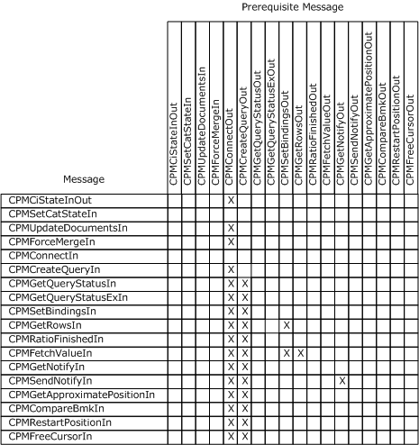

Figure 6: Relationship between messages

<a id="Section_3.1.5.1"></a>
#### 3.1.5.1 Remote Indexing Service Catalog Management

<a id="Section_3.1.5.1.1"></a>
##### 3.1.5.1.1 Receiving a CPMCiStateInOut Request

When the server receives a [CPMCiStateInOut](#Section_2.2.3.1) message request from the client, the server MUST first check whether the client is in a list of connected clients. If the client is not in the list, the server MUST report a STATUS_INVALID_PARAMETER (0xC000000D) error. Otherwise, the server MUST respond to the client with a CPMCiStateInOut message, filling the message in with information about the client's associated catalog, as specified in section 2.2.3.1.

<a id="Section_3.1.5.1.2"></a>
##### 3.1.5.1.2 Receiving a CPMSetCatStateIn Request

When the server receives a [CPMSetCatStateIn](#Section_2.2.3.2) message request from the client, the server MUST do the following:

- Check whether the client has administrative access. If the client does not have administrative access, the server MUST report a STATUS_ACCESS_DENIED (0xC0000022) error.
- If **_dwNewState** is not equal to CICAT_ALL_OPENED, locate a catalog with the name specified in the **_CatName** field. If the server does not locate such a catalog or the value of **_dwNewState** is not one of the values listed in section 2.2.3.2, the server MUST return a STATUS_INVALID_PARAMETER (0xC000000D) error.
- If **_dwNewState** is not CICAT_GET_STATE or CICAT_ALL_OPENED, change the state of the catalog to the value specified in one of the figures below, where the following abbreviations are used: STP (CICAT_STOPPED), RO (CICAT_READONLY), RW (CICAT_WRITABLE), and NQ (CICAT_NOQUERY).
If the catalog exists on a read/write media, the following values are used.


Figure 7: Read/write catalog states

**Note** The state RO|NQ MUST NOT be used in this case.

If the catalog exists on read-only media such as a CD-ROM, the figure is the following values are used.


Figure 8: Read-only catalog states

**Note** The states RW and RW|NQ MUST NOT be used in this case.

- Respond to the client with a [CPMSetCatStateOut](#Section_2.2.3.3) message, where **_dwOldState** MUST be set to the previous state of the catalog if **_dwNewState** is CICAT_STOPPED, CICAT_READONLY, CICAT_WRITABLE, CICAT_NO_QUERY or CICAT_GET_STATE. If **_dwNewState** is equal to CICAT_ALL_OPENED, the server MUST check the status of all catalogs. If any catalog was started since service start up, the server MUST set **_dwOldState** to 0x00000001. If no catalogs were started, the server MUST set **_dwOldState** to 0x00000000.
**Note** It is very unusual to receive 0x00000000 in response to CICAT_ALL_OPENED.

<a id="Section_3.1.5.1.3"></a>
##### 3.1.5.1.3 Receiving a CPMUpdateDocumentsIn Request

When the server receives a [CPMUpdateDocumentsIn](#Section_2.2.3.4) message request, the server MUST do the following:

- Check whether the client is in a list of connected clients (which have an associated catalog). If the client is not in the list, the server MUST report a STATUS_INVALID_PARAMETER (0xC000000D) error.
- Check whether the client has administrative access. If the client does not have administrative access to the server, the server MUST report a STATUS_ACCESS_DENIED (0xC0000022) error.
- Begin the process of [**indexing**](#gt_indexing) the [**path**](#gt_path) specified by the client by doing a full or incremental scan, depending on the value of the **_flag** field in the CPMUpdateDocumentsIn message. If the path was not previously indexed, it MUST be added to the collection of indexed locations and a full scan MUST be performed. This operation MUST be performed in the catalog associated with the client.
- Respond to the client with the message header for the CPMUpdateDocumentsIn message, and set the **_status** field to the results of the request.
<a id="Section_3.1.5.1.4"></a>
##### 3.1.5.1.4 Receiving a CPMForceMergeIn Request

When the server receives a [CPMForceMergeIn](#Section_2.2.3.5) message request, the server MUST do the following:

- Check whether the client is in a list of connected clients (which have a catalog associated). If the client is not in the list, the server MUST report a STATUS_INVALID_PARAMETER (0xC000000D) error.
- Check whether the client has administrative access. If the client does not have administrative access, the server MUST report a STATUS_ACCESS_DENIED (0xC0000022) error.
- Begin any process of maintenance that is necessary to improve query performance on a catalog associated with the client.
- Respond to the client with a message header for the CPMForceMergeIn message, and set the **_status** field to the results of the request.
**Note** The process of maintenance is asynchronous and can continue after the client receives the response message. This process does not directly affect the protocol in any way (other than response time).

<a id="Section_3.1.5.2"></a>
#### 3.1.5.2 Remote Indexing Service Querying

<a id="Section_3.1.5.2.1"></a>
##### 3.1.5.2.1 Receiving a CPMConnectIn Request

When the server receives a [CPMConnectIn](#Section_2.2.3.6) request from a client, the server MUST do the following:

- Check whether the client is already on the list of connected clients. If this is the case, the server MUST report a STATUS_INVALID_PARAMETER (0xC000000D) error.
- Check whether the specified catalog exists and is not in the stopped state. If this is not the case, the server MUST report a CI_E_NO_CATALOG (0x8004181D) error.
- Add the client to the list of connected clients.
- Associate the catalog with the client.
- Store the information passed in the CPMConnectIn message (such as catalog name or client version) in the client state.
- Respond to the client with a [CPMConnectOut](#Section_2.2.3.7) message.
<a id="Section_3.1.5.2.2"></a>
##### 3.1.5.2.2 Receiving a CPMCreateQueryIn Request

When the server receives a [CPMCreateQueryIn](#Section_2.2.3.8) message request from a client, the server MUST do the following:

- Check whether the client is in the list of connected clients. If this is not the case, the server MUST report a STATUS_INVALID_PARAMETER (0xC000000D) error.
- Check whether the client already has a query associated with it. If this is the case, the server MUST report a STATUS_INVALID_PARAMETER (0xC000000D) error.
- Check whether the catalog associated with the client is in a state that allows a query to be processed (CICAT_READONLY or CICAT_WRITABLE). If this is not the case, the server MUST report a QUERY_S_NO_QUERY (0x8004160C) error.
- Parse the[**restriction**](#gt_restriction) set, [**sort orders**](#gt_sort-order), and groupings that are specified in the query. If the server encounters an error, it MUST report an appropriate error. If this step fails for any other reason, the server MUST report the error encountered. For information about [**indexing service**](#gt_indexing-service) query errors, see [[MSDN-QUERYERR]](https://go.microsoft.com/fwlink/?LinkId=90070).
- Save the search query in the state for the client.
- Make any preparations needed to serve [**rows**](#gt_row) to a client and associate the query with appropriate [**cursor (1)**](#gt_cursor) [**handles**](#gt_handle) (depending on information passed in the CPMCreateQueryIn message).
- Add those handles to the client's list of cursor handles, and create lists of [**chapter**](#gt_chapter) handles and [**bookmarks**](#gt_bookmark).
- Initialize the list of chapter handles for every cursor in this query to DB_NULL_HCHAPTER.
- Mark the query as not monitored for changes.
- Initialize the number of rows to the currently calculated number of rows (which can be 0 if a query did not start to execute or some number if the query is in a process of execution), and initialize the numerator and denominator of query completion.
- Respond to the client with a [CPMCreateQueryOut](#Section_2.2.3.9) message.
<a id="Section_3.1.5.2.3"></a>
##### 3.1.5.2.3 Receiving a CPMGetQueryStatusIn Request

When the server receives a [CPMGetQueryStatusIn](#Section_2.2.3.10) message request from a client, the server MUST do the following:

- Check whether the client has a query associated with it. If this is not the case, the server MUST report a STATUS_INVALID_PARAMETER (0xC000000D) error.
- Check whether the cursor handle is in a list of the client's cursor handles. If this is not the case, the server MUST report an E_FAIL (0x80004005) error.
- Prepare a [CPMGetQueryStatusOut](#Section_2.2.3.11) message. The server MUST retrieve the current query status and set it in the **_Status** field (see 2.2.3.11 for possible values). If this step fails for any reason, the server MUST report an error.
- Respond to the client with the CPMGetQueryStatusOut message.
<a id="Section_3.1.5.2.4"></a>
##### 3.1.5.2.4 Receiving a CPMGetQueryStatusExIn Request

If the server receives a [CPMGetQueryStatusExIn](#Section_2.2.3.12) message request from a client, the server MUST do the following:

- Check whether the client has a query associated with it. If this is not the case, the server MUST report a STATUS_INVALID_PARAMETER (0xC000000D) error.
- Check whether the [**cursor (1)**](#gt_cursor) [**handle**](#gt_handle) passed is in a list of the client's cursor handles. If this is not the case, the server MUST report an E_FAIL (0x80004005) error.
- Prepare a [CPMGetQueryStatusExOut](#Section_2.2.3.13) message. The server MUST retrieve the current query status and query progress and set **_Status** (see [CPMGetQueryStatusOut](#Section_2.2.3.11) for possible values), **_dwRatioFinishedDenominator**, and **_dwRatioFinishedNumerator** respectively. The server MUST then set the number of [**rows**](#gt_row) in the query results to **_cRowsTotal**. If this step fails for any reason, the server MUST report that an error was encountered.
- Retrieve information about the client's catalog and fill in **_cFilteredDocuments** and **_cDocumentsToFilter**. If this step fails for any reason, the server MUST report that an error was encountered.
- Retrieve the position of the [**bookmark**](#gt_bookmark) indicated by the handle in the **_bmk** field, and fill the remaining **_iRowBmk** field in the CPMGetQueryStatusExOut message. If this step fails for any reason, the server MUST report that an error was encountered.
- Respond to the client with the CPMGetQueryStatusExOut message.
<a id="Section_3.1.5.2.5"></a>
##### 3.1.5.2.5 Receiving a CPMRatioFinishedIn Request

When the server receives a [CPMRatioFinishedIn](#Section_2.2.3.17) message request from a client, the server MUST do the following:

- Check whether the client has a query associated with it. If this is not the case, the server MUST report a STATUS_INVALID_PARAMETER (0xC000000D) error.
- Check whether the cursor handle passed is in the list of the client's cursor handles. If this is not the case, the server MUST report an E_FAIL (0x80004005) error.
- Prepare a [CPMRatioFinishedOut](#Section_2.2.3.18) message. The server MUST retrieve the client's query status and fill in the **_ulNumerator**, **_ulDenominator**, and **_cRows** fields. If this step fails for any reason, the server MUST report that an error was encountered.
- If **_cRows** is equal to the last reported number of rows for this query, set **_fNewRows** to 0x00000000; otherwise, set it to 0x00000001.
- Update the last reported number of rows for this query to the value of **_cRows**.
- Respond to the client with the CPMRatioFinishedOut message.
<a id="Section_3.1.5.2.6"></a>
##### 3.1.5.2.6 Receiving a CPMSetBindingsIn Request

When the server receives a [CPMSetBindingsIn](#Section_2.2.3.14) message request from a client, the server MUST do the following:

- Check whether the client has a query associated with it. If this is not the case, the server MUST report a STATUS_INVALID_PARAMETER (0xC000000D) error.
- Check whether the cursor handle passed is in the list of the client's cursor handles. If this is not the case, the server MUST report an E_FAIL (0x80004005) error.
- Verify that [**binding**](#gt_binding) information is valid (that is, the [**column**](#gt_column) at least specifies value, length, or status to be returned; no overlap in bindings for value, length, or status; and value, length, and status fit in the specified row size) and if not, report a DB_E_BADBINDINFO (0x80040E08) error.
- Save the binding information associated with the columns specified in the **aColumns** field. If this step fails for any reason, the server MUST report that an error was encountered.
- Respond to the client with a message header (only) with **_msg** set to CPMSetBindingsIn, and **_status** set to the results of the specified binding.
<a id="Section_3.1.5.2.7"></a>
##### 3.1.5.2.7 Receiving a CPMGetRowsIn Request

When the server receives a [CPMGetRowsIn](#Section_2.2.3.15) message request from a client, the server MUST do the following:

- Check whether the client has a query associated with it. If this is not the case, the server MUST report a STATUS_INVALID_PARAMETER (0xC000000D) error.
- Check whether the cursor handle passed is in the list of the client's cursor handles. If this is not the case, the server MUST report an E_FAIL (0x80004005) error.
- Check whether the client has a current set of [**bindings**](#gt_binding). If this is not the case, the server MUST report an E_FAIL (0x80004005) error.
- Prepare a [CPMGetRowsOut](#Section_2.2.3.16) message. The server MUST position the cursor in query results as indicated by the seek description. If this step fails for any reason, the server MUST report that an error was encountered.
- Fetch as many rows as will fit in a buffer, the size of which is indicated by **_cbReadBuffer**, but not more than indicated by **_cRowsToTransfer**. When fetching rows, the server MUST compare each selected column's property value type to the type that is specified in the client's current set of bindings (see section [3.1.1](#Section_3.1.1)). If the type in the binding is not VT_VARIANT, the server MUST attempt to convert the column's property value to that type. Otherwise, if the DBPROP_USEEXTENDEDDBTYPES flag is set in the client's DBPROPSET_QUERYEXT property set, or if the column's property value is not a VT_VECTOR type, the property value MUST be returned in its normal type. If none of these are the case (that is, the server has a VT_VECTOR type, and the client does not support VT_VECTOR), the server MUST attempt to convert it to a VT_ARRAY type as follows:
- VT_I8, VT_UI8, VT_FILETIME, and VT_CLSID array elements cannot be converted and instead fail.
- VT_LPSTR and VT_LPWSTR array elements MUST be converted to VT_BSTR.
- Array elements of all other types MUST remain unchanged.
Finally, if row columns contain [**chapter**](#gt_chapter) handles or bookmark handles, the server MUST update the corresponding lists. If this step fails for any reason, the server MUST report that an error was encountered.

- Store the actual number of rows fetched in **_cRowsReturned**.
- Store fetched rows in the **Rows** field (see note on the following status byte and section 2.2.3.16 on the structure of the **Rows** field).
- Respond to the client with the CPMGetRowsOut message.
**Note** Regarding status byte field: If StatusUsed is set to 0x01 in the [CTableColumn](#Section_2.2.1.25) structure of the [CPMSetBindingsIn](#Section_2.2.3.14) message for the column, the server MUST set the status byte according the description specified in section 2.2.1.25.

If the property value is absent for this row, the server MUST set the status byte to StatusNull. If the value is too big to be transferred in the CPMGetRowsOut message (greater than 2048 bytes), the server MUST set the status byte to StatusDeferred. Otherwise, the server MUST set the status byte to StatusOK.

<a id="Section_3.1.5.2.8"></a>
##### 3.1.5.2.8 Receiving a CPMFetchValueIn Request

When the server receives a [CPMFetchValueIn](#Section_2.2.3.19) message request from a client, the server MUST do the following:

- Check whether the client has a query associated with it. If this is not the case, the server MUST report a STATUS_INVALID_PARAMETER (0xC000000D) error.
- Prepare a [CPMFetchValueOut](#Section_2.2.3.20) message. If this step fails for any reason, the server MUST report an error.
- Find the document indicated by the **_wid** field and check if this document is available for this client and that this document has the property indicated by property ID in the [CFullPropSpec](#Section_2.2.1.2) structure. In the case both conditions are true, the server MUST set _fValueExists to 0x00000000, and otherwise set _fValueExists to 0x00000001. The value which is indicated by property ID in the CFullPropSpec structure for that document is referred to later as the "property value". If this step fails for any reason, the server MUST report an error.
- If **_fValueExists** is equal to 0x00000001, the server MUST do the following:
- Serialize the property value to a [SERIALIZEDPROPERTYVALUE](#Section_2.2.1.26) structure and copy, starting from the **_cbSoFar** offset, at most **_cbChunk** bytes (but not past the end of the serialized property) to **vValue** field. If this step fails for any reason, the server MUST report an error.
- Set **_cbValue** to the number of bytes copied in the previous step.
- If the length of serialized property is greater than **_cbSoFar** added to **_cbValue**, set **_fMoreExists** to 0x00000001; otherwise, set it to 0x00000000.
- Respond to the client with the CPMFetchValueOut message.
<a id="Section_3.1.5.2.9"></a>
##### 3.1.5.2.9 Receiving a CPMGetNotify Request

If the server SHOULD receive a [CPMGetNotify](#Section_2.2.3.21) message from a client, the server MUST do the following:

- Check whether the client has a query associated with it. If this is not the case, the server MUST report a STATUS_INVALID_PARAMETER (0xC000000D) error.
- If there were no changes in the query result set since the last [CPMSendNotifyOut](#Section_2.2.3.22) message for this client, or if the query is not currently monitored for changes in the results set, the server MUST respond with a CPMGetNotify message and start to monitor the query for changes in the results set. If at a later time there is a change in the query results set, the server MUST send exactly one CPMSendNotifyOut message to the client and MUST specify the change in the **_watchNotify** field.
- If there were changes to the query result set since the last CPMSendNotifyOut message, the server MUST reply with CPMSendNotifyOut and MUST specify the change in the **_watchNotify** field. Note, that in the case of many changes to the query results, DBWATCHNOTIFY_ROWSCHANGED takes priority (that is, if the query was done and re-executed, and then if the number of [**rows**](#gt_row) changed and the query was done again, then the event reported would be DBWATCHNOTIFY_ROWSCHANGED).
<a id="Section_3.1.5.2.10"></a>
##### 3.1.5.2.10 Receiving a CPMGetApproximatePositionIn Request

When the server receives a [CPMGetApproximatePositionIn](#Section_2.2.3.23) message request from the client, the server MUST do the following:

- Check whether the client has a query associated with it. If this is not the case, the server MUST report a STATUS_INVALID_PARAMETER (0xC000000D) error.
- Check whether the cursor handle, [**chapter**](#gt_chapter) handle, and bookmark handle passed are in corresponding lists. If this is not the case, the server MUST report an E_FAIL (0x80004005) error.
- Find a row that is associated with the bookmark handle in the query results and approximate the position of the row in the [**rowset**](#gt_rowset), referred to by the chapter handle, and determine the numerator and denominator for the position. Note that when the chapter handle is DB_NULL_HCHAPTER, the corresponding chapter is the main rowset of the query. If this step fails for any reason, the server MUST report an error.
- Respond to the client with a [CPMGetApproximatePositionOut](#Section_2.2.3.24) message.
<a id="Section_3.1.5.2.11"></a>
##### 3.1.5.2.11 Receiving a CPMCompareBmkIn Request

When the server receives a [CPMCompareBmkIn](#Section_2.2.3.25) message request from the client, the server MUST do the following:

- Check whether the client has a query associated with it. If this is not the case, the server MUST report a STATUS_INVALID_PARAMETER (0xC000000D) error.
- Check whether the cursor handle, [**chapter**](#gt_chapter) handle, and bookmark handle passed are in corresponding lists. If this is not the case, the server MUST report an E_FAIL (0x80004005) error.
- Prepare a [CPMCompareBmkOut](#Section_2.2.3.26) message.
- If bookmark handles are equal, **_dwComparison** MUST be set to DBCOMPARE_EQ.
- Otherwise, the server MUST do the following:
- Find rows that are referred to by each bookmark handle in the query results. If the server cannot find one of the rows, DB_E_BADBOOKMARK (0x80040E0E) is returned.
- If any one of the rows is not in the chapter indicated by the chapter handle in CPMCompareBmkIn, then **_dwComparison** MUST be set to DBCOMPARE_NOTCOMPARABLE.
- Otherwise, when both rows are in the same chapter, the server MUST approximate a position of those rows in the [**rowset**](#gt_rowset) referred to by this chapter's handle. The server MUST then compare position values and set **_dwComparison** to DBCOMPARE_LT if the position of the first row is smaller than the position of the second row; otherwise, **_dwComparison** MUST be set to DBCOMPARE_GT.
- Respond to the client with filled CPMCompareBmkOut message.
<a id="Section_3.1.5.2.12"></a>
##### 3.1.5.2.12 Receiving a CPMRestartPositionIn Request

When the server receives the [CPMRestartPositionIn](#Section_2.2.3.27) message request from the client, the server MUST do the following:

- Check whether the client has a query associated with it. If this is not the case, the server MUST report a STATUS_INVALID_PARAMETER (0xC000000D) error.
- Check whether the cursor handle and [**chapter**](#gt_chapter) handle passed are in corresponding lists. If this is not the case, the server MUST report an E_FAIL (0x80004005) error.
- Move the cursor to the beginning of the chapter, identified by the chapter handle. Note that when the chapter handle is DB_NULL_HCHAPTER, the corresponding chapter is the main rowset of the query. If this step fails for any reason, the server MUST report an error.
- Respond to the client with a CPMRestartPositionIn message.
<a id="Section_3.1.5.2.13"></a>
##### 3.1.5.2.13 Receiving a CPMStopAsynchIn Request

If the server SHOULD receive a [CPMStopAsynchIn](#Section_2.2.3.28) message request from the client, the server MUST do the following:

- Check whether the client has a query associated with it. If this is not the case, the server MUST report a STATUS_INVALID_PARAMETER (0xC000000D) error.
- Check whether the cursor handle passed is in the list of the client's cursor handles and the cursor was created with the eAsynchronous flag (0x00000008) set. If this is not the case, the server MUST report an E_FAIL (0x80004005) error.
- Stop asynchronous query processing.
- Respond to the client with the message header for the CPMStopAsynchIn message request, and set the **_status** field to the result of step 3.
<a id="Section_3.1.5.2.14"></a>
##### 3.1.5.2.14 Receiving a CPMFreeCursorIn Request

When the server receives a [CPMFreeCursorIn](#Section_2.2.3.29) message request from the client, the server MUST do the following:

- Check whether the client has a query associated with it. If this is not the case, the server MUST report a STATUS_INVALID_PARAMETER (0xC000000D) error.
- Check whether the cursor handle passed is in the list of the client's cursor handles. If this is not the case, the server MUST report an E_FAIL (0x80004005) error.
- Release the cursor and associated resources (see section [3.1.1](#Section_3.1.1) for a complete list) for this cursor handle.
- Remove the cursor from the list of cursors for that client.
- Respond with a [CPMFreeCursorOut](#Section_2.2.3.30) message, setting the **_cCursorsRemaining** field with the number of cursors remaining in this client's list.
- If there are no more cursors for this client, the server MUST release the query and associated resources (see section 3.1.1).
<a id="Section_3.1.5.2.15"></a>
##### 3.1.5.2.15 Receiving a CPMDisconnect Request

If the server SHOULD receive a [CPMDisconnect](#Section_2.2.3.31) message request from the client, the server MUST remove the client from the list of connected clients and release all resources associated with the client.

<a id="Section_3.1.6"></a>
### 3.1.6 Timer Events

None.

<a id="Section_3.1.7"></a>
### 3.1.7 Other Local Events

When the server is stopped, it MUST first transition to the "shutting down" state. It MUST then stop listening to the pipe, perform any other implementation-specific shutdown tasks, and then transition into the "stopped" state.

<a id="Section_3.2"></a>
## 3.2 Client Details

<a id="Section_3.2.1"></a>
### 3.2.1 Abstract Data Model

The following section specifies data and state maintained by the Content Indexing Services Protocol client. The data is provided to help explain how the protocol behaves. This section does not mandate that implementations adhere to this model as long as their external behavior is consistent with what is described in this document.

A client has the following abstract state:

**Last Message Sent:** A copy of the last message sent to the server.

**Current Property Value:** A partial value of a deferred property, which is in the process of being retrieved.

**Current Bytes Received:** The number of bytes received for Current Property Value so far.

**Named Pipe Connection State:** A connection to the server.

<a id="Section_3.2.2"></a>
### 3.2.2 Timers

None.

<a id="Section_3.2.3"></a>
### 3.2.3 Initialization

No actions are taken until a higher-layer request is received.

<a id="Section_3.2.4"></a>
### 3.2.4 Higher-Layer Triggered Events

When a request is received from a higher layer, the client MUST create a [**named pipe**](#gt_named-pipe) connection to the server, using the details specified in section [2.1](#Section_2.1). If the client is unable to do so, the higher-layer request MUST be failed. That is, in case of a failure to connect, it is the responsibility of the higher layer to retry if wanted.

A header MUST be pre-pended with fields set as specified in section [2.2.2](#Section_2.2.2).

For messages that are specified as requiring a nonzero checksum, the **_ulChecksum** value MUST be calculated as follows:

- The content of the message after the **_ulReserved2** field in the message header MUST be interpreted as a sequence of 32-bit integers. The client MUST calculate the sum of the numeric values given by these integers.
- Calculate the bitwise XOR of this value with 0x59533959.
- Subtract the value given by **_msg** from the value that results from the bitwise XOR.
<a id="Section_3.2.4.1"></a>
#### 3.2.4.1 Remote Indexing Service Catalog Management

Each message is triggered by a request from the higher layer. There is no message sequence enforced by the client for Content Indexing Services Protocol message requests for remotely managing catalogs, but (with the exception of a [CPMSetCatStateIn](#Section_2.2.3.2) message) the server will reply with success only if the client previously connected by means of a [CPMConnectIn](#Section_2.2.3.6) message.

<a id="Section_3.2.4.1.1"></a>
##### 3.2.4.1.1 Sending a CPMCiStateInOut Request

Typically, the higher layer asks the protocol client to send a [CPMCiStateInOut](#Section_2.2.3.1) message when it requires information on indexing services on the server.

When requested to send this message, the client MUST do the following:

- Send a CPMCiStateInOut message, as specified in section 2.2.3.1, to the server.
- Wait to receive a CPMCiStateInOut message from the server, silently discarding all other messages.
- Report back the value of the **_status** field of the response (and, if it was successful, the informational structure) to the higher layer.
<a id="Section_3.2.4.1.2"></a>
##### 3.2.4.1.2 Sending a CPMSetCatStateIn Request

Typically, the higher layer asks the protocol client to send a [CPMSetCatStateIn](#Section_2.2.3.2) message when it requires information on a catalog or all catalogs. For this message, the higher layer needs to provide the protocol client with a value for **_dwNewState** and, if required, the name of the catalog.

When requested to send this message, the client MUST do the following:

- Send a CPMSetCatStateIn message, as specified in section 2.2.3.2, to the server.
- Wait to receive a [CPMSetCatStateOut](#Section_2.2.3.3) message from the server, silently discarding all other messages.
- Report back the value of the **_status** field of the response (and, if it was successful, the **_dwOldState**) to the higher layer.
<a id="Section_3.2.4.1.3"></a>
##### 3.2.4.1.3 Sending a CPMUpdateDocumentsIn Request

Typically, the higher layer asks to send this message when it needs to either update documents in an existing [**path**](#gt_path) or add a new file path to the [**inverted index**](#gt_inverted-index). Thus the higher layer is to provide the path and type of a scan, as specified in section [2.2.3.4](#Section_2.2.3.4), where an incremental or full update is meant for existing paths and new initialization is meant for new paths.

To serve the higher-layer request, the client MUST do the following:

- Send a CPMUpdateDocumentsIn message to the server.
- Wait to receive a CPMUpdateDocumentsIn message back from the server, silently discarding all other messages.
- Report back the value of the **_status** field of the response to the higher layer.
<a id="Section_3.2.4.1.4"></a>
##### 3.2.4.1.4 Sending a CPMForceMergeIn Request

Typically, the higher layer requests to send this message when there is a need to improve query performance or when it is part of scheduled indexing service maintenance.

To serve the higher layer, the client MUST do the following:

- Send a [CPMForceMergeIn](#Section_2.2.3.5) message to the server.
- Wait to receive a CPMForceMergeIn message header back from the server, silently discarding all other messages.
- Report back the value of the **_status** field of the response to the higher layer.
<a id="Section_3.2.4.2"></a>
#### 3.2.4.2 Remote Indexing Service Catalog Query Messages

With the exception of [CPMGetRowsIn](#Section_2.2.3.15)/[CPMGetRowsOut](#Section_2.2.3.16) and [CPMFetchValueIn](#Section_2.2.3.19)/[CPMFetchValueOut](#Section_2.2.3.20), there is a one-to-one relationship between Content Indexing Services Protocol messages and higher-layer requests. For the two exceptions previously mentioned, there can be multiple messages generated by the client to either satisfy size requirements or retrieve a complete property. The higher layer typically keeps track of all query-specific information (such as cursor handles opened, legal values for bookmark and chapter handles, and **_wid** values for deferred property values) and also tracks if the client is in a connected state, but this is not enforced in any way by the client.

The client portion of the diagram in section [3](#Section_3) illustrates this sequence for a simple indexing service query.

<a id="Section_3.2.4.2.1"></a>
##### 3.2.4.2.1 Sending a CPMConnectIn Request

This message is typically the very first request from the higher layer (as if the client is not connected, the server will fail most of the messages with the exception of [CPMSetCatStateIn](#Section_2.2.3.2)). The higher level provides the protocol client with the information necessary to connect.

To serve the higher layer, the client MUST do the following:

- Fill in the message, using information that the higher layer client provided (see section [2.2.3.6](#Section_2.2.3.6)) in **_iClientVersion**, **MachineName**, **UserName**, **PropertySet1**, **PropertySet2**, and **aPropertySet**.
- Set **_fClientIsRemote**, **_cbBlob**, **_cbBlob2**, **cPropSet**, and **cExtPropSet**, as specified in section 2.2.3.6.
- Set the checksum in the **_ulChecksum** field.
- Send the CPMConnectIn message to the server.
- Wait to receive a [CPMConnectOut](#Section_2.2.3.7) message back from the server, silently discarding all other messages.
- Report back the value of the **_status** field of the response (and, if it was successful, the **_serverVersion**) to the higher layer.
For informative purposes, it is expected that higher layers will typically do the following actions on successful connection, but these are not enforced by the Content Indexing Services Protocol client:

- Use remote indexing service catalog management messages for administrative tasks.
- Use a [CPMCreateQueryIn](#Section_2.2.3.8) request to create a search query with the purpose of retrieving results from the catalog.
<a id="Section_3.2.4.2.2"></a>
##### 3.2.4.2.2 Sending a CPMCreateQueryIn Request

The higher layer will typically provide information for the query creation after the protocol client is connected. The higher layer provides the client with a [**restrictions**](#gt_restriction) set, columns set, [**sort order**](#gt_sort-order) rules and categorization set (each of them can be omitted), [**rowset**](#gt_rowset) properties, and property ID mapper structure.

When this request is received from a higher layer, the client MUST do the following:

- Prepare a [CPMCreateQueryIn](#Section_2.2.3.8) request as follows.
- If a columns set is present, set **CColumnSetPresent** to 0x01, and fill the **ColumnsSet** field.
- If restrictions are present, set **CRestrictionPresent** to 0x01, and fill the **Restriction** field.
- If a sort set is present, set **CSortSetPresent** to 0x01, and fill the **SortSet** field.
- If a categorization set is present, set **CCategorizationSetPresent** to 0x01, and fill the **CategorizationSet** field.
- Set the rest of the fields as specified in section 2.2.3.8.
- Calculate the **_ulCheckSum** field in the header.
- Send the CPMCreateQueryIn message to the server.
- Wait to receive the [CPMCreateQueryOut](#Section_2.2.3.9) message (see section [3.2.5.1](#Section_3.2.5.1)), silently discarding all other messages.
- Report back the value of the **_status** field of the response (and, if it was successful, the array of cursor handles and informative Boolean values, as specified in section 2.2.3.9) to the higher layer.
<a id="Section_3.2.4.2.3"></a>
##### 3.2.4.2.3 Sending a CPMSetBindingsIn Request

The higher layer will typically set bindings for each [**column**](#gt_column) to be returned in the rows when it already has a valid cursor handle (after successfully receiving [CPMCreateQueryOut](#Section_2.2.3.9), see section [3.2.5.1](#Section_3.2.5.1)). The higher layer is expected to provide an array of [CTableColumn](#Section_2.2.1.25) structures for the **aColumns** field and a valid cursor handle.

When this request is received from the higher layer, the client MUST do the following:

- Calculate the number of CTableColumn structures in the **aColumns** array and set the **cColumns** field to this value.
- Calculate the total size in bytes of the **cColumns** and **aColumns** fields and set the **_cbBindingDesc** field to this value.
- Set specified fields in the [CPMSetBindingsIn](#Section_2.2.3.14) message to the values provided by the higher application layer. Set the **ulChecksum** field to the value calculated as specified in section [3.2.5](#Section_3.2.5).
- Send the completed CPMSetBindingsIn message to the server.
- Wait to receive a CPMSetBindingsIn message from the server, discarding other messages.
- Indicate the status from the **_status** field of the response to the higher layer.
For informative purposes, it is expected that higher layers will typically request a client to send a [CPMGetRowsIn](#Section_2.2.3.15) message, but this is not enforced by the Content Indexing Services Protocol.

<a id="Section_3.2.4.2.4"></a>
##### 3.2.4.2.4 Sending a CPMGetRowsIn Request

When the higher layer is about to receive rows data, it will provide the protocol client with a valid cursor and [**chapter**](#gt_chapter) handle and give an appropriate seek description. Typically, a higher layer is expected to do so when it has a valid cursor and/or chapter handle, and the bindings had been set with a [CPMSetBindingsIn](#Section_2.2.3.14) message. To access the rowset in a chapter, the higher layer is to use the chapter handle received from the server in a previous [CPMGetRowsOut](#Section_2.2.3.16) message.

When this request is received from the higher layer, the client MUST do the following:

- Determine what unsigned integer value to specify for the **_cbReadBuffer** field. To determine this value, the client MUST take the maximum value from the following:
- One thousand times the value of the **_cRowsToTransfer** field.
- Value of **_cbRowWidth**, rounded up to the nearest 512-byte multiple.
- Take the higher of these two values, up to the 16-kilobyte limit.
- In cases where a single row is larger than 16 kilobytes, the server cannot return results to this query.
- Specify a client base for variable-sized row data in the client address space in the **_ulClientBase** field.<14>
- Calculate the size of seek description, and set it in the **_cbSeek** field.
- Set the value of **_cbReserved** (which would act as an offset for Rows start) to the value of **_cbSeek** plus 0x14.
- Send a [CPMGetRowsIn](#Section_2.2.3.15) message to the server.
<a id="Section_3.2.4.2.5"></a>
##### 3.2.4.2.5 Sending a CPMFetchValueIn Request

If the client receives a [CPMGetRowsOut](#Section_2.2.3.16) response from the server with the column's Status field set to StatusDeferred (0x01), it means that the property value was not included in the **Rows** field of the CPMGetRowsOut message. In this case, the higher layer typically asks the protocol client to retrieve the value by means of a [CPMFetchValueIn](#Section_2.2.3.19) message and provides the **PropSpec** and **_wid** values for a deferred property, which the protocol client MUST use in the first CPMFetchValueIn message.

If this is the first CPMFetchValueIn message that the client has sent to request the specified property, the client MUST do the following:

- Set all the fields in a message, as specified in section 2.2.3.19.
- Set **_cbSoFar** to 0x00000000.
- Set Current Bytes Received to 0.
- Send the CPMFetchValueIn message to the server.
<a id="Section_3.2.4.2.6"></a>
##### 3.2.4.2.6 Sending a CPMFreeCursorIn Request

After the higher level is no longer using the search query, it can release the resources on the server by asking the client to send a [CPMFreeCursorIn](#Section_2.2.3.29) message.

When this request is received, the client MUST send a CPMFreeCursorIn message to the server, containing the handle specified by the upper layer.

The client MUST do the following:

- Send the completed CPMFreeCursorIn message to the server.
- Wait to receive a [CPMFreeCursorOut](#Section_2.2.3.30) message from server, discarding other messages.
<a id="Section_3.2.4.2.7"></a>
##### 3.2.4.2.7 Sending a CPMDisconnect Message

If the higher layer has no more queries for the indexing service, the application can request that the client send a [CPMDisconnect](#Section_2.2.3.31) message to the server in order to make more server resources available. When the application makes the request, the client MUST send the message as requested. There is no response to this message from the server.

<a id="Section_3.2.5"></a>
### 3.2.5 Message Processing and Sequencing Rules

When the client receives a message response from the server, the client MUST use the Last Message Sent state to determine whether the message received from the server is the one expected by the client. All messages with the **_msg** field different from the one in Last Message Sent MUST be ignored.

<a id="Section_3.2.5.1"></a>
#### 3.2.5.1 Receiving a CPMCreateQueryOut Response

When the client receives a [CPMCreateQueryOut](#Section_2.2.3.9) message response from the server, the client MUST return back **_status** (and, if the status is successful, cursor handle values) to the higher layer. Any further actions are determined by the higher layer.

Because the higher layer is aware of query structure, it will always expect the correct number of cursor handles to be returned in the CPMCreateQueryOut message. The cursor handles are returned in the following order: The first handle is returned to the [**unchaptered**](#gt_chapter) rowset, and the second is returned to the first chaptered rowset (which is the grouping of results based on the first category specified in the **CategorizationSet** field of the [CPMCreateQueryIn](#Section_2.2.3.8) message).

For informative purposes, it is expected that higher layers can do the following actions, but these are not enforced by the Content Indexing Services Protocol client:

- Use [CPMSetBindingsIn](#Section_2.2.3.14) to set bindings for individual columns and to do any subsequent actions on the query[**path**](#gt_path).
- Use [CPMGetQueryStatusIn](#Section_2.2.3.10) to check on the execution progress of a query.
- Use [CPMRatioFinishedIn](#Section_2.2.3.17) to request the completion percentage of the query.
<a id="Section_3.2.5.2"></a>
#### 3.2.5.2 Receiving a CPMGetRowsOut Response

When the client receives a [CPMGetRowsOut](#Section_2.2.3.16) message response from the server, the client MUST do the following:

- Check if the **_status** field in the header indicates success or failure.
- If the **_status** value is STATUS_BUFFER_TOO_SMALL (0xC0000023), the client MUST check the Last Message Sent state. If it does not contain a [CPMGetRowsIn](#Section_2.2.3.15) message, the received message MUST be silently ignored. Otherwise, the client MUST send to the server a new CPMGetRowsIn message with all fields identical to the stored one except that the **_cbReadBuffer** MUST be increased by 512 (but not greater than 0x4000). If **_status** is STATUS_BUFFER_TOO_SMALL (0xC0000023) and Last Message Sent already has **_cbReadBuffer** equal to 0x4000, the client MUST report the error to the higher level.
- If the **_status** value is any other error value, the client MUST indicate the failure to the higher layer.
- If the **_status** value indicates success, the results MUST be indicated to the higher layer requesting the information, and further actions are determined by the higher layer.
For informative purposes, it is expected that higher layers will typically do the following actions, but these are not enforced by the Content Indexing Services Protocol client:

- If the values in rows represent the document IDs, [**chapter**](#gt_chapter), or bookmark handles, the higher layer will typically store them for use in subsequent operations that involve valid document IDs, chapter, or bookmark handles.
- The higher layer will typically store, display, or otherwise use the data from row values.
- For the values that were marked as deferred, the higher layer will fetch the value using [CPMFetchValueIn](#Section_2.2.3.19) messages.
- The seek description is returned back to the higher layer as well and can be reused or examined by the higher layer.
For informative purposes, if the higher layer requested handles to chapters and bookmarks that were received in the rows, it can do the following:

- Use [CPMGetQueryStatusExIn](#Section_2.2.3.12) to check on the execution progress of a query as well as additional status information such as the number of filtered documents, documents remaining to be filtered, the ratio of documents processed by the query, the total number of rows in the query, and the position of the bookmark in the rowset.
- Use [CPMGetNotify](#Section_2.2.3.21) to request that the server notify the client of rowset changes.
- Use [CPMGetApproximatePositionIn](#Section_2.2.3.23) to request the approximate position of a bookmark in a chapter.
- Use [CPMCompareBmkIn](#Section_2.2.3.25) to request a comparison of two bookmarks in a chapter.
- Use [CPMRestartPositionIn](#Section_2.2.3.27) to request the server to change the location of the cursor to the start of the rowset.
<a id="Section_3.2.5.3"></a>
#### 3.2.5.3 Receiving a CPMFetchValueOut Response

When the client receives a [CPMFetchValueOut](#Section_2.2.3.20) message response from the server, the client MUST do the following:

- Check if the **_status** field in the header indicates success or failure. In case of failure, notify the higher layer. Otherwise, continue to the next step.
- Check **_fValueExist**, and, if set to 0x00000000, notify the higher layer that the value was not found.
- Otherwise, append **_cbValue** bytes from **vValue** to Current Property Value.
- If **_fMoreExists** is set to 0x00000001, increment Current Bytes Received by **_cbValue** and send a [CPMFetchValueIn](#Section_2.2.3.19) message to the server, setting **_cbSoFar** to the value of Current Bytes Received, **_cbPropSpec** to zero, and **_cbChunk** to the buffer size required by the higher layer.
- If **_fMoreExists** is set to 0x00000000, indicate the property value from Current Property Value to the higher layer.
<a id="Section_3.2.5.4"></a>
#### 3.2.5.4 Receiving a CPMFreeCursorOut Response

When the client receives a successful [CPMFreeCursorOut](#Section_2.2.3.30) message response from the server, the client MUST return the **_cCursorsRemaining** value to the higher layer.

The following information is given for informative purposes only and is not enforced by the Content Indexing Services Protocol client. The higher layer is expected to keep track of cursor handles and to not use ones that have already been freed. When the number of **_cCursorsRemaining** is equal to 0x00000000, the higher layer can use the connection to specify another query (using a [CPMCreateQueryIn](#Section_2.2.3.8) message).

<a id="Section_3.2.6"></a>
### 3.2.6 Timer Events

None.

<a id="Section_3.2.7"></a>
### 3.2.7 Other Local Events

None.

<a id="Section_4"></a>
# 4 Protocol Examples

<a id="Section_4.1"></a>
## 4.1 Example 1

In the following example, consider a scenario in which the user JOHN on machine A wants to obtain the sizes of files that contain the word "Microsoft" from the set of documents stored on server X in [**catalog**](#gt_catalog) SYSTEM. Assume that machine A is running a 32-bit Windows XP operating system and machine X is running a 32-bit Windows Server 2003 operating system.

- The user launches a search application and enters the search query. The application, in turn, passes the search query to the protocol client.
- The protocol client establishes a connection with [**indexing**](#gt_indexing) server X. The protocol client uses the [**named pipe**](#gt_named-pipe) \pipe\CI_SKADS to connect to the server X over SMB.
- The protocol client then prepares a [CPMConnectIn](#Section_2.2.3.6) message with the following values.
The header of the message is populated as follows:

- _msg is set to 0x000000C8, indicating that this is a CPMConnectIn message.
- _status is set to 0x00000000.
- _ulChecksum contains the checksum, computed as specified in section [3.2.4](#Section_3.2.4).
- _ulReserved2 is set to 0x00000000.
The body of the message is populated as follows:

- _iClientVersion is set to 0x00000008, indicating that the server is to validate the checksum field.
- _fClientIsRemote is set to 0x00000001, indicating that the server is a remote server.
- _cbBlob1 is set to the size in bytes of the cPropSet, PropertySet1, and PropertySet2 fields combined.
- _cbBlob2 is set to 0x00000004 (meaning no extra property sets).
- MachineName is set to A.
- UserName is set to JOHN.
- cPropSets is set to 0x00000002.
The PropertySet1 field is of type CDbPropSet. The CDbPropSet structure constituting the PropertySet1 field is populated as follows:

- The GuidPropSet field is set to A9BD1526-6A80-11D0-8C9D-0020AF1D740E (DBPROPSET_FSCIFRMWRK_EXT).
- The cProperties field is set to 0x00000004.
- The aProps field is an array of CDbProp structures. For the aProps[0] element:
- PropId is set to 0x00000002 (DBPROP_CI_CATALOG_NAME).
- DBPROPOPTIONS is set to 0x0000000.
- DBPROPSTATUS is set to 0x00000000.
- For the ColId element:
- eKind is set to 0x00000001 (DBKIND_GUID_PROPID).
- [**GUID**](#gt_globally-unique-identifier-guid) is null (all zeros), meaning that the value applies to the query, not just a single [**column**](#gt_column).
- ulID is set to 0x00000000.
- For the vValue element:
- vType is set to 0x001F (VT_LPWSTR).
- vValue is set to "SYSTEM", the name of the wanted catalog.
- For the aProps[1] element:
- PropId is set to 0x00000007 (DBPROP_CI_QUERY_TYPE).
- DBPROPOPTIONS is set to 0x0000000.
- DBPROPSTATUS is set to0x00000000.
- For the ColId element:
- eKind is set to 0x00000001 (DBKIND_GUID_PROPID).
- GUID is null (all zeros), meaning that the value applies to the query, not just a single column.
- ulID is set to 0x00000000.
- For the vValue element:
- vType is set to 0x0003 (VT_I4).
- vValue is set to 0x00000000 (CiNormal), meaning that it is a regular query.
- For the aProps[2] element:
- PropId is set to 0x00000004 (DBPROP_CI_SCOPE_FLAGS).
- DBPROPOPTIONS is set to 0x0000000.
- DBPROPSTATUS is set to 0x00000000.
- For the ColId element:
- eKind is set to 0x00000001 (DBKIND_GUID_PROPID).
- GUID is null (all zeros), meaning that the value applies to the query, not just a single column.
- ulID is set to 0x00000000.
- For the vValue element:
- vType is set to 0x1003 (VT_VECTOR | VT_I4).
- vValue is set to 0x00000001 / 0x00000001 (one element with value 1), meaning search subfolders.
- For the aProps[3] element:
- PropId is set to 0x00000003 (DBPROP_CI_INCLUDE_SCOPES).
- DBPROPOPTIONS is set to 0x0000000.
- DBPROPSTATUS is set to 0x00000000.
- For the ColId element:
- eKind is set to 0x00000001 (DBKIND_GUID_PROPID).
- GUID is null (all zeros), meaning the value applies to the query, not just a single column.
- ulID is set to 0x00000000.
- For the vValue element:
- vType is set to 0x101F (VT_VECTOR | VT_LPWSTR).
- vValue is set to 0x00000001 / 0x00000002 / "\". (one element with a two-character null-terminated string), meaning the root scope.
The PropertySet2 field is of type CDbPropSet. The CDbPropSet structure comprising the PropertySet1 field is populated as follows:

- GuidPropSet is set to AFAFACA5-B5D1-11D0-8C62-00C04FC2DB8D (DBPROPSET_CIFRMWRKCORE_EXT).
- The cProperties field is set to 0x00000001.
- The aProps field is an array of CDbProp structures.
- For the aProps[0] element:
- PropId is set to 0x00000002 (DBPROP_MACHINE).
- DBPROPOPTIONS is set to 0x0000000.
- DBPROPSTATUS is set to 0x00000000.
- For the ColId element:
- eKind is set to 0x00000001 (DBKIND_GUID_PROPID).
- GUID is null (all zeros), meaning that the value applies to the query, not just a single column.
- ulID is set to 0x00000000.
- For the vValue element:
- vType is set to 0x0008 (VT_BSTR).
- vValue is set to 0x04 / "X" (4 bytes / null-terminated Unicode string), meaning "X" – name of a server.
- The cExtPropSet field is set to 0x00000000.
- The aPropertySets array does not exist.
Various padding fields are filled in as needed. The message is sent to the server.

- The server verifies that the _ulChecksum is correct, verifies that the user is authorized to make this request, and responds with a [CPMConnectOut](#Section_2.2.3.7) message.
The header of the message is populated as follows:

- _msg is set to 0x000000C8, indicating that this is a CPMConnectOut message.
- _status is set to 0x0000000 indicating SUCCESS.
- _ulChecksum is set to 0.
- _ulReserved2 is set to 0x00000000.
The body of the message is populated as follows:

- The _serverVersion field is set to 0x00000007 (32-bit Windows XP or 32-bit Windows Server 2003).
- The _reserved fields are filled with arbitrary data.
- The client prepares a [CPMCreateQueryIn](#Section_2.2.3.8) message.
The header of the message is populated as follows:

- _msg is set to 0x000000CA, indicating that this is a CPMCreateQueryIn message.
- _status is set to 0x00000000.
- _ulChecksum contains the checksum, computed according to section 3.2.4.
- _ulReserved2 is set to 0x00000000.
The body of the message is populated as follows:

- The Size field is set to the size of the rest of the message.
- The CColumnSetPresent field is set to 0x01.
The ColumnSet field is of type CColumnSet. The CColumnSet structure comprising this field is set as follows:

- The _count field is set to 0x00000001, indicating that one column is returned.
- The indexes array is 0x00000000, indicating the first entry in _aPropSpec.
- The CRestrictionPresent field is set to 0x01, indicating that the [**Restriction**](#gt_restriction) field is present.
- The Restriction field is of type CRestriction and is set as follows:
- _ulType is set to 0x00000004 (RTContent).
- _weight is set to 0x00000000.
- The rest of the field contains a CContentRestriction structure:
- _Property is set to GUID b725f130-47ef-101a-a5f1-02608c9eebac / 0x00000001 (for PRSPEC_PROPID) / 0x13, which represents the document body.
- _Cc is set to 0x00000009.
- _pwcsphrase is set to the string "Microsoft".
- _lcid is set to 0x409 (for English).
- _ulGenerateMethod is set to 0x00000000 (exact match).
- CSortPresent is set to 0x00.
- CCategorizationSetPresent is set to 0x00.
RowSetProperties is set as follows:

- _uBooleanOptions is set to 0x00000001 (sequential).
- _ulMaxOpenRows is set to 0x00000000.
- _ulMemoryUsage is set to 0x00000000.
- _cMaxResults is set to 0x00000100 (return at most 256 rows).
- _cCmdTimeOut is set to 0x00000000 (never time out).
PidMapper is set as follows:

- _count is set to 0x00000001.
- _aPropSpec is set to GUID b725f130-47ef-101a-a5-f1-02608c9eebac / 0x00000001 (for PRSPEC_PROPID)/0x0000000c, which represents the Windows file size property.
- The server processes it and responds with a [CPMCreateQueryOut](#Section_2.2.3.9) message.
The header of the message is populated as follows:

- _msg is set to 0x000000CA, indicating that this is a CPMCreateQueryOut message.
- _status is set to SUCCESS.
- _ulChecksum is set to 0x00000000 (or any other arbitrary value).
- _ulReserved2 is set to 0x00000000 (or any other arbitrary value).
The body of the message is populated as follows:

- _fTrueSequential is set to 0x00000000, indicating that the query can use an [**inverted index**](#gt_inverted-index).
- _fWorkIdUnique is set to 0x00000001.
- The aCursors array contains only one element, representing a cursor handle to this query. The value depends on the state of the server, assuming that the returned value is 0xAAAAAAAA.
- The client issues a [CPMSetBindingsIn](#Section_2.2.3.14) request message to define the format of a [**row**](#gt_row).
The header of the message is populated as follows:

- _msg is set to 0x000000D0, indicating that this is a CPMSetBindingsIn message.
- _status is set to SUCCESS.
- _ulChecksum contains the checksum, computed according to section 3.2.4.
- _ulReserved2 is set to 0x00000000 (or any other arbitrary value).
The body of the message is populated as follows:

- _hCursor is set to 0xAAAAAAAA.
- _cbRow is set to 0x10 (big enough to fit columns).
- _cbBindingDesc is set to the size of the _cColumns and _aColumns fields combined.
- _dummy is omitted.
- _cColumns is set to 0x00000001.
- The _aColumns array is set to contain one CTableColumn structure containing the following:
- _PropSpec is set to GUID b725f130-47ef-101a-a5-f1-02608c9eebac / 0x00000001 (for PRSPEC_PROPID) / 0x0000000c, which represents the Windows file size property.
- _vType is set to 0x0015 (VT_UI8).
- _ValueUsed is set to 0x01 (column transferred in row).
- _ValueOffset is set to 0x0002 (at beginning of row).
- _ValueSize is set to 0x08 (size of a VT_UI8).
- _StatusUsed is set to 0x01.
- _StatusOffset is set to 0x0A.
- _LengthUsed is set to 0x00.
- The server processes it and responds with a CPMSetBindingsIn message.
The header of the message is populated as follows:

- _msg is set to 0x000000D0.
- _status is set to SUCCESS.
- _ulChecksum is set to 0x00000000 (or any other arbitrary value).
- _ulReserved2 is set to 0x00000000 (or any other arbitrary value).
- The client issues a [CPMGetRowsIn](#Section_2.2.3.15) request message, assuming that the client is prepared to accept 100 rows at this point and wants them in ascending order.
The header of the message is populated as follows:

- _msg is set to 0x000000CC, indicating that this is a CPMGetRowsIn message.
- _status is set to 0x00000000.
- _ulChecksum contains the checksum, computed as specified in section 3.2.4.
- _ulReserved2 is set to 0x00000000.
The body of the message is populated as follows:

- _hCursor is set to 0xAAAAAAAA.
- _cRowsToTransfer is set to 0x00000064.
- _cRowWidth is set to 0x00000010 (from [**bindings**](#gt_binding)).
- _cbSeek is set to 0x0C, which is the size of the eType and CRowSeekNext fields combined.
- _cbReserved is set to 0x20 (0x14 plus _cbSeek).
- _cbReadBuffer is set to 0x800 (0x64*0x10 rounded up to the next multiple of 0x200).
- _ulClientBase is set to 0x00000000.
- _fBwdfetch is set to 0x00000000, indicating that the rows are to be fetched in forward order.
- eType is set to 0x0000001, indicating that the client wants the next rows.
- SeekDescription is set to CRowSeekNext. The CRowSeekNext structure contains the following values:
- _cSkip is set to 0x00000000, indicating that the client does not want to skip rows.
- The server processes it and responds with a [CPMGetRowsOut](#Section_2.2.3.16) message, assuming the server found 100 documents that contain the word "Microsoft".
The header of the message is populated as follows:

- _msg is set to 0x000000CC, indicating that this is a CPMGetRowsOut message.
- _status is set to SUCCESS.
- _ulChecksum is set to 0x00000000.
- _ulReserved2 is set to 0x00000000.
The body of the message is populated as follows:

- _CRowsReturned is set to 0x00000064.
- eType is set to 0x00000001.
SeekDescription contains a CRowSeekNext structure, populated as follows:

- _cSkip is set to 0x00000000, indicating that the client does not want to skip rows.
Rows contains the size of the 100 documents that contain the word "Microsoft". Because this is fixed-size data, it is structured as a list of 100, 8-byte unsigned integers.

- The client sends a [CPMDisconnect](#Section_2.2.3.31) message to end the connection.
The header of the message is populated as follows:

- _msg is set to 0x000000C9, indicating that this is a CPMDisconnect message.
- _status is set to 0x00000000.
- _ulChecksum is set to 0x00000000.
- The server processes the message and removes all client states.
<a id="Section_4.2"></a>
## 4.2 Example 2

In the previous example, the query was quite simple. Now consider a slightly more complex query, assuming that the user wants to retrieve the size of the documents that contain the following words: "Microsoft" and "Office". This is specified in the following steps.

Change the [**Restriction**](#gt_restriction) field contained in the [CPMCreateQueryIn](#Section_2.2.3.8) message sent in step 5 (example 1) as follows:

- The Restriction field is of type CRestriction and is set as follows:
_ulType is set to 0x00000001 (RTAnd).

_weight is set to 0x00000000.

The rest of the field contains a CNodeRestriction structure:

- _cNode is set to 0x00000002, indicating that there are two nodes in the paNode array.
- The _paNode field is an array of two CRestriction structures.
_paNode[0] contains the following:

- _ulType is set to 0x00000004 (RTContent).
- _weight is set to 0x00000000.
- The rest of the field contains a CContentRestriction structure:
- _Property is set to [**GUID**](#gt_globally-unique-identifier-guid) b725f130-47ef-101a-a5f1-02608c9eebac / 0x00000001 (for PRSPEC_PROPID) / 0x13.
- _Cc is set to 0x00000009.
- _pwcsphrase is set to the string "Microsoft".
- _lcid is set to 0x409 (for English).
- _ulGenerateMethod is set to 0x00000000 (exact match).
_paNode[1] I contains the following:

- _ulType is set to 0x00000004 (RTContent).
- _weight is set to 0x00000000.
- The rest of the field contains a CContentRestriction structure:
- _Property is set to GUID b725f130-47ef-101a-a5f1-02608c9eebac / 0x00000001 (for PRSPEC_PROPID) / 0x13.
- _Cc is set to 0x00000006.
- _pwcsphrase is set to the string "Windows".
- _lcid is set to 0x409 (for English).
- _ulGenerateMethod is set to 0x00000000 (exact match).
<a id="Section_5"></a>
# 5 Security

<a id="Section_5.1"></a>
## 5.1 Security Considerations for Implementers

For [**Indexing**](#gt_indexing) implementations that index secure content, consider using the user context provided by the server message block (SMB) protocol (as specified in [MS-SMB](../MS-SMB/MS-SMB.md)) to trim search results and return only those accessible to the caller.

<a id="Section_5.2"></a>
## 5.2 Index of Security Parameters

The only security parameter is the impersonations level (see section [2.1](#Section_2.1)).

<a id="Section_6"></a>
# 6 Appendix A: Product Behavior

The information in this specification is applicable to the following Microsoft products or supplemental software. References to product versions include released service packs.

- Windows 2000 operating system
- Windows XP operating system
- Windows Server 2003 operating system
- Windows Vista operating system
- Windows Server 2008 operating system
- Windows 7 operating system
- Windows Server 2008 R2 operating system
Exceptions, if any, are noted below. If a service pack or Quick Fix Engineering (QFE) number appears with the product version, behavior changed in that service pack or QFE. The new behavior also applies to subsequent service packs of the product unless otherwise specified. If a product edition appears with the product version, behavior is different in that product edition.

Unless otherwise specified, any statement of optional behavior in this specification that is prescribed using the terms "SHOULD" or "SHOULD NOT" implies product behavior in accordance with the SHOULD or SHOULD NOT prescription. Unless otherwise specified, the term "MAY" implies that the product does not follow the prescription.

<1> Section 1.4: Applications typically interact with an OLE DB interface wrapper, such as a protocol client, and not directly with the protocol. For more information, see [[MSDN-OLEDBP]](https://go.microsoft.com/fwlink/?LinkId=90055).

<2> Section 1.6: This protocol is implemented on Windows 2000 Server operating system, Windows XP, Windows Server 2003, Windows Vista, Windows Server 2008, Windows 7, and Windows Server 2008 R2. However, the Content Indexing Services Protocol is deprecated on Windows Vista, Windows Server 2008, Windows 7, and Windows Server 2008 R2. That is, the Windows implementation of the Content Indexing Services Protocol is still available on Windows Vista, Windows Server 2008, Windows 7, and Windows Server 2008 R2, but is not installed by default and will not be available in future releases after Windows 7 and Windows Server 2008 R2.

<3> Section 1.8: Windows uses only the values specified in [MS-ERREF](../MS-ERREF/MS-ERREF.md).

<4> Section 1.8.1: See [[MSDN-PROPSET]](https://go.microsoft.com/fwlink/?LinkId=101368) for a list of supported property sets.

<5> Section 2.2.2: The client always sets the **_status** field to 0x00000000.

<6> Section 2.2.3.1: This value is usually zero except immediately after [**indexing**](#gt_indexing) has been started or after a notification queue overflows.

<7> Section 2.2.3.4: If a value other than UPD_INCREM (0x00000000), UPD_FULL (0x00000001) or UPD_INIT (0x00000002) is set for the **_flag** field, the server acts as if the **_flag** field was set to UPD_INIT (0x00000002) and perform a full scan.

<8> Section 2.2.3.6: On Windows clients, the **_iClientVersion** is set as follows.

| Value | Meaning |
| --- | --- |
| 0x00000005 | Client OS is Windows 2000 Server. |
| 0x00000008 | Client OS is 32-bit Windows XP, 32-bit Windows Server 2003, 32-bit Windows Vista, 32-bit Windows Server 2008, or 32-bit Windows 7. |
| 0x00010008 | Client OS is Windows XP 64-Bit Edition operating system, 64-bit Windows Server 2003, 64-bit Windows Vista, 64-bit Windows Server 2008, 64-bit Windows 7, or 64-bit Windows Server 2008 R2. |

<9> Section 2.2.3.6: OLE-DB properties are frequently used.

<10> Section 2.2.3.12: Windows does not use this message.

<11> Section 2.2.3.19: Windows sets this field to 0x00004000.

<12> Section 2.2.4: The same pipe connection is used for the following messages except when the error is returned in a [CPMConnectOut](#Section_2.2.3.7) message. In the latter case, the pipe connection is terminated.

<13> Section 3.1.1: The catalog state begins in the CICAT_WRITABLE state. But when the catalog is stored on a read-only media such as a CD-ROM, the catalog state begins in the CICAT_READONLY state.

<14> Section 3.2.4.2.4: For a 32-bit client talking to a 32-bit server or a 64-bit client talking to a 64-bit server, this value is set to a memory address of the receiving buffer in the application process. This allows for pointers received in the **Rows** field of [CPMGetRowsOut](#Section_2.2.3.16) to be correct memory pointers in a client application process. Otherwise, the value is set to 0x00000000.

<a id="Section_7"></a>
# 7 Change Tracking

No table of changes is available. The document is either new or has had no changes since its last release.

<a id="revision-history"></a>

## Revision History

| Date | Version | Revision Class | Comments |
| --- | --- | --- | --- |
| 3/2/2007 | 1.0 | New | Version 1.0 release |
| 4/3/2007 | 1.1 | Minor | Version 1.1 release |
| 5/11/2007 | 1.2 | Minor | Version 1.2 release |
| 6/1/2007 | 1.2.1 | Editorial | Changed language and formatting in the technical content. |
| 7/3/2007 | 1.3 | Minor | Clarified the meaning of the technical content. |
| 8/10/2007 | 1.3.1 | Editorial | Changed language and formatting in the technical content. |
| 9/28/2007 | 1.4 | Minor | Made technical and editorial changes based on feedback. |
| 10/23/2007 | 2.0 | Major | Converted document to unified format. |
| 1/25/2008 | 3.0 | Major | Updated and revised the technical content. |
| 3/14/2008 | 4.0 | Major | Updated and revised the technical content. |
| 6/20/2008 | 5.0 | Major | Updated and revised the technical content. |
| 7/25/2008 | 6.0 | Major | Updated and revised the technical content. |
| 8/29/2008 | 7.0 | Major | Updated and revised the technical content. |
| 10/24/2008 | 7.0.1 | Editorial | Changed language and formatting in the technical content. |
| 12/5/2008 | 7.0.2 | Editorial | Changed language and formatting in the technical content. |
| 1/16/2009 | 7.0.3 | Editorial | Changed language and formatting in the technical content. |
| 2/27/2009 | 7.0.4 | Editorial | Changed language and formatting in the technical content. |
| 4/10/2009 | 7.0.5 | Editorial | Changed language and formatting in the technical content. |
| 5/22/2009 | 8.0 | Major | Updated and revised the technical content. |
| 7/2/2009 | 8.0.1 | Editorial | Changed language and formatting in the technical content. |
| 8/14/2009 | 8.0.2 | Editorial | Changed language and formatting in the technical content. |
| 9/25/2009 | 8.1 | Minor | Clarified the meaning of the technical content. |
| 11/6/2009 | 9.0 | Major | Updated and revised the technical content. |
| 12/18/2009 | 9.0.1 | Editorial | Changed language and formatting in the technical content. |
| 1/29/2010 | 10.0 | Major | Updated and revised the technical content. |
| 3/12/2010 | 10.0.1 | Editorial | Changed language and formatting in the technical content. |
| 4/23/2010 | 10.0.2 | Editorial | Changed language and formatting in the technical content. |
| 6/4/2010 | 10.1 | Minor | Clarified the meaning of the technical content. |
| 7/16/2010 | 10.1 | None | No changes to the meaning, language, or formatting of the technical content. |
| 8/27/2010 | 11.0 | Major | Updated and revised the technical content. |
| 10/8/2010 | 11.0 | None | No changes to the meaning, language, or formatting of the technical content. |
| 11/19/2010 | 11.0 | None | No changes to the meaning, language, or formatting of the technical content. |
| 1/7/2011 | 11.0 | None | No changes to the meaning, language, or formatting of the technical content. |
| 2/11/2011 | 11.0 | None | No changes to the meaning, language, or formatting of the technical content. |
| 3/25/2011 | 11.0 | None | No changes to the meaning, language, or formatting of the technical content. |
| 5/6/2011 | 11.0 | None | No changes to the meaning, language, or formatting of the technical content. |
| 6/17/2011 | 11.1 | Minor | Clarified the meaning of the technical content. |
| 9/23/2011 | 11.1 | None | No changes to the meaning, language, or formatting of the technical content. |
| 12/16/2011 | 11.1 | None | No changes to the meaning, language, or formatting of the technical content. |
| 3/30/2012 | 11.1 | None | No changes to the meaning, language, or formatting of the technical content. |
| 7/12/2012 | 11.1 | None | No changes to the meaning, language, or formatting of the technical content. |
| 10/25/2012 | 11.1 | None | No changes to the meaning, language, or formatting of the technical content. |
| 1/31/2013 | 11.1 | None | No changes to the meaning, language, or formatting of the technical content. |
| 8/8/2013 | 11.1 | None | No changes to the meaning, language, or formatting of the technical content. |
| 11/14/2013 | 11.1 | None | No changes to the meaning, language, or formatting of the technical content. |
| 2/13/2014 | 11.1 | None | No changes to the meaning, language, or formatting of the technical content. |
| 5/15/2014 | 11.1 | None | No changes to the meaning, language, or formatting of the technical content. |
| 6/30/2015 | 11.1 | None | No changes to the meaning, language, or formatting of the technical content. |
| 10/16/2015 | 11.1 | None | No changes to the meaning, language, or formatting of the technical content. |
| 7/14/2016 | 11.1 | None | No changes to the meaning, language, or formatting of the technical content. |
| 6/1/2017 | 11.1 | None | No changes to the meaning, language, or formatting of the technical content. |
