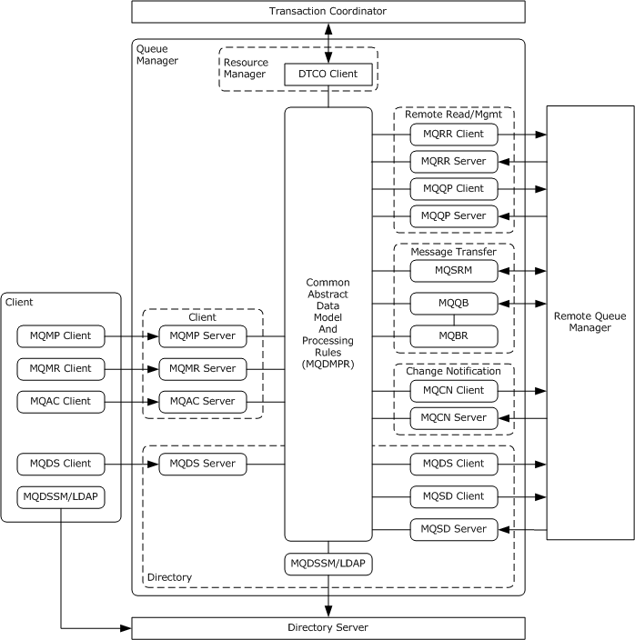

# [MS-MQDMPR]: Message Queuing (MSMQ): Common Data Model and Processing Rules

Table of Contents

1 Introduction

- [1 Introduction](#Section_1)
  - [1.1 Glossary](#Section_1.1)
  - [1.2 References](#Section_1.2)
    - [1.2.1 Normative References](#Section_1.2.1)
    - [1.2.2 Informative References](#Section_1.2.2)
  - [1.3 Overview](#Section_1.3)
  - [1.4 Relationship to Other Protocols](#Section_1.4)
  - [1.5 Prerequisites/Preconditions](#Section_1.5)
  - [1.6 Applicability Statement](#Section_1.6)
  - [1.7 Versioning and Capability Negotiation](#Section_1.7)
  - [1.8 Vendor-Extensible Fields](#Section_1.8)
  - [1.9 Standards Assignments](#Section_1.9)

2 Messages

- [2 Messages](#Section_2)
  - [2.1 Transport](#Section_2.1)
  - [2.2 Message Syntax](#Section_2.2)
  - [2.3 Directory Service Schema Elements](#Section_2.3)

3 Protocol Details

- [3 Protocol Details](#Section_3)
  - [3.1 Common Details](#Section_3.1)
    - [3.1.1 Abstract Data Model](#Section_3.1.1)
      - [3.1.1.1 QueueManager](#Section_3.1.1.1)
      - [3.1.1.2 Queue](#Section_3.1.1.2)
      - [3.1.1.3 OutgoingQueue](#Section_3.1.1.3)
      - [3.1.1.4 OutgoingTransferInfo](#Section_3.1.1.4)
      - [3.1.1.5 IncomingTransactionalTransferInfo](#Section_3.1.1.5)
      - [3.1.1.6 Enterprise](#Section_3.1.1.6)
      - [3.1.1.7 Site](#Section_3.1.1.7)
      - [3.1.1.8 RoutingLink](#Section_3.1.1.8)
      - [3.1.1.9 ConnectedNetwork](#Section_3.1.1.9)
      - [3.1.1.10 WaitingMessageReadOperation](#Section_3.1.1.10)
      - [3.1.1.11 MessagePosition](#Section_3.1.1.11)
      - [3.1.1.12 Message](#Section_3.1.1.12)
      - [3.1.1.13 TransactionalOperation](#Section_3.1.1.13)
      - [3.1.1.14 Transaction](#Section_3.1.1.14)
      - [3.1.1.15 User](#Section_3.1.1.15)
      - [3.1.1.16 OpenQueueDescriptor](#Section_3.1.1.16)
      - [3.1.1.17 Enumerations](#Section_3.1.1.17)
      - [3.1.1.18 DispatchEntry](#Section_3.1.1.18)
      - [3.1.1.19 InternalCertificate](#Section_3.1.1.19)
    - [3.1.2 Timers](#Section_3.1.2)
      - [3.1.2.1 Directory Sites Update Timer](#Section_3.1.2.1)
      - [3.1.2.2 Directory Site Gates Update Timer](#Section_3.1.2.2)
      - [3.1.2.3 Waiting Message Read Timer](#Section_3.1.2.3)
      - [3.1.2.4 Time To Be Received Timer](#Section_3.1.2.4)
      - [3.1.2.5 Directory Online Timer](#Section_3.1.2.5)
    - [3.1.3 Initialization](#Section_3.1.3)
    - [3.1.4 Higher-Layer Triggered Events](#Section_3.1.4)
      - [3.1.4.1 Queue Manager Started](#Section_3.1.4.1)
      - [3.1.4.2 Queue Manager Stopped](#Section_3.1.4.2)
      - [3.1.4.3 Transaction Prepare](#Section_3.1.4.3)
      - [3.1.4.4 Transaction Commit](#Section_3.1.4.4)
      - [3.1.4.5 Transaction Abort](#Section_3.1.4.5)
      - [3.1.4.6 DTC Transaction Prepare](#Section_3.1.4.6)
      - [3.1.4.7 DTC Transaction Commit](#Section_3.1.4.7)
      - [3.1.4.8 DTC Transaction Abort](#Section_3.1.4.8)
      - [3.1.4.9 DTC Reenlistment Commit](#Section_3.1.4.9)
      - [3.1.4.10 DTC Reenlistment Abort](#Section_3.1.4.10)
      - [3.1.4.11 DTC Reenlistment Timeout](#Section_3.1.4.11)
      - [3.1.4.12 Take Offline](#Section_3.1.4.12)
      - [3.1.4.13 Bring Online](#Section_3.1.4.13)
      - [3.1.4.14 Pause Queue](#Section_3.1.4.14)
      - [3.1.4.15 Resume Queue](#Section_3.1.4.15)
    - [3.1.5 Processing Events and Sequencing Rules](#Section_3.1.5)
    - [3.1.6 Timer Events](#Section_3.1.6)
      - [3.1.6.1 Directory Sites Update](#Section_3.1.6.1)
      - [3.1.6.2 Directory Site Gates Update](#Section_3.1.6.2)
      - [3.1.6.3 Waiting Message Read Timer Expired](#Section_3.1.6.3)
    - [3.1.7 Other Local Events](#Section_3.1.7)
      - [3.1.7.1 Events Raised By Related Protocols](#Section_3.1.7.1)
        - [3.1.7.1.1 Open Cursor](#Section_3.1.7.1.1)
        - [3.1.7.1.2 Close Cursor](#Section_3.1.7.1.2)
        - [3.1.7.1.3 Create Queue](#Section_3.1.7.1.3)
          - [3.1.7.1.3.1 Create Default Queue Security Descriptor](#Section_3.1.7.1.3.1)
        - [3.1.7.1.4 Delete Queue](#Section_3.1.7.1.4)
        - [3.1.7.1.5 Open Queue](#Section_3.1.7.1.5)
        - [3.1.7.1.6 Close Queue](#Section_3.1.7.1.6)
        - [3.1.7.1.7 Purge Queue](#Section_3.1.7.1.7)
        - [3.1.7.1.8 Create Transaction](#Section_3.1.7.1.8)
        - [3.1.7.1.9 Enqueue Message](#Section_3.1.7.1.9)
        - [3.1.7.1.10 Dequeue Message](#Section_3.1.7.1.10)
        - [3.1.7.1.11 Dequeue Message Begin](#Section_3.1.7.1.11)
        - [3.1.7.1.12 Dequeue Message End](#Section_3.1.7.1.12)
        - [3.1.7.1.13 Read Message By Lookup Identifier](#Section_3.1.7.1.13)
        - [3.1.7.1.14 Peek Next Message](#Section_3.1.7.1.14)
        - [3.1.7.1.15 Peek Message](#Section_3.1.7.1.15)
        - [3.1.7.1.16 Move Message](#Section_3.1.7.1.16)
        - [3.1.7.1.17 Cancel Waiting Message Read Request](#Section_3.1.7.1.17)
        - [3.1.7.1.18 Create Directory Object](#Section_3.1.7.1.18)
        - [3.1.7.1.19 Delete Directory Object](#Section_3.1.7.1.19)
        - [3.1.7.1.20 Read Directory](#Section_3.1.7.1.20)
        - [3.1.7.1.21 Read Directory Begin](#Section_3.1.7.1.21)
        - [3.1.7.1.22 Read Directory Next](#Section_3.1.7.1.22)
        - [3.1.7.1.23 Read Directory End](#Section_3.1.7.1.23)
        - [3.1.7.1.24 Write Directory](#Section_3.1.7.1.24)
        - [3.1.7.1.25 Check Directory Online](#Section_3.1.7.1.25)
        - [3.1.7.1.26 Get Queue Path](#Section_3.1.7.1.26)
        - [3.1.7.1.27 Enqueue Message To An Open Queue](#Section_3.1.7.1.27)
        - [3.1.7.1.28 Add Message To Dispatch Collection](#Section_3.1.7.1.28)
        - [3.1.7.1.29 Remove Message From Dispatch Collection](#Section_3.1.7.1.29)
        - [3.1.7.1.30 Construct a UserMessage Packet](#Section_3.1.7.1.30)
        - [3.1.7.1.31 Deserialize Message From Buffer](#Section_3.1.7.1.31)
        - [3.1.7.1.32 Serialize Message to Buffer](#Section_3.1.7.1.32)
        - [3.1.7.1.33 Set Queue Defaults](#Section_3.1.7.1.33)
        - [3.1.7.1.34 Remove Messages From Dispatch Collection By Queue](#Section_3.1.7.1.34)
      - [3.1.7.2 Events Consumed By Related Protocols](#Section_3.1.7.2)
        - [3.1.7.2.1 Message Position Deleted](#Section_3.1.7.2.1)
        - [3.1.7.2.2 Message Position Available](#Section_3.1.7.2.2)
        - [3.1.7.2.3 Pause Queue](#Section_3.1.7.2.3)
        - [3.1.7.2.4 Resume Queue](#Section_3.1.7.2.4)
        - [3.1.7.2.5 Begin Flow Control](#Section_3.1.7.2.5)
        - [3.1.7.2.6 End Flow Control](#Section_3.1.7.2.6)
        - [3.1.7.2.7 Time To Be Received Timer Expired](#Section_3.1.7.2.7)
      - [3.1.7.3 Internal Events](#Section_3.1.7.3)
        - [3.1.7.3.1 Wait For New Message](#Section_3.1.7.3.1)
        - [3.1.7.3.2 Seek Available Message Position](#Section_3.1.7.3.2)
        - [3.1.7.3.3 Seek Available Message Position With Id](#Section_3.1.7.3.3)
        - [3.1.7.3.4 Waiting Message Read Timer Start](#Section_3.1.7.3.4)
        - [3.1.7.3.5 Waiting Message Read Timer Stop](#Section_3.1.7.3.5)
        - [3.1.7.3.6 Waiting Message Read Satisfied](#Section_3.1.7.3.6)
        - [3.1.7.3.7 Release Next Reader](#Section_3.1.7.3.7)
        - [3.1.7.3.8 Expand Format Name](#Section_3.1.7.3.8)
        - [3.1.7.3.9 Dispatch Send Message](#Section_3.1.7.3.9)
  - [3.2 Cursor](#Section_3.2)
    - [3.2.1 Abstract Data Model](#Section_3.2.1)
      - [3.2.1.1 State Diagram](#Section_3.2.1.1)
      - [3.2.1.2 State Definition](#Section_3.2.1.2)
    - [3.2.2 Timers](#Section_3.2.2)
    - [3.2.3 Initialization](#Section_3.2.3)
    - [3.2.4 Higher-Layer Triggered Events](#Section_3.2.4)
    - [3.2.5 Processing Events and Sequencing Rules](#Section_3.2.5)
    - [3.2.6 Timer Events](#Section_3.2.6)
    - [3.2.7 Other Local Events](#Section_3.2.7)
      - [3.2.7.1 Initialize](#Section_3.2.7.1)
      - [3.2.7.2 Get Message For Peek](#Section_3.2.7.2)
      - [3.2.7.3 Get Next Message For Peek](#Section_3.2.7.3)
      - [3.2.7.4 Get Next Message For Dequeue](#Section_3.2.7.4)
      - [3.2.7.5 Message Available](#Section_3.2.7.5)
      - [3.2.7.6 Wait Time Expired](#Section_3.2.7.6)

4 Protocol Examples

- [4 Protocol Examples](#Section_4)

5 Security

- [5 Security](#Section_5)
  - [5.1 Security Considerations for Implementers](#Section_5.1)
  - [5.2 Index of Security Parameters](#Section_5.2)

6 Appendix A: Product Behavior

- [6 Appendix A: Product Behavior](#Section_6)

7 Change Tracking

- [7 Change Tracking](#Section_7)

For the legal notice and IP terms, see [LEGAL.md](../LEGAL.md).
Last updated: 4/23/2024.
See [Revision History](#revision-history) for full version history.

# 1 Introduction

This document specifies the Message Queuing (MSMQ): Common Data Model and Processing Rules. The abstract data model and events defined in this document are shared by multiple Message Queuing (MSMQ) protocol documents.

Sections 1.5, 1.8, 1.9, 2, and 3 of this specification are normative. All other sections and examples in this specification are informative.

## 1.1 Glossary

This document uses the following terms:

**Active Directory**: The Windows implementation of a general-purpose [**directory service**](#gt_directory-service-ds), which uses LDAP as its primary access protocol. [**Active Directory**](#gt_active-directory) stores information about a variety of objects in the network such as user accounts, computer accounts, groups, and all related credential information used by Kerberos [MS-KILE](../MS-KILE/MS-KILE.md). [**Active Directory**](#gt_active-directory) is either deployed as Active Directory Domain Services (AD DS) or Active Directory Lightweight Directory Services (AD LDS), which are both described in [MS-ADOD](../MS-ADOD/MS-ADOD.md): Active Directory Protocols Overview.

**administration queue**: A messaging [**queue**](#gt_queue) that receives [**Message Queuing (MSMQ)**](#gt_message-queuing) system-generated acknowledgment [**messages**](#gt_message). An administration queue is available to MSMQ applications for checking [**message**](#gt_message) status.

**anonymous user**: A user who presents no credentials when identifying himself or herself. The process for determining an anonymous user can differ based on the authentication protocol, and the documentation for the relevant authentication protocol needs to be consulted.

**backup site controller (BSC)**: An MSMQ Directory Service role played by an [**MSMQ queue manager**](#gt_msmq-queue-manager). A BSC contains a read-only copy of the directory for a site. A BSC can satisfy directory lookup requests but cannot satisfy directory change requests. There can be zero or more BSCs in a site.

**binary large object (BLOB)**: A collection of binary data stored as a single entity in a database.

**certificate**: A certificate is a collection of attributes and extensions that can be stored persistently. The set of attributes in a certificate can vary depending on the intended usage of the certificate. A certificate securely binds a public key to the entity that holds the corresponding private key. A certificate is commonly used for authentication and secure exchange of information on open networks, such as the Internet, extranets, and intranets. Certificates are digitally signed by the issuing certification authority (CA) and can be issued for a user, a computer, or a service. The most widely accepted format for certificates is defined by the ITU-T X.509 version 3 international standards. For more information about attributes and extensions, see [[RFC3280]](https://go.microsoft.com/fwlink/?LinkId=90414) and [[X509]](https://go.microsoft.com/fwlink/?LinkId=90590) sections 7 and 8.

**cluster**: A group of computers that are able to dynamically assign resource tasks among nodes in a group.

**connected network**: A network of computers in which any two computers can communicate directly through a common transport protocol (for example, TCP/IP or SPX/IPX). A computer can belong to multiple connected networks.

**connector application**: An application that runs on a connector server and translates both outgoing and incoming [**messages**](#gt_message) sent between a [**Message Queuing**](#gt_message-queuing) computer and a foreign messaging system.

**connector queue**: A [**queue**](#gt_queue) used by a connector server. [**Messages**](#gt_message) sent to [**foreign queues**](#gt_foreign-queue) are temporarily stored in a [**connector queue**](#gt_connector-queue) before they are retrieved by the [**connector application**](#gt_connector-application).

**Coordinated Universal Time (UTC)**: A high-precision atomic time standard that approximately tracks Universal Time (UT). It is the basis for legal, civil time all over the Earth. Time zones around the world are expressed as positive and negative offsets from UTC. In this role, it is also referred to as Zulu time (Z) and Greenwich Mean Time (GMT). In these specifications, all references to UTC refer to the time at UTC-0 (or GMT).

**cursor**: A data structure providing sequential access over a message queue. A cursor has a current pointer that lies between the head and tail pointer of the [**queue**](#gt_queue). The pointer can be moved forward or backward through an operation on the cursor (Next). A [**message**](#gt_message) at the current pointer can be accessed through a nondestructive read (Peek) operation or a destructive read (Receive) operation.

**dead-letter queue**: A [**queue**](#gt_queue) that contains [**messages**](#gt_message) that were sent from a host with a request for negative source journaling and that could not be delivered. [**Message Queuing**](#gt_message-queuing) provides a transactional dead-letter queue and a non-transactional dead-letter queue.

**direct format name**: A name that is used to reference a [**public queue**](#gt_public-queue) or a [**private queue**](#gt_private-queue) without accessing the MSMQ Directory Service. Message Queuing can use the physical, explicit location information provided by direct format names to send [**messages**](#gt_message) directly to their destinations. For more information, see [MS-MQMQ] section 2.1.

**directory**: The database that stores information about objects such as users, groups, computers, printers, and the [**directory service**](#gt_directory-service-ds) that makes this information available to users and applications.

**directory service (DS)**: An entity that maintains a collection of objects. These objects can be remotely manipulated either by the Message Queuing (MSMQ): Directory Service Protocol, as specified in [MS-MQDS](../MS-MQDS/MS-MQDS.md), or by the Lightweight Directory Access Protocol (v3), as specified in [[RFC2251]](https://go.microsoft.com/fwlink/?LinkId=90325).

**distinguished name (DN)**: A name that uniquely identifies an object by using the relative distinguished name (RDN) for the object, and the names of container objects and domains that contain the object. The distinguished name (DN) identifies the object and its location in a tree.

**domain controller (DC)**: The service, running on a server, that implements [**Active Directory**](#gt_active-directory), or the server hosting this service. The service hosts the data store for objects and interoperates with other [**DCs**](#gt_domain-controller-dc) to ensure that a local change to an object replicates correctly across all [**DCs**](#gt_domain-controller-dc). When [**Active Directory**](#gt_active-directory) is operating as Active Directory Domain Services (AD DS), the [**DC**](#gt_domain-controller-dc) contains full NC replicas of the configuration naming context (config NC), schema naming context (schema NC), and one of the domain NCs in its forest. If the AD DS [**DC**](#gt_domain-controller-dc) is a global catalog server (GC server), it contains partial NC replicas of the remaining domain NCs in its forest. For more information, see [MS-AUTHSOD](../MS-AUTHSOD/MS-AUTHSOD.md) section 1.1.1.5.2 and [MS-ADTS](../MS-ADTS/MS-ADTS.md). When [**Active Directory**](#gt_active-directory) is operating as Active Directory Lightweight Directory Services (AD LDS), several AD LDS [**DCs**](#gt_domain-controller-dc) can run on one server. When [**Active Directory**](#gt_active-directory) is operating as AD DS, only one AD DS [**DC**](#gt_domain-controller-dc) can run on one server. However, several AD LDS [**DCs**](#gt_domain-controller-dc) can coexist with one AD DS [**DC**](#gt_domain-controller-dc) on one server. The AD LDS [**DC**](#gt_domain-controller-dc) contains full NC replicas of the config NC and the schema NC in its forest. The domain controller is the server side of Authentication Protocol Domain Support [MS-APDS](../MS-APDS/MS-APDS.md).

**Domain Name System (DNS)**: A hierarchical, distributed database that contains mappings of domain names to various types of data, such as IP addresses. DNS enables the location of computers and services by user-friendly names, and it also enables the discovery of other information stored in the database.

**enterprise**: A unit of administration of a network of [**MSMQ queue managers**](#gt_msmq-queue-manager). An enterprise consists of an MSMQ Directory Service, one or more [**connected networks**](#gt_connected-network), and one or more [**MSMQ sites**](#gt_msmq-site).

**foreign queue**: A messaging queue that resides on a computer that does not run an [**MSMQ**](#gt_message-queuing) messaging application.

**foreign site**: A site that contains messaging applications that are not based on MSMQ.

**format name**: A name that is used to reference a [**queue**](#gt_queue) when making calls to API functions.

**fully qualified domain name (FQDN)**: An unambiguous domain name that gives an absolute location in the [**Domain Name System's (DNS)**](#gt_domain-name-system-dns) hierarchy tree, as defined in [[RFC1035]](https://go.microsoft.com/fwlink/?LinkId=90264) section 3.1 and [[RFC2181]](https://go.microsoft.com/fwlink/?LinkId=127732) section 11.

**globally unique identifier (GUID)**: A term used interchangeably with universally unique identifier (UUID) in Microsoft protocol technical documents (TDs). Interchanging the usage of these terms does not imply or require a specific algorithm or mechanism to generate the value. Specifically, the use of this term does not imply or require that the algorithms described in [[RFC4122]](https://go.microsoft.com/fwlink/?LinkId=90460) or [[C706]](https://go.microsoft.com/fwlink/?LinkId=89824) must be used for generating the [**GUID**](#gt_globally-unique-identifier-guid). See also universally unique identifier (UUID).

**GUID_NULL**: A [**GUID**](#gt_globally-unique-identifier-guid) that has the value "{00000000-0000-0000-0000-000000000000}".

**LDAP Capable Queue Manager**: A [**queue manager**](#gt_queue-manager-qm) that uses the Lightweight Directory Access Protocol (LDAP) ([[LDAP]](https://go.microsoft.com/fwlink/?LinkId=89932)) in conjunction with the algorithm specified in [MS-MQDSSM](../MS-MQDSSM/MS-MQDSSM.md) to interact with a [**directory**](#gt_directory).

**message**: A data structure representing a unit of data transfer between distributed applications. A message has message properties, which may include message header properties, a [**message body**](#gt_message-body) property, and message trailer properties.

**message body**: A distinguished message property that represents the application payload.

**message queuing**: A communications service that provides asynchronous and reliable message passing between distributed client applications. In message queuing, clients send messages to message queues and consume messages from message queues. The message queues provide persistence of the messages, which enables the sending and receiving client applications to operate asynchronously from each other.

**Microsoft Message Queuing (MSMQ)**: A communications service that provides asynchronous and reliable [**message**](#gt_message) passing between distributed applications. In Message Queuing, applications send [**messages**](#gt_message) to [**queues**](#gt_queue) and consume [**messages**](#gt_message) from [**queues**](#gt_queue). The [**queues**](#gt_queue) provide persistence of the [**messages**](#gt_message), enabling the sending and receiving applications to operate asynchronously from one another.

**MSMQ 1.0 digital signature**: A digital signature based on a hash of the MSMQ 1.0 Digital Signature Properties section in [MS-MQMQ]. This signature type is supported by all versions of [**Message Queuing**](#gt_message-queuing).

**MSMQ 2.0 digital signature**: A digital signature that is more robust than the [**MSMQ 1.0 digital signature**](#gt_msmq-10-digital-signature) and is based on a hash of the MSMQ 2.0 Digital Signature Properties section in [MS-MQMQ]. This signature type is not supported by [**MSMQ**](#gt_message-queuing) version 1.

**MSMQ 3.0 digital signature**: A digital signature that is used only for [**messages**](#gt_message) sent to distribution lists or multiple-element format names and is based on a hash of the MSMQ 3.0 Digital Signature Properties section in [MS-MQMQ]. This signature type is not supported by [**MSMQ**](#gt_message-queuing) version 1 nor [**MSMQ**](#gt_message-queuing) version 2.

**MSMQ Directory Service server**: An [**MSMQ queue manager**](#gt_msmq-queue-manager) that provides MSMQ Directory Service. The server can act in either of the MSMQ Directory Service roles: [**Primary Site Controller (PSC)**](#gt_primary-site-controller-psc) or [**Backup Site Controller (BSC)**](#gt_backup-site-controller-bsc).

**MSMQ queue manager**: An [**MSMQ**](#gt_message-queuing) service hosted on a machine that provides [**queued**](#gt_queue) messaging services. [**Queue managers**](#gt_476f10ed-08f0-4887-b583-59d5cf909979) manage [**queues**](#gt_queue) deployed on the local computer and provide asynchronous transfer of [**messages**](#gt_message) to [**queues**](#gt_queue) located on other computers. A [**queue manager**](#gt_queue-manager-qm) is identified by a [**globally unique identifier (GUID)**](#gt_globally-unique-identifier-guid).

**MSMQ routing link**: A communication link between two sites. A routing link is represented by a routing link object in the directory service. Routing links can have associated link costs. Routing links with their associated costs can be used to compute lowest-cost routing paths for store-and-forward messaging.

**MSMQ routing server**: A role played by an [**MSMQ queue manager**](#gt_msmq-queue-manager). An MSMQ routing server implements store and forward messaging. A routing server can provide connectivity between different [**connected networks**](#gt_connected-network) within a site or can provide session concentration between sites.

**MSMQ site**: A network of computers, typically physically collocated, that have high connectivity as measured in terms of latency (low) and throughput (high). A site is represented by a site object in the directory service. An MSMQ site maps one-to-one with an [**Active Directory**](#gt_active-directory) site when [**Active Directory**](#gt_active-directory) provides directory services to [**MSMQ**](#gt_message-queuing).

**MSMQ site gate**: An [**MSMQ routing server**](#gt_msmq-routing-server) through which all intersite messaging traffic flows.

**MSMQ supporting server**: A role played by an [**MSMQ queue manager**](#gt_msmq-queue-manager). An [**MSMQ supporting server**](#gt_msmq-supporting-server) supports applications to send and receive [**messages**](#gt_message) through the Message Queuing (MSMQ): Queue Manager Client Protocol [MS-MQMP](../MS-MQMP/MS-MQMP.md).

**NetBIOS**: A particular network transport that is part of the LAN Manager protocol suite. [**NetBIOS**](#gt_netbios) uses a broadcast communication style that was applicable to early segmented local area networks. A protocol family including name resolution, datagram, and connection services. For more information, see [[RFC1001]](https://go.microsoft.com/fwlink/?LinkId=90260) and [[RFC1002]](https://go.microsoft.com/fwlink/?LinkId=90261).

**NULL GUID**: A [**GUID**](#gt_globally-unique-identifier-guid) of all zeros.

**order acknowledgment**: A special acknowledgment [**message**](#gt_message) that is generated by a receiving [**queue manager**](#gt_queue-manager-qm) to acknowledge receipt of a [**message**](#gt_message) in a transactional queue.

**outgoing queue**: A temporary internal [**queue**](#gt_queue) that holds [**messages**](#gt_message) for a remote destination [**queue**](#gt_queue). The [**path name**](#gt_path-name) of an outgoing [**queue**](#gt_queue) is identical to the [**path name**](#gt_path-name) of the corresponding destination [**queue**](#gt_queue). An outgoing [**queue**](#gt_queue) is distinguished from its corresponding destination [**queue**](#gt_queue) by the fact that the outgoing [**queue**](#gt_queue) is located on the sending computer. The [**format name**](#gt_format-name) of an outgoing [**queue**](#gt_queue) is identical to the [**format name**](#gt_format-name) used by the [**messages**](#gt_message) to reference the destination [**queue**](#gt_queue). Messages that reference the destination [**queue**](#gt_queue) using a different [**format name**](#gt_format-name) are placed in a different outgoing [**queue**](#gt_queue).

**path name**: The name of the receiving computer where the [**messages**](#gt_message) for a particular [**queue**](#gt_queue) are stored, and an optional PRIVATE$ key word indicating whether the [**queue**](#gt_queue) is private, followed by the name of the [**queue**](#gt_queue). Path names can also refer to subqueues; for more information, see [MS-MQMQ](../MS-MQMQ/MS-MQMQ.md) section 2.1.

**Primary Enterprise Controller (PEC)**: An MSMQ Directory Service role played by an [**MSMQ queue manager**](#gt_msmq-queue-manager). The PEC acts as the authority for the [**enterprise**](#gt_enterprise) configuration information stored in the directory. There is only one PEC in an [**enterprise**](#gt_enterprise). The PEC also acts in the role of [**Primary Site Controller (PSC)**](#gt_primary-site-controller-psc) for the site to which it belongs.

**Primary Site Controller (PSC)**: An MSMQ Directory Service role played by an [**MSMQ queue manager**](#gt_msmq-queue-manager). The PSC acts as the authority for the directory information for the site to which it belongs. The PSC can satisfy directory lookup requests and directory change requests. There is only one PSC per site.

**private key**: One of a pair of keys used in public-key cryptography. The private key is kept secret and is used to decrypt data that has been encrypted with the corresponding public key. For an introduction to this concept, see [[CRYPTO]](https://go.microsoft.com/fwlink/?LinkId=89841) section 1.8 and [[IEEE1363]](https://go.microsoft.com/fwlink/?LinkId=89899) section 3.1.

**private queue**: An application-defined message queue that is not registered in the MSMQ Directory Service. A private queue is deployed on a particular [**queue manager**](#gt_queue-manager-qm).

**public key**: One of a pair of keys used in public-key cryptography. The public key is distributed freely and published as part of a digital certificate. For an introduction to this concept, see [CRYPTO] section 1.8 and [IEEE1363] section 3.1.

**public queue**: An application-defined message queue that is registered in the MSMQ Directory Service. A public queue can be deployed at any [**queue manager**](#gt_queue-manager-qm).

**queue**: An object that holds [**messages**](#gt_message) passed between applications or [**messages**](#gt_message) passed between [**Message Queuing**](#gt_message-queuing) and applications. In general, applications can send [**messages**](#gt_message) to queues and read [**messages**](#gt_message) from queues.

**queue journal**: A [**queue**](#gt_queue) that contains copies of the [**messages**](#gt_message) sent from a host when positive source journaling is requested.

**queue manager (QM)**: A message queuing service that manages [**queues**](#gt_queue) deployed on a computer. A queue manager can also provide asynchronous transfer of [**messages**](#gt_message) to [**queues**](#gt_queue) deployed on other queue managers.

**Remote Access Service (RAS) server**: A type of network access server (NAS) that provides modem dial-up or virtual private network (VPN) access to a network.

**resource manager (RM)**: The participant that is responsible for coordinating the state of a resource with the outcome of atomic transactions. For a specified transaction, a resource manager enlists with exactly one transaction manager to vote on that transaction outcome and to obtain the final outcome. A resource manager is either durable or volatile, depending on its resource.

**routing link**: See [**MSMQ routing link**](#gt_msmq-routing-link).

**security descriptor**: A data structure containing the security information associated with a securable object. A [**security descriptor**](#gt_security-descriptor) identifies an object's owner by its [**security identifier (SID)**](#gt_security-identifier-sid). If access control is configured for the object, its [**security descriptor**](#gt_security-descriptor) contains a discretionary access control list (DACL) with [**SIDs**](#gt_security-identifier-sid) for the security principals who are allowed or denied access. Applications use this structure to set and query an object's security status. The [**security descriptor**](#gt_security-descriptor) is used to guard access to an object as well as to control which type of auditing takes place when the object is accessed. The [**security descriptor**](#gt_security-descriptor) format is specified in [MS-DTYP](../MS-DTYP/MS-DTYP.md) section 2.4.6; a string representation of [**security descriptors**](#gt_security-descriptor), called SDDL, is specified in [MS-DTYP] section 2.5.1.

**security identifier (SID)**: An identifier for security principals that is used to identify an account or a group. Conceptually, the [**SID**](#gt_security-identifier-sid) is composed of an account authority portion (typically a domain) and a smaller integer representing an identity relative to the account authority, termed the relative identifier (RID). The [**SID**](#gt_security-identifier-sid) format is specified in [MS-DTYP] section 2.4.2; a string representation of [**SIDs**](#gt_security-identifier-sid) is specified in [MS-DTYP] section 2.4.2 and [MS-AZOD](../MS-AZOD/MS-AZOD.md) section 1.1.1.2.

**SOAP body**: A container for the payload data being delivered by a SOAP message to its recipient. See [[SOAP1.2-1/2007]](https://go.microsoft.com/fwlink/?LinkId=94664) section 5.3 for more information.

**SOAP header**: A mechanism for implementing extensions to a SOAP message in a decentralized manner without prior agreement between the communicating parties. See [SOAP1.2-1/2007] section 5.2 for more information.

**SRMP**: Message Queuing (MSMQ): SOAP Reliable Messaging Protocol (SRMP) [MC-MQSRM](../MC-MQSRM/MC-MQSRM.md).

**subqueue**: A message queue that is logically associated, through a naming hierarchy, with a parent message queue. Subqueues can be used to partition [**messages**](#gt_message) within the [**queue**](#gt_queue). For example, a [**queue journal**](#gt_queue-journal) can be a subqueue that holds a copy of each [**message**](#gt_message) consumed from its parent [**queue**](#gt_queue).

**symmetric key**: A secret key used with a cryptographic symmetric algorithm. The key needs to be known to all communicating parties. For an introduction to this concept, see [CRYPTO] section 1.5.

**system queue**: An internal [**queue**](#gt_queue) that is used by the queue manager for a purpose other than holding messages destined for a remote destination [**queue**](#gt_queue).

**transaction**: In OleTx, an atomic transaction.

**transaction identifier**: The [**GUID**](#gt_globally-unique-identifier-guid) that uniquely identifies an atomic transaction.

**transaction manager**: The party that is responsible for managing and distributing the outcome of atomic transactions. A transaction manager is either a root transaction manager or a subordinate transaction manager for a specified transaction.

**Unicode**: A character encoding standard developed by the Unicode Consortium that represents almost all of the written languages of the world. The [**Unicode**](#gt_unicode) standard [[UNICODE5.0.0/2007]](https://go.microsoft.com/fwlink/?LinkId=154659) provides three forms (UTF-8, UTF-16, and UTF-32) and seven schemes (UTF-8, UTF-16, UTF-16 BE, UTF-16 LE, UTF-32, UTF-32 LE, and UTF-32 BE).

**unit of work**: A set of individual operations that [**MSMQ**](#gt_message-queuing) must successfully complete before any of the individual [**MSMQ**](#gt_message-queuing) operations can be considered complete.

**UTC (Coordinated Universal Time)**: A high-precision atomic time standard that approximately tracks Universal Time (UT). It is the basis for legal, civil time all over the Earth. Time zones around the world are expressed as positive and negative offsets from UTC. In this role, it is also referred to as Zulu time (Z) and Greenwich Mean Time (GMT). In these specifications, all references to UTC refer to the time at UTC–0 (or GMT).

**XML digital signature**: When authentication is requested for an HTTP [**message**](#gt_message) or a multicast [**message**](#gt_message), which is also sent in [**SRMP**](#gt_srmp), it is automatically signed using an XML digital signature. The signature value is calculated by using the SHA-1, SHA-256, or SHA-512 algorithms, encrypting the hash with the public key in the certificate attached to the [**message**](#gt_message), and converting the result to base64 encoding. The SHA-1 algorithm is not supported by Windows NT operating system and Windows 2000 operating system. The SHA-256 and SHA-512 algorithms are not supported by Windows NT, Windows 2000, Windows XP operating system, and Windows Server 2003 operating system.

**MAY, SHOULD, MUST, SHOULD NOT, MUST NOT:** These terms (in all caps) are used as defined in [[RFC2119]](https://go.microsoft.com/fwlink/?LinkId=90317). All statements of optional behavior use either MAY, SHOULD, or SHOULD NOT.

## 1.2 References

Links to a document in the Microsoft Open Specifications library point to the correct section in the most recently published version of the referenced document. However, because individual documents in the library are not updated at the same time, the section numbers in the documents may not match. You can confirm the correct section numbering by checking the [Errata](https://go.microsoft.com/fwlink/?linkid=850906).

### 1.2.1 Normative References

We conduct frequent surveys of the normative references to assure their continued availability. If you have any issue with finding a normative reference, please contact [dochelp@microsoft.com](mailto:dochelp@microsoft.com). We will assist you in finding the relevant information.

[FIPS180-2] National Institute of Standards and Technology, "Secure Hash Standard", FIPS PUB 180-2, August 2002, [http://csrc.nist.gov/publications/fips/fips180-2/fips180-2.pdf](https://go.microsoft.com/fwlink/?LinkId=89868)

[FIPS186] FIPS PUBS, "Digital Signature Standard (DSS)", FIPS PUB 186-3, June 2009, [https://csrc.nist.gov/csrc/media/publications/fips/186/3/archive/2009-06-25/documents/fips_186-3.pdf](https://go.microsoft.com/fwlink/?LinkId=89869)

[FIPS197] FIPS PUBS, "Advanced Encryption Standard (AES)", FIPS PUB 197, November 2001, [https://nvlpubs.nist.gov/nistpubs/FIPS/NIST.FIPS.197.pdf](https://go.microsoft.com/fwlink/?LinkId=89870)

[FIPS46-3] FIPS PUBS, "Data Encryption Standard (DES)", FIPS PUB 46-3, October 1999, [https://csrc.nist.gov/csrc/media/publications/fips/46/3/archive/1999-10-25/documents/fips46-3.pdf](https://go.microsoft.com/fwlink/?LinkId=89872)

[MC-MQSRM] Microsoft Corporation, "[Message Queuing (MSMQ): SOAP Reliable Messaging Protocol (SRMP)](../MC-MQSRM/MC-MQSRM.md)".

[MS-ADA3] Microsoft Corporation, "[Active Directory Schema Attributes N-Z](../MS-ADA3/MS-ADA3.md)".

[MS-ADTS] Microsoft Corporation, "[Active Directory Technical Specification](../MS-ADTS/MS-ADTS.md)".

[MS-DTCO] Microsoft Corporation, "[MSDTC Connection Manager: OleTx Transaction Protocol](../MS-DTCO/MS-DTCO.md)".

[MS-DTYP] Microsoft Corporation, "[Windows Data Types](../MS-DTYP/MS-DTYP.md)".

[MS-ERREF] Microsoft Corporation, "[Windows Error Codes](../MS-ERREF/MS-ERREF.md)".

[MS-LSAD] Microsoft Corporation, "[Local Security Authority (Domain Policy) Remote Protocol](../MS-LSAD/MS-LSAD.md)".

[MS-MQCN] Microsoft Corporation, "[Message Queuing (MSMQ): Directory Service Change Notification Protocol](../MS-MQCN/MS-MQCN.md)".

[MS-MQDSSM] Microsoft Corporation, "[Message Queuing (MSMQ): Directory Service Schema Mapping](../MS-MQDSSM/MS-MQDSSM.md)".

[MS-MQDS] Microsoft Corporation, "[Message Queuing (MSMQ): Directory Service Protocol](../MS-MQDS/MS-MQDS.md)".

[MS-MQMQ] Microsoft Corporation, "[Message Queuing (MSMQ): Data Structures](../MS-MQMQ/MS-MQMQ.md)".

[MS-MQSD] Microsoft Corporation, "[Message Queuing (MSMQ): Directory Service Discovery Protocol](../MS-MQSD/MS-MQSD.md)".

[MS-SAMR] Microsoft Corporation, "[Security Account Manager (SAM) Remote Protocol (Client-to-Server)](../MS-SAMR/MS-SAMR.md)".

[RFC1035] Mockapetris, P., "Domain Names - Implementation and Specification", STD 13, RFC 1035, November 1987, [https://www.rfc-editor.org/info/rfc1035](https://go.microsoft.com/fwlink/?LinkId=90264)

[RFC1319] Kaliski, B., "The MD2 Message-Digest Algorithm", RFC 1319, April 1992, [https://www.rfc-editor.org/info/rfc1319](https://go.microsoft.com/fwlink/?LinkId=90273)

[RFC1320] Rivest, R., "The MD4 Message-Digest Algorithm", RFC 1320, April 1992, [https://www.rfc-editor.org/info/rfc1320](https://go.microsoft.com/fwlink/?LinkId=90274)

[RFC1321] Rivest, R., "The MD5 Message-Digest Algorithm", RFC 1321, April 1992, [https://www.rfc-editor.org/info/rfc1321](https://go.microsoft.com/fwlink/?LinkId=90275)

[RFC2119] Bradner, S., "Key words for use in RFCs to Indicate Requirement Levels", BCP 14, RFC 2119, March 1997, [https://www.rfc-editor.org/info/rfc2119](https://go.microsoft.com/fwlink/?LinkId=90317)

[RFC2268] Rivest, R., "A Description of the RC2(r) Encryption Algorithm", RFC 2268, March 1998, [https://www.rfc-editor.org/info/rfc2268](https://go.microsoft.com/fwlink/?LinkId=90330)

[RFC3110] Eastlake III, D., "RSA/SHA-1 SIGs and RSA KEYs in the Domain Name System (DNS)", RFC 3110, May 2001, [https://www.rfc-editor.org/info/rfc3110](https://go.microsoft.com/fwlink/?LinkId=90406)

[RFC3280] Housley, R., Polk, W., Ford, W., and Solo, D., "Internet X.509 Public Key Infrastructure Certificate and Certificate Revocation List (CRL) Profile", RFC 3280, April 2002, [http://www.rfc-editor.org/info/rfc3280](https://go.microsoft.com/fwlink/?LinkId=90414)

[RFC4757] Jaganathan, K., Zhu, L., and Brezak, J., "The RC4-HMAC Kerberos Encryption Types Used by Microsoft Windows", RFC 4757, December 2006, [https://www.rfc-editor.org/info/rfc4757](https://go.microsoft.com/fwlink/?LinkId=90488)

[RFC8017] Moriarty, K., Ed., Kaliski, B., Jonsson, J., and Rusch, A., "PKCS #1: RSA Cryptography Specifications Version 2.2", November 2016, [https://www.rfc-editor.org/info/rfc8017](https://go.microsoft.com/fwlink/?linkid=2164409)

[SEAL-SPRINGER] Rogaway, P., and Coppersmith, D., "A Software-Optimized Encryption Algorithm", Journal of Cryptography, Springer New York, [https://link.springer.com/content/pdf/10.1007%2F3-540-58108-1_8.pdf](https://go.microsoft.com/fwlink/?LinkId=104939)

[UML] Object Management Group, "Unified Modeling Language", [http://www.omg.org/spec/UML/](https://go.microsoft.com/fwlink/?LinkId=93768)

### 1.2.2 Informative References

[CRYPTO] Menezes, A., Vanstone, S., and Oorschot, P., "Handbook of Applied Cryptography", 1997, [https://cacr.uwaterloo.ca/hac/](https://go.microsoft.com/fwlink/?LinkId=89841)

[MS-MQQB] Microsoft Corporation, "[Message Queuing (MSMQ): Message Queuing Binary Protocol](../MS-MQQB/MS-MQQB.md)".

[X9.31] IHS, "Digital Signatures Using Reversible Public Key Cryptography for the Financial Services Industry (rDSA)", January 1998, [https://global.ihs.com/search_res.cfm?&rid=Z06&mid=Standards&input_doc_number=X9%2E31&input_doc_title](https://go.microsoft.com/fwlink/?LinkId=182937)

**Note** There is a charge to download the specification.

## 1.3 Overview

The Message Queuing (MSMQ): Common Data Model and Processing Rules describes the shared data models and state for a [**queue manager**](#gt_queue-manager-qm) that can be accessed by all MSMQ protocol implementations that are co-resident on the queue manager.

This protocol specification also describes common processing rules for accessing abstract data model (ADM) elements in the shared abstract data model that need to be followed by an alternate message queuing system.

## 1.4 Relationship to Other Protocols

All MSMQ protocol implementations that are co-located on a [**queue manager**](#gt_queue-manager-qm) have access to the shared state defined by the abstract data model in this specification.

Figure 1: Relationships between MSMQ protocols and the shared abstract data model defined in this specification

In addition, these protocol implementations can generate the internal events specified in section [3.1.7](#Section_3.1.7). This protocol defines the actions that the queue manager performs on the shared state to process these internal events.

## 1.5 Prerequisites/Preconditions

None.

## 1.6 Applicability Statement

The Message Queuing (MSMQ): Common Data Model and Processing Rules specification is applicable when an MSMQ protocol implementation requires access to the shared [**queue manager**](#gt_queue-manager-qm) state.

## 1.7 Versioning and Capability Negotiation

None.

## 1.8 Vendor-Extensible Fields

This protocol uses HRESULT values as defined in [MS-ERREF](../MS-ERREF/MS-ERREF.md) section 2.1. Vendors can define their own HRESULT values, provided that they set the C bit (0x20000000) for each vendor-defined value, indicating that the value is a customer code.

This protocol uses Win32 error codes as defined in [MS-ERREF] section 2.2. Vendors SHOULD reuse those values with their indicated meanings. Choosing any other value runs the risk of a collision in the future.

## 1.9 Standards Assignments

None.

# 2 Messages

This document references commonly used data types as defined in [MS-DTYP](../MS-DTYP/MS-DTYP.md).

Unless otherwise qualified, instances of **GUID** in sections 2 and [3](#Section_3) refer to [MS-DTYP] section 2.3.4.

Unless otherwise qualified, instances of **SID** in sections 2 and 3 refer to [MS-DTYP] section 2.4.2.

## 2.1 Transport

None.

## 2.2 Message Syntax

None.

## 2.3 Directory Service Schema Elements

[**MSMQ**](#gt_message-queuing) protocols access a [**directory**](#gt_directory) via events as specified in section [3.1.7.1](#Section_3.1.7.1). The Directory Service schema elements for objects accessed via these events are defined in [MS-MQDSSM](../MS-MQDSSM/MS-MQDSSM.md) section 2.4. <1>

# 3 Protocol Details

## 3.1 Common Details

Multiple MSMQ protocol implementations that are co-located on the same [**queue manager**](#gt_queue-manager-qm) can share state variables and interact with common state machines. They can communicate with each other through a set of well-defined internal events. Some protocols communicate with other protocols through this shared state.

This section describes an abstract data model for the shared state that is maintained in a queue manager implementation and the internal events that are used by MSMQ protocols to communicate with each other.

Any protocol-specific ADM elements are represented as extensions of this common data model in their respective protocol documents.

### 3.1.1 Abstract Data Model

This section describes a conceptual model of possible data organization that a [**queue manager**](#gt_queue-manager-qm) implementation maintains to participate in the [**MSMQ**](#gt_message-queuing) protocols. The described organization is provided to facilitate the explanation of how the related protocols behave. This document does not mandate that implementations adhere to this model as long as their external behavior is consistent with the behavior that is described in the protocol documents.

The following UML static class diagram (see [[UML]](https://go.microsoft.com/fwlink/?LinkId=93768)) shows the ADM elements and their relationships. This is followed by a high-level description of these ADM elements.

Figure 2: UML static class diagram for the queue manager abstract data model

**DirectoryObject:** An ADM element that is used as a base class for ADM elements that can be published in a [**directory**](#gt_directory).

The following ADM elements subclass the **DirectoryObject** ADM element:

- **QueueManager**: Represents the attributes and relationships of a queue manager in the Message Queuing system.
- **Queue**: Represents a single [**queue**](#gt_queue) that is hosted by the queue manager. The following ADM element subclasses the **Queue** ADM element.
- **Outgoing Queue**: A subtype of a **Queue** that is used to store [**messages**](#gt_message) while they are in transit to a queue on a remote queue manager.
- **Enterprise**: Represents the attributes and relationships of an [**enterprise**](#gt_enterprise).
- **Site**: Represents the attributes and relationships of an [**MSMQ site**](#gt_msmq-site) in an enterprise.
- **RoutingLink**: A relationship between two MSMQ sites.
- **ConnectedNetwork**: Represents the attributes and relationships of a [**connected network**](#gt_connected-network) in an **Enterprise**.
- **User**: Associates the [**security identifier (SID)**](#gt_security-identifier-sid) of a user with a set of [**certificates**](#gt_certificate) for that user.
**MessagePosition:** Represents a position in a queue that can contain a message.

**Message:** The data that is stored in a queue and is exchanged between two queue managers.

**OutgoingTransferInfo:** Contains information about message transfer from an outgoing queue on a local queue manager and the destination queue on a remote queue manager.

**IncomingTransactionalTransferInfo:** Contains information about transactional message transfer from a remote queue manager to a destination queue that is hosted on the local queue manager.

**Cursor:** An iterator over the messages contained within a queue. The abstract data model and processing rules for a [Cursor](#Section_3.2) ADM element are specified in section 3.2.

**Transaction:** Defines the [**unit of work**](#gt_unit-of-work) for queuing operations that send, receive or move messages to queues.

**TransactionalOperation:** Associates an action with a **MessagePosition** that is part of a larger unit of work.

**OpenQueueDescriptor:** Contains information about a queue that has been opened for message operations by one of the MSMQ protocols.

**WaitingMessageReadOperation:** Contains information about outstanding message read requests.

The remaining subsections describe details of these ADM elements, with the exception of the **DirectoryObject** ADM element, which is described fully in this section. In addition, the enumeration types used in these attributes are described in section [3.1.1.17](#Section_3.1.1.17).

In the subsequent subsections, if the attributes of these ADM elements are categorized as **Persistent** or **Directory** attributes, they MUST conform to the following requirements.

**Persistent attribute:** Requires that the ADM element or attribute value MUST survive across queue manager shut down and restart cycles.

**Directory attribute:** Requires that the ADM element or attribute value MUST survive across queue manager shut down and restart cycles. In addition, this type of attribute can be published in or retrieved from the directory through the directory access events defined in sections [3.1.7.1.18](#Section_3.1.7.1.18) through [3.1.7.1.24](#Section_3.1.7.1.24).

Any attributes listed in subsequent sections that are not specified as **Persistent** or **Directory** attributes MUST be treated as volatile attributes that do not survive across queue manager shut down and restart cycles.

The **DirectoryObject** ADM element contains the following directory attribute, which is inherited by all of its subclasses:

**Identifier:** A GUID that uniquely identifies a **DirectorObject** ADM element instance. This identifier MUST NOT change over the lifetime of the **DirectoryObject** ADM element instance.

The queue manager MUST maintain **LocalQueueManager**, an instance of a [QueueManager (section 3.1.1.1)](#Section_3.1.1.1) ADM element. The **LocalQueueManager** ADM element instance MUST be accessible to all MSMQ protocol implementations that are co-located on the queue manager.

#### 3.1.1.1 QueueManager

The **QueueManager** ADM element describes the attributes and relationships of an [**MSMQ queue manager**](#gt_msmq-queue-manager).

This ADM element extends the **DirectoryObject** ADM element. It contains the following **directory** ADM attributes:

**ComputerName:** The [**NetBIOS**](#gt_netbios) name of the computer.

**QueueManagerVersion:** A string that MAY<2> represent the version of the [**MSMQ**](#gt_message-queuing) system.

**OperatingSystemVersion:** A string representing the version of the operating system of the computer that hosts the [**queue manager**](#gt_queue-manager-qm).

**OperatingSystemType:** An enumeration that specifies the type of the operating system of the computer that hosts the queue manager. This enumeration MUST be one of the following:

- **Foreign**: Not a Windows operating system.
- **Win95**: The operating system is Windows 95 operating system.
- **WinClient**: The operating system is a Windows Client operating system.
- **WinServer**: The operating system is a non-Enterprise Edition of applicable Windows Server releases.
- **WinEnt**: The operating system is an Enterprise Edition of applicable Windows Server releases.
- **Other**: The operating system is not defined in this list.
**QualifiedComputerName:** The fully-qualified name of the computer.

**CreateTime:** An integer value representing the time at which the **QueueManager** ADM element instance was first created. The time is represented as the number of seconds elapsed since midnight (00:00:00), January 1, 1970 [**UTC**](#gt_coordinated-universal-time-utc).

**ModifyTime:** An integer value representing the time at which the ADM attributes of the **QueueManager** ADM element instance were last modified in the [**directory**](#gt_directory). The time is represented as the number of seconds elapsed since midnight (00:00:00), January 1, 1970 UTC.

**QueueManagerQuota:** The storage space, in bytes, allocated to all [**queues**](#gt_queue) hosted by the queue manager. The default value for this ADM attribute SHOULD be 0x00100000.<3>

**JournalQuota:** The system-wide storage space, in kilobytes, allocated to the journal storage for queues hosted by the queue manager. The default value for this ADM attribute is 0xFFFFFFFF.

**ForeignSystem:** A Boolean value indicating whether the queue manager is actually a foreign system that services [**foreign queues**](#gt_foreign-queue).

- **True**: If the queue manager is a foreign system.
- **False**: If the queue manager is not a foreign system. This is the default value.
**FullPath:** A [**distinguished name (DN)**](#gt_distinguished-name-dn) that can be used to look up this **QueueManager** ADM element instance in a directory. When a **QueueManager** ADM element instance is created in the directory, this value is set by the directory server.

**SiteIdentifierList:** A list that contains the **Identifier** ADM attribute values for all [Site (section 3.1.1.7)](#Section_3.1.1.7) ADM element instances for all [**MSMQ sites**](#gt_msmq-site) to which the queue manager belongs. The default value is an empty list.

**ConnectedNetworkIdentifierList:** <4>A list that contains the **Identifier** ADM attribute values of all [ConnectedNetwork (section 3.1.1.9)](#Section_3.1.1.9) ADM element instances representing all [**connected networks**](#gt_connected-network) to which the queue manager belongs. The default value SHOULD be an empty list.<5>

**OutRoutingServerIdentifierList:** A list that contains the **Identifier** ADM attribute values of all **QueueManager** ADM element instances representing all [**MSMQ routing servers**](#gt_msmq-routing-server) in the enterprise that will be used as intermediaries for outgoing [**messages**](#gt_message) from this queue manager. The default value is an empty list.

**InRoutingServerIdentifierList:** A list that contains the **Identifier** ADM attribute values of all **QueueManager** ADM element instances representing all MSMQ routing servers that will be used as intermediaries for incoming messages to a queue manager. The default value is an empty list.

**DirectoryServer:** A Boolean value that indicates whether the queue manager provides [**directory service**](#gt_directory-service-ds).

- **True**: If the queue manager provides directory service.
- **False**: If the queue manager does not provide directory service.
**RemoteAccessServer:** A Boolean value that indicates whether the queue manager is configured as a [**Remote Access Service (RAS) server**](#gt_remote-access-service-ras-server).

- **True**: If the queue manager is configured as a Remote Access Service (RAS) server.
- **False**: If the queue manager is not configured as a Remote Access Service (RAS) server. This is the default value.
**RoutingServer:** A Boolean value that indicates whether the queue manager is configured as an MSMQ routing server.

- **True**: If the queue manager is configured as an MSMQ routing server.
- **False**: If the queue manager is not configured as an MSMQ routing server.
**SupportingServer:** A Boolean value that indicates whether the queue manager is configured as an [**MSMQ supporting server**](#gt_msmq-supporting-server).

- **True**: If the queue manager is configured as an MSMQ supporting server.
- **False**: If the queue manager is not configured as an MSMQ supporting server. This SHOULD be the default value.<6>
**DirectoryServerType:** An enumeration that specifies the type of directory service provided by the queue manager. This value is undefined and MUST not be used if the **DirectoryServer** ADM attribute is set to **False**. This enumeration MUST be one of the following:

- **Standalone**: The queue manager provides directory service.
- **BackupSiteController**: The queue manager provides directory service as the [**Backup Site Controller (BSC)**](#gt_backup-site-controller-bsc) for the site.
- **PrimarySiteController**: The queue manager provides directory service as the [**Primary Site Controller (PSC)**](#gt_primary-site-controller-psc) for the site.
- **PrimaryEnterpriseController**: The queue manager provides directory service as the [**Primary Enterprise Controller (PEC)**](#gt_primary-enterprise-controller-pec) for an MSMQ [**enterprise**](#gt_enterprise).
**PublicEncryptionKeyList:** An **MQDSPUBLICKEYS** ([MS-MQMQ](../MS-MQMQ/MS-MQMQ.md) section 2.2.2) structure that contains the [**public keys**](#gt_public-key) used for encryption by the queue manager. When a queue manager is provisioned, the list is empty.

**PublicSigningKeyList:** An **MQDSPUBLICKEYS** ([MS-MQMQ] section 2.2.2) structure that contains the public keys used for signing by the queue manager. When a queue manager is provisioned, the list is empty.

**Security:** The [**security descriptor**](#gt_security-descriptor) of the queue manager. The ACEs ([MS-DTYP](../MS-DTYP/MS-DTYP.md) section 2.4.4) for this security descriptor MUST use the **ACCESS_MASK** ([MS-DTYP] section 2.4.3) values as listed in the **MQQMACCESSMASK** enumeration ([MS-MQMQ] section 2.2.23).

**Clustered:** A Boolean that specifies whether the queue manager is part of a [**cluster**](#gt_cluster).

- **True**: If the queue manager is part of a cluster.
- **False**: If the queue manager is not part of a cluster.
The following ADM attributes cannot be published in the directory:

**MachineDomainId:** A GUID that identifies the domain to which the machine belongs.

**LastDomain:** A cached value of the **MachineDomainId** ADM attribute during the last time when the queue manager was initialized. An empty value indicates that the machine was not joined to a domain. It is set to empty when the queue manager is provisioned. This is a persistent ADM attribute.

**DirectoryServerList:** A list of NetBIOS computer names that refer to the directory servers that the queue manager can use to access the directory. This is a persistent ADM attribute. The default value is an empty list.

**DirectoryIntegrated:** A Boolean value that indicates whether the queue manager is integrated with a directory service. This is a persistent ADM attribute.

- **True**: If the queue manager is integrated with a directory service.
- **False**: If the queue manager is not integrated with a directory service.
**SrmpHttpSupport:** A Boolean value that indicates whether the queue manager supports HTTP-based [**SRMP**](#gt_srmp) message transfer. This is a persistent ADM attribute.

- **True**: If the queue manager supports HTTP-based SRMP message transfer.
- **False**: If the queue manager does not support HTTP-based SRMP message transfer.
**SrmpPgmSupport:** A Boolean value that indicates whether the queue manager supports PGM-based SRMP message transfer. This is a persistent ADM attribute.

- **True**: If the queue manager supports PGM-based SRMP message transfer.
- **False**: If the queue manager does not support PGM-based SRMP message transfer.
**DirectoryOffline:** A Boolean value that indicates whether the queue manager is running in a constrained mode with no access to the directory. This MUST be False if **DirectoryIntegrated** is False:

- **True**: If the queue manager is running in a constrained mode with no access to the directory.
- **False**: If the queue manager is not running in a constrained mode and is able to access the directory.
**Throttled:** A Boolean value that indicates whether the queue manager is running in a throttled state:

- **True**: If the queue manager is running in a throttled state.
- **False**: If the queue manager is not running in a throttled state.
**ConnectionActive:** A Boolean value that indicates whether the queue manager is connected and available for receiving messages from remote queue managers:

- **True**: If the queue manager is connected.
- **False**: If the queue manager is not connected.
**HardenedSecurity:** A Boolean that indicates whether the queue manager is running in a special constrained mode that prevents it from responding to RPC requests and performing message transfer over non-HTTP protocols. This is a persistent ADM attribute.<7>

- **True**: If the queue manager is operating in hardened mode.
- **False**: If the queue manager is not operating in hardened mode. This is the default value.
**QueueManagerState:** An enumeration that specifies the state of the queue manager. This enumeration MUST have one of the following values:

- **Stopped**: The initial state of the queue manager. In this state, the queue manager does not perform any of its functions.
- **Initializing**: The state in which the queue manager performs internal initialization.
- **Ready**: The fully functional state of the queue manager in which it provides all functionalities as configured.
- **Stopping**: A transient state in which the queue manager performs shutdown of the protocols and prepares to move to the **Stopped** state.
**SystemDeadletterQueue:** A reference to a [Queue (section 3.1.1.2)](#Section_3.1.1.2) ADM element instance that represents the system [**dead-letter queue**](#gt_dead-letter-queue).

**SystemTransactionalDeadletterQueue:** A reference to a **Queue** ADM element instance that represents the system transactional dead-letter queue.

**SystemJournalQueue:** A reference to a **Queue** ADM element instance that represents the system [**queue journal**](#gt_queue-journal).

**QueueCollection:** A collection of references to instances of **Queue** ADM elements for queues that belong to a queue manager.

**SiteCollection:** A collection of reference to instances of **Site** ADM elements for MSMQ sites to which the queue manager belongs. For each **Site** ADM element instance in this collection, the value of its **Identifier** ADM attribute MUST exist in the **SiteIdentifierList** ADM attribute.

**ConnectedNetworkCollection:** <8>A collection of references to instances of the **ConnectedNetwork** ADM elements for the connected networks to which the queue manager belongs. For each identifier in the **ConnectedNetworkIdentifierList** ADM element, a **ConnectedNetwork** ADM element instance with the same identifier value MUST exist in the collection.

**TransactionCollection:** A collection of references to instances of [Transaction (section 3.1.1.14)](#Section_3.1.1.14) ADM elements that are associated with transactions in which the queue manager is enlisted. This is a persistent ADM attribute.

**OutRoutingServerCollection:** A collection of references to instances of **QueueManager** ADM elements that are to be used as intermediaries for outgoing messages from this queue manager. For each **QueueManager** ADM element instance in this collection, the value of its **Identifier** ADM attribute MUST exist in the **OutRoutingServerIdentifierList** ADM attribute.

**InRoutingServerCollection:** A collection of references to instances of **QueueManager** ADM elements that are to be used as intermediaries for incoming messages to this queue manager. For each **QueueManager** ADM element instance in this collection, the value of its **Identifier** ADM attribute MUST exist in the **InRoutingServerIdentifierList** ADM attribute.

**EnterpriseReference:** A collection of references to instances of an [Enterprise (section 3.1.1.6)](#Section_3.1.1.6) ADM element that represents the enterprise to which the queue manager belongs.

**InitializationRetryTimerDuration:** An integer value that specifies the number of seconds that the Initialization Retry Timer ([MS-MQSO] section 6.4.4.1) runs the next time that the Initialization Retry Timer is started. The value of the **InitializationRetryTimerDuration** ADM attribute is initialized to 120 at provisioning time and MUST survive across queue manager shutdown and restart cycles.

**SequentialID:** A 64-bit unsigned integer value. The value is incremented by the [Enqueue Message (section 3.1.7.1.9)](#Section_3.1.7.1.9) event. This is a persistent ADM attribute.

**DispatchCollection:** A collection of [DispatchEntry (section 3.1.1.18)](#Section_3.1.1.18) ADM element instances.

**InternalCertificateCollection:** A collection of [InternalCertificate (section 3.1.1.19)](#Section_3.1.1.19) ADM element instances. Each [User (section 3.1.1.15)](#Section_3.1.1.15) ADM element instance referenced by the **User** ADM attribute of a member **InternalCertificate** ADM element instance has at most one [**certificate**](#gt_certificate) in the **InternalCertificateCollection** ADM attribute.

#### 3.1.1.2 Queue

The **Queue** ADM element describes the attributes of a [**queue**](#gt_queue) that is hosted by a [**queue manager**](#gt_queue-manager-qm). This ADM element extends the **DirectoryObject** ADM element.

If the **Queue** ADM element instance represents a [**public queue**](#gt_public-queue), then the queue manager MUST treat the following attributes as **directory** attributes; otherwise, the queue manager MUST treat these as **persistent** attributes.

**Label:** A descriptive label for the **Queue** ADM element instance.

**CreateTime:** An integer value representing the time at which the **Queue** ADM element instance was created. The time is represented as the number of seconds elapsed since midnight (00:00:00), January 1, 1970 [**UTC**](#gt_coordinated-universal-time-utc).

**ModifyTime:** An integer value representing the time at which the attributes of the **Queue** ADM element instance were last modified. The time is represented as the number of seconds elapsed since midnight (00:00:00), January 1, 1970 UTC.

**Type:** An application-specific [**GUID**](#gt_globally-unique-identifier-guid) that message queuing applications can use to specify the type of service that the queue provides. The queue manager MUST NOT interpret or process this value.

**Pathname:** A string that specifies the name of the computer that hosts the queue manager and the name of the queue. The format of the **Pathname** ADM attribute is specified in [MS-MQMQ](../MS-MQMQ/MS-MQMQ.md) section 2.1.1.

**QualifiedPathname:** A string with the same format as the **Pathname** ADM attribute. The computer name in the **QualifiedPathname** ADM attribute MUST be an [**FQDN**](#gt_fully-qualified-domain-name-fqdn).

**PrivateQueueNumber:** An integer value that uniquely identifies a [**private queue**](#gt_private-queue) hosted by a queue manager. This ADM attribute is valid only when the **QueueType** ADM attribute value is **Private**.

**Journaling:** A Boolean that specifies whether journaling is enabled for the queue.

- **True**: If journaling is enabled.
- **False**: If journaling is disabled.
**Quota:** The physical disk quota, in kilobytes, allocated for [**messages**](#gt_message) in the queue.

**JournalQuota:** The storage space, in kilobytes, allocated to the journal storage for the queue.

**Authentication:** A Boolean that indicates whether the queue accepts only authenticated messages.

- **True**: If the queue accepts only authenticated messages.
- **False**: If the queue can accept unauthenticated messages.
**PrivacyLevel:** An enumeration that specifies the encryption requirements for messages that are placed in the queue. This enumeration MUST have one of the following values:

- **None**: The queue accepts only messages that are not encrypted during the message transfer process.
- **Optional**: The queue accepts all messages, regardless of their encryption during the message transfer process.
- **Body**: The queue accepts only messages that are encrypted during the message transfer process.
**Transactional:** A Boolean that specifies whether the queue is transactional.

- **True**: If the queue is transactional.
- **False**: If the queue is non-transactional.
**MulticastAddress:** Contains the IP multicast address associated with the queue or NULL if no IP multicast address is associated.

**Security:** Contains the security descriptor of the queue. The ACEs ([MS-DTYP](../MS-DTYP/MS-DTYP.md) section 2.4.4) for this security descriptor MUST use the **ACCESS_MASK** ([MS-DTYP] section 2.4.3) values as listed in the **MQQUEUEACCESSMASK** ([MS-MQMQ] section 2.2.24) enumeration.

**BasePriority:** The default priority assigned to the queue.

**FullPath:** A distinguished name (DN) that can be used to lookup this **Queue** ADM element instance in the [**directory**](#gt_directory).

**DirectoryPath:** The directory-specific path for looking up the **Queue** ADM element instance in the directory.

**Scope:** An enumeration that specifies the scope of the queue. This attribute SHOULD have a constant value of **Enterprise** and SHOULD NOT be treated as a directory attribute.<9> This enumeration MUST have one of the following values:

- **Site**: The queue is discoverable in the site to which the hosting queue manager belongs.
- **Enterprise**: The queue is discoverable in the [**MSMQ**](#gt_message-queuing) [**enterprise**](#gt_enterprise).
The following attributes cannot be published in the directory:

**Active:** A Boolean that specifies whether the queue is currently active. This is a computed attribute that MUST be based on the following.

- **True** if either one of the following is true:
- The queue is an [**outgoing queue**](#gt_outgoing-queue), and there is at least one message awaiting transfer from the queue.
- The **OpenQueueDescriptorCollection** ADM attribute of the **Queue** ADM element instance is not empty.
- **False** if both of the preceding are not true.
**TotalBytes:** The storage space, in bytes, consumed by all the messages in a queue.

**QueueManager:** A reference to the instance of the [QueueManager (section 3.1.1.1)](#Section_3.1.1.1) ADM element that hosts this queue.

**QueueType:** An enumeration that specifies the type of the queue. This is a persistent attribute. It MUST contain one of the following values:

- **Private**: The queue directory attributes are not published in the directory.
- **Public**: The queue directory attributes are published in the directory.
- **System**: The queue is created by the queue manager on initialization. System queues can be used for system operation and journaling messages. The directory attributes for system queues are not published in the directory.
- **Connector**: The queue is a [**connector queue**](#gt_connector-queue).
**JournalQueueReference:** A reference to the [**queue journal**](#gt_queue-journal) for this queue.

**SubqueueCollection:** A collection of **Queue** ADM element instances that represent the [**subqueues**](#gt_subqueue) of this queue.

**IncomingTransactionalTransferInfoCollection:** A collection of [IncomingTransactionalTransferInfo (section 3.1.1.5)](#Section_3.1.1.5) ADM element instances that contain information about all transactional message transfers from remote queue managers to this queue.

**MessagePositionList:** An ordered linked-list of [MessagePosition (section 3.1.1.11)](#Section_3.1.1.11) ADM element instances. The entries in the list MUST be arranged in ascending order by arrival time within priority. Within the **MessagePositionList** ADM attribute, the following special locations are defined:

- **Head:** A reference that indicates the first entry in the list. If the list is empty, **Head** MUST equal **End**.
- **Tail:** A reference that indicates the last entry in the list.
- **Start:** A reserved entry that is not linked to the list by its Next reference. This special entry is referenced by new [**cursors**](#gt_cursor) that have not been used.
- **End:** A reserved entry that is referenced by cursors that have advanced past the **Tail**.
**OpenQueueDescriptorCollection:** A collection of [OpenQueueDescriptor (section 3.1.1.16)](#Section_3.1.1.16) ADM element instances.

#### 3.1.1.3 OutgoingQueue

The **OutgoingQueue** ADM element describes the attributes of an [**outgoing queue**](#gt_outgoing-queue) and extends the [Queue (section 3.1.1.2)](#Section_3.1.1.2) ADM element.

This ADM element contains the following attributes that cannot be published in the [**directory**](#gt_directory):

**DestinationFormatName:** A [**format name**](#gt_format-name) that identifies the destination [**queue**](#gt_queue). This is a persistent attribute.

**NextHops:** A collection of strings that indicate the possible addresses for routing [**messages**](#gt_message) to the destination [**queue manager**](#gt_queue-manager-qm). The address string formats are defined in [MS-MQMQ](../MS-MQMQ/MS-MQMQ.md) section 2.1.

**Multicast:** A Boolean that indicates whether the outgoing queue contains messages sent to an IP multicast address. This is a persistent attribute.

- **True**: If the queue contains messages sent to an IP multicast address.
- **False**: If the queue does not contain messages sent to an IP multicast address.
**OutgoingTransferInfoReference:** A reference to an [OutgoingTransferInfo (section 3.1.1.4)](#Section_3.1.1.4) ADM element instance that contains information about the message transfer from a queue.

**State:** An enumeration that specifies the state of the outgoing queue. This enumeration MUST have one of the following values:

- **Connected**: Indicates that the local queue manager is connected to the destination queue manager and that message transfer is occurring over one of the message transfer protocols.
- **Disconnected**: Indicates that the local queue manager is not connected to the destination queue manager and that message transfer is not taking place.
- **Disconnecting**: Indicates that the local queue manager is in the process of shutting down the message transfer protocol with the remote queue manager.
- **Inactive**: Indicates that the local queue manager is not trying to connect to the destination queue manager.
- **Locked**: Indicates that the **HardenedSecurity** ADM attribute of the [QueueManager (section 3.1.1.1)](#Section_3.1.1.1) ADM element instance is set to **True** and that the **DestinationFormatName** ADM attribute specifies a non-HTTP format name. In hardened security mode, all queues that contain outgoing messages that are to be transmitted over non-HTTP protocols are locked.
- **NeedValidation**: Indicates that the queue manager needs to resolve the address of the destination queue manager using the directory.
- **Waiting**: Indicates that the queue manager is attempting to connect to the remote queue manager.
- **OnHold**: Indicates that message transfer out of this queue is paused.
**ConnectionHistory:** An array of structures, each of which contains the following members:

- **Status**: An enumeration that describes the result of the last connection attempt to the destination queue manager. This MUST have one of the following values:
- **InProcess**: A connection is in the process of establishment; no failures have occurred.
- **EstablishPacketReceived**: A connection establishment packet has been received.
- **Established**: A connection has been successfully established and is ready to send a message.
- **UnknownFailure**: Connection failed, and the reason for failure cannot be determined.
- **PingFailure**: Failed to ping the remote queue manager.
- **SocketCreateFailure**: Failure during socket creation.
- **SocketBindFailure**: Failure during socket binding.
- **SocketConnectFailure**: Failure during socket connect.
- **TcpNotEnabled**: TCP is not enabled on the system.
- **SocketSendFailure**: Send operation failed on a socket.
- **ConnectionNotReady**: Send operation failed because connection is not ready.
- **DnsFailure**: Domain Name Service ([**DNS**](#gt_domain-name-system-dns)) failure.
- **CertificateValidationFailure**: Could not validate server [**certificate**](#gt_certificate).
- **ConnectionLimitReached**: Connection limit reached; cannot establish new session to a specific destination.
- **ConnectionRefused**: Connection refused by other side.
- **RoutingDataNotAvailable**: Routing data cannot be fetched because a directory is not available.
- **LowResource**: Failure due to low resource conditions.
- **ConnectionHistoryTime**: The time at which the state in the **ConnectionHistory** ADM attribute was recorded, represented as the number of seconds elapsed since midnight (00:00:00), Jan 1, 1970 [**UTC**](#gt_coordinated-universal-time-utc).
- **Error**: The HRESULT value indicating the error, or zero if no error occurred.
- **AddressList**: An address or a list of possible addresses for routing messages to the destination queue in the next hop.

#### 3.1.1.4 OutgoingTransferInfo

The **OutgoingTransferInfo** ADM element contains information about message transfer from an [**outgoing queue**](#gt_outgoing-queue) on a local [**queue manager**](#gt_queue-manager-qm) and the destination [**queue**](#gt_queue) on a remote queue manager.

This ADM element contains the following attributes that cannot be published in the [**directory**](#gt_directory):

**OutgoingQueueReference:** A reference to the [OutgoingQueue (section 3.1.1.3)](#Section_3.1.1.3) ADM element instance for which this ADM element provides information.

**EodFirstNonAck:** A **SEQUENCE_INFO** structure ([MS-MQMQ](../MS-MQMQ/MS-MQMQ.md) section 2.2.5) that contains sequence information about the first [**message**](#gt_message) sent from the local queue manager to the destination queue manager for which no [**order acknowledgment**](#gt_order-acknowledgment) has been received.

**EodLastAck:** A **SEQUENCE_INFO** structure that contains sequence information about the last message sent from the local queue manager to the destination queue manager for which an order acknowledgment has been received.

**EodLastAckCount:** A numeric value that contains the number of times that the last order acknowledgment has been received from the destination queue manager.

**EodLastAckTime:** A datetime value that contains the date and time when the last order acknowledgment for a message sent to the destination queue manager was received.

**EodLastNonAck:** A **SEQUENCE_INFO** structure that contains sequence information about the last message sent from the local queue manager to the destination queue manager for which no order acknowledgment has been received.

**EodNextSeq:** A **SEQUENCE_INFO** structure that contains sequence information about the next message to be sent from the local order acknowledgment to the destination order acknowledgment.

**EodNoAckCount:** A numeric value that contains the number of messages sent to the destination queue manager for which no order acknowledgment has been received.

**EodNoReadCount:** A numeric value that contains the number of messages sent to the destination queue manager for which an order acknowledgment has been received but a receive acknowledgment message has not.

**EodResendCount:** A numeric value that contains the number of times that the last message has been sent to the destination queue manager.

**EodResendInterval:** A numeric value that contains the number of seconds that the local queue manager will wait for an order acknowledgment before resending the messages.

**EodResendTime:** A datetime value that contains the date and time when the local queue manager will attempt to send a message to the destination queue manager again.

#### 3.1.1.5 IncomingTransactionalTransferInfo

The **IncomingTransactionalTransferInfo** ADM element contains information about transactional message transfer from a remote [**queue manager**](#gt_queue-manager-qm) to a destination [**queue**](#gt_queue) that is hosted on the local queue manager.

This ADM element contains the following attributes that cannot be published in the directory:

**QueueReference:** A reference to the [Queue (section 3.1.1.2)](#Section_3.1.1.2) ADM element instance that represents the destination queue.

**FormatName:** The [**format name**](#gt_format-name) that was used to identify the local queue on the remote queue manager.

**SenderIdentifier:** The **Identifier** ADM attribute of the remote [QueueManager (section 3.1.1.1)](#Section_3.1.1.1) ADM element instance representing the remote queue manager.

**SequenceIdentifier:** The **TransactionalMessageSequenceIdentifier** ADM attribute of the [Message (section 3.1.1.12)](#Section_3.1.1.12) ADM element instance representing the last [**message**](#gt_message) that was sent by the remote queue manager to the local queue.

**SequenceNumber:** The **SequenceNumber** ADM attribute of the **Message** ADM element instance representing the last message that was sent by the remote queue manager to the local queue.

**LastAccessTime:** A datetime value that contains the date and time when the last message sent by the remote queue manager was accepted or rejected.

**RejectCount:** A numeric value that contains the number of times that the last message sent by the remote queue manager was rejected before finally being accepted and placed in the local queue.

#### 3.1.1.6 Enterprise

The **Enterprise** ADM element describes the attributes of an [**enterprise**](#gt_enterprise).

This ADM element extends the **DirectoryObject** ADM element. It contains the following directory attributes:

**Name:** A user-defined name for the enterprise.

**WeakenedSecurity:** A Boolean that specifies whether weakened security is enabled for the enterprise by default. If weakened security is enabled, the [**queue managers**](#gt_476f10ed-08f0-4887-b583-59d5cf909979) in the enterprise use their own security contexts to access the [**directory service**](#gt_directory-service-ds) instead of the message queuing application credentials.

- **True**: Indicates that weakened security is enabled.
- **False**: Indicates that weakened security is disabled.
**NonLDAPCapableQueueManagerNotification:** A Boolean that specifies whether remote non-[**LDAP Capable Queue Managers**](#gt_ldap-capable-queue-manager) will be notified by the protocol specified by [MS-MQCN](../MS-MQCN/MS-MQCN.md) about changes to any associated directory objects.

- **True**: Indicates that change notification to remote non-LDAP Capable Queue Managers is enabled.
- **False**: Indicates that change notification to remote non-LDAP Capable Queue Managers is disabled.
**DefaultTimeToLive:** Specifies the default time, in seconds, that a [**message**](#gt_message) has to reach a [**queue**](#gt_queue) during a message transfer operation.

**OldDirectory:** A Boolean that specifies if the directory service running in the enterprise is based on MSMQ 1.0.

- **True**: If the directory service is based on MSMQ 1.0.
- **False**: If the directory service is not based on MSMQ 1.0.
**Security:** Contains the [**security descriptor**](#gt_security-descriptor) of the enterprise. The ACEs ([MS-DTYP](../MS-DTYP/MS-DTYP.md) section 2.4.4) for this security descriptor MUST use the **ACCESS_MASK** ([MS-DTYP] section 2.4.3) values listed in the **MQENTACCESSMASK** ([MS-MQMQ](../MS-MQMQ/MS-MQMQ.md) section 2.2.26) enumeration.

#### 3.1.1.7 Site

The **Site** ADM element describes the attributes of an [**MSMQ site**](#gt_msmq-site).

This ADM element extends the **DirectoryObject** ADM element. It contains the following directory attributes:

**Name:** Specifies the name of the site. This name MUST be unique for all the sites that belong to the same [**enterprise**](#gt_enterprise).

**PrimarySiteController:** Specifies the NetBIOS name of the computer that acts as the [**Primary Site Controller (PSC)**](#gt_primary-site-controller-psc) for this site.

**IntraSiteReplicationInterval:** The default replication time within a site in seconds.

**InterSiteReplicationInterval:** The default replication time between sites in seconds.

**FullPath:** A [**Distinguished Name (DN)**](#gt_distinguished-name-dn) that can be used to lookup this site object in the [**directory**](#gt_directory).

**ForeignSite:** A Boolean indicating whether the site is a [**foreign site**](#gt_foreign-site).

- **True**: Indicates that the site is a foreign site.
- **False**: Indicates that the site is not a foreign site.
**PublicSigningKeyList:** An **MQDSPUBLICKEYS** ([MS-MQMQ](../MS-MQMQ/MS-MQMQ.md) section 2.2.2) structure that contains the [**public keys**](#gt_public-key) used for signing by the Primary Site Controller (PSC) of a site.

**MigratedFromMsmq10:** A Boolean value that indicates whether the site was migrated from MSMQ version 1.0.

- **True**: The site was migrated from MSMQ version 1.0.
- **False**: The site was never an MSMQ version 1.0 site.
**Security:** Contains the [**security descriptor**](#gt_security-descriptor) of the site. The ACEs ([MS-DTYP](../MS-DTYP/MS-DTYP.md) section 2.4.4) for this security descriptor MUST use the **ACCESS_MASK** ([MS-DTYP] section 2.4.3) values listed in the **MQSITEACCESSMASK** ([MS-MQMQ] section 2.2.25) enumeration.

This ADM element contains the following attributes that cannot be published in the directory:

**SiteGateCollection:** A collection of [QueueManager (section 3.1.1.1)](#Section_3.1.1.1) ADM element instances that act as [**MSMQ site gates**](#gt_msmq-site-gate) for this site.

#### 3.1.1.8 RoutingLink

The **RoutingLink** ADM element describes the attributes of an [**MSMQ routing link**](#gt_msmq-routing-link).

This ADM element extends the **DirectoryObject** ADM element. It contains the following directory attributes:

**Description:** Specifies the description of the [**routing link**](#gt_routing-link).

**FullPath:** A [**Distinguished Name (DN)**](#gt_distinguished-name-dn) that can be used to look up this **RoutingLink** ADM element instance in the [**directory**](#gt_directory).

**ActualCost:** A numeric value that represents the cost of this routing link. This value can reflect the speed or the monetary cost of the underlying physical communication link. The value MUST be in the range from 1 to 999,999 inclusive.

**Site1Identifier:** Contains the value of the **Identifier** ADM attribute of the first of the two **Site** ADM element instances that are linked by this routing link.

**Site2Identifier:** Contains the value of the **Identifier** ADM attribute of the second of the two **Site** ADM element instances that are linked by this routing link.

**SiteGateIdentifierList:** A list that contains the **Identifier** ADM attribute values of all [QueueManager (section 3.1.1.1)](#Section_3.1.1.1) ADM element instances for all [**queue managers**](#gt_476f10ed-08f0-4887-b583-59d5cf909979) that act as [**MSMQ site gates**](#gt_msmq-site-gate) for the sites linked by this routing link.

This ADM element contains the following ADM attributes that cannot be published in the directory:

**Site1Reference:** A reference to a **Site** ADM element instance that represents the first of the two sites that are linked by this routing link. The value of the **Identifier** ADM attribute for this **Site** ADM element instance MUST match the **Site1Identifier** ADM attribute.

**Site2Reference:** A reference to a **Site** ADM element instance that represents the second of the two sites that are linked by this routing link. The value of the **Identifier** ADM attribute for this **Site** ADM element instance MUST match the **Site2Identifier** ADM attribute.

**SiteGateCollection:** A collection of **QueueManager** ADM element instances that act as MSMQ site gates for the sites linked by this routing link. For each **QueueManager** ADM element instance in this collection, the value of the **Identifier** ADM attribute MUST exist in the **SiteGateIdentifierList** ADM attribute.

#### 3.1.1.9 ConnectedNetwork

The **ConnectedNetwork** ADM element describes the attributes of a [**connected network**](#gt_connected-network).

This ADM element extends the **DirectoryObject** ADM element. It contains the following directory attributes:

**Name:** Specifies the name of the connected network.

**Security:** Contains the security descriptor of the connected network. The ACEs ([MS-DTYP](../MS-DTYP/MS-DTYP.md) section 2.4.4) for this security descriptor MUST use the **ACCESS_MASK** ([MS-DTYP] section 2.4.3) values listed in the **MQCNACCESSMASK** ([MS-MQMQ](../MS-MQMQ/MS-MQMQ.md) section 2.2.27) enumeration.

#### 3.1.1.10 WaitingMessageReadOperation

The **WaitingMessageReadOperation** ADM element contains information about a subscriber to the [Waiting Message Read Satisfied (section 3.1.7.3.6)](#Section_3.1.7.3.6) event. This ADM element MUST contain the following ADM attributes:

**DestructiveRead:** A Boolean value that indicates whether the subscriber will destructively consume the [**message**](#gt_message) that becomes available.

- **True**: Indicates that the subscriber will destructively consume the message that becomes available.
- **False**: Indicates that the subscriber will peek the message that becomes available.
**Tag:** (Optional) An identifier that uniquely identifies the subscriber of the Waiting Message Read Satisfied event.

**CursorReference:** A reference to the [Cursor (section 3.2)](#Section_3.2) ADM element instance that is associated with the read operation. This ADM attribute MUST be NULL if no cursor is associated with the read operation.

#### 3.1.1.11 MessagePosition

A **MessagePosition** ADM element represents a slot in a [**queue**](#gt_queue) where a [**message**](#gt_message) can be stored. This ADM element MUST contain the following ADM attributes:

**State:** An enumeration that MUST contain one of the following values:

- **Available**: The referenced **Message** ADM element instance is available for receive operations.
- **Locked**: The referenced **Message** ADM element instance either has been received within a transaction that has not committed or has been read by a remote application and has not yet been acknowledged.
- **Deleted**: The referenced **Message** ADM element instance has been deleted.
- **PurgePending**: The referenced **Message** ADM element instance was in a **Locked** state when a [Purge Queue (section 3.1.7.1.7)](#Section_3.1.7.1.7) event was generated for the [Queue (section 3.1.1.2)](#Section_3.1.1.2) ADM element instance.
**MessageReference:** A reference to a **Message** ADM element instance.

If the **DeliveryGuarantee** ADM attribute of the **Message** ADM element instance that is referenced by the **MessageReference** ADM attribute is set to **Recoverable**, the preceding ADM attributes of this ADM element MUST be treated as **Persistent**.

**Next:** A reference to the next **MessagePosition** ADM element instance in the **MessagePositionList** ADM attribute of the **Queue** ADM element instance referenced by the **QueueReference** ADM attribute, or the reserved **End** entry defined for the **MessagePositionList** ADM attribute of the **Queue** ADM element instance referenced by the **QueueReference** ADM attribute.

**Previous:** A reference to the previous **MessagePosition** ADM element instance in the **MessagePositionList** ADM attribute of the **Queue** ADM element instance referenced by the **QueueReference** ADM attribute, or the reserved **Head** entry defined for the **MessagePositionList** ADM attribute of the **Queue** ADM element instance referenced by the **QueueReference** ADM attribute.

**QueueReference:** A reference to the **Queue** ADM element instance that contains this **MessagePosition** ADM element instance.

A **MessagePosition** ADM element instance can be removed from the system when there is no **MessagePositionReference** ADM attribute of a **Message** ADM element instance or of a **TransactionalOperation** ADM element instance referencing the **MessagePosition** ADM element instance and no pending processing against the **MessagePosition** ADM element instance.

#### 3.1.1.12 Message

The **Message** ADM element describes the attributes of a [**message**](#gt_message). This ADM element MUST contain the following ADM attributes:

**LookupIdentifier:** A 64-bit unsigned integer that both uniquely identifies and indicates the relative position of the message within the scope of the **MessagePositionList** ADM attribute of the [Queue (section 3.1.1.2)](#Section_3.1.1.2) ADM element instance.

**Identifier:** An **OBJECTID** ([MS-MQMQ](../MS-MQMQ/MS-MQMQ.md) section 2.2.8) that uniquely identifies the message in the scope of the entire message queuing system.

**AllowPeekWhenLocked:** A Boolean indicating whether the message is visible to peek operations even if the **State** ADM attribute of the [MessagePosition (section 3.1.1.11)](#Section_3.1.1.11) ADM element instance referenced by the **MessagePositionReference** ADM attribute equals **Locked**. The default value of this ADM attribute is **False**.

- **True**: if the message is available for peek operations even if the **State** ADM attribute of the **MessagePosition** ADM element instance referenced by the **MessagePositionReference** ADM attribute equals **Locked**.
- **False**: if the message is not available for peek operations when the **State** ADM attribute of the **MessagePosition** ADM element instance referenced by the **MessagePositionReference** ADM attribute equals **Locked**.
**ApplicationDeadletterQueue:** A string that contains the [**path name**](#gt_path-name) for an application-specific [**dead-letter queue**](#gt_dead-letter-queue).<10> The format of the **Pathname** ADM attribute is specified in [MS-MQMQ] section 2.1.1. If a valid path name is specified and delivery has failed for the message and the **NegativeJournalingRequested** ADM attribute of a **Message** ADM element instance is **True**, the [**queue manager**](#gt_queue-manager-qm) SHOULD<11> store this message in the [**queue**](#gt_queue) specified by this ADM attribute. The default value of this ADM attribute is an empty string.

**ArrivalTime:** The [**UTC**](#gt_coordinated-universal-time-utc) date/time when this **Message** ADM element instance was added to the **MessagePositionList** ADM attribute of the **Queue** ADM element instance.

**Class:** An enumeration that specifies the message classification. This enumeration MUST have either one of the following values or a custom value set by the sending application to serve an application-specific purpose. The default value of this ADM attribute is **Normal**.

- **Normal**: The message originated from an application.
- **Report**: The message was generated by the route tracing feature of the message transfer process. Messages of this type are generated when messages represented by **Message** ADM element instances for which the **TracingRequested** ADM attribute is **True** arrive at queues along the route to the final destination.
- **AckReachQueue**: The message was generated as a result of a message arriving successfully at its destination queue.
- **OrderAck**: The message was generated as a result of a transactional message arriving successfully at its destination queue.
- **AckReceive**: The message was generated as a result of a message being retrieved successfully by a message queuing application.
- **NackBadDestQueue**: The message was generated to indicate that delivery of a message was canceled because the destination queue was unreachable.
- **NackPurged**: The message was generated to indicate that a message was deleted prior to being received by a message queuing application.
- **NackReachQueueTimeout**: The message was generated to indicate that the timer represented by the **TimeToReachQueue** ADM attribute of a **Message** ADM element instance expired before a message arrived at the destination queue.
- **NackQueueExceedQuota**: The message was generated to indicate that a message was not inserted into the destination queue, because doing so would exceed the quota.
- **NackAccessDenied**: The message was generated to indicate that a message was not inserted into the destination queue, because the user identified by the **SenderIdentifier** ADM attribute of that **Message** ADM element instance did not have sufficient rights to insert that message.
- **NackHopCountExceeded**: The message was generated to indicate that delivery of a message was canceled because it exceeded the maximum number of allowed routing hops.
- **NackBadSignature**: The message was generated to indicate that a message was not inserted into the destination queue, because the digital signature accompanying that message was not validated successfully.
- **NackBadEncryption**: The message was generated to indicate that a message was not inserted into the destination queue, because that message could not be decrypted successfully.
- **NackCouldNotEncrypt**: The message was generated to indicate that a message was canceled prior to delivery, because that message could not be encrypted successfully.
- **NackNotTransactionalQueue**: The message was generated to indicate that a message was not inserted into the destination queue, because that message was sent as part of a transaction, but the **Transactional** ADM attribute of the **Queue** ADM element instance representing the destination queue was set to **False**.
- **NackNotTransactionalMessage**: The message was generated to indicate that a message was not inserted into the destination queue, because the message was not sent as part of a transaction, but the **Transactional** ADM attribute of the **Queue** ADM element instance representing the destination queue was set to **True**.
- **NackUnsupportedCryptoProvider**: The message was generated to indicate that a message was not inserted into the destination queue, because the destination queue manager does not support a cryptography library sufficient to decrypt that message or validate its signature.
- **NackSourceComputerGuidChanged**: The message was generated to indicate that delivery of a message was canceled because the **Identifier** ADM attribute of the [QueueManager (section 3.1.1.1)](#Section_3.1.1.1) ADM element instance representing the queue manager that originated the message has changed.
- **NackQueueDeleted**: The message was generated to indicate that the destination queue was deleted before a message could be received by a message queuing application.
- **NackQueuePurged**: The message was generated to indicate that the destination queue was purged before a message could be received by a message queuing application.
- **NackReceiveTimeout**: The message was generated to indicate that the timer represented by the **TimeToBeReceived** ADM attribute of a **Message** ADM element instance representing the message expired before the message could be received from the destination queue by a message queuing application.
- **NackReceiveTimeoutAtSender**: The message was generated to indicate that the timer represented by the **TimeToBeReceived** ADM attribute of a **Message** ADM element instance representing the message expired before the message could be inserted into the destination queue.
- **NackReceiveRejected**: The message was generated to indicate that the message has been rejected by a receiving application.
**PrivacyLevel:** An enumeration that indicates the manner in which the [**message body**](#gt_message-body) is encrypted during the message transfer process. This enumeration MUST have one of the following values. The default value of this ADM attribute is **None**.

- **None**: The message MUST NOT be encrypted by the message transfer process.
- **Base**: During the message transfer process, the message body MUST be protected from observation by using 40-bit encryption.
- **Enhanced**: During the message transfer process, the message body MUST be protected from observation by using 128-bit encryption.
- **Advanced**: During the message transfer process, the message body MUST be protected from observation by using Advanced Encryption Standard (AES).
**AuthenticationLevel:** An enumeration that indicates the manner in which the message is cryptographically signed. This enumeration MUST have one the following values. The default value of this ADM attribute is **None**.

- **None**: The message MUST NOT be digitally signed for the message transfer process.
- **Sig10**: The message MUST be digitally signed for the message transfer process using the [**MSMQ 1.0 digital signature**](#gt_msmq-10-digital-signature).
- **Sig20**: The message MUST be digitally signed for the message transfer process using the [**MSMQ 2.0 digital signature**](#gt_msmq-20-digital-signature).
- **Sig30**: The message MUST be digitally signed for the message transfer process using the [**MSMQ 3.0 digital signature**](#gt_msmq-30-digital-signature).
- **XmlSig**: The message MUST be digitally signed for the message transfer process using [**XML digital signatures**](#gt_xml-digital-signature). The following ADM attributes of the **Message** ADM element MUST be used to compute the digital signature:
- **Body**
- **Extension**
**DeliveryGuarantee:** An enumeration that indicates whether the message will be recoverable in the event of a service interruption in the message queuing system. This enumeration MUST have one of the following values. The default value of this ADM attribute is **Express**.

- **Express**: The message MAY be recovered in the event of a service interruption in the message queuing system.
- **Recoverable**: The message MUST be recovered in the event of service interruptions in the message queuing system.
**TracingRequested:** A Boolean value that indicates whether the route tracing feature of the message transfer process is enabled for the message. The default value of this ADM attribute is **False**.

- **True**: The message tracing feature of the message transfer process is enabled.
- **False**: The message tracing feature of the message transfer process is disabled.
**TracingQueueIdentifier:** Contains the value of the **Identifier** ADM attribute of a **Queue** ADM element instance representing the queue that stores trace messages. The default value of this ADM attribute is [**GUID_NULL**](#gt_guid_null).

**Priority:** A numeric value from zero (0) to seven (7) that is used as an input to determine the value of the **LookupIdentifier** ADM attribute. Zero (0) is the lowest priority, and seven (7) is the highest. The default value of this ADM attribute is 3.

**PositiveJournalingRequested:** A Boolean value that indicates whether positive journaling is requested for the message. The default value of this ADM attribute is **False**.

- **True**: The source queue manager MUST copy the message to the system [**queue journal**](#gt_queue-journal) referenced by the **SystemJournalQueue** ADM attribute of the **QueueManager** ADM element instance representing the source queue manager, if the message is delivered successfully to the destination queue. If the quota for the system queue journal is exceeded, the message MUST be discarded.
- **False**: The queue manager MUST NOT journal the message on successful delivery.
**NegativeJournalingRequested:** A Boolean value that indicates whether negative journaling is requested for the message. The default value of this ADM attribute is **False**.

- **True**: The source queue manager MUST copy the message to the dead-letter queue referenced by the **SystemDeadletterQueue** ADM attribute of the **QueueManager** ADM element instance representing the source queue manager, if the message is not delivered successfully to the destination queue. If the quota for the dead-letter queue is exceeded, the message MUST be discarded.
- **False**: The queue manager MUST NOT journal the **Message** if the delivery fails.
**ResponseQueueFormatName:** A [**format name**](#gt_format-name) ([MS-MQMQ] section 2.1) that specifies the response queue for the message. The default value of this ADM attribute is empty.

**ResponseMultiQueueFormatName:** A collection of queue names ([MS-MQMQ] section 2.1) that specify multiple response queues for the message. The default value of this ADM attribute is empty.

**DestinationQueueFormatName:** A format name ([MS-MQMQ] section 2.1) that specifies the destination queue for the message. This format name MUST NOT be a multiple-element format name. If the **DestinationMultiQueueFormatName** ADM attribute is specified, **DestinationQueueFormatName** corresponds to one of the queue names in the multiple destination queues.

**DestinationMultiQueueFormatName:** A collection of queue names ([MS-MQMQ] section 2.1) that specify multiple destination queues for the message. A queue name that is part of this collection MUST NOT be a multiple-element format name.

**AdministrationQueueFormatName:** A format name ([MS-MQMQ] section 2.1) that specifies the [**administration queue**](#gt_administration-queue) for the message. The default value of this ADM attribute is empty.

**AdministrationMultiQueueFormatName:** A collection of queue names ([MS-MQMQ] section 2.1) that specify multiple administration queues for the message. The default value of this ADM attribute is empty.

**MultipleDestinationSignature:** If any of the following ADM attributes

- **DestinationMultiQueueFormatName**
- **ResponseMultiQueueFormatName**
- **AdministrationMultiQueueFormatName**
is specified and the **AuthenticationLevel** ADM attribute contains the **Sig30** value (indicating that the message MUST be signed with an MSMQ 3.0 digital signature), the specified ADM attribute MUST be used instead of the **Signature** ADM attribute.

The **MultipleDestinationSignature** ADM attribute SHOULD contain the multiple-destination digital signature, which is the hash specified by the **HashAlgorithm** ADM attribute, produced using data specific for an MSMQ 3.0 digital signature ([MS-MQMQ] section 2.5.3) and signed with the [**private key**](#gt_private-key) corresponding to the **SenderCertificate** ADM attribute. The usage and mapping of this ADM attribute are specified in [MS-MQQB](../MS-MQQB/MS-MQQB.md) section 3.1.7.1.1. The default value of this ADM attribute is empty.

**ApplicationTag:** A numeric value supplied by the message queuing application. This value can be interpreted by the message queuing application that receives this message. The server MUST NOT interpret or modify this ADM attribute. The default value is zero.

**SourceMachineIdentifier:** A [**GUID**](#gt_globally-unique-identifier-guid) that contains the value of the **Identifier** ADM attribute of the **QueueManager** ADM element instance representing the queue manager that first accepted the message from the message queuing application.

**Body:** A [**binary large object (BLOB)**](#gt_binary-large-object-blob) that contains the message payload provided by the message queuing application. Message queuing applications can use this ADM element attribute for any application-specific purpose. The server MUST NOT interpret or modify this ADM attribute, except to encrypt the value during the message transfer process as specified by the **PrivacyLevel** ADM attribute. The default value of this ADM attribute is empty.

**BodyType:** A numeric value supplied by the message queuing application. This value can be interpreted by the message queuing application that receives this message. The server MUST NOT interpret or modify this ADM attribute. The default value of this ADM attribute is zero.

**CorrelationIdentifier:** An **OBJECTID** ([MS-MQMQ] section 2.2.8). This value is supplied by the message queuing application and can be interpreted by the message queuing application that receives the message. The server MUST NOT interpret or modify this ADM attribute. The default value of **CorrelationIdentifier.Lineage** is GUID_NULL; the default value of **CorrelationIdentifier.Uniquifier** is 0x00000000.

**AcknowledgementsRequested:** A list of enumerations that indicate the classifications of administrative acknowledgment messages that MUST be generated by the message transfer process while delivering the message. The enumerations in the list MUST be one of the following values. The default value of this ADM attribute is **None**.

- **None**: The queue manager MUST NOT generate an administrative acknowledgment for this message.
- **AckPosArrival**: The queue manager MUST generate an administrative acknowledgment **Message** when this message is inserted successfully in the destination queue.
- **AckPosReceive**: The queue manager MUST generate an administrative acknowledgment when this message is received successfully from a queue.
- **AckNegArrival**: The queue manager MUST generate an administrative acknowledgment message if this message cannot be delivered successfully to the destination queue.
- **AckNegReceive**: The queue manager MUST generate an administrative acknowledgment message if the message is not received successfully from the destination queue by a message queuing application.
- **AckNackReachQueue**: Same as **AckNegArrival**.
- **AckFullReachQueue**: The queue manager MUST generate an administrative acknowledgment when the message is inserted successfully in the destination queue, or when the message cannot be delivered successfully to the destination queue.
- **AckNackReceive**: The queue manager MUST generate an administrative acknowledgment message if the message cannot be delivered successfully to the destination queue, or if the message is not received successfully from the destination queue by a message queuing application.
- **AckFullReceive**: The queue manager MUST generate an administrative acknowledgment message if the message cannot be delivered successfully to the destination queue, or if the message is received successfully from the destination queue, or if the message is not received successfully from the destination queue by a message queuing application.
**Label:** A text string that MUST NOT exceed 249 characters in length. This value is supplied by the message queuing application. This value can be interpreted by the message queuing application that receives the message. The server MUST NOT interpret or modify this ADM attribute. The default value is an empty string.

**SentTime:** A UTC date/time value that indicates when the message was sent.

**TimeToReachQueue:** A numeric time span value in seconds that indicates when the message will expire, relative to the **SentTime** ADM attribute, while it is in transit to the destination queue. The default value of this ADM attribute when this key is absent SHOULD<12> be 0x54600 (345,600 seconds = 4 days).

**TimeToBeReceived:** A numeric time span value in seconds that indicates when the message will expire relative to the **SentTime** ADM attribute after it arrives in the destination queue, and while it is waiting to be received by a client of this protocol. The default value of this ADM attribute is 0xFFFFFFFF.

**HashAlgorithm:** An enumeration that indicates the algorithm used to generate the hash for signing the message. This enumeration MUST have one of the following values.<13> The default value of this ADM attribute SHOULD<14> be **SHA1**.

- **MD2**: Specifies the MD2 algorithm, as defined in [[RFC1319]](https://go.microsoft.com/fwlink/?LinkId=90273).
- **MD4**: Specifies the MD4 algorithm, as defined in [[RFC1320]](https://go.microsoft.com/fwlink/?LinkId=90274).
- **MD5**: Specifies the MD5 algorithm, as defined in [[RFC1321]](https://go.microsoft.com/fwlink/?LinkId=90275).
- **SHA1**: Specifies the SHA-1 algorithm, as defined in [[RFC3110]](https://go.microsoft.com/fwlink/?LinkId=90406).
- **SHA**: Specifies the SHA-1 algorithm, as defined in [RFC3110].
- **SHA_256**: Specifies the SHA-256 algorithm, as defined in [[FIPS180-2]](https://go.microsoft.com/fwlink/?LinkId=89868).
- **SHA_512**: Specifies the SHA-512 algorithm, as defined in [FIPS180-2].
**EncryptionAlgorithm:** An enumeration that indicates the algorithm employed by the message transfer system to encrypt or decrypt the **Body** ADM attribute. This enumeration can have the following values.<15> The default value of this ADM attribute SHOULD<16> be **RC4**.

- **RSA**: Specifies the RSA signature algorithm as specified in [[RFC8017]](https://go.microsoft.com/fwlink/?linkid=2164409).
- **DSS**: Specifies the Digital Signature Standard as specified in [[FIPS186]](https://go.microsoft.com/fwlink/?LinkId=89869).
- **RSA_KEYS**: Specifies the RSA key exchange algorithm as specified in [RFC8017].
- **DES**: Specifies the Data Encryption Standard as specified in [[FIPS46-3]](https://go.microsoft.com/fwlink/?LinkId=89872).
- **RC2**: Specifies the RC2 algorithm as specified in [[RFC2268]](https://go.microsoft.com/fwlink/?LinkId=90330).
- **AES256**: Specifies the AES 256 algorithm as specified in [[FIPS197]](https://go.microsoft.com/fwlink/?LinkId=89870).
- **AES128**: Specifies the AES 128 algorithm as specified in [FIPS197].
- **AES192**: Specifies the AES 192 algorithm as specified in [FIPS197].
- **RC4**: Specifies the RC4 algorithm as specified in [[RFC4757]](https://go.microsoft.com/fwlink/?LinkId=90488).
- **SEAL**: Specifies the Software-Optimized Encryption Algorithm as defined in [[SEAL-SPRINGER]](https://go.microsoft.com/fwlink/?LinkId=104939).
**DestinationQueueManagerIdentifier:** Contains the value of the **Identifier** ADM attribute of the **QueueManager** ADM element instance representing the destination queue manager.

**DestinationQueueType:** An enumeration that defines the type of the destination queue specified by the **DestinationQueueFormatName** ADM attribute. It MUST contain one of the following values:

- **PrivateQueue**: The queue is private and is located on the destination queue manager.
- **PublicQueue**: The queue is public.
- **DirectQueue**: The format name for the administration queue is specified as a [**direct format name**](#gt_direct-format-name) ([MS-MQMQ] section 2.1.2).
**AdministrationQueueType:** An enumeration that defines the type of the administration queue specified by the **AdministrationQueueFormatName** ADM attribute. It MUST contain one of the following values. The default value of this ADM attribute is **None**.

- **None**: No administration queue is specified.
- **PrivateQueueOnSource**: The administration queue is private and is located on the source queue manager.
- **PrivateQueueOnDestination**: The administration queue is private and is located on the destination queue manager.
- **PublicQueue**: The administration queue is public.
- **PrivateQueueOnOther**: The administration queue is private and is located on a queue manager other than the destination queue manager or the source queue manager.
- **DirectQueue**: The format name for the queue is specified as a direct format name ([MS-MQMQ] section 2.1.2).
**ResponseQueueType:** An enumeration that defines the type of the response queue specified by the **ResponseQueueFormatName** ADM attribute. It MUST contain one of the following values. The default value of this ADM attribute is **None**.

- **None**: No response queue is specified.
- **SameAsAdministrationQueue**: The response queue type is the same as the type specified by the **AdministrationQueueType** ADM attribute, and the response queue is specified by the **AdministrationQueueFormatName** ADM attribute.
- **PrivateQueueOnDestination**: The response queue is private and is located on the destination queue manager.
- **PrivateQueueOnSource**: The response queue is private and is located on the source queue manager.
- **PrivateQueueOnAdmin**: The response queue is private and is located on the same queue manager as the administration queue.
- **PublicQueue**: The response queue is public.
- **PrivateQueueOnOther**: The response queue is private and is hosted on a queue manager other than the source queue manager, the destination queue manager, or the queue manager that hosts the administration queue.
- **DirectQueue**: The format name for the response queue is specified as a direct format name ([MS-MQMQ] section 2.1.2).
**SenderIdentifier:** Contains the identifier of the user or the source queue manager that sent the message. If the **AuthenticationLevel** ADM attribute indicates that the message was signed, message queuing applications that consume this message can consider this value to be authentic. The default value of this ADM attribute is the [**security identifier (SID)**](#gt_security-identifier-sid) of the current user.

**SenderCertificate:** If the **AuthenticationLevel** ADM attribute indicates that the message was signed, this field contains an X.509 [**certificate**](#gt_certificate) [[RFC3280]](https://go.microsoft.com/fwlink/?LinkId=90414) for the user identified by the **SenderIdentifier** ADM attribute. The value can be assigned by a message queuing application or by the queue manager. The default value of this ADM attribute is empty.

**SenderIdentifierType:** An enumeration that indicates the format of the **SenderIdentifier** ADM attribute. This enumeration MUST have one of the following values. The default value of this ADM attribute is **Sid**.

- **None**: The identity of the sending user is not included in the message. For the purposes of authorization, the sender identity for the message is the [**anonymous user**](#gt_anonymous-user).
- **Sid**: The **SenderIdentifier** ADM attribute contains the security identifier (SID) for the sending user.
- **QueueManagerIdentifier**: The **SenderIdentifier** ADM attribute contains the value of the **Identifier** ADM attribute of the **QueueManager** ADM element instance representing the source queue manager.
**Extension:** A BLOB that contains a secondary message payload provided by the message queuing application. Message queuing applications can use this ADM attribute for any application-specific purpose. The server MUST NOT interpret or modify this ADM attribute. The default value is empty.

**ConnectorTypeIdentifier:** A GUID that indicates whether the message was sent by a [**connector application**](#gt_connector-application). The specific GUID value MUST be ignored by the server. No standard values for this GUID are defined. The default value of this ADM attribute is GUID_NULL.

**ConnectorQueueManagerIdentifier:** A GUID that contains the value of the **Identifier** ADM attribute of the **QueueManager** ADM element instance representing the queue manager from which a connector application reads messages.

**TransactionStatusQueueFormatName:** A format name string that identifies the location where a message indicating the in-order arrival of the message is sent by the message transfer process. This value is read-only for message queuing applications, and the value is assigned by the queue manager during the message transfer process. Beyond providing the value to clients of this protocol, the server MUST ignore this ADM attribute.

**SymmetricKey:** A [**symmetric key**](#gt_symmetric-key) of the type specified by the **EncryptionAlgorithm** ADM attribute, encrypted such that it can be read only by the queue manager that owns the destination queue. The **SymmetricKey**, prior to being encrypted, is used to encrypt the body of the message. This value is typically assigned by the queue manager, although it MAY be assigned by a connector application.

**Signature:** If the **AuthenticationLevel** ADM attribute indicates that the message was signed with an MSMQ 1.0 digital signature or an MSMQ 2.0 digital signature, this ADM attribute contains the hash specified by the **HashAlgorithm** ADM attribute, produced using data specific for an MSMQ 1.0 digital signature ([MS-MQMQ] section 2.5.1) or an MSMQ 2.0 digital signature ([MS-MQMQ] section 2.5.2) and signed with the private key corresponding to the **SenderCertificate** ADM attribute. This value is typically assigned by the queue manager, although it MAY be assigned by a connector application.

**AuthenticationProviderType:** A numeric value that indicates the type of cryptographic provider used to sign the message. This value is typically assigned by the message queuing system, in which case only one standard value is defined: 0x1. Alternatively, this ADM attribute MAY be assigned by a connector application, in which case the ADM attribute is application-specific, and the server MUST ignore the value.

**AuthenticationProviderName:** A string value that indicates the name of the cryptographic provider used to sign the message. This value is typically assigned by the message queuing system, in which case two standard values are defined as follows.

- "Microsoft Base Cryptographic Provider, v1.0"
- "Microsoft Enhanced Cryptographic Provider, v1.0"
Alternatively, this ADM attribute MAY be assigned by a connector application, in which case the field is application-specific, and the server MUST ignore the value.

**TransactionalMessageSequenceIdentifier:** A **TxSequenceId** ([MS-MQMQ] section 2.2.18.1.2). For non-transactional messages, this ADM attribute is empty. For transactional messages, this ADM attribute contains two monotonically increasing numeric values: **Ordinal** and **TimeStamp**. These values are typically assigned by the queue manager during the message transfer process, although they MAY be assigned by a connector application.

**TransactionSequenceNumber:** A numeric value that specifies the sequence number for this message within a stream of messages that are received within the same transaction.

**TransactionPreviousSequenceNumber:** A numeric value that specifies the sequence number for the previous message within a stream of messages that are received within the same transaction.

**TransactionIdentifier:** An identifier that correlates the message with the transaction under which it was captured.

**FinalAckRequired:** A Boolean value that indicates whether the queue manager MUST send a final acknowledgment message to the sender when the message is removed successfully from the queue.

- **True**: If the queue manager MUST send a final acknowledgment message to the sender when this message is removed successfully from the queue.
- **False**: If the queue manager MUST NOT send a final acknowledgment message to the sender.
**FirstInTransaction:** A Boolean value that indicates whether the message is the first in a set of messages represented by **Message** ADM element instances that have identical values of the **TransactionalMessageSequenceIdentifier** ADM attribute.

- **True**: If the message is the first in the set.
- **False**: If the message is not the first in the set.
**LastInTransaction:** A Boolean value that indicates whether the message is the last in a set of messages represented by **Message** ADM element instances that have identical values of the **TransactionalMessageSequenceIdentifier** ADM attribute.

- **True**: If the message is the last in the set.
- **False**: If the message is not the last in the set.
**SoapEnvelope:** This ADM attribute contains a string value that contains the SOAP envelope for an [**SRMP**](#gt_srmp) message. This value is assigned by the message transfer process and is read-only for clients of this protocol. Beyond providing the value to clients of this protocol, the server MUST ignore this ADM attribute.

**SoapCompoundMessage:** This ADM attribute contains a string value that contains the entire contents of an SRMP message, including both the SOAP envelope and SOAP attachments associated with it. This value is assigned by the message transfer process and is read-only for clients of this protocol. Beyond providing the value to clients of this protocol, the server MUST ignore this ADM attribute.

**SoapBody:** This ADM attribute contains a string value that represents the [**SOAP body**](#gt_soap-body) in the **SoapEnvelope** ADM attribute.

**SoapHeader:** This ADM attribute contains a string value that represents the [**SOAP header**](#gt_soap-header) in the **SoapEnvelope** ADM attribute.

**MessagePositionReference:** A reference to the **MessagePosition** ADM element instance that contains this **Message** ADM element instance.

If the **DeliveryGuarantee** ADM attribute is set to **Recoverable**, all of the ADM attributes of the **Message** ADM element MUST be treated as **Persistent**.

#### 3.1.1.13 TransactionalOperation

A **TransactionalOperation** ADM element associates a transactional Enqueue, Dequeue or Move operation with a reference to the [MessagePosition (section 3.1.1.11)](#Section_3.1.1.11) ADM element instance to be affected by the transaction. This ADM element MUST contain the following persistent ADM attributes:

**OperationType:** An enumeration that specifies the type of operation to be performed. This MUST contain one of the following values:

- **Enqueue**
- **Dequeue**
- **Move**
**MessagePositionReference:** A reference to a **MessagePosition** ADM element instance in the **MessagePositionList** ADM attribute of a [Queue (section 3.1.1.2)](#Section_3.1.1.2) ADM element instance.

**TargetQueueReference:** A reference to the target [**queue**](#gt_queue) for the Move operation. This argument MUST be supplied if the **OperationType** ADM attribute value is **Move**.

**DequeueReason:** One of the enumerated values for the **Class** ADM attribute of the [Message (section 3.1.1.12)](#Section_3.1.1.12) ADM element. This attribute MUST be supplied if the **OperationType** ADM attribute value is **Dequeue**; otherwise, it is undefined.

#### 3.1.1.14 Transaction

The **Transaction** ADM element describes the [**unit of work**](#gt_unit-of-work) for queuing operations that send, receive, or move messages to [Queue (section 3.1.1.2)](#Section_3.1.1.2) ADM element instances. It contains the following persistent attributes:

**Identifier:** Contains a [**GUID**](#gt_globally-unique-identifier-guid) that specifies the [**transaction identifier**](#gt_transaction-identifier).

**TransactionalOperationCollection:** Contains a first-in/first-out collection of [TransactionalOperation (section 3.1.1.13)](#Section_3.1.1.13) ADM element instances.

**SinglePhase:** A Boolean value indicating whether the transaction is a non-DTC transaction.

- **True**: The transaction is a non-DTC transaction.
- **False**: The transaction is a DTC transaction.

#### 3.1.1.15 User

The **User** ADM element describes the attributes of a user of the [**message queuing**](#gt_message-queuing) system.

This ADM element extends the **DirectoryObject** ADM element. It contains the following directory attributes:

**SecurityIdentifier:** A [**security identifier (SID)**](#gt_security-identifier-sid) ([MS-DTYP](../MS-DTYP/MS-DTYP.md) section 2.4.2).

**CertificateDigestList:** An array of certificate digests. Each digest is computed as the MD5 hash of the encoded [**certificate**](#gt_certificate). Each array element MUST contain the 16-byte output of the MD5 algorithm, as specified in [[RFC1321]](https://go.microsoft.com/fwlink/?LinkId=90275).

**Certificates:** An **MQUSERSIGNCERTS** ([MS-MQMQ](../MS-MQMQ/MS-MQMQ.md) section 2.2.21) structure instance that packs multiple X.509-encoded certificates associated with the user.

#### 3.1.1.16 OpenQueueDescriptor

The **OpenQueueDescriptor** ADM element contains information about a local [**queue**](#gt_queue) that has been opened for message operations by one of the MSMQ protocols. This instance can be shared between MSMQ protocols. This ADM element MUST contain the following ADM attributes:

**Handle:** A numeric value that identifies the **OpenQueueDescriptor** ADM element instance. This value MUST be unique across all **OpenQueueDecriptor** ADM element instances on the local [**queue manager**](#gt_queue-manager-qm).

**ContextValue:** A numeric value that identifies the **OpenQueueDescriptor** ADM element instance. This value MUST be unique across all **OpenQueueDescriptor** ADM element instances on the local queue manager.

**AccessType:** A list of values that MUST contain one of the **QueueAccessType** enumeration values specified in section [3.1.1.17](#Section_3.1.1.17).

**ShareMode:** A **QueueShareMode** enumeration value (section 3.1.1.17) that specifies the sharing mode for the queue.

**QueueReference:** A reference to the [Queue (section 3.1.1.2)](#Section_3.1.1.2) ADM element instance with which the **OpenQueueDescriptor** ADM element instance is associated.

**FormatName:** The format name of the queue referenced by the **QueueReference** ADM attribute of the **OpenQueueDescriptor** ADM element instance.

**Multiple:** A Boolean that is TRUE if this **OpenQueueDescriptor** ADM element instance was created by passing a multiple-element [**format name**](#gt_format-name) ([MS-MQMQ](../MS-MQMQ/MS-MQMQ.md) section 2.1.7) to the [Open Queue (section 3.1.7.1.5)](#Section_3.1.7.1.5) event. If this value is FALSE, the **OpenQueueDescriptorCollection** ADM attribute MUST be empty. If this value is TRUE:

- The **AccessType** ADM attribute MUST be **SendAccess**.
- The **RemoteReadState** ADM attribute MUST be **None**.
- The **QueueReference** ADM attribute MUST be NULL.
**OpenQueueDescriptorCollection:** A collection of **OpenQueueDescriptor** ADM element instances populated and owned by this **OpenQueueDescriptor** ADM element instance if the **Multiple** ADM attribute is TRUE, or empty if the **Multiple** ADM attribute is FALSE.

**RemoteReadState:** An enumeration that indicates whether the **OpenQueueDescriptor** ADM element instance was created to service Remote Read operations. This MUST have one of the following values:

- **None**: The **OpenQueueDescriptor** ADM element instance was not created to service Remote Read operations.
- **Opened**: The **OpenQueueDescriptor** ADM element instance was created to service Remote Read operations. The **Handle** and **ContextValue** are known only to the Remote Read client.
- **ReadyForRead**: The **OpenQueueDescriptor** ADM element instance is being used for a Remote Read operation. The **Handle** and **ContextValue** are known to both the Remote Read client and server.
**CursorCollection:** A collection of [Cursor (section 3.2)](#Section_3.2) ADM element instances that iterate over the **Queue** ADM element instance that this descriptor references.

**WaitingMessageReadOperationCollection:** A first-in/first-out collection of [WaitingMessageReadOperation (section 3.1.1.10)](#Section_3.1.1.10) ADM element instances associated with this **Queue** ADM element instance.

#### 3.1.1.17 Enumerations

**DirectoryOperationResult:** This enumeration specifies the result of a [**directory**](#gt_directory) operation. It MUST have one of the following values:

- **Success**: The directory operation was successful.
- **GenericError**: The directory operation failed due to an unspecified error.
- **DirectoryNotConnected**: The directory operation failed because a connection to the directory could not be established.
- **ObjectNotFound**: The directory operation failed because no object was found that matched the specified filter.
- **AttributeNotFound**: The directory operation failed because the attribute specified in an attribute list was not set in the directory object.
- **EndOfData**: The directory operation failed because the directory has already returned all objects that matched the specified filter.
- **ObjectAlreadyExists**: The directory operation failed because the directory object to be created already exists.
**MessageSeekAction:** This enumeration defines what [**message**](#gt_message) is returned by a message seek operation relative to the supplied message. It MUST have one of the following values:

- **SeekFirst**: The seek operation returns the first message in the [**queue**](#gt_queue).
- **SeekPrevious**: The seek operation returns the message immediately before the supplied message.
- **SeekCurrent**: The seek operation returns the supplied message itself.
- **SeekNext**: The seek operation returns the message immediately after the supplied message.
- **SeekLast**: The seek operation returns the last message in the queue.
**QueueAccessType:** This enumeration defines the access type requested by the [Open Queue (section 3.1.7.1.5)](#Section_3.1.7.1.5) event. It MUST have one of the following values:

- **ReceiveAccess**: Message peek, receive and queue purge operations are allowed.
- **SendAccess**: Message send operations are allowed.
- **PeekAccess**: Message peek operations are allowed.
- **MoveAccess**: Message move operations are allowed.
- **ReceiveAdminAccess**: Message peek, receive and queue purge operations are allowed for outgoing queues.
- **PeekAdminAccess**: Message (1) peek operations are allowed for outgoing queues.
**QueueShareMode:** This enumeration defines the sharing mode of the opened queue. It MUST have one of the following values:

- **DenyNone**: Other protocols are allowed to receive or peek messages from this queue.
- **DenyReceive**: Other protocols are not allowed to receive or peek messages from this queue.

#### 3.1.1.18 DispatchEntry

The **DispatchEntry** ADM element contains information about an entry that is enqueued into the **DispatchCollection** ADM attribute of a [QueueManager (section 3.1.1.1)](#Section_3.1.1.1) ADM element instance. A **DispatchEntry** ADM element instance MUST contain the following ADM attributes:

**MessagePositionReference:** A reference to a [MessagePosition (section 3.1.1.11)](#Section_3.1.1.11) ADM element instance.

**ProtocolData:** A protocol-specific data item.

**Priority:** A numeric value that is used to determine the order in which the [**queue manager**](#gt_queue-manager-qm) sends [**messages**](#gt_message). Higher values represent higher priority.

**SendInProgress:** A Boolean that indicates whether the message that is associated with this **DispatchEntry** ADM element instance is in the process of being sent.

#### 3.1.1.19 InternalCertificate

**InternalCertificate:** The **InternalCertificate** ADM element represents an X.509-encoded [**certificate**](#gt_certificate) generated by the server and associated with a [User (section 3.1.1.15)](#Section_3.1.1.15) ADM element instance. Each **InternalCertificate** ADM element instance contains the following two ADM attributes:

- **Certificate:** An X.509-encoded certificate.
- **User:** A reference to the associated **User** ADM element instance.

### 3.1.2 Timers

#### 3.1.2.1 Directory Sites Update Timer

This timer regulates the amount of time that the [**queue manager**](#gt_queue-manager-qm) waits before generating the [Directory Sites Update (section 3.1.6.1)](#Section_3.1.6.1) event.

The default expiration of this timer SHOULD be 12 hours. The expiration time MAY be configured through an implementation-specific mechanism.

#### 3.1.2.2 Directory Site Gates Update Timer

This timer regulates the amount of time that the [**queue manager**](#gt_queue-manager-qm) waits before generating the [Directory Site Gates Update (section 3.1.6.2)](#Section_3.1.6.2) event.

The default expiration of this timer SHOULD be 1 hour. The expiration time MAY be configured through an implementation-specific mechanism.

#### 3.1.2.3 Waiting Message Read Timer

This timer regulates the amount of time that the [**queue manager**](#gt_queue-manager-qm) waits before generating a [Waiting Message Read Timer Stop (section 3.1.7.3.5)](#Section_3.1.7.3.5) event.

The queue manager initializes this timer during processing of a [Waiting Message Read Timer Start (section 3.1.7.3.4)](#Section_3.1.7.3.4) event. The initialization MUST provide the duration of the timer and a [WaitingMessageReadOperation (section 3.1.1.10)](#Section_3.1.1.10) ADM element instance.

This timer MUST expire after the duration specified in the initialization. If the specified duration is Infinite, this timer MUST NOT expire.

On expiration, the queue manager generates a [Waiting Message Read Timer Expired (section 3.1.6.3)](#Section_3.1.6.3) event with the following arguments:

- *iReader* := the **WaitingMessageReadOperation** ADM element instance that was provided at initialization.

#### 3.1.2.4 Time To Be Received Timer

This timer regulates the amount of time before attempting to remove [**messages**](#gt_message) from a [**public queue**](#gt_public-queue) or a [**private queue**](#gt_private-queue) that have not been received by an application. The expiration time is defined by the supplied **TimeToBeReceived** ADM attribute of a [Message (section 3.1.1.12)](#Section_3.1.1.12) ADM element instance. If the **TimeToBeReceived** ADM attribute value is infinity (0xFFFFFFFF), the timer is not enabled; otherwise, the timer is enabled, with the expiration time set to **TimeToBeReceived**. If the **TimeToBeReceived** ADM attribute value is equal to 0x00000000, the timer expires immediately. When the timer expires, if that message is still in the [**queue**](#gt_queue), the server MUST generate a [Time To Be Received Timer Expired (section 3.1.7.2.7)](#Section_3.1.7.2.7) event with the following argument:

- *iMessage* := the **Message** ADM element instance that was provided at initialization.

#### 3.1.2.5 Directory Online Timer

This timer regulates the amount of time that the [**queue manager**](#gt_queue-manager-qm) waits before generating a [Check Directory Online (section 3.1.7.1.25)](#Section_3.1.7.1.25) event.

This timer MUST expire in one minute. On expiration, the queue manager generates a Check Directory Online event.

### 3.1.3 Initialization

The initialization MUST be triggered with the following argument:

- *iProvisioning*: A Boolean value that indicates whether the initialization is part of the [**queue manager**](#gt_queue-manager-qm) provisioning. If yes, the value is TRUE; otherwise, the value is FALSE. More details about system initialization are given in [MS-MQSO] section 6.6.
The queue manager MUST perform the following actions to initialize the abstract data model.

- The queue manager MUST call the LsarOpenPolicy2 ([MS-LSAD](../MS-LSAD/MS-LSAD.md) section 3.1.4.4.1) method with the following parameter values:
- *SystemName* := an empty string
- *DesiredAccess* := POLICY_VIEW_LOCAL_INFORMATION ([MS-LSAD] section 2.2.1.1.2)
- Other parameters as specified in [MS-LSAD] section 3.1.4.4.1
- If the return value is not STATUS_SUCCESS (0x00000000), take no further action.
- Let **StoredPolicyHandle** be a pointer to an LSAPR_HANDLE ([MS-LSAD] section 2.2.2.1) initialized to the handle pointer returned in the *PolicyHandle* parameter by the preceding call to **LsarOpenPolicy2**.
- The queue manager MUST call the LsarQueryInformationPolicy2 ([MS-LSAD] section 3.1.4.4.3) method with the following parameter values:
- *PolicyHandle* := **StoredPolicyHandle**
- *InformationClass* := PolicyDnsDomainInformation ([MS-LSAD] section 2.2.4.1)
- Other parameters, as specified in [MS-LSAD] section 3.1.4.4.3
- If the return value is not STATUS_SUCCESS (0x00000000), take no further action.
- Set **LocalQueueManager.MachineDomainId** to the **DomainGuid** field of the LSAPR_POLICY_DNS_DOMAIN_INFO ([MS-LSAD] section 2.2.4.14) structure returned.
- Let **FQDNDomain** be a Unicode string initialized to the **DnsDomainName** field of the **LSAPR_POLICY_DNS_DOMAIN_INFO** structure returned.
- The queue manager MUST call the **LsarQueryInformationPolicy2** method with the following parameter values:
- *PolicyHandle* := **StoredPolicyHandle**
- *InformationClass* := PolicyLocalAccountDomainInformation ([MS-LSAD] section 2.2.4.1)
- Other parameters, as specified in [MS-LSAD] section 3.1.4.4.3
- If the return value is not STATUS_SUCCESS (0x00000000), take no further action.
- Set **LocalQueueManager.ComputerName** to the **DomainName** field of the LSAPR_POLICY_ACCOUNT_DOM_INFO ([MS-LSAD] section 2.2.4.6) structure returned.
- Concatenate **LocalQueueManager.ComputerName**, a period ("."), and **FQDNDomain** to form the fully-qualified computer name, and set **LocalQueueManager.QualifiedComputerName** to that value.
- The queue manager MUST call the LsarClose ([MS-LSAD] section 3.1.4.9.4) method with the following parameter value:
- *PolicyHandle* := **StoredPolicyHandle**
- If **LocalQueueManager.DirectoryIntegrated** is **True**:
- If the *iProvisioning* argument is TRUE:
- Set **LocalQueueManager.InitializationRetryTimerDuration** to 120.
- Add a user-configured [**GUID**](#gt_globally-unique-identifier-guid) as the **Identifier** ADM attribute of a [Site (section 3.1.1.7)](#Section_3.1.1.7) ADM element instance to **LocalQueueManager.SiteIdentifierList**.
- The queue manager SHOULD<17> retrieve the computer names of the [**Active Directory**](#gt_active-directory) [**domain controllers**](#gt_domain-controller-dc) for the domain to which the queue manager computer belongs by performing a [**DNS**](#gt_domain-name-system-dns) query ([[RFC1035]](https://go.microsoft.com/fwlink/?LinkId=90264)) for the SRV record _ldap._tcp.dc._msdcs.N, as defined in [MS-ADTS](../MS-ADTS/MS-ADTS.md) section 6.3.6.1, where N is the fully-qualified domain name **FQDNDomain** obtained in a preceding step. The machine names in the received query results are added to **LocalQueueManager.DirectoryServerList**.
- The queue manager MUST start the Directory Server List Update Timer ([MS-MQSO] section 6.4.1.2).
- The queue manager MUST initialize **LocalQueueManager.PublicEncryptionKeyList** with an **MQDSPUBLICKEYS** ([MS-MQMQ](../MS-MQMQ/MS-MQMQ.md) section 2.2.2) structure that contains multiple **MQDSPUBLICKEY** ([MS-MQMQ] section 2.2.1) structures. There SHOULD be one **MQDSPUBLICKEY** structure for each cryptographic service provider (CSP) in the following list:<18>
- Microsoft Base Cryptographic Provider v1.0
- Microsoft Enhanced Cryptographic Provider v1.0
- Microsoft Enhanced RSA and AES Cryptographic Provider
- The fields of each **MQDSPUBLICKEY** structure are initialized as specified in [MS-MQMQ] section 2.2.1 with these additional steps:
- **sProviderName** is the CSP's name from the list, expressed as a null-terminated 16-bit Unicode string.
- **aBuf** is populated with a key generated for use with the RSA key exchange algorithm ([[RFC8017]](https://go.microsoft.com/fwlink/?linkid=2164409)), which MUST meet the validity condition in [RFC8017] section 3.1. The key has a bit length of 512 if **sProviderName** is "Microsoft Base Cryptographic Provider v1.0" or 1024 if **sProviderName** is "Microsoft Enhanced Cryptographic Provider v1.0" or "Microsoft Enhanced RSA and AES Cryptographic Provider".
- The queue manager MUST initialize the **PublicSigningKeyList** ADM attribute of the **LocalQueueManager** ADM element with an **MQDSPUBLICKEYS** ([MS-MQMQ] section 2.2.2) structure that contains multiple **MQDSPUBLICKEY** ([MS-MQMQ] section 2.2.1) structures. There SHOULD be one **MQDSPUBLICKEY** structure for each CSP in the following list:<19>
- Microsoft Base Cryptographic Provider v1.0
- Microsoft Enhanced Cryptographic Provider v1.0
- Microsoft Enhanced RSA and AES Cryptographic Provider
- The fields of each **MQDSPUBLICKEY** structure are initialized as specified in [MS-MQMQ] section 2.2.1 with these additional steps:
- **sProviderName** is the CSP's name from the list, expressed as a null-terminated 16-bit Unicode string.
- **aBuf** is populated with a key generated for use with the RSA signature algorithm ([RFC8017]), which MUST meet the validity condition in [RFC8017] section 3.1. The key has a bit length of 512 if **sProviderName** is "Microsoft Base Cryptographic Provider v1.0" or 1024 if **sProviderName** is "Microsoft Enhanced Cryptographic Provider v1.0" or "Microsoft Enhanced RSA and AES Cryptographic Provider".
- Synchronize the directory attributes of the **LocalQueueManager** ADM element instance with the directory through the following steps:
- Generate a [Read Directory (section 3.1.7.1.20)](#Section_3.1.7.1.20) event with the following arguments:
- *iDirectoryObjectType* := "QueueManager"
- *iFilter* := An array of the following attribute-filter expressions:
- "Identifier" EQUALS **LocalQueueManager.Identifier**
- *iAttributeList* := NULL
- If the *rStatus* returned by the Read Directory event is set to **DirectoryOperationResult.Success**:
- Update the ADM attributes of the **LocalQueueManager** ADM element instance with the corresponding ADM attributes of the returned [QueueManager (section 3.1.1.1)](#Section_3.1.1.1) ADM element instance.
- For each identifier in the local **LocalQueueManager.SiteIdentifierList**, referred to as *siteIdentifier*, do the following:
- Generate a Read Directory event with the following arguments:
- *iDirectoryObjectType* := "Site"
- *iFilter* := An array of the following attribute-filter expressions:
- "Identifier" EQUALS *siteIdentifier*
- *iAttributeList* := NULL
- If *rStatus* from the Read Directory event is **DirectoryOperationResult.Success**:
- Add the returned **Site** ADM element instance to **LocalQueueManager.SiteCollection**.
- Else if the *rStatus* returned by Read Directory event is set to **DirectoryOperationResult.ObjectNotFound** and *iProvisioning* is TRUE:
- Continue with the following steps.
- Generate a Read Directory event with the following arguments:
- *iDirectoryObjectType* := "Enterprise"
- *iFilter* := NULL
- *iAttributeList* := "NonLDAPCapableQueueManagerNotification"
- If the *rStatus* returned by the Read Directory event is set to **DirectoryOperationResult.Success**:
- Set **LocalQueueManager.EnterpriseReference** to the returned [Enterprise (section 3.1.1.6)](#Section_3.1.1.6) ADM element instance.
- Else if the *rStatus* returned by the Read Directory event is set to **DirectoryOperationResult.AttributeNotFound**:
- Create an **Enterprise** ADM element instance referred to as *newEnterpriseObject* and set *newEnterpriseObject*.**NonLDAPCapableQueueManagerNotification** to True.
- Set **LocalQueueManager.EnterpriseReference** to *newEnterpriseObject*.
- Start the [Directory Sites Update Timer (section 3.1.2.1)](#Section_3.1.2.1) and the [Directory Site Gates Update Timer (section 3.1.2.2)](#Section_3.1.2.2).
- Create [Queue (section 3.1.1.2)](#Section_3.1.1.2) ADM element instances with the **QueueType** ADM attributes set to System that represent the three system queues specified following:
- **LocalQueueManager.SystemDeadletterQueue**
- **LocalQueueManager.TransactionalDeadletterQueue**
- **LocalQueueManager.SystemJournalQueue**
- Create **Queue** ADM element instances with the **QueueType** ADM attributes set to System that represent two system queues that MUST NOT be accessed by the message queuing applications directly:
- [**order acknowledgment**](#gt_order-acknowledgment) [**queue**](#gt_queue)
- Change notification queue
- For each **Queue** ADM element instance, referred to as *iQueue*, in the **QueueCollection** ADM attribute of the **LocalQueueManager** ADM element, if *iQueue* is an [OutgoingQueue (section 3.1.1.3)](#Section_3.1.1.3), do the following:
- If *iQueue*.**State** is **Locked** and the **HardenedSecurity** ADM attribute of the **LocalQueueManager** ADM element is **False**:
- Set *iQueue*.**State** := **Waiting**
- Else if *iQueue*.**DestinationFormatName** specifies a non-HTTP format name and the **HardenedSecurity** ADM attribute of the **LocalQueueManager** ADM element is **True**:
- Set *iQueue*.**State** := **Locked**
- The queue manager initializes itself as a **Resource Manager** ([MS-DTCO](../MS-DTCO/MS-DTCO.md) section 3.5). During Initialization ([MS-DTCO] section 3.5.3), the [**resource manager**](#gt_resource-manager-rm) initiates recovery of [**transactions**](#gt_transaction) and notifies the queue manager regarding the outcome of reenlistment. The following sections specify processing rules for these operations:
- [DTC Reenlistment Commit (section 3.1.4.9)](#Section_3.1.4.9)
- [DTC Reenlistment Abort (section 3.1.4.10)](#Section_3.1.4.10)
- [DTC Reenlistment Timeout (section 3.1.4.11)](#Section_3.1.4.11)
- The queue manager performs the following processing steps to abort all non-DTC transactions:
- For each [Transaction (section 3.1.1.14)](#Section_3.1.1.14) ADM element instance, referred to as *iTransaction*, in the **LocalQueueManager.TransactionCollection**, if *iTransaction*.**SinglePhase** is **True**, do the following:
- Generate a [Transaction Abort (section 3.1.4.5)](#Section_3.1.4.5) event with the following argument value:
- *iTransactionIdentifier* := *iTransaction*.**Identifier**.
If any error occurs and is not handled as specified in the preceding processing rules, the queue manager MUST raise the error so that it can be handled by the caller.

### 3.1.4 Higher-Layer Triggered Events

#### 3.1.4.1 Queue Manager Started

This event MUST be generated with the following argument:

- None
**Return Value**:

- None.
The [**queue manager**](#gt_queue-manager-qm) MUST perform the following action to process this event:

- Perform the initialization actions specified in [MS-MQSO] section 6.6.2.

#### 3.1.4.2 Queue Manager Stopped

This event MUST be generated with the following argument:

- None
**Return Value**:

- None.
There are no further processing steps for this event in this protocol. Other protocols that subscribe to this event can perform further operations when this event is triggered.

#### 3.1.4.3 Transaction Prepare

This event MUST be generated with the following arguments:

- *iTransactionIdentifier*: The [**transaction identifier**](#gt_transaction-identifier) for the [**transaction**](#gt_transaction) that is to be prepared.
- *iSinglePhase*: A Boolean value indicating whether the transaction is a non-DTC transaction. The default value is **True** if not specified.
**Return Value**:

- *rStatus*: A status code that can be one of the following:
- MQ_OK (0x00000000)
- MQ_ERROR_TRANSACTION_SEQUENCE (0xC00E0051)
The [**queue manager**](#gt_queue-manager-qm) MUST perform the following actions to process this event:

- Retrieve the [Transaction (section 3.1.1.14)](#Section_3.1.1.14) ADM element instance, referred to as *transObj*, from the **LocalQueueManager.TransactionCollection** ADM attribute for which the **Transaction.Identifier** ADM attribute value matches the *iTransactionIdentifier* argument.
- Set *transObj*.**SinglePhase** to *iSinglePhase*.
- If a **Transaction** ADM element instance is not found, set *rStatus* to MQ_ERROR_TRANSACTION_SEQUENCE, and take no further action.
- Find the first [TransactionalOperation (section 3.1.1.13)](#Section_3.1.1.13) ADM element instance in the *transObj*.**TransactionalOperationCollection**, and set its **MessagePositionReference.MessageReference.FirstInTransaction** ADM attribute to **True**.
- Find the last **TransactionalOperation** ADM element instance in the *transObj*.**TransactionalOperationCollection**, and set its **MessagePositionReference.MessageReference.LastInTransaction** ADM attribute to **True**.
- Set *rStatus* to MQ_OK.

#### 3.1.4.4 Transaction Commit

This event MUST be generated with the following argument:

- *iTransactionIdentifier*: The [**transaction identifier**](#gt_transaction-identifier) for the [**transaction**](#gt_transaction) that is committed.
**Return Value**:

- *rStatus*: A status code that can be one of the following:
- MQ_OK (0x00000000)
- MQ_ERROR_TRANSACTION_SEQUENCE (0xC00E0051)
The [**queue manager**](#gt_queue-manager-qm) MUST perform the following actions to process this event:

- Retrieve the [Transaction (section 3.1.1.14)](#Section_3.1.1.14) ADM element instance, referred to as *transObj*, from the **LocalQueueManager.TransactionCollection** for which the *transObj*.**Identifier** ADM attribute value matches the *iTransactionIdentifier* argument.
- If a **Transaction** ADM element instance is not found, set *rStatus* to MQ_ERROR_TRANSACTION_SEQUENCE and take no further action.
- For each [TransactionalOperation (section 3.1.1.13)](#Section_3.1.1.13) ADM element instance, referred to as *transOp*, in *transObj*.**TransactionalOperationCollection**:
- If *transOp*.**OperationType** is Enqueue:
- Generate a [Message Position Available (section 3.1.7.2.2)](#Section_3.1.7.2.2) event with the following arguments:
- *iQueue* := *transOp*.**MessagePositionReference.QueueReference**
- *iPosition* := *transOp*.**MessagePositionReference**
- Else if *transOp*.**OperationType** is Dequeue:
- Generate a [Message Position Deleted (section 3.1.7.2.1)](#Section_3.1.7.2.1) event with the following arguments:
- *iQueue* := *transOp*.**MessagePositionReference.QueueReference**
- *iPosition* := *transOp*.**MessagePositionReference**
- *iReason* := *transOp*.**DequeueReason**
- Else if *transOp*.**OperationType** is Move:
- Set *transOp*.**MessagePositionReference.State** to Deleted.
- Create a new [MessagePosition (section 3.1.1.11)](#Section_3.1.1.11) ADM element instance, referred to as *newMessagePos*, in *transOp*.**TargetQueueReference** and set *newMessagePos*.**MessageReference** to *transOp*.**MessagePositionReference.MessageReference**. The queue manager MUST create this new **MessagePosition** ADM element instance in *transOp*.**TargetQueueReference** according to the rules specified for **Queue.MessagePositionList**.
- Generate a Message Position Available (section 3.1.7.2.2) event with the following arguments:
- *iQueue* := *transOp*.**TargetQueueReference**
- *iPosition* := *newMessagePos*
- Remove *transOp* from *transObj*.**TransactionalOperationCollection**.
- Remove the **Transaction** ADM element instance *transObj* from **LocalQueueManager.TransactionCollection**.
- Set *rStatus* to MQ_OK.

#### 3.1.4.5 Transaction Abort

This event MUST be generated with the following argument:

*iTransactionIdentifier*: The [**transaction identifier**](#gt_transaction-identifier) for the [**transaction**](#gt_transaction) that is aborted.

**Return Value**:

- *rStatus*: A status code that can be one of the following:
- MQ_OK (0x00000000)
- MQ_ERROR_TRANSACTION_SEQUENCE (0xC00E0051)
The [**queue manager**](#gt_queue-manager-qm) MUST perform the following actions to process this event:

- Retrieve the [Transaction (section 3.1.1.14)](#Section_3.1.1.14) ADM element instance, referred to as *transObj*, from **LocalQueueManager.TransactionCollection** for which the *transObj*.**Identifier** value matches the *iTransactionIdentifier* argument.
- If a **Transaction** ADM element instance is not found, set *rStatus* to MQ_ERROR_TRANSACTION_SEQUENCE, and take no further action.
- For each [TransactionalOperation (section 3.1.1.13)](#Section_3.1.1.13) ADM element instance, referred to as *transOp*, in *transObj*.**TransactionalOperationCollection**:
- If *transOp*.**OperationType** is Dequeue or Move:
- If *transOp*.**MessagePositionReference.State** is PurgePending:
- Generate a [Message Position Deleted (section 3.1.7.2.1)](#Section_3.1.7.2.1) event with the following arguments:
- *iQueue* := *transOp*.**MessagePositionReference.QueueReference**
- *iPosition* := *transOp*.**MessagePositionReference**
- *iReason* := *transOp*.**DequeueReason**
- Else:
- Generate a [Message Position Available (section 3.1.7.2.2)](#Section_3.1.7.2.2) event with the following arguments:
- *iQueue* := *transOp*.**MessagePositionReference.QueueReference**
- *iPosition* := *transOp*.**MessagePositionReference**
- Else [if *transOp*.**OperationType** is Enqueue]:
- Remove the [MessagePosition (section 3.1.1.11)](#Section_3.1.1.11) ADM element instance referenced by *transOp*.**MessagePositionReference** from the **MessagePositionList** ADM attribute of the [Queue (section 3.1.1.2)](#Section_3.1.1.2) ADM element instance referenced by *transOp*.**MessagePositionReference**.**QueueReference**.
- Remove the TransactionalOperation (section 3.1.1.13) ADM element instance *transOp* from *transObj*.**TransactionalOperationCollection**.
- Remove the **Transaction** ADM element instance *transObj* from **LocalQueueManager.TransactionCollection**.
- Set *rStatus* to MQ_OK.

#### 3.1.4.6 DTC Transaction Prepare

The [**queue manager**](#gt_queue-manager-qm) is notified by this event when the DTC [**transaction**](#gt_transaction) is prepared. This occurs when the queue manager is acting as a **Resource Manager** ([MS-DTCO](../MS-DTCO/MS-DTCO.md) section 3.5) and has enlisted in the DTC transaction.

This event MUST be generated with the following argument:

- A **TXUSER_ENLISTMENT_MTAG_PREPAREREQ** message ([MS-DTCO] section 2.2.10.2.2.11), referred to as *lTxMessage*, sent by the DTC [**transaction manager**](#gt_transaction-manager) when it receives notification that the transaction is to be prepared by the application.
**Return Value:**

- None.
The queue manager MUST perform the following actions to process this event:

- Generate a [Transaction Prepare (section 3.1.4.3)](#Section_3.1.4.3) event with the following arguments:
- *iTransactionIdentifier* := **Transaction Object.Identifier** of the DTC-enlisted transaction corresponding to *lTxMessage*, from the **Resource Manager.Durable Log** ADM element, as specified in [MS-DTCO] section 3.5.1.
- *iSinglePhase* := **False**.
- If the returned *rStatus* is set to MQ_OK:
- If **TXUSER_ENLISTMENT_MTAG_PREPAREREQ**.**fSinglePhase** is set to zero:
- Send a **TXUSER_ENLISTMENT_MTAG_PREPAREREQDONE** user message ([MS-DTCO] section 2.2.10.2.2.12) to its local transaction manager.
- Otherwise, generate a [DTC Transaction Commit (section 3.1.4.7)](#Section_3.1.4.7) event, with the *lTxMessage* argument set to *lTxMessage*.
- Otherwise, if the returned *rStatus* is not set to MQ_OK:
- Generate a [DTC Transaction Abort (section 3.1.4.8)](#Section_3.1.4.8) event, with the *lTxMessage* argument set to *lTxMessage*.

#### 3.1.4.7 DTC Transaction Commit

The [**queue manager**](#gt_queue-manager-qm) is notified by this event when the DTC transaction is committed. This occurs when the queue manager is acting as a **Resource Manager** ([MS-DTCO](../MS-DTCO/MS-DTCO.md) section 3.5) and has enlisted in the DTC transaction.

This event MUST be generated with the following argument:

- A **TXUSER_ENLISTMENT_MTAG_COMMITREQ** message ([MS-DTCO] section 2.2.10.2.2.3), referred to as *lTxMessage*, sent by the DTC transaction manager when it receives notification that the transaction is to be committed by the application.
**Return Value:**

- None.
The queue manager MUST perform the following actions to process this event:

- Generate a [Transaction Commit (section 3.1.4.4)](#Section_3.1.4.4) event with the following argument value:
- *iTransactionIdentifier* := **Transaction Object.Identifier** of the DTC-enlisted transaction corresponding to *lTxMessage*, from the **Resource Manager.Durable Log** ADM element, as specified in [MS-DTCO] section 3.5.1.
- Send a **TXUSER_ENLISTMENT_MTAG_COMMITREQDONE** user message ([MS-DTCO] section 2.2.10.2.2.4) to its local transaction manager.

#### 3.1.4.8 DTC Transaction Abort

The [**queue manager**](#gt_queue-manager-qm) is notified by this event when the DTC [**transaction**](#gt_transaction) is aborted. This occurs when the queue manager is acting as a **Resource Manager** ([MS-DTCO](../MS-DTCO/MS-DTCO.md) section 3.5) and has enlisted in the DTC transaction.

This event MUST be generated with the following argument:

- A **TXUSER_ENLISTMENT_MTAG_ABORTREQ** message ([MS-DTCO] section 2.2.10.2.2.1), referred to as *lTxMessage*, sent by the DTC transaction manager when it receives notification that the transaction is aborted by the application.
**Return Value**:

- None.
The queue manager MUST perform the following actions to process this event:

- Generate a [Transaction Abort (section 3.1.4.5)](#Section_3.1.4.5) event with the following argument value:
- *iTransactionIdentifier* := **Transaction Object.Identifier** of the DTC-enlisted transaction corresponding to *lTxMessage*, from the **Resource Manager.Durable Log** ADM element, as specified in [MS-DTCO] section 3.5.1.
- Send a **TXUSER_ENLISTMENT_MTAG_ABORTREQDONE** user message ([MS-DTCO] section 2.2.10.2.2.2) to its local transaction manager.

#### 3.1.4.9 DTC Reenlistment Commit

The [**queue manager**](#gt_queue-manager-qm) acts as a **Resource Manager** ([MS-DTCO](../MS-DTCO/MS-DTCO.md) section 3.5) and is notified by this event when it processes the Receiving a TXUSER_REENLIST_MTAG_REENLIST_COMMITTED Message ([MS-DTCO] section 3.5.5.3.1.1) event as part of processing the Recover Transaction ([MS-DTCO] section 3.5.7.1) event.

The Recover Transaction event is signaled with an associated transaction object, referred to here as *iTransactionObject*.

The queue manager performs the following steps to process this event:

- Generate a [Transaction Commit (section 3.1.4.4)](#Section_3.1.4.4) event with the following argument:
- *iTransactionIdentifier* := the **Transaction Object.Identifier** ([MS-DTCO] section 3.1.1) field of *iTransactionObject*.

#### 3.1.4.10 DTC Reenlistment Abort

The [**queue manager**](#gt_queue-manager-qm) acts as a **Resource Manager** ([MS-DTCO](../MS-DTCO/MS-DTCO.md) section 3.5) and is notified by this event when it processes the Receiving a TXUSER_REENLIST_MTAG_REENLIST_ABORTED Message ([MS-DTCO] section 3.5.5.3.1.2) event as part of processing the Recover Transaction ([MS-DTCO] section 3.5.7.1) event.

The Recover Transaction event is signaled with an associated transaction object, referred to here as *iTransactionObject*.

The queue manager performs the following steps to process this event:

- Generate a [Transaction Abort (section 3.1.4.5)](#Section_3.1.4.5) event with the following argument:
- *iTransactionIdentifier* := the **Transaction Object.Identifier** ([MS-DTCO] section 3.1.1) field of *iTransactionObject*.

#### 3.1.4.11 DTC Reenlistment Timeout

The [**queue manager**](#gt_queue-manager-qm) acts as a **Resource Manager** ([MS-DTCO](../MS-DTCO/MS-DTCO.md) section 3.5) and is notified by this event when it processes the Reenlistment Timeout ([MS-DTCO] section 3.5.7.5) event.

The queue manager performs the following steps to process this event:

- Reports an error to the higher-layer application.
- Stops the [Initialization (section 3.1.3)](#Section_3.1.3) processing steps.

#### 3.1.4.12 Take Offline

This event MUST be generated with the following argument:

- None
**Return Value**:

- None.
The [**queue manager**](#gt_queue-manager-qm) MUST perform the following actions to process this event:

- Change the **ConnectionActive** ADM attribute of the **LocalQueueManager** ADM element instance to **False**.

#### 3.1.4.13 Bring Online

This event MUST be generated with the following argument:

- None
**Return Value**:

- None.
The [**queue manager**](#gt_queue-manager-qm) MUST perform the following actions to process this event:

- Change the **ConnectionActive** ADM attribute of the **LocalQueueManager** ADM element instance to **True**.

#### 3.1.4.14 Pause Queue

This event occurs when the administrator pauses an [**outgoing queue**](#gt_outgoing-queue) hosted by the [**queue manager**](#gt_queue-manager-qm). This event MUST be generated with the following argument:

- *iQueue*: A reference to an [OutgoingQueue (section 3.1.1.3)](#Section_3.1.1.3) ADM element instance that is to be paused.
**Return Value**:

- None.
The queue manager MUST perform the following actions to process this event:

- Generate a [Pause Queue (section 3.1.7.2.3)](#Section_3.1.7.2.3) event with the following argument:
- *iQueue* := *iQueue*

#### 3.1.4.15 Resume Queue

This event occurs when the administrator resumes an [**outgoing queue**](#gt_outgoing-queue) hosted by the [**queue manager**](#gt_queue-manager-qm). This event MUST be generated with the following argument:

- *iQueue*: A reference to an [OutgoingQueue (section 3.1.1.3)](#Section_3.1.1.3) ADM element instance that is to be resumed.
**Return Value**:

- None.
The queue manager MUST perform the following actions to process this event:

- Generate a [Resume Queue (section 3.1.7.2.4)](#Section_3.1.7.2.4) event with the following argument:
- *iQueue* := *iQueue*

### 3.1.5 Processing Events and Sequencing Rules

None.

### 3.1.6 Timer Events

#### 3.1.6.1 Directory Sites Update

This event MUST be generated with the following argument:

- None.
**Return Value**:

- None.
The [**queue manager**](#gt_queue-manager-qm) MUST perform the following actions to process this event:

- For each [Site (section 3.1.1.7)](#Section_3.1.1.7) ADM element instance in **LocalQueueManager.SiteCollection**, referred to as *siteObj*:
- Generate a [Read Directory (section 3.1.7.1.20)](#Section_3.1.7.1.20) event with the following arguments:
- *iDirectoryObjectType* := "Site"
- *iFilter* := An array of the following attribute-filter expressions:
- "Identifier" EQUALS *siteObj*.**Identifier**
- *iAttributeList* := NULL
- If the Read Directory event returns an *rStatus* that is set to **DirectoryOperationResult.Success**:
- Update the ADM attributes of the **Site** ADM element instance referenced by *siteObj* with the ADM attributes of the **Site** ADM element instance returned in *rDirectoryObject*.

#### 3.1.6.2 Directory Site Gates Update

This event MUST be generated with the following argument:

- None.
**Return Value**:

- None.
The [**queue manager**](#gt_queue-manager-qm) MUST perform the following actions to process this event:

- For each [Site (section 3.1.1.7)](#Section_3.1.1.7) ADM element instance in **LocalQueueManager.SiteCollection**, referred to as *siteObj*:
- For each [QueueManager (section 3.1.1.1)](#Section_3.1.1.1) ADM element instance in *siteObj*.**SiteGateCollection**, referred to as *queueManager*:
- Generate a [Read Directory (section 3.1.7.1.20)](#Section_3.1.7.1.20) event with the following arguments:
- *iDirectoryObjectType* := "QueueManager"
- *iFilter* := An array of the following attribute-filter expressions:
- "Identifier" EQUALS *queueManager*.**Identifier**
- *iAttributeList* := NULL
- If the Read Directory event returns an *rStatus* that is set to **DirectoryOperationResult.Success**:
- Update the ADM attributes of the **QueueManager** ADM element instance referenced by *queueManager* with the ADM attributes of the **QueueManager** ADM element instance returned in *rDirectoryObject*.

#### 3.1.6.3 Waiting Message Read Timer Expired

This event MUST be generated with the following arguments:

- *iReader*: A reference to the [WaitingMessageReadOperation (section 3.1.1.10)](#Section_3.1.1.10) ADM element instance that has timed out or has been canceled.
**Return Value**:

- None.
The [**queue manager**](#gt_queue-manager-qm) MUST perform the following actions to process this event:

- Generate a [Waiting Message Read Timer Stop (section 3.1.7.3.5)](#Section_3.1.7.3.5) event with the following arguments:
- *iReader* := *iReader*
- *iStatus* := set to MQ_ERROR_IO_TIMEOUT (0xC00E001B).

### 3.1.7 Other Local Events

#### 3.1.7.1 Events Raised By Related Protocols

The events listed in this section are generated or subscribed by the protocol implementations co-located with the [**queue manager**](#gt_queue-manager-qm) for accessing various common abstract data model (ADM) elements.

The queue manager MUST process the events listed in this section.

##### 3.1.7.1.1 Open Cursor

This event MUST be generated with the following argument:

- *iQueueDesc*: A reference to the [OpenQueueDescriptor (section 3.1.1.16)](#Section_3.1.1.16) ADM element instance that refers to the [Queue (section 3.1.1.2)](#Section_3.1.1.2) ADM element instance on which the [Cursor (section 3.2)](#Section_3.2) ADM element instance is to be created.
**Return Value**:

- *rCursor*: A reference to the **Cursor** ADM element instance that was created.
The [**queue manager**](#gt_queue-manager-qm) MUST perform the following actions to process this event:

- If *iQueueDesc*.**QueueReference** is NULL:
- Set *rCursor* to NULL.
- Take no further action.
- Instantiate a new **Cursor** ADM element instance, referred to as *newCursor*, and:
- Add the **Cursor** ADM element instance referenced by *newCursor* to *iQueueDesc*.**CursorCollection**.
- Generate the [Initialize (section 3.2.7.1)](#Section_3.2.7.1) event on the **Cursor** ADM element instance referenced by *newCursor* with the following inputs:
- *iQueueDesc* := *iQueueDesc*
- Set *rCursor* to the **Cursor** ADM element instance referenced by *newCursor*.

##### 3.1.7.1.2 Close Cursor

This event MUST be generated with the following argument:

- *iCursor*: A reference to the [Cursor (section 3.2)](#Section_3.2) ADM element instance that is closed.
**Return Value**:

- None.
The [**queue manager**](#gt_queue-manager-qm) MUST perform the following actions to process this event:

- For each [WaitingMessageReadOperation (section 3.1.1.10)](#Section_3.1.1.10) ADM element instance, referred to as *readOp*, in *iCursor*.**OpenQueueDescriptorReference**.**WaitingMessageReadOperationCollection**:
- If *readOp*.**CursorReference** is the same as the **Cursor** ADM element instance referenced by *iCursor*:
- Remove the **WaitingMessageReadOperation** ADM element instance referenced by *readOp* from *iCursor*.**OpenQueueDescriptorReference**.**WaitingMessageReadOperationCollection**.
- Remove the **Cursor** ADM element instance referenced by *iCursor* from *iCursor*.**OpenQueueDescriptorReference**.**CursorCollection**.

##### 3.1.7.1.3 Create Queue

This event MUST be generated with the following arguments:

- *iQueue*: A reference to a [Queue (section 3.1.1.2)](#Section_3.1.1.2) ADM element instance that contains the attributes of the new [**queue**](#gt_queue). This ADM element instance MUST have been initialized using the [Set Queue Defaults (section 3.1.7.1.33)](#Section_3.1.7.1.33) event.
- *iSkipDirectory* (Optional): A Boolean value that, when True, indicates that the [**queue manager**](#gt_queue-manager-qm) MUST NOT update the [**directory**](#gt_directory). If this argument is not supplied, then it defaults to False.
**Return Values**:

- *rStatus*: A status code that indicates success or failure.
- *rQueue*: A reference to the **Queue** ADM element instance that was created.
The queue manager MUST perform the following actions to process this event:

- If the **Pathname** ADM attribute of the **Queue** ADM element instance referenced by *iQueue* does not contain a valid queue path name as defined in [MS-MQMQ](../MS-MQMQ/MS-MQMQ.md) section 2.1.1, set *rStatus* to an error value, and take no further action.
- Instantiate a new **Queue** ADM element instance, referred to as *newQueue*.
- Set *newQueue*.**JournalQueueReference** to NULL. If *iQueue*.**Pathname** does not represent a [**subqueue**](#gt_subqueue), as specified in [MS-MQMQ] section 2.1.1:
- Create a new **Queue** ADM element instance referred to as *newJournalQueue* to act as the [**queue journal**](#gt_queue-journal).
- Set *newQueue*.**JournalQueueReference** to the created *newJournalQueue*.
- Copy each ADM attribute of the **Queue** ADM element instance referenced by *iQueue* that is listed in the following table to the corresponding ADM attribute of the **Queue** ADM element instance referenced by *newQueue*.
| ADM attribute |
| --- |
| **Label** |
| **Type** |
| **Pathname** |
| **Journaling** |
| **Quota** |
| **JournalQuota** |
| **Authentication** |
| **PrivacyLevel** |
| **Transactional** |
| **MulticastAddress** |
| **Security** |
| **BasePriority** |

- Set the other ADM attributes of the **Queue** ADM element instance referenced by *newQueue* to the values shown in the following table.
| ADM attribute | Value |
| --- | --- |
| **QueueManager** | Set to a reference to **LocalQueueManager**. |
| **Active** | False |
| **TotalBytes** | zero |
| **QueueType** | If *newQueue*.**Pathname** is of the form used for a [**private queue**](#gt_private-queue), as defined in [MS-MQMQ] section 2.1.1, set to **Private**; if *newQueue*.**Pathname** is of the form used for a [**system queue**](#gt_system-queue), as defined in [MS-MQMQ] section 2.1.1, set to **System**; otherwise, set to **Public**. |
| **SubqueueCollection** | empty |
| **IncomingTransactionalTransferInfoCollection** | empty |
| **MessagePositionList** | empty |
| **OpenQueueDescriptorCollection** | empty |
| **CreateTime** | The current time. |
| **ModifyTime** | The current time. |
| **QualifiedPathname** | Constructed from *newQueue*.**Pathname** by replacing the computer name with the fully-qualified computer name. |
| **Scope** | **Enterprise** |
| **PrivateQueueNumber** | If *newQueue*.**QueueType** is **Private**, set to an integer that is not in the set of all **PrivateQueueNumber** ADM attribute values of the **Queue** ADM element instances in **LocalQueueManager.QueueCollection** that have **QueueType** ADM attribute values of **Private**. |
| **FullPath** | empty string |
| **DirectoryPath** | empty string |

- If the **Queue** ADM element instance referenced by *newQueue* is of type **PublicQueue** and the *iSkipDirectory* argument is set to False:
- Generate a [Create Directory Object (section 3.1.7.1.18)](#Section_3.1.7.1.18) event with the following argument:
- *iDirectoryObject* := *newQueue*
- If the Create Directory Object event returns an *rStatus* that indicates success:
- Set *newQueue*.**Identifier** to the [**GUID**](#gt_globally-unique-identifier-guid) returned in *rObjectGUID*.
- Generate a [Read Directory (section 3.1.7.1.20)](#Section_3.1.7.1.20) event with the following arguments:
- *iDirectoryObjectType* := "Queue"
- *iFilter* := an array consisting of one attribute-filter expression, "Identifier" EQUALS *newQueue*.**Identifier**
- *iAttributeList* := a list consisting of two ADM attribute names, **FullPath** and **DirectoryPath**
- If the Read Directory (section 3.1.7.1.20) event returns an *rStatus* that indicates success, set *newQueue*.**FullPath** to *rDirectoryObject*.**FullPath** and *newQueue*.**DirectoryPath** to *rDirectoryObject*.**DirectoryPath**.
- Else:
- Return the Create Directory Object event *rStatus* as the *rStatus* for this event, and take no further action.
- Add the **Queue** ADM element instance referenced by *newQueue* to the **QueueCollection** ADM attribute of the [QueueManager (section 3.1.1.1)](#Section_3.1.1.1) ADM element instance referenced by **LocalQueueManager**.
- Return a reference to the **Queue** ADM element instance referenced by *newQueue* and an *rStatus* that indicates success.

###### 3.1.7.1.3.1 Create Default Queue Security Descriptor

- Let **MachineSid** be an **SID** ([MS-DTYP](../MS-DTYP/MS-DTYP.md) section 2.4.2), initialized to zero.
- If the message queuing system is operating in Directory-Integrated mode:
- A Get Object Properties Using LDAP ([MS-MQDSSM](../MS-MQDSSM/MS-MQDSSM.md) section 3.1.6.14) event MUST be generated with the following arguments:
- *iPath* := a [**distinguished name**](#gt_distinguished-name-dn) of the form specified for a computer object in [MS-MQDSSM] section 2.2.1, where "<computer name>" is the computer name portion of the value of *iDirectoryObject*.**Pathname**, as specified in [MS-MQMQ](../MS-MQMQ/MS-MQMQ.md) section 2.1.1.
- *iAttributes* := a list of names consisting of one element, "objectSid".
- If the Get Object Properties Using LDAP operation fails, the value of **MachineSid** MUST be unchanged. Otherwise, the value of **MachineSid** MUST be set to the value returned for the objectSid ([MS-ADA3](../MS-ADA3/MS-ADA3.md) section 2.45) attribute.
- Let **SuppliedSecurity** and **FinalSecurity** be **SECURITY_DESCRIPTOR** ([MS-DTYP] section 2.4.6) structures, initialized to be empty.
- If *iQueue*.**Security** is set, the value of *iQueue*.**Security** MUST be copied to the **SuppliedSecurity** structure.
- Let **OwnerSid** be an **SID**, initialized to zero.
- If **SuppliedSecurity** is not empty:
- **OwnerSid** MUST be set to the **SuppliedSecurity.OwnerSid** field.
- If the **SuppliedSecurity.Dacl** field is populated, the value MUST be copied to the **FinalSecurity.Dacl** field.
- If the **SuppliedSecurity.Sacl** field is populated, the value MUST be copied to the **FinalSecurity.Sacl** field.
- If **OwnerSid** is zero, it MUST be set to the [**SID**](#gt_security-identifier-sid) of the user under whose identity the current thread is running.
- If the user referenced by the SID in **OwnerSid** is not a domain user, **OwnerSid** MUST be set to the well-known SID with string representation S-1-5-7 (relative identifier SECURITY_ANONYMOUS_LOGON_RID combined with identifier authority SECURITY_NT_AUTHORITY).
- If the **FinalSecurity.Dacl** field was not updated in step 7:
- Let **WorldAccess**, **OwnerAccess**, **MachineAccess**, and **AnonymousAccess** be **MQQUEUEACCESSMASK** ([MS-MQMQ] section 2.2.24) enumerated values initialized to be zero.
- If **OwnerSid** is a guest SID (equal to the SID designated by DOMAIN_USER_RID_GUEST, as specified in [MS-SAMR](../MS-SAMR/MS-SAMR.md) section 2.2.1.14) or the user referenced by the SID in **OwnerSid** is not a domain user, **WorldAccess** MUST be set to MQSEC_QUEUE_GENERIC_ALL. Otherwise, **WorldAccess** MUST be set to (MQSEC_GET_QUEUE_PROPERTIES | MQSEC_GET_QUEUE_PERMISSIONS), and **OwnerAccess** MUST be set to MQSEC_QUEUE_GENERIC_ALL.
- If **MachineSid** is nonzero, **MachineAccess** MUST be set to (MQSEC_GET_QUEUE_PROPERTIES | MQSEC_GET_QUEUE_PERMISSIONS).
- If messages can be sent to this queue using the Message Queuing (MSMQ): SOAP Reliable Messaging Protocol (SRMP) [MC-MQSRM](../MC-MQSRM/MC-MQSRM.md), MQSEC_WRITE_MESSAGE SHOULD<20> be added (bitwise ORed) to the current value of **WorldAccess**, and **AnonymousAccess** SHOULD be set to MQSEC_WRITE_MESSAGE.
- An **ACCESS_ALLOWED_ACE** ([MS-DTYP] section 2.4.4.2) structure with a **Mask** field set to **WorldAccess** and containing the well-known SID with string representation S-1-1-0 (relative identifier SECURITY_WORLD_RID combined with identifier authority SECURITY_WORLD_SID_AUTHORITY) MUST be added to the **FinalSecurity.Dacl** field.
- If **AnonymousAccess** is nonzero, an **ACCESS_ALLOWED_ACE** structure with a **Mask** field set to **AnonymousAccess** and containing the well-known SID with string representation S-1-5-7 (relative identifier SECURITY_ANONYMOUS_LOGON_RID combined with identifier authority SECURITY_NT_AUTHORITY) MUST be added to the **FinalSecurity.Dacl** field.
- If **MachineAccess** is nonzero, an **ACCESS_ALLOWED_ACE** structure with a **Mask** field set to **MachineAccess** and containing the SID in **MachineSid** MUST be added to the **FinalSecurity.Dacl** field.
- If **OwnerAccess** is nonzero, an **ACCESS_ALLOWED_ACE** structure with a **Mask** field set to **OwnerAccess** and containing the SID in **OwnerSid** MUST be added to the **FinalSecurity.Dacl** field.
- The **SECURITY_DESCRIPTOR** structure in **FinalSecurity** MUST be converted to self-relative format (see [MS-DTYP] section 2.4.6).

##### 3.1.7.1.4 Delete Queue

This event MUST be generated with the following arguments:

- *iQueue*: A reference to a [Queue (section 3.1.1.2)](#Section_3.1.1.2) ADM element instance to be deleted.
- *iSkipDirectory* (Optional): A Boolean value that, when True, indicates that the [**queue manager**](#gt_queue-manager-qm) MUST NOT update the [**directory**](#gt_directory). If this argument is not supplied, then it defaults to False.
**Return Value**:

- *rStatus*: A status code that indicates success or failure.
The queue manager MUST perform the following actions to process this event:

- For each *iMessagePosition* reference to the [MessagePosition (section 3.1.1.11)](#Section_3.1.1.11) ADM element instance in *iQueue*.**MessagePositionList**:
- Generate the [Message Position Deleted (section 3.1.7.2.1)](#Section_3.1.7.2.1) event with the following arguments:
- *iQueue* := *iQueue*
- *iPosition* := *iMessagePosition*
- *iReason* := **NackQueueDeleted**
- For each *iQueueDesc* reference to the [OpenQueueDescriptor (section 3.1.1.16)](#Section_3.1.1.16) ADM element instance in *iQueue*.**OpenQueueDescriptorCollection**:
- Set *iQueueDesc*.**QueueReference** to NULL.
- Remove the **Queue** ADM element instance referenced by *iQueue* from **LocalQueueManager.QueueCollection**.
- If the *iQueue* argument is of type **PublicQueue** and the *iSkipDirectory* argument is set to False:
- Generate a [Delete Directory Object (section 3.1.7.1.19)](#Section_3.1.7.1.19) event with the following argument:
- *iQueue*
- If the Delete Directory Object event returns an *rStatus* that indicates failure:
- Return the Delete Directory Object event *rStatus* as the *rStatus* for this event, and take no further action.
- Return an *rStatus* that indicates success.

##### 3.1.7.1.5 Open Queue

This event MUST be generated with the following arguments:

- *iFormatName*: The [**format name**](#gt_format-name) of the [**queue**](#gt_queue) to be opened.
- *iRequiredAccess*: A **QueueAccessType** value that specifies the type of access required.
- *iSharedMode*: A **QueueShareMode** value that specifies the sharing mode.
**Return Values**:

- *rStatus*: A status code that can be one of the following:
- MQ_OK (0x00000000)
- MQ_ERROR_QUEUE_NOT_FOUND (0xC00E0003)
- MQ_ERROR_SHARING_VIOLATION (0xC00E0009)
- MQ_ERROR_UNSUPPORTED_FORMATNAME_OPERATION (0xC00E0020)
- MQ_ERROR_UNSUPPORTED_ACCESS_MODE (0xC00E0045)
- *rOpenQueueDescriptor*: An [OpenQueueDescriptor (section 3.1.1.16)](#Section_3.1.1.16) ADM element value.
The [**queue manager**](#gt_queue-manager-qm) MUST perform the following actions to process this event:

- Generate an [Expand Format Name (section 3.1.7.3.8)](#Section_3.1.7.3.8) event with the following argument:
- *iInputFormatName* := *iFormatName*
- If the *rStatus* returned by the Expand Format Name event is FALSE, set *rStatus* to an error code, and take no further action.
- Set *iFormatName* to the *rOutputFormatName* returned by the Expand Format Name event.
- If *iFormatName* is a multiple-element format name ([MS-MQMQ](../MS-MQMQ/MS-MQMQ.md) section 2.1.7):
- If the *iRequiredAccess* argument is not **SendAccess**:
- Set *rStatus* to MQ_ERROR_UNSUPPORTED_FORMATNAME_OPERATION.
- Take no further action.
- If the *iSharedMode* argument is not **DenyNone**:
- Set *rStatus* to MQ_ERROR_UNSUPPORTED_ACCESS MODE.
- Take no further action.
- Create a new **OpenQueueDescriptor** ADM element instance, referred to as *newDesc*, and:
- Set *newDesc*.**AccessType** to **SendAccess**.
- Set *newDesc*.**SharedMode** to **DenyNone**.
- Set *newDesc*.**FormatName** to *iFormatName*.
- Set *newDesc*.**Multiple** to TRUE.
- Set *newDesc*.**QueueReference** to NULL.
- Set *newDesc*.**RemoteReadState** to **None**.
- Set *newDesc*.**Handle** to an implementation-specific value that can be used to reference this **OpenQueueDescriptor** ADM element instance.
- Set *newDesc*.**ContextValue** to an implementation-specific value that can be used to reference this **OpenQueueDescriptor** ADM element instance.
- For each element in *iFormatName*, referred to as *SingleFormatName*:
- Generate an Open Queue event with the following arguments:
- *iFormatName* := *SingleFormatName*
- *iRequiredAccess* := **SendAccess**
- *iSharedMode* := **DenyNone**
- If the *rStatus* returned is not MQ_OK:
- Generate a [Close Queue (section 3.1.7.1.6)](#Section_3.1.7.1.6) event with *iQueueDesc* set to *newDesc*.
- Set *rStatus* to the value returned by the failed Open Queue event.
- Take no further action.
- Place the **OpenQueueDescriptor** ADM element instance referenced by the *rOpenQueueDescriptor* returned from the Open Queue event in *newDesc*.**OpenQueueDescriptorCollection**.
- Set *rStatus* to MQ_OK.
- Set *rOpenQueueDescriptor* to the **OpenQueueDescriptor** ADM element instance referenced by *newDesc*.
- Take no further action.
- If *iFormatName* is a [**direct format name**](#gt_direct-format-name) ([MS-MQMQ] section 2.1.2) that specifies HTTP or HTTPS as the protocol:
- If the *iRequiredAccess* argument is not **SendAccess**:
- Set *rStatus* to MQ_ERROR_UNSUPPORTED_FORMATNAME_OPERATION.
- Take no further action.
- If *iFormatName* is a machine format name ([MS-MQMQ] section 2.1.6):
- If the *iRequiredAccess* argument is **SendAccess**:
- Set *rStatus* to MQ_ERROR_UNSUPPORTED_FORMATNAME_OPERATION.
- Take no further action.
- If *iFormatName* is a multicast format name ([MS-MQMQ] section 2.1.6):
- If the *iRequiredAccess* argument is not **SendAccess**:
- Set *rStatus* to MQ_ERROR_UNSUPPORTED_FORMATNAME_OPERATION.
- Take no further action.
- Find the [Queue (section 3.1.1.2)](#Section_3.1.1.2) ADM element instance in **LocalQueueManager.QueueCollection**, referred to as *queueObj*, which matches the specified *iFormatName* argument.
- If the **Queue** ADM element instance is not found:
- If the *iRequiredAccess* argument is not **SendAccess**:
- Set *rStatus* to MQ_ERROR_QUEUE_NOT_FOUND.
- Take no further action.
- If *iFormatName* is a direct format name ([MS-MQMQ] section 2.1.2):
- Let *machineName* be a string representing the name or address of the computer that hosts the queue manager.
- Extract the **ProtocolAddressSpecification** and **Protocol** substrings from *iFormatName*.
- If **Protocol** is HTTP or HTTPS:
- Extract the **Host** from **ProtocolAddressSpecification** and set *machineName* to the **Host**.
- Else:
- Set *machineName* to **ProtocolAddressSpecification**.
- If *machineName* matches **LocalQueueManager.ComputerName**, perform the following steps:
- Set *rStatus* to MQ_ERROR_QUEUE_NOT_FOUND.
- Take no further action.
- If *iFormatName* is a public format name ([MS-MQMQ] section 2.1.3):
- Let *PublicQueueGuid* be a [**GUID**](#gt_globally-unique-identifier-guid) that is initialized to the QueueGuid element of *iFormatName*.
- Generate a [Read Directory (section 3.1.7.1.20)](#Section_3.1.7.1.20) event with the following arguments:
- *iDirectoryObjectType* := "Queue"
- *iFilter* := An array of the following attribute-filter expressions:
- "Identifier" EQUALS *PublicQueueGuid*
- If *rStatus* returned by the Read Directory event is not equal to **DirectoryOperationResult.Success**:
- Set *rStatus* to MQ_ERROR_UNSUPPORTED_FORMATNAME_OPERATION (0xC00E0020) and take no further action.
- Define *iQueue* as a reference to a **Queue** ADM element instance and set it to the returned *rDirectoryObject*.
- If *iQueue*.**QueueManager**.**ComputerName** matches **LocalQueueManager.ComputerName**, perform the following steps:
- Set *rStatus* to MQ_ERROR_QUEUE_NOT_FOUND.
- Take no further action.
- If *iFormatName* is a private format name ([MS-MQMQ] section 2.1.4):
- If the ComputerGuid element of *iFormatName* matches **LocalQueueManager.Identifier**:
- Set *rStatus* to MQ_ERROR_QUEUE_NOT_FOUND.
- Take no further action.
- Create a new [OutgoingQueue (section 3.1.1.3)](#Section_3.1.1.3) ADM element instance, referred to as *newQueue*, with the following attributes:
- *newQueue*.**Identifier** := a new GUID generated by the queue manager
- *newQueue*.**Label** := *iFormatName*
- *newQueue*.**DestinationFormatName** := *iFormatName*
- *newQueue*.**NextHops** := NULL
- *newQueue*.**State** := **Inactive**
- If the *iFormatName* argument is a public format name ([MS-MQMQ] section 2.1.3):
- Let *PublicQueueGuid* be a GUID that is initialized to the QueueGuid element of *iFormatName*.
- Generate a Read Directory event with the following arguments:
- *iDirectoryObjectType* := "Queue"
- *iFilter* := An array of the following attribute-filter expressions:
- "Identifier" EQUALS **PublicQueueGuid**
- If *rStatus* returned by the Read Directory event is equal to **DirectoryOperationResult.Success**:
- Set *newQueue*.**BasePriority** to the returned *rDirectoryObject*.**BasePriority**.
- Else:
- Set *rStatus* to MQ_ERROR_QUEUE_NOT_FOUND.
- Take no further action.
- If *iFormatName* specifies a non-HTTP format name and the **LocalQueueManager.HardenedSecurity** ADM attribute is **True**:
- Set *newQueue*.**State** := **Locked**
- If *iFormatName* specifies a multicast format name:
- Set *newQueue*.**Multicast** to TRUE
- Set the **Queue** ADM element instance referenced by *queueObj* to the **OutgoingQueue** ADM element instance referenced by *newQueue*.
- If *queueObj*.**OpenQueueDescriptorCollection** contains an **OpenQueueDescriptor** ADM element instance with the **ShareMode** ADM attribute set to **DenyReceive** and the **AccessType** ADM attribute set to **ReceiveAccess**:
- If the *iSharedMode* argument is **DenyReceive**:
- Set *rStatus* to MQ_ERROR_SHARING_VIOLATION.
- Take no further action.
- Else if the *iSharedMode* argument is **DenyNone** and *iRequiredAccess* is **ReceiveAccess**:
- Set *rStatus* to MQ_ERROR_SHARING_VIOLATION.
- Take no further action.
- Else if *queueObj*.**OpenQueueDescriptorCollection** contains an **OpenQueueDescriptor** ADM element instance with the **ShareMode** attribute set to **DenyReceive** and the **AccessType** attribute set to **PeekAccess** or **PeekAdminAccess**:
- If the *iRequiredAccess* argument is **ReceiveAccess**:
- Set *rStatus* to MQ_ERROR_SHARING_VIOLATION.
- Take no further action.
- Else if *queueObj*.**OpenQueueDescriptorCollection** contains an **OpenQueueDescriptor** ADM element instance with the **ShareMode** attribute set to **DenyNone** and the **AccessType** attribute set to **ReceiveAccess**:
- If the *iSharedMode* argument is **DenyReceive**:
- Set *rStatus* to MQ_ERROR_SHARING_VIOLATION.
- Take no further action.
- Create a new **OpenQueueDescriptor** ADM element instance, referred to as *newDesc*, and:
- Set *newDesc*.**AccessType** to *iRequiredAccess*.
- Set *newDesc*.**QueueReference** to the **Queue** ADM element instance referenced by *queueObj*.
- Set *newDesc*.**FormatName** to *iFormatName*.
- Set *newDesc*.**Multiple** to FALSE.
- Set *newDesc*.**Handle** to an implementation-specific value that can be used to reference this **OpenQueueDescriptor** ADM element instance.
- Set *newDesc*.**ContextValue** to an implementation-specific value that can be used to reference this **OpenQueueDescriptor** ADM element instance.
- Add *newDesc* to *queueObj*.**OpenQueueDescriptorCollection**.
- Set *rStatus* to MQ_OK.
- Set *rOpenQueueDescriptor* to the *newDesc* ADM element instance.

##### 3.1.7.1.6 Close Queue

This event MUST be generated with the following argument:

- *iQueueDesc*: The [OpenQueueDescriptor (section 3.1.1.16)](#Section_3.1.1.16) ADM element instance to be closed.
**Return Value**:

- None.
The [**queue manager**](#gt_queue-manager-qm) MUST perform the following actions to process this event:

- If *iQueueDesc*.**QueueReference** is NULL:
- Take no further action.
- If *iQueueDesc*.**Multiple** is TRUE:
- For each **OpenQueueDescriptor** ADM element instance in *iQueueDesc*.**OpenQueueDescriptorCollection**:
- Generate a Close Queue event with *iQueueDesc* set to that **OpenQueueDescriptor** ADM element instance.
- Take no further action.
- For each [WaitingMessageReadOperation (section 3.1.1.10)](#Section_3.1.1.10) ADM element instance, referred to as *readOp*, in *iQueueDesc*.**WaitingMessageReadOperationCollection**:
- If *readOp*.**Tag** does not equal NULL, generate a [Cancel Waiting Message Read Request (section 3.1.7.1.17)](#Section_3.1.7.1.17) event with the following arguments:
- *iQueue* := *iQueueDesc*.**QueueReference**
- *iTag* := *readOp*.**Tag**
- *iStatus* := set to MQ_ERROR_OPERATION_CANCELLED (0xC00E0008).
- For each [Cursor (section 3.2)](#Section_3.2) ADM element instance, referred to as *cursorObj*, in *iQueueDesc*.**CursorCollection**:
- Generate a [Close Cursor (section 3.1.7.1.2)](#Section_3.1.7.1.2) event with the following argument:
- *iCursor* := *cursorObj*
- Remove the **OpenQueueDescriptor** ADM element instance referenced by *iQueueDesc* from *iQueueDesc*.**QueueReference**.**OpenQueueDescriptorCollection**.

##### 3.1.7.1.7 Purge Queue

This event MUST be generated with the following argument:

- *iQueue*: A reference to a [Queue (section 3.1.1.2)](#Section_3.1.1.2) ADM element instance that is to be purged.
**Return Value**:

- None.
The [**queue manager**](#gt_queue-manager-qm) MUST perform the following actions to process this event:

- For each *iMessagePosition* reference to the [MessagePosition (section 3.1.1.11)](#Section_3.1.1.11) ADM element in *iQueue*.**MessagePositionList**:
- If *iMessagePosition*.**State** is not **Available**:
- Set *iMessagePosition*.**State** to **PurgePending**.
- Else:
- Generate the [Message Position Deleted (section 3.1.7.2.1)](#Section_3.1.7.2.1) event with the following arguments:
- *iQueue* := *iQueue*
- *iPosition* := *iMessagePosition*
- *iReason* := **NackQueuePurged**

##### 3.1.7.1.8 Create Transaction

This event MUST be generated with the following argument:

- *iTransactionIdentifier*: The [**transaction identifier**](#gt_transaction-identifier) for the transaction to be created.
**Return Value**:

- *rTransaction*: The created transaction object.
The [**queue manager**](#gt_queue-manager-qm) MUST perform the following actions to process this event:

- Create a new [Transaction (section 3.1.1.14)](#Section_3.1.1.14) ADM element instance, referred to as *newTransaction*, and set *newTransaction*.**Identifier** to the *iTransactionIdentifier* argument.
- Add the **Transaction** ADM element instance referenced by *newTransaction* to **LocalQueueManager.TransactionCollection**.
- Set *rTransaction* to the **Transaction** ADM element instance referenced by *newTransaction*.

##### 3.1.7.1.9 Enqueue Message

This event MUST be generated with the following arguments:

- *iQueue*: A reference to a [Queue (section 3.1.1.2)](#Section_3.1.1.2) ADM element instance to which the [Message (section 3.1.1.12)](#Section_3.1.1.12) ADM element instance will be added.
- *iMessage*: A reference to a **Message** ADM element instance to be added to the **Queue** ADM element instance referenced by the *iQueue* argument.
- *iTransaction* (Optional): A reference to a [Transaction (section 3.1.1.14)](#Section_3.1.1.14) ADM element instance that provides the [**unit of work**](#gt_unit-of-work) for the enqueue operation.
**Return Value**:

- *rStatus*: A status code that can be one of the following:
- No error (zero).
- The [**queue**](#gt_queue) quota would be exceeded (1).
- The [**queue manager**](#gt_queue-manager-qm) quota would be exceeded (2).
- The [**message**](#gt_message) timed out in transit (3).
For the purpose of this section, CURRENT_TIME is defined as the number of seconds elapsed since midnight (00:00:00), January 1, 1970 [**UTC (Coordinated Universal Time)**](#gt_utc-coordinated-universal-time).

The queue manager MUST perform the following actions to process this event:

- If *iQueue*.**QueueManager**.**Throttled** is TRUE, or if adding the **Message** ADM element instance referenced by the *iMessage* argument to the **Queue** ADM element instance referenced by the *iQueue* argument would cause *iQueue*.**QueueManager**.**QueueManagerQuota** to be exceeded:
- Set *rStatus* to 2.
- Take no further action.
- If adding the **Message** ADM element instance referenced by the *iMessage* argument to the **Queue** ADM element instance referenced by the *iQueue* argument would cause the quota for that **Queue** ADM element instance (*iQueue*.**Quota**) to be exceeded:
- Set *rStatus* to 1.
- Take no further action.
- Create a new [MessagePosition (section 3.1.1.11)](#Section_3.1.1.11) ADM element instance, referred to as *newMessagePos*, which contains a reference to the **Message** ADM element instance referenced by the *iMessage* argument.
- Increment **LocalQueueManager**.**SequentialID**.
- If *iMessage*.**TransactionalMessageSequenceIdentifier** is not empty, set the high-order byte of *iMessage*.**LookupIdentifier** to 0x07–*iMessage*.**Priority**. Otherwise, set the high-order byte of *iMessage*.**LookupIdentifier** to 0x00.
- Copy the seven low-order bytes of **LocalQueueManager**.**SequentialID** to the seven low-order bytes of *iMessage*.**LookupIdentifier**.
- Insert *newMessagePos* into *iQueue*.**MessagePositionList** according to the rules defined for the **MessagePositionList** attribute of the **Queue** ADM element.
- Start a [Time To Be Received Timer (section 3.1.2.4)](#Section_3.1.2.4), supplying the *iMessage* argument to the timer at initialization.
- If the *iTransaction* argument is supplied:
- Set *newMessagePos*.**State** to **Locked**.
- Create a new [TransactionalOperation (section 3.1.1.13)](#Section_3.1.1.13) ADM element instance with the following attribute values:
- **OperationType** := Enqueue.
- **MessagePositionReference** := *newMessagePos*
- Add this new **TransactionalOperation** ADM element instance to *iTransaction*.**TransactionalOperationCollection**.
- Else:
- Generate a [Message Position Available (section 3.1.7.2.2)](#Section_3.1.7.2.2) event with the following arguments:
- *iQueue* := *iQueue*
- *MessagePositionReference* := *newMessagePos*
- Set *rStatus* to zero.

##### 3.1.7.1.10 Dequeue Message

This event MUST be generated with the following arguments:

- *iQueueDesc*: A reference to an [OpenQueueDescriptor (section 3.1.1.16)](#Section_3.1.1.16) ADM element instance that specifies the [**queue**](#gt_queue) from which a [**message**](#gt_message) is dequeued.
- *iTimeout* (Optional): The amount of time to wait in seconds.
- *iCursor* (Optional): A reference to a [Cursor (section 3.2)](#Section_3.2) ADM element instance that is used for the dequeue operation.
- *iTransaction* (Optional): A reference to a [Transaction (section 3.1.1.14)](#Section_3.1.1.14) ADM element instance that provides the [**unit of work**](#gt_unit-of-work) for the dequeue operation.
- *iTag* (Optional): An identifier passed by the invoker of the Dequeue Message event that uniquely identifies the dequeue operation request.
- *iTwoPhaseRead* (Optional): A Boolean that specifies whether the dequeue operation MUST NOT delete the message that was returned. The default for this argument is False.
The *iTransaction* and *iTwoPhaseRead* arguments are mutually exclusive. The invoker MUST supply values for only one of these arguments.

**Return Values**:

- *rStatus*: A status code that can be one of the following:
- MQ_OK (0x00000000)
- MQ_ERROR_IO_TIMEOUT (0xC00E001B)
- MQ_ERROR_MESSAGE_NOT_FOUND (0xC00E0088)
- MQ_ERROR_MESSAGE_ALREADY_RECEIVED (0xC00E001D)
- MQ_ERROR_QUEUE_NOT_AVAILABLE (0xC00E004B)
- *rMessage*: A reference to the [Message (section 3.1.1.12)](#Section_3.1.1.12) ADM element instance that was dequeued. This value is undefined if *rStatus* is not MQ_OK.
The [**queue manager**](#gt_queue-manager-qm) MUST perform the following actions to process this event:

- If *iQueueDesc*.**QueueReference** is NULL:
- Set *rStatus* to MQ_ERROR_QUEUE_NOT_AVAILABLE (0xC00E004B).
- Take no further action.
- If the *iTimeout* argument is not specified, set it to Infinite.
- Define *iQueue* as a reference to a [Queue (section 3.1.1.2)](#Section_3.1.1.2) ADM element instance and set it to *iQueueDesc*.**QueueReference**.
- Define *iPosition* as a [MessagePosition (section 3.1.1.11)](#Section_3.1.1.11) ADM element reference.
- If the *iCursor* argument is supplied:
- Generate the [Get Next Message For Dequeue (section 3.2.7.4)](#Section_3.2.7.4) event on the *iCursor* argument with the following inputs:
- *iNoWait* := True if the *iTimeout* argument is set to zero or False otherwise.
- If the *rStatus* return value from the Get Next Message For Dequeue event is set to **Succeeded**:
- Set *iPosition* to the returned *rPosition*.
- Else, if the returned *rStatus* is set to **AlreadyReceived**:
- Set *rStatus* to MQ_ERROR_MESSAGE_ALREADY_RECEIVED (0xC00E001D).
- Take no further action.
- Else, if the returned *rStatus* is set to **NotFound**:
- Set *rStatus* to MQ_ERROR_MESSAGE_NOT_FOUND (0xC00E0088).
- Take no further action.
- Else, if the returned *rStatus* is set to **Waiting**:
- Generate a [Wait For New Message (section 3.1.7.3.1)](#Section_3.1.7.3.1) event with the following inputs:
- *iQueueDesc* := *iQueueDesc*
- *iTimeout* := *iTimeout*
- *iDestructiveRead* := True
- If the *iTag* argument is supplied: *iTag* := *iTag*
- *iCursor* := *iCursor*
- If the *rStatus* return value from the Wait For New Message event is Success:
- Set *iPosition* to the *rMessagePosition* returned from the Wait For New Message event.
- Generate the [Message Available (section 3.2.7.5)](#Section_3.2.7.5) event on the *iCursor* argument with the following inputs:
- *iMessagePosition* := *rMessagePosition* returned from the Wait For New Message event.
- Else:
- Generate the [Wait Time Expired (section 3.2.7.6)](#Section_3.2.7.6) event on *iCursor*.
- Set *rStatus* to the *rStatus* returned from the Wait For New Message event.
- Take no further action.
- Else, if the *iCursor* argument is not supplied:
- Generate a [Seek Available Message Position (section 3.1.7.3.2)](#Section_3.1.7.3.2) event with the following inputs:
- *iInitialPosition* := *iQueue*.**MessagePositionList**.**Head**
- *iQueue*:= *iQueue*
- *iPeekOperation* := False
- *iSeekDirection* := **Forward**
If *rMessagePosition* returned from the Seek Available Message Position event is equivalent to *iQueue*.**MessagePositionList**.**End**:

Generate a Wait For New Message event with the following inputs:

- *iQueueDesc* := *iQueueDesc*
- *iTimeout* := *iTimeout*
- *iDestructiveRead* := True
- If the *iTag* argument is supplied: *iTag* := *iTag*
- *iCursor* := NULL
- If the *rStatus* return value from the Wait For New Message event is Success:
- Set *iPosition* to the *rMessagePosition* return value from the Wait For New Message event.
- Else:
- Set *rStatus* to the *rStatus* returned from the Wait For New Message event.
- Take no further action.
- After the preceding rules are successfully processed, *iPosition* references a **MessagePosition** ADM element instance in the *iQueue*.**MessagePositionList** for which the value of its **State** ADM attribute equals **Available**.
- If the *iTransaction* argument is supplied:
- If *iTransaction*.**Identifier** is not NULL:
- Set *iPosition*.**State** to **Locked**.
- Create a new [TransactionalOperation (section 3.1.1.13)](#Section_3.1.1.13) ADM element instance with the following ADM attribute values:
- **OperationType** := Dequeue.
- **MessagePositionReference** := *iPosition*.
- **DequeueReason** := **AckReceive**.
- Add this new **TransactionalOperation** ADM element instance to the end of *iTransaction*.**TransactionalOperationCollection**.
- Else:
- If the *iTwoPhaseRead* argument is True
- Set *iPosition*.**State** to **Locked**.
- Else:
- Generate the [Message Position Deleted (section 3.1.7.2.1)](#Section_3.1.7.2.1) event with the following arguments:
- *iQueue* := *iQueue*
- *iPosition* := *iPosition*
- *iReason* := **AckReceive**
- Set *rMessage* to *iPosition*.**MessageReference**.
- Set *rStatus* to MQ_OK.

##### 3.1.7.1.11 Dequeue Message Begin

This event MUST be generated with the following arguments:

- *iQueueDesc*: A reference to an [OpenQueueDescriptor (section 3.1.1.16)](#Section_3.1.1.16) ADM element instance that specifies the [**queue**](#gt_queue) from which a [**message**](#gt_message) is dequeued.
- *iTimeout* (Optional): The amount of time to wait in seconds.
- *iCursor* (Optional): A reference to a [Cursor (section 3.2)](#Section_3.2) ADM element instance that is used for the dequeue operation.
- *iTag* (Optional): A unique identifier passed by the invoker of this event that identifies this particular dequeue operation request.
- *iTransaction* (Optional): A reference to a [Transaction (section 3.1.1.14)](#Section_3.1.1.14) ADM element instance that provides the [**unit of work**](#gt_unit-of-work) for the dequeue operation.
**Return Values**:

- *rStatus*: A status code that can be one of the following:
- MQ_OK (0x00000000)
- MQ_ERROR_IO_TIMEOUT (0xC00E001B)
- MQ_ERROR_MESSAGE_NOT_FOUND (0xC00E0088)
- MQ_ERROR_MESSAGE_ALREADY_RECEIVED (0xC00E001D)
- MQ_ERROR_QUEUE_NOT_AVAILABLE (0xC00E004B)
- *rMessage*: A reference to the dequeued [Message (section 3.1.1.12)](#Section_3.1.1.12) ADM element instance. This value is undefined if *rStatus* is not MQ_OK.
The [**queue manager**](#gt_queue-manager-qm) MUST perform the following actions to process this event:

- If *iQueueDesc*.**QueueReference** is NULL:
- Set *rStatus* to MQ_ERROR_QUEUE_NOT_AVAILABLE (0xC00E004B).
- Take no further action.
- If the *iTimeout* input argument to this event is not supplied, set it to Infinite.
- Generate the [Dequeue Message (section 3.1.7.1.10)](#Section_3.1.7.1.10) event with the following arguments:
- *iQueueDesc* := *iQueueDesc*
- *iTimeout* := *iTimeout*
- If the *iCursor* input argument to this event is supplied: *iCursor* := *iCursor*
- If the *iTransaction* input argument to this event is supplied: *iTransaction* := *iTransaction*
- If the *iTag* input argument to this event is supplied: *iTag* := *iTag*
- *iTwoPhaseRead* := True
- Set *rMessage* to the *rMessage* returned from the Dequeue Message event.
- Set *rStatus* to the *rStatus* returned from the Dequeue Message event.

##### 3.1.7.1.12 Dequeue Message End

This event MUST be generated with the following arguments:

- *iQueueDesc*: A reference to an [OpenQueueDescriptor (section 3.1.1.16)](#Section_3.1.1.16) ADM element instance that specifies the [Queue (section 3.1.1.2)](#Section_3.1.1.2) ADM element instance for which the [Message (section 3.1.1.12)](#Section_3.1.1.12) ADM element dequeue operation ended.
- *iMessage*: A reference to the **Message** ADM element instance for which the dequeue operation has ended.
- *iDeleteMessage*: A Boolean that specifies whether to remove *iMessage* from the queue. This argument is ignored if the *iTransactional* argument is specified and set to True.
- *iTransactional* (Optional): A Boolean that specifies whether the dequeue operation is part of a transactional message transfer.
**Return Value**:

- *rStatus*: A status code that can be one of the following:
- MQ_OK (0x00000000)
- MQ_ERROR_TRANSACTION_SEQUENCE (0xC00E0051)
- MQ_ERROR_QUEUE_NOT_AVAILABLE (0xC00E004B)
The [**queue manager**](#gt_queue-manager-qm) MUST perform the following actions to process this event:

- If *iQueueDesc*.**QueueReference** is NULL:
- Set *rStatus* to MQ_ERROR_QUEUE_NOT_AVAILABLE (0xC00E004B).
- Take no further action.
- If the *iMessage*.**MessagePositionReference**.**State** value is **Available**:
- Set *rStatus* to MQ_ERROR_TRANSACTION_SEQUENCE (0xC00E0051).
- Take no further action.
- If *iTransactional* is specified and equals True:
- Set *rStatus* to MQ_OK.
- Take no further action.
- If the *iDeleteMessage* argument is True or the *iMessage*.**MessagePositionReference**.**State** value is **PurgePending**:
- Generate a [Message Position Deleted (section 3.1.7.2.1)](#Section_3.1.7.2.1) event with the following arguments:
- *iQueue* := *iQueueDesc*.**QueueReference**
- *iPosition* := *iMessage*.**MessagePositionReference**
- *iReason* := **NackQueuePurged** if the *iMessage*.**MessagePositionReference**.**State** value is **PurgePending**; otherwise, **AckReceive**.
- Else:
- Generate a [Message Position Available (section 3.1.7.2.2)](#Section_3.1.7.2.2) event with the following arguments:
- *iQueue* := *iQueueDesc*.**QueueReference**
- *iPosition* := *iMessage*.**MessagePositionReference**
- Set *rStatus* to MQ_OK (0x00000000).

##### 3.1.7.1.13 Read Message By Lookup Identifier

This event MUST be generated with the following arguments:

- *iQueueDesc*: A reference to an [OpenQueueDescriptor (section 3.1.1.16)](#Section_3.1.1.16) ADM element instance that specifies the [**queue**](#gt_queue) from which the [**message**](#gt_message) is read.
- *iLookupId*: The value of the **LookupIdentifier** ADM attribute of the [Message (section 3.1.1.12)](#Section_3.1.1.12) ADM element instance to be dequeued.
- *iPeekOperation*: A Boolean that specifies whether the message MUST NOT be removed from the queue after being read.
- *iLookupOperation*: A **MessageSeekAction** value.
- *iTransaction* (Optional): A reference to a [Transaction (section 3.1.1.14)](#Section_3.1.1.14) ADM element instance that provides the [**unit of work**](#gt_unit-of-work) for the dequeue operation. This argument MUST NOT be supplied if the *iPeekOperation* argument is True.
- *iTwoPhaseRead* (Optional): A Boolean that specifies whether the read operation MUST NOT delete the message that was returned. The default for this argument is False.
**Return Values**:

- *rStatus*: A status code that can be one of the following:
- MQ_OK (0x00000000)
- MQ_ERROR_MESSAGE_ALREADY_RECEIVED (0xC00E001D)
- MQ_ERROR_QUEUE_NOT_AVAILABLE (0xC00E004B)
- *rMessage*: A reference to the **Message** ADM element instance that was dequeued. This value is undefined if *rStatus* is not MQ_OK.
The [**queue manager**](#gt_queue-manager-qm) MUST perform the following actions to process this event:

- If *iQueueDesc*.**QueueReference** is NULL:
- Set *rStatus* to MQ_ERROR_QUEUE_NOT_AVAILABLE (0xC00E004B).
- Take no further action.
- Set *iQueue* to *iQueueDesc*.**QueueReference**.
- Define *iPosition* as a [MessagePosition (section 3.1.1.11)](#Section_3.1.1.11) ADM element reference.
- Generate a [Seek Available Message Position With Id (section 3.1.7.3.3)](#Section_3.1.7.3.3) event with the following arguments:
- *iQueue* := *iQueue*
- *iLookupid* := *iLookupid*
- *iPeekOperation* := *iPeekOperation*
- *iLookupAction* := *iLookupOperation*
- Set *iPosition* to the returned *rMessagePosition*.
- If *rStatus* returned from the Seek Available Message Position With Id event is not MQ_OK:
- Set *rStatus* to the status code returned from the Seek Available Message Position With Id event.
- Take no further action
- After the preceding rules are successfully processed, *iPosition* references a **MessagePosition** ADM element instance in *iQueue*.**MessagePositionList** where the **State** ADM attribute equals **Available** or **Locked**.
- If the *iPeekOperation* argument is False:
- If the *iTransaction* argument is supplied:
- If *iTransaction*.**Identifier** is not NULL:
- Set *iPosition*.**State** to **Locked**.
- Create a new [TransactionalOperation (section 3.1.1.13)](#Section_3.1.1.13) ADM element instance with the following attribute values:
- **OperationType** := **Dequeue**.
- **MessagePositionReference** := *iPosition*.
- **DequeueReason** := **AckReceive**.
- Add the new **TransactionalOperation** ADM element instance to the end of *iTransaction*.**TransactionalOperationCollection**.
- Else:
- If the *iTwoPhaseRead* argument is True:
- Set *iPosition*.**State** to **Locked**.
- Else:
- Generate the [Message Position Deleted (section 3.1.7.2.1)](#Section_3.1.7.2.1) event with the following arguments:
- *iQueue* := *iQueue*
- *iPosition* := *iPosition*
- *iReason* := **AckReceive**
- Set *rMessage* to *iPosition*.**MessageReference**.
- Set *rStatus* to MQ_OK.

##### 3.1.7.1.14 Peek Next Message

This event MUST be generated with the following arguments:

- *iQueueDesc*: A reference to an [OpenQueueDescriptor (section 3.1.1.16)](#Section_3.1.1.16) ADM element instance that specifies the [**queue**](#gt_queue) from which a [**message**](#gt_message) is peeked.
- *iTimeout* (Optional): The amount of time to wait in seconds.
- *iCursor*: A reference to a [Cursor (section 3.2)](#Section_3.2) ADM element instance that is used for the peek-next operation.
**Return Values**:

- *rStatus*: A status code that can be one of the following:
- MQ_OK (0x00000000)
- MQ_ERROR_IO_TIMEOUT (0xC00E001B)
- MQ_ERROR_ILLEGAL_CURSOR_ACTION (0xC00E001C)
- MQ_ERROR_QUEUE_NOT_AVAILABLE (0xC00E004B)
- *rMessage*: A reference to the [Message (section 3.1.1.12)](#Section_3.1.1.12) ADM element instance that was peeked. The value is undefined if *rStatus* is not MQ_OK.
The [**queue manager**](#gt_queue-manager-qm) MUST perform the following actions to process this event:

- If *iQueueDesc*.**QueueReference** is NULL:
- Set *rStatus* to MQ_ERROR_QUEUE_NOT_AVAILABLE (0xC00E004B).
- Take no further action.
- Set *iQueue* to *iQueueDesc*.**QueueReference**.
- If the *iTimeout* argument is not specified, set it to Infinite.
- Generate the [Get Next Message For Peek (section 3.2.7.3)](#Section_3.2.7.3) event on *iCursor*.
- If the *rStatus* return value from the Get Next Message For Peek event is set to **Succeeded**:
- Set *rMessage* to the returned *rPosition*.**MessageReference**.
- Set *rStatus* to MQ_OK (0x00000000).
- Take no further action.
- Else, if the *rStatus* return value from the Get Next Message For Peek event is set to **IllegalCursorAction**:
- Set *rStatus* to MQ_ERROR_ILLEGAL_CURSOR_ACTION (0xC00E001C).
- Take no further action.
- Else, if the *rStatus* return value from the Get Next Message For Peek event is set to **Waiting**:
- Generate a [Wait For New Message (section 3.1.7.3.1)](#Section_3.1.7.3.1) event with the following inputs:
- *iQueueDesc* := *iQueueDesc*
- *iTimeout* := *iTimeout*
- *iDestructiveRead* := False
- *iTag* : = NULL
- *iCursor* := *iCursor*
- If the *rStatus* return value from the Wait For New Message event is Success:
- Set *rMessage* to the *rMessagePosition*.**MessageReference** returned from the Wait For New Message event.
- Generate the [Message Available (section 3.2.7.5)](#Section_3.2.7.5) event on *iCursor* with the following inputs:
- *iMessagePosition* := *rMessagePosition* returned from the Wait For New Message event.
- Generate the [Release Next Reader (section 3.1.7.3.7)](#Section_3.1.7.3.7) event with the following inputs:
- *iReleaseOnQueue* := *iQueue*.
- Set *rStatus* to MQ_OK.
- Take no further action.
- Else:
- Generate the [Wait Time Expired (section 3.2.7.6)](#Section_3.2.7.6) event on *iCursor*.
- Set *rStatus* to the *rStatus* returned from the Wait For New Message event.
- Take no further action.

##### 3.1.7.1.15 Peek Message

This event MUST be generated with the following arguments:

- *iQueueDesc*: A reference to an [OpenQueueDescriptor (section 3.1.1.16)](#Section_3.1.1.16) ADM element instance that specifies the [**queue**](#gt_queue) from which a [**message**](#gt_message) is peeked.
- *iTimeout* (Optional): The amount of time to wait in seconds.
- *iCursor* (Optional): A reference to a [Cursor (section 3.2)](#Section_3.2) ADM element instance that is used for the dequeue operation.
**Return Values**:

- *rStatus*: A status code that can be one of the following:
- MQ_OK (0x00000000)
- MQ_ERROR_IO_TIMEOUT (0xC00E001B)
- MQ_ERROR_MESSAGE_ALREADY_RECEIVED (0xC00E001D)
- MQ_ERROR_QUEUE_NOT_AVAILABLE (0xC00E004B)
- *rMessage*: A reference to the [Message (section 3.1.1.12)](#Section_3.1.1.12) ADM element instance that was peeked. This value is undefined if *rStatus* is not MQ_OK.
The [**queue manager**](#gt_queue-manager-qm) MUST perform the following actions to process this event:

- If *iQueueDesc*.**QueueReference** is NULL:
- Set *rStatus* to MQ_ERROR_QUEUE_NOT_AVAILABLE (0xC00E004B).
- Take no further action.
- Set *iQueue* to *iQueueDesc*.**QueueReference**.
- If the *iTimeout* argument is not specified, set it to Infinite.
- Define *iPosition* as a [MessagePosition (section 3.1.1.11)](#Section_3.1.1.11) ADM element reference.
- If the *iCursor* argument is supplied:
- Generate the [Get Message For Peek (section 3.2.7.2)](#Section_3.2.7.2) event on *iCursor*.
- If the *rStatus* return value from the Get Message For Peek (section 3.2.7.2) event is set to **Succeeded**:
- Set *rMessage* to the returned *rPosition*.**MessageReference**.
- Set *rStatus* to MQ_OK (0x00000000).
- Take no further action.
- Else, if the returned *rStatus* is set to **AlreadyReceived**:
- Set *rStatus* to MQ_ERROR_MESSAGE_ALREADY_RECEIVED (0xC00E001D).
- Take no further action.
- Else, if the returned *rStatus* is set to **Waiting**:
- Generate a [Wait For New Message (section 3.1.7.3.1)](#Section_3.1.7.3.1) event with the following inputs:
- *iQueueDesc* := *iQueueDesc*
- *iTimeout* := *iTimeout*
- *iDestructiveRead* := False
- *iTag* := NULL
- *iCursor* := *iCursor*
- If the *rStatus* return value from the Wait For New Message event is Success:
- Set *rMessage* to the *rMessagePosition*.**MessageReference** returned from the Wait For New Message event.
- Generate the [Message Available (section 3.2.7.5)](#Section_3.2.7.5) event on *iCursor* with the following inputs:
- *iMessagePosition* := *rMessagePosition* returned from the Wait For New Message event.
- Generate the [Release Next Reader (section 3.1.7.3.7)](#Section_3.1.7.3.7) event with the following inputs:
- *iReleaseOnQueue* := *iQueue*.
- Set *rStatus* to MQ_OK.
- Take no further action.
- Else:
- Generate the [Wait Time Expired (section 3.2.7.6)](#Section_3.2.7.6) event on *iCursor*.
- Set *rStatus* to the *rStatus* returned from the Wait For New Message event.
- Take no further action.
- Else, if the *iCursor* argument is not supplied:
- Generate a [Seek Available Message Position (section 3.1.7.3.2)](#Section_3.1.7.3.2) event with the following inputs:
- *iInitialPosition* := *iQueue.***MessagePositionList**.**Head**.
- *iQueue* := *iQueue*.
- *iPeekOperation* := True
- *iSeekDirection* := Forward
- If *rMessagePosition* returned from the Seek Available Message Position event is equivalent to *iQueue*.**MessagePositionList**.**End**:
- Generate a Wait For New Message event with the following inputs:
- *iQueueDesc* := *iQueueDesc*
- *iTimeout* := *iTimeout*
- *iDestructiveRead* := False
- *iTag* := NULL
- *iCursor* := NULL
- If the *rStatus* return value from the Wait For New Message event is Success:
- Set *rMessage* to *rMessagePosition*.**MessageReference** returned from the Wait For New Message event.
- Set *rStatus* to *MQ_OK*.
- Take no further action.
- Else:
- Set *rStatus* to the *rStatus* returned from the Wait For New Message event.
- Take no further action.
- Else:
- Set *rMessage* to the *rMessagePosition*.**MessageReference** returned from the Seek Available Message Position event.
- Set *rStatus* to *MQ_OK*.
- Take no further action.

##### 3.1.7.1.16 Move Message

This event MUST be generated with the following arguments:

- *iMessagePos*: A reference to a [MessagePosition (section 3.1.1.11)](#Section_3.1.1.11) ADM element instance that contains the [**message**](#gt_message) that is moved to another [**queue**](#gt_queue).
- *iTargetQueue*: A reference to the target [Queue (section 3.1.1.2)](#Section_3.1.1.2) ADM element instance for *iMessage*.
- *iTransaction* (Optional): A reference to a [Transaction (section 3.1.1.14)](#Section_3.1.1.14) ADM element instance that provides the [**unit of work**](#gt_unit-of-work) for the move operation.
The *iTransaction* argument MUST NOT be supplied if *iTargetQueue*.**QueueType** is **System**.

**Return Value**:

- None.
To process this event, the [**queue manager**](#gt_queue-manager-qm) marks a message as deleted from the source queue and adds it to the destination queue. Alternate implementations can explicitly delete the message from the source queue as long as their external behavior is consistent with the behavior described in this document.

The queue manager MUST perform the following actions to process this event:

- If the *iTransaction* argument is not supplied:
- Set *iMessagePos*.**State** to **Deleted**.
- Create a new **MessagePosition** ADM element instance in *iTargetQueue*, referred to as *newMessagePos*, and set *newMessagePos*.**MessageReference** to *iMessagePos*.**MessageReference**, *newMessagePos*.**State** to **Available**, and *newMessagePos*.**QueueReference** to *iTargetQueue*. The queue manager MUST create this new **MessagePosition** ADM element instance in *iTargetQueue*, according to the rules specified for the **MessagePositionList** ADM attribute of the **Queue** ADM element.
- If *iTargetQueue*.**QueueType** is not **System** then:
Generate a [Message Position Available (section 3.1.7.2.2)](#Section_3.1.7.2.2) event with the following arguments:

- *iQueue* := *iTargetQueue*
- *iPosition* := *newMessagePos*
- Else:
- Set *iMessagePos*.**State** to **Locked**.
- Create a new [TransactionalOperation (section 3.1.1.13)](#Section_3.1.1.13) ADM element instance with the following attribute values:
- **OperationType** := **Move**
- **MessagePositionReference** := *iMessagePos*
- **TargetQueue** := *iTargetQueue*
- Add the new **TransactionalOperation** ADM element instance to the end of *iTransaction*.**TransactionalOperationCollection**.

##### 3.1.7.1.17 Cancel Waiting Message Read Request

This event MUST be generated with the following arguments:

- *iQueue*: A reference to the [Queue (section 3.1.1.2)](#Section_3.1.1.2) ADM element instance for which the read request is pending.
- *iTag*: An identifier for the read request to be canceled.
- *iStatus*: A status code that indicates the reason for cancellation.
**Return Value**:

- *rStatus*: A status code that can be one of the following:
- MQ_OK (0x00000000).
- STATUS_NOT_FOUND (0xC0000225).
The [**queue manager**](#gt_queue-manager-qm) MUST perform the following actions to process this event:

- For each [OpenQueueDescriptor (section 3.1.1.16)](#Section_3.1.1.16) ADM element instance in *iQueue*.**OpenQueueDescriptorCollection**, referred to as *queueDesc*, do the following:
- For each [WaitingMessageReadOperation (section 3.1.1.10)](#Section_3.1.1.10) ADM element instance, referred to as *readOp*, in *queueDesc*.**WaitingMessageReadOperationCollection**:
- If *readOp*.**Tag** does not equal NULL and is equal to *iTag*
- Remove the **WaitingMessageReadOperation** ADM element instance referenced by *readOp* from *iQueue*.**WaitingMessageReadOperationCollection**.
- Generate the [Waiting Message Read Timer Stop (section 3.1.7.3.5)](#Section_3.1.7.3.5) event with the following arguments:
- *iReader* := *readOp*
- *iStatus* := *iStatus*
- Set *rStatus* to MQ_OK (0x00000000), and take no further action.
- Set *rStatus* to STATUS_NOT_FOUND (0xC0000225).

##### 3.1.7.1.18 Create Directory Object

This event MUST be generated with the following arguments:

- *iDirectoryObject*: An instance of a **DirectoryObject** ADM element to be created in the [**directory**](#gt_directory).
- *iAttributeList* (Optional): An array of strings containing the subset of the names of the **directory** attributes of the **DirectoryObject** ADM element instance referenced by the *iDirectoryObject* argument to be published in the directory. If this argument is not supplied, all the **directory** attributes of the **DirectoryObject** ADM element instance referenced by the *iDirectoryObject* argument are persisted.
**Return Values**:

- *rStatus*: A **DirectoryOperationResult** that indicates the result of this directory operation.
- *rObjectGUID*: The [**GUID**](#gt_globally-unique-identifier-guid) of the newly created **DirectoryObject** ADM element instance. This value is undefined if *rStatus* does not equal **DirectoryOperationResult.Success**.
The [**queue manager**](#gt_queue-manager-qm) MUST perform the following actions to process this event:<21>

- If the *iDirectoryObject* argument is of type [Queue (section 3.1.1.2)](#Section_3.1.1.2) and *iDirectoryObject*.**QueueType** is **Public**:
- Generate a Send Change Notification ([MS-MQCN](../MS-MQCN/MS-MQCN.md) section 3.3.4.1) event with the following arguments:
- *iOperation* := **QueueCreation**
- *iDirectoryObject* := *iDirectoryObject*
- Generate the Create Directory Object ([MS-MQDSSM](../MS-MQDSSM/MS-MQDSSM.md) section 3.1.6.1) event<22> with the arguments supplied for this event.
- If the *rStatus* returned from processing of the invoked event is **DirectoryOperationResult.DirectoryNotConnected**:
- Set **LocalQueueManager.DirectoryOffline** to **True**.
- Start the [Directory Online Timer (section 3.1.2.5)](#Section_3.1.2.5) if it is not active already.
- Set *rStatus* to **DirectoryOperationResult.DirectoryNotConnected**.
- Else:
- Set *rStatus* to the *rStatus* returned from the invoked event.
- Set *rObjectGuid* to the *rObjectGuid* returned from the invoked event.

##### 3.1.7.1.19 Delete Directory Object

This event MUST be generated with the following argument:

- *iDirectoryObject*: A **DirectoryObject** ADM element instance to be deleted from the [**directory**](#gt_directory).
**Return Value**:

- *rStatus*: A **DirectoryOperationResult** that indicates the result of this directory operation.
The [**queue manager**](#gt_queue-manager-qm) MUST perform the following actions to process this event:

- If the *iDirectoryObject* argument is of type [Queue (section 3.1.1.2)](#Section_3.1.1.2) and *iDirectoryObject*.**QueueType** is PublicQueue:<23>
- Generate a Send Change Notification ([MS-MQCN](../MS-MQCN/MS-MQCN.md) section 3.3.4.1) event with the following arguments:
- *iOperation* := QueueDeletion
- *iDirectoryObject* := *iDirectoryObject*
- Generate the Delete Directory Object ([MS-MQDSSM](../MS-MQDSSM/MS-MQDSSM.md) section 3.1.6.2) event<24> with the arguments supplied for this event.
- If the *rStatus* returned from processing of the invoked event is **DirectoryOperationResult.DirectoryNotConnected**:
- Set **QueueManager.DirectoryOffline** to True.
- Start the [Directory Online Timer (section 3.1.2.5)](#Section_3.1.2.5) if it is not active already.
- Set *rStatus* to **DirectoryOperationResult.DirectoryNotConnected**.
- Else:
- Set *rStatus* to the *rStatus* returned from the invoked event.

##### 3.1.7.1.20 Read Directory

This event MUST be generated with the following arguments:

- *iDirectoryObjectType*: A string that specifies the name of the subtype of a **DirectoryObject** ADM element instance to be read from the [**directory**](#gt_directory).
- *iFilter*: An array of **attribute-filter expressions** (defined following) where the valid ADM attributes are the set of directory attributes associated with a **DirectoryObject** ADM element instance of type *iDirectoryObjectType*. The first **DirectoryObject** ADM element instance of type *iDirectoryObjectType* that satisfies all attribute-filter expressions in this array MUST be returned. If this argument is set to NULL, the first **DirectoryObject** ADM element instance of type *iDirectoryObjectType* MUST be returned.
- *iAttributeList* (Optional): An array of strings containing the names of the directory attributes associated with a **DirectoryObject** ADM element instance of type *iDirectoryObjectType* to be read from the directory and included in the *rDirectoryObject* return value. If this argument is not supplied, all directory attributes will be read. If this argument is supplied, the values of all ADM attributes that were not specified in this list will be undefined and MUST NOT be used.
- *iForceDirectoryRead* (Optional): A Boolean that specifies whether the [QueueManager (section 3.1.1.1)](#Section_3.1.1.1) ADM element instance can ignore its **DirectoryOffline** ADM attribute and read the directory. The default value of this argument is **False**.
An **attribute-filter expression** consists of three elements:

- The name of a directory attribute associated with a **DirectoryObject** ADM element instance of type *iDirectoryObjectType*. The value of this attribute forms the left side of the comparison.
- One of the following operators:
- EQUALS
- NOT-EQUALS
- LESS-THAN
- GREATER-THAN
- LESS-THAN-OR-EQUAL
- GREATER-THAN-OR-EQUAL
- A value that forms the right side of the comparison, for example:
- The value of an ADM attribute of an ADM element instance.
- The value of an argument to an event.
- The value of a local variable in an event.
For instance:

- "Identifier" EQUALS **LocalQueueManager.Identifier**
- "ActualCost" LESS-THAN *iMinCost*
**Return Values**:

- *rStatus*: A **DirectoryOperationResult** that indicates the result of this directory operation.
- *rDirectoryObject*: A **DirectoryObject** ADM element instance of type *iDirectoryObjectType*, populated with the ADM attributes specified in *iAttributeList*. If an attribute-filter is specified, the ADM attributes of *rDirectoryObject* MUST match the expression specified by *iFilter*. This value is undefined if *rStatus* does not equal **DirectoryOperationResult.Success**.
The [**queue manager**](#gt_queue-manager-qm) MUST perform the following actions to process this event:

- If the **DirectoryOffline** ADM attribute of the **QueueManager** ADM element instance is **True** and *iForceDirectoryRead* is **False**:
- If *iDirectoryObjectType* is set to "Queue":
- Find the first [Queue (section 3.1.1.2)](#Section_3.1.1.2) ADM element instance in the **QueueCollection** ADM attribute of the **QueueManager** ADM element instance that has ADM attributes that match the ADM attributes specified by *iFilter*. If no such **Queue** ADM element instance is found:
- Set *rStatus* to **DirectoryOperationResult.ObjectNotFound**.
- Take no further action.
- Set *rDirectoryObject* to the **Queue** ADM element instance found in the previous step.
- Set *rStatus* to **DirectoryOperationResult.Success**.
- Take no further action.
- If *iDirectoryObjectType* is set to "QueueManager" and the ADM attributes specified in *iFilter* match the ADM attributes of the local **QueueManager** ADM element instance:
- Set *rDirectoryObject* to the **LocalQueueManager** ADM element instance.
- Set *rStatus* to **DirectoryOperationResult.Success**.
- Take no further action.
- Set *rStatus* to **DirectoryOperationResult.DirectoryNotConnected**.
- Take no further action.
- Else:
- Delegate the processing of this event to the Read Directory ([MS-MQDSSM](../MS-MQDSSM/MS-MQDSSM.md) section 3.1.6.3) event.<25>
- If the *rStatus* returned from processing of the invoked event is **DirectoryOperationResult.DirectoryNotConnected** and *iForceDirectoryRead* is **False**:
- Set **LocalQueueManager.DirectoryOffline** to **True**.
- Start the [Directory Online Timer (section 3.1.2.5)](#Section_3.1.2.5) if it is not active already.
- Set *rStatus* to **DirectoryOperationResult.DirectoryNotConnected**.
- Else:
- Set *rStatus* to the *rStatus* returned from the invoked event.
- Set *rDirectoryObject* to the *rDirectoryObject* returned from the invoked event.

##### 3.1.7.1.21 Read Directory Begin

This event MUST be generated with the following arguments:

- *iDirectoryObjectType*: A string that specifies the name of the subtype of **DirectoryObject** ADM element instance to be read from the directory.
- *iFilter*: An array of **attribute-filter expressions** (as defined in section [3.1.7.1.20](#Section_3.1.7.1.20)) where the valid ADM attributes are the set of directory attributes associated with a **DirectoryObject** ADM element instance of type *iDirectoryObjectType*. Each object that is returned by the read operation MUST satisfy all attribute-filter expressions in this array. If this argument is set to NULL, all **DirectoryObject** ADM element instances of type *iDirectoryObjectType* MUST be returned.
- *iAttributeList* (Optional): An array of strings containing the names of the directory attributes associated with a **DirectoryObject** ADM element instance of type *iDirectoryObjectType* to be read from the [**directory**](#gt_directory) and included in the *rDirectoryObject* return value. If this argument is not supplied, all directory attributes will be read. If this argument is supplied, the values of all ADM attributes that were not specified in this list will be undefined and MUST NOT be used.
- *iAttributeSortOrder* (Optional): An array of **attribute-sort-order values** as defined following. The elements of this array have a one-to-one correspondence with the elements of the *iAttributeList* array. This array represents the precedence that the corresponding ADM attributes in the *iAttributeList* take when ordering the returned results.
An **attribute-sort-order** value consists of the following:

- **SortPriority**: A numeric value that indicates the order in which results would be sorted with respect to the corresponding ADM attribute. ADM attributes that have higher sort priorities are given higher precedence when sorting the result set. A value of zero indicates that the corresponding ADM attribute is not used when sorting the results.
- **SortAscending**: A Boolean value that indicates whether the corresponding ADM attribute is sorted in ascending order.
**Return Values**:

- *rStatus*: A **DirectoryOperationResult** that indicates the result of this directory operation.
- *rQueryHandle*: A **HANDLE** ([MS-DTYP](../MS-DTYP/MS-DTYP.md) section 2.2.16) that the invoker can use to iterate through the result set. This value is undefined if *rStatus* does not equal **DirectoryOperationResult.Success.**
The [**queue manager**](#gt_queue-manager-qm) MUST delegate the processing of this event to the Read Directory Begin ([MS-MQDSSM](../MS-MQDSSM/MS-MQDSSM.md) section 3.1.6.4) event.<26>

##### 3.1.7.1.22 Read Directory Next

This event MUST be generated with the following argument:

- *iQueryHandle*: The **HANDLE** ([MS-DTYP](../MS-DTYP/MS-DTYP.md) section 2.2.16) that was generated by the [Read Directory Begin (section 3.1.7.1.21)](#Section_3.1.7.1.21) event.
**Return Values**:

- *rStatus*: A **DirectoryOperationResult** that indicates the result of this directory operation.
- *rDirectoryObject*: The next **DirectoryObject** ADM element instance from the collection of **DirectoryObject** ADM element instances that match the *iFilter* argument expressions supplied to the Read Directory Begin event that created the supplied *iQueryHandle* argument. The collection is ordered based on the *iAttributeSortOrder* argument supplied to the Read Directory Begin event that created the supplied *iQueryHandle* argument. This value is populated with the ADM attributes specified in *iAttributeList* argument supplied to the Read Directory Begin event that created the supplied *iQueryHandle* argument. This value is undefined if *rStatus* does not equal **DirectoryOperationResult.Success.**
The [**queue manager**](#gt_queue-manager-qm) MUST delegate the processing of this event to the Read Directory Next event as defined in [MS-MQDSSM](../MS-MQDSSM/MS-MQDSSM.md) section 3.1.6.5.<27>

##### 3.1.7.1.23 Read Directory End

This event MUST be generated with the following argument:

*iQueryHandle*: The **HANDLE** ([MS-DTYP](../MS-DTYP/MS-DTYP.md) section 2.2.16) that was generated by the [Read Directory Begin (section 3.1.7.1.21)](#Section_3.1.7.1.21) event.

**Return Value**:

- *rStatus*: A **DirectoryOperationResult** that indicates the result of this directory operation.
The [**queue manager**](#gt_queue-manager-qm) MUST delegate the processing of this event to the Read Directory End event as defined in [MS-MQDSSM](../MS-MQDSSM/MS-MQDSSM.md) section 3.1.6.6.<28>

##### 3.1.7.1.24 Write Directory

This event MUST be generated with the following arguments:

- *iDirectoryObject*: The **DirectoryObject** ADM element instance to be written to the directory.
- *iAttributeList* (Optional): An array of strings containing the names of the directory attributes associated with *iDirectoryObject* to be updated to the directory. If this argument is not supplied, all directory attributes will be updated.
**Return Value**:

*rStatus*: A **DirectoryOperationResult** that indicates the result of this directory operation.

The [**queue manager**](#gt_queue-manager-qm) MUST perform the following actions to process this event:

- Generate the Write Directory ([MS-MQDSSM](../MS-MQDSSM/MS-MQDSSM.md) section 3.1.6.7) event<29> with the arguments supplied for this event.
- If the *rStatus* returned from processing of the invoked event is **DirectoryOperationResult.DirectoryNotConnected**:
- Set the **DirectoryOffline** ADM attribute of the **QueueManager** ADM element instance to **True**.
- Start the [Directory Online Timer (section 3.1.2.5)](#Section_3.1.2.5) if it is not active already.
- Set *rStatus* to **DirectoryOperationResult.DirectoryNotConnected**.
- Else:
- Set *rStatus* to the *rStatus* returned from the invoked event.
- If the *rStatus* returned by the Write Directory event is set to **DirectoryOperationResult.Success**:
- If *iDirectoryObject* is of type [Queue (section 3.1.1.2)](#Section_3.1.1.2) and *iDirectoryObject*.**QueueType** is PublicQueue:<30>
- Generate a Send Change Notification ([MS-MQCN](../MS-MQCN/MS-MQCN.md) section 3.3.4.1) event with the following arguments:
- *iOperation* := QueueUpdate
- *iDirectoryObject* := *iDirectoryObject*
- Else if *iDirectoryObject* is of type [QueueManager (section 3.1.1.1)](#Section_3.1.1.1):<31>
- Generate a Send Change Notification ([MS-MQCN] section 3.3.4.1) event with the following arguments:
- *iOperation* := QueueManagerUpdate
- *iDirectoryObject* := *iDirectoryObject*

##### 3.1.7.1.25 Check Directory Online

This event MUST be generated with the following argument:

- None.
**Return Value**:

- None.
The [**queue manager**](#gt_queue-manager-qm) MUST perform the following actions to process this event:

- Generate a [Read Directory (section 3.1.7.1.20)](#Section_3.1.7.1.20) event with the following arguments:
- *iDirectoryObjectType* := "QueueManager"
- *iFilter* := An array of the following attribute-filter expression:
- "Identifier" EQUALS **LocalQueueManager.Identifier**
- *iAttributeList* := NULL
- *iForceDirectoryRead* := **True**
- If the *rStatus* returned by the Read Directory event is set to **DirectoryOperationResult.Success**:
- Update the ADM attributes of the **LocalQueueManager** ADM element instance with the ADM attributes of the returned [QueueManager (section 3.1.1.1)](#Section_3.1.1.1) ADM element instance.
- Set **LocalQueueManager.DirectoryOffline** to **False**.
- For each [Queue (section 3.1.1.2)](#Section_3.1.1.2) ADM element instance *iQueue* in **LocalQueueManager.QueueCollection** that has type **PublicQueue**, generate a Read Directory event with the following arguments:
- *iDirectoryObjectType* := "Queue"
- *iFilter* := An array of the following attribute-filter expression:
- "Identifier" EQUALS the *iQueue*.**Identifier**
- *iAttributeList* := NULL
- If the *rStatus* returned by the Read Directory event is set to **DirectoryOperationResult.Success**:
- Update the ADM attributes of the local *iQueue* ADM element instance with the ADM attributes of the returned **Queue** ADM element instance.
- Else if the *rStatus* returned by the Read Directory event is not set to **DirectoryOperationResult.Success**:
- Start the [Directory Online Timer (section 3.1.2.5)](#Section_3.1.2.5).

##### 3.1.7.1.26 Get Queue Path

The Get Queue Path event resolves a [**queue**](#gt_queue) [**format name**](#gt_format-name) to the corresponding queue [**path name**](#gt_path-name) ([MS-MQMQ](../MS-MQMQ/MS-MQMQ.md) section 2.1.1) and the name or address of the machine to which the queue belongs. It MUST be generated with the following argument:

- *iFormatName*: A queue format name as specified in [MS-MQMQ] section 2.1.
**Return Values**:

- *rPathName*: A string representing the queue path name or an empty string if the path name cannot be provided.
- *rMachineName*: A string representing the name or address of the computer that hosts the [**queue manager**](#gt_queue-manager-qm).
- *rStatus*: A status code that indicates success or failure.
- MQ_OK (0x00000000)
- MQ_ERROR_ILLEGAL_FORMATNAME (0xC00E001E)
The server MUST perform the following actions to process this event:

- Set *rPathName* and *rMachineName* to empty.
- If a [**direct format name**](#gt_direct-format-name) ([MS-MQMQ] section 2.1.2) is specified:
- Extract the **ProtocolAddressSpecification** and **Protocol** substrings from *iFormatName*.
- If **Protocol** is HTTP or HTTPS:
- Extract the **Host** from **ProtocolAddressSpecification** and set *rMachineName* to the **Host**.
- Else:
- Set *rMachineName* to **ProtocolAddressSpecification**.
- Set *rPathName* to *rMachineName* and append the right substring of *iFormatName* after **ProtocolAddressSpecification** to *rPathName*.
- If a public format name ([MS-MQMQ] section 2.1.3) is specified:
- Let **PublicQueueGuid** be a [**GUID**](#gt_globally-unique-identifier-guid) that is initialized to the QueueGuid element of *iFormatName*.
- Generate a [Read Directory (section 3.1.7.1.20)](#Section_3.1.7.1.20) event with the following arguments:
- *iDirectoryObjectType* := "Queue"
- *iFilter* := An array of the following attribute-filter expressions:
- "Identifier" EQUALS **PublicQueueGuid**
- If *rStatus* returned by the Read Directory event is not equal to **DirectoryOperationResult.Success**:
- Set *rStatus* to MQ_ERROR_ILLEGAL_FORMATNAME (0xC00E001E) and take no further action.
- Else:
- Define *iQueue* as a reference to a [Queue (section 3.1.1.2)](#Section_3.1.1.2) ADM element instance and set it to the returned *rDirectoryObject*.
- Set *rPathName* to *iQueue*.**PathName** and *rMachineName* to *iQueue*.**QueueManager**.**ComputerName**.
- If a private format name ([MS-MQMQ] section 2.1.4) is specified:
- Let **PrivateQueueQMGuid** be a GUID that is initialized to the ComputerGuid element of *iFormatName*.
- Generate a Read Directory event with the following arguments:
- *iDirectoryObjectType* := "QueueManager"
- *iFilter* := An array of the following attribute-filter expressions:
- "Identifier" EQUALS **PrivateQueueQMGuid**
- If *rStatus* returned by the Read Directory event is not equal to **DirectoryOperationResult.Success**:
- Set *rStatus* to MQ_ERROR_ILLEGAL_FORMATNAME (0xC00E001E) and take no further action.
- Else:
- Define *iQueueManager* as a reference to a [QueueManager (section 3.1.1.1)](#Section_3.1.1.1) ADM element instance and set it to the returned *rDirectoryObject*.
- Set *rMachineName* to *iQueueManager*.**ComputerName**.
- If *iQueueManager*.**Identifier** EQUALS the **QueueGuid** component in *iFormatName* and there exists a **Queue** ADM element instance in **LocalQueueManager.QueueCollection** with a **QueueType** ADM attribute value of **Private** and a **PrivateQueueNumber** ADM attribute that EQUALS the **QueueNumber** component in *iFormatName*:
- Set *rPathName* to the **Pathname** ADM attribute of the matching **Queue** ADM element instance.
- Set *rStatus* to MQ_OK (0x00000000).

##### 3.1.7.1.27 Enqueue Message To An Open Queue

This event MUST be generated with the following arguments:

- *iOpenQueueDescriptor*: The [OpenQueueDescriptor (section 3.1.1.16)](#Section_3.1.1.16) ADM element instance that references the [Queue (section 3.1.1.2)](#Section_3.1.1.2) ADM element instance or instances to which the [Message (section 3.1.1.12)](#Section_3.1.1.12) ADM element instance will be added.
- *iMessage*: A reference to a Message (section 3.1.1.12) ADM element instance that will be added to the Queue (section 3.1.1.2) ADM element instance referenced by *iOpenQueueDescriptor*.**QueueReference**.
- *iTransaction* (Optional): A reference to a [Transaction (section 3.1.1.14)](#Section_3.1.1.14) ADM element instance that provides the unit of work for the enqueue operation.
**Return Value**:

- *rStatus*: A status code that can be one of the following:
- no error (0)
- queue quota would be exceeded (1)
- queue manager quota would be exceeded (2)
- message timed out in transit (3)
The queue manager MUST perform the following actions to process this event:

- If *iOpenQueueDescriptor*.**Multiple** is FALSE:
- Generate an [Enqueue Message (section 3.1.7.1.9)](#Section_3.1.7.1.9) event with the following arguments:
- *iQueue* := *iOpenQueueDescriptor*.**QueueReference**
- *iMessage* := *iMessage*
- *iTransaction* := *iTransaction* (if supplied)
- Set *rStatus* to the *rStatus* returned by the Enqueue Message event.
- Take no further action.
- Set *iMessage*.**DestinationMultiQueueFormatName** to *iOpenQueueDescriptor*.**FormatName**.
- For each **OpenQueueDescriptor** ADM element instance in *iOpenQueueDescriptor*.**OpenQueueDescriptorCollection**, referred to as *SingleOpenQueue*:
- Let *MessageCopy* be a **Message** ADM element instance, initialized to be a copy of *iMessage*.
- Set *MessageCopy*.**DestinationFormatName** to *SingleOpenQueue*.**FormatName**.
- Generate an Enqueue Message event with the following arguments:
- *iQueue* := *SingleOpenQueue*
- *iMessage* := *MessageCopy*
- *iTransaction* := *iTransaction* (if supplied)
- If the *rStatus* returned by the Enqueue Message event is not MQ_OK (0x00000000), set *rStatus* to the returned value, and take no further action.
- Set *rStatus* to zero.

##### 3.1.7.1.28 Add Message To Dispatch Collection

This event MUST be generated with the following arguments:

- *iData*: Protocol-specific data.
- *iPosition*: A reference to a [MessagePosition (section 3.1.1.11)](#Section_3.1.1.11) ADM element instance.
**Return Value**:

- None.
The queue manager MUST perform the following actions to process this event:

- Create a new [DispatchEntry (section 3.1.1.18)](#Section_3.1.1.18) ADM element instance, referred to as *newDispatchEntry*, and populate it as follows:
- Set *newDispatchEntry*.**MessagePositionReference** to *iPosition*.
- Set *newDispatchEntry*.**ProtocolData** to *iData*.
- Set *newDispatchEntry*.**Priority** to the sum of *iPosition*.**QueueReference.BasePriority** and the **Priority** ADM attribute of the [Message (section 3.1.1.12)](#Section_3.1.1.12) ADM element instance referenced by *iPosition*.**MessageReference**.
- Set *newDispatchEntry*.**SendInProgress** to **False**.
- Atomically add *newDispatchEntry* to **LocalQueueManager**.**DispatchCollection**.
- Raise a [Dispatch Send Message (section 3.1.7.3.9)](#Section_3.1.7.3.9) event.

##### 3.1.7.1.29 Remove Message From Dispatch Collection

This event MUST be generated with the following argument:

- *iPosition*: A reference to a [MessagePosition (section 3.1.1.11)](#Section_3.1.1.11) ADM element instance.
**Return Value**:

- None.
The queue manager MUST perform the following actions to process this event:

- Atomically find and remove the [DispatchEntry (section 3.1.1.18)](#Section_3.1.1.18) ADM element instance from **LocalQueueManager.DispatchCollection**, if present, where **DispatchEntry.MessagePositionReference** equals *iPosition*.
- Raise a [Dispatch Send Message (section 3.1.7.3.9)](#Section_3.1.7.3.9) event.

##### 3.1.7.1.30 Construct a UserMessage Packet

This event MUST be generated with the following argument:

- *iMessage*: A [Message (section 3.1.1.12)](#Section_3.1.1.12) ADM element instance.
**Return Value**:

- *rUserMessage*: A **UserMessage Packet** ([MS-MQMQ](../MS-MQMQ/MS-MQMQ.md) section 2.2.20) constructed in accordance with the attributes of *iMessage*.
The [**queue manager**](#gt_queue-manager-qm) MUST perform the following actions to process this event:

- Construct a **UserMessage Packet** that conforms to the rules specified in [MS-MQMQ] section 2.2.20.
- Assign the constructed **UserMessage Packet** to *rUserMessage*.
- Construct and include the following headers in *rUserMessage* based on the attributes of *iMessage*.
| Header | Constructed and included when |
| --- | --- |
| **TransactionHeader** ([MS-MQMQ] section 2.2.20.5) | *iMessage*.**TransactionIdentifier** is specified; *rUserMessage*.**UserHeader.Flags.TH** MUST be set. |
| **SecurityHeader** ([MS-MQMQ] section 2.2.20.6) | *iMessage*.**AuthenticationLevel** is not set to **None**; *rUserMessage*.**UserHeader.Flags.SH** MUST be set. |
| **MessagePropertiesHeader** ([MS-MQMQ] section 2.2.19.3) | Any one of *iMessage*.**CorrelationIdentifier**, *iMessage*.**BodyType**, *iMessage*.**AppSpecific**, *iMessage*.**MessageBody**, *iMessage*.**Body**, *iMessage*.**PrivacyLevel**, *iMessage*.**HashAlgorithm**, *iMessage*.**EncryptionAlgorithm**, *iMessage*.**Extension**, or *iMessage*.**Label** is specified; *rUserMessage*.**UserHeader.Flags.MP** MUST be set. |
| **DebugHeader** ([MS-MQMQ] section 2.2.20.8) | *iMessage*.**TracingQueueIdentifier** is specified; *rUserMessage*.**UserHeader.Flags.DH** MUST be set. |
| **MultiQueueFormatHeader** ([MS-MQMQ] section 2.2.20.1) | *iMessage*.**DestinationMultiQueueFormatName** is specified; *rUserMessage*.**UserHeader.Flags.MQ** MUST be set. |

##### 3.1.7.1.31 Deserialize Message From Buffer

The Deserialize Message From Buffer event MUST be generated with the following input argument:

- *iBuffer*: A **UserMessage Packet** ([MS-MQMQ](../MS-MQMQ/MS-MQMQ.md) section 2.2.20) structure.
Return Values:

- *rMessage*: A [Message (section 3.1.1.12)](#Section_3.1.1.12) ADM element instance that corresponds to the **UserMessage Packet** stored in *iBuffer*.
The [**queue manager**](#gt_queue-manager-qm) MUST perform the following actions to process this event:

- Set *rMessage* to a newly created instance of the **Message** ADM element.
- Set the attributes of *rMessage* according to the following table and rule set. If a header does not exist in *iBuffer*, as determined by the **Flags** fields in the **BaseHeader** ([MS-MQMQ] section 2.2.19.1) and the **Flags** fields in the **UserHeader** ([MS-MQMQ] section 2.2.19.2), the corresponding attributes of *rMessage* MUST be skipped.
| rMessage attribute | iBuffer (UserMessage Packet) |
| --- | --- |
| **AuthenticationLevel** | Refer to the following table for **Message.Authentication** |
| **Priority** | **BaseHeader.Flags.PR** |
| **TracingRequested** | **BaseHeader.Flags.TR** |
| **TimeToReachQueue** | **BaseHeader.TimeToReachQueue** |
| **BodyType** | **MessagePropertiesHeader.BodyType** |
| **EncryptionAlgorithm** | **MessagePropertiesHeader.EncryptionAlgorithm** |
| **HashAlgorithm** | **MessagePropertiesHeader.HashAlgorithm** |
| **AppSpecific** | **MessagePropertiesHeader.ApplicationTag** |
| **CorrelationIdentifier** | **MessagePropertiesHeader.CorrelationID** |
| **AcknowledgementsRequested** | **MessagePropertiesHeader.Flags** |
| **Class** | **MessagePropertiesHeader.MessageClass** |
| **Extension** | **MessagePropertiesHeader.ExtensionData** |
| **Label** | **MessagePropertiesHeader.Label** |
| **Body** | **MessagePropertiesHeader.MessageBody** |
| **PrivacyLevel** | **MessagePropertiesHeader.PrivacyLevel** |
| **AuthenticationProviderType** | **SecurityHeader.SecurityData.ProviderInfo.ProviderType** |
| **AuthenticationProviderName** | **SecurityHeader.SecurityData.ProviderInfo.ProviderName** |
| **SenderIdentifierType** | **SecurityHeader.Flags.ST** |
| **SymmetricKey** | **SecurityHeader.SecurityData.EncryptionKey** |
| **SenderIdentifier** | **SecurityHeader.SecurityData.SecurityID** |
| **SenderCertificate** | **SecurityHeader.SecurityData.SenderCert** |
| **FinalAckRequired** | **TransactionHeader.Flags.FA** |
| **TransactionIdentifier** | **TransactionHeader.Flags.ID** |
| **TransactionSequenceNumber** | **TransactionHeader.TxSequenceNumber** |
| **TransactionalMessageSequenceIdentifier** | **TransactionHeader.TxSequenceID** |
| **ConnectorQueueManagerIdentifier** | **TransactionHeader.ConnectorQMGuid** |
| **FirstInTransaction** | **TransactionHeader.Flags.FM** |
| **LastInTransaction** | **TransactionHeader.Flags.LM** |
| **DestinationQueueManagerIdentifier** | **UserHeader.QueueManagerAddress** |
| **SentTime** | **UserHeader.SentTime** |
| **DestinationQueueType** | **UserHeader.Flags.DQ** |
| **AdministrationQueueType** | **UserHeader.Flags.AQ** |
| **ResponseQueueType** | **UserHeader.Flags.RQ** |
| **TimeToBeReceived** | **UserHeader.TimeToBeReceived** |
| **Identifier** | **UserHeader.Message.ID** |
| **SourceMachineIdentifier** | **UserHeader.SourceQueueManager** |
| **AdministrationQueueFormatName** | **UserHeader.AdminQueue** |
| **DestinationQueueFormatName** | **UserHeader.DestinationQueue** |
| **DeliveryGuarantee** | **UserHeader.Flags.DM** |
| **PositiveJournalingRequested** | **UserHeader.Flags.JP** |
| **NegativeJournalingRequested** | **UserHeader.Flags.JN** |
| **ResponseQueueFormatName** | **UserHeader.ResponseQueue** |
| **DestinationMultiQueueFormatName** | **MultiQueueFormatHeader.Destination** |
| **AdministrationMultiQueueFormatName** | **MultiQueueFormatHeader.Administration** |
| **ResponseMultiQueueFormatName** | **MultiQueueFormatHeader.Response** |
| **MultipleDestinationSignature** | **MultiQueueFormatHeader.Signature** |
| **TracingQueueIdentifier** | **DebugHeader.QueueIdentifier** |

*rMessage*.**AuthenticationLevel** MUST be set to values corresponding to the **UserHeader.SecurityHeader.Flags.AU** field, which indicates the type of signature used to sign the [**message**](#gt_message).

| UserHeader.SecurityHeader.Flags.AU | rMessage.AuthenticationLevel |
| --- | --- |
| 0x0 | **None** |
| 0x1 | **Sig10** |
| 0x3 | **Sig20** |
| 0x5 | **Sig30** |

The following tables specify the mappings of possible constant enumeration values for fields defined in **MessagePropertiesHeader** ([MS-MQMQ] section 2.2.19.3), **UserHeader** ([MS-MQMQ] section 2.2.19.2), and **SecurityHeader** ([MS-MQMQ] section 2.2.20.6) and for QueueFormatType to the corresponding *rMessage* attribute values. The **MessagePropertiesHeader.MessageClass** enumeration names are defined in [MS-MQMQ] section 2.2.18.1.6.

| MessagePropertiesHeader.MessageClass | rMessage.Class | Constant values |
| --- | --- | --- |
| MQMSG_CLASS_NORMAL | **Normal** | 0x0000 |
| MQMSG_CLASS_REPORT | **Report** | 0x0001 |
| MQMSG_CLASS_ACK_REACH_QUEUE | **AckReachQueue** | 0x0002 |
| MQMSG_CLASS_ACK_RECEIVE | **AckReceive** | 0x4000 |
| MQMSG_CLASS_NACK_BAD_DST_Q | **NackBadDestQueue** | 0x8000 |
| MQMSG_CLASS_NACK_DELETED | **NackPurged** | 0x8001 |
| MQMSG_CLASS_NACK_REACH_QUEUE_TIMEOUT | **NackReachQueueTimeout** | 0x8002 |
| MQMSG_CLASS_NACK_Q_EXCEED_QUOTA | **NackQueueExceedQuota** | 0x8003 |
| MQMSG_CLASS_NACK_ACCESS_DENIED | **NackAccessDenied** | 0x8004 |
| MQMSG_CLASS_NACK_HOP_COUNT_EXCEEDED | **NackHopCountExceeded** | 0x8005 |
| MQMSG_CLASS_NACK_BAD_SIGNATURE | **NackBadSignature** | 0x8006 |
| MQMSG_CLASS_NACK_BAD_ENCRYPTION | **NackBadEncryption** | 0x8007 |
| MQMSG_CLASS_NACK_NOT_TRANSACTIONAL_Q | **NackNotTransactionalQueue** | 0x8009 |
| MQMSG_CLASS_NACK_NOT_TRANSACTIONAL_MSG | **NackNotTransactionalMessage** | 0x800A |
| MQMSG_CLASS_NACK_UNSUPPORTED_CRYPTO_PROVIDER | **NackUnsupportedCryptoProvider** | 0x800B |
| MQMSG_CLASS_NACK_Q_DELETED | **NackQueueDeleted** | 0xC000 |
| MQMSG_CLASS_NACK_Q_PURGED | **NackQueuePurged** | 0xC001 |
| MQMSG_CLASS_NACK_RECEIVE_TIMEOUT | **NackReceiveTimeout** | 0xC002 |
| MQMSG_CLASS_NACK_RECEIVE_REJECTED | **NackReceiveRejected** | 0xC004 |

| MessagePropertiesHeader.PrivacyLevel | rMessage.PrivacyLevel |
| --- | --- |
| 0x00000000 | **None** |
| 0x00000001 | **Base** |
| 0x00000003 | **Enhanced** |
| 0x00000005 | **Advanced** |

| UserHeader.Flags.JP | rMessage.PositiveJournalingRequested |
| --- | --- |
| 1 | **True** |
| 0 | **False** |

| UserHeader.Flags.JN | rMessage.NegativeJournalingRequested |
| --- | --- |
| 1 | **True** |
| 0 | **False** |

| MessagePropertiesHeader.EncryptionAlgorithm | rMessage.EncryptionAlgorithm |
| --- | --- |
| 0x00006602 | RC2 |
| 0x00006801 | RC4 |
| 0x00006610 | AES256 |
| 0x0000660E | AES128 |
| 0x0000660F | AES192 |

| MessagePropertiesHeader.HashAlgorithm | rMessage.HashAlgorithm |
| --- | --- |
| 0x00008001 | MD2 |
| 0x00008002 | MD4 |
| 0x00008003 | MD4 |
| 0x00008004 | SHA1 |
| 0x0000800C | SHA_256 |
| 0x0000800E | SHA_512 |

| QueueFormatType | rMessage.DestinationQueueType |
| --- | --- |
| 0x3 | **PrivateQueue** |
| 0x5 | **PublicQueue** |
| 0x7 | **DirectQueue** |

| QueueFormatType | rMessage.AdministrationQueueType |
| --- | --- |
| 0x0 | **None** |
| 0x2 | **PrivateQueueOnSource** |
| 0x3 | **PrivateQueueOnDestination** |
| 0x5 | **PublicQueue** |
| 0x6 | **PrivateQueueOnOther** |
| 0x7 | **DirectQueue** |

| QueueFormatType | rMessage.ResponseQueueType |
| --- | --- |
| 0x0 | **None** |
| 0x1 | **SameAsAdministrationQueue** |
| 0x2 | **PrivateQueueOnSource** |
| 0x3 | **PrivateQueueOnDestination** |
| 0x4 | **PrivateQueueOnAdmin** |
| 0x5 | **PublicQueue** |
| 0x6 | **PrivateQueueOnOther** |
| 0x7 | **DirectQueue** |

| SecurityHeader.Flags.ST | Message.SenderIdentifierType |
| --- | --- |
| 0x0 | **None** |
| 0x1 | **Sid** |
| 0x2 | **QueueManagerIdentifier** |

##### 3.1.7.1.32 Serialize Message to Buffer

The Serialize Message to Buffer event MUST be generated with the following input arguments:

- *iMessage*: A [Message (section 3.1.1.12)](#Section_3.1.1.12) ADM element instance that is to be serialized.
- *iBuffer*: A pointer to a UserMessage Packet ([MS-MQMQ](../MS-MQMQ/MS-MQMQ.md) section 2.2.20) structure that has been constructed from *iMessage*.
**Return Values**:

- None.
The [**queue manager**](#gt_queue-manager-qm) MUST serialize *iMessage* to *iBuffer* according to the rules set in the following table. When serializing from a **Message** ADM element attribute (right column) to a **UserMessage Packet** field (left column), the **UserMessage Packet** fields on the left either MUST be set to the corresponding **Message** ADM element attributes on the right or MUST be computed as shown. After the [**message**](#gt_message) is serialized, the queue manager MUST set *iBuffer*.**BaseHeader**.**PacketSize** to the size, in bytes, of the entire **UserMessage Packet** structure referenced by *iBuffer*.

| Bit Range | Field | Description |
| --- | --- | --- |
| Variable | **BaseHeader.Flags.PR** | If the **UserMessage Packet** contains a TransactionHeader ([MS-MQMQ] section 2.2.20.5), this field MUST be set to 0x0, and the receiver MUST ignore it; otherwise, it MUST be set to the value of **Message.Priority**. |
| Variable | **BaseHeader.Flags.TR** | **Message.TracingRequested** |
| Variable | **BaseHeader.Flags.DH** | **Message.TracingRequested** |
| Variable | **BaseHeader.TimeToReachQueue** | **Message.TimeToReachQueue** |
| Variable | **MessagePropertiesHeader.LabelLength** | This field is the string length of **Message.Label**. |
| Variable | **MessagePropertiesHeader.BodyType** | **Message.BodyType** |
| Variable | **MessagePropertiesHeader.MessageSize** | This field MUST be set to the size in bytes of the length of **Message.Body**. |
| Variable | **MessagePropertiesHeader.ExtensionSize** | This field MUST be set to the size in bytes of the length of the **Message.Extension**. |
| Variable | **MessagePropertiesHeader.EncryptionAlgorithm** | **Message.EncryptionAlgorithm** |
| Variable | **MessagePropertiesHeader.HashAlgorithm** | **Message.HashAlgorithm** |
| Variable | **MessagePropertiesHeader.ApplicationTag** | **Message.AppSpecific** |
| Variable | **MessagePropertiesHeader.CorrelationID** | **Message.CorrelationIdentifier** |
| Variable | **MessagePropertiesHeader.Flags** | **Message.AcknowledgementsRequested** |
| Variable | **MessagePropertiesHeader.MessageClass** | **Message.Class** |
| Variable | **MessagePropertiesHeader.ExtensionData** | **Message.Extension** |
| Variable | **MessagePropertiesHeader.Label** | **Message.Label** |
| Variable | **MessagePropertiesHeader.MessageBody** | **Message.Body** |
| Variable | **MessagePropertiesHeader.PrivacyLevel** | **Message.PrivacyLevel** |
| Variable | **SecurityHeader.Flags.AU** | This field MUST be set to zero. |
| Variable | **SecurityHeader.Flags.AS** | This field MUST be set to zero. |
| Variable | **SecurityHeader.Flags.EB** | This field MUST be set to 1 if the **Message.PrivacyLevel** is not **None**; otherwise, it MUST be set to zero. |
| Variable | **SecurityHeader.SenderCertSize** | This field MUST be set to the size, in bytes, of the digital certificate signature in the **Message.SenderCertificate**. |
| Variable | **SecurityHeader.ProviderInfoSize** | This field MUST be set to the size, in bytes, of **Message.AuthenticationProviderName** plus 4 bytes. |
| Variable | **SecurityHeader.Flags.DE** | This field MUST be set to 0x1 when the signature is produced by the message queuing system as specified in [MS-MQMQ] section 2.2.20.6. It MUST be set to 0x0 when the signature is produced by the application with an alternative security provider. |
| Variable | **SecurityHeader.SecurityData.ProviderInfo.ProviderType** | **Message.AuthenticationProviderType** |
| Variable | **SecurityHeader.SecurityData.ProviderInfo.ProviderName** | **Message.AuthenticationProviderName** |
| Variable | **SecurityHeader.Flags.ST** | **Message.SenderIdentifierType** |
| Variable | **SecurityHeader.SecurityData.Signature** | **Message.Signature** |
| Variable | **SecurityHeader.SecurityData.EncryptionKey** | **Message.SymmetricKey** |
| Variable | **SecurityHeader.SecurityData.SecurityID** | **Message.SenderIdentifier** |
| Variable | **SecurityHeader.SecurityData.SenderCert** | **Message.SenderCertificate** |
| Variable | **TransactionHeader.Flags.FA** | **Message.FinalAckRequired** |
| Variable | **TransactionHeader.Flags.ID** | **Message.TransactionIdentifier** |
| Variable | **TransactionHeader.TxSequenceNumber** | **Message.TransactionSequenceNumber** |
| Variable | **TransactionHeader.PreviousTxSequenceNumber** | **Message.TransactionPreviousSequenceNumber** |
| Variable | **TransactionHeader.TxSequenceID** | **Message.TransactionalMessageSequenceIdentifier** |
| Variable | **TransactionHeader.ConnectorQMGuid** | **Message.ConnectorQueueManagerIdentifier** |
| Variable | **TransactionHeader.Flags.FM** | **Message.FirstInTransaction** |
| Variable | **TransactionHeader.Flags.LM** | **Message.LastInTransaction** |
| Variable | **UserHeader.QueueManagerAddress** | **Message.DestinationQueueManagerIdentifier** |
| Variable | **UserHeader.ConnectorType** | **Message.ConnectorTypeIdentifier** |
| Variable | **UserHeader.SentTime** | **Message.SentTime** |
| Variable | **UserHeader.Flags.DQ** | **Message.DestinationQueueType** |
| Variable | **UserHeader.Flags.AQ** | **Message.AdministrationQueueType** |
| Variable | **UserHeader.Flags.RQ** | **Message.ResponseQueueType** |
| Variable | **UserHeader.TimeToBeReceived** | **Message.TimeToBeReceived** |
| Variable | **UserHeader.MessageID** | **Message.Identifier** |
| Variable | **UserHeader.SourceQueueManager** | **Message.SourceMachineIdentifier** |
| Variable | **UserHeader.AdminQueue** | **Message.AdministrationQueueFormatName** |
| Variable | **UserHeader.DestinationQueue** | **Message.DestinationQueueFormatName** |
| Variable | **UserHeader.Flags.DM** | **Message.DeliveryGuarantee** |
| Variable | **UserHeader.Flags.JP** | **PositiveJournalingRequested** |
| Variable | **UserHeader.Flags.JN** | **NegativeJournalingRequested** |
| Variable | **UserHeader.ResponseQueue** | **Message.ResponseQueueFormatName** |
| Variable | **MultiQueueFormatHeader.Destination** | **Message.DestinationMultiQueueFormatName** |
| Variable | **MultiQueueFormatHeader.Administration** | **Message.AdministrationMultiQueueFormatName** |
| Variable | **MultiQueueFormatHeader.Response** | **Message.ResponseMultiQueueFormatName** |
| Variable | **MultiQueueFormatHeader.Signature** | **Message.MultipleDestinationSignature** |
| Variable | **DebugHeader.Flags.QT** | This field MUST be set to 1 if **Message.TracingQueueIdentifier** is set; otherwise, it MUST be set to zero. |
| Variable | **DebugHeader.QueueIdentifier** | **Message.TracingQueueIdentifier** |

The following tables list the constant values corresponding to the listed enumerations. The **MessagePropertiesHeader.MessageClass** enumeration names are defined in [MS-MQMQ] section 2.2.18.1.6.

| MessagePropertiesHeader.MessageClass | Message.Class | Constant Values |
| --- | --- | --- |
| MQMSG_CLASS_NORMAL | **Normal** | 0x0000 |
| MQMSG_CLASS_REPORT | **Report** | 0x0001 |
| MQMSG_CLASS_ACK_REACH_QUEUE | **AckReachQueue** | 0x0002 |
| MQMSG_CLASS_ACK_RECEIVE | **AckReceive** | 0x4000 |
| MQMSG_CLASS_NACK_BAD_DST_Q | **NackBadDestQueue** | 0x8000 |
| MQMSG_CLASS_NACK_DELETED | **NackPurged** | 0x8001 |
| MQMSG_CLASS_NACK_REACH_QUEUE_TIMEOUT | **NackReachQueueTimeout** | 0x8002 |
| MQMSG_CLASS_NACK_Q_EXCEED_QUOTA | **NackQueueExceedQuota** | 0x8003 |
| MQMSG_CLASS_NACK_ACCESS_DENIED | **NackAccessDenied** | 0x8004 |
| MQMSG_CLASS_NACK_HOP_COUNT_EXCEEDED | **NackHopCountExceeded** | 0x8005 |
| MQMSG_CLASS_NACK_BAD_SIGNATURE | **NackBadSignature** | 0x8006 |
| MQMSG_CLASS_NACK_BAD_ENCRYPTION | **NackBadEncryption** | 0x8007 |
| MQMSG_CLASS_NACK_NOT_TRANSACTIONAL_Q | **NackNotTransactionalQueue** | 0x8009 |
| MQMSG_CLASS_NACK_NOT_TRANSACTIONAL_MSG | **NackNotTransactionalMessage** | 0x800A |
| MQMSG_CLASS_NACK_UNSUPPORTED_CRYPTO_PROVIDER | **NackUnsupportedCryptoProvider** | 0x800B |
| MQMSG_CLASS_NACK_Q_DELETED | **NackQueueDeleted** | 0xC000 |
| MQMSG_CLASS_NACK_Q_PURGED | **NackQueuePurged** | 0xC001 |
| MQMSG_CLASS_NACK_RECEIVE_TIMEOUT | **NackReceiveTimeout** | 0xC002 |

| MessagePropertiesHeader.PrivacyLevel | Message.PrivacyLevel |
| --- | --- |
| 0x00000000 | **None** |
| 0x00000001 | **Base** |
| 0x00000003 | **Enhanced** |
| 0x00000005 | **Advanced** |

| UserHeader.Flags.JP | PositiveJournalingRequested |
| --- | --- |
| 1 | **True** |
| 0 | **False** |

| UserHeader.Flags.JN | NegativeJournalingRequested |
| --- | --- |
| 1 | **True** |
| 0 | **False** |

| MessagePropertiesHeader.EncryptionAlgorithm | Message.EncryptionAlgorithm |
| --- | --- |
| 0x00006602 | **RC2** |
| 0x00006801 | **RC4** |
| 0x00006610 | **AES256** |
| 0x0000660E | **AES128** |
| 0x0000660F | **AES192** |

| MessagePropertiesHeader.HashAlgorithm | Message.HashAlgorithm |
| --- | --- |
| 0x00008001 | **MD2** |
| 0x00008002 | **MD4** |
| 0x00008003 | **MD5** |
| 0x00008004 | **SHA1** |
| 0x0000800C | **SHA_256** |
| 0x0000800E | **SHA_512** |

| QueueFormatType | Message.DestinationQueueType |
| --- | --- |
| 0x3 | **PrivateQueue** |
| 0x5 | **PublicQueue** |
| 0x7 | **DirectQueue** |

| QueueFormatType | Message.AdministrationQueueType |
| --- | --- |
| 0x0 | **None** |
| 0x2 | **PrivateQueueOnSource** |
| 0x3 | **PrivateQueueOnDestination** |
| 0x5 | **PublicQueue** |
| 0x6 | **PrivateQueueOnOther** |
| *0x7* | **DirectQueue** |

| QueueFormatType | Message.ResponseQueueType |
| --- | --- |
| 0x0 | **None** |
| 0x1 | **SameAsAdministrationQueue** |
| 0x2 | **PrivateQueueOnSource** |
| 0x3 | **PrivateQueueOnDestination** |
| 0x4 | **PrivateQueueOnAdmin** |
| 0x5 | **PublicQueue** |
| 0x6 | **PrivateQueueOnOther** |
| 0x7 | **DirectQueue** |

| SecurityHeader.Flags.ST | Message.SenderIdentifierType |
| --- | --- |
| 0x0 | **None** |
| 0x1 | **Sid** |
| 0x2 | **QueueManagerIdentifier** |

##### 3.1.7.1.33 Set Queue Defaults

This event is called to initialize a [Queue (section 3.1.1.2)](#Section_3.1.1.2) ADM element instance with default values for certain attributes. The caller uses this event to set default attribute values on a **Queue** ADM element instance, then sets additional attribute values, and finally passes the **Queue** ADM element instance to the [Create Queue (section 3.1.7.1.3)](#Section_3.1.7.1.3) event.

This event MUST be generated with the following argument:

- *iQueue*: A **Queue** ADM element instance on which to set default ADM attribute values.
**Return Value**:

- None.
The [**queue manager**](#gt_queue-manager-qm) MUST perform the following actions to process this event:

- Set the ADM attributes of the **Queue** ADM element instance to the values listed in the following table.
| ADM attribute | Default value |
| --- | --- |
| **Label** | Empty [**Unicode**](#gt_unicode) string |
| **Type** | [**NULL GUID**](#gt_null-guid) |
| **Journaling** | **False** |
| **Quota** | 0xFFFFFFFF |
| **JournalQuota** | 0xFFFFFFFF |
| **Authentication** | **False** |
| **PrivacyLevel** | **Optional** |
| **Transactional** | **False** |
| **MulticastAddress** | NULL |
| **Security** | A **SECURITY_DESCRIPTOR** ([MS-DTYP](../MS-DTYP/MS-DTYP.md) section 2.4.6) structure, generated as specified in section [3.1.7.1.3.1](#Section_3.1.7.1.3.1). |
| **BasePriority** | zero |

##### 3.1.7.1.34 Remove Messages From Dispatch Collection By Queue

This event MUST be generated with the following argument:

- *iOutgoingQueue*: A reference to an [OutgoingQueue (section 3.1.1.3)](#Section_3.1.1.3) ADM element instance.
**Return Value:**

- None.
The queue manager MUST perform the following actions to process this event:

- Atomically find and remove all [DispatchEntry (section 3.1.1.18)](#Section_3.1.1.18) ADM element instances from **LocalQueueManager.DispatchCollection**, where **DispatchEntry.MessagePositionReference.Queue** equals *iOutgoingQueue*.

#### 3.1.7.2 Events Consumed By Related Protocols

The following events MUST be processed by the core [**queue manager**](#gt_queue-manager-qm).

Protocol implementations that are co-located with the queue manager can also consume these events and do additional processing.

##### 3.1.7.2.1 Message Position Deleted

This event MUST be generated with the following arguments:

- *iQueue*: A reference to the [Queue (section 3.1.1.2)](#Section_3.1.1.2) ADM element instance from which the [MessagePosition (section 3.1.1.11)](#Section_3.1.1.11) ADM element instance is to be deleted.
- *iPosition*: A reference to the **MessagePosition** ADM element instance that is to be deleted.
- *iReason*: One of the enumerated values for the **Class** ADM attribute of the [Message (section 3.1.1.12)](#Section_3.1.1.12) ADM element. This argument is used by other protocols that consume this event.
**Return Value**:

- None.
The [**queue manager**](#gt_queue-manager-qm) MUST perform the following actions to process this event:

- Decrement *iQueue.TotalBytes* by the value of the storage space, in bytes, consumed by the headers and body of the Message (section 3.1.1.12) ADM element instance referenced by *iPosition.MessageReference*.
- Set *iPosition.State* to **Deleted**.
- Remove *iPosition* from *iQueue*.**MessagePositionList** as per the rules specified for the **MessagePositionList** ADM attribute of the **Queue** ADM element.

##### 3.1.7.2.2 Message Position Available

This event MUST be generated with the following arguments:

- *iQueue*: A reference to the [Queue (section 3.1.1.2)](#Section_3.1.1.2) ADM element instance in which the [MessagePosition (section 3.1.1.11)](#Section_3.1.1.11) ADM element instance has become available.
- *iPosition*: A reference to the **MessagePosition** ADM element instance that has become available.
**Return Value**:

- None.
The [**queue manager**](#gt_queue-manager-qm) MUST perform the following actions to process this event:

- Increment *iQueue*.**TotalBytes** by the value of the storage space, in bytes, consumed by the headers and body of the [Message (section 3.1.1.12)](#Section_3.1.1.12) ADM element instance referenced by *iPosition*.**MessageReference**.
- Set *iPosition*.**State** to **Available**
- For each *OpenQueueDescriptor* in *iQueue*.**OpenQueueDescriptorCollection**:
- For each *iReader* in *OpenQueueDescriptor*.**WaitingMessageReadOperationCollection**:
- Generate a [Waiting Message Read Satisfied (section 3.1.7.3.6)](#Section_3.1.7.3.6) event with the following argument values:
- *iReader* := *iReader*
- *iPosition* := *iPosition*
- If *iReader*.**DestructiveRead** is **True**:
- Discontinue processing this event and take no further action. Any *iReaders* in *iQueue*.**WaitingMessageReadOperationCollection** that have not yet been processed remain blocked until another Message Position Available event is raised on the same queue.
- Else
- Wait for a [Release Next Reader (section 3.1.7.3.7)](#Section_3.1.7.3.7) event where the *iReleaseOnQueue* argument is equal to the *iQueue* argument.

##### 3.1.7.2.3 Pause Queue

This event MUST be generated with the following argument:

- *iQueue*: A reference to an [OutgoingQueue (section 3.1.1.3)](#Section_3.1.1.3) ADM element instance that is to be paused.
**Return Value**:

- None.
The [**queue manager**](#gt_queue-manager-qm) MUST perform the following actions to process this event:

- Set *iQueue*.**State** = **OnHold**.

##### 3.1.7.2.4 Resume Queue

This event MUST be generated with the following argument:

- *iQueue*: A reference to an [OutgoingQueue (section 3.1.1.3)](#Section_3.1.1.3) ADM element instance that is to be resumed.
**Return Value**:

- None.
The [**queue manager**](#gt_queue-manager-qm) MUST perform the following actions to process this event:

- Set *iQueue*.**State** = **Inactive**.

##### 3.1.7.2.5 Begin Flow Control

This event MUST be generated with the following argument:

- None
**Return Value**:

- None.
The [**queue manager**](#gt_queue-manager-qm) MUST perform the following actions to process this event:

- Change the **Throttled** ADM attribute of the **LocalQueueManager** ADM element instance to **True**.

##### 3.1.7.2.6 End Flow Control

This event MUST be generated with the following argument:

- None
**Return Value**:

- None.
The [**queue manager**](#gt_queue-manager-qm) MUST perform the following actions to process this event:

- Change the **Throttled** ADM attribute of the **LocalQueueManager** ADM element instance to **False**.

##### 3.1.7.2.7 Time To Be Received Timer Expired

This event MUST be generated with the following argument:

- *iMessage*: A reference to the [Message (section 3.1.1.12)](#Section_3.1.1.12) ADM element instance that has expired.
**Return Value**:

- None.
The [**queue manager**](#gt_queue-manager-qm) MUST perform the following actions to process this event:

- If *iMessage*.**TransactionIdentifier** is not NULL:
- Set *iMessage*.**MessagePositionReference**.**State** to **Locked**.
- Create a new [TransactionalOperation (section 3.1.1.13)](#Section_3.1.1.13) ADM element instance with the following attribute values:
- **OperationType** := Dequeue.
- **MessagePositionReference** := *iMessage*.**MessagePositionReference**.
- **DequeueReason** := **NackReceiveTimeout**.
- Find the [Transaction (section 3.1.1.14)](#Section_3.1.1.14) ADM element instance in **QueueManager**.**TransactionCollection** whose **Identifier** attribute equals *iMessage*.**TransactionIdentifier**. Add the new **TransactionalOperation** ADM element instance to the end of the **TransactionalOperationCollection** attribute of that **Transaction** ADM element instance.
- Else:
- Generate the [Message Position Deleted (section 3.1.7.2.1)](#Section_3.1.7.2.1) event with the following arguments:
- *iQueue* := *iMessage*.**MessagePositionReference**.**QueueReference**
- *iPosition* := *iMessage*.**MessagePositionReference**
- *iReason* := **NackReceiveTimeout**

#### 3.1.7.3 Internal Events

The following local events are used internally by the [**queue manager**](#gt_queue-manager-qm). Protocol implementations MUST NOT raise these events.

##### 3.1.7.3.1 Wait For New Message

This event MUST be generated with the following arguments:

- *iQueueDesc*: A reference to an [OpenQueueDescriptor (section 3.1.1.16)](#Section_3.1.1.16) ADM element instance that specifies the [Queue (section 3.1.1.2)](#Section_3.1.1.2) ADM element instance on which this event waits.
- *iTimeout*: The amount of time to wait in seconds.
- *iDestructiveRead*: A Boolean value that when True indicates that the generator of this event will destructively consume the new message.
- *iTag* (Optional): A unique identifier passed by the invoker of this event that identifies this particular wait request
- *iCursor* (Optional): A reference to a [Cursor (section 3.2)](#Section_3.2) ADM element instance that is associated with this wait request.
**Return Values**:

- *rStatus*: A status code indicating whether a new message was successfully retrieved that can be one of the following:
- Success
- Failed
- *rMessagePosition*: A reference to the [MessagePosition (section 3.1.1.11)](#Section_3.1.1.11) ADM element instance that has become available in *iQueueDesc*. If *rStatus* is not MQ_OK (0x00000000), the value of this argument is undefined.
The [**queue manager**](#gt_queue-manager-qm) MUST perform the following actions to process this event:

- If *iQueueDesc*.**QueueReference** is NULL:
- Set *rStatus* to Failed.
- Take no further action.
- If the *iTimeout* argument is less-than-or-equal-to zero (0):
- Set *rStatus* to Failed.
- Take no further action.
- Else:
- Create a new [WaitingMessageReadOperation (section 3.1.1.10)](#Section_3.1.1.10) ADM element instance, referred to as *readOp*, with the following ADM attribute values:
- **DestructiveRead** := *iDestructiveRead*.
- **Tag** := *iTag* or NULL if *iTag* is not supplied
- **CursorReference** := *iCursor* or NULL if *iCursor* is not supplied
- Add the new **WaitingMessageReadOperation** ADM element instance to *iQueueDesc*.**WaitingMessageReadOperationCollection**.
- Generate a [Waiting Message Read Timer Start (section 3.1.7.3.4)](#Section_3.1.7.3.4) event with the following arguments:
- *iReader* := *readOp*
- *iTimeout* = *iTimeout*
- Wait for one of the following events to occur:
- [Waiting Message Read Timer Stop (section 3.1.7.3.5)](#Section_3.1.7.3.5) (where *iReader* is equivalent to the *readOp* created preceding):
- Set *rStatus* to *rStatus* returned from the Waiting Message Read Timer Stop event.
- [Waiting Message Read Satisfied (section 3.1.7.3.6)](#Section_3.1.7.3.6) (where *iReader* is equivalent to the *readOp* created preceding):
- Set *rStatus* to Success.
- Set *rMessagePosition* to *iPosition* from the Waiting Message Read Satisfied event.
- Cancel the [Waiting Message Read Timer (section 3.1.2.3)](#Section_3.1.2.3) created preceding.
- Delete the **WaitingMessageReadOperation** ADM element instance from *iQueueDesc*.**WaitingMessageReadOperationCollection**.

##### 3.1.7.3.2 Seek Available Message Position

This event MUST be generated with the following arguments:

- *iInitialPosition*: A reference to the [MessagePosition (section 3.1.1.11)](#Section_3.1.1.11) ADM element instance from which iteration commences.
- *iQueue*: A reference to the [Queue (section 3.1.1.2)](#Section_3.1.1.2) ADM element instance in which the iteration occurs.
- *iPeekOperation*: A Boolean that indicates if this seek is for a non-destructive read operation.
- *iSeekDirection* (Optional): An enumeration that defines the direction in which to seek. This enumeration MUST have one of the following values:
- **Forward** (default)
- **Backward**
**Return Value**:

- *rMessagePosition*: A reference to a **MessagePosition** ADM element instance that is available in *iQueue* or the special **End** position defined for the **MessagePositionList** ADM attribute of a **Queue** ADM element instance. The **End** position indicates that no [**message**](#gt_message) was available.
The [**queue manager**](#gt_queue-manager-qm) MUST perform the following actions to process this event:

- Define *iIterator* as a reference to a **MessagePosition** ADM element instance for the purpose of iterating *iQueue*.**MessagePositionList** and set it to *iInitialPosition*.
- If *iSeekDirection* is **Forward** or if the *iSeekDirection* argument is not supplied:
- If *iIterator* is equivalent to the **StartMessagePosition** ADM element instance defined for *iQueue*.**MessagePositionList**:
- Set *iIterator* to *iQueue*.**MessagePositionList**.**Head**
- Else:
- Set *iIterator* to *iInitialPosition*.**Next**.
- While *iIterator* is not equivalent to *iQueue*.**MessagePositionList**.**End** and *iIterator*.**State** is not **Available**:
- If *iIterator*.**State** is **Locked** and *iPeekOperation* is True and *iIterator*.**MessageReference**.**AllowPeekWhenLocked** is True:
- Set *rMessagePosition* to *iIterator*
- Take no further action
- Set *iIterator* to *iIterator*.**Next**.
- Else:
- If *iIterator* is equivalent to the **EndMessagePosition** ADM element instance defined for *iQueue*.**MessagePositionList**:
- Set *iIterator* to *iQueue*.**MessagePositionList**.**Tail**
- Else:
- Set *iIterator* to *iInitialPosition*.**Previous**.
- While *iIterator* is not equivalent to *iQueue*.**MessagePositionList**.**Start** and *iIterator*.**State** is not **Available**:
- If *iIterator*.**State** is **Locked** and *iPeekOperation* is True and *iIterator*.**MessageReference**.**AllowPeekWhenLocked** is True:
- Set *rMessagePosition* to *iIterator*
- Take no further action
- Set *iIterator* to *iIterator*.**Previous**.
- Set *rMessagePosition* to *iIterator*.

##### 3.1.7.3.3 Seek Available Message Position With Id

This event MUST be generated with the following arguments:

- *iQueue*: A reference to the [Queue (section 3.1.1.2)](#Section_3.1.1.2) ADM element instance in which the iteration occurs.
- *iLookupId*: A value that contains the **LookupIdentifier** ADM attribute of the [Message (section 3.1.1.12)](#Section_3.1.1.12) ADM element instance that is to be read from the [**queue**](#gt_queue).
- *iPeekOperation*: A Boolean that indicates whether this seek is for a non-destructive read operation.
- *iLookupAction*: A **MessageSeekAction** enumerated value.
**Return Values**:

- *rMessagePosition*: A reference to a [MessagePosition (section 3.1.1.11)](#Section_3.1.1.11) ADM element instance that is available in *iQueue* or the special **End** position defined for the **MessagePositionList** ADM attribute of a **Queue** ADM element instance. The **End** position indicates that no [**message**](#gt_message) is available.
- *rStatus*: A status code that can be one of the following:
- MQ_OK (0x00000000)
- MQ_ERROR_MESSAGE_ALREADY_RECEIVED (0xC00E001D)
- MQ_ERROR_MESSAGE_NOT_FOUND (0xC00E0088)
- MQ_ERROR_TRANSACTION_USAGE (0xC00E0050)
The [**queue manager**](#gt_queue-manager-qm) MUST perform the following actions to process this event:

- Set *rStatus* to MQ_OK.
- Find the **MessagePosition** ADM element instance, referred to as *iInitialPosition*, in *iQueue*.**MessagePositionList** such that *iInitialPosition*.**MessageReference**.**LookupIdentifier** is equal to the supplied *iLookupId*.
- If no such **MessagePosition** ADM element instance is found:
- Set *rStatus* to MQ_ERROR_MESSAGE_NOT_FOUND.
- Take no further action.
- Depending on the value of *iLookupAction*, perform the following actions:
- **SeekFirst**:
- Generate a [Seek Available Message Position (section 3.1.7.3.2)](#Section_3.1.7.3.2) event with the following arguments:
- *iInitialPosition* := **Start**
- *iQueue* := *iQueue*
- *iPeekOperation* := *iPeekOperation*
- *iSeekDirection* := **Forward**
- Set *rMessagePosition* to the *rMessagePosition* returned by the Seek Available Message Position event.
- **SeekPrevious**:
- Generate a Seek Available Message Position event with the following arguments:
- *iInitialPosition* := *iInitialPosition*
- *iQueue* := *iQueue*
- *iPeekOperation* := *iPeekOperation*
- *iSeekDirection* := **Backward**
- Set *rMessagePosition* to the *rMessagePosition* returned by the Seek Available Message Position event.
- **SeekCurrent**:
- Find the **MessagePosition** ADM element instance in *iQueue*.**MessagePositionList**, referred to as *messagePos*, for which *messagePos*.**ReferenceMessage**.**LookupIdentifier** equals *iLookupId*.
- If no such **MessagePosition** ADM element instance is found:
- Set *rStatus* to MQ_ERROR_MESSAGE_NOT_FOUND.
- Else if the **MessagePosition** ADM element instance is found:
- If *messagePos*.**State** is **Available**:
- Set *rMessagePosition* to *messagePos*.
- Else if *iPeekOperation* is True:
- If *messagePos*.**State** is Locked:
- If *messagePos*.**MessageReference**.**AllowPeekWhileLocked** is True:
- Set *rMessagePosition* to *messagePos*.
- Else:
- Set *rStatus* to MQ_ERROR_TRANSACTION_USAGE.
- Else if *messagePos*.**State** is **Deleted**:
- Set *rStatus* to MQ_ERROR_MESSAGE_ALREADY_RECEIVED.
- Else:
- Set *rStatus* to MQ_ERROR_MESSAGE_NOT_FOUND.
- **SeekNext**:
- Generate a Seek Available Message Position event with the following arguments:
- *iInitialPosition* := *iInitialPosition*
- *iQueue* := *iQueue*
- *iPeekOperation* := *iPeekOperation*
- *iSeekDirection* := **Forward**
- Set *rMessagePosition* to the *rMessagePosition* returned by the Seek Available Message Position event.
- **SeekLast**:
- Generate a Seek Available Message Position event with the following arguments:
- *iInitialPosition* := **End**
- *iQueue* := *iQueue*
- *iPeekOperation* := *iPeekOperation*
- *iSeekDirection* := **Backward**
- Set *rMessagePosition* to the *rMessagePosition* returned by the Seek Available Message Position event.

##### 3.1.7.3.4 Waiting Message Read Timer Start

This event MUST be generated with the following arguments:

- *iReader*: A reference to the [WaitingMessageReadOperation (section 3.1.1.10)](#Section_3.1.1.10) ADM element instance that was added to the **WaitingMessageReadOperationCollection** ADM attribute of an [OpenQueueDescriptor (section 3.1.1.16)](#Section_3.1.1.16) ADM element instance.
- *iTimeout*: The amount of time to wait, in seconds, before generating a [Waiting Message Read Timer Stop (section 3.1.7.3.5)](#Section_3.1.7.3.5) event.
**Return Values**:

- None.
The [**queue manager**](#gt_queue-manager-qm) MUST perform the following actions to process this event:

- Start a [Waiting Message Read Timer (section 3.1.2.3)](#Section_3.1.2.3). The *iTimeout* and *iReader* arguments MUST be provided to this timer at initialization.

##### 3.1.7.3.5 Waiting Message Read Timer Stop

This event MUST be generated with the following arguments:

- *iReader*: A reference to the [WaitingMessageReadOperation (section 3.1.1.10)](#Section_3.1.1.10) ADM element instance that has timed out.
- *iStatus*: A status code that indicates whether the timer expired or the event was canceled.
**Return Value**:

- *rStatus*: The status code that represents the reason that the event was generated.
The [**queue manager**](#gt_queue-manager-qm) MUST perform the following actions to process this event:

- Set *rStatus* to *iStatus*.
This event is consumed by the [Wait For New Message (section 3.1.7.3.1)](#Section_3.1.7.3.1) internal event.

##### 3.1.7.3.6 Waiting Message Read Satisfied

This event MUST be generated with the following arguments:

- *iReader*: A reference to the [WaitingMessageReadOperation (section 3.1.1.10)](#Section_3.1.1.10) ADM element instance that has been satisfied.
- *iPosition*: A reference to the [MessagePosition (section 3.1.1.11)](#Section_3.1.1.11) ADM element instance that satisfies the waiting reader.
**Return Values**:

- None.
This event is consumed by the [Wait For New Message (section 3.1.7.3.1)](#Section_3.1.7.3.1) internal event.

##### 3.1.7.3.7 Release Next Reader

This event MUST be generated with the following argument:

- *iReleaseOnQueue*: A reference to the [**queue**](#gt_queue) on which to release the next waiting reader.
**Return Values**:

- None.
This event is consumed by the [Message Position Available (section 3.1.7.2.2)](#Section_3.1.7.2.2) internal event.

##### 3.1.7.3.8 Expand Format Name

This event MUST be generated with the following argument:

- *iInputFormatName*: A [**format name**](#gt_format-name) as defined in [MS-MQMQ](../MS-MQMQ/MS-MQMQ.md) sections 2.1.2 through 2.1.7.
**Return Values**:

- *rStatus*: A Boolean that is TRUE if the expansion is successful or FALSE if not. If this value is FALSE, the contents of *rOutputFormatName* are undefined.
- *rOutputFormatName*: A format name as defined in [MS-MQMQ] sections 2.1.2, 2.1.3, 2.1.4, 2.1.6, and 2.1.7 in which all distribution format name elements have been resolved; if *rOutputFormatName* is a multiple-element format name, it MUST NOT contain duplicate elements.
The queue manager MUST perform the following actions to process this event:

- If *iInputFormatName* is not a distribution list format name ([MS-MQMQ] section 2.1.5) and is not a multiple-element format name ([MS-MQMQ] section 2.1.7):
- Set *rOutputFormatName* to *iInputFormatName*.
- Set *rStatus* to TRUE.
- Take no further action.
- Let *OutputElements* be a list of single-element format names. If *iInputFormatName* is a distribution list format name, *OutputElements* is initialized to contain one element, which is *iInputFormatName*. If *iInputFormatName* is a multiple-element format name, *OutputElements* is initialized to contain the elements of *iInputFormatName*.
- For each format name in *OutputElements*, referred to as *SingleFormatName*:
- If *SingleFormatName* is a distribution list format name:
- Generate a Resolve Distribution List ([MS-MQDSSM](../MS-MQDSSM/MS-MQDSSM.md) section 3.1.6.9) event with the following argument:
- *iDLFormatName* := the distribution list format name
- If the *rStatus* returned by the Resolve Distribution List event is not **DirectoryOperationResult.Success**, set *rStatus* to FALSE, and take no further action.
- Otherwise, remove *SingleFormatName* from *OutputElements*, and add the format names returned in *rFormatNameCollection* to the end of *OutputElements*.
- Perform a case-insensitive sort of the format names in *OutputElements*. For any groups of format names that are case-insensitively identical to each other, remove all but one.
- If there is only one format name in *OutputElements*:
- Set *rOutputFormatName* to the single format name in *OutputElements*.
- Set *rStatus* to TRUE.
- Take no further action.
- Set *rOutputFormatName* to a multiple-element format name constructed by concatenating the format names in *OutputElements*, separated by commas (",").
- Set *rStatus* to TRUE.

##### 3.1.7.3.9 Dispatch Send Message

This event MUST be generated with the following argument:

- None.
**Return Value**:

- None.
The queue manager MUST perform the following steps in a single atomic operation:

- If no [DispatchEntry (section 3.1.1.18)](#Section_3.1.1.18) ADM element instance in the **LocalQueueManager**.**DispatchCollection** has a **SendInProgress** ADM attribute with a value of **True**, the protocol MUST perform the following actions:
- Within **LocalQueueManager**.**DispatchCollection**, find the **DispatchEntry** ADM element instance with the highest **Priority** ADM attribute for which the **Queue.Active** ADM attribute of the [MessagePosition (section 3.1.1.11)](#Section_3.1.1.11) ADM element instance referenced by **DispatchEntry**. **MessagePositionReference** equals **True** and for which the **State** ADM attribute is not **Deleted**. This **DispatchEntry** ADM element instance is referred to as *nextEntryToBeDispatched*.
- Set *nextEntryToBeDispatched*.**SendInProgress** to **True**.
- If *nextEntryToBeDispatched*.**ProtocolData** is not NULL, raise a Send User Message Wrapper ([MS-MQQB](../MS-MQQB/MS-MQQB.md) section 3.1.7.16) event with the following arguments:
- *iPosition* := *nextEntryToBeDispatched*.**ProtocolData**
- *iMessagePosition* := *nextEntryToBeDispatched*.**MessagePositionReference**
- Otherwise, raise a Send User Message Wrapper ([MC-MQSRM](../MC-MQSRM/MC-MQSRM.md) section 3.1.7.8) event with the following arguments:
- *iPosition* := NULL
- *iMessagePosition* := *nextEntryToBeDispatched*.**MessagePositionReference**

## 3.2 Cursor

This section describes the abstract data model, state machine, and processing rules for an iterator over a list of [**messages**](#gt_message) in a [**queue**](#gt_queue). A [**queue manager**](#gt_queue-manager-qm) maintains a collection of instances of this ADM element. This collection is shared between multiple MSMQ protocol implementations that are co-located on the same queue manager.

### 3.2.1 Abstract Data Model

#### 3.2.1.1 State Diagram

Figure 3: Cursor state transition machine

The following events can cause transitions in this state machine:

- [Get Message For Peek (section 3.2.7.2)](#Section_3.2.7.2)
- [Get Next Message For Peek (section 3.2.7.3)](#Section_3.2.7.3)
- [Get Next Message For Dequeue (section 3.2.7.4)](#Section_3.2.7.4)
- [Message Available (section 3.2.7.5)](#Section_3.2.7.5)
- [Wait Time Expired (section 3.2.7.6)](#Section_3.2.7.6)
For details of the Cursor states, see section [3.2.1.2](#Section_3.2.1.2).

#### 3.2.1.2 State Definition

The [Cursor (section 3.2)](#Section_3.2) ADM element describes the attributes of an iterator over the **MessagePositionList** ADM attribute of a [Queue (section 3.1.1.2)](#Section_3.1.1.2) ADM element instance. This ADM element MUST contain the following ADM attributes:

**Handle:** A numeric value that identifies the **Cursor** ADM element instance. This value MUST be unique across all **Cursor** ADM element instances on the local [**queue manager**](#gt_queue-manager-qm).

**OpenQueueDescriptorReference:** A reference to the [OpenQueueDescriptor (section 3.1.1.16)](#Section_3.1.1.16) ADM element instance that specifies the Queue (section 3.1.1.2) ADM element instance over which the **Cursor** ADM element instance iterates.

**MessagePositionReference:** A reference to the [MessagePosition (section 3.1.1.11)](#Section_3.1.1.11) ADM element instance in the **MessagePositionList** ADM attribute of the **Queue** ADM element instance, or a reference to either the **Start** or **End** positions defined for the **MessagePositionList** ADM attribute of a **Queue** ADM element instance.

**CursorState:** Specifies the state of the **Cursor** ADM element instance. This MUST have one of the following values:

- **Unread**: This state indicates that the [Message (section 3.1.1.12)](#Section_3.1.1.12) ADM element instance referenced by the **MessagePositionReference** ADM attribute has not been retrieved using the **Cursor** ADM element instance.
- **WaitReceive**: This state indicates that a [Get Next Message For Dequeue (section 3.2.7.4)](#Section_3.2.7.4) event was generated with the **Cursor** ADM element instance as the argument and that no **MessagePosition** ADM element instance in the **MessagePositionList** ADM attribute of the **Queue** ADM element instance is in the **Available** state.
- **WaitPeek**: This state indicates that a [Get Next Message For Peek (section 3.2.7.3)](#Section_3.2.7.3) or a [Get Message For Peek (section 3.2.7.2)](#Section_3.2.7.2) event was generated with the **Cursor** ADM element instance as the argument and that no **MessagePosition** ADM element instance in the **MessagePositionList** ADM attribute of the **Queue** ADM element instance is in the **Available** state.
- **Read**: This state indicates that the [**message**](#gt_message) in the **MessagePositionReference** ADM attribute has been retrieved using the **Cursor** ADM element instance.

### 3.2.2 Timers

None.

### 3.2.3 Initialization

None.

### 3.2.4 Higher-Layer Triggered Events

None.

### 3.2.5 Processing Events and Sequencing Rules

None.

### 3.2.6 Timer Events

None.

### 3.2.7 Other Local Events

#### 3.2.7.1 Initialize

This event MUST be generated with the following argument:

- *iQueueDesc:* An [OpenQueueDescriptor (section 3.1.1.16)](#Section_3.1.1.16) ADM element instance that represents the [**queue**](#gt_queue) to iterate over.
**Return Value**:

- None.
The [**queue manager**](#gt_queue-manager-qm) MUST perform the following actions to process this event:

- If *iQueueDesc*.**QueueReference** is NULL:
- Take no further action.
- Set the **Handle** ADM attribute of the [Cursor (section 3.2)](#Section_3.2) ADM element instance to a value that is unique across all **Cursor** ADM element instances on the local queue manager.
- Set the **OpenQueueDescriptorReference** ADM attribute of the **Cursor** ADM element instance to *iQueueDesc*.
- Set the **MessagePositionReference** ADM attribute of the **Cursor** ADM element instance to *iQueueDesc*.**QueueReference**.**MessagePositionList**.**Start**.
- Set the **CursorState** ADM attribute of the **Cursor** ADM element instance to **Unread**.

#### 3.2.7.2 Get Message For Peek

This event MUST be generated with the following arguments:

- None.
**Return Values**:

- *rStatus*: A status code that can be one of the following:
- **Succeeded**
- **AlreadyReceived**
- **Waiting**
- *rPosition*: A reference to the [MessagePosition (section 3.1.1.11)](#Section_3.1.1.11) ADM element instance that contains the returned [**message**](#gt_message). This value is undefined if *rStatus* is not set to **Succeeded**.
The [**queue manager**](#gt_queue-manager-qm) MUST perform the following actions to process this event:

- Define *iQueue* as a reference to the [Queue (section 3.1.1.2)](#Section_3.1.1.2) ADM element instance referenced by the **QueueReference** ADM attribute of the [OpenQueueDescriptor (section 3.1.1.16)](#Section_3.1.1.16) ADM element instance that is referenced by the **OpenQueueDescriptorReference** ADM attribute of the [Cursor (section 3.2)](#Section_3.2) ADM element instance.
- Select from the **CursorState** ADM attribute of the **Cursor** ADM element instance:
- **Unread**:
- Generate a [Seek Available Message Position (section 3.1.7.3.2)](#Section_3.1.7.3.2) event with the following inputs:
- *iInitialPosition* := **Cursor.MessagePositionReference**
- *iQueue* := *iQueue*
- *iPeekOperation* := True
- *iSeekDirection* := **Forward**
- If *rMessagePosition* returned from the Seek Available Message Position event is equivalent to *iQueue*.**MessagePositionList**.**End**:
- Set the **CursorState** ADM attribute of the **Cursor** ADM element instance to **WaitPeek**.
- Set *rStatus* to **Waiting**.
- Take no further action.
- Else if *rMessagePosition* returned from the Seek Available Message Position event is not equivalent to *iQueue*.**MessagePositionList**.**End**:
- Set the **CursorState** attribute of the **Cursor** ADM element instance to **Read**.
- Set the **MessagePositionReference** ADM attribute of the **Cursor** ADM element instance to the *rMessagePosition* returned from the Seek Available Message Position event.
- Set *rPosition* to the **MessagePositionReference** ADM attribute of the **Cursor** ADM element instance.
- Set *rStatus* to **Succeeded**.
- Take no further action.
- **Read**:
- If **Cursor.MessagePositionReference.State** is **Available**:
- Set *rPosition* to the **MessagePositionReference** ADM attribute of the **Cursor** ADM element instance.
- Set *rStatus* to **Succeeded**.
- Take no further action.
- Else:
- Set *rStatus* to **AlreadyReceived**.
- Take no further action.

#### 3.2.7.3 Get Next Message For Peek

This event MUST be generated with the following arguments:

- None.
**Return Values**:

- *rStatus*: A status code that can be one of the following:
- **Succeeded**
- **IllegalCursorAction**
- **Waiting**
- *rPosition*: A reference to the [MessagePosition (section 3.1.1.11)](#Section_3.1.1.11) ADM element instance that contains the returned [**message**](#gt_message). This value is undefined if *rStatus* is not set to **Succeeded**.
The [**queue manager**](#gt_queue-manager-qm) MUST perform the following actions to process this event:

- Define *iQueue* as a reference to the [Queue (section 3.1.1.2)](#Section_3.1.1.2) ADM element instance referenced by the **QueueReference** ADM attribute of the [OpenQueueDescriptor (section 3.1.1.16)](#Section_3.1.1.16) ADM element instance that is referenced by the **OpenQueueDescriptorReference** ADM attribute of the [Cursor (section 3.2)](#Section_3.2) ADM element instance.
- Select from the **CursorState** ADM attribute of the **Cursor** ADM element instance:
- **Unread**:
- Set *rStatus* to **IllegalCursorAction**.
- Take no further action.
- **Read**:
- Generate a [Seek Available Message Position (section 3.1.7.3.2)](#Section_3.1.7.3.2) event with the following inputs:
- *iInitialPosition* := **Cursor.MessagePositionReference**
- *iQueue* := *iQueue*
- *iPeekOperation* := True
- *iSeekDirection* := **Forward**
- If *rMessagePosition* returned from the Seek Available Message Position event is equivalent to *iQueue*.**MessagePositionList**.**End**:
- Set the **CursorState** ADM attribute of the **Cursor** ADM element instance to **WaitPeek**.
- Set *rStatus* to **Waiting**.
- Take no further action.
- Else, if *rMessagePosition* returned from the Seek Available Message Position event is not equivalent to *iQueue*.**MessagePositionList**.**End**:
- Set the **CursorState** ADM attribute of the **Cursor** ADM element instance to **Read**.
- Set the **MessagePositionReference** ADM attribute of the **Cursor** ADM element instance to the *rMessagePosition* value returned from the Seek Available Message Position event.
- Set *rPosition* to the **MessagePositionReference** ADM attribute of the **Cursor** ADM element instance.
- Set *rStatus* to **Succeeded**.
- Take no further action.

#### 3.2.7.4 Get Next Message For Dequeue

This event MUST be generated with the following argument:

- *iNoWait*: A Boolean that, if true, specifies that the [**queue manager**](#gt_queue-manager-qm) MUST NOT wait for [**messages**](#gt_message) to become available if no existing messages are found in the [**queue**](#gt_queue).
**Return Values**:

- *rStatus*: A status code that can be one of the following:
- **Succeeded**
- **NotFound**
- **AlreadyReceived**
- **Waiting**
- *rPosition*: A reference to the [MessagePosition (section 3.1.1.11)](#Section_3.1.1.11) ADM element instance that contains the returned message. This value is undefined if *rStatus* is not set to **Succeeded**.
The queue manager MUST perform the following actions to process this event:

- Define *iQueue* as a reference to the [Queue (section 3.1.1.2)](#Section_3.1.1.2) ADM element instance referenced by the **QueueReference** ADM attribute of the [OpenQueueDescriptor (section 3.1.1.16)](#Section_3.1.1.16) ADM element instance that is referenced by the **OpenQueueDescriptorReference** ADM attribute of the [Cursor (section 3.2)](#Section_3.2) ADM element instance.
- Select from the **CursorState** ADM attribute of the **Cursor** ADM element instance:
- **Unread**:
- Generate a [Seek Available Message Position (section 3.1.7.3.2)](#Section_3.1.7.3.2) event with the following inputs:
- *iInitialPosition* := **Cursor.MessagePositionReference**
- *iQueue* := *iQueue*.
- *iPeekOperation* := False
- *iSeekDirection* := **Forward**
- If *rMessagePosition* returned from the Seek Available Message Position event is equivalent to*iQueue*.**MessagePositionList**.**End**:
- If *iNoWait* is set to True:
- Set *rStatus* to **NotFound**.
- Take no further action.
- Set the **CursorState** ADM attribute of the **Cursor** ADM element instance to **WaitReceive**.
- Set *rStatus* to **Waiting**.
- Take no further action.
- Else, if *rMessagePosition* returned from the Seek Available Message Position event is not equivalent to *iQueue*.**MessagePositionList**.**End**:
- Set the **MessagePositionReference** ADM attribute of the **Cursor** ADM element instance to the *rMessagePosition* value returned from the Seek Available Message Position event.
- Set *rPosition* to the **MessagePositionReference** ADM attribute of the **Cursor** ADM element instance.
- Set *rStatus* to **Succeeded**.
- Take no further action.
- **Read**:
- If **Cursor.MessagePositionReference.State** is **Available**:
- Set the **CursorState** ADM attribute of the **Cursor** ADM element instance to **Unread**.
- Set *rPosition* to the **MessagePositionReference** ADM attribute of the **Cursor** ADM element instance.
- Set *rStatus* to **Succeeded**.
- Else:
- Set *rStatus* to **AlreadyReceived**.

#### 3.2.7.5 Message Available

This event MUST be generated with the following argument:

- *iMessagePosition*: A reference to a [MessagePosition (section 3.1.1.11)](#Section_3.1.1.11) ADM element instance that contains an available [**message**](#gt_message).
**Return Value**:

- None.
The [**queue manager**](#gt_queue-manager-qm) MUST perform the following actions to process this event:

- If the **CursorState** ADM attribute of the **Cursor** ADM element instance is **WaitPeek**:
- Set the **CursorState** ADM attribute of the **Cursor** ADM element instance to **Read**.
- Else if the **CursorState** ADM attribute of the **Cursor** ADM element instance is **WaitReceive**:
- Set the **CursorState** ADM attribute of the **Cursor** ADM element instance to **Unread**.
- Set the **MessagePositionReference** ADM attribute of the **Cursor** ADM element instance to *iMessagePosition*.

#### 3.2.7.6 Wait Time Expired

This event MUST be generated with the following arguments:

- None.
**Return Values**:

- None.
The [**queue manager**](#gt_queue-manager-qm) MUST perform the following actions to process this event:

- If the **CursorState** ADM attribute of the **Cursor** ADM element instance is **WaitReceive**:
- Set the **MessagePositionReference** ADM attribute of the **Cursor** ADM element instance to **Cursor.OpenQueueDescriptorReference.QueueReference.MessagePositionList.End**.
- Set the **CursorState** ADM attribute of the **Cursor** ADM element instance to **Unread**.

# 4 Protocol Examples

None.

# 5 Security

## 5.1 Security Considerations for Implementers

To provide the highest available message security, an implementer can consider adding support for the SHA-512 hash algorithm [[FIPS180-2]](https://go.microsoft.com/fwlink/?LinkId=89868) and the AES encryption algorithm [[FIPS197]](https://go.microsoft.com/fwlink/?LinkId=89870) with 256-bit key length.

For more details on message encryption, see [MS-MQQB](../MS-MQQB/MS-MQQB.md) sections 3.1.5.8.3 and 3.1.7.1.5. For a list of various algorithms and message security options supported by the [**queue manager**](#gt_queue-manager-qm), see the **Message**.**PrivacyLevel**, **Message**.**HashAlgorithm**, and **Message**.**EncryptionAlgorithm** ADM attributes in section [3.1.1.12](#Section_3.1.1.12).

The strength of the RSA keys generated in section [3.1.3](#Section_3.1.3) is vital to the security of the RSA key exchange algorithm. To get started, implementers can refer to the example procedure for RSA key generation described in [[CRYPTO]](https://go.microsoft.com/fwlink/?LinkId=89841) Section 8.2.1. To ensure strong keys, implementations can generate RSA keys through secure processes such as the industry standards described in [[X9.31]](https://go.microsoft.com/fwlink/?LinkId=182937) Section 4.1 and [[FIPS186]](https://go.microsoft.com/fwlink/?LinkId=89869) Section 5.1.

## 5.2 Index of Security Parameters

None.

# 6 Appendix A: Product Behavior

The information in this specification is applicable to the following Microsoft products or supplemental software. References to product versions include updates to those products.

- Windows NT operating system
- Windows 2000 operating system
- Windows XP operating system
- Windows Server 2003 operating system
- Windows Server 2003 R2 operating system
- Windows Vista operating system
- Windows Server 2008 operating system
- Windows 7 operating system
- Windows Server 2008 R2 operating system
- Windows 8 operating system
- Windows Server 2012 operating system
- Windows 8.1 operating system
- Windows Server 2012 R2 operating system
- Windows 10 operating system
- Windows Server 2016 operating system
- Windows Server operating system
- Windows Server 2019 operating system
- Windows Server 2022 operating system
- Windows 11 operating system
- Windows Server 2025 operating system
Exceptions, if any, are noted in this section. If an update version, service pack or Knowledge Base (KB) number appears with a product name, the behavior changed in that update. The new behavior also applies to subsequent updates unless otherwise specified. If a product edition appears with the product version, behavior is different in that product edition.

Unless otherwise specified, any statement of optional behavior in this specification that is prescribed using the terms "SHOULD" or "SHOULD NOT" implies product behavior in accordance with the SHOULD or SHOULD NOT prescription. Unless otherwise specified, the term "MAY" implies that the product does not follow the prescription.

<1> Section 2.3: For Windows NT and Windows 2000, the Directory Service schema elements are described in [MS-MQDS](../MS-MQDS/MS-MQDS.md) sections 2.2.10 and 3.1.4.21.1 through 3.1.4.21.4.

<2> Section 3.1.1.1: For Windows NT, Windows 95 operating system, and Windows 98 operating system, this ADM attribute represents the version of the [**MSMQ**](#gt_message-queuing) system. The format of this string conforms to the following ABNF notation.

MachineType = "Windows " OSType " " UInt "." UInt

" (Build " UInt ", " Platform ") - MSMQ "

UInt "." UInt " (Build " UInt ")"

OSType = "NT" | "95" | "NT Server/E" | "NT Server" | "NT Workstation"

Platform = "x86" | "Alpha" | "PPC"

UInt = *(%x30-39)

For Windows 2000, this ADM attribute represents the version of the MSMQ system. The format of this string conforms to the following ABNF notation.

MachineType = "Windows " OSType

" 5.0 (Build 2195, x86) - MSMQ 2.0 (Build " MSMQBuildNumLiteral ")"

OSType = "NT Server/E" | "NT Server" | "NT Workstation"

MSMQBuildNumLiteral = one of the strings listed in the following table

| MSMQBuildNumLiteral | Corresponding Windows release |
| --- | --- |
| 645 | Windows 2000 and Windows 2000 operating system Service Pack 1 (SP1) |
| 721 | Windows 2000 Server operating system Service Pack 2 (SP2) |
| 751 | Windows 2000 Server operating system Service Pack 3 (SP3) |
| 775 | Windows 2000 Server operating system Service Pack 4 (SP4) |
| 776 | MSMQ code fix released after Windows 2000 Server SP4 |
| 777 | MSMQ code fix released after Windows 2000 Server SP4 |
| 778 | MSMQ code fix released after Windows 2000 Server SP4 |
| 779 | MSMQ code fix released after Windows 2000 Server SP4 |
| 781 | MSMQ code fix released after Windows 2000 Server SP4 |
| 782 | MSMQ code fix released after Windows 2000 Server SP4 |
| 783 | MSMQ code fix released after Windows 2000 Server SP4 |
| 784 | MSMQ code fix released after Windows 2000 Server SP4 |
| 785 | MSMQ code fix released after Windows 2000 Server SP4 |
| 786 | MSMQ code fix released after Windows 2000 Server SP4 |
| 787 | MSMQ code fix released after Windows 2000 Server SP4 |
| 788 | MSMQ code fix released after Windows 2000 Server SP4 |
| 789 | MSMQ code fix released after Windows 2000 Server SP4 |
| 790 | MSMQ code fix released after Windows 2000 Server SP4 |
| 791 | MSMQ code fix released after Windows 2000 Server SP4 |
| 792 | MSMQ code fix released after Windows 2000 Server SP4 |
| 793 | MSMQ code fix released after Windows 2000 Server SP4 |
| 794 | MSMQ code fix released after Windows 2000 Server SP4 |
| 795 | MSMQ code fix released after Windows 2000 Server SP4 |
| 796 | MSMQ code fix released after Windows 2000 Server SP4 |
| 797 | MSMQ code fix released after Windows 2000 Server SP4 |
| 798 | MSMQ code fix released after Windows 2000 Server SP4 |
| 799 | MSMQ code fix released after Windows 2000 Server SP4 |
| 800 | MSMQ code fix released after Windows 2000 Server SP4 |
| 801 | MSMQ code fix released after Windows 2000 Server SP4 |
| 802 | MSMQ code fix released after Windows 2000 Server SP4 |
| 803 | MSMQ code fix released after Windows 2000 Server SP4 |
| 804 | MSMQ code fix released after Windows 2000 Server SP4 |
| 805 | MSMQ code fix released after Windows 2000 Server SP4 |
| 807 | MSMQ code fix released after Windows 2000 Server SP4 |

For the versions of Windows listed at the beginning of this section and not cited in this note, this ADM attribute does not represent the version of the MSMQ system and contains an empty string.

<3> Section 3.1.1.1: For Windows NT, Windows 2000, and Windows XP, the default value for the **QueueManagerQuota** ADM attribute of the **QueueManager** ADM element is 0xFFFFFFFF.

<4> Section 3.1.1.1: The **ConnectedNetworkIdCollection** ADM attribute is maintained only in the ADMs for Windows NT and Windows 2000.

<5> Section 3.1.1.1: For Windows NT, this list is set by the user.

<6> Section 3.1.1.1: For Windows NT Server operating system and Windows 2000 Server operating system, the default value is **True**.

<7> Section 3.1.1.1: Windows enables the **HardenedSecurity** ADM attribute by defining a registry key of type DWORD called HKEY_LOCAL_MACHINE\SOFTWARE\Microsoft\MSMQ\Parameters\Hardened_MSMQ and by setting its value to 0x00000001. Any change to this registry value takes effect when the [**queue manager**](#gt_queue-manager-qm) is restarted.

<8> Section 3.1.1.1: The **ConnectedNetworkCollection** ADM attribute is maintained only in the ADMs for Windows NT and Windows 2000.

<9> Section 3.1.1.2: Scope is treated as a directory attribute only if the Message Queuing (MSMQ): Directory Service Protocol [MS-MQDS] is in use.

<10> Section 3.1.1.12: On Windows NT, Windows 2000, Windows XP, and Windows Server 2003, the queue manager does not set this ADM attribute.

<11> Section 3.1.1.12: On Windows NT, Windows 2000, Windows XP, and Windows Server 2003, if the NegativeJournalingRequested ADM attribute of a **Message** ADM element instance is **True**, the queue manager ignores the **ApplicationDeadletterQueue** ADM attribute of that **Message** ADM element instance and continues to store undeliverable [**messages**](#gt_message) in the system [**dead-letter queue**](#gt_dead-letter-queue) if the messages were sent to a nontransactional [**queue**](#gt_queue) or in the transactional system dead-letter queue if they were sent to a transactional queue.

<12> Section 3.1.1.12: The maximum allowed value of the TimeToReachQueue ADM attribute can be configured by setting a value in the registry key HKEY_LOCAL_MACHINE\software\microsoft\msmq\parameters\MachineCache\LongLiveTime. When this key is absent, the default maximum is 0x54600 (345,600 seconds = 4 days). On Windows NT, Windows 2000, Windows XP, and Windows Server 2003, when this key is absent, the default maximum is 0x76A700 (7,776,000 seconds = 90 days).

<13> Section 3.1.1.12: For Windows NT, the following hash algorithms are supported: MD2 [[RFC1319]](https://go.microsoft.com/fwlink/?LinkId=90273), MD4 [[RFC1320]](https://go.microsoft.com/fwlink/?LinkId=90274), MD5 [[RFC1321]](https://go.microsoft.com/fwlink/?LinkId=90275). For Windows 2000, Windows XP, and Windows Server 2003, the following hash algorithm is supported in addition to the algorithms listed preceding: SHA-1 [[RFC3110]](https://go.microsoft.com/fwlink/?LinkId=90406).

<14> Section 3.1.1.12: For Windows NT, Windows 2000, Windows XP, and Windows Server 2003, the default value is **MD5** [RFC1321].

<15> Section 3.1.1.12: Windows NT, Windows 2000, Windows XP, and Windows Server 2003 support only the following encryption algorithms and key lengths:

- **RC2** with 40-bit and 128-bit key length [[RFC2268]](https://go.microsoft.com/fwlink/?LinkId=90330)
- **RC4** with 40-bit and 128-bit key length [[RFC4757]](https://go.microsoft.com/fwlink/?LinkId=90488)
<16> Section 3.1.1.12: For Windows NT, Windows 2000, Windows XP, and Windows Server 2003, the default value is **RC2** [RFC2268].

<17> Section 3.1.3: For Windows NT and Windows 2000, the queue manager uses the MSMQ: Directory Service Discovery Protocol [MS-MQSD](../MS-MQSD/MS-MQSD.md) by calling the Get Directory Server List Higher-Layer Triggered Event ([MS-MQSD] section 3.1.4.1). The **DirectoryServerList** ADM attribute of the local **QueueManager** ADM element instance is populated with the names of [**MSMQ Directory Service servers**](#gt_msmq-directory-service-server).

<18> Section 3.1.3: Windows NT, Windows 2000, Windows XP, and Windows Server 2003 do not use "Microsoft Enhanced RSA and AES Cryptographic Provider".

<19> Section 3.1.3: Windows NT, Windows 2000, Windows XP, and Windows Server 2003 do not use "Microsoft Enhanced RSA and AES Cryptographic Provider".

<20> Section 3.1.7.1.3.1: Windows XP and Windows Server 2003 do not perform this step.

<21> Section 3.1.7.1.18: For Windows XP and Windows Server 2003, the queue manager performs the actions listed following instead of generating a Send Change Notification ([MS-MQCN](../MS-MQCN/MS-MQCN.md) section 3.3.4.1) event:

- Define *iComputerName* as a string that contains the [**NetBIOS**](#gt_netbios) name of the computer that hosts the queue. This can be extracted from the **Pathname** ADM attribute of the **Queue** ADM element instance representing that queue. The processing rules for this extraction can be inferred from [MS-MQMQ](../MS-MQMQ/MS-MQMQ.md) section 2.1.1.
- Generate a Read Directory (section [3.1.7.1.20](#Section_3.1.7.1.20)) event with the following arguments:
- *iDirectoryObjectType* := "QueueManager"
- *iFilter* : = An array of the following attribute-filter expressions:
- "ComputerName" EQUALS *iComputerName*
- If the *rStatus* returned by the Read Directory event is set to **DirectoryOperationResult.Success**:
- Define *iRemoteQueueManager* as a reference to a QueueManager (section [3.1.1.1](#Section_3.1.1.1)) ADM element instance, and set it to the returned *rDirectoryObject* argument.
- If the *iRemoteQueueManager*.**OperatingSystemVersion** string starts with "4.0" or "5.0":
- If the **LocalQueueManager.EnterpriseReference.NonLDAPCapableQueueManagerNotification** is set to **True**:
- Delegate processing of this event to the Create Directory Object ([MS-MQDS] section 3.2.6.1) event.
- Stop processing the [Create Directory Object (section 3.1.7.1.18)](#Section_3.1.7.1.18) event.
<22> Section 3.1.7.1.18: For Windows NT and Windows 2000, the queue manager uses the directory service protocol specified in [MS-MQDS].

<23> Section 3.1.7.1.19: For Windows XP and Windows Server 2003, the queue manager performs the following actions instead of generating a Send Change Notification ([MS-MQCN] section 3.3.4.1) event:

- Define *iComputerName* as a string that contains the NetBIOS name of the computer that hosts the queue. This can be extracted from **Pathname** of the [Queue (section 3.1.1.2)](#Section_3.1.1.2) ADM element instance representing that queue. The processing rules for this extraction can be inferred from [MS-MQMQ] section 2.1.1.
- Generate a Read Directory (section 3.1.7.1.20) event with the following arguments:
- *iDirectoryObjectType* := "QueueManager"
- *iFilter* : = An array of the following attribute-filter expressions:
- "ComputerName" EQUALS *iComputerName*
- If the *rStatus* returned by the Read Directory event is set to **DirectoryOperationResult.Success**:
- Define *iRemoteQueueManager* as a reference to a **QueueManager** ADM element instance and set it to the returned *rDirectoryObject*.
- If the *iRemoteQueueManager*.**OperatingSystemVersion** string starts with "4.0" or "5.0":
- If the **LocalQueueManager.EnterpriseReference.NonLDAPCapableQueueManagerNotification** is set to **True**:
- Delegate processing of this event to the Delete Directory Object ([MS-MQDS] section 3.2.6.2) event.
- Stop processing the [Delete Directory Object (section 3.1.7.1.19)](#Section_3.1.7.1.19) event.
<24> Section 3.1.7.1.19: For Windows NT and Windows 2000, the queue manager uses the [MS-MQDS] protocol.

<25> Section 3.1.7.1.20: For Windows NT and Windows 2000, the queue manager uses the MSMQ: Directory Service Protocol [MS-MQDS].

<26> Section 3.1.7.1.21: For Windows NT and Windows 2000, the queue manager uses the Message Queuing (MSMQ): Directory Service Protocol [MS-MQDS].

<27> Section 3.1.7.1.22: For Windows NT and Windows 2000, the queue manager uses the directory service protocol specified in [MS-MQDS].

<28> Section 3.1.7.1.23: For Windows NT and Windows 2000, the queue manager uses the directory service protocol specified in [MS-MQDS].

<29> Section 3.1.7.1.24: For Windows NT and Windows 2000, the queue manager uses the directory service protocol specified in [MS-MQDS].

<30> Section 3.1.7.1.24: For Windows XP and Windows Server 2003, the queue manager performs the following instead of generating a Send Change Notification ([MS-MQCN] section 3.3.4.1) event:

- Define *iComputerName* as a string that will contain the NetBIOS name of the computer that hosts the queue that has been modified.
- Extract the NetBIOS name of the computer that hosts the queue from the **Pathname** ADM attribute of the **Queue** ADM element instance representing that queue. Set *iComputerName* to this value. The processing rules for this extraction can be inferred from [MS-MQMQ] section 2.1.1.
- Generate a Read Directory (section 3.1.7.1.20) event with the following arguments:
- *iDirectoryObjectType* := "QueueManager"
- *iFilter* : = An array of the following attribute-filter expressions:
- "ComputerName" EQUALS *iComputerName*
- If the *rStatus* returned by the Read Directory event is set to **DirectoryOperationResult.Success**:
- Define *iRemoteQueueManager* as a reference to a **QueueManager** ADM element instance and set it to the returned *rDirectoryObject*.
- If the *iRemoteQueueManager.OperatingSystemVersion* string starts with "4.0" or "5.0":
- If **LocalQueueManager.EnterpriseReference.NonLDAPCapableQueueManagerNotification** is set to **True**:
- Delegate processing of this event to the Write Directory ([MS-MQDS] section 3.2.6.7) event.
- Stop processing the Write Directory (section [3.1.7.1.24](#Section_3.1.7.1.24)) event.
<31> Section 3.1.7.1.24: For Windows XP and Windows Server 2003, the queue manager performs the following instead of generating a Send Change Notification ([MS-MQCN] section 3.3.4.1) event:

- Define *iComputerName* as a string that will contain the NetBIOS name of the computer that hosts the queue manager that has been modified.
- Set *iComputerName* to *iDirectoryObject*.**ComputerName**.
- Generate a Read Directory (section 3.1.7.1.20) event with the following arguments:
- *iDirectoryObjectType* := "QueueManager"
- *iFilter* : = An array of the following attribute-filter expressions:
- "ComputerName" EQUALS *iComputerName*
- If the *rStatus* returned by the Read Directory event is set to **DirectoryOperationResult.Success**:
- Define *iRemoteQueueManager* as a reference to a **QueueManager** ADM element instance and set it to the returned *rDirectoryObject*.
- If the *iRemoteQueueManager.OperatingSystemVersion* string starts with "4.0" or "5.0":
- If the **LocalQueueManager.EnterpriseReference.NonLDAPCapableQueueManagerNotification** is set to **True**:
- Delegate processing of this event to the Write Directory ([MS-MQDS] section 3.2.6.7) event.
- Stop processing the Write Directory (section 3.1.7.1.24) event.

# 7 Change Tracking

This section identifies changes that were made to this document since the last release. Changes are classified as Major, Minor, or None.

The revision class **Major** means that the technical content in the document was significantly revised. Major changes affect protocol interoperability or implementation. Examples of major changes are:

- A document revision that incorporates changes to interoperability requirements.
- A document revision that captures changes to protocol functionality.
The revision class **Minor** means that the meaning of the technical content was clarified. Minor changes do not affect protocol interoperability or implementation. Examples of minor changes are updates to clarify ambiguity at the sentence, paragraph, or table level.

The revision class **None** means that no new technical changes were introduced. Minor editorial and formatting changes may have been made, but the relevant technical content is identical to the last released version.

The changes made to this document are listed in the following table. For more information, please contact [dochelp@microsoft.com](mailto:dochelp@microsoft.com).

| Section | Description | Revision class |
| --- | --- | --- |
| [6](#Section_6) Appendix A: Product Behavior | Added Windows Server 2025 to the list of applicable products. | Major |

## Revision History

| Date | Version | Revision Class | Comments |
| --- | --- | --- | --- |
| 7/25/2008 | 0.1 | Editorial | Initial Availability. |
| 8/29/2008 | 1.0 | Major | Updated and revised the technical content. |
| 10/24/2008 | 2.0 | Major | Updated and revised the technical content. |
| 12/5/2008 | 2.0.1 | Editorial | Changed language and formatting in the technical content. |
| 1/16/2009 | 2.1 | Minor | Clarified the meaning of the technical content. |
| 2/27/2009 | 2.2 | Minor | Clarified the meaning of the technical content. |
| 4/10/2009 | 3.0 | Major | Updated and revised the technical content. |
| 5/22/2009 | 3.1 | Minor | Clarified the meaning of the technical content. |
| 7/2/2009 | 4.0 | Major | Updated and revised the technical content. |
| 8/14/2009 | 5.0 | Major | Updated and revised the technical content. |
| 9/25/2009 | 6.0 | Major | Updated and revised the technical content. |
| 11/6/2009 | 7.0 | Major | Updated and revised the technical content. |
| 12/18/2009 | 8.0 | Major | Updated and revised the technical content. |
| 1/29/2010 | 9.0 | Major | Updated and revised the technical content. |
| 3/12/2010 | 10.0 | Major | Updated and revised the technical content. |
| 4/23/2010 | 11.0 | Major | Updated and revised the technical content. |
| 6/4/2010 | 12.0 | Major | Updated and revised the technical content. |
| 7/16/2010 | 13.0 | Major | Updated and revised the technical content. |
| 8/27/2010 | 14.0 | Major | Updated and revised the technical content. |
| 10/8/2010 | 15.0 | Major | Updated and revised the technical content. |
| 11/19/2010 | 16.0 | Major | Updated and revised the technical content. |
| 1/7/2011 | 17.0 | Major | Updated and revised the technical content. |
| 2/11/2011 | 18.0 | Major | Updated and revised the technical content. |
| 3/25/2011 | 19.0 | Major | Updated and revised the technical content. |
| 5/6/2011 | 20.0 | Major | Updated and revised the technical content. |
| 6/17/2011 | 21.0 | Major | Updated and revised the technical content. |
| 9/23/2011 | 22.0 | Major | Updated and revised the technical content. |
| 12/16/2011 | 23.0 | Major | Updated and revised the technical content. |
| 3/30/2012 | 24.0 | Major | Updated and revised the technical content. |
| 7/12/2012 | 24.1 | Minor | Clarified the meaning of the technical content. |
| 10/25/2012 | 25.0 | Major | Updated and revised the technical content. |
| 1/31/2013 | 25.0 | None | No changes to the meaning, language, or formatting of the technical content. |
| 8/8/2013 | 26.0 | Major | Updated and revised the technical content. |
| 11/14/2013 | 26.0 | None | No changes to the meaning, language, or formatting of the technical content. |
| 2/13/2014 | 26.0 | None | No changes to the meaning, language, or formatting of the technical content. |
| 5/15/2014 | 26.0 | None | No changes to the meaning, language, or formatting of the technical content. |
| 6/30/2015 | 27.0 | Major | Significantly changed the technical content. |
| 10/16/2015 | 27.0 | None | No changes to the meaning, language, or formatting of the technical content. |
| 7/14/2016 | 27.0 | None | No changes to the meaning, language, or formatting of the technical content. |
| 6/1/2017 | 27.0 | None | No changes to the meaning, language, or formatting of the technical content. |
| 9/15/2017 | 28.0 | Major | Significantly changed the technical content. |
| 9/12/2018 | 29.0 | Major | Significantly changed the technical content. |
| 4/7/2021 | 30.0 | Major | Significantly changed the technical content. |
| 6/25/2021 | 31.0 | Major | Significantly changed the technical content. |
| 4/23/2024 | 32.0 | Major | Significantly changed the technical content. |
