# [MS-MQMQ]: Message Queuing (MSMQ): Data Structures

Table of Contents

<details>
<summary>1 Introduction</summary>

- [1 Introduction](#Section_1)
  - [1.1 Glossary](#Section_1.1)
  - [1.2 References](#Section_1.2)
    - [1.2.1 Normative References](#Section_1.2.1)
    - [1.2.2 Informative References](#Section_1.2.2)
  - [1.3 Structure Overview](#Section_1.3)
  - [1.4 Relationship to Protocols and Other Structures](#Section_1.4)
  - [1.5 Applicability Statement](#Section_1.5)
  - [1.6 Versioning and Localization](#Section_1.6)
  - [1.7 Vendor-Extensible Fields](#Section_1.7)
</details>

<details>
<summary>2 Definitions and Structures</summary>

- [2 Definitions and Structures](#Section_2)
  - [2.1 MSMQ Queue Names](#Section_2.1)
    - [2.1.1 Path Names](#Section_2.1.1)
    - [2.1.2 Direct Format Names](#Section_2.1.2)
    - [2.1.3 Public Format Names](#Section_2.1.3)
    - [2.1.4 Private Format Names](#Section_2.1.4)
    - [2.1.5 Distribution List Format Names](#Section_2.1.5)
    - [2.1.6 Machine, Connector, and Multicast Format Names](#Section_2.1.6)
    - [2.1.7 Multiple-Element Format Names](#Section_2.1.7)
  - [2.2 Structures](#Section_2.2)
    - [2.2.1 MQDSPUBLICKEY](#Section_2.2.1)
    - [2.2.2 MQDSPUBLICKEYS](#Section_2.2.2)
    - [2.2.3 SECURITY_INFORMATION](#Section_2.2.3)
    - [2.2.4 TA_ADDRESS](#Section_2.2.4)
      - [2.2.4.1 IP Address](#Section_2.2.4.1)
      - [2.2.4.2 IPX Address](#Section_2.2.4.2)
    - [2.2.5 SEQUENCE_INFO](#Section_2.2.5)
      - [2.2.5.1 SEQUENCE_INFO (Packet)](#Section_2.2.5.1)
    - [2.2.6 QUEUE_FORMAT_TYPE](#Section_2.2.6)
    - [2.2.7 QUEUE_FORMAT](#Section_2.2.7)
    - [2.2.8 OBJECTID](#Section_2.2.8)
    - [2.2.9 DL_ID](#Section_2.2.9)
    - [2.2.10 MULTICAST_ID](#Section_2.2.10)
    - [2.2.11 QUEUE_SUFFIX_TYPE](#Section_2.2.11)
    - [2.2.12 PROPVARIANT Type Constants](#Section_2.2.12)
      - [2.2.12.1 VARTYPE](#Section_2.2.12.1)
    - [2.2.13 PROPVARIANT](#Section_2.2.13)
      - [2.2.13.1 tag_inner_PROPVARIANT](#Section_2.2.13.1)
      - [2.2.13.2 PROPVARIANT](#Section_2.2.13.2)
    - [2.2.14 VARIANT_BOOL](#Section_2.2.14)
    - [2.2.15 BLOB](#Section_2.2.15)
    - [2.2.16 COUNTEDARRAY](#Section_2.2.16)
      - [2.2.16.1 CAUB](#Section_2.2.16.1)
      - [2.2.16.2 CAUI](#Section_2.2.16.2)
      - [2.2.16.3 CAL](#Section_2.2.16.3)
      - [2.2.16.4 CAUL](#Section_2.2.16.4)
      - [2.2.16.5 CAUH](#Section_2.2.16.5)
      - [2.2.16.6 CACLSID](#Section_2.2.16.6)
      - [2.2.16.7 CALPWSTR](#Section_2.2.16.7)
      - [2.2.16.8 CAPROPVARIANT](#Section_2.2.16.8)
    - [2.2.17 ULARGE_INTEGER](#Section_2.2.17)
    - [2.2.18 Common Packet Syntax](#Section_2.2.18)
      - [2.2.18.1 Packet Data Types](#Section_2.2.18.1)
        - [2.2.18.1.1 GUID](#Section_2.2.18.1.1)
        - [2.2.18.1.2 TxSequenceID](#Section_2.2.18.1.2)
        - [2.2.18.1.3 MessageIdentifier](#Section_2.2.18.1.3)
        - [2.2.18.1.4 MQFFormatNameElement](#Section_2.2.18.1.4)
          - [2.2.18.1.4.1 MQFDirectQueueFormatName](#Section_2.2.18.1.4.1)
          - [2.2.18.1.4.2 MQFDistributionQueueFormatName](#Section_2.2.18.1.4.2)
        - [2.2.18.1.5 Queue Format Type](#Section_2.2.18.1.5)
          - [2.2.18.1.5.1 PrivateQueueFormatNameId](#Section_2.2.18.1.5.1)
          - [2.2.18.1.5.2 DirectQueueFormatName](#Section_2.2.18.1.5.2)
        - [2.2.18.1.6 Message Class Identifiers](#Section_2.2.18.1.6)
        - [2.2.18.1.7 Common Queue Formats](#Section_2.2.18.1.7)
          - [2.2.18.1.7.1 PublicQueueFormatName](#Section_2.2.18.1.7.1)
          - [2.2.18.1.7.2 PrivateQueueFormatName](#Section_2.2.18.1.7.2)
        - [2.2.18.1.8 XACTUOW](#Section_2.2.18.1.8)
    - [2.2.19 Common Headers](#Section_2.2.19)
      - [2.2.19.1 BaseHeader](#Section_2.2.19.1)
      - [2.2.19.2 UserHeader](#Section_2.2.19.2)
      - [2.2.19.3 MessagePropertiesHeader](#Section_2.2.19.3)
    - [2.2.20 UserMessage Packet](#Section_2.2.20)
      - [2.2.20.1 MultiQueueFormatHeader](#Section_2.2.20.1)
      - [2.2.20.2 MQFAddressHeader](#Section_2.2.20.2)
      - [2.2.20.3 MQFSignatureHeader](#Section_2.2.20.3)
      - [2.2.20.4 SessionHeader](#Section_2.2.20.4)
      - [2.2.20.5 TransactionHeader](#Section_2.2.20.5)
      - [2.2.20.6 SecurityHeader](#Section_2.2.20.6)
      - [2.2.20.7 SoapHeader](#Section_2.2.20.7)
      - [2.2.20.8 DebugHeader](#Section_2.2.20.8)
    - [2.2.21 MQUSERSIGNCERTS](#Section_2.2.21)
    - [2.2.22 MQUSERSIGNCERT](#Section_2.2.22)
    - [2.2.23 MQQMACCESSMASK](#Section_2.2.23)
    - [2.2.24 MQQUEUEACCESSMASK](#Section_2.2.24)
    - [2.2.25 MQSITEACCESSMASK](#Section_2.2.25)
    - [2.2.26 MQENTACCESSMASK](#Section_2.2.26)
    - [2.2.27 MQCNACCESSMASK](#Section_2.2.27)
  - [2.3 PROPID](#Section_2.3)
    - [2.3.1 Queue Property Identifiers](#Section_2.3.1)
      - [2.3.1.1 PROPID_Q_INSTANCE](#Section_2.3.1.1)
      - [2.3.1.2 PROPID_Q_TYPE](#Section_2.3.1.2)
      - [2.3.1.3 PROPID_Q_PATHNAME](#Section_2.3.1.3)
      - [2.3.1.4 PROPID_Q_JOURNAL](#Section_2.3.1.4)
      - [2.3.1.5 PROPID_Q_QUOTA](#Section_2.3.1.5)
      - [2.3.1.6 PROPID_Q_BASEPRIORITY](#Section_2.3.1.6)
      - [2.3.1.7 PROPID_Q_JOURNAL_QUOTA](#Section_2.3.1.7)
      - [2.3.1.8 PROPID_Q_LABEL](#Section_2.3.1.8)
      - [2.3.1.9 PROPID_Q_CREATE_TIME](#Section_2.3.1.9)
      - [2.3.1.10 PROPID_Q_MODIFY_TIME](#Section_2.3.1.10)
      - [2.3.1.11 PROPID_Q_AUTHENTICATE](#Section_2.3.1.11)
      - [2.3.1.12 PROPID_Q_PRIV_LEVEL](#Section_2.3.1.12)
      - [2.3.1.13 PROPID_Q_TRANSACTION](#Section_2.3.1.13)
      - [2.3.1.14 PROPID_Q_SCOPE](#Section_2.3.1.14)
      - [2.3.1.15 PROPID_Q_QMID](#Section_2.3.1.15)
      - [2.3.1.16 PROPID_Q_PARTITIONID](#Section_2.3.1.16)
      - [2.3.1.17 PROPID_Q_SEQNUM](#Section_2.3.1.17)
      - [2.3.1.18 PROPID_Q_HASHKEY](#Section_2.3.1.18)
      - [2.3.1.19 PROPID_Q_LABEL_HASHKEY](#Section_2.3.1.19)
      - [2.3.1.20 PROPID_Q_FULL_PATH](#Section_2.3.1.20)
      - [2.3.1.21 PROPID_Q_NAME_SUFFIX](#Section_2.3.1.21)
      - [2.3.1.22 PROPID_Q_PATHNAME_DNS](#Section_2.3.1.22)
      - [2.3.1.23 PROPID_Q_MULTICAST_ADDRESS](#Section_2.3.1.23)
      - [2.3.1.24 PROPID_Q_ADS_PATH](#Section_2.3.1.24)
      - [2.3.1.25 PROPID_Q_SECURITY](#Section_2.3.1.25)
      - [2.3.1.26 PROPID_Q_OBJ_SECURITY](#Section_2.3.1.26)
      - [2.3.1.27 PROPID_Q_SECURITY_INFORMATION](#Section_2.3.1.27)
    - [2.3.2 Machine Property Identifiers](#Section_2.3.2)
      - [2.3.2.1 PROPID_QM_SITE_ID](#Section_2.3.2.1)
      - [2.3.2.2 PROPID_QM_MACHINE_ID](#Section_2.3.2.2)
      - [2.3.2.3 PROPID_QM_PATHNAME](#Section_2.3.2.3)
      - [2.3.2.4 PROPID_QM_ENCRYPTION_PK](#Section_2.3.2.4)
      - [2.3.2.5 PROPID_QM_ADDRESS](#Section_2.3.2.5)
      - [2.3.2.6 PROPID_QM_CNS](#Section_2.3.2.6)
      - [2.3.2.7 PROPID_QM_OUTFRS](#Section_2.3.2.7)
      - [2.3.2.8 PROPID_QM_INFRS](#Section_2.3.2.8)
      - [2.3.2.9 PROPID_QM_SERVICE](#Section_2.3.2.9)
      - [2.3.2.10 PROPID_QM_QUOTA](#Section_2.3.2.10)
      - [2.3.2.11 PROPID_QM_PARTITIONID](#Section_2.3.2.11)
      - [2.3.2.12 PROPID_QM_HASHKEY](#Section_2.3.2.12)
      - [2.3.2.13 PROPID_QM_SEQNUM](#Section_2.3.2.13)
      - [2.3.2.14 PROPID_QM_JOURNAL_QUOTA](#Section_2.3.2.14)
      - [2.3.2.15 PROPID_QM_MACHINE_TYPE](#Section_2.3.2.15)
      - [2.3.2.16 PROPID_QM_CREATE_TIME](#Section_2.3.2.16)
      - [2.3.2.17 PROPID_QM_MODIFY_TIME](#Section_2.3.2.17)
      - [2.3.2.18 PROPID_QM_FOREIGN](#Section_2.3.2.18)
      - [2.3.2.19 PROPID_QM_OS](#Section_2.3.2.19)
      - [2.3.2.20 PROPID_QM_FULL_PATH](#Section_2.3.2.20)
      - [2.3.2.21 PROPID_QM_SITE_IDS](#Section_2.3.2.21)
      - [2.3.2.22 PROPID_QM_OUTFRS_DN](#Section_2.3.2.22)
      - [2.3.2.23 PROPID_QM_INFRS_DN](#Section_2.3.2.23)
      - [2.3.2.24 PROPID_QM_SERVICE_ROUTING](#Section_2.3.2.24)
      - [2.3.2.25 PROPID_QM_SERVICE_DSSERVER](#Section_2.3.2.25)
      - [2.3.2.26 PROPID_QM_SERVICE_DEPCLIENTS](#Section_2.3.2.26)
      - [2.3.2.27 PROPID_QM_ENCRYPTION_PK_BASE](#Section_2.3.2.27)
      - [2.3.2.28 PROPID_QM_ENCRYPTION_PK_ENHANCED](#Section_2.3.2.28)
      - [2.3.2.29 PROPID_QM_PATHNAME_DNS](#Section_2.3.2.29)
      - [2.3.2.30 PROPID_QM_OBJ_SECURITY](#Section_2.3.2.30)
      - [2.3.2.31 PROPID_QM_SECURITY_INFORMATION](#Section_2.3.2.31)
      - [2.3.2.32 PROPID_QM_ENCRYPT_PKS](#Section_2.3.2.32)
      - [2.3.2.33 PROPID_QM_SIGN_PKS](#Section_2.3.2.33)
      - [2.3.2.34 PROPID_QM_OWNER_SID](#Section_2.3.2.34)
      - [2.3.2.35 PROPID_QM_GROUP_IN_CLUSTER](#Section_2.3.2.35)
      - [2.3.2.36 PROPID_QM_SECURITY](#Section_2.3.2.36)
      - [2.3.2.37 PROPID_QM_SIGN_PK](#Section_2.3.2.37)
      - [2.3.2.38 PROPID_QM_ENCRYPT_PK](#Section_2.3.2.38)
      - [2.3.2.39 PROPID_QM_UPGRADE_DACL](#Section_2.3.2.39)
    - [2.3.3 Site Property Identifiers](#Section_2.3.3)
      - [2.3.3.1 PROPID_S_PATHNAME](#Section_2.3.3.1)
      - [2.3.3.2 PROPID_S_SITEID](#Section_2.3.3.2)
      - [2.3.3.3 PROPID_S_GATES](#Section_2.3.3.3)
      - [2.3.3.4 PROPID_S_PSC](#Section_2.3.3.4)
      - [2.3.3.5 PROPID_S_INTERVAL1](#Section_2.3.3.5)
      - [2.3.3.6 PROPID_S_INTERVAL2](#Section_2.3.3.6)
      - [2.3.3.7 PROPID_S_PARTITIONID](#Section_2.3.3.7)
      - [2.3.3.8 PROPID_S_SEQNUM](#Section_2.3.3.8)
      - [2.3.3.9 PROPID_S_FULL_NAME](#Section_2.3.3.9)
      - [2.3.3.10 PROPID_S_NT4_STUB](#Section_2.3.3.10)
      - [2.3.3.11 PROPID_S_FOREIGN](#Section_2.3.3.11)
      - [2.3.3.12 PROPID_S_DONOTHING](#Section_2.3.3.12)
      - [2.3.3.13 PROPID_S_SECURITY](#Section_2.3.3.13)
      - [2.3.3.14 PROPID_S_PSC_SIGNPK](#Section_2.3.3.14)
      - [2.3.3.15 PROPID_S_SECURITY_INFORMATION](#Section_2.3.3.15)
    - [2.3.4 Connected Network Property Identifiers](#Section_2.3.4)
      - [2.3.4.1 PROPID_CN_PROTOCOLID](#Section_2.3.4.1)
      - [2.3.4.2 PROPID_CN_NAME](#Section_2.3.4.2)
      - [2.3.4.3 PROPID_CN_GUID](#Section_2.3.4.3)
      - [2.3.4.4 PROPID_CN_PARTITIONID](#Section_2.3.4.4)
      - [2.3.4.5 PROPID_CN_SEQNUM](#Section_2.3.4.5)
      - [2.3.4.6 PROPID_CN_SECURITY](#Section_2.3.4.6)
    - [2.3.5 Enterprise Object Property Identifiers](#Section_2.3.5)
      - [2.3.5.1 PROPID_E_NAME](#Section_2.3.5.1)
      - [2.3.5.2 PROPID_E_NAMESTYLE](#Section_2.3.5.2)
      - [2.3.5.3 PROPID_E_CSP_NAME](#Section_2.3.5.3)
      - [2.3.5.4 PROPID_E_PECNAME](#Section_2.3.5.4)
      - [2.3.5.5 PROPID_E_S_INTERVAL1](#Section_2.3.5.5)
      - [2.3.5.6 PROPID_E_S_INTERVAL2](#Section_2.3.5.6)
      - [2.3.5.7 PROPID_E_PARTITIONID](#Section_2.3.5.7)
      - [2.3.5.8 PROPID_E_SEQNUM](#Section_2.3.5.8)
      - [2.3.5.9 PROPID_E_ID](#Section_2.3.5.9)
      - [2.3.5.10 PROPID_E_CRL](#Section_2.3.5.10)
      - [2.3.5.11 PROPID_E_CSP_TYPE](#Section_2.3.5.11)
      - [2.3.5.12 PROPID_E_ENCRYPT_ALG](#Section_2.3.5.12)
      - [2.3.5.13 PROPID_E_SIGN_ALG](#Section_2.3.5.13)
      - [2.3.5.14 PROPID_E_HASH_ALG](#Section_2.3.5.14)
      - [2.3.5.15 PROPID_E_LONG_LIVE](#Section_2.3.5.15)
      - [2.3.5.16 PROPID_E_VERSION](#Section_2.3.5.16)
      - [2.3.5.17 PROPID_E_SECURITY](#Section_2.3.5.17)
      - [2.3.5.18 PROPID_E_CIPHER_MODE](#Section_2.3.5.18)
    - [2.3.6 User Object Property Identifiers](#Section_2.3.6)
      - [2.3.6.1 PROPID_U_SID](#Section_2.3.6.1)
      - [2.3.6.2 PROPID_U_PARTITIONID](#Section_2.3.6.2)
      - [2.3.6.3 PROPID_U_SEQNUM](#Section_2.3.6.3)
      - [2.3.6.4 PROPID_U_SIGN_CERT](#Section_2.3.6.4)
      - [2.3.6.5 PROPID_U_DIGEST](#Section_2.3.6.5)
      - [2.3.6.6 PROPID_U_ID](#Section_2.3.6.6)
    - [2.3.7 Routinglink Property Identifiers](#Section_2.3.7)
      - [2.3.7.1 PROPID_L_NEIGHBOR1](#Section_2.3.7.1)
      - [2.3.7.2 PROPID_L_NEIGHBOR2](#Section_2.3.7.2)
      - [2.3.7.3 PROPID_L_COST](#Section_2.3.7.3)
      - [2.3.7.4 PROPID_L_PARTITIONID](#Section_2.3.7.4)
      - [2.3.7.5 PROPID_L_SEQNUM](#Section_2.3.7.5)
      - [2.3.7.6 PROPID_L_ID](#Section_2.3.7.6)
      - [2.3.7.7 PROPID_L_GATES_DN](#Section_2.3.7.7)
      - [2.3.7.8 PROPID_L_NEIGHBOR1_DN](#Section_2.3.7.8)
      - [2.3.7.9 PROPID_L_NEIGHBOR2_DN](#Section_2.3.7.9)
      - [2.3.7.10 PROPID_L_DESCRIPTION](#Section_2.3.7.10)
      - [2.3.7.11 PROPID_L_FULL_PATH](#Section_2.3.7.11)
      - [2.3.7.12 PROPID_L_ACTUAL_COST](#Section_2.3.7.12)
      - [2.3.7.13 PROPID_L_GATES](#Section_2.3.7.13)
    - [2.3.8 Settings Property Identifiers](#Section_2.3.8)
      - [2.3.8.1 PROPID_SET_NAME](#Section_2.3.8.1)
      - [2.3.8.2 PROPID_SET_SERVICE](#Section_2.3.8.2)
      - [2.3.8.3 PROPID_SET_QM_ID](#Section_2.3.8.3)
      - [2.3.8.4 PROPID_SET_FULL_PATH](#Section_2.3.8.4)
      - [2.3.8.5 PROPID_SET_NT4](#Section_2.3.8.5)
      - [2.3.8.6 PROPID_SET_PARTITIONID](#Section_2.3.8.6)
      - [2.3.8.7 PROPID_SET_SITENAME](#Section_2.3.8.7)
      - [2.3.8.8 PROPID_SET_SERVICE_ROUTING](#Section_2.3.8.8)
      - [2.3.8.9 PROPID_SET_SERVICE_DSSERVER](#Section_2.3.8.9)
      - [2.3.8.10 PROPID_SET_SERVICE_DEPCLIENTS](#Section_2.3.8.10)
      - [2.3.8.11 PROPID_SET_OLDSERVICE](#Section_2.3.8.11)
    - [2.3.9 MQUser Property Identifiers](#Section_2.3.9)
      - [2.3.9.1 PROPID_MQU_SID](#Section_2.3.9.1)
      - [2.3.9.2 PROPID_MQU_SIGN_CERT](#Section_2.3.9.2)
      - [2.3.9.3 PROPID_MQU_DIGEST](#Section_2.3.9.3)
      - [2.3.9.4 PROPID_MQU_ID](#Section_2.3.9.4)
      - [2.3.9.5 PROPID_MQU_SECURITY](#Section_2.3.9.5)
    - [2.3.10 Computer Property Identifiers](#Section_2.3.10)
      - [2.3.10.1 PROPID_COM_FULL_PATH](#Section_2.3.10.1)
      - [2.3.10.2 PROPID_COM_SAM_ACCOUNT](#Section_2.3.10.2)
      - [2.3.10.3 PROPID_COM_ACCOUNT_CONTROL](#Section_2.3.10.3)
      - [2.3.10.4 PROPID_COM_DNS_HOSTNAME](#Section_2.3.10.4)
      - [2.3.10.5 PROPID_COM_SID](#Section_2.3.10.5)
      - [2.3.10.6 PROPID_COM_SIGN_CERT](#Section_2.3.10.6)
      - [2.3.10.7 PROPID_COM_DIGEST](#Section_2.3.10.7)
      - [2.3.10.8 PROPID_COM_ID](#Section_2.3.10.8)
    - [2.3.11 Management Machine Property Identifiers](#Section_2.3.11)
      - [2.3.11.1 PROPID_MGMT_MSMQ_ACTIVEQUEUES](#Section_2.3.11.1)
      - [2.3.11.2 PROPID_MGMT_MSMQ_PRIVATEQ](#Section_2.3.11.2)
      - [2.3.11.3 PROPID_MGMT_MSMQ_DSSERVER](#Section_2.3.11.3)
      - [2.3.11.4 PROPID_MGMT_MSMQ_CONNECTED](#Section_2.3.11.4)
      - [2.3.11.5 PROPID_MGMT_MSMQ_TYPE](#Section_2.3.11.5)
      - [2.3.11.6 PROPID_MGMT_MSMQ_BYTES_IN_ALL_QUEUES](#Section_2.3.11.6)
    - [2.3.12 Management Queue Property Identifiers](#Section_2.3.12)
      - [2.3.12.1 PROPID_MGMT_QUEUE_PATHNAME](#Section_2.3.12.1)
      - [2.3.12.2 PROPID_MGMT_QUEUE_FORMATNAME](#Section_2.3.12.2)
      - [2.3.12.3 PROPID_MGMT_QUEUE_TYPE](#Section_2.3.12.3)
      - [2.3.12.4 PROPID_MGMT_QUEUE_LOCATION](#Section_2.3.12.4)
      - [2.3.12.5 PROPID_MGMT_QUEUE_XACT](#Section_2.3.12.5)
      - [2.3.12.6 PROPID_MGMT_QUEUE_FOREIGN](#Section_2.3.12.6)
      - [2.3.12.7 PROPID_MGMT_QUEUE_MESSAGE_COUNT](#Section_2.3.12.7)
      - [2.3.12.8 PROPID_MGMT_QUEUE_BYTES_IN_QUEUE](#Section_2.3.12.8)
      - [2.3.12.9 PROPID_MGMT_QUEUE_JOURNAL_MESSAGE_COUNT](#Section_2.3.12.9)
      - [2.3.12.10 PROPID_MGMT_QUEUE_BYTES_IN_JOURNAL](#Section_2.3.12.10)
      - [2.3.12.11 PROPID_MGMT_QUEUE_STATE](#Section_2.3.12.11)
      - [2.3.12.12 PROPID_MGMT_QUEUE_NEXTHOPS](#Section_2.3.12.12)
      - [2.3.12.13 PROPID_MGMT_QUEUE_EOD_LAST_ACK](#Section_2.3.12.13)
      - [2.3.12.14 PROPID_MGMT_QUEUE_EOD_LAST_ACK_TIME](#Section_2.3.12.14)
      - [2.3.12.15 PROPID_MGMT_QUEUE_EOD_LAST_ACK_COUNT](#Section_2.3.12.15)
      - [2.3.12.16 PROPID_MGMT_QUEUE_EOD_FIRST_NON_ACK](#Section_2.3.12.16)
      - [2.3.12.17 PROPID_MGMT_QUEUE_EOD_LAST_NON_ACK](#Section_2.3.12.17)
      - [2.3.12.18 PROPID_MGMT_QUEUE_EOD_NEXT_SEQ](#Section_2.3.12.18)
      - [2.3.12.19 PROPID_MGMT_QUEUE_EOD_NO_READ_COUNT](#Section_2.3.12.19)
      - [2.3.12.20 PROPID_MGMT_QUEUE_EOD_NO_ACK_COUNT](#Section_2.3.12.20)
      - [2.3.12.21 PROPID_MGMT_QUEUE_EOD_RESEND_TIME](#Section_2.3.12.21)
      - [2.3.12.22 PROPID_MGMT_QUEUE_EOD_RESEND_INTERVAL](#Section_2.3.12.22)
      - [2.3.12.23 PROPID_MGMT_QUEUE_EOD_RESEND_COUNT](#Section_2.3.12.23)
      - [2.3.12.24 PROPID_MGMT_QUEUE_EOD_SOURCE_INFO](#Section_2.3.12.24)
      - [2.3.12.25 PROPID_MGMT_QUEUE_CONNECTION_HISTORY](#Section_2.3.12.25)
      - [2.3.12.26 PROPID_MGMT_QUEUE_SUBQUEUE_COUNT](#Section_2.3.12.26)
      - [2.3.12.27 PROPID_MGMT_QUEUE_SUBQUEUE_NAMES](#Section_2.3.12.27)
    - [2.3.13 Deletion Notification Property Identifiers](#Section_2.3.13)
      - [2.3.13.1 PROPID_D_SEQNUM](#Section_2.3.13.1)
      - [2.3.13.2 PROPID_D_PARTITIONID](#Section_2.3.13.2)
      - [2.3.13.3 PROPID_D_SCOPE](#Section_2.3.13.3)
      - [2.3.13.4 PROPID_D_OBJTYPE](#Section_2.3.13.4)
      - [2.3.13.5 PROPID_D_IDENTIFIER](#Section_2.3.13.5)
  - [2.4 Error Codes](#Section_2.4)
  - [2.5 Message Properties for Digital Signatures](#Section_2.5)
    - [2.5.1 MSMQ 1.0 Digital Signature Properties](#Section_2.5.1)
    - [2.5.2 MSMQ 2.0 Digital Signature Properties](#Section_2.5.2)
    - [2.5.3 MSMQ 3.0 Digital Signature Properties](#Section_2.5.3)
</details>

<details>
<summary>3 Structure Examples</summary>

- [3 Structure Examples](#Section_3)
</details>

<details>
<summary>4 Security Considerations</summary>

- [4 Security Considerations](#Section_4)
</details>

<details>
<summary>5 Appendix A: Full IDL</summary>

- [5 Appendix A: Full IDL](#Section_5)
</details>

<details>
<summary>6 Appendix B: Product Behavior</summary>

- [6 Appendix B: Product Behavior](#Section_6)
</details>

<details>
<summary>7 Change Tracking</summary>

- [7 Change Tracking](#Section_7)
</details>

For the legal notice and IP terms, see [LEGAL.md](../LEGAL.md).
Last updated: 4/23/2024.
See [Revision History](#revision-history) for full version history.

<a id="Section_1"></a>
# 1 Introduction

Message Queuing (MSMQ): Data Structures contains common definitions and data structures that are used in various protocols in the set of [**Microsoft Message Queuing**](#gt_microsoft-message-queuing-msmq) protocols. The documentation for individual protocols contains references to this document, as needed.

Sections 1.7 and 2 of this specification are normative. All other sections and examples in this specification are informative.

<a id="Section_1.1"></a>
## 1.1 Glossary

This document uses the following terms:

<a id="gt_active-directory"></a>
**Active Directory**: The Windows implementation of a general-purpose [**directory service**](#gt_directory-service-ds), which uses [**LDAP**](#gt_lightweight-directory-access-protocol-ldap) as its primary access protocol. [**Active Directory**](#gt_active-directory) stores information about a variety of objects in the network such as user accounts, computer accounts, groups, and all related credential information used by Kerberos [MS-KILE](../MS-KILE/MS-KILE.md). [**Active Directory**](#gt_active-directory) is either deployed as Active Directory Domain Services (AD DS) or Active Directory Lightweight Directory Services (AD LDS), which are both described in [MS-ADOD](../MS-ADOD/MS-ADOD.md): Active Directory Protocols Overview.

<a id="gt_active-queue"></a>
**active queue**: A [**queue**](#gt_queue) that contains [**messages**](#gt_message) or is currently opened by an application. Active queues can be [**public queues**](#gt_public-queue), [**private queues**](#gt_private-queue), or [**outgoing queues**](#gt_outgoing-queue).

<a id="gt_administration-queue"></a>
**administration queue**: A messaging [**queue**](#gt_queue) that receives [**Message Queuing (MSMQ)**](#gt_microsoft-message-queuing-msmq) system-generated acknowledgment [**messages**](#gt_message). An administration queue is available to MSMQ applications for checking [**message**](#gt_message) status.

<a id="gt_backup-site-controller-bsc"></a>
**backup site controller (BSC)**: An [**MSMQ Directory Service**](#gt_msmq-directory-service) role played by an [**MSMQ queue manager**](#gt_msmq-queue-manager). A BSC contains a read-only copy of the directory for a site. A BSC can satisfy directory lookup requests but cannot satisfy directory change requests. There can be zero or more BSCs in a site.

<a id="gt_connected-network"></a>
**connected network**: A network of computers in which any two computers can communicate directly through a common transport protocol (for example, TCP/IP or SPX/IPX). A computer can belong to multiple connected networks.

<a id="gt_connector-queue"></a>
**connector queue**: A [**queue**](#gt_queue) used by a [**connector server**](#gt_connector-server). [**Messages**](#gt_message) sent to [**foreign queues**](#gt_foreign-queue) are temporarily stored in a [**connector queue**](#gt_connector-queue) before they are retrieved by the connector application.

<a id="gt_connector-server"></a>
**connector server**: A Message Queuing routing server that is configured to send [**messages**](#gt_message) between a [**Message Queuing**](#gt_microsoft-message-queuing-msmq) site and one or more foreign sites. A [**connector server**](#gt_connector-server) has a connector application running on it and two [**connector queues**](#gt_connector-queue) for each foreign site: one used for [**transactional messages**](#gt_transactional-message) and one used for [**nontransactional messages**](#gt_nontransactional-message).

<a id="gt_cursor"></a>
**cursor**: A data structure providing sequential access over a [**message queue**](#gt_message-queue). A cursor has a current pointer that lies between the head and tail pointer of the [**queue**](#gt_queue). The pointer can be moved forward or backward through an operation on the cursor (Next). A [**message**](#gt_message) at the current pointer can be accessed through a nondestructive read (Peek) operation or a destructive read (Receive) operation.

<a id="gt_dead-letter-queue"></a>
**dead-letter queue**: A [**queue**](#gt_queue) that contains [**messages**](#gt_message) that were sent from a host with a request for negative source journaling and that could not be delivered. [**Message Queuing**](#gt_microsoft-message-queuing-msmq) provides a transactional dead-letter queue and a non-transactional dead-letter queue.

<a id="gt_direct-format-name"></a>
**direct format name**: A name that is used to reference a [**public queue**](#gt_public-queue) or a [**private queue**](#gt_private-queue) without accessing the [**MSMQ Directory Service**](#gt_msmq-directory-service). Message Queuing can use the physical, explicit location information provided by direct format names to send [**messages**](#gt_message) directly to their destinations. For more information, see [MS-MQMQ] section 2.1.

<a id="gt_directory-service-ds"></a>
**directory service (DS)**: An entity that maintains a collection of objects. These objects can be remotely manipulated either by the Message Queuing (MSMQ): Directory Service Protocol, as specified in [MS-MQDS](../MS-MQDS/MS-MQDS.md), or by the Lightweight Directory Access Protocol (v3), as specified in [[RFC2251]](https://go.microsoft.com/fwlink/?LinkId=90325).

<a id="gt_distinguished-name-dn"></a>
**distinguished name (DN)**: A name that uniquely identifies an object by using the relative distinguished name (RDN) for the object, and the names of container objects and domains that contain the object. The distinguished name (DN) identifies the object and its location in a tree.

<a id="gt_distribution-list"></a>
**distribution list**: An [**Active Directory**](#gt_active-directory) object that can contain explicit references only to destinations published in [**Active Directory**](#gt_active-directory); that is, to [**public queues**](#gt_public-queue), queue aliases, and other distribution lists, but not to private and URL-named queues.

<a id="gt_domain-name-system-dns"></a>
**Domain Name System (DNS)**: A hierarchical, distributed database that contains mappings of domain names to various types of data, such as IP addresses. DNS enables the location of computers and services by user-friendly names, and it also enables the discovery of other information stored in the database.

<a id="gt_enterprise"></a>
**enterprise**: A unit of administration of a network of [**MSMQ queue managers**](#gt_msmq-queue-manager). An enterprise consists of an [**MSMQ Directory Service**](#gt_msmq-directory-service), one or more [**connected networks**](#gt_connected-network), and one or more [**MSMQ sites**](#gt_msmq-site).

<a id="gt_foreign-queue"></a>
**foreign queue**: A messaging queue that resides on a computer that does not run an [**MSMQ**](#gt_microsoft-message-queuing-msmq) messaging application.

<a id="gt_format-name"></a>
**format name**: A name that is used to reference a [**queue**](#gt_queue) when making calls to API functions.

<a id="gt_fully-qualified-domain-name-fqdn"></a>
**fully qualified domain name (FQDN)**: An unambiguous domain name that gives an absolute location in the [**Domain Name System's (DNS)**](#gt_604dcfcd-72f5-46e5-85c1-f3ce69956700) hierarchy tree, as defined in [[RFC1035]](https://go.microsoft.com/fwlink/?LinkId=90264) section 3.1 and [[RFC2181]](https://go.microsoft.com/fwlink/?LinkId=127732) section 11.

<a id="gt_globally-unique-identifier-guid"></a>
**globally unique identifier (GUID)**: A term used interchangeably with universally unique identifier (UUID) in Microsoft protocol technical documents (TDs). Interchanging the usage of these terms does not imply or require a specific algorithm or mechanism to generate the value. Specifically, the use of this term does not imply or require that the algorithms described in [[RFC4122]](https://go.microsoft.com/fwlink/?LinkId=90460) or [[C706]](https://go.microsoft.com/fwlink/?LinkId=89824) must be used for generating the [**GUID**](#gt_globally-unique-identifier-guid). See also universally unique identifier (UUID).

<a id="gt_lightweight-directory-access-protocol-ldap"></a>
**Lightweight Directory Access Protocol (LDAP)**: The primary access protocol for [**Active Directory**](#gt_active-directory). Lightweight Directory Access Protocol (LDAP) is an industry-standard protocol, established by the Internet Engineering Task Force (IETF), which allows users to query and update information in a [**directory service (DS)**](#gt_directory-service-ds), as described in [MS-ADTS](../MS-ADTS/MS-ADTS.md). The Lightweight Directory Access Protocol can be either version 2 [[RFC1777]](https://go.microsoft.com/fwlink/?LinkId=90290) or version 3 [[RFC3377]](https://go.microsoft.com/fwlink/?LinkID=91337).

<a id="gt_little-endian"></a>
**little-endian**: Multiple-byte values that are byte-ordered with the least significant byte stored in the memory location with the lowest address.

<a id="gt_message"></a>
**message**: A data structure representing a unit of data transfer between distributed applications. A message has [**message properties**](#gt_message-property), which may include message header properties, a [**message body**](#gt_message-body) property, and message trailer properties.

<a id="gt_message-body"></a>
**message body**: A distinguished [**message property**](#gt_message-property) that represents the application payload.

<a id="gt_message-header"></a>
**message header**: See message packet header.

<a id="gt_message-property"></a>
**message property**: A data structure that contains a [**property identifier**](#gt_property-identifier) and a value, and that is associated with a [**message**](#gt_message).

<a id="gt_message-queue"></a>
**message queue**: A data structure containing an ordered list of zero or more [**messages**](#gt_message). A [**queue**](#gt_queue) has a head and a tail and supports a first in, first out (FIFO) access pattern. [**Messages**](#gt_message) are appended to the tail through a write operation (Send) that appends the [**message**](#gt_message) and increments the tail pointer. [**Messages**](#gt_message) are consumed from the head through a destructive read operation (Receive) that deletes the [**message**](#gt_message) and increments the head pointer. A [**message**](#gt_message) at the head can also be read through a nondestructive read operation (Peek).

<a id="gt_message-queuing-information-store-mqis"></a>
**Message Queuing Information Store (MQIS)**: The directory service store used by [**MSMQ Directory Service**](#gt_msmq-directory-service).

<a id="gt_message-transfer-protocol"></a>
**Message Transfer Protocol**: A Message Transfer Protocol defines a mechanism for reliably transferring [**messages**](#gt_message) between two [**message queues**](#gt_message-queue) located on two different hosts.

<a id="gt_microsoft-message-queuing-msmq"></a>
**Microsoft Message Queuing (MSMQ)**: A communications service that provides asynchronous and reliable [**message**](#gt_message) passing between distributed applications. In Message Queuing, applications send [**messages**](#gt_message) to [**queues**](#gt_queue) and consume [**messages**](#gt_message) from [**queues**](#gt_queue). The [**queues**](#gt_queue) provide persistence of the [**messages**](#gt_message), enabling the sending and receiving applications to operate asynchronously from one another.

<a id="gt_msmq-10-digital-signature"></a>
**MSMQ 1.0 digital signature**: A digital signature based on a hash of the MSMQ 1.0 Digital Signature Properties section in [MS-MQMQ]. This signature type is supported by all versions of [**Message Queuing**](#gt_microsoft-message-queuing-msmq).

<a id="gt_msmq-20-digital-signature"></a>
**MSMQ 2.0 digital signature**: A digital signature that is more robust than the [**MSMQ 1.0 digital signature**](#gt_msmq-10-digital-signature) and is based on a hash of the MSMQ 2.0 Digital Signature Properties section in [MS-MQMQ]. This signature type is not supported by [**MSMQ**](#gt_microsoft-message-queuing-msmq) version 1.

<a id="gt_msmq-30-digital-signature"></a>
**MSMQ 3.0 digital signature**: A digital signature that is used only for [**messages**](#gt_message) sent to distribution lists or multiple-element format names and is based on a hash of the MSMQ 3.0 Digital Signature Properties section in [MS-MQMQ]. This signature type is not supported by [**MSMQ**](#gt_microsoft-message-queuing-msmq) version 1 nor [**MSMQ**](#gt_microsoft-message-queuing-msmq) version 2.

<a id="gt_msmq-directory-service"></a>
**MSMQ Directory Service**: A network directory service that provides directory information, including key distribution, to [**MSMQ**](#gt_microsoft-message-queuing-msmq). It initially shipped in the Windows NT 4.0 operating system Option Pack for Windows NT Server as part of [**MSMQ**](#gt_microsoft-message-queuing-msmq). This directory service predates and is superseded by [**Active Directory (AD)**](#gt_active-directory).

<a id="gt_msmq-directory-service-server"></a>
**MSMQ Directory Service server**: An [**MSMQ queue manager**](#gt_msmq-queue-manager) that provides [**MSMQ Directory Service**](#gt_msmq-directory-service). The server can act in either of the [**MSMQ Directory Service**](#gt_msmq-directory-service) roles: [**Primary Site Controller (PSC)**](#gt_primary-site-controller-psc) or [**Backup Site Controller (BSC)**](#gt_backup-site-controller-bsc).

<a id="gt_msmq-mixed-mode"></a>
**MSMQ mixed-mode**: When upgrading from [**MSMQ**](#gt_microsoft-message-queuing-msmq) 1.0 in Windows NT 4.0 operating system to [**MSMQ**](#gt_microsoft-message-queuing-msmq) 2.0 in Windows 2000 operating system, a transitional mode known as mixed-mode environment is supported. Although not intended as a final deployment strategy, there is full support for this mixed-mode, which allows [**MSMQ**](#gt_microsoft-message-queuing-msmq) 1.0 controller servers to coexist in the same [**enterprise**](#gt_enterprise) with [**MSMQ**](#gt_microsoft-message-queuing-msmq) 2.0 directory service servers, supporting both [**MSMQ**](#gt_microsoft-message-queuing-msmq) 1.0 and [**MSMQ**](#gt_microsoft-message-queuing-msmq) 2.0 directory service clients. In mixed-mode, the [**MSMQ**](#gt_microsoft-message-queuing-msmq) replication service is used to synchronize [**MQIS**](#gt_message-queuing-information-store-mqis) with [**Active Directory (AD)**](#gt_active-directory).

<a id="gt_msmq-queue-manager"></a>
**MSMQ queue manager**: An [**MSMQ**](#gt_microsoft-message-queuing-msmq) service hosted on a machine that provides [**queued**](#gt_queue) messaging services. [**Queue managers**](#gt_476f10ed-08f0-4887-b583-59d5cf909979) manage [**queues**](#gt_queue) deployed on the local computer and provide asynchronous transfer of [**messages**](#gt_message) to [**queues**](#gt_queue) located on other computers. A [**queue manager**](#gt_queue-manager-qm) is identified by a [**globally unique identifier (GUID)**](#gt_globally-unique-identifier-guid).

<a id="gt_msmq-routing-server"></a>
**MSMQ routing server**: A role played by an [**MSMQ queue manager**](#gt_msmq-queue-manager). An MSMQ routing server implements store and forward messaging. A routing server can provide connectivity between different [**connected networks**](#gt_connected-network) within a site or can provide session concentration between sites.

<a id="gt_msmq-site"></a>
**MSMQ site**: A network of computers, typically physically collocated, that have high connectivity as measured in terms of latency (low) and throughput (high). A site is represented by a site object in the directory service. An MSMQ site maps one-to-one with an [**Active Directory**](#gt_active-directory) site when [**Active Directory**](#gt_active-directory) provides directory services to [**MSMQ**](#gt_microsoft-message-queuing-msmq).

<a id="gt_msmq-supporting-server"></a>
**MSMQ supporting server**: A role played by an [**MSMQ queue manager**](#gt_msmq-queue-manager). An [**MSMQ supporting server**](#gt_msmq-supporting-server) supports applications to send and receive [**messages**](#gt_message) through the Message Queuing (MSMQ): Queue Manager Client Protocol [MS-MQMP](../MS-MQMP/MS-MQMP.md).

<a id="gt_nontransactional-message"></a>
**nontransactional message**: A [**message**](#gt_message) that is sent outside of a transaction.

<a id="gt_null-guid"></a>
**NULL GUID**: A [**GUID**](#gt_globally-unique-identifier-guid) of all zeros.

<a id="gt_order-acknowledgment"></a>
**order acknowledgment**: A special acknowledgment [**message**](#gt_message) that is generated by a receiving [**queue manager**](#gt_queue-manager-qm) to acknowledge receipt of a [**message**](#gt_message) in a [**transactional queue**](#gt_transactional-queue).

<a id="gt_order-queue"></a>
**order queue**: A messaging queue that is used to monitor the arrival order of [**messages**](#gt_message) that are sent as part of a transaction.

<a id="gt_outgoing-queue"></a>
**outgoing queue**: A temporary internal [**queue**](#gt_queue) that holds [**messages**](#gt_message) for a remote destination [**queue**](#gt_queue). The [**path name**](#gt_path-name) of an outgoing [**queue**](#gt_queue) is identical to the [**path name**](#gt_path-name) of the corresponding destination [**queue**](#gt_queue). An outgoing [**queue**](#gt_queue) is distinguished from its corresponding destination [**queue**](#gt_queue) by the fact that the outgoing [**queue**](#gt_queue) is located on the sending computer. The [**format name**](#gt_format-name) of an outgoing [**queue**](#gt_queue) is identical to the [**format name**](#gt_format-name) used by the [**messages**](#gt_message) to reference the destination [**queue**](#gt_queue). Messages that reference the destination [**queue**](#gt_queue) using a different [**format name**](#gt_format-name) are placed in a different outgoing [**queue**](#gt_queue).

<a id="gt_path-name"></a>
**path name**: The name of the receiving computer where the [**messages**](#gt_message) for a particular [**queue**](#gt_queue) are stored, and an optional PRIVATE$ key word indicating whether the [**queue**](#gt_queue) is private, followed by the name of the [**queue**](#gt_queue). Path names can also refer to subqueues; for more information, see [MS-MQMQ](#Section_b7cc2590a61745dfb6a31f31102b36fb) section 2.1.

<a id="gt_primary-enterprise-controller-pec"></a>
**Primary Enterprise Controller (PEC)**: An [**MSMQ Directory Service**](#gt_msmq-directory-service) role played by an [**MSMQ queue manager**](#gt_msmq-queue-manager). The PEC acts as the authority for the [**enterprise**](#gt_enterprise) configuration information stored in the directory. There is only one PEC in an [**enterprise**](#gt_enterprise). The PEC also acts in the role of [**Primary Site Controller (PSC)**](#gt_primary-site-controller-psc) for the site to which it belongs.

<a id="gt_primary-site-controller-psc"></a>
**Primary Site Controller (PSC)**: An [**MSMQ Directory Service**](#gt_msmq-directory-service) role played by an [**MSMQ queue manager**](#gt_msmq-queue-manager). The PSC acts as the authority for the directory information for the site to which it belongs. The PSC can satisfy directory lookup requests and directory change requests. There is only one PSC per site.

<a id="gt_private-queue"></a>
**private queue**: An application-defined [**message queue**](#gt_message-queue) that is not registered in the [**MSMQ Directory Service**](#gt_msmq-directory-service). A private queue is deployed on a particular [**queue manager**](#gt_queue-manager-qm).

<a id="gt_property-identifier"></a>
**property identifier**: A DWORD value associated with an MSMQ object property that defines the property type and its semantic meaning.

<a id="gt_public-queue"></a>
**public queue**: An application-defined [**message queue**](#gt_message-queue) that is registered in the [**MSMQ Directory Service**](#gt_msmq-directory-service). A public queue can be deployed at any [**queue manager**](#gt_queue-manager-qm).

<a id="gt_queue"></a>
**queue**: An object that holds [**messages**](#gt_message) passed between applications or [**messages**](#gt_message) passed between [**Message Queuing**](#gt_microsoft-message-queuing-msmq) and applications. In general, applications can send [**messages**](#gt_message) to queues and read [**messages**](#gt_message) from queues.

<a id="gt_queue-journal"></a>
**queue journal**: A [**queue**](#gt_queue) that contains copies of the [**messages**](#gt_message) sent from a host when positive source journaling is requested.

<a id="gt_queue-manager-qm"></a>
**queue manager (QM)**: A message queuing service that manages [**queues**](#gt_queue) deployed on a computer. A queue manager can also provide asynchronous transfer of [**messages**](#gt_message) to [**queues**](#gt_queue) deployed on other queue managers.

<a id="gt_queue-property"></a>
**queue property**: A data structure that contains a [**property identifier**](#gt_property-identifier) and a value, and is associated with a [**message queue**](#gt_message-queue).

<a id="gt_quota"></a>
**quota**: The physical disk quota for [**messages**](#gt_message) in the [**queue**](#gt_queue).

<a id="gt_remote-access-service-ras-server"></a>
**Remote Access Service (RAS) server**: A type of network access server (NAS) that provides modem dial-up or virtual private network (VPN) access to a network.

<a id="gt_remote-procedure-call-rpc"></a>
**remote procedure call (RPC)**: A communication protocol used primarily between client and server. The term has three definitions that are often used interchangeably: a runtime environment providing for communication facilities between computers (the RPC runtime); a set of request-and-response message exchanges between computers (the RPC exchange); and the single message from an RPC exchange (the RPC message). For more information, see [C706].

<a id="gt_routing-link"></a>
**routing link**: See MSMQ routing link.

<a id="gt_security-descriptor"></a>
**security descriptor**: A data structure containing the security information associated with a securable object. A [**security descriptor**](#gt_security-descriptor) identifies an object's owner by its [**security identifier (SID)**](#gt_security-identifier-sid). If access control is configured for the object, its [**security descriptor**](#gt_security-descriptor) contains a discretionary access control list (DACL) with [**SIDs**](#gt_security-identifier-sid) for the security principals who are allowed or denied access. Applications use this structure to set and query an object's security status. The [**security descriptor**](#gt_security-descriptor) is used to guard access to an object as well as to control which type of auditing takes place when the object is accessed. The [**security descriptor**](#gt_security-descriptor) format is specified in [MS-DTYP](../MS-DTYP/MS-DTYP.md) section 2.4.6; a string representation of [**security descriptors**](#gt_security-descriptor), called SDDL, is specified in [MS-DTYP] section 2.5.1.

<a id="gt_security-identifier-sid"></a>
**security identifier (SID)**: An identifier for security principals that is used to identify an account or a group. Conceptually, the [**SID**](#gt_security-identifier-sid) is composed of an account authority portion (typically a domain) and a smaller integer representing an identity relative to the account authority, termed the relative identifier (RID). The [**SID**](#gt_security-identifier-sid) format is specified in [MS-DTYP] section 2.4.2; a string representation of [**SIDs**](#gt_security-identifier-sid) is specified in [MS-DTYP] section 2.4.2 and [MS-AZOD](../MS-AZOD/MS-AZOD.md) section 1.1.1.2.

<a id="gt_subqueue"></a>
**subqueue**: A [**message queue**](#gt_message-queue) that is logically associated, through a naming hierarchy, with a parent [**message queue**](#gt_message-queue). Subqueues can be used to partition [**messages**](#gt_message) within the [**queue**](#gt_queue). For example, a [**queue journal**](#gt_queue-journal) can be a subqueue that holds a copy of each [**message**](#gt_message) consumed from its parent [**queue**](#gt_queue).

<a id="gt_system-queue"></a>
**system queue**: An internal [**queue**](#gt_queue) that is used by the queue manager for a purpose other than holding messages destined for a remote destination [**queue**](#gt_queue).

<a id="gt_transactional-message"></a>
**transactional message**: A [**message**](#gt_message) sent as part of a transaction. Transaction [**messages**](#gt_message) must be sent to [**transactional queues**](#gt_transactional-queue).

<a id="gt_transactional-queue"></a>
**transactional queue**: A [**queue**](#gt_queue) that contains only [**transactional messages**](#gt_transactional-message).

<a id="gt_unicode"></a>
**Unicode**: A character encoding standard developed by the Unicode Consortium that represents almost all of the written languages of the world. The [**Unicode**](#gt_unicode) standard [[UNICODE5.0.0/2007]](https://go.microsoft.com/fwlink/?LinkId=154659) provides three forms (UTF-8, UTF-16, and UTF-32) and seven schemes (UTF-8, UTF-16, UTF-16 BE, UTF-16 LE, UTF-32, UTF-32 LE, and UTF-32 BE).

<a id="gt_unit-of-work"></a>
**unit of work**: A set of individual operations that [**MSMQ**](#gt_microsoft-message-queuing-msmq) must successfully complete before any of the individual [**MSMQ**](#gt_microsoft-message-queuing-msmq) operations can be considered complete.

<a id="gt_workgroup-mode"></a>
**workgroup mode**: A Message Queuing deployment mode in which the clients and servers operate without using a [**Directory Service**](#gt_directory-service-ds). In this mode, features pertaining to [**message**](#gt_message) security, efficient routing, [**queue**](#gt_queue) discovery, [**distribution lists**](#gt_distribution-list), and aliases are not available. See also Directory-Integrated mode.

**MAY, SHOULD, MUST, SHOULD NOT, MUST NOT:** These terms (in all caps) are used as defined in [[RFC2119]](https://go.microsoft.com/fwlink/?LinkId=90317). All statements of optional behavior use either MAY, SHOULD, or SHOULD NOT.

<a id="Section_1.2"></a>
## 1.2 References

Links to a document in the Microsoft Open Specifications library point to the correct section in the most recently published version of the referenced document. However, because individual documents in the library are not updated at the same time, the section numbers in the documents may not match. You can confirm the correct section numbering by checking the [Errata](https://go.microsoft.com/fwlink/?linkid=850906).

<a id="Section_1.2.1"></a>
### 1.2.1 Normative References

We conduct frequent surveys of the normative references to assure their continued availability. If you have any issue with finding a normative reference, please contact [dochelp@microsoft.com](mailto:dochelp@microsoft.com). We will assist you in finding the relevant information.

[FIPS180-2] National Institute of Standards and Technology, "Secure Hash Standard", FIPS PUB 180-2, August 2002, [http://csrc.nist.gov/publications/fips/fips180-2/fips180-2.pdf](https://go.microsoft.com/fwlink/?LinkId=89868)

[FIPS197] FIPS PUBS, "Advanced Encryption Standard (AES)", FIPS PUB 197, November 2001, [https://nvlpubs.nist.gov/nistpubs/FIPS/NIST.FIPS.197.pdf](https://go.microsoft.com/fwlink/?LinkId=89870)

[IANAIMA] IANA, "Internet Multicast Addresses", March 2007, [http://www.iana.org/assignments/multicast-addresses](https://go.microsoft.com/fwlink/?LinkId=90683)

[MS-ADTS] Microsoft Corporation, "[Active Directory Technical Specification](../MS-ADTS/MS-ADTS.md)".

[MS-DTYP] Microsoft Corporation, "[Windows Data Types](../MS-DTYP/MS-DTYP.md)".

[MS-ERREF] Microsoft Corporation, "[Windows Error Codes](../MS-ERREF/MS-ERREF.md)".

[MS-MQMR] Microsoft Corporation, "[Message Queuing (MSMQ): Queue Manager Management Protocol](../MS-MQMR/MS-MQMR.md)".

[MS-MQRR] Microsoft Corporation, "[Message Queuing (MSMQ): Queue Manager Remote Read Protocol](../MS-MQRR/MS-MQRR.md)".

[MS-SAMR] Microsoft Corporation, "[Security Account Manager (SAM) Remote Protocol (Client-to-Server)](../MS-SAMR/MS-SAMR.md)".

[PKCS5] RSA Laboratories, "PKCS #5: Password-Based Cryptography Standard", PKCS #5, Version 2.0, March 1999, [https://typeset.io/pdf/pkcs-5-password-based-cryptography-specification-version-2-0-q35v62xgbn.pdf](https://go.microsoft.com/fwlink/?LinkId=90250)

[RFC1319] Kaliski, B., "The MD2 Message-Digest Algorithm", RFC 1319, April 1992, [https://www.rfc-editor.org/info/rfc1319](https://go.microsoft.com/fwlink/?LinkId=90273)

[RFC1320] Rivest, R., "The MD4 Message-Digest Algorithm", RFC 1320, April 1992, [https://www.rfc-editor.org/info/rfc1320](https://go.microsoft.com/fwlink/?LinkId=90274)

[RFC1321] Rivest, R., "The MD5 Message-Digest Algorithm", RFC 1321, April 1992, [https://www.rfc-editor.org/info/rfc1321](https://go.microsoft.com/fwlink/?LinkId=90275)

[RFC2119] Bradner, S., "Key words for use in RFCs to Indicate Requirement Levels", BCP 14, RFC 2119, March 1997, [https://www.rfc-editor.org/info/rfc2119](https://go.microsoft.com/fwlink/?LinkId=90317)

[RFC2268] Rivest, R., "A Description of the RC2(r) Encryption Algorithm", RFC 2268, March 1998, [https://www.rfc-editor.org/info/rfc2268](https://go.microsoft.com/fwlink/?LinkId=90330)

[RFC3110] Eastlake III, D., "RSA/SHA-1 SIGs and RSA KEYs in the Domain Name System (DNS)", RFC 3110, May 2001, [https://www.rfc-editor.org/info/rfc3110](https://go.microsoft.com/fwlink/?LinkId=90406)

[RFC3280] Housley, R., Polk, W., Ford, W., and Solo, D., "Internet X.509 Public Key Infrastructure Certificate and Certificate Revocation List (CRL) Profile", RFC 3280, April 2002, [http://www.rfc-editor.org/info/rfc3280](https://go.microsoft.com/fwlink/?LinkId=90414)

[RFC3986] Berners-Lee, T., Fielding, R., and Masinter, L., "Uniform Resource Identifier (URI): Generic Syntax", STD 66, RFC 3986, January 2005, [https://www.rfc-editor.org/info/rfc3986](https://go.microsoft.com/fwlink/?LinkId=90453)

[RFC4514] Zeilenga, K., Ed., "Lightweight Directory Access Protocol (LDAP): String Representation of Distinguished Names", RFC 4514, June 2006, [https://www.rfc-editor.org/info/rfc4514](https://go.microsoft.com/fwlink/?LinkId=90719)

[RFC4516] Network Working Group, Smith, M., Ed., and Howes, T., "Lightweight Directory Access Protocol (LDAP): Uniform Resource Locator", RFC 4516, June 2006, [http://www.ietf.org/rfc/rfc4516.txt](https://go.microsoft.com/fwlink/?LinkId=90720)

[RFC4757] Jaganathan, K., Zhu, L., and Brezak, J., "The RC4-HMAC Kerberos Encryption Types Used by Microsoft Windows", RFC 4757, December 2006, [https://www.rfc-editor.org/info/rfc4757](https://go.microsoft.com/fwlink/?LinkId=90488)

[RFC8017] Moriarty, K., Ed., Kaliski, B., Jonsson, J., and Rusch, A., "PKCS #1: RSA Cryptography Specifications Version 2.2", November 2016, [https://www.rfc-editor.org/info/rfc8017](https://go.microsoft.com/fwlink/?linkid=2164409)

<a id="Section_1.2.2"></a>
### 1.2.2 Informative References

[MS-MQDS] Microsoft Corporation, "[Message Queuing (MSMQ): Directory Service Protocol](../MS-MQDS/MS-MQDS.md)".

[MS-MQQB] Microsoft Corporation, "[Message Queuing (MSMQ): Message Queuing Binary Protocol](../MS-MQQB/MS-MQQB.md)".

[MSDN-ACP] Microsoft Corporation, "Microsoft AES Cryptographic Provider", [http://msdn.microsoft.com/en-us/library/aa386979(VS.85).aspx](https://go.microsoft.com/fwlink/?LinkId=115470)

[MSDN-BCP] Microsoft Corporation, "Microsoft Base Cryptographic Provider", [http://msdn.microsoft.com/en-us/library/aa386980(VS.85).aspx](https://go.microsoft.com/fwlink/?LinkId=115471)

[MSDN-CSP] Microsoft Corporation, "Cryptographic Provider Names", [http://msdn.microsoft.com/en-us/library/aa380243.aspx](https://go.microsoft.com/fwlink/?LinkId=89985)

[MSDN-MQEIC] Microsoft Corporation, "Message Queuing Error and Information Codes", [http://msdn.microsoft.com/en-us/library/ms700106.aspx](https://go.microsoft.com/fwlink/?LinkId=90044)

<a id="Section_1.3"></a>
## 1.3 Structure Overview

The common definitions, naming formats, structures, data types, and error codes defined in this document are used by the member protocols of the [**Microsoft Message Queuing (MSMQ)**](#gt_microsoft-message-queuing-msmq) protocol set.

<a id="Section_1.4"></a>
## 1.4 Relationship to Protocols and Other Structures

The data types in this document are used by protocols in the set of [**Microsoft Message Queuing**](#gt_microsoft-message-queuing-msmq) protocols.

<a id="Section_1.5"></a>
## 1.5 Applicability Statement

None.

<a id="Section_1.6"></a>
## 1.6 Versioning and Localization

None.

<a id="Section_1.7"></a>
## 1.7 Vendor-Extensible Fields

Some structures in this document use **HRESULT** values as defined in [MS-ERREF](../MS-ERREF/MS-ERREF.md) section 2.1. Vendors can define their own **HRESULT** values, provided that they set the C bit (0x20000000) for each vendor-defined value, indicating that the value is a customer code.

<a id="Section_2"></a>
# 2 Definitions and Structures

This section discusses data structures that are used by various protocols in the set of [**Microsoft Message Queuing**](#gt_microsoft-message-queuing-msmq) protocols.

<a id="Section_2.1"></a>
## 2.1 MSMQ Queue Names

The following sections describe the various ways to designate [**Message Queuing**](#gt_microsoft-message-queuing-msmq) [**queues**](#gt_queue).

<a id="Section_2.1.1"></a>
### 2.1.1 Path Names

The path of a [**public queue**](#gt_public-queue) consists of the name of the computer hosting the [**queue**](#gt_queue) and the name of the queue separated by a backward slash in the form "ComputerName\QueueName". The names of [**private queues**](#gt_private-queue) are prefixed by the string "private$" separated by a backward slash. Thus, the path of a private queues has the form "ComputerName\private$\QueueName". The names of system queues are prefixed by the string "system$" separated by a semicolon. Thus, the path of a [**system queue**](#gt_system-queue) has the form "ComputerName\system$;QueueName".

A queue [**path name**](#gt_path-name) MUST conform to the following format in Augmented Backus-Naur Form (ABNF) notation.

QueuePathName = (Computer "\" QueueName /

Computer "\private$\" QueueName /

Computer "\system$;" QueueName)

Computer = 1*256(VCHAR)VCHAR = %x21-7E

For MSMQ 1.0, the format is as follows.

QueueName = 1*124(%x21-3A / %x3C-5B / %x5D-7f)

; Exclude backslash and semicolon

For MSMQ 2.0–MSMQ 3.0, the format is as follows.

QueueName = 1*124(%x21 / %x23-2A / %x2D-3A / %x3C-5B / %x5D-7f)

; Exclude backslash, semicolon, plus, comma, double quote

For MSMQ 4.0–MSMQ 6.0, the format is as follows.

QueueName = 1*124(%x21 / %x23-2A / %x2D-3A / %x3C-5B / %x5D-7f)

[";" Subqueue]

Subqueue = 1*32(%x21 / %x23-2A / %x2D-3A / %x3C-5B / %x5D-7f)

<a id="Section_2.1.2"></a>
### 2.1.2 Direct Format Names

Direct format names are used to reference [**public**](#gt_public-queue) or [**private queues**](#gt_private-queue) without accessing the [**directory service**](#gt_directory-service-ds). [**Message Queuing**](#gt_microsoft-message-queuing-msmq) can use the information provided by direct format names to send [**messages**](#gt_message) directly to their destinations. Thus, direct format names can be used to send and receive messages in [**workgroup mode**](#gt_workgroup-mode), send messages to computers on the Internet, and send messages directly to a computer.

A direct format name MUST conform to the following format in ABNF notation.

DirectName = PrivateQueuePath / PublicQueuePath / MachineQueuePath

PrivateQueuePath = "DIRECT=" Protocol ":"

ProtocolAddressSpecification "\PRIVATE$\"

QueueName [";JOURNAL"]

PublicQueuePath = "DIRECT=" Protocol ":"

ProtocolAddressSpecification "\" QueueName

[";JOURNAL"]

MachineQueuePath = "DIRECT=" Protocol ":"

ProtocolAddressSpecification "\SYSTEM$;"

("JOURNAL" / "DEADLETTER" / "DEADXACT")

Subqueue=1*32(%x21 / %x23-2A / %x2D-3A / %x3C-5B / %x5D-7f)

Protocol = "TCP" / "OS" / "HTTP" / "HTTPS" / "IPX"

Where:

- <QueueName> is a [**queue**](#gt_queue) [**path name**](#gt_path-name) from [Path names (section 2.1.1)](#Section_2.1.1).
- <ProtocolAddressSpecification> is the protocol-specific address format as defined in the following table.
| Protocol | Description | Protocol address specification |
| --- | --- | --- |
| TCP | Connection-oriented TCP over IP | Internet address notation (IP address) |
| IPX | Connection-oriented SPX over IPX | Network number and host number (separated by a colon ":" character) |
| OS | Connection using the native computer-naming convention | Any computer name supported by the underlying operating system |
| HTTP | Connection over HTTP | ProtocolAddressSpecification = "//" Host [":" Port] "/MSMQ" Port = *(%x30-39) Where: <Host> is either a computer name supported by the underlying operating system or an IP address. If <Port> is unspecified, a default of 80 is assumed. |
| HTTPS | Connection over HTTPS | ProtocolAddressSpecification = "//" Host [":" Port] "/MSMQ" Port = *(%x30-39) Where <Host> is either a computer name supported by the underlying operating system or an IP address. If <Port> is unspecified, a default of 443 is assumed. |

<a id="Section_2.1.3"></a>
### 2.1.3 Public Format Names

Public format names and [direct format names (section 2.1.2)](#Section_2.1.2) are used to reference [**public queues**](#gt_public-queue). When a public format name is used, [**Message Queuing**](#gt_microsoft-message-queuing-msmq) uses its internal routing algorithm to define the route to the destination [**queue**](#gt_queue).

Public format names contain the string "PUBLIC=" followed by the identifier assigned to the queue when it was created. This identifier is the [**GUID**](#gt_globally-unique-identifier-guid) listed for the queue object in Active Directory.

A public format name MUST conform to the following format in ABNF notation.

PublicName = "PUBLIC=" QueueGuid

QueueGuid = Guid

Guid = 8HexDig %x2D 3(4HexDig %x2D) 12HexDig

HexDig = Digit / "A" / "B" / "C" / "D" / "E" / "F"

Digit = %x30-39

<a id="Section_2.1.4"></a>
### 2.1.4 Private Format Names

Private format names are used to reference [**private queues**](#gt_private-queue). When a private format name is used, [**Message Queuing**](#gt_microsoft-message-queuing-msmq) uses its internal routing algorithm to define the route to the destination [**queue**](#gt_queue).

When Message Queuing detects a private format name, it does not refer to the [**directory service**](#gt_directory-service-ds) for information about the queue. However, it does use the directory service to look up information about the computer for routing purposes.

Private format names contain the string "PRIVATE=" followed by the identifier of the computer where the queue is registered and a hexadecimal number that identifies the queue.

A private format name MUST conform to the following format in ABNF notation.

PrivateName = "PRIVATE=" ComputerGuid "\" 1*8HEXDIG [";JOURNAL"]

ComputerGuid = Guid

Where:

<Guid> is a **GUID**, as specified in section [2.1.3](#Section_2.1.3).

<a id="Section_2.1.5"></a>
### 2.1.5 Distribution List Format Names

Distribution list format names are used to reference [**distribution lists**](#gt_distribution-list) (group objects) stored in Active Directory (as specified in [MS-ADTS](../MS-ADTS/MS-ADTS.md)). Distribution list format names contain the string "DL=" followed by the distribution list identifier. This identifier is the [**GUID**](#gt_globally-unique-identifier-guid) listed for the distribution list (group) object in Active Directory. The following is the general format used to reference a distribution list with optional inclusion of the Active Directory domain name.

The name MUST conform to the following format in ABNF notation.

DistributionListName = "DL=" DistributionListGuid ["@" DomainName]

DistributionListGuid = Guid

DomainName = 1*255(VCHAR)

VCHAR = %x21-7E

Where:

<Guid> is a **GUID**, as specified in section [2.1.3](#Section_2.1.3).

<a id="Section_2.1.6"></a>
### 2.1.6 Machine, Connector, and Multicast Format Names

Machine format names are used to reference computer journals and [**dead-letter queues**](#gt_dead-letter-queue) for a specific computer (for [**MSMQ**](#gt_microsoft-message-queuing-msmq) 2.0 and MSMQ 3.0, [Direct Format Names (section 2.1.2)](#Section_2.1.2) also can be used for this purpose). Connector format names are used to reference the [**connector queues**](#gt_connector-queue) on a [**connector server**](#gt_connector-server). Multicast address format names (introduced in MSMQ 3.0) reference multiple destination [**queues**](#gt_queue) that are addressed by an IPv4 Multicast address [[IANAIMA]](https://go.microsoft.com/fwlink/?LinkId=90683).

These names MUST conform to the following format in ABNF notation.

Machine = "MACHINE=" Guid

Connector = "CONNECTOR=" Guid

Multicast = "MULTICAST=" Address

Address = dec-octet1 "." dec-octet "." dec-octet "." dec-octet ":" Port

dec-octet = Digit ; 0-9

/ %x31-39 Digit ; 10-99

/ "1" 2Digit ; 100-199

/ "2" %x30-34 Digit ; 200-249

/ "25" %x30-35 ; 250-255

dec-octet1 = "22" %x34-39 ; 224-229

/ "23" Digit ; 230-239

Port = Digit ; 0-9

/ "1" Digit ; 10-99

/ "1" 2Digit ; 100-999

/ "1" 3Digit ; 1000-9999

/ %x31-35 4Digit ; 10000-59999

/ "6" %x30-34 3Digit ; 60000-64999

/ "65" %x30-34 2Digit ; 65000-65499

/ "655" %x30-32 Digit ; 65500-65529

/ "6553" %x30-35 ; 65530-65535

Digit = %x30-39

Where:

<Guid> is a GUID, as specified in section [2.1.3](#Section_2.1.3).

<a id="Section_2.1.7"></a>
### 2.1.7 Multiple-Element Format Names

A multiple-element format name is formed as a concatenation of one or more public (section [2.1.3](#Section_2.1.3)), private (section [2.1.4](#Section_2.1.4)), direct (section [2.1.2](#Section_2.1.2)), distribution list (section [2.1.5](#Section_2.1.5)), connector (section [2.1.6](#Section_2.1.6)), or multicast (section 2.1.6) [**format names**](#gt_format-name), separated by commas. Thus, different kinds of format names used in [**Message Queuing**](#gt_microsoft-message-queuing-msmq) can be used together as elements of a multiple-element format name.

The following example shows a multiple-element format name that contains a direct format name, a public format name, and a distribution list format name.

DIRECT=ComputerAddress\QueueName,PUBLIC=QueueGUID,DL=DL_GUID

**Note** A multiple-element format name containing an element that is a public, private, or distribution list format name cannot be used when there is no access to Active Directory.

Multiple-element format names cannot contain the format names of read-only [**queues**](#gt_queue), such as [**queue journals**](#gt_queue-journal), computer journals, or [**dead-letter queues**](#gt_dead-letter-queue). An error is returned if the format name of a read-only queue is included in the multiple-element format name.

The name MUST conform to the following format in ABNF notation.

MultipleElementName = FormatName *("," FormatName)

FormatName = DirectName / PublicName / PrivateName /

DistributionListName / Connector /

Multicast

<a id="Section_2.2"></a>
## 2.2 Structures

<a id="Section_2.2.1"></a>
### 2.2.1 MQDSPUBLICKEY

The MQDSPUBLICKEY structure defines a public key certificate.

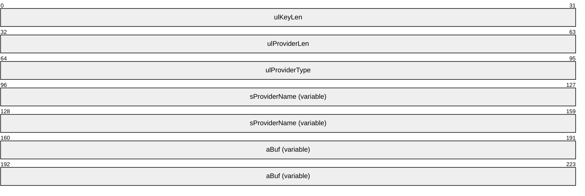

**ulKeyLen (4 bytes):** An unsigned 32-bit integer that MUST contain the size, in bytes, of the data in the **aBuf** field.

**ulProviderLen (4 bytes):** An unsigned 32-bit integer that MUST contain the size, in bytes, of the provider name, including the terminating null character.

**ulProviderType (4 bytes):** An unsigned 32-bit integer that MUST contain an enumerated constant for the provider-type code. The value MUST be either PROV_RSA_FULL (0x00000001) or PROV_RSA_AES (0x00000018), indicating which provider was used to generate the public key certificate stored in the **aBuf** field.

**sProviderName (variable):** A null-terminated [**Unicode**](#gt_unicode) string that contains the provider name.

**aBuf (variable):** A buffer that MUST contain a **BLOBHEADER** ([MS-MQDS](../MS-MQDS/MS-MQDS.md) section 2.2.19) structure, with the **aiKeyAlg** field set to CALG_RSA_KEYX (0x0000a400), followed by the public key certificate formatted as an **RSAPUBKEY** ([MS-MQDS] section 2.2.18) structure.

<a id="Section_2.2.2"></a>
### 2.2.2 MQDSPUBLICKEYS

The MQDSPUBLICKEYS structure defines a set of [MQDSPUBLICKEY (section 2.2.1)](#Section_2.2.1) structures.

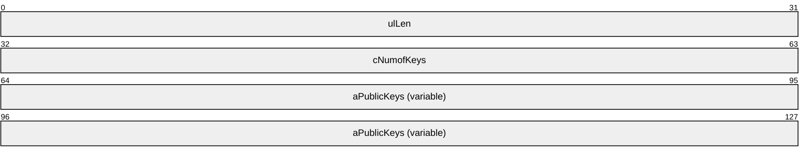

**ulLen (4 bytes):** An unsigned 32-bit integer that MUST contain the size, in bytes, of the MQDSPUBLICKEYS structure.

**cNumofKeys (4 bytes):** An unsigned 32-bit integer that MUST contain the count of MQDSPUBLICKEY (section 2.2.1) structures in the array aPublicKeys.

**aPublicKeys (variable):** An array of MQDSPUBLICKEY (section 2.2.1) structures.

<a id="Section_2.2.3"></a>
### 2.2.3 SECURITY_INFORMATION

A SECURITY_INFORMATION value applies to a SECURITY_DESCRIPTOR (as specified in [MS-DTYP](../MS-DTYP/MS-DTYP.md) section 2.4.6). The value is constructed from zero or more bit flags from the following table.

| Value | Meaning |
| --- | --- |
| OWNER_SECURITY_INFORMATION 0x00000001 | Owner identifier of the object |
| GROUP_SECURITY_INFORMATION 0x00000002 | Primary group identifier |
| DACL_SECURITY_INFORMATION 0x00000004 | Discretionary access control list (DACL) of the object |
| SACL_SECURITY_INFORMATION 0x00000008 | System ACL of the object |

This type is declared as follows:

typedef DWORD SECURITY_INFORMATION;

<a id="Section_2.2.4"></a>
### 2.2.4 TA_ADDRESS

The TA_ADDRESS structure defines a single transport address of a specific type.

typedef struct _TA_ADDRESS {

USHORT AddressLength;

USHORT AddressType;

UCHAR Address[1];

} TA_ADDRESS,

*PTA_ADDRESS;

**AddressLength:** An unsigned 16-bit integer that MUST contain the size, in bytes, of the **Address** field. The value MUST be one of the following (by address type).

| Address type prefix | Value |
| --- | --- |
| IP_ | 4 |
| IPX_ | 10 |
| FOREIGN_ | 16 |

**AddressType:** An unsigned 16-bit integer that MUST contain one of the values in the following table.

| Value | Meaning |
| --- | --- |
| IP_ADDRESS_TYPE 0x0001 | The **Address** field contains a 32-bit IP address. |
| IP_RAS_ADDRESS_TYPE 0x0002 | The **Address** field contains a 32-bit IP address associated with a connection that is established through a [**Remote Access Service (RAS) server**](#gt_remote-access-service-ras-server). |
| IPX_ADDRESS_TYPE 0x0003 | The **Address** field contains a 4-byte netnum followed by a 6-byte nodenum. The netnum identifies the IPX network. The nodenum represents the IPX node address. |
| FOREIGN_ADDRESS_TYPE 0x0005 | The **Address** field contains the [**GUID**](#gt_globally-unique-identifier-guid) of a [**connected network**](#gt_connected-network) object. |

**Address:** The array of bytes that contains the address value.

This MUST be one of the following:

- An IP address (as specified in section [2.2.4.1](#Section_2.2.4.1)).
- An IPX address (as specified in section [2.2.4.2](#Section_2.2.4.2)).
- A FOREIGN address is a **GUID** object (as specified in [MS-DTYP](../MS-DTYP/MS-DTYP.md) section 2.3.4).
<a id="Section_2.2.4.1"></a>
#### 2.2.4.1 IP Address

The IP Address packet is a numerical representation of an IPv4 address.

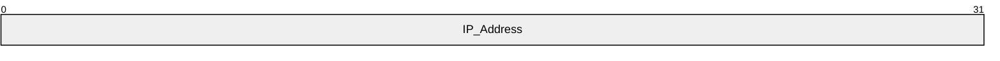

**IP_Address (4 bytes):** A 32-bit unsigned integer.

<a id="Section_2.2.4.2"></a>
#### 2.2.4.2 IPX Address

The IPX Address packet identifies a remote destination on a Novell Netware network.

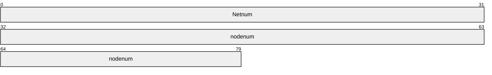

<a id="Section_2.2.5"></a>
### 2.2.5 SEQUENCE_INFO

The SEQUENCE_INFO structure stores the sequence information about the applicable [**message**](#gt_message) in a message stream sent from a given sending computer to a given destination [**queue**](#gt_queue).

typedef struct tagSEQUENCE_INFO {

LONGLONG SeqID;

ULONG SeqNo;

ULONG PrevNo;

} SEQUENCE_INFO;

**SeqID:** Specifies a sequence identifier.

**SeqNo:** Specifies the sequence number of a message within the sequence identified by the **SeqID** member.

**PrevNo:** Specifies the sequence number of the message previous to the message indicated by the **SeqNo** member within the sequence identified by the **SeqID** member.

<a id="Section_2.2.5.1"></a>
#### 2.2.5.1 SEQUENCE_INFO (Packet)

The SEQUENCE_INFO (Packet) stores the sequence information about the applicable [**message**](#gt_message) in a message stream sent from a given sending computer to a given destination [**queue**](#gt_queue).

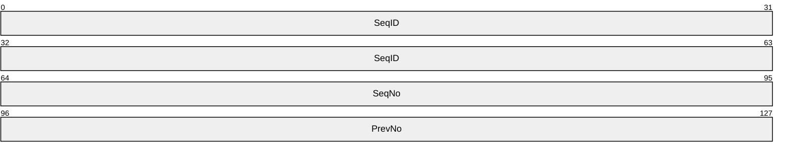

**SeqID (8 bytes):** A 64-bit signed integer that specifies a sequence identifier.

**SeqNo (4 bytes):** A 32-bit unsigned integer that specifies the sequence number of a message within the sequence identified by the **SeqID** field.

**PrevNo (4 bytes):** A 32-bit unsigned integer that specifies the sequence number of the message previous to the message indicated by the **SeqNo** field within the sequence identified by the **SeqID** field.

<a id="Section_2.2.6"></a>
### 2.2.6 QUEUE_FORMAT_TYPE

The QUEUE_FORMAT_TYPE enumeration identifies the type of name format being used.

typedef enum __QUEUE_FORMAT_TYPE

{

QUEUE_FORMAT_TYPE_UNKNOWN = 0,

QUEUE_FORMAT_TYPE_PUBLIC = 1,

QUEUE_FORMAT_TYPE_PRIVATE = 2,

QUEUE_FORMAT_TYPE_DIRECT = 3,

QUEUE_FORMAT_TYPE_MACHINE = 4,

QUEUE_FORMAT_TYPE_CONNECTOR = 5,

QUEUE_FORMAT_TYPE_DL = 6,

QUEUE_FORMAT_TYPE_MULTICAST = 7,

QUEUE_FORMAT_TYPE_SUBQUEUE = 8

} QUEUE_FORMAT_TYPE;

QUEUE_FORMAT_TYPE_UNKNOWN: The format type is unknown.

**QUEUE_FORMAT_TYPE_PUBLIC:** The [QUEUE_FORMAT (section 2.2.7)](#Section_2.2.7) structure contains a GUID (as specified in [MS-DTYP](../MS-DTYP/MS-DTYP.md) section 2.3.4) that identifies a [**queue**](#gt_queue).

**QUEUE_FORMAT_TYPE_PRIVATE:** The QUEUE_FORMAT (section 2.2.7) structure contains an [OBJECTID](#Section_2.2.8) structure that identifies a queue.

**QUEUE_FORMAT_TYPE_DIRECT:** The QUEUE_FORMAT structure contains a direct format name string that identifies a queue.

**QUEUE_FORMAT_TYPE_MACHINE:** The QUEUE_FORMAT structure contains a GUID (as specified in [MS-DTYP] section 2.3.4) that identifies a queue.

**QUEUE_FORMAT_TYPE_CONNECTOR:** The QUEUE_FORMAT structure contains a GUID (as specified in [MS-DTYP] section 2.3.4) that identifies a [**connector queue**](#gt_connector-queue). This is not supported by all protocols.

**QUEUE_FORMAT_TYPE_DL:** The QUEUE_FORMAT structure contains a GUID (as specified in [MS-DTYP] section 2.3.4) that identifies a [**distribution list (DL)**](#gt_distribution-list). This is not supported by all protocols.

**QUEUE_FORMAT_TYPE_MULTICAST:** The QUEUE_FORMAT structure contains a **MULTICAST_ID** (section [2.2.10](#Section_2.2.10)) that identifies a multicast address. This is not supported by all protocols.

**QUEUE_FORMAT_TYPE_SUBQUEUE:** The QUEUE_FORMAT structure contains a direct name string that identifies a [**subqueue**](#gt_subqueue).

**Note** QUEUE_FORMAT_TYPE_SUBQUEUE was introduced in [**MSMQ**](#gt_microsoft-message-queuing-msmq) version 4.

<a id="Section_2.2.7"></a>
### 2.2.7 QUEUE_FORMAT

The QUEUE_FORMAT structure describes the type of [**queue**](#gt_queue) being managed and an identifier for that queue.

typedef struct __QUEUE_FORMAT {

unsigned char m_qft;

unsigned char m_SuffixAndFlags;

unsigned short m_reserved;

[switch_is(m_qft)] union {

[case(QUEUE_FORMAT_TYPE_UNKNOWN)]

;

[case(QUEUE_FORMAT_TYPE_PUBLIC)]

GUID m_gPublicID;

[case(QUEUE_FORMAT_TYPE_PRIVATE)]

OBJECTID m_oPrivateID;

[case(QUEUE_FORMAT_TYPE_DIRECT)]

[string] wchar_t* m_pDirectID;

[case(QUEUE_FORMAT_TYPE_MACHINE)]

GUID m_gMachineID;

[case(QUEUE_FORMAT_TYPE_CONNECTOR)]

GUID m_GConnectorID;

[case(QUEUE_FORMAT_TYPE_DL)]

DL_ID m_DlID;

[case(QUEUE_FORMAT_TYPE_MULTICAST)]

MULTICAST_ID m_MulticastID;

[case(QUEUE_FORMAT_TYPE_SUBQUEUE)]

[string] wchar_t* m_pDirectSubqueueID;

};

} QUEUE_FORMAT;

**m_qft:** The type of queue [**format name**](#gt_format-name). It MUST be set to one of the values of [QUEUE_FORMAT_TYPE](#Section_2.2.6). It is used as a union discriminant in the QUEUE_FORMAT structure.

**m_SuffixAndFlags:** This member is broken into two subfields: **Suffix Type** is located in the 4 least-significant bits, and **Flags** is located in the 4 most-significant bits.

| 0 | 1 | 2 | 3 | 4 | 5 | 6 | 7 |
| --- | --- | --- | --- | --- | --- | --- | --- |
| Flags | Suffix type | - | - | - | - | - | - |

| Flags | Meaning |
| --- | --- |
| QUEUE_FORMAT_FLAG_NOT_SYSTEM 0x00 | The specified queue is not a [**system queue**](#gt_system-queue). |
| QUEUE_FORMAT_FLAG_SYSTEM 0x80 | The specified queue is a system queue. |

| Suffix type | Meaning |
| --- | --- |
| QUEUE_SUFFIX_TYPE_NONE 0x00 | No suffix is specified. The **Flags** subfield MUST be set to 0x00. The **m_qft** member MUST NOT be set to 0x04. |
| QUEUE_SUFFIX_TYPE_JOURNAL 0x01 | A journal suffix. The **Flags** subfield MUST be set to 0x80. The **m_qft** member MUST NOT be set to 0x05, 0x06, or 0x07. |
| QUEUE_SUFFIX_TYPE_DEADLETTER 0x02 | A dead-letter suffix. The **Flags** subfield MUST be set to 0x80. The **m_qft** member MUST NOT be set to 0x01, 0x02, 0x05, 0x06, or 0x07. |
| QUEUE_SUFFIX_TYPE_DEADXACT 0x03 | A transacted dead-letter suffix. The **Flags** subfield MUST be set to 0x80. The **m_qft** member MUST be set to 0x03 or 0x04. |
| QUEUE_SUFFIX_TYPE_XACTONLY 0x04 | A transaction-only suffix. The **m_qft** member MUST be set to 0x05. |
| QUEUE_SUFFIX_TYPE_SUBQUEUE 0x05 | A [**subqueue**](#gt_subqueue) suffix. The **Flags** subfield MUST be 0x00. The **m_qft** member MUST be set to 0x08. |

**m_reserved:** The integer value used for padding. The client SHOULD set this value to 0. The server MUST not use it.

**(unnamed union):** Based on the value of **m_qft**.

**m_gPublicID:** A **GUID** (as specified in [MS-DTYP](../MS-DTYP/MS-DTYP.md) section 2.3.4) of a [**public queue**](#gt_public-queue). Selected when **m_qft** is set to 0x01.

**m_oPrivateID:** An [OBJECTID](#Section_2.2.8) of a [**private queue**](#gt_private-queue); members MUST be used as specified in OBJECTID. Selected when **m_qft** is set to 0x02.

**m_pDirectID:** A direct format name (as specified in section [2.1.2](#Section_2.1.2)) with the "DIRECT=" prefix removed. It is selected when **m_qft** is set to 0x03.

**m_gMachineID:** The **GUID** (as specified in [MS-DTYP] section 2.3.4) of a machine. It is selected when **m_qft** is set to 0x04.

**m_GConnectorID:** The **GUID** (as specified in [MS-DTYP] section 2.3.4) of a [**connector queue**](#gt_connector-queue). It is selected when **m_qft** is set to 0x05.

**m_DlID:** The identifier of a [**distribution list**](#gt_distribution-list). It is selected when **m_qft** is set to 0x06.

**m_MulticastID:** A **MULTICAST_ID** (section [2.2.10](#Section_2.2.10)) which specifies a multicast address and port. It is selected when **m_qft** is set to 0x07.

**m_pDirectSubqueueID:** The identifier of a subqueue. Selected when **m_qft** is set to 0x08.

The value MUST conform to the ABNF for DirectName and contain the optional <Subqueue> element, as specified in section [2.1](#Section_2.1).

The full QUEUE_FORMAT IDL is specified in [MS-MQMR](../MS-MQMR/MS-MQMR.md) Appendix A (section 6).

<a id="Section_2.2.8"></a>
### 2.2.8 OBJECTID

The OBJECTID structure is used to uniquely distinguish objects of the same type within the message queuing system. The structure has two identifiers: a group identifier and an object identifier.

typedef struct _OBJECTID {

GUID Lineage;

DWORD Uniquifier;

} OBJECTID;

**Lineage:** A GUID (as specified in [MS-DTYP](../MS-DTYP/MS-DTYP.md) section 2.3.4) value that identifies the group to which an object belongs. A group is a protocol-specific concept. For instance, it can be the identifier of the object owner, or it can be the identifier of the source where the objects originate.

**Uniquifier:** A DWORD value that identifies the object within the group.

<a id="Section_2.2.9"></a>
### 2.2.9 DL_ID

The DL_ID structure defines a [**distribution list**](#gt_distribution-list) [**queue**](#gt_queue) identifier.

typedef struct _DL_ID {

GUID m_DlGuid;

[string] wchar_t* m_pwzDomain;

} DL_ID;

**m_DlGuid:** The GUID (as specified in [MS-DTYP](../MS-DTYP/MS-DTYP.md) section 2.3.4) of the distribution list queue.

**m_pwzDomain:** The Active Directory domain of the distribution list queue. This field MUST be a null-terminated [**Unicode**](#gt_unicode) string.

<a id="Section_2.2.10"></a>
### 2.2.10 MULTICAST_ID

The MULTICAST_ID structure defines a multicast [**queue**](#gt_queue) identifier.

typedef struct _MULTICAST_ID {

ULONG m_address;

ULONG m_port;

} MULTICAST_ID;

**m_address:** The IP address of the queue.

**m_port:** The port to which the queue is attached.

<a id="Section_2.2.11"></a>
### 2.2.11 QUEUE_SUFFIX_TYPE

The QUEUE_SUFFIX_TYPE enumeration defines which type of [**queue**](#gt_queue) object is represented by the [QUEUE_FORMAT (section 2.2.7)](#Section_2.2.7) structure. This suffix refers to the portion of the queue path separated from the queue name by a semicolon, as specified in [Path Names (section 2.1.1)](#Section_2.1.1).

typedef enum

{

QUEUE_SUFFIX_TYPE_NONE = 0,

QUEUE_SUFFIX_TYPE_JOURNAL = 1,

QUEUE_SUFFIX_TYPE_DEADLETTER = 2,

QUEUE_SUFFIX_TYPE_DEADXACT = 3,

QUEUE_SUFFIX_TYPE_XACTONLY = 4,

QUEUE_SUFFIX_TYPE_SUBQUEUE = 5

} QUEUE_SUFFIX_TYPE;

**QUEUE_SUFFIX_TYPE_NONE:** There is no suffix.

**QUEUE_SUFFIX_TYPE_JOURNAL:** Refers to the [**queue journal**](#gt_queue-journal) of the queue identified by the unnamed union in the QUEUE_FORMAT (section 2.2.7) structure.

**QUEUE_SUFFIX_TYPE_DEADLETTER:** Refers to the nontransacted [**dead-letter queue**](#gt_dead-letter-queue) of the computer identified by the union in the QUEUE_FORMAT (section 2.2.7) structure.

**QUEUE_SUFFIX_TYPE_DEADXACT:** Refers to the transacted dead-letter queue of the computer identified by the union in the QUEUE_FORMAT (section 2.2.7) structure.

**QUEUE_SUFFIX_TYPE_XACTONLY:** Refers to the transacted [**connector queue**](#gt_connector-queue) of the connector identified by the union in the QUEUE_FORMAT (section 2.2.7) structure.

**QUEUE_SUFFIX_TYPE_SUBQUEUE:** Refers to the [**subqueue**](#gt_subqueue) that is the direct name identified by the union in the QUEUE_FORMAT (section 2.2.7) structure.

<a id="Section_2.2.12"></a>
### 2.2.12 PROPVARIANT Type Constants

The following values are used in the discriminant field, **vt**, of the [PROPVARIANT (section 2.2.13)](#Section_2.2.13) type.

The PROPVARIANT (section 2.2.13) type constants are defined in the VARENUM enumeration, as follows:

typedef enum

{

VT_EMPTY = 0,

VT_NULL = 1,

VT_I2 = 2,

VT_I4 = 3,

VT_BOOL = 11,

VT_VARIANT = 12,

VT_I1 = 16,

VT_UI1 = 17,

VT_UI2 = 18,

VT_UI4 = 19,

VT_I8 = 20,

VT_UI8 = 21,

VT_LPWSTR = 31,

VT_BLOB = 65,

VT_CLSID = 72,

VT_VECTOR = 0x1000,

} VARENUM;

**VT_EMPTY:** (0x0000): The type of the contained field is undefined. When this flag is specified, the PROPVARIANT (section 2.2.13) MUST NOT contain a data field.

**VT_NULL:** (0x0001): The type of the contained field is NULL. When this flag is specified, the PROPVARIANT (section 2.2.13) MUST NOT contain a data field.

**VT_I2:** (0x0002): The type of the contained field MUST be a 2-byte signed integer.

**VT_I4:** (0x0003): The type of the contained field MUST be a 4-byte signed integer.

**VT_BOOL:** (0x000B): The type of the contained field MUST be [VARIANT_BOOL (section 2.2.14)](#Section_2.2.14).

**VT_VARIANT:** (0x000C): The type of the contained field MUST be [CAPROPVARIANT (section 2.2.16.8)](#Section_2.2.16.8). It MUST appear with the bit flag VT_VECTOR.

**VT_I1:** (0x0010): The type of the contained field MUST be a 1-byte integer.

**VT_UI1:** (0x0011): The type of the contained field MUST be a 1-byte unsigned integer.

**VT_UI2:** (0x0012): The type of the contained field MUST be a 2-byte unsigned integer.

**VT_UI4:** (0x0013): The type of the contained field MUST be a 4-byte unsigned integer.

**VT_I8:** (0x0014): The type of the contained field MUST be an 8-byte signed integer.

**VT_UI8:** (0x0015): The type of the contained field MUST be an 8-byte unsigned integer.

**VT_LPWSTR:** (0x001F): The type of the contained field MUST be an **LPWSTR** (as specified in [MS-DTYP](../MS-DTYP/MS-DTYP.md) section 2.2.36), a null-terminated [**Unicode**](#gt_unicode) string.

**VT_BLOB:** (0x0041): The type of the contained field MUST be a [binary large object (BLOB) (section 2.2.15)](#Section_2.2.15).

**VT_CLSID:** (0x0048): The type of the contained field MUST be a pointer to a **GUID** (as specified in [MS-DTYP] section 2.3.4) value.

**VT_VECTOR:** (0x1000): The type of the contained field MUST be combined with other values by using the bitwise OR operation to indicate a counted field. The type of the contained field MUST be a [COUNTEDARRAY (section 2.2.16)](#Section_2.2.16).

<a id="Section_2.2.12.1"></a>
#### 2.2.12.1 VARTYPE

The VARTYPE holds [VARENUM (section 2.2.12)](#Section_2.2.12) enumerated values.

This type is declared as follows:

typedef unsigned short VARTYPE;

<a id="Section_2.2.13"></a>
### 2.2.13 PROPVARIANT

The [PROPVARIANT (section 2.2.13.2)](#Section_2.2.13.2) is a container for a union that can hold many types of data.

<a id="Section_2.2.13.1"></a>
#### 2.2.13.1 tag_inner_PROPVARIANT

typedef struct _tag_inner_PROPVARIANT {

VARTYPE vt;

UCHAR wReserved1;

UCHAR wReserved2;

ULONG wReserved3;

[switch_is(vt)] union {

[case(VT_EMPTY, VT_NULL)]

;

[case(VT_I1)]

CHAR cVal;

[case(VT_UI1)]

UCHAR bVal;

[case(VT_I2)]

SHORT iVal;

[case(VT_UI2)]

USHORT uiVal;

[case(VT_I4)]

LONG lVal;

[case(VT_UI4)]

ULONG ulVal;

[case(VT_I8)]

LARGE_INTEGER hVal;

[case(VT_UI8)]

ULARGE_INTEGER uhVal;

[case(VT_BOOL)]

VARIANT_BOOL boolVal;

[case(VT_CLSID)]

GUID* puuid;

[case(VT_BLOB)]

BLOB blob;

[case(VT_LPWSTR)]

[string] wchar_t* pwszVal;

[case(VT_VECTOR|VT_UI1)]

CAUB caub;

[case(VT_VECTOR|VT_UI2)]

CAUI caui;

[case(VT_VECTOR|VT_I4)]

CAL cal;

[case(VT_VECTOR|VT_UI4)]

CAUL caul;

[case(VT_VECTOR|VT_UI8)]

CAUH cauh;

[case(VT_VECTOR|VT_CLSID)]

CACLSID cauuid;

[case(VT_VECTOR|VT_LPWSTR)]

CALPWSTR calpwstr;

[case(VT_VECTOR|VT_VARIANT)]

CAPROPVARIANT capropvar;

} _varUnion;

} tag_inner_PROPVARIANT;

**vt:** MUST be set to one of the values as specified in section [2.2.12](#Section_2.2.12).

**wReserved1:** MAY be set to 0x00 and MUST be ignored by the recipient.

**wReserved2:** MAY be set to 0x00 and MUST be ignored by the recipient.

**wReserved3:** MAY be set to 0x00000000 and MUST be ignored by the recipient.

**_varUnion:** MUST contain an instance of the type according to the value in the **vt** field.

<a id="Section_2.2.13.2"></a>
#### 2.2.13.2 PROPVARIANT

The following is the type definition for PROPVARIANT.

This type is declared as follows:

typedef tag_inner_PROPVARIANT PROPVARIANT;

<a id="Section_2.2.14"></a>
### 2.2.14 VARIANT_BOOL

The VARIANT_BOOL type specifies Boolean values.

The values MUST be defined as follows.

| Name/value | Value | Description |
| --- | --- | --- |
| VARIANT_TRUE | 0xFFFF | MUST indicate a Boolean value of TRUE. |
| VARIANT_FALSE | 0x0 | MUST indicate a Boolean value of FALSE. |

This type is declared as follows:

typedef short VARIANT_BOOL;

<a id="Section_2.2.15"></a>
### 2.2.15 BLOB

The BLOB structure defines a counted array of unsigned characters.

typedef struct tagBLOB {

unsigned long cbSize;

[size_is(cbSize)] unsigned char* pBlobData;

} BLOB;

**cbSize:** A 32-bit unsigned integer that specifies the size of the array of unsigned characters pointed to by **pBlobData**.

**pBlobData:** An array of 8-bit unsigned characters.

<a id="Section_2.2.16"></a>
### 2.2.16 COUNTEDARRAY

A COUNTEDARRAY specifies a counted array of types.

<a id="Section_2.2.16.1"></a>
#### 2.2.16.1 CAUB

The CAUB structure defines a counted array of unsigned characters.

typedef struct tagCAUB {

unsigned long cElems;

[size_is(cElems)] unsigned char* pElems;

} CAUB;

**cElems:** MUST be set to the total number of elements of the array.

**pElems:** An array of unsigned characters.

<a id="Section_2.2.16.2"></a>
#### 2.2.16.2 CAUI

The CAUI structure defines a counted array of unsigned short integers.

typedef struct tagCAUI {

unsigned long cElems;

[size_is(cElems )] unsigned short* pElems;

} CAUI;

**cElems:** MUST be set to the total number of elements of the array.

**pElems:** An array of unsigned short integers.

<a id="Section_2.2.16.3"></a>
#### 2.2.16.3 CAL

The CAL structure defines a counted array of 32-bit unsigned integers.

typedef struct tagCAL {

unsigned long cElems;

[size_is(cElems )] long* pElems;

} CAL;

**cElems:** MUST be set to the total number of elements of the array.

**pElems:** An array of 32-bit unsigned integers.

<a id="Section_2.2.16.4"></a>
#### 2.2.16.4 CAUL

The CAUL structure defines a counted array of 32-bit unsigned integers.

typedef struct tagCAUL {

unsigned long cElems;

[size_is(cElems )] unsigned long* pElems;

} CAUL;

**cElems:** MUST be set to the total number of elements of the array.

**pElems:** An array of 32-bit unsigned integers.

<a id="Section_2.2.16.5"></a>
#### 2.2.16.5 CAUH

The CAUH structure defines a counted array of [ULARGE_INTEGER (section 2.2.17)](#Section_2.2.17) values.

typedef struct tagCAUH {

unsigned long cElems;

[size_is(cElems)] ULARGE_INTEGER* pElems;

} CAUH;

**cElems:** MUST be set to the total number of elements of the array.

**pElems:** An array of ULARGE_INTEGER (section 2.2.17) values.

<a id="Section_2.2.16.6"></a>
#### 2.2.16.6 CACLSID

The CACLSID structure defines a counted array of GUID (as specified in [MS-DTYP](../MS-DTYP/MS-DTYP.md) section 2.3.4) values.

typedef struct tagCACLSID {

unsigned long cElems;

[size_is(cElems)] GUID* pElems;

} CACLSID;

**cElems:** MUST be set to the total number of elements of the array.

**pElems:** An array of GUID (as specified in [MS-DTYP] section 2.3.4) values.

<a id="Section_2.2.16.7"></a>
#### 2.2.16.7 CALPWSTR

The CALPWSTR structure defines a counted array of wchar_t* values.

typedef struct tagCALPWSTR {

unsigned long cElems;

[size_is(cElems)] [string] wchar_t** pElems;

} CALPWSTR;

**cElems:** MUST be set to the total number of elements of the array.

**pElems:** An array of wchar_t* values.

<a id="Section_2.2.16.8"></a>
#### 2.2.16.8 CAPROPVARIANT

The CAPROPVARIANT structure defines a counted array of [PROPVARIANT (section 2.2.13.2)](#Section_2.2.13.2) values.

typedef struct tagCAPROPVARIANT {

unsigned long cElems;

[size_is(cElems )] PROPVARIANT* pElems;

} CAPROPVARIANT;

**cElems:** MUST be set to the total number of elements of the array.

**pElems:** An array of PROPVARIANT (section 2.2.13.2) values.

<a id="Section_2.2.17"></a>
### 2.2.17 ULARGE_INTEGER

The ULARGE_INTEGER structure defines a large integer.

typedef struct _ULARGE_INTEGER {

ULONGLONG QuadPart;

} ULARGE_INTEGER;

**QuadPart:** A **ULONGLONG** (as specified in [MS-DTYP](../MS-DTYP/MS-DTYP.md) section 2.2.55) value.

<a id="Section_2.2.18"></a>
### 2.2.18 Common Packet Syntax

Multiple MSMQ protocols share the packet syntax that is defined in the following sections.

The protocols that consume this packet syntax use [**little-endian**](#gt_little-endian) byte order.

<a id="Section_2.2.18.1"></a>
#### 2.2.18.1 Packet Data Types

The following data types are used for describing the common packet syntax.

<a id="Section_2.2.18.1.1"></a>
##### 2.2.18.1.1 GUID

This specification uses the [**globally unique identifier**](#gt_globally-unique-identifier-guid) data type (the **GUID** data type), as specified in [MS-DTYP](../MS-DTYP/MS-DTYP.md) section 2.3.4.

<a id="Section_2.2.18.1.2"></a>
##### 2.2.18.1.2 TxSequenceID

A TxSequenceID is a 64-bit value that identifies a sequence of [**transactional messages**](#gt_transactional-message) originated from a [**queue manager**](#gt_queue-manager-qm). This structure contains two monotonically increasing numeric values.

When comparing ADM elements of type TxSequenceID, the structure is treated as a 64-bit unsigned integer with **Ordinal** being the low-order bytes and **Timestamp** being the high-order bytes.

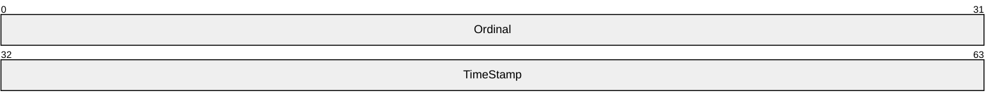

**Ordinal (4 bytes):** A 32-bit unsigned integer field. This field has a valid range from 0x00000000 to 0xFFFFFFFF.

**TimeStamp (4 bytes):** A 32-bit unsigned integer field. This field has a valid range from 0x00000000 to 0xFFFFFFFF.

<a id="Section_2.2.18.1.3"></a>
##### 2.2.18.1.3 MessageIdentifier

A MessageIdentifier is a 20-byte identifier that uniquely identifies a [**message**](#gt_message) from a [**queue manager**](#gt_queue-manager-qm).

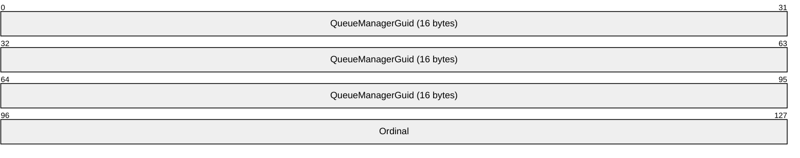

**QueueManagerGuid (16 bytes):** A **GUID**, as specified in [MS-DTYP](../MS-DTYP/MS-DTYP.md) section 2.3.4, that contains the identifier of the sender queue manager. This value MUST be the same for messages originating from the same queue manager.

**Ordinal (4 bytes):** A 32-bit unsigned integer ordinal value that identifies the message. This value MUST be unique within messages originating from the same queue manager. This field has a valid range from 0x00000000 to 0xFFFFFFFF.

<a id="Section_2.2.18.1.4"></a>
##### 2.2.18.1.4 MQFFormatNameElement

The MQFFormatNameElement specifies a [**queue**](#gt_queue) [**format name**](#gt_format-name).

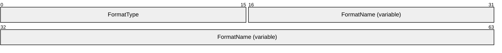

**FormatType (2 bytes):** A 16-bit unsigned short integer field specifying the queue format name type. The field MUST be set to one of the following values.

| Value | Meaning |
| --- | --- |
| 0x0001 | Public Format Name |
| 0x0002 | Private Format Name |
| 0x0003 | Direct Format Name |
| 0x0006 | Distribution List Format Name |

**FormatName (variable):** A variable-length byte array that contains a queue format name. The layout of this field depends on the value of the **FormatType** field. There are no restrictions on the value of the padding bytes.<1> The following table lists the data structures that MUST be used as the **FormatName** field for specific **FormatType** values.

| FormatType Value | Data Structure |
| --- | --- |
| 0x0001 | **FormatName** contains a [PublicQueueFormatName](#Section_2.2.18.1.7.1) structure. |
| 0x0002 | **FormatName** contains a [PrivateQueueFormatName](#Section_2.2.18.1.7.2) structure. |
| 0x0003 | **FormatName** contains an [MQFDirectQueueFormatName](#Section_2.2.18.1.4.1) structure. |
| 0x0006 | **FormatName** contains an [MQFDistributionQueueFormatName](#Section_2.2.18.1.4.2) structure. |

<a id="Section_2.2.18.1.4.1"></a>
###### 2.2.18.1.4.1 MQFDirectQueueFormatName

If the **FormatType** field is set to 0x0003, the layout of the **FormatName** field MUST be as follows.

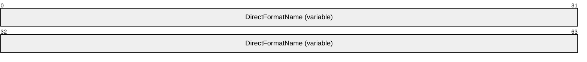

**DirectFormatName (variable):** A null-terminated **WCHAR** ([MS-DTYP](../MS-DTYP/MS-DTYP.md) section 2.2.60) buffer that MUST specify a [**queue**](#gt_queue) using a [**direct format name**](#gt_direct-format-name). The size of the field is the **WCHAR** string's length in bytes. The start of this field is rounded up to the next 2-byte boundary.

<a id="Section_2.2.18.1.4.2"></a>
###### 2.2.18.1.4.2 MQFDistributionQueueFormatName

If the **FormatType** field is set to 0x0006, then the layout of the **FormatName** field MUST be as follows.

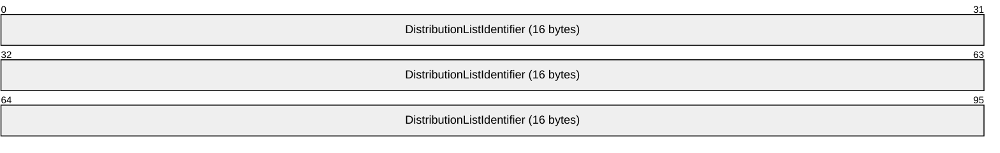

**DistributionListIdentifier (16 bytes):** A **GUID**, as specified in [MS-DTYP](../MS-DTYP/MS-DTYP.md) section 2.3.4, that MUST identify a [**distribution list**](#gt_distribution-list). The start of this field is rounded up to the next 4-byte boundary.

<a id="Section_2.2.18.1.5"></a>
##### 2.2.18.1.5 Queue Format Type

The Queue Format Type specifies the layout of the queue name as indicated by the **UserHeader.Flags.DQ**, **UserHeader.Flags.AQ**, and **UserHeader.Flags.RQ** fields (section [2.2.19.2](#Section_2.2.19.2)) and is one of the types specified in sections [2.2.18.1.5.1](#Section_2.2.18.1.5.1) and [2.2.18.1.5.2](#Section_2.2.18.1.5.2).

<a id="Section_2.2.18.1.5.1"></a>
###### 2.2.18.1.5.1 PrivateQueueFormatNameId

The layout of the PrivateQueueFormatNameId queue format type MUST be as follows.

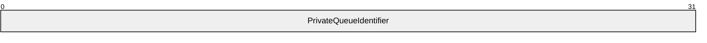

**PrivateQueueIdentifier (4 bytes):** A 32-bit unsigned integer that identifies the [**private queue**](#gt_private-queue) on the host [**queue manager**](#gt_queue-manager-qm). This value MUST be unique for private queues hosted on the same queue manager.

<a id="Section_2.2.18.1.5.2"></a>
###### 2.2.18.1.5.2 DirectQueueFormatName

The layout of the DirectQueueFormatName queue format type MUST be as follows.

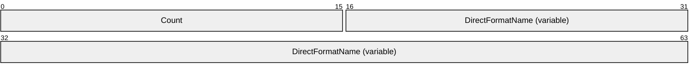

**Count (2 bytes):** A 16-bit unsigned integer that specifies the length, in bytes, of the following null-terminated **WCHAR** buffer, **DirectFormatName**, up to and including the terminating null character.

**DirectFormatName (variable):** A null-terminated **WCHAR**, as specified in [MS-DTYP](../MS-DTYP/MS-DTYP.md) section 2.2.60, buffer that contains a [**direct format name**](#gt_direct-format-name). The end of this field is padded up to the next 4-byte boundary relative to the start of the header that contains the queue format name.

The **Count** value does not include the padding bytes. There are no restrictions on the value of the padding bytes.<2>

<a id="Section_2.2.18.1.6"></a>
##### 2.2.18.1.6 Message Class Identifiers

A message class identifier is used to indicate the type of a [**message**](#gt_message). In some cases the class identifier can also indicate that the message is generated as a response to an action on another message such as its receipt by a higher-layer messaging application or a delivery failure. This other message is referred to as the original message in the text that follows. The sender of the original message is referred to as the original sender in the text that follows.

The **MESSAGE_CLASS_VALUES** enumeration identifies the predefined message types.

Alternatively, the sending application can set the type of a message to a custom value by setting one or more bits of the mask 0xE1FF and by leaving the remaining bits as zero.

typedef enum

{

MQMSG_CLASS_NORMAL = 0x0000,

MQMSG_CLASS_REPORT = 0x0001,

MQMSG_CLASS_ACK_REACH_QUEUE = 0x0002,

MQMSG_CLASS_ORDER_ACK = 0x00ff,

MQMSG_CLASS_ACK_RECEIVE = 0x4000,

MQMSG_CLASS_NACK_BAD_DST_Q = 0x8000,

MQMSG_CLASS_NACK_DELETED = 0x8001,

MQMSG_CLASS_NACK_REACH_QUEUE_TIMEOUT = 0x8002,

MQMSG_CLASS_NACK_Q_EXCEED_QUOTA = 0x8003,

MQMSG_CLASS_NACK_ACCESS_DENIED = 0x8004,

MQMSG_CLASS_NACK_HOP_COUNT_EXCEEDED = 0x8005,

MQMSG_CLASS_NACK_BAD_SIGNATURE = 0x8006,

MQMSG_CLASS_NACK_BAD_ENCRYPTION = 0x8007,

MQMSG_CLASS_NACK_NOT_TRANSACTIONAL_Q = 0x8009,

MQMSG_CLASS_NACK_NOT_TRANSACTIONAL_MSG = 0x800A,

MQMSG_CLASS_NACK_UNSUPPORTED_CRYPTO_PROVIDER = 0x800B,

MQMSG_CLASS_NACK_Q_DELETED = 0xC000,

MQMSG_CLASS_NACK_Q_PURGED = 0xC001,

MQMSG_CLASS_NACK_RECEIVE_TIMEOUT = 0xC002,

MQMSG_CLASS_NACK_RECEIVE_REJECTED = 0xC004

} MESSAGE_CLASS_VALUES;

**MQMSG_CLASS_NORMAL:** Indicates the original message sent on behalf of a higher-layer messaging application.

**MQMSG_CLASS_REPORT:** Indicates a report message used to track delivery of sent messages. For more information, see [MS-MQQB](../MS-MQQB/MS-MQQB.md) section 3.1.5.8.9.

**MQMSG_CLASS_ACK_REACH_QUEUE:** The class is used by administration acknowledgment messages.

Indicates that the original message was delivered to its destination [**queue**](#gt_queue).

**MQMSG_CLASS_ORDER_ACK:** The class is used to acknowledge in-order receipt of an original [**transactional message**](#gt_transactional-message). This acknowledgment MUST be sent from the final destination [**queue manager**](#gt_queue-manager-qm) to the original sender.

**MQMSG_CLASS_ACK_RECEIVE:** The class is used by administration acknowledgment messages.

Indicates that the original message was retrieved by a receiving application from the destination queue.

**MQMSG_CLASS_NACK_BAD_DST_Q:** Indicates that the destination queue is not available to the original sender.

**MQMSG_CLASS_NACK_DELETED:** Indicates that the original message was deleted by an administrative action before reaching the destination queue.

**MQMSG_CLASS_NACK_REACH_QUEUE_TIMEOUT:** Indicates that the original message did not reach the destination queue. This message can be generated by expiration of either the UserMessage.UserHeader.TimeToBeReceived time or UserMessage.BaseHeader.TimeToReachQueue time before the original message reaches the destination queue.

**MQMSG_CLASS_NACK_Q_EXCEED_QUOTA:** Indicates that the original message was rejected by the destination queue manager because the destination queue exceeded [**Quota**](#gt_quota).

**MQMSG_CLASS_NACK_ACCESS_DENIED:** Indicates that the access rights for placing the original message in the destination queue were not allowed for the sender.

**MQMSG_CLASS_NACK_HOP_COUNT_EXCEEDED:** Indicates that the original message was rejected because it exceeded the maximum routing hop count.

**MQMSG_CLASS_NACK_BAD_SIGNATURE:** Indicates that the digital signature attached to the original message is not valid.

**MQMSG_CLASS_NACK_BAD_ENCRYPTION:** Indicates that the destination queue manager could not decrypt the original message.

**MQMSG_CLASS_NACK_NOT_TRANSACTIONAL_Q:** Indicates that the original transactional message was sent to a nontransactional queue.

**MQMSG_CLASS_NACK_NOT_TRANSACTIONAL_MSG:** Indicates that the original [**nontransactional message**](#gt_nontransactional-message) was sent to a [**transactional queue**](#gt_transactional-queue).

**MQMSG_CLASS_NACK_UNSUPPORTED_CRYPTO_PROVIDER:** Indicates that the encryption provider requested in the original message is not supported by the destination.

**MQMSG_CLASS_NACK_Q_DELETED:** Indicates that the queue was deleted before the original message could be read from the queue.

**MQMSG_CLASS_NACK_Q_PURGED:** Indicates that the queue was purged and the original message no longer exists.

**MQMSG_CLASS_NACK_RECEIVE_TIMEOUT:** Indicates that the original message was placed in the destination queue but was not retrieved from the queue before its time-to-be-received timer expired.

**MQMSG_CLASS_NACK_RECEIVE_REJECTED:** Indicates that the message was rejected by a receiving application.

<a id="Section_2.2.18.1.7"></a>
##### 2.2.18.1.7 Common Queue Formats

<a id="Section_2.2.18.1.7.1"></a>
###### 2.2.18.1.7.1 PublicQueueFormatName

The layout of a [**public queue**](#gt_public-queue) [**format name**](#gt_format-name) MUST be as follows.


**PublicQueueIdentifier (16 bytes):** A **GUID**, as specified in [MS-DTYP](../MS-DTYP/MS-DTYP.md) section 2.3.4, that MUST be set to the identifier of the public queue.

<a id="Section_2.2.18.1.7.2"></a>
###### 2.2.18.1.7.2 PrivateQueueFormatName

The layout of a [**private queue**](#gt_private-queue) [**format name**](#gt_format-name) MUST be as follows.

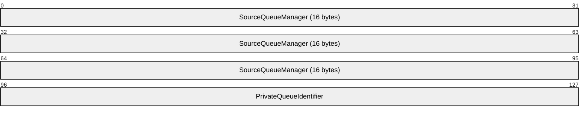

**SourceQueueManager (16 bytes):** A **GUID**, as specified in [MS-DTYP](../MS-DTYP/MS-DTYP.md) section 2.3.4, that MUST specify the [**queue manager**](#gt_queue-manager-qm) that hosts the private queue. The start of this field is rounded up to the next 4-byte boundary.

**PrivateQueueIdentifier (4 bytes):** A 32-bit unsigned integer that MUST identify the private queue on the source queue manager. This value MUST be unique for private queues hosted on the same queue manager.

<a id="Section_2.2.18.1.8"></a>
##### 2.2.18.1.8 XACTUOW

An XACTUOW is a structure that serves as a unique identifier for a transactional [**unit of work**](#gt_unit-of-work). An XACTUOW contains 16 unsigned single-byte characters representing a GUID ([MS-DTYP](../MS-DTYP/MS-DTYP.md) section 2.3.4) and is defined as follows:

typedef struct {

unsigned char rgb[16];

} XACTUOW;

**rgb:** An array of unsigned single-byte characters that contains a [**globally unique identifier (GUID)**](#gt_globally-unique-identifier-guid).

<a id="Section_2.2.19"></a>
### 2.2.19 Common Headers

This section contains headers that are common to multiple packets.

<a id="Section_2.2.19.1"></a>
#### 2.2.19.1 BaseHeader

The BaseHeader is the first field of each packet described in this section. The BaseHeader contains information to identify and manage protocol packets.

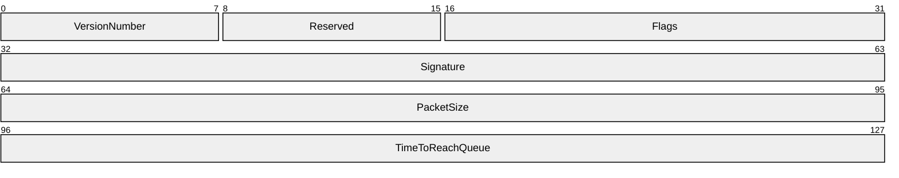

**VersionNumber (1 byte):** An 8-bit unsigned integer that is the version of the packet format. This field MUST be set to the value 0x10.

**Reserved (1 byte):** Reserved for future use. This field can be set to any arbitrary value when sent and MUST be ignored on receipt.

**Flags (2 bytes):** A 16-bit unsigned short integer containing a set of options that provides additional information about the packet. Any combination of these values is acceptable unless otherwise noted in the following table.


**PR (3 bits):** Specifies the priority of the [**message**](#gt_message) in the packet. This field has a valid range from 0x0 to 0x7, with 0x7 being the highest priority. The default is 0x3. A message with a higher priority MUST be placed closer to the front of the queue. This field MUST be set to a value of 0x0 if the packet contains a transactional message. For more details, see **UserHeader.Flags.TH** in section [2.2.19.2](#Section_2.2.19.2).

**A - IN (1 bit):** Indicates that the message within the packet is internal and used by [message transfer protocols](#Section_1.1) for connection establishment and session acknowledgements. This field MUST be set if the packet is an EstablishConnection Packet as defined in [MS-MQQB](../MS-MQQB/MS-MQQB.md) section 2.2.3, a ConnectionParameters Packet as defined in [MS-MQQB] section 2.2.2, or a SessionAck Packet as defined in [MS-MQQB] section 2.2.6. This field MUST NOT be set if the packet is a OrderAck Packet as defined in [MS-MQQB] sections 2.2.4 or a FinalAck Packet as defined in [MS-MQQB] section 2.2.5.

**B - SH (1 bit):** Specifies if a [SessionHeader (section 2.2.20.4)](#Section_2.2.20.4) is present in the packet. If set, the packet MUST contain a SessionHeader.

**C - DH (1 bit):** Specifies if a [DebugHeader (section 2.2.20.8)](#Section_2.2.20.8) is present in the packet. This field MUST NOT be set if the BaseHeader is part of a packet other than a [UserMessage Packet (section 2.2.20)](#Section_2.2.20). If and only if set, MUST the packet include a DebugHeader.

**D - X9 (1 bit):** Reserved. This field SHOULD NOT be set when sent and MUST be ignored on receipt.

**E - X8 (1 bit):** Reserved. This field SHOULD NOT be set when sent and MUST be ignored on receipt.

**F - TR (1 bit):** Specifies whether message tracing is enabled for this packet. This field MUST be set if message tracing is required for this message. If this field is set, the **DH** field MUST also be set.

**G - X6 (1 bit):** Reserved. This field SHOULD NOT be set when sent and MUST be ignored on receipt.

**H - X5 (1 bit):** Reserved. This field SHOULD NOT be set when sent and MUST be ignored on receipt.

**I - X4 (1 bit):** Reserved. This field SHOULD NOT be set when sent and MUST be ignored on receipt.

**J - X3 (1 bit):** Reserved. This field SHOULD NOT be set when sent and MUST be ignored on receipt.

**K - X2 (1 bit):** Reserved. This field SHOULD NOT be set when sent and MUST be ignored on receipt.

**L - X1 (1 bit):** Reserved. This field SHOULD NOT be set when sent and MUST be ignored on receipt.

**M - X0 (1 bit):** Reserved. This field SHOULD NOT be set when sent and MUST be ignored on receipt.

**Signature (4 bytes):** A 32-bit unsigned integer that is the packet signature value. This field MUST be set to 0x524F494C.

**PacketSize (4 bytes):** A 32-bit unsigned integer that indicates the packet size. This field MUST be set to the size, in bytes, of the entire packet including the base header and any padding bytes used to align the various [**message headers**](#gt_message-header) on 4-byte boundaries, but MUST NOT include the SessionHeader size when the SessionHeader is present. This field has a maximum value of 0x00400000.

**TimeToReachQueue (4 bytes):** A 32-bit unsigned integer that indicates the length of time, in seconds, that a UserMessage Packet has to reach its destination [**queue manager**](#gt_queue-manager-qm). This field has a valid range from 0x00000000 to 0xFFFFFFFF. The value 0xFFFFFFFF indicates an infinite time.

When a UserMessage Packet is sent or received, this value MUST be evaluated against the current system time and the **UserMessage.UserHeader.SentTime** field. If CURRENT_TIME - **UserMessage.UserHeader.SentTime** is greater than the value of this field, then the UserMessage Packet has expired and MUST be deleted by a sender and ignored by a receiver.

When the BaseHeader is not part of a UserMessage Packet, this value MUST be set to 0xFFFFFFFF.

For the purpose of this section, CURRENT_TIME is defined as the number of seconds elapsed since midnight (00:00:00), January 1, 1970 Coordinated Universal Time (UTC).

<a id="Section_2.2.19.2"></a>
#### 2.2.19.2 UserHeader

The UserHeader contains source and destination information for the message in a [UserMessage Packet](#Section_2.2.20).

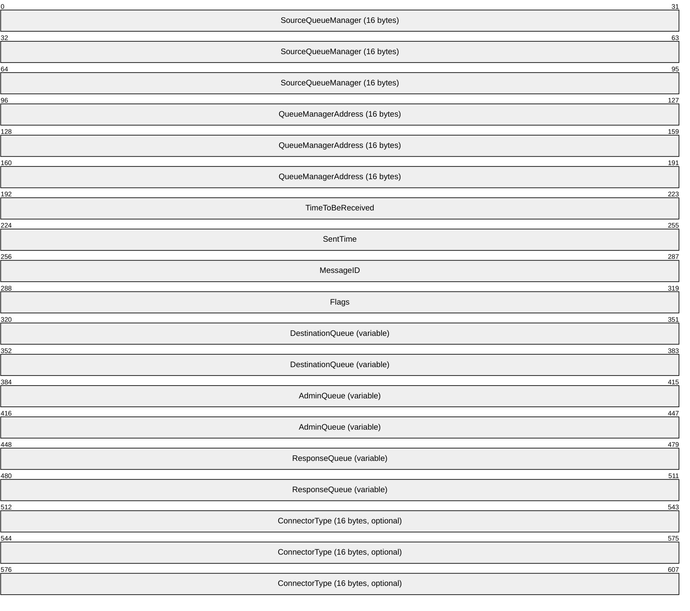

**SourceQueueManager (16 bytes):** A **GUID**, as specified in [MS-DTYP](../MS-DTYP/MS-DTYP.md) section 2.3.4, that MUST identify the original sender of the message.

**QueueManagerAddress (16 bytes):** A **GUID**, as specified in [MS-DTYP] section 2.3.4, that MUST identify the destination [**queue manager**](#gt_queue-manager-qm).

If the [**message**](#gt_message) is sent to a [**public**](#gt_public-queue) or [**private queue**](#gt_private-queue), this field MUST be set to the **GUID** of the destination queue manager. If the message is sent to a [**queue**](#gt_queue) that uses a [**direct format name**](#gt_direct-format-name), then this field MUST contain a [**NULL GUID**](#gt_null-guid).

**TimeToBeReceived (4 bytes):** A 32-bit unsigned integer that indicates the length of time, in seconds, that the message in the packet has before it expires. This field has a valid range from 0x00000000 to 0xFFFFFFFF. The value 0xFFFFFFFF indicates an infinite time.

This time is measured from when the sending protocol receives the message. If the value is exceeded, the message MUST be removed from the destination queue. For more details about message expiration see [MS-MQQB](../MS-MQQB/MS-MQQB.md) section 3.1.5.8.5.

**SentTime (4 bytes):** A 32-bit unsigned integer that MUST be set to the time when the packet was sent. This value represents the number of seconds elapsed since midnight (00:00:00), January 1, 1970 UTC.

**MessageID (4 bytes):** A 32-bit unsigned integer that is the message identifier specified by the queue manager. The queue manager MUST generate a unique identifier for each message it sends. For more details, see the **MessageIdOrdinal** value in [MS-MQQB] section 3.1.1.3.

**Flags (4 bytes):** A 32-bit unsigned integer that contains a set of options that provide additional information about the packet. Any combination of these values is acceptable unless otherwise noted below.

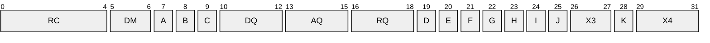

**RC (5 bits):** The number of routing servers that have processed the UserMessage Packet. The values in this field MUST be in the range from 0x00 to 0x1D. For more details, see [MS-MQQB] section 3.1.5.8.2.

**DM (2 bits):** The delivery mode of the packet. The field MUST be set to one of the following values.

| Value | Meaning |
| --- | --- |
| 0x0 | Express messaging. Express messages MUST NOT be required to be recoverable after the queue manager restarts. |
| 0x1 | Recoverable messaging (including transactional). Recoverable messages MUST be recovered after queue manager restarts. |

**Note** a [**transactional message**](#gt_transactional-message) is a recoverable message that has UserHeader.Flags.TH set to 0x1.

**A - X1 (1 bit):** Reserved bit field. This field SHOULD NOT be set when sent and MUST be ignored on receipt.

**B - JN (1 bit):** Specifies if negative source journaling is enabled.<3> If set, the protocol SHOULD log a record locally in the event of message delivery failure.<4>

**C - JP (1 bit):** Specifies if positive source journaling is enabled. If set, the protocol SHOULD log a record locally if the message is successfully delivered.<5>

**DQ (3 bits):** Type of destination queue in **UserHeader.DestinationQueue**. The field MUST be set to 0x0, 0x3, 0x5, or 0x7. The value in this field determines the layout of the destination queue name in the **UserHeader.DestinationQueue** field.

**AQ (3 bits):** Type of [**administration queue**](#gt_administration-queue) in **UserHeader.AdminQueue**. The field MUST be set to 0x0, 0x2, 0x3, 0x5, 0x6 or 0x7. The value in this field determines the layout of the administration queue name in the **UserHeader.AdminQueue** field.

**RQ (3 bits):** Type of response queue in **UserHeader.ResponseQueue**. The field MUST be set to 0x0, 0x1, 0x2, 0x3, 0x4, 0x5, 0x6, or 0x7. The value in this field determines the layout of the response queue name in the **UserHeader.ResponseQueue** field.

**D - SH (1 bit):** Specifies if a [SecurityHeader](#Section_2.2.20.6) is present in the UserMessage Packet. If set, the packet MUST contain a SecurityHeader; otherwise, it MUST NOT.

**E - TH (1 bit):** Specifies if a [TransactionHeader](#Section_2.2.20.5) is present in the UserMessage Packet. If set, the packet MUST contain a TransactionHeader; otherwise, it MUST NOT. If this flag is set the **DM** flag MUST NOT be 0x0.

**F - MP (1 bit):** Specifies if a [MessagePropertiesHeader](#Section_2.2.19.3) is present in the UserMessage Packet. This flag MUST always be set.

**G - CQ (1 bit):** Specifies if the **ConnectorType** field is present in the packet. If set, the packet MUST contain a **ConnectorType** field; otherwise, it MUST NOT.

**H - MQ (1 bit):** Specifies if a [MultiQueueFormatHeader](#Section_2.2.20.1) is present in the UserMessage Packet. If set, the packet MUST contain a MultiQueueFormatHeader; otherwise, it MUST NOT.

**I - X2 (1 bit):** Reserved bit field. This field SHOULD NOT be set when sent and MUST be ignored on receipt.

**J - AH (1 bit):** Indicates if the packet being received was originally sent over HTTP, as specified in [MS-MQRR](../MS-MQRR/MS-MQRR.md) section 2.2.5.1. This field MUST NOT be set when sent.

**X3 (2 bits):** Reserved bit field. This field SHOULD NOT be set when sent and MUST be ignored on receipt.

**K - HH (1 bit):** Specifies if a [SoapHeader](#Section_2.2.20.7) is present in the packet. If set, the UserMessage Packet MUST contain a SoapHeader; otherwise, it MUST NOT.

**X4 (3 bits):** Reserved bit field. This field SHOULD NOT be set when sent and MUST be ignored on receipt.

**DestinationQueue (variable):** The destination queue specifies the final destination of the message that is contained inside the UserMessage Packet. The queue type and data type of the destination queue name vary depending on the value specified in the **Flags.DQ** field, as described in the following table.

| Flags.DQ | Queue type | Data type |
| --- | --- | --- |
| 0x0 | None | None |
| 0x3 | Private queue on destination host | [PrivateQueueFormatNameId](#Section_2.2.18.1.5.1) |
| 0x5 | Public queue | [PublicQueueFormatName](#Section_2.2.18.1.7.1) |
| 0x7 | Direct | [DirectQueueFormatName](#Section_2.2.18.1.5.2) |

When the **Flags.DQ** field is set to 0x03 or 0x5, the **QueueManagerAddress** field MUST be set to the **GUID** of the destination queue manager.

Any value for **Flags.DQ** other than those specified in the preceding table MUST be treated as an error by closing the session.

**AdminQueue (variable):** The name of the administration queue. This field specifies the response queue where administration acknowledgment messages are sent. An administration response queue MUST be specified if a MessagePropertiesHeader is included and any bits are set in the **MessagePropertiesHeader.Flags** field; otherwise, this field MUST NOT be specified. Details about administration acknowledgments are as specified in [MS-MQQB] sections 1.3.5.2 and 3.1.5.8.10. The queue type and data type of the administration queue name vary depending on the value specified in the **Flags.AQ** field, as described in the following table. This field MUST be present when the **Flags.AQ** field is set to 0x2, 0x3, 0x5, 0x6, or 0x7. This field MUST NOT be present when the **Flags.AQ** field is set to 0x0.

| Flags.AQ | Queue type | Data type |
| --- | --- | --- |
| 0x0 | None | None |
| 0x2 | Private queue on source host | PrivateQueueFormatNameId |
| 0x3 | Private queue on destination host | PrivateQueueFormatNameId |
| 0x5 | Public queue | PublicQueueFormatName |
| 0x6 | Private queue on host other than the source or destination host | [PrivateQueueFormatName](#Section_2.2.18.1.7.2) |
| 0x7 | Direct | DirectQueueFormatName |

Any value for the **Flags.AQ** field other than those specified in the preceding table MUST be treated as an error by closing the session.

**ResponseQueue (variable):** A variable-length array of bytes containing the name of the response queue. The response queue is an application-defined value that specifies a queue that a receiving application could use to send a reply message. The queue type and data type of the response queue name vary depending on the queue format type specified in the **Flags.RQ** field, as described in the following table. This field MUST be present when the **Flags.RQ** field is set to 0x1, 0x2, 0x3, 0x5, 0x6, or 0x7. This field MUST NOT be present when the **Flags.RQ** field is set to 0x0 or 0x1. When the **Flags.RQ** flag is set to 0x1, the response queue is the same as the administration queue. When the **Flags.RQ** field is set to 0x4, the **PrivateQueueIdentifier** in the queue format type MUST identify the private queue on the queue manager that hosts the administration queue.

| Flags.RQ | Queue type | Data type |
| --- | --- | --- |
| 0x0 | None | None |
| 0x1 | Same as the administration queue | None |
| 0x2 | Private queue on source host | PrivateQueueFormatNameId |
| 0x3 | Private queue on destination host | PrivateQueueFormatNameId |
| 0x4 | Private queue on the same host as the administration queue | PrivateQueueFormatNameId |
| 0x5 | Public queue | PublicQueueFormatName |
| 0x6 | Private queue on a host other than the source queue, destination queue, or administration queue host | PrivateQueueFormatName |
| 0x7 | Direct | DirectQueueFormatName |

**ConnectorType (16 bytes):** An optional field that represents an application-defined **GUID**, as specified in [MS-DTYP] section 2.3.4. This field MUST be present if and only if the **Flags.CQ** field is set. This field is used by higher-layer messaging applications. The server MUST NOT process or interpret this field.

<a id="Section_2.2.19.3"></a>
#### 2.2.19.3 MessagePropertiesHeader

The MessagePropertiesHeader contains property information about a [UserMessage Packet](#Section_2.2.20) and the application-defined message payload.

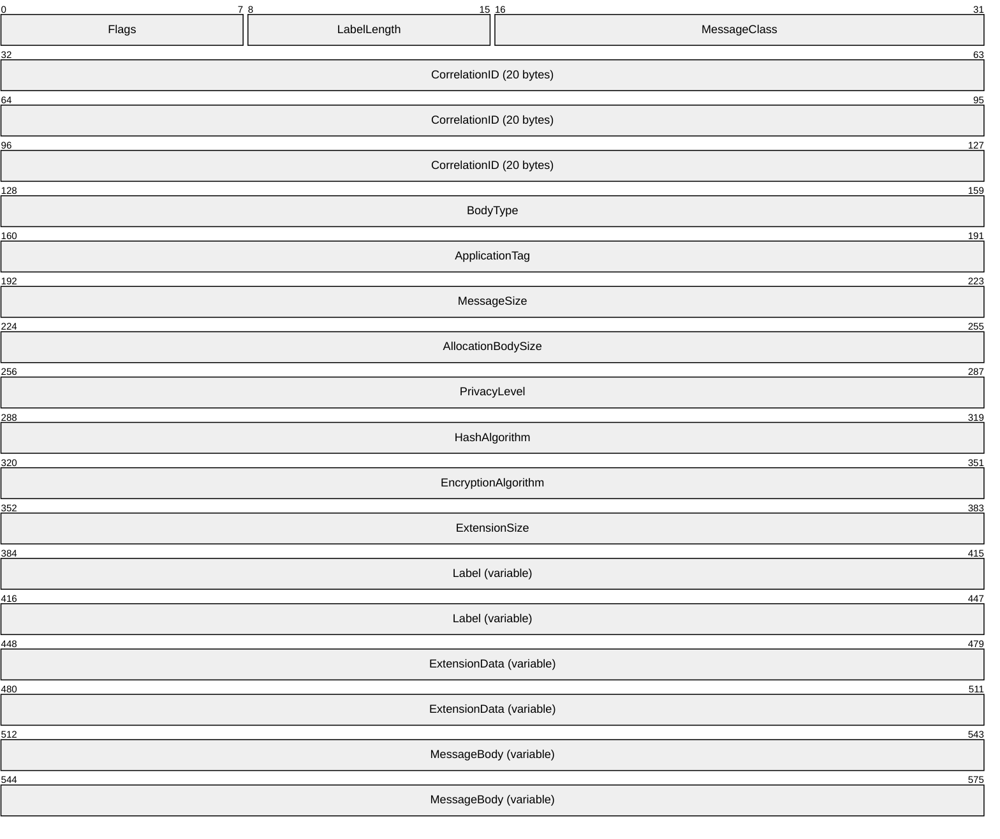

**Flags (1 byte):** An 8-bit unsigned integer field that specifies administration acknowledgments. Any combination of these values is acceptable unless otherwise noted in the following table.

For more details on administration acknowledgments, see [MS-MQQB](../MS-MQQB/MS-MQQB.md) sections 3.1.7.2.1 and 3.1.5.8.10.

| 0 | 1 | 2 | 3 | 4 | 5 | 6 | 7 |
| --- | --- | --- | --- | --- | --- | --- | --- |
| P A | P R | N A | N R | X | X | X | X |

Where the bits are defined as:

| Value | Description |
| --- | --- |
| PA | If the [**message**](#gt_message) is delivered to the destination [**queue**](#gt_queue), the server MUST send a positive acknowledgment. |
| PR | If the message is retrieved from the destination queue by the application, the server MUST send a positive acknowledgment. |
| NA | If the message is not delivered to the destination queue, the server MUST send a negative acknowledgment. |
| NR | If the message is not retrieved from the destination queue by the application, the server MUST send a negative acknowledgment. |
| X | Unused bit field. This field SHOULD NOT be set when sent and MUST be ignored on receipt. |
| X | Unused bit field. This field SHOULD NOT be set when sent and MUST be ignored on receipt. |
| X | Unused bit field. This field SHOULD NOT be set when sent and MUST be ignored on receipt. |
| X | Unused bit field. This field SHOULD NOT be set when sent and MUST be ignored on receipt. |

**LabelLength (1 byte):** An 8-bit unsigned integer field that MUST be set to the number of elements of **WCHAR** in the **Label** field. This field has a valid range from 0x00 to 0xFA. When the value of this field is 0x00, the **Label** field MUST NOT be present after the **ExtensionSize** field. When greater than 0x00, this value MUST include the terminating null character.

**MessageClass (2 bytes):** A 16-bit unsigned integer that specifies the class of the message in the packet. The value MUST be set to a value of the **MESSAGE_CLASS_VALUES** enumeration specified in section [2.2.18.1.6](#Section_2.2.18.1.6).

**CorrelationID (20 bytes):** If this header appears outside an administration acknowledgement message, as specified in [MS-MQQB] section 3.1.5.8.10, then this field MUST be treated as an application-defined buffer and the server MUST not process or interpret this field.

If this header appears inside an administration acknowledgment message, as specified in [MS-MQQB] section 3.1.5.8.10, then this field MUST be set to a [MessageIdentifier](#Section_2.2.18.1.3) consisting of **UserMessage.UserHeader.MessageID** and **UserMessage.UserHeader.SourceQueueManager** of the message being acknowledged. See section 2.2.18.1.3 for details of the MessageIdentifier type.

**BodyType (4 bytes):** A 32-bit unsigned integer that specifies the type of data that is contained in the [**message body**](#gt_message-body). This value MUST be set to a [PROPVARIANT](#Section_2.2.12) type constant as specified in section 2.2.12.

**ApplicationTag (4 bytes):** A 32-bit unsigned integer that specifies an application-defined value that can be used to organize messages and the server MUST not process or interpret this field.

**MessageSize (4 bytes):** A 32-bit unsigned integer that MUST be set to the size, in bytes, of the **MessageBody** field. The field MUST be set to a value between 0x00000000 and the size limit imposed by the value of **BaseHeader.PacketSize**.

**AllocationBodySize (4 bytes):** A 32-bit unsigned integer field that MUST be set to the size, in bytes, of the data allocated for the **MessageBody** field. This size can be larger than the actual message body size; for example, an encrypted message body might be larger than the original unencrypted message body, up to the size limit imposed by the value of **BaseHeader.PacketSize**.

**PrivacyLevel (4 bytes):** A 32-bit unsigned integer field that specifies the privacy level of the message in the UserMessage Packet. The privacy level determines what part of the message is encrypted. The field MUST be set to one of the following values.<6>

| Value | Meaning |
| --- | --- |
| 0x00000000 | No encryption. The **MessageBody** field is sent as clear text. |
| 0x00000001 | The **MessageBody** field is encrypted using 40-bit end-to-end encryption. |
| 0x00000003 | The **MessageBody** field is encrypted using 128-bit end-to-end encryption. |
| 0x00000005 | The **MessageBody** field is encrypted using Advanced Encryption Standard (AES). |

Any value not specified in the preceding table MUST be treated as an authentication failure.

**HashAlgorithm (4 bytes):** A 32-bit unsigned integer that specifies the hashing algorithm that is used when authenticating the message. The following table lists the allowed values for this field.

| Value | Meaning |
| --- | --- |
| 0x00008001 | Specifies the MD2 hash algorithm, as specified in [[RFC1319]](https://go.microsoft.com/fwlink/?LinkId=90273). |
| 0x00008002 | Specifies the MD4 hash algorithm, as specified in [[RFC1320]](https://go.microsoft.com/fwlink/?LinkId=90274). |
| 0x00008003 | Specifies the MD5 hash algorithm, as specified in [[RFC1321]](https://go.microsoft.com/fwlink/?LinkId=90275). |
| 0x00008004 | Specifies the SHA-1 hash algorithm, as specified in [[RFC3110]](https://go.microsoft.com/fwlink/?LinkId=90406). |
| 0x0000800C | Specifies the SHA-256 hash algorithm [[FIPS180-2]](https://go.microsoft.com/fwlink/?LinkId=89868). |
| 0x0000800E | Specifies the SHA-512 hash algorithm [FIPS180-2]. |

Any value not specified in the preceding table MUST be treated as an authentication failure when the **SecurityHeader** is present in the UserMessage and the **SecurityHeader.SecurityData.Signature** field is present. The SHA-512 hash algorithm (0x0000800E) SHOULD be used to generate the message signature.<7>

**EncryptionAlgorithm (4 bytes):** A 32-bit unsigned integer that specifies the encryption algorithm used to encrypt the **MessageBody** field. This field MUST be set to a value in the following table.

| Value | Meaning |
| --- | --- |
| 0x00006602 | Specifies the RC2 algorithm, as specified in [[RFC2268]](https://go.microsoft.com/fwlink/?LinkId=90330). |
| 0x00006610 | Specifies the AES 256 algorithm, as specified in [[FIPS197]](https://go.microsoft.com/fwlink/?LinkId=89870). |
| 0x0000660E | Specifies the AES 128 algorithm, as specified in [FIPS197]. |
| 0x0000660F | Specifies the AES 192 algorithm, as specified in [FIPS197]. |
| 0x00006801 | Specifies the RC4 algorithm, as specified in [[RFC4757]](https://go.microsoft.com/fwlink/?LinkId=90488). |

Any value not specified in the preceding table MUST be treated as a failed decryption error when the **SecurityHeader** is present in the UserMessage and the **SecurityHeader.EB** flag is set.

This field MUST be set according to **PrivacyLevel** as specified in the following table.

| PrivacyLevel | Allowed encryption algorithms |
| --- | --- |
| 0x00000001 | RC2, RC4 |
| 0x00000003 | RC2, RC4 |
| 0x00000005 | AES 128, AES 192, AES 256 |

When specifying AES or RC2, the initialization vector must be set to zero. The Padding used with AES or RC2 is [[PKCS5]](https://go.microsoft.com/fwlink/?LinkId=90250) padding.

**ExtensionSize (4 bytes):** A 32-bit unsigned integer field that MUST be set to the length, in bytes, of the application-defined **ExtensionData** field. The field MUST be set to a value between 0x00000000 and the size limit imposed by the value of **BaseHeader.PacketSize**.

**Label (variable):** The **Label** field is an application-defined [**Unicode**](#gt_unicode) string. This field can be used by an application to assign a short descriptive string to the message. This field is of length **LabelLength** * 2 bytes and MUST NOT be more than 500 bytes. If **LabelLength** is nonzero, this field MUST be in the format specified by the following ABNF rule.

label = 0*249(%x0001-FFFF) 0x0000

If **LabelLength** is zero then this field MUST NOT be present.

Unlike the fields preceding and including the **Label** field, the **ExtensionData** and **MessageBody** fields are not guaranteed to be on 4-byte boundaries.

**ExtensionData (variable):** This field is a buffer containing additional application-defined information that is associated with the message. This field is of length **ExtensionSize** bytes. If **ExtensionSize** is zero then this field MUST NOT be present.

**MessageBody (variable):** The **MessageBody** field is a buffer containing the application-defined message payload. This field is of length **MessageSize** bytes. If **MessageSize** is zero then this field MUST NOT be present.

The MessagePropertiesHeader packet MUST be a multiple of 4 bytes in length and MUST append padding bytes needed to ensure this requirement. There are no restrictions on the value of the padding bytes.<8>

<a id="Section_2.2.20"></a>
### 2.2.20 UserMessage Packet

A UserMessage Packet always contains an entire message. The UserMessage Packet is used to communicate application-defined and administration acknowledgment messages between a sender and receiver.

A UserMessage Packet contains a number of required headers and can contain additional optional headers. The required headers that MUST appear in all UserMessage Packets are: [BaseHeader](#Section_2.2.19.1), [UserHeader](#Section_2.2.19.2), and [MessagePropertiesHeader](#Section_2.2.19.3). Optional headers include: [TransactionHeader](#Section_2.2.20.5), [SecurityHeader](#Section_2.2.20.6), [DebugHeader](#Section_2.2.20.8), [SoapHeader](#Section_2.2.20.7), [MultiQueueFormatHeader](#Section_2.2.20.1), and [SessionHeader](#Section_2.2.20.4).

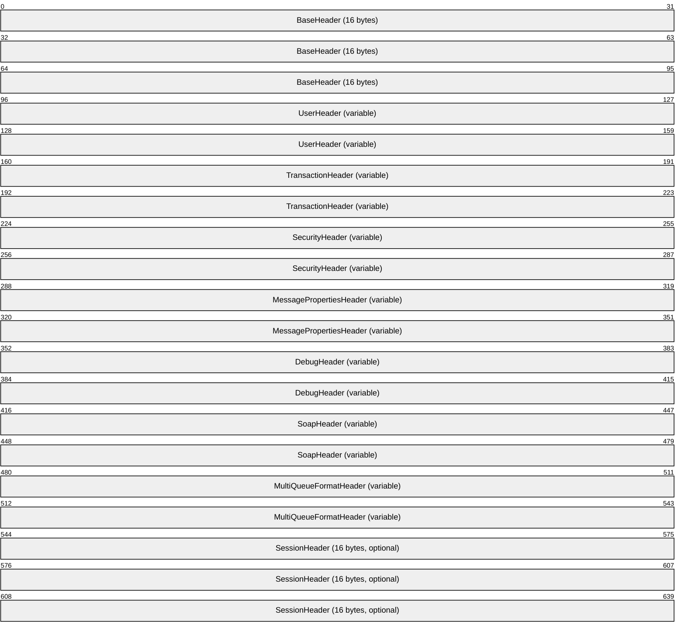

**BaseHeader (16 bytes):** A BaseHeader (section 2.2.19.1) packet that contains information to identify and manage protocol packets. The **BaseHeader.Flags.IN** field MUST NOT be set.

**UserHeader (variable):** A UserHeader (section 2.2.19.2) packet that contains source and destination [**queue**](#gt_queue) information.

**TransactionHeader (variable):** A TransactionHeader (section 2.2.20.5) packet that contains flags and sequence information for the packet. This header MUST be present when **UserHeader.Flags.TH** is set and MUST NOT be present if it is clear.

**SecurityHeader (variable):** A SecurityHeader (section 2.2.20.6) packet that contains security information. This header MUST be present when **UserHeader.Flags.SH** is set and MUST NOT be present if it is clear.

**MessagePropertiesHeader (variable):** A MessagePropertiesHeader (section 2.2.19.3) packet that contains property information about a UserMessage Packet and the application-defined message payload. This header MUST be present.

**DebugHeader (variable):** A DebugHeader (section 2.2.20.8) packet that specifies the queue to receive trace [**messages**](#gt_message) for this UserMessage Packet. This header specifies the queue where trace messages are sent. This header MUST be present if and only if **BaseHeader.Flags.DH** is set.

**SoapHeader (variable):** A SoapHeader (section 2.2.20.7) packet that contains application-defined information. This header MUST be present if and only if **UserHeader.Flags.HH** is set.

**MultiQueueFormatHeader (variable):** A MultiQueueFormatHeader (section 2.2.20.1) packet that is included when a message is destined for multiple queues. This header MUST be present if and only if **UserHeader.Flags.MQ** is set.

**SessionHeader (16 bytes):** A SessionHeader (section 2.2.20.4) packet that is used to acknowledge express and recoverable UserMessage Packets received by the [**message transfer protocols**](#gt_message-transfer-protocol). This header MUST be present if and only if **BaseHeader.Flags.SH** is set.

<a id="Section_2.2.20.1"></a>
#### 2.2.20.1 MultiQueueFormatHeader

The optional MultiQueueFormatHeader is used when a [**message**](#gt_message) is destined for multiple [**queues**](#gt_queue).<9> When an application-layer message is sent using a multiple-element [**format name**](#gt_format-name), this header is added to the packet to list the destinations. The sending [**queue manager**](#gt_queue-manager-qm) creates a separate [UserMessage Packet](#Section_2.2.20) for each destination and specifies the packet address in the [UserHeader](#Section_2.2.19.2). The information in this header provides a list of all destinations that were sent the message in addition to associated administration and response queues.

```mermaid
packet-beta
  0-63: "Destination (variable)"
  64-127: "Administration (variable)"
  128-191: "Response (variable)"
  192-255: "Signature (variable)"
```

**Destination (variable):** An [MQFAddressHeader](#Section_2.2.20.2) that specifies the name of one or more destination queues. This field MUST contain the list of all queues that were sent a copy of this UserMessage Packet. The end of this field is rounded up to the next 4-byte boundary. There are no restrictions on the value of the padding bytes.<10>

**Administration (variable):** An MQFAddressHeader that specifies the name of one or more [**administration queues**](#gt_administration-queue) that can receive positive and negative acknowledgement messages. The end of this field is rounded up to the next 4-byte boundary. There are no restrictions on the value of the padding bytes.<11>

**Response (variable):** An MQFAddressHeader that specifies the name of one or more response queues that can receive response messages from the receivers at the destinations. The end of this field is rounded up to the next 4-byte boundary. There are no restrictions on the value of the padding bytes.<12>

**Signature (variable):** An [MQFSignatureHeader](#Section_2.2.20.3) that specifies a signature for the packet.

<a id="Section_2.2.20.2"></a>
#### 2.2.20.2 MQFAddressHeader

The MQFAddressHeader is used to specify multiple destination [**queue**](#gt_queue) [**format names**](#gt_format-name).

```mermaid
packet-beta
  0-31: "HeaderSize"
  32-47: "HeaderID"
  48-63: "Reserved"
  64-95: "ElementCount"
  96-159: "FormatNameList (variable)"
```

**HeaderSize (4 bytes):** A 32-bit unsigned integer that specifies the size of the header. This value MUST contain the size, in bytes, of this header including the variable data. This field has a valid range between 0x0000000C and the size limit imposed by the value of **BaseHeader.PacketSize**.

**HeaderID (2 bytes):** A 16-bit unsigned integer that specifies an identifier for this header. This field MUST be set to one of the following values based on the header designation:

| Value | Meaning |
| --- | --- |
| 0x0064 | Destination |
| 0x00C8 | Admin |
| 0x012C | Response |
| 0x015E | Signature |

**Reserved (2 bytes):** A 16-bit unsigned integer field that is reserved for alignment. The sender SHOULD set this field to 0x0000, and the receiver MUST ignore it on receipt.

**ElementCount (4 bytes):** A 32-bit unsigned integer field that MUST be set to the number of elements in the **FormatNameList** field. This field has a valid range between 0x00000000 and the size limit imposed by the value of BaseHeader.PacketSize.

**FormatNameList (variable):** An [MQFFormatNameElement](#Section_2.2.18.1.4) that contains a list of queue format names. This field MUST contain a list of MQFFormatNameElement data structures. The array MUST contain the number of elements specified by the **ElementCount** field. The end of this field is rounded up to the next 4-byte boundary. Padding bytes in this field MAY be any value.<13>

<a id="Section_2.2.20.3"></a>
#### 2.2.20.3 MQFSignatureHeader

The MQFSignatureHeader is a signature used in the [MultiQueueFormatHeader](#Section_2.2.20.1).

```mermaid
packet-beta
  0-15: "ID"
  16-31: "Reserved"
  32-63: "Size"
  64-127: "Signature (variable)"
```

**ID (2 bytes):** A 16-bit unsigned short integer value that MUST be set to 0x015E.

**Reserved (2 bytes):** A 16-bit unsigned short integer field that is reserved for alignment. The sender SHOULD set this field to 0x0000, and the receiver MUST ignore it on receipt.

**Size (4 bytes):** A 32-bit unsigned integer field that MUST be set to the size, in **bytes**, of the **byte** array to hold the **Signature**. This field has a valid range between 0x00000000 and the size limit imposed by the value of **BaseHeader.PacketSize**.

**Signature (variable):** A **byte** array that contains the signature. The array MUST contain the number of elements that are specified by the **Size** field. The **Signature** MUST be calculated in the same way as the **SecurityData.Signature** as specified in section [2.2.20.6](#Section_2.2.20.6).

<a id="Section_2.2.20.4"></a>
#### 2.2.20.4 SessionHeader

The SessionHeader is used to acknowledge express and recoverable [UserMessage Packets](#Section_2.2.20) received by the [**message transfer protocols**](#gt_message-transfer-protocol). This header is present in stand-alone SessionAck Packet as defined in [MS-MQQB](../MS-MQQB/MS-MQQB.md) (section 2.2.6) and is optional in a UserMessage Packet.

This header contains a session acknowledgment. For more details, see [MS-MQQB] sections 3.1.1.7, and 3.1.1.6.1.

The set of UserMessage Packets sent on a session represent a [**message**](#gt_message) sequence. There is a local-to-remote and remote-to-local sequence. These message sequences exist for the lifetime of the session. The local and remote protocols MUST maintain counts of the UserMessage Packets sent and received. A message MUST be associated with a sequence number that corresponds to its position within the sequence. Sequence numbers MUST begin with 1 and MUST increment by 1 with each subsequent message. For example, the third message sent on a session has a sequence number of 3.

The protocols MUST also maintain a count of recoverable UserMessage Packets sent and associates recoverable sequence numbers with those messages. For example, the fifth recoverable message sent on a session has a sequence number of 5.

```mermaid
packet-beta
  0-15: "AckSequenceNumber"
  16-31: "RecoverableMsgAckSeqNumber"
  32-63: "RecoverableMsgAckFlags"
  64-79: "UserMsgSequenceNumber"
  80-95: "RecoverableMsgSeqNumber"
  96-111: "WindowSize"
  112-127: "Reserved"
```

**AckSequenceNumber (2 bytes):** A 16-bit unsigned integer that specifies a count of messages received. This field MUST be set to the count of UserMessage Packets received on this session. This field acknowledges all messages up to and including the specified sequence number. This field has a valid range from 0x0000 to 0xFFFF, inclusive.

**RecoverableMsgAckSeqNumber (2 bytes):** A 16-bit unsigned integer that specifies a recoverable message sequence number. This field MUST be set to the lowest unacknowledged recoverable message sequence number that has been persisted for reliable recovery. If no recoverable messages have been received by the receiver since the last SessionHeader was sent, this field MUST be set to 0. This field has a valid range from 0x0000 to 0xFFFF, inclusive.

**RecoverableMsgAckFlags (4 bytes):** A 32-bit unsigned integer bit field representing messages. This bit field represents up to 32 recoverable UserMessage Packets that are being acknowledged as written to disk. Bit 0 of this field represents the UserMessage Packet whose sequence number is specified in the **RecoverableMsgAckSeqNumber** field. A given bit k of this field represents a recoverable UserMessage Packet with a sequence number of **RecoverableMsgAckSeqNumber** + k. The corresponding bit for a UserMessage Packet that has been persisted for reliable recovery MUST be set in the bit field.

**UserMsgSequenceNumber (2 bytes):** A 16-bit unsigned integer that is the count of messages sent. This field SHOULD<14> be set to the count of UserMessage Packets sent on this session. When the **UserMsgSequenceNumber** is not set to the count of UserMessage Packets sent on a session, the user message is sent to the destination [**queue**](#gt_queue), and the session is closed by the receiver. This field has a valid range from 0x0000 to 0xFFFF, inclusive.

**RecoverableMsgSeqNumber (2 bytes):** A 16-bit unsigned integer that is the count of recoverable messages sent. This field MUST be set to the count of recoverable UserMessage Packets sent on this session. This value MUST be 0 if no recoverable UserMessage Packets have been sent. This field has a valid range from 0x0000 to 0xFFFF, inclusive.

**WindowSize (2 bytes):** A 16-bit unsigned integer field that specifies the acknowledgment window size. The window size controls the frequency at which the message transfer protocols send acknowledgment packets.<15> The value of this field SHOULD be set to 0x0040.<16> This field has a valid range from 0x0001 to 0xFFFF, inclusive.<17>

**Reserved (2 bytes):** Reserved. Can be set to any arbitrary value when sent and MUST be ignored on receipt.

<a id="Section_2.2.20.5"></a>
#### 2.2.20.5 TransactionHeader

The TransactionHeader packet contains sequence information for a [**transactional message**](#gt_transactional-message). The presence of this packet in a [UserMessage Packet](#Section_2.2.20) indicates that the message contained in the packet is transactional.

```mermaid
packet-beta
  0-31: "Flags"
  32-95: "TxSequenceID"
  96-127: "TxSequenceNumber"
  128-159: "PreviousTxSequenceNumber"
  160-255: "ConnectorQMGuid (16 bytes, optional)"
```

**Flags (4 bytes):** A 32-bit unsigned integer that contains a set of options that provide additional information about the packet. Any combination of these values is acceptable unless otherwise noted in the following table.

Any value not specified in the table MUST be treated as an error by closing the session.

The value SHOULD be set to a combination of the following values.<18>

```mermaid
packet-beta
  0-0: "A"
  1-1: "B"
  2-2: "C"
  3-3: "D"
  4-23: "ID"
  24-24: "E"
  25-25: "F"
  26-26: "G"
  27-27: "H"
  28-28: "I"
  29-29: "J"
  30-30: "K"
  31-31: "L"
```

**A - CG (1 bit):** A bit that specifies whether the **ConnectorQMGuid** field contains a connector [**queue manager**](#gt_queue-manager-qm) **GUID**. If set, the **ConnectorQMGuid** field MUST contain a **GUID**.

**B - FA (1 bit):** A bit that specifies whether a FinalAck Packet, as defined in [MS-MQQB](../MS-MQQB/MS-MQQB.md) section 2.2.5, is required. For more details see [MS-MQQB] section 3.1.7.2.2.

**C - FM (1 bit):** A bit that specifies whether the [**message**](#gt_message) is the first one sent within the context of a transaction. This bit MUST be set if the message is the first one in a transaction, otherwise it MUST be clear.

**D - LM (1 bit):** A bit that specifies whether the message is the last one sent within the context of a transaction. This bit MUST be set if the message is the last one in a transaction, otherwise it MUST be clear.

**ID (20 bits):** An array of 20 bits that specifies an identifier to correlate this packet to the transaction under which it was captured. The [**message transfer protocols**](#gt_message-transfer-protocol) MUST generate an identifier for the transaction and assign all packets captured under the transaction to the value. This identifier MUST be unique across all such identifiers generated by the sender queue manager.

**E - X1 (1 bit):** An unused bit field. This field SHOULD NOT be set when sent and MUST be ignored on receipt.

**F - X2 (1 bit):** An unused bit field. This field SHOULD NOT be set when sent and MUST be ignored on receipt.

**G - X3 (1 bit):** An unused bit field. This field SHOULD NOT be set when sent and MUST be ignored on receipt.

**H - X4 (1 bit):** An unused bit field. This field SHOULD NOT be set when sent and MUST be ignored on receipt.

**I - X5 (1 bit):** An unused bit field. This field SHOULD NOT be set when sent and MUST be ignored on receipt.

**J - X6 (1 bit):** An unused bit field. This field SHOULD NOT be set when sent and MUST be ignored on receipt.

**K - X7 (1 bit):** An unused bit field. This field SHOULD NOT be set when sent and MUST be ignored on receipt.

**L - X8 (1 bit):** An unused bit field. This field SHOULD NOT be set when sent and MUST be ignored on receipt.

**TxSequenceID (8 bytes):** A transactional sequence identifier, as specified in [TxSequenceID](#Section_2.2.18.1.2). This value identifies the transactional sequence that the **TxSequenceNumber** and **PreviousTxSequenceNumber** are within. For more details, see section 2.2.18.1.2.

**TxSequenceNumber (4 bytes):** A 32-bit unsigned integer that is the message sequence number within the **TxSequenceID** sequence. This field MUST be set to the value that represents the message position within the transactional sequence. The first message within a sequence MUST be set to the value 1. This field has a valid range from 0x00000001 to 0xFFFFFFFF.

**PreviousTxSequenceNumber (4 bytes):** A 32-bit unsigned integer that is the sequence number of the previous message in the **TxSequenceID** sequence. This field MUST be set to the sequence number of the message that precedes this message in the transactional sequence. This value MUST be set to 0x00000000 if there is no previous message. This field has a valid range from 0x00000000 to 0xFFFFFFFE.

**ConnectorQMGuid (16 bytes):** An optional field containing an application-defined **GUID**, as specified in [MS-DTYP](../MS-DTYP/MS-DTYP.md) section 2.3.4. If **Flags.CG** is set, this field MUST be present; otherwise, it MUST NOT. This field can be used by higher-layer messaging applications. The server MUST NOT process or interpret this field.

<a id="Section_2.2.20.6"></a>
#### 2.2.20.6 SecurityHeader

The optional SecurityHeader contains security information.

```mermaid
packet-beta
  0-15: "Flags"
  16-31: "SenderIdSize"
  32-47: "EncryptionKeySize"
  48-63: "SignatureSize"
  64-95: "SenderCertSize"
  96-127: "ProviderInfoSize"
  128-191: "SecurityData (variable)"
```

**Flags (2 bytes):** A 16-bit unsigned short integer that contains a set of options that provides additional information about the packet. Any combination of these values is acceptable unless otherwise noted in the following table.

```mermaid
packet-beta
  0-3: "ST"
  4-4: "A"
  5-5: "B"
  6-6: "C"
  7-7: "D"
  8-11: "AS"
  12-12: "E"
  13-13: "F"
  14-14: "G"
  15-15: "H"
```

**ST (4 bits):** Specifies the type of sender ID in the **SecurityData** field. This field MUST be set to one of the following values.

| Value | Meaning |
| --- | --- |
| 0x0 | The **SecurityData.SecurityID** field is not present and the **SenderIdSize** field MUST be set to 0x0000. |
| 0x1 | The **SecurityData.SecurityID** field MUST contain the sender application security identifier (**SID**). The **SID** layout is specified in [MS-DTYP](../MS-DTYP/MS-DTYP.md) section 2.4.2.2. The **SubAuthority** field of the **SID** packet is a variable-length array of unsigned 32-bit [**little-endian**](#gt_little-endian) integers. |
| 0x2 | The **SecurityData.SecurityID** field MUST contain the [**queue manager**](#gt_queue-manager-qm) **GUID**. |

**A - AU (1 bit):** Indicates whether the [**message**](#gt_message) is authenticated. This field MUST be set to 0.

**B - EB (1 bit):** Indicates whether the body of the message is encrypted. If set, the **MessagePropertiesHeader.MessageBody** field MUST be encrypted by the sender and decrypted by the receiver.

For details about encryption on the sender side, see [MS-MQQB](../MS-MQQB/MS-MQQB.md) section 3.1.7.1.5.

For details about decryption on the receiver side, see [MS-MQQB] section 3.1.5.8.3.

**C - DE (1 bit):** Indicates whether the default cryptographic provider is used.<19> When clear and **SignatureSize** is nonzero, the **SecurityData.ProviderName** MUST specify the name of the alternate provider.

**D - AI (1 bit):** Indicates whether the **SecurityData** field is present. If set, the header MUST include a **SecurityData** field.

**AS (4 bits):** Indicates the authentication signature type. This field MUST be set to 0.

**E - X12 (1 bit):** Unused bit field. This field SHOULD NOT be set when sent and MUST be ignored on receipt.

**F - X13 (1 bit):** Unused bit field. This field SHOULD NOT be set when sent and MUST be ignored on receipt.

**G - X14 (1 bit):** Unused bit field. This field SHOULD NOT be set when sent and MUST be ignored on receipt.

**H - X15 (1 bit):** Unused bit field. This field SHOULD NOT be set when sent and MUST be ignored on receipt.

**SenderIdSize (2 bytes):** A 16-bit unsigned integer that specifies the size of the **SecurityData.SecurityID** field. This value MUST be set to the size, in bytes, of the security identifier in the **SecurityData.SecurityID** field. This field has a valid range from 0x0000 to 0xFFFF, inclusive.

**EncryptionKeySize (2 bytes):** A 16-bit unsigned integer that specifies the size of the **SecurityData.EncryptionKey** field. This value MUST be set to the size, in bytes, of the encryption key in the **SecurityData.EncryptionKey** field. This field has a valid range from 0x0000 to 0xFFFF, inclusive.

**SignatureSize (2 bytes):** A 16-bit unsigned integer that specifies the size of the **SecurityData.Signature** field. This value MUST be set to the size, in bytes, of the sender signature in the **SecurityData.Signature** field. This field has a valid range from 0x0000 to 0xFFFF, inclusive.

**SenderCertSize (4 bytes):** A 32-bit unsigned integer that specifies the size of the **SecurityData.SenderCert** field. This value MUST be set to the size, in bytes, of the sender signature in the **SecurityData.SenderCert** field. This field has a valid range from 0x00000000 to a value 0x0000FFFF, inclusive.

**ProviderInfoSize (4 bytes):** A 32-bit unsigned integer that specifies the size of the **SecurityData.ProviderInfo** field. This value MUST be set to the size, in bytes, of the security provider information in the **SecurityData.ProviderInfo** field. This field has a valid range between 0x00000000 and the size limit imposed by the value of **BaseHeader.PacketSize**.

At least one of the fields SenderIdSize, EncryptionKeySize, SignatureSize, SenderCertSize, and ProviderInfoSize MUST be nonzero.

**SecurityData (variable):** An optional variable-length array of bytes containing additional security information. This field MUST contain the security information specified in the **Flags** field.

The data appears in the order specified below. Each field MUST be aligned up to the next 4-byte boundary. The size of each field is specified by the corresponding **SenderIdSize**, **EncryptionKeySize**, **SignatureSize**, **SenderCertSize**, and **ProviderInfoSize** fields. An item with a size of zero occupies no space in the **SecurityData** array.

```mermaid
packet-beta
  0-63: "SecurityID (variable)"
  64-127: "EncryptionKey (variable)"
  128-191: "Signature (variable)"
  192-255: "SenderCert (variable)"
  256-319: "ProviderInfo (variable)"
```

**SecurityID (variable):** Contains the sender SID or the sending queue manager GUID. This field MUST be set to the queue manager **GUID** when the packet is sent and signed by the queue manager.

**EncryptionKey (variable):** Sender symmetrical encryption key.

**Signature (variable):** The packet digital signature. The type of signature is specified by the MSMQ version as described in the following table and the hash algorithm is specified by the **MessagePropertiesHeader.HashAlgorithm** field.

| MSMQ Version | Signature Type |
| --- | --- |
| MSMQ 1.0 | The **SecurityData.Signature** field is an [**MSMQ 1.0 digital signature**](#gt_msmq-10-digital-signature). If the **SecurityData.Flags.ST** field is set to 1, the **SecurityData.SecurityID** field MUST contain the sender application security identifier. If the **SecurityData.Flags.ST** field is set to 2, it specifies that the message is signed with Sender ID as the **Signature**. If set, the **SecurityData.SecurityID** field MUST contain the queue manager [**GUID**](#gt_globally-unique-identifier-guid). The signature MUST be a hash of the MSMQ 1.0 Digital Signature Properties (section [2.5.1)](#Section_7f314bac96334b9fbb4497c9f08b7ac9). |
| MSMQ 2.0 | The **SecurityData.Signature** field is an [**MSMQ 2.0 digital signature**](#gt_msmq-20-digital-signature). The signature MUST be a hash of the MSMQ 2.0 Digital Signature Properties (section [2.5.2)](#Section_b2b71e89d3e548a2a7d6f70c2e4c33a0). |
| MSMQ 3.0, MSMQ 4.0, MSMQ 5.0, or MSMQ 6.0 | The **SecurityData.Signature** field is an [**MSMQ 3.0 digital signature**](#gt_msmq-30-digital-signature). The signature MUST be a hash of the MSMQ 3.0 Digital Signature Properties (section [2.5.3)](#Section_9c671883c4954af4811a2ad26346049f). |

The hash algorithm that is used to compute the **SecurityData.Signature** field is specified by the **MessagePropertiesHeader.HashAlgorithm** field.

For details about signature and hash computations on the sender side, see [MS-MQQB] section 3.1.7.1.4.

For details about authentication on the receiver side, see [MS-MQQB] section 3.1.5.8.3.

**SenderCert (variable):** Sender X.509 digital certificate. Details are as specified in [[RFC3280]](https://go.microsoft.com/fwlink/?LinkId=90414). The public key that is contained in the certificate has the following structure.

```mermaid
packet-beta
  0-7: "0x06"
  8-15: "0x02"
  16-23: "0x00"
  24-55: "Key Type"
  56-63: "0x52"
  64-71: "0x53"
  72-79: "0x41"
  80-87: "0x31"
  88-119: "Length in bits"
  120-151: "Public Exponent"
  152-191: "Modulus (variable)"
```

**Key Type (4 bytes):** This MUST be set to 0x00002400 for RSA signing keys and 0x0000A400 for RSA encryption keys.

**Length in bits (4 bytes):** This 32-bit unsigned number MUST be the length of the RSA modulus. It MUST contain the length, in bits, of the Modulus field.

**Public Exponent (4 bytes):** This MUST be a 32-bit unsigned integer. It MUST be the public exponent of the RSA key pair, referred to as e in [[RFC8017]](https://go.microsoft.com/fwlink/?linkid=2164409) section 2.

**Modulus (variable):** This MUST be the RSA modulus, referred to as defined in [RFC8017] section 2. This field MUST be a multiple of 8 bits in length and MUST append padding bits needed to ensure this requirement. Padding bits MUST be set to zero. The public key SHOULD<20> be stored in the directory.

**ProviderInfo (variable):** Contains the information of the alternative provider used to produce the signature.<21> If the Flags.DE bit is clear and the **ProviderInfoSize** is nonzero, this field MUST be set; otherwise it MUST NOT be included in the **SecurityData** field. The layout of this field is as follows.<22>

```mermaid
packet-beta
  0-31: "ProviderType"
  32-95: "ProviderName (variable)"
```

**ProviderType (4 bytes):** A 32-bit unsigned integer that indicates the type of the alternative provider used to produce the signature.

**ProviderName (variable):** A null-terminated [**Unicode**](#gt_unicode) string that contains the name of the alternative provider used to produce the signature.

<a id="Section_2.2.20.7"></a>
#### 2.2.20.7 SoapHeader

The optional SoapHeader packet contains application-defined information.

```mermaid
packet-beta
  0-15: "HeaderSectionID"
  16-31: "Reserved"
  32-63: "HeaderDataLength"
  64-127: "Header (variable)"
  128-143: "BodySectionID"
  144-159: "Reserved1"
  160-191: "BodyDataLength"
  192-255: "Body (variable)"
```

**HeaderSectionID (2 bytes):** A 16-bit unsigned short integer field that MUST be set to 0x0320.

**Reserved (2 bytes):** A 16-bit unsigned integer field that is reserved for future use. The sender SHOULD set this field to 0x0000, and the receiver MUST ignore it on receipt.

**HeaderDataLength (4 bytes):** A 32-bit unsigned integer that specifies the length of the **Header** field. This field MUST be set to the number of elements in the [**Unicode**](#gt_unicode) **Header** field, including the terminating null character. This field has a valid range between 0x00000000 and the size limit imposed by the value of BaseHeader.PacketSize.

**Header (variable):** A null-terminated Unicode string. This field contains an application-defined string.

**BodySectionID (2 bytes):** A 16-bit unsigned short integer that MUST be set to 0x0384.

**Reserved1 (2 bytes):** A 16-bit unsigned short integer field reserved for future use. The sender SHOULD set this field to 0x0000, and the receiver MUST ignore it on receipt.

**BodyDataLength (4 bytes):** A 32-bit unsigned integer that specifies the length of the **Body** field. This field MUST be set to the number of elements in the Unicode **Body** field, including the terminating null character. This field has a valid range between 0x00000000 and the size limit imposed by the value of BaseHeader.PacketSize.

**Body (variable):** A null-terminated Unicode string. This field contains an application-defined string.

<a id="Section_2.2.20.8"></a>
#### 2.2.20.8 DebugHeader

The DebugHeader specifies the [**queue**](#gt_queue) to receive trace [**messages**](#gt_message) for this [UserMessage Packet](#Section_2.2.20). For details about how this header is used when tracing is enabled<23> see [MS-MQQB](../MS-MQQB/MS-MQQB.md) section 3.1.5.8.9.

```mermaid
packet-beta
  0-15: "Flags"
  16-31: "Reserved"
  32-127: "QueueIdentifier (16 bytes, optional)"
```

**Flags (2 bytes):** A 16-bit unsigned short integer field that provides bit flags containing additional information about the packet.

```mermaid
packet-beta
  0-1: "QT"
  2-2: "A"
  3-3: "B"
  4-4: "C"
  5-5: "D"
  6-6: "E"
  7-7: "F"
  8-8: "G"
  9-9: "H"
  10-10: "I"
  11-11: "J"
  12-12: "K"
  13-13: "L"
  14-14: "M"
  15-15: "N"
```

**QT (2 bits):** Specifies the queue type. This field MUST be set to one of the following values.

| Value | Meaning |
| --- | --- |
| 0x0 | No queue. The **QueueIdentifier** field is not present. |
| 0x1 | [**Public queue**](#gt_public-queue). The **QueueIdentifier** field contains a 16-byte queue **GUID**, as specified in [MS-DTYP](../MS-DTYP/MS-DTYP.md) section 2.3.4. |

**A - X2 (1 bit):** Unused bit field. This field SHOULD NOT be set when sent and MUST be ignored on receipt.

**B - X3 (1 bit):** Unused bit field. This field SHOULD NOT be set when sent and MUST be ignored on receipt.

**C - X4 (1 bit):** Unused bit field. This field SHOULD NOT be set when sent and MUST be ignored on receipt.

**D - X5 (1 bit):** Unused bit field. This field SHOULD NOT be set when sent and MUST be ignored on receipt.

**E - X6 (1 bit):** Unused bit field. This field SHOULD NOT be set when sent and MUST be ignored on receipt.

**F - X7 (1 bit):** Unused bit field. This field SHOULD NOT be set when sent and MUST be ignored on receipt.

**G - X8 (1 bit):** Unused bit field. This field SHOULD NOT be set when sent and MUST be ignored on receipt.

**H - X9 (1 bit):** Unused bit field. This field SHOULD NOT be set when sent and MUST be ignored on receipt.

**I - X10 (1 bit):** Unused bit field. This field SHOULD NOT be set when sent and MUST be ignored on receipt.

**J - X11 (1 bit):** Unused bit field. This field SHOULD NOT be set when sent and MUST be ignored on receipt.

**K - X12 (1 bit):** Unused bit field. This field SHOULD NOT be set when sent and MUST be ignored on receipt.

**L - X13 (1 bit):** Unused bit field. This field SHOULD NOT be set when sent and MUST be ignored on receipt.

**M - X14 (1 bit):** Unused bit field. This field SHOULD NOT be set when sent and MUST be ignored on receipt.

**N - X15 (1 bit):** Unused bit field. This field SHOULD NOT be set when sent and MUST be ignored on receipt.

**Reserved (2 bytes):** A 16-bit unsigned integer field that is reserved for future use. The sender SHOULD set this field to 0x0000, and the receiver MUST ignore it on receipt.

**QueueIdentifier (16 bytes):** An optional field that contains a **GUID**, as specified in [MS-DTYP] section 2.3.4, which is the identifier of the queue that is used to store trace messages. This field MUST be present when **DebugHeader.Flags.QT** is set to 0x1; otherwise, it MUST NOT be present.

<a id="Section_2.2.21"></a>
### 2.2.21 MQUSERSIGNCERTS

The MQUSERSIGNCERTS structure defines a format for packing multiple [MQUSERSIGNCERT](#Section_2.2.22) structures into a single [BLOB (section 2.2.15)](#Section_2.2.15).

```mermaid
packet-beta
  0-31: "CertificateCount"
  32-95: "Certificates (variable)"
```

**CertificateCount (4 bytes):** A 32-bit unsigned integer that contains the count of MQUSERSIGNCERT structures in the **Certificates** field.

**Certificates (variable):** A variable-length array of bytes that contains MQUSERSIGNCERT structures.

<a id="Section_2.2.22"></a>
### 2.2.22 MQUSERSIGNCERT

The MQUSERSIGNCERT structure defines one public key certificate stored in the user's signing certificate list ([MQUSERSIGNCERTS (section 2.2.21)](#Section_2.2.21)).

```mermaid
packet-beta
  0-95: "Digest (16 bytes)"
  96-191: "Identifier (16 bytes)"
  192-223: "CertificateLength"
  224-287: "Certificate (variable)"
```

**Digest (16 bytes):** A 16-byte value that is computed as the MD5 hash of the user's X.509 certificate contained in the **Certificate** field, as defined in [[RFC1321]](https://go.microsoft.com/fwlink/?LinkId=90275).

**Identifier (16 bytes):** A **GUID**, as specified in [MS-DTYP](../MS-DTYP/MS-DTYP.md) section 2.3.4, that identifies the certificate contained in the **Certificate** field. It is generated by the entity that registers the certificate.

**CertificateLength (4 bytes):** A 32-bit unsigned integer that contains the size, in bytes, of the **Certificate** field.

**Certificate (variable):** A variable length array of bytes that contains an X.509-encoded certificate as defined in [[RFC3280]](https://go.microsoft.com/fwlink/?LinkId=90414).

<a id="Section_2.2.23"></a>
### 2.2.23 MQQMACCESSMASK

The MQQMACCESSMASK bitfield enumeration values can be used to set the value of an **ACCESS_MASK** structure ([MS-DTYP](../MS-DTYP/MS-DTYP.md) section 2.4.3), which is used to constrain the permissions for a [**Queue Manager**](#gt_queue-manager-qm).

typedef enum

{

MQSEC_DELETE_DEADLETTER_MESSAGE = 0x00000001,

MQSEC_PEEK_DEADLETTER_MESSAGE = 0x00000002,

MQSEC_CREATE_QUEUE = 0x00000004,

MQSEC_SET_MACHINE_PROPERTIES = 0x00000010,

MQSEC_GET_MACHINE_PROPERTIES = 0x00000020,

MQSEC_DELETE_JOURNAL_QUEUE_MESSAGE = 0x00000040,

MQSEC_PEEK_JOURNAL_QUEUE_MESSAGE = 0x00000080,

MQSEC_DELETE_MACHINE = 0x00010000,

MQSEC_GET_MACHINE_PERMISSIONS = 0x00020000,

MQSEC_CHANGE_MACHINE_PERMISSIONS = 0x00040000,

MQSEC_TAKE_MACHINE_OWNERSHIP = 0x00080000,

MQSEC_RECEIVE_DEADLETTER_MESSAGE = (MQSEC_DELETE_DEADLETTER_MESSAGE + MQSEC_PEEK_DEADLETTER_MESSAGE),

MQSEC_RECEIVE_JOURNAL_QUEUE_MESSAGE = (MQSEC_DELETE_JOURNAL_QUEUE_MESSAGE + MQSEC_PEEK_JOURNAL_QUEUE_MESSAGE),

MQSEC_MACHINE_GENERIC_READ = (MQSEC_GET_MACHINE_PROPERTIES + MQSEC_GET_MACHINE_PERMISSIONS + MQSEC_RECEIVE_DEADLETTER_MESSAGE + MQSEC_RECEIVE_JOURNAL_QUEUE_MESSAGE),

MQSEC_MACHINE_GENERIC_WRITE = (MQSEC_GET_MACHINE_PROPERTIES + MQSEC_GET_MACHINE_PERMISSIONS + MQSEC_CREATE_QUEUE),

MQSEC_MACHINE_GENERIC_ALL = (MQSEC_RECEIVE_DEADLETTER_MESSAGE + MQSEC_RECEIVE_JOURNAL_QUEUE_MESSAGE + MQSEC_CREATE_QUEUE + MQSEC_SET_MACHINE_PROPERTIES + MQSEC_GET_MACHINE_PROPERTIES + MQSEC_DELETE_MACHINE + MQSEC_GET_MACHINE_PERMISSIONS + MQSEC_CHANGE_MACHINE_PERMISSIONS + MQSEC_TAKE_MACHINE_OWNERSHIP),

MQSEC_MACHINE_WORLD_RIGHTS = (MQSEC_GET_MACHINE_PROPERTIES + MQSEC_GET_MACHINE_PERMISSIONS)

} MQQMACCESSMASK;

**MQSEC_DELETE_DEADLETTER_MESSAGE:** Specifies the permission required by a security principal to delete [**messages**](#gt_message) from the system [**dead-letter queue**](#gt_dead-letter-queue).

**MQSEC_PEEK_DEADLETTER_MESSAGE:** Specifies the permission required by a security principal to peek messages from the system dead-letter queue.

**MQSEC_CREATE_QUEUE:** Specifies the permission required by a security principal to create a new [**queue**](#gt_queue).

**MQSEC_SET_MACHINE_PROPERTIES:** Specifies the permission required by a security principal to change the properties of the queue manager.

**MQSEC_GET_MACHINE_PROPERTIES:** Specifies the permission required by a security principal to read the properties of the queue manager.

**MQSEC_DELETE_JOURNAL_QUEUE_MESSAGE:** Specifies the permission required by a security principal to delete a message from the system [**queue journal**](#gt_queue-journal).

**MQSEC_PEEK_JOURNAL_QUEUE_MESSAGE:** Specifies the permission required by a security principal to peek a message from the system queue journal.

**MQSEC_DELETE_MACHINE:** Specifies the permission required by a security principal to delete the queue manager.

**MQSEC_GET_MACHINE_PERMISSIONS:** Specifies the permission required by a security principal to get the security descriptor of the queue manager.

**MQSEC_CHANGE_MACHINE_PERMISSIONS:** Specifies the permission required by a security principal to set or modify the security descriptor of the queue manager.

**MQSEC_TAKE_MACHINE_OWNERSHIP:** Specifies the permission required by a security principal to change the owner of the queue manager.

**MQSEC_RECEIVE_DEADLETTER_MESSAGE:** Specifies the permission required by a security principal to destructively read a message from the system dead-letter queue.

**MQSEC_RECEIVE_JOURNAL_QUEUE_MESSAGE:** Specifies the permission required by a security principal to destructively read a message from the system queue journal.

**MQSEC_MACHINE_GENERIC_READ:** Specifies the permission required by a security principal to read the queue manager properties, read the queue manager permissions, and destructively read a message from the system dead-letter or system queue journal.

**MQSEC_MACHINE_GENERIC_WRITE:** Specifies the permission required by a security principal to read the queue manager properties, read the queue manager permissions, and create new queues.

**MQSEC_MACHINE_GENERIC_ALL:** Specifies the permission required by a security principal to perform all of the operations listed previously.

**MQSEC_MACHINE_WORLD_RIGHTS:** Specifies the permission required by a security principal to get queue manager properties or permissions.

<a id="Section_2.2.24"></a>
### 2.2.24 MQQUEUEACCESSMASK

The MQQUEUEACCESSMASK bitfield enumeration values can be used to set the value of an **ACCESS_MASK** structure ([MS-DTYP](../MS-DTYP/MS-DTYP.md) section 2.4.3), which is used to constrain the permissions for a Queue.

typedef enum

{

MQSEC_DELETE_MESSAGE = 0x00000001,

MQSEC_PEEK_MESSAGE = 0x00000002,

MQSEC_WRITE_MESSAGE = 0x00000004,

MQSEC_DELETE_JOURNAL_MESSAGE = 0x00000008,

MQSEC_SET_QUEUE_PROPERTIES = 0x00000010,

MQSEC_GET_QUEUE_PROPERTIES = 0x00000020,

MQSEC_DELETE_QUEUE = 0x00010000,

MQSEC_GET_QUEUE_PERMISSIONS = 0x00020000,

MQSEC_CHANGE_QUEUE_PERMISSIONS = 0x00040000,

MQSEC_TAKE_QUEUE_OWNERSHIP = 0x00080000,

MQSEC_RECEIVE_MESSAGE = (MQSEC_DELETE_MESSAGE | MQSEC_PEEK_MESSAGE),

MQSEC_RECEIVE_JOURNAL_MESSAGE = (MQSEC_DELETE_JOURNAL_MESSAGE | MQSEC_PEEK_MESSAGE),

MQSEC_QUEUE_GENERIC_READ = (MQSEC_GET_QUEUE_PROPERTIES | MQSEC_GET_QUEUE_PERMISSIONS | MQSEC_RECEIVE_MESSAGE | MQSEC_RECEIVE_JOURNAL_MESSAGE),

MQSEC_QUEUE_GENERIC_WRITE = (MQSEC_GET_QUEUE_PROPERTIES | MQSEC_GET_QUEUE_PERMISSIONS | MQSEC_WRITE_MESSAGE),

MQSEC_QUEUE_GENERIC_ALL = (MQSEC_RECEIVE_MESSAGE | MQSEC_RECEIVE_JOURNAL_MESSAGE | MQSEC_WRITE_MESSAGE | MQSEC_SET_QUEUE_PROPERTIES | MQSEC_GET_QUEUE_PROPERTIES | MQSEC_DELETE_QUEUE | MQSEC_GET_QUEUE_PERMISSIONS | MQSEC_CHANGE_QUEUE_PERMISSIONS | MQSEC_TAKE_QUEUE_OWNERSHIP)

} MQQUEUEACCESSMASK;

**MQSEC_DELETE_MESSAGE:** Specifies the permission required by a security principal to delete [**messages**](#gt_message) from the [**queue**](#gt_queue).

**MQSEC_PEEK_MESSAGE:** Specifies the permission required by a security principal to peek messages from the queue.

**MQSEC_WRITE_MESSAGE:** Specifies the permission required by a security principal to insert messages into the queue.

**MQSEC_DELETE_JOURNAL_MESSAGE:** Specifies the permission required by a security principal to delete messages from the [**queue journal**](#gt_queue-journal) associated with the queue.

**MQSEC_SET_QUEUE_PROPERTIES:** Specifies the permission required by a security principal to modify the properties of the queue.

**MQSEC_GET_QUEUE_PROPERTIES:** Specifies the permission required by a security principal to read the properties of the queue.

**MQSEC_DELETE_QUEUE:** Specifies the permission required by a security principal to delete a queue.

**MQSEC_GET_QUEUE_PERMISSIONS:** Specifies the permission required by a security principal to read the permissions for the queue.

**MQSEC_CHANGE_QUEUE_PERMISSIONS:** Specifies the permission required by a security principal to modify the permissions for the queue.

**MQSEC_TAKE_QUEUE_OWNERSHIP:** Specifies the permission required by a security principal to change the owner for the queue.

**MQSEC_RECEIVE_MESSAGE:** Specifies the permission required by a security principal to destructively read a message from the queue.

**MQSEC_RECEIVE_JOURNAL_MESSAGE:** Specifies the permission required by a security principal to destructively read a message from the queue journal associated with the queue.

**MQSEC_QUEUE_GENERIC_READ:** Specifies the permission required by a security principal to read the queue properties, read the queue permissions, and destructively receive messages from the queue or the associated queue journal.

**MQSEC_QUEUE_GENERIC_WRITE:** Specifies the permission required by a security principal to read the queue properties, read the queue permissions, and insert messages into the queue.

**MQSEC_QUEUE_GENERIC_ALL:** Specifies the permission required by a security principal to perform all of the operations listed previously.

<a id="Section_2.2.25"></a>
### 2.2.25 MQSITEACCESSMASK

The MQSITEACCESSMASK bitfield enumeration values can be used to set the value of an **ACCESS_MASK** structure ([MS-DTYP](../MS-DTYP/MS-DTYP.md) section 2.4.3), which is used to constrain the permissions for a Site.

typedef enum

{

MQSEC_CREATE_FRS = 0x00000001,

MQSEC_CREATE_BSC = 0x00000002,

MQSEC_CREATE_MACHINE = 0x00000004,

MQSEC_SET_SITE_PROPERTIES = 0x00000010,

MQSEC_GET_SITE_PROPERTIES = 0x00000020,

MQSEC_DELETE_SITE = 0x00010000,

MQSEC_GET_SITE_PERMISSIONS = 0x00020000,

MQSEC_CHANGE_SITE_PERMISSIONS = 0x00040000,

MQSEC_TAKE_SITE_OWNERSHIP = 0x00080000,

MQSEC_SITE_GENERIC_READ = (MQSEC_GET_SITE_PROPERTIES + MQSEC_GET_SITE_PERMISSIONS),

MQSEC_SITE_GENERIC_WRITE = (MQSEC_GET_SITE_PROPERTIES + MQSEC_GET_SITE_PERMISSIONS + MQSEC_CREATE_MACHINE),

MQSEC_SITE_GENERIC_ALL = (MQSEC_CREATE_FRS + MQSEC_CREATE_BSC + MQSEC_CREATE_MACHINE + MQSEC_SET_SITE_PROPERTIES + MQSEC_GET_SITE_PROPERTIES + MQSEC_DELETE_SITE + MQSEC_GET_SITE_PERMISSIONS + MQSEC_CHANGE_SITE_PERMISSIONS + MQSEC_TAKE_SITE_OWNERSHIP)

} MQSITEACCESSMASK;

**MQSEC_CREATE_FRS:** Specifies the permission required by a security principal to add a routing server to the site.

**MQSEC_CREATE_BSC:** Specifies the permission required by a security principal to create a [**Backup Site Controller (BSC)**](#gt_backup-site-controller-bsc) for the site.

**MQSEC_CREATE_MACHINE:** Specifies the permission required by a security principal to add a [**queue manager**](#gt_queue-manager-qm) to the site.

**MQSEC_SET_SITE_PROPERTIES:** Specifies the permission required by a security principal to modify properties of the site.

**MQSEC_GET_SITE_PROPERTIES:** Specifies the permission required by a security principal to read properties of the site.

**MQSEC_DELETE_SITE:** Specifies the permission required by a security principal to delete the site.

**MQSEC_GET_SITE_PERMISSIONS:** Specifies the permission required by a security principal to read permissions for the site.

**MQSEC_CHANGE_SITE_PERMISSIONS:** Specifies the permission required by a security principal to modify permissions for the site.

**MQSEC_TAKE_SITE_OWNERSHIP:** Specifies the permission required by a security principal to modify the owner of the site.

**MQSEC_SITE_GENERIC_READ:** Specifies the permission required by a security principal to read the properties and permissions for the site.

**MQSEC_SITE_GENERIC_WRITE:** Specifies the permission required by a security principal to read properties, read permissions, and add queue managers to the site.

**MQSEC_SITE_GENERIC_ALL:** Specifies the permission required by a security principal to perform all of the operations listed previously.

<a id="Section_2.2.26"></a>
### 2.2.26 MQENTACCESSMASK

The MQENTACCESSMASK bitfield enumeration values can be used to set the value of an **ACCESS_MASK** structure ([MS-DTYP](../MS-DTYP/MS-DTYP.md) section 2.4.3), which is used to constrain the permissions for an Enterprise.

typedef enum

{

MQSEC_CREATE_USER = 0x00000001,

MQSEC_CREATE_SITE = 0x00000002,

MQSEC_CREATE_CN = 0x00000004,

MQSEC_SET_ENTERPRISE_PROPERTIES = 0x00000010,

MQSEC_GET_ENTERPRISE_PROPERTIES = 0x00000020,

MQSEC_DELETE_ENTERPRISE = 0x00010000,

MQSEC_GET_ENTERPRISE_PERMISSIONS = 0x00020000,

MQSEC_CHANGE_ENTERPRISE_PERMISSIONS = 0x00040000,

MQSEC_TAKE_ENTERPRISE_OWNERSHIP = 0x00080000,

MQSEC_ENTERPRISE_GENERIC_READ = (MQSEC_CREATE_USER + MQSEC_GET_ENTERPRISE_PROPERTIES + MQSEC_GET_ENTERPRISE_PERMISSIONS),

MQSEC_ENTERPRISE_GENERIC_WRITE = (MQSEC_CREATE_USER + MQSEC_GET_ENTERPRISE_PROPERTIES + MQSEC_GET_ENTERPRISE_PERMISSIONS + MQSEC_CREATE_SITE + MQSEC_CREATE_CN),

MQSEC_ENTERPRISE_GENERIC_ALL = (MQSEC_CREATE_USER + MQSEC_CREATE_CN + MQSEC_CREATE_SITE + MQSEC_SET_ENTERPRISE_PROPERTIES + MQSEC_GET_ENTERPRISE_PROPERTIES + MQSEC_DELETE_ENTERPRISE + MQSEC_GET_ENTERPRISE_PERMISSIONS + MQSEC_CHANGE_ENTERPRISE_PERMISSIONS + MQSEC_TAKE_ENTERPRISE_OWNERSHIP)

} MQENTACCESSMASK;

**MQSEC_CREATE_USER:** Specifies the permission required by a security principal to add a user to the enterprise.

**MQSEC_CREATE_SITE:** Specifies the permission required by a security principal to create a site in the enterprise.

**MQSEC_CREATE_CN:** Specifies the permission required by a security principal to create a connected network in the enterprise.

**MQSEC_SET_ENTERPRISE_PROPERTIES:** Specifies the permission required by a security principal to modify properties of the enterprise.

**MQSEC_GET_ENTERPRISE_PROPERTIES:** Specifies the permission required by a security principal to read properties of the enterprise.

**MQSEC_DELETE_ENTERPRISE:** Specifies the permission required by a security principal to delete the enterprise.

**MQSEC_GET_ENTERPRISE_PERMISSIONS:** Specifies the permission required by a security principal to read permissions for the enterprise.

**MQSEC_CHANGE_ENTERPRISE_PERMISSIONS:** Specifies the permission required by a security principal to modify permissions for the enterprise.

**MQSEC_TAKE_ENTERPRISE_OWNERSHIP:** Specifies the permission required by a security principal to modify the owner of the enterprise.

**MQSEC_ENTERPRISE_GENERIC_READ:** Specifies the permission required by a security principal to read the properties and permissions for the enterprise, and create users.

**MQSEC_ENTERPRISE_GENERIC_WRITE:** Specifies the permission required by a security principal to read properties and permissions, and to add users, connected networks, and sites to the enterprise.

**MQSEC_ENTERPRISE_GENERIC_ALL:** Specifies the permission required by a security principal to perform all of the operations listed previously.

<a id="Section_2.2.27"></a>
### 2.2.27 MQCNACCESSMASK

The MQCNACCESSMASK bitfield enumeration values can be used to set the value of an **ACCESS_MASK** structure ([MS-DTYP](../MS-DTYP/MS-DTYP.md) section 2.4.3), which is used to constrain the permissions for a Connected Network.

typedef enum

{

MQSEC_CN_OPEN_CONNECTOR = 0x00000001,

MQSEC_SET_CN_PROPERTIES = 0x00000010,

MQSEC_GET_CN_PROPERTIES = 0x00000020,

MQSEC_DELETE_CN = 0x00010000,

MQSEC_GET_CN_PERMISSIONS = 0x00020000,

MQSEC_CHANGE_CN_PERMISSIONS = 0x00040000,

MQSEC_TAKE_CN_OWNERSHIP = 0x00080000,

MQSEC_CN_GENERIC_READ = (MQSEC_GET_CN_PROPERTIES + MQSEC_GET_CN_PERMISSIONS),

SEC_CN_GENERIC_ALL = (MQSEC_CN_OPEN_CONNECTOR + MQSEC_SET_CN_PROPERTIES + MQSEC_GET_CN_PROPERTIES + MQSEC_DELETE_CN + MQSEC_GET_CN_PERMISSIONS + MQSEC_CHANGE_CN_PERMISSIONS + MQSEC_TAKE_CN_OWNERSHIP)

} MQCNACCESSMASK;

**MQSEC_CN_OPEN_CONNECTOR:** Specifies the permission required by a security principal to open a [**connector queue**](#gt_connector-queue) in the connected network.

**MQSEC_SET_CN_PROPERTIES:** Specifies the permission required by a security principal to modify properties of the connected network.

**MQSEC_GET_CN_PROPERTIES:** Specifies the permission required by a security principal to read properties of the connected network.

**MQSEC_DELETE_CN:** Specifies the permission required by a security principal to delete the connected network.

**MQSEC_GET_CN_PERMISSIONS:** Specifies the permission required by a security principal to read permissions for the connected network.

**MQSEC_CHANGE_CN_PERMISSIONS:** Specifies the permission required by a security principal to modify permissions for the site.

**MQSEC_TAKE_CN_OWNERSHIP:** Specifies the permission required by a security principal to modify the owner of the connected network.

**MQSEC_CN_GENERIC_READ:** Specifies the permission required by a security principal to read properties and permissions of the connected network.

**SEC_CN_GENERIC_ALL:** Specifies the permission required by a security principal to perform all of the operations listed previously.

<a id="Section_2.3"></a>
## 2.3 PROPID

When making MSMQ-related API function calls, object properties are specified by providing an array of [**property identifiers**](#gt_property-identifier) (a unique PROPID value). The associated property values are specified (or returned) in a related array of [PROPVARIANT](#Section_2.2.13) structures. The values (in decimal), their PROPVARIANT types (as specified in section [2.2.12](#Section_2.2.12)), and their associated symbolic names are listed in the PROPID subsections. Related properties are grouped together within each PROPID subsection.

A PROPID is an unsigned 32-bit value.

This type is declared as follows:

typedef unsigned long PROPID;

Each directory object type and management type has a set of properties associated with it. The following sections define the property identifier ranges and the properties associated within each range.

Unless otherwise specified, properties are valid for all [**MSMQ**](#gt_microsoft-message-queuing-msmq) versions.

<a id="Section_2.3.1"></a>
### 2.3.1 Queue Property Identifiers

[**Queue**](#gt_queue) properties specify attributes of individual queue objects.

<a id="Section_2.3.1.1"></a>
#### 2.3.1.1 PROPID_Q_INSTANCE

Value: 101

Variant type: [VT_CLSID](#Section_2.2.12)

Description: [**GUID**](#gt_globally-unique-identifier-guid) for the [**queue**](#gt_queue).

<a id="Section_2.3.1.2"></a>
#### 2.3.1.2 PROPID_Q_TYPE

Value: 102

Variant type: [VT_CLSID](#Section_2.2.12)

Description: A user-defined value that indicates the type of service that the [**queue**](#gt_queue) provides. The value is optionally specified at queue creation and can be changed after the queue has been created.

<a id="Section_2.3.1.3"></a>
#### 2.3.1.3 PROPID_Q_PATHNAME

Value: 103

Variant type: [VT_LPWSTR](#Section_2.2.12)

Description: The path of the [**queue**](#gt_queue). The value is specified at queue creation and is immutable thereafter. The value MUST conform to the ABNF rule QueuePathName, as specified in section [2.1.1](#Section_2.1.1).

<a id="Section_2.3.1.4"></a>
#### 2.3.1.4 PROPID_Q_JOURNAL

Value: 104

Variant type: [VT_UI1](#Section_2.2.12)

Description: A value that specifies how [**MSMQ**](#gt_microsoft-message-queuing-msmq) tracks [**messages**](#gt_message) removed from the [**queue**](#gt_queue). This field MUST be one of the following.

| Value | Constant | Description |
| --- | --- | --- |
| 0 | MQ_JOURNAL_NONE | The default. Target journaling is not requested. Messages removed from the destination queue are no longer available. |
| 1 | MQ_JOURNAL | Target journaling is requested. Copies of messages are stored in the journal of the queue whenever a receiving application removes a message. |

<a id="Section_2.3.1.5"></a>
#### 2.3.1.5 PROPID_Q_QUOTA

Value: 105

Variant type: [VT_UI4](#Section_2.2.12)

Description: Maximum size (in kilobytes) of a [**queue**](#gt_queue).<24>

<a id="Section_2.3.1.6"></a>
#### 2.3.1.6 PROPID_Q_BASEPRIORITY

Value: 106

Variant type: [VT_I2](#Section_2.2.12)

Description: Priority level of the [**queue**](#gt_queue). PROPID_Q_BASEPRIORITY applies only to [**public queues**](#gt_public-queue) that can be located through the [**directory service**](#gt_directory-service-ds) (using a public [**format name**](#gt_format-name)). The base priority of [**private queues**](#gt_private-queue), as well as public queues accessed directly, is always 0x0000. Any attempt to create this property and set its value or to set the value of an existing property for a private queue when the queue is being created or after the queue is created will be ignored and will cause no change. The value MUST be set to a valid priority level. Priority levels are integer values between -32768 (0x8000) and +32767 (0x7fff). The default priority level is 0x0000.

<a id="Section_2.3.1.7"></a>
#### 2.3.1.7 PROPID_Q_JOURNAL_QUOTA

Value: 107

Variant type: [VT_UI4](#Section_2.2.12)

Description: Maximum size (in kilobytes) of the [**queue journal**](#gt_queue-journal). Valid values are in the range 0 to 0xffffffff.<25>

<a id="Section_2.3.1.8"></a>
#### 2.3.1.8 PROPID_Q_LABEL

Value: 108

Variant type: [VT_LPWSTR](#Section_2.2.12)

Description: A descriptive label (maximum 124 characters) for the [**queue**](#gt_queue).

<a id="Section_2.3.1.9"></a>
#### 2.3.1.9 PROPID_Q_CREATE_TIME

Value: 109

Variant type: [VT_I4](#Section_2.2.12)

Description: The time when the [**queue**](#gt_queue) was created. Time is represented as the number of seconds elapsed since midnight (00:00:00), January 1, 1970 UTC.

<a id="Section_2.3.1.10"></a>
#### 2.3.1.10 PROPID_Q_MODIFY_TIME

Value: 110

Variant type: [VT_I4](#Section_2.2.12)

Description: The time when the [**queue**](#gt_queue) properties were last modified. The time is represented as the number of seconds elapsed since midnight (00:00:00), January 1, 1970 UTC.

<a id="Section_2.3.1.11"></a>
#### 2.3.1.11 PROPID_Q_AUTHENTICATE

Value: 111

Variant type: [VT_UI1](#Section_2.2.12)

Description: Authentication level of the [**queue**](#gt_queue). MUST be one of the following values.

| Value | Constant |
| --- | --- |
| 0x0 | MQ_AUTHENTICATE_NONE |
| 0x01 | MQ_AUTHENTICATE |

<a id="Section_2.3.1.12"></a>
#### 2.3.1.12 PROPID_Q_PRIV_LEVEL

Value: 112

Variant type: [VT_UI4](#Section_2.2.12)

Description: Privacy level of the [**queue**](#gt_queue). MUST be one of the following values.

| Value | Constant |
| --- | --- |
| 0x00000000 | MQ_PRIV_LEVEL_NONE |
| 0x00000001 | MQ_PRIV_LEVEL_OPTIONAL |
| 0x00000002 | MQ_PRIV_LEVEL_BODY |

MQ_PRIV_LEVEL_NONE: The queue accepts only nonprivate (clear) [**messages**](#gt_message).

MQ_PRIV_LEVEL_BODY: The queue accepts only private (encrypted) messages.

MQ_PRIV_LEVEL_OPTIONAL: The default. The queue does not enforce privacy. It accepts private (encrypted) messages and nonprivate (clear) messages.

<a id="Section_2.3.1.13"></a>
#### 2.3.1.13 PROPID_Q_TRANSACTION

Value: 113

Variant type: [VT_UI1](#Section_2.2.12)

Description: Transaction level of the [**queue**](#gt_queue). MUST be one of the following values.

| Value | Constant |
| --- | --- |
| 0x00 | MQ_TRANSACTIONAL_NONE |
| 0x01 | MQ_TRANSACTIONAL |

<a id="Section_2.3.1.14"></a>
#### 2.3.1.14 PROPID_Q_SCOPE

Value: 114

Variant type: [VT_UI1](#Section_2.2.12)

Description: A value that specifies the scope of a [**queue**](#gt_queue) object. The value MUST be one of the following.

| Value | Constant | Description |
| --- | --- | --- |
| 0x00 | MQDS_SITESCOPE | Indicates a site scope. |
| 0x01 | MQDS_ENTERPRISESCOPE | Indicates an [**enterprise**](#gt_enterprise) scope. |

<a id="Section_2.3.1.15"></a>
#### 2.3.1.15 PROPID_Q_QMID

Value: 115

Variant type: [VT_CLSID](#Section_2.2.12)

Description: Contains the [**GUID**](#gt_globally-unique-identifier-guid) of the [**queue manager**](#gt_queue-manager-qm) that hosts the [**queue**](#gt_queue).

<a id="Section_2.3.1.16"></a>
#### 2.3.1.16 PROPID_Q_PARTITIONID

Value: 116

Variant type: [VT_CLSID](#Section_2.2.12)

Description: This property MAY<26> be used to group [**MSMQ**](#gt_microsoft-message-queuing-msmq) directory objects.

<a id="Section_2.3.1.17"></a>
#### 2.3.1.17 PROPID_Q_SEQNUM

Value: 117

Variant type: [VT_BLOB](#Section_2.2.12)

Description: Contains the sequence number of the [**queue**](#gt_queue) object.

<a id="Section_2.3.1.18"></a>
#### 2.3.1.18 PROPID_Q_HASHKEY

Value: 118

Variant type: [VT_UI4](#Section_2.2.12)

Description: Reserved. The property value associated with this property identifier is undefined and MUST NOT be interpreted by any protocol implementation.

<a id="Section_2.3.1.19"></a>
#### 2.3.1.19 PROPID_Q_LABEL_HASHKEY

Value: 119

Variant type: [VT_UI4](#Section_2.2.12)

Description: Reserved. The property value associated with this property identifier is undefined and MUST NOT be interpreted by any protocol implementation.

<a id="Section_2.3.1.20"></a>
#### 2.3.1.20 PROPID_Q_FULL_PATH

Value: 121

Variant type: [VT_LPWSTR](#Section_2.2.12)

Description: Contains the distinguished name (DN) of the [**queue**](#gt_queue) object in Active Directory (as specified in [MS-ADTS](../MS-ADTS/MS-ADTS.md)).

**Note** This [**property identifier**](#gt_property-identifier) was introduced in [**MSMQ**](#gt_microsoft-message-queuing-msmq) 2.0.

<a id="Section_2.3.1.21"></a>
#### 2.3.1.21 PROPID_Q_NAME_SUFFIX

Value: 123

Variant type: [VT_LPWSTR](#Section_2.2.12)

Description: Contains the suffix of the [**queue**](#gt_queue) name if the name exceeds 64 characters (the length of the **Common-Name** attribute in Active Directory).

**Note** This [**property identifier**](#gt_property-identifier) was introduced in [**MSMQ**](#gt_microsoft-message-queuing-msmq) 2.0.

<a id="Section_2.3.1.22"></a>
#### 2.3.1.22 PROPID_Q_PATHNAME_DNS

Value: 124

Variant type: [VT_LPWSTR](#Section_2.2.12)

Description: Contains the [**fully qualified domain name (FQDN)**](#gt_fully-qualified-domain-name-fqdn) prefixed path of the [**queue**](#gt_queue). The value MUST conform to the ABNF for QueuePathName (as specified in section [2.1.1](#Section_2.1.1)), where the computer name is the FQDN of the hosting computer.

**Note** This [**property identifier**](#gt_property-identifier) was introduced in [**MSMQ**](#gt_microsoft-message-queuing-msmq) 2.0.

<a id="Section_2.3.1.23"></a>
#### 2.3.1.23 PROPID_Q_MULTICAST_ADDRESS

Value: 125

Variant type: [VT_LPWSTR](#Section_2.2.12)

Description: IP multicast address associated with the [**queue**](#gt_queue). The property value MUST contain a string that contains a valid multicast address conforming to the ABNF.

MulticastAddress = Address ":" Port

The ABNF rules for Address and Port are defined in section [2.1.6](#Section_2.1.6). The address MUST be in the class D range from 224.0.0.0 to 239.255.255.255. However, only certain ranges of addresses in this range are unreserved and available for sending multicast [**messages**](#gt_message). For more information and the current list of reserved multicast addresses, see [[IANAIMA]](https://go.microsoft.com/fwlink/?LinkId=90683). There are no restrictions on the port number.

**Note** This [**property identifier**](#gt_property-identifier) was introduced in [**MSMQ**](#gt_microsoft-message-queuing-msmq) 3.0.

<a id="Section_2.3.1.24"></a>
#### 2.3.1.24 PROPID_Q_ADS_PATH

Value: 126

Variant type: [VT_LPWSTR](#Section_2.2.12)

Description: Contains the Active Directory path to the [**public queue**](#gt_public-queue) object stored in Active Directory. The value MUST conform to the ABNF for ldapurl (as specified in [[RFC4516]](https://go.microsoft.com/fwlink/?LinkId=90720)).

The following example shows a possible Active Directory path of the [**queue**](#gt_queue) "MyComp\MyQueue".

LDAP://MyLDAPServer/CN=MyQueue,CN=msmq,CN=MyComp,CN=Computers,DC=MyDomain,DC=MyCompany,DC=COM

**Note** This [**property identifier**](#gt_property-identifier) was introduced in [**MSMQ**](#gt_microsoft-message-queuing-msmq) 3.0.

<a id="Section_2.3.1.25"></a>
#### 2.3.1.25 PROPID_Q_SECURITY

Value: 1101

Variant type: [VT_BLOB](#Section_2.2.12)

Description: Contains the [**security descriptor**](#gt_security-descriptor) of the queue object. The BLOB layout is that of SECURITY_DESCRIPTOR, as specified in [MS-DTYP](../MS-DTYP/MS-DTYP.md) section 2.4.6.<27>

<a id="Section_2.3.1.26"></a>
#### 2.3.1.26 PROPID_Q_OBJ_SECURITY

Value: 1102

Variant type: [VT_BLOB](#Section_2.2.12)

Description: Contains the [**security descriptor**](#gt_security-descriptor) of the queue object. The BLOB layout is that of SECURITY_DESCRIPTOR (as specified in [MS-DTYP](../MS-DTYP/MS-DTYP.md) section 2.4.6).

**Note** This [**property identifier**](#gt_property-identifier) was introduced in [**MSMQ**](#gt_microsoft-message-queuing-msmq) 2.0.

<a id="Section_2.3.1.27"></a>
#### 2.3.1.27 PROPID_Q_SECURITY_INFORMATION

Value: 1103

Variant type: [VT_UI4](#Section_2.2.12)

Description: Contains options related to setting or retrieving a security descriptor. It contains [SECURITY_INFORMATION (section 2.2.3)](#Section_2.2.3).

<a id="Section_2.3.2"></a>
### 2.3.2 Machine Property Identifiers

Machine object [**property identifiers**](#gt_property-identifier) describe a [**queue manager**](#gt_queue-manager-qm).

<a id="Section_2.3.2.1"></a>
#### 2.3.2.1 PROPID_QM_SITE_ID

Value: 201

Variant type: [VT_CLSID](#Section_2.2.12)

Description: Contains the site identifier [**GUID**](#gt_globally-unique-identifier-guid) of the site in which the [**queue manager**](#gt_queue-manager-qm) is located.

<a id="Section_2.3.2.2"></a>
#### 2.3.2.2 PROPID_QM_MACHINE_ID

Value: 202

Variant type: [VT_CLSID](#Section_2.2.12)

Description: A [**GUID**](#gt_globally-unique-identifier-guid) that uniquely identifies the [**queue manager**](#gt_queue-manager-qm) for the computer.

<a id="Section_2.3.2.3"></a>
#### 2.3.2.3 PROPID_QM_PATHNAME

Value: 203

Variant type: [VT_LPWSTR](#Section_2.2.12)

Description: The name of the computer where the [**queue manager**](#gt_queue-manager-qm) is located.

<a id="Section_2.3.2.4"></a>
#### 2.3.2.4 PROPID_QM_ENCRYPTION_PK

Value: 205

Variant type: [VT_UI1](#Section_2.2.12) | VT_VECTOR

Description: The public encryption key of the computer. This property is superseded by [PROPID_QM_ENCRYPTION_PK_BASE](#Section_2.3.2.27) if present.

<a id="Section_2.3.2.5"></a>
#### 2.3.2.5 PROPID_QM_ADDRESS

Value: 206

Variant type: [VT_BLOB](#Section_2.2.12)

Description: The network address or addresses of the computer. The blob layout is a packed array of [TA_ADDRESS (section 2.2.4)](#Section_2.2.4) structures.

<a id="Section_2.3.2.6"></a>
#### 2.3.2.6 PROPID_QM_CNS

Value: 207

Variant type: [VT_CLSID](#Section_2.2.12) | VT_VECTOR

Description: Contains an array of [**Connected Network**](#gt_connected-network) identifiers for the connected networks that the [**queue manager**](#gt_queue-manager-qm) supports.

<a id="Section_2.3.2.7"></a>
#### 2.3.2.7 PROPID_QM_OUTFRS

Value: 208

Variant type: [VT_CLSID](#Section_2.2.12) | VT_VECTOR

Description: An array of [**GUIDs**](#gt_globally-unique-identifier-guid) of routing servers that act as outgoing interfaces for all [**MSMQ**](#gt_microsoft-message-queuing-msmq) [**messages**](#gt_message) that a given machine sends.

<a id="Section_2.3.2.8"></a>
#### 2.3.2.8 PROPID_QM_INFRS

Value: 209

Variant type: [VT_CLSID](#Section_2.2.12) | VT_VECTOR

Description: An array of [**GUIDs**](#gt_globally-unique-identifier-guid) of routing servers that act as incoming interfaces for all [**MSMQ**](#gt_microsoft-message-queuing-msmq) [**messages**](#gt_message) that a given machine receives.

<a id="Section_2.3.2.9"></a>
#### 2.3.2.9 PROPID_QM_SERVICE

Value: 210

Variant type: [VT_UI4](#Section_2.2.12)

Description: Indicates the type of service that a given machine supports. The possible values are as follows.

| Value | Meaning |
| --- | --- |
| 0x00000000 | The machine does not support any service. |
| 0x00000001 | The machine is an [**MSMQ Routing Server**](#gt_msmq-routing-server). |
| 0x00000002 | The machine is a [**Backup Site Controller (BSC)**](#gt_backup-site-controller-bsc). |
| 0x00000004 | The machine is a [**Primary Site Controller (PSC)**](#gt_primary-site-controller-psc). |
| 0x00000008 | The machine is a [**Primary Enterprise Controller (PEC)**](#gt_primary-enterprise-controller-pec). |
| 0x00000010 | The machine is a [**RAS server**](#gt_f8c23490-c220-4d75-a9bd-db04e8fc1c48). |

<a id="Section_2.3.2.10"></a>
#### 2.3.2.10 PROPID_QM_QUOTA

Value: 214

Variant type: [VT_UI4](#Section_2.2.12)

Description: The disk [**quota**](#gt_quota) for all [**queues**](#gt_queue) located at the [**queue manager**](#gt_queue-manager-qm). Valid range: 0 to max unsigned 32-bit (0xffffffff).

<a id="Section_2.3.2.11"></a>
#### 2.3.2.11 PROPID_QM_PARTITIONID

Value: 211

Variant type: [VT_CLSID](#Section_2.2.12)

Description: This property MAY<28> be used to group [**MSMQ**](#gt_microsoft-message-queuing-msmq) directory objects.

<a id="Section_2.3.2.12"></a>
#### 2.3.2.12 PROPID_QM_HASHKEY

Value: 212

Variant type: [VT_UI4](#Section_2.2.12)

Description: Reserved. The property value associated with this property identifier is undefined and MUST NOT be interpreted by any protocol implementation.

<a id="Section_2.3.2.13"></a>
#### 2.3.2.13 PROPID_QM_SEQNUM

Value: 213

Variant type: [VT_BLOB](#Section_2.2.12)

Description: Contains the sequence number of the [**queue manager**](#gt_queue-manager-qm) object.

<a id="Section_2.3.2.14"></a>
#### 2.3.2.14 PROPID_QM_JOURNAL_QUOTA

Value: 215

Variant type: [VT_UI4](#Section_2.2.12)

Description: Contains the systemwide journal storage [**quota**](#gt_quota), in kilobytes. Range restrictions are identical to [PROPID_QM_QUOTA (section 2.3.2.10)](#Section_2.3.2.10).

<a id="Section_2.3.2.15"></a>
#### 2.3.2.15 PROPID_QM_MACHINE_TYPE

Value: 216

Variant type: [VT_LPWSTR](#Section_2.2.12)

Description: A description of the operating system version and the [**MSMQ**](#gt_microsoft-message-queuing-msmq) version. MAY be an empty string<29> or a version string<30>.

<a id="Section_2.3.2.16"></a>
#### 2.3.2.16 PROPID_QM_CREATE_TIME

Value: 217

Variant type: [VT_I4](#Section_2.2.12)

Description: The time when the directory object was created. Time is represented as the number of seconds elapsed since midnight (00:00:00), January 1, 1970 UTC.

<a id="Section_2.3.2.17"></a>
#### 2.3.2.17 PROPID_QM_MODIFY_TIME

Value: 218

Variant type: [VT_I4](#Section_2.2.12)

Description: The time when the directory object was last modified. The time is represented as the number of seconds elapsed since midnight (00:00:00), January 1, 1970 UTC.

<a id="Section_2.3.2.18"></a>
#### 2.3.2.18 PROPID_QM_FOREIGN

Value: 219

Variant type: [VT_UI1](#Section_2.2.12)

Description: Indicates whether the [**queue manager**](#gt_queue-manager-qm) is a foreign system that services [**foreign queues**](#gt_foreign-queue). The value MUST be one of the following.

| Constant | Value |
| --- | --- |
| FOREIGN_MACHINE | 0x01 |
| MSMQ_MACHINE | 0x00 |

<a id="Section_2.3.2.19"></a>
#### 2.3.2.19 PROPID_QM_OS

Value: 220

Variant type: [VT_UI4](#Section_2.2.12)

Description: A value indicating the operating system type of the [**queue manager**](#gt_queue-manager-qm). The value MUST be one of the following.

| String | Value | Description |
| --- | --- | --- |
| MSMQ_OS_NONE | 0x00000000 | Unknown operating system type |
| MSMQ_OS_FOREIGN | 0x00000100 | Not a Windows operating system type |
| MSMQ_OS_95 | 0x00000200 | Windows 95 operating system |
| MSMQ_OS_NTW | 0x00000300 | A client release of Windows |
| MSMQ_OS_NTS | 0x00000400 | A server release of Windows |
| MSMQ_OS_NTE | 0x00000500 | Windows Server 2003 Enterprise Edition operating system |

<a id="Section_2.3.2.20"></a>
#### 2.3.2.20 PROPID_QM_FULL_PATH

Value: 221

Variant type: [VT_LPWSTR](#Section_2.2.12)

Description: The distinguishedName for the [**MSMQ**](#gt_microsoft-message-queuing-msmq) Configuration object. The name MUST conform to ABNF: distinguishedName, as specified in [[RFC4514]](https://go.microsoft.com/fwlink/?LinkId=90719).

**Note** Not valid for MSMQ 1.0.

<a id="Section_2.3.2.21"></a>
#### 2.3.2.21 PROPID_QM_SITE_IDS

Value: 222

Variant type: [VT_CLSID](#Section_2.2.12) | VT_VECTOR

Description: Contains an array of site identifiers for sites to which the computer belongs.

**Note** Not valid for [**MSMQ**](#gt_microsoft-message-queuing-msmq) 1.0.

<a id="Section_2.3.2.22"></a>
#### 2.3.2.22 PROPID_QM_OUTFRS_DN

Value: 223

Variant type: [VT_LPWSTR](#Section_2.2.12) | VT_VECTOR

Description: An array of distinguished names for [**MSMQ routing servers**](#gt_msmq-routing-server) through which all outgoing traffic for this computer will be routed. Each name MUST conform to ABNF: distinguishedName, as specified in [[RFC4514]](https://go.microsoft.com/fwlink/?LinkId=90719).

**Note** Not valid for [**MSMQ**](#gt_microsoft-message-queuing-msmq) 1.0.

<a id="Section_2.3.2.23"></a>
#### 2.3.2.23 PROPID_QM_INFRS_DN

Value: 224

Variant type: [VT_LPWSTR](#Section_2.2.12) | VT_VECTOR

Description: An array of distinguished names for [**MSMQ routing servers**](#gt_msmq-routing-server) through which all incoming traffic to this computer will be routed. Each name MUST conform to ABNF: distinguishedName, as specified in [[RFC4514]](https://go.microsoft.com/fwlink/?LinkId=90719).

**Note** Not valid for [**MSMQ**](#gt_microsoft-message-queuing-msmq) 1.0.

<a id="Section_2.3.2.24"></a>
#### 2.3.2.24 PROPID_QM_SERVICE_ROUTING

Value: 227

Variant type: [VT_UI1](#Section_2.2.12)

Description: Indicates whether the [**queue manager**](#gt_queue-manager-qm) is configured as a routing server. This value SHOULD be settable only by the [**MSMQ**](#gt_microsoft-message-queuing-msmq) installer. The value MUST be one of the following.

| Value | Meaning |
| --- | --- |
| 0x00 | The queue manager is NOT configured as a routing server. |
| 0x01 | The queue manager is configured as a routing server. |

**Note** Not valid for MSMQ 1.0.

<a id="Section_2.3.2.25"></a>
#### 2.3.2.25 PROPID_QM_SERVICE_DSSERVER

Value: 228

Variant type: [VT_UI1](#Section_2.2.12)

Description: Indicates whether the installed version of [**Microsoft Message Queuing (MSMQ)**](#gt_microsoft-message-queuing-msmq) provides [**MSMQ Directory Service (MQDS)**](#gt_msmq-directory-service) services. This property value is stored in [**Active Directory**](#gt_active-directory) as a Boolean.

<a id="Section_2.3.2.26"></a>
#### 2.3.2.26 PROPID_QM_SERVICE_DEPCLIENTS

Value: 229

Variant type: [VT_UI1](#Section_2.2.12)

Description: Indicates whether the installed version of [**Microsoft Message Queuing (MSMQ)**](#gt_microsoft-message-queuing-msmq) acts as an [**MSMQ supporting server**](#gt_msmq-supporting-server). This property value is stored in [**Active Directory**](#gt_active-directory) as a Boolean.

<a id="Section_2.3.2.27"></a>
#### 2.3.2.27 PROPID_QM_ENCRYPTION_PK_BASE

Value: 231

Variant type: [VT_UI1](#Section_2.2.12) | VT_VECTOR

Description: Contains the public encryption key of the computer.

**Note** Not valid for [**MSMQ**](#gt_microsoft-message-queuing-msmq) 1.0.

<a id="Section_2.3.2.28"></a>
#### 2.3.2.28 PROPID_QM_ENCRYPTION_PK_ENHANCED

Value: 232

Variant type: [VT_UI1](#Section_2.2.12) | VT_VECTOR

Description: Contains the enhanced (128-bit) public encryption key of the computer.

**Note** Not valid for [**MSMQ**](#gt_microsoft-message-queuing-msmq) 1.0.

<a id="Section_2.3.2.29"></a>
#### 2.3.2.29 PROPID_QM_PATHNAME_DNS

Value: 233

Variant type: [VT_LPWSTR](#Section_2.2.12)

Description: Contains the [**FQDN**](#gt_fully-qualified-domain-name-fqdn) of the computer.

**Note** Not valid for [**MSMQ**](#gt_microsoft-message-queuing-msmq) 1.0.

<a id="Section_2.3.2.30"></a>
#### 2.3.2.30 PROPID_QM_OBJ_SECURITY

Value: 234

Variant type: [VT_BLOB](#Section_2.2.12)

Description: Contains the security descriptor of the [**MSMQ**](#gt_microsoft-message-queuing-msmq) Configuration object. The BLOB layout is that of SECURITY_DESCRIPTOR, as specified in [MS-DTYP](../MS-DTYP/MS-DTYP.md) section 2.4.6.

**Note** Not valid for MSMQ 1.0.

<a id="Section_2.3.2.31"></a>
#### 2.3.2.31 PROPID_QM_SECURITY_INFORMATION

Value: 237

Variant type: [VT_UI4](#Section_2.2.12)

Description: Contains options related to setting or retrieving a security descriptor. The value MUST conform to [SECURITY_INFORMATION (section 2.2.3)](#Section_2.2.3).

<a id="Section_2.3.2.32"></a>
#### 2.3.2.32 PROPID_QM_ENCRYPT_PKS

Value: 238

Variant type: [VT_BLOB](#Section_2.2.12)

Description: The computer's public key certificates used for signing formatted as an [MQDSPUBLICKEYS (section 2.2.2)](#Section_2.2.2) structure.

<a id="Section_2.3.2.33"></a>
#### 2.3.2.33 PROPID_QM_SIGN_PKS

Value: 239

Variant type: [VT_BLOB](#Section_2.2.12)

Description: The computer's public key certificates used for signing, formatted as an [MQDSPUBLICKEYS (section 2.2.2)](#Section_2.2.2) structure.

<a id="Section_2.3.2.34"></a>
#### 2.3.2.34 PROPID_QM_OWNER_SID

Value: 241

Variant type: [VT_BLOB](#Section_2.2.12)

Description: Contains the [**SID**](#gt_security-identifier-sid) of the user who ran the setup program. It is passed from the [**MSMQ**](#gt_microsoft-message-queuing-msmq) service that created the MSMQ Configuration object so that the server can add it with full control to the DACL of the newly created object. The **SID** layout is specified in [MS-DTYP](../MS-DTYP/MS-DTYP.md) section 2.4.2.2. The **SubAuthority** field of the **SID** packet is a variable-length array of unsigned 32-bit [**little-endian**](#gt_little-endian) integers.

**Note** This [**property identifier**](#gt_property-identifier) was introduced in MSMQ 2.0.

<a id="Section_2.3.2.35"></a>
#### 2.3.2.35 PROPID_QM_GROUP_IN_CLUSTER

Value: 242

Variant type: [VT_UI1](#Section_2.2.12)

Description: Indicates that the [**MSMQ**](#gt_microsoft-message-queuing-msmq) installation is in a group that is part of a cluster.

Used when creating the MSMQ Configuration objects. The value MUST be one of the following.

| Constant | Value |
| --- | --- |
| MSMQ_GROUP_NOT_IN_CLUSTER | 0x00 |
| MSMQ_GROUP_IN_CLUSTER | 0x01 |

**Note** This [**property identifier**](#gt_property-identifier) was introduced in MSMQ 2.0.

<a id="Section_2.3.2.36"></a>
#### 2.3.2.36 PROPID_QM_SECURITY

Value: 1201

Variant type: [VT_BLOB](#Section_2.2.12)

Description: Contains the [**security descriptor**](#gt_security-descriptor) of the machine object. The layout of the **BLOB** is specified in [MS-DTYP](../MS-DTYP/MS-DTYP.md) section 2.4.6.<31>

<a id="Section_2.3.2.37"></a>
#### 2.3.2.37 PROPID_QM_SIGN_PK

Value: 1202

Variant type: [VT_BLOB](#Section_2.2.12)

Description: The computer's public key certificates used for signing, formatted as an [MQDSPUBLICKEYS (section 2.2.2)](#Section_2.2.2) structure. This property can be specified only at object creation time.

<a id="Section_2.3.2.38"></a>
#### 2.3.2.38 PROPID_QM_ENCRYPT_PK

Value: 1203

Variant type: [VT_BLOB](#Section_2.2.12)

Description: The computer's public key certificates used for encryption, formatted as an [MQDSPUBLICKEYS (section 2.2.2)](#Section_2.2.2) structure. This property can be specified only at object creation time.

<a id="Section_2.3.2.39"></a>
#### 2.3.2.39 PROPID_QM_UPGRADE_DACL

Value: 1205

Variant type: [VT_BLOB](#Section_2.2.12)

Description: A dummy [PROPID](#Section_2.3). It is used only in a set property operation to request that the [**PEC**](#gt_primary-enterprise-controller-pec) update the DACL of the calling computer. The **BLOB** MAY be empty. The server MUST ignore the value.

<a id="Section_2.3.3"></a>
### 2.3.3 Site Property Identifiers

Site [**property identifiers**](#gt_property-identifier) pertain to the site object.

<a id="Section_2.3.3.1"></a>
#### 2.3.3.1 PROPID_S_PATHNAME

Value: 301

Variant type: [VT_LPWSTR](#Section_2.2.12)

Description: Contains the name of the site.

<a id="Section_2.3.3.2"></a>
#### 2.3.3.2 PROPID_S_SITEID

Value: 302

Variant type: [VT_CLSID](#Section_2.2.12)

Description: Contains the identifier of the site.

<a id="Section_2.3.3.3"></a>
#### 2.3.3.3 PROPID_S_GATES

Value: 303

Variant type: [VT_CLSID](#Section_2.2.12) | VT_VECTOR

Description: Contains the [**GUIDs**](#gt_globally-unique-identifier-guid) of the [**MSMQ**](#gt_microsoft-message-queuing-msmq) Configuration objects of the [**MSMQ queue managers**](#gt_msmq-queue-manager) that are the gates for this site.

<a id="Section_2.3.3.4"></a>
#### 2.3.3.4 PROPID_S_PSC

Value: 304

Variant type: [VT_LPWSTR](#Section_2.2.12)

Description: Contains the computer name of the [**PSC**](#gt_primary-site-controller-psc) for the site.

<a id="Section_2.3.3.5"></a>
#### 2.3.3.5 PROPID_S_INTERVAL1

Value: 305

Variant type: [VT_UI2](#Section_2.2.12)

Description: In [**MSMQ mixed-mode**](#gt_msmq-mixed-mode), the default replication time (in seconds) within an [**MSMQ Site**](#gt_msmq-site). The default is 2 seconds.

<a id="Section_2.3.3.6"></a>
#### 2.3.3.6 PROPID_S_INTERVAL2

Value: 306

Variant type: [VT_UI2](#Section_2.2.12)

Description: In [**MSMQ mixed-mode**](#gt_msmq-mixed-mode), the default replication time (in seconds) between [**MSMQ sites**](#gt_msmq-site). The default is 10 seconds.

<a id="Section_2.3.3.7"></a>
#### 2.3.3.7 PROPID_S_PARTITIONID

Value: 307

Variant type: [VT_CLSID](#Section_2.2.12)

Description: This property MAY <32> be used to group [**MSMQ**](#gt_microsoft-message-queuing-msmq) directory objects.

<a id="Section_2.3.3.8"></a>
#### 2.3.3.8 PROPID_S_SEQNUM

Value: 308

Variant type: [VT_BLOB](#Section_2.2.12)

Description: Contains the sequence number of the site object.

<a id="Section_2.3.3.9"></a>
#### 2.3.3.9 PROPID_S_FULL_NAME

Value: 309

Variant type: [VT_LPWSTR](#Section_2.2.12)

Description: Contains the DN of the site in Active Directory. (The name format is specified in [MS-ADTS](../MS-ADTS/MS-ADTS.md).)

**Note** Not valid for [**MSMQ**](#gt_microsoft-message-queuing-msmq) 1.0.

<a id="Section_2.3.3.10"></a>
#### 2.3.3.10 PROPID_S_NT4_STUB

Value: 310

Variant type: [VT_UI2](#Section_2.2.12)

Description: Specifies whether the site was migrated from an [**MQIS**](#gt_message-queuing-information-store-mqis) database. The value MUST be one of the following.

| Value | Description |
| --- | --- |
| 0x01 | Site was migrated from MQIS. |
| 0x00 | Site was not migrated. |

**Note** Not valid for [**MSMQ**](#gt_microsoft-message-queuing-msmq) 1.0.

<a id="Section_2.3.3.11"></a>
#### 2.3.3.11 PROPID_S_FOREIGN

Value: 311

Variant type: [VT_UI1](#Section_2.2.12)

Description: Specifies whether the site is used as a definition of an external messaging system. The value MUST be one of the following.

| Value | Description |
| --- | --- |
| 0x01 | Site is an external system. |
| 0x00 | Site is not external. |

**Note** Not valid for [**MSMQ**](#gt_microsoft-message-queuing-msmq) 1.0.

<a id="Section_2.3.3.12"></a>
#### 2.3.3.12 PROPID_S_DONOTHING

Value: 312

Variant type: [VT_UI1](#Section_2.2.12)

Description: When operating in [**MSMQ mixed-mode**](#gt_msmq-mixed-mode), the [**MSMQ**](#gt_microsoft-message-queuing-msmq) replication service uses this property when replicating objects from [**MQIS**](#gt_message-queuing-information-store-mqis) to [**Active Directory**](#gt_active-directory). Certain properties that are no longer used in MSMQ 2.0 and later are mapped to this property during replication, prior to creating the object in Active Directory. The value stored in this property is not used by MSMQ.

**Note** Not valid for MSMQ 1.0.

<a id="Section_2.3.3.13"></a>
#### 2.3.3.13 PROPID_S_SECURITY

Value: 1301

Variant type: [VT_BLOB](#Section_2.2.12)

Description: Contains the [**security descriptor**](#gt_security-descriptor) of the site object. The [BLOB](#Section_2.2.15) layout is that of SECURITY_DESCRIPTOR, as specified in [MS-DTYP](../MS-DTYP/MS-DTYP.md) section 2.4.6.<33>

<a id="Section_2.3.3.14"></a>
#### 2.3.3.14 PROPID_S_PSC_SIGNPK

Value: 1302

Variant type: [VT_BLOB](#Section_2.2.12)

Description: Contains the signing key of the [**PSC**](#gt_primary-site-controller-psc) formatted as an [MQDSPUBLICKEYS (section 2.2.2)](#Section_2.2.2) structure.

<a id="Section_2.3.3.15"></a>
#### 2.3.3.15 PROPID_S_SECURITY_INFORMATION

Value: 1303

Variant type: [VT_UI4](#Section_2.2.12)

Description: The [SECURITY_INFORMATION (section 2.2.3)](#Section_2.2.3) associated with setting or retrieving a security descriptor.

**Note** Not valid for [**MSMQ**](#gt_microsoft-message-queuing-msmq) 1.0 or MSMQ 2.0.

<a id="Section_2.3.4"></a>
### 2.3.4 Connected Network Property Identifiers

[**Connected Network**](#gt_connected-network) object properties contain attributes of a connected network.

<a id="Section_2.3.4.1"></a>
#### 2.3.4.1 PROPID_CN_PROTOCOLID

Value: 501

Variant type: [VT_UI1](#Section_2.2.12)

Description: Indicates what network protocol is used on the [**connected network**](#gt_connected-network). This property MUST have one of the values listed in the following table.

| Value | Meaning |
| --- | --- |
| IP_ADDRESS_TYPE 0x01 | The connected network uses IP. |
| IPX_ADDRESS_TYPE 0x03 | The connected network uses IPX. |
| FOREIGN_ADDRESS_TYPE 0x05 | The connected network uses any other network protocol. |

<a id="Section_2.3.4.2"></a>
#### 2.3.4.2 PROPID_CN_NAME

Value: 502

Variant type: [VT_LPWSTR](#Section_2.2.12)

Description: User-defined name for the connected network, formatted as a null-terminated [**Unicode**](#gt_unicode) string.

<a id="Section_2.3.4.3"></a>
#### 2.3.4.3 PROPID_CN_GUID

Value: 503

Variant type: [VT_CLSID](#Section_2.2.12)

Description: A [**GUID**](#gt_globally-unique-identifier-guid) that uniquely identifies the connected network.

<a id="Section_2.3.4.4"></a>
#### 2.3.4.4 PROPID_CN_PARTITIONID

Value: 504

Variant type: [VT_CLSID](#Section_2.2.12)

Description: This property MAY<34> be used to group [**MSMQ**](#gt_microsoft-message-queuing-msmq) directory objects.

<a id="Section_2.3.4.5"></a>
#### 2.3.4.5 PROPID_CN_SEQNUM

Value: 505

Variant type: [VT_BLOB](#Section_2.2.12)

Description: Contains the sequence number of the [**connected network**](#gt_connected-network) object.

<a id="Section_2.3.4.6"></a>
#### 2.3.4.6 PROPID_CN_SECURITY

Value: 1501

Variant type: [VT_BLOB](#Section_2.2.12)

Description: Contains the [**security descriptor**](#gt_security-descriptor) of the connected network object. The [BLOB](#Section_2.2.15) layout is that of SECURITY_DESCRIPTOR, as specified in [MS-DTYP](../MS-DTYP/MS-DTYP.md) section 2.4.6.<35>

<a id="Section_2.3.5"></a>
### 2.3.5 Enterprise Object Property Identifiers

[**Enterprise**](#gt_enterprise) object properties pertain to enterprise-wide settings.

<a id="Section_2.3.5.1"></a>
#### 2.3.5.1 PROPID_E_NAME

Value: 601

Variant type: [VT_LPWSTR](#Section_2.2.12)

Description: User-defined name for the enterprise, formatted as a null-terminated [**Unicode**](#gt_unicode) string.

<a id="Section_2.3.5.2"></a>
#### 2.3.5.2 PROPID_E_NAMESTYLE

Value: 602

Variant type: [VT_UI1](#Section_2.2.12)

Description: In MSMQ 1.0, this property is not used. In MSMQ 2.0 and up, this property indicates whether weakened security is enabled. Value MUST be one of the following.

| Value | Description |
| --- | --- |
| 0x00 | Weakened security is not enabled. |
| 0x01 | Weakened security is enabled. |
| 0x02 | Use internal default.<36> |

<a id="Section_2.3.5.3"></a>
#### 2.3.5.3 PROPID_E_CSP_NAME

Value: 603

Variant type: [VT_LPWSTR](#Section_2.2.12)

Description: The type of cryptographic provider used by [**MSMQ**](#gt_microsoft-message-queuing-msmq). The default value is "Microsoft Enhanced RSA and AES Cryptographic Provider".

<a id="Section_2.3.5.4"></a>
#### 2.3.5.4 PROPID_E_PECNAME

Value: 604

Variant type: [VT_LPWSTR](#Section_2.2.12)

Description: Contains the machine name of the [**Primary Enterprise Controller**](#gt_primary-enterprise-controller-pec), formatted as a null-terminated [**Unicode**](#gt_unicode) string.

<a id="Section_2.3.5.5"></a>
#### 2.3.5.5 PROPID_E_S_INTERVAL1

Value: 605

Variant type: [VT_UI2](#Section_2.2.12)

Description: Reserved. The property value associated with this property identifier is undefined and MUST NOT be interpreted by any protocol implementation.

<a id="Section_2.3.5.6"></a>
#### 2.3.5.6 PROPID_E_S_INTERVAL2

Value: 606

Variant type: [VT_UI2](#Section_2.2.12)

Description: Reserved. The property value associated with this property identifier is undefined and MUST NOT be interpreted by any protocol implementation.

<a id="Section_2.3.5.7"></a>
#### 2.3.5.7 PROPID_E_PARTITIONID

Value: 607

Variant type: [VT_CLSID](#Section_2.2.12)

Description: This property MAY<37> be used to group [**MSMQ**](#gt_microsoft-message-queuing-msmq) directory objects.

<a id="Section_2.3.5.8"></a>
#### 2.3.5.8 PROPID_E_SEQNUM

Value: 608

Variant type: [VT_BLOB](#Section_2.2.12)

Description: Contains the sequence number of the [**enterprise**](#gt_enterprise) object.

<a id="Section_2.3.5.9"></a>
#### 2.3.5.9 PROPID_E_ID

Value: 609

Variant type: [VT_CLSID](#Section_2.2.12)

Description: The [**GUID**](#gt_globally-unique-identifier-guid) identifier for the directory object instance.

<a id="Section_2.3.5.10"></a>
#### 2.3.5.10 PROPID_E_CRL

Value: 610

Variant type: [VT_BLOB](#Section_2.2.12)

Description: Reserved. The property value associated with this property identifier is undefined and MUST NOT be interpreted by any protocol implementation.

<a id="Section_2.3.5.11"></a>
#### 2.3.5.11 PROPID_E_CSP_TYPE

Value: 611

Variant type: [VT_UI4](#Section_2.2.12)

Description: Reserved. The property value associated with this property identifier is undefined and MUST NOT be interpreted by any protocol implementation.

<a id="Section_2.3.5.12"></a>
#### 2.3.5.12 PROPID_E_ENCRYPT_ALG

Value: 612

Variant type: [VT_UI4](#Section_2.2.12)

Description: Reserved. The property value associated with this property identifier is undefined and MUST NOT be interpreted by any protocol implementation.

<a id="Section_2.3.5.13"></a>
#### 2.3.5.13 PROPID_E_SIGN_ALG

Value: 613

Variant type: [VT_UI4](#Section_2.2.12)

Description: Reserved. The property value associated with this property identifier is undefined and MUST NOT be interpreted by any protocol implementation.

<a id="Section_2.3.5.14"></a>
#### 2.3.5.14 PROPID_E_HASH_ALG

Value: 614

Variant type: [VT_UI4](#Section_2.2.12)

Description: Reserved. The property value associated with this property identifier is undefined and MUST NOT be interpreted by any protocol implementation.

<a id="Section_2.3.5.15"></a>
#### 2.3.5.15 PROPID_E_LONG_LIVE

Value: 616

Variant type: [VT_UI4](#Section_2.2.12)

Description: The default value for the time, in seconds, that a [**message**](#gt_message) has to reach a [**queue**](#gt_queue) when sending [**MSMQ**](#gt_microsoft-message-queuing-msmq) messages.

<a id="Section_2.3.5.16"></a>
#### 2.3.5.16 PROPID_E_VERSION

Value: 617

Variant type: [VT_UI2](#Section_2.2.12)

Description: The version number of [**MSMQ Directory Service (MQDS)**](#gt_msmq-directory-service) information.

<a id="Section_2.3.5.17"></a>
#### 2.3.5.17 PROPID_E_SECURITY

Value: 1601

Variant type: [VT_BLOB](#Section_2.2.12)

Description: Contains the [**security descriptor**](#gt_security-descriptor) of the enterprise object. The [BLOB](#Section_2.2.15) layout is that of SECURITY_DESCRIPTOR, as specified in [MS-DTYP](../MS-DTYP/MS-DTYP.md) section 2.4.6.<38>

<a id="Section_2.3.5.18"></a>
#### 2.3.5.18 PROPID_E_CIPHER_MODE

Value: 615

Variant type: [VT_UI4](#Section_2.2.12)

Description: Reserved. The property value associated with this property identifier is undefined and MUST NOT be interpreted by any protocol implementation.

<a id="Section_2.3.6"></a>
### 2.3.6 User Object Property Identifiers

User object properties are used by [**MSMQ**](#gt_microsoft-message-queuing-msmq) during management of user certificates that are stored in the [**MSMQ Directory Service**](#gt_msmq-directory-service).

<a id="Section_2.3.6.1"></a>
#### 2.3.6.1 PROPID_U_SID

Value: 701

Variant type: [VT_BLOB](#Section_2.2.12)

Description: Contains the user's [**SID**](#gt_security-identifier-sid). The **SID** layout is specified in [MS-DTYP](../MS-DTYP/MS-DTYP.md) section 2.4.2.2. The **SubAuthority** field of the **SID** packet is a variable-length array of unsigned 32-bit [**little-endian**](#gt_little-endian) integers.

<a id="Section_2.3.6.2"></a>
#### 2.3.6.2 PROPID_U_PARTITIONID

Value: 703

Variant type: [VT_CLSID](#Section_2.2.12)

Description: This property MAY<39> be used to group [**MSMQ**](#gt_microsoft-message-queuing-msmq) directory objects.

<a id="Section_2.3.6.3"></a>
#### 2.3.6.3 PROPID_U_SEQNUM

Value: 704

Variant type: [VT_BLOB](#Section_2.2.12)

Description: Contains the sequence number of the user object.

<a id="Section_2.3.6.4"></a>
#### 2.3.6.4 PROPID_U_SIGN_CERT

Value: 702

Variant type: [VT_BLOB](#Section_2.2.12)

Description: Contains an [MQUSERSIGNCERTS](#Section_2.2.21) structure that packs multiple X.509 encoded certificates for the user object.

<a id="Section_2.3.6.5"></a>
#### 2.3.6.5 PROPID_U_DIGEST

Value: 705

Variant type: [VT_CLSID](#Section_2.2.12) | VT_VECTOR

Description: Contains an array of certificate digests. Each digest is computed as the MD5 hash of the encoded certificate. Each array element MUST contain the 16-byte output of the MD5 algorithm, as specified in [[RFC1321]](https://go.microsoft.com/fwlink/?LinkId=90275).

<a id="Section_2.3.6.6"></a>
#### 2.3.6.6 PROPID_U_ID

Value: 706

Variant type: [VT_CLSID](#Section_2.2.12)

Description: The [**GUID**](#gt_globally-unique-identifier-guid) identifying the user object.

<a id="Section_2.3.7"></a>
### 2.3.7 Routinglink Property Identifiers

Routinglink properties define the cost of routing a [**message**](#gt_message) from one site to another.

<a id="Section_2.3.7.1"></a>
#### 2.3.7.1 PROPID_L_NEIGHBOR1

Value: 801

Variant type: [VT_CLSID](#Section_2.2.12)

Description: Contains the [**GUID**](#gt_globally-unique-identifier-guid) of one of the routing sites.

<a id="Section_2.3.7.2"></a>
#### 2.3.7.2 PROPID_L_NEIGHBOR2

Value: 802

Variant type: [VT_CLSID](#Section_2.2.12)

Description: Contains the [**GUID**](#gt_globally-unique-identifier-guid) of the other routing site.

<a id="Section_2.3.7.3"></a>
#### 2.3.7.3 PROPID_L_COST

Value: 803

Variant type: [VT_UI4](#Section_2.2.12)

Description: Contains the cost of the link. Each routing link is assigned a relative cost, which reflects the speed or the monetary cost of the underlying physical communication link. The default value is 1; and costs can range from 1 to 999999, inclusive.

<a id="Section_2.3.7.4"></a>
#### 2.3.7.4 PROPID_L_PARTITIONID

Value: 804

Variant type: [VT_CLSID](#Section_2.2.12)

Description: This property MAY<40> be used to group [**MSMQ**](#gt_microsoft-message-queuing-msmq) directory objects.

<a id="Section_2.3.7.5"></a>
#### 2.3.7.5 PROPID_L_SEQNUM

Value: 805

Variant type: [VT_BLOB](#Section_2.2.12)

Description: Contains the sequence number of the [**routing link**](#gt_routing-link) object.

<a id="Section_2.3.7.6"></a>
#### 2.3.7.6 PROPID_L_ID

Value: 806

Variant type: [VT_CLSID](#Section_2.2.12)

Description: Contains the [**GUID**](#gt_globally-unique-identifier-guid) of the [**routing link**](#gt_routing-link) object.

<a id="Section_2.3.7.7"></a>
#### 2.3.7.7 PROPID_L_GATES_DN

Value: 807

Variant type: [VT_LPWSTR](#Section_2.2.12) | VT_VECTOR

Description: Contains the distinguished names of the [**MSMQ**](#gt_microsoft-message-queuing-msmq) Configuration object of the computers that are site gates on the link. Each name MUST conform to ABNF: distinguishedName, as specified in [[RFC4514]](https://go.microsoft.com/fwlink/?LinkId=90719).

**Note** Not valid for MSMQ 1.0 or MSMQ 2.0.

<a id="Section_2.3.7.8"></a>
#### 2.3.7.8 PROPID_L_NEIGHBOR1_DN

Value: 808

Variant type: [VT_LPWSTR](#Section_2.2.12)

Description: Contains the distinguished name of one site on the link. The name MUST conform to ABNF: distinguishedName, as specified in [[RFC4514]](https://go.microsoft.com/fwlink/?LinkId=90719).

**Note** Not valid for [**MSMQ**](#gt_microsoft-message-queuing-msmq) 1.0.

<a id="Section_2.3.7.9"></a>
#### 2.3.7.9 PROPID_L_NEIGHBOR2_DN

Value: 809

Variant type: [VT_LPWSTR](#Section_2.2.12)

Description: Contains the distinguished name of the other site on the link. The name MUST conform to ABNF: distinguishedName, as specified in [[RFC4514]](https://go.microsoft.com/fwlink/?LinkId=90719).

**Note** Not valid for [**MSMQ**](#gt_microsoft-message-queuing-msmq) 1.0.

<a id="Section_2.3.7.10"></a>
#### 2.3.7.10 PROPID_L_DESCRIPTION

Value: 810

Variant type: [VT_LPWSTR](#Section_2.2.12)

Description: Contains the description of the routing link.

**Note** Not valid for [**MSMQ**](#gt_microsoft-message-queuing-msmq) 1.0.

<a id="Section_2.3.7.11"></a>
#### 2.3.7.11 PROPID_L_FULL_PATH

Value: 811

Variant type: [VT_LPWSTR](#Section_2.2.12)

Description: Contains the distinguished name of the routing link object in the Active Directory. The name MUST conform to ABNF: distinguishedName, as described in [[RFC4514]](https://go.microsoft.com/fwlink/?LinkId=90719).

**Note** Not valid for [**MSMQ**](#gt_microsoft-message-queuing-msmq) 1.0.

<a id="Section_2.3.7.12"></a>
#### 2.3.7.12 PROPID_L_ACTUAL_COST

Value: 812

Variant type: [VT_UI4](#Section_2.2.12)

Description: Contains the untranslated link cost. The value MUST be in the range from 1 to 999999, inclusive.

**Note** Not valid for [**MSMQ**](#gt_microsoft-message-queuing-msmq) 1.0.

<a id="Section_2.3.7.13"></a>
#### 2.3.7.13 PROPID_L_GATES

Value: 813

Variant type: [VT_CLSID](#Section_2.2.12) | VT_VECTOR

Description: Contains the [**GUIDs**](#gt_globally-unique-identifier-guid) of the [**MSMQ**](#gt_microsoft-message-queuing-msmq) Configuration objects of the computers that are site gates on the link.

**Note** Not valid for MSMQ 1.0.

<a id="Section_2.3.8"></a>
### 2.3.8 Settings Property Identifiers

Setting objects represent [**MSMQ Routing Servers**](#gt_msmq-routing-server) or [**MSMQ Directory Service Servers**](#gt_msmq-directory-service-server).

**Note** All Settings properties are not valid for [**MSMQ**](#gt_microsoft-message-queuing-msmq) 1.0.

<a id="Section_2.3.8.1"></a>
#### 2.3.8.1 PROPID_SET_NAME

Value: 5101

Variant type: [VT_LPWSTR](#Section_2.2.12)

Description: Contains the **Common-Name** attribute, which MUST always be set to the string "MSMQ Settings".

<a id="Section_2.3.8.2"></a>
#### 2.3.8.2 PROPID_SET_SERVICE

Value: 5102

Variant type: [VT_UI4](#Section_2.2.12)

Description: Contains a value that identifies the type of service. The value MUST be one of the following.

| Value | Description |
| --- | --- |
| 0x00000000 | None |
| 0x00000001 | Routing server (SRV) |
| 0x00000002 | [**Backup Site Controller (BSC)**](#gt_backup-site-controller-bsc) |
| 0x00000004 | [**Primary Site Controller (PSC)**](#gt_primary-site-controller-psc) |
| 0x00000008 | [**Primary Enterprise Controller (PEC)**](#gt_primary-enterprise-controller-pec) |

<a id="Section_2.3.8.3"></a>
#### 2.3.8.3 PROPID_SET_QM_ID

Value: 5103

Variant type: [VT_CLSID](#Section_2.2.12)

Description: Contains the [**GUID**](#gt_globally-unique-identifier-guid) of the computer's [**MSMQ**](#gt_microsoft-message-queuing-msmq) Configuration object.

<a id="Section_2.3.8.4"></a>
#### 2.3.8.4 PROPID_SET_FULL_PATH

Value: 5105

Variant type: [VT_LPWSTR](#Section_2.2.12)

Description: Contains the distinguished name of the [**MSMQ**](#gt_microsoft-message-queuing-msmq) Settings object in the Active Directory. The name MUST conform to ABNF: distinguishedName, as specified in [[RFC4514]](https://go.microsoft.com/fwlink/?LinkId=90719).

<a id="Section_2.3.8.5"></a>
#### 2.3.8.5 PROPID_SET_NT4

Value: 5106

Variant type: [VT_UI1](#Section_2.2.12)

Description: Specifies whether the server is [**MSMQ**](#gt_microsoft-message-queuing-msmq) 1.0.

The value MUST be one of the following.

| Value | Description |
| --- | --- |
| 0x01 | Server is MSMQ 1.0. |
| 0x00 | Server is not MSMQ 1.0. |

<a id="Section_2.3.8.6"></a>
#### 2.3.8.6 PROPID_SET_PARTITIONID

Value: 5107

Variant type: [VT_CLSID](#Section_2.2.12)

Description: This property MAY<41> be used to group [**MSMQ**](#gt_microsoft-message-queuing-msmq) directory objects.

<a id="Section_2.3.8.7"></a>
#### 2.3.8.7 PROPID_SET_SITENAME

Value: 5108

Variant type: [VT_LPWSTR](#Section_2.2.12)

Description: Contains the site name.

<a id="Section_2.3.8.8"></a>
#### 2.3.8.8 PROPID_SET_SERVICE_ROUTING

Value: 5109

Variant type: [VT_UI1](#Section_2.2.12)

Description: Specifies whether the server is a routing server. The value MUST be one of the following.

| Value | Description |
| --- | --- |
| 0x01 | Server is a routing server. |
| 0x00 | Server is not a routing server. |

<a id="Section_2.3.8.9"></a>
#### 2.3.8.9 PROPID_SET_SERVICE_DSSERVER

Value: 5110

Variant type: [VT_UI1](#Section_2.2.12)

Description: Specifies whether the [**queue manager**](#gt_queue-manager-qm) provides access to the Active Directory for [**MSMQ**](#gt_microsoft-message-queuing-msmq) 2.0 [**directory service**](#gt_directory-service-ds) clients. The value MUST be set to one of the following.

| Value | Description |
| --- | --- |
| 0x01 | Server provides access to Active Directory. |
| 0x00 | Server does not provide access to Active Directory. |

<a id="Section_2.3.8.10"></a>
#### 2.3.8.10 PROPID_SET_SERVICE_DEPCLIENTS

Value: 5111

Variant type: [VT_UI1](#Section_2.2.12)

Description: Specifies whether the server can be a supporting server for applications. The value MUST be set to one of the following.

| Value | Description |
| --- | --- |
| 0x01 | Server can be a supporting server. |
| 0x00 | Server cannot be a supporting server. |

<a id="Section_2.3.8.11"></a>
#### 2.3.8.11 PROPID_SET_OLDSERVICE

Value: 5112

Variant type: [VT_UI4](#Section_2.2.12)

Description: Contains a value that identifies the type of service. The value MUST be set to one of the following.

| Value | Description |
| --- | --- |
| 0x00000000 | None |
| 0x00000001 | Routing server (SRV) |
| 0x00000002 | [**Backup Site Controller (BSC)**](#gt_backup-site-controller-bsc) |
| 0x00000004 | [**Primary Site Controller (PSC)**](#gt_primary-site-controller-psc) |
| 0x00000008 | [**Primary Enterprise Controller (PEC)**](#gt_primary-enterprise-controller-pec) |

<a id="Section_2.3.9"></a>
### 2.3.9 MQUser Property Identifiers

These properties represent attributes of users who migrated to Active Directory from the Microsoft [**MQIS**](#gt_message-queuing-information-store-mqis).

**Note** These values are not valid for [**MSMQ**](#gt_microsoft-message-queuing-msmq) 1.0.

<a id="Section_2.3.9.1"></a>
#### 2.3.9.1 PROPID_MQU_SID

Value: 5401

Variant type: [VT_BLOB](#Section_2.2.12)

Description: The migrated user's [**SID**](#gt_security-identifier-sid). The **SID** layout is specified in [MS-DTYP](../MS-DTYP/MS-DTYP.md) section 2.4.2.2. The **SubAuthority** field of the **SID** packet is a variable-length array of unsigned 32-bit [**little-endian**](#gt_little-endian) integers.

<a id="Section_2.3.9.2"></a>
#### 2.3.9.2 PROPID_MQU_SIGN_CERT

Value: 5402

Variant type: [VT_BLOB](#Section_2.2.12)

Description: Contains an X.509 encoded certificate for the migrated user object as specified in [[RFC3280]](https://go.microsoft.com/fwlink/?LinkId=90414).

<a id="Section_2.3.9.3"></a>
#### 2.3.9.3 PROPID_MQU_DIGEST

Value: 5405

Variant type: [VT_CLSID](#Section_2.2.12) | VT_VECTOR

Description: Contains an array of certificate digests. Each digest is computed as the MD5 hash of the encoded certificate. Each array element MUST contain the 16-byte output of the MD5 algorithm, as specified in [[RFC1321]](https://go.microsoft.com/fwlink/?LinkId=90275).

<a id="Section_2.3.9.4"></a>
#### 2.3.9.4 PROPID_MQU_ID

Value: 5406

Variant type: [VT_CLSID](#Section_2.2.12)

Description: Contains the [**GUID**](#gt_globally-unique-identifier-guid) of the MQUser object.

<a id="Section_2.3.9.5"></a>
#### 2.3.9.5 PROPID_MQU_SECURITY

Value: 5407

Variant type: [VT_BLOB](#Section_2.2.12)

Description: Contains the [**security descriptor**](#gt_security-descriptor) of the MQUser object. The [BLOB](#Section_2.2.15) layout is that of **SECURITY_DESCRIPTOR**, as specified in [MS-DTYP](../MS-DTYP/MS-DTYP.md) section 2.4.6.<42>

<a id="Section_2.3.10"></a>
### 2.3.10 Computer Property Identifiers

Computer properties contain attributes of the computer object.

**Note** These values are not valid for [**MSMQ**](#gt_microsoft-message-queuing-msmq) 1.0.

<a id="Section_2.3.10.1"></a>
#### 2.3.10.1 PROPID_COM_FULL_PATH

Value: 5201

Variant type: [VT_LPWSTR](#Section_2.2.12)

Description: Contains the distinguished name of the computer. The name MUST conform to ABNF: distinguishedName, as specified in [[RFC4514]](https://go.microsoft.com/fwlink/?LinkId=90719).

<a id="Section_2.3.10.2"></a>
#### 2.3.10.2 PROPID_COM_SAM_ACCOUNT

Value: 5202

Variant type: [VT_LPWSTR](#Section_2.2.12)

Description: Identifies a property that contains the name of the computer account in Active Directory. Contains the name of the computer object. The value is represented as the computer name (truncated to 19 characters) followed by a dollar sign "$" character. For example, the property value for a computer with the name "MyComputer" is "MyComputer$".

<a id="Section_2.3.10.3"></a>
#### 2.3.10.3 PROPID_COM_ACCOUNT_CONTROL

Value: 5204

Variant type: [VT_UI4](#Section_2.2.12)

Description: Contains user account control attributes, as specified in [MS-SAMR](../MS-SAMR/MS-SAMR.md). The value MUST be a bitmask computed as a logical OR of a set of UF_FLAG codes, as specified in [MS-SAMR] section 2.2.1.13.

<a id="Section_2.3.10.4"></a>
#### 2.3.10.4 PROPID_COM_DNS_HOSTNAME

Value: 5205

Variant type: [VT_LPWSTR](#Section_2.2.12)

Description: Contains the DNS host name attribute of the computer object. The value MUST contain the [**FQDN**](#gt_fully-qualified-domain-name-fqdn) of the computer.

<a id="Section_2.3.10.5"></a>
#### 2.3.10.5 PROPID_COM_SID

Value: 5206

Variant type: [VT_BLOB](#Section_2.2.12)

Description: Contains the [**SID**](#gt_security-identifier-sid) of the computer object. This property is read from Active Directory during creation of an [**MSMQ**](#gt_microsoft-message-queuing-msmq) service Configuration object, and is used to add the computer SID to the MSMQ service configuration DACL. The **SID** layout is specified in [MS-DTYP](../MS-DTYP/MS-DTYP.md) section 2.4.2.2. The **SubAuthority** field of the **SID** packet is a variable-length array of unsigned 32-bit [**little-endian**](#gt_little-endian) integers.

<a id="Section_2.3.10.6"></a>
#### 2.3.10.6 PROPID_COM_SIGN_CERT

Value: 5207

Variant type: [VT_BLOB](#Section_2.2.12)

Description: Contains an X.509 encoded certificate for the computer object. The X.509 encoded certificate is specified in [[RFC3280]](https://go.microsoft.com/fwlink/?LinkId=90414).

<a id="Section_2.3.10.7"></a>
#### 2.3.10.7 PROPID_COM_DIGEST

Value: 5208

Variant type: [VT_CLSID](#Section_2.2.12) | VT_VECTOR

Description: Contains an array of certificate digests. The digest is computed as the MD5 hash of the encoded certificate. Each value MUST contain the 16-byte output of the MD5 algorithm, as specified in [[RFC1321]](https://go.microsoft.com/fwlink/?LinkId=90275).

<a id="Section_2.3.10.8"></a>
#### 2.3.10.8 PROPID_COM_ID

Value: 5209

Variant type: [VT_CLSID](#Section_2.2.12)

Description: Contains the GUID (as specified in [MS-DTYP](../MS-DTYP/MS-DTYP.md) section 2.3.4) of the computer object.

<a id="Section_2.3.11"></a>
### 2.3.11 Management Machine Property Identifiers

Management machine [**property identifiers**](#gt_property-identifier) provide values that identify properties that describe local administration of [**MSMQ**](#gt_microsoft-message-queuing-msmq) machines.

<a id="Section_2.3.11.1"></a>
#### 2.3.11.1 PROPID_MGMT_MSMQ_ACTIVEQUEUES

Value: 1

Variant type: [VT_LPWSTR](#Section_2.2.12) | VT_VECTOR

Description: A list of all the [**active queue**](#gt_active-queue) names on the computer. Each name MUST conform to the ABNF for a [**format name**](#gt_format-name), as specified in sections [2.1.2](#Section_2.1.2), [2.1.3](#Section_2.1.3), [2.1.4](#Section_2.1.4), and [2.1.6](#Section_2.1.6).

<a id="Section_2.3.11.2"></a>
#### 2.3.11.2 PROPID_MGMT_MSMQ_PRIVATEQ

Value: 2

Variant type: [VT_LPWSTR](#Section_2.2.12) | VT_VECTOR

Description: A list of the [**path names**](#gt_path-name) of all the [**private queues**](#gt_private-queue) registered on the computer.

<a id="Section_2.3.11.3"></a>
#### 2.3.11.3 PROPID_MGMT_MSMQ_DSSERVER

Value: 3

Variant type: [VT_LPWSTR](#Section_2.2.12)

Description: The name of the current [**MSMQ Directory Service server**](#gt_msmq-directory-service-server) for the computer. The pointer to a null-terminated [**Unicode**](#gt_unicode) string that specifies the computer name of the discovered server. The returned computer name is prefixed with "\\".

The format in ABNF notation is as follows.

DS = "\\" 1*NameChar EndList

R1 = %x01-2b ; Range 1

R2 = %x2c-2c ; Range 2 is x2c only

R3 = %x00-ff ; Range 3

R4 = %x01-ff ; Range 4

R5 = %x2d-ff ; Range 5

R6 = %x00-00 ; Range 6 is x00 only

X1 = R1 R3 ; Two hex digit range 1

X2 = R2 R4 ; Two hex digit range 2

X3 = R5 R3 ; Two hex digit range 3

X4 = R6 R4 ; Two hex digit range 4

NameChar = X1 / X2 / X3 / X4 ; Name character: no commas or nulls

EndList = %x00.00 ; Use null for end of string

<a id="Section_2.3.11.4"></a>
#### 2.3.11.4 PROPID_MGMT_MSMQ_CONNECTED

Value: 4

Variant type: [VT_LPWSTR](#Section_2.2.12)

Description: The value that indicates whether the [**queue manager**](#gt_queue-manager-qm) on the computer has been disconnected from the network. The value MUST be one of the following strings.

| Value | Constant |
| --- | --- |
| "CONNECTED" | MSMQ_CONNECTED |
| "DISCONNECTED" | MSMQ_DISCONNECTED |

<a id="Section_2.3.11.5"></a>
#### 2.3.11.5 PROPID_MGMT_MSMQ_TYPE

Value: 5

Variant type: [VT_LPWSTR](#Section_2.2.12)

Description: The version and build information for the computer operating system and [**MSMQ**](#gt_microsoft-message-queuing-msmq) installation.

<a id="Section_2.3.11.6"></a>
#### 2.3.11.6 PROPID_MGMT_MSMQ_BYTES_IN_ALL_QUEUES

Value: 6

Variant type: [VT_I8](#Section_2.2.12)

Description: The number of [**message**](#gt_message) bytes stored in all the [**queues**](#gt_queue) on the computer.

**Note** Not valid for [**MSMQ**](#gt_microsoft-message-queuing-msmq) 1.0 and MSMQ 2.0.

<a id="Section_2.3.12"></a>
### 2.3.12 Management Queue Property Identifiers

Management [**queue property**](#gt_queue-property) identifiers provide values that identify properties for monitoring the [**MSMQ**](#gt_microsoft-message-queuing-msmq) installation and the [**queues**](#gt_queue) on a computer, which allows applications to manage these resources programmatically.

<a id="Section_2.3.12.1"></a>
#### 2.3.12.1 PROPID_MGMT_QUEUE_PATHNAME

Value: 1

Variant type: [VT_LPWSTR](#Section_2.2.12)

Description: The [**path name**](#gt_path-name) of the [**queue**](#gt_queue). The path name format is specified in section [2.1.1](#Section_2.1.1).

<a id="Section_2.3.12.2"></a>
#### 2.3.12.2 PROPID_MGMT_QUEUE_FORMATNAME

Value: 2

Variant type: [VT_LPWSTR](#Section_2.2.12)

Description: The [**format name**](#gt_format-name) of the [**queue**](#gt_queue), as specified in section [2.1](#Section_2.1).

<a id="Section_2.3.12.3"></a>
#### 2.3.12.3 PROPID_MGMT_QUEUE_TYPE

Value: 3

Variant type: [VT_LPWSTR](#Section_2.2.12)

Description: The type of the [**queue**](#gt_queue). The value MUST be one of the following strings.

| Value | Constant |
| --- | --- |
| "PUBLIC" | MGMT_QUEUE_TYPE_PUBLIC |
| "PRIVATE" | MGMT_QUEUE_TYPE_PRIVATE |
| "MACHINE" | MGMT_QUEUE_TYPE_MACHINE |
| "CONNECTOR" | MGMT_QUEUE_TYPE_CONNECTOR |
| "MULTICAST" | MGMT_QUEUE_TYPE_MULTICAST |

<a id="Section_2.3.12.4"></a>
#### 2.3.12.4 PROPID_MGMT_QUEUE_LOCATION

Value: 4

Variant type: [VT_LPWSTR](#Section_2.2.12)

Description: The value that indicates whether the [**queue**](#gt_queue) is located on the computer. The value MUST be one of the following strings.

| Value | Constant |
| --- | --- |
| "LOCAL" | MGMT_QUEUE_LOCAL_LOCATION |
| "REMOTE" | MGMT_QUEUE_REMOTE_LOCATION |

<a id="Section_2.3.12.5"></a>
#### 2.3.12.5 PROPID_MGMT_QUEUE_XACT

Value: 5

Variant type: [VT_LPWSTR](#Section_2.2.12)

Description: The value that indicates whether the [**queue**](#gt_queue) is transactional. The value MUST be one of the following strings.

| Value | Constant |
| --- | --- |
| "UNKNOWN" | MGMT_QUEUE_UNKNOWN_TYPE |
| "YES" | MGMT_QUEUE_TRANSACTIONAL_TYPE |
| "NO" | MGMT_QUEUE_NOT_TRANSACTIONAL_TYPE |

<a id="Section_2.3.12.6"></a>
#### 2.3.12.6 PROPID_MGMT_QUEUE_FOREIGN

Value: 6

Variant type: [VT_LPWSTR](#Section_2.2.12)

Description: The string that indicates whether the [**queue**](#gt_queue) is a [**foreign queue**](#gt_foreign-queue). The value MUST be one of the following strings.

| Value | Constant |
| --- | --- |
| "UNKNOWN" | MGMT_QUEUE_UNKNOWN_TYPE |
| "YES" | MGMT_QUEUE_FOREIGN_TYPE |
| "NO" | MGMT_QUEUE_NOT_FOREIGN_TYPE |

<a id="Section_2.3.12.7"></a>
#### 2.3.12.7 PROPID_MGMT_QUEUE_MESSAGE_COUNT

Value: 7

Variant type: [VT_UI4](#Section_2.2.12)

Description: The number of [**messages**](#gt_message) in the [**queue**](#gt_queue).

<a id="Section_2.3.12.8"></a>
#### 2.3.12.8 PROPID_MGMT_QUEUE_BYTES_IN_QUEUE

Value: 8

Variant type: [VT_UI4](#Section_2.2.12)

Description: The number of [**message**](#gt_message) bytes for all messages in the [**queue**](#gt_queue).

**Note** This [**property identifier**](#gt_property-identifier) is available only in [**MSMQ**](#gt_microsoft-message-queuing-msmq) 3.0 and later versions. It replaces PROPID_MGMT_QUEUE_JOURNAL_USED_QUOTA from MSMQ 1.0 and MSMQ 2.0.

<a id="Section_2.3.12.9"></a>
#### 2.3.12.9 PROPID_MGMT_QUEUE_JOURNAL_MESSAGE_COUNT

Value: 9

Variant type: [VT_UI4](#Section_2.2.12)

Description: The number of [**messages**](#gt_message) in the [**queue journal**](#gt_queue-journal).

<a id="Section_2.3.12.10"></a>
#### 2.3.12.10 PROPID_MGMT_QUEUE_BYTES_IN_JOURNAL

Value: 10

Variant type: [VT_UI4](#Section_2.2.12)

Description: The number of [**message**](#gt_message) bytes for all messages in the [**queue journal**](#gt_queue-journal).

**Note** This [**property identifier**](#gt_property-identifier) is available only in [**MSMQ**](#gt_microsoft-message-queuing-msmq) 3.0 and later versions. It replaces PROPID_MGMT_QUEUE_JOURNAL_USED_QUOTA from MSMQ 1.0 and MSMQ 2.0.

<a id="Section_2.3.12.11"></a>
#### 2.3.12.11 PROPID_MGMT_QUEUE_STATE

Value: 11

Variant type: [VT_LPWSTR](#Section_2.2.12)

Description: The connection state of the [**outgoing queue**](#gt_outgoing-queue). The value MUST be one of the following strings.

| Value | Constant |
| --- | --- |
| "LOCAL CONNECTION" | MGMT_QUEUE_STATE_LOCAL |
| "INACTIVE" | MGMT_QUEUE_STATE_NONACTIVE |
| "WAITING" | MGMT_QUEUE_STATE_WAITING |
| "NEED VALIDATION" | MGMT_QUEUE_STATE_NEED_VALIDATE |
| "ONHOLD" | MGMT_QUEUE_STATE_ONHOLD |
| "CONNECTED" | MGMT_QUEUE_STATE_CONNECTED |
| "DISCONNECTING" | MGMT_QUEUE_STATE_DISCONNECTING |
| "DISCONNECTED" | MGMT_QUEUE_STATE_DISCONNECTED |

<a id="Section_2.3.12.12"></a>
#### 2.3.12.12 PROPID_MGMT_QUEUE_NEXTHOPS

Value: 12

Variant type: [VT_LPWSTR](#Section_2.2.12) | VT_VECTOR

Description: The address, or a list of possible addresses, for routing [**messages**](#gt_message) to the destination [**queue**](#gt_queue) in the next hop. If the queue is in the process of being connected, a list of possible addresses is returned. Each element conforms to the following ABNF.

Address = IPAddr/ForeignAddress/IPv6Addr

IPAddr = "IP=" IPv4address

ForeignAddress = "FOREIGN=" Guid

IPv6Addr = "IPv6=" IPv6address

Guid = 8HexDig %x2D 3(4HexDig %x2D) 12HexDig

HexDig = Digit / "A" / "B" / "C" / "D" / "E" / "F"

Digit = %x30-39

ABNF rules IPv4address and IPv6address are defined in [[RFC3986]](https://go.microsoft.com/fwlink/?LinkId=90453) appendix A.

<a id="Section_2.3.12.13"></a>
#### 2.3.12.13 PROPID_MGMT_QUEUE_EOD_LAST_ACK

Value: 13

Variant type: [VT_BLOB](#Section_2.2.12)

Description: The sequence information about the last [**message**](#gt_message) sent from the computer to the [**queue**](#gt_queue) for which an [**order acknowledgment**](#gt_order-acknowledgment) was received. The [BLOB](#Section_2.2.15) layout of the SEQUENCE_INFO structure is specified in section [2.2.5](#Section_2.2.5).

<a id="Section_2.3.12.14"></a>
#### 2.3.12.14 PROPID_MGMT_QUEUE_EOD_LAST_ACK_TIME

Value: 14

Variant type: [VT_I4](#Section_2.2.12)

Description: The date and time when the last [**order acknowledgment**](#gt_order-acknowledgment) for a [**message**](#gt_message) sent from the computer to the [**queue**](#gt_queue) was received. Time is represented as the number of seconds elapsed since midnight (00:00:00), January 1, 1970 UTC.

<a id="Section_2.3.12.15"></a>
#### 2.3.12.15 PROPID_MGMT_QUEUE_EOD_LAST_ACK_COUNT

Value: 15

Variant type: [VT_UI4](#Section_2.2.12)

Description: The number of times that the last [**order acknowledgment**](#gt_order-acknowledgment) for a [**message**](#gt_message) sent from the computer to the [**queue**](#gt_queue) was received.

<a id="Section_2.3.12.16"></a>
#### 2.3.12.16 PROPID_MGMT_QUEUE_EOD_FIRST_NON_ACK

Value: 16

Variant type: [VT_BLOB](#Section_2.2.12)

Description: The sequence information about the first [**message**](#gt_message) sent from the computer to the [**queue**](#gt_queue) for which no [**order acknowledgment**](#gt_order-acknowledgment) was received. The [BLOB](#Section_2.2.15) layout of the SEQUENCE_INFO structure is specified in section [2.2.5](#Section_2.2.5).

<a id="Section_2.3.12.17"></a>
#### 2.3.12.17 PROPID_MGMT_QUEUE_EOD_LAST_NON_ACK

Value: 17

Variant type: [VT_BLOB](#Section_2.2.12)

Description: The sequence information about the last [**message**](#gt_message) that was sent from the computer to the [**queue**](#gt_queue) for which no [**order acknowledgment**](#gt_order-acknowledgment) was received. The [BLOB](#Section_2.2.15) layout of the SEQUENCE_INFO structure is specified in section [2.2.5](#Section_2.2.5).

<a id="Section_2.3.12.18"></a>
#### 2.3.12.18 PROPID_MGMT_QUEUE_EOD_NEXT_SEQ

Value: 18

Variant type: [VT_BLOB](#Section_2.2.12)

Description: The sequence information about the next [**message**](#gt_message) to be sent from the computer to the [**queue**](#gt_queue). The [BLOB](#Section_2.2.15) layout of the SEQUENCE_INFO structure is specified in section [2.2.5](#Section_2.2.5).

<a id="Section_2.3.12.19"></a>
#### 2.3.12.19 PROPID_MGMT_QUEUE_EOD_NO_READ_COUNT

Value: 19

Variant type: [VT_UI4](#Section_2.2.12)

Description: The number of [**messages**](#gt_message) sent from the computer to the [**queue**](#gt_queue) for which an [**order acknowledgment**](#gt_order-acknowledgment) was received but for which a receive acknowledgment message was not received.

<a id="Section_2.3.12.20"></a>
#### 2.3.12.20 PROPID_MGMT_QUEUE_EOD_NO_ACK_COUNT

Value: 20

Variant type: [VT_UI4](#Section_2.2.12)

Description: The number of [**messages**](#gt_message) sent from the computer to the [**queue**](#gt_queue) for which no [**order acknowledgment**](#gt_order-acknowledgment) was received.

<a id="Section_2.3.12.21"></a>
#### 2.3.12.21 PROPID_MGMT_QUEUE_EOD_RESEND_TIME

Value: 21

Variant type: [VT_I4](#Section_2.2.12)

Description: The time at which [**MSMQ**](#gt_microsoft-message-queuing-msmq) will attempt to send a [**message**](#gt_message) from the computer to the [**queue**](#gt_queue) again. Time is represented as the number of seconds elapsed since midnight (00:00:00), January 1, 1970 UTC.

<a id="Section_2.3.12.22"></a>
#### 2.3.12.22 PROPID_MGMT_QUEUE_EOD_RESEND_INTERVAL

Value: 22

Variant type: [VT_UI4](#Section_2.2.12)

Description: The resend interval (in seconds) for the [**messages**](#gt_message) in the [**outgoing queue**](#gt_outgoing-queue) for which no [**order acknowledgment**](#gt_order-acknowledgment) was received.

<a id="Section_2.3.12.23"></a>
#### 2.3.12.23 PROPID_MGMT_QUEUE_EOD_RESEND_COUNT

Value: 23

Variant type: [VT_UI4](#Section_2.2.12)

Description: The number of times that the last [**message**](#gt_message) in the corresponding [**outgoing queue**](#gt_outgoing-queue) on the computer was sent.

<a id="Section_2.3.12.24"></a>
#### 2.3.12.24 PROPID_MGMT_QUEUE_EOD_SOURCE_INFO

Value: 24

Variant type: [VT_VARIANT](#Section_2.2.12) | VT_VECTOR

Description: The array of information about the [**transactional messages**](#gt_transactional-message) sent from all source computers to the [**queue**](#gt_queue) on the target computer.

The array contains the following six items. Each item is an array; there is one entry in each array for each [**message**](#gt_message).

- **Format name**
Variant type: VT_LPWSTR | VT_VECTOR

Description: Each entry is a [**format name**](#gt_format-name) of a queue, as specified in section [2.1](#Section_2.1).

- **Sender ID**
Variant type: VT_CLSID | VT_VECTOR

Description: Each entry is a [**GUID**](#gt_globally-unique-identifier-guid) of the sender of the message.

- **Sequence ID**
Variant type: VT_UI8 | VT_VECTOR

Description: Each entry is a number to distinguish a sequence from other sequences.

- **Sequence number**
Variant type: VT_UI4 | VT_VECTOR

Description: Each entry is a sequence number.

- **Last access time**
Variant type: VT_I4 | VT_VECTOR

Description: Each entry was the time when the queue was accessed. Time is represented as the number of seconds elapsed since midnight (00:00:00), January 1, 1970 UTC.

- **Message reject count**
Variant type: VT_UI4 | VT_VECTOR

Description: Each entry is the number of times that a message was rejected.

<a id="Section_2.3.12.25"></a>
#### 2.3.12.25 PROPID_MGMT_QUEUE_CONNECTION_HISTORY

Value: 25

Variant type: 12 | 0x1000 - [VT_VARIANT](#Section_2.2.12) | VT_VECTOR

Description: The array representing the [**queue**](#gt_queue) connection state history information. The array consists of the following four items, and each item is an array.

- **Status**
Variant type: VT_UI4 | VT_VECTOR

Description: Each entry is the connection status and cause of the failure. The contents MUST be one of the following values.

| Value | Description |
| --- | --- |
| 0x00000000 | Connection is in the process of establishment; no failures have occurred. |
| 0x00000001 | Connection establishment packet has been received. |
| 0x00000002 | Connection has been successfully established and is ready to send [**messages**](#gt_message). |
| 0x80000000 | Exact reason for failure cannot be determined. |
| 0x80000001 | Ping failure. |
| 0x80000002 | Create socket failure. |
| 0x80000003 | Bind socket failure. |
| 0x80000004 | Connect socket failure. |
| 0x80000005 | TCP is not enabled. |
| 0x80000006 | Send operation on a socket failed. |
| 0x80000007 | Send operation failed because connection is not ready. |
| 0x80000008 | DNS failure. |
| 0x80000009 | Could not validate server certificate in HTTPS scenario. |
| 0x8000000A | Connection limit reached, cannot establish new session to a specific destination. |
| 0x8000000B | Connection refused by other side due to any reason ([**quota**](#gt_quota), invalid packet, connection limit reached). |
| 0x8000000C | Absence of [**MSMQ Directory Service server**](#gt_msmq-directory-service-server) connectivity prevents getting routing data. |
| 0x8000000D | Failure due to low memory. |

- **Time at which the failure occurred**
Variant type: VT_I4 | VT_VECTOR

Description: Each entry is the time is represented as the number of seconds elapsed since midnight (00:00:00), January 1, 1970 UTC.

- **Error indicator**
Variant type: VT_I4 | VT_VECTOR

Description: Each entry is a value; a non-zero value indicates an error.

- **List of addresses**
Variant type: VT_LPWSTR | VT_VECTOR | VT_VECTOR

Description: Each entry is an address or a list of possible addresses for routing messages to the destination queue in the next hop. Each element MUST conform to the following ABNF.

Address = Name / IPaddress

Name = "\\" 1*Alpha

Alpha = %x41-5A / %x61-7A

IPaddress = AddDigits 3("." AddDigits)

Digit = %x30-39

AddDigits = 1*3Digit

<a id="Section_2.3.12.26"></a>
#### 2.3.12.26 PROPID_MGMT_QUEUE_SUBQUEUE_COUNT

Value: 26

Variant type: [VT_UI4](#Section_2.2.12)

Description: The count of the number of [**subqueues**](#gt_subqueue) for a given [**queue**](#gt_queue).

<a id="Section_2.3.12.27"></a>
#### 2.3.12.27 PROPID_MGMT_QUEUE_SUBQUEUE_NAMES

Value: 27

Variant type: [VT_LPWSTR](#Section_2.2.12) | VT_VECTOR

Description: The list of [**subqueue**](#gt_subqueue) names (as specified in section [2.1](#Section_2.1)) for a given [**queue**](#gt_queue).

<a id="Section_2.3.13"></a>
### 2.3.13 Deletion Notification Property Identifiers

Deletion notification [**property identifiers**](#gt_property-identifier) provide values that identify properties in a [**directory service**](#gt_directory-service-ds) object deletion notification.

<a id="Section_2.3.13.1"></a>
#### 2.3.13.1 PROPID_D_SEQNUM

Value: 1401

Variant type: [VT_BLOB](#Section_2.2.12)

Description: Contains the sequence number of the deleted object.

<a id="Section_2.3.13.2"></a>
#### 2.3.13.2 PROPID_D_PARTITIONID

Value: 1402

Variant type: [VT_CLSID](#Section_2.2.12)

Description: This property MAY<43> be used to group [**MSMQ**](#gt_microsoft-message-queuing-msmq) directory objects.

<a id="Section_2.3.13.3"></a>
#### 2.3.13.3 PROPID_D_SCOPE

Value: 1403.

Variant type: [VT_UI1](#Section_2.2.12).

Description: A value that specifies the scope of a deletion notification. The value MUST be one of the following.

| Value | Constant | Description |
| --- | --- | --- |
| 0 | MQDS_SITESCOPE | Indicates a site scope. |
| 1 | MQDS_ENTERPRISESCOPE | Indicates an enterprise scope. |

<a id="Section_2.3.13.4"></a>
#### 2.3.13.4 PROPID_D_OBJTYPE

Value: 1404.

Variant type: [VT_UI1](#Section_2.2.12).

Description: A value that specifies the type of a deleted object. The value MUST be one of the following.

| Value | Constant | Description |
| --- | --- | --- |
| 1 | MQDS_QUEUE | Object represents a [**message queue**](#gt_message-queue). |
| 2 | MQDS_MACHINE | Object represents a [**queue manager**](#gt_queue-manager-qm). |
| 3 | MQDS_SITE | Object represents a site. |
| 4 | MQDS_DELETEDOBJECT | Object has been deleted. |
| 5 | MQDS_CN | Object represents a [**connected network**](#gt_connected-network). |
| 6 | MQDS_ENTERPRISE | Object represents an [**enterprise**](#gt_enterprise). |
| 7 | MQDS_USER | Object represents a user. |
| 8 | MQDS_ROUTINGLINK | Object represents a [**routing link**](#gt_routing-link). |

<a id="Section_2.3.13.5"></a>
#### 2.3.13.5 PROPID_D_IDENTIFIER

Value: 1405

Variant type: [VT_CLSID](#Section_2.2.12)

Description: Contains the [**GUID**](#gt_globally-unique-identifier-guid) of the deleted object.

<a id="Section_2.4"></a>
## 2.4 Error Codes

The following table specifies [**MSMQ**](#gt_microsoft-message-queuing-msmq)-specific HRESULT values. Not all methods of all protocols return these error codes. Common **HRESULT** values are specified in [MS-ERREF](../MS-ERREF/MS-ERREF.md) section 2.1.<44>

| Return value/code | Description |
| --- | --- |
| 0x400E0001 MQ_INFORMATION_PROPERTY | One or more of the properties passed resulted in a warning, but the function completed. |
| 0x400E0002 MQ_INFORMATION_ILLEGAL_PROPERTY | The property ID is invalid. |
| 0x400E0003 MQ_INFORMATION_PROPERTY_IGNORED | The property specified was ignored for this operation. |
| 0x400E0004 MQ_INFORMATION_UNSUPPORTED_PROPERTY | The property specified is not supported and was ignored for this operation. |
| 0x400E0005 MQ_INFORMATION_DUPLICATE_PROPERTY | The property specified is already in the [**property identifier**](#gt_property-identifier) array. The duplicate was ignored for this operation. |
| 0x400E0006 MQ_INFORMATION_OPERATION_PENDING | An asynchronous operation is currently pending. |
| 0x400E0009 MQ_INFORMATION_FORMATNAME_BUFFER_TOO_SMALL | The [**format name**](#gt_format-name) buffer supplied was too small to hold the format name; however, the [**queue**](#gt_queue) was created successfully. |
| 0x400E000A MQ_INFORMATION_INTERNAL_USER_CERT_EXIST | An internal Message Queuing certificate already exists for this user. |
| 0x400E000B MQ_INFORMATION_OWNER_IGNORED | The queue owner was not set during the processing of this call. |
| 0xC00E0001 MQ_ERROR | Generic error code. |
| 0xC00E0002 MQ_ERROR_PROPERTY | One or more of the properties passed are invalid. |
| 0xC00E0003 MQ_ERROR_QUEUE_NOT_FOUND | The queue does not exist or you do not have sufficient permissions to perform the operation. |
| 0xC00E0004 MQ_ERROR_QUEUE_NOT_ACTIVE | The queue is not open or might not exist. |
| 0xC00E0005 MQ_ERROR_QUEUE_EXISTS | A queue with the same [**path name**](#gt_path-name) already exists. |
| 0xC00E0006 MQ_ERROR_INVALID_PARAMETER | An invalid parameter was passed to a function. |
| 0xC00E0007 MQ_ERROR_INVALID_HANDLE | An invalid handle was passed to a function. |
| 0xC00E0008 MQ_ERROR_OPERATION_CANCELLED | The operation was canceled before it could be completed. |
| 0xC00E0009 MQ_ERROR_SHARING_VIOLATION | There is a sharing violation. The queue is already open for exclusive retrieval. |
| 0xC00E000B MQ_ERROR_SERVICE_NOT_AVAILABLE | The Message Queuing service is not available. |
| 0xC00E000D MQ_ERROR_MACHINE_NOT_FOUND | The computer specified cannot be found. |
| 0xC00E0010 MQ_ERROR_ILLEGAL_SORT | The sort operation specified is invalid; for example, there are duplicate columns. |
| 0xC00E0011 MQ_ERROR_ILLEGAL_USER | The user specified is not a valid user. |
| 0xC00E0013 MQ_ERROR_NO_DS | A connection with [**Active Directory**](#gt_active-directory) cannot be established. Verify that there are sufficient permissions to perform this operation. |
| 0xC00E0014 MQ_ERROR_ILLEGAL_QUEUE_PATHNAME | The queue path name specified is invalid. |
| 0xC00E0018 MQ_ERROR_ILLEGAL_PROPERTY_VALUE | The property value specified is invalid. |
| 0xC00E0019 MQ_ERROR_ILLEGAL_PROPERTY_VT | The VARTYPE value specified is invalid. |
| 0xC00E001A MQ_ERROR_BUFFER_OVERFLOW | The buffer supplied for [**message property**](#gt_message-property) retrieval is too small. The [**message**](#gt_message) was not removed from the queue, but the part of the message property that was in the buffer was copied. |
| 0xC00E001B MQ_ERROR_IO_TIMEOUT | The time specified to wait for the message elapsed. |
| 0xC00E001C MQ_ERROR_ILLEGAL_CURSOR_ACTION | The MQ_ACTION_PEEK_NEXT value specified cannot be used with the current [**cursor**](#gt_cursor) position. |
| 0xC00E001D MQ_ERROR_MESSAGE_ALREADY_RECEIVED | The message to which the cursor is currently pointing was removed from the queue by another process or by another call without the use of this cursor. |
| 0xC00E001E MQ_ERROR_ILLEGAL_FORMATNAME | The format name specified is invalid. |
| 0xC00E001F MQ_ERROR_FORMATNAME_BUFFER_TOO_SMALL | The format name buffer supplied to the API was too small to hold the format name. |
| 0xC00E0020 MQ_ERROR_UNSUPPORTED_FORMATNAME_OPERATION | Operations of the type requested (for example, deleting a queue using a [direct format name](#Section_2.1.2)) are not supported for the format name specified. |
| 0xC00E0021 MQ_ERROR_ILLEGAL_SECURITY_DESCRIPTOR | The specified security descriptor is invalid. |
| 0xC00E0022 MQ_ERROR_SENDERID_BUFFER_TOO_SMALL | The size of the buffer for the user ID property is too small. |
| 0xC00E0023 MQ_ERROR_SECURITY_DESCRIPTOR_TOO_SMALL | The size of the buffer passed is too small. |
| 0xC00E0024 MQ_ERROR_CANNOT_IMPERSONATE_CLIENT | The security credentials cannot be verified because the [**RPC**](#gt_remote-procedure-call-rpc) server cannot impersonate the client application. |
| 0xC00E0025 MQ_ERROR_ACCESS_DENIED | Access is denied. |
| 0xC00E0026 MQ_ERROR_PRIVILEGE_NOT_HELD | The client does not have sufficient security privileges to perform the operation. |
| 0xC00E0027 MQ_ERROR_INSUFFICIENT_RESOURCES | There are insufficient resources to perform this operation. |
| 0xC00E0028 MQ_ERROR_USER_BUFFER_TOO_SMALL | The request failed because the user buffer is too small to hold the information returned. |
| 0xC00E002A MQ_ERROR_MESSAGE_STORAGE_FAILED | A recoverable or journal message could not be stored. The message was not sent. |
| 0xC00E002B MQ_ERROR_SENDER_CERT_BUFFER_TOO_SMALL | The buffer for the user certificate property is too small. |
| 0xC00E002C MQ_ERROR_INVALID_CERTIFICATE | The user certificate is invalid. |
| 0xC00E002D MQ_ERROR_CORRUPTED_INTERNAL_CERTIFICATE | The internal Message Queuing certificate is corrupted. |
| 0xC00E002E MQ_ERROR_INTERNAL_USER_CERT_EXIST | An internal Message Queuing certificate already exists for this user. |
| 0xC00E002F MQ_ERROR_NO_INTERNAL_USER_CERT | No internal Message Queuing certificate exists for the user. |
| 0xC00E0030 MQ_ERROR_CORRUPTED_SECURITY_DATA | A cryptographic function failed. |
| 0xC00E0031 MQ_ERROR_CORRUPTED_PERSONAL_CERT_STORE | The personal certificate store is corrupted. |
| 0xC00E0033 MQ_ERROR_COMPUTER_DOES_NOT_SUPPORT_ENCRYPTION | The computer does not support encryption operations. |
| 0xC00E0035 MQ_ERROR_BAD_SECURITY_CONTEXT | The security context is invalid. |
| 0xC00E0036 MQ_ERROR_COULD_NOT_GET_USER_SID | The [**SID**](#gt_security-identifier-sid) cannot be obtained from the thread token. |
| 0xC00E0037 MQ_ERROR_COULD_NOT_GET_ACCOUNT_INFO | The account information for the user cannot be obtained. |
| 0xC00E0038 MQ_ERROR_ILLEGAL_MQCOLUMNS | The MQCOLUMNS parameter is invalid. |
| 0xC00E0039 MQ_ERROR_ILLEGAL_PROPID | A property identifier is invalid. |
| 0xC00E003A MQ_ERROR_ILLEGAL_RELATION | A relationship parameter is invalid. |
| 0xC00E003B MQ_ERROR_ILLEGAL_PROPERTY_SIZE | The size of the buffer for the message identifier or correlation identifier is invalid. |
| 0xC00E003C MQ_ERROR_ILLEGAL_RESTRICTION_PROPID | A property identifier specified in MQRESTRICTION is invalid. |
| 0xC00E003D MQ_ERROR_ILLEGAL_MQQUEUEPROPS | Either the pointer to the MQQUEUEPROPS structure has a null value or no properties are specified in it. |
| 0xC00E003E MQ_ERROR_PROPERTY_NOTALLOWED | The property identifier specified is invalid for the operation requested. |
| 0xC00E003F MQ_ERROR_INSUFFICIENT_PROPERTIES | Not all the properties required for the operation were specified for the input parameters. |
| 0xC00E0040 MQ_ERROR_MACHINE_EXISTS | The MSMQ Configuration (msmq) object already exists in Active Directory. |
| 0xC00E0041 MQ_ERROR_ILLEGAL_MQQMPROPS | Either the pointer to the MQQMPROPS structure has a null value, or no properties are specified in it. |
| 0xC00E0042 MQ_ERROR_DS_IS_FULL | Valid for MSMQ 1.0 and MSMQ 2.0. [**Distinguished name (DN)**](#gt_distinguished-name-dn) (DS) is full. |
| 0xC00E0043 MQ_ERROR_DS_ERROR | There is an internal Active Directory error. |
| 0xC00E0044 MQ_ERROR_INVALID_OWNER | The object owner is invalid. |
| 0xC00E0045 MQ_ERROR_UNSUPPORTED_ACCESS_MODE | The access mode specified is unsupported. |
| 0xC00E0046 MQ_ERROR_RESULT_BUFFER_TOO_SMALL | The result buffer specified is too small. |
| 0xC00E0048 MQ_ERROR_DELETE_CN_IN_USE | Valid for MSMQ 1.0 and MSMQ 2.0. The [**connected network**](#gt_connected-network) cannot be deleted; it is in use. |
| 0xC00E0049 MQ_ERROR_NO_RESPONSE_FROM_OBJECT_SERVER | There was no response from the object owner. |
| 0xC00E004A MQ_ERROR_OBJECT_SERVER_NOT_AVAILABLE | The object owner is not available. |
| 0xC00E004B MQ_ERROR_QUEUE_NOT_AVAILABLE | An error occurred while reading from a queue located on a remote computer. |
| 0xC00E004C MQ_ERROR_DTC_CONNECT | A connection cannot be established with the Distributed Transaction Coordinator. |
| 0xC00E004E MQ_ERROR_TRANSACTION_IMPORT | The transaction specified cannot be imported. |
| 0xC00E0050 MQ_ERROR_TRANSACTION_USAGE | An attempted action cannot be performed within a transaction. |
| 0xC00E0051 MQ_ERROR_TRANSACTION_SEQUENCE | The transaction's operation sequence is incorrect. |
| 0xC00E0055 MQ_ERROR_MISSING_CONNECTOR_TYPE | The connector type message property is not specified. This property is required for sending an acknowledgment message or a secure message. |
| 0xC00E0056 MQ_ERROR_STALE_HANDLE | The Message Queuing service was restarted. Any open queue handles have to be closed. |
| 0xC00E0058 MQ_ERROR_TRANSACTION_ENLIST | The transaction specified cannot be enlisted. |
| 0xC00E005A MQ_ERROR_QUEUE_DELETED | The queue was deleted. Messages cannot be received anymore using this queue handle. The handle has to be closed. |
| 0xC00E005B MQ_ERROR_ILLEGAL_CONTEXT | The context parameter is invalid. |
| 0xC00E005C MQ_ERROR_ILLEGAL_SORT_PROPID | An invalid property identifier is specified in MQSORTSET. |
| 0xC00E005D MQ_ERROR_LABEL_TOO_LONG | The message label is too long. Its length MUST be less than or equal to MQ_MAX_MSG_LABEL_LEN. |
| 0xC00E005E MQ_ERROR_LABEL_BUFFER_TOO_SMALL | The label buffer supplied to the API is too small. |
| 0xC00E005F MQ_ERROR_MQIS_SERVER_EMPTY | Valid for MSMQ 1.0 and MSMQ 2.0. The list of [**MQIS**](#gt_message-queuing-information-store-mqis) servers (in the registry) is empty. |
| 0xC00E0060 MQ_ERROR_MQIS_READONLY_MODE | Valid for MSMQ 1.0 and MSMQ 2.0. The MQIS database is in read-only mode. |
| 0xC00E0061 MQ_ERROR_SYMM_KEY_BUFFER_TOO_SMALL | The buffer passed for the symmetric key is too small. |
| 0xC00E0062 MQ_ERROR_SIGNATURE_BUFFER_TOO_SMALL | The buffer passed for the signature property is too small. |
| 0xC00E0063 MQ_ERROR_PROV_NAME_BUFFER_TOO_SMALL | The buffer passed for the provider name property is too small. |
| 0xC00E0064 MQ_ERROR_ILLEGAL_OPERATION | The operation is invalid for a foreign Message Queuing system. |
| 0xC00E0065 MQ_ERROR_WRITE_NOT_ALLOWED | Another MQIS server is being installed. Write operations to the database are not allowed at this stage. |
| 0xC00E0066 MQ_ERROR_WKS_CANT_SERVE_CLIENT | The MSMQ service cannot be a supporting server. A Message Queuing supporting server is required. |
| 0xC00E0067 MQ_ERROR_DEPEND_WKS_LICENSE_OVERFLOW | The supporting server has reached its limit for accepting application connections. |
| 0xC00E0068 MQ_CORRUPTED_QUEUE_WAS_DELETED | The corresponding file for the designated queue in the Lqs folder was deleted because it was corrupted. |
| 0xC00E0069 MQ_ERROR_REMOTE_MACHINE_NOT_AVAILABLE | The remote computer is not available. |
| 0xC00E006A MQ_ERROR_UNSUPPORTED_OPERATION | This operation is not supported for Message Queuing installed in [**workgroup mode**](#gt_workgroup-mode). |
| 0xC00E006B MQ_ERROR_ENCRYPTION_PROVIDER_NOT_SUPPORTED | The requested cryptographic service provider is not supported by Message Queuing. |
| 0xC00E006C MQ_ERROR_CANNOT_SET_CRYPTO_SEC_DESCR | The security descriptors for the cryptographic keys cannot be set. |
| 0xC00E006D MQ_ERROR_CERTIFICATE_NOT_PROVIDED | A user attempted to send an authenticated message without a certificate. |
| 0xC00E006E MQ_ERROR_Q_DNS_PROPERTY_NOT_SUPPORTED | The column PROPID_Q_PATHNAME_DNS is not supported for the API. |
| 0xC00E006F MQ_ERROR_CANNOT_CREATE_CERT_STORE | A certificate store cannot be created for the internal certificate. |
| 0xC00E0070 MQ_ERROR_CANNOT_OPEN_CERT_STORE | The certificate store for the internal certificate cannot be opened. |
| 0xC00E0071 MQ_ERROR_ILLEGAL_ENTERPRISE_OPERATION | This operation is invalid for an MsmqServices object. |
| 0xC00E0072 MQ_ERROR_CANNOT_GRANT_ADD_GUID | The Add [**GUID**](#gt_globally-unique-identifier-guid) permission cannot be granted to the current user. |
| 0xC00E0073 MQ_ERROR_CANNOT_LOAD_MSMQOCM | Valid for MSMQ 1.0 and MSMQ 2.0. The dynamic-link library Msmqocm.dll cannot be loaded. |
| 0xC00E0074 MQ_ERROR_NO_ENTRY_POINT_MSMQOCM | An entry point cannot be located in Msmqocm.dll. |
| 0xC00E0075 MQ_ERROR_NO_MSMQ_SERVERS_ON_DC | Message Queuing servers cannot be found on domain controllers. |
| 0xC00E0076 MQ_ERROR_CANNOT_JOIN_DOMAIN | The computer joined the domain, but Message Queuing will continue to run in workgroup mode because it failed to register itself in Active Directory. |
| 0xC00E0077 MQ_ERROR_CANNOT_CREATE_ON_GC | The object was not created on the Global Catalog server specified. |
| 0xC00E0078 MQ_ERROR_GUID_NOT_MATCHING | Valid for MSMQ 1.0 and MSMQ 2.0. Failed to create an msmqConfiguration object with a GUID that matches the computer installation. MSMQ must be uninstalled and then reinstalled. |
| 0xC00E0079 MQ_ERROR_PUBLIC_KEY_NOT_FOUND | The public key for the designated computer cannot be found. |
| 0xC00E007A MQ_ERROR_PUBLIC_KEY_DOES_NOT_EXIST | The public key for the designated computer does not exist. |
| 0xC00E007B MQ_ERROR_ILLEGAL_MQPRIVATEPROPS | The parameters in MQPRIVATEPROPS are invalid. Either the pointer to the MQPRIVATEPROPS structure has a null value or no properties are specified in it. |
| 0xC00E007C MQ_ERROR_NO_GC_IN_DOMAIN | Global Catalog servers cannot be found in the domain specified. |
| 0xC00E007D MQ_ERROR_NO_MSMQ_SERVERS_ON_GC | No Message Queuing servers were found on Global Catalog servers. |
| 0xC00E007E MQ_ERROR_CANNOT_GET_DN | Valid for MSMQ 1.0 and MSMQ 2.0. Failed to retrieve the distinguished name (DN) of the local computer. |
| 0xC00E007F MQ_ERROR_CANNOT_HASH_DATA_EX | Data for an authenticated message cannot be hashed. |
| 0xC00E0080 MQ_ERROR_CANNOT_SIGN_DATA_EX | Data cannot be signed before sending an authenticated message. |
| 0xC00E0081 MQ_ERROR_CANNOT_CREATE_HASH_EX | A hash object cannot be created for an authenticated message. |
| 0xC00E0082 MQ_ERROR_FAIL_VERIFY_SIGNATURE_EX | The signature of the message received is not valid. |
| 0xC00E0083 MQ_ERROR_CANNOT_DELETE_PSC_OBJECTS | The delete operation against the designated object failed because the object is owned by a [**PSC**](#gt_primary-site-controller-psc). The operation cannot be performed. |
| 0xC00E0084 MQ_ERROR_NO_MQUSER_OU | There is no MSMQ Users organizational unit object in Active Directory for the domain. Please create one manually. |
| 0xC00E0085 MQ_ERROR_CANNOT_LOAD_MQAD | The dynamic-link library Mqad.dll cannot be loaded. |
| 0xC00E0086 MQ_ERROR_CANNOT_LOAD_MQDSSRV | Obsolete: not used in any version of MSMQ. |
| 0xC00E0087 MQ_ERROR_PROPERTIES_CONFLICT | Two or more of the properties passed cannot coexist. |
| 0xC00E0088 MQ_ERROR_MESSAGE_NOT_FOUND | The message does not exist or was removed from the queue. |
| 0xC00E0089 MQ_ERROR_CANT_RESOLVE_SITES | The sites in which the computer resides cannot be resolved. Verify that the subnets in the network are configured correctly in Active Directory and that each site is configured with the appropriate subnet. |
| 0xC00E008A MQ_ERROR_NOT_SUPPORTED_BY_DEPENDENT_CLIENTS | This operation is not supported for communicating with a supporting server. |
| 0xC00E008B MQ_ERROR_OPERATION_NOT_SUPPORTED_BY_REMOTE_COMPUTER | This operation is not supported by the remote Message Queuing service. |
| 0xC00E008C MQ_ERROR_NOT_A_CORRECT_OBJECT_CLASS | The object for which properties were requested from Active Directory does not belong to the class requested. |
| 0xC00E008D MQ_ERROR_MULTI_SORT_KEYS | The value of cCol in MQSORTSET cannot be greater than 1. Active Directory supports only a single sort key. |
| 0xC00E008E MQ_ERROR_GC_NEEDED | An MSMQ Configuration (msmq) object with the GUID supplied cannot be created. |
| 0xC00E008F MQ_ERROR_DS_BIND_ROOT_FOREST | Binding to the forest root failed. This error usually indicates a problem in the DNS configuration. |
| 0xC00E0090 MQ_ERROR_DS_LOCAL_USER | A local user is authenticated as an anonymous user and cannot access Active Directory. The local user must log on as a domain user to access Active Directory. |
| 0xC00E0091 MQ_ERROR_Q_ADS_PROPERTY_NOT_SUPPORTED | The column PROPID_Q_ADS_PATH is not supported for the API. |
| 0xC00E0092 MQ_ERROR_BAD_XML_FORMAT | The given property is not a valid XML document. |
| 0xC00E0093 MQ_ERROR_UNSUPPORTED_CLASS | The Active Directory object specified is not an instance of a supported class. |
| 0xC00E0094 MQ_ERROR_UNINITIALIZED_OBJECT | The MSMQManagement object must be initialized before it is used. |
| 0xC00E0095 MQ_ERROR_CANNOT_CREATE_PSC_OBJECTS | The create object operation cannot be performed because the object must be owned by a PSC. |
| 0xC00E0096 MQ_ERROR_CANNOT_UPDATE_PSC_OBJECTS | The update operation cannot be performed because the designated object is owned by a PSC. |
| 0xC00E0099 MQ_ERROR_RESOLVE_ADDRESS | Message Queuing is not able to resolve the address specified by the user. The address might be wrong, or the [**DNS**](#gt_domain-name-system-dns) lookup for the address failed. |
| 0xC00E009A MQ_ERROR_TOO_MANY_PROPERTIES | Too many properties passed to the function. Message Queuing can process up to 128 properties in one call. |
| 0xC00E009B MQ_ERROR_MESSAGE_NOT_AUTHENTICATED | The queue only accepts authenticated messages. |
| 0xC00E009C MQ_ERROR_MESSAGE_LOCKED_UNDER_TRANSACTION | The message is currently being processed under a transaction. Until the transaction outcome is determined, the message cannot be processed in any other transaction. |
| 0xC00E0504 MQDS_UNKNOWN_SOURCE | The specified [**MSMQ Directory Service server**](#gt_msmq-directory-service-server) in the directory change is unknown. |

<a id="Section_2.5"></a>
## 2.5 Message Properties for Digital Signatures

<a id="Section_2.5.1"></a>
### 2.5.1 MSMQ 1.0 Digital Signature Properties

The [**MSMQ 1.0 digital signature**](#gt_msmq-10-digital-signature) MUST be calculated using the values of the following fields in the specified order:

- **MessagePropertiesHeader.CorrelationID**
- **MessagePropertiesHeader.ApplicationTag**
- **MessagePropertiesHeader.MessageBody**
- **MessagePropertiesHeader.Label**
- **UserHeader.ResponseQueue**
- **UserHeader.AdminQueue**
<a id="Section_2.5.2"></a>
### 2.5.2 MSMQ 2.0 Digital Signature Properties

The [**MSMQ 2.0 digital signature**](#gt_msmq-20-digital-signature) MUST be calculated using the values of the following fields in the specified order:

- **MessagePropertiesHeader.CorrelationID**
- **MessagePropertiesHeader.ApplicationTag**
- **MessagePropertiesHeader.MessageBody**
- **MessagePropertiesHeader.Label**
- **UserHeader.ResponseQueue**
- **UserHeader.AdminQueue**
- **UserHeader.SourceQueueManager**
- (BYTE)**UserHeader.Flags.DM**
- (BYTE)**BaseHeader.Flags.PR**
- ((BYTE)**UserHeader.Flags.JP**) << 1 | ((BYTE)**UserHeader.Flags.JN**)
- ((BYTE)**MessagePropertiesHeader.Flags**) & 0x0F
- (USHORT)**MessagePropertiesHeader.MessageClass**
- (ULONG)**MessagePropertiesHeader.BodyType**
- **UserHeader.ConnectorType**
- **UserHeader.DestinationQueue**
<a id="Section_2.5.3"></a>
### 2.5.3 MSMQ 3.0 Digital Signature Properties

The [**MSMQ 3.0 digital signature**](#gt_msmq-30-digital-signature) MUST be calculated using the values of the following fields in the specified order:

- **MessagePropertiesHeader.CorrelationID**
- **MessagePropertiesHeader.ApplicationTag**
- **MessagePropertiesHeader.MessageBody**
- **MessagePropertiesHeader.Label**
- **UserHeader.ResponseQueue**
- **UserHeader.AdminQueue**
- **MessagePropertiesHeader.ExtensionData**
- **MultiQueueFormatHeader.FormatNameList**
- **UserHeader.SourceQueueManager**
- (BYTE)**UserHeader.Flags.DM**
- (BYTE)**BaseHeader.Flags.PR**
- ((BYTE)**UserHeader.Flags.JP**) << 1 | ((BYTE)**UserHeader.Flags.JN**)
- ((BYTE)**MessagePropertiesHeader.Flags**) & 0x0F
- (USHORT)**MessagePropertiesHeader.MessageClass**
- (ULONG)**MessagePropertiesHeader.BodyType**
- **UserHeader.ConnectorType**
<a id="Section_3"></a>
# 3 Structure Examples

None.

<a id="Section_4"></a>
# 4 Security Considerations

None.

<a id="Section_5"></a>
# 5 Appendix A: Full IDL

import "ms-dtyp.idl";

// forward declaration

typedef tag_inner_PROPVARIANT PROPVARIANT;

// basic type aliases

typedef unsigned long PROPID;

typedef short VARIANT_BOOL;

typedef struct {

unsigned char rgb[16];

} XACTUOW;

typedef struct tagBLOB {

unsigned long cbSize;

[size_is(cbSize)]

unsigned char *pBlobData;

} BLOB;

typedef struct tagCAUB

{

unsigned long cElems;

[size_is( cElems )]

unsigned char * pElems;

} CAUB;

typedef struct tagCAUI

{

unsigned long cElems;

[size_is( cElems )]

unsigned short * pElems;

} CAUI;

typedef struct tagCAL

{

unsigned long cElems;

[size_is( cElems )]

long * pElems;

} CAL;

typedef struct tagCAUL

{

unsigned long cElems;

[size_is( cElems )]

unsigned long * pElems;

} CAUL;

typedef struct tagCAUH

{

unsigned long cElems;

[size_is( cElems )]

ULARGE_INTEGER * pElems;

} CAUH;

typedef struct tagCACLSID

{

unsigned long cElems;

[size_is( cElems )]

GUID * pElems;

} CACLSID;

typedef struct tagCALPWSTR

{

unsigned long cElems;

[size_is( cElems )]

[string] wchar_t ** pElems;

} CALPWSTR;

typedef struct tagCAPROPVARIANT

{

unsigned long cElems;

[size_is( cElems )]

PROPVARIANT * pElems;

} CAPROPVARIANT;

typedef enum

{

VT_EMPTY = 0,

VT_NULL = 1,

VT_I2 = 2,

VT_I4 = 3,

VT_BOOL = 11,

VT_VARIANT = 12,

VT_I1 = 16,

VT_UI1 = 17,

VT_UI2 = 18,

VT_UI4 = 19,

VT_I8 = 20,

VT_UI8 = 21,

VT_LPWSTR = 31,

VT_BLOB = 65,

VT_CLSID = 72,

VT_VECTOR = 0x1000,

} VARENUM;

typedef unsigned short VARTYPE;

typedef struct _tag_inner_PROPVARIANT

{

VARTYPE vt;

UCHAR wReserved1;

UCHAR wReserved2;

ULONG wReserved3;

[switch_is(vt)] union

{

[case (VT_EMPTY, VT_NULL)];

[case (VT_I1)] CHAR cVal;

[case (VT_UI1)] UCHAR bVal;

[case (VT_I2)] SHORT iVal;

[case (VT_UI2)] USHORT uiVal;

[case (VT_I4)] LONG lVal;

[case (VT_UI4)] ULONG ulVal;

[case (VT_I8)] LARGE_INTEGER hVal;

[case (VT_UI8)] ULARGE_INTEGER uhVal;

[case (VT_BOOL)] VARIANT_BOOL boolVal;

[case (VT_CLSID)] GUID * puuid;

[case (VT_BLOB)] BLOB blob;

[case (VT_LPWSTR)] [string] wchar_t * pwszVal;

[case (VT_VECTOR|VT_UI1)] CAUB caub;

[case (VT_VECTOR|VT_UI2)] CAUI caui;

[case (VT_VECTOR|VT_I4)] CAL cal;

[case (VT_VECTOR|VT_UI4)] CAUL caul;

[case (VT_VECTOR|VT_UI8)] CAUH cauh;

[case (VT_VECTOR|VT_CLSID)] CACLSID cauuid;

[case (VT_VECTOR|VT_LPWSTR)] CALPWSTR calpwstr;

[case (VT_VECTOR|VT_VARIANT)] CAPROPVARIANT capropvar;

} _varUnion;

} tag_inner_PROPVARIANT;

typedef struct _DL_ID {

GUID m_DlGuid;

[string] wchar_t * m_pwzDomain;

} DL_ID;

typedef struct _MULTICAST_ID {

ULONG m_address;

ULONG m_port;

} MULTICAST_ID;

typedef struct _OBJECTID {

GUID Lineage;

DWORD Uniquifier;

} OBJECTID;

typedef enum __QUEUE_FORMAT_TYPE

{

QUEUE_FORMAT_TYPE_UNKNOWN = 0,

QUEUE_FORMAT_TYPE_PUBLIC = 1,

QUEUE_FORMAT_TYPE_PRIVATE = 2,

QUEUE_FORMAT_TYPE_DIRECT = 3,

QUEUE_FORMAT_TYPE_MACHINE = 4,

QUEUE_FORMAT_TYPE_CONNECTOR = 5,

QUEUE_FORMAT_TYPE_DL = 6,

QUEUE_FORMAT_TYPE_MULTICAST = 7,

QUEUE_FORMAT_TYPE_SUBQUEUE = 8

} QUEUE_FORMAT_TYPE;

typedef struct __QUEUE_FORMAT {

unsigned char m_qft;

unsigned char m_SuffixAndFlags;

unsigned short m_reserved;

[switch_is(m_qft)] union {

[case(QUEUE_FORMAT_TYPE_UNKNOWN)]

; // No member is set. Selected when an m_qft value

// of 0 is returned.

[case(QUEUE_FORMAT_TYPE_PUBLIC)]

GUID m_gPublicID;

[case(QUEUE_FORMAT_TYPE_PRIVATE)]

OBJECTID m_oPrivateID;

[case(QUEUE_FORMAT_TYPE_DIRECT)]

[string] wchar_t* m_pDirectID;

[case(QUEUE_FORMAT_TYPE_MACHINE)]

GUID m_gMachineID;

[case(QUEUE_FORMAT_TYPE_CONNECTOR)]

GUID m_GConnectorID;

[case(QUEUE_FORMAT_TYPE_DL)]

DL_ID m_DlID;

[case(QUEUE_FORMAT_TYPE_MULTICAST)]

MULTICAST_ID m_MulticastID;

[case(QUEUE_FORMAT_TYPE_SUBQUEUE)]

[string] wchar_t* m_pDirectSubqueueID;

};

} QUEUE_FORMAT;

<a id="Section_6"></a>
# 6 Appendix B: Product Behavior

The information in this specification is applicable to the following Microsoft products or supplemental software. References to product versions include updates to those products.

The terms "earlier" and "later", when used with a product version, refer to either all preceding versions or all subsequent versions, respectively. The term "through" refers to the inclusive range of versions. Applicable Microsoft products are listed chronologically in this section.

**Windows Client**

- Windows NT Workstation operating system
- Windows 2000 Professional operating system
- Windows XP operating system
- Windows Vista operating system
- Windows 7 operating system
- Windows 8 operating system
- Windows 8.1 operating system
- Windows 10 operating system
- Windows 11 operating system
**Windows Server**

- Windows NT Server operating system
- Windows 2000 Server operating system
- Windows Server 2003 operating system
- Windows Server 2008 operating system
- Windows Server 2008 R2 operating system
- Windows Server 2012 operating system
- Windows Server 2012 R2 operating system
- Windows Server 2016 operating system
- Windows Server operating system
- Windows Server 2019 operating system
- Windows Server 2022 operating system
- Windows Server 2025 operating system
Exceptions, if any, are noted in this section. If an update version, service pack or Knowledge Base (KB) number appears with a product name, the behavior changed in that update. The new behavior also applies to subsequent updates unless otherwise specified. If a product edition appears with the product version, behavior is different in that product edition.

Unless otherwise specified, any statement of optional behavior in this specification that is prescribed using the terms "SHOULD" or "SHOULD NOT" implies product behavior in accordance with the SHOULD or SHOULD NOT prescription. Unless otherwise specified, the term "MAY" implies that the product does not follow the prescription.

<1> Section 2.2.18.1.4: Padding bytes contain uninitialized values.

<2> Section 2.2.18.1.5.2: Padding bytes contain uninitialized values.

<3> Section 2.2.19.2: Negative source journaling is not supported by Windows NT operating system. Windows 7 and later client operating systems and Windows Server 2008 and later server operating systems do not perform source journaling for [**messages**](#gt_message) sent to [**administration queues**](#gt_administration-queue), notification [**queues**](#gt_queue), and [**order queues**](#gt_order-queue).

<4> Section 2.2.19.2: Windows stores a copy of the message in the local [**dead-letter queue**](#gt_dead-letter-queue) on failure to deliver. [**Transactional messages**](#gt_transactional-message) are copied to the local transactional dead-letter queue. The dead-letter queue is a system-generated queue and is implementation-dependent. Windows 7 and later client operating systems and Windows Server 2008 and later server operating systems do not perform source journaling for messages sent to administration queues, notification queues, and order queues.

<5> Section 2.2.19.2: Windows copies the message to the system journal queue. The journal queue is a system-generated queue and is implementation-dependent. Windows 7 and later client operating systems and Windows Server 2008 and later server operating systems do not perform source journaling for messages sent to administration queues, notification queues, and order queues.

<6> Section 2.2.19.3: 40-bit and 128-bit encryption is not supported by Windows NT. AES encryption is not supported by Windows NT, Windows 2000 operating system, Windows XP, or Windows Server 2003.

<7> Section 2.2.19.3: The SHA-1 hash algorithm is not supported by Windows NT and Windows 2000. The SHA-256 and SHA-512 hash algorithms are not supported by Windows NT, Windows 2000, Windows XP, and Windows Server 2003. As a security enhancement, the default hash algorithm has been set to a stronger one, as described in the following list:

- Windows NT and Windows 2000 default to MD5 (0x00008003).
- Windows XP, Windows Server 2003, Windows Vista, and Windows Server 2008 default to SHA-1 (0x00008004).
- Windows 7 and later client operating systems and Windows Server 2008 R2 and later server operating systems default to SHA-512 (0x0000800E).
<8> Section 2.2.19.3: Windows pads the [MessagePropertiesHeader](#Section_2.2.19.3) packet with uninitialized data.

<9> Section 2.2.20.1: The [MultiQueueFormatHeader](#Section_2.2.20.1) is not supported by Windows 2000 or Windows NT.

<10> Section 2.2.20.1: Padding bytes contain uninitialized values.

<11> Section 2.2.20.1: Padding bytes contain uninitialized values.

<12> Section 2.2.20.1: Padding bytes contain uninitialized values.

<13> Section 2.2.20.2: Padding bytes contain uninitialized values.

<14> Section 2.2.20.4: Coding errors present in Windows can prevent the **UserMsgSequenceNumber** from being set to the count of [UserMessage Packets](#Section_2.2.20) sent on a session.

<15> Section 2.2.20.4: If a destination [**queue manager**](#gt_queue-manager-qm) encounters a memory allocation error while processing a message, it sets the window size to 1 in the outgoing [SessionHeader](#Section_2.2.20.4) header, which causes the destination queue manager to reduce its window to the same size. The source queue manager doubles the window size every 30 seconds until the window size returns to the default value of 64.

<16> Section 2.2.20.4: The maximum allowed value of this field can be configured by setting a value in the registry key HKEY_LOCAL_MACHINE\software\microsoft\msmq\parameters\MaxUnackedPacket. When this key is absent, the default maximum is 64.

<17> Section 2.2.20.4: The maximum allowed value of this field can be configured by setting a value in the registry key HKEY_LOCAL_MACHINE\software\microsoft\msmq\parameters\MaxUnackedPacket. When this key is absent, the default maximum is 64.

<18> Section 2.2.20.5: The **TransactionHeader.Flags.FM** and **TransactionHeader.Flags.LM** fields are not supported by Windows NT.

<19> Section 2.2.20.6: The default cryptographic provider for MSMQ on Windows XP and Windows Server 2003 is "Microsoft Base Cryptographic Provider v1.0" as described in [[MSDN-BCP]](https://go.microsoft.com/fwlink/?LinkId=115471). The default cryptographic provider for MSMQ on Windows Vista and later client operating systems and Windows Server 2008 and later server operating systems is "Microsoft AES Cryptographic Provider" as described in [[MSDN-ACP]](https://go.microsoft.com/fwlink/?LinkId=115470).

<20> Section 2.2.20.6: Windows stores the queue manager public key in the MSMQ-Encrypt-Key attribute of the queue manager's MSMQ-Configuration object in [**Active Directory**](#gt_active-directory). During the queue manager startup, this value is queried once using the [**Lightweight Directory Access Protocol (LDAP)**](#gt_lightweight-directory-access-protocol-ldap).

<21> Section 2.2.20.6: The application can choose any of the currently available Microsoft cryptographic service providers (CSPs). The list of available Microsoft CSPs as well as the type and the name of each CSP are described in [[MSDN-CSP]](https://go.microsoft.com/fwlink/?LinkId=89985).

<22> Section 2.2.20.6: The application can choose any of the currently available Microsoft cryptographic service providers (CSPs) listed in [MSDN-CSP].

<23> Section 2.2.20.8: To enable report messages, ensure that there is a registry key of type **DWORD** called HKEY_LOCAL_MACHINE\SOFTWARE\Microsoft\MSMQ\Parameters\Security\EnableReportMessages and that its value is set to 1.

<24> Section 2.3.1.5: When the property is not set, the storage size of a queue is limited only by the available disk space on the local computer or the computer [**quota**](#gt_quota). For Windows XP Professional operating system, there is no default computer quota. For Windows 2000, the default computer quota is 2 gigabytes. For the Windows Server 2003 family, the default computer quota is 8 gigabytes. For Windows Vista and later client operating systems and Windows Server 2008 and later server operating systems, the default computer quota is 4 gigabytes.

<25> Section 2.3.1.7: When the property is not set, the storage size of a queue is limited only by the available disk space on the local computer or by the journal quota. For Windows 2000, the default journal quota is 2 gigabytes. For Windows XP Professional, there is no default journal quota. For the Windows Server 2003 family, the default journal quota is 8 gigabytes. For Windows Vista and later client operating systems and Windows Server 2008 and later server operating systems, the default journal quota is 4 gigabytes.

<26> Section 2.3.1.16: This property was used only by Windows NT and Windows 2000 operating in [**MSMQ mixed-mode**](#gt_msmq-mixed-mode) in the archived Message Queuing (MSMQ): Directory Service Replication Protocol [MC-MQDSRP] and the collocated Message Queuing (MSMQ): Directory Service Protocol [MS-MQDS](../MS-MQDS/MS-MQDS.md) server for [**directory service**](#gt_directory-service-ds) replication among [**MSMQ Directory Service servers**](#gt_msmq-directory-service-server).

<27> Section 2.3.1.25: The [**security descriptor**](#gt_security-descriptor) ACE **AceType** fields are limited to those supported by Windows NT 4.0 operating system ([MS-DTYP](../MS-DTYP/MS-DTYP.md) section 2.4.4.1).

<28> Section 2.3.2.11: This property is used only by Windows NT and Windows 2000 operating in MSMQ mixed-mode in the archived Message Queuing (MSMQ): Directory Service Replication Protocol [MC-MQDSRP] and the collocated Message Queuing (MSMQ): Directory Service Protocol [MS-MQDS] server for directory service replication among MSMQ Directory Service servers.

<29> Section 2.3.2.15: Windows Vista and later client operating systems and Windows Server 2003 and later server operating systems accept an empty string.

<30> Section 2.3.2.15: Windows NT, Windows 95 operating system, Windows 98 operating system, and Windows 2000 require the following format in ABNF notation.

MachineType = WindowsLiteral Space OSType Space UInt "."

UInt Space "(" BuildLiteral Space UInt "," Space Platform ")"

Space "-" Space MSMQLiteral Space UInt "." UInt Space

"(" BuildLiteral Space UInt ")"

WindowsLiteral = %x57 %x69 %x6e %x64 %x6f %x77 %x73

BuildLiteral = %x42 %x75 %x69 %x6c %x64

MSMQLiteral = %x4d %x53 %x4d %x51

OSType = *(%x20-7E)

Platform = *(%x20-7E)

UInt = *(%x30-39)

Space = %x20

<31> Section 2.3.2.36: The security descriptor ACE **AceType** fields are limited to those supported by Windows NT 4.0 ([MS-DTYP] section 2.4.4.1).

<32> Section 2.3.3.7: This property was used only by Windows NT and Windows 2000 operating in MSMQ mixed-mode in the archived Message Queuing (MSMQ): Directory Service Replication Protocol [MC-MQDSRP] for directory service replication among MSMQ Directory Service servers.

<33> Section 2.3.3.13: The security descriptor ACE **AceType** fields are limited to those supported by Windows NT 4.0 ([MS-DTYP] section 2.4.4.1).

<34> Section 2.3.4.4: This property was used only by Windows NT and Windows 2000 operating in MSMQ mixed-mode in the archived Message Queuing (MSMQ): Directory Service Replication Protocol [MC-MQDSRP] for directory service replication among MSMQ Directory Service servers.

<35> Section 2.3.4.6: The security descriptor ACE **AceType** fields are limited to those supported by Windows NT 4.0 ([MS-DTYP] section 2.4.4.1).

<36> Section 2.3.5.2: Windows 2000 Professional and later client operating systems and Windows 2000 Server and later server operating systems use an internal default equivalent to setting this value to 0x00.

<37> Section 2.3.5.7: This property was used only by Windows NT and Windows 2000 operating in MSMQ mixed-mode in the archived Message Queuing (MSMQ): Directory Service Replication Protocol [MC-MQDSRP] for directory service replication among MSMQ Directory Service servers.

<38> Section 2.3.5.17: The security descriptor ACE **AceType** fields are limited to those supported by Windows NT 4.0 ([MS-DTYP] section 2.4.4.1).

<39> Section 2.3.6.2: This property was used only by Windows NT and Windows 2000 operating in MSMQ mixed-mode in the archived Message Queuing (MSMQ): Directory Service Replication Protocol [MC-MQDSRP] for directory service replication among MSMQ Directory Service servers.

<40> Section 2.3.7.4: This property was used only by Windows NT and Windows 2000 operating in MSMQ mixed-mode archived in the Message Queuing (MSMQ): Directory Service Replication Protocol [MC-MQDSRP] for directory service replication among MSMQ Directory Service servers.

<41> Section 2.3.8.6: This property was used only by Windows NT and Windows 2000 operating in MSMQ mixed-mode in the archived Message Queuing (MSMQ): Directory Service Replication Protocol [MC-MQDSRP] for directory service replication among MSMQ Directory Service servers.

<42> Section 2.3.9.5: The security descriptor ACE **AceType** fields are limited to those supported by Windows NT 4.0 ([MS-DTYP] section 2.4.4.1).

<43> Section 2.3.13.2: This property was used only by Windows NT and Windows 2000 operating in MSMQ mixed-mode in the archived Message Queuing (MSMQ): Directory Service Replication Protocol [MC-MQDSRP] for directory service replication among MSMQ Directory Service servers.

<44> Section 2.4: For more information about [**MSMQ**](#gt_microsoft-message-queuing-msmq)-specific **HRESULT** values, see [[MSDN-MQEIC]](https://go.microsoft.com/fwlink/?LinkId=90044).

<a id="Section_7"></a>
# 7 Change Tracking

This section identifies changes that were made to this document since the last release. Changes are classified as Major, Minor, or None.

The revision class **Major** means that the technical content in the document was significantly revised. Major changes affect protocol interoperability or implementation. Examples of major changes are:

- A document revision that incorporates changes to interoperability requirements.
- A document revision that captures changes to protocol functionality.
The revision class **Minor** means that the meaning of the technical content was clarified. Minor changes do not affect protocol interoperability or implementation. Examples of minor changes are updates to clarify ambiguity at the sentence, paragraph, or table level.

The revision class **None** means that no new technical changes were introduced. Minor editorial and formatting changes may have been made, but the relevant technical content is identical to the last released version.

The changes made to this document are listed in the following table. For more information, please contact [dochelp@microsoft.com](mailto:dochelp@microsoft.com).

| Section | Description | Revision class |
| --- | --- | --- |
| [6](#Section_6) Appendix B: Product Behavior | Added Windows Server 2025 to the list of applicable products. | Major |

<a id="revision-history"></a>

## Revision History

| Date | Version | Revision Class | Comments |
| --- | --- | --- | --- |
| 5/11/2007 | 0.1 | New | Version 0.1 release |
| 8/10/2007 | 1.0 | Major | Updated and revised the technical content. |
| 9/28/2007 | 1.0.1 | Editorial | Changed language and formatting in the technical content. |
| 10/23/2007 | 1.0.2 | Editorial | Changed language and formatting in the technical content. |
| 11/30/2007 | 1.0.3 | Editorial | Changed language and formatting in the technical content. |
| 1/25/2008 | 1.0.4 | Editorial | Changed language and formatting in the technical content. |
| 3/14/2008 | 2.0 | Major | Updated and revised the technical content. |
| 5/16/2008 | 2.0.1 | Editorial | Changed language and formatting in the technical content. |
| 6/20/2008 | 3.0 | Major | Updated and revised the technical content. |
| 7/25/2008 | 3.0.1 | Editorial | Changed language and formatting in the technical content. |
| 8/29/2008 | 4.0 | Major | Updated and revised the technical content. |
| 10/24/2008 | 5.0 | Major | Updated and revised the technical content. |
| 12/5/2008 | 6.0 | Major | Updated and revised the technical content. |
| 1/16/2009 | 6.1 | Minor | Clarified the meaning of the technical content. |
| 2/27/2009 | 7.0 | Major | Updated and revised the technical content. |
| 4/10/2009 | 7.1 | Minor | Clarified the meaning of the technical content. |
| 5/22/2009 | 7.2 | Minor | Clarified the meaning of the technical content. |
| 7/2/2009 | 7.3 | Minor | Clarified the meaning of the technical content. |
| 8/14/2009 | 7.4 | Minor | Clarified the meaning of the technical content. |
| 9/25/2009 | 8.0 | Major | Updated and revised the technical content. |
| 11/6/2009 | 9.0 | Major | Updated and revised the technical content. |
| 12/18/2009 | 10.0 | Major | Updated and revised the technical content. |
| 1/29/2010 | 11.0 | Major | Updated and revised the technical content. |
| 3/12/2010 | 11.1 | Minor | Clarified the meaning of the technical content. |
| 4/23/2010 | 11.1.1 | Editorial | Changed language and formatting in the technical content. |
| 6/4/2010 | 11.2 | Minor | Clarified the meaning of the technical content. |
| 7/16/2010 | 12.0 | Major | Updated and revised the technical content. |
| 8/27/2010 | 13.0 | Major | Updated and revised the technical content. |
| 10/8/2010 | 13.1 | Minor | Clarified the meaning of the technical content. |
| 11/19/2010 | 14.0 | Major | Updated and revised the technical content. |
| 1/7/2011 | 15.0 | Major | Updated and revised the technical content. |
| 2/11/2011 | 16.0 | Major | Updated and revised the technical content. |
| 3/25/2011 | 17.0 | Major | Updated and revised the technical content. |
| 5/6/2011 | 17.1 | Minor | Clarified the meaning of the technical content. |
| 6/17/2011 | 17.2 | Minor | Clarified the meaning of the technical content. |
| 9/23/2011 | 18.0 | Major | Updated and revised the technical content. |
| 12/16/2011 | 19.0 | Major | Updated and revised the technical content. |
| 3/30/2012 | 19.0 | None | No changes to the meaning, language, or formatting of the technical content. |
| 7/12/2012 | 19.1 | Minor | Clarified the meaning of the technical content. |
| 10/25/2012 | 19.2 | Minor | Clarified the meaning of the technical content. |
| 1/31/2013 | 19.2 | None | No changes to the meaning, language, or formatting of the technical content. |
| 8/8/2013 | 20.0 | Major | Updated and revised the technical content. |
| 11/14/2013 | 20.0 | None | No changes to the meaning, language, or formatting of the technical content. |
| 2/13/2014 | 20.0 | None | No changes to the meaning, language, or formatting of the technical content. |
| 5/15/2014 | 20.0 | None | No changes to the meaning, language, or formatting of the technical content. |
| 6/30/2015 | 21.0 | Major | Significantly changed the technical content. |
| 10/16/2015 | 21.0 | None | No changes to the meaning, language, or formatting of the technical content. |
| 7/14/2016 | 21.0 | None | No changes to the meaning, language, or formatting of the technical content. |
| 6/1/2017 | 21.0 | None | No changes to the meaning, language, or formatting of the technical content. |
| 9/15/2017 | 22.0 | Major | Significantly changed the technical content. |
| 9/12/2018 | 23.0 | Major | Significantly changed the technical content. |
| 4/7/2021 | 24.0 | Major | Significantly changed the technical content. |
| 6/25/2021 | 25.0 | Major | Significantly changed the technical content. |
| 4/23/2024 | 26.0 | Major | Significantly changed the technical content. |
