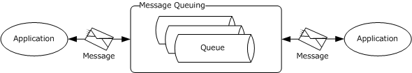
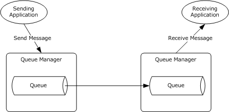
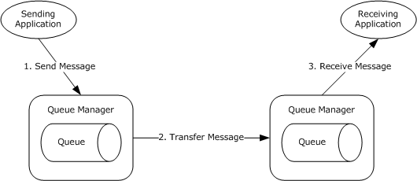
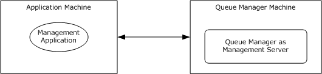
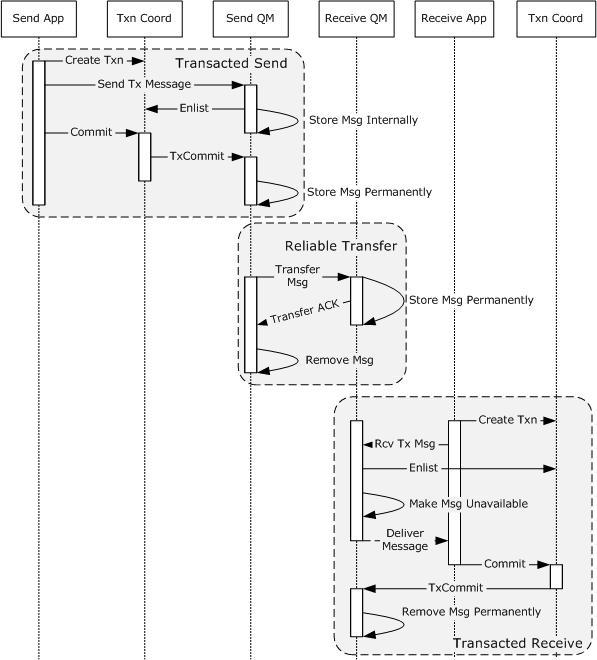
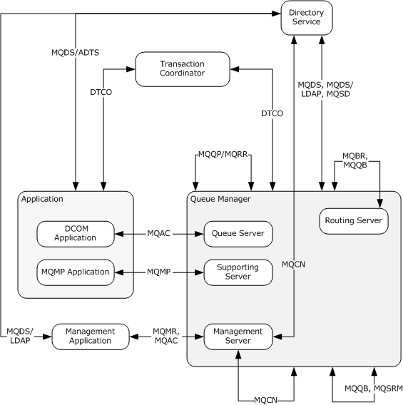

# [MS-MQOD]: Message Queuing Protocols Overview

Table of Contents

1 Introduction

- [1 Introduction](#Section_1)
  - [1.1 Conceptual Overview](#Section_1.1)
  - [1.2 Glossary](#Section_1.2)
  - [1.3 References](#Section_1.3)

2 Functional Architecture

- [2 Functional Architecture](#Section_2)
  - [2.1 Overview](#Section_2.1)
    - [2.1.1 Purpose](#Section_2.1.1)
    - [2.1.2 Capabilities](#Section_2.1.2)
      - [2.1.2.1 Message Delivery Assurance](#Section_2.1.2.1)
      - [2.1.2.2 Message Transfer and Routing](#Section_2.1.2.2)
      - [2.1.2.3 Message Security](#Section_2.1.2.3)
      - [2.1.2.4 Management and Administration](#Section_2.1.2.4)
    - [2.1.3 Interaction with External Components](#Section_2.1.3)
      - [2.1.3.1 Message Queuing and Applications](#Section_2.1.3.1)
      - [2.1.3.2 Reliable Message Processing Using Transactions](#Section_2.1.3.2)
      - [2.1.3.3 Message Queuing and Directory Service](#Section_2.1.3.3)
    - [2.1.4 Roles](#Section_2.1.4)
      - [2.1.4.1 Application Roles](#Section_2.1.4.1)
      - [2.1.4.2 Queue Manager Roles](#Section_2.1.4.2)
        - [2.1.4.2.1 Queue Manager Roles for Application Interaction](#Section_2.1.4.2.1)
        - [2.1.4.2.2 Queue Manager Roles for Message Transfer and Routing](#Section_2.1.4.2.2)
        - [2.1.4.2.3 Queue Manager Role for Remote Read and Management](#Section_2.1.4.2.3)
      - [2.1.4.3 Subcomponent Roles](#Section_2.1.4.3)
      - [2.1.4.4 Protocol Roles](#Section_2.1.4.4)
    - [2.1.5 Protocol Interactions](#Section_2.1.5)
    - [2.1.6 MSMQ Components](#Section_2.1.6)
    - [2.1.7 MSMQ Internal and External Communications](#Section_2.1.7)
      - [2.1.7.1 Communications Within MSMQ](#Section_2.1.7.1)
      - [2.1.7.2 Communications with External Systems](#Section_2.1.7.2)
    - [2.1.8 MSMQ Applicability](#Section_2.1.8)
    - [2.1.9 Relevant Standards](#Section_2.1.9)
  - [2.2 Protocol Summary](#Section_2.2)
  - [2.3 Environment](#Section_2.3)
    - [2.3.1 Dependencies on This System](#Section_2.3.1)
    - [2.3.2 Dependencies on Other Systems/Components](#Section_2.3.2)
  - [2.4 Assumptions and Preconditions](#Section_2.4)
  - [2.5 Use Cases](#Section_2.5)
    - [2.5.1 Create or Modify Queue - Application](#Section_2.5.1)
    - [2.5.2 Query Queue Information- Application](#Section_2.5.2)
    - [2.5.3 Send Message to Queue - Application](#Section_2.5.3)
    - [2.5.4 Send Message in Transaction - Application](#Section_2.5.4)
    - [2.5.5 Transfer Message](#Section_2.5.5)
    - [2.5.6 Receive a Message from a Queue - Application](#Section_2.5.6)
    - [2.5.7 Receive Message in Transaction – Application](#Section_2.5.7)
    - [2.5.8 Exchange Message - Application](#Section_2.5.8)
  - [2.6 Versioning, Capability Negotiation, and Extensibility](#Section_2.6)
  - [2.7 Error Handling](#Section_2.7)
    - [2.7.1 Queue Manager Restart](#Section_2.7.1)
    - [2.7.2 Transient Network Failure](#Section_2.7.2)
    - [2.7.3 Transaction Coordinator Unavailable](#Section_2.7.3)
    - [2.7.4 Directory Unavailable](#Section_2.7.4)
    - [2.7.5 Internal Storage Failure](#Section_2.7.5)
    - [2.7.6 Directory Inconsistency](#Section_2.7.6)
  - [2.8 Coherency Requirements](#Section_2.8)
  - [2.9 Security](#Section_2.9)
    - [2.9.1 Security Elements](#Section_2.9.1)
    - [2.9.2 Security Strategy and Mechanisms](#Section_2.9.2)
    - [2.9.3 Storage Security](#Section_2.9.3)
    - [2.9.4 Communication Security](#Section_2.9.4)
      - [2.9.4.1 Security Layer](#Section_2.9.4.1)
        - [2.9.4.1.1 Transport Layer Security](#Section_2.9.4.1.1)
        - [2.9.4.1.2 Message Layer Security](#Section_2.9.4.1.2)
        - [2.9.4.1.3 Security Model: PKI](#Section_2.9.4.1.3)
        - [2.9.4.1.4 Message Layer Security Features](#Section_2.9.4.1.4)
          - [2.9.4.1.4.1 Message Integrity](#Section_2.9.4.1.4.1)
          - [2.9.4.1.4.2 Sender Authentication](#Section_2.9.4.1.4.2)
          - [2.9.4.1.4.3 Message Privacy](#Section_2.9.4.1.4.3)
        - [2.9.4.1.5 Message Layer Security Sequences](#Section_2.9.4.1.5)
    - [2.9.5 Internal Security and External Security](#Section_2.9.5)
  - [2.10 Additional Considerations](#Section_2.10)

3 Examples

- [3 Examples](#Section_3)
  - [3.1 Example 1: Disconnected Data Entry](#Section_3.1)
  - [3.2 Example 2: Web Order Entry](#Section_3.2)
  - [3.3 Example 3: Modify a Public Queue](#Section_3.3)
  - [3.4 Example 4: Creating and Monitoring a Remote Private Queue](#Section_3.4)
  - [3.5 Example 5: Branch Office Order Processing](#Section_3.5)
  - [3.6 Example 6: Business-to-Business Messaging Across a Firewall](#Section_3.6)
  - [3.7 Example 7: Server Farm](#Section_3.7)
  - [3.8 Example 8: Stock Ticker](#Section_3.8)
  - [3.9 Example 9: Business-to-Business Messaging Across Heterogeneous Systems](#Section_3.9)

4 Microsoft Implementations

- [4 Microsoft Implementations](#Section_4)
  - [4.1 Product Behavior](#Section_4.1)

5 Change Tracking

- [5 Change Tracking](#Section_5)

For the legal notice and IP terms, see [LEGAL.md](../LEGAL.md).
Last updated: 10/26/2021.
See [Revision History](#revision-history) for full version history.

# 1 Introduction

[**Microsoft Message Queuing (MSMQ)**](#gt_microsoft-message-queuing-msmq) is a communications service that temporally decouples [**message**](#gt_message) send operations from message receive operations. The functionality enables [**applications**](#gt_application) to communicate even if those applications are not executed concurrently.

## 1.1 Conceptual Overview

The [**queue**](#gt_queue) is the central abstraction in [**Microsoft Message Queuing (MSMQ)**](#gt_microsoft-message-queuing-msmq). [**Applications**](#gt_application) send [**messages**](#gt_message) to a queue and/or [**receive**](#gt_receive) messages from a queue. The queue provides persistence of the messages, enabling them to survive across application restarts. As such, this abstraction enables an application to send message even if the receiving application is not executing or is unreachable due to a network outage.

The following figure shows a high-level view of Message Queuing.

Figure 1: Message Queuing enables asynchronous message exchange

Message Queuing enables the following message exchange patterns between applications:

- One-Way Messaging: A source application sends messages to a destination application and does not wait for the [**outcome**](#gt_outcome) of the message processing. A destination application receives messages and processes them.
- Request-Response: A source application sends a message to a destination. The receiving application receives the request message and sends the response message to a queue specified by the sender in the request message. The sending application receives the response message and correlates it to the original request message.
- Broadcast: A source application sends messages that can be received by zero or more applications. This pattern is useful in implementing publish-and-subscribe types of applications.
Queues are hosted by a communications service called a [**queue manager**](#gt_queue-manager-qm), which runs in a separate service from the client applications so that the act of sending messages is decoupled from the act of receiving the messages. The following figure shows the intended interaction between applications and the queue manager by using the Message Queuing protocols.

Figure 2: Queues hosted by queue manager service

Message Queuing can optionally interact with other components to provide richer functionality to applications. These components include the [**Directory Service**](#gt_directory-service-ds) and the [**Transaction Coordinator**](#gt_transaction-coordinator). The participants in a [**Message Queuing System**](#gt_message-queuing-system) are shown in the following figure and include:

- Application: An application uses MSMQ [**application protocol**](#gt_application-protocol) and their associated components to exchange messages asynchronously with other applications, as well as to perform management and administrative operations on a Message Queuing System.
- Queue Manager: A queue manager is the message communication service that hosts queues and interacts with the applications for sending and receiving messages. The queue manager also interacts with other queue managers to asynchronously transfer messages between queues across a network.
- Directory Service: A Directory Service is an optional MSMQ subcomponent that stores and provides directory information such as network topology information, security key distribution, queue and system metadata, and queue discovery.
- Transaction Coordinator: A Transaction Coordinator is an optional MSMQ subcomponent. An application can send or receive messages within the context of a [**transaction**](#gt_transaction), and the Transaction Coordinator interacts with the queue manager to accept or discard these operations, depending on the outcome of the transaction, while maintaining atomicity, consistency, isolation, and durability (ACID) behavior throughout the lifetime of the transaction.

Figure 3: Participating components in a Message Queuing System

A queue is a temporary placeholder for messages that are shared between applications. The simplest Message Queuing deployment involves two applications and a single queue that is accessible to both the applications. The queue is hosted and managed by a single queue manager. One application sends messages to the queue, and the other application receives the messages from the same queue, as shown in the following diagram.

Figure 4: MSMQ deployment with two applications and a single queue

The sending application sends a message to the queue. When the send operation is successful, the application proceeds with other work, or terminates. The receiving application subsequently receives the message asynchronously (2). The message is removed from the queue. This asynchronous message exchange pattern enables the temporal decoupling of the send operation from the receive operation.

The following figure illustrates a topology that differs slightly from the previous one in that the sending application and the receiving application do not share the same queue. Instead, both the sending application and the receiving application interact with separate, directly accessible queues. The sending application interacts with a source queue, and the receiving application interacts with a destination queue. Additionally, the destination queue is directly reachable from the source queue in a network. Each queue is hosted and managed by a separate queue manager.

Figure 5: MSMQ deployment where applications do not share the same queue

In the deployment topology that is shown in the preceding figure, the sending application puts a message in the queue [1]. This source queue works as the temporary placeholder for the message and is called the outgoing queue. Next, the Message Queuing System directly transfers the message to the destination queue and removes the message from the outgoing queue [2]. Finally, the receiving application receives the message from the destination queue [3].

If the destination queue is not directly reachable from the source queue in a network, additional interim queues are required between the source queue and the final destination queue. Each interim queue is hosted and managed by a queue manager. Messages are routed to the final destination queue through one or more interim queues. Although the destination queue is not directly reachable from the source queue, each interim queue is reachable by its preceding queue and its successor queue.

Queues are hosted and managed by a queue manager that plays the [**queue server**](#gt_queue-server) role. The queue manager hosts and manages a set of [**local queues**](#gt_local-queue), acts as an intermediary placeholder for storing and forwarding messages to their final destinations, and interacts with the applications for sending and receiving messages. The queue manager performs the following tasks:

- On the send side, the queue manager manages its queues, accepts messages from the sending application, and optionally transfers messages to other queue managers. If the messages are destined for a queue that the send-side queue manager hosts, the messages are placed in that queue on the machine. (See the preceding figure captioned "MSMQ deployment with two applications and a single queue"). Alternatively, if the messages belong to a queue that is not hosted by the queue manager on the send side, the messages are placed in an outgoing queue and subsequently transferred to the destination queue manager. (See the preceding figure captioned "MSMQ deployment where applications do not share the same queue").
- On the receive side, the queue manager manages its queues, accepts messages transferred from other queue managers, and delivers messages to the receiving application. The preceding figure captioned "MSMQ deployment with two applications and a single queue" illustrates the simple topology where the send-side queue manager is the same as the receive-side queue manager. In this figure, the single queue manager manages its queues, accepts messages from the sending application, and delivers them to the receiving application. The preceding figure captioned "MSMQ deployment where applications do not share the same queue" illustrates a topology that involves two separate queue managers, one at the send side that interacts with the sending application, and the other at the receiving side that interacts with the receiving application. These two queue managers interact to transfer messages between queues. As the queue manager on the send side transfers messages from its outgoing queue, the queue manager on the receive side accepts and stores those messages. Subsequently, the receive-side queue manager delivers the messages to the appropriate receiving applications.
- Optionally, there can be other queue managers between the send and the receive queue managers. This approach facilitates efficient message routing between the source and the destination queues. These interim queue managers store incoming messages and route them to the next hop so that they can eventually reach the final destination queue.
The queue manager undertakes one or more of the preceding tasks; for each task, the queue manager can manage more than one queue. In other words, a queue manager manages all its hosted queues and its outgoing queues, interacts with the sending and receiving applications, and interacts with other queue managers to transfer messages between queues.

The following figure depicts an example of a simple Message Queuing System deployed on a network.

Figure 6: Message Queuing System deployed over a network

As depicted in the preceding figure, a sending application sends a message to a nearby queue manager. If the destination queue is hosted by the queue manager (a local queue), the queue manager stores the message in the local queue. Alternatively, if the destination queue is hosted by another queue manager on a different machine, the queue manager places the message in an outgoing queue. In either case, the sending application can proceed to do other work. The queue manager asynchronously transfers the message from the outgoing queue to the queue manager of the destination queue, optionally through interim queue managers for routing the message. Subsequently, a receiving application reads the message from the destination queue.

## 1.2 Glossary

This document uses the following terms:

**access control entry (ACE)**: An entry in an [**access control list (ACL)**](#gt_access-control-list-acl) that contains a set of user rights and a [**security identifier (SID)**](#gt_security-identifier-sid) that identifies a principal for whom the rights are allowed, denied, or audited.

**access control list (ACL)**: A list of [**access control entries (ACEs)**](#gt_b581857f-39aa-4979-876b-daba67a40f15) that collectively describe the security rules for authorizing access to some resource; for example, an object or set of objects.

**application**: A participant that is responsible for beginning, propagating, and completing an atomic transaction. An application communicates with a transaction manager in order to begin and complete transactions. An application communicates with a transaction manager in order to marshal transactions to and from other applications. An application also communicates in application-specific ways with a resource manager in order to submit requests for work on resources.

**application protocol**: A protocol that is used by [**applications**](#gt_application) to communicate with [**queue managers**](#gt_476f10ed-08f0-4887-b583-59d5cf909979). [**Application protocols**](#gt_application-protocol) include the Message Queuing (MSMQ): Queue Manager Client Protocol [MS-MQMP](../MS-MQMP/MS-MQMP.md), the Message Queuing (MSMQ): Queue Manager Management Protocol [MS-MQMR](../MS-MQMR/MS-MQMR.md) and the Message Queuing (MSMQ): ActiveX Client Protocol [MC-MQAC](../MC-MQAC/MC-MQAC.md).

**asynchronous messaging**: Communication between two [**applications**](#gt_application) or systems, independent of time.

**at most once**: A [**message**](#gt_message) delivery assurance that requires that a [**Message Queuing System**](#gt_message-queuing-system) deliver a [**message**](#gt_message) to its destination [**at most once**](#gt_at-most-once). Some [**messages**](#gt_message) might not be delivered.

**atomic transaction**: A shared activity that provides mechanisms for achieving the atomicity, consistency, isolation, and durability (ACID) properties when state changes occur inside participating [**resource managers**](#gt_resource-manager-rm).

**best effort**: Indicates that a [**Message Queuing System**](#gt_message-queuing-system) makes a best effort to meet the specified [**message**](#gt_message) delivery assurance, but does not raise an error if the delivery assurance is not met.

**connected network**: A network of computers in which any two computers can communicate directly through a common transport protocol (for example, TCP/IP or SPX/IPX). A computer can belong to multiple connected networks.

**connector application**: An application that runs on a [**connector server**](#gt_connector-server) and translates both outgoing and incoming [**messages**](#gt_message) sent between a [**Message Queuing**](#gt_microsoft-message-queuing-msmq) computer and a foreign messaging system.

**connector server**: A Message Queuing routing server that is configured to send [**messages**](#gt_message) between a [**Message Queuing**](#gt_microsoft-message-queuing-msmq) site and one or more foreign sites. A [**connector server**](#gt_connector-server) has a [**connector application**](#gt_connector-application) running on it and two connector queues for each foreign site: one used for [**transactional messages**](#gt_transactional-message) and one used for nontransactional messages.

**cursor**: A data structure providing sequential access over a message queue. A cursor has a current pointer that lies between the head and tail pointer of the [**queue**](#gt_queue). The pointer can be moved forward or backward through an operation on the cursor (Next). A [**message**](#gt_message) at the current pointer can be accessed through a nondestructive read (Peek) operation or a destructive read (Receive) operation.

**dead-letter queue**: A [**queue**](#gt_queue) that contains [**messages**](#gt_message) that were sent from a host with a request for negative source journaling and that could not be delivered. [**Message Queuing**](#gt_microsoft-message-queuing-msmq) provides a transactional dead-letter queue and a non-transactional dead-letter queue.

**direct format name**: A name that is used to reference a [**public queue**](#gt_public-queue) or a [**private queue**](#gt_private-queue) without accessing the MSMQ Directory Service. Message Queuing can use the physical, explicit location information provided by direct format names to send [**messages**](#gt_message) directly to their destinations. For more information, see [MS-MQMQ] section 2.1.

**directory service (DS)**: An entity that maintains a collection of objects. These objects can be remotely manipulated either by the Message Queuing (MSMQ): Directory Service Protocol, as specified in [MS-MQDS](../MS-MQDS/MS-MQDS.md), or by the Lightweight Directory Access Protocol (v3), as specified in [[RFC2251]](https://go.microsoft.com/fwlink/?LinkId=90325).

**Directory-Integrated mode**: A Message Queuing deployment mode in which the clients and servers use a [**Directory Service**](#gt_directory-service-ds) to enable a set of features pertaining to [**message**](#gt_message) security, efficient routing, [**queue**](#gt_queue) discovery, [**distribution lists**](#gt_distribution-list), and aliases. See also [**Workgroup mode**](#gt_workgroup-mode).

**discretionary access control list (DACL)**: An [**access control list (ACL)**](#gt_access-control-list-acl) that is controlled by the owner of an object and that specifies the access particular users or groups can have to the object.

**distribution list**: An Active Directory object that can contain explicit references only to destinations published in Active Directory; that is, to [**public queues**](#gt_public-queue), queue aliases, and other distribution lists, but not to private and URL-named queues.

**domain**: A set of users and computers sharing a common namespace and management infrastructure. At least one computer member of the set must act as a [**domain controller (DC)**](#gt_domain-controller-dc) and host a member list that identifies all members of the domain, as well as optionally hosting the Active Directory service. The domain controller provides authentication of members, creating a unit of trust for its members. Each domain has an identifier that is shared among its members. For more information, see [MS-AUTHSOD](../MS-AUTHSOD/MS-AUTHSOD.md) section 1.1.1.5 and [MS-ADTS](../MS-ADTS/MS-ADTS.md).

**domain controller (DC)**: The service, running on a server, that implements Active Directory, or the server hosting this service. The service hosts the data store for objects and interoperates with other [**DCs**](#gt_domain-controller-dc) to ensure that a local change to an object replicates correctly across all [**DCs**](#gt_domain-controller-dc). When Active Directory is operating as Active Directory Domain Services (AD DS), the [**DC**](#gt_domain-controller-dc) contains full NC replicas of the configuration naming context (config NC), schema naming context (schema NC), and one of the domain NCs in its forest. If the AD DS [**DC**](#gt_domain-controller-dc) is a global catalog server (GC server), it contains partial NC replicas of the remaining domain NCs in its forest. For more information, see [MS-AUTHSOD] section 1.1.1.5.2 and [MS-ADTS]. When Active Directory is operating as Active Directory Lightweight Directory Services (AD LDS), several AD LDS [**DCs**](#gt_domain-controller-dc) can run on one server. When Active Directory is operating as AD DS, only one AD DS [**DC**](#gt_domain-controller-dc) can run on one server. However, several AD LDS [**DCs**](#gt_domain-controller-dc) can coexist with one AD DS [**DC**](#gt_domain-controller-dc) on one server. The AD LDS [**DC**](#gt_domain-controller-dc) contains full NC replicas of the config NC and the schema NC in its forest. The domain controller is the server side of Authentication Protocol Domain Support [MS-APDS](../MS-APDS/MS-APDS.md).

**enqueue**: The process of adding data to a queue.

**enterprise**: A unit of administration of a network of MSMQ queue managers. An enterprise consists of an MSMQ Directory Service, one or more [**connected networks**](#gt_connected-network), and one or more [**MSMQ sites**](#gt_msmq-site).

**exactly once**: A [**message**](#gt_message) delivery assurance that requires that the [**Message Queuing**](#gt_microsoft-message-queuing-msmq) system delivers the [**message**](#gt_message) to the destination once and only once, such that each sent [**message**](#gt_message) is either delivered once to the destination or an error is raised.

**express message**: A volatile [**message**](#gt_message) that does not persist through [**queue manager**](#gt_queue-manager-qm) restarts. These express [**messages**](#gt_message) provide best-effort, at-most-once delivery assurance.

**external transaction**: An atomic transaction context dispensed by a transaction coordinator other than an MSMQ queue manager, such as by a distributed transaction coordinator (DTC), and used by an MSMQ queue manager to coordinate its state changes with state changes in other resource managers. For more information on transactions, see [MS-DTCO](../MS-DTCO/MS-DTCO.md).

**facet**: In OleTx, a subsystem in a [**transaction manager**](#gt_transaction-manager) that maintains its own per-[**transaction**](#gt_transaction) state and responds to intra-[**transaction manager**](#gt_transaction-manager) events from other [**facets**](#gt_facet). A [**facet**](#gt_facet) can also be responsible for communicating with other participants of a [**transaction**](#gt_transaction).

**foreign queue**: A messaging queue that resides on a computer that does not run an [**MSMQ**](#gt_microsoft-message-queuing-msmq) messaging application.

**Hypertext Transfer Protocol (HTTP)**: An application-level protocol for distributed, collaborative, hypermedia information systems (text, graphic images, sound, video, and other multimedia files) on the World Wide Web.

**Hypertext Transfer Protocol Secure (HTTPS)**: An extension of HTTP that securely encrypts and decrypts web page requests. In some older protocols, "Hypertext Transfer Protocol over Secure Sockets Layer" is still used (Secure Sockets Layer has been deprecated). For more information, see [[SSL3]](https://go.microsoft.com/fwlink/?LinkId=90534) and [[RFC5246]](https://go.microsoft.com/fwlink/?LinkId=129803).

**in-routing server**: An MSMQ routing server that receives all [**messages**](#gt_message) on behalf of a particular client and forwards those [**messages**](#gt_message) to that client.

**internal transaction**: An atomic transaction context dispensed by an MSMQ Queue Manager instance that can be used to atomically commit or roll back state changes within that MSMQ Queue Manager. The dispensing MSMQ Queue Manager instance is the transaction coordinator and is also the only resource manager participant supported by the transaction context. An internal transaction cannot, therefore, be used to coordinate state changes with other resource managers, including other MSMQ Queue Manager instances.

**Internetwork Packet Exchange (IPX)**: A protocol that provides connectionless datagram delivery of messages. See [[IPX]](https://go.microsoft.com/fwlink/?LinkId=89914).

**Lightweight Directory Access Protocol (LDAP)**: The primary access protocol for Active Directory. Lightweight Directory Access Protocol (LDAP) is an industry-standard protocol, established by the Internet Engineering Task Force (IETF), which allows users to query and update information in a [**directory service (DS)**](#gt_directory-service-ds), as described in [MS-ADTS]. The Lightweight Directory Access Protocol can be either version 2 [[RFC1777]](https://go.microsoft.com/fwlink/?LinkId=90290) or version 3 [[RFC3377]](https://go.microsoft.com/fwlink/?LinkID=91337).

**local queue**: For a [**queue manager**](#gt_queue-manager-qm), a [**queue**](#gt_queue) hosted by the [**queue manager**](#gt_queue-manager-qm) itself. For an [**application**](#gt_application), a [**queue**](#gt_queue) hosted by the [**queue manager**](#gt_queue-manager-qm) with which the [**application**](#gt_application) communicates.

**management application**: An [**MSMQ**](#gt_microsoft-message-queuing-msmq) [**application**](#gt_application) that performs management operations, as specified in [MS-MQMR].

**message**: A data structure representing a unit of data transfer between distributed applications. A message has message properties, which may include message header properties, a message body property, and message trailer properties.

**message queuing system**: An installed or a hypothetical configuration of [**Microsoft Message Queuing (MSMQ)**](#gt_microsoft-message-queuing-msmq) protocol set components, including message queuing [**applications**](#gt_application), [**queue managers**](#gt_476f10ed-08f0-4887-b583-59d5cf909979), and optional subcomponents such as a [**Directory Service**](#gt_directory-service-ds) and a [**Transaction Coordinator**](#gt_transaction-coordinator).

**Microsoft Message Queuing (MSMQ)**: A communications service that provides asynchronous and reliable [**message**](#gt_message) passing between distributed [**applications**](#gt_application). In [**Message Queuing**](#gt_microsoft-message-queuing-msmq), [**applications**](#gt_application) send [**messages**](#gt_message) to [**queues**](#gt_queue) and consume [**messages**](#gt_message) from [**queues**](#gt_queue). The [**queues**](#gt_queue) provide persistence of the [**messages**](#gt_message), enabling the sending and receiving [**applications**](#gt_application) to operate asynchronously from one another.

**MSMQ application protocol**: A protocol that is used by [**applications**](#gt_application) to communicate with [**queue managers**](#gt_476f10ed-08f0-4887-b583-59d5cf909979). [**Application protocols**](#gt_application-protocol) include the Message Queuing (MSMQ): Queue Manager Client Protocol [MS-MQMP], the Message Queuing (MSMQ): Queue Manager Management Protocol [MS-MQMR] and the Message Queuing (MSMQ): ActiveX Client Protocol [MC-MQAC].

**MSMQ Directory Service server**: An MSMQ queue manager that provides MSMQ Directory Service. The server can act in either of the MSMQ Directory Service roles: Primary Site Controller (PSC) or Backup Site Controller (BSC).

**MSMQ management server**: A role played by an MSMQ queue manager. An [**MSMQ management server**](#gt_msmq-management-server) enables management applications to perform management and administrative operations on the Message Queuing System. The Management Server operations are specified in [MS-MQMR] and [MS-MQCN](../MS-MQCN/MS-MQCN.md).

**MSMQ routing link**: A communication link between two sites. A routing link is represented by a routing link object in the directory service. Routing links can have associated link costs. Routing links with their associated costs can be used to compute lowest-cost routing paths for store-and-forward messaging.

**MSMQ site**: A network of computers, typically physically collocated, that have high connectivity as measured in terms of latency (low) and throughput (high). A site is represented by a site object in the directory service. An MSMQ site maps one-to-one with an Active Directory site when Active Directory provides directory services to [**MSMQ**](#gt_microsoft-message-queuing-msmq).

**MSMQ site gate**: An MSMQ routing server through which all intersite messaging traffic flows.

**negative source journaling**: The process of retaining copies of unsuccessfully delivered [**messages**](#gt_message). The copies are retained by the QueueManager. Also known as dead-lettering.

**network address**: An address that is used to identify and communicate with a specific computer in a computer network. A computer can have more than one [**network address**](#gt_network-address). Any of these [**network addresses**](#gt_network-address) can be used to communicate with the computer.

**outcome**: One of the three possible results (Commit, Abort, In Doubt) reachable at the end of a life cycle for an [**atomic transaction**](#gt_atomic-transaction).

**outgoing queue**: A temporary internal [**queue**](#gt_queue) that holds [**messages**](#gt_message) for a remote destination [**queue**](#gt_queue). The path name of an outgoing [**queue**](#gt_queue) is identical to the path name of the corresponding destination [**queue**](#gt_queue). An outgoing [**queue**](#gt_queue) is distinguished from its corresponding destination [**queue**](#gt_queue) by the fact that the outgoing [**queue**](#gt_queue) is located on the sending computer. The format name of an outgoing [**queue**](#gt_queue) is identical to the format name used by the [**messages**](#gt_message) to reference the destination [**queue**](#gt_queue). Messages that reference the destination [**queue**](#gt_queue) using a different format name are placed in a different outgoing [**queue**](#gt_queue).

**out-routing server**: An MSMQ routing server that receives all [**messages**](#gt_message) sent by a particular client and routes those [**messages**](#gt_message) on behalf of that client.

**poison message**: A [**message**](#gt_message) in a [**queue**](#gt_queue) that cannot be processed by an [**application**](#gt_application) because of errors unrelated to the [**Message Queuing System**](#gt_message-queuing-system). A [**poison message**](#gt_poison-message) can cause an [**application**](#gt_application) to fail repetitively until the [**message**](#gt_message) has been removed from the [**queue**](#gt_queue).

**private key**: One of a pair of keys used in public-key cryptography. The private key is kept secret and is used to decrypt data that has been encrypted with the corresponding public key. For an introduction to this concept, see [[CRYPTO]](https://go.microsoft.com/fwlink/?LinkId=89841) section 1.8 and [[IEEE1363]](https://go.microsoft.com/fwlink/?LinkId=89899) section 3.1.

**private queue**: An application-defined message queue that is not registered in the MSMQ Directory Service. A private queue is deployed on a particular [**queue manager**](#gt_queue-manager-qm).

**public key**: One of a pair of keys used in public-key cryptography. The public key is distributed freely and published as part of a digital certificate. For an introduction to this concept, see [CRYPTO] section 1.8 and [IEEE1363] section 3.1.

**public queue**: An application-defined message queue that is registered in the MSMQ Directory Service. A public queue can be deployed at any [**queue manager**](#gt_queue-manager-qm).

**queue**: An object that holds [**messages**](#gt_message) passed between applications or [**messages**](#gt_message) passed between [**Message Queuing**](#gt_microsoft-message-queuing-msmq) and applications. In general, applications can send [**messages**](#gt_message) to queues and read [**messages**](#gt_message) from queues.

**queue manager (QM)**: A message queuing service that manages [**queues**](#gt_queue) deployed on a computer. A queue manager can also provide asynchronous transfer of [**messages**](#gt_message) to [**queues**](#gt_queue) deployed on other queue managers.

**queue server**: See MSMQ queue server.

**receive**: An atomic operation that retrieves and removes a [**message**](#gt_message) from a message queue.

**recoverable message**: A [**message**](#gt_message) that persists through [**queue manager**](#gt_queue-manager-qm) restarts and provides best-effort, at-most-once delivery assurance.

**remote procedure call (RPC)**: A communication protocol used primarily between client and server. The term has three definitions that are often used interchangeably: a runtime environment providing for communication facilities between computers (the RPC runtime); a set of request-and-response message exchanges between computers (the RPC exchange); and the single message from an RPC exchange (the RPC message). For more information, see [[C706]](https://go.microsoft.com/fwlink/?LinkId=89824).

**remote queue**: For a [**queue manager**](#gt_queue-manager-qm), a [**queue**](#gt_queue) that is hosted by a remote [**queue manager**](#gt_queue-manager-qm). For an [**application**](#gt_application), a [**queue**](#gt_queue) hosted by a [**queue manager**](#gt_queue-manager-qm) other than the one with which the [**application**](#gt_application) communicates.

**remote read**: The act of reading (receiving) [**messages**](#gt_message) from a [**remote queue**](#gt_remote-queue).

**resource manager (RM)**: The participant that is responsible for coordinating the state of a resource with the outcome of atomic transactions. For a specified transaction, a resource manager enlists with exactly one transaction manager to vote on that transaction outcome and to obtain the final outcome. A resource manager is either durable or volatile, depending on its resource.

**routing link**: See [**MSMQ routing link**](#gt_msmq-routing-link).

**routing server**: See MSMQ routing server.

**security identifier (SID)**: An identifier for security principals that is used to identify an account or a group. Conceptually, the [**SID**](#gt_security-identifier-sid) is composed of an account authority portion (typically a [**domain**](#gt_domain)) and a smaller integer representing an identity relative to the account authority, termed the relative identifier (RID). The [**SID**](#gt_security-identifier-sid) format is specified in [MS-DTYP](../MS-DTYP/MS-DTYP.md) section 2.4.2; a string representation of [**SIDs**](#gt_security-identifier-sid) is specified in [MS-DTYP] section 2.4.2 and [MS-AZOD](../MS-AZOD/MS-AZOD.md) section 1.1.1.2.

**site gate**: See [**MSMQ site gate**](#gt_msmq-site-gate).

**supporting server**: See MSMQ supporting server.

**symmetric key**: A secret key used with a cryptographic symmetric algorithm. The key needs to be known to all communicating parties. For an introduction to this concept, see [CRYPTO] section 1.5.

**transaction**: A unit of interaction that guarantees the ACID properties— atomicity, consistency, isolation, and durability—as specified by the MSDTC Connection Manager: OleTx Transaction Protocol ([MS-DTCO])

**transaction coordinator**: A service that provides concrete mechanisms for beginning, propagating, and completing [**atomic transactions**](#gt_atomic-transaction). A transaction coordinator also provides mechanisms for coordinating agreement on a single atomic [**outcome**](#gt_outcome) for each [**transaction**](#gt_transaction) and for reliably distributing that [**outcome**](#gt_outcome) to all participants in the [**transactions**](#gt_transaction). For more information, see [MS-DTCO].

**transaction manager**: The party that is responsible for managing and distributing the outcome of [**atomic transactions**](#gt_atomic-transaction). A transaction manager is either a root transaction manager or a subordinate transaction manager for a specified transaction.

**transactional message**: A [**message**](#gt_message) sent as part of a transaction. Transaction [**messages**](#gt_message) must be sent to [**transactional queues**](#gt_transactional-queue).

**transactional queue**: A [**queue**](#gt_queue) that contains only [**transactional messages**](#gt_transactional-message).

**Unicode string**: A Unicode 8-bit string is an ordered sequence of 8-bit units, a Unicode 16-bit string is an ordered sequence of 16-bit code units, and a Unicode 32-bit string is an ordered sequence of 32-bit code units. In some cases, it could be acceptable not to terminate with a terminating null character. Unless otherwise specified, all [**Unicode strings**](#gt_unicode-string) follow the UTF-16LE encoding scheme with no Byte Order Mark (BOM).

**unit of work**: A set of individual operations that [**MSMQ**](#gt_microsoft-message-queuing-msmq) must successfully complete before any of the individual [**MSMQ**](#gt_microsoft-message-queuing-msmq) operations can be considered complete.

**User Datagram Protocol (UDP)**: The connectionless protocol within TCP/IP that corresponds to the transport layer in the ISO/OSI reference model.

**workgroup mode**: A Message Queuing deployment mode in which the clients and servers operate without using a [**Directory Service**](#gt_directory-service-ds). In this mode, features pertaining to [**message**](#gt_message) security, efficient routing, [**queue**](#gt_queue) discovery, [**distribution lists**](#gt_distribution-list), and aliases are not available. See also [**Directory-Integrated mode**](#gt_directory-integrated-mode).

## 1.3 References

[MC-COMQC] Microsoft Corporation, "[Component Object Model Plus (COM+) Queued Components Protocol](../MC-COMQC/MC-COMQC.md)".

[MC-MQAC] Microsoft Corporation, "[Message Queuing (MSMQ): ActiveX Client Protocol](../MC-MQAC/MC-MQAC.md)".

[MC-MQSRM] Microsoft Corporation, "[Message Queuing (MSMQ): SOAP Reliable Messaging Protocol (SRMP)](../MC-MQSRM/MC-MQSRM.md)".

[MS-ADA2] Microsoft Corporation, "[Active Directory Schema Attributes M](../MS-ADA2/MS-ADA2.md)".

[MS-ADTS] Microsoft Corporation, "[Active Directory Technical Specification](../MS-ADTS/MS-ADTS.md)".

[MS-AUTHSOD] Microsoft Corporation, "[Authentication Services Protocols Overview](../MS-AUTHSOD/MS-AUTHSOD.md)".

[MS-DTCO] Microsoft Corporation, "[MSDTC Connection Manager: OleTx Transaction Protocol](../MS-DTCO/MS-DTCO.md)".

[MS-DTYP] Microsoft Corporation, "[Windows Data Types](../MS-DTYP/MS-DTYP.md)".

[MS-MQBR] Microsoft Corporation, "[Message Queuing (MSMQ): Binary Reliable Message Routing Algorithm](../MS-MQBR/MS-MQBR.md)".

[MS-MQCN] Microsoft Corporation, "[Message Queuing (MSMQ): Directory Service Change Notification Protocol](../MS-MQCN/MS-MQCN.md)".

[MS-MQDMPR] Microsoft Corporation, "[Message Queuing (MSMQ): Common Data Model and Processing Rules](../MS-MQDMPR/MS-MQDMPR.md)".

[MS-MQDSSM] Microsoft Corporation, "[Message Queuing (MSMQ): Directory Service Schema Mapping](../MS-MQDSSM/MS-MQDSSM.md)".

[MS-MQDS] Microsoft Corporation, "[Message Queuing (MSMQ): Directory Service Protocol](../MS-MQDS/MS-MQDS.md)".

[MS-MQMP] Microsoft Corporation, "[Message Queuing (MSMQ): Queue Manager Client Protocol](../MS-MQMP/MS-MQMP.md)".

[MS-MQMQ] Microsoft Corporation, "[Message Queuing (MSMQ): Data Structures](../MS-MQMQ/MS-MQMQ.md)".

[MS-MQMR] Microsoft Corporation, "[Message Queuing (MSMQ): Queue Manager Management Protocol](../MS-MQMR/MS-MQMR.md)".

[MS-MQQB] Microsoft Corporation, "[Message Queuing (MSMQ): Message Queuing Binary Protocol](../MS-MQQB/MS-MQQB.md)".

[MS-MQQP] Microsoft Corporation, "[Message Queuing (MSMQ): Queue Manager to Queue Manager Protocol](../MS-MQQP/MS-MQQP.md)".

[MS-MQRR] Microsoft Corporation, "[Message Queuing (MSMQ): Queue Manager Remote Read Protocol](../MS-MQRR/MS-MQRR.md)".

[MS-MQSD] Microsoft Corporation, "[Message Queuing (MSMQ): Directory Service Discovery Protocol](../MS-MQSD/MS-MQSD.md)".

[MS-RDPBCGR] Microsoft Corporation, "[Remote Desktop Protocol: Basic Connectivity and Graphics Remoting](../MS-RDPBCGR/MS-RDPBCGR.md)".

[MSDN-WCF] Microsoft Corporation, "Windows Communication Foundation", [http://msdn.microsoft.com/en-us/library/ms735119.aspx](https://go.microsoft.com/fwlink/?LinkId=100290)

[MSFT-PKI] Microsoft Corporation, "Best Practices for Implementing a Microsoft Windows Server 2003 Public Key Infrastructure", July 2004, [http://technet2.microsoft.com/WindowsServer/en/library/091cda67-79ec-481d-8a96-03e0be7374ed1033.mspx](https://go.microsoft.com/fwlink/?LinkId=90202)

[RFC1321] Rivest, R., "The MD5 Message-Digest Algorithm", RFC 1321, April 1992, [http://www.ietf.org/rfc/rfc1321.txt](https://go.microsoft.com/fwlink/?LinkId=90275)

[RFC2616] Fielding, R., Gettys, J., Mogul, J., et al., "Hypertext Transfer Protocol -- HTTP/1.1", RFC 2616, June 1999, [http://www.rfc-editor.org/rfc/rfc2616.txt](https://go.microsoft.com/fwlink/?LinkId=90372)

[RFC3208] Speakman, T., Crowcroft, J., Gemmell, J., Farinacci, D., Lin, S., Leshchiner, D., Luby, M., Montgomery, T., Rizzo, L., Tweedly, A., Bhaskar, N., Edmonstone, R., Sumanasekera, R., and Vicisano, L., "PGM Reliable Transport Protocol Specification", RFC 3208, December 2001, [http://www.ietf.org/rfc/rfc3208.txt](https://go.microsoft.com/fwlink/?LinkId=95257)

[RFC3275] Eastlake III, D., Reagle, J., and Solo, D., "(Extensible Markup Language) XML-Signature Syntax and Processing", RFC 3275, March 2002, [http://www.ietf.org/rfc/rfc3275.txt](https://go.microsoft.com/fwlink/?LinkId=91146)

[RFC3377] Hodges, J. and Morgan, R., "Lightweight Directory Access Protocol (v3): Technical Specification", RFC 3377, September 2002, [http://www.ietf.org/rfc/rfc3377.txt](https://go.microsoft.com/fwlink/?LinkID=91337)

[SP800-32] NIST, "Introduction to Public Key Technology and the Federal PKI Infrastructure", SP800-32, February 2001, [http://nvlpubs.nist.gov/nistpubs/Legacy/SP/nistspecialpublication800-32.pdf](https://go.microsoft.com/fwlink/?LinkId=90524)

# 2 Functional Architecture

## 2.1 Overview

### 2.1.1 Purpose

The primary purpose of the [**MSMQ**](#gt_microsoft-message-queuing-msmq) protocols is to enable a temporal decoupling of [**applications**](#gt_application) by providing an [**asynchronous messaging**](#gt_asynchronous-messaging) service between applications that have to communicate reliably with each other through [**messages**](#gt_message) that they send and receive. The MSMQ protocols account for transient networking failure, system availability, and [**queue**](#gt_queue) location.

### 2.1.2 Capabilities

The Microsoft Message Queuing ([**MSMQ**](#gt_microsoft-message-queuing-msmq)) protocols provide the following capabilities to messaging [**applications**](#gt_application):

[Message Delivery Assurance (section 2.1.2.1)](#Section_2.1.2.1)

[Message Transfer and Routing (section 2.1.2.2)](#Section_2.1.2.2)

[Message Security (section 2.1.2.3)](#Section_2.1.2.3)

[Management and Administration (section 2.1.2.4)](#Section_2.1.2.4)

#### 2.1.2.1 Message Delivery Assurance

The [**MSMQ**](#gt_microsoft-message-queuing-msmq) protocols provide the following levels of [**message**](#gt_message) delivery assurance:

**Best-effort Express Delivery:** Provides [**best-effort**](#gt_a08881df-8d7c-444b-9c93-398dc874d76f), [**at most once**](#gt_at-most-once) express delivery assurance through [**express messages**](#gt_express-message) that are volatile and therefore can be lost in transit during transient unavailability or failure of the Message Queuing components or of the underlying network. These messages do not persist through system restarts.

**Best-effort Delivery:** Provides best-effort, at most once delivery assurance through [**recoverable messages**](#gt_recoverable-message). These messages are saved by the [**queue manager**](#gt_queue-manager-qm) and therefore persist through system restarts. These messages can be lost in transit during transient unavailability or failure of the underlying network.

**Exactly-once Delivery:** Provides [**exactly-once**](#gt_01da45f8-5f30-48cc-8273-30868c706746) delivery assurance for messages that are sent to [**transactional queues**](#gt_transactional-queue). A source [**applications**](#gt_application) sends one or more messages to a transactional queue as part of a [**transaction**](#gt_transaction). Subject to the [**outcome**](#gt_outcome) of the transaction, the queue manager accepts and persists these messages. Subsequently, the messages are transferred between queue managers for placement in the destination queue. A destination application [**receives**](#gt_receive) and processes messages as part of a transaction. Whether the messages are treated as consumed depends on the outcome of the transaction. A [**Message Queuing System**](#gt_message-queuing-system) is required to receive and deliver these messages only in the scope of a transaction.

#### 2.1.2.2 Message Transfer and Routing

The [**MSMQ**](#gt_microsoft-message-queuing-msmq) protocol set supports [**message**](#gt_message) transfer across complex network topologies and over a variety of network transport protocols that include the Transmission Control Protocol/Internet Protocol (TCP/IP) or the Internetwork Packet Exchange/Sequenced Packet Exchange ([**IPX**](#gt_internetwork-packet-exchange-ipx)/SPX), the User Datagram Protocol ([**UDP**](#gt_user-datagram-protocol-udp)), the Hypertext Transfer Protocol ([**HTTP**](#gt_hypertext-transfer-protocol-http)), the Hypertext Transfer Protocol over Secure Sockets Layer ([**HTTPS**](#gt_hypertext-transfer-protocol-secure-https)), and Pragmatic General Multicast ([[RFC3208]](https://go.microsoft.com/fwlink/?LinkId=95257)). To optimize message throughput, the MSMQ protocol set defines an optional routing mechanism to find and use the least-cost routing path between two machines, as described in [MS-MQBR](../MS-MQBR/MS-MQBR.md).

#### 2.1.2.3 Message Security

The [**MSMQ**](#gt_microsoft-message-queuing-msmq) protocols enable secure messaging between [**applications**](#gt_application) by supporting a variety of security features that include user authentication, authorization, [**message**](#gt_message) integrity, and message encryption and decryption. The MSMQ security architecture is described in section [2.9](#Section_2.9) of this document.

#### 2.1.2.4 Management and Administration

The [**MSMQ**](#gt_microsoft-message-queuing-msmq) protocol set defines protocols for [**management applications**](#gt_management-application) for its configuration, management, and administration.

### 2.1.3 Interaction with External Components

This section describes the externally visible view of the [**MSMQ**](#gt_microsoft-message-queuing-msmq) protocols and the components in the system.

The following figure expands on the figure with the caption "Participating components in a Message Queuing System" in section [1.1](#Section_1.1) and shows the various internal and external components of a [**Message Queuing System**](#gt_message-queuing-system).

Figure 7: Interactions with external components

The [**queue manager**](#gt_queue-manager-qm) interacts with its internal storage subsystem for persistence of its configuration data, application data, which includes queues and nonvolatile [**messages**](#gt_message), and state. The exact storage mechanism that is used varies per implementation of the MSMQ protocol set; however, it retains persistent data and state across system restarts. The queue manager interacts with other queue managers in the implementation.

The queue manager optionally interacts with an external [**Transaction Coordinator**](#gt_transaction-coordinator) to provide transactional capabilities while sending or receiving messages to or from individual queues. Applications can create [**external transactions**](#gt_external-transaction) from the Transaction Coordinator and can pass them on to MSMQ protocols to atomically perform certain messaging operations. The external Transaction Coordinator functionality is described in [MS-DTCO](../MS-DTCO/MS-DTCO.md).

The MSMQ protocol set optionally uses a directory through a [**Directory Service**](#gt_directory-service-ds) component. The directory stores and provides information such as network topology, security key distribution, queue and system metadata, and queue discovery. For more information about the Directory Service, see section [2.1.3.3](#Section_2.1.3.3).

The following subsections describe the relationship of the queue manager with the preceding subcomponents.

#### 2.1.3.1 Message Queuing and Applications

[**Applications**](#gt_application) use the Microsoft Message Queuing ([**MSMQ**](#gt_microsoft-message-queuing-msmq)) [**application protocols**](#gt_application-protocol) to accomplish [**asynchronous messaging**](#gt_asynchronous-messaging) functionalities. An application typically interacts with one [**queue manager**](#gt_queue-manager-qm). A queue manager implements the [**supporting server**](#gt_supporting-server) role or the [**queue server**](#gt_queue-server) role, or both, to communicate with applications that pursue message exchange functionality.

A queue manager acts as a supporting server. As a supporting server, it implements the server side of MQMP and thereby provides a subset of the MSMQ functionality, as described in [MS-MQMP](../MS-MQMP/MS-MQMP.md) section 1. An application interacts with the supporting server through the client side of MQMP. The following figure shows this deployment mode.

Figure 8: Queue manager as supporting server

Alternatively, a queue manager acts as a queue server. As a queue server, it implements the server side of MQAC and both the client and server sides of the MQQP or MQRR. It thereby provides the full set of message exchange functionality of the MSMQ protocol set. An application interacts with the queue server through the client sides of the MQAC protocol. The following figure shows this deployment mode.

Figure 9: Queue manager as queue server

A queue manager acts as an [**MSMQ management server**](#gt_msmq-management-server). As an MSMQ management server, it implements the server side of MQMR and the management interfaces of the MQAC protocol, as well as the client and server side of the MQCN. It thereby provides the management and administrative capabilities of the MSMQ protocol set. An application interacts with the MSMQ management server through the client side of the MQMR protocol and the client side of the management interfaces of the MQAC protocol. The following figure shows this deployment mode.

Figure 10: Queue manager as Management Server

#### 2.1.3.2 Reliable Message Processing Using Transactions

As described in section [2.1.3](#Section_2.1.3), the Microsoft Message Queuing ([**MSMQ**](#gt_microsoft-message-queuing-msmq)) protocol set supports end-to-end exactly-once delivery assurance through [**transactional messages**](#gt_transactional-message), as opposed to best-effort delivery assurance through express or [**recoverable messages**](#gt_recoverable-message). The MSMQ protocol set interacts with a [**Transaction Coordinator**](#gt_transaction-coordinator) to support transactional messaging. This section elaborates on the mechanism by which transactions are used together with exactly-once [**message**](#gt_message) delivery assurance to facilitate end-to-end reliable message processing.

The MSMQ protocol set provides transactional semantics by defining explicit transaction boundaries in end-to-end messaging and also by defining the error-handling/compensation semantics. This functionality is achieved through the following steps:

- An application sends a message to a transactional queue as part of a transaction.
- If the destination queue is hosted on a remote machine with respect to the sending queue, the message is reliably transferred to the [**remote queue**](#gt_remote-queue) by using the MQQB, MQBR, or MQSRM message transfer and routing protocols.
- The receiving application [**receives**](#gt_receive) and processes the message as part of another transaction.
To manage the queue as a transactional resource, the queue managers for both the sending side and the receiving side implement the [**resource manager (RM)**](#gt_resource-manager-rm) role as described in [MS-DTCO](../MS-DTCO/MS-DTCO.md) section 1.3.3.2. As part of the RM role, each queue manager participates with the RM [**facet**](#gt_facet) of a [**transaction manager**](#gt_transaction-manager) coordinated by an external Transaction Coordinator, as described in [MS-DTCO] section 1.3.3.3.

The participating applications fulfill the application role as described in [MS-DTCO] section 1.3.3.1. The sending application initiates and completes the transactions within the message send boundary. The receiving application initiates and completes the transaction within the message receipt boundary.

The transactional semantics illustrated in the following figure includes the following steps:

- **Transacted Send:**
- The sending application creates a transaction and performs certain application-specific tasks on the transaction.
- Subsequently, the application sends the message in the transaction.
- The RM facet of the queue manager enlists in the transaction.
- The queue manager [**enqueues**](#gt_enqueue) the message and makes this change invisible outside the scope of the transaction.
- Subsequently, the application commits the transaction.
- The Transaction Coordinator coordinates the transaction with all the RMs enlisted in the transaction, including the queue manager. For simplicity, the Prepare and Commit steps of a two-phase commit are depicted as a single TxCommit message in the following figure.
- The queue manager participates in the two-phase commit with the Transaction Coordinator and makes the message visible upon a commit outcome of the transaction. In case of an abort outcome of the transaction, the message is discarded.
The transaction boundary on the send side ends here.

- **Reliable Transfer:**
If the destination queue is hosted by a different queue manager than the one accepting the original message, the sending queue manager reliably transfers the message to the receiving queue manager. If the destination queue is hosted by the same queue manager, this step is not required.

- The queue manager uses the MQQB or MQSRM transfer protocols to transfer the message to the destination queue. This operation is retried until an acknowledgment is received from the destination queue manager.
- The destination queue manager receives and stores the message, and sends a transfer acknowledgment.
- Upon receipt of a transfer acknowledgment from the destination queue manager, the source queue manager removes the message from the source queue.
- **Transacted Receive:**
The receiving application creates a transaction and performs certain application-specific tasks on the transaction.

- Once the message is available in the destination queue, the receiving application can proceed with consuming the message within the scope of the transaction. The receiving application creates a transaction.
- The application receives the message within the scope of the transaction.
- The RM facet of the receiving queue manager enlists in the transaction.
- The receiving queue manager makes the message invisible outside the context of the transaction.
- The receiving queue manager returns the message to the application.
- Subsequently, the application processes the message and commits the transaction.
- The Transaction Coordinator coordinates the transaction with all the RMs enlisted in the transaction, including the queue manager. For simplicity, the Prepare and Commit steps of a two-phase commit are depicted as a single TxCommit message in the following figure.
- The receiving queue manager participates in a two-phase commit with the Transaction Coordinator and deletes the message from the queue on a commit outcome of the transaction. In case of an abort outcome of the transaction, the message is returned back to the queue.
The transactional boundary of the receiving application ends here.

Figure 11: Transaction boundaries in end-to-end message exchange

The MSMQ protocol set specifies a lightweight internal Transaction Coordinator to avoid the overhead of [**external transactions**](#gt_external-transaction). MSMQ can dispense an [**internal transaction**](#gt_internal-transaction) to an application, and this transaction can be used to coordinate actions only with the dispensing queue manager. Internal transactions can be used for sending messages to transactional queues, as long as no other external transacted resource, including other transactional queues of a different queue manager, is participating in the same internal transaction. The queue manager acts as a standalone transaction manager, and no external Transaction Coordinator or other transaction managers are involved when an internal transaction is used. In an end-to-end message exchange, internal and external transactions can be mixed. Thus, a message can be sent using an internal transaction and received using an external transaction and vice versa.

As part of reliable message processing, the MSMQ protocol set also provides the error-handling semantics through [**negative source journaling**](#gt_negative-source-journaling) and message Timers as specified in [MC-MQAC](../MC-MQAC/MC-MQAC.md) section 3.1.2. If the message times out or a failure is encountered in delivering the message to the destination queue, the queue manager places the message in the designated [**dead-letter queue**](#gt_dead-letter-queue) for the sending application to perform application-specific error handling.

#### 2.1.3.3 Message Queuing and Directory Service

The Microsoft Message Queuing ([**MSMQ**](#gt_microsoft-message-queuing-msmq)) protocol set optionally supports a [**Directory Service**](#gt_directory-service-ds) to enable a set of features pertaining to message security, efficient routing, and the publishing of [**queues**](#gt_queue), [**distribution lists**](#gt_distribution-list), and queue aliases. The directory provides the MSMQ protocol set with global storage and an access mechanism for shared metadata.

The MSMQ protocol set supports two predefined modes in terms of Directory Service integration: [**Workgroup mode**](#gt_workgroup-mode) or [**Directory-Integrated mode**](#gt_directory-integrated-mode).

**Workgroup mode:** In this mode, MSMQ protocol set implementations do not use the Directory Service and are limited to [**private queues**](#gt_private-queue) using [**direct format name**](#gt_direct-format-name) addressing.

**Directory-Integrated mode:** In this mode, MSMQ protocol set implementations interact with the Directory Service for publishing and accessing [**public queue**](#gt_public-queue) metadata, network topology information, and certificate and encryption metadata. In this mode, all [**queue managers**](#gt_476f10ed-08f0-4887-b583-59d5cf909979) participating in the implementation are located on machines that are [**domain**](#gt_domain)-joined.

Figure 12: Message Queuing in Directory-Integrated mode

The Directory Service and its function within the MSMQ protocol set are described in more detail in [MS-MQDS](../MS-MQDS/MS-MQDS.md) sections 1.3 and 3 and in [MC-MQAC](../MC-MQAC/MC-MQAC.md) section 1.4. Versions 1.0 and 2.0 of MSMQ implement their own Directory Service through the MQDS protocol. Subsequent versions of MSMQ use Active Directory as the Directory Service through the [**Lightweight Directory Access Protocol (LDAP)**](#gt_lightweight-directory-access-protocol-ldap)

**Directory-Integrated mode with routing:** The MSMQ protocol set supports least-cost routing of messages within a computer network. This provision is particularly useful in complex network topologies--for example, MSMQ computers belong to different administrative regions. This configuration is accomplished by deploying an MSMQ protocol set implementation in Directory-Integrated mode with routing enabled. In this mode, the MSMQ implementation retrieves the network topology information from the Directory Service and uses this information for routing messages from one queue manager to another. If a direct connection to the final destination queue manager is not possible, the source queue manager makes use of interim special queue managers known as [**routing servers**](#gt_routing-server), which can efficiently route messages to the next hop.

An overview of this type of deployment is described in [MS-MQBR](../MS-MQBR/MS-MQBR.md) section 1.3. The following diagram illustrates a typical deployment with routing servers across a complex network topology.

Figure 13: Enterprise deployment of MSMQ with routing

The preceding figure illustrates MSMQ deployment in an [**enterprise**](#gt_enterprise) environment over a complex deployment topology. The MSMQ routing functionality allows applications deployed on one part of the enterprise network to communicate with remote applications deployed on another part of the enterprise in such a way that, although there is no direct network connectivity between these two applications, MSMQ can use interim routing servers to transfer messages between the applications in a reliable way.

An [**MSMQ site**](#gt_msmq-site) is a network of computers, typically physically collocated, that have high connectivity as measured in terms of latency (low) and throughput (high).

An MSMQ routing link is a communication link between two MSMQ sites.

A routing server is a queue manager role that enables Store-and-Forward messaging between computers within an MSMQ site.

An [**MSMQ site gate**](#gt_msmq-site-gate)is a routing server that bridges two or more MSMQ sites such that all intersite messaging traffic flows through MSMQ site gates.

In an enterprise multisite deployment as shown in the previous illustration, a message flows in the following manner:

- The sender application sends the message to a source queue manager.
- The queue manager transfers this message to a routing server in the same MSMQ site.
- The routing server transfers the message to an MSMQ site gate.
- The source MSMQ site gate transfers the message to the destination MSMQ site gate through the MSMQ routing link.
- The destination [**site gate**](#gt_site-gate) transfers the message to the destination queue manager, optionally through one or more routing servers.
- The destination queue manager places the message in the destination queue.
Because both site gates and routing servers are queue managers themselves, applications can also use them as queue managers. This functionality is illustrated in the preceding figure through dotted association lines.

The routing server algorithm as specified in [MS-MQBR] section 3.1 is used to determine the least-cost message route between the source and destination queue managers.

### 2.1.4 Roles

The [**MSMQ**](#gt_microsoft-message-queuing-msmq) protocol set supports the following components that interact with each another.

#### 2.1.4.1 Application Roles

The following roles represent the external actors of the MSMQ protocol set:

**Application:** The application role represents the messaging actions performed by MSMQ applications. The application role typically includes message sending and receiving operations to or from application queues and uses the Message Queuing (MSMQ): Queue Manager Client Protocol (MQMP) or Message Queuing (MSMQ): ActiveX Client Protocol (MQAC) application protocols to interact with Message Queuing (MSMQ) protocol set components.

**Management Application:** This is a special application role that performs the management and administrative aspects of the MSMQ protocol set. This role uses the client side of the Message Queuing (MSMQ): Queue Manager Management Protocol (MQMR) and MQAC protocols to interact with the [**MSMQ management server**](#gt_msmq-management-server) role of the queue manager, as described in the following section.

#### 2.1.4.2 Queue Manager Roles

This section describes the roles exhibited by the queue manager in the Message Queuing (MSMQ) protocol set.

##### 2.1.4.2.1 Queue Manager Roles for Application Interaction

The Message Queuing (MSMQ) protocol set supports the following server roles that allow interaction with the applications, as described in section [2.1.3.1](#Section_2.1.3.1):

**Queue Server:** This role provides the MSMQ message exchange functionality and implements the server side of Message Queuing (MSMQ): ActiveX Client Protocol (MQAC) and both the server and client sides of Message Queuing (MSMQ): Queue Manager to Queue Manager Protocol (MQQP) and Message Queuing (MSMQ): Queue Manager Remote Read Protocol (MQRR).

**Management Server:** In this role, the queue manager provides management and administrative operations on the Message Queuing server. This role allows a management application to retrieve administrative information specific to queues and messages. The Management Server role also performs management operations on a queue. This role implements the server side of Message Queuing (MSMQ): Queue Manager Management Protocol (MQMR), as specified in [MS-MQMR](../MS-MQMR/MS-MQMR.md) section 3.1; the server side of Message Queuing (MSMQ): Directory Service Change Notification Protocol (MQCN), as specified in [MS-MQCN](../MS-MQCN/MS-MQCN.md) section 3.1; and the server side of the management interfaces of MQAC, as specified in [MC-MQAC](../MC-MQAC/MC-MQAC.md) sections 3.2, 3.3, and 3.4.

**Supporting Server:** This is a queue manager role that implements the server side of the supporting server protocol as specified in [MS-MQMP](../MS-MQMP/MS-MQMP.md).

##### 2.1.4.2.2 Queue Manager Roles for Message Transfer and Routing

The following roles of the queue manager involve transferring messages from the source to the destination.

**Message Transfer:** This role performs the actual transfer of messages between two queue managers that are directly reachable from one another and implements both the client and server sides of the message transfer protocols, the Message Queuing (MSMQ): Binary Reliable Messaging Protocol (MQQB) and the Message Queuing (MSMQ): SOAP Reliable Messaging Protocol (SRMP).

**Routing Server:** The queue manager performs the routing server role for facilitating the transfer of messages within a site or across sites. The routing server implements Store and Forward messaging in an enterprise MSMQ deployment. This role implements the Message Queuing: Binary Reliable Message Routing Algorithm [MS-MQBR](../MS-MQBR/MS-MQBR.md). A more specialized version of the routing server role is the site gate role, where the queue manager provides routing between sites.

##### 2.1.4.2.3 Queue Manager Role for Remote Read and Management

This queue manager role involves message read and management operations from a remote queue manager. Such operations are triggered by user applications as described in section [2.1.4.1](#Section_2.1.4.1). In response to the application requests involving remote message read operations, the queue manager role for application interaction, as described in section [2.1.4.2.1](#Section_2.1.4.2.1), uses this role to accomplish the functionality. This role implements both the client and server roles of the [**remote read**](#gt_remote-read) protocols, the Message Queuing (MSMQ): Queue Manager to Queue Manager Protocol (MQQP) and the Message Queuing (MSMQ): Queue Manager Remote Read Protocol (MQRR).

#### 2.1.4.3 Subcomponent Roles

As described in section [2.1.3](#Section_2.1.3), the Transaction Coordinator and Directory Service subsystems interact with the Microsoft Message Queuing (MSMQ) protocol set. In addition to external implementations for these services, MSMQ also has its own implementations of these subsystems, with roles described as follows:

**Internal Transaction Coordinator:** The queue manager implements an internal Transaction Coordinator and the associated resource manager to dispense and support internal transactions. The dispensing queue manager is the only resource manager participant supported by the transaction context; therefore, no other resource managers, including other queue managers, are able to participate with internal transactions.

**MSMQ Directory Service Server:** A queue manager collocated with a directory can perform the role of a Directory Service by implementing the server side of Message Queuing (MSMQ): Directory Service Protocol (MQDS). The queue manager playing this role is known as the [**MSMQ Directory Service server**](#gt_msmq-directory-service-server). Versions 1.0 and 2.0 of MSMQ use the client side of MQDS and therefore can interact only with the MSMQ Directory Service server as its Directory Service. The MSMQ Directory Service server predates and is superseded by Active Directory. Subsequent versions of the MSMQ protocol set use the Lightweight Directory Access Protocol (LDAP) to interact with the Active Directory implementation of the Directory Service.

#### 2.1.4.4 Protocol Roles

The following table summarizes the roles of each protocol in the Microsoft Message Queuing (MSMQ) protocol set.

| Protocol name | Protocol role |
| --- | --- |
| [MS-MQMQ](../MS-MQMQ/MS-MQMQ.md) Message Queuing (MSMQ): Data Structures | See section [2.2](#Section_2.2). |
| [MS-MQDMPR](../MS-MQDMPR/MS-MQDMPR.md) Message Queuing (MSMQ): Common Data and Processing Rules | See section 2.2. |
| [MC-MQAC](../MC-MQAC/MC-MQAC.md) Message Queuing (MSMQ): ActiveX Client Protocol | A Distributed Component Object Model(DCOM) protocol that provides a client application programming interface to the MSMQ protocol set. This protocol exposes the message queuing functionalities, such as queue management and discovery and sending and receiving of messages, to the client applications through a collection of DCOM objects. The queue manager implements the server side of this protocol, and applications use the client interfaces to invoke the required messaging functionality. |
| [MS-MQMP](../MS-MQMP/MS-MQMP.md) Message Queuing (MSMQ): Queue Manager Client Protocol | A remote procedure call ([**RPC**](#gt_remote-procedure-call-rpc)) protocol that provides a client interface to the MSMQ protocol set through the supporting server deployment profile. The queue manager implements the server side of this protocol to fulfill the supporting server role. Applications use the client side of this protocol to perform various message queuing operations such as managing local private queues, managing [**cursors**](#gt_cursor), and sending and receiving messages. This protocol is tied closely to the Message Queuing (MSMQ): Queue Manager to Queue Manager Protocol (MQQP) to implement various processing rules, as described in the respective protocol documents; therefore, if one protocol is implemented, the other protocol is implemented also. |
| [MS-MQQB](../MS-MQQB/MS-MQQB.md) Message Queuing (MSMQ): Binary Reliable Messaging Protocol | A block protocol designed for reliable transfer of messages between two queues hosted by two different queue managers located on different machines. This protocol uses the Transmission Control Protocol/Internet Protocol (TCP/IP) or Internetwork Packet Exchange/Sequenced Packet Exchange (SPX/IPX) to transform the data between queue managers, but augments each with additional levels of acknowledgments that ensure that the messages are reliably transferred across, regardless of TCP or SPX connection failures, application failures, or node failures. The queue manager implements both the client and the server sides of this protocol. This protocol relies on the Lightweight Directory Access Protocol (LDAP) or the Message Queuing (MSMQ): Directory Service Protocol (MQDS) to look up persistent entries in the directory. This protocol also relies on the Message Queuing (MSMQ): Binary Reliable Messaging Algorithm (MQBR) to implement the routing server role of the queue manager. |
| [MS-MQBR](../MS-MQBR/MS-MQBR.md) Message Queuing (MSMQ): Binary Reliable Messaging Algorithm | See section 2.2. |
| [MC-MQSRM](../MC-MQSRM/MC-MQSRM.md) Message Queuing (MSMQ): SOAP Reliable Messaging Protocol (SRMP) | A Hypertext Transfer Protocol (HTTP)-based or Pragmatic General Multitask (PGM)-based protocol that uses SOAP encoding for reliable transfer of messages from one queue manager to others. The queue manager implements both the client and the server sides of this protocol. |
| [MS-MQCN](../MS-MQCN/MS-MQCN.md) Message Queuing (MSMQ): Directory Service Change Notification Protocol | A block protocol for notifying a queue manager about changes made to the Directory Service objects owned by that queue manager. The types of notifications that can be performed by using this protocol include notifying a queue manager that a queue object has been created, changed, or deleted; and notifying a queue manager that its machine object has been changed. This protocol uses the Queuing (MSMQ): Message Queuing Binary Protocol (MQQB) to transfer notification messages between queue managers. Both the client and the server sides of this protocol are implemented by the queue manager. |
| [MS-MQMR](../MS-MQMR/MS-MQMR.md) Message Queuing (MSMQ): Queue Manager Management Protocol | An RPC protocol that provides a client interface for management operations on a Message Queuing System. The various monitoring and administrative operations provided by this protocol include retrieval of information about queue managers and queues and taking queues and queue managers offline. The management applications use the client side of this protocol, and the queue manager implements the server side of this protocol. |
| [MS-MQSD](../MS-MQSD/MS-MQSD.md) Message Queuing (MSMQ): Directory Service Discovery Protocol | A block protocol that uses the User Datagram Protocol (UDP) multicast for locating MSMQ Directory Service servers. The client side of this protocol is used by a server implementation of the Message Queuing (MSMQ): Queue Manager Client Protocol (MQMP). The queue manager implements both the client and the server sides of this protocol. |
| [MS-MQDS](../MS-MQDS/MS-MQDS.md) Message Queuing (MSMQ): Directory Service Protocol | An RPC protocol that implements the MSMQ Directory Service. The queue manager and applications use the client side of this protocol to communicate with the Directory Service. The MSMQ Directory Service Server role of the queue manager implements the server side of MQDS. MSMQ 1.0 and 2.0 implement the client and server sides of this protocol. MSMQ 3.0 and 4.0 implement only the server side of this protocol. This protocol is not supported in MSMQ 5.0 and 6.0. |
| [MS-MQDSSM](../MS-MQDSSM/MS-MQDSSM.md) Message Queuing (MSMQ): Directory Service Schema Mapping | See section 2.2. |
| [MS-MQQP](../MS-MQQP/MS-MQQP.md) Message Queuing (MSMQ): Queue Manager to Queue Manager Protocol | An RPC protocol that provides an interface between two queue managers for reading and browsing messages from a remote queue. The queue manager implements both the client and the server sides of this protocol. This protocol is tightly coupled with MQMP in that the processing rules of MQMP invoke methods of this protocol. Therefore, if one protocol is implemented, the other one is implemented also. This protocol has been deprecated, and MQRR is the preferred protocol for implementing the remote read functionality. The Message Queuing (MSMQ): Queue Manager Remote Read Protocol (MQRR), however, does not replace MQQP, and it does not change the co-implementation requirement of MQMP and MQQP. |
| [MS-MQRR](../MS-MQRR/MS-MQRR.md) Message Queuing (MSMQ): Queue Manager Remote Read Protocol | An RPC protocol that provides an interface between two queue managers for reading and browsing messages from a remote queue. This protocol is preferred for implementing the remote read functionality. The queue manager implements the client and server sides of this protocol. This protocol does not replace MQQP and does not change the co-implementation requirement of MQMP and MQQP. When this protocol is implemented, MQMP and MQQP can also be implemented for backward compatibility. |

### 2.1.5 Protocol Interactions

The following figure shows the interactions among the MSMQ protocol set components, queue manager roles, and the external entities, as described in section [2.1.3](#Section_2.1.3). How these components work together is explained later in this topic.

Figure 14: Interactions between Message Queuing protocols

The links in the preceding figure represent interactions between external entities, MSMQ protocol set components, and MSMQ protocol set roles.

The composite queue manager box represents multiple queue manager roles. A link that is associated with this box represents an association with all roles of the queue manager. A link that is associated with a specific inner box applies only to that particular role. The queue server, the supporting server, and the management server roles of the queue manager interact with different types of application programs, as described in section 2.1.3. The routing server role of the queue manager is responsible for message routing in a distributed network, as described in section [2.1.3.3](#Section_2.1.3.3).

The composite application box represents applications in different deployment modes. A link that is associated with this box represents protocols that apply to all of these deployment modes. A link that is associated with a specific inner application mode applies only to that particular application. A DCOM application interacts with the queue server role of the queue manager by using the Message Queuing (MSMQ): ActiveX Client Protocol (MQAC), whereas a Message Queuing (MSMQ): Queue Manager Client Protocol (MQMP) application interacts with the supporting server role of the queue manager by using the MQMP protocol. A management application interacts with the management server role of the queue manager by using the Message Queuing (MSMQ): Queue Manager Management Protocol (MQMR) and MQAC protocols to accomplish administrative and management-related activities of the MSMQ protocol set.

As described in section [2.1.3.2](#Section_2.1.3.2), a Transaction Coordinator interacts with MSMQ to send and receive transactional messages. Applications interact with the Transaction Coordinator through the application role, and the queue manager interacts with the Transaction Coordinator through the resource manager role of the Transaction Coordinator component.

As described in section 2.1.3.3, the directory service is an optional component of the MSMQ protocol set and enables certain functionalities of the queue manager that require interaction with a directory. In MSMQ versions 1.0 and 2.0, the queue manager that is collocated with a directory also assumes the role of a directory service through the MSMQ Directory Service server. In such a configuration, the directory service becomes another queue manager role in the preceding figure. In subsequent versions of the MSMQ protocol set, Active Directory is used as the directory service. Applications and the queue manager interact with the directory service.

### 2.1.6 MSMQ Components

The queue manager is the central piece of the Microsoft Message Queuing (MSMQ) communication service. Conceptually, the queue manager deals with every queued messaging aspect of the MSMQ protocol set. A queue manager instance interacts with other queue manager instances by implementing the client and server sides of the relevant MSMQ protocols. A queue manager instance interacts with applications to support message creation, modification, deletion, and exchange operations on a queue. A queue manager instance listens to and handles all incoming MSMQ network traffic for a machine network identifier and processes all the higher-layered triggered events, as described in [MS-MQDMPR](../MS-MQDMPR/MS-MQDMPR.md) section 3.1.4.

The following diagram depicts the different facets of the queue manager on one machine (the central box) and the communications between these facets and remote queue managers, as well as the other subcomponents of MSMQ, such as client applications, the Transaction Coordinator, and the Directory Server.

Figure 15: MSMQ internal architecture

The abstract data model and processing rules shared by the different facets of the queue manager are described in [MS-MQDMPR] section 3. This common model describes the abstract data model (ADM) elements that are shared across the MSMQ protocol set.

The Client facet of the queue manager (the dotted box labeled "Client") interacts with the client applications. This facet implements the server sides of the Message Queuing (MSMQ): Queue Manager Client Protocol (MQMP), the Message Queuing (MSMQ): Queue Manager Management Protocol (MQMR), and the Message Queuing (MSMQ): ActiveX Client Protocol (MQAC). The applications use the client side of these protocols to interact with the queue manager for message exchange and management functionalities.

The Directory facet of the queue manager (the dotted box labeled "Directory") handles the various directory-related operations. In MSMQ versions 1.0 and 2.0, the server side of the Message Queuing (MSMQ): Directory Service Protocol (MQDS) is implemented by the MSMQ Directory Service server and is collocated with the queue manager as part of the Directory facet. Client applications on these versions of MSMQ use the client side of the MQDS protocol to interact with the Directory Server. Similarly, a queue manager that is not collocated with the MSMQ Directory Service server uses the client side of MQDS to interact with a remote MSMQ Directory Service server. Furthermore, the queue manager uses the client side of the Message Queuing (MSMQ): Directory Service Discovery Protocol (MQSD) to discover the other MSMQ Directory Service servers. A queue manager running the role of an MSMQ Directory Service server implements the server side of MQSD to broadcast its presence. The MQDS and MQSD protocols are superseded by Active Directory in subsequent versions of MSMQ. With Active Directory, both the client applications as well as the Directory facet of the queue manager use Lightweight Directory Access Protocol (LDAP) and Message Queuing (MSMQ): Directory Service Schema Mapping (MQDSSM) to communicate directly with the directory. The operations on the Directory facet are invoked only when MSMQ is functioning in Directory-Integrated mode, as described in section [2.1.3.3](#Section_2.1.3.3).

The Resource Manager facet of the queue manager (the dotted box labeled "Resource Manager") handles the interaction with the Transaction Coordinator to enable transactional operations on the transacted queues as described in section [2.1.3.2](#Section_2.1.3.2). To manage the queue as a transactional resource, the queue manager implements the resource manager role of the Transaction Coordinator, as described in [MS-DTCO](../MS-DTCO/MS-DTCO.md) section 1.3.3.2, and participates with the resource manager facet of a transaction manager coordinated by an external Transaction Coordinator, as described in [MS-DTCO] section 1.3.3.3.

The Remote Read and Management facet of the queue manager (the dotted box labeled "Remote Read/Mgmt") handles certain message exchange and management functionalities that involve queues hosted by remote queue managers. The operations on this facet are initiated by the actions performed by the Client facet of the queue manager. The queue manager implements the client side of MQRR and MQQP to invoke the remote queue operations on a remote queue manager. The Remote Read and Management facet of the remote queue manager implements the server sides of MQRR and MQQP to perform the remote operations requested.

The Change Notification facet of the queue manager (the dotted box labeled "Change Notification") handles changes made to the resources owned by one queue manager to another. The queue manager implements the client side of MQCN to send the change notifications to a remote queue manager that implements the server side of MQCN. The operations of this facet are initiated by the actions performed by the Client facet and the Directory facet of the queue manager.

The Message Transfer facet of the queue manager (the dotted box labeled "Message Transfer") implements the client and server sides of MQSRM, MQQB, and MQBR. The queue manager uses the client side of those protocols to send messages to the remote queue manager. The remote queue manager uses the server protocols to accept such messages. Operations on the Message Transfer facet are initiated by the actions performed by the Client facet, as well as the Change Notification facet of the queue manager.

### 2.1.7 MSMQ Internal and External Communications

The MSMQ protocol set does not define any communication constraints or additional message types beyond those described in the specifications of the protocols supported by the system, as listed in section [2.2](#Section_2.2).

The following sections describe communications within the MSMQ protocol set and between it and external entities.

#### 2.1.7.1 Communications Within MSMQ

Microsoft Message Queuing (MSMQ) components communicate with one another using the following protocols and algorithms:

- Message Queuing (MSMQ): Binary Reliable Messaging Protocol (MQQB): Used by one queue manager to transfer messages to another queue manager.
- Message Queuing (MSMQ): Binary Reliable Message Routing Algorithm (MQBR): Used in conjunction with MQQB by a queue manager to route messages to a final destination queue manager, optionally hopping through other interim queue managers.
- Message Queuing (MSMQ): SOAP Reliable Messaging Protocol (SRMP): Used by one queue manager to transfer messages to another queue manager.
- Message Queuing (MSMQ): Queue Manager to Queue Manager Protocol (MQQP): Used by a queue manager to perform message reading and management operations on a remote queue hosted by a remote queue manager. This protocol is superseded by Message Queuing (MSMQ): Queue Manager Remote Read Protocol (MQRR).
- Message Queuing (MSMQ): Queue Manager Remote Read Protocol (MQRR): Used by a queue manager to perform message reading and management operations on a remote queue hosted by a remote queue manager.
- Message Queuing (MSMQ): Directory Service Change Notification Protocol (MQCN): Used in conjunction with MQQB by a queue manager to send update notifications to a remote queue manager for resources owned by the remote queue manager.
- Message Queuing (MSMQ): Directory Service Discovery Protocol (MQSD): Used by a queue manager that is operating as an MSMQ Directory Service server in versions 1.0 and 2.0 of MSMQ to send server discovery details to other queue managers that are not operating in the role of an MSMQ Directory Service server.
- Message Queuing (MSMQ): Directory Service Protocol (MQDS): Used by a queue manager in versions 1.0 and 2.0 of MSMQ to communicate with another queue manager that is operating in the role of an MSMQ Directory Service server.
Abstracts for these protocols and the specific communication within the Message Queuing components are listed in section [2.2](#Section_2.2).

#### 2.1.7.2 Communications with External Systems

Microsoft Message Queuing (MSMQ) communicates with external systems via different protocols, as follows:

- Message Queuing (MSMQ) Queue Manager Client Protocol (MQMP): Used by a client application to communicate with a queue manager operating in the role of a supporting server, as described in sections [2.1.3.1](#Section_2.1.3.1) and [2.1.4.2.1](#Section_2.1.4.2.1).
- Message Queuing (MSMQ): ActiveX Client Protocol (MQAC: Used by a client application to communicate with a queue manager operating in the role of a queue server or management server, or both, as described in sections 2.1.3.1 and 2.1.4.2.1.
- Message Queuing (MSMQ): Queue Manager Management Protocol (MQMR): Used by a client application to communicate with a queue manager operating in the role of a management server, as described in sections 2.1.3.1 and 2.1.4.2.1.
- Lightweight Directory Access Protocol (LDAP) as specified in [MS-ADTS](../MS-ADTS/MS-ADTS.md) section 3.1.1.3: Used by a queue manager operating in Directory-Integrated mode to communicate with Active Directory.
- DTCO in a resource manager role as described in [MS-DTCO](../MS-DTCO/MS-DTCO.md) section 1.3.3.2: Used by the queue manager to enable transactional operations on transacted queues.
Abstracts for these protocols and the specific communication with external systems are listed in section [2.2](#Section_2.2).

### 2.1.8 MSMQ Applicability

The Microsoft Messing Queuing (MSMQ) protocol set supports asynchronous messaging; therefore, it is not applicable to the following messaging applications:

- Synchronous Messaging: The asynchronous message exchange patterns specified by the MSMQ protocol set introduce latency in comparison with a direct, synchronous communication pattern. Therefore, the MSMQ protocols are not suitable for applications that require message delivery within a short and predefined amount of time.
- Use a Queue as a Database: Unlike a database system, a queue is neither intended to be used as a long-term storage medium nor to support general query functions. The queue provides enough storage to enable temporal decoupling of applications and to deal with time intervals when the applications are offline or the network is out of service, regardless of the volume of traffic. The queue is not a database.
- Traditional End-to-End Transaction Flow: The MSMQ protocols do not provide true end-to-end transactional capability between the participating applications. Instead, MSMQ supports local transactional boundaries, reliable message transfer, and well-defined failure handling semantics. Therefore, MSMQ cannot be used for atomic update between applications.

### 2.1.9 Relevant Standards

The following table lists specific standards assignments for the Microsoft Message Queuing (MSMQ) protocol set.

| Protocol Name | Short Name |
| --- | --- |
| LDAP: Lightweight Directory Access Protocol | [[RFC3377]](https://go.microsoft.com/fwlink/?LinkID=91337) |

## 2.2 Protocol Summary

The following table provides a comprehensive list of the Microsoft Message Queuing (MSMQ) protocols.

| Protocol Name | Description | Short Name |
| --- | --- | --- |
| Message Queuing (MSMQ): Data Structures | The common definition and data structures used by the member protocols of the MSMQ protocol set. | [MS-MQMQ](../MS-MQMQ/MS-MQMQ.md) |
| Message Queuing (MSMQ): Common Data Model and Processing Rules | The abstract data model, events, and processing rules shared by the member protocols of the MSMQ protocol set. | [MS-MQDMPR](../MS-MQDMPR/MS-MQDMPR.md) |
| Message Queuing (MSMQ): ActiveX Client Protocol | A DCOM protocol that provides a client application programming interface to the MSMQ protocol set. | [MC-MQAC](../MC-MQAC/MC-MQAC.md) |
| Message Queuing (MSMQ): Queue Manager Client Protocol | An RPC protocol that provides a client interface to the MSMQ protocol set through the supporting server deployment profile. | [MS-MQMP](../MS-MQMP/MS-MQMP.md) |
| Message Queuing (MSMQ): Binary Reliable Messaging Protocol | A block protocol over TCP/IP or SPX/IPX for reliable transfer of messages between two queue managers. | [MS-MQQB](../MS-MQQB/MS-MQQB.md) |
| Message Queuing (MSMQ): Binary Reliable Messaging Algorithm | A routing algorithm used with MQQB by a queue manager to route messages to the appropriate queue manager in a complex network topology. | [MS-MQBR](../MS-MQBR/MS-MQBR.md) |
| Message Queuing (MSMQ): SOAP Reliable Messaging Protocol (SRMP) | An HTTP-based or PGM-based protocol that uses SOAP encoding for reliable transfer of messages from one queue manager to others. | [MC-MQSRM](../MC-MQSRM/MC-MQSRM.md) |
| Message Queuing (MSMQ): Directory Service Change Notification Protocol | A block protocol for notifying a queue manager about changes made to the Directory Service objects owned by that queue manager. | [MS-MQCN](../MS-MQCN/MS-MQCN.md) |
| Message Queuing (MSMQ): Queue Manager Management Protocol | An RPC protocol that provides a client interface for MSMQ administration. | [MS-MQMR](../MS-MQMR/MS-MQMR.md) |
| Message Queuing (MSMQ): Directory Service Discovery Protocol | A block protocol that uses UDP multicast for locating MSMQ Directory Service servers. | [MS-MQSD](../MS-MQSD/MS-MQSD.md) |
| Message Queuing (MSMQ): Directory Service Protocol | An RPC protocol that implements the MSMQ Directory Service. This protocol is superseded by Active Directory. | [MS-MQDS](../MS-MQDS/MS-MQDS.md) |
| Message Queuing (MSMQ): Directory Service Schema Mapping | A mapping between relevant Message Queuing abstract data model elements and a directory service over a Lightweight Directory Access Protocol (LDAP) interface. | [MS-MQDSSM](../MS-MQDSSM/MS-MQDSSM.md) |
| Message Queuing (MSMQ): Queue Manager to Queue Manager Protocol | An RPC protocol that provides an interface between two queue managers for reading and browsing messages from a remote queue. This protocol has been superseded by MQRR. | [MS-MQQP](../MS-MQQP/MS-MQQP.md) |
| Message Queuing (MSMQ): Queue Manager Remote Read Protocol | An RPC protocol that provides an interface between two queue managers for reading and browsing messages from a remote queue. This protocol supersedes MQQP. | [MS-MQRR](../MS-MQRR/MS-MQRR.md) |

The member protocols are grouped according to their primary purposes.

**Common Data Structure and Model:**

Protocols in this group define the common data structures, abstract data models, and processing rules for all Microsoft Message Queuing (MSMQ) protocols.

| Protocol Name | Short Name |
| --- | --- |
| Message Queuing (MSMQ): Data Structures | [MS-MQMQ] |
| Message Queuing (MSMQ): Common Data Model and Processing Rules | [MS-MQDMPR] |

**Message Transfer and Routing Protocols:**

Protocols in this group enable transferring messages between queues hosted by different queue managers.

| Protocol Name | Short Name |
| --- | --- |
| Message Queuing (MSMQ): Binary Reliable Messaging Protocol | [MS-MQQB] |
| Message Queuing (MSMQ): Binary Reliable Messaging Algorithm | [MS-MQBR] |
| Message Queuing (MSMQ): SOAP Reliable Messaging Protocol (SRMP) | [MC-MQSRM] |

**Core Messaging Functionality Protocols:**

Member protocols of this group provide message queuing functionality to applications and are invoked either directly by client applications or indirectly by the queue manager as a result of a client application requesting specific messaging functionality from the MSMQ protocols.

| Protocol Name | Short Name |
| --- | --- |
| Message Queuing (MSMQ): ActiveX Client Protocol | [MC-MQAC] |
| Message Queuing (MSMQ): Queue Manager Client Protocol | [MS-MQMP] |
| Message Queuing (MSMQ): Queue Manager to Queue Manager Protocol | [MS-MQQP] |
| Message Queuing (MSMQ): Queue Manager Remote Read Protocol | [MS-MQRR] |
| MSDTC Connection Manager: OleTx Transaction Protocol Specification | [MS-DTCO](../MS-DTCO/MS-DTCO.md) |

**Management, Administration and Configuration Protocols:**

Member protocols of this group provide administrative functionality to applications and are invoked either directly by client applications or indirectly by the queue manager as a result of a client application requesting specific message queuing administration functionality from the MSMQ protocols.

| Protocol Name | Short Name |
| --- | --- |
| Message Queuing (MSMQ): ActiveX Client Protocol | [MC-MQAC] |
| Message Queuing (MSMQ): Queue Manager Management Protocol | [MS-MQMR] |
| Message Queuing (MSMQ): Directory Service Change Notification Protocol | [MS-MQCN] |

**Directory Service Protocols:**

Protocols and algorithms in this group provide storage and access to MSMQ directory objects.

| Protocol Name | Short Name |
| --- | --- |
| Message Queuing (MSMQ): Directory Service Protocol | [MS-MQDS] |
| Message Queuing (MSMQ): Directory Service Discovery Protocol | [MS-MQSD] |
| Message Queuing (MSMQ): Directory Service Schema Mapping | [MS-MQDSSM] |
| ADTS: Active Directory Technical Specification | [MS-ADTS](../MS-ADTS/MS-ADTS.md) |

## 2.3 Environment

The following sections identify the context in which the system exists. This context includes the systems that use the interfaces provided by this system of protocols, other systems that depend on this system, and, as appropriate, the methods by which components of the system communicate.

### 2.3.1 Dependencies on This System

The following systems use the interfaces provided by the Microsoft Message Queuing (MSMQ) protocols:

**Component Object Model Plus (COM+):** Uses the MSMQ protocols for implementing the COM+ Queued Components Protocol as specified in [MC-COMQC](../MC-COMQC/MC-COMQC.md).

**RPC:** Can use the MSMQ protocols as a transport for supporting asynchronous [**RPC**](#gt_remote-procedure-call-rpc) calls.<1>

**Windows Communication Foundation (WCF):** Uses the [**MSMQ**](#gt_microsoft-message-queuing-msmq) protocols as a transport for supporting queued communication. WCF uses the MSMQ primitives to provide additional message processing functionalities such as [**poison message**](#gt_poison-message) handling. This functionality is supported by keeping track of the number of times that an application has attempted to process a particular message in a queue and by moving the message from the queue to a separate designated queue when the number of such attempts exceeds a certain application-defined limit, such that the application does not receive the poison message anymore and can process other messages. See [[MSDN-WCF]](https://go.microsoft.com/fwlink/?LinkId=100290) for more information.

### 2.3.2 Dependencies on Other Systems/Components

In addition to the external subsystem dependencies specified in each Microsoft Message Queuing (MSMQ) protocol document, the MSMQ protocol set requires:

- A durable storage system to persist state and data.
- Various transports as specified in individual protocol technical documents.
- Security infrastructure as described in section [2.9](#Section_2.9).

## 2.4 Assumptions and Preconditions

The following assumptions and preconditions are required for a Message Queuing System to start operation successfully:

- The required MSMQ components are installed on the participating machines, and the queue manager, if any, is initialized on each machine.
- Storage devices are configured and available and have enough space to store the system state and data.
- The required transport protocols are available and fully initialized on the participating machines.
- If transactions are used, a Transaction Coordinator is available and fully initialized.
- Security package providers are available to the system.
- The queue manager possesses valid security credentials suitable for authentication.
The following additional assumptions and preconditions are required if a Message Queuing System is operating in Directory-Integrated mode as described in section [2.1.3.3](#Section_2.1.3.3):

- At least one [**domain controller (DC)**](#gt_domain-controller-dc) exists for the domain.
- Each machine is joined to the domain.
- A Directory Service is initialized and available. If versions 1.0 or 2.0 of MSMQ are used, an MSMQ Directory Service server is initialized and available on a domain controller.
- Appropriate Directory Service objects exist and are configured correctly. Details of these directory objects are specified in [MS-MQDS](../MS-MQDS/MS-MQDS.md) and [MS-MQDSSM](../MS-MQDSSM/MS-MQDSSM.md).

## 2.5 Use Cases

This section breaks down the functionality of the Microsoft Message Queuing (MSMQ) protocols into small granular use cases that can then be combined to build and manage complex distributed applications.

The application is the direct actor for all use cases of the MSMQ protocols. The Directory Service is the supporting actor for all use cases of the MSMQ protocols. The Transaction Coordinator is the supporting actor for the use cases that require transacted work.

The main functionality of the MSMQ protocol set is divided into two broad categories: "Message Exchange" and "MSMQ Management". The following use case diagram shows how the actors and Message Queuing use cases fit together into a complete Message Queuing System.

Figure 16: Use cases for the Message Queuing System

The use cases in the following sections define the following common actors and stakeholders.

**Actors**

Application: Applications use the various MSMQ application protocols to interact with a Message Queuing System. The role of an application is described in detail in sections [2.1.3.1](#Section_2.1.3.1) and [2.1.4.1](#Section_2.1.4.1) of this document. The application is the direct actor for all MSMQ use cases except [Transfer Message (section 2.5.5)](#Section_2.5.5).

Application Users: Application users are the primary actors of a Message Queuing System. Application users perform business operations by using the functionality of distributed applications, which invoke message queuing activities within the system.

System Administrators: System administrators are the primary actors for the MSMQ management and administrative operations and require MSMQ functionality to perform the following actions:

- Understand the various operations and management aspects of a distributed application that uses message queuing functionality.
- Perform various management and administrative operations on distributed applications that use message queuing functionality.
- Enumerate the protocols and all the artifacts of these protocols (for example, message format, error codes, and retry logic) that they expect to see flowing over the networks in their enterprise.
Directory Service: A Message Queuing System optionally uses a directory by invoking the client directory service interfaces, as described in section [2.1.3.3](#Section_2.1.3.3).

Transaction Coordinator: To manage a queue as a transactional resource, the queue manager interacts as a resource manager with a Transaction Coordinator, as described in section [2.1.3.2](#Section_2.1.3.2).

**Stakeholders**

Developers: Developers can use the MSMQ protocol set to provide asynchronous messaging functionality to user applications and to implement seamless interoperability between existing and newly implemented Message Queuing Systems.

Testers: Quality assurance teams require a Message Queuing System to test implementations created by developers and to verify the conformance of such implementations with the protocol specifications.

Application Users: Application users are the primary actors of a Message Queuing System. Application users perform business operations by using the functionality of distributed applications, which invoke message queuing activities within the system.

### 2.5.1 Create or Modify Queue - Application

**Context of Use:** The application makes changes to the queuing environment to facilitate message exchange operations between other participating applications of a Message Queuing System.

**Goal:** This use case is initiated by an application to create a queue or modify the properties of a queue.

**Actors**

Application: See section [2.5](#Section_2.5).

System Administrators: See section 2.5.

Directory Service: See section 2.5.

**Stakeholders**

Developers: See section 2.5.

Testers: See section 2.5.

Application Users: See section 2.5.

**Preconditions**

- The application has access to the machine on which a queue is to be created or modified.
- The application has the necessary administrative rights to execute the operation.
**Main Success Scenario**

Trigger: The direct actor triggers this use case based on the actions of the primary actor.

The steps involved in the use case for creation or modification of a private queue are:

- The application sends a request to the queue manager to create a private queue on that queue manager or to modify an existing private queue hosted by the queue manager.
- The queue manager creates or modifies the queue and sends a response back to the application.
The steps involved in public queue creation or modification are:

- The application sends a request to a queue manager to create a public queue on any queue manager in the directory or to modify an existing public queue hosted by any queue manager in the directory.
- The queue manager sends a message to the Directory Service to make the necessary changes in the directory. On receipt of this message, the Directory Service creates the public queue in the directory.
- The queue manager sends a notification message to the queue manager that is hosting the queue to notify it of the changes. On receipt of such a notification message, the hosting queue manager synchronizes the changes identified in the notification message.
- The queue manager sends a response back to the application.
**Postcondition**

The queue is created or modified.

**Extensions**

None.

### 2.5.2 Query Queue Information- Application

**Context of Use:** The application collects administrative information about a Message Queuing System and presents the information for management purposes.

**Goal:** This use case is initiated by an application to query configuration and runtime information abouta Message Queuing System.

**Actors**

Application: See section [2.5](#Section_2.5).

System Administrators: See section 2.5.

Directory Service: See section 2.5.

**Stakeholders**

Developers: See section 2.5.

Testers: See section 2.5.

Application Users: See section 2.5.

**Preconditions**

- The application administrator completes the application-specific configuration of a Message Queuing System, such as creating the necessary queues.
- The application has access to the machine and queue.
- The application has the necessary administrative rights to execute the query.
**Main Success Scenario**

Trigger: The direct actor triggers this use case based on the actions of the primary actor.

The processing of the use case is as follows:

- The application sends a request to the queue manager to query the necessary data.
- The queue manager responds to the query by providing the information requested.
**Post-Condition**

- The state of the queue does not change.
- The application receives the requested information.
**Extensions**

None.

### 2.5.3 Send Message to Queue - Application

**Context of Use:** An application creates a message and interacts with the queue manager to send the message. The application optionally uses a Directory Service for looking up the queue name.

**Goal:** This use case places a message in a queue.

**Actors**

Application: See section [2.5](#Section_2.5).

Application Users: See section 2.5.

Directory Service: See section 2.5.

**Stakeholders**

Developers: See section 2.5.

Testers: See section 2.5.

Application Users: See section 2.5.

**Preconditions**

- The queue exists.
- The application is authorized to send messages to the queue.
- If a Directory Service is not being used, the application is configured with the address of the queue prior to the send operation.
**Main Success Scenario**

**Trigger:** The direct actor triggers this use case based on the actions of the primary actor. It is also triggered by the [Exchange Message – Application (section 2.5.8)](#Section_2.5.8) use case.

The steps involved in this use case are:

- The application constructs a message to send.
- The application optionally obtains the queue name from the Directory Service.
- The application sends the message to the queue manager.
- The queue manager performs validation checks and fails the operation in case of an error.
- If the queue is hosted by this queue manager, the queue manager puts the message in the queue and returns a response back to the application. An extension of this step is described in [Send Message in Transaction - Application (section 2.5.4)](#Section_2.5.4).
- If the queue is hosted by a different queue manager, the queue manager puts the message in an outgoing queue and invokes a separate use case to complete the message transfer operation, as described in [Transfer Message (section 2.5.5)](#Section_2.5.5).
**Postcondition**

The message is placed in the destination queue.

**Extensions**

See Send Message in Transaction - Application.

### 2.5.4 Send Message in Transaction - Application

**Context of Use:** This use case extends the [Send Message to Queue - Application (section 2.5.3)](#Section_2.5.3) use case by adding transactional semantics to the message send operation. In this use case, the application and the queue manager interact with a Transaction Coordinator to send one or more messages in the context of a transaction. The messages are visible only after a successful outcome of the transaction. A failed outcome of the transaction undoes the entire message send operation.

**Goal:** This use case places one or more messages in a queue in the context of an [**atomic transaction**](#gt_atomic-transaction).

**Actors**

Application: See section [2.5](#Section_2.5).

Application Users: See section 2.5.

Transaction Coordinator: See section 2.5.

**Stakeholders**

Developers: See section 2.5.

Testers: See section 2.5.

Application Users: See section 2.5.

**Preconditions**

This use case has the following precondition, in addition to those described in the Send Message to Queue - Application extended use case:

- The Transaction Coordinator is accessible to the application and the queue manager in order to coordinate the transaction execution.
**Main Success Scenario**

**Trigger:** The direct actor triggers this use case based on the actions of the primary actor. It is also triggered by the [Exchange Message - Application (section 2.5.8)](#Section_2.5.8) use case.

The steps involved in this use case are as follows:

- The application creates a transaction and follows steps 1 through 4 of Send Message to Queue - Application to send each message to the queue manager in the context of the transaction.
- The queue manager enlists in the transaction if it has not enlisted in the transaction yet and does not make the messages visible outside the context of the transaction.
- The queue manager returns a response back to the application.
- The application commits or aborts the transaction, and the Transaction Coordinator communicates the outcome of the transaction to the resource manager facet of the queue manager. Upon a successful outcome, the queue manager makes the messages visible, and this use case continues to the next step. Conversely, on a failed outcome of the transaction, the queue manager undoes the message send operations, and this use case completes.
- 5. For each message that is sent, follow step 6 of Send Message to Queue - Application.
**Postconditions**

- If the transaction succeeds, the messages are placed in the destination queue as with the post condition in Send Message to Queue - Application.
- If the transaction fails, the messages do not appear in the destination queue.
**Extensions**

None.

### 2.5.5 Transfer Message

**Context of Use:** This use case is optionally used by the use case in [Send Message to Queue – Application](#Section_2.5.3), Send Message to Queue, as well as by the use case in [Send Message in Transaction - Application (section 2.5.4)](#Section_2.5.4), Send Message in Transaction, to enable messages to be sent to queues that are not hosted by the source queue manager. This use case can be invoked only by the preceding Send Message use cases and is not intended to be directly invoked by the actors described in the Message Queuing use case diagram in section [2.5](#Section_2.5).

**Goal:** To transfer a message from one queue manager to another.

**Actors**

Application: See section 2.5.

Directory Service: See section 2.5.

**Stakeholders**

Developers: See section 2.5.

Testers: See section 2.5.

Application Users: See section 2.5.

**Preconditions**

This use case has the following preconditions, in addition to those of the invoking use cases (Send Message to Queue – Application or Send Message in Transaction - Application:

- If the send operation is invoked from the use case in Send Message to Queue – Application, steps 1 through 5 in Send Message to Queue – Application are performed and the message is placed in an outgoing queue, OR
- If the send operation is invoked from the use case in Send Message in Transaction - Application, Send Message in Transaction, steps 1 through 4 in Send Message in Transaction - Application are performed, the transaction has a successful outcome, and as a result the message is placed in an outgoing queue.
**Main Success Scenario**

**Trigger:** This use case is triggered by the Send Message to Queue – Application use case or the Send Message in Transaction - Application use case.

The steps involved in this use case are:

- The source queue manager determines the destination queue manager and transfers the message.
- The destination queue manager accepts the message, performs duplication and validation checks, and places the message in the destination queue. If the identifier of an incoming message has been previously received by the destination queue manager, the message is treated as a duplicate and is discarded without any further processing. If the message fails validation checks, a negative acknowledgment is sent to the source queue manager. On successful transfer, the destination queue manager sends the appropriate acknowledgments to the source queue manager.
- Steps 1 and 2 are repeated until the source queue manager receives the appropriate acknowledgments from the destination queue manager or rejects the message for further retransmission.
**Postcondition**

None.

**Extensions**

In a variation of this use case, the Message Queuing (MSMQ): Binary Reliable Message Routing Algorithm (MQBR) algorithm is used to perform a multihop message transfer. In this variation, the queue manager uses the MQBR algorithm in step 1 to determine the next hop queue manager, and the steps described in this section are repeated until the message reaches the final destination queue manager.

### 2.5.6 Receive a Message from a Queue - Application

**Context of Use:** This use case covers the counterpart of the Send Message use case. An application receives a message from a queue. The application optionally uses a Directory Service to look up the queue name.

**Goal:** This use case receives a message from a queue.

**Actors**

Application: See section [2.5](#Section_2.5).

Application Users: See section 2.5.

Directory Service: See section 2.5.

**Stakeholders**

Developers: See section 2.5.

Testers: See section 2.5.

Application Users: See section 2.5.

**Preconditions**

This use case has the same preconditions as in [Send Message to Queue – Application (section 2.5.3)](#Section_2.5.3) with the exception that the receiving application is authorized to receive messages from the queue.

**Main Success Scenario**

**Trigger:** The direct actor triggers this use case based on the actions of the primary actor. It is also triggered by the [Exchange Message - Application (section 2.5.8)](#Section_2.5.8)-use case.

The steps involved in this use case are:

- The application optionally obtains the queue name from the Directory Service.
- The application sends a request to the queue manager to receive a message from the queue and waits for a response from the queue manager within a specific time-out.
- The queue manager performs validation checks and fails the operation in case of an error.
- If a message is not available, the queue manager blocks the application until a message is available, or until the receive operation in step 2 times out or is canceled. In the latter case, an error response is returned to the application, and this use case completes.
- The queue manager removes the available message from the queue and returns it to the application as part of the response.
**Postcondition**

- If a message is available to receive in the queue and is returned to the application as a result of the receive operation, the message is removed from the queue.
**Extensions**

None.

### 2.5.7 Receive Message in Transaction – Application

**Context of Use:** This use case extends the use case described in [Receive a Message from a Queue - Application (section 2.5.6)](#Section_2.5.6) by adding transactional semantics to the message receive operation. In this use case, the application and the queue manager interact with a Transaction Coordinator to receive one or more messages in the context of a transaction. Whether the messages are consumed depends on the outcome of the transaction. The messages are removed from the queue only upon a successful outcome of the transaction. Conversely, the messages are returned back to the queue upon a failed outcome of the transaction.

**Goal:** This use case receives one or more messages from a queue in the context of an atomic transaction.

**Actors**

Application: See section [2.5](#Section_2.5).

Application Users: See section 2.5.

Transaction Coordinator: See section 2.5.

**Stakeholders**

Developers: See section 2.5.

Testers: See section 2.5.

Application Users: See section 2.5.

**Preconditions**

This use case has the following preconditions, in addition to those described in the extending use case in Receive a Message from a Queue – Application:

- The Transaction Coordinator is accessible to the application as well as the queue manager in order to coordinate the transaction execution.
**Main Success Scenario**

**Trigger:** The direct actor triggers this use case based on the actions of the primary actor. It is also triggered by the [Exchange Message - Application (section 2.5.8)](#Section_2.5.8) use case.

The steps involved in this use case are similar to those in Receive a Message from a Queue – Application, with the exception of additional interactions with the Transaction Coordinator system. The combined steps are:

- The application creates a transaction and follows steps 1-4 of Receive a Message from a Queue – Application, to send each receive request to the queue manager under the context of the transaction.
- The queue manager enlists in the transaction if it has not enlisted in the transaction yet. For each receive request, if a message was available from the previous step, the queue manager locks the message and thereby makes it invisible outside the context of the transaction, as if the message has been temporarily removed from the queue. Each message is returned to the application for the corresponding receive request.
- The application commits or aborts the transaction, and the Transaction Coordinator communicates the outcome of the transaction to the resource manager facet of the queue manager. Upon a successful outcome of the transaction, the queue manager removes the messages from the queue. Conversely, upon a failed outcome, the queue manager undoes the receive operation and returns the messages back to the queue.
**Postcondition**

- If the outcome of the transaction is successful, the postcondition is the same as in Receive a Message from a Queue – Application.
- If the outcome of the transaction is not successful, the messages are placed back in the queue.
**Extensions**

None.

### 2.5.8 Exchange Message - Application

**Context of Use:** The sending application creates the messages and sends them to the queue manager that hosts the queue. The receiving application receives the messages from the queue. This use case invokes the following supporting use cases:

- [Send Message to Queue - Application (section 2.5.3)](#Section_2.5.3) (or [Send Message in Transaction - Application (section 2.5.4)](#Section_2.5.4) if a transaction is used for sending messages)
- [Receive a Message from a Queue - Application](#Section_2.5.6) (or [Receive Message in Transaction – Application (section 2.5.7)](#Section_2.5.7) if a transaction is used for receiving messages)
**Goal:** This use case enables two applications to exchange messages asynchronously. Messages are sent to a queue by a sending application and are received from the queue by a receiving application.

**Actors**

Application: See section [2.5](#Section_2.5).

Application Users: See section 2.5.

**Stakeholders**

Developers: See section 2.5.

Testers: See section 2.5.

Application Users: See section 2.5.

**Preconditions**

The preconditions of this use case include those of the following supporting use cases.

| Receive a Message | Send Message to Queue | Send Message in Transaction |
| --- | --- | --- |
| Receive a Message from a Queue - Application | None. | If the Send Message transaction is successful, the messages are accepted by the queue manager. If the transaction is aborted, the messages are not accepted by the queue manager. Receipt of the message is not guaranteed. |
| Receive Message in Transaction – Application | None. | If the Send Message transaction is successful, the messages are accepted by the queue manager. If the transaction is aborted, the messages are not accepted by the queue manager. If the Send Message transaction is successful and the message is successfully received, the messages are delivered to the application and removed from the queue. If the receive transaction aborts, the messages are not removed from the queue. |

**Main Success Scenario**

**Trigger:** The direct actor triggers this use case based on the actions of the primary actor.

The steps involved in this use case are:

- On the sending application side, the use case Send Message to Queue - Application (or Send Message in Transaction - Application if a transaction is used) is triggered to send messages to a queue. This action is repeated when the sending application has more messages to send.
- On the receiving application side, the use case Receive Message from a Queue - Application (or Receive Message in Transaction - Application if a transaction is used) is triggered to receive the messages. This action is repeated when the receiving application needs more messages from the sending application.
**Postcondition**

- The receiving application receives the messages that the sending application sends.
**Extensions**

None.

## 2.6 Versioning, Capability Negotiation, and Extensibility

There are multiple versions of the MSMQ protocol set.<2>A summary of different versions and the protocols or protocol subsets implemented by these versions follows.

**Message Queuing System versioning and capability negotiation**

| System version | Protocols implemented | Protocol subsets implemented |
| --- | --- | --- |
| MSMQ 1.0 | MQQB, MQBR, MQCN, MQQP, MQSD, MQMP, MQMR, MQDS | MQAC: Version 1.0 of the COM interfaces listed in [MC-MQAC](../MC-MQAC/MC-MQAC.md). MQDS: Sections 3.1 and 3.2 listed in [MS-MQDS](../MS-MQDS/MS-MQDS.md). |
| MSMQ 2.0 | MQQB, MQBR, MQCN, MQQP, MQSD, MQMP, MQMR, MQDS | MQAC: Version 2.0 of the COM interfaces listed in [MC-MQAC]. |
| MSMQ 3.0 | MQQB, MQBR, MQCN, MQQP, MQSD, MQMP, MQMR, SRMP | MQAC: Version 3.0 of the COM interfaces listed in [MC-MQAC]. MQRR: Sections 3.1.4.1 through 3.1.4.9 inclusive from [MS-MQRR](../MS-MQRR/MS-MQRR.md). MQMP: The client version<3> of MSMQ 3.0 provides only the client-side implementation. The server version<4>of MSMQ 3.0 provides client-side and server-side implementations. MQDS: Only the server side of MQDS is implemented to provide directory service to MSMQ 1.0 and 2.0 clients. |
| MSMQ 4.0 | MQQB, MQBR, MQCN, MQQP, MQSD, MQMP, MQMR, SRMP, MQRR | MQAC: Version 4.0 of the COM interfaces listed in [MC-MQAC]. MQDS: Only the server side of MQDS is implemented to provide directory service to MSMQ 1.0 and 2.0 clients. |
| MSMQ 5.0 | MQQB, MQBR, MQCN, MQQP, MQSD, MQMP, MQMR, SRMP, MQRR | MQAC: Version 4.0 of the COM interfaces listed in [MC-MQAC]. |
| MSMQ 6.0 | MQQB, MQBR, MQCN, MQQP, MQSD, MQMP, MQMR, SRMP, MQRR | MQAC: Version 4.0 of the COM interfaces listed in [MC-MQAC]. |

Any deviations from a specific version's implementation of these protocol specifications are documented in the respective protocol documents. Abstracts for these protocols appear in section [2.2](#Section_2.2).

Capability negotiations between client and server implementations of these protocols are described in the sections titled "Versioning and Capability Negotiation" in the respective protocol specifications.

## 2.7 Error Handling

This section describes the common failures encountered by a Message Queuing System and its behavior under such conditions.

### 2.7.1 Queue Manager Restart

The queue manager can undergo both controlled and uncontrolled shutdown, resulting from either a planned system downtime or an unexpected failure of a component in the underlying operating system that requires a system reboot. The queue manager is required to be resilient to such system stoppage, and when the system restarts, the queue manager is required to reinitialize itself, restore to the state immediately preceding the shutdown, and honor the delivery assurance of the application messages as described in section [2.1.2.1](#Section_2.1.2.1). Specifically, the following rules apply for different message types:

- A transactional message sent by an application to deliver to a remote queue is required to persist through system restart until it is successfully transferred, a permanent delivery failure is encountered, or the message times out.
- A transactional message in a local queue hosted by the queue manager is required to persist through system restart until it is consumed by the receiving application or the message times out.
- A recoverable message sent by an application to deliver to a remote queue is required to persist through system restart if the message was never sent to the destination queue manager prior to the shutdown. Such a message remains in the outgoing queue until the queue manager makes a successful delivery attempt to the remote queue manager, a permanent delivery failure is encountered, or the message times out.
- A recoverable message in a local queue hosted by the queue manager is required to persist through system restart until it is consumed by the receiving application or the message times out.
- An express message is discarded following a system restart.

### 2.7.2 Transient Network Failure

A Message Queuing System is required to gracefully handle network outages and restore normal operations when the network comes back online according to the following rules:

- The message transfer protocols such as Message Queuing (MSMQ): Binary Reliable Messaging Protocol (MQQB) and Message Queuing (MSMQ): SOAP Reliable Messaging Protocol (SRMP) (MQSRM) handle network failures as part of their protocol as described in the respective protocol documents. When the network becomes available, these protocols resume their normal message transfer activities without requiring any additional external intervention. All other dependent protocols, such as Message Queuing (MSMQ): Directory Service Change Notification Protocol (MQCN), are required to remain unaffected by such interim network outages.
- The messaging activities that require synchronous communication with another queue manager or the directory are required to be unavailable during network outages. Examples of such activities include the functions invoked by the Remote Read and Management facet and the Directory facet of the queue manager, as described in section [2.1.6](#Section_2.1.6). During a network outage, a Message Queuing System is required to fail the client operations that require synchronous communication across the network. When the network becomes available, a Message Queuing System is required to resume these operations without requiring any additional external intervention.

### 2.7.3 Transaction Coordinator Unavailable

The external Transaction Coordinator subcomponent of the Microsoft Message Queuing (MSMQ) protocol set provides transactional message processing, as described in section [2.1.3.2](#Section_2.1.3.2). The Transaction Coordinator interacts with the resource manager facet of the queue manager to enable transacted send to a local outgoing queue and transacted receive from a local or remote queue, as described in section [2.1.6](#Section_2.1.6). Because the Transaction Coordinator is an external subcomponent, it is possible that it can be temporarily unavailable. The queue manager gracefully handles the unavailability of the Transaction Coordinator according to the following rules:

- If the Transaction Coordinator is unavailable during a queue manager startup, the queue manager has to initialize itself and start up.
- If the Transaction Coordinator becomes unavailable when the queue manager is in the Running state, the queue manager gracefully aborts and cleans up all pending transactions maintained by the queue manager. The queue manager fails any message send or receive operation on a transactional queue. The queue manager performs all other activities that do not involve the use of a Transaction Coordinator in an undisrupted manner, including message transfer to a remote transactional queue that does not require the Transaction Coordinator.
- When the Transaction Coordinator becomes available, the queue manager resumes normal transacted receive and send operations, without requiring external intervention.

### 2.7.4 Directory Unavailable

A Message Queuing System uses a directory if it is operating in the Directory-Integrated mode. The directory can become temporarily unavailable to one of more queue managers in the entire Message Queuing System. The queue manager gracefully handles the unavailability of this subcomponent according to the following rules:

- If the directory is unavailable during the queue manager startup, the queue manager sets the **DirectoryIntegrated** ADM attribute of the local **QueueManager** ([MS-MQDMPR](../MS-MQDMPR/MS-MQDMPR.md) section 3.1.1.1) ADM element instance to **False**, indicating that it is operating in Workgroup mode. The queue manager supports all functionality available in Workgroup mode, and the queue manager fails all functionality that requires access to a directory. When the directory becomes available, the queue manager is externally restarted to resume operations in Directory-Integrated mode.
- If the directory becomes unavailable when the queue manager is running, the **DirectoryOffline** ADM attribute of the local **QueueManager** ADM element instance is set to **True** to indicate that the queue manager is running under a constrained mode with no access to the directory. The queue manager fails all operations invoked by the Directory facet of the queue manager. The queue manager supports all functionality that does not require directory access. When the directory becomes available, the queue manager resets the **DirectoryOffline** ADM attribute of the local **QueueManager** ADM element instance to **False** and resumes operations in Directory-Integrated mode.

### 2.7.5 Internal Storage Failure

The queue manage uses a local persistent store to persist its state and data in an implementation-specific manner that is independent of the protocol. The Microsoft Message Queuing (MSMQ) protocol set does not mandate any specific redundancy strategy, inconsistency-detection mechanism, or backup and restore requirement on the implementation of the persistent store. The following rules are generally applied in case of an internal storage failure:

- If the storage system is unable to persist data due to exceeded capacity, the MSMQ protocol set fails the entire related operation and performs any necessary clean-up operation to restore coherency of the store.
- If the queue manager detects inconsistent configuration data such as queue configuration, and the storage implementation is capable of completely repairing the inconsistency, the queue manager brings the store to a consistent state before proceeding with any other operation.
- If the queue manager detects inconsistency in the storage and the specific storage implementation mechanism is unable to repair the inconsistency, the queue manager stops all operations and shuts down until the storage is restored to a consistent state by an external administrator. The MSMQ protocol set does not mandate any backup or restore mechanism for its state and data. If the persistent store cannot be restored to a consistent state, the queue manager has to be completely uninstalled and reinstalled on the particular machine, resulting in the permanent loss of configuration and data.

### 2.7.6 Directory Inconsistency

As described in [MS-MQDMPR](../MS-MQDMPR/MS-MQDMPR.md) section 3.1.1, certain abstract data model (ADM) attributes of the ADM elements of the MSMQ protocol set are persisted in the directory and shared across all queue managers of the entire deployment. Each queue manager maintains certain attributes in the directory under the Machine Directory Service object of the machine domain, as described in [MS-MQDS](../MS-MQDS/MS-MQDS.md) section 2.2.10.3, and in [MS-MQDSSM](../MS-MQDSSM/MS-MQDSSM.md) sections 2.2.1, 2.2.2, and 3.1.6.4.1. The queue manager on a particular machine verifies that the state maintained under the directory belongs to this queue manager. An inconsistency arises if the machine and the directory go out-of-sync due to a manual reinstallation of the queue manager, or malicious corruption. During startup for Message Queuing (MSMQ): Directory Service Protocol (MQDS), the queue manager verifies that the **Identifier** ADM attribute of the local **QueueManager** ([MS-MQDMPR] section 3.1.1.1) ADM element instance matches the PROPID_QM_MACHINE_ID [MS-MQMQ](../MS-MQMQ/MS-MQMQ.md) section 2.3.2.2) property value of the Machine Directory Service object (for MQDS) or the objectGUID attribute of the mSMQConfiguration object (for MQDSSM), if one exists. If the Directory object exists and there is a mismatch, the queue manager sets the **DirectoryOffline** ADM attribute of the local **QueueManager** ADM element instance to **True** and starts the Directory Online Timer ([MS-MQDMPR] section 3.1.2.5).

## 2.8 Coherency Requirements

The queue manager uses a local persistent store to persist its state and data in an implementation-specific protocol-independent manner. The Microsoft Message Queuing (MSMQ) protocol set does not mandate any specific redundancy strategy, inconsistency-detection mechanism, or backup-restore requirement for the implementation of the persistent store. If the storage system is unable to persist data due to exceeded capacity, the MSMQ protocol set fails the entire related operation and performs any necessary clean-up operation to restore coherency of the store.

## 2.9 Security

This section documents those system-wide security issues that are not otherwise described in the Technical Documents (TDs) for the member protocols. It does not duplicate what is already described in the member protocol TDs unless there is some unique aspect that applies to the MSMQ protocol set as a whole.

### 2.9.1 Security Elements

A Message Queuing System is composed of components that store data and communicate with other components. Both the storage of components and the communications between components is secured.

The following figure shows an overview of the storage in the system and communications among internal and external components.

Figure 17: Component storage and communications

The communications between two queue managers (1: internal communication) and between a queue manager and an external entity (2, 3, 4: external communication) are shown in the preceding figure. The communications between external entities are handled by those entities and are not included in the figure.

### 2.9.2 Security Strategy and Mechanisms

To secure both data objects and communications, the system uses the following set of security mechanisms:

- [**Security identifiers (SIDs)**](#gt_security-identifier-sid) that identify security principals, as described in [MS-DTYP](../MS-DTYP/MS-DTYP.md) section 2.4.2.
- Authentication mechanisms, as described in [MS-AUTHSOD](../MS-AUTHSOD/MS-AUTHSOD.md).
- [**Access control lists (ACLs)**](#gt_access-control-list-acl), [**discretionary access control lists (DACLs)**](#gt_discretionary-access-control-list-dacl), and [**access control entries (ACEs)**](#gt_b581857f-39aa-4979-876b-daba67a40f15) to specify authorization policy on data objects as described in [MS-DTYP] sections 2.4.5 and 2.4.4.
- Communication security mechanisms of authentication, message integrity, and message privacy to protect communications during component interactions.

### 2.9.3 Storage Security

Data objects are stored, and the storage is protected by the owning component. The system defines discretionary access control lists ([**DACLs**](#gt_discretionary-access-control-list-dacl)) on each data object so that unauthorized access is not allowed. For queue manager data objects, the owning queue manager authorizes the user that requests access to these objects. For Directory Service data objects, the application and the queue manager are responsible for defining [**ACLs**](#gt_access-control-list-acl), and the Directory Service is responsible for authenticating and authorizing the requester according to the defined ACLs.

Adding a message object to a queue object is controlled by the queue manager according to the ACLs specified on the queue object. The message carries the sender identity, which is used by the queue manager to perform access checks. The queue manager authenticates the sender as described in section [2.9.4.1.4](#Section_2.9.4.1.4). Without the implementation of sender authentication, a malicious user can provide a fake user identity in a message and bypass the access control defined for the queue object.

### 2.9.4 Communication Security

Communications occur over transports that are listed in the table in section [2.9.4.1](#Section_2.9.4.1). The system relies on the use of transport security features to secure communication. When needed, it augments the security features to provide required communication security support.

#### 2.9.4.1 Security Layer

Data transmitted between two components can be protected at two layers: the transport layer and the message layer.

##### 2.9.4.1.1 Transport Layer Security

The transport layer security refers to the security features that are provided by a transport that the system uses. For example, the remote procedure call (RPC) and Lightweight Directory Access Protocol (LDAP) transports provide security support for authentication, message integrity, and message privacy. The Hypertext Transfer Protocol over Secure Sockets Layer (HTTPS) transport provides support for server authentication and message privacy.

The following table summarizes the security features that are supported by each transport.

**Transport security support**

| Transport | Security features |
| --- | --- |
| TCP/IP | None |
| IPX/SPX | None |
| HTTP | None |
| HTTPS | Authentication, message integrity, message privacy |
| UDP | None |
| PGM | None |
| RPC | Authentication, message integrity, message privacy |
| LDAP | Authentication, message integrity, message privacy |
| DCOM | Authentication, message integrity, message privacy |

When the authentication support of the RPC transport is used, the client and the server have to agree on the authentication service provider to communicate with each other.<5>

As shown in the preceding table, not all transports provide security support for communications, in particular the Transmission Control Protocol/Internet Protocol (TCP/IP) or Internetwork Packet Exchange/Sequenced Packet Exchange (IPX/SPX) transport that is used by the Message Queuing (MSMQ): Binary Reliable Messaging Protocol (MQQB) to transfer messages. In this case, the system provides a set of security features in the message layer to meet security needs.

##### 2.9.4.1.2 Message Layer Security

Message layer security, which is independent of the underlying transport, refers to security features that are provided by the system on a per-message basis. It includes message integrity, sender authentication, and message privacy. Message integrity and sender authentication provide end-to-end protection of the message, ensuring that a message is sent by the original sender without being altered during transfer. Message privacy is provided for hop-to-hop transfer of a message. It ensures that the message content is not disclosed to unauthorized users during network transfer.

The message layer security features are built on the public key infrastructure (PKI) model as specified in [[SP800-32]](https://go.microsoft.com/fwlink/?LinkId=90524) and in [[MSFT-PKI]](https://go.microsoft.com/fwlink/?LinkId=90202).

##### 2.9.4.1.3 Security Model: PKI

A public key infrastructure (PKI) is an arrangement that binds a public key certificate with a respective user identity through a trusted third party. The main elements in the PKI are:

- Certification authority (CA): A trusted entity that issues certificates for use by other entities.
- Certificate: An electronic document that includes a digital signature to bind a public key with an identity.
- Public/private key: A pair of keys that are used in the asymmetric cryptographic algorithms. The public key is distributed in the certificate, which can be validated with the CA by other entities. The private key is typically stored on the certificate holder's local computer.
In the system, applications hold user certificates, and each queue manager holds two pairs of cryptography keys (signing keys and encryption keys). The system uses a Directory Service, rather than a CA, as the trusted third party to distribute the public certificates and keys.

User Certificates

A user certificate is used to sign an application message to provide the message integrity feature of the message layer security, as described in section [2.9.4.1.4](#Section_2.9.4.1.4).

User certificates are registered in the Directory Service to enable the sender authentication feature of the message layer security as described in section 2.9.4.1.4. The user certificates are stored in the corresponding user object in the directory and are maintained in the **CertificateDigestList** ADM attribute of the **User** ADM element ([MS-MQDMPR](../MS-MQDMPR/MS-MQDMPR.md) section 3.1.1.15) ADM element. The registration associates the certificate with the corresponding user identity. To facilitate certificate lookup, a hash of the certificate (digest) is computed and saved together with the certificate as the **CertificateDigestList** ADM attribute of the **User** ADM element ([MS-MQDMPR] section 3.1.1.15). A user object can have multiple certificates. For more details about the user object attributes, see [MS-RDPBCGR](../MS-RDPBCGR/MS-RDPBCGR.md) section 2.2.1.2.1.2.1 and [MS-ADA2](../MS-ADA2/MS-ADA2.md) section 2.415. For more details about the user certificate and its digest, see [MS-MQDMPR] section 3.1.1.15 and [MS-MQDSSM](../MS-MQDSSM/MS-MQDSSM.md) sections 3.1.1.4 and 3.1.6.20.6.

If an application is sending messages to a destination where the Directory Service is unavailable, the application can instead provide a user certificate from a Certification Authority trusted by both the sender and receiver to be used for signing the application message. If such a certificate is used for signing, the queue manager hosting the destination queue will still verify message integrity as described in section [2.9.4.1.4.1](#Section_2.9.4.1.4.1) before storing the message, but cannot authenticate the sender as described in section [2.9.4.1.4.2](#Section_2.9.4.1.4.2). The user certificate remains attached to the message so that the receiving application can verify the owner of the certificate if required.

The private key associated with a certificate is stored securely and has to be available to the sender.

Service Cryptography Keys

Each queue manager has two pairs of cryptography keys: one pair for signing system internal messages and one pair for encrypting messages. These keys are represented, respectively, by the **PublicSigningKeyList** and **PublicEncryptionKeyList** ADM attributes of the **QueueManager** ADM element ([MS-MQDMPR] section 3.1.1.1). The private keys are stored securely and have to be available to the queue manager. The public keys are published in the Directory Service under the Machine object for this queue manager. For more details about the queue manager cryptography keys, see [MS-MQDMPR] section 3.1.1.1 and [MS-MQDSSM] sections 2.2.1 and 3.1.6.20.1.

##### 2.9.4.1.4 Message Layer Security Features

Using the user certificates, service cryptography keys, and the Directory Service for public key distribution, the system provides three message layer security features: message integrity, sender authentication, and message privacy.

###### 2.9.4.1.4.1 Message Integrity

Message integrity is achieved through the following sequence:

- The sending application signs the message in the following steps:
- Computes a hash from a set of message properties.
- Encrypts the hash with the private key associated with the sender's certificate to generate a signature.
- Attaches the signature and the certificate to the message.
- The queue manager hosting the destination queue verifies the message integrity as follows:
- Extracts the signature and certificate from the message.
- Decrypts the signature with the public key in the certificate to get the sender-generated hash.
- Computes the hash from the same set of message properties.
- Verifies the signature by comparing the sender-generated hash with the service-computed hash.
The signature format is protocol-specific. See [MS-MQMQ](../MS-MQMQ/MS-MQMQ.md) section 2.2.20.6 for the binary protocol and [[RFC3275]](https://go.microsoft.com/fwlink/?LinkId=91146) for the Message Queuing (MSMQ): SOAP Reliable Messaging Protocol (SRMP).

For more details about the hash algorithms, the message properties used for hashing, and the algorithm to encrypt and decrypt the hash, see [MS-MQMQ] section 2.2.20.6.

###### 2.9.4.1.4.2 Sender Authentication

When a message contains the signature, the user certificate, and user identity of the sender, the queue manager of the destination queue verifies the sender identity that is carried in the message as follows:

- Verifies the message integrity as described previously in [Message Integrity (section 2.9.4.1.4.1)](#Section_2.9.4.1.4.1). This step ensures that the message was not altered during transmission.
- Computes the digest as the hash of the attached certificate using the MD5 algorithm as defined in [[RFC1321]](https://go.microsoft.com/fwlink/?LinkId=90275).
- Finds the **User** ([MS-MQDMPR](../MS-MQDMPR/MS-MQDMPR.md) section 3.1.1.15) ADM element instance in the Directory Service that satisfies the following conditions:
- The **CertificateDigestList** ADM attribute of the **User** ADM element instance contains the computed digest.
- The **Certificates** ADM attribute of the **User** ADM element instance contains the certificate.
- If a matching **User** ADM element instance is found:
- Extracts the sender identity from the message.
- Compares the extracted identity with the **SecurityIdentifier** ADM attribute of the matching **User** ADM element instance.
- Authenticates the sender if the identities match; otherwise, rejects the message.
- Otherwise, if no matching **User** ADM element instance is found, marks the sender as unauthenticated.
When the message does not contain the signature, the user certificate, or the user identity of the sender, the queue manager does not verify the sender identity.

###### 2.9.4.1.4.3 Message Privacy

Message privacy is achieved through the following sequence:

- The sending queue manager does the following:
- Retrieves the public key information (see [MS-MQDS](../MS-MQDS/MS-MQDS.md) section 2.2.10.3) of the receiving queue manager from the queue manager's machine object in the Directory Service.
- Dynamically generates a symmetric key. The symmetric key generation uses the key length and provider information in the receiving queue manager's public key information (see [MS-MQDS] section 2.2.20) to ensure that the receiving queue manager can decrypt the message.
- Encrypts the symmetric key with the receiving queue manager's public key.
- Encrypts the message with the symmetric key.
- Attaches the encrypted symmetric key to the message. The message format is specified in [MS-MQMQ](../MS-MQMQ/MS-MQMQ.md) section 2.2.20.6.
- The receiving queue manager does the following:
- Extracts the encrypted symmetric key from the message.
- Decrypts it with its own private key.
- Decrypts the message with the decrypted symmetric key.
For more details about the encryption algorithm and related message properties, see [MS-MQQB](../MS-MQQB/MS-MQQB.md) section 3.1.7.1.5.

##### 2.9.4.1.5 Message Layer Security Sequences

The following figure shows the sequences of the three message layer security features.

Figure 18: Message layer security sequences

### 2.9.5 Internal Security and External Security

Internal and external security is another view of protecting the data and the communications in the system.

Internal security is the means by which the system protects its own data and internal communications, and external security is the means by which the system protects external communications. For the system, application messages are external communications. Objects described in section [2.9.1](#Section_2.9.1)are internal data. For communications labeled in the figure captioned "Component storage and communications" in section 2.9.1, 1 is internal communication, and 2, 3, and 4 are external communications.

The security mechanisms previously described are used to ensure both internal and external security.

## 2.10 Additional Considerations

None.

# 3 Examples

The examples presented in the following subsections depend on these common prerequisites.

- On each participating machine, a Message Queuing System is installed, and a queue manager is initialized as required by the example scenario.
- The storage devices configured for the system are available to the system and have enough space to store the system state and data.
- The transport protocols used by the Message Queuing Systems on the participating machines are available and fully initialized.
- If transactions are used, a Transaction Coordinator is available and fully initialized.
- Security package providers are available to the system.
- The queue manager(s) possess valid security credentials suitable for authentication.
- At least one domain controller exists for the domain.
- Each machine is joined to the domain.
- A Directory Service is initialized and available. If the Message Queuing System uses version 1.0 or 2.0 of the MSMQ protocol set, the MSMQ Directory Service server is initialized and available on a domain controller.
- The necessary Directory Service objects exist and are configured correctly, as specified in [MS-MQDS](../MS-MQDS/MS-MQDS.md) for MSMQ versions 1.0 and 2.0 and in [MS-MQDSSM] for MSMQ versions 3.0 and 4.0.

## 3.1 Example 1: Disconnected Data Entry

This example demonstrates disconnected data entry as described in the [Send Message in Transaction - Application (section 2.5.4)](#Section_2.5.4) and [Receive Message in Transaction – Application (section 2.5.7)](#Section_2.5.7) use cases.

**Prerequisites**

- See the common prerequisites defined in section [3](#Section_3) .
- The queue exists.
- The application is authorized to send [**messages**](#gt_message) to the queue.
- If a Directory Service is not being used, the application is configured with the address of the queue prior to the send operation.
- The Transaction Coordinator is accessible to the application and the queue manager in order to coordinate the transaction execution.
- The receiving application is authorized to receive messages from the queue.
- The order entry application and the salesperson laptop Queue Manager are deployed on the same machine.
- The order processing application and the central office server Queue Manager are deployed on the same machine.
**Initial System State**

One queue, the order queue, is configured on the central office server computer, and the [**network address**](#gt_network-address) of the central office server computer is provided to the Order Entry application.

**Final System State**

The final state of the Message Queuing System in this example is the same as the initial state.

**Sequence of Events**

The following figure shows the sequence of events for this example.

Figure 19: Example of disconnected data entry

- The order entry application creates a new unique transactional [**unit of work**](#gt_unit-of-work) identifier **XACTUOW** ([MS-MQMQ](../MS-MQMQ/MS-MQMQ.md) section 2.2.18.1.8) structure and invokes the ([MS-MQMP](../MS-MQMP/MS-MQMP.md) section 3.1.4.14) method to create an internal transaction handle for the **XACTUOW** structure.
- The order entry application sends message 1 to the salesperson laptop Queue Manager by invoking the **rpc_ACSendMessageEx** ([MS-MQMP] section 3.1.5.2) method of the **qmcomm2** interface, providing a *ptb* input parameter initialized with the **XACTUOW** structure created at step 1.
- The order entry application commits the transaction by invoking the **R_QMCommitTransaction** ([MS-MQMP] section 3.1.4.15) method, specifying the internal transaction handle obtained at step 1.
- The salesperson laptop Queue Manager stores message 1 in its outgoing queue.
- The salesperson laptop Queue Manager sends an **EstablishConnection Packet** [MS-MQQB](../MS-MQQB/MS-MQQB.md) section 2.2.3) and a **ConnectionParameters Packet** ([MS-MQQB] section 2.2.2) to initialize a session with the central office server Queue Manager and sends message 1 stored in the outgoing queue to the central office server Queue Manager.
- The central office server Queue Manager stores message 1 in its order queue.
- The central office server Queue Manager sends a **SessionAck Packet** ([MS-MQQB] section 2.2.6) and an **OrderAck Packet** ([MS-MQQB] section 2.2.4) to the salesperson laptop Queue Manager to acknowledge that it has received message 1, as specified in [MS-MQQB] section 3.1.1.7.3.
- The order processing application creates a new unique transactional unit of work identifier **XACTUOW** structure and invokes the **R_QMEnlistInternalTransaction** method to create an internal transaction handle for the **XACTUOW** structure.
- The order processing application receives message 1 from the central office server Queue Manager by invoking the **rpc_ACReceiveMessageEx** ([MS-MQMP] section 3.1.5.3) method of the **qmcomm2** interface, providing a *ptb* input parameter initialized with the **XACTUOW** structure created at step 8.
- The order processing application commits the transaction by invoking the **R_QMCommitTransaction** method, specifying the internal transaction handle obtained at step 8.
- The central office server Queue Manager deletes message 1 from its queue manager.
- The central office server Queue Manager sends a **FinalAck Packet** ([MS-MQQB] section 2.2.5) to the salesperson laptop Queue Manager as an end-to-end acknowledgment.
- The order entry application creates a new unique transactional unit of work identifier **XACTUOW** structure and invokes the **R_QMEnlistInternalTransaction** method to create an internal transaction handle for the **XACTUOW** structure.
- The order entry application sends message 2 to the salesperson laptop Queue Manager by invoking the **rpc_ACSendMessageEx** method, providing a *ptb* input parameter initialized with the **XACTUOW** structure created at step 13.
- The order entry application commits the transaction by invoking the **R_QMCommitTransaction** method, specifying the internal transaction handle obtained at step 14.
- The salesperson laptop Queue Manager stores message 2 in its outgoing queue.
- The salesperson laptop Queue Manager attempts to initialize a session with the central office server Queue Manager by sending an **EstablishConnection Packet** and a **ConnectionParameters Packet** and attempts to send message 2 stored in the outgoing queue to the central office server Queue Manager.
- The transfer of message 2 fails due to network related issues, and no protocol acknowledgment is received by the salesperson laptop Queue Manager.
- The salesperson laptop Queue Manager again attempts to initialize a session with the central office server Queue Manager by sending an **EstablishConnection Packet** and a **ConnectionParameters Packet** and attempts to send message 2 stored in the outgoing queue to the central office server Queue Manager.
- The transfer of message 2 fails again due to network-related issues, and no protocol acknowledgment is received by the salesperson laptop Queue Manager.
- The salesperson laptop Queue Manager deletes message 2 from its queue manager and places it in the dead-letter queue.
- The order entry application queries the dead-letter queue of the salesperson laptop Queue Manager and receives message 2 from the salesperson laptop Queue Manager, as described in steps 8 through 10.

## 3.2 Example 2: Web Order Entry

This example demonstrates web order entry as described in the Send Message in Transaction - Application (section [2.5.4](#Section_2.5.4)) and Receive Message in Transaction – Application (section [2.5.7](#Section_2.5.7)) use cases.

**Prerequisites**

- See the common prerequisites defined in section [3](#Section_3).
- The queue exists.
- The application is authorized to send messages to the queue.
- If a Directory Service is not being used, the application is configured with the address of the queue prior to the send operation.
- The Transaction Coordinator is accessible to the application and the queue manager in order to coordinate the transaction execution.
- The receiving application is authorized to receive messages from the queue.
- The web server application and the web server Queue Manager are deployed on the same machine.
- The back-end application and the back-end Queue Manager are deployed on the same machine.
**Initial System State**

To execute this example, the queue managers on the web servers, intermediary server, and back-end server are operating in the queue server roles.

The queue manager on the intermediary server is initialized to contain a transactional queue. The queue manager on each web server dynamically creates an outgoing queue if there are recoverable messages pending transfer to the transactional queue. There is no requirement to create queues on the other queue managers.

**Final System State**

The final states for the queue managers are equal to their initial states. The intermediary server Queue Manager contains a transactional queue, and the queue is in a ready state.

**Sequence of Events**

The sequence of events for web order entry is shown in the following figure.

Figure 20: Sequence diagram for Example 2

- The web client transmits the customer order to the web server application using the Transmission Control Protocol/Internet Protocol (TCP/IP) and Hypertext Transfer Protocol (HTTP) protocols, as specified in [[RFC2616]](https://go.microsoft.com/fwlink/?LinkId=90372).
- The order is transformed into an MSMQ message by the web server application.
- The web server application sends the MSMQ message to the web server Queue Manager, which stores the MSMQ message in its outgoing queue as described in steps 1 through 4 of Example 1: Disconnected Data Entry (section [3.1)](#Section_3.1).
- An order completion page is sent to the web client by the web server application.
- The web server Queue Manager sends an MSMQ [**transactional message**](#gt_transactional-message) to the intermediary server Queue Manager as described in steps 5 through 7 of Example 1: Disconnected Data Entry (section 3.1).
- The back-end application creates a new unique transactional unit of work identifier **XACTUOW** ([MS-MQMQ](../MS-MQMQ/MS-MQMQ.md) section 2.2.18.1.8 structure and invokes the **R_QMEnlistInternalTransaction** ([MS-MQMP](../MS-MQMP/MS-MQMP.md) section 3.1.4.14) method to create an internal transaction handle for the **XACTUOW** structure.
- The back-end application receives the MSMQ message from the back-end Queue Manager by invoking the **rpc_ACReceiveMessageEx** ([MS-MQMP] section 3.1.5.3) method of the **qmcomm2** interface, providing a *ptb* input parameter initialized with the **XACTUOW** structure created at step 6.
- The back-end Queue Manager invokes the **R_OpenQueue** ([MS-MQRR](../MS-MQRR/MS-MQRR.md) section 3.1.4.2) method, which returns a **QUEUE_CONTEXT_HANDLE_SERIALIZE** ([MS-MQRR] section 2.2.4.2) handle; next, it invokes the **R_QMEnlistRemoteTransaction** ([MS-MQRR] section 3.1.4.12) method to propagate the distributed [**atomic transaction**](#gt_atomic-transaction) context to the intermediary server Queue Manager. The back-end Queue Manager utilizes the **QUEUE_CONTEXT_HANDLE_SERIALIZE** identifier and invokes the **R_StartTransactionalReceive** ([MS-MQRR] section 3.1.4.13) method and the **R_EndTransactionalReceive** ([MS-MQRR] section 3.1.4.15) method to receive the message from the opened queue of the intermediary server Queue Manager. Then the back-end Queue Manager invokes the **R_CloseQueue** ([MS-MQRR] section 3.1.4.3) method to close the **QUEUE_CONTEXT_HANDLE_SERIALIZE** handle.<6>
- The back-end application processes the received MSMQ message.
- The back-end application commits the transaction by invoking the **R_QMCommitTransaction** ([MS-MQMP] section 3.1.4.15) method, specifying the internal transaction handle obtained at step 6.
- The Distributed Transaction commits the MSMQ message as described in step 10 of Example 1: Disconnected Data Entry (section 3.1).
- The intermediary server Queue Manager removes the MSMQ message from its order queue as described in steps 12 and 13 of Example 1: Disconnected Data Entry (section 3.1).
- The back-end application sends an order completion email to the web client.

## 3.3 Example 3: Modify a Public Queue

This example demonstrates modifying a public queue as described in the [Create or Modify Queue - Application (section 2.5.1)](#Section_2.5.1) use case.

**Prerequisites**

- See the common prerequisites that are described in section [3](#Section_3).
- The application has access to the machine on which a queue is to be created or modified.
- The application has the necessary administrative rights to execute the operation.
**Initial System State**

To execute this example, the remote machine has already created a public queue with a corresponding Directory Service object representing this public queue.

The client application is initialized with the unique identifier of the public queue object on the Directory Service.

**Final System State**

In the final state of the Message Queuing System, both the Directory Service object representing the public queue on the Server Queue Manager and the public queue state on the Server Queue Manager have been updated with the new properties. The public queue in the Server Queue Manager is in a ready state.

**Sequence of Events**

The following figure shows the sequence of events for modifying a public queue.

Figure 21: Sequence diagram modifying a public queue

- The Admin Application calls the **R_QMSetObjectProperties** ([MS-MQMP](../MS-MQMP/MS-MQMP.md) section 3.1.4.10) method to update the properties of a local private queue.
- The client Queue Manager generates the Update Directory Object [MS-MQDS](../MS-MQDS/MS-MQDS.md) section 3.1.6.4) event to update the public queue object on the directory server with the modified properties.
- 3. The Directory Service updates the public queue object with the modified properties sent in step 2.
- The client Queue Manager creates a Change Notification Message ([MS-MQCN](../MS-MQCN/MS-MQCN.md) section 2.2.4), which includes a Notification Body ([MS-MQCN] section 2.2.5). The notification message is sent to the server Queue Manager.
- The server Queue Manager requests the updated data using the Lightweight Directory Access Protocol (LDAP), as specified in [MS-ADTS](../MS-ADTS/MS-ADTS.md).
- The Directory Server creates a Change Notification Message containing one or more Notification Updates ([MS-MQCN] section 2.2.6) and sends the update to the server Queue Manager.
- The server Queue Manager updates its local queue with the data received in step 6.

## 3.4 Example 4: Creating and Monitoring a Remote Private Queue

This example demonstrates creating and monitoring a remote private queue as described in the [Create or Modify Queue - Application (section 2.5.1)](#Section_2.5.1) and [Query Queue Information- Application (section 2.5.2)](#Section_2.5.2) use cases.

**Prerequisites**

- The common prerequisites defined in section [3](#Section_3).
- The application has access to the machine on which a queue is to be created or modified.
- The application has the necessary administrative rights to execute the operation.
- The application administrator completes the application-specific configuration of the Message Queuing System, such as creating the necessary queues.
- The application has access to the machine and queue.
- The application has the necessary administrative rights to execute the query.
**Initial System State**

To execute this example, the queue manager on the remote machine is operating in the queue server role.

The administrator application and the business applications are configured with the remote machine's address and the private queue's address on the remote queue manager.

**Final System State**

The final state of the remote queue manager has a new private queue, and the queue is in a Ready state. The query to retrieve the number of messages from the remote queue manager's private queue does not alter the state in any way.

**Sequence of Events**

The following figure shows the sequence of events for creating and monitoring a remote private queue.

Figure 22: Sequence diagram of events to create or modify a remote private queue

- The Admin Application requests the creation of an **MSMQQueueInfo** ([MC-MQAC](../MC-MQAC/MC-MQAC.md) section 3.10.3) class instance to create an application queue.
- A new **MSMQQueueInfo** class instance is created and returned to the Admin Application.
- The Admin Application sets the path name indicating the queue to be referenced by the **MSMQMessageInfo** class instance by invoking the **PathName** ([MC-MQAC] section 3.10.4.1.7) method of the **IMSMQQueueInfo4** interface. Next, the Admin Application calls the **Create** ([MC-MQAC]section 3.10.4.1.26) method of the **IMSMQQueueInfo4** interface to create a new public or private application queue.
- S_OK (0x00000000) is returned to the Admin Application on success.
- Once the private queue is created on the Remote Queue Manager machine, other business applications running on various application machines send messages to and receive messages from the private queue, using the local queue managers on the respective machines, depending on the functionality of the business applications. Although these activities involve the MSMQ protocols, the specifics of these activities and the related protocols are not relevant for the purpose of this example.
- The Admin Application requests information about the remote queue by invoking the **R_QMMgmtGetInfo** ([MS-MQMR](../MS-MQMR/MS-MQMR.md) section 3.1.4.1) method of the **qmmgmt** interface, providing an *aProp[]* parameter array with a single entry set to PROPID_MGMT_QUEUE_MESSAGE_COUNT ([MS-MQMQ](../MS-MQMQ/MS-MQMQ.md) section 2.3.12.7).
- This method returns success (MQ_OK (0x00000000)) and an *apVar[]* output parameter array with a single entry containing a PROPID_MGMT_QUEUE_MESSAGE_COUNT ([MS-MQMQ] section 2.3.12.7) property value with the number of messages in the remote queue.

## 3.5 Example 5: Branch Office Order Processing

This example demonstrates branch office order processing as described in the [Send Message to Queue – Application (section 2.5.3)](#Section_2.5.3) use case.

**Prerequisites**

- See the common prerequisites defined in section [3](#Section_3).
- The [**queue**](#gt_queue) exists.
- The application is authorized to send [**messages**](#gt_message) to the queue.
- If a [**Directory Service**](#gt_directory-service-ds) is not being used, the application is configured with the address of the queue prior to the send operation.
**Initial System State**

At least one Message Queuing System in each [**MSMQ site**](#gt_msmq-site) is designated as an [**MSMQ site gate**](#gt_msmq-site-gate), as specified in [MS-MQBR](../MS-MQBR/MS-MQBR.md). The [**In-Routing Servers**](#gt_in-routing-server) and [**Out-Routing Servers**](#gt_out-routing-server) are configured on all the MSMQ site gates. The Directory Service contains sufficient information to build a routing table, including:

- The available machines in the enterprise.
- The [**connected networks**](#gt_connected-network) for each of the machines.
- The MSMQ sites in the enterprise.
- All available [**routing links**](#gt_msmq-routing-link) and the associated costs for each link.
The directory server has the [**public keys**](#gt_public-key) of all the machines in the enterprise. On startup, the [**queue manager**](#gt_queue-manager-qm) servers on the MSMQ site gates compute the routing tables containing the most optimal routes.

One queue is configured in the company headquarters (HQ) server to receive sales data.

**Final System State**

The final state of the Message Queuing System in the company HQ contains the sales data sent from the branch office server. The final states for all other Message Queuing Systems in this example are the same as their initial states.

**Sequence of Events**

The following figure shows the sequence of events for branch office order processing.

Figure 23: Sequence diagram for Example 5

- To get the routing data, the branch office server calls the **S_DSGetProps** ([MS-MQDS](../MS-MQDS/MS-MQDS.md) section 3.1.4.7) method, providing a *dwObjectType* input parameter value of MQDS_ROUTINGLINK ([MS-MQDS] section 2.2.8), a *pwcsPathName* input parameter value of NULL or a null-terminated 16-bit [**Unicode string**](#gt_unicode-string), and an *aProp[]* input parameter array containing a single entry value of PROPID_L_ID (see [MS-MQDS] sections 2.2.9, 2.2.10.1, and 2.2.10.8). On success, the **S_DSGetProps** method returns an *apVar[]* output parameter array populated with [**routing link**](#gt_routing-link) properties ([MS-MQDS] section 3.1.4.21.8.1.9) and a return code of MQ_OK (0x00000000).
- The branch office server initializes its **RoutingTable** ([MS-MQBR] sections 3.1.1.2 and 3.1.3.1) ADM element and computes a collection of **RoutingLink** ([MS-MQDMPR](../MS-MQDMPR/MS-MQDMPR.md) section 3.1.1.8) ADM element instances by invoking the **GetDirectoryData** ([MS-MQBR] section 3.1.5.9) method, providing a *DataElementType* parameter set to the string "RoutingLink" and an empty *FilterArray* parameter.
In case an MSMQ site is not reachable, the GetNextHopsForSiteGate ([MS-MQBR] section 3.1.5.3) event is invoked to get a list of alternate next hops from which the least-cost alternate route to the ultimate destination is constructed using Dijkstra's algorithm.

- The regional HQ1 server follows step 1 to request routing data.
- The regional HQ1 server follows step 2 to compute the routing table.
- The regional HQ2 server follows step 1 to request routing data.
- The regional HQ2 server follows step 2 to compute the routing table.
- As specified in [MS-MQQB](../MS-MQQB/MS-MQQB.md) section 3.1.7.1.5, the branch office server encrypts the message by requesting the public key of the company HQ server from the Directory Service. Next, the branch bffice server generates the Create Directory Object ([MS-MQDSSM](../MS-MQDSSM/MS-MQDSSM.md) section 3.1.6.1) event, providing an *iAttributeList* argument value set to **mSMQEncryptKey**, as specified in [MS-MQDSSM] section 3.1.6.1.1.2, to get an **MQDSPUBLICKEYS** ([MS-MQMQ](../MS-MQMQ/MS-MQMQ.md) section 2.2.2) structure.
- Using the key length and provider information in the company HQ server's public key information to ensure that the company HQ server can decrypt the message, the branch office server dynamically generates a [**symmetric key**](#gt_symmetric-key). Next, the branch office server server encrypts the symmetric key with the company HQ server's public key obtained in step 7, encrypts the message with the symmetric key, and attaches the encrypted symmetric key to the message. The message format is specified in [MS-MQMQ] section 2.2.20.6.
- The branch office server generates the Send User Message Event ([MS-MQQB] section 3.1.7.1) to send the encrypted message to the Regional HQ1 Server.
- The regional HQ1 server invokes the GetNextHopsForSiteGate ([MS-MQBR] section 3.1.5.3) event to get the next route to send the message.
- If the message transfer fails on this route, an alternate route is selected by invoking the GetNextHopsForSiteGate event.
- The regional HQ1 server generates the Send User Message Event to send the encrypted message to the regional HQ2 server.
- The regional HQ2 server performs steps 10 through 12 to find the next correct route and send the message to the company HQ server.
- The queue manager of the Company HQ server decrypts the message as specified in [MS-MQQB] section 3.1.5.8.3, using the following high-level steps:
- Extract the encrypted symmetric key from the message.
- Decrypt the encrypted symmetric key with a [**private key**](#gt_private-key) from implementation-dependent local storage.
- Decrypt the message with the decrypted symmetric key.

## 3.6 Example 6: Business-to-Business Messaging Across a Firewall

This example demonstrates business-to-business messaging across a firewall as described in use cases [Send Message to Queue – Application (section 2.5.3)](#Section_2.5.3) and [Receive a Message from a Queue – Application (section 2.5.6)](#Section_2.5.6).

**Prerequisites**

See the common prerequisites defined in section [3](#Section_3).

- The queue exists.
- The application is authorized to send messages to the queue.
- If a Directory Service is not being used, the application is configured with the address of the queue prior to the send operation.
- The receiving application is authorized to receive messages from the queue.
- The order entry application and the employee desktop Queue Manager are deployed on the same machine.
- The order processing application and the supplier server Queue Manager are deployed on the same machine.
**Initial System State**

The order queue is configured on the supplier server computer, with a name specified in the ordering system design, and the network address of the supplier server computer is provided to the order entry application.

The acknowledgments queue and the response queue are configured on the manufacturer server computer, with names specified in the ordering system design, and the network address of the manufacturer server computer is provided to the order processing application and the order entry application.

**Final System State**

The final state of MSMQ in this example is the same as the initial state.

**Sequence of Events**

The following figure shows the sequence of events for business-to-business messaging across a firewall.

Figure 24: Sequence diagram for Example 6

- The order entry application creates a new unique transactional unit of work identifier **XACTUOW** ([MS-MQMQ](../MS-MQMQ/MS-MQMQ.md) section 2.2.18.1.8) structure, encapsulates an order in an MSMQ message, and sends it to the employee desktop Queue Manager, as described in steps 1 through 2 of Example 1: Disconnected Data Entry (section [3.1](#Section_3.1)).
- When network connectivity to the supplier server computer is available, the employee desktop Queue Manager transfers the order message to the supplier server Queue Manager using the Message Queuing (MSMQ): SOAP Reliable Messaging Protocol (SRMP) over the Hypertext Transfer Protocol over Secure Sockets Layer (HTTPS) transport, as specified in [MC-MQSRM](../MC-MQSRM/MC-MQSRM.md) section 3.1.1.1.2.1. The supplier server Queue Manager receives the message from the network, as specified in [MC-MQSRM] section 3.1.5.1.6, and stores it in its order queue.
- The order entry application creates a new unique transactional unit of work identifier **XACTUOW** structure and receives the order message from the supplier server Queue Manager, as described in steps 8 through 9 of Example 1: Disconnected Data Entry.
- When the order processing application receives the message from the order queue, the supplier server Queue Manager sends a positive acknowledgment to the Acknowledgments queue, including the message identifierof the original message, as specified in [MC-MQSRM] section 2.2.4.3.
- The order entry application receives the acknowledgment message from the manufacturer server Queue Manager by invoking the **rpc_ACReceiveMessageEx** ([MS-MQMP](../MS-MQMP/MS-MQMP.md) section 3.1.5.3) method of the **qmcomm2** interface, providing a *ptb* input parameter initialized with the **XACTUOW** structure created at step 1.
- The order processing application sends a response message to the supplier server Queue Manager by invoking the **rpc_ACSendMessageEx** ([MS-MQMP] section 3.1.5.2) method of the **qmcomm2** interface, providing a *ptb* input parameter initialized with the **XACTUOW** structure created at step 3, and commits the transaction by invoking the **R_QMCommitTransaction** ([MS-MQMP] section 3.1.4.15) method.
- When network connectivity to the supplier server computer is available, the supplier server Queue Manager transfers the response message to the manufacturer server Queue Manager using the Message Queuing (MSMQ): SOAP Reliable Messaging Protocol (SRMP) over the Hypertext Transfer Protocol over Secure Sockets Layer (HTTPS) transport, as specified in [MC-MQSRM] section 3.1.1.1.2.1. The manufacturer server Queue Manager receives the message from the network and stores it in the response queue, as specified in [[MC-MQSRM] section 3.1.5.1.6.
- The order entry application receives the response message from the manufacturer server Queue Manager by invoking the **rpc_ACReceiveMessageEx** method, providing a *ptb* input parameter initialized with the **XACTUOW** structure created at step 1, and commits the transaction by invoking the **R_QMCommitTransaction** method.

## 3.7 Example 7: Server Farm

This example demonstrates the sequence of events for messages in a server farm, as described in the [Send Message to Queue – Application (section 2.5.3)](#Section_2.5.3) and [Receive a Message from a Queue – Application (section 2.5.6)](#Section_2.5.6) use cases.

**Prerequisites**

See the common prerequisites that are described in section [3](#Section_3).

- The [**queue**](#gt_queue) exists.
- The application is authorized to send [**messages**](#gt_message) to the queue.
- If a Directory Service is not being used, the application is configured with the address of the queue prior to the send operation.
- The receiving application is authorized to receive messages from the queue.
**Initial System State**

Each agent's computer is operating in the queue server role, and the Intermediary Server is operating in the supporting server role. The analysis servers are operating in the application role.

The [**queue manager**](#gt_queue-manager-qm) on the Intermediary Server is initialized to contain a [**transactional queue**](#gt_transactional-queue) and configured to accept only authenticated messages. The queue manager on each agent's computer is initialized to contain queues to which response messages are sent by the analysis applications.

**Final System State**

The final states of the queue managers are equal to their initial states. The intermediary server queue manager contains a transactional queue, and the queue is in a ready state. Each agent's queue manager contains a queue, and the queue is in the ready state.

**Sequence of Events**

The following figure shows the sequence of events for the server farm messages.

Figure 25: Message sequence for server farm

- The sales program application creates an **MSMQMessage** CoClass ([MC-MQAC](../MC-MQAC/MC-MQAC.md) section 3.17) instance and initializes the object as specified in [MC-MQAC] section 3.17.3 to transfer the data into the message.
- The sales program application creates a new unique transactional unit of work identifier **XACTUOW** ([MS-MQMQ](../MS-MQMQ/MS-MQMQ.md) section 2.2.18.1.8) structure, encapsulates the message in an MSMQ message, and sends it to the Queue Manager on the Agent's Server, as described in steps 1 through 2 of Example 1: Disconnected Data Entry (section [3.1)](#Section_3.1). The Queue Manager on the agent's server stores the message in its [**outgoing queue**](#gt_outgoing-queue).
- The Queue Manager on the agent's server encrypts the message, as specified in [MS-MQQB](../MS-MQQB/MS-MQQB.md) section 3.1.7.1.5, authenticates the message, as specified in [MS-MQQB] section 3.1.5.8.3, and generates the Send User Message Event ([MS-MQQB] section 3.1.7.1) to send the message to the intermediary server Queue Manager.
- The analysis program application creates a new unique transactional unit of work identifier **XACTUOW** structure and receives the message from the intermediary server Queue Manager, as described in steps 8 through 9 of Example 1: Disconnected Data Entry.
- The analysis program analyses the received message.
- The analysis program application sends the response message to the intermediary server Queue Manager by invoking the **rpc_ACSendMessageEx** ([MS-MQMP](../MS-MQMP/MS-MQMP.md) section 3.1.5.2) method of the **qmcomm2** interface, providing a *ptb* input parameter initialized with the **XACTUOW** structure created at step 4.
- The intermediary server Queue Manager stores the response message in its outgoing queue.
- The intermediary server Queue Manager generates a Send User Message Event to send a response message to the Queue Manager on the agent’s server.
- The sales program application receives the message from the Queue Manager on the agent’s server by invoking the **rpc_ACReceiveMessageEx** ([MS-MQMP] section 3.1.5.3) method of the **qmcomm2** interface, providing a *ptb* input parameter initialized with the **XACTUOW** structure created at step 2.
- The sales program application processes the received message to get the analysis result.

## 3.8 Example 8: Stock Ticker

This example demonstrates business-to-business messaging, as described in the [Send Message to Queue – Application (section 2.5.3)](#Section_2.5.3) and [Receive a Message from a Queue - Application (section 2.5.6)](#Section_2.5.6) use cases.

**Prerequisites**

See the common prerequisites defined in section [3](#Section_3).

- The [**queue**](#gt_queue) exists.
- The application is authorized to send [**messages**](#gt_message) to the queue.
- If a [**Directory Service**](#gt_directory-service-ds) is not being used, the application is configured with the address of the queue prior to the send operation.
- The receiving application is authorized to receive messages from the queue.
- The back-end application and the back-end computer Queue Manager are deployed on the same machine.
- Each Display Point display application and Display Point Queue Manager pair is deployed on the same machine, where the pairs are numbered #1 through #n, as depicted in the following figure.
**Initial System State**

There is one [**queue manager**](#gt_queue-manager-qm) on the back-end computer and one queue manager on each Display Point computer.

One queue is configured on each Display Point computer, and each queue is configured with an IP multicast address. The queue name and IP multicast address are specified in the design of the applications.

**Final System State**

The final state of [**MSMQ**](#gt_microsoft-message-queuing-msmq) in this example is the same as the initial state.

**Sequence of Events**

The sequence of events for the stock ticker example is shown in the following figure.

Figure 26: Sequence diagram for the stock ticker example

- The back-end application sends the stock price update to the back-end computer Queue Manager.
- The back-end computer Queue Manager transfers the message to the Display Point Queue Managers (Display Point #1 Queue Manager, … Display Point #n Queue Manager) using the Message Queuing (MSMQ): SOAP Reliable Messaging Protocol (SRMP) (MQSRM) over the Pragmatic General Multicast (PGM) transport, as described in [[RFC3208]](https://go.microsoft.com/fwlink/?LinkId=95257) and in [MC-MQSRM](../MC-MQSRM/MC-MQSRM.md) sections 1.3.11 and 2.1.3. The Display Point Queue Managers store the messages in their respective queues.
- Each Display Point display application creates a new unique transactional unit of work identifier **XACTUOW** ([MS-MQMQ](../MS-MQMQ/MS-MQMQ.md) section 2.2.18.1.8) structure and receives the stock price update message from its Display Point Queue Manager by invoking the **rpc_ACReceiveMessageEx** ([MS-MQMP](../MS-MQMP/MS-MQMP.md) section 3.1.5.3) method of the **qmcomm2** interface, providing a *ptb* input parameter initialized with the newly created **XACTUOW** structure.
- Upon receiving the stock price update message, each Display Point display application extracts and displays the stock symbol and price.

## 3.9 Example 9: Business-to-Business Messaging Across Heterogeneous Systems

This example demonstrates business-to-business messaging across heterogeneous systems, as described in the [Send Message to Queue - Application (section 2.5.3)](#Section_2.5.3), [Transfer Message (section 2.5.5)](#Section_2.5.5), and [Receive a Message from a Queue – Application (section 2.5.6)](#Section_2.5.6) use cases.

**Prerequisites**

See the common prerequisites defined in section [3](#Section_3).

- The queue exists.
- The application is authorized to send messages to the queue.
- If a Directory Service is not being used, the application is configured with the address of the queue prior to the send operation.
- The receiving application is authorized to receive messages from the queue.
- The supply-chain management software and the customer’s server Queue Manager are deployed on the same machine.
- The connector application and the messaging gateway Queue Manager are deployed on the same machine.
**Initial System State**

The client software for the manufacturer's message queuing system is installed on the messaging gateway computer, and then the [**connector application**](#gt_connector-application) is installed, which makes the messaging gateway computer a [**connector server**](#gt_connector-server). The connector queue on the messaging gateway computer is created as part of the connector application installation.

The response queue is configured on the customer server to store responses from the manufacturer.

An administrator creates a [**foreign queue**](#gt_foreign-queue) object in the Directory Service, representing the destination queue for messages traveling from the customer's server to the manufacturer.

**Final System State**

The final state of MSMQ in this example is the same as the initial state.

**Sequence of Events**

The sequence of events for the business-to-business messaging across heterogeneous systems example is shown in the following diagram.

Figure 27: Sequence diagram for Example 9

- The customer's supply-chain management software sends a status report request to the manufacturer's supply-chain management software. The status report request is encapsulated in an MSMQ message, as described in steps 1 through 4 of Example 1: Disconnected Data Entry (section [3.1)](#Section_3.1), along with necessary details such as the destination queue for the message.
- The customer's server Queue Manager stores the message in an outgoing queue and looks up the destination queue in the Directory Service using the algorithm specified in [MS-MQDSSM](../MS-MQDSSM/MS-MQDSSM.md).
- Discovering that the destination is a foreign queue, the customer's server Queue Manager computes the route to the foreign queue by calling the **GetDirectoryData** ([MS-MQBR](../MS-MQBR/MS-MQBR.md) section 3.1.5.9) method, providing a *DataElementType* parameter set to "RoutingLink" and a *FilterArray* parameter set to no elements, to create a collection of **RoutingLink** ([MS-MQDMPR](../MS-MQDMPR/MS-MQDMPR.md) section 3.1.1.8) ADM element instances that belong to the enterprise. In case a site is not reachable, the **GetNextHopsForSiteGate** ([MS-MQBR] section 3.1.5.3) algorithm is used to get a list of alternate next hops from which the least cost alternate route to the ultimate destination is constructed using Dijkstra's algorithm.
- The next hop to get to the foreign queue is the connector queue on the messaging gateway computer, so the customer's server Queue Manager transfers the message to the messaging gateway computer using the Message Queuing (MSMQ): Message Queuing Binary Protocol (MQQB) when network connectivity is available, as described in step 5 of Example 1: Disconnected Data Entry.
- The messaging gateway Queue Manager receives the message from the network and stores it in the connector queu.
- The connector application receives the message from the connector queue and forwards the message to its final destination in the manufacturer's enterprise. The details of forwarding are specific to the connector application and the manufacturer's message queuing system and are not included in this example.
- When the connector application receives a response, it determines where to send it, which in this case is the response queue on the customer server. Again, the details of how the connector application translates a destination expressed in the manufacturer's message queuing system syntax to a destination in MSMQ are specific to the connector application and the manufacturer's message queuing system and are not included in this example.
- The connector application uses a local interface to pass the message and associated details, such as the message's destination, to the messaging gateway Queue Manager.
- The messaging gateway Queue Manager stores the message in an outgoing queue and transfers it via MQQB to the customer server when network connectivity is available.
- The customer's server Queue Manager receives the message from the network and stores it in the destination queue.
- The customer's supply-chain management software receives the message and extracts the status report, and the process completes.

# 4 Microsoft Implementations

- Windows NT operating system
- Windows 95 operating system
- Windows 98 operating system
- Windows 2000 operating system
- Windows 2000 Server operating system
- Windows XP operating system
- Windows Server 2003 operating system
- Windows Server 2003 R2 operating system
- Windows Vista operating system
- Windows Server 2008 operating system
- Windows 7 operating system
- Windows Server 2008 R2 operating system
- Windows 8 operating system
- Windows Server 2012 operating system
- Windows 8.1 operating system
- Windows Server 2012 R2 operating system
- Windows 10 operating system
- Windows Server 2016 operating system
- Windows Server operating system
- Windows Server 2019 operating system
- Windows Server 2022 operating system
- Windows 11 operating system

## 4.1 Product Behavior

<1> Section 2.3.1: The RPC system in Windows 2000 Server supports MSMQ as a transport.

<2> Section 2.6: The following table maps the MSMQ version to operating system version(s):

| MSMQ version | Operating system version |
| --- | --- |
| MSMQ 1.0 | Windows NT, Windows 95, and Windows 98 |
| MSMQ 2.0 | Windows 2000 Server |
| MSMQ 3.0 | Windows XP and Windows Server 2003 |
| MSMQ 4.0 | Windows Vista and Windows Server 2008 |
| MSMQ 5.0 | Windows 7 and Windows Server 2008 R2 |
| MSMQ 6.0 | Windows 8, Windows 8.1, Windows Server 2012, Windows Server 2012 R2, Windows 10, and Windows Server 2016 |

<3> Section 2.6: The client version of MSMQ 3.0 is shipped with Windows XP.

<4> Section 2.6: The server version of MSMQ 3.0 is shipped with Windows Server 2003.

<5> Section 2.9.4.1.1: In Windows, the queue manager RPC servers register authentication services based on the machine's configuration. For example, Kerberos mutual authentication is registered only on a domain-joined machine.

<6> Section 3.2: Windows XP, Windows Server 2003, Windows Vista, Windows Server 2008, Windows 7, and Windows Server 2008 R2 operating system do not invoke the **R_CloseQueue** ([MS-MQRR](../MS-MQRR/MS-MQRR.md) section 3.1.4.3) method.

# 5 Change Tracking

This section identifies changes that were made to this document since the last release. Changes are classified as Major, Minor, or None.

The revision class **Major** means that the technical content in the document was significantly revised. Major changes affect protocol interoperability or implementation. Examples of major changes are:

- A document revision that incorporates changes to interoperability requirements.
- A document revision that captures changes to protocol functionality.
The revision class **Minor** means that the meaning of the technical content was clarified. Minor changes do not affect protocol interoperability or implementation. Examples of minor changes are updates to clarify ambiguity at the sentence, paragraph, or table level.

The revision class **None** means that no new technical changes were introduced. Minor editorial and formatting changes may have been made, but the relevant technical content is identical to the last released version.

The changes made to this document are listed in the following table. For more information, please contact [dochelp@microsoft.com](mailto:dochelp@microsoft.com).

| Section | Description | Revision class |
| --- | --- | --- |
| [4](#Section_4) Microsoft Implementations | Added Windows 11 to the list of applicable products. | Major |

## Revision History

| Date | Version | Revision Class | Comments |
| --- | --- | --- | --- |
| 3/30/2012 | 1.0 | New | Released new document. |
| 7/12/2012 | 1.1 | Minor | Clarified the meaning of the technical content. |
| 10/25/2012 | 2.0 | Major | Updated and revised the technical content. |
| 1/31/2013 | 2.0 | None | No changes to the meaning, language, or formatting of the technical content. |
| 8/8/2013 | 2.1 | Minor | Clarified the meaning of the technical content. |
| 11/14/2013 | 2.1 | None | No changes to the meaning, language, or formatting of the technical content. |
| 2/13/2014 | 2.1 | None | No changes to the meaning, language, or formatting of the technical content. |
| 5/15/2014 | 2.1 | None | No changes to the meaning, language, or formatting of the technical content. |
| 6/30/2015 | 3.0 | Major | Significantly changed the technical content. |
| 10/16/2015 | 3.0 | None | No changes to the meaning, language, or formatting of the technical content. |
| 9/26/2016 | 3.0 | None | No changes to the meaning, language, or formatting of the technical content. |
| 6/1/2017 | 3.0 | None | No changes to the meaning, language, or formatting of the technical content. |
| 12/15/2017 | 4.0 | Major | Significantly changed the technical content. |
| 11/5/2018 | 5.0 | Major | Significantly changed the technical content. |
| 6/3/2021 | 6.0 | Major | Significantly changed the technical content. |
| 10/26/2021 | 7.0 | Major | Significantly changed the technical content. |
