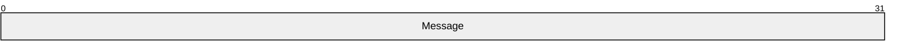
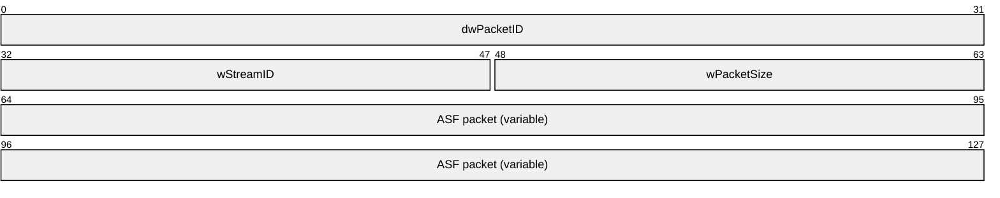
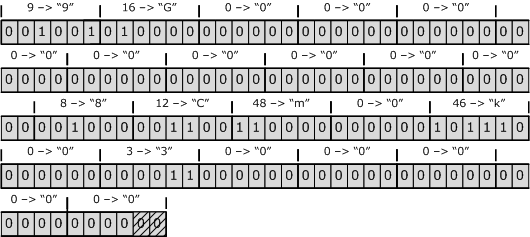

# [MS-MSB]: Media Stream Broadcast (MSB) Protocol

Table of Contents

1 Introduction

- [1 Introduction](#Section_1)
  - [1.1 Glossary](#Section_1.1)
  - [1.2 References](#Section_1.2)
    - [1.2.1 Normative References](#Section_1.2.1)
    - [1.2.2 Informative References](#Section_1.2.2)
  - [1.3 Overview](#Section_1.3)
  - [1.4 Relationship to Other Protocols](#Section_1.4)
  - [1.5 Prerequisites/Preconditions](#Section_1.5)
  - [1.6 Applicability Statement](#Section_1.6)
  - [1.7 Versioning and Capability Negotiation](#Section_1.7)
  - [1.8 Vendor-Extensible Fields](#Section_1.8)
  - [1.9 Standards Assignments](#Section_1.9)

2 Messages

- [2 Messages](#Section_2)
  - [2.1 Transport](#Section_2.1)
  - [2.2 Message Syntax](#Section_2.2)
    - [2.2.1 NSC File Format](#Section_2.2.1)
      - [2.2.1.1 ABNF Syntax for NSC Files](#Section_2.2.1.1)
      - [2.2.1.2 Representation of the String Data Type](#Section_2.2.1.2)
      - [2.2.1.3 "Encoded-Block" Syntax Element](#Section_2.2.1.3)
        - [2.2.1.3.1 EncodedDataHeader Structure](#Section_2.2.1.3.1)
        - [2.2.1.3.2 Encoding of Binary Data](#Section_2.2.1.3.2)
      - [2.2.1.4 Defined Properties](#Section_2.2.1.4)
    - [2.2.2 ASF Packet Error Correction Data](#Section_2.2.2)
    - [2.2.3 Beacon Packet](#Section_2.2.3)
    - [2.2.4 MSB Packet](#Section_2.2.4)

3 Protocol Details

- [3 Protocol Details](#Section_3)
  - [3.1 Server Details](#Section_3.1)
    - [3.1.1 Abstract Data Model](#Section_3.1.1)
    - [3.1.2 Timers](#Section_3.1.2)
    - [3.1.3 Initialization](#Section_3.1.3)
      - [3.1.3.1 Creating an NSC File](#Section_3.1.3.1)
      - [3.1.3.2 Transmitting Beacon Packets](#Section_3.1.3.2)
    - [3.1.4 Higher-Layer Triggered Events](#Section_3.1.4)
    - [3.1.5 Processing Events and Sequencing Rules](#Section_3.1.5)
      - [3.1.5.1 Transmitting the First MSB Packet in a Stream](#Section_3.1.5.1)
      - [3.1.5.2 Transmitting the Last Packet in an Error Correction Cycle](#Section_3.1.5.2)
      - [3.1.5.3 Transmitting the Last MSB Packet](#Section_3.1.5.3)
    - [3.1.6 Timer Events](#Section_3.1.6)
      - [3.1.6.1 Beacon Timer Expires](#Section_3.1.6.1)
    - [3.1.7 Other Local Events](#Section_3.1.7)
  - [3.2 Client Details](#Section_3.2)
    - [3.2.1 Abstract Data Model](#Section_3.2.1)
    - [3.2.2 Timers](#Section_3.2.2)
    - [3.2.3 Initialization](#Section_3.2.3)
    - [3.2.4 Higher-Layer Triggered Events](#Section_3.2.4)
    - [3.2.5 Processing Events and Sequencing Rules](#Section_3.2.5)
      - [3.2.5.1 Receiving a Beacon Packet](#Section_3.2.5.1)
      - [3.2.5.2 Receiving an MSB Packet](#Section_3.2.5.2)
      - [3.2.5.3 Recovering Lost ASF Packets](#Section_3.2.5.3)
      - [3.2.5.4 Receiving the Last ASF Packet](#Section_3.2.5.4)
    - [3.2.6 Timer Events](#Section_3.2.6)
      - [3.2.6.1 Open Timer Expires](#Section_3.2.6.1)
      - [3.2.6.2 End of Stream Timer Expires](#Section_3.2.6.2)
    - [3.2.7 Other Local Events](#Section_3.2.7)
      - [3.2.7.1 User Request for Playback Stop](#Section_3.2.7.1)

4 Protocol Examples

- [4 Protocol Examples](#Section_4)
  - [4.1 General MSB Sequence](#Section_4.1)
  - [4.2 Server-Side Playlist Streaming by Using MSB](#Section_4.2)
  - [4.3 NSC File Encoding](#Section_4.3)

5 Security

- [5 Security](#Section_5)
  - [5.1 Security Considerations for Implementers](#Section_5.1)
  - [5.2 Index of Security Parameters](#Section_5.2)

6 Appendix A: Product Behavior

- [6 Appendix A: Product Behavior](#Section_6)

7 Change Tracking

- [7 Change Tracking](#Section_7)

For the legal notice and IP terms, see [LEGAL.md](../LEGAL.md).
Last updated: 4/23/2024.
See [Revision History](#revision-history) for full version history.

# 1 Introduction

The Media Stream Broadcast (MSB) Protocol allows distribution of [**Advanced Systems Format (ASF)**](#gt_advanced-systems-format-asf) packets over a network for which Internet Protocol (IP) multicast is enabled.

Sections 1.5, 1.8, 1.9, 2, and 3 of this specification are normative. All other sections and examples in this specification are informative.

## 1.1 Glossary

This document uses the following terms:

**.nsc file**: A file that serves as an announcement for, and contains information about, a media stream broadcast. This file allows a client to tune in to a broadcast. The .nsc file was originally known as a NetShow Station Configuration file. Because the NetShow protocol suite is now obsolete, the original nomenclature is no longer applicable and is not used. Also known as a Windows Media Station file or an NSC file.

**Advanced Systems Format (ASF)**: An extensible file format that is designed to facilitate streaming digital media data over a network. This file format is used by Windows Media.

**ASCII**: The American Standard Code for Information Interchange (ASCII) is an 8-bit character-encoding scheme based on the English alphabet. ASCII codes represent text in computers, communications equipment, and other devices that work with text. ASCII refers to a single 8-bit ASCII character or an array of 8-bit ASCII characters with the high bit of each character set to zero.

**big-endian**: Multiple-byte values that are byte-ordered with the most significant byte stored in the memory location with the lowest address.

**little-endian**: Multiple-byte values that are byte-ordered with the least significant byte stored in the memory location with the lowest address.

**parity packet**: An [**ASF**](#gt_advanced-systems-format-asf) data packet that contains parity data and is used for reconstructing other lost packets. Unlike other [**ASF**](#gt_advanced-systems-format-asf) data packets, parity packets always have the Opaque Data Present bit set to 1 in the [**ASF**](#gt_advanced-systems-format-asf) data packet header.

**session**: The state maintained by the server when it is streaming content to a client. If a server-side playlist is used, the same [**session**](#gt_session) is used for all content in the playlist.

**stream**: A sequence of bytes that typically encodes application data.

**Unicode**: A character encoding standard developed by the Unicode Consortium that represents almost all of the written languages of the world. The [**Unicode**](#gt_unicode) standard [[UNICODE5.0.0/2007]](https://go.microsoft.com/fwlink/?LinkId=154659) provides three forms (UTF-8, UTF-16, and UTF-32) and seven schemes (UTF-8, UTF-16, UTF-16 BE, UTF-16 LE, UTF-32, UTF-32 LE, and UTF-32 BE).

**MAY, SHOULD, MUST, SHOULD NOT, MUST NOT:** These terms (in all caps) are used as defined in [[RFC2119]](https://go.microsoft.com/fwlink/?LinkId=90317). All statements of optional behavior use either MAY, SHOULD, or SHOULD NOT.

## 1.2 References

Links to a document in the Microsoft Open Specifications library point to the correct section in the most recently published version of the referenced document. However, because individual documents in the library are not updated at the same time, the section numbers in the documents may not match. You can confirm the correct section numbering by checking the [Errata](https://go.microsoft.com/fwlink/?linkid=850906).

### 1.2.1 Normative References

We conduct frequent surveys of the normative references to assure their continued availability. If you have any issue with finding a normative reference, please contact [dochelp@microsoft.com](mailto:dochelp@microsoft.com). We will assist you in finding the relevant information.

[ASF] Microsoft Corporation, "Advanced Systems Format Specification", December 2004, [https://download.microsoft.com/download/7/9/0/790fecaa-f64a-4a5e-a430-0bccdab3f1b4/ASF_Specification.doc](https://go.microsoft.com/fwlink/?LinkId=89814)

[MS-DTYP] Microsoft Corporation, "[Windows Data Types](../MS-DTYP/MS-DTYP.md)".

[MS-WMLOG] Microsoft Corporation, "[Windows Media Log Data Structure](../MS-WMLOG/MS-WMLOG.md)".

[RFC2119] Bradner, S., "Key words for use in RFCs to Indicate Requirement Levels", BCP 14, RFC 2119, March 1997, [https://www.rfc-editor.org/info/rfc2119](https://go.microsoft.com/fwlink/?LinkId=90317)

[RFC3452] Luby, M., Vicisano, L., Gemmel, J., et al., "Forward Error Correction (FEC) Building Block", RFC 3452, December 2002, [https://www.rfc-editor.org/info/rfc3452](https://go.microsoft.com/fwlink/?LinkId=90423)

[RFC4234] Crocker, D., Ed., and Overell, P., "Augmented BNF for Syntax Specifications: ABNF", RFC 4234, October 2005, [https://www.rfc-editor.org/info/rfc4234](https://go.microsoft.com/fwlink/?LinkId=90462)

### 1.2.2 Informative References

None.

## 1.3 Overview

The MSB Protocol allows the multicast distribution of [**Advanced Systems Format (ASF)**](#gt_advanced-systems-format-asf) packets over a network for which IP multicasting is enabled. MSB allows clients to tune in to a broadcast on a network, much like television and radio users can tune to a particular television or radio station.

Clients access a network broadcast by listening for [MSB packets](#Section_2.2.4) on a particular IP address and User Datagram Protocol (UDP) port. The specific IP multicast address and UDP port is delivered to clients by an [**.nsc file**](#gt_nsc-file). The .nsc file is delivered to the clients by some other means, such as by hosting it at a URL for retrieval by means of HTTP, or sending it as an email attachment.

## 1.4 Relationship to Other Protocols

[MSB packets](#Section_2.2.4) are encapsulated in UDP. The UDP packets can be transmitted over either IP version 4 (IPv4) or IP version 6 (IPv6). The MSB packets are used to transport [**ASF**](#gt_advanced-systems-format-asf) packets. In addition, the MSB Protocol uses the forward error correction (FEC) algorithm, as specified in [[RFC3452]](https://go.microsoft.com/fwlink/?LinkId=90423), for error detection.

## 1.5 Prerequisites/Preconditions

The client needs to know the IP multicast address and UDP port that the [MSB packets](#Section_2.2.4) will be transmitted to. Additionally, the client need to have a way to associate the [**ASF**](#gt_advanced-systems-format-asf) packets that are contained in the MSB packets with an ASF file header.

The [**.nsc file**](#gt_nsc-file) contains the above information; therefore the usual way to satisfy these preconditions is by delivering an .nsc file to the client.

## 1.6 Applicability Statement

The MSB Protocol is used to distribute [**ASF**](#gt_advanced-systems-format-asf) packets over a network for which IP multicasting is enabled.

## 1.7 Versioning and Capability Negotiation

The MSB Protocol does not contain the ability to negotiate protocol versioning or capabilities.

## 1.8 Vendor-Extensible Fields

The MSB Protocol does not contain any vendor-extensible fields.

## 1.9 Standards Assignments

The MSB Protocol has no standards assignments.

# 2 Messages

**Note** Unless otherwise specified, all message fields are transmitted in [**little-endian**](#gt_little-endian) byte order.

This protocol references commonly used data types as defined in [MS-DTYP](../MS-DTYP/MS-DTYP.md).

## 2.1 Transport

The MSB Protocol MUST be transported over the Internet Protocol (IP). The client MAY obtain the IP multicast address and UDP port on which it listens by means of an [**.nsc file**](#gt_nsc-file). The .nsc file is delivered to the client by some other means, such as hosting it at a URL for retrieval by means of HTTP, or sending it as an email attachment.

## 2.2 Message Syntax

### 2.2.1 NSC File Format

The [**.nsc file**](#gt_nsc-file) MUST only contain characters from the [**ASCII**](#gt_ascii) character set. Lines MUST be separated by a carriage-return character followed by a line-feed character.

The .nsc file MUST contain two sections that are labeled "[Address]" and "[Formats]". Each section consists of a sequence of name/value pairs for a variety of properties. The value portion of a property is represented differently depending on the data type of the value. The data type can be an integer, a string, or binary. If the data type is a string, and value is an empty string, then the property does not exist.

The syntax of .nsc files is defined by using augmented Backus-Naur Form (BNF) grammar and is as specified in section [2.2.1.1](#Section_2.2.1.1).

#### 2.2.1.1 ABNF Syntax for NSC Files

The syntax of the [**.nsc file**](#gt_nsc-file) is defined by using augmented BNF (ABNF) grammar [[RFC4234]](https://go.microsoft.com/fwlink/?LinkId=90462) as follows:

nscfile = "[Address]" CRLF address-section "[Formats]" CRLF

formats-section

address-section = optional-properties1 ip-address ip-port

optional-properties2

ip-address = "IP Address" string-param

ip-port = "IP Port" integer-param

formats-section = 1*( format [ description ] )

format = "Format" 1*DIGIT *WSP "=" *WSP binary CRLF

description = "Description" 1*DIGIT string-param

optional-properties1 = [ name-prop ] [ version ] [ mcadapter ]

name-prop = "Name" string-param

version = "NSC Format Version" *WSP "=" *WSP "3.0" CRLF

mcadapter = "Multicast Adapter" string-param

optional-properties2 = [ ttl ] [ ecc ] [ logurl ] [ rollover ]

[ split ] [ cache ] [ expire ] [ nbt ]

ttl = "Time To Live" integer-param

ecc = "Default Ecc" integer-param

logurl = "Log URL" string-param

rollover = "Unicast URL" string-param

split = "Allow Splitting" integer-param

cache = "Allow Caching" integer-param

expire = "Cache Expiration Time" integer-param

nbt = "Network Buffer Time" integer-param

string-param = *WSP "=" *WSP string CRLF

integer-param = *WSP "=" *WSP integer CRLF

integer = "0x" 8HEXDIG

string = ( *VCHAR ) / binary

binary = "02" encoded-block

encoded-block = 12*encoded-char

encoded-char = ALPHA / DIGIT / "{" / "}"

Additional rules for the "string" syntax element are as specified in section [2.2.1.2](#Section_2.2.1.2).

Additional rules for the "encoded-block" syntax element are as specified in section [2.2.1.3](#Section_2.2.1.3).

#### 2.2.1.2 Representation of the String Data Type

If a string can be represented exclusively by using printable characters from the ASCII character set, the string can be included in the [**.nsc file**](#gt_nsc-file) without being transformed. Otherwise, the string MUST be converted to the 16-bit [**Unicode**](#gt_unicode) character set (UTF-16). Each 16-bit symbol is encoded in [**little-endian**](#gt_little-endian) byte order; and the UTF-16 string, including the null character that terminates the string, MUST be encoded as specified in section [2.2.1.3](#Section_2.2.1.3).

#### 2.2.1.3 "Encoded-Block" Syntax Element

Because the [**.nsc file**](#gt_nsc-file) format only allows ASCII characters, binary data and [**Unicode**](#gt_unicode) character strings MUST be encoded by using characters from the ASCII character set. This is accomplished by using a two-step process:

- Create an [EncodedDataHeader](#Section_2.2.1.3.1) data structure, as specified in section 2.2.1.3.1, and fill in the fields in that structure.
- Encode the data structure, followed by the encoded binary data, or Unicode string, by using the encoding algorithm as specified in [Encoding of Binary Data (section 2.2.1.3.2)](#Section_2.2.1.3.2). The encoding MUST be done in a single step so that it treats the EncodedDataHeader and the binary data as a single block of binary data.
The resulting ASCII character string MUST be written to the .nsc file according to the ABNF syntax for the "encoded-block" element, which is as specified in [ABNF Syntax for NSC Files (section 2.2.1.1)](#Section_2.2.1.1).

##### 2.2.1.3.1 EncodedDataHeader Structure

The EncodedDataHeader structure is defined as follows:

typedef struct {

BYTE CRC;

DWORD Key;

DWORD Length;

} EncodedDataHeader;

**CRC:** This field MUST be set to the result that is obtained by performing an exclusive OR (XOR) computation on each byte in the 32-bit **Key** field, the 32-bit **Length** field, and the binary data to be encoded.

**Key:** If the binary data is an [**ASF**](#gt_advanced-systems-format-asf) header, the **Key** field MUST be set to the Format ID that is associated with this ASF header. The Format ID is an 11-bit number; the high order 21 bits in the **Key** field MUST be set to 0. If the binary data is not an ASF header, the Key MUST be 0.

**Length:** This field MUST be set to the size, in bytes, of the binary data. If the binary data is a [**Unicode**](#gt_unicode) string, the null character that terminates the string MUST be included in the count. The Length value does not include the size of the EncodedDataHeader.

##### 2.2.1.3.2 Encoding of Binary Data

During encoding, the [EncodedDataHeader (section 2.2.1.3.1)](#Section_2.2.1.3.1) structure and the binary data or [**Unicode**](#gt_unicode) string that follows are treated as a simple array of bits, with the bits of each byte arranged in most significant bit first order. The Key and Length fields of the EncodedDataHeader structure MUST be encoded in [**big-endian**](#gt_big-endian) byte order, that is, the most significant byte of each field is encoded first.

Starting from the most significant bit in the first byte, the six most significant bits are grouped and converted into a 6-bit number. This number is used as an index to an ASCII character in the following encoding table. The encoded result is the ASCII character that is obtained from the table.

CHAR szSixtyFour[65] =

"0123456789ABCDEFGHIJKLMNOPQRSTUVWXYZabcdefghijklmnopqrstuvwxyz{}";

In every group of six bits, the bit that occurs first in the array of bits MUST be used as the most significant bit in the 6-bit number. The same algorithm is applied to the remaining two bits in the first byte and the four most significant bits in the second byte; and the process is repeated until all groups of six bits have been encoded. If the total number of bits to be encoded is not a multiple of six, the final group of bits MUST be padded with zero-value bits so that the size of the final group becomes six bits.

Encoded binary data can be decoded by mapping each ASCII character back to six bits by using the following decoding table. If an invalid character is used as an index into the decoding table, the table maps it to the value 0xff. Valid characters map to a value in the range 0x00 to 0x3f.

BYTE bInverseSixtyFour[128] = {

0xff, 0xff, 0xff, 0xff, 0xff, 0xff, 0xff, 0xff,

0xff, 0xff, 0xff, 0xff, 0xff, 0xff, 0xff, 0xff,

0xff, 0xff, 0xff, 0xff, 0xff, 0xff, 0xff, 0xff,

0xff, 0xff, 0xff, 0xff, 0xff, 0xff, 0xff, 0xff,

0xff, 0xff, 0xff, 0xff, 0xff, 0xff, 0xff, 0xff,

0xff, 0xff, 0xff, 0xff, 0xff, 0xff, 0xff, 0xff,

0x00, 0x01, 0x02, 0x03, 0x04, 0x05, 0x06, 0x07,

0x08, 0x09, 0xff, 0xff, 0xff, 0xff, 0xff, 0xff,

0xff, 0x0a, 0x0b, 0x0c, 0x0d, 0x0e, 0x0f, 0x10,

0x11, 0x12, 0x13, 0x14, 0x15, 0x16, 0x17, 0x18,

0x19, 0x1a, 0x1b, 0x1c, 0x1d, 0x1e, 0x1f, 0x20,

0x21, 0x22, 0x23, 0xff, 0xff, 0xff, 0xff, 0xff,

0xff, 0x24, 0x25, 0x26, 0x27, 0x28, 0x29, 0x2a,

0x2b, 0x2c, 0x2d, 0x2e, 0x2f, 0x30, 0x31, 0x32,

0x33, 0x34, 0x35, 0x36, 0x37, 0x38, 0x39, 0x3a,

0x3b, 0x3c, 0x3d, 0x3e, 0xff, 0x3f, 0xff, 0xff

};

#### 2.2.1.4 Defined Properties

This section defines the possible properties. Some of the properties are optional, as indicated by the ABNF grammar. Properties that are included in the [**.nsc file**](#gt_nsc-file) MUST appear in the file in the order that is specified by the ABNF grammar.

**Name:** Optional. A comma-separated listing of "Machine Name", "Publishing Point Name" for the server that is transmitting the [MSB packets](#Section_2.2.4).

**NSC Format Version:** Optional. MUST be set to 3.0.

**Multicast Adapter:** Optional. If this field is present, it MUST specify the IP address that is used as the source IP address of the MSB Protocol IP multicast packets.

**IP Address:** The IP address of the multicast group to which the MSB packets are transmitted.

**IP Port:** The UDP port number to which the MSB packets are addressed.

**Time To Live:** Optional. If specified, the server MUST set the IPv4 TTL field or IPv6 Hop Count field to this value when transmitting the MSB packets.<1>

**Default Ecc:** Optional. The maximum number of [**ASF**](#gt_advanced-systems-format-asf) data packets, not including the ASF [**parity packet**](#gt_parity-packet), in an error-correction cycle. This property SHOULD be specified when error correction is used.

**Log URL:** Optional. The HTTP URL to which the client is supposed to submit logging information during or after the multicast [**session**](#gt_session). If this field is present, it MUST specify an http:// URL and the resource that is identified by the URL MUST be capable of receiving the Windows Media Player logging messages (as specified in [MS-WMLOG](../MS-WMLOG/MS-WMLOG.md)) that are submitted by using an HTTP POST request.

**Unicast URL:** Optional. Data type: string. The failover URL for a unicast feed when the client fails to receive the multicast. If this field is present, the URL SHOULD be an mms:// or http:// URL, because other URLs cannot be supported by all clients.

**Allow Splitting:** Optional. The value MUST be 1 if the [**stream**](#gt_stream) can be split, and it MUST be 0 if it cannot be split. A stream is being split if it is forwarded to multiple recipients or forwarded to multiple IP multicast groups.

**Allow Caching:** Optional. The value MUST be 1 if the stream can be cached, and it MUST be 0 if it cannot be cached.

**Cache Expiration Time:** Optional. The time, in seconds, after which cached data is considered expired.

**Network Buffer Time:** Optional. The network buffer time, in milliseconds.<2> A client SHOULD use the value that is specified by the *Network Buffer Time* parameter as the amount of multimedia data to keep in the buffer as protection against the effects of network jitter. For example, if the amount of multimedia data that is buffered by a client is determined by some encoding-specific buffering time, plus an additional amount that is intended to protect against the effects of network jitter, then the value that is specified by the *Network Buffer Time* parameter SHOULD be used as a replacement for only the latter amount.

**Format<x>:** The Advanced Systems Format (ASF) header that contains the format information about a particular encoded format. The ASF header consists of the entire ASF Header object (as specified in [[ASF]](https://go.microsoft.com/fwlink/?LinkId=89814) section 3.1) plus the 50-byte fixed initial portion of the ASF Data object (as specified in [ASF] section 5.1). When the ASF header is encoded into a sequence of ASCII characters, as specified in ["Encoded-Block" Syntax Element (section 2.2.1.3)](#Section_2.2.1.3), the **Key** field of the [EncodedDataHeader](#Section_2.2.1.3.1) structure MUST be set to an 11-bit Format ID value. Each ASF header in the .nsc file MUST be identified by a different Format ID value. Any 11-bit sequence number can be used as the Format ID; however, a cryptographically secure hash that is computed over the ASF header is likely to ensure that identical ASF headers are listed only one time in the .nsc file.

**Description<x>:** Optional. A human-readable string that describes the content that is associated with the ASF header.

### 2.2.2 ASF Packet Error Correction Data

[**ASF**](#gt_advanced-systems-format-asf) packets that are transmitted by using the MSB Protocol SHOULD use error correction.<3> If error correction is used, it MUST be done as follows: A [**parity packet**](#gt_parity-packet) is computed by performing a byte-wise exclusive OR (XOR) operation on some number of consecutive ASF packets. The number of ASF packets that are used to compute the parity packet is referred to as the span.

The span of the parity packet SHOULD be 10. The span of a parity packet MUST be at least 1 and MUST NOT be more than 15. The server SHOULD NOT use a larger span for any parity packet than what was specified by the *Default Ecc* parameter, if any, in the [**.nsc file**](#gt_nsc-file).

The XOR operation that forms the parity packet is computed on the entire ASF packet, except the **Error Correction Flags** field and the **Error Correction Data** field of the ASF packet header. These two fields usually occupy the first three bytes of the ASF packet header. For more information about the ASF packet header, see [[ASF]](https://go.microsoft.com/fwlink/?LinkId=89814) section 5.2.1.

Although **Error Correction Data** is a variable-size field, when error correction is used, all ASF packets in the span MUST have an **Error Correction Data** field of the same size.

In the parity packet, the **Error Correction Flags** field and the **Error Correction Data** field MUST be set in accordance to the rules specified in this section. The remainder of the parity packet MUST consist entirely of the parity data computed through the XOR operation.

If the ASF packets in a span are of variable size, the parity packet MUST be as large as the largest packet in the span. Zero-byte padding MUST be added to the end of the ASF packets, if needed, during the XOR operation, to ensure that the XOR operation is performed on packets of equal size.

The parity packet MUST be transmitted directly following the last packet in the span. As an example, if the span is 10, it means that the eleventh [MSB packet](#Section_2.2.4) will contain an ASF packet that consists of parity data.

If error correction is used for at least some ASF packets, the Error Correction Present bit in the **Error Correction Flags** field of the ASF header MUST be set to 1. The ASF packets that contain parity data MUST have the Opaque Data Present bit set to 1. That bit MUST be set to 0 on all nonparity ASF packets.

If error correction is not used for an ASF packet and the **Error Correction Data** field is present in that ASF packet, the 4-bit **Type** field MUST be set to 0. If error correction is used for an ASF packet, the **Error Correction Data** field MUST be present, and the **Type** field MUST be set to 2 for parity packets and to 1 for packets that are not parity packets.

The 4-bit **Number** field MUST be set to 0 if error correction is not used and the field is present. If error correction is used for an ASF packet, this field MUST be present and it SHOULD be set to the sequence number of the ASF packet in the span. The first ASF packet in the span is number 1. If the span is 10, the last packet in the span has number 10, and the parity packet has number 11. Alternatively, the server MAY set the **Number** field to 1 in all ASF packets when error correction is used.

The 8-bit **Cycle** field MUST be set to 0 if error correction is not used and the field is present. If error correction is used, all packets that belong to the same span, including the parity packet, are considered to belong to the same cycle. The **Cycle** field MUST be set to the same number for all packets that belong to the same cycle, and it MUST be incremented by one for each cycle. The first cycle SHOULD be number 0, but MAY be chosen randomly. For example, if the span is 10, this means that the first 11 ASF packets have the **Cycle** field set to 0. The next 11 packets have the **Cycle** field set to 1, and so on.

### 2.2.3 Beacon Packet

The Beacon packet is sent by the server to inform the client that the server is active.

**Message (4 bytes):** A 4-byte message that identifies the protocol that sends the packet. The 4 bytes MUST be set to a value of "MSB". Note that the last character is " " (space). If the Message field is treated as a 32-bit integer, it MUST be set to 0x2042534D.

| Value | Meaning |
| --- | --- |
| "MSB" | A 4-byte message that identifies the protocol that sends the packet as the Media Stream Broadcast (MSB) Protocol. |
| 0x2042534D | A value that is used to indicate that the 4-byte message field is treated as a 32-bit integer. |

### 2.2.4 MSB Packet

Each MSB packet consists of a header, followed by a variable-size [**ASF**](#gt_advanced-systems-format-asf) packet. The following figure defines the fields in the MSB packet.

**Note** In previous versions of the MSB Protocol specification, the MSB packet is also referred to as MSBPACKETHEADER.

**dwPacketID (4 bytes):** A sequence number that identifies an individual MSB packet. This value SHOULD start with 0 for the first MSB packet that is transmitted; alternatively, the starting value MAY be chosen randomly. If the ASF packet is a regular data packet (that is, not a [**parity packet**](#gt_parity-packet)), the sequence number MUST be incremented for each new MSB packet that is transmitted. If the ASF packet is a parity packet, the dwPacketID field MUST have the same value as the previously transmitted MSB packet. For more information about how to determine if an ASF packet is a parity packet, see [ASF Packet Error Correction Data (section 2.2.2)](#Section_2.2.2).

**wStreamID (2 bytes):** The identifier of the format that is required to render the data that is contained in the payload. The lowest order 11 bits of this field MUST be set to the Format ID that is assigned to the ASF header that the client uses when parsing the payload. Each ASF header and its associated Format ID is present in the [**.nsc file**](#gt_nsc-file) that is associated with this particular MSB stream. The most significant bit of the **wStreamID** field MUST be toggled whenever the playlist entry changes at the server in a server-side playlist. This ensures that the client can tell that the server has switched to a new entry, even if both entries use an identical ASF header. The remaining bits for this field are not used and MUST be set to zero.

**wPacketSize (2 bytes):** The length, in bytes, of the complete MSB packet including the MSB packet fields and the ASF packet. This field MUST be set to a value in the range 0x0008 to 0xFFFF, inclusive.

**ASF packet (variable):** A variable size array of bytes. The payload MUST consist of exactly one complete ASF packet. If the ASF packet contains a **Padding Data** field, as specified in [[ASF]](https://go.microsoft.com/fwlink/?LinkId=89814) section 5.2.4, the field SHOULD be removed prior to transmission. If the **Padding Data** field is removed, the **Padding Length** field in the ASF payload parsing information ([ASF] section 5.2.2) MUST be updated to indicate a nonexistent **Padding Data** field.

# 3 Protocol Details

## 3.1 Server Details

### 3.1.1 Abstract Data Model

Not applicable for this protocol specification.

### 3.1.2 Timers

**Beacon**: This timer controls how often [Beacon packets](#Section_3.1.3.2) are sent. The time-out interval for this timer MUST be in the range of 1 to 10 seconds, inclusive.

### 3.1.3 Initialization

#### 3.1.3.1 Creating an NSC File

The server MUST create an [**.nsc file**](#gt_nsc-file) at least once. The file MUST specify the IP multicast group and UDP port number to which the [MSB packets](#Section_2.2.4) are addressed. It also MUST specify all [**ASF**](#gt_advanced-systems-format-asf) headers that are needed by the client to parse the ASF packets, and assign a Format ID to each ASF header. All ASF headers in the .nsc file MUST have a different Format ID.<4><5>

A previously created .nsc file can be used instead of creating a new .nsc file, if the contents of the existing file are equivalent to the new .nsc file that would otherwise be created.

#### 3.1.3.2 Transmitting Beacon Packets

If the server does not have any [MSB packets](#Section_2.2.4) to send (for example, if a live event has not yet started), but clients have already received an [**.nsc file**](#gt_nsc-file), the server SHOULD start the Beacon timer. Starting the Beacon timer when there are no MSB packets to send allows clients to remain ready to receive MSB packets.

The server MAY start the Beacon timer if it is going to immediately begin transmitting MSB packets.<6>

The Beacon timer MUST be configured to expire in 10 seconds or less, but not more often than once every second.

### 3.1.4 Higher-Layer Triggered Events

Not applicable for this protocol specification.

### 3.1.5 Processing Events and Sequencing Rules

#### 3.1.5.1 Transmitting the First MSB Packet in a Stream

When the server is about to transmit the first [MSB packet](#Section_2.2.4) for a stream, it MUST ensure that the value of the **wStreamID** field in MSB packet is different from the **wStreamID** value that is used in the previous stream, if any. In this context, the term "stream" refers to an [**ASF**](#gt_advanced-systems-format-asf) file, or an entry, in a server-side playlist.

If the new stream uses the same ASF header as the previous stream, the most significant bit in the **wStreamID** field MUST be set to the opposite value of that bit in the **wStreamID** field that is used for the previous stream.

If the Beacon timer is running, it SHOULD be stopped (to preserve network bandwidth). However, the server MAY choose to leave the Beacon timer running.<7>

#### 3.1.5.2 Transmitting the Last Packet in an Error Correction Cycle

If error correction is used with the [**ASF**](#gt_advanced-systems-format-asf) packets, the last [MSB packet](#Section_2.2.4) in every error correction cycle MUST be an ASF [**parity packet**](#gt_parity-packet). For more information about error correction, cycles, and parity packets, see [ASF Packet Error Correction Data (section 2.2.2)](#Section_2.2.2).

#### 3.1.5.3 Transmitting the Last MSB Packet

If error correction is used with the [**ASF**](#gt_advanced-systems-format-asf) packets, the last [MSB packet](#Section_2.2.4) that is transmitted SHOULD also be the last packet in the last error correction cycle.<8>

After the last MSB packet has transmitted, if the server intends to continue transmitting MSB packets later and it wants the clients to remain ready to receive future MSB packets, it MUST start the Beacon timer as specified in section [3.1.3.2](#Section_3.1.3.2).

### 3.1.6 Timer Events

#### 3.1.6.1 Beacon Timer Expires

When the timer that is used for scheduling the transmission of [Beacon packets](#Section_3.1.3.2) expires, the server MUST send a new Beacon packet. The Beacon timer MUST then be restarted.

### 3.1.7 Other Local Events

Not applicable for this protocol specification.

## 3.2 Client Details

### 3.2.1 Abstract Data Model

Not applicable for this protocol specification.

### 3.2.2 Timers

**Open**: (Optional) This timer is stopped when [MSB packets](#Section_2.2.4) or [Beacon packets](#Section_3.1.3.2) are received. The time-out interval for this timer MUST be in the range of 10 to 30 seconds, inclusive.

**End of Stream**: (Optional) This timer expires if no MSB packets have been received for a certain period of time. For more information about expiration of the End of Stream timer, see section [3.2.5.2](#Section_3.2.5.2).

### 3.2.3 Initialization

The MSB Protocol initializes when the client receives an [**.nsc file**](#gt_nsc-file). When that file is received, the client MUST begin listening on the UDP port that is specified by the .nsc file and join the IP multicast group that is specified by the .nsc file.

The Open timer SHOULD be used. If the Open timer is used, it MUST be started at this time, and it MUST be stopped when either an [MSB packet](#Section_2.2.4) or a [Beacon packet](#Section_3.1.3.2) is received. The Open timer MUST NOT expire in less than 10 seconds. It is recommended that the Open timer expires if no such packets are received for 20 seconds.

### 3.2.4 Higher-Layer Triggered Events

Not applicable for this protocol specification.

### 3.2.5 Processing Events and Sequencing Rules

The client MUST first perform the initialization step as specified in section [3.2.3](#Section_3.2.3).

Subsequently, the client MUST be prepared to receive [Beacon packets](#Section_3.1.3.2) and [MSB packets](#Section_2.2.4) at all times. Details that describe how to process a Beacon packet are as specified in section [3.2.5.1](#Section_3.2.5.1). Details that describe how to process an MSB packet are as specified in section [3.2.5.2](#Section_3.2.5.2).

#### 3.2.5.1 Receiving a Beacon Packet

If the Open timer is running, it MUST be stopped.

#### 3.2.5.2 Receiving an MSB Packet

The client MUST validate the **wStreamID** field in the [MSB Packet](#Section_2.2.4) to verify that the Format ID that is indicated by the **wStreamID** field corresponds to a known [**ASF**](#gt_advanced-systems-format-asf) header (that is, an ASF header that is specified in the [**.nsc file**](#gt_nsc-file)). If the ASF header is known, the client MUST stop the Open timer; if it is running, and if the End of Stream timer is used, it MUST be started or reset at this time.

It is recommended that the End of Stream timer be set to expire after 30 seconds; however, the appropriate time-out can depend on how the ASF content was encoded. The stream bit rate and ASF packet size in the ASF header MAY be used to compute an expiration time appropriate for the stream.

If the End of Stream timer is used, it MUST be reset each time a new MSB Packet is received if the **wStreamID** field in the MSB Packet corresponds to a known ASF header.

If the ASF header is unknown, the client MUST ignore this MSB Packet and all other MSB Packets with the same **wStreamID** value. How the client handles this error condition is implementation-specific. The client can report an error to the user, or it can wait and see if the problem is transient in nature. For example, the client could leave the Open timer running (if it was running).

#### 3.2.5.3 Recovering Lost ASF Packets

If the [**ASF**](#gt_advanced-systems-format-asf) packets use error correction as specified in [ASF Packet Error Correction Data (section 2.2.2)](#Section_2.2.2), the client MAY recover one lost packet per span if the [**parity packet**](#gt_parity-packet) has not been lost. The lost packet can be reconstructed by performing an exclusive OR (XOR) operation on all the packets that belong to the same cycle, including the parity packet. This is the same operation that is performed by the server in order to compute the parity packet, except that now it is used to reconstruct the lost packet.

#### 3.2.5.4 Receiving the Last ASF Packet

If the End of Stream timer is used and it expires, the client MUST assume that the last [**ASF**](#gt_advanced-systems-format-asf) packet has been received and that the stream has ended. Alternatively, the client MAY use the value of the Play Duration field in the ASF File Properties object (as specified in [[ASF]](https://go.microsoft.com/fwlink/?LinkId=89814) section 3.2) to determine when the stream has ended. However, if the value of the **Play Duration** field is 0, it cannot be used for this purpose.

The client SHOULD use at least one of the two optional methods that are described above to determine that the stream has ended.

When the stream has ended and if the [**.nsc file**](#gt_nsc-file) specifies an HTTP URL in the Logging URL property, the client SHOULD submit a logging message by using an HTTP POST request to that URL. The logging message MUST use the "Logging Messages Sent to Web Servers" syntax that is as specified in[MS-WMLOG](../MS-WMLOG/MS-WMLOG.md) section 2.3.

### 3.2.6 Timer Events

#### 3.2.6.1 Open Timer Expires

If the Open timer expires, it means that no [MSB packets](#Section_2.2.4) or [Beacon packets](#Section_3.1.3.2) were received for at least 10 seconds. In this case, the client SHOULD attempt to open the failover URL that is specified in the "Unicast URL" property in the [**.nsc file**](#gt_nsc-file). If the "Unicast URL" property is not present or is an empty string, the client SHOULD report a network time-out error to the higher layer.

#### 3.2.6.2 End of Stream Timer Expires

If the End of Stream timer expires, the client MUST assume that the last [**ASF**](#gt_advanced-systems-format-asf) packet has been received and that the stream has ended. Therefore, the rules, as specified in section [3.2.5.4](#Section_3.2.5.4), MUST then be followed.

### 3.2.7 Other Local Events

#### 3.2.7.1 User Request for Playback Stop

This local event can occur after playback has started; that is, at least one [**ASF**](#gt_advanced-systems-format-asf) packet MUST have been received and played back (rendered). If the user has previously requested playback to stop, then at least one ASF packet MUST have been received and played back (rendered) since the last time the user requested playback to stop.

If a user requests that playback of the stream stop, for example, by pressing a Stop button or a Pause button in a graphical user interface, the client MUST treat this event as if the stream has ended. Specifically, the rules about the sending of a logging message, as specified in section [3.2.5.4](#Section_3.2.5.4), MUST be followed in this case.

# 4 Protocol Examples

## 4.1 General MSB Sequence

The following diagram shows a typical communication sequence between a client and server.

Figure 1: Typical MSB communication sequence between a client and server

- The client retrieves an [**.nsc file**](#gt_nsc-file) (as specified in section [2.2.1](#Section_2.2.1)) by some means, such as by retrieving the file from a URL or through an email attachment.
- The server (optionally) transmits [Beacon packets](#Section_3.1.3.2) prior to transmission of [MSB packets](#Section_2.2.4).
- The server sends one or more MSB packets.
- If the Log URL property is specified in the .nsc file, the client submits a logging message at the end of the stream. (For more information, see sections [3.2.5.4](#Section_3.2.5.4) and [3.2.7.1](#Section_3.2.7.1)).
- The server transmits Beacon packets if it intends to transmit future MSB packets and if it wants the client to remain ready to receive the MSB packets.

## 4.2 Server-Side Playlist Streaming by Using MSB

The following diagram shows a typical communication sequence between a client and server when streaming content from a server-side playlist.

**Note** When using the MSB Protocol, the client does not have the capability to seek or skip to a new entry in a server-side playlist.

Figure 2: Server-side playlist sequence during client/server communication

- The client retrieves an [**.nsc file**](#gt_nsc-file) (see section [2.2.1](#Section_2.2.1)) by some means, such as by retrieving it from a URL or through an email attachment.
- The server (optionally) transmits [Beacon packets](#Section_3.1.3.2) prior to transmission of [MSB packets](#Section_2.2.4).
- The server sends one or more MSB packets.
- When the entry changes in the server-side playlist, the most significant bit of the **wStreamID** is toggled and MSB packets for the new playlist entry are sent. For more information, see sections 2.2.4 and [3.1.5.1](#Section_3.1.5.1).
**Note** If the server is set to loop or repeat when the end of stream is reached, the server toggles the **wStreamID** when it restarts the stream. (For more information, see section 3.1.5.1.)

- If the Log URL property is specified in the .nsc file, the client submits a logging message (as specified in section [3.2.5.4](#Section_3.2.5.4)) after receiving an MSB packet with a new **wStreamID**.
- Steps 4 and 5 are repeated until the end of the server-side playlist is reached.
- If the Log URL property is specified in the .nsc file, the client submits a logging message at the end of the stream. (For more information, see sections 3.2.5.4 and [3.2.7.1](#Section_3.2.7.1).)
- The server transmits Beacon packets if it intends to transmit future MSB packets and if it wants the client to remain ready to receive the MSB packets.

## 4.3 NSC File Encoding

The following represents the content of an [**.nsc file**](#gt_nsc-file) in which all strings use [**ASCII**](#gt_ascii) characters, and thus are not encoded:

[Address]

Name=MY_COMPUTER, bpp

NSC Format Version=3.0

Multicast Adapter=157.55.149.102

IP Address=239.192.48.179

IP Port=0x00004A41

Time To Live=0x00000020

Default Ecc=0x0000000A

Log URL=

Unicast URL=

Allow Splitting=0x00000001

Allow Caching=0x00000001

Cache Expiration Time=0x00015180

Network Buffer Time=0x000001F4

[Formats]

Format1=<ASF header 1>

Description1=Windows Media Audio Stream

Below is the same file in which all strings originated as [**Unicode**](#gt_unicode) character strings and were subsequently encoded into ASCII characters:

[Address]

Name=029W000000000YJG1P05y0Gm1F04q0K01L05G0HG1I02m0801Y0700S00000

NSC Format Version=029G0000000008Cm0k0300000

Multicast Adapter=0230000000000UCG0r03S0BW0r03K0BW0n03G0E

G0k0340C00o0000

IP Address=020G000000000UCW0p03a0BW0n03a0CW0k03G0E00k0340Dm0v0000

IP Port=0x00004A41

Time To Live=0x00000020

Default Ecc=0x0000000A

Log URL=020W0000000002000

Unicast URL=020W0000000002000

Allow Splitting=0x00000001

Allow Caching=0x00000001

Cache Expiration Time=0x00015180

Network Buffer Time=0x000001F4

[Formats]

Format1=02X0000vu000EfC2QoTOvcpn6csG2g06BER7S30000000020000042p

dNu...

Description1=029m000000000SLm1f06u0P01l07S0Sm0W04q0PG1a06a0OG0000

The following diagrams and descriptive text further illustrate the encoding of Unicode character strings into ASCII characters, as specified in section [2.2.1.3.2](#Section_2.2.1.3.2). The fields in the [EncodedDataHeader (section 2.2.1.3.1)](#Section_2.2.1.3.1) structure to be encoded and their endian arrangement are shown in the following diagram.

Figure 3: Unicode character string encoding

Consider the NSC Format Version property from the preceding .nsc file example. If the value "3.0" that is associated with the property is expressed as a Unicode string, the following bit array would result for the EncodedDataHeader structure. For the byte order of the Unicode characters, see section [2.2.1.2](#Section_2.2.1.2).

Figure 4: Unicode string

Using the encoding algorithm (as specified in section 2.2.1.3.2), the bits in the array are grouped and converted into 6-bit numbers, as illustrated in the diagram below. The decimal equivalent of each 6-bit number, and the corresponding ASCII character from the encoding table are shown above each group in the diagram.

Note that the bit array that is shown is not evenly divisible by six; two zero-value bits (shown with hash marks) are added to the final group to yield a 6-bit group.

Figure 5: Bit array

As specified in section [2.2.1.1](#Section_2.2.1.1), the resulting ASCII character string is preceded with "02"; therefore, the property and Unicode-based string `NSC Format Version=3.0` is encoded and transformed to become `NSC Format Version=029G0000000008Cm0k0300000`.

# 5 Security

## 5.1 Security Considerations for Implementers

For any packet that contains fields that specify other field lengths, such as an [MSB packet (section 2.2.4)](#Section_2.2.4) or an [**ASF**](#gt_advanced-systems-format-asf) packet, implementers validate that the length values do not exceed the size of the packet itself.

Implementers cannot assume that the ASF data in the MSB packet or in the [**.nsc file**](#gt_nsc-file) can be trusted. Use caution when parsing variable-length fields, to ensure that length information, if any, does not cause the buffer size to be exceeded.

Note that packets that are transmitted to the IP multicast group and UDP port number that are specified in the .nsc file do not necessarily originate from the correct server. Clients filter out packets that are not MSB packets.

Implementers can reduce receipt of unwanted packets by filtering them based on the source IP address. A client can filter out any IP packet that does not have the IP source address field set to the same IP address that is specified in the Multicast Adapter field in the .nsc file.

If packets are being re-addressed by a switch or router because of network address translation (NAT), the source IP address of the multicast packets could be different from the address that is specified in the Multicast Adapter field. Under these circumstances, the server either avoids specifying the Multicast Adapter field or specifies the post-NAT address in the Multicast Adapter field. The mechanism by which a server can determine the translated address is implementation-specific and beyond the scope of this document.

## 5.2 Index of Security Parameters

The MSB Protocol has no security parameters.

# 6 Appendix A: Product Behavior

The information in this specification is applicable to the following Microsoft products or supplemental software. References to product versions include updates to those products.

- Windows 2000 Professional operating system
- Windows 2000 Server operating system
- Windows XP operating system
- Windows Server 2003 operating system
- Windows Vista operating system
- Windows Server 2008 operating system
- Windows 7 operating system
- Windows Server 2008 R2 operating system
- Windows 8 operating system
- Windows Server 2012 operating system
- Windows 8.1 operating system
- Windows Server 2012 R2 operating system
- Windows 10 operating system
- Windows Server 2016 operating system
- Windows Server operating system
- Windows Server 2019 operating system
- Windows Server 2022 operating system
- Windows 11 operating system
- Windows Server 2025 operating system
Exceptions, if any, are noted in this section. If an update version, service pack or Knowledge Base (KB) number appears with a product name, the behavior changed in that update. The new behavior also applies to subsequent updates unless otherwise specified. If a product edition appears with the product version, behavior is different in that product edition.

Unless otherwise specified, any statement of optional behavior in this specification that is prescribed using the terms "SHOULD" or "SHOULD NOT" implies product behavior in accordance with the SHOULD or SHOULD NOT prescription. Unless otherwise specified, the term "MAY" implies that the product does not follow the prescription.

<1> Section 2.2.1.4: IPv6 support is available only on Windows XP, Windows Server 2003, Windows Vista, Windows Server 2008, and Windows Server 2008 R2.

<2> Section 2.2.1.4: This property is only used in Windows Server 2003, Windows Vista, Windows Server 2008, and Windows Server 2008 R2. In Windows Server 2003, Windows Server 2008, and Windows Server 2008 R2, use of this property requires manual entry of the property into the [**.nsc file**](#gt_nsc-file).

<3> Section 2.2.2: Error correction is always used with the MSB Protocol on Windows Media Services and cannot be disabled.

<4> Section 3.1.3.1: The following optional .nsc file properties are included in .nsc files that are created by Windows 2000 Server but not in .nsc files that are created by Windows Server 2003, Windows Server 2008, and Windows Server 2008 R2:

- Player URL
- Player Version
- Distribution Limit
- Channel Version
- Delivery Mode
- NSC URL
<5> Section 3.1.3.1: The following optional .nsc file properties are included in .nsc files that are created by Windows Server 2003, Windows Server 2008, and Windows Server 2008 R2 but not in .nsc files that are created by Windows 2000 Server:

- Allow Splitting
- Allow Caching
- Cache Expiration Time
- Default Ecc
<6> Section 3.1.3.2: Windows 2000 Server starts the Beacon timer even if it is going to immediately begin transmitting the packets.

<7> Section 3.1.5.1: Windows 2000 Server does not stop the Beacon timer.

<8> Section 3.1.5.3: In Windows 2000 Server, Windows Server 2003, Windows Server 2008, and Windows Server 2008 R2, if the last error correction cycle contains fewer than 10 [**ASF**](#gt_advanced-systems-format-asf) packets, the cycle is not completed with a [**parity packet**](#gt_parity-packet).

# 7 Change Tracking

This section identifies changes that were made to this document since the last release. Changes are classified as Major, Minor, or None.

The revision class **Major** means that the technical content in the document was significantly revised. Major changes affect protocol interoperability or implementation. Examples of major changes are:

- A document revision that incorporates changes to interoperability requirements.
- A document revision that captures changes to protocol functionality.
The revision class **Minor** means that the meaning of the technical content was clarified. Minor changes do not affect protocol interoperability or implementation. Examples of minor changes are updates to clarify ambiguity at the sentence, paragraph, or table level.

The revision class **None** means that no new technical changes were introduced. Minor editorial and formatting changes may have been made, but the relevant technical content is identical to the last released version.

The changes made to this document are listed in the following table. For more information, please contact [dochelp@microsoft.com](mailto:dochelp@microsoft.com).

| Section | Description | Revision class |
| --- | --- | --- |
| [6](#Section_6) Appendix A: Product Behavior | Added Windows Server 2025 to the list of applicable products. | Major |

## Revision History

| Date | Version | Revision Class | Comments |
| --- | --- | --- | --- |
| 10/22/2006 | 0.01 | New | Version 0.01 release |
| 1/19/2007 | 1.0 | Major | Version 1.0 release |
| 3/2/2007 | 1.1 | Minor | Version 1.1 release |
| 4/3/2007 | 1.2 | Minor | Version 1.2 release |
| 5/11/2007 | 1.3 | Minor | Version 1.3 release |
| 6/1/2007 | 1.4 | Minor | TDI Bug Fixes |
| 7/3/2007 | 1.4.1 | Editorial | Changed language and formatting in the technical content. |
| 7/20/2007 | 1.4.2 | Editorial | Changed language and formatting in the technical content. |
| 8/10/2007 | 1.5 | Minor | Clarified the meaning of the technical content. |
| 9/28/2007 | 1.5.1 | Editorial | Changed language and formatting in the technical content. |
| 10/23/2007 | 1.5.2 | Editorial | Changed language and formatting in the technical content. |
| 11/30/2007 | 1.5.3 | Editorial | Changed language and formatting in the technical content. |
| 1/25/2008 | 1.5.4 | Editorial | Changed language and formatting in the technical content. |
| 3/14/2008 | 1.5.5 | Editorial | Changed language and formatting in the technical content. |
| 5/16/2008 | 1.5.6 | Editorial | Changed language and formatting in the technical content. |
| 6/20/2008 | 1.5.7 | Editorial | Changed language and formatting in the technical content. |
| 7/25/2008 | 1.5.8 | Editorial | Changed language and formatting in the technical content. |
| 8/29/2008 | 1.5.9 | Editorial | Changed language and formatting in the technical content. |
| 10/24/2008 | 1.5.10 | Editorial | Changed language and formatting in the technical content. |
| 12/5/2008 | 2.0 | Major | Updated and revised the technical content. |
| 1/16/2009 | 2.0.1 | Editorial | Changed language and formatting in the technical content. |
| 2/27/2009 | 2.0.2 | Editorial | Changed language and formatting in the technical content. |
| 4/10/2009 | 2.0.3 | Editorial | Changed language and formatting in the technical content. |
| 5/22/2009 | 3.0 | Major | Updated and revised the technical content. |
| 7/2/2009 | 3.0.1 | Editorial | Changed language and formatting in the technical content. |
| 8/14/2009 | 3.0.2 | Editorial | Changed language and formatting in the technical content. |
| 9/25/2009 | 4.0 | Major | Updated and revised the technical content. |
| 11/6/2009 | 4.0.1 | Editorial | Changed language and formatting in the technical content. |
| 12/18/2009 | 4.0.2 | Editorial | Changed language and formatting in the technical content. |
| 1/29/2010 | 4.1 | Minor | Clarified the meaning of the technical content. |
| 3/12/2010 | 4.1.1 | Editorial | Changed language and formatting in the technical content. |
| 4/23/2010 | 4.1.2 | Editorial | Changed language and formatting in the technical content. |
| 6/4/2010 | 4.1.3 | Editorial | Changed language and formatting in the technical content. |
| 7/16/2010 | 4.1.3 | None | No changes to the meaning, language, or formatting of the technical content. |
| 8/27/2010 | 4.1.3 | None | No changes to the meaning, language, or formatting of the technical content. |
| 10/8/2010 | 4.1.3 | None | No changes to the meaning, language, or formatting of the technical content. |
| 11/19/2010 | 4.1.3 | None | No changes to the meaning, language, or formatting of the technical content. |
| 1/7/2011 | 4.1.3 | None | No changes to the meaning, language, or formatting of the technical content. |
| 2/11/2011 | 4.1.3 | None | No changes to the meaning, language, or formatting of the technical content. |
| 3/25/2011 | 4.1.3 | None | No changes to the meaning, language, or formatting of the technical content. |
| 5/6/2011 | 4.1.3 | None | No changes to the meaning, language, or formatting of the technical content. |
| 6/17/2011 | 4.2 | Minor | Clarified the meaning of the technical content. |
| 9/23/2011 | 4.2 | None | No changes to the meaning, language, or formatting of the technical content. |
| 12/16/2011 | 5.0 | Major | Updated and revised the technical content. |
| 3/30/2012 | 5.0 | None | No changes to the meaning, language, or formatting of the technical content. |
| 7/12/2012 | 5.0 | None | No changes to the meaning, language, or formatting of the technical content. |
| 10/25/2012 | 5.0 | None | No changes to the meaning, language, or formatting of the technical content. |
| 1/31/2013 | 5.0 | None | No changes to the meaning, language, or formatting of the technical content. |
| 8/8/2013 | 6.0 | Major | Updated and revised the technical content. |
| 11/14/2013 | 6.0 | None | No changes to the meaning, language, or formatting of the technical content. |
| 2/13/2014 | 6.0 | None | No changes to the meaning, language, or formatting of the technical content. |
| 5/15/2014 | 6.0 | None | No changes to the meaning, language, or formatting of the technical content. |
| 6/30/2015 | 7.0 | Major | Significantly changed the technical content. |
| 10/16/2015 | 7.0 | None | No changes to the meaning, language, or formatting of the technical content. |
| 7/14/2016 | 8.0 | Major | Significantly changed the technical content. |
| 6/1/2017 | 8.0 | None | No changes to the meaning, language, or formatting of the technical content. |
| 9/15/2017 | 9.0 | Major | Significantly changed the technical content. |
| 9/12/2018 | 10.0 | Major | Significantly changed the technical content. |
| 4/7/2021 | 11.0 | Major | Significantly changed the technical content. |
| 6/25/2021 | 12.0 | Major | Significantly changed the technical content. |
| 4/23/2024 | 13.0 | Major | Significantly changed the technical content. |
