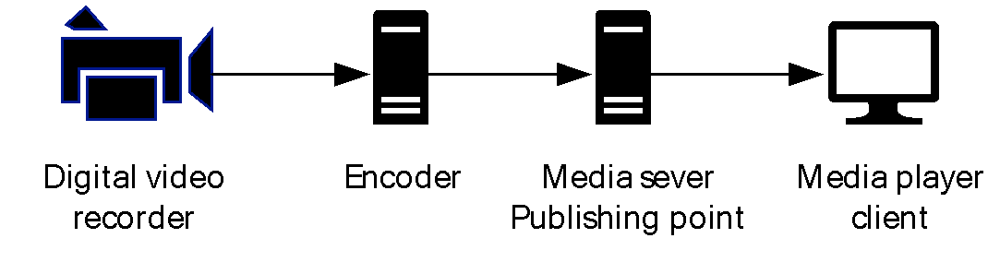
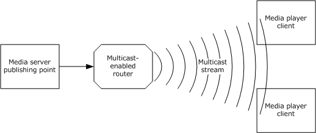
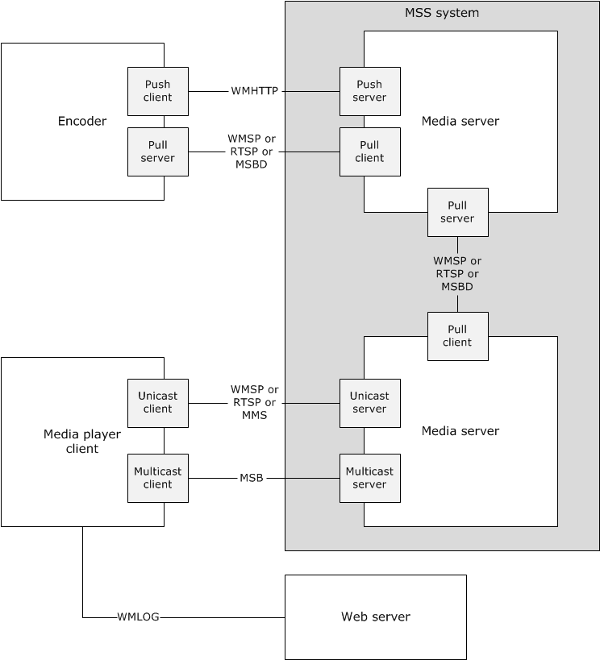
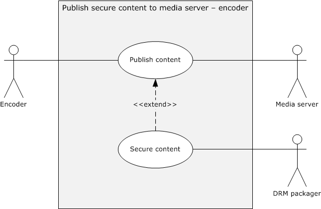
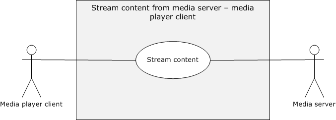
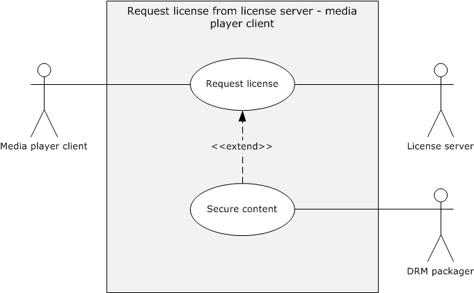
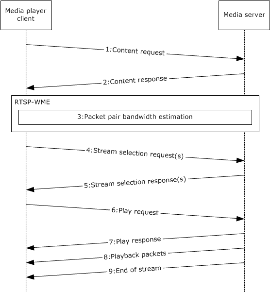
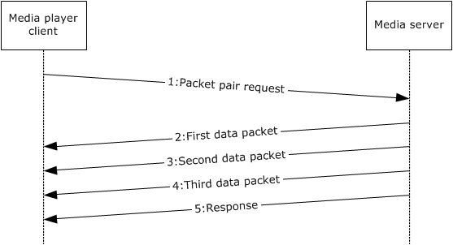

# [MS-MSSOD]: Media Streaming Server Protocols Overview

Table of Contents

1 Introduction

- [1 Introduction](#Section_1)
  - [1.1 Conceptual Overview](#Section_1.1)
  - [1.2 Glossary](#Section_1.2)
  - [1.3 References](#Section_1.3)

2 Functional Architecture

- [2 Functional Architecture](#Section_2)
  - [2.1 Overview](#Section_2.1)
    - [2.1.1 System Purpose](#Section_2.1.1)
    - [2.1.2 System Components](#Section_2.1.2)
    - [2.1.3 Applicability](#Section_2.1.3)
    - [2.1.4 Relevant Standards](#Section_2.1.4)
    - [2.1.5 Protocol Relationship](#Section_2.1.5)
      - [2.1.5.1 RTSP-WME: Logical Dependencies and Relationship to Other Protocols](#Section_2.1.5.1)
      - [2.1.5.2 MMSP: Logical Dependencies and Relationship to Other Protocols](#Section_2.1.5.2)
      - [2.1.5.3 MSB: Relationship to Other Protocols](#Section_2.1.5.3)
      - [2.1.5.4 MSBD: Logical Dependencies and Relationship to Other Protocols](#Section_2.1.5.4)
      - [2.1.5.5 WMSP: Logical Dependencies and Relationship to Other Protocols](#Section_2.1.5.5)
      - [2.1.5.6 WMHTTP: Logical Dependencies and Relationship to Other Protocols](#Section_2.1.5.6)
  - [2.2 Protocol Summary](#Section_2.2)
  - [2.3 Environment](#Section_2.3)
    - [2.3.1 Authentication](#Section_2.3.1)
    - [2.3.2 Media Player Client](#Section_2.3.2)
    - [2.3.3 Encoder](#Section_2.3.3)
    - [2.3.4 Dependencies on This System](#Section_2.3.4)
    - [2.3.5 Dependencies on Other Systems/Components](#Section_2.3.5)
  - [2.4 Assumptions and Preconditions](#Section_2.4)
  - [2.5 Use Cases](#Section_2.5)
    - [2.5.1 Publish Content to Media Server - Encoder](#Section_2.5.1)
    - [2.5.2 Publish Secure Content to Media Server - Encoder](#Section_2.5.2)
    - [2.5.3 Stream Content from Media Server - Media Player Client](#Section_2.5.3)
    - [2.5.4 Request License from License Server - Media Player Client](#Section_2.5.4)
    - [2.5.5 Log Statistics to Servers - Media Player Client](#Section_2.5.5)
    - [2.5.6 Discover Media Server URLs - Media Player Client](#Section_2.5.6)
  - [2.6 Versioning, Capability Negotiation, and Extensibility](#Section_2.6)
  - [2.7 Error Handling](#Section_2.7)
  - [2.8 Coherency Requirements](#Section_2.8)
  - [2.9 Security](#Section_2.9)
  - [2.10 Additional Considerations](#Section_2.10)

3 Examples

- [3 Examples](#Section_3)
  - [3.1 Example 1: Encoder Push Content to Media Server](#Section_3.1)
  - [3.2 Example 2: Media Server Pull Content from Encoder](#Section_3.2)
  - [3.3 Example 3: Stream Content from Media Server to Media Player Client](#Section_3.3)
    - [3.3.1 Stream Content Using RTSP-WME](#Section_3.3.1)
    - [3.3.2 Stream Content Using WMSP](#Section_3.3.2)
    - [3.3.3 Estimation of Packet-Pair Bandwidth](#Section_3.3.3)
  - [3.4 Example 4: Publish Secure Content to Media Server](#Section_3.4)
  - [3.5 Example 5: Log Statistics to Server](#Section_3.5)

4 Microsoft Implementations

- [4 Microsoft Implementations](#Section_4)
  - [4.1 Product Behavior](#Section_4.1)

5 Change Tracking

- [5 Change Tracking](#Section_5)

For the legal notice and IP terms, see [LEGAL.md](../LEGAL.md).
Last updated: 10/26/2021.
See [Revision History](#revision-history) for full version history.

# 1 Introduction

The Media Streaming Server system is a platform for [**streaming**](#gt_streaming) audio and video [**content**](#gt_content) to [**clients**](#gt_client) over the Internet or an intranet. These clients can be other computers or devices that play back the content by using a media player, or they can be other computers running media [**servers**](#gt_server) that proxy, cache, or redistribute content.

The Media Streaming Server (MSS) system is designed to deliver an end-to-end experience for components that are involved in the creation, distribution, and playback of audio and video content. The system enables administrators and content providers to create media solutions for corporate communications, training and education, e-commerce, commercial broadcast, and other uses. The Media Streaming Server system consists of a computer running a media encoder, a server running as a media server, and a number of client computers running media player clients. The encoder converts both live and prerecorded audio and video content to a media format. The server then distributes the content over a network or the Internet. The media player client then receives the content. To scale and meet network demands, the system can also include cache and proxy servers, and distribution servers.

In e-commerce scenarios, the Media Streaming Server system can require the support of Digital Rights Management (DRM) components to enable the administrator to securely encrypt the broadcast and download of content.

Each of the components in the system uses the member protocols to enable scenarios that range from live broadcast playback to on-demand playback.

## 1.1 Conceptual Overview

The Media Streaming Server (MSS) system includes protocols to transmit data packets that originate from downloadable and [**streaming**](#gt_streaming) audio, video, and other multimedia data files.

Concepts that are specific to the Media Streaming Server system are:

**Digital Rights Management:** Digital Rights Management (DRM) provides [**content**](#gt_content) providers with the means to protect their proprietary music or other data from illegal uses, such as the creation of unauthorized copies. DRM technology protects digital content by encrypting it and attaching to it usage rules that determine the conditions under which a user can play back the content. Usage rules typically limit the number of computers or devices that have access to the content, or limit the number of times that content can be played.

**Note** Digital Rights Management (DRM) is an optional component. For relevant supported Windows versions, see [MS-DRM](../MS-DRM/MS-DRM.md).

**Encoder:** An encoder is a tool that is used to capture audio and video files and [**streams**](#gt_stream), to digitize them, and to provide them to media [**servers**](#gt_server) for distribution. For more information on creating a broadcast, see [[WM9CSEB]](https://go.microsoft.com/fwlink/?LinkId=149630) section 5.

The following figure illustrates the live broadcast configuration.

Figure 1: Live broadcast configuration

Encoders typically capture the video and audio streams from capture cards and recording devices. To capture from an analog source, such as a video tape, the computer requires a capture card that recognizes the analog stream and converts it to digital media information. The encoder then converts the digital media information to encoded media that can be efficiently transported as streaming media.

**Live broadcast:** A live broadcast is often used when viewers want to see and hear an important event as it is occurring. For information about on-demand versus live broadcasts, see [[MSFT-WMSDG]](https://go.microsoft.com/fwlink/?LinkId=149625), "Distributing content".

**Media player client:** A media player client is usually the destination point in the Media Streaming Server system, and is typically designed for rendering the media streams.

**On-demand broadcast:** An on-demand broadcast is a re-broadcast of a live event or of any media file that is not time critical. In this case, users can request the stream when they want to watch it and can control the playback to meet their requirements. For information about on-demand versus live broadcasts, see [MSFT-WMSDG], Windows Media Services 2008 Deployment Guide.

**Playlist:** A [**playlist**](#gt_playlist) is a file or collection of content files that is designed to play in a specific order or a query that results in a list of content files that are designed to play in a specific order.

The following table describes various playlists that are used by the MSS system.

| Playlist formats | Details |
| --- | --- |
| Media playlist files | Designed for audio-only files and often referred to as the MP3 playlist. The playlist can provide URLs to HTTP servers or media servers. |
| Advanced Stream Redirector files | Advanced Stream Redirector files are based on the Extensible Markup Language (XML) syntax and are designed specifically to provide URLs to content from media servers to the [**client**](#gt_client). For more information on Advanced Stream Redirector files, see [[MSDN-ASX]](https://go.microsoft.com/fwlink/?LinkId=137271). |
| Windows Media Player playlist | A playlist query that is based on Synchronized Multimedia Integration Language (SMIL) that only works on local content and is not used by MSS. Windows Media Player Playlist syntax is based on SMIL 2.0. Clients load the playlists and process them locally. The playlist provides URLs or paths to the files. The client then streams the individual content by using the MSS system protocols. See the W3C website [[W3C]](https://go.microsoft.com/fwlink/?LinkId=124548) for the SMIL 2.0 specification. For more information on the Windows Media Player playlist syntax, see [[MSDN-MediaPlaylists]](https://go.microsoft.com/fwlink/?LinkId=168567). |
| Server-side playlists | Server-side playlists are a query method that is used to generate a list of content to be streamed to the client. The server processes the playlist locally and then streams the content to the client by using the MSS system protocols. The client receives a new [**Advanced Systems Format (ASF)**](#gt_advanced-systems-format-asf) file header each time when the server transitions from one entry to the next in the server-side playlist. Server-side playlists are beneficial as they allow the server (or encoder) operator to inject new playlist entries, such as advertisements, into a live program. |

**Origin server:** An origin server is a media server that publishes on-demand or live content.

**Distribution server:** A distribution server improves the scalability of the Media Streaming Server system. A distribution server publishes content that it received from another media server. The distribution server has to be networked to the origin server and have permission to stream from the origin server.

A distribution server publishes content that it received from another streaming source, such as another media server. The origin server is the source of the content that is being streamed by the distribution server. Clients then connect to the distribution server as if it were the origin server. Distribution servers are located between the origin server and the client in the content stream and therefore can perform load balancing. Distribution servers provide an easy way to reduce the client load on a media server because the client content requests are distributed to several servers on the network. Publishing via distribution servers is illustrated in the following figure.

Figure 2: Publishing via distribution servers

**Proxy server:** A proxy server is a dedicated computer that proxies data between the media player client and the server. If the server is acting as a caching server, the proxy server requests a stream from the origin server and allows multiple clients to stream the content. Therefore the origin server is limited to one network request. If the content is broadcast content, the content cannot be cached. In this case, the proxy server can create a [**split stream**](#gt_split-stream) for the content. The proxy server receiving the stream from the origin server splits the stream to distribute to multiple clients simultaneously without increasing the requests to the origin server. Proxy servers fall into three categories:

**Forward proxy server:** The forward proxy server can retrieve information from another server on behalf of a client. Typically, a client is explicitly configured to use a specific proxy server, and when the client requests content, the proxy server connects to an origin server to retrieve the content.

**Reverse proxy server:** A reverse proxy server is a proxy server that is configured to service all client requests. For [**unicast**](#gt_unicast) broadcasts, a reverse proxy server can reduce the load on the origin server by streaming multiple unicast streams while receiving only one stream from the origin server. For on-demand content, a reverse proxy server can reduce the load on the origin server by caching the content from the origin server and streaming it to clients from its cache.

To the client, the reverse proxy server appears to be the origin server. This structure enables the origin server to be isolated from the clients. A reverse proxy server can increase the security of the streaming media system because the client never connects to the origin server directly.

**Transparent proxy server:** A transparent proxy server is a server that transmits data between the server and the client without any modification of the data. It is a forwarding service that the client is unaware of.

**Packet-pair bandwidth estimation:** Packet-pair bandwidth estimation is a technique that is used to estimate the bandwidth of a streaming media connection over the Internet.

To estimate bandwidth, the server sends two or more consecutive packets of highly entropic data. The client estimates the bandwidth by measuring the difference between the times that it receives the packets. This method is usually reliable; however, if the client traverses a Network Address Translation (NAT) firewall or proxy server, the packet-pair bandwidth measurement might be inaccurate. Packet-pair bandwidth estimation is supported by the following protocols: the Real-Time Streaming Protocol (RTSP) Windows Media Extensions (RTSP-WME), the Windows Media Server (MMSP) Protocol, and the Windows Media Streaming HTTP Protocol (WMSP), as illustrated in the following figure.

Figure 3: Packet-pair bandwidth estimation

**Fast start:** Allows the media player to buffer at speeds higher than the bit rate of the content requested. This enables users to start receiving content more quickly. After the initial buffer requirement is fulfilled, on-demand and broadcast content streams at the bit rate are defined by the content stream.

[**Fast start**](#gt_fast-start) also allows a distribution server to request the data from the origin server at a faster bit rate. The bit rate that is specified in the fast start protocol headers ensures that the distribution server has enough data buffered to meet its requirements and the requirements of the media player client. To enable fast start, the protocols use the following two headers or tokens to request fast start:

- **Accelerate headers:** The tokens that the client uses to request a higher transmission rate and duration from the server.
- **Burst headers:**The tokens that the client uses to request a higher transmission rate and duration from the server. The client that sends the request is usually an intermediate device that is relaying the request for another client.
Fast start is supported only by the Windows Media HTTP Streaming Protocol (WMSP) and the Real-Time Streaming Protocol (RTSP) Windows Media Extensions (RTSP-WME).

**Advanced fast start:** [**Advanced fast start**](#gt_advanced-fast-start) is designed to minimize startup latency in the media player client. Startup latency is the period of time starting when a viewer requests a stream by using the player and ending when the content begins playing. The primary reason for startup latency is the delay caused by buffering on the media player client.

Advanced fast start enables the media player client to begin playing a stream before its buffer is full. As soon as the media player client receives a minimum amount of data, it can begin playing a stream while its buffer continues to fill at an accelerated rate—a rate that is faster than the encoded bit rate of the content. When the buffer is full, acceleration stops, and the media player client begins receiving data at the encoded bit rate.

For advanced fast start to work effectively, adequate bandwidth has to be available above the encoded bit rate of a stream. For example, if 1,200 kilobits per second (Kbps) of bandwidth is available for an 800 Kbps stream, the media player client can use an acceleration rate of 1.5 times the encoded bit rate. If no additional bandwidth is available, the player fills its buffer before it begins playing a stream, and no benefit can be gained from either advanced fast start or fast start.

Advanced fast start is used only by clients that connect to a unicast stream and is supported only by the Windows Media HTTP Streaming Protocol (WMSP) and the Real-Time Streaming Protocol (RTSP) Windows Media Extensions (RTSP-WME).

**Unicast streaming:** Unicast streaming is a one-to-one connection between the media server and a media player client, which means that each client receives a distinct stream. Only those clients that request the stream receive it. The server can deliver content as a unicast stream from either an on-demand or a broadcast [**publishing point**](#gt_publishing-point). Unicast streaming offers the benefits of interactivity between the player and server. However, the number of users that can receive unicast streams is limited by the bit rate of the content, the speed of the server network, and the available server resources. The number of users that are served is directly proportional to the amount of available server resources and instances. Unicast streaming is illustrated in the following figure.

Figure 4: Unicast streaming

**Multicast streaming:** [**Multicast**](#gt_multicast) streaming is a one-to-many relationship between a media server and the media player clients receiving the stream. With a multicast stream, the server streams to a multicast IP address on the network, and clients receive the stream by subscribing to the IP address. All clients receive the same stream and do not have control of content playback. Because there is only one stream from the server regardless of the number of clients receiving the stream, a multicast stream requires the same amount of bandwidth as a single unicast stream containing the same content. Therefore, multicast streaming improves the scalability of the server-side resources. More clients can be serviced with fewer server resources. Multicast streaming is illustrated in the following figure.

Figure 5: Multicast streaming

**Core transport protocols:** The Media Streaming Server system includes a number of individual protocols that rely on the [**User Datagram Protocol (UDP)**](#gt_user-datagram-protocol-udp) to transport protocol packets. UDP is an unreliable protocol—it does not guarantee the successful receipt of the packets. The packets can be dropped, can arrive out of order, or can be replicated. Other Media Streaming Server system protocols, however, use [**Transmission Control Protocol (TCP)**](#gt_transmission-control-protocol-tcp), a reliable protocol that guarantees that packets arrive in the order specified. Section [2.3](#Section_2.3) includes a table that indicates UDP and TCP support for the Media Streaming Server system protocols.

## 1.2 Glossary

This document uses the following terms:

**.asx file**: A file that contains the URL or a set of URLs to the streaming media files.

**.nsc file**: A file that serves as an announcement for, and contains information about, a media stream broadcast. This file allows a client to tune in to a broadcast. The .nsc file was originally known as a NetShow Station Configuration file. Because the NetShow protocol suite is now obsolete, the original nomenclature is no longer applicable and is not used. Also known as a Windows Media Station file or an NSC file.

**advanced fast start**: A process whereby a receiver uses information that is provided by the sender to determine when playback of [**streaming**](#gt_streaming) (1) content should be initiated.

**Advanced Systems Format (ASF)**: An extensible file format that is designed to facilitate streaming digital media data over a network. This file format is used by Windows Media.

**client**: A computer on which the remote procedure call (RPC) client is executing.

**content**: Multimedia data. [**content**](#gt_content) is always in [**ASF**](#gt_advanced-systems-format-asf), for example, a single [**ASF**](#gt_advanced-systems-format-asf) music file or a single [**ASF**](#gt_advanced-systems-format-asf) video file. Data in general. A file that an application accesses. Examples of content include web pages and documents stored on either web servers or SMB file servers.

**encryption**: In cryptography, the process of obscuring information to make it unreadable without special knowledge.

**fast start**: A process to stream content quickly as requested by the receiver.

**key**: In the registry, a node in the logical tree of the data store.

**multicast**: A content delivery method in which a single stream is transmitted from a media server to multiple clients. The clients have no connection with the server. Instead, the server sends a single copy of the stream across the network to multicast-enabled routers, which replicate the data. Clients can then receive the stream by monitoring a specific multicast IP address and port.

**playlist**: One or more [**content**](#gt_content) items that are [**streamed**](#gt_streaming) sequentially.

**publishing point**: An organized memory location that is identified by a name on a media streaming server. The name is part of the URL that is used by a client when the client requests content from the server.

**redirector file**: A file that is designed to provide the player with information on how to access the streaming media file. Redirector files can be .axf files or [**.nsc files**](#gt_nsc-file).

**server**: A computer on which the remote procedure call (RPC) server is executing.

**session**: In the Workstation service, an authenticated connection between two computers.

**split stream**: A [**stream**](#gt_stream) (2) that is being split by a distribution server in order to be forwarded to multiple recipients.

**stream**: A flow of data from one host to another host, or the data that flows between two hosts.

**streaming**: The act of processing a part of an XML Infoset without requiring that the entire XML Infoset be available.

**Transmission Control Protocol (TCP)**: A protocol used with the Internet Protocol (IP) to send data in the form of message units between computers over the Internet. TCP handles keeping track of the individual units of data (called packets) that a message is divided into for efficient routing through the Internet.

**unicast**: The process of sending traffic to a unique address. [**Unicast**](#gt_unicast) routing is the process of forwarding unicasted traffic from a source to a destination on an internetwork.

**User Datagram Protocol (UDP)**: The connectionless protocol within TCP/IP that corresponds to the transport layer in the ISO/OSI reference model.

## 1.3 References

[ASF] Microsoft Corporation, "Advanced Systems Format Specification", December 2004, [http://download.microsoft.com/download/7/9/0/790fecaa-f64a-4a5e-a430-0bccdab3f1b4/ASF_Specification.doc](https://go.microsoft.com/fwlink/?LinkId=89814)

[MS-DRM] Microsoft Corporation, "[Digital Rights Management License Protocol](../MS-DRM/MS-DRM.md)".

[MS-MMSP] Microsoft Corporation, "[Microsoft Media Server (MMS) Protocol](../MS-MMSP/MS-MMSP.md)".

[MS-MSBD] Microsoft Corporation, "[Media Stream Broadcast Distribution (MSBD) Protocol](../MS-MSBD/MS-MSBD.md)".

[MS-MSB] Microsoft Corporation, "[Media Stream Broadcast (MSB) Protocol](../MS-MSB/MS-MSB.md)".

[MS-NLMP] Microsoft Corporation, "[NT LAN Manager (NTLM) Authentication Protocol](../MS-NLMP/MS-NLMP.md)".

[MS-RTSP] Microsoft Corporation, "[Real-Time Streaming Protocol (RTSP) Windows Media Extensions](../MS-RTSP/MS-RTSP.md)".

[MS-WMHTTP] Microsoft Corporation, "[Windows Media HTTP Push Distribution Protocol](../MS-WMHTTP/MS-WMHTTP.md)".

[MS-WMLOG] Microsoft Corporation, "[Windows Media Log Data Structure](../MS-WMLOG/MS-WMLOG.md)".

[MS-WMSP] Microsoft Corporation, "[Windows Media HTTP Streaming Protocol](../MS-WMSP/MS-WMSP.md)".

[MSDN-ASX] Microsoft Corporation, "ASX Elements Reference", [http://msdn.microsoft.com/en-us/library/ms910265.aspx](https://go.microsoft.com/fwlink/?LinkId=137271)

[MSDN-LPS-WME] Microsoft Corporation, "Developing a License Provider Service for Windows Media Encoder", [http://msdn.microsoft.com/en-us/library/ms867146.aspx](https://go.microsoft.com/fwlink/?LinkId=157785)

[MSDN-MediaPlaylists] Microsoft Corporation, "Windows Media Playlist Elements Reference", [http://msdn.microsoft.com/en-us/library/dd564688(VS.85).aspx](https://go.microsoft.com/fwlink/?LinkId=168567)

[MSFT-WMSDG] Microsoft Corporation, "Windows Media Services Deployment Guide", [http://technet.microsoft.com/en-us/library/cc730848.aspx](https://go.microsoft.com/fwlink/?LinkId=149625)

[RFC1945] Berners-Lee, T., Fielding, R., and Frystyk, H., "Hypertext Transfer Protocol -- HTTP/1.0", RFC 1945, May 1996, [http://www.ietf.org/rfc/rfc1945.txt](https://go.microsoft.com/fwlink/?LinkId=90300)

[RFC2326] Schulzrinne, H., Rao, A., and Lanphier, R., "Real Time Streaming Protocol (RTSP)", RFC 2326, April 1998, [http://www.ietf.org/rfc/rfc2326.txt](https://go.microsoft.com/fwlink/?LinkId=90335)

[RFC2616] Fielding, R., Gettys, J., Mogul, J., et al., "Hypertext Transfer Protocol -- HTTP/1.1", RFC 2616, June 1999, [http://www.rfc-editor.org/rfc/rfc2616.txt](https://go.microsoft.com/fwlink/?LinkId=90372)

[RFC2617] Franks, J., Hallam-Baker, P., Hostetler, J., et al., "HTTP Authentication: Basic and Digest Access Authentication", RFC 2617, June 1999, [http://www.rfc-editor.org/rfc/rfc2617.txt](https://go.microsoft.com/fwlink/?LinkId=90373)

[RFC3452] Luby, M., Vicisano, L., Gemmel, J., et al., "Forward Error Correction (FEC) Building Block", RFC 3452, December 2002, [http://www.ietf.org/rfc/rfc3452.txt](https://go.microsoft.com/fwlink/?LinkId=90423)

[W3C] W3C, "World Wide Web Consortium (W3C)", [http://www.w3.org](https://go.microsoft.com/fwlink/?LinkId=124548)

[WM9CSEB] Microsoft Corporation, "Creating a Successful Executive Broadcast using Windows Media 9 Series", [http://download.microsoft.com/download/7/d/a/7dae51fa-b199-47a1-b583-c4c510535730/broadcastupdated.doc](https://go.microsoft.com/fwlink/?LinkId=149630)

# 2 Functional Architecture

This section provides an overview of the capabilities of the Media Streaming Server system, the relationship of the communication protocols that comprise the system, a summary of the Storage Services system protocols, system dependencies, use cases, versioning, capability negation, error handling, coherency requirements, and security considerations.

## 2.1 Overview

### 2.1.1 System Purpose

The Media Streaming Server system includes protocols to transmit data packets that originate from downloadable and [**streaming**](#gt_streaming) audio, visual, and other multimedia data files.

The main purpose of the system is to deliver real-time or downloadable audio-visual [**content**](#gt_content) via the transfer of [**streams**](#gt_stream) from a server to a single [**client**](#gt_client) or multiple clients. As specified in section [2.2](#Section_2.2), various protocols are available to perform this task.

Other purposes of the Media Streaming Server system include:

- [**Multicast**](#gt_multicast) distribution of [**Advanced Systems Format (ASF)**](#gt_advanced-systems-format-asf) packets over a network for which IP multicasting is enabled.
- Transferring a live stream of audio-visual content from a [**server**](#gt_server) to a single client or to multiple clients.
- Transferring real-time multimedia data (for example, live audio and video files), by using HTTP as transport.
- Streaming of multimedia data from Windows Media Services to Windows Media Player (WMP) or other instances of Windows Media Services.
- Transferring real-time multimedia data from a client to a server by using the Windows Media HTTP Push Distribution Protocol (WMHTTP).

### 2.1.2 System Components

The conceptual framework for the Media Streaming Server (MSS) system is defined in terms of three internal roles: client, server, and encoder.

The Media Streaming Server (MSS) system provides a way for an encoder application to provide content to a media [**server**](#gt_server) and for a media player client application to [**stream**](#gt_stream) content from a media server. The following diagram illustrates this concept.

Figure 6: Media Streaming Server system components diagram

Roles that use the Media Streaming Server (MSS) system protocols are as follows:

- Encoder: An encoder application that pushes or transmits digital media to a media server.
- Player: A playback application that streams digital media from a media server.
- Proxy server: A media server that acts as a proxy server.
Roles use the Media Streaming Server (MSS) system external protocols:

- Player: A playback application that wants to decrypt and playback Digital Rights Management (DRM) encrypted digital media from a media server.
- Web server: A server that receives logging data from a player.
- DRM packager: An application that is used to encrypt media for secure playback.
Components of the MSS system protocols are as follows:

- Player component: A client application component that uses the Media Streaming Server (MSS) system protocols to request and stream files from the media server.
- Encoder component: The encoder application component digitizes media and provides those media streams and files to the media server.
- Media server: A server component that uses the Media Streaming Server (MSS) system protocols to receive and request data from the encoder application and to stream and provide requested streams to the player application.
Components that use the Media Streaming Server (MSS) system external protocols are as follows:

- Player application: An application that uses protocols other than the Media Streaming Server (MSS) system protocols to communicate with the DRM server to request licenses.
- Encoder application: An application that uses protocols other than the Media Streaming Server (MSS) system protocols to communicate with the DRM packager and to encrypt media files
**Note** Digital Rights Management (DRM) is an optional component. For relevant supported Windows versions, see [MS-DRM](../MS-DRM/MS-DRM.md).

### 2.1.3 Applicability

The MSS system is used to deliver real-time multimedia data by streaming it. The term [**streaming**](#gt_streaming) means that the data is transmitted at some fixed rate or at some rate that is related to the rate at which the data will be consumed, for example, displayed by the receiver.

The applicability of each member protocol that is supported by the system, as described in section [2.2](#Section_2.2), depends on the use cases in section [2.5](#Section_2.5) and the protocol relevance, as described in section [2.3](#Section_2.3).

For individual protocol applicability, see the specifications of the protocols that are supported by the MSS system, as listed in section 2.2.

### 2.1.4 Relevant Standards

The system does not require any standards beyond those that are described in the specifications of the protocols supported by the system, as listed in section [2.2](#Section_2.2).

### 2.1.5 Protocol Relationship

The following figure shows a high-level view of the integrated media streaming protocols.

Figure 7: Integrated media streaming protocols

**Encoder push client:** The Push Encoder uses the Windows Media HTTP Push Distribution Protocol (WMHTTP) to push media streams to the media server.

**Encoder pull server:** The Pull Encoder uses the Windows Media HTTP Streaming Protocol (WMSP) or the Media Stream Broadcast Distribution (MSBD) Protocol to stream digitized media streams to the media server. The decision on which protocol to use is based on the system platform in use.

**Media server as origin server:** The origin server plays two roles. It receives or pulls the content as provided by the encoders, and more importantly, it streams the content to the client or distribution server. When streaming to a client, the origin server uses the Media Stream Broadcast (MSB) Protocol to stream multicast. When streaming [**unicast**](#gt_unicast), the server streams by using one of three protocols: the Microsoft Media Server (MMS) Protocol (MMSP), the Windows Media HTTP Streaming Protocol (WMSP), and the Real-Time Streaming Protocol (RTSP) Windows Media Extensions (RTSP-WME). The decision of which protocol to use is based on the system platform that is currently in use, as described in section [2.6](#Section_2.6). As part of the internal operation of these protocols, logging messages can be sent from the media player client to the media server.

**Media server as distribution server:** The distribution server plays two roles. It receives content from the origin server and therefore acts as a destination, but it also forwards the content on to the media player client. When streaming to the client, the distribution server is limited to the same protocols that the origin server provides. The origin server when distributing content to a distribution server, however, does so either through the Media Stream Broadcast Distribution (MSBD) Protocol or the Windows Media HTTP Streaming Protocol (WMSP). The decision on which protocol to use is based on the system platform in use as described in section 2.6.

**Media server as cache/proxy server:** The media server can enable a built-in Windows Media Services (WMS) cache/proxy capability.<1>As a cache/proxy server, it receives content from the origin server and caches the content for further distribution. It can also act as a reverse proxy server where the reverse proxy server appears to be the origin server to the client. If the content is broadcast content, the server can create a [**split stream**](#gt_split-stream) for the content.

**Web server:** The web server can receive logging messages from the media player client.

#### 2.1.5.1 RTSP-WME: Logical Dependencies and Relationship to Other Protocols

Real-Time Streaming Protocol (RTSP) Windows Media Extensions (RTSP-WME) rely on [**TCP**](#gt_transmission-control-protocol-tcp) to control the streaming media [**session**](#gt_session). RTSP uses the Session Description Protocol (SDP) syntax to describe the properties of content.

RTSP-WME is similar in functionality to the Microsoft Media Server (MMS) Protocol (MMSP protocol. For more information, see [MS-MMSP](../MS-MMSP/MS-MMSP.md). However, RTSP-WME provides additional functionality that is not available in MMSP.

RTSP-WME is similar in functionality to the Windows Media HTTP Streaming Protocol (WMSP), as specified in [MS-WMSP](../MS-WMSP/MS-WMSP.md). However, in that protocol, the delivery of [**ASF**](#gt_advanced-systems-format-asf) packets is limited to TCP only.

RTSP-WME defines multiple extensions to the Real-Time Streaming Protocol (RTSP) standard [[RFC2326]](https://go.microsoft.com/fwlink/?LinkId=90335). The extensions include the following:

- Extensions to the Real-time Transport Protocol (RTP) payload format definitions to allow for ASF data packets, forward error correction data, retransmitted packets, and packet-pair data to be carried over RTP. For more information, see [MS-RTSP](../MS-RTSP/MS-RTSP.md) section 2.2.1, [MS-RTSP] section 2.2.2, and [MS-RTSP] section 2.2.3.
- Extensions to the Real-time Control Protocol (RTCP) to allow the request for retransmission of lost RTP packets. For more information, see [MS-RTSP] section 2.2.4.
- Extensions to the Session Description Protocol (SDP) to allow the inclusion of information that is contained in ASF file headers. For more information, see [MS-RTSP] section 2.2.5.
- New Real-Time Streaming Protocol (RTSP) headers to allow for feature negotiation, caching, and faster than real-time streaming, among other functionalities. For more information,[MS-RTSP] section 2.2.6.
- Extensions to existing RTSP commands to enable the end of the stream to be indicated, to enable changing streams without interrupting streaming, and initiating packet-pair measurements, among other functionalities. For more information, [MS-RTSP] section 2.2.7.
RTSP-WME is mutually exclusive from WMSP, the Media Stream Broadcast (MSB) Protocol, the Media Stream Broadcast Distribution (MSBD) Protocol, the Windows Media HTTP Push Distribution Protocol (WMHTTP), and MMSP. When RTSP-WME is used, it is not possible to use the preceding protocols. It is possible, however, to use the Windows Media Log Data Structure (WMLOG) concurrently with RTSP-WME.

#### 2.1.5.2 MMSP: Logical Dependencies and Relationship to Other Protocols

The Windows Media HTTP Streaming Protocol (MMSP) relies on TCP for the connection that controls the streaming media session. Both the client and the server send MMSP protocol messages over the TCP connection. The multimedia data that is being transferred by the server is sent over either TCP or [**UDP**](#gt_user-datagram-protocol-udp)). The client also relies on UDP to send requests to the server to resend lost UDP packets.

The MMSP Protocol is similar in functionality to the Real-Time Streaming Protocol (RTSP) Windows Media Extensions (for more information, see [MS-RTSP](../MS-RTSP/MS-RTSP.md)). However, the RTSP Windows Media Extensions support functionality that is not available in MMSP.

The MMSP protocols are mutually exclusive from WMSP, the Media Stream Broadcast (MSB) Protocol, the Windows Media Broadcast Distribution(MSBD) Protocol, the Windows Media HTTP Streaming Protocol (WMHTTP), and the Real-Time Streaming Protocol (RTSP) Windows Media Extensions (RTSP-WME). When using MMSP, it is not possible to also use the preceding protocols. It is possible, however, to use the Windows Media Log Data Structure (WMLOG) concurrently with MMSP.

#### 2.1.5.3 MSB: Relationship to Other Protocols

Media Stream Broadcast (MSB) Protocol packets are encapsulated in the User Datagram Protocol (UDP). The UDP packets can be transmitted over either IPv4 or IPv6. The MSB Protocol packets are used to transport Advanced Systems Format ([**ASF**](#gt_advanced-systems-format-asf)) packets. In addition, the MSB Protocol uses the forward error correction (FEC) algorithm, as specified in [[RFC3452]](https://go.microsoft.com/fwlink/?LinkId=90423), for error detection.

The MSB Protocol is mutually exclusive from the Windows Media HTTP Streaming Protocol (WMSP), the Microsoft Media Server (MMS) Protocol (MMSP), the Media Stream Broadcast Distribution (MSBD) Protocol, the Windows Media HTTP Push Distribution Protocol (WMHTTP), and the Real-Time Streaming Protocol (RTSP) Windows Media Extensions (RTSP-WME). When using MSB, it is not possible to use the preceding protocols. It is possible, however, to use the Windows Media Log Data Structure (WMLOG) concurrently with MSB.

#### 2.1.5.4 MSBD: Logical Dependencies and Relationship to Other Protocols

Media Stream Broadcast Distribution (MSBD) Protocol packets are encapsulated in TCP. However, one MSBD Protocol packet type can also be encapsulated in UDP. The UDP encapsulation mode is used only to transmit packets to an IPv4 multicast group.

The UDP encapsulation mode of this protocol might not be suitable for content that uses large [**Advanced Systems Format (ASF)**](#gt_advanced-systems-format-asf) data packets. Large ASF data packets might cause the UDP packets to be fragmented into multiple IP datagrams, and fragmentation of IP datagrams might be undesirable. In such cases, it is a best practice to use the TCP encapsulation mode instead.

The MSBD Protocol is mutually exclusive from the Windows Media HTTP Streaming Protocol (WMSP), the Microsoft Media Server (MMS) Protocol (MMSP), the Media Stream Broadcast (MSB) Protocol, the Windows Media HTTP Push Distribution Protocol (WMHTTP), and the Real-Time Streaming Protocol (RTSP) Windows Media Extensions (RTSP-WME). When using MSBD, it is not possible to use the preceding protocols. It is possible, however, to use the Windows Media Log Data Structure (WMLOG) concurrently with MSBD.

MSBD allows the server to specify that the ASF header of the content was obtained from an [**.nsc file**](#gt_nsc-file). However, MSBD does not use the .nsc file because the ASF header is transmitted by using the MSBD Protocol itself.

#### 2.1.5.5 WMSP: Logical Dependencies and Relationship to Other Protocols

The Windows Media HTTP Streaming Protocol (WMSP) depends on HTTP 1.0, as specified in [[RFC1945]](https://go.microsoft.com/fwlink/?LinkId=90300). The pipelined mode of the protocol can be used only if the client, the server, and any intermediate HTTP proxy servers support the pipelining feature of HTTP 1.1, as specified in [[RFC2616]](https://go.microsoft.com/fwlink/?LinkId=90372).

This protocol can be used instead of the Microsoft Media Server (MMS) Protocol (MMSP), as specified in [MS-MMSP](../MS-MMSP/MS-MMSP.md). This protocol can also be used instead of the Real Time Streaming Protocol (RTSP) Windows Media Extensions (RTSP-WME) specified in [MS-RTSP](../MS-RTSP/MS-RTSP.md). However, it is important to note that although these two other protocols allow the multimedia data to be transmitted over either UDP or TCP, Windows Media HTTP Streaming Protocol (WMSP) allows multimedia data to be transmitted only over TCP because HTTP always uses TCP. WMSP is a good choice, where the multimedia data is passed through a proxy or a firewall, because it uses HTTP, which is typically configured to pass through the proxy or firewall.

WMSP is mutually exclusive from Windows Media HTTP Push Distribution Protocol (WMHTTP), MMSP, Windows Media Services (MSB, MSBD), and RTSP-WME. When WMSP is used, it is not possible to use the preceding protocols. It is possible, however, to use Windows Media Log Data Structure (WMLOG) concurrently with WMSP.

#### 2.1.5.6 WMHTTP: Logical Dependencies and Relationship to Other Protocols

The Windows Media HTPP Push Distribution Protocol (WMHTTP) depends on the Hypertext Transfer Protocol (HTTP/1.1), as specified in [[RFC2616]](https://go.microsoft.com/fwlink/?LinkId=90372). Either HTTP version 1.1 or HTTP version 1.0 can be used with this protocol.

This protocol also uses headers, packet types, and other components from the Windows Media HTTP Streaming Protocol (WMSP), as specified in [MS-WMSP](../MS-WMSP/MS-WMSP.md).

The Windows Media HTTP Push Distribution Protocol (WMHTTP) is mutually exclusive from WMSP, the Microsoft Media Server (MMS) Protocol (MMSP), the Media Stream Broadcast (MSB) Protocol, the Media Stream Broadcast Distribution (MSBD) Protocol (MSBD), and the Real-Time Streaming Protocol (RTSP) Windows Media Extensions (RTSP-WME). When using WMHTTP, it is not possible to use the preceding protocols. It is possible, however, to use the Windows Media Log Data Structure (WMLOG) at the same time as WMHTTP.

## 2.2 Protocol Summary

The following table provides a comprehensive list of the member protocols of the Media Streaming Server system.

| Protocol name | Description | Short name |
| --- | --- | --- |
| Media Stream Broadcast (MSB) Protocol | This protocol allows the multicast distribution of [**Advanced Systems Format (ASF)**](#gt_advanced-systems-format-asf) packets over a network for which Internet Protocol (IP) multicasting is enabled. The MSB Protocol allows clients to tune in to a broadcast on a network, much like television and radio users can tune to a particular television or radio station. | [MS-MSB](../MS-MSB/MS-MSB.md) |
| Media Stream Broadcast Distribution (MSBD) Protocol | This protocol is used to transfer a live stream of audio and visual content from a server to a single client or multiple clients. The MSBD Protocol can be used to transmit the digitized audio and video of a live event to another computer that is running appropriate streaming media server software, such as Windows Media Services, or the protocol can be used to distribute the stream to multiple clients. | [MS-MSBD](../MS-MSBD/MS-MSBD.md) |
| Microsoft Media Server (MMSP) Protocol | This protocol is used by the Media Streaming Server system to stream data from the Windows Media Server (WMS) to the Windows Media Player (WMP) by using the Transmission Control Protocol (TCP) and the User Datagram Protocol (UDP). | [MS-MMSP](../MS-MMSP/MS-MMSP.md) |
| Windows Media HTTP Streaming Protocol (WMSP) | This protocol is used to transfer real-time multimedia data, for example, audio and video. The protocol depends on the Hypertext Transfer Protocol (HTTP) for the transfer of all protocol messages including the transfer of multimedia data. | [MS-WMSP](../MS-WMSP/MS-WMSP.md) |
| Real-Time Streaming Protocol Windows Media Extensions (RTSP-WME) | This protocol defines extensions to the Real-Time Streaming Protocol (RTSP), the Real-Time Transport Protocol (RTP), the Session Description Protocol (SDP), and the Real-Time Transport Control Protocol (RTCP) to enable the delivery of multimedia data that is encapsulated in ASF packets. | [MS-RTSP](../MS-RTSP/MS-RTSP.md) |
| Windows Media HTTP Push Distribution Protocol (WMHTTP) | This protocol is used to transfer real-time multimedia data, for example, audio and video, from an encoder client to a server. Push distribution is ideal for broadcasting company meetings or live presentations. | [MS-WMHTTP](../MS-WMHTTP/MS-WMHTTP.md) |

In addition to the member protocols that are listed in the preceding table, the following data structure is an integral part of the system:

| Protocol name | Description | Short name |
| --- | --- | --- |
| Windows Media Log Data Structure (WMLOG) | The Windows Media Log Data Structure is a syntax for logging messages. The logging messages specify information about how a client received multimedia content from a streaming server. | [MS-WMLOG](../MS-WMLOG/MS-WMLOG.md) |

## 2.3 Environment

The Media Streaming Server (MSS) system typically consists of a computer running an encoder, a media server, and a number of client computers running a media player. The encoder converts both live and prerecorded audio files to a digital format, and the media server distributes the content over a network or the Internet. Players then receive the content. The Media Streaming Server system also includes a web server as an optional component. The web server is used to serve webpages that have URLs to the media server, [**.asx files**](#gt_asx-file), and [**.nsc files**](#gt_nsc-file). The web server can also be used to receive Windows Media Log Data Structure (WMLOG) messages.

Other optional components include the Digital Rights Management (DRM) license server and the DRM packager. These optional components allow the MSS system to stream encrypted content to the media player client. For relevant supported Windows versions, see [MS-DRM](../MS-DRM/MS-DRM.md).

The success of the MSS system depends on a number of prerequisite factors for it to be configured and used by server and client computers. There are core networking protocols and services that are required to be open, running, and configured in order to correctly communicate with each other.

The network has to be capable of supporting TCP/IP traffic, such as TCP and UDP. Firewall ports are required to be opened to allow all network traffic to flow between clients, servers, and encoders. For authenticated streaming, the server, encoders, and clients are required to support the NT LAN Manager (NTLM) Authentication Protocol, as described in [MS-NLMP](../MS-NLMP/MS-NLMP.md)or digest.

Finally, in some cases, the protocol does not provide a mechanism for a client to discover the URL to the server. Therefore, the client has to discover this data in another way, either by putting a URL to the server as a hyperlink in a webpage, or by using a [**redirector file**](#gt_redirector-file), such as an .nsc file or .asx file.

In general, environment assumptions and preconditions depend on features and functional modes that are expected for the media streaming solution.

The use of specific individual protocols, as listed in section [2.2](#Section_2.2), depends on the scenario and the media server and client that are available on the network.

If the system requires interactivity by the media player client, then the system provides a unicast transmission and subsequently a protocol that supports unicast delivery.

Systems that broadcast media to a large audience and have limited network bandwidth and server capacity use multicast delivery. A multicast broadcast can add additional requirements on the network. For example, networks use multicast-enabled routers if they use routers with the multicast-enabled Media Streaming Server system.

Port settings for the various protocols generally differ. The settings depend on which Media Streaming Server Protocol is used, which network protocol is used, and whether the system uses multicast or unicast streaming.

If the system requires clients to authenticate before streaming content, the media server employs the authorization function of the protocols. If the media server or encoder allows anonymous connection, then these authorization functions are not required.

The following table summarizes the unicast, multicast, UDP, and TCP support that is provided by each of the MSS system member protocols.

| Protocol | Multicast or unicast | UDP support | TCP support | Client redirection file required |
| --- | --- | --- | --- | --- |
| [MS-RTSP](../MS-RTSP/MS-RTSP.md) | Unicast | Used for transmitting Real-Time Transport Protocol (RTP) and Real-Time Transport Control Protocol (RTCP) packets | Used for transmitting RTP and RTCP packets and normally used for controlling the streaming media session | No |
| [MS-MMSP](../MS-MMSP/MS-MMSP.md) | Unicast | Used to transmit data packets and can be used to request a packet resend | Used to transmit data packets and to control the streaming media session | No |
| [MS-WMSP](../MS-WMSP/MS-WMSP.md) | Unicast | None | TCP only | No |
| [MS-WMHTTP](../MS-WMHTTP/MS-WMHTTP.md) | Unicast | None | TCP only | N/A |
| [MS-MSBD](../MS-MSBD/MS-MSBD.md) | Multicast Unicast | Used in UDP encapsulation mode only to transmit packets to an IPv4 multicast group | Used to encapsulate Media Stream Broadcast Distribution (MSBD) Protocol packets are encapsulated in TCP | No |
| [MS-MSB](../MS-MSB/MS-MSB.md) | Multicast | Used to encapsulate Media Stream Broadcast (MSB) Protocol packets | None | Yes |

### 2.3.1 Authentication

The Media Streaming Server (MSS) system can optionally support authentication; however, this depends on the following limitations and dependencies.

- If the system uses the Windows Media HTTP Push Distribution Protocol (WMHTTP) or the Real-Time Streaming Protocol (RTSP) Windows Media Extensions (RTSP-WME), then the system has to support HTTP access authentication as specified in [[RFC2616]](https://go.microsoft.com/fwlink/?LinkId=90372) section 11.
- For the Windows Media HTTP Streaming Protocol (WMSP), the authentication system is based on HTTP 1.0, and therefore, to support authentication, the client and servers are required to support access authentication, as specified in HTTP 1.0 [[RFC1945]](https://go.microsoft.com/fwlink/?LinkId=90300) section 11.
- The Microsoft Media Server (MMS) Protocol (MMSP) supports Basic authentication (as specified in [[RFC2617]](https://go.microsoft.com/fwlink/?LinkId=90373)) and NT LAN Manager (NTLM) authentication (as specified in [MS-NLMP](../MS-NLMP/MS-NLMP.md)).
- The Media Stream Broadcast (MSB) Protocol and the Media Stream Broadcast Distribution (MSBD) Protocol do not support authentication natively.

### 2.3.2 Media Player Client

For media player clients to stream content from the Media Streaming Server system, they are required to be able to stream content using the protocol that is provided by the server. Typically the players support all protocols. The following protocols can be supported by the client software:

- Microsoft Media Server (MMS) Protocol: [MS-MMSP](../MS-MMSP/MS-MMSP.md)
- Media Stream Broadcast (MSB) Protocol: [MS-MSB](../MS-MSB/MS-MSB.md)
- Real-Time Streaming Protocol (RTSP) Windows Media Extensions: [MS-RTSP](../MS-RTSP/MS-RTSP.md)
- Windows Media HTTP Streaming Protocol: [MS-WMSP](../MS-WMSP/MS-WMSP.md)
- Media Stream Broadcast Distribution (MSBD) Protocol: [MS-MSBD](../MS-MSBD/MS-MSBD.md)

### 2.3.3 Encoder

The streaming media system depends on a source for content. This can be obtained by using an encoder. The encoding computer is typically networked to the media streaming server. The encoder typically enables both push and pull distribution. In push distribution, the encoder initiates the connection with a media server and passes the content to the server. In pull distribution, a player or a media server connects to an HTTP port on the client computer that receives the content. Microsoft encoder-to-server protocols are as follows:

- Windows Media HTTP Push Distribution Protocol (WMHTTP): [MS-WMHTTP](../MS-WMHTTP/MS-WMHTTP.md)
- Media Stream Broadcast Distribution Protocol (MSBD): [MS-MSBD](../MS-MSBD/MS-MSBD.md)
- Windows Media HTTP Streaming Protocol (WMSP): [MS-WMSP](../MS-WMSP/MS-WMSP.md)

### 2.3.4 Dependencies on This System

The Media Streaming Server (MSS system dependencies are as follows:

- Player applications: Player applications that are designed for streaming content from a media server might depend on the Media Streaming Server Protocols.
- Encoder applications: Encoder applications that are designed to push content to a media server might depend on the Media Streaming Server Protocols.

### 2.3.5 Dependencies on Other Systems/Components

The Media Streaming Server (MSS) system has dependencies on physical devices, applications, and network configurations. The dependencies are determined by the requirements of the scenario.

**Physical dependencies:** The MSS system requires physical network connectivity and correctly configured network configuration on both the MSS server and the MSS client. There is no specific requirement for the type of physical network topology.

**Network dependencies:** When the MSS system is streaming a multicast stream, the MSS client has to determine the URL to the server. Because the media server protocol does not provide a mechanism for a client to discover the URL, the MSS client depends on a redirector file to provide information. The MSS system depends on the redirector file to provide that information.

In addition, the MSS system during multicast streaming depends on the UDP network protocol to be available on the MSS network.

In unicast streaming, the MSS client depends on an IP address of a correctly configured DNS server and the ability to connect and to discover and resolve host names of MSS servers. The MSS client requires access to all the prerequisite MSS servers via TCP/IP and has access to MSS server services via the TCP ports that are exposed by those services. See section [2.4](#Section_2.4) for port-specific details.

The network might also support the UDP network protocol. For UDP streaming, it requires access to all the prerequisite MSS servers via UDP and has access to MSS server services via the UDP ports that are exposed by those services. See section 2.4 for port-specific details.

**Authenticated streaming:** In authenticated streaming, the MSS servers and clients pick up a dependency on an authentication scheme. The supported authentication scheme depends entirely on the protocol that is being used. See section [2.3](#Section_2.3) for specific protocol details.

**Encoder application and player application**: The success of the MSS system depends on digital media that enter into the system. Digital media is created by the encoder and is pushed to the server or pulled to the server. Therefore the MSS system depends on the encoder as a content creator.

MSS system protocols supported by the system, as listed in section [2.2](#Section_2.2), have additional dependencies when a particular protocol is being used. See the relevant member protocol specification for details.

## 2.4 Assumptions and Preconditions

For the environment as described in section [2.3](#Section_2.3), the system has the following assumptions and preconditions:

- Encoders that push media to media servers have the right to push media to a [**publishing point**](#gt_publishing-point) or to create a new publishing point from a template publishing point.
- A publishing point has been configured on the media server to accept pushed media from the encoder.
- The media server receiving a push has to be preconfigured to receive the stream. This includes opening ports as described in section 2.3. For individual protocol port settings, see the individual protocol documents.
- For Real-Time Streaming Protocol (RTSP) Windows Media Extensions (RTSP-WME) port settings, see [MS-RTSP](../MS-RTSP/MS-RTSP.md) section 2.1.
- For Microsoft Media Server (MMS) Protocol (MMSP) port settings, see [MS-MMSP](../MS-MMSP/MS-MMSP.md) section 2.1.
- For Windows Media HTTP Streaming Protocol (WMSP) port settings, see [MS-WMSP](../MS-WMSP/MS-WMSP.md) section 2.1.
- For Media Stream Broadcast (MSB) Protocol port settings, see [MS-MSB](../MS-MSB/MS-MSB.md) section 2.1.
- For Media Stream Broadcast Distribution (MSBD) Protocol port settings, see [MS-MSBD](../MS-MSBD/MS-MSBD.md) section 2.1.
- For Windows Media HTTP Push Distribution Protocol (WMHTTP) port settings, [MS-WMHTTP](../MS-WMHTTP/MS-WMHTTP.md) section 2.1.
- All media servers are required to be configured to stream across a computer network.
- All players are required to be configured to support the server's specified protocol. Failure to confirm that all players support the protocol might result in some players' failure to play as described in section 2.3.
- Multicast streaming requires routers to be multicast-enabled.
- Web servers that support logging are required to be configured to support POST methods from the client, as specified in [[RFC2616]](https://go.microsoft.com/fwlink/?LinkId=90372).
- Players are required to be able to access the license server at the same time as they access the media, unless the player obtained the license before playback. This might require players to have multiple connections to the Internet or intranet to play a stream.
Member protocols that are supported by the system, as listed in section [2.2](#Section_2.2), can have additional assumptions and preconditions when that protocol is being used. See the relevant member protocol specification for details.

Unicast streaming is supported with the following protocols:

- Microsoft Media Server Protocol (MMSP): [MS-MMSP]
- Windows Media HTTP Streaming Protocol (WMSP): [MS-WMSP]
- Real-Time Streaming Protocol Windows Media Extensions (RTSP-WME): [MS-RTSP]
- Windows Media HTTP Push Distribution Protocol (WMHTTP): [MS-WMHTTP]
- Media Stream Broadcast Distribution Protocol (MSBD): [MS-MSBD]
Multicast streaming is a one-to-many relationship between a server and the clients receiving the stream. With a multicast stream, the server streams to a multicast IP address on the network and clients receive the stream by subscribing to the IP address. All clients receive the same stream and do not have control of content playback.

Multicast streaming does not work reliably on the Internet due to the fact that many routers are not multicast-enabled. To provide a multicast streamed event, the routers on the network are required to be multicast-enabled.

Multicast streaming is supported with the following protocols:

- Media Stream Broadcast Protocol (MSB): [MS-MSB]
- Media Stream Broadcast Distribution Protocol (MSBD): [MS-MSBD]

## 2.5 Use Cases

The following table provides an overview for the groups of use cases that span the functionality of the Media Streaming Server system. The sections that follow provide detailed descriptions of the use cases in each group.

| Use case group | Use cases |
| --- | --- |
| Publish Content | Publish Content to Media Server - Encoder Publish Secure Content to Media Server – Digital Rights Management (DRM) Packager **Note** Digital Rights Management (DRM) is an optional component. For relevant supported Windows versions, see [MS-DRM](../MS-DRM/MS-DRM.md). |
| Stream Content | Stream Content from Media Server - Media Player Client Request License from License Server - Media Player Client Log Statistics to Servers - Media Player Client Discover Media Server URLs - Medial Player Client |

### 2.5.1 Publish Content to Media Server - Encoder

In this use case, the encoder publishes content to a media server.

**Context of use:** To push captured media content to a media server for distribution on the network. This use case is illustrated in the following diagram.

Figure 8: Use case diagram for publishing content to a media server

**Goal:** To publish content to media server.

**Actors**

- Encoder
The encoder is the primary actor. It is an application for converting both live and prerecorded audio and video content to digitized media format.

- Media server
The media server is the supporting actor. It is the server that receives media from an encoder and streams it to the media player clients. The media server can act as an origin server or a distribution server.

**Stakeholders**

- Internet Content Provider (ICP):
An ICP is the primary user of the Media Streaming Server protocols. The role of an ICP is to provide high quality media to the consumer. Which protocol is used depends on the scenario that content providers are trying to achieve and the reach that the content providers are trying to have.

The ICP initially needs to decide if the content is to be a live stream, a download, or an on-demand broadcast stream. Depending on the selection, the ICP will choose the protocol to broadcast in most appropriate to his needs.

ICPs often extend their activities beyond streaming and incorporate Digital Rights Management (DRM) over the files or streams or create complex [**playlists**](#gt_playlist) in order to achieve their scenario goals.

- Administrators:
Administrators in the corporate environment are responsible for setting up the network and broadcasts. They configure clients and servers to guarantee a certain level of quality and security of the content. For example, administrators can limit the client access to the server or direct user access to the server through a proxy server. In addition, to avoid bandwidth concerns, administrators can select a protocol that multicasts rather than streams unicast in order to eliminate some network overhead.

**Preconditions**

- The encoder is available on the Media Streaming Server (MSS) system network.
- The encoder has to be configured to capture live streams or recordings.
- When pushing content, the encoder has to have access to the media server publishing point or be able to create a publishing point on the server.
- If the encoder is pushing to the media server, then the ports are required to be opened on the server to receive the media stream.
- If the server is pulling from the encoder, then the ports have to be opened on the encoder. If the Windows Media HTTP Streaming Protocol (WMSP) is used, any port is possible. Generally, the server initiates an HTTP connection with the encoder through port 8080.
- The network supports HTTP and TCP, or UDP.<2>
**Main Success Scenario - Push Mode**

- Trigger: Administrators or ICPs trigger the encoder to send the stream to media server.
- The encoder establishes a connection to the server.
- The encoder sends a push request to the media server.
- The encoder begins to capture content and pushes the multimedia stream to the media server.
- The media server receives the streamed content. Failure on the network prevents the multimedia content from reaching the media server.
**Postcondition**

Media content is published to the media server.

**Extensions**

- DRM can be used to extend this scenario by packing the contents within a protected package as described in section [2.5.2](#Section_2.5.2).
**Variation - Pull mode**

- Trigger: The media server triggers the connection to the encoder to pull media content.
- The encoder begins to capture content.
- The media server connects to the encoder.
- The encoder and server then exchange messages that allow the server to pull the multimedia stream to the media server.

### 2.5.2 Publish Secure Content to Media Server - Encoder

In this use case, the encoder encapsulates the media content by using a Digital Rights Management (DRM) packager to publish it to the media server.

**Context of use:** To publish secure content to the media server by using a DRM packager to encapsulate the content. This use case is illustrated in the following diagram.

Figure 9: Use case diagram for publishing secure content to a media server

**Goal:** To publish secure content to the media server.

**Actors**

- Encoder
The encoder is the primary actor. It is an application for converting both live and prerecorded audio and video content to digitized media format.

- Media Server
The media server is the supporting actor. It is the server that receives media from an encoder and streams it to the media player clients. The media server can act as an origin server or a distribution server.

- DRM packager
The DRM packager is the supporting actor. It is a tool that is used to package media files that conform to the [**Advanced Systems Format (ASF)**](#gt_advanced-systems-format-asf) specification in an encrypted file format. When an ASF file is packaged, a DRM-specific section is added to the ASF file header containing business usage and distribution rules.

**Stakeholders**

- Internet Content Provider (ICP)
- Administrators
**Preconditions**

The encoder already has the license [**key**](#gt_key) seed, certificate values, and signing keys as described in [[MSDN-LPS-WME]](https://go.microsoft.com/fwlink/?LinkId=157785).

**Main Success Scenario**

- Trigger: Administrators instruct the encoder to protect the streaming content.
- The encoder requests [**encryption**](#gt_encryption) for the stream that it is going to capture.
- The DRM packager encrypts the stream.
- The media server receives the encrypted content. Media files that are encrypted cannot be decrypted unless the client has a certificate, (as specified [MS-DRM](../MS-DRM/MS-DRM.md) section 2.2.3.2.7), that assigns it rights to decrypt the content.
**Postcondition**

Secure media content is published to the media server.

**Extensions**

None.

### 2.5.3 Stream Content from Media Server - Media Player Client

In this use case, a media server streams content to a media player client.

**Context of use:** To stream content from a media server to a media player client for playback. This use case is illustrated in the following diagram.

Figure 10: Use case diagram for streaming content from a media server to a media player client

**Goal:** To stream content from a media server to a media player client.

**Actors**

- Media player client
The media player client is the primary actor. It is the application that renders the media stream that is provided by the media server. This is the primary interface to the Media Streaming Server Protocols (MSS) system for the end user.

- Media server
- The media server is the supporting actor. It is the server that receives media from an encoder and streams it to the media player clients. The media server can act as an origin server or a distribution server.
**Stakeholders**

- Internet Content Providers (ICP)
- Administrators
- End Users
Streaming media is generally intended to create the experience that is demanded by consumers or end users. In the corporate environment, the end user is the individual viewing the live broadcast of the company meeting or the individual watching the corporate compliance video at a convenient time.

**Preconditions**

- To access content from the media server, the media player client is preconfigured to access the server.
- In particular, the media player client has to have read permission to access the content on the server, and the media player client has to support the protocol that is providing the playback experience.
- In addition, the network supports HTTP or UDP or multicast, depending on the protocol that is used.
**Main Success Scenario**

- Trigger: The media player client requests a stream from the media server.
- The media player client connects to the stream from the media server. The media player client will be notified with an error message, if the media player client cannot connect successfully to the server.
Note that the Media Streaming Server system uses packet-pair bandwidth estimation to optimize playback. Packet-pair bandwidth estimation is a technique for estimating the bandwidth of a streaming media connection over the Internet. The media server sends two or more consecutive messages, and the client estimates the bandwidth by measuring the difference between the times that it receives the messages. The Real-Time Streaming Protocol (RTTSP) Windows Media Extensions (RTSP-WME), the Microsoft Media Server (MMS) Protocol (MMSP), and Windows Media HTTP Streaming Protocol (WMSP) all support packet-pair bandwidth estimation. For more details, see [MS-RTSP](../MS-RTSP/MS-RTSP.md) section 2.2.3.2, [MS-WMSP](../MS-WMSP/MS-WMSP.md) section 2.2.3.7, and [MS-MMSP](../MS-MMSP/MS-MMSP.md) section 2.2.4.6.

- In the event that the media is not multicast, the media server evaluates the request, and then acts upon the request.
- Depending on the configuration and settings, the media server might stream the file via unicast or multicast streaming to the media player client.
**Postcondition**

The media player client receives the content stream sent by the media server.

**Extensions**

- Web servers can host files that web pages and redirector files, such as .asx files and .nsc files, that are used to discover the media server content.
- Logging is an extension to streaming, as described in section [2.5.5](#Section_2.5.5).
- Enabling the Digital Rights Management (DRM) server to issue licenses to the media player client to enable playback is an extension to the streaming content from the media server as described in section [2.5.4](#Section_2.5.4).

### 2.5.4 Request License from License Server - Media Player Client

In this use case, a media player client obtains a license from a license server to stream Digital Rights Management (DRM)-protected media.

**Context of use:** To request a license from the license server for the media player client to stream a DRM-protected media stream. This use case is illustrated in the following diagram.

Figure 11: Use case diagram for requesting a license from the license server to the media player client

**Goal:** To request a license from the license server for a DRM-protected media stream.

**Actors**

- Media player client
The media player client is the primary actor. It is the application that renders the media stream that is provided by the media server. This is the primary interface to the Media Streaming Server system for the end user.

- License server
The license server is the supporting actor that issues the licenses.

- DRM packager
The DRM packager is the supporting actor. It is a tool that is used to package media files that conform to the [**Advanced Systems Format (ASF)**](#gt_advanced-systems-format-asf) specification in an encrypted file format. When an ASF file is packaged, a DRM-specific section is added to the ASF file header that contains business usage and distribution rules.

**Stakeholders**

- Internet Content Providers (ICPs)
- Administrators
- End users
**Preconditions**

The media server is configured correctly to broadcast content. The DRM packager has packed the content in such a way that it requires a license.

**Main Success Scenario**

- Trigger: The media player application opens digital media that are protected by the DRM packager and determines that it cannot play it without a license.
- The media player application contacts the license server and presents the user's license request information.
- The license server issues the license that allows the media player application to play the media. Media files that are encrypted cannot be decrypted unless the media player client has a certificate or license that assigns it the right to decrypt the content.
**Postcondition**

The media player receives a license from the license server.

**Extensions**

None.

### 2.5.5 Log Statistics to Servers - Media Player Client

In this use case, a media player client provides statistics gathered during the playback experience to the media server.

One of the primary functions of a media player client is to play back content that is streamed over a network. To provide this service, the media player client has to communicate with a streaming media server or web server.

During playback of content, the media player sends logging messages to the streaming media server or web server. The administrator can also configure the media player to send the logging messages to a web server as defined in the member protocols.

The media player client can provide different types of logs:

- Streaming logs: The streaming log specifies how the client received streaming data but not how the client rendered the data. Streaming logs can be sent to either a Windows Media Server or a web server.
- Rendering logs: The rendering log describes playback of content by a client and is submitted to the media server or a web server when the client ends playback.
- Legacy logs: The legacy log contains both rendering and streaming information and can be sent to either a Windows Media Server or a web server.
- Connect-time logs: The purpose of the connect-time log is to specify some minimal amount of logging information about the client. Connect-time logs are defined only for Windows Media Servers.
**Context of use:** To log statistics that are sent from a media player client to a media server during playback. The statistics enable the media server or web server to optimize future playback scenarios. This use case is illustrated in the following diagram.

Figure 12: Use case diagram for logging statistics to servers

**Goal:** To log statistics for the media streaming server experience.

**Actors**

- Media player client
The media player client is the primary actor. It is the application that renders the media stream that is provided by the media server. This is the primary interface to the Media Streaming Server (MSS) system for the end user.

- Media server
The media server is the supporting actor. It is the server that receives media from an encoder and streams it to the media player clients. The media server can act as an origin server or a distribution server.

- Web server
The web server is the supporting actor. The web server can receive logging messages from the media player client.

**Stakeholders**

- Media server
- Web server
**Preconditions**

- The media server has to be configured to process the statistics, including installing necessary plug-ins.
- If the web server is the recipient of the log file, the media player client has to be notified of the alternative destination for the Windows Media Log Data Structure (WMLOG).
- The receiving servers have to be configured to receive logging messages.
**Main Success Scenario**

- Trigger: The media player client triggers logging messages during the playback experience.
- The media player client successfully plays the stream.
- The media player client submits the log during playback experience to the media server. Failure to generate logs does not prevent the system from streaming.
**Postcondition**

Statistics are submitted to the media server or web server.

**Extensions**

None.

**Variation – Logging to Web Server**

All details are identical to the use case that is described in this section, except that the media player submits the log to the web server while the playback experience is still happening.

### 2.5.6 Discover Media Server URLs - Media Player Client

In this use case, a web server is configured to host redirector files or webpages with URLs to the media server content.

**Context of use:** To discover media server URLs by configuring a web server to host pages and redirector flies, such as .asx files and .nsc files, for providing links to the media server content. This use case is illustrated in the following diagram.

Figure 13: Use case diagram for discovering media server URLs

**Goal:** To provide media server content URLs by using a web server.

**Actors**

- Media player client
The media player client is the primary actor. It is the application that renders the media stream that is provided by the media server. This is the primary interface to the Media Streaming Server (MSS) system for the end user.

- Media server
The media server is the supporting actor. It is the server that receives media from an encoder and streams it to the media player clients. The media server can act as an origin server or as a distribution server.

- Web server
The web server is the supporting actor. The web server can receive logging messages from the media player client.

**Stakeholders**

- Administrators
**Preconditions**

- The media server has content available to be streamed, and the URL is known.
- The web server and media server are on networks that are available to the media player client.
**Main Success Scenario**

- Trigger: The administrator enables content for streaming as described in section [2.5.3](#Section_2.5.3).
- The media player client configures the web server to host redirector files or webpages with URLs to the media server content.
- The media player client discovers the media server URL. Failure to host valid redirection does not prevent the media server from streaming.
**Postcondition**

The administrator can find the URL on the web server.

**Extensions**

None.

## 2.6 Versioning, Capability Negotiation, and Extensibility

No capability negotiation is associated with this system. Any deviations from a specific version's implementation of these protocol specifications are documented in the respective protocol documents. Capability negotiations between client and server implementations of these protocols are specified in the sections "Versioning and Capability Negotiation" in their respective technical documents (TDs).

The following table describes the availability of the server role of the specified protocols on a given server operating system version.<3>

| Protocols implemented | Operating system versions |
| --- | --- |
| Microsoft Media Server (MMS) Protocol [MS-MMSP](../MS-MMSP/MS-MMSP.md) | Windows NT 4.0 operating system Windows 2000 Server operating system Windows Server 2003 operating system |
| Real-Time Streaming Protocol (RTSP) Windows Media Extensions [MS-RTSP](../MS-RTSP/MS-RTSP.md) | Windows Server 2003 Windows Server 2008 operating system Windows Server 2008 R2 operating system |
| Windows Media HTTP Streaming Protocol [MS-WMSP](../MS-WMSP/MS-WMSP.md) | Windows NT 4.0 Windows 2000 Server Windows Server 2003 Windows Server 2008 Windows Server 2008 R2 |
| Windows Media HTTP Push Distribution Protocol [MS-WMHTTP](../MS-WMHTTP/MS-WMHTTP.md) | Windows Server 2003 Windows Server 2008 Windows Server 2008 R2 |
| Media Stream Broadcast (MSB) Protocol [MS-MSB](../MS-MSB/MS-MSB.md) | Windows 2000 Server Windows Server 2003 Windows Server 2008 Windows Server 2008 R2 |
| Media Stream Broadcast Distribution (MSBD) Protocol [MS-MSBD](../MS-MSBD/MS-MSBD.md) | Windows NT 4.0 Windows 2000 Server Windows Server 2003 |

The following table describes the availability of the client role of the specified protocols on a given client operating system version.

| Protocols implemented | Operating system versions |
| --- | --- |
| Microsoft Media Server (MMS) Protocol [MS-MMSP] | Windows 2000 Professional operating system Windows XP operating system |
| Real-Time Streaming Protocol (RTSP) Windows Media Extensions [MS-RTSP] | Windows XP and later |
| Windows Media HTTP Streaming Protocol [MS-WMSP] | Windows 2000 Professional and later |
| Media Stream Broadcast (MSB) Protocol [MS-MSB] | Windows 2000 Professional and later |
| Media Stream Broadcast Distribution (MSBD) Protocol [MS-MSBD] | Windows 2000 Professional Windows XP |

## 2.7 Error Handling

The system failures are defined in the specifications of the protocols that are supported by the system, as listed in section [2.2](#Section_2.2).

## 2.8 Coherency Requirements

Each Media Streaming Server protocol provides its own coherency mechanisms. There are no established coherency mechanisms between protocols in the Media Streaming Server (MSS) system.

## 2.9 Security

This section documents system-wide security issues that are not otherwise described in the Technical Documents (TDs) for the member protocols. It does not duplicate what is already in the member protocol TDs unless there is some unique aspect that applies to the system as a whole.

The system does not introduce any additional security requirements beyond those that are described in the specifications of the protocols supported by the system. The requirements are listed in section [2.2](#Section_2.2).

## 2.10 Additional Considerations

There are no additional considerations.

# 3 Examples

This section contains a set of examples that describe common uses of the Media Streaming Server Protocols. These following examples provide more details of the use cases as described in section [2.5](#Section_2.5).

## 3.1 Example 1: Encoder Push Content to Media Server

A key scenario in the Media Streaming Server system is getting content to the media server. Push distribution is one way through which the media streaming server enables the encoder to push content to the media server. This example demonstrates the use case as described in section [2.5.1](#Section_2.5.1).

**Prerequisites**

- The general requirements are described in section [2.4](#Section_2.4).
- The media streaming server has to meet all preconditions as described in section 2.5.1.
**Initial System State**

None.

**Final System State**

The media server has received the content.

**Sequence of Events**

The following sequence diagram illustrates how the content is published to the media server during push distribution.

Figure 14: General push distribution sequence with a single PushStart request

The following sequence occurs between a client and a server during a general push distribution.

- The client sends a PushSetup request. See [MS-WMHTTP](../MS-WMHTTP/MS-WMHTTP.md) section 2.2.2.1.
- If the server requires the client to be authenticated, the server and client exchange access authentication HTTP headers as specified in [[RFC2616]](https://go.microsoft.com/fwlink/?LinkId=90372) section 11.
**Note** The HTTP exchanges that are required for authentication are defined by the selected authentication scheme.

- If authentication is not required or if authentication has succeeded, the server responds with a "204 No Content" HTTP response.
- The client sends a PushStart request. See [MS-WMHTTP] section 2.2.2.2.
- The client sends an $H packet, which is one of the packet types that is used by the Windows Media HTTP Push Distribution Protocol [MS-WMHTTP]. See [MS-WMHTTP] section 2.2.3 for more information.
- The client sends a $D packet.
- After all $D packets have been sent to the server, the client sends an $E packet with the **reason** field set to 0x00000000 to indicate that the data transfer has been completed. The server then closes the connection after the reception of the $E(0x00000000) packet. The client closes the TCP connection to the server. This action ends the streaming session.
See [MS-WMHTTP] section 4 for other types of push distribution sequences.

## 3.2 Example 2: Media Server Pull Content from Encoder

The Media Streaming Server system also supports pull distribution for getting content from an encoder. While push distribution only uses the Windows Media HTTP Push Distribution Protocol (WMHTTP), the pull distribution from an encoder is supported by the Media Streaming Broadcast Distribution (MSBD) Protocol and Microsoft Media Server (MMS) Protocol (WMSP). This example demonstrates the use case as described in section [2.5.1](#Section_2.5.1).

**Prerequisites**

- The general requirements are described in section [2.4](#Section_2.4).
- The media streaming server meets all preconditions as described in section 2.5.1.
- The MSBD and WMSP protocols do not provide a mechanism for a client to discover the URL to the server. Thus, it is a prerequisite that the client role obtains a URL to the server before this protocol can be used. For protocol prerequisites, [MS-MSBD](../MS-MSBD/MS-MSBD.md) section 1.5.
- Before pulling content, the server acting as the client role has to initialize and establish a network connection to the encoder acting as the server role. For examples of the exact message content and format, see the individual member protocols [MS-MSBD] section 3.1.3 and [MS-WMSP](../MS-WMSP/MS-WMSP.md) section 3.1.3.
**Initial System State**

None.

**Final System State**

The media server has received the content.

**Sequence of Events**

The following sequence diagram illustrates the communication flow between the encoder and the server during a pull distribution.

Figure 15: Pull distribution message sequence

The following sequence occurs between a client and a server during a pull distribution.

- Connection request: The server acting in the client role establishes a TCP connection to the server by using the IP address and port number obtained from the URL provided by the encoder application. By using the IP address known, the client can request to configure the encoder acting in the server role for streaming. For examples of the exact message content and format, see the individual member protocols [MS-MSBD] section 2.2.7 and [MS-WMSP] section 3.1.4.2.1.
- Connection response: The response to the request depends on the specific protocol. Although both protocols immediately send packets to the client, only WMSP requires a further request before it streams the rest of the file. For examples of the exact message content and format, see the individual member protocols [MS-MSBD] section 3.1.5.1 and [MS-WMSP] section 3.1.5.5.
- Stream information: Following the response, the server sends a packet that describes the media stream. For examples of the exact message content and format, see the individual member protocols [MS-MSBD] section 2.2.6 and [MS-WMSP] section 2.2.3.5.
- Stream request: Following a successful connection to the encoder, the next request that the server acting in the client role sends to the encoder is to begin streaming. Note that with MSBD, this was done as part of the initial MSB_MSG_REQ_CONNECT request. For examples of the exact message content and format, see the individual member protocol [MS-WMSP] section 3.1.4.3.1.
- Stream response(s): After the encoder in the server role has sent its response, it immediately follows the response with a steady stream of data packets. To simplify the diagram, individual data packets are not shown. For examples of the exact message content and format, see the individual member protocols [MS-MSBD] section 3.2.5.2 and [MS-WMSP] section 3.1.5.11.
When the encoder has finished sending the packets and the capture is completed, the encoder notifies the server in the client role that the capture is completed. For examples of the exact message content and format, see the individual member protocols [MS-MSBD] section 3.1.5.3 and [MS-WMSP] section 3.1.5.13. The server can now close the connection.

## 3.3 Example 3: Stream Content from Media Server to Media Player Client

A key scenario for the media streaming server is the playback of multimedia content. Playback can use multicast or unicast streaming. The choice of which protocol to use depends on client and server negotiation and on the scenario being enabled by the administrator.

Unicast streaming is a form of streaming for the Media Streaming Server (MSS) system. In the Media Streaming Server system, unicast playback is supported by the following protocols: Windows Media HTTP Streaming Protocol (WMSP), Microsoft Media Server Protocol (MMSP), and Real-Time Streaming Protocol Windows Media Extensions (RTSP-WME). The process for streaming consists of three major areas:

- Discovery
- Stream selection
- Playback
This section provides two examples that demonstrate the use case in section [2.5.3](#Section_2.5.3). One example uses WMSP as the media streaming protocol, while the other example uses RTSP-WME. An example for estimation of packet-pair bandwidth is provided separately to simplify the examples.

**Prerequisites**

- The general requirements are described in section [2.4](#Section_2.4).
- The media streaming server has to meet all preconditions as described in section 2.5.3.
**Initial System State**

None.

**Final System State**

The media server streams content to the media player client.

**Sequence of Events**

The following sections describe the communication flow between the media player application and the server during playback. The sequence is limited to WMSP and RTSP-WME over a TCP connection. To simplify the flow, the sequence diagrams do not show additional transport control functions, nor do they show all possible messages. For the sequence flows over a UDP connection or the MMSP protocol, see the technical documents (TDs) of the individual member protocols.

### 3.3.1 Stream Content Using RTSP-WME

The following diagram shows the communication flow between the media player application and the server during playback using Real-Time Streaming Protocol (RTSP) Windows Media Extensions (RTSP-WME).

Figure 16: Unicast playback communication flow using RTSP-WME

- Content request: The trigger for the unicast playback is the media player application providing the content URL to the media player client. The media player client uses the content URL to initiate the discovery. For examples of the exact message content and format, see the individual member protocol TDs. After receiving the request to stream from the media player application, the media player client establishes a TCP connection to the server by using the IP address and port number obtained from the URL that is provided by the media player application. With the IP address known, the client can request to configure the server for streaming. How this is accomplished is protocol-specific. For examples of the exact message content and format, see [MS-RTSP](../MS-RTSP/MS-RTSP.md) section 3.1.4.2.1.
- Content response: The media player client obtains information on the stream itself. With RTSP-WME, this data includes the Describe response. For examples of the exact message content and format for the Describe response for RTSP-WME, see [MS-RTSP] section 3.1.5.4. The Describe response includes stream-specific information.
- After the client receives a response from the server, if the client is using the TCP transport, it can request packet-pair bandwidth estimation. See section [3.3.3](#Section_3.3.3) for more details.
- Stream selection request: To specify which stream to play, the media player client makes a request to the server for a specific stream based on the packet-pair statistics that it received during packet-pair testing. For examples of the exact message content and format on stream selection, see [MS-RTSP] section 3.1.4.3.1.
There can be more than one SelectStream request with RTSP-WME, because the setup method is used for each selected stream. For more information, see [MS-RTSP] section 2.2.7.10.

- Stream selection response: After receiving the stream request, the server sends a response. For examples of the exact message content and format for RTSP-WME, see [MS-RTSP] section 3.2.5.6.
- Play request: After the stream or streams have been selected by the media player client, a request will be made to play the file. For examples of the exact message content and format for RTSP-WME, see [MS-RTSP] section 3.1.5.9.1.
- Play response: The server responds to the Play request with a Play response. For examples of the exact message content and format for RTSP-WME, see [MS-RTSP] section 3.1.5.10.
- Playback packets: After the Play requests, the server begins to send the packets to the client. For examples of the exact message content and format for RTSP-WME, see [MS-RTSP] section 2.2.1.
- End of stream: When the server has completed playing the file, it notifies the media player client that playback is completed. For examples of the exact message content and format for RTSP-WME, [MS-RTSP] section 3.2.4.1. After receiving the playback complete notification from the media server, the client sends a playback complete notification to the media player client application.

### 3.3.2 Stream Content Using WMSP

The following diagram shows the communication flow between the media player application and the server during playback using the Windows Media HTTP Steaming Protocol (WMSP).

Figure 17: Unicast playback communication flow using WMSP

- Content request: The trigger for the unicast playback is the media player application providing the content URL to the media player client. The media player client uses the content URL to initiate the discovery. For examples of the exact message content and format, see the individual member protocol TDs. After receiving the request to stream from the media player application, the media player client establishes a TCP connection to the server by using the IP address and port number obtained from the URL that is provided by the media player application. With the IP address known, the client can request to configure the server for streaming. How this is accomplished is protocol-specific. For examples of the exact message content and format, see [MS-WMSP](../MS-WMSP/MS-WMSP.md) section 3.1.4.2.1.
- As part of the Describe request for [MS-WMSP] section 3.1.4.2.1, the client can request packet-pair bandwidth estimation. See section [3.3](#Section_3.3) for more details on packet-pair bandwidth estimation.
- Content response: The media player client obtains information on the stream itself. With WMSP, this data is included in the Describe response. The Describe response includes stream-specific information. For examples of the exact message content and format for WMSP, see [MS-WMSP] section 3.1.5.5. This Describe response is the same Describe response that is described in section 3.3 step 3.
- $M and $H packets: After the content response, the media server sends $M and $H packets. These packets include stream-specific information. This information can be used by the higher layer to select a specific stream during the Play request in step 9. For examples of the exact message content and format, see [MS-WMSP] sections 3.1.5.7 and 3.1.5.8.
- Play request: As part of the Play request, the media player client specifies which stream to play. For examples of the exact message content and format for WMSP, see [MS-WMSP] section 3.1.4.3.1.
- Play response: The server responds to the Play request with a Play response. For examples of the exact message content and format for WMSP, see [MS-WMSP] section 3.1.5.11.
- Playback packets: Following the Play request, the server begins sending the packets to the client. For examples of the exact message content and format for WMSP, see [MS-WMSP] section 2.2.3.
- End of stream: When the server has completed playing the file, it notifies the media player client that playback is completed. For examples of the exact message content and format for WMSP, see [MS-WMSP] section 3.2.4.1. Following receiving the playback complete notification from the media server, the client sends a playback complete notification to the media player client application.

### 3.3.3 Estimation of Packet-Pair Bandwidth

The following figure shows the packet-pair bandwidth estimation message sequence for Real-Time Streaming Protocol (RTSP) Windows Media Extension (RTSP-WME) and Microsoft Media Server (MMS) Protocol (WMSP) over a Transmission Control Protocol (TCP) connection. For the sequence over a User Datagram Protocol (UDP) connection, or the Windows Media Server (MMS) Protocol (MMSP), see the individual member protocol TDs.

Figure 18: Estimation of packet-pair bandwidth communication flow

1. Packet-pair request: After the successful connection to a server that supports packet-pair bandwidth estimation, the media player client can request a packet-pair bandwidth test from the media server. The requests are different depending on whether the transport negotiated was TCP or UDP. For examples of the exact message content and format for the Real Time Streaming Protocol (RTSP), see [MS-RTSP](../MS-RTSP/MS-RTSP.md) sections 3.1.4.2.1 and 2.2.7.12. For examples of the exact message content and format for WMSP, see [MS-WMSP](../MS-WMSP/MS-WMSP.md) section 3.1.4.2.1, [MS-WMSP] section 2.2.1.4.14, and [MS-WMSP] section 2.2.1.7.3. With WMSP, the Describe request is actually the same Describe request as described in section [3.3](#Section_3.3), step 1.

2-4. First, second, and third data packets: Each data packet contains packet-pair data that is sent to the client. For examples of the exact message content and format for RTSP-WME, see [MS-RTSP] section 2.2.3.2. For examples of the exact message content and format for WMSP, see [MS-WMSP] section 2.2.3.7.

5. Packet-pair response: The server sends a "200 OK" response with three $P packets in the message body. For examples of the exact message content and format for RTSP-WME, see [MS-RTSP] section 3.1.5.5. For examples of the exact message content and format for WMSP, see [MS-WMSP] section 3.1.5.5.

## 3.4 Example 4: Publish Secure Content to Media Server

Digital Right Management (DRM) integration occurs entirely outside the media streaming server. This section is intended to provide an overview of the integration of DRM with the media streaming server experience. This example demonstrates the use case extensions in sections [2.5.2](#Section_2.5.2) and [2.5.4](#Section_2.5.4).

**Note** Digital Rights Management (DRM) is an optional component. For relevant supported Windows versions, see [MS-DRM](../MS-DRM/MS-DRM.md).

**Prerequisites**

- The general requirements are described in section [2.4](#Section_2.4).
- The media streaming server meets all preconditions described in section 2.5.2 and 2.5.4.
**Initial System State**

None.

**Final System State**

The media server streams secure content to the media player client.

**Sequence of Events**

The following sequence diagram shows the communication between encoder, DRM packager, media server, media player client, and license server for streaming secure content.

Figure 19: Integrating DRM communication flow

- Server and encoder negotiate: The Media Streaming Server (MSS) server establishes a connection with the encoder for streaming, as described in section [3.2](#Section_3.2).
- Encoder requests DRM encryption: The encoder calls a [MS-DRM] application for encrypting the encoded stream.
- The DRM packager delivers encrypted content: The packaged media file has been encrypted and locked with a key. This key is stored in an encrypted license, which is distributed separately by the DRM server when it is requested by the player application. Other information is added to the media file, such as the URL to the DRM server where the license can be acquired. For information on the Digital Rights Management License Acquisition Data Structure, see [MS-DRM].
- Encoder streams content: The media server pulls the stream from the encoder, as described in section 3.2.
- Client/server negotiate and play back the media content: As documented in section [3.3](#Section_3.3), the media player client and the media server send messages to negotiate stream selection, and then stream the content.
- The MSS client streams the content to the player application for playback. The player application receives the [**ASF**](#gt_advanced-systems-format-asf) file header as part of the stream and determines that the content requires a license from the Content Encryption object, (as specified in [[ASF]](https://go.microsoft.com/fwlink/?LinkId=89814) sections 3.14 and 3.15). The player application can continue to stream the content, but the player application cannot play the content until it has obtained a license to decrypt the content. The player application obtains the URL where the license can be acquired, as mentioned in step 3, from the ASF file header of the file. For information on the Digital Rights Management License Acquisition Data Structure, see [MS-DRM].
- Player application requests a DRM license: Using the file URL that was obtained in step 5, the Player Application requests the license from the DRM server. The license acquisition process can be silent or require user input. For example, the server can require a credit card transaction before issuing a license, or the client can obtain the user's consent before requesting a license from a server. For information on the Digital Rights Management License Acquisition Data Structure, see [MS-DRM].
- DRM server sends license: After the player application has completed the steps for acquiring the license, the player application can decrypt the content for playback. For a detailed example of media streaming, see section 3.3. For information on the Digital Rights Management License Acquisition Data Structure, see [MS-DRM].

## 3.5 Example 5: Log Statistics to Server

Logging is a process that allows the media player client to submit information and statistics to a media server or a web server. The trigger for acquiring logging information depends on the specific log being submitted.

- **Connect-time log:** The trigger for the connect-time log is the start of the streaming session.
- **Legacy log:** The trigger for the legacy log is the end of the streaming session.
- **Rendering log:** The trigger for the rendering log is the media player application ending playback.
- **Streaming log:** The trigger for the streaming log is the end of the streaming session.
This example demonstrates the use case as described in section [2.5.5](#Section_2.5.5).

**Prerequisites**

- The general requirements are described in section [2.4](#Section_2.4).
- The media streaming server has to meet all preconditions as described in section 2.5.5.
**Initial System State**

None.

**Final System State**

Statistics are logged by the media server.

**Sequence of Events**

The following figure shows the logging communication between a media player client, a media server, and a web server.

Figure 20: Logging communication flow

1. Client/server negotiate and select a stream for playback: The media player application requests the media player client to play a specified URL. As described in section [3.3](#Section_3.3), the media player client and the media server send messages to negotiate settings and specify the stream.

2. Play request: As described in section 3.3, the media player client sends a play request to the server.

3. Connect-time log request: After streaming has begun, the media player client sends the connect-time log request to the media server. The connect-time log is not supported by the web server.

4. Play response: The media server responds to the play request as described in section 3.3.

5. Connect-time log response: After receiving the connect-time log request from the media player client, the media server sends a response to the client.

6. Playback packets: As documented in section 3.3, the media server begins to stream packets to the media player client.

7. End of stream: When playback is completed, the media server sends the end of stream notification to the media player client. The media player client receives the notification and processes it. For examples of the exact headers, see the individual member protocol TDs [MS-WMSP](../MS-WMSP/MS-WMSP.md) section 3.1.5.13, [MS-RTSP](../MS-RTSP/MS-RTSP.md) section 3.1.5.13, [MS-MMSP](../MS-MMSP/MS-MMSP.md) section 3.1.5.18, and [MS-MSB](../MS-MSB/MS-MSB.md) section 3.2.5.4.

Upon receipt of the end of stream notification, the media player client notifies the media player application and sends a log request.

8. Log request: After receipt of the last packet, the media player client sends a log request message to the media server. For examples of the exact message content and format, see the individual member protocol TDs [MS-WMSP] section 3.2.5.11, [MS-RTSP] section 3.2.5.12, and [MS-MMSP] section 3.2.5.15.

9. Log response: The media player client processes the log request response. For examples of the exact message content and format, see the individual member protocol TDs [MS-WMSP] section 3.1.5.15, [MS-RTSP] section 3.1.5.14, [MS-MMSP] section 3.2.5.15, and [MS-MSB] section 3.2.7.1.

The media player client notifies the media player application. The media player application determines how and whether to report the logging data.

10-13. Log response over HTTP: The media player application, after processing the log notification, submits the log to the web server. For examples of the exact logging details, see the individual member protocol TD [MS-WMLOG](../MS-WMLOG/MS-WMLOG.md) section 2.3.

# 4 Microsoft Implementations

The information in this specification is applicable to the following Microsoft products or supplemental software. References to product versions include released service packs:

The terms "earlier" and "later", when used with a product version, refer to either all preceding versions or all subsequent versions, respectively. The term "through" refers to the inclusive range of versions. Applicable Microsoft products are listed chronologically in this section.

**Windows Client**

- Windows 2000 Professional operating system
- Windows XP operating system
- Windows Vista operating system
- Windows 7 operating system
- Windows 8 operating system
- Windows 8.1 operating system
- Windows 10 operating system
- Windows 11 operating system
**Windows Server**

- Windows 2000 Server operating system
- Windows Server 2003 operating system
- Windows Server 2003 R2 operating system
- Windows Server 2008 operating system
- Windows Server 2008 R2 operating system
- Windows Server 2012 operating system
- Windows Server 2012 R2 operating system
- Windows Server 2016 operating system
- Windows Server operating system
- Windows Server 2019 operating system
- Windows Server 2022 operating system
Exceptions, if any, are noted below. If a service pack or Quick Fix Engineering (QFE) number appears with the product version, behavior changed in that service pack or QFE. The new behavior also applies to subsequent service packs of the product unless otherwise specified. If a product edition appears with the product version, behavior is different in that product edition.

## 4.1 Product Behavior

<1> Section 2.1.5: The cache/proxy server role is supported only by Windows Server 2008 and Windows Server 2008 R2.

<2> Section 2.5.1: UDP encapsulation mode is used only for transmitting packets to an IPv4 multicast group. The IP multicast is supported only by Windows Media Services implementations in Windows NT 4.0 operating system and Windows 2000 Server.

<3> Section 2.6: The media server role of member protocols is shipped in Windows 2000 Server, Windows 2000 Advanced Server operating system, Windows Server 2003, Windows Server 2003 R2, Windows Server 2008, and Windows Server 2008 R2.

# 5 Change Tracking

This section identifies changes that were made to this document since the last release. Changes are classified as Major, Minor, or None.

The revision class **Major** means that the technical content in the document was significantly revised. Major changes affect protocol interoperability or implementation. Examples of major changes are:

- A document revision that incorporates changes to interoperability requirements.
- A document revision that captures changes to protocol functionality.
The revision class **Minor** means that the meaning of the technical content was clarified. Minor changes do not affect protocol interoperability or implementation. Examples of minor changes are updates to clarify ambiguity at the sentence, paragraph, or table level.

The revision class **None** means that no new technical changes were introduced. Minor editorial and formatting changes may have been made, but the relevant technical content is identical to the last released version.

The changes made to this document are listed in the following table. For more information, please contact [dochelp@microsoft.com](mailto:dochelp@microsoft.com).

| Section | Description | Revision class |
| --- | --- | --- |
| [4](#Section_4) Microsoft Implementations | Updated for this version of Windows client. | Major |

## Revision History

| Date | Version | Revision Class | Comments |
| --- | --- | --- | --- |
| 3/30/2012 | 1.0 | New | Released new document. |
| 7/12/2012 | 1.0 | None | No changes to the meaning, language, or formatting of the technical content. |
| 10/25/2012 | 1.0 | None | No changes to the meaning, language, or formatting of the technical content. |
| 1/31/2013 | 1.0 | None | No changes to the meaning, language, or formatting of the technical content. |
| 8/8/2013 | 2.0 | Major | Updated and revised the technical content. |
| 11/14/2013 | 2.0 | None | No changes to the meaning, language, or formatting of the technical content. |
| 2/13/2014 | 2.0 | None | No changes to the meaning, language, or formatting of the technical content. |
| 5/15/2014 | 2.0 | None | No changes to the meaning, language, or formatting of the technical content. |
| 6/30/2015 | 3.0 | Major | Significantly changed the technical content. |
| 10/16/2015 | 3.0 | None | No changes to the meaning, language, or formatting of the technical content. |
| 9/26/2016 | 4.0 | Major | Significantly changed the technical content. |
| 6/1/2017 | 4.0 | None | No changes to the meaning, language, or formatting of the technical content. |
| 12/15/2017 | 5.0 | Major | Significantly changed the technical content. |
| 11/5/2018 | 6.0 | Major | Significantly changed the technical content. |
| 6/3/2021 | 7.0 | Major | Significantly changed the technical content. |
| 10/26/2021 | 8.0 | Major | Significantly changed the technical content. |
