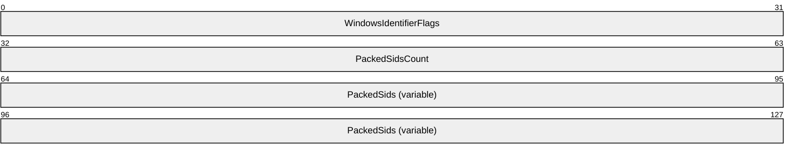
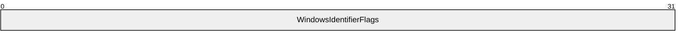
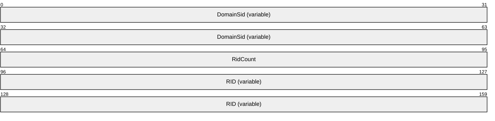

# [MS-MWBE]: Microsoft Web Browser Federated Sign-On Protocol Extensions

Table of Contents

1 Introduction

- [1 Introduction](#Section_1)
  - [1.1 Glossary](#Section_1.1)
  - [1.2 References](#Section_1.2)
    - [1.2.1 Normative References](#Section_1.2.1)
    - [1.2.2 Informative References](#Section_1.2.2)
  - [1.3 Overview](#Section_1.3)
    - [1.3.1 Query String Response Transfer Protocol](#Section_1.3.1)
    - [1.3.2 SAML 1.1 Assertion Extension](#Section_1.3.2)
  - [1.4 Relationship to Other Protocols](#Section_1.4)
  - [1.5 Prerequisites/Preconditions](#Section_1.5)
  - [1.6 Applicability Statement](#Section_1.6)
  - [1.7 Versioning and Capability Negotiation](#Section_1.7)
  - [1.8 Vendor-Extensible Fields](#Section_1.8)
  - [1.9 Standards Assignments](#Section_1.9)

2 Messages

- [2 Messages](#Section_2)
  - [2.1 Transport](#Section_2.1)
    - [2.1.1 Query String Response Transfer Protocol](#Section_2.1.1)
  - [2.2 Message Syntax](#Section_2.2)
    - [2.2.1 XML Namespace References](#Section_2.2.1)
    - [2.2.2 Query String Response Transfer Protocol](#Section_2.2.2)
      - [2.2.2.1 wsignin1.0 Message](#Section_2.2.2.1)
        - [2.2.2.1.1 Common Parameters](#Section_2.2.2.1.1)
        - [2.2.2.1.2 wsignin1.0 Response](#Section_2.2.2.1.2)
    - [2.2.3 SAML 1.1 Assertion Extension](#Section_2.2.3)
      - [2.2.3.1 SAML Advice Elements](#Section_2.2.3.1)
      - [2.2.3.2 WindowsIdentifiers Structure](#Section_2.2.3.2)
        - [2.2.3.2.1 WindowsIdentifierFlags Structure](#Section_2.2.3.2.1)
        - [2.2.3.2.2 PACKED_SIDs Structure](#Section_2.2.3.2.2)
  - [2.3 Directory Service Schema Elements](#Section_2.3)

3 Protocol Details

- [3 Protocol Details](#Section_3)
  - [3.1 IP/STS Details](#Section_3.1)
    - [3.1.1 Abstract Data Model](#Section_3.1.1)
      - [3.1.1.1 Query String Response Transfer Protocol](#Section_3.1.1.1)
        - [3.1.1.1.1 Pending Result](#Section_3.1.1.1.1)
        - [3.1.1.1.2 Maximum Query String Response Message Length](#Section_3.1.1.1.2)
    - [3.1.2 Timers](#Section_3.1.2)
    - [3.1.3 Initialization](#Section_3.1.3)
    - [3.1.4 Higher-Layer Triggered Events](#Section_3.1.4)
    - [3.1.5 Processing Events and Sequencing Rules](#Section_3.1.5)
      - [3.1.5.1 Query String Response Transfer Protocol](#Section_3.1.5.1)
        - [3.1.5.1.1 Receiving a wsignin1.0 Request That Does Not Specify a ttpindex](#Section_3.1.5.1.1)
        - [3.1.5.1.2 Receiving a wsignin1.0 Request That Specifies a ttpindex of 0](#Section_3.1.5.1.2)
        - [3.1.5.1.3 Receiving a wsignin1.0 Request That Specifies a ttpindex Other Than 0](#Section_3.1.5.1.3)
        - [3.1.5.1.4 Responding to a wsignin1.0 Request That Specifies a ttpindex](#Section_3.1.5.1.4)
      - [3.1.5.2 SAML 1.1 Assertion Extension](#Section_3.1.5.2)
        - [3.1.5.2.1 Responding to a wsignin1.0 Request](#Section_3.1.5.2.1)
          - [3.1.5.2.1.1 ClaimSource Element](#Section_3.1.5.2.1.1)
          - [3.1.5.2.1.2 CookieInfoHash Element](#Section_3.1.5.2.1.2)
          - [3.1.5.2.1.3 WindowsUserIdentifier Element](#Section_3.1.5.2.1.3)
          - [3.1.5.2.1.4 WindowsUserName Element](#Section_3.1.5.2.1.4)
          - [3.1.5.2.1.5 WindowsIdentifiers Element](#Section_3.1.5.2.1.5)
    - [3.1.6 Timer Events](#Section_3.1.6)
    - [3.1.7 Other Local Events](#Section_3.1.7)
  - [3.2 Relying Party Details](#Section_3.2)
    - [3.2.1 Abstract Data Model](#Section_3.2.1)
      - [3.2.1.1 Query String Response Transfer Protocol](#Section_3.2.1.1)
        - [3.2.1.1.1 Aggregated Result](#Section_3.2.1.1.1)
    - [3.2.2 Timers](#Section_3.2.2)
    - [3.2.3 Initialization](#Section_3.2.3)
    - [3.2.4 Higher-Layer Triggered Events](#Section_3.2.4)
    - [3.2.5 Processing Events and Sequencing Rules](#Section_3.2.5)
      - [3.2.5.1 Query String Response Transfer Protocol](#Section_3.2.5.1)
        - [3.2.5.1.1 Sending a wsignin1.0 Request](#Section_3.2.5.1.1)
        - [3.2.5.1.2 Receiving a wsignin1.0 Response That Does Not Specify a ttpindex](#Section_3.2.5.1.2)
        - [3.2.5.1.3 Receiving a wsignin1.0 Response That Specifies a ttpindex](#Section_3.2.5.1.3)
        - [3.2.5.1.4 Processing the Complete Aggregated Result](#Section_3.2.5.1.4)
      - [3.2.5.2 SAML 1.1 Assertion Extension](#Section_3.2.5.2)
    - [3.2.6 Timer Events](#Section_3.2.6)
    - [3.2.7 Other Local Events](#Section_3.2.7)
  - [3.3 Web Browser Requestor Details](#Section_3.3)
    - [3.3.1 Abstract Data Model](#Section_3.3.1)
    - [3.3.2 Timers](#Section_3.3.2)
    - [3.3.3 Initialization](#Section_3.3.3)
    - [3.3.4 Higher Layer Triggered Events](#Section_3.3.4)
    - [3.3.5 Processing Events and Sequencing Rules](#Section_3.3.5)
    - [3.3.6 Timer Events](#Section_3.3.6)
    - [3.3.7 Other Local Events](#Section_3.3.7)

4 Protocol Examples

- [4 Protocol Examples](#Section_4)
  - [4.1 Query String Response Transfer Protocol](#Section_4.1)
    - [4.1.1 Annotated Example](#Section_4.1.1)
    - [4.1.2 Full Network Trace](#Section_4.1.2)
  - [4.2 SAML 1.1 Assertion Extension](#Section_4.2)

5 Security

- [5 Security](#Section_5)
  - [5.1 Security Considerations for Implementers](#Section_5.1)
    - [5.1.1 Data Integrity](#Section_5.1.1)
    - [5.1.2 Privacy](#Section_5.1.2)
    - [5.1.3 Authorization Validation and Filtering](#Section_5.1.3)
  - [5.2 Index of Security Parameters](#Section_5.2)

6 Appendix A: Product Behavior

- [6 Appendix A: Product Behavior](#Section_6)

7 Change Tracking

- [7 Change Tracking](#Section_7)

For the legal notice and IP terms, see [LEGAL.md](../LEGAL.md).
Last updated: 12/1/2017.
See [Revision History](#revision-history) for full version history.

# 1 Introduction

This specification extends the Microsoft Web Browser Federated Sign-On Protocol described in [MS-MWBF](../MS-MWBF/MS-MWBF.md). It is assumed that the reader is familiar with its terms, concepts, and protocols.

The extensions defined in this specification enable [**web browser requestors**](#gt_web-browser-requestor) that do not support scripting (to create POST messages) and enable passing [**security identifiers (SIDs)**](#gt_security-identifier-sid) in Security Assertion Markup Language (SAML) 1.1 assertions. These extensions are referred to, respectively, as the Query String Response Transfer Protocol and the SAML 1.1 Assertion Extension.

The Microsoft Web Browser Federated Sign-On Protocol specifies the use of HTTP POST to transmit the [**wsignin1.0**](#gt_wsignin10) result. The use of HTTP POST requires web browser requestors to support scripting for automated form submittal, but web browser requestors do not always have scripting support. The Query String Response Transfer Protocol provides a method for using a series of HTTP GET messages instead of a single HTTP POST to transmit the result of a wsignin1.0 action. This eliminates the scripting requirement for the web browser requestor. That is, the extension increases the number of messages needed to perform a wsignin1.0 action to avoid the POST message.

The SAML 1.1 Assertion Extension is an extension of the Microsoft Web Browser Federated Sign-On Protocol that specifies a method for transmitting SIDs as elements in [**SAML advice**](#gt_saml-advice).

Sections 1.5, 1.8, 1.9, 2, and 3 of this specification are normative. All other sections and examples in this specification are informative.

## 1.1 Glossary

This document uses the following terms:

**account**: A [**user**](#gt_user) (including machine account), group, or alias object. Also a synonym for security principal or principal.

**Active Directory**: A general-purpose network directory service. [**Active Directory**](#gt_active-directory) also refers to the Windows implementation of a directory service. [**Active Directory**](#gt_active-directory) stores information about a variety of objects in the network. User accounts, computer accounts, groups, and all related credential information used by the Windows implementation of Kerberos are stored in [**Active Directory**](#gt_active-directory). [**Active Directory**](#gt_active-directory) is either deployed as Active Directory Domain Services (AD DS) or Active Directory Lightweight Directory Services (AD LDS). [MS-ADTS](../MS-ADTS/MS-ADTS.md) describes both forms. For more information, see [MS-AUTHSOD](../MS-AUTHSOD/MS-AUTHSOD.md) section 1.1.1.5.2, [**Lightweight Directory Access Protocol (LDAP)**](#gt_lightweight-directory-access-protocol-ldap) versions 2 and 3, Kerberos, and DNS.

**aggregated result**: The assembly of received parts transferred using the Query String Response Transfer Protocol. The [**aggregated result**](#gt_aggregated-result) is assembled at a [**relying party**](#gt_relying-party-rp) and might not represent the complete result if all parts have not been received. Once complete, the [**relying party**](#gt_relying-party-rp) extracts a [**RequestSecurityTokenResponse (RSTR)**](#gt_requestsecuritytokenresponse-rstr) from the [**aggregated result**](#gt_aggregated-result). For more information, see section 3.2.1.1.1.

**base64 encoding**: A binary-to-text encoding scheme whereby an arbitrary sequence of bytes is converted to a sequence of printable ASCII characters, as described in [[RFC4648]](https://go.microsoft.com/fwlink/?LinkId=90487).

**claim**: A declaration made by an entity (for example, name, identity, key, group, privilege, and capability). For more information, see [[WSFederation1.2]](https://go.microsoft.com/fwlink/?LinkId=306270).

**domain**: A set of users and computers sharing a common namespace and management infrastructure. At least one computer member of the set must act as a domain controller (DC) and host a member list that identifies all members of the domain, as well as optionally hosting the [**Active Directory**](#gt_active-directory) service. The domain controller provides authentication of members, creating a unit of trust for its members. Each domain has an identifier that is shared among its members. For more information, see [MS-AUTHSOD] section 1.1.1.5 and [MS-ADTS].

**forest**: One or more [**domains**](#gt_domain) that share a common schema and trust each other transitively. An organization can have multiple [**forests**](#gt_forest). A [**forest**](#gt_forest) establishes the security and administrative boundary for all the objects that reside within the [**domains**](#gt_domain) that belong to the [**forest**](#gt_forest). In contrast, a [**domain**](#gt_domain) establishes the administrative boundary for managing objects, such as users, groups, and computers. In addition, each [**domain**](#gt_domain) has individual security policies and trust relationships with other [**domains**](#gt_domain).

**global group**: An [**Active Directory**](#gt_active-directory) group that allows user objects from its own [**domain**](#gt_domain) and [**global groups**](#gt_global-group) from its own [**domain**](#gt_domain) as members. Also called domain global group. [**Universal groups**](#gt_universal-group) can contain [**global groups**](#gt_global-group). A group object g is a [**global group**](#gt_global-group) if and only if GROUP_TYPE_ACCOUNT_GROUP is present in g! groupType; see [MS-ADTS] section 2.2.12, "Group Type Flags". A [**global group**](#gt_global-group) that is also a security-enabled group is valid for inclusion within ACLs anywhere in the [**forest**](#gt_forest). If a [**domain**](#gt_domain) is in mixed mode, then a [**global group**](#gt_global-group) in that [**domain**](#gt_domain) that is also a security-enabled group allows only user object as members. See also domain local group, security-enabled group.

**identity provider/security token service (IP/STS)**: An STS that might also be an identity provider (IP). This term is used as shorthand to see both identity that verifies token services and general token services that do not verify identity. Note that the "/" symbol implies an "or" relationship.

**Lightweight Directory Access Protocol (LDAP)**: The primary access protocol for [**Active Directory**](#gt_active-directory). Lightweight Directory Access Protocol (LDAP) is an industry-standard protocol, established by the Internet Engineering Task Force (IETF), which allows users to query and update information in a directory service (DS), as described in [MS-ADTS]. The Lightweight Directory Access Protocol can be either version 2 [[RFC1777]](https://go.microsoft.com/fwlink/?LinkId=90290) or version 3 [[RFC3377]](https://go.microsoft.com/fwlink/?LinkID=91337).

**little-endian**: Multiple-byte values that are byte-ordered with the least significant byte stored in the memory location with the lowest address.

**NetBIOS**: A particular network transport that is part of the LAN Manager protocol suite. [**NetBIOS**](#gt_netbios) uses a broadcast communication style that was applicable to early segmented local area networks. A protocol family including name resolution, datagram, and connection services. For more information, see [[RFC1001]](https://go.microsoft.com/fwlink/?LinkId=90260) and [[RFC1002]](https://go.microsoft.com/fwlink/?LinkId=90261).

**pending result**: The transformed [**RequestSecurityTokenResponse (RSTR)**](#gt_requestsecuritytokenresponse-rstr) that an [**identity provider/security token service (IP/STS)**](#gt_identity-providersecurity-token-service-ipsts) maintains for the duration of a Query String Response Transfer Protocol message series. Each message in the Query String Response Transfer Protocol transfers a portion of the [**pending result**](#gt_pending-result) to the [**relying party**](#gt_relying-party-rp), where the portions are assembled into the [**aggregated result**](#gt_aggregated-result). For more information, see section 3.1.1.1.1.

**relative identifier (RID)**: The last item in the series of SubAuthority values in a [**security identifier (SID)**](#gt_security-identifier-sid) [[SIDD]](https://go.microsoft.com/fwlink/?LinkId=90516). It distinguishes one account or group from all other accounts and groups in the domain. No two accounts or groups in any domain share the same RID.

**relying party (RP)**: A web application or service that consumes [**security tokens**](#gt_security-token) issued by a security token service (STS).

**requestor IP/STS**: An [**IP/STS**](#gt_identity-providersecurity-token-service-ipsts) in the same [**security realms**](#gt_de3032bf-da14-4186-b8eb-8b6af7917c50) as the [**web browser requestor**](#gt_web-browser-requestor). The [**requestor IP/STS**](#gt_requestor-ipsts) has an existing relationship with the [**user**](#gt_user) that enables it to issue [**security tokens**](#gt_security-token) containing [**user**](#gt_user) information.

**RequestSecurityTokenResponse (RSTR)**: An XML element used to return an issued [**security token**](#gt_security-token) and associated metadata. An [**RSTR**](#gt_requestsecuritytokenresponse-rstr) element is the result of the [**wsignin1.0**](#gt_wsignin10) action in the Web Browser Federated Sign-On Protocol. For more information, see [MS-MWBF](../MS-MWBF/MS-MWBF.md) section 2.2.4.1.

**resource IP/STS**: An [**IP/STS**](#gt_identity-providersecurity-token-service-ipsts) in the same [**security realm**](#gt_de3032bf-da14-4186-b8eb-8b6af7917c50) as the [**web service (WS) resource**](#gt_web-service-ws-resource). The [**resource IP/STS**](#gt_resource-ipsts) has an existing relationship with the [**WS resource**](#gt_web-service-ws-resource) that enables it to issue [**security tokens**](#gt_security-token) that are trusted by the [**WS resource**](#gt_web-service-ws-resource).

**SAML advice**: The advice element of a [**SAML assertion**](#gt_saml-assertion). The data in the advice element is advisory and can be ignored without affecting the validity of the assertion. See [[SAMLCore]](https://go.microsoft.com/fwlink/?LinkId=90508) section 2.3.2.2. The SAML 1.1 Assertion Extension includes [**security identifiers (SIDs)**](#gt_security-identifier-sid) and related data in the [**SAML advice**](#gt_saml-advice) element.

**SAML assertion**: The Security Assertion Markup Language (SAML) 1.1 assertion is a standard XML format for representing a [**security token**](#gt_security-token). For more information, see [SAMLCore] section 2.

**security identifier (SID)**: An identifier for security principals that is used to identify an account or a group. Conceptually, the [**SID**](#gt_security-identifier-sid) is composed of an account authority portion (typically a [**domain**](#gt_domain)) and a smaller integer representing an identity relative to the account authority, termed the [**relative identifier (RID)**](#gt_relative-identifier-rid). The [**SID**](#gt_security-identifier-sid) format is specified in [MS-DTYP](../MS-DTYP/MS-DTYP.md) section 2.4.2; a string representation of [**SIDs**](#gt_security-identifier-sid) is specified in [MS-DTYP] section 2.4.2 and [MS-AZOD](../MS-AZOD/MS-AZOD.md) section 1.1.1.2.

**security realm or security domain**: Represents a single unit of security administration or trust, for example, a Kerberos realm (for more information, see [[RFC4120]](https://go.microsoft.com/fwlink/?LinkId=90458)) or a Windows Domain (for more information, see [[MSFT-ADC]](https://go.microsoft.com/fwlink/?LinkId=90175)).

**security token**: A collection of one or more [**claims**](#gt_claim). Specifically in the case of mobile devices, a [**security token**](#gt_security-token) represents a previously authenticated user as defined in the Mobile Device Enrollment Protocol [MS-MDE](../MS-MDE/MS-MDE.md).

**subject**: The entity to which the [**claims**](#gt_claim) and other data in a [**SAML assertion**](#gt_saml-assertion) apply. For more information, see [SAMLCore] section 1.3.1.

**trusted forest**: A forest that is trusted to make authentication statements for security principals in that forest. Assuming forest A trusts forest B, all domains belonging to forest A will trust all domains in forest B, subject to policy configuration.

**universal group**: An [**Active Directory**](#gt_active-directory) group that allows user objects, [**global groups**](#gt_global-group), and [**universal groups**](#gt_universal-group) from anywhere in the [**forest**](#gt_forest) as members. A group object g is a [**universal group**](#gt_universal-group) if and only if GROUP_TYPE_UNIVERSAL_GROUP is present in g! groupType. A security-enabled universal group is valid for inclusion within ACLs anywhere in the [**forest**](#gt_forest). If a [**domain**](#gt_domain) is in mixed mode, then a [**universal group**](#gt_universal-group) cannot be created in that [**domain**](#gt_domain). See also domain local group, security-enabled group.

**user**: A person who employs a [**web browser requestor**](#gt_web-browser-requestor) to access a [**WS resource**](#gt_web-service-ws-resource).

**user agent**: An HTTP user agent, as specified in [[RFC2616]](https://go.microsoft.com/fwlink/?LinkId=90372).

**web browser requestor**: An HTTP 1.1 web browser client that transmits protocol messages between an [**IP/STS**](#gt_identity-providersecurity-token-service-ipsts) and a [**relying party**](#gt_relying-party-rp).

**web service (WS) resource**: A destination HTTP 1.1 web application or an HTTP 1.1 resource serviced by the application. In the context of this protocol, it refers to the application or manager of the resource that receives identity information and assertions issued by an [**IP/STS**](#gt_identity-providersecurity-token-service-ipsts) using this protocol. The [**WS resource**](#gt_web-service-ws-resource) is a [**relying party**](#gt_relying-party-rp) in the context of this protocol. For more information, see [WSFederation1.2].

**wsignin1.0**: A protocol message exchange defined in [WSFederation1.2] sections 2.1 and 3.1. The [**wsignin1.0**](#gt_wsignin10) request and response are the HTTP binding for the WS-Trust Issue action and response; as such, the WS-Trust [**RSTR**](#gt_requestsecuritytokenresponse-rstr) element is used to return the issued [**security token**](#gt_security-token) in the [**wsignin1.0**](#gt_wsignin10) response ([[WSTrust]](https://go.microsoft.com/fwlink/?LinkId=90584) section 3.2). For more information, see [MS-MWBF] section 2.2.

**MAY, SHOULD, MUST, SHOULD NOT, MUST NOT:** These terms (in all caps) are used as defined in [[RFC2119]](https://go.microsoft.com/fwlink/?LinkId=90317). All statements of optional behavior use either MAY, SHOULD, or SHOULD NOT.

## 1.2 References

Links to a document in the Microsoft Open Specifications library point to the correct section in the most recently published version of the referenced document. However, because individual documents in the library are not updated at the same time, the section numbers in the documents may not match. You can confirm the correct section numbering by checking the [Errata](https://go.microsoft.com/fwlink/?linkid=850906).

### 1.2.1 Normative References

We conduct frequent surveys of the normative references to assure their continued availability. If you have any issue with finding a normative reference, please contact [dochelp@microsoft.com](mailto:dochelp@microsoft.com). We will assist you in finding the relevant information.

[MS-ADA1] Microsoft Corporation, "[Active Directory Schema Attributes A-L](../MS-ADA1/MS-ADA1.md)".

[MS-ADA3] Microsoft Corporation, "[Active Directory Schema Attributes N-Z](../MS-ADA3/MS-ADA3.md)".

[MS-DTYP] Microsoft Corporation, "[Windows Data Types](../MS-DTYP/MS-DTYP.md)".

[MS-MWBF] Microsoft Corporation, "[Microsoft Web Browser Federated Sign-On Protocol](../MS-MWBF/MS-MWBF.md)".

[RFC1950] Deutsch, P., and Gailly, J-L., "ZLIB Compressed Data Format Specification version 3.3", RFC 1950, May 1996, [http://www.ietf.org/rfc/rfc1950.txt](https://go.microsoft.com/fwlink/?LinkId=90301)

[RFC1951] Deutsch, P., "DEFLATE Compressed Data Format Specification version 1.3", RFC 1951, May 1996, [http://www.ietf.org/rfc/rfc1951.txt](https://go.microsoft.com/fwlink/?LinkId=90302)

[RFC2045] Freed, N., and Borenstein, N., "Multipurpose Internet Mail Extensions (MIME) Part One: Format of Internet Message Bodies", RFC 2045, November 1996, [http://www.rfc-editor.org/rfc/rfc2045.txt](https://go.microsoft.com/fwlink/?LinkId=90307)

[RFC2119] Bradner, S., "Key words for use in RFCs to Indicate Requirement Levels", BCP 14, RFC 2119, March 1997, [http://www.rfc-editor.org/rfc/rfc2119.txt](https://go.microsoft.com/fwlink/?LinkId=90317)

[RFC2279] Yergeau, F., "UTF-8, a transformation format of ISO 10646", RFC 2279, January 1998, [http://www.rfc-editor.org/rfc/rfc2279.txt](https://go.microsoft.com/fwlink/?LinkId=90331)

[RFC2396] Berners-Lee, T., Fielding, R., and Masinter, L., "Uniform Resource Identifiers (URI): Generic Syntax", RFC 2396, August 1998, [http://www.rfc-editor.org/rfc/rfc2396.txt](https://go.microsoft.com/fwlink/?LinkId=90339)

[RFC2616] Fielding, R., Gettys, J., Mogul, J., et al., "Hypertext Transfer Protocol -- HTTP/1.1", RFC 2616, June 1999, [http://www.rfc-editor.org/rfc/rfc2616.txt](https://go.microsoft.com/fwlink/?LinkId=90372)

[RFC2965] Kristol, D. and Montulli, L., "HTTP State Management Mechanism", RFC 2965, October 2000, [http://www.ietf.org/rfc/rfc2965.txt](https://go.microsoft.com/fwlink/?LinkId=90399)

[RFC4395] Hansen, T., et al., "Guidelines and Registration Procedures for New URI Schemes", BCP 115, RFC 4395, February 2006, [http://www.ietf.org/rfc/rfc4395.txt](https://go.microsoft.com/fwlink/?LinkId=90477)

[SAMLCore] Maler, E., Mishra, P., Philpott, R., et al., "Assertions and Protocol for the OASIS Security Assertion Markup Language (SAML) V1.1", September 2003, [http://www.oasis-open.org/committees/download.php/3406/oasis-sstc-saml-core-1.1.pdf](https://go.microsoft.com/fwlink/?LinkId=90508)

[WSFederation1.2] Kaler, C., McIntosh, M., "Web Services Federation Language (WS-Federation)", Version 1.2, May 2009, [http://docs.oasis-open.org/wsfed/federation/v1.2/os/ws-federation-1.2-spec-os.html](https://go.microsoft.com/fwlink/?LinkId=306270)

[WSFederation] Kaler, C., Nadalin, A., Bajaj, S., et al., "Web Services Federation Language (WS-Federation)", Version 1.1, December 2006, [http://specs.xmlsoap.org/ws/2006/12/federation/ws-federation.pdf](https://go.microsoft.com/fwlink/?LinkId=90581)

[XMLSCHEMA2] Biron, P.V., Ed. and Malhotra, A., Ed., "XML Schema Part 2: Datatypes", W3C Recommendation, May 2001, [http://www.w3.org/TR/2001/REC-xmlschema-2-20010502/](https://go.microsoft.com/fwlink/?LinkId=90610)

[XML] World Wide Web Consortium, "Extensible Markup Language (XML) 1.0 (Fourth Edition)", W3C Recommendation 16 August 2006, edited in place 29 September 2006, [http://www.w3.org/TR/2006/REC-xml-20060816/](https://go.microsoft.com/fwlink/?LinkId=90598)

### 1.2.2 Informative References

[FIPS180] FIPS PUBS, "Secure Hash Standard", FIPS PUB 180-1, April 1995, [http://niatec.info/GetFile.aspx?pid=63](https://go.microsoft.com/fwlink/?LinkId=89867)

[IANASCHEME] IANA, "Uniform Resource Identifier (URI) Schemes per RFC4395", November 2006, [http://www.iana.org/assignments/uri-schemes/uri-schemes.xhtml](https://go.microsoft.com/fwlink/?LinkId=89890)

[MAXURL] Microsoft Corporation, "Maximum URL Length Is 2,083 Characters in Internet Explorer", September 2009, [https://support.microsoft.com/en-us/help/208427/maximum-url-length-is-2,083-characters-in-internet-explorer](https://go.microsoft.com/fwlink/?LinkId=89936)

[MS-ADTS] Microsoft Corporation, "[Active Directory Technical Specification](../MS-ADTS/MS-ADTS.md)".

[MS-PAC] Microsoft Corporation, "[Privilege Attribute Certificate Data Structure](../MS-PAC/MS-PAC.md)".

[MS-WPO] Microsoft Corporation, "[Windows Protocols Overview](../MS-WPO/MS-WPO.md)".

[SIDD] Microsoft Corporation, "How Security Identifiers Work", March 2003, [http://technet.microsoft.com/en-us/library/cc778824.aspx](https://go.microsoft.com/fwlink/?LinkId=90516)

## 1.3 Overview

This document specifies the Query String Response Transfer Protocol and the SAML 1.1 Assertion Extension. These extensions are based on the federated sign-on protocol described in [MS-MWBF](../MS-MWBF/MS-MWBF.md). The extensions specified in this document broaden the applicability of the protocol to simpler [**web browser requestors**](#gt_web-browser-requestor) and a wider range of protected applications. The extensions in this specification do not change the services of authentication, identity federation, or single sign-on provided by [MS-MWBF].

### 1.3.1 Query String Response Transfer Protocol

The scripting capability for forms submittal is not specified as part of HTTP [[RFC2616]](https://go.microsoft.com/fwlink/?LinkId=90372); consequently, not all [**web browser requestor**](#gt_web-browser-requestor) implementations support forms submittal as recommended for [**wsignin1.0**](#gt_wsignin10) responses in [MS-MWBF](../MS-MWBF/MS-MWBF.md) section 2.1. In addition, the [**RequestSecurityTokenResponse (RSTR)**](#gt_requestsecuritytokenresponse-rstr) can be too large to be transferred in a single HTTP GET message. The Query String Response Transfer Protocol addresses these issues by eliminating the web browser requestor requirement for scripting support.

When using the Query String Response Transfer Protocol, the wsignin1.0 message exchange in [MS-MWBF] is replaced by a series of wsignin1.0 message exchanges. In [MS-MWBF], the RSTR is transmitted using a single HTTP POST message. The Query String Response Transfer Protocol transmits the RSTR in pieces in query string parameters using multiple HTTP GET messages. The [**relying party**](#gt_relying-party-rp) accumulates the pieces from the responses in the series to produce an [**aggregated result**](#gt_aggregated-result). When the relying party has accumulated all the pieces, it extracts the RSTR from the aggregated result.

### 1.3.2 SAML 1.1 Assertion Extension

The Microsoft Web Browser Federated Sign-On Protocol described in [MS-MWBF](../MS-MWBF/MS-MWBF.md) does not specify a method for including [**SIDs**](#gt_security-identifier-sid) in a [**security token**](#gt_security-token). For applications requiring SIDs, [**claims**](#gt_claim) are not sufficient for authorization.

The SAML 1.1 Assertion Extension provides a method for including SIDs in a [**SAML assertion**](#gt_saml-assertion). How an [**identity provider/security token service (IP/STS)**](#gt_identity-providersecurity-token-service-ipsts) obtains the security identifiers and how a [**relying party**](#gt_relying-party-rp) interprets them is implementation-specific.

## 1.4 Relationship to Other Protocols

The Web Browser Federated Sign-On Protocol and the extensions specified in this document use standard web protocols, XML (as specified in [[XML]](https://go.microsoft.com/fwlink/?LinkId=90598)), WS-Federation Passive Requestor Profile (as specified in [[WSFederation1.2]](https://go.microsoft.com/fwlink/?LinkId=306270) section 13), and SAML 1.1 (as specified in [[SAMLCore]](https://go.microsoft.com/fwlink/?LinkId=90508)). The reader has to be familiar with the specifications listed in [MS-MWBF](../MS-MWBF/MS-MWBF.md) section 1.4.

A [**relying party**](#gt_relying-party-rp) uses the Query String Response Transfer Protocol instead of the [**wsignin1.0**](#gt_wsignin10) messages from Web Browser Federated Sign-On Protocol to avoid the use of HTTP POST messages.

The SAML 1.1 Assertion Extension provides a facility for including [**security identifiers**](#gt_security-identifier-sid) in [**SAML assertions**](#gt_saml-assertion). In order to understand the Windows behavior relating to this extension, the reader has to be familiar with the Active Directory Technical Specification [MS-ADTS](../MS-ADTS/MS-ADTS.md), security concepts in [MS-WPO](../MS-WPO/MS-WPO.md) section 9, and security identifiers [[SIDD]](https://go.microsoft.com/fwlink/?LinkId=90516).

The Web Browser Federated Sign-On Protocol and the extensions specified in this document can be applicable where other web-based authentication protocols are used. For more information, see [MS-MWBF] section 1.4.

## 1.5 Prerequisites/Preconditions

The SAML 1.1 Assertion Extension requires that an [**IP/STS**](#gt_identity-providersecurity-token-service-ipsts) have a source of [**security identifiers**](#gt_security-identifier-sid) and that the [**relying party**](#gt_relying-party-rp) have an authorization framework in which to interpret them. The exact methods by which the IP/STS obtains the SIDs, and the methods by which the relying party interprets them, are implementation-specific.<1><2>

## 1.6 Applicability Statement

The Query String Response Transfer Protocol is applicable where the Web Browser Federated Sign-On Protocol described in [MS-MWBF](../MS-MWBF/MS-MWBF.md) is applicable.<3> The Query String Response Transfer Protocol widens the applicability of the Microsoft Web Browser Federated Sign-On Protocol to include [**web browser requestors**](#gt_web-browser-requestor) that do not implement scripting or form submittal via scripting.

The SAML 1.1 Assertion Extension is applicable when the protected HTTP web application requires [**SIDs**](#gt_security-identifier-sid) to perform authorization.<4>

## 1.7 Versioning and Capability Negotiation

The Web Browser Federated Sign-On Protocol as described in [MS-MWBF](../MS-MWBF/MS-MWBF.md) section 1.7 defers all versioning and capability negotiation to [[WSFederation]](https://go.microsoft.com/fwlink/?LinkId=90581), [[WSFederation1.2]](https://go.microsoft.com/fwlink/?LinkId=306270), and [[RFC2616]](https://go.microsoft.com/fwlink/?LinkId=90372).

When using the Query String Response Transfer Protocol, an [**IP/STS**](#gt_identity-providersecurity-token-service-ipsts) uses the presence of the *ttpindex* parameter (as specified in section [2.2.2.1.1](#Section_2.2.2.1.1)) in the request to determine whether the Query String Response Transfer Protocol is used for the response.

The SAML 1.1 Assertion Extension uses [**SIDs**](#gt_security-identifier-sid). SIDs have a revision mechanism. For more information, see [MS-DTYP](../MS-DTYP/MS-DTYP.md), as specified in section 2.1.

## 1.8 Vendor-Extensible Fields

The extensions specified in this document make use of vendor-extensible fields that are specified as part of [MS-MWBF](../MS-MWBF/MS-MWBF.md) section 1.8. Specifically, the Query String Response Transfer Protocol specifies new message parameters as allowed by [[WSFederation1.2]](https://go.microsoft.com/fwlink/?LinkId=306270) section 13.2.1, and the SAML 1.1 Assertion Extension specifies new elements in the [**SAML advice**](#gt_saml-advice) as allowed by [[SAMLCore]](https://go.microsoft.com/fwlink/?LinkId=90508) section 2.3.2.2.

The Query String Response Transfer Protocol does not introduce any vendor-extensible fields that are not present in [MS-MWBF] section 1.8.

The SAML 1.1 Assertion Extension introduces the [ClaimSource (section 3.1.5.2.1.1)](#Section_3.1.5.2.1.1) element whose value is a URI that can be extended by vendors. Uniqueness of URIs is scheme-dependent. For more information, see [[IANASCHEME]](https://go.microsoft.com/fwlink/?LinkId=89890) and [[RFC4395]](https://go.microsoft.com/fwlink/?LinkId=90477).

## 1.9 Standards Assignments

There are no standards assignments beyond those for XML namespaces and standard ports specified in [MS-MWBF](../MS-MWBF/MS-MWBF.md) section 1.9.<5>

# 2 Messages

The Query String Response Transfer Protocol and SAML 1.1 Assertion Extension extend the messages specified in [MS-MWBF](../MS-MWBF/MS-MWBF.md) section 2 as described in this section.

## 2.1 Transport

No additional transport is required other than that provided for in [MS-MWBF](../MS-MWBF/MS-MWBF.md) section 2.1.

### 2.1.1 Query String Response Transfer Protocol

In the Query String Response Transfer Protocol, all [**wsignin1.0**](#gt_wsignin10) messages MUST use HTTP GET.

## 2.2 Message Syntax

The Query String Response Transfer Protocol extends the [**wsignin1.0**](#gt_wsignin10) message specified in [MS-MWBF](../MS-MWBF/MS-MWBF.md) section 2.2. The SAML 1.1 Assertion Extension extends the [**SAML assertion**](#gt_saml-assertion) specified in [MS-MWBF] section 2.2.4.2.

### 2.2.1 XML Namespace References

Prefixes and XML namespaces used in this specification include the following:

| Prefix | Namespace URI | Reference |
| --- | --- | --- |
| saml | "urn:oasis:names:tc:SAML:1.0:assertion" | [[SAMLCore]](https://go.microsoft.com/fwlink/?LinkId=90508) |
| adfs | "urn:Microsoft:federation" | This document |

### 2.2.2 Query String Response Transfer Protocol

The Query String Response Transfer Protocol extends the [**wsignin1.0**](#gt_wsignin10) message from [MS-MWBF](../MS-MWBF/MS-MWBF.md) section 2.2 to enable passing results in pieces rather than using POST. The protocol does not extend any other message types.

#### 2.2.2.1 wsignin1.0 Message

[MS-MWBF](../MS-MWBF/MS-MWBF.md) section 2.2 specifies how parameters are encoded in messages, including new parameters added by extensions. Specifically, it describes that in HTTP GET messages, the parameters are encoded as query string parameters for transmission in the URL. It also specifies how invalid values are handled.

Section [2.2.2.1.1](#Section_2.2.2.1.1) specifies parameters included in both [**wsignin1.0**](#gt_wsignin10) requests and wsignin1.0 responses that use this protocol.

Section [2.2.2.1.2](#Section_2.2.2.1.2) specifies parameters included only in wsignin1.0 responses that use this protocol.

##### 2.2.2.1.1 Common Parameters

*ttpindex*: The length, in characters, of the [**aggregated result**](#gt_aggregated-result) as a 32-bit unsigned integer in decimal notation.

##### 2.2.2.1.2 wsignin1.0 Response

*ttpsize*: The length in characters of the [**pending result**](#gt_pending-result) as a 32-bit unsigned integer in decimal notation.

**wresult**: The current part of the result being transferred, as a string.

### 2.2.3 SAML 1.1 Assertion Extension

The SAML 1.1 Assertion Extension extends the [**SAML assertion**](#gt_saml-assertion) subset as specified in [MS-MWBF](../MS-MWBF/MS-MWBF.md) section 2.2.4.2. This extension uses the [**SAML advice**](#gt_saml-advice) element specified in [[SAMLCore]](https://go.microsoft.com/fwlink/?LinkId=90508) section 2.3.2.2 as an extensibility point.

The sections that follow define new elements to convey the source of [**claims**](#gt_claim), hash data, [**user**](#gt_user) name, and [**SIDs**](#gt_security-identifier-sid). These new elements are included as child elements of the advice element in a SAML assertion. These elements use the XML namespace "urn:microsoft:federation". The element content is described using XML schema data types, as specified in [[XMLSCHEMA2]](https://go.microsoft.com/fwlink/?LinkId=90610) section 3.

#### 2.2.3.1 SAML Advice Elements

[ClaimSource](#Section_3.1.5.2.1.1) (optional): A Uniform Resource Identifier (URI) identifying a [**requestor IP/STS**](#gt_requestor-ipsts) or other authentication service (such as a local [**account**](#gt_account) store) that is the source of the [**claims**](#gt_claim) in the [**security token**](#gt_security-token). The content is of type any URI (as specified in [[XMLSCHEMA2]](https://go.microsoft.com/fwlink/?LinkId=90610) section 3.2.17).

[CookieInfoHash](#Section_3.1.5.2.1.2) (optional): A [**base64-encoded**](#gt_179b9392-9019-45a3-880b-26f6890522b7) implementation-specific hash value. The content is of type base64Binary (as specified in [XMLSCHEMA2] section 3.2.16).<6>

[WindowsUserIdentifier](#Section_3.1.5.2.1.3) (optional): A [**SID**](#gt_security-identifier-sid) identifying the [**subject**](#gt_subject) of the [**SAML assertion**](#gt_saml-assertion). The content is of type string (as specified in [XMLSCHEMA2] section 3.2.1) and MUST follow the restrictions for the string representation of a SID, as specified in [MS-DTYP](../MS-DTYP/MS-DTYP.md) section 2.4.2).

[WindowsUserName](#Section_3.1.5.2.1.4) (optional): A [**user**](#gt_user) name associated with the subject of the SAML assertion. The content is of type string (as specified in [XMLSCHEMA2] section 3.2.1) and MUST be of the form "DOMAIN\user name".<7>

[WindowsIdentifiers](#Section_2.2.3.2) (optional): A base64-encoded binary structure that defines a set of SIDs that identify the subject of the SAML assertion and a set of flags that specify the use of the SIDs. The content is of type base64Binary (as specified in [XMLSCHEMA2] section 3.2.16), and the binary data MUST be structured as specified in [WindowsIdentifiers Binary Structure (section 2.2.3.2)](#Section_2.2.3.2).

#### 2.2.3.2 WindowsIdentifiers Structure

The WindowsIdentifiers structure has variable length. It defines a set of [**SIDs**](#gt_security-identifier-sid) and flags. To reduce the overall data size, the SIDs are not included in full binary expansion. Rather, [PACKED_SIDS](#Section_2.2.3.2.2) structures are created for each group of SIDs that are identical except for the last subauthority.

**WindowsIdentifierFlags (4 bytes):** A 32-bit **WindowsIdentifierFlags** structure (see [2.2.3.2.1](#Section_2.2.3.2.1)).

**PackedSidsCount (4 bytes):** A 4-byte, [**little-endian**](#gt_little-endian), unsigned integer that defines the number of **PackedSids** fields in this structure. This field MUST NOT be 0.

**PackedSids (variable):** A sequence of PACKED_SIDS structures of variable size, each of which defines a set of SIDs. The sequence defines a set of SIDs, which is the union of the sets of SIDs defined by all the elements.

##### 2.2.3.2.1 WindowsIdentifierFlags Structure

The WindowsIdentifierFlags structure is a field of 32 bits.

**WindowsIdentifierFlags (4 bytes):** Bits marked 0 MUST be 0. The T and N bits operate independently.

**T - TryLocalAccount (1 bit):** A value of 1 indicates that the SAML NameIdentifier (as specified in [[SAMLCore]](https://go.microsoft.com/fwlink/?LinkId=90508) section 2.4.2.2) takes precedence over the [WindowsIdentifiers structure (section 2.2.3.2)](#Section_2.2.3.2) element. A value of 0 indicates that the WindowsIdentifiers structure (section 2.2.3.2) element takes precedence over the SAML NameIdentifier (as specified in [SAMLCore] section 2.4.2.2).

**N - NoUserSid (1 bit):** A value of 1 indicates that a [**user**](#gt_user) [**SID**](#gt_security-identifier-sid) is not encoded in the WindowsIdentifiers structure. A value of 0 indicates that a user SID is encoded in the WindowsIdentifiers structure.

##### 2.2.3.2.2 PACKED_SIDs Structure

The PACKED_SIDs structure encapsulates a set of [**SIDs**](#gt_security-identifier-sid) that are identical except for the value of the final subauthority, which is called the [**relative identifier (RID)**](#gt_relative-identifier-rid). The identical portion of the SIDs is included in the **DomainSid** field, and each RID is included separately. The PACKED_SIDs structure has a variable length.

**DomainSid (variable):** A SID structure of variable size that defines the identical portion of the SIDs encoded in this structure. For details on the SIDs structure, see [MS-DTYP](../MS-DTYP/MS-DTYP.md) section 2.4.2.

**RidCount (4 bytes):** A 4-byte, [**little-endian**](#gt_little-endian), unsigned integer that defines the number of RID fields in this structure. This field MUST NOT be zero.

**RID (variable):** A sequence of 4-byte, little-endian, unsigned integers that define the RIDs for the SIDs encoded in this structure.

## 2.3 Directory Service Schema Elements

This protocol accesses the following Directory Service schema classes and attributes listed in the following table.

For the syntactic specifications of the following **<Class>** or **<Class><Attribute>** pairs, refer [MS-ADTS](../MS-ADTS/MS-ADTS.md), [MS-ADA1](../MS-ADA1/MS-ADA1.md), [MS-ADA3](../MS-ADA3/MS-ADA3.md).

| Class | Attribute |
| --- | --- |
| User | All |

# 3 Protocol Details

The following sections specify the [**IP/STS**](#gt_identity-providersecurity-token-service-ipsts) and [**relying party**](#gt_relying-party-rp) protocol details. Each section details role-specific behavior for the extensions specified in this document. There is not a section for the [**web browser requestor**](#gt_web-browser-requestor) role because additional protocol details for the web browser requestor other than those specified in [MS-MWBF](../MS-MWBF/MS-MWBF.md) section 3.4 do not exist.

The IP/STS details (see section [3.1](#Section_3.1)) apply to both the [**requestor IP/STS**](#gt_requestor-ipsts) and [**resource IP/STS**](#gt_resource-ipsts) roles. The relying party details (see section [3.2](#Section_3.2)) apply to both the resource IP/STS and [**Web service (WS) resource**](#gt_web-service-ws-resource) roles.

Because the behavior for issuance and consumption of the [**SIDs**](#gt_security-identifier-sid) is implementation-specific, an abstract data model is not introduced for the SAML 1.1 Assertion Extension. Hence, sections [3.1.1](#Section_3.1.1) and [3.2.1](#Section_3.2.1) do not have subsections for that extension.

## 3.1 IP/STS Details

The following sections specify the protocol details of the [**IP/STS**](#gt_identity-providersecurity-token-service-ipsts), including details for the Query String Response Transfer Protocol and SAML 1.1 Assertion Extension. These details apply to both the [**resource IP/STS**](#gt_resource-ipsts) and the [**requestor IP/STS**](#gt_requestor-ipsts) roles.

### 3.1.1 Abstract Data Model

This section describes a conceptual organization of data that an implementation maintains to participate in this protocol. The described organization is provided to facilitate the explanation of how the protocol behaves. This document does not mandate that implementations adhere to this model as long as their external behavior is consistent with that described in this document.

#### 3.1.1.1 Query String Response Transfer Protocol

The following sections specify the abstract data model for transmitting the [**pending result**](#gt_pending-result) as a series of parts in separate messages that are assembled by a [**relying party**](#gt_relying-party-rp).

##### 3.1.1.1.1 Pending Result

When the Query String Response Transfer Protocol is used, the result of a [**wsignin1.0**](#gt_wsignin10) action is transmitted by a series of HTTP 302 responses.

The first message in the exchange establishes the [**pending result**](#gt_pending-result). Each message exchange in the series transmits a portion of the pending result to the [**relying party**](#gt_relying-party-rp) until all parts have been delivered. Consequently, the pending result must be available to the [**IP/STS**](#gt_identity-providersecurity-token-service-ipsts) when processing each message exchange until the series is complete.

The message exchange also includes parameters for the current position and the total length of the result (see section [2.2.2.1](#Section_2.2.2.1)) to ensure proper construction and error/completion detection. The method used to maintain the availability of the pending result during the series of exchanges is implementation-specific. The IP/STS MUST discard the pending result when cleaning up local state. See [MS-MWBF](../MS-MWBF/MS-MWBF.md) section 3.2.5.3.3 for [**requestor IP/STS**](#gt_requestor-ipsts). See [MS-MWBF] section 3.3.5.4.2 for [**resource IP/STS**](#gt_resource-ipsts).<8>

##### 3.1.1.1.2 Maximum Query String Response Message Length

Although the HTTP protocol (as specified in [[RFC2616]](https://go.microsoft.com/fwlink/?LinkId=90372)) does not place a limit on the length of a URL, some [**web browser requestor**](#gt_web-browser-requestor) implementations have such a limit. [**IP/STS**](#gt_identity-providersecurity-token-service-ipsts) implementations SHOULD use a maximum query string response message length that will allow a broad range of web browser implementations to act as the web browser requestor. This is a limit on the length of the URL after escaping, including the scheme, authority, path, and query components (as specified in [[RFC2396]](https://go.microsoft.com/fwlink/?LinkId=90339) section 3). The recommended value is 2,083 octets for all messages. For more information, see [[MAXURL]](https://go.microsoft.com/fwlink/?LinkId=89936).<9>

### 3.1.2 Timers

There are no timers required other than any specified in [MS-MWBF](../MS-MWBF/MS-MWBF.md) section 3.1.2; however, a timer MAY<10> be used to manage state associated with the [**pending result**](#gt_pending-result).

### 3.1.3 Initialization

There are no new initializations beyond any described in [MS-MWBF](../MS-MWBF/MS-MWBF.md) section 3.1.3; however, the [**pending result**](#gt_pending-result) is initialized after the protocol has been initiated (see section [3.1.5.1.2](#Section_3.1.5.1.2)).

### 3.1.4 Higher-Layer Triggered Events

There are no higher-layer triggered events other than any described in [MS-MWBF](../MS-MWBF/MS-MWBF.md) section 3.1.4.

### 3.1.5 Processing Events and Sequencing Rules

#### 3.1.5.1 Query String Response Transfer Protocol

The following sections specify protocol details for the Query String Response Transfer Protocol when receiving [**wsignin1.0**](#gt_wsignin10) requests.

Sections [3.1.5.1.1](#Section_3.1.5.1.1), [3.1.5.1.2](#Section_3.1.5.1.2), and [3.1.5.1.3](#Section_3.1.5.1.3) specify how wsignin1.0 requests are processed given the value of the *ttpindex* parameter. Section [3.1.5.1.4](#Section_3.1.5.1.4) specifies common behavior for responding to such requests when the Query String Response Protocol is used.

##### 3.1.5.1.1 Receiving a wsignin1.0 Request That Does Not Specify a ttpindex

When the [**IP/STS**](#gt_identity-providersecurity-token-service-ipsts) receives a [**wsignin1.0**](#gt_wsignin10) request that does not specify the *ttpindex* parameter, the response MUST NOT use the Query String Response Transfer Protocol. The IP/STS MUST discard any [**pending result**](#gt_pending-result), and the IP/STS MUST process the message as specified in [MS-MWBF](../MS-MWBF/MS-MWBF.md) section 3.1.5.4.

##### 3.1.5.1.2 Receiving a wsignin1.0 Request That Specifies a ttpindex of 0

When the [**IP/STS**](#gt_identity-providersecurity-token-service-ipsts) receives a [**wsignin1.0**](#gt_wsignin10) request that specifies a *ttpindex* parameter value of 0, the IP/STS MUST process the wsignin1.0 request (as specified in [MS-MWBF](../MS-MWBF/MS-MWBF.md) section 3.1.5.4) up to the point where the IP/STS has constructed the [**RSTR**](#gt_requestsecuritytokenresponse-rstr) element (as specified in [MS-MWBF] section 3.1.5.4.6). The IP/STS MUST apply the following transforms to the RSTR element to produce the [**pending result**](#gt_pending-result):

- Convert the XML string to binary data by applying UTF-8 encoding, as specified in [[RFC2279]](https://go.microsoft.com/fwlink/?LinkId=90331).
- Compress the result from step 1 to the zlib format (as specified in [[RFC1950]](https://go.microsoft.com/fwlink/?LinkId=90301)) by using the deflate algorithm (as specified in [[RFC1951]](https://go.microsoft.com/fwlink/?LinkId=90302)).
- Base64-encode the result from step 2, as specified in [[RFC2045]](https://go.microsoft.com/fwlink/?LinkId=90307) section 6.8.
The IP/STS MUST respond as specified in section [3.1.5.1.4](#Section_3.1.5.1.4), by using the result from step 3 as the pending result.

##### 3.1.5.1.3 Receiving a wsignin1.0 Request That Specifies a ttpindex Other Than 0

When the [**IP/STS**](#gt_identity-providersecurity-token-service-ipsts) receives a [**wsignin1.0**](#gt_wsignin10) request that specifies a *ttpindex* parameter value other than 0, the following conditions MUST be evaluated in order:

- The *ttpindex* value does not conform to message syntax rules (for example, if it is not a number, as specified in section [2.2.2.1.1](#Section_2.2.2.1.1)).
- The corresponding [**pending result**](#gt_pending-result) is not available.
- The value of *ttpindex* is greater than or equal to the length in characters of the pending result.
If the message meets any of the conditions, the IP/STS MUST reject the message and return an HTTP 500 response. Otherwise, the IP/STS MUST respond as specified in section [3.1.5.1.4](#Section_3.1.5.1.4).

##### 3.1.5.1.4 Responding to a wsignin1.0 Request That Specifies a ttpindex

The [**IP/STS**](#gt_identity-providersecurity-token-service-ipsts) MUST construct a [**wsignin1.0**](#gt_wsignin10) response for the [**relying party**](#gt_relying-party-rp) by using the following values as properly escaped query string parameters in the returned status URL, as specified in [[WSFederation1.2]](https://go.microsoft.com/fwlink/?LinkId=306270) section 13.2.3.

- *ttpindex* MUST be the same value of *ttpindex* as requested.
- *ttpsize* MUST be the same length in characters as the [**pending result**](#gt_pending-result).
- *wctx* MUST be the same value of *wctx* as requested.
- *wresult* MUST contain a portion of the pending result, beginning at the character of index *ttpindex* (zero-based), and including as many characters as possible without exceeding the maximum query string response message length. Note that the maximum query string response message length applies after the escaping rules for URL query string parameters.
The IP/STS MUST transmit the message to the [**web browser requestor**](#gt_web-browser-requestor) using HTTP 302 as specified in [WSFederation1.2] section 13.2.3.

#### 3.1.5.2 SAML 1.1 Assertion Extension

The [**IP/STS**](#gt_identity-providersecurity-token-service-ipsts) uses the SAML 1.1 Assertion Extension when responding to [**wsignin1.0**](#gt_wsignin10) requests. Although the protocol details are largely similar, it is necessary in this section to distinguish between the [**requestor IP/STS**](#gt_requestor-ipsts) and [**resource IP/STS**](#gt_resource-ipsts) roles.

The IP/STS is a requestor IP/STS when issuing a token to a [**relying party**](#gt_relying-party-rp) that is in a different [**security realm**](#gt_de3032bf-da14-4186-b8eb-8b6af7917c50) than the IP/STS. Conversely, the IP/STS is a resource IP/STS when issuing a token to a relying party that is in the same security realm as the IP/STS.

##### 3.1.5.2.1 Responding to a wsignin1.0 Request

When responding to a [**wsignin1.0**](#gt_wsignin10) request, the [**IP/STS**](#gt_identity-providersecurity-token-service-ipsts) MAY include any of the [ClaimSource (section 3.1.5.2.1.1)](#Section_3.1.5.2.1.1), [CookieInfoHash (section 3.1.5.2.1.2)](#Section_3.1.5.2.1.2), [WindowsUserIdentifier (section 3.1.5.2.1.3)](#Section_3.1.5.2.1.3), [WindowsUserName (section 3.1.5.2.1.4)](#Section_3.1.5.2.1.4), and [WindowsIdentifiers (section 3.1.5.2.1.5)](#Section_3.1.5.2.1.5) elements in the issued [**SAML assertion**](#gt_saml-assertion). For syntax details, see section [2.2.3](#Section_2.2.3).

The following sections describe the processing semantics for each of these optional SAML assertion elements.

###### 3.1.5.2.1.1 ClaimSource Element

The [**IP/STS**](#gt_identity-providersecurity-token-service-ipsts) MAY<11> include the ClaimSource element in the issued [**SAML assertion**](#gt_saml-assertion).

###### 3.1.5.2.1.2 CookieInfoHash Element

The [**IP/STS**](#gt_identity-providersecurity-token-service-ipsts) MAY<12> include the CookieInfoHash element in the issued [**SAML assertion**](#gt_saml-assertion).

###### 3.1.5.2.1.3 WindowsUserIdentifier Element

The [**IP/STS**](#gt_identity-providersecurity-token-service-ipsts) MAY<13> include the WindowsUserIdentifier element in the issued [**SAML assertion**](#gt_saml-assertion).

###### 3.1.5.2.1.4 WindowsUserName Element

The [**IP/STS**](#gt_identity-providersecurity-token-service-ipsts) MAY<14> include the WindowsUserName element in the issued [**SAML assertion**](#gt_saml-assertion).

###### 3.1.5.2.1.5 WindowsIdentifiers Element

The [**IP/STS**](#gt_identity-providersecurity-token-service-ipsts) MAY<15> include the WindowsIdentifiers element in the issued [**SAML assertion**](#gt_saml-assertion).

### 3.1.6 Timer Events

Timer events are not required other than any specified in [MS-MWBF](../MS-MWBF/MS-MWBF.md) section 3.1.6; however, a timer event MAY<16> be used to manage the state associated with the [**pending result**](#gt_pending-result).

### 3.1.7 Other Local Events

There are no other local events that impact the operation of this protocol.

## 3.2 Relying Party Details

These details apply to both the [**resource IP/STS**](#gt_resource-ipsts) and [**WS resource**](#gt_web-service-ws-resource) roles (when acting as a [**relying party**](#gt_relying-party-rp) for a received [**security token**](#gt_security-token)).

### 3.2.1 Abstract Data Model

This section describes a conceptual model of a possible data organization that an implementation maintains to participate in this protocol. The described organization is provided to facilitate the explanation of how the protocol behaves. This document does not mandate that implementations adhere to this model as long as their external behavior is consistent with that described in this document.

#### 3.2.1.1 Query String Response Transfer Protocol

The following sections specify the abstract data model for receiving and concatenating the [**aggregated result**](#gt_aggregated-result) as a series of messages.

##### 3.2.1.1.1 Aggregated Result

When the Query String Response Transfer Protocol is used, the result of a [**wsignin1.0**](#gt_wsignin10) action is transmitted by a series of message exchanges. When an [**aggregated result**](#gt_aggregated-result) is not available, it is considered to be empty (with size 0). The [**relying party**](#gt_relying-party-rp) concatenates each portion of the result to the aggregated result when it is received, so the aggregated result must be available to the relying party when processing each message exchange. The method used to maintain the availability of the aggregated result is implementation-specific. The relying party MUST discard the aggregated result when it receives a wsignoutcleanup1.0 message (as specified in [MS-MWBF](../MS-MWBF/MS-MWBF.md) section 3.3.5.4.2).<17>

### 3.2.2 Timers

There are no timers required other than any specified in [MS-MWBF](../MS-MWBF/MS-MWBF.md) section 3.3.2; however, a timer MAY<18> be used to manage a state associated with the [**aggregated result**](#gt_aggregated-result).

### 3.2.3 Initialization

There are no new initializations other than any described in [MS-MWBF](../MS-MWBF/MS-MWBF.md) section 3.3.3; however, the [**aggregated result**](#gt_aggregated-result) is initialized after the protocol has been initiated (as specified in section [3.2.5.1.3](#Section_3.2.5.1.3)).

### 3.2.4 Higher-Layer Triggered Events

There are no new higher-layer triggered events other than any described in [MS-MWBF](../MS-MWBF/MS-MWBF.md) section 3.3.4.

### 3.2.5 Processing Events and Sequencing Rules

The Query String Response Transfer Protocol and the SAML 1.1 Assertion Extension introduce new message processing rules.

#### 3.2.5.1 Query String Response Transfer Protocol

The following sections specify protocol details for the Query String Response Transfer Protocol when processing [**wsignin1.0**](#gt_wsignin10) messages.

Section [3.2.5.1.1](#Section_3.2.5.1.1) specifies how to send a wsignin1.0 request by using this protocol. Sections [3.2.5.1.2](#Section_3.2.5.1.2) and [3.2.5.1.3](#Section_3.2.5.1.3) specify how to process a wsignin1.0 response given the presence or absence of the *ttpindex* parameter. Section [3.2.5.1.4](#Section_3.2.5.1.4) specifies how the completed [**aggregated result**](#gt_aggregated-result) is processed.

##### 3.2.5.1.1 Sending a wsignin1.0 Request

When using the Query String Response Transfer Protocol, the [**relying party**](#gt_relying-party-rp) sends a [**wsignin1.0**](#gt_wsignin10) request to the [**IP/STS**](#gt_identity-providersecurity-token-service-ipsts) as specified in [MS-MWBF](../MS-MWBF/MS-MWBF.md) section 3.3.5.1 and MUST add the *ttpindex* parameter. When included, the value of the *ttpindex* parameter MUST be the length in characters of the [**aggregated result**](#gt_aggregated-result).

**Note** If the aggregated result is not available, it is considered to have length 0 (see section [3.2.1.1.1](#Section_3.2.1.1.1)). Therefore, in the first request, the value of *ttpindex* MUST be 0.<19>

##### 3.2.5.1.2 Receiving a wsignin1.0 Response That Does Not Specify a ttpindex

When the [**relying party**](#gt_relying-party-rp) receives a [**wsignin1.0**](#gt_wsignin10) response that does not specify the *ttpindex* parameter, the message does not use the Query String Response Transfer Protocol, and the relying party MUST process the message as specified in [MS-MWBF](../MS-MWBF/MS-MWBF.md) section 3.3.5.2.

##### 3.2.5.1.3 Receiving a wsignin1.0 Response That Specifies a ttpindex

When the [**relying party**](#gt_relying-party-rp) receives a [**wsignin1.0**](#gt_wsignin10) response that specifies the *ttpindex* parameter, it MUST evaluate the following conditions in order:

- The *ttpindex* value does not conform to message syntax rules (for example, it is not a number; as specified in section [2.2.2.1.1](#Section_2.2.2.1.1)).
- The *ttpindex* parameter is not equal to the length, in characters, of the [**aggregated result**](#gt_aggregated-result). Note that if the aggregated result is not available, it is considered to have length 0 (as specified in section [3.2.1.1.1](#Section_3.2.1.1.1)).
If the message meets one of these conditions, the relying party MUST reject the message and return an HTTP 500 response.

The relying party MUST construct a new aggregated result. If *ttpindex* is 0, the aggregated result MUST be the value of the *wresult* parameter; otherwise, the aggregated result MUST be constructed by appending the *wresult* parameter to the current aggregated result.

The relying party MUST evaluate the *ttpsize* parameter as follows:

- If the length in characters of the new aggregated result is greater than the value of the *ttpsize* parameter, the relying party MUST reject the message and return an HTTP 500 response.
- If the length, in characters, of the new aggregated result is equal to the value of the *ttpsize* parameter, the relying party MUST process the completed result as specified in section [3.2.5.1.4](#Section_3.2.5.1.4).
- If the length, in characters, of the new aggregated result is less than the value of the *ttpsize* parameter, the relying party MUST request the next portion of the result as specified in section [3.2.5.1.1](#Section_3.2.5.1.1).

##### 3.2.5.1.4 Processing the Complete Aggregated Result

When the [**aggregated result**](#gt_aggregated-result) is complete, the [**relying party**](#gt_relying-party-rp) MUST apply the following transforms to the aggregated result to produce an XML string:

- Base64-decode the aggregated result to binary data (as specified in [[RFC2045]](https://go.microsoft.com/fwlink/?LinkId=90307) section 6.8).
- Decompress the result from step 1 from the zlib format (as specified in [[RFC1950]](https://go.microsoft.com/fwlink/?LinkId=90301)) by using the inflate algorithm (as specified in [[RFC1951]](https://go.microsoft.com/fwlink/?LinkId=90302)).
- Interpret the binary data from step 2 as a UTF-8-encoded string (as specified in [[RFC2279]](https://go.microsoft.com/fwlink/?LinkId=90331)).
If any error occurs when applying the transforms, the relying party MUST reject the message and return an HTTP 500 response.

The relying party MUST process the [**wsignin1.0**](#gt_wsignin10) response (as specified in [MS-MWBF](../MS-MWBF/MS-MWBF.md) section 3.3.5.2), substituting the string output from step 3 for the *wresult* parameter.

#### 3.2.5.2 SAML 1.1 Assertion Extension

The method of evaluating [**SIDs**](#gt_security-identifier-sid) transmitted by using the SAML 1.1 Assertion Extension is implementation-specific. For specifications about SIDs and their semantics in Windows, see [MS-DTYP](../MS-DTYP/MS-DTYP.md).<20>

### 3.2.6 Timer Events

There are no timer events required other than any events specified in [MS-MWBF](../MS-MWBF/MS-MWBF.md) section 3.3.6; however, a timer event MAY<21> be used to manage a state associated with the [**aggregated result**](#gt_aggregated-result).

### 3.2.7 Other Local Events

There are no other local events that impact the operation of this protocol.

## 3.3 Web Browser Requestor Details

This section specifies the [**web browser requestor**](#gt_web-browser-requestor) role in transporting protocol messages.

### 3.3.1 Abstract Data Model

A [**web browser requestor**](#gt_web-browser-requestor) does not need to understand any protocol-specific data for the correct operation of the protocol. It MUST be able to support HTTP query string and POST body parameterization. To provide the best end-user experience, it SHOULD be able to support HTTP cookies (for more information, see [[RFC2965]](https://go.microsoft.com/fwlink/?LinkId=90399)).<22>

### 3.3.2 Timers

A [**web browser requestor**](#gt_web-browser-requestor) does not depend on timers beyond those that are used by the underlying transport to transmit and receive messages over HTTP and SSL/TLS, as specified in section [3.1.2](#Section_3.1.2).

A web browser requestor does not need to be aware of an implementation's use of timers to determine when the validity intervals of [**security tokens**](#gt_security-token) and authentication contexts expire.

### 3.3.3 Initialization

There is no protocol-specific initialization for a [**web browser requestor**](#gt_web-browser-requestor). It only needs to be ready to perform the standard HTTP 1.1 methods required for accessing [**WS resources**](#gt_web-service-ws-resource). Specifically, it MUST support HTTP GET and POST methods and properly respond to HTTP 1.1 redirection and error responses.

### 3.3.4 Higher Layer Triggered Events

Protocol messages are exchanged between a [**requestor IP/STS**](#gt_requestor-ipsts) and a [**relying party**](#gt_relying-party-rp). The only function of the [**web browser requestor**](#gt_web-browser-requestor) with respect to the protocol is to transport these messages. The web browser requestor can be triggered to begin protocol message exchange by receipt of an HTTP/1.1 302 found that includes a location directive, or an HTTP/1.1 200 OK that includes a form with method set to POST.

### 3.3.5 Processing Events and Sequencing Rules

A [**web browser requestor**](#gt_web-browser-requestor) plays a passive role in the operation of the protocol. Its only function is to transport protocol message requests and responses between a [**requestor IP/STS**](#gt_requestor-ipsts) and one or more relying parties. It is not required to understand the types or content of these protocol messages. The web browser requestor SHOULD transport all protocol message requests and responses between a requestor IP/STS and a [**relying party**](#gt_relying-party-rp) without changing the messages at all.<23>

### 3.3.6 Timer Events

A [**web browser requestor**](#gt_web-browser-requestor) does not need to interact with any timers, or service any timer events, beyond those that might be used by the underlying transport to transmit and receive messages over HTTP and SSL/TLS, or those specified in section [3.1.6](#Section_3.1.6).

### 3.3.7 Other Local Events

A [**web browser requestor**](#gt_web-browser-requestor) does not have dependencies on local events beyond those specified in section [3.1.7](#Section_3.1.7).

# 4 Protocol Examples

## 4.1 Query String Response Transfer Protocol

### 4.1.1 Annotated Example

The following is a protocol example for the Query String Response Transfer Protocol.

The Query String Response Transfer Protocol is best understood as occurring abstractly between an [**IP/STS**](#gt_identity-providersecurity-token-service-ipsts) and a [**relying party**](#gt_relying-party-rp), because the changes to the Web Browser Federated Sign-On Protocol [MS-MWBF](../MS-MWBF/MS-MWBF.md) are applied consistently whether between [**requestor IP/STS**](#gt_requestor-ipsts) and [**resource IP/STS**](#gt_resource-ipsts) or between resource IP/STS and [**WS resource**](#gt_web-service-ws-resource).

This annotated example shows a Query String Response Transfer Protocol exchange between a requestor IP/STS and a resource IP/STS. It is part of a larger network trace (see section [4.2](#Section_4.2)) that also uses the Query String Response Transfer Protocol between the resource IP/STS and the WS resource.

The following table specifies the protocol roles of the hosts.

| Protocol role | Host name |
| --- | --- |
| IP/STS | adatumsts-7 |
| Relying party | treysts-7 |

Each HTTP message is prefaced by an annotation that describes its recipient and purpose. This annotated example omits many elements of the HTTP messages. For example, implementation-specific cookies and superfluous HTTP headers are not included. The full messages are specified in section [4.1.2](#Section_4.1.2). The following parameters are specified in this document and appear in the HTTP messages that follow:

- *ttpindex*
- *ttpsize*
- *wresult*
The following are the processing steps of this annotated example:

- Just prior to the example, the [**web browser requestor**](#gt_web-browser-requestor) made a GET request to the relying party (treysts-7).
- The relying party returns an HTTP 302 message that specifies a [**wsignin1.0**](#gt_wsignin10) request for the IP/STS. This wsignin1.0 request includes the *ttpindex=0* parameter, which initiates the Query String Response Transfer Protocol (see section [3.2.5.1](#Section_3.2.5.1)). At this time, the relying party's [**aggregated result**](#gt_aggregated-result) is empty, as specified in section [3.2.5.1.1](#Section_3.2.5.1.1).
HTTP/1.1 302 Found

Location:

https://adatumsts-7/adfs/ls/?wa=wsignin1.0&

wtrealm=urn%3afederation%3atrey+research&

wct=2006-07-13T07%3a32%3a21Z&

wctx=https%3a%2f%2ftreyws-test%2fclaims%2f%5chttps%3a%2f%

2ftreyws-test%2fclaims%2fDefault.aspx&ttpindex=0

- The web browser requestor relays the wsignin1.0 request to the IP/STS (adatumsts-7) in an HTTP GET message.
GET /adfs/ls/?wa=wsignin1.0&wtrealm=urn%3afederation

%3atrey+research&wct=2006-07-13T07%3a32%3a21Z&wctx=https%

3a%2f%2ftreyws-test%2fclaims%2f%5chttps%3a%2f%2ftreyws-test%

2fclaims%2fDefault.aspx&ttpindex=0 HTTP/1.1

- The IP/STS engages in a series of messages outside the scope of the protocol whereby it ascertains the [**user**](#gt_user) identity. These messages are omitted, as they have no bearing on the Query String Response Transfer Protocol. For more details, see [MS-MWBF] section 3.1.5.4.3.
- Once the user's identity has been determined, the IP/STS creates an [**RSTR**](#gt_requestsecuritytokenresponse-rstr), as specified in [MS-MWBF] section 3.1.5.4.6. The RSTR is transformed into the [**pending result**](#gt_pending-result), and the first portion is returned in a wsignin1.0 response (as specified in section [3.1.5.1.4](#Section_3.1.5.1.4)). In this message, the *wresult* parameter is the first 1,727 characters of the pending result. The *ttpsize* parameter indicates the length of the full pending result, 2,652.
HTTP/1.1 302 Found

Location: https://treysts-7/adfs/ls/?wa=wsignin1.0&

ttpsize=2652&ttpindex=0&wctx=https%3a%2f%

2ftreyws-test%2fclaims%2f%5chttps%3a%2f%2ftreyws-test%2fclaims%

2fDefault.aspx&wresult=eNrNWFtzqsoS%

2fiuW6zGVBYg3rCR1hquAaAA1yssphOEShVEGRPz1e9BoTNYt59R62D4NPW3311%

2f3dDM8lDgfWHBXQJzb0CuyOK%2bmaA1TC%2bItSjFsHJJNigdE7bEZ5fl2QFHYi2Di

4u9kByN3%2bx1lIVViqkXTHYpuUXlW4Lz59HBjGfofbD89YDfZDADGMMtjlDauK1V8

bP436NAMGzD%2bvddps%2fftFuzd91ewc79iu5y7Yv1%2b4HeaDRXjAqopzt2UQCPOu

%2fd0755hp3RvwLYGrZ7zppM9NossHQTQh5lbOxm4vpsXSbNhuK8om8MME

%2bFjkyGCOP0oOAdfoz0bQS6O8SB1E4gHuTewgTEaMN

%2fpgXsJoPkWm4BSP64FuDFGOQ8DlMFfoSQKk3SSgSCvsd7q9C86F8YKP4apB0ly8i

z2avtXR59Unj7FnGewamQQQzfzogfqo%2b6n55%2bbpz4FdnHo7

%2bPahOsHmOyidUyyEqChi6M3%2buqdM31J7GUIoyC%2fQdZ8UqK5vj2Kulay0tQy

KoWL1HhnM8%2fS%2bvGB%2bondK94312%2fg8wimeeydrNq5m8OEPDc%2byv9QMB%

2bVDZhHyP%2bxfD4oDco49VGJLzmyi9Ur9PK3pzEpFdWvtYMYZg0ZZYn7

%2b5Pkbdw4wdTsedx8An4SpzFJhpuj7D%2fnsv3uoeQt%2fo%2fGL6xcAVC

%2f4%2bXCWk4yvSpy%2bHnj3xPGR5yN66r%2b22NTStx4A3yflDZuftzEW9eDXwDZ

%2fOxj7m4K%2bOT%2bHvUn7c%2fSP%2bEWUJKgtF7%2fXdQGQUwydKL87yBVMlRs

%2fy5Iod4kCU7inID9d8ME222G9l9HSf3yXNlxmJIiyt5m6hVXWZbfS

%2fYEh3QlmqI5iij4OA6%2fNc%2f%2fgn7d%2bp4eBDdFKTnJm

%2fh406AaYBMiMlyj5BcmGYqha5P38ODde0w7%2fdZsUDd4vmjmA7IMu

%2fc4cpmTJQsGMKsnR2NmqY%2fNb18b4U8P08xNMRmNCb5Z%2f284YLqHG7SF

%2fj2%2bhHOC9HVzv2CHugUnxiGZif8PT1eOzibOVTPhN2GVHqWsG5S6BHgV4f3E

0eycpcnEu9V8oK7ckvVtLVyzd1YUYTg1c1Gn%2fJ5011Fmx1mmaTOBae%2bMEojVHb

%2bd96NDIjO9jLvrlopNJXwsPNN3kWwtuE2Vj4t90Zram4XtYg1Y2jTyLGrUFmYHmd

V4WW87i6VIm9VO3UNaBPOiR5XrV0emvSA5kpm9SXZK7rXmHZ

%2fGWXdBd5mpuJX07ZIqA4ru0lX%2fmI6gf4De4zmQG

%2fAPOqzOUS06NCe6uXteCfVLVVCPLtLYVFVkREEAWRWCUuVBqOoKGyayCeqfdJiCMR

%2bud9E6VriS5oE5k4EIHMPyStlcinPTFKWyM3OVTeXIfOSlVmeWcHtfBFAu6XL8C

lhjqlbGFJSGOHZPsuNFJp1kBr88yCKw%2bXA854ExFVryermwmNViTHsVzRqqEhiA

VgR7p9jqihVNqcYBQFsZA1HgY1PnQ1O0l7uE4uB4smhLvZZth3SxY7QX1thxeQF0p

%2b9W%2bNmJNkfjZb%2fTGa7DDMWjyOeTmeZO7vb8EogLjTrK%2bZRq6weJ1WNn02

k9F6RVHa3%2bWqcZXRkto8gHGZR5oZfYq4g72IsKhFxVavFycmf0Eas4dKvg9xCEc

SIOh1rSDYWDpzG7tcUxxz7Q5WOpisAEPGqrPDoS7p1%2bKYaES4t%2bBuaQIsGJIJ

yWhmTexqyJpcka4qzWVXX

- The web browser requestor relays the wsignin1.0 response to the relying party (treysts-7) in an HTTP GET message.
GET /adfs/ls/?wa=wsignin1.0&

ttpsize=2652&ttpindex=0&wctx=https%3a%2f%2ft

reyws-test%2fclaims%2f%5chttps%3a%2f%2ftreyws-test%2fclaims

%2fDefault.aspx&wresult=eNrNWFtzqsoS%2fiuW6zGVBYg3rCR1h

quAaAA1yssphOEShVEGRPz1e9BoTNYt59R62D4NPW3311%2f3dDM8lDgfWHBXQJzb0

CuyOK%2bmaA1TC%2bItSjFsHJJNigdE7bEZ5fl2QFHYi2Di4u9kByN3%2bx1lIVViq

kXTHYpuUXlW4Lz59HBjGfofbD89YDfZDADGMMtjlDauK1V8bP436NAMGzD%2bvddps

%2fftFuzd91ewc79iu5y7Yv1%2b4HeaDRXjAqopzt2UQCPOu%2fd0755hp3RvwLYGr

Z7zppM9NossHQTQh5lbOxm4vpsXSbNhuK8om8MME%2bFjkyGCOP0oOAdfoz0bQS6O8

SB1E4gHuTewgTEaMN%2fpgXsJoPkWm4BSP64FuDFGOQ8DlMFfoSQKk3SSgSCvsd7q9

C86F8YKP4apB0ly8iz2avtXR59Unj7FnGewamQQQzfzogfqo%2b6n55%2bbpz4FdnH

o7%2bPahOsHmOyidUyyEqChi6M3%2buqdM31J7GUIoyC%2fQdZ8UqK5vj2Kulay0tQ

yKoWL1HhnM8%2fS%2bvGB%2bondK94312%2fg8wimeeydrNq5m8OEPDc%2byv9QMB%

2bVDZhHyP%2bxfD4oDco49VGJLzmyi9Ur9PK3pzEpFdWvtYMYZg0ZZYn7%2b5Pkbdw

4wdTsedx8An4SpzFJhpuj7D%2fnsv3uoeQt%2fo%2fGL6xcAVC%2f4

%2bXCWk4yvSpy%2bHnj3xPGR5yN66r%2b22NTStx4A3yflDZuftzEW9eDXwDZ

%2fOxj7m4K%2bOT%2bHvUn7c%2fSP%2bEWUJKgtF7%2fXdQGQUwydKL87yBVMlRs

%2fy5Iod4kCU7inID9d8ME222G9l9HSf3yXNlxmJIiyt5m6hVXWZbfS

%2fYEh3QlmqI5iij4OA6%2fNc%2f%2fgn7d%2bp4eBDdFKTnJm%2fh406AaYBMiMl

yj5BcmGYqha5P38ODde0w7%2fdZsUDd4vmjmA7IMu%2fc4cpmTJQsGMKsnR2NmqY

%2fNb18b4U8P08xNMRmNCb5Z%2f284YLqHG7SF%2fj2%2bhHOC9HVzv2CHugUnxi

GZif8PT1eOzibOVTPhN2GVHqWsG5S6BHgV4f3E0eycpcnEu9V8oK7ckvVtLVyzd1

YUYTg1c1Gn%2fJ5011Fmx1mmaTOBae%2bMEojVHb%2bd96NDIjO9jLvrlopNJXws

PNN3kWwtuE2Vj4t90Zram4XtYg1Y2jTyLGrUFmYHmdV4WW87i6VIm9VO3UNaBPOi

R5XrV0emvSA5kpm9SXZK7rXmHZ%2fGWXdBd5mpuJX07ZIqA4ru0lX%2fmI6gf4De

4zmQG%2fAPOqzOUS06NCe6uXteCfVLVVCPLtLYVFVkREEAWRWCUuVBqOoKGyayCe

qfdJiCMR%2bud9E6VriS5oE5k4EIHMPyStlcinPTFKWyM3OVTeXIfOSlVmeWcHtf

BFAu6XL8ClhjqlbGFJSGOHZPsuNFJp1kBr88yCKw%2bXA854ExFVryermwmNViTH

sVzRqqEhiAVgR7p9jqihVNqcYBQFsZA1HgY1PnQ1O0l7uE4uB4smhLvZZth3SxY7

QX1thxeQF0p%2b9W%2bNmJNkfjZb%2fTGa7DDMWjyOeTmeZO7vb8EogLjTrK%2bZ

Rq6weJ1WNn02k9F6RVHa3%2bWqcZXRkto8gHGZR5oZfYq4g72IsKhFxVavFycmf0E

as4dKvg9xCEcSIOh1rSDYWDpzG7tcUxxz7Q5WOpisAEPGqrPDoS7p1%2bKYaES4t%

2bBuaQIsGJIJyWhmTexqyJpcka4qzWVXX HTTP/1.1

- Because the relying party's aggregated result is empty, the *wresult* parameter becomes the aggregated result. Because the length of the *wresult* parameter was 1,727 characters, which is less than the length of the *ttpsize* parameter of 2,652 characters, the relying party needs to request more data from the IP/STS. It does this by sending an HTTP 302 with a wsignin1.0 request that includes the *ttpindex=1727* parameter. For further specifications, see section [3.2.5.1.3](#Section_3.2.5.1.3).
HTTP/1.1 302 Found

Location: https://adatumsts-7/adfs/ls/?wa=wsignin1.0&wtrealm=urn

%3afederation%3atrey+research&wct=2006-07-13T07%3a32%3a27Z&wctx=

https%3a%2f%2ftreyws-test%2fclaims%2f%5chttps%3a%2f%2ftreyws-test

%2fclaims%2fDefault.aspx&ttpindex=1727

- The web browser requestor relays the wsignin1.0 request to the IP/STS (adatumsts-7) in an HTTP GET message.
GET /adfs/ls/?wa=wsignin1.0&wtrealm=urn%3afederation%3atrey+

research&wct=2006-07-13T07%3a32%3a27Z&wctx=https%3a%2f%2ftreyws-

test%2fclaims%2f%5chttps%3a%2f%2ftreyws-test%2fclaims%2fDefault.

aspx&ttpindex=1727 HTTP/1.1

- The IP/STS returns the remaining 925 characters of the pending result, beginning with character 1,727. For further specifications, see section [3.1.5.1.3](#Section_3.1.5.1.3).
HTTP/1.1 302 Found

Location: https://treysts-7/adfs/ls/?wa=wsignin1.0&

ttpsize=2652&ttpindex=1727&wctx=https%3a%2f

%2ftreyws-test%2fclaims%2f%5chttps%3a%2f%2ftreyws-test%2fclaims

%2fDefault.aspx&wresult=kqNHeG5OcCSAUgEHIEISLri

GRPIJQBEM%2bnGViaAj8ERCSwkseRfLs13wPzbYkh%2bZs6Vn0YZP76zacMJF

GrZbrVe%2fYXvUjtZTKE7YND8pSqH2XS543Z0Piuxye9155PixlBGZyO6WHThaJc9X

t2NPJctVWbL2TsZNZOTdPugEvtcupyOtIikMLOZI7tGhPRPtRa7wh9RP5CwuNEqvwq

s7ritXKUcJsl6y291pc4gtE1qL3Zmte%2bdK88BIOrwTux%2fojel5SlqGDCC9Yqeu

WLyWeV5UxqSfdkNR3%2bREI0auD%2fKFVTuL%2bflnbVmTGV8LPfl6dhUYvF3PalX

%2fhMzVLC7xzZABdmSjOdqXMuqOK8xbKe4wL6bSWV6m2XykH791vFMyVaOsllrkk

%2fuCc7LNmQTigP58D%2fnQOyLk1eXYX3x3GU8rrUsn84LO%2bcGRAtt4eNHY1VD

NEDcGhl%2fYOCujud%2fup3%2bZefDPvB3s9lIYB7%2b3VXuK%2bwLyUR23Le07Y

WTLP1Dl1p62FeOiHAQuF53jLdrGTc%2b3jPFPkwJFdrk%2b9HlC7ZNDdiyLPcivf

SV2bCmN6ZEmxMRJ0z3KS6G426mlDqL0MYcV1WJ3zzJHR8pWVozlral0wbkuYqT0l

eD60fT1hBCVdIcNL1mwcRIKRIAu9QjsGoiff4T63Xg3zIFiq6rSQ%2fRVr29y6LF

oyBn2NHQ6T1oTaG%2f1lJe46h3nqJM8dbElFMpNTRKW7SYduLSjlaHXZKO2mO

%2fTykrVn3ny93nGygPpVKClJt3qFQfFAfe6YZ8m5m1LXDvvee6%2fvKpfLKxH8

7tJe4u2AtJhNDPEUXb8LbL%2fwXaBdT8Qt2sRedfow4A6k1N%2biOM3f3xwu9ty

v2euTi%2bHppT9Owzebb7eAP9x8bzXPTz9gOclvYv3Iy08%2fkzz9A6cx%2fkw

%3d

- The web browser requestor relays the wsignin1.0 response to the relying party (treysts-7) in an HTTP GET message.
GET /adfs/ls/?wa=wsignin1.0&

ttpsize=2652&ttpindex=1727

&wctx=https%3a%2f%2ftreyws-test%2fclaims%2f%5chttps%3a

%2f%2ftreyws-test%2fclaims%2fDefault.aspx&

wresult=kqNHeG5OcCSAUgEHIEISLriGRPIJQBEM

%2bnGViaAj8ERCSwkseRfLs13wPzbYkh%2bZs6Vn0YZP76zacMJFGrZbrVe

%2fYXvUjtZTKE7YND8pSqH2XS543Z0Piuxye9155PixlBGZyO6WHThaJc9Xt2NP

JctVWbL2TsZNZOTdPugEvtcupyOtIikMLOZI7tGhPRPtRa7wh9RP5CwuNEqvwqs

7ritXKUcJsl6y291pc4gtE1qL3Zmte%2bdK88BIOrwTux%2fojel5SlqGDCC9Y

qeuWLyWeV5UxqSfdkNR3%2bREI0auD%2fKFVTuL%2bflnbVmTGV8LPfl6dhUYvF

3PalX%2fhMzVLC7xzZABdmSjOdqXMuqOK8xbKe4wL6bSWV6m2XykH791vFMyVaO

sllrkk%2fuCc7LNmQTigP58D%2fnQOyLk1eXYX3x3GU8rrUsn84LO%2bcGRAtt4

eNHY1VDNEDcGhl%2fYOCujud%2fup3%2bZefDPvB3s9lIYB7%2b3VXuK%2bwLyU

R23Le07YWTLP1Dl1p62FeOiHAQuF53jLdrGTc%2b3jPFPkwJFdrk%2b9HlC7ZND

diyLPcivfSV2bCmN6ZEmxMRJ0z3KS6G426mlDqL0MYcV1WJ3zzJHR8pWVozlral

0wbkuYqT0leD60fT1hBCVdIcNL1mwcRIKRIAu9QjsGoiff4T63Xg3zIFiq6rSQ

%2fRVr29y6LFoyBn2NHQ6T1oTaG%2f1lJe46h3nqJM8dbElFMpNTRKW7SYduLS

jlaHXZKO2mO%2fTykrVn3ny93nGygPpVKClJt3qFQfFAfe6YZ8m5m1LXDvvee6

%2fvKpfLKxH87tJe4u2AtJhNDPEUXb8LbL%2fwXaBdT8Qt2sRedfow4A6k1N

%2biOM3f3xwu9tyv2euTi%2bHppT9Owzebb7eAP9x8bzXPTz9gOclvYv3Iy08

%2fkzz9A6cx%2fkw%3d HTTP/1.1

- The relying party appends the *wresult* parameter to the aggregated result. The new aggregated result is 2,652 characters long, which indicates the completion of the Query String Response Transfer Protocol (see section [4.1](#Section_4.1)). The relying party extracts the RSTR from the aggregated result (as specified in section [3.2.5.1.4](#Section_3.2.5.1.4)) and processes it as specified in [MS-MWBF] section 3.3.5.2. The relying party's next action is outside the scope of the protocol, though in this case the relying party, which was a resource IP/STS, issued a new [**SAML assertion**](#gt_saml-assertion) and used the Query String Response Transfer Protocol to transmit it to a WS resource.

### 4.1.2 Full Network Trace

The following is the full network trace for the protocol example in [Annotated Example (section 4.1.1)](#Section_4.1.1).

The following table specifies the protocol roles of the hosts.

| Protocol role | Host name |
| --- | --- |
| [**Requestor IP/STS**](#gt_requestor-ipsts) | adatumsts-7 |
| [**Resource IP/STS**](#gt_resource-ipsts) | treysts-7 |
| [**WS resource**](#gt_web-service-ws-resource) | treyws-test |

HTTP requests are prefaced by a line with three right-angle brackets (">>>") and the name of the host to which the request was sent. Requests are followed by the HTTP response, which is prefaced by a line with three left-angle brackets ("<<<"). The final three HTTP messages (HTTP 302, HTTP GET, and HTTP 200 OK) are an internal implementation detail and shown for completeness only. These messages are not necessary for interoperability.

>>> treyws-test (WS Resource)

GET /claims/ HTTP/1.1

<<<

HTTP/1.1 302 Found

Location: https://treysts-7/adfs/ls/?wa=wsignin1.0&wreply=https

%3a%2f%2ftreyws-test%2fclaims%2f&wct=2006-07-13T07%3a32%3a21Z&wctx

=https%3a%2f%2ftreyws-test%2fclaims%2fDefault.aspx&ttpindex=0

>>> treysts-7 (Resource IP/STS)

GET /adfs/ls/?wa=wsignin1.0&wreply=https%3a%2f%2ftreyws-test

%2fclaims%2f&wct=2006-07-13T07%3a32%3a21Z&wctx=https%3a%2f%

2ftreyws-test%2fclaims%2fDefault.aspx&ttpindex=0 HTTP/1.1

<<<

HTTP/1.1 302 Found

Location: https://adatumsts-7/adfs/ls/?wa=wsignin1.0&wtrealm=

urn%3afederation%3atrey+research&wct=2006-07-13T07%3a32%3a21Z&wctx=

https%3a%2f%2ftreyws-test%2fclaims%2f%5chttps%3a%2f%2ftreyws-test%

2fclaims%2fDefault.aspx&ttpindex=0

Set-Cookie: _TTPRealm=urn:federation:adatum; path=/adfs/ls/;

secure; HttpOnly

>>> adatumsts-7 (Requestor IP/STS)

GET /adfs/ls/?wa=wsignin1.0&wtrealm=urn%3afederation%3atrey+

research&wct=2006-07-13T07%3a32%3a21Z&wctx=https%3a%2f%2ftreyws-

test%2fclaims%2f%5chttps%3a%2f%2ftreyws-test%2fclaims%2fDefault.aspx

&ttpindex=0 HTTP/1.1

<<<

HTTP/1.1 302 Found

Location: /adfs/ls/auth/integrated/?wa=wsignin1.0&wtrealm=urn

%3afederation%3atrey+research&wct=2006-07-13T07%3a32%3a21Z&wctx=

https%3a%2f%2ftreyws-test%2fclaims%2f%5chttps%3a%2f%2ftreyws-test

%2fclaims%2fDefault.aspx&ttpindex=0

>>> adatumsts-7 (Requestor IP/STS)

GET /adfs/ls/auth/integrated/?wa=wsignin1.0&wtrealm=urn%

3afederation%3atrey+research&wct=2006-07-13T07%3a32%3a21Z&wctx=

https%3a%2f%2ftreyws-test%2fclaims%2f%5chttps%3a%2f%2ftreyws-test

%2fclaims%2fDefault.aspx&ttpindex=0 HTTP/1.1

<<<

HTTP/1.1 401 Unauthorized

WWW-Authenticate: Negotiate

WWW-Authenticate: NTLM

>>> adatumsts-7 (Requestor IP/STS)

GET /adfs/ls/auth/integrated/?wa=wsignin1.0&wtrealm=urn%3afederation

%3atrey+research&wct=2006-07-13T07%3a32%3a21Z&wctx=https%3a%2f

%2ftreyws-test%2fclaims%2f%5chttps%3a%2f%2ftreyws-test%2fclaims

%2fDefault.aspx&ttpindex=0 HTTP/1.1

Authorization: Negotiate TlRMTVNTUAABAAAAB4IIogAAAAAAAAAAAAAAAAAAAAA

FAs4OAAAADw==

<<<

HTTP/1.1 401 Unauthorized

WWW-Authenticate: Negotiate TlRMTVNTUAACAAAAEAAQADgAAAAFgomi1Z0tC7za4

J0AAAAAAAAAAAQBBAFIAAAABQLODgAAAA9BAEQARgBTAFYATQAtAEEAAgAQAEEARABGAF

MAVgBNAC0AQQABABYAQQBEAEEAVABVAE0AUwBUAFMALQA3AAQAOgBhAGQAZgBzAHYAbQA

tAGEALgBuAHQAdABlAHMAdAAuAG0AaQBjAHIAbwBzAG8AZgB0AC4AYwBvAG0AAwBSAGEA

ZABhAHQAdQBtAHMAdABzAC0ANwAuAGEAZABmAHMAdgBtAC0AYQAuAG4AdAB0AGUAcwB0A

C4AbQBpAGMAcgBvAHMAbwBmAHQALgBjAG8AbQAFADoAYQBkAGYAcwB2AG0ALQBhAC4Abg

B0AHQAZQBzAHQALgBtAGkAYwByAG8AcwBvAGYAdAAuAGMAbwBtAAAAAAA=

>>> adatumsts-7 (Requestor IP/STS)

GET /adfs/ls/auth/integrated/?wa=wsignin1.0&wtrealm=urn%3afederation

%3atrey+research&wct=2006-07-13T07%3a32%3a21Z&wctx=https%3a%2f%2ftre

yws-test%2fclaims%2f%5chttps%3a%2f%2ftreyws-test%2fclaims%2fDefault.

aspx&ttpindex=0 HTTP/1.1

Authorization: Negotiate TlRMTVNTUAADAAAAGAAYAIAAAAAYABgAmAAAABAAEABI

AAAAGgAaAFgAAAAOAA4AcgAAAAAAAACwAAAABYKIogUCzg4AAAAPYQBkAGYAcwB2AG0AL

QBhAGEAZABtAGkAbgBpAHMAdAByAGEAdABvAHIASgBTAEIALQBEAEUAVgBRfVjBrWkBSQ

AAAAAAAAAAAAAAAAAAAADZmf/wdoShwGWc7CBCpFNGdUHCLsDZPUU=

<<<

HTTP/1.1 401 Unauthorized

WWW-Authenticate: Negotiate

WWW-Authenticate: NTLM

>>> adatumsts-7 (Requestor IP/STS)

GET /adfs/ls/auth/integrated/?wa=wsignin1.0&wtrealm=urn%3afederation

%3atrey+research&wct=2006-07-13T07%3a32%3a21Z&wctx=https%3a%2f%2ftre

yws-test%2fclaims%2f%5chttps%3a%2f%2ftreyws-test%2fclaims%2fDefault.

aspx&ttpindex=0 HTTP/1.1

Authorization: Negotiate YIIFRwYGKwYBBQUCoIIFOzCCBTegJDAiBgkqhkiC9xI

BAgIGCSqGSIb3EgECAgYKKwYBBAGCNwICCqKCBQ0EggUJYIIFBQYJKoZIhvcSAQICAQB

uggT0MIIE8KADAgEFoQMCAQ6iBwMFACAAAACjggQDYYID/zCCA/ugAwIBBaEfGx1BREZ

TVk0tQS5OVFRFU1QuTUlDUk9TT0ZULkNPTaIeMBygAwIBAqEVMBMbBEhUVFAbC2FkYXR

1bXN0cy03o4IDsTCCA62gAwIBF6EDAgECooIDnwSCA5syDvJHfsRntPFOoUy00/THHoA

eX2fGt0ND8DenGhkYzdIHU4r98+vIgvn+8iO6qyZR8r8ZPpqIhEltafOXWnBCckq8XES

ARwj4oX1LNja0i+zoy1vQlvoj8FRVxwiE0Jta5bLNQA+1uMhrRot2F3VAyEZK5kXQFDz

7G9PuBSyhRk6nwd9gORXk5AiHlX7HOg03RHe4hYoJ7jTkT9g7lm0wq7Rvtsn1vvzW6E1

an3UZBjak61Olh1kH/zC4YYFKIRTnL2ES1Q2teVeRSoMLzyRJu46n4SEY2I5X3J+5Svq

+oAwkWUq9B41xqBFEAfIl/4Vc9jwgmmDg8UUvdjiCa4qaAWrsv2JuxiDxHYwYQyEiuTC

AmZx+AniZ4IAnQATA/iQV0YEkMcUkwBH6YVz3sz/Sw7KOwmuq8lzhbmpgQdU7GtBkkG7

Dj3e3uQffYLuw5AFkxDJlb1y+q/TBaOtwq/kUfWKTCg1TziW13wNyj3CmShctPXlxsJU

SUMJJ5uVYm9g17cV0CnaCRM4TJV1Qd+eWcuX1wcMrujg2ktZZHAgmk8VxffqjrUyWJbw

OGqa1Z6OuxTId9k3Rxt1kwBICtWqPgeHsDQ3nMOPpHXFlTNqPQvYMkOncNeJAsqAJ34m

Ohw4D/Q3qfj9PI6DW1fxo1dBM6AlUJ/rpXHGYV3z5EJKLPYqRYPyAm9hRWmmu4/SIAlR

+5rZHWb5vRp4jLiHDGb12ReqIPhMvP6CUVJGggbIjyvRx5VoYCIm+uRPP3GFej6C4eX9

fMrwqN3ktk76bRWZf9HKb9VHuYX/k+tMlktf2VrYAifyQf8oJxMq9XON+Iej3KvqyP3d

ZgZfaw9389iITrdX4YnzFwKAf/ot/dLyGrgqWxR/xMTYzmMgPjGGm8ZVHj6M/CZugh7e

mVzS2WrZVFWzk2fufFOvcgxHc5hzuWav4VtxD0KWp1UDnr8DmAK3T65dJ8AsgKpfKaxn

vbZo+0jDWFZVErgGqqnJCefuOU9QDm/oAFtGgaruQrAUdeAJVUrfNE6rott6jMXECVI0

IxtdbAtugbtNhw/9f6lTc0xY+7y/tmY+N5MK1Y/my8a/jJ0+DjFR1UJXUWJMDKun0ITt

lxaAmjjAmGsgkmkhV6MoAd7JDq3je3oogKcz2rfAavRZt/Gy8ZhvB+QKNFeMWpKq7wXm

fUa9w/z6V6q3VHomzipcSGUkr2RQrRpnTcIBopGZcY/kbV1G9RqSB0zCB0KADAgEXooH

IBIHFGXJTTuh/3yxOaGfythDxT33t4KCBiNzQ/SLH5M/iH4oxfgtJNbJ5tNM3rXlrkY+

36tO0GgLjUTaaBS5P0Fms5lHiR9PbK4nY7n335HcDVJQXBFiudOkqGU3U80Kuh6UPrS+

ihacMygHCR5EOlDgltqvEObraoRR0ctlEvnmMBQG6sajBRt8OOsqEjuldL77U7W0Aa9I

jDWGreZ+nTZu/rhy+Ab0e2tjjgQ8+T+77FUHeYy4B6lw7+y5QgnHBbuSP/KAIxAa=

<<<

HTTP/1.1 302 Found

Date: Thu, 13 Jul 2006 07:32:27 GMT

Server: Microsoft-IIS/6.0

X-Powered-By: ASP.NET

WWW-Authenticate: Negotiate oYGgMIGdoAMKAQChCwYJKoZIgvcSAQICooGIBIGFYI

GCBgkqhkiG9xIBAgICAG9zMHGgAwIBBaEDAgEPomUwY6ADAgEXolwEWjj9oljcrPxz9ipQ

kjQo69bf5SYXFD7mxzA1pl8q5jKcV4ETZcXVawsYxvnHGV/wTsl/yg8CHMZNZ8D07cNqsp

IEUkG6joNvB9NQaGa4q5441JbEVaBLzPZ/9w==

Location: https://treysts-7/adfs/ls/?wa=wsignin1.0&ttpsize=2652&ttpind

ex=0&wctx=https%3a%2f%2ftreyws-test%2fclaims%2f%5chttps%3a%2f%2ftreyws

-test%2fclaims%2fDefault.aspx&wresult=eNrNWFtzqsoS%2fiuW6zGVBYg3rCR1hq

uAaAA1yssphOEShVEGRPz1e9BoTNYt59R62D4NPW3311%2f3dDM8lDgfWHBXQJzb0CuyOK

%2bmaA1TC%2bItSjFsHJJNigdE7bEZ5fl2QFHYi2Di4u9kByN3%2bx1lIVViqkXTHYpuUX

lW4Lz59HBjGfofbD89YDfZDADGMMtjlDauK1V8bP436NAMGzD%2bvddps%2fftFuzd91ew

c79iu5y7Yv1%2b4HeaDRXjAqopzt2UQCPOu%2fd0755hp3RvwLYGrZ7zppM9NossHQTQh5

lbOxm4vpsXSbNhuK8om8MME%2bFjkyGCOP0oOAdfoz0bQS6O8SB1E4gHuTewgTEaMN%2fp

gXsJoPkWm4BSP64FuDFGOQ8DlMFfoSQKk3SSgSCvsd7q9C86F8YKP4apB0ly8iz2avtXR5

9Unj7FnGewamQQQzfzogfqo%2b6n55%2bbpz4FdnHo7%2bPahOsHmOyidUyyEqChi6M3%2

buqdM31J7GUIoyC%2fQdZ8UqK5vj2Kulay0tQyKoWL1HhnM8%2fS%2bvGB%2bondK94312

%2fg8wimeeydrNq5m8OEPDc%2byv9QMB%2bVDZhHyP%2bxfD4oDco49VGJLzmyi9Ur9PK3

pzEpFdWvtYMYZg0ZZYn7%2b5Pkbdw4wdTsedx8An4SpzFJhpuj7D%2fnsv3uoeQt%2fo%2

fGL6xcAVC%2f4%2bXCWk4yvSpy%2bHnj3xPGR5yN66r%2b22NTStx4A3yflDZuftzEW9eD

XwDZ%2fOxj7m4K%2bOT%2bHvUn7c%2fSP%2bEWUJKgtF7%2fXdQGQUwydKL87yBVMlRs%2

fy5Iod4kCU7inID9d8ME222G9l9HSf3yXNlxmJIiyt5m6hVXWZbfS%2fYEh3QlmqI5iij4

OA6%2fNc%2f%2fgn7d%2bp4eBDdFKTnJm%2fh406AaYBMiMlyj5BcmGYqha5P38ODde0w7

%2fdZsUDd4vmjmA7IMu%2fc4cpmTJQsGMKsnR2NmqY%2fNb18b4U8P08xNMRmNCb5Z%2f2

84YLqHG7SF%2fj2%2bhHOC9HVzv2CHugUnxiGZif8PT1eOzibOVTPhN2GVHqWsG5S6BHgV

4f3E0eycpcnEu9V8oK7ckvVtLVyzd1YUYTg1c1Gn%2fJ5011Fmx1mmaTOBae%2bMEojVHb

%2bd96NDIjO9jLvrlopNJXwsPNN3kWwtuE2Vj4t90Zram4XtYg1Y2jTyLGrUFmYHmdV4WW

87i6VIm9VO3UNaBPOiR5XrV0emvSA5kpm9SXZK7rXmHZ%2fGWXdBd5mpuJX07ZIqA4ru0l

X%2fmI6gf4De4zmQG%2fAPOqzOUS06NCe6uXteCfVLVVCPLtLYVFVkREEAWRWCUuVBqOoK

GyayCeqfdJiCMR%2bud9E6VriS5oE5k4EIHMPyStlcinPTFKWyM3OVTeXIfOSlVmeWcHtf

BFAu6XL8ClhjqlbGFJSGOHZPsuNFJp1kBr88yCKw%2bXA854ExFVryermwmNViTHsVzRqq

EhiAVgR7p9jqihVNqcYBQFsZA1HgY1PnQ1O0l7uE4uB4smhLvZZth3SxY7QX1thxeQF0p%

2b9W%2bNmJNkfjZb%2fTGa7DDMWjyOeTmeZO7vb8EogLjTrK%2bZRq6weJ1WNn02k9F6RV

Ha3%2bWqcZXRkto8gHGZR5oZfYq4g72IsKhFxVavFycmf0Eas4dKvg9xCEcSIOh1rSDYWD

pzG7tcUxxz7Q5WOpisAEPGqrPDoS7p1%2bKYaES4t%2bBuaQIsGJIJyWhmTexqyJpcka4q

zWVXX

Set-Cookie: _WebSsoAuth=eNrNV1tz4rgS5qekmMcU4zvYVJI68hXbGGIbCLhO1ZYv8i

VgG3zBmF+/AkImYSe7c07Nw/pJarW7v/661ZIeSjfdDEFZwqJK8uzufaSKj90/QgYnqJAI

ej5DUz2ahIMe60Gm51F9zvWogA0DpnunlmUN1ays3Kx67JI43u/hgx5BzfDBkCKH5MB50y

keu3WRDUMYwMI9ORm6gVvVaffOcF/zYgGLEgkfuwQSJNlnwSHdZOXwhPZiJHfLpBxmbgrL

YeUPbWCMh8R3fOheA+g+PZxjE/IsSE6C8m6SVzwM8wJ+hRIpTLNpAcLqhPWjDnvVebMK6i

CBmQ8tWFZF4p/svzu6UXm6ibkqYHtXwBK6hR8/YJ91b+Y/N4/dBHZ1GOyTkwk3CEu0mq8T

lJUwH7ll/EbfaeVCX5r4RV7mYfUBWfdJiRf69ijqWkNJM8toFS5Wk51NPEvrxwfsJ3bf8b

65fgNfxTCrEv9s1a7cCqZofvdZ/g8F81nZgFWcB38tn09KwybJgrwprzmya+8V+tXbbIJK

RQ1O2mECizs5L1IXeY+rajvEsNKPYeqW3xFPZe5uv+dFhPkbN0lLbP486T6BIE2yBCXDrf

LiP5ey/e7n6Vv8n41fWXkHgP0dL1fWKpRpr67g7cK/J4zPOO/eR6ffHrtS6iYbEASotMvu

58Vy6/rwF0B2b30s3E0Nn9y/R32jfSv9J9xCnqZ5dhr/XtQGQowydKb89yBVirze/l6Qwm

kRJThNKgT23w0TbLdFvv91lNiX+8pOogwVUQEvffEdV9M03xvqDAd1JRzDOQwpBGUSfete

/oLBqfU9PQhulmdoJ2+S44cGdQc2UV4kVZx+YZLACPxksgcPfs8n6Oxb9w77gOcXzXxCVp

Rur4xd4mzJgiEsTifH3dxSH7vffu0If3qYFW5WoqMxLT+M/zccMNvDTb6FQa+8hnOG9Ovm

vmAH+whOTCJ0Jv4/PL1zdDFxqZopv4na7CgV/bDRJcCrebmfOppdUTg68T5qPmDv3KLxx1

p4z95FUYTRzKxEHQsG0j2jzI/zQtPmAkHvjAaI7T2/XbDxIZWJQcHd9xvFxlI+EZ7x+1i2

ltymrSb1viZn9mZpu6UGLG0W+xY2poX5QaY0XtZpZ7kScbPdqXuIi2BRD7Bm/erIuB+mR3

Rmb9KdUvnkggnwsugv8T4xE7eSvl1hTYjhfbxlj9kYBgfoP14C+QD+QYftJaolg3OiW7mX

kXC6VIWnows1NlUVCVEQQNFGoFF5EKm6QkWpbILTJx1mYMJH6128ThSuwXlgzmUgAsew/E

Y2V+LCNEWpYeausmkdmY/9zGLmKbcPRADlBm8mr4AyZmprzEBjiBP3LDteZdJZZvCrgywC

m48mCx4YM4GU16ulRXjLCe63OGWoSmgAXBHsnWKrHiWa0gkHALQyAaLAJ6bOR6Zor3Ypxs

HJdElLA9K2I7zeEdoLZey4qga6w7pt+ezEm6Pxst/pBMcQI/Eo8tV0rrnT+z2/AuJSw45y

NcNo/SBReuJsGPK5Rq3qaLFrHSd0ZbyK4wAUUOaFQWp7MXewly2IuLbRktX03mBzSnFwsu

b3EERJKo5GWtqPhIOvEbu1xRFHFujysVFFYAI+p1U+PyLuHbYRI8SlhT8Dc4Sh4EQQzRpD

Mj/GrImNSRni/KSr6rmjxnt/gnImgEgABiJDEK66hoTyCCIRjPhoXoiRIfBHgEiKrnkU0T

w48T0yaUmOzPnKt/DDpgrWNJwSsYZ5q7U3ONIeG6uN1JyxbXjQNMLJd7PieXM+Qr6b0WXt

leejRs7BXKYzfOQUsbhQXcaeTVcerdg6U1DTebMwz7ohL9HNTOT1XEoiK3ckd2Thvpjvx+

Rkg+onDpZWPk6t2m+ZV4/SmnFKbFeUtvdJLg0EJCPxvUku2kBa1H7KlZ7A/bX+kJ6fNk3k

5IiXUjnVLd9IPK8qE1RPuiGpP+RHIMSvTh6MrGaasPvVybYiE4ES3fp5dZYavlou; path

=/adfs/ls/; secure; HttpOnly

Set-Cookie: _WebSsoAuth0=cFf+wmdmNhb4wZEBdGWqOFtPmffHLecvlR8xLqXzWPYyb

e8pB/+H3zhcKPHWTy1zhfzBBVqnzBpxgN/uA/68D9C+NXlql9wfJjPM72Pp4hBQgXAkQLH

eHjTKG6lFjo3AYZANDgro73f7WUBzL4FZseFej6RRyPt7dZC6L7Bq5DFt+c8pNU8XhbrA7

rW1kIyCKKSg8JxsqX7pVBx9XBSKHDqyy7HY6yGnGyK/f1HkeWVVO6lvY1GCjy0pMcaC7lt

OGt/PxwNtBLWXEWw5htI53xwbZKB4juassXVNuKQwVwdK+HygAz0lBCXzcsNP11QSxoKR5

lb+Cu0EiL58X7Lc2htVYbhS1VktBx5l29y6qUm5BKxGjUYpOcX2BrtqxR1zWGRO+syUllS

ncznLsWw3ZXByiSlHq0/FWT/b5S8vBT33F+v1jpOFnG0jSUn77SsM6wfstmNeJJduir132

B+99/2ucn28PhGdPzzSpXASvY04dOPt0dwA73mwz/RcxnVJos+6kPI6ndsXEXor7mGQFOj

CnhdtB4iyvTB64L+fbv4du0f0mB5J9Fhq0Kf6LIsmDD4gqT5Ocj2Cpfs0yVL9QY/B8U6H6

PzSu6vzk5dch+mAzudXxxVSh+98dbHvCJ2Pt+eO2JHS7SZvIURDw83cCBZ/AgPdteY=;

path=/adfs/ls/; secure; HttpOnly

Set-Cookie: _LSCleanup=2006-07-13:07:32:27Zr0urn:federation:trey

research; path=/adfs/ls/; secure; HttpOnly

Set-Cookie: _TTPDest=urn:federation:trey research; path=/adfs/ls/;

secure; HttpOnly

Set-Cookie: _TTPData=eNrNWFtzqsoS/iuW6zGVBYg3rCR1hquAaAA1yssphOEShVEGR

Pz1e9BoTNYt59R62D4NPW3311/3dDM8lDgfWHBXQJzb0CuyOK+maA1TC+ItSjFsHJJNigd

E7bEZ5fl2QFHYi2Di4u9kByN3+x1lIVViqkXTHYpuUXlW4Lz59HBjGfofbD89YDfZDADGM

MtjlDauK1V8bP436NAMGzD+vddps/ftFuzd91ewc79iu5y7Yv1+4HeaDRXjAqopzt2UQCP

Ou/d0755hp3RvwLYGrZ7zppM9NossHQTQh5lbOxm4vpsXSbNhuK8om8MME+FjkyGCOP0oO

Adfoz0bQS6O8SB1E4gHuTewgTEaMN/pgXsJoPkWm4BSP64FuDFGOQ8DlMFfoSQKk3SSgSC

vsd7q9C86F8YKP4apB0ly8iz2avtXR59Unj7FnGewamQQQzfzogfqo+6n55+bpz4FdnHo

7+PahOsHmOyidUyyEqChi6M3+uqdM31J7GUIoyC/QdZ8UqK5vj2Kulay0tQyKoWL1HhnM

8/S+vGB+ondK94312/g8wimeeydrNq5m8OEPDc+yv9QMB+VDZhHyP+xfD4oDco49VGJLzm

yi9Ur9PK3pzEpFdWvtYMYZg0ZZYn7+5Pkbdw4wdTsedx8An4SpzFJhpuj7D/nsv3uoeQt/

o/GL6xcAVC/4+XCWk4yvSpy+Hnj3xPGR5yN66r+22NTStx4A3yflDZuftzEW9eDXwDZ/Ox

j7m4K+OT+HvUn7c/SP+EWUJKgtF7/XdQGQUwydKL87yBVMlRs/y5Iod4kCU7inID9d8ME2

22G9l9HSf3yXNlxmJIiyt5m6hVXWZbfS/YEh3QlmqI5iij4OA6/Nc//gn7d+p4eBDdFKTn

Jm/h406AaYBMiMlyj5BcmGYqha5P38ODde0w7/dZsUDd4vmjmA7IMu/c4cpmTJQsGMKsn

R2NmqY/Nb18b4U8P08xNMRmNCb5Z/284YLqHG7SF/j2+hHOC9HVzv2CHugUnxiGZif8PT

1eOzibOVTPhN2GVHqWsG5S6BHgV4f3E0eycpcnEu9V8oK7ckvVtLVyzd1YUYTg1c1Gn/J

5011Fmx1mmaTOBae+MEojVHb+d96NDIjO9jLvrlopNJXwsPNN3kWwtuE2Vj4t90Zram4X

tYg1Y2jTyLGrUFmYHmdV4WW87i6VIm9VO3UNaBPOiR5XrV0emvSA5kpm9SXZK7rXmHZ/G

WXdBd5mpuJX07ZIqA4ru0lX/mI6gf4De4zmQG/APOqzOUS06NCe6uXteCfVLVVCPLtLYV

FVkREEAWRWCUuVBqOoKGyayCeqfdJiCMR+ud9E6VriS5oE5k4EIHMPyStlcinPTFKWyM3

OVTeXIfOSlVmeWcHtfBFAu6XL8ClhjqlbGFJSGOHZPsuNFJp1kBr88yCKw+XA854ExFVr

yermwmNViTHsVzRqqEhiAVgR7p9jqihVNqcYBQFsZA1HgY1PnQ1O0l7uE4uB4smhLvZZt

h3SxY7QX1thxeQF0p+9W+NmJNkfjZb/TGa7DDMWjyOeTmeZO7vb8EogLjTrK+ZRq6weJ1

WNn02k9F6RVHa3+WqcZXRkto8gHGZR5oZfYq4g72IsKhFxVavFycmf0Eas4dKvg9xCEcS

IOh1rSDYWDpzG7tcUxxz7Q5WOpisAEPGqrPDoS7p1+KYaES4t+BuaQIsGJIJyWhmTexqy

Jpcka4qzWVXXkqNHeG5OcCSAUgEHIEISLriGRPIJQBEM+nGViaAj8ERCSwkseRfLs13wP

zbYkh+Zs6Vn0YZP76zacMJFGrZbrVe/YXvUjtZTKE7YND8pSqH2XS543Z0Piuxye9155P

ixlBGZyO6WHThaJc9Xt2NPJctVWbL2TsZNZOTdPugEvtcupyOtIikMLOZI7tGhPRPtRa7

wh9RP5CwuNEqvwqs7ritXKUcJsl6y291pc4gtE1qL3Zmte+dK88BIOrwTux/ojel5SlqG

DCC9YqeuW; path=/adfs/ls/; secure; HttpOnly

Set-Cookie: _TTPData0=LyWeV5UxqSfdkNR3+REI0auD/KFVTuL+flnbVmTGV8LPfl6

dhUYvF3PalX/hMzVLC7xzZABdmSjOdqXMuqOK8xbKe4wL6bSWV6m2XykH791vFMyVaOsl

lrkk/uCc7LNmQTigP58D/nQOyLk1eXYX3x3GU8rrUsn84LO+cGRAtt4eNHY1VDNEDcGhl

/YOCujud/up3+ZefDPvB3s9lIYB7+3VXuK+wLyUR23Le07YWTLP1Dl1p62FeOiHAQuF53

jLdrGTc+3jPFPkwJFdrk+9HlC7ZNDdiyLPcivfSV2bCmN6ZEmxMRJ0z3KS6G426mlDqL0

MYcV1WJ3zzJHR8pWVozlral0wbkuYqT0leD60fT1hBCVdIcNL1mwcRIKRIAu9QjsGoiff

4T63Xg3zIFiq6rSQ/RVr29y6LFoyBn2NHQ6T1oTaG/1lJe46h3nqJM8dbElFMpNTRKW7S

YduLSjlaHXZKO2mO/TykrVn3ny93nGygPpVKClJt3qFQfFAfe6YZ8m5m1LXDvvee6/vKp

fLKxH87tJe4u2AtJhNDPEUXb8LbL/wXaBdT8Qt2sRedfow4A6k1N+iOM3f3xwu9tyv2eu

Ti+HppT9Owzebb7eAP9x8bzXPTz9gOclvYv3Iy08/kzz9A6cx/kw=; path=/adfs/ls/

; secure; HttpOnly

>>> treysts-7 (Resource IP/STS)

GET /adfs/ls/?wa=wsignin1.0&ttpsize=2652&ttpindex=0&wctx=https%3a%2f%

2ftreyws-test%2fclaims%2f%5chttps%3a%2f%2ftreyws-test%2fclaims%2f

Default.aspx&wresult=eNrNWFtzqsoS%2fiuW6zGVBYg3rCR1hquAaAA1yssphOEShV

EGRPz1e9BoTNYt59R62D4NPW3311%2f3dDM8lDgfWHBXQJzb0CuyOK%2bmaA1TC%2bItSj

FsHJJNigdE7bEZ5fl2QFHYi2Di4u9kByN3%2bx1lIVViqkXTHYpuUXlW4Lz59HBjGfofbD

89YDfZDADGMMtjlDauK1V8bP436NAMGzD%2bvddps%2fftFuzd91ewc79iu5y7Yv1%2b4

HeaDRXjAqopzt2UQCPOu%2fd0755hp3RvwLYGrZ7zppM9NossHQTQh5lbOxm4vpsXSbNhu

K8om8MME%2bFjkyGCOP0oOAdfoz0bQS6O8SB1E4gHuTewgTEaMN%2fpgXsJoPkWm4BSP64

FuDFGOQ8DlMFfoSQKk3SSgSCvsd7q9C86F8YKP4apB0ly8iz2avtXR59Unj7FnGewamQQQ

zfzogfqo%2b6n55%2bbpz4FdnHo7%2bPahOsHmOyidUyyEqChi6M3%2buqdM31J7GUIoyC

%2fQdZ8UqK5vj2Kulay0tQyKoWL1HhnM8%2fS%2bvGB%2bondK94312%2fg8wimeeydrNq

5m8OEPDc%2byv9QMB%2bVDZhHyP%2bxfD4oDco49VGJLzmyi9Ur9PK3pzEpFdWvtYMYZg0

ZZYn7%2b5Pkbdw4wdTsedx8An4SpzFJhpuj7D%2fnsv3uoeQt%2fo%2fGL6xcAVC%2f4%2

bXCWk4yvSpy%2bHnj3xPGR5yN66r%2b22NTStx4A3yflDZuftzEW9eDXwDZ%2fOxj7m4K%

2bOT%2bHvUn7c%2fSP%2bEWUJKgtF7%2fXdQGQUwydKL87yBVMlRs%2fy5Iod4kCU7inID

9d8ME222G9l9HSf3yXNlxmJIiyt5m6hVXWZbfS%2fYEh3QlmqI5iij4OA6%2fNc%2f%2fg

n7d%2bp4eBDdFKTnJm%2fh406AaYBMiMlyj5BcmGYqha5P38ODde0w7%2fdZsUDd4vmjmA

7IMu%2fc4cpmTJQsGMKsnR2NmqY%2fNb18b4U8P08xNMRmNCb5Z%2f284YLqHG7SF%2fj2

%2bhHOC9HVzv2CHugUnxiGZif8PT1eOzibOVTPhN2GVHqWsG5S6BHgV4f3E0eycpcnEu9V

8oK7ckvVtLVyzd1YUYTg1c1Gn%2fJ5011Fmx1mmaTOBae%2bMEojVHb%2bd96NDIjO9jLv

rlopNJXwsPNN3kWwtuE2Vj4t90Zram4XtYg1Y2jTyLGrUFmYHmdV4WW87i6VIm9VO3UNaB

POiR5XrV0emvSA5kpm9SXZK7rXmHZ%2fGWXdBd5mpuJX07ZIqA4ru0lX%2fmI6gf4De4zm

QG%2fAPOqzOUS06NCe6uXteCfVLVVCPLtLYVFVkREEAWRWCUuVBqOoKGyayCeqfdJiCMR%

2bud9E6VriS5oE5k4EIHMPyStlcinPTFKWyM3OVTeXIfOSlVmeWcHtfBFAu6XL8Clhjqlb

GFJSGOHZPsuNFJp1kBr88yCKw%2bXA854ExFVryermwmNViTHsVzRqqEhiAVgR7p9jqihV

NqcYBQFsZA1HgY1PnQ1O0l7uE4uB4smhLvZZth3SxY7QX1thxeQF0p%2b9W%2bNmJNkfjZ

b%2fTGa7DDMWjyOeTmeZO7vb8EogLjTrK%2bZRq6weJ1WNn02k9F6RVHa3%2bWqcZXRkto

8gHGZR5oZfYq4g72IsKhFxVavFycmf0Eas4dKvg9xCEcSIOh1rSDYWDpzG7tcUxxz7Q5WO

pisAEPGqrPDoS7p1%2bKYaES4t%2bBuaQIsGJIJyWhmTexqyJpcka4qzWVXX HTTP/1.1

Accept: image/gif, image/x-xbitmap, image/jpeg, image/pjpeg,

application/vnd.ms-excel, application/vnd.ms-powerpoint,

application/msword, application/x-shockwave-flash, */*

Accept-Language: en-us

UA-CPU: x86

Accept-Encoding: gzip, deflate

User-Agent: Mozilla/4.0 (compatible; MSIE 6.0; Windows NT 5.2;

SV1; .NET CLR 1.1.4322; .NET CLR 2.0.50727; InfoPath.1)

Host: treysts-7

Connection: Keep-Alive

Cookie: _TTPRealm=urn:federation:adatum

<<<

HTTP/1.1 302 Found

Date: Thu, 13 Jul 2006 07:32:27 GMT

Server: Microsoft-IIS/6.0

X-Powered-By: ASP.NET

X-AspNet-Version: 2.0.50727

Location: https://adatumsts-7/adfs/ls/?wa=wsignin1.0&wtrealm=urn%

3afederation%3atrey+research&wct=2006-07-13T07%3a32%3a27Z&wctx=

https%3a%2f%2ftreyws-test%2fclaims%2f%5chttps%3a%2f%2ftreyws-test

%2fclaims%2fDefault.aspx&ttpindex=1727

Set-Cookie: _TTPData=eNrNWFtzqsoS/iuW6zGVBYg3rCR1hquAaAA1yssphOEShVEG

RPz1e9BoTNYt59R62D4NPW3311/3dDM8lDgfWHBXQJzb0CuyOK+maA1TC+ItSjFsHJJNi

gdE7bEZ5fl2QFHYi2Di4u9kByN3+x1lIVViqkXTHYpuUXlW4Lz59HBjGfofbD89YDfZDA

DGMMtjlDauK1V8bP436NAMGzD+vddps/ftFuzd91ewc79iu5y7Yv1+4HeaDRXjAqopzt2

UQCPOu/d0755hp3RvwLYGrZ7zppM9NossHQTQh5lbOxm4vpsXSbNhuK8om8MME+FjkyGC

OP0oOAdfoz0bQS6O8SB1E4gHuTewgTEaMN/pgXsJoPkWm4BSP64FuDFGOQ8DlMFfoSQKk

3SSgSCvsd7q9C86F8YKP4apB0ly8iz2avtXR59Unj7FnGewamQQQzfzogfqo+6n55+bpz

4FdnHo7+PahOsHmOyidUyyEqChi6M3+uqdM31J7GUIoyC/QdZ8UqK5vj2Kulay0tQyKoW

L1HhnM8/S+vGB+ondK94312/g8wimeeydrNq5m8OEPDc+yv9QMB+VDZhHyP+xfD4oDco4

9VGJLzmyi9Ur9PK3pzEpFdWvtYMYZg0ZZYn7+5Pkbdw4wdTsedx8An4SpzFJhpuj7D/ns

v3uoeQt/o/GL6xcAVC/4+XCWk4yvSpy+Hnj3xPGR5yN66r+22NTStx4A3yflDZuftzEW9

eDXwDZ/Oxj7m4K+OT+HvUn7c/SP+EWUJKgtF7/XdQGQUwydKL87yBVMlRs/y5Iod4kCU7

inID9d8ME222G9l9HSf3yXNlxmJIiyt5m6hVXWZbfS/YEh3QlmqI5iij4OA6/Nc//gn7d

+p4eBDdFKTnJm/h406AaYBMiMlyj5BcmGYqha5P38ODde0w7/dZsUDd4vmjmA7IMu/c4c

pmTJQsGMKsnR2NmqY/Nb18b4U8P08xNMRmNCb5Z/284YLqHG7SF/j2+hHOC9HVzv2CHug

UnxiGZif8PT1eOzibOVTPhN2GVHqWsG5S6BHgV4f3E0eycpcnEu9V8oK7ckvVtLVyzd1Y

UYTg1c1Gn/J5011Fmx1mmaTOBae+MEojVHb+d96NDIjO9jLvrlopNJXwsPNN3kWwtuE2V

j4t90Zram4XtYg1Y2jTyLGrUFmYHmdV4WW87i6VIm9VO3UNaBPOiR5XrV0emvSA5kpm9S

XZK7rXmHZ/GWXdBd5mpuJX07ZIqA4ru0lX/mI6gf4De4zmQG/APOqzOUS06NCe6uXteCf

VLVVCPLtLYVFVkREEAWRWCUuVBqOoKGyayCeqfdJiCMR+ud9E6VriS5oE5k4EIHMPyStl

cinPTFKWyM3OVTeXIfOSlVmeWcHtfBFAu6XL8ClhjqlbGFJSGOHZPsuNFJp1kBr88yCKw

+XA854ExFVryermwmNViTHsVzRqqEhiAVgR7p9jqihVNqcYBQFsZA1HgY1PnQ1O0l7uE4

uB4smhLvZZth3SxY7QX1thxeQF0p+9W+NmJNkfjZb/TGa7DDMWjyOeTmeZO7vb8EogLjT

rK+ZRq6weJ1WNn02k9F6RVHa3+WqcZXRkto8gHGZR5oZfYq4g72IsKhFxVavFycmf0Eas

4dKvg9xCEcSIOh1rSDYWDpzG7tcUxxz7Q5WOpisAEPGqrPDoS7p1+KYaES4t+BuaQIsGJ

IJyWhmTexqyJpcka4qzWVXX; path=/adfs/ls/; secure; HttpOnly

>>> adatumsts-7 (Requestor IP/STS)

GET /adfs/ls/?wa=wsignin1.0&wtrealm=urn%3afederation%3atrey+research&

wct=2006-07-13T07%3a32%3a27Z&wctx=https%3a%2f%2ftreyws-test%2fclaims%

2f%5chttps%3a%2f%2ftreyws-test%2fclaims%2fDefault.aspx&ttpindex=1727

HTTP/1.1 Cookie: _WebSsoAuth=eNrNV1tz4rgS5qekmMcU4zvYVJI68hXbGGIbCLhO1

ZYv8iVgG3zBmF+/AkImYSe7c07Nw/pJarW7v/661ZIeSjfdDEFZwqJK8uzufaSKj90/QgY

nqJAIej5DUz2ahIMe60Gm51F9zvWogA0DpnunlmUN1ays3Kx67JI43u/hgx5BzfDBkCKH5

MB50ykeu3WRDUMYwMI9ORm6gVvVaffOcF/zYgGLEgkfuwQSJNlnwSHdZOXwhPZiJHfLpBx

mbgrLYeUPbWCMh8R3fOheA+g+PZxjE/IsSE6C8m6SVzwM8wJ+hRIpTLNpAcLqhPWjDnvVe

bMK6iCBmQ8tWFZF4p/svzu6UXm6ibkqYHtXwBK6hR8/YJ91b+Y/N4/dBHZ1GOyTkwk3CEu

0mq8TlJUwH7ll/EbfaeVCX5r4RV7mYfUBWfdJiRf69ijqWkNJM8toFS5Wk51NPEvrxwfsJ

3bf8b65fgNfxTCrEv9s1a7cCqZofvdZ/g8F81nZgFWcB38tn09KwybJgrwprzmya+8V+tX

bbIJKRQ1O2mECizs5L1IXeY+rajvEsNKPYeqW3xFPZe5uv+dFhPkbN0lLbP486T6BIE2yB

CXDrfLiP5ey/e7n6Vv8n41fWXkHgP0dL1fWKpRpr67g7cK/J4zPOO/eR6ffHrtS6iYbEAS

otMvu58Vy6/rwF0B2b30s3E0Nn9y/R32jfSv9J9xCnqZ5dhr/XtQGQowydKb89yBVirze/

l6QwmkRJThNKgT23w0TbLdFvv91lNiX+8pOogwVUQEvffEdV9M03xvqDAd1JRzDOQwpBGU

Sfete/oLBqfU9PQhulmdoJ2+S44cGdQc2UV4kVZx+YZLACPxksgcPfs8n6Oxb9w77gOcXz

XxCVpRur4xd4mzJgiEsTifH3dxSH7vffu0If3qYFW5WoqMxLT+M/zccMNvDTb6FQa+8hnO

G9OvmvmAH+whOTCJ0Jv4/PL1zdDFxqZopv4na7CgV/bDRJcCrebmfOppdUTg68T5qPmDv3

KLxx1p4z95FUYTRzKxEHQsG0j2jzI/zQtPmAkHvjAaI7T2/XbDxIZWJQcHd9xvFxlI+EZ7

x+1i2ltymrSb1viZn9mZpu6UGLG0W+xY2poX5QaY0XtZpZ7kScbPdqXuIi2BRD7Bm/erIu

B+mR3Rmb9KdUvnkggnwsugv8T4xE7eSvl1hTYjhfbxlj9kYBgfoP14C+QD+QYftJaolg3O

iW7mXkXC6VIWnows1NlUVCVEQQNFGoFF5EKm6QkWpbILTJx1mYMJH6128ThSuwXlgzmUgA

sew/EY2V+LCNEWpYeausmkdmY/9zGLmKbcPRADlBm8mr4AyZmprzEBjiBP3LDteZdJZZvC

rgywCm48mCx4YM4GU16ulRXjLCe63OGWoSmgAXBHsnWKrHiWa0gkHALQyAaLAJ6bOR6Zor

3YpxsHJdElLA9K2I7zeEdoLZey4qga6w7pt+ezEm6Pxst/pBMcQI/Eo8tV0rrnT+z2/AuJ

Sw45yNcNo/SBReuJsGPK5Rq3qaLFrHSd0ZbyK4wAUUOaFQWp7MXewly2IuLbRktX03mBzS

nFwsub3EERJKo5GWtqPhIOvEbu1xRFHFujysVFFYAI+p1U+PyLuHbYRI8SlhT8Dc4Sh4EQ

QzRpDMj/GrImNSRni/KSr6rmjxnt/gnImgEgABiJDEK66hoTyCCIRjPhoXoiRIfBHgEiKr

nkU0Tw48T0yaUmOzPnKt/DDpgrWNJwSsYZ5q7U3ONIeG6uN1JyxbXjQNMLJd7PieXM+Qr6

b0WXtleejRs7BXKYzfOQUsbhQXcaeTVcerdg6U1DTebMwz7ohL9HNTOT1XEoiK3ckd2Thv

pjvx+Rkg+onDpZWPk6t2m+ZV4/SmnFKbFeUtvdJLg0EJCPxvUku2kBa1H7KlZ7A/bX+kJ6

fNk3k5IiXUjnVLd9IPK8qE1RPuiGpP+RHIMSvTh6MrGaasPvVybYiE4ES3fp5dZYavlou;

_WebSsoAuth0=cFf+wmdmNhb4wZEBdGWqOFtPmffHLecvlR8xLqXzWPYybe8pB/+H3zhc

KPHWTy1zhfzBBVqnzBpxgN/uA/68D9C+NXlql9wfJjPM72Pp4hBQgXAkQLHeHjTKG6lFjo

3AYZANDgro73f7WUBzL4FZseFej6RRyPt7dZC6L7Bq5DFt+c8pNU8XhbrA7rW1kIyCKKSg

8JxsqX7pVBx9XBSKHDqyy7HY6yGnGyK/f1HkeWVVO6lvY1GCjy0pMcaC7ltOGt/PxwNtBL

WXEWw5htI53xwbZKB4juassXVNuKQwVwdK+HygAz0lBCXzcsNP11QSxoKR5lb+Cu0EiL58

X7Lc2htVYbhS1VktBx5l29y6qUm5BKxGjUYpOcX2BrtqxR1zWGRO+syUllSncznLsWw3ZX

ByiSlHq0/FWT/b5S8vBT33F+v1jpOFnG0jSUn77SsM6wfstmNeJJduir132B+99/2ucn28

PhGdPzzSpXASvY04dOPt0dwA73mwz/RcxnVJos+6kPI6ndsXEXor7mGQFOjCnhdtB4iyvT

B64L+fbv4du0f0mB5J9Fhq0Kf6LIsmDD4gqT5Ocj2Cpfs0yVL9QY/B8U6H6PzSu6vzk5dc

h+mAzudXxxVSh+98dbHvCJ2Pt+eO2JHS7SZvIURDw83cCBZ/AgPdteY=; _LSCleanup=

2006-07-13:07:32:27Zr0urn:federation:trey research; _TTPDest=urn:

federation:trey research; _TTPData=eNrNWFtzqsoS/iuW6zGVBYg3rCR1hquAaAA

1yssphOEShVEGRPz1e9BoTNYt59R62D4NPW3311/3dDM8lDgfWHBXQJzb0CuyOK+maA1TC

+ItSjFsHJJNigdE7bEZ5fl2QFHYi2Di4u9kByN3+x1lIVViqkXTHYpuUXlW4Lz59HBjGfo

fbD89YDfZDADGMMtjlDauK1V8bP436NAMGzD+vddps/ftFuzd91ewc79iu5y7Yv1+4HeaD

RXjAqopzt2UQCPOu/d0755hp3RvwLYGrZ7zppM9NossHQTQh5lbOxm4vpsXSbNhuK8om8M

ME+FjkyGCOP0oOAdfoz0bQS6O8SB1E4gHuTewgTEaMN/pgXsJoPkWm4BSP64FuDFGOQ8Dl

MFfoSQKk3SSgSCvsd7q9C86F8YKP4apB0ly8iz2avtXR59Unj7FnGewamQQQzfzogfqo+6

n55+bpz4FdnHo7+PahOsHmOyidUyyEqChi6M3+uqdM31J7GUIoyC/QdZ8UqK5vj2Kulay0

tQyKoWL1HhnM8/S+vGB+ondK94312/g8wimeeydrNq5m8OEPDc+yv9QMB+VDZhHyP+xfD4

oDco49VGJLzmyi9Ur9PK3pzEpFdWvtYMYZg0ZZYn7+5Pkbdw4wdTsedx8An4SpzFJhpuj7

D/nsv3uoeQt/o/GL6xcAVC/4+XCWk4yvSpy+Hnj3xPGR5yN66r+22NTStx4A3yflDZuftz

EW9eDXwDZ/Oxj7m4K+OT+HvUn7c/SP+EWUJKgtF7/XdQGQUwydKL87yBVMlRs/y5Iod4kC

U7inID9d8ME222G9l9HSf3yXNlxmJIiyt5m6hVXWZbfS/YEh3QlmqI5iij4OA6/Nc//gn7

d+p4eBDdFKTnJm/h406AaYBMiMlyj5BcmGYqha5P38ODde0w7/dZsUDd4vmjmA7IMu/c4c

pmTJQsGMKsnR2NmqY/Nb18b4U8P08xNMRmNCb5Z/284YLqHG7SF/j2+hHOC9HVzv2CHugU

nxiGZif8PT1eOzibOVTPhN2GVHqWsG5S6BHgV4f3E0eycpcnEu9V8oK7ckvVtLVyzd1YUY

Tg1c1Gn/J5011Fmx1mmaTOBae+MEojVHb+d96NDIjO9jLvrlopNJXwsPNN3kWwtuE2Vj4t

90Zram4XtYg1Y2jTyLGrUFmYHmdV4WW87i6VIm9VO3UNaBPOiR5XrV0emvSA5kpm9SXZK7

rXmHZ/GWXdBd5mpuJX07ZIqA4ru0lX/mI6gf4De4zmQG/APOqzOUS06NCe6uXteCfVLVVC

PLtLYVFVkREEAWRWCUuVBqOoKGyayCeqfdJiCMR+ud9E6VriS5oE5k4EIHMPyStlcinPTF

KWyM3OVTeXIfOSlVmeWcHtfBFAu6XL8ClhjqlbGFJSGOHZPsuNFJp1kBr88yCKw+XA854E

xFVryermwmNViTHsVzRqqEhiAVgR7p9jqihVNqcYBQFsZA1HgY1PnQ1O0l7uE4uB4smhLv

ZZth3SxY7QX1thxeQF0p+9W+NmJNkfjZb/TGa7DDMWjyOeTmeZO7vb8EogLjTrK+ZRq6we

J1WNn02k9F6RVHa3+WqcZXRkto8gHGZR5oZfYq4g72IsKhFxVavFycmf0Eas4dKvg9xCEc

SIOh1rSDYWDpzG7tcUxxz7Q5WOpisAEPGqrPDoS7p1+KYaES4t+BuaQIsGJIJyWhmTexqy

Jpcka4qzWVXXkqNHeG5OcCSAUgEHIEISLriGRPIJQBEM+nGViaAj8ERCSwkseRfLs13wPz

bYkh+Zs6Vn0YZP76zacMJFGrZbrVe/YXvUjtZTKE7YND8pSqH2XS543Z0Piuxye9155Pix

lBGZyO6WHThaJc9Xt2NPJctVWbL2TsZNZOTdPugEvtcupyOtIikMLOZI7tGhPRPtRa7wh9

RP5CwuNEqvwqs7ritXKUcJsl6y291pc4gtE1qL3Zmte+dK88BIOrwTux/ojel5SlqGDCC9

YqeuW; _TTPData0=LyWeV5UxqSfdkNR3+REI0auD/KFVTuL+flnbVmTGV8LPfl6dhUYvF

3PalX/hMzVLC7xzZABdmSjOdqXMuqOK8xbKe4wL6bSWV6m2XykH791vFMyVaOsllrkk/uC

c7LNmQTigP58D/nQOyLk1eXYX3x3GU8rrUsn84LO+cGRAtt4eNHY1VDNEDcGhl/YOCujud

/up3+ZefDPvB3s9lIYB7+3VXuK+wLyUR23Le07YWTLP1Dl1p62FeOiHAQuF53jLdrGTc+3

jPFPkwJFdrk+9HlC7ZNDdiyLPcivfSV2bCmN6ZEmxMRJ0z3KS6G426mlDqL0MYcV1WJ3zz

JHR8pWVozlral0wbkuYqT0leD60fT1hBCVdIcNL1mwcRIKRIAu9QjsGoiff4T63Xg3zIFi

q6rSQ/RVr29y6LFoyBn2NHQ6T1oTaG/1lJe46h3nqJM8dbElFMpNTRKW7SYduLSjlaHXZK

O2mO/TykrVn3ny93nGygPpVKClJt3qFQfFAfe6YZ8m5m1LXDvvee6/vKpfLKxH87tJe4u2

AtJhNDPEUXb8LbL/wXaBdT8Qt2sRedfow4A6k1N+iOM3f3xwu9tyv2euTi+HppT9Owzebb

7eAP9x8bzXPTz9gOclvYv3Iy08/kzz9A6cx/kw=

<<<

HTTP/1.1 302 Found

Location: https://treysts-7/adfs/ls/?wa=wsignin1.0&ttpsize=2652&

ttpindex=1727&wctx=https%3a%2f%2ftreyws-test%2fclaims%2f%5chttps%

3a%2f%2ftreyws-test%2fclaims%2fDefault.aspx&wresult=kqNHeG5OcCSAUgEH

IEISLriGRPIJQBEM%2bnGViaAj8ERCSwkseRfLs13wPzbYkh%2bZs6Vn0YZP76zacMJF

GrZbrVe%2fYXvUjtZTKE7YND8pSqH2XS543Z0Piuxye9155PixlBGZyO6WHThaJc9Xt2

NPJctVWbL2TsZNZOTdPugEvtcupyOtIikMLOZI7tGhPRPtRa7wh9RP5CwuNEqvwqs7rit

XKUcJsl6y291pc4gtE1qL3Zmte%2bdK88BIOrwTux%2fojel5SlqGDCC9YqeuWLyWeV5U

xqSfdkNR3%2bREI0auD%2fKFVTuL%2bflnbVmTGV8LPfl6dhUYvF3PalX%2fhMzVLC7xz

ZABdmSjOdqXMuqOK8xbKe4wL6bSWV6m2XykH791vFMyVaOsllrkk%2fuCc7LNmQTigP58

D%2fnQOyLk1eXYX3x3GU8rrUsn84LO%2bcGRAtt4eNHY1VDNEDcGhl%2fYOCujud%2fup

3%2bZefDPvB3s9lIYB7%2b3VXuK%2bwLyUR23Le07YWTLP1Dl1p62FeOiHAQuF53jLdrG

Tc%2b3jPFPkwJFdrk%2b9HlC7ZNDdiyLPcivfSV2bCmN6ZEmxMRJ0z3KS6G426mlDqL0M

YcV1WJ3zzJHR8pWVozlral0wbkuYqT0leD60fT1hBCVdIcNL1mwcRIKRIAu9QjsGoiff4

T63Xg3zIFiq6rSQ%2fRVr29y6LFoyBn2NHQ6T1oTaG%2f1lJe46h3nqJM8dbElFMpNTRK

W7SYduLSjlaHXZKO2mO%2fTykrVn3ny93nGygPpVKClJt3qFQfFAfe6YZ8m5m1LXDvvee

6%2fvKpfLKxH87tJe4u2AtJhNDPEUXb8LbL%2fwXaBdT8Qt2sRedfow4A6k1N%2biOM3f

3xwu9tyv2euTi%2bHppT9Owzebb7eAP9x8bzXPTz9gOclvYv3Iy08%2fkzz9A6cx%2fkw

%3d

>>> treysts-7 (Resource IP/STS)

GET /adfs/ls/?wa=wsignin1.0&ttpsize=2652&ttpindex=1727&wctx=https%3a%

2f%2ftreyws-test%2fclaims%2f%5chttps%3a%2f%2ftreyws-test%2fclaims%2fD

efault.aspx&wresult=kqNHeG5OcCSAUgEHIEISLriGRPIJQBEM%2bnGViaAj8ERCSwk

seRfLs13wPzbYkh%2bZs6Vn0YZP76zacMJFGrZbrVe%2fYXvUjtZTKE7YND8pSqH2XS54

3Z0Piuxye9155PixlBGZyO6WHThaJc9Xt2NPJctVWbL2TsZNZOTdPugEvtcupyOtIikML

OZI7tGhPRPtRa7wh9RP5CwuNEqvwqs7ritXKUcJsl6y291pc4gtE1qL3Zmte%2bdK88BI

OrwTux%2fojel5SlqGDCC9YqeuWLyWeV5UxqSfdkNR3%2bREI0auD%2fKFVTuL%2bflnb

VmTGV8LPfl6dhUYvF3PalX%2fhMzVLC7xzZABdmSjOdqXMuqOK8xbKe4wL6bSWV6m2Xyk

H791vFMyVaOsllrkk%2fuCc7LNmQTigP58D%2fnQOyLk1eXYX3x3GU8rrUsn84LO%2bcG

RAtt4eNHY1VDNEDcGhl%2fYOCujud%2fup3%2bZefDPvB3s9lIYB7%2b3VXuK%2bwLyUR

23Le07YWTLP1Dl1p62FeOiHAQuF53jLdrGTc%2b3jPFPkwJFdrk%2b9HlC7ZNDdiyLPci

vfSV2bCmN6ZEmxMRJ0z3KS6G426mlDqL0MYcV1WJ3zzJHR8pWVozlral0wbkuYqT0leD6

0fT1hBCVdIcNL1mwcRIKRIAu9QjsGoiff4T63Xg3zIFiq6rSQ%2fRVr29y6LFoyBn2NHQ

6T1oTaG%2f1lJe46h3nqJM8dbElFMpNTRKW7SYduLSjlaHXZKO2mO%2fTykrVn3ny93nG

ygPpVKClJt3qFQfFAfe6YZ8m5m1LXDvvee6%2fvKpfLKxH87tJe4u2AtJhNDPEUXb8LbL

%2fwXaBdT8Qt2sRedfow4A6k1N%2biOM3f3xwu9tyv2euTi%2bHppT9Owzebb7eAP9x8b

zXPTz9gOclvYv3Iy08%2fkzz9A6cx%2fkw%3d HTTP/1.1

Cookie: _TTPRealm=urn:federation:adatum; _TTPData=eNrNWFtzqsoS/iuW6zG

VBYg3rCR1hquAaAA1yssphOEShVEGRPz1e9BoTNYt59R62D4NPW3311/3dDM8lDgfWHBX

QJzb0CuyOK+maA1TC+ItSjFsHJJNigdE7bEZ5fl2QFHYi2Di4u9kByN3+x1lIVViqkXTH

YpuUXlW4Lz59HBjGfofbD89YDfZDADGMMtjlDauK1V8bP436NAMGzD+vddps/ftFuzd91

ewc79iu5y7Yv1+4HeaDRXjAqopzt2UQCPOu/d0755hp3RvwLYGrZ7zppM9NossHQTQh5l

bOxm4vpsXSbNhuK8om8MME+FjkyGCOP0oOAdfoz0bQS6O8SB1E4gHuTewgTEaMN/pgXsJ

oPkWm4BSP64FuDFGOQ8DlMFfoSQKk3SSgSCvsd7q9C86F8YKP4apB0ly8iz2avtXR59Unj

7FnGewamQQQzfzogfqo+6n55+bpz4FdnHo7+PahOsHmOyidUyyEqChi6M3+uqdM31J7GUI

oyC/QdZ8UqK5vj2Kulay0tQyKoWL1HhnM8/S+vGB+ondK94312/g8wimeeydrNq5m8OEPD

c+yv9QMB+VDZhHyP+xfD4oDco49VGJLzmyi9Ur9PK3pzEpFdWvtYMYZg0ZZYn7+5Pkbdw4

wdTsedx8An4SpzFJhpuj7D/nsv3uoeQt/o/GL6xcAVC/4+XCWk4yvSpy+Hnj3xPGR5yN66

r+22NTStx4A3yflDZuftzEW9eDXwDZ/Oxj7m4K+OT+HvUn7c/SP+EWUJKgtF7/XdQGQUwy

dKL87yBVMlRs/y5Iod4kCU7inID9d8ME222G9l9HSf3yXNlxmJIiyt5m6hVXWZbfS/YEh3

QlmqI5iij4OA6/Nc//gn7d+p4eBDdFKTnJm/h406AaYBMiMlyj5BcmGYqha5P38ODde0w7

/dZsUDd4vmjmA7IMu/c4cpmTJQsGMKsnR2NmqY/Nb18b4U8P08xNMRmNCb5Z/284YLqHG7

SF/j2+hHOC9HVzv2CHugUnxiGZif8PT1eOzibOVTPhN2GVHqWsG5S6BHgV4f3E0eycpcnE

u9V8oK7ckvVtLVyzd1YUYTg1c1Gn/J5011Fmx1mmaTOBae+MEojVHb+d96NDIjO9jLvrlo

pNJXwsPNN3kWwtuE2Vj4t90Zram4XtYg1Y2jTyLGrUFmYHmdV4WW87i6VIm9VO3UNaBPOi

R5XrV0emvSA5kpm9SXZK7rXmHZ/GWXdBd5mpuJX07ZIqA4ru0lX/mI6gf4De4zmQG/APOq

zOUS06NCe6uXteCfVLVVCPLtLYVFVkREEAWRWCUuVBqOoKGyayCeqfdJiCMR+ud9E6VriS

5oE5k4EIHMPyStlcinPTFKWyM3OVTeXIfOSlVmeWcHtfBFAu6XL8ClhjqlbGFJSGOHZPsu

NFJp1kBr88yCKw+XA854ExFVryermwmNViTHsVzRqqEhiAVgR7p9jqihVNqcYBQFsZA1Hg

Y1PnQ1O0l7uE4uB4smhLvZZth3SxY7QX1thxeQF0p+9W+NmJNkfjZb/TGa7DDMWjyOeTme

ZO7vb8EogLjTrK+ZRq6weJ1WNn02k9F6RVHa3+WqcZXRkto8gHGZR5oZfYq4g72IsKhFxV

avFycmf0Eas4dKvg9xCEcSIOh1rSDYWDpzG7tcUxxz7Q5WOpisAEPGqrPDoS7p1+KYaES4

t+BuaQIsGJIJyWhmTexqyJpcka4qzWVXX

<<<

HTTP/1.1 302 Found

Date: Thu, 13 Jul 2006 07:32:28 GMT

Location: https://treyws-test/claims/?wa=wsignin1.0&ttpsize=2708&

ttpindex=0&wctx=https%3a%2f%2ftreyws-test%2fclaims%2fDefault.aspx&

wresult=eNrNWFuTqjoW%2fiuW59HqDd7aS3V3TUBRUFAQFX2ZihAuKgkSEPHXT9DW

bfc%2bu6dnaj8cnsLK4lvfumQl5CWjSddAhxTRZIbsNA6S3CQ7hA1EI4IpKp3CPaZd

pvZa9pMk6nIctX0UQvqDzVACox8k9riMcjWeb3J8jUvilCblt5cHZOR8wH57oTDcdw

GlKE4Cgkv3kdx7Lf%2b79VxD9eam%2flRttfinhms%2fP3U2z9WnTpu3EXSR7Wwa5Z

JMaYpkTBOIGTVm%2fPmJbz1V6ybf6tZr3Vp7%2fa4Tv5bTGHdd5KAYFka6SYzyUowo

grHtl0sq3JJ4gWLK5l7LVSYI8EfBNQYF6SsWgTSgXQxDRLuJ3Z0Bddyt%2fuC78OZH

%2bd1FkWAnKAS0pJFEQC6J0e%2fIMoUJnsTATQrKjzrtm84tcKkTIGwjlqMkDuwC%2

f27ok8pbkTPKklb4nNGnhH3C2XsYhJR74T6qfnr%2fe3Tuk183e84xKCCg49KuWODP

SBrbt%2fIpxNfQhYEdE0rc5CEh5bdPCYIOTNLwhfuMdsMnZBew3LtkCKn%2fTRM13Y

47sCe5R01PzWSen%2fydKC4c0uZfb5Y%2b4N7j8e7ae3ASH%2bEksC%2boswQmKGTv

pY%2fyL8qyxTL9UVlFiU%2bcX4oUflDqZgF2SEZvJTBLN1tkJ%2b9vGqtE2Sm03QDF

JYnEIfx6vb6XwHyqld%2bAEwY4YMmGCYn%2fdY39D5uE7%2f5%2fBL9F5U6A%2byou

t6glrJI2aYI%2bT%2fxz3PjIs3QfFZ%2b9lvshDPbAcVjToOWPkzSCNvoGyfJnGwu4

T9Eb%2fJr1J%2b3P0v%2fGWyRhSHAx%2frOsVcaYZegS8j%2fDdBCTNPqzJIv6KYEo

iskRxf9slqwMwyBJvk%2bT%2b%2b26mgUeZkUUv7feO7Esy35k9Qsf1pV4ju9wTMGh

gfdX%2bfoVcorW9%2fYiQkwwW8n74PzQoEpg7xG2hfvhbyCrXJUvIJ%2fQyX6yqw38

V7nEPfD5JswHZjGFT9SH1QuSgVwUFztTaW7Ir%2bW%2fvndQeHsxY4gp23lD%2bjD%

2b33ggfER7EiHnid7cuVD6PtxvosM9kusFHttz%2f5843WN0hbhWjYMb1qkyIaitDM

fgMMO9sVbFyT6d2mzHe9R84e6xZePHWrhn76qIe4MFMbB5xsE6nDdirEdh5gyHJ%2f

uUq67WbrbgcpKl%2fDpYLMKV2YjsJYfU3XYpt%2bnIUoY7SJupI7encWwuklO45HaN

TFLTtSi0ecXPZ332FWa6Z2LKRu53ou1hut6G2%2fpIMTLenu%2fCkwqjaa9uSbPORq

cnX98odatB%2bePkLEQVK5QtZapMturr1ZEH8i8jlF%2b9spp8pwcTeB2JxZnNLbYu

1thkucdvRRHEBw9ksgA8eTRoSErdA8XTP52BJni7g78LBp2MF4A%2bl0APrFXDziR9

1Vvoeq%2bfNedwsM%2fXkuDb2GjOw87R6QEkZXymbUFdNeVcNfuZ2lPgRXa%2byeSL

TBX0U38LdMHTFgJQTdEy8rW1PztDNdHOooB%2f4dCXAJgIWx1k3moneqs%2bSGP5Gc

9FEHhDX6%2fk00yY7kS0MqU5oBNOqsg5TiZnrjoEB7OipXDQPjaIittxro5Ned0Zzd

FxrEqLSRue832FHV2DyUi1l%2bPFRLGGk4TD2dLeWs2phG1nqOOlUqkNfTWWN66Rzt

Ozu%2bHTsamPDkdkrRx3rEQjAPPKST%2f0nzdNl5zshZU%2ba4JyZCSzPgBwIgKoZp

43cFXQGIDq3OllfYHL9D7LQ7%2fdE%2fqPPot6u8%2fiVi10Rf

Set-Cookie: _TTPData=; expires=Wed, 12-Jul-2006 07:32:28 GMT; path=

/adfs/ls/Set-Cookie: _WebSsoAuth=eNrNV1uXqrgS9qe4nEeXG/COq7vXCSAKC

gre0JdZAcJFJSgXEX/9BG3dds/uffqcNQ/DU6hUqr76qlJJXmIY7HsgjlGU+CEuP0a

S8Fr5s9Ouo0bLbNSYToeuNR2rXWPNNlNju7SFoIMs22xWylIcp0jCcQJx8lqp03S7R

ndqTGNOd3qNeq/e3bzrRK+VNMI9B9kogoWTXhKhvByhGMHI8iplBW7DaImimMy9Vhg

i8PFHwTnY47hXgL7ZCmHsxz0MAxT3Eqs3A8q4x/yge/AeR+Xt5RoiH2LbLwRxWQ0TD

jlhhL4CSxQmeBIBJykgP+t07zrvVkFq+whbSEdxEvlWYf/h6JPKm5ckh7hHUUXMWVx

LyBLK2kM/iKkX6qPqp/9fW6c+xXX3Z5/8wgS0nbjHF/ZnYRpZ6J26QnyjLvCtKIxDJ

3lKSOXtU4KgDZM0eKE+W7vbD8OdT3LvhEMYe990UdesiIWC6JxULZ0ni/zs7Xh+aYd

d+vXu6YPdBx/vob2Tk3gIJ751tTpLYIIC8l/+KP9NWXZIpj8qKyjxQvtvRQo/KPUyH

9thFt9LYJaaW2Ql738qqUTJLrQdH0VlMYwCSLwXuSepjy0PBTD+QXiKQ3j4EUbuvQQ

WU7XyBuzAxz5JNkzC6D837n9YYfAe/0fjd1YeAKjf8XJnLSGVZKYJ+jzx7wnjI87yY

1Qse630A+jvgW2TphFXPk7GB2ihb4CsfPaxhPsUvcHfo/6k/Vn633DzYRCEuBj/s6g

Vgphk6Er5P4N0EIXp4Z8FWdRPGRwOUXhC0b8bJSnDwE+S78OkvtxXM9/FpIii99b7A

JZl2Y+sccVDuhJN0SxFFOzYd/+o3FYhu2h9by88xCEmO3nvX54aVBns3TDyEy/4wiR

DMXRhsobOVs1imviPSpl6wvNNMx+QRTGsxR5krpZ05KCoOJnKC116rfzxvYvC28s8g

jgmJ28QP43/NxwIn9A+PCC7Ft/DuUL6vrkv2KGewQm+S87c/4enB0c3E7eqsXHTOFc

nIerKwzE4zrAwVhmc7NOpRU68Z80X6sEtGT/XwiN7N0UsDJahjucX7G+CRTPC2iHI7

OHwbJ1zxVG7rQ5cTbKU3vjLZbCeNw/WikLKbruSuvHIkIc7GLdSW+pOo2i+TM7Bito

1M1FJNzzXpWUvn/XJKkx0L+Fc0nOPPWyP08022DZGsp7R1mIXnBV4mAoNQ5yxphafP

c2UG0Yzpk+TC3eoGoFkyFN5slVeb4E8gX8ZofwWldGiWQEm8DbiizubUxxdpLFJkkB

veR5ERxdkEgdcaTRoinLDBcXXP1+Ayrm7o7fzB2xGc0BbiEAAG0W3MlFbC0tNE/pZa

wEH+3wjcp6F9dYiYE+2AJCY0Zm6BQ1lLuXKvJ8pggyvsstdJl1lCqed+1ugca665IA

y5w093xj7iz1UEvXCc/hvGPoiABNuq4HMXe94d90HaSS18YIHvjv0tGo+zbjpjkfru

bgA8YQSq1KOk8mFYobgOK+qKRx0T81Qwd0oV8ZzacOOFug0VsTlpAsv+b5Krq7+ZKR

Yq/FyIhvDSULhbGVtjdZUxJY91PBKrtaHnhJJpqOni/TimHQ6nmuj4wkZa9sZy4cRg

Hn1rB37bbPlhGdraaRtlZNPBGTWBwBOeACVzHUHjgKaA8AsbCHrc1Sm9Uke+l2B6z/

HzGvdPuGNKXR5/jiYSWZD0BSe5Au4AiHDde+6AgckHkgg47K1OMqaAnCtjJAkjcKN5

J0sFWRWNixyp9MTjlv3RXWoJ3ZibqpOW7Qm

jnLIkdZlOknesBROuWKTNU1RQEh8x4OiBrhM4RWue52TMm2tcBCIHJJZrg6bGjMbpI

vdJRhUuZ2fQvayV8TFVXeY6ROln2WzIyeFfTjQBx5tD0F7nLPbjSHTa2NJQ761M7GS

rutsbvGtBK7U3Gyopw3WClkyptU9qTPRxPLJHGSn5cA7WIGurcl6tCSyBtFryLEiDS

DhJeLcvshpFqmbGbed; path=/adfs/ls/; secure; HttpOnly

Set-Cookie: _WebSsoAuth0=85y/5fgneQbCdR0OddoSwtO4frXt2YYefvazri9ze

yAy9sBzvvBJK33tJ0cXwHtbL4Cr837id0+GeP4Zo3gWirG+auVm/Rwbg59+DUYPoSH

vFgMxt4f7mVln6XGg5mRP/X0vAlJHpGSMZGxhr7Ufyh1joS7Enc5yKpzm1BFE4V4Jt

44h64Y9SEORD7DuL6n5eileZiK/pAWW96Z43jRpZXox5DHkAdobY09K/FXSddWmq3H

M1Btgme3sZT1YqO55TBqMqtSbx6HcMHWNs0eSYUHA4TEt8U6nzfeNxZoz3E4w97VLJ

7Ini5FPCU6GeLQKkWh30moibyPRoFdN52L7YLZi80A7dLfLqjwFKp/vJvokX515/uQ

OAm6ky1W4pGT2kiEYhkyX0xlm0ZkLqhOzwAr96hxt92cRbzKn2ozmxuG8M7Akr7ACr

H57Z8WH43oozOXp2mocWrrH8yiPWWufezvtgtV23e5oOB268x2rZ3BqHraM+0qa6ue

OeZPcuin16LA/e+/jrnJ/G78xpT+7dNNqs6ZZY2iTnNzNFqpBx2rVGp02w3QcFjWad

qn0y1dhiXxM6VuPpdIvnl+lVgmUvnoqlLjSV/fxEl96vvSWhNKH6+X9/3GR+wv53Ngf

; path=/adfs/ls/; secure; HttpOnly

Set-Cookie: _LSRealm=urn:federation:adatum; expires=Sat, 12-Aug-2006

07:32:28 GMT; path=/adfs/ls/; secure; HttpOnly

Set-Cookie: _LSCleanup=2006-07-13:07:32:28Zahttps://treyws-test/

claims/; path=/adfs/ls/; secure; HttpOnly

Set-Cookie: _TTPDest=https://treyws-test/claims/; path=/adfs/ls/;

secure; HttpOnly

Set-Cookie: _TTPData=eNrNWFuTqjoW/iuW59HqDd7aS3V3TUBRUFAQFX2ZihAuK

gkSEPHXT9DWbfc+u6dnaj8cnsLK4lvfumQl5CWjSddAhxTRZIbsNA6S3CQ7hA1EI4I

pKp3CPaZdpvZa9pMk6nIctX0UQvqDzVACox8k9riMcjWeb3J8jUvilCblt5cHZOR8w

H57oTDcdwGlKE4Cgkv3kdx7Lf+79VxD9eam/lRttfinhms/P3U2z9WnTpu3EXSR7Ww

a5ZJMaYpkTBOIGTVm/PmJbz1V6ybf6tZr3Vp7/a4Tv5bTGHdd5KAYFka6SYzyUowog

rHtl0sq3JJ4gWLK5l7LVSYI8EfBNQYF6SsWgTSgXQxDRLuJ3Z0Bddyt/uC78OZH+d1

FkWAnKAS0pJFEQC6J0e/IMoUJnsTATQrKjzrtm84tcKkTIGwjlqMkDuwC/27ok8pbk

TPKklb4nNGnhH3C2XsYhJR74T6qfnr/e3Tuk183e84xKCCg49KuWODPSBrbt/IpxNf

QhYEdE0rc5CEh5bdPCYIOTNLwhfuMdsMnZBew3LtkCKn/TRM13Y47sCe5R01PzWSen

/ydKC4c0uZfb5Y+4N7j8e7ae3ASH+EksC+oswQmKGTvpY/yL8qyxTL9UVlFiU+cX4o

UflDqZgF2SEZvJTBLN1tkJ+9vGqtE2Sm03QDFJYnEIfx6vb6XwHyqld+AEwY4YMmGC

Yn/dY39D5uE7/5/BL9F5U6A+yout6glrJI2aYI+T/xz3PjIs3QfFZ+9lvshDPbAcVj

ToOWPkzSCNvoGyfJnGwu4T9Eb/Jr1J+3P0v/GWyRhSHAx/rOsVcaYZegS8j/DdBCTN

PqzJIv6KYEoiskRxf9slqwMwyBJvk+T++26mgUeZkUUv7feO7Esy35k9Qsf1pV4ju9

wTMGhgfdX+foVcorW9/YiQkwwW8n74PzQoEpg7xG2hfvhbyCrXJUvIJ/QyX6yqw38V

7nEPfD5JswHZjGFT9SH1QuSgVwUFztTaW7Ir+W/vndQeHsxY4gp23lD+jD+33ggfER

7EiHnid7cuVD6PtxvosM9kusFHttz/5843WN0hbhWjYMb1qkyIaitDMfgMMO9sVbFy

T6d2mzHe9R84e6xZePHWrhn76qIe4MFMbB5xsE6nDdirEdh5gyHJ/uUq67WbrbgcpK

l/DpYLMKV2YjsJYfU3XYpt+nIUoY7SJupI7encWwuklO45HaNTFLTtSi0ecXPZ332F

Wa6Z2LKRu53ou1hut6G2/pIMTLenu/Ckwqjaa9uSbPORqcnX98odatB+ePkLEQVK5Q

tZapMturr1ZEH8i8jlF+9spp8pwcTeB2JxZnNLbYu1thkucdvRRHEBw9ksgA8eTRoS

ErdA8XTP52BJni7g78LBp2MF4A+l0APrFXDziR91Vvoeq+fNedwsM/XkuDb2GjOw87

R6QEkZXymbUFdNeVcNfuZ2lPgRXa+yeSLTBX0U38LdMHTFgJQTdEy8rW1PztDNdHOo

oB/4dCXAJgIWx1k3moneqs+SGP5Gc9FEHhDX6/k00yY7kS0MqU5oBNOqsg5TiZnrjo

EB7OipXDQPjaIittxro5Ned0ZzdFxrEqLSRue832FHV2DyUi1l+PFRLGGk4TD2dLeW

s2phG1nqOOlUqkNfTWWN66RztOzu+HTsamPDkdkrRx3rEQjAPPKST/0nzdNl5zshZU

+a4JyZCSzPgBwIgKoZp43cFXQGIDq3OllfYHL9D7LQ7/dE/qPPot6u8/iVi10RfEwm

Mmbek9XRZYv4PVYMDzvptsTgCwCGWRCtpJGWaMHPDtjQZJHZC37R1sDmZ0Ni9wZ/EQ

QVn1JGxqJk2zWFfdZsieuGuVIb1dbSV63VUG9cFN0XVUBYbbpoKgBIVNFVWhf5uRMX

6kCBJKAlI5Qgw29Ohuk8905HFSEXZDCznmvSvOL7jAzJmo/y2YHQSZ9ODAGPu8MwfM

472zXlsKvrAUPxeZug9V0VevktthM4FLLN3XtuMZ6; path=/adfs/ls/; secure;

HttpOnly

Set-Cookie: _TTPData0=IUvGvLZndSZtsHLcDLLjYuBHdmjoK/Y9WjBZnenVFarK

A8jiEgteXxJ0m9XNTNiaohBsBfFBngGyqsGhwds9chzXLti+Yxnks51VbZE7A6nqDH

z3NzZ5ta//jNEZiP7WD+HytJ8E7aMlnX76KJ16xdhYNvNN7UStwU+7VtUg0FJ284GU

O8P9bFPr8ONQy9ma+nUtAlZHrGSsZGxjv7kfKi1rrs2lndERNDjNuQOIyV4lW9dSDM

sZpEQSQ2wEC85cLaTzTBIXfK8j+lNsNja8Oj1byhiKAO2tsS8nwTJpe1rD04Xq1B9g

pdPaK0Y417zTmDUYTa01DkOlvjF0wRnJlg2BgMe8LLqtZ7FvzVeC5bVCM9DPrdiZzE

cB13MzJKIlQZLTSiuJso0li1823LMTgNmyk4d61N4uKsoUaGK+mxiTfHkSxaM3CIWR

oVTgglM65wxBQqptwahW5y2zp7m0A2wSVEy03Z8kvM7cSiM2rei0s7CsLLEK7P7zzq

bRYTXsmcp0ZdejpuGLIsppx97n/k4/Y+255rR0nA49c9cxMjjdRNuq98qa6ueOeZVc

uyl377A/e+/9rHL7N2aCr64GMhp12aFtHyBqkvvtQ/SN24dGsSNGZB/Y+eX6AXb72I

lIgJOfJ4cbHvweXpv9GF4O/QH23jHf/wK+/rF+VLy+/ULlIn9w9WNY/vYu5u0//Xcu

dA==; path=/adfs/ls/; secure; HttpOnly

>>> treyws-test (WS Resource)

GET /claims/?wa=wsignin1.0&ttpsize=2708&ttpindex=0&wctx=https%3a%2f%

2ftreyws-test%2fclaims%2fDefault.aspx&wresult=eNrNWFuTqjoW%2fiuW59Hq

Dd7aS3V3TUBRUFAQFX2ZihAuKgkSEPHXT9DWbfc%2bu6dnaj8cnsLK4lvfumQl5CWjSd

dAhxTRZIbsNA6S3CQ7hA1EI4IpKp3CPaZdpvZa9pMk6nIctX0UQvqDzVACox8k9riMcj

Web3J8jUvilCblt5cHZOR8wH57oTDcdwGlKE4Cgkv3kdx7Lf%2b79VxD9eam%2flRttf

inhms%2fP3U2z9WnTpu3EXSR7Wwa5ZJMaYpkTBOIGTVm%2fPmJbz1V6ybf6tZr3Vp7%2

fa4Tv5bTGHdd5KAYFka6SYzyUowogrHtl0sq3JJ4gWLK5l7LVSYI8EfBNQYF6SsWgTSg

XQxDRLuJ3Z0Bddyt%2fuC78OZH%2bd1FkWAnKAS0pJFEQC6J0e%2fIMoUJnsTATQrKjz

rtm84tcKkTIGwjlqMkDuwC%2f27ok8pbkTPKklb4nNGnhH3C2XsYhJR74T6qfnr%2fe3

Tuk183e84xKCCg49KuWODPSBrbt%2fIpxNfQhYEdE0rc5CEh5bdPCYIOTNLwhfuMdsMn

ZBew3LtkCKn%2fTRM13Y47sCe5R01PzWSen%2fydKC4c0uZfb5Y%2b4N7j8e7ae3ASH%

2bEksC%2boswQmKGTvpY%2fyL8qyxTL9UVlFiU%2bcX4oUflDqZgF2SEZvJTBLN1tkJ%

2b9vGqtE2Sm03QDFJYnEIfx6vb6XwHyqld%2bAEwY4YMmGCYn%2fdY39D5uE7%2f5%2f

BL9F5U6A%2byout6glrJI2aYI%2bT%2fxz3PjIs3QfFZ%2b9lvshDPbAcVjToOWPkzSC

NvoGyfJnGwu4T9Eb%2fJr1J%2b3P0v%2fGWyRhSHAx%2frOsVcaYZegS8j%2fDdBCTNP

qzJIv6KYEoiskRxf9slqwMwyBJvk%2bT%2b%2b26mgUeZkUUv7feO7Esy35k9Qsf1pV4

ju9wTMGhgfdX%2bfoVcorW9%2fYiQkwwW8n74PzQoEpg7xG2hfvhbyCrXJUvIJ%2fQyX

6yqw38V7nEPfD5JswHZjGFT9SH1QuSgVwUFztTaW7Ir%2bW%2fvndQeHsxY4gp23lD%2

bjD%2b33ggfER7EiHnid7cuVD6PtxvosM9kusFHttz%2f5843WN0hbhWjYMb1qkyIait

DMfgMMO9sVbFyT6d2mzHe9R84e6xZePHWrhn76qIe4MFMbB5xsE6nDdirEdh5gyHJ%2f

uUq67WbrbgcpKl%2fDpYLMKV2YjsJYfU3XYpt%2bnIUoY7SJupI7encWwuklO45HaNTF

LTtSi0ecXPZ332FWa6Z2LKRu53ou1hut6G2%2fpIMTLenu%2fCkwqjaa9uSbPORqcnX9

8odatB%2bePkLEQVK5QtZapMturr1ZEH8i8jlF%2b9spp8pwcTeB2JxZnNLbYu1thkuc

dvRRHEBw9ksgA8eTRoSErdA8XTP52BJni7g78LBp2MF4A%2bl0APrFXDziR91Vvoeq%2

bfNedwsM%2fXkuDb2GjOw87R6QEkZXymbUFdNeVcNfuZ2lPgRXa%2byeSLTBX0U38LdM

HTFgJQTdEy8rW1PztDNdHOooB%2f4dCXAJgIWx1k3moneqs%2bSGP5Gc9FEHhDX6%2fk

00yY7kS0MqU5oBNOqsg5TiZnrjoEB7OipXDQPjaIittxro5Ned0ZzdFxrEqLSRue832F

HV2DyUi1l%2bPFRLGGk4TD2dLeWs2phG1nqOOlUqkNfTWWN66RztOzu%2bHTsamPDkdk

rRx3rEQjAPPKST%2f0nzdNl5zshZU%2ba4JyZCSzPgBwIgKoZp43cFXQGIDq3OllfYHL

9D7LQ7%2fdE%2fqPPot6u8%2fiVi10Rf HTTP/1.1

<<<

HTTP/1.1 302 Found

Cache-Control: private

Content-Length: 316

Content-Type: text/html; charset=utf-8

Location: https://treysts-7/adfs/ls/?wa=wsignin1.0&wreply=

https%3a%2f%2ftreyws-test%2fclaims%2f&wct=2006-07-13T07%3a32%3a28Z&

wctx=https%3a%2f%2ftreyws-test%2fclaims%2fDefault.aspx&ttpindex=1758

Set-Cookie: _TTPData=eNrNWFuTqjoW/iuW59HqDd7aS3V3TUBRUFAQFX2ZihAuKgk

SEPHXT9DWbfc+u6dnaj8cnsLK4lvfumQl5CWjSddAhxTRZIbsNA6S3CQ7hA1EI4IpKp

3CPaZdpvZa9pMk6nIctX0UQvqDzVACox8k9riMcjWeb3J8jUvilCblt5cHZOR8wH57o

TDcdwGlKE4Cgkv3kdx7Lf+79VxD9eam/lRttfinhms/P3U2z9WnTpu3EXSR7Wwa5ZJM

aYpkTBOIGTVm/PmJbz1V6ybf6tZr3Vp7/a4Tv5bTGHdd5KAYFka6SYzyUowogrHtl0sq

3JJ4gWLK5l7LVSYI8EfBNQYF6SsWgTSgXQxDRLuJ3Z0Bddyt/uC78OZH+d1FkWAnKAS0

pJFEQC6J0e/IMoUJnsTATQrKjzrtm84tcKkTIGwjlqMkDuwC/27ok8pbkTPKklb4nNGn

hH3C2XsYhJR74T6qfnr/e3Tuk183e84xKCCg49KuWODPSBrbt/IpxNfQhYEdE0rc5CEh

5bdPCYIOTNLwhfuMdsMnZBew3LtkCKn/TRM13Y47sCe5R01PzWSen/ydKC4c0uZfb5Y+

4N7j8e7ae3ASH+EksC+oswQmKGTvpY/yL8qyxTL9UVlFiU+cX4oUflDqZgF2SEZvJTBL

N1tkJ+9vGqtE2Sm03QDFJYnEIfx6vb6XwHyqld+AEwY4YMmGCYn/dY39D5uE7/5/BL9F

5U6A+yout6glrJI2aYI+T/xz3PjIs3QfFZ+9lvshDPbAcVjToOWPkzSCNvoGyfJnGwu4

T9Eb/Jr1J+3P0v/GWyRhSHAx/rOsVcaYZegS8j/DdBCTNPqzJIv6KYEoiskRxf9slqwM

wyBJvk+T++26mgUeZkUUv7feO7Esy35k9Qsf1pV4ju9wTMGhgfdX+foVcorW9/YiQkww

W8n74PzQoEpg7xG2hfvhbyCrXJUvIJ/QyX6yqw38V7nEPfD5JswHZjGFT9SH1QuSgVwU

FztTaW7Ir+W/vndQeHsxY4gp23lD+jD+33ggfER7EiHnid7cuVD6PtxvosM9kusFHttz

/5843WN0hbhWjYMb1qkyIaitDMfgMMO9sVbFyT6d2mzHe9R84e6xZePHWrhn76qIe4MF

MbB5xsE6nDdirEdh5gyHJ/uUq67WbrbgcpKl/DpYLMKV2YjsJYfU3XYpt+nIUoY7SJup

I7encWwuklO45HaNTFLTtSi0ecXPZ332FWa6Z2LKRu53ou1hut6G2/pIMTLenu/Ckwqj

aa9uSbPORqcnX98odatB+ePkLEQVK5QtZapMturr1ZEH8i8jlF+9spp8pwcTeB2JxZnN

LbYu1thkucdvRRHEBw9ksgA8eTRoSErdA8XTP52BJni7g78LBp2MF4A+l0APrFXDziR9

1Vvoeq+fNedwsM/XkuDb2GjOw87R6QEkZXymbUFdNeVcNfuZ2lPgRXa+yeSLTBX0U38L

dMHTFgJQTdEy8rW1PztDNdHOooB/4dCXAJgIWx1k3moneqs+SGP5Gc9FEHhDX6/k00yY

7kS0MqU5oBNOqsg5TiZnrjoEB7OipXDQPjaIittxro5Ned0ZzdFxrEqLSRue832FHV2D

yUi1l+PFRLGGk4TD2dLeWs2phG1nqOOlUqkNfTWWN66RztOzu+HTsamPDkdkrRx3rEQj

APPKST/0nzdNl5zshZU+a4JyZCSzPgBwIgKoZp43cFXQGIDq3OllfYHL9D7LQ7/dE/qP

Pot6u8/iVi10Rf; path=/claims; secure; HttpOnly

>>> treysts-7 (Resource IP/STS)

GET /adfs/ls/?wa=wsignin1.0&wreply=https%3a%2f%2ftreyws-test%2fclaims

%2f&wct=2006-07-13T07%3a32%3a28Z&wctx=https%3a%2f%2ftreyws-test%

2fclaims%2fDefault.aspx&ttpindex=1758 HTTP/1.1

Cookie: _TTPRealm=urn:federation:adatum; _WebSsoAuth=eNrNV1uXqrgS9qe4

nEeXG/COq7vXCSAKCgre0JdZAcJFJSgXEX/9BG3dds/uffqcNQ/DU6hUqr76qlJJXmIY7

HsgjlGU+CEuP0aS8Fr5s9Ouo0bLbNSYToeuNR2rXWPNNlNju7SFoIMs22xWylIcp0jCcQ

Jx8lqp03S7RndqTGNOd3qNeq/e3bzrRK+VNMI9B9kogoWTXhKhvByhGMHI8iplBW7DaIm

imMy9Vhgi8PFHwTnY47hXgL7ZCmHsxz0MAxT3Eqs3A8q4x/yge/AeR+Xt5RoiH2LbLwRxW

Q0TDjlhhL4CSxQmeBIBJykgP+t07zrvVkFq+whbSEdxEvlWYf/h6JPKm5ckh7hHUUXMWVx

LyBLK2kM/iKkX6qPqp/9fW6c+xXX3Z5/8wgS0nbjHF/ZnYRpZ6J26QnyjLvCtKIxDJ3lKS

OXtU4KgDZM0eKE+W7vbD8OdT3LvhEMYe990UdesiIWC6JxULZ0ni/zs7Xh+aYdd+vXu6YP

dBx/vob2Tk3gIJ751tTpLYIIC8l/+KP9NWXZIpj8qKyjxQvtvRQo/KPUyH9thFt9LYJaaW

2Ql738qqUTJLrQdH0VlMYwCSLwXuSepjy0PBTD+QXiKQ3j4EUbuvQQWU7XyBuzAxz5JNkz

C6D837n9YYfAe/0fjd1YeAKjf8XJnLSGVZKYJ+jzx7wnjI87yY1Qse630A+jvgW2TphFXP

k7GB2ihb4CsfPaxhPsUvcHfo/6k/Vn633DzYRCEuBj/s6gVgphk6Er5P4N0EIXp4Z8FWdR

PGRwOUXhC0b8bJSnDwE+S78OkvtxXM9/FpIii99b7AJZl2Y+sccVDuhJN0SxFFOzYd/+o3

FYhu2h9by88xCEmO3nvX54aVBns3TDyEy/4wiRDMXRhsobOVs1imviPSpl6wvNNMx+QRTG

sxR5krpZ05KCoOJnKC116rfzxvYvC28s8gjgmJ28QP43/NxwIn9A+PCC7Ft/DuUL6vrkv2

KGewQm+S87c/4enB0c3E7eqsXHTOFcnIerKwzE4zrAwVhmc7NOpRU68Z80X6sEtGT/XwiN

7N0UsDJahjucX7G+CRTPC2iHI7OHwbJ1zxVG7rQ5cTbKU3vjLZbCeNw/WikLKbruSuvHIk

Ic7GLdSW+pOo2i+TM7Bito1M1FJNzzXpWUvn/XJKkx0L+Fc0nOPPWyP08022DZGsp7R1mI

XnBV4mAoNQ5yxphafPc2UG0Yzpk+TC3eoGoFkyFN5slVeb4E8gX8ZofwWldGiWQEm8Dbii

zubUxxdpLFJkkBveR5ERxdkEgdcaTRoinLDBcXXP1+Ayrm7o7fzB2xGc0BbiEAAG0W3MlF

bC0tNE/pZawEH+3wjcp6F9dYiYE+2AJCY0Zm6BQ1lLuXKvJ8pggyvsstdJl1lCqed+1ugc

a665IAy5w093xj7iz1UEvXCc/hvGPoiABNuq4HMXe94d90HaSS18YIHvjv0tGo+zbjpjkf

rubgA8YQSq1KOk8mFYobgOK+qKRx0T81Qwd0oV8ZzacOOFug0VsTlpAsv+b5Krq7+ZKRYq

/FyIhvDSULhbGVtjdZUxJY91PBKrtaHnhJJpqOni/TimHQ6nmuj4wkZa9sZy4cRgHn1rB3

7bbPlhGdraaRtlZNPBGTWBwBOeACVzHUHjgKaA8AsbCHrc1Sm9Uke+l2B6z/HzGvdPuGNK

XR5/jiYSWZD0BSe5Au4AiHDde+6AgckHkgg47K1OMqaAnCtjJAkjcKN5J0sFWRWNixyp9M

Tjlv3RXWoJ3ZibqpOW7QmjnLI

kdZlOknesBROuWKTNU1RQEh8x4OiBrhM4RWue52TMm2tcBCIHJJZrg6bGjMbpIvdJRhUu

Z2fQvayV8TFVXeY6ROln2WzIyeFfTjQBx5tD0F7nLPbjSHTa2NJQ761M7GSrutsbvGtBK7

U3Gyopw3WClkyptU9qTPRxPLJHGSn5cA7WIGurcl6tCSyBtFryLEiDSDhJeLcvshpFqmbG

bed; _WebSsoAuth0=85y/5fgneQbCdR0OddoSwtO4frXt2YYefvazri9zeyAy9sBzvvBJ

K33tJ0cXwHtbL4Cr837id0+GeP4Zo3gWirG+auVm/Rwbg59+DUYPoSHvFgMxt4f7mVln6X

Gg5mRP/X0vAlJHpGSMZGxhr7Ufyh1joS7Enc5yKpzm1BFE4V4Jt44h64Y9SEORD7DuL6n5

eileZiK/pAWW96Z43jRpZXox5DHkAdobY09K/FXSddWmq3HM1Btgme3sZT1YqO55TBqMqt

Sbx6HcMHWNs0eSYUHA4TEt8U6nzfeNxZoz3E4w97VLJ7Ini5FPCU6GeLQKkWh30moibyPR

oFdN52L7YLZi80A7dLfLqjwFKp/vJvokX515/uQOAm6ky1W4pGT2kiEYhkyX0xlm0ZkLqh

OzwAr96hxt92cRbzKn2ozmxuG8M7Akr7ACrH57Z8WH43oozOXp2mocWrrH8yiPWWufezvt

gtV23e5oOB268x2rZ3BqHraM+0qa6ueOeZPcuin16LA/e+/jrnJ/G78xpT+7dNNqs6ZZY2

iTnNzNFqpBx2rVGp02w3QcFjWadqn0y1dhiXxM6VuPpdIvnl+lVgmUvnoqlLjSV/fxEl96

vvSWhNKH6+X9/3GR+wv53Ngf; _LSRealm=urn:federation:adatum; _LSCleanup=

2006-07-13:07:32:28Zahttps://treyws-test/claims/; _TTPDest=

https://treyws-test/claims/; _TTPData=eNrNWFuTqjoW/iuW59HqDd7aS3V3TUB

RUFAQFX2ZihAuKgkSEPHXT9DWbfc+u6dnaj8cnsLK4lvfumQl5CWjSddAhxTRZIbsNA6S

3CQ7hA1EI4IpKp3CPaZdpvZa9pMk6nIctX0UQvqDzVACox8k9riMcjWeb3J8jUvilCblt

5cHZOR8wH57oTDcdwGlKE4Cgkv3kdx7Lf+79VxD9eam/lRttfinhms/P3U2z9WnTpu3EX

SR7Wwa5ZJMaYpkTBOIGTVm/PmJbz1V6ybf6tZr3Vp7/a4Tv5bTGHdd5KAYFka6SYzyUow

ogrHtl0sq3JJ4gWLK5l7LVSYI8EfBNQYF6SsWgTSgXQxDRLuJ3Z0Bddyt/uC78OZH+d1F

kWAnKAS0pJFEQC6J0e/IMoUJnsTATQrKjzrtm84tcKkTIGwjlqMkDuwC/27ok8pbkTPKk

lb4nNGnhH3C2XsYhJR74T6qfnr/e3Tuk183e84xKCCg49KuWODPSBrbt/IpxNfQhYEdE0

rc5CEh5bdPCYIOTNLwhfuMdsMnZBew3LtkCKn/TRM13Y47sCe5R01PzWSen/ydKC4c0uZ

fb5Y+4N7j8e7ae3ASH+EksC+oswQmKGTvpY/yL8qyxTL9UVlFiU+cX4oUflDqZgF2SEZv

JTBLN1tkJ+9vGqtE2Sm03QDFJYnEIfx6vb6XwHyqld+AEwY4YMmGCYn/dY39D5uE7/5/B

L9F5U6A+yout6glrJI2aYI+T/xz3PjIs3QfFZ+9lvshDPbAcVjToOWPkzSCNvoGyfJnGw

u4T9Eb/Jr1J+3P0v/GWyRhSHAx/rOsVcaYZegS8j/DdBCTNPqzJIv6KYEoiskRxf9slqw

MwyBJvk+T++26mgUeZkUUv7feO7Esy35k9Qsf1pV4ju9wTMGhgfdX+foVcorW9/YiQkww

W8n74PzQoEpg7xG2hfvhbyCrXJUvIJ/QyX6yqw38V7nEPfD5JswHZjGFT9SH1QuSgVwUF

ztTaW7Ir+W/vndQeHsxY4gp23lD+jD+33ggfER7EiHnid7cuVD6PtxvosM9kusFHttz/

5843WN0hbhWjYMb1qkyIaitDMfgMMO9sVbFyT6d2mzHe9R84e6xZePHWrhn76qIe4MFMb

B5xsE6nDdirEdh5gyHJ/uUq67WbrbgcpKl/DpYLMKV2YjsJYfU3XYpt+nIUoY7SJupI7e

ncWwuklO45HaNTFLTtSi0ecXPZ332FWa6Z2LKRu53ou1hut6G2/pIMTLenu/Ckwqjaa9u

SbPORqcnX98odatB+ePkLEQVK5QtZapMturr1ZEH8i8jlF+9spp8pwcTeB2JxZnNLbYu1

thkucdvRRHEBw9ksgA8eTRoSErdA8XTP52BJni7g78LBp2MF4A+l0APrFXDziR91Vvoeq

+fNedwsM/XkuDb2GjOw87R6QEkZXymbUFdNeVcNfuZ2lPgRXa+yeSLTBX0U38LdMHTFgJ

QTdEy8rW1PztDNdHOooB/4dCXAJgIWx1k3moneqs+SGP5Gc9FEHhDX6/k00yY7kS0MqU5

oBNOqsg5TiZnrjoEB7OipXDQPjaIittxro5Ned0ZzdFxrEqLSRue832FHV2DyUi1l+PFR

LGGk4TD2dLeWs2phG1nqOOlUqkNfTWWN66RztOzu+HTsamPDkdkrRx3rEQjAPPKST/0nz

dNl5zshZU+a4JyZCSzPgBwIgKoZp43cFXQGIDq3OllfYHL9D7LQ7/dE/qPPot6u8/iVi1

0RfEwmMmbek9XRZYv4PVYMDzvptsTgCwCGWRCtpJGWaMHPDtjQZJHZC37R1sDmZ0Ni9wZ

/EQQVn1JGxqJk2zWFfdZsieuGuVIb1dbSV63VUG9cFN0XVUBYbbpoKgBIVNFVWhf5uRMX

6kCBJKAlI5Qgw29Ohuk8905HFSEXZDCznmvSvOL7jAzJmo/y2YHQSZ9ODAGPu8MwfM472

zXlsKvrAUPxeZug9V0VevktthM4FLLN3XtuMZ6; _TTPData0=IUvGvLZndSZtsHLcDLL

jYuBHdmjoK/Y9WjBZnenVFarKA8jiEgteXxJ0m9XNTNiaohBsBfFBngGyqsGhwds9chzX

Lti+Yxnks51VbZE7A6nqDHz3NzZ5ta//jNEZiP7WD+HytJ8E7aMlnX76KJ16xdhYNvNN7

UStwU+7VtUg0FJ284GUO8P9bFPr8ONQy9ma+nUtAlZHrGSsZGxjv7kfKi1rrs2lndERND

jNuQOIyV4lW9dSDMsZpEQSQ2wEC85cLaTzTBIXfK8j+lNsNja8Oj1byhiKAO2tsS8nwTJ

pe1rD04Xq1B9gpdPaK0Y417zTmDUYTa01DkOlvjF0wRnJlg2BgMe8LLqtZ7FvzVeC5bVC

M9DPrdiZzEcB13MzJKIlQZLTSiuJso0li1823LMTgNmyk4d61N4uKsoUaGK+mxiTfHkSx

aM3CIWRoVTgglM65wxBQqptwahW5y2zp7m0A2wSVEy03Z8kvM7cSiM2rei0

s7CsLLEK7P7zzqbRYTXsmcp0ZdejpuGLIsppx97n/k4/Y+255rR0nA49c9cxMjjdRNuq9

8qa6ueOeZVcuyl377A/e+/9rHL7N2aCr64GMhp12aFtHyBqkvvtQ/SN24dGsSNGZB/Y+e

X6AXb72IlIgJOfJ4cbHvweXpv9GF4O/QH23jHf/wK+/rF+VLy+/ULlIn9w9WNY/vYu5u0

//XcudA==

<<<

HTTP/1.1 302 Found

Location: https://treyws-test/claims/?wa=wsignin1.0&ttpsize=2708&

ttpindex=1758&wctx=https%3a%2f%2ftreyws-test%2fclaims%2fDefault.aspx

&wresult=EwmMmbek9XRZYv4PVYMDzvptsTgCwCGWRCtpJGWaMHPDtjQZJHZC37R1sDm

Z0Ni9wZ%2fEQQVn1JGxqJk2zWFfdZsieuGuVIb1dbSV63VUG9cFN0XVUBYbbpoKgBIVN

FVWhf5uRMX6kCBJKAlI5Qgw29Ohuk8905HFSEXZDCznmvSvOL7jAzJmo%2fy2YHQSZ9O

DAGPu8MwfM472zXlsKvrAUPxeZug9V0VevktthM4FLLN3XtuMZ6IUvGvLZndSZtsHLcD

LLjYuBHdmjoK%2fY9WjBZnenVFarKA8jiEgteXxJ0m9XNTNiaohBsBfFBngGyqsGhwds

9chzXLti%2bYxnks51VbZE7A6nqDHz3NzZ5ta%2f%2fjNEZiP7WD%2bHytJ8E7aMlnX7

6KJ16xdhYNvNN7UStwU%2b7VtUg0FJ284GUO8P9bFPr8ONQy9ma%2bnUtAlZHrGSsZGx

jv7kfKi1rrs2lndERNDjNuQOIyV4lW9dSDMsZpEQSQ2wEC85cLaT

zTBIXfK8j%2blNsNja8Oj1byhiKAO2tsS8nwTJpe1rD04Xq1B9gpdPaK0Y417zTmDUYT

a01DkOlvjF0wRnJlg2BgMe8LLqtZ7FvzVeC5bVCM9DPrdiZzEcB13MzJKIlQZLTSiuJs

o0li1823LMTgNmyk4d61N4uKsoUaGK%2bmxiTfHkSxaM3CIWRoVTgglM65wxBQqptwah

W5y2zp7m0A2wSVEy03Z8kvM7cSiM2rei0s7CsLLEK7P7zzqbRYTXsmcp0ZdejpuGLIsp

px97n%2fk4%2fY%2b255rR0nA49c9cxMjjdRNuq98qa6ueOeZVcuyl377A%2fe%2b%2f

9rHL7N2aCr64GMhp12aFtHyBqkvvtQ%2fSN24dGsSNGZB%2fY%2beX6AXb72IlIgJOfJ

4cbHvweXpv9GF4O%2fQH23jHf%2fwK%2b%2frF%2bVLy%2b%2fULlIn9w9WNY%2fvYu5

u0%2f%2fXcudA%3d%3d

>>> treyws-test (WS Resource)

GET /claims/?wa=wsignin1.0&ttpsize=2708&ttpindex=1758&wctx=https%3a%2f

%2ftreyws-test%2fclaims%2fDefault.aspx&wresult=EwmMmbek9XRZYv4PVYMDzvp

tsTgCwCGWRCtpJGWaMHPDtjQZJHZC37R1sDmZ0Ni9wZ%2fEQQVn1JGxqJk2zWFfdZsieuG

uVIb1dbSV63VUG9cFN0XVUBYbbpoKgBIVNFVWhf5uRMX6kCBJKAlI5Qgw29Ohuk8905HFS

EXZDCznmvSvOL7jAzJmo%2fy2YHQSZ9ODAGPu8MwfM472zXlsKvrAUPxeZug9V0Vevktth

M4FLLN3XtuMZ6IUvGvLZndSZtsHLcDLLjYuBHdmjoK%2fY9WjBZnenVFarKA8jiEgteXxJ

0m9XNTNiaohBsBfFBngGyqsGhwds9chzXLti%2bYxnks51VbZE7A6nqDHz3NzZ5ta%2f%2

fjNEZiP7WD%2bHytJ8E7aMlnX76KJ16xdhYNvNN7UStwU%2b7VtUg0FJ284GUO8P9bFPr8

ONQy9ma%2bnUtAlZHrGSsZGxjv7kfKi1rrs2lndERNDjNuQOIyV4lW9dSDMsZpEQSQ2wEC

85cLaTzTBIXfK8j%2blNsNja8Oj1byhiKAO2tsS8nwTJpe1rD04Xq1B9gpdPaK0Y417zTm

DUYTa01DkOlvjF0wRnJlg2BgMe8LLqtZ7FvzVeC5bVCM9DPrdiZzEcB13MzJKIlQZLTSiu

Jso0li1823LMTgNmyk4d61N4uKsoUaGK%2bmxiTfHkSxaM3CIWRoVTgglM65wxBQqptwah

W5y2zp7m0A2wSVEy03Z8kvM7cSiM2rei0s7CsLLEK7P7zzqbRYTXsmcp0ZdejpuGLIsppx

97n%2fk4%2fY%2b255rR0nA49c9cxMjjdRNuq98qa6ueOeZVcuyl377A%2fe%2b%2f9rHL

7N2aCr64GMhp12aFtHyBqkvvtQ%2fSN24dGsSNGZB%2fY%2beX6AXb72IlIgJOfJ4cbHvw

eXpv9GF4O%2fQH23jHf%2fwK%2b%2frF%2bVLy%2b%2fULlIn9w9WNY%2fvYu5u0%2f%2f

XcudA%3d%3d HTTP/1.1

Cookie: _TTPData=eNrNWFuTqjoW/iuW59HqDd7aS3V3TUBRUFAQFX2ZihAuKgkSEPHXT

9DWbfc+u6dnaj8cnsLK4lvfumQl5CWjSddAhxTRZIbsNA6S3CQ7hA1EI4IpKp3CPaZdpvZ

a9pMk6nIctX0UQvqDzVACox8k9riMcjWeb3J8jUvilCblt5cHZOR8wH57oTDcdwGlKE4Cg

kv3kdx7Lf+79VxD9eam/lRttfinhms/P3U2z9WnTpu3EXSR7Wwa5ZJMaYpkTBOIGTVm/Pm

Jbz1V6ybf6tZr3Vp7/a4Tv5bTGHdd5KAYFka6SYzyUowogrHtl0sq3JJ4gWLK5l7LVSYI8

EfBNQYF6SsWgTSgXQxDRLuJ3Z0Bddyt/uC78OZH+d1FkWAnKAS0pJFEQC6J0e/IMoUJnsT

ATQrKjzrtm84tcKkTIGwjlqMkDuwC/27ok8pbkTPKklb4nNGnhH3C2XsYhJR74T6qfnr/e

3Tuk183e84xKCCg49KuWODPSBrbt/IpxNfQhYEdE0rc5CEh5bdPCYIOTNLwhfuMdsMnZBe

w3LtkCKn/TRM13Y47sCe5R01PzWSen/ydKC4c0uZfb5Y+4N7j8e7ae3ASH+EksC+oswQmK

GTvpY/yL8qyxTL9UVlFiU+cX4oUflDqZgF2SEZvJTBLN1tkJ+9vGqtE2Sm03QDFJYnEIfx

6vb6XwHyqld+AEwY4YMmGCYn/dY39D5uE7/5/BL9F5U6A+yout6glrJI2aYI+T/xz3PjIs

3QfFZ+9lvshDPbAcVjToOWPkzSCNvoGyfJnGwu4T9Eb/Jr1J+3P0v/GWyRhSHAx/rOsVca

YZegS8j/DdBCTNPqzJIv6KYEoiskRxf9slqwMwyBJvk+T++26mgUeZkUUv7feO7Esy35k9

Qsf1pV4ju9wTMGhgfdX+foVcorW9/YiQkwwW8n74PzQoEpg7xG2hfvhbyCrXJUvIJ/QyX6

yqw38V7nEPfD5JswHZjGFT9SH1QuSgVwUFztTaW7Ir+W/vndQeHsxY4gp23lD+jD+33ggf

ER7EiHnid7cuVD6PtxvosM9kusFHttz/5843WN0hbhWjYMb1qkyIaitDMfgMMO9sVbFyT6

d2mzHe9R84e6xZePHWrhn76qIe4MFMbB5xsE6nDdirEdh5gyHJ/uUq67WbrbgcpKl/DpYL

MKV2YjsJYfU3XYpt+nIUoY7SJupI7encWwuklO45HaNTFLTtSi0ecXPZ332FWa6Z2LKRu5

3ou1hut6G2/pIMTLenu/Ckwqjaa9uSbPORqcnX98odatB+ePkLEQVK5QtZapMturr1ZEH8

i8jlF+9spp8pwcTeB2JxZnNLbYu1thkucdvRRHEBw9ksgA8eTRoSErdA8XTP52BJni7g78

LBp2MF4A+l0APrFXDziR91Vvoeq+fNedwsM/XkuDb2GjOw87R6QEkZXymbUFdNeVcNfuZ2

lPgRXa+yeSLTBX0U38LdMHTFgJQTdEy8rW1PztDNdHOooB/4dCXAJgIWx1k3moneqs+SGP

5Gc9FEHhDX6/k00yY7kS0MqU5oBNOqsg5TiZnrjoEB7OipXDQPjaIittxro5Ned0ZzdFxr

EqLSRue832FHV2DyUi1l+PFRLGGk4TD2dLeWs2phG1nqOOlUqkNfTWWN66RztOzu+HTsam

PDkdkrRx3rEQjAPPKST/0nzdNl5zshZU+a4JyZCSzPgBwIgKoZp43cFXQGIDq3OllfYHL9

D7LQ7/dE/qPPot6u8/iVi10Rf

<<<

HTTP/1.1 302 Found

Location: https://treyws-test/claims/Default.aspx

Set-Cookie: _TTPData=; expires=Wed, 12-Jul-2006 07:32:28 GMT;

path=/claims

Set-Cookie: _WebSsoAuth=eNrNV9uSosoS/RXDeTR6wLsY3R2nAEFQUBAVfdlRQnFRq

VIuIn79LrR1unvOzOmzYx62T0WyKnPlyiSrfE5gtO+DJEFxGhJceawU8aX6V7fTQM32pv

lU73bZp5bndJ64Taf+xPVYB0EPOe6mVa0oSZIhBScpxOlLtcGynSe2+1RvWmy332z0G73

1GyZ+qWYx7nvIRTEsg/TTGBWVGCUIxk5QrWhwS+IFihP67qVap4YQfzScoz1O+iXpmy8C

kzDpYxihpJ86/RnQxv36d7YP73lUX5+vKQoEu2FpSCo6SXnkkRj9iiwFTPAkBl5aUn6P6

d0xb15B5oYIO8hESRqHTun/EegT5DVI00PSZ5gy5zx5SukWxtnDMEqYZ+Yj9NPzf/fOfM

rrHs89haUL6HpJXyj9z0gWO+hNutJ8ky4KnZgkxEvfFaT6+qlA0IVpFj0zn73d/ROyC2n

tPTKESfDFEA3DiTkoSt5JNzIrnRfnYCcIC5f02Jd7pA9+H3q8pfYmThognIbO1esshSmK

6HPlo/03bdmllf4I1lAaEPenJoUfQP08xC7Jk3sLzLLNFjnp25NOO1FxS7QXorgikTiCN

HpZe1r6xAlQBJPvVKeEwMN3Evv3FphP9eorcKMQh7TYMCXxf27af3dI9Jb/R+d3VR4EmN

/pclctpZ20yVL0+cW/J42PPCuPVbntpTqIYLgHrkuHRlL9+DI5QAd9gWT1c4wF3GfoFf6

e9Sf0Z+v/4i2QKCK4XP9Z1hplTCt0lfzPMJVjkh3+LMmyfyrgcIjJCcX/bpa0DaMwTb9O

k/nldzULfUybKH4bvQ9ieZ5/z5tXPnQqsQzLMRTgJqH/rXrbhdxy9L0+CxATTL/kfXh5N

6AqYO+TOEyD6Bcu60ydLV0+obPz5NRb+Fu1wrzj80U3H5jFCXxKAli/ejKRh+LyZKrMTe

Wl+u1rF4XXZyuGOKEnb5S8W/9/PBA+oT05IPcpuadzpfR1d79Qh3lPTgx9eub+E50eGt1

c3LrGxS37XJsQ1FOHY3CcYXGs13G6z6YOPfHeI5+Zh7Z0/b4XHtW7AbEoL4iJrQsO19G8

FWPjEOXucHh2zoXm6b12Fy4necauw8UiWlmtg7NkkLbbLp

VeMrLV4Q4m7cxVetM4thbpOVoyu1Yuadla4HusGhSzAd2FKfZCLMUsAu6wPU7X22jbHKl

mzjrzXXTW4GEqNm1pxm2M5BwYG7VptxL2NLnwh5odKbY6VSdb7eWWyDvyzyNU3LKy2ywn

whTeVkJ5Z/PKo4sONkUR2a0ggPjog1zhga+M5JakNn1Q/gbnC9B5f3cMdqHM5SwPjLkER

LDWTCeXjJW4MAxxkLfnUN4Xa4kPHGy25xF3ckWApJzN9S1oapZSaNYg10QVXm2Xu0252j

TeOA+2wOB9fcEDzRJss1jb+4s71FL9IvD4Jw4DCYAJvzVA7q92gr8agCxWOngugNAfBka

tmOb8dCeglSXNQTJhpJpS4

HRyYepDcLRqegbl3qlFNNyLC21sKWtuNEensSYtJj14KfY1enUNJyPNWY4XE9UeTlIG50

tna7enEnbcoYGXaq0xDLRY2XhmNs8u3obNxpYxOp6QvXK9sXoYAVjUzsZx0Nm0PXJ2Fnb

W0Xn1REnmAwDgRABQy31f9jTQkkF97or5gGdyY0DrMOiJ/OB9zoLRG1Dd6iVWEI7yTNk0

RUMTaL2AL1IxfP+OFXmgCEABOZ+vpFHeEoHv5FQkZUTWSnBydJA7+bCsnclOeH41kPShm

brpZl3zOpIz8bRDgYxevZsWTUfjtSs31TA0DRAaO5HLHuBzTdD43vWdkhsrjYdA4pHK8Q

3YMuozOZvvLpFc43dhBrnLXpPmV+wwNyfaIM9nR14hAyibcsC6Q9AZF9x2bavsyl6wUGj

vNljLVg2ucIR2Cpd6sWnqpzU2Sls6ZvU97TNpg9XTRs5PCzk4OJFprOh+tKC2JsU11URT

ZEh1iXl/IPGGQ/tmxm8tgQ+3; path=/claims; secure; HttpOnly

Set-Cookie: _WebSsoAuth0=vPDOngOyasChyToiOY0bV9+Ba5vkc5xVY1G4slR35cD7

RUxWGxg/NLoAIdgGEVye95Owd7Kl848cpbNYrs1lu9g0zokt/4hr100CbXU3l6XCHe5nm

wbHjiO9oN/Uz98ioH1EW8ZOxw4O2vuh2rXn+lzamRyvw2nBHEFM9hrZerZq2q6cEUmIsB

kuGGu1kC4zSViwIicEU2y1Nqw2vdjqGAoA7e1xoKThMu35ess3+Po0kLHKdfeqGc11/zy

mA0bXGq3jUG1uTIN3R4rtQMDjMasIXrcjDOz5irf9bmSFxqUbu5P5KGREL0cCWhIkud2s

lqrbWLLZZcu7uCGYLbkiMg697aKmToEuFLuJOSmWZ0E4+XLEj0y1BheMyl1yBAmp93izX

p93LVH3Eg44JKxZaLs/S3ide7VWbNmH887GirrEGnAGnZ2THI6roWip05XTPLTNQBBQkX

DOvgh2xgXrnYbbNXA29K0dZ+Zwujls6/4LHaqfJ+bNcpumzGPC/pi9j7vK/b/x69+bsI8T

; path=/claims; secure; HttpOnly

>>> treyws-test (WS Resource)

GET /claims/Default.aspx HTTP/1.1

Cookie: _WebSsoAuth=eNrNV9uSosoS/RXDeTR6wLsY3R2nAEFQUBAVfdlRQnFRqVIuIn

79LrR1unvOzOmzYx62T0WyKnPlyiSrfE5gtO+DJEFxGhJceawU8aX6V7fTQM32pvlU73bZ

p5bndJ64Taf+xPVYB0EPOe6mVa0oSZIhBScpxOlLtcGynSe2+1RvWmy332z0G731GyZ+qW

Yx7nvIRTEsg/TTGBWVGCUIxk5QrWhwS+IFihP67qVap4YQfzScoz1O+iXpmy8CkzDpYxih

pJ86/RnQxv36d7YP73lUX5+vKQoEu2FpSCo6SXnkkRj9iiwFTPAkBl5aUn6P6d0xb15B5o

YIO8hESRqHTun/EegT5DVI00PSZ5gy5zx5SukWxtnDMEqYZ+Yj9NPzf/fOfMrrHs89haUL

6HpJXyj9z0gWO+hNutJ8ky4KnZgkxEvfFaT6+qlA0IVpFj0zn73d/ROyC2ntPTKESfDFEA

3DiTkoSt5JNzIrnRfnYCcIC5f02Jd7pA9+H3q8pfYmThognIbO1esshSmK6HPlo/03bdml

lf4I1lAaEPenJoUfQP08xC7Jk3sLzLLNFjnp25NOO1FxS7QXorgikTiCNHpZe1r6xAlQBJ

PvVKeEwMN3Evv3FphP9eorcKMQh7TYMCXxf27af3dI9Jb/R+d3VR4EmN/pclctpZ20yVL0

+cW/J42PPCuPVbntpTqIYLgHrkuHRlL9+DI5QAd9gWT1c4wF3GfoFf6e9Sf0Z+v/4i2QKC

K4XP9Z1hplTCt0lfzPMJVjkh3+LMmyfyrgcIjJCcX/bpa0DaMwTb9Ok/nldzULfUybKH4b

vQ9ieZ5/z5tXPnQqsQzLMRTgJqH/rXrbhdxy9L0+CxATTL/kfXh5N6AqYO+TOEyD6Bcu60

ydLV0+obPz5NRb+Fu1wrzj80U3H5jFCXxKAli/ejKRh+LyZKrMTeWl+u1rF4XXZyuGOKEn

b5S8W/9/PBA+oT05IPcpuadzpfR1d79Qh3lPTgx9eub+E50eGt1c3LrGxS37XJsQ1FOHY3

CcYXGs13G6z6YOPfHeI5+Zh7Z0/b4XHtW7AbEoL4iJrQsO19G8FWPjEOXucHh2zoXm6b12

Fy4necauw8UiWlmtg7NkkLbbLpVeMrLV4Q4m7cxVetM4thbpOVoyu1Yuadla4HusGhSzAd

2FKfZCLMUsAu6wPU7X22jbHKlmzjrzXXTW4GEqNm1pxm2M5BwYG7VptxL2NLnwh5odKbY6

VSdb7eWWyDvyzyNU3LKy2ywnwhTeVkJ5Z/PKo4sONkUR2a0ggPjog1zhga+M5JakNn1Q/g

bnC9B5f3cMdqHM5SwPjLkERLDWTCeXjJW4MAxxkLfnUN4Xa4kPHGy25xF3ckWApJzN9S1o

apZSaNYg10QVXm2Xu0252jTeOA+2wOB9fcEDzRJss1jb+4s71FL9IvD4Jw4DCYAJvzVA7q

92gr8agCxWOngugNAfBkatmOb8dCeglSXNQTJhpJpS4HRyYepDcLRqegbl3qlFNNyLC21s

KWtuNEensSYtJj14KfY1enUNJyPNWY4XE9UeTlIG50tna7enEnbcoYGXaq0xDLRY2XhmNs

8u3obNxpYxOp6QvXK9sXoYAVjUzsZx0Nm0PXJ2FnbW0Xn1REnmAwDgRABQy31f9jTQkkF9

7or5gGdyY0DrMOiJ/OB9zoLRG1Dd6iVWEI7yTNk0RUMTaL2AL1IxfP+OFXmgCEABOZ+vpF

HeEoHv5FQkZUTWSnBydJA7+bCsnclOeH41kPShmbrpZl3zOpIz8bRDgYxevZsWTUfjtSs3

1TA0DRAaO5HLHuBzTdD43vWdkhsrjYdA4pHK8Q3YMuozOZvvLpFc43dhBrnLXpPmV+wwNy

faIM9nR14hAyibcsC6Q9AZF9x2bavsyl6wUGjvNljLVg2ucIR2Cpd6sWnqpzU2Sls6ZvU9

7TNpg9XTRs5PCzk4OJFprOh+tKC2JsU11URTZEh1iXl/IPGGQ/tmxm8tgQ+3; _WebSsoA

uth0=vPDOngOyasChyToiOY0bV9+Ba5vkc5xVY1G4slR35cD7RUxWGxg/NLoAIdgGEVye9

5Owd7Kl848cpbNYrs1lu9g0zokt/4hr100CbXU3l6XCHe5nmwbHjiO9oN/Uz98ioH1EW8Z

Oxw4O2vuh2rXn+lzamRyvw2nBHEFM9hrZerZq2q6cEUmIsBkuGGu1kC4zSViwIicEU2y1N

qw2vdjqGAoA7e1xoKThMu35ess3+Po0kLHKdfeqGc11/zymA0bXGq3jUG1uTIN3R4rtQMD

jMasIXrcjDOz5irf9bmSFxqUbu5P5KGREL0cCWhIkud2slqrbWLLZZcu7uCGYLbkiMg697

aKmToEuFLuJOSmWZ0E4+XLEj0y1BheMyl1yBAmp93izXp93LVH3Eg44JKxZaLs/S3ide7V

WbNmH887GirrEGnAGnZ2THI6roWip05XTPLTNQBBQkXDOvgh2xgXrnYbbNXA29K0dZ+Zwu

jls6/4LHaqfJ+bNcpumzGPC/pi9j7vK/b/x69+bsI8T

<<<

HTTP/1.1 200 OK

[Application specific content]

## 4.2 SAML 1.1 Assertion Extension

Following is a [**SAML assertion**](#gt_saml-assertion) fragment that illustrates the message syntax of the SAML 1.1 Assertion Extension elements in the advice element, as specified in section [2.2.3](#Section_2.2.3).

<saml:Advice xmlns:adfs="urn:microsoft:federation">

<adfs:WindowsIdentifiers>

AAAAAAEAAAABBAAAAAAABRUAAAAVU+0xvWJxlc9CDm4GAAAA9AEAAAYCAAAHAgAACAIAA

AECAAAAAgAA

</adfs:WindowsIdentifiers>

<adfs:CookieInfoHash>

K6GNTL15/jljype53+PFRAiOfek=

</adfs:CookieInfoHash>

<adfs:WindowsUserIdentifier>

S-1-5-21-837636885-2507236029-1846428367-500

</adfs:WindowsUserIdentifier>

<adfs:WindowsUserName>

ADFSVM-A\Administrator

</adfs:WindowsUserName>

</saml:Advice>

The raw octets of the [WindowsIdentifiers (section 3.1.5.2.1.5)](#Section_3.1.5.2.1.5) binary structure, after [**base64**](#gt_179b9392-9019-45a3-880b-26f6890522b7) decoding are as follows.

00 00 00 00 01 00 00 00 01 04 00 00 00 00 00 05 15 00 00 00 15 53 ED

31 BD 62 71 95 CF 42 0E 6E 06 00 00 00 F4 01 00 00 06 02 00 00 07 02

00 00 08 02 00 00 01 02 00 00 00 02 00 00

The octet stream is structured as follows (see section [2.2.3.2](#Section_2.2.3.2)).

00 00 00 00 WindowsIdentifierFlags = 0

TryLocalAccount = 0

NoUserSid = 0

01 00 00 00 PackedSidsCount = 1 (0x00000001)

PackedSids1

DomainSid

01 Revision = 1 (0x01)

04 SubAuthorityCount = 4 (0x04)

00 00 IdentifierAuthority[0..1] = {0, 0, …

00 00 00 05 IdentifierAuthority[2..5] = 0, 0, 0, 5

(0x05)}

15 00 00 00 SubAuthority1 = 21 (0x00000015)

15 53 ED 31 SubAuthority2 = 837636885 (0x31ED5315)

BD 62 71 95 SubAuthority3 = 2507236029 (0x957162BD)

CF 42 0E 6E SubAuthority4 = 1846428367 (0x6E0E42CF)

06 00 00 00 RidCount = 6 (0x00000006)

F4 01 00 00 Rid1 = 500 (0x000001F4)

06 02 00 00 Rid2 = 518 (0x00000206)

07 02 00 00 Rid3 = 519 (0x00000207)

08 02 00 00 Rid4 = 520 (0x00000208)

01 02 00 00 Rid5 = 513 (0x00000201)

00 02 00 00 Rid6 = 512 (0x00000200)

The [**SIDs**](#gt_security-identifier-sid) encoded in the structure are as follows:

- S-1-5-21-837636885-2507236029-1846428367-500
- S-1-5-21-837636885-2507236029-1846428367-518
- S-1-5-21-837636885-2507236029-1846428367-519
- S-1-5-21-837636885-2507236029-1846428367-520
- S-1-5-21-837636885-2507236029-1846428367-513
- S-1-5-21-837636885-2507236029-1846428367-512

# 5 Security

## 5.1 Security Considerations for Implementers

Security considerations for the Microsoft Web Browser Federated Sign-On Protocol Extensions are specified in the following subsections. Additionally, the security considerations outlined in [MS-MWBF](../MS-MWBF/MS-MWBF.md) section 5 apply to the Microsoft Web Browser Federated Sign-On Protocol Extensions.

### 5.1.1 Data Integrity

Data integrity concerns, as described in [MS-MWBF](../MS-MWBF/MS-MWBF.md) section 5.1.1, apply to the extensions specified in this document. Of particular concern are the [**SAML advice**](#gt_saml-advice) elements specified by the SAML 1.1 Assertion Extension. These elements are included in the [**SAML assertion**](#gt_saml-assertion), which is signed to prevent tampering (see [MS-MWBF] section 2.2.4.2.2).

### 5.1.2 Privacy

The privacy considerations in [MS-MWBF](../MS-MWBF/MS-MWBF.md) section 5.1.5 apply to the extensions in this document. The extensions also introduce new privacy concerns.

The Query String Response Transfer Protocol is used to communicate [**security tokens**](#gt_security-token) from one party to another by using the query string of the HTTP request URL. The use of Secure Sockets Layer/Transport Layer Security (SSL/TLS) prevents the exposure of [**user**](#gt_user) information outside the services participating in the protocol (see [MS-MWBF] section 5.1.3); however, a GET message might provide a lesser degree of confidentiality than a POST message due to URL tracking concerns. For example, [**web browser requestor**](#gt_web-browser-requestor) implementations might track URL history, or web proxy servers might log URLs.

The SAML 1.1 Assertion Extension provides a method for including [**SIDs**](#gt_security-identifier-sid) in a [**SAML assertion**](#gt_saml-assertion). These SIDs might identify user identity, capabilities, or affiliations. For this reason, SIDs should not be included indiscriminately; rather, their distribution should be limited to specific [**relying parties**](#gt_ee5619ac-b16e-4727-ace0-3a2f98204fc7).<24>

### 5.1.3 Authorization Validation and Filtering

When processing [**SIDs**](#gt_security-identifier-sid) from an [**IP/STS**](#gt_identity-providersecurity-token-service-ipsts), [**relying parties**](#gt_ee5619ac-b16e-4727-ace0-3a2f98204fc7) must ensure that the IP/STS is authorized to issue SIDs that fall under a particular set of subauthorities. This is similar to namespace collision concerns with UPN and EmailAddress [**claims**](#gt_claim) (as specified in [MS-MWBF](../MS-MWBF/MS-MWBF.md) section 5.1.6).<25>

## 5.2 Index of Security Parameters

Because the Microsoft Web Browser Federated Sign-On Protocol Extensions is an authentication protocol, the security details are in the message processing rules section.

| Security parameter | Section |
| --- | --- |
| WindowsUserIdentifier | [2.2.3.1](#Section_2.2.3.1) |
| WindowsUserName | 2.2.3.1 |
| WindowsIdentifiers | 2.2.3.1 |

# 6 Appendix A: Product Behavior

The information in this specification is applicable to the following Microsoft products or supplemental software. References to product versions include updates to those products.

- Windows Server 2003 R2 operating system
- Windows Server 2008 operating system
- Windows Server 2008 R2 operating system
- Windows Server 2012 operating system
Exceptions, if any, are noted in this section. If an update version, service pack or Knowledge Base (KB) number appears with a product name, the behavior changed in that update. The new behavior also applies to subsequent updates unless otherwise specified. If a product edition appears with the product version, behavior is different in that product edition.

Unless otherwise specified, any statement of optional behavior in this specification that is prescribed using the terms "SHOULD" or "SHOULD NOT" implies product behavior in accordance with the SHOULD or SHOULD NOT prescription. Unless otherwise specified, the term "MAY" implies that the product does not follow the prescription.

<1> Section 1.5: The Windows implementation of the SAML 1.1 Assertion Extension is integrated with Windows [**Active Directory**](#gt_active-directory). All [**SIDs**](#gt_security-identifier-sid) that are transmitted in the [**SAML assertion**](#gt_saml-assertion) correspond to Active Directory [**accounts**](#gt_account). In order to transmit SIDs between a [**requestor IP/STS**](#gt_requestor-ipsts) and a [**resource IP/STS**](#gt_resource-ipsts) that reside in different [**forests**](#gt_forest), the requestor IP/STS forest must be a [**trusted forest**](#gt_trusted-forest) of the resource IP/STS forest.

<2> Section 1.5: Local configuration is used to modify several of the Windows behaviors described in this document. In all cases, the local configuration must exist before the protocol is initiated. Specific instances where local configuration is used are listed below.

By default, an [**IP/STS**](#gt_identity-providersecurity-token-service-ipsts) does not issue [**security tokens**](#gt_security-token) with SIDs (see section [3.1.5.2](#Section_3.1.5.2)). The issuance of SIDs (that is, including the WindowsUserIdentifier (section [3.1.5.2.1.3](#Section_3.1.5.2.1.3)), WindowsUserName (section [3.1.5.2.1.4](#Section_3.1.5.2.1.4)), and WindowsIdentifiers (section [3.1.5.2.1.5](#Section_3.1.5.2.1.5)) elements in issued SAML assertions) can be enabled for specific [**relying parties**](#gt_ee5619ac-b16e-4727-ace0-3a2f98204fc7) by using local configuration.

By default, when a [**user**](#gt_user) authenticates to a resource IP/STS by using a security token from a requestor IP/STS (see section 3.1.5.2), any SIDs in the SAML assertion are ignored (that is, the WindowsUserIdentifier (section 3.1.5.2.1.3), WindowsUserName (section 3.1.5.2.1.4), and WindowsIdentifiers (section 3.1.5.2.1.5) elements). Processing these SIDs (as described in section 3.1.5.2) can be enabled for specified requestor IP/STSs using local configuration. In this case, the local configuration also specifies a Windows [**domain**](#gt_domain) associated with the IP/STS, so that SID filtering can be performed (as specified in section [5.1.3](#Section_5.1.3)).

When a user authenticates to a resource IP/STS by using a security token from a requestor IP/STS (as specified in section 3.1.5.2), [**claims**](#gt_claim) can be mapped to SIDs based on local configuration. In this case, the local configuration also specifies the desired value of the **TryLocalAccount** flag (as specified in WindowsIdentifierFlags Structure (section [2.2.3.2.1](#Section_2.2.3.2.1))).

A special algorithm is used to determine when the Query String Response Protocol is used (as specified in section [3.2.5.1.1](#Section_3.2.5.1.1)). This algorithm uses local configuration to force the use of the protocol and for the **FileExtensionBypassList** flag.

<3> Section 1.6: The Query String Response Transfer Protocol is supported only in Windows Server 2003 R2, Windows Server 2008, Windows Server 2008 R2, and Windows Server 2012.

<4> Section 1.6: SAML1.1 Assertion Extension is supported only in Windows Server 2003 R2, Windows Server 2008, and Windows Server 2008 R2.

<5> Section 1.9: The following URIs are used as local assignments in fields specified by the SAML 1.1 Assertion Extension: "urn:federation:activedirectory" and "urn:microsoft:federation".

<6> Section 2.2.3.1: Support for this field is conditional, as specified in [CookieInfoHash Element (section 3.1.5.2.1.2)](#Section_3.1.5.2.1.2).

<7> Section 2.2.3.1: WindowsUserName Element (section 3.1.5.2.1.4) specifies how Windows constructs the WindowsUserName value.

<8> Section 3.1.1.1.1: The [**pending result**](#gt_pending-result) is maintained in secure session cookies written using Set-Cookie headers (as specified in [[RFC2965]](https://go.microsoft.com/fwlink/?LinkId=90399)), which are added to the HTTP 302 response to the [**web browser requestor**](#gt_web-browser-requestor).

<9> Section 3.1.1.1.2: The recommended value is used.

<10> Section 3.1.2: There are no new timers. The pending result is stored by using secure session cookies (see section [3.1.1.1.1](#Section_3.1.1.1.1)).

<11> Section 3.1.5.2.1.1: The IP/STS only includes this element when it is a resource IP/STS. The value identifies Active Directory, a [**Lightweight Directory Access Protocol (LDAP)**](#gt_lightweight-directory-access-protocol-ldap) service, or a [**security realm**](#gt_de3032bf-da14-4186-b8eb-8b6af7917c50). If the user authenticated by using Active Directory, the [ClaimSource (section 3.1.5.2.1.1)](#Section_3.1.5.2.1.1) value is "urn:federation:activedirectory". If the user authenticated by using an LDAP service, the ClaimSource (section 3.1.5.2.1.1) value is a URI associated with the LDAP service, for example "LDAP://ldap.example.com". If the user authenticated by using a SAML assertion from a Requestor IP/STS, the ClaimSource (section 3.1.5.2.1.1) value is the value of the Security Assertion Markup Language (SAML) issuer. For more information about user authentication, see [MS-MWBF](../MS-MWBF/MS-MWBF.md) section 3.1.5.4.3.

<12> Section 3.1.5.2.1.2: The IP/STS includes the CookieInfoHash (section 3.1.5.2.1.2) element when an authentication cookie is issued at the same time as a SAML assertion. The authentication cookie is a [**base64-encoded**](#gt_179b9392-9019-45a3-880b-26f6890522b7) binary structure. Windows includes the base64-encoded SHA-1 hash value (as described in [[FIPS180]](https://go.microsoft.com/fwlink/?LinkId=89867)) of the raw octets.

<13> Section 3.1.5.2.1.3: By default, the IP/STS does not include the WindowsUserIdentifier (section 3.1.5.2.1.3) element. It can be enabled for specific relying parties (see section [1.5](#Section_1.5)). A requestor IP/STS populates this field only if the user authenticated by using Active Directory. A resource IP/STS populates this field only if the user authenticated by using a security token from a requestor IP/STS, in which case the value, if present, is copied from that security token.

<14> Section 3.1.5.2.1.4: By default, the IP/STS does not include the WindowsUserName (section 3.1.5.2.1.4) element. It can be enabled for specific relying parties (see section 1.5). Windows constructs the user name by including the [**NetBIOS**](#gt_netbios) domain name (as it is always available in this context) and Active Directory account name, separated by a backslash (for example, "DOMAIN\user name"). A requestor IP/STS populates this field only if the user authenticated by using Active Directory. A resource IP/STS populates this field only if the user authenticated by using a security token from a requestor IP/STS, in which case the value, if present, is copied from that security token.

<15> Section 3.1.5.2.1.5: By default, the IP/STS does not include the WindowsIdentifiers (section 3.1.5.2.1.5) element. It can be enabled for specific relying parties (see section 1.5).

A requestor IP/STS populates this field only if the user authenticated by using Active Directory. In this case, a WindowsIdentifiers (section 3.1.5.2.1.5) binary structure is constructed that contains a subset of the security identifiers (SIDs) associated with the Active Directory account. The subset consists of the user SIDs, the [**global group**](#gt_global-group) SIDs, and the [**universal group**](#gt_universal-group) SIDs. That structure is base64-encoded and included in this field.

A resource IP/STS populates this field only if the user authenticated by using a security token from a requestor IP/STS. If the SAML assertion issued by the requestor IP/STS contains a **WindowsIdentifiers** field, its value is copied to this field. Otherwise, the resource IP/STS maps claims from the SAML assertion of the requestor IP/STS to SIDs based on local configuration (see section 1.5). If any claims are mapped to SIDs, those SIDs are encoded in a WindowsIdentifiers (section 3.1.5.2.1.5) binary structure with the **NoUserSid** flag set to 1 and the **TryLocalAccount** flag set based on local configuration (see section 1.5). The structure is base64-encoded and included in the **WindowsIdentifiers** field.

<16> Section 3.1.6: There are not any new timer events. The pending result is stored by using secure session cookies (see section 3.1.1.1.1).

<17> Section 3.2.1.1.1: The [**aggregated result**](#gt_aggregated-result) is maintained in secure session cookies written using Set-Cookie headers (as specified in [RFC2965]), which are added to the HTTP 302 response to the web browser requestor.

<18> Section 3.2.2: There are no new timers. The aggregated result is stored using secure session cookies (see section [3.2.1.1.1](#Section_3.2.1.1.1)).

<19> Section 3.2.5.1.1: A special algorithm (described later) determines whether to use the Query String Response Transfer Protocol or not.

The algorithm is presented in pseudocode.

Let KnownClients be a constant set composed of the following strings, which specify [**user agent**](#gt_user-agent) string fragments that are known to identify user agents that do not support scripting:

- "Microsoft FrontPage"
- "Microsoft Office"
- "Test for Web Form Existence"
- "Microsoft Data Access Internet Publishing Provider"
- "Microsoft-WebDAV"
Let FileExtensionBypassList be a set of strings retrieved from local configuration (see section 1.5) that identify file name extensions.

The algorithm is as follows.

IF local configuration forces Query String Response Transfer

Protocol

OR User-Agent is empty

OR User-Agent is in KnownClients

OR NOT User-Agent contains "Mozilla"

OR NOT Http-Verb is in (GET,POST) THEN

Use Query String Response Transfer Protocol

ELSE

IF local machine state indicates Windows Sharepoint Services

AND NOT Request-URL's file extension is in

FileExtensionBypassList THEN

Use Query String Response Transfer Protocol

ELSE

Use the base protocol specified in [MS-MWBF]

END IF

END IF

<20> Section 3.2.5.2: By default, the resource IP/STS ignores these fields and processes the security token as though the extension elements are absent. Their processing can be enabled for specific requestor IP/STSs (as specified in section 1.5). Section [3.1.5.2.1](#Section_3.1.5.2.1) specifies how the resource IP/STS includes the fields. The [**web service resource**](#gt_web-service-ws-resource) uses the fields to provide authorization services to a web-based application on the same machine by using methods that are outside the scope of this protocol.

<21> Section 3.2.6: There are no new timer events. The aggregated result is stored by using secure session cookies (as specified in section 3.1.1.1.1).

<22> Section 3.3.1: Windows Internet Explorer supports the use of session and persistent HTTP cookies (for more information, see [RFC2965]). The Windows implementation of this protocol requires that web browser requestor support at least session cookies. It uses persistent cookies to preserve security realm identifiers if they are supported by the web browser requestor.

<23> Section 3.3.5: The RMS 2.0 client in Windows Vista operating system with Service Pack 1 (SP1), Windows Server 2008, Windows 7 operating system, Windows Server 2008 R2, Windows 8 operating system, and Windows Server 2012 adds a *whr* parameter to the wsignin 1.0 Request Message (section [2.2.2](#Section_2.2.2)) if the wsignin 1.0 Request Message does not already contain a *whr* parameter.

<24> Section 5.1.2: The inclusion of SIDs can be enabled for specific relying parties (as specified in section 1.5).

<25> Section 5.1.3: A relying party that accepts security identifiers from an IP/STS in another security realm performs SID filtering based on local configuration that associates the IP/STS with a Windows domain (as specified in section 1.5). For more information about SID filtering, see [MS-PAC](../MS-PAC/MS-PAC.md) section 4.1.2.2.

# 7 Change Tracking

No table of changes is available. The document is either new or has had no changes since its last release.

## Revision History

| Date | Version | Revision Class | Comments |
| --- | --- | --- | --- |
| 10/22/2006 | 0.01 | New | Version 0.01 release |
| 1/19/2007 | 1.0 | Major | Version 1.0 release |
| 3/2/2007 | 1.1 | Minor | Version 1.1 release |
| 4/3/2007 | 1.2 | Minor | Version 1.2 release |
| 5/11/2007 | 1.3 | Minor | Version 1.3 release |
| 6/1/2007 | 1.3.1 | Editorial | Changed language and formatting in the technical content. |
| 7/3/2007 | 1.3.2 | Editorial | Changed language and formatting in the technical content. |
| 7/20/2007 | 1.3.3 | Editorial | Changed language and formatting in the technical content. |
| 8/10/2007 | 1.4 | Minor | Clarified the meaning of the technical content. |
| 9/28/2007 | 1.4.1 | Editorial | Changed language and formatting in the technical content. |
| 10/23/2007 | 1.5 | Minor | Clarified the meaning of the technical content. |
| 11/30/2007 | 1.6 | Minor | Clarified the meaning of the technical content. |
| 1/25/2008 | 1.6.1 | Editorial | Changed language and formatting in the technical content. |
| 3/14/2008 | 1.6.2 | Editorial | Changed language and formatting in the technical content. |
| 5/16/2008 | 1.6.3 | Editorial | Changed language and formatting in the technical content. |
| 6/20/2008 | 1.6.4 | Editorial | Changed language and formatting in the technical content. |
| 7/25/2008 | 1.6.5 | Editorial | Changed language and formatting in the technical content. |
| 8/29/2008 | 1.6.6 | Editorial | Changed language and formatting in the technical content. |
| 10/24/2008 | 2.0 | Major | Updated and revised the technical content. |
| 12/5/2008 | 3.0 | Major | Updated and revised the technical content. |
| 1/16/2009 | 3.0.1 | Editorial | Changed language and formatting in the technical content. |
| 2/27/2009 | 3.0.2 | Editorial | Changed language and formatting in the technical content. |
| 4/10/2009 | 3.0.3 | Editorial | Changed language and formatting in the technical content. |
| 5/22/2009 | 3.1 | Minor | Clarified the meaning of the technical content. |
| 7/2/2009 | 4.0 | Major | Updated and revised the technical content. |
| 8/14/2009 | 5.0 | Major | Updated and revised the technical content. |
| 9/25/2009 | 5.1 | Minor | Clarified the meaning of the technical content. |
| 11/6/2009 | 5.1.1 | Editorial | Changed language and formatting in the technical content. |
| 12/18/2009 | 5.1.2 | Editorial | Changed language and formatting in the technical content. |
| 1/29/2010 | 5.2 | Minor | Clarified the meaning of the technical content. |
| 3/12/2010 | 5.2.1 | Editorial | Changed language and formatting in the technical content. |
| 4/23/2010 | 5.2.2 | Editorial | Changed language and formatting in the technical content. |
| 6/4/2010 | 5.2.3 | Editorial | Changed language and formatting in the technical content. |
| 7/16/2010 | 6.0 | Major | Updated and revised the technical content. |
| 8/27/2010 | 6.0 | None | No changes to the meaning, language, or formatting of the technical content. |
| 10/8/2010 | 6.0 | None | No changes to the meaning, language, or formatting of the technical content. |
| 11/19/2010 | 6.0 | None | No changes to the meaning, language, or formatting of the technical content. |
| 1/7/2011 | 7.0 | Major | Updated and revised the technical content. |
| 2/11/2011 | 7.0 | None | No changes to the meaning, language, or formatting of the technical content. |
| 3/25/2011 | 7.0 | None | No changes to the meaning, language, or formatting of the technical content. |
| 5/6/2011 | 7.0 | None | No changes to the meaning, language, or formatting of the technical content. |
| 6/17/2011 | 7.1 | Minor | Clarified the meaning of the technical content. |
| 9/23/2011 | 7.1 | None | No changes to the meaning, language, or formatting of the technical content. |
| 12/16/2011 | 8.0 | Major | Updated and revised the technical content. |
| 3/30/2012 | 8.0 | None | No changes to the meaning, language, or formatting of the technical content. |
| 7/12/2012 | 8.0 | None | No changes to the meaning, language, or formatting of the technical content. |
| 10/25/2012 | 8.0 | None | No changes to the meaning, language, or formatting of the technical content. |
| 1/31/2013 | 8.0 | None | No changes to the meaning, language, or formatting of the technical content. |
| 8/8/2013 | 9.0 | Major | Updated and revised the technical content. |
| 11/14/2013 | 9.0 | None | No changes to the meaning, language, or formatting of the technical content. |
| 2/13/2014 | 9.0 | None | No changes to the meaning, language, or formatting of the technical content. |
| 5/15/2014 | 9.0 | None | No changes to the meaning, language, or formatting of the technical content. |
| 6/30/2015 | 10.0 | Major | Significantly changed the technical content. |
| 7/14/2016 | 10.0 | None | No changes to the meaning, language, or formatting of the technical content. |
| 6/1/2017 | 11.0 | Major | Significantly changed the technical content. |
| 12/1/2017 | 11.0 | None | No changes to the meaning, language, or formatting of the technical content. |
