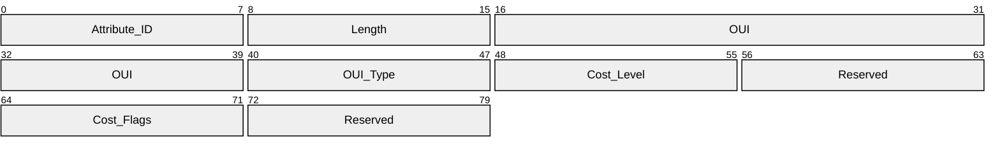
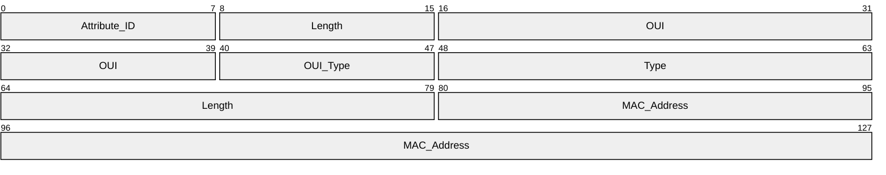

# [MS-NCT]: Network Cost Transfer Protocol

Table of Contents

1 Introduction

- [1 Introduction](#Section_1)
  - [1.1 Glossary](#Section_1.1)
  - [1.2 References](#Section_1.2)
    - [1.2.1 Normative References](#Section_1.2.1)
    - [1.2.2 Informative References](#Section_1.2.2)
  - [1.3 Overview](#Section_1.3)
  - [1.4 Relationship to Other Protocols](#Section_1.4)
  - [1.5 Prerequisites/Preconditions](#Section_1.5)
  - [1.6 Applicability Statement](#Section_1.6)
  - [1.7 Versioning and Capability Negotiation](#Section_1.7)
  - [1.8 Vendor-Extensible Fields](#Section_1.8)
  - [1.9 Standards Assignments](#Section_1.9)

2 Messages

- [2 Messages](#Section_2)
  - [2.1 Transport](#Section_2.1)
  - [2.2 Message Syntax](#Section_2.2)
    - [2.2.1 Network Cost IE](#Section_2.2.1)
      - [2.2.1.1 Cost Flags](#Section_2.2.1.1)
      - [2.2.1.2 Cost Level](#Section_2.2.1.2)
    - [2.2.2 Tethering Identifier IE](#Section_2.2.2)

3 Protocol Details

- [3 Protocol Details](#Section_3)
  - [3.1 AP Role Details](#Section_3.1)
    - [3.1.1 Abstract Data Model](#Section_3.1.1)
    - [3.1.2 Timers](#Section_3.1.2)
    - [3.1.3 Initialization](#Section_3.1.3)
    - [3.1.4 Higher-Layer Triggered Events](#Section_3.1.4)
    - [3.1.5 Message Processing Events and Sequencing Rules](#Section_3.1.5)
    - [3.1.6 Timer Events](#Section_3.1.6)
    - [3.1.7 Other Local Events](#Section_3.1.7)
  - [3.2 Client Role Details](#Section_3.2)
    - [3.2.1 Abstract Data Model](#Section_3.2.1)
    - [3.2.2 Timers](#Section_3.2.2)
    - [3.2.3 Initialization](#Section_3.2.3)
    - [3.2.4 Higher-Layer Triggered Events](#Section_3.2.4)
    - [3.2.5 Message Processing Events and Sequencing Rules](#Section_3.2.5)
    - [3.2.6 Timer Events](#Section_3.2.6)
    - [3.2.7 Other Local Events](#Section_3.2.7)

4 Protocol Examples

- [4 Protocol Examples](#Section_4)

5 Security

- [5 Security](#Section_5)
  - [5.1 Security Considerations for Implementers](#Section_5.1)
  - [5.2 Index of Security Parameters](#Section_5.2)

6 Appendix A: Product Behavior

- [6 Appendix A: Product Behavior](#Section_6)

7 Change Tracking

- [7 Change Tracking](#Section_7)

For the legal notice and IP terms, see [LEGAL.md](../LEGAL.md).
Last updated: 4/23/2024.
See [Revision History](#revision-history) for full version history.

# 1 Introduction

The Network Cost Transfer Protocol enables an IEEE 802.11 access point (AP) to communicate the network cost and tethering identification information about the AP type to wireless clients. It defines two vendor-specific Information Elements within the 802.11 beacon and probe response to relay this information to the client.

Sections 1.5, 1.8, 1.9, 2, and 3 of this specification are normative. All other sections and examples in this specification are informative.

## 1.1 Glossary

This document uses the following terms:

**802.11 Access Point (AP)**: Any entity that has IEEE 802.11 functionality and provides access to the distribution services, via the wireless medium for associated stations (STAs).

**Beacon**: A management frame that contains all of the information required to connect to a network. In a WLAN, Beacon frames are periodically transmitted to announce the presence of the network.

**information element (IE)**: A unit of information transmitted as part of the management frames in the IEEE 802.11 [[IEEE802.11-2012]](https://go.microsoft.com/fwlink/?LinkID=306038) protocol. Wireless devices, such as access points, communicate descriptive information about themselves in the form of one or more IEs in their management frames.

**Medium Access Control (MAC)**: A data communication protocol sublayer that is part of the seven-layer OSI model data-link layer (layer 2). It provides addressing and channel access control mechanisms that make it possible for several terminals or network nodes to communicate within a multipoint network, typically a local area network (LAN).

**network cost**: Information about how the Internet service provider bills customers for data usage on the network.

**organizationally unique identifier (OUI)**: A unique 24-bit string that uniquely identifies a vendor, manufacturer, or organization on a worldwide l basis, as specified in [IEEE-OUI]. The OUI is used to help distinguish both physical devices and software, such as a network protocol, that belong to one entity from those that belong to another.

**Probe Response**: A frame that contains the advertisement IE for a device. The Probe Response is sent in response to a Probe Request. The Probe Response frame is defined in the Wi-Fi Peer-to-Peer (P2P) Specification v1.2 [[WF-P2P1.2]](https://go.microsoft.com/fwlink/?LinkId=225584) section 4.2.3.

**tether**: Enables a device to gain access to the Internet by establishing a connection with another device that is connected to the Internet.

**MAY, SHOULD, MUST, SHOULD NOT, MUST NOT:** These terms (in all caps) are used as defined in [[RFC2119]](https://go.microsoft.com/fwlink/?LinkId=90317). All statements of optional behavior use either MAY, SHOULD, or SHOULD NOT.

## 1.2 References

Links to a document in the Microsoft Open Specifications library point to the correct section in the most recently published version of the referenced document. However, because individual documents in the library are not updated at the same time, the section numbers in the documents may not match. You can confirm the correct section numbering by checking the [Errata](https://go.microsoft.com/fwlink/?linkid=850906).

### 1.2.1 Normative References

We conduct frequent surveys of the normative references to assure their continued availability. If you have any issue with finding a normative reference, please contact [dochelp@microsoft.com](mailto:dochelp@microsoft.com). We will assist you in finding the relevant information.

[IEEE-OUI] IEEE Standards Association, "IEEE MAC Address Block Large (MA-L) Field Registration Authority Public Listing", [http://standards-oui.ieee.org/oui/oui.txt](https://go.microsoft.com/fwlink/?LinkId=89895)

[IEEE802.11-2007] Institute of Electrical and Electronics Engineers, "Telecommunications and Information Exchange Between Systems - Local and Metropolitan Area Networks - Specific Requirements - Part 11: Wireless LAN Medium Access Control (MAC) and Physical Layer (PHY) Specifications", IEEE 802.11-2007, [https://standards.ieee.org/ieee/802.11/3605/](https://go.microsoft.com/fwlink/?LinkID=89905)

**Note** Subcription Login or purchase to download this document.

[RFC2119] Bradner, S., "Key words for use in RFCs to Indicate Requirement Levels", BCP 14, RFC 2119, March 1997, [https://www.rfc-editor.org/info/rfc2119](https://go.microsoft.com/fwlink/?LinkId=90317)

### 1.2.2 Informative References

None.

## 1.3 Overview

The Network Cost Transfer Protocol enables an [**IEEE 802.11 access point (AP)**](#gt_80211-access-point-ap) to communicate the [**network cost**](#gt_network-cost) and information about the AP type to clients. It defines two vendor-specific [**information elements (IEs)**](#gt_information-element-ie), Network Cost and Tethering Identifier, within the 802.11 [**Beacon**](#gt_beacon) and [**Probe Response**](#gt_probe-response) to relay this information to the client. Tethering allows a Windows device to share Internet connectivity from one interface over a Wi-Fi adapter, acting as a network to which other devices can connect.

Network Cost IE is used by clients to determine whether data transferred on that specific connection is metered (section [2.2.1](#Section_2.2.1)). The Tethering Identifier IE is used to differentiate [**tethering**](#gt_aec98994-fbb4-43fb-ac7d-0ef37b747c9b) (device-based) networks from stand-alone APs (section [2.2.2](#Section_2.2.2)). The difference can then be used to vary the experience in implementation-defined ways.

## 1.4 Relationship to Other Protocols

The Network Cost Transfer Protocol extends the IEEE802.11 standard, whose conventions are applied as specified in [[IEEE802.11-2007]](https://go.microsoft.com/fwlink/?LinkID=89905). The Network Cost Transfer Protocol introduces a specific use for one of that protocol's reserved [**information element**](#gt_information-element-ie) types, and it defines additional [**Medium Access Control (MAC)**](#gt_medium-access-control-mac) layer abstract service primitives for managing the configuration, transmission, and receipt of these new information elements.

## 1.5 Prerequisites/Preconditions

The Network Cost Transfer Protocol requires APs to adhere to 802.11 standard specifications. The AP SHOULD have knowledge about the metered state of its network connection. This state may be explicitly configured, inferred from media type, or obtained using any other relevant means.

## 1.6 Applicability Statement

This protocol is only applicable to APs that support [**tethering**](#gt_aec98994-fbb4-43fb-ac7d-0ef37b747c9b). The client is required to support connecting to Wi-Fi networks. Lastly, the Tethering Identifier [**information element (IE)**](#gt_information-element-ie) only applies to multi-purpose devices capable of acting as access points, not to dedicated network hardware.

## 1.7 Versioning and Capability Negotiation

None.

## 1.8 Vendor-Extensible Fields

None.

## 1.9 Standards Assignments

| Parameter | Value | Reference |
| --- | --- | --- |
| OUI | 00-50-F2 | As specified in [[IEEE-OUI]](https://go.microsoft.com/fwlink/?LinkId=89895) |

# 2 Messages

## 2.1 Transport

The two vendor-specific [**information elements**](#gt_information-element-ie) in the Network Cost Transfer Protocol are transmitted as part of IEEE802.11 [**Beacons**](#gt_beacon) or [**Probe Responses**](#gt_probe-response). There are no requirements for the order of the information elements and it is not necessary that both be used at the same time.

The format of information elements is specified in [[IEEE802.11-2007]](https://go.microsoft.com/fwlink/?LinkID=89905) section 7.3.2. The format and processing of Beacon or Probe Response frames are also specified in [IEEE802.11-2007].

## 2.2 Message Syntax

The following sections specify Network Cost Transfer Protocol Message syntax.

### 2.2.1 Network Cost IE

The **Network Cost IE** structure SHOULD<1> be used by clients to determine whether data transferred on that specific connection is metered. The structure of the Network Cost [**information element (IE)**](#gt_information-element-ie) is shown in the following packet.

**Attribute_ID (1 byte):** Contains the ID of the element as specified [[IEEE802.11-2007]](https://go.microsoft.com/fwlink/?LinkID=89905) section 7.3.2. It MUST contain a value of 221 (OxDD), identifying a vendor-specific element (as specified in [IEEE802.11-2007] table 26) in which the vendor is identified by an IEEE-issued OUI.

**Length (1 byte):** The total length of the subsequent fields. This value MUST be 0x08.

**OUI (3 bytes):** The IEEE-assigned [**organizationally unique identifier (OUI)**](#gt_organizationally-unique-identifier-oui) for Microsoft. The **OUI** field MUST contain a value of (00:50:F2) as specified in [[IEEE-OUI]](https://go.microsoft.com/fwlink/?LinkId=89895).

**OUI_Type (1 byte):** A packet subtype within the universe specific to a specific OUI value. For the Network Cost IE, the OUI Type MUST contain a value of 0x11.

**Cost_Level (1 byte):** A value indicating the metering type of the network connection, as specified in section 2.2.1.2.

**Reserved (1 byte):** SHOULD be 0.

**Cost_Flags (1 byte):** Flags that indicate possible states of the network connection, as specified in section 2.2.1.1.

**Reserved (1 byte):** SHOULD be 0.

#### 2.2.1.1 Cost Flags

The following table shows the possible **cost flags** that can be represented in the IE:

| Value | Name | Description |
| --- | --- | --- |
| 0x00 | Unknown | The usage is unknown or unrestricted. |
| 0x01 | Over Data Limit | Usage has exceeded the data limit of the metered network; different network costs or conditions might apply. |
| 0x02 | Congested | The network operator is experiencing or expecting heavy load. |
| 0x04 | Roaming | The tethering connection is roaming outside the provider's home network or affiliates. |
| 0x08 | Approaching Data Limit | Usage is near the data limit of the metered network; different network costs or conditions might apply once the limit is reached. |

If the AP is aware that any of these states applies to its network connection, it SHOULD indicate the corresponding flag in all [**Beacons**](#gt_beacon) and [**Probe Responses**](#gt_probe-response).

#### 2.2.1.2 Cost Level

The following table shows the possible **cost levels** that can be represented in the IE:

| Value | Name | Description |
| --- | --- | --- |
| 0x00 | Unknown | The connection cost is unknown. |
| 0x01 | Unrestricted | The connection is unlimited and has unrestricted usage constraints. |
| 0x02 | Fixed | Usage counts toward a fixed allotment of data which the user has already paid for (or agreed to pay for). |
| 0x04 | Variable | The connection cost is on a per-byte basis. |

The AP MUST indicate the cost level that most accurately describes the network's cost and metering type, based on configuration or other information sources.<2>

### 2.2.2 Tethering Identifier IE

The Tethering Identifier [**information element (IE)**](#gt_information-element-ie) SHOULD<3> be used to differentiate tethering (device-based) networks from stand-alone APs. The structure of the Tethering Identifier IE is shown in the following packet.

**Attribute_ID (1 byte):** Contains the ID of the element as specified [[IEEE802.11-2007]](https://go.microsoft.com/fwlink/?LinkID=89905) section 7.3.2. It MUST contain a value of 221 (0xDD), identifying a vendor-specific element (as specified in [IEEE802.11-2007] table 26) in which the vendor is identified by an IEEE-issued OUI.

**Length (1 byte):** The length of the subsequent fields. This value MUST be 14 (0x0E).

**OUI (3 bytes):** The IEEE-assigned [**organizationally unique identifier (OUI)**](#gt_organizationally-unique-identifier-oui) for Microsoft. The **OUI** field MUST contain a value of (00:50:F2) as specified in [[IEEE-OUI]](https://go.microsoft.com/fwlink/?LinkId=89895).

**OUI_Type (1 byte):** A packet subtype within the universe specific to a specific OUI value. For the Tethering Identifier IE, the OUI Type MUST contain a value of 18 (0x12).

**Type (2 bytes):** Used to specify that the network is broadcasted as tethered. The **Type** field MUST contain a value of 43 (0x2B).

**Length (2 bytes):** Contains the length of the **MAC_Address** field in octets. This value MUST be 6 (0x06).

**MAC_Address (6 bytes):** Contains the [**Medium Access Control (MAC)**](#gt_medium-access-control-mac) address of the AP.

# 3 Protocol Details

## 3.1 AP Role Details

To compensate for an unreliable transmission over the wireless medium, the [**information elements**](#gt_information-element-ie) SHOULD be contained in each [**Beacon**](#gt_beacon) frame and [**Probe Response**](#gt_probe-response).

### 3.1.1 Abstract Data Model

None.

### 3.1.2 Timers

None.

### 3.1.3 Initialization

The [**802.11 Access Point (AP)**](#gt_80211-access-point-ap) MUST have initial information about the cost state of the upstream flow of data and convey the appropriate flag in the IE. This information may be administratively configured, inferred from media type, or acquired by other means.

### 3.1.4 Higher-Layer Triggered Events

If the metering state of the network changes, the AP SHOULD immediately reflect the new value in all future [**Beacons**](#gt_beacon) and [**Probe Responses**](#gt_probe-response).

### 3.1.5 Message Processing Events and Sequencing Rules

None.

### 3.1.6 Timer Events

None.

### 3.1.7 Other Local Events

None.

## 3.2 Client Role Details

The client acquires information about the network during network discovery and connection. The client role is triggered when in range of an [**802.11 Access Point (AP)**](#gt_80211-access-point-ap) and finding the relevant [**information element**](#gt_information-element-ie) in the [**Beacon**](#gt_beacon) or [**Probe Response**](#gt_probe-response) frame.

### 3.2.1 Abstract Data Model

For each AP to which the client is currently connected, the client SHOULD maintain the current estimated cost state and network type.

### 3.2.2 Timers

None.

### 3.2.3 Initialization

None.

### 3.2.4 Higher-Layer Triggered Events

When in range of an [**802.11 Access Point (AP)**](#gt_80211-access-point-ap), the client SHOULD inspect the [**Beacon**](#gt_beacon) and [**Probe Response**](#gt_probe-response) frames for the [**information elements**](#gt_information-element-ie) defined by this protocol. If they are present, they SHOULD inform the client's data about the network. If not, the client may infer value using implementation-specific defaults.

### 3.2.5 Message Processing Events and Sequencing Rules

If these [**information elements**](#gt_information-element-ie) are found, the local knowledge of the current network SHOULD be updated with the information they contain. Use of this information is implementation-dependent and handled by higher-layer protocols.

### 3.2.6 Timer Events

None.

### 3.2.7 Other Local Events

None.

# 4 Protocol Examples

The following table shows some sample cost attribute values:

| Name | Cost Flag | Cost Level | Description |
| --- | --- | --- | --- |
| Default WLAN | 0x00 | 0x01 | Unrestricted connection; standard WLAN backed by fixed broadband. |
| Portable Hotspot Default | 0x00 | 0x02 | Metered network; limit unknown or not yet reached; reasonable default for mobile broadband connections without other information. |
| Over Limit / Throttled | 0x01 | 0x01 | User has exceeded data limit; speed is reduced, but no further usage limitation applies. |
| Over Limit / Charges | 0x01 | 0x04 | User has exceeded data limit; additional usage incurs incremental charges. |
| Portable Hotspot / Roaming | 0x04 | 0x04 | Connection is roaming; incremental charges apply due to network state. |

The following is an example of the Network Cost IE conveyed in a Beacon or Probe Response frame for the over data limit cost flag.

| Bit Range | Field | Description |
| --- | --- | --- |
| Variable | 0000 | DD Element ID |
| Variable | 0001 | 08 Length |
| Variable | 0002 | 00 OUI (Microsoft) |
| Variable | 0003 | 50 - |
| Variable | 0004 | F2 - |
| Variable | 0005 | 11 OUI Type |
| Variable | 0006 | 02 Cost Level (Fixed) |
| Variable | 0007 | 00 Reserved |
| Variable | 0008 | 01 Cost Flag (Over Data Limit) |
| Variable | 0009 | 00 Reserved |

Figure 1: Example of the Network Cost IE

The following is an example of the Tethering Identifier IE conveyed in a Beacon or Probe Response frame.

| Bit Range | Field | Description |
| --- | --- | --- |
| Variable | 0000 | DD Element ID |
| Variable | 0001 | 0E Length |
| Variable | 0002 | 00 OUI (Microsoft) |
| Variable | 0003 | 50 - |
| Variable | 0004 | F2 - |
| Variable | 0005 | 12 OUI Type |
| Variable | 0006 | 00 Type |
| Variable | 0007 | 2B - |
| Variable | 0008 | 00 Length |
| Variable | 0009 | 06 - |
| Variable | 0010 | 68 MAC Address |
| Variable | 0011 | 5D - |
| Variable | 0012 | 43 - |
| Variable | 0013 | 0B - |
| Variable | 0014 | 66 - |
| Variable | 0015 | 12 - |

**Figure 2: Example of the Tethering Identifier IE**

# 5 Security

## 5.1 Security Considerations for Implementers

The information transferred by this protocol is transmitted unencrypted, even for a secured AP. Do not include sensitive information.

## 5.2 Index of Security Parameters

None.

# 6 Appendix A: Product Behavior

The information in this specification is applicable to the following Microsoft products or supplemental software. References to product versions include updates to those products.

- Windows 8 operating system
- Windows Server 2012 operating system
- Windows 8.1 operating system
- Windows Server 2012 R2 operating system
- Windows 10 operating system
- Windows Server 2016 operating system
- Windows Server 2019 operating system
- Windows Server 2022 operating system
- Windows 11 operating system
- Windows Server 2025 operating system
Exceptions, if any, are noted in this section. If an update version, service pack or Knowledge Base (KB) number appears with a product name, the behavior changed in that update. The new behavior also applies to subsequent updates unless otherwise specified. If a product edition appears with the product version, behavior is different in that product edition.

Unless otherwise specified, any statement of optional behavior in this specification that is prescribed using the terms "SHOULD" or "SHOULD NOT" implies product behavior in accordance with the SHOULD or SHOULD NOT prescription. Unless otherwise specified, the term "MAY" implies that the product does not follow the prescription.

<1> Section 2.2.1: Windows 8 and Windows Server 2012 could consume but not generate the IE. They implemented only the client role.

<2> Section 2.2.1.2: Windows acting as APs always set the cost to Fixed with no flags set, regardless of the actual state.

<3> Section 2.2.2: Windows 8 and Windows Server 2012 did not implement this IE.

# 7 Change Tracking

This section identifies changes that were made to this document since the last release. Changes are classified as Major, Minor, or None.

The revision class **Major** means that the technical content in the document was significantly revised. Major changes affect protocol interoperability or implementation. Examples of major changes are:

- A document revision that incorporates changes to interoperability requirements.
- A document revision that captures changes to protocol functionality.
The revision class **Minor** means that the meaning of the technical content was clarified. Minor changes do not affect protocol interoperability or implementation. Examples of minor changes are updates to clarify ambiguity at the sentence, paragraph, or table level.

The revision class **None** means that no new technical changes were introduced. Minor editorial and formatting changes may have been made, but the relevant technical content is identical to the last released version.

The changes made to this document are listed in the following table. For more information, please contact [dochelp@microsoft.com](mailto:dochelp@microsoft.com).

| Section | Description | Revision class |
| --- | --- | --- |
| [6](#Section_6) Appendix A: Product Behavior | Added Windows Server 2025 to the list of applicable products. | Major |

## Revision History

| Date | Version | Revision Class | Comments |
| --- | --- | --- | --- |
| 7/14/2016 | 1.0 | New | Released new document. |
| 6/1/2017 | 2.0 | Major | Significantly changed the technical content. |
| 9/15/2017 | 3.0 | Major | Significantly changed the technical content. |
| 12/1/2017 | 3.0 | None | No changes to the meaning, language, or formatting of the technical content. |
| 9/12/2018 | 4.0 | Major | Significantly changed the technical content. |
| 4/7/2021 | 5.0 | Major | Significantly changed the technical content. |
| 6/25/2021 | 6.0 | Major | Significantly changed the technical content. |
| 4/23/2024 | 7.0 | Major | Significantly changed the technical content. |
