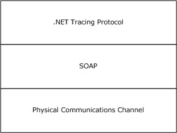
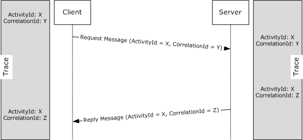
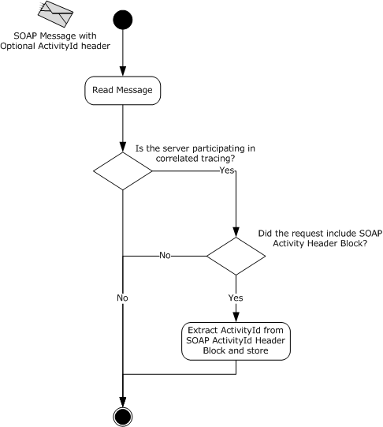
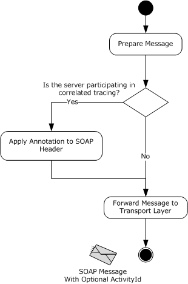

# [MS-NETTR]: .NET Tracing Protocol

Table of Contents

1 Introduction

- [1 Introduction](#Section_1)
  - [1.1 Glossary](#Section_1.1)
  - [1.2 References](#Section_1.2)
    - [1.2.1 Normative References](#Section_1.2.1)
    - [1.2.2 Informative References](#Section_1.2.2)
  - [1.3 Overview](#Section_1.3)
  - [1.4 Relationship to Other Protocols](#Section_1.4)
  - [1.5 Prerequisites/Preconditions](#Section_1.5)
  - [1.6 Applicability Statement](#Section_1.6)
  - [1.7 Versioning and Capability Negotiation](#Section_1.7)
  - [1.8 Vendor-Extensible Fields](#Section_1.8)
  - [1.9 Standards Assignments](#Section_1.9)

2 Messages

- [2 Messages](#Section_2)
  - [2.1 Transport](#Section_2.1)
  - [2.2 Message Syntax](#Section_2.2)
    - [2.2.1 Namespaces](#Section_2.2.1)
    - [2.2.2 Common Data Types](#Section_2.2.2)
    - [2.2.3 SOAP ActivityId Header Block Syntax](#Section_2.2.3)

3 Protocol Details

- [3 Protocol Details](#Section_3)
  - [3.1 Server Details](#Section_3.1)
    - [3.1.1 Abstract Data Model](#Section_3.1.1)
    - [3.1.2 Timers](#Section_3.1.2)
    - [3.1.3 Initialization](#Section_3.1.3)
    - [3.1.4 Higher-Layer Triggered Events](#Section_3.1.4)
    - [3.1.5 Processing Events and Sequencing Rules](#Section_3.1.5)
    - [3.1.6 Timer Events](#Section_3.1.6)
    - [3.1.7 Other Local Events](#Section_3.1.7)
  - [3.2 Client Details](#Section_3.2)
    - [3.2.1 Abstract Data Model](#Section_3.2.1)
    - [3.2.2 Timers](#Section_3.2.2)
    - [3.2.3 Initialization](#Section_3.2.3)
    - [3.2.4 Higher-Layer Triggered Events](#Section_3.2.4)
    - [3.2.5 Message Processing Events and Sequencing Rules](#Section_3.2.5)
    - [3.2.6 Timer Events](#Section_3.2.6)
    - [3.2.7 Other Local Events](#Section_3.2.7)

4 Protocol Examples

- [4 Protocol Examples](#Section_4)
  - [4.1 Sample SOAP Messages](#Section_4.1)
  - [4.2 Sample Activity Traces](#Section_4.2)
    - [4.2.1 Activity Trace Emitted for Request Sent at the Client](#Section_4.2.1)
    - [4.2.2 Activity Trace Emitted for Request Received at the Server](#Section_4.2.2)
    - [4.2.3 Activity Trace Emitted for Reply Sent at the Server](#Section_4.2.3)
    - [4.2.4 Activity Trace Emitted for Reply Received at the Client](#Section_4.2.4)

5 Security

- [5 Security](#Section_5)
  - [5.1 Security Considerations for Implementers](#Section_5.1)
  - [5.2 Index of Security Parameters](#Section_5.2)

6 Appendix A: Product Behavior

- [6 Appendix A: Product Behavior](#Section_6)

7 Change Tracking

- [7 Change Tracking](#Section_7)

For the legal notice and IP terms, see [LEGAL.md](../LEGAL.md).
Last updated: 3/13/2019.
See [Revision History](#revision-history) for full version history.

# 1 Introduction

This document specifies the .NET Tracing Protocol, which defines a SOAP message header for correlating sets of messages together.

Diagnosing errors in [**distributed applications**](#gt_distributed-application) is a complex task that usually involves multiple messages. By correlating messages between distributed application [**endpoints**](#gt_endpoint), users can map message exchanges and infer causality relationships between messages. This information helps isolate the set of messages that led up to an error and the set of messages that resulted from it. In a distributed application, this information can also be used to trace the flow of activities through the system. The .NET Tracing Protocol provides simple message correlation functionality to distributed applications.

Sections 1.5, 1.8, 1.9, 2, and 3 of this specification are normative. All other sections and examples in this specification are informative.

## 1.1 Glossary

This document uses the following terms:

**distributed application**: An application composed of one or more distinct components that communicate with each other via a protocol, either locally or over the wire.

**endpoint**: A communication port that is exposed by an application server for a specific shared service and to which messages can be addressed.

**universally unique identifier (UUID)**: A 128-bit value. UUIDs can be used for multiple purposes, from tagging objects with an extremely short lifetime, to reliably identifying very persistent objects in cross-process communication such as client and server interfaces, manager entry-point vectors, and RPC objects. UUIDs are highly likely to be unique. UUIDs are also known as globally unique identifiers (GUIDs) and these terms are used interchangeably in the Microsoft protocol technical documents (TDs). Interchanging the usage of these terms does not imply or require a specific algorithm or mechanism to generate the UUID. Specifically, the use of this term does not imply or require that the algorithms described in [[RFC4122]](https://go.microsoft.com/fwlink/?LinkId=90460) or [[C706]](https://go.microsoft.com/fwlink/?LinkId=89824) must be used for generating the UUID.

**MAY, SHOULD, MUST, SHOULD NOT, MUST NOT:** These terms (in all caps) are used as defined in [[RFC2119]](https://go.microsoft.com/fwlink/?LinkId=90317). All statements of optional behavior use either MAY, SHOULD, or SHOULD NOT.

## 1.2 References

Links to a document in the Microsoft Open Specifications library point to the correct section in the most recently published version of the referenced document. However, because individual documents in the library are not updated at the same time, the section numbers in the documents may not match. You can confirm the correct section numbering by checking the [Errata](https://go.microsoft.com/fwlink/?linkid=850906).

### 1.2.1 Normative References

We conduct frequent surveys of the normative references to assure their continued availability. If you have any issue with finding a normative reference, please contact [dochelp@microsoft.com](mailto:dochelp@microsoft.com). We will assist you in finding the relevant information.

[MS-DTYP] Microsoft Corporation, "[Windows Data Types](../MS-DTYP/MS-DTYP.md)".

[RFC2119] Bradner, S., "Key words for use in RFCs to Indicate Requirement Levels", BCP 14, RFC 2119, March 1997, [http://www.rfc-editor.org/rfc/rfc2119.txt](https://go.microsoft.com/fwlink/?LinkId=90317)

[RFC4122] Leach, P., Mealling, M., and Salz, R., "A Universally Unique Identifier (UUID) URN Namespace", RFC 4122, July 2005, [http://www.rfc-editor.org/rfc/rfc4122.txt](https://go.microsoft.com/fwlink/?LinkId=90460)

[SOAP1.2-1/2007] Gudgin, M., Hadley, M., Mendelsohn, N., et al., "SOAP Version 1.2 Part 1: Messaging Framework (Second Edition)", W3C Recommendation, April 2007, [http://www.w3.org/TR/2007/REC-soap12-part1-20070427/](https://go.microsoft.com/fwlink/?LinkId=94664)

[XMLNS] Bray, T., Hollander, D., Layman, A., et al., Eds., "Namespaces in XML 1.0 (Third Edition)", W3C Recommendation, December 2009, [http://www.w3.org/TR/2009/REC-xml-names-20091208/](https://go.microsoft.com/fwlink/?LinkId=191840)

[XMLSCHEMA1] Thompson, H., Beech, D., Maloney, M., and Mendelsohn, N., Eds., "XML Schema Part 1: Structures", W3C Recommendation, May 2001, [http://www.w3.org/TR/2001/REC-xmlschema-1-20010502/](https://go.microsoft.com/fwlink/?LinkId=90608)

[XMLSCHEMA2] Biron, P.V., Ed. and Malhotra, A., Ed., "XML Schema Part 2: Datatypes", W3C Recommendation, May 2001, [http://www.w3.org/TR/2001/REC-xmlschema-2-20010502/](https://go.microsoft.com/fwlink/?LinkId=90610)

### 1.2.2 Informative References

[MS-NETOD] Microsoft Corporation, "[Microsoft .NET Framework Protocols Overview](../MS-NETOD/MS-NETOD.md)".

## 1.3 Overview

As [**distributed applications**](#gt_distributed-application) become increasingly complex, so does the problem of diagnosing errors within them. To diagnose an error in a distributed application, a user isolates the problem to a particular component. Each component often produces a trace log that records incoming messages, outgoing messages, and information about its internal state. By analyzing trace logs for each component, a user can reconstruct the sequence of messages that led to the error. The .NET Tracing Protocol facilitates this process by helping to correlate message flows together.

The .NET Tracing Protocol provides two main functions. First, it enables users to map outgoing messages to incoming messages between components in a distributed application. It does this by assigning each message a unique identifier, named the *CorrelationId*. This identifier is stored in the client component's trace log before it sends a message and in the server component's trace log after it receives a message. The identifier is then used as an index into the client and server trace logs to map the message exchange together. Using a unique identifier to map message flows also has the advantage of avoiding problems with clock skew between components in the distributed application.

The second function of the .NET Tracing Protocol is to provide a way to group related messages together. It does this by generating a second message identifier named the *ActivityId*. Unlike the *CorrelationId*, the *ActivityId* is not unique for each message. Instead, the same *ActivityId* is propagated between related messages. For example, a client sends a request to a server with "*ActivityId* A" in the message. The .NET Tracing Protocol states that the server echoes "*ActivityId* A" in its message response. Future related requests by the client will continue to use the same "*ActivityId* A". Because all of the related messages have included the same *ActivityId*, users can infer causality relationships between messages. This information can also be used to determine the set of messages that led up to an error and the set of messages that resulted from the error. This process is specified in section [3.1.5](#Section_3.1.5).

## 1.4 Relationship to Other Protocols

The .NET Tracing Protocol supports only SOAP-formatted messages. The communication protocol between the client and the server needs to use a SOAP-supported transport protocol, such as TCP/IP or HTTP/S. The following figure shows the dependency diagram for the .NET Tracing Protocol.

Figure 1: Dependency stack for the .NET Tracing Protocol

## 1.5 Prerequisites/Preconditions

The .NET Tracing Protocol assumes the following:

- The .NET Tracing Protocol is not dependent on any specific transport protocol.
- The communication protocol between the client and the server uses a SOAP-supported transport protocol.

## 1.6 Applicability Statement

The .NET Tracing Protocol can be used to help with tracing or debugging a [**distributed application**](#gt_distributed-application).

## 1.7 Versioning and Capability Negotiation

This specification covers versioning issues in the following areas:

- **Supported Transports:** This protocol requires the use of SOAP messaging version 1.1 or SOAP messaging 1.2. SOAP is specified in [[SOAP1.2-1/2007]](https://go.microsoft.com/fwlink/?LinkId=94664).
- **Protocol Versions:** The .NET Tracing Protocol applies to SOAP messages that include the additional XML element <ActivityId /> with a namespace of "http://schemas.microsoft.com/2004/09/ServiceModel/Diagnostics".
- **Capability Negotiation:** The .NET Tracing Protocol does not support negotiation of the version to use. Instead, an implementation is configured to process only messages with the specific XML element and namespace that are described in this document.
The .NET Tracing Protocol applies to SOAP messages that are formatted based on the released SOAP versions 1.1, 1.2, or later versions.

Moreover, this document references valid, well-formed, and complete SOAP messages that carry the special XML element <ActivityId /> with the specific namespace "http://schemas.microsoft.com/2004/09/ServiceModel/Diagnostics".

An implementation is not compliant with this specification if it fails to satisfy one or more requirements defined herein. A SOAP node cannot use the "http://schemas.microsoft.com/2004/09/ServiceModel/Diagnostics" XML Namespace identifier within SOAP Envelopes unless it is compliant with this specification.

## 1.8 Vendor-Extensible Fields

The .NET Tracing Protocol does not specify any extensions or extensible fields by default. However, vendors and implementers can choose to extend the protocol by including additional attributes. An extension or implementation has to provide the basic and default behavior specified in this protocol document when the service does not understand a specific extension, to maintain compatibility with implementations that do not understand a specific extension.

## 1.9 Standards Assignments

None.

# 2 Messages

## 2.1 Transport

The .NET Tracing Protocol enables correlated activity tracing between client and server endpoints, even across different application domains for a single unit of processing, such as request or reply. For example, the .NET Tracing Protocol enables correlation of traces generated at the client end for the send operation and at the server end for the receive operation for a request message exchange. Additionally, for a request-reply message exchange pattern, the .NET Tracing Protocol enables correlation of traces generated for both the request and the reply.

In order for a client and a server to generate correlated activity tracing using the .NET Tracing Protocol, both the client and the server MUST use a SOAP-supported transport protocol for message exchange. There are no restrictions on the use of any specific SOAP transport protocol.

To participate in the generation of correlated activity traces using the .NET Tracing Protocol, both the client and the server MUST insert the special SOAP header block <ActivityId/> (namespace "http://schemas.microsoft.com/2004/09/ServiceModel/Diagnostics"), which is also called the [SOAP ActivityId Header Block](#Section_2.2.3), into the SOAP header when sending a message. This SOAP ActivityId Header Block MUST follow all the rules of the SOAP header specified in [[SOAP1.2-1/2007]](https://go.microsoft.com/fwlink/?LinkId=94664) Section 3 SOAP Extensibility Model and [SOAP1.2-1/2007] Section 5.2 SOAP Header. The sender MUST associate the GUID string specified as the *ActivityId* with the activity traces generated at its end. When a message is received by a recipient, and the SOAP header includes the SOAP ActivityId Header Block, the recipient MUST process the SOAP ActivityId Header Block. The received *ActivityId* MUST be associated with the activity traces generated by the recipient. If the request-response message exchange pattern (as specified by SOAP) is used, then the server MUST echo the *ActivityId* received in the request in the SOAP ActivityId Header Block, included in the reply message header. The *CorrelationId* attribute MUST be different than the one received in the request. If the request does not include the SOAP ActivityId Header Block, then the server MUST behave as if it is an initiator and MUST insert the SOAP ActivityId Header Block in the message header for the reply. Figure 1 describes the message exchange sequence for a request-response message exchange pattern between a client and a server.

The SOAP ActivityId Header Block is an optional SOAP header that MAY<1> be included. The message recipient MAY ignore the SOAP ActivityId Header Block if it is included in the received request. In case of a request-response pattern, the message sender MUST NOT declare a failure condition if the SOAP ActivityId Header Block is not included in the response, even if the request is included in the header.

This specification does not specify how to process any custom third-party extensions or attributes to this protocol when they are processed by a client or a server.

## 2.2 Message Syntax

### 2.2.1 Namespaces

This specification defines and references various XML namespaces using the mechanisms specified in [[XMLNS]](https://go.microsoft.com/fwlink/?LinkId=191840). Although this specification associates a specific XML namespace prefix for each XML namespace that is used, the choice of any particular XML namespace prefix is implementation-specific and not significant for interoperability.

| Prefix | Namespace URI | Reference |
| --- | --- | --- |
| (none) | http://schemas.microsoft.com/2004/09/ServiceModel/Diagnostics | - |
| xsd | http://www.w3.org/2001/XMLSchema | [[XMLSCHEMA1]](https://go.microsoft.com/fwlink/?LinkId=90608), [[XMLSCHEMA2]](https://go.microsoft.com/fwlink/?LinkId=90610) |

### 2.2.2 Common Data Types

**GUID strings:** This protocol makes use of the string representation of a GUID specified in [MS-DTYP](../MS-DTYP/MS-DTYP.md) section 2.3.4.3. This string representation is in the form of a [**universally unique identifier (UUID)**](#gt_universally-unique-identifier-uuid) as specified in [[RFC4122]](https://go.microsoft.com/fwlink/?LinkId=90460) section 3.

### 2.2.3 SOAP ActivityId Header Block Syntax

To enable activity tracing, a special XML element called the SOAP ActivityId Header Block MUST be placed within the SOAP header of each message exchanged. The schema for this XML element is as follows.

<xsd:schema xmlns:xsd="http://www.w3.org/2001/XMLSchema"

targetNamespace="http://schemas.microsoft.com/2004/09/ServiceModel/Diagnostics">

<xsd:element name="ActivityId">

<xsd:complexType>

<xsd:attribute name="CorrelationId" type="xsd:string" />

</xsd:complexType>

</xsd:element>

</xsd:schema>

There is no specific location for this XML element within the SOAP header.

**ActivityId:** Contains the name of the SOAP ActivityId Header Block. The value of this element is a GUID string. This value is used to correlate activity traces within the same unit of processing (for example, all activity traces generated for a request or a response, or for both request and response if a request-response message exchange pattern is used).

**http://schemas.microsoft.com/2004/09/ServiceModel/Diagnostics:** The qualifying namespace for the SOAP ActivityId Header Block.

**CorrelationId:** Attribute of type GUID string associated with the SOAP ActivityId Header Block. This attribute is used to relate the send and receive activity traces associated with one single message. For example, for a request message, the activity traces for send at the client and the corresponding receive at the server are correlated based on the *CorrelationId*. The send and receive messages associated with the response are associated with a different *CorrelationId*.

# 3 Protocol Details

## 3.1 Server Details

### 3.1.1 Abstract Data Model

**ActivityId:** When a request is received by a server and it contains a [SOAP ActivityId Header Block](#Section_2.2.3), the server has to process the header block and store the *ActivityId* contained in the header. The received *ActivityId* can be used as the CorrelationId to generate activity traces.

**Correlation Mode:** A BOOLEAN value. When set to TRUE, **Correlation Mode** is **enabled**. The server is configured to participate in correlated tracing. It includes the client's *ActivityId* as an XML element in the SOAP header. If set to FALSE, **Correlation Mode** is **disabled** and the *ActivityId* is not inserted.

### 3.1.2 Timers

None.

### 3.1.3 Initialization

None.

### 3.1.4 Higher-Layer Triggered Events

None.

### 3.1.5 Processing Events and Sequencing Rules

When the server receives a request that contains a [SOAP ActivityId Header Block](#Section_2.2.3), the server MUST process the header block and save the *ActivityId* contained in the header. The server MUST echo the *ActivityId* sent by the client in its response message. Future related requests from the client typically continue to use the same *ActivityId* (as specified in section [3.2.5](#Section_3.2.5)). This allows implementers to infer causality relationships between messages, and to determine the set of messages that led up to (and result from) an error.

The following figure shows a typical message exchange sequence with corresponding data.

Figure 2: Sequence of a request-reply message exchange

Every server participating in correlated tracing using the .NET Tracing Protocol MUST implement processing to receive and send the SOAP ActivityId Header Block. Participation can be externally configured. The following state diagram shows the receiving end of a server participating in correlated activity tracing. A state diagram showing the sending portion of server participation follows later in this section.

Figure 3: State of a server receiving a request when Correlation Mode is enabled

The request-response messaging consists of a request message from client to server and a corresponding response message from server to client. When the server is sending a response for the request that included the SOAP ActivityId Header Block and **Correlation Mode** is **enabled**, it MUST insert an *ActivityId* XML element into the SOAP header of the response. It MUST use the **ActivityId**, which is always set to the *ActivityId* received in the request. The **CorrelationId** attribute of the *ActivityId* element MUST be a newly generated unique GUID string.

When the server is sending a response for the request that did not include the SOAP ActivityId Header Block and the server is configured to participate in correlated tracing, it MUST insert a SOAP ActivityId Header Block into the SOAP header of the response with the value of *ActivityId* being a newly generated unique GUID string. The **CorrelationId** attribute of the *ActivityId* element MUST be a newly generated unique GUID string.

The following state diagram shows the sending end of a server participating in correlated activity tracing.

Figure 4: State of a server sending a response when participating in correlated activity tracing

### 3.1.6 Timer Events

None.

### 3.1.7 Other Local Events

None.

## 3.2 Client Details

### 3.2.1 Abstract Data Model

**ActivityId:** When a request is sent by a client and **Correlation Mode** is **enabled**, the client inserts a [SOAP ActivityId Header Block](#Section_2.2.3) that includes an *ActivityId*. This value is stored and used in messages that are part of a correlated set.

**Correlation Mode:** A Boolean value. When set to TRUE, **Correlation Mode** is **enabled**; the client is configured to participate in correlated tracing. It sends the appropriate *ActivityId* for the correlated set the current message is a part of. If set to FALSE, **Correlation Mode** is **disabled** and the *ActivityId* is not inserted.

### 3.2.2 Timers

None.

### 3.2.3 Initialization

None.

### 3.2.4 Higher-Layer Triggered Events

None.

### 3.2.5 Message Processing Events and Sequencing Rules

Every client participating in generating correlated tracing using the .NET Tracing Protocol MUST implement processing to send and receive the [SOAP ActivityId Header Block](#Section_2.2.3). Participation can be externally configured. The following state diagram shows a client participating in correlated activity tracing.

Figure 5: State of a client sending a request when participating in correlated activity tracing

When a request is sent by a client and the client is configured to participate in correlated tracing, it MUST insert a SOAP ActivityId Header Block into the SOAP header of the request. The inserted SOAP ActivityId Header Block MUST include an *ActivityId*. This *ActivityId* can be a GUID string already being used to perform correlated activity tracing at the client. Related requests sent by the client SHOULD continue to use the same *ActivityId*. The **CorrelationId** attribute of the *ActivityId* element MUST be a newly generated unique GUID string for that message.

When the client receives a response to the request it had sent (which had included the SOAP ActivityId Header Block in the SOAP header), and the client is configured to participate in correlated tracing, it SHOULD process the SOAP ActivityId Header Block present in the SOAP header of the response.

### 3.2.6 Timer Events

None.

### 3.2.7 Other Local Events

None.

# 4 Protocol Examples

By inserting the [SOAP ActivityId Header Block](#Section_2.2.3) into the SOAP header, activity traces can be correlated across client and server. Correlated activity traces provide the user with direct correlation of error traces for the same unit of processing across application endpoints, such as a request. Errors emitted at different endpoints for the same unit of processing are grouped in the same activity, even across process or machine boundaries.

## 4.1 Sample SOAP Messages

The following examples depict two SOAP messages that contain the [SOAP ActivityId Header Block](#Section_2.2.3) in the SOAP header. The SOAP messages are request and response messages associated with a request-response message exchange pattern. The examples show a complete SOAP envelope, but the discussion focuses only on the SOAP ActivityId Header Block.

The following is a sample request message that includes the SOAP ActivityId Header Block. The sample shows a standard SOAP envelope with a body and a header. The header element contains an <ActivityId> element. The value of *ActivityId* is "43ffa660-a0c6-4249-bb36-648b73a06213" and the CorrelationId attribute is "7224e2a9-8f9c-4acb-a924-17cb6af67b23".

<s:Envelope xmlns:s="http://schemas.xmlsoap.org/soap/envelope/">

<s:Header>

<Action s:mustUnderstand="1"

xmlns="http://schemas.microsoft.com/ws/2005/05/addressing/none">

http://tempuri.org/IService/MyOperation

</Action>

<ActivityId CorrelationId="7224e2a9-8f9c-4acb-a924-17cb6af67b23"

xmlns="http://schemas.microsoft.com/2004/09/ServiceModel/Diagnostics">

43ffa660-a0c6-4249-bb36-648b73a06213</ActivityId>

</s:Header>

<s:Body>

<MyOperation xmlns="http://tempuri.org">

<MyValue>Some Value</MyValue>

</MyOperation>

</s:Body>

</s:Envelope>

The following is a sample response to the request discussed earlier. The header element for the message includes the <ActivityId> element. As per section [3.1.1](#Section_3.1.1), the *ActivityId* value is the same as received in the request ("43ffa660-a0c6-4249-bb36-648b73a06213"). The protocol also specifies that the *CorrelationId* attribute is different from the *CorrelationId* received in the request. In the example, the *CorrelationId* associated with the response is a new GUID string value ("b898336e-d4e2-4eb7-a2c7-1e23f4630646").

<s:Envelope xmlns:s="http://schemas.xmlsoap.org/soap/envelope/">

<s:Header>

<Action s:mustUnderstand="1"

xmlns="http://schemas.microsoft.com/ws/2005/05/addressing/none">

http://tempuri.org/IService/MyOperation

</Action>

<ActivityId CorrelationId="b898336e-d4e2-4eb7-a2c7-1e23f4630646"

xmlns="http://schemas.microsoft.com/2004/09/ServiceModel/Diagnostics">

43ffa660-a0c6-4249-bb36-648b73a06213</ActivityId>

</s:Header>

<s:Body>

<MyOperationResponse xmlns="http://tempuri.org">

<MyOperationResult>

<MyValue>Some Value</MyValue>

</MyOperationResult>

</MyOperationResponse>

</s:Body>

</s:Envelope>

The activity trace generated at the client and server ends for the request and response is expected to maintain a correlation with the value of *ActivityId* ("43ffa660-a0c6-4249-bb36-648b73a06213"). Section [4.2](#Section_4.2) provides examples of traces with such a correlation.

## 4.2 Sample Activity Traces

The following examples discuss a sample use of the .NET Tracing Protocol to generate a correlated activity trace. The .NET Tracing Protocol does not prescribe the usage of *ActivityId*, *CorrelationId*, and the format of the traces emitted. Individual protocol implementation is free to use the *ActivityId* and *CorrelationId* in any form suitable to generate activity traces. The following examples are used for illustrative purposes only and are not part of the protocol specification.

Sample traces generated at the client and server ends for a request-response message exchange pattern are described later. In these samples, the *ActivityId* attribute associated with XML element *<Correlation>* is used to associate the generated activity traces with the *ActivityId* received in the SOAP header. The SOAP headers associated with the request message are also included in the generated trace (see element *E2ETraceEvent\ApplicationData\TraceData\DataItem\TraceRecord\ExtendedData\MessageHeaders\ActivityId*). For illustration purposes, the sample traces discussed later are defined as if they were generated for the request-response messages discussed in section [4.1](#Section_4.1).

### 4.2.1 Activity Trace Emitted for Request Sent at the Client

The following is a sample trace generated at the client end when sending a request message. The *ActivityId* attribute associated with the XML element *<Correlation>* is the same as specified in the message samples discussed earlier ("43ffa660-a0c6-4249-bb36-648b73a06213"). The [SOAP ActivityId Header Block](#Section_2.2.3) associated with the request message is also part of the trace. Other parts of the sample trace will not be discussed and are not relevant to this example.

<E2ETraceEvent xmlns="http://schemas.microsoft.com/2004/06/E2ETraceEvent">

<System xmlns="http://schemas.microsoft.com/2004/06/windows/eventlog/system">

<EventID>262164</EventID>

<Type>3</Type>

<SubType Name="Information">0</SubType>

<Level>8</Level>

<TimeCreated SystemTime="2008-02-08T17:23:54.0057336Z" />

<Source Name="System.ServiceModel" />

<Correlation ActivityID="{43ffa660-a0c6-4249-bb36-648b73a06213}" />

<Execution ProcessName="Client" ProcessID="7604" ThreadID="1" />

<Channel/>

<Computer>MACHINE1</Computer>

</System>

<ApplicationData>

<TraceData>

<DataItem>

<TraceRecord xmlns="http://schemas.microsoft.com/2004/10/E2ETraceEvent/TraceRecord" Severity="Information">

<TraceIdentifier>http://msdn.microsoft.com/en-US/library/System.ServiceModel.Channels.MessageSent.aspx</TraceIdentifier>

<Description>Sent a message over a channel.</Description>

<AppDomain>Client.exe</AppDomain>

<Source>System.ServiceModel.Channels.HttpOutput+WebRequestHttpOutput/34948909</Source>

<ExtendedData xmlns="http://schemas.microsoft.com/2006/08/ServiceModel/MessageTraceRecord">

<MessageProperties>

<Encoder>text/xml; charset=utf-8</Encoder>

<AllowOutputBatching>False</AllowOutputBatching>

<Via>http://localhost/MySample/service.svc/basic</Via>

</MessageProperties>

<MessageHeaders>

<ActivityId CorrelationId="7224e2a9-8f9c-4acb-a924-17cb6af67b23" xmlns="http://schemas.microsoft.com/2004/09/ServiceModel/Diagnostics">43ffa660-a0c6-4249-bb36-648b73a06213</ActivityId>

</MessageHeaders>

</ExtendedData>

</TraceRecord>

</DataItem>

</TraceData>

</ApplicationData>

</E2ETraceEvent>

### 4.2.2 Activity Trace Emitted for Request Received at the Server

The following is a sample trace generated at the server end when the request message is received. The *ActivityId* attribute associated with the XML element *<Correlation>* is the same as specified in the message samples discussed earlier ("43ffa660-a0c6-4249-bb36-648b73a06213"). The [SOAP ActivityId Header Block](#Section_2.2.3) associated with the request message is also part of the trace. Other parts of the sample trace will not be discussed and are not relevant to this example.

<E2ETraceEvent xmlns="http://schemas.microsoft.com/2004/06/E2ETraceEvent">

<System xmlns="http://schemas.microsoft.com/2004/06/windows/eventlog/system">

<EventID>262163</EventID>

<Type>3</Type>

<SubType Name="Information">0</SubType>

<Level>8</Level>

<TimeCreated SystemTime="2008-02-08T17:23:57.2087971Z" />

<Source Name="System.ServiceModel" />

<Correlation ActivityID="{43ffa660-a0c6-4249-bb36-648b73a06213}" />

<Execution ProcessName="w3wp" ProcessID="6720" ThreadID="5" />

<Channel/>

<Computer>MACHINE1</Computer>

</System>

<ApplicationData>

<TraceData>

<DataItem>

<TraceRecord xmlns="http://schemas.microsoft.com/2004/10/E2ETraceEvent/TraceRecord" Severity="Information">

<TraceIdentifier>http://msdn.microsoft.com/en-US/library/System.ServiceModel.Channels.MessageReceived.aspx</TraceIdentifier>

<Description>Received a message over a channel.</Description>

<AppDomain>/LM/W3SVC/1/Root/MySample-1-128469650342401041</AppDomain>

<Source>System.ServiceModel.Activation.HostedHttpContext+HostedHttpInput/17228638</Source>

<ExtendedData xmlns="http://schemas.microsoft.com/2006/08/ServiceModel/MessageTransmitTraceRecord">

<MessageProperties>

<Encoder>text/xml; charset=utf-8</Encoder>

<AllowOutputBatching>False</AllowOutputBatching>

<Via>http://tempuri.org/MySample/service.svc/basic</Via>

</MessageProperties>

<MessageHeaders>

<ActivityId CorrelationId="7224e2a9-8f9c-4acb-a924-17cb6af67b23" xmlns="http://schemas.microsoft.com/2004/09/ServiceModel/Diagnostics">43ffa660-a0c6-4249-bb36-648b73a06213</ActivityId>

<To d4p1:mustUnderstand="1" xmlns:d4p1="http://schemas.xmlsoap.org/soap/envelope/" xmlns="http://schemas.microsoft.com/ws/2005/05/addressing/none">http://tempuri.org/MySample/service.svc/basic</To>

<Action d4p1:mustUnderstand="1" xmlns:d4p1="http://schemas.xmlsoap.org/soap/envelope/" xmlns="http://schemas.microsoft.com/ws/2005/05/addressing/none">http://tempuri.org/IServer/MyOperation</Action>

</MessageHeaders>

</ExtendedData>

</TraceRecord>

</DataItem>

</TraceData>

</ApplicationData>

</E2ETraceEvent>

### 4.2.3 Activity Trace Emitted for Reply Sent at the Server

The following is a sample trace generated at the server end when sending a response message. The *ActivityId* attribute associated with the XML element *<Correlation>* is the same as specified in the message samples discussed earlier ("43ffa660-a0c6-4249-bb36-648b73a06213"). The [SOAP ActivityId Header Block](#Section_2.2.3) associated with the response message is also part of the trace. Other parts of the sample trace will not be discussed and are not relevant to this example.

<E2ETraceEvent xmlns="http://schemas.microsoft.com/2004/06/E2ETraceEvent">

<System xmlns="http://schemas.microsoft.com/2004/06/windows/eventlog/system">

<EventID>262164</EventID>

<Type>3</Type>

<SubType Name="Information">0</SubType>

<Level>8</Level>

<TimeCreated SystemTime="2008-02-08T17:23:57.6775381Z" />

<Source Name="System.ServiceModel" />

<Correlation ActivityID="{43ffa660-a0c6-4249-bb36-648b73a06213}" />

<Execution ProcessName="w3wp" ProcessID="6720" ThreadID="5" />

<Channel/>

<Computer>MACHINE1</Computer>

</System>

<ApplicationData>

<TraceData>

<DataItem>

<TraceRecord xmlns="http://schemas.microsoft.com/2004/10/E2ETraceEvent/TraceRecord" Severity="Information">

<TraceIdentifier>http://msdn.microsoft.com/en-US/library/System.ServiceModel.Channels.MessageSent.aspx</TraceIdentifier>

<Description>Sent a message over a channel.</Description>

<AppDomain>/LM/W3SVC/1/Root/MySample-1-128469650342401041</AppDomain>

<Source>System.ServiceModel.Channels.HttpOutput+HostedRequestHttpOutput/59884855</Source>

<ExtendedData xmlns="http://schemas.microsoft.com/2006/08/ServiceModel/MessageTraceRecord">

<MessageProperties>

<Encoder>text/xml; charset=utf-8</Encoder>

<AllowOutputBatching>False</AllowOutputBatching>

</MessageProperties>

<MessageHeaders>

<ActivityId CorrelationId="b898336e-d4e2-4eb7-a2c7-1e23f4630646" xmlns="http://schemas.microsoft.com/2004/09/ServiceModel/Diagnostics">43ffa660-a0c6-4249-bb36-648b73a06213</ActivityId>

</MessageHeaders>

</ExtendedData>

</TraceRecord>

</DataItem>

</TraceData>

</ApplicationData>

</E2ETraceEvent>

### 4.2.4 Activity Trace Emitted for Reply Received at the Client

The following is a sample trace generated at the client end when the response message is received. The *ActivityId* attribute associated with the XML element *<Correlation>* is the same as specified in the message samples discussed earlier ("43ffa660-a0c6-4249-bb36-648b73a06213"). The [SOAP ActivityId Header Block](#Section_2.2.3) associated with the request message is also part of the trace. Other parts of the sample trace will not be discussed and are not relevant to this example.

<E2ETraceEvent xmlns="http://schemas.microsoft.com/2004/06/E2ETraceEvent">

<System xmlns="http://schemas.microsoft.com/2004/06/windows/eventlog/system">

<EventID>262165</EventID>

<Type>3</Type>

<SubType Name="Information">0</SubType>

<Level>8</Level>

<TimeCreated SystemTime="2008-02-08T17:23:57.8494098Z" />

<Source Name="System.ServiceModel" />

<Correlation ActivityID="{43ffa660-a0c6-4249-bb36-648b73a06213}" />

<Execution ProcessName="Client" ProcessID="7604" ThreadID="1" />

<Channel/>

<Computer>MACHINE1</Computer>

</System>

<ApplicationData>

<TraceData>

<DataItem>

<TraceRecord xmlns="http://schemas.microsoft.com/2004/10/E2ETraceEvent/TraceRecord" Severity="Information">

<TraceIdentifier>http://msdn.microsoft.com/en-US/library/System.ServiceModel.Channels.RequestChannelReplyReceived.aspx</TraceIdentifier>

<Description>Received reply over request channel</Description>

<AppDomain>Client.exe</AppDomain>

<Source>System.ServiceModel.Channels.BufferedMessage/43495525</Source>

<ExtendedData xmlns="http://schemas.microsoft.com/2006/08/ServiceModel/MessageTraceRecord">

<MessageProperties>

<Encoder>text/xml; charset=utf-8</Encoder>

<AllowOutputBatching>False</AllowOutputBatching>

</MessageProperties>

<MessageHeaders>

<ActivityId CorrelationId="b898336e-d4e2-4eb7-a2c7-1e23f4630646" xmlns="http://schemas.microsoft.com/2004/09/ServiceModel/Diagnostics">43ffa660-a0c6-4249-bb36-648b73a06213</ActivityId>

</MessageHeaders>

</ExtendedData>

</TraceRecord>

</DataItem>

</TraceData>

</ApplicationData>

</E2ETraceEvent>

The preceding four sample traces are correlated to each other because of the common *ActivityId* attribute value specified in the *<Correlation>* element ("{43ffa660-a0c6-4249-bb36-648b73a06213}"). The send and receive of the request message are correlated because of the common value ("7224e2a9-8f9c-4acb-a924-17cb6af67b23") of the *CorrelationId* attribute associated with SOAP ActivityId Header Block. The send and receive of the response message are correlated because of the common value ("b898336e-d4e2-4eb7-a2c7-1e23f4630646") of the *CorrelationId* attribute associated with SOAP ActivityId Header Block.

# 5 Security

## 5.1 Security Considerations for Implementers

The .NET Tracing Protocol does not carry any security considerations. A vendor can extend the protocol to provide additional security considerations as long as the default and basic correlated tracing scenarios, as specified by this document, function as expected. In addition, vendors and implementers of this protocol have to account for the fallback scenario when one participant (client or server) in the correlated tracing does not support the additional security extensions.

A vendor can extend the protocol to provide additional security considerations provided that the default and basic correlated tracing scenarios contained in this specification function as expected.

## 5.2 Index of Security Parameters

None.

# 6 Appendix A: Product Behavior

The information in this specification is applicable to the following Microsoft products or supplemental software. References to product versions include updates to those products.

This document specifies version-specific details in the Microsoft .NET Framework. For information about which versions of the .NET Framework are available in each released Windows product or as supplemental software, see [MS-NETOD](../MS-NETOD/MS-NETOD.md) section 4.

- Microsoft .NET Framework 3.0
- Microsoft .NET Framework 3.5
- Microsoft .NET Framework 4.0
- Microsoft .NET Framework 4.5
- Microsoft .NET Framework 4.6
- Microsoft .NET Framework 4.7
- Microsoft .NET Framework 4.8
Exceptions, if any, are noted in this section. If an update version, service pack or Knowledge Base (KB) number appears with a product name, the behavior changed in that update. The new behavior also applies to subsequent updates unless otherwise specified. If a product edition appears with the product version, behavior is different in that product edition.

Unless otherwise specified, any statement of optional behavior in this specification that is prescribed using the terms "SHOULD" or "SHOULD NOT" implies product behavior in accordance with the SHOULD or SHOULD NOT prescription. Unless otherwise specified, the term "MAY" implies that the product does not follow the prescription.

<1> Section 2.1: Windows XP operating system, Windows Server 2003 operating system, Windows Vista operating system, Windows Server 2008 operating system, and Windows 7 operating system ignore the [SOAP ActivityId Header Block](#Section_2.2.3) if the client/server is configured to not participate in correlated tracing. The client/server can be configured to not participate in correlated tracing by not specifying "activityTracing" for the *switchValue* attribute associated with trace sources in the Application Configuration (App.Config) file. Additionally, the server also requires that the *"propagateActivity"* attribute needs to be set to false for the trace source.

# 7 Change Tracking

This section identifies changes that were made to this document since the last release. Changes are classified as Major, Minor, or None.

The revision class **Major** means that the technical content in the document was significantly revised. Major changes affect protocol interoperability or implementation. Examples of major changes are:

- A document revision that incorporates changes to interoperability requirements.
- A document revision that captures changes to protocol functionality.
The revision class **Minor** means that the meaning of the technical content was clarified. Minor changes do not affect protocol interoperability or implementation. Examples of minor changes are updates to clarify ambiguity at the sentence, paragraph, or table level.

The revision class **None** means that no new technical changes were introduced. Minor editorial and formatting changes may have been made, but the relevant technical content is identical to the last released version.

The changes made to this document are listed in the following table. For more information, please contact [dochelp@microsoft.com](mailto:dochelp@microsoft.com).

| Section | Description | Revision class |
| --- | --- | --- |
| [6](#Section_6) Appendix A: Product Behavior | Added .NET Framework v4.8 to the applicability list. | Major |

## Revision History

| Date | Version | Revision Class | Comments |
| --- | --- | --- | --- |
| 4/8/2008 | 0.1 | New | Version 0.1 release |
| 5/16/2008 | 0.1.1 | Editorial | Changed language and formatting in the technical content. |
| 6/20/2008 | 0.1.2 | Editorial | Changed language and formatting in the technical content. |
| 7/25/2008 | 0.1.3 | Editorial | Changed language and formatting in the technical content. |
| 8/29/2008 | 0.1.4 | Editorial | Changed language and formatting in the technical content. |
| 10/24/2008 | 0.1.5 | Editorial | Changed language and formatting in the technical content. |
| 12/5/2008 | 0.2 | Minor | Clarified the meaning of the technical content. |
| 1/16/2009 | 0.2.1 | Editorial | Changed language and formatting in the technical content. |
| 2/27/2009 | 0.2.2 | Editorial | Changed language and formatting in the technical content. |
| 4/10/2009 | 0.2.3 | Editorial | Changed language and formatting in the technical content. |
| 5/22/2009 | 0.2.4 | Editorial | Changed language and formatting in the technical content. |
| 7/2/2009 | 0.2.5 | Editorial | Changed language and formatting in the technical content. |
| 8/14/2009 | 0.2.6 | Editorial | Changed language and formatting in the technical content. |
| 9/25/2009 | 0.2.7 | Editorial | Changed language and formatting in the technical content. |
| 11/6/2009 | 0.2.8 | Editorial | Changed language and formatting in the technical content. |
| 12/18/2009 | 0.2.9 | Editorial | Changed language and formatting in the technical content. |
| 1/29/2010 | 0.2.10 | Editorial | Changed language and formatting in the technical content. |
| 3/12/2010 | 1.0 | Major | Updated and revised the technical content. |
| 4/23/2010 | 1.0.1 | Editorial | Changed language and formatting in the technical content. |
| 6/4/2010 | 1.0.2 | Editorial | Changed language and formatting in the technical content. |
| 7/16/2010 | 2.0 | Major | Updated and revised the technical content. |
| 8/27/2010 | 2.0 | None | No changes to the meaning, language, or formatting of the technical content. |
| 10/8/2010 | 2.0 | None | No changes to the meaning, language, or formatting of the technical content. |
| 11/19/2010 | 2.0 | None | No changes to the meaning, language, or formatting of the technical content. |
| 1/7/2011 | 2.0 | None | No changes to the meaning, language, or formatting of the technical content. |
| 2/11/2011 | 2.0 | None | No changes to the meaning, language, or formatting of the technical content. |
| 3/25/2011 | 2.0 | None | No changes to the meaning, language, or formatting of the technical content. |
| 5/6/2011 | 2.0 | None | No changes to the meaning, language, or formatting of the technical content. |
| 6/17/2011 | 2.1 | Minor | Clarified the meaning of the technical content. |
| 9/23/2011 | 2.1 | None | No changes to the meaning, language, or formatting of the technical content. |
| 12/16/2011 | 3.0 | Major | Updated and revised the technical content. |
| 3/30/2012 | 3.0 | None | No changes to the meaning, language, or formatting of the technical content. |
| 7/12/2012 | 3.1 | Minor | Clarified the meaning of the technical content. |
| 10/25/2012 | 3.1 | None | No changes to the meaning, language, or formatting of the technical content. |
| 1/31/2013 | 3.2 | Minor | Clarified the meaning of the technical content. |
| 8/8/2013 | 3.2 | None | No changes to the meaning, language, or formatting of the technical content. |
| 11/14/2013 | 3.2 | None | No changes to the meaning, language, or formatting of the technical content. |
| 2/13/2014 | 3.2 | None | No changes to the meaning, language, or formatting of the technical content. |
| 5/15/2014 | 3.2 | None | No changes to the meaning, language, or formatting of the technical content. |
| 6/30/2015 | 4.0 | Major | Significantly changed the technical content. |
| 10/16/2015 | 4.0 | None | No changes to the meaning, language, or formatting of the technical content. |
| 7/14/2016 | 4.0 | None | No changes to the meaning, language, or formatting of the technical content. |
| 3/16/2017 | 5.0 | Major | Significantly changed the technical content. |
| 6/1/2017 | 5.0 | None | No changes to the meaning, language, or formatting of the technical content. |
| 3/13/2019 | 6.0 | Major | Significantly changed the technical content. |
