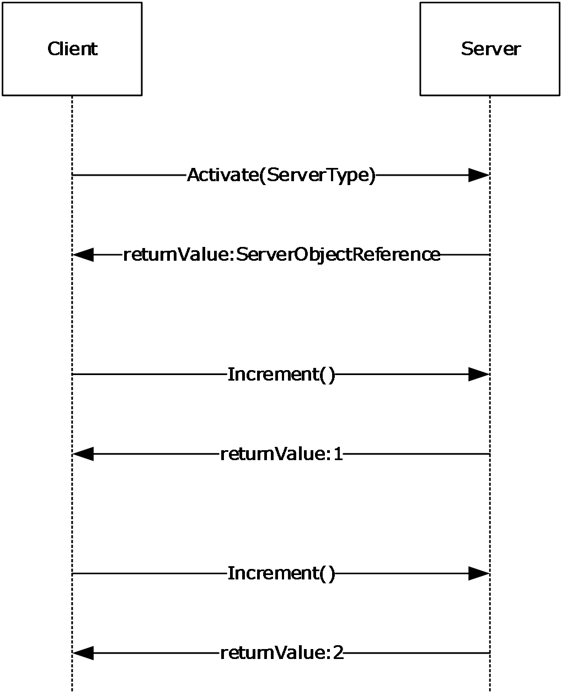
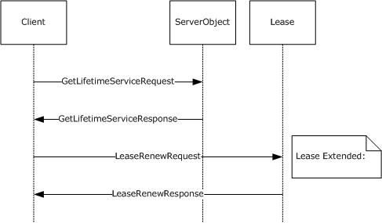

# [MS-NRLS]: .NET Remoting: Lifetime Services Extension

Table of Contents

1 Introduction

- [1 Introduction](#Section_1)
  - [1.1 Glossary](#Section_1.1)
  - [1.2 References](#Section_1.2)
    - [1.2.1 Normative References](#Section_1.2.1)
    - [1.2.2 Informative References](#Section_1.2.2)
  - [1.3 Overview](#Section_1.3)
    - [1.3.1 Client Activation](#Section_1.3.1)
    - [1.3.2 Lifetime Management](#Section_1.3.2)
    - [1.3.3 Sponsor](#Section_1.3.3)
    - [1.3.4 Notational Conventions](#Section_1.3.4)
  - [1.4 Relationship to Other Protocols](#Section_1.4)
  - [1.5 Prerequisites/Preconditions](#Section_1.5)
  - [1.6 Applicability Statement](#Section_1.6)
  - [1.7 Versioning and Capability Negotiation](#Section_1.7)
  - [1.8 Vendor-Extensible Fields](#Section_1.8)
  - [1.9 Standards Assignments](#Section_1.9)

2 Messages

- [2 Messages](#Section_2)
  - [2.1 Transport](#Section_2.1)
  - [2.2 Common Data Types](#Section_2.2)
    - [2.2.1 ArrayList](#Section_2.2.1)
    - [2.2.2 ConstructionCall](#Section_2.2.2)
    - [2.2.3 ContextLevelActivator](#Section_2.2.3)
    - [2.2.4 ConstructionLevelActivator](#Section_2.2.4)
    - [2.2.5 ConstructionResponse](#Section_2.2.5)
    - [2.2.6 LeaseState](#Section_2.2.6)
    - [2.2.7 ArgumentException](#Section_2.2.7)
    - [2.2.8 ArgumentNullException](#Section_2.2.8)

3 Protocol Details

- [3 Protocol Details](#Section_3)
  - [3.1 IActivator](#Section_3.1)
    - [3.1.1 Abstract Data Model](#Section_3.1.1)
    - [3.1.2 Timers](#Section_3.1.2)
    - [3.1.3 Initialization](#Section_3.1.3)
    - [3.1.4 Message Processing Events and Sequencing Rules](#Section_3.1.4)
      - [3.1.4.1 Activate](#Section_3.1.4.1)
    - [3.1.5 Timer Events](#Section_3.1.5)
    - [3.1.6 Other Local Events](#Section_3.1.6)
      - [3.1.6.1 Register Activatable Server Type](#Section_3.1.6.1)
  - [3.2 MarshalByRefObject](#Section_3.2)
    - [3.2.1 Abstract Data Model](#Section_3.2.1)
    - [3.2.2 Timers](#Section_3.2.2)
    - [3.2.3 Initialization](#Section_3.2.3)
    - [3.2.4 Message Processing Events and Sequencing Rules](#Section_3.2.4)
      - [3.2.4.1 GetLifetimeService](#Section_3.2.4.1)
    - [3.2.5 Timer Events](#Section_3.2.5)
    - [3.2.6 Other Local Events](#Section_3.2.6)
  - [3.3 ILease](#Section_3.3)
    - [3.3.1 Abstract Data Model](#Section_3.3.1)
    - [3.3.2 Timers](#Section_3.3.2)
    - [3.3.3 Initialization](#Section_3.3.3)
    - [3.3.4 Message Processing Events and Sequencing Rules](#Section_3.3.4)
      - [3.3.4.1 Renew](#Section_3.3.4.1)
      - [3.3.4.2 Register](#Section_3.3.4.2)
      - [3.3.4.3 Register(Overload)](#Section_3.3.4.3)
      - [3.3.4.4 Unregister](#Section_3.3.4.4)
      - [3.3.4.5 get_InitialLeaseTime](#Section_3.3.4.5)
      - [3.3.4.6 set_InitialLeaseTime](#Section_3.3.4.6)
      - [3.3.4.7 get_RenewOnCallTime](#Section_3.3.4.7)
      - [3.3.4.8 set_RenewOnCallTime](#Section_3.3.4.8)
      - [3.3.4.9 get_SponsorshipTimeout](#Section_3.3.4.9)
      - [3.3.4.10 set_SponsorshipTimeout](#Section_3.3.4.10)
      - [3.3.4.11 get_CurrentLeaseTime](#Section_3.3.4.11)
      - [3.3.4.12 get_CurrentState](#Section_3.3.4.12)
    - [3.3.5 Timer Events](#Section_3.3.5)
      - [3.3.5.1 Lease TTL Timer](#Section_3.3.5.1)
      - [3.3.5.2 Sponsorship Timer](#Section_3.3.5.2)
    - [3.3.6 Other Local Events](#Section_3.3.6)
      - [3.3.6.1 Binding to Server Object](#Section_3.3.6.1)
      - [3.3.6.2 Marshal Server Object](#Section_3.3.6.2)
      - [3.3.6.3 Unmarshal Server Object](#Section_3.3.6.3)
  - [3.4 ISponsor](#Section_3.4)
    - [3.4.1 Abstract Data Model](#Section_3.4.1)
    - [3.4.2 Timers](#Section_3.4.2)
    - [3.4.3 Initialization](#Section_3.4.3)
    - [3.4.4 Message Processing Events and Sequencing Rules](#Section_3.4.4)
      - [3.4.4.1 Renewal](#Section_3.4.4.1)
    - [3.4.5 Timer Events](#Section_3.4.5)
    - [3.4.6 Other Local Events](#Section_3.4.6)
  - [3.5 Object](#Section_3.5)
    - [3.5.1 Abstract Data Model](#Section_3.5.1)
    - [3.5.2 Timers](#Section_3.5.2)
    - [3.5.3 Initialization](#Section_3.5.3)
    - [3.5.4 Message Processing Events and Sequencing Rules](#Section_3.5.4)
      - [3.5.4.1 FieldGetter](#Section_3.5.4.1)
      - [3.5.4.2 FieldSetter](#Section_3.5.4.2)
    - [3.5.5 Timer Events](#Section_3.5.5)
    - [3.5.6 Other Local Events](#Section_3.5.6)

4 Protocol Examples

- [4 Protocol Examples](#Section_4)
  - [4.1 CAO Activation Request/Response Message.](#Section_4.1)
    - [4.1.1 Activation Request Message](#Section_4.1.1)
    - [4.1.2 Activation Response Message](#Section_4.1.2)
  - [4.2 Registering a Sponsor for a CAO Object](#Section_4.2)
  - [4.3 Incrementing TTL of a Server Object](#Section_4.3)

5 Security

- [5 Security](#Section_5)
  - [5.1 Security Considerations for Implementers](#Section_5.1)
  - [5.2 Index of Security Parameters](#Section_5.2)

6 Appendix A: Full Definitions

- [6 Appendix A: Full Definitions](#Section_6)

7 Appendix B: Product Behavior

- [7 Appendix B: Product Behavior](#Section_7)

8 Change Tracking

- [8 Change Tracking](#Section_8)

For the legal notice and IP terms, see [LEGAL.md](../LEGAL.md).
Last updated: 3/13/2019.
See [Revision History](#revision-history) for full version history.

# 1 Introduction

This document specifies the .NET Remoting: Lifetime Services Extension protocol. This protocol adds lifetime and remote [**activation**](#gt_activation) capabilities to the .NET Remoting Protocol (specified in [MS-NRTP](../MS-NRTP/MS-NRTP.md)). This protocol builds on the [MS-NRTP] specification, and readers have to be familiar with its terms and concepts.

Sections 1.5, 1.8, 1.9, 2, and 3 of this specification are normative. All other sections and examples in this specification are informative.

## 1.1 Glossary

This document uses the following terms:

**activation**: The process of creating a server object.

**array**: A [**Remoting Type**](#gt_remoting-type) that is an ordered collection of values. The values are identified by their position and position is determined by a set of integer indices. The number of indices required to represent the position is called the Rank of the [**Array**](#gt_array). An [**Array**](#gt_array) is part of the Remoting Data Model and also specifies the [**Remoting Type**](#gt_remoting-type) of its items. For more information, [MS-NRTP] section 3.1.1.

**Assignable**: A reference to the ability of a [**Data Value**](#gt_data-value) to be assigned to a [**Remoting Type**](#gt_remoting-type). This ability is determined by a set of rules described in the Abstract Data Model (section 3.1.1) under [**Data Values**](#gt_data-value).

**class**: A [**Remoting Type**](#gt_remoting-type) that encapsulates a set of named values and a set of methods that operate on those values. The named values are called Members of the Class. A Class is part of the Remoting Data Model. For more information, see [MS-NRTP](../MS-NRTP/MS-NRTP.md) section 3.1.1.

**client**: Synonym for client computer.

**Client-Activated Object (CAO)**: A Marshaled Server Object (MSO) that requires an explicit activation message to create the Server Object.

**data value**: An instance of a [**Remoting Type**](#gt_remoting-type), which may be a [**Class**](#gt_class), [**Array**](#gt_array), Enum, or Primitive. A [**Data Value**](#gt_data-value) is part of the Remoting Data Model. For more information, see [MS-NRTP] section 3.1.1.

**Exception**: A [**Class**](#gt_class) that indicates an error in the execution of a [**Remote Method**](#gt_remote-method). It is sent as part of the return message from a server to a client. An [**Exception**](#gt_exception) contains a human-readable message that indicates what the error is, and can also have additional data to identify the error. An [**Exception**](#gt_exception) is part of the Remoting Data Model. For more information, see [MS-NRTP] section 3.1.1.

**lease object**: A type of MSO that contains methods that control the lifetime of a server object. Although a lease object is also a server object, it does not have a lease object of its own; its lifetime is bound by the lifetime of the associated server object.

**Library**: Part of the Remoting Data Model. A [**Library**](#gt_library) is a named unit that contains a collection of [**Remoting Types**](#gt_remoting-type). For more information, see Library in [MS-NRTP] section 3.1.1.

**marshaled server object (MSO)**: A [**Marshaled Server Object**](#gt_marshaled-server-object-mso) is a [**Server Object**](#gt_server-object) that is created by a higher layer, and not in response to an incoming request. For more information on server objects, (see [**Server-Activated Object (SAO)**](#gt_server-activated-object-sao) for more information on the latter).. The .NET Remoting Lifetime Services Protocol [MS-NRLS](#Section_dffdda1f2c454978927c4280469ce355) provides a mechanism for controlling the lifetimes of [**marshaled server objects**](#gt_marshaled-server-object-mso).

**member**: See [**Class**](#gt_class).

**Null Object**: Part of the Remoting Data Model. [**Null Object**](#gt_null-object) is a special value that can be used in place of an instance of a [**Class**](#gt_class), [**Array**](#gt_array), or String. It indicates that no instance is being specified. For more information, see [MS-NRTP] section 3.1.1.

**Primitive Type**: Part of the Remoting Data Model. [**Primitive Types**](#gt_primitive-type) are predefined [**Remoting Types**](#gt_remoting-type) such as Byte, Int16, Int32, Int64, and so on. For more information, see [MS-NRTP] section 3.1.1

**proxy**: Part of the Remoting Data Model. A [**Proxy**](#gt_proxy) forwards the invocations of [**Remote Methods**](#gt_remote-method) from the client to the [**Server Object**](#gt_server-object) for execution. The [**Proxy**](#gt_proxy) contains the Request URI of the [**Server Object**](#gt_server-object). For more information, see [MS-NRTP] section 3.1.1.

**Remote Field**: Part of the Remoting Data Model. A [**Remote Field**](#gt_remote-field) is a remotely accessible field. For more information, see [MS-NRTP] section 3.1.1.

**Remote Method**: Part of the Remoting Data Model. A [**Remote Method**](#gt_remote-method) is a remotely callable operation. A [**Remote Method**](#gt_remote-method) can either be One-Way or Two-Way. In the case of a One-Way Method, there is no reply from the implementation. For more information, see [MS-NRTP] section 3.1.1

**Remoting Type**: Part of the Remoting Data Model. [**Class**](#gt_class), [**Array**](#gt_array), Enum, and Primitive are different kinds of [**Remoting Types**](#gt_remoting-type). All [**Remoting Types**](#gt_remoting-type) are identified by a name that is case sensitive. For more information, see [MS-NRTP] section 3.1.1

**Return Value**: A [**Data Value**](#gt_data-value) that is returned as part of the results of a [**Remote Method**](#gt_remote-method) invocation. For more information, see [**Remote Method**](#gt_remote-method) in Abstract Data Model (section 3.1.1).

**Server Interface**: Part of the Remoting Data Model. A [**Server Interface**](#gt_server-interface) is a [**Remoting Type**](#gt_remoting-type) that encapsulates a set of method declarations. The methods have no implementation. For more information, see Server Interface in Abstract Data Model (section 3.1.1).

**server object**: Part of the Remoting Data Model. A [**server object**](#gt_server-object) is an instance of a [**Server Type**](#gt_server-type). A [**server object**](#gt_server-object) is either an [**SAO**](#gt_server-activated-object-sao) or an [**MSO**](#gt_marshaled-server-object-mso).

**Server Object Reference**: A representation of an [**SAO**](#gt_server-activated-object-sao) or [**MSO**](#gt_marshaled-server-object-mso) that can be passed between a client and a server. It contains sufficient information to construct a [**proxy**](#gt_proxy) to invoke [**Remote Methods**](#gt_remote-method) on the [**SAO**](#gt_server-activated-object-sao) or [**MSO**](#gt_marshaled-server-object-mso).

**Server Object Table**: A table that contains the list of available [**Server Objects**](#gt_server-object) in the server.

**Server Object URI**: A relative URI that identifies a [**Server Object**](#gt_server-object) in a given server. It is the path part of Request URI, excluding the leading forward slash (/).

**Server Type**: Part of the Remoting Data Model. A [**Server Type**](#gt_server-type) contains [**Remote Methods**](#gt_remote-method).

**server-activated object (SAO)**: A server object that is created on demand in response to a client request. See also [**marshaled server object**](#gt_marshaled-server-object-mso).

**Singleton SAO**: An [**SAO**](#gt_server-activated-object-sao) that is created the first time a method on its server type is called; subsequent calls to the [**remote methods**](#gt_remote-method) on the server type reuse the existing [**SAO**](#gt_server-activated-object-sao) unless it expires. For shorter-lived [**SAOs**](#gt_server-activated-object-sao), see single-call SAO.

**Sponsor**: An MSO that is implemented by clients to participate in the renewal process of a Server Object's lifetime.

**Time-To-Live (TTL)**: The time duration for which a [**Server Object**](#gt_server-object) is available.

**MAY, SHOULD, MUST, SHOULD NOT, MUST NOT:** These terms (in all caps) are used as defined in [[RFC2119]](https://go.microsoft.com/fwlink/?LinkId=90317). All statements of optional behavior use either MAY, SHOULD, or SHOULD NOT.

## 1.2 References

Links to a document in the Microsoft Open Specifications library point to the correct section in the most recently published version of the referenced document. However, because individual documents in the library are not updated at the same time, the section numbers in the documents may not match. You can confirm the correct section numbering by checking the [Errata](https://go.microsoft.com/fwlink/?linkid=850906).

### 1.2.1 Normative References

We conduct frequent surveys of the normative references to assure their continued availability. If you have any issue with finding a normative reference, please contact [dochelp@microsoft.com](mailto:dochelp@microsoft.com). We will assist you in finding the relevant information.

[MS-NRTP] Microsoft Corporation, "[.NET Remoting: Core Protocol](../MS-NRTP/MS-NRTP.md)".

[RFC2119] Bradner, S., "Key words for use in RFCs to Indicate Requirement Levels", BCP 14, RFC 2119, March 1997, [http://www.rfc-editor.org/rfc/rfc2119.txt](https://go.microsoft.com/fwlink/?LinkId=90317)

### 1.2.2 Informative References

[MS-NETOD] Microsoft Corporation, "[Microsoft .NET Framework Protocols Overview](../MS-NETOD/MS-NETOD.md)".

[MS-NRBF] Microsoft Corporation, "[.NET Remoting: Binary Format Data Structure](../MS-NRBF/MS-NRBF.md)".

[MSDN-RemotingLifetime] Microsoft Corporation, "Lifetime Leases", [https://docs.microsoft.com/en-us/previous-versions/dotnet/netframework-4.0/23bk23zc(v=vs.100)](https://go.microsoft.com/fwlink/?LinkId=94435)

## 1.3 Overview

The .NET Remoting Protocol (specified in [MS-NRTP](../MS-NRTP/MS-NRTP.md)) defines mechanisms for the creation of [**Server Objects**](#gt_server-object) and the invocation of [**Remote Methods**](#gt_remote-method) on those Server Objects.

This protocol extends the .NET Remoting Protocol to add a mechanism allowing [**clients**](#gt_client) to explicitly create Server Objects and adds another mechanism allowing clients and servers to control the lifetime of Server Objects. Additionally, this protocol is a .NET Remoting-based protocol, using the .NET Remoting Protocol as a transport.

Additional overview information for the .NET Remoting: Lifetime Services Extension is available in the following sections:

- Section [1.3.1](#Section_1.3.1) — Activating a server from a client
- Section [1.3.2](#Section_1.3.2) — Managing the connection lifetime between a client and a server
- Section [1.3.3](#Section_1.3.3) — Managing the [**sponsors**](#gt_sponsor) (clients) associated with a server
Much of the basic information and terminology used in this document is also common to the .NET Remoting Protocol. For more information, see [MS-NRTP] section 2.2.5.

### 1.3.1 Client Activation

This protocol introduces a new type of [**Server Object**](#gt_server-object) called a [**Client-Activated Object (CAO)**](#gt_client-activated-object-cao). A CAO can be remotely activated by a [**client**](#gt_client) by invoking the [Activate](#Section_3.1.4.1) [**Remote Method**](#gt_remote-method) on a well-known [**Server-Activated Object (SAO)**](#gt_server-activated-object-sao), passing the [**Server Type**](#gt_server-type). The implementation of the SAO creates a new instance of the Server Type, registers it in the [**Server Object Table**](#gt_server-object-table), and sends back to the client a [**Server Object Reference**](#gt_server-object-reference) to the instance. The client receives the Server Object Reference and can use it to create a [**Proxy**](#gt_proxy) to invoke methods on the CAO.

An example of a client activating an instance and invoking a Remote Method, increment(), is shown in the following figure.

Figure 1: Client activating a server object

### 1.3.2 Lifetime Management

This protocol specifies a lease-based model for lifetime management of [**Marshaled Server Objects (MSO)**](#gt_marshaled-server-object-mso) and the [**Singleton SAO**](#gt_singleton-sao).

A [**Lease Object**](#gt_lease-object) is associated with each [**Server Object**](#gt_server-object). Each Lease Object has an initial [**Time-To-Live (TTL)**](#gt_time-to-live-ttl) for the Server Object. For every [**Remote Method**](#gt_remote-method) invocation on the Server Object, the TTL is extended. If no calls are made to the Server Object for the duration of the TTL, the Server Object is considered for removal from the [**Server Object Table**](#gt_server-object-table).

A [**client**](#gt_client) can explicitly control the Server Object's lifetime through Remote Method invocations on the Server Object's Lease Object. The client gets a [**Server Object Reference**](#gt_server-object-reference) to the Lease Object for a Server Object by calling the Server Object's [GetLifetimeService](#Section_3.2.4.1) Remote Method. The client can then invoke the [Renew](#Section_3.3.4.1) Remote Method on the Lease Object to extend the TTL by a desired amount.

### 1.3.3 Sponsor

A [**Lease Object**](#gt_lease-object) for a given [**Server Object**](#gt_server-object) maintains a list of [**Sponsors**](#gt_sponsor) that are called when the [**TTL**](#gt_time-to-live-ttl) of the Server Object expires. Each Sponsor can specify whether the Server Object's TTL has to be extended, and can specify the duration of the extension. If there are no associated Sponsors or if none of the associated Sponsors extend the lifetime of the Server Object, then the Server Object is removed from the [**Server Object Table**](#gt_server-object-table), making it unavailable to clients.

An example of a [**client**](#gt_client) managing the lifetime of a Server Object is shown in the following examples.

The client invokes a [**Remote Method**](#gt_remote-method) on the Server Object, as follows.

Figure 2: Invoking a Remote Method on the Server Object

The client uses the Lease Object to extend the lease time, as follows.

Figure 3: Extending lease time

The client registers a Sponsor that is invoked when the Lease Object's TTL expires, as follows.

Figure 4: Registering a Sponsor

For more information about how leases and Sponsors are exposed in Windows, see [[MSDN-RemotingLifetime]](https://go.microsoft.com/fwlink/?LinkId=94435).

If the client times out and there are no sponsors left in the SponsorList, the Lease expires. The Server Lease Object and the Server Object MUST be unmarshaled as per [section (section 3.3.5.1)](#Section_3.3.5.1) Lease TTL Timer.

Figure 5: Client timed out or unresponsive

### 1.3.4 Notational Conventions

All [**Remoting Type**](#gt_remoting-type) and Remoting Interface definitions in this specification use the .NET Remoting Description Notation defined in [MS-NRTP](../MS-NRTP/MS-NRTP.md) section 2.2.5. This notation is specific to .NET Remoting-based protocols and is provided to facilitate explanation of the protocol. This document does not mandate that implementations adhere to a particular Application Programming Interface or programming language as long as their external behavior is consistent with that described in this document.

## 1.4 Relationship to Other Protocols

This protocol is a .NET Remoting-based protocol, using the .NET Remoting Protocol, as specified in [MS-NRTP](../MS-NRTP/MS-NRTP.md) as a transport. Additionally, this protocol extends the .NET Remoting Protocol, adding new methods for [**activation**](#gt_activation) and lifetime management.

The protocol layering of the related protocols is as follows.

Figure 6: NRLS protocol stack

## 1.5 Prerequisites/Preconditions

This protocol layers on top of the .NET Remoting Protocol and, as a result, has the prerequisites specified in [MS-NRTP](../MS-NRTP/MS-NRTP.md). In addition, for a [**CAO**](#gt_client-activated-object-cao), the client application must be configured with enough information about the [**Server Type**](#gt_server-type) to construct the [**activation**](#gt_activation) message.

## 1.6 Applicability Statement

The protocol described in this specification is applicable to users of the .NET Remoting Protocol, as specified in [MS-NRTP](../MS-NRTP/MS-NRTP.md) in environments that require distributed [**activation**](#gt_activation) and lifetime management of [**Server Objects**](#gt_server-object).

[**CAOs**](#gt_client-activated-object-cao) require a server to maintain references to each [**client**](#gt_client) object created, which might not scale to large numbers of clients.

The [**Sponsor**](#gt_sponsor) mechanism requires that references be maintained from each server to all registered Sponsors. In addition, the server has to individually contact each client with a Sponsor, which does not scale for large numbers of clients holding Sponsors.

## 1.7 Versioning and Capability Negotiation

This protocol has no versioning or capability negotiation.

## 1.8 Vendor-Extensible Fields

This protocol has no vendor-extensible fields.

## 1.9 Standards Assignments

There are no standards assignments made by this protocol.

# 2 Messages

The following sections specify message relationships to the .NET Remoting Protocol [MS-NRTP](../MS-NRTP/MS-NRTP.md), as well as common .NET Remoting: Lifetime Services Extension [**Remoting Types**](#gt_remoting-type).

## 2.1 Transport

This protocol can be bound to any transport supported by the .NET Remoting Protocol, as specified in [MS-NRTP](../MS-NRTP/MS-NRTP.md) section 2.1.

## 2.2 Common Data Types

### 2.2.1 ArrayList

ArrayList is a [**class**](#gt_class). The [**Library**](#gt_library) name of the class is "mscorlib". It represents a collection of [**Data Values**](#gt_data-value). The capacity of the collection is increased dynamically as required.

namespace System.Collections

{

class ArrayList

{

System.Object[] _items;

Int32 _size;

Int32 _version;

}

}

**_items:** An [**Array**](#gt_array) that holds Data Values. The size of the Array MUST be greater than or equal to the value of the **_size** field.

**_size:** An Int32 value that indicates the number of items present in the ArrayList.

**_version:** An Int32 value that is unused by this protocol. It MAY contain any value and the value MUST be ignored.<1>

**Note** The Array is resized as new items are added to the collection. To accommodate adding items in a performant way, the size of the Array MAY be more than the number of items in the collection. If an element of the _items Array has an index greater than or equal to the value of the **_size** field, it is not considered part of the ArrayList. The element MAY contain any value and the value MUST be ignored.<2>

### 2.2.2 ConstructionCall

ConstructionCall is a [**class**](#gt_class). The [**Library**](#gt_library) name of the class is "mscorlib". It is used to activate a Server Object.

namespace System.Runtime.Remoting.Messaging

{

class ConstructionCall

{

String __Uri;

String __MethodName;

System.Type[] __MethodSignature;

String __TypeName;

System.Object[] __Args;

System.Object __CallContext;

System.Type __ActivationType;

System.Object __Activator;

String __ActivationTypeName;

System.Collections.ArrayList __ContextProperties;

System.Object[] __CallSiteActivationAttributes;

}

}

**__Uri:** A string value that is unused by this protocol. It MAY contain any value and the value MUST be ignored.<3>

**__MethodName:** A string value that specifies the name of the [**Remote Method**](#gt_remote-method). Its value MUST be ".ctor".

**__MethodSignature:** An [**Array**](#gt_array) of type System.Type. Each item in the Array contains information about the [**Remoting Type**](#gt_remoting-type) of the arguments that are needed to create an instance of the Server Object. System.Type is defined in [MS-NRTP](../MS-NRTP/MS-NRTP.md) section 2.2.2.11.

**__TypeName:** A string value that contains the name of the [**Server Type**](#gt_server-type) to activate.

**__Args:** An Array of objects that contains the parameters required to create an instance of the Server Object.

**__CallContext:** A [**Null Object**](#gt_null-object). This field is reserved in this protocol. The value of this field MUST be NullObject.

**__ActivationType:** A Null Object, or an instance [**Assignable**](#gt_assignable) to System.Type that contains information about the Server Type that is being activated. Its value SHOULD be a Null Object.

**__Activator:** An object field that is unused in the protocol. This field MAY contain any value and the value MUST be ignored.<4>

**__ActivationTypeName:** A String value that contains the name of the Server Type. This field MUST have the same value as the field **__TypeName**.

**__ContextProperties:** An [ArrayList](#Section_2.2.1) that contains additional values required for the [**activation**](#gt_activation) of the Server Type. The interpretation of the values is higher-layer–defined. If there are no properties, this value MUST be an empty ArrayList (that is, an ArrayList with a value of 0 for the **_size** field).<5>

**__CallSiteActivationAttributes:** A Null Object, or an Array of any [**Data Values**](#gt_data-value). The interpretation of the values is higher-layer–defined. If there are no values, then this value MUST be a Null Object.<6>

### 2.2.3 ContextLevelActivator

ContextLevelActivator is a [**class**](#gt_class). The [**Library**](#gt_library) name of the class is "mscorlib". It is used in the __Activator field of a [ConstructionCall](#Section_2.2.2) instance.

namespace System.Runtime.Remoting.Activation

{

class ContextLevelActivator

{

System.Runtime.Remoting.Activation.ConstructionLevelActivator

m_NextActivator;

}

}

**m_NextActivator:** An instance of [ConstructionLevelActivator](#Section_2.2.4).

### 2.2.4 ConstructionLevelActivator

ConstructionLevelActivator is a [**class**](#gt_class). The [**Library**](#gt_library) name of the class is "mscorlib". It is used in the **m_NextActivator** field of a [ContextLevelActivator](#Section_2.2.3) instance.

namespace System.Runtime.Remoting.Activation

{

class ConstructionLevelActivator

{

}

}

This class has no [**Members**](#gt_member).

### 2.2.5 ConstructionResponse

ConstructionResponse is a [**class**](#gt_class). The [**Library**](#gt_library) name of the Class is "mscorlib". It is used to contain the activated Server Object.

namespace System.Runtime.Remoting.Messaging

{

class ConstructionResponse

{

String __Uri;

String __MethodName;

String __TypeName;

System.Object __Return;

System.Object[] __OutArgs;

System.Object __CallContext;

}

}

**__Uri:** The field MAY contain any value and the value MUST be ignored.<7>

**__MethodName:** A string value that specifies the name of the [**Remote Method**](#gt_remote-method). Its value MUST be ".ctor".

**__TypeName:** A string value that contains the name of the [**Server Type**](#gt_server-type) that was activated.

**__Return:** This field contains the activated Server Object.

**__OutArgs:** The value of this field MUST be an [**Array**](#gt_array) of System.Object. The length of the Array MUST be 0.

**__CallContext:** The value of this field MUST be NullObject.

### 2.2.6 LeaseState

The LeaseState enumeration provides state information about a [**Lease Object**](#gt_lease-object). The size of this enumeration is an Int32.

namespace System.Runtime.Remoting.Lifetime

{

enum LeaseState : Int32

{

Null = 0,

Initial = 1,

Active = 2,

Renewing = 3,

Expired = 4

}

}

**Null:** The Lease Object is in an error state.

**Initial:** This is the initial state when the Lease Object is created.

**Active:** The Lease Object is actively maintaining the lifetime of Server Object.

**Renewing:** The [**TTL**](#gt_time-to-live-ttl) has expired and is in the process of renewing.

**Expired:** The Lease Object has expired.

### 2.2.7 ArgumentException

ArgumentException is a Derived Class of SystemException. The [**Library**](#gt_library) name of the Class is "mscorlib". When thrown from a [**Remote Method**](#gt_remote-method), it indicates that one of the arguments to the Remote Method was invalid. Other than the [**Members**](#gt_member) inherited from the System.SystemException Class, it contains information about the name of an invalid argument. This Class has an additional constraint: the **HResult** member MUST be hex value 0x80070057.

namespace System

{

class ArgumentException : System.SystemException

{

String ParamName;

}

}

**ParamName:** A string value that contains the name of an invalid argument.

### 2.2.8 ArgumentNullException

ArgumentNullException is a Derived Class of [ArgumentException](#Section_2.2.7). The [**Library**](#gt_library) name of the Class is "mscorlib". When thrown from a [**Remote Method**](#gt_remote-method), it indicates that a required argument of the Remote Method was a [**Null Object**](#gt_null-object). There are no [**Members**](#gt_member) other than the Members inherited from the System.ArgumentException Class. This Class has an additional constraint: the **HResult** member MUST be hex value 0x80004003.

namespace System

{

class ArgumentNullException : System.ArgumentException

{

}

}

# 3 Protocol Details

This protocol extends the server and client roles defined in the .NET Remoting Protocol [MS-NRTP](../MS-NRTP/MS-NRTP.md) by defining Remoting Interfaces to be implemented by each role. For each Remoting Interface, the client side is simply a pass-through. That is, no additional timers or other state information are required on the client side. Calls made by the higher-layer protocol or application are passed directly to the transport, and the results returned by the transport are passed directly back to the higher-layer protocol or application.

This protocol extends the server role defined in the .NET Remoting Protocol Server Details ([MS-NRTP] section 3.2) in the following ways:

- The server implementation MUST register a [**Server-Activated Object (SAO)**](#gt_server-activated-object-sao) that implements the [IActivator (section 3.1)](#Section_3.1) interface. The [**Server Object URI**](#gt_server-object-uri) of the SAO MUST be "RemoteActivationService.rem".
- Each Server Object that participates in the lifetime management MUST implement [MarshalByRefObject (section 3.2)](#Section_3.2).
- Each Server Object that defines one or more [**Remote Fields**](#gt_remote-field) MUST implement [Object (section 3.5)](#Section_3.5).
- The [ILease](#Section_3.3) Abstract Data Model (section [3.3.1](#Section_3.3.1)) extends the .NET Remoting Protocol Server Abstract Data Model ([MS-NRTP]section 3.2.1) in the following ways:
- Associates a Lease Object with each Server Object in the [**Server Object Table**](#gt_server-object-table).
- Updates the [**TTL**](#gt_time-to-live-ttl) of the Lease Object on each invocation of an application-defined [**Remote Method**](#gt_remote-method).
This protocol extends the client role defined in [MS-NRTP]section 3.3 in the following way:

- The client MAY implement the [ISponsor (section 3.4)](#Section_3.4) interface to participate in the lifetime management of the Server Object.<8> By implementing the ISponsor interface, the client is also acting in the server role defined in [MS-NRTP]section3.2.

## 3.1 IActivator

The **RemotingTypeName** of the interface is "System.Runtime.Remoting.Activation.IActivator".

### 3.1.1 Abstract Data Model

This section describes a conceptual model of possible data organization that an implementation maintains to participate in this protocol. The described organization is provided to facilitate the explanation of how the protocol behaves. This document does not mandate that implementations adhere to this model as long as their external behavior is consistent with that described in this document.

**Activatable Types Table**

This table contains the set of [**Server Types**](#gt_server-type) that can be activated by a client using the [IActivator (section 3.1)](#Section_3.1) interface. The table associates a Server Type by name with the following information:

- A list of Constructor Method Signatures that a client can target in the [Activate (section 3.1.4.1)](#Section_3.1.4.1) request.
- Any other implementation-specific information required to service the Activate request.

### 3.1.2 Timers

There are no timers associated with this interface.

### 3.1.3 Initialization

A [**Singleton SAO**](#gt_singleton-sao) MUST be registered as specified in [MS-NRTP](../MS-NRTP/MS-NRTP.md) section 3.2.4.1. The Server Object MUST implement the [IActivator (section 3.1)](#Section_3.1) interface. The [**Server Object URI**](#gt_server-object-uri) MUST be "RemoteActivationService.rem".

The **Activatable Types Table** MUST be populated with the initial set of activatable [**Server Types**](#gt_server-type) and their Constructor Method Signatures specified by the higher layer in an implementation-specific way.

### 3.1.4 Message Processing Events and Sequencing Rules

This interface includes the following method.

| Method | Description |
| --- | --- |
| [Activate](#Section_3.1.4.1) | Activates the specified Server Object |

#### 3.1.4.1 Activate

The Activate method activates a Server Object. The parameter specifies the [**Server Type**](#gt_server-type) of the Server Object.

System.Runtime.Remoting.Messaging.ConstructionResponse

Activate(

System.Runtime.Remoting.Messaging.ConstructionCall callMessage);

**callMessage:** An instance of [ConstructionCall](#Section_2.2.2) that contains information that is required to activate the Server Object.

**Return Values:** An instance of [ConstructionResponse](#Section_2.2.5) that contains the activated Server Object.

**Exceptions:** If the Server Object cannot be activated, a RemotingException (as specified in [MS-NRTP](../MS-NRTP/MS-NRTP.md) section 2.2.2.9) MUST be thrown. If the *callMessage* parameter does not fulfill the constraints (as specified in ConstructionCall, section 2.2.2), then a RemotingException MUST be constructed (as specified in [MS-NRTP] section 3.2.5.1.7.2). The [**Exception**](#gt_exception) MUST be sent back to the client.

The implementation MUST look up the target Server Type in the **Activatable Types Table**. The implementation SHOULD use the **__TypeName** field of the *callMessage* parameter as a key, but MAY use other information instead or in addition. If no matching entry is found in the table, a RemotingException MUST be constructed (as specified in [MS-NRTP] section 3.2.5.1.7.2) and sent back to the client.<9>

Once the Server Type information is obtained, the implementation MUST select the Constructor Method Signature for the activation as follows:

- If there is exactly one Constructor Method Signature associated with the Server Type in the **Activatable Types Table**, then that is the Constructor Method Signature for the activation.
- If there is more than one Constructor Method Signature associated with the Server Type, then the Constructor Method Signature that matches exactly the **__MethodSignature** field of the *callMessage* parameter is selected. Two [**arrays**](#gt_array) match exactly if they have the same number of elements and each member of the one array has the same value as the corresponding member of the other array.
If the implementation is unable to select a Constructor Method Signature to match the incoming Activate request, a RemotingException MUST be constructed (as specified in [MS-NRTP] section 3.2.5.1.7.2) and sent back to the client.

Once the Constructor Method Signature is selected, the implementation SHOULD validate that the incoming argument data in the **__Args** field of the callMessage argument is assignable to the arguments specified in the Constructor Method Signature using the rules specified in [MS-NRTP] section 3.1.1 in the definition of [**Remote Method**](#gt_remote-method).

If the incoming argument data fails validation, the implementation SHOULD construct a RemotingException (as specified in [MS-NRTP] section 3.2.5.1.7.2) and send it back to the client.

The implementation then MUST create an instance of the Server Type in an implementation-specific manner.

The implementation MUST construct a ConstructionResponse as specified in section 2.2.5, with the following additional constraints:

- The **__Return** field of the ConstructionResponse MUST be set to the newly created Server Object.
- The **__MethodName** MUST match the **__MethodName** field of the incoming ConstructionCall instance.
- The **__TypeName** MUST match the **__TypeName** field of the incoming ConstructionCall instance.
The ConstructionResponse instance MUST be sent back as the return value of the method.

### 3.1.5 Timer Events

There are no timer events associated with this interface.

### 3.1.6 Other Local Events

#### 3.1.6.1 Register Activatable Server Type

The implementation SHOULD provide an implementation-specific way for the higher layer to register a [**Server Type**](#gt_server-type) for activation after initialization has completed. When a Server Type is registered for activation, the implementation MUST add the Server Type and its Constructor Method Signatures to the **Activatable Types Table**. This protocol does not provide a mechanism for unregistering a Server Type once it has been registered for activation.

## 3.2 MarshalByRefObject

The **RemotingTypeName** of the interface is "System.MarshalByRefObject".

### 3.2.1 Abstract Data Model

This protocol extends the .NET Remoting: Core Protocol Specification Abstract Data Model (as specified in [MS-NRTP](../MS-NRTP/MS-NRTP.md)sections 3.1.1 and 3.2.1) to associate a [**Lease Object**](#gt_lease-object) with every active Server Object. The Lease Object MUST be a valid Server Object (as specified in [MS-NRTP] 3.1.1) that implements the [ILease (section 3.3)](#Section_3.3) interface.

### 3.2.2 Timers

There are no timers associated with this interface.

### 3.2.3 Initialization

A [**Lease Object**](#gt_lease-object) and Lease Object Data MUST be created and associated with a [**Singleton SAO**](#gt_singleton-sao) or [**MSO**](#gt_marshaled-server-object-mso) during initialization.

### 3.2.4 Message Processing Events and Sequencing Rules

This interface includes the following method.

| Method | Description |
| --- | --- |
| [GetLifetimeService](#Section_3.2.4.1) | Returns the [**Lease Object**](#gt_lease-object) associated with the target Server Object. |

#### 3.2.4.1 GetLifetimeService

GetLifetimeService retrieves a reference to the [**Lease Object**](#gt_lease-object) associated with the target Server Object.

System.Runtime.Remoting.Lifetime.ILease GetLifetimeService();

**Return Values:** The Lease Object associated with the target Server Object.

**Exceptions:** No Exceptions are specified for this method other than the Exceptions common to all Remote Methods in .NET Remoting (as specified in [MS-NRTP](../MS-NRTP/MS-NRTP.md) section 3.2.5.1.7.2).

On the first call to GetLifetimeService, the implementation MUST do the following:

- Set the CurrentState of the Lease Object associated with the target Server Object to Active.
- Set the CurrentState of the associated Lease Data to Active.
The [**Server Object Reference**](#gt_server-object-reference) MUST be returned as the [**Return Value**](#gt_return-value) for the method.

### 3.2.5 Timer Events

There are no timer events associated with this interface.

### 3.2.6 Other Local Events

There are no other local events.

## 3.3 ILease

The **RemotingTypeName** of the interface is "System.Runtime.Remoting.Lifetime.ILease".

### 3.3.1 Abstract Data Model

This section describes a conceptual model of possible data organization that an implementation maintains to participate in this protocol. The described organization is provided to facilitate the explanation of how the protocol behaves. This document does not mandate that implementations adhere to this model as long as their external behavior is consistent with that described in this document.

**Sponsor Info**

Sponsor Info contains the following information about a [**Sponsor**](#gt_sponsor):

- **Proxy:** A [**Proxy**](#gt_proxy) to a Sponsor that was registered by a client.
- **RenewalTime:** The TimeSpan value that was passed when the Sponsor was registered.
**Lease Data**

Lease data extends the [**Server Object Table**](#gt_server-object-table) defined in [MS-NRTP](../MS-NRTP/MS-NRTP.md) section 3.2.1. Lease Data is associated with the [**Lease Object**](#gt_lease-object) of a Server Object. Lease Data contains the following values:

- **InitialLeaseTime:** The initial [**TTL**](#gt_time-to-live-ttl) of a Server Object when it is marshaled.
- **RenewOnCallTime:** The duration by which to extend the TTL when a method is called in the associated Server Object.
- **SponsorshipTimeout:** The duration to wait for a Sponsor to respond.
- **CurrentState:** A [LeaseState](#Section_2.2.6) value that indicates the current state of the Lease Object.
- **SponsorList:** A list of Sponsor Info. The list is sorted in decreasing order of the Sponsor Info's **RenewalTime** field values.

### 3.3.2 Timers

**Lease TTL Timer:** Tracks the [**TTL**](#gt_time-to-live-ttl) of a Server Object. Each [**Lease Object**](#gt_lease-object) is associated with a Lease TTL Timer that fires when its TTL expires.

**Sponsorship Timer:** Tracks the duration of each Renewal call to a Sponsor.

### 3.3.3 Initialization

An implementation MUST set the initial values of InitialLeaseTime, RenewOnCallTime and SponsorshipTimeout to a nonzero positive value. The initial value of the CurrentState MUST be *Initial*.<10>

### 3.3.4 Message Processing Events and Sequencing Rules

This interface includes the following methods.

| Method | Description |
| --- | --- |
| [Renew](#Section_3.3.4.1) | Increases the [**TTL**](#gt_time-to-live-ttl) by the specified amount. |
| [Register](#Section_3.3.4.2) [Register(Overload)](#Section_3.3.4.3) | Registers the specified [**Sponsor**](#gt_sponsor) in a [**Lease Object's**](#gt_lease-object) SponsorList. Two forms of this method exist. |
| [Unregister](#Section_3.3.4.4) | Unregisters a Sponsor from the Lease Object's SponsorTable. |
| [get_InitialLeaseTime](#Section_3.3.4.5) | Returns the Lease Object's InitialLeaseTime. |
| [set_InitialLeaseTime](#Section_3.3.4.6) | Updates the Lease Object's InitialLeaseTime with the specified amount. |
| [get_RenewOnCallTime](#Section_3.3.4.7) | Returns the Lease Object's RenewOnCallTime. |
| [set_RenewOnCallTime](#Section_3.3.4.8) | Updates the Lease Object's RenewOnCallTime. |
| [get_SponsorshipTimeout](#Section_3.3.4.9) | Returns the Lease Object's SponsorshipTimeout. |
| [set_SponsorshipTimeout](#Section_3.3.4.10) | Updates the Lease Object's SponsorshipTimeout. |
| [get_CurrentLeaseTime](#Section_3.3.4.11) | Returns the time when the Lease Object expires. |
| [get_CurrentState](#Section_3.3.4.12) | Returns the Lease Object's current state. |

Lease Data's CurrentState determines whether a method can be called. Calling the preceding operations takes the Lease Object through various [LeaseStates](#Section_2.2.6). The state machine that captures the LeaseState transitions is specified in the following diagram.

Figure 7: Lease state machine

#### 3.3.4.1 Renew

Renew extends the [**TTL**](#gt_time-to-live-ttl) of a Server Object.

TimeSpan Renew(

TimeSpan renewalTime

);

**renewalTime:** A TimeSpan value that specifies the required TTL for the Server Object.

**Return Value:** A TimeSpan value that specifies the new TTL for the Server Object.

**Exceptions:** In addition to the [**Exceptions**](#gt_exception) common to all Remote Methods in .NET Remoting (as specified in [MS-NRTP](../MS-NRTP/MS-NRTP.md) section 3.2.5.1.7.2), if the CurrentState value of the associated Lease Data is "Expired", a RemotingException (as specified in [MS-NRTP] section 3.2.5.1.7.2) MUST be sent back.

If the CurrentState value of the associated Lease Data is "Expired", then the implementation MUST NOT modify the TTL; instead, the implementation MUST construct a RemotingException ([MS-NRTP] section 2.2.2.9) as specified in [MS-NRTP] section 3.2.5.1.7.2, Constructing a Remoting Exception. The Exception MUST be sent back to the client.

Otherwise, if the CurrentState is valid, the new TTL for the Server Object is the **renewalTime** or the current value of the [Lease TTL Timer](#Section_3.3.5.1), whichever is greater. The implementation MUST reset the Lease TTL Timer to the new TTL value and return it as the return value of the Renew method.

#### 3.3.4.2 Register

Register registers a [**Sponsor**](#gt_sponsor) with the [**Lease Object**](#gt_lease-object) associated with the Server Object.

void Register(

System.Runtime.Remoting.Lifetime.ISponsor sponsor

);

**sponsor:** A [**Proxy**](#gt_proxy) to a Server Object that implements the [ISponsor](#Section_3.4) interface.

**Return Values:** There are no return values for this method.

**Exceptions:** In addition to the [**Exceptions**](#gt_exception) common to all [**Remote Methods**](#gt_remote-method) in .NET Remoting (as specified in [MS-NRTP](../MS-NRTP/MS-NRTP.md) section 3.2.5.1.7.2), if the Sponsor specified in the *sponsor* argument is a [**Null Object**](#gt_null-object), an [ArgumentNullException](#Section_2.2.8) (as specified in section 2.2.8) MUST be sent back.

The implementation of the method MUST create a new Sponsor Info by using a Sponsor instance referenced by the argument *sponsor*, and a TimeSpan value of 0. The Sponsor Info MUST be added to the end of the SponsorList of the associated Lease Data.

#### 3.3.4.3 Register(Overload)

Register(Overload) registers a [**Sponsor**](#gt_sponsor) with the [**Lease Object**](#gt_lease-object) associated with the Server Object. This implementation of the method includes a second parameter, *renewalTime*.

void Register (

System.Runtime.Remoting.Lifetime.ISponsor sponsor,

TimeSpan renewalTime

);

**sponsor:** A [**Proxy**](#gt_proxy) to a Server Object that implements the [ISponsor](#Section_3.4) interface.

**renewalTime:** A TimeSpan value that specifies the required [**TTL**](#gt_time-to-live-ttl) for the Server Object.

**Return Values:** There are no return values for this method.

**Exceptions:** In addition to the [**Exceptions**](#gt_exception) common to all [**Remote Methods**](#gt_remote-method) in .NET Remoting (as specified in [MS-NRTP](../MS-NRTP/MS-NRTP.md) section 3.2.5.1.7.2), if the Sponsor specified in the *sponsor* argument is a [**Null Object**](#gt_null-object), an [ArgumentNullException](#Section_2.2.8) (as specified in section 2.2.8) MUST be sent back.

The implementation of the method MUST add the Sponsor to the end of the SponsorList of the associated Lease Data.

The implementation of the method MUST:

- Create a new Sponsor Info by using the Sponsor instance referenced by the argument *sponsor*, and the TimeSpan value of the renewalTime argument. The Sponsor Info MUST be inserted in the SponsorList of the associated Lease Data such that the items in the list continue to be sorted in decreasing order of the Sponsor Info's renewalTime.
- Extend the CurrentLeaseTime of the associated Lease Data with the renewal TimeSpan as specified in the [Renew](#Section_3.3.4.1) method.

#### 3.3.4.4 Unregister

Unregister removes the specified [**Sponsor**](#gt_sponsor) from the Sponsor List.

void Unregister(

System.Runtime.Remoting.Lifetime.ISponsor sponsor

);

**sponsor:** A registered Sponsor that needs to be unregistered.

**Return Values:** There are no return values for this method.

**Exceptions:** No [**Exceptions**](#gt_exception) are specified for this method other than the Exceptions common to all Remote Methods in .NET Remoting (as specified in [MS-NRTP](../MS-NRTP/MS-NRTP.md) section 3.2.5.1.7.2).

Two Sponsor [**Proxies**](#gt_proxy) are considered identical if their [**Server Object URIs**](#gt_server-object-uri) match. The Server Object URI can be looked up for a given Proxy in the Proxy Table, as specified in [MS-NRTP] section 3.3.1.

If the SponsorList of the associated Lease Data contains a Sponsor Info with Sponsor Proxy identical to the one referenced by the *sponsor* argument, the implementation MUST remove the Sponsor Info from the SponsorList.

#### 3.3.4.5 get_InitialLeaseTime

get_InitialLeaseTime returns the [**Lease Object's**](#gt_lease-object) InitialLeaseTime.

TimeSpan get_InitialLeaseTime();

**Return Values:** A TimeSpan value that is the InitialLeaseTime in the associated Lease Data.

**Exceptions:** No [**Exceptions**](#gt_exception) are specified for this method other than the Exceptions common to all Remote Methods in .NET Remoting (as specified in [MS-NRTP](../MS-NRTP/MS-NRTP.md) section 3.2.5.1.7.2).

The method has no arguments. The implementation of the method MUST return the InitialLeaseTime of the associated Lease Data.

#### 3.3.4.6 set_InitialLeaseTime

set_InitialLeaseTime updates the [**Lease Object's**](#gt_lease-object) InitialLeaseTime with a specified value.

void set_InitialLeaseTime(TimeSpan value);

**value:** A TimeSpan value that has to be set as the InitialLeaseTime in the associated Lease Data.

**Return Values:** There are no return values for this method.

**Exceptions:** No [**Exceptions**](#gt_exception) are specified for this method other than the Exceptions common to all Remote Methods in .NET Remoting (as specified in [MS-NRTP](../MS-NRTP/MS-NRTP.md) section 3.2.5.1.7.2).

If the associated Lease Data's CurrentState is not "Initial", then a RemotingException MUST be constructed (as specified in [MS-NRTP] section 3.2.5.1.7.2), and the Exception MUST be sent back to the client; otherwise, the InitialLeaseTime MUST be set to the value of the argument *value*.

If the new TimeSpan value is negative, the CurrentState MUST be set to Null state.

#### 3.3.4.7 get_RenewOnCallTime

get_RenewOnCallTime returns the [**Lease Object's**](#gt_lease-object) RenewOnCallTime.

TimeSpan get_RenewOnCallTime();

**Return Values:** A TimeSpan value that is the RenewOnCallTime in the associated Lease Data.

**Exceptions:** No [**Exceptions**](#gt_exception) are specified for this method other than the Exceptions common to all Remote Methods in .NET Remoting (as specified in [MS-NRTP](../MS-NRTP/MS-NRTP.md) section 3.2.5.1.7.2).

The method has no arguments. The implementation of the method MUST return the RenewOnCallTime of the associated Lease Data.

#### 3.3.4.8 set_RenewOnCallTime

set_RenewOnCallTime updates the [**Lease Object's**](#gt_lease-object) RenewOnCallTime.

void set_RenewOnCallTime(TimeSpan value);

**value:** A TimeSpan value that has to be set as the RenewOnCallTime in the associated Lease Data.

**Return Values:** There are no return values for this method.

**Exceptions:** No [**Exceptions**](#gt_exception) are specified for this method other than the Exceptions common to all Remote Methods in .NET Remoting (as specified in [MS-NRTP](../MS-NRTP/MS-NRTP.md) section 3.2.5.1.7).

If the associated Lease Data's CurrentState is not "Initial", then a RemotingException MUST be constructed (as specified in [MS-NRTP] section 3.2.5.1.7.2), and the exception MUST be sent back to the client; otherwise, the argument *value* MUST be set as the new value of RenewOnCallTime.

#### 3.3.4.9 get_SponsorshipTimeout

get_SponsorshipTimeout returns the [**Lease Object's**](#gt_lease-object) SponsorshipTimeout.

TimeSpan get_SponsorshipTimeout();

**Return Values:** A TimeSpan value that is the SponsorshipTimeout in the associated Lease Data.

**Exceptions:** No Exceptions are specified for this method other than the Exceptions common to all Remote Methods in .NET Remoting (as specified in [MS-NRTP](../MS-NRTP/MS-NRTP.md) section 3.2.5.1.7.2).

The method has no arguments. The implementation of the method MUST return the SponsorshipTimeout of the associated Lease Data.

#### 3.3.4.10 set_SponsorshipTimeout

set_SponsorshipTimeout updates the [**Lease Object's**](#gt_lease-object) SponsorshipTimeout.

void set_SponsorshipTimeout(System.TimeSpan value);

**value:** A TimeSpan value that has to be set as the SponsorshipTimeout in the associated Lease Data.

**Return Values:** There are no return values for this method.

**Exceptions:** No Exceptions are specified for this method other than the Exceptions common to all Remote Methods in .NET Remoting (as specified in [MS-NRTP](../MS-NRTP/MS-NRTP.md) section 3.2.5.1.7).

If the associated Lease Data's CurrentState is not "Initial", then a RemotingException MUST be constructed (as specified in [MS-NRTP] section 3.2.5.1.7.2), and the [**Exception**](#gt_exception) MUST be sent back to the client; otherwise, the argument *value* MUST be set as the new value of SponsorshipTimeout.

#### 3.3.4.11 get_CurrentLeaseTime

get_CurrentLeaseTime returns the expiration time of the [**Lease Object**](#gt_lease-object).

TimeSpan get_CurrentLeaseTime();

**Return Values:** A TimeSpan value that is the [**TTL**](#gt_time-to-live-ttl) of the associated Server Object.

**Exceptions:** No Exceptions are specified for this method other than the Exceptions common to all Remote Methods in .NET Remoting (as specified in [MS-NRTP](../MS-NRTP/MS-NRTP.md) section 3.2.5.1.7.2).

The method has no arguments. The implementation of the method MUST return the current value of the [Lease TTL Timer](#Section_3.3.5.1).

#### 3.3.4.12 get_CurrentState

get_CurrentState returns the current [LeaseState](#Section_2.2.6) value of the [**Lease Object**](#gt_lease-object).

System.Runtime.Remoting.Lifetime.LeaseState get_CurrentState();

**Return Values:** A LeaseState value that is the CurrentState of the associated Lease Data.

**Exceptions:** No Exceptions are specified for this method other than the Exceptions common to all Remote Methods in .NET Remoting (as specified in [MS-NRTP](../MS-NRTP/MS-NRTP.md) section 3.2.5.1.7.2).

The method has no arguments. The implementation of the method MUST return the CurrentState of the associated Lease Data.

### 3.3.5 Timer Events

#### 3.3.5.1 Lease TTL Timer

When the Lease [**TTL**](#gt_time-to-live-ttl) Timer is fired, an implementation of the protocol MUST evaluate lease renewal as specified below.

If there are no Sponsor Info instances in the Lease Data's SponsorList, the implementation MUST set the CurrentState of the associated Lease Data to "Expired", and MUST unmarshal the Server Object, as specified in [MS-NRTP](../MS-NRTP/MS-NRTP.md) section 3.2.4.3.

If there are Sponsor Info instances in the Lease Data's SponsorList, then the [Renewal](#Section_3.4.4.1) method of the first Sponsor Info's [**Proxy**](#gt_proxy) MUST be called. The Sponsorship Timer MUST be set to fire after the duration indicated by SponsorshipTimeout. If the method returns successfully and the [**Return Value**](#gt_return-value) is a time duration greater than 0, the implementation MUST do the following:

- Extend the TTL of the Server Object by that TimeSpan.
- Reset the timer to fire after the new TTL.
- Set the Sponsor Info's RenewalTime field to the time duration that was returned.
- Reposition the Sponsor Info with the new RenewalTime in the SponsorList, such that the list is sorted in decreasing order of RenewalTime.
If any of the following conditions occur, the renewal call is considered unsuccessful, and the implementation MUST remove the Sponsor Info from the SponsorList.

- The SponsorshipTimer fired before the Renewal method completed.
- The Renewal method did not return within the duration specified in SponsorshipTimeout.
- The Renewal method threw an [**Exception**](#gt_exception).
- The Renewal method returned a TimeSpan of 0.
If the renewal call was unsuccessful, the implementation MUST repeat the renewal process with the next Sponsor Info in the SponsorList.

If there are no Sponsor Info instances left in the SponsorList, the implementation MUST do the following:

- Set the CurrentState of the Lease Data to "Expired".
- Unmarshal the associated Server Object as specified in [MS-NRTP]section 3.2.4.3.
- Unmarshal the [**Lease Object**](#gt_lease-object) as specified in [MS-NRTP] section 3.2.4.3.

#### 3.3.5.2 Sponsorship Timer

If the Sponsorship Timer fires before the pending [Renewal](#Section_3.4.4.1) method has completed, the implementation MUST remove the Sponsor Info from the SponsorList and move to the next Sponsor Info in the SponsorList, as specified in section [3.3.5.1](#Section_3.3.5.1).

### 3.3.6 Other Local Events

#### 3.3.6.1 Binding to Server Object

This protocol augments [MS-NRTP](../MS-NRTP/MS-NRTP.md) section 3.2.5.1.2 to specify additional processing for lifetime management. When a request is bound to a Server Object, the [**Lease Object**](#gt_lease-object) associated with that Server Object MUST be renewed as specified in the [ILease Renew](#Section_3.3.4.1) method using the current value of the Lease Data RenewOnCallTime as the value for the **renewalTime** argument.

#### 3.3.6.2 Marshal Server Object

This protocol augments [MS-NRTP](../MS-NRTP/MS-NRTP.md) section [3.5.4.1](#Section_3.5.4.1) to specify additional processing for [lifetime management](#Section_1.3.2). When a Server Object is marshaled, the [**Lease Object**](#gt_lease-object) associated with that Server Object MUST be renewed as specified in the [ILease Renew](#Section_3.3.4.1) method using the current value of the Lease Data RenewOnCallTime as the value for the **renewalTime** argument.

#### 3.3.6.3 Unmarshal Server Object

This protocol augments [MS-NRTP](../MS-NRTP/MS-NRTP.md) section [3.5.4.1](#Section_3.5.4.1) to specify additional processing for [lifetime management](#Section_1.3.2). When a Server Object is unmarshaled, the implementation MAY expire the [**Lease Object**](#gt_lease-object) associated with that Server Object as specified in [Lease TTL Timer (section 3.3.5.1)](#Section_3.3.5.1). <11>

## 3.4 ISponsor

The **RemotingTypeName** of the interface is "System.Runtime.Remoting.Lifetime.ISponsor".

### 3.4.1 Abstract Data Model

There is no data model for this interface.

### 3.4.2 Timers

There are no timers beyond those provided by the underlying transport layers.

### 3.4.3 Initialization

There is no initialization required by the implementation of this interface.

### 3.4.4 Message Processing Events and Sequencing Rules

This interface includes the following method.

| Method | Description |
| --- | --- |
| [Renewal](#Section_3.4.4.1) | Extends the [**TTL**](#gt_time-to-live-ttl) of the associated Server Object |

#### 3.4.4.1 Renewal

Renewal extends the [**TTL**](#gt_time-to-live-ttl) of the associated Server Object.

TimeSpan Renewal(ILease lease);

**lease:** The expiring [ILease](#Section_3.3) object.

**Return Value:** A TimeSpan value that indicates the new TTL for the Server Object.

**Exceptions:** No Exceptions are specified for this method other than the Exceptions common to all Remote Methods in .NET Remoting (as specified in [MS-NRTP](../MS-NRTP/MS-NRTP.md) section 3.2.5.1.7.2).

An implementation of this method MUST return a TimeSpan that is the new TTL. The implementation MUST return a valid TimeSpan value greater than or equal to 0. The meaning of the return value is specified in the following table.

| Value | Meaning |
| --- | --- |
| 0 | Lease need not be renewed, and this [**Sponsor**](#gt_sponsor) can be dropped from the Lease SponsorList. |
| >0 | Lease needs to be renewed, and this Sponsor needs to be kept in the Lease SponsorList. |

The implementation SHOULD NOT call methods on the lease argument but instead rely on the return value to indicate renewal.

### 3.4.5 Timer Events

There are no timer events.

### 3.4.6 Other Local Events

There are no other events.

## 3.5 Object

The **RemotingTypeName** of the interface is "System.Object".

### 3.5.1 Abstract Data Model

This protocol extends the .NET Remoting: Core Protocol Specification Abstract Data Model (as specified in [MS-NRTP](../MS-NRTP/MS-NRTP.md) sections 3.1.1 and [3.2.1](#Section_3.2.1)) to associate zero or more [**Remote Fields**](#gt_remote-field) with every active Server Object. For more information about Remote Fields, see [MS-NRTP] sections 3.1.5.1.3 and 3.1.5.2.3.

### 3.5.2 Timers

There are no timers associated with this interface.

### 3.5.3 Initialization

Each [**Remote Field**](#gt_remote-field) defined for the Server Object MUST be initialized as required by the application or higher-layer in an implementation-specific way.

### 3.5.4 Message Processing Events and Sequencing Rules

This interface includes the following methods.

| Method | Description |
| --- | --- |
| [FieldGetter](#Section_3.5.4.1) | Returns the value of the specified field. |
| [FieldSetter](#Section_3.5.4.2) | Sets the value of the specified field to the specified value. |

#### 3.5.4.1 FieldGetter

FieldGetter returns the value of the specified [**Remote Field**](#gt_remote-field). For more information about how this method is used for Remote Fields, see [MS-NRTP](../MS-NRTP/MS-NRTP.md) sections 3.1.5.1.3 and 3.1.5.2.3.

void FieldGetter(String typeName, String fieldName, ref

System.Object val);

**typeName:** A string value that specifies the name of the [**Server Interface**](#gt_server-interface) containing the Remote Field. The Server Interface MUST be the [**Server Type**](#gt_server-type) of the Server Object.

**fieldName:** A string value that specifies the name of the Remote Field whose value is to be retrieved. The Remote Field MUST be defined in the Server Interface specified by the **typeName** field.

**val:** The value of the Remote Field. This is a ref argument. Its value on input MUST be ignored. An implementation MUST set the argument to the value of the Remote Field.

**Exceptions:** In addition to the Exceptions common to all Remote Methods in .NET Remoting (as specified in [MS-NRTP] section 3.2.5.1.7), if the Remote Field specified in the **fieldName** argument is not defined in the Server Interface specified by the **typeName** argument, a RemotingException (as specified in [MS-NRTP] section 2.2.2.8) MUST be sent back.

#### 3.5.4.2 FieldSetter

FieldSetter sets the value of the specified [**Remote Field**](#gt_remote-field) to the specified value. For more information about how this method is used for Remote Fields, see [MS-NRTP](../MS-NRTP/MS-NRTP.md) sections 3.1.5.1.4 and 3.1.5.2.4.

void FieldSetter(String typeName, String fieldName,

System.Object val);

**typeName:** A string value that specifies the name of the Type containing the Remote Field. The Type MUST be the Type or base Type of the Server Object.

**fieldName:** A string value that specifies the name of the Remote Field whose value is to be set. The Remote Field MUST be defined in the Type specified by the **typeName** field.

**val:** The value of the field. An implementation MUST set the value of the Remote Field to the value of this argument.

**Exceptions:** In addition to the Exceptions common to all Remote Methods in .NET Remoting (as specified in [MS-NRTP] section 3.2.5.1.7.2), if the Remote Field specified in the **fieldName** argument is not defined in the Type specified by the **typeName** argument, a RemotingException (as specified in [MS-NRTP] section 2.2.2.8) MUST be sent back.

### 3.5.5 Timer Events

There are no timer events associated with this interface.

### 3.5.6 Other Local Events

There are no other local events.

# 4 Protocol Examples

The following sections provide common scenarios to illustrate the function of the .NET Remoting: Lifetime Services Extension.

## 4.1 CAO Activation Request/Response Message.

This sample shows the messages involved when the client sends an [**activation**](#gt_activation) request for a [**CAO**](#gt_client-activated-object-cao) where the transport is TCP and the format is binary.

The client is requesting the server to activate an instance of ServerType "DOJRemotingMetadata.MyServer". The [**Server Type**](#gt_server-type) is defined in the [**Library**](#gt_library) "DOJRemotingMetadata". This is done by calling the [Activate](#Section_3.1.4.1) method in `System.Runtime.Remoting.Activation.IActivator`Server Type. The [**Server Object URI**](#gt_server-object-uri) is "RemoteServiceActivation.rem". The server is hosted on machine "maheshdev2".

The server is configured to support TCP on port 8080 and the messages are expected to be encoded in the .NET Remoting Binary Format, as specified in [MS-NRBF](../MS-NRBF/MS-NRBF.md).

The sequence diagram for an activation process is shown in the following figure.

Figure 8: Activation process

### 4.1.1 Activation Request Message

The client passes a [ConstructionCall (section 2.2.2)](#Section_2.2.2) instance as an argument to the [Activate](#Section_3.1.4.1) method of the [IActivator](#Section_3.1) interface.

The sample message structure of the [**activation**](#gt_activation) request is as follows.

ProtocolIdentifier: 0x54454E2E

MajorVersion: 1 (0x1)

MinorVersion: 0 (0x0)

Operation: Request (0x00)

Content Length

Content Distribution: Content Length (0x00)

Content Length: 1013 (0x03F5)

Header 1:

RequestUriHeader

HeaderToken: RequestUri (0x04)

DataType: CountedString (0x01)

StringEncoding: UTF8 (0x01)

UriValue: tcp://maheshdev2:8080/RemoteActivationService.rem

Header 2:

ContentTypeHeader:

HeaderToken: ContentType (0x06)

DataType: CountedString (0x01)

ContentTypeValue: application/octet-stream

Header 3:

EndHeader:

HeaderToken: EndOfHeaders(0x00)

Binary Serialization Format

SerializationHeaderRecord:

BinaryHeaderEnum: SerializedStreamHeader (0x00)

TopId: 1 (0x1)

HeaderId: -1 (0xFFFFFFFF)

MajorVersion: 1 (0x1)

MinorVersion: 0 (0x0)

BinaryMethodCall:

BinaryHeaderEnum: BinaryMethodCall (0x15)

MessageEnum: 00000012

NoArgs: (...............................0)

ArgsInline: (..............................0.)

ArgsIsArray: (.............................1..)

ArgsInArray: (............................0...)

NoContext: (...........................1....)

ContextInline: (..........................0.....)

ContextInArray: (.........................0......)

MethodSignatureInArray: (........................0.......)

PropertyInArray: (.......................0........)

NoReturnValue: (......................0.........)

ReturnValueVoid: (.....................0..........)

ReturnValueInline: (....................0...........)

ReturnValueInArray: (...................0............)

ExceptionInArray: (..................0.............)

Reserved: (000000000000000000..............)

MethodName:

PrimitiveTypeEnum: String (0x12)

Data: Activate

TypeName:

PrimitiveTypeEnum: String (0x12)

Data: System.Runtime.Remoting.Activation.IActivator,

mscorlib, Version=2.0.0.0, Culture=neutral,

PublicKeyToken=b77a5c561934e089

ArgsCount: 0 (0x0)

CallArray:

ArraySingleObject:

ObjectId: 1 (0x1)

Length: 1 (0x1)

MemberReference:

IdRef: 2

SystemClassWithMembersAndTypes:

BinaryHeaderEnum: SystemClassWithMembersAndTypes (0x04)

ObjectId: 2

Name: System.Runtime.Remoting.Messaging.ConstructionCall

NumMembers: 11 (0x0B)

MemberNames:

Data: __Uri

MemberNames:

Data: __MethodName

MemberNames:

Data: __MethodSignature

MemberNames:

Data: __TypeName

MemberNames:

Data: __Args

MemberNames:

Data: __CallContext

MemberNames:

Data: __CallSiteActivationAttributes

MemberNames:

Data: __ActivationType

MemberNames:

Data: __ContextProperties

MemberNames:

Data: __Activator

MemberNames:

Data __ActivationTypeName

BinaryTypeEnumA:

Object (0x02)

String (0x01)

SystemClass (0x03)

String (0x01)

ObjectArray (0x05)

Object (0x02)

Object (0x02)

Object (0x02)

SystemClass (0x03)

SystemClass (0x03)

String (0x01)

AdditionalTypeInformationArray:

SystemClass:

Length: 13 (0x0D)

Data: System.Type[]

SystemClass:

Length: 28 (0x1C)

Data: System.Collections.ArrayList

SystemClass:

Length: 56 (0x38)

Data: System.Runtime.Remoting.Activation.

ContextLevelActivator

ObjectNull:

BinaryHeaderEnum: ObjectNull (0x0A)

BinaryObjectString:

BinaryHeaderEnum: BinaryObjectString (0x06)

ObjectId: 3 (0x03)

Length: 5 (0x05)

Value: .ctor

MemberReference:

BinaryHeaderEnum: MemberReference (0x09)

IdRef: 4 (0x04)

BinaryObjectString:

BinaryHeaderEnum: BinaryObjectString (0x06)

ObjectId: 5 (0x05)

Length: 111 (0x06F)

Value: DOJRemotingMetadata.MyServer, DOJRemotingMetadata,

Version=1.0.2616.21414, Culture=neutral,

PublicKeyToken=null

MemberReference:

BinaryHeaderEnum: MemberReference (0x09)

IdRef: 6 (0x06)

ObjectNull:

BinaryHeaderEnum: ObjectNull (0x0A)

ObjectNull:

BinaryHeaderEnum: ObjectNull (0x0A)

ObjectNull:

BinaryHeaderEnum: ObjectNull (0x0A)

MemberReference:

BinaryHeaderEnum: MemberReference (0x09)

IdRef: 7 (0x07)

MemberReference:

BinaryHeaderEnum: MemberReference (0x09)

IdRef: 8 (0x08)

MemberReference:

BinaryHeaderEnum: MemberReference (0x09)

IdRef: 5 (0x05)

BinaryArray:

BinaryHeaderEnum: BinaryArray (0x07)

ObjectId: 4 (0x04)

BinaryArrayTypeEnum: 0 (0x0)

Rank: 1 (0x1)

LengthA: 0 (0x0)

BinaryTypeEnumA:

ObjectUrt (0x03)

Length: 11 (0x0B)

Value: System.Type

SystemClassWithMembersAndTypes:

BinaryHeaderEnum: SystemClassWithMembersAndTypes (0x04)

ObjectId: 7 (0x07)

Name: System.Collections.ArrayList

NumMembers: 3 (0x03)

MemberNames:

Data: _items

MemberNames:

Data: _size

MemberNames:

Data: _version

BinaryTypeEnumA:

ObjectArray (0x05)

Primitive (0x00)

Primitive (0x00)

Additional Type Information:

Primitive Type: Int32 (0x08)

Primitive Type: Int32 (0x08)

Object Information Array:

MemberReference:

BinaryHeaderEnum: MemberReference (0x09)

IdRef: 10 (0x0A)

MemberPrimitiveUnTyped:

Value: 0 (0x00)

MemberPrimitiveUnTyped:

Value: 0 (0x00)

SystemClassWithMembersAndTypes:

BinaryHeaderEnum: SystemClassWithMembersAndTypes (0x04)

ObjectId: 8

Name: System.Runtime.Remoting.Activation.ContextLevelActivator

NumMembers: 1 (0x01)

MemberNames:

Data: m_NextActivator

BinaryTypeEnumA:

ObjectUrt (0x03)

Additional Type Information:

ObjectUrt:

Length: 61 (0x3D)

Data: System.Runtime.Remoting.Activation.

ConstructionLevelActivator

MemberReference:

BinaryHeaderEnum: MemberReference (0x09)

IdRef: 11 (0x0B)

ArraySingleObject:

BinaryHeaderEnum: ArraySingleObject (0x10)

ObjectId: 10 (0x0A)

Length: 0 (0x00)

BinaryObjectWithMapTyped:

BinaryHeaderEnum: SystemClassWithMembersAndTypes (0x04)

ObjectId: 11

Name: System.Runtime.Remoting.Activation.

ConstructionLevelActivator

NumMembers: 0 (0x00)

MessageEnd:

BinaryHeaderEnum: MessageEnd (0x0B)

### 4.1.2 Activation Response Message

The server sends back the ObjRef (as specified in [MS-NRTP](../MS-NRTP/MS-NRTP.md) section 2.2.2.1) of the activated object as part of the [ConstructionResponse](#Section_2.2.5) instance that is the [**Return Value**](#gt_return-value). The ObjRef that is passed contains the following information.

| Data type | Description |
| --- | --- |
| URI | /8dabf534_bf0d_4429_a333_d2216f111d90/iLImNXo5ioIkQjrVqx+SkAtj_1.rem |
| TypeInfo | Type information for the object |
| ChannelInfo | Contains information about two channels: CrossAppDomainData ChannelDataStore [tcp://172.30.184.185:8080] |

The ObjRef in this sample indicates that the Server Object activated is hosted on the relative address of "8dabf534_bf0d_4429_a333_d2216f111d90/iLImNXo5ioIkQjrVqx+SkAtj_1.rem". CrossAppDomainData is an intraprocess channel and can be ignored. The ObjRef can be accessed via a TCP connection to port 8080 on IP address "172.30.184.185".

ProtocolIdentifier: 0x54454E2E

MajorVersion: 1 (0x1)

MinorVersion: 0 (0x0)

Operation: Response (0x02)

Content Length

Content Distribution : Content Length (0x00)

Content Length: 1269 (0x04F5)

Header 1:

EndHeader:

HeaderToken: EndOfHeaders(0x00)

Binary Serialization Format

SerializationHeaderRecord:

BinaryHeaderEnum: SerializedStreamHeader (0x00)

TopId: 1 (0x1)

HeaderId: -1 (0xFFFFFFFF)

MajorVersion: 1 (0x1)

MinorVersion: 0 (0x0)

BinaryMethodReturn:

BinaryHeaderEnum: BinaryMethodReturn (0x16)

MessageEnum: 00001011

NoArgs: (...............................1)

ArgsInline: (..............................0.)

ArgsIsArray: (.............................0..)

ArgsInArray: (............................0...)

NoContext: (...........................1....)

ContextInline: (..........................0.....)

ContextInArray: (.........................0......)

MethodSignatureInArray: (........................0.......)

PropertyInArray: (.......................0........)

NoReturnValue: (......................0.........)

ReturnValueVoid: (.....................0..........)

ReturnValueInline: (....................0...........)

ReturnValueInArray: (...................1............)

ExceptionInArray: (..................0.............)

Reserved: (000000000000000000..............)

CallArray:

ArraySingleObject:

BinaryHeaderEnum: ArraySingleObject (0x10)

ObjectId: 1 (0x1)

Length: 1 (0x1)

MemberReference:

IdRef: 2

SystemClassWithMembersAndTypes:

BinaryHeaderEnum: SystemClassWithMembersAndTypes (0x04)

ObjectId: 2

Name: System.Runtime.Remoting.Messaging.ConstructionResponse

NumMembers: 6 (0x06)

MemberNames:

Data: __Uri

MemberNames:

Data: __MethodName

MemberNames:

Data: __TypeName

MemberNames:

Data: __Return

MemberNames:

Data: __OutArgs

MemberNames:

Data: __CallContext

BinaryTypeEnumA:

Object (0x02)

String (0x01)

String (0x01)

SystemClass (0x03)

ObjectArray (0x05)

Object (0x02)

AdditionalTypeInformationArray:

SystemClass:

Length: 30 (0x1E)

Data: System.Runtime.Remoting.ObjRef

ObjectNull:

BinaryHeaderEnum: ObjectNull (0x0A)

BinaryObjectString:

BinaryHeaderEnum: BinaryObjectString (0x06)

ObjectId: 3 (0x03)

Length: 5 (0x05)

Value: .ctor

BinaryObjectString:

BinaryHeaderEnum: BinaryObjectString (0x06)

ObjectId: 4 (0x03)

Length: 111 (0x6F)

Value: DOJRemotingMetadata.MyServer, DOJRemotingMetadata,

Version=1.0.2616.21414, Culture=neutral,

PublicKeyToken=null

MemberReference:

BinaryHeaderEnum: MemberReference (0x09)

IdRef: 5 (0x05)

MemberReference:

BinaryHeaderEnum: MemberReference (0x09)

IdRef: 6 (0x06)

ObjectNull:

BinaryHeaderEnum: ObjectNull (0x0A)

SystemClassWithMembersAndTypes:

BinaryHeaderEnum: SystemClassWithMembersAndTypes (0x04)

ObjectId: 5

Name: System.Runtime.Remoting.ObjRef

NumMembers: 6 (0x06)

MemberNames:

Data: uri

MemberNames:

Data: objrefFlags

MemberNames:

Data: typeInfo

MemberNames:

Data: envoyInfo

MemberNames:

Data: channelInfo

MemberNames:

Data: fIsMarshalled

BinaryTypeEnumA:

String (0x01)

PrimitiveTypeEnum (0x00)

SystemClass (0x03)

SystemClass (0x03)

SystemClass (0x03)

PrimitiveTypeEnum (0x00)

AdditionalTypeInformationArray:

SystemClass:

Length: 32 (0x20)

Data: System.Runtime.Remoting.TypeInfo

SystemClass:

Length: 34 (0x22)

Data: System.Runtime.Remoting.IEnvoyInfo

SystemClass:

Length: 34 (0x22)

Data: System.Runtime.Remoting.ChannelInfo

BinaryObjectString:

BinaryHeaderEnum: BinaryObjectString (0x06)

ObjectId: 7 (0x07)

Length: 68 (0x44)

Value: /8dabf534_bf0d_4429_a333_d2216f111d90/

iLImNXo5ioIkQjrVqx+SkAtj_1.rem

MemberPrimitiveUnTyped:

BinaryTypeEnum: Primitive (0x00)

Int32Value: 0 (0x00)

MemberReference:

BinaryHeaderEnum: MemberReference (0x09)

IdRef: 8 (0x08)

ObjectNull:

BinaryHeaderEnum: ObjectNull (0x0A)

MemberReference:

BinaryHeaderEnum: MemberReference (0x09)

IdRef: 9 (0x09)

MemberPrimitiveUnTyped:

Int32Value: 0 (0x00)

ArraySingleObject:

BinaryHeaderEnum: ArraySingleObject (0x10)

ObjectId: 6 (0x06)

Length: 0 (0x0)

SystemClassWithMembersAndTypes:

BinaryHeaderEnum: SystemClassWithMembersAndTypes (0x04)

ObjectId: 8 (0x08)

Name: System.Runtime.Remoting.TypeInfo

NumMembers: 3 (0x03)

MemberNames:

Data: serverType

MemberNames:

Data: serverHierarchy

MemberNames:

Data: interfacesImplemented

BinaryTypeEnumA:

String (0x01)

StringArray (0x06)

StringArray (0x06)

BinaryObjectString:

BinaryHeaderEnum: BinaryObjectString (0x06)

ObjectId: 10 (0x0A)

Length: 111 (0x6F)

Value: DOJRemotingMetadata.MyServer, DOJRemotingMetadata,

Version=1.0.2616.21414, Culture=neutral,

PublicKeyToken=null

BinaryObjectWithMapTyped:

BinaryHeaderEnum: SystemClassWithMembersAndTypes (0x04)

ObjectId: 9 (0x09)

Name: System.Runtime.Remoting.ChannelInfo

NumMembers: 1 (0x01)

MemberNames:

Data: channelData

BinaryTypeEnumA:

ObjectArray (0x05)

MemberReference:

BinaryHeaderEnum: MemberReference (0x09)

IdRef: 11 (0x0B)

ArraySingleObject:

BinaryHeaderEnum: ArraySingleObject (0x10)

ObjectId: 11 (0x0B)

Length: 2 (0x2)

MemberReference:

BinaryHeaderEnum: MemberReference (0x09)

IdRef: 12 (0x0C)

MemberReference:

BinaryHeaderEnum: MemberReference (0x09)

IdRef: 13 (0x0D)

BinaryObjectWithMapTyped:

BinaryHeaderEnum: SystemClassWithMembersAndTypes (0x04)

ObjectId: 12 (0x0C)

Name: System.Runtime.Remoting.Channels.CrossAppDomainData

NumMembers: 3 (0x03)

MemberNames:

Data: _ContextID

MemberNames:

Data: _DomainID

MemberNames:

Data: _processGuid

BinaryTypeEnumA:

PrimitiveTypeEnum (0x00)

PrimitiveTypeEnum (0x00)

String (0x01)

AdditionalTypeInformationArray:

PrimitiveTypeEnum: Int32 (0x08)

PrimitiveTypeEnum: Int32 (0x08)

MemberPrimitiveUnTyped:

BinaryTypeEnum: Primitive (0x00)

Int32Value: 1363808 (0x14CF60)

MemberPrimitiveUnTyped:

BinaryTypeEnum: Primitive (0x00)

Int32Value: 1 (0x01)

BinaryObjectString:

BinaryHeaderEnum: BinaryObjectString (0x06)

ObjectId: 14 (0x0E)

Length: 111 (0x6F)

Value: ac118c52_2f96_4034_9af2_e924215f659b

SystemClassWithMembersAndTypes:

BinaryHeaderEnum: BinaryObjectWithMapTyped (0x04)

ObjectId: 13 (0x0D)

Name: System.Runtime.Remoting.Channels.ChannelDataStore

NumMembers: 2 (0x02)

MemberNames:

Data: _channelURIs

MemberNames:

Data: _extraData

BinaryTypeEnumA:

StringArray (0x06)

ObjectUrt (0x03)

AdditionalTypeInformationArray:

ObjectUrt:

Length: 36 (0x24)

Data: System.Collections.DictionaryEntry[]

MemberReference:

BinaryHeaderEnum: MemberReference (0x09)

IdRef: 15 (0x0F)

ObjectNull:

BinaryHeaderEnum: ObjectNull (0x0A)

ArraySingleObject:

BinaryHeaderEnum: ArraySingleObject (0x10)

ObjectId: 15 (0x0F)

Length: 1 (0x1)

BinaryObjectString:

BinaryHeaderEnum: BinaryObjectString (0x06)

ObjectId: 16 (0x10)

Length: 25 (0x19)

Value: tcp://172.30.184.185:8080

MessageEnd:

BinaryHeaderEnum: MessageEnd (0x0B)

## 4.2 Registering a Sponsor for a CAO Object

This sample shows the sequence of steps involved when the client registers a [**Sponsor**](#gt_sponsor) to manage the lifetime of the remote [**CAO**](#gt_client-activated-object-cao) Server Object.

- The client creates a CAO by sending an [**activation**](#gt_activation) request to the RemoteActivationService, and receives the [**Proxy**](#gt_proxy) to the Server Object in the activation response.
- After the client has the Proxy, it retrieves the Proxy to the CAO's [**Lease Object**](#gt_lease-object) by calling the [GetLifetimeService](#Section_3.2.4.1) method.
- It then registers a Sponsor object by calling the [Register](#Section_3.3.4.2) method.
- When the [**TTL**](#gt_time-to-live-ttl) of the Server Object expires, the [Renewal](#Section_3.4.4.1) method is called.
The sequence diagram for the above sample is shown in the following figure.

Figure 9: Registering a Sponsor

## 4.3 Incrementing TTL of a Server Object

The client does not need to register a [**Sponsor**](#gt_sponsor) to manage the lifetime of the remote Server Object.

Instead, the client can extend the [**TTL**](#gt_time-to-live-ttl) of the associated Server Object by using the [Renew](#Section_3.3.4.1) method of the [**Lease Object**](#gt_lease-object).

The following diagram illustrates the process of extending a lease by using the Renew method.

Figure 10: Extending a lease TTL

# 5 Security

The following sections specify security considerations for implementers of the .NET Remoting: Lifetime Services Extension.

## 5.1 Security Considerations for Implementers

This protocol allows a client to request that the server activate a local object by name. This could potentially result in the client being able to run arbitrary code on the server.

Implementers can safeguard against this threat by restricting the set of [**Remoting Types**](#gt_remoting-type) a client can request to those that are known to be safe—for example, by maintaining a list of allowable Remoting Types for the application to configure.

## 5.2 Index of Security Parameters

This protocol has no security parameters.

# 6 Appendix A: Full Definitions

For ease of implementation, the complete definitions of [**Remoting Types**](#gt_remoting-type) and [**Server Interfaces**](#gt_server-interface) are provided below.

The following [**Primitive Types**](#gt_primitive-type) are defined in [MS-NRTP](../MS-NRTP/MS-NRTP.md) section 2.2.5:

- Int32
- String
- TimeSpan
The remainder of this appendix lists the definitions of the elements that constitute the .NET Remoting: Lifetime Services Extension.

namespace System.Collections

{

class ArrayList

{

System.Object[] _items;

Int32 _size;

Int32 _version;

}

}

namespace System.Runtime.Remoting.Lifetime

{

interface ILease

{

TimeSpan Renew(TimeSpan renewalTime);

void Register(System.Runtime.Remoting.ISponsor sponsor);

void Register(System.Runtime.Remoting.ISponsor sponsor,

TimeSpan renewalTime);

void Unregister(System.Runtime.Remoting.ISponsor sponsor);

TimeSpan get_InitialLeaseTime();

void set_InitialLeaseTime(TimeSpan value);

TimeSpan get_RenewOnCallTime();

void set_RenewOnCallTime(TimeSpan value);

TimeSpan get_SponsorshipTimeout();

void set_SponsorshipTimeout(System.Timespan value);

TimeSpan get_CurrentLeaseTime();

System.Runtime.Remoting.LeaseState get_CurrentState();

}

interface ISponsor

{

TimeSpan Renewal();

}

enum LeaseState : Int32

{

Null = 0,

Initial = 1,

Active = 2,

Renewing = 3,

Expired = 4

}

}

namespace System.Runtime.Remoting.Messaging

{

class ConstructionCall

{

String __Uri;

String __MethodName;

System.Type[] __MethodSignature;

String __TypeName;

System.Object[] __Args;

System.Object __CallContext;

System.Type __ActivationType;

System.Object __Activator;

String __ActivationTypeName;

System.Collections.ArrayList __ContextProperties;

System.Object[] __CallSiteActivationAttributes;

}

class ConstructionResponse

{

String __Uri;

String __MethodName;

String __TypeName;

System.Object __Return;

System.Object[] __OutArgs;

System.Object __CallContext;

}

}

namespace System.Runtime.Remoting.Activation

{

interface IActivator

{

System.Runtime.Remoting.Messaging.ConstructionResponse

Activate(

System.Runtime.Remoting.Messaging.ConstructionCall callMessage);

}

}

namespace System

{

interface MarshalByRefObject

{

System.Runtime.Remoting.ILease GetLifetimeService();

}

interface Object

{

void FieldGetter(String typeName, String fieldName, ref System.Object val);

void FieldSetter(String typeName, String fieldName, System.Object val);

}

}

# 7 Appendix B: Product Behavior

The information in this specification is applicable to the following Microsoft products or supplemental software. References to product versions include updates to those products.

This document specifies version-specific details in the Microsoft .NET Framework. For information about which versions of .NET Framework are available in each released Windows product or as supplemental software, see [MS-NETOD](../MS-NETOD/MS-NETOD.md) section 4.

- Microsoft .NET Framework 1.0
- Microsoft .NET Framework 2.0
- Microsoft .NET Framework 3.0
- Microsoft .NET Framework 3.5
- Microsoft .NET Framework 4.0
- Microsoft .NET Framework 4.5
- Microsoft .NET Framework 4.6
- Microsoft .NET Framework 4.7
- Microsoft .NET Framework 4.8
Exceptions, if any, are noted in this section. If an update version, service pack or Knowledge Base (KB) number appears with a product name, the behavior changed in that update. The new behavior also applies to subsequent updates unless otherwise specified. If a product edition appears with the product version, behavior is different in that product edition.

Unless otherwise specified, any statement of optional behavior in this specification that is prescribed using the terms "SHOULD" or "SHOULD NOT" implies product behavior in accordance with the SHOULD or SHOULD NOT prescription. Unless otherwise specified, the term "MAY" implies that the product does not follow the prescription.

<1> Section 2.2.1: Windows uses this value locally to contain a count of modifications to _items.

<2> Section 2.2.1: Windows writes a [**Null Object**](#gt_null-object) for any elements of the _items [**Array**](#gt_array) with an index greater than or equal to the value of the **_size** field.

<3> Section 2.2.2: Windows sets the value of this field to Null Object.

<4> Section 2.2.2: Windows uses this field locally to hold implementation-specific objects. Windows provides an extension mechanism for the higher layer to provide the value of this field. The default value of this field is an instance of the [ContextLevelActivator (section 2.2.3)](#Section_2.2.3) [**class**](#gt_class).

<5> Section 2.2.2: Windows provides an extension mechanism for the higher layer to associate a collection of values with a [**Server Type**](#gt_server-type) that is activated by the client.

<6> Section 2.2.2: Windows provides an extension mechanism for the higher layer to associate a collection of values with a Server Type that is activated by the client.

<7> Section 2.2.5: Windows sets the value of this field to Null Object.

<8> Section 3: In Windows, the higher-layer protocol can provide an implementation of [ISponsor](#Section_3.4) to participate in the lifetime management of the [**Server Object**](#gt_server-object).

<9> Section 3.1.4.1: Windows determines the Server Type in the following ways:

- If the **__ActivationType** field is not a Null Object, the value of the **__ActivationType** field is the Server Type.
- If the **__ActivationType** field is a Null Object, the **__ActivationTypeName** field is used to identify the Server Type.
Windows uses the constructor specified by the **__MethodName** and **__MethodSignature** fields to construct a Server Object from the Server Type. Windows throws a RemotingException (specified in [MS-NRTP](../MS-NRTP/MS-NRTP.md) section 2.2.2.9) in the following cases:

- The specified Server Type is not available.
- The specified constructor is not available.
- The values in the **__Args** field cannot be used to call the specified constructor.
<10> Section 3.3.3: Windows allows InitialLeaseTime, RenewOnCallTime and SponsorshipTimeout values to be overridden by the higher layer. The default values are as follows:

| Property | Value |
| --- | --- |
| InitialLeaseTime | 5 minutes |
| RenewOnCallTime | 2 minutes |
| SponsorshipTimeout | 2 minutes |

In the case of a [**Marshaled Server Object**](#gt_marshaled-server-object-mso), Windows sets the MSO's TTL to double the InitialLeaseTime configured by the higher layer. So, if the InitialLeaseTime was configured as 5 minutes (the default), the MSO's initial TTL would be 10 minutes.

<11> Section 3.3.6.3: Windows does not modify the Lease when a Server Object is unmarshaled. The Lease will continue its lifetime as specified in [Lease TTL Timer (section 3.3.5.1)](#Section_3.3.5.1), expiring when the Lease TTL Timer fires and all registered [**Sponsor**](#gt_sponsor) objects fail to respond or return 0.

# 8 Change Tracking

This section identifies changes that were made to this document since the last release. Changes are classified as Major, Minor, or None.

The revision class **Major** means that the technical content in the document was significantly revised. Major changes affect protocol interoperability or implementation. Examples of major changes are:

- A document revision that incorporates changes to interoperability requirements.
- A document revision that captures changes to protocol functionality.
The revision class **Minor** means that the meaning of the technical content was clarified. Minor changes do not affect protocol interoperability or implementation. Examples of minor changes are updates to clarify ambiguity at the sentence, paragraph, or table level.

The revision class **None** means that no new technical changes were introduced. Minor editorial and formatting changes may have been made, but the relevant technical content is identical to the last released version.

The changes made to this document are listed in the following table. For more information, please contact [dochelp@microsoft.com](mailto:dochelp@microsoft.com).

| Section | Description | Revision class |
| --- | --- | --- |
| [7](#Section_7) Appendix B: Product Behavior | Added .NET Framework v4.8 to the applicability list. | Major |

## Revision History

| Date | Version | Revision Class | Comments |
| --- | --- | --- | --- |
| 7/20/2007 | 0.1 | Major | MCPP Milestone 5 Initial Availability |
| 9/28/2007 | 1.0 | Major | Updated and revised the technical content. |
| 10/23/2007 | 1.0.1 | Editorial | Changed language and formatting in the technical content. |
| 11/30/2007 | 1.0.2 | Editorial | Changed language and formatting in the technical content. |
| 1/25/2008 | 1.1 | Minor | Clarified the meaning of the technical content. |
| 3/14/2008 | 1.1.1 | Editorial | Changed language and formatting in the technical content. |
| 5/16/2008 | 1.1.2 | Editorial | Changed language and formatting in the technical content. |
| 6/20/2008 | 2.0 | Major | Updated and revised the technical content. |
| 7/25/2008 | 3.0 | Major | Updated and revised the technical content. |
| 8/29/2008 | 3.1 | Minor | Clarified the meaning of the technical content. |
| 10/24/2008 | 4.0 | Major | Updated and revised the technical content. |
| 12/5/2008 | 4.1 | Minor | Clarified the meaning of the technical content. |
| 1/16/2009 | 5.0 | Major | Updated and revised the technical content. |
| 2/27/2009 | 6.0 | Major | Updated and revised the technical content. |
| 4/10/2009 | 6.1 | Minor | Clarified the meaning of the technical content. |
| 5/22/2009 | 6.1.1 | Editorial | Changed language and formatting in the technical content. |
| 7/2/2009 | 6.1.2 | Editorial | Changed language and formatting in the technical content. |
| 8/14/2009 | 6.1.3 | Editorial | Changed language and formatting in the technical content. |
| 9/25/2009 | 6.2 | Minor | Clarified the meaning of the technical content. |
| 11/6/2009 | 6.2.1 | Editorial | Changed language and formatting in the technical content. |
| 12/18/2009 | 6.2.2 | Editorial | Changed language and formatting in the technical content. |
| 1/29/2010 | 6.3 | Minor | Clarified the meaning of the technical content. |
| 3/12/2010 | 6.3.1 | Editorial | Changed language and formatting in the technical content. |
| 4/23/2010 | 6.3.2 | Editorial | Changed language and formatting in the technical content. |
| 6/4/2010 | 7.0 | Major | Updated and revised the technical content. |
| 7/16/2010 | 8.0 | Major | Updated and revised the technical content. |
| 8/27/2010 | 8.0 | None | No changes to the meaning, language, or formatting of the technical content. |
| 10/8/2010 | 8.0 | None | No changes to the meaning, language, or formatting of the technical content. |
| 11/19/2010 | 8.0 | None | No changes to the meaning, language, or formatting of the technical content. |
| 1/7/2011 | 8.0 | None | No changes to the meaning, language, or formatting of the technical content. |
| 2/11/2011 | 8.0 | None | No changes to the meaning, language, or formatting of the technical content. |
| 3/25/2011 | 8.0 | None | No changes to the meaning, language, or formatting of the technical content. |
| 5/6/2011 | 8.0 | None | No changes to the meaning, language, or formatting of the technical content. |
| 6/17/2011 | 8.1 | Minor | Clarified the meaning of the technical content. |
| 9/23/2011 | 8.1 | None | No changes to the meaning, language, or formatting of the technical content. |
| 12/16/2011 | 8.1 | None | No changes to the meaning, language, or formatting of the technical content. |
| 3/30/2012 | 8.1 | None | No changes to the meaning, language, or formatting of the technical content. |
| 7/12/2012 | 8.1 | None | No changes to the meaning, language, or formatting of the technical content. |
| 10/25/2012 | 8.1 | None | No changes to the meaning, language, or formatting of the technical content. |
| 1/31/2013 | 8.1 | None | No changes to the meaning, language, or formatting of the technical content. |
| 8/8/2013 | 8.1 | None | No changes to the meaning, language, or formatting of the technical content. |
| 11/14/2013 | 8.1 | None | No changes to the meaning, language, or formatting of the technical content. |
| 2/13/2014 | 8.1 | None | No changes to the meaning, language, or formatting of the technical content. |
| 5/15/2014 | 8.1 | None | No changes to the meaning, language, or formatting of the technical content. |
| 6/30/2015 | 9.0 | Major | Significantly changed the technical content. |
| 10/16/2015 | 9.0 | None | No changes to the meaning, language, or formatting of the technical content. |
| 7/14/2016 | 9.0 | None | No changes to the meaning, language, or formatting of the technical content. |
| 3/16/2017 | 10.0 | Major | Significantly changed the technical content. |
| 6/1/2017 | 10.0 | None | No changes to the meaning, language, or formatting of the technical content. |
| 3/13/2019 | 11.0 | Major | Significantly changed the technical content. |
