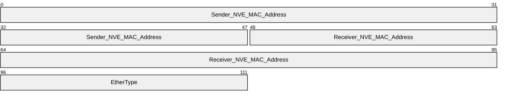
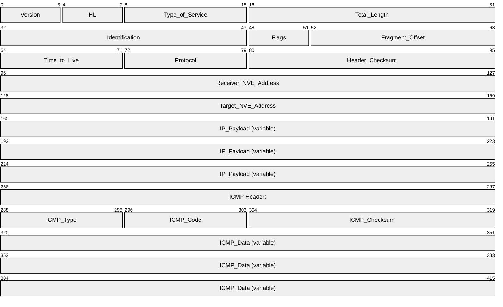
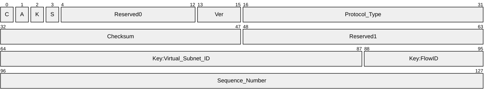
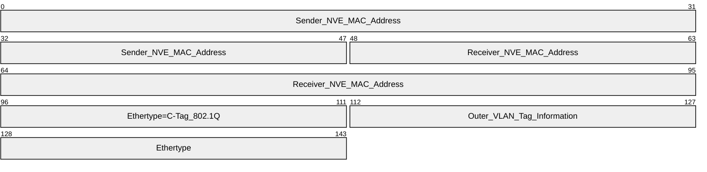
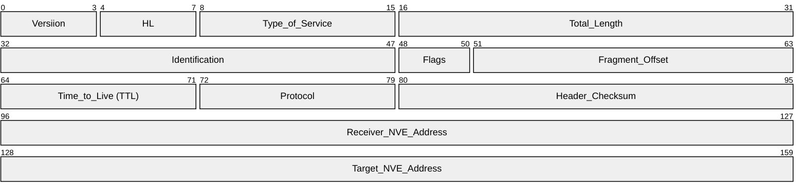
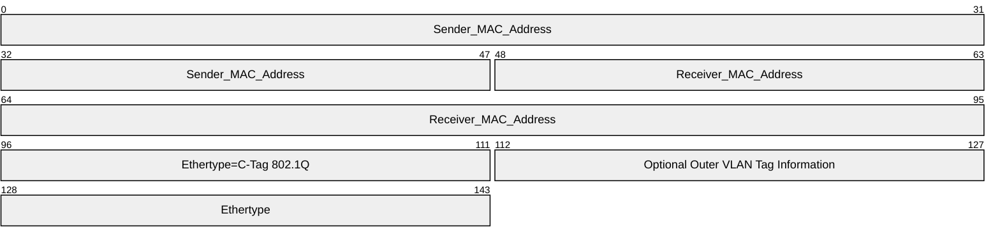
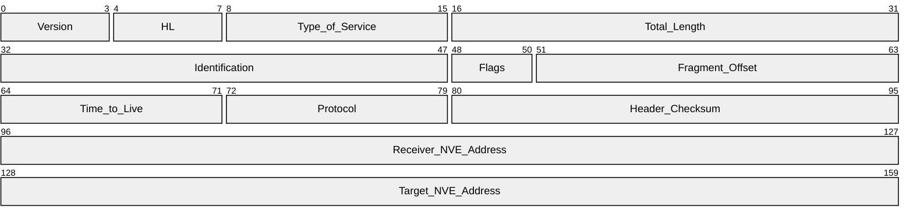
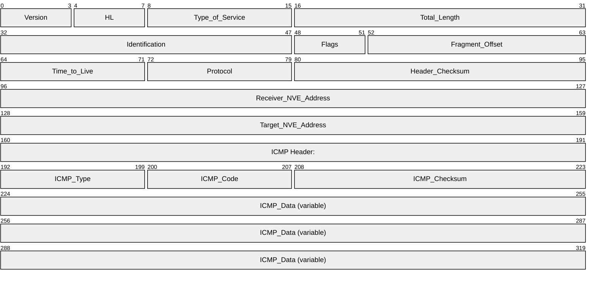

# [MS-NVGREE]: Network Virtualization using Generic Routing Encapsulation (NVGRE) Extensions

Table of Contents

1 Introduction

- [1 Introduction](#Section_1)
  - [1.1 Glossary](#Section_1.1)
  - [1.2 References](#Section_1.2)
    - [1.2.1 Normative References](#Section_1.2.1)
    - [1.2.2 Informative References](#Section_1.2.2)
  - [1.3 Overview](#Section_1.3)
    - [1.3.1 Generic Routing Encapsulation Abstract](#Section_1.3.1)
    - [1.3.2 Minimizing Data Center Challenges with NVGRE](#Section_1.3.2)
      - [1.3.2.1 Defining the Control Messages](#Section_1.3.2.1)
    - [1.3.3 Network Virtualization Endpoint (NVE)](#Section_1.3.3)
    - [1.3.4 Summary](#Section_1.3.4)
  - [1.4 Relationship to Other Protocols](#Section_1.4)
  - [1.5 Prerequisites/Preconditions](#Section_1.5)
  - [1.6 Applicability Statement](#Section_1.6)
  - [1.7 Versioning and Capability Negotiation](#Section_1.7)
  - [1.8 Vendor-Extensible Fields](#Section_1.8)
  - [1.9 Standards Assignments](#Section_1.9)

2 Messages

- [2 Messages](#Section_2)
  - [2.1 Transport](#Section_2.1)
  - [2.2 Message Syntax](#Section_2.2)
    - [2.2.1 REDIRECT Message](#Section_2.2.1)
    - [2.2.2 UNREACHABLE Message](#Section_2.2.2)

3 Protocol Details

- [3 Protocol Details](#Section_3)
  - [3.1 Server Role Details](#Section_3.1)
    - [3.1.1 Abstract Data Model](#Section_3.1.1)
    - [3.1.2 Timers](#Section_3.1.2)
    - [3.1.3 Initialization](#Section_3.1.3)
    - [3.1.4 Higher-Layer Triggered Events](#Section_3.1.4)
    - [3.1.5 Message Processing Events and Sequencing Rules](#Section_3.1.5)
      - [3.1.5.1 NVGRE Encapsulation Frame Format](#Section_3.1.5.1)
      - [3.1.5.2 NVGRE Extension Messages and NVE Roles](#Section_3.1.5.2)
      - [3.1.5.3 REDIRECT Message Processing](#Section_3.1.5.3)
      - [3.1.5.4 UNREACHABLE Message Processing](#Section_3.1.5.4)
    - [3.1.6 Timer Events](#Section_3.1.6)
    - [3.1.7 Other Local Events](#Section_3.1.7)

4 Protocol Examples

- [4 Protocol Examples](#Section_4)

5 Security

- [5 Security](#Section_5)
  - [5.1 Security Considerations for Implementers](#Section_5.1)
  - [5.2 Index of Security Parameters](#Section_5.2)

6 Appendix A: Product Behavior

- [6 Appendix A: Product Behavior](#Section_6)

7 Change Tracking

- [7 Change Tracking](#Section_7)

For the legal notice and IP terms, see [LEGAL.md](../LEGAL.md).
Last updated: 9/20/2022.
See [Revision History](#revision-history) for full version history.

# 1 Introduction

The Network Virtualization Generic Routing Encapsulation (NVGRE) Extensions protocol adds support to the NVGRE protocol by defining two new extension-control messages. The **REDIRECT** message initiates traffic redirection to a new target network virtualization endpoint (NVE) when a virtual machine (VM) is moved to that new NVE during a VM migration event in a multi-tenant datacenter. The **UNREACHABLE** message initiates the policy refresh process via an NVE, in response to one or more moved VMs.

Generic Routing Encapsulation (GRE) header components enable virtual subnets to be located to facilitate the encapsulation and decapsulation of Ethernet and IP frames by Sender and Receiver NVEs, respectively; to support IP-over-IP routings, network virtualization, the exchange of the extension-control messages, and the processes that are initiated by them.

Sections 1.5, 1.8, 1.9, 2, and 3 of this specification are normative. All other sections and examples in this specification are informative.

## 1.1 Glossary

This document uses the following terms:

**entropy**: Refers to the relative degree of randomness. It is a measure that summarizes the order and disorder in the underlying topological structure. Entropy reflects the inherent disorder (or order) of a flow during time (dt). Values are increasing as the system approaches equilibrium. It is directly proportional to the maximum attainable data speed in bps (bits per second). It is also directly proportional to noise and bandwidth.

**gateway**: A node at the boundary of a computer network that serves as an entrance to another network. For example, in this protocol, a network virtualization endpoint (NVE) lies at the boundary of a physical network with computer hardware and a logical (virtual) network with virtual machines (VMs).

**hypervisor**: Software running on a server that allows multiple virtual machines (VMs) to run on the same physical server. The hypervisor manages and provides shared computation, memory, storage services, and network connectivity to the VMs that it hosts. They often embed a virtual switch.

**Virtual Local Area Network (VLAN)**: A software defined network that connects multiple devices and network nodes from one or more physical local area networks (LANs) into a single logical network. A VLAN can logically segment a physical LAN into different broadcast domains.

**virtual subnet**: A range of IP addresses in the virtual network. A virtual network can be divided into multiple subnets for organization and security. A virtual subnet expands a physical LAN by adding virtual machines (VMs) that are accessible through network virtualization endpoint gateways.

**MAY, SHOULD, MUST, SHOULD NOT, MUST NOT:** These terms (in all caps) are used as defined in [[RFC2119]](https://go.microsoft.com/fwlink/?LinkId=90317). All statements of optional behavior use either MAY, SHOULD, or SHOULD NOT.

## 1.2 References

Links to a document in the Microsoft Open Specifications library point to the correct section in the most recently published version of the referenced document. However, because individual documents in the library are not updated at the same time, the section numbers in the documents may not match. You can confirm the correct section numbering by checking the [Errata](https://go.microsoft.com/fwlink/?linkid=850906).

### 1.2.1 Normative References

We conduct frequent surveys of the normative references to assure their continued availability. If you have any issue with finding a normative reference, please contact [dochelp@microsoft.com](mailto:dochelp@microsoft.com). We will assist you in finding the relevant information.

[IEEE802.1Q] Institute of Electrical and Electronics Engineers, "IEEE Standard for Local and Metropolitan Area Networks: Virtual Bridged Local Area Networks", IEEE Std 802.1Q, May 2003, [https://ieeexplore.ieee.org/document/1203093](https://go.microsoft.com/fwlink/?LinkId=89909)

**Note** Sign-in or purchase required to download the PDF

[MS-DTYP] Microsoft Corporation, "[Windows Data Types](../MS-DTYP/MS-DTYP.md)".

[RFC2119] Bradner, S., "Key words for use in RFCs to Indicate Requirement Levels", BCP 14, RFC 2119, March 1997, [https://www.rfc-editor.org/rfc/rfc2119.html](https://go.microsoft.com/fwlink/?LinkId=90317)

[RFC4443] Conta, A., Deering, S., and Gupta, M., "Internet Control Message Protocol (ICMPv6) for the Internet Protocol Version 6 (IPv6) Specification", RFC 4443, March 2006, [http://tools.ietf.org/html/rfc4443.txt](https://go.microsoft.com/fwlink/?LinkID=108349)

[RFC792] Postel, J., "Internet Control Message Protocol", RFC 792, September 1981, [http://www.ietf.org/rfc/rfc792.txt](https://go.microsoft.com/fwlink/?LinkId=90492)

### 1.2.2 Informative References

[IETFDRAFT-NVGRE-EXT-04] Balasubramanian, P., Garg, P., Sridharan, M., Wang, Y., "NVGRE-EXT: Network Virtualization using Generic Routing Encapsulation Extensions", draft-sridharan-virtualization-nvgre-ext-04, June 2015, [https://datatracker.ietf.org/doc/html/draft-sridharan-virtualization-nvgre-ext-04](https://go.microsoft.com/fwlink/?linkid=2184495)

[RFC2401] Kent, S. and Atkinson, R., "Security Architecture for the Internet Protocol", RFC 2401, November 1998, [https://tools.ietf.org/html/rfc2401](https://go.microsoft.com/fwlink/?LinkId=90341)

[RFC2710] Deering, S., Fenner, W., and B. Haberman, "Multicast Listener Discovery (MLD) for IPv6", RFC 2710, October 1999, [https://www.rfc-editor.org/info/rfc2710](https://go.microsoft.com/fwlink/?linkid=2200612)

[RFC2890] Dommety, G., "Key and Sequence Number Extensions to GRE", RFC 2890, September 2000, [https://www.rfc-editor.org/info/rfc2890](https://go.microsoft.com/fwlink/?linkid=2200714)

[RFC7365] Lasserre, M., Balus, F., Morin, T., Bitar, N., et al., "Framework for Data Center (DC) Network Virtualization", [https://www.rfc-editor.org/info/rfc7365](https://go.microsoft.com/fwlink/?linkid=2200613)

[RFC7637] Garg, P. and Wang, Y. Eds., "NVGRE: Network Virtualization Using Generic Routing Encapsulation", RFC 7637, September 2015, [https://www.rfc-editor.org/info/rfc7637](https://go.microsoft.com/fwlink/?linkid=868518)

[RFC8446] Rescorla, E., "The Transport Layer Security (TLS) Protocol Version 1.3", RFC 8446, August 2018, [https://www.rfc-editor.org/info/rfc8446](https://go.microsoft.com/fwlink/?linkid=2147431)

## 1.3 Overview

The Network Virtualization Generic Routing Encapsulation Extension (NVGREE) protocol adds two new control messages to the encapsulation framework of NVGRE to help simplify common tasks in a [**virtual subnet**](#gt_virtual-subnet), such as reconfiguring VM and network resources after a data center migration event. By utilizing the control messages described below, network administrators can avoid the extra manual work of VM setup, provisioning, traffic redirection, and virtual subnet isolation policy updates.

- **REDIRECT** — triggered by detection of a new Target NVE address at the Receiver NVE, as transmitted from the Sender NVE, to indicate that a virtual machine (VM) has moved from a network virtualization endpoint (NVE) to a new NVE and requires redirection of traffic.
- **UNREACHABLE** — sent from a Receiver NVE to a Sender NVE to indicate that an isolation policy refresh is required. Occurs whenever the Receiver NVE receives an NVGRE frame for which there is a missing or invalid isolation policy for the new Target NVE.
The NVGRE extensions are used as control messages that are exchanged between NVEs to accomplish the above tasks. A 24-bit field value known as the Virtual Subnet Identifier (VSID) resides in the GRE header and is used to locate the target virtual network via the NVE that is acting as a [**gateway**](#gt_gateway) to the VM that moved within the virtual network.

### 1.3.1 Generic Routing Encapsulation Abstract

In data center applications, there can be a requirement for encapsulation of one protocol over another protocol, for example, in transporting IP over IP for the application of policy. Generic routing encapsulation (GRE) provides what might be considered a lightweight encapsulation mechanism for use in policy and other traffic control routings.

Network Virtualization with GRE decouples virtual subnetworks and addresses from physical network infrastructure, thus providing isolation and concurrence between multiple virtual networks on the same physical network infrastructure.

At the most basic level, a system that uses GRE will have one or more packets that need to be encapsulated and routed. In NVGRE, the encapsulation layers consist of the following:

- **Layer 1 encapsulation** — a Payload frame that contains an inner Ethernet header and an inner IP header with an IP payload.
- **Layer 2 encapsulation** — a GRE frame that contains a GRE header ([[RFC2890]](https://go.microsoft.com/fwlink/?linkid=2200714)) that includes a virtual subnet ID. The VSID specifies a hexadecimal value that provides the means of locating virtual machines (VMs) in one or more subnets that are layered upon a physcial network infrastructure.
- **Layer 3 encapsulation** — a Delivery frame that contains the GRE header, which is encapsulated in the outer Ethernet header and outer IP header.
The fully encapsulated NVGRE packets can then be forwarded. A simple overview of the fully encapsulated NVGRE packet is represented in the figure that follows.

Figure 1 NVGRE packet encapsulation

### 1.3.2 Minimizing Data Center Challenges with NVGRE

Data centers can face challenges in maximizing network utilization and can encounter inefficiencies that are related to network misconfiguration. Among these challenges are the following:

- Maximizing network utilization, which is exacerbated by network fragmentation caused by using a [**Virtual Local Area Network (VLAN)**](#gt_virtual-local-area-network-vlan) for broadcast isolation, traffic management, and performance isolation among services belonging to different tenants.
- Effectively enabling the assignment of workloads (in a single layer-2 network) to any server in any rack in the network.
- Migrating workloads to any server anywhere in the network while retaining the workload's addresses.
- Decoupling workload LAN location from its address, thus enabling the Network administrator to configure the network once instead of every time a service is migrated.
With the use of NVGRE, modern data centers can solve these configuration and performance problems by:

- Enabling location-independent addressing.
- Scaling the number of logical layer-2 and layer-3 networks regardless of the underlying physical topology.
- Preserving layer-2 service semantics and allowing them to retain their addresses while moving within and across the data center.
- Providing broadcast isolation for workloads that are relocated, while avoiding any re-configuration of the network control plane (routing map).
- Gaining up to 16M virtual subnetworks in the same management domain with the use of a 24-bit Virtual Subnet Identifier (VSID) versus the 4K that is typically achievable with Virtual Local Area Network (VLAN).
- Expansion of virtual machine hosting capabilities into public clouds.

#### 1.3.2.1 Defining the Control Messages

By itself, the NVGRE protocol only defines a data channel for encapsulating packets between network virtualization endpoints (NVEs). This provides a virtual network abstraction over a physical network, typically within a data center, where virtual machines (VMs) are placed on one or more virtual subnetworks through NVE gateways that reside at the boundary of the physical and virtual network. However, this data channel alone does not define any traffic control messages.

The NVGRE protocol extensions address this by defining the **REDIRECT** and **UNREACHABLE** control messages that initiate the aforementioned traffic redirection to a new NVE whenever a VM is moved to a new NVE location, and also initiate required isolation policy updates to the new NVE, respectively.

In Windows Network Virtualization, the NVGREE protocol is used to encapsulate entire Ethernet and IP frames sent by a VM with each full encapsulation configuration containing the following headers:

- **Inner Ethernet and IP headers** — to designate the corresponding inner source and destination VMs via their [**gateway**](#gt_gateway) NVEs.
- **ICMP header** — returns the ICMP error and informational messages that are used to trigger the traffic **REDIRECT** or destination **UNREACHABLE** extension messages of NVGRE.
- **GRE header** — carries virtual subnet identifier (VSID**)** values to locate virtual subnets and facilitate the redirection of traffic to a moved VM and to trigger a policy update at its associated gateway NVE, each task of which is initiated by the associated control message.
- **Outer Ethernet and IP headers** — to designate the corresponding outer source and destination VMs via their gateway NVEs.
Each of the above components, as illustrated in figure **NVGRE packet encapsulation** earlier in this section, are carried in every traffic **REDIRECT** and destination **UNREACHABLE** message that is handled by the NVGRE protocol.

As applicable to NVGRE extension messages, an **UNREACHABLE** message is generated in response to a returned ICMP code, when a moved VM node is unreachable by its former gateway Receiver NVE. Similarly, other ICMP codes can be used to inform the need to **REDIRECT** messages to a particular host, such as the Target NVE.

### 1.3.3 Network Virtualization Endpoint (NVE)

NVEs are the ingress/egress points that lie on the boundary of virtual and physical networks. Any physical server or network device can be an NVE. A common deployment is for the NVE to be part of a Hypervisor. The primary functions of the NVEs is to do the following:

- Encapsulate/decapsulate Ethernet data frames to and from the GRE tunnel, at Sender NVE and Receiver NVE, respectively.
- Ensure that Layer-2 semantics are maintained.
- Transmit the **REDIRECT** and **UNREACHABLE** messages from the Receiver NVE to the Sender NVE when triggered by a VM move event.
- Enable the redirection of traffic and the application of isolation policy scoped to a particular [**virtual subnet**](#gt_virtual-subnet) via a VSID.

### 1.3.4 Summary

Windows Network Virtualization enables logical integration of virtual networks and addresses in physical network infrastructures — for example, those in use by different tenants in a data center. It also allows virtual network and physical network addresses to be decoupled from each other, to facilitate secure isolation of packets in multiple virtual networks on the same physical network infrastructure.

This document describes the traffic control messages and formats of the extension components that are sent by the Network Virtualization Generic Encapsulation Extensions (NVGREE) protocol.

## 1.4 Relationship to Other Protocols

The core NVGRE protocol and extensions both rely upon the presence of IPv4 or IPv6 and Ethernet protocols for connectivity and to enable creating the required NVGRE encapsulation and decapsulation frames to and from the GRE tunnel.

The traffic **REDIRECT** and destination **UNREACHABLE** control messages that are defined in the NVGREE protocol rely upon the GRE header (see section [2.2.1](#Section_2.2.1)) of the NVGRE core protocol which leverages this header to carry the Virtual Subnet ID information contained in each packet in order to send the control messages and other traffic to the appropriate network virtualization endpoints (NVEs) and to thereafter locate the [**virtual subnet**](#gt_virtual-subnet) where the target VM has moved.

## 1.5 Prerequisites/Preconditions

Prerequisites include the dependencies specified in section [1.4](#Section_1.4). Other network features described in [[IETFDRAFT-NVGRE-EXT-04]](https://go.microsoft.com/fwlink/?linkid=2184495), section 3.0, upon which a dependency may exist, should be factored into the network design that supports this protocol, including the following imperatives:

- **Network requirements**: The virtual network should interface with the physical network topology, for example, a [**hypervisor**](#gt_hypervisor) interfacing with a layer-3 network. In addition, an Internet [**gateway**](#gt_gateway) such as an NVE is required to bridge the virtualized customer address (CA) space to the physical address space. The gateway performs translation between the virtualized space and the physical network.
- **Policy Management & Routing requirements**: Isolation policies MUST be explicitly configured and cached in the Sender NVE device prior to operating this protocol. If there are multiple virtual subnetworks, explicit routing information MUST be configured along with a default gateway for cross-subnet communication. Routing to a [**virtual subnet**](#gt_virtual-subnet) can be optionally handled by a network virtualization endpoint (NVE) acting as a VM gateway.
If broadcast/multicast support is required, the NVEs MUST participate in Internet Control Message Protocol (ICMP) [[RFC4443]](https://go.microsoft.com/fwlink/?LinkID=108349), [[RFC792]](https://go.microsoft.com/fwlink/?LinkId=90492), and Multicast Listener Discovery (MLD) [[RFC2710]](https://go.microsoft.com/fwlink/?linkid=2200612) for all subscribed multicast groups.

The control plane for policy distribution is expected to be secured by using any of the existing security protocols.

For additional information on traffic flow across data centers and deployment considerations that may impact network design, see section 4.0 of Network Virtualization Generic Routing Encapulation ([[RFC7637]](https://go.microsoft.com/fwlink/?linkid=868518)), in addition to the Framework for Data Center Network Virtualization [[RFC7365]](https://go.microsoft.com/fwlink/?linkid=2200613).

- Security: See section [5](#Section_5).

## 1.6 Applicability Statement

The control messages specified by the extensions of the NVGRE protocol are only for use in networks that utilize virtualization with the NVGRE protocol, as specified earlier in this document.

## 1.7 Versioning and Capability Negotiation

No version of the Network Virtualization Generic Routing Encapsulation Extension (NVGREE) protocol exists other than the version that is described in this specification.

This protocol does not support capability negotiation.

## 1.8 Vendor-Extensible Fields

There are no vendor-extensible fields.

## 1.9 Standards Assignments

None.

# 2 Messages

## 2.1 Transport

This protocol passes the extension messages using the IP and Ethernet protocols upon which the NVGRE protocol performs encapsulation and decapsulation processes, in an IP-over-IP routing scenario.

The extension messages are contained within the body of an NVGRE packet and are sent by the Receiver NVE to the Sender NVE based on specific conditions that trigger the sending of such extension messages. The Receiver NVE initiates this trigger when it decapsulates traffic which exposes an inner IP header that specifies an unreachable host or that traffic redirection to a relocated virtual machine (VM) is required.

For example, the detection of a missing policy version by the Receiver NVE (after a Receiver VM migration event) will initiate the destination **UNREACHABLE** message to be sent to the Sender NVE, where the policy stores are cached, to subsequently trigger a policy refresh.

## 2.2 Message Syntax

The constituent packets of the traffic **REDIRECT** and destination **UNREACHABLE** extension control messages are described in this section, which includes the associated Inner Ethernet Header, Inner IP Header, and ICMP header with payload; along with the Outer Ethernet Header, and the Outer IP Header of each message. As part of the full GRE encapsulation, the format of the GRE Header in the extended version [[RFC2890]](https://go.microsoft.com/fwlink/?linkid=2200714) is also described here, as is the IPv4 ICMP header [[RFC792]](https://go.microsoft.com/fwlink/?LinkId=90492).

Each extension message is transported by NVGRE-encapsulated IP packets to deliver such messages across virtual network components in tabular data format.

**Note**: A fully encapsulated NVGRE packet is specified in [[RFC7637]](https://go.microsoft.com/fwlink/?linkid=868518); and as an example in section [4](#Section_4) of this document.

### 2.2.1 REDIRECT Message

The **REDIRECT** message is sent by the Receiver NVE when it receives an NVGRE frame for a VM that has moved to a new NVE, as described in section 3.2.2.1. The Inner Ethernet Header, Inner IP Header, and ICMP header comprise the Payload Frame of the NVGRE encapsulation, as shown in the figure **NVGRE packet encapsulation** of section [1.3.1](#Section_1.3.1). The frames of the **REDIRECT** extension message in this section are described in the encapsulation order of the NVGRE packet.

- The Inner Ethernet Header of the Payload Frame for the **REDIRECT** message is specified in the following packet diagram and field descriptions.
**Inner Ethernet Header:**

**Sender NVE MAC Address (6 bytes)**: contains the MAC address of the Sender NVE that sends encapsulated messages to the Receiver NVE. In addition, the Sender NVE receives **REDIRECT** messages from the Receiver NVE.

The Sender NVE also sends the new Target NVE address to the Receiver NVE to locate the new Target NVE, and subsequently, to locate the moved Receiver VM. See figure **Redirect and Unreachable message architecture** in section [3.1.5.3](#Section_3.1.5.3).

**Receiver NVE MAC Address (6 bytes):** contains the MAC address of the Receiver NVE that decapsulates NVGRE packets sent from the Sender NVE. The Receiver NVE also sends the **REDIRECT** message to the Sender NVE when it receives an NVGRE frame for a VM that has moved to the Target NVE.

**Note**: The new Target NVE begins to receive policy-compliant, decapsulated frames after an **UNREACHABLE** message is sent from the Receiver NVE to the Sender NVE, which is then triggered to send out the policy refresh. See section [3.1.5.2](#Section_3.1.5.2) NVGRE Extension Messages and NVE Roles.

**Ethertype (2 bytes):** set to 0x0800 (2048 decimal) to indicate that IPv4 is the encapsulated protocol in the payload of the NVGRE packet. It is used at the receiving end by the data link layer to determine how the payload is processed. The Ethertype value 0x86DD (34525 decimal) indicates IPv6 is in use.

**Note:** The Inner Ethernet header of the NVGRE packet MUST NOT contain any tags, as defined by [[IEEE802.1Q]](https://go.microsoft.com/fwlink/?LinkId=89909). The encapsulating Sender NVE MUST remove any existing [IEEE802.1Q] tags before encapsulation of the Ethernet frame in NVGRE. The decapsulating Receiver NVE MUST drop the frame if the inner Ethernet frame contains an [IEEE802.1Q] tag.

- The Inner IP Header and ICMP Header for the Payload Frame of the **REDIRECT** message is defined in the following packet diagram and descriptions.
**Inner IP Header**:

**Version (4 bits)**: the version of the IP protocol. For IPv4, this field is set to the value 0x04; for IPv6, it is set to the value 0x06.

**HL (4 bits)**: the length of the IP header in 32-bit words ([MS-DTYP](../MS-DTYP/MS-DTYP.md) section 2.2.11), not including the ICMP header and data. Minimum value equals 20 bytes and maximum value equals 60 bytes.

**Type_of_Service (1 byte)**: determines how the IP datagram should be delivered with respect to criteria such as delay, throughput, priority, reliability, and cost. Such delivery depends on how the bits are set. The first 3 bits are the priority bits.

**Total_Length (2 bytes)**: the length of the entire packet (headers+data). The minimum length is 20 bytes and the maximum is 65,535 bytes.

**Identification (2 bytes)**: differentiates fragmented packets from other datagrams. Set by the NVGRE implementation as a globally incremented number.

**Flags (4 bits)**: provides segment information such as identification of fragment status and controlling whether or not fragmentation can occur.

Bit 1 — always set to 0x00.

Bit 2 — if this bit (Don't Fragment (DF) flag) is set to 0x00, then fragmentation of this datagram is prohibited, although it may be discarded.

Bit 3 — if set to 0x00: there is no fragmentation, or if packet is fragmented, it is the last one;

— if set to 0x01: the current packet is fragmented and at least one frame will follow it.

**Fragment_Offset (12 bits)**: provides a value that enables the destination device to place fragments in the proper sequence when reassembling the original packet. First fragment offset is always 0x00 to indicate the first datagram of a transmission. Offset range of this field is from 0x00 to 1FFF (8191 decimal).

**Time_to_Live (1 byte)**: set by default to 0x80 (128 decimal) in Windows. Refers to the amount of time or “hops” that a packet is set to exist inside a network. If the TTL expires before a packet reaches the destination, it is discarded by the router.

**Protocol (1 byte)**: this field is set to 0x01 for ICMPv4 or 0x3A (58 decimal) for ICMPv6, depending upon the IP protocol version in use at the Receiver NVE.

**Header_Checksum (2 bytes)**: this field is set to 0x00 in the source packet, which is the initial computed value. The Header Checksum is calculated again at the destination and compared to the initial Header Checksum field value. If there is no corruption, the result of summing the entire IP header, including checksum, should again be 0x00. Otherwise, the packet is discarded.

**Receiver_NVE_Address (4 bytes)**: this field is set to the IP address of the Receiver NVE that sends the **REDIRECT** message to the Sender NVE.

**Target_NVE_Address (4 bytes)**: this field is set to the IP address of the Target NVE to which the Receiver VM has moved. The Target NVE IP address is then sent to the Receiver NVE in order to locate the new target for redirected messages.

**IP_Payload (variable)**: this field contains as much data as possible from the original NVGRE packet that triggered the **REDIRECT** message to be sent. This data MUST include at least the Inner Ethernet Header, the Inner IP Header, and GRE frame..

**ICMP_Type (1 byte)**: this field MUST be set to 0x05 for IPv4 or 0x89 (137 decimal) for IPv6.

**ICMP_Code (1 byte)**: this field MUST be set to 0x0A (10 decimal) for IPv4 and 0x01 for IPv6. The **ICMP_Code** field is for ICMP error and informational messages that are used to trigger the traffic **REDIRECT** or destination **UNREACHABLE** extension messages of NVGRE.

**ICMP_Checksum (2 bytes)**: the 16-bit ones's complement of the one's complement sum of the ICMP message starting with the **ICMP Type**. For computing the checksum, the **ICMP_Checksum** field should be initialized to 0x00.

**ICMP_Data (variable)**: contains a data section that includes a copy of the entire IPv4 header, plus at least the first eight bytes of data from the IP Header packet with which the ICMP error message is associated.

- The GRE header is next in the encapsulation order following the Inner Ethernet Header, Inner IP Header, and ICMP header. The format and field definitions of the GRE Header are specified in the packet diagram and descriptions that follow.
**GRE Header**:

**C - Checksum Present (1 bit)**: this field MUST be set to 0x00. A value of 0x00 means the **Checksum** field is not present.

**A (1 bit)**: not used.

**K - Key Present (1 bit)**: this field MUST be set to 0x01. A value of 0x01 means that the **Key** field is present in the GRE frame.

**S - Sequence Number (1 bit)**: this field MUST be set to 0x00, as the **Sequence Number** field is not used.

**Reserved0 (9 bits)**: used as reserved space for extra VSID data in scenarios where the extended version of the GRE frame is used with the **Key** field.

**Ver (3 bits)**: this field should be set to 0x00.

**Protocol_Type (2 bytes)**: set this field to 0x6558 (25944 decimal) for Transparent Ethernet Bridging.

**Checksum (2 bytes)**: not used.

**Reserved1 (2 bytes)**: not used.

**Key:Virtual_Subnet_ID (3 bytes)**: as part of the **Key** field, this 24-bit value (0xFFFFFF max) is used to identify NVGRE-based Virtual Layer-2 Networks, where each bit identifies a unique [**virtual subnet**](#gt_virtual-subnet) location that is populated with one or more VM tenants.

**Key:Flow_ID (1 byte)**: as part of the **Key** field, this 8-bit hex value provides per-flow [**entropy**](#gt_entropy) for flows in the same virtual subnet. The FlowID MUST NOT be modified by transit devices. The encapsulating NVE endpoint SHOULD provide as much entropy as possible in the FlowID. If a FlowID is not generated, this field MUST be set to 0x00.

**Sequence_Number (4 bytes)**: not used.

**Considerations for GRE Packets** An extended GRE header can carry an additional field, called the **Sequence Number** field. If you have an NVGREE protocol implementation version that uses this field, it is possible that a bad actor could inject packets with an arbitrary Sequence number and launch a Denial of Service attack. To protect against such attacks, see section [5](#Section_5), Security.

- The following Outer Ethernet Header and Outer IP Header comprise the Delivery Frame of the NVGRE encapsulation, as shown in figure **NVGRE Packet encapsulation** of section 1.3.1.
**Outer Ethernet Header**:

**Sender NVE MAC Address (6 bytes)**: this field is set to the MAC address of the next-hop IP address of the Sender (destination) NVE. The Receiver NVE sends the **REDIRECT** message to the Sender NVE, which in turn triggers this message to be sent to facilitate traffic redirection to the new Target NVE and subsequently to the moved Receiver VM.

**Receiver NVE MAC Address (6 bytes)**: this field is set to the MAC address of the Receiver (source) NVE. The Receiver NVE sends the **REDIRECT** message to the Sender NVE, which in turn triggers the redirection of traffic to the Target NVE.

**Ethertype=C-Tag 802.1Q (2 bytes)**: not used.

**Outer VLAN Tag Information (2 bytes)**: an optional field containing outer [**Virtual Local Area Network (VLAN)**](#gt_virtual-local-area-network-vlan) tags that can be added to Ethernet packets to identify their associated service type. Virtual Local Area Network (VLAN) tags can also be used for traffic management and broadcast scalability on the network.

**Ethertype (2 bytes)**: set to hex 0x0800 (2048 decimal) to indicate that IPv4 is the encapsulated protocol in the payload of the NVGRE frame. It is used at the receiving end by the data link layer to determine how the payload is processed.This field can also indicate the size of some Ethernet frames. The Ethertype value 0x86DD (34525 decimal) indicates IPv6 is in use.

- The Outer IP Header for the **REDIRECT** message is defined in the following packet diagram and field descriptions.
**Outer IP Header**:

**Version (4 bits)**: the version of the IP protocol. For IPv4, this field is set to a value of 0x04; for IPv6, it is set to a value of 0x06.

**HL (4 bits)**: the length of the header in 32-bit words ([MS-DTYP] section 2.2.11). Minimum value equals 20 bytes and maximum value equals 60 bytes.

**Type of Service (1 byte)**: determines how the IP datagram should be delivered with respect to criteria such as delay, throughput, priority, reliability, and cost. Such delivery depends on how the bits are set. The first 3 bits are the priority bits.

**Total Length (2 bytes)**: the length of the entire packet (header+data). The minimum length is 20 bytes and the maximum is 65,535 bytes.

**Identification (2 bytes)**: differentiates fragmented packets from other datagrams. Set by the NVGRE implementation as a globally incremented number.

**Flags (3 bits)**: provides segment information such as identification of fragment status and controlling whether or not fragmentation can occur.

Bit 1 — always set to 0x00.

Bit 2 — if this bit (Don't Fragment (DF) flag) is set to 0x00, then fragmentation of this datagram is prohibited, although it may be discarded.

Bit 3 — if set to 0x00: there is no fragmentation, or if the packet is fragmented, it is the last one.

— if set to one 0x01: the current packet is fragmented and at least one frame will follow it.

**Fragment Offset (13 bits)**: provides a value that enables the destination device to place fragments in the proper sequence when reassembling the original packet. First fragment offset is always 0x00 to indicate the first datagram of transmission. Offset range of this field is from 0x000 to 1FFF (8191 decimal).

**Time to Live (TTL) (1 byte)**: set to 128 in Windows by default. Refers to the amount of time or “hops” that a packet is set to exist inside a network. If the TTL expires before a packet reaches the destination, it is discarded by a router.

**Protocol (1 byte)**: set to 0x06 by default. Defines the protocol used in the data portion of the IP datagram. A setting of 0x06 represents TCP and a setting of 0x2F (17 decimal) represents UDP.

**Header Checksum (2 bytes)**: this field is set to 0x00 in the source packet, which is the initial reference value. The Header Checksum is calculated again at the destination and compared to the initial Header Checksum field value. If there is no corruption, the result of summing the entire IP header, including checksum, should again be 0x00. Otherwise, the packet is discarded.

**Receiver NVE Address (4 bytes)**: the source IP address in the outer frame is referred to as the provider address (PA) of the Receiver NVE. The **REDIRECT** message is sent by the Receiver NVE to the Sender NVE (see figure **Redirect and Unreachable message architecture** in section 3.1.5.3).

**Target NVE Address (4 bytes)**: the destination IP address in the outer frame is referred to as the provider address (PA) of the Sender NVE. The PA is used to locate the new Target NVE that acts as [**gateway**](#gt_gateway) for the moved Receiver VM.

### 2.2.2 UNREACHABLE Message

The destination **UNREACHABLE** message is sent by the Receiver NVE to the Sender NVE when the former receives a decapsulated NVGRE frame that has a mismatched or missing NVGRE isolation policy, as described in section 3.2.2.2.

The Inner Ethernet Header, Inner IP Header, and ICMP header comprise the Payload Frame of the NVGRE encapsulation, as shown in the figure **NVGRE packet encapsulation** of section [1.3.1](#Section_1.3.1). The **UNREACHABLE** extension message frames in this section are described in the encapsulation order of the NVGRE packet.

- The Inner Ethernet Header of the Payload Frame for the **UNREACHABLE** message is specified in the following packet diagram and field descriptions.
**Inner Ethernet Header:**

**Sender NVE MAC Address (6 bytes)**: contains the MAC address of the Sender NVE that receives the **UNREACHABLE** message from the Receiver NVE.

**Receiver NVE MAC Address (6 bytes)**: contains the MAC address of the Receiver NVE that decapsulates NVGRE packets sent from the Sender NVE. The Receiver NVE sends the **UNREACHABLE** message to the Sender NVE when the former receives an NVGRE frame for a VM that has migrated to the new Target (destination) NVE.

**Ethertype (2 bytes)**: set to hex 0x0800 (2048 decimal) to indicate that IPv4 is the encapsulated protocol in the NVGRE packet. It is used at the receiving end by the data link layer to determine how the payload is processed. The Ethertype value 0x86DD (34525 decimal) indicates IPv6 is in use.

**Note**: The NVGRE Inner Ethernet header MUST NOT contain any tags, as defined by section [2.2.1](#Section_2.2.1) [[IEEE802.1Q]](https://go.microsoft.com/fwlink/?LinkId=89909). The encapsulating Sender NVE MUST remove any existing [IEEE802.1Q] tags before the NVGRE encapsulation is complete. Moreover, the decapsulating Receiver NVE MUST drop the frame if the Inner Ethernet header contains one or more [IEEE802.1Q] tags.

- The Inner IP Header and ICMP Header for the Payload Frame (see the figure **GRE packet encapsulation** in section 1.3.1) of the **UNREACHABLE** message is defined in the following packet diagram and descriptions.
**Inner IP Header**:

**Version (4 bits)**: the version of the IP protocol. For IPv4, this field is set to a value of 0x04; for IPv6, it is set to a value of 0x06.

**HL (4 bits)**: the length of the IP header in 32-bit words ([MS-DTYP](../MS-DTYP/MS-DTYP.md) section 2.2.11 ), not including the ICMP header and data. Minimum value equals 20 bytes and maximum value equals 60 bytes.

**Type of Service (1 byte)**: determines how the IP datagram should be delivered with respect to criteria such as delay, throughput, priority, reliability, and cost. Such delivery depends on how the bits are set. The first 3 bits are the priority bits.

**Total Length (2 bytes)**: the length of the entire packet (header + data). The minimum length is 20 bytes and the maximum is 65,535 bytes.

**Identification (2 bytes)**: differentiates fragmented packets from other datagrams. Set by the NVGRE implementation as a globally incremented number.

**Flags (4 bits)**: provides segment information such as identification of fragment status and controlling whether or not fragmentation can occur.

Bit 1 — always set to 0x00.

Bit 2 — if this bit (Don't Fragment (DF) flag) is set to 0x00, then fragmentation of this datagram is prohibited, although it may be discarded.

Bit 3 — if set to 0x00: there is no fragmentation, or if a packet is fragmented, this is the last one;

— if set to 0x01: the current packet is fragmented and at least one frame will follow it.

**Fragment Offset (12 bits)**: provides a value that enables the destination device to place fragments in the proper sequence when reassembling the original packet. First fragment offset is always 0x00 to indicate the first datagram of transmission. Offset range for this field is from 0x00 (0 decimal) to 1FFF (8191 decimal).

**Time to Live (TTL) (1 byte)**: set by default to 0x80 (128 decimal) in Windows. Refers to the amount of time or “hops” that a packet is set to exist inside a network. If the TTL expires before a packet reaches the destination, it is discarded by the router.

**Protocol (1 byte)**: this field is set to 0x01 for ICMPv4, or to 0x3A for ICMPv6, depending upon the IP protocol version in use at the NVE.

**Header Checksum (2 bytes)**: this field is set to 0x00 in the source packet, which is the initial computed value. The Header Checksum is calculated again at the destination and compared to the initial Header Checksum field value. If there is no corruption, the result of summing the entire IP header, including checksum, should again be zero. Otherwise, the packet is discarded.

**Receiver NVE Address (4 bytes)**: this field is set to the IP address of the Receiver NVE that sends the **UNREACHABLE** message to the Sender NVE to initiate the policy refresh process.

**Target NVE Address (4 bytes)**: this field is set to the IP address of the Target NVE, which is sent to the Sender NVE in the **UNREACHABLE** message so that the Sender NVE can specify where policy refresh traffic must be redirected by the Receiver NVE, that is, to the Target (destination) NVE and subsequently to the migrated Receiver VM location. See Figure 2.

**IP Payload (variable)**: This field contains as much data as possible from the original GRE frame that triggered sending the **UNREACHABLE** message. This data MUST include at least the GRE frame, the Inner Ethernet Header, and the Inner IP Header.

**ICMP Type (1 byte)**: this field MUST be set to 0x03 for IPv4, or set to 0x01 for IPv6.

**ICMP Code (1byte)**: this field MUST be set to 0x0A for IPv4 and set to 0x01 for IPv6. The ICMP Code field is for ICMP error and informational messages that are used to trigger the traffic **REDIRECT** or destination **UNREACHABLE** extension messages of NVGRE.

**ICMP Checksum (2 bytes)**: the 16-bit ones's complement of the one's complement sum of the ICMP message starting with the ICMP Type. For computing the checksum, the Checksum field should be initialized to zero (0x00).

**ICMP Data (variable)**: contains a data section that includes a copy of the entire IPv4 header, plus at least the first eight bytes of data from the IP Header packet with which an ICMP error message is associated.

- The GRE header is next in the encapsulation order following the Inner Ethernet Header, Inner IP Header, and ICMP header. The format and field definitions of the GRE Header are specified in the packet diagram and descriptions that follow.
**GRE Header:**

**C - Checksum Present (1 bit)**: this field MUST be set to 0x00. A value of 0x00 means the Checksum field is not present.

**A - (1 bit)**: not used.

**K - Key Present (1 bit)**: this field MUST be set to 0x01. A value of 0x01 means that the **Key** field is present in the GRE frame.

**S - Sequence Number Present (1 bit)**: this field MUST be set to 0x00. A value of 0x00 means the Sequence Number field is not present in the GRE frame.

**Reserved0 (9 bits)**: not used.

**Ver (3 bits)**: not used.

**Protocol Type (2 bytes)**: set this field value to 0x6558 (25944 decimal) for Transparent Ethernet Bridging.

**Checksum (2 bytes)**: not used.

**Reserved1 (2 bytes)**: not used.

**Key(4 bytes)**: comprised of the Virtual Subnet (VSID) and FlowID components, as follows:

**Key:Virtual Subnet ID (VSID) (3 bytes)** — as part of the **Key** field, this 24-bit value (0xFFFFFF max) is used to identify NVGRE-based Virtual Layer-2 Networks, where each bit identifies a unique [**virtual subnet**](#gt_virtual-subnet) location that is populated with one or more VM tenants.

**Key:FlowID (1 byte)** — as part of the **Key** field, this 8-bit hex value provides per-flow [**entropy**](#gt_entropy) for flows in the same virtual subnet. The FlowID MUST NOT be modified by transit devices. The encapsulating NVE endpoint SHOULD provide as much entropy as possible in the FlowID. If a FlowID is not generated, this field MUST be set to 0x00.

**Sequence Number (4 bytes)**: not used**.**

- The following Outer Ethernet Header and Outer IP Header comprise the Delivery frame of the NVGRE encapsulation (figure **NVGRE packet encapsulation** of section 1.3.1) for the **UNREACHABLE** message. The Outer Ethernet Header packet for the UNREACHABLE message is defined in the following packet diagram and field descriptions.
**Outer Ethernet Header**:

**Sender_MAC_Address (6 bytes)**: this field is set to the MAC address of the next-hop IP address of the Sender (destination) NVE. The Receiver NVE sends the **UNREACHABLE** message to the Sender (destination) NVE which is then triggered to send out a policy refresh. Thereafter, the new Target NVE (and the associated, moved VM) start receiving decapsulated, policy-compliant packets. See Figure 2.

**Receiver_MAC_Address (6 bytes)**: contains the MAC address of the Receiver NVE that sends the **UNREACHABLE** message to the Sender (destination) NVE whenever the Receiver NVE detects a decapsulated GRE frame that contains an invalid or missing isolation policy.

**Ethertype=C-Tag_802.1Q (2 bytes)**: not used.

**Optional_Outer_VLAN_Tag_Information (2 bytes)**: an optional field of outer [**Virtual Local Area Network (VLAN)**](#gt_virtual-local-area-network-vlan) tags that can be added to Ethernet packets to identify their associated service type. Virtual Local Area Network (VLAN) tags can also be used for traffic management and broadcast scalability on the network.

**Ethertype (2 bytes)**: set to hex 0x0800 (2048 decimal) to indicate that IPv4 is the encapsulated protocol in the payload of the GRE frame. It is used at the receiving end by the data link layer to determine how the payload is processed. This field can also indicate the size of some Ethernet frames. The Ethertype value 0x86DD (34525 decimal) indicates IPv6 is in use.

- The Outer IP Header for the **UNREACHABLE** message is defined in the following packet diagram and field descriptions.
**Outer IP Header**:

**Version (4 bits)**: the version of the IP protocol. For IPv4, this field is set to a value of 0x04; for IPv6, it is set to a value of 0x06.

**HL (4 bits)**: the length of the header in 32-bit words ([MS-DTYP] section 2.2.11). Minimum value equals 20 bytes and maximum value equals 60 bytes.

**Type_of_Service (1 byte)**: determines how the IP datagram should be delivered with respect to criteria such as delay, throughput, priority, reliability, and cost. Such delivery depends on how the bits are set. The first 3 bits are the priority bits.

**Total_Length (2 bytes)**: the length of the entire packet (header+data). The minimum length is 20 bytes and the maximum is 65,535 bytes.

**Identification (2 bytes)**: differentiates fragmented packets from other datagrams. Set by the NVGRE implementation as a globally incremented number.

**Flags (3 bits)**: Provides segment information such as identification of fragment status and controlling whether or not fragmentation can occur.

Bit 1 — always set to zero (0).

Bit 2 — if this bit (Don't Fragment (DF) flag) is set to zero (0), then fragmentation of this datagram is prohibited, although it may be discarded.

Bit 3 — if set to zero (0): there is no fragmentation, or if packet is fragmented, it is the last one.

— if set to one (1): the current packet is fragmented and at least one frame will follow it.

**Fragment_Offset (13 bits)**: provides a value that enables the destination device to place fragments in the proper sequence when reassembling the original packet. First fragment offset is always 0x00 to indicate the first datagram of transmission. Offset range of this field is from 0x00 to 0x1FFF (8191 decimal).

**Time_to_Live (1 byte)**: set to 0x80 (128 decimal) in Windows by default. Refers to the amount of time or “hops” that a packet is set to exist inside a network. If the TTL expires before a packet reaches the destination, it is discarded by the router.

**Protocol (1 byte)**: set to 0x06 by default. Defines the protocol used in the data portion of the IP datagram. A setting of 0x06 represents TCP and a setting of 0x2F represents UDP.

**Header_Checksum (2 bytes)**: this field is set to 0x00 in the source packet, which is the initial reference value. The Header Checksum is calculated again at the destination and compared to the initial Header Checksum field value. If there is no corruption, the result of summing the entire IP header, including checksum, should again be zero (0x00). Otherwise, the packet is discarded.

**Receiver_NVE_Address (4 bytes)**: the source IP address in the outer frame is referred to as the provider address (PA) of the Receiver NVE, with policy controlling the choice of which PA to use for a given destination Target NVE.

**Target_NVE_Address (4 bytes)**: the destination IP address in the outer frame is referred to as the provider address (PA) of the Sender NVE. The PA is used to locate the Target (Destination) NVE that acts as [**gateway**](#gt_gateway) for the moved Receiver VM.

# 3 Protocol Details

## 3.1 Server Role Details

The NVGREE protocol functions in a Server-to-Server role, by passing messages between [**gateway**](#gt_gateway) NVEs that interface to network client Sender and Receiver virtual machines (VMs). The NVEs also handle most of the NVGREE protocol functions such as the following, as described in section [3.1.5](#Section_3.1.5):

- Extension message triggering
- Migrated VM discovery
- Frame encapsulation/decapsulation for IP-over-IP routing
- Extension message processing
- Isolation Policy application
- Traffic redirection

### 3.1.1 Abstract Data Model

None.

### 3.1.2 Timers

None.

### 3.1.3 Initialization

None.

### 3.1.4 Higher-Layer Triggered Events

None.

### 3.1.5 Message Processing Events and Sequencing Rules

Message processing for the NVGRE protocol **REDIRECT** (section [2.2.1](#Section_2.2.1)) and **UNREACHABLE** (section [2.2.2](#Section_2.2.2)) extension messages is specified in this section. The NVGRE extensions are used as control messages to help manage NVE policy configuration and VM traffic redirection in virtual networks. These functions are facilitated across the following NVEs:

- Sender NVE
- Receiver NVE
- Target NVE

#### 3.1.5.1 NVGRE Encapsulation Frame Format

The format of the NVGRE encapsulation is described in [[RFC7637]](https://go.microsoft.com/fwlink/?linkid=868518), section 3.2. An example of a full NVGRE encapsulation is also shown in section [4](#Section_4) of this document. The components of the NVGRE encapsulation frames facilitate the extension messages that are necessary for improving the operation of the NVGRE protocol and subsequently data center operations. When a destination host cannot be reached as the result of data center VM migration operations, the extension messages perform the following tasks:

- **UNREACHABLE** — a refresh of isolation policy is triggered by this message after a Receiver VM in a virtual network has migrated from its original [**gateway**](#gt_gateway) NVE to a new Target NVE location.
- **REDIRECT** — traffic to the migrated Receiver VM is redirected by locating its new gateway NVE through which redirection occurs.
**Routing the Extension Messages** The appropriate extension message is routed to its proper destination to either facilitate a policy refresh or the redirection of traffic. To locate the Target NVE for the moved Receiver VM to facilitate these operations, a Virtual Subnet ID (VSID) value identifies the virtual subnetwork that contains these virtual components. The VSID is derived from a field in the GRE header frame consisting of hex values (0xFFFFFF max), where different bit values define the location of different virtual subnets. This enables a client Receiver VM to be located in a [**virtual subnet**](#gt_virtual-subnet), uniquely identified by its VSID via the gateway NVE for that subnet.

A fully encapsulated NVGRE packet for an extension message consists of the following components, as represented in figure **NVGRE packet encapsulation** of section [1.3.1](#Section_1.3.1) and detailed in the figure **Full NVGREE encapsulation example** of section 4 in this document:

- Outer Ethernet Header
- Outer IP Header
- GRE Header
- Inner Ethernet Header
- Inner IP Header
- ICMP Header
For more detailed information about the extension messages, see [RFC7637] and [[RFC2890]](https://go.microsoft.com/fwlink/?linkid=2200714).

The following sections describe the NVGRE extension messages and the processing that occurs when NVEs transmit or receive them.

#### 3.1.5.2 NVGRE Extension Messages and NVE Roles

The **REDIRECT** and **UNREACHABLE** extension messages work together to ensure that packet traffic is properly directed and maintained, should a Receiver VM move from its Receiver NVE to a (new) Target NVE location, or if an outdated or missing isolation policy is subsequently detected by the Receiver NVE.

After virtual traffic transits through the GRE tunnel from the Sender NVE to the Receiver NVE, error messages can be detected from the ICMP protocol in response to the previously indicated traffic and policy issues. This in turn triggers the extension messages to be sent from the Receiver NVE to the Sender NVE, as described here and as shown in the figure **Redirect and Unreachable message architecture** of section [3.1.5.3](#Section_3.1.5.3). The major role of the NVEs in this scenario includes the following:

- **Sender NVE** — serves as a [**gateway**](#gt_gateway) device that manages a VM, which is referred to as the Sender VM. The Sender NVE also encapsulates all traffic coming from the Sender VM for normal communications with the Receiver VM, as well as the extension message traffic that is ultimately sent to the Receiver NVE to initiate traffic redirection or a policy refresh.
- **Receiver NVE** — serves as a gateway device that manages a VM, which is referred to as the Receiver VM. The Receiver NVE also decapsulates all traffic coming from the Sender NVE that is destined for the Receiver VM in normal communications, as well as the extension message traffic that is ultimately sent to the Target NVE to enforce traffic redirection or a policy refresh.
- **Target NVE** — serves as the new NVE gateway that manages the Receiver VM as a result of it moving to the Target NVE. As stated earlier, the Receiver VM move typically occurs in a data center live migration.
For more information about NVEs see [[RFC7365]](https://go.microsoft.com/fwlink/?linkid=2200613).

#### 3.1.5.3 REDIRECT Message Processing

The initial state of packet communications across the network virtualization endpoints (NVEs) and the associated VM configurations is specified below. The behavior that facilitates a policy refresh and the redirection of packet traffic, some time after a Receiver VM move event occurs, is also discussed. The figure **Redirect and Unreachable message architecture** of section 3.1.5.3 shows an architectural representation of the following interactions:

- Initially, the Sender VM is sending packets to the Receiver VM via the Sender NVE and Receiver NVE, respectively. The Sender NVE MUST encapsulate these packets with the NVGRE protocol [[RFC7637]](https://go.microsoft.com/fwlink/?linkid=868518) and send them to the Receiver NVE. The Receiver NVE in turn MUST decapsulate the packets and send the data to the Receiver VM. NVGRE encapsulation and decapsulation processes are specified in [RFC7637], section 3.0.
- When the Receiver VM in its initial location at the Receiver NVE is moved to a new Target NVE, the Sender NVE may continue sending packets from the Sender VM to the Receiver VM, via the Receiver NVE; that is, up until the time when an invalid policy is detected and a policy refresh is initiated at the Sender NVE, as indicated below.
- Before the policy is refreshed, the Receiver NVE MUST send the **REDIRECT** message (section [2.2.1](#Section_2.2.1)) to the Sender NVE, which provides the path for the redirection of traffic to the Target (destination) NVE and subsequently to the moved Receiver VM, instead of its former location. This message MUST be triggered whenever the Receiver NVE receives a decapsulated NVGRE frame that indicates the Receiver VM has moved to a new Target NVE.
- Until the policy refresh is completed, connectivity disruptions may occur between the Sender and Receiver VMs. A policy refresh is initiated by sending the **UNREACHABLE** message (section [2.2.2](#Section_2.2.2)) from the Receiver NVE to the Sender NVE, as shown in figure **Redirect and Unreachable message architecture** of section 3.1.5.3.
**Note** The Sender NVE MUST cache an applicable policy that can be pushed out for policy updates.

The inner and outer Ethernet and IP frames for the **REDIRECT** message are shown in the packet diagrams of section 2.2.1. The **REDIRECT** and **UNREACHABLE** message communications architecture is shown in figure **Redirect and Unreachable message architecture** that follows.

Figure 2 Redirect and Unreachable message architecture

#### 3.1.5.4 UNREACHABLE Message Processing

The processes that follow explain how the **UNREACHABLE** message is invoked and why it is needed to restore packet traffic to a moved Receiver VM:

- The initial state of packet traffic consists of the Sender VM sending packets to the Receiver VM, each through their associated [**gateway**](#gt_gateway) NVEs. The Sender NVE encapsulates these packets in NVGRE and sends them to the Receiver NVE. The Receiver NVE decapsulates these packets and sends these to the Receiver VM.
- At a certain point after the Receiver VM has moved to a new Target NVE, a packet will be sent by the Sender NVE that does not match NVGRE policy on the Receiver NVE. A missing or incompatible policy is the basis for this disparity, which can cause a connectivity interruption between the Sender VM and Receiver VM until an NVGRE policy refresh is initiated at the Sender NVE.
- The **UNREACHABLE** message is triggered by the Receiver NVE, as derived from ICMP [[RFC4443]](https://go.microsoft.com/fwlink/?LinkID=108349), [[RFC792]](https://go.microsoft.com/fwlink/?LinkId=90492), to inform the Sender NVE that it needs to apply a policy refresh from the policy version cache that it maintains. This message is sent from the Receiver NVE when it receives an NVGRE frame that has an incompatible or non-existent isolation policy.
- If the **REDIRECT** message is not already sent, it is sent shortly thereafter the policy refresh, to ensure traffic is redirected to the new Target NVE and subsequently to the Receiver VM in its new location.
The inner and outer Ethernet and IP frames for the **UNREACHABLE** message are shown in the packet diagrams of section [2.2.2](#Section_2.2.2).

### 3.1.6 Timer Events

None.

### 3.1.7 Other Local Events

None.

# 4 Protocol Examples

This section contains an example of a full NVGREE frame encapsulation that applies to the control message extensions **REDIRECT** and **UNREACHABLE.**

**Inner Ethernet Header:**

**Inner IP Header**:

**GRE Header**:

**Outer Ethernet Header:**

**Outer IP Header:**

Figure 3 Full NVGREE encapsulation example

**Note:** For packet field descriptions, see sections [2.2.1](#Section_2.2.1), REDIRECT Message and [2.2.2](#Section_2.2.2), UNREACHABLE Message.

**Important**: The source and destination MAC addresses in the Ethernet frames vary, depending on which message is being sent and to where it is being sent.

For example, in the case of the **UNREACHABLE** message, the source is the Receiver NVE that detects the policy incompatibility; and the destination is the Sender NVE, where an appropriate policy can be retrieved and sent to refresh the Receiver NVE and Receiver VM.

For the **REDIRECT** message, the source is also the Receiver NVE, and the destination is the Sender NVE, through which redirected traffic to the moved Receiver VM is reached. However, as source for the redirected traffic is the Receiver NVE, the destination is the Target NVE acting as the [**gateway**](#gt_gateway) for the moved Receiver VM.

The same logic applies with respect to source and destination IP frame addresses**.**

# 5 Security

## 5.1 Security Considerations for Implementers

The following security measures should be considered for implementations of this protocol.

**Redirection Hijaking Attacks**

The NVGRE protocol allows a faster policy update using a **REDIRECT** message (section [2.2.1](#Section_2.2.1)) or an **UNREACHABLE** message (section [2.2.2](#Section_2.2.2)). It could also cause a security-compromised NVE to redirect traffic to one or more VMs. Mitigation of such attacks is possible with authentication/encryption using IPsec or any other IP-based mechanism or using the control plane for validation of the updated information. The control plane for NVGRE policy distribution is expected to be secured by using any of the existing security protocols and can be used to disable or override such traffic redirection decisions.

**Spoofing Attacks**

Because NVGREE extends the layer-2 subnet across the data center and increases the scope of spoofing attacks, a secure mitigation strategy for spoofing attacks should be achieved through authentication/encryption with IPsec or any other IP-based security mechanism, such as the **Transport Layer Security (TLS)** protocol [[RFC8446]](https://go.microsoft.com/fwlink/?linkid=2147431), which utilizes authentication and encryption to stop IP spoofing.

**Denial of Service Attacks**

Extensions to the GRE header [[RFC2890]](https://go.microsoft.com/fwlink/?linkid=2200714) can carry an additional optional field, the **Sequence Number** field. If you have a version of the NVGREE protocol that uses the **Sequence Number** field, it is possible for a bad actor to inject packets with an arbitrary Sequence number and launch a Denial of Service attack.

To protect against such attacks, an IP security protocol, for example [[RFC2401]](https://go.microsoft.com/fwlink/?LinkId=90341), MUST be applied to protect the GRE header and the tunneled payload. Either ESP (Encapsulating Security Payload) or AH (Authentication Header) MUST be used to protect the GRE header. If ESP is used, it protects the IP payload which includes the GRE header. If AH is used, the entire packet other than mutable fields is authenticated.

## 5.2 Index of Security Parameters

| Bit Range | Field | Description |
| --- | --- | --- |
| Variable | IP Security (IPSec) | Section [5.1](#Section_5.1) Security Considerations for Implementors |
| Variable | Transport Layer Security (TLS) | Section 5.1 Security Considerations for Implementors |
| Variable | Encapsulating Security Payload (ESP) | Section 5.1 Security Considerations for Implementors |
| Variable | Authenticating Header (AH) | Section 5.1 Security Considerations for Implementors |

# 6 Appendix A: Product Behavior

The information in this specification is applicable to the following Microsoft products or supplemental software. References to product versions include updates to those products.

| Windows Releases | Client Role | Server Role |
| --- | --- | --- |
| Windows 8.1 operating system | No | Yes |
| Windows Server 2012 R2 operating system | No | Yes |
| Windows Server 2016 operating system | No | Yes |

Exceptions, if any, are noted in this section. If an update version, service pack or Knowledge Base (KB) number appears with a product name, the behavior changed in that update. The new behavior also applies to subsequent updates unless otherwise specified. If a product edition appears with the product version, behavior is different in that product edition.

Unless otherwise specified, any statement of optional behavior in this specification that is prescribed using the terms "SHOULD" or "SHOULD NOT" implies product behavior in accordance with the SHOULD or SHOULD NOT prescription. Unless otherwise specified, the term "MAY" implies that the product does not follow the prescription.

# 7 Change Tracking

This section identifies changes that were made to this document since the last release. Changes are classified as Major, Minor, or None.

The revision class **Major** means that the technical content in the document was significantly revised. Major changes affect protocol interoperability or implementation. Examples of major changes are:

- A document revision that incorporates changes to interoperability requirements.
- A document revision that captures changes to protocol functionality.
The revision class **Minor** means that the meaning of the technical content was clarified. Minor changes do not affect protocol interoperability or implementation. Examples of minor changes are updates to clarify ambiguity at the sentence, paragraph, or table level.

The revision class **None** means that no new technical changes were introduced. Minor editorial and formatting changes may have been made, but the relevant technical content is identical to the last released version.

The changes made to this document are listed in the following table. For more information, please contact [dochelp@microsoft.com](mailto:dochelp@microsoft.com).

| Section | Description | Revision class |
| --- | --- | --- |
| All | Created new document. | Major |

## Revision History

| Date | Version | Revision Class | Comments |
| --- | --- | --- | --- |
| 9/20/2022 | 1.0 | New | Released new document. |
