# [MS-PAC]: Privilege Attribute Certificate Data Structure

Table of Contents

1 Introduction

- [1 Introduction](#Section_1)
  - [1.1 Glossary](#Section_1.1)
  - [1.2 References](#Section_1.2)
    - [1.2.1 Normative References](#Section_1.2.1)
    - [1.2.2 Informative References](#Section_1.2.2)
  - [1.3 Overview](#Section_1.3)
  - [1.4 Relationship to Protocols and Other Structures](#Section_1.4)
  - [1.5 Applicability Statement](#Section_1.5)
  - [1.6 Versioning and Localization](#Section_1.6)
  - [1.7 Vendor-Extensible Fields](#Section_1.7)

2 Structures

- [2 Structures](#Section_2)
  - [2.1 Common Types](#Section_2.1)
  - [2.2 Constructed Security Types](#Section_2.2)
    - [2.2.1 KERB_SID_AND_ATTRIBUTES](#Section_2.2.1)
    - [2.2.2 GROUP_MEMBERSHIP](#Section_2.2.2)
    - [2.2.3 DOMAIN_GROUP_MEMBERSHIP](#Section_2.2.3)
  - [2.3 PACTYPE](#Section_2.3)
  - [2.4 PAC_INFO_BUFFER](#Section_2.4)
  - [2.5 KERB_VALIDATION_INFO](#Section_2.5)
  - [2.6 PAC Credentials](#Section_2.6)
    - [2.6.1 PAC_CREDENTIAL_INFO](#Section_2.6.1)
    - [2.6.2 PAC_CREDENTIAL_DATA](#Section_2.6.2)
    - [2.6.3 SECPKG_SUPPLEMENTAL_CRED](#Section_2.6.3)
    - [2.6.4 NTLM_SUPPLEMENTAL_CREDENTIAL](#Section_2.6.4)
  - [2.7 PAC_CLIENT_INFO](#Section_2.7)
  - [2.8 PAC_SIGNATURE_DATA](#Section_2.8)
    - [2.8.1 Generation of PAC Signatures](#Section_2.8.1)
    - [2.8.2 Ticket Signature](#Section_2.8.2)
    - [2.8.3 Extended KDC Signature](#Section_2.8.3)
    - [2.8.4 Server Signature](#Section_2.8.4)
    - [2.8.5 KDC Signature](#Section_2.8.5)
  - [2.9 S4U_DELEGATION_INFO](#Section_2.9)
  - [2.10 UPN_DNS_INFO](#Section_2.10)
  - [2.11 PAC_CLIENT_CLAIMS_INFO](#Section_2.11)
  - [2.12 PAC_DEVICE_INFO](#Section_2.12)
  - [2.13 PAC_DEVICE_CLAIMS_INFO](#Section_2.13)
  - [2.14 PAC_ATTRIBUTES_INFO](#Section_2.14)
  - [2.15 PAC_REQUESTOR_SID](#Section_2.15)
  - [2.16 PAC_REQUESTOR_GUID](#Section_2.16)
  - [2.17 Formal MIDL Definition](#Section_2.17)

3 Structure Examples

- [3 Structure Examples](#Section_3)
  - [3.1 Logon Authorization Information](#Section_3.1)
  - [3.2 Client Information](#Section_3.2)
  - [3.3 Signatures](#Section_3.3)

4 Security

- [4 Security](#Section_4)
  - [4.1 Security Considerations for Implementers](#Section_4.1)
    - [4.1.1 Tampered PAC Data](#Section_4.1.1)
    - [4.1.2 Authorization Validation and Filtering](#Section_4.1.2)
      - [4.1.2.1 Rules for SID Inclusion in the PAC](#Section_4.1.2.1)
      - [4.1.2.2 SID Filtering and Claims Transformation](#Section_4.1.2.2)
      - [4.1.2.3 crealm Filtering](#Section_4.1.2.3)
  - [4.2 Index of Security Fields](#Section_4.2)

5 Appendix A: Product Behavior

- [5 Appendix A: Product Behavior](#Section_5)

6 Change Tracking

- [6 Change Tracking](#Section_6)

For the legal notice and IP terms, see [LEGAL.md](../LEGAL.md).
Last updated: 6/10/2024.
See [Revision History](#revision-history) for full version history.

# 1 Introduction

The Privilege Attribute Certificate (PAC) Data Structure is used by authentication protocols that verify identities to transport authorization information, which controls access to resources. The Kerberos protocol [[RFC4120]](https://go.microsoft.com/fwlink/?LinkId=90458) does not provide authorization. The Privilege Attribute Certificate (PAC) was created to provide this authorization data for Kerberos Protocol Extensions [MS-KILE](../MS-KILE/MS-KILE.md). Into the **PAC** structure [MS-KILE] encodes authorization information, which consists of group memberships, additional credential information, profile and policy information, and supporting security metadata.<1>

Sections 1.7 and 2 of this specification are normative. All other sections and examples in this specification are informative.

## 1.1 Glossary

This document uses the following terms:

**Advanced Encryption Standard (AES)**: A block cipher that supersedes the [**Data Encryption Standard (DES)**](#gt_data-encryption-standard-des). AES can be used to protect electronic data. The AES algorithm can be used to encrypt (encipher) and decrypt (decipher) information. Encryption converts data to an unintelligible form called ciphertext; decrypting the ciphertext converts the data back into its original form, called plaintext. AES is used in symmetric-key cryptography, meaning that the same key is used for the encryption and decryption operations. It is also a block cipher, meaning that it operates on fixed-size blocks of plaintext and ciphertext, and requires the size of the plaintext as well as the ciphertext to be an exact multiple of this block size. AES is also known as the Rijndael symmetric encryption algorithm [[FIPS197]](https://go.microsoft.com/fwlink/?LinkId=89870).

**application protocol**: A network protocol that operates in the application layer at the top of the OSI model. It visibly accomplishes the task that the user or other agent wants to perform. This is distinguished from all manner of support protocols: from Ethernet or IP at the bottom to security and routing protocols. While necessary, these are not always visible to the user. Application protocols include, for instance, HTTP and Server Message Block (SMB).

**ASN.1**: Abstract Syntax Notation One. ASN.1 is used to describe Kerberos datagrams as a sequence of components, sent in messages. ASN.1 is described in the following specifications: [[ITUX660]](https://go.microsoft.com/fwlink/?LinkId=89922) for general procedures; [[ITUX680]](https://go.microsoft.com/fwlink/?LinkId=89923) for syntax specification, and [[ITUX690]](https://go.microsoft.com/fwlink/?LinkId=89924) for the Basic Encoding Rules (BER), Canonical Encoding Rules (CER), and [**Distinguished Encoding Rules (DER)**](#gt_distinguished-encoding-rules-der) encoding rules.

**Data Encryption Standard (DES)**: A specification for encryption of computer data that uses a 56-bit key developed by IBM and adopted by the U.S. government as a standard in 1976. For more information see [[FIPS46-3]](https://go.microsoft.com/fwlink/?LinkId=89872).

**Distinguished Encoding Rules (DER)**: A method for encoding a data object based on Basic Encoding Rules (BER) encoding but with additional constraints. DER is used to encode X.509 certificates that need to be digitally signed or to have their signatures verified.

**domain controller (DC)**: The service, running on a server, that implements Active Directory, or the server hosting this service. The service hosts the data store for objects and interoperates with other [**DCs**](#gt_domain-controller-dc) to ensure that a local change to an object replicates correctly across all [**DCs**](#gt_domain-controller-dc). When Active Directory is operating as Active Directory Domain Services (AD DS), the [**DC**](#gt_domain-controller-dc) contains full NC replicas of the configuration naming context (config NC), schema naming context (schema NC), and one of the domain NCs in its forest. If the AD DS [**DC**](#gt_domain-controller-dc) is a global catalog server (GC server), it contains partial NC replicas of the remaining domain NCs in its forest. For more information, see [MS-AUTHSOD](../MS-AUTHSOD/MS-AUTHSOD.md) section 1.1.1.5.2 and [MS-ADTS](../MS-ADTS/MS-ADTS.md). When Active Directory is operating as Active Directory Lightweight Directory Services (AD LDS), several AD LDS [**DCs**](#gt_domain-controller-dc) can run on one server. When Active Directory is operating as AD DS, only one AD DS [**DC**](#gt_domain-controller-dc) can run on one server. However, several AD LDS [**DCs**](#gt_domain-controller-dc) can coexist with one AD DS [**DC**](#gt_domain-controller-dc) on one server. The AD LDS [**DC**](#gt_domain-controller-dc) contains full NC replicas of the config NC and the schema NC in its forest. The domain controller is the server side of Authentication Protocol Domain Support [MS-APDS](../MS-APDS/MS-APDS.md).

**fully qualified domain name (FQDN)**: An unambiguous domain name that gives an absolute location in the Domain Name System's (DNS) hierarchy tree, as defined in [[RFC1035]](https://go.microsoft.com/fwlink/?LinkId=90264) section 3.1 and [[RFC2181]](https://go.microsoft.com/fwlink/?LinkId=127732) section 11.

**Interface Definition Language (IDL)**: The International Standards Organization (ISO) standard language for specifying the interface for remote procedure calls. For more information, see [[C706]](https://go.microsoft.com/fwlink/?LinkId=89824) section 4.

**Key Distribution Center (KDC)**: The Kerberos service that implements the authentication and ticket granting services specified in the Kerberos protocol. The service runs on computers selected by the administrator of the realm or domain; it is not present on every machine on the network. It has to have access to an account database for the realm that it serves. KDCs are integrated into the [**domain controller**](#gt_domain-controller-dc) role. It is a network service that supplies tickets to clients for use in authenticating to services.

**Microsoft Interface Definition Language (MIDL)**: The Microsoft implementation and extension of the OSF-DCE [**Interface Definition Language (IDL)**](#gt_interface-definition-language-idl). [**MIDL**](#gt_microsoft-interface-definition-language-midl) can also mean the [**Interface Definition Language (IDL)**](#gt_interface-definition-language-idl) compiler provided by Microsoft. For more information, see [MS-RPCE](../MS-RPCE/MS-RPCE.md).

**Network Data Representation (NDR)**: A specification that defines a mapping from [**Interface Definition Language (IDL)**](#gt_interface-definition-language-idl) data types onto octet streams. [**NDR**](#gt_network-data-representation-ndr) also refers to the runtime environment that implements the mapping facilities (for example, data provided to [**NDR**](#gt_network-data-representation-ndr)). For more information, see [MS-RPCE] and [C706] section 14.

**read-only domain controller (RODC)**: A [**domain controller (DC)**](#gt_domain-controller-dc) that does not accept originating updates. Additionally, an [**RODC**](#gt_read-only-domain-controller-rodc) does not perform outbound replication. An RODC cannot be the primary domain controller (PDC) for its domain.

**relative identifier (RID)**: The last item in the series of SubAuthority values in a [**security identifier (SID)**](#gt_security-identifier-sid) [[SIDD]](https://go.microsoft.com/fwlink/?LinkId=90516). It distinguishes one account or group from all other accounts and groups in the domain. No two accounts or groups in any domain share the same RID.

**remote procedure call (RPC)**: A communication protocol used primarily between client and server. The term has three definitions that are often used interchangeably: a runtime environment providing for communication facilities between computers (the RPC runtime); a set of request-and-response message exchanges between computers (the RPC exchange); and the single message from an RPC exchange (the RPC message). For more information, see [C706].

**security identifier (SID)**: An identifier for security principals that is used to identify an account or a group. Conceptually, the [**SID**](#gt_security-identifier-sid) is composed of an account authority portion (typically a domain) and a smaller integer representing an identity relative to the account authority, termed the [**relative identifier (RID)**](#gt_relative-identifier-rid). The [**SID**](#gt_security-identifier-sid) format is specified in [MS-DTYP](../MS-DTYP/MS-DTYP.md) section 2.4.2; a string representation of [**SIDs**](#gt_security-identifier-sid) is specified in [MS-DTYP] section 2.4.2 and [MS-AZOD](../MS-AZOD/MS-AZOD.md) section 1.1.1.2.

**Service for User (S4U)**: Extensions to the Kerberos protocol that allow a service to obtain a Kerberos service ticket for a user that has not authenticated to the [**Key Distribution Center (KDC)**](#gt_key-distribution-center-kdc). [**S4U**](#gt_service-for-user-s4u) includes S4U2proxy and S4U2self.

**Service for User to Proxy (S4U2proxy)**: An extension that allows a service to obtain a service ticket on behalf of a user to a different service.

**ticket-granting service (TGS)**: A service that issues tickets for admission to other services in its own domain or for admission to the ticket-granting service in another domain.

**ticket-granting ticket (TGT)**: A special type of ticket that can be used to obtain other tickets. The TGT is obtained after the initial authentication in the Authentication Service (AS) exchange; thereafter, users do not need to present their credentials, but can use the TGT to obtain subsequent tickets.

**trusted domain object (TDO)**: A collection of properties that define a trust relationship with another domain, such as direction (outbound, inbound, or both), trust attributes, name, and security identifier of the other domain. For more information, see [MS-ADTS].

**UNC path**: The location of a file in a network of computers as specified in the Universal Naming Convention (UNC) syntax. Also known as UncPath.

**MAY, SHOULD, MUST, SHOULD NOT, MUST NOT:** These terms (in all caps) are used as defined in [[RFC2119]](https://go.microsoft.com/fwlink/?LinkId=90317). All statements of optional behavior use either MAY, SHOULD, or SHOULD NOT.

## 1.2 References

Links to a document in the Microsoft Open Specifications library point to the correct section in the most recently published version of the referenced document. However, because individual documents in the library are not updated at the same time, the section numbers in the documents may not match. You can confirm the correct section numbering by checking the [Errata](https://go.microsoft.com/fwlink/?linkid=850906).

### 1.2.1 Normative References

We conduct frequent surveys of the normative references to assure their continued availability. If you have any issue with finding a normative reference, please contact [dochelp@microsoft.com](mailto:dochelp@microsoft.com). We will assist you in finding the relevant information.

[C706] The Open Group, "DCE 1.1: Remote Procedure Call", C706, August 1997, [https://publications.opengroup.org/c706](https://go.microsoft.com/fwlink/?LinkId=89824)

**Note** Registration is required to download the document.

[MS-ADA1] Microsoft Corporation, "[Active Directory Schema Attributes A-L](../MS-ADA1/MS-ADA1.md)".

[MS-ADA2] Microsoft Corporation, "[Active Directory Schema Attributes M](../MS-ADA2/MS-ADA2.md)".

[MS-ADA3] Microsoft Corporation, "[Active Directory Schema Attributes N-Z](../MS-ADA3/MS-ADA3.md)".

[MS-ADTS] Microsoft Corporation, "[Active Directory Technical Specification](../MS-ADTS/MS-ADTS.md)".

[MS-APDS] Microsoft Corporation, "[Authentication Protocol Domain Support](../MS-APDS/MS-APDS.md)".

[MS-DTYP] Microsoft Corporation, "[Windows Data Types](../MS-DTYP/MS-DTYP.md)".

[MS-KILE] Microsoft Corporation, "[Kerberos Protocol Extensions](../MS-KILE/MS-KILE.md)".

[MS-NLMP] Microsoft Corporation, "[NT LAN Manager (NTLM) Authentication Protocol](../MS-NLMP/MS-NLMP.md)".

[MS-NRPC] Microsoft Corporation, "[Netlogon Remote Protocol](../MS-NRPC/MS-NRPC.md)".

[MS-PKCA] Microsoft Corporation, "[Public Key Cryptography for Initial Authentication (PKINIT) in Kerberos Protocol](../MS-PKCA/MS-PKCA.md)".

[MS-RCMP] Microsoft Corporation, "[Remote Certificate Mapping Protocol](../MS-RCMP/MS-RCMP.md)".

[MS-RPCE] Microsoft Corporation, "[Remote Procedure Call Protocol Extensions](../MS-RPCE/MS-RPCE.md)".

[MS-SAMR] Microsoft Corporation, "[Security Account Manager (SAM) Remote Protocol (Client-to-Server)](../MS-SAMR/MS-SAMR.md)".

[MS-SFU] Microsoft Corporation, "[Kerberos Protocol Extensions: Service for User and Constrained Delegation Protocol](../MS-SFU/MS-SFU.md)".

[RFC2119] Bradner, S., "Key words for use in RFCs to Indicate Requirement Levels", BCP 14, RFC 2119, March 1997, [https://www.rfc-editor.org/info/rfc2119](https://go.microsoft.com/fwlink/?LinkId=90317)

[RFC3244] Swift, M., Trostle, J., and Brezak, J., "Microsoft Windows 2000 Kerberos Change Password and Set Password Protocols", RFC 3244, February 2002, [https://www.rfc-editor.org/info/rfc3244](https://go.microsoft.com/fwlink/?LinkId=90409)

[RFC3961] Raeburn, K., "Encryption and Checksum Specifications for Kerberos 5", RFC 3961, February 2005, [https://www.rfc-editor.org/info/rfc3961](https://go.microsoft.com/fwlink/?LinkId=90450)

[RFC3962] Raeburn, K., "Advanced Encryption Standard (AES) Encryption for Kerberos 5", RFC 3962, February 2005, [https://www.rfc-editor.org/info/rfc3962](https://go.microsoft.com/fwlink/?LinkId=90451)

[RFC4120] Neuman, C., Yu, T., Hartman, S., and Raeburn, K., "The Kerberos Network Authentication Service (V5)", RFC 4120, July 2005, [https://www.rfc-editor.org/rfc/rfc4120](https://go.microsoft.com/fwlink/?LinkId=90458)

[RFC4556] Zhu, L., and Tung, B., "Public Key Cryptography for Initial Authentication in Kerberos", RFC 4556, June 2006, [https://www.rfc-editor.org/info/rfc4556](https://go.microsoft.com/fwlink/?LinkId=90482)

[RFC4757] Jaganathan, K., Zhu, L., and Brezak, J., "The RC4-HMAC Kerberos Encryption Types Used by Microsoft Windows", RFC 4757, December 2006, [https://www.rfc-editor.org/info/rfc4757](https://go.microsoft.com/fwlink/?LinkId=90488)

### 1.2.2 Informative References

[MIDLINF] Microsoft Corporation, "MIDL Language Reference", [https://learn.microsoft.com/en-us/windows/desktop/Midl/midl-language-reference](https://go.microsoft.com/fwlink/?LinkId=89938)

[MSDN-SID] Microsoft Corporation, "SID structure", [https://learn.microsoft.com/en-us/windows/win32/api/winnt/ns-winnt-sid](https://go.microsoft.com/fwlink/?linkid=865491)

[MSFT-CVE-2020-17049] Microsoft Corporation, "Kerberos Security Feature Bypass Vulnerability", CVE-2020-17049, November 10, 2020, [https://msrc.microsoft.com/update-guide/vulnerability/CVE-2020-17049](https://go.microsoft.com/fwlink/?linkid=2148744)

[MSFT-CVE-2022-37966] Microsoft Corporation, "Windows Kerberos RC4-HMAC Elevation of Privilege Vulnerability", CVE-2022-37966 November 8, 2022, [https://msrc.microsoft.com/update-guide/vulnerability/CVE-2022-37966](https://go.microsoft.com/fwlink/?linkid=2230628)

[MSFT-CVE-2022-37967] Microsoft Corporation, "Windows Kerberos Elevation of Privilege Vulnerability", CVE-2022-37967 November 8, 2022, [https://msrc.microsoft.com/update-guide/vulnerability/CVE-2022-37967](https://go.microsoft.com/fwlink/?linkid=2230351)

[MSKB-3155495] Microsoft Corporation, "You can't use the Active Directory shadow principal groups feature for groups that are always filtered out in Windows", revision 2.0, May 2016, [https://support.microsoft.com/en-us/kb/3155495](https://go.microsoft.com/fwlink/?LinkId=808755)

[SIDATT] Microsoft Corporation, "TOKEN_GROUPS", [http://msdn.microsoft.com/en-us/library/aa379624.aspx](https://go.microsoft.com/fwlink/?LinkId=90515)

## 1.3 Overview

The **PAC** is a structure that conveys authorization-related information provided by [**domain controllers (DCs)**](#gt_domain-controller-dc). The **PAC** is used by authentication protocols that verify identities to transport authorization information, which controls access to resources. Once authentication has been accomplished, the next task is to decide if a particular request is authorized. Management of network systems often models broad authorization decisions through groups; for example, all engineers who can access a specific printer or all sales personnel who can access a certain web server. Making group information consistently available to several services allows for simpler management.

The Kerberos protocol is one of the most commonly used authentication mechanisms. However, the Kerberos protocol [[RFC4120]](https://go.microsoft.com/fwlink/?LinkId=90458) does not provide authorization; "kerberized" applications are expected to manage their own authorization, typically through names. Specifically, the Kerberos protocol does not define any explicit group membership or logon policy information to be carried in the Kerberos tickets. It leaves that for Kerberos extensions to provide a mechanism to convey authorization information by encapsulating this information within an **AuthorizationData** structure ([RFC4120] section 5.2.6). The **PAC** was created to provide this authorization data for Kerberos Protocol Extensions [MS-KILE](../MS-KILE/MS-KILE.md).

[MS-KILE] requires that the **PAC** information be encoded within an **AuthorizationData** element ([RFC4120] section 5.2.6) which consists of group memberships, additional credential information, profile and policy information, and supporting security metadata. [MS-KILE] also requires that the **PAC** information be enclosed in an AD-IF-RELEVANT **AuthorizationData** element, since this information is noncritical authorization data. This clearly indicates to the receiver that this data can be ignored if the receiver does consume the information in the PAC.

Examples of information that can be provided by a DC include:

- Authorization data such as [**security identifiers (SIDs)**](#gt_security-identifier-sid) and [**relative identifiers (RIDs)**](#gt_relative-identifier-rid).
- User profile information such as a home directory or logon script.
- Password credentials, used during smart card authentication, for password based authentication protocols to use at a later time.
- [**Service for User (S4U)**](#gt_service-for-user-s4u) protocol [MS-SFU](../MS-SFU/MS-SFU.md) data.

## 1.4 Relationship to Protocols and Other Structures

The **PAC** is used primarily in [MS-KILE](../MS-KILE/MS-KILE.md) but can be carried in other protocols, such as Remote Certificate Mapping [MS-RCMP](../MS-RCMP/MS-RCMP.md) for representing authorization information such as group membership. The **PAC** is used by the Digest validation protocol [MS-APDS](../MS-APDS/MS-APDS.md) and Remote Certificate Mapping Protocol [MS-RCMP].

## 1.5 Applicability Statement

The **PAC** structure can be used to transport authorization information from the [**DC**](#gt_domain-controller-dc) to the client's operating system. In addition to the user's group membership information, the **PAC** can include additional credential information, profile and policy information, and supporting security metadata.

## 1.6 Versioning and Localization

The **PAC** contains a version number field that is not used.

The **PAC** can contain Unicode strings whose values are specified by and are meaningful to a customer's domain administrator. It is assumed that both the creator and the recipient of a **PAC** have compatible levels of Unicode.

## 1.7 Vendor-Extensible Fields

None.

# 2 Structures

Some of the **PAC** structures are formatted by using the Distributed Computing Environment (DCE) data representation as specified in [[C706]](https://go.microsoft.com/fwlink/?LinkId=89824), and as exposed by the marshaling support in the Remote Procedure Call Protocol Extensions [MS-RPCE](../MS-RPCE/MS-RPCE.md). This requires that an [**Interface Definition Language (IDL)**](#gt_interface-definition-language-idl) file for the types be created and that this IDL be used for marshaling the data into a single message. For more information, see [[MIDLINF]](https://go.microsoft.com/fwlink/?LinkId=89938).

For extensibility purposes, the structures used in the encapsulation allow for additional types to be incorporated, as shown in the following figure.

Figure 1: Encapsulation layers

The **AuthorizationData** element AD-IF-RELEVANT ([[RFC4120]](https://go.microsoft.com/fwlink/?LinkId=90458) section 5.2.6) is the outermost wrapper. It encapsulates another **AuthorizationData** element of type AD-WIN2K-PAC ([RFC4120] section 7.5.4). Inside this structure is the [PACTYPE](#Section_2.3) structure, which serves as a header for the actual **PAC** elements. Immediately following the PACTYPE header is a series of [PAC_INFO_BUFFER](#Section_2.4) structures. These PAC_INFO_BUFFER structures serve as pointers into the contents of the **PAC** that follows this header.

The preceding figure is illustrative of the way an **AuthorizationData** element is constructed and is not intended to represent a complete or actual **AuthorizationData** element. The element starts with a contiguous set of structures, but the remainder of the element consists of a space within which data blocks reside. Those blocks are referenced by a pointer from the initial contiguous structures (as in Type 1, 6, and C blocks in the figure) or from another block (as in the data blocks referenced by the Type C data block). Data blocks in this space are not to overlap, but need not be contiguous or in any particular order.

## 2.1 Common Types

The **PAC** uses the following simple types, which are specified in [MS-DTYP](../MS-DTYP/MS-DTYP.md): BYTE, FILETIME, UCHAR, ULONG, ULONG64, USHORT, and WCHAR. The **PAC** also makes use of the RPC_SID and RPC_UNICODE_STRING structures, as specified in [MS-DTYP].

## 2.2 Constructed Security Types

### 2.2.1 KERB_SID_AND_ATTRIBUTES

The **KERB_SID_AND_ATTRIBUTES** structure represents a [**SID**](#gt_security-identifier-sid) and its attributes for use in authentication. It is sent within the [KERB_VALIDATION_INFO (section 2.5)](#Section_2.5) structure and used to include additional information about the group that the SID references.

The **KERB_SID_AND_ATTRIBUTES** structure is defined as follows.

typedef struct _KERB_SID_AND_ATTRIBUTES {

PISID Sid;

ULONG Attributes;

} KERB_SID_AND_ATTRIBUTES, *PKERB_SID_AND_ATTRIBUTES;

**Sid:** A pointer to an **RPC_SID** structure ([MS-DTYP](../MS-DTYP/MS-DTYP.md) section 2.4.2.3).

**Attributes:** A set of bit flags that describe attributes of the SID in the **Sid** field.

**Attributes** can contain one or more of the following bits.

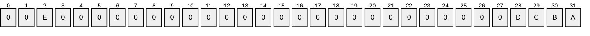

Where the bits are defined as:

| Value | Description |
| --- | --- |
| A | This setting means that the group is mandatory for the user and cannot be disabled. Corresponds to SE_GROUP_MANDATORY. For more information, see [[SIDATT]](https://go.microsoft.com/fwlink/?LinkId=90515). |
| B | This setting means that the group is marked as enabled by default. Corresponds to SE_GROUP_ENABLED_BY_DEFAULT. For more information, see [SIDATT]. |
| C | This setting means that the group is enabled for use. Corresponds to SE_GROUP_ENABLED. For more information, see [SIDATT]. |
| D | This setting means that the group can be assigned as an owner of a resource. Corresponds to SE_GROUP_OWNER. For more information, see [SIDATT]. |
| E | This setting means that the group is a domain-local or resource group. Corresponds to SE_GROUP_RESOURCE. For more information, see [SIDATT]. |

All other bits MUST be set to zero and MUST be ignored on receipt.

### 2.2.2 GROUP_MEMBERSHIP

The **GROUP_MEMBERSHIP** structure identifies a group to which an account belongs. It is sent within the [KERB_VALIDATION_INFO (section 2.5)](#Section_2.5) structure.

The **GROUP_MEMBERSHIP** structure is defined as follows.

typedef struct _GROUP_MEMBERSHIP {

ULONG RelativeId;

ULONG Attributes;

} GROUP_MEMBERSHIP, *PGROUP_MEMBERSHIP;

**RelativeId:** A 32-bit unsigned integer that contains the [**RID**](#gt_relative-identifier-rid) of a particular group.

**Attributes:** A 32-bit unsigned integer value that contains the group membership attributes set for the RID contained in **RelativeId**. The possible values for the **Attributes** flags are identical to those specified in [KERB_SID_AND_ATTRIBUTES (section 2.2.1)](#Section_2.2.1).

### 2.2.3 DOMAIN_GROUP_MEMBERSHIP

The **DOMAIN_GROUP_MEMBERSHIP** structure identifies a domain and groups to which an account belongs. It is sent within the [PAC_DEVICE_INFO (section 2.12)](#Section_2.12) structure.<2>

The **DOMAIN_GROUP_MEMBERSHIP** structure is defined as follows.

typedef struct DOMAIN_GROUP_MEMBERSHIP {

PISID DomainId;

ULONG GroupCount;

[size_is(GroupCount)] PGROUP_MEMBERSHIP GroupIds;

} DOMAIN_GROUP_MEMBERSHIP, *PDOMAIN_GROUP_MEMBERSHIP;

**DomainId:** A [**SID**](#gt_security-identifier-sid) structure that contains the SID for the domain. This member is used in conjunction with the GroupIds members to create group SIDs for the device.

**GroupCount:** A 32-bit unsigned integer that contains the number of groups within the domain to which the account belongs.

**GroupIds:** A pointer to a list of [GROUP_MEMBERSHIP](#Section_2.2.2) structures that contain the groups to which the account belongs in the domain. The number of groups in this list MUST be equal to GroupCount.

## 2.3 PACTYPE

The **PACTYPE** structure is the topmost structure of the **PAC** and specifies the number of elements in the [PAC_INFO_BUFFER (section 2.4)](#Section_2.4) array. The **PACTYPE** structure serves as the header for the complete **PAC** data.

The **PACTYPE** structure is defined as follows.

- typedef struct _PACTYPE {
- ULONG cBuffers;
- ULONG Version;
- PAC_INFO_BUFFER Buffers[1];
- } PACTYPE, *PPACTYPE;
The format of the **PACTYPE** structure is defined as follows.

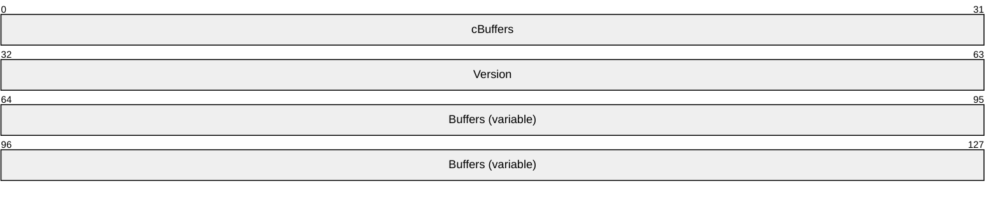

**cBuffers (4 bytes):** A 32-bit unsigned integer in little-endian format that defines the number of entries in the **Buffers** array.

**Version (4 bytes):** A 32-bit unsigned integer in little-endian format that defines the **PAC** version; MUST be 0x00000000.

**Buffers (variable):** An array of PAC_INFO_BUFFER structures (section 2.4).

The actual contents of the **PAC** are placed serially after the variable set of PAC_INFO_BUFFER structures. The contents are individually serialized **PAC** elements. All **PAC** elements MUST be placed on an 8-byte boundary.

## 2.4 PAC_INFO_BUFFER

Following the [PACTYPE (section 2.3)](#Section_2.3) structure is an array of **PAC_INFO_BUFFER** structures each of which defines the type and byte offset to a buffer of the PAC. The **PAC_INFO_BUFFER** array has no defined ordering. Therefore, the order of the **PAC_INFO_BUFFER** buffers has no significance. However, once the [**Key Distribution Center (KDC)**](#gt_key-distribution-center-kdc) and server signatures are generated, the ordering of the buffers MUST NOT change, or signature verification of the **PAC** contents will fail.

The **PAC_INFO_BUFFER** structure is defined as follows.

- typedef struct _PAC_INFO_BUFFER {
- ULONG ulType;
- ULONG cbBufferSize;
- ULONG64 Offset;
- } PAC_INFO_BUFFER, *PPAC_INFO_BUFFER;
The format of the **PAC_INFO_BUFFER** structure is defined as follows.

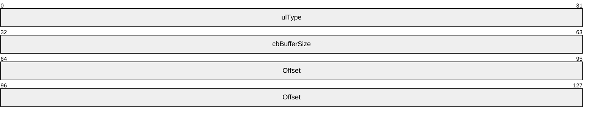

**ulType (4 bytes):** A 32-bit unsigned integer in little-endian format that describes the type of data present in the buffer contained at **Offset**. Types that are not understood MUST be ignored.

| Value | Meaning |
| --- | --- |
| 0x00000001 (1) | Logon information (section [2.5](#Section_2.5)). **PAC** structures MUST contain one buffer of this type. Additional logon information buffers MUST be ignored. |
| 0x00000002 (2) | Credentials information (section [2.6](#Section_2.6)). **PAC** structures SHOULD NOT contain more than one buffer of this type, based on constraints specified in section 2.6. Second or subsequent credentials information buffers MUST be ignored on receipt. |
| 0x00000006 (6) | Server checksum (section [2.8](#Section_2.8)). **PAC** structures MUST contain one buffer of this type for Kerberos [**ticket-granting service (TGS)**](#gt_ticket-granting-service-tgs) requests or Kerberos [**application protocol**](#gt_application-protocol) (AP) requests, and none otherwise. Additional logon server checksum buffers MUST be ignored. |
| 0x00000007 (7) | KDC (privilege server) checksum (section 2.8). **PAC** structures MUST contain one buffer of this type for Kerberos ticket-granting service (TGS) requests or Kerberos application protocol (AP) requests, and none otherwise. Additional KDC checksum buffers MUST be ignored. |
| 0x0000000A (10) | Client name and ticket information (section [2.7](#Section_2.7)). **PAC** structures MUST contain one buffer of this type. Additional client and ticket information buffers MUST be ignored. |
| 0x0000000B (11) | Constrained delegation information (section [2.9](#Section_2.9)). **PAC** structures MUST contain one buffer of this type for [**Service for User to Proxy (S4U2proxy)**](#gt_service-for-user-to-proxy-s4u2proxy) [MS-SFU](../MS-SFU/MS-SFU.md) requests and none otherwise. Additional constrained delegation information buffers MUST be ignored. |
| 0x0000000C (12) | User principal name (UPN) and Domain Name System (DNS) information (section [2.10](#Section_2.10)). **PAC** structures SHOULD NOT<3> contain more than one buffer of this type. Second or subsequent UPN and DNS information buffers MUST be ignored on receipt. |
| 0x0000000D (13) | Client claims information (section [2.11](#Section_2.11)). **PAC** structures SHOULD NOT<4> contain more than one buffer of this type. Additional client claims information buffers MUST be ignored. |
| 0x0000000E (14) | Device information (section [2.12](#Section_2.12)). **PAC** structures SHOULD NOT<5> contain more than one buffer of this type. Additional device information buffers MUST be ignored. |
| 0x0000000F (15) | Device claims information (section [2.13](#Section_2.13)). **PAC** structures SHOULD NOT<6> contain more than one buffer of this type. Additional device claims information buffers MUST be ignored. |
| 0x00000010 (16) | Ticket checksum (section 2.8). **PAC** structures MUST contain one buffer of this type for Kerberos ticket-granting service (TGS) requests, and none otherwise. Additional ticket checksum buffers MUST be ignored.<7> |
| 0x00000011 (17) | **PAC** Attributes indicates that the buffer contains attribute bits for the **PAC** (section [2.14](#Section_2.14)). **PAC** structures SHOULD NOT contain more than one buffer of this type. Additional attribute buffers MUST be ignored.<8> |
| 0x00000012 (18) | **PAC** Requestor SID indicates that the buffer contains the SID of principal that requested the **PAC** (section [2.15](#Section_2.15)). **PAC** structures MUST contain one buffer of this type.<9> |
| 0x00000013 (19) | Extended KDC (privilege server) checksum (section 2.8). **PAC** structures MUST contain one buffer of this type for Kerberos ticket-granting service (TGS) requests, and none otherwise. Additional Extended KDC checksum buffers MUST be ignored.<10> |
| 0x00000014 (20) | **PAC** Requestor GUID indicates that the buffer contains the GUID of the principal that requested the **PAC** (section 2.16). |

**cbBufferSize (4 bytes):** A 32-bit unsigned integer in little-endian format that contains the size, in bytes, of the buffer in the **PAC** located at **Offset**.

**Offset (8 bytes):** A 64-bit unsigned integer in little-endian format that contains the offset to the beginning of the buffer, in bytes, from the beginning of the PACTYPE structure (section 2.3). The data offset MUST be a multiple of eight. The following sections specify the format of each type of element.

## 2.5 KERB_VALIDATION_INFO

The **KERB_VALIDATION_INFO** structure defines the user's logon and authorization information provided by the [**DC**](#gt_domain-controller-dc). A pointer to the **KERB_VALIDATION_INFO** structure is serialized into an array of bytes and then placed after the **Buffers** array of the topmost **PACTYPE** structure (section [2.3](#Section_2.3)), at the offset specified in the **Offset** field of the corresponding **PAC_INFO_BUFFER** structure (section [2.4](#Section_2.4)) in the **Buffers** array. The **ulType** field of the corresponding **PAC_INFO_BUFFER** structure is set to 0x00000001.

The **KERB_VALIDATION_INFO** structure is a subset of the NETLOGON_VALIDATION_SAM_INFO4 structure ([MS-NRPC](../MS-NRPC/MS-NRPC.md) section 2.2.1.4.13). It is a subset due to historical reasons and to the use of Active Directory to generate this information. NTLM uses the NETLOGON_VALIDATION_SAM_INFO4 structure in the context of the server to domain controller exchange, as defined in [MS-APDS](../MS-APDS/MS-APDS.md) section 3.1. Consequently, the **KERB_VALIDATION_INFO** structure includes NTLM-specific fields. Fields that are common to the **KERB_VALIDATION_INFO** and the NETLOGON_VALIDATION_SAM_INFO4 structures, and which are specific to the NTLM authentication operation, are not used with [MS-KILE](../MS-KILE/MS-KILE.md) authentication. The **KERB_VALIDATION_INFO** structure is marshaled by [**RPC**](#gt_remote-procedure-call-rpc) [MS-RPCE](../MS-RPCE/MS-RPCE.md).

The **KERB_VALIDATION_INFO** structure is defined as follows.

typedef struct _KERB_VALIDATION_INFO {

FILETIME LogonTime;

FILETIME LogoffTime;

FILETIME KickOffTime;

FILETIME PasswordLastSet;

FILETIME PasswordCanChange;

FILETIME PasswordMustChange;

RPC_UNICODE_STRING EffectiveName;

RPC_UNICODE_STRING FullName;

RPC_UNICODE_STRING LogonScript;

RPC_UNICODE_STRING ProfilePath;

RPC_UNICODE_STRING HomeDirectory;

RPC_UNICODE_STRING HomeDirectoryDrive;

USHORT LogonCount;

USHORT BadPasswordCount;

ULONG UserId;

ULONG PrimaryGroupId;

ULONG GroupCount;

[size_is(GroupCount)] PGROUP_MEMBERSHIP GroupIds;

ULONG UserFlags;

USER_SESSION_KEY UserSessionKey;

RPC_UNICODE_STRING LogonServer;

RPC_UNICODE_STRING LogonDomainName;

PISID LogonDomainId;

ULONG Reserved1[2];

ULONG UserAccountControl;

ULONG SubAuthStatus;

FILETIME LastSuccessfulILogon;

FILETIME LastFailedILogon;

ULONG FailedILogonCount;

ULONG Reserved3;

ULONG SidCount;

[size_is(SidCount)] PKERB_SID_AND_ATTRIBUTES ExtraSids;

PISID ResourceGroupDomainSid;

ULONG ResourceGroupCount;

[size_is(ResourceGroupCount)] PGROUP_MEMBERSHIP ResourceGroupIds;

} KERB_VALIDATION_INFO, *PKERB_VALIDATION_INFO;

**LogonTime:** A FILETIME structure that contains the user account's lastLogon attribute ([MS-ADA1](../MS-ADA1/MS-ADA1.md) section 2.351) value.

**LogoffTime:** A **FILETIME** structure that contains the time the client's logon session is set to expire. If the session is set not to expire, the **dwHighDateTime** member is set to 0x7FFFFFFF and the **dwLowDateTime** member set to 0xFFFFFFFF. A recipient of the **PAC** SHOULD<11> use this value as an indicator of when to warn the user that the allowed time is due to expire.

**KickOffTime:** A **FILETIME** structure that contains **LogoffTime** minus the user account's **forceLogoff** attribute ([MS-ADA1] section 2.233) value. If the client is not to be forcibly logged off, the **dwHighDateTime** member is set to 0x7FFFFFFF and the **dwLowDateTime** member set to 0xFFFFFFFF. The Kerberos service ticket end time is a replacement for **KickOffTime**. The service ticket lifetime SHOULD NOT<12> be set longer than the **KickOffTime** of an account. A recipient of the **PAC** uses this value as the indicator of when the client is to be forcibly disconnected.

**PasswordLastSet:** A **FILETIME** structure that contains the user account's pwdLastSet attribute ([MS-ADA3](../MS-ADA3/MS-ADA3.md) section 2.175) value. If the password was never set, this structure MUST have the **dwHighDateTime** member set to 0x00000000 and the **dwLowDateTime** member set to 0x00000000.

**PasswordCanChange:** A **FILETIME** structure that contains the time at which the client's password is allowed to change. If there is no restriction on when the client can change the password, this member MUST be set to zero.

**PasswordMustChange:** A **FILETIME** structure that contains the time at which the client's password expires. If the password will not expire, this structure MUST have the **dwHighDateTime** member set to 0x7FFFFFFF and the **dwLowDateTime** member set to 0xFFFFFFFF.

**EffectiveName:** An RPC_UNICODE_STRING structure that contains the user account's samAccountName attribute ([MS-ADA3] section 2.222) value.

**FullName:** An **RPC_UNICODE_STRING** structure that contains the user account's full name for interactive logon and is set to zero for network logon. If **FullName** is omitted, this member MUST contain an **RPC_UNICODE_STRING** structure with the **Length** member set to zero.

**LogonScript:** An **RPC_UNICODE_STRING** structure that contains the user account's **scriptPath** attribute ([MS-ADA3] section 2.232) value for interactive logon and is set to zero for network logon. If no **LogonScript** is configured for the user, this member MUST contain an **RPC_UNICODE_STRING** structure with the **Length** member set to zero.

**ProfilePath:** An **RPC_UNICODE_STRING** structure that contains the user account's **profilePath** attribute ([MS-ADA3] section 2.167) value for interactive logon and is set to zero for network logon. If no **ProfilePath** is configured for the user, this member MUST contain an **RPC_UNICODE_STRING** structure with the **Length** member set to zero.

**HomeDirectory:** An **RPC_UNICODE_STRING** structure that contains the user account's **HomeDirectory** attribute ([MS-ADA1] section 2.295) value for interactive logon and is set to zero for network logon. If no **HomeDirectory** is configured for the user, this member MUST contain an **RPC_UNICODE_STRING** structure with the **Length** member set to zero.

**HomeDirectoryDrive:** An **RPC_UNICODE_STRING** structure that contains the user account's **HomeDrive** attribute ([MS-ADA1] section 2.296) value for interactive logon and is set to zero for network logon. This member MUST be populated if **HomeDirectory** contains a [**UNC path**](#gt_unc-path). If no **HomeDirectoryDrive** is configured for the user, this member MUST contain an **RPC_UNICODE_STRING** structure with the **Length** member set to zero.

**LogonCount:** A 16-bit unsigned integer that contains the user account's **LogonCount** attribute ([MS-ADA1] section 2.375) value.

**BadPasswordCount:** A 16-bit unsigned integer that contains the user account's **badPwdCount** attribute ([MS-ADA1] section 2.83) value for interactive logon and is set to zero for network logon.

**UserId:** A 32-bit unsigned integer that contains the [**RID**](#gt_relative-identifier-rid) of the account. If the UserId member equals 0x00000000, the first group [**SID**](#gt_security-identifier-sid) in this member is the SID for this account.

**PrimaryGroupId:** A 32-bit unsigned integer that contains the RID for the primary group to which this account belongs.

**GroupCount:** A 32-bit unsigned integer that contains the number of groups within the account domain to which the account belongs.

**GroupIds:** A pointer to a list of [GROUP_MEMBERSHIP (section 2.2.2)](#Section_2.2.2) structures that contains the groups to which the account belongs in the account domain. The number of groups in this list MUST be equal to **GroupCount**.

**UserFlags:** A 32-bit unsigned integer that contains a set of bit flags that describe the user's logon information.

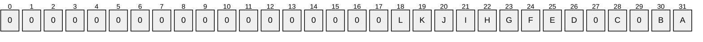

The following flags are set only when this structure is created as the result of an NTLM authentication, as specified in [MS-NLMP](../MS-NLMP/MS-NLMP.md). These flags MUST be zero for any other authentication protocol, such as [MS-KILE] authentication.

| Value | Description |
| --- | --- |
| A | Authentication was done via the GUEST account; no password was used. |
| B | No encryption is available. |
| C | LAN Manager key was used for authentication. |
| E | Sub-authentication used; session key came from the sub-authentication package. |
| F | Indicates that the account is a machine account. |
| G | Indicates that the domain controller understands NTLMv2. |
| I | Indicates that **ProfilePath** is populated. |
| J | The NTLMv2 response from the **NtChallengeResponseFields** ([MS-NLMP] section 2.2.1.3) was used for authentication and session key generation. |
| K | The LMv2 response from the **LmChallengeResponseFields** ([MS-NLMP] section 2.2.1.3) was used for authentication and session key generation. |
| L | The LMv2 response from the **LmChallengeResponseFields** ([MS-NLMP] section 2.2.1.3) was used for authentication and the NTLMv2 response from the **NtChallengeResponseFields** ([MS-NLMP] section 2.2.1.3) was used session key generation. |

The following flags are valid for [MS-KILE] authentications; settings depend on the configuration of the user and groups referenced in the PAC.

| Value | Description |
| --- | --- |
| D | Indicates that the **ExtraSids** field is populated and contains additional SIDs. |
| H | Indicates that the **ResourceGroupIds** field is populated. |

All other bits MUST be set to zero and MUST be ignored on receipt.

**UserSessionKey:** A session key that is used for cryptographic operations on a session. This field is valid only when authentication is performed using NTLM. For any other protocol, this field MUST be zero.

**LogonServer:** An RPC_UNICODE_STRING structure that contains the NetBIOS name of the Kerberos [**KDC**](#gt_key-distribution-center-kdc) that performed the authentication server (AS) ticket request.

**LogonDomainName:** An RPC_UNICODE_STRING structure that contains the NetBIOS name of the domain to which this account belongs.

**LogonDomainId:** An RPC_SID structure ([MS-DTYP](../MS-DTYP/MS-DTYP.md) section 2.4.2.3) that contains the SID for the domain specified in **LogonDomainName**. This member is used in conjunction with the **UserId**, **PrimaryGroupId**, and **GroupIds** members to create the user and group SIDs for the client.

**Reserved1:** A two-element array of unsigned 32-bit integers. This member is reserved, and each element of the array MUST be zero when sent and MUST be ignored on receipt.

**UserAccountControl:** A 32-bit unsigned integer that contains a set of bit flags that represent information about this account. This field carries the **UserAccountControl** information from the corresponding **Security Account Manager** field, as specified in [MS-SAMR](../MS-SAMR/MS-SAMR.md).

**SubAuthStatus:** A 32-bit unsigned integer that contains the subauthentication package's ([MS-APDS] section 3.1.5.2.1) status code. If a subauthentication package is not used, this structure is set to 0x00000000.

**LastSuccessfulILogon:** A **FILETIME** structure that contains the user account's **msDS-LastSuccessfulInteractiveLogonTime** ([MS-ADA2](../MS-ADA2/MS-ADA2.md) section 2.370). If the user has never logged on, this structure is set to 0x7FFFFFFFFFFFFFFF.

**LastFailedILogon:** A **FILETIME** structure that contains the user account's **msDS-LastFailedInteractiveLogonTime** ([MS-ADA2] section 2.368). If the user has never logged on, this structure is set to 0x7FFFFFFFFFFFFFFF.

**FailedILogonCount:** A 32-bit unsigned integer that contains the user account's **msDS-FailedInteractiveLogonCountAtLastSuccessfulLogon** ([MS-ADA2] section 2.324).

**Reserved3:** A 32-bit integer. This member is reserved, MUST be zero when sent and MUST be ignored on receipt.

**SidCount:** A 32-bit unsigned integer that contains the total number of SIDs present in the **ExtraSids** member. If this member is not zero then the **D** bit MUST be set in the **UserFlags** member.

**ExtraSids:** A pointer to a list of [KERB_SID_AND_ATTRIBUTES (section 2.2.1)](#Section_2.2.1) structures that contain a list of SIDs corresponding to groups in domains other than the account domain to which the principal belongs. This member is not NULL only if the **D** bit has been set in the **UserFlags** member. If the **UserId** member equals 0x00000000, the first group SID in this member is the SID for this account.

**ResourceGroupDomainSid:** An **RPC_SID** structure that contains the SID of the domain for the server whose resources the client is authenticating to. This member is used in conjunction with the **ResourceGroupIds** member to create the group SIDs for the user. If this member is populated, then the **H** bit MUST be set in the **UserFlags** member.

When this field is not used, it MUST be set to NULL.

**ResourceGroupCount:** A 32-bit unsigned integer that contains the number of resource group identifiers stored in **ResourceGroupIds**. If this member is not zero, then the **H** bit MUST be set in the **UserFlags** member.

When this field is not used, it MUST be set to zero.

**ResourceGroupIds:** A pointer to a list of GROUP_MEMBERSHIP structures that contain the RIDs and attributes of the account's groups in the resource domain. If this member is not NULL, then the **H** bit MUST be set in the **UserFlags** member.

When this field is not used, it MUST be set to NULL.

## 2.6 PAC Credentials

When the Kerberos authentication is performed through means other than a password, the **PAC** includes an element that is used to send credentials for alternate security protocols to the client during initial logon. Typically, this **PAC credentials** element is used when a public key form of authentication, such as that specified in [[RFC4556]](https://go.microsoft.com/fwlink/?LinkId=90482), is used to establish the Kerberos authentication. This **PAC credentials** element MUST NOT be present when the **PAC** structure is used for other protocols. Credentials for other security protocols can be sent to the client for a single logon experience.

Because the information in the **PAC credentials** element is sensitive (**PAC credentials** essentially contains password equivalents), the information MUST be protected. This element is encrypted, as specified in [PAC_CREDENTIAL_INFO (section 2.6.1)](#Section_2.6.1).

The **PAC credentials** structure is a complex, nested structure that supports extensibility of security protocols that receive their credentials in the same way.

The following figure illustrates how **PAC** credentials data is nested.

Figure 2: PAC credentials

The outermost PAC_CREDENTIAL_INFO structure contains an encrypted [PAC_CREDENTIAL_DATA (section 2.6.2)](#Section_2.6.2) structure, along with the encryption type, as an indicator of how to decrypt it. The PAC_CREDENTIAL_DATA structure, in turn, contains an array of [SECPKG_SUPPLEMENTAL_CRED (section 2.6.3)](#Section_2.6.3) structures, one per security protocol receiving credentials. Each of these structures contains the name of the security protocol receiving the credentials and credential information specific to the implementation of the protocol. NTLM [MS-NLMP](../MS-NLMP/MS-NLMP.md) credentials are supplied in the [NTLM_SUPPLEMENTAL_CREDENTIAL](#Section_2.6.4) structure.

### 2.6.1 PAC_CREDENTIAL_INFO

The **PAC_CREDENTIAL_INFO** structure serves as the header for the credential information. The **PAC_CREDENTIAL_INFO** header indicates the encryption algorithm that was used to encrypt the data that follows it. The data that follows is an encrypted, [**IDL**](#gt_interface-definition-language-idl)-serialized [PAC_CREDENTIAL_DATA](#Section_2.6.2) structure that contains the user's actual credentials. Note that this structure cannot be used by protocols other than the [MS-KILE](../MS-KILE/MS-KILE.md) protocol; the encryption method relies on the encryption key currently in use by the Kerberos AS-REQ ([[RFC4120]](https://go.microsoft.com/fwlink/?LinkId=90458) section 3.1 and [MS-KILE]) message.<13>

A **PAC_CREDENTIAL_INFO** structure contains the user's encrypted credentials. The Key Usage Number [RFC4120] used in the encryption is KERB_NON_KERB_SALT [16] [MS-KILE] section 3.1.5.9. The encryption key used is the AS reply key. The **PAC credentials** buffer is included only when PKINIT [[RFC4556]](https://go.microsoft.com/fwlink/?LinkId=90482) is used. Therefore, the AS reply key is derived based on PKINIT.

The **PAC_CREDENTIAL_INFO** structure is defined as follows.

- typedef struct _PAC_CREDENTIAL_INFO {
- ULONG Version;
- ULONG EncryptionType;
- UCHAR SerializedData[1];
- } PAC_CREDENTIAL_INFO, *PPAC_CREDENTIAL_INFO;
The format of the **PAC_CREDENTIAL_INFO** structure is defined as follows.

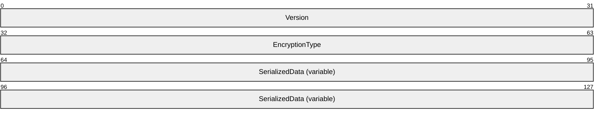

**Version (4 bytes):** A 32-bit unsigned integer in little-endian format that defines the version. MUST be 0x00000000.

**EncryptionType (4 bytes):** A 32-bit unsigned integer in little-endian format that indicates the Kerberos encryption type used to encode the **SerializedData** array. This value MUST be one of the following encryption types, which are a subset of the possible encryption types supported in Kerberos authentication (as specified in [RFC4120], [[RFC4757]](https://go.microsoft.com/fwlink/?LinkId=90488), and [RFC4556]). Note that the Key Usage Number ([RFC4120] sections 4 and 7.5.1) is KERB_NON_KERB_SALT [16] [MS-KILE] section 3.1.5.9.<14>

| Value | Meaning |
| --- | --- |
| 0x00000001 | [**Data Encryption Standard (DES)**](#gt_data-encryption-standard-des) in cipher block chaining (CBC) mode with cyclic redundancy check (CRC). |
| 0x00000003 | DES in CBC mode with MD5. |
| 0x00000011 | AES128_CTS_HMAC_SHA1_96 (128-bit encryption key in clear to send (CTS) encryption mode with integrity check algorithm HMAC_SHA1_96).<15> |
| 0x00000012 | AES256_CTS_HMAC_SHA1_96 (256-bit encryption key in CTS encryption mode with integrity check algorithm HMAC_SHA1_96).<16> |
| 0x00000017 | RC4 with hashed message authentication code (HMAC) key. |

**SerializedData (variable):** A variable length PAC_CREDENTIAL_DATA structure that contains credentials encrypted using the mechanism specified by the **EncryptionType** field. The byte array of encrypted data is computed according to the procedures specified in [[RFC3961]](https://go.microsoft.com/fwlink/?LinkId=90450).

### 2.6.2 PAC_CREDENTIAL_DATA

The **PAC_CREDENTIAL_DATA** structure defines an array of security package-specific credentials that are provided to the Kerberos client. The **PAC_CREDENTIAL_DATA** structure is marshaled by [**RPC**](#gt_remote-procedure-call-rpc) [MS-RPCE](../MS-RPCE/MS-RPCE.md).

The **PAC_CREDENTIAL_DATA** structure is defined as follows.

typedef struct _PAC_CREDENTIAL_DATA {

ULONG CredentialCount;

[size_is(CredentialCount)] SECPKG_SUPPLEMENTAL_CRED Credentials[*];

} PAC_CREDENTIAL_DATA, *PPAC_CREDENTIAL_DATA;

**CredentialCount:** A 32-bit unsigned integer that defines the number of elements in the **Credentials** member.

**Credentials:** An array of [SECPKG_SUPPLEMENTAL_CRED (section 2.6.3)](#Section_2.6.3) structures that define the supplemental credentials.

**Note:** As specified in section [2.6.1](#Section_2.6.1), this structure is encrypted prior to being encoded in any other structures. Encryption is performed by first serializing the data structure via [**Network Data Representation (NDR)**](#gt_network-data-representation-ndr) encoding, as specified in [MS-RPCE]. Once serialized, the data is encrypted using the key and cryptographic system selected through the AS protocol and the KRB_AS_REP message (as specified in [[RFC4120]](https://go.microsoft.com/fwlink/?LinkId=90458) section 3.1.3 and [[RFC4556]](https://go.microsoft.com/fwlink/?LinkId=90482)). Fields (for capturing this information) and cryptographic parameters are specified in PAC_CREDENTIAL_INFO (section 2.6.1).

### 2.6.3 SECPKG_SUPPLEMENTAL_CRED

The **SECPKG_SUPPLEMENTAL_CRED** structure defines the name of the security package that requires supplemental credentials and the credential buffer for that package. The **SECPKG_SUPPLEMENTAL_CRED** structure is marshaled by [**RPC**](#gt_remote-procedure-call-rpc) [MS-RPCE](../MS-RPCE/MS-RPCE.md).

The **SECPKG_SUPPLEMENTAL_CRED** structure is defined as follows.

typedef struct _SECPKG_SUPPLEMENTAL_CRED {

RPC_UNICODE_STRING PackageName;

ULONG CredentialSize;

[size_is(CredentialSize)] PUCHAR Credentials;

} SECPKG_SUPPLEMENTAL_CRED,

*PSECPKG_SUPPLEMENTAL_CRED;

**PackageName:** A RPC_UNICODE_STRING structure that MUST store the name of the security protocol for which the supplemental credentials are being presented.<17>

**CredentialSize:** A 32-bit unsigned integer that MUST specify the length, in bytes, of the data in the **Credentials** member.

**Credentials:** A pointer that MUST reference the serialized credentials being presented to the security protocol named in **PackageName**.

### 2.6.4 NTLM_SUPPLEMENTAL_CREDENTIAL

The **NTLM_SUPPLEMENTAL_CREDENTIAL** structure is used to encode the credentials that the NTLM security protocol uses, specifically the LAN Manager hash (LM OWF) and the NT hash (NT OWF). Generating the hashes encoded in this structure is not addressed in the **PAC** structure specification. Details on how the hashes are created are as specified in [MS-NLMP](../MS-NLMP/MS-NLMP.md). The **PAC** buffer type is included only when PKINIT [MS-PKCA](../MS-PKCA/MS-PKCA.md) is used to authenticate the user. The **NTLM_SUPPLEMENTAL_CREDENTIAL** structure is marshaled by [**RPC**](#gt_remote-procedure-call-rpc) [MS-RPCE](../MS-RPCE/MS-RPCE.md).

The **NTLM_SUPPLEMENTAL_CREDENTIAL** structure is defined as follows.

typedef struct _NTLM_SUPPLEMENTAL_CREDENTIAL {

ULONG Version;

ULONG Flags;

BYTE LmPassword[16];

BYTE NtPassword[16];

} NTLM_SUPPLEMENTAL_CREDENTIAL, *PNTLM_SUPPLEMENTAL_CREDENTIAL;

**Version:** A 32-bit unsigned integer that defines the credential version. This field MUST be 0x00000000.

**Flags:** A 32-bit unsigned integer containing flags that define the credential options. **Flags** MUST contain at least one of the following values.

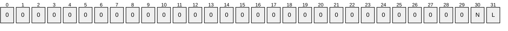

Where the bits are defined as:

| Value | Description |
| --- | --- |
| L | Indicates that the **LM OWF** member is present and valid. |
| N | Indicates that the **NT OWF** member is present and valid. |

All other bits MUST be set to zero and MUST be ignored on receipt.

**LmPassword:** A 16-element array of unsigned 8-bit integers that define the **LM OWF**. The **LmPassword** member MUST be ignored if the L flag is not set in the **Flags** member.

**NtPassword:** A 16-element array of unsigned 8-bit integers that define the **NT OWF**. The **NtPassword** member MUST be ignored if the N flag is not set in the **Flags** member.

## 2.7 PAC_CLIENT_INFO

The **PAC_CLIENT_INFO** structure is a variable length buffer of the **PAC** that contains the client's name and authentication time. It is used to verify that the **PAC** corresponds to the client of the ticket. The **PAC_CLIENT_INFO** structure is placed directly after the **Buffers** array of the topmost [PACTYPE](#Section_2.3) structure (section 2.3), at the offset specified in the **Offset** field of the corresponding **PAC_INFO_BUFFER** structure (section [2.4](#Section_2.4)) in the **Buffers** array. The **ulType** field of the corresponding **PAC_INFO_BUFFER** is set to 0x0000000A.

The **PAC_CLIENT_INFO** structure is defined as follows.

- typedef struct _PAC_CLIENT_INFO {
- FILETIME ClientId;
- USHORT NameLength;
- WCHAR Name[1];
- } PAC_CLIENT_INFO, *PPAC_CLIENT_INFO;
The format of the **PAC_CLIENT_INFO** structure is defined as follows.

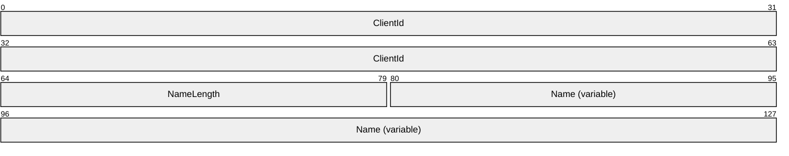

**ClientId (8 bytes):** A FILETIME structure in little-endian format that contains the Kerberos initial [**ticket-granting ticket (TGT)**](#gt_ticket-granting-ticket-tgt) authentication time, as specified in [[RFC4120]](https://go.microsoft.com/fwlink/?LinkId=90458) section 5.3.

**NameLength (2 bytes):** An unsigned 16-bit integer in little-endian format that specifies the length, in bytes, of the **Name** field.

**Name (variable):** An array of 16-bit Unicode characters in little-endian format that contains the client's account name.

## 2.8 PAC_SIGNATURE_DATA

Two **PAC_SIGNATURE_DATA** structures are appended to the **PAC** which stores the server and [**KDC**](#gt_key-distribution-center-kdc) signatures. These structures are placed after the **Buffers** array of the topmost **PACTYPE** structure (section [2.3](#Section_2.3)), at the offsets specified in the **Offset** fields in each of the corresponding **PAC_INFO_BUFFER** structures (section [2.4](#Section_2.4)) in the **Buffers** array. The **ulType** field of the **PAC_INFO_BUFFER** corresponding to the server signature contains the value 0x00000006 and the **ulType** field of the **PAC_INFO_BUFFER** corresponding to the KDC signature contains the value 0x00000007. **PAC** signatures can be generated only when the **PAC** is used by the [MS-KILE](../MS-KILE/MS-KILE.md) protocol because the keys used to create and verify the signatures are the keys known to the KDC. No other protocol can use these **PAC** signatures.

The **PAC_SIGNATURE_DATA** structure is defined as follows.

- typedef struct _PAC_SIGNATURE_DATA {
- ULONG SignatureType;
- UCHAR Signature[ANYSIZE_ARRAY];
- } PAC_SIGNATURE_DATA, *PPAC_SIGNATURE_DATA;
The format of the **PAC_SIGNATURE_DATA** structures is defined as follows.

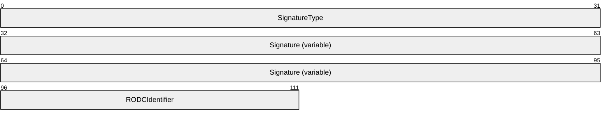

**SignatureType (4 bytes):** A 32-bit unsigned integer value in little-endian format that defines the cryptographic system used to calculate the checksum. This MUST be one of the values defined in the following table. The corresponding sizes of the signatures are also given. The key used with the cryptographic system corresponds to the value of the **ulType** field of the outer **PAC_INFO_BUFFER** structure. The value 0x00000006 specifies the server's key, and the value 0x00000007 specifies the KDC's key.

| Value | Meaning |
| --- | --- |
| KERB_CHECKSUM_HMAC_MD5 0xFFFFFF76 | As specified in [[RFC4120]](https://go.microsoft.com/fwlink/?LinkId=90458) and [[RFC4757]](https://go.microsoft.com/fwlink/?LinkId=90488) section 4. Signature size is 16 bytes. Decimal value is -138. |
| HMAC_SHA1_96_AES128 0x0000000F | As specified in [[RFC3962]](https://go.microsoft.com/fwlink/?LinkId=90451) section 7. Signature size is 12 bytes. Decimal value is 15. |
| HMAC_SHA1_96_AES256 0x00000010 | As specified in [RFC3962] section 7. Signature size is 12 bytes. Decimal value is 16. |

**Signature (variable):** An array of 8-bit unsigned characters that contains the checksum. The KERB_CHECKSUM_HMAC_MD5 checksum (defined in the preceding table) is 16 bytes in length. The size of the signature is determined by the value of the **SignatureType** field, as indicated in the preceding table.

**RODCIdentifier (2 bytes):** A 16-bit unsigned integer value in little-endian format that contains the first 16 bits of the key version number ([MS-KILE] section 3.1.5.8) when the KDC is an [**RODC**](#gt_read-only-domain-controller-rodc). When the KDC is not an RODC, this field does not exist.

### 2.8.1 Generation of PAC Signatures

PAC signatures have a significance in relation to the PAC and an order of processing.

- The **ticket signature** doesn’t cover the PAC, so it can be calculated early. It is calculated first and populated before any of the PAC signatures are calculated.
- The **extended KDC signature** MUST be zeroed along with the **server signature** and **KDC signature**.
- The **KDC signature** is a counter signature of the **server signature**, so it MUST be computed after the **server signature**. It’s calculated last and always zero when the PAC signatures are calculated.
Generate the PAC as follows:

- Build the PAC. This includes not just the authorization data, but also the **ticket signature** which can be computed before the PAC is complete. Build the PAC with zeroes as placeholders in all the buffers that will be filled in later.
- Sign the PAC. Perform the **extended KDC signature** and the **server signature** in that order.
- Do post-signing tasks, which means counter-signing the **server signature** to produce the **KDC signature**.
The following sections define each signature's generation and calculation process.

### 2.8.2 Ticket Signature

The **ticket signature**<18> is calculated first and populated before any of the PAC signatures are calculated.

The **ticket signature** is generated by the issuing [**KDC**](#gt_key-distribution-center-kdc) and depends on the cryptographic algorithms available to the KDC. The **ulType** field of the **PAC_INFO_BUFFER** structure (section [2.4](#Section_2.4)) corresponding to the ticket signature will contain the value 0x00000010. The **SignatureType** MUST match the **SignatureType** in the KDC signature and the key used MUST be the same. The Key Usage Number MUST be KERB_NON_KERB_CKSUM_SALT [17] ([MS-KILE](../MS-KILE/MS-KILE.md) section 3.1.5.9). The KDC will use KDC (krbtgt) key [[RFC4120]](https://go.microsoft.com/fwlink/?LinkId=90458), so that other KDCs can verify this signature on receiving a PAC.

The **ticket signature** is used to detect tampering of tickets by parties other than the KDC. The ticket signature SHOULD be included in tickets that are not encrypted to the krbtgt account (including the change password service) or to a trust account.

The **ticket signature** is a keyed hash [[RFC4757]](https://go.microsoft.com/fwlink/?LinkId=90488) of the ticket being issued less the **PAC** itself. To compute the data to be checksummed, first the KDC must otherwise complete the TGT-REQ and construct the final service ticket. The ad-data in the PAC’s **AuthorizationData** element ([RFC4120] section 5.2.6) is replaced with a single zero byte, and the EncTicketPart ([RFC4120] section 5.3) is encoded using the [**ASN.1**](#gt_asn1) [**Distinguished Encoding Rules (DER)**](#gt_distinguished-encoding-rules-der). The resulting hash is placed in the **Signature** field of the KDC's **PAC_SIGNATURE_DATA** structure (section [2.8](#Section_2.8)).

When a ticket is altered as during renewal ([RFC4120] section 2.3), the KDC SHOULD verify the integrity of the existing **ticket signature** and then recompute the **ticket signature**, **extended KDC signature, server signature**, **KDC signature**, and in the PAC.

### 2.8.3 Extended KDC Signature

The **extended KDC signature**<19> MUST be generated BEFORE the **Server Signature** (section [2.8.4](#Section_2.8.4)) is generated.

The **extended KDC signature** is generated by the issuing [**KDC**](#gt_key-distribution-center-kdc) and depends on the cryptographic algorithms available to the KDC. The **ulType** field of the **PAC_INFO_BUFFER** structure (section [2.4](#Section_2.4)) corresponding to the **extended KDC signature** will contain the value 0x00000013. The **SignatureType** (section [2.8](#Section_2.8)) MUST match the **SignatureType** in the KDC signature and the key used MUST be the same. The Key Usage Number MUST be KERB_NON_KERB_CKSUM_SALT [17] ([MS-KILE](../MS-KILE/MS-KILE.md) section 3.1.5.9). The KDC will use KDC (krbtgt) key [[RFC4120]](https://go.microsoft.com/fwlink/?LinkId=90458), so that other KDCs can verify this signature on receiving a PAC.

The **extended KDC signature** is used to detect tampering of PACs by parties other than the KDC. The extended KDC signature SHOULD be included in tickets that are not encrypted to the krbtgt account (including the change password service) or to a trust account.

The **extended KDC signature** is a keyed hash [[RFC4757]](https://go.microsoft.com/fwlink/?LinkId=90488) of the entire **PAC** message. The resulting hash is placed in the **Signature** field of the extended KDC's **PAC_SIGNATURE_DATA** structure (section 2.8).

When a ticket is altered as during renewal ([RFC4120] section 2.3), the KDC SHOULD verify the integrity of the existing signatures and then recompute the **ticket signature**, **extended KDC signature**, **server signature**, **KDC signature** in the PAC.

### 2.8.4 Server Signature

The **server signature** MUST be generated AFTER the **extended KDC signature** (section [2.8.3](#Section_2.8.3)).

The **server signature** is generated by the issuing [**KDC**](#gt_key-distribution-center-kdc) and depends on the cryptographic algorithms available to the KDC and server. The **ulType** field of the [**PAC_INFO_BUFFER**](#Section_2.4)corresponding to the **server signature** will contain the value 0x00000006. The **SignatureType** MUST be one of the values defined in the table in section [2.8](#Section_2.8). The Key Usage Number MUST be KERB_NON_KERB_CKSUM_SALT [17] [MS-KILE](../MS-KILE/MS-KILE.md) (section 3.1.5.9). The KDC will use the long-term key that the KDC shares with the server, so that the server can verify this signature on receiving a PAC.

The **server signature** is a keyed hash [[RFC4757]](https://go.microsoft.com/fwlink/?LinkId=90488) of the entire **PAC** message, with the **Signature** fields of both **PAC_SIGNATURE_DATA** structures set to zero. The key used to protect the ciphertext part of the response is used. The checksum type corresponds to the key unless the key is [**DES**](#gt_data-encryption-standard-des), in which case the KERB_CHECKSUM_HMAC_MD5 key is used. The resulting hash value is then placed in the **Signature** field of the server's **PAC_SIGNATURE_DATA** structure.

### 2.8.5 KDC Signature

The **KDC signature** is a counter signature of the server signature, so it MUST be computed after the server signature. It is calculated last and always zero when the PAC signatures are calculated.

The **KDC signature** is generated by the issuing [**KDC**](#gt_key-distribution-center-kdc) and depends on the cryptographic algorithms available to the KDC. The **ulType** field of the [PAC_INFO_BUFFER (section 2.4)](#Section_2.4) corresponding to the KDC signature will contain the value 0x00000007. The **SignatureType** MUST be one of the values defined in the table in section [2.8](#Section_2.8). The Key Usage Number MUST be KERB_NON_KERB_CKSUM_SALT [17] [MS-KILE](../MS-KILE/MS-KILE.md) (section 3.1.5.9). The KDC will use KDC (krbtgt) key [[RFC4120]](https://go.microsoft.com/fwlink/?LinkId=90458), so that other KDCs can verify this signature on receiving a **PAC**.

The **KDC signature** is a keyed hash [[RFC4757]](https://go.microsoft.com/fwlink/?LinkId=90488) of the **Server Signature** field in the **PAC** message. The cryptographic system that is used to calculate the checksum depends on which system the KDC supports, as defined in the following table.

| If the KDC: | Then the cryptographic system is: |
| --- | --- |
| Supports RC4-HMAC | KERB_CHECKSUM_HMAC_MD5 |
| Does not support RC4-HMAC and supports AES256 | HMAC_SHA1_96_AES256<20> |
| Does not support RC4-HMAC or AES256-CTS-HMAC-SHA1-96, and supports AES128-CTS-HMAC-SHA1-96 | HMAC_SHA1_96_AES128<21> |
| Does not support RC4-HMAC, AES128-CTS-HMAC-SHA1-96 or AES256-CTS-HMAC-SHA1-96 | None. The checksum operation will fail. |

The resulting hash is placed in the **Signature** field of the KDC's **PAC_SIGNATURE_DATA** structure.

## 2.9 S4U_DELEGATION_INFO

The **S4U_DELEGATION_INFO** structure is used for constrained delegation information.<22> It lists the services that have been delegated through this Kerberos client and subsequent services or servers. The list is used only in a [**Service for User to Proxy (S4U2proxy)**](#gt_service-for-user-to-proxy-s4u2proxy) [MS-SFU](../MS-SFU/MS-SFU.md) request. This feature could be used multiple times in succession from service to service, which is useful for auditing purposes. The **S4U_DELEGATION_INFO** structure is marshaled by [**RPC**](#gt_remote-procedure-call-rpc) [MS-RPCE](../MS-RPCE/MS-RPCE.md).

The **S4U_DELEGATION_INFO** structure is defined as follows.

typedef struct _S4U_DELEGATION_INFO {

RPC_UNICODE_STRING S4U2proxyTarget;

ULONG TransitedListSize;

[size_is(TransitedListSize)] PRPC_UNICODE_STRING S4UTransitedServices;

} S4U_DELEGATION_INFO, *PS4U_DELEGATION_INFO;

**S4U2proxyTarget:** An **RPC_UNICODE_STRING** structure that MUST contain the name of the principal to whom the application can forward the ticket.

**TransitedListSize:** MUST be the number of elements in the **S4UTransitedServices** array.

**S4UTransitedServices:** MUST contain the list of all services that have been delegated through by this client and subsequent services or servers.

## 2.10 UPN_DNS_INFO

The **UPN_DNS_INFO** structure contains the client's UPN, [**fully qualified domain name (FQDN)**](#gt_fully-qualified-domain-name-fqdn), SAM name (optional), and SID (optional). It is used to provide the UPN, FQDN, SAM name, and SID that corresponds to the client of the ticket. The **UPN_DNS_INFO** structure is placed directly after the **Buffers** array of the topmost **PACTYPE** structure (section [2.3](#Section_2.3)), at the offset specified in the **Offset** field of the corresponding **PAC_INFO_BUFFER** structure (section [2.4](#Section_2.4)) in the **Buffers** array. The **ulType** field of the corresponding **PAC_INFO_BUFFER** is set to 0x0000000C.<23>

The **UPN_DNS_INFO** structure is defined as follows.

- typedef struct _UPN_DNS_INFO {
- USHORT UpnLength;
- USHORT UpnOffset;
- USHORT DnsDomainNameLength;
- USHORT DnsDomainNameOffset;
- ULONG Flags;
- } UPN_DNS_INFO, *PUPN_DNS_INFO;
The format of the **UPN_DNS_INFO** structure is defined as follows.

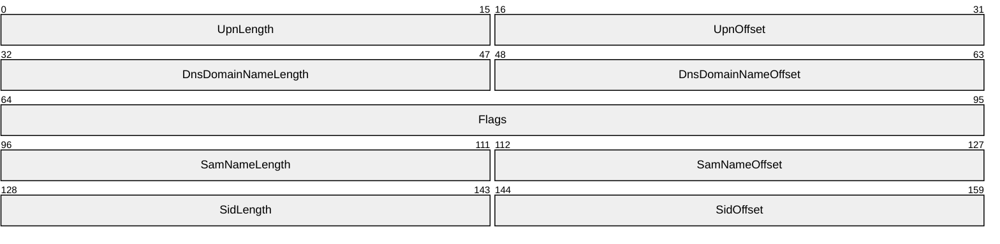

**UpnLength (2 bytes):** An unsigned 16-bit integer in little-endian format that specifies the length, in bytes, of the UPN information. The location of the UPN information is described later in this section.

**UpnOffset (2 bytes):** An unsigned 16-bit integer in little-endian format that contains the offset to the beginning of the UPN information, in bytes, from the beginning of the **UPN_DNS_INFO** structure (section 2.10).

**DnsDomainNameLength (2 bytes):** An unsigned 16-bit integer in little-endian format that specifies the length, in bytes, of the DNS information. The location of the DNS information is described later in this section.

**DnsDomainNameOffset (2 bytes):** An unsigned 16-bit integer in little-endian format that contains the offset to the beginning of the DNS information, in bytes, from the beginning of the **UPN_DNS_INFO** structure.

**Flags (4 bytes):** A set of bit flags in little-endian format. A flag is TRUE (or set) if its value is equal to 1. The value is constructed from zero or more bit flags from the following table:

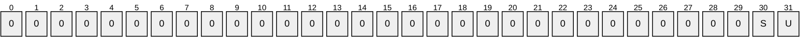

Where the bits are defined as:

| Value | Description |
| --- | --- |
| U | The user account object does not have the **userPrincipalName** attribute ([MS-ADA3](../MS-ADA3/MS-ADA3.md) section 2.349) set. A UPN constructed by concatenating the user name with the DNS domain name of the account domain is provided. |
| S | The **UPN_DNS_INFO** structure has been extended with the user account’s SAM Name and SID. |

All other bits are set to zero and MUST be ignored on receipt.

**SamNameLength (2 bytes):** An unsigned 16-bit integer in little-endian format that specifies the length, in bytes, of the SAM name. The location of the SAM name is described later in this section. This field is only present if the **S** flag bit is set.

**SamNameOffset (2 bytes):** An unsigned 16-bit integer in little-endian format that contains the offset to the beginning of the SAM name, in bytes, from the beginning of the **UPN_DNS_INFO** structure. This field is only present if the **S** flag bit is set.

**SidLength (2 bytes):** An unsigned 16-bit integer in little-endian format that specifies the length, in bytes, of the client’s SID. The location of the SID is described later in this section. This field is only present if the **S** flag bit is set.

**SidOffset (2 byte):** An unsigned 16-bit integer in little-endian format that contains the offset to the beginning of the client’s SID, in bytes, from the beginning of the **UPN_DNS_INFO** structure. This field is only present if the **S** flag bit is set.

The actual DNS and UPN information (and, if the **S** flag bit is set, the SAM name and SID) is placed after the **UPN_DNS_INFO** structure following the header and starting with the corresponding offset in a consecutive buffer. The UPN, FQDN, and SAM name are encoded using a two-byte UTF16 scheme, in little-endian order.

## 2.11 PAC_CLIENT_CLAIMS_INFO

The **PAC_CLIENT_CLAIMS_ INFO** structure is a variable length buffer of the **PAC** that SHOULD<24> contain the client's marshaled claims blob. The **PAC_CLIENT_CLAIMS_ INFO** structure is placed directly after the **Buffers** array of the topmost **PACTYPE** structure (section [2.3](#Section_2.3)), at the offset specified in the **Offset** field of the corresponding **PAC_INFO_BUFFER** structure (section [2.4](#Section_2.4)) in the **Buffers** array. The **ulType** field of the corresponding **PAC_INFO_BUFFER** is set to 0x0000000D.

The **PAC_CLIENT_CLAIMS_ INFO** structure is defined as follows.

- typedef struct _PAC_CLIENT_CLAIMS_INFO {
- PCLAIMS_SET_METADATA Claims;
- } PAC_CLIENT_CLAIMS_INFO, *PPAC_CLIENT_CLAIMS_INFO;
The format of the **PAC_CLIENT_CLAIMS_ INFO** structure is defined as follows.

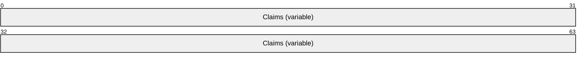

**Claims (variable):** A variable-length CLAIMS_SET_METADATA structure ([MS-ADTS](../MS-ADTS/MS-ADTS.md) section 2.2.18.8) that contains claims.

## 2.12 PAC_DEVICE_INFO

The **PAC_DEVICE_INFO** structure is a variable length buffer of the **PAC** that SHOULD<25> contain the device's logon and authorization information provided by the [**DC**](#gt_domain-controller-dc). A pointer to the **PAC_DEVICE_INFO** structure is serialized into an array of bytes and placed directly after the **Buffers** array of the topmost **PACTYPE** structure (section [2.3](#Section_2.3)), at the offset specified in the **Offset** field of the corresponding **PAC_INFO_BUFFER** structure (section [2.4](#Section_2.4)) in the **Buffers** array. The **ulType** field of the corresponding **PAC_INFO_BUFFER** is set to 0x0000000E.

The **PAC_DEVICE_INFO** structure is defined as follows.

typedef struct_PAC_DEVICE_INFO {

ULONG UserId;

ULONG PrimaryGroupId;

PISID AccountDomainId;

ULONG AccountGroupCount;

[size_is(AccountGroupCount)] PGROUP_MEMBERSHIP AccountGroupIds;

ULONG SidCount;

[size_is(SidCount)] PKERB_SID_AND_ATTRIBUTES ExtraSids;

ULONG DomainGroupCount;

[size_is(DomainGroupCount)] PDOMAIN_GROUP_MEMBERSHIP DomainGroup;

} PAC_DEVICE_INFO, *PPAC_DEVICE_INFO;

**UserId:** A 32-bit unsigned integer that contains the [**RID**](#gt_relative-identifier-rid) of the account. If the UserId member equals 0x00000000, the first group SID in this member is the SID for this account.

**PrimaryGroupId:** A 32-bit unsigned integer that contains the RID for the primary group to which this account belongs.

**AccountDomainId:** A SID structure that contains the [**SID**](#gt_security-identifier-sid) for the domain of the account. This member is used in conjunction with the **UserId**, and **GroupIds** members to create the user and group SIDs for the client.

**AccountGroupCount:** A 32-bit unsigned integer that contains the number of groups within the account domain to which the account belongs.

**AccountGroupIds:** A pointer to a list of **GROUP_MEMBERSHIP** (section [2.2.2](#Section_2.2.2)) structures that contains the groups to which the account belongs in the account domain. The number of groups in this list MUST be equal to **GroupCount**.

**SidCount:** A 32-bit unsigned integer that contains the total number of SIDs present in the **ExtraSids** member.

**ExtraSids:** A pointer to a list of **KERB_SID_AND_ATTRIBUTES** structures (section [2.2.1](#Section_2.2.1)) that contain a list of SIDs corresponding to groups not in domains. If the **UserId** member equals 0x00000000, the first group SID in this member is the SID for this account.

**DomainGroupCount:** A 32-bit unsigned integer that contains the number of domains with groups to which the account belongs.

**DomainGroup:** A pointer to a list of **DOMAIN_GROUP_MEMBERSHIP** structures (section [2.2.3](#Section_2.2.3)) that contains the domains to which the account belongs to a group. The number of sets in this list MUST be equal to **DomainCount**.

## 2.13 PAC_DEVICE_CLAIMS_INFO

The **PAC_DEVICE_CLAIMS_ INFO** structure is a variable length buffer of the **PAC** that SHOULD<26> contain the client's marshaled claims blob. The **PAC_DEVICE_CLAIMS_ INFO** structure is placed directly after the **Buffers** array of the topmost **PACTYPE** structure (section [2.3](#Section_2.3)), at the offset specified in the **Offset** field of the corresponding **PAC_INFO_BUFFER** structure (section [2.4](#Section_2.4)) in the **Buffers** array. The **ulType** field of the corresponding **PAC_INFO_BUFFER** is set to 0x0000000F.

The **PAC_DEVICE_CLAIMS_INFO** structure is defined as follows.

- typedef struct _PAC_DEVICE_CLAIMS_INFO {
- PCLAIMS_SET_METADATA Claims;
- } PAC_DEVICE_CLAIMS_INFO, *PPAC_DEVICE_CLAIMS_INFO;
The format of the **PAC_DEVICE_CLAIMS_ INFO** structure is defined as follows.

**Claims (variable):** A variable-length **CLAIMS_SET_METADATA** structure ([MS-ADTS](../MS-ADTS/MS-ADTS.md) section 2.2.18.8) that contains claims.

## 2.14 PAC_ATTRIBUTES_INFO

The **PAC_ATTRIBUTES_INFO** structure is a variable length buffer of the PAC that SHOULD<27> contain supplemental information about the PAC or the client. The **PAC_ATTRIBUTES_INFO** structure is placed directly after the **Buffers** array of the topmost **PACTYPE** structure (section [2.3](#Section_2.3)), at the offset specified in the **Offset** field of the corresponding **PAC_INFO_BUFFER** structure (section [2.4](#Section_2.4)) in the **Buffers** array. The **ulType** field of the corresponding **PAC_INFO_BUFFER** is set to 0x00000011.

The **PAC_ATTRIBUTES_INFO** structure is defined as follows.

typedef struct _PAC_ATTRIBUTES_INFO {

ULONG FlagsLength; // specified in bits

ULONG Flags[ANYSIZE_ARRAY];

} PAC_ATTRIBUTES_INFO, *PPAC_ATTRIBUTES_INFO;

The format of the **PAC_ATTRIBUTES_INFO** structure is defined as follows.

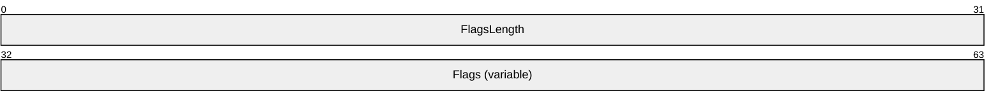

**FlagsLength (4 bytes):** An unsigned 32-bit integer in little-endian format that describes the length, in bits, of the Flags field as the count of flag bits not including padding.

**Flags (variable):** an array of 32-bit unsigned integers in little-endian format that contains flag bits describing the PAC. Each 32-bit unsigned integer contains up to 32 defined bits. All bits are flag bits padded to a unit multiple of 32 bits of storage (a 32-bit integer). Undefined padding bits are zero and MUST be ignored on receipt. The following bits are currently defined.

| Value | Meaning |
| --- | --- |
| PAC_WAS_REQUESTED 0x00000001 | The client requested the **PAC** (via PA-PAC-OPTIONS [MS-KILE](../MS-KILE/MS-KILE.md) section 2.2.10). |
| PAC_WAS_GIVEN_IMPLICITLY 0x00000002 | The client did not request or decline a **PAC** and was given one implicitly. |

## 2.15 PAC_REQUESTOR_SID

The **PAC_REQUESTOR_SID** structure is a variable length buffer of the **PAC** that SHOULD<28> contain the SID ([[MSDN-SID]](https://go.microsoft.com/fwlink/?linkid=865491)) of the client that requested the ticket. In normal scenarios, that will be the SID of the account named in the **cname** ([MS-SFU](../MS-SFU/MS-SFU.md) section 2.2.2). In delegation scenarios (as described in [MS-SFU]), that may differ from the account named in the **cname**. The **PAC_ATTRIBUTES_INFO** structure is placed directly after the **Buffers** array of the topmost **PACTYPE** structure (section [2.3](#Section_2.3)), at the offset specified in the **Offset** field of the corresponding **PAC_INFO_BUFFER** structure (section [2.4](#Section_2.4)) in the **Buffers** array. The **ulType** field of the corresponding **PAC_INFO_BUFFER** is set to 0x00000012.

The **PAC_REQUESTOR_SID** structure contains a single **SID** structure.

## 2.16 PAC_REQUESTOR_GUID

The **PAC_REQUESTOR_GUID** structure is a constant length buffer that MUST contain the GUID ([MS-DTYP](../MS-DTYP/MS-DTYP.md) section 2.3.4]) of the client that requested the ticket. The **PAC_REQUESTOR_GUID** buffer MAY be present in the PAC. The source of the GUID is the Active Directory object of the requestor. The GUID uniquely identifies the requesting principal in the directory.

The **ulType** field of the corresponding **PAC_INFO_BUFFER** is set to 0x00000014.

The **PAC_REQUESTOR_GUID** structure contains a single GUID structure.

## 2.17 Formal MIDL Definition

The [**Microsoft Interface Definition Language (MIDL)**](#gt_microsoft-interface-definition-language-midl) description of the **PAC** is as follows.

import "ms-adts-claims.idl";

typedef struct _RPC_SID *PISID;

typedef struct _KERB_SID_AND_ATTRIBUTES{

PISID Sid;

ULONG Attributes;

} KERB_SID_AND_ATTRIBUTES, *PKERB_SID_AND_ATTRIBUTES;

typedef struct _GROUP_MEMBERSHIP {

ULONG RelativeId;

ULONG Attributes;

} GROUP_MEMBERSHIP, *PGROUP_MEMBERSHIP;

typedef struct DOMAIN_GROUP_MEMBERSHIP {

PISID DomainId;

ULONG GroupCount;

[size_is(GroupCount)] PGROUP_MEMBERSHIP GroupIds;

} DOMAIN_GROUP_MEMBERSHIP, *PDOMAIN_GROUP_MEMBERSHIP;

typedef struct _PACTYPE {

ULONG cBuffers;

ULONG Version;

PAC_INFO_BUFFER Buffers[1];

} PACTYPE, *PPACTYPE;

typedef struct _PAC_INFO_BUFFER {

ULONG ulType;

ULONG cbBufferSize;

ULONG64 Offset;

} PAC_INFO_BUFFER, *PPAC_INFO_BUFFER;

typedef struct _CYPHER_BLOCK {

CHAR data[8];

}CYPHER_BLOCK;

typedef struct _USER_SESSION_KEY {

CYPHER_BLOCK data[2];

}USER_SESSION_KEY;

typedef struct _KERB_VALIDATION_INFO {

FILETIME LogonTime;

FILETIME LogoffTime;

FILETIME KickOffTime;

FILETIME PasswordLastSet;

FILETIME PasswordCanChange;

FILETIME PasswordMustChange;

RPC_UNICODE_STRING EffectiveName;

RPC_UNICODE_STRING FullName;

RPC_UNICODE_STRING LogonScript;

RPC_UNICODE_STRING ProfilePath;

RPC_UNICODE_STRING HomeDirectory;

RPC_UNICODE_STRING HomeDirectoryDrive;

USHORT LogonCount;

USHORT BadPasswordCount;

ULONG UserId;

ULONG PrimaryGroupId;

ULONG GroupCount;

[size_is(GroupCount)]

PGROUP_MEMBERSHIP GroupIds;

ULONG UserFlags;

USER_SESSION_KEY UserSessionKey;

RPC_UNICODE_STRING LogonServer;

RPC_UNICODE_STRING LogonDomainName;

PISID LogonDomainId;

ULONG Reserved1[2];

ULONG UserAccountControl;

ULONG Reserved3[7];

ULONG SidCount;

[size_is(SidCount)]

PKERB_SID_AND_ATTRIBUTES ExtraSids;

PISID ResourceGroupDomainSid;

ULONG ResourceGroupCount;

[size_is(ResourceGroupCount)]

PGROUP_MEMBERSHIP ResourceGroupIds;

} KERB_VALIDATION_INFO, *PKERB_VALIDATION_INFO;

typedef struct _PAC_CREDENTIAL_INFO {

ULONG Version;

ULONG EncryptionType;

UCHAR SerializedData[1];

} PAC_CREDENTIAL_INFO, *PPAC_CREDENTIAL_INFO;

typedef struct _PAC_CREDENTIAL_DATA {

ULONG CredentialCount;

[size_is(CredentialCount)]

SECPKG_SUPPLEMENTAL_CRED Credentials[*];

} PAC_CREDENTIAL_DATA, *PPAC_CREDENTIAL_DATA;

typedef struct _SECPKG_SUPPLEMENTAL_CRED {

RPC_UNICODE_STRING PackageName;

ULONG CredentialSize;

[size_is(CredentialSize)]

PUCHAR Credentials;

} SECPKG_SUPPLEMENTAL_CRED, *PSECPKG_SUPPLEMENTAL_CRED;

typedef struct _NTLM_SUPPLEMENTAL_CREDENTIAL {

ULONG Version;

ULONG Flags;

UCHAR LmPassword[16];

UCHAR NtPassword[16];

} NTLM_SUPPLEMENTAL_CREDENTIAL, *PNTLM_SUPPLEMENTAL_CREDENTIAL;

typedef struct _PAC_CLIENT_INFO {

FILETIME ClientId;

USHORT NameLength;

WCHAR Name[1];

} PAC_CLIENT_INFO, *PPAC_CLIENT_INFO;

typedef struct _PAC_SIGNATURE_DATA {

ULONG SignatureType;

UCHAR Signature[ANYSIZE_ARRAY]; // size is from the PAC_INFO_BUFFER - sizeof(ULONG)

} PAC_SIGNATURE_DATA, *PPAC_SIGNATURE_DATA;

typedef struct _S4U_DELEGATION_INFO {

RPC_UNICODE_STRING S4U2proxyTarget;

ULONG TransitedListSize;

[size_is( TransitedListSize )]

PRPC_UNICODE_STRING S4UTransitedServices;

} S4U_DELEGATION_INFO, *PS4U_DELEGATION_INFO;

typedef struct _UPN_DNS_INFO {

USHORT UpnLength;

USHORT UpnOffset;

USHORT DnsDomainNameLength;

USHORT DnsDomainNameOffset;

ULONG Flags;

} UPN_DNS_INFO, *PUPN_DNS_INFO;

typedef struct _PAC_CLIENT_CLAIMS_INFO {

PCLAIMS_SET_METADATA Claims;

} PAC_CLIENT_CLAIMS_INFO, *PPAC_CLIENT_CLAIMS_INFO;

typedef struct _PAC_DEVICE_INFO {

ULONG UserId;

ULONG PrimaryGroupId;

PISID AccountDomainId;

ULONG AccountGroupCount;

[size_is(AccountGroupCount)] PGROUP_MEMBERSHIP AccountGroupIds;

ULONG SidCount;

[size_is(SidCount)] PKERB_SID_AND_ATTRIBUTES ExtraSids;

ULONG DomainGroupCount;

[size_is(DomainGroupCount)] PDOMAIN_GROUP_MEMBERSHIP DomainGroup;

} PAC_DEVICE_INFO, *PPAC_DEVICE_INFO;

typedef struct _PAC_DEVICE_CLAIMS_INFO {

PCLAIMS_SET_METADATA Claims;

} PAC_DEVICE_CLAIMS_INFO, *PPAC_DEVICE_CLAIMS_INFO;

typedef struct _PAC_ATTRIBUTES_INFO {

ULONG FlagsLength; // specified in bits

ULONG Flags[ANYSIZE_ARRAY];

} PAC_ATTRIBUTES_INFO, *PPAC_ATTRIBUTES_INFO;

# 3 Structure Examples

The following is an annotated dump of an encoded PAC, beginning with the **AD-IF-RELEVANT** structure.

00000000 30 82 05 52 30 82 05 4e a0 04 02 02 00 80 a1 82 0..R0..N........

00000010 05 44 04 82 05 40 04 00 00 00 00 00 00 00 01 00 .D...@..........

00000020 00 00 b0 04 00 00 48 00 00 00 00 00 00 00 0a 00 ......H.........

00000030 00 00 12 00 00 00 f8 04 00 00 00 00 00 00 06 00 ................

00000040 00 00 14 00 00 00 10 05 00 00 00 00 00 00 07 00 ................

00000050 00 00 14 00 00 00 28 05 00 00 00 00 00 00 01 10 ......(.........

00000060 08 00 cc cc cc cc a0 04 00 00 00 00 00 00 00 00 ................

00000070 02 00 d1 86 66 0f 65 6a c6 01 ff ff ff ff ff ff ....f.ej........

00000080 ff 7f ff ff ff ff ff ff ff 7f 17 d4 39 fe 78 4a ............9.xJ

00000090 c6 01 17 94 a3 28 42 4b c6 01 17 54 24 97 7a 81 .....(BK...T$.z.

000000a0 c6 01 08 00 08 00 04 00 02 00 24 00 24 00 08 00 ..........$.$...

000000b0 02 00 12 00 12 00 0c 00 02 00 00 00 00 00 10 00 ................

000000c0 02 00 00 00 00 00 14 00 02 00 00 00 00 00 18 00 ................

000000d0 02 00 54 10 00 00 97 79 2c 00 01 02 00 00 1a 00 ..T....y,.......

000000e0 00 00 1c 00 02 00 20 00 00 00 00 00 00 00 00 00 ...... .........

000000f0 00 00 00 00 00 00 00 00 00 00 16 00 18 00 20 00 .............. .

00000100 02 00 0a 00 0c 00 24 00 02 00 28 00 02 00 00 00 ......$...(.....

00000110 00 00 00 00 00 00 10 00 00 00 00 00 00 00 00 00 ................

00000120 00 00 00 00 00 00 00 00 00 00 00 00 00 00 00 00 ................

00000130 00 00 00 00 00 00 0d 00 00 00 2c 00 02 00 00 00 ..........,.....

00000140 00 00 00 00 00 00 00 00 00 00 04 00 00 00 00 00 ................

00000150 00 00 04 00 00 00 6c 00 7a 00 68 00 75 00 12 00 ......l.z.h.u...

00000160 00 00 00 00 00 00 12 00 00 00 4c 00 69 00 71 00 ..........L.i.q.

00000170 69 00 61 00 6e 00 67 00 28 00 4c 00 61 00 72 00 i.a.n.g.(.L.a.r.

00000180 72 00 79 00 29 00 20 00 5a 00 68 00 75 00 09 00 r.y.). .Z.h.u...

00000190 00 00 00 00 00 00 09 00 00 00 6e 00 74 00 64 00 ..........n.t.d.

000001a0 73 00 32 00 2e 00 62 00 61 00 74 00 00 00 00 00 s.2...b.a.t.....

000001b0 00 00 00 00 00 00 00 00 00 00 00 00 00 00 00 00 ................

000001c0 00 00 00 00 00 00 00 00 00 00 00 00 00 00 00 00 ................

000001d0 00 00 1a 00 00 00 61 c4 33 00 07 00 00 00 09 c3 ......a.3.......

000001e0 2d 00 07 00 00 00 5e b4 32 00 07 00 00 00 01 02 -.....^.2.......

000001f0 00 00 07 00 00 00 97 b9 2c 00 07 00 00 00 2b f1 ........,.....+.

00000200 32 00 07 00 00 00 ce 30 33 00 07 00 00 00 a7 2e 2......03.......

00000210 2e 00 07 00 00 00 2a f1 32 00 07 00 00 00 98 b9 ......*.2.......

00000220 2c 00 07 00 00 00 62 c4 33 00 07 00 00 00 94 01 ,.....b.3.......

00000230 33 00 07 00 00 00 76 c4 33 00 07 00 00 00 ae fe 3.....v.3.......

00000240 2d 00 07 00 00 00 32 d2 2c 00 07 00 00 00 16 08 -.....2.,.......

00000250 32 00 07 00 00 00 42 5b 2e 00 07 00 00 00 5f b4 2.....B[......_.

00000260 32 00 07 00 00 00 ca 9c 35 00 07 00 00 00 85 44 2.......5......D

00000270 2d 00 07 00 00 00 c2 f0 32 00 07 00 00 00 e9 ea -.......2.......

00000280 31 00 07 00 00 00 ed 8e 2e 00 07 00 00 00 b6 eb 1...............

00000290 31 00 07 00 00 00 ab 2e 2e 00 07 00 00 00 72 0e 1.............r.

000002a0 2e 00 07 00 00 00 0c 00 00 00 00 00 00 00 0b 00 ................

000002b0 00 00 4e 00 54 00 44 00 45 00 56 00 2d 00 44 00 ..N.T.D.E.V.-.D.

000002c0 43 00 2d 00 30 00 35 00 00 00 06 00 00 00 00 00 C.-.0.5.........

000002d0 00 00 05 00 00 00 4e 00 54 00 44 00 45 00 56 00 ......N.T.D.E.V.

000002e0 00 00 04 00 00 00 01 04 00 00 00 00 00 05 15 00 ................

000002f0 00 00 59 51 b8 17 66 72 5d 25 64 63 3b 0b 0d 00 ..YQ..fr]%dc;...

00000300 00 00 30 00 02 00 07 00 00 00 34 00 02 00 07 00 ..0.......4.....

00000310 00 20 38 00 02 00 07 00 00 20 3c 00 02 00 07 00 . 8...... <.....

00000320 00 20 40 00 02 00 07 00 00 20 44 00 02 00 07 00 . @...... D.....

00000330 00 20 48 00 02 00 07 00 00 20 4c 00 02 00 07 00 . H...... L.....

00000340 00 20 50 00 02 00 07 00 00 20 54 00 02 00 07 00 . P...... T.....

00000350 00 20 58 00 02 00 07 00 00 20 5c 00 02 00 07 00 . X...... \.....

00000360 00 20 60 00 02 00 07 00 00 20 05 00 00 00 01 05 . `...... ......

00000370 00 00 00 00 00 05 15 00 00 00 b9 30 1b 2e b7 41 ...........0...A

00000380 4c 6c 8c 3b 35 15 01 02 00 00 05 00 00 00 01 05 Ll.;5...........

00000390 00 00 00 00 00 05 15 00 00 00 59 51 b8 17 66 72 ..........YQ..fr

000003a0 5d 25 64 63 3b 0b 74 54 2f 00 05 00 00 00 01 05 ]%dc;.tT/.......

000003b0 00 00 00 00 00 05 15 00 00 00 59 51 b8 17 66 72 ..........YQ..fr

000003c0 5d 25 64 63 3b 0b e8 38 32 00 05 00 00 00 01 05 ]%dc;..82.......

000003d0 00 00 00 00 00 05 15 00 00 00 59 51 b8 17 66 72 ..........YQ..fr

000003e0 5d 25 64 63 3b 0b cd 38 32 00 05 00 00 00 01 05 ]%dc;..82.......

000003f0 00 00 00 00 00 05 15 00 00 00 59 51 b8 17 66 72 ..........YQ..fr

00000400 5d 25 64 63 3b 0b 5d b4 32 00 05 00 00 00 01 05 ]%dc;.].2.......

00000410 00 00 00 00 00 05 15 00 00 00 59 51 b8 17 66 72 ..........YQ..fr

00000420 5d 25 64 63 3b 0b 41 16 35 00 05 00 00 00 01 05 ]%dc;.A.5.......

00000430 00 00 00 00 00 05 15 00 00 00 59 51 b8 17 66 72 ..........YQ..fr

00000440 5d 25 64 63 3b 0b e8 ea 31 00 05 00 00 00 01 05 ]%dc;...1.......

00000450 00 00 00 00 00 05 15 00 00 00 59 51 b8 17 66 72 ..........YQ..fr

00000460 5d 25 64 63 3b 0b c1 19 32 00 05 00 00 00 01 05 ]%dc;...2.......

00000470 00 00 00 00 00 05 15 00 00 00 59 51 b8 17 66 72 ..........YQ..fr

00000480 5d 25 64 63 3b 0b 29 f1 32 00 05 00 00 00 01 05 ]%dc;.).2.......

00000490 00 00 00 00 00 05 15 00 00 00 59 51 b8 17 66 72 ..........YQ..fr

000004a0 5d 25 64 63 3b 0b 0f 5f 2e 00 05 00 00 00 01 05 ]%dc;.._........

000004b0 00 00 00 00 00 05 15 00 00 00 59 51 b8 17 66 72 ..........YQ..fr

000004c0 5d 25 64 63 3b 0b 2f 5b 2e 00 05 00 00 00 01 05 ]%dc;./[........

000004d0 00 00 00 00 00 05 15 00 00 00 59 51 b8 17 66 72 ..........YQ..fr

000004e0 5d 25 64 63 3b 0b ef 8f 31 00 05 00 00 00 01 05 ]%dc;...1.......

000004f0 00 00 00 00 00 05 15 00 00 00 59 51 b8 17 66 72 ..........YQ..fr

00000500 5d 25 64 63 3b 0b 07 5f 2e 00 00 00 00 00 00 49 ]%dc;.._.......I

00000510 d9 0e 65 6a c6 01 08 00 6c 00 7a 00 68 00 75 00 ..ej....l.z.h.u.

00000520 00 00 00 00 00 00 76 ff ff ff 41 ed ce 9a 34 81 ......v...A...4.

00000530 5d 3a ef 7b c9 88 74 80 5d 25 00 00 00 00 76 ff ]:.{..t.]%....v.

00000540 ff ff f7 a5 34 da b2 c0 29 86 ef e0 fb e5 11 0a ....4...).......

00000550 4f 32 00 00 00 00 O2....

The encoded **PAC** leads with the **AuthorizationData** structure ([[RFC4120]](https://go.microsoft.com/fwlink/?LinkId=90458) section 5.2.6), the **AD-IF-RELEVANT** structure, and the **AD-WIN2K-PAC** authorization data type, as a sort of general prefix in ASN.1 and basic encoding rules (BER) encoding:

00000000 30 82 05 52 30 82 05 4e a0 04 02 02 00 80 a1 82 0..R0..N........

00000010 05 44 04 82 05 40 .D...@

Following that is the serialized [PACTYPE (section 2.3)](#Section_2.3) structure. Note that the PACTYPE structure is not [**NDR**](#gt_network-data-representation-ndr)-encoded. The first field is the **cBuffers** field, in little-endian order:

00000010 04 00 00 00 ....

In this example the **cBuffers** field indicates four [PAC_INFO_BUFFER (section 2.4)](#Section_2.4) structures follow later in the **Buffers** array field. The next field is the **Version** field, which is set to 0x00000000:

00000010 00 00 00 00 ....

The next element is the first of the four PAC_INFO_BUFFER structures:

00000010 01 00 ..

00000020 00 00 b0 04 00 00 48 00 00 00 00 00 00 00 ......H.......

This first PAC_INFO_BUFFER is serialized with **ulType** in bytes 0x1E through 0x21, containing a little-endian encoding of 0x00000001, or logon information (see [KERB_VALIDATION_INFO (section 2.5)](#Section_2.5)). The next field, in bytes 0x22 through 0x25, is the **cbBufferSize** field, containing a little-endian value of 0x000004B0. Finally, the **Offset** field, a 64-bit field, is in bytes 0x26 through 0x2D. The offset value here is 0x00000000'00000048. Computing from the beginning of the PACTYPE structure, this indicates that the data for this element is 0x00000016 + 0x00000048, or 0x0000005E.

Following the first PAC_INFO_BUFFER structure are three more PAC_INFO_BUFFER structures:

00000020 0a 00 ..

00000030 00 00 12 00 00 00 f8 04 00 00 00 00 00 00 06 00 ................

00000040 00 00 14 00 00 00 10 05 00 00 00 00 00 00 07 00 ................

00000050 00 00 14 00 00 00 28 05 00 00 00 00 00 00 ......(.......

These correspond to PAC_INFO_BUFFER structures with **ulType** 0x0000000A, 0x00000006, and 0x00000007, or client information (see [PAC_CLIENT_INFO (section 2.7)](#Section_2.7)) and two signature data structures (see [PAC_SIGNATURE_DATA (section 2.8)](#Section_2.8)) , respectively. They point to the actual contents at offset (0x00000016 + 0x000004F8), (0x00000016 + 0x00000510), and (0x00000016+0x00000528).

## 3.1 Logon Authorization Information

The first of the [PAC_INFO_BUFFER (section 2.4)](#Section_2.4) structures indicates a logon information structure. This structure begins at offset 0x0000005E in this example, as noted previously. This [KERB_VALIDATION_INFO](#Section_2.5) structure is a complex structure that is [**NDR**](#gt_network-data-representation-ndr)-encoded.

00000050 01 10 ..

00000060 08 00 cc cc cc cc a0 04 00 00 00 00 00 00 00 00 ................

00000070 02 00 ..

The first 8 bytes, from 0x0000005E through 0x00000065, comprise the common [**RPC**](#gt_remote-procedure-call-rpc) header for type marshalling. The next 8 bytes, from 0x00000066 through 0x0000006D, comprise the RPC type marshalling private header for constructed types. The RPC specification for type marshaling is specified in [MS-RPCE](../MS-RPCE/MS-RPCE.md) section 2.2.6, and is the authoritative source for the meaning of these items.

The next 4 bytes, from 0x0000006E through 0x00000071, are an RPC **unique pointer** referent, as defined in [[C706]](https://go.microsoft.com/fwlink/?LinkId=89824) section 14.3.10.

Following the first 20 bytes, the simple types of the KERB_VALIDATION_INFO structure appear.

00000070 d1 86 66 0f 65 6a c6 01 ..f.ej..

The first field is the **LogonTime** member, a FILETIME type. This is followed in succession by the five other time values:

00000070 ff ff ff ff ff ff ......

00000080 ff 7f ff ff ff ff ff ff ff 7f 17 d4 39 fe 78 4a ............9.xJ

00000090 c6 01 17 94 a3 28 42 4b c6 01 17 54 24 97 7a 81 .....(BK...T$.z.

000000a0 c6 01 ..

The next six fields are the RPC_UNICODE_STRING structures. The RPC_UNICODE_STRING structures contain pointers and, therefore, use more advanced features of NDR encoding. The definitive reference for NDR encoding of complex types is [MS-RPCE], but for example purposes, the structure is encoded as follows.

000000a0 c6 01 08 00 08 00 04 00 02 00 ..........

The first field in the RPC_UNICODE_STRING structure is the **Length** field, which indicates the length of the buffer, in bytes. In this example the length is 8 bytes. Similarly, the second field is the **MaximumLength** field. In this example, **MaximumLength** indicates that the maximum length of the buffer is also 8 bytes. The last field is the **Buffer** pointer. In this case, it is 0x00020004. For NDR-encoded messages, this is a referent to the actual data. The data is packed after the main structure; for KERB_VALIDATION_INFO, 0x000000D8 bytes in length, this begins at 0x0000014A in the following example:

00000140 04 00 00 00 00 00 ......

00000150 00 00 04 00 00 00 6c 00 7a 00 68 00 75 00 ......l.z.h.u.

The NDR information about the referent, including the length, in element size, can be seen above. It is followed by the actual data, in this case, the string "lzhu". The remaining RPC_UNICODE_STRING structures are filled in a similar fashion:

000000a0 24 00 24 00 08 00 $.$...

000000b0 02 00 12 00 12 00 0c 00 02 00 00 00 00 00 10 00 ................

000000c0 02 00 00 00 00 00 14 00 02 00 00 00 00 00 18 00 ................

000000d0 02 00 ..

These RPC_UNICODE_STRING structures point to other strings in the encoded structure in the same fashion, yielding "Liqiang (Larry) Zhu" in the **FullName** field and "ntds.bat" in the **LogonScript** field, while the **ProfilePath**, **HomeDirectory**, and **HomeDirectoryDrive** fields are all empty. Following the RPC_UNICODE_STRING structures are a number of simple scalar types, which can be easily decoded. The **GroupIds** field is a pointer to an array of structures, and thus enters the more complex encoding rules.

000000e0 1c 00 02 00 ....

0x0002001C is the referent, and the actual array of [GROUP_MEMBERSHIP](#Section_2.2.2) structures (26 in total) is as follows.

000001d0 00 00 1a 00 00 00 61 c4 33 00 07 00 00 00 09 c3 ......a.3.......

000001e0 2d 00 07 00 00 00 5e b4 32 00 07 00 00 00 01 02 -.....^.2.......

000001f0 00 00 07 00 00 00 97 b9 2c 00 07 00 00 00 2b f1 ........,.....+.

00000200 32 00 07 00 00 00 ce 30 33 00 07 00 00 00 a7 2e 2......03.......

00000210 2e 00 07 00 00 00 2a f1 32 00 07 00 00 00 98 b9 ......*.2.......

00000220 2c 00 07 00 00 00 62 c4 33 00 07 00 00 00 94 01 ,.....b.3.......

00000230 33 00 07 00 00 00 76 c4 33 00 07 00 00 00 ae fe 3.....v.3.......

00000240 2d 00 07 00 00 00 32 d2 2c 00 07 00 00 00 16 08 -.....2.,.......

00000250 32 00 07 00 00 00 42 5b 2e 00 07 00 00 00 5f b4 2.....B[......_.

00000260 32 00 07 00 00 00 ca 9c 35 00 07 00 00 00 85 44 2.......5......D

00000270 2d 00 07 00 00 00 c2 f0 32 00 07 00 00 00 e9 ea -.......2.......

00000280 31 00 07 00 00 00 ed 8e 2e 00 07 00 00 00 b6 eb 1...............

00000290 31 00 07 00 00 00 ab 2e 2e 00 07 00 00 00 72 0e 1.............r.

000002a0 2e 00 07 00 00 00 0c 00 00 00 00 00 00 00 0b 00 ................

Calling out the first element, there is a [**RID**](#gt_relative-identifier-rid) of 0x0033C461, and 0x00000007 for the flags, indicating that the M, D, and E flags from [KERB_SID_AND_ATTRIBUTES (section 2.2.1)](#Section_2.2.1) are set. These RIDs are all relative to the domain [**SID**](#gt_security-identifier-sid) in the **LogonDomainId** field in the following location:

00000100 28 00 02 00 (...

This referent, 0x00020028, leads to:

000002e0 01 04 00 00 00 00 00 05 15 00 ..........

000002f0 00 00 59 51 b8 17 66 72 5d 25 64 63 3b 0b 0d 00 ..YQ..fr]%dc;...

This is a SID with four subauthorities. Decoded into string format, this SID is "S-1-5-21-397955417-626881126-188441444". The SID for the preceding group would be "S-1-5-21-397955417-626881126-188441444-3392609" with the RID from the GROUP_MEMBERSHIP structure appended to the SID of the domain.

The remainder of the KERB_VALIDATION_INFO structure is a straightforward use of these concepts.

## 3.2 Client Information

The [PAC_CLIENT_INFO (section 2.7)](#Section_2.7) structure is a simple structure that is not [**NDR**](#gt_network-data-representation-ndr)-encoded.

00000500 00 49 .I

00000510 d9 0e 65 6a c6 01 08 00 6c 00 7a 00 68 00 75 00 ..ej....l.z.h.u.

In this example, the first field is the **ClientId** field that contains 0x01C66A65'0ED94900. This is the timestamp of the time the initial [**TGT**](#gt_ticket-granting-ticket-tgt) used to request this ticket be issued. Following this field is the length of the name in bytes, 0x0008, and then an 8-byte, 4-character sequence of Unicode characters that make up the name of the client, or "lzhu".

## 3.3 Signatures

The last two sections in this example are the signatures of the **PAC** contents, as specified in [PAC_SIGNATURE_DATA (section 2.8)](#Section_2.8). These signatures allow the [**KDC**](#gt_key-distribution-center-kdc) or the principal verifying the PAC to determine if the contents have been modified. The first signature is as follows.

00000520 76 ff-ff ff 41 ed ce 9a 34 81 v...A...4.

00000530 5d 3a ef 7b c9 88 74 80-5d 25 ]:.{..t.]%

In this example, the **SignatureType** field is 0xFFFFFF76, or -138. The resulting hash is contained in the following 16 bytes, 0x0000052A through 0x00000539.

The last signature is similarly decoded.

# 4 Security

## 4.1 Security Considerations for Implementers

### 4.1.1 Tampered PAC Data

The signature of a **PAC** prevents elevation of privilege attacks. The signature has to be verified to avoid these attacks.

Encryption of credential information within a **PAC** allows for secure transmission of credentials during a PKINIT logon.

### 4.1.2 Authorization Validation and Filtering

When a **PAC** is conveyed across a trust boundary, the receiving server addresses the threat of forged identities in the PAC. For example, the **PAC** might contain SIDs that are actually from the receiving server's domain rather than from the domain of the principal the **PAC** is supposed to represent. While a correctly functioning [**domain controller**](#gt_domain-controller-dc) would not do that, if a domain controller were compromised by an attacker, the attacker might create arbitrary PACs in an effort to attack other domains.

To mitigate this threat, any KDC accepting a **PAC** from another domain through an interdomain trust has to filter out any SIDs that are not correct. To filter the SIDs and client names correctly and safely, an implementation can use the guidelines discussed in the following sections.<29><30>

#### 4.1.2.1 Rules for SID Inclusion in the PAC

The following rules apply for domain local [**SIDs**](#gt_security-identifier-sid), domain global SIDs, and universal group SIDs:

- The domain global and universal group SIDs are added to the **PAC** by the [**KDC**](#gt_key-distribution-center-kdc) when the initial [**ticket-granting ticket (TGT)**](#gt_ticket-granting-ticket-tgt) is returned to the client during the Kerberos AS exchange, as specified in [[RFC4120]](https://go.microsoft.com/fwlink/?LinkId=90458).
- The SIDs from the TGT's **PAC** that the client returns during the Kerberos [**ticket-granting service (TGS)**](#gt_ticket-granting-service-tgs) exchange are copied into the referral or renewed TGT's **PAC** by the KDC, as specified in [RFC4120]. If the TGT returned by the client is a service ticket that is not a referral TGT, the domain local group SIDs is included in the **PAC** by the KDC.
- Domain local group SIDs must be added to the **PAC** by the KDC for password requests, as specified in [[RFC3244]](https://go.microsoft.com/fwlink/?LinkId=90409).
The following rules apply for [**domain controller**](#gt_domain-controller-dc) SIDs:

- The enterprise domain controller SID ([MS-ADTS](../MS-ADTS/MS-ADTS.md) section 6.1.1.2.6.9) is added to the **PAC** by the KDC if the ADS_UF_SERVER_TRUST_ACCOUNT flag is set in the authenticating security principal's **userAccountControl** attribute in Active Directory ([MS-ADTS] section 2.2.16).
- The enterprise [**read-only domain controller**](#gt_read-only-domain-controller-rodc) SID ([MS-ADTS] section 6.1.1.2.6.10) is added to the **PAC** by the KDC if both the ADS_UF_WORKSTATION_ACCOUNT and the ADS_UF_PARTIAL_SECRETS_ACCOUNT flags are set in the security principal's **userAccountControl** attribute in Active Directory ([MS-ADTS] section 2.2.16).

#### 4.1.2.2 SID Filtering and Claims Transformation

A **PAC** from a cross-realm TGT needs to be parsed and analyzed. The type and stringency of the analysis is determined by the type and quality of inter-domain trust from which the TGT originates. The different types of trusts are qualified based on their different [**SID**](#gt_security-identifier-sid) filtering and claims transformation requirements. Different trust boundaries apply to each trust type, as specified in the following table.<31>

| Trust boundary type | Description |
| --- | --- |
| Member | The member boundary filters SIDs that are in the AlwaysFilter group as well as anything that has the prefix of the member server. |
| WithinDomain | Within a domain, each domain controller trusts every other domain controller. |
| WithinForest | Within a forest, there are parent/child trust relationships and shortcut trust relationships between the domains in the forest. Each domain controller trusts every other domain controller within the forest. |
| QuarantinedWithinForest | A parent-child trust between a leaf domain in a forest and its parent can be marked as quarantined. The only SIDs that are allowed to be passed from such a domain are the "Enterprise Domain Controllers" (S-1-5-9) SID and those described by the [**trusted domain object (TDO)**](#gt_trusted-domain-object-tdo). |
| CrossForest | One forest can transitively trust all of the domains in another forest. A cross-forest trust allows all the SIDs from the domains in the other forest to pass, and does not allow SIDs that are local to its forest to come over a cross-forest trust. A trusting domain SHOULD<32> transform claims ([MS-ADTS](../MS-ADTS/MS-ADTS.md) section 3.1.1.11.2.11) to ensure that incoming claims that match claims local to its forest are explicitly allowed. |
| External | A domain can trust a domain outside the forest. The trusting domain does not allow SIDs that are local to its forest to come over an external trust. A trusting domain SHOULD<33> transform claims ([MS-ADTS] section 3.1.1.11.2.11) to ensure that incoming claims that match claims local to its forest are explicitly allowed. |
| QuarantinedExternal | The only SIDs that are allowed to be passed from a quarantined external domain are those of the trusted domain. |
| PrivilegedIdentityManagement (PIM) | A domain can be externally managed by a domain that is outside the forest.<34> The trusting domain allows SIDs that are local to its forest to come over a PrivilegedIdentityManagement trust. A trusting domain transforms claims ([MS-ADTS] section 3.1.1.11.2.11) to ensure that incoming claims that match claims local to its forest are explicitly allowed. |

SIDs are categorized into the following classes. They follow the rules of their class when crossing a trust boundary.

| Action | Rules |
| --- | --- |
| AlwaysFilter | This rule is for those SIDs that are not allowed across any trust boundaries. |
| ForestSpecific | The ForestSpecific rule is for those SIDs that are never allowed in a **PAC** that originates from out of the forest or from a domain that has been marked as QuarantinedWithinForest, unless it belongs to that domain. SIDs in this category is filtered out for QuarantinedWithinForest, CrossForest, External, and QuarantinedExternal trust boundaries. |
| EDC | The EDC rule applies only to the well-known enterprise domain controller SID (as specified in [MS-ADTS] section 6.1.1.2.6.9). This SID is filtered out for CrossForest, External, QuarantinedExternal, and PrivilegedIdentityManagement trust boundaries. |
| DomainSpecific | The DomainSpecific rule applies for those SIDs that are relative to the authority processing the PAC, referred to here as the "local domain". This category of SID is filtered out of a **PAC** entering the local domain. That is, if a domain controller encounters SIDs in a **PAC** that appear to be from its own domain, it filters them out. Likewise, for a single machine, if an incoming **PAC** contains SIDs from its local domain, they are filtered out. All of the SIDs in this category are of the form S-1-5-21-<Domain>-<ConstantRid>. Such accounts represent well-known accounts in Domain. There are three rules of processing for this category: SIDs are filtered by comparing the SID from the **PAC** with the SID of the local domain. If they match and the ConstantRid matches one of the constant RIDs for this category, then the SID is removed from the PAC. For each SID in the PAC, if the SID does not match the LogonDomainId in the PAC, and the SID is in this category, the SID is removed from the PAC. For CrossForest and External trusts, if the LogonDomainId in the **PAC** is for a domain within the local forest, then the attempt to cross the trust boundary by the authentication protocol fails, as the authorization data is invalid. |
| NeverFilter | Never filter any SIDs from this category. |

The following table shows the correlation between SIDs and trust boundaries, representing the effective behavior of SID filtering on **PAC** authorization data.

The "SID pattern" column lists a particular SID. There are cases where a set of SIDs is represented by a single row in the table. For instance, the syntax S-1-5-* means the set of version 1 SIDs with authority 5 that have not been explicitly mentioned elsewhere in the table.

The Description column describes the characteristics of the SID pattern. The Action column describes the SID filtering action, as described in the preceding table.<35>

| SID pattern | Description of the pattern | Action |
| --- | --- | --- |
| S-1-0-0 | Null SID | AlwaysFilter |
| S-1-1-0 | Everyone | AlwaysFilter |
| S-1-2-0 | Local | AlwaysFilter |
| S-1-3-0 | Creator Owner | AlwaysFilter |
| S-1-3-1 | Creator Group | AlwaysFilter |
| S-1-3-2 | Creator Owner Server | AlwaysFilter |
| S-1-3-3 | Creator Group Server | AlwaysFilter |
| S-1-4 | NonUnique Authority | NeverFilter |
| S-1-5 | NT Authority | AlwaysFilter |
| S-1-5-1 | Dialup | AlwaysFilter |
| S-1-5-2 | Network | AlwaysFilter |
| S-1-5-3 | Batch | AlwaysFilter |
| S-1-5-4 | Interactive | AlwaysFilter |
| S-1-5-5-* | LogonId | AlwaysFilter |
| S-1-5-6 | Service | AlwaysFilter |
| S-1-5-7 | Anonymous Logon | AlwaysFilter |
| S-1-5-8 | Proxy | AlwaysFilter |
| S-1-5-9 | Enterprise Domain Controllers | EDC |
| S-1-5-10 | Self | AlwaysFilter |
| S-1-5-11 | Authenticated Users | AlwaysFilter |
| S-1-5-12 | Restricted | AlwaysFilter |
| S-1-5-13 | Terminal Server User | AlwaysFilter |
| S-1-5-14 | Remote Interactive User | AlwaysFilter |
| S-1-5-15 | "This Org" | NeverFilter |
| S-1-5-18 | Local System | AlwaysFilter |
| S-1-5-19 | Local Service | AlwaysFilter |
| S-1-5-20 | Network Service | AlwaysFilter |
| S-1-5-21 | NT Account Domain | AlwaysFilter |
| S-1-5-21-x | Partially formed SID | AlwaysFilter |
| S-1-5-21-x-y | Partially formed SID | AlwaysFilter |
| S-1-5-21-X-Y-Z-R-* | Invalid domain SID (too many RIDs) | AlwaysFilter |
| S-1-5-21-X-Y-Z | Identifies a domain, not a principal | AlwaysFilter |
| S-1-5-21-0-0-0-496 | Compounded Authentication | NeverFilter<36> |
| S-1-5-21-0-0-0-497 | Claims Valid | NeverFilter<37> |
| S-1-5-21-<Domain>-R R<500 | Well-known SID range | ForestSpecific |
| S-1-5-21-<Domain>-500 | Administrator | ForestSpecific* |
| S-1-5-21-<Domain>-501 | Guest | ForestSpecific* |
| S-1-5-21-<Domain>-502 | Krbtgt | ForestSpecific* |
| S-1-5-21-<Domain>-512 | Domain Admins | ForestSpecific* |
| S-1-5-21-<Domain>-513 | Domain Users | ForestSpecific* |
| S-1-5-21-<Domain>-514 | Domain Guests | ForestSpecific* |
| S-1-5-21-<Domain>-515 | Domain Computers | ForestSpecific* |
| S-1-5-21-<Domain>-516 | Domain Controllers | ForestSpecific* |
| S-1-5-21-<Domain>-517 | Cert Publishers | ForestSpecific* |
| S-1-5-21-<Domain>-518 | Schema Admins | ForestSpecific* |
| S-1-5-21-<Domain>-519 | Enterprise Admins | ForestSpecific* |
| S-1-5-21-<Domain>-520 | Group Policy Creator Owners | ForestSpecific* |
| S-1-5-21-<Domain>-R 500 <= R < 1000 Except S-1-5-21-<Domain>-518 and S-1-5-21-<Domain>-519 above | Reserved domain-specific values. Never assigned as primary identities to user accounts. | ForestSpecific* |
| S-1-5-21-<Domain>-R R >= 1000 | Identifiers for end user-created domain identities and domain groups. | Not filtered at domain and external trust boundaries. Can be filtered at member, quarantined, and cross-forest boundaries. |
| S-1-5-21-X-Y-Z-R where X-Y-Z does not match this <domain>. | All Except on trusted domain object (TDO) | If the trusting domain is configured to filter all except on TDO, then the domain controller filters all SIDs that are not from the trusted domain. |
| S-1-5-21-X-Y-Z-R where X-Y-Z does not match identities of the domains in a trusted forest that have been selected as trusted. | All Except on Forest Trust Information (FtInfo) Identities from other forests. | If the trusting domain is configured to filter all except on FtInfo, then the domain controller filters all SIDs that are not from the trusted domains in the trusted forest. The FtInfo is the collection of domain SIDs in the forest. By default, the FtInfo is the list of all domains in the trusted forest, but it can be configured to be a subset of domain SIDs trusted by the domain. |
| S-1-5-32 | Built-in Domain | AlwaysFilter |
| S-1-5-32-544 | Administrators | AlwaysFilter |
| S-1-5-32-545 | Users | AlwaysFilter |
| S-1-5-32-546 | Guests | AlwaysFilter |
| S-1-5-32-547 | Power Users | AlwaysFilter |
| S-1-5-32-548 | Account Operators | AlwaysFilter |
| S-1-5-32-549 | System Operators | AlwaysFilter |
| S-1-5-32-550 | Print Operators | AlwaysFilter |
| S-1-5-32-551 | Backup Operators | AlwaysFilter |
| S-1-5-32-552 | Replicator | AlwaysFilter |
| S-1-5-32-553 | Ras Servers | AlwaysFilter |
| S-1-5-32-554 | Pre-Win 2k Compatible | AlwaysFilter |
| S-1-5-32-555 | Remote Desktop Users | AlwaysFilter |
| S-1-5-32-556 | Network Configuration Operators | AlwaysFilter |
| S-1-5-32-R | Other Built-in Accounts | AlwaysFilter |
| S-1-5-64-<RpcId> | Security Providers RpcId is the RPC Protocol Extensions security provider value specified in [MS-RPCE](../MS-RPCE/MS-RPCE.md) section 2.2.1.1.7. | AlwaysFilter |
| S-1-5-R-*R<1000 | Reserved by Microsoft | AlwaysFilter |
| S-1-5-1000-* | Other Organization | NeverFilter |
| S-1-5-R-*R>1000 | Extensible | NeverFilter |
| S-1-6 | SiteServer Authority | AlwaysFilter |
| S-1-7 | Internet Site Authority | AlwaysFilter |
| S-1-8 | Exchange Authority | AlwaysFilter |
| S-1-9 | Resource Manager Authority | AlwaysFilter |
| S-1-10 | Passport Authority | NeverFilter |
| Invalid | Invalid SIDs | AlwaysFilter |

#### 4.1.2.3 crealm Filtering

When decoding a cross-realm TGT, the crealm fields inside the TGT are compared to the expected name of the realm for the interrealm trust. If the names do not match the TGT, they are rejected, subject to other mitigating constraints.<38>

These constraints can include allowing fully trusted domains to supply any crealm name on the basis that it would have validated it prior to passing it along, or any other settings that are established out of band. The full set of constraints is implementation-specific.

## 4.2 Index of Security Fields

| Bit Range | Field | Description |
| --- | --- | --- |
| Variable | Supplemental credential encryption | [PAC Credentials (section 2.6)](#Section_2.6) |
| Variable | Signature generation | [PAC_SIGNATURE_DATA (section 2.8)](#Section_2.8) |

# 5 Appendix A: Product Behavior

The information in this specification is applicable to the following Microsoft products or supplemental software. References to product versions include updates to those products.

The terms "earlier" and "later", when used with a product version, refer to either all preceding versions or all subsequent versions, respectively. The term "through" refers to the inclusive range of versions. Applicable Microsoft products are listed chronologically in this section.

**Windows Client**

- Windows 2000 operating system
- Windows XP operating system
- Windows Vista operating system
- Windows 7 operating system
- Windows 8 operating system
- Windows 8.1 operating system
- Windows 10 operating system
- Windows 11 operating system
**Windows Server**

- Windows Server 2003 operating system
- Windows Server 2008 operating system
- Windows Server 2008 R2 operating system
- Windows Server 2012 operating system
- Windows Server 2012 R2 operating system
- Windows Server 2016 operating system
- Windows Server operating system
- Windows Server 2019 operating system
- Windows Server 2022 operating system
- Windows Server 2025 operating system
Exceptions, if any, are noted in this section. If an update version, service pack or Knowledge Base (KB) number appears with a product name, the behavior changed in that update. The new behavior also applies to subsequent updates unless otherwise specified. If a product edition appears with the product version, behavior is different in that product edition.

Unless otherwise specified, any statement of optional behavior in this specification that is prescribed using the terms "SHOULD" or "SHOULD NOT" implies product behavior in accordance with the SHOULD or SHOULD NOT prescription. Unless otherwise specified, the term "MAY" implies that the product does not follow the prescription.

<1> Section 1: Because Kerberos does not account directly for authorization information such as group membership or logon policy information but does allow a field within the Kerberos ticket to carry authorization information, Windows uses that field to carry information about Windows groups. When Windows receives the structure containing group information, Windows can interpret the group information in a manner consistent with other authorization decisions and information on the system.

<2> Section 2.2.3: The DOMAIN_GROUP_MEMBERSHIP structure is not supported in Windows 2000, Windows XP, Windows Server 2003, Windows Vista, Windows Server 2008, Windows 7, and Windows Server 2008 R2.

<3> Section 2.4: Windows 2000, Windows XP, and Windows Server 2003 do not support UPN and DNS information.

<4> Section 2.4: The client claims information structure is not supported in Windows 2000, Windows XP, Windows Server 2003, Windows Vista, Windows Server 2008, Windows 7, or Windows Server 2008 R2.

<5> Section 2.4: The device information structure is not supported in Windows 2000, Windows XP, Windows Server 2003, Windows Vista, Windows Server 2008, Windows 7, or Windows Server 2008 R2.

<6> Section 2.4: The device claims information structure is not supported in Windows 2000, Windows XP, Windows Server 2003, Windows Vista, Windows Server 2008, Windows 7, or Windows Server 2008 R2.

<7> Section 2.4: For more information about the ticket signature, see Kerberos Security Feature Bypass Vulnerability security update November 2020 [[MSFT-CVE-2020-17049]](https://go.microsoft.com/fwlink/?linkid=2148744). This update applies to Windows Server 2008 operating system with Service Pack 2 (SP2) and later.

<8> Section 2.4: The PAC Attributes value is not supported in Windows Server 2008 Service Pack 1 and earlier.

<9> Section 2.4: The PAC Requestor SID value is not supported in Windows Server 2008 Service Pack 1 and earlier.

<10> Section 2.4: For more information about the Extended KDC checksum usage see section [2.8.3](#Section_2.8.3). See also Windows Kerberos RC4-HMAC Elevation of Privilege Vulnerability security update, November 2022 [[MSFT-CVE-2022-37966]](https://go.microsoft.com/fwlink/?linkid=2230628) and Windows Kerberos Elevation of Privilege Vulnerability security update November 2022 [[MSFT-CVE-2022-37967]](https://go.microsoft.com/fwlink/?linkid=2230351). These updates apply to Windows Server 2008 with SP2 and later.

<11> Section 2.5: Windows enforces the **LogoffTime** value for SMB connections only.

<12> Section 2.5: Windows enforces the **KickoffTime** value for SMB connections only.

<13> Section 2.6.1: This buffer is inserted into the PAC only when initial authentication is done through the PKINIT protocol (as specified in [[RFC4556]](https://go.microsoft.com/fwlink/?LinkId=90482)) and is inserted only during initial logon; it is not included when the [**ticket-granting ticket (TGT)**](#gt_ticket-granting-ticket-tgt) is used for further authentication.

<14> Section 2.6.1: RC4 with Hash Message Authentication Code (HMAC) is preferred and is most often seen, except when the principal has been configured to require a [**Data Encryption Standard (DES)**](#gt_data-encryption-standard-des) encryption type.

<15> Section 2.6.1: AES128_CTS_HMAC_SHA1_96 is not used in Windows 2000, Windows XP, or Windows Server 2003.

<16> Section 2.6.1: AES256_CTS_HMAC_SHA1_96 is not used in Windows 2000, Windows XP, and Windows Server 2003.

<17> Section 2.6.3: The only package name that Microsoft [**KDCs**](#gt_key-distribution-center-kdc) use is "NTLM". If any other package name is provided, Windows discards the supplemental credential.

<18> Section 2.8.2: For more information about the ticket signature, see Kerberos Security Feature Bypass Vulnerability security update November 2020 [MSFT-CVE-2020-17049]. This update applies to Windows Server 2008 with SP2 and later.

<19> Section 2.8.3: For more information about the Extended KDC Signature, see Windows Kerberos RC4-HMAC Elevation of Privilege Vulnerability security update November 2022 [MSFT-CVE-2022-37966] and Windows Kerberos Elevation of Privilege Vulnerability security update November 2022 [MSFT-CVE-2022-37967]. These updates apply to Windows Server 2008 with SP2 and later.

<20> Section 2.8.5: **AES** is not supported in Windows 2000 and Windows Server 2003.

<21> Section 2.8.5: AES is not supported in Windows 2000 and Windows Server 2003.

<22> Section 2.9: Constrained delegation is not supported in Windows 2000.

<23> Section 2.10: Windows 2000, Windows XP, and Windows Server 2003 do not support UPN and DNS information. The SAM name and SID are not supported by Windows 2000 Server operating system, Windows Server 2003, and Windows Server 2008 Service Pack 1.

<24> Section 2.11: For implementations that use a Windows authorization model, it is used to populate a Token/Authorization Context as defined in [MS-DTYP](../MS-DTYP/MS-DTYP.md) section 2.5.2.

The client claims information structure is not supported in Windows 2000, Windows XP, Windows Server 2003, Windows Vista, Windows Server 2008, Windows 7, or Windows Server 2008 R2.

<25> Section 2.12: For implementations that use a Windows authorization model, it is used to populate a Token/Authorization Context as specified in [MS-DTYP] section 2.5.2. The device information structure is not supported in Windows 2000, Windows XP, Windows Server 2003, Windows Vista, Windows Server 2008, Windows 7, or Windows Server 2008 R2.

<26> Section 2.13: For implementations that use a Windows authorization model, it is used to populate a Token/Authorization Context as specified in [MS-DTYP] section 2.5.2. The device claims information structure is not supported in Windows 7, and earlier or in Windows Server 2008 Service Pack 1 and earlier.

<27> Section 2.14: For implementations that use a Windows authorization model, it is used to populate a Token/Authorization Context as specified in [MS-DTYP] section 2.5.2. The device claims information structure is not supported in Windows 7 and earlier or in Windows Server 2008 Service Pack 1 and earlier.

<28> Section 2.15: For implementations that use a Windows authorization model, it is used to populate a Token/Authorization Context as specified in [MS-DTYP] section 2.5.2. The device claims information structure is not supported in Windows 7 and earlier or in Windows Server 2008 Service Pack 1 and earlier.

<29> Section 4.1.2: Windows enforces SID-filtering rules.

<30> Section 4.1.2: Interdomain trusts have been augmented with filtering information to prevent forged identity attacks. For trusts between two Windows domains, all of the SIDs are validated in the PAC. For trusts between a Windows Kerberos domain and a Massachusetts Institute of Technology (MIT) Kerberos realm, as specified in [[RFC4120]](https://go.microsoft.com/fwlink/?LinkId=90458), SIDs are irrelevant, but a similar attack can be mounted by spoofing the cname within a cross-realm TGT.

<31> Section 4.1.2.2: Windows 2000 domain controllers do not perform SID filtering on PACs arriving from outside the domain. Windows 2000 domain controllers do not filter an arriving PAC for SIDs that are defined locally to the computer processing the PAC.

<32> Section 4.1.2.2: Claims transformation is not supported on Windows 2000, Windows Server 2003, Windows Server 2008, or Windows Server 2008 R2 domain controllers.

<33> Section 4.1.2.2: Claims transformation is not supported on Windows 2000, Windows Server 2003, Windows Server 2008, or Windows Server 2008 R2 domain controllers.

<34> Section 4.1.2.2: Privileged Identity Management trusts are not supported on Windows 2000, Windows Server 2003, Windows Server 2008, Windows Server 2008 R2, and Windows Server 2012 operating system. They are supported on Windows Server 2012 R2 domain controllers when [[MSKB-3155495]](https://go.microsoft.com/fwlink/?LinkId=808755) is also installed.

<35> Section 4.1.2.2: Where an action is followed by an asterisk (*), Windows 2000, Windows Server 2003, Windows Server 2008, and Windows Server 2008 R2 treat the pattern as DomainSpecific.

<36> Section 4.1.2.2: Windows 2000, Windows Server 2003, Windows Server 2008, and Windows Server 2008 R2 treat this pattern as ForestSpecific.

<37> Section 4.1.2.2: Windows 2000, Windows Server 2003, Windows Server 2008, and Windows Server 2008 R2 treat this pattern as ForestSpecific.

<38> Section 4.1.2.3: The TGT's crealm field is compared against the realm names listed on the [**TDO**](#gt_trusted-domain-object-tdo), as specified in [MS-ADTS](../MS-ADTS/MS-ADTS.md), corresponding to the cross-realm trust. If there is a mismatch, the TGT is rejected. TDOs marked as within the forest pass all crealm names through. TDOs marked as forest transitive indicate that the server will only accept crealm names if it is a name claimed by the forest on the TDO. If the TDO used for the cross-realm TGT has neither indicator set, the server checks if the [**FQDN**](#gt_fully-qualified-domain-name-fqdn) matches the FQDN of any domain in the server's forest; if so, the TGT is accepted. Finally, if the crealm field matches the FQDN of the TDO, then it is accepted.

# 6 Change Tracking

This section identifies changes that were made to this document since the last release. Changes are classified as Major, Minor, or None.

The revision class **Major** means that the technical content in the document was significantly revised. Major changes affect protocol interoperability or implementation. Examples of major changes are:

- A document revision that incorporates changes to interoperability requirements.
- A document revision that captures changes to protocol functionality.
The revision class **Minor** means that the meaning of the technical content was clarified. Minor changes do not affect protocol interoperability or implementation. Examples of minor changes are updates to clarify ambiguity at the sentence, paragraph, or table level.

The revision class **None** means that no new technical changes were introduced. Minor editorial and formatting changes may have been made, but the relevant technical content is identical to the last released version.

The changes made to this document are listed in the following table. For more information, please contact [dochelp@microsoft.com](mailto:dochelp@microsoft.com).

| Section | Description | Revision class |
| --- | --- | --- |
| [2.8.1](#Section_2.8.1) Generation of PAC Signatures | 11719 : Added new section to specify the importance of various signatures and the order of processing. Reordered the following sections based on processing order. | Major |
| [2.8.2](#Section_2.8.2) Ticket Signature | 11713 : Changed KDC signature to Ticket signature. | Major |
| 2.8.2 Ticket Signature | 11719 : Adjusted order of signature processing. | Major |
| [2.8.3](#Section_2.8.3) Extended KDC Signature | 11714 : After keyed hash... removed "with the Signature fields of all other PAC_SIGNATURE_DATA structures (section 2.8) set to zero." Changed the order of signature calculation for the recompute when a ticket is altered. | Major |
| 2.8.3 Extended KDC Signature | 11719 : Adjusted order of signature processing. | Major |
| [2.8.4](#Section_2.8.4) Server Signature | 11719 : Adjusted order of signature processing. | Major |
| [2.8.5](#Section_2.8.5) KDC Signature | 11719 : Adjusted order of signature processing. | Major |

## Revision History

| Date | Version | Revision Class | Comments |
| --- | --- | --- | --- |
| 3/2/2007 | 1.0 | New | Version 1.0 release |
| 4/3/2007 | 1.1 | Minor | Version 1.1 release |
| 5/11/2007 | 1.2 | Minor | Version 1.2 release |
| 6/1/2007 | 2.0 | Major | Updated and revised the technical content. |
| 7/3/2007 | 2.0.1 | Editorial | Changed language and formatting in the technical content. |
| 8/10/2007 | 2.0.2 | Editorial | Changed language and formatting in the technical content. |
| 9/28/2007 | 3.0 | Major | Converted to unified format. |
| 10/23/2007 | 3.0.1 | Editorial | Changed language and formatting in the technical content. |
| 1/25/2008 | 4.0 | Major | Updated and revised the technical content. |
| 3/14/2008 | 4.1 | Minor | Clarified the meaning of the technical content. |
| 6/20/2008 | 5.0 | Major | Updated and revised the technical content. |
| 7/25/2008 | 5.0.1 | Editorial | Changed language and formatting in the technical content. |
| 8/29/2008 | 5.0.2 | Editorial | Changed language and formatting in the technical content. |
| 10/24/2008 | 5.1 | Minor | Clarified the meaning of the technical content. |
| 12/5/2008 | 5.2 | Minor | Clarified the meaning of the technical content. |
| 1/16/2009 | 5.3 | Minor | Clarified the meaning of the technical content. |
| 2/27/2009 | 6.0 | Major | Updated and revised the technical content. |
| 4/10/2009 | 7.0 | Major | Updated and revised the technical content. |
| 5/22/2009 | 8.0 | Major | Updated and revised the technical content. |
| 7/2/2009 | 8.1 | Minor | Clarified the meaning of the technical content. |
| 8/14/2009 | 8.2 | Minor | Clarified the meaning of the technical content. |
| 9/25/2009 | 9.0 | Major | Updated and revised the technical content. |
| 11/6/2009 | 10.0 | Major | Updated and revised the technical content. |
| 12/18/2009 | 10.0.1 | Editorial | Changed language and formatting in the technical content. |
| 1/29/2010 | 11.0 | Major | Updated and revised the technical content. |
| 3/12/2010 | 11.1 | Minor | Clarified the meaning of the technical content. |
| 4/23/2010 | 11.2 | Minor | Clarified the meaning of the technical content. |
| 6/4/2010 | 11.3 | Minor | Clarified the meaning of the technical content. |
| 7/16/2010 | 11.3 | None | No changes to the meaning, language, or formatting of the technical content. |
| 8/27/2010 | 12.0 | Major | Updated and revised the technical content. |
| 10/8/2010 | 12.0 | None | No changes to the meaning, language, or formatting of the technical content. |
| 11/19/2010 | 12.0 | None | No changes to the meaning, language, or formatting of the technical content. |
| 1/7/2011 | 12.1 | Minor | Clarified the meaning of the technical content. |
| 2/11/2011 | 12.1 | None | No changes to the meaning, language, or formatting of the technical content. |
| 3/25/2011 | 12.1 | None | No changes to the meaning, language, or formatting of the technical content. |
| 5/6/2011 | 12.1 | None | No changes to the meaning, language, or formatting of the technical content. |
| 6/17/2011 | 12.2 | Minor | Clarified the meaning of the technical content. |
| 9/23/2011 | 12.2 | None | No changes to the meaning, language, or formatting of the technical content. |
| 12/16/2011 | 13.0 | Major | Updated and revised the technical content. |
| 3/30/2012 | 14.0 | Major | Updated and revised the technical content. |
| 7/12/2012 | 15.0 | Major | Updated and revised the technical content. |
| 10/25/2012 | 15.0 | None | No changes to the meaning, language, or formatting of the technical content. |
| 1/31/2013 | 15.0 | None | No changes to the meaning, language, or formatting of the technical content. |
| 8/8/2013 | 16.0 | Major | Updated and revised the technical content. |
| 11/14/2013 | 16.0 | None | No changes to the meaning, language, or formatting of the technical content. |
| 2/13/2014 | 16.0 | None | No changes to the meaning, language, or formatting of the technical content. |
| 5/15/2014 | 16.0 | None | No changes to the meaning, language, or formatting of the technical content. |
| 6/30/2015 | 17.0 | Major | Significantly changed the technical content. |
| 10/16/2015 | 17.0 | None | No changes to the meaning, language, or formatting of the technical content. |
| 7/14/2016 | 17.0 | None | No changes to the meaning, language, or formatting of the technical content. |
| 6/1/2017 | 17.0 | None | No changes to the meaning, language, or formatting of the technical content. |
| 9/15/2017 | 18.0 | Major | Significantly changed the technical content. |
| 9/12/2018 | 19.0 | Major | Significantly changed the technical content. |
| 11/23/2020 | 20.0 | Major | Significantly changed the technical content. |
| 4/7/2021 | 21.0 | Major | Significantly changed the technical content. |
| 6/25/2021 | 22.0 | Major | Significantly changed the technical content. |
| 4/29/2022 | 23.0 | Major | Significantly changed the technical content. |
| 6/27/2023 | 24.0 | Major | Significantly changed the technical content. |
| 9/20/2023 | 24.0 | None | No changes to the meaning, language, or formatting of the technical content. |
| 4/23/2024 | 25.0 | Major | Significantly changed the technical content. |
| 6/10/2024 | 26.0 | Major | Significantly changed the technical content. |
