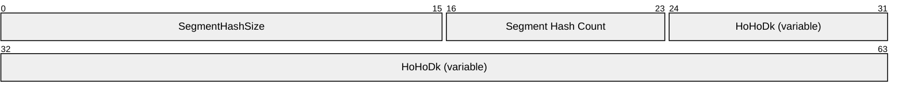

# [MS-PCCRD]: Peer Content Caching and Retrieval: Discovery Protocol

Table of Contents

1 Introduction

- [1 Introduction](#Section_1)
  - [1.1 Glossary](#Section_1.1)
  - [1.2 References](#Section_1.2)
    - [1.2.1 Normative References](#Section_1.2.1)
    - [1.2.2 Informative References](#Section_1.2.2)
  - [1.3 Overview](#Section_1.3)
  - [1.4 Relationship to Other Protocols](#Section_1.4)
  - [1.5 Prerequisites/Preconditions](#Section_1.5)
  - [1.6 Applicability Statement](#Section_1.6)
  - [1.7 Versioning and Capability Negotiation](#Section_1.7)
  - [1.8 Vendor-Extensible Fields](#Section_1.8)
  - [1.9 Standards Assignments](#Section_1.9)

2 Messages

- [2 Messages](#Section_2)
  - [2.1 Transport](#Section_2.1)
  - [2.2 Common Message Syntax](#Section_2.2)
    - [2.2.1 Namespaces](#Section_2.2.1)
    - [2.2.2 Messages](#Section_2.2.2)
      - [2.2.2.1 Probe](#Section_2.2.2.1)
      - [2.2.2.2 ProbeMatch](#Section_2.2.2.2)
    - [2.2.3 Elements](#Section_2.2.3)
      - [2.2.3.1 Types](#Section_2.2.3.1)
      - [2.2.3.2 Scopes 1](#Section_2.2.3.2)
      - [2.2.3.3 Scopes 2](#Section_2.2.3.3)
      - [2.2.3.4 Address](#Section_2.2.3.4)
      - [2.2.3.5 MetadataVersion](#Section_2.2.3.5)
      - [2.2.3.6 InstanceId](#Section_2.2.3.6)
      - [2.2.3.7 MessageNumber](#Section_2.2.3.7)
      - [2.2.3.8 XAddrs](#Section_2.2.3.8)
      - [2.2.3.9 Any](#Section_2.2.3.9)
    - [2.2.4 Complex Types](#Section_2.2.4)
    - [2.2.5 Simple Types](#Section_2.2.5)
    - [2.2.6 Attributes](#Section_2.2.6)
    - [2.2.7 Groups](#Section_2.2.7)
    - [2.2.8 Attribute Groups](#Section_2.2.8)

3 Protocol Details

- [3 Protocol Details](#Section_3)
  - [3.1 Client Details](#Section_3.1)
    - [3.1.1 Abstract Data Model](#Section_3.1.1)
    - [3.1.2 Timers](#Section_3.1.2)
    - [3.1.3 Initialization](#Section_3.1.3)
    - [3.1.4 Message Processing Events and Sequencing Rules](#Section_3.1.4)
      - [3.1.4.1 Receive ProbeMatch](#Section_3.1.4.1)
    - [3.1.5 Timer Events](#Section_3.1.5)
    - [3.1.6 Other Local Events](#Section_3.1.6)
      - [3.1.6.1 Discovery Probe Started](#Section_3.1.6.1)
  - [3.2 Server Details](#Section_3.2)
    - [3.2.1 Abstract Data Model](#Section_3.2.1)
    - [3.2.2 Timers](#Section_3.2.2)
    - [3.2.3 Initialization](#Section_3.2.3)
    - [3.2.4 Message Processing Events and Sequencing Rules](#Section_3.2.4)
      - [3.2.4.1 Receive Probe](#Section_3.2.4.1)
    - [3.2.5 Timer Events](#Section_3.2.5)
    - [3.2.6 Other Local Events](#Section_3.2.6)
      - [3.2.6.1 Segment ID Added or Removed](#Section_3.2.6.1)

4 Protocol Examples

- [4 Protocol Examples](#Section_4)
  - [4.1 Version 1.0 Probe Message](#Section_4.1)
  - [4.2 Version 2.0 Probe Message](#Section_4.2)
  - [4.3 Version 1.0 ProbeMatch Message](#Section_4.3)
  - [4.4 Version 2.0 ProbeMatch Message](#Section_4.4)

5 Security

- [5 Security](#Section_5)
  - [5.1 Security Considerations for Implementers](#Section_5.1)
  - [5.2 Index of Security Parameters](#Section_5.2)

6 Appendix A: Full WSDL

- [6 Appendix A: Full WSDL](#Section_6)

7 Appendix B: Product Behavior

- [7 Appendix B: Product Behavior](#Section_7)

8 Change Tracking

- [8 Change Tracking](#Section_8)

For the legal notice and IP terms, see [LEGAL.md](../LEGAL.md).
Last updated: 4/23/2024.
See [Revision History](#revision-history) for full version history.

# 1 Introduction

The Peer Content Caching and Retrieval (PCCR): Discovery Protocol is used to locate content from peers who claim to have the content of interest on a peer-to-peer network. This protocol is used within the Peer Content Caching and Retrieval service framework. The Discovery Protocol in the framework is utilized by peers adopting the client role to discover content among other peers by broadcasting an interest in specific content identified by the Content Identification data structure. Clients on the local network that claim to have that content respond.

The Discovery Protocol is based on the Web Service Dynamic Discovery Protocol [WS-Discovery] standard, with no changes in its protocol syntax (prefixed with wsd) and behaviors. Therefore, this protocol refers to [WS-Discovery] (as WSD) for the detailed specification but provides product-specific message formats (prefixed with PeerDist) and describes how the PCCR Discovery Protocol fits into the overall framework.

The Peer Content Caching and Retrieval Framework is a content caching and retrieval framework based on a peer-to-peer discovery and distribution model. The framework is designed to reduce bandwidth consumption on branch-office wide-area-network (WAN) links by having clients retrieve content from distributed caches, when distributed caches are available, rather than from the content servers, which are often located remotely from branch offices over the WAN links. The peers themselves act as caches from which they serve other requesting peers. The main benefit is to reduce operation costs by reducing WAN link utilization, while providing faster downloads from the local area network (LAN) in the branch office. The framework also supports the mode of using pre-provisioned hosted caches in place of peer-based caching.

Sections 1.5, 1.8, 1.9, 2, and 3 of this specification are normative. All other sections and examples in this specification are informative.

## 1.1 Glossary

This document uses the following terms:

**block**: A chunk of [**content**](#gt_content) that composes a [**segment**](#gt_segment). Each [**segment**](#gt_segment) is divided into one or more [**blocks**](#gt_block). Every [**block**](#gt_block) belongs to a specific [**segment**](#gt_segment), and within a [**segment**](#gt_segment), [**blocks**](#gt_block) are identified by their progressive index. (Block 0 is the first [**block**](#gt_block) in the [**segment**](#gt_segment), block 1 is the second, and so on.) See [MS-PCCRC](../MS-PCCRC/MS-PCCRC.md) for more details.

**client**: For the Peer Content Caching and Retrieval Framework, a client is a client-role peer; that is, a peer that is searching for content, either from the server or from other peers or hosted cashes. In the context of the Retrieval Protocol, a client is a peer that requests a block-range from a server_role_peer. It acts as a Web Services Dynamic Discovery (WS-Discovery) [[WS-Discovery]](https://go.microsoft.com/fwlink/?LinkId=90576) client.

**client-role peer**: A [**peer**](#gt_peer) that is looking for [**content**](#gt_content), either from the server or from other [**peers**](#gt_peer) or hosted caches.

**content**: Items that correspond to a file that an application attempts to access. Examples of [**content**](#gt_content) include web pages and documents stored on either HTTP servers or SMB file servers. Each [**content**](#gt_content) item consists of an ordered collection of one or more [**segments**](#gt_segment).

**Coordinated Universal Time (UTC)**: A high-precision atomic time standard that approximately tracks Universal Time (UT). It is the basis for legal, civil time all over the Earth. Time zones around the world are expressed as positive and negative offsets from UTC. In this role, it is also referred to as Zulu time (Z) and Greenwich Mean Time (GMT). In these specifications, all references to UTC refer to the time at UTC-0 (or GMT).

**globally unique identifier (GUID)**: A term used interchangeably with universally unique identifier (UUID) in Microsoft protocol technical documents (TDs). Interchanging the usage of these terms does not imply or require a specific algorithm or mechanism to generate the value. Specifically, the use of this term does not imply or require that the algorithms described in [[RFC4122]](https://go.microsoft.com/fwlink/?LinkId=90460) or [[C706]](https://go.microsoft.com/fwlink/?LinkId=89824) must be used for generating the [**GUID**](#gt_globally-unique-identifier-guid). See also universally unique identifier (UUID).

**hash**: A hash, such as SHA-1, on the content or content block.

**higher-layer application**: An application that uses the Peer Content Caching and Retrieval: Retrieval Protocol, either by itself or as part of the Peer Content Caching and Retrieval Framework or other applications.

**HoHoDk**: A hash that represents the content-specific label or public identifier that is used to discover [**content**](#gt_content) from other [**peers**](#gt_peer) or from the hosted cache. This identifier is disclosed freely in broadcast messages. Knowledge of this identifier does not prove authorization to access the actual [**content**](#gt_content).

**multicast**: A style of resource location or a data transmission in which a client makes a request to specific parties on a network simultaneously.

**network byte order**: The order in which the bytes of a multiple-byte number are transmitted on a network, most significant byte first (in big-endian storage). This may or may not match the order in which numbers are normally stored in memory for a particular processor.

**peer**: A node participating in the content caching and retrieval system. A peer is a node that both accesses the content and serves the content it caches for other peers.

**peer-to-peer (P2P)**: An Internet-based networking option in which two or more computers connect directly to each other in order to communicate.

**probe**: The Web Services Dynamic Discovery (WS-Discovery) protocol message sent by a [**client**](#gt_client) to discover [**content**](#gt_content), as defined in [[WS-Discovery1.1]](https://go.microsoft.com/fwlink/?LinkId=148805).

**ProbeMatch**: The WSD protocol message sent by a server peer to the requesting [**client**](#gt_client) when it has the [**content**](#gt_content) the [**client**](#gt_client) is looking for.

**segment**: A unit of content for discovery purposes. A segment is identified on the network by its public identifier, also known as segment ID or HoHoDk. A segment does not belong to any particular content; it can be shared by many content items if all those content items have an identical segment-sized portion at some offset.

**segment ID (HoHoDk)**: A hash that represents the content-specific label or public identifier that is used to discover content from other peers or from the hosted cache. This identifier is disclosed freely in broadcast messages. Knowledge of this identifier does not prove authorization to access the actual content.

**server peer**: A [**peer**](#gt_peer) that has the [**content**](#gt_content) in its local cache and that will serve the [**content**](#gt_content) to other [**peers**](#gt_peer) requesting it. A [**server peer**](#gt_server-peer) is acting as a WSD server or service target in the Discovery Protocol.

**SOAP**: A lightweight protocol for exchanging structured information in a decentralized, distributed environment. [**SOAP**](#gt_soap) uses XML technologies to define an extensible messaging framework, which provides a message construct that can be exchanged over a variety of underlying protocols. The framework has been designed to be independent of any particular programming model and other implementation-specific semantics. SOAP 1.2 supersedes SOAP 1.1. See [[SOAP1.2-1/2003]](https://go.microsoft.com/fwlink/?LinkId=90521).

**Uniform Resource Identifier (URI)**: A string that identifies a resource. The URI is an addressing mechanism defined in Internet Engineering Task Force (IETF) Uniform Resource Identifier (URI): Generic Syntax [[RFC3986]](https://go.microsoft.com/fwlink/?LinkId=90453).

**User Datagram Protocol (UDP)**: The connectionless protocol within TCP/IP that corresponds to the transport layer in the ISO/OSI reference model.

**UTF-8**: A byte-oriented standard for encoding Unicode characters, defined in the Unicode standard. Unless specified otherwise, this term refers to the UTF-8 encoding form specified in [[UNICODE5.0.0/2007]](https://go.microsoft.com/fwlink/?LinkId=154659) section 3.9.

**Web Services Description Language (WSDL)**: An XML format for describing network services as a set of endpoints that operate on messages that contain either document-oriented or procedure-oriented information. The operations and messages are described abstractly and are bound to a concrete network protocol and message format in order to define an endpoint. Related concrete endpoints are combined into abstract endpoints, which describe a network service. WSDL is extensible, which allows the description of endpoints and their messages regardless of the message formats or network protocols that are used.

**WS-Discovery**: This term refers to the specific version of the [**WS-Discovery**](#gt_ws-discovery) protocol that the implementer is taking a dependency on. This term can refer to any of the supported protocol versions that are specified in section 1.7.

**WSDL message**: An abstract, typed definition of the data that is communicated during a [**WSDL operation**](#gt_wsdl-operation) [[WSDL]](https://go.microsoft.com/fwlink/?LinkId=90577). Also, an element that describes the data being exchanged between web service providers and clients.

**WSDL operation**: A single action or function of a web service. The execution of a WSDL operation typically requires the exchange of messages between the service requestor and the service provider.

**XML namespace**: A collection of names that is used to identify elements, types, and attributes in XML documents identified in a URI reference [RFC3986]. A combination of XML namespace and local name allows XML documents to use elements, types, and attributes that have the same names but come from different sources. For more information, see [[XMLNS-2ED]](https://go.microsoft.com/fwlink/?LinkId=90602).

**XML schema**: A description of a type of XML document that is typically expressed in terms of constraints on the structure and content of documents of that type, in addition to the basic syntax constraints that are imposed by XML itself. An XML schema provides a view of a document type at a relatively high level of abstraction.

**XML Schema (XSD)**: A language that defines the elements, attributes, namespaces, and data types for XML documents as defined by [[XMLSCHEMA1/2]](https://go.microsoft.com/fwlink/?LinkId=90607) and [[XMLSCHEMA2/2]](https://go.microsoft.com/fwlink/?LinkId=90609) standards. An XML schema uses XML syntax for its language.

**MAY, SHOULD, MUST, SHOULD NOT, MUST NOT:** These terms (in all caps) are used as defined in [[RFC2119]](https://go.microsoft.com/fwlink/?LinkId=90317). All statements of optional behavior use either MAY, SHOULD, or SHOULD NOT.

## 1.2 References

Links to a document in the Microsoft Open Specifications library point to the correct section in the most recently published version of the referenced document. However, because individual documents in the library are not updated at the same time, the section numbers in the documents may not match. You can confirm the correct section numbering by checking the [Errata](https://go.microsoft.com/fwlink/?linkid=850906).

### 1.2.1 Normative References

We conduct frequent surveys of the normative references to assure their continued availability. If you have any issue with finding a normative reference, please contact [dochelp@microsoft.com](mailto:dochelp@microsoft.com). We will assist you in finding the relevant information.

[MS-PCCRC] Microsoft Corporation, "[Peer Content Caching and Retrieval: Content Identification](../MS-PCCRC/MS-PCCRC.md)".

[MS-PCCRR] Microsoft Corporation, "[Peer Content Caching and Retrieval: Retrieval Protocol](../MS-PCCRR/MS-PCCRR.md)".

[RFC2119] Bradner, S., "Key words for use in RFCs to Indicate Requirement Levels", BCP 14, RFC 2119, March 1997, [https://www.rfc-editor.org/info/rfc2119](https://go.microsoft.com/fwlink/?LinkId=90317)

[RFC3986] Berners-Lee, T., Fielding, R., and Masinter, L., "Uniform Resource Identifier (URI): Generic Syntax", STD 66, RFC 3986, January 2005, [https://www.rfc-editor.org/info/rfc3986](https://go.microsoft.com/fwlink/?LinkId=90453)

[RFC768] Postel, J., "User Datagram Protocol", STD 6, RFC 768, August 1980, [https://www.rfc-editor.org/info/rfc768](https://go.microsoft.com/fwlink/?LinkId=90490)

[SOAP-UDP] Combs, H., Justice, J., Kakivaya, G., et al., "SOAP-over-UDP", September 2004, [http://specs.xmlsoap.org/ws/2004/09/soap-over-udp/soap-over-udp.pdf](https://go.microsoft.com/fwlink/?LinkId=90523)

[SOAP1.2-1/2003] Gudgin, M., Hadley, M., Mendelsohn, N., et al., "SOAP Version 1.2 Part 1: Messaging Framework", W3C Recommendation, June 2003, [http://www.w3.org/TR/2003/REC-soap12-part1-20030624](https://go.microsoft.com/fwlink/?LinkId=90521)

[WS-Discovery] Beatty, J., Kakivaya, G., Kemp D., et al., "Web Services Dynamic Discovery (WS-Discovery)", April 2005, [http://specs.xmlsoap.org/ws/2005/04/discovery/ws-discovery.pdf](https://go.microsoft.com/fwlink/?LinkId=90576)

[WSDL] Christensen, E., Curbera, F., Meredith, G., and Weerawarana, S., "Web Services Description Language (WSDL) 1.1", W3C Note, March 2001, [https://www.w3.org/TR/2001/NOTE-wsdl-20010315](https://go.microsoft.com/fwlink/?LinkId=90577)

[XMLNS] Bray, T., Hollander, D., Layman, A., et al., Eds., "Namespaces in XML 1.0 (Third Edition)", W3C Recommendation, December 2009, [https://www.w3.org/TR/2009/REC-xml-names-20091208/](https://go.microsoft.com/fwlink/?LinkId=191840)

[XMLSCHEMA2/2] Biron, P., and Malhotra, A., Eds., "XML Schema Part 2: Datatypes Second Edition", W3C Recommendation, October 2004, [https://www.w3.org/TR/2004/REC-xmlschema-2-20041028/](https://go.microsoft.com/fwlink/?LinkId=90609)

### 1.2.2 Informative References

[MC-BUP] Microsoft Corporation, "[Background Intelligent Transfer Service (BITS) Upload Protocol](../MC-BUP/MC-BUP.md)".

[MSDN-BITS] Microsoft Corporation, "Background Intelligent Transfer Service", [http://msdn.microsoft.com/en-us/library/bb968799(VS.85).aspx](https://go.microsoft.com/fwlink/?LinkId=89959)

[WS-Addr-Core] World Wide Web Consortium, "Web Services Addressing 1.0 - Core", W3C Recommendation, May 2006, [http://www.w3.org/TR/ws-addr-core/](https://go.microsoft.com/fwlink/?LinkId=90574)

## 1.3 Overview

The Peer Content Caching and Retrieval (PCCR): Discovery Protocol is based on the Web Services Dynamic Discovery ([**WS-Discovery**](#gt_ws-discovery)) Protocol [[WS-Discovery]](https://go.microsoft.com/fwlink/?LinkId=90576), referred to as WSD, which uses [**multicast**](#gt_multicast) to discover and locate services over a [**peer-to-peer (P2P)**](#gt_peer-to-peer-p2p) network. There are two modes of operations in WSD: client-initiated [**Probes**](#gt_probe) and service-initiated announcements; both are sent through IP multicast to a predefined group. The PCCR Discovery Protocol uses the client-initiated Probes to query [**peer**](#gt_peer) nodes for [**content**](#gt_content).

In the PCCR Discovery Protocol the peers looking for content are the WSD clients, sending out multicast WSD **Probe** messages with the [**hashes**](#gt_b7e2b611-0af5-4fec-8af2-3f9ce7bad205) of the content. The peers that are serving the content take the server role of WSD, listening to **Probes** and replying to the querying clients with unicast WSD [**ProbeMatch**](#gt_probematch) messages if the content hashes match the ones that are cached locally. To avoid the situation where multiple [**server peers**](#gt_server-peer) overwhelm a client with **ProbeMatch** messages, per the WS-Discovery protocol, each server peer waits for a **backoff** timer to expire before sending the **ProbeMatch**. The value of the **backoff** timer is set randomly between 1 millisecond and a maximum back-off time.

## 1.4 Relationship to Other Protocols

The PCCR Discovery Protocol uses the Web Services Dynamic Discovery protocol ([**WS-Discovery**](#gt_ws-discovery)) [[WS-Discovery]](https://go.microsoft.com/fwlink/?LinkId=90576), which uses [**SOAP**](#gt_soap)-over-[**UDP**](#gt_user-datagram-protocol-udp) [[SOAP-UDP]](https://go.microsoft.com/fwlink/?LinkId=90523) [[RFC768]](https://go.microsoft.com/fwlink/?LinkId=90490) as its network transport. In the Windows Peer Content Caching and Retrieval framework, the Discovery Protocol is used by the Peer Content Caching and Retrieval: Retrieval Protocol [MS-PCCRR](../MS-PCCRR/MS-PCCRR.md) to discover other peers that have specific [**segments**](#gt_segment) of content.

Figure 1: Layering of the protocol stack

## 1.5 Prerequisites/Preconditions

The PCCR Discovery Protocol depends on the Web Services Dynamic Discovery protocol ([**WS-Discovery**](#gt_ws-discovery)) [[WS-Discovery]](https://go.microsoft.com/fwlink/?LinkId=90576). The client requesting the discovery is required to have the content information, defined in the Content Information Specification [MS-PCCRC](../MS-PCCRC/MS-PCCRC.md), for the content that it is looking for, and the peers answering the request are required to have a (possibly empty) cache of content that they can check to see if they have the requested content stored locally in order to answer a query.

## 1.6 Applicability Statement

A client uses the PCCR Discovery Protocol to locate peers with the content it requires, in the context of the Peer Content Caching and Retrieval Framework. The protocol is thus appropriate only in settings where multiple peers and at least one content server support this framework. The framework, including this Discovery Protocol, offers the possibility of significant performance benefits in cases where the content server is available only over a relatively high-latency or low-bandwidth connection as opposed to the peers that are available over relatively higher-bandwidth, lower-latency ones.

The PCCR Discovery Protocol is used to find peers with the [**hashes**](#gt_b7e2b611-0af5-4fec-8af2-3f9ce7bad205) listed in the [**Probe**](#gt_probe) messages. It is not for discovering hashes for given names or URLs. It is necessary for the clients to contact the original content servers (as opposed to the peer caches) to obtain the Content Information data structure [MS-PCCRC](../MS-PCCRC/MS-PCCRC.md) containing hashes corresponding to the contents.

## 1.7 Versioning and Capability Negotiation

The PCCR Discovery Protocol is based on the [[WS-Discovery]](https://go.microsoft.com/fwlink/?LinkId=90576) standard and does not define any new mechanisms for the following areas:

- Supported transports
- Protocol versions
- Security and authentication methods
- Localization
- Capability negotiation
This specification defines version 2.0 of the PCCR Discovery Protocol, which preserves the messages from version 1.0 and allows for efficient discovery of multiple [**segments**](#gt_segment). Capability negotiation is achieved using standard fields of the Web Services Dynamic Discovery ([**WS-Discovery**](#gt_ws-discovery)) protocol.

## 1.8 Vendor-Extensible Fields

None.

## 1.9 Standards Assignments

None.

# 2 Messages

## 2.1 Transport

The PCCR Discovery Protocol uses the Web Services Dynamic Discovery ([**WS-Discovery**](#gt_ws-discovery)) Protocol [[WS-Discovery]](https://go.microsoft.com/fwlink/?LinkId=90576), and the actual transport protocol is abstracted by WSD. The PCCR Discovery Protocol simply uses WSD with certain elements set to custom values and relies on WSD for the actual transport of the [Receive Probe (section 3.2.4.1)](#Section_3.2.4.1) and [Receive ProbeMatch (section 3.1.4.1)](#Section_3.1.4.1) messages.<1>

## 2.2 Common Message Syntax

This section contains common definitions used by this protocol. The syntax of the definitions uses [**XML Schema (XSD)**](#gt_xml-schema-xsd) [[XMLSCHEMA2/2]](https://go.microsoft.com/fwlink/?LinkId=90609), and [**Web Services Description Language (WSDL)**](#gt_web-services-description-language-wsdl) [[WSDL]](https://go.microsoft.com/fwlink/?LinkId=90577).

Finally, unless specified otherwise, all 2-byte and 4-byte integer fields are defined in [**network byte order**](#gt_network-byte-order).

### 2.2.1 Namespaces

This specification defines and references various [**XML namespaces**](#gt_xml-namespace) using the mechanisms specified in [[XMLNS]](https://go.microsoft.com/fwlink/?LinkId=191840). Although this specification associates a specific XML namespace prefix for each XML namespace that is used, the choice of any specific XML namespace prefix is implementation-specific and is not significant for interoperability.

Because the PCCR Discovery Protocol uses the [[WS-Discovery]](https://go.microsoft.com/fwlink/?LinkId=90576) Protocol, the namespace requirement will be a subset of the WSD namespaces.

| Prefix | Namespace URI | Reference |
| --- | --- | --- |
| soap | http://www.w3.org/2003/05/soap-envelope | [[SOAP1.2-1/2003]](https://go.microsoft.com/fwlink/?LinkId=90521) |
| wsa | http://schemas.xmlsoap.org/ws/2004/08/addressing | [[WS-Addr-Core]](https://go.microsoft.com/fwlink/?LinkId=90574) |
| wsd | http://schemas.xmlsoap.org/ws/2005/04/discovery | [WS-Discovery] |
| PeerDist | http://schemas.microsoft.com/p2p/2007/09/PeerDistributionDiscovery | This document |

The XML namespace [**URI**](#gt_uniform-resource-identifier-uri) that MUST be used by the implementation of the Discovery Protocol is as follows.

http://schemas.microsoft.com/p2p/2007/09/PeerDistributionDiscovery

**Note** The preceding URI does not contain any schema definition. It is used merely as a tag to identify the namespace. All elements related to the preceding namespaces are defined in this document.

### 2.2.2 Messages

The following table summarizes the set of common [**WSDL messages**](#gt_wsdl-message) defined by this specification. WSDL message definitions are described with the operation for those that are only applicable to a specific operation.

| Message | Description |
| --- | --- |
| [Probe](#Section_2.2.2.1) | Sent by the endpoint to find the services defined by <Types> and <Scopes>. |
| [ProbeMatch](#Section_2.2.2.2) | Replied by the endpoint that can provide the services defined by <Types> and <Scopes>. |

[**Probe**](#gt_probe) and [**ProbeMatch**](#gt_probematch) messages must be formatted according to the version 2.0 descriptions when searching for content described by a version 2.0 Content Information structure and MUST be formatted according to the version 1.0 descriptions when searching for content described by a version 1.0 Content Information structure.<2>

#### 2.2.2.1 Probe

The **Probe** [**WS-Discovery**](#gt_ws-discovery) message that is part of the [[WS-Discovery]](https://go.microsoft.com/fwlink/?LinkId=90576) standard. A [**client**](#gt_client) sends a [**Probe**](#gt_probe) message to find a specific service defined by **Types** (section [2.2.3.1](#Section_2.2.3.1)) and **Scopes** (section [2.2.3.3](#Section_2.2.3.3)). The Discovery Protocol uses a WSD **Probe** with the <Types> and <Scopes> elements in the WSD message.

**Version 1.0 Probe Message**

<wsd:Probe>

<wsd:Types>

PeerDist:PeerDistData

</wsd:Types>

<wsd:Scopes MatchBy="http://schemas.xmlsoap.org/ws/2005/04/discovery/strcmp0">

0200000000000000000000000000000000000000000000000000000000000000000

0000000000000000000000000000000000000000000000000000000000000

</wsd:Scopes>

</wsd:Probe>

**Version 2.0 Probe Message**

<wsd:Probe>

<wsd:Types>

PeerDist:PeerDistDataV2

</wsd:Types>

<wsd:Scopes MatchBy="http://schemas.microsoft.com/p2p/2010/05/PeerDistV2MatchingRule">

ACABKQEaAQAAAAAwHRoBAAAAAEEAQQBEAHkAZwBNAE0AMQA=

</wsd:Scopes>

</wsd:Probe>

**Types:** The <Types> element, as specified in section 2.2.3.1.

**Scopes:** The <Scopes> element, as specified in section 2.2.3.3.

#### 2.2.2.2 ProbeMatch

A [**ProbeMatch**](#gt_probematch) message SHOULD be sent in response to a [Probe](#Section_2.2.2.1) message (section 2.2.2.1) if the replying [**peer**](#gt_peer) has the [**content**](#gt_content) [**segments**](#gt_segment) listed in the [**Probe**](#gt_probe) message as specified in section [3.2.4.1](#Section_3.2.4.1).

**Version 1.0 Probe Message**

<wsd:ProbeMatches>

<wsd:ProbeMatch>

<wsa:EndpointReference>

<wsa:Address>

urn:uuid:87A89944-0230-43a5-AC4E-FAB1386C8E2C

</wsa:Address>

</wsa:EndpointReference>

<wsd:Types>

PeerDist:PeerDistData

</wsd:Types>

<wsd:Scopes>

0200000000000000000000000000000000000000000000000000000000000000

0000000000000000000000000000000000000000000000000000000000000000

</wsd:Scopes>

<wsd:XAddrs>

157.59.141.183:54321

</wsd:XAddrs>

<wsd:MetadataVersion>

1

</wsd:MetadataVersion>

<PeerDist:PeerDistData>

<PeerDist:BlockCount>

0000002A

</PeerDist:BlockCount>

</PeerDist:PeerDistData>

</wsd:ProbeMatch>

</wsd:ProbeMatches>

**Version 2.0 Probe Message**

<wsd:ProbeMatches>

<wsd:ProbeMatch>

<wsa:EndpointReference>

<wsa:Address>

urn:uuid:87A89944-0230-43a5-AC4E-FAB1386C8E2C

</wsa:Address>

</wsa:EndpointReference>

<wsd:Types>

PeerDist:PeerDistDataV2

</wsd:Types>

<wsd:Scopes>

/////////////w==

</wsd:Scopes>

<wsd:XAddrs>

157.59.141.183:54321

</wsd:XAddrs>

<wsd:MetadataVersion>

2

</wsd:MetadataVersion>

<PeerDist:PeerDistData>

<PeerDist:SegmentAges>

AAEDAgBg6gACYOoA

</PeerDist:SegmentAges>

</PeerDist:PeerDistData>

</wsd:ProbeMatch>

</wsd:ProbeMatches>

**Types:** The <Types> element, as specified in section [2.2.3.1](#Section_2.2.3.1).

**Scopes:** The <Scopes> element, as specified in section [2.2.3.3](#Section_2.2.3.3).

**Address:** The <Address> element, as specified in section [2.2.3.4](#Section_2.2.3.4).

**MetadataVersion:** The <MetadataVersion> element, as specified in section [2.2.3.5](#Section_2.2.3.5).

**InstanceId:** The <InstanceId> element, as specified in section [2.2.3.6](#Section_2.2.3.6).

**MessageNumber:** The <MessageNumber> element, as specified in section [2.2.3.7](#Section_2.2.3.7).

**XAddrs:** The <XAddrs> element, as specified in section [2.2.3.8](#Section_2.2.3.8).

**Any:** The <Any> element embedded as <PeerDist:PeerDistData>, as specified in section [2.2.3.9](#Section_2.2.3.9).

### 2.2.3 Elements

The following table summarizes the set of common [**XML schema**](#gt_xml-schema) elements defined by this specification. XML schema element definitions are described with the message for those that are only applicable to a specific message.

| Element | Description |
| --- | --- |
| <Types> | Represents the list of discovery provider types. |
| <Scopes> | Represents the list of discovery provider scopes. |
| <Address> | Identifies the responding device. |
| <MetadataVersion> | Identifies the current metadata version. |
| <InstanceId> | Identifies the current instance of the device being published. This element is part of the SOAP protocol header. |
| <MessageNumber> | Identifies the counter within the scope of the instance identifier for the current message. This element is part of the SOAP protocol header. |
| <XAddrs> | Contains the list of transport [**URIs**](#gt_uniform-resource-identifier-uri) supported by the [**peer**](#gt_peer) responding to the [Probe](#Section_2.2.2.1) message (with a [ProbeMatch](#Section_2.2.2.2) message). |
| <Any> | Version 1.0: Used to indicate how many [**blocks**](#gt_block) in each discovered [**segment**](#gt_segment) are available. Version 2.0: Used to indicate the ages of the discovered segments. |

#### 2.2.3.1 Types

The <Types> element represents the list of discovery provider types. When specified in the request message, the value indicates the **Types** to be searched for. When specified in the response, the value provides the **Types** that were found. The value of the element is set to indicate that the [Probe](#Section_2.2.2.1) and [ProbeMatch](#Section_2.2.2.2) messages were sent by the Windows Peer Content Caching and Retrieval framework so that it can be checked on the receiving side to confirm this. This element MUST be set to the following.

Version 1.0 <Types> Element

PeerDist:PeerDistData

Version 2.0 <Types> Element

PeerDist:PeerDistDataV2

#### 2.2.3.2 Scopes 1

The <Scopes> element represents the list of discovery provider scopes, where each element in the list is a string. When specified in the request message, the peer MUST populate this value to indicate the [**segments**](#gt_segment) it is searching for. When sending the response, the value provides the list of scopes present in the cache.

Each element in the list is actually a [**UTF-8**](#gt_utf-8)-encoded string representation of the [**HoHoDk**](#gt_segment-id-hohodk) value [MS-PCCRC](../MS-PCCRC/MS-PCCRC.md) in hexBinary format [[XMLSCHEMA2/2]](https://go.microsoft.com/fwlink/?LinkId=90609) and represents one segment. The Discovery Protocol uses the case-sensitive string comparison rule defined as part of the WS-Discovery standard schemas ([[WS-Discovery]](https://go.microsoft.com/fwlink/?LinkId=90576) section 5.1).

#### 2.2.3.3 Scopes 2

The <Scopes> element represents the list of discovery provider scopes, where each element in the list is a string.

**Version 1.0 <Scopes> Element**

When specified in the request message, the version 1.0 [**peer**](#gt_peer) MUST populate this value to indicate the [**segments**](#gt_segment) it is searching for. When sending the response, the value provides the list of scopes present in the cache.

Each element in the list is a [**UTF-8**](#gt_utf-8)-encoded string representation of the [**HoHoDk**](#gt_segment-id-hohodk) value in hexBinary format [[XMLSCHEMA2/2]](https://go.microsoft.com/fwlink/?LinkId=90609) and represents one segment. (For details of HoHoDk, refer to [MS-PCCRC](../MS-PCCRC/MS-PCCRC.md).) The Discovery Protocol uses the case-sensitive string comparison rule defined as part of the WSD standard schemas ([[WS-Discovery]](https://go.microsoft.com/fwlink/?LinkId=90576) section 5.1).

**Version 2.0 <Scopes> Element**

When specified in the request message, the version 2.0 peer MUST populate this value with a single scope string to indicate the segments it is searching for. The scope string is a UTF-8-encoded string representation in base64Binary format [XMLSCHEMA2/2]. The format of the scope string is as follows.

**SegmentHashSize (2 bytes):** Size of Segment Hash in bytes.

**Segment Hash Count (1 byte):** Number of Segment Hashes present in the string.

**HoHoDk (variable):** List of HoHoDks.

Version 2.0 <Scopes> element on the **ProbeMatch** message.

The <Scopes> element of the **ProbeMatch** message is used to indicate segment availability. This field contains a base64 representation of a bit array encoded as a UTF-8 string. The availability of each HoHoDk is indicated by a two-bit array. The most significant bit in each two-bit array MUST be set to 1 if the responding peer has the requested segment in its cache or it must be set to 0 if the responding peer does not have the segment in its cache. The least significant bit MUST be set to 1 if the responding peer has all blocks belonging to the segment in its cache or it MUST be set to 0 if the responding peer does not have all blocks belonging to the segment in its cache.

#### 2.2.3.4 Address

The <Address> element identifies the responding device. It MUST be set to a [**globally unique identifier (GUID)**](#gt_globally-unique-identifier-guid) as a "uuid:" scheme [**URI**](#gt_uniform-resource-identifier-uri).<3> The <Address> element is a child element of the <EndpointReference> element [[WS-Discovery]](https://go.microsoft.com/fwlink/?LinkId=90576). The following line shows an example of the **Address** identifier.

urn:uuid:87A89944-0230-43a5-AC4E-FAB1386C8E2C

#### 2.2.3.5 MetadataVersion

The <MetadataVersion> element is the current metadata version and MUST be set to 1<4> or 2.<5>

#### 2.2.3.6 InstanceId

The <InstanceId> element is the identifier for the current instance of the device being published. It MUST be generated at run time when the service starts and MUST be incremented whenever the service is restarted. The recommendations on the initial value and processing rules of the **InstanceId** are specified in [[WS-Discovery]](https://go.microsoft.com/fwlink/?LinkId=90576), Appendix I – Application Sequencing.<6>

#### 2.2.3.7 MessageNumber

The <MessageNumber> element is the counter within the scope of the instance identifier for the current message. This MUST be generated at run time, and the **MessageNumber** MUST be incremented for each message. The **MessageNumber** of the first message sent within the scope of the current **InstanceId** SHOULD be "1". Note that the **InstanceId** and the use and increment of the same **MessageNumber** apply to other message types defined in [[WS-Discovery]](https://go.microsoft.com/fwlink/?LinkId=90576) that the applications using the Discovery Protocol can send, not just the [ProbeMatch](#Section_2.2.2.2) message defined in the Discovery Protocol. The rules on initializing, processing, and incrementing the **MessageNumber** are specified in [WS-Discovery], Appendix I – Application Sequencing.

#### 2.2.3.8 XAddrs

The <XAddrs> element with a [ProbeMatch](#Section_2.2.2.2) message contains the list of transport [**URIs**](#gt_uniform-resource-identifier-uri) supported by the peer responding to the [Probe](#Section_2.2.2.1) message. Each transport URI string MUST contain an address and port number that can be used for connection by a remote host. For detailed format specifications on transport URIs containing IP addresses and port numbers, see [[RFC3986]](https://go.microsoft.com/fwlink/?LinkId=90453).

#### 2.2.3.9 Any

Version 1.0 <Any> element

A custom XML section MUST be embedded in the <Any> element of the WSD message body.

This field is used to indicate how many [**blocks**](#gt_block) in each discovered [**segment**](#gt_segment) are available. The XML MUST be formatted as follows.

<PeerDist:PeerDistData>

<PeerDist:BlockCount>

List of block counts

</PeerDist:BlockCount>

</PeerDist:PeerDistData>

**PeerDistData:** This element encloses all the custom metadata for Version 1.0 responses.

**BlockCount:** This element is a child of the <PeerDistData> element. This element is set to the [**UTF-8**](#gt_utf-8)-encoded string representation of the hexBinary [[XMLSCHEMA2/2]](https://go.microsoft.com/fwlink/?LinkId=90609) packed array of integers in [**network byte order**](#gt_network-byte-order). Each integer represents a block count. For example, if there are three block counts with the decimal values 25, 4, and 16, the hexBinary value of these block counts is 001900040010, corresponding to the three segments discovered.

Version 2.0 <Any> element

This field is used to indicate the ages for the discovered segments. The XML MUST be formatted as follows.

<PeerDist:PeerDistData>

<PeerDist: SegmentAges>

List of-Segment Ages

</PeerDist:SegmentAges>

</PeerDist:PeerDistData>

**PeerDistData:** This element encloses all custom metadata for Version 2.0 responses.

**SegmentAges:** This element is a child of the <PeerDistData> element. This field contains a base 64 representation of a bit array encoded as a UTF-8 string. For more details about the format of the **SegmentAges** field, see [MS-PCCRR](../MS-PCCRR/MS-PCCRR.md).

### 2.2.4 Complex Types

This specification does not define any common XML Schema complex type definitions.

### 2.2.5 Simple Types

This specification does not define any common XML Schema simple type definitions.

### 2.2.6 Attributes

This specification does not define any common XML Schema attribute definitions.

### 2.2.7 Groups

This specification does not define any common XML Schema group definitions.

### 2.2.8 Attribute Groups

This specification does not define any common XML Schema attribute group definitions.

# 3 Protocol Details

The Discovery Protocol utilizes the [**Probe**](#gt_probe) and [**ProbeMatch**](#gt_probematch) messages from the WSD Protocol. Refer to [[WS-Discovery]](https://go.microsoft.com/fwlink/?LinkId=90576) for the detailed protocol operation. This section describes how the **Probe** and **ProbeMatch** messages are used in the PCCR Discovery Protocol.

## 3.1 Client Details

### 3.1.1 Abstract Data Model

This section describes a conceptual model of possible data organization that an implementation maintains to participate in this protocol. The described organization is provided to facilitate the explanation of how the protocol behaves. This document does not mandate that implementations adhere to this model as long as their external behavior is consistent with that described in this document.

The following is a list of the abstract data model elements for the protocol state on the client or the requesting [**peer**](#gt_peer):

**HoHoDk List:** A list of the [**segment IDs/HoHoDks**](#gt_5cdb8c3b-3a16-4770-8918-db95bf212831) of the [**segments**](#gt_segment) that the peer is searching for.

**Outstanding Probe List:** A list of currently outstanding [**Probes**](#gt_probe), together with the HoHoDks contained in them.

**APP_MAX_DELAY:** The maximum time a server peer can wait before sending a **ProbeMatch** message.

### 3.1.2 Timers

The [**client**](#gt_client) [**peer**](#gt_peer) MUST set a **request** timer when sending a [**Probe**](#gt_probe) message to wait for a certain period of time for the incoming replies. The request timer is configurable such that system administrators can adjust the value based on their current network environments. The default value of the request timer is in the range of 200 milliseconds to 500 milliseconds, and under all circumstances, the waiting period SHOULD NOT be smaller than the maximum **backoff** timer value as defined in section [3.2.2](#Section_3.2.2) to ensure that enough replies are received by a requesting peer. When the request timer expires on a requesting peer without receiving any [**ProbeMatch**](#gt_probematch) replies, the implementation MUST remove that **Probe** message and its associated **HoHoDk List** from the **Outstanding Probe List**.

### 3.1.3 Initialization

The elements for the [**Probe**](#gt_probe) message MUST be initialized according to their corresponding values or rules, as specified in section [2.2.2.1](#Section_2.2.2.1).

The **HoHoDk List** (or [**segment ID**](#gt_segment-id-hohodk) list) on the requesting peer MUST be initialized with values supplied by applications using the Discovery Protocol. This list consists of the [**HoHoDks**](#gt_segment-id-hohodk) passed by the applications through the interface of the Discovery Protocol as specified in section [1.4](#Section_1.4).

### 3.1.4 Message Processing Events and Sequencing Rules

The following table summarizes the list of [**WSDL operations**](#gt_wsdl-operation) for the client as defined by this specification.

| Operation | Description |
| --- | --- |
| [Receive ProbeMatch](#Section_3.1.4.1) | Triggered by the WSD layer on receiving a response to a [Probe](#Section_2.2.2.1) message. |

#### 3.1.4.1 Receive ProbeMatch

This event is triggered by the WSD layer on receiving a response to a [**Probe**](#gt_probe) as specified in section [3.2.4.1](#Section_3.2.4.1). The peer that receives a [ProbeMatch](#Section_2.2.2.2) message MUST check the <Types> and <XAddrs> elements to verify that the response was sent by a peer on the local subnet, and it MUST check the [**HoHoDks**](#gt_segment-id-hohodk) to verify that at least one is associated with a [Probe](#Section_2.2.2.1) message on the **Outstanding Probe List**. If so, it MUST report the IP address and the port number from the <XAddrs> element of the [**ProbeMatch**](#gt_probematch) message and the relevant HoHoDk from the <Scopes> element of the **ProbeMatch** message to the higher layer.

All malformed **ProbeMatch** messages MUST be silently discarded.

### 3.1.5 Timer Events

When the request timer for a specific [**Probe**](#gt_probe) message expires on the requesting peer, that **Probe** message and its associated **HoHoDk List** are removed from the **Outstanding Probe List**.

### 3.1.6 Other Local Events

All malformed messages destined for the Peer Content Caching and Retrieval framework MUST be silently discarded. All WSD messages destined for other services will be dispatched by the WSD service to other registered components for the specific service types. For general WSD message processing and error handling, refer to [[WS-Discovery]](https://go.microsoft.com/fwlink/?LinkId=90576).

#### 3.1.6.1 Discovery Probe Started

To start a PCCR Discovery [**Probe**](#gt_probe), the higher layer passes one or more [**segment**](#gt_segment) [**HoHoDks**](#gt_segment-id-hohodk) from the [**content**](#gt_content) it is looking for to the [**client-role peer**](#gt_client-role-peer), which sends out a WSD **Probe** message that is modified, as specified in section [2.2.2.1](#Section_2.2.2.1). It then adds the **Probe** together with its **HoHoDks** to the **Outstanding Probe List** and sets the request timer for this **Probe**.

## 3.2 Server Details

### 3.2.1 Abstract Data Model

This section describes a conceptual model of possible data organization that an implementation maintains to participate in this protocol. The described organization is provided to facilitate the explanation of how the protocol behaves. This document does not mandate that implementations adhere to this model as long as their external behavior is consistent with that described in this document.

The following abstract data model is required on the [**server peer**](#gt_server-peer):

**Available Segment List:** A list of all [**HoHoDks**](#gt_segment-id-hohodk) for all available [**segments**](#gt_segment), and their corresponding block counts.

### 3.2.2 Timers

The [**server peer**](#gt_server-peer) MUST set a **backoff** timer [[WS-Discovery]](https://go.microsoft.com/fwlink/?LinkId=90576) randomly between 1 millisecond and a maximum value (defined by the WSD Protocol constant **APP_MAX_DELAY**). If the server peer has the requested [**segment IDs**](#gt_5cdb8c3b-3a16-4770-8918-db95bf212831) in the request, the server MUST send the [**ProbeMatch**](#gt_probematch) message back to the requesting peer when the **backoff** timer expires. If the server peer does not have the requested segment IDs, the server MUST ignore the request. This timer is configurable such that system administrators can adjust the value based on their current network environments. By default, **APP_MAX_DELAY** SHOULD be set to 65 milliseconds.<7>

### 3.2.3 Initialization

The [**server peers**](#gt_server-peer) MUST initialize an empty **Available Segment List** and populate the list with the [**HoHoDks**](#gt_segment-id-hohodk) supplied by the [**higher-layer applications**](#gt_higher-layer-application) of the PCCR Discovery Protocol. The server peers MUST also generate and set the initial values for [Address (section 2.2.3.4)](#Section_2.2.3.4), [InstanceId (section 2.2.3.6)](#Section_2.2.3.6), and [MessageNumber (section 2.2.3.7)](#Section_2.2.3.7).

### 3.2.4 Message Processing Events and Sequencing Rules

The following table summarizes the list of [**WSDL operations**](#gt_wsdl-operation) for the server as defined by this specification.

| Operation | Description |
| --- | --- |
| [Receive Probe](#Section_3.2.4.1) | Triggered by the WSD layer on receiving a [Probe](#Section_2.2.2.1) message. |

#### 3.2.4.1 Receive Probe

This event is triggered by the WSD layer on receiving a [**Probe**](#gt_probe) message. The event processing involves checking the <Types> and <Scopes> elements to verify that the Probe was initiated by a [**peer**](#gt_peer). The peer then SHOULD respond to the Probe if one or more [**HoHoDks**](#gt_segment-id-hohodk) in the Probe match any that are stored locally.<8>

If none of the **HoHoDks** stored locally match the ones in the Probe message, the Probe message MUST be silently discarded.

If the peer responds to the **Probe**, it MUST first retrieve the corresponding block counts for the stored segments whose **HoHoDks** match the ones in the **Probe** message. It MUST then construct and send the [ProbeMatch](#Section_2.2.2.2) message (as defined in section 2.2.2.2) back to the requesting peer, using the correct block counts.

All malformed **Probe** messages MUST be silently discarded. A **Probe** having an empty or an incorrectly formatted <Scopes> element is considered as a malformed Probe message.

### 3.2.5 Timer Events

The behavior of the **backoff** timer is defined in [[WS-Discovery]](https://go.microsoft.com/fwlink/?LinkId=90576).

### 3.2.6 Other Local Events

All malformed messages destined for the Windows Peer Content Caching and Retrieval framework MUST be silently discarded. All WSD messages destined for other services will be dispatched by the WSD service to other registered components for the specific service types. For general WSD message processing and error handling, refer to [[WS-Discovery]](https://go.microsoft.com/fwlink/?LinkId=90576).

#### 3.2.6.1 Segment ID Added or Removed

When the higher-layer protocol or applications of the Discovery Protocol add or remove a [**segment ID/HoHoDk**](#gt_5cdb8c3b-3a16-4770-8918-db95bf212831), the [**server peer**](#gt_server-peer) MUST update its **Available Segment List** accordingly, with the updated segment IDs supplied by the higher-layer protocol or application.

# 4 Protocol Examples

## 4.1 Version 1.0 Probe Message

A client node in a branch office contacts a Peer Content Caching and Retrieval–capable content server to retrieve a webpage, http://vortex.example.com/sample.html. It receives a list of hashes that represent the indices of the content. The client then sends the following **WSD Probe** message.

<?xml version="1.0" encoding="utf-8"?>

<soap:Envelope xmlns:soap="http://www.w3.org/2003/05/soap-envelope"

xmlns:wsa="http://schemas.xmlsoap.org/ws/2004/08/addressing"

xmlns:wsd="http://schemas.xmlsoap.org/ws/2005/04/discovery"

xmlns:PeerDist=

"http://schemas.microsoft.com/p2p/2007/09/PeerDistributionDiscovery">

<soap:Header>

<wsa:To>

urn:schemas-xmlsoap-org:ws:2005:04:discovery

</wsa:To>

<wsa:Action>

http://schemas.xmlsoap.org/ws/2005/04/discovery/Probe

</wsa:Action>

<wsa:MessageID>

urn:uuid:91528b47-b96d-4e30-981f-308c0586926f

</wsa:MessageID>

</soap:Header>

<soap:Body>

<wsd:Probe>

<wsd:Types>

PeerDist:PeerDistData

</wsd:Types>

<wsd:Scopes

MatchBy=

"http://schemas.xmlsoap.org/ws/2005/04/discovery/strcmp0">

0200000000000000000000000000000000000000000000000000000000000000000

0000000000000000000000000000000000000000000000000000000000000

</wsd:Scopes>

</wsd:Probe>

</soap:Body>

</soap:Envelope>

The <Types> and <Scopes> elements contain the Discovery Protocol–specific values. The <Scopes> element in this example shows only one HoHoDk.

## 4.2 Version 2.0 Probe Message

Version 2.0 Probe message

<?xml version="1.0" encoding="utf-8"?>

<soap:Envelope xmlns:soap="http://www.w3.org/2003/05/soap-envelope"

xmlns:wsa="http://schemas.xmlsoap.org/ws/2004/08/addressing"

xmlns:wsd="http://schemas.xmlsoap.org/ws/2005/04/discovery"

xmlns:PeerDist=

"http://schemas.microsoft.com/p2p/2007/09/PeerDistributionDiscovery">

<soap:Header>

<wsa:To>

urn:schemas-xmlsoap-org:ws:2005:04:discovery

</wsa:To>

<wsa:Action>

http://schemas.xmlsoap.org/ws/2005/04/discovery/Probe

</wsa:Action>

<wsa:MessageID>

urn:uuid:91528b47-b96d-4e30-981f-308c0586926f

</wsa:MessageID>

</soap:Header>

<soap:Body>

<wsd:Probe>

<wsd:Types>

PeerDist:PeerDistDataV2

</wsd:Types>

<wsd:Scopes

MatchBy=

"http://schemas.microsoft.com/p2p/2010/05/PeerDistV2MatchingRule">

ACACI74aAQAAAAAwHRoBAAAAAEEAQQBEAHkAZwBNAE0AMQAjvhoBAAAAADAdGgEAAAAAQQBBAEQAeQBnAE0ATQAxAA== </wsd:Scopes>

</wsd:Probe>

</soap:Body>

</soap:Envelope>

The <scopes> element in this example contains the following values:

Segment Hash Size = 32 Bytes

Segment Hash Count = 2

HoHoDK 1 = 23BE1A0100000000301D1A0100000000410041004400790067004D004D003100

HoHoDK 2 = 23BE1A0100000000301D1A0100000000410041004400790067004D004D003100

Other peer nodes that receive this Probe message check whether the **HoHoDks** in the Probe identify a segment at least some blocks of which are available locally. If a match is found, the node sets a **backoff** timer and replies with the **ProbeMatch** message after the timer expires, as described in section [4.3](#Section_4.3) for version 1.0 and [4.4](#Section_4.4) for version 2.0.

## 4.3 Version 1.0 ProbeMatch Message

Version 1.0 ProbeMatch message

<?xml version="1.0" encoding="utf-8"?>

<soap:Envelope xmlns:soap=http://www.w3.org/2003/05/soap-envelope

xmlns:wsa="http://schemas.xmlsoap.org/ws/2004/08/addressing"

xmlns:wsd="http://schemas.xmlsoap.org/ws/2005/04/discovery"

xmlns:PeerDist=

"http://schemas.microsoft.com/p2p/2007/09/PeerDistributionDiscovery

<soap:Header>

<wsa:To>

http://schemas.xmlsoap.org/ws/2004/08/addressing/role/anonymous

</wsa:To>

<wsa:Action>

http://schemas.xmlsoap.org/ws/2005/04/discovery/ProbeMatches

</wsa:Action>

<wsa:MessageID>

urn:uuid:7f4b09a3-96c9-4170-9eb3-1c805a52f444

</wsa:MessageID>

<wsa:RelatesTo>

urn:uuid:91528b47-b96d-4e30-981f-308c0586926f

</wsa:RelatesTo>

<wsd:AppSequence InstanceId="1218765447" MessageNumber="4"/>

</soap:Header>

<soap:Body>

<wsd:ProbeMatches>

<wsd:ProbeMatch>

<wsa:EndpointReference>

<wsa:Address>

urn:uuid:87A89944-0230-43a5-AC4E-FAB1386C8E2C

</wsa:Address>

</wsa:EndpointReference>

<wsd:Types>

PeerDist:PeerDistData

</wsd:Types>

<wsd:Scopes>

0200000000000000000000000000000000000000000000000000000000000000

0000000000000000000000000000000000000000000000000000000000000000

</wsd:Scopes>

<wsd:XAddrs>

157.59.141.183:54321

</wsd:XAddrs>

<wsd:MetadataVersion>

1

</wsd:MetadataVersion>

<PeerDist:PeerDistData>

<PeerDist:BlockCount>

0000002A

</PeerDist:BlockCount>

</PeerDist:PeerDistData>

</wsd:ProbeMatch>

</wsd:ProbeMatches>

</soap:Body>

</soap:Envelope>

The <Types>, <Scopes>, <XAddrs>, and <MetadataVersion> elements contain the appropriate Discovery Protocol–specific values. The block of syntax for the <PeerDist:PeerDistData> element following after the <MetadataVersion> element contains the block counts for the segment referred to in the <Scopes> element.

## 4.4 Version 2.0 ProbeMatch Message

Version 2.0 ProbeMatch message

<?xml version="1.0" encoding="utf-8"?>

<soap:Envelope xmlns:soap=http://www.w3.org/2003/05/soap-envelope

xmlns:wsa="http://schemas.xmlsoap.org/ws/2004/08/addressing"

xmlns:wsd="http://schemas.xmlsoap.org/ws/2005/04/discovery"

xmlns:PeerDist=

"http://schemas.microsoft.com/p2p/2007/09/PeerDistributionDiscovery

<soap:Header>

<wsa:To>

http://schemas.xmlsoap.org/ws/2004/08/addressing/role/anonymous

</wsa:To>

<wsa:Action>

http://schemas.xmlsoap.org/ws/2005/04/discovery/ProbeMatches

</wsa:Action>

<wsa:MessageID>

urn:uuid:7f4b09a3-96c9-4170-9eb3-1c805a52f444

</wsa:MessageID>

<wsa:RelatesTo>

urn:uuid:91528b47-b96d-4e30-981f-308c0586926f

</wsa:RelatesTo>

<wsd:AppSequence InstanceId="1218765447" MessageNumber="4"/>

</soap:Header>

<soap:Body>

<wsd:ProbeMatches>

<wsd:ProbeMatch>

<wsa:EndpointReference>

<wsa:Address>

urn:uuid:87A89944-0230-43a5-AC4E-FAB1386C8E2C

</wsa:Address>

</wsa:EndpointReference>

<wsd:Types>

PeerDist:PeerDistDataV2

</wsd:Types>

<wsd:Scopes>

/////////////w==

</wsd:Scopes>

<wsd:XAddrs>

157.59.141.183:54321

</wsd:XAddrs>

<wsd:MetadataVersion>

2

</wsd:MetadataVersion>

<PeerDist:PeerDistData>

<PeerDist:SegmentAges>

AAEDAgBg6gACYOoA

</PeerDist:SegmentAges>

</PeerDist:PeerDistData>

</wsd:ProbeMatch>

</wsd:ProbeMatches>

</soap:Body>

</soap:Envelope>

The <Scopes> element in this example indicates the availability of 40 complete segments. The <PeerDist:SegmentAges> element indicates ages for segments 1 and 3.

# 5 Security

WSD messages are multicast on the local subnet. Because the Discovery Protocol works on top of the Web Services Dynamic Discovery Protocol [[WS-Discovery]](https://go.microsoft.com/fwlink/?LinkId=90576), it leverages the security model of [**WS-Discovery**](#gt_ws-discovery). In addition, the Discovery Protocol rejects responses from any subnet other than the local subnet. For details about the security model of WSD, see [WS-Discovery].

## 5.1 Security Considerations for Implementers

None.

## 5.2 Index of Security Parameters

None.

# 6 Appendix A: Full WSDL

This protocol follows the Web Services Dynamic Discovery protocol [[WS-Discovery]](https://go.microsoft.com/fwlink/?LinkId=90576). Its Web Services Description Language [[WSDL]](https://go.microsoft.com/fwlink/?LinkId=90577) is identical to that of WS-Discovery.

# 7 Appendix B: Product Behavior

The information in this specification is applicable to the following Microsoft products or supplemental software. References to product versions include updates to those products.

- Windows Vista operating system
- Windows Server 2008 operating system
- Windows 7 operating system
- Windows Server 2008 R2 operating system
- Windows 8 operating system
- Windows Server 2012 operating system
- Windows 8.1 operating system
- Windows Server 2012 R2 operating system
- Windows 10 operating system
- Windows Server 2016 operating system
- Windows Server operating system
- Windows Server 2019 operating system
- Windows Server 2022 operating system
- Windows 11 operating system
- Windows Server 2025 operating system
Exceptions, if any, are noted in this section. If an update version, service pack or Knowledge Base (KB) number appears with a product name, the behavior changed in that update. The new behavior also applies to subsequent updates unless otherwise specified. If a product edition appears with the product version, behavior is different in that product edition.

Unless otherwise specified, any statement of optional behavior in this specification that is prescribed using the terms "SHOULD" or "SHOULD NOT" implies product behavior in accordance with the SHOULD or SHOULD NOT prescription. Unless otherwise specified, the term "MAY" implies that the product does not follow the prescription.

<1> Section 2.1: In Windows Vista and Windows Server 2008, support for the client-side elements of this protocol is available only with the optional installation of the Background Intelligent Transfer Service (BITS) [MC-BUP](../MC-BUP/MC-BUP.md) via the Windows Management Framework (WMF). Support for the server-side elements of this protocol is not available for Windows Vista or Windows Server 2008. For more information, see [[MSDN-BITS]](https://go.microsoft.com/fwlink/?LinkId=89959).

<2> Section 2.2.2: Version 2.0 of the Content Information structure is not supported by Windows 7 and Windows Server 2008 R2.

<3> Section 2.2.3.4: Windows generates a new GUID for the URI when the service starts.

<4> Section 2.2.3.5: MetadataVersion MUST be set to 1 for Windows Vista, Windows Server 2008, Windows 7, and Windows Server 2008 R2.

<5> Section 2.2.3.5: MetadataVersion MUST be set to 2 for Windows, except for Windows Vista, Windows Server 2008, Windows 7, and Windows Server 2008 R2.

<6> Section 2.2.3.6: In Windows 7 and Windows Server 2008 R2 operating system, the [InstanceId](#Section_2.2.3.6) is generated by taking the boot time of the service in seconds since 1970-01-01 Time 00:00:00 [**UTC**](#gt_coordinated-universal-time-utc).

<7> Section 3.2.2: In Windows 7 and Windows Server 2008 R2, the default value for the request timer is 300 milliseconds, and the default maximum **backoff** timer value on the server peer is 65 milliseconds. However, these two values are configurable in Windows 7 and Windows Server 2008 R2 and can be set by system administrators based on the specific network environment.

<8> Section 3.2.4.1: In Windows 7 and Windows Server 2008 R2, the following rules are used to determine whether a server peer will reply to a [**Probe**](#gt_probe) message when it has the requested segment.

When the server peer first requests and downloads a segment as a client, it records the number of replies it receives and whether the replies contain the entire segment or just a portion of the segment. Later, when the server peer receives a Probe message for that segment, it proceeds as follows (where n is an administratively configurable parameter with the default value n = 10):

- If there were fewer than n replies, the server peer will respond to the new Probe after the **backoff** timer expires.
- If there were at least n replies:
- If there were at least n full-segment replies, the server peer will not reply to the new Probe.
- If there were fewer than n full-segment replies, the server peer will randomly determine whether to reply to the new Probe, with a probability of 0.33 for replying.

# 8 Change Tracking

This section identifies changes that were made to this document since the last release. Changes are classified as Major, Minor, or None.

The revision class **Major** means that the technical content in the document was significantly revised. Major changes affect protocol interoperability or implementation. Examples of major changes are:

- A document revision that incorporates changes to interoperability requirements.
- A document revision that captures changes to protocol functionality.
The revision class **Minor** means that the meaning of the technical content was clarified. Minor changes do not affect protocol interoperability or implementation. Examples of minor changes are updates to clarify ambiguity at the sentence, paragraph, or table level.

The revision class **None** means that no new technical changes were introduced. Minor editorial and formatting changes may have been made, but the relevant technical content is identical to the last released version.

The changes made to this document are listed in the following table. For more information, please contact [dochelp@microsoft.com](mailto:dochelp@microsoft.com).

| Section | Description | Revision class |
| --- | --- | --- |
| [7](#Section_7) Appendix B: Product Behavior | Added Windows Server 2025 to the list of applicable products. | Major |

## Revision History

| Date | Version | Revision Class | Comments |
| --- | --- | --- | --- |
| 12/5/2008 | 0.1 | Major | Initial Availability |
| 1/16/2009 | 0.1.1 | Editorial | Changed language and formatting in the technical content. |
| 2/27/2009 | 0.2 | Minor | Clarified the meaning of the technical content. |
| 4/10/2009 | 0.3 | Minor | Clarified the meaning of the technical content. |
| 5/22/2009 | 0.4 | Minor | Clarified the meaning of the technical content. |
| 7/2/2009 | 1.0 | Major | Updated and revised the technical content. |
| 8/14/2009 | 1.0.1 | Editorial | Changed language and formatting in the technical content. |
| 9/25/2009 | 1.1 | Minor | Clarified the meaning of the technical content. |
| 11/6/2009 | 2.0 | Major | Updated and revised the technical content. |
| 12/18/2009 | 2.0.1 | Editorial | Changed language and formatting in the technical content. |
| 1/29/2010 | 2.1 | Minor | Clarified the meaning of the technical content. |
| 3/12/2010 | 3.0 | Major | Updated and revised the technical content. |
| 4/23/2010 | 3.1 | Minor | Clarified the meaning of the technical content. |
| 6/4/2010 | 4.0 | Major | Updated and revised the technical content. |
| 7/16/2010 | 4.0 | None | No changes to the meaning, language, or formatting of the technical content. |
| 8/27/2010 | 4.0 | None | No changes to the meaning, language, or formatting of the technical content. |
| 10/8/2010 | 4.0 | None | No changes to the meaning, language, or formatting of the technical content. |
| 11/19/2010 | 4.0 | None | No changes to the meaning, language, or formatting of the technical content. |
| 1/7/2011 | 4.0 | None | No changes to the meaning, language, or formatting of the technical content. |
| 2/11/2011 | 4.0 | None | No changes to the meaning, language, or formatting of the technical content. |
| 3/25/2011 | 4.0 | None | No changes to the meaning, language, or formatting of the technical content. |
| 5/6/2011 | 4.0 | None | No changes to the meaning, language, or formatting of the technical content. |
| 6/17/2011 | 4.1 | Minor | Clarified the meaning of the technical content. |
| 9/23/2011 | 4.1 | None | No changes to the meaning, language, or formatting of the technical content. |
| 12/16/2011 | 5.0 | Major | Updated and revised the technical content. |
| 3/30/2012 | 6.0 | Major | Updated and revised the technical content. |
| 7/12/2012 | 7.0 | Major | Updated and revised the technical content. |
| 10/25/2012 | 8.0 | Major | Updated and revised the technical content. |
| 1/31/2013 | 8.0 | None | No changes to the meaning, language, or formatting of the technical content. |
| 8/8/2013 | 9.0 | Major | Updated and revised the technical content. |
| 11/14/2013 | 9.0 | None | No changes to the meaning, language, or formatting of the technical content. |
| 2/13/2014 | 9.0 | None | No changes to the meaning, language, or formatting of the technical content. |
| 5/15/2014 | 9.0 | None | No changes to the meaning, language, or formatting of the technical content. |
| 6/30/2015 | 10.0 | Major | Significantly changed the technical content. |
| 10/16/2015 | 10.0 | None | No changes to the meaning, language, or formatting of the technical content. |
| 7/14/2016 | 10.0 | None | No changes to the meaning, language, or formatting of the technical content. |
| 6/1/2017 | 10.0 | None | No changes to the meaning, language, or formatting of the technical content. |
| 9/15/2017 | 11.0 | Major | Significantly changed the technical content. |
| 9/12/2018 | 12.0 | Major | Significantly changed the technical content. |
| 4/7/2021 | 13.0 | Major | Significantly changed the technical content. |
| 6/25/2021 | 14.0 | Major | Significantly changed the technical content. |
| 4/23/2024 | 15.0 | Major | Significantly changed the technical content. |
