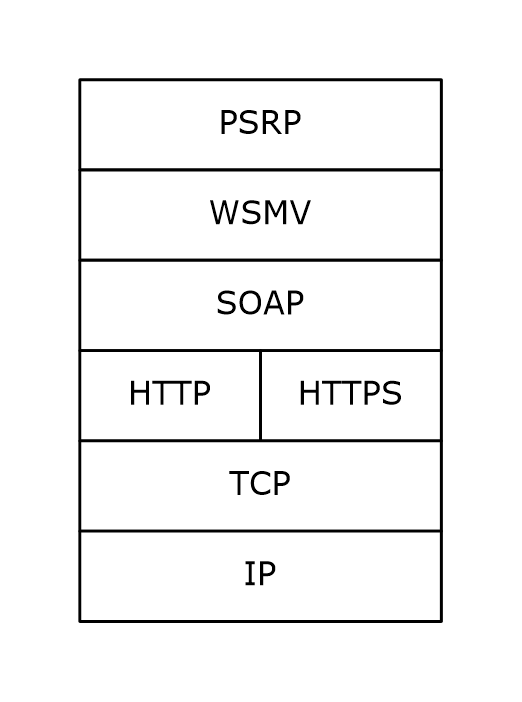
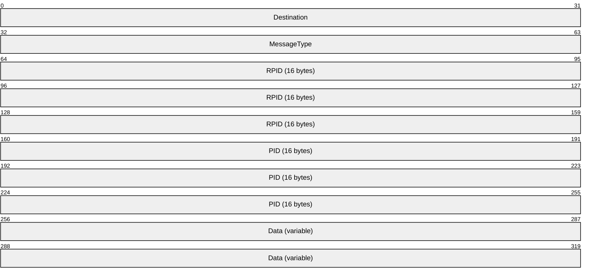
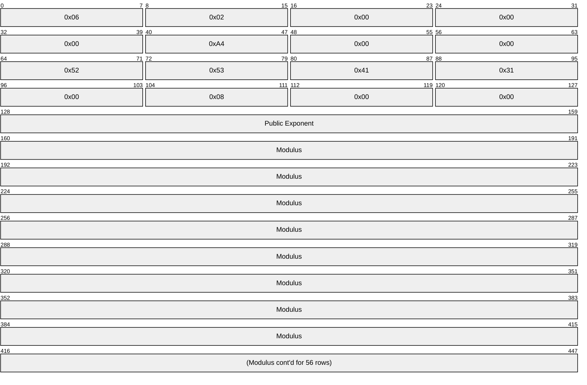
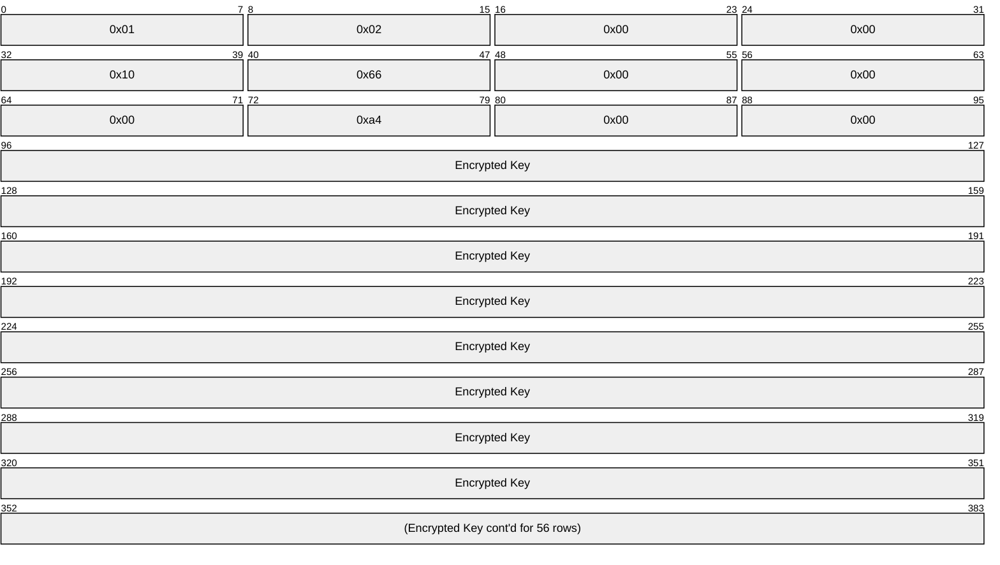
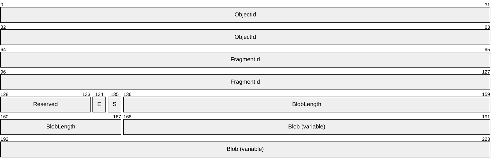
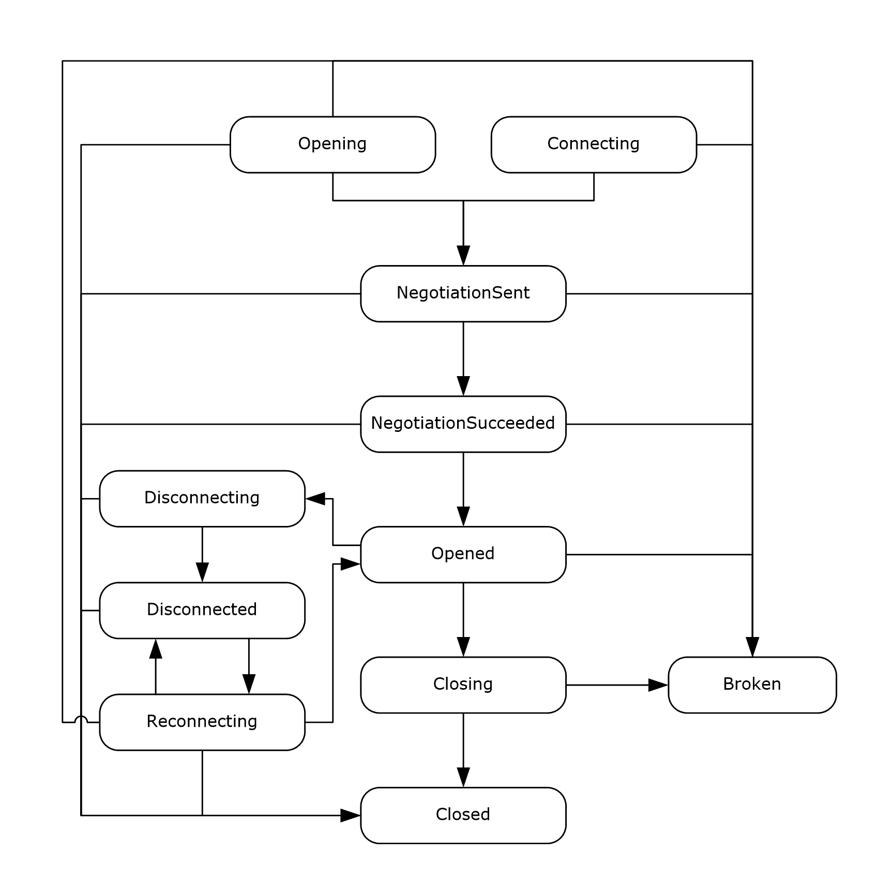
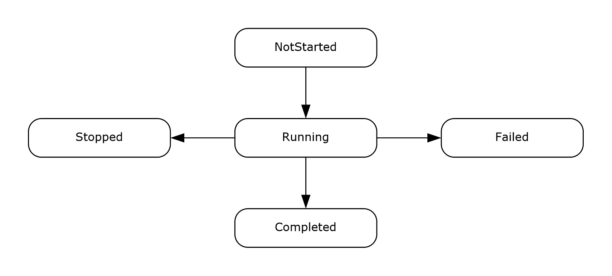

# [MS-PSRP]: PowerShell Remoting Protocol

Table of Contents

1 Introduction

- [1 Introduction](#Section_1)
  - [1.1 Glossary](#Section_1.1)
  - [1.2 References](#Section_1.2)
    - [1.2.1 Normative References](#Section_1.2.1)
    - [1.2.2 Informative References](#Section_1.2.2)
  - [1.3 Overview](#Section_1.3)
  - [1.4 Relationship to Other Protocols](#Section_1.4)
  - [1.5 Prerequisites/Preconditions](#Section_1.5)
  - [1.6 Applicability Statement](#Section_1.6)
  - [1.7 Versioning and Capability Negotiation](#Section_1.7)
  - [1.8 Vendor-Extensible Fields](#Section_1.8)
  - [1.9 Standards Assignments](#Section_1.9)

2 Messages

- [2 Messages](#Section_2)
  - [2.1 Transport](#Section_2.1)
  - [2.2 Message Syntax](#Section_2.2)
    - [2.2.1 PowerShell Remoting Protocol Message](#Section_2.2.1)
    - [2.2.2 Message Types](#Section_2.2.2)
      - [2.2.2.1 SESSION_CAPABILITY Message](#Section_2.2.2.1)
      - [2.2.2.2 INIT_RUNSPACEPOOL Message](#Section_2.2.2.2)
      - [2.2.2.3 PUBLIC_KEY Message](#Section_2.2.2.3)
      - [2.2.2.4 ENCRYPTED_SESSION_KEY Message](#Section_2.2.2.4)
      - [2.2.2.5 PUBLIC_KEY_REQUEST Message](#Section_2.2.2.5)
      - [2.2.2.6 SET_MAX_RUNSPACES Message](#Section_2.2.2.6)
      - [2.2.2.7 SET_MIN_RUNSPACES Message](#Section_2.2.2.7)
      - [2.2.2.8 RUNSPACE_AVAILABILITY Message](#Section_2.2.2.8)
      - [2.2.2.9 RUNSPACEPOOL_STATE Message](#Section_2.2.2.9)
      - [2.2.2.10 CREATE_PIPELINE Message](#Section_2.2.2.10)
      - [2.2.2.11 GET_AVAILABLE_RUNSPACES Message](#Section_2.2.2.11)
      - [2.2.2.12 USER_EVENT Message](#Section_2.2.2.12)
      - [2.2.2.13 APPLICATION_PRIVATE_DATA Message](#Section_2.2.2.13)
      - [2.2.2.14 GET_COMMAND_METADATA Message](#Section_2.2.2.14)
      - [2.2.2.15 RUNSPACEPOOL_HOST_CALL Message](#Section_2.2.2.15)
      - [2.2.2.16 RUNSPACEPOOL_HOST_RESPONSE Message](#Section_2.2.2.16)
      - [2.2.2.17 PIPELINE_INPUT Message](#Section_2.2.2.17)
      - [2.2.2.18 END_OF_PIPELINE_INPUT Message](#Section_2.2.2.18)
      - [2.2.2.19 PIPELINE_OUTPUT Message](#Section_2.2.2.19)
      - [2.2.2.20 ERROR_RECORD Message](#Section_2.2.2.20)
      - [2.2.2.21 PIPELINE_STATE Message](#Section_2.2.2.21)
      - [2.2.2.22 DEBUG_RECORD Message](#Section_2.2.2.22)
      - [2.2.2.23 VERBOSE_RECORD Message](#Section_2.2.2.23)
      - [2.2.2.24 WARNING_RECORD Message](#Section_2.2.2.24)
      - [2.2.2.25 PROGRESS_RECORD Message](#Section_2.2.2.25)
      - [2.2.2.26 INFORMATION_RECORD Message](#Section_2.2.2.26)
      - [2.2.2.27 PIPELINE_HOST_CALL Message](#Section_2.2.2.27)
      - [2.2.2.28 PIPELINE_HOST_RESPONSE Message](#Section_2.2.2.28)
      - [2.2.2.29 CONNECT_RUNSPACEPOOL Message](#Section_2.2.2.29)
      - [2.2.2.30 RUNSPACEPOOL_INIT_DATA Message](#Section_2.2.2.30)
      - [2.2.2.31 RESET_RUNSPACE_STATE Message](#Section_2.2.2.31)
    - [2.2.3 Other Object Types](#Section_2.2.3)
      - [2.2.3.1 Coordinates](#Section_2.2.3.1)
      - [2.2.3.2 Size](#Section_2.2.3.2)
      - [2.2.3.3 Color](#Section_2.2.3.3)
      - [2.2.3.4 RunspacePoolState](#Section_2.2.3.4)
      - [2.2.3.5 PSInvocationState](#Section_2.2.3.5)
      - [2.2.3.6 PSThreadOptions](#Section_2.2.3.6)
      - [2.2.3.7 ApartmentState](#Section_2.2.3.7)
      - [2.2.3.8 RemoteStreamOptions](#Section_2.2.3.8)
      - [2.2.3.9 ErrorCategory](#Section_2.2.3.9)
      - [2.2.3.10 TimeZone](#Section_2.2.3.10)
        - [2.2.3.10.1 CurrentSystemTimeZone](#Section_2.2.3.10.1)
        - [2.2.3.10.2 Hashtable from int to DaylightTime Using Default Comparer](#Section_2.2.3.10.2)
        - [2.2.3.10.3 DaylightTime](#Section_2.2.3.10.3)
      - [2.2.3.11 Pipeline](#Section_2.2.3.11)
      - [2.2.3.12 Command](#Section_2.2.3.12)
      - [2.2.3.13 Command Parameter](#Section_2.2.3.13)
      - [2.2.3.14 HostInfo](#Section_2.2.3.14)
      - [2.2.3.15 ErrorRecord](#Section_2.2.3.15)
        - [2.2.3.15.1 InvocationInfo-specific Extended Properties](#Section_2.2.3.15.1)
      - [2.2.3.16 InformationalRecord (DebugRecord, WarningRecord or VerboseRecord)](#Section_2.2.3.16)
      - [2.2.3.17 Host Method Identifier](#Section_2.2.3.17)
      - [2.2.3.18 Primitive Dictionary](#Section_2.2.3.18)
      - [2.2.3.19 CommandType](#Section_2.2.3.19)
      - [2.2.3.20 Wildcard](#Section_2.2.3.20)
      - [2.2.3.21 CommandMetadataCount](#Section_2.2.3.21)
      - [2.2.3.22 CommandMetadata](#Section_2.2.3.22)
      - [2.2.3.23 ParameterMetadata](#Section_2.2.3.23)
      - [2.2.3.24 ArgumentList](#Section_2.2.3.24)
      - [2.2.3.25 PSCredential](#Section_2.2.3.25)
      - [2.2.3.26 KeyInfo](#Section_2.2.3.26)
      - [2.2.3.27 ControlKeyStates](#Section_2.2.3.27)
      - [2.2.3.28 BufferCell](#Section_2.2.3.28)
      - [2.2.3.29 BufferCellType](#Section_2.2.3.29)
      - [2.2.3.30 CommandOrigin](#Section_2.2.3.30)
      - [2.2.3.31 PipelineResultTypes](#Section_2.2.3.31)
    - [2.2.4 Packet Fragment](#Section_2.2.4)
    - [2.2.5 Serialization](#Section_2.2.5)
      - [2.2.5.1 Serialization of Primitive Type Objects](#Section_2.2.5.1)
        - [2.2.5.1.1 String](#Section_2.2.5.1.1)
        - [2.2.5.1.2 Character](#Section_2.2.5.1.2)
        - [2.2.5.1.3 Boolean](#Section_2.2.5.1.3)
        - [2.2.5.1.4 Date/Time](#Section_2.2.5.1.4)
        - [2.2.5.1.5 Duration](#Section_2.2.5.1.5)
        - [2.2.5.1.6 Unsigned Byte](#Section_2.2.5.1.6)
        - [2.2.5.1.7 Signed Byte](#Section_2.2.5.1.7)
        - [2.2.5.1.8 Unsigned Short](#Section_2.2.5.1.8)
        - [2.2.5.1.9 Signed Short](#Section_2.2.5.1.9)
        - [2.2.5.1.10 Unsigned Int](#Section_2.2.5.1.10)
        - [2.2.5.1.11 Signed Int](#Section_2.2.5.1.11)
        - [2.2.5.1.12 Unsigned Long](#Section_2.2.5.1.12)
        - [2.2.5.1.13 Signed Long](#Section_2.2.5.1.13)
        - [2.2.5.1.14 Float](#Section_2.2.5.1.14)
        - [2.2.5.1.15 Double](#Section_2.2.5.1.15)
        - [2.2.5.1.16 Decimal](#Section_2.2.5.1.16)
        - [2.2.5.1.17 Array of Bytes](#Section_2.2.5.1.17)
        - [2.2.5.1.18 GUID](#Section_2.2.5.1.18)
        - [2.2.5.1.19 URI](#Section_2.2.5.1.19)
        - [2.2.5.1.20 Null Value](#Section_2.2.5.1.20)
        - [2.2.5.1.21 Version](#Section_2.2.5.1.21)
        - [2.2.5.1.22 XML Document](#Section_2.2.5.1.22)
        - [2.2.5.1.23 ScriptBlock](#Section_2.2.5.1.23)
        - [2.2.5.1.24 Secure String](#Section_2.2.5.1.24)
        - [2.2.5.1.25 Progress Record](#Section_2.2.5.1.25)
        - [2.2.5.1.26 Information Record](#Section_2.2.5.1.26)
      - [2.2.5.2 Serialization of Complex Objects](#Section_2.2.5.2)
        - [2.2.5.2.1 Referencing Earlier Objects](#Section_2.2.5.2.1)
          - [2.2.5.2.1.1 RefId Attribute](#Section_2.2.5.2.1.1)
          - [2.2.5.2.1.2 <Ref> Element](#Section_2.2.5.2.1.2)
        - [2.2.5.2.2 <Obj> Element](#Section_2.2.5.2.2)
        - [2.2.5.2.3 Type Names](#Section_2.2.5.2.3)
        - [2.2.5.2.4 ToString](#Section_2.2.5.2.4)
        - [2.2.5.2.5 Contents of Extended Primitive Objects](#Section_2.2.5.2.5)
        - [2.2.5.2.6 Contents of Known Containers](#Section_2.2.5.2.6)
          - [2.2.5.2.6.1 Stack](#Section_2.2.5.2.6.1)
          - [2.2.5.2.6.2 Queue](#Section_2.2.5.2.6.2)
          - [2.2.5.2.6.3 List](#Section_2.2.5.2.6.3)
          - [2.2.5.2.6.4 Dictionaries](#Section_2.2.5.2.6.4)
        - [2.2.5.2.7 Contents of Enums](#Section_2.2.5.2.7)
        - [2.2.5.2.8 Adapted Properties](#Section_2.2.5.2.8)
        - [2.2.5.2.9 Extended Properties](#Section_2.2.5.2.9)
      - [2.2.5.3 Miscellaneous](#Section_2.2.5.3)
        - [2.2.5.3.1 Property Name](#Section_2.2.5.3.1)
        - [2.2.5.3.2 Encoding Strings](#Section_2.2.5.3.2)
        - [2.2.5.3.3 Lifetime of a Serializer/Deserializer Pair](#Section_2.2.5.3.3)
        - [2.2.5.3.4 Structure of Complex Objects](#Section_2.2.5.3.4)
          - [2.2.5.3.4.1 Adapted Properties](#Section_2.2.5.3.4.1)
          - [2.2.5.3.4.2 Extended Properties](#Section_2.2.5.3.4.2)
          - [2.2.5.3.4.3 Property Sets](#Section_2.2.5.3.4.3)
          - [2.2.5.3.4.4 ToString Value](#Section_2.2.5.3.4.4)
          - [2.2.5.3.4.5 Type Names](#Section_2.2.5.3.4.5)
    - [2.2.6 Encoding Host Parameters in Host Method Calls](#Section_2.2.6)
      - [2.2.6.1 Encoding Individual Parameters](#Section_2.2.6.1)
        - [2.2.6.1.1 Any Serializable Type](#Section_2.2.6.1.1)
        - [2.2.6.1.2 CultureInfo](#Section_2.2.6.1.2)
        - [2.2.6.1.3 List](#Section_2.2.6.1.3)
        - [2.2.6.1.4 Array](#Section_2.2.6.1.4)
        - [2.2.6.1.5 Collection](#Section_2.2.6.1.5)
        - [2.2.6.1.6 Dictionary](#Section_2.2.6.1.6)
        - [2.2.6.1.7 Object Dictionary](#Section_2.2.6.1.7)
        - [2.2.6.1.8 Other Object Types Used in a Host Call](#Section_2.2.6.1.8)

3 Protocol Details

- [3 Protocol Details](#Section_3)
  - [3.1 Client Details](#Section_3.1)
    - [3.1.1 Abstract Data Model](#Section_3.1.1)
      - [3.1.1.1 Global Data](#Section_3.1.1.1)
        - [3.1.1.1.1 WSMV ShellID to RunspacePool Table](#Section_3.1.1.1.1)
        - [3.1.1.1.2 WSMV CommandId to Pipeline Table](#Section_3.1.1.1.2)
        - [3.1.1.1.3 Public Key Pair](#Section_3.1.1.1.3)
      - [3.1.1.2 RunspacePool Data](#Section_3.1.1.2)
        - [3.1.1.2.1 GUID](#Section_3.1.1.2.1)
        - [3.1.1.2.2 RunspacePool State](#Section_3.1.1.2.2)
        - [3.1.1.2.3 Defragmentation Data](#Section_3.1.1.2.3)
        - [3.1.1.2.4 WSMV Shell](#Section_3.1.1.2.4)
        - [3.1.1.2.5 RunspacePool Information CI Table](#Section_3.1.1.2.5)
        - [3.1.1.2.6 Pipeline Table](#Section_3.1.1.2.6)
        - [3.1.1.2.7 Session Key](#Section_3.1.1.2.7)
        - [3.1.1.2.8 SessionKeyTransferTimeoutms](#Section_3.1.1.2.8)
      - [3.1.1.3 Pipeline Data](#Section_3.1.1.3)
        - [3.1.1.3.1 GUID](#Section_3.1.1.3.1)
        - [3.1.1.3.2 Pipeline State](#Section_3.1.1.3.2)
        - [3.1.1.3.3 Defragmentation Data](#Section_3.1.1.3.3)
        - [3.1.1.3.4 WSMV Command](#Section_3.1.1.3.4)
    - [3.1.2 Timers](#Section_3.1.2)
    - [3.1.3 Initialization](#Section_3.1.3)
    - [3.1.4 Higher-Layer Triggered Events](#Section_3.1.4)
      - [3.1.4.1 Creating a RunspacePool](#Section_3.1.4.1)
      - [3.1.4.2 Closing a RunspacePool](#Section_3.1.4.2)
      - [3.1.4.3 Executing a Pipeline](#Section_3.1.4.3)
      - [3.1.4.4 Stopping a Pipeline](#Section_3.1.4.4)
      - [3.1.4.5 Getting Command Metadata](#Section_3.1.4.5)
      - [3.1.4.6 Setting the Minimum or Maximum Runspaces in a RunspacePool](#Section_3.1.4.6)
      - [3.1.4.7 Getting the Number of Available Runspaces in a RunspacePool](#Section_3.1.4.7)
      - [3.1.4.8 Initiating a Session Key Exchange](#Section_3.1.4.8)
      - [3.1.4.9 Disconnecting from a RunspacePool](#Section_3.1.4.9)
      - [3.1.4.10 Connecting to a RunspacePool](#Section_3.1.4.10)
        - [3.1.4.10.1 Discovering Disconnected RunspacePools and Associated Pipelines on a Server](#Section_3.1.4.10.1)
        - [3.1.4.10.2 Connecting to a RunspacePool from a Previous Client Session](#Section_3.1.4.10.2)
        - [3.1.4.10.3 Connecting to a RunspacePool from a New Client Session](#Section_3.1.4.10.3)
    - [3.1.5 Message Processing Events and Sequencing Rules](#Section_3.1.5)
      - [3.1.5.1 General Rules](#Section_3.1.5.1)
        - [3.1.5.1.1 Rules for Sending Data](#Section_3.1.5.1.1)
        - [3.1.5.1.2 Rules for Receiving Data](#Section_3.1.5.1.2)
      - [3.1.5.2 Sequencing Rules](#Section_3.1.5.2)
      - [3.1.5.3 Rules for Processing WS-MAN Messages](#Section_3.1.5.3)
        - [3.1.5.3.1 Rules for the wxf:Create Message](#Section_3.1.5.3.1)
        - [3.1.5.3.2 Rules for the wxf:ResourceCreated Message](#Section_3.1.5.3.2)
        - [3.1.5.3.3 Rules for the wxf:Command Message](#Section_3.1.5.3.3)
        - [3.1.5.3.4 Rules for the wxf:CommandResponse Message](#Section_3.1.5.3.4)
        - [3.1.5.3.5 Rules for the wxf:Send Message](#Section_3.1.5.3.5)
        - [3.1.5.3.6 Rules for the wxf:SendResponse Message](#Section_3.1.5.3.6)
        - [3.1.5.3.7 Rules for the wxf:Receive Message](#Section_3.1.5.3.7)
        - [3.1.5.3.8 Rules for the wxf:ReceiveResponse Message](#Section_3.1.5.3.8)
        - [3.1.5.3.9 Rules for the wxf:Signal Message](#Section_3.1.5.3.9)
        - [3.1.5.3.10 Rules for the wxf:SignalResponse Message](#Section_3.1.5.3.10)
        - [3.1.5.3.11 Rules for the wxf:Delete Message](#Section_3.1.5.3.11)
        - [3.1.5.3.12 Rules for the wxf:DeleteResponse Message](#Section_3.1.5.3.12)
        - [3.1.5.3.13 Rules for the wxf:Fault Message](#Section_3.1.5.3.13)
        - [3.1.5.3.14 Rules for the wxf:Connect Message](#Section_3.1.5.3.14)
        - [3.1.5.3.15 Rules for the wxf:ConnectResponse Message](#Section_3.1.5.3.15)
        - [3.1.5.3.16 Rules for the wxf:Disconnect Message](#Section_3.1.5.3.16)
        - [3.1.5.3.17 Rules for the wxf:DisconnectResponse Message](#Section_3.1.5.3.17)
        - [3.1.5.3.18 Rules for the wxf:Reconnect Message](#Section_3.1.5.3.18)
        - [3.1.5.3.19 Rules for the wxf:ReconnectResponse Message](#Section_3.1.5.3.19)
      - [3.1.5.4 Rules for Processing PSRP Messages](#Section_3.1.5.4)
        - [3.1.5.4.1 SESSION_CAPABILITY Message](#Section_3.1.5.4.1)
          - [3.1.5.4.1.1 Sending to the Server](#Section_3.1.5.4.1.1)
          - [3.1.5.4.1.2 Receiving from the Server](#Section_3.1.5.4.1.2)
        - [3.1.5.4.2 INIT_RUNSPACEPOOL Message](#Section_3.1.5.4.2)
        - [3.1.5.4.3 PUBLIC_KEY Message](#Section_3.1.5.4.3)
        - [3.1.5.4.4 ENCRYPTED_SESSION_KEY Message](#Section_3.1.5.4.4)
        - [3.1.5.4.5 PUBLIC_KEY_REQUEST Message](#Section_3.1.5.4.5)
        - [3.1.5.4.6 SET_MAX_RUNSPACES Message](#Section_3.1.5.4.6)
        - [3.1.5.4.7 SET_MIN_RUNSPACES Message](#Section_3.1.5.4.7)
        - [3.1.5.4.8 RUNSPACE_AVAILABILITY Message](#Section_3.1.5.4.8)
        - [3.1.5.4.9 RUNSPACEPOOL_STATE Message](#Section_3.1.5.4.9)
        - [3.1.5.4.10 CREATE_PIPELINE Message](#Section_3.1.5.4.10)
        - [3.1.5.4.11 GET_AVAILABLE_RUNSPACES Message](#Section_3.1.5.4.11)
        - [3.1.5.4.12 USER_EVENT Message](#Section_3.1.5.4.12)
        - [3.1.5.4.13 APPLICATION_PRIVATE_DATA Message](#Section_3.1.5.4.13)
        - [3.1.5.4.14 GET_COMMAND_METADATA Message](#Section_3.1.5.4.14)
        - [3.1.5.4.15 RUNSPACEPOOL_HOST_CALL Message](#Section_3.1.5.4.15)
        - [3.1.5.4.16 RUNSPACEPOOL_HOST_RESPONSE Message](#Section_3.1.5.4.16)
        - [3.1.5.4.17 PIPELINE_INPUT Message](#Section_3.1.5.4.17)
        - [3.1.5.4.18 END_OF_PIPELINE_INPUT Message](#Section_3.1.5.4.18)
        - [3.1.5.4.19 PIPELINE_OUTPUT Message](#Section_3.1.5.4.19)
        - [3.1.5.4.20 ERROR_RECORD Message](#Section_3.1.5.4.20)
        - [3.1.5.4.21 PIPELINE_STATE Message](#Section_3.1.5.4.21)
        - [3.1.5.4.22 DEBUG_RECORD Message](#Section_3.1.5.4.22)
        - [3.1.5.4.23 VERBOSE_RECORD Message](#Section_3.1.5.4.23)
        - [3.1.5.4.24 WARNING_RECORD Message](#Section_3.1.5.4.24)
        - [3.1.5.4.25 PROGRESS_RECORD Message](#Section_3.1.5.4.25)
        - [3.1.5.4.26 INFORMATION_RECORD Message](#Section_3.1.5.4.26)
        - [3.1.5.4.27 PIPELINE_HOST_CALL Message](#Section_3.1.5.4.27)
        - [3.1.5.4.28 PIPELINE_HOST_RESPONSE Message](#Section_3.1.5.4.28)
        - [3.1.5.4.29 CONNECT_RUNSPACEPOOL Message](#Section_3.1.5.4.29)
        - [3.1.5.4.30 RUNSPACEPOOL_INIT_DATA Message](#Section_3.1.5.4.30)
        - [3.1.5.4.31 RESET_RUNSPACE_STATE Message](#Section_3.1.5.4.31)
    - [3.1.6 Timer Events](#Section_3.1.6)
    - [3.1.7 Other Local Events](#Section_3.1.7)
  - [3.2 Server Details](#Section_3.2)
    - [3.2.1 Abstract Data Model](#Section_3.2.1)
      - [3.2.1.1 Global Data](#Section_3.2.1.1)
        - [3.2.1.1.1 WSMV ShellID to RunspacePool Table](#Section_3.2.1.1.1)
        - [3.2.1.1.2 WSMV CommandId to Pipeline Table](#Section_3.2.1.1.2)
      - [3.2.1.2 RunspacePool Data](#Section_3.2.1.2)
        - [3.2.1.2.1 GUID](#Section_3.2.1.2.1)
        - [3.2.1.2.2 RunspacePool State](#Section_3.2.1.2.2)
        - [3.2.1.2.3 Defragmentation Data](#Section_3.2.1.2.3)
        - [3.2.1.2.4 Queue of Outgoing Messages](#Section_3.2.1.2.4)
        - [3.2.1.2.5 HostInfo](#Section_3.2.1.2.5)
        - [3.2.1.2.6 Host Calls CI Table](#Section_3.2.1.2.6)
        - [3.2.1.2.7 Session Key](#Section_3.2.1.2.7)
        - [3.2.1.2.8 Public Key](#Section_3.2.1.2.8)
        - [3.2.1.2.9 Minimum and Maximum Number of Runspaces in the Pool](#Section_3.2.1.2.9)
        - [3.2.1.2.10 Runspace Table](#Section_3.2.1.2.10)
        - [3.2.1.2.11 Pending Pipelines Queue](#Section_3.2.1.2.11)
      - [3.2.1.3 Pipeline Data](#Section_3.2.1.3)
        - [3.2.1.3.1 GUID](#Section_3.2.1.3.1)
        - [3.2.1.3.2 Pipeline State](#Section_3.2.1.3.2)
        - [3.2.1.3.3 Defragmentation Data](#Section_3.2.1.3.3)
        - [3.2.1.3.4 Queue of Outgoing Messages](#Section_3.2.1.3.4)
        - [3.2.1.3.5 HostInfo](#Section_3.2.1.3.5)
        - [3.2.1.3.6 Host Calls CI Table](#Section_3.2.1.3.6)
      - [3.2.1.4 Runspace Data](#Section_3.2.1.4)
        - [3.2.1.4.1 Runspace State](#Section_3.2.1.4.1)
        - [3.2.1.4.2 Currently Running Pipeline](#Section_3.2.1.4.2)
    - [3.2.2 Timers](#Section_3.2.2)
    - [3.2.3 Initialization](#Section_3.2.3)
    - [3.2.4 Higher-Layer Triggered Events](#Section_3.2.4)
    - [3.2.5 Message Processing Events and Sequencing Rules](#Section_3.2.5)
      - [3.2.5.1 General Rules](#Section_3.2.5.1)
        - [3.2.5.1.1 Rules for Sending Data](#Section_3.2.5.1.1)
        - [3.2.5.1.2 Rules for Receiving Data](#Section_3.2.5.1.2)
      - [3.2.5.2 Sequencing Rules](#Section_3.2.5.2)
      - [3.2.5.3 Rules for Processing WS-Man Messages](#Section_3.2.5.3)
        - [3.2.5.3.1 Rules for the wxf:Create Message](#Section_3.2.5.3.1)
        - [3.2.5.3.2 Rules for the wxf:ResourceCreated Message](#Section_3.2.5.3.2)
        - [3.2.5.3.3 Rules for the wxf:Command Message](#Section_3.2.5.3.3)
        - [3.2.5.3.4 Rules for the wxf:CommandResponse Message](#Section_3.2.5.3.4)
        - [3.2.5.3.5 Rules for the wxf:Send Message](#Section_3.2.5.3.5)
        - [3.2.5.3.6 Rules for the wxf:SendResponse Message](#Section_3.2.5.3.6)
        - [3.2.5.3.7 Rules for the wxf:Receive Message](#Section_3.2.5.3.7)
        - [3.2.5.3.8 Rules for the wxf:ReceiveResponse Message](#Section_3.2.5.3.8)
        - [3.2.5.3.9 Rules for the wxf:Signal Message](#Section_3.2.5.3.9)
        - [3.2.5.3.10 Rules for the wxf:SignalResponse Message](#Section_3.2.5.3.10)
        - [3.2.5.3.11 Rules for the wxf:Delete Message](#Section_3.2.5.3.11)
        - [3.2.5.3.12 Rules for the wxf:DeleteResponse Message](#Section_3.2.5.3.12)
        - [3.2.5.3.13 Rules for the wxf:Fault Message](#Section_3.2.5.3.13)
        - [3.2.5.3.14 Rules for the wxf:Connect Message](#Section_3.2.5.3.14)
        - [3.2.5.3.15 Rules for the wxf:ConnectResponse Message](#Section_3.2.5.3.15)
        - [3.2.5.3.16 Rules for the wxf:Disconnect Message](#Section_3.2.5.3.16)
        - [3.2.5.3.17 Rules for the wxf:DisconnectResponse Message](#Section_3.2.5.3.17)
        - [3.2.5.3.18 Rules for the wxf:Reconnect Message](#Section_3.2.5.3.18)
        - [3.2.5.3.19 Rules for the wxf:ReconnectResponse Message](#Section_3.2.5.3.19)
      - [3.2.5.4 Rules for Processing PSRP Messages](#Section_3.2.5.4)
        - [3.2.5.4.1 SESSION_CAPABILITY Message](#Section_3.2.5.4.1)
          - [3.2.5.4.1.1 Receiving from the Client](#Section_3.2.5.4.1.1)
          - [3.2.5.4.1.2 Sending to the Client](#Section_3.2.5.4.1.2)
        - [3.2.5.4.2 INIT_RUNSPACEPOOL Message](#Section_3.2.5.4.2)
        - [3.2.5.4.3 PUBLIC_KEY Message](#Section_3.2.5.4.3)
        - [3.2.5.4.4 ENCRYPTED_SESSION_KEY Message](#Section_3.2.5.4.4)
        - [3.2.5.4.5 PUBLIC_KEY_REQUEST Message](#Section_3.2.5.4.5)
        - [3.2.5.4.6 SET_MAX_RUNSPACES Message](#Section_3.2.5.4.6)
        - [3.2.5.4.7 SET_MIN_RUNSPACES Message](#Section_3.2.5.4.7)
        - [3.2.5.4.8 RUNSPACE_AVAILABILITY Message](#Section_3.2.5.4.8)
        - [3.2.5.4.9 RUNSPACEPOOL_STATE Message](#Section_3.2.5.4.9)
        - [3.2.5.4.10 CREATE_PIPELINE Message](#Section_3.2.5.4.10)
        - [3.2.5.4.11 GET_AVAILABLE_RUNSPACES Message](#Section_3.2.5.4.11)
        - [3.2.5.4.12 USER_EVENT Message](#Section_3.2.5.4.12)
        - [3.2.5.4.13 APPLICATION_PRIVATE_DATA Message](#Section_3.2.5.4.13)
        - [3.2.5.4.14 GET_COMMAND_METADATA Message](#Section_3.2.5.4.14)
        - [3.2.5.4.15 RUNSPACEPOOL_HOST_CALL Message](#Section_3.2.5.4.15)
        - [3.2.5.4.16 RUNSPACEPOOL_HOST_RESPONSE Message](#Section_3.2.5.4.16)
        - [3.2.5.4.17 PIPELINE_INPUT Message](#Section_3.2.5.4.17)
        - [3.2.5.4.18 END_OF_PIPELINE_INPUT Message](#Section_3.2.5.4.18)
        - [3.2.5.4.19 PIPELINE_OUTPUT Message](#Section_3.2.5.4.19)
        - [3.2.5.4.20 ERROR_RECORD Message](#Section_3.2.5.4.20)
        - [3.2.5.4.21 PIPELINE_STATE Message](#Section_3.2.5.4.21)
        - [3.2.5.4.22 DEBUG_RECORD Message](#Section_3.2.5.4.22)
        - [3.2.5.4.23 VERBOSE_RECORD Message](#Section_3.2.5.4.23)
        - [3.2.5.4.24 WARNING_RECORD Message](#Section_3.2.5.4.24)
        - [3.2.5.4.25 PROGRESS_RECORD Message](#Section_3.2.5.4.25)
        - [3.2.5.4.26 INFORMATION_RECORD Message](#Section_3.2.5.4.26)
        - [3.2.5.4.27 PIPELINE_HOST_CALL Message](#Section_3.2.5.4.27)
        - [3.2.5.4.28 PIPELINE_HOST_RESPONSE Message](#Section_3.2.5.4.28)
        - [3.2.5.4.29 CONNECT_RUNSPACEPOOL Message](#Section_3.2.5.4.29)
        - [3.2.5.4.30 RUNSPACEPOOL_INIT_DATA Message](#Section_3.2.5.4.30)
        - [3.2.5.4.31 RESET_RUNSPACE_STATE Message](#Section_3.2.5.4.31)
    - [3.2.6 Timer Events](#Section_3.2.6)
    - [3.2.7 Other Local Events](#Section_3.2.7)

4 Protocol Examples

- [4 Protocol Examples](#Section_4)
  - [4.1 Sequence Diagrams](#Section_4.1)
    - [4.1.1 Creating a RunspacePool](#Section_4.1.1)
    - [4.1.2 Connecting to a RunspacePool](#Section_4.1.2)
    - [4.1.3 Creating and Invoking a Pipeline](#Section_4.1.3)
    - [4.1.4 Stopping a Pipeline](#Section_4.1.4)
    - [4.1.5 Client-Initiated Transfer of Session Key](#Section_4.1.5)
    - [4.1.6 Server-Initiated Transfer of Session Key](#Section_4.1.6)
    - [4.1.7 Changing Maximum Runspaces Count of the Server's RunspacePool](#Section_4.1.7)
    - [4.1.8 Changing Minimum Runspaces Count of the Server’s RunspacePool](#Section_4.1.8)
    - [4.1.9 Getting Available Runspaces of the Server's RunspacePool](#Section_4.1.9)
    - [4.1.10 Host Method Calls Targeted to a Client’s Pipeline](#Section_4.1.10)
    - [4.1.11 Getting the Metadata of Remote Commands](#Section_4.1.11)
  - [4.2 Transport Message Examples](#Section_4.2)

5 Security

- [5 Security](#Section_5)
  - [5.1 Security Considerations for Implementers](#Section_5.1)
  - [5.2 Index of Security Parameters](#Section_5.2)

6 Appendix A: Full XSD

- [6 Appendix A: Full XSD](#Section_6)

7 Appendix B: Product Behavior

- [7 Appendix B: Product Behavior](#Section_7)

8 Change Tracking

- [8 Change Tracking](#Section_8)

For the legal notice and IP terms, see [LEGAL.md](../LEGAL.md).
Last updated: 4/23/2024.
See [Revision History](#revision-history) for full version history.

# 1 Introduction

The PowerShell Remoting Protocol encodes messages prior to sending them over the Web Services Management Protocol Extensions for Windows Vista [MS-WSMV](../MS-WSMV/MS-WSMV.md) layer.

Sections 1.5, 1.8, 1.9, 2, and 3 of this specification are normative. All other sections and examples in this specification are informative.

## 1.1 Glossary

This document uses the following terms:

**base64 encoding**: A binary-to-text encoding scheme whereby an arbitrary sequence of bytes is converted to a sequence of printable ASCII characters, as described in [[RFC4648]](https://go.microsoft.com/fwlink/?LinkId=90487).

**command**: Any entity that can be executed on the server.

**command name**: A sequence of characters used by the server higher layers to identify a command on the server. A command name can be fully qualified (contain a namespace component) or unqualified (contain no namespace component). The syntax for indicating a namespace qualified command is server-dependent.

**command namespace**: A context used by the server higher layers to disambiguate command names. This context can be empty and commands can be resolved with an empty context (no namespace qualifier).

**decoding**: The reversal of the encoding process, used by a client or server to correctly interpret a received object.

**defragmentation**: The construction of a PSRP message from fragments.

**deserialized object**: An object than an application constructs from its XML representation.

**fragmentation**: The breakdown of a PSRP message into fragments, with additional metadata such that fragments can be sequenced and sent using WinRM and reassembled (defragmented) at the receiving end.

**globally unique identifier (GUID)**: A term used interchangeably with universally unique identifier (UUID) in Microsoft protocol technical documents (TDs). Interchanging the usage of these terms does not imply or require a specific algorithm or mechanism to generate the value. Specifically, the use of this term does not imply or require that the algorithms described in [[RFC4122]](https://go.microsoft.com/fwlink/?LinkId=90460) or [[C706]](https://go.microsoft.com/fwlink/?LinkId=89824) must be used for generating the [**GUID**](#gt_globally-unique-identifier-guid). See also universally unique identifier (UUID).

**host**: An interface between an application [**runspace**](#gt_runspace) and a user capable of responding to the host method calls specified in [MS-PSRP](#Section_602ee78e9a1945ad90fabb132b7cecec) section 2.2.3.17.

**little-endian**: Multiple-byte values that are byte-ordered with the least significant byte stored in the memory location with the lowest address.

**nested pipeline**: A pipeline that is executed in a [**runspace**](#gt_runspace) that is already running a pipeline. The original [**runspace**](#gt_runspace) pipeline is suspended while the [**nested pipeline**](#gt_nested-pipeline) runs and is resumed after the [**nested pipeline**](#gt_nested-pipeline) completes.

**pipeline**: An ordered collection of commands, with the output of one command passed as input to the next.

**runspace**: An entity capable of running one (and only one) [**pipeline**](#gt_pipeline) of [**commands**](#gt_command).

**RunspacePool**: A group of [**runspaces**](#gt_runspace) with the same characteristics which can be opened and closed as needed.

**ScriptBlock**: Represents a unit of executable script.

**serialization**: A mechanism by which an application converts an object into an XML representation.

**session**: The operational environment in which an application and its [**commands**](#gt_command) execute.

**Unicode character**: Unless otherwise specified, a 16-bit UTF-16 code unit.

**UTF-16**: A standard for encoding [**Unicode characters**](#gt_unicode-character), defined in the Unicode standard, in which the most commonly used characters are defined as double-byte characters. Unless specified otherwise, this term refers to the UTF-16 encoding form specified in [[UNICODE5.0.0/2007]](https://go.microsoft.com/fwlink/?LinkId=154659) section 3.9.

**UTF-8**: A byte-oriented standard for encoding [**Unicode characters**](#gt_unicode-character), defined in the Unicode standard. Unless specified otherwise, this term refers to the UTF-8 encoding form specified in [UNICODE5.0.0/2007] section 3.9.

**WS-MAN**: The Web Services Management Protocol, as specified in [MS-WSMV](../MS-WSMV/MS-WSMV.md).

**MAY, SHOULD, MUST, SHOULD NOT, MUST NOT:** These terms (in all caps) are used as defined in [[RFC2119]](https://go.microsoft.com/fwlink/?LinkId=90317). All statements of optional behavior use either MAY, SHOULD, or SHOULD NOT.

## 1.2 References

Links to a document in the Microsoft Open Specifications library point to the correct section in the most recently published version of the referenced document. However, because individual documents in the library are not updated at the same time, the section numbers in the documents may not match. You can confirm the correct section numbering by checking the [Errata](https://go.microsoft.com/fwlink/?linkid=850906).

### 1.2.1 Normative References

We conduct frequent surveys of the normative references to assure their continued availability. If you have any issue with finding a normative reference, please contact [dochelp@microsoft.com](mailto:dochelp@microsoft.com). We will assist you in finding the relevant information.

[DMTF-DSP0226] Distributed Management Task Force, Inc., "Web Services for Management (WS-Management) Specification", version 1.0.0, February 2008, [http://dmtf.org/sites/default/files/standards/documents/DSP0226_1.0.0.pdf](https://go.microsoft.com/fwlink/?LinkId=89849)

[ECMA-335] ECMA, "Common Language Infrastructure (CLI): Partitions I through VI", Standard ECMA-335, [https://ecma-international.org/publications-and-standards/standards/ecma-335/](https://go.microsoft.com/fwlink/?LinkId=93453)

[FIPS197] FIPS PUBS, "Advanced Encryption Standard (AES)", FIPS PUB 197, November 2001, [https://nvlpubs.nist.gov/nistpubs/FIPS/NIST.FIPS.197.pdf](https://go.microsoft.com/fwlink/?LinkId=89870)

[IEEE1003.1-chap2] The Open Group, "Patterns Matching Multiple Characters", IEEE Std 1003.1, 2004 Edition section 2.13.2, [http://pubs.opengroup.org/onlinepubs/009695399/utilities/xcu_chap02.html](https://go.microsoft.com/fwlink/?LinkId=400802)

**Note** Registration is required to view or download this specification.

[IEEE754] IEEE, "IEEE Standard for Binary Floating-Point Arithmetic", IEEE 754-1985, October 1985, [http://ieeexplore.ieee.org/servlet/opac?punumber=2355](https://go.microsoft.com/fwlink/?LinkId=89903)

[MS-NRBF] Microsoft Corporation, "[.NET Remoting: Binary Format Data Structure](../MS-NRBF/MS-NRBF.md)".

[MS-NRTP] Microsoft Corporation, "[.NET Remoting: Core Protocol](../MS-NRTP/MS-NRTP.md)".

[MS-UCODEREF] Microsoft Corporation, "[Windows Protocols Unicode Reference](../MS-UCODEREF/MS-UCODEREF.md)".

[MS-WSMV] Microsoft Corporation, "[Web Services Management Protocol Extensions for Windows Vista](../MS-WSMV/MS-WSMV.md)".

[RFC2119] Bradner, S., "Key words for use in RFCs to Indicate Requirement Levels", BCP 14, RFC 2119, March 1997, [https://www.rfc-editor.org/info/rfc2119](https://go.microsoft.com/fwlink/?LinkId=90317)

[RFC2616] Fielding, R., Gettys, J., Mogul, J., et al., "Hypertext Transfer Protocol -- HTTP/1.1", RFC 2616, June 1999, [https://www.rfc-editor.org/info/rfc2616](https://go.microsoft.com/fwlink/?LinkId=90372)

[RFC2818] Rescorla, E., "HTTP Over TLS", RFC 2818, May 2000, [https://www.rfc-editor.org/info/rfc2818](https://go.microsoft.com/fwlink/?LinkId=90383)

[RFC3548] Josefsson, S., Ed., "The Base16, Base32, and Base64 Data Encodings", RFC 3548, July 2003, [https://www.rfc-editor.org/info/rfc3548](https://go.microsoft.com/fwlink/?LinkId=90432)

[RFC3986] Berners-Lee, T., Fielding, R., and Masinter, L., "Uniform Resource Identifier (URI): Generic Syntax", STD 66, RFC 3986, January 2005, [https://www.rfc-editor.org/info/rfc3986](https://go.microsoft.com/fwlink/?LinkId=90453)

[RFC4122] Leach, P., Mealling, M., and Salz, R., "A Universally Unique Identifier (UUID) URN Namespace", RFC 4122, July 2005, [https://www.rfc-editor.org/info/rfc4122](https://go.microsoft.com/fwlink/?LinkId=90460)

[RFC791] Postel, J., Ed., "Internet Protocol: DARPA Internet Program Protocol Specification", RFC 791, September 1981, [https://www.rfc-editor.org/info/rfc791](https://go.microsoft.com/fwlink/?LinkId=392659)

[RFC793] Postel, J., Ed., "Transmission Control Protocol: DARPA Internet Program Protocol Specification", RFC 793, September 1981, [https://www.rfc-editor.org/info/rfc793](https://go.microsoft.com/fwlink/?LinkId=150872)

[RFC8017] Moriarty, K., Ed., Kaliski, B., Jonsson, J., and Rusch, A., "PKCS #1: RSA Cryptography Specifications Version 2.2", November 2016, [https://www.rfc-editor.org/info/rfc8017](https://go.microsoft.com/fwlink/?linkid=2164409)

[SOAP1.2-1/2003] Gudgin, M., Hadley, M., Mendelsohn, N., et al., "SOAP Version 1.2 Part 1: Messaging Framework", W3C Recommendation, June 2003, [http://www.w3.org/TR/2003/REC-soap12-part1-20030624](https://go.microsoft.com/fwlink/?LinkId=90521)

[SP800-38A] National Institute of Standards and Technology., "Special Publication 800-38A, Recommendation for Block Cipher Modes of Operation: Methods and Techniques", December 2001, [https://nvlpubs.nist.gov/nistpubs/Legacy/SP/nistspecialpublication800-38a.pdf](https://go.microsoft.com/fwlink/?LinkId=128809)

[WSAddressing] Box, D., et al., "Web Services Addressing (WS-Addressing)", August 2004, [http://www.w3.org/Submission/ws-addressing/](https://go.microsoft.com/fwlink/?LinkId=90575)

[XMLNS-2ED] Bray, T., Hollander, D., Layman, A., and Tobin, R., Eds., "Namespaces in XML 1.0 (Second Edition)", W3C Recommendation, August 2006, [https://www.w3.org/TR/2006/REC-xml-names-20060816/](https://go.microsoft.com/fwlink/?LinkId=90602)

[XMLSCHEMA2] Biron, P.V., Ed. and Malhotra, A., Ed., "XML Schema Part 2: Datatypes", W3C Recommendation, May 2001, [https://www.w3.org/TR/2001/REC-xmlschema-2-20010502/](https://go.microsoft.com/fwlink/?LinkId=90610)

[XML] World Wide Web Consortium, "Extensible Markup Language (XML) 1.0 (Fourth Edition)", W3C Recommendation 16 August 2006, edited in place 29 September 2006, [http://www.w3.org/TR/2006/REC-xml-20060816/](https://go.microsoft.com/fwlink/?LinkId=90598)

### 1.2.2 Informative References

None.

## 1.3 Overview

Client applications use the PowerShell Remoting Protocol (PSRP) to send [**pipelines**](#gt_pipeline) of commands to a server system over a network for execution by the server.

PSRP is a stateful protocol where clients establish a [**session**](#gt_session) with a server and use that session to send structured pipelines of abstract commands to the server for execution. PSRP imposes state to maintain an authentication context and cryptographic operations as well as give higher layers on the server a way to preserve session state associated with the commands being executed on the server across multiple pipeline executions. The state associated with commands is contained in an abstraction informally called a "runspace".

Only one pipeline can be executed in a runspace at a time. A server allows the client to execute multiple pipelines concurrently by providing a bounded pool of runspaces formally called a RunspacePool. The RunspacePool bounds are specified by the client at session initiation time.

Note that the PSRP provides no mechanism for specifying which runspace in a pool is to be used when executing a pipeline. The only addressable construct is the RunspacePool. As a consequence, scenarios where pipelines depend on the runspace containing a specific state established by previous pipelines need to use a RunspacePool size of 1.

The PSRP pipeline is similar to the UNIX concept of a pipeline with the difference that PSRP represents pipeline commands and parameters in an abstract structured way, independent of any higher-layer syntax or semantics using an XML representation. A pipeline contains an ordered sequence of commands as well as parameters and arguments associated with each command. Other than classifying pipeline elements as commands, parameters, and typed arguments, PSRP leaves all other semantic command interpretation to the higher layer responsible for actually executing the pipeline. For example, an implementation of the higher layer can translate the PSRP pipeline representation into UNIX syntax to be executed by the UNIX shell. An alternate implementation might translate the pipeline into a series of web service requests orchestrated by the server higher layers.

After the client submits a pipeline for execution, it optionally can send a sequence of input objects to the pipeline on the server. The server passes this input to the higher layer to be used as input to the first command in the pipeline. The higher layers orchestrate the execution of commands such that the output of one command in the pipeline becomes the input of the next command in an implementation-dependent way. Any objects emitted by the final command in the pipeline are sent from the server back to the client.

In addition, PSRP provides for the following capabilities:

- A mechanism for the client to request that a pipeline currently executing on the server be stopped.
- An "error" stream that contains error objects generated by commands in the pipeline during execution.
- A set of messages that the server can send to the client allowing the server to request or display additional information such as progress messages, warnings, requests for confirmation of an operation, or requests for additional information. These messages are called the [**host**](#gt_host) methods. The client implementation can honor these messages by taking appropriate actions (displaying messages, sending the requested information). It is also acceptable for the client to ignore all display requests and fail all information requests from the server.
- A mechanism for the client to discover the set of available commands that can be executed on the server. The information returned by this mechanism is sufficient for the client to create structurally valid pipelines. This information is not guaranteed to remain valid after it has been retrieved because the set of commands exposed by the server is allowed to change at any time.

## 1.4 Relationship to Other Protocols

The PowerShell Remoting Protocol uses the Web Services Management Protocol Extensions for Windows Vista (WSMV) as specified in [MS-WSMV](../MS-WSMV/MS-WSMV.md) to establish a connection and to transfer data between the client and the server. WSMV is built on top of the following protocols.

- SOAP (Version 1.2) [[SOAP1.2-1/2003]](https://go.microsoft.com/fwlink/?LinkId=90521)
- The Hypertext Transfer Protocol (HTTP/1.1) [[RFC2616]](https://go.microsoft.com/fwlink/?LinkId=90372) or HTTP Over TLS [[RFC2818]](https://go.microsoft.com/fwlink/?LinkId=90383)
- The Transmission Control Protocol (TCP) [[RFC793]](https://go.microsoft.com/fwlink/?LinkId=150872)
- The Internet Protocol (IP) [[RFC791]](https://go.microsoft.com/fwlink/?LinkId=392659)

Figure 1: Relationship of PowerShell Remoting Protocol to other protocols

## 1.5 Prerequisites/Preconditions

None.

## 1.6 Applicability Statement

The PowerShell Remoting Protocol is required whenever a user wants to execute [**commands**](#gt_command) on a server from a client.

## 1.7 Versioning and Capability Negotiation

The PowerShell Remoting Protocol is based on the Web Services Management Protocol Extensions for Windows Vista specified in [MS-WSMV](../MS-WSMV/MS-WSMV.md).

**Supported Transports:** The PowerShell Remoting Protocol is implemented on top of WSMV, as defined in section [3.1.5.3](#Section_3.1.5.3).

**Protocol Versions:** The PowerShell Remoting Protocol supports the following explicit dialects: WSMAN1.1. These dialects are defined in section [3.1.5.3.1](#Section_3.1.5.3.1).

**PowerShell Remoting Protocol Version:** The PowerShell Remoting Protocol requires the option named protocolversion to be present in the OptionSet of the wxf:Create message. This option is described in section 3.1.5.3.1 and is used by the server to send messages to the client in a format that client can understand.

**Capability Negotiation:** The PowerShell Remoting Protocol does explicit capability negotiation as specified in sections [3.1.5.4.1](#Section_3.1.5.4.1) and [3.2.5.4.1](#Section_3.2.5.4.1).

## 1.8 Vendor-Extensible Fields

None.

## 1.9 Standards Assignments

None.

# 2 Messages

## 2.1 Transport

The PowerShell Remoting Protocol uses remote shell operations, supported by the Web Services Management Protocol Extensions for Windows Vista [MS-WSMV](../MS-WSMV/MS-WSMV.md), for transporting data between clients and servers. These remote shell operations are specified in [MS-WSMV], section 3.1.4.

For more information about how transport is done on clients and servers, see the general protocol rules specified in sections [3.1.5.1](#Section_3.1.5.1) and [3.1.5.2](#Section_3.1.5.2).

## 2.2 Message Syntax

All messages are [**little-endian**](#gt_little-endian), except where otherwise specified.

### 2.2.1 PowerShell Remoting Protocol Message

The structure of a PowerShell Remoting Protocol (PSRP) message is as follows.

**Destination (4 bytes):** The destination of this message.

Possible values.

| Value | Meaning |
| --- | --- |
| 0x00000001 | The message is targeted to a client. |
| 0x00000002 | The message is targeted to a server. |

**MessageType (4 bytes):** The type of message. The value of this field specifies what action MUST be taken by the client or server upon receipt. Possible values are listed in the following table.

| Value | Meaning |
| --- | --- |
| SESSION_CAPABILITY 0x00010002 | Session capability. **Direction:** Bidirectional (client to server or server to client). **Target:** [**RunspacePool**](#gt_runspacepool). |
| INIT_RUNSPACEPOOL 0x00010004 | Initialize RunspacePool. **Direction:** Client to server. **Target:** RunspacePool. |
| PUBLIC_KEY 0x00010005 | Public key. **Direction:** Client to server. **Target:** RunspacePool. |
| ENCRYPTED_SESSION_KEY 0x00010006 | Encrypted session key. **Direction:** Server to client. **Target:** RunspacePool. |
| PUBLIC_KEY_REQUEST 0x00010007 | Public key request. **Direction:** Server to client. **Target:** RunspacePool. |
| CONNECT_RUNSPACEPOOL 0x00010008 | Connect to a RunspacePool. **Direction:** Client to server. **Target:** RunspacePool. |
| RUNSPACEPOOL_INIT_DATA 0x0002100B | RunspacePool initialization data. **Direction:** Server to client. **Target:** RunspacePool. |
| RESET_RUNSPACE_STATE 0x0002100C | Reset RunspacePool Runspace state. **Direction**: Client to server. **Target**: RunspacePool. |
| SET_MAX_RUNSPACES 0x00021002 | Set maximum runspaces in a RunspacePool. **Direction:** Client to server. **Target:** RunspacePool. |
| SET_MIN_RUNSPACES 0x00021003 | Set minimum runspaces in a RunspacePool. **Direction:** Client to server. **Target:** RunspacePool. |
| RUNSPACE_AVAILABILITY 0x00021004 | A response to either set maximum [**runspaces**](#gt_runspace) or set minimum runspaces in a RunspacePool or request for available runspaces in a RunspacePool. **Direction:** Server to client. **Target:** RunspacePool. |
| RUNSPACEPOOL_STATE 0x00021005 | State information of a RunspacePool. **Direction:** Server to client. **Target:** RunspacePool. |
| CREATE_PIPELINE 0x00021006 | Create a command pipeline and invoke it in the specified RunspacePool. **Direction:** Client to server. **Target:** RunspacePool. |
| GET_AVAILABLE_RUNSPACES 0x00021007 | Get the number of available runspaces in a RunspacePool. **Direction:** Client to server. **Target:** RunspacePool. |
| USER_EVENT 0x00021008 | Report a user-defined event from a remote runspace. **Direction:** Server to client. **Target:** RunspacePool. |
| APPLICATION_PRIVATE_DATA 0x00021009 | Application private data: data private to the application using the PowerShell Remoting Protocol on the server and client, which is passed by the protocol without interpretation. **Direction:** Server to client. **Target:** RunspacePool. |
| GET_COMMAND_METADATA 0x0002100A | Get [**command**](#gt_command) metadata for commands available in a RunspacePool. **Direction:** Client to server. **Target:** RunspacePool. |
| RUNSPACEPOOL_HOST_CALL 0x00021100 | Method call on the [**host**](#gt_host) associated with the RunspacePool on the server. **Direction:** Server to client. **Target:** RunspacePool. |
| RUNSPACEPOOL_HOST_RESPONSE 0x00021101 | Response from a host call executed on the client RunspacePool's host. **Direction:** Client to server. **Target:** RunspacePool. |
| PIPELINE_INPUT 0x00041002 | Input to a command pipeline on the server. **Direction:** Client to server. **Target:** [**pipeline**](#gt_pipeline). |
| END_OF_PIPELINE_INPUT 0x00041003 | Close the input collection for the command pipeline on the server. **Direction:** Client to server. **Target:** pipeline. |
| PIPELINE_OUTPUT 0x00041004 | Output of a command pipeline on the server. **Direction:** Server to client. **Target:** pipeline. |
| ERROR_RECORD 0x00041005 | Error record from a command pipeline on the server. **Direction:** Server to client. **Target:** pipeline. |
| PIPELINE_STATE 0x00041006 | State information of a command pipeline on the server. **Direction:** Server to client. **Target:** pipeline or RunspacePool. |
| DEBUG_RECORD 0x00041007 | Debug record from a command pipeline on the server. **Direction:** Server to client. **Target:** pipeline. |
| VERBOSE_RECORD 0x00041008 | Verbose record from a command pipeline on the server. **Direction:** Server to client. **Target:** pipeline. |
| WARNING_RECORD 0x00041009 | Warning record from a command pipeline on the server. **Direction:** Server to client. **Target:** pipeline. |
| PROGRESS_RECORD 0x00041010 | Progress record from a command pipeline on the server. **Direction:** Server to client. **Target:** pipeline. |
| INFORMATION_RECORD 0x00041011 | Information record from a command pipeline on the server. **Direction**: Server to client. **Target**: pipeline. |
| PIPELINE_HOST_CALL 0x00041100 | Method call on the host associated with the pipeline invocation settings on the server. **Direction:** Server to client. **Target:** pipeline. |
| PIPELINE_HOST_RESPONSE 0x00041101 | Response from a host call executed on the client's host. **Direction:** Client to server. **Target:** pipeline. |

**RPID (16 bytes):** A [**globally unique identifier (GUID)**](#gt_globally-unique-identifier-guid) specifying the instance ID of the RunspacePool on the client.

**PID (16 bytes):** A GUID specifying the instance ID of the pipeline on the client.

**Data (variable):** The contents of this field are determined by the **MessageType** field, and are fully specified in section [2.2.2](#Section_2.2.2).

### 2.2.2 Message Types

The following subsections specify the **Data** field for each type of PSRP message.

#### 2.2.2.1 SESSION_CAPABILITY Message

The **Data** field of PSRP message specifies a SESSION_CAPABILITY message when the **MessageType** field has a value of 0x00010002.

In messages of this type, the **Data** field is [**UTF-8**](#gt_utf-8) encoded XML, equivalent to the XML created by serializing a Complex Object (section [2.2.5.2](#Section_2.2.5.2)) with the following extended properties (see section [2.2.5.2.9](#Section_2.2.5.2.9)):

- Version of the higher-layer application
- Property name: PSVersion
- Property type: Version (see section [2.2.5.1.21](#Section_2.2.5.1.21))
- Version of the PowerShell Remoting Protocol (see section [3.1.5.3.1](#Section_3.1.5.3.1))
- Property name: protocolversion
- Property type: Version (see section 2.2.5.1.21)
- Version of the serialization system
- Property name: SerializationVersion
- Property type: Version (see section 2.2.5.1.21)
- Time zone of the client
- Property name: TimeZone
- Property type: TimeZone (see section [2.2.3.10](#Section_2.2.3.10)) or Null value (see section [2.2.5.1.20](#Section_2.2.5.1.20))
- This property is optional and MAY be omitted.
The Complex Object described in this section SHOULD have no associated type names (section [2.2.5.2.3](#Section_2.2.5.2.3)).

Example:

<Obj RefId="0">

<MS>

<Version N="protocolversion">2.2</Version>

<Version N="PSVersion">2.0</Version>

<Version N="SerializationVersion">1.1.0.1</Version>

<BA N="TimeZone">AAEAAAD/////AQAAAAAAAAAEAQAAABxTeXN0ZW0uQ3VycmVudFN5c3RlbVRpbWVab25lBAAAABdtX0NhY2hlZERheWxpZ2h0Q2hhbmdlcw1tX3RpY2tzT2Zmc2V0Dm1fc3RhbmRhcmROYW1lDm1fZGF5bGlnaHROYW1lAwABARxTeXN0ZW0uQ29sbGVjdGlvbnMuSGFzaHRhYmxlCQkCAAAAAMDc8bz///8KCgQCAAAAHFN5c3RlbS5Db2xsZWN0aW9ucy5IYXNodGFibGUHAAAACkxvYWRGYWN0b3IHVmVyc2lvbghDb21wYXJlchBIYXNoQ29kZVByb3ZpZGVyCEhhc2hTaXplBEtleXMGVmFsdWVzAAADAwAFBQsIHFN5c3RlbS5Db2xsZWN0aW9ucy5JQ29tcGFyZXIkU3lzdGVtLkNvbGxlY3Rpb25zLklIYXNoQ29kZVByb3ZpZGVyCOxROD8BAAAACgoLAAAACQMAAAAJBAAAABADAAAAAQAAAAgI2QcAABAEAAAAAQAAAAkFAAAABAUAAAAhU3lzdGVtLkdsb2JhbGl6YXRpb24uRGF5bGlnaHRUaW1lAwAAAAdtX3N0YXJ0BW1fZW5kB21fZGVsdGEAAAANDQwAkOq4qG3LiAAQOyeuKMyIAGjEYQgAAAAL</BA>

</MS>

</Obj>

#### 2.2.2.2 INIT_RUNSPACEPOOL Message

The **Data** field of a PSRP message specifies an INIT_RUNSPACEPOOL message when the **MessageType** field has a value of 0x00010004.

In messages of this type, the **Data** field is UTF-8 encoded XML, equivalent to the XML created by serializing a Complex Object (section [2.2.5.2](#Section_2.2.5.2)) with the following extended properties (see section [2.2.5.2.9](#Section_2.2.5.2.9)):

- Minimum number of runspaces in the [**RunspacePool**](#gt_runspacepool)
- Property name: MinRunspaces
- Property type: Signed int (see section [2.2.5.1.11](#Section_2.2.5.1.11))
- Maximum number of runspaces in the RunspacePool
- Property name: MaxRunspaces
- Property type: Signed int (see section 2.2.5.1.11)
- Thread options provided by the higher layer; PSRP MUST NOT interpret this data.
- Property name: PSThreadOptions
- Property type: PSThreadOptions (see section [2.2.3.6](#Section_2.2.3.6))
- Apartment state provided by the higher layer; PSRP MUST NOT interpret this data.
- Property name: ApartmentState
- Property type: ApartmentState (see section [2.2.3.7](#Section_2.2.3.7))
- Host information
- Property name: HostInfo
- Property type: HostInfo (see section [2.2.3.14](#Section_2.2.3.14))
- Application arguments provided by the higher layer; PSRP MUST NOT interpret this data.
- Property name: ApplicationArguments
- Property type: Primitive Dictionary (see section [2.2.3.18](#Section_2.2.3.18)) or Null Value (see section [2.2.5.1.20](#Section_2.2.5.1.20))
The Complex Object described in this section SHOULD have no associated type names (section [2.2.5.2.3](#Section_2.2.5.2.3)).

Example:

<Obj RefId="1">

<MS>

<I32 N="MinRunspaces">1</I32>

<I32 N="MaxRunspaces">1</I32>

<Obj N="PSThreadOptions" RefId="2">

<TN RefId="0">

<T>System.Management.Automation.Runspaces.PSThreadOptions</T>

<T>System.Enum</T>

<T>System.ValueType</T>

<T>System.Object</T>

</TN>

<ToString>Default</ToString>

<I32>0</I32>

</Obj>

<Obj N="ApartmentState" RefId="3">

<TN RefId="1">

<T>System.Threading.ApartmentState</T>

<T>System.Enum</T>

<T>System.ValueType</T>

<T>System.Object</T>

</TN>

<ToString>MTA</ToString>

<I32>1</I32>

</Obj>

<Obj N="HostInfo" RefId="4">

<MS>

<Obj N="_hostDefaultData" RefId="5">

<MS>

<Obj N="data" RefId="6">

<TN RefId="2">

<T>System.Collections.Hashtable</T>

<T>System.Object</T>

</TN>

<DCT>

<En>

<I32 N="Key">9</I32>

<Obj N="Value" RefId="7">

<MS>

<S N="T">System.String</S>

<S N="V">Windows PowerShell V2 (MS Internal Only)</S>

</MS>

</Obj>

</En>

<En>

<I32 N="Key">8</I32>

<Obj N="Value" RefId="8">

<MS>

<S N="T">System.Management.Automation.Host.Size</S>

<Obj N="V" RefId="9">

<MS>

<I32 N="width">181</I32>

<I32 N="height">98</I32>

</MS>

</Obj>

</MS>

</Obj>

</En>

<En>

<I32 N="Key">7</I32>

<Obj N="Value" RefId="10">

<MS>

<S N="T">System.Management.Automation.Host.Size</S>

<Obj N="V" RefId="11">

<MS>

<I32 N="width">120</I32>

<I32 N="height">98</I32>

</MS>

</Obj>

</MS>

</Obj>

</En>

<En>

<I32 N="Key">6</I32>

<Obj N="Value" RefId="12">

<MS>

<S N="T">System.Management.Automation.Host.Size</S>

<Obj N="V" RefId="13">

<MS>

<I32 N="width">120</I32>

<I32 N="height">79</I32>

</MS>

</Obj>

</MS>

</Obj>

</En>

<En>

<I32 N="Key">5</I32>

<Obj N="Value" RefId="14">

<MS>

<S N="T">System.Management.Automation.Host.Size</S>

<Obj N="V" RefId="15">

<MS>

<I32 N="width">120</I32>

<I32 N="height">3000</I32>

</MS>

</Obj>

</MS>

</Obj>

</En>

<En>

<I32 N="Key">4</I32>

<Obj N="Value" RefId="16">

<MS>

<S N="T">System.Int32</S>

<I32 N="V">25</I32>

</MS>

</Obj>

</En>

<En>

<I32 N="Key">3</I32>

<Obj N="Value" RefId="17">

<MS>

<S N="T">System.Management.Automation.Host.Coordinates</S>

<Obj N="V" RefId="18">

<MS>

<I32 N="x">0</I32>

<I32 N="y">0</I32>

</MS>

</Obj>

</MS>

</Obj>

</En>

<En>

<I32 N="Key">2</I32>

<Obj N="Value" RefId="19">

<MS>

<S N="T">

System.Management.Automation.Host.Coordinates

</S>

<Obj N="V" RefId="20">

<MS>

<I32 N="x">0</I32>

<I32 N="y">4</I32>

</MS>

</Obj>

</MS>

</Obj>

</En>

<En>

<I32 N="Key">1</I32>

<Obj N="Value" RefId="21">

<MS>

<S N="T">System.ConsoleColor</S>

<I32 N="V">5</I32>

</MS>

</Obj>

</En>

<En>

<I32 N="Key">0</I32>

<Obj N="Value" RefId="22">

<MS>

<S N="T">System.ConsoleColor</S>

<I32 N="V">6</I32>

</MS>

</Obj>

</En>

</DCT>

</Obj>

</MS>

</Obj>

**false**

**false**

**false**

**false**

</MS>

</Obj>

<Nil N="ApplicationArguments" />

</MS>

</Obj>

#### 2.2.2.3 PUBLIC_KEY Message

The **Data** field of a PSRP message specifies a PUBLIC_KEY message when the **MessageType** field has a value of 0x00010005.

In messages of this type, the **Data** field is UTF-8 encoded XML, equivalent to the XML created by serializing a Complex Object (section [2.2.5.2](#Section_2.2.5.2)) with the following extended properties (see section [2.2.5.2.9](#Section_2.2.5.2.9)).

- 2048-bit public key of a RSA public key pair [[RFC8017]](https://go.microsoft.com/fwlink/?linkid=2164409) as represented in this section, encoded in [**base64**](#gt_179b9392-9019-45a3-880b-26f6890522b7) format.

**Public Exponent (4 bytes):** A 32-bit unsigned number in little-endian format specifying the public exponent of the key pair, referred to as **e** in [RFC8017] section 2.

**Modulus (256 bytes):** The RSA modulus, referred to as **n** in [RFC8017] section 2. The modulus MUST be encoded in little-endian format.

- Property name: PublicKey.
- Property type: String (see section [2.2.5.1.1](#Section_2.2.5.1.1)).
The Complex Object described in this section SHOULD have no associated type names (section [2.2.5.2.3](#Section_2.2.5.2.3)).

Example:

<Obj RefId="0">

<MS>

<S N="PublicKey">

BgIAAACkAABSU0ExAAgAAAEAAQBxLtiI7U4s5gkx4zzFaRyhCgTwSYWBdxx6MfjJMXcuLewnq7RvIo6yfgcN2s8FXrelHs8y34S0fdvM/fbSXjaacKOQoLVvOgyVf1x7EODpDADW2Tj9RIz52hcsVzNFfkfT4EhMvcJbDIqtEwIF6BmjHc5yNPsywTFD6QU50BIySeV7IT3qhjxihQEbMt/shf0DcFX07JIs37FPPZpesaviyG3RZjhQbfCbJ66vlea+1ocVYgqM7W98ZIeHlRT2XhrPSD+hwriUcfG3oOJIILpo2acpAxcz8KCEOkpocH4wA/IgF+9UcaeanOkBXqK3xc9LPtVuQ7otZYa+zvrTZXe4

</S>

</MS>

</Obj>

#### 2.2.2.4 ENCRYPTED_SESSION_KEY Message

The **Data** field of a PSRP message specifies an ENCRYPTED_SESSION_KEY message when the **MessageType** field has a value of 0x00010006.

In messages of this type, the **Data** field is UTF-8 encoded XML, equivalent to the XML created by serializing a Complex Object (section [2.2.5.2](#Section_2.2.5.2)) with the following extended properties (see section [2.2.5.2.9](#Section_2.2.5.2.9)).

- 256-bit symmetric key for AES encryption scheme [[FIPS197]](https://go.microsoft.com/fwlink/?LinkId=89870) encrypted using the public key from the PUBLIC_KEY message (see section [2.2.2.3](#Section_2.2.2.3)) using the RSAES-PKCS-v1_5 encryption scheme specified in [[RFC8017]](https://go.microsoft.com/fwlink/?linkid=2164409) section 7.2, and encoded in [**base64**](#gt_179b9392-9019-45a3-880b-26f6890522b7) format.

- Property name: EncryptedSessionKey.
- Property type: String (see section [2.2.5.1.1](#Section_2.2.5.1.1)).
The Complex Object described in this section SHOULD have no associated type names (section [2.2.5.2.3](#Section_2.2.5.2.3)).

Example:

<Obj RefId="0">

<MS>

<S N="EncryptedSessionKey">

AQIAABBmAAAApAAAgY6iLhsPXjMGza6Rc6JeEfezwTaZjJhm+gj55YRVzv6QTyRkl3j9XuESv5WhNwHHZD0pAwDC5iZcxFCKtZ4PSuBIy6EULAuvxUCvREZ2NueMLUzbOaLviFc4Y2Qf9rPEBfjK/iKyudKTiF4bY92RTZxoxVECaT4Z9EJI4QyigCIUfjY7oXzcntkc09Its+v9HgoQY50qXCtqB+r1Npdx3gYPvtuTPsRGGPlmKnns6gVALeh8Tw/FPo8EMk+oGpfAUZjhxcNpmrniujs8UTlDzV8JWa/sEjrpewEGTBRWs0AQ3yEj2ALZzpwDa+bHhSp8TtJV+V6ZN7MvTX2igcAwQA==

</S>

</MS>

</Obj>

#### 2.2.2.5 PUBLIC_KEY_REQUEST Message

The **Data** field of a PSRP message specifies a PUBLIC_KEY_REQUEST message when the **MessageType** field has a value of 0x00010007.

In messages of this type, the **Data** field is UTF-8 encoded XML, equivalent to the XML created by serializing an empty String (see section [2.2.5.1.1](#Section_2.2.5.1.1)); that is, a string containing zero characters.

Example:

<S></S>

#### 2.2.2.6 SET_MAX_RUNSPACES Message

The **Data** field of a PSRP message specifies a SET_MAX_RUNSPACES message when the **MessageType** field has a value of 0x00021002.

In messages of this type, the **Data** field is UTF-8 encoded XML, equivalent to the XML created by serializing a Complex Object (section [2.2.5.2](#Section_2.2.5.2)) with the following extended properties (see section [2.2.5.2.9](#Section_2.2.5.2.9)):

- Call ID
- Property name: ci.
- Property type: Signed long (see section [2.2.5.1.13](#Section_2.2.5.1.13)).
- Maximum number of runspaces in the [**RunspacePool**](#gt_runspacepool)
- Property name: MaxRunspaces.
- Property type: Signed int (see section [2.2.5.1.11](#Section_2.2.5.1.11))
The Complex Object described in this section SHOULD have no associated type names (section [2.2.5.2.3](#Section_2.2.5.2.3)).

Example:

<Obj RefId="5">

<MS>

<I32 N="MaxRunspaces">3</I32>

<I64 N="ci">1</I64>

</MS>

</Obj>

#### 2.2.2.7 SET_MIN_RUNSPACES Message

The **Data** field of a PSRP message specifies a SET_MIN_RUNSPACES message when the **MessageType** field has a value of 0x00021003.

In messages of this type, the **Data** field is UTF-8 encoded XML, equivalent to the XML created by serializing a Complex Object (section [2.2.5.2](#Section_2.2.5.2)) with the following extended properties (see section [2.2.5.2.9](#Section_2.2.5.2.9)):

- Call ID
- Property name: ci.
- Property type: Signed long (see section [2.2.5.1.13](#Section_2.2.5.1.13)).
- Minimum number of runspaces in the [**RunspacePool**](#gt_runspacepool).
- Property name: MinRunspaces.
- Property type: Signed int (see section [2.2.5.1.11](#Section_2.2.5.1.11))
The Complex Object described in this section SHOULD have no associated type names (section [2.2.5.2.3](#Section_2.2.5.2.3)).

Example:

<Obj RefId="6">

<MS>

<I32 N="MinRunspaces">2</I32>

<I64 N="ci">2</I64>

</MS>

</Obj>

#### 2.2.2.8 RUNSPACE_AVAILABILITY Message

The **Data** field of a PSRP message specifies a RUNSPACE_AVAILABILITY message when the **MessageType** field has a value of 0x00021004.

In messages of this type, the **Data** field is UTF-8 encoded XML, equivalent to the XML created by serializing a Complex Object (section [2.2.5.2](#Section_2.2.5.2)) with the following extended properties (see section [2.2.5.2.9](#Section_2.2.5.2.9)):

- Call ID
- Property name: ci.
- Property type: Signed long (see section [2.2.5.1.13](#Section_2.2.5.1.13)).
- Response
- Property name: SetMinMaxRunspacesResponse.
- Property type: Boolean (see section [2.2.5.1.3](#Section_2.2.5.1.3)) if the response is to a SET_MAX_RUNSPACES or SET_MIN_RUNSPACES message, or a Signed Long (see section 2.2.5.1.13) if the response is to a GET_AVAILABLE_RUNSPACES message.
The Complex Object described in this section SHOULD have no associated type names (section [2.2.5.2.3](#Section_2.2.5.2.3)).

Example:

<Obj RefId="2">

<MS>

**true**

<I64 N="ci">1</I64>

</MS>

</Obj>

#### 2.2.2.9 RUNSPACEPOOL_STATE Message

The **Data** field of a PSRP message specifies a RUNSPACEPOOL_STATE message when the **MessageType** field has a value of 0x00021005.

In messages of this type, the **Data** field is UTF-8 encoded XML, equivalent to the XML created by serializing a Complex Object (section [2.2.5.2](#Section_2.2.5.2)) with the following extended properties (see section [2.2.5.2.9](#Section_2.2.5.2.9)):

- [**RunspacePool**](#gt_runspacepool) state information
- Property name: RunspaceState.
- Property type: RunspacePoolState (see section [2.2.3.4](#Section_2.2.3.4)).
- Optional error information (included only if this message is triggered by an error).
- Property name: ExceptionAsErrorRecord.
- Property type: ErrorRecord (see section [2.2.3.15](#Section_2.2.3.15)). The FullyQualifiedErrorId property SHOULD have a value of "RemoteRunspaceStateInfoReason".
The Complex Object described in this section SHOULD have no associated type names (section [2.2.5.2.3](#Section_2.2.5.2.3)).

Example:

<Obj RefId="1">

<MS>

<I32 N="RunspaceState">2</I32>

</MS>

</Obj>

#### 2.2.2.10 CREATE_PIPELINE Message

The **Data** field of a PSRP message specifies a CREATE_PIPELINE message when the **MessageType** field has a value of 0x00021006.

In messages of this type, the **Data** field is UTF-8 encoded XML, equivalent to the XML created by serializing a Complex Object (section [2.2.5.2](#Section_2.2.5.2)) with the following extended properties (see section [2.2.5.2.9](#Section_2.2.5.2.9)).

- Whether the pipeline will take input.
- Property name: NoInput.
- Property type: Boolean (see section [2.2.5.1.3](#Section_2.2.5.1.3)).
- Apartment state provided by the higher layer; PSRP MUST NOT interpret this data.
- Property name: ApartmentState.
- Property type: ApartmentState (see section [2.2.3.7](#Section_2.2.3.7)).
- Stream options that indicate how an application MUST treat messages from debug, verbose, warning and error streams in the remote invocation scenario.
- Property name: RemoteStreamOptions.
- Property type: RemoteStreamOptions (see section [2.2.3.8](#Section_2.2.3.8)).
- Boolean indicating if the higher layer is to add the [**pipeline**](#gt_pipeline) being executed to the history field of the [**runspace**](#gt_runspace). The PSRP layer MUST NOT interpret this data.
- Property name: AddToHistory.
- Property type: Boolean (see section 2.2.5.1.3).
- Host information.
- Property name: HostInfo.
- Property type: HostInfo (see section [2.2.3.14](#Section_2.2.3.14)).
- Description of the pipeline to create.
- Property name: PowerShell.
- Property type pipeline (see section [2.2.3.11](#Section_2.2.3.11))
- Boolean indicating whether the higher layer is to run the pipeline in nested or steppable mode. The PSRP layer MUST NOT interpret this data.
- Property name: IsNested.
- Property type: Boolean (see section 2.2.5.1.3).
The Complex Object described in this section SHOULD have no associated type names (section [2.2.5.2.3](#Section_2.2.5.2.3)).

Example:

<Obj RefId="0">

<MS>

<Obj N="PowerShell" RefId="1">

<MS>

<Obj N="Cmds" RefId="2">

<TN RefId="0">

<T>System.Collections.Generic.List`1[[System.Management.Automation.PSObject, System.Management.Automation, Version=1.0.0.0, Culture=neutral, PublicKeyToken=31bf3856ad364e35]]</T>

<T>System.Object</T>

</TN>

<LST>

<Obj RefId="3">

<MS>

<S N="Cmd">123 </S>

**true**

<Nil N="UseLocalScope" />

<Obj N="MergeMyResult" RefId="4">

<TN RefId="1">

<T>System.Management.Automation.Runspaces.PipelineResultTypes</T>

<T>System.Enum</T>

<T>System.ValueType</T>

<T>System.Object</T>

</TN>

<ToString>None</ToString>

<I32>0</I32>

</Obj>

<Obj N="MergeToResult" RefId="5">

<TNRef RefId="1" />

<ToString>None</ToString>

<I32>0</I32>

</Obj>

<Obj N="MergePreviousResults" RefId="6">

<TNRef RefId="1" />

<ToString>None</ToString>

<I32>0</I32>

</Obj>

<Obj N="MergeError" RefId="7">

<TNRef RefId="1" />

<ToString>None</ToString>

<I32>0</I32>

</Obj>

<Obj N="MergeWarning" RefId="8">

<TNRef RefId="1" />

<ToString>None</ToString>

<I32>0</I32>

</Obj>

<Obj N="MergeVerbose" RefId="9">

<TNRef RefId="1" />

<ToString>None</ToString>

<I32>0</I32>

</Obj>

<Obj N="MergeDebug" RefId="10">

<TNRef RefId="1" />

<ToString>None</ToString>

<I32>0</I32>

</Obj>

<Obj N="Args" RefId="11">

<TNRef RefId="0" />

<LST>

<Obj RefId="7b">

<MS>

<Nil N="N" />

<S N="V">powershell.exe</S>

</MS>

</Obj>

</LST>

</Obj>

</MS>

</Obj>

</LST>

</Obj>

**false**

</MS>

</Obj>

**true**

<Obj N="ApartmentState" RefId="12">

<TN RefId="2">

<T>System.Threading.ApartmentState</T>

<T>System.Enum</T>

<T>System.ValueType</T>

<T>System.Object</T>

</TN>

<ToString>MTA</ToString>

<I32>1</I32>

</Obj>

<Obj N="RemoteStreamOptions" RefId="13">

<TN RefId="3">

<T>System.Management.Automation.RemoteStreamOptions</T>

<T>System.Enum</T>

<T>System.ValueType</T>

<T>System.Object</T>

</TN>

<ToString>AddInvocationInfo</ToString>

<I32>15</I32>

</Obj>

**false**

<Obj N="HostInfo" RefId="14">

<MS>

**true**

**true**

**true**

**true**

</MS>

</Obj>

**false**

</MS>

</Obj>

#### 2.2.2.11 GET_AVAILABLE_RUNSPACES Message

The **Data** field of a PSRP message specifies a GET_AVAILABLE_RUNSPACES message when the **MessageType** field has a value of 0x00021007.

In messages of this type, the **Data** field is UTF-8 encoded XML, equivalent to the XML created by serializing a Complex Object (section [2.2.5.2](#Section_2.2.5.2)) with the following extended properties (see section [2.2.5.2.9](#Section_2.2.5.2.9)).

- Call ID
- Property name: ci.
- Property type: Signed long (see section [2.2.5.1.13](#Section_2.2.5.1.13)).
The Complex Object described in this section SHOULD have no associated type names (section [2.2.5.2.3](#Section_2.2.5.2.3)).

Example:

<Obj RefId="7">

<MS>

<I64 N="ci">3</I64>

</MS>

</Obj>

#### 2.2.2.12 USER_EVENT Message

The **Data** field of a PSRP message specifies a USER_EVENT message when the **MessageType** field has a value of 0x00021008.

In messages of this type, the **Data** field is UTF-8 encoded XML, equivalent to the XML created by serializing a Complex Object (section [2.2.5.2](#Section_2.2.5.2)) with the following extended properties (see section [2.2.5.2.9](#Section_2.2.5.2.9)).

- Event identifier
- Property name: PSEventArgs.EventIdentifier.
- Property type: Signed int (see section [2.2.5.1.11](#Section_2.2.5.1.11)).
- Source identifier
- Property name: PSEventArgs.SourceIdentifier.
- Property type: String (see section [2.2.5.1.1](#Section_2.2.5.1.1)).
- Time when event was generated
- Property name: PSEventArgs.TimeGenerated.
- Property type: Date/Time (see section [2.2.5.1.4](#Section_2.2.5.1.4)).
- Sender of the event
- Property name: PSEventArgs.Sender.
- Property type: Any Primitive Type Object (section [2.2.5.1](#Section_2.2.5.1)) or Complex Object (section 2.2.5.2).
- Event arguments
- Property name: PSEventArgs.SourceArgs.
- Property type: Any Primitive Type Object (section 2.2.5.1) or Complex Object (section 2.2.5.2).
- Message data
- Property name: PSEventArgs.MessageData.
- Property type: Any Primitive Type Object (section 2.2.5.1) or Complex Object (section 2.2.5.2).
- Name of the computer where the event was fired.
- Property name: PSEventArgs.ComputerName.
- Property type: Null (see section [2.2.5.1.20](#Section_2.2.5.1.20)) or String (see section 2.2.5.1.1).
- ID of the [**runspace**](#gt_runspace).
- Property name: PSEventArgs.RunspaceId.
- Property type: [**GUID**](#gt_globally-unique-identifier-guid) (see section [2.2.5.1.18](#Section_2.2.5.1.18)).
The Complex Object described in this section SHOULD have no associated type names (section [2.2.5.2.3](#Section_2.2.5.2.3)).

Example:

<Obj RefId="0">

<MS>

<I32 N="PSEventArgs.EventIdentifier">1</I32>

<S N="PSEventArgs.SourceIdentifier">ae6245f2-c179-4a9a-a039-47b60fc44500</S>

<DT N="PSEventArgs.TimeGenerated">2009-06-17T10:57:23.1578277-07:00</DT>

<Obj N="PSEventArgs.Sender" RefId="1">

<TN RefId="0">

<T>System.Timers.Timer</T>

<T>System.ComponentModel.Component</T>

<T>System.MarshalByRefObject</T>

<T>System.Object</T>

</TN>

<ToString>System.Timers.Timer</ToString>

<Props>

**true**

**true**

<Db N="Interval">5000</Db>

<Nil N="Site" />

<Nil N="SynchronizingObject" />

<Nil N="Container" />

</Props>

</Obj>

<Obj N="PSEventArgs.SourceArgs" RefId="2">

<TN RefId="1">

<T>System.Object[]</T>

<T>System.Array</T>

<T>System.Object</T>

</TN>

<LST>

<Ref RefId="1" />

<Obj RefId="3">

<TN RefId="2">

<T>System.Timers.ElapsedEventArgs</T>

<T>System.EventArgs</T>

<T>System.Object</T>

</TN>

<ToString>System.Timers.ElapsedEventArgs</ToString>

<Props>

<DT N="SignalTime">2009-06-17T10:57:23.1568275-07:00</DT>

</Props>

</Obj>

</LST>

</Obj>

<Nil N="PSEventArgs.MessageData" />

<Nil N="PSEventArgs.ComputerName" />

<G N="PSEventArgs.RunspaceId">fb9c87e8-1190-40a7-a681-6fc9b9f84a17</G>

</MS>

</Obj>

#### 2.2.2.13 APPLICATION_PRIVATE_DATA Message

The **Data** field of a PSRP message specifies an APPLICATION_PRIVATE_DATA message when the **MessageType** field has a value of 0x00021009.

In messages of this type, the **Data** field is UTF-8 encoded XML, equivalent to the XML created by serializing a Complex Object (section [2.2.5.2](#Section_2.2.5.2)) with the following extended properties (see section [2.2.5.2.9](#Section_2.2.5.2.9)). Note that the PowerShell Remoting Protocol does not generate or interpret any application private data; it merely provides a mechanism for the higher layer on the server to send application private data to a client, and a mechanism for the higher-layer on the client to be notified when application private data is reported by the server.

- Application private data that the higher layer provides to the server when a [**RunspacePool**](#gt_runspacepool) is created on the server. The PowerShell Remoting Protocol does not interpret this data; it merely passes it to the higher-layers on the client.
- Property name: ApplicationPrivateData
- Property type: A Primitive Dictionary (see section [2.2.3.18](#Section_2.2.3.18)) or Null Value (see section [2.2.5.1.20](#Section_2.2.5.1.20)).
The Complex Object described in this section SHOULD have no associated type names (section [2.2.5.2.3](#Section_2.2.5.2.3)).

Example:

<Obj RefId="0">

<MS>

<Obj N="ApplicationPrivateData" RefId="1">

<TN RefId="0">

<T>System.Management.Automation.PSPrimitiveDictionary</T>

<T>System.Collections.Hashtable</T>

<T>System.Object</T>

</TN>

<DCT>

<En>

<S N="Key">BashPrivateData</S>

<Obj N="Value" RefId="2">

<TNRef RefId="0" />

<DCT>

<En>

<S N="Key">BashVersion</S>

<Version N="Value">2.0</Version>

</En>

</DCT>

</Obj>

</En>

</DCT>

</Obj>

</MS>

</Obj>

#### 2.2.2.14 GET_COMMAND_METADATA Message

The **Data** field of a PSRP message specifies a GET_COMMAND_METADATA message when the **MessageType** field has a value of 0x0002100A.

In messages of this type, the **Data** field is UTF-8 encoded XML, equivalent to the XML created by serializing a Complex Object (section [2.2.5.2](#Section_2.2.5.2)) with the following extended properties (see section [2.2.5.2.9](#Section_2.2.5.2.9)):

- List of wildcard patterns specifying the command names that the server SHOULD return. If the value of this property is equal to NULL (see section [2.2.5.1.20](#Section_2.2.5.1.20)), then it MUST be treated as if a List with a single "*" String was specified.
- Property name: Name
- Property type: List (see section [2.2.5.2.6.3](#Section_2.2.5.2.6.3)) of Wildcards (see section [2.2.3.20](#Section_2.2.3.20)).
- Command types.
- Property name: CommandType
- Property type: CommandType (see section [2.2.3.19](#Section_2.2.3.19)).
- Wildcard patterns describing the [**command namespaces**](#gt_command-namespace) containing the commands that the server SHOULD return. If the value of this property is NULL, it MUST be treated as if a List with a single empty String was specified.
- Property name: Namespace
- Property type: List (see section 2.2.5.2.6.3) of Wildcards (see section 2.2.3.20).
- Extra arguments passed to the higher-layer above the PowerShell Remoting Protocol and not interpreted by the PowerShell Remoting Protocol.
- Property name: ArgumentList
- Property type: List (see section 2.2.5.2.6.3) of objects. For more details, see section [2.2.3.24](#Section_2.2.3.24).
The Complex Object described in this section SHOULD have no associated type names (section [2.2.5.2.3](#Section_2.2.5.2.3)).

Example:

<Obj RefId="0">

<MS>

<Obj N="Name" RefId="1">

<TN RefId="0">

<T>System.String[]</T>

<T>System.Array</T>

<T>System.Object</T>

</TN>

<LST>

<S>Get-*</S>

</LST>

</Obj>

<Obj N="CommandType" RefId="2">

<TN RefId="1">

<T>System.Management.Automation.CommandTypes</T>

<T>System.Enum</T>

<T>System.ValueType</T>

<T>System.Object</T>

</TN>

<ToString>Alias, Function, Filter, Cmdlet</ToString>

<I32>15</I32>

</Obj>

<Obj N="Namespace" RefId="3">

<TNRef RefId="0" />

<LST />

</Obj>

<Nil N="ArgumentList" />

</MS>

</Obj>

#### 2.2.2.15 RUNSPACEPOOL_HOST_CALL Message

The **Data** field of a PSRP message specifies a RUNSPACEPOOL_HOST_CALL message when the **MessageType** field has a value of 0x00021100.

In messages of this type, the **Data** field is UTF-8 encoded XML, equivalent to the XML created by serializing a Complex Object (section [2.2.5.2](#Section_2.2.5.2)) with the following extended properties (see section [2.2.5.2.9](#Section_2.2.5.2.9)).

- Call ID
- Property name: ci.
- Property type: Signed long (see section [2.2.5.1.13](#Section_2.2.5.1.13)).
- Host method identifier
- Property name: mi.
- Property type: Host Method Identifier (see section [2.2.3.17](#Section_2.2.3.17)).
- Parameters for the method
- Property name: mp.
- Property type: Host Parameters Encoded (see section [2.2.6](#Section_2.2.6)).
The Complex Object described in this section SHOULD have no associated type names (section [2.2.5.2.3](#Section_2.2.5.2.3)).

Example:

<Obj RefId="0">

<MS>

<I64 N="ci">1</I64>

<Obj N="mi" RefId="1">

<TN RefId="0">

<T>System.Management.Automation.Remoting.RemoteHostMethodId</T>

<T>System.Enum</T>

<T>System.ValueType</T>

<T>System.Object</T>

</TN>

<ToString>ReadLine</ToString>

<I32>11</I32>

</Obj>

<Obj N="mp" RefId="2">

<TN RefId="1">

<T>System.Collections.ArrayList</T>

<T>System.Object</T>

</TN>

<LST />

</Obj>

</MS>

</Obj>

#### 2.2.2.16 RUNSPACEPOOL_HOST_RESPONSE Message

The **Data** field of a PSRP message specifies a RUNSPACEPOOL_HOST_RESPONSE message when the **MessageType** field has a value of 0x00021101.

In messages of this type, the **Data** field is UTF-8 encoded XML, equivalent to the XML created by serializing a Complex Object (section [2.2.5.2](#Section_2.2.5.2)) with the following extended properties (see section [2.2.5.2.9](#Section_2.2.5.2.9)).

- Call ID
- Property name: ci.
- Property type: Signed long (see section [2.2.5.1.13](#Section_2.2.5.1.13)).
- ID of the host method that the response is coming from
- Property name: mi.
- Property type: Host Method Identifier (see section [2.2.3.17](#Section_2.2.3.17)).
- Return value of the method
- Property name: mr.
- Property type: Host Parameter Encoding in Host Method Calls (see section [2.2.6](#Section_2.2.6)).
- Exception thrown by a host method invocation
- Property name: me.
- Property type: ErrorRecord (see section [2.2.3.15](#Section_2.2.3.15)). The FullyQualifiedErrorId property SHOULD have a value of "RemoteHostExecutionException".
Note that if either the mr property or the me property is present, the other can be omitted.

The Complex Object described in this section SHOULD have no associated type names (section [2.2.5.2.3](#Section_2.2.5.2.3)).

Example:

<Obj RefId="11">

<MS>

<S N="mr">Line read from the host</S>

<I64 N="ci">1</I64>

<Obj N="mi" RefId="12">

<TN RefId="4">

<T>System.Management.Automation.Remoting.RemoteHostMethodId</T>

<T>System.Enum</T>

<T>System.ValueType</T>

<T>System.Object</T>

</TN>

<ToString>ReadLine</ToString>

<I32>11</I32>

</Obj>

</MS>

</Obj>

#### 2.2.2.17 PIPELINE_INPUT Message

The **Data** field of a PSRP message specifies a PIPELINE_INPUT message when the **MessageType** field has a value of 0x00041002.

In messages of this type, the **Data** field is UTF-8 encoded XML, equivalent to the XML created by serializing the input object. The object can be of any type specified in section [2.2.5](#Section_2.2.5).

#### 2.2.2.18 END_OF_PIPELINE_INPUT Message

The **Data** field of a PSRP message specifies an END_OF_PIPELINE_INPUT message when the **MessageType** field has a value of 0x00041003.

In messages of this type, the **Data** field is empty (has a length of zero bytes).

#### 2.2.2.19 PIPELINE_OUTPUT Message

The **Data** field of a PSRP message specifies a PIPELINE_OUTPUT message when the **MessageType** field has a value of 0x00041004.

In messages of this type, the **Data** field is UTF-8 encoded XML, equivalent to the XML created by serializing the output object. The object can be of any type specified in section [2.2.5](#Section_2.2.5).

#### 2.2.2.20 ERROR_RECORD Message

The **Data** field of a PSRP message specifies an ERROR_RECORD message when the **MessageType** field has a value of 0x00041005.

In messages of this type, the **Data** field is UTF-8 encoded XML, equivalent to the XML created by serializing the ErrorRecord (see section [2.2.3.14](#Section_2.2.3.14)).

Example:

<Obj RefId="0">

<TN RefId="0">

<T>System.Management.Automation.ErrorRecord</T>

<T>System.Object</T>

</TN>

<ToString>Can't open file</ToString>

<MS>

<Obj N="Exception" RefId="1">

<TN RefId="1">

<T>System.IO.IOException</T>

<T>System.SystemException</T>

<T>System.Exception</T>

<T>System.Object</T>

</TN>

<ToString>System.IO.IOException: Can't open file</ToString>

<Props>

<S N="Message">

Can't open file</S><Obj N="Data" RefId="2">

<TN RefId="2">

<T>System.Collections.ListDictionaryInternal</T>

<T>System.Object</T>

</TN>

<DCT />

</Obj><Nil N="InnerException" /><Nil N="TargetSite" /><Nil N="StackTrace" /><Nil N="HelpLink" /><Nil N="Source" />

</Props>

</Obj>

<Nil N="TargetObject" />

<S N="FullyQualifiedErrorId">System.IO.IOException</S>

<Obj N="InvocationInfo" RefId="3">

<TN RefId="3">

<T>System.Management.Automation.InvocationInfo</T>

<T>System.Object</T>

</TN>

<ToString>System.Management.Automation.InvocationInfo</ToString>

<Props>

<Obj N="MyCommand" RefId="4">

<TN RefId="4">

<T>System.Management.Automation.ScriptInfo</T>

<T>System.Management.Automation.CommandInfo</T>

<T>System.Object</T>

</TN>

<ToString>write-error -category OpenError -exception (new-object io.ioexception "Can't open file") </ToString>

<Props>

<SBK N="ScriptBlock">write-error -category OpenError -exception (new-object io.ioexception "Can't open file")</SBK>

<S N="Definition">write-error -category OpenError -exception (new-object io.ioexception "Can't open file")</S>

<S N="Name"></S>

<S N="CommandType">Script</S>

<S N="Visibility">Public</S>

<S N="ModuleName"></S>

<Nil N="Module" />

<Obj N="ParameterSets" RefId="5">

<TN RefId="5">

<T>System.Collections.ObjectModel.ReadOnlyCollection`1[[System.Management.Automation.CommandParameterSetInfo, System.Management.Automation, Version=1.0.0.0, Culture=neutral, PublicKeyToken=31bf3856ad364e35]]</T>

<T>System.Object</T>

</TN>

<LST>

<S></S>

</LST>

</Obj>

</Props>

</Obj>

<Obj N="BoundParameters" RefId="6">

<TN RefId="6">

<T>System.Collections.Generic.Dictionary`2[[System.String, mscorlib, Version=2.0.0.0, Culture=neutral, PublicKeyToken=b77a5c561934e089],[System.Object, mscorlib, Version=2.0.0.0, Culture=neutral, PublicKeyToken=b77a5c561934e089]]</T>

<T>System.Object</T>

</TN>

<DCT />

</Obj>

<Obj N="UnboundArguments" RefId="7">

<TN RefId="7">

<T>System.Collections.Generic.List`1[[System. Object, mscorlib, Version=2.0.0.0, Culture=neutral, PublicKeyToken=b77a5c561934e089]]</T>

<T>System.Object</T>

</TN>

<LST/>

</Obj>

<I32 N="ScriptLineNumber">0</I32>

<I32 N="OffsetInLine">0</I32>

<S N="ScriptName"></S>

<S N="Line"></S>

<S N="PositionMessage"></S>

<S N="InvocationName"></S>

<I32 N="PipelineLength">1</I32>

<I32 N="PipelinePosition">1</I32>

**false**

<S N="CommandOrigin">Runspace</S>

</Props>

</Obj>

<I32 N="ErrorCategory_Category">1</I32>

<S N="ErrorCategory_Activity">Write-Error</S>

<S N="ErrorCategory_Reason">IOException</S>

<S N="ErrorCategory_TargetName"></S>

<S N="ErrorCategory_TargetType"></S>

<S N="ErrorCategory_Message">OpenError: (:) [Write-Error], IOException</S>

**true**

<Ref N="InvocationInfo_BoundParameters" RefId="6" />

<Obj N="InvocationInfo_CommandOrigin" RefId="8">

<TN RefId="8">

<T>System.Management.Automation.CommandOrigin</T>

<T>System.Enum</T>

<T>System.ValueType</T>

<T>System.Object</T>

</TN>

<ToString>Runspace</ToString>

<I32>0</I32>

</Obj>

**false**

<S N="InvocationInfo_InvocationName"></S>

<S N="InvocationInfo_Line"></S>

<I32 N="InvocationInfo_OffsetInLine">0</I32>

<Obj N="InvocationInfo_PipelineIterationInfo" RefId="9">

<TN RefId="9">

<T>System.Int32[]</T>

<T>System.Array</T>

<T>System.Object</T>

</TN>

<LST>

<I32>0</I32>

<I32>0</I32>

</LST>

</Obj>

<I32 N="InvocationInfo_PipelineLength">1</I32>

<I32 N="InvocationInfo_PipelinePosition">1</I32>

<S N="InvocationInfo_PositionMessage"></S>

<I32 N="InvocationInfo_ScriptLineNumber">0</I32>

<S N="InvocationInfo_ScriptName"></S>

<Ref N="InvocationInfo_UnboundArguments" RefId="7" />

<Obj N="CommandInfo_CommandType" RefId="10">

<TN RefId="10">

<T>System.Management.Automation.CommandTypes</T>

<T>System.Enum</T>

<T>System.ValueType</T>

<T>System.Object</T>

</TN>

<ToString>Script</ToString>

<I32>64</I32>

</Obj>

<S N="CommandInfo_Definition">write-error -category OpenError -exception (new-object io.ioexception "Can't open file") </S>

<S N="CommandInfo_Name"></S>

<Obj N="CommandInfo_Visibility" RefId="11">

<TN RefId="11">

<T>System.Management.Automation.SessionStateEntryVisibility</T>

<T>System.Enum</T>

<T>System.ValueType</T>

<T>System.Object</T>

</TN>

<ToString>Public</ToString>

<I32>0</I32>

</Obj>

<Obj N="PipelineIterationInfo" RefId="12">

<TN RefId="12">

<T>System.Collections.ObjectModel.ReadOnlyCollection`1[[System.Int32, mscorlib, Version=2.0.0.0, Culture=neutral, PublicKeyToken=b77a5c561934e089]]</T>

<T>System.Object</T>

</TN>

<LST>

<I32>0</I32>

<I32>0</I32>

</LST>

</Obj>

<Nil N="PSMessageDetails" />

</MS>

</Obj>

#### 2.2.2.21 PIPELINE_STATE Message

The **Data** field of a PSRP message specifies a PIPELINE_STATE message when the **MessageType** field has a value of 0x00041006.

In messages of this type, the **Data** field is UTF-8 encoded XML, equivalent to the XML created by serializing a Complex Object (section [2.2.5.2](#Section_2.2.5.2)) with the following extended properties (see section [2.2.5.2.9](#Section_2.2.5.2.9)).

- State information of the command pipeline
- Property name: PipelineState.
- Property type: PSInvocationState (see section [2.2.3.5](#Section_2.2.3.5)).
- Optional error information (included only if this message is triggered by an error).
- Property name: ExceptionAsErrorRecord.
- Property type: ErrorRecord (see section [2.2.3.15](#Section_2.2.3.15)). The FullyQualifiedErrorId property SHOULD have a value of "RemotePSInvocationStateInfoReason".
The Complex Object described in this section SHOULD have no associated type names (section [2.2.5.2.3](#Section_2.2.5.2.3)).

Example:

<Obj RefId="0">

<MS>

<I32 N="PipelineState">3</I32>

<Obj N="ExceptionAsErrorRecord" RefId="1">

<TN RefId="0">

<T>System.Management.Automation.ErrorRecord</T>

<T>System.Object</T>

</TN>

<ToString>The pipeline has been stopped.</ToString>

<MS>

<Obj N="Exception" RefId="2">

<TN RefId="1">

<T>System.Management.Automation.PipelineStoppedException</T>

<T>System.Management.Automation.RuntimeException</T>

<T>System.SystemException</T>

<T>System.Exception</T>

<T>System.Object</T>

</TN>

<ToString>System.Management.Automation.PipelineStoppedException: The pipeline has been stopped._x000D__x000A_ at System.Management.Automation.Internal.PipelineProcessor.SynchronousExecuteEnumerate(Object input, Hashtable errorResults, Boolean enumerate) in c:\e\win7_powershell\admin\monad\src\engine\pipeline.cs:line 586</ToString>

<Props>

<S N="ErrorRecord">The pipeline has been stopped.</S>

<S N="StackTrace"> at System.Management.Automation.Internal.PipelineProcessor.SynchronousExecuteEnumerate(Object input, Hashtable errorResults, Boolean enumerate) in c:\e\win7_powershell\admin\monad\src\engine\pipeline.cs:line 586</S>

<S N="Message">The pipeline has been stopped.</S>

<Obj N="Data" RefId="3">

<TN RefId="2">

<T>System.Collections.ListDictionaryInternal</T>

<T>System.Object</T>

</TN>

<DCT />

</Obj>

<Nil N="InnerException" />

<S N="TargetSite">System.Array SynchronousExecuteEnumerate(System.Object, System.Collections.Hashtable, Boolean)</S>

<Nil N="HelpLink" />

<S N="Source">System.Management.Automation</S>

</Props>

</Obj>

<Nil N="TargetObject" />

<S N="FullyQualifiedErrorId">PipelineStopped</S>

<Nil N="InvocationInfo" />

<I32 N="ErrorCategory_Category">14</I32>

<S N="ErrorCategory_Activity"></S>

<S N="ErrorCategory_Reason">PipelineStoppedException</S>

<S N="ErrorCategory_TargetName"></S>

<S N="ErrorCategory_TargetType"></S>

<S N="ErrorCategory_Message">OperationStopped: (:) [], PipelineStoppedException</S>

**false**

</MS>

</Obj>

</MS>

</Obj>

#### 2.2.2.22 DEBUG_RECORD Message

The **Data** field of a PSRP message specifies a DEBUG_RECORD message when the **MessageType** field has a value of 0x00041007.

In messages of this type, the **Data** field is UTF-8 encoded XML, equivalent to the XML created by serializing the InformationalRecord (section [2.2.3.16](#Section_2.2.3.16)), which SHOULD have the following type names:

- System.Management.Automation.DebugRecord
- System.Management.Automation.InformationalRecord
- System.Object
Example:

<Obj RefId="0">

<TN RefId="0">

<T>System.Management.Automation.DebugRecord</T>

<T>System.Management.Automation.InformationalRecord</T>

<T>System.Object</T>

</TN>

<ToString>Debug message</ToString>

<MS>

<S N="InformationalRecord_Message">Debug message</S>

**true**

<Obj N="InvocationInfo_BoundParameters" RefId="1">

<TN RefId="1">

<T>System.Collections.Generic.Dictionary`2[[System.String, mscorlib, Version=2.0.0.0, Culture=neutral, PublicKeyToken=b77a5c561934e089],[System.Object, mscorlib, Version=2.0.0.0, Culture=neutral, PublicKeyToken=b77a5c561934e089]]</T>

<T>System.Object</T>

</TN>

<DCT>

<En>

<S N="Key">Debug</S>

<Obj N="Value" RefId="2">

<TN RefId="2">

<T>System.Management.Automation.SwitchParameter</T>

<T>System.ValueType</T>

<T>System.Object</T>

</TN>

<ToString>True</ToString>

<Props>

**true**

</Props>

</Obj>

</En>

<En>

<S N="Key">Message</S>

<S N="Value">Debug message</S>

</En>

</DCT>

</Obj>

<Obj N="InvocationInfo_CommandOrigin" RefId="3">

<TN RefId="3">

<T>System.Management.Automation.CommandOrigin</T>

<T>System.Enum</T>

<T>System.ValueType</T>

<T>System.Object</T>

</TN>

<ToString>Runspace</ToString>

<I32>0</I32>

</Obj>

**false**

<S N="InvocationInfo_InvocationName">write-debug</S>

<S N="InvocationInfo_Line"></S>

<I32 N="InvocationInfo_OffsetInLine">0</I32>

<Obj N="InvocationInfo_PipelineIterationInfo" RefId="4">

<TN RefId="4">

<T>System.Int32[]</T>

<T>System.Array</T>

<T>System.Object</T>

</TN>

<LST>

<I32>0</I32>

<I32>1</I32>

</LST>

</Obj>

<I32 N="InvocationInfo_PipelineLength">1</I32>

<I32 N="InvocationInfo_PipelinePosition">1</I32>

<S N="InvocationInfo_PositionMessage"></S>

<I32 N="InvocationInfo_ScriptLineNumber">0</I32>

<S N="InvocationInfo_ScriptName"></S>

<Obj N="InvocationInfo_UnboundArguments" RefId="5">

<TN RefId="5">

<T>System.Collections.Generic.List`1[[System.Object, mscorlib, Version=2.0.0.0, Culture=neutral, PublicKeyToken=b77a5c561934e089]]</T>

<T>System.Object</T>

</TN>

<LST />

</Obj>

<Obj N="CommandInfo_CommandType" RefId="6">

<TN RefId="6">

<T>System.Management.Automation.CommandTypes</T>

<T>System.Enum</T>

<T>System.ValueType</T>

<T>System.Object</T>

</TN>

<ToString>Cmdlet</ToString>

<I32>8</I32>

</Obj>

<S N="CommandInfo_Definition">Write-Debug [-Message] <String> [-Verbose] [-Debug] [-ErrorAction <ActionPreference>] [-WarningAction <ActionPreference>] [-ErrorVariable <String>] [-WarningVariable <String>] [-OutVariable <String>] [-OutBuffer <Int32>]_x000D__x000A_</S>

<S N="CommandInfo_Name">Write-Debug</S>

<Obj N="CommandInfo_Visibility" RefId="7">

<TN RefId="7">

<T>System.Management.Automation.SessionStateEntryVisibility</T>

<T>System.Enum</T>

<T>System.ValueType</T>

<T>System.Object</T>

</TN>

<ToString>Public</ToString>

<I32>0</I32>

</Obj>

<Obj N="InformationalRecord_PipelineIterationInfo" RefId="8">

<TN RefId="8">

<T>System.Collections.ObjectModel.ReadOnlyCollection`1[[System.Int32, mscorlib, Version=2.0.0.0, Culture=neutral, PublicKeyToken=b77a5c561934e089]]</T>

<T>System.Object</T>

</TN>

<LST>

<I32>0</I32>

<I32>1</I32>

</LST>

</Obj>

</MS>

</Obj>

#### 2.2.2.23 VERBOSE_RECORD Message

The **Data** field of a PSRP message contains the data of a VERBOSE_RECORD message when the **MessageType** field has a value of 0x00041008.

In messages of this type, the **Data** field is UTF-8 encoded XML, equivalent to the XML created by serializing the InformationalRecord (section [2.2.3.16](#Section_2.2.3.16)), which SHOULD have the following type names:

- System.Management.Automation.VerboseRecord
- System.Management.Automation.InformationalRecord
- System.Object
Example:

<Obj RefId="0">

<TN RefId="0">

<T>System.Management.Automation.VerboseRecord</T>

<T>System.Management.Automation.InformationalRecord</T>

<T>System.Object</T>

</TN>

<ToString>Verbose message</ToString>

<MS>

<S N="InformationalRecord_Message">Verbose message</S>

**true**

<Obj N="InvocationInfo_BoundParameters" RefId="1">

<TN RefId="1">

<T>System.Collections.Generic.Dictionary`2[[System.String, mscorlib, Version=2.0.0.0, Culture=neutral, PublicKeyToken=b77a5c561934e089],[System.Object, mscorlib, Version=2.0.0.0, Culture=neutral, PublicKeyToken=b77a5c561934e089]]</T>

<T>System.Object</T>

</TN>

<DCT>

<En>

<S N="Key">Verbose</S>

<Obj N="Value" RefId="2">

<TN RefId="2">

<T>System.Management.Automation.SwitchParameter</T>

<T>System.ValueType</T>

<T>System.Object</T>

</TN>

<ToString>True</ToString>

<Props>

**true**

</Props>

</Obj>

</En>

<En>

<S N="Key">Message</S>

<S N="Value">Verbose message</S>

</En>

</DCT>

</Obj>

<Obj N="InvocationInfo_CommandOrigin" RefId="3">

<TN RefId="3">

<T>System.Management.Automation.CommandOrigin</T>

<T>System.Enum</T>

<T>System.ValueType</T>

<T>System.Object</T>

</TN>

<ToString>Runspace</ToString>

<I32>0</I32>

</Obj>

**false**

<S N="InvocationInfo_InvocationName">write-verbose</S>

<S N="InvocationInfo_Line"></S>

<I32 N="InvocationInfo_OffsetInLine">0</I32>

<Obj N="InvocationInfo_PipelineIterationInfo" RefId="4">

<TN RefId="4">

<T>System.Int32[]</T>

<T>System.Array</T>

<T>System.Object</T>

</TN>

<LST>

<I32>0</I32>

<I32>1</I32>

</LST>

</Obj>

<I32 N="InvocationInfo_PipelineLength">1</I32>

<I32 N="InvocationInfo_PipelinePosition">1</I32>

<S N="InvocationInfo_PositionMessage"></S>

<I32 N="InvocationInfo_ScriptLineNumber">0</I32>

<S N="InvocationInfo_ScriptName"></S>

<Obj N="InvocationInfo_UnboundArguments" RefId="5">

<TN RefId="5">

<T>System.Collections.Generic.List`1[[System.Object, mscorlib, Version=2.0.0.0, Culture=neutral, PublicKeyToken=b77a5c561934e089]]</T>

<T>System.Object</T>

</TN>

<LST />

</Obj>

<Obj N="CommandInfo_CommandType" RefId="6">

<TN RefId="6">

<T>System.Management.Automation.CommandTypes</T>

<T>System.Enum</T>

<T>System.ValueType</T>

<T>System. Object</T>

</TN>

<ToString>Cmdlet</ToString>

<I32>8</I32>

</Obj>

<S N="CommandInfo_Definition">Write-Verbose [-Message] <String> [-Verbose] [-Debug] [-ErrorAction <ActionPreference>] [-WarningAction <ActionPreference>] [-ErrorVariable <String>] [-WarningVariable <String>] [-OutVariable <String>] [-OutBuffer <Int32>]_x000D__x000A_</S>

<S N="CommandInfo_Name">Write-Verbose</S>

<Obj N="CommandInfo_Visibility" RefId="7">

<TN RefId="7">

<T>System.Management.Automation.SessionStateEntryVisibility</T>

<T>System.Enum</T>

<T>System.ValueType</T>

<T>System.Object</T>

</TN>

<ToString>Public</ToString>

<I32>0</I32>

</Obj>

<Obj N="InformationalRecord_PipelineIterationInfo" RefId="8">

<TN RefId="8">

<T>System.Collections.ObjectModel.ReadOnlyCollection`1[[System.Int32, mscorlib, Version=2.0.0.0, Culture=neutral, PublicKeyToken=b77a5c561934e089]]</T>

<T>System.Object</T>

</TN>

<LST>

<I32>0</I32>

<I32>1</I32>

</LST>

</Obj>

</MS>

</Obj>

#### 2.2.2.24 WARNING_RECORD Message

The **Data** field of a PSRP message specifies a WARNING_RECORD message when the **MessageType** field has a value of 0x00041009.

In messages of this type, the **Data** field is UTF-8 encoded XML, equivalent to the XML created by serializing the InformationalRecord (section [2.2.3.16](#Section_2.2.3.16)), which SHOULD have the following type names:

- System.Management.Automation.WarningRecord
- System.Management.Automation.InformationalRecord
- System.Object
Example:

<Obj RefId="0">

<TN RefId="0">

<T>System.Management.Automation.WarningRecord</T>

<T>System.Management.Automation.InformationalRecord</T>

<T>System.Object</T>

</TN>

<ToString>Warning message</ToString>

<MS>

<S N="InformationalRecord_Message">Warning message</S>

**true**

<Obj N="InvocationInfo_BoundParameters" RefId="1">

<TN RefId="1">

<T>System.Collections.Generic.Dictionary`2[[System.String, mscorlib, Version=2.0.0.0, Culture=neutral, PublicKeyToken=b77a5c561934e089],[System.Object, mscorlib, Version=2.0.0.0, Culture=neutral, PublicKeyToken=b77a5c561934e089]]</T>

<T>System.Object</T>

</TN>

<DCT>

<En>

<S N="Key">Message</S>

<S N="Value">Warning message</S>

</En>

</DCT>

</Obj>

<Obj N="InvocationInfo_CommandOrigin" RefId="2">

<TN RefId="2">

<T>System.Management.Automation.CommandOrigin</T>

<T>System.Enum</T>

<T>System.ValueType</T>

<T>System.Object</T>

</TN>

<ToString>Runspace</ToString>

<I32>0</I32>

</Obj>

**false**

<S N="InvocationInfo_InvocationName">write-warning</S>

<S N="InvocationInfo_Line"></S>

<I32 N="InvocationInfo_OffsetInLine">0</I32>

<Obj N="InvocationInfo_PipelineIterationInfo" RefId="3">

<TN RefId="3">

<T>System.Int32[]</T>

<T>System.Array</T>

<T>System.Object</T>

</TN>

<LST>

<I32>0</I32>

<I32>1</I32>

</LST>

</Obj>

<I32 N="InvocationInfo_PipelineLength">1</I32>

<I32 N="InvocationInfo_PipelinePosition">1</I32>

<S N="InvocationInfo_PositionMessage"></S>

<I32 N="InvocationInfo_ScriptLineNumber">0</I32>

<S N="InvocationInfo_ScriptName"></S>

<Obj N="InvocationInfo_UnboundArguments" RefId="4">

<TN RefId="4">

<T>System.Collections.Generic.List`1[[System.Object, mscorlib, Version=2.0.0.0, Culture=neutral, PublicKeyToken=b77a5c561934e089]]</T>

<T>System.Object</T>

</TN>

<LST />

</Obj>

<Obj N="CommandInfo_CommandType" RefId="5">

<TN RefId="5">

<T>System.Management.Automation.CommandTypes</T>

<T>System.Enum</T>

<T>System.ValueType</T>

<T>System.Object</T>

</TN>

<ToString>Cmdlet</ToString>

<I32>8</I32>

</Obj>

<S N="CommandInfo_Definition">Write-Warning [-Message] <String> [-Verbose] [-Debug] [-ErrorAction <ActionPreference>] [-WarningAction <ActionPreference>] [-ErrorVariable <String>] [-WarningVariable <String>] [-OutVariable <String>] [-OutBuffer <Int32>]_x000D__x000A_</S>

<S N="CommandInfo_Name">Write-Warning</S>

<Obj N="CommandInfo_Visibility" RefId="6">

<TN RefId="6">

<T>System.Management.Automation.SessionStateEntryVisibility</T>

<T>System.Enum</T>

<T>System.ValueType</T>

<T>System.Object</T>

</TN>

<ToString>Public</ToString>

<I32>0</I32>

</Obj>

<Obj N="InformationalRecord_PipelineIterationInfo" RefId="7">

<TN RefId="7">

<T>System.Collections.ObjectModel.ReadOnlyCollection`1[[System.Int32, mscorlib, Version=2.0.0.0, Culture=neutral, PublicKeyToken=b77a5c561934e089]]</T>

<T>System.Object</T>

</TN>

<LST>

<I32>0</I32>

<I32>1</I32>

</LST>

</Obj>

</MS>

</Obj>

#### 2.2.2.25 PROGRESS_RECORD Message

The **Data** field of a PSRP message specifies a PROGRESS_RECORD message when the **MessageType** field has a value of 0x00041010.

In messages of this type, the **Data** field is UTF-8 encoded XML, equivalent to the XML created by serializing the progress record (see section [2.2.5.1.25](#Section_2.2.5.1.25)).

Example:

<Obj RefId="0">

<MS>

<S N="Activity">Activity Name</S>

<I32 N="ActivityId">4</I32>

<S N="StatusDescription">Good</S>

<S N="CurrentOperation">Down loading</S>

<I32 N="ParentActivityId">-1</I32>

<I32 N="PercentComplete">20</I32>

<Obj N="Type" RefId="1">

<TN RefId="0">

<T>System.Management.Automation.ProgressRecordType</T>

<T>System.Enum</T>

<T>System.ValueType</T>

<T>System.Object</T>

</TN>

<ToString>Processing</ToString>

<I32>0</I32>

</Obj>

<I32 N="SecondsRemaining">30</I32>

</MS>

</Obj>

#### 2.2.2.26 INFORMATION_RECORD Message

The **Data** field of a PSRP message SHOULD<1> specify an INFORMATION_RECORD message when the **MessageType** field has a value of 0x00041011. This message is not supported for protocol versions 2.0, 2.1, and 2.2.

In messages of this type, the **Data** field is UTF-8 encoded XML, equivalent to the XML created by serializing the progress record (see section [2.2.5.1.26](#Section_2.2.5.1.26)).

Example:

<Obj RefId="0">

<TN RefId="0">

<T>System.Management.Automation.InformationRecord</T>

<T>System.Object</T>

</TN>

<ToString>Information Data</ToString>

<Props>

<S N="MessageData">Information Data</S>

<S N="Source">Write-Information</S>

<DT N="TimeGenerated">2015-03-09T11:00:06.7899543-07:00</DT>

<Obj N="Tags" RefId="1">

<TN RefId="1">

<T>System.Collections.Generic.List`1[[System.String, mscorlib, Version=4.0.0.0, Culture=neutral, PublicKeyToken=b77a5c561934e089]]</T>

<T>System.Object</T>

</TN>

<LST />

</Obj>

<S N="User">DOMAIN\UserName</S>

<S N="Computer">ComputerFQID</S>

<U32 N="ProcessId">64332</U32>

<U32 N="NativeThreadId">21456</U32>

<U32 N="ManagedThreadId">7</U32>

</Props>

<MS>

**true**

</MS>

</Obj>

#### 2.2.2.27 PIPELINE_HOST_CALL Message

The **Data** field of a PSRP message specifies a PIPELINE_HOST_CALL message when the **MessageType** field has a value of 0x00041100.

In messages of this type, the **Data** field is formatted identically to the RUNSPACEPOOL_HOST_CALL message (specified in [2.2.2.15](#Section_2.2.2.15)).

#### 2.2.2.28 PIPELINE_HOST_RESPONSE Message

The **Data** field of a PSRP message specifies a PIPELINE_HOST_RESPONSE message when the **MessageType** field has a value of 0x00041101.

In messages of this type, the **Data** field is formatted identically to the RUNSPACEPOOL_HOST_RESPONSE message (specified in section [2.2.2.16](#Section_2.2.2.16)).

#### 2.2.2.29 CONNECT_RUNSPACEPOOL Message

The **Data** field of a PSRP message specifies a CONNECT_RUNSPACEPOOL message when the **MessageType** field has a value of 0x00010008. This message is not supported for protocol versions 2.0 and 2.1.

In messages of this type, the **Data** field contains UTF-8 encoded XML created by serializing a Complex Object (see section [2.2.5.2](#Section_2.2.5.2)) with the following optional extended properties (see section [2.2.5.2.9](#Section_2.2.5.2.9)):

- Minimum number of runspaces in the RunspacePool
- Property name: MinRunspaces
- Property type: Signed int (see section [2.2.5.1.11](#Section_2.2.5.1.11))
- Maximum number of runspaces in the RunspacePool
- Property name: MaxRunspaces
- Property type: Signed int (see section 2.2.5.1.11)
- Default Runspace pool containing a single Runspace
- Empty string field is the same as MinRunspaces and MaxRunspaces properties set to the value of 1.
The following example specifies a Runspace pool with up to five Runspaces.

<Obj RefId="1">

<MS>

<I32 N="MinRunspaces">1</I32>

<I32 N="MaxRunspaces">5</I32>

</MS>

</Obj>

The following example specifies a default Runspace pool with a single Runspace.

<Obj RefId="1">

<MS>

<S></S>

</MS>

</Obj>

#### 2.2.2.30 RUNSPACEPOOL_INIT_DATA Message

The **Data** field of a PSRP message specifies a RUNSPACEPOOL_INIT_DATA message when the **MessageType** field has a value of 0x0002100B. This message is not supported for protocol versions 2.0 and 2.1.

In messages of this type, the **Data** field contains UTF-8 encoded XML that is equivalent to the XML created by serializing a Complex Object (see section [2.2.5.2](#Section_2.2.5.2)) with the following optional extended properties (see section [2.2.5.2.9](#Section_2.2.5.2.9)):

- Minimum number of runspaces in the RunspacePool
- Property name: MinRunspaces
- Property type: Signed int (see section [2.2.5.1.11](#Section_2.2.5.1.11))
- Maximum number of runspaces in the RunspacePool
- Property name: MaxRunspaces
- Property type: Signed int (see section 2.2.5.1.11)
Example:

<Obj RefId="1">

<MS>

<I32 N="MinRunspaces">1</I32>

<I32 N="MaxRunspaces">1</I32>

</MS>

</Obj>

#### 2.2.2.31 RESET_RUNSPACE_STATE Message

The **Data** field of a PSRP message SHOULD<2> specify a RESET_RUNSPACE_STATE message when the **MessageType** field has a value of 0x0002100C. This message is not supported for protocol versions 2.0, 2.1, and 2.2.

In messages of this type, the **Data** field contains UTF-8 encoded XML that is equivalent to the XML created by serializing a complex object (see section [2.2.5.2](#Section_2.2.5.2)) with the following extended properties (see section [2.2.5.2.9](#Section_2.2.5.2.9)):

- Call ID
- Property name: ci.
- Property type: Signed long (see section [2.2.5.1.13](#Section_2.2.5.1.13)).
The complex object described in this section does not have associated type names (section [2.2.5.2.3](#Section_2.2.5.2.3)).

Example:

<Obj RefId="7"

<MS>

<I64 N="ci">1</I64>

</MS>

</Obj>

### 2.2.3 Other Object Types

The following sections specify other object types used by the PowerShell Remoting Protocol.

#### 2.2.3.1 Coordinates

This data type represents a position in the screen buffer of a user interface.

This data type is a Complex Object (section [2.2.5.2](#Section_2.2.5.2)) with the following extended properties (section [2.2.5.2.9](#Section_2.2.5.2.9)):

- Hardcoded type of the object
- Property name: T.
- type: String (see section [2.2.5.1.1](#Section_2.2.5.1.1)).
- Property value: System.Management.Automation.Host.Coordinates
- Coordinates value
- Property name: V.
- Property type: Complex Object (section 2.2.5.2) with the following extended properties (section 2.2.5.2.9):
- X coordinate (0 is the leftmost column).
- Property name: x.
- Property type: Signed int (see section [2.2.5.1.11](#Section_2.2.5.1.11)).
- Y coordinate (0 is the topmost row).
- Property name: y.
- Property type: Signed int (see section 2.2.5.1.11).
The Complex Objects described in this section SHOULD have no associated type names (section [2.2.5.2.3](#Section_2.2.5.2.3)).

Example:

<Obj N="Value" RefId="17">

<MS>

<S N="T">System.Management.Automation.Host.Coordinates</S>

<Obj N="V" RefId="18">

<MS>

<I32 N="x">0</I32>

<I32 N="y">0</I32>

</MS>

</Obj>

</MS>

</Obj>

#### 2.2.3.2 Size

This data type represents a size of a screen buffer area of a user interface.

This data type is a Complex Object (see section [2.2.5.2](#Section_2.2.5.2)) with the following extended properties (see section [2.2.5.2.9](#Section_2.2.5.2.9)):

- Hardcoded type of the object
- Property name: T.
- Property type: String (see section [2.2.5.1.1](#Section_2.2.5.1.1)).
- Property value: System.Management.Automation.Host.Size
- Size value
- Property name: V.
- Property type: Complex Object (section 2.2.5.2) with the following extended properties (section 2.2.5.2.9):
- Width of an area.
- Property name: width.
- Property type: Signed int (see section [2.2.5.1.11](#Section_2.2.5.1.11)).
- Height of an area.
- Property name: height.
- Property type: Signed int (see section 2.2.5.1.11).
The Complex Objects described in this section SHOULD have no associated type names (section [2.2.5.2.3](#Section_2.2.5.2.3)).

Example:

<Obj N="Value" RefId="8">

<MS>

<S N="T">System.Management.Automation.Host.Size</S>

<Obj N="V" RefId="9">

<MS>

<I32 N="width">181</I32>

<I32 N="height">98</I32>

</MS>

</Obj>

</MS>

</Obj>

#### 2.2.3.3 Color

This data type represents a color used in a user interface.

This data type is a Complex Object (section [2.2.5.2](#Section_2.2.5.2)) with the following extended properties (section [2.2.5.2.9](#Section_2.2.5.2.9)):

- Hard-coded type of the object
- Property name: T.
- type: String (see section [2.2.5.1.1](#Section_2.2.5.1.1)).
- Property value: System.ConsoleColor
- Color value
- Property name: V.
- Property type: signed int (section [2.2.5.1.11](#Section_2.2.5.1.11))
- Property value: Taken from the following table:
| Value | Meaning |
| --- | --- |
| 1 DarkBlue | Dark blue color. |
| 2 DarkGreen | Dark green color. |
| 3 DarkCyan | Dark cyan color. |
| 4 DarkRed | Dark red color. |
| 5 DarkMagenta | Dark magenta color. |
| 6 DarkYellow | Dark yellow color. |
| 7 Gray | Gray color. |
| 8 DarkGray | Dark gray color. |
| 9 Blue | Blue color. |
| 10 Green | Green color. |
| 11 Cyan | Cyan color. |
| 12 Red | Red color. |
| 13 Magenta | Magenta color. |
| 14 Yellow | Yellow color. |
| 15 White | White color. |

The Complex Object described in this section SHOULD have no associated type names (section [2.2.5.2.3](#Section_2.2.5.2.3)).

Example:

<Obj N="Value" RefId="21">

<MS>

<S N="T">System.ConsoleColor</S>

<I32 N="V">5</I32>

</MS>

</Obj>

#### 2.2.3.4 RunspacePoolState

This data type represents the state of a [**RunspacePool**](#gt_runspacepool).

This data type is a signed int (see section [2.2.5.1.11](#Section_2.2.5.1.11)) with the following allowed values.

| Value | Meaning |
| --- | --- |
| 0 | BeforeOpen |
| 1 | Opening |
| 2 | Opened |
| 3 | Closed |
| 4 | Closing |
| 5 | Broken |
| 6 | NegotiationSent |
| 7 | NegotiationSucceeded |
| 8 | Connecting |
| 9 | Disconnected |

#### 2.2.3.5 PSInvocationState

This data type represents a state of a pipeline invocation.

This data type is a signed int (see section [2.2.5.1.11](#Section_2.2.5.1.11)) with the following allowed values.

| Value | Meaning |
| --- | --- |
| 0 | Not started |
| 1 | Running |
| 2 | Stopping |
| 3 | Stopped |
| 4 | Completed |
| 5 | Failed |
| 6 | Disconnected |

#### 2.2.3.6 PSThreadOptions

This data type represents thread options for an application or a higher-layer protocol on the server. Note that the PowerShell Remoting Protocol does not interpret this data type; it merely passes the data type from the higher-layers on the client to the higher-layers on the server.

The Complex Object described in this section SHOULD have the following type names (section [2.2.5.2.3](#Section_2.2.5.2.3)):

- System.Enum
- System.ValueType
- System.Object
For an example, see section [2.2.2.2](#Section_2.2.2.2).

#### 2.2.3.7 ApartmentState

This data type represents the apartment state of an application or higher-layer protocol built on top of the PowerShell Remoting Protocol. Note that the PowerShell Remoting Protocol does not interpret this data type; it merely passes the data type from the higher-layers on the client to the higher-layers on the server.

The Complex Object described in this section SHOULD have the following type names (section [2.2.5.2.3](#Section_2.2.5.2.3)):

- System.Enum
- System.ValueType
- System.Object
For an example, see section [2.2.2.2](#Section_2.2.2.2).

#### 2.2.3.8 RemoteStreamOptions

This data type specifies a set of zero or more options of a remote stream.

This data type represents the set of options by encoding them as a set of bit flags within a Signed Int (section [2.2.5.1.11](#Section_2.2.5.1.11)). A given remote stream option is included in the set by setting the corresponding bit, or excluded by clearing the bit. The possible remote stream options and their corresponding values are listed in the following table:

| Value | Meaning |
| --- | --- |
| 0x01 AddInvocationInfoToErrorRecord | Add invocation information to ErrorRecord objects. |
| 0x02 AddInvocationInfoToWarningRecord | Add invocation information to WarningRecord objects. |
| 0x04 AddInvocationInfoToDebugRecord | Add invocation information to DebugRecord objects. |
| 0x08 AddInvocationInfoToVerboseRecord | Add invocation information to VerboseRecord objects. |

The Complex Object described in this section SHOULD have the following type names (section [2.2.5.2.3](#Section_2.2.5.2.3)):

- System.Management.Automation.RemoteStreamOptions
- System.Enum
- System.ValueType
- System.Object
For an example, see section [2.2.2.10](#Section_2.2.2.10).

#### 2.2.3.9 ErrorCategory

This data type represents a category of an error.

This data type is a signed Int (section [2.2.5.1.11](#Section_2.2.5.1.11)), which can have the following values:

| Value | Meaning |
| --- | --- |
| 0 NotSpecified | The error category is unspecified. |
| 1 OpenError | The error occurred while trying to perform an open. |
| 2 CloseError | The error occurred while trying to perform a close. |
| 3 DeviceError | The error originated with the device. |
| 4 DeadlockDetected | A deadlock was detected. |
| 5 InvalidArgument | An argument was invalid. |
| 6 InvalidData | The data was invalid. |
| 7 InvalidOperation | An operation was invalid. |
| 8 InvalidResult | A result was invalid. |
| 9 InvalidType | A type was invalid. |
| 10 MetadataError | There is an error with the metadata. |
| 11 NotImplemented | The operation is not implemented. |
| 12 NotInstalled | The specified resource was not installed. |
| 13 ObjectNotFound | The object was not found. |
| 14 OperationStopped | The operation was stopped. |
| 15 OperationTimeout | The operation timed out. |
| 16 SyntaxError | There was an error with the syntax. |
| 17 ParserError | There was an error with the parser. |
| 18 PermissionDenied | Permission was denied. |
| 19 ResourceBusy | The resource is busy. |
| 20 ResourceExists | The resource already exists. |
| 21 ResourceUnavailable | The resource was unavailable. |
| 22 ReadError | The error occurred while trying to perform a read. |
| 25 SecurityError | The error relates to security. |

For an example, see section [2.2.2.20](#Section_2.2.2.20).

#### 2.2.3.10 TimeZone

This data type represents a time zone.

This data type is an array of bytes (see section [2.2.5.1.17](#Section_2.2.5.1.17)) containing an instance of the .Net type System::CurrentSystemTimeZone class (as specified in section [2.2.3.10.1](#Section_2.2.3.10.1)) and serialized as described in [MS-NRBF](../MS-NRBF/MS-NRBF.md).

##### 2.2.3.10.1 CurrentSystemTimeZone

The syntax below follows the .NET Remoting Description Notation, as specified in [MS-NRTP](../MS-NRTP/MS-NRTP.md), section 2.2.5.

CurrentSystemTimeZone is a Class, the Library name of which is "mscorlib". It is used to contain the time zone information.

namespace System

{

class CurrentSystemTimeZone

{

System.Collections.Hashtable m_CachedDaylightChanges;

String m_daylightName;

String m_standardName;

Int64 m_ticksOffset;

}

}

**m_CachedDaylightChanges**: A Hashtable from int to DaylightTime using default comparer (see section [2.2.3.10.2](#Section_2.2.3.10.2)) used to cache DaylightTime values (see section [2.2.3.10.3](#Section_2.2.3.10.3)) for a given year. As this field is only used for caching data that can be recalculated from other fields, it MAY be ignored.

**m_daylightName**: A string value that specifies the daylight saving time zone name. If daylight saving time is not used in the time zone, an empty string ("") is returned.

**m_standardName**: A string value that specifies the standard time zone name.

**m_ticksOffset**: Standard offset in ticks to the Universal time if no daylight saving is in used. For example, the offset for PST (Pacific Standard Time) would be -8 * 60 * 60 * 1000 * 10000.

##### 2.2.3.10.2 Hashtable from int to DaylightTime Using Default Comparer

The syntax below follows the .NET Remoting Description Notation, as specified in [MS-NRTP](../MS-NRTP/MS-NRTP.md), section 2.2.5.

Hashtable is a Class, the Library name of which is "mscorlib". It is used to contain a collection of key-value pairs. Keys are Int32 values, and Values are DaylightTime values (see section [2.2.3.10.3](#Section_2.2.3.10.3)).

namespace System.Collections

{

class Hashtable

{

Single LoadFactor;

Int32 Version;

System.Collections.IComparer Comparer;

System.Collections.IHashCodeProvider HashCodeProvider;

Int32 HashSize;

System.Object[] Keys;

System.Object[] Values;

}

}

**LoadFactor**: The maximum ratio of elements to buckets.

**Version**: The version number of the HashTable contents.

**Comparer**: Reserved. The value of this field MUST be NullObject (as specified in [MS-NRTP], section 3.1.1).

**HashCodeProvider**: Reserved. The value of this field MUST be NullObject (as specified in [MS-NRTP], section 3.1.1).

**HashSize**: The number of buckets in the hash table.

**Keys**: An array of keys. All keys MUST be of type Int32. A key represents a year associated with a DaylightTime value (see section 2.2.3.10.3).

**Values**: An array of values. All values MUST be of the type DaylightTime (see section 2.2.3.10.3). The length of the **Values** array MUST be the same as length of **Keys** array.

##### 2.2.3.10.3 DaylightTime

The syntax below follows the .NET Remoting Description Notation, as specified in [MS-NRTP](../MS-NRTP/MS-NRTP.md), section 2.2.5.

DaylightTime is a Class, the Library name of which is "mscorlib". It is used to contain the information about daylight saving time.

namespace System.Globalization

{

class DaylightTime

{

DateTime m_start;

DateTime m_end;

TimeSpan m_delta;

}

}

**m_start**: The start date of a daylight saving period.

**m_end**: The end date of a daylight saving period.

**m_delta**: The delta to standard offset.

#### 2.2.3.11 Pipeline

This data type represents a pipeline to be executed.

A pipeline is an object with the following extended properties (see section [2.2.5.2.9](#Section_2.2.5.2.9)).

- Boolean, indicating to the higher layer if this is a [**nested pipeline**](#gt_nested-pipeline). The PSRP layer MUST NOT interpret this data.
- Property name: IsNested.
- Property type: **Boolean** (see section [2.2.5.1.3](#Section_2.2.5.1.3)).
- [**Commands**](#gt_command) in the pipeline.
- Property name: Cmds.
- Property type: **List** (see section [2.2.5.2.6.3](#Section_2.2.5.2.6.3)) of individual command objects (see section [2.2.3.12](#Section_2.2.3.12)) in the order they appear in the pipeline.
- String, conveying command history information to the higher layer. The PSRP layer MUST NOT interpret this data.
- Property name: History.
- Property type: **String** (see section [2.2.5.1.1](#Section_2.2.5.1.1)).
- Boolean, indicating to the higher layer if error output is to be redirected. The PSRP layer MUST NOT interpret this data.
- Property name: RedirectShellErrorOutputPipe.
- Property type: **Boolean** (see section2.2.5.1.3).
The Complex Object described in this section SHOULD have no associated type names (section [2.2.5.2.3](#Section_2.2.5.2.3)).

For an example, see section [2.2.2.10](#Section_2.2.2.10).

#### 2.2.3.12 Command

This data type represents a [**command**](#gt_command) in a [**pipeline**](#gt_pipeline).

Command is an object with the following extended properties (see section [2.2.5.2.9](#Section_2.2.5.2.9)).

- The name of the command or text of script to execute. (The format of a script is unspecified, because the PowerShell Remoting Protocol directly passes the script to the remote [**runspace**](#gt_runspace) implemented in the higher layer on the server, which in turn parses and executes the script.)
- Property name: Cmd.
- Property type: String (see section [2.2.5.1.1](#Section_2.2.5.1.1)).
- A Boolean indicating to the higher layer whether the command to execute is a script.
- Property name: IsScript.
- Property type: Boolean (see section [2.2.5.1.3](#Section_2.2.5.1.3)).
- A Boolean indicating to the higher layer whether to use local scope or global scope to invoke the commands.
- Property name: UseLocalScope.
- Property type: Boolean (see section 2.2.5.1.3) or Null Value (see section [2.2.5.1.20](#Section_2.2.5.1.20)).
- A flag indicating to the higher layer whether error and output streams are to be merged on pipeline invocation. This property SHOULD have the same value as MergeToResults.
- Property name: MergeMyResults.
- Property type: PipelineResultTypes (see section [2.2.3.31](#Section_2.2.3.31)).
- A flag indicating to the higher layer whether error and output streams are to be merged on pipeline invocation. This property SHOULD have the same value as MergeMyResults.
- Property name: MergeToResults.
- Property type: PipelineResultTypes (see section 2.2.3.31).
- A flag indicating to the higher layer whether execution is to merge error and output streams coming from previous commands in the pipeline.
- Property name: MergePreviousResults.
- Property type: PipelineResultTypes (see section 2.2.3.31).
- A flag indicating to the higher layer whether the error stream is to be merged with the output stream on pipeline invocation.
- Property name: MergeError.
- Property Type: PipelineResultTypes (see section 2.2.3.31).
- A flag indicating to the higher layer whether the warning stream is to be merged with the output stream on pipeline invocation.
- Property name: MergeWarning.
- Property Type: PipelineResultTypes (see section 2.2.3.31).
- A flag indicating to the higher layer whether the verbose stream is to be merged with the output stream on pipeline invocation.
- Property name: MergeVerbose.
- Property Type: PipelineResultTypes (see section 2.2.3.31).
- A flag indicating to the higher layer whether the debug stream is to be merged with the output stream on pipeline invocation.
- Property name: MergeDebug.
- Property Type: PipelineResultTypes (see section 2.2.3.31).
- Arguments of the command.
- Property name: Args.
- Property type: List (see section [2.2.5.2.6.3](#Section_2.2.5.2.6.3)) of individual command parameter objects (see section [2.2.3.13](#Section_2.2.3.13)) in the order they appear in the command invocation.
The Complex Object described in this section SHOULD have no associated type names (see section [2.2.5.2.3](#Section_2.2.5.2.3)).

For an example, see section [2.2.2.10](#Section_2.2.2.10).

#### 2.2.3.13 Command Parameter

This data type represents a parameter of a [**command**](#gt_command) implemented by a higher layer on the server.

A command parameter is an object with the following extended properties (see section [2.2.5.2.9](#Section_2.2.5.2.9)).

- Name of the parameter
- Property name: N.
- Property type: String (see section [2.2.5.1.1](#Section_2.2.5.1.1)) if the parameter has a name; otherwise a Null Value (see section [2.2.5.1.20](#Section_2.2.5.1.20)).
- Parameter value
- Property name: V.
- Property type: Primitive Type Object (section [2.2.5.1](#Section_2.2.5.1)) or Complex Object (section [2.2.5.2](#Section_2.2.5.2)).
The Complex Object described in this section SHOULD have no associated type names (section [2.2.5.2.3](#Section_2.2.5.2.3)).

For an example, see section [2.2.2.10](#Section_2.2.2.10).

#### 2.2.3.14 HostInfo

This data type represents host information.

This data type is a Complex Object (see section [2.2.5.2](#Section_2.2.5.2) and [2.2.5.2.8](#Section_2.2.5.2.8)) with the following extended properties (see section [2.2.5.3.4.2](#Section_2.2.5.3.4.2)):

- A dictionary of elements with host-related information. See the following table for information about required keys.
- Property name: hostDefaultData
- Property type: Dictionary (see section [2.2.6.1.6](#Section_2.2.6.1.6)) with Keys that are Signed Ints (see section [2.2.5.1.11](#Section_2.2.5.1.11)) and Values are of the type described in the following table.
- Flag specifying if the host object associated with the runspace/RunspacePool is NULL.
- Property name: isHostNull.
- Property type: Boolean (see section [2.2.5.1.3](#Section_2.2.5.1.3)).
- Flag specifying if the UI implementation of the host interface is NULL.
- Property name: isHostUINull.
- Property type: Boolean (see section 2.2.5.1.3).
- Flag specifying if the RawUI implementation of the host interface is NULL.
- Property name: isHostRawUINull.
- Property type: Boolean (see section 2.2.5.1.3).
- Flag specifying whether a command invocation MUST use the host associated with its associated RunspacePool.
- Property name: useRunspaceHost.
- Property type: Boolean (see section 2.2.5.1.3).
The following are the elements which MUST be included in the _hostDefaultData dictionary.

| Data | Type of dictionary value | Key (for dictionary) |
| --- | --- | --- |
| ForegroundColor | Color - see section [2.2.3.3](#Section_2.2.3.3) | 0 |
| BackgroundColor | Color - see section 2.2.3.3 | 1 |
| CursorPosition | Coordinates - see section [2.2.3.1](#Section_2.2.3.1) | 2 |
| WindowPosition | Coordinates - see section 2.2.3.1 | 3 |
| CursorSize | Int32 - see section 2.2.5.1.11 | 4 |
| BufferSize | Size - see section [2.2.3.2](#Section_2.2.3.2) | 5 |
| WindowSize | Size - see section 2.2.3.2 | 6 |
| MaxWindowSize | Size - see section 2.2.3.2 | 7 |
| MaxPhysicalWindowSize | Size - see section 2.2.3.2 | 8 |
| WindowTitle | String - see section [2.2.5.1.1](#Section_2.2.5.1.1) | 9 |

The Complex Object described in this section SHOULD have no associated type names (section [2.2.5.2.3](#Section_2.2.5.2.3)).

For an example, see section [2.2.2.2](#Section_2.2.2.2).

#### 2.2.3.15 ErrorRecord

This data type represents information about an error.

This data type is a [Complex Object (section 2.2.5.2)](#Section_2.2.5.2) with the following extended properties (section [2.2.5.2.9](#Section_2.2.5.2.9)):

- An optional higher-layer object that describes the error. Implementations of PSRP MUST NOT interpret this object.
- Property name: Exception.
- Property type: Any [Primitive Type Object (section 2.2.5.1)](#Section_2.2.5.1) or Complex Object (section 2.2.5.2).
- An optional higher-layer object that caused the error. Implementations of PSRP MUST NOT interpret this object.
- Property name: TargetObject.
- Property type: Any Primitive Type Object (section 2.2.5.1) or Complex Object (section 2.2.5.2).
- An optional higher-layer object describing what invocation caused the error. Implementations of PSRP MUST NOT interpret this object.
- Property name: InvocationInfo.
- Property type: A Complex Object encoded as specified in section [2.2.3.15.1](#Section_2.2.3.15.1).
- A string which uniquely identifies this error condition.
- Property name: FullyQualifiedErrorId
- Property type: [String (section 2.2.5.1.1)](#Section_2.2.5.1.1)
- Error category.
- Property name: ErrorCategory_Category
- Property type: [ErrorCategory (section 2.2.3.9)](#Section_2.2.3.9)
- An optional string describing the activity that encountered the error.
- Property name: ErrorCategory_Activity
- Property type: [Null Value (section 2.2.5.1.20)](#Section_2.2.5.1.20) or String (section 2.2.5.1.1).
- An optional string describing the cause of the error.
- Property name: ErrorCategory_Reason
- Property type: Null Value (section 2.2.5.1.20) or String (section 2.2.5.1.1).
- An optional string describing the object upon which the ErrorCategory_Activity has operated.
- Property name: ErrorCategory_TargetName
- Property type: Null Value (section 2.2.5.1.20) or String (section 2.2.5.1.1).
- An optional string describing the type of the object upon which the ErrorCategory_Activity has operated.
- Property name: ErrorCategory_TargetType
- Property type: Null Value (section 2.2.5.1.20) or String (section 2.2.5.1.1).
- An optional string describing the error.
- Property name: ErrorCategory_Message
- Property type: Null Value (section 2.2.5.1.20) or String (section 2.2.5.1.1).
- An optional string describing the error. This property can be missing; when this property is missing, the condition MUST be treated in the same way as if the property had been set to the Null Value.
- Property name: ErrorDetails_Message
- Property type: Null Value (section 2.2.5.1.20) or String (section 2.2.5.1.1).
- An optional string describing the recommended action the user can take. This property can be missing; when this property is missing, the condition MUST be treated in the same way as if the property had been set to the Null Value.
- Property name: ErrorDetails_RecommendedAction
- Property type: Null Value (section 2.2.5.1.20) or String (section 2.2.5.1.1).
- Flag indicating if other (section 2.2.3.15.1) properties below have been included in the object or not.
- Property name: SerializeExtendedInfo
- Property type: [Boolean (section 2.2.5.1.3)](#Section_2.2.5.1.3). TRUE means that InvocationInfo-specific extended properties (section 2.2.3.15.1) are present in the ErrorRecord.
- The status, when this record was created, of the pipeline provided by the higher-layer. This SHOULD be the same as value as InvocationInfo_PipelineIterationInfo (section 2.2.3.15.1). This property is present if and only if SerializeExtendedInfo property is TRUE.
- Property name: PipelineIterationInfo
- Property type: [List (section 2.2.5.2.6.3)](#Section_2.2.5.2.6.3) of [Signed Ints (section 2.2.5.1.11)](#Section_2.2.5.1.11).
The Complex Object described in this section SHOULD have the following type names (section [2.2.5.2.3](#Section_2.2.5.2.3)):

- System.Management.Automation.ErrorRecord
- System.Object
For an example, see section [2.2.2.20](#Section_2.2.2.20).

##### 2.2.3.15.1 InvocationInfo-specific Extended Properties

Error records (section [2.2.3.15](#Section_2.2.3.15)) and informational records (section [2.2.3.16](#Section_2.2.3.16)) can optionally include extended properties that the higher layer provides in order to describe the higher-layer invocation that caused the error. PSRP implementations MUST NOT interpret this data. Note that these properties can describe a higher-layer [**command**](#gt_command) whose name was directly mentioned in a [Command data type (section 2.2.3.12)](#Section_2.2.3.12), but these properties can also describe an internal higher-layer command that was invoked by an implementation of another higher layer command.

The following is a complete list of InvocationInfo-specific extended properties:

- The [**command name**](#gt_command-name) used to invoke this command; if invoked through an alias, then this is the alias name.
- Property name: InvocationInfo_InvocationName
- Property type: [String (section 2.2.5.1.1)](#Section_2.2.5.1.1)
- The command line parameters.
- Property name: InvocationInfo_BoundParameters
- Property type: [Dictionary (section 2.2.5.2.6.4)](#Section_2.2.5.2.6.4) where keys (representing parameter names) are Strings (section 2.2.5.1.1) and values (representing parameter values) are any [Primitive Type Object (section 2.2.5.1)](#Section_2.2.5.1) or [Complex Object (section 2.2.5.2)](#Section_2.2.5.2).
- The unbound command line parameters.
- Property name: InvocationInfo_UnboundArguments
- Property type: [List (section 2.2.5.2.6.3)](#Section_2.2.5.2.6.3), where elements (representing parameter values) are any Primitive Type Object (section 2.2.5.1) or Complex Object (section 2.2.5.2).
- The command origin.
- Property name: InvocationInfo_CommandOrigin
- Property type: [CommandOrigin (section 2.2.3.30)](#Section_2.2.3.30)
- Flag indicating whether or not the command was expecting pipeline input.
- Property name: InvocationInfo_ExpectingInput
- Property type: [Boolean (section 2.2.5.1.3)](#Section_2.2.5.1.3)
- The text of the line that contained this command invocation.
- Property name: InvocationInfo_Line
- Property type: String (section 2.2.5.1.1)
- The offset of the first character in InvocationInfo_Line that is associated with this command.
- Property name: InvocationInfo_OffsetInLine
- Property type: [Signed Int (section 2.2.5.1.11)](#Section_2.2.5.1.11)
- A human-readable message indicating where the command appeared in the command line.
- Property name: InvocationInfo_PositionMessage
- Property type: String (section 2.2.5.1.1)
- The name of the script (if executing a script) that invoked this command.
- Property name: InvocationInfo_ScriptName
- Property type: String (section 2.2.5.1.1)
- The line number (if executing a script) of the line that invoked this command.
- Property name: InvocationInfo_ScriptLineNumber
- Property type: Signed Int (section 2.2.5.1.11)
- A number provided by the higher layer. PSRP does not interpret this data.
- Property name: InvocationInfo_HistoryId
- Property type: [Signed Long (section 2.2.5.1.13)](#Section_2.2.5.1.13)
- The number of commands in the pipeline.
- Property name: InvocationInfo_PipelineLength
- Property type: Signed Int (section 2.2.5.1.11)
- The position of the current command in the pipeline.
- Property name: InvocationInfo_PipelinePosition
- Property type: Signed Int (section 2.2.5.1.11)
- The status of the pipeline when this record was created provided by the higher-layer. This SHOULD be set to the same value as PipelineIterationInfo.
- Property name: InvocationInfo_PipelineIterationInfo
- Property type: A List (section 2.2.5.2.6.3)) of Signed Int (section 2.2.5.1.11) structures.

#### 2.2.3.16 InformationalRecord (DebugRecord, WarningRecord or VerboseRecord)

InformationalRecord (that is, DebugRecord, WarningRecord or VerboseRecord) is a structure that contains additional information that a pipeline can output in addition to the regular data output.

This data type is a [Complex Object (section 2.2.5.2)](#Section_2.2.5.2) with the following extended properties (see section [2.2.5.2.9](#Section_2.2.5.2.9)):

- The message that a higher-layer pipeline or [**command**](#gt_command) wants to associate with the informational record.
- Property name: InformationalRecord_Message
- Property type: [String (section 2.2.5.1.1)](#Section_2.2.5.1.1)
- Flag indicating whether or not other properties (section [2.2.3.15.1](#Section_2.2.3.15.1)) listed below have been included in the object or not.
- Property name: InformationalRecord_SerializeInvocationInfo
- Property type: [Boolean (section 2.2.5.1.3)](#Section_2.2.5.1.3) value. When set to TRUE, indicates that InvocationInfo-specific extended properties (section 2.2.3.15.1) are present in the ErrorRecord.
- The status, when this record was created, of the pipeline provided by the higher-layer. This SHOULD be set to the same value as InvocationInfo_PipelineIterationInfo (section 2.2.3.15.1). This property is present if and only if the SerializeExtendedInfo property is set to TRUE.
- Property name: InformationalRecord_PipelineIterationInfo
- Property type: [List (section 2.2.5.2.6.3)](#Section_2.2.5.2.6.3) of [Signed Int (section 2.2.5.1.11)](#Section_2.2.5.1.11) structures.
The Complex Object described in this section SHOULD include the following type names (section [2.2.5.2.3](#Section_2.2.5.2.3)):

- System.Management.Automation.InformationalRecord
- System.Object
For a complete list of type names and for examples, see sections [2.2.2.22](#Section_2.2.2.22), [2.2.2.23](#Section_2.2.2.23), and [2.2.2.24](#Section_2.2.2.24).

#### 2.2.3.17 Host Method Identifier

This data type represents a method to be executed on a host.

This data type is an enum (as specified in section [2.2.5.2.7](#Section_2.2.5.2.7)) based on the default underlying type (signed int, as specified in section [2.2.5.1.11](#Section_2.2.5.1.11)) that defines the named constants listed in the following tables.

The following table lists the possible values for method identifiers when a server invokes a host method on the client. What the host methods SHOULD or MUST do is also defined in the table.

The client MUST hand over requests for execution of a host method to a higher-layer host. The host will either perform the action described in the Method Details column of the following table, or indicate that there was an error executing the host method (if the method is not supported or not implemented, for instance).

If the Return Value column indicates that the method returns a return value, the client MUST send a RUNSPACEPOOL_HOST_RESPONSE message (see section [2.2.2.16](#Section_2.2.2.16)) or a PIPELINE_HOST_RESPONSE message (see section [2.2.2.28](#Section_2.2.2.28)). If the higher-layer host reported an error after executing the host method, then the response message MUST include the "me" property. If the higher-layer host returned a return value after executing the host method, then the response message MUST include the "mr" property and the client MUST make sure that the data type of the "mr" property is the same as the type of return value described in the following Return Value column.

If the Return Value column indicates that the method does not return a value, the client MUST NOT send a RUNSPACEPOOL_HOST_RESPONSE message (see section 2.2.2.16) or a PIPELINE_HOST_RESPONSE message (see section 2.2.2.28).

**Host Read Only Properties**

| Name of method/property | Method identifier | Return value | Method details |
| --- | --- | --- | --- |
| GetName | 1 | String (section [2.2.5.1.1](#Section_2.2.5.1.1)) | SHOULD return a string identifying the hosting application in a user friendly way. |
| GetVersion | 2 | Version number (section [2.2.5.1.21](#Section_2.2.5.1.21)) | SHOULD return the version number of the hosting application. |
| GetInstanceId | 3 | GUID (section [2.2.5.1.18](#Section_2.2.5.1.18)) | SHOULD return a [**GUID**](#gt_globally-unique-identifier-guid) that uniquely identifies the hosting application. |
| GetCurrentCulture | 4 | CultureInfo (section [2.2.6.1.2](#Section_2.2.6.1.2)) | SHOULD return the host's culture. |
| GetCurrentUICulture | 5 | CultureInfo (section 2.2.6.1.2) | MUST return the host's UI culture. |

**Host Methods**

| Name of method/property | Method identifier | Return value | Method details |
| --- | --- | --- | --- |
| SetShouldExit | 6 | None | SHOULD shut down the hosting application and close the current [**runspace**](#gt_runspace). |
| EnterNestedPrompt | 7 | None | SHOULD interrupt the current pipeline and start a [**nested pipeline**](#gt_nested-pipeline). |
| ExitNestedPrompt | 8 | None | SHOULD stop the nested pipeline and resume the current pipeline. |
| NotifyBeginApplication | 9 | None | Called by an application to indicate that it is executing a command line application. |
| NotifyEndApplication | 10 | None | Called by an application to indicate that it has finished executing a command line application. |

**Host UI Methods**

| Name of method/property | Method identifier | Return value | Method details |
| --- | --- | --- | --- |
| ReadLine | 11 | String (section 2.2.5.1.1) | SHOULD read a line of characters from a user. |
| ReadLineAsSecureString | 12 | Secure String (section [2.2.5.1.24](#Section_2.2.5.1.24)) | SHOULD read a line of characters from a user, with the user input not echoed. |
| Write1 | 13 | None. | SHOULD write specified characters on the hosting application. |
| Write2 | 14 | None. | SHOULD write the specified characters with the specified foreground and background color on the hosting application. |
| WriteLine1 | 15 | None. | SHOULD write a carriage return on the hosting application. |
| WriteLine2 | 16 | None. | SHOULD write the specified line on the hosting application. |
| WriteLine3 | 17 | None. | SHOULD write the specified line with the specified foreground and background color on the hosting application. |
| WriteErrorLine | 18 | None. | SHOULD write a line to the error display of the hosting application. |
| WriteDebugLine | 19 | None. | SHOULD write a line to the debug display of the hosting application. |
| WriteProgress | 20 | None. | SHOULD display a progress record on the hosting application. |
| WriteVerboseLine | 21 | None. | SHOULD write a line on the verbose display of the hosting application. |
| WriteWarningLine | 22 | None. | SHOULD write a line on the warning display of the hosting application. |
| Prompt | 23 | Dictionary (section [2.2.6.1.6](#Section_2.2.6.1.6)) with String (section 2.2.5.1.1) keys representing the name of a field prompted for and values of arbitrary type. | SHOULD prompt the user with a set of choices. |
| PromptForCredential1 | 24 | PSCredential (section [2.2.3.25](#Section_2.2.3.25)) | SHOULD prompt the user for entering credentials with the specified caption, message, user name and target name. |
| PromptForCredential2 | 25 | PSCredential (section 2.2.3.25) | SHOULD prompt the user for entering credentials with the specified caption, message, username, target name, allowed credential types and options. |
| PromptForChoice | 26 | Signed int (section 2.2.5.1.11 | SHOULD display a list of choices to the user and MUST return the index of the selected option. |

**Host RawUI Read/Write Properties**

| Name of method/property | Method identifier | Return value | Method details |
| --- | --- | --- | --- |
| GetForegroundColor | 27 | Color (section [2.2.3.3](#Section_2.2.3.3)) | SHOULD return the foreground color of the hosting application. |
| SetForegroundColor | 28 | None. | SHOULD set the foreground color of the hosting application. |
| GetBackgroundColor | 29 | Color (section 2.2.3.3) | SHOULD return the background color of the hosting application. |
| SetBackgroundColor | 30 | None. | SHOULD set the background color of the hosting application. |
| GetCursorPosition | 31 | Coordinates (section [2.2.3.1](#Section_2.2.3.1)) | SHOULD return the current cursor position in the hosting application. |
| SetCursorPosition | 32 | None. | SHOULD set the current cursor position in the hosting application. |
| GetWindowPosition | 33 | Coordinates (section 2.2.3.1) | SHOULD return the position of the view window relative to the screen buffer. |
| SetWindowPosition | 34 | None. | SHOULD set the position of the view window relative to the screen buffer. |
| GetCursorSize | 35 | Signed int (section 2.2.5.1.11) | SHOULD return the cursor size as a percentage. |
| SetCursorSize | 36 | None. | SHOULD set the cursor size based on the percentage value specified. |
| GetBufferSize | 37 | Size (section [2.2.3.2](#Section_2.2.3.2)) | SHOULD return the current size of the screen buffer, measured in character cells. |
| SetBufferSize | 38 | None. | SHOULD set the size of the screen buffer with the specified size in character cells. |
| GetWindowSize | 39 | Size (section 2.2.3.2) | SHOULD return the current view window size. |
| SetWindowSize | 40 | None. | SHOULD set the view window size based on the size specified. |
| GetWindowTitle | 41 | String (section 2.2.5.1.1) | SHOULD return the title of the hosting application's window. |
| SetWindowTitle | 42 | None. | SHOULD set the title of the hosting application's window. |

**Host RawUI Read Only Properties**

| Name of method/property | Method identifier | Return value | Method details |
| --- | --- | --- | --- |
| GetMaxWindowSize | 43 | Size (section 2.2.3.2) | SHOULD return the maximum window size possible for the current buffer, current font, and current display hardware. |
| GetMaxPhysicalWindowSize | 44 | Size (section 2.2.3.2) | SHOULD return the maximum window size possible for the current font and current display hardware, ignoring the current buffer size. |
| GetKeyAvailable | 45 | Boolean (section [2.2.5.1.3](#Section_2.2.5.1.3)) | SHOULD examine if a keystroke is waiting on the input, returning TRUE if so and FALSE otherwise. |

**Host RawUI Methods**

| Name of method/property | Method identifier | Return value | Method details |
| --- | --- | --- | --- |
| ReadKey | 46 | KeyInfo (section [2.2.3.26](#Section_2.2.3.26)) | SHOULD read a key stroke from the keyboard, blocking until a key is typed. |
| FlushInputBuffer | 47 | None. | SHOULD reset the keyboard input buffer. |
| SetBufferContents1 | 48 | None. | SHOULD copy the specified buffer cell array into the screen buffer at the specified coordinates (as specified in section 2.2.3.1). |
| SetBufferContents2 | 49 | None. | SHOULD copy the specified buffer cell into all the cells within the specified rectangle. |
| GetBufferContents | 50 | Array (section [2.2.6.1.4](#Section_2.2.6.1.4)) of BufferCell elements (section [2.2.3.28](#Section_2.2.3.28)) | SHOULD return the contents in a specified rectangular region of the hosting application's window and MUST return an array of buffer cells. |
| ScrollBufferContents | 51 | None. | SHOULD scroll a region on the screen buffer. |

**IHostSupportsInteractiveSession Methods**

| Name of method/property | Method identifier | Return value | Method details |
| --- | --- | --- | --- |
| PushRunspace | 52 | None. | SHOULD store the current working runspace in a stack and replace it with the new specified runspace. |
| PopRunspace | 53 | None. | SHOULD retrieve the last stored runspace from the stack and make it the current active runspace. |

**IHostSupportsInteractiveSession Read Only Properties**

| Name of method/property | Method identifier | Return value | Method details |
| --- | --- | --- | --- |
| GetIsRunspacePushed | 54 | Boolean (section 2.2.5.1.3) | SHOULD validate if there is a runspace currently pushed on a stack in the host, returning true if so and false otherwise. |
| GetRunspace | 55 | Any object (section [2.2.5](#Section_2.2.5)) that the higher layer uses to represent the current runspace. The PowerShell Remoting Protocol MUST transparently pass the data received from the host implemented in the higher layer. The PowerShell Remoting Protocol MUST ignore this value. | SHOULD return the currently active runspace. |

**IHostSupportsMultipleChoiceSelect Methods**

| Name of method/property | Method identifier | Return value | Method details |
| --- | --- | --- | --- |
| PromptForChoiceMultipleSelection | 56 | Collection (section [2.2.6.1.5](#Section_2.2.6.1.5)) of signed ints (section 2.2.5.1.11) | SHOULD display a list of choices to the user and return a list of options selected by the user. |

The Complex Object described in this section SHOULD have the following type names (section [2.2.5.2.3](#Section_2.2.5.2.3)):

- System.Management.Automation.Remoting.RemoteHostMethodId
- System.Enum
- System.ValueType
- System.Object

#### 2.2.3.18 Primitive Dictionary

This data type represents a dictionary, which contains only objects that are primitive types.

This data type is a dictionary (see section [2.2.5.2.6.4](#Section_2.2.5.2.6.4)) with the restriction that keys are strings (see section [2.2.5.1.1](#Section_2.2.5.1.1)) and values are any of the following:

- Any Primitive Type Object (see section [2.2.5.1](#Section_2.2.5.1)) except ScriptBlock (see section [2.2.5.1.23](#Section_2.2.5.1.23)) or Secure String (section [2.2.5.1.24](#Section_2.2.5.1.24)).
- A list (see section [2.2.5.2.6.3](#Section_2.2.5.2.6.3)) of Primitive Type Objects (see section 2.2.5.1) except ScriptBlock (see section 2.2.5.1.23) or Secure String (section 2.2.5.1.24).
- Another Primitive Dictionary.
The dictionary described in this section SHOULD have the following type names (section [2.2.5.2.3](#Section_2.2.5.2.3)):

- System.Management.Automation.PSPrimitiveDictionary
- System.Collections.Hashtable
- System.Object
For an example see section [2.2.2.13](#Section_2.2.2.13).

#### 2.2.3.19 CommandType

This data type specifies a set of zero or more command types. A command type optionally defines one of many possible command categories implemented at a higher layer.

The PowerShell Remoting Protocol does not interpret this data type, but instead passes it directly from higher layers on the client to higher layers on the server.

This data type represents the set of command types by encoding them as a 32-bit wide bit field within a Signed Int (section [2.2.5.1.11](#Section_2.2.5.1.11)).

The Complex Object described in this section SHOULD have the following type names (section [2.2.5.2.3](#Section_2.2.5.2.3)):

- System.Enum
- System.ValueType
- System.Object
For an example, see section [2.2.3.22](#Section_2.2.3.22).

#### 2.2.3.20 Wildcard

This data type represents a wildcard pattern that can be matched against a String (see section [2.2.5.1.1](#Section_2.2.5.1.1)).

This data type is a String (see section 2.2.5.1.1) with the contents interpreted according to IEEE Std 1003.1, 2004 Edition section 2.13.2 "Patterns Matching Multiple Characters [[IEEE1003.1-chap2]](https://go.microsoft.com/fwlink/?LinkId=400802) with the following exceptions:

- The backtick character ("`") is used as an escape character, instead of a backslash character ("\").
- The exclamation character ("!") in a bracket expression does not have a special meaning.
- All character comparisons are locale-invariant, ordinal-based, and case-insensitive, as defined in [MS-UCODEREF](../MS-UCODEREF/MS-UCODEREF.md) section 3.1.5.5.

#### 2.2.3.21 CommandMetadataCount

This data type is an object with the following extended properties (see section [2.2.5.2.9](#Section_2.2.5.2.9)):

- An integer value.
- Property name: Count.
- Property type: Signed Int (see section [2.2.5.1.11](#Section_2.2.5.1.11)).
The Complex Object described in this section SHOULD have the following type names (section [2.2.5.2.3](#Section_2.2.5.2.3)):

- Selected.Microsoft.PowerShell.Commands.GenericMeasureInfo
- System.Management.Automation.PSCustomObject
- System.Object
Example:

<Obj RefId="0">

<TN RefId="0">

<T>Selected.Microsoft.PowerShell.Commands.GenericMeasureInfo</T>

<T>System.Management.Automation.PSCustomObject</T>

<T>System.Object</T>

</TN>

<MS>

<I32 N="Count">1</I32>

</MS>

</Obj>

#### 2.2.3.22 CommandMetadata

This data type represents the metadata of a command. CommandMetadata is an object with the following extended properties (see section [2.2.5.2.9](#Section_2.2.5.2.9)):

- The name of a command
- Property name: Name.
- Property type: a non-empty String (see section [2.2.5.1.1](#Section_2.2.5.1.1)).
- The URI to the documentation of the command. If the higher layer provides a URI for documentation of the command, then the PowerShell Remoting Protocol MUST set HelpUri to the value provided by the higher layer; otherwise the value of HelpUri MUST be set to Null (section [2.2.5.1.20](#Section_2.2.5.1.20)).
- Property name: HelpUri.
- Property type: String (see section 2.2.5.1.1).
- The CommandType of the command
- Property name: CommandType.
- Property type: CommandType (see section [2.2.3.19](#Section_2.2.3.19)).
- Types of objects that a command can send as output (see section [2.2.2.19](#Section_2.2.2.19)).
- Property name: OutputType
- Property type: List (see section [2.2.5.2.6.3](#Section_2.2.5.2.6.3)) of Strings (see section 2.2.5.1.1) where each string specifies a type name (see section [2.2.5.2.3](#Section_2.2.5.2.3)).
- Metadata of parameters that the command can accept as Command Parameters (section [2.2.3.13](#Section_2.2.3.13)).
- Property name: Parameters
- Property type: Dictionary (see section [2.2.6.1.6](#Section_2.2.6.1.6)). Type of dictionary keys: Strings (see section 2.2.5.1.1) that specify parameter name (see property "N" in section 2.2.3.13). Type of dictionary values: ParameterMetadata (see section [2.2.3.23](#Section_2.2.3.23)).
The Complex Object described in this section SHOULD have the following type names (section 2.2.5.2.3):

- Selected.System.Management.Automation.*command-type* where *command type* is replaced with a command-type name defined at a higher layer (see section 2.2.3.19).
- System.Management.Automation.PSCustomObject
- System.Object
Example:

<Obj RefId="0">

<TN RefId="0">

<T>Selected.System.Management.Automation.CmdletInfo</T>

<T>System.Management.Automation.PSCustomObject</T>

<T>System.Object</T>

</TN>

<MS>

<S N="Name">Get-Variable</S>

<S N="Namespace">Microsoft.PowerShell.Utility</S>

<S N="HelpUri">http://go.microsoft.com/fwlink/?LinkID=113336</S>

<Obj N="CommandType" RefId="1">

<TN RefId="1">

<T>System.Management.Automation.CommandTypes</T>

<T>System.Enum</T>

<T>System.ValueType</T>

<T>System.Object</T>

</TN>

<ToString>Cmdlet</ToString>

<I32>8</I32>

</Obj>

<Nil N="ResolvedCommandName" />

<Obj N="OutputType" RefId="2">

<TN RefId="2">

<T>System.Collections.ObjectModel.ReadOnlyCollection`1[[System.Management.Automation.PSTypeName, System.Management.Automation, Version=1.0.0.0, Culture=neutral, PublicKeyToken=31bf3856ad364e35]]</T>

<T>System.Object</T>

</TN>

<LST>

<S>System.Management.Automation.PSVariable</S>

</LST>

</Obj>

<Obj N="Parameters" RefId="3">

<TN RefId="3">

<T>System.Collections.Generic.Dictionary`2[[System.String, mscorlib, Version=2.0.0.0, Culture=neutral, PublicKeyToken=b77a5c561934e089],[System.Management.Automation.ParameterMetadata, System.Management.Automation, Version=1.0.0.0, Culture=neutral, PublicKeyToken=31bf3856ad364e35]]</T>

<T>System.Object</T>

</TN>

<DCT>

<En>

<S N="Key">Name</S>

<Obj N="Value" RefId="4">

<TN RefId="4">

<T>System.Management.Automation.ParameterMetadata</T>

<T>System.Object</T>

</TN>

<ToString>System.Management.Automation.ParameterMetadata</ToString>

<Props>

<S N="Name">Name</S>

<S N="ParameterType">System.String[]</S>

<Obj N="Aliases" RefId="5">

<TN RefId="5">

<T>System.Collections.ObjectModel.Collection`1[[System.String, mscorlib, Version=2.0.0.0, Culture=neutral, PublicKeyToken=b77a5c561934e089]]</T>

<T>System.Object</T>

</TN>

<LST />

</Obj>

**false**

**false**

</Props>

</Obj>

</En>

</DCT>

</Obj>

</MS>

</Obj>

#### 2.2.3.23 ParameterMetadata

This data type specifies the metadata of a command parameter (see also section [2.2.3.13](#Section_2.2.3.13)).

ParameterMetadata is an object with the following extended properties (see section [2.2.5.2.9](#Section_2.2.5.2.9)):

- The name of a parameter.
- Property name: Name.
- Property type: a non-empty String (see section [2.2.5.1.1](#Section_2.2.5.1.1)).
- The type of the parameter.
- Property name: ParameterType.
- Property type: String (see section 2.2.5.1.1) representing a type name (see section [2.2.5.2.3](#Section_2.2.5.2.3)).
- Alternative names of the parameter
- Property name: Aliases.
- Property type: List (see section [2.2.5.2.6.3](#Section_2.2.5.2.6.3)) of Strings (see section 2.2.5.1.1).
- The SwitchParameter property is True if ParameterType is equal to "System.Management.Automation.SwitchParameter" and False otherwise.
- Property name: SwitchParameter.
- Property type: Bool (see section [2.2.5.1.3](#Section_2.2.5.1.3)).
- True if this parameter is included as a consequence of the data specified in the ArgumentList property (section [2.2.3.24](#Section_2.2.3.24)).
- Property name: IsDynamic
- Property type: Bool (see section 2.2.5.1.3).
The Complex Object described in this section SHOULD have the following type names (section 2.2.5.2.3):

- System.Management.Automation.ParameterMetadata
- System.Object

#### 2.2.3.24 ArgumentList

This data type specifies additional data that is passed to the higher layer on the server. The higher layer can use this data to control the parameter metadata (section [2.2.3.23](#Section_2.2.3.23)) that gets returned. This data type MUST be a list (see section [2.2.5.2.6.3](#Section_2.2.5.2.6.3)) of objects. Individual objects in the list can be of any type.

#### 2.2.3.25 PSCredential

This data type represents a user name and a password.

This data type is a Complex Object (see section [2.2.5.2](#Section_2.2.5.2) and [2.2.5.2.8](#Section_2.2.5.2.8)) with the following adapted properties (see section [2.2.5.3.4.1](#Section_2.2.5.3.4.1)):

- User name
- Property name: UserName
- Property type: String (see section [2.2.5.1.1](#Section_2.2.5.1.1)).
- Password.
- Property name: Password
- Property type: Secure String (see section [2.2.5.1.24](#Section_2.2.5.1.24)).
The Complex Object described in this section MUST have the following type names (section [2.2.5.2.3](#Section_2.2.5.2.3)):

- System.Management.Automation.PSCredential
- System.Object
Example (inside a PIPELINE_HOST_RESPONSE message):

<Obj RefId="0">

<MS>

<Obj N="mr" RefId="1">

<TN RefId="0">

<T>System.Collections.Hashtable</T>

<T>System.Object</T>

</TN>

<DCT>

<En>

<S N="Key">Credential</S>

<Obj N="Value" RefId="2">

<TN RefId="1">

<T>System.Management.Automation.PSCredential</T>

<T>System.Object</T>

</TN>

<ToString>System.Management.Automation.PSCredential</ToString>

<Props>

<S N="UserName">\username</S>

<SS N="Password">np7uo8n2ZhbN5Pp9LMpf03WLccPK1NQWYFQrg1UzyA8=</SS>

</Props>

</Obj>

</En>

</DCT>

</Obj>

<I64 N="ci">1</I64>

<Obj N="mi" RefId="3">

<TN RefId="2">

<T>System.Management.Automation.Remoting.RemoteHostMethodId</T>

<T>System.Enum</T>

<T>System.ValueType</T>

<T>System.Object</T>

</TN>

<ToString>Prompt</ToString>

<I32>23</I32>

</Obj>

</MS>

</Obj>

#### 2.2.3.26 KeyInfo

This data type represents information about a keyboard event.

This data type is a Complex Object (see section [2.2.5.2](#Section_2.2.5.2) and [2.2.5.2.8](#Section_2.2.5.2.8)) with the following extended properties (see section [2.2.5.2.9](#Section_2.2.5.2.9)):

- A virtual key code that identifies the given key in a device-independent manner.
- Property name: virtualKeyCode
- Property type: Signed Int (see section [2.2.5.1.11](#Section_2.2.5.1.11)).
- Character corresponding to the pressed keys.
- Property name: character
- Property type: Character (see section [2.2.5.1.2](#Section_2.2.5.1.2)).
- State of the control keys.
- Property name: controlKeyState
- Property type: ControlKeyStates (see section [2.2.3.27](#Section_2.2.3.27)).
- True if the event was generated when a key was pressed; false otherwise.
- Property name: keyDown
- Property type: Boolean (see section [2.2.5.1.3](#Section_2.2.5.1.3)).
The Complex Object described in this section SHOULD have no associated type names (section [2.2.5.2.3](#Section_2.2.5.2.3)).

Example (inside a PIPELINE_HOST_RESPONSE message):

<Obj RefId="0">

<MS>

<Obj N="mr" RefId="1">

<MS>

<I32 N="virtualKeyCode">65</I32>

<C N="character">97</C>

<I32 N="controlKeyState">0</I32>

**true**

</MS>

</Obj>

<I64 N="ci">1</I64>

<Obj N="mi" RefId="2">

<TN RefId="0">

<T>System.Management.Automation.Remoting.RemoteHostMethodId</T>

<T>System.Enum</T>

<T>System.ValueType</T>

<T>System.Object</T>

</TN>

<ToString>ReadKey</ToString>

<I32>46</I32>

</Obj>

</MS>

</Obj>

#### 2.2.3.27 ControlKeyStates

This data type represents a set of zero or more control keys that are held down.

This data type represents the set of control keys by encoding them as a set of bit flags within a Signed Int (section [2.2.5.1.11](#Section_2.2.5.1.11)). If a given control key is held down, then a corresponding bit is set; otherwise, the bit is cleared.

| Value | Meaning |
| --- | --- |
| 0x0001 | RightAltPressed |
| 0x0002 | LeftAltPressed |
| 0x0004 | RightCtrlPressed |
| 0x0008 | LeftCtrlPressed |
| 0x0010 | ShiftPressed |
| 0x0020 | NumLockOn |
| 0x0040 | ScrollLockOn |
| 0x0080 | CapsLockOn |
| 0x0100 | EnhancedKey |

For an example, see section [2.2.3.26](#Section_2.2.3.26).

#### 2.2.3.28 BufferCell

This data type represents the contents of a cell of a Host's screen buffer.

This data type is a Complex Object (see section [2.2.5.2](#Section_2.2.5.2) and [2.2.5.2.8](#Section_2.2.5.2.8)) with the following adapted properties (see section [2.2.5.3.4.1](#Section_2.2.5.3.4.1)):

- Character visible in the cell
- Property name: character
- Property type: **Character** (see section [2.2.5.1.2](#Section_2.2.5.1.2)).
- Foreground color
- Property name: foregroundColor
- Property type: **Color** (see section [2.2.3.3](#Section_2.2.3.3)).
- Background color
- Property name: backgroundColor
- Property type: **Color** (see section 2.2.3.3).
- Type of the buffer cell
- Property name: bufferCellType
- Property type: **BufferCellType** (see section [2.2.3.29](#Section_2.2.3.29)).

#### 2.2.3.29 BufferCellType

This data type represents the type of a cell of a screen buffer.

This data type is an enum (see section [2.2.5.2.7](#Section_2.2.5.2.7)) based on the default underlying type (signed int; see section [2.2.5.1.11](#Section_2.2.5.1.11)) that defines the following named values):

| Value | Meaning |
| --- | --- |
| 0 - Complete | The character occupies one BufferCell. |
| 1 - Leading | The character occupies two BufferCells and this is the leading one. |
| 2 - Trailing | The character occupies two BufferCells and this is the trailing one. |

#### 2.2.3.30 CommandOrigin

This data type describes what caused a higher layer command to run. PSRP MUST NOT interpret values of this type.

This data type is an enum (see section [2.2.5.2.7](#Section_2.2.5.2.7)) based on the default underlying type, [Signed Int (section 2.2.5.1.11)](#Section_2.2.5.1.11), that defines the following named constants:

| Value | Meaning |
| --- | --- |
| 0 - Runspace | The command was invoked directly by the user. |
| 1 – Internal | The command was invoked by another command. |

#### 2.2.3.31 PipelineResultTypes

The PipelineResultTypes data type specifies a set of zero or more pipeline result types.

The PowerShell Remoting Protocol does not interpret this data type, but instead passes it directly from the higher layers on the client to the higher layers on the server.

This data type represents the set of pipeline result types by encoding them as a set of bit flags within a [Signed Int (section 2.2.5.1.11)](#Section_2.2.5.1.11). A given pipeline result type is included in the set by setting the corresponding bit, or excluded by clearing the bit. The possible pipeline result types and their corresponding values are listed in the following table:

| Value | Description |
| --- | --- |
| 0x00 None | No Results |
| 0x01 Output | Pipeline output |
| 0x02 Error | Pipeline error output |
| 0x04 Warning | Pipeline warning output. |
| 0x08 Verbose | Pipeline verbose output. |
| 0x10 Debug | Pipeline debug output. |
| 0x20 All | All pipeline output. |
| 0x40 NULL | No pipeline output. |

The Complex Object described in this section SHOULD have the following type names (section [2.2.5.2.3](#Section_2.2.5.2.3)):

- System.Management.Automation.Runspaces.PipelineResultTypes
- System.Enum
- System.ValueType
- System.Object
For an example, see section [2.2.2.10](#Section_2.2.2.10).

### 2.2.4 Packet Fragment

A [**WS-MAN**](#gt_ws-man) packet can carry only a limited amount of data (as specified in [MS-WSMV](../MS-WSMV/MS-WSMV.md) section 3.1.4.1.7). Some PSRP messages (as specified in section [2.2.1](#Section_2.2.1)) do not fit into a single WS-MAN packet. To overcome this, the PowerShell Remoting Protocol fragments messages before sending.

An individual fragment MUST be sent in a single WS-MAN packet; in other words, an individual fragment cannot be broken down into smaller pieces and sent in separate WS-MAN packets.

A single WS-MAN packet, however, can contain multiple fragments. For instance, fragments belonging to a SESSION_CAPABILITY message and a INIT_RUNSPACEPOOL message could be sent together in the open content of a single wxf:Create WS-MAN packet.

Each message MUST be [**fragmented**](#gt_ddc3fbe1-b4fa-4c1b-95d1-9386b6c86e4d) into one or more fragments with the fragment structure as described in the following section. Each fragment MUST fit into the payload of a WS-MAN message.

**ObjectId (8 bytes):** An unsigned 8-byte integer specifying the ID of the PSRP message (see section 2.2.1) to which the fragment belongs. Because a PSRP message can be sent as multiple packets, the receiver will use the **ObjectId** to map them to the same PSRP message. The value of this field MUST be greater than 0 and unique within a given [**RunspacePool**](#gt_runspacepool) and its associated [**pipelines**](#gt_pipeline). The value is in the network-byte order.

**FragmentId (8 bytes):** An unsigned 8-byte integer that identifies where in the sequence of message fragments this fragment falls. The **FragmentId** values determine the order in which different fragments are combined to construct the PSRP message on the receiver's end. The value is in the network-byte order. The value of this field MUST start with 0.

**Reserved (6 bits):** Reserved for future use. MUST be set to 0 and ignored upon receipt.

**E (1 bit):** Specifies if the packet represents the End fragment. This will be used by the receiver to combine different packets for the same [**deserialized object**](#gt_deserialized-object). A value of 1 means the packet is End fragment.

If a deserialized object fits into 1 packet, then both the **E** field and the **S** field MUST be 1

| Value | Meaning |
| --- | --- |
| 0 | Not an End fragment. |
| 1 | End fragment. |

**S (1 bit):** Specifies if the packet represents the Start fragment. A value of 1 means the packet is Start fragment. If a deserialized object fits into 1 packet, then both the **E** field and the **S** field MUST be 1. The Start fragment MUST have a **FragmentId** of 0.

| Value | Meaning |
| --- | --- |
| 0 | Not a Start fragment. |
| 1 | Start fragment. |

**BlobLength (4 bytes):** The length, in bytes, of the **Blob** field. This field MUST be set to a value greater than or equal to 0 and less than or equal to 32768. The value is in network-byte order

**Blob (variable):** An entire PSRP message (as specified in section 2.2.1) or a part of a fragmented PSRP message

### 2.2.5 Serialization

An object MUST be converted to an XML document by the higher layer before passing it to the PowerShell Remoting Protocol. If the object type is listed in section [2.2.5.1](#Section_2.2.5.1), the higher layer MUST encode the object as specified in that section. For all other object types, the higher layer MUST encode the object as specified in section [2.2.5.2](#Section_2.2.5.2). The resulting XML document MAY have an XML declaration, as specified in [[XML]](https://go.microsoft.com/fwlink/?LinkId=90598) section 2.8. All XML elements and attributes described in this section belong to the following XML namespace:

http://schemas.microsoft.com/powershell/2004/04

[**Serialization**](#gt_serialization) MAY indicate the XML namespace [[XMLNS-2ED]](https://go.microsoft.com/fwlink/?LinkId=90602) using the xmlns attribute.

The name of the root XML element depends on the type of the element being serialized. Serialization of Primitive Type Objects (section 2.2.5.1) and serialization of Complex Objects (section 2.2.5.2) describe in detail serialization of different types of objects.

The PowerShell Remoting Protocol is only responsible for transferring the XML between the client and server. The higher layer uses the information provided in section [2](#Section_2) to construct the object from the XML.

#### 2.2.5.1 Serialization of Primitive Type Objects

The following sections specify a complete list of primitive types, and describe how to serialize Primitive Type Objects. A Primitive Type Object is an object that contains only a value of a primitive type.

An object which in addition to a value of a primitive type contains some extra information from section [2.2.5.3.4](#Section_2.2.5.3.4) (such as ToString or extended properties) is called an Extended Primitive Object. An Extended Primitive Object is a kind of Complex Object. [**Serialization**](#gt_serialization) of Complex Objects is covered in section [2.2.5.2](#Section_2.2.5.2). Note that Extended Primitive Objects never have adapted properties (see section [2.2.5.3.4.1](#Section_2.2.5.3.4.1)).

##### 2.2.5.1.1 String

Represents a string of characters.

**XML Element**: <S>

**XML Content**: follows the XML schema specification [[XMLSCHEMA2]](https://go.microsoft.com/fwlink/?LinkId=90610) for the string data type. Contents of the string MUST be encoded as described in section [2.2.5.3.2](#Section_2.2.5.3.2).

Example:

<S>This is a string</S>

##### 2.2.5.1.2 Character

Represents a single [**Unicode character**](#gt_unicode-character).

**XML Element**: <C>

**XML Content**: 16-bit unsigned integer equivalent to the specified Unicode character, serialized as described in XML schema specification [[XMLSCHEMA2]](https://go.microsoft.com/fwlink/?LinkId=90610) for the unsignedShort data type.

Example:

<!-- serialization of character "a" -->

<C>97</C>

##### 2.2.5.1.3 Boolean

Represents a Boolean (TRUE/FALSE) value.

**XML Element**: **

**XML Content**: Follows the XML schema specification [[XMLSCHEMA2]](https://go.microsoft.com/fwlink/?LinkId=90610) for the boolean data type.

Example:

<B>true**

##### 2.2.5.1.4 Date/Time

Represents a date and time.

**XML Element**: <DT>

**XML Content**: Follows the XML schema specification [[XMLSCHEMA2]](https://go.microsoft.com/fwlink/?LinkId=90610) for the dateTime data type with the exception of making timezone information mandatory.

Example:

<DT>2008-04-11T10:42:32.2731993-07:00</DT>

##### 2.2.5.1.5 Duration

Represents a length of time.

**XML Element**: <TS>

**XML Content**: Follows the XML schema specification [[XMLSCHEMA2]](https://go.microsoft.com/fwlink/?LinkId=90610) for the duration data type.

Example:

<!-- 9 seconds, 26.9026 milliseconds -->

<TS>PT9.0269026S</TS>

##### 2.2.5.1.6 Unsigned Byte

Represents an unsigned byte (8 bits).

**XML Element**: <By>

**XML Content**: Follows the XML schema specification [[XMLSCHEMA2]](https://go.microsoft.com/fwlink/?LinkId=90610) for the unsignedByte data type.

Example:

<By>254</By>

##### 2.2.5.1.7 Signed Byte

Represents a signed byte (8 bits).

**XML Element**: <SB>

**XML Content**: Follows the XML schema specification [[XMLSCHEMA2]](https://go.microsoft.com/fwlink/?LinkId=90610) for the byte data type.

Example:

<SB>-127</SB>

##### 2.2.5.1.8 Unsigned Short

Represents an unsigned short (16 bits).

**XML Element**: <U16>

**XML Content**: Follows the XML schema specification [[XMLSCHEMA2]](https://go.microsoft.com/fwlink/?LinkId=90610) for the unsignedShort data type.

Example:

<U16>65535</U16>

##### 2.2.5.1.9 Signed Short

Represents a signed short (16 bits).

**XML Element**: <I16>

**XML Content**: Follows the XML schema specification [[XMLSCHEMA2]](https://go.microsoft.com/fwlink/?LinkId=90610) for the short data type.

Example:

<I16>-32767</I16>

##### 2.2.5.1.10 Unsigned Int

Represents an unsigned integer (32 bits).

**XML Element**: <U32>

**XML Content**: Follows the XML schema specification [[XMLSCHEMA2]](https://go.microsoft.com/fwlink/?LinkId=90610) for the unsignedInt data type.

Example:

<U32>4294967295</U32>

##### 2.2.5.1.11 Signed Int

Represents a signed integer (32 bits).

**XML Element**: <I32>

**XML Content**: Follows the XML schema specification [[XMLSCHEMA2]](https://go.microsoft.com/fwlink/?LinkId=90610) for the int data type.

Example:

<I32>-2147483648</I32>

##### 2.2.5.1.12 Unsigned Long

Represents an unsigned long (64 bits).

**XML Element**: <U64>

**XML Content**: Follows the XML schema specification [[XMLSCHEMA2]](https://go.microsoft.com/fwlink/?LinkId=90610) for the unsignedLong data type.

Example:

<U64>18446744073709551615</U64>

##### 2.2.5.1.13 Signed Long

Represents a signed long (64 bits).

**XML Element**: <I64>

**XML Content**: Follows the XML schema specification [[XMLSCHEMA2]](https://go.microsoft.com/fwlink/?LinkId=90610) for the long data type.

Example:

<I64>-9223372036854775808</I64>

##### 2.2.5.1.14 Float

Represents IEEE single-precision 32-bit floating point type [[IEEE754]](https://go.microsoft.com/fwlink/?LinkId=89903).

**XML Element**: <Sg>

**XML Content**: Follows the XML schema specification [[XMLSCHEMA2]](https://go.microsoft.com/fwlink/?LinkId=90610) for the float data type.

Example:

<Sg>12.34</Sg>

##### 2.2.5.1.15 Double

Represents IEEE double-precision 64-bit floating point type [[IEEE754]](https://go.microsoft.com/fwlink/?LinkId=89903).

**XML Element**: <Db>

**XML Content**: Follows the XML schema specification [[XMLSCHEMA2]](https://go.microsoft.com/fwlink/?LinkId=90610) for the float data type.

Example:

<Db>12.34</Db>

##### 2.2.5.1.16 Decimal

Represents arbitrary precision decimal numbers as defined in [[ECMA-335]](https://go.microsoft.com/fwlink/?LinkId=93453).

**XML Element**: <D>

**XML Content**: Follows the XML schema specification [[XMLSCHEMA2]](https://go.microsoft.com/fwlink/?LinkId=90610) for the decimal data type.

Example:

<D>12.34</D>

##### 2.2.5.1.17 Array of Bytes

Represents an array of bytes.

**XML Element**: <BA>

**XML Content**: contents of the byte array represented as a string in base64-encoding [[RFC3548]](https://go.microsoft.com/fwlink/?LinkId=90432)

Example:

<!-- array with 4 bytes: {1, 2, 3, 4} -->

<BA>AQIDBA==</BA>

##### 2.2.5.1.18 GUID

Represents a 16-byte (128-bit) number which is assumed to be unique in any context as defined in [[RFC4122]](https://go.microsoft.com/fwlink/?LinkId=90460) section 3.

**XML Element**: <G>

**XML Content**: UUID string representation defined by [RFC4122].

Example:

<G>792e5b37-4505-47ef-b7d2-8711bb7affa8</G>

##### 2.2.5.1.19 URI

Represents a Uniform Resource Identifier (URI) reference as defined in [[RFC3986]](https://go.microsoft.com/fwlink/?LinkId=90453) section 4.

**XML Element**: <URI>

**XML Content**: Follows the XML schema specification [[XMLSCHEMA2]](https://go.microsoft.com/fwlink/?LinkId=90610) for the uriReference data type. Contents of the URI MUST be encoded as described in section [2.2.5.3.2](#Section_2.2.5.3.2) below.

Example:

<URI>http://www.microsoft.com/</URI>

##### 2.2.5.1.20 Null Value

Represents a NULL value.

**XML Element**: <Nil>

**XML Content**: Empty element

Example:

<Nil />

##### 2.2.5.1.21 Version

Represents a version number that consists of two to four components: major, minor, build, and revision.

**XML Element**: <Version>

**XML Contents**: Version is represented as a string and serialized using XML schema specification for string data type. String representation of a version is "major.minor[.build[.revision]]" (optional components are shown in square brackets). All defined components MUST be integers greater than or equal to 0. For example, if the major number is 6, the minor number is 2, the build number is 1, and the revision number is 3, then string representation of the version would be "6.2.1.3".

Example:

<Version>6.2.1.3</Version>

##### 2.2.5.1.22 XML Document

Represents an XML document as defined in [[XML]](https://go.microsoft.com/fwlink/?LinkId=90598).

**XML Element**: <XD>

**XML Content**: XML document represented as a string, serialized using XML schema specification for string data type. String representation of the XML document MUST be encoded as described in the following section [2.2.5.3.2](#Section_2.2.5.3.2).

Example:

<XD><name attribute="value">Content</name></XD>

##### 2.2.5.1.23 ScriptBlock

Represents a block of script.

**XML Element**: <SBK>

**XML Content**: The contents of the [**ScriptBlock**](#gt_scriptblock) represented as a string, serialized using XML schema specification for string data type. String representation of the ScriptBlock MUST be encoded as described in the following section [2.2.5.3.2](#Section_2.2.5.3.2).

Example:

<SBK>get-command -type cmdlet</SBK>

##### 2.2.5.1.24 Secure String

Represents a string that SHOULD be protected from eavesdropping and modification (that is, a password).

**XML Element**: <SS>

**XML Content**: The contents of the SecureString encrypted with the AES-256 algorithm [[FIPS197]](https://go.microsoft.com/fwlink/?LinkId=89870) in Cipher Block Chaining Mod as specified in [[SP800-38A]](https://go.microsoft.com/fwlink/?LinkId=128809) section 6.2, using the [**session**](#gt_session) key (see section [3.1.1.2.7](#Section_3.1.1.2.7) and/or [3.2.1.2.7](#Section_3.2.1.2.7)) and encoded in [**base64**](#gt_179b9392-9019-45a3-880b-26f6890522b7) format. The key exchange MUST take place before sending a PSRP message (section [2.2.1](#Section_2.2.1)) containing a SecureString.

Example:

<SS> bs7MU5rXWiJF7UZcgbJtYUAX55zJJFuCyDsFx2AOgb0BwFjmZso6+0dZj9dU9JfhyE9TQqi4hFTX6INJYOb54lW12eN6lyHBXCS9EwsfCkOpfpSEnDhGZd0gxCDHmUvM5+fy5zlwL+5m3FtxSWsye/OgCZwlyPoa2EwUaq8uCE4ymuDeQ5vt1nMJElRFre8/paddAqHHGebGEepwW6coLdoiG2EuIwk0n+cmXyNzYJNnn/CEMpDTDsFNnkrp4CyIVfOEsn4cFjGhDkpj3qHMubVWy29F2f1n3ztJDNf4IX07q+xJeX8ncmFn70FNiFSONizkLD3APKFl9zSIBF6AzQ==

</SS>

##### 2.2.5.1.25 Progress Record

Represents the status of an ongoing operation at a point in time. The Progress Record is serialized as a complex object as described in section [2.2.5.2](#Section_2.2.5.2).

**Activity**: An <S N="Activity"> XML element with a string describing the activity for which progress is being reported.

**ActivityId**: An <I32 N="ActivityId"> XML element with an integer identifying the activity for which progress is being reported.

**CurrentOperation**: An <S N="CurrentOperation"> XML element with a string describing the current operation of the many required to accomplish the activity (such as copying sample.txt).

**ParentActivityId**: An <I32 N="ParentActivityId"> XML element with an integer identifying the parent activity for which this record is a subordinate; a negative value indicates that the activity for which progress is being reported has no parent

**PercentComplete**: An <I32 N="PercentComplete"> XML element with an integer with an estimate of the percentage of total work that is completed for the activity

**RecordType**: An <Obj N="Type" RefId="1"> XML element defining the type of the record.

**SecondsRemaining**: An <I32 N="SecondsRemaining"> XML element with an integer estimating the time needed to complete the activity for which progress is being reported

**StatusDescription**: An <S N="StatusDescription"> XML element with a string containing the current status of the operation; for example, 35 of 50 items copied, 95% completed, or 100 files purged.

Example:

<Obj RefId="0">

<MS>

<S N="Activity">Activity Name</S>

<I32 N="ActivityId">4</I32>

<S N="StatusDescription">Good</S>

<S N="CurrentOperation">Down loading</S>

<I32 N="ParentActivityId">-1</I32>

<I32 N="PercentComplete">20</I32>

<Obj N="Type" RefId="1">

<TN RefId="0">

<T>System.Management.Automation.ProgressRecordType</T>

<T>System.Enum</T>

<T>System.ValueType</T>

<T>System.Object</T>

</TN>

<ToString>Processing</ToString>

<I32>0</I32>

</Obj>

<I32 N="SecondsRemaining">30</I32>

</MS>

</Obj>

##### 2.2.5.1.26 Information Record

The Information Record represents information data from the pipeline. The Information Record is serialized as a complex object as described in section [2.2.5.2](#Section_2.2.5.2).

**MessageData**: An <S N="MessageData"> XML element with a string describing the information message.

**Source**: An <S N="Source"> XML element with a string describing the source of the information data.

**TimeGenerated**: A <DT N="TimeGenerated"> XML element with a date time string representing the date and time of the generated information data.

**Tags**: An <Obj N="Tags"> XML element with a list of objects used to tag the information data.

**User**: An <S N="User"> XML element with a string that describes the user name for the generated information data.

**Computer**: An <S N="Computer"> XML element with a string that describes the computer name for the generated information data.

**ProcessId**: An <S N="ProcessId"> XML element with an integer describing the process Id for the generated information data.

**NativeThreadId**: An <S N="NativeThreadId"> XML element with an integer describing the native thread Id for the generated information data.

M**anagedThreadId**: An <S N="ManagedThreadId"> XML element with an integer describing the managed thread Id for the generated information data.

**WriteInformationStream**: A ** XML element with a Boolean describing this record as an information stream type.

Example:

<Obj RefId="0">

<TN RefId="0">

<T>System.Management.Automation.InformationRecord</T>

<T>System.Object</T>

</TN>

<ToString>Information Data</ToString>

<Props>

<S N="MessageData">Information Data</S>

<S N="Source">Write-Information</S>

<DT N="TimeGenerated">2015-03-09T11:00:06.7899543-07:00</DT>

<Obj N="Tags" RefId="1">

<TN RefId="1">

<T>System.Collections.Generic.List`1[[System.String, mscorlib, Version=4.0.0.0, Culture=neutral, PublicKeyToken=b77a5c561934e089]]</T>

<T>System.Object</T>

</TN>

<LST />

</Obj>

<S N="User">DOMAIN\UserName</S>

<S N="Computer">ComputerFQID</S>

<U32 N="ProcessId">64332</U32>

<U32 N="NativeThreadId">21456</U32>

<U32 N="ManagedThreadId">7</U32>

</Props>

<MS>

<B N="WriteInformationStream">true**

</MS>

</Obj>

#### 2.2.5.2 Serialization of Complex Objects

This section describes how to serialize Complex Objects. A Complex Object is one of the following:

- An object of a non-primitive type (a type not covered in the section [2.2.5.1](#Section_2.2.5.1)).
- An Extended Primitive Object - an object which in addition to a value of a primitive type (a type covered in section 2.2.5.1) contains some extra information from section [2.2.5.3.4](#Section_2.2.5.3.4) (for example, ToString or extended properties).
A Complex Object sent by the higher layer to the PowerShell Remoting Protocol for transport MUST have been encoded using one of the following representations.

- As a reference to an earlier object (section [2.2.5.2.1](#Section_2.2.5.2.1)).
- As an [<Obj> Element (section 2.2.5.2.2)](#Section_2.2.5.2.2).
The higher layer chooses either to encode a subset of the Complex Object's properties or to represent the Complex Object as a string. The type of the source Complex Object can be lost in the encoding.

##### 2.2.5.2.1 Referencing Earlier Objects

###### 2.2.5.2.1.1 RefId Attribute

All <Obj> elements representing Complex Objects (see section [2.2.5.2.2](#Section_2.2.5.2.2)) SHOULD have an optional RefId attribute that identifies the object so that it can be referenced later. The object identifier used MUST be unique during the lifetime of a serializer/deserializer pair (see the following section for details). The identifier can be any string that is valid in an XML attribute.

###### 2.2.5.2.1.2 <Ref> Element

When a particular object has been already serialized by a given instance of the serializer (see the following section [2.2.5.3.3](#Section_2.2.5.3.3) for details of serializer lifetime), the serializer SHOULD choose to output only <Ref> element (instead of <Obj> element with full object data).

Example:

<!-- there are 2 objects in the list - the second object is the same as the first object -->

<Obj><LST>

<Obj RefId="RefId-0">

<TN RefId="RefId-0">

<T>System.Drawing.Point</T>

<T>System.ValueType</T>

<T>System.Object</T>

</TN>

<ToString>{X=12,Y=34}</ToString>

<Props>

**false**

<I32 N="X">12</I32>

<I32 N="Y">34</I32>

</Props>

</Obj>

<Ref RefId="RefId-0" />

</LST></Obj>

##### 2.2.5.2.2 <Obj> Element

The <Obj> element can include the following subelements in any order.

- Type names (section [2.2.5.2.3](#Section_2.2.5.2.3)).
- ToString (section [2.2.5.2.4](#Section_2.2.5.2.4)).
- Element generated by one of the following:
- Value of a primitive type (when the Complex Object is an Extended Primitive Object) (section [2.2.5.2.5](#Section_2.2.5.2.5)).
- Contents of known containers (section [2.2.5.2.6](#Section_2.2.5.2.6)).
- Contents of enums (section [2.2.5.2.7](#Section_2.2.5.2.7)).
- Adapted Properties (section [2.2.5.2.8](#Section_2.2.5.2.8)).
- Extended properties (section [2.2.5.2.9](#Section_2.2.5.2.9)).

##### 2.2.5.2.3 Type Names

Serialization of Complex Objects can include a list of type names (see section [2.2.5.3.4.5](#Section_2.2.5.3.4.5)). Serialization MUST preserve the information provided by the higher layer about type names of an object. As specified in section 2.2.5.3.4.5, an object might not provide any type names at all, in which case the <TN> and <TNRef> elements MUST be omitted.

If the type information has been already serialized earlier in the same instance of the serializer, this information can be referenced using the <TNRef> element with the RefId attribute set to the identity of the earlier result of serializing type information. If type information has not been serialized earlier, a <TN> element is written.

The <TN> element contains <T> elements, each of which contains the name of a type associated with the object being serialized. <T> elements MUST be ordered from the most specific (that is, point) to least specific (that is, object). Type names MUST be encoded as described in section [2.2.5.3.2](#Section_2.2.5.3.2). Mapping type names to concrete types is outside the scope of the protocol and is an implementation detail.

The <TN> element always has a RefId attribute which identifies the type information; the <TN> element can be referenced later by <TNRef> elements. The type identifier used MUST be unique during the lifetime of a serializer/deserializer pair (see section [2.2.5.3.3](#Section_2.2.5.3.3) for details). The identifier can be any string that is valid in an XML attribute.

Example:

<Obj><LST>

<Obj RefId="RefId-0">

<TN RefId="RefId-0">

<T>System.Drawing.Point</T>

<T>System.ValueType</T>

<T>System.Object</T>

</TN>

<ToString>{X=12,Y=34}</ToString>

<Props>

**false**

<I32 N="X">12</I32>

<I32 N="Y">34</I32>

</Props>

</Obj>

<Obj RefId="RefId-1">

<TNRef RefId="RefId-0" />

<ToString>{X=56,Y=78}</ToString>

<Props>

**false**

<I32 N="X">56</I32>

<I32 N="Y">78</I32>

</Props>

</Obj>

</LST></Obj>

##### 2.2.5.2.4 ToString

Serialization of Complex Objects can include a string that represents the object (see section [2.2.5.3.4.4](#Section_2.2.5.3.4.4)). Serialization MUST preserve information that the higher layer provides about string representation of an object. As described in section 2.2.5.3.4.4, an object might not provide a string representation, in which case the ToString element MUST be omitted.

XML Element: <ToString>

XML Content: Follows the XML schema specification [[XMLSCHEMA2]](https://go.microsoft.com/fwlink/?LinkId=90610) for the "string" data type. Contents of the string MUST be encoded as described in section [2.2.5.3.2](#Section_2.2.5.3.2).

Example:

<Obj RefId="RefId-0">

<TN RefId="RefId-0">

<T>System.Drawing.Point</T>

<T>System.ValueType</T>

<T>System.Object</T>

</TN>

<ToString>{X=12,Y=34}</ToString>

<Props>

**false**

<I32 N="X">12</I32>

<I32 N="Y">34</I32>

</Props>

</Obj>

##### 2.2.5.2.5 Contents of Extended Primitive Objects

If the Complex Object being serialized is an Extended Primitive Object, then the value of the primitive type is serialized as described in section [2.2.5.1](#Section_2.2.5.1).

Example (compare with the serialization of a string without notes in section [2.2.5.1.1](#Section_2.2.5.1.1)):

<Obj RefId="RefId-0">

<S>This is a string</S>

<MS>

<S N="Note1">My note</S>

</MS>

</Obj>

##### 2.2.5.2.6 Contents of Known Containers

###### 2.2.5.2.6.1 Stack

The Stack container specifies a data structure for accessing a collection of elements based on a last-in, first-out order.

XML Element: <STK>

XML Contents: Results of serializing all elements of the stack, starting with the topmost element.

Example:

<!-- serialization of a stack created with the following pseudo code:

s = new stack(); s.push(1); s.push(2); s.push(3); -->

<Obj RefId="RefId-0">

<TN RefId="RefId-0">

<T>System.Collections.Stack</T>

<T>System.Object</T>

</TN>

<STK>

<I32>3</I32>

<I32>2</I32>

<I32>1</I32>

</STK>

</Obj>

###### 2.2.5.2.6.2 Queue

The Queue container specifies a data structure for accessing a collection of elements based on a first-in, first-out order.

XML Element: <QUE>

XML Contents: Results of serializing all elements of the queue, starting with the first element.

Example:

<!-- serialization of a queue created with the following pseudo code:

s = new queue(); s.enqueue(1); s.enqueue(2); s.enqueue(3); -->

<Obj RefId="RefId-0">

<TN RefId="RefId-0">

<T>System.Collections.Queue</T>

<T>System.Object</T>

</TN>

<QUE>

<I32>1</I32>

<I32>2</I32>

<I32>3</I32>

</QUE>

</Obj>

###### 2.2.5.2.6.3 List

The List container specifies an ordered collection of elements.

XML Element: <LST> (an alternative element can be also used: <IE>).

XML Contents: Results of serializing all elements of the collection (starting with the first element).

Example:

<!-- serialization of a collection created with the following pseudo code:

a = new array(); a.add(1); a.add(2); a.add(3); -->

<Obj RefId="RefId-0">

<TN RefId="RefId-0">

<T>System.Object[]</T>

<T>System.Array</T>

<T>System.Object</T>

</TN>

<LST>

<I32>1</I32>

<I32>2</I32>

<I32>3</I32>

</LST>

</Obj>

###### 2.2.5.2.6.4 Dictionaries

The Dictionaries container specifies an associative array; that is, a collection of keys and a collection of values in which every key is associated with one value.

XML Element: <DCT>

XML Contents: For each (key, value) pair, write <En>"key" "associated value"</En>, replacing "key" with results of serializing the key with name attribute (see section [2.2.5.3.1](#Section_2.2.5.3.1)) set to "Key" and replacing "associated value" with results of serializing the associated value with name attribute (see section 2.2.5.3.1) set to "Value". Pairs can be processed and written in any order.

Example:

<!-- serialization of a dictionary created with the following pseudo code:

d = new dictionary(); d.add("key1", 1); d.add("key2", 2); -->

<Obj RefId="RefId-0">

<TN RefId="RefId-0">

<T>System.Collections.Hashtable</T>

<T>System.Object</T>

</TN>

<DCT>

<En><S N="Key">key2</S><I32 N="Value">2</I32></En>

<En><S N="Key">key1</S><I32 N="Value">1</I32></En>

</DCT>

</Obj>

##### 2.2.5.2.7 Contents of Enums

Enums specify a value of an enumeration. An enumeration is a distinct type consisting of a set of named constants. Every enumeration type has an underlying type, which can be any integral type. The default underlying type of the enumeration elements is a 32-bit integer (see section [2.2.5.1.11](#Section_2.2.5.1.11)). Enums never have adapted properties (see section [2.2.5.3.4.1](#Section_2.2.5.3.4.1)).

XML Element: element corresponding to the primitive integer type (see section [2.2.5.1](#Section_2.2.5.1)) that is underlying the enumeration type.

XML Contents: value of the enumeration converted to the underlying type.

Example:

<Obj RefId="0">

<TN RefId="0">

<T>System.ConsoleColor</T>

<T>System.Enum</T>

<T>System.ValueType</T>

<T>System.Object</T>

</TN>

<ToString>Blue</ToString>

<I32>9</I32>

</Obj>

##### 2.2.5.2.8 Adapted Properties

This section describes how to serialize adapted properties (see section [2.2.5.3.4.1](#Section_2.2.5.3.4.1)).

XML Element: <Props>

XML Contents: Results of serializing adapted properties of the Complex Object. Properties can be serialized in any order. Property names MUST be serialized using the attribute described in section [2.2.5.3.1](#Section_2.2.5.3.1).

Example:

<!-- serialization of an "point" object that has "X", "Y" and "IsEmpty" properties -->

<Obj RefId="RefId-0">

<TN RefId="RefId-0">

<T>System.Drawing.Point</T>

<T>System.ValueType</T>

<T>System.Object</T>

</TN>

<ToString>{X=10,Y=20}</ToString>

<Props>

**false**

<I32 N="X">10</I32>

<I32 N="Y">20</I32>

</Props>

</Obj>

##### 2.2.5.2.9 Extended Properties

This section describes how to serialize extended properties (see section [2.2.5.3.4.2](#Section_2.2.5.3.4.2)) and property sets (see section [2.2.5.3.4.3](#Section_2.2.5.3.4.3)) of all Complex Objects.

XML Element: <MS>

XML Contents: Results of serializing values of extended properties and/or results of recursive [**serialization**](#gt_serialization) of property sets (resulting in a nested <MS> element). Properties and property sets can be serialized in any order. Property names and property set names MUST be serialized using the property name attribute described in section [2.2.5.3.1](#Section_2.2.5.3.1).

Example:

<!-- serialization of a point with 2 extended properties and with 1 property set that contains 2 other extended properties -->

<Obj RefId="RefId-0">

<TN RefId="RefId-0">

<T>System.Drawing.Point</T>

<T>System.ValueType</T>

<T>System.Object</T>

</TN>

<ToString>{X=10,Y=20}</ToString>

<Props>

**false**

<I32 N="X">10</I32>

<I32 N="Y">20</I32>

</Props>

<MS>

<S N="Property1">This is an extended property</S>

<S N="Property2">This is a second extended property</S>

<MS N="PropertySet1">

<S N="Property3">This is a third extended property</S>

<S N="Property4">This is a forth extended property</S>

</MS>

</MS>

</Obj>

#### 2.2.5.3 Miscellaneous

##### 2.2.5.3.1 Property Name

If the serialized object was associated with a property, then the XML element representing the serialized object will have an N attribute that represents the name of that property. Property names MUST be encoded as described in section [2.2.5.3.2](#Section_2.2.5.3.2).

Example:

<!-- serialization of an "point" object that has "X", "Y" and "IsEmpty" properties -->

<Obj RefId="RefId-0">

<TN RefId="RefId-0">

<T>System.Drawing.Point</T>

<T>System.ValueType</T>

<T>System.Object</T>

</TN>

<ToString>{X=10,Y=20}</ToString>

<Props>

**false**

<I32 N="X">10</I32>

<I32 N="Y">20</I32>

</Props>

</Obj>

##### 2.2.5.3.2 Encoding Strings

Some strings require encoding before they can be used in XML output, to remove invalid surrogate pairs for example. In the sections that follow, the descriptions of strings which require encoding will explicitly cite this section; strings with descriptions that lack such a citation can be serialized without encoding them first.

This method translates some characters into escaped numeric entity encodings.

The escape character is "_". Control characters and surrogate characters are escaped as _xHHHH_, where HHHH string stands for the four-digit hexadecimal [**UTF-16**](#gt_utf-16) code for the character in most significant bit first order.

For example, the "Order\nDetails" is encoded as:

Order_x000A_Details

The underscore character only requires escaping when it is followed by a character sequence that, together with the underscore, can be misinterpreted as an escape sequence when [**decoding**](#gt_decoding) the name. For example, Order_Details is not encoded, but Order_x0020_ is encoded as Order_x005f_x0020_. No short forms are allowed. For example, the forms _x20_ and __ are not generated.

##### 2.2.5.3.3 Lifetime of a Serializer/Deserializer Pair

The serialization used in the PowerShell Remoting Protocol makes certain assumptions about lifetime of a serializer/deserializer pair. These assumptions are used in managing uniqueness of object identifiers (section [2.2.5.2.1](#Section_2.2.5.2.1)) and type identifiers (section [2.2.5.2.3](#Section_2.2.5.2.3)) used by the serializer.

A new serializer/deserializer pair MUST be created and reused for each type of message data that is specified in section [2.2.2](#Section_2.2.2) and sent across the network.

##### 2.2.5.3.4 Structure of Complex Objects

###### 2.2.5.3.4.1 Adapted Properties

Adapted properties are name/value pairs exposed by the core definition of an object.

Example 1: A .NET object representing a point can have a property named X with an associated value equal to 123 and a property named Y with an associated value equal to 456.

Example 2: A WMI object representing a computer system can have a property named Model with an associated value equal to HP Compaq dc7800 Convertible Minitower.

###### 2.2.5.3.4.2 Extended Properties

Extended properties are name/value pairs added to an object outside of the core definition of an object.

Example: A .NET object representing a point can have 2 adapted properties named X and Y. A [**pipeline**](#gt_pipeline) executing on a server can add extended properties to some instances of this object, for example, a property named Label with a value of My Location.

###### 2.2.5.3.4.3 Property Sets

A property set is a named collection of properties.

###### 2.2.5.3.4.4 ToString Value

A ToString value is an optional string representation of the object provided and used by the higher layer for display purposes. The PowerShell Remoting Protocol MUST transparently pass this value (or lack of the value) between the higher layers on the client and server without interpretation.

###### 2.2.5.3.4.5 Type Names

An object can be associated with a list of type names. The list of type names is optional, and an object might not have any type names associated with it.

If a list of type names is associated with an object, the PowerShell Remoting Protocol MUST transparently pass it between the higher layers on the client and server without interpretation.

### 2.2.6 Encoding Host Parameters in Host Method Calls

The parameters of a host method call are encoded as follows:

- A list of parameters is constructed.
- Each element of the list is encoded using the rules described specified in [2.2.6.1](#Section_2.2.6.1). This depends on the type of the parameter.
- The list is then converted into UTF-8 encoded XML, equivalent to the XML created by serializing an object with extended properties (see section [2.2.5.2.9](#Section_2.2.5.2.9)).

#### 2.2.6.1 Encoding Individual Parameters

The following sections specify how individual parameters are encoded.

##### 2.2.6.1.1 Any Serializable Type

Any type which can be serialized as described in [2.2.5](#Section_2.2.5) is not encoded.

##### 2.2.6.1.2 CultureInfo

The *CultureInfo* parameter is encoded by calling the ToString() method on the object. See [[ECMA-335]](https://go.microsoft.com/fwlink/?LinkId=93453) for the definition of ToString() of CultureInfo.

##### 2.2.6.1.3 List

The *list* parameter is encoded by constructing a new list with the elements being encoded in UTF-8 XML format which is equivalent to an XML obtained by serializing an object (see section [2.2.5](#Section_2.2.5)) with the following extended properties (see section [2.2.5.2.9](#Section_2.2.5.2.9)).

Property Name: T.

Property Value: Type name of the element as defined in [[ECMA-335]](https://go.microsoft.com/fwlink/?LinkId=93453)

Property Type: String

Property Name: V.

Property Value: Element encoded using rules described in section [2.2.6.1](#Section_2.2.6.1)

Property Type: List (encoded as defined in section [2.2.5.2.6.3](#Section_2.2.5.2.6.3)).

##### 2.2.6.1.4 Array

Represents a (potentially multi-dimensional) array of elements.

An array is encoded in UTF-8 encoded XML, which is equivalent to the XML obtained by serializing a Complex Object (section [2.2.5.2](#Section_2.2.5.2)) object (see section [2.2.5](#Section_2.2.5)) with the following extended properties (see section [2.2.5.2.9](#Section_2.2.5.2.9)).

Property Name: mae.

Property Value: Elements of the array are flattened into a List and ordered by first listing the deepest elements. For example, for a 3-dimensional array where dimensions are 2,3,2, the order of elements is: a[0,0,0], a[0,0,1], a[0,1,0], a[0,1,1], a[0,2,0], a[0,2,1], a[1,0,0], a[1,0,1], a[1,1,0], a[1,1,1], a[1,2,0], a[1,2,1].

Property Type: List (see section [2.2.5.2.6.3](#Section_2.2.5.2.6.3)).

Property Name: mal.

Property Value: Sizes of each of the dimensions of the array, from the topmost to the deepest dimension.

Property Type: List (see section 2.2.5.2.6.3) of Signed Ints (see section [2.2.5.1.11](#Section_2.2.5.1.11)). The List MUST have at least one element.

##### 2.2.6.1.5 Collection

The *collection* parameter is encoded like a list as defined in section [2.2.6.1.3](#Section_2.2.6.1.3)

##### 2.2.6.1.6 Dictionary

The *dictionary* paramater is encoded by constructing a new hash table with the following key/value pairs:

Key: Key in the dictionary, encoded using rules described in section [2.2.6.1](#Section_2.2.6.1)

Value: Value corresponding to key in dictionary, encoded using rules described in section 2.2.6.1

##### 2.2.6.1.7 Object Dictionary

The *object dictionary* parameter is encoded by constructing a new hash table with the following key/value pairs:

Key: Key in the dictionary, encoded using rules described in section [2.2.6.1](#Section_2.2.6.1)

Value: UTF-8 encoded XML that is equivalent to the XML created by serializing an object with the following extended properties (see section [2.2.5.2.9](#Section_2.2.5.2.9)).

Property Name: T.

Property Value: Type name of the element as defined in [[ECMA-335]](https://go.microsoft.com/fwlink/?LinkId=93453)

Property Type: String

Property Name: V.

Property Value: Value corresponding to key in dictionary, encoded using rules described in section 2.2.6.1

Property Type: List (encoded as defined in section [2.2.5.2.6.3](#Section_2.2.5.2.6.3)).

##### 2.2.6.1.8 Other Object Types Used in a Host Call

The non-NULL properties of any other object types used in a host call, as defined in section [2.2.3](#Section_2.2.3), are encoded as extended properties (see section [2.2.5.2.9](#Section_2.2.5.2.9)) in the following manner.

Property Name: Name of the object's property

Property Value: The value of the object's property encoded as described in section [2.2.6.1](#Section_2.2.6.1). and then encoded into UTF-8 XML as described in section [2.2.5](#Section_2.2.5)

# 3 Protocol Details

## 3.1 Client Details

### 3.1.1 Abstract Data Model

#### 3.1.1.1 Global Data

Global client data MUST be initialized as described in section [3.1.3](#Section_3.1.3).

##### 3.1.1.1.1 WSMV ShellID to RunspacePool Table

The client MUST maintain a global table that maps a WSMV shell to data associated with a [**RunspacePool**](#gt_runspacepool) to a RunspacePool (see section [3.1.1.2](#Section_3.1.1.2)).

The key used in the table is the value of the ShellID selector received in the wxf:ResourceCreated message (see [MS-WSMV](../MS-WSMV/MS-WSMV.md) section 3.1.4.5.2).

##### 3.1.1.1.2 WSMV CommandId to Pipeline Table

The client MUST maintain a global table that maps a WSMV command to data associated with a [**pipeline**](#gt_pipeline) (see section [3.1.1.3](#Section_3.1.1.3)).

The key used in the table is the value of the commandId element received in the wxf:Command Response message (see [MS-WSMV](../MS-WSMV/MS-WSMV.md) section 2.2.4.8).

##### 3.1.1.1.3 Public Key Pair

The client MUST have an RSA public key pair[[RFC8017]](https://go.microsoft.com/fwlink/?linkid=2164409) (public key MUST be 2048-bit) that can be used in a key exchange (see sections [3.1.5.4.3](#Section_3.1.5.4.3), [3.1.5.4.4](#Section_3.1.5.4.4) and [3.1.5.4.5](#Section_3.1.5.4.5)). The same public key pair MUST be used in all key exchanges.

The public key pair MUST be generated before the first PUBLIC_KEY message (see section 3.1.5.4.3) is sent from the client to the server.

#### 3.1.1.2 RunspacePool Data

##### 3.1.1.2.1 GUID

Each [**RunspacePool**](#gt_runspacepool) has an associated [**GUID**](#gt_globally-unique-identifier-guid). The GUID is generated by the client after the higher layer triggers the creation of a RunspacePool (section [3.1.4.1](#Section_3.1.4.1)) and before the corresponding wxf:Create message is sent.

##### 3.1.1.2.2 RunspacePool State

Each [**RunspacePool**](#gt_runspacepool) has an associated state. Section [2.2.3.4](#Section_2.2.3.4) specifies available states and describes the data types used to encode the states in the PSRP messages.

For details about how a RunspacePool state transitions from its initial state of Opening to the state of Opened, see the RunspacePool creation process specified in section [3.1.4.1](#Section_3.1.4.1).

From the Opened state, a RunspacePool can reach either the Closed or Broken state specified in section 2.2.3.4.

A client can close a RunspacePool by sending a wxf:Delete message (section [3.1.5.3.11](#Section_3.1.5.3.11)). Before sending this message, the client changes the RunspacePool state to Closing and stops any executing [**pipelines**](#gt_pipeline) (section [3.1.4.4](#Section_3.1.4.4)) using the pipeline table (section [3.1.1.2.6](#Section_3.1.1.2.6)). If there is a successful response (section [3.2.5.3.12](#Section_3.2.5.3.12)), the client changes the RunspacePool state to Closed; otherwise, the client changes the state to Broken.

For details of how a client can disconnect from a RunspacePool, see section [3.1.4.9](#Section_3.1.4.9). For details of how a client can connect to a RunspacePool, see section [3.1.4.10](#Section_3.1.4.10).

Figure 2: Client RunspacePool states and transitions

##### 3.1.1.2.3 Defragmentation Data

The current state of [**defragmentation**](#gt_defragmentation) (see sections [2.2.4](#Section_2.2.4) and [3.1.5.1.2](#Section_3.1.5.1.2)) for PSRP messages (section [2.2.1](#Section_2.2.1)) sent by the PSRP server and targeted at the [**RunspacePool**](#gt_runspacepool).

Defragmentation data consists of the following pieces of information:

- **LastObjectId**: contents of **ObjectId** field of the last received fragment. Initialized to 0.
- **LastFragmentId**: contents of **FragmentId** field of the last received fragment. Initialized to 0.
- **PartiallyDefragmentedPsrpMessage**: blob with merged **Data** fields from all fragments with **ObjectId** equal to the value of **LastObjectId**. Initialized to an empty blob.

##### 3.1.1.2.4 WSMV Shell

Each [**RunspacePool**](#gt_runspacepool) has an associated WSMV shell that stores the following information:

- wsa:EndpointReference (section [3.1.5.3.2](#Section_3.1.5.3.2)).
- ShellID selector (section 3.1.5.3.2).
- ResourceURI (section [3.1.5.3.3](#Section_3.1.5.3.3)).

##### 3.1.1.2.5 RunspacePool Information CI Table

The client MUST maintain a table associating an integer identifier with the following outstanding messages sent to a [**RunspacePool**](#gt_runspacepool):

- The SET_MAX_RUNSPACES message (as specified in section [2.2.2.6](#Section_2.2.2.6)).
- The SET_MIN_RUNSPACES message (as specified in section [2.2.2.7](#Section_2.2.2.7)).
- The GET_AVAILABLE_RUNSPACES message (as specified in section [2.2.2.11](#Section_2.2.2.11)).
The table is used to unblock the higher layer when a RunspacePool response (see section [2.2.2.8](#Section_2.2.2.8)) is received, and to route the response to the higher-layer.

##### 3.1.1.2.6 Pipeline Table

Each [**RunspacePool**](#gt_runspacepool) maintains a table representing the [**pipelines**](#gt_pipeline) that are currently executing using the RunspacePool.

##### 3.1.1.2.7 Session Key

The client MUST store and reuse the session key received from the server in the ENCRYPTED_SESSION_KEY message (section [2.2.2.4](#Section_2.2.2.4)). There is no initialization—the key is created on demand.

##### 3.1.1.2.8 SessionKeyTransferTimeoutms

The idle time-out, in milliseconds, between a client sending the PUBLIC_KEY message (section [3.1.5.4.3](#Section_3.1.5.4.3)) and the client receiving the ENCRYPTED_SESSION_KEY message (section [3.1.5.4.4](#Section_3.1.5.4.4)). This element SHOULD be initialized to 60000.

#### 3.1.1.3 Pipeline Data

##### 3.1.1.3.1 GUID

Each [**pipeline**](#gt_pipeline) has an associated [**GUID**](#gt_globally-unique-identifier-guid). The GUID is generated by the client after the higher layer triggers the execution of a pipeline (section [3.1.4.3](#Section_3.1.4.3)) and before the corresponding wxf:Command message is sent.

##### 3.1.1.3.2 Pipeline State

Each [**pipeline**](#gt_pipeline) has an associated state. Section [2.2.3.5](#Section_2.2.3.5) specifies available states and describes the data type used to encode the state in PSRP messages.

For details about how pipeline state transition happens on the client side, see the steps involved in executing a pipeline specified in section [3.1.4.3](#Section_3.1.4.3).

A client can stop an executing pipeline at any time by sending a wxf:Signal message (section [3.1.4.4](#Section_3.1.4.4)). Before sending this message, the client changes the pipeline state to Stopping. If there is a successful response to the wxf:Signal message (section [3.2.5.3.10](#Section_3.2.5.3.10)), the client changes the pipeline state to Stopped; otherwise, the client changes the state to Failed.

If a server sends a State Information message (section [3.1.5.4.21](#Section_3.1.5.4.21)) with a Failed state, then the client MUST process this message and change the pipeline state to Failed accordingly.

When the pipeline state is changed to Completed, Stopped, or Failed, the client removes the pipeline from the corresponding [**RunspacePool's**](#gt_runspacepool) pipeline table (section [3.1.1.2.6](#Section_3.1.1.2.6)) and the global pipeline table (section [3.1.1.1.2](#Section_3.1.1.1.2)).

When the pipeline state is changed to Completed, Stopped, or Failed, the client MUST NOT send any more messages to the server targeted to that particular pipeline.

Figure 3: Client pipeline states and transitions

##### 3.1.1.3.3 Defragmentation Data

The current state of [**defragmentation**](#gt_defragmentation) (see sections [2.2.4](#Section_2.2.4) and [3.1.5.1.2](#Section_3.1.5.1.2)) for PSRP messages (section [2.2.1](#Section_2.2.1)) sent by the PSRP server and targeted at the [**pipeline**](#gt_pipeline).

Defragmentation data for a pipeline contains exactly the same type information as defragmentation data for a [**RunspacePool**](#gt_runspacepool) (section [3.1.1.2.3](#Section_3.1.1.2.3)).

##### 3.1.1.3.4 WSMV Command

Each [**pipeline**](#gt_pipeline) has an associated WSMV command storing the following information:

- CommandId (as specified in section [3.1.5.3.4](#Section_3.1.5.3.4)).

### 3.1.2 Timers

The PowerShell Remoting Protocol defines one timer in addition to those of WSMV.

The Session Key transfer timer MUST trigger closure of an associated [**RunspacePool**](#gt_runspacepool) if an [ENCRYPTED_SESSION_KEY message (section 3.1.5.4.4)](#Section_3.1.5.4.4) is not received from the server in the number of milliseconds specified by the [SessionKeyTransferTimeoutms (section 3.1.1.2.8)](#Section_3.1.1.2.8).

### 3.1.3 Initialization

**Client Initialization**

- The tables specified in sections [3.1.1.1.1](#Section_3.1.1.1.1) and [3.1.1.1.2](#Section_3.1.1.1.2) MUST be initialized to empty.
- The state of a newly created RunspacePool (section [3.1.1.2.2](#Section_3.1.1.2.2)) MUST be initialized to Opening.
- The RunspacePool Information CI Table (section [3.1.1.2.5](#Section_3.1.1.2.5)) MUST be initialized as empty.
- The client MAY generate the public key pair when the client starts running.
**Pipeline Initialization**

- The state of a newly created pipeline (section [3.1.1.3.2](#Section_3.1.1.3.2)) MUST be initialized to Running.

### 3.1.4 Higher-Layer Triggered Events

The following sections describe how the higher-layer triggers various PowerShell Remoting Protocol events. For more details about how a PSRP message is sent from the client to the server, see section [3.1.5.1](#Section_3.1.5.1).

#### 3.1.4.1 Creating a RunspacePool

The higher-layer triggers the [**RunspacePool**](#gt_runspacepool) creation on the client. The following activities happen as part of the RunspacePool creation. During the RunspacePool creation time, the client sends PSRP messages to a server and receives PSRP messages back from the server. The client expects certain specific PSRP messages from the server at each stage, as described later in this section. If the client does not receive expected messages at each stage, the client terminates the RunspacePool creation and notifies the higher-layer. If a wxf:Fault message is received at any stage, the client reports the failure to the higher-layer, closes the RunspacePool as specified in section [3.1.5.3.13](#Section_3.1.5.3.13), and terminates the RunspacePool creation.

- The client creates a new RunspacePool, assigns a unique [**GUID**](#gt_globally-unique-identifier-guid) to this RunspacePool as described in section [3.1.1.2.1](#Section_3.1.1.2.1), and initializes the RunspacePool state to Opening as described in section [3.1.1.2.2](#Section_3.1.1.2.2).
- The client constructs a SESSION_CAPABILITY message (as specified in section [2.2.2.1](#Section_2.2.2.1)) and an INIT_RUNSPACEPOOL message (section [2.2.2.2](#Section_2.2.2.2)). The client then constructs fragmented messages for these PSRP messages using the rules specified in section [3.1.5.1.1](#Section_3.1.5.1.1).
- The client MUST use wxf:Create (section 3.1.4.5.2) to create a RunspacePool on the server. While sending the wxf:Create message, the client sends as many fragments as possible from step 2, along with the wxf:Create message, using the <open content> portion, as specified in section [3.1.5.3.1](#Section_3.1.5.3.1). If all fragments of the SESSION_CAPABILITY message have been sent, then the client changes the RunspacePool state (section [3.1.1.2](#Section_3.1.1.2)) to NegotiationSent; otherwise, the RunspacePool state change is delayed until step 6.
- If the client receives a wxf:ResourceCreated message, the client stores the ShellID from the response (sections [3.1.1.1.1](#Section_3.1.1.1.1) and [3.1.1.2.4](#Section_3.1.1.2.4)), as specified in section 3.1.5.3.1. If the client receives a wxf:Fault message, the client reports the failure to the higher-layer and terminates RunspacePool creation.
- At this point, the client has a ShellID associated with the remote RunspacePool and MUST send a wxf:Receive message (section [3.1.5.3.7](#Section_3.1.5.3.7)) to the server to start receiving data from the server.
After each received wxf:ReceiveResponse message, the client MUST send another wxf:Receive if the RunspacePool is not in a Closed or Broken state.

- If there are any fragments left in step 3, the remaining fragments MUST be sent using one or more wxf:Send messages (as specified in section [3.1.5.3.5](#Section_3.1.5.3.5)). If the RunspacePool state (section 3.1.1.2) was not changed to NegotiationSent in step 3, then it is changed after sending the last fragment of the SESSION_CAPABILITY message.
- The client expects a SESSION_CAPABILITY message (section 2.2.2.1) from the server at this stage. If a SESSION_CAPABILITY message is received, then the client hands over the Session Capability to the higher-layer.
- The client changes the RunspacePool state (section 3.1.1.2) to NegotiationSucceeded.
- The client expects an APPLICATION_PRIVATE_DATA message (section [2.2.2.13](#Section_2.2.2.13)) from the server at this stage. If an APPLICATION_PRIVATE_DATA message is received, then the client hands over the application private data to the higher-layer.
- The client expects the RUNSPACEPOOL_STATE message (section [2.2.2.9](#Section_2.2.2.9)) from the server at this stage. If a RUNSPACEPOOL_STATE message is received, then the client extracts the State from the message and changes the RunspacePool state (section 3.1.1.2) to Opened.
When the RunspacePool state is in Opened state, the higher-layer can trigger other events, such as Executing a pipeline (section [3.1.4.3](#Section_3.1.4.3)) or Closing the RunspacePool (section [3.1.4.2](#Section_3.1.4.2)).

#### 3.1.4.2 Closing a RunspacePool

The higher layer can initiate the closing of a [**RunspacePool**](#gt_runspacepool). If the state of a RunspacePool is not Opened, the client does nothing. Otherwise, the following activities happen as part of the RunspacePool closure:

- The client stops any currently executing [**pipelines**](#gt_pipeline) (section [3.1.4.4](#Section_3.1.4.4)).
- The client sends a wxf:Delete message (section [3.1.5.3.11](#Section_3.1.5.3.11)) using the ShellID stored in section [3.1.1.2.4](#Section_3.1.1.2.4).
- The client expects a wxf:DeleteResponse (section [3.2.5.3.12](#Section_3.2.5.3.12)) from the server at this state. If wxf:DeleteResponse is received, the client changes the RunspacePool state (section [3.1.1.2](#Section_3.1.1.2)) to Closed. If a wxf:Fault message is received, the client changes the RunspacePool state (section 3.1.1.2) to Broken.
- When the RunspacePool reaches a Closed or Broken state, the client removes the RunspacePool instance from the global table (section [3.1.1.1.1](#Section_3.1.1.1.1)).

#### 3.1.4.3 Executing a Pipeline

The higher layer can initiate the execution of a [**pipeline**](#gt_pipeline) on the server at any time as long as the RunspacePool is in Opened (section [3.1.1.2](#Section_3.1.1.2)) state. The following activities happen as part of the pipeline execution. During the pipeline creation time, the client sends messages to a server and receives messages back from the server. The client expects specific messages from the server at each stage as described later in this section. If the client does not receive the expected messages at each stage, the client terminates the pipeline execution (section 3.1.4.3) and notifies the higher layer. If a wxf:Fault message is received at any stage, the client reports the failure to the higher layer and stops the pipeline (as specified in section [3.1.5.3.13](#Section_3.1.5.3.13)).

- The client creates a new pipeline, assigns a unique [**GUID**](#gt_globally-unique-identifier-guid) to this pipeline (section [3.1.1.3.1](#Section_3.1.1.3.1)), and initializes the pipeline state (section [3.1.1.3.2](#Section_3.1.1.3.2)) to Running. The client adds this pipeline instance to the [**RunspacePool**](#gt_runspacepool)'s pipeline table (section [3.1.1.2.6](#Section_3.1.1.2.6)). The client constructs a CREATE_PIPELINE message (section [2.2.2.10](#Section_2.2.2.10)) and sends it to the server using wxf:Command (section [3.1.5.3.3](#Section_3.1.5.3.3)) and (if needed) wxf:Send (section [3.1.5.3.5](#Section_3.1.5.3.5)) messages.
- After sending all fragments of a CREATE_PIPELINE message, the client stores the CommandId (sections [3.1.1.3.4](#Section_3.1.1.3.4) and [3.1.1.1.2](#Section_3.1.1.1.2)) and MUST send a wxf:Receive message to start receiving data from the pipeline on the server. After each received wxf:ReceiveResponse message, the client MUST send another wxf:Receive message if the pipeline is not in a Completed or Stopped state.
- At this stage, the client interacts with the higher layer in three ways concurrently:
- The client reads input data (if any) from the higher layer, constructs a PIPELINE_INPUT message (section [3.1.5.4.17](#Section_3.1.5.4.17)), and sends it to a server. This process is repeated for all the input objects provided by the higher layer. When the higher layer signals that all input data has been provided, the client MUST send an END_OF_PIPELINE_INPUT message (section [2.2.2.18](#Section_2.2.2.18)).
- The client receives result messages from the server and hands over the result data to the higher layer. Only the following result messages are expected at this stage: PIPELINE_OUTPUT (section [2.2.2.19](#Section_2.2.2.19)), ERROR_RECORD (section [2.2.2.20](#Section_2.2.2.20)), DEBUG_RECORD (section [2.2.2.22](#Section_2.2.2.22)), VERBOSE_RECORD (section [2.2.2.23](#Section_2.2.2.23)), WARNING_RECORD (section [2.2.2.24](#Section_2.2.2.24)), PROGRESS_RECORD (section [2.2.2.25](#Section_2.2.2.25)), INFORMATION_RECORD (section [2.2.2.26](#Section_2.2.2.26)), PIPELINE_HOST_CALL (section [2.2.2.27](#Section_2.2.2.27)), and PIPELINE_STATE (section [2.2.2.21](#Section_2.2.2.21)). If the client receives any other message, then the client MUST stop the pipeline (section 3.1.4.3). When a PIPELINE_STATE message is received, then the client stops sending input data and skips to step 4.
- If the higher layer stops the pipeline [3.1.4.4](#Section_3.1.4.4), the client does not execute steps 4 and 5.
- If a PIPELINE_STATE message (section [3.1.5.4.21](#Section_3.1.5.4.21)) is received, the client changes the pipeline state (section 3.1.1.3.2) according to the message received and notifies the higher-layer.
- When the pipeline reaches Completed or Failed state, the client removes the pipeline instance from the global table (section 3.1.1.1.2) and the RunspacePool's pipeline table (section 3.1.1.2.6).

#### 3.1.4.4 Stopping a Pipeline

The higher-layer can choose to stop an executing [**pipeline**](#gt_pipeline). If the state of the pipeline is not Running, the client ignores the request. Otherwise, the following activities happen as part of stopping the pipeline. If a wxf:Fault message is received at any stage, the client reports the failure to the higher-layer, removes the pipeline from the [**RunspacePool**](#gt_runspacepool)'s pipeline table (section [3.1.1.2.6](#Section_3.1.1.2.6)), removes the pipeline from the global pipeline table (section [3.1.1.1.2](#Section_3.1.1.1.2)), and changes the pipeline State to Failed (section [3.1.1.3.2](#Section_3.1.1.3.2)).

- The client waits for a wxf:CommandResponse message for the wxf:Command message (section [3.1.5.3.3](#Section_3.1.5.3.3)) before proceeding with stopping the pipeline.
- The client changes the pipeline state (section 3.1.1.3.2) to Stopping and sends a wxf:Signal message (section [3.1.5.3.9](#Section_3.1.5.3.9)) to stop the pipeline on the server.
- The client expects a wxf:SignalResponse message (section [3.2.5.3.10](#Section_3.2.5.3.10)) at this stage. If a wxf:SignalResponse message is received, the client changes the pipeline State (section 3.1.1.3.2) to Stopped, removes the pipeline from the RunspacePool's pipeline table (section 3.1.1.2.6), removes the pipeline from the global pipeline table (section 3.1.1.1.2), and notifies the higher-layer.

#### 3.1.4.5 Getting Command Metadata

The higher layer triggers the sending of a GET_COMMAND_METADATA message (section [2.2.2.14](#Section_2.2.2.14)) to get the metadata of commands (section [2.2.3.19](#Section_2.2.3.19)) available in a RunspacePool. The RunspacePool MUST be in the Opened state (section [3.1.1.2](#Section_3.1.1.2)). When sending this message and receiving responses from the server, the client uses similar data structures that are used for executing a pipeline (section [3.1.4.3](#Section_3.1.4.3)).

The following activities happen as part of sending the GET_COMMAND_METADATA message and receiving responses from the server. The client expects certain specific messages from the server at each stage, as described below. If the client does not receive the expected messages at any stage, then the client terminates the Getting command metadata higher-layer triggered action and notifies the higher layer. If a wxf:Fault message is received at any stage, the client reports the failure to the higher layer and stops the Getting command metadata action in the same manner as described in section [3.1.5.3.13](#Section_3.1.5.3.13).

- The client creates a new pipeline data structure (section [3.1.1.3](#Section_3.1.1.3)), assigns a unique GUID to this pipeline (section [3.1.1.3.1](#Section_3.1.1.3.1)) and initializes the pipeline state (section [3.1.1.3.2](#Section_3.1.1.3.2)) to Running.
The client adds this pipeline instance to the RunspacePool's pipeline table (section [3.1.1.2.6](#Section_3.1.1.2.6)).

The client constructs a GET_COMMAND_METADATA message (section 2.2.2.14) and sends it to the server.

- If a wxf:CommandResponse message (section [3.1.5.3.4](#Section_3.1.5.3.4)) is received, the client stores the CommandId (sections [3.1.1.3.4](#Section_3.1.1.3.4) and [3.1.1.1.2](#Section_3.1.1.1.2)) and sends a wxf:Receive message to start receiving data from the server.
- At this stage, the client receives result messages from the server and sends the result data to the higher-layer. Only the following result messages are expected at this stage. If the client receives any other message, then the client MUST stop the pipeline (section [3.1.4.4](#Section_3.1.4.4)). The messages expected at this stage are the following: PIPELINE_OUTPUT (section [2.2.2.19](#Section_2.2.2.19)) containing either CommandMetadataCount (first Output received, see section [2.2.3.21](#Section_2.2.3.21)) or CommandMetadata (subsequent Output received, see section [2.2.3.22](#Section_2.2.3.22)), ERROR_RECORD (section [2.2.2.20](#Section_2.2.2.20)), DEBUG_RECORD (section [2.2.2.22](#Section_2.2.2.22)), VERBOSE_RECORD (section [2.2.2.23](#Section_2.2.2.23)), WARNING_RECORD (section [2.2.2.24](#Section_2.2.2.24)), PROGRESS_RECORD (section [2.2.2.25](#Section_2.2.2.25)), INFORMATION_RECORD (section [2.2.2.26](#Section_2.2.2.26)), PIPELINE_HOST_CALL (section [2.2.2.27](#Section_2.2.2.27)), and PIPELINE_STATE (section [2.2.2.21](#Section_2.2.2.21)).
The CommandMetadataCount (section 2.2.3.21) MUST be the first Output (section 2.2.2.19) message received and it specifies the number of subsequent CommandMetadata (section 2.2.3.22) Output messages received by the client. The client SHOULD process only this number of CommandMetadata Output messages.

When a PIPELINE_STATE message is received, or when the higher-layer stops the Getting command metadata action, the client stops executing these steps.

- If a PIPELINE_STATE message (section [3.1.5.4.21](#Section_3.1.5.4.21)) is received, the client changes the pipeline state (section 3.1.1.3.2) as per the message received and notifies the higher layer.
- When the pipeline reaches the Completed or Failed state, the client removes the pipeline instance from the global pipeline table (section 3.1.1.1.2) and the RunspacePool's pipeline table (section 3.1.1.2.6).

#### 3.1.4.6 Setting the Minimum or Maximum Runspaces in a RunspacePool

The higher layer can initiate setting minimum or maximum (section [3.2.1.2.9](#Section_3.2.1.2.9)) runspaces in a [**RunspacePool**](#gt_runspacepool) on the server at any time as long as the RunspacePool is in an Opened (section [3.1.1.2.5](#Section_3.1.1.2.5)) state. The following activities happen as part of setting the minimum or maximum runspaces in a RunspacePool:

- The client creates a new entry in the **RunspacePool CI Table** (section 3.1.1.2.5) and blocks the higher layer until step 4.
- The client constructs a SET_MAX_RUNSPACES (section [2.2.2.6](#Section_2.2.2.6)) or SET_MIN_RUNSPACES (section [2.2.2.7](#Section_2.2.2.7)) message and sends it (section [3.1.5.1.1](#Section_3.1.5.1.1)) to the server using a wxf:Send message.
- The client waits to receive (section [3.1.5.1.2](#Section_3.1.5.1.2)) a RUNSPACE_AVAILABILITY message (section [2.2.2.8](#Section_2.2.2.8)) associated with the **RunspacePool CI Table** entry from step 1. This step assumes that the client has already sent out a wxf:Receive message for the RunspacePool as specified in section [3.1.4.1](#Section_3.1.4.1).
- The client removes the **RunspacePool CI Table** entry, unblocks the higher-layer, and communicates the result extracted from the SetMinMaxRunspacesResponse field of the received RUNSPACE_AVAILABILITY message.

#### 3.1.4.7 Getting the Number of Available Runspaces in a RunspacePool

The higher layer can initiate getting the number of available (section [3.2.1.4.1](#Section_3.2.1.4.1)) [**runspaces**](#gt_runspace) in a [**RunspacePool**](#gt_runspacepool) on the server at any time as long as the RunspacePool is in an Opened (section [3.1.1.2](#Section_3.1.1.2)) state. The following activities happen as part of getting the number of available runspaces in a RunspacePool:

- The client creates a new entry in the **RunspacePool CI Table** (section [3.1.1.2.5](#Section_3.1.1.2.5)) and blocks the higher-layer until step 4.
- The client constructs a GET_AVAILABLE_RUNSPACES message (section [2.2.2.11](#Section_2.2.2.11)) and sends it (section [3.1.5.1.1](#Section_3.1.5.1.1)) to the server using a wxf:Send message.
- The client waits to receive (section [3.1.5.1.2](#Section_3.1.5.1.2)) a RUNSPACE_AVAILABILITY message (section [2.2.2.8](#Section_2.2.2.8)) associated with the **RunspacePool CI Table** entry from step 1. This step assumes that the client has already sent out a wxf:Receive message for the RunspacePool as specified in section [3.1.4.1](#Section_3.1.4.1).
- The client removes the **RunspacePool CI Table** entry, unblocks the higher layer, and communicates the result extracted from the **SetMinMaxRunspacesResponse** field of the received RUNSPACE_AVAILABILITY message.

#### 3.1.4.8 Initiating a Session Key Exchange

The higher layer can initiate a [**session**](#gt_session) key exchange at any time, so long as the [**RunspacePool**](#gt_runspacepool) is in an Opened state (section [3.1.1.2](#Section_3.1.1.2)).

- The client ignores this higher-layer request if either of the following is true:
- The session key (section [3.1.1.2.7](#Section_3.1.1.2.7)) is already registered by the client.
- The session key exchange is already in progress.
If this higher-layer request is ignored, then steps 2 and 3 of this procedure are skipped.

- The client constructs a PUBLIC_KEY message (section [2.2.2.3](#Section_2.2.2.3)) and sends it to server using a wxf:Send message (see section [3.1.5.1.1](#Section_3.1.5.1.1).
- The client waits to receive an ENCRYPTED_SESSION_KEY (as specified in section [2.2.2.4](#Section_2.2.2.4)) from the Pserver (see section [3.1.5.1.2](#Section_3.1.5.1.2)) and updates the abstract data (see section 3.1.1.2.7).
- The client notifies the higher-layer when the session key exchange is completed.

#### 3.1.4.9 Disconnecting from a RunspacePool

In order for the server session to support Disconnect and Connect operations, the client MUST provide a wsmv:SessionId element ([MS-WSMV](../MS-WSMV/MS-WSMV.md) section 3.1.4.1.37) in all wxf messages. This element is the unique identifier of a client session and will remain the same for all messages sent from that session. Server sessions supporting Disconnect and Connect operations distinguish requests from different client sessions based on this identifier.

The higher layer can initiate the process of disconnecting from a RunspacePool. Any active pipelines will automatically be disconnected once the RunspacePool is disconnected. If the RunspacePool is not in the Opened state, the client ignores any requests to disconnect. Otherwise, the client takes the following actions to process the disconnect request:

- The client waits for any ongoing send operation to complete by waiting for wxf:SendResponse messages (see section [3.1.5.3.6](#Section_3.1.5.3.6)) from the server.
- The client sends a wxf:Disconnect message (see section [3.1.5.3.16](#Section_3.1.5.3.16)) using the ShellID specified in section [3.1.1.2.4](#Section_3.1.1.2.4).
- The client receives a wxf:DisconnectResponse (see section [3.2.5.3.17](#Section_3.2.5.3.17)) from the server. The client changes the states of the RunspacePool (see section [3.1.1.2](#Section_3.1.1.2)) and any associated pipelines to Disconnected. If the client receives a wxf:Fault message, it changes the RunspacePool state to Broken.

#### 3.1.4.10 Connecting to a RunspacePool

After a client disconnects from a RunspacePool, that same RunspacePool can be reconnected to by the previous client session or by a new client session. When a previous client reconnects, the server session recognizes it based on the client's wsmv:SessionId element (see [MS-WSMV](../MS-WSMV/MS-WSMV.md) section 3.1.4.1.37). When a new client session connects to the RunspacePool, the client and server exchange messages to negotiate a new session identifier.

##### 3.1.4.10.1 Discovering Disconnected RunspacePools and Associated Pipelines on a Server

Before connecting to a RunspacePool on a server, the client needs to obtain an identifier for that RunspacePool. Each RunspacePool instance is represented as a WSMan Shell instance. Clients can use the wxf:Enumerate request (as specified in [MS-WSMV](../MS-WSMV/MS-WSMV.md)) to obtain a list of ShellID values, which are the RunspacePool identifiers.

The client uses the identifier for the RunspacePool it intends to connect to in the wxf:Connect message that initiates the connection process. See section [3.1.4.10.3](#Section_3.1.4.10.3) for details.

After a client has connected to a RunspacePool, it can enumerate the pipelines in the RunspacePool and connect to a particular pipeline to receive that pipeline's output. Each pipeline is represented as a WSMan Command instance. Clients again use the wxf:Enumerate request to obtain a list of CommandID values, which are the pipeline identifiers.

The client sends another wxf:Connect message with the pipeline identifier to initiate a connection to that pipeline. See section 3.1.4.10.3 for details.

##### 3.1.4.10.2 Connecting to a RunspacePool from a Previous Client Session

A client session that has previously disconnected from a remote RunspacePool can reconnect by using the wxf:Reconnect message (section [3.1.5.3.18](#Section_3.1.5.3.18)). The client sends the same wsmv:SessionId (see [MS-WSMV](../MS-WSMV/MS-WSMV.md) section 3.1.4.1.37) value that it used in the original connection to that RunspacePool.

- The client sends a wxf:Reconnect message, using the ShellID as specified in section [3.1.1.2.4](#Section_3.1.1.2.4).
- The client receives a wxf:ReconnectResponse message (section [3.2.5.3.19](#Section_3.2.5.3.19)) from the server. The client changes the RunspacePool state (section [3.1.1.2](#Section_3.1.1.2)) to Opened. If the client receives a wxf:Fault message, it instead changes the RunspacePool state to Broken.
- If the client received a wxf:ReconnectResponse message in the previous step, it MUST send a wxf:Receive message (section [3.1.5.3.7](#Section_3.1.5.3.7)) to the server to start receiving data from the server.
- The client MUST send additional wxf:Receive messages in response to any further wxf:ReconnectResponse messages it receives from the server, as long as the RunspacePool is not in either the Closed or Broken state.

##### 3.1.4.10.3 Connecting to a RunspacePool from a New Client Session

The following procedure specifies the sequence of interactions between a client and server when a new client connects to a disconnected RunspacePool:

- The client discovers the ShellID value of the RunspacePool to connect to by issuing a wsm:Enumerate message as described in section [3.1.4.10.1](#Section_3.1.4.10.1).
- The client creates a new RunspacePool, assigns the ShellID to this RunspacePool, and initializes the RunspacePool state to Connecting (section [3.1.1.2.2](#Section_3.1.1.2.2)).
- The client constructs a SESSION_CAPABILITY message (section [2.2.2.1](#Section_2.2.2.1)) and a CONNECT_RUNSPACEPOOL message (section [2.2.2.2](#Section_2.2.2.2)). The client then constructs fragmented messages for these messages as specified in section [3.1.5.1.1](#Section_3.1.5.1.1).
- The client MUST send a wxf:Connect message (section [3.1.5.3.14](#Section_3.1.5.3.14)) to create a RunspacePool on the server. The client sends all fragments from the preceding step along with the wxf:Connect message, using the open content portion of the wxf:Connect message. The client changes the RunspacePool state to NegotiationSent.
- The client receives a wxf:ConnectResponse message along with a SESSION_CAPABILITY message from the server, then passes the Session Capability to the higher layer. If the client receives a wxf:Fault message, the client reports the failure to the higher layer and terminates the RunspacePool connection.
- The client changes the RunspacePool state to Opened and sends a wxf:Receive message to the server.
- After each wxf:ReceiveResponse message the client receives from the server, the client MUST send another wxf:Receive as long as the RunspacePool is not in either the Closed or Broken state.
- The client waits for APPLICATION_PRIVATE_DATA messages (section [2.2.2.13](#Section_2.2.2.13)) from the server and passes any application private data it receives to the higher layer.
When the RunspacePool state is in the Opened state, the higher layer can trigger other events such as closing the RunspacePool (section [3.1.4.2](#Section_3.1.4.2)) or executing a pipeline (section [3.1.4.3](#Section_3.1.4.3)). Once the RunspacePool is connected, the client can connect to individual pipelines as follows:

- The client discovers the Command identifier for the pipeline to connect to (section [3.1.4.10.2](#Section_3.1.4.10.2)).
- The client creates a new pipeline, assigns the Command identifier to this pipeline, and initializes the pipeline state to Running (section [3.1.1.3.2](#Section_3.1.1.3.2)).
- The client sends a wxf:Connect message (section 3.1.5.3.14) using the above ShellID and Command identifier and waits for a wxf:ConnectResponse message (section [3.1.5.3.15](#Section_3.1.5.3.15)).
- When the client receives the wxf:ConnectResponse message from the server, it sends a wxf:Receive message to start receiving data from the pipeline on the server.
- After each received wxf:ReceiveResponse message, the client MUST send another wxf:Receive message as long as the pipeline is not in either the Completed or Stopped state.
- With the pipeline connected, the client interacts with the higher layer in the three ways specified in section [3.1.4](#Section_3.1.4).
- If the client receives a PIPELINE_STATE message (section [3.1.5.4.21](#Section_3.1.5.4.21)), the client changes the pipeline state (section 3.1.1.3.2) in accordance with the message and notifies the higher layer.
- When the pipeline reaches either the Completed or Failed state, the client removes the pipeline instance from the global table (section [3.1.1.1.2](#Section_3.1.1.1.2)) and from the RunspacePool's pipeline table (section [3.1.1.2.6](#Section_3.1.1.2.6)).
- If a wxf:Fault message is received at any step in this procedure, the client reports the failure to the higher layer.

### 3.1.5 Message Processing Events and Sequencing Rules

#### 3.1.5.1 General Rules

The PowerShell Remoting Protocol MUST adhere to the message processing rules specified in [MS-WSMV](../MS-WSMV/MS-WSMV.md) section 3.1.4.1.31, in addition to the following.

- The client uses wxf:Send (section [3.1.5.3.5](#Section_3.1.5.3.5)), wxf:Create (section [3.1.5.3.3](#Section_3.1.5.3.3)), and wxf:Command (section 3.1.5.3.3) messages to send PowerShell Remoting Protocol data to a server's [**RunspacePool**](#gt_runspacepool) or [**pipeline**](#gt_pipeline). The client MUST follow the rules described in section [3.1.5.1.1](#Section_3.1.5.1.1) while sending messages.
- The client receives data from the server as part of wxf:ReceiveResponse (section [3.2.5.3.8](#Section_3.2.5.3.8)) message and constructs a PSRP message according to the rules described in section [3.1.5.2](#Section_3.1.5.2). The client decides whether a PSRP message is targeted to a RunspacePool or pipeline according to the rules described in sections [3.1.5.4](#Section_3.1.5.4) and [2.2.1](#Section_2.2.1).
- Some messages apply only to RunspacePools, and are valid only when the RunspacePool is in certain states. The valid states for each message are listed in section 3.1.5.4. When a client receives a message for a RunspacePool that is not in the correct state, the client MUST stop any executing pipelines (section [3.1.1.3.2](#Section_3.1.1.3.2)) and close that RunspacePool (section [3.1.1.2.2](#Section_3.1.1.2.2)).
- Some messages apply to pipelines, and are valid only when the pipeline is in certain states. The valid states for each message are listed in section 3.1.5.4. When a client receives a message for a pipeline that is not in the correct state, then the client MUST stop the pipelines (section 3.1.1.3.2).
- When a client's RunspacePool state reaches Closed or Broken state, the client MUST NOT process any message targeted for that particular RunspacePool and MUST NOT send any messages to the server's RunspacePool, except for wxf:Delete message (section [3.1.5.3.11](#Section_3.1.5.3.11)). If the client receives any message from the server targeted to the RunspacePool in this state, the client MUST ignore that message.
- When a client's pipeline state reaches a Completed, Stopped, or Failed state, the client MUST NOT process any message targeted for that particular pipeline and MUST NOT send any messages to the server's pipeline, except for wxf:Signal message (section [3.1.5.3.9](#Section_3.1.5.3.9)). If the client receives any message from the server targeted to the pipeline in this state, then the client MUST ignore that message.

##### 3.1.5.1.1 Rules for Sending Data

- The client MUST use one of wxf:Create, wxf:Command, or wxf:Send messages (as specified in [MS-WSMV](../MS-WSMV/MS-WSMV.md)) to send PSRP messages to the server, depending on the circumstances. See section [3.1.5.3](#Section_3.1.5.3) for details.
- When sending any PSRP message (section [2.2](#Section_2.2)), the message MUST first be fragmented into one or more fragments. See section [2.2.4](#Section_2.2.4) for the format of a fragment. The **FragmentIds** MUST be numbered consecutively beginning with 0.
- The fragments MUST be sent in ascending order of **FragmentId**, using either wxf:Create (section [3.1.5.3.3](#Section_3.1.5.3.3)), wxf:Send (section [3.1.5.3.5](#Section_3.1.5.3.5)) or wxf:Command (section 3.1.5.3.3).
- If multiple fragments can fit into a single [**WS-MAN**](#gt_ws-man) message, then the single WS-MAN message SHOULD include as many fragments as possible (see [MS-WSMV], section 3.1.4.1.7). The fragments MUST be embedded in the order that the PSRP messages were generated.
- When sending fragments using wxf:Create or wxf:Command, the fragments MUST be [**base64**](#gt_179b9392-9019-45a3-880b-26f6890522b7) encoded, as specified in sections 3.1.5.3.3 and 3.1.5.3.3.
- When sending fragments using wxf:Send, the fragments MUST be sent with the Stream element (as specified in [MS-WSMV], section 2.2.4.40) set to either "stdin" or "pr". Fragments from RUNSPACEPOOL_HOST_RESPONSE and PIPELINE_HOST_RESPONSE messages (sections [3.1.5.4.16](#Section_3.1.5.4.16) and [3.1.5.4.28](#Section_3.1.5.4.28)) SHOULD be sent using a "pr" stream. There can be multiple Stream elements in a Send Complex Type (as specified in [MS-WSMV], section 2.2.4.32). Multiple fragments can be concatenated and sent in a single Stream element. An individual fragment cannot be broken down and cannot span multiple Stream elements. The PowerShell Remoting Protocol does not encode fragments sent using wxf:Send messages, instead relying on the encoding being done by Web Services Management Protocol Extensions for Windows Vista (see [MS-WSMV], section 2.2.4.40 for allowed encodings).

##### 3.1.5.1.2 Rules for Receiving Data

- The client receives data from the server using the wxf:ReceiveResponse [**WS-MAN**](#gt_ws-man) message. Each wxf:ReceiveResponse message contains one or more fragments. See section [2.2.4](#Section_2.2.4) for the format of a fragment.
- When one of the WS-MAN messages with fragmented data is received, the client extracts the **Blob** field of the fragment and appends the extracted data to the **PartiallyDefragmentedPsrpMessage** field of the targeted [**RunspacePool**](#gt_runspacepool) (section [3.1.1.2.3](#Section_3.1.1.2.3)) or pipeline (section [3.1.1.3.3](#Section_3.1.1.3.3)).
- After an End Fragment packet is received (section 2.2.4), a whole PSRP message (see section [2.2.1](#Section_2.2.1)) is stored in **PartiallyDefragmentedPsrpMessage** and can be handled as described in section [3.1.5.4](#Section_3.1.5.4).
- Clients SHOULD compare the **ObjectId** and **FragmentId** fields of each received fragment with the **LastObjectId** and **LastFragmentId** data stored in the ADM and then update the ADM. If at any point, it is determined that the fragments are not received in ascending order of **FragmentId** with the same **ObjectId**, the client MUST close the appropriate RunspacePool (section [3.1.4.2](#Section_3.1.4.2)) or stop the appropriate [**pipeline**](#gt_pipeline) (section [3.1.4.4](#Section_3.1.4.4)).

#### 3.1.5.2 Sequencing Rules

The following is a typical sequence for creating a [**RunspacePool**](#gt_runspacepool) and executing a [**pipeline**](#gt_pipeline) on a server.

- The client MUST construct a RunspacePool and the RunspacePool MUST be in Opened state. Refer to section [3.1.4.1](#Section_3.1.4.1) for more details.
- When a RunspacePool is in the Opened state, RunspacePool specific messages—such as Set Maximum Runspaces (section [3.1.5.4.6](#Section_3.1.5.4.6)), Set Minimum Runspaces (section [3.1.5.4.7](#Section_3.1.5.4.7)), and Get Available Runspaces (section [3.1.5.4.11](#Section_3.1.5.4.11)—can be sent to the server's RunspacePool. For more details about the exact messages that can be sent, see section [3.1.5.4](#Section_3.1.5.4).
- When a RunspacePool is in the Opened state, the client MAY send a pipeline message (section [3.1.5.4.10](#Section_3.1.5.4.10)) to the server to start executing a pipeline on the server. Refer to section [3.1.4.3](#Section_3.1.4.3) for more details about the pipeline sequence.
- When the RunspacePool is in Opened state, the client MAY receive RunspacePool specific messages, such as the RUNSPACEPOOL_HOST_CALL message (section [3.1.5.4.15](#Section_3.1.5.4.15)) and RUNSPACEPOOL_STATE message (section [3.1.5.4.9](#Section_3.1.5.4.9)).
- When a pipeline is in Running state and a success response message for wxf:Command is received (section [3.1.5.3.4](#Section_3.1.5.3.4)), the client MAY receive pipeline specific messages, such as the PIPELINE_OUTPUT message (section [3.1.5.4.19](#Section_3.1.5.4.19)) and PIPELINE_HOST_CALL message (section [3.1.5.4.27](#Section_3.1.5.4.27)). For more details about the exact messages that can be received, see section 3.1.5.4.
- The client MAY choose to stop a pipeline at any time using the wxf:Signal message (section [3.1.5.3.9](#Section_3.1.5.3.9)), as long as the pipeline is in a Running state and a success response message for wxf:Command is received (section 3.1.5.3.4).
- A client MAY choose to close a RunspacePool and associated pipelines at any time, as long as the RunspacePool is in an Opened state.
- When a RunspacePool is in a Closed state, that specific RunspacePool is not allowed for executing pipelines.

#### 3.1.5.3 Rules for Processing WS-MAN Messages

##### 3.1.5.3.1 Rules for the wxf:Create Message

The client uses a wxf:Create message (as described in [MS-WSMV](../MS-WSMV/MS-WSMV.md) section 3.1.4.5.2) to create a [**RunspacePool**](#gt_runspacepool) on the server. Before sending this message, the client creates a RunspacePool instance, assigns it a [**GUID**](#gt_globally-unique-identifier-guid) (section [2.2.5.1.18](#Section_2.2.5.1.18)), and initializes its state to Opening (section [3.1.1.2.2](#Section_3.1.1.2.2)). The following information is supplied for the wxf:Create message.

| Element | Value |
| --- | --- |
| Uri | Network URI to which to connect. |
| ResourceURI | Any string, according to the rules specified in [MS-WSMV] section 3.1.4.5.2.<3> |
| OptionSet | An option set with the following options. Name = ProtocolVersion, MustComply=True, Value=2.1 or 2.2 |

The following information is supplied for the shell data type, as required by [MS-WSMV] section 2.2.4.37, in the wxf:Create message.

| Element | Value |
| --- | --- |
| ShellId | Valid PSRP connection string of the form.Proto://computername:port/applicationname Where "proto" can be "http" or "https", "computername" is the name of the machine to which to connect, "port" is the port for connection, and "applicationname" can be WSMAN or any other application that supports WSMV.<4> |
| IdleTimeout | The client can specify any integer value. <5> |
| InputStreams | "stdin pr". "stdin" is used to send regular data. "pr" is used to send [**host**](#gt_host) response data (see sections [2.2.2.28](#Section_2.2.2.28) and [2.2.2.16](#Section_2.2.2.16)). |
| OutputStreams | stdout |
| WorkingDirectory | Unused by the PowerShell Remoting Protocol. |
| Lifetime | Unused by the PowerShell Remoting Protocol. |
| Environment | Unused by the PowerShell Remoting Protocol. |
| <open content> | <creationXml> is described in the following section. |

The generic description for <open content> is defined in [MS-WSMV] section 2.2.4.37.

The client uses <open content> to send additional data, called creationXml data, that assists in creating a shell on the server. This creationXml can contain any data that is destined to the shell. Without this creationXml data, clients MUST use wxf:Send messages, described in section [3.1.5.3.5](#Section_3.1.5.3.5). To avoid multiple network calls, it is encouraged to send additionally using "creationXml". A SESSION_CAPABILITY message (section [2.2.2.1](#Section_2.2.2.1)) MUST be the first message that is sent to a server from the client. Typically the SESSION_CAPABILITY message is broken down to only one fragment (see section [2.2.4](#Section_2.2.4)), as is the INIT_RUNSPACEPOOL message, and both those messages are included in the creationXml. The creationXml MUST be of the following format.

<creationXml xmlns=http://schemas.microsoft.com/powershell>

Base64-Encoded data

</creationXml>

As described in the preceding section, all the data that is sent as part of creationXml MUST be [**base64-encoded**](#gt_179b9392-9019-45a3-880b-26f6890522b7) as described in [[RFC3548]](https://go.microsoft.com/fwlink/?LinkId=90432).

If the wxf:Create message is successfully received and processed by the server, the server MUST send either a success or a failure message. In either case a response is sent from the server. A wxf:ResourceCreated message, described in [MS-WSMV] section 3.1.4.5.2, is sent to notify success. A wxf:Fault message, described in [MS-WSMV] section 2.2.4.43, is sent to notify failure.

Only the SESSION_CAPABILITY message (section 2.2.2.1) and INIT_RUNSPACEPOOL message (section [2.2.2.2](#Section_2.2.2.2)) are sent using wxf:Create message. The client MUST NOT send any other PSRP messages using a wxf:Create message.

##### 3.1.5.3.2 Rules for the wxf:ResourceCreated Message

The server sends a wxf:ResourceCreated message ([MS-WSMV](../MS-WSMV/MS-WSMV.md), section 3.1.4.5.2) upon successful processing of a wxf:Create message (section [3.1.5.3.1](#Section_3.1.5.3.1)).

The wsa:EndpointReference message encapsulated within the wxf:ResourceCreated message contains a reference to the newly created WSMV Shell instance on the server. The client stores this wsa:EndPointReference for future use (section [3.1.1.2.4](#Section_3.1.1.2.4)). The client MUST use this address in all subsequent WSMV messages to the shell instance, that is, wxf:Delete (section [3.1.5.3.11](#Section_3.1.5.3.11)), wxf:Command (section [3.1.5.3.3](#Section_3.1.5.3.3)), wxf:Signal (section [3.1.5.3.9](#Section_3.1.5.3.9)), wxf:Send (section [3.1.5.3.5](#Section_3.1.5.3.5)), and wxf:Receive (section [3.1.5.3.7](#Section_3.1.5.3.7)).

The client stores the value specified in the ShellID element of the wxf:ResourceCreated for future use (sections [3.1.1.1.1](#Section_3.1.1.1.1) and 3.1.1.2.4). The client MUST use this ShellID in all subsequent WSMV messages to the shell instance, that is, wxf:Delete (section 3.1.5.3.11), wxf:Command (section 3.1.5.3.3), wxf:Signal (section 3.1.5.3.9), wxf:Send (section 3.1.5.3.5), and wxf:Receive (section 3.1.5.3.7).

##### 3.1.5.3.3 Rules for the wxf:Command Message

The PowerShell Remoting Protocol executes a [**pipeline**](#gt_pipeline) on the remote [**RunspacePool**](#gt_runspacepool) (created using a remote shell as described in [3.1.5.3.1](#Section_3.1.5.3.1)) by sending a wxf:Command message to the remote shell, as specified in [MS-WSMV](../MS-WSMV/MS-WSMV.md) section 3.1.4.11. The header of the wxf:Command message MUST contain the following information.

| Element | Value |
| --- | --- |
| ResourceURI | Any string, per the rules specified in [MS-WSMV] section 3.1.4.5.2. <6> |
| ShellID selector | The ShellID returned in the wxf:ResourceCreated message (see section [3.1.5.3.2](#Section_3.1.5.3.2)). |

The body of the message MUST contain a [**command**](#gt_command) line complex type as described in [MS-WSMV] section 2.2.4.7. The following information is supplied for the required values in the command line complex type.

| Element | Value |
| --- | --- |
| Command | MUST be empty. |
| Arguments | The first fragment of the serialized pipeline. This first fragment MUST be [**base64-encoded**](#gt_179b9392-9019-45a3-880b-26f6890522b7) before including the data in the Arguments element. The remaining fragments MUST be sent using the Send message to the command as described in [MS-WSMV] section 3.1.4.13. |

If the wxf:Command message is successfully received and processed by the server, the server MUST send either a success or a failure message. In either case, a response is sent from the server. A wxf:CommandResponse message, described in [MS-WSMV] section 2.2.4.8, is sent to notify success. A wxf:Fault message, specified in [MS-WSMV] section 2.2.4.43, is sent to notify failure.

The PSRP messages CREATE_PIPELINE (section [3.1.5.4.10](#Section_3.1.5.4.10)) and GET_COMMAND_METADATA (section [2.2.2.14](#Section_2.2.2.14)) MAY be sent using a wxf:Command message. The client MUST NOT send any other PSRP messages using a wxf:Command message.

##### 3.1.5.3.4 Rules for the wxf:CommandResponse Message

The server sends a wxf:CommandResponse message ([MS-WSMV](../MS-WSMV/MS-WSMV.md) section 3.1.4.11) upon successful processing of wxf:Command (section [3.1.5.3.3](#Section_3.1.5.3.3)). The client stores the value specified in the CommandId element of the wxf:CommandResponse message for future reference (see section [3.1.1.3.4](#Section_3.1.1.3.4)). The client MUST use this CommandId for future communication with the [**pipeline**](#gt_pipeline), that is, wxf:Signal (section [3.1.5.3.9](#Section_3.1.5.3.9)), wxf:Send (section [3.1.5.3.5](#Section_3.1.5.3.5)), and wxf:Receive (section [3.1.5.3.7](#Section_3.1.5.3.7)).

##### 3.1.5.3.5 Rules for the wxf:Send Message

The wxf:Send message (as specified in [MS-WSMV](../MS-WSMV/MS-WSMV.md) section 3.1.4.13) is used to send input to a [**pipeline**](#gt_pipeline) or a [**RunspacePool**](#gt_runspacepool). The following information is included in the message.

| Element | Value |
| --- | --- |
| ResourceURI | The Resource URI of the RunspacePool to which this send message is targeted. For more details, see section [3.1.5.3.3](#Section_3.1.5.3.3). |
| ShellID selector | The ShellID returned in the wxf:ResourceCreated message (see section [3.1.5.3.2](#Section_3.1.5.3.2)). |

The body of the send message MUST contain a send data type as described in [MS-WSMV] section 2.2.4.32. The data type MUST contain the following information.

| Element | Value |
| --- | --- |
| Stream | Stdin - if messages are to be sent in the regular priority order. Pr - to send a PIPELINE_HOST_RESPONSE message (see sections [2.2.2.28](#Section_2.2.2.28) and RUNSPACEPOOL_HOST_RESPONSE message [2.2.2.16](#Section_2.2.2.16)). The Name attribute of the stream element MUST be accordingly stdin or pr. |

A wxf:Send message can be sent to a RunspacePool or pipeline. If the wxf:Send message is targeted to a pipeline it MUST contain the following attribute:

| Element | Attribute | Value |
| --- | --- | --- |
| Stream | CommandId | The CommandId returned in the wxf:CommandResponse message (see section [3.1.5.3.4](#Section_3.1.5.3.4)). This attribute MUST NOT be specified if the wxf:Send message is targeted to a RunspacePool. |

If the wxf:Send message is successfully received and processed by the server, the server MUST send either a success or a failure message. In either case a response is sent from the server. A wxf:SendResponse message, described in [MS-WSMV] section 2.2.4.33, is sent to notify success. A wxf:Fault message, described in [MS-WSMV] section 2.2.4.43, is sent to notify failure.

For any given RunspacePool or pipeline, there can be only one outstanding wxf:Send message targeted to that RunspacePool or pipeline. The client MUST wait until the server replies to the wxf:Send message with a wxf:SendResponse message or a wxf:Fault message before sending another wxf:Send message targeted to the same RunspacePool or pipeline.

Only the following PSRP messages are allowed to be sent to the server using the wxf:Send message: SESSION_CAPABILITY (section [2.2.2.1](#Section_2.2.2.1)), INIT_RUNSPACEPOOL (section [2.2.2.2](#Section_2.2.2.2)), PUBLIC_KEY (section [3.1.5.4.3](#Section_3.1.5.4.3)), SET_MAX_RUNSPACES (section [3.1.5.4.6](#Section_3.1.5.4.6)), SET_MIN_RUNSPACES (section [3.1.5.4.7](#Section_3.1.5.4.7)), CREATE_PIPELINE (section [3.1.5.4.10](#Section_3.1.5.4.10)), GET_AVAILABLE_RUNSPACES (section [3.1.5.4.11](#Section_3.1.5.4.11)), RUNSPACEPOOL_HOST_RESPONSE (section [3.1.5.4.16](#Section_3.1.5.4.16)), PIPELINE_INPUT (section [3.1.5.4.17](#Section_3.1.5.4.17)), END_OF_PIPELINE_INPUT (section [3.1.5.4.18](#Section_3.1.5.4.18)), and PIPELINE_HOST_RESPONSE (section [3.1.5.4.28](#Section_3.1.5.4.28)).

##### 3.1.5.3.6 Rules for the wxf:SendResponse Message

The client waits for a wxf:SendResponse message (see [MS-WSMV](../MS-WSMV/MS-WSMV.md) section 3.1.4.13) to verify that the server successfully processed the wxf:Send message (see section [3.1.5.3.5](#Section_3.1.5.3.5)).

##### 3.1.5.3.7 Rules for the wxf:Receive Message

The wxf:Receive message (as specified in [MS-WSMV](../MS-WSMV/MS-WSMV.md) section 3.1.4.14) is used to notify a server's [**RunspacePool**](#gt_runspacepool) or [**pipeline**](#gt_pipeline) to send PSRP messages to the client using the wxf:ReceiveResponse message (section [3.2.5.3.8](#Section_3.2.5.3.8)). The following information is included in the message.

| Element | Value |
| --- | --- |
| ResourceURI | The Resource URI of the RunspacePool to which this receive message is targeted. For more details, see section [3.1.5.3.3](#Section_3.1.5.3.3). |
| ShellID selector | The ShellID returned in the wxf:ResourceCreated message (section [3.1.5.3.2](#Section_3.1.5.3.2)). |

The body of the receive message MUST contain receive complex data type, as described in [MS-WSMV] section 2.2.4.26. The received complex data type MUST contain the following information.

| Element | Value |
| --- | --- |
| DesiredStream | MUST contain a value of "stdout". |

A wxf:Receive message can be sent to a RunspacePool or pipeline. If the wxf:Receive message is targeted to a pipeline it MUST contain the following attribute in the received complex data type.

| Element | Attribute | Value |
| --- | --- | --- |
| DesiredStream | CommandId | The CommandId returned in the wxf:CommandResponse message (see section [3.1.5.3.4](#Section_3.1.5.3.4)). This attribute MUST NOT be specified if the wxf:Receive message is targeted to RunspacePool. |

If the wxf:Receive message is successfully received and processed by the server, the server MUST send either a success or a failure message. In either case, a response is sent from the server. A wxf:ReceiveResponse message, described in [MS-WSMV] section 2.2.4.27, is sent to notify success. A wxf:Fault message, described in [MS-WSMV] section 2.2.4.43, is sent to notify failure.

Note that no PSRP messages are sent using wxf:Receive.

##### 3.1.5.3.8 Rules for the wxf:ReceiveResponse Message

The server sends a wxf:ReceiveResponse message ([MS-WSMV](../MS-WSMV/MS-WSMV.md) section 3.1.4.14) upon successful processing of wxf:Receive (section [3.1.5.3.7](#Section_3.1.5.3.7)).

The wxf:ReceiveResponse message MAY contain data. The following table describes how to interpret the wxf:ReceiveResponse message.

| Element | Attribute | Value |
| --- | --- | --- |
| Stream | Name | This attribute MUST be stdout, because the server can send data only in one stream. If another stream name is specified, then the message MUST be discarded. |
| Stream | CommandId | This attribute is present if the wxf:ReceiveResponse is meant for a [**pipeline**](#gt_pipeline) in which case the value of the attribute identifies the pipeline to which this wxf:ReceiveResponse is targeted. If CommandId is not specified, then the wxf:ReceiveResponse is targeted to a [**RunspacePool**](#gt_runspacepool). |
| CommandState | CommandId | The CommandState element is present if the wxf:ReceiveResponse is meant for a pipeline or a RunspacePool. The value of the CommandId attribute, if present, identifies the pipeline this wxf:ReceiveResponse is targeted to. This attribute MUST NOT be specified if the wxf:ReceiveResponse message is targeted to RunspacePool. The CommandState is not always present in every wxf:ReceiveResponse message. When present, the value of the State attribute identifies the Command State. |
| CommandState | State | The CommandState element is present if the wxf:ReceiveResponse is meant for a pipeline or a RunspacePool. The value of this attribute identifies the state of the pipeline or a RunspacePool. A value of "http://schemas.microsoft.com/wbem/wsman/1/windows/shell/CommandState/Done" specifies that this wxf:ReceiveResponse message is the last wxf:ReceiveResponse message from the server for that particular pipeline (as identified by CommandId) or for that particular RunspacePool (as identified by ShellId selector). |

Finally, the Stream element holds whatever data that the server sent. This data MUST first be interpreted as specified in [MS-WSMV] sections 2.2.4.27 and 3.1.4.1.31. When the data is interpreted this way, the converted data MUST be interpreted as described in section [3.1.5.1.2](#Section_3.1.5.1.2).

Upon receiving the wxf:ReceiveResponse message, the client attempts to get the RunspacePool instance or pipeline instance, using the ShellID selector and the CommandId attribute specified in the wxf:ReceiveResponse message (section [3.2.5.3.8](#Section_3.2.5.3.8)) and the RunspacePool and the pipeline tables (section [3.2.1.1](#Section_3.2.1.1)). If a corresponding RunspacePool or pipeline instance is not found, the client ignores the message.

If a corresponding RunspacePool or pipeline instance is found, the client extracts the data from the wxf:ReceiveResponse message and processes the data as per the rules described in section [3.1.5.1](#Section_3.1.5.1).

##### 3.1.5.3.9 Rules for the wxf:Signal Message

A wxf:Signal message can be sent either to a [**RunspacePool**](#gt_runspacepool) or [**pipeline**](#gt_pipeline) (as specified in [MS-WSMV](../MS-WSMV/MS-WSMV.md) section 3.1.4.12). The client uses a signal to stop an executing pipeline on the server. The following information MUST be supplied to the message.

| Element | Value |
| --- | --- |
| ResourceURI | The Resource URI of the RunspacePool to which this wxf:Signal message is targeted. For more details, see section [3.1.5.3.3](#Section_3.1.5.3.3). |
| ShellId | The ShellID returned in the wxf:ResourceCreated message (see section [3.1.5.3.2](#Section_3.1.5.3.2)). |

The message requires a signal complex data type in the body of the message as defined in [MS-WSMV] section 2.2.4.38. The following information is sent in the signal complex data type.

| Element | Value |
| --- | --- |
| Code | The value MUST be "powershell/signal/crtl_c". |

A wxf:Signal message can be sent to a RunspacePool or pipeline. If the wxf:Signal message is targeted to a pipeline it MUST contain the following attribute in the Signal complex data type.

| Element | Attribute | Value |
| --- | --- | --- |
| Signal | CommandId | The CommandId returned in the wxf:CommandResponse message (see section [3.1.5.3.4](#Section_3.1.5.3.4)). This attribute MUST NOT be specified if the wxf:Signal message is targeted to a RunspacePool. |

If the wxf:Signal message is successfully received and processed by the server, the server MUST send either a success or a failure message. In either case a response is sent from the server. A wxf:SignalResponse message, described in [MS-WSMV] section 3.1.4.12, is sent to notify success. A wxf:Fault message, described in [MS-WSMV] section 2.2.4.43, is sent to notify failure.

Note that the PowerShell Remoting Protocol never sends a wxf:Signal message to a RunspacePool, although the underlying WSMV protocol supports it. No PSRP messages are sent using wxf:Signal.

##### 3.1.5.3.10 Rules for the wxf:SignalResponse Message

The client waits for a wxf:SignalResponse message (see [MS-WSMV](../MS-WSMV/MS-WSMV.md) section 3.1.4.12) to verify that the server successfully processed the wxf:Signal message (see section 3.1.5.3.10); otherwise, it discards the data from the wxf:SignalResponse message.

##### 3.1.5.3.11 Rules for the wxf:Delete Message

To close a [**RunspacePool**](#gt_runspacepool) on the server, the client MUST initiate the close by sending a wxf:Delete message (as specified in [MS-WSMV](../MS-WSMV/MS-WSMV.md) section 3.1.4.4.1). This message can be sent asynchronously to any outstanding messages on the RunspacePool, and therefore the RunspacePool will be forcibly closed. The following information is supplied in the delete message.

| Element | Value |
| --- | --- |
| Uri | Network Uri to connect to. |
| ResourceURI | The Resource URI of the RunspacePool to which this wxf:Delete message is targeted. For more details, see section [3.1.5.3.3](#Section_3.1.5.3.3). |
| ShellId | The ShellID returned in the wxf:ResourceCreated message (see section [3.1.5.3.2](#Section_3.1.5.3.2)). |

If the wxf:Delete message is successfully received and processed by the server, the server MUST send either a success or a failure message. In either case, a response is sent from the server. A wxf:DeleteResponse message, described in [MS-WSMV] section 3.1.4.4.1, is sent to notify success. A wxf:Fault message, described in [MS-WSMV] section 2.2.4.43, is sent to notify failure.

Note that no PSRP messages are sent using wxf:Delete.

##### 3.1.5.3.12 Rules for the wxf:DeleteResponse Message

The client waits for a wxf:DeleteResponse message (see [MS-WSMV](../MS-WSMV/MS-WSMV.md) section 3.1.4.4.1) to verify that the server successfully processed the wxf:Delete message (see section [3.1.5.3.11](#Section_3.1.5.3.11)); otherwise, it discards the data from the wxf:DeleteResponse message.

##### 3.1.5.3.13 Rules for the wxf:Fault Message

If the client receives a wxf:Fault message (as specified in [MS-WSMV](../MS-WSMV/MS-WSMV.md) section 2.2.4.43) targeted to a [**RunspacePool**](#gt_runspacepool), the client MUST change the RunspacePool state to Broken, stop any executing [**pipelines**](#gt_pipeline) (section [3.1.4.3](#Section_3.1.4.3)) using the pipeline table (section [3.1.1.2.6](#Section_3.1.1.2.6)), and send a wxf:Delete message (section [3.1.5.3.11](#Section_3.1.5.3.11)).

If the client receives a wxf:Fault message ([MS-WSMV] section 2.2.4.43) in response to a message targeted to a pipeline, the client MUST change the pipeline state to Failed and send a wxf:Signal message (section [3.1.5.3.9](#Section_3.1.5.3.9)).

##### 3.1.5.3.14 Rules for the wxf:Connect Message

The client uses a wxf:Connect message (as specified in [MS-WSMV](../MS-WSMV/MS-WSMV.md) section 3.1.4.17) to connect to a RunspacePool on the server. Before sending this message, the client discovers the RunspacePool identifiers available on the server by sending a wxf:Enumerate message (as specified in [MS-WSMV] section 3.1.4.8). The client then creates its own RunspacePool instance, assigns it an identifier from the list of available RunspacePool identifiers, and initializes its state to Connecting (section [3.1.1.2.2](#Section_3.1.1.2.2)). The client supplies the following information for the wxf:Connect message.

| Element | Value |
| --- | --- |
| Uri | The network URI to connect to. |
| ResourceURI | Any string adhering to the rules specified in [MS-WSMV] section 3.1.4.5.2.<7> |
| OptionSet | An option set with the following options: Name = ProtocolVersion, MustComply=True, Value=2.1 or 2.2 |

Clients supply the following information in the wxf:Connect message for the shell data type, as specified in [MS-WSMV] section 2.2.4.12:

| Element | Value |
| --- | --- |
| Resource | A valid PSRP connection string of the form "protocol://computername:port/applicationname", where protocol can be one of "http" or "https", computername is the name of the machine to connect to, port is the port number for the connection, and applicationname can be "WSMan" or any other application that supports the Web Services Management Protocol Extensions for Windows Vista.<8> |
| ShellID | The identifier of the RunspacePool the client intends to connect to. |
| <open content> | Additional data that assists in connecting to a shell on the server, if any, MUST be Base64 encoded (as specified in [[RFC3548]](https://go.microsoft.com/fwlink/?LinkId=90432)) and packaged in a <connectXml> element with the following format: <connectXml xmlns=http://schemas.microsoft.com/> Base64-Encoded data </connectXml> The <open content> MAY also contain any data that is useful to the shell. |

The body of the message MAY<9> contain the following optional element:

| Element | Value |
| --- | --- |
| BufferMode | Either of the values "Drop" or "Block" to indicate the buffering mode the server will use when the shell is later disconnected. |

If the wxf:Connect message is successfully received and processed by the server, the server MUST send either a success or a failure message. The server sends a wxf:ConnectResponse message, described in [MS-WSMV] section 3.1.4.17, to indicate success. The server sends a wxf:Fault message, described in [MS-WSMV] section 2.2.4.43, to indicate failure.

The client MUST use a wxf:Connect message to send SESSION_CAPABILITY (section [2.2.2.1](#Section_2.2.2.1)) and CONNECT_RUNSPACEPOOL (section [2.2.2.29](#Section_2.2.2.29)) message data to the server. The client MUST NOT send any other message data using a wxf:Connect message.

The client also uses the wxf:Connect message to connect to a specific pipeline associated with a RunspacePool. Once the RunspacePool is connected using the wxf:Connect message, the client MUST issue a separate wxf:Connect message to connect to a specific pipeline. The following additional information MUST be added to the body of the second wxf:Connect message:

| Element | Value |
| --- | --- |
| CommandId | The identifier of the pipeline that the client intends to connect to. |

Once connected, the client can use the wxf:Send and wxf:Receive messages to send input to and receive output from a pipeline.

##### 3.1.5.3.15 Rules for the wxf:ConnectResponse Message

The server sends a wxf:ConnectResponse message upon successful processing of a wxf:Connect message, as specified in [MS-WSMV](../MS-WSMV/MS-WSMV.md) section 3.1.4.17.

The server sends back its [SESSION_CAPABILITY message (section 2.2.2.1)](#Section_2.2.2.1) as part of the wxf:ConnectResponse message. The client terminates the connection process and set the state of the RunspacePool to Broken if a SESSION_CAPABILITY message is not received as part of the wxf:ConnectResponse message.

The SESSION_CAPABILITY message is included in the ConnectResponse message as a base-64 encoded string inside a <connectResponseXml> tag. The base-64 encoded string is a serialized complex object (section [2.2.5.2](#Section_2.2.5.2)).

Example response:

<rsp:ConnectResponse>

<rsp:InputStreams>stdinpr</rsp:InputStreams>

<rsp:OutputStreams>stdout</rsp:OutputStreams>

<connectResponseXml xmlns="http://schemas.microsoft.com/powershell">

Base64-Encoded data

</connectResponseXml>

</rsp:ConnectResponse>

Decoded SESSION_CAPABILITY

<connectResponseXml xmlns="http://schemas.microsoft.com/powershell">

<Obj RefId="0">

<MS>

<Version N="protocolversion">2.2</Version>

<Version N="PSVersion">2.0</Version>

<Version N="SerializationVersion">1.1.0.1</Version>

</MS>

</Obj>

</connectResponseXml>

##### 3.1.5.3.16 Rules for the wxf:Disconnect Message

The PowerShell Remoting Protocol disconnects a remote RunspacePool, created using a remote shell as specified in section [3.1.5.3.1](#Section_3.1.5.3.1), by sending a wxf:Disconnect message to the remote shell as specified in [MS-WSMV](../MS-WSMV/MS-WSMV.md) section 3.1.4.11. Once the server shell is disconnected, all command input and output streams associated with the shell are automatically suspended. The header of the wxf:Disconnect message MUST contain the following information.

| Element | Value |
| --- | --- |
| ResourceURI | Any string that satisfies the rules specified in [MS-WSMV] section 3.1.4.5.2.<10> |
| ShellID selector | The ShellID returned in the wxf:ResourceCreated message (see section [3.1.5.3.2](#Section_3.1.5.3.2)). |

The body of the message MAY contain the following optional elements.

| Element | Value |
| --- | --- |
| IdleTimeout | Any integer value, which will override the idle timeout value specified in the prior wxf:Create message.<11> |
| BufferMode | Either of the strings "Drop" or "Block", which indicate the buffering mode the server will use when the shell is disconnected. |

If the wxf:Disconnect message is successfully received and processed by the server, the server MUST send either a success or a failure message. A wxf:DisconnectResponse message, as specified in [MS-WSMV] section 3.1.4.15, indicates success. A wxf:Fault message, specified in [MS-WSMV] section 2.2.4.43, indicates failure.

##### 3.1.5.3.17 Rules for the wxf:DisconnectResponse Message

The client waits for a wxf:DisconnectResponse message (see [MS-WSMV](../MS-WSMV/MS-WSMV.md) section 3.1.4.15) to verify that the server successfully processed the wxf:Disconnect message (see section [3.1.5.3.16](#Section_3.1.5.3.16)).

##### 3.1.5.3.18 Rules for the wxf:Reconnect Message

The PowerShell Remoting Protocol reconnects to a RunspacePool that has been previously disconnected by a wxf:Disconnect message (section [3.1.5.3.16](#Section_3.1.5.3.16)), by sending a wxf:Reconnect message to the remote shell as specified in [MS-WSMV](../MS-WSMV/MS-WSMV.md) section 3.1.4.16. The header of the wxf:Reconnect message MUST contain the following information.

| Element | Value |
| --- | --- |
| ResourceURI | Any string that satisfies the rules specified in [MS-WSMV] section 3.1.4.5.2.<12> |
| ShellID selector | The ShellID returned in the wxf:ResourceCreated message (see section [3.1.5.3.2](#Section_3.1.5.3.2)). |

The body of the message MAY contain the following optional elements.

| Element | Value |
| --- | --- |
| BufferMode | Either of the strings "Drop" or "Block", which indicate the buffering mode the server will use when the shell is later disconnected. |

If the wxf:Reconnect message is successfully received and processed by the server, the server MUST send either a success or a failure message. A wxf:ReconnectResponse message, as specified in [MS-WSMV] section 3.1.4.16, indicates success. A wxf:Fault message, specified in [MS-WSMV] section 2.2.4.43, indicates failure.

A wxf:Reconnect message sent to a shell does not automatically reconnect any commands associated with it. A second wxf:Reconnect message with the following additional element in its body MUST be sent to reconnect to a particular command.

| Element | Value |
| --- | --- |
| CommandID | The identifier of the command, returned as part of a wxf:CommandResponse message (section [3.1.5.3.4](#Section_3.1.5.3.4)). |

##### 3.1.5.3.19 Rules for the wxf:ReconnectResponse Message

The client waits for a wxf:ReconnectResponse message (see [MS-WSMV](../MS-WSMV/MS-WSMV.md) section 3.1.4.16) to verify that the server successfully processed the wxf:Reconnect message (see section [3.1.5.3.18](#Section_3.1.5.3.18)).

#### 3.1.5.4 Rules for Processing PSRP Messages

See the general protocol rules described in section [3.1.5.1](#Section_3.1.5.1). The following sections describe the impact of various PSRP messages (section [2.2](#Section_2.2)) on a client.

##### 3.1.5.4.1 SESSION_CAPABILITY Message

The syntax of this message is specified in section [2.2.2.1](#Section_2.2.2.1).

###### 3.1.5.4.1.1 Sending to the Server

The [**RunspacePool**](#gt_runspacepool) MUST be in an Opening state (section [3.1.1.2.2](#Section_3.1.1.2.2)) when this message is sent.

The SESSION_CAPABILITY message MUST be the first message sent to the server. Fragments (see section [2.2.4](#Section_2.2.4)) of this message can be sent either as part of the <creationXml> element discussed in section [3.1.5.3.1](#Section_3.1.5.3.1) or as part of input discussed in section [3.1.5.3.5](#Section_3.1.5.3.5). This message MUST be sent only once per RunspacePool from a client to a server.

The SESSION_CAPABILITY message MUST have the following properties when it is sent to the server.

| Name | Value to Send |
| --- | --- |
| protocolversion | MUST be 2.1 or 2.2. |
| PSVersion | MUST be 2.0 |
| SerializationVersion | MUST be 1.1.0.1 |
| TimeZone | SHOULD be the client’s time zone. |

When this message is sent, the client changes the RunspacePool state to NegotiationSent (section 3.1.1.2.2).

###### 3.1.5.4.1.2 Receiving from the Server

The client MUST receive this message once per the [**RunspacePool**](#gt_runspacepool) from the server. The RunspacePool MUST be in NegotiationSent state when this message is received. The client processes the message and validates the actual data received from the server with the expected data given in the following table.

| Name | Expected value |
| --- | --- |
| protocolversion | 2.1 or 2.2. |
| PSVersion | 2.0 |
| SerializationVersion | 1.1.0.1 |

If expected versions are received from the server, the client MUST change the RunspacePool state to NegotiationSucceeded (section [3.1.1.2.2](#Section_3.1.1.2.2)). If the server protocolversion is 2.1 or 2.2, the client SHOULD also change the RunspacePool state to NegotiationSucceeded, but the client MAY also change the state to Broken in this situation. In all other cases, the client MUST change the RunspacePool state to Broken.

##### 3.1.5.4.2 INIT_RUNSPACEPOOL Message

The syntax of this message is specified in section [2.2.2.2](#Section_2.2.2.2).

The [**RunspacePool**](#gt_runspacepool) MUST be in an Opening or NegotiationSucceeded state (section [3.1.1.2.2](#Section_3.1.1.2.2)) when this message is sent.

This message MUST be sent only once per RunspacePool from a client to a server.

##### 3.1.5.4.3 PUBLIC_KEY Message

The syntax of this message is specified in section [2.2.2.3](#Section_2.2.2.3). The message's public key, exponent, and modulus fields MUST be from the client's [Public Key Pair](#Section_3.1.1.1.3) (see section 3.1.1.1.3).

The [**RunspacePool**](#gt_runspacepool) MUST be in Opened state (section [3.1.1.2.2](#Section_3.1.1.2.2)) when this message is sent. This message MUST be sent from a client to a server 1) in response to a public key request received from the server (see section [3.1.5.4.5](#Section_3.1.5.4.5)), and 2) when the higher layer requests a Session Key exchange prior to sending secure strings from the client to the server (see section [3.1.4.8](#Section_3.1.4.8)).

This message MUST be sent only once from a client to a server for one RunspacePool.

The Session Key Transfer timer (section [3.1.1.2.8](#Section_3.1.1.2.8)) MUST be started by the PowerShell Remoting Protocol when it sends a PUBLIC_KEY message. There MUST be a unique timer for each PUBLIC_KEY message. Upon receipt of an ENCRYPTED_SESSION_KEY message (section [2.2.2.4](#Section_2.2.2.4)) for that PUBLIC_KEY message, the timer MUST be canceled.

The Session Key Transfer timer MUST expire after the number of milliseconds given by the SessionKeyTransferTimeoutms (section 3.1.1.2.8). Upon expiration of this timer, the PowerShell Remoting Protocol MUST close the associated RunspacePool as described in section [3.1.4.1](#Section_3.1.4.1).

##### 3.1.5.4.4 ENCRYPTED_SESSION_KEY Message

The syntax of this message is specified in section [2.2.2.4](#Section_2.2.2.4).

This message is targeted to the [**RunspacePool**](#gt_runspacepool). When this message is received, the client extracts the session key (section 2.2.2.4) from the message, decrypts it using the global private key (see section [3.1.1.1.3](#Section_3.1.1.1.3)), and stores it in the RunspacePool's [Session Key structure (section 3.1.1.2.7)](#Section_3.1.1.2.7).

When this message is received, the RunspacePool MUST be in the Opened state.

##### 3.1.5.4.5 PUBLIC_KEY_REQUEST Message

The syntax of this message is specified in section [2.2.2.5](#Section_2.2.2.5).

This is message is targeted to [**RunspacePool**](#gt_runspacepool). A server sends this message to get a client's Public Key. After receiving this message, the client MUST send a [PUBLIC_KEY message (section 3.1.5.4.3)](#Section_3.1.5.4.3) to the server.

When this message is received, RunspacePool MUST be in Opened state.

##### 3.1.5.4.6 SET_MAX_RUNSPACES Message

The syntax of this message is specified in section [2.2.2.6](#Section_2.2.2.6).

The [**RunspacePool**](#gt_runspacepool) MUST be in Opened state (section [3.1.1.2.2](#Section_3.1.1.2.2)) when this message is sent.

This message MUST be sent to the server's RunspacePool. Before sending this message, the client MUST construct a unique integer identifier to represent the message and store it in the RunspacePool's CI table (section [3.1.1.2.5](#Section_3.1.1.2.5)). In response to this message, the server will send a RUNSPACE_AVAILABILITY message (section [2.2.2.8](#Section_2.2.2.8)), which the client will use to update the RunspacePool's CI table (section 3.1.1.2.5) by removing the appropriate integer identifier.

##### 3.1.5.4.7 SET_MIN_RUNSPACES Message

The syntax of this message is specified in section [2.2.2.7](#Section_2.2.2.7).

The [**RunspacePool**](#gt_runspacepool) MUST be in Opened state (section [3.1.1.2.2](#Section_3.1.1.2.2)) when this message is sent.

This message MUST be sent to the server's RunspacePool. Before sending this message, the client MUST construct a unique integer identifier to represent the message and store it in the RunspacePool's CI table (section [3.1.1.2.5](#Section_3.1.1.2.5)). In response to this message, the server sends a RUNSPACE_AVAILABILITY message (section [2.2.2.8](#Section_2.2.2.8)), which the client uses to update the RunspacePool CI table (section 3.1.1.2.5) by removing the appropriate integer identifier.

##### 3.1.5.4.8 RUNSPACE_AVAILABILITY Message

The syntax of this message is specified in section [2.2.2.8](#Section_2.2.2.8).

This message is targeted to the [**RunspacePool**](#gt_runspacepool). The server sends this message as a response to the SET_MAX_RUNSPACES message (section [2.2.2.6](#Section_2.2.2.6)), SET_MIN_RUNSPACES message (section [2.2.2.7](#Section_2.2.2.7)), or GET_AVAILABLE_RUNSPACES message (section [2.2.2.11](#Section_2.2.2.11)).

When this message is received, the client extracts the integer identifier from the message and updates the RunspacePool's CI table (section [3.1.1.2.5](#Section_3.1.1.2.5)) by removing the appropriate integer identifier.

When this message is received, the RunspacePool MUST be in an Opened state.

##### 3.1.5.4.9 RUNSPACEPOOL_STATE Message

The syntax of this message is specified in section [2.2.2.9](#Section_2.2.2.9).

This message is targeted to the [**RunspacePool**](#gt_runspacepool). When this message is received, the client extracts the state information (section [2.2.3.4](#Section_2.2.3.4)) from the message and updates the RunspacePool state (section [3.1.1.2.2](#Section_3.1.1.2.2)) accordingly.

This message can be received at any time as long as the RunspacePool is not in Closed or Broken state. If this message is received when the RunspacePool is in Closed or Broken state, this message is ignored by the client.

##### 3.1.5.4.10 CREATE_PIPELINE Message

The syntax of this message is specified in section [2.2.2.10](#Section_2.2.2.10).

This message MAY be sent from a client to a server when the [**RunspacePool**](#gt_runspacepool) state (section [3.1.1.2.2](#Section_3.1.1.2.2)) is Opened. The client sends this message to execute a [**pipeline**](#gt_pipeline) on the server.

The client constructs a [**GUID**](#gt_globally-unique-identifier-guid) to represent the pipeline, initializes the pipeline state (section [3.1.1.3.2](#Section_3.1.1.3.2)) to Running, constructs the message (section 2.2.2.10), and sends it to the server.

For more details about how a client executes a pipeline on a server, see section [3.1.4.2](#Section_3.1.4.2).

##### 3.1.5.4.11 GET_AVAILABLE_RUNSPACES Message

The syntax of this message is specified in section [2.2.2.11](#Section_2.2.2.11).

The [**RunspacePool**](#gt_runspacepool) MUST be in an Opened state (section [3.2.1.2.2](#Section_3.2.1.2.2)) when this message is sent.

This message MUST be sent to the server's RunspacePool. Before sending this message, the client MUST construct a unique integer identifier to represent the message and store it in the RunspacePool's CI table (section [3.1.1.2.5](#Section_3.1.1.2.5)). In response to this message, the server will send a RUNSPACE_AVAILABILITY message (section [2.2.2.8](#Section_2.2.2.8)) which the client will use to update the RunspacePool CI table (section 3.1.1.2.5) by removing the appropriate integer identifier.

##### 3.1.5.4.12 USER_EVENT Message

The syntax of this message is specified in section [2.2.2.12](#Section_2.2.2.12).

This message is targeted to a client's [**RunspacePool**](#gt_runspacepool). The server sends this message to notify a client about a server-side event. Note that the PowerShell Remoting Protocol does not generate or interpret any events; it merely provides a mechanism for higher layers on the client to be notified when new events are reported by the server.

The client's RunspacePool MUST be in an Opened state while processing this message.

##### 3.1.5.4.13 APPLICATION_PRIVATE_DATA Message

The syntax of this message is specified in section [2.2.2.13](#Section_2.2.2.13).

This message is targeted to a client's [**RunspacePool**](#gt_runspacepool). The server sends this message to notify a client about server-side higher-layer specific application data.

The client's RunspacePool MUST be in a NegotiationSucceeded state (section [3.1.1.2.2](#Section_3.1.1.2.2)) while processing this message.

##### 3.1.5.4.14 GET_COMMAND_METADATA Message

The syntax of this message is specified in section [2.2.2.14](#Section_2.2.2.14).

The RunspacePool MUST be in an Opened state (section [3.1.1.2.2](#Section_3.1.1.2.2)) when this message is sent. The client sends this message to get command metadata from the server. When sending this PSRP message and receiving responses from the server, the client uses similar data structures that are used for executing a pipeline (section [3.1.4.3](#Section_3.1.4.3)).

The client constructs a GUID to represent the pipeline, initializes the pipeline state (section [3.1.1.3.2](#Section_3.1.1.3.2)) to Running, constructs the message (section 2.2.2.14), and sends it to the server.

For more details on how a client gets command metadata from a server, see section [3.1.4.5](#Section_3.1.4.5).

##### 3.1.5.4.15 RUNSPACEPOOL_HOST_CALL Message

The syntax of this message is specified in section [2.2.2.15](#Section_2.2.2.15).

A client's [**RunspacePool**](#gt_runspacepool) MUST be in an Opened or NegotiationSucceeded state (section [3.1.1.2.2](#Section_3.1.1.2.2)) while processing this message.

This message is received by a client from a server as part of a wxf:ReceiveResponse message (section [3.2.5.3.8](#Section_3.2.5.3.8)) targeted to a RunspacePool. A server sends this message to make a method call on a client host.

The client interprets the method and parameter information as described in section [2.2.6](#Section_2.2.6) and hands over the data to the higher-layer for its response. The client collects the response from the higher-layer, if any, and sends a RUNSPACEPOOL_HOST_RESPONSE message (section [2.2.2.16](#Section_2.2.2.16)) to the server.

##### 3.1.5.4.16 RUNSPACEPOOL_HOST_RESPONSE Message

The syntax of this message is specified in section [2.2.2.16](#Section_2.2.2.16).

This message MUST be sent if there is a response from the higher layer for a corresponding RUNSPACEPOOL_HOST_CALL message (section [3.1.5.4.15](#Section_3.1.5.4.15)).

The [**RunspacePool**](#gt_runspacepool) MUST be in an Opened or NegotiationSucceeded state (section [3.1.1.2.2](#Section_3.1.1.2.2)) when this message is sent.

While constructing this message, the client MUST extract the "ci" (call id) value from the RUNSPACEPOOL_HOST_CALL message associated with the RunspacePool (section 3.1.5.4.15) and use the same value in the "ci" portion of the message.

If a response could not be constructed, the client MUST close the RunspacePool as described in section [3.1.4.2](#Section_3.1.4.2).

##### 3.1.5.4.17 PIPELINE_INPUT Message

The syntax of this message is specified in section [2.2.2.17](#Section_2.2.2.17).

The [**pipeline**](#gt_pipeline) MUST be in Running state (section [3.1.1.3.2](#Section_3.1.1.3.2)) and a successful response to the wxf:Command (section [3.2.5.3.4](#Section_3.2.5.3.4)) message MUST have been received when this message is sent.

For more details on how a client executes a pipeline on a server, see section [3.1.4.3](#Section_3.1.4.3).

##### 3.1.5.4.18 END_OF_PIPELINE_INPUT Message

The syntax of this message is specified in section [2.2.2.18](#Section_2.2.2.18).

This message MUST be sent only if the pipeline state ([3.1.1.3.2](#Section_3.1.1.3.2)) is Running.

For more details about how a client executes a pipeline on a server, see section [3.1.4.3](#Section_3.1.4.3).

##### 3.1.5.4.19 PIPELINE_OUTPUT Message

The syntax of this message is specified in section [2.2.2.19](#Section_2.2.2.19).

This message is received by a client from a server as part of a wxf:ReceiveResponse message (section [3.2.5.3.8](#Section_3.2.5.3.8)) targeted to a [**pipeline**](#gt_pipeline). A server sends this message to notify a client about a pipeline's Output data.

The client's pipeline MUST be in a Running state while processing this message.

It is up to the client to process this message and transmit the data to higher-layers.

For more details about how a client executes a pipeline on a server, see section [3.1.4.3](#Section_3.1.4.3).

##### 3.1.5.4.20 ERROR_RECORD Message

The syntax of this message is specified in section [2.2.2.20](#Section_2.2.2.20).

This message is received by a client from the server as part of a wxf:ReceiveResponse (section [3.2.5.3.8](#Section_3.2.5.3.8)) targeted to a [**pipeline**](#gt_pipeline). The server sends this message to notify a client about a pipeline's Error data.

A client's pipeline MUST be in a Running state while processing this message.

It is up to a client to process this message and transmit the data to the higher-layers.

For more details about how a client executes a pipeline on a server, see section [3.1.4.3](#Section_3.1.4.3).

##### 3.1.5.4.21 PIPELINE_STATE Message

The syntax of this message is specified in section [2.2.2.21](#Section_2.2.2.21).

A server sends this message to a [**RunspacePool**](#gt_runspacepool) or [**pipeline**](#gt_pipeline) on the client.

The client SHOULD ignore PIPELINE_STATE messages targeted to RunspacePools.

If this message is targeted to a pipeline, the server sends a message to notify a client about the pipeline's state. After this message is received, the client extracts the state information (section [2.2.3.4](#Section_2.2.3.4)) from the message and updates the pipeline state (section [3.1.1.3.2](#Section_3.1.1.3.2)) accordingly. Once a pipeline reaches a Completed or Failed or Stopped state (section 3.1.1.3.2), the client MUST remove the pipeline from the corresponding RunspacePool's pipeline table (section [3.1.1.2.6](#Section_3.1.1.2.6)) and the global pipeline table (section [3.1.1.1.2](#Section_3.1.1.1.2)).

If this message is targeted to a pipeline, the client's pipeline MUST be in a Running state (section 3.1.1.3.2) while processing this message. If the pipeline is not in a Running state, the client SHOULD ignore this message.

The details of how a client executes a pipeline on a server are specified in section [3.1.4.2](#Section_3.1.4.2).

##### 3.1.5.4.22 DEBUG_RECORD Message

The syntax of this message is specified in section [2.2.2.22](#Section_2.2.2.22).

The server sends this message to notify a client about a [**pipeline**](#gt_pipeline)'s Debug data.

The client's pipeline MUST be in a Running state while processing this message.

It is up to the client to process this message and transmit the data to higher-layers.

For more details about how a client executes a pipeline on a server, see section [3.1.4.3](#Section_3.1.4.3).

##### 3.1.5.4.23 VERBOSE_RECORD Message

The syntax of this message is specified in section [2.2.2.23](#Section_2.2.2.23).

The server sends this message to notify a client about a [**pipeline**](#gt_pipeline)'s verbose data.

The client's pipeline MUST be in a Running state while processing this message.

It is up to the client to process this message and transmit the data to the higher-layer.

For more details about how a client executes a pipeline on a server, see section [3.1.4.3](#Section_3.1.4.3).

##### 3.1.5.4.24 WARNING_RECORD Message

The syntax of this message is specified in section [2.2.2.24](#Section_2.2.2.24).

The server sends this message to notify a client about a [**pipeline**](#gt_pipeline)'s Warning data.

The client's pipeline MUST be in a Running state while processing this message.

It is up to the client to process this message and transmit the data to higher-layers.

For more details about how a client executes the pipeline on a server, see section [3.1.4.3](#Section_3.1.4.3).

##### 3.1.5.4.25 PROGRESS_RECORD Message

The syntax of this message is specified in section [2.2.2.25](#Section_2.2.2.25).

The server sends this message to notify a client about a [**pipeline**](#gt_pipeline)'s Progress data.

The client's pipeline MUST be in a Running state while processing this message.

It is up to the client to process this message and transmit the data to higher-layers.

For more details about how a client executes a pipeline on a server, see section [3.1.4.3](#Section_3.1.4.3).

##### 3.1.5.4.26 INFORMATION_RECORD Message

The syntax of this message is specified in section [2.2.2.26](#Section_2.2.2.26).

The server sends this message to notify a client about a pipeline's Information data. The client's pipeline MUST be in a Running state while processing this message. The client processes this message and transmits the data to higher-layers. For details about how a client executes the pipeline on a server, see section [3.1.4.3](#Section_3.1.4.3).

##### 3.1.5.4.27 PIPELINE_HOST_CALL Message

The syntax of this message is specified in section [2.2.2.27](#Section_2.2.2.27).

The server sends this message to make a method call on the client's host.

The client's pipeline MUST be in a Running state (section [3.1.1.2.2](#Section_3.1.1.2.2)) and a successful response to the wxf:Command (section [3.2.5.3.4](#Section_3.2.5.3.4)) message MUST be received while processing this message.

The client interprets the method and parameter information, as described in section [2.2.6](#Section_2.2.6), and transmits the data to the higher-layer for its response. The client collects the response from the higher-layer, if any, and sends a PIPELINE_HOST_RESPONSE message (section [2.2.2.28](#Section_2.2.2.28)) to the server.

##### 3.1.5.4.28 PIPELINE_HOST_RESPONSE Message

The syntax of this message is specified in section [2.2.2.28](#Section_2.2.2.28).

This message is targeted to a [**pipeline**](#gt_pipeline) on the server. This message MUST be sent if there is a response from a higher-layer for a corresponding PIPELINE_HOST_CALL message (section [3.1.5.4.27](#Section_3.1.5.4.27)).

The pipeline MUST be in a Running state (section [3.1.1.3.2](#Section_3.1.1.3.2)) and a successful response to wxf:Command (section [3.2.1.2.10](#Section_3.2.1.2.10)) message is received when this message is sent.

While constructing this message, the client MUST extract the "ci" (call id) value from the corresponding Host Method call associated with the pipeline message and use the same value in the "ci" portion of the message.

If a response could not be constructed, the client MUST stop the pipeline as described in section [3.1.4.4](#Section_3.1.4.4).

##### 3.1.5.4.29 CONNECT_RUNSPACEPOOL Message

The syntax of this message is specified in section [2.2.2.29](#Section_2.2.2.29). The RunspacePool MUST be in Connecting state (section [3.1.1.2.2](#Section_3.1.1.2.2)) when this message is sent. This message MUST be sent only once per RunspacePool from a client to a server.

##### 3.1.5.4.30 RUNSPACEPOOL_INIT_DATA Message

The syntax of this message is specified in section [2.2.2.30](#Section_2.2.2.30). This message is targeted to the RunspacePool. The server sends this message as a response to a CONNECT_RUNSPACEPOOL message (section [2.2.2.29](#Section_2.2.2.29)). When this message is received, the client extracts and updates the RunspacePool information. When this message is received, the RunspacePool MUST be in the Opened state.

##### 3.1.5.4.31 RESET_RUNSPACE_STATE Message

The syntax of this message is specified in section [2.2.2.31](#Section_2.2.2.31).

The RunspacePool MUST be in an Opened state (section [3.2.1.2.2](#Section_3.2.1.2.2)) when this message is sent.

This message MUST be sent to the server's RunspacePool. Before sending this message, the client MUST construct a unique integer identifier to represent the message and store it in the RunspacePool's CI table (section [3.1.1.2.5](#Section_3.1.1.2.5)). In response to this message, the server sends a RUNSPACE_AVAILABILITY message (section [2.2.2.8](#Section_2.2.2.8)), which the client uses to update the RunspacePool's CI table by removing the appropriate integer identifier.

### 3.1.6 Timer Events

The Session Key Transfer timer (section [3.1.1.2.8](#Section_3.1.1.2.8)) MUST be started by the PowerShell Remoting Protocol when it sends a PUBLIC_KEY message (section [3.1.5.4.3](#Section_3.1.5.4.3)). There MUST be a unique timer for each PUBLIC_KEY message. Upon receipt of an ENCRYPTED_SESSION_KEY message (section [3.1.5.4.4](#Section_3.1.5.4.4)) for that PUBLIC_KEY message, the timer MUST be canceled.

The Session Key Transfer timer MUST expire after the number of milliseconds given by the SessionKeyTransferTimeoutms (section 3.1.1.2.8). Upon expiration of this timer, the PowerShell Remoting Protocol MUST close the associated [**RunspacePool**](#gt_runspacepool), as described in section [3.1.4.2](#Section_3.1.4.2).

### 3.1.7 Other Local Events

If there are any errors while processing a [**RunspacePool**](#gt_runspacepool) message, that RunspacePool MUST be Closed as specified in section [3.1.1.2.2](#Section_3.1.1.2.2).

If there are any errors while processing a [**pipeline**](#gt_pipeline) message, that pipeline MUST be stopped as specified in section [3.1.1.3.2](#Section_3.1.1.3.2).

## 3.2 Server Details

### 3.2.1 Abstract Data Model

#### 3.2.1.1 Global Data

Global server data MUST be initialized as specified in section [3.2.3](#Section_3.2.3).

##### 3.2.1.1.1 WSMV ShellID to RunspacePool Table

The server MUST maintain a global table that maps a WSMV shell to data associated with a [**RunspacePool**](#gt_runspacepool) (see section [3.2.1.2](#Section_3.2.1.2)).

The key used in the table is the value of the ShellID selector sent back in the wxf:ResourceCreated message (see [MS-WSMV](../MS-WSMV/MS-WSMV.md) section 3.1.4.5.2).

##### 3.2.1.1.2 WSMV CommandId to Pipeline Table

The server MUST maintain a global table that maps a WSMV command to data associated with a [**pipeline**](#gt_pipeline) (see section [3.2.1.3](#Section_3.2.1.3)).

The key used in the table is the value of the CommandId element sent back in the wxf:CommandResponse message (see [MS-WSMV](../MS-WSMV/MS-WSMV.md) section 2.2.4.8).

#### 3.2.1.2 RunspacePool Data

##### 3.2.1.2.1 GUID

Each [**RunspacePool**](#gt_runspacepool) has an associated [**GUID**](#gt_globally-unique-identifier-guid). The GUID is initialized to the RPID (see section [2.2.1](#Section_2.2.1)) used in the SESSION_CAPABILITY message (see section [2.2.2.1](#Section_2.2.2.1)) associated with the RunspacePool.

##### 3.2.1.2.2 RunspacePool State

Each [**RunspacePool**](#gt_runspacepool) has an associated state. The state of a newly created RunspacePool MUST be initialized to: BeforeOpen.

Section [2.2.3.4](#Section_2.2.3.4) lists available states and describes the data type used to encode the state in PSRP messages.

Sections [3.2.5.4.1](#Section_3.2.5.4.1) and [3.2.5.4.2](#Section_3.2.5.4.2) describe how RunspacePool state transitions from the BeforeOpen state to the NegotiationSucceeded state, and then to the Opened state. From the Opened state, a RunspacePool can reach either the Closed or Broken state, mentioned in section 2.2.3.4.

A client can close a RunspacePool by sending wxf:Delete message (section [3.1.5.3.11](#Section_3.1.5.3.11)). When a server receives this message, the server MUST stop all the running [**pipeline**](#gt_pipeline), change the RunspacePool state to Closed, and send a wxf:DeleteResponse message (section [3.2.5.3.1](#Section_3.2.5.3.1)).

The server can change the RunspacePool state from Opened to Broken at any time if the server determines that something is wrong with the RunspacePool (such as a network connection getting lost or a corrupted RunspacePool). Before changing the state to Broken, the server MUST stop all the running pipelines. After changing the RunspacePool state to Broken, the server MUST send a RUNSPACEPOOL_STATE message (section [3.2.5.4.9](#Section_3.2.5.4.9)) with a Broken state to the client if there is a pending wxf:Receive message (see section [3.2.5.3.7](#Section_3.2.5.3.7)).

Figure 4: Server RunspacePool states and transitions

##### 3.2.1.2.3 Defragmentation Data

The current state of [**defragmentation**](#gt_defragmentation) (see sections [2.2.4](#Section_2.2.4) and [3.2.5.1.2](#Section_3.2.5.1.2) for PSRP messages (section [2.2.1](#Section_2.2.1)) sent by the PSRP server and targeted at the [**RunspacePool**](#gt_runspacepool).

Server-side defragmentation data for a RunspacePool includes exactly the same type of information as client-side defragmentation data (section [3.1.1.2.3](#Section_3.1.1.2.3)).

##### 3.2.1.2.4 Queue of Outgoing Messages

The server MUST maintain a first in, first out (FIFO) queue of messages (see section [2.2.1](#Section_2.2.1)) ready to be sent to the particular [**RunspacePool**](#gt_runspacepool) on the client. The element at the beginning of the queue can be a whole message or a suffix of a message (when the prefix has already been fragmented and sent to the client); all other elements of the queue are whole messages. See section [3.2.5.1.1](#Section_3.2.5.1.1) for details on how the queue is used.

The queue is initialized to be empty.

##### 3.2.1.2.5 HostInfo

The server MUST store the HostInfo received in the INIT_RUNSPACEPOOL message (see section [2.2.2.2](#Section_2.2.2.2)) and make it available to commands executed in [**pipelines**](#gt_pipeline) that use a host associated with a [**RunspacePool**](#gt_runspacepool), instead of using a separate host associated with a pipeline.

##### 3.2.1.2.6 Host Calls CI Table

The server MUST maintain a table associating an integer identifier with outstanding RUNSPACEPOOL_HOST_CALL messages (section [2.2.2.15](#Section_2.2.2.15)) originating from the higher-layer.

The table is used to map the server requests to corresponding client responses with the "ci" property of RUNSPACEPOOL_HOST_RESPONSE messages (see section [2.2.2.16](#Section_2.2.2.16)).

##### 3.2.1.2.7 Session Key

The server MUST store and reuse the session key generated and sent by the server in the ENCRYPTED_SESSION_KEY message (section [2.2.2.4](#Section_2.2.2.4)).

##### 3.2.1.2.8 Public Key

The server MUST store public key generated and sent by the client in the PUBLIC_KEY message (section [2.2.2.3](#Section_2.2.2.3)).

##### 3.2.1.2.9 Minimum and Maximum Number of Runspaces in the Pool

Each [**RunspacePool**](#gt_runspacepool) has an associated minimum and maximum number of [**runspaces**](#gt_runspace) to be present in the pool of runspaces. Minimum and maximum are initialized to the values requested by the client in INIT_RUNSPACEPOOL messages (see section [2.2.2.2](#Section_2.2.2.2)).

The number of runspaces in the RunspacePool MUST be within the limits expressed by the minimum and maximum numbers.

##### 3.2.1.2.10 Runspace Table

A server MUST maintain a table with information about each [**runspace**](#gt_runspace) associated with a [**RunspacePool**](#gt_runspacepool). Information associated with each runspace is described in section [3.2.1.4](#Section_3.2.1.4).

The table of runspace availability is initialized to any number of runspaces within the constraints from section [3.2.1.2.9](#Section_3.2.1.2.9).

At any time, the server MAY remove a runspace in an available state (see section [3.2.1.4.1](#Section_3.2.1.4.1)) from the pool (for example, to conserve resources) as long as the constraints from section 3.2.1.2.9 are not violated.

##### 3.2.1.2.11 Pending Pipelines Queue

The server MUST maintain a queue with pending requests to run a [**pipeline**](#gt_pipeline).

When a CREATE_PIPELINE message (see section [2.2.2.10](#Section_2.2.2.10)) comes at a time when all [**runspaces**](#gt_runspace) in a [**RunspacePool**](#gt_runspacepool) are busy (see section [3.2.1.4.1](#Section_3.2.1.4.1)), the request is put into the pending pipelines queue.

Later, when a runspace in the RunspacePool becomes available, the RunspacePool MUST pick the first pipeline from the pending pipelines queue and execute the pipeline using the runspace.

#### 3.2.1.3 Pipeline Data

##### 3.2.1.3.1 GUID

Each pipeline has an associated GUID. The GUID is initialized to the PID (see section [2.2.1](#Section_2.2.1)) used in the first received PSRP message associated with the pipeline.

##### 3.2.1.3.2 Pipeline State

Each [**pipeline**](#gt_pipeline) has an associated state.

Section [2.2.3.5](#Section_2.2.3.5) lists available states and describes the data type used to encode the state in PSRP messages.

For details about how a pipeline state transitions from NotStarted to Running, see section [3.2.5.4.10](#Section_3.2.5.4.10).

The server can change the pipeline state from Running to Failed at any time if it determines that there is something wrong with the pipeline (such as a network connection getting lost, a corrupted RunspacePool is in bad state, or a pipeline failed while executing). After changing the pipeline state to Failed, the server MUST send a PIPELINE_STATE message (section [3.2.5.4.21](#Section_3.2.5.4.21)) with a Failed state to the client.

When the pipeline state is changed to Completed, Stopped, or Failed, the server MUST NOT send any PSRP messages to the client targeted to that particular pipeline.

Figure 5: Server pipeline states and transitions

##### 3.2.1.3.3 Defragmentation Data

The current state of [**defragmentation**](#gt_defragmentation) (see sections [2.2.4](#Section_2.2.4) and [3.2.5.1.2](#Section_3.2.5.1.2) for PSRP messages (section [2.2.1](#Section_2.2.1)) sent by the PSRP server and targeted at the [**pipeline**](#gt_pipeline).

Server-side defragmentation data for a pipeline includes exactly the same type information as client-side defragmentation data (section [3.1.1.3.3](#Section_3.1.1.3.3)).

##### 3.2.1.3.4 Queue of Outgoing Messages

The server MUST maintain a first in, first out (FIFO) queue of messages (see section [2.2.1](#Section_2.2.1)) ready to be sent to the particular [**pipeline**](#gt_pipeline) on the client. The element at the beginning of the queue can be a whole message or a suffix of a message (when the prefix has already been fragmented and sent to the client); all other elements of the queue are whole messages. See section [3.2.5.1.1](#Section_3.2.5.1.1)for details on how the queue is used.

The queue is initialized to be empty.

##### 3.2.1.3.5 HostInfo

The server MUST store the HostInfo received in the CREATE_PIPELINE message (see section [2.2.2.10](#Section_2.2.2.10)) and make it available to commands executed in pipelines that use a separate host associated with a pipeline, instead of using a host associated with a RunspacePool.

##### 3.2.1.3.6 Host Calls CI Table

The server MUST maintain a table associating an integer identifier with outstanding PIPELINE_HOST_CALL message (section [2.2.2.27](#Section_2.2.2.27)) originating from the higher layer.

The table is used to map the server requests to corresponding client responses by the "c" property of PIPELINE_HOST_RESPONSE messages (see section [2.2.2.28](#Section_2.2.2.28)).

#### 3.2.1.4 Runspace Data

##### 3.2.1.4.1 Runspace State

A runspace in a RunspacePool can be in any of the following states:

- available: ready to run new pipelines.
- busy: already running a pipeline.
Runspace state is initialized to "available" in newly created runspaces.

##### 3.2.1.4.2 Currently Running Pipeline

A runspace in a busy state (see section [3.2.1.4.1](#Section_3.2.1.4.1)) runs exactly one pipeline. A runspace MUST store a key associated with the pipeline (from the global table of pipelines, see section [3.2.1.1.2](#Section_3.2.1.1.2)) this runspace is currently running.

When initialized, newly created runspaces do not have a currently running pipeline.

### 3.2.2 Timers

None.

### 3.2.3 Initialization

**Server Initialization**

- The tables described in sections [3.2.1.1.1](#Section_3.2.1.1.1) and [3.2.1.1.2](#Section_3.2.1.1.2) MUST be initialized to empty.
**RunspacePool Initialization**

- The Session Key (section [3.2.1.2.7](#Section_3.2.1.2.7)) MUST be initialized to none.
- The Host calls CI Table (section [3.2.1.2.6](#Section_3.2.1.2.6)) MUST be initialized to be empty.
- The Pending pipelines queue (section [3.2.1.2.11](#Section_3.2.1.2.11)) MUST be initialized to be empty.
- The Public Key (section [3.2.1.2.8](#Section_3.2.1.2.8)) MUST be initialized to an empty value.
**Pipeline Initialization**

- The state of a newly created pipeline (section [3.2.1.3.2](#Section_3.2.1.3.2)) MUST be initialized to NotStarted.
- The Hosts calls CI Table (section [3.2.1.3.6](#Section_3.2.1.3.6)) MUST be initialized to be empty.

### 3.2.4 Higher-Layer Triggered Events

- When a [**RunspacePool**](#gt_runspacepool) is in an Opened state, the higher layer can trigger the following events on the server:
- Reporting of user event to the client – see section [3.2.5.4.12](#Section_3.2.5.4.12).
- Performing a host method call targeted at a RunspacePool (see section [3.2.5.4.15](#Section_3.2.5.4.15) and [3.2.5.4.16](#Section_3.2.5.4.16)).
- Initiating a session key exchange (see section [3.1.4.8](#Section_3.1.4.8)).
- Note: the server MUST NOT start a session key exchange if another session key exchange is already in progress or has already been completed.
- Note: the server MUST notify the higher layer when a session key exchange is completed (see section [3.2.5.4.4](#Section_3.2.5.4.4)), so that the higher layer can register when it can start to use secure strings in the higher-layer objects sent to the client.
- When a pipeline is in a Running state, the higher layer can trigger the following events on the server:
- Emitting output from the Pipeline and reporting them to the client (see section [3.2.5.4.19](#Section_3.2.5.4.19)).
- Emitting non-terminating errors from the Pipeline and reporting them to the client – see section [3.2.5.4.20](#Section_3.2.5.4.20).
- Changing the pipeline state (see section [3.2.5.4.21](#Section_3.2.5.4.21)).
- Emitting debug, warning or verbose messages from the Pipeline and reporting them to the client (see sections [3.2.5.4.22](#Section_3.2.5.4.22), [3.2.5.4.24](#Section_3.2.5.4.24) and 3.2.5.4.24).
- Reporting progress of the pipeline (see section [3.2.5.4.25](#Section_3.2.5.4.25)).
- Performing a host method call targeted at the Pipeline (see sections [3.2.5.4.27](#Section_3.2.5.4.27) and [3.2.5.4.28](#Section_3.2.5.4.28)).

### 3.2.5 Message Processing Events and Sequencing Rules

#### 3.2.5.1 General Rules

The message processing rules specified in [MS-WSMV](../MS-WSMV/MS-WSMV.md) section 3.1.4, are applicable here as well.

- The server uses wxf:ReceiveResponse (section [3.2.5.3.8](#Section_3.2.5.3.8)) messages to send data to a client's RunspacePool or pipeline. While sending messages, the server MUST follow the rules specified in section [3.2.5.1.1](#Section_3.2.5.1.1).
- The server receives data from the client as part of wxf:Send (section [3.2.5.3.5](#Section_3.2.5.3.5)), wxf:Create (section [3.2.5.3.12](#Section_3.2.5.3.12)), or wxf:Command (section [3.2.5.3.3](#Section_3.2.5.3.3)) messages and constructs a PSRP message according to the rules specified in section [3.2.5.1.2](#Section_3.2.5.1.2). The server determines whether a PSRP message is targeted to a RunspacePool or pipeline, according to the rules specified in section [3.2.5.4](#Section_3.2.5.4) and section [2.2.1](#Section_2.2.1).
- Some messages apply only to a RunspacePool, and are valid only when the RunspacePool is in certain states. The valid states for each message are listed in section 3.2.5.4. When a server receives a message for a RunspacePool that is not in the correct state, the server MUST send a wxf:Fault message ([MS-WSMV] section 2.2.4.43) to the client as a response to any pending wxf:Receive (section [3.1.5.3.7](#Section_3.1.5.3.7)) messages, close the RunspacePool as specified in section [3.2.1.2.2](#Section_3.2.1.2.2), and discard any incoming messages for that specific RunspacePool.
- Some messages apply only to a pipeline, and are valid only when the pipeline is in certain states. The valid states for each message are listed in section 3.2.5.4. When a server receives a message for a pipeline that is not in the correct state, then the server MUST send a wxf:Fault message ([MS-WSMV] section 2.2.4.43) to the client as a response to any pending wxf:Receive (section 3.1.5.3.7) messages, stop the pipeline as specified in section [3.2.1.3.2](#Section_3.2.1.3.2), and discard the incoming messages for that specific pipeline.
- If a server receives a message that does not target any existing pipeline or RunspacePool, as per the data specified in section [3.2.1](#Section_3.2.1), then the server MUST send a wxf:Fault message ([MS-WSMV] section 2.2.4.43) to the client and ignore the message.

##### 3.2.5.1.1 Rules for Sending Data

- A server MUST use the wxf:ReceiveResponse [**WS-MAN**](#gt_ws-man) message (section [3.2.5.3.8](#Section_3.2.5.3.8)) to send PSRP messages to a client.
- When sending a PSRP message (section [2.2.1](#Section_2.2.1)), the message MUST first be placed at the end of the appropriate queue of outgoing messages (see sections [3.2.1.2.4](#Section_3.2.1.2.4) and [3.2.1.3.4](#Section_3.2.1.3.4)), which will store the message until a wxf:Receive message comes from the client.
- When the wxf:Receive message arrives from the client, the server MUST dequeue the entire PSRP message or a suffix of a PSRP message from the beginning of the appropriate queue (see sections 3.2.1.2.4 and 3.2.1.3.4), and fragment it (see section [2.2.4](#Section_2.2.4)). If the appropriate queue is empty, then the server MUST block and wait for new items to be added to the queue (while following rules for keeping the connection alive specified in [MS-WSMV](../MS-WSMV/MS-WSMV.md), section 3.1.4.14). The **FragmentId** fields for a particular PSRP message MUST be numbered consecutively beginning with 0, and the fragments MUST be sent in ascending order of the FragementID using wxf:ReceiveResponse (section 3.2.5.3.8).
- If multiple fragments from step 3 can fit into a single WS-MAN message, then the single WS-MAN message SHOULD include as many fragments as possible (see [MS-WSMV], section 3.1.4.1.7). If any fragments did not fit into the wxf:ReceiveResponse message, then the suffix of the message associated with those fragments MUST be put back at the beginning of the appropriate queue (see section 2.2.4) to be processed when the next wxf:Receive message comes from the client. If more data could fit into the wxf:ReceiveResponse message and the queue is still not empty, then the server SHOULD go back to the previous step to generate more fragments for the wxf:ReceiveResponse message.

##### 3.2.5.1.2 Rules for Receiving Data

- The server receives data from the client using a wxf:Create, wxf:Command, or wxf:Send WSMV message. Each WSMV message contains one or more fragments. See section [2.2.4](#Section_2.2.4) for the format of a fragment.
- When one of the WSMV messages with fragmented data is received, the server extracts the **Blob** field of the fragment and appends the extracted data to the **PartiallyDefragmentedPsrpMessage** field of the targeted [**RunspacePool**](#gt_runspacepool) (section [3.2.1.2.3](#Section_3.2.1.2.3)) or [**pipeline**](#gt_pipeline) (section [3.2.1.3.3](#Section_3.2.1.3.3)). If the data is received using wxf:Create (section [3.2.5.3.1](#Section_3.2.5.3.1)) or wxf:Command (section [3.2.5.3.3](#Section_3.2.5.3.3)), the appropriate data MUST be decoded using base-64 format.
- After an EndFragment packet is received, a whole PSRP message (see section [2.2.1](#Section_2.2.1)) is stored in the **PartiallyDefragmentedPsrpMessage** field and can be handled as described in section [3.2.5.4](#Section_3.2.5.4).
- The server compares the **ObjectId** and **FragmentId** fields of each received fragment with the **LastObjectId** and **LastFragmentId** data stored in the ADM and then updates the ADM. If at any point it is determined that the fragments are not received in ascending order of **FragmentId** with the same **ObjectId**, the server MUST close the appropriate RunspacePool or stop the appropriate pipeline.

#### 3.2.5.2 Sequencing Rules

The following is a typical sequence of activity for a server's [**RunspacePool**](#gt_runspacepool) and [**pipeline**](#gt_pipeline)

- The server creates a RunspacePool and the RunspacePool gets into the Opened state. Refer to sections [3.2.5.4.1](#Section_3.2.5.4.1) and [3.2.5.4.2](#Section_3.2.5.4.2) for more details.
- When a RunspacePool is in an Opened state, RunspacePool-specific messages such as SET_MAX_RUNSPACES (section [3.2.5.4.6](#Section_3.2.5.4.6)), SET_MIN_RUNSPACES (section [3.2.5.4.7](#Section_3.2.5.4.7)), and GET_AVAILABLE_RUNSPACES (section [3.2.5.4.11](#Section_3.2.5.4.11)) can be received by the server's RunspacePool. For more details about which messages can be received, see section [3.2.5.4](#Section_3.2.5.4).
- When a RunspacePool is in an Opened state, a client can send a CREATE_PIPELINE (section [3.2.5.4.10](#Section_3.2.5.4.10)) to the server to start executing a pipeline on the server. The server creates a pipeline and changes the pipeline state to Running.
- When the RunspacePool is in Opened state, a server can send RunspacePool-specific messages, such as RUNSPACEPOOL_HOST_CALL (section [3.2.5.4.15](#Section_3.2.5.4.15)) and RUNSPACEPOOL_STATE (section [3.2.5.4.9](#Section_3.2.5.4.9)).
- When a pipeline is in the Running state, a server can send pipeline-specific messages, such as PIPELINE_OUTPUT (section [3.2.5.4.19](#Section_3.2.5.4.19)) and PIPELINE_HOST_CALL (section [3.2.5.4.27](#Section_3.2.5.4.27)). For more details about the exact messages that can be received, see section 3.2.5.4.
- The server MAY choose to stop or fail a pipeline at any time (section [3.2.1.3.2](#Section_3.2.1.3.2)) as long as the pipeline is in a Running state. After changing the state, the server MUST send a PIPELINE_STATE message (section [3.2.5.4.21](#Section_3.2.5.4.21)) with the appropriate state information to the client.
- A server can close a RunspacePool and associated pipelines at any time, as long as the RunspacePool is in an Opened state. After changing the state, the server MUST send a RUNSPACEPOOL_STATE message (section 3.2.5.4.9) with appropriate state information to the client.
- When a RunspacePool is in a Closed state, that specific RunspacePool is not allowed for executing pipelines.

#### 3.2.5.3 Rules for Processing WS-Man Messages

Transportation using [**WS-MAN**](#gt_ws-man) is as specified in section [3.1.5.3](#Section_3.1.5.3).

A server SHOULD participate in this protocol sequence by sending response messages as described in the following subsections.

##### 3.2.5.3.1 Rules for the wxf:Create Message

A client uses the wxf:Create message to create a [**RunspacePool**](#gt_runspacepool) on the server, as specified in section [3.1.5.3.3](#Section_3.1.5.3.3).

Upon receiving this message, the server validates the option with the name "protocolversion" and compares the value of this option against version "2.1" (taken from the table in section [3.1.5.3.1](#Section_3.1.5.3.1)). The server MUST send a wxf:Fault message as described in section [3.2.5.3.2](#Section_3.2.5.3.2) when any of the following conditions are true:

- The "protocolversion" option is missing.
- The major version number of the "protocolversion" option is not equal to 2.
If the validation as described earlier is successful, the server creates a RunspacePool instance, initializes its state to BeforeOpen (section [3.2.1.2.2](#Section_3.2.1.2.2)), and adds it into the WSMV shell to a RunspacePool table (section [3.2.1.1.1](#Section_3.2.1.1.1)). The server MUST then send a wxf:ResourceCreated message (section 3.2.5.3.2).

The wxf:Create message MAY contain "creationXml" data, as described in section 3.1.5.3.3. If "creationXml" data is present in the message, the data will be in [**base64**](#gt_179b9392-9019-45a3-880b-26f6890522b7)-encoded format. The server decodes this Base-64 data and processes the message according to the rules described in section [3.2.5.1](#Section_3.2.5.1). If the rules specified in section 3.2.5.1 result in a wxf:Fault message, the server MUST change the RunspacePool state to Broken.

##### 3.2.5.3.2 Rules for the wxf:ResourceCreated Message

A client uses the wxf:Create message to create a RunspacePool on the server, as specified in section [3.1.5.3.1](#Section_3.1.5.3.1). A server implementation MUST process the wxf:Create message and send either a success response (using the wxf:ResourceCreated message specified in [MS-WSMV](../MS-WSMV/MS-WSMV.md), section 3.1.4.5.2) or a failure response (using the wxf:Fault message, specified in [MS-WSMV] section 2.2.4.43). The server MUST use wxf:ReceiveResponse messages to send any data (section [3.2.5.3.8](#Section_3.2.5.3.8)) targeted to that RunspacePool.

The wxf:Create message sent by clients MUST contain an option with the name "protocolversion" and the value "2.1" or "2.2". If the server does not accept a client's protocol version, the server MUST send an error message to the client using a wxf:Fault message as specified in [MS-WSMV], section 2.2.4.43.

The following information MUST be included in the wxf:Fault message.

| Element | Value |
| --- | --- |
| Code | 2152991685 |
| Machine | A string that SHOULD specify the machine name where this fault occurred. |
| Message | A string message in the following format. <PSProtocolVersionError ServerProtocolVersion="x.y" ServerBuildVersion="a.b.cdef.g">detailed error message </PSProtocolVersionError> Where "x.y" represents the server's ProtocolVersion (currently 2.1), and "a.b.cdef.g" represents the server's build number (such as 7.0.7000.0). |

A server MUST be compatible with minor version changes; in other words, a server could accept a client's packet even if the protocol version was specified as "2.1".

Upon successful processing of a wxf:Create message, the PowerShell Remoting Protocol MUST create a Shell instance, store it in a WSMV shell to a RunspacePool table (section [3.2.1.1.1](#Section_3.2.1.1.1)), and return a reference to it as wsa:EndPointReference as specified in [[WSAddressing]](https://go.microsoft.com/fwlink/?LinkId=90575) and constrained by [[DMTF-DSP0226]](https://go.microsoft.com/fwlink/?LinkId=89849).

The wsa:EndpointReference encapsulated within the wxf:ResourceCreated (as specified in [MS-WSMV] section 3.1.4.5.2) contains a reference to the newly created Shell instance. This address is used in all subsequent messages to the Shell instance; that is, it is used in wxf:Delete (section [3.1.5.3.11](#Section_3.1.5.3.11)), wxf:Command (section [3.1.5.3.3](#Section_3.1.5.3.3)), wxf:Signal (section [3.1.5.3.9](#Section_3.1.5.3.9)), wxf:Send (section [3.1.5.3.5](#Section_3.1.5.3.5)), and wxf:Receive (section [3.1.5.3.7](#Section_3.1.5.3.7)) messages. The following list describes the additional normative constraints on the wsa:EndpointReference message.

- **ReferenceParametersp**: This required element identifies the created Shell instance.
- **ResourceURI**: The value of ResourceURI is implementation-specific.<13>
- **SelectorSet**: The value of the Name attribute of the Selector element MUST contain the GUID identifying the new Shell.

##### 3.2.5.3.3 Rules for the wxf:Command Message

A client uses the wxf:Command message to execute a pipeline on the server, as described in section [3.1.5.3.3](#Section_3.1.5.3.3).

Upon receiving this message, the server attempts to get the RunspacePool instance, using the ShellID specified in the wxf:Command message, from the WSMV shell to the RunspacePool table (section [3.2.1.1.1](#Section_3.2.1.1.1)). If a RunspacePool instance is not found in the table, or if the RunspacePool is not in an Opened state, then the server MUST send a wxf:Fault message.

If a corresponding RunspacePool instance is found, then the server creates a pipeline instance and initializes its state to NotStarted. The server then adds the pipeline instance into the WSMV command to pipeline table (section [3.2.1.1.2](#Section_3.2.1.1.2)). If a RunspacePool instance is not found, then the server MUST send a wxf:Fault message.

The wxf:Command message MAY contain "Arguments", as described in section 3.1.5.3.3. If Arguments data is present in the message, the data will be in Base-64 encoded format. The server decodes this Base-64 data and processes the message as per the rules described in section [3.2.5.1](#Section_3.2.5.1).

Upon successfully processing a wxf:Command message, the server MUST send a wxf:CommandResponse message (section [3.2.5.3.4](#Section_3.2.5.3.4)).

##### 3.2.5.3.4 Rules for the wxf:CommandResponse Message

A client initiates a pipeline invocation using the message structure specified in section [3.1.5.3.3](#Section_3.1.5.3.3). A server implementation MUST process this message and send a response, if successful, using a wxf:CommandResponse message, as specified in [MS-WSMV](../MS-WSMV/MS-WSMV.md) section 2.2.4.8.

##### 3.2.5.3.5 Rules for the wxf:Send Message

A client uses the wxf:Send message to send data to a RunspacePool or pipeline on the server, as described in section [3.1.5.3.5](#Section_3.1.5.3.5).

Upon receiving this message, the server attempts to get the RunspacePool instance or pipeline instance, using the ShellID and the CommandID specified in the wxf:Send message (section 3.1.5.3.5) and the RunspacePool and the pipeline tables (section [3.2.1.1](#Section_3.2.1.1)). If a corresponding RunspacePool or pipeline instance is not found, the server MUST send a wxf:Fault message.

If a corresponding RunspacePool or pipeline instance is found, the server extracts the data from the wxf:Send message and processes the data according to the rules described in section [3.2.5.1](#Section_3.2.5.1).

Upon successfully processing the message, the server MUST send a wxf:SendResponse message (section [3.2.5.3.6](#Section_3.2.5.3.6)).

Only the following PSRP messages are allowed to be sent to the server using the wxf:Send message: SESSION_CAPABILITY (section [3.1.5.4.1](#Section_3.1.5.4.1)), INIT_RUNSPACEPOOL (section [3.1.5.4.2](#Section_3.1.5.4.2)), PUBLIC_KEY (section [3.1.5.4.3](#Section_3.1.5.4.3)), SET_MAX_RUNSPACES (section [3.1.5.4.6](#Section_3.1.5.4.6)), SET_MIN_RUNSPACES (section [3.1.5.4.7](#Section_3.1.5.4.7)), CREATE_PIPELINE (section [3.1.5.4.10](#Section_3.1.5.4.10)), GET_AVAILABLE_RUNSPACES (section [3.1.5.4.11](#Section_3.1.5.4.11)), RUNSPACEPOOL_HOST_RESPONSE (section [3.1.5.4.16](#Section_3.1.5.4.16)), PIPELINE_INPUT (section [3.1.5.4.17](#Section_3.1.5.4.17)), END_OF_PIPELINE_INPUT (section [3.1.5.4.18](#Section_3.1.5.4.18)), PIPELINE_HOST_RESPONSE (section [3.1.5.4.28](#Section_3.1.5.4.28)).

##### 3.2.5.3.6 Rules for the wxf:SendResponse Message

A client sends data to a RunspacePool or a pipeline instance on the server, as specified in section [3.1.5.3.5](#Section_3.1.5.3.5). A server implementation MUST process the wxf:Send message and send a response message, if successful, using wxf:SendResponse message, as specified in [MS-WSMV](../MS-WSMV/MS-WSMV.md) section 3.1.4.13.

##### 3.2.5.3.7 Rules for the wxf:Receive Message

A server implementation MUST process a wxf:Receive message by sending back a wxf:ReceiveResponse message, as specified in section [3.2.5.3.8](#Section_3.2.5.3.8).

##### 3.2.5.3.8 Rules for the wxf:ReceiveResponse Message

When a client is ready to receive output it sends a wxf:Receive request, as specified in section [3.1.5.3.7](#Section_3.1.5.3.7). A server implementation MUST process this wxf:Receive message and send a response message using a wxf:ReceiveResponse message, as specified in [MS-WSMV](../MS-WSMV/MS-WSMV.md), section 3.1.4.14. A server implementation MUST send the wxf:ReceiveResponse message only after it receives a wxf:Receive message from the client for the corresponding RunspacePool or pipeline.

A server implementation MUST use the stream name "stdout" to send data to the client. A client expects data from the server in this stream only.

The following information MUST be included in the Stream element of the message.

| Element | Value |
| --- | --- |
| Name | Stdout |
| CommandId | This attribute MUST be identical to that sent in the wxf:CommandResponse for the executed pipeline message, as specified in section [3.2.5.3.4](#Section_3.2.5.3.4). This attribute MUST NOT be specified if the wxf:ReceiveResponse message is targeted to the [**RunspacePool**](#gt_runspacepool). |

The body of the Stream element MUST contain the actual data. The data MUST be in the form as described in Messages (section [2](#Section_2)).The following information SHOULD be included in the CommandState element of the message if the message is meant for a pipeline.

| Element | Value |
| --- | --- |
| CommandId | This attribute MUST NOT be specified if the wxf:ReceiveResponse message is targeted to the RunspacePool. If present, this attribute MUST be identical to that sent in the wxf:CommandResponse for the executed pipeline message, as specified in section 3.2.5.3.4. This element is not required to be present in every wxf:ReceiveResponse message. If present, the value in the State attribute identifies the Command State. |
| State | The value of the attribute identifies the state of the wxf:Command. This element is not required to be present in every wxf:ReceiveResponse packet. A value of http://schemas.microsoft.com/wbem/wsman/1/windows/shell/CommandState/Done specifies that this wxf:ReceiveResponse packet is the final wxf:ReceiveResponse message from the server for that particular pipeline (as identified by CommandId) or for that particular RunspacePool (as identified by ShellId selector). |

As described previously, the wxf:ReceiveResponse messages MUST NOT be sent for a particular RunspacePool or pipeline when a CommandState/Done state message is sent.

The server uses wxf:ReceiveResponse messages to send PSRP messages to clients, if any, according to the rules described in section [3.2.5.4](#Section_3.2.5.4).

##### 3.2.5.3.9 Rules for the wxf:Signal Message

A client uses the wxf:Signal message to stop an executing pipeline on the server, as described in section [3.1.5.3.9](#Section_3.1.5.3.9).

The server MUST process this message only if the message is targeted to a pipeline instance and the value of the <Code> element MUST be "powershell/signal/crtl_c" as described in section 3.1.5.3.9. If these constraints are not met, the server MUST send a wxf:Fault message to the client.

If validation is successful, then the server tries to get the pipeline instance, using the ShellID and the CommandID specified in the message, from the pipeline table (section [3.2.1.1.2](#Section_3.2.1.1.2)). If a corresponding pipeline instance is not found, the server MUST send a wxf:Fault message.

If a corresponding pipeline instance is found, the server stops the pipeline from further execution (section [3.2.1.3.2](#Section_3.2.1.3.2)), sends a PIPELINE_STATE message (section [3.2.5.4.21](#Section_3.2.5.4.21)) with a state of Stopped, and sends a wxf:SignalResponse message (section [3.2.5.3.10](#Section_3.2.5.3.10)).

##### 3.2.5.3.10 Rules for the wxf:SignalResponse Message

A client sends a wxf:Signal request to stop executing a [**pipeline**](#gt_pipeline) on the server, as specified in section [3.1.5.3.9](#Section_3.1.5.3.9). A server implementation MUST process this message and send a response message, if successful, using the wxf:SignalResponse message, as specified in [MS-WSMV](../MS-WSMV/MS-WSMV.md) section 3.1.4.12.

##### 3.2.5.3.11 Rules for the wxf:Delete Message

A client uses the wxf:Delete message to close a [**RunspacePool**](#gt_runspacepool) on the server as described in section [3.1.5.3.11](#Section_3.1.5.3.11).

The server tries to get the RunspacePool instance, using the ShellID specified in the message, from the RunspacePool table (section [3.2.1.1.1](#Section_3.2.1.1.1)). If a corresponding RunspacePool instance is not found, then the server MUST send a wxf:Fault message.

If a corresponding RunspacePool instance is found, the server closes the RunspacePool (section [3.2.1.2.2](#Section_3.2.1.2.2)) and sends a wxf:DeleteResponse message (section [3.2.5.3.12](#Section_3.2.5.3.12)). Before a server closes a RunspacePool, it SHOULD stop all the pipelines currently executing inside that RunspacePool.

##### 3.2.5.3.12 Rules for the wxf:DeleteResponse Message

A client sends a wxf:Delete message to close the associated RunspacePool and any active [**pipelines**](#gt_pipeline) in the RunspacePool, as specified in section [3.1.5.3.11](#Section_3.1.5.3.11).

A server implementation MUST process this message and send a response message, if successful, using wxf:DeleteResponse as described in [MS-WSMV](../MS-WSMV/MS-WSMV.md) section 3.1.4.4.1.

##### 3.2.5.3.13 Rules for the wxf:Fault Message

The server uses the wxf:Fault message (as specified in [MS-WSMV](../MS-WSMV/MS-WSMV.md) section 2.2.4.43) to inform the client about a failure related to processing any of the WS-Man Messages received from the client and described previously.

##### 3.2.5.3.14 Rules for the wxf:Connect Message

A client uses the wxf:Connect message to connect to an existing RunspacePool on the server, as specified in section [3.1.5.3.14](#Section_3.1.5.3.14).

Upon receiving this message, the server compares the "protocolversion" option against the value "2.2" (see section [3.1.5.3.1](#Section_3.1.5.3.1)). The server MUST send a wxf:Fault message as specified in section [3.1.5.3.2](#Section_3.1.5.3.2) when either of the following conditions is true:

- The "protocolversion" option is missing.
- The "protocolversion" option is present, but the major version number of the value it contains is not equal to 2.
The wxf:Connect message will contain "connectXml" data, as specified in section 3.1.5.3.14. The server decodes this Base-64 data and processes the message per the rules described in section [3.2.5.1](#Section_3.2.5.1). The server expects this payload to contain a SESSION_CAPABILITY message followed by a CONNECT_RUNSPACEPOOL message. If the expected payload is not found, the server MUST send a wxf:Fault message to the client.

##### 3.2.5.3.15 Rules for the wxf:ConnectResponse Message

A client uses the wxf:Connect message to create a RunspacePool or a pipeline on the server, as specified in section [3.1.5.3.14](#Section_3.1.5.3.14). A server implementation MUST process the wxf:Connect message and send either a wxf:ConnectResponse message (as specified in [MS-WSMV](../MS-WSMV/MS-WSMV.md) section 3.1.4.5.2) to indicate success, or a wxf:Fault message (as specified in [MS-WSMV] section 2.2.4.43) to indicate failure. The server MUST use wxf:ConnectResponse messages to send server SESSION_CAPABILITY messages back to the client.

When connecting to a RunspacePool, the wxf:Connect message sent by clients MUST contain an option with the name "protocolversion" and the value "2.2". If the server does not accept a client's protocol version, then the server MUST send an error message to the client using a wxf:Fault message (as specified in [MS-WSMV] section 2.2.4.43).

The following information MUST be included in the wxf:Fault message.

| Element | Value |
| --- | --- |
| Code | The value 2152991685. |
| Machine | A string that SHOULD specify the machine name where the fault occurred. |
| Message | A string message in the following format: "<PSProtocolVersionError ServerProtocolVersion="x.y" ServerBuildVersion="a.b.cdef.g"> message </PSProtocolVersionError>" Where "x.y" represents the server's ProtocolVersion (currently 2.1), and "a.b.cdef.g" represents the server's build number (such as 7.0.7000.0) and "message" is an unstructured text that SHOULD describe the cause of the fault in detail. |

##### 3.2.5.3.16 Rules for the wxf:Disconnect Message

A client uses the wxf:Disconnect message to disconnect a RunspacePool on the server as described in section [3.1.5.3.16](#Section_3.1.5.3.16).

The server attempts to obtain the RunspacePool instance from the RunspacePool table, using the ShellID specified in the message (see section [3.2.1.1.1](#Section_3.2.1.1.1)). If a corresponding RunspacePool instance is not found, the server MUST send a wxf:Fault message.

If a corresponding RunspacePool instance is found, the server disconnects the RunspacePool (as specified in section [3.2.1.2.2](#Section_3.2.1.2.2)) and sends a wxf:DisconnectResponse message (as specified in section [3.2.5.3.17](#Section_3.2.5.3.17)). The server can later be reconnected to using the wxf:Reconnect message. After it is disconnected, the server rejects all requests related to that RunspacePool until it is reconnected.

##### 3.2.5.3.17 Rules for the wxf:DisconnectResponse Message

A client sends a wxf:Disconnect message to disconnect the associated RunspacePool, as specified in section [3.1.5.3.16](#Section_3.1.5.3.16). A server implementation MUST process this message and send a response message, if successful, using wxf:DisconnectResponse as described in [MS-WSMV](../MS-WSMV/MS-WSMV.md) section 3.1.4.15.

##### 3.2.5.3.18 Rules for the wxf:Reconnect Message

A client uses the wxf:Reconnect message to reconnect to a disconnected RunspacePool on the server, as specified in section [3.1.5.3.18](#Section_3.1.5.3.18).

The server attempts to obtain the RunspacePool instance from the RunspacePool table, using the ShellID specified in the message (see section [3.2.1.1.1](#Section_3.2.1.1.1)). If a corresponding RunspacePool instance is not found, then the server MUST send a wxf:Fault message.

If a corresponding RunspacePool instance is found, then the server reconnects the RunspacePool (as specified in section [3.2.1.2.2](#Section_3.2.1.2.2)) and sends a wxf:ReconnectResponse message (as specified in section [3.2.5.3.19](#Section_3.2.5.3.19)).

##### 3.2.5.3.19 Rules for the wxf:ReconnectResponse Message

A client sends a wxf:Reconnect message to reconnect to the associated RunspacePool, as specified in section [3.1.5.3.18](#Section_3.1.5.3.18). A server implementation MUST process this message and send a response message, if successful, using wxf:ReconnectResponse as specified in [MS-WSMV](../MS-WSMV/MS-WSMV.md) section 3.1.4.16.

#### 3.2.5.4 Rules for Processing PSRP Messages

See the general protocol rules described in section [3.2.5.1](#Section_3.2.5.1).The following sections describe the impact of various PSRP messages (section [2.2](#Section_2.2)) on a server.

##### 3.2.5.4.1 SESSION_CAPABILITY Message

The syntax of this message is specified in section [3.1.5.4.1](#Section_3.1.5.4.1).

###### 3.2.5.4.1.1 Receiving from the Client

The server waits immediately after it is started for the SESSION_CAPABILITY message. It uses this message to determine the client's capabilities.

When this message is processed, the RunspacePool MUST be in the BeforeOpen state (section [3.2.1.2.2](#Section_3.2.1.2.2)).

The server processes the message and validates the actual data received from the client with the expected data given in the following table.

| Name | Expected value |
| --- | --- |
| protocolversion | Major version = 2. Any minor version numbers. |
| PSVersion | Major version = 2. Any minor version numbers. |
| SerializationVersion | Major version = 1. Any minor version numbers. |

If expected versions are received from the client, the server changes the RunspacePool state to NegotiationSucceeded (section 3.2.1.2.2). Otherwise the server MUST change the RunspacePool state to Broken.

If the state changed to NegotiationSucceeded, then the server extracts the RPID from the PSRP message (section [2.2.1](#Section_2.2.1)) and stores it as the GUID (section [3.2.1.2.1](#Section_3.2.1.2.1)) of the RunspacePool.

###### 3.2.5.4.1.2 Sending to the Client

If the expected versions have not been received from the client (section [3.2.5.4.1.1](#Section_3.2.5.4.1.1)), the server MUST send a wxf:Fault message to the client.

If expected versions have been received from the client (section 3.2.5.4.1.1), then the server MUST send a SESSION_CAPABILITY message in response to a client SESSION_CAPABILITY message.

The server sends a response to the client with its SESSION_CAPABILITY message (section [2.2.2.1](#Section_2.2.2.1)) using the wxf:ReceiveResponse message (section [3.2.5.3.8](#Section_3.2.5.3.8)) targeted to the RunspacePool. The **RPID** field (section [2.2.1](#Section_2.2.1)) of the SESSION_CAPABILITY message sent by the server MUST be zeroed out.

The SESSION_CAPABILITY message MUST have the following properties when it is sent to the client.

| Name | Value to send |
| --- | --- |
| protocolversion | MUST be 2.0 when client sent protocolversion=2.0; otherwise, MUST be 2.1 or 2.2. |
| PSVersion | MUST be 2.0. |
| SerializationVersion | MUST be 1.1.0.1. |
| TimeZone | The TimeZone property MUST be omitted. |

##### 3.2.5.4.2 INIT_RUNSPACEPOOL Message

The syntax of this message is specified in section [3.1.5.4.2](#Section_3.1.5.4.2).

When this message is processed, the RunspacePool's state (section [3.2.1.2.2](#Section_3.2.1.2.2)) MUST be in the NegotiationSucceeded state.

The server gathers application private data from higher layers, constructs an APPLICATION_PRIVATE_DATA message (section [3.2.5.4.15](#Section_3.2.5.4.15)) and sends it to client using a wxf:ReceiveResponse message (section [3.2.5.3.8](#Section_3.2.5.3.8)) targeted to the RunspacePool.

The server changes the RunspacePool state (section 3.2.1.2.2) to Opened and sends a RUNSPACEPOOL_STATE message (section [3.2.5.4.9](#Section_3.2.5.4.9)) with Opened state to the client using wxf:ReceiveResponse message (section 3.2.5.3.8) targeted to RunspacePool.

For more details on how a RunspacePool is created on the server, see section [3.1.4.1](#Section_3.1.4.1).

##### 3.2.5.4.3 PUBLIC_KEY Message

The syntax of this message is specified in section [2.2.2.3](#Section_2.2.2.3).

The RunspacePool MUST be in an Opened state (section [3.2.1.2.2](#Section_3.2.1.2.2)) while processing this message.

When this message is received, the server extracts the public key from the message and stores it in the RunspacePool's public key (section [3.2.1.2.8](#Section_3.2.1.2.8)).

The server generates a session key (section [3.2.1.2.7](#Section_3.2.1.2.7)), if one is not already generated, and sends the session key as part of an ENCRYPTED_SESSION_KEY message (section [3.2.5.4.4](#Section_3.2.5.4.4)) to the client using a wxf:ReceiveResponse message (section [3.2.5.3.8](#Section_3.2.5.3.8)) targeted to the RunspacePool.

##### 3.2.5.4.4 ENCRYPTED_SESSION_KEY Message

The syntax of this message is specified in section [2.2.2.4](#Section_2.2.2.4). The **RPID** field (as specified in section [2.2.1](#Section_2.2.1)) of this message MUST be zeroed out.

The server MUST send this message to the client as a response to the PUBLIC_KEY message (section [3.2.5.4.3](#Section_3.2.5.4.3)).

The server MUST generate a session key (section [3.1.1.2.7](#Section_3.1.1.2.7)), if one is not already generated, and send the session key as part of an ENCRYPTED_SESSION_KEY message to the client using a wxf:ReceiveResponse message (section [3.2.5.3.8](#Section_3.2.5.3.8)) targeted to RunspacePool.

When this message is sent, the RunspacePool MUST be in an Opened state.

##### 3.2.5.4.5 PUBLIC_KEY_REQUEST Message

The syntax of this message is specified in section [2.2.2.5](#Section_2.2.2.5). The **RPID** field (as specified in section [2.2.1](#Section_2.2.1)) of this message MUST be zeroed out.

The server MUST send this message to the client's RunspacePool if the server is trying to send secured data, and if the [Session Key (section 3.2.1.2.7)](#Section_3.2.1.2.7) is not available yet. See section [3.2.5.1.1](#Section_3.2.5.1.1) for more details.

The server sends this message to get the client's public key.

When this message is sent, the RunspacePool MUST be in an Opened state.

##### 3.2.5.4.6 SET_MAX_RUNSPACES Message

The syntax of this message is specified in section [2.2.2.6](#Section_2.2.2.6).

The RunspacePool MUST be in an Opened state (section [3.2.1.2.2](#Section_3.2.1.2.2)) while processing this message.

The server MUST extract the "ci" (call id) value from the message and use it for sending a response using RUNSPACE_AVAILABILITY message (section [2.2.2.8](#Section_2.2.2.8)).

In response to this message, the server MUST update the maximum number of Runspaces in the RunspacePool (section [3.2.1.2.9](#Section_3.2.1.2.9)) value, unblock any pipelines blocked in the pending pipelines queue (section [3.2.1.2.11](#Section_3.2.1.2.11)), and send a RUNSPACE_AVAILABILITY message (section 2.2.2.8) with an appropriate Boolean value using a wxf:ReceiveResponse message (section [3.2.5.3.8](#Section_3.2.5.3.8)) targeted to a RunspacePool.

The server MUST NOT stop any executing pipelines because of this message.

##### 3.2.5.4.7 SET_MIN_RUNSPACES Message

The syntax of this message is specified in section [2.2.2.7](#Section_2.2.2.7).

The RunspacePool MUST be in the Opened state (section [3.2.1.2.2](#Section_3.2.1.2.2)) while processing this message.

The server MUST extract the "ci" (call id) value from the message and use it for sending a response using a RUNSPACE_AVAILABILITY message (section [2.2.2.8](#Section_2.2.2.8)).

In response to this message, the server MUST update the minimum number of Runspaces in the RunspacePool (section [3.2.1.2.9](#Section_3.2.1.2.9)) value and send a RUNSPACE_AVAILABILITY message (section 2.2.2.8) with the appropriate Boolean value using the wxf:ReceiveResponse message (section [3.2.5.3.8](#Section_3.2.5.3.8)) targeted to the RunspacePool.

##### 3.2.5.4.8 RUNSPACE_AVAILABILITY Message

The syntax of this message is specified in section [3.1.5.4.8](#Section_3.1.5.4.8).

The server MUST send this message as a response to a SET_MAX_RUNSPACES message (section [2.2.2.6](#Section_2.2.2.6)), SET_MIN_RUNSPACES message (section [2.2.2.7](#Section_2.2.2.7)), or GET_AVAILABLE_RUNSPACES message (section [2.2.2.11](#Section_2.2.2.11)) using a wxf:ReceiveResponse message (section [3.2.5.3.8](#Section_3.2.5.3.8)) targeted to a RunspacePool.

When this message is sent, the RunspacePool MUST be in an Opened state.

While constructing this message, the server MUST extract the "ci" (call id) value from the corresponding SET_MAX_RUNSPACES message (section 2.2.2.6), SET_MIN_RUNSPACES message (section 2.2.2.7) or GET_AVAILABLE_RUNSPACES message (section 2.2.2.11) and use the same value in the "ci" portion of the message.

##### 3.2.5.4.9 RUNSPACEPOOL_STATE Message

The syntax of this message is specified in section [2.2.2.9](#Section_2.2.2.9).

This message MUST be sent when the RunspacePool's state (section [3.2.1.2.2](#Section_3.2.1.2.2)) changes to Opened or Broken.

This message MAY be sent when the RunspacePool’s state (section 3.2.1.2.2) changes to Closed.

##### 3.2.5.4.10 CREATE_PIPELINE Message

The syntax of this message is specified in section [2.2.2.10](#Section_2.2.2.10).

The RunspacePool MUST be in the Opened state (section [3.2.1.2.2](#Section_3.2.1.2.2)) while processing this message.

The client sends this message to execute a pipeline on the server.

The server extracts the PID from the message (section [2.2.1](#Section_2.2.1)) and stores it as the GUID (section [3.2.1.3.1](#Section_3.2.1.3.1)) of the pipeline.

The client MAY send a pipeline object (section [2.2.3.11](#Section_2.2.3.11)) as multiple fragments. In this case, the client sends the first fragment using a wxf:Command message (section [3.1.5.3.3](#Section_3.1.5.3.3)) and the rest of the fragments using a wxf:Send message (section [3.1.5.3.5](#Section_3.1.5.3.5)). The server MUST collect all the fragments, construct the PSRP message using the rules described in section [3.2.5.1.2](#Section_3.2.5.1.2), and only then start executing the pipeline.

Before executing the pipeline, the server initializes the pipeline state (section [3.2.1.3.2](#Section_3.2.1.3.2)) to Running.

If a Runspace in the RunspacePool is available (section [3.2.1.2.10](#Section_3.2.1.2.10)), the RunspacePool assigns one of the free Runspaces to the pipeline for execution. If a Runspace is not available, the RunspacePool adds the pipeline to the pending pipelines queue (section [3.2.1.2.11](#Section_3.2.1.2.11)). When a Runspace in the RunspacePool is free, the RunspacePool picks up the first pipeline from the pipelines queue and invokes the pipeline after setting the state of the runspace to Busy (section [3.2.1.4.1](#Section_3.2.1.4.1)) and storing the key associated with this pipeline (section [3.2.1.4.2](#Section_3.2.1.4.2)).

##### 3.2.5.4.11 GET_AVAILABLE_RUNSPACES Message

The syntax of this message is specified in section [2.2.2.11](#Section_2.2.2.11).

The RunspacePool MUST be in an Opened state (section [3.2.1.2.2](#Section_3.2.1.2.2)) while processing this message.

The server MUST extract the "ci" (call id) value from the message and use it for sending a response using the RUNSPACE_AVAILABILITY message (section [2.2.2.8](#Section_2.2.2.8)).

In response to this message, the server MUST get the available number of Runspaces in the RunspacePool (section [3.2.1.2.10](#Section_3.2.1.2.10)) and sends a RUNSPACE_AVAILABILITY message (section 2.2.2.8) with appropriate integer value using wxf:ReceiveResponse message (section [3.2.5.3.8](#Section_3.2.5.3.8)) targeted to the RunspacePool.

##### 3.2.5.4.12 USER_EVENT Message

The syntax of this message is specified in section [2.2.2.12](#Section_2.2.2.12). Note that the PowerShell Remoting Protocol does not generate or interpret any events; it merely provides a mechanism for higher layers on the client to be notified when new events are reported by the server.

The RunspacePool MUST be in the Opened state (section [3.2.1.2.2](#Section_3.2.1.2.2)) while sending this message.

The server sends this message to notify a client about a higher-layer server-side event.

##### 3.2.5.4.13 APPLICATION_PRIVATE_DATA Message

The syntax of this message is specified in section [2.2.2.13](#Section_2.2.2.13).

This message MUST be sent to a client when the RunspacePool state (section [3.2.1.2.2](#Section_3.2.1.2.2)) is NegotiationSucceeded and the server receives an INIT_RUNSPACEPOOL message (section [3.2.5.4.2](#Section_3.2.5.4.2)) from the client.

The server sends this message to notify a client about the server-side higher-layer specific application data.

##### 3.2.5.4.14 GET_COMMAND_METADATA Message

The syntax of this message is specified in section [2.2.2.14](#Section_2.2.2.14).

While sending responses to the client, the server MUST use the same PSRP messages that are used for the pipeline: PIPELINE_OUTPUT (section [3.2.5.4.19](#Section_3.2.5.4.19)), ERROR_RECORD (section [3.2.5.4.20](#Section_3.2.5.4.20)), DEBUG_RECORD (section [3.2.5.4.22](#Section_3.2.5.4.22)), VERBOSE_RECORD (section [3.2.5.4.23](#Section_3.2.5.4.23)), WARNING_RECORD (section [3.2.5.4.24](#Section_3.2.5.4.24)), PROGRESS_RECORD (section [3.2.5.4.25](#Section_3.2.5.4.25)), and INFORMATION_RECORD (section [3.2.5.4.26](#Section_3.2.5.4.26)).

The server SHOULD perform the following steps upon receiving this message:

- Extract the PID from the message (section [2.2.1](#Section_2.2.1)) and use the same PID while sending responses back to the client.
- The server MUST create a collection of command metadata which SHOULD be populated by collecting the available commands metadata in the RunspacePool from the higher layer by extracting the extended properties Name, CommandType, Namespace, and ArgumentList from the GET_COMMAND_METADATA message (section 2.2.2.14) and passing them to the higher layer.
- After all the commands metadata is collected, the server MUST first construct a CommandMetadataCount (section [2.2.3.21](#Section_2.2.3.21)) object using the collected number of commands metadata and send it to the client using the PIPELINE_OUTPUT message (section 3.2.5.4.19). For each and every command metadata in the collection, the server MUST construct a CommandMetadata object (section [2.2.3.22](#Section_2.2.3.22)) and send it to the client using the PIPELINE_OUTPUT message (section 3.2.5.4.19).
- After all the CommandMetadata objects (section 2.2.3.22) are sent, the server MUST send a PIPELINE_STATE message (section [3.2.5.4.21](#Section_3.2.5.4.21)) with Completed state to the client.
If, for any reason, the server has to close a RunspacePool in the middle of performing these steps, the server SHOULD send a PIPELINE_STATE message (section 3.2.5.4.21) with Stopped state to the client and stop performing the next steps.

##### 3.2.5.4.15 RUNSPACEPOOL_HOST_CALL Message

The syntax of this message is specified in section [2.2.2.15](#Section_2.2.2.15).

The RunspacePool MUST be in an Opened or NegotiationSucceeded state (section [3.2.1.2.2](#Section_3.2.1.2.2)) while sending this message to a client.

If a response is expected from the Host method call, the server MUST construct a unique integer identifier to represent the message and store it in the Host calls CI table (section [3.2.1.2.6](#Section_3.2.1.2.6)). The server constructs the message using the integer identifier and MUST send the message using a wxf:ReceiveResponse message (section [3.2.5.3.8](#Section_3.2.5.3.8)) targeted to the RunspacePool.

The server sends this message to make a method call on the client’s Host.

##### 3.2.5.4.16 RUNSPACEPOOL_HOST_RESPONSE Message

The syntax of this message is specified in section [2.2.2.16](#Section_2.2.2.16).

This message will be received by the server when the RunspacePool state (section [3.2.1.2.2](#Section_3.2.1.2.2)) is Opened or NegotiationSucceeded and a RUNSPACEPOOL_HOST_CALL message (section [3.2.5.4.15](#Section_3.2.5.4.15)) has been sent.

The server SHOULD extract the "ci" (call id) from the message and remove the corresponding integer identifier from the Host calls CI table (section [3.2.1.2.6](#Section_3.2.1.2.6)).

##### 3.2.5.4.17 PIPELINE_INPUT Message

The syntax of this message is specified in section [2.2.2.17](#Section_2.2.2.17).

This message is targeted to a pipeline. While processing this message, the pipeline MUST be in a Running state (section [3.2.1.2.2](#Section_3.2.1.2.2)) and a successful response to wxf:Command (section [3.2.5.3.4](#Section_3.2.5.3.4)) MUST already be sent.

The server MUST process the message and send the contents as input to the [**pipeline**](#gt_pipeline) executing in the higher layer on the server.

##### 3.2.5.4.18 END_OF_PIPELINE_INPUT Message

The syntax of this message is specified in section [2.2.2.18](#Section_2.2.2.18).

This message is targeted to a pipeline. While processing this message, the pipeline MUST be in a Running state (section [3.2.1.3.2](#Section_3.2.1.3.2)).

This message signifies that the client is not sending any more input to the pipeline after this message.

##### 3.2.5.4.19 PIPELINE_OUTPUT Message

The syntax of this message is specified in section [2.2.2.19](#Section_2.2.2.19).

The pipeline MUST be in a Running state (section [3.2.1.3.2](#Section_3.2.1.3.2)) when this message is sent.

The server sends this message to notify a client about a pipeline's Output data.

##### 3.2.5.4.20 ERROR_RECORD Message

The syntax of this message is specified in section [2.2.2.20](#Section_2.2.2.20).

The pipeline MUST be in a Running state (section [3.2.1.3.2](#Section_3.2.1.3.2)) when this message is sent.

The server sends this message to notify a client about a pipeline's Error data.

##### 3.2.5.4.21 PIPELINE_STATE Message

The syntax of this message is specified in section [2.2.2.21](#Section_2.2.2.21).

The server MUST send this message whenever the pipeline state (section [3.2.1.3.2](#Section_3.2.1.3.2)) reaches Completed, Failed, or Stopped. At the same time, the server MUST set the state of the runspace to Available (section [3.2.1.4.1](#Section_3.2.1.4.1)) and clear the pipeline associated with the runspace (section [3.2.1.4.2](#Section_3.2.1.4.2)).

The server sends this message to notify a client about a pipeline's state.

If the pipeline state (section 3.2.1.3.2) is Completed, Failed, or Stopped, the server MUST NOT send any PSRP messages using a wxf:ReceiveResponse message (section [3.2.5.3.8](#Section_3.2.5.3.8)) targeted to the pipeline after sending the PIPELINE_STATE message (section 2.2.2.21).

##### 3.2.5.4.22 DEBUG_RECORD Message

The syntax of this message is specified in section [2.2.2.22](#Section_2.2.2.22).

The pipeline MUST be in a Running state (section [3.2.1.3.2](#Section_3.2.1.3.2)) when this message is sent.

The server sends this message to notify a client about a pipeline's Debug data.

##### 3.2.5.4.23 VERBOSE_RECORD Message

The syntax of this message is specified in section [2.2.2.23](#Section_2.2.2.23).

The pipeline MUST be in a Running state (section [3.2.1.3.2](#Section_3.2.1.3.2)) when this message is sent.

The server sends this message to notify a client about a pipeline's Verbose data.

##### 3.2.5.4.24 WARNING_RECORD Message

The syntax of this message is specified in section [2.2.2.24](#Section_2.2.2.24).

The pipeline MUST be in a Running state (section [3.2.1.3.2](#Section_3.2.1.3.2)) when this message is sent.

The server sends this message to notify a client about the pipeline's Warning data.

##### 3.2.5.4.25 PROGRESS_RECORD Message

The syntax of this message is specified in section [2.2.2.25](#Section_2.2.2.25).

The pipeline MUST be in a Running state (section [3.2.1.3.2](#Section_3.2.1.3.2)) when this message is sent.

The server sends this message to notify a client about a pipeline's Progress data.

##### 3.2.5.4.26 INFORMATION_RECORD Message

The server sends this message to notify a client about a pipeline's Information data. The message syntax is specified in section [2.2.2.26](#Section_2.2.2.26).

The pipeline MUST be in a Running state (section [3.2.1.3.2](#Section_3.2.1.3.2)) when this message is sent.

##### 3.2.5.4.27 PIPELINE_HOST_CALL Message

The syntax of this message is specified in section [2.2.2.27](#Section_2.2.2.27).

The pipeline MUST be in Running state (section [3.2.1.3.2](#Section_3.2.1.3.2)) when this message is sent.

If a response is expected from the Host method call, the server MUST construct a unique integer identifier to represent the message, to be sent, and store it in the Host calls CI table (section [3.2.1.3.6](#Section_3.2.1.3.6)). The server constructs the message using the integer identifier and MUST send the message using a wxf:ReceiveResponse message (section [3.2.5.3.8](#Section_3.2.5.3.8)) targeted to the pipeline.

The server sends this message to make a method call on a client's Host.

##### 3.2.5.4.28 PIPELINE_HOST_RESPONSE Message

The syntax of this message is specified in section [2.2.2.28](#Section_2.2.2.28).

This message will be received by a server when the pipeline state (section [3.2.1.3.2](#Section_3.2.1.3.2)) is running and a PIPELINE_HOST_CALL message (section [3.2.5.4.27](#Section_3.2.5.4.27)) is sent.

This message will be sent to a server's pipeline using a wxf:Send message (section [3.1.5.3.5](#Section_3.1.5.3.5)) targeted to the pipeline.

The server MUST extract the "ci" (call id) from the message and remove the corresponding integer identifier from the Host calls CI table (section [3.2.1.3.6](#Section_3.2.1.3.6)).

##### 3.2.5.4.29 CONNECT_RUNSPACEPOOL Message

The syntax of this message is specified in section [2.2.2.29](#Section_2.2.2.29).

When this message is processed, the RunspacePool MUST be in the NegotiationSucceeded state (see section [3.2.1.2.2](#Section_3.2.1.2.2)). The server gathers application private data from higher layers, constructs an APPLICATION_PRIVATE_DATA message (see section [3.2.5.4.15](#Section_3.2.5.4.15)), and sends the APPLICATION_PRIVATE_DATA message to the client using a wxf:ReceiveResponse message (see section [3.2.5.3.8](#Section_3.2.5.3.8)) targeted to the RunspacePool.

The server changes the RunspacePool state to Opened and sends a RUNSPACEPOOL_INIT_DATA message (section [3.2.5.4.30](#Section_3.2.5.4.30)) to the client using a wxf:ConnectResponse message (see section 3.2.5.3.8) targeted to RunspacePool.

For more details on how a RunspacePool is connected to on the server, see section [3.1.4.10](#Section_3.1.4.10).

##### 3.2.5.4.30 RUNSPACEPOOL_INIT_DATA Message

The syntax of this message is specified in section [2.2.2.30](#Section_2.2.2.30).

The server MUST send this message as a response to a CONNECT_RUNSPACEPOOL message (see section [2.2.2.29](#Section_2.2.2.29)) targeted to a RunspacePool. When this message is sent, the RunspacePool MUST be in the Opened state.

##### 3.2.5.4.31 RESET_RUNSPACE_STATE Message

The syntax of this message is specified in section [2.2.2.31](#Section_2.2.2.31).

The RunspacePool MUST be in an Opened state (section [3.2.1.2.2](#Section_3.2.1.2.2)) while processing this message.

The server MUST extract the "ci" (call id) value from the message and use it for sending a response using the RUNSPACE_AVAILABILITY message (section [2.2.2.8](#Section_2.2.2.8)).

In response to this message, the server MUST reset the Runspace state of the RunspacePool so that it contains no state from previous pipelines, and send a RUNSPACE_AVAILABILITY message with a Boolean value indicating the success of the reset operation using a wfx:ReceiveResponse message (section [3.2.5.3.8](#Section_3.2.5.3.8)) targeted to a RunspacePool.

### 3.2.6 Timer Events

None.

### 3.2.7 Other Local Events

The server SHOULD provide a mechanism that the higher-layer can use to notify the server about higher-layer events. When the server receives a higher-layer event notification from the higher-layer, it MUST send an USER_EVENT message (section [2.2.2.12](#Section_2.2.2.12)) to the client.

# 4 Protocol Examples

## 4.1 Sequence Diagrams

### 4.1.1 Creating a RunspacePool

The typical sequence, with respect to PSRP, for creating a successful [**RunspacePool**](#gt_runspacepool) on the server is shown in the following table:

| Step | Client | Direction | Server |
| --- | --- | --- | --- |
| 1 | The client initializes the RunspacePool state (section [3.1.1.2](#Section_3.1.1.2)) to Opening. The client connects with the server using a wxf:Create message (section [3.1.5.3.3](#Section_3.1.5.3.3)). | > | The server processes the message and validates the ProtocolVersion, InputStreams, and OutputStreams specified in the message (section 3.1.5.3.3). The server adds an entry in the RunspacePool table to map the WSMV shell to the RunspacePool (section [3.2.1.1.1](#Section_3.2.1.1.1)). The server initializes the RunspacePool state (section [3.2.1.2.2](#Section_3.2.1.2.2)) to BeforeOpen. |
| 2 | - | < | The server sends a success message (section [3.2.5.3.2](#Section_3.2.5.3.2)) if validation is successful. |
| 3 | The client sends a Session Capability using wxf:Send message (section [3.1.5.3.5](#Section_3.1.5.3.5)). The client sends a wxf:Receive message (section [3.1.5.3.7](#Section_3.1.5.3.7)) to the server to start receiving data from the server. After each received wxf:ReceiveResponse message (section [3.2.5.3.8](#Section_3.2.5.3.8)), the client sends another wxf:Receive message until the RunspacePool transitions to a Closed or Broken state. The client changes the RunspacePool state (section 3.1.1.2) to NegotiationSent. | > | The server processes the message and validates the data according to the negotiation algorithm (section [3.2.5.4.1](#Section_3.2.5.4.1)). The server extracts the RPID from the message (section [2.2.1](#Section_2.2.1)) and stores this value as RunspacePool's [**GUID**](#gt_globally-unique-identifier-guid) (section [3.2.1.2.7](#Section_3.2.1.2.7)). The server changes the RunspacePool state (section 3.2.1.2.2) to NegotiationSucceeded. |
| 4 | - | < | The server sends its Session Capability (section 3.2.5.4.1) using wxf:ReceiveResponse (section 3.2.5.3.8). |
| 5 | The client processes the server's Session Capability object and if successful (as described in section 3.2.5.4.1): The client changes the RunspacePool state (section 3.1.1.2) to NegotiationSucceeded. The client sends a INIT_RUNSPACEPOOL message (section [2.2.2.2](#Section_2.2.2.2)) using wxf:Send message (section 3.1.5.3.5). | > | The server processes the INIT_RUNSPACEPOOL message. |
| 6 | - | < | The server sends ApplicationPrivateData (section [3.2.5.4.13](#Section_3.2.5.4.13)) using wxf:ReceiveResponse (section 3.2.5.3.8). |
| 7 | The client receives ApplicationPrivateData and hands it over to higher layers. | - | - |
| 8 | - | < | The server changes the RunspacePool state (section 3.2.1.2.2) to Opened. The server constructs the Opened RUNSPACEPOOL_STATE message (section [2.2.2.9](#Section_2.2.2.9)) and sends it to the client using wxf:ReceiveResponse (section 3.2.5.3.8). |
| 8 | The client changes the RunspacePool state (section 3.1.1.2) to Opened. | - | - |

### 4.1.2 Connecting to a RunspacePool

The typical PowerShell Remoting Protocol sequence for successfully connecting to an existing RunspacePool on the server is shown in the following table.

| Step | Client | Direction | Server |
| --- | --- | --- | --- |
| 1 | The client initializes the RunspacePool state to Connecting (see section [3.2.1.2.2](#Section_3.2.1.2.2)). The client connects with the server using a wxf:Connect message (see section [3.1.5.3.14](#Section_3.1.5.3.14)) that includes the SESSION_CAPABILITY and CONNECT_RUNSPACEPOOL messages. | > | The server processes the message and validates the ProtocolVersion (see section 3.1.5.3.14).The server processes the CONNECT_RUNSPACEPOOL message. The server sets the RunspacePool state (section 3.2.1.2.2) to Connecting. |
| 2 | - | < | The server sends a success message (see section [3.2.5.3.15](#Section_3.2.5.3.15)) along with the server's negotiation information and the RUNSPACEPOOL_INIT_DATA message, if validation succeeds. |
| 3 | The client processes the server's Session Capability object and, if successful (as described in section [3.2.5.4.1](#Section_3.2.5.4.1)), takes the following actions: The client changes the RunspacePool state (see section 3.2.1.2.2) to NegotiationSucceeded. The client processes the RUNSPACEPOOL_INIT_DATA message and changes the RunspacePool to Opened. The client issues a wxf:Receive request to the server. | > | - |
| 4 | - | < | The server uses a wxf:ReceiveResponse message (see section [3.2.5.3.8](#Section_3.2.5.3.8)) to send an APPLICATION_PRIVATE_DATA message (see section [3.2.5.4.13](#Section_3.2.5.4.13)). The server changes the RunspacePool state to Opened. |
| 5 | The client receives the APPLICATION_PRIVATE_DATA message and passes it to the higher layer. | - | - |

### 4.1.3 Creating and Invoking a Pipeline

The typical PSRP sequence for creating and invoking a successful [**pipeline**](#gt_pipeline) on the server is shown in the following table:

| Step | Client | Direction | Server |
| --- | --- | --- | --- |
| 1 | The [**RunspacePool**](#gt_runspacepool) is in the Opened state on the client (section [4.1.1](#Section_4.1.1)). The client constructs a CREATE_PIPELINE message (section [2.2.2.10](#Section_2.2.2.10)). The client fragments the message into multiple fragments as needed (section [2.2.4](#Section_2.2.4)). The client initializes the pipeline state (section [3.1.1.3.2](#Section_3.1.1.3.2)) to Running. The client sends the first fragment to the server using a wxf:Command message (section [3.1.5.3.3](#Section_3.1.5.3.3)). | > | The server extracts the PID from the message (section [2.2.1](#Section_2.2.1)) and stores this value as the pipeline's [**GUID**](#gt_globally-unique-identifier-guid) (section [3.2.1.3.1](#Section_3.2.1.3.1)). The server initializes the pipeline state (section [3.2.1.3.2](#Section_3.2.1.3.2)) to NotStarted. The server processes and validates the message. |
| 2 | - | < | The server sends a success message (section [3.2.5.3.4](#Section_3.2.5.3.4)) if validation is successful. |
| 3 | If the pipeline message is fragmented into multiple fragments, the rest of the fragments (starting from second fragment) are sent individually using a wxf:Send message (section [3.1.5.3.5](#Section_3.1.5.3.5)). | > | - |
| - | - | < | The server collects all the fragments until the end fragment (section 2.2.4) is received. For each wxf:Send message received from the client, the server sends a wxf:SendResponse message (see section [3.2.5.3.6](#Section_3.2.5.3.6)) to the client. The server processes all the fragments and understands the pipeline to execute. If a [**runspace**](#gt_runspace) in the RunspacePool is available (section [3.2.1.2.10](#Section_3.2.1.2.10)), the RunspacePool assigns the runspace to the pipeline for execution. |
| 4 | - | < | The server changes the pipeline state (section 3.2.1.3.2) to Running. Note this state change information is not sent to the client. The server starts executing the pipeline. |
| 5 | The client sends a wxf:Receive message to start receiving data from the pipeline on the server. After each received wxf:ReceiveResponse message (see section [3.2.5.3.8](#Section_3.2.5.3.8)), the client sends another wxf:Receive message until the server indicates that the pipeline is completed (step 8). Sending of input (steps 6 and 7) can happen in parallel. | > | - |
| - | - | < | The server sends the pipeline result messages (if any): PIPELINE_OUTPUT (section [2.2.2.19](#Section_2.2.2.19)), ERROR_RECORD (section [2.2.2.20](#Section_2.2.2.20)), DEBUG_RECORD (section [2.2.2.22](#Section_2.2.2.22)), VERBOSE_RECORD (section [2.2.2.23](#Section_2.2.2.23)), WARNING_RECORD (section [2.2.2.24](#Section_2.2.2.24)), PROGRESS_RECORD (section [2.2.2.25](#Section_2.2.2.25)), and INFORMATION_RECORD (section [2.2.2.26](#Section_2.2.2.26)) using wxf:ReceiveResponse (section 3.2.5.3.8). |
| 6 | The client can send any PIPELINE_INPUT messages (section [2.2.2.17](#Section_2.2.2.17)) to the pipeline using a wxf:Send message (section 3.1.5.3.5) if the CREATE_PIPELINE message indicated that the pipeline takes input. | > | The server processes the message and dispatches the input to pipeline execution. |
| 7 | If the CREATE_PIPELINE message indicated that the pipeline takes input, the client sends an END_OF_PIPELINE_INPUT message (section [2.2.2.18](#Section_2.2.2.18)) using a wxf:Send message (section 3.1.5.3.5) after sending all (possibly zero) the PIPELINE_INPUT messages to the server. | > | The server processes the END_OF_PIPELINE_INPUT message and notifies the pipeline execution that no more input is expected. |
| 8 | - | < | After the pipeline execution is complete: The server removes the entry for this pipeline in the RunspacePool's pending pipelines queue (section [3.2.1.2.11](#Section_3.2.1.2.11)). The server changes the pipeline state (section 3.2.1.3.2) to Completed. The server constructs the Completed PIPELINE_STATE message (section [2.2.2.21](#Section_2.2.2.21)) and sends it to the client using wxf:ReceiveResponse (section 3.2.5.3.8). |
| 9 | The client changes the pipeline state (section 3.1.1.3.2) to Completed. | - | - |

### 4.1.4 Stopping a Pipeline

The typical PSRP sequence for stopping a running [**pipeline**](#gt_pipeline) on the server is shown in the following table:

| Step | Client | Direction | Server |
| --- | --- | --- | --- |
| 1 | The client constructs a pipeline and that pipeline is in the Running state. The client receives a success message for the wxf:Command message (section [3.1.5.3.3](#Section_3.1.5.3.3)). The client sends a wxf:Receive message (if the pipeline currently has no pending wxf:Receive messages) to start receiving data from the pipeline on the server. | > | - |
| 2 | The client changes the pipeline state (section [3.1.1.3.2](#Section_3.1.1.3.2)) to Stopping. The client sends a wxf:Signal message (section [3.1.5.3.9](#Section_3.1.5.3.9)) to stop the pipeline on the server. | > | The server changes the pipeline state (section [3.2.1.3.2](#Section_3.2.1.3.2)) to Stopping. The server stops the currently executing pipeline. |
| 3 | - | < | The server removes the entry for this pipeline in the [**RunspacePool**](#gt_runspacepool)'s pending pipelines queue (section [3.2.1.2.11](#Section_3.2.1.2.11)). The server changes the pipeline state (section 3.2.1.3.2) to Stopped. The server constructs the Stopped PIPELINE_STATE message (section [2.2.2.21](#Section_2.2.2.21)) and sends it to the client using wxf:ReceiveResponse (section [3.2.5.3.8](#Section_3.2.5.3.8)). |
| 4 | The client changes the pipeline state (section 3.1.1.3.2) to Stopped. | < | The server sends a success message for wxf:Signal (section [3.2.5.3.10](#Section_3.2.5.3.10)). |

### 4.1.5 Client-Initiated Transfer of Session Key

The PowerShell Remoting Protocol allows the client and the server to exchange a session key (section [2.2.2.4](#Section_2.2.2.4)). The typical PSRP sequence for transferring a session key (section 2.2.2.4) from the server to the client, when the client initiates the transfer, is described in the following table:

| Step | Client | Direction | Server |
| --- | --- | --- | --- |
| 1 | The [**RunspacePool**](#gt_runspacepool) is in the Opened state on the client. | - | - |
| 2 | The client constructs a PUBLIC_KEY message (section [2.2.2.3](#Section_2.2.2.3)) and sends it using a wxf:Send message (section [3.1.5.3.5](#Section_3.1.5.3.5)) targeted to the RunspacePool. The client starts Session Key Transfer timer (section [3.1.2](#Section_3.1.2)). | > | The server stores the Public Key (section [3.2.1.2.8](#Section_3.2.1.2.8)). The server generates a Session Key (section [3.2.1.2.7](#Section_3.2.1.2.7)), if not already generated. |
| 3 | The client sends a wxf:Receive message (see section [3.1.5.3.7](#Section_3.1.5.3.7)) to the server, if none is pending for this RunspacePool. | > | - |
| 4 | - | < | For each wxf:Send message received from the client, the server sends a wxf:SendResponse message (see section [3.2.5.3.6](#Section_3.2.5.3.6)) to the client. |
| 5 | The client processes the ENCRYPTED_SESSION_KEY message (section 2.2.2.4), cancels the Session Key Transfer timer (section [3.1.6](#Section_3.1.6)) and stores the Session Key (section [3.1.1.2.7](#Section_3.1.1.2.7)) for future use. | < | The server constructs an Encrypted Session Key (section 2.2.2.4) and sends it to the client using wxf:ReceiveResponse (section [3.2.5.3.8](#Section_3.2.5.3.8)). |
| 6 | From this point on, the client uses the stored Session Key (section 3.1.1.2.7) for sending secure data (section [2.2.5.1.24](#Section_2.2.5.1.24)) to the server. | - | From this point on, the server uses the Session Key (section 3.1.1.2.7) for sending secure data (section 2.2.5.1.24) to the client. |

### 4.1.6 Server-Initiated Transfer of Session Key

The PowerShell Remoting Protocol allows the client and the server to exchange a session key (section [2.2.2.4](#Section_2.2.2.4)). The typical PSRP sequence for transferring a session key (section 2.2.2.4) from the server to the client, when the server initiates the transfer, is described in the following table:

| Step | Client | Direction | Server |
| --- | --- | --- | --- |
| 1 | The [**RunspacePool**](#gt_runspacepool) is in the Opened state on the client. | - | The RunspacePool is in the Opened state on the server (section [4.1.1](#Section_4.1.1)). The Public Key (section [3.2.1.2.8](#Section_3.2.1.2.8)) is empty. |
| 2 | The client sends a wxf:Receive message (section [3.1.5.3.7](#Section_3.1.5.3.7)) to the server, if none is pending for this RunspacePool. | > | - |
| 3 | - | < | The server constructs a PUBLIC_KEY_REQUEST message (section [2.2.2.5](#Section_2.2.2.5)) and sends it to the client using wxf:ReceiveResponse (section [3.2.5.3.8](#Section_3.2.5.3.8)). |
| 4 | The client constructs a PUBLIC_KEY message (section [2.2.2.3](#Section_2.2.2.3)) and sends it using wxf:Send message (section [3.1.5.3.5](#Section_3.1.5.3.5)) targeted to the RunspacePool. The client starts Session Key Transfer timer (section [3.1.2](#Section_3.1.2)). | > | The server stores the Public Key (section 3.2.1.2.8). The server generates a Session Key (section [3.2.1.2.7](#Section_3.2.1.2.7)), if not already generated. |
| 5 | The client sends a wxf:Receive message (section 3.1.5.3.7) to the server, if none is pending for this RunspacePool. | > | - |
| 6 | - | < | For each wxf:Send message received from the client, the server sends a wxf:SendResponse message (see section [3.2.5.3.6](#Section_3.2.5.3.6)) to the client. |
| 7 | The client processes the ENCRYPTED_SESSION_KEY message (section 2.2.2.4), cancels the Session Key Transfer timer (section 3.1.2) and stores the Session Key (section [3.1.1.2.7](#Section_3.1.1.2.7)) for future use. | < | The server constructs an Encrypted Session Key (section 2.2.2.4) and sends it to the client using wxf:ReceiveResponse (section 3.2.5.3.8). |
| 8 | From this point on, the client uses the stored Session Key (section 3.1.1.2.7) for sending secure data (section [2.2.5.1.24](#Section_2.2.5.1.24)) to the server. | - | From this point on, the server uses the Session Key (section 3.2.1.2.7) for sending secure data (section 2.2.5.1.24) to the client. |

### 4.1.7 Changing Maximum Runspaces Count of the Server's RunspacePool

The typical PSRP sequence for changing the maximum runspaces count of the server's [**RunspacePool**](#gt_runspacepool) is described in the following table:

| Step | Client | Direction | Server |
| --- | --- | --- | --- |
| 1 | The RunspacePool is in the Opened state on the client. | - | - |
| 2 | The client constructs an integer identifier to represent the message, to be sent, and stores it in the RunspacePool's CI table (section [3.1.1.2.5](#Section_3.1.1.2.5)). The client constructs a SET_MAX_RUNSPACES message (section [2.2.2.6](#Section_2.2.2.6)) and sends it using a wxf:Send message (section [3.1.5.3.5](#Section_3.1.5.3.5)) targeted to the RunspacePool. | > | The server changes the Maximum number of [**runspaces**](#gt_runspace) as per the guidelines specified in section [3.2.1.2.9](#Section_3.2.1.2.9). |
| 3 | The client sends a wxf:Receive message (see section [3.1.5.3.7](#Section_3.1.5.3.7)) to the server, if none is pending for this RunspacePool, to start receiving data from the server. | > | - |
| 4 | The client processes the RUNSPACE_AVAILABILITY message (section [2.2.2.8](#Section_2.2.2.8)) and removes the corresponding entry from the RunspacePool's CI table (section 3.1.1.2.5). | < | The server sends a wxf:SendResponse message (see section [3.2.5.3.6](#Section_3.2.5.3.6)) to the client. The server constructs a RUNSPACE_AVAILABILITY message (section 2.2.2.8) and sends it to the client using a wxf:ReceiveResponse message (section [3.2.5.3.8](#Section_3.2.5.3.8)). |
| 5 | The client can send the response to the higher layer as required. | - | - |

### 4.1.8 Changing Minimum Runspaces Count of the Server’s RunspacePool

The typical PSRP sequence for changing the minimum [**runspaces**](#gt_runspace) count of the server's [**RunspacePool**](#gt_runspacepool) is described in the following table:

| Step | Client | Direction | Server |
| --- | --- | --- | --- |
| 1 | The RunspacePool is in the Opened state on the client. | - | - |
| 2 | The client constructs an integer identifier to represent the message, to be sent, and stores it in the RunspacePool's CI table (section [3.1.1.2.5](#Section_3.1.1.2.5)). The client constructs a SET_MIN_RUNSPACES message (section [2.2.2.7](#Section_2.2.2.7)) and sends it using wxf:Send message (section [3.1.5.3.5](#Section_3.1.5.3.5)) targeted to the RunspacePool. | > | The server changes the Minimum number of runspaces as per the guidelines specified in section [3.2.1.2.9](#Section_3.2.1.2.9). |
| 3 | The client sends a wxf:Receive message (see section [3.1.5.3.7](#Section_3.1.5.3.7)) to the server, if none is pending for this RunspacePool. | > | - |
| 4 | The client processes the RUNSPACE_AVAILABILITY message (section [2.2.2.8](#Section_2.2.2.8)) and removes the corresponding entry from the RunspacePool's CI table (section 3.1.1.2.5). | < | The server sends a wxf:SendResponse message (section [3.2.5.3.6](#Section_3.2.5.3.6)) to the client. The server constructs a RUNSPACE_AVAILABILITY message (section 2.2.2.8) and sends it to the client using a wxf:ReceiveResponse message (section [3.2.5.3.8](#Section_3.2.5.3.8)). |
| 5 | The client can send the response to the higher layer as required. | - | - |

### 4.1.9 Getting Available Runspaces of the Server's RunspacePool

The typical sequence, with respect to the PowerShell Remoting Protocol for getting the available Runspaces count of the server's [**RunspacePool**](#gt_runspacepool) is described in the following table:

| Step | Client | Direction | Server |
| --- | --- | --- | --- |
| 1 | The RunspacePool is in the Opened state on the client. | - | - |
| 2 | The client constructs an integer identifier to represent the message to be sent, and stores it in the RunspacePool's CI table (section [3.1.1.2.5](#Section_3.1.1.2.5)). The client constructs a GET_AVAILABLE_RUNSPACES message (section [2.2.2.11](#Section_2.2.2.11)) and sends it using wxf:Send message (section [3.1.5.3.11](#Section_3.1.5.3.11)) targeted to the RunspacePool. | > | - |
| 3 | The client sends a wxf:Receive message (section [3.1.5.3.7](#Section_3.1.5.3.7)) to the server if none is currently pending for this RunspacePool. | > | - |
| 4 | The client processes the RUNSPACE_AVAILABILITY message (section [2.2.2.8](#Section_2.2.2.8)) and removes the corresponding entry from the RunspacePool's CI table (section 3.1.1.2.5). | < | The server gets the available number of runspaces (section [3.2.1.2.10](#Section_3.2.1.2.10)). The server sends a wxf:SendResponse message (section [3.2.5.3.6](#Section_3.2.5.3.6)) to the client. The server constructs a RUNSPACE_AVAILABILITY message (section 2.2.2.8) and sends it to the client using wxf:ReceiveResponse message (section [3.2.5.3.8](#Section_3.2.5.3.8)). |
| 5 | The client can send the response to the higher-layer as needed. | - | - |

### 4.1.10 Host Method Calls Targeted to a Client’s Pipeline

The PowerShell Remoting Protocol allows a server to initiate method calls on the client's host. The typical sequence for initiating the host method call is described in the following table:

| Step | Client | Direction | Server |
| --- | --- | --- | --- |
| 1 | - | - | The server's [**pipeline**](#gt_pipeline) is in the Running state. |
| 2 | The client processes the Host Method call associated with the PIPELINE_HOST_CALL message (section [2.2.2.27](#Section_2.2.2.27)) and extracts the method to execute (section [2.2.3.17](#Section_2.2.3.17)). The client hands over the message to the higher layer for further processing. | < | If a response is expected from the Host method call, the server constructs an integer identifier to represent the message, to be sent, and stores it in the Host calls CI table (section [3.2.1.2.6](#Section_3.2.1.2.6)). The server constructs a PIPELINE_HOST_CALL message (section 2.2.2.27) and sends it to the client using wxf:ReceiveResponse message (section [3.2.5.3.8](#Section_3.2.5.3.8)). If a response is expected from the Host method call, the server pauses executing the pipeline until a response for the Host method is received. |
| 3 | If a response (or return value) is expected from the Host method (section 2.2.3.17), the client constructs a PIPELINE_HOST_RESPONSE message (section [3.2.5.4.28](#Section_3.2.5.4.28)) and send it to the server using wxf:Send message (section [3.1.5.3.5](#Section_3.1.5.3.5)) targeted to the pipeline. | > | The server processes the message and removes the corresponding entry from the Host calls CI table (section 3.2.1.2.6). The server extracts the response portion of the PIPELINE_HOST_RESPONSE message, hands it over to the pipeline and resumes executing the pipeline. |

If a response is not expected from the Host Method call, then:

- The CI table is not updated on the server in Step 2.
- The server does not pause the execution of the pipeline in Step 2.
- Step 3 is skipped.

### 4.1.11 Getting the Metadata of Remote Commands

The typical PSRP sequence for getting the metadata of commands available on the server is shown in the following table:

| Step | Client | Direction | Server |
| --- | --- | --- | --- |
| 1 | The RunspacePool is in the Opened state on the client (section [3.1.1.2.2](#Section_3.1.1.2.2)). The client constructs a GET_COMMAND_METADATA message (section [2.2.2.14](#Section_2.2.2.14)). The client fragments the message into multiple fragments as needed (section [2.2.4](#Section_2.2.4)). The client initializes the pipeline state (section [3.1.1.3.2](#Section_3.1.1.3.2)) to Running. The client sends the first fragment to the server using the wxf:Command message (section [3.1.5.3.3](#Section_3.1.5.3.3)). | > | The server extracts the RPID and PID from the message (section [2.2.1](#Section_2.2.1)) and uses the same values while sending responses to the client. |
| 2 | - | < | The server sends a success message (section [3.2.5.3.4](#Section_3.2.5.3.4)) if validation is successful. |
| 3 | If the message is fragmented into multiple fragments, then the rest of the fragments (starting from the second fragment) are sent individually using the wxf:Send message (section [3.1.5.3.5](#Section_3.1.5.3.5)). | > | The server collects all the fragments until the end fragment (section 2.2.4) is received. The server validates the GET_COMMAND_METADATA message (section [3.2.5.4.14](#Section_3.2.5.4.14)). |
| 4 | - | - | The server collects the available commands metadata in the RunspacePool from the higher layer. While interacting with the higher layer, the server extracts the extended properties Name, CommandType, Namespace and ArgumentList from the GET_COMMAND_METADATA message (section 2.2.2.14) message and passes them to the higher layer. The higher layer interprets the values of these properties as per the guidelines specified in section 2.2.2.14. |
| 5 | The client sends a wxf:Receive message to start receiving data from the server. | > | - |
| 6 | - | < | Once all the commands metadata is collected, the server first constructs a CommandMetadataCount (section [2.2.3.21](#Section_2.2.3.21)) object using the collected number of commands metadata and sends it to the client. For each and every command metadata collected, the server constructs a CommandMetadata (section [2.2.3.22](#Section_2.2.3.22)) object and sends it to the client. |
| 7 | The client sends a wxf:Receive message to start receiving data from the server. This step is repeated until server indicates that the Getting command metadata is completed (step 8). | > | - |
| 8 | - | < | Once all CommandMetadata (see section 2.2.3.22) objects have been sent, the server sends the Completed PIPELINE_STATE message (section [3.2.5.4.21](#Section_3.2.5.4.21)). |
| 9 | The client changes the pipeline state (section 3.1.1.3.2) to Completed and notifies the higher layer. | - | - |

## 4.2 Transport Message Examples

The following examples show how to represent transport-specific data blocks.

**ObjectId**: A value of 1 is represented as follows.

Byte 0: 0

Byte 1: 0

Byte 2: 0

Byte 3: 0

Byte 4: 0

Byte 5: 0

Byte 6: 0

Byte 7: 1

**FragmentId**: A value of 1 is represented as follows.

Byte 0: 0

Byte 1: 0

Byte 2: 0

Byte 3: 0

Byte 4: 0

Byte 5: 0

Byte 6: 0

Byte 7: 1

# 5 Security

PSRP clients should provide reasonable security when working with potentially malicious servers. In particular:

- If host method calls result in interaction with a user, it is recommended that the client implementation inform the user that the interaction (for example, a request for credentials) originated from a remote server.
- If host method calls (for example, calls to the **GetBufferContents** method) can result in an unintended information disclosure, then it is better to return an exception ("me" property) rather than return the actual data ("mr" property).

## 5.1 Security Considerations for Implementers

None.

## 5.2 Index of Security Parameters

None.

# 6 Appendix A: Full XSD

For ease of implementation, this section provides the full XSD schema.

<?xml version="1.0" encoding="UTF-8"?>

<xsd:schema

xmlns:xsd="http://www.w3.org/2001/XMLSchema"

xmlns:ps="http://schemas.microsoft.com/powershell/2004/04"

targetNamespace="http://schemas.microsoft.com/powershell/2004/04"

elementFormDefault="qualified"

version="1.1.0.1">

<!-- ## TOP-LEVEL ELEMENT ######################################### -->

<xsd:element name="Objs">

<xsd:complexType>

<xsd:complexContent>

<xsd:extension base="ps:ListContents">

<xsd:attribute name="Version" type="ps:VersionString" use="required" fixed="1.1.0.1"/>

</xsd:extension>

</xsd:complexContent>

</xsd:complexType>

<xsd:unique name="TypeNameKey">

<xsd:selector xpath=".//ps:TN" />

<xsd:field xpath="@RefId" />

</xsd:unique>

<xsd:keyref name="TypeNameKeyRef" refer="ps:TypeNameKey">

<xsd:annotation>

<xsd:documentation>

<!-- EXTRA CONSTRAINT -->

Note: ps:TNRef element can only refer to earlier ps:TN elements.

</xsd:documentation>

</xsd:annotation>

<xsd:selector xpath=".//ps:TNRef" />

<xsd:field xpath="@RefId" />

</xsd:keyref>

<xsd:unique name="ObjectKey">

<xsd:selector xpath=".//ps:Obj" />

<xsd:field xpath="@RefId" />

</xsd:unique>

<xsd:keyref name="ObjectKeyRef" refer="ps:ObjectKey">

<xsd:annotation>

<xsd:documentation>

<!-- EXTRA CONSTRAINT -->

Note: ps:Ref element can only refer to earlier ps:Obj elements.

</xsd:documentation>

</xsd:annotation>

<xsd:selector xpath=".//ps:Ref" />

<xsd:field xpath="@RefId" />

</xsd:keyref>

</xsd:element>

<!-- ## COMPLEX OBJECT ################################################ -->

<xsd:group name="ComplexObject">

<xsd:sequence>

<xsd:element name="Obj">

<xsd:complexType>

<xsd:sequence>

<xsd:group ref="ps:TypeNames" minOccurs="0" maxOccurs="1" />

<xsd:element name="ToString" type="ps:EscapedString" minOccurs="0" maxOccurs="1">

<xsd:annotation>

<xsd:documentation>

A string that represents the object.

</xsd:documentation>

</xsd:annotation>

</xsd:element>

<xsd:choice>

<xsd:sequence id="PrimitiveValueWithInstanceProperties">

<xsd:group ref="ps:PrimitiveValue" />

<xsd:group ref="ps:MS" minOccurs="0" maxOccurs="1" />

</xsd:sequence>

<xsd:sequence id="KnownContainer">

<xsd:group ref="ps:KnownContainer" />

<xsd:group ref="ps:Props" minOccurs="0" maxOccurs="1" />

<xsd:group ref="ps:MS" minOccurs="0" maxOccurs="1" />

</xsd:sequence>

<xsd:sequence id="ComplexObject">

<xsd:choice minOccurs="0" maxOccurs="1">

<xsd:group ref="ps:ComplexObject" id="PSObjectWrapperInPSObject" />

<xsd:group ref="ps:Props" />

</xsd:choice>

<xsd:group ref="ps:MS" minOccurs="0" maxOccurs="1" />

</xsd:sequence>

</xsd:choice>

</xsd:sequence>

<xsd:attributeGroup ref="ps:ObjectAttributes" />

<xsd:attribute name="RefId" type="xsd:string" use="optional" />

</xsd:complexType>

<xsd:key name="UniquePropertyNamesWithinObject">

<xsd:selector xpath="./ps:Props/*|./ps:MS/*" />

<xsd:field xpath="@N" />

</xsd:key>

</xsd:element>

</xsd:sequence>

</xsd:group>

<!-- ## ANY OBJECT ################################################ -->

<xsd:group name="AnyObject">

<xsd:choice>

<!-- ## PRIMITIVE OBJECT ########################################## -->

<xsd:group ref="ps:PrimitiveValue" />

<!-- ## REFERENCING EARLIER OBJECTS ############################### -->

<xsd:element name="Ref">

<xsd:annotation>

<xsd:documentation>

Represents a reference to an earlier ps:Obj element.

</xsd:documentation>

</xsd:annotation>

<xsd:complexType>

<xsd:attributeGroup ref="ps:ObjectAttributes" />

<xsd:attribute name="RefId" type="xsd:string" use="required" />

</xsd:complexType>

</xsd:element>

<!-- ## COMPLEX OBJECTS ########################################### -->

<xsd:group ref="ps:ComplexObject" />

</xsd:choice>

</xsd:group>

<!-- ## PROPERTIES OF AN OBJECT ################################### -->

<xsd:group name="Props">

<xsd:sequence>

<xsd:element name="Props" type="ps:ListContents">

<xsd:annotation>

<xsd:documentation>

Lists adapted properties of an object.

</xsd:documentation>

</xsd:annotation>

</xsd:element>

</xsd:sequence>

</xsd:group>

<xsd:group name="MS">

<xsd:sequence>

<xsd:element name="MS">

<xsd:annotation>

<xsd:documentation>

Lists extended properties of an object.

</xsd:documentation>

</xsd:annotation>

<xsd:complexType>

<xsd:choice minOccurs="0" maxOccurs="unbounded">

<xsd:group ref="ps:AnyObject" />

<xsd:group ref="ps:MS" />

</xsd:choice>

<xsd:attribute name="N" type="ps:EscapedString" use="optional" />

</xsd:complexType>

<xsd:key name="UniquePropertyNamesWithinMemberSet">

<xsd:selector xpath="./ps:*" />

<xsd:field xpath="@N" />

</xsd:key>

</xsd:element>

</xsd:sequence>

</xsd:group>

<!-- ## TOSTRING ################################################## -->

<!-- ## TYPE NAMES ################################################ -->

<xsd:group name="TypeNames">

<xsd:annotation>

<xsd:documentation>

Description of the type of the object.

Example:

System.Drawing.Point

System.ValueType

System.Object

</xsd:documentation>

</xsd:annotation>

<xsd:choice>

<xsd:element name="TN">

<xsd:complexType>

<xsd:sequence>

<xsd:element name="T" minOccurs="0" maxOccurs="unbounded">

<xsd:simpleType>

<xsd:restriction base="ps:EscapedString">

<xsd:minLength value="1" />

</xsd:restriction>

</xsd:simpleType>

</xsd:element>

</xsd:sequence>

<xsd:attribute name="RefId" type="xsd:string" use="optional" />

</xsd:complexType>

</xsd:element>

<xsd:element name="TNRef">

<xsd:annotation>

<xsd:documentation>

Represents a reference to an earlier ps:TN element.

</xsd:documentation>

</xsd:annotation>

<xsd:complexType>

<xsd:attribute name="RefId" type="xsd:string" use="required" />

</xsd:complexType>

</xsd:element>

</xsd:choice>

</xsd:group>

<!-- ## KNOWN CONTAINER ########################################### -->

<xsd:complexType name="ListContents">

<xsd:sequence maxOccurs="unbounded">

<xsd:group ref="ps:AnyObject" minOccurs="0" />

</xsd:sequence>

</xsd:complexType>

<xsd:group name="KnownContainer">

<xsd:choice>

<xsd:element name="STK" type="ps:ListContents">

<xsd:annotation>

<xsd:documentation>

Represents a stack container - a data structure for accessing a collection of items based on a last-in, first-out order.

Children of ps:STK element represent items on the stack; the first child is the topmost item (the first item to be removed from the stack).

</xsd:documentation>

</xsd:annotation>

</xsd:element>

<xsd:element name="QUE" type="ps:ListContents">

<xsd:annotation>

<xsd:documentation>

Represents a queue container - a data structure for accessing a collection of items based on a first-in, first-out order.

Children of ps:QUE element represent items in the queue; the first child is the first item (the first item to be removed from the queue).

</xsd:documentation>

</xsd:annotation>

</xsd:element>

<xsd:element name="LST" type="ps:ListContents">

<xsd:annotation>

<xsd:documentation>

Represents a list container - an ordered collection of items.

Can be used interchangably with ps:IE element.

</xsd:documentation>

</xsd:annotation>

</xsd:element>

<xsd:element name="IE" type="ps:ListContents">

<xsd:annotation>

<xsd:documentation>

Represents a list container - an ordered collection of items.

Can be used interchangably with ps:LST element.

</xsd:documentation>

</xsd:annotation>

</xsd:element>

<xsd:element name="DCT">

<xsd:annotation>

<xsd:documentation>

Represents a dictionary - a collection of keys and a collection of values in which every key is associated with one value.

</xsd:documentation>

</xsd:annotation>

<xsd:complexType>

<xsd:sequence>

<xsd:element name="En" minOccurs="0" maxOccurs="unbounded">

<xsd:complexType>

<xsd:sequence>

<xsd:group ref="ps:AnyObject">

<xsd:annotation>

<xsd:documentation>

This ps:AnyObject element represents a dictionary key.

<!-- EXTRA CONSTRAINT -->

Note: this ps:AnyObject element MUST have its N attribute set as follows: N="Key"

<!-- EXTRA CONSTRAINT -->

Note: this ps:AnyObject element MUST NOT be an ps:Nil element

</xsd:documentation>

</xsd:annotation>

</xsd:group>

<xsd:group ref="ps:AnyObject">

<xsd:annotation>

<xsd:documentation>

This ps:AnyObject element represents a dictionary value.

<!-- EXTRA CONSTRAINT -->

Note: this ps:AnyObject element MUST have its N attribute set as follows: N="Value"

</xsd:documentation>

</xsd:annotation>

</xsd:group>

</xsd:sequence>

</xsd:complexType>

<xsd:key name="ChildrenOfEnElementRequireNAttribute">

<xsd:selector xpath="./*" />

<xsd:field xpath="@N" />

</xsd:key>

</xsd:element>

</xsd:sequence>

</xsd:complexType>

</xsd:element>

</xsd:choice>

</xsd:group>

<!-- ## PRIMITIVE VALUES ########################################## -->

<xsd:group name="S">

<xsd:sequence>

<xsd:element name="S">

<xsd:complexType>

<xsd:simpleContent>

<xsd:extension base="ps:EscapedString">

<xsd:attributeGroup ref="ps:ObjectAttributes" />

</xsd:extension>

</xsd:simpleContent>

</xsd:complexType>

</xsd:element>

</xsd:sequence>

</xsd:group>

<xsd:group name="Nil">

<xsd:sequence>

<xsd:element name="Nil">

<xsd:annotation>

<xsd:documentation>

Represents a NULL value.

</xsd:documentation>

</xsd:annotation>

<xsd:complexType>

<xsd:attributeGroup ref="ps:ObjectAttributes" />

</xsd:complexType>

</xsd:element>

</xsd:sequence>

</xsd:group>

<xsd:group name="PrimitiveValue">

<xsd:choice>

<xsd:group ref="ps:S" />

<xsd:group ref="ps:Nil" />

<xsd:element name="C">

<xsd:annotation>

<xsd:documentation>

Represents a single Unicode character.

The content is a numeric value (code point) of a Unicode character.

</xsd:documentation>

</xsd:annotation>

<xsd:complexType>

<xsd:simpleContent>

<xsd:extension base="xsd:unsignedShort">

<xsd:attributeGroup ref="ps:ObjectAttributes" />

</xsd:extension>

</xsd:simpleContent>

</xsd:complexType>

</xsd:element>

<xsd:element name="B">

<xsd:complexType>

<xsd:simpleContent>

<xsd:extension base="xsd:boolean">

<xsd:attributeGroup ref="ps:ObjectAttributes" />

</xsd:extension>

</xsd:simpleContent>

</xsd:complexType>

</xsd:element>

<xsd:element name="DT">

<xsd:complexType>

<xsd:simpleContent>

<xsd:extension base="xsd:dateTime">

<xsd:attributeGroup ref="ps:ObjectAttributes" />

</xsd:extension>

</xsd:simpleContent>

</xsd:complexType>

</xsd:element>

<xsd:element name="TS">

<xsd:complexType>

<xsd:simpleContent>

<xsd:extension base="xsd:duration">

<xsd:attributeGroup ref="ps:ObjectAttributes" />

</xsd:extension>

</xsd:simpleContent>

</xsd:complexType>

</xsd:element>

<xsd:element name="By">

<xsd:complexType>

<xsd:simpleContent>

<xsd:extension base="xsd:unsignedByte">

<xsd:attributeGroup ref="ps:ObjectAttributes" />

</xsd:extension>

</xsd:simpleContent>

</xsd:complexType>

</xsd:element>

<xsd:element name="SB">

<xsd:complexType>

<xsd:simpleContent>

<xsd:extension base="xsd:byte">

<xsd:attributeGroup ref="ps:ObjectAttributes" />

</xsd:extension>

</xsd:simpleContent>

</xsd:complexType>

</xsd:element>

<xsd:element name="U16">

<xsd:complexType>

<xsd:simpleContent>

<xsd:extension base="xsd:unsignedShort">

<xsd:attributeGroup ref="ps:ObjectAttributes" />

</xsd:extension>

</xsd:simpleContent>

</xsd:complexType>

</xsd:element>

<xsd:element name="I16">

<xsd:complexType>

<xsd:simpleContent>

<xsd:extension base="xsd:short">

<xsd:attributeGroup ref="ps:ObjectAttributes" />

</xsd:extension>

</xsd:simpleContent>

</xsd:complexType>

</xsd:element>

<xsd:element name="U32">

<xsd:complexType>

<xsd:simpleContent>

<xsd:extension base="xsd:unsignedInt">

<xsd:attributeGroup ref="ps:ObjectAttributes" />

</xsd:extension>

</xsd:simpleContent>

</xsd:complexType>

</xsd:element>

<xsd:element name="I32">

<xsd:complexType>

<xsd:simpleContent>

<xsd:extension base="xsd:int">

<xsd:attributeGroup ref="ps:ObjectAttributes" />

</xsd:extension>

</xsd:simpleContent>

</xsd:complexType>

</xsd:element>

<xsd:element name="U64">

<xsd:complexType>

<xsd:simpleContent>

<xsd:extension base="xsd:unsignedLong">

<xsd:attributeGroup ref="ps:ObjectAttributes" />

</xsd:extension>

</xsd:simpleContent>

</xsd:complexType>

</xsd:element>

<xsd:element name="I64">

<xsd:complexType>

<xsd:simpleContent>

<xsd:extension base="xsd:long">

<xsd:attributeGroup ref="ps:ObjectAttributes" />

</xsd:extension>

</xsd:simpleContent>

</xsd:complexType>

</xsd:element>

<xsd:element name="Sg">

<xsd:complexType>

<xsd:simpleContent>

<xsd:extension base="xsd:float">

<xsd:attributeGroup ref="ps:ObjectAttributes" />

</xsd:extension>

</xsd:simpleContent>

</xsd:complexType>

</xsd:element>

<xsd:element name="Db">

<xsd:complexType>

<xsd:simpleContent>

<xsd:extension base="xsd:double">

<xsd:attributeGroup ref="ps:ObjectAttributes" />

</xsd:extension>

</xsd:simpleContent>

</xsd:complexType>

</xsd:element>

<xsd:element name="D">

<xsd:complexType>

<xsd:simpleContent>

<xsd:extension base="xsd:decimal">

<xsd:attributeGroup ref="ps:ObjectAttributes" />

</xsd:extension>

</xsd:simpleContent>

</xsd:complexType>

</xsd:element>

<xsd:element name="BA">

<xsd:annotation>

<xsd:documentation>

Represents an array of bytes.

</xsd:documentation>

</xsd:annotation>

<xsd:complexType>

<xsd:simpleContent>

<xsd:extension base="xsd:base64Binary">

<xsd:attributeGroup ref="ps:ObjectAttributes" />

</xsd:extension>

</xsd:simpleContent>

</xsd:complexType>

</xsd:element>

<xsd:element name="G">

<xsd:complexType>

<xsd:simpleContent>

<xsd:extension base="ps:GuidString">

<xsd:attributeGroup ref="ps:ObjectAttributes" />

</xsd:extension>

</xsd:simpleContent>

</xsd:complexType>

</xsd:element>

<xsd:element name="URI">

<xsd:annotation>

<xsd:documentation>

Represents a Uniform Resource Identifier (URI) reference as defined in Section 4 of [RFC2396], as amended by [RFC2732].

</xsd:documentation>

</xsd:annotation>

<xsd:complexType>

<xsd:simpleContent>

<xsd:extension base="ps:EscapedString">

<xsd:attributeGroup ref="ps:ObjectAttributes" />

</xsd:extension>

</xsd:simpleContent>

</xsd:complexType>

</xsd:element>

<xsd:element name="Version">

<xsd:complexType>

<xsd:simpleContent>

<xsd:extension base="ps:VersionString">

<xsd:attributeGroup ref="ps:ObjectAttributes" />

</xsd:extension>

</xsd:simpleContent>

</xsd:complexType>

</xsd:element>

<xsd:element name="XD">

<xsd:annotation>

<xsd:documentation>

Represents an XML document.

Content of this element MUST be an XML document represented as a string.

</xsd:documentation>

</xsd:annotation>

<xsd:complexType>

<xsd:simpleContent>

<xsd:extension base="ps:EscapedString">

<xsd:attributeGroup ref="ps:ObjectAttributes" />

</xsd:extension>

</xsd:simpleContent>

</xsd:complexType>

</xsd:element>

<xsd:element name="SBK">

<xsd:annotation>

<xsd:documentation>

Represents a block of PowerShell script.

Content of this element MUST be the script represented as a string.

</xsd:documentation>

</xsd:annotation>

<xsd:complexType>

<xsd:simpleContent>

<xsd:extension base="ps:EscapedString">

<xsd:attributeGroup ref="ps:ObjectAttributes" />

</xsd:extension>

</xsd:simpleContent>

</xsd:complexType>

</xsd:element>

<xsd:element name="SS">

<xsd:annotation>

<xsd:documentation>

Represents a security-sensitive string (which should be encrypted when in transit and when in memory).

The contents of the security-sensitive string are encrypted

with the AES-256 algorithm [FIPS197] in Cipher Block Chaining Mod as specified in [SP800-38A] section 6.2

and encoded in base64 format.

The encryption key can be obtained in the following ways:

1) PSRP: by performing key exchange as described in section "4.2.4 Client-Initiated Transfer of Session Key"

and in section "4.2.5 Server-Initiated Transfer of Session Key"

2) other scenarios: SS element is not supported

</xsd:documentation>

</xsd:annotation>

<xsd:complexType>

<xsd:simpleContent>

<xsd:extension base="xsd:base64Binary">

<xsd:attributeGroup ref="ps:ObjectAttributes" />

</xsd:extension>

</xsd:simpleContent>

</xsd:complexType>

</xsd:element>

<xsd:element name="PR">

<xsd:annotation>

<xsd:documentation>

Represents the status of an ongoing operation at a point in time.

</xsd:documentation>

</xsd:annotation>

<xsd:complexType>

<xsd:sequence>

<xsd:element name="AV">

<xsd:annotation>

<xsd:documentation>

Textual description of the activity for which progress is being reported.

</xsd:documentation>

</xsd:annotation>

<xsd:simpleType>

<xsd:restriction base="ps:EscapedString">

<xsd:minLength value="1" />

</xsd:restriction>

</xsd:simpleType>

</xsd:element>

<xsd:element name="AI">

<xsd:annotation>

<xsd:documentation>

Identifier of the activity for which progress is being reported.

</xsd:documentation>

</xsd:annotation>

<xsd:simpleType>

<xsd:restriction base="xsd:int">

<xsd:minInclusive value="0" />

</xsd:restriction>

</xsd:simpleType>

</xsd:element>

<xsd:choice>

<xsd:annotation>

<xsd:documentation>

Description of the current operation of the many required to accomplish the activity.

(for example "activity" can be copying of a whole directory and "operation" can be copying of an individual file).

</xsd:documentation>

</xsd:annotation>

<xsd:group ref="ps:Nil" />

<xsd:group ref="ps:S" />

</xsd:choice>

<xsd:element name="PI" type="xsd:int">

<xsd:annotation>

<xsd:documentation>

Identifier of the parent activity for which this progress record is a subordinate.

A negative value indicates that the activity for which progress is being reported has no parent.

</xsd:documentation>

</xsd:annotation>

</xsd:element>

<xsd:element name="PC">

<xsd:annotation>

<xsd:documentation>

Estimate of the percentage of total work that is completed for the activity.

A negative value indicates that no estimate is available.

</xsd:documentation>

</xsd:annotation>

<xsd:simpleType>

<xsd:restriction base="xsd:int">

<xsd:maxInclusive value="100" />

</xsd:restriction>

</xsd:simpleType>

</xsd:element>

<xsd:element name="T">

<xsd:annotation>

<xsd:documentation>

Indication if the activity is still in progress or if it has already completed.

</xsd:documentation>

</xsd:annotation>

<xsd:simpleType>

<xsd:restriction base="xsd:string">

<xsd:enumeration value="Processing" />

<xsd:enumeration value="Completed" />

</xsd:restriction>

</xsd:simpleType>

</xsd:element>

<xsd:element name="SR" type="xsd:int">

<xsd:annotation>

<xsd:documentation>

Estimation of the time needed to complete the activity for which progress is being reported.

A negative value indicates that no estimate is available.

</xsd:documentation>

</xsd:annotation>

</xsd:element>

<xsd:element name="SD">

<xsd:annotation>

<xsd:documentation>

The current status of the operation.

For example: "35 of 50 items copied".

</xsd:documentation>

</xsd:annotation>

<xsd:simpleType>

<xsd:restriction base="ps:EscapedString">

<xsd:minLength value="1" />

</xsd:restriction>

</xsd:simpleType>

</xsd:element>

</xsd:sequence>

</xsd:complexType>

<xsd:unique name="AI_notEqual_PI">

<xsd:selector xpath=".//ps:AI|.//ps:PI" />

<xsd:field xpath="." />

</xsd:unique>

</xsd:element>

</xsd:choice>

</xsd:group>

<!-- ## SIMPLE TYPES ############################################## -->

<xsd:simpleType name="EscapedString">

<xsd:annotation>

<xsd:documentation>

This type represents an arbitrary string of Unicode characters, encoded as described below.

This type is needed, because some strings require encoding before they can be used in XML output.

Example1: in PowerShell any string can be used as names of an object property - such a property name needs to be encoded before it can be used in an xml attribute.

Example2: valid PowerShell strings can include invalid surrogate pairs for example - such a string needs to be encoded before it can be used in an xml document.

The encoding translates some characters into escaped numeric entity encodings.

The escape character is "_".

Control characters and surrogate characters SHOULD be escaped as _xHHHH_,

where HHHH string stands for the four-digit hexadecimal UCS-2 code for the character in most significant bit first order.

Other characters MAY also be escaped as _xHHHH_.

For example, the "Order\nDetails" is encoded as: "Order_x000A_Details".

The underscore character only requires escaping when it is followed by a character sequence that,

together with the underscore,

can be misinterpreted as an escape sequence when decoding the name.

For example, Order_Details is not encoded, but Order_x0020_ is encoded as Order_x005f_x0020_.

No short forms are recognized. For example, the forms _x20_ and __ are not expanded when decoding the string.

Note: for more information see MSDN documentation for EncodeName and DecodeName methods of System.Xml.XmlConvert class:

http://msdn.microsoft.com/en-us/library/system.xml.xmlconvert.encodename.aspx

http://msdn.microsoft.com/en-us/library/system.xml.xmlconvert.decodename.aspx

</xsd:documentation>

</xsd:annotation>

<xsd:restriction base="xsd:string" />

</xsd:simpleType>

<xsd:simpleType name="StreamName">

<xsd:annotation>

<xsd:documentation>

This type represents name of a PowerShell stream.

</xsd:documentation>

</xsd:annotation>

<xsd:restriction base="xsd:string">

<xsd:enumeration value="debug" />

<xsd:enumeration value="verbose" />

<xsd:enumeration value="warning" />

<xsd:enumeration value="progress" />

<xsd:enumeration value="Error" />

<xsd:enumeration value="Output" />

</xsd:restriction>

</xsd:simpleType>

<xsd:simpleType name="VersionString">

<xsd:annotation>

<xsd:documentation>

Represents a version number that consist of two to four components: major, minor, build, and revision.

String representation of a version is "major.minor[.build[.revision]]" (optional components are shown in square brackets).

All defined components MUST be integers greater than or equal to 0.

For example, if the major number is 6, the minor number is 2, the build number is 1, and the revision number is 3, then string representation of the version would be "6.2.1.3".

</xsd:documentation>

</xsd:annotation>

<xsd:restriction base="xsd:string">

<xsd:pattern value="[12]?[0-9]{1,9}\.[12]?[0-9]{1,9}(\.[12]?[0-9]{1,9}(\.[12]?[0-9]{1,9})?)?" />

</xsd:restriction>

</xsd:simpleType>

<xsd:simpleType name="GuidString">

<xsd:annotation>

<xsd:documentation>

This type represents a 16-byte (128-bit) number which is assumed to be unique in any context as defined in [RFC4122].

Example: 792e5b37-4505-47ef-b7d2-8711bb7affa8

</xsd:documentation>

</xsd:annotation>

<xsd:restriction base="xsd:string">

<xsd:pattern value="[0-9a-fA-F]{8}-[0-9a-fA-F]{4}-[0-9a-fA-F]{4}-[0-9a-fA-F]{4}-[0-9a-fA-F]{12}" />

</xsd:restriction>

</xsd:simpleType>

<!-- ## COMMON ATTRIBUTES ######################################### -->

<xsd:attributeGroup name="ObjectAttributes">

<xsd:attribute name="S" type="ps:StreamName" use="optional">

<xsd:annotation>

<xsd:documentation>

This attribute identifies a stream associated with an object.

This attribute MUST NOT be used when CliXml is used in PSRP.

</xsd:documentation>

</xsd:annotation>

</xsd:attribute>

<xsd:attribute name="N" type="ps:EscapedString" use="optional">

<xsd:annotation>

<xsd:documentation>

For objects that represent a value of a named property, this attribute identifies the name of the property.

</xsd:documentation>

</xsd:annotation>

</xsd:attribute>

</xsd:attributeGroup>

</xsd:schema>

# 7 Appendix B: Product Behavior

The information in this specification is applicable to the following Microsoft products or supplemental software. References to product versions include updates to those products.

- Windows 7 operating system
- Windows Server 2008 R2 operating system
- Windows 8 operating system
- Windows Server 2012 operating system
- Windows 8.1 operating system
- Windows Server 2012 R2 operating system
- Windows 10 operating system
- Windows Server 2016 operating system
- Windows Server operating system
- Windows Server 2019 operating system
- Windows Server 2022 operating system
- Windows 11 operating system
- Windows Server 2025 operating system
Exceptions, if any, are noted in this section. If an update version, service pack or Knowledge Base (KB) number appears with a product name, the behavior changed in that update. The new behavior also applies to subsequent updates unless otherwise specified. If a product edition appears with the product version, behavior is different in that product edition.

Unless otherwise specified, any statement of optional behavior in this specification that is prescribed using the terms "SHOULD" or "SHOULD NOT" implies product behavior in accordance with the SHOULD or SHOULD NOT prescription. Unless otherwise specified, the term "MAY" implies that the product does not follow the prescription.

<1> Section 2.2.2.26: The INFORMATION_RECORD message is not available in Windows 7, Windows Server 2008 R2, Windows 8, Windows Server 2012, Windows 8.1, and Windows Server 2012 R2.

<2> Section 2.2.2.31: The RESET_RUNSPACE_STATE message is not available in Windows 7, Windows Server 2008 R2, Windows 8, Windows Server 2012, Windows 8.1, and Windows Server 2012 R2.

<3> Section 3.1.5.3.1: Windows implementations specify the following value:

http://schemas.microsoft.com/PowerShell/Microsoft.PowerShell

<4> Section 3.1.5.3.1: A typical Windows implementation will specify the following values:

Proto -> http or https

Port -> 5985 (when Proto is http) or 5986 (when proto is https)

ApplicationName -> WSMan

<5> Section 3.1.5.3.1: A typical Windows implementation will specify a value of 240000.

<6> Section 3.1.5.3.3: Windows implementations specify the following value: "http://schemas.microsoft.com/PowerShell/Microsoft.PowerShell"

<7> Section 3.1.5.3.14: Windows implementations specify the following value:

"http://schemas.microsoft.com//Microsoft."

<8> Section 3.1.5.3.14: A typical Windows implementation supplies the ApplicationName "WSMan", and uses port number of 5985 when the protocol is "http" or port number of 5986 when the protocol is "https".

<9> Section 3.1.5.3.14: Windows always includes the BufferMode element in the message body. The default value is Block.

<10> Section 3.1.5.3.16: Implementations on Windows use the resource URI "http://schemas.microsoft.com/PowerShell/Microsoft.PowerShell".

<11> Section 3.1.5.3.16: Implementations on Windows specify the value 240000.

<12> Section 3.1.5.3.18: Implementations on Windows use the resource URI "http://schemas.microsoft.com/PowerShell/Microsoft.PowerShell".

<13> Section 3.2.5.3.2: In Windows default implementations, the value of Resource URI is "http://schemas.microsoft.com/powershell/Microsoft.PowerShell".

# 8 Change Tracking

This section identifies changes that were made to this document since the last release. Changes are classified as Major, Minor, or None.

The revision class **Major** means that the technical content in the document was significantly revised. Major changes affect protocol interoperability or implementation. Examples of major changes are:

- A document revision that incorporates changes to interoperability requirements.
- A document revision that captures changes to protocol functionality.
The revision class **Minor** means that the meaning of the technical content was clarified. Minor changes do not affect protocol interoperability or implementation. Examples of minor changes are updates to clarify ambiguity at the sentence, paragraph, or table level.

The revision class **None** means that no new technical changes were introduced. Minor editorial and formatting changes may have been made, but the relevant technical content is identical to the last released version.

The changes made to this document are listed in the following table. For more information, please contact [dochelp@microsoft.com](mailto:dochelp@microsoft.com).

| Section | Description | Revision class |
| --- | --- | --- |
| [7](#Section_7) Appendix B: Product Behavior | Added Windows Server 2025 to the list of applicable products. | Major |

## Revision History

| Date | Version | Revision Class | Comments |
| --- | --- | --- | --- |
| 12/5/2008 | 0.1 | Major | Initial Availability |
| 1/16/2009 | 1.0 | Major | Updated and revised the technical content. |
| 2/27/2009 | 1.0.1 | Editorial | Changed language and formatting in the technical content. |
| 4/10/2009 | 2.0 | Major | Updated and revised the technical content. |
| 5/22/2009 | 3.0 | Major | Updated and revised the technical content. |
| 7/2/2009 | 4.0 | Major | Updated and revised the technical content. |
| 8/14/2009 | 5.0 | Major | Updated and revised the technical content. |
| 9/25/2009 | 6.0 | Major | Updated and revised the technical content. |
| 11/6/2009 | 7.0 | Major | Updated and revised the technical content. |
| 12/18/2009 | 8.0 | Major | Updated and revised the technical content. |
| 1/29/2010 | 9.0 | Major | Updated and revised the technical content. |
| 3/12/2010 | 9.0.1 | Editorial | Changed language and formatting in the technical content. |
| 4/23/2010 | 9.0.2 | Editorial | Changed language and formatting in the technical content. |
| 6/4/2010 | 9.1 | Minor | Clarified the meaning of the technical content. |
| 7/16/2010 | 9.1 | None | No changes to the meaning, language, or formatting of the technical content. |
| 8/27/2010 | 9.1 | None | No changes to the meaning, language, or formatting of the technical content. |
| 10/8/2010 | 9.1 | None | No changes to the meaning, language, or formatting of the technical content. |
| 11/19/2010 | 9.1 | None | No changes to the meaning, language, or formatting of the technical content. |
| 1/7/2011 | 9.1 | None | No changes to the meaning, language, or formatting of the technical content. |
| 2/11/2011 | 9.1 | None | No changes to the meaning, language, or formatting of the technical content. |
| 3/25/2011 | 9.1 | None | No changes to the meaning, language, or formatting of the technical content. |
| 5/6/2011 | 9.1 | None | No changes to the meaning, language, or formatting of the technical content. |
| 6/17/2011 | 9.2 | Minor | Clarified the meaning of the technical content. |
| 9/23/2011 | 10.0 | Major | Updated and revised the technical content. |
| 12/16/2011 | 11.0 | Major | Updated and revised the technical content. |
| 3/30/2012 | 11.1 | Minor | Clarified the meaning of the technical content. |
| 7/12/2012 | 11.1 | None | No changes to the meaning, language, or formatting of the technical content. |
| 10/25/2012 | 12.0 | Major | Updated and revised the technical content. |
| 1/31/2013 | 12.0 | None | No changes to the meaning, language, or formatting of the technical content. |
| 8/8/2013 | 13.0 | Major | Updated and revised the technical content. |
| 11/14/2013 | 13.0 | None | No changes to the meaning, language, or formatting of the technical content. |
| 2/13/2014 | 14.0 | Major | Updated and revised the technical content. |
| 5/15/2014 | 14.0 | None | No changes to the meaning, language, or formatting of the technical content. |
| 6/30/2015 | 15.0 | Major | Significantly changed the technical content. |
| 10/16/2015 | 15.0 | None | No changes to the meaning, language, or formatting of the technical content. |
| 7/14/2016 | 16.0 | Major | Significantly changed the technical content. |
| 6/1/2017 | 16.0 | None | No changes to the meaning, language, or formatting of the technical content. |
| 9/15/2017 | 17.0 | Major | Significantly changed the technical content. |
| 12/1/2017 | 17.0 | None | No changes to the meaning, language, or formatting of the technical content. |
| 9/12/2018 | 18.0 | Major | Significantly changed the technical content. |
| 4/7/2021 | 19.0 | Major | Significantly changed the technical content. |
| 6/25/2021 | 20.0 | Major | Significantly changed the technical content. |
| 4/23/2024 | 21.0 | Major | Significantly changed the technical content. |
